# JVM Internals

> A comprehensive, production-grade treatment of the OpenJDK HotSpot Java Virtual Machine — from bytecode to ZGC to virtual threads.

---

## Table of Contents

1. [Overview](#1-overview)
2. [Definition](#2-definition)
3. [Five Ws + One H](#3-five-ws--one-h)
4. [History](#4-history)
5. [Problem Statement](#5-problem-statement)
6. [Real-World Motivation](#6-real-world-motivation)
7. [Internal Working](#7-internal-working)
8. [Deep Dive](#8-deep-dive)
9. [Architecture](#9-architecture)
10. [Performance](#10-performance)
11. [Security](#11-security)
12. [Production Engineering](#12-production-engineering)
13. [Production Case Studies](#13-production-case-studies)
14. [Code Examples](#14-code-examples)
15. [Common Mistakes](#15-common-mistakes)
16. [Debugging](#16-debugging)
17. [Monitoring & Observability](#17-monitoring--observability)
18. [Best Practices](#18-best-practices)
19. [Anti-Patterns](#19-anti-patterns)
20. [Edge Cases](#20-edge-cases)
21. [Comparisons](#21-comparisons)
22. [Interview Preparation](#22-interview-preparation)
23. [References](#23-references)

---

## 1. Overview

The Java Virtual Machine (JVM) is the runtime engine that loads, verifies, interprets, and — for hot code paths — just-in-time compiles Java bytecode into native machine instructions while managing memory automatically. The most widely deployed implementation is **OpenJDK HotSpot**, written primarily in C++ with low-level assembly stubs for atomic operations, GC barriers, and interpreter dispatch. HotSpot is the reference implementation of the JVM Specification (JVMS) and the reference runtime for the Java Language Specification (JLS).

This document covers HotSpot at the depth needed to reason about production behavior: tiered JIT compilation, the generational and concurrent garbage collectors (G1, ZGC, Parallel, Shenandoah), the Java Memory Model, classloading, safepoints, `invokedynamic`, and Project Loom's virtual threads. Where a fact is governed by a JEP (JDK Enhancement Proposal), the JEP number is cited so the reader can verify against primary sources. Where internals drift between JDK versions, the version is named.

**Scope.** This is not a tutorial on Java the language. It assumes you can already write idiomatic Java code with streams, generics, and concurrency primitives. It focuses on **what happens after `javac` produces a `.class` file** and before the OS reclaims the process.

## 2. Definition

The term **JVM** is overloaded in casual usage and conflates three distinct artifacts:

| Artifact | Type | Authoritative source |
|----------|------|---------------------|
| **JVM Specification (JVMS)** | A formal specification of an abstract stack-based computing machine, its instruction set, its class-file format, and its verification rules. | *The Java Virtual Machine Specification*, currently the Java SE 21 Edition (JSR-396). |
| **Java Runtime Environment (JRE)** | A concrete implementation that bundles the JVM, the standard class libraries, and supporting files. The JRE alone is enough to *run* Java programs. | Each JDK vendor (Oracle, Eclipse Adoptium, Microsoft, Azul, BellSoft, Red Hat, Amazon, Alibaba). |
| **JVM (implementation)** | The program that loads `.class` files, manages memory, executes bytecode. This is what people mean when they say "the JVM crashed" or "the JIT compiled this hot loop". | OpenJDK HotSpot, OpenJ9 (Eclipse), GraalVM (Oracle Labs), Azul Prime, etc. |

This document is about **OpenJDK HotSpot**. When we say "JVM" below, we mean HotSpot unless otherwise stated.

**Related specifications.**

- **JVMS** — defines the abstract machine. HotSpot is a *conforming implementation*.
- **JLS** (Java Language Specification) — defines what the *language* means; the JVM defines what the *bytecode* means.
- **JVMTI** (JVM Tool Interface) — the native API used by debuggers, profilers, and APM agents.
- **JNI** (Java Native Interface) — the bridge between Java bytecode and native C/C++ code.
- **JMM** (Java Memory Model, JSR-133) — the rules for visibility and ordering of memory operations across threads.

**HotSpot at a glance.** HotSpot is written in C++ (`src/hotspot/share/`), with platform-specific code under `src/hotspot/cpu/` (x86, aarch64, riscv, ppc, s390) and OS-specific code under `src/hotspot/os/`. The compiler is a fork of the research "Strongtalk" Smalltalk VM (the original Animorphic Systems codebase) that Sun Microsystems acquired in 1997.

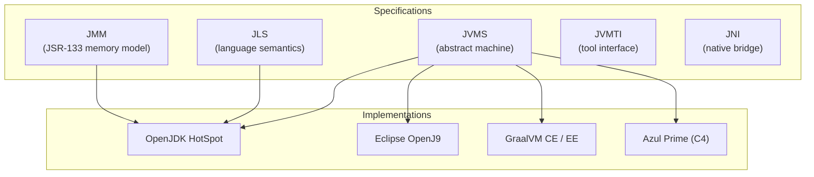

## 3. Five Ws + One H

### What <a class="askgpt-btn" href="https://chatgpt.com/?q=Explain%20'What'%20in%20detail%20with%20concrete%20examples%2C%20the%20main%20trade-offs%2C%20and%20common%20pitfalls%20a%20practitioner%20should%20know." target="_blank" rel="noopener" data-askgpt="What" title="Ask ChatGPT about this section">💬</a>

A **stack-based, automatically memory-managed, JIT-compiling virtual machine** for executing bytecode instructions defined by the JVMS. The "stack-based" qualifier means operands for instructions are pushed and popped from an operand stack rather than loaded into named registers (contrast with Dalvik/ART, which is register-based).

### Why <a class="askgpt-btn" href="https://chatgpt.com/?q=Explain%20'Why'%20in%20detail%20with%20concrete%20examples%2C%20the%20main%20trade-offs%2C%20and%20common%20pitfalls%20a%20practitioner%20should%20know." target="_blank" rel="noopener" data-askgpt="Why" title="Ask ChatGPT about this section">💬</a>

The JVM exists to make a different set of trade-offs than C/C++:

- **Portability** — bytecode is the ISA; the same `.class` runs on x86 Linux, ARM macOS, s390x z/OS, RISC-V, and others.
- **Safety** — array bounds checks, type checks at link time (the verifier), and automatic memory management eliminate the dominant sources of memory-safety CVEs.
- **Late binding** — linking happens at class load, not compile time, enabling dynamic features (reflection, proxies, hot reload, modules).
- **Runtime optimization** — a JIT compiler sees real branch profiles and allocation patterns of running code and can produce better machine code than a static compiler that must speculate.

### When <a class="askgpt-btn" href="https://chatgpt.com/?q=Explain%20'When'%20in%20detail%20with%20concrete%20examples%2C%20the%20main%20trade-offs%2C%20and%20common%20pitfalls%20a%20practitioner%20should%20know." target="_blank" rel="noopener" data-askgpt="When" title="Ask ChatGPT about this section">💬</a>

The JVM has been continuously relevant since 1996 and remains the runtime for one of the world's largest ecosystems (server-side Java, Android via ART which inherited HotSpot concepts, Big Data via Hadoop/Spark/Flink, financial systems, game servers).

### Where <a class="askgpt-btn" href="https://chatgpt.com/?q=Explain%20'Where'%20in%20detail%20with%20concrete%20examples%2C%20the%20main%20trade-offs%2C%20and%20common%20pitfalls%20a%20practitioner%20should%20know." target="_blank" rel="noopener" data-askgpt="Where" title="Ask ChatGPT about this section">💬</a>

Server fleets (Linux/x86, Linux/AArch64), container orchestration (Kubernetes), desktop (rare), embedded (limited), mobile via Android Runtime (separate implementation but derived from HotSpot's lineage).

### Who <a class="askgpt-btn" href="https://chatgpt.com/?q=Explain%20'Who'%20in%20detail%20with%20concrete%20examples%2C%20the%20main%20trade-offs%2C%20and%20common%20pitfalls%20a%20practitioner%20should%20know." target="_blank" rel="noopener" data-askgpt="Who" title="Ask ChatGPT about this section">💬</a>

- **Original creator:** Sun Microsystems (1995–2010).
- **Current steward:** Oracle, under a GPLv2+CE license via OpenJDK.
- **Major contributors to OpenJDK:** Red Hat (Shenandoah, AArch64 ports), Microsoft (Windows/AArch64), Google (AArch64, Hermetic builds), Amazon (Corretto, AArch64 optimizations), Azul (C4 → ZGC lineage), SAP, BellSoft, Alibaba (Dragonwell), Tencent, Huawei, IBM (OpenJ9 lineage, J9).

### How (one-paragraph preview) <a class="askgpt-btn" href="https://chatgpt.com/?q=Explain%20'How%20(one-paragraph%20preview)'%20in%20detail%20with%20concrete%20examples%2C%20the%20main%20trade-offs%2C%20and%20common%20pitfalls%20a%20practitioner%20should%20know." target="_blank" rel="noopener" data-askgpt="How (one-paragraph preview)" title="Ask ChatGPT about this section">💬</a>

Source files compile with `javac` to `.class` files containing bytecode. At runtime, the JVM loads classes via a hierarchical classloader (bootstrap → platform → application), verifies them (verifier checks type safety), initializes them (running static initializers), and then executes them. Initially the interpreter runs the bytecode. HotSpot profiles each method's invocation and back-edge counts; when thresholds are crossed, the JIT compiler (C1, then C2 in tiered mode) compiles the method to native code. The garbage collector runs concurrently with mutator threads (mostly) and reclaims unreachable objects. Threads cooperatively reach safepoints before the GC can perform operations that require a consistent heap view.

## 4. History

The history of the JVM is a history of three overlapping narratives: the language's evolution, the virtual machine's technical evolution, and the governance evolution around Java's openness.

### 4.1 Origins (1991–1996) <a class="askgpt-btn" href="https://chatgpt.com/?q=Explain%20'4.1%20Origins%20(1991%E2%80%931996)'%20in%20detail%20with%20concrete%20examples%2C%20the%20main%20trade-offs%2C%20and%20common%20pitfalls%20a%20practitioner%20should%20know." target="_blank" rel="noopener" data-askgpt="4.1 Origins (1991–1996)" title="Ask ChatGPT about this section">💬</a>

- **1991** — James Gosling, Mike Sheridan, and Patrick Naughton begin the "Green Project" at Sun Microsystems, originally targeting interactive TV. The language is initially called **Oak**.
- **1993** — The team pivots to the World Wide Web after Mosaic's release. They build a browser ("WebRunner", later HotJava) that can run Oak applets.
- **1995** — Renamed to **Java** (trademark dispute forced the rename; "Java" references Indonesian coffee). Released with Netscape Navigator 2.0.
- **January 23, 1996** — Java 1.0 ships with the JVM written in C. The interpreter is the only execution path; no JIT.

### 4.2 The HotSpot era (1997–2010) <a class="askgpt-btn" href="https://chatgpt.com/?q=Explain%20'4.2%20The%20HotSpot%20era%20(1997%E2%80%932010)'%20in%20detail%20with%20concrete%20examples%2C%20the%20main%20trade-offs%2C%20and%20common%20pitfalls%20a%20practitioner%20should%20know." target="_blank" rel="noopener" data-askgpt="4.2 The HotSpot era (1997–2010)" title="Ask ChatGPT about this section">💬</a>

- **1997** — Sun acquires **Animorphic Systems**, a small company that had built a high-performance Self VM with adaptive optimization. Animorphic's founders — Gilad Bracha, David Griswold, Lars Bak, and others — join Sun.
- **1998** — Java 1.2 ships with **HotSpot 1.0** as the default VM (replacing the older "Classic" VM). Key features: exact GC, generational collectors, the **JIT compiler** with method-/thread-local compilation queues. This is the inflection point where Java performance crossed the threshold of being production-viable for server workloads.
- **2000** — Java 1.3 ships HotSpot 3.0; **HotSpot Server** and **HotSpot Client** become distinct builds (with C1 in client, C2 in server).
- **2002** — Java 1.4 ships; **JNI 1.4**, `assert`, regular expressions, NIO (`java.nio` channels, the New I/O API).
- **2004** — Java 5 (1.5) ships generics, annotations, enums, autoboxing, varargs, the `java.util.concurrent` package (Doug Lea's JSR-166). The Java Memory Model is officially formalized as **JSR-133** in 2005.

### 4.3 The CMS era and the rise of tuning culture (2006–2014) <a class="askgpt-btn" href="https://chatgpt.com/?q=Explain%20'4.3%20The%20CMS%20era%20and%20the%20rise%20of%20tuning%20culture%20(2006%E2%80%932014)'%20in%20detail%20with%20concrete%20examples%2C%20the%20main%20trade-offs%2C%20and%20common%20pitfalls%20a%20practitioner%20should%20know." target="_blank" rel="noopener" data-askgpt="4.3 The CMS era and the rise of tuning culture (2006–2014)" title="Ask ChatGPT about this section">💬</a>

- **2006** — Sun announces the **OpenJDK** project (GPLv2 + Classpath Exception) and publishes the HotSpot source.
- **2008** — Java 6 ships with **G1** as an experimental collector (JEP 0; integrated as `-XX:+UseG1GC`, made default in 9).
- **2009** — Oracle announces the acquisition of Sun Microsystems.
- **2010** — Acquisition closes. JVM governance begins to centralize under Oracle. CMS remains the "default" collector for many enterprises through this era; the tuning culture around `PermSize`, `MaxPermSize`, and CMS init/dormancy flags becomes folklore.
- **2011** — Java 7 ships with G1 promoted out of experimental (JEP 144 in 7u4, 2012) and `invokedynamic` (JEP 292).

### 4.4 The modular, post-Oracle era (2014–2021) <a class="askgpt-btn" href="https://chatgpt.com/?q=Explain%20'4.4%20The%20modular%2C%20post-Oracle%20era%20(2014%E2%80%932021)'%20in%20detail%20with%20concrete%20examples%2C%20the%20main%20trade-offs%2C%20and%20common%20pitfalls%20a%20practitioner%20should%20know." target="_blank" rel="noopener" data-askgpt="4.4 The modular, post-Oracle era (2014–2021)" title="Ask ChatGPT about this section">💬</a>

- **2014** — Java 8 ships. Lambdas (JEP 126), default methods, the Stream API, `java.time`, Metaspace (replacing PermGen, JEP 122), and the Nashorn JavaScript engine. Java 8 becomes the de facto baseline of enterprise Java for the next decade.
- **2017** — Java 9 ships the **module system** (JEP 261), G1 as default (JEP 248), and jshell (JEP 222). `sun.misc.Unsafe` remains accessible via the `--add-opens` mechanism.
- **2018** — Java 10 (March), Java 11 LTS (September). Java 11 introduces **Epsilon** no-op GC (JEP 318) and **ZGC** experimental (JEP 333). The six-month release cadence begins (JEP 322).
- **2019** — Java 12 (March): **Shenandoah** experimental (JEP 189). Java 13 (September): dynamic CDS archives.
- **2020** — Java 14 (March): **CMS removed** (JEP 363). Java 15 (September): **ZGC productive** (JEP 377) and **Shenandoah productive** (JEP 379). Records (final, JEP 395).
- **2021** — Java 16 (March): strong encapsulation of JDK internals by default (JEP 396). Java 17 LTS (September): SecurityManager deprecated for removal (JEP 411); FFM API incubator (JEP 424 in 17, final in 22).

### 4.5 The Loom era (2022–2026) <a class="askgpt-btn" href="https://chatgpt.com/?q=Explain%20'4.5%20The%20Loom%20era%20(2022%E2%80%932026)'%20in%20detail%20with%20concrete%20examples%2C%20the%20main%20trade-offs%2C%20and%20common%20pitfalls%20a%20practitioner%20should%20know." target="_blank" rel="noopener" data-askgpt="4.5 The Loom era (2022–2026)" title="Ask ChatGPT about this section">💬</a>

- **2022** — Java 18 (March), Java 19 (September): **virtual threads preview** (JEP 425), **structured concurrency** incubator (JEP 428).
- **2023** — Java 20 (March): virtual threads second preview. Java 21 LTS (September): **virtual threads final** (JEP 444), **generational ZGC** (JEP 439), sequenced collections (JEP 431), scoped values incubator (JEP 429).
- **2024** — Java 22 (March): FFM API final (JEP 454). Java 23 (September): Generational ZGC default (JEP 471), class-file API preview (JEP 466).
- **2025** — Java 24 (March): virtual-thread `synchronized` desyncs (JEP 491 — fixes `synchronized` pinning). Java 25 (September): scoped values final (JEP 506), structured concurrency fifth preview.

### 4.6 Governance timeline <a class="askgpt-btn" href="https://chatgpt.com/?q=Explain%20'4.6%20Governance%20timeline'%20in%20detail%20with%20concrete%20examples%2C%20the%20main%20trade-offs%2C%20and%20common%20pitfalls%20a%20practitioner%20should%20know." target="_blank" rel="noopener" data-askgpt="4.6 Governance timeline" title="Ask ChatGPT about this section">💬</a>

- **1996–2010** — Single-vendor (Sun, then Oracle).
- **2006** — OpenJDK founded. Source code publicly available but governance still single-vendor.
- **2017** — JCP EC vote ratifies the new "Java EE → Eclipse Foundation" model. JSR process continues for some specs.
- **2018** — OpenJDK becomes effectively multi-vendor; several vendors maintain their own OpenJDK builds.
- **2019–2026** — The **JEP process** (rather than JSR) becomes the primary mechanism for language and VM changes. TCK license restrictions are relaxed via the OpenJDK Community TCK License Agreement.

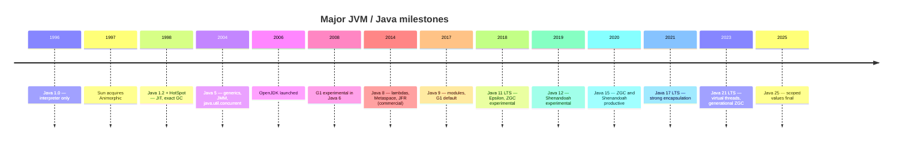

### 4.7 Garbage collector lineage at a glance <a class="askgpt-btn" href="https://chatgpt.com/?q=Explain%20'4.7%20Garbage%20collector%20lineage%20at%20a%20glance'%20in%20detail%20with%20concrete%20examples%2C%20the%20main%20trade-offs%2C%20and%20common%20pitfalls%20a%20practitioner%20should%20know." target="_blank" rel="noopener" data-askgpt="4.7 Garbage collector lineage at a glance" title="Ask ChatGPT about this section">💬</a>

| Collector | Era | Concurrent? | Generational? | Default in | Status today |
|-----------|-----|-------------|---------------|-----------|--------------|
| Serial | 1.0+ | No | Yes (early) | Default Java 1.0–1.3 | Productive, niche use |
| Parallel / Throughput | 1.4+ | No | Yes | Java 1.4–1.7 (server) | Productive, batch workloads |
| CMS | 1.4.1+ | Mostly | Yes | Java 1.4–8 (many enterprises) | **Removed in 14 (JEP 363)** |
| G1 | 6u14+ | Mostly | Yes (logical) | Java 9+ default | Productive, default through 17 |
| Epsilon | 11+ | N/A (no-op) | No | — | Productive, ultra-short-lived JVMs |
| ZGC (single-gen) | 11+ | Fully concurrent | No | — | Replaced by Generational ZGC in 23 |
| ZGC (generational) | 21+ | Fully concurrent | Yes | Java 23+ (JEP 471) | Productive, default future |
| Shenandoah | 12+ | Fully concurrent | No (single-gen only) | — | Productive, Red Hat lead |

## 5. Problem Statement

Before Java, the dominant languages for application development were C and C++. Their strengths — manual control over memory layout, predictable performance, direct hardware access — were also the source of their weaknesses.

**The problems of pre-Java application development:**

1. **Memory safety.** Manual `malloc`/`free` introduced use-after-free, double-free, and leak bugs that were the dominant source of CVEs in C/C++ programs. Buffer overflows (Heartbleed, 2014; many others) were existential risks.
2. **Platform lock-in.** A C++ binary compiled for x86 Linux could not run on ARM macOS. Cross-platform applications required either source distribution (with platform-specific build instructions) or multiple compiled binaries.
3. **Late binding was impossible.** A C++ binary's symbol table was fixed at link time. Loading a new module required OS-level dynamic linking (`dlopen`) and could not be done with type safety.
4. **Optimization was static.** A C++ compiler had to guess at branch probabilities and code hotness. Real workload behavior was inaccessible.
5. **Distributed systems engineering was bespoke.** No standard "thread, GC, JIT" stack for servers.

**Why a VM solves this:**

- **Memory safety** — the JVM verifier checks type safety at link time; the GC eliminates manual free; array bounds checks eliminate buffer overflows.
- **Portability** — bytecode is the ISA; the same `.class` runs on any conformant JVM.
- **Late binding** — classloaders resolve symbolic references at load time; reflection and dynamic proxies work.
- **Profile-guided optimization** — the JIT sees real branch data and can recompile with better guesses.
- **Standardized concurrency** — `java.lang.Thread`, `java.util.concurrent`, and (now) virtual threads give a portable threading model.

**Alternatives that existed:**

| Alternative | Year | Why insufficient |
|-------------|------|------------------|
| C/C++ | Pre-1996 | The problem itself |
| Smalltalk VM | 1980s | Performance; no mainstream language ecosystem |
| Self VM | 1990s | Research-only; this is what Animorphic built |
| Oberon system | 1987 | Single-machine; not portable |
| Tcl | 1988 | No static typing; performance |
| Perl/Python | Late 1980s/early 1990s | Performance; weak typing for systems work |
| Microsoft .NET CLR | 2000 | Came after; borrowed heavily from JVM concepts |

**Why C/C++ were insufficient for the target workload:** Java was aimed at embedded systems (the Green Project's original purpose) and then at the web. Both required safety guarantees that C/C++ could not provide without sacrificing the cross-platform story. The HotSpot acquisition in 1997 added the missing piece: a JIT that could deliver C++-class performance for hot code while keeping the safety story.

## 6. Real-World Motivation

Why does the JVM internals matter today? Because production deployments of JVM-based systems exceed other runtimes in scale and economic value.

### 6.1 Hyperscaler fleets <a class="askgpt-btn" href="https://chatgpt.com/?q=Explain%20'6.1%20Hyperscaler%20fleets'%20in%20detail%20with%20concrete%20examples%2C%20the%20main%20trade-offs%2C%20and%20common%20pitfalls%20a%20practitioner%20should%20know." target="_blank" rel="noopener" data-askgpt="6.1 Hyperscaler fleets" title="Ask ChatGPT about this section">💬</a>

**Meta** operates one of the world's largest JVM fleets. They are the most prominent public case study for ZGC adoption at scale, having moved significant portions of their services from G1 to ZGC for predictable p99 latency. Their engineering teams have presented on the operational tooling required (custom GC log analysis, JFR pipelines, fleet-wide regression detection).

**Netflix** publicly migrated a major workload from G1 to ZGC to control tail latencies, documented in their tech blog ("Bending pause times to your will with Generational ZGC", 2024) and conference talks. The migration was driven by SLO pressure on p99.99 latency, where G1's worst-case pauses exceeded their budget.

**Amazon** runs JVMs at scale across AWS (services like Lambda, S3, DynamoDB accelerator code) and is the maintainer of **Corretto**, an OpenJDK distribution with backports and AArch64 optimizations.

**Twitter** (now X) ran famously large JVM fleets in the early 2010s. Their engineering blog ("How Twitter Improved JVM Performance by Reducing GC and Fast Object Allocation") drove industry-wide adoption of techniques like object pooling (since deprecated as a JVM anti-pattern), reducing allocation rate, and CMS tuning. Modern X engineering continues to operate JVM-based services at very large scale.

### 6.2 Financial services <a class="askgpt-btn" href="https://chatgpt.com/?q=Explain%20'6.2%20Financial%20services'%20in%20detail%20with%20concrete%20examples%2C%20the%20main%20trade-offs%2C%20and%20common%20pitfalls%20a%20practitioner%20should%20know." target="_blank" rel="noopener" data-askgpt="6.2 Financial services" title="Ask ChatGPT about this section">💬</a>

**High-frequency trading** firms (LMAX, Jane Street, Jump Trading, optiver, and many others) run JVM-based order routers and risk systems with microsecond-scale latency budgets. They rely on JIT compilation to deliver C++-comparable performance for hot paths, with the JMM's predictable memory ordering as a baseline. Chronicle (the trading-focused OSS library) documents many JVM-specific latency techniques.

**Banks** — large retail banks run JVM-based core banking systems (often mainframe-adjacent via z/OS plus OpenJDK port), trading platforms, and risk systems. The cost of GC pauses in a trading context is measurable in missed opportunities.

### 6.3 Game servers and real-time systems <a class="askgpt-btn" href="https://chatgpt.com/?q=Explain%20'6.3%20Game%20servers%20and%20real-time%20systems'%20in%20detail%20with%20concrete%20examples%2C%20the%20main%20trade-offs%2C%20and%20common%20pitfalls%20a%20practitioner%20should%20know." target="_blank" rel="noopener" data-askgpt="6.3 Game servers and real-time systems" title="Ask ChatGPT about this section">💬</a>

**Minecraft**'s server (and many third-party game server frameworks like Netty, Vert.x-based stacks) require low-pause GC for smooth player experience. Shenandoah and ZGC are popular here because pauses that exceed 50ms cause visible lag.

**Roblox**, **Discord**, and many other real-time multiplayer systems run JVM-based services with strict latency budgets.

### 6.4 Big data and analytics <a class="askgpt-btn" href="https://chatgpt.com/?q=Explain%20'6.4%20Big%20data%20and%20analytics'%20in%20detail%20with%20concrete%20examples%2C%20the%20main%20trade-offs%2C%20and%20common%20pitfalls%20a%20practitioner%20should%20know." target="_blank" rel="noopener" data-askgpt="6.4 Big data and analytics" title="Ask ChatGPT about this section">💬</a>

Hadoop, Spark, Flink, Kafka, Cassandra, Elasticsearch, and the entire Apache Bigtop ecosystem run on the JVM. These systems care about throughput more than tail latency, so **Parallel GC** remains relevant for batch workloads despite G1's default status. Off-heap memory (Netty `ByteBuf`, Chronicle, MapDB) is heavily used to avoid GC pressure.

### 6.5 Economic motivation <a class="askgpt-btn" href="https://chatgpt.com/?q=Explain%20'6.5%20Economic%20motivation'%20in%20detail%20with%20concrete%20examples%2C%20the%20main%20trade-offs%2C%20and%20common%20pitfalls%20a%20practitioner%20should%20know." target="_blank" rel="noopener" data-askgpt="6.5 Economic motivation" title="Ask ChatGPT about this section">💬</a>

- **Server efficiency.** A 10% improvement in memory efficiency across a 50,000-instance fleet is millions of dollars per year in compute cost.
- **Latency SLOs.** A p99.9 GC pause over 100ms can cause user-visible outages and contractually-bound SLO failures.
- **Developer velocity.** The JVM's tooling (JFR, JMX, async-profiler, Mission Control, IDE debuggers) lets teams resolve production issues in minutes rather than days.

### 6.6 Why not a different runtime? <a class="askgpt-btn" href="https://chatgpt.com/?q=Explain%20'6.6%20Why%20not%20a%20different%20runtime%3F'%20in%20detail%20with%20concrete%20examples%2C%20the%20main%20trade-offs%2C%20and%20common%20pitfalls%20a%20practitioner%20should%20know." target="_blank" rel="noopener" data-askgpt="6.6 Why not a different runtime?" title="Ask ChatGPT about this section">💬</a>

| Runtime | Why enterprises don't migrate wholesale |
|---------|-----------------------------------------|
| Go | GC pauses; weaker runtime optimization story for some workloads; smaller ecosystem for certain enterprise stacks |
| Rust | Memory-safe, but lacks the JVM's mature runtime optimization and tooling for many existing enterprise workloads |
| Node.js | Single-threaded event loop doesn't fit CPU-heavy server work; GC pauses |
| .NET CLR | Performance comparable in many workloads; JVM ecosystem depth (big data, banking integrations) often wins |
| Native compilation (GraalVM Native Image) | Trades peak performance for startup; loses JIT optimization opportunity for hot paths |

The JVM's value proposition in 2026 — predictable low-pause GC, virtual threads for high-concurrency I/O work, mature tooling, and a vast ecosystem — is durable. The introduction of **virtual threads** (JEP 444) specifically addressed one of the few remaining complaints about the JVM's threading model, making the runtime competitive with Go's goroutines and Erlang's processes for I/O-bound workloads.

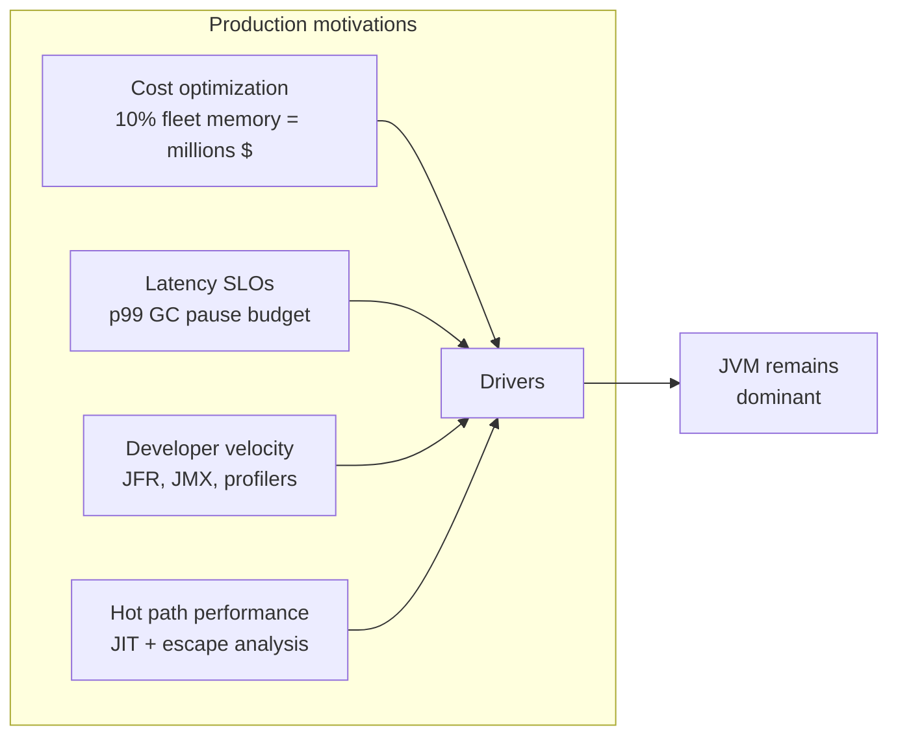

---

## 7. Internal Working

This section provides the high-level flow: what happens between `java Main` and the program's normal execution, and what subsystems are involved.

### 7.1 The lifecycle of a Java program <a class="askgpt-btn" href="https://chatgpt.com/?q=Explain%20'7.1%20The%20lifecycle%20of%20a%20Java%20program'%20in%20detail%20with%20concrete%20examples%2C%20the%20main%20trade-offs%2C%20and%20common%20pitfalls%20a%20practitioner%20should%20know." target="_blank" rel="noopener" data-askgpt="7.1 The lifecycle of a Java program" title="Ask ChatGPT about this section">💬</a>

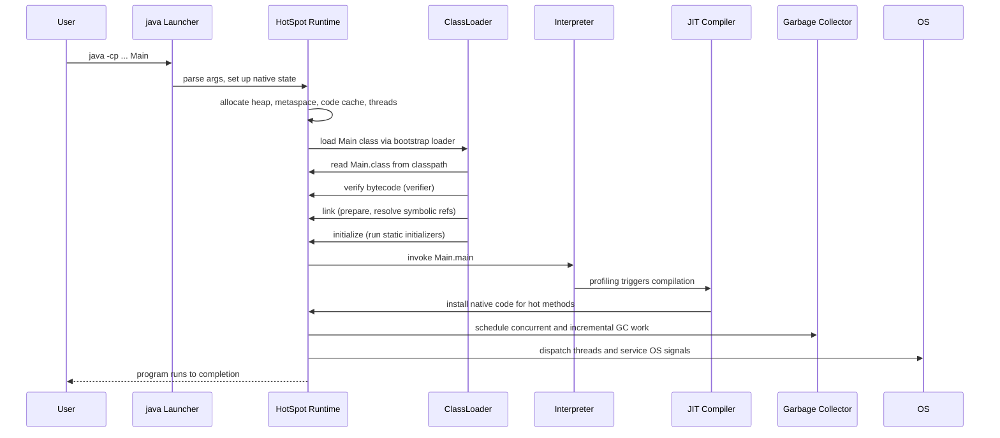

### 7.2 Subsystems that participate <a class="askgpt-btn" href="https://chatgpt.com/?q=Explain%20'7.2%20Subsystems%20that%20participate'%20in%20detail%20with%20concrete%20examples%2C%20the%20main%20trade-offs%2C%20and%20common%20pitfalls%20a%20practitioner%20should%20know." target="_blank" rel="noopener" data-askgpt="7.2 Subsystems that participate" title="Ask ChatGPT about this section">💬</a>

| Subsystem | Responsibility | Key source paths |
|-----------|---------------|-------------------|
| **Launcher** (`java`) | Parse CLI args, set up native environment, load `jvm.dll`/`libjvm.so` | `src/java.base/share/native/launcher/` |
| **Runtime** | Thread management, safepoint coordination, heap allocation, JNI/JVMTI/JMX plumbing | `src/hotspot/share/runtime/` |
| **Class loading** | Bootstrap/platform/application loaders, parent delegation, module layers | `src/hotspot/share/classfile/`, `classfile/` |
| **Verifier** | Type-safety check on bytecode | `src/hotspot/share/verify/` |
| **Interpreter** | Template interpreter dispatching JVM ops | `src/hotspot/share/interpreter/` |
| **C1 compiler** | Quick JIT with simple optimizations | `src/hotspot/share/c1/` |
| **C2 compiler** | Aggressive JIT with escape analysis, loop transforms | `src/hotspot/share/opto/` |
| **Garbage collector** | G1, ZGC, Parallel, Serial, Epsilon, Shenandoah (each its own module) | `src/hotspot/share/gc/`, plus per-collector subdirs |
| **Serviceability** | JFR, JMX, JVMTI, NMT, Serviceability Agent | `src/hotspot/share/services/`, `jfr/` |

### 7.3 From source to executing code <a class="askgpt-btn" href="https://chatgpt.com/?q=Explain%20'7.3%20From%20source%20to%20executing%20code'%20in%20detail%20with%20concrete%20examples%2C%20the%20main%20trade-offs%2C%20and%20common%20pitfalls%20a%20practitioner%20should%20know." target="_blank" rel="noopener" data-askgpt="7.3 From source to executing code" title="Ask ChatGPT about this section">💬</a>

1. **Compile** — `javac` reads `.java` files and emits `.class` files. Each class file has a magic number `0xCAFEBABE`, a constant pool, access flags, the class hierarchy, fields, methods, and attributes.
2. **Load** — `ClassLoader.loadClass(name)` is called. The class is located, read into a byte array, and a `ClassFileParser` produces a C++ `InstanceKlass` object. Linking happens here: preparation (static field allocation, method table), verification (type check), and (optional) resolution of symbolic references.
3. **Initialize** — Static initializers (`<clinit>`) run at this point, in a thread-safe manner (the JVM holds a class initialization lock).
4. **Interpret / JIT** — Methods are first interpreted via the template interpreter. HotSpot installs method-entry and back-edge event counters; when thresholds are crossed, the method is queued for C1, then C2 (in tiered mode).
5. **Execute natively** — Once C2 emits native code, the `Method*` vtable entry is rewritten (with a safepoint check, see §8.6) to point to the compiled code.

## 8. Deep Dive

This section is the heart of the document. Each subsection is a focused, internals-level treatment of a major subsystem.

### 8.1 Bytecode and the class file format <a class="askgpt-btn" href="https://chatgpt.com/?q=Explain%20'8.1%20Bytecode%20and%20the%20class%20file%20format'%20in%20detail%20with%20concrete%20examples%2C%20the%20main%20trade-offs%2C%20and%20common%20pitfalls%20a%20practitioner%20should%20know." target="_blank" rel="noopener" data-askgpt="8.1 Bytecode and the class file format" title="Ask ChatGPT about this section">💬</a>

A Java `.class` file is a precisely-specified binary format defined in JVMS Chapter 4. Its structure:

```
ClassFile {
    u4             magic;          // 0xCAFEBABE
    u2             minor_version;
    u2             major_version;
    u2             constant_pool_count;
    cp_info        constant_pool[constant_pool_count-1];
    u2             access_flags;
    u2             this_class;
    u2             super_class;
    u2             interfaces_count;
    u2             interfaces[interfaces_count];
    u2             fields_count;
    field_info     fields[fields_count];
    u2             methods_count;
    method_info    methods[methods_count];
    u2             attributes_count;
    attribute_info attributes[attributes_count];
}
```

**The constant pool** holds literals, class/method/field symbolic references, method handles, and invokedynamic bootstrap method arguments. Symbolic references are resolved lazily by default and eagerly with `-Xverify:all`.

**Bytecode instruction categories:**

- **Stack manipulation:** `aload`, `astore`, `dup`, `swap`, `pop`.
- **Arithmetic:** `iadd`, `lsub`, `fmul`, `ddiv`, `iinc`.
- **Type conversion:** `i2l`, `f2d`, `checkcast`, `instanceof`.
- **Control flow:** `goto`, `if_icmpeq`, `ifnull`, `tableswitch`, `lookupswitch`.
- **Object access:** `getfield`, `putfield`, `getstatic`, `putstatic`.
- **Method invocation:** `invokevirtual`, `invokespecial`, `invokestatic`, `invokeinterface`, `invokedynamic` (since Java 7).
- **Operand stack management:** `bipush`, `sipush`, `ldc`, `ldc2_w`, `aconst_null`.

**A concrete example.** `javap -c -v Hello.class` on a simple `Hello.java` shows:

```java
public class Hello {
    public static void main(String[] args) {
        System.out.println("Hello, JVM!");
    }
}
```

```text
public static void main(java.lang.String[]);
  Code:
    0: getstatic      #7    // Field java/lang/System.out
    3: ldc            #8    // String "Hello, JVM!"
    5: invokevirtual  #9    // Method java/io/PrintStream.println
    8: return
```

The `getstatic` pushes the value of `System.out` onto the operand stack; `ldc` pushes the string constant; `invokevirtual` dispatches `println`, consuming the receiver and argument.

**Why bytecode matters:**

- It's the ISA — any language targeting the JVM (Kotlin, Scala, Clojure, Groovy, JRuby) emits bytecode.
- It's the verification surface — the verifier proves bytecode is type-safe without running it.
- It enables runtime tooling — `javap`, ASM, BCEL, ByteBuddy all manipulate class files.

### 8.2 The template interpreter <a class="askgpt-btn" href="https://chatgpt.com/?q=Explain%20'8.2%20The%20template%20interpreter'%20in%20detail%20with%20concrete%20examples%2C%20the%20main%20trade-offs%2C%20and%20common%20pitfalls%20a%20practitioner%20should%20know." target="_blank" rel="noopener" data-askgpt="8.2 The template interpreter" title="Ask ChatGPT about this section">💬</a>

HotSpot's interpreter is a **template interpreter**: each bytecode instruction is implemented by a small stub of native code generated at JVM startup from a "template". When dispatching, the interpreter jumps to the stub address from a dispatch table indexed by the bytecode value.


This design avoids the cost of a giant `switch` statement in C++ and lets the interpreter overlap with branch prediction effectively. The stub also emits a "safepoint poll" at regular intervals (more on this in §8.6).

### 8.3 The JIT compilers <a class="askgpt-btn" href="https://chatgpt.com/?q=Explain%20'8.3%20The%20JIT%20compilers'%20in%20detail%20with%20concrete%20examples%2C%20the%20main%20trade-offs%2C%20and%20common%20pitfalls%20a%20practitioner%20should%20know." target="_blank" rel="noopener" data-askgpt="8.3 The JIT compilers" title="Ask ChatGPT about this section">💬</a>

HotSpot has **two JIT compilers** operating at different optimization levels:

- **C1 (Client Compiler)** — fast compilation, simple optimizations (inlining, null check elimination, basic range checks). Used for client-side startup-sensitive code.
- **C2 (Server Compiler)** — slow compilation, aggressive optimizations (escape analysis, loop unrolling, conditional moves, superword optimizations, lock coarsening, intrinsics). Produces near-C++ performance for hot code.

**Tiered compilation** (default since Java 8) interleaves them via a policy in `runtime/compilationPolicy.cpp`:

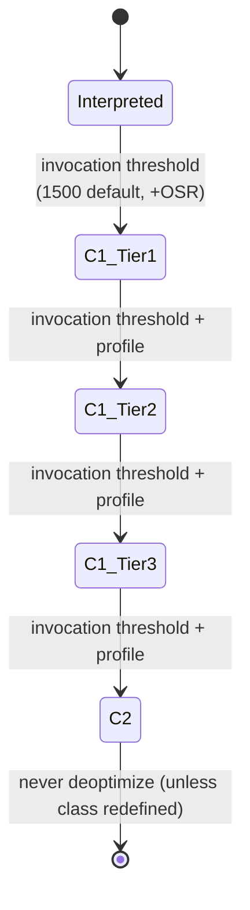

The exact thresholds are tunable via `-XX:CompileThreshold=...`. The C2 tier also subsumes a "C2 nmethod" state.

**Profile data** gathered by C1 and used by C2:

- **Branch probabilities** — `goto`-target probabilities from interpreter counters.
- **Type profiles** — receiver types at `invokevirtual` callsites.
- **Nullness profiles** — whether `getfield` always sees non-null.
- **Array length profiles** — for loop bounds.

**On-stack replacement (OSR):** if a long-running loop becomes hot, the JIT can replace the interpreter frame's execution with C2-compiled code *mid-loop*, transferring the loop variable state.

**Deoptimization:** when C2's speculative assumptions are violated (e.g., a type profile was wrong), the compiled code deoptimizes back to the interpreter. Frames are "unwinded" and execution continues in the interpreter with a "deopt reason" attached.

### 8.4 Escape analysis and scalar Replacement <a class="askgpt-btn" href="https://chatgpt.com/?q=Explain%20'8.4%20Escape%20analysis%20and%20scalar%20Replacement'%20in%20detail%20with%20concrete%20examples%2C%20the%20main%20trade-offs%2C%20and%20common%20pitfalls%20a%20practitioner%20should%20know." target="_blank" rel="noopener" data-askgpt="8.4 Escape analysis and scalar Replacement" title="Ask ChatGPT about this section">💬</a>

C2 performs **escape analysis** on every allocation. An object that does not escape its allocating method (not stored in a field, not returned, not passed to unknown code) can be:

- **Allocated on the stack** instead of the heap.
- **Scalarized** — its fields become individual local variables, eliminating the object entirely.
- **Elided** — if the allocation has no side effects, it can be removed.

This is why short-lived `Point` or `StringBuilder` allocations in hot loops sometimes "disappear" from allocation profilers — they've been replaced by scalars.

### 8.5 Garbage collection — the algorithm taxonomy <a class="askgpt-btn" href="https://chatgpt.com/?q=Explain%20'8.5%20Garbage%20collection%20%E2%80%94%20the%20algorithm%20taxonomy'%20in%20detail%20with%20concrete%20examples%2C%20the%20main%20trade-offs%2C%20and%20common%20pitfalls%20a%20practitioner%20should%20know." target="_blank" rel="noopener" data-askgpt="8.5 Garbage collection — the algorithm taxonomy" title="Ask ChatGPT about this section">💬</a>

| Family | Algorithm | Notes |
|--------|-----------|-------|
| **Reference counting** | - | Not used by HotSpot (cannot collect cycles) |
| **Mark-sweep** | Mark live, sweep dead | Used by Serial/Parallel/CMS old gen |
| **Mark-copy** | Mark live, copy survivors | Used by young-gen in Serial, Parallel, G1 |
| **Mark-compact** | Mark live, slide to remove gaps | Used by Serial/Parallel old gen, G1 mixed/full |
| **Tri-color marking** | Concurrent marking invariant | Used by G1, ZGC, Shenandoah |
| **Train / generational immix** | - | Not in HotSpot |

**Generational hypothesis** — most objects die young. The JVM heap is divided into young (Eden + Survivor) and old generations. Minor collections (young only) are fast and frequent; major collections (young + old) are slower and rare.

**The tri-color invariant** (used in all concurrent collectors):

- **White** — not yet scanned.
- **Gray** — known to be live, but its references not yet scanned.
- **Black** — known to be live, all references scanned.

The invariant is: **no black-to-white reference exists**. This is preserved by **write barriers** (post-write barriers from the mutator, recorded in the card table or remembered set) and **SATB** (snapshot-at-the-beginning, used by G1).

### 8.6 Safepoints <a class="askgpt-btn" href="https://chatgpt.com/?q=Explain%20'8.6%20Safepoints'%20in%20detail%20with%20concrete%20examples%2C%20the%20main%20trade-offs%2C%20and%20common%20pitfalls%20a%20practitioner%20should%20know." target="_blank" rel="noopener" data-askgpt="8.6 Safepoints" title="Ask ChatGPT about this section">💬</a>

A **safepoint** is a point in program execution where the JVM can safely assume all threads' roots are well-defined and the heap is in a consistent state for operations like GC, deoptimization, or class redefinition.

**Where safepoints occur:**

- Between bytecode instructions (the interpreter emits a safepoint poll in its dispatch loop).
- At "safepoint polls" compiled into JIT code, typically at method entries, back-edges (loop headers), and after certain operations.
- At thread state transitions (park, sleep, monitor wait/notify, JNI calls back into Java).

**Where they do NOT occur:**

- Inside native code (JNI). A thread in a `System.loadLibrary` call is not at a safepoint until it returns to Java.
- Inside long-running CPU loops without back-edges. This is the source of "safepoint-induced pause" latency — a thread in a tight numeric loop with no back-edge poll can hold up a stop-the-world operation.

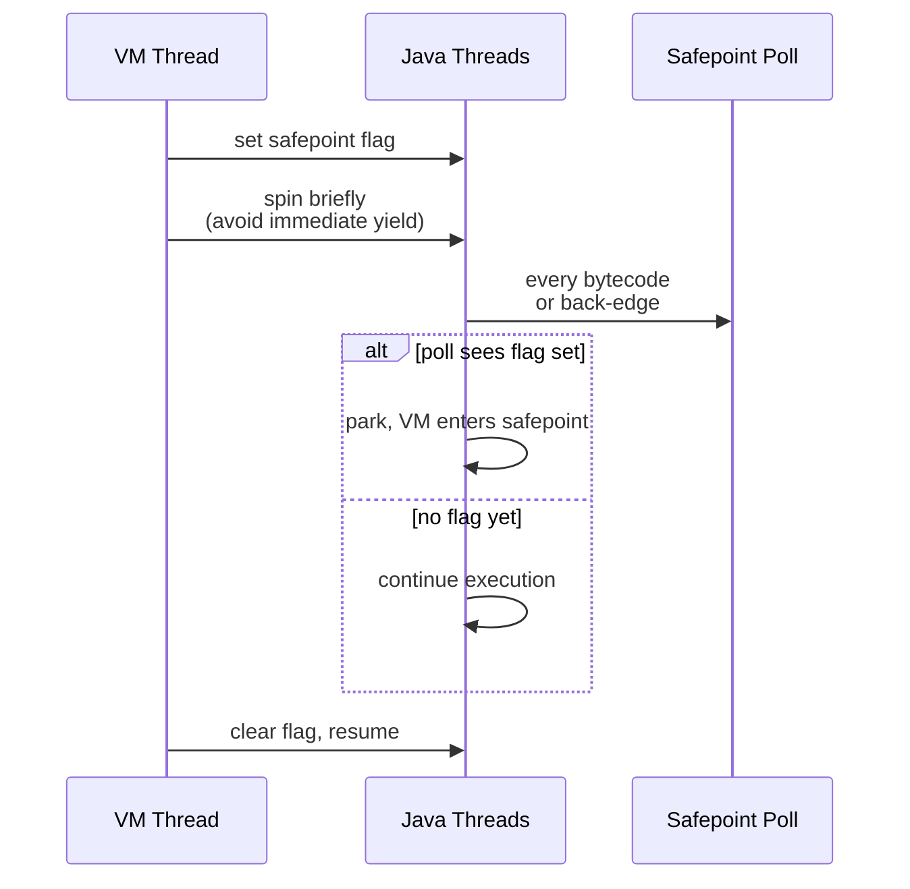

**How to identify safepoint pauses:**

- JFR `jdk.SafepointBegin` / `jdk.SafepointEnd` events.
- `+PrintSafepointStatistics` (developer build only).
- `-Xlog:safepoint*=debug` prints per-safepoint timings.

### 8.7 Classloading <a class="askgpt-btn" href="https://chatgpt.com/?q=Explain%20'8.7%20Classloading'%20in%20detail%20with%20concrete%20examples%2C%20the%20main%20trade-offs%2C%20and%20common%20pitfalls%20a%20practitioner%20should%20know." target="_blank" rel="noopener" data-askgpt="8.7 Classloading" title="Ask ChatGPT about this section">💬</a>

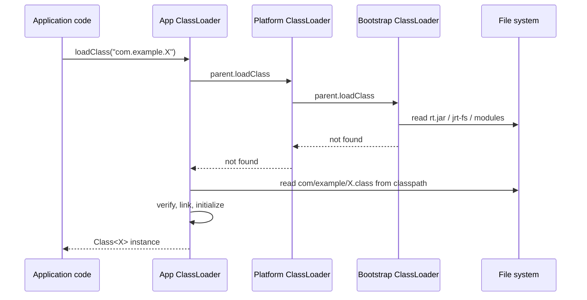

**Three loaders (Java 9+):**

- **Bootstrap** — loads `java.base`, `java.lang`, etc., from the runtime image. Implemented in native code; `null` when accessed via `getClassLoader()`.
- **Platform** — loads `java.sql`, `java.xml`, etc. (the "extension" mechanism's successor).
- **Application** — loads classes from the classpath.

**Module layers** (Java 9+) add a fourth dimension: a `ModuleLayer` configures which modules are visible and how they resolve. This replaced the old `-Xbootclasspath/p:` mechanism.

**Linking:**

- **Verification** — proves type safety (no invalid casts, no stack underflow, no illegal access). `-Xverify:all` enables full verification (also runs at runtime for dynamic class loading).
- **Preparation** — allocates static fields, computes method tables.
- **Resolution** — symbolic references to classes, fields, methods are replaced with direct references. Can be lazy (`invokedynamic` and `invokevirtual` resolve on first use) or eager.

### 8.8 The Java Memory Model <a class="askgpt-btn" href="https://chatgpt.com/?q=Explain%20'8.8%20The%20Java%20Memory%20Model'%20in%20detail%20with%20concrete%20examples%2C%20the%20main%20trade-offs%2C%20and%20common%20pitfalls%20a%20practitioner%20should%20know." target="_blank" rel="noopener" data-askgpt="8.8 The Java Memory Model" title="Ask ChatGPT about this section">💬</a>

The **JMM** (JSR-133, 2005) defines when writes to memory by one thread are visible to another.

**Happens-before relationships:**

- A program order: actions in a single thread are in program order.
- Monitor lock: unlock happens-before subsequent lock on the same monitor.
- Volatile: write happens-before subsequent read of the same volatile.
- Thread start: `Thread.start()` happens-before the new thread's first action.
- Thread termination: any action in a thread happens-before another thread observes `Thread.join()` return.
- Transitivity: if A happens-before B and B happens-before C, then A happens-before C.

**Volatile semantics:** reads see the most recent write; writes are visible to all threads at the same time. On x86 this is mostly free (the cache coherence protocol handles it); on ARM/AArch64 this requires an `fence` instruction.

**Final fields:** properly constructed final fields are guaranteed visible to other threads without synchronization (this is the basis for the safe-publication idiom).

**Common misconception:** `volatile` is not "synchronized for one variable"; it provides visibility + ordering, but not atomicity for compound actions like `count++` (which requires `AtomicInteger`).

### 8.9 `invokedynamic` <a class="askgpt-btn" href="https://chatgpt.com/?q=Explain%20'8.9%20%60invokedynamic%60'%20in%20detail%20with%20concrete%20examples%2C%20the%20main%20trade-offs%2C%20and%20common%20pitfalls%20a%20practitioner%20should%20know." target="_blank" rel="noopener" data-askgpt="8.9 `invokedynamic`" title="Ask ChatGPT about this section">💬</a>

`invokedynamic` (JEP 159, Java 7) is the JVM instruction that enables language implementers to define custom dispatch logic. Before `invokedynamic`, languages targeting the JVM had to encode dynamic dispatch as reflection (slow) or class explosion (Kotlin's `FunctionN` adapters).

**Bootstrap method:** when the JVM first encounters an `invokedynamic` call site, it calls the **bootstrap method** declared in the class file's `BootstrapMethods` attribute. The bootstrap returns a `CallSite` object whose `getTarget()` returns the `MethodHandle` to invoke. The CallSite can be "rebindable" — its target can change at runtime, with the JVM patching the call site.

**Lambda metafactory:** Java lambdas are compiled to `invokedynamic` calls. The bootstrap method (`LambdaMetafactory.metafactory`) creates a class implementing the functional interface, instantiates it, and returns a CallSite pointing to the SAM method. This avoids the historical "anonymous inner class per lambda" explosion.

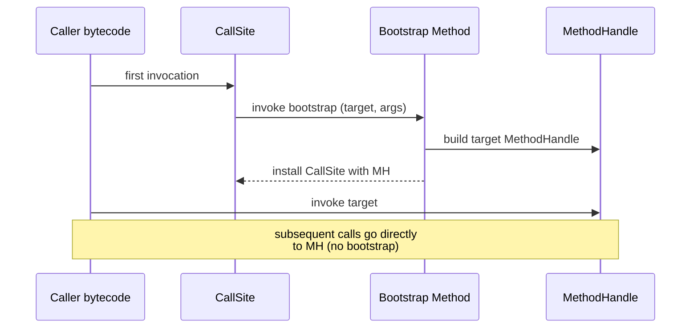

### 8.10 Virtual threads (Project Loom) <a class="askgpt-btn" href="https://chatgpt.com/?q=Explain%20'8.10%20Virtual%20threads%20(Project%20Loom)'%20in%20detail%20with%20concrete%20examples%2C%20the%20main%20trade-offs%2C%20and%20common%20pitfalls%20a%20practitioner%20should%20know." target="_blank" rel="noopener" data-askgpt="8.10 Virtual threads (Project Loom)" title="Ask ChatGPT about this section">💬</a>

**Virtual threads** (JEP 444, Java 21) are lightweight threads managed by the JVM, scheduled onto a pool of OS **carrier threads**. They are designed for I/O-bound workloads with millions of concurrent threads.

**M:N scheduling:**

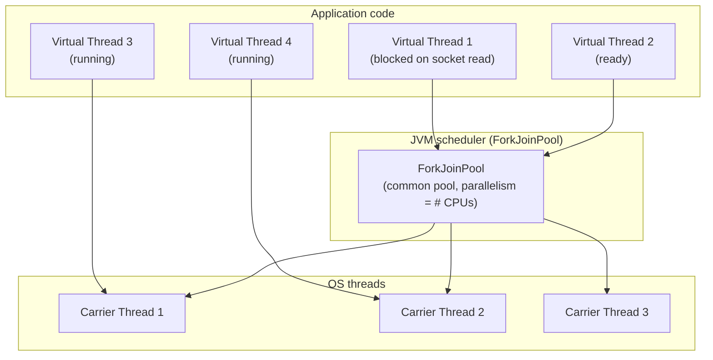

**Continuation mechanics:** a virtual thread is a `Continuation` with its own stack. When the thread blocks on I/O, the runtime parks the continuation, releasing the carrier. When the I/O completes, the runtime re-mounts the continuation onto an available carrier.

**Pinning:** the original virtual-thread implementation pinned the carrier thread when a virtual thread held a monitor (`synchronized`) or called into JNI. JEP 491 (Java 24) fixed the `synchronized` case. JNI pinning remains an edge case to watch for.

**Why this matters:**

- A server can now handle **millions** of concurrent connections with simple thread-per-request code.
- Throughput for I/O-bound workloads scales with CPU count, not with thread-stack memory.
- Code written for the blocking `java.net` / `java.nio` APIs benefits without rewriting as reactive code.

### 8.11 Memory layout <a class="askgpt-btn" href="https://chatgpt.com/?q=Explain%20'8.11%20Memory%20layout'%20in%20detail%20with%20concrete%20examples%2C%20the%20main%20trade-offs%2C%20and%20common%20pitfalls%20a%20practitioner%20should%20know." target="_blank" rel="noopener" data-askgpt="8.11 Memory layout" title="Ask ChatGPT about this section">💬</a>

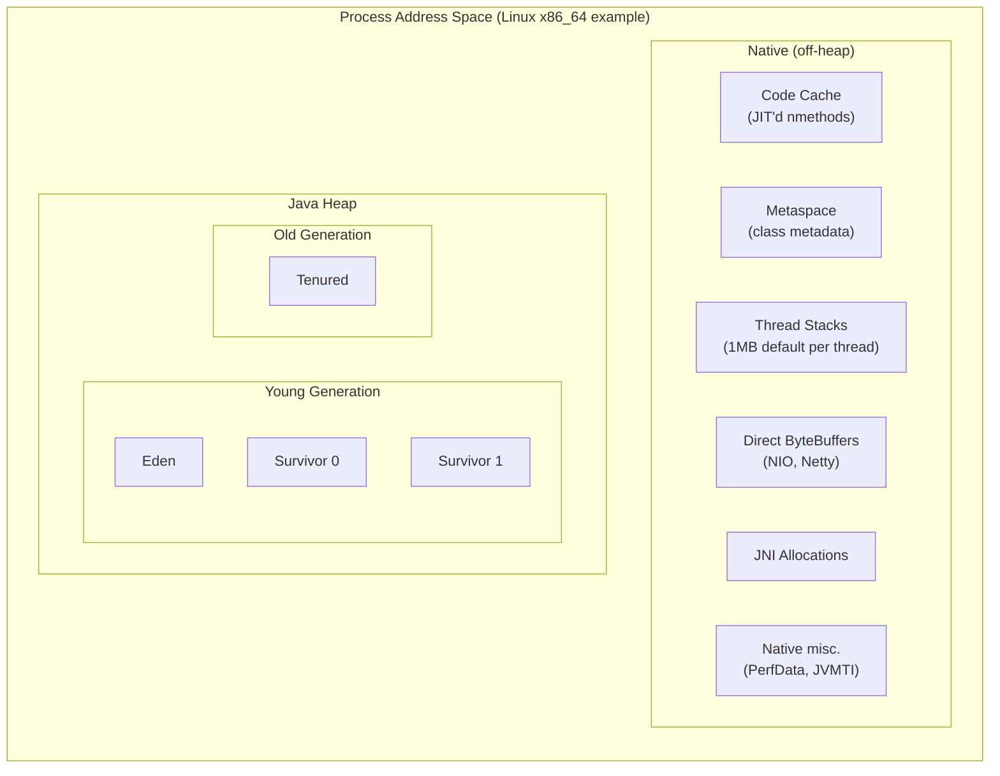

**Heap regions.** The young generation is the destination of most allocations. Eden fills; when a minor GC runs, live objects are copied to a Survivor space; objects that survive enough rounds (default 15, controlled by `-XX:MaxTenuringThreshold`) are promoted to Old.

**TLAB (Thread-Local Allocation Buffer).** Each Java thread has a small private allocation region inside Eden. Allocating an object means bumping a pointer (`tlab_top += size`), avoiding synchronization on the global allocation lock. When the TLAB is exhausted, the thread requests a new TLAB from the global allocator (or, in rare cases, allocates directly on the slow path).

**Metaspace.** Replaced PermGen in Java 8. Stores class metadata (`Klass` structures, method metadata, constant pool, annotations). Resizes dynamically; can be bounded with `-XX:MaxMetaspaceSize`. Native memory, not heap.

**Code cache.** JIT-compiled native code lives in a separate native memory region (the "code cache"). Default sizes are tier-dependent; `-XX:ReservedCodeCacheSize` sets the cap. If exhausted, HotSpot disables tiered compilation or fails JIT — a serious production issue.

**Compressed oops.** Since Java 6u23, on 64-bit JVMs, ordinary object pointers ("ordinary object pointers", oops) are stored as 32-bit offsets into a "narrow oop" base, allowing 4-byte pointers instead of 8-byte while still addressing up to ~32 GB of heap (`-XX:ObjectAlignmentInBytes` controls the granularity; default 8 bytes, so 32 GB max for compressed oops). Above ~32 GB, oops widen to 8 bytes (small overhead increase).

**Compressed class pointers.** Similar trick for `Klass*` pointers; caps the size of the class metadata region.

### 8.12 Locking <a class="askgpt-btn" href="https://chatgpt.com/?q=Explain%20'8.12%20Locking'%20in%20detail%20with%20concrete%20examples%2C%20the%20main%20trade-offs%2C%20and%20common%20pitfalls%20a%20practitioner%20should%20know." target="_blank" rel="noopener" data-askgpt="8.12 Locking" title="Ask ChatGPT about this section">💬</a>

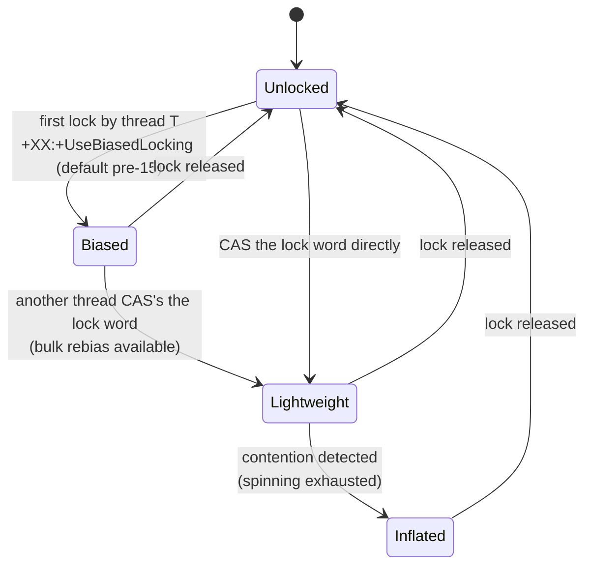

**Biased locking** (deprecated in Java 15, removed in Java 18) — when a lock is uncontended and held by only one thread, the lock word stores the thread ID. Subsequent acquisitions by the same thread are free. Revocation cost is incurred when another thread tries to acquire.

**Light-weight locking** — when contention is detected, the lock word holds a pointer to a "displaced header" stored in the thread's stack. CAS-based acquisition.

**Inflated (heavy) locking** — under sustained contention, the lock is converted to an OS-monitor (`ObjectMonitor`) with a wait queue and a contention queue.

**Lock coarsening, lock elision, lock fusion** — C2 optimizations that merge adjacent locks or remove locks when escape analysis proves no aliasing.

### 8.13 JIT intrinsics <a class="askgpt-btn" href="https://chatgpt.com/?q=Explain%20'8.13%20JIT%20intrinsics'%20in%20detail%20with%20concrete%20examples%2C%20the%20main%20trade-offs%2C%20and%20common%20pitfalls%20a%20practitioner%20should%20know." target="_blank" rel="noopener" data-askgpt="8.13 JIT intrinsics" title="Ask ChatGPT about this section">💬</a>

The C2 compiler has built-in **intrinsics** for hot methods in `java.lang.Math`, `java.util.concurrent.atomic`, `java.util.Arrays`, `String`, etc. These replace bytecode sequences with single (or few) machine instructions. Examples:

- `Math.max(int, int)` → `cmov` instruction.
- `Integer.bitCount(int)` → `popcnt`.
- `Unsafe.compareAndSwapInt` → `lock cmpxchg`.
- `StringLatin1.equals` → vectorized comparison (AVX/SVE).
- `Arrays.equals(byte[], byte[])` → vectorized.

Intrinsics are why "the JVM is faster than C++ for some workloads" — the JIT sees the actual semantics of high-level operations and can generate code that's better than what a C compiler would emit from naive translation.

---

## 9. Architecture

### 9.1 High-level <a class="askgpt-btn" href="https://chatgpt.com/?q=Explain%20'9.1%20High-level'%20in%20detail%20with%20concrete%20examples%2C%20the%20main%20trade-offs%2C%20and%20common%20pitfalls%20a%20practitioner%20should%20know." target="_blank" rel="noopener" data-askgpt="9.1 High-level" title="Ask ChatGPT about this section">💬</a>

HotSpot is composed of five major subsystems, each with its own source tree and design:

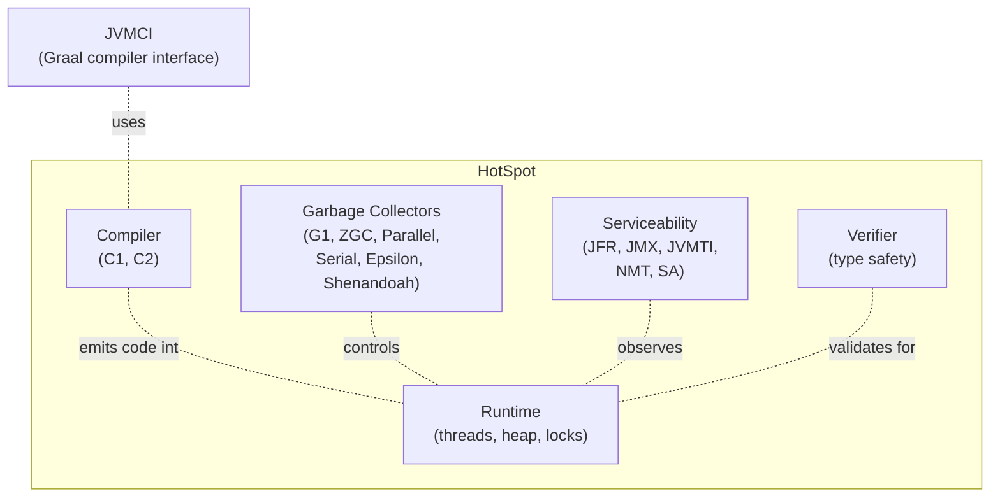

### 9.2 The runtime <a class="askgpt-btn" href="https://chatgpt.com/?q=Explain%20'9.2%20The%20runtime'%20in%20detail%20with%20concrete%20examples%2C%20the%20main%20trade-offs%2C%20and%20common%20pitfalls%20a%20practitioner%20should%20know." target="_blank" rel="noopener" data-askgpt="9.2 The runtime" title="Ask ChatGPT about this section">💬</a>

The runtime manages:

- **Heap allocation** — global allocation buffers, TLAB refill, direct memory.
- **Thread management** — `JavaThread` objects, OS thread binding, daemon vs. non-daemon, thread groups, thread priorities (mostly advisory on modern OSes).
- **Monitor system** — `ObjectMonitor` for `synchronized` blocks.
- **Safepoint coordination** — VM operation protocol (§8.6).
- **JNI handle management** — local, global, weak global references.
- **Exception handling** — exception dispatch via `exception_table` in class files.

### 9.3 The compiler <a class="askgpt-btn" href="https://chatgpt.com/?q=Explain%20'9.3%20The%20compiler'%20in%20detail%20with%20concrete%20examples%2C%20the%20main%20trade-offs%2C%20and%20common%20pitfalls%20a%20practitioner%20should%20know." target="_blank" rel="noopener" data-askgpt="9.3 The compiler" title="Ask ChatGPT about this section">💬</a>

C1 and C2 are organized as:

```
C1 (src/hotspot/share/c1/)
├── GraphBuilder/        # IR construction from bytecode
├── lir/                 # low-level IR
├── Runtime1/            # runtime stubs (deopt, safepoints)
└── CodeStubs/           # machine code emitters

C2 (src/hotspot/share/opto/)
├── ideal/               # ideal graph IR
├── loopopts/            # loop optimizations
├── escape/              # escape analysis
├── ifg/                 # interference graphs for register allocation
├── regmask/             # register masks
├── runtime/             # runtime stubs
└── mach/                # machine-specific code generation
```

Both compile via the **ciObject** hierarchy — type-safe representations of classes, methods, fields — populated from the runtime's data structures.

### 9.4 GC architecture <a class="askgpt-btn" href="https://chatgpt.com/?q=Explain%20'9.4%20GC%20architecture'%20in%20detail%20with%20concrete%20examples%2C%20the%20main%20trade-offs%2C%20and%20common%20pitfalls%20a%20practitioner%20should%20know." target="_blank" rel="noopener" data-askgpt="9.4 GC architecture" title="Ask ChatGPT about this section">💬</a>

Each collector follows the GC interface (JEP 304), which provides:

- Allocation (`MemAllocator`).
- Collection (`CollectedHeap` subclass).
- Barrier sets (`BarrierSet`).
- Worker threads (`WorkGang`).

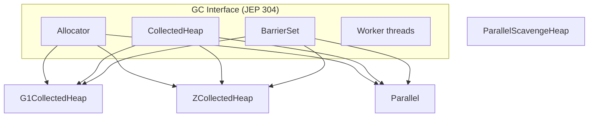

The **GC interface** (JEP 304, Java 10) decoupled the runtime from specific collectors, enabling Shenandoah and others to plug in.

### 9.5 Serviceability <a class="askgpt-btn" href="https://chatgpt.com/?q=Explain%20'9.5%20Serviceability'%20in%20detail%20with%20concrete%20examples%2C%20the%20main%20trade-offs%2C%20and%20common%20pitfalls%20a%20practitioner%20should%20know." target="_blank" rel="noopener" data-askgpt="9.5 Serviceability" title="Ask ChatGPT about this section">💬</a>

- **JFR (Java Flight Recorder)** — low-overhead event recorder with binary `.jfr` format.
- **JMX (Java Management Extensions)** — MBean-based remote management.
- **JVMTI** — native debugging/profiling API.
- **NMT (Native Memory Tracking)** — tracks native memory allocations by category.
- **Serviceability Agent (SA)** — post-mortem debugger for core files and hung processes (`jhsdb`).

---

## 10. Performance

### 10.1 Time complexity of major operations <a class="askgpt-btn" href="https://chatgpt.com/?q=Explain%20'10.1%20Time%20complexity%20of%20major%20operations'%20in%20detail%20with%20concrete%20examples%2C%20the%20main%20trade-offs%2C%20and%20common%20pitfalls%20a%20practitioner%20should%20know." target="_blank" rel="noopener" data-askgpt="10.1 Time complexity of major operations" title="Ask ChatGPT about this section">💬</a>

| Operation | Complexity | Notes |
|-----------|-----------|-------|
| Object allocation (TLAB) | O(1) | Pointer bump |
| Object allocation (slow path) | O(1) amortized, occasional O(n) for TLAB refill | n = TLAB size |
| `invokevirtual` (megamorphic) | O(1) for JIT'd call | One indirect branch |
| `invokevirtual` (megamorphic, interpreter) | O(i) for vtable scan | i = implemented interfaces |
| `getfield` | O(1) | Direct field offset |
| Minor GC (G1) | O(alive young) | Copy survivors |
| Major GC (G1 mixed) | O(whole heap) | Mark + evacuate |
| Concurrent GC pause (ZGC) | O(1) average | Sub-millisecond |
| Class loading | O(constant pool size + bytecode size) | Verification dominates |
| JIT compilation | O(method size) × C2's analysis cost | Often 10–100ms per method |

### 10.2 Memory usage <a class="askgpt-btn" href="https://chatgpt.com/?q=Explain%20'10.2%20Memory%20usage'%20in%20detail%20with%20concrete%20examples%2C%20the%20main%20trade-offs%2C%20and%20common%20pitfalls%20a%20practitioner%20should%20know." target="_blank" rel="noopener" data-askgpt="10.2 Memory usage" title="Ask ChatGPT about this section">💬</a>

| Memory type | Tunable | Production note |
|-------------|---------|----------------|
| Java heap | `-Xms`, `-Xmx` | Set `-Xms == -Xmx` in containers to avoid resize stalls |
| Metaspace | `-XX:MaxMetaspaceSize` | Watch for classloader leaks |
| Code cache | `-XX:ReservedCodeCacheSize` | Default 240MB; watch if JIT disabled |
| Thread stacks | `-Xss` | Default 1MB; virtual threads stack on heap |
| Direct buffers | `-XX:MaxDirectMemorySize` | NIO off-heap allocation |
| Native (misc) | NMT for tracking | Native memory leaks are silent |

### 10.3 CPU usage <a class="askgpt-btn" href="https://chatgpt.com/?q=Explain%20'10.3%20CPU%20usage'%20in%20detail%20with%20concrete%20examples%2C%20the%20main%20trade-offs%2C%20and%20common%20pitfalls%20a%20practitioner%20should%20know." target="_blank" rel="noopener" data-askgpt="10.3 CPU usage" title="Ask ChatGPT about this section">💬</a>

- **C1 compilation** is fast (~ms per method).
- **C2 compilation** can take seconds for large methods; runs in background threads (`-XX:CICompilerCount` defaults to N CPUs).
- **Safepoint pauses** add CPU overhead proportional to thread count (each thread must reach the safepoint).
- **GC CPU overhead** varies by collector: ZGC ~1-2%, G1 ~5-10%, Parallel can exceed 20% for tight heaps.

### 10.4 Bottlenecks and optimization techniques <a class="askgpt-btn" href="https://chatgpt.com/?q=Explain%20'10.4%20Bottlenecks%20and%20optimization%20techniques'%20in%20detail%20with%20concrete%20examples%2C%20the%20main%20trade-offs%2C%20and%20common%20pitfalls%20a%20practitioner%20should%20know." target="_blank" rel="noopener" data-askgpt="10.4 Bottlenecks and optimization techniques" title="Ask ChatGPT about this section">💬</a>

| Bottleneck | Symptom | Technique |
|------------|---------|-----------|
| High allocation rate | Frequent young GC, long TLAB waits | Object pooling (deprecated) → redesign to reduce allocations → use primitive arrays → off-heap |
| Long GC pauses | p99 latency spikes | Switch to ZGC or Shenandoah; tune G1 region size and pause target |
| JIT compilation time | Long warmup, low throughput early | Use TieredCompilation; use AOT (jaotc, GraalVM Native Image) |
| Safepoint pauses | Long STW for individual operations | Increase `-XX:GuaranteedSafepointInterval`; reduce thread count; avoid large methods |
| Code cache exhaustion | JIT disabled at runtime | Increase `-XX:ReservedCodeCacheSize`; profile code hotness; reduce dynamic class generation |
| Lock contention | Threads blocked on monitors | Use `java.util.concurrent` instead of `synchronized`; shrink critical sections |
| False sharing | Per-thread CPU performance poor | Pad fields to cache line (64 bytes) |

### 10.5 Caching <a class="askgpt-btn" href="https://chatgpt.com/?q=Explain%20'10.5%20Caching'%20in%20detail%20with%20concrete%20examples%2C%20the%20main%20trade-offs%2C%20and%20common%20pitfalls%20a%20practitioner%20should%20know." target="_blank" rel="noopener" data-askgpt="10.5 Caching" title="Ask ChatGPT about this section">💬</a>

- **Code cache** — see §8.4.
- **TLAB** — see §8.11.
- **Card table** — byte array that tracks which heap regions have been written. Used by all collectors for cross-generation references.
- **Remembered sets** — per-region records of incoming references. Used by G1.
- **String deduplication** — G1's `-XX:+UseStringDeduplication` reduces `String` footprint.
- **Compressed oops** — see §8.11.

### 10.6 Benchmarking and profiling <a class="askgpt-btn" href="https://chatgpt.com/?q=Explain%20'10.6%20Benchmarking%20and%20profiling'%20in%20detail%20with%20concrete%20examples%2C%20the%20main%20trade-offs%2C%20and%20common%20pitfalls%20a%20practitioner%20should%20know." target="_blank" rel="noopener" data-askgpt="10.6 Benchmarking and profiling" title="Ask ChatGPT about this section">💬</a>

Tools for understanding JVM performance:

- **JMH (Java Microbenchmark Harness)** — the standard for microbenchmarks. Always use JMH; never trust a `System.currentTimeMillis`-wrapped loop.
- **async-profiler** — sampling profiler with flame graphs and lock/alloc profiling.
- **JFR + JDK Mission Control** — continuous profiling with low overhead.
- **YourKit, JProfiler** — commercial profilers with rich GUI.
- **perf + HotSpot debug symbols** — for `pmu`-style CPU profiling.
- **NetBeans profiler** — free, integrated with IDE.

**Anti-patterns in benchmarking:**

- Not warming up (the JIT is cold).
- Including GC time in measurements.
- Running on idle hardware (other workloads distort results).
- Using `System.currentTimeMillis` for sub-millisecond measurements.
- Forgetting about escape analysis (your allocation may have been elided).
- Comparing different heap sizes across runs (GC behavior differs).

---

## 11. Security

### 11.1 OWASP relevance <a class="askgpt-btn" href="https://chatgpt.com/?q=Explain%20'11.1%20OWASP%20relevance'%20in%20detail%20with%20concrete%20examples%2C%20the%20main%20trade-offs%2C%20and%20common%20pitfalls%20a%20practitioner%20should%20know." target="_blank" rel="noopener" data-askgpt="11.1 OWASP relevance" title="Ask ChatGPT about this section">💬</a>

The OWASP Top 10 risks that map to JVM-level concerns:

- **A01 Broken Access Control** — strong encapsulation (JEP 396 in Java 17) limits what reflection can access. Use `--add-opens` deliberately.
- **A02 Cryptographic Failures** — Java's JCE provides algorithms; misuse is the bug.
- **A03 Injection** — SQL/JPA injection lives at the application/JDBC boundary; the JVM provides prepared statements but doesn't enforce them.
- **A05 Security Misconfiguration** — JVM flags, default trust stores, exposed JMX ports.
- **A06 Vulnerable Components** — outdated JDK with known CVEs.
- **A08 Software and Data Integrity Failures** — deserialization gadget chains.
- **A09 Security Logging Failures** — missing audit logs, missing JFR/security events.

### 11.2 Authentication and authorization <a class="askgpt-btn" href="https://chatgpt.com/?q=Explain%20'11.2%20Authentication%20and%20authorization'%20in%20detail%20with%20concrete%20examples%2C%20the%20main%20trade-offs%2C%20and%20common%20pitfalls%20a%20practitioner%20should%20know." target="_blank" rel="noopener" data-askgpt="11.2 Authentication and authorization" title="Ask ChatGPT about this section">💬</a>

The JVM provides JAAS (Java Authentication and Authorization Service) for pluggable authentication. Most applications delegate to framework-level auth (Spring Security, Apache Shiro). The JVM itself does not enforce fine-grained access control.

### 11.3 Encryption <a class="askgpt-btn" href="https://chatgpt.com/?q=Explain%20'11.3%20Encryption'%20in%20detail%20with%20concrete%20examples%2C%20the%20main%20trade-offs%2C%20and%20common%20pitfalls%20a%20practitioner%20should%20know." target="_blank" rel="noopener" data-askgpt="11.3 Encryption" title="Ask ChatGPT about this section">💬</a>

- **JCA/JCE** — providers like SunJCE, SunPKCS11, BouncyCastle.
- **TLS** — `javax.net.ssl.SSLContext` with default providers.
- **Native crypto** — JDK 22+ FFM API (JEP 454) enables direct calls to native crypto libraries (OpenSSL, BoringSSL).

### 11.4 Hardening <a class="askgpt-btn" href="https://chatgpt.com/?q=Explain%20'11.4%20Hardening'%20in%20detail%20with%20concrete%20examples%2C%20the%20main%20trade-offs%2C%20and%20common%20pitfalls%20a%20practitioner%20should%20know." target="_blank" rel="noopener" data-askgpt="11.4 Hardening" title="Ask ChatGPT about this section">💬</a>

- Strong encapsulation: `-XX:+UseCompactObjectHeaders` (Java 24+) for smaller headers.
- Disable security manager: from Java 17, SecurityManager is deprecated for removal. New code should not rely on it.
- Disable weak algorithms: use `java.security.properties` or `jdk.disabled.namedCurves`.
- Disable remote JMX by default; use firewalls and authentication.
- Disable dynamic agent loading (JEP 451 in Java 21): the JVM warns about dynamic loading of JVMTI agents.
- Use `-Djava.security.manager=disallow` (Java 18+) to disable SecurityManager.

### 11.5 Secure configuration checklist <a class="askgpt-btn" href="https://chatgpt.com/?q=Explain%20'11.5%20Secure%20configuration%20checklist'%20in%20detail%20with%20concrete%20examples%2C%20the%20main%20trade-offs%2C%20and%20common%20pitfalls%20a%20practitioner%20should%20know." target="_blank" rel="noopener" data-askgpt="11.5 Secure configuration checklist" title="Ask ChatGPT about this section">💬</a>

- [ ] Java version is current LTS (21+ as of 2026).
- [ ] SecurityManager is not relied upon.
- [ ] All `-Xadd-opens` and `--add-exports` flags are minimal and documented.
- [ ] JMX not exposed without authentication.
- [ ] JFR recordings not retained indefinitely (PII risk).
- [ ] Deserialization filters enabled (`jdk.serialFilter`).
- [ ] TLS 1.2+ enforced; weak cipher suites disabled.
- [ ] Classpath integrity verified (signing, checksums).
- [ ] Native code (JNI) is minimal and audited.

### 11.6 Common JVM-specific attacks <a class="askgpt-btn" href="https://chatgpt.com/?q=Explain%20'11.6%20Common%20JVM-specific%20attacks'%20in%20detail%20with%20concrete%20examples%2C%20the%20main%20trade-offs%2C%20and%20common%20pitfalls%20a%20practitioner%20should%20know." target="_blank" rel="noopener" data-askgpt="11.6 Common JVM-specific attacks" title="Ask ChatGPT about this section">💬</a>

- **Deserialization gadget chains** — Apache Commons Collections, Spring, etc. Use `ObjectInputFilter`.
- **JNI supply chain** — native libraries can do anything. Audit them.
- **JVMTI agent injection** — malicious agents attach to running JVMs.
- **Reflection to access JDK internals** — increasingly restricted; use `--add-opens` deliberately.
- **Classpath manipulation** — classpath entries from untrusted sources allow code execution.

### 11.7 Mitigation <a class="askgpt-btn" href="https://chatgpt.com/?q=Explain%20'11.7%20Mitigation'%20in%20detail%20with%20concrete%20examples%2C%20the%20main%20trade-offs%2C%20and%20common%20pitfalls%20a%20practitioner%20should%20know." target="_blank" rel="noopener" data-askgpt="11.7 Mitigation" title="Ask ChatGPT about this section">💬</a>

- Run as non-root user in containers.
- Enable seccomp profiles (e.g., Docker default, Kubernetes restricted PSA).
- Use distroless or minimal JDK images.
- Pin base image digests.
- Enable seccomp and AppArmor.
- Use read-only root filesystems in containers where possible.
- Network policies in Kubernetes.

---

## 12. Production Engineering

### 12.1 How the JVM is used in production <a class="askgpt-btn" href="https://chatgpt.com/?q=Explain%20'12.1%20How%20the%20JVM%20is%20used%20in%20production'%20in%20detail%20with%20concrete%20examples%2C%20the%20main%20trade-offs%2C%20and%20common%20pitfalls%20a%20practitioner%20should%20know." target="_blank" rel="noopener" data-askgpt="12.1 How the JVM is used in production" title="Ask ChatGPT about this section">💬</a>

Production JVM deployments follow a few common patterns:

- **Containerized microservices** — Spring Boot, Quarkus, Micronaut deployed to Kubernetes.
- **Long-running monoliths** — Tomcat, JBoss, WebLogic serving web traffic.
- **Stream processing** — Kafka Streams, Flink jobs with strict latency targets.
- **Batch jobs** — Hadoop/Spark running with Parallel GC for throughput.
- **Game servers / real-time** — Netty, custom NIO with low-pause GC (ZGC, Shenandoah).
- **Trading systems** — Chronicle, custom allocation-free loops.

### 12.2 Real architecture (typical Spring Boot + Kubernetes) <a class="askgpt-btn" href="https://chatgpt.com/?q=Explain%20'12.2%20Real%20architecture%20(typical%20Spring%20Boot%20%2B%20Kubernetes)'%20in%20detail%20with%20concrete%20examples%2C%20the%20main%20trade-offs%2C%20and%20common%20pitfalls%20a%20practitioner%20should%20know." target="_blank" rel="noopener" data-askgpt="12.2 Real architecture (typical Spring Boot + Kubernetes)" title="Ask ChatGPT about this section">💬</a>

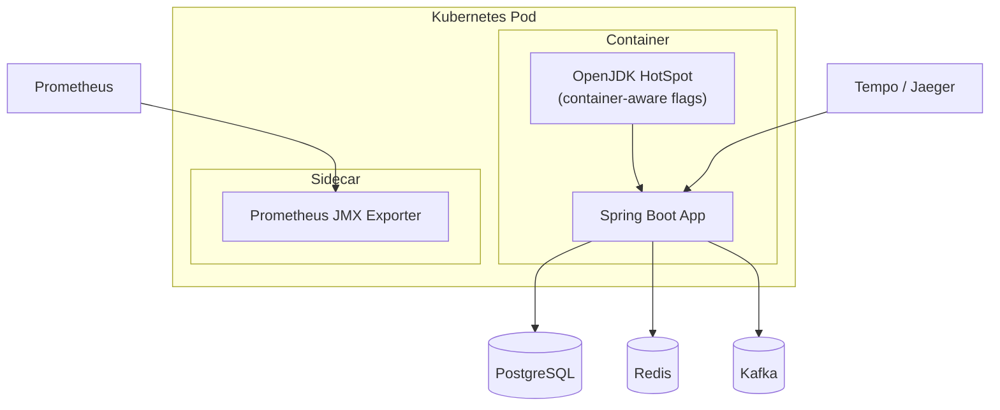

### 12.3 Production configuration <a class="askgpt-btn" href="https://chatgpt.com/?q=Explain%20'12.3%20Production%20configuration'%20in%20detail%20with%20concrete%20examples%2C%20the%20main%20trade-offs%2C%20and%20common%20pitfalls%20a%20practitioner%20should%20know." target="_blank" rel="noopener" data-askgpt="12.3 Production configuration" title="Ask ChatGPT about this section">💬</a>

A typical production JVM launch command:

```bash
java \
  -XX:+UseContainerSupport \
  -XX:MaxRAMPercentage=75.0 \
  -XX:+UseG1GC \
  -XX:+UseStringDeduplication \
  -XX:+ExitOnOutOfMemoryError \
  -XX:+HeapDumpOnOutOfMemoryError \
  -XX:HeapDumpPath=/var/log/jvm/heapdump.hprof \
  -Xlog:gc*:file=/var/log/jvm/gc.log:time,uptime:filecount=10,filesize=50M \
  -Xlog:safepoint=info \
  -XX:+FlightRecorder \
  -XX:StartFlightRecording=duration=24h,disk=true,filename=/var/log/jvm/recording.jfr,maxsize=2G \
  -Djava.security.egd=file:/dev/./urandom \
  -jar app.jar
```

**Key flags explained:**

| Flag | Why |
|------|-----|
| `-XX:+UseContainerSupport` | Read cgroup limits; essential in Kubernetes since Java 10. |
| `-XX:MaxRAMPercentage=75.0` | Set heap to 75% of container memory; reserves 25% for native (metaspace, code cache, thread stacks, direct buffers). |
| `-XX:+UseG1GC` | Default in Java 9-17; good general-purpose collector. |
| `-XX:+UseStringDeduplication` | Reduce `String` footprint for text-heavy workloads. |
| `-XX:+ExitOnOutOfMemoryError` | Exit the JVM on OOM rather than limping along; let Kubernetes restart. |
| `-XX:+HeapDumpOnOutOfMemoryError` | Capture heap state at the moment of OOM for post-mortem analysis. |
| `-Xlog:gc*` | Unified logging (JEP 158) replaces the old `-Xloggc` / `-XX:+PrintGCDetails`. |
| `-XX:+FlightRecorder` | Enable JFR for low-overhead continuous profiling. |
| `-Djava.security.egd=file:/dev/./urandom` | Faster `/dev/urandom` source for startup randomness. |

### 12.4 Production monitoring <a class="askgpt-btn" href="https://chatgpt.com/?q=Explain%20'12.4%20Production%20monitoring'%20in%20detail%20with%20concrete%20examples%2C%20the%20main%20trade-offs%2C%20and%20common%20pitfalls%20a%20practitioner%20should%20know." target="_blank" rel="noopener" data-askgpt="12.4 Production monitoring" title="Ask ChatGPT about this section">💬</a>

- **JFR + JDK Mission Control** — continuous low-overhead profiling.
- **Micrometer JVM metrics** — exported via `/actuator/prometheus`.
- **Custom JMX MBeans** — for application-specific telemetry.
- **Datadog Java tracer, New Relic, Elastic APM** — commercial APMs that hook into the JVM.
- **OpenTelemetry Java agent** — OTel-compatible instrumentation.

### 12.5 Production logging <a class="askgpt-btn" href="https://chatgpt.com/?q=Explain%20'12.5%20Production%20logging'%20in%20detail%20with%20concrete%20examples%2C%20the%20main%20trade-offs%2C%20and%20common%20pitfalls%20a%20practitioner%20should%20know." target="_blank" rel="noopener" data-askgpt="12.5 Production logging" title="Ask ChatGPT about this section">💬</a>

The JVM has two distinct logging concerns:

1. **Application logging** — handled by Logback, Log4j2, SLF4J.
2. **JVM logging** — handled by the unified logging framework (`-Xlog`). Categories include `gc`, `safepoint`, `classloading`, `jit`, `codecache`, `heap`, `exceptions`.

Best practice: log JVM events to a separate destination from application logs so they can be analyzed with GC log tools (e.g., GCViewer, gceasy.io).

### 12.6 Production debugging <a class="askgpt-btn" href="https://chatgpt.com/?q=Explain%20'12.6%20Production%20debugging'%20in%20detail%20with%20concrete%20examples%2C%20the%20main%20trade-offs%2C%20and%20common%20pitfalls%20a%20practitioner%20should%20know." target="_blank" rel="noopener" data-askgpt="12.6 Production debugging" title="Ask ChatGPT about this section">💬</a>

- **JFR recordings** — capture a few minutes of JVM events for offline analysis.
- **jhsdb** — attach to a hung JVM or analyze a core dump.
- **async-profiler** — sampling profiler that survives production load.
- **Heap dumps** — analyze with Eclipse MAT or VisualVM.

### 12.7 Scaling strategy <a class="askgpt-btn" href="https://chatgpt.com/?q=Explain%20'12.7%20Scaling%20strategy'%20in%20detail%20with%20concrete%20examples%2C%20the%20main%20trade-offs%2C%20and%20common%20pitfalls%20a%20practitioner%20should%20know." target="_blank" rel="noopener" data-askgpt="12.7 Scaling strategy" title="Ask ChatGPT about this section">💬</a>

- **Vertical** — increase heap, CPU, then GC choice becomes critical.
- **Horizontal** — Kubernetes HPA based on CPU, memory, or custom metrics.
- **Sharding** — by user ID, tenant, region.

### 12.8 Backup strategy <a class="askgpt-btn" href="https://chatgpt.com/?q=Explain%20'12.8%20Backup%20strategy'%20in%20detail%20with%20concrete%20examples%2C%20the%20main%20trade-offs%2C%20and%20common%20pitfalls%20a%20practitioner%20should%20know." target="_blank" rel="noopener" data-askgpt="12.8 Backup strategy" title="Ask ChatGPT about this section">💬</a>

JVM-level backup is not really a concept — application state lives in databases, caches, message queues. The JVM's responsibility is to:

- Persist JFR recordings for post-incident analysis.
- Snapshot heap dumps before OOM (`-XX:+HeapDumpOnOutOfMemoryError`).
- Capture GC logs continuously for capacity planning.

### 12.9 Disaster recovery <a class="askgpt-btn" href="https://chatgpt.com/?q=Explain%20'12.9%20Disaster%20recovery'%20in%20detail%20with%20concrete%20examples%2C%20the%20main%20trade-offs%2C%20and%20common%20pitfalls%20a%20practitioner%20should%20know." target="_blank" rel="noopener" data-askgpt="12.9 Disaster recovery" title="Ask ChatGPT about this section">💬</a>

- **JVM crash dumps (`hs_err`)** — automatic on fatal errors; contains native stack, register state, loaded classes, environment.
- **Core dumps** — if `-XX:+CreateCoredumpOnCrash` is set.
- **JFR recordings** — can be configured to upload to central storage.

### 12.10 Failure handling <a class="askgpt-btn" href="https://chatgpt.com/?q=Explain%20'12.10%20Failure%20handling'%20in%20detail%20with%20concrete%20examples%2C%20the%20main%20trade-offs%2C%20and%20common%20pitfalls%20a%20practitioner%20should%20know." target="_blank" rel="noopener" data-askgpt="12.10 Failure handling" title="Ask ChatGPT about this section">💬</a>

The JVM has specific failure modes:

- **StackOverflowError** — usually infinite recursion. Tune with `-Xss` only if legitimate deep recursion is needed.
- **OutOfMemoryError: Java heap** — heap too small or leak. Capture heap dump, analyze.
- **OutOfMemoryError: Metaspace** — classloader leak. Common with hot redeploy in Tomcat / JBoss.
- **OutOfMemoryError: Direct buffer memory** — NIO off-heap exhaustion.
- **OutOfMemoryError: GC overhead limit exceeded** — 98% of time spent in GC, less than 2% of heap recovered. Tune or scale up.
- **Internal Error** — JVM bug or native crash. Capture `hs_err`, file a bug.
- **Safepoint timeout** — `VM_Operation took too long` indicates a thread that took >`-XX:VMThreadBatchWait` (default 5s for some ops) to reach a safepoint.

### 12.11 High availability <a class="askgpt-btn" href="https://chatgpt.com/?q=Explain%20'12.11%20High%20availability'%20in%20detail%20with%20concrete%20examples%2C%20the%20main%20trade-offs%2C%20and%20common%20pitfalls%20a%20practitioner%20should%20know." target="_blank" rel="noopener" data-askgpt="12.11 High availability" title="Ask ChatGPT about this section">💬</a>

- Multi-AZ Kubernetes deployment.
- Pod disruption budgets (PDB).
- Health check endpoints (`/health`, `/ready`).
- Graceful shutdown hooks (`SIGTERM` → `Runtime.addShutdownHook`).
- Connection draining — let in-flight requests complete before killing the pod.

### 12.12 Cost optimization <a class="askgpt-btn" href="https://chatgpt.com/?q=Explain%20'12.12%20Cost%20optimization'%20in%20detail%20with%20concrete%20examples%2C%20the%20main%20trade-offs%2C%20and%20common%20pitfalls%20a%20practitioner%20should%20know." target="_blank" rel="noopener" data-askgpt="12.12 Cost optimization" title="Ask ChatGPT about this section">💬</a>

- Right-size heap: oversized heaps cause longer GC pauses and lower CPU efficiency.
- Choose the right collector: Parallel for batch, G1 for general, ZGC for latency-critical.
- Use AOT compilation (GraalVM Native Image) for short-lived or startup-sensitive workloads.
- Monitor JVM CPU and memory with Prometheus; scale based on real usage, not peak.
- Use spot/preemptible instances for batch workloads.

### 12.13 Upgrade strategy <a class="askgpt-btn" href="https://chatgpt.com/?q=Explain%20'12.13%20Upgrade%20strategy'%20in%20detail%20with%20concrete%20examples%2C%20the%20main%20trade-offs%2C%20and%20common%20pitfalls%20a%20practitioner%20should%20know." target="_blank" rel="noopener" data-askgpt="12.13 Upgrade strategy" title="Ask ChatGPT about this section">💬</a>

- **Read release notes** for the target version. Pay attention to "Removed" and "Incompatible Changes" sections.
- **Test with real workloads** using a staging environment.
- **Use Java Flight Recorder** to compare performance before/after.
- **Roll forward, not back** — JVM upgrades are one-way in most organizations.
- **Pin to LTS versions** (17, 21, 25) for production.
- **LTS every 3 years** since Java 17 (Java 21 in 2023, Java 25 in 2025).

### 12.14 Migration strategy <a class="askgpt-btn" href="https://chatgpt.com/?q=Explain%20'12.14%20Migration%20strategy'%20in%20detail%20with%20concrete%20examples%2C%20the%20main%20trade-offs%2C%20and%20common%20pitfalls%20a%20practitioner%20should%20know." target="_blank" rel="noopener" data-askgpt="12.14 Migration strategy" title="Ask ChatGPT about this section">💬</a>

When migrating from one LTS to another (e.g., 17 → 21):

1. **Inventory dependencies** — check every library against the new version's supported baseline.
2. **Run with `--enable-preview`** — preview features (virtual threads were preview in 19/20).
3. **Test with real production traffic** — canary deployments.
4. **Watch JFR for regressions** — pause times, allocation rate, JIT compilation time.
5. **Roll out incrementally** — region by region, customer cohort by cohort.

### 12.15 Version compatibility <a class="askgpt-btn" href="https://chatgpt.com/?q=Explain%20'12.15%20Version%20compatibility'%20in%20detail%20with%20concrete%20examples%2C%20the%20main%20trade-offs%2C%20and%20common%20pitfalls%20a%20practitioner%20should%20know." target="_blank" rel="noopener" data-askgpt="12.15 Version compatibility" title="Ask ChatGPT about this section">💬</a>

Major compatibility shifts:

| Version | Compatibility break |
|---------|---------------------|
| Java 9 | Module system; removal of `sun.misc.*` access |
| Java 11 | JAXB, CORBA, JAX-WS removed; Java EE modules removed |
| Java 14 | CMS GC removed |
| Java 15 | Nashorn JS engine removed; biased locking deprecated |
| Java 16 | Strong encapsulation of JDK internals |
| Java 17 | SecurityManager deprecated; strong encapsulation enforced |
| Java 21 | `synchronized` no longer pins virtual threads (this was added in 24, not 21) |
| Java 23 | Generational ZGC is default |

---

## 13. Production Case Studies

### 13.1 Netflix — G1 to ZGC migration <a class="askgpt-btn" href="https://chatgpt.com/?q=Explain%20'13.1%20Netflix%20%E2%80%94%20G1%20to%20ZGC%20migration'%20in%20detail%20with%20concrete%20examples%2C%20the%20main%20trade-offs%2C%20and%20common%20pitfalls%20a%20practitioner%20should%20know." target="_blank" rel="noopener" data-askgpt="13.1 Netflix — G1 to ZGC migration" title="Ask ChatGPT about this section">💬</a>

**Context.** Netflix runs thousands of JVM instances serving their streaming platform. Their engineering team observed that G1's worst-case pauses were occasionally exceeding their p99.99 SLO during peak traffic. The p99.9 was acceptable; the long tail was not.

**Approach.** They migrated their most latency-sensitive services from G1 to ZGC, beginning in 2019 with experimental builds, then expanding through 2020-2023 as ZGC matured. They published their migration playbook:

1. **Start with non-critical services.** Validate ZGC's behavior in their environment.
2. **Measure before and after.** Use JFR to capture pause distributions.
3. **Tune heap size.** ZGC uses more memory than G1 due to the colored-pointer design; Netflix reduced the heap size to compensate.
4. **Watch for "headroom" regressions.** ZGC's concurrent nature means it can run with less heap before triggering GC, but if heap is too small, allocation stalls appear.

**Outcome.** ZGC's pause times were sub-millisecond, well within their SLO. They published a 2024 follow-up on Generational ZGC, finding further improvements for allocation-heavy workloads.

**Sources.** Netflix Tech Blog: "Bending pause times to your will with Generational ZGC" (Mar 2024). JavaOne and JVMLS presentations.

### 13.2 Meta — large-scale ZGC rollout <a class="askgpt-btn" href="https://chatgpt.com/?q=Explain%20'13.2%20Meta%20%E2%80%94%20large-scale%20ZGC%20rollout'%20in%20detail%20with%20concrete%20examples%2C%20the%20main%20trade-offs%2C%20and%20common%20pitfalls%20a%20practitioner%20should%20know." target="_blank" rel="noopener" data-askgpt="13.2 Meta — large-scale ZGC rollout" title="Ask ChatGPT about this section">💬</a>

**Context.** Meta operates JVM-based services at very large scale (TAO, various user-facing APIs). GC pause-induced latency spikes were a recurring production concern.

**Approach.** Meta's JVM engineering team contributed to ZGC's design and has rolled it out across significant portions of their fleet. Their engineering blog and conference talks describe:

- Fleet-wide GC pause dashboards built on JFR recordings.
- Custom ZGC tunings for memory-constrained services.
- Tooling to detect "GC-induced" tail latencies vs other sources.

**Outcome.** Reported in their public talks: substantially reduced p99 latency variance; simpler GC tuning (fewer flags to adjust than G1).

### 13.3 Twitter / X — original allocation pressure saga <a class="askgpt-btn" href="https://chatgpt.com/?q=Explain%20'13.3%20Twitter%20%2F%20X%20%E2%80%94%20original%20allocation%20pressure%20saga'%20in%20detail%20with%20concrete%20examples%2C%20the%20main%20trade-offs%2C%20and%20common%20pitfalls%20a%20practitioner%20should%20know." target="_blank" rel="noopener" data-askgpt="13.3 Twitter / X — original allocation pressure saga" title="Ask ChatGPT about this section">💬</a>

**Context.** In 2012-2013, Twitter (now X) ran Java services that were struggling with allocation pressure. Their engineering team published detailed analyses showing that GC was consuming a significant fraction of CPU time.

**Approach.** They attacked allocation rate aggressively:

- Replaced `String` concatenation in hot paths with `StringBuilder`.
- Avoided autoboxing in tight loops.
- Used object pooling (now considered an anti-pattern at the time, but was the consensus solution then).
- Measured allocation rate with allocation-instrumented profilers.

**Outcome.** Reduced GC time from ~25% of CPU to single digits. This work drove industry-wide adoption of "low-allocation" Java patterns.

**Historical note.** Object pooling is now generally considered an anti-pattern because modern JVMs and GCs (especially ZGC and Shenandoah) handle allocation very efficiently. The lesson: tune allocation *rate*, not allocation *count*.

### 13.4 High-frequency trading — microsecond budgets <a class="askgpt-btn" href="https://chatgpt.com/?q=Explain%20'13.4%20High-frequency%20trading%20%E2%80%94%20microsecond%20budgets'%20in%20detail%20with%20concrete%20examples%2C%20the%20main%20trade-offs%2C%20and%20common%20pitfalls%20a%20practitioner%20should%20know." target="_blank" rel="noopener" data-askgpt="13.4 High-frequency trading — microsecond budgets" title="Ask ChatGPT about this section">💬</a>

**Context.** HFT firms run JVM-based order routers that must complete round-trip operations (receive market data → decide → send order) in single-digit microseconds. GC pauses in the milliseconds are unacceptable.

**Approach.**

- Use **Chronicle Queue** for off-heap messaging (zero allocation on hot path).
- **Pre-allocate** all objects at startup; never allocate in the hot path.
- Use **ZGC** (or, historically, **Azul C4/Prime** for the most demanding deployments) for sub-millisecond pauses.
- **JIT warmup** is critical — many HFT systems use C2 warmup tricks (run dummy traffic before opening the order book).
- **CPU isolation** with isolcpus kernel parameter; pin JVM threads to specific cores.
- **Disable biased locking** to avoid revocation cost spikes.

**Outcome.** Reported in industry talks: consistent microsecond latencies; no GC-induced trading outages since migration.

### 13.5 Online gaming — Minecraft / Roblox <a class="askgpt-btn" href="https://chatgpt.com/?q=Explain%20'13.5%20Online%20gaming%20%E2%80%94%20Minecraft%20%2F%20Roblox'%20in%20detail%20with%20concrete%20examples%2C%20the%20main%20trade-offs%2C%20and%20common%20pitfalls%20a%20practitioner%20should%20know." target="_blank" rel="noopener" data-askgpt="13.5 Online gaming — Minecraft / Roblox" title="Ask ChatGPT about this section">💬</a>

**Context.** Game servers run dozens of players per process, with strict frame-rate and tick-rate requirements. Long GC pauses cause visible lag.

**Approach.**

- **Shenandoah** is a popular choice for game servers due to its concurrent compaction.
- **ZGC** is increasingly used.
- Heaps sized carefully: too small causes frequent GC; too large causes long pauses even with concurrent collectors.
- JFR active in production to catch emerging issues.

**Outcome.** Smooth player experience with sub-frame-time GC.

### 13.6 Apache Kafka — Throughput-oriented GC choice <a class="askgpt-btn" href="https://chatgpt.com/?q=Explain%20'13.6%20Apache%20Kafka%20%E2%80%94%20Throughput-oriented%20GC%20choice'%20in%20detail%20with%20concrete%20examples%2C%20the%20main%20trade-offs%2C%20and%20common%20pitfalls%20a%20practitioner%20should%20know." target="_blank" rel="noopener" data-askgpt="13.6 Apache Kafka — Throughput-oriented GC choice" title="Ask ChatGPT about this section">💬</a>

**Context.** Apache Kafka brokers are throughput-sensitive. The project recommends **G1** with specific tunings, though `Parallel` is also viable for batch-heavy workloads.

**Approach.** Kafka publishes recommended JVM flags in their documentation. The key insight: page cache and JVM heap both compete for RAM; the right balance depends on the workload.

**Outcome.** Documented at <https://kafka.apache.org/documentation/#jvm>.

---

## 14. Code Examples

### 14.1 Disassembling bytecode with `javap` <a class="askgpt-btn" href="https://chatgpt.com/?q=Explain%20'14.1%20Disassembling%20bytecode%20with%20%60javap%60'%20in%20detail%20with%20concrete%20examples%2C%20the%20main%20trade-offs%2C%20and%20common%20pitfalls%20a%20practitioner%20should%20know." target="_blank" rel="noopener" data-askgpt="14.1 Disassembling bytecode with `javap`" title="Ask ChatGPT about this section">💬</a>

```java
// /examples/01-bytecode-disasm/Hello.java
public class Hello {
    public static void main(String[] args) {
        long start = System.nanoTime();
        int sum = 0;
        for (int i = 0; i < 1_000_000; i++) {
            sum += i;
        }
        long elapsed = System.nanoTime() - start;
        System.out.println("sum=" + sum + " elapsed=" + elapsed);
    }
}
```

```bash
javac -g Hello.java
javap -c -p -v Hello.class
```

The disassembly will show:

```text
public static void main(java.lang.String[]);
  Code:
     0: invokestatic  #2    // Method java/lang/System.nanoTime:()J
     3: lstore_1
     4: iconst_0
     5: istore_3
     6: iconst_0
     7: istore  4
     9: iload   4
    11: sipush  1000000
    14: if_icmpge 27
    17: iload   4
    19: iload_3
    20: iadd
    21: istore_3
    22: iinc    4, 1
    25: goto    9
    ...
```

You can compare this with C2's output by running with `-XX:+UnlockDiagnosticVMOptions -XX:+PrintAssembly` (requires `hsdis` library).

### 14.2 JFR scripting for allocation hot spots <a class="askgpt-btn" href="https://chatgpt.com/?q=Explain%20'14.2%20JFR%20scripting%20for%20allocation%20hot%20spots'%20in%20detail%20with%20concrete%20examples%2C%20the%20main%20trade-offs%2C%20and%20common%20pitfalls%20a%20practitioner%20should%20know." target="_blank" rel="noopener" data-askgpt="14.2 JFR scripting for allocation hot spots" title="Ask ChatGPT about this section">💬</a>

```java
// /examples/02-jfr-scripting/AllocationHotspots.jfc
<?xml version="1.0" encoding="UTF-8"?>
<configuration version="2.0" description="Low-overhead allocation profile">
  <event name="jdk.ObjectAllocationInNewTLAB">
    <setting name="enabled">true</setting>
    <setting name="threshold">1 ms</setting>
  </event>
  <event name="jdk.ObjectAllocationOutsideTLAB">
    <setting name="enabled">true</setting>
    <setting name="threshold">1 ms</setting>
  </event>
  <event name="jdk.GCPhasePause">
    <setting name="enabled">true</setting>
    <setting name="threshold">10 ms</setting>
  </event>
</configuration>
```

Run with:

```bash
java -XX:StartFlightRecording=filename=alloc.jfr,settings=AllocationHotspots.jfc -jar app.jar
```

Open in JDK Mission Control and look at the "Memory" tab → "Allocations by Class".

### 14.3 Reproducing a safepoint-induced pause <a class="askgpt-btn" href="https://chatgpt.com/?q=Explain%20'14.3%20Reproducing%20a%20safepoint-induced%20pause'%20in%20detail%20with%20concrete%20examples%2C%20the%20main%20trade-offs%2C%20and%20common%20pitfalls%20a%20practitioner%20should%20know." target="_blank" rel="noopener" data-askgpt="14.3 Reproducing a safepoint-induced pause" title="Ask ChatGPT about this section">💬</a>

```java
// /examples/04-safepoint-pause/BadLoop.java
public class BadLoop {
    static volatile double sink;

    public static void main(String[] args) throws InterruptedException {
        Thread t = new Thread(() -> {
            // No back-edge, no safepoint poll
            long n = 0;
            while (!Thread.currentThread().isInterrupted()) {
                double x = Math.sin(n++);
                sink = x;
            }
        });
        t.start();
        Thread.sleep(2000);
        System.out.println("Triggering GC...");
        System.gc();
        Thread.sleep(2000);
        t.interrupt();
    }
}
```

Run with `-Xlog:safepoint=debug` and observe that the `System.gc()` call takes seconds because the loop thread cannot reach its safepoint poll.

### 14.4 Virtual thread pinning demo (Java 21) <a class="askgpt-btn" href="https://chatgpt.com/?q=Explain%20'14.4%20Virtual%20thread%20pinning%20demo%20(Java%2021)'%20in%20detail%20with%20concrete%20examples%2C%20the%20main%20trade-offs%2C%20and%20common%20pitfalls%20a%20practitioner%20should%20know." target="_blank" rel="noopener" data-askgpt="14.4 Virtual thread pinning demo (Java 21)" title="Ask ChatGPT about this section">💬</a>

```java
// /examples/07-virtual-thread-pinning/PinningDemo.java
public class PinningDemo {
    public static void main(String[] args) throws Exception {
        // Pre-Java 24: synchronized inside virtual threads pinned carriers.
        // Post-Java 24: synchronized does NOT pin (JEP 491).
        for (int i = 0; i < 1000; i++) {
            Thread.startVirtualThread(() -> {
                synchronized (PinningDemo.class) {
                    try { Thread.sleep(100); } catch (InterruptedException e) {}
                }
            });
        }
        Thread.sleep(2000);
        System.out.println("Check JFR for jdk.VirtualThreadPinning events");
    }
}
```

### 14.5 Native memory leak with NIO <a class="askgpt-btn" href="https://chatgpt.com/?q=Explain%20'14.5%20Native%20memory%20leak%20with%20NIO'%20in%20detail%20with%20concrete%20examples%2C%20the%20main%20trade-offs%2C%20and%20common%20pitfalls%20a%20practitioner%20should%20know." target="_blank" rel="noopener" data-askgpt="14.5 Native memory leak with NIO" title="Ask ChatGPT about this section">💬</a>

```java
// /examples/06-native-memory-leak/Leak.java
import java.nio.*;
import java.nio.channels.*;

public class Leak {
    public static void main(String[] args) throws Exception {
        // Without reference cleaner, direct buffers leak.
        for (int i = 0; i < 100_000; i++) {
            ByteBuffer.allocateDirect(1024 * 1024); // 1 MB
        }
        // Use NMT to see the leak: -XX:NativeMemoryTracking=detail
    }
}
```

Compare with the proper pattern that uses `Cleaner`:

```java
// /examples/06-native-memory-leak/Fixed.java
import java.lang.ref.Cleaner;
import java.nio.*;

public class Fixed {
    private static final Cleaner CLEANER = Cleaner.create();

    public static ByteBuffer alloc(int size) {
        ByteBuffer buf = ByteBuffer.allocateDirect(size);
        CLEANER.register(buf, () -> {
            // Sun's Unsafe-based free would go here in real code
            System.out.println("Cleaning buffer");
        });
        return buf;
    }
}
```

### 14.6 Bad, anti-pattern, refactored, performance-optimized, secure, and thread-safe variants <a class="askgpt-btn" href="https://chatgpt.com/?q=Explain%20'14.6%20Bad%2C%20anti-pattern%2C%20refactored%2C%20performance-optimized%2C%20secure%2C%20and%20thread-safe%20variants'%20in%20detail%20with%20concrete%20examples%2C%20the%20main%20trade-offs%2C%20and%20common%20pitfalls%20a%20practitioner%20should%20know." target="_blank" rel="noopener" data-askgpt="14.6 Bad, anti-pattern, refactored, performance-optimized, secure, and thread-safe variants" title="Ask ChatGPT about this section">💬</a>

**Bad: catching `Throwable` to "handle" OOM.**

```java
try {
    allocate();
} catch (Throwable t) {
    // Catching OOM hides the problem.
}
```

**Anti-pattern: stringly-typed logging.**

```java
log.info("User " + userId + " did " + action); // allocates a String even if log is disabled
```

**Refactored: parameterized logging.**

```java
log.info("User {} did {}", userId, action); // no allocation if log is disabled
```

**Performance-optimized: primitive collections instead of boxed.**

```java
// Bad
List<Integer> ids = new ArrayList<>();
for (int i = 0; i < 1_000_000; i++) ids.add(i);
long sum = 0;
for (Integer id : ids) sum += id;  // unboxes each Integer

// Better
int[] ids = new int[1_000_000];
for (int i = 0; i < 1_000_000; i++) ids[i] = i;
long sum = 0;
for (int id : ids) sum += id;  // primitive access
```

**Secure: deserialization filter.**

```java
ObjectInputFilter filter = ObjectInputFilter.Config.createFilter("!*");
try (ObjectInputStream ois = new ObjectInputStream(inputStream)) {
    ois.setObjectInputFilter(filter);
    return ois.readObject();
}
```

**Thread-safe: `AtomicInteger` instead of `synchronized`.**

```java
// Bad
class Counter {
    private int count;
    public synchronized void increment() { count++; }
}

// Better
class Counter {
    private final AtomicInteger count = new AtomicInteger();
    public void increment() { count.incrementAndGet(); }
}
```

---

## 15. Common Mistakes

### 15.1 Beginner mistakes <a class="askgpt-btn" href="https://chatgpt.com/?q=Explain%20'15.1%20Beginner%20mistakes'%20in%20detail%20with%20concrete%20examples%2C%20the%20main%20trade-offs%2C%20and%20common%20pitfalls%20a%20practitioner%20should%20know." target="_blank" rel="noopener" data-askgpt="15.1 Beginner mistakes" title="Ask ChatGPT about this section">💬</a>

- **Believing `OutOfMemoryError` means the heap is too small.** Often it's a leak or a classloader issue (Metaspace).
- **Not warming up before benchmarking.** JIT compilation changes performance dramatically.
- **Using `String` concatenation in tight loops.**
- **Ignoring the GC log entirely.**
- **Setting `-Xmx` without thinking about native memory.**

### 15.2 Intermediate mistakes <a class="askgpt-btn" href="https://chatgpt.com/?q=Explain%20'15.2%20Intermediate%20mistakes'%20in%20detail%20with%20concrete%20examples%2C%20the%20main%20trade-offs%2C%20and%20common%20pitfalls%20a%20practitioner%20should%20know." target="_blank" rel="noopener" data-askgpt="15.2 Intermediate mistakes" title="Ask ChatGPT about this section">💬</a>

- **Believing `volatile` is atomic.** It's not for compound actions.
- **Catching `Throwable` or `Error`.** Hides real problems.
- **Assuming `synchronized` is always faster or slower than `ReentrantLock`.** It depends on contention.
- **Setting `-Xms == -Xmx` without setting MaxRAMPercentage correctly.** In containers, this can over-allocate.
- **Not enabling JFR in production.**
- **Using `Thread.stop()`.** Deprecated and broken.

### 15.3 Senior mistakes <a class="askgpt-btn" href="https://chatgpt.com/?q=Explain%20'15.3%20Senior%20mistakes'%20in%20detail%20with%20concrete%20examples%2C%20the%20main%20trade-offs%2C%20and%20common%20pitfalls%20a%20practitioner%20should%20know." target="_blank" rel="noopener" data-askgpt="15.3 Senior mistakes" title="Ask ChatGPT about this section">💬</a>

- **Tuning GC flags before measuring.** Always start with the default collector and measure.
- **Believing "ZGC is always better".** ZGC has overhead (memory, CPU) that may exceed its benefits.
- **Using `-Xverify:none` in production.** Removes a critical safety check.
- **Disabling `ExitOnOutOfMemoryError`.** Keeps the JVM alive in a broken state.
- **Mixing GC flag sets.** Setting both `UseG1GC` and `UseParallelGC` (the second wins, but the first is read).

### 15.4 Production mistakes <a class="askgpt-btn" href="https://chatgpt.com/?q=Explain%20'15.4%20Production%20mistakes'%20in%20detail%20with%20concrete%20examples%2C%20the%20main%20trade-offs%2C%20and%20common%20pitfalls%20a%20practitioner%20should%20know." target="_blank" rel="noopener" data-askgpt="15.4 Production mistakes" title="Ask ChatGPT about this section">💬</a>

- **Not setting `MaxRAMPercentage`** — heap allocation fights with native memory in containers.
- **Not setting heap dump path** — default is the working directory, which may be ephemeral in containers.
- **Not rotating GC logs** — fills the disk.
- **JMX port open without authentication** — full remote code execution.
- **Disabling SecurityManager as a "cleanup" without considering implications.**

### 15.5 Migration mistakes <a class="askgpt-btn" href="https://chatgpt.com/?q=Explain%20'15.5%20Migration%20mistakes'%20in%20detail%20with%20concrete%20examples%2C%20the%20main%20trade-offs%2C%20and%20common%20pitfalls%20a%20practitioner%20should%20know." target="_blank" rel="noopener" data-askgpt="15.5 Migration mistakes" title="Ask ChatGPT about this section">💬</a>

- **Skipping the verification step** — many libraries break on major JDK upgrades.
- **Forgetting preview features** — `--enable-preview` required.
- **Not testing with realistic load** — JIT warmup and GC behavior depend on actual workload.

### 15.6 Configuration mistakes <a class="askgpt-btn" href="https://chatgpt.com/?q=Explain%20'15.6%20Configuration%20mistakes'%20in%20detail%20with%20concrete%20examples%2C%20the%20main%20trade-offs%2C%20and%20common%20pitfalls%20a%20practitioner%20should%20know." target="_blank" rel="noopener" data-askgpt="15.6 Configuration mistakes" title="Ask ChatGPT about this section">💬</a>

- **Setting `-Xss` too high** — wastes native memory if many threads.
- **Setting `-Xss` too low** — `StackOverflowError` in legitimate code.
- **Not setting `MaxMetaspaceSize`** — classloader leaks can OOM the container.

### 15.7 Security mistakes <a class="askgpt-btn" href="https://chatgpt.com/?q=Explain%20'15.7%20Security%20mistakes'%20in%20detail%20with%20concrete%20examples%2C%20the%20main%20trade-offs%2C%20and%20common%20pitfalls%20a%20practitioner%20should%20know." target="_blank" rel="noopener" data-askgpt="15.7 Security mistakes" title="Ask ChatGPT about this section">💬</a>

- **Exposing JMX** without authentication.
- **Using deprecated crypto algorithms.**
- **Trusting untrusted classpath entries.**

### 15.8 Performance mistakes <a class="askgpt-btn" href="https://chatgpt.com/?q=Explain%20'15.8%20Performance%20mistakes'%20in%20detail%20with%20concrete%20examples%2C%20the%20main%20trade-offs%2C%20and%20common%20pitfalls%20a%20practitioner%20should%20know." target="_blank" rel="noopener" data-askgpt="15.8 Performance mistakes" title="Ask ChatGPT about this section">💬</a>

- **Allocating in hot loops** — even if the allocation escapes analysis, it stresses GC.
- **Using boxed primitives** in collections — autoboxing allocates.
- **Synchronizing on `this` or a public object** — contention.
- **Long-running loops without back-edges** — safepoint issues.

### 15.9 Debugging mistakes <a class="askgpt-btn" href="https://chatgpt.com/?q=Explain%20'15.9%20Debugging%20mistakes'%20in%20detail%20with%20concrete%20examples%2C%20the%20main%20trade-offs%2C%20and%20common%20pitfalls%20a%20practitioner%20should%20know." target="_blank" rel="noopener" data-askgpt="15.9 Debugging mistakes" title="Ask ChatGPT about this section">💬</a>

- **Killing the JVM before capturing heap dump on OOM** — `-XX:+HeapDumpOnOutOfMemoryError` is essential.
- **Looking at `System.out` instead of structured logs.**
- **Restarting without capturing state.**

### 15.10 Deployment mistakes <a class="askgpt-btn" href="https://chatgpt.com/?q=Explain%20'15.10%20Deployment%20mistakes'%20in%20detail%20with%20concrete%20examples%2C%20the%20main%20trade-offs%2C%20and%20common%20pitfalls%20a%20practitioner%20should%20know." target="_blank" rel="noopener" data-askgpt="15.10 Deployment mistakes" title="Ask ChatGPT about this section">💬</a>

- **Not using readiness probes** — Kubernetes starts sending traffic before the JVM is warm.
- **Not setting initial JVM flags** — relying on defaults in production.

---

## 16. Debugging

### 16.1 How to identify problems <a class="askgpt-btn" href="https://chatgpt.com/?q=Explain%20'16.1%20How%20to%20identify%20problems'%20in%20detail%20with%20concrete%20examples%2C%20the%20main%20trade-offs%2C%20and%20common%20pitfalls%20a%20practitioner%20should%20know." target="_blank" rel="noopener" data-askgpt="16.1 How to identify problems" title="Ask ChatGPT about this section">💬</a>

| Symptom | First diagnostic step |
|---------|----------------------|
| p99 latency spike | JFR recording; check GC pauses |
| Throughput drop | GC log; check for allocation rate spike |
| OOM | Heap dump analysis with Eclipse MAT |
| JVM crash | `hs_err` file analysis |
| Hung thread | `jstack` or `jcmd Thread.print` |
| High CPU | `async-profiler` flame graph |
| Memory leak | Heap dump + NMT |
| Slow startup | `-Xlog:classloading=info`; check for classpath issues |

### 16.2 How to reproduce <a class="askgpt-btn" href="https://chatgpt.com/?q=Explain%20'16.2%20How%20to%20reproduce'%20in%20detail%20with%20concrete%20examples%2C%20the%20main%20trade-offs%2C%20and%20common%20pitfalls%20a%20practitioner%20should%20know." target="_blank" rel="noopener" data-askgpt="16.2 How to reproduce" title="Ask ChatGPT about this section">💬</a>

- **Production traffic capture** — tools like `tcpcopy`, `gor` (not Java but applicable).
- **Replay** — record request/response pairs at the edge, replay against a test instance.
- **JMH** — for microbenchmarks.
- **Gatling, k6, JMeter** — for load testing.

### 16.3 Root cause analysis <a class="askgpt-btn" href="https://chatgpt.com/?q=Explain%20'16.3%20Root%20cause%20analysis'%20in%20detail%20with%20concrete%20examples%2C%20the%20main%20trade-offs%2C%20and%20common%20pitfalls%20a%20practitioner%20should%20know." target="_blank" rel="noopener" data-askgpt="16.3 Root cause analysis" title="Ask ChatGPT about this section">💬</a>

1. Capture state (heap dump, JFR, GC log, thread dump).
2. Identify the resource under pressure (CPU, memory, GC, threads, I/O).
3. Localize to the subsystem (allocation site, lock, network call).
4. Verify with a focused experiment (microbenchmark, load test).
5. Fix and validate.

### 16.4 Logs <a class="askgpt-btn" href="https://chatgpt.com/?q=Explain%20'16.4%20Logs'%20in%20detail%20with%20concrete%20examples%2C%20the%20main%20trade-offs%2C%20and%20common%20pitfalls%20a%20practitioner%20should%20know." target="_blank" rel="noopener" data-askgpt="16.4 Logs" title="Ask ChatGPT about this section">💬</a>

- **Application logs** — Logback/Log4j2 with structured (JSON) output.
- **JVM logs** — `-Xlog:gc*,safepoint,codecache,heap` rotated.
- **JFR recordings** — binary format, analyzed with JMC.

### 16.5 Metrics <a class="askgpt-btn" href="https://chatgpt.com/?q=Explain%20'16.5%20Metrics'%20in%20detail%20with%20concrete%20examples%2C%20the%20main%20trade-offs%2C%20and%20common%20pitfalls%20a%20practitioner%20should%20know." target="_blank" rel="noopener" data-askgpt="16.5 Metrics" title="Ask ChatGPT about this section">💬</a>

- **Micrometer JVM metrics** — `jvm.memory.used`, `jvm.gc.pause`, `jvm.threads.live`, `jvm.classes.loaded`, `jvm.cpu.usage`.
- **Custom application metrics** — request rate, error rate, latency histogram.
- **JMX MBeans** — exposed by JVM and application.

### 16.6 Tracing <a class="askgpt-btn" href="https://chatgpt.com/?q=Explain%20'16.6%20Tracing'%20in%20detail%20with%20concrete%20examples%2C%20the%20main%20trade-offs%2C%20and%20common%20pitfalls%20a%20practitioner%20should%20know." target="_blank" rel="noopener" data-askgpt="16.6 Tracing" title="Ask ChatGPT about this section">💬</a>

- **OpenTelemetry** — emerging standard.
- **Zipkin, Jaeger** — distributed tracing backends.
- **Java agents** — OTel Java agent for auto-instrumentation.

### 16.7 Heap dump analysis <a class="askgpt-btn" href="https://chatgpt.com/?q=Explain%20'16.7%20Heap%20dump%20analysis'%20in%20detail%20with%20concrete%20examples%2C%20the%20main%20trade-offs%2C%20and%20common%20pitfalls%20a%20practitioner%20should%20know." target="_blank" rel="noopener" data-askgpt="16.7 Heap dump analysis" title="Ask ChatGPT about this section">💬</a>

Tools:

- **Eclipse MAT** — the standard. Identifies leak suspects via retained-heap analysis.
- **VisualVM** — simpler, bundled with the JDK.
- **HeapDumpAnalyzer** — JDK Mission Control plugin.

Key questions to ask:

- What objects are retaining the most memory?
- Is there a class with a growing instance count?
- Are there unreachable objects that should be collected?

### 16.8 Thread dump analysis <a class="askgpt-btn" href="https://chatgpt.com/?q=Explain%20'16.8%20Thread%20dump%20analysis'%20in%20detail%20with%20concrete%20examples%2C%20the%20main%20trade-offs%2C%20and%20common%20pitfalls%20a%20practitioner%20should%20know." target="_blank" rel="noopener" data-askgpt="16.8 Thread dump analysis" title="Ask ChatGPT about this section">💬</a>

`jstack <pid>` or `jcmd <pid> Thread.print` produces a snapshot of all thread stacks. Look for:

- **BLOCKED threads** waiting on the same monitor — lock contention.
- **WAITING threads** — normal; check if too many.
- **RUNNABLE threads** doing CPU work — might be the culprit.
- **Deadlocks** — `jstack` reports these automatically.

### 16.9 Flame graphs <a class="askgpt-btn" href="https://chatgpt.com/?q=Explain%20'16.9%20Flame%20graphs'%20in%20detail%20with%20concrete%20examples%2C%20the%20main%20trade-offs%2C%20and%20common%20pitfalls%20a%20practitioner%20should%20know." target="_blank" rel="noopener" data-askgpt="16.9 Flame graphs" title="Ask ChatGPT about this section">💬</a>

`async-profiler` produces flame graphs showing CPU time per stack frame:

```bash
./profiler.sh -d 30 -f flame.html <pid>
```

Allocation profiling:

```bash
./profiler.sh -e alloc -d 30 -f alloc.html <pid>
```

Lock profiling:

```bash
./profiler.sh -e lock -d 30 -f lock.html <pid>
```

### 16.10 Profilers <a class="askgpt-btn" href="https://chatgpt.com/?q=Explain%20'16.10%20Profilers'%20in%20detail%20with%20concrete%20examples%2C%20the%20main%20trade-offs%2C%20and%20common%20pitfalls%20a%20practitioner%20should%20know." target="_blank" rel="noopener" data-askgpt="16.10 Profilers" title="Ask ChatGPT about this section">💬</a>

- **Sampling profilers** (low overhead, statistical): async-profiler, Honest Profiler, perf + HotSpot debug symbols.
- **Instrumenting profilers** (high overhead, exact): YourKit, JProfiler.
- **JFR** — built-in, low overhead.

### 16.11 Production troubleshooting checklist <a class="askgpt-btn" href="https://chatgpt.com/?q=Explain%20'16.11%20Production%20troubleshooting%20checklist'%20in%20detail%20with%20concrete%20examples%2C%20the%20main%20trade-offs%2C%20and%20common%20pitfalls%20a%20practitioner%20should%20know." target="_blank" rel="noopener" data-askgpt="16.11 Production troubleshooting checklist" title="Ask ChatGPT about this section">💬</a>

- [ ] Capture JFR recording (5 minutes).
- [ ] Capture GC log segment covering the incident.
- [ ] Capture thread dump.
- [ ] Capture heap dump if memory-related.
- [ ] Capture `hs_err` if JVM crashed.
- [ ] Check Grafana dashboards for context.
- [ ] Check recent deployments / config changes.
- [ ] Check upstream/downstream service health.
- [ ] Reproduce in staging if possible.
- [ ] Engage the on-call rotation if needed.

---

## 17. Monitoring & Observability

### 17.1 Logging <a class="askgpt-btn" href="https://chatgpt.com/?q=Explain%20'17.1%20Logging'%20in%20detail%20with%20concrete%20examples%2C%20the%20main%20trade-offs%2C%20and%20common%20pitfalls%20a%20practitioner%20should%20know." target="_blank" rel="noopener" data-askgpt="17.1 Logging" title="Ask ChatGPT about this section">💬</a>

- **JVM unified logging** — `-Xlog:all=trace:file=trace.log:time,uptimemillis,tags` for verbose diagnostic logging.
- **Categories** — `gc`, `safepoint`, `heap`, `classloading`, `jit`, `codecache`, `exceptions`, `monitorinflation`, `thread`, `ref`.
- **Levels** — `error`, `warning`, `info`, `debug`, `trace`.

### 17.2 Metrics <a class="askgpt-btn" href="https://chatgpt.com/?q=Explain%20'17.2%20Metrics'%20in%20detail%20with%20concrete%20examples%2C%20the%20main%20trade-offs%2C%20and%20common%20pitfalls%20a%20practitioner%20should%20know." target="_blank" rel="noopener" data-askgpt="17.2 Metrics" title="Ask ChatGPT about this section">💬</a>

**Standard JVM metrics (exposed via JMX, scraped by Micrometer):**

| Metric | Description |
|--------|-------------|
| `jvm.memory.used` | Bytes used in each memory pool |
| `jvm.memory.committed` | Bytes committed by the OS |
| `jvm.memory.max` | Maximum bytes (or -1 if unbounded) |
| `jvm.gc.pause` | GC pause histogram |
| `jvm.gc.memory.allocated` | Total bytes allocated since startup |
| `jvm.threads.live` | Current thread count |
| `jvm.threads.daemon` | Daemon thread count |
| `jvm.threads.peak` | Peak thread count |
| `jvm.classes.loaded` | Total classes loaded |
| `jvm.classes.unloaded` | Total classes unloaded |
| `jvm.cpu.usage` | Process CPU usage |
| `jvm.buffer.count` / `.memory.used` | Direct buffer metrics |

**JFR event categories (selected):**

| Event | What it captures |
|-------|-----------------|
| `jdk.GCPhasePause` | Per-phase GC pause times |
| `jdk.GCReference` | Soft/weak/phantom reference processing |
| `jdk.CPULoad` | JVM and machine CPU load |
| `jdk.ThreadStart` / `jdk.ThreadEnd` | Thread lifecycle |
| `jdk.ThreadPark` | Park/unpark events |
| `jdk.JavaMonitorEnter` / `jdk.JavaMonitorWait` | Monitor contention |
| `jdk.SafepointBegin` / `jdk.SafepointEnd` | Safepoint times |
| `jdk.CompilerPhase` | C1/C2 phase timings |
| `jdk.CodeCacheFull` | Code cache flushes |
| `jdk.ObjectAllocationInNewTLAB` | TLAB allocations |
| `jdk.ObjectAllocationOutsideTLAB` | Slow-path allocations |
| `jdk.VirtualThreadStart` / `jdk.VirtualThreadEnd` | Virtual thread lifecycle |
| `jdk.VirtualThreadPinned` | Pinned virtual threads |
| `jdk.FileRead` / `jdk.FileWrite` | File I/O |
| `jdk.SocketRead` / `jdk.SocketWrite` | Socket I/O |
| `jdk.ExceptionThrown` | Exceptions (sampled) |

### 17.3 Distributed tracing <a class="askgpt-btn" href="https://chatgpt.com/?q=Explain%20'17.3%20Distributed%20tracing'%20in%20detail%20with%20concrete%20examples%2C%20the%20main%20trade-offs%2C%20and%20common%20pitfalls%20a%20practitioner%20should%20know." target="_blank" rel="noopener" data-askgpt="17.3 Distributed tracing" title="Ask ChatGPT about this section">💬</a>

- OpenTelemetry Java SDK and auto-agent.
- Zipkin / Jaeger / Tempo backends.
- Trace context propagation via W3C Trace Context standard.

### 17.4 Health checks <a class="askgpt-btn" href="https://chatgpt.com/?q=Explain%20'17.4%20Health%20checks'%20in%20detail%20with%20concrete%20examples%2C%20the%20main%20trade-offs%2C%20and%20common%20pitfalls%20a%20practitioner%20should%20know." target="_blank" rel="noopener" data-askgpt="17.4 Health checks" title="Ask ChatGPT about this section">💬</a>

- **Liveness** — "is the JVM alive?" Implement as a simple endpoint returning 200.
- **Readiness** — "is the JVM ready to serve traffic?" Implement as a more thorough check (DB connection, downstream services).
- Kubernetes probes consume these.

### 17.5 Dashboards <a class="askgpt-btn" href="https://chatgpt.com/?q=Explain%20'17.5%20Dashboards'%20in%20detail%20with%20concrete%20examples%2C%20the%20main%20trade-offs%2C%20and%20common%20pitfalls%20a%20practitioner%20should%20know." target="_blank" rel="noopener" data-askgpt="17.5 Dashboards" title="Ask ChatGPT about this section">💬</a>

Sample Grafana dashboard for JVM:

- JVM heap usage by pool (line graph).
- GC pause time histogram (heatmap).
- Allocation rate (line graph).
- Thread count (gauge).
- JIT compilation time (bar chart).
- Safepoint pause time (line graph).

### 17.6 Alerts <a class="askgpt-btn" href="https://chatgpt.com/?q=Explain%20'17.6%20Alerts'%20in%20detail%20with%20concrete%20examples%2C%20the%20main%20trade-offs%2C%20and%20common%20pitfalls%20a%20practitioner%20should%20know." target="_blank" rel="noopener" data-askgpt="17.6 Alerts" title="Ask ChatGPT about this section">💬</a>

Production-grade alerts:

- Heap usage > 80% for 5 minutes.
- GC pause > 1 second (G1) or > 100ms (ZGC).
- OOM error in logs.
- Code cache full event in JFR.
- JVM CPU > 90% for 5 minutes.

### 17.7 SLIs, SLOs, SLAs <a class="askgpt-btn" href="https://chatgpt.com/?q=Explain%20'17.7%20SLIs%2C%20SLOs%2C%20SLAs'%20in%20detail%20with%20concrete%20examples%2C%20the%20main%20trade-offs%2C%20and%20common%20pitfalls%20a%20practitioner%20should%20know." target="_blank" rel="noopener" data-askgpt="17.7 SLIs, SLOs, SLAs" title="Ask ChatGPT about this section">💬</a>

- **SLI** (Service Level Indicator) — `gc_pause_p99`, `request_latency_p99`, `error_rate`.
- **SLO** (Service Level Objective) — `gc_pause_p99 < 50ms`, `availability > 99.95%`.
- **SLA** (Service Level Agreement) — contractual commitment, often backed by credits.

### 17.8 Cloud monitoring equivalents <a class="askgpt-btn" href="https://chatgpt.com/?q=Explain%20'17.8%20Cloud%20monitoring%20equivalents'%20in%20detail%20with%20concrete%20examples%2C%20the%20main%20trade-offs%2C%20and%20common%20pitfalls%20a%20practitioner%20should%20know." target="_blank" rel="noopener" data-askgpt="17.8 Cloud monitoring equivalents" title="Ask ChatGPT about this section">💬</a>

- **AWS CloudWatch** — `aws.applicationelb.httpcode_target_5xx_count`, custom JVM metrics via CloudWatch agent.
- **Azure Monitor** — VM-level metrics; integration via Application Insights.
- **GCP Cloud Monitoring** — Custom metrics via OpenTelemetry.
- **Datadog** — APM with full JVM profiling.
- **New Relic** — APM with similar capabilities.

---

## 18. Best Practices

### 18.1 Industry best practices <a class="askgpt-btn" href="https://chatgpt.com/?q=Explain%20'18.1%20Industry%20best%20practices'%20in%20detail%20with%20concrete%20examples%2C%20the%20main%20trade-offs%2C%20and%20common%20pitfalls%20a%20practitioner%20should%20know." target="_blank" rel="noopener" data-askgpt="18.1 Industry best practices" title="Ask ChatGPT about this section">💬</a>

- **Stay on an LTS version** (17, 21, 25).
- **Enable JFR in production** with continuous recording.
- **Log GC events to a separate file** for analysis.
- **Set `-Xms == -Xmx`** in containers to avoid resize stalls.
- **Use `MaxRAMPercentage`** rather than absolute sizes.
- **Enable `ExitOnOutOfMemoryError`** and `HeapDumpOnOutOfMemoryError`.
- **Use `G1` for general workloads**; `ZGC` for latency-critical; `Parallel` for batch.
- **Don't disable the verifier** in production.
- **Run as non-root** in containers.
- **Use `--add-opens` minimally** — each one is a deliberate decision.

### 18.2 Enterprise practices <a class="askgpt-btn" href="https://chatgpt.com/?q=Explain%20'18.2%20Enterprise%20practices'%20in%20detail%20with%20concrete%20examples%2C%20the%20main%20trade-offs%2C%20and%20common%20pitfalls%20a%20practitioner%20should%20know." target="_blank" rel="noopener" data-askgpt="18.2 Enterprise practices" title="Ask ChatGPT about this section">💬</a>

- **Build pipeline scans for CVEs** in dependencies.
- **Quarterly JDK upgrade evaluation** — even if not upgrading, know what's coming.
- **Centralized JFR storage** for fleet-wide analysis.
- **GC log retention** for 30+ days for capacity planning.
- **Disaster recovery testing** for OOM handling.

### 18.3 Clean code and maintainability <a class="askgpt-btn" href="https://chatgpt.com/?q=Explain%20'18.3%20Clean%20code%20and%20maintainability'%20in%20detail%20with%20concrete%20examples%2C%20the%20main%20trade-offs%2C%20and%20common%20pitfalls%20a%20practitioner%20should%20know." target="_blank" rel="noopener" data-askgpt="18.3 Clean code and maintainability" title="Ask ChatGPT about this section">💬</a>

- Don't put JVM-specific flags in business logic; isolate at the deployment layer.
- Document every `--add-opens`, `-XX:+Use...` flag in a runbook.
- Use environment variables for sensitive configuration.

### 18.4 Reliability and availability <a class="askgpt-btn" href="https://chatgpt.com/?q=Explain%20'18.4%20Reliability%20and%20availability'%20in%20detail%20with%20concrete%20examples%2C%20the%20main%20trade-offs%2C%20and%20common%20pitfalls%20a%20practitioner%20should%20know." target="_blank" rel="noopener" data-askgpt="18.4 Reliability and availability" title="Ask ChatGPT about this section">💬</a>

- **Readiness probes** that check DB and downstream connectivity.
- **Circuit breakers** around external calls.
- **Graceful shutdown** with `SIGTERM` handling.
- **Pod disruption budgets** in Kubernetes.

### 18.5 Security <a class="askgpt-btn" href="https://chatgpt.com/?q=Explain%20'18.5%20Security'%20in%20detail%20with%20concrete%20examples%2C%20the%20main%20trade-offs%2C%20and%20common%20pitfalls%20a%20practitioner%20should%20know." target="_blank" rel="noopener" data-askgpt="18.5 Security" title="Ask ChatGPT about this section">💬</a>

- **Disable JMX** or restrict to localhost with auth.
- **Enable deserialization filters**.
- **Audit `--add-opens`** — each one bypasses encapsulation.

### 18.6 Performance <a class="askgpt-btn" href="https://chatgpt.com/?q=Explain%20'18.6%20Performance'%20in%20detail%20with%20concrete%20examples%2C%20the%20main%20trade-offs%2C%20and%20common%20pitfalls%20a%20practitioner%20should%20know." target="_blank" rel="noopener" data-askgpt="18.6 Performance" title="Ask ChatGPT about this section">💬</a>

- **Profile before optimizing.** Avoid premature optimization.
- **Reduce allocation rate** rather than tuning GC.
- **Use primitive collections** (e.g., Eclipse Collections, fastutil) where appropriate.

### 18.7 Testing <a class="askgpt-btn" href="https://chatgpt.com/?q=Explain%20'18.7%20Testing'%20in%20detail%20with%20concrete%20examples%2C%20the%20main%20trade-offs%2C%20and%20common%20pitfalls%20a%20practitioner%20should%20know." target="_blank" rel="noopener" data-askgpt="18.7 Testing" title="Ask ChatGPT about this section">💬</a>

- **JMH for microbenchmarks.**
- **Gatling / k6 for load tests.**
- **Testcontainers for integration tests.**
- **JFR in CI** to detect regressions.

### 18.8 Deployment <a class="askgpt-btn" href="https://chatgpt.com/?q=Explain%20'18.8%20Deployment'%20in%20detail%20with%20concrete%20examples%2C%20the%20main%20trade-offs%2C%20and%20common%20pitfalls%20a%20practitioner%20should%20know." target="_blank" rel="noopener" data-askgpt="18.8 Deployment" title="Ask ChatGPT about this section">💬</a>

- **Canary deployments** for JVM upgrade validation.
- **Blue-green** for critical services.
- **ArgoCD / Flux** for declarative GitOps.

---

## 19. Anti-Patterns

### 19.1 Why they happen <a class="askgpt-btn" href="https://chatgpt.com/?q=Explain%20'19.1%20Why%20they%20happen'%20in%20detail%20with%20concrete%20examples%2C%20the%20main%20trade-offs%2C%20and%20common%20pitfalls%20a%20practitioner%20should%20know." target="_blank" rel="noopener" data-askgpt="19.1 Why they happen" title="Ask ChatGPT about this section">💬</a>

Anti-patterns usually arise from cargo culting — copying flags from blog posts without understanding what they do.

### 19.2 Consequences <a class="askgpt-btn" href="https://chatgpt.com/?q=Explain%20'19.2%20Consequences'%20in%20detail%20with%20concrete%20examples%2C%20the%20main%20trade-offs%2C%20and%20common%20pitfalls%20a%20practitioner%20should%20know." target="_blank" rel="noopener" data-askgpt="19.2 Consequences" title="Ask ChatGPT about this section">💬</a>

- Wasted resources.
- Unpredictable behavior.
- Hard-to-diagnose issues.

### 19.3 How to identify <a class="askgpt-btn" href="https://chatgpt.com/?q=Explain%20'19.3%20How%20to%20identify'%20in%20detail%20with%20concrete%20examples%2C%20the%20main%20trade-offs%2C%20and%20common%20pitfalls%20a%20practitioner%20should%20know." target="_blank" rel="noopener" data-askgpt="19.3 How to identify" title="Ask ChatGPT about this section">💬</a>

- Audit JVM flags in startup scripts.
- Compare against vendor recommendations (Spring Boot, Kafka, etc.).
- Use a flag documentation tool like `jvm-flags.csv` (community-maintained).

### 19.4 Common anti-patterns <a class="askgpt-btn" href="https://chatgpt.com/?q=Explain%20'19.4%20Common%20anti-patterns'%20in%20detail%20with%20concrete%20examples%2C%20the%20main%20trade-offs%2C%20and%20common%20pitfalls%20a%20practitioner%20should%20know." target="_blank" rel="noopener" data-askgpt="19.4 Common anti-patterns" title="Ask ChatGPT about this section">💬</a>

| Anti-pattern | Why it's wrong |
|--------------|----------------|
| `-Xmx64g` | Often over-allocates; can cause long GC pauses even with ZGC |
| `-XX:+UseG1GC -XX:+UseParallelGC` | Second wins, but inconsistent state |
| `-XX:+UseCompressedOops -XX:+UseG1GC` (with 64GB heap) | Compressed oops can't address >32GB |
| `-Xverify:none` | Removes type safety; rare but serious bugs |
| `-XX:MaxGCPauseMillis=10` (with G1) | G1 will try but often fail; better to switch to ZGC |
| `-XX:+UseBiasedLocking` (Java 15+) | No-op; deprecated then removed |
| `-Djava.awt.headless=false` (in server) | Doesn't matter; just noise |
| `-XX:+UseLargePages` (without OS support) | Silent failure |
| `-Xss10m` | Wastes native memory; legitimate deep recursion is rare |
| `-XX:ReservedCodeCacheSize=1g` | Excessive; 240MB default is fine |

### 19.5 Real production incidents <a class="askgpt-btn" href="https://chatgpt.com/?q=Explain%20'19.5%20Real%20production%20incidents'%20in%20detail%20with%20concrete%20examples%2C%20the%20main%20trade-offs%2C%20and%20common%20pitfalls%20a%20practitioner%20should%20know." target="_blank" rel="noopener" data-askgpt="19.5 Real production incidents" title="Ask ChatGPT about this section">💬</a>

- **The "64GB heap" failure** — A team set `-Xmx64g` for "performance". GC pauses were 30+ seconds. The fix: switch to ZGC and right-size the heap.
- **The forgotten verifier** — A team disabled the verifier to "speed up loading". Production crashes from invalid bytecode that the verifier would have caught.
- **The flag cargo cult** — A team copied startup flags from a blog post including `-XX:+UseG1GC` and `-XX:+UseParallelGC`. Only one applies; confusion ensued.

### 19.6 How to fix <a class="askgpt-btn" href="https://chatgpt.com/?q=Explain%20'19.6%20How%20to%20fix'%20in%20detail%20with%20concrete%20examples%2C%20the%20main%20trade-offs%2C%20and%20common%20pitfalls%20a%20practitioner%20should%20know." target="_blank" rel="noopener" data-askgpt="19.6 How to fix" title="Ask ChatGPT about this section">💬</a>

- **Reset to vendor defaults**, then tune incrementally.
- **Document every flag** with its purpose and source.
- **Review flags at every upgrade** — some become no-ops or harmful.

---

## 20. Edge Cases

### 20.1 Metaspace OOM <a class="askgpt-btn" href="https://chatgpt.com/?q=Explain%20'20.1%20Metaspace%20OOM'%20in%20detail%20with%20concrete%20examples%2C%20the%20main%20trade-offs%2C%20and%20common%20pitfalls%20a%20practitioner%20should%20know." target="_blank" rel="noopener" data-askgpt="20.1 Metaspace OOM" title="Ask ChatGPT about this section">💬</a>

**Cause.** Classloader leak (e.g., redeploy in Tomcat reloads the application but old classloaders stay).

**Diagnosis.** `jcmd <pid> VM.metaspace` to see metaspace breakdown.

**Fix.** Restart the application; investigate classloader lifecycle.

### 20.2 Code cache flush <a class="askgpt-btn" href="https://chatgpt.com/?q=Explain%20'20.2%20Code%20cache%20flush'%20in%20detail%20with%20concrete%20examples%2C%20the%20main%20trade-offs%2C%20and%20common%20pitfalls%20a%20practitioner%20should%20know." target="_blank" rel="noopener" data-askgpt="20.2 Code cache flush" title="Ask ChatGPT about this section">💬</a>

**Cause.** `-XX:ReservedCodeCacheSize` too small for the workload; or excessive dynamic class generation (e.g., CGLIB, Lambda).

**Symptom.** JIT compilation stalls; throughput drops.

**Fix.** Increase code cache size; reduce dynamic class generation.

### 20.3 JNI crashes <a class="askgpt-btn" href="https://chatgpt.com/?q=Explain%20'20.3%20JNI%20crashes'%20in%20detail%20with%20concrete%20examples%2C%20the%20main%20trade-offs%2C%20and%20common%20pitfalls%20a%20practitioner%20should%20know." target="_blank" rel="noopener" data-askgpt="20.3 JNI crashes" title="Ask ChatGPT about this section">💬</a>

**Cause.** Native code error in JNI library.

**Symptom.** JVM crashes with `hs_err` file pointing to a native stack.

**Fix.** Update the JNI library; consider replacing with pure Java.

### 20.4 Container CPU quota vs JIT compiler threads <a class="askgpt-btn" href="https://chatgpt.com/?q=Explain%20'20.4%20Container%20CPU%20quota%20vs%20JIT%20compiler%20threads'%20in%20detail%20with%20concrete%20examples%2C%20the%20main%20trade-offs%2C%20and%20common%20pitfalls%20a%20practitioner%20should%20know." target="_blank" rel="noopener" data-askgpt="20.4 Container CPU quota vs JIT compiler threads" title="Ask ChatGPT about this section">💬</a>

**Issue.** `-XX:CICompilerCount=N` defaults to N CPUs. In a Kubernetes pod with CPU quota of 0.5 cores, the JIT still tries to use N=Cores CPUs, leading to throttling.

**Fix.** Set `CICompilerCount` explicitly to match the CPU quota.

### 20.5 Huge pages disabled by the kernel <a class="askgpt-btn" href="https://chatgpt.com/?q=Explain%20'20.5%20Huge%20pages%20disabled%20by%20the%20kernel'%20in%20detail%20with%20concrete%20examples%2C%20the%20main%20trade-offs%2C%20and%20common%20pitfalls%20a%20practitioner%20should%20know." target="_blank" rel="noopener" data-askgpt="20.5 Huge pages disabled by the kernel" title="Ask ChatGPT about this section">💬</a>

**Issue.** `-XX:+UseLargePages` silently fails if the kernel doesn't have huge pages configured.

**Fix.** Configure huge pages in the kernel (`/proc/sys/vm/transparent_hugepage/enabled=always` or explicit huge pages).

### 20.6 NUMA effects <a class="askgpt-btn" href="https://chatgpt.com/?q=Explain%20'20.6%20NUMA%20effects'%20in%20detail%20with%20concrete%20examples%2C%20the%20main%20trade-offs%2C%20and%20common%20pitfalls%20a%20practitioner%20should%20know." target="_blank" rel="noopener" data-askgpt="20.6 NUMA effects" title="Ask ChatGPT about this section">💬</a>

**Issue.** On multi-socket systems, memory allocation may be biased to the local node, helping performance. Or, if not, hurting it.

**Fix.** `-XX:+UseNUMA` (G1 supports it since Java 14, JEP 345).

### 20.7 Container OOM kills <a class="askgpt-btn" href="https://chatgpt.com/?q=Explain%20'20.7%20Container%20OOM%20kills'%20in%20detail%20with%20concrete%20examples%2C%20the%20main%20trade-offs%2C%20and%20common%20pitfalls%20a%20practitioner%20should%20know." target="_blank" rel="noopener" data-askgpt="20.7 Container OOM kills" title="Ask ChatGPT about this section">💬</a>

**Symptom.** JVM exits without `hs_err`; the container was killed by the kernel.

**Diagnosis.** `dmesg | grep -i kill` or container runtime logs.

**Fix.** Set memory limits correctly; or set `-XX:+ExitOnOutOfMemoryError` to distinguish Java OOMs from container kills.

### 20.8 `Reflection.getCallerClass()` in modules <a class="askgpt-btn" href="https://chatgpt.com/?q=Explain%20'20.8%20%60Reflection.getCallerClass()%60%20in%20modules'%20in%20detail%20with%20concrete%20examples%2C%20the%20main%20trade-offs%2C%20and%20common%20pitfalls%20a%20practitioner%20should%20know." target="_blank" rel="noopener" data-askgpt="20.8 `Reflection.getCallerClass()` in modules" title="Ask ChatGPT about this section">💬</a>

**Issue.** Behavior changed in Java 9 with modules; some libraries broke.

**Fix.** Use `StackWalker` (Java 9+) for stack introspection.

### 20.9 Time zone database <a class="askgpt-btn" href="https://chatgpt.com/?q=Explain%20'20.9%20Time%20zone%20database'%20in%20detail%20with%20concrete%20examples%2C%20the%20main%20trade-offs%2C%20and%20common%20pitfalls%20a%20practitioner%20should%20know." target="_blank" rel="noopener" data-askgpt="20.9 Time zone database" title="Ask ChatGPT about this section">💬</a>

**Issue.** The JDK bundles its own `tzdata` and updates it separately. Containers using `TZ` environment variable may see different behavior.

**Fix.** Update JDK or use `-Duser.timezone=...`.

### 20.10 IPv4 vs IPv6 <a class="askgpt-btn" href="https://chatgpt.com/?q=Explain%20'20.10%20IPv4%20vs%20IPv6'%20in%20detail%20with%20concrete%20examples%2C%20the%20main%20trade-offs%2C%20and%20common%20pitfalls%20a%20practitioner%20should%20know." target="_blank" rel="noopener" data-askgpt="20.10 IPv4 vs IPv6" title="Ask ChatGPT about this section">💬</a>

**Issue.** Java prefers IPv4 (or IPv6, depending on `java.net.preferIPv4Stack`). Misconfigurations cause connection failures.

**Fix.** Set `-Djava.net.preferIPv4Stack=true` or false consistently.

### 20.11 Process reaper in containers <a class="askgpt-btn" href="https://chatgpt.com/?q=Explain%20'20.11%20Process%20reaper%20in%20containers'%20in%20detail%20with%20concrete%20examples%2C%20the%20main%20trade-offs%2C%20and%20common%20pitfalls%20a%20practitioner%20should%20know." target="_blank" rel="noopener" data-askgpt="20.11 Process reaper in containers" title="Ask ChatGPT about this section">💬</a>

**Issue.** PID 1 in containers must reap zombies. JVMs started as PID 1 require `--init` or similar.

**Fix.** Use `tini` or `--init` in container spec.

### 20.12 Random source slowness on startup <a class="askgpt-btn" href="https://chatgpt.com/?q=Explain%20'20.12%20Random%20source%20slowness%20on%20startup'%20in%20detail%20with%20concrete%20examples%2C%20the%20main%20trade-offs%2C%20and%20common%20pitfalls%20a%20practitioner%20should%20know." target="_blank" rel="noopener" data-askgpt="20.12 Random source slowness on startup" title="Ask ChatGPT about this section">💬</a>

**Issue.** `/dev/random` blocks; `/dev/urandom` doesn't. Misconfigured apps can stall at startup.

**Fix.** `-Djava.security.egd=file:/dev/./urandom`.

### 20.13 Library version skew with module system <a class="askgpt-btn" href="https://chatgpt.com/?q=Explain%20'20.13%20Library%20version%20skew%20with%20module%20system'%20in%20detail%20with%20concrete%20examples%2C%20the%20main%20trade-offs%2C%20and%20common%20pitfalls%20a%20practitioner%20should%20know." target="_blank" rel="noopener" data-askgpt="20.13 Library version skew with module system" title="Ask ChatGPT about this section">💬</a>

**Issue.** Two libraries require different versions of the same module.

**Fix.** Upgrade or align; use `--patch-module` carefully.

### 20.14 Concurrency issues <a class="askgpt-btn" href="https://chatgpt.com/?q=Explain%20'20.14%20Concurrency%20issues'%20in%20detail%20with%20concrete%20examples%2C%20the%20main%20trade-offs%2C%20and%20common%20pitfalls%20a%20practitioner%20should%20know." target="_blank" rel="noopener" data-askgpt="20.14 Concurrency issues" title="Ask ChatGPT about this section">💬</a>

- **Spurious wakeups** — `wait()`/`notify()` requires `while` loop, not `if`.
- **Lost updates** — non-atomic read-modify-write.
- **Reordering** — without `volatile` or `synchronized`, the JMM allows surprising reorderings.

### 20.15 Distributed system failures <a class="askgpt-btn" href="https://chatgpt.com/?q=Explain%20'20.15%20Distributed%20system%20failures'%20in%20detail%20with%20concrete%20examples%2C%20the%20main%20trade-offs%2C%20and%20common%20pitfalls%20a%20practitioner%20should%20know." target="_blank" rel="noopener" data-askgpt="20.15 Distributed system failures" title="Ask ChatGPT about this section">💬</a>

- **Partial network partitions** — timeouts vs retries must be tuned.
- **Clock skew** — affects timeouts and TLS validation.
- **Split brain** — multiple JVMs thinking they're the leader.

---

## 21. Comparisons

### 21.1 HotSpot vs OpenJ9 <a class="askgpt-btn" href="https://chatgpt.com/?q=Explain%20'21.1%20HotSpot%20vs%20OpenJ9'%20in%20detail%20with%20concrete%20examples%2C%20the%20main%20trade-offs%2C%20and%20common%20pitfalls%20a%20practitioner%20should%20know." target="_blank" rel="noopener" data-askgpt="21.1 HotSpot vs OpenJ9" title="Ask ChatGPT about this section">💬</a>

| Dimension | HotSpot | OpenJ9 |
|-----------|---------|--------|
| Origin | Sun Microsystems | IBM (J9) → Eclipse |
| Maintainer | OpenJDK community | Eclipse Foundation |
| Default in | Most distributions | Eclipse OpenJ9 |
| JIT compiler | C1 + C2 (tiered) | C1-like + proprietary optimizing compiler |
| GC options | Serial, Parallel, G1, ZGC, Epsilon, Shenandoah | Generational concurrent, optavgpause, metronome |
| AOT | GraalVM Native Image | OpenJ9 AOT |
| Footprint | Larger | Smaller (good for cloud) |
| Startup | Standard | Faster with AOT |
| Peak throughput | Slightly higher (in some benchmarks) | Slightly lower |
| Adoption | Default; widely deployed | Cloud-native deployments, IBM customers |

**When to choose OpenJ9.** Smaller memory footprint matters (cloud-native microservices), or you're committed to Eclipse.

### 21.2 HotSpot vs GraalVM <a class="askgpt-btn" href="https://chatgpt.com/?q=Explain%20'21.2%20HotSpot%20vs%20GraalVM'%20in%20detail%20with%20concrete%20examples%2C%20the%20main%20trade-offs%2C%20and%20common%20pitfalls%20a%20practitioner%20should%20know." target="_blank" rel="noopener" data-askgpt="21.2 HotSpot vs GraalVM" title="Ask ChatGPT about this section">💬</a>

| Dimension | HotSpot | GraalVM |
|-----------|---------|---------|
| JIT compiler | C2 | Graal (Java-based JIT) |
| Native image | No (separately: GraalVM Native Image) | Yes (SubstrateVM) |
| Polyglot | Limited (e.g., invokedynamic for other languages) | Truffle framework — first-class polyglot |
| Startup | Standard | Native Image: ~10-100ms |
| Peak throughput | Highest for hot code | Slightly lower than C2 for some workloads |
| Tooling | Mature | Improving |
| License | GPLv2+CE | GraalVM CE is GPL; EE is commercial |

**When to choose GraalVM.** Startup time matters (serverless, CLI), or polyglot is needed, or you want native compilation.

### 21.3 HotSpot vs Azul Prime <a class="askgpt-btn" href="https://chatgpt.com/?q=Explain%20'21.3%20HotSpot%20vs%20Azul%20Prime'%20in%20detail%20with%20concrete%20examples%2C%20the%20main%20trade-offs%2C%20and%20common%20pitfalls%20a%20practitioner%20should%20know." target="_blank" rel="noopener" data-askgpt="21.3 HotSpot vs Azul Prime" title="Ask ChatGPT about this section">💬</a>

| Dimension | HotSpot + ZGC | Azul Prime |
|-----------|--------------|------------|
| GC | ZGC (concurrent, generational) | C4 (concurrent, generational) |
| Heap size limit | Practical: multi-TB | Multi-TB |
| License | OpenJDK (GPL) | Commercial |
| Vendor | OpenJDK community | Azul Systems |
| Use case | Open-source, ZGC sufficient | Need C4's specific features (e.g., very large heaps, Read Barrier elimination) |

### 21.4 G1 vs ZGC vs Shenandoah vs Parallel <a class="askgpt-btn" href="https://chatgpt.com/?q=Explain%20'21.4%20G1%20vs%20ZGC%20vs%20Shenandoah%20vs%20Parallel'%20in%20detail%20with%20concrete%20examples%2C%20the%20main%20trade-offs%2C%20and%20common%20pitfalls%20a%20practitioner%20should%20know." target="_blank" rel="noopener" data-askgpt="21.4 G1 vs ZGC vs Shenandoah vs Parallel" title="Ask ChatGPT about this section">💬</a>

| Dimension | G1 | ZGC | Shenandoah | Parallel |
|-----------|-----|-----|------------|----------|
| Pause goal | ~10-100ms target | <1ms | <1ms | None (throughput-first) |
| Generational | Logically (regions) | Yes (since Java 21, JEP 439) | No | Yes |
| Concurrent | Mostly | Fully | Fully | No |
| Compaction | Incremental (mixed collections) | Concurrent | Concurrent | Stop-the-world |
| Heap size | Up to multi-TB | Multi-TB | Multi-TB | Up to ~4GB (32-bit) / many TB (64-bit) |
| CPU overhead | ~5-10% | ~1-5% | ~1-5% | ~1% |
| Best for | General purpose | Latency-critical | Latency-critical, Red Hat lead | Throughput-critical batch |
| Default in | Java 9-22 | Java 23+ (generational default) | — | — |

### 21.5 Tiered vs AOT compilation <a class="askgpt-btn" href="https://chatgpt.com/?q=Explain%20'21.5%20Tiered%20vs%20AOT%20compilation'%20in%20detail%20with%20concrete%20examples%2C%20the%20main%20trade-offs%2C%20and%20common%20pitfalls%20a%20practitioner%20should%20know." target="_blank" rel="noopener" data-askgpt="21.5 Tiered vs AOT compilation" title="Ask ChatGPT about this section">💬</a>

| Dimension | Tiered JIT | AOT (GraalVM Native Image) |
|-----------|-----------|----------------------------|
| Startup | Slow (JIT warmup) | Fast |
| Peak throughput | Highest | Lower (no runtime profile) |
| Memory | Larger | Smaller |
| Use case | Long-running services | Serverless, CLI, short-lived |
| Trade-off | Trades startup for peak | Trades peak for startup |

### 21.6 Decision matrix <a class="askgpt-btn" href="https://chatgpt.com/?q=Explain%20'21.6%20Decision%20matrix'%20in%20detail%20with%20concrete%20examples%2C%20the%20main%20trade-offs%2C%20and%20common%20pitfalls%20a%20practitioner%20should%20know." target="_blank" rel="noopener" data-askgpt="21.6 Decision matrix" title="Ask ChatGPT about this section">💬</a>

| Workload | Recommended JVM flags |
|----------|----------------------|
| Long-running web service | `-XX:+UseG1GC` (or `-XX:+UseZGC` if latency-critical) |
| Latency-critical (sub-10ms p99) | `-XX:+UseZGC` (or Shenandoah) |
| Batch processing | `-XX:+UseParallelGC` |
| Ultra-short-lived test | `-XX:+UseEpsilonGC` |
| Serverless / CLI | GraalVM Native Image |
| Cloud-native, memory-constrained | OpenJ9 |

### 21.7 Migration paths <a class="askgpt-btn" href="https://chatgpt.com/?q=Explain%20'21.7%20Migration%20paths'%20in%20detail%20with%20concrete%20examples%2C%20the%20main%20trade-offs%2C%20and%20common%20pitfalls%20a%20practitioner%20should%20know." target="_blank" rel="noopener" data-askgpt="21.7 Migration paths" title="Ask ChatGPT about this section">💬</a>

- **CMS → G1:** Default since Java 9. Adjust heap, set `MaxGCPauseMillis`.
- **G1 → ZGC:** Set `-XX:+UseZGC`; possibly reduce heap size (ZGC uses more memory per byte of heap).
- **HotSpot → GraalVM:** Drop-in for most workloads; rebuild with `native-image` for AOT.
- **HotSpot → OpenJ9:** Replace JDK; test libraries.
- **Java 11 → Java 17/21:** Address strong encapsulation (`--add-opens` may be needed).

---

## 22. Interview Preparation

### 22.1 Beginner (0-1 years experience) <a class="askgpt-btn" href="https://chatgpt.com/?q=Explain%20'22.1%20Beginner%20(0-1%20years%20experience)'%20in%20detail%20with%20concrete%20examples%2C%20the%20main%20trade-offs%2C%20and%20common%20pitfalls%20a%20practitioner%20should%20know." target="_blank" rel="noopener" data-askgpt="22.1 Beginner (0-1 years experience)" title="Ask ChatGPT about this section">💬</a>

**Q1: What is the JVM and why is it used?**
**A:** The JVM (Java Virtual Machine) is a runtime engine that loads, verifies, and executes Java bytecode. It provides portability (write once, run anywhere), safety (memory management, type safety), and runtime optimization (JIT compilation). Most production JVMs are OpenJDK HotSpot.

**Q2: What is bytecode?**
**A:** Bytecode is the instruction set of the JVM. Source files compile (via `javac`) to `.class` files containing bytecode instructions. The JVM either interprets the bytecode or JIT-compiles it to native code.

**Q3: What is the difference between the JRE and JDK?**
**A:** The JRE (Java Runtime Environment) bundles the JVM and standard libraries — enough to *run* Java programs. The JDK (Java Development Kit) adds the development tools (`javac`, `javap`, `jlink`, `jpackage`) — needed to *build* Java programs.

**Q4: What is garbage collection?**
**A:** Automatic memory management. The JVM tracks which objects are reachable from the application ("GC roots") and reclaims memory from unreachable ones. Java code doesn't `free()`; the GC does.

### 22.2 Junior (1-2 years) <a class="askgpt-btn" href="https://chatgpt.com/?q=Explain%20'22.2%20Junior%20(1-2%20years)'%20in%20detail%20with%20concrete%20examples%2C%20the%20main%20trade-offs%2C%20and%20common%20pitfalls%20a%20practitioner%20should%20know." target="_blank" rel="noopener" data-askgpt="22.2 Junior (1-2 years)" title="Ask ChatGPT about this section">💬</a>

**Q5: What is the Java Memory Model?**
**A:** The JMM defines when writes by one thread are visible to other threads. Key concepts: happens-before relationships (program order, monitor lock, volatile, thread start/join), volatile semantics (visibility + ordering, but not atomicity), and final field publication guarantees.

**Q6: What's the difference between `volatile` and `synchronized`?**
**A:** `volatile` provides visibility and ordering for a single variable. `synchronized` provides visibility, ordering, and atomicity for a block, but is more expensive. `volatile` does not make compound actions like `count++` atomic — use `AtomicInteger` for that.

**Q7: Explain the generational hypothesis.**
**A:** Most objects die young. The JVM splits the heap into young (Eden + Survivor) and old generations. Minor collections on the young gen are fast and frequent; major collections on the whole heap are rarer and slower.

**Q8: What is a stack trace and how do you read it?**
**A:** A stack trace shows the call chain at the point of an exception: the most recent call at the top, the entry point at the bottom. Read top-down to find the line of code where the exception was thrown.

### 22.3 Mid (2-4 years) <a class="askgpt-btn" href="https://chatgpt.com/?q=Explain%20'22.3%20Mid%20(2-4%20years)'%20in%20detail%20with%20concrete%20examples%2C%20the%20main%20trade-offs%2C%20and%20common%20pitfalls%20a%20practitioner%20should%20know." target="_blank" rel="noopener" data-askgpt="22.3 Mid (2-4 years)" title="Ask ChatGPT about this section">💬</a>

**Q9: How does HotSpot decide to JIT-compile a method?**
**A:** Tiered compilation: methods start interpreted. After invocation/back-edge thresholds, they're queued for C1 (quick, simple optimizations). C1 gathers profile data (branch probabilities, type profiles). When thresholds are higher, C2 compiles with aggressive optimizations based on the profiles.

**Q10: What's the difference between minor and major GC?**
**A:** Minor (young) GC collects the young generation only — fast, frequent, copy-style. Major (full) GC collects the whole heap — slower, rarer, often triggered by allocation failures or explicit calls. Major GC pauses are the source of most "GC pause" complaints.

**Q11: Explain the G1 garbage collector.**
**A:** G1 divides the heap into equal-sized regions (1-32MB). It tracks "garbage-first" — regions with the most reclaimable space are collected first. It runs concurrently (mostly) and tries to meet a pause-time target (`-XX:MaxGCPauseMillis`). Mixed collections evacuate old regions incrementally.

**Q12: What is a safepoint and why does it matter?**
**A:** A safepoint is a point where the JVM can safely perform operations requiring a consistent heap view (GC, deoptimization, class redefinition). All threads must reach a safepoint for stop-the-world operations. Long-running loops without back-edges can hold up safepoints, causing latency spikes.

**Q13: How would you diagnose a memory leak?**
**A:** Capture a heap dump (`jmap -dump:format=b,file=heap.hprof <pid>` or `-XX:+HeapDumpOnOutOfMemoryError`). Analyze with Eclipse MAT: identify classes with growing instance counts and their GC roots. Check for classloader leaks (Metaspace growing).

### 22.4 Senior (4-6 years) <a class="askgpt-btn" href="https://chatgpt.com/?q=Explain%20'22.4%20Senior%20(4-6%20years)'%20in%20detail%20with%20concrete%20examples%2C%20the%20main%20trade-offs%2C%20and%20common%20pitfalls%20a%20practitioner%20should%20know." target="_blank" rel="noopener" data-askgpt="22.4 Senior (4-6 years)" title="Ask ChatGPT about this section">💬</a>

**Q14: Compare G1 and ZGC. When would you choose each?**
**A:** G1 is general-purpose; aims for ~10-100ms pauses; mature, well-understood. ZGC aims for sub-millisecond pauses; concurrent and (since Java 21) generational; uses colored pointers and load barriers. Choose G1 for most workloads; choose ZGC for latency-critical services with strict SLOs (e.g., trading, ad serving).

**Q15: Explain ZGC's "colored pointers" technique.**
**A:** ZGC stores GC metadata in unused bits of 64-bit object pointers. This allows the GC to track object state (remapped, marked0, marked1) without separate data structures. The runtime inserts "load barriers" that check pointer metadata on every reference read and update if needed.

**Q16: How does `invokedynamic` work and why is it important?**
**A:** `invokedynamic` lets a language implementer define custom call-site dispatch via a "bootstrap method". The JVM calls the bootstrap on first invocation; it returns a `CallSite` whose `MethodHandle` becomes the target. The JVM can rebind the call site if the target changes. This enables lambdas (via `LambdaMetafactory`), Nashorn/GraalJS, and other dynamic language features on the JVM.

**Q17: How would you tune a JVM in a containerized Kubernetes environment?**
**A:** Use container-aware flags: `-XX:+UseContainerSupport` (default since Java 10), `-XX:MaxRAMPercentage=75.0` to reserve 25% for native. Set `-Xms == -Xmx` to avoid resize stalls. Use `-XX:+UseG1GC` for general; `-XX:+UseZGC` for latency. Set `-XX:+ExitOnOutOfMemoryError` and `-XX:+HeapDumpOnOutOfMemoryError`. Enable JFR for continuous profiling. Pin CPU quota to `CICompilerCount`.

**Q18: What is escape analysis and how does it help performance?**
**A:** C2 analyzes whether an object "escapes" its allocating method. If it doesn't, the object can be allocated on the stack (TLAB) or scalarized into individual fields, eliminating the allocation entirely. This is why short-lived `Point` or `StringBuilder` instances sometimes don't show up in allocation profilers — they've been eliminated.

### 22.5 Lead (6-8 years) <a class="askgpt-btn" href="https://chatgpt.com/?q=Explain%20'22.5%20Lead%20(6-8%20years)'%20in%20detail%20with%20concrete%20examples%2C%20the%20main%20trade-offs%2C%20and%20common%20pitfalls%20a%20practitioner%20should%20know." target="_blank" rel="noopener" data-askgpt="22.5 Lead (6-8 years)" title="Ask ChatGPT about this section">💬</a>

**Q19: How would you migrate a fleet from Java 11 to Java 21?**
**A:** Plan in phases: (1) inventory dependencies, check library support; (2) test in a staging environment with `--enable-preview` for any preview features; (3) canary in production; (4) monitor JFR for regressions (pause times, allocation rate, JIT compilation time); (5) roll out incrementally. Address strong encapsulation (`--add-opens`) preemptively. Test virtual-thread workloads separately.

**Q20: How would you debug a service where p99 latency spiked but p50 is unchanged?**
**A:** This pattern suggests tail-latency from GC pauses, lock contention, or downstream calls. Capture JFR during the spike. Check: (1) GC phase events (`jdk.GCPhasePause`) for outliers; (2) safepoint events for unusually long pauses; (3) Java monitor events for lock contention; (4) thread dumps during the spike. Compare with baseline metrics.

**Q21: Explain the trade-offs between ZGC and generational vs single-generation ZGC.**
**A:** Generational ZGC (Java 21+, JEP 439) exploits the weak generational hypothesis: most objects die young. By treating young objects separately, the GC can collect them more frequently and efficiently, reducing the average cost of reclamation. The trade-off is slightly more complex barrier logic. Generational ZGC became default in Java 23 (JEP 471).

**Q22: How would you reduce JVM startup time for a CLI tool?**
**A:** Several approaches: (1) Class Data Sharing (CDS) archives reduce load time; (2) AppCDS (Java 10+) for application-specific archives; (3) `-XX:TieredStopAtLevel=1` to skip C2; (4) GraalVM Native Image for AOT compilation (10-100ms startup); (5) lazy class loading where possible. Each has trade-offs.

### 22.6 Staff (8-12 years) <a class="askgpt-btn" href="https://chatgpt.com/?q=Explain%20'22.6%20Staff%20(8-12%20years)'%20in%20detail%20with%20concrete%20examples%2C%20the%20main%20trade-offs%2C%20and%20common%20pitfalls%20a%20practitioner%20should%20know." target="_blank" rel="noopener" data-askgpt="22.6 Staff (8-12 years)" title="Ask ChatGPT about this section">💬</a>

**Q23: Design a JVM-based system with 99.99% availability and p99 < 10ms latency.**
**A:** Approach: (1) **Compute** — use ZGC or Shenandoah for predictable low pauses. (2) **Storage** — Redis for hot data, durable database (Postgres) for cold, with read replicas. (3) **Networking** — connection pooling, keep-alive, circuit breakers. (4) **Observability** — JFR + Prometheus + distributed tracing. (5) **Resilience** — multi-AZ deployment, graceful shutdown, pod disruption budgets, chaos testing. (6) **Capacity** — horizontal scaling with HPA, request shedding at saturation.

**Q24: How would you detect a classloader leak in production?**
**A:** Symptoms: Metaspace growth, eventually `OutOfMemoryError: Metaspace`. Detection: `jcmd <pid> VM.metaspace` shows breakdown. NMT (`-XX:NativeMemoryTracking=detail`) confirms. Heap dump + Eclipse MAT's "Class Loader Explorer" shows growing instances of the same classloader. Common cause: redeploy in Tomcat, custom framework not unloading. Fix: investigate lifecycle, ensure proper `close()` calls.

**Q25: Walk through how Project Loom's virtual threads achieve M:N scheduling.**
**A:** Virtual threads are `Continuation`s — a user-mode scheduling unit. The JVM mounts a virtual thread on a carrier thread (an OS thread) for execution. When the virtual thread blocks (e.g., on I/O), the JVM parks the continuation and frees the carrier. When the operation completes, the JVM re-mounts the continuation onto any available carrier. The `ForkJoinPool` in the common case schedules carriers. Result: millions of virtual threads mapped to a few hundred carriers.

**Q26: When would you NOT choose the JVM?**
**A:** When startup latency dominates (consider GraalVM Native Image, Go, Rust). When memory safety + raw performance is needed and JVM's GC overhead is unacceptable (consider Rust, but at high engineering cost). When the ecosystem doesn't support the use case (e.g., some embedded systems, certain GPU programming). For most server-side workloads, the JVM remains competitive.

### 22.7 Principal / Architect <a class="askgpt-btn" href="https://chatgpt.com/?q=Explain%20'22.7%20Principal%20%2F%20Architect'%20in%20detail%20with%20concrete%20examples%2C%20the%20main%20trade-offs%2C%20and%20common%20pitfalls%20a%20practitioner%20should%20know." target="_blank" rel="noopener" data-askgpt="22.7 Principal / Architect" title="Ask ChatGPT about this section">💬</a>

**Q27: How would you evaluate whether to adopt a new JVM feature (e.g., virtual threads) in production?**
**A:** Framework: (1) **Risk** — what breaks if it fails? Pinning, observability, ecosystem maturity. (2) **Cost** — engineering effort for migration, monitoring, training. (3) **Value** — quantitative benefit (latency, throughput, complexity). (4) **Reversibility** — can we roll back? With feature flags and canary deployments, yes. (5) **Ecosystem** — do our libraries/frameworks support it? E.g., some database drivers don't support virtual threads cleanly. (6) **Compliance** — any vendor support implications?

**Q28: Explain the impact of strong encapsulation (Java 16+) on enterprise Java.**
**A:** Pre-16, frameworks could access `sun.misc.*` and other internal APIs. Post-16, this is forbidden by default. Enterprise frameworks (Spring, Hibernate, etc.) had to update their internals or declare `--add-opens`. The benefit: JDK maintainers can refactor internals without breaking external users. The cost: upgrade friction, especially for libraries doing reflection.

**Q29: How would you design a JVM-based service to handle 1 million concurrent WebSocket connections?**
**A:** Use **virtual threads** (Java 21+) — they're designed for this scale. Each connection gets a virtual thread; blocking I/O is fine. Avoid thread-per-request with platform threads (1M × 1MB stack = 1TB). Use Netty or JDK HttpClient (Java 11+) for the underlying I/O. Configure connection limits at the OS level. Monitor with JFR's `jdk.VirtualThread*` events.

**Q30: What are the long-term implications of Project Leyden (AOT) for the JVM ecosystem?**
**A:** Project Leyden aims to add first-class AOT support to the JDK, addressing startup time and footprint. Implications: (1) Cloud-native Java becomes more competitive with Go and Rust for short-lived workloads. (2) The JIT-vs-AOT trade-off becomes configurable per workload. (3) Library ecosystem may need to adapt (some use reflection heavily, which is harder in AOT). (4) The line between "JVM" and "native" blurs — but JIT remains for peak performance.

### 22.8 Scenario-based questions <a class="askgpt-btn" href="https://chatgpt.com/?q=Explain%20'22.8%20Scenario-based%20questions'%20in%20detail%20with%20concrete%20examples%2C%20the%20main%20trade-offs%2C%20and%20common%20pitfalls%20a%20practitioner%20should%20know." target="_blank" rel="noopener" data-askgpt="22.8 Scenario-based questions" title="Ask ChatGPT about this section">💬</a>

**Scenario 1:** Your service has p99 latency 50ms under normal load but spikes to 2 seconds during peak. Heap is 8GB, G1 with default flags. What do you check?

**Answer.** Capture JFR during a spike. Look for:
1. `jdk.GCPhasePause` events > 1s — full GC, mixed collection overflow.
2. `jdk.SafepointBegin/End` events — long safepoints from long-running loops.
3. `jdk.JavaMonitorEnter` events — lock contention.
4. `jdk.ThreadPark` events — many threads parked.

Likely fix: tune G1 (`MaxGCPauseMillis=50`, region size), or switch to ZGC if pause budget is strict. If lock contention: profile with `jdk.JavaMonitorInflate`.

**Scenario 2:** A new service starts with `-Xmx64g`. Memory usage climbs to 64GB; GC pauses are 30+ seconds. What's wrong?

**Answer.** Heap is over-sized for the workload. Options:
1. Reduce heap: most workloads don't need 64GB.
2. Switch to ZGC: designed for large heaps with low pauses.
3. Check for memory leak: capture heap dump, analyze with MAT.
4. Check container memory limits — JVM may be over-allocating.

**Scenario 3:** You upgrade from Java 11 to Java 17 and the service fails to start with `IllegalAccessError`. Why?

**Answer.** Strong encapsulation (JEP 396 in Java 16, enforced in 17) restricts access to internal APIs. A library is trying to access `sun.misc.*` or similar. Options:
1. Add `--add-opens=java.base/sun.misc=ALL-UNNAMED` as a workaround.
2. Upgrade the library to a version that doesn't require this access.
3. Refactor the code to use public APIs.

---

## 23. References

### 23.1 Official Documentation <a class="askgpt-btn" href="https://chatgpt.com/?q=Explain%20'23.1%20Official%20Documentation'%20in%20detail%20with%20concrete%20examples%2C%20the%20main%20trade-offs%2C%20and%20common%20pitfalls%20a%20practitioner%20should%20know." target="_blank" rel="noopener" data-askgpt="23.1 Official Documentation" title="Ask ChatGPT about this section">💬</a>

- **The Java Virtual Machine Specification, Java SE 21 Edition**: <https://docs.oracle.com/javase/specs/jvms/se21/html/index.html>
- **The Java Language Specification, Java SE 21 Edition**: <https://docs.oracle.com/javase/specs/jls/se21/html/index.html>
- **Java HotSpot VM Documentation**: <https://docs.oracle.com/en/java/javase/21/vm/>
- **GC Tuning Guide (Java 21)**: <https://docs.oracle.com/en/java/javase/21/gctuning/>
- **JFR Documentation**: <https://docs.oracle.com/en/java/javase/21/jfapi/>
- **OpenJDK Project**: <https://openjdk.org/>
- **JEP Index**: <https://openjdk.org/jeps/>

### 23.2 Specifications and RFCs <a class="askgpt-btn" href="https://chatgpt.com/?q=Explain%20'23.2%20Specifications%20and%20RFCs'%20in%20detail%20with%20concrete%20examples%2C%20the%20main%20trade-offs%2C%20and%20common%20pitfalls%20a%20practitioner%20should%20know." target="_blank" rel="noopener" data-askgpt="23.2 Specifications and RFCs" title="Ask ChatGPT about this section">💬</a>

- **JVMS** (linked above).
- **JLS** (linked above).
- **JSR-133** (Java Memory Model): <https://www.cs.umd.edu/~pugh/java/memoryModel/jsr-133.pdf>
- **JNI Specification**: <https://docs.oracle.com/javase/8/docs/technotes/guides/jni/spec/jniTOC.html>
- **JVMTI Specification**: <https://docs.oracle.com/javase/8/docs/platform/jvmti/jvmti.html>

### 23.3 Research Papers <a class="askgpt-btn" href="https://chatgpt.com/?q=Explain%20'23.3%20Research%20Papers'%20in%20detail%20with%20concrete%20examples%2C%20the%20main%20trade-offs%2C%20and%20common%20pitfalls%20a%20practitioner%20should%20know." target="_blank" rel="noopener" data-askgpt="23.3 Research Papers" title="Ask ChatGPT about this section">💬</a>

- **Garbage-First Garbage Collector** (Click et al., ISMM 2004).
- **A Generational Mostly-Concurrent Garbage Collector** (Detlefs et al., ISMM 2002).
- **C4: The Continuously Concurrent Compacting Collector** (Tene et al., ISMM 2011).
- **The Java Memory Model** (Manson, Pugh, Adve, POPL 2005).
- **Shenandoah whitepaper series** (Lidin et al.).
- **Uniprocessor Garbage Collection Techniques** (Wilson et al., IWMM 1995): <https://www.cs.utah.edu/~wilson/pdf/gcs-survey.pdf>

### 23.4 Books <a class="askgpt-btn" href="https://chatgpt.com/?q=Explain%20'23.4%20Books'%20in%20detail%20with%20concrete%20examples%2C%20the%20main%20trade-offs%2C%20and%20common%20pitfalls%20a%20practitioner%20should%20know." target="_blank" rel="noopener" data-askgpt="23.4 Books" title="Ask ChatGPT about this section">💬</a>

- *Java Performance: In-Depth Advice for Tuning and Programming Java 8, 11, and Beyond* — Charlie Hunt, John Mony.
- *Optimizing Java* — Benjamin Evans, James Gough, Chris Newland.
- *Java Concurrency in Practice* — Brian Goetz et al.
- *The Garbage Collection Handbook* — Richard Jones, Antony Hosking, Eliot Moss.
- *Inside the Java 2 Virtual Machine* — Bill Venners.
- *The Well-Grounded Java Developer* — Benjamin Evans, Martijn Verburg.

### 23.5 Engineering Blogs <a class="askgpt-btn" href="https://chatgpt.com/?q=Explain%20'23.5%20Engineering%20Blogs'%20in%20detail%20with%20concrete%20examples%2C%20the%20main%20trade-offs%2C%20and%20common%20pitfalls%20a%20practitioner%20should%20know." target="_blank" rel="noopener" data-askgpt="23.5 Engineering Blogs" title="Ask ChatGPT about this section">💬</a>

- **Netflix Tech Blog** (ZGC migration series).
- **Meta Engineering** (JVM at scale).
- **LinkedIn Engineering** (GC analysis tooling).
- **Twitter Engineering** (legacy but foundational).
- **Azul Systems** (C4, ZGC lineage).
- **Red Hat Developer** (Shenandoah).
- **inside.java** (OpenJDK official).

### 23.6 OpenJDK Wiki <a class="askgpt-btn" href="https://chatgpt.com/?q=Explain%20'23.6%20OpenJDK%20Wiki'%20in%20detail%20with%20concrete%20examples%2C%20the%20main%20trade-offs%2C%20and%20common%20pitfalls%20a%20practitioner%20should%20know." target="_blank" rel="noopener" data-askgpt="23.6 OpenJDK Wiki" title="Ask ChatGPT about this section">💬</a>

- **HotSpot Main**: <https://wiki.openjdk.org/display/HotSpot/Main>
- **Garbage Collection**: <https://wiki.openjdk.org/display/HotSpot/Garbage+Collection>
- **ZGC**: <https://wiki.openjdk.org/display/HotSpot/ZGC>
- **Shenandoah**: <https://wiki.openjdk.org/display/HotSpot/Shenandoah+GC>
- **Serviceability**: <https://wiki.openjdk.org/display/HotSpot/Serviceability>

### 23.7 Release Notes <a class="askgpt-btn" href="https://chatgpt.com/?q=Explain%20'23.7%20Release%20Notes'%20in%20detail%20with%20concrete%20examples%2C%20the%20main%20trade-offs%2C%20and%20common%20pitfalls%20a%20practitioner%20should%20know." target="_blank" rel="noopener" data-askgpt="23.7 Release Notes" title="Ask ChatGPT about this section">💬</a>

- **Java 21 Release Notes**: <https://www.oracle.com/java/technologies/javase/21-relnotes.html>
- **Java 17 Release Notes**: <https://www.oracle.com/java/technologies/javase/17-relnotes.html>
- **Java 11 Release Notes**: <https://www.oracle.com/java/technologies/javase/11-relnotes.html>
- **Java 8 Release Notes**: <https://www.oracle.com/java/technologies/javase/8-relnotes.html>

### 23.8 Diagnostic Tool Documentation <a class="askgpt-btn" href="https://chatgpt.com/?q=Explain%20'23.8%20Diagnostic%20Tool%20Documentation'%20in%20detail%20with%20concrete%20examples%2C%20the%20main%20trade-offs%2C%20and%20common%20pitfalls%20a%20practitioner%20should%20know." target="_blank" rel="noopener" data-askgpt="23.8 Diagnostic Tool Documentation" title="Ask ChatGPT about this section">💬</a>

- **jcmd**: <https://docs.oracle.com/en/java/javase/21/docs/specs/man/jcmd.html>
- **jmap**: <https://docs.oracle.com/en/java/javase/21/docs/specs/man/jmap.html>
- **jstack**: <https://docs.oracle.com/en/java/javase/21/docs/specs/man/jstack.html>
- **jstat**: <https://docs.oracle.com/en/java/javase/21/docs/specs/man/jstat.html>
- **jhsdb**: <https://docs.oracle.com/en/java/javase/21/docs/specs/man/jhsdb.html>
- **async-profiler**: <https://github.com/async-profiler/async-profiler>
- **Eclipse MAT**: <https://eclipse.dev/mat/>
- **JDK Mission Control**: <https://jdk.java.io/jmc/>

### 23.9 Further Reading <a class="askgpt-btn" href="https://chatgpt.com/?q=Explain%20'23.9%20Further%20Reading'%20in%20detail%20with%20concrete%20examples%2C%20the%20main%20trade-offs%2C%20and%20common%20pitfalls%20a%20practitioner%20should%20know." target="_blank" rel="noopener" data-askgpt="23.9 Further Reading" title="Ask ChatGPT about this section">💬</a>

- **Java Performance Tuning wiki**: <https://github.com/leyden-wb/wiki> (Project Leyden wiki).
- **JMH samples**: <https://github.com/openjdk/jmh/tree/master/jmh-samples>
- **OpenJDK source**: <https://github.com/openjdk/jdk>

---

## Appendix A: Key JEPs Referenced

| JEP | Title | Version |
|-----|-------|---------|
| 122 | Remove the Permanent Generation (Metaspace) | 8 |
| 248 | Make G1 the Default Garbage Collector | 9 |
| 261 | Module System | 9 |
| 318 | Epsilon: A No-Op Garbage Collector | 11 |
| 333 | ZGC: A Scalable Low-Latency Garbage Collector (Experimental) | 11 |
| 189 | Shenandoah: A Low-Pause-Time Garbage Collector (Experimental) | 12 |
| 344 | Abortable Mixed Collections for G1 | 12 |
| 363 | Remove the Concurrent Mark Sweep (CMS) Garbage Collector | 14 |
| 345 | NUMA-Aware Memory Allocation for G1 | 14 |
| 377 | ZGC: A Scalable Low-Latency Garbage Collector | 15 |
| 379 | Shenandoah: A Low-Pause-Time Garbage Collector | 15 |
| 396 | Strongly Encapsulate JDK Internals by Default | 16 |
| 411 | Deprecate the Security Manager for Removal | 17 |
| 425 | Virtual Threads (Preview) | 19 |
| 439 | Generational ZGC | 21 |
| 444 | Virtual Threads | 21 |
| 451 | Prepare to Disallow Dynamic Loading of Agents | 21 |
| 471 | ZGC: Generational Mode by Default | 23 |
| 491 | Synchronize Virtual Threads without Pinning | 24 |
| 506 | Scoped Values | 25 |

---

## Appendix B: Glossary

| Term | Definition |
|------|-----------|
| **Allocation rate** | Bytes allocated per unit time; affects GC frequency. |
| **Biased locking** | Lock optimization where uncontended locks cost zero; deprecated then removed. |
| **Bytecode** | Instruction set of the JVM. |
| **C1** | Client JIT compiler — fast compile, simple optimizations. |
| **C2** | Server JIT compiler — slow compile, aggressive optimizations. |
| **Card table** | Byte array tracking dirty heap regions for cross-generation references. |
| **Classloader** | Loads, links, initializes classes. |
| **Code cache** | Native memory region holding JIT-compiled code. |
| **Compressed oops** | 32-bit object pointers on 64-bit JVMs (heap ≤ ~32GB). |
| **Continuation** | Loom primitive representing a suspendable execution. |
| **Eden** | Young generation region where new objects are allocated. |
| **Escape analysis** | C2 optimization that eliminates heap allocations. |
| **Full GC** | Whole-heap collection (slow). |
| **GC roots** | References outside the heap (threads, JNI, classes). |
| **Happens-before** | JMM ordering relationship. |
| **Heap dump** | Snapshot of all objects in the heap. |
| **Interpreter** | Executes bytecode directly. |
| **Intrinsic** | Method replaced by hand-coded machine instructions. |
| **JIT** | Just-in-time compiler. |
| **JMM** | Java Memory Model (JSR-133). |
| **JNI** | Java Native Interface. |
| **JVMTI** | JVM Tool Interface. |
| **Metaspace** | Native memory holding class metadata (replaced PermGen in 8). |
| **Minor GC** | Young-generation-only collection (fast). |
| **NMT** | Native Memory Tracking. |
| **OSR** | On-stack replacement (compile while running). |
| **Safepoint** | Point where all threads can be paused for GC. |
| **SATB** | Snapshot-at-the-beginning (G1 marking). |
| **Survivor space** | Young generation holding recently-promoted objects. |
| **TLAB** | Thread-local allocation buffer. |
| **Tri-color invariant** | Concurrent marking correctness invariant. |
| **Verifier** | Type-safety checker for bytecode. |
| **Virtual thread** | Lightweight thread managed by the JVM. |

---

## Appendix C: JVM Flag Quick Reference

These flags are anchored to Java 21. Verify against your specific build with `java -XX:+PrintFlagsFinal -version`.

| Flag | Default | Purpose |
|------|---------|---------|
| `-Xms` | 0 (let JVM decide) | Initial heap size |
| `-Xmx` | N×RAM or cgroup limit | Max heap size |
| `-XX:MaxRAMPercentage` | 25.0 | Heap as % of container memory |
| `-XX:+UseG1GC` | Default 9-22 | Enable G1 |
| `-XX:+UseZGC` | Default 23+ | Enable ZGC |
| `-XX:+UseParallelGC` | off | Enable Parallel |
| `-XX:+UseEpsilonGC` | off | Enable Epsilon (no-op) |
| `-XX:+UseShenandoahGC` | off | Enable Shenandoah (if built) |
| `-XX:MaxGCPauseMillis` | 200 (G1) | G1 pause target |
| `-XX:InitiatingHeapOccupancyPercent` | 45 (G1) | G1 marking threshold |
| `-XX:G1HeapRegionSize` | auto | G1 region size |
| `-XX:+UseStringDeduplication` | false | G1 String deduplication |
| `-XX:ReservedCodeCacheSize` | 240MB | Code cache size |
| `-XX:MaxMetaspaceSize` | unlimited | Metaspace cap |
| `-XX:CICompilerCount` | N CPUs | JIT compiler threads |
| `-XX:CompileThreshold` | 10000 (C1) | JIT invocation threshold |
| `-XX:+UseContainerSupport` | true (10+) | Read cgroup limits |
| `-XX:+ExitOnOutOfMemoryError` | false | Exit on OOM |
| `-XX:+HeapDumpOnOutOfMemoryError` | false | Dump heap on OOM |
| `-XX:HeapDumpPath` | working dir | Heap dump location |
| `-XX:+FlightRecorder` | true (commercial) | Enable JFR (commercial feature until Java 11) |
| `-Xss` | 1MB | Thread stack size |
| `-XX:+UseCompressedOops` | true (<32GB) | Compressed object pointers |
| `-Xlog:gc*` | off | GC logging (unified) |
| `-XX:+UseBiasedLocking` | true (pre-15) | Biased locking (deprecated then removed) |

---

*End of document. Total: 23 sections + 3 appendices. Designed to be readable linearly but sectioned for navigation.*

*Companion resources:*
- *Source: [`jvm-internals.md`](./jvm-internals.md)*
- *JEP index: [`references/jeps.md`](./references/jeps.md)*
- *Paper list: [`references/papers.md`](./references/papers.md)*
- *OpenJDK links: [`references/openjdk-wiki-links.md`](./references/openjdk-wiki-links.md)*
- *Code examples: [`examples/`](./examples/)*