# JavaScript & TypeScript

> A comprehensive, production-grade treatment of the JavaScript language, the ECMAScript specification, the JavaScript runtime engines, and the TypeScript type system — from the event loop to conditional types.

---

## Table of Contents

1. [Overview](#1-overview)
2. [Definition](#2-definition)
3. [Five Ws + One H](#3-five-ws--one-h)
4. [History](#4-history)
5. [Problem Statement](#5-problem-statement)
6. [Real-World Motivation](#6-real-world-motivation)
7. [Internal Working](#7-internal-working)
8. [Deep Dive](#8-deep-dive)
9. [Architecture](#9-architecture)
10. [Performance](#10-performance)
11. [Security](#11-security)
12. [Production Engineering](#12-production-engineering)
13. [Production Case Studies](#13-production-case-studies)
14. [Code Examples](#14-code-examples)
15. [Common Mistakes](#15-common-mistakes)
16. [Debugging](#16-debugging)
17. [Monitoring & Observability](#17-monitoring--observability)
18. [Best Practices](#18-best-practices)
19. [Anti-Patterns](#19-anti-patterns)
20. [Edge Cases](#20-edge-cases)
21. [Comparisons](#21-comparisons)
22. [Interview Preparation](#22-interview-preparation)
23. [References](#23-references)

---

## 1. Overview

JavaScript is a high-level, dynamically typed, garbage-collected, multi-paradigm programming language with first-class functions and a prototype-based object model. It was created in 1995 by Brendan Eich at Netscape and standardized as **ECMAScript** (ECMA-262) in 1997. Today it is the only language natively supported by every major web browser, and — through Node.js (2009) and successors — the dominant language for server-side JavaScript as well.

TypeScript is a **syntactic superset** of JavaScript that adds an optional static type system, developed and maintained by Microsoft since 2012. TypeScript code is transpiled to JavaScript before execution; the TypeScript type system is fully erased at runtime. As of 2026, TypeScript is the most widely adopted typed-language dialect in the world, used by an estimated 70% of professional JavaScript developers.

This document treats both at production depth. It covers the language semantics defined by ECMAScript 2024, the engine internals at the level needed to explain behavior (V8's pipeline, the event loop, GC), the runtime environments (browsers, Node.js, Deno, Bun, Cloudflare Workers), and the TypeScript type system (structural typing, generics, conditional types, declaration files, performance).

**Scope.** This is not a beginner's tutorial. It assumes you can already write JavaScript and have working familiarity with TypeScript. It focuses on **what the spec says**, **what the engines actually do**, and **why behavior is what it is**.

## 2. Definition

The term "JavaScript" is overloaded in casual usage and conflates several distinct artifacts:

| Artifact | Type | Authoritative source |
|----------|------|---------------------|
| **ECMAScript (ECMA-262)** | Formal specification of the language syntax, semantics, and built-in objects | *ECMAScript 2024 Language Specification*, ECMA-262, 15th edition |
| **ECMAScript Internationalization API (ECMA-402)** | Specification for locale-sensitive APIs (`Intl`) | ECMA-402 |
| **JavaScript engine** | Implementation that parses, compiles, and executes ECMAScript | V8 (Google), SpiderMonkey (Mozilla), JavaScriptCore (Apple), Hermes (Meta) |
| **JavaScript runtime** | A complete execution environment bundling an engine plus host APIs | Browser (DOM + Web APIs), Node.js, Deno, Bun, Cloudflare Workers |
| **JavaScript** (the term) | Used colloquially to mean any of the above | Inherited from the original Netscape marketing |
| **TypeScript** | A language that adds an optional static type system and transpiles to JavaScript | TypeScript Handbook; Microsoft |

This document uses precise terms: **ECMAScript** for the language spec, **JavaScript** for the runtime-agnostic language, **runtime** for the execution environment, and **TypeScript** for the typed dialect.

**The standard stack:**

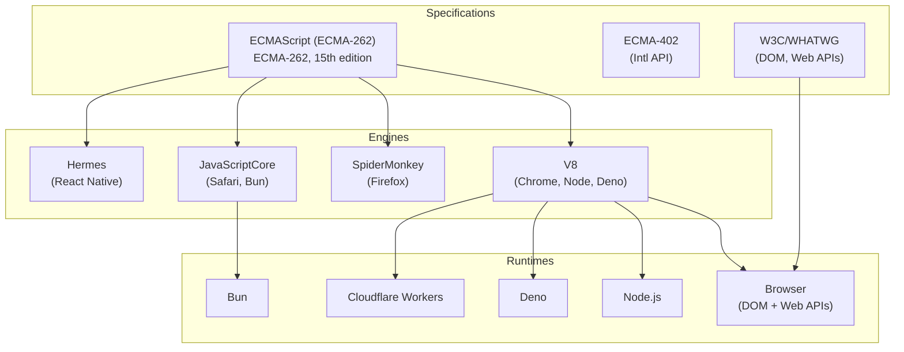

**TypeScript is not a runtime.** TypeScript code is parsed, type-checked, and then transpiled to JavaScript. The output JavaScript runs in any conformant ECMAScript runtime. The type system is purely a build-time artifact.

## 3. Five Ws + One H

### What <a class="askgpt-btn" href="https://chatgpt.com/?prompt=Read%20this%20section%20of%20my%20encyclopedia%20and%20explain%20it%20in%20depth%20with%20concrete%20examples%2C%20the%20main%20trade-offs%2C%20and%20common%20pitfalls%20a%20practitioner%20should%20know%3A%0A%0Ahttps%3A%2F%2Fgithub.com%2Fvishvasg14%2Fsoftware-engineering-encyclopedia%2Fblob%2Fmain%2F02-javascript-typescript%2Fjavascript-typescript.md%23what%0A%0ASection%20title%3A%20What" target="_blank" rel="noopener" data-askgpt="What" data-askgpt-url="https://github.com/vishvasg14/software-engineering-encyclopedia/blob/main/02-javascript-typescript/javascript-typescript.md#what" data-askgpt-prompt-depth="Read%20this%20section%20of%20my%20encyclopedia%20and%20explain%20it%20in%20depth%20with%20concrete%20examples%2C%20the%20main%20trade-offs%2C%20and%20common%20pitfalls%20a%20practitioner%20should%20know%3A%0A%0Ahttps%3A%2F%2Fgithub.com%2Fvishvasg14%2Fsoftware-engineering-encyclopedia%2Fblob%2Fmain%2F02-javascript-typescript%2Fjavascript-typescript.md%23what%0A%0ASection%20title%3A%20What" data-askgpt-prompt-examples="Read%20this%20section%20of%20my%20encyclopedia%20and%20give%20me%202-3%20real-world%20production%20examples%20for%20it.%20For%20each%3A%20what%20went%20right%2C%20what%20went%20wrong%2C%20and%20the%20lessons%20learned.%20Include%20company%20%2F%20project%20names%20if%20relevant.%0A%0Ahttps%3A%2F%2Fgithub.com%2Fvishvasg14%2Fsoftware-engineering-encyclopedia%2Fblob%2Fmain%2F02-javascript-typescript%2Fjavascript-typescript.md%23what%0A%0ASection%20title%3A%20What" title="Ask ChatGPT about this section">💬</a>

JavaScript is a **prototype-based, dynamically typed, single-threaded, garbage-collected, multi-paradigm language** with first-class functions and non-blocking I/O via an event loop. TypeScript is a **syntactic superset** of JavaScript that adds optional static typing and is erased at runtime.

### Why <a class="askgpt-btn" href="https://chatgpt.com/?prompt=Read%20this%20section%20of%20my%20encyclopedia%20and%20explain%20it%20in%20depth%20with%20concrete%20examples%2C%20the%20main%20trade-offs%2C%20and%20common%20pitfalls%20a%20practitioner%20should%20know%3A%0A%0Ahttps%3A%2F%2Fgithub.com%2Fvishvasg14%2Fsoftware-engineering-encyclopedia%2Fblob%2Fmain%2F02-javascript-typescript%2Fjavascript-typescript.md%23why%0A%0ASection%20title%3A%20Why" target="_blank" rel="noopener" data-askgpt="Why" data-askgpt-url="https://github.com/vishvasg14/software-engineering-encyclopedia/blob/main/02-javascript-typescript/javascript-typescript.md#why" data-askgpt-prompt-depth="Read%20this%20section%20of%20my%20encyclopedia%20and%20explain%20it%20in%20depth%20with%20concrete%20examples%2C%20the%20main%20trade-offs%2C%20and%20common%20pitfalls%20a%20practitioner%20should%20know%3A%0A%0Ahttps%3A%2F%2Fgithub.com%2Fvishvasg14%2Fsoftware-engineering-encyclopedia%2Fblob%2Fmain%2F02-javascript-typescript%2Fjavascript-typescript.md%23why%0A%0ASection%20title%3A%20Why" data-askgpt-prompt-examples="Read%20this%20section%20of%20my%20encyclopedia%20and%20give%20me%202-3%20real-world%20production%20examples%20for%20it.%20For%20each%3A%20what%20went%20right%2C%20what%20went%20wrong%2C%20and%20the%20lessons%20learned.%20Include%20company%20%2F%20project%20names%20if%20relevant.%0A%0Ahttps%3A%2F%2Fgithub.com%2Fvishvasg14%2Fsoftware-engineering-encyclopedia%2Fblob%2Fmain%2F02-javascript-typescript%2Fjavascript-typescript.md%23why%0A%0ASection%20title%3A%20Why" title="Ask ChatGPT about this section">💬</a>

JavaScript exists because the web needed a scripting language that could be embedded in HTML, run safely in a browser, and have a low learning curve. TypeScript exists because JavaScript's dynamic typing creates maintenance problems in large codebases, and existing optional type systems (Closure Compiler, JSDoc) were insufficient.

### When <a class="askgpt-btn" href="https://chatgpt.com/?prompt=Read%20this%20section%20of%20my%20encyclopedia%20and%20explain%20it%20in%20depth%20with%20concrete%20examples%2C%20the%20main%20trade-offs%2C%20and%20common%20pitfalls%20a%20practitioner%20should%20know%3A%0A%0Ahttps%3A%2F%2Fgithub.com%2Fvishvasg14%2Fsoftware-engineering-encyclopedia%2Fblob%2Fmain%2F02-javascript-typescript%2Fjavascript-typescript.md%23when%0A%0ASection%20title%3A%20When" target="_blank" rel="noopener" data-askgpt="When" data-askgpt-url="https://github.com/vishvasg14/software-engineering-encyclopedia/blob/main/02-javascript-typescript/javascript-typescript.md#when" data-askgpt-prompt-depth="Read%20this%20section%20of%20my%20encyclopedia%20and%20explain%20it%20in%20depth%20with%20concrete%20examples%2C%20the%20main%20trade-offs%2C%20and%20common%20pitfalls%20a%20practitioner%20should%20know%3A%0A%0Ahttps%3A%2F%2Fgithub.com%2Fvishvasg14%2Fsoftware-engineering-encyclopedia%2Fblob%2Fmain%2F02-javascript-typescript%2Fjavascript-typescript.md%23when%0A%0ASection%20title%3A%20When" data-askgpt-prompt-examples="Read%20this%20section%20of%20my%20encyclopedia%20and%20give%20me%202-3%20real-world%20production%20examples%20for%20it.%20For%20each%3A%20what%20went%20right%2C%20what%20went%20wrong%2C%20and%20the%20lessons%20learned.%20Include%20company%20%2F%20project%20names%20if%20relevant.%0A%0Ahttps%3A%2F%2Fgithub.com%2Fvishvasg14%2Fsoftware-engineering-encyclopedia%2Fblob%2Fmain%2F02-javascript-typescript%2Fjavascript-typescript.md%23when%0A%0ASection%20title%3A%20When" title="Ask ChatGPT about this section">💬</a>

JavaScript since 1995 (created in 10 days in May 1995). TypeScript since 2012 (announced October 2012).

### Where <a class="askgpt-btn" href="https://chatgpt.com/?prompt=Read%20this%20section%20of%20my%20encyclopedia%20and%20explain%20it%20in%20depth%20with%20concrete%20examples%2C%20the%20main%20trade-offs%2C%20and%20common%20pitfalls%20a%20practitioner%20should%20know%3A%0A%0Ahttps%3A%2F%2Fgithub.com%2Fvishvasg14%2Fsoftware-engineering-encyclopedia%2Fblob%2Fmain%2F02-javascript-typescript%2Fjavascript-typescript.md%23where%0A%0ASection%20title%3A%20Where" target="_blank" rel="noopener" data-askgpt="Where" data-askgpt-url="https://github.com/vishvasg14/software-engineering-encyclopedia/blob/main/02-javascript-typescript/javascript-typescript.md#where" data-askgpt-prompt-depth="Read%20this%20section%20of%20my%20encyclopedia%20and%20explain%20it%20in%20depth%20with%20concrete%20examples%2C%20the%20main%20trade-offs%2C%20and%20common%20pitfalls%20a%20practitioner%20should%20know%3A%0A%0Ahttps%3A%2F%2Fgithub.com%2Fvishvasg14%2Fsoftware-engineering-encyclopedia%2Fblob%2Fmain%2F02-javascript-typescript%2Fjavascript-typescript.md%23where%0A%0ASection%20title%3A%20Where" data-askgpt-prompt-examples="Read%20this%20section%20of%20my%20encyclopedia%20and%20give%20me%202-3%20real-world%20production%20examples%20for%20it.%20For%20each%3A%20what%20went%20right%2C%20what%20went%20wrong%2C%20and%20the%20lessons%20learned.%20Include%20company%20%2F%20project%20names%20if%20relevant.%0A%0Ahttps%3A%2F%2Fgithub.com%2Fvishvasg14%2Fsoftware-engineering-encyclopedia%2Fblob%2Fmain%2F02-javascript-typescript%2Fjavascript-typescript.md%23where%0A%0ASection%20title%3A%20Where" title="Ask ChatGPT about this section">💬</a>

Browsers (Chrome, Firefox, Safari, Edge, mobile browsers); servers (Node.js, Deno, Bun); edge compute (Cloudflare Workers, Deno Deploy); mobile (React Native, Cordova); desktop (Electron, Tauri); embedded (Hermes, lowjs).

### Who <a class="askgpt-btn" href="https://chatgpt.com/?prompt=Read%20this%20section%20of%20my%20encyclopedia%20and%20explain%20it%20in%20depth%20with%20concrete%20examples%2C%20the%20main%20trade-offs%2C%20and%20common%20pitfalls%20a%20practitioner%20should%20know%3A%0A%0Ahttps%3A%2F%2Fgithub.com%2Fvishvasg14%2Fsoftware-engineering-encyclopedia%2Fblob%2Fmain%2F02-javascript-typescript%2Fjavascript-typescript.md%23who%0A%0ASection%20title%3A%20Who" target="_blank" rel="noopener" data-askgpt="Who" data-askgpt-url="https://github.com/vishvasg14/software-engineering-encyclopedia/blob/main/02-javascript-typescript/javascript-typescript.md#who" data-askgpt-prompt-depth="Read%20this%20section%20of%20my%20encyclopedia%20and%20explain%20it%20in%20depth%20with%20concrete%20examples%2C%20the%20main%20trade-offs%2C%20and%20common%20pitfalls%20a%20practitioner%20should%20know%3A%0A%0Ahttps%3A%2F%2Fgithub.com%2Fvishvasg14%2Fsoftware-engineering-encyclopedia%2Fblob%2Fmain%2F02-javascript-typescript%2Fjavascript-typescript.md%23who%0A%0ASection%20title%3A%20Who" data-askgpt-prompt-examples="Read%20this%20section%20of%20my%20encyclopedia%20and%20give%20me%202-3%20real-world%20production%20examples%20for%20it.%20For%20each%3A%20what%20went%20right%2C%20what%20went%20wrong%2C%20and%20the%20lessons%20learned.%20Include%20company%20%2F%20project%20names%20if%20relevant.%0A%0Ahttps%3A%2F%2Fgithub.com%2Fvishvasg14%2Fsoftware-engineering-encyclopedia%2Fblob%2Fmain%2F02-javascript-typescript%2Fjavascript-typescript.md%23who%0A%0ASection%20title%3A%20Who" title="Ask ChatGPT about this section">💬</a>

- **JavaScript:** Originally Brendan Eich (Netscape). Standardized by ECMA TC39 (technical committee). Engines: Google (V8), Mozilla (SpiderMonkey), Apple (JavaScriptCore). Runtimes: OpenJS Foundation (Node.js), Deno Land (Deno), Oven (Bun).
- **TypeScript:** Anders Hejlsberg (original architect; also created C# and Turbo Pascal), Microsoft. Open-source under Apache 2.0. Major contributors include the TypeScript compiler team at Microsoft.

### How <a class="askgpt-btn" href="https://chatgpt.com/?prompt=Read%20this%20section%20of%20my%20encyclopedia%20and%20explain%20it%20in%20depth%20with%20concrete%20examples%2C%20the%20main%20trade-offs%2C%20and%20common%20pitfalls%20a%20practitioner%20should%20know%3A%0A%0Ahttps%3A%2F%2Fgithub.com%2Fvishvasg14%2Fsoftware-engineering-encyclopedia%2Fblob%2Fmain%2F02-javascript-typescript%2Fjavascript-typescript.md%23how%0A%0ASection%20title%3A%20How" target="_blank" rel="noopener" data-askgpt="How" data-askgpt-url="https://github.com/vishvasg14/software-engineering-encyclopedia/blob/main/02-javascript-typescript/javascript-typescript.md#how" data-askgpt-prompt-depth="Read%20this%20section%20of%20my%20encyclopedia%20and%20explain%20it%20in%20depth%20with%20concrete%20examples%2C%20the%20main%20trade-offs%2C%20and%20common%20pitfalls%20a%20practitioner%20should%20know%3A%0A%0Ahttps%3A%2F%2Fgithub.com%2Fvishvasg14%2Fsoftware-engineering-encyclopedia%2Fblob%2Fmain%2F02-javascript-typescript%2Fjavascript-typescript.md%23how%0A%0ASection%20title%3A%20How" data-askgpt-prompt-examples="Read%20this%20section%20of%20my%20encyclopedia%20and%20give%20me%202-3%20real-world%20production%20examples%20for%20it.%20For%20each%3A%20what%20went%20right%2C%20what%20went%20wrong%2C%20and%20the%20lessons%20learned.%20Include%20company%20%2F%20project%20names%20if%20relevant.%0A%0Ahttps%3A%2F%2Fgithub.com%2Fvishvasg14%2Fsoftware-engineering-encyclopedia%2Fblob%2Fmain%2F02-javascript-typescript%2Fjavascript-typescript.md%23how%0A%0ASection%20title%3A%20How" title="Ask ChatGPT about this section">💬</a>

A JavaScript program goes through four major stages:

1. **Parse** — source text → tokens → AST (abstract syntax tree).
2. **Compile to bytecode** — engine emits platform-independent bytecode (Ignition in V8, LLInt in JSC).
3. **Execute (interpret or JIT)** — bytecode runs in the interpreter initially; hot functions are progressively JIT-compiled to native code (Sparkplug, then TurboFan in V8).
4. **Garbage-collect** — V8's Orinoco GC reclaims unreachable objects concurrently with the mutator.

TypeScript adds a 0th stage: **type-check** the source against declared and inferred types before transpiling. The type system is erased; no runtime overhead.

## 4. History

### 4.1 Origins (1995–1997) <a class="askgpt-btn" href="https://chatgpt.com/?prompt=Read%20this%20section%20of%20my%20encyclopedia%20and%20explain%20it%20in%20depth%20with%20concrete%20examples%2C%20the%20main%20trade-offs%2C%20and%20common%20pitfalls%20a%20practitioner%20should%20know%3A%0A%0Ahttps%3A%2F%2Fgithub.com%2Fvishvasg14%2Fsoftware-engineering-encyclopedia%2Fblob%2Fmain%2F02-javascript-typescript%2Fjavascript-typescript.md%2341-origins-19951997%0A%0ASection%20title%3A%204.1%20Origins%20(1995%E2%80%931997)" target="_blank" rel="noopener" data-askgpt="4.1 Origins (1995–1997)" data-askgpt-url="https://github.com/vishvasg14/software-engineering-encyclopedia/blob/main/02-javascript-typescript/javascript-typescript.md#41-origins-19951997" data-askgpt-prompt-depth="Read%20this%20section%20of%20my%20encyclopedia%20and%20explain%20it%20in%20depth%20with%20concrete%20examples%2C%20the%20main%20trade-offs%2C%20and%20common%20pitfalls%20a%20practitioner%20should%20know%3A%0A%0Ahttps%3A%2F%2Fgithub.com%2Fvishvasg14%2Fsoftware-engineering-encyclopedia%2Fblob%2Fmain%2F02-javascript-typescript%2Fjavascript-typescript.md%2341-origins-19951997%0A%0ASection%20title%3A%204.1%20Origins%20(1995%E2%80%931997)" data-askgpt-prompt-examples="Read%20this%20section%20of%20my%20encyclopedia%20and%20give%20me%202-3%20real-world%20production%20examples%20for%20it.%20For%20each%3A%20what%20went%20right%2C%20what%20went%20wrong%2C%20and%20the%20lessons%20learned.%20Include%20company%20%2F%20project%20names%20if%20relevant.%0A%0Ahttps%3A%2F%2Fgithub.com%2Fvishvasg14%2Fsoftware-engineering-encyclopedia%2Fblob%2Fmain%2F02-javascript-typescript%2Fjavascript-typescript.md%2341-origins-19951997%0A%0ASection%20title%3A%204.1%20Origins%20(1995%E2%80%931997)" title="Ask ChatGPT about this section">💬</a>

- **1993** — Mosaic browser released at NCSA; Marc Andreessen leaves to co-found Netscape.
- **May 1995** — Brendan Eich creates the original language in 10 days, originally called **Mocha**, intended to be a "Scheme for the browser" but constrained to look like Java for marketing reasons.
- **September 1995** — Renamed to **LiveScript**, then to **JavaScript** as part of a Netscape-Sun partnership to align with Java's branding.
- **December 1995** — Netscape Navigator 2.0 ships JavaScript 1.0.
- **1996** — Microsoft reverse-engineers JavaScript as **JScript** for Internet Explorer 3.0, triggering the first browser wars.
- **November 1996** — Netscape submits JavaScript to ECMA International for standardization.
- **June 1997** — **ECMAScript 1** (ES1) is published as ECMA-262.
- **June 1998** — **ECMAScript 2** ships (editorial alignment with ISO/IEC 16262).
- **December 1999** — **ECMAScript 3** ships with regular expressions, try/catch, and many familiar core APIs.

### 4.2 The stagnation era (2000–2008) <a class="askgpt-btn" href="https://chatgpt.com/?prompt=Read%20this%20section%20of%20my%20encyclopedia%20and%20explain%20it%20in%20depth%20with%20concrete%20examples%2C%20the%20main%20trade-offs%2C%20and%20common%20pitfalls%20a%20practitioner%20should%20know%3A%0A%0Ahttps%3A%2F%2Fgithub.com%2Fvishvasg14%2Fsoftware-engineering-encyclopedia%2Fblob%2Fmain%2F02-javascript-typescript%2Fjavascript-typescript.md%2342-the-stagnation-era-20002008%0A%0ASection%20title%3A%204.2%20The%20stagnation%20era%20(2000%E2%80%932008)" target="_blank" rel="noopener" data-askgpt="4.2 The stagnation era (2000–2008)" data-askgpt-url="https://github.com/vishvasg14/software-engineering-encyclopedia/blob/main/02-javascript-typescript/javascript-typescript.md#42-the-stagnation-era-20002008" data-askgpt-prompt-depth="Read%20this%20section%20of%20my%20encyclopedia%20and%20explain%20it%20in%20depth%20with%20concrete%20examples%2C%20the%20main%20trade-offs%2C%20and%20common%20pitfalls%20a%20practitioner%20should%20know%3A%0A%0Ahttps%3A%2F%2Fgithub.com%2Fvishvasg14%2Fsoftware-engineering-encyclopedia%2Fblob%2Fmain%2F02-javascript-typescript%2Fjavascript-typescript.md%2342-the-stagnation-era-20002008%0A%0ASection%20title%3A%204.2%20The%20stagnation%20era%20(2000%E2%80%932008)" data-askgpt-prompt-examples="Read%20this%20section%20of%20my%20encyclopedia%20and%20give%20me%202-3%20real-world%20production%20examples%20for%20it.%20For%20each%3A%20what%20went%20right%2C%20what%20went%20wrong%2C%20and%20the%20lessons%20learned.%20Include%20company%20%2F%20project%20names%20if%20relevant.%0A%0Ahttps%3A%2F%2Fgithub.com%2Fvishvasg14%2Fsoftware-engineering-encyclopedia%2Fblob%2Fmain%2F02-javascript-typescript%2Fjavascript-typescript.md%2342-the-stagnation-era-20002008%0A%0ASection%20title%3A%204.2%20The%20stagnation%20era%20(2000%E2%80%932008)" title="Ask ChatGPT about this section">💬</a>

ES4 was proposed in 1999 with ambitious additions (classes, modules, type annotations, generators, destructuring). It was abandoned in 2008 after years of disagreement between Microsoft and Mozilla/Yahoo over scope and direction. The simpler ES3.1 proposal (which became ES5) was pursued instead.

- **2005** — Jesse James Garrett coins "Ajax" (Asynchronous JavaScript and XML); JavaScript becomes central to the modern web.
- **2006** — John Resig releases **jQuery**, the dominant JS library for the next 5 years.
- **2007** — Douglas Crockford's *JavaScript: The Good Parts* publishes; "JSON" (which Crockford popularized) becomes a standard.
- **2008** — Google releases **Chrome** with the **V8** engine, applying JIT compilation to JavaScript for the first time at scale.

### 4.3 The renaissance (2009–2015) <a class="askgpt-btn" href="https://chatgpt.com/?prompt=Read%20this%20section%20of%20my%20encyclopedia%20and%20explain%20it%20in%20depth%20with%20concrete%20examples%2C%20the%20main%20trade-offs%2C%20and%20common%20pitfalls%20a%20practitioner%20should%20know%3A%0A%0Ahttps%3A%2F%2Fgithub.com%2Fvishvasg14%2Fsoftware-engineering-encyclopedia%2Fblob%2Fmain%2F02-javascript-typescript%2Fjavascript-typescript.md%2343-the-renaissance-20092015%0A%0ASection%20title%3A%204.3%20The%20renaissance%20(2009%E2%80%932015)" target="_blank" rel="noopener" data-askgpt="4.3 The renaissance (2009–2015)" data-askgpt-url="https://github.com/vishvasg14/software-engineering-encyclopedia/blob/main/02-javascript-typescript/javascript-typescript.md#43-the-renaissance-20092015" data-askgpt-prompt-depth="Read%20this%20section%20of%20my%20encyclopedia%20and%20explain%20it%20in%20depth%20with%20concrete%20examples%2C%20the%20main%20trade-offs%2C%20and%20common%20pitfalls%20a%20practitioner%20should%20know%3A%0A%0Ahttps%3A%2F%2Fgithub.com%2Fvishvasg14%2Fsoftware-engineering-encyclopedia%2Fblob%2Fmain%2F02-javascript-typescript%2Fjavascript-typescript.md%2343-the-renaissance-20092015%0A%0ASection%20title%3A%204.3%20The%20renaissance%20(2009%E2%80%932015)" data-askgpt-prompt-examples="Read%20this%20section%20of%20my%20encyclopedia%20and%20give%20me%202-3%20real-world%20production%20examples%20for%20it.%20For%20each%3A%20what%20went%20right%2C%20what%20went%20wrong%2C%20and%20the%20lessons%20learned.%20Include%20company%20%2F%20project%20names%20if%20relevant.%0A%0Ahttps%3A%2F%2Fgithub.com%2Fvishvasg14%2Fsoftware-engineering-encyclopedia%2Fblob%2Fmain%2F02-javascript-typescript%2Fjavascript-typescript.md%2343-the-renaissance-20092015%0A%0ASection%20title%3A%204.3%20The%20renaissance%20(2009%E2%80%932015)" title="Ask ChatGPT about this section">💬</a>

- **December 2009** — **ECMAScript 5** (ES5) ships. Adds `strict mode`, `Array.prototype.forEach`/`map`/`filter`/`reduce`, `Object.create`, getters/setters, `JSON` object.
- **2009** — Ryan Dahl creates **Node.js**, bringing JavaScript to the server with libuv and V8.
- **2010** — Backbone.js, Knockout.js, AngularJS 1.x (2010-2012) define the era of JavaScript frameworks.
- **2012** — Microsoft announces **TypeScript** (October); Anders Hejlsberg leads design.
- **2013** — React (Facebook) and Vue (Evan You) are released.
- **2014** — Internet Explorer 11 ships (last IE version); Web 2.0 era effectively ends.

### 4.4 The modern era (2015–present) <a class="askgpt-btn" href="https://chatgpt.com/?prompt=Read%20this%20section%20of%20my%20encyclopedia%20and%20explain%20it%20in%20depth%20with%20concrete%20examples%2C%20the%20main%20trade-offs%2C%20and%20common%20pitfalls%20a%20practitioner%20should%20know%3A%0A%0Ahttps%3A%2F%2Fgithub.com%2Fvishvasg14%2Fsoftware-engineering-encyclopedia%2Fblob%2Fmain%2F02-javascript-typescript%2Fjavascript-typescript.md%2344-the-modern-era-2015present%0A%0ASection%20title%3A%204.4%20The%20modern%20era%20(2015%E2%80%93present)" target="_blank" rel="noopener" data-askgpt="4.4 The modern era (2015–present)" data-askgpt-url="https://github.com/vishvasg14/software-engineering-encyclopedia/blob/main/02-javascript-typescript/javascript-typescript.md#44-the-modern-era-2015present" data-askgpt-prompt-depth="Read%20this%20section%20of%20my%20encyclopedia%20and%20explain%20it%20in%20depth%20with%20concrete%20examples%2C%20the%20main%20trade-offs%2C%20and%20common%20pitfalls%20a%20practitioner%20should%20know%3A%0A%0Ahttps%3A%2F%2Fgithub.com%2Fvishvasg14%2Fsoftware-engineering-encyclopedia%2Fblob%2Fmain%2F02-javascript-typescript%2Fjavascript-typescript.md%2344-the-modern-era-2015present%0A%0ASection%20title%3A%204.4%20The%20modern%20era%20(2015%E2%80%93present)" data-askgpt-prompt-examples="Read%20this%20section%20of%20my%20encyclopedia%20and%20give%20me%202-3%20real-world%20production%20examples%20for%20it.%20For%20each%3A%20what%20went%20right%2C%20what%20went%20wrong%2C%20and%20the%20lessons%20learned.%20Include%20company%20%2F%20project%20names%20if%20relevant.%0A%0Ahttps%3A%2F%2Fgithub.com%2Fvishvasg14%2Fsoftware-engineering-encyclopedia%2Fblob%2Fmain%2F02-javascript-typescript%2Fjavascript-typescript.md%2344-the-modern-era-2015present%0A%0ASection%20title%3A%204.4%20The%20modern%20era%20(2015%E2%80%93present)" title="Ask ChatGPT about this section">💬</a>

- **June 2015** — **ECMAScript 2015 (ES6/ES2015)** ships after a 6-year gap. The largest single-version change in the language's history. Adds classes, modules, arrow functions, `let`/`const`, Promises, generators, `Map`/`Set`, destructuring, template literals, spread, `for...of`, `Symbol`, default parameters, rest parameters, `Proxy`, `Reflect`.
- **2015–2026** — Annual ECMAScript releases with smaller, additive changes.

### 4.5 Annual ECMAScript releases <a class="askgpt-btn" href="https://chatgpt.com/?prompt=Read%20this%20section%20of%20my%20encyclopedia%20and%20explain%20it%20in%20depth%20with%20concrete%20examples%2C%20the%20main%20trade-offs%2C%20and%20common%20pitfalls%20a%20practitioner%20should%20know%3A%0A%0Ahttps%3A%2F%2Fgithub.com%2Fvishvasg14%2Fsoftware-engineering-encyclopedia%2Fblob%2Fmain%2F02-javascript-typescript%2Fjavascript-typescript.md%2345-annual-ecmascript-releases%0A%0ASection%20title%3A%204.5%20Annual%20ECMAScript%20releases" target="_blank" rel="noopener" data-askgpt="4.5 Annual ECMAScript releases" data-askgpt-url="https://github.com/vishvasg14/software-engineering-encyclopedia/blob/main/02-javascript-typescript/javascript-typescript.md#45-annual-ecmascript-releases" data-askgpt-prompt-depth="Read%20this%20section%20of%20my%20encyclopedia%20and%20explain%20it%20in%20depth%20with%20concrete%20examples%2C%20the%20main%20trade-offs%2C%20and%20common%20pitfalls%20a%20practitioner%20should%20know%3A%0A%0Ahttps%3A%2F%2Fgithub.com%2Fvishvasg14%2Fsoftware-engineering-encyclopedia%2Fblob%2Fmain%2F02-javascript-typescript%2Fjavascript-typescript.md%2345-annual-ecmascript-releases%0A%0ASection%20title%3A%204.5%20Annual%20ECMAScript%20releases" data-askgpt-prompt-examples="Read%20this%20section%20of%20my%20encyclopedia%20and%20give%20me%202-3%20real-world%20production%20examples%20for%20it.%20For%20each%3A%20what%20went%20right%2C%20what%20went%20wrong%2C%20and%20the%20lessons%20learned.%20Include%20company%20%2F%20project%20names%20if%20relevant.%0A%0Ahttps%3A%2F%2Fgithub.com%2Fvishvasg14%2Fsoftware-engineering-encyclopedia%2Fblob%2Fmain%2F02-javascript-typescript%2Fjavascript-typescript.md%2345-annual-ecmascript-releases%0A%0ASection%20title%3A%204.5%20Annual%20ECMAScript%20releases" title="Ask ChatGPT about this section">💬</a>

| Year | Edition | Notable features |
|------|---------|------------------|
| 2015 | ES2015 (ES6) | classes, modules, Promises, arrow fns, generators, Map/Set |
| 2016 | ES2016 | `**` exponent operator, `Array.prototype.includes`, `**=` |
| 2017 | ES2017 | async/await, `Object.values`/`Object.entries`, `Object.getOwnPropertyDescriptors`, shared memory, `String.prototype.padStart`/`padEnd`, trailing commas |
| 2018 | ES2018 | rest/spread (objects), async iteration, `Promise.prototype.finally`, named capture groups in RegExp, `globalThis` |
| 2019 | ES2019 | `Array.prototype.flat`/`flatMap`, `Object.fromEntries`, optional catch binding, `String.prototype.trimStart`/`trimEnd` |
| 2020 | ES2020 | optional chaining `?.`, nullish coalescing `??`, BigInt, dynamic `import()`, `Promise.allSettled`, `globalThis` standardized, `String.prototype.matchAll` |
| 2021 | ES2021 | logical assignment operators (`&&=`, `||=`, `??=`), `String.prototype.replaceAll`, `Promise.any`, numeric separators, weak references (`WeakRef`, `FinalizationRegistry`) |
| 2022 | ES2022 | top-level await, class fields (public/private), `Array.prototype.at`, `Object.hasOwn`, error `cause`, `findLast`/`findLastIndex`, RegExp match indices |
| 2023 | ES2023 | `Array.prototype.findLast`/`findLastIndex` (now in ES2022 actually), `#private` in standard classes, `Array.prototype.toSorted`/`toReversed`/`with`, change array by copy |
| 2024 | ES2024 | `Array.prototype.groupBy`/`groupByToMap`, `Object.groupBy`, `Object.groupByToMap`, `Promise.withResolvers`, `String.prototype.isWellFormed`, `RegExp` v flag |
| 2025 | ES2025 | Iterator helpers (`map`, `filter`, `take`, `drop`, `toArray`, etc. on iterators), `Set.prototype.intersection`/`union`/`difference`/`symmetricDifference`/`isSubsetOf`/`isSupersetOf`/`isDisjointFrom`, `Promise.try` |

### 4.6 TypeScript evolution <a class="askgpt-btn" href="https://chatgpt.com/?prompt=Read%20this%20section%20of%20my%20encyclopedia%20and%20explain%20it%20in%20depth%20with%20concrete%20examples%2C%20the%20main%20trade-offs%2C%20and%20common%20pitfalls%20a%20practitioner%20should%20know%3A%0A%0Ahttps%3A%2F%2Fgithub.com%2Fvishvasg14%2Fsoftware-engineering-encyclopedia%2Fblob%2Fmain%2F02-javascript-typescript%2Fjavascript-typescript.md%2346-typescript-evolution%0A%0ASection%20title%3A%204.6%20TypeScript%20evolution" target="_blank" rel="noopener" data-askgpt="4.6 TypeScript evolution" data-askgpt-url="https://github.com/vishvasg14/software-engineering-encyclopedia/blob/main/02-javascript-typescript/javascript-typescript.md#46-typescript-evolution" data-askgpt-prompt-depth="Read%20this%20section%20of%20my%20encyclopedia%20and%20explain%20it%20in%20depth%20with%20concrete%20examples%2C%20the%20main%20trade-offs%2C%20and%20common%20pitfalls%20a%20practitioner%20should%20know%3A%0A%0Ahttps%3A%2F%2Fgithub.com%2Fvishvasg14%2Fsoftware-engineering-encyclopedia%2Fblob%2Fmain%2F02-javascript-typescript%2Fjavascript-typescript.md%2346-typescript-evolution%0A%0ASection%20title%3A%204.6%20TypeScript%20evolution" data-askgpt-prompt-examples="Read%20this%20section%20of%20my%20encyclopedia%20and%20give%20me%202-3%20real-world%20production%20examples%20for%20it.%20For%20each%3A%20what%20went%20right%2C%20what%20went%20wrong%2C%20and%20the%20lessons%20learned.%20Include%20company%20%2F%20project%20names%20if%20relevant.%0A%0Ahttps%3A%2F%2Fgithub.com%2Fvishvasg14%2Fsoftware-engineering-encyclopedia%2Fblob%2Fmain%2F02-javascript-typescript%2Fjavascript-typescript.md%2346-typescript-evolution%0A%0ASection%20title%3A%204.6%20TypeScript%20evolution" title="Ask ChatGPT about this section">💬</a>

| Version | Year | Notable additions |
|---------|------|------------------|
| 1.0 | 2014 | First public release |
| 1.4 | 2014 | union types, `let`/`const` enums, type guards |
| 1.6 | 2015 | async/await support, intersection types |
| 1.8 | 2016 | control flow analysis, string literal types |
| 2.0 | 2016 | non-nullable types, `unknown`, control flow based type analysis |
| 2.4 | 2017 | dynamic `import()` expressions, string enums |
| 3.0 | 2018 | project references, rest in tuples |
| 3.4 | 2019 | `const` assertions (`as const`) |
| 4.0 | 2020 | variadic tuple types, labeled tuples, short-circuiting assignment operators |
| 4.4 | 2021 | control flow analysis of aliased conditions, `Symbol` type |
| 4.9 | 2022 | `satisfies` operator, `undefined` narrowing in catch |
| 5.0 | 2023 | decorators (TC39-aligned Stage 3), `const` type parameters |
| 5.2 | 2023 | `using` and explicit resource management |
| 5.4 | 2024 | `NoInfer<T>`, `Object.groupBy`/`Array.groupBy` types |
| 5.5 | 2024 | inferred type predicates, `Awaited` improvements |
| 5.6 | 2025 | iterator helper types, `disallowImportingTsExtensions` |

### 4.7 Engine timeline <a class="askgpt-btn" href="https://chatgpt.com/?prompt=Read%20this%20section%20of%20my%20encyclopedia%20and%20explain%20it%20in%20depth%20with%20concrete%20examples%2C%20the%20main%20trade-offs%2C%20and%20common%20pitfalls%20a%20practitioner%20should%20know%3A%0A%0Ahttps%3A%2F%2Fgithub.com%2Fvishvasg14%2Fsoftware-engineering-encyclopedia%2Fblob%2Fmain%2F02-javascript-typescript%2Fjavascript-typescript.md%2347-engine-timeline%0A%0ASection%20title%3A%204.7%20Engine%20timeline" target="_blank" rel="noopener" data-askgpt="4.7 Engine timeline" data-askgpt-url="https://github.com/vishvasg14/software-engineering-encyclopedia/blob/main/02-javascript-typescript/javascript-typescript.md#47-engine-timeline" data-askgpt-prompt-depth="Read%20this%20section%20of%20my%20encyclopedia%20and%20explain%20it%20in%20depth%20with%20concrete%20examples%2C%20the%20main%20trade-offs%2C%20and%20common%20pitfalls%20a%20practitioner%20should%20know%3A%0A%0Ahttps%3A%2F%2Fgithub.com%2Fvishvasg14%2Fsoftware-engineering-encyclopedia%2Fblob%2Fmain%2F02-javascript-typescript%2Fjavascript-typescript.md%2347-engine-timeline%0A%0ASection%20title%3A%204.7%20Engine%20timeline" data-askgpt-prompt-examples="Read%20this%20section%20of%20my%20encyclopedia%20and%20give%20me%202-3%20real-world%20production%20examples%20for%20it.%20For%20each%3A%20what%20went%20right%2C%20what%20went%20wrong%2C%20and%20the%20lessons%20learned.%20Include%20company%20%2F%20project%20names%20if%20relevant.%0A%0Ahttps%3A%2F%2Fgithub.com%2Fvishvasg14%2Fsoftware-engineering-encyclopedia%2Fblob%2Fmain%2F02-javascript-typescript%2Fjavascript-typescript.md%2347-engine-timeline%0A%0ASection%20title%3A%204.7%20Engine%20timeline" title="Ask ChatGPT about this section">💬</a>

- **2008** — V8 ships in Chrome.
- **2009** — Node.js launches with V8.
- **2017** — WebAssembly becomes a W3C standard; engines ship Wasm support.
- **2018** — V8 adds `BigInt` support.
- **2021** — V8 ships **Sparkplug** baseline JIT (between Ignition and TurboFan).
- **2023** — V8 ships **Maglev** mid-tier JIT.
- **2023+** — Hermes continues to evolve for React Native.
- **2022** — Bun launches using JavaScriptCore (instead of V8) for faster startup.

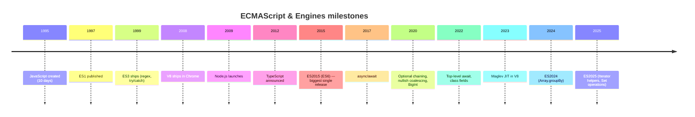

## 5. Problem Statement

### 5.1 What problems JavaScript solved <a class="askgpt-btn" href="https://chatgpt.com/?prompt=Read%20this%20section%20of%20my%20encyclopedia%20and%20explain%20it%20in%20depth%20with%20concrete%20examples%2C%20the%20main%20trade-offs%2C%20and%20common%20pitfalls%20a%20practitioner%20should%20know%3A%0A%0Ahttps%3A%2F%2Fgithub.com%2Fvishvasg14%2Fsoftware-engineering-encyclopedia%2Fblob%2Fmain%2F02-javascript-typescript%2Fjavascript-typescript.md%2351-what-problems-javascript-solved%0A%0ASection%20title%3A%205.1%20What%20problems%20JavaScript%20solved" target="_blank" rel="noopener" data-askgpt="5.1 What problems JavaScript solved" data-askgpt-url="https://github.com/vishvasg14/software-engineering-encyclopedia/blob/main/02-javascript-typescript/javascript-typescript.md#51-what-problems-javascript-solved" data-askgpt-prompt-depth="Read%20this%20section%20of%20my%20encyclopedia%20and%20explain%20it%20in%20depth%20with%20concrete%20examples%2C%20the%20main%20trade-offs%2C%20and%20common%20pitfalls%20a%20practitioner%20should%20know%3A%0A%0Ahttps%3A%2F%2Fgithub.com%2Fvishvasg14%2Fsoftware-engineering-encyclopedia%2Fblob%2Fmain%2F02-javascript-typescript%2Fjavascript-typescript.md%2351-what-problems-javascript-solved%0A%0ASection%20title%3A%205.1%20What%20problems%20JavaScript%20solved" data-askgpt-prompt-examples="Read%20this%20section%20of%20my%20encyclopedia%20and%20give%20me%202-3%20real-world%20production%20examples%20for%20it.%20For%20each%3A%20what%20went%20right%2C%20what%20went%20wrong%2C%20and%20the%20lessons%20learned.%20Include%20company%20%2F%20project%20names%20if%20relevant.%0A%0Ahttps%3A%2F%2Fgithub.com%2Fvishvasg14%2Fsoftware-engineering-encyclopedia%2Fblob%2Fmain%2F02-javascript-typescript%2Fjavascript-typescript.md%2351-what-problems-javascript-solved%0A%0ASection%20title%3A%205.1%20What%20problems%20JavaScript%20solved" title="Ask ChatGPT about this section">💬</a>

In 1995, the web was static HTML. To make pages interactive, two options existed: Java applets (heavy, sandboxed, slow to load) or inline scripts in HTML attributes (limited). Netscape wanted a lightweight scripting language embedded in HTML that:

- Was easy enough for designers and part-time programmers to use.
- Ran in a sandboxed environment (couldn't access the file system or arbitrary OS resources).
- Worked without compilation (the browser would interpret the source directly).
- Was reasonably safe despite running untrusted code.

### 5.2 Why JavaScript looked the way it did <a class="askgpt-btn" href="https://chatgpt.com/?prompt=Read%20this%20section%20of%20my%20encyclopedia%20and%20explain%20it%20in%20depth%20with%20concrete%20examples%2C%20the%20main%20trade-offs%2C%20and%20common%20pitfalls%20a%20practitioner%20should%20know%3A%0A%0Ahttps%3A%2F%2Fgithub.com%2Fvishvasg14%2Fsoftware-engineering-encyclopedia%2Fblob%2Fmain%2F02-javascript-typescript%2Fjavascript-typescript.md%2352-why-javascript-looked-the-way-it-did%0A%0ASection%20title%3A%205.2%20Why%20JavaScript%20looked%20the%20way%20it%20did" target="_blank" rel="noopener" data-askgpt="5.2 Why JavaScript looked the way it did" data-askgpt-url="https://github.com/vishvasg14/software-engineering-encyclopedia/blob/main/02-javascript-typescript/javascript-typescript.md#52-why-javascript-looked-the-way-it-did" data-askgpt-prompt-depth="Read%20this%20section%20of%20my%20encyclopedia%20and%20explain%20it%20in%20depth%20with%20concrete%20examples%2C%20the%20main%20trade-offs%2C%20and%20common%20pitfalls%20a%20practitioner%20should%20know%3A%0A%0Ahttps%3A%2F%2Fgithub.com%2Fvishvasg14%2Fsoftware-engineering-encyclopedia%2Fblob%2Fmain%2F02-javascript-typescript%2Fjavascript-typescript.md%2352-why-javascript-looked-the-way-it-did%0A%0ASection%20title%3A%205.2%20Why%20JavaScript%20looked%20the%20way%20it%20did" data-askgpt-prompt-examples="Read%20this%20section%20of%20my%20encyclopedia%20and%20give%20me%202-3%20real-world%20production%20examples%20for%20it.%20For%20each%3A%20what%20went%20right%2C%20what%20went%20wrong%2C%20and%20the%20lessons%20learned.%20Include%20company%20%2F%20project%20names%20if%20relevant.%0A%0Ahttps%3A%2F%2Fgithub.com%2Fvishvasg14%2Fsoftware-engineering-encyclopedia%2Fblob%2Fmain%2F02-javascript-typescript%2Fjavascript-typescript.md%2352-why-javascript-looked-the-way-it-did%0A%0ASection%20title%3A%205.2%20Why%20JavaScript%20looked%20the%20way%20it%20did" title="Ask ChatGPT about this section">💬</a>

- **Syntax inspired by Java** — for marketing reasons (Java was hot in 1995; "JavaScript" sounded related to Java).
- **Functions as first-class values** — borrowed from Scheme (the language Eich originally wanted to use).
- **Prototype-based objects** — Self language influence; no classes in the original design.
- **Loose typing** — ease of use, lower learning curve.

### 5.3 What JavaScript got wrong <a class="askgpt-btn" href="https://chatgpt.com/?prompt=Read%20this%20section%20of%20my%20encyclopedia%20and%20explain%20it%20in%20depth%20with%20concrete%20examples%2C%20the%20main%20trade-offs%2C%20and%20common%20pitfalls%20a%20practitioner%20should%20know%3A%0A%0Ahttps%3A%2F%2Fgithub.com%2Fvishvasg14%2Fsoftware-engineering-encyclopedia%2Fblob%2Fmain%2F02-javascript-typescript%2Fjavascript-typescript.md%2353-what-javascript-got-wrong%0A%0ASection%20title%3A%205.3%20What%20JavaScript%20got%20wrong" target="_blank" rel="noopener" data-askgpt="5.3 What JavaScript got wrong" data-askgpt-url="https://github.com/vishvasg14/software-engineering-encyclopedia/blob/main/02-javascript-typescript/javascript-typescript.md#53-what-javascript-got-wrong" data-askgpt-prompt-depth="Read%20this%20section%20of%20my%20encyclopedia%20and%20explain%20it%20in%20depth%20with%20concrete%20examples%2C%20the%20main%20trade-offs%2C%20and%20common%20pitfalls%20a%20practitioner%20should%20know%3A%0A%0Ahttps%3A%2F%2Fgithub.com%2Fvishvasg14%2Fsoftware-engineering-encyclopedia%2Fblob%2Fmain%2F02-javascript-typescript%2Fjavascript-typescript.md%2353-what-javascript-got-wrong%0A%0ASection%20title%3A%205.3%20What%20JavaScript%20got%20wrong" data-askgpt-prompt-examples="Read%20this%20section%20of%20my%20encyclopedia%20and%20give%20me%202-3%20real-world%20production%20examples%20for%20it.%20For%20each%3A%20what%20went%20right%2C%20what%20went%20wrong%2C%20and%20the%20lessons%20learned.%20Include%20company%20%2F%20project%20names%20if%20relevant.%0A%0Ahttps%3A%2F%2Fgithub.com%2Fvishvasg14%2Fsoftware-engineering-encyclopedia%2Fblob%2Fmain%2F02-javascript-typescript%2Fjavascript-typescript.md%2353-what-javascript-got-wrong%0A%0ASection%20title%3A%205.3%20What%20JavaScript%20got%20wrong" title="Ask ChatGPT about this section">💬</a>

- **`this` binding** — four rules, none of which match what new users expect.
- **Type coercion** — `[] + {} === '[object Object]'`, `'1' - 1 === 0`, etc.
- **Block scoping** — `var` hoisting, no block scoping until ES2015 `let`/`const`.
- **Module system** — none for the first 20 years; relied on IIFEs, CommonJS, AMD, then ESM (ES2015).
- **Equality** — `==` coerces, leading to bugs; `===` is what most code should use.

### 5.4 What TypeScript solved <a class="askgpt-btn" href="https://chatgpt.com/?prompt=Read%20this%20section%20of%20my%20encyclopedia%20and%20explain%20it%20in%20depth%20with%20concrete%20examples%2C%20the%20main%20trade-offs%2C%20and%20common%20pitfalls%20a%20practitioner%20should%20know%3A%0A%0Ahttps%3A%2F%2Fgithub.com%2Fvishvasg14%2Fsoftware-engineering-encyclopedia%2Fblob%2Fmain%2F02-javascript-typescript%2Fjavascript-typescript.md%2354-what-typescript-solved%0A%0ASection%20title%3A%205.4%20What%20TypeScript%20solved" target="_blank" rel="noopener" data-askgpt="5.4 What TypeScript solved" data-askgpt-url="https://github.com/vishvasg14/software-engineering-encyclopedia/blob/main/02-javascript-typescript/javascript-typescript.md#54-what-typescript-solved" data-askgpt-prompt-depth="Read%20this%20section%20of%20my%20encyclopedia%20and%20explain%20it%20in%20depth%20with%20concrete%20examples%2C%20the%20main%20trade-offs%2C%20and%20common%20pitfalls%20a%20practitioner%20should%20know%3A%0A%0Ahttps%3A%2F%2Fgithub.com%2Fvishvasg14%2Fsoftware-engineering-encyclopedia%2Fblob%2Fmain%2F02-javascript-typescript%2Fjavascript-typescript.md%2354-what-typescript-solved%0A%0ASection%20title%3A%205.4%20What%20TypeScript%20solved" data-askgpt-prompt-examples="Read%20this%20section%20of%20my%20encyclopedia%20and%20give%20me%202-3%20real-world%20production%20examples%20for%20it.%20For%20each%3A%20what%20went%20right%2C%20what%20went%20wrong%2C%20and%20the%20lessons%20learned.%20Include%20company%20%2F%20project%20names%20if%20relevant.%0A%0Ahttps%3A%2F%2Fgithub.com%2Fvishvasg14%2Fsoftware-engineering-encyclopedia%2Fblob%2Fmain%2F02-javascript-typescript%2Fjavascript-typescript.md%2354-what-typescript-solved%0A%0ASection%20title%3A%205.4%20What%20TypeScript%20solved" title="Ask ChatGPT about this section">💬</a>

By 2012, JavaScript codebases at Microsoft and elsewhere had grown to millions of lines. Dynamic typing made refactoring risky and IDE support weak. Existing solutions:

- **JSDoc + Google Closure Compiler** — works but requires discipline.
- **Flow (Facebook, 2014)** — wasn't widely adopted.
- **TypeScript** — Microsoft bet that the only way to get broad adoption was to make types optional and erase them at runtime, so existing JavaScript is valid TypeScript.

TypeScript's design choices:

- **Optional types** — you can introduce types gradually.
- **Erasure** — no runtime overhead; output is plain JS.
- **Structural typing** — matches JavaScript's duck-typed nature.
- **Microsoft backing** — long-term commitment to the toolchain.

## 6. Real-World Motivation

### 6.1 JavaScript at hyperscalers <a class="askgpt-btn" href="https://chatgpt.com/?prompt=Read%20this%20section%20of%20my%20encyclopedia%20and%20explain%20it%20in%20depth%20with%20concrete%20examples%2C%20the%20main%20trade-offs%2C%20and%20common%20pitfalls%20a%20practitioner%20should%20know%3A%0A%0Ahttps%3A%2F%2Fgithub.com%2Fvishvasg14%2Fsoftware-engineering-encyclopedia%2Fblob%2Fmain%2F02-javascript-typescript%2Fjavascript-typescript.md%2361-javascript-at-hyperscalers%0A%0ASection%20title%3A%206.1%20JavaScript%20at%20hyperscalers" target="_blank" rel="noopener" data-askgpt="6.1 JavaScript at hyperscalers" data-askgpt-url="https://github.com/vishvasg14/software-engineering-encyclopedia/blob/main/02-javascript-typescript/javascript-typescript.md#61-javascript-at-hyperscalers" data-askgpt-prompt-depth="Read%20this%20section%20of%20my%20encyclopedia%20and%20explain%20it%20in%20depth%20with%20concrete%20examples%2C%20the%20main%20trade-offs%2C%20and%20common%20pitfalls%20a%20practitioner%20should%20know%3A%0A%0Ahttps%3A%2F%2Fgithub.com%2Fvishvasg14%2Fsoftware-engineering-encyclopedia%2Fblob%2Fmain%2F02-javascript-typescript%2Fjavascript-typescript.md%2361-javascript-at-hyperscalers%0A%0ASection%20title%3A%206.1%20JavaScript%20at%20hyperscalers" data-askgpt-prompt-examples="Read%20this%20section%20of%20my%20encyclopedia%20and%20give%20me%202-3%20real-world%20production%20examples%20for%20it.%20For%20each%3A%20what%20went%20right%2C%20what%20went%20wrong%2C%20and%20the%20lessons%20learned.%20Include%20company%20%2F%20project%20names%20if%20relevant.%0A%0Ahttps%3A%2F%2Fgithub.com%2Fvishvasg14%2Fsoftware-engineering-encyclopedia%2Fblob%2Fmain%2F02-javascript-typescript%2Fjavascript-typescript.md%2361-javascript-at-hyperscalers%0A%0ASection%20title%3A%206.1%20JavaScript%20at%20hyperscalers" title="Ask ChatGPT about this section">💬</a>

**Meta** — React, React Native, Yarn, Metro, Hermes, Jest, all written in JavaScript/TypeScript. React Native runs on billions of devices.

**Google** — Chrome, Chrome OS, V8, Angular, TensorFlow.js, AMP. Gmail, Google Docs, Google Maps — all browser apps with substantial JavaScript/TypeScript codebases.

**Microsoft** — Visual Studio Code is an Electron app (JavaScript + TypeScript). TypeScript itself is written in TypeScript. The TypeScript compiler is one of the largest TS codebases in existence.

**Netflix** — the Netflix UI runs in the browser; Node.js services power parts of the backend. TypeScript adoption at Netflix was a major case study.

**PayPal** — one of the first enterprise migrations to Node.js (2013). Migrated account overview page from Java to Node, reporting 2x fewer lines of code, 35% fewer files, and 40% faster response times.

**LinkedIn** — mobile app and parts of the backend use Node.js.

### 6.2 TypeScript adoption <a class="askgpt-btn" href="https://chatgpt.com/?prompt=Read%20this%20section%20of%20my%20encyclopedia%20and%20explain%20it%20in%20depth%20with%20concrete%20examples%2C%20the%20main%20trade-offs%2C%20and%20common%20pitfalls%20a%20practitioner%20should%20know%3A%0A%0Ahttps%3A%2F%2Fgithub.com%2Fvishvasg14%2Fsoftware-engineering-encyclopedia%2Fblob%2Fmain%2F02-javascript-typescript%2Fjavascript-typescript.md%2362-typescript-adoption%0A%0ASection%20title%3A%206.2%20TypeScript%20adoption" target="_blank" rel="noopener" data-askgpt="6.2 TypeScript adoption" data-askgpt-url="https://github.com/vishvasg14/software-engineering-encyclopedia/blob/main/02-javascript-typescript/javascript-typescript.md#62-typescript-adoption" data-askgpt-prompt-depth="Read%20this%20section%20of%20my%20encyclopedia%20and%20explain%20it%20in%20depth%20with%20concrete%20examples%2C%20the%20main%20trade-offs%2C%20and%20common%20pitfalls%20a%20practitioner%20should%20know%3A%0A%0Ahttps%3A%2F%2Fgithub.com%2Fvishvasg14%2Fsoftware-engineering-encyclopedia%2Fblob%2Fmain%2F02-javascript-typescript%2Fjavascript-typescript.md%2362-typescript-adoption%0A%0ASection%20title%3A%206.2%20TypeScript%20adoption" data-askgpt-prompt-examples="Read%20this%20section%20of%20my%20encyclopedia%20and%20give%20me%202-3%20real-world%20production%20examples%20for%20it.%20For%20each%3A%20what%20went%20right%2C%20what%20went%20wrong%2C%20and%20the%20lessons%20learned.%20Include%20company%20%2F%20project%20names%20if%20relevant.%0A%0Ahttps%3A%2F%2Fgithub.com%2Fvishvasg14%2Fsoftware-engineering-encyclopedia%2Fblob%2Fmain%2F02-javascript-typescript%2Fjavascript-typescript.md%2362-typescript-adoption%0A%0ASection%20title%3A%206.2%20TypeScript%20adoption" title="Ask ChatGPT about this section">💬</a>

- **Slack** — migrated their desktop app (originally Electron + JS) to TypeScript; documented the experience in "Slack's TypeScript Migration".
- **Airbnb** — early adopter; documented "From JavaScript to TypeScript" journey.
- **Google** — used TypeScript internally; Angular was rewritten in TypeScript starting with Angular 2 (2016).
- **Microsoft** — TypeScript's primary customer; VS Code, TypeScript compiler, Azure portal.
- **Stripe** — public documentation of large-scale TypeScript usage.
- **Survey data:** Stack Overflow Developer Survey consistently shows TypeScript in the top 5 most loved/used languages, with ~40-50% of professional JS developers using TypeScript.

### 6.3 Node.js in production <a class="askgpt-btn" href="https://chatgpt.com/?prompt=Read%20this%20section%20of%20my%20encyclopedia%20and%20explain%20it%20in%20depth%20with%20concrete%20examples%2C%20the%20main%20trade-offs%2C%20and%20common%20pitfalls%20a%20practitioner%20should%20know%3A%0A%0Ahttps%3A%2F%2Fgithub.com%2Fvishvasg14%2Fsoftware-engineering-encyclopedia%2Fblob%2Fmain%2F02-javascript-typescript%2Fjavascript-typescript.md%2363-nodejs-in-production%0A%0ASection%20title%3A%206.3%20Node.js%20in%20production" target="_blank" rel="noopener" data-askgpt="6.3 Node.js in production" data-askgpt-url="https://github.com/vishvasg14/software-engineering-encyclopedia/blob/main/02-javascript-typescript/javascript-typescript.md#63-nodejs-in-production" data-askgpt-prompt-depth="Read%20this%20section%20of%20my%20encyclopedia%20and%20explain%20it%20in%20depth%20with%20concrete%20examples%2C%20the%20main%20trade-offs%2C%20and%20common%20pitfalls%20a%20practitioner%20should%20know%3A%0A%0Ahttps%3A%2F%2Fgithub.com%2Fvishvasg14%2Fsoftware-engineering-encyclopedia%2Fblob%2Fmain%2F02-javascript-typescript%2Fjavascript-typescript.md%2363-nodejs-in-production%0A%0ASection%20title%3A%206.3%20Node.js%20in%20production" data-askgpt-prompt-examples="Read%20this%20section%20of%20my%20encyclopedia%20and%20give%20me%202-3%20real-world%20production%20examples%20for%20it.%20For%20each%3A%20what%20went%20right%2C%20what%20went%20wrong%2C%20and%20the%20lessons%20learned.%20Include%20company%20%2F%20project%20names%20if%20relevant.%0A%0Ahttps%3A%2F%2Fgithub.com%2Fvishvasg14%2Fsoftware-engineering-encyclopedia%2Fblob%2Fmain%2F02-javascript-typescript%2Fjavascript-typescript.md%2363-nodejs-in-production%0A%0ASection%20title%3A%206.3%20Node.js%20in%20production" title="Ask ChatGPT about this section">💬</a>

- **Walmart** — Black Friday traffic on Node.js (2014+); a landmark case study for Node's production scalability.
- **Uber** — large-scale Node.js services for trip dispatch.
- **PayPal** — see above.
- **NASA** — Node.js for astronaut spacesuit telemetry (Node.js in space, 2017+).
- **Capital One** — large-scale banking on Node.js.
- **Trello** — original Rails backend, parts migrated to Node.

### 6.4 Economic and engineering motivation <a class="askgpt-btn" href="https://chatgpt.com/?prompt=Read%20this%20section%20of%20my%20encyclopedia%20and%20explain%20it%20in%20depth%20with%20concrete%20examples%2C%20the%20main%20trade-offs%2C%20and%20common%20pitfalls%20a%20practitioner%20should%20know%3A%0A%0Ahttps%3A%2F%2Fgithub.com%2Fvishvasg14%2Fsoftware-engineering-encyclopedia%2Fblob%2Fmain%2F02-javascript-typescript%2Fjavascript-typescript.md%2364-economic-and-engineering-motivation%0A%0ASection%20title%3A%206.4%20Economic%20and%20engineering%20motivation" target="_blank" rel="noopener" data-askgpt="6.4 Economic and engineering motivation" data-askgpt-url="https://github.com/vishvasg14/software-engineering-encyclopedia/blob/main/02-javascript-typescript/javascript-typescript.md#64-economic-and-engineering-motivation" data-askgpt-prompt-depth="Read%20this%20section%20of%20my%20encyclopedia%20and%20explain%20it%20in%20depth%20with%20concrete%20examples%2C%20the%20main%20trade-offs%2C%20and%20common%20pitfalls%20a%20practitioner%20should%20know%3A%0A%0Ahttps%3A%2F%2Fgithub.com%2Fvishvasg14%2Fsoftware-engineering-encyclopedia%2Fblob%2Fmain%2F02-javascript-typescript%2Fjavascript-typescript.md%2364-economic-and-engineering-motivation%0A%0ASection%20title%3A%206.4%20Economic%20and%20engineering%20motivation" data-askgpt-prompt-examples="Read%20this%20section%20of%20my%20encyclopedia%20and%20give%20me%202-3%20real-world%20production%20examples%20for%20it.%20For%20each%3A%20what%20went%20right%2C%20what%20went%20wrong%2C%20and%20the%20lessons%20learned.%20Include%20company%20%2F%20project%20names%20if%20relevant.%0A%0Ahttps%3A%2F%2Fgithub.com%2Fvishvasg14%2Fsoftware-engineering-encyclopedia%2Fblob%2Fmain%2F02-javascript-typescript%2Fjavascript-typescript.md%2364-economic-and-engineering-motivation%0A%0ASection%20title%3A%206.4%20Economic%20and%20engineering%20motivation" title="Ask ChatGPT about this section">💬</a>

- **Developer velocity** — Node.js unifies front-end and back-end languages, reducing context switching.
- **Talent pool** — JavaScript is the most widely known language (Stack Overflow survey).
- **NPM ecosystem** — `npmjs.com` has millions of packages; no comparable ecosystem for any single language.
- **Type safety at scale** — TypeScript reduces refactor risk in large codebases.
- **Performance for I/O-bound work** — Node.js non-blocking I/O scaled to millions of concurrent connections (with virtual threads in Java 21, this advantage has narrowed, but for many workloads Node remains excellent).

### 6.5 Why not alternatives? <a class="askgpt-btn" href="https://chatgpt.com/?prompt=Read%20this%20section%20of%20my%20encyclopedia%20and%20explain%20it%20in%20depth%20with%20concrete%20examples%2C%20the%20main%20trade-offs%2C%20and%20common%20pitfalls%20a%20practitioner%20should%20know%3A%0A%0Ahttps%3A%2F%2Fgithub.com%2Fvishvasg14%2Fsoftware-engineering-encyclopedia%2Fblob%2Fmain%2F02-javascript-typescript%2Fjavascript-typescript.md%2365-why-not-alternatives%0A%0ASection%20title%3A%206.5%20Why%20not%20alternatives%3F" target="_blank" rel="noopener" data-askgpt="6.5 Why not alternatives?" data-askgpt-url="https://github.com/vishvasg14/software-engineering-encyclopedia/blob/main/02-javascript-typescript/javascript-typescript.md#65-why-not-alternatives" data-askgpt-prompt-depth="Read%20this%20section%20of%20my%20encyclopedia%20and%20explain%20it%20in%20depth%20with%20concrete%20examples%2C%20the%20main%20trade-offs%2C%20and%20common%20pitfalls%20a%20practitioner%20should%20know%3A%0A%0Ahttps%3A%2F%2Fgithub.com%2Fvishvasg14%2Fsoftware-engineering-encyclopedia%2Fblob%2Fmain%2F02-javascript-typescript%2Fjavascript-typescript.md%2365-why-not-alternatives%0A%0ASection%20title%3A%206.5%20Why%20not%20alternatives%3F" data-askgpt-prompt-examples="Read%20this%20section%20of%20my%20encyclopedia%20and%20give%20me%202-3%20real-world%20production%20examples%20for%20it.%20For%20each%3A%20what%20went%20right%2C%20what%20went%20wrong%2C%20and%20the%20lessons%20learned.%20Include%20company%20%2F%20project%20names%20if%20relevant.%0A%0Ahttps%3A%2F%2Fgithub.com%2Fvishvasg14%2Fsoftware-engineering-encyclopedia%2Fblob%2Fmain%2F02-javascript-typescript%2Fjavascript-typescript.md%2365-why-not-alternatives%0A%0ASection%20title%3A%206.5%20Why%20not%20alternatives%3F" title="Ask ChatGPT about this section">💬</a>

| Alternative | Why not dominant |
|-------------|------------------|
| Java | Verbose; requires compilation; less common in browser |
| Python | Slower for I/O; GIL limits CPU parallelism |
| Ruby | Slower; smaller ecosystem for web frontend |
| PHP | Legacy baggage; declining mindshare |
| WebAssembly | Lower-level; not designed as primary application language |
| Go | Different runtime model; smaller web ecosystem |

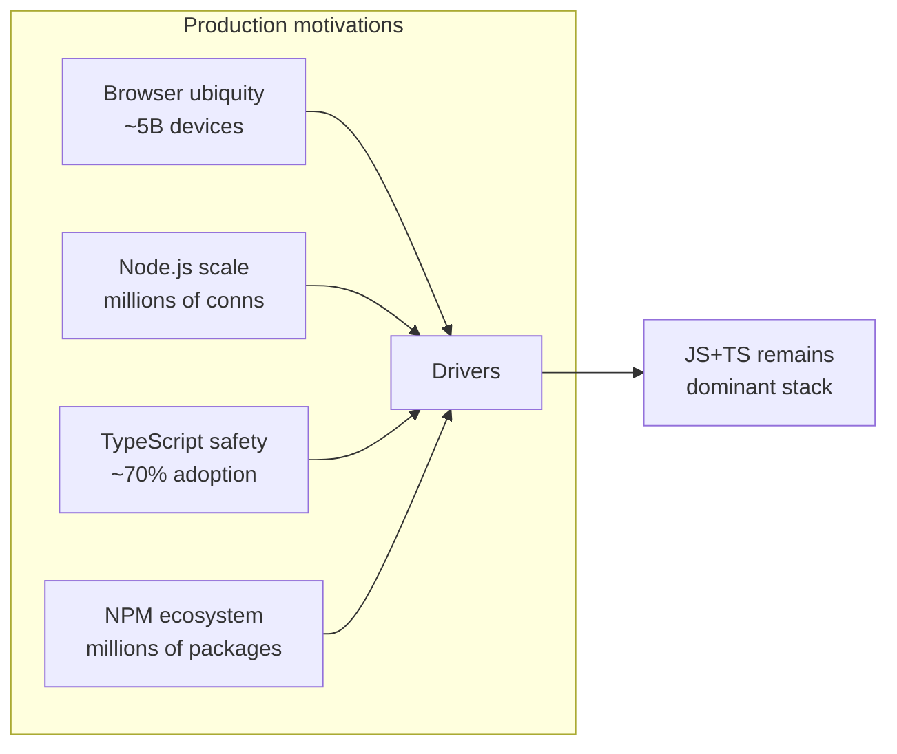

---

## 7. Internal Working

### 7.1 The lifecycle of a JavaScript program <a class="askgpt-btn" href="https://chatgpt.com/?prompt=Read%20this%20section%20of%20my%20encyclopedia%20and%20explain%20it%20in%20depth%20with%20concrete%20examples%2C%20the%20main%20trade-offs%2C%20and%20common%20pitfalls%20a%20practitioner%20should%20know%3A%0A%0Ahttps%3A%2F%2Fgithub.com%2Fvishvasg14%2Fsoftware-engineering-encyclopedia%2Fblob%2Fmain%2F02-javascript-typescript%2Fjavascript-typescript.md%2371-the-lifecycle-of-a-javascript-program%0A%0ASection%20title%3A%207.1%20The%20lifecycle%20of%20a%20JavaScript%20program" target="_blank" rel="noopener" data-askgpt="7.1 The lifecycle of a JavaScript program" data-askgpt-url="https://github.com/vishvasg14/software-engineering-encyclopedia/blob/main/02-javascript-typescript/javascript-typescript.md#71-the-lifecycle-of-a-javascript-program" data-askgpt-prompt-depth="Read%20this%20section%20of%20my%20encyclopedia%20and%20explain%20it%20in%20depth%20with%20concrete%20examples%2C%20the%20main%20trade-offs%2C%20and%20common%20pitfalls%20a%20practitioner%20should%20know%3A%0A%0Ahttps%3A%2F%2Fgithub.com%2Fvishvasg14%2Fsoftware-engineering-encyclopedia%2Fblob%2Fmain%2F02-javascript-typescript%2Fjavascript-typescript.md%2371-the-lifecycle-of-a-javascript-program%0A%0ASection%20title%3A%207.1%20The%20lifecycle%20of%20a%20JavaScript%20program" data-askgpt-prompt-examples="Read%20this%20section%20of%20my%20encyclopedia%20and%20give%20me%202-3%20real-world%20production%20examples%20for%20it.%20For%20each%3A%20what%20went%20right%2C%20what%20went%20wrong%2C%20and%20the%20lessons%20learned.%20Include%20company%20%2F%20project%20names%20if%20relevant.%0A%0Ahttps%3A%2F%2Fgithub.com%2Fvishvasg14%2Fsoftware-engineering-encyclopedia%2Fblob%2Fmain%2F02-javascript-typescript%2Fjavascript-typescript.md%2371-the-lifecycle-of-a-javascript-program%0A%0ASection%20title%3A%207.1%20The%20lifecycle%20of%20a%20JavaScript%20program" title="Ask ChatGPT about this section">💬</a>

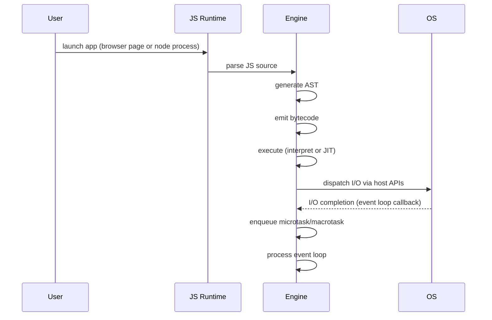

### 7.2 Browser execution pipeline <a class="askgpt-btn" href="https://chatgpt.com/?prompt=Read%20this%20section%20of%20my%20encyclopedia%20and%20explain%20it%20in%20depth%20with%20concrete%20examples%2C%20the%20main%20trade-offs%2C%20and%20common%20pitfalls%20a%20practitioner%20should%20know%3A%0A%0Ahttps%3A%2F%2Fgithub.com%2Fvishvasg14%2Fsoftware-engineering-encyclopedia%2Fblob%2Fmain%2F02-javascript-typescript%2Fjavascript-typescript.md%2372-browser-execution-pipeline%0A%0ASection%20title%3A%207.2%20Browser%20execution%20pipeline" target="_blank" rel="noopener" data-askgpt="7.2 Browser execution pipeline" data-askgpt-url="https://github.com/vishvasg14/software-engineering-encyclopedia/blob/main/02-javascript-typescript/javascript-typescript.md#72-browser-execution-pipeline" data-askgpt-prompt-depth="Read%20this%20section%20of%20my%20encyclopedia%20and%20explain%20it%20in%20depth%20with%20concrete%20examples%2C%20the%20main%20trade-offs%2C%20and%20common%20pitfalls%20a%20practitioner%20should%20know%3A%0A%0Ahttps%3A%2F%2Fgithub.com%2Fvishvasg14%2Fsoftware-engineering-encyclopedia%2Fblob%2Fmain%2F02-javascript-typescript%2Fjavascript-typescript.md%2372-browser-execution-pipeline%0A%0ASection%20title%3A%207.2%20Browser%20execution%20pipeline" data-askgpt-prompt-examples="Read%20this%20section%20of%20my%20encyclopedia%20and%20give%20me%202-3%20real-world%20production%20examples%20for%20it.%20For%20each%3A%20what%20went%20right%2C%20what%20went%20wrong%2C%20and%20the%20lessons%20learned.%20Include%20company%20%2F%20project%20names%20if%20relevant.%0A%0Ahttps%3A%2F%2Fgithub.com%2Fvishvasg14%2Fsoftware-engineering-encyclopedia%2Fblob%2Fmain%2F02-javascript-typescript%2Fjavascript-typescript.md%2372-browser-execution-pipeline%0A%0ASection%20title%3A%207.2%20Browser%20execution%20pipeline" title="Ask ChatGPT about this section">💬</a>

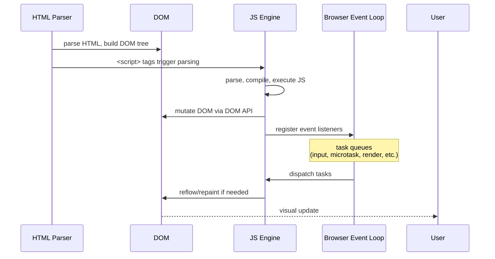

### 7.3 Node.js execution pipeline <a class="askgpt-btn" href="https://chatgpt.com/?prompt=Read%20this%20section%20of%20my%20encyclopedia%20and%20explain%20it%20in%20depth%20with%20concrete%20examples%2C%20the%20main%20trade-offs%2C%20and%20common%20pitfalls%20a%20practitioner%20should%20know%3A%0A%0Ahttps%3A%2F%2Fgithub.com%2Fvishvasg14%2Fsoftware-engineering-encyclopedia%2Fblob%2Fmain%2F02-javascript-typescript%2Fjavascript-typescript.md%2373-nodejs-execution-pipeline%0A%0ASection%20title%3A%207.3%20Node.js%20execution%20pipeline" target="_blank" rel="noopener" data-askgpt="7.3 Node.js execution pipeline" data-askgpt-url="https://github.com/vishvasg14/software-engineering-encyclopedia/blob/main/02-javascript-typescript/javascript-typescript.md#73-nodejs-execution-pipeline" data-askgpt-prompt-depth="Read%20this%20section%20of%20my%20encyclopedia%20and%20explain%20it%20in%20depth%20with%20concrete%20examples%2C%20the%20main%20trade-offs%2C%20and%20common%20pitfalls%20a%20practitioner%20should%20know%3A%0A%0Ahttps%3A%2F%2Fgithub.com%2Fvishvasg14%2Fsoftware-engineering-encyclopedia%2Fblob%2Fmain%2F02-javascript-typescript%2Fjavascript-typescript.md%2373-nodejs-execution-pipeline%0A%0ASection%20title%3A%207.3%20Node.js%20execution%20pipeline" data-askgpt-prompt-examples="Read%20this%20section%20of%20my%20encyclopedia%20and%20give%20me%202-3%20real-world%20production%20examples%20for%20it.%20For%20each%3A%20what%20went%20right%2C%20what%20went%20wrong%2C%20and%20the%20lessons%20learned.%20Include%20company%20%2F%20project%20names%20if%20relevant.%0A%0Ahttps%3A%2F%2Fgithub.com%2Fvishvasg14%2Fsoftware-engineering-encyclopedia%2Fblob%2Fmain%2F02-javascript-typescript%2Fjavascript-typescript.md%2373-nodejs-execution-pipeline%0A%0ASection%20title%3A%207.3%20Node.js%20execution%20pipeline" title="Ask ChatGPT about this section">💬</a>

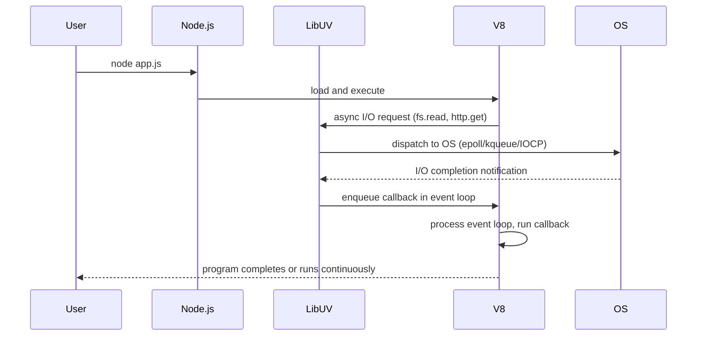

### 7.4 The event loop <a class="askgpt-btn" href="https://chatgpt.com/?prompt=Read%20this%20section%20of%20my%20encyclopedia%20and%20explain%20it%20in%20depth%20with%20concrete%20examples%2C%20the%20main%20trade-offs%2C%20and%20common%20pitfalls%20a%20practitioner%20should%20know%3A%0A%0Ahttps%3A%2F%2Fgithub.com%2Fvishvasg14%2Fsoftware-engineering-encyclopedia%2Fblob%2Fmain%2F02-javascript-typescript%2Fjavascript-typescript.md%2374-the-event-loop%0A%0ASection%20title%3A%207.4%20The%20event%20loop" target="_blank" rel="noopener" data-askgpt="7.4 The event loop" data-askgpt-url="https://github.com/vishvasg14/software-engineering-encyclopedia/blob/main/02-javascript-typescript/javascript-typescript.md#74-the-event-loop" data-askgpt-prompt-depth="Read%20this%20section%20of%20my%20encyclopedia%20and%20explain%20it%20in%20depth%20with%20concrete%20examples%2C%20the%20main%20trade-offs%2C%20and%20common%20pitfalls%20a%20practitioner%20should%20know%3A%0A%0Ahttps%3A%2F%2Fgithub.com%2Fvishvasg14%2Fsoftware-engineering-encyclopedia%2Fblob%2Fmain%2F02-javascript-typescript%2Fjavascript-typescript.md%2374-the-event-loop%0A%0ASection%20title%3A%207.4%20The%20event%20loop" data-askgpt-prompt-examples="Read%20this%20section%20of%20my%20encyclopedia%20and%20give%20me%202-3%20real-world%20production%20examples%20for%20it.%20For%20each%3A%20what%20went%20right%2C%20what%20went%20wrong%2C%20and%20the%20lessons%20learned.%20Include%20company%20%2F%20project%20names%20if%20relevant.%0A%0Ahttps%3A%2F%2Fgithub.com%2Fvishvasg14%2Fsoftware-engineering-encyclopedia%2Fblob%2Fmain%2F02-javascript-typescript%2Fjavascript-typescript.md%2374-the-event-loop%0A%0ASection%20title%3A%207.4%20The%20event%20loop" title="Ask ChatGPT about this section">💬</a>

The event loop is the runtime's mechanism for executing JavaScript in a non-blocking way. Despite being single-threaded (from JavaScript's perspective), it allows concurrency via asynchronous I/O.

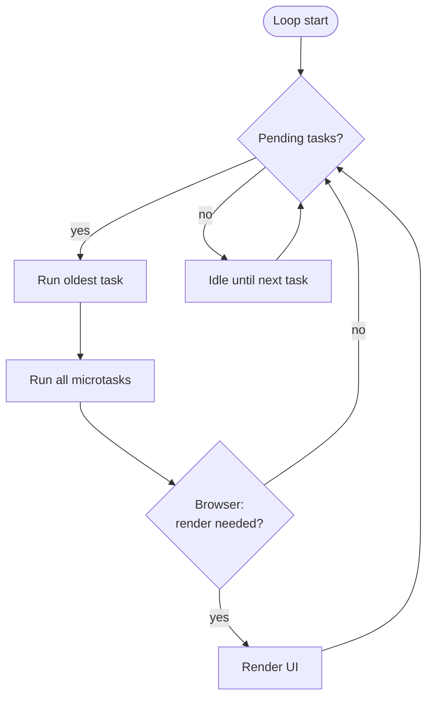

**Key concepts:**

- **Task (macrotask)** — setTimeout, setInterval, I/O, UI events, postMessage, MessageChannel.
- **Microtask** — Promise reactions (`.then`/`.catch`/`.finally`), queueMicrotask, `MutationObserver`, `process.nextTick` (Node.js, special: microtask but runs before others).
- **Render steps** — Browser only: layout, paint, composite.

### 7.5 Subsystems that participate <a class="askgpt-btn" href="https://chatgpt.com/?prompt=Read%20this%20section%20of%20my%20encyclopedia%20and%20explain%20it%20in%20depth%20with%20concrete%20examples%2C%20the%20main%20trade-offs%2C%20and%20common%20pitfalls%20a%20practitioner%20should%20know%3A%0A%0Ahttps%3A%2F%2Fgithub.com%2Fvishvasg14%2Fsoftware-engineering-encyclopedia%2Fblob%2Fmain%2F02-javascript-typescript%2Fjavascript-typescript.md%2375-subsystems-that-participate%0A%0ASection%20title%3A%207.5%20Subsystems%20that%20participate" target="_blank" rel="noopener" data-askgpt="7.5 Subsystems that participate" data-askgpt-url="https://github.com/vishvasg14/software-engineering-encyclopedia/blob/main/02-javascript-typescript/javascript-typescript.md#75-subsystems-that-participate" data-askgpt-prompt-depth="Read%20this%20section%20of%20my%20encyclopedia%20and%20explain%20it%20in%20depth%20with%20concrete%20examples%2C%20the%20main%20trade-offs%2C%20and%20common%20pitfalls%20a%20practitioner%20should%20know%3A%0A%0Ahttps%3A%2F%2Fgithub.com%2Fvishvasg14%2Fsoftware-engineering-encyclopedia%2Fblob%2Fmain%2F02-javascript-typescript%2Fjavascript-typescript.md%2375-subsystems-that-participate%0A%0ASection%20title%3A%207.5%20Subsystems%20that%20participate" data-askgpt-prompt-examples="Read%20this%20section%20of%20my%20encyclopedia%20and%20give%20me%202-3%20real-world%20production%20examples%20for%20it.%20For%20each%3A%20what%20went%20right%2C%20what%20went%20wrong%2C%20and%20the%20lessons%20learned.%20Include%20company%20%2F%20project%20names%20if%20relevant.%0A%0Ahttps%3A%2F%2Fgithub.com%2Fvishvasg14%2Fsoftware-engineering-encyclopedia%2Fblob%2Fmain%2F02-javascript-typescript%2Fjavascript-typescript.md%2375-subsystems-that-participate%0A%0ASection%20title%3A%207.5%20Subsystems%20that%20participate" title="Ask ChatGPT about this section">💬</a>

| Subsystem | Responsibility | Key technologies |
|-----------|---------------|------------------|
| **Lexer/Parser** | Source → tokens → AST | Engine-specific |
| **Bytecode compiler** | AST → bytecode | Ignition (V8), LLInt (JSC), Baseline (SpiderMonkey) |
| **Interpreter** | Execute bytecode | Per-engine |
| **Baseline JIT** | Quick native code | Sparkplug (V8), Baseline JIT (SpiderMonkey) |
| **Optimizing JIT** | Aggressive native code | TurboFan (V8), IonMonkey (SpiderMonkey), FTL (JSC) |
| **Garbage collector** | Memory management | Orinoco (V8), generational (all engines) |
| **Event loop** | Async I/O scheduling | libuv (Node), browser event loop, workerd |
| **TypeScript compiler** | Type-check + transpile | tsc, tsserver, language service |

---

## 8. Deep Dive

### 8.1 ECMAScript spec structure <a class="askgpt-btn" href="https://chatgpt.com/?prompt=Read%20this%20section%20of%20my%20encyclopedia%20and%20explain%20it%20in%20depth%20with%20concrete%20examples%2C%20the%20main%20trade-offs%2C%20and%20common%20pitfalls%20a%20practitioner%20should%20know%3A%0A%0Ahttps%3A%2F%2Fgithub.com%2Fvishvasg14%2Fsoftware-engineering-encyclopedia%2Fblob%2Fmain%2F02-javascript-typescript%2Fjavascript-typescript.md%2381-ecmascript-spec-structure%0A%0ASection%20title%3A%208.1%20ECMAScript%20spec%20structure" target="_blank" rel="noopener" data-askgpt="8.1 ECMAScript spec structure" data-askgpt-url="https://github.com/vishvasg14/software-engineering-encyclopedia/blob/main/02-javascript-typescript/javascript-typescript.md#81-ecmascript-spec-structure" data-askgpt-prompt-depth="Read%20this%20section%20of%20my%20encyclopedia%20and%20explain%20it%20in%20depth%20with%20concrete%20examples%2C%20the%20main%20trade-offs%2C%20and%20common%20pitfalls%20a%20practitioner%20should%20know%3A%0A%0Ahttps%3A%2F%2Fgithub.com%2Fvishvasg14%2Fsoftware-engineering-encyclopedia%2Fblob%2Fmain%2F02-javascript-typescript%2Fjavascript-typescript.md%2381-ecmascript-spec-structure%0A%0ASection%20title%3A%208.1%20ECMAScript%20spec%20structure" data-askgpt-prompt-examples="Read%20this%20section%20of%20my%20encyclopedia%20and%20give%20me%202-3%20real-world%20production%20examples%20for%20it.%20For%20each%3A%20what%20went%20right%2C%20what%20went%20wrong%2C%20and%20the%20lessons%20learned.%20Include%20company%20%2F%20project%20names%20if%20relevant.%0A%0Ahttps%3A%2F%2Fgithub.com%2Fvishvasg14%2Fsoftware-engineering-encyclopedia%2Fblob%2Fmain%2F02-javascript-typescript%2Fjavascript-typescript.md%2381-ecmascript-spec-structure%0A%0ASection%20title%3A%208.1%20ECMAScript%20spec%20structure" title="Ask ChatGPT about this section">💬</a>

The ECMAScript specification organizes the language into ~28 top-level clauses (numbers vary slightly between editions). The most important for understanding behavior:

- **Clause 6** — ECMAScript Data Types and Values: the value universe (Number, String, Object, Boolean, Null, Undefined, Symbol, BigInt).
- **Clause 7** — Language Lexical Grammar: tokens, identifiers, literals, template literals.
- **Clause 8** — Types: detailed semantics of each type.
- **Clause 9** — Abstract Operations: the internal algorithms.
- **Clause 10** — Ordinary and Exotic Objects: object categories (ordinary, exotic, bound function, array, etc.).
- **Clause 11** — Structured Data: Array, Map, Set, TypedArray, DataView.
- **Clause 12** — Control Abstraction Objects: Iterator, Promise, Generator, AsyncGenerator, AsyncFunction.
- **Clause 13** — Execution Contexts, Lexical Environments, Closures: **the heart of scope, closures, `this`**.
- **Clause 17** — ECMAScript Functions and Classes.
- **Clause 18** — Scripts and Modules: ESM semantics.
- **Clause 26** — Reflection: Proxy and Reflect.

**Spec reading technique.** Start by understanding the algorithm for the feature you care about. ECMAScript uses precise mathematical-style prose ("Let X be Y. If Z, then perform A; else perform B."). Internal slots are denoted `[[Brackets]]`. Well-known symbols are `%Symbol.iterator%`.

### 8.2 Execution contexts and lexical environments <a class="askgpt-btn" href="https://chatgpt.com/?prompt=Read%20this%20section%20of%20my%20encyclopedia%20and%20explain%20it%20in%20depth%20with%20concrete%20examples%2C%20the%20main%20trade-offs%2C%20and%20common%20pitfalls%20a%20practitioner%20should%20know%3A%0A%0Ahttps%3A%2F%2Fgithub.com%2Fvishvasg14%2Fsoftware-engineering-encyclopedia%2Fblob%2Fmain%2F02-javascript-typescript%2Fjavascript-typescript.md%2382-execution-contexts-and-lexical-environments%0A%0ASection%20title%3A%208.2%20Execution%20contexts%20and%20lexical%20environments" target="_blank" rel="noopener" data-askgpt="8.2 Execution contexts and lexical environments" data-askgpt-url="https://github.com/vishvasg14/software-engineering-encyclopedia/blob/main/02-javascript-typescript/javascript-typescript.md#82-execution-contexts-and-lexical-environments" data-askgpt-prompt-depth="Read%20this%20section%20of%20my%20encyclopedia%20and%20explain%20it%20in%20depth%20with%20concrete%20examples%2C%20the%20main%20trade-offs%2C%20and%20common%20pitfalls%20a%20practitioner%20should%20know%3A%0A%0Ahttps%3A%2F%2Fgithub.com%2Fvishvasg14%2Fsoftware-engineering-encyclopedia%2Fblob%2Fmain%2F02-javascript-typescript%2Fjavascript-typescript.md%2382-execution-contexts-and-lexical-environments%0A%0ASection%20title%3A%208.2%20Execution%20contexts%20and%20lexical%20environments" data-askgpt-prompt-examples="Read%20this%20section%20of%20my%20encyclopedia%20and%20give%20me%202-3%20real-world%20production%20examples%20for%20it.%20For%20each%3A%20what%20went%20right%2C%20what%20went%20wrong%2C%20and%20the%20lessons%20learned.%20Include%20company%20%2F%20project%20names%20if%20relevant.%0A%0Ahttps%3A%2F%2Fgithub.com%2Fvishvasg14%2Fsoftware-engineering-encyclopedia%2Fblob%2Fmain%2F02-javascript-typescript%2Fjavascript-typescript.md%2382-execution-contexts-and-lexical-environments%0A%0ASection%20title%3A%208.2%20Execution%20contexts%20and%20lexical%20environments" title="Ask ChatGPT about this section">💬</a>

Every piece of JavaScript code runs in an **execution context**. There are eight types per the spec (global, function, eval, module, etc.), but the most common are:

- **Global execution context** — the implicit context for top-level code.
- **Function execution context** — created for each function invocation.
- **Module execution context** — created for each ESM module.

Each context has a **lexical environment** that holds:

- An **environment record** (declarative or object — declarative for `let`/`const`/`class`; object for `var`/function/global).
- A reference to the **outer lexical environment** (the scope chain).
- A `this` binding.

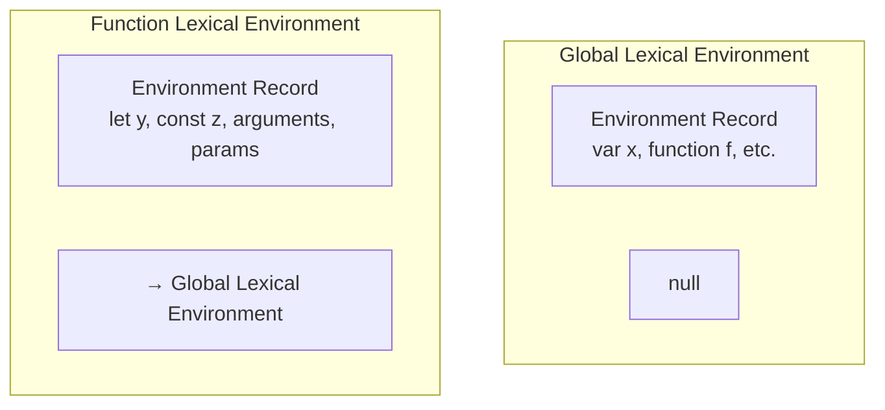

**Block-level scoping:** ES2015 introduced block-level lexical environments inside functions, so `let`/`const` declarations are scoped to their containing block (`{ ... }`), not the function.

### 8.3 Closures <a class="askgpt-btn" href="https://chatgpt.com/?prompt=Read%20this%20section%20of%20my%20encyclopedia%20and%20explain%20it%20in%20depth%20with%20concrete%20examples%2C%20the%20main%20trade-offs%2C%20and%20common%20pitfalls%20a%20practitioner%20should%20know%3A%0A%0Ahttps%3A%2F%2Fgithub.com%2Fvishvasg14%2Fsoftware-engineering-encyclopedia%2Fblob%2Fmain%2F02-javascript-typescript%2Fjavascript-typescript.md%2383-closures%0A%0ASection%20title%3A%208.3%20Closures" target="_blank" rel="noopener" data-askgpt="8.3 Closures" data-askgpt-url="https://github.com/vishvasg14/software-engineering-encyclopedia/blob/main/02-javascript-typescript/javascript-typescript.md#83-closures" data-askgpt-prompt-depth="Read%20this%20section%20of%20my%20encyclopedia%20and%20explain%20it%20in%20depth%20with%20concrete%20examples%2C%20the%20main%20trade-offs%2C%20and%20common%20pitfalls%20a%20practitioner%20should%20know%3A%0A%0Ahttps%3A%2F%2Fgithub.com%2Fvishvasg14%2Fsoftware-engineering-encyclopedia%2Fblob%2Fmain%2F02-javascript-typescript%2Fjavascript-typescript.md%2383-closures%0A%0ASection%20title%3A%208.3%20Closures" data-askgpt-prompt-examples="Read%20this%20section%20of%20my%20encyclopedia%20and%20give%20me%202-3%20real-world%20production%20examples%20for%20it.%20For%20each%3A%20what%20went%20right%2C%20what%20went%20wrong%2C%20and%20the%20lessons%20learned.%20Include%20company%20%2F%20project%20names%20if%20relevant.%0A%0Ahttps%3A%2F%2Fgithub.com%2Fvishvasg14%2Fsoftware-engineering-encyclopedia%2Fblob%2Fmain%2F02-javascript-typescript%2Fjavascript-typescript.md%2383-closures%0A%0ASection%20title%3A%208.3%20Closures" title="Ask ChatGPT about this section">💬</a>

A **closure** is the combination of a function and its lexical environment. Per the spec (§13.2), the binding object (lexical environment) persists as long as a function that references it is reachable.

```js
function outer() {
    const x = 10;
    return function inner() {
        return x; // closure captures `x`
    };
}
const fn = outer();
console.log(fn()); // 10 — `x` is still alive
```

The engine allocates the closure as an `EnvironmentRecord` that retains `x` in the heap even after `outer()` returns.

### 8.4 `this` binding <a class="askgpt-btn" href="https://chatgpt.com/?prompt=Read%20this%20section%20of%20my%20encyclopedia%20and%20explain%20it%20in%20depth%20with%20concrete%20examples%2C%20the%20main%20trade-offs%2C%20and%20common%20pitfalls%20a%20practitioner%20should%20know%3A%0A%0Ahttps%3A%2F%2Fgithub.com%2Fvishvasg14%2Fsoftware-engineering-encyclopedia%2Fblob%2Fmain%2F02-javascript-typescript%2Fjavascript-typescript.md%2384-this-binding%0A%0ASection%20title%3A%208.4%20%60this%60%20binding" target="_blank" rel="noopener" data-askgpt="8.4 `this` binding" data-askgpt-url="https://github.com/vishvasg14/software-engineering-encyclopedia/blob/main/02-javascript-typescript/javascript-typescript.md#84-this-binding" data-askgpt-prompt-depth="Read%20this%20section%20of%20my%20encyclopedia%20and%20explain%20it%20in%20depth%20with%20concrete%20examples%2C%20the%20main%20trade-offs%2C%20and%20common%20pitfalls%20a%20practitioner%20should%20know%3A%0A%0Ahttps%3A%2F%2Fgithub.com%2Fvishvasg14%2Fsoftware-engineering-encyclopedia%2Fblob%2Fmain%2F02-javascript-typescript%2Fjavascript-typescript.md%2384-this-binding%0A%0ASection%20title%3A%208.4%20%60this%60%20binding" data-askgpt-prompt-examples="Read%20this%20section%20of%20my%20encyclopedia%20and%20give%20me%202-3%20real-world%20production%20examples%20for%20it.%20For%20each%3A%20what%20went%20right%2C%20what%20went%20wrong%2C%20and%20the%20lessons%20learned.%20Include%20company%20%2F%20project%20names%20if%20relevant.%0A%0Ahttps%3A%2F%2Fgithub.com%2Fvishvasg14%2Fsoftware-engineering-encyclopedia%2Fblob%2Fmain%2F02-javascript-typescript%2Fjavascript-typescript.md%2384-this-binding%0A%0ASection%20title%3A%208.4%20%60this%60%20binding" title="Ask ChatGPT about this section">💬</a>

`this` is determined by how a function is called, not where it's defined (except for arrow functions). Four binding rules (per ECMAScript §13.3.4.1, ResolveThisBinding):

| Call style | `this` value |
|------------|-------------|
| **Method call** (`obj.foo()`) | `obj` |
| **Plain function call** (`foo()`) | `undefined` (strict) or `globalThis` (sloppy) |
| **`call`/`apply`/`bind`** | First argument |
| **`new`** | The newly-created object |

**Arrow functions** do not have their own `this`; they capture the `this` of their enclosing lexical scope. They cannot be bound, called with `call`/`apply` to override `this`, or used as constructors.

```js
const obj = {
    name: 'Alice',
    greet: function() { console.log(this.name); },       // 'Alice'
    greetArrow: () => { console.log(this.name); },      // globalThis.name or undefined
    greetDelayed: function() {
        setTimeout(() => {
            console.log(this.name); // 'Alice' — arrow captures `this`
        }, 100);
    },
};
```

### 8.5 Prototypal inheritance <a class="askgpt-btn" href="https://chatgpt.com/?prompt=Read%20this%20section%20of%20my%20encyclopedia%20and%20explain%20it%20in%20depth%20with%20concrete%20examples%2C%20the%20main%20trade-offs%2C%20and%20common%20pitfalls%20a%20practitioner%20should%20know%3A%0A%0Ahttps%3A%2F%2Fgithub.com%2Fvishvasg14%2Fsoftware-engineering-encyclopedia%2Fblob%2Fmain%2F02-javascript-typescript%2Fjavascript-typescript.md%2385-prototypal-inheritance%0A%0ASection%20title%3A%208.5%20Prototypal%20inheritance" target="_blank" rel="noopener" data-askgpt="8.5 Prototypal inheritance" data-askgpt-url="https://github.com/vishvasg14/software-engineering-encyclopedia/blob/main/02-javascript-typescript/javascript-typescript.md#85-prototypal-inheritance" data-askgpt-prompt-depth="Read%20this%20section%20of%20my%20encyclopedia%20and%20explain%20it%20in%20depth%20with%20concrete%20examples%2C%20the%20main%20trade-offs%2C%20and%20common%20pitfalls%20a%20practitioner%20should%20know%3A%0A%0Ahttps%3A%2F%2Fgithub.com%2Fvishvasg14%2Fsoftware-engineering-encyclopedia%2Fblob%2Fmain%2F02-javascript-typescript%2Fjavascript-typescript.md%2385-prototypal-inheritance%0A%0ASection%20title%3A%208.5%20Prototypal%20inheritance" data-askgpt-prompt-examples="Read%20this%20section%20of%20my%20encyclopedia%20and%20give%20me%202-3%20real-world%20production%20examples%20for%20it.%20For%20each%3A%20what%20went%20right%2C%20what%20went%20wrong%2C%20and%20the%20lessons%20learned.%20Include%20company%20%2F%20project%20names%20if%20relevant.%0A%0Ahttps%3A%2F%2Fgithub.com%2Fvishvasg14%2Fsoftware-engineering-encyclopedia%2Fblob%2Fmain%2F02-javascript-typescript%2Fjavascript-typescript.md%2385-prototypal-inheritance%0A%0ASection%20title%3A%208.5%20Prototypal%20inheritance" title="Ask ChatGPT about this section">💬</a>

Every object has an internal `[[Prototype]]` slot (accessible via `Object.getPrototypeOf` or `__proto__`). Property access walks the prototype chain: when reading `obj.foo`, the engine checks `obj` first, then `obj.[[Prototype]]`, then `obj.[[Prototype]].[[Prototype]]`, etc.

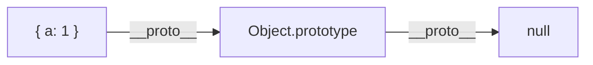

ES6 classes are **syntactic sugar** over prototype-based inheritance. `class A extends B` sets `A.prototype.[[Prototype]] = B.prototype`.

**Key facts:**

- `__proto__` is a legacy accessor that exposes the `[[Prototype]]` slot.
- `Object.create(proto)` creates a new object with `[[Prototype]]` set to `proto`.
- `Object.setPrototypeOf(obj, proto)` changes the prototype after creation (slow in V8 — defeats hidden classes).
- Methods on a class are properties on the class's prototype, not on instances.

### 8.6 Classes (ES2015) <a class="askgpt-btn" href="https://chatgpt.com/?prompt=Read%20this%20section%20of%20my%20encyclopedia%20and%20explain%20it%20in%20depth%20with%20concrete%20examples%2C%20the%20main%20trade-offs%2C%20and%20common%20pitfalls%20a%20practitioner%20should%20know%3A%0A%0Ahttps%3A%2F%2Fgithub.com%2Fvishvasg14%2Fsoftware-engineering-encyclopedia%2Fblob%2Fmain%2F02-javascript-typescript%2Fjavascript-typescript.md%2386-classes-es2015%0A%0ASection%20title%3A%208.6%20Classes%20(ES2015)" target="_blank" rel="noopener" data-askgpt="8.6 Classes (ES2015)" data-askgpt-url="https://github.com/vishvasg14/software-engineering-encyclopedia/blob/main/02-javascript-typescript/javascript-typescript.md#86-classes-es2015" data-askgpt-prompt-depth="Read%20this%20section%20of%20my%20encyclopedia%20and%20explain%20it%20in%20depth%20with%20concrete%20examples%2C%20the%20main%20trade-offs%2C%20and%20common%20pitfalls%20a%20practitioner%20should%20know%3A%0A%0Ahttps%3A%2F%2Fgithub.com%2Fvishvasg14%2Fsoftware-engineering-encyclopedia%2Fblob%2Fmain%2F02-javascript-typescript%2Fjavascript-typescript.md%2386-classes-es2015%0A%0ASection%20title%3A%208.6%20Classes%20(ES2015)" data-askgpt-prompt-examples="Read%20this%20section%20of%20my%20encyclopedia%20and%20give%20me%202-3%20real-world%20production%20examples%20for%20it.%20For%20each%3A%20what%20went%20right%2C%20what%20went%20wrong%2C%20and%20the%20lessons%20learned.%20Include%20company%20%2F%20project%20names%20if%20relevant.%0A%0Ahttps%3A%2F%2Fgithub.com%2Fvishvasg14%2Fsoftware-engineering-encyclopedia%2Fblob%2Fmain%2F02-javascript-typescript%2Fjavascript-typescript.md%2386-classes-es2015%0A%0ASection%20title%3A%208.6%20Classes%20(ES2015)" title="Ask ChatGPT about this section">💬</a>

```js
class Animal {
    constructor(name) { this.name = name; }
    speak() { return `${this.name} makes a sound`; }
}

class Dog extends Animal {
    speak() { return `${this.name} barks`; }
}
```

The class syntax is essentially:

```js
function Animal(name) { this.name = name; }
Animal.prototype.speak = function() { return `${this.name} makes a sound`; };

function Dog(name) { Animal.call(this, name); }
Dog.prototype = Object.create(Animal.prototype);
Dog.prototype.constructor = Dog;
Dog.prototype.speak = function() { return `${this.name} barks`; };
```

ES2022 added **class fields** (public and `#private`) and **static blocks** for class-level initialization.

### 8.7 Strict mode <a class="askgpt-btn" href="https://chatgpt.com/?prompt=Read%20this%20section%20of%20my%20encyclopedia%20and%20explain%20it%20in%20depth%20with%20concrete%20examples%2C%20the%20main%20trade-offs%2C%20and%20common%20pitfalls%20a%20practitioner%20should%20know%3A%0A%0Ahttps%3A%2F%2Fgithub.com%2Fvishvasg14%2Fsoftware-engineering-encyclopedia%2Fblob%2Fmain%2F02-javascript-typescript%2Fjavascript-typescript.md%2387-strict-mode%0A%0ASection%20title%3A%208.7%20Strict%20mode" target="_blank" rel="noopener" data-askgpt="8.7 Strict mode" data-askgpt-url="https://github.com/vishvasg14/software-engineering-encyclopedia/blob/main/02-javascript-typescript/javascript-typescript.md#87-strict-mode" data-askgpt-prompt-depth="Read%20this%20section%20of%20my%20encyclopedia%20and%20explain%20it%20in%20depth%20with%20concrete%20examples%2C%20the%20main%20trade-offs%2C%20and%20common%20pitfalls%20a%20practitioner%20should%20know%3A%0A%0Ahttps%3A%2F%2Fgithub.com%2Fvishvasg14%2Fsoftware-engineering-encyclopedia%2Fblob%2Fmain%2F02-javascript-typescript%2Fjavascript-typescript.md%2387-strict-mode%0A%0ASection%20title%3A%208.7%20Strict%20mode" data-askgpt-prompt-examples="Read%20this%20section%20of%20my%20encyclopedia%20and%20give%20me%202-3%20real-world%20production%20examples%20for%20it.%20For%20each%3A%20what%20went%20right%2C%20what%20went%20wrong%2C%20and%20the%20lessons%20learned.%20Include%20company%20%2F%20project%20names%20if%20relevant.%0A%0Ahttps%3A%2F%2Fgithub.com%2Fvishvasg14%2Fsoftware-engineering-encyclopedia%2Fblob%2Fmain%2F02-javascript-typescript%2Fjavascript-typescript.md%2387-strict-mode%0A%0ASection%20title%3A%208.7%20Strict%20mode" title="Ask ChatGPT about this section">💬</a>

`'use strict';` at the top of a file or function enables strict mode. It changes several silent errors into thrown errors and disallows some features:

- Implicit globals (assigning to undeclared variable) throw `ReferenceError`.
- `with` is forbidden.
- Octal literals (`0777`) are forbidden.
- `this` is `undefined` in plain function calls (not `globalThis`).
- Duplicate parameter names are forbidden.
- `eval` has its own scope and cannot introduce new variables into the enclosing scope.

ES modules and ES2015+ classes are always in strict mode.

### 8.8 The event loop in detail <a class="askgpt-btn" href="https://chatgpt.com/?prompt=Read%20this%20section%20of%20my%20encyclopedia%20and%20explain%20it%20in%20depth%20with%20concrete%20examples%2C%20the%20main%20trade-offs%2C%20and%20common%20pitfalls%20a%20practitioner%20should%20know%3A%0A%0Ahttps%3A%2F%2Fgithub.com%2Fvishvasg14%2Fsoftware-engineering-encyclopedia%2Fblob%2Fmain%2F02-javascript-typescript%2Fjavascript-typescript.md%2388-the-event-loop-in-detail%0A%0ASection%20title%3A%208.8%20The%20event%20loop%20in%20detail" target="_blank" rel="noopener" data-askgpt="8.8 The event loop in detail" data-askgpt-url="https://github.com/vishvasg14/software-engineering-encyclopedia/blob/main/02-javascript-typescript/javascript-typescript.md#88-the-event-loop-in-detail" data-askgpt-prompt-depth="Read%20this%20section%20of%20my%20encyclopedia%20and%20explain%20it%20in%20depth%20with%20concrete%20examples%2C%20the%20main%20trade-offs%2C%20and%20common%20pitfalls%20a%20practitioner%20should%20know%3A%0A%0Ahttps%3A%2F%2Fgithub.com%2Fvishvasg14%2Fsoftware-engineering-encyclopedia%2Fblob%2Fmain%2F02-javascript-typescript%2Fjavascript-typescript.md%2388-the-event-loop-in-detail%0A%0ASection%20title%3A%208.8%20The%20event%20loop%20in%20detail" data-askgpt-prompt-examples="Read%20this%20section%20of%20my%20encyclopedia%20and%20give%20me%202-3%20real-world%20production%20examples%20for%20it.%20For%20each%3A%20what%20went%20right%2C%20what%20went%20wrong%2C%20and%20the%20lessons%20learned.%20Include%20company%20%2F%20project%20names%20if%20relevant.%0A%0Ahttps%3A%2F%2Fgithub.com%2Fvishvasg14%2Fsoftware-engineering-encyclopedia%2Fblob%2Fmain%2F02-javascript-typescript%2Fjavascript-typescript.md%2388-the-event-loop-in-detail%0A%0ASection%20title%3A%208.8%20The%20event%20loop%20in%20detail" title="Ask ChatGPT about this section">💬</a>

**Browser event loop:**

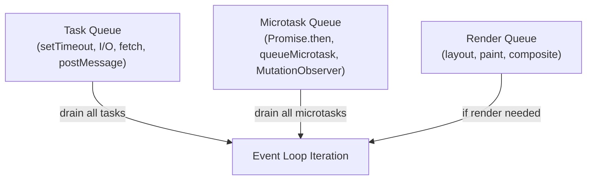

**Algorithm (per HTML spec):**

1. Run the oldest task from the task queue. (If empty, wait.)
2. Run **all** microtasks from the microtask queue (until empty).
3. If rendering is needed (per `requestAnimationFrame` schedule), run render steps.
4. Loop back to step 1.

**Why this matters:**

- A single microtask can starve rendering if it schedules more microtasks.
- Long-running tasks block everything (the page freezes).
- `await` schedules a microtask on resumption, not a macrotask.

**Node.js event loop:**

Node's event loop has **phases**:

| Phase | Purpose |
|-------|---------|
| **Timers** | `setTimeout`, `setInterval` callbacks due |
| **Pending callbacks** | Some system callbacks (e.g., TCP errors) |
| **Idle, prepare** | Internal use |
| **Poll** | New I/O events; execute I/O callbacks |
| **Check** | `setImmediate` callbacks |
| **Close callbacks** | `socket.on('close', ...)` |

Between each phase, microtasks (`process.nextTick` and Promise reactions) are drained. `process.nextTick` runs **before** other microtasks and is Node-specific (not in browsers).

### 8.9 Promises <a class="askgpt-btn" href="https://chatgpt.com/?prompt=Read%20this%20section%20of%20my%20encyclopedia%20and%20explain%20it%20in%20depth%20with%20concrete%20examples%2C%20the%20main%20trade-offs%2C%20and%20common%20pitfalls%20a%20practitioner%20should%20know%3A%0A%0Ahttps%3A%2F%2Fgithub.com%2Fvishvasg14%2Fsoftware-engineering-encyclopedia%2Fblob%2Fmain%2F02-javascript-typescript%2Fjavascript-typescript.md%2389-promises%0A%0ASection%20title%3A%208.9%20Promises" target="_blank" rel="noopener" data-askgpt="8.9 Promises" data-askgpt-url="https://github.com/vishvasg14/software-engineering-encyclopedia/blob/main/02-javascript-typescript/javascript-typescript.md#89-promises" data-askgpt-prompt-depth="Read%20this%20section%20of%20my%20encyclopedia%20and%20explain%20it%20in%20depth%20with%20concrete%20examples%2C%20the%20main%20trade-offs%2C%20and%20common%20pitfalls%20a%20practitioner%20should%20know%3A%0A%0Ahttps%3A%2F%2Fgithub.com%2Fvishvasg14%2Fsoftware-engineering-encyclopedia%2Fblob%2Fmain%2F02-javascript-typescript%2Fjavascript-typescript.md%2389-promises%0A%0ASection%20title%3A%208.9%20Promises" data-askgpt-prompt-examples="Read%20this%20section%20of%20my%20encyclopedia%20and%20give%20me%202-3%20real-world%20production%20examples%20for%20it.%20For%20each%3A%20what%20went%20right%2C%20what%20went%20wrong%2C%20and%20the%20lessons%20learned.%20Include%20company%20%2F%20project%20names%20if%20relevant.%0A%0Ahttps%3A%2F%2Fgithub.com%2Fvishvasg14%2Fsoftware-engineering-encyclopedia%2Fblob%2Fmain%2F02-javascript-typescript%2Fjavascript-typescript.md%2389-promises%0A%0ASection%20title%3A%208.9%20Promises" title="Ask ChatGPT about this section">💬</a>

A `Promise` is an object representing the eventual completion (or failure) of an asynchronous operation. Three states:

- **pending** — initial state.
- **fulfilled** — resolved with a value.
- **rejected** — rejected with a reason.

Transitions are one-way (a fulfilled promise can't become rejected).

**Promise reactions:** when a promise settles, its `.then`/`.catch`/`.finally` handlers are scheduled as microtasks. Chaining creates a new promise that resolves with the handler's return value.

```js
fetch('/api/user')
    .then(r => r.json())
    .then(user => render(user))
    .catch(err => log(err)); // any rejection in the chain lands here
```

**Unhandled rejections:** Node.js emits `unhandledRejection` events; browsers fire `'unhandledrejection'` on `window`. Modern best practice: always `.catch` or use try/await/catch.

**`Promise.withResolvers()` (ES2024):** exposes the `resolve`/`reject` functions outside the executor.

```js
const { promise, resolve, reject } = Promise.withResolvers();
// use promise, resolve, reject independently
```

### 8.10 `async`/`await` <a class="askgpt-btn" href="https://chatgpt.com/?prompt=Read%20this%20section%20of%20my%20encyclopedia%20and%20explain%20it%20in%20depth%20with%20concrete%20examples%2C%20the%20main%20trade-offs%2C%20and%20common%20pitfalls%20a%20practitioner%20should%20know%3A%0A%0Ahttps%3A%2F%2Fgithub.com%2Fvishvasg14%2Fsoftware-engineering-encyclopedia%2Fblob%2Fmain%2F02-javascript-typescript%2Fjavascript-typescript.md%23810-asyncawait%0A%0ASection%20title%3A%208.10%20%60async%60%2F%60await%60" target="_blank" rel="noopener" data-askgpt="8.10 `async`/`await`" data-askgpt-url="https://github.com/vishvasg14/software-engineering-encyclopedia/blob/main/02-javascript-typescript/javascript-typescript.md#810-asyncawait" data-askgpt-prompt-depth="Read%20this%20section%20of%20my%20encyclopedia%20and%20explain%20it%20in%20depth%20with%20concrete%20examples%2C%20the%20main%20trade-offs%2C%20and%20common%20pitfalls%20a%20practitioner%20should%20know%3A%0A%0Ahttps%3A%2F%2Fgithub.com%2Fvishvasg14%2Fsoftware-engineering-encyclopedia%2Fblob%2Fmain%2F02-javascript-typescript%2Fjavascript-typescript.md%23810-asyncawait%0A%0ASection%20title%3A%208.10%20%60async%60%2F%60await%60" data-askgpt-prompt-examples="Read%20this%20section%20of%20my%20encyclopedia%20and%20give%20me%202-3%20real-world%20production%20examples%20for%20it.%20For%20each%3A%20what%20went%20right%2C%20what%20went%20wrong%2C%20and%20the%20lessons%20learned.%20Include%20company%20%2F%20project%20names%20if%20relevant.%0A%0Ahttps%3A%2F%2Fgithub.com%2Fvishvasg14%2Fsoftware-engineering-encyclopedia%2Fblob%2Fmain%2F02-javascript-typescript%2Fjavascript-typescript.md%23810-asyncawait%0A%0ASection%20title%3A%208.10%20%60async%60%2F%60await%60" title="Ask ChatGPT about this section">💬</a>

`async` functions are syntactic sugar over generators + promises. An `async` function always returns a promise; `await` pauses the function until a promise settles.

**How `await` works (per spec):**

1. Evaluate the awaited expression to a value.
2. Call `PromiseResolve(value)` — wraps non-promises in `Promise.resolve(value)`.
3. Call the abstract operation `Await(promise)` which registers a reaction.
4. When the promise settles, the reaction schedules a microtask that resumes the function.

```js
async function fetchUser(id) {
    const r = await fetch(`/api/user/${id}`);
    const user = await r.json();
    return user;
}
// is approximately:
function fetchUser(id) {
    return fetch(`/api/user/${id}`).then(r => r.json()).then(user => user);
}
```

**Error handling:** `try/catch` works in async functions, catching both sync throws and async rejections.

**Concurrency pattern:** sequential awaits are sequential; use `Promise.all` for parallel:

```js
const [user, posts] = await Promise.all([
    fetchUser(),
    fetchPosts(),
]);
```

### 8.11 Generators and iterators <a class="askgpt-btn" href="https://chatgpt.com/?prompt=Read%20this%20section%20of%20my%20encyclopedia%20and%20explain%20it%20in%20depth%20with%20concrete%20examples%2C%20the%20main%20trade-offs%2C%20and%20common%20pitfalls%20a%20practitioner%20should%20know%3A%0A%0Ahttps%3A%2F%2Fgithub.com%2Fvishvasg14%2Fsoftware-engineering-encyclopedia%2Fblob%2Fmain%2F02-javascript-typescript%2Fjavascript-typescript.md%23811-generators-and-iterators%0A%0ASection%20title%3A%208.11%20Generators%20and%20iterators" target="_blank" rel="noopener" data-askgpt="8.11 Generators and iterators" data-askgpt-url="https://github.com/vishvasg14/software-engineering-encyclopedia/blob/main/02-javascript-typescript/javascript-typescript.md#811-generators-and-iterators" data-askgpt-prompt-depth="Read%20this%20section%20of%20my%20encyclopedia%20and%20explain%20it%20in%20depth%20with%20concrete%20examples%2C%20the%20main%20trade-offs%2C%20and%20common%20pitfalls%20a%20practitioner%20should%20know%3A%0A%0Ahttps%3A%2F%2Fgithub.com%2Fvishvasg14%2Fsoftware-engineering-encyclopedia%2Fblob%2Fmain%2F02-javascript-typescript%2Fjavascript-typescript.md%23811-generators-and-iterators%0A%0ASection%20title%3A%208.11%20Generators%20and%20iterators" data-askgpt-prompt-examples="Read%20this%20section%20of%20my%20encyclopedia%20and%20give%20me%202-3%20real-world%20production%20examples%20for%20it.%20For%20each%3A%20what%20went%20right%2C%20what%20went%20wrong%2C%20and%20the%20lessons%20learned.%20Include%20company%20%2F%20project%20names%20if%20relevant.%0A%0Ahttps%3A%2F%2Fgithub.com%2Fvishvasg14%2Fsoftware-engineering-encyclopedia%2Fblob%2Fmain%2F02-javascript-typescript%2Fjavascript-typescript.md%23811-generators-and-iterators%0A%0ASection%20title%3A%208.11%20Generators%20and%20iterators" title="Ask ChatGPT about this section">💬</a>

A **generator** is a function that can be paused and resumed. Generators implement the iterator protocol.

```js
function* range(start, end) {
    for (let i = start; i < end; i++) {
        yield i;
    }
}

for (const n of range(0, 5)) {
    console.log(n); // 0, 1, 2, 3, 4
}
```

**The iterator protocol:** an object is iterable if it has a `Symbol.iterator` method that returns an iterator. An iterator has a `next()` method that returns `{ value, done }`.

**ES2025 iterator helpers:** `Array.from(iter)` works, and now `iter.map(fn)`, `iter.filter(fn)`, `iter.take(n)`, `iter.drop(n)`, `iter.toArray()` work directly on iterators.

### 8.12 Modules (ESM) <a class="askgpt-btn" href="https://chatgpt.com/?prompt=Read%20this%20section%20of%20my%20encyclopedia%20and%20explain%20it%20in%20depth%20with%20concrete%20examples%2C%20the%20main%20trade-offs%2C%20and%20common%20pitfalls%20a%20practitioner%20should%20know%3A%0A%0Ahttps%3A%2F%2Fgithub.com%2Fvishvasg14%2Fsoftware-engineering-encyclopedia%2Fblob%2Fmain%2F02-javascript-typescript%2Fjavascript-typescript.md%23812-modules-esm%0A%0ASection%20title%3A%208.12%20Modules%20(ESM)" target="_blank" rel="noopener" data-askgpt="8.12 Modules (ESM)" data-askgpt-url="https://github.com/vishvasg14/software-engineering-encyclopedia/blob/main/02-javascript-typescript/javascript-typescript.md#812-modules-esm" data-askgpt-prompt-depth="Read%20this%20section%20of%20my%20encyclopedia%20and%20explain%20it%20in%20depth%20with%20concrete%20examples%2C%20the%20main%20trade-offs%2C%20and%20common%20pitfalls%20a%20practitioner%20should%20know%3A%0A%0Ahttps%3A%2F%2Fgithub.com%2Fvishvasg14%2Fsoftware-engineering-encyclopedia%2Fblob%2Fmain%2F02-javascript-typescript%2Fjavascript-typescript.md%23812-modules-esm%0A%0ASection%20title%3A%208.12%20Modules%20(ESM)" data-askgpt-prompt-examples="Read%20this%20section%20of%20my%20encyclopedia%20and%20give%20me%202-3%20real-world%20production%20examples%20for%20it.%20For%20each%3A%20what%20went%20right%2C%20what%20went%20wrong%2C%20and%20the%20lessons%20learned.%20Include%20company%20%2F%20project%20names%20if%20relevant.%0A%0Ahttps%3A%2F%2Fgithub.com%2Fvishvasg14%2Fsoftware-engineering-encyclopedia%2Fblob%2Fmain%2F02-javascript-typescript%2Fjavascript-typescript.md%23812-modules-esm%0A%0ASection%20title%3A%208.12%20Modules%20(ESM)" title="Ask ChatGPT about this section">💬</a>

ES modules differ from CommonJS:

| Feature | ESM | CommonJS |
|---------|-----|----------|
| Loading | Static (parse-time) | Dynamic (runtime `require`) |
| Exports | Named and default | Named only (default via `module.exports = ...`) |
| Tree shaking | Possible (Rollup, esbuild) | Hard |
| Top-level await | ES2022+ | Not applicable |
| Strict mode | Always | Optional |
| `__dirname` / `__filename` | Not available | Available |
| Browser | Native | Requires bundler |

**Module resolution:** ESM uses static import paths (must be string literals or expressions analyzable at parse time). Node.js uses the `import.meta.url` to locate files.

```js
import { foo } from './module.js';
import defaultExport from './module.js';
import * as ns from './module.js';
import('./dynamic.js').then(m => m.foo);
```

### 8.13 Garbage collection <a class="askgpt-btn" href="https://chatgpt.com/?prompt=Read%20this%20section%20of%20my%20encyclopedia%20and%20explain%20it%20in%20depth%20with%20concrete%20examples%2C%20the%20main%20trade-offs%2C%20and%20common%20pitfalls%20a%20practitioner%20should%20know%3A%0A%0Ahttps%3A%2F%2Fgithub.com%2Fvishvasg14%2Fsoftware-engineering-encyclopedia%2Fblob%2Fmain%2F02-javascript-typescript%2Fjavascript-typescript.md%23813-garbage-collection%0A%0ASection%20title%3A%208.13%20Garbage%20collection" target="_blank" rel="noopener" data-askgpt="8.13 Garbage collection" data-askgpt-url="https://github.com/vishvasg14/software-engineering-encyclopedia/blob/main/02-javascript-typescript/javascript-typescript.md#813-garbage-collection" data-askgpt-prompt-depth="Read%20this%20section%20of%20my%20encyclopedia%20and%20explain%20it%20in%20depth%20with%20concrete%20examples%2C%20the%20main%20trade-offs%2C%20and%20common%20pitfalls%20a%20practitioner%20should%20know%3A%0A%0Ahttps%3A%2F%2Fgithub.com%2Fvishvasg14%2Fsoftware-engineering-encyclopedia%2Fblob%2Fmain%2F02-javascript-typescript%2Fjavascript-typescript.md%23813-garbage-collection%0A%0ASection%20title%3A%208.13%20Garbage%20collection" data-askgpt-prompt-examples="Read%20this%20section%20of%20my%20encyclopedia%20and%20give%20me%202-3%20real-world%20production%20examples%20for%20it.%20For%20each%3A%20what%20went%20right%2C%20what%20went%20wrong%2C%20and%20the%20lessons%20learned.%20Include%20company%20%2F%20project%20names%20if%20relevant.%0A%0Ahttps%3A%2F%2Fgithub.com%2Fvishvasg14%2Fsoftware-engineering-encyclopedia%2Fblob%2Fmain%2F02-javascript-typescript%2Fjavascript-typescript.md%23813-garbage-collection%0A%0ASection%20title%3A%208.13%20Garbage%20collection" title="Ask ChatGPT about this section">💬</a>

Modern JS engines use **generational, mostly-concurrent garbage collection**, similar to JVM's G1 or ZGC (§8.6 in the JVM Internals doc).

**Generational hypothesis** holds in JavaScript: most objects die young.

**V8 (Orinoco):**

- **Nursery (young generation)** — small (~16 MB default), frequent minor GCs, fast (Scavenger algorithm).
- **Old space (tenured)** — large, infrequent major GC, concurrent marking + compaction.
- **Major GC** is mostly concurrent with the mutator; pause times in the millisecond range.
- **`--expose-gc`** in Node allows forcing GC; in production, never call it.

**Memory layout (V8):**

```
Process address space
├── Heap (managed by GC)
│   ├── New space
│   │   ├── Nursery (Scavenger)
│   │   └── Intermediate
│   ├── Old space
│   │   ├── Old pointer space
│   │   └── Old data space
│   ├── Large object space
│   ├── Code space (JIT-compiled code)
│   └── Map space (hidden classes)
├── Stack (per-thread)
└── Native (off-heap)
    ├── Buffers (NIO / direct)
    ├── libuv state
    └── Native modules
```

**WeakRef / FinalizationRegistry (ES2021):**

```js
const ref = new WeakRef(obj);
const reg = new FinalizationRegistry(value => {
    console.log('cleaned up:', value);
});
reg.register(obj, 'metadata');
```

These let you hold weak references and run cleanup when the object is collected. They're rarely useful in application code; the GC handles most cleanup automatically.

### 8.14 V8 pipeline <a class="askgpt-btn" href="https://chatgpt.com/?prompt=Read%20this%20section%20of%20my%20encyclopedia%20and%20explain%20it%20in%20depth%20with%20concrete%20examples%2C%20the%20main%20trade-offs%2C%20and%20common%20pitfalls%20a%20practitioner%20should%20know%3A%0A%0Ahttps%3A%2F%2Fgithub.com%2Fvishvasg14%2Fsoftware-engineering-encyclopedia%2Fblob%2Fmain%2F02-javascript-typescript%2Fjavascript-typescript.md%23814-v8-pipeline%0A%0ASection%20title%3A%208.14%20V8%20pipeline" target="_blank" rel="noopener" data-askgpt="8.14 V8 pipeline" data-askgpt-url="https://github.com/vishvasg14/software-engineering-encyclopedia/blob/main/02-javascript-typescript/javascript-typescript.md#814-v8-pipeline" data-askgpt-prompt-depth="Read%20this%20section%20of%20my%20encyclopedia%20and%20explain%20it%20in%20depth%20with%20concrete%20examples%2C%20the%20main%20trade-offs%2C%20and%20common%20pitfalls%20a%20practitioner%20should%20know%3A%0A%0Ahttps%3A%2F%2Fgithub.com%2Fvishvasg14%2Fsoftware-engineering-encyclopedia%2Fblob%2Fmain%2F02-javascript-typescript%2Fjavascript-typescript.md%23814-v8-pipeline%0A%0ASection%20title%3A%208.14%20V8%20pipeline" data-askgpt-prompt-examples="Read%20this%20section%20of%20my%20encyclopedia%20and%20give%20me%202-3%20real-world%20production%20examples%20for%20it.%20For%20each%3A%20what%20went%20right%2C%20what%20went%20wrong%2C%20and%20the%20lessons%20learned.%20Include%20company%20%2F%20project%20names%20if%20relevant.%0A%0Ahttps%3A%2F%2Fgithub.com%2Fvishvasg14%2Fsoftware-engineering-encyclopedia%2Fblob%2Fmain%2F02-javascript-typescript%2Fjavascript-typescript.md%23814-v8-pipeline%0A%0ASection%20title%3A%208.14%20V8%20pipeline" title="Ask ChatGPT about this section">💬</a>

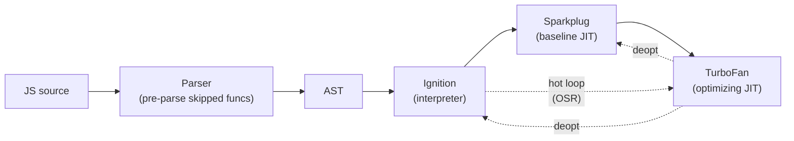

**Hidden classes (Maps):** V8 assigns each object a "hidden class" describing its property layout. When code accesses a property, V8 records the hidden class in an **inline cache**. Subsequent accesses with the same hidden class become direct memory loads.

**Why monomorphic code is faster:**

```js
// monomorphic: V8 sees only one shape
function area(p) { return p.x * p.y; }
for (const p of points) area(p); // all `p` have same shape

// polymorphic: V8 must check multiple shapes
function area(p) { return p.x * p.y; }
area({ x: 1, y: 2 });
area({ x: 1, y: 2, z: 3 }); // new shape → polymorphic IC
```

Polymorphic and megamorphic call sites (many shapes) cause the optimizer to fall back to slower code.

### 8.15 WebAssembly interop <a class="askgpt-btn" href="https://chatgpt.com/?prompt=Read%20this%20section%20of%20my%20encyclopedia%20and%20explain%20it%20in%20depth%20with%20concrete%20examples%2C%20the%20main%20trade-offs%2C%20and%20common%20pitfalls%20a%20practitioner%20should%20know%3A%0A%0Ahttps%3A%2F%2Fgithub.com%2Fvishvasg14%2Fsoftware-engineering-encyclopedia%2Fblob%2Fmain%2F02-javascript-typescript%2Fjavascript-typescript.md%23815-webassembly-interop%0A%0ASection%20title%3A%208.15%20WebAssembly%20interop" target="_blank" rel="noopener" data-askgpt="8.15 WebAssembly interop" data-askgpt-url="https://github.com/vishvasg14/software-engineering-encyclopedia/blob/main/02-javascript-typescript/javascript-typescript.md#815-webassembly-interop" data-askgpt-prompt-depth="Read%20this%20section%20of%20my%20encyclopedia%20and%20explain%20it%20in%20depth%20with%20concrete%20examples%2C%20the%20main%20trade-offs%2C%20and%20common%20pitfalls%20a%20practitioner%20should%20know%3A%0A%0Ahttps%3A%2F%2Fgithub.com%2Fvishvasg14%2Fsoftware-engineering-encyclopedia%2Fblob%2Fmain%2F02-javascript-typescript%2Fjavascript-typescript.md%23815-webassembly-interop%0A%0ASection%20title%3A%208.15%20WebAssembly%20interop" data-askgpt-prompt-examples="Read%20this%20section%20of%20my%20encyclopedia%20and%20give%20me%202-3%20real-world%20production%20examples%20for%20it.%20For%20each%3A%20what%20went%20right%2C%20what%20went%20wrong%2C%20and%20the%20lessons%20learned.%20Include%20company%20%2F%20project%20names%20if%20relevant.%0A%0Ahttps%3A%2F%2Fgithub.com%2Fvishvasg14%2Fsoftware-engineering-encyclopedia%2Fblob%2Fmain%2F02-javascript-typescript%2Fjavascript-typescript.md%23815-webassembly-interop%0A%0ASection%20title%3A%208.15%20WebAssembly%20interop" title="Ask ChatGPT about this section">💬</a>

WebAssembly (Wasm) is a portable binary instruction format designed as a compilation target for languages like C++, Rust, and AssemblyScript. JS can call Wasm modules via the WebAssembly API or `WebAssembly.instantiate`.

```js
const wasmModule = await WebAssembly.instantiateStreaming(fetch('module.wasm'));
const result = wasmModule.instance.exports.add(1, 2);
```

In Node.js, Wasm is supported via the same API; libraries like `wasm-bindgen` (Rust) generate JS bindings.

### 8.16 TypeScript: structural typing <a class="askgpt-btn" href="https://chatgpt.com/?prompt=Read%20this%20section%20of%20my%20encyclopedia%20and%20explain%20it%20in%20depth%20with%20concrete%20examples%2C%20the%20main%20trade-offs%2C%20and%20common%20pitfalls%20a%20practitioner%20should%20know%3A%0A%0Ahttps%3A%2F%2Fgithub.com%2Fvishvasg14%2Fsoftware-engineering-encyclopedia%2Fblob%2Fmain%2F02-javascript-typescript%2Fjavascript-typescript.md%23816-typescript-structural-typing%0A%0ASection%20title%3A%208.16%20TypeScript%3A%20structural%20typing" target="_blank" rel="noopener" data-askgpt="8.16 TypeScript: structural typing" data-askgpt-url="https://github.com/vishvasg14/software-engineering-encyclopedia/blob/main/02-javascript-typescript/javascript-typescript.md#816-typescript-structural-typing" data-askgpt-prompt-depth="Read%20this%20section%20of%20my%20encyclopedia%20and%20explain%20it%20in%20depth%20with%20concrete%20examples%2C%20the%20main%20trade-offs%2C%20and%20common%20pitfalls%20a%20practitioner%20should%20know%3A%0A%0Ahttps%3A%2F%2Fgithub.com%2Fvishvasg14%2Fsoftware-engineering-encyclopedia%2Fblob%2Fmain%2F02-javascript-typescript%2Fjavascript-typescript.md%23816-typescript-structural-typing%0A%0ASection%20title%3A%208.16%20TypeScript%3A%20structural%20typing" data-askgpt-prompt-examples="Read%20this%20section%20of%20my%20encyclopedia%20and%20give%20me%202-3%20real-world%20production%20examples%20for%20it.%20For%20each%3A%20what%20went%20right%2C%20what%20went%20wrong%2C%20and%20the%20lessons%20learned.%20Include%20company%20%2F%20project%20names%20if%20relevant.%0A%0Ahttps%3A%2F%2Fgithub.com%2Fvishvasg14%2Fsoftware-engineering-encyclopedia%2Fblob%2Fmain%2F02-javascript-typescript%2Fjavascript-typescript.md%23816-typescript-structural-typing%0A%0ASection%20title%3A%208.16%20TypeScript%3A%20structural%20typing" title="Ask ChatGPT about this section">💬</a>

TypeScript uses **structural** (duck) typing: a value's type is determined by its shape, not its declared name.

```ts
interface Named { name: string; }
interface Greetable { greet(): void; }

function greet(n: Named & Greetable) {
    console.log(n.name, n.greet());
}

class Person implements Named, Greetable {
    constructor(public name: string) {}
    greet() { console.log('hello'); }
}

greet(new Person('Alice')); // OK — Person has the right shape
```

This is different from **nominal** typing (Java, C#) where the type name matters. Two types are compatible if their structures are compatible, regardless of declaration.

### 8.17 TypeScript: narrowing and control flow <a class="askgpt-btn" href="https://chatgpt.com/?prompt=Read%20this%20section%20of%20my%20encyclopedia%20and%20explain%20it%20in%20depth%20with%20concrete%20examples%2C%20the%20main%20trade-offs%2C%20and%20common%20pitfalls%20a%20practitioner%20should%20know%3A%0A%0Ahttps%3A%2F%2Fgithub.com%2Fvishvasg14%2Fsoftware-engineering-encyclopedia%2Fblob%2Fmain%2F02-javascript-typescript%2Fjavascript-typescript.md%23817-typescript-narrowing-and-control-flow%0A%0ASection%20title%3A%208.17%20TypeScript%3A%20narrowing%20and%20control%20flow" target="_blank" rel="noopener" data-askgpt="8.17 TypeScript: narrowing and control flow" data-askgpt-url="https://github.com/vishvasg14/software-engineering-encyclopedia/blob/main/02-javascript-typescript/javascript-typescript.md#817-typescript-narrowing-and-control-flow" data-askgpt-prompt-depth="Read%20this%20section%20of%20my%20encyclopedia%20and%20explain%20it%20in%20depth%20with%20concrete%20examples%2C%20the%20main%20trade-offs%2C%20and%20common%20pitfalls%20a%20practitioner%20should%20know%3A%0A%0Ahttps%3A%2F%2Fgithub.com%2Fvishvasg14%2Fsoftware-engineering-encyclopedia%2Fblob%2Fmain%2F02-javascript-typescript%2Fjavascript-typescript.md%23817-typescript-narrowing-and-control-flow%0A%0ASection%20title%3A%208.17%20TypeScript%3A%20narrowing%20and%20control%20flow" data-askgpt-prompt-examples="Read%20this%20section%20of%20my%20encyclopedia%20and%20give%20me%202-3%20real-world%20production%20examples%20for%20it.%20For%20each%3A%20what%20went%20right%2C%20what%20went%20wrong%2C%20and%20the%20lessons%20learned.%20Include%20company%20%2F%20project%20names%20if%20relevant.%0A%0Ahttps%3A%2F%2Fgithub.com%2Fvishvasg14%2Fsoftware-engineering-encyclopedia%2Fblob%2Fmain%2F02-javascript-typescript%2Fjavascript-typescript.md%23817-typescript-narrowing-and-control-flow%0A%0ASection%20title%3A%208.17%20TypeScript%3A%20narrowing%20and%20control%20flow" title="Ask ChatGPT about this section">💬</a>

TypeScript narrows types based on control flow:

```ts
function f(x: string | number) {
    if (typeof x === 'string') {
        x.toUpperCase(); // OK — x is string here
    } else {
        x.toFixed(2);    // OK — x is number here
    }
}

type Shape =
    | { kind: 'circle'; r: number }
    | { kind: 'rect'; w: number; h: number };

function area(s: Shape) {
    switch (s.kind) {
        case 'circle': return Math.PI * s.r ** 2; // s.r accessible
        case 'rect':   return s.w * s.h;          // s.w, s.h accessible
    }
}
```

Discriminated unions (a common pattern) require a literal `kind` field.

### 8.18 TypeScript: generics, conditional types, template literal types <a class="askgpt-btn" href="https://chatgpt.com/?prompt=Read%20this%20section%20of%20my%20encyclopedia%20and%20explain%20it%20in%20depth%20with%20concrete%20examples%2C%20the%20main%20trade-offs%2C%20and%20common%20pitfalls%20a%20practitioner%20should%20know%3A%0A%0Ahttps%3A%2F%2Fgithub.com%2Fvishvasg14%2Fsoftware-engineering-encyclopedia%2Fblob%2Fmain%2F02-javascript-typescript%2Fjavascript-typescript.md%23818-typescript-generics-conditional-types-template-literal-types%0A%0ASection%20title%3A%208.18%20TypeScript%3A%20generics%2C%20conditional%20types%2C%20template%20literal%20types" target="_blank" rel="noopener" data-askgpt="8.18 TypeScript: generics, conditional types, template literal types" data-askgpt-url="https://github.com/vishvasg14/software-engineering-encyclopedia/blob/main/02-javascript-typescript/javascript-typescript.md#818-typescript-generics-conditional-types-template-literal-types" data-askgpt-prompt-depth="Read%20this%20section%20of%20my%20encyclopedia%20and%20explain%20it%20in%20depth%20with%20concrete%20examples%2C%20the%20main%20trade-offs%2C%20and%20common%20pitfalls%20a%20practitioner%20should%20know%3A%0A%0Ahttps%3A%2F%2Fgithub.com%2Fvishvasg14%2Fsoftware-engineering-encyclopedia%2Fblob%2Fmain%2F02-javascript-typescript%2Fjavascript-typescript.md%23818-typescript-generics-conditional-types-template-literal-types%0A%0ASection%20title%3A%208.18%20TypeScript%3A%20generics%2C%20conditional%20types%2C%20template%20literal%20types" data-askgpt-prompt-examples="Read%20this%20section%20of%20my%20encyclopedia%20and%20give%20me%202-3%20real-world%20production%20examples%20for%20it.%20For%20each%3A%20what%20went%20right%2C%20what%20went%20wrong%2C%20and%20the%20lessons%20learned.%20Include%20company%20%2F%20project%20names%20if%20relevant.%0A%0Ahttps%3A%2F%2Fgithub.com%2Fvishvasg14%2Fsoftware-engineering-encyclopedia%2Fblob%2Fmain%2F02-javascript-typescript%2Fjavascript-typescript.md%23818-typescript-generics-conditional-types-template-literal-types%0A%0ASection%20title%3A%208.18%20TypeScript%3A%20generics%2C%20conditional%20types%2C%20template%20literal%20types" title="Ask ChatGPT about this section">💬</a>

**Generics:**

```ts
function first<T>(arr: T[]): T | undefined {
    return arr[0];
}
```

**Conditional types:**

```ts
type IsString<T> = T extends string ? true : false;
type A = IsString<'hello'>; // true
type B = IsString<42>;      // false
```

**Template literal types:**

```ts
type EventName = `on${Capitalize<string>}`;
const e: EventName = 'onClick'; // OK
const f: EventName = 'click';   // ERROR
```

**Mapped types:**

```ts
type Readonly<T> = { readonly [K in keyof T]: T[K] };
type Partial<T> = { [K in keyof T]?: T[K] };
```

These are the foundations of TypeScript's type-level programming.

### 8.19 TypeScript declaration files <a class="askgpt-btn" href="https://chatgpt.com/?prompt=Read%20this%20section%20of%20my%20encyclopedia%20and%20explain%20it%20in%20depth%20with%20concrete%20examples%2C%20the%20main%20trade-offs%2C%20and%20common%20pitfalls%20a%20practitioner%20should%20know%3A%0A%0Ahttps%3A%2F%2Fgithub.com%2Fvishvasg14%2Fsoftware-engineering-encyclopedia%2Fblob%2Fmain%2F02-javascript-typescript%2Fjavascript-typescript.md%23819-typescript-declaration-files%0A%0ASection%20title%3A%208.19%20TypeScript%20declaration%20files" target="_blank" rel="noopener" data-askgpt="8.19 TypeScript declaration files" data-askgpt-url="https://github.com/vishvasg14/software-engineering-encyclopedia/blob/main/02-javascript-typescript/javascript-typescript.md#819-typescript-declaration-files" data-askgpt-prompt-depth="Read%20this%20section%20of%20my%20encyclopedia%20and%20explain%20it%20in%20depth%20with%20concrete%20examples%2C%20the%20main%20trade-offs%2C%20and%20common%20pitfalls%20a%20practitioner%20should%20know%3A%0A%0Ahttps%3A%2F%2Fgithub.com%2Fvishvasg14%2Fsoftware-engineering-encyclopedia%2Fblob%2Fmain%2F02-javascript-typescript%2Fjavascript-typescript.md%23819-typescript-declaration-files%0A%0ASection%20title%3A%208.19%20TypeScript%20declaration%20files" data-askgpt-prompt-examples="Read%20this%20section%20of%20my%20encyclopedia%20and%20give%20me%202-3%20real-world%20production%20examples%20for%20it.%20For%20each%3A%20what%20went%20right%2C%20what%20went%20wrong%2C%20and%20the%20lessons%20learned.%20Include%20company%20%2F%20project%20names%20if%20relevant.%0A%0Ahttps%3A%2F%2Fgithub.com%2Fvishvasg14%2Fsoftware-engineering-encyclopedia%2Fblob%2Fmain%2F02-javascript-typescript%2Fjavascript-typescript.md%23819-typescript-declaration-files%0A%0ASection%20title%3A%208.19%20TypeScript%20declaration%20files" title="Ask ChatGPT about this section">💬</a>

`.d.ts` files describe the shape of a JavaScript module so TypeScript can type-check code that uses it.

```ts
// types.d.ts
declare module 'my-lib' {
    export function hello(name: string): string;
    export const version: string;
}
```

**DefinitelyTyped:** a community repository of `.d.ts` files for npm packages, published as `@types/*` packages (e.g., `@types/node`, `@types/react`).

### 8.20 TypeScript compiler architecture <a class="askgpt-btn" href="https://chatgpt.com/?prompt=Read%20this%20section%20of%20my%20encyclopedia%20and%20explain%20it%20in%20depth%20with%20concrete%20examples%2C%20the%20main%20trade-offs%2C%20and%20common%20pitfalls%20a%20practitioner%20should%20know%3A%0A%0Ahttps%3A%2F%2Fgithub.com%2Fvishvasg14%2Fsoftware-engineering-encyclopedia%2Fblob%2Fmain%2F02-javascript-typescript%2Fjavascript-typescript.md%23820-typescript-compiler-architecture%0A%0ASection%20title%3A%208.20%20TypeScript%20compiler%20architecture" target="_blank" rel="noopener" data-askgpt="8.20 TypeScript compiler architecture" data-askgpt-url="https://github.com/vishvasg14/software-engineering-encyclopedia/blob/main/02-javascript-typescript/javascript-typescript.md#820-typescript-compiler-architecture" data-askgpt-prompt-depth="Read%20this%20section%20of%20my%20encyclopedia%20and%20explain%20it%20in%20depth%20with%20concrete%20examples%2C%20the%20main%20trade-offs%2C%20and%20common%20pitfalls%20a%20practitioner%20should%20know%3A%0A%0Ahttps%3A%2F%2Fgithub.com%2Fvishvasg14%2Fsoftware-engineering-encyclopedia%2Fblob%2Fmain%2F02-javascript-typescript%2Fjavascript-typescript.md%23820-typescript-compiler-architecture%0A%0ASection%20title%3A%208.20%20TypeScript%20compiler%20architecture" data-askgpt-prompt-examples="Read%20this%20section%20of%20my%20encyclopedia%20and%20give%20me%202-3%20real-world%20production%20examples%20for%20it.%20For%20each%3A%20what%20went%20right%2C%20what%20went%20wrong%2C%20and%20the%20lessons%20learned.%20Include%20company%20%2F%20project%20names%20if%20relevant.%0A%0Ahttps%3A%2F%2Fgithub.com%2Fvishvasg14%2Fsoftware-engineering-encyclopedia%2Fblob%2Fmain%2F02-javascript-typescript%2Fjavascript-typescript.md%23820-typescript-compiler-architecture%0A%0ASection%20title%3A%208.20%20TypeScript%20compiler%20architecture" title="Ask ChatGPT about this section">💬</a>

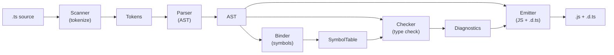

The compiler runs in three modes:

- **`tsc`** — command-line build, processes whole program.
- **`tsserver`** — language service used by IDEs; incremental.
- **`tsc --watch`** — file-watcher build mode.

---

## 9. Architecture

### 9.1 V8 architecture (Google) <a class="askgpt-btn" href="https://chatgpt.com/?prompt=Read%20this%20section%20of%20my%20encyclopedia%20and%20explain%20it%20in%20depth%20with%20concrete%20examples%2C%20the%20main%20trade-offs%2C%20and%20common%20pitfalls%20a%20practitioner%20should%20know%3A%0A%0Ahttps%3A%2F%2Fgithub.com%2Fvishvasg14%2Fsoftware-engineering-encyclopedia%2Fblob%2Fmain%2F02-javascript-typescript%2Fjavascript-typescript.md%2391-v8-architecture-google%0A%0ASection%20title%3A%209.1%20V8%20architecture%20(Google)" target="_blank" rel="noopener" data-askgpt="9.1 V8 architecture (Google)" data-askgpt-url="https://github.com/vishvasg14/software-engineering-encyclopedia/blob/main/02-javascript-typescript/javascript-typescript.md#91-v8-architecture-google" data-askgpt-prompt-depth="Read%20this%20section%20of%20my%20encyclopedia%20and%20explain%20it%20in%20depth%20with%20concrete%20examples%2C%20the%20main%20trade-offs%2C%20and%20common%20pitfalls%20a%20practitioner%20should%20know%3A%0A%0Ahttps%3A%2F%2Fgithub.com%2Fvishvasg14%2Fsoftware-engineering-encyclopedia%2Fblob%2Fmain%2F02-javascript-typescript%2Fjavascript-typescript.md%2391-v8-architecture-google%0A%0ASection%20title%3A%209.1%20V8%20architecture%20(Google)" data-askgpt-prompt-examples="Read%20this%20section%20of%20my%20encyclopedia%20and%20give%20me%202-3%20real-world%20production%20examples%20for%20it.%20For%20each%3A%20what%20went%20right%2C%20what%20went%20wrong%2C%20and%20the%20lessons%20learned.%20Include%20company%20%2F%20project%20names%20if%20relevant.%0A%0Ahttps%3A%2F%2Fgithub.com%2Fvishvasg14%2Fsoftware-engineering-encyclopedia%2Fblob%2Fmain%2F02-javascript-typescript%2Fjavascript-typescript.md%2391-v8-architecture-google%0A%0ASection%20title%3A%209.1%20V8%20architecture%20(Google)" title="Ask ChatGPT about this section">💬</a>

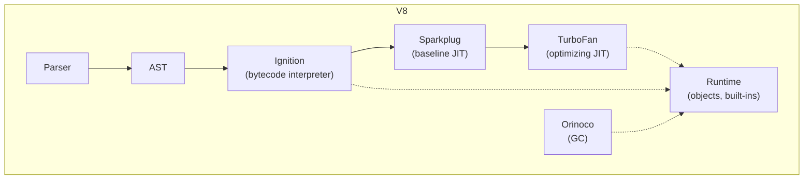

V8 is written in C++ (~1M lines of code). It's used by Chrome, Node.js, Deno, and most browser-based tools.

### 9.2 SpiderMonkey (Mozilla) <a class="askgpt-btn" href="https://chatgpt.com/?prompt=Read%20this%20section%20of%20my%20encyclopedia%20and%20explain%20it%20in%20depth%20with%20concrete%20examples%2C%20the%20main%20trade-offs%2C%20and%20common%20pitfalls%20a%20practitioner%20should%20know%3A%0A%0Ahttps%3A%2F%2Fgithub.com%2Fvishvasg14%2Fsoftware-engineering-encyclopedia%2Fblob%2Fmain%2F02-javascript-typescript%2Fjavascript-typescript.md%2392-spidermonkey-mozilla%0A%0ASection%20title%3A%209.2%20SpiderMonkey%20(Mozilla)" target="_blank" rel="noopener" data-askgpt="9.2 SpiderMonkey (Mozilla)" data-askgpt-url="https://github.com/vishvasg14/software-engineering-encyclopedia/blob/main/02-javascript-typescript/javascript-typescript.md#92-spidermonkey-mozilla" data-askgpt-prompt-depth="Read%20this%20section%20of%20my%20encyclopedia%20and%20explain%20it%20in%20depth%20with%20concrete%20examples%2C%20the%20main%20trade-offs%2C%20and%20common%20pitfalls%20a%20practitioner%20should%20know%3A%0A%0Ahttps%3A%2F%2Fgithub.com%2Fvishvasg14%2Fsoftware-engineering-encyclopedia%2Fblob%2Fmain%2F02-javascript-typescript%2Fjavascript-typescript.md%2392-spidermonkey-mozilla%0A%0ASection%20title%3A%209.2%20SpiderMonkey%20(Mozilla)" data-askgpt-prompt-examples="Read%20this%20section%20of%20my%20encyclopedia%20and%20give%20me%202-3%20real-world%20production%20examples%20for%20it.%20For%20each%3A%20what%20went%20right%2C%20what%20went%20wrong%2C%20and%20the%20lessons%20learned.%20Include%20company%20%2F%20project%20names%20if%20relevant.%0A%0Ahttps%3A%2F%2Fgithub.com%2Fvishvasg14%2Fsoftware-engineering-encyclopedia%2Fblob%2Fmain%2F02-javascript-typescript%2Fjavascript-typescript.md%2392-spidermonkey-mozilla%0A%0ASection%20title%3A%209.2%20SpiderMonkey%20(Mozilla)" title="Ask ChatGPT about this section">💬</a>

SpiderMonkey uses a similar layered architecture: Baseline JIT → Warbuilder → IonMonkey (optimizing JIT). GC is generational with a nursery and tenured space; major GC is incremental.

### 9.3 JavaScriptCore / Nitro (Apple) <a class="askgpt-btn" href="https://chatgpt.com/?prompt=Read%20this%20section%20of%20my%20encyclopedia%20and%20explain%20it%20in%20depth%20with%20concrete%20examples%2C%20the%20main%20trade-offs%2C%20and%20common%20pitfalls%20a%20practitioner%20should%20know%3A%0A%0Ahttps%3A%2F%2Fgithub.com%2Fvishvasg14%2Fsoftware-engineering-encyclopedia%2Fblob%2Fmain%2F02-javascript-typescript%2Fjavascript-typescript.md%2393-javascriptcore-nitro-apple%0A%0ASection%20title%3A%209.3%20JavaScriptCore%20%2F%20Nitro%20(Apple)" target="_blank" rel="noopener" data-askgpt="9.3 JavaScriptCore / Nitro (Apple)" data-askgpt-url="https://github.com/vishvasg14/software-engineering-encyclopedia/blob/main/02-javascript-typescript/javascript-typescript.md#93-javascriptcore-nitro-apple" data-askgpt-prompt-depth="Read%20this%20section%20of%20my%20encyclopedia%20and%20explain%20it%20in%20depth%20with%20concrete%20examples%2C%20the%20main%20trade-offs%2C%20and%20common%20pitfalls%20a%20practitioner%20should%20know%3A%0A%0Ahttps%3A%2F%2Fgithub.com%2Fvishvasg14%2Fsoftware-engineering-encyclopedia%2Fblob%2Fmain%2F02-javascript-typescript%2Fjavascript-typescript.md%2393-javascriptcore-nitro-apple%0A%0ASection%20title%3A%209.3%20JavaScriptCore%20%2F%20Nitro%20(Apple)" data-askgpt-prompt-examples="Read%20this%20section%20of%20my%20encyclopedia%20and%20give%20me%202-3%20real-world%20production%20examples%20for%20it.%20For%20each%3A%20what%20went%20right%2C%20what%20went%20wrong%2C%20and%20the%20lessons%20learned.%20Include%20company%20%2F%20project%20names%20if%20relevant.%0A%0Ahttps%3A%2F%2Fgithub.com%2Fvishvasg14%2Fsoftware-engineering-encyclopedia%2Fblob%2Fmain%2F02-javascript-typescript%2Fjavascript-typescript.md%2393-javascriptcore-nitro-apple%0A%0ASection%20title%3A%209.3%20JavaScriptCore%20%2F%20Nitro%20(Apple)" title="Ask ChatGPT about this section">💬</a>

JavaScriptCore uses: LLInt (interpreter) → Baseline JIT → DFG (Data Flow Graph) → FTL (Faster Than Light, B3 backend). Optimized for macOS/iOS power efficiency.

### 9.4 TypeScript compiler pipeline <a class="askgpt-btn" href="https://chatgpt.com/?prompt=Read%20this%20section%20of%20my%20encyclopedia%20and%20explain%20it%20in%20depth%20with%20concrete%20examples%2C%20the%20main%20trade-offs%2C%20and%20common%20pitfalls%20a%20practitioner%20should%20know%3A%0A%0Ahttps%3A%2F%2Fgithub.com%2Fvishvasg14%2Fsoftware-engineering-encyclopedia%2Fblob%2Fmain%2F02-javascript-typescript%2Fjavascript-typescript.md%2394-typescript-compiler-pipeline%0A%0ASection%20title%3A%209.4%20TypeScript%20compiler%20pipeline" target="_blank" rel="noopener" data-askgpt="9.4 TypeScript compiler pipeline" data-askgpt-url="https://github.com/vishvasg14/software-engineering-encyclopedia/blob/main/02-javascript-typescript/javascript-typescript.md#94-typescript-compiler-pipeline" data-askgpt-prompt-depth="Read%20this%20section%20of%20my%20encyclopedia%20and%20explain%20it%20in%20depth%20with%20concrete%20examples%2C%20the%20main%20trade-offs%2C%20and%20common%20pitfalls%20a%20practitioner%20should%20know%3A%0A%0Ahttps%3A%2F%2Fgithub.com%2Fvishvasg14%2Fsoftware-engineering-encyclopedia%2Fblob%2Fmain%2F02-javascript-typescript%2Fjavascript-typescript.md%2394-typescript-compiler-pipeline%0A%0ASection%20title%3A%209.4%20TypeScript%20compiler%20pipeline" data-askgpt-prompt-examples="Read%20this%20section%20of%20my%20encyclopedia%20and%20give%20me%202-3%20real-world%20production%20examples%20for%20it.%20For%20each%3A%20what%20went%20right%2C%20what%20went%20wrong%2C%20and%20the%20lessons%20learned.%20Include%20company%20%2F%20project%20names%20if%20relevant.%0A%0Ahttps%3A%2F%2Fgithub.com%2Fvishvasg14%2Fsoftware-engineering-encyclopedia%2Fblob%2Fmain%2F02-javascript-typescript%2Fjavascript-typescript.md%2394-typescript-compiler-pipeline%0A%0ASection%20title%3A%209.4%20TypeScript%20compiler%20pipeline" title="Ask ChatGPT about this section">💬</a>

See §8.20. The compiler is written in TypeScript itself and runs in three modes: CLI (`tsc`), watch mode (`tsc --watch`), and language service (`tsserver`).

### 9.5 Node.js architecture <a class="askgpt-btn" href="https://chatgpt.com/?prompt=Read%20this%20section%20of%20my%20encyclopedia%20and%20explain%20it%20in%20depth%20with%20concrete%20examples%2C%20the%20main%20trade-offs%2C%20and%20common%20pitfalls%20a%20practitioner%20should%20know%3A%0A%0Ahttps%3A%2F%2Fgithub.com%2Fvishvasg14%2Fsoftware-engineering-encyclopedia%2Fblob%2Fmain%2F02-javascript-typescript%2Fjavascript-typescript.md%2395-nodejs-architecture%0A%0ASection%20title%3A%209.5%20Node.js%20architecture" target="_blank" rel="noopener" data-askgpt="9.5 Node.js architecture" data-askgpt-url="https://github.com/vishvasg14/software-engineering-encyclopedia/blob/main/02-javascript-typescript/javascript-typescript.md#95-nodejs-architecture" data-askgpt-prompt-depth="Read%20this%20section%20of%20my%20encyclopedia%20and%20explain%20it%20in%20depth%20with%20concrete%20examples%2C%20the%20main%20trade-offs%2C%20and%20common%20pitfalls%20a%20practitioner%20should%20know%3A%0A%0Ahttps%3A%2F%2Fgithub.com%2Fvishvasg14%2Fsoftware-engineering-encyclopedia%2Fblob%2Fmain%2F02-javascript-typescript%2Fjavascript-typescript.md%2395-nodejs-architecture%0A%0ASection%20title%3A%209.5%20Node.js%20architecture" data-askgpt-prompt-examples="Read%20this%20section%20of%20my%20encyclopedia%20and%20give%20me%202-3%20real-world%20production%20examples%20for%20it.%20For%20each%3A%20what%20went%20right%2C%20what%20went%20wrong%2C%20and%20the%20lessons%20learned.%20Include%20company%20%2F%20project%20names%20if%20relevant.%0A%0Ahttps%3A%2F%2Fgithub.com%2Fvishvasg14%2Fsoftware-engineering-encyclopedia%2Fblob%2Fmain%2F02-javascript-typescript%2Fjavascript-typescript.md%2395-nodejs-architecture%0A%0ASection%20title%3A%209.5%20Node.js%20architecture" title="Ask ChatGPT about this section">💬</a>

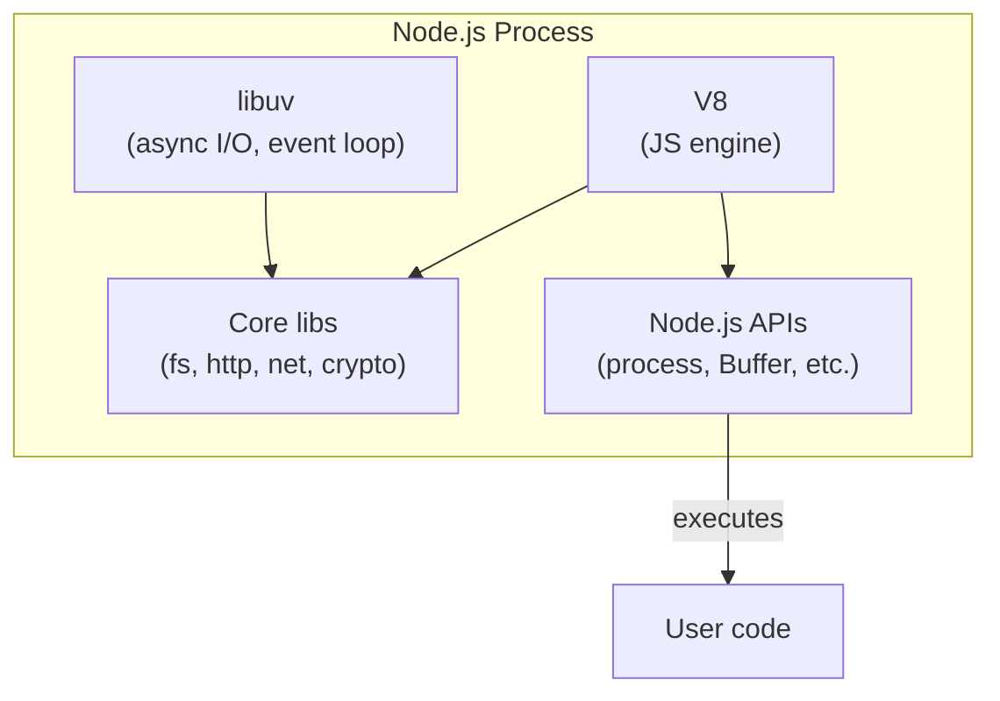

Node.js bundles V8 (engine) + libuv (cross-platform async I/O) + a set of C++/JS core libraries. The JavaScript you write runs on V8; I/O operations are dispatched to libuv which uses the best mechanism on each OS (epoll on Linux, kqueue on macOS, IOCP on Windows).

### 9.6 Browser architecture (a V8-using browser) <a class="askgpt-btn" href="https://chatgpt.com/?prompt=Read%20this%20section%20of%20my%20encyclopedia%20and%20explain%20it%20in%20depth%20with%20concrete%20examples%2C%20the%20main%20trade-offs%2C%20and%20common%20pitfalls%20a%20practitioner%20should%20know%3A%0A%0Ahttps%3A%2F%2Fgithub.com%2Fvishvasg14%2Fsoftware-engineering-encyclopedia%2Fblob%2Fmain%2F02-javascript-typescript%2Fjavascript-typescript.md%2396-browser-architecture-a-v8-using-browser%0A%0ASection%20title%3A%209.6%20Browser%20architecture%20(a%20V8-using%20browser)" target="_blank" rel="noopener" data-askgpt="9.6 Browser architecture (a V8-using browser)" data-askgpt-url="https://github.com/vishvasg14/software-engineering-encyclopedia/blob/main/02-javascript-typescript/javascript-typescript.md#96-browser-architecture-a-v8-using-browser" data-askgpt-prompt-depth="Read%20this%20section%20of%20my%20encyclopedia%20and%20explain%20it%20in%20depth%20with%20concrete%20examples%2C%20the%20main%20trade-offs%2C%20and%20common%20pitfalls%20a%20practitioner%20should%20know%3A%0A%0Ahttps%3A%2F%2Fgithub.com%2Fvishvasg14%2Fsoftware-engineering-encyclopedia%2Fblob%2Fmain%2F02-javascript-typescript%2Fjavascript-typescript.md%2396-browser-architecture-a-v8-using-browser%0A%0ASection%20title%3A%209.6%20Browser%20architecture%20(a%20V8-using%20browser)" data-askgpt-prompt-examples="Read%20this%20section%20of%20my%20encyclopedia%20and%20give%20me%202-3%20real-world%20production%20examples%20for%20it.%20For%20each%3A%20what%20went%20right%2C%20what%20went%20wrong%2C%20and%20the%20lessons%20learned.%20Include%20company%20%2F%20project%20names%20if%20relevant.%0A%0Ahttps%3A%2F%2Fgithub.com%2Fvishvasg14%2Fsoftware-engineering-encyclopedia%2Fblob%2Fmain%2F02-javascript-typescript%2Fjavascript-typescript.md%2396-browser-architecture-a-v8-using-browser%0A%0ASection%20title%3A%209.6%20Browser%20architecture%20(a%20V8-using%20browser)" title="Ask ChatGPT about this section">💬</a>

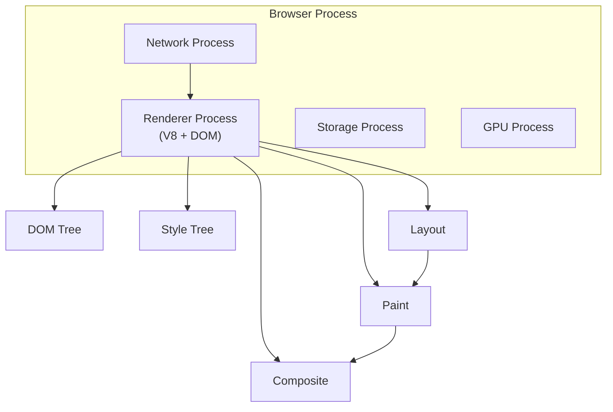

A browser has multiple processes. The renderer process runs JavaScript (V8) and provides the DOM, CSS, and layout/paint services.

---

## 10. Performance

### 10.1 Time complexity of common operations <a class="askgpt-btn" href="https://chatgpt.com/?prompt=Read%20this%20section%20of%20my%20encyclopedia%20and%20explain%20it%20in%20depth%20with%20concrete%20examples%2C%20the%20main%20trade-offs%2C%20and%20common%20pitfalls%20a%20practitioner%20should%20know%3A%0A%0Ahttps%3A%2F%2Fgithub.com%2Fvishvasg14%2Fsoftware-engineering-encyclopedia%2Fblob%2Fmain%2F02-javascript-typescript%2Fjavascript-typescript.md%23101-time-complexity-of-common-operations%0A%0ASection%20title%3A%2010.1%20Time%20complexity%20of%20common%20operations" target="_blank" rel="noopener" data-askgpt="10.1 Time complexity of common operations" data-askgpt-url="https://github.com/vishvasg14/software-engineering-encyclopedia/blob/main/02-javascript-typescript/javascript-typescript.md#101-time-complexity-of-common-operations" data-askgpt-prompt-depth="Read%20this%20section%20of%20my%20encyclopedia%20and%20explain%20it%20in%20depth%20with%20concrete%20examples%2C%20the%20main%20trade-offs%2C%20and%20common%20pitfalls%20a%20practitioner%20should%20know%3A%0A%0Ahttps%3A%2F%2Fgithub.com%2Fvishvasg14%2Fsoftware-engineering-encyclopedia%2Fblob%2Fmain%2F02-javascript-typescript%2Fjavascript-typescript.md%23101-time-complexity-of-common-operations%0A%0ASection%20title%3A%2010.1%20Time%20complexity%20of%20common%20operations" data-askgpt-prompt-examples="Read%20this%20section%20of%20my%20encyclopedia%20and%20give%20me%202-3%20real-world%20production%20examples%20for%20it.%20For%20each%3A%20what%20went%20right%2C%20what%20went%20wrong%2C%20and%20the%20lessons%20learned.%20Include%20company%20%2F%20project%20names%20if%20relevant.%0A%0Ahttps%3A%2F%2Fgithub.com%2Fvishvasg14%2Fsoftware-engineering-encyclopedia%2Fblob%2Fmain%2F02-javascript-typescript%2Fjavascript-typescript.md%23101-time-complexity-of-common-operations%0A%0ASection%20title%3A%2010.1%20Time%20complexity%20of%20common%20operations" title="Ask ChatGPT about this section">💬</a>

| Operation | Complexity | Notes |
|-----------|-----------|-------|
| Object property access (morphic) | O(1) | Inline cache hit |
| Object property access (megamorphic) | O(n) | Dictionary mode |
| `Array.prototype.push/pop` | O(1) amortized | |
| `Array.prototype.shift/unshift` | O(n) | |
| `Array.prototype.indexOf` | O(n) | Linear scan |
| `Map.prototype.get/set` | O(1) | Hash table |
| `Set.prototype.has/add` | O(1) | Hash table |
| String concatenation | O(n) | If both strings are small |
| Array sort | O(n log n) | TimSort in V8 |

### 10.2 Memory usage <a class="askgpt-btn" href="https://chatgpt.com/?prompt=Read%20this%20section%20of%20my%20encyclopedia%20and%20explain%20it%20in%20depth%20with%20concrete%20examples%2C%20the%20main%20trade-offs%2C%20and%20common%20pitfalls%20a%20practitioner%20should%20know%3A%0A%0Ahttps%3A%2F%2Fgithub.com%2Fvishvasg14%2Fsoftware-engineering-encyclopedia%2Fblob%2Fmain%2F02-javascript-typescript%2Fjavascript-typescript.md%23102-memory-usage%0A%0ASection%20title%3A%2010.2%20Memory%20usage" target="_blank" rel="noopener" data-askgpt="10.2 Memory usage" data-askgpt-url="https://github.com/vishvasg14/software-engineering-encyclopedia/blob/main/02-javascript-typescript/javascript-typescript.md#102-memory-usage" data-askgpt-prompt-depth="Read%20this%20section%20of%20my%20encyclopedia%20and%20explain%20it%20in%20depth%20with%20concrete%20examples%2C%20the%20main%20trade-offs%2C%20and%20common%20pitfalls%20a%20practitioner%20should%20know%3A%0A%0Ahttps%3A%2F%2Fgithub.com%2Fvishvasg14%2Fsoftware-engineering-encyclopedia%2Fblob%2Fmain%2F02-javascript-typescript%2Fjavascript-typescript.md%23102-memory-usage%0A%0ASection%20title%3A%2010.2%20Memory%20usage" data-askgpt-prompt-examples="Read%20this%20section%20of%20my%20encyclopedia%20and%20give%20me%202-3%20real-world%20production%20examples%20for%20it.%20For%20each%3A%20what%20went%20right%2C%20what%20went%20wrong%2C%20and%20the%20lessons%20learned.%20Include%20company%20%2F%20project%20names%20if%20relevant.%0A%0Ahttps%3A%2F%2Fgithub.com%2Fvishvasg14%2Fsoftware-engineering-encyclopedia%2Fblob%2Fmain%2F02-javascript-typescript%2Fjavascript-typescript.md%23102-memory-usage%0A%0ASection%20title%3A%2010.2%20Memory%20usage" title="Ask ChatGPT about this section">💬</a>

| Memory type | Tunable | Production note |
|-------------|---------|----------------|
| Heap | `--max-old-space-size` | Default ~4 GB on 64-bit |
| Nursery | `--min-semi-space-size` | Default 16 MB |
| Stack | `--stack-size` | Default 984 KB |
| Off-heap (Buffers) | `Buffer.poolSize` | Default 8 KB chunk size, 8K max |

**V8 old space limit:** on 64-bit systems, default ~4 GB; on 32-bit, ~1 GB. Increase with `node --max-old-space-size=8192` (in MB) for memory-hungry services.

### 10.3 CPU usage <a class="askgpt-btn" href="https://chatgpt.com/?prompt=Read%20this%20section%20of%20my%20encyclopedia%20and%20explain%20it%20in%20depth%20with%20concrete%20examples%2C%20the%20main%20trade-offs%2C%20and%20common%20pitfalls%20a%20practitioner%20should%20know%3A%0A%0Ahttps%3A%2F%2Fgithub.com%2Fvishvasg14%2Fsoftware-engineering-encyclopedia%2Fblob%2Fmain%2F02-javascript-typescript%2Fjavascript-typescript.md%23103-cpu-usage%0A%0ASection%20title%3A%2010.3%20CPU%20usage" target="_blank" rel="noopener" data-askgpt="10.3 CPU usage" data-askgpt-url="https://github.com/vishvasg14/software-engineering-encyclopedia/blob/main/02-javascript-typescript/javascript-typescript.md#103-cpu-usage" data-askgpt-prompt-depth="Read%20this%20section%20of%20my%20encyclopedia%20and%20explain%20it%20in%20depth%20with%20concrete%20examples%2C%20the%20main%20trade-offs%2C%20and%20common%20pitfalls%20a%20practitioner%20should%20know%3A%0A%0Ahttps%3A%2F%2Fgithub.com%2Fvishvasg14%2Fsoftware-engineering-encyclopedia%2Fblob%2Fmain%2F02-javascript-typescript%2Fjavascript-typescript.md%23103-cpu-usage%0A%0ASection%20title%3A%2010.3%20CPU%20usage" data-askgpt-prompt-examples="Read%20this%20section%20of%20my%20encyclopedia%20and%20give%20me%202-3%20real-world%20production%20examples%20for%20it.%20For%20each%3A%20what%20went%20right%2C%20what%20went%20wrong%2C%20and%20the%20lessons%20learned.%20Include%20company%20%2F%20project%20names%20if%20relevant.%0A%0Ahttps%3A%2F%2Fgithub.com%2Fvishvasg14%2Fsoftware-engineering-encyclopedia%2Fblob%2Fmain%2F02-javascript-typescript%2Fjavascript-typescript.md%23103-cpu-usage%0A%0ASection%20title%3A%2010.3%20CPU%20usage" title="Ask ChatGPT about this section">💬</a>

- **Sparkplug (baseline JIT)** is fast at compiling but produces simple code.
- **TurboFan (optimizing)** produces near-C++ performance but is slow to compile.
- **Maglev (mid-tier)** fills the gap between Sparkplug and TurboFan (added 2023).

**Hidden class transitions:** adding properties to an object in different orders forces V8 to use a polymorphic inline cache, which is slower than monomorphic. Initialize objects in the same order.

### 10.4 Bottlenecks and optimization techniques <a class="askgpt-btn" href="https://chatgpt.com/?prompt=Read%20this%20section%20of%20my%20encyclopedia%20and%20explain%20it%20in%20depth%20with%20concrete%20examples%2C%20the%20main%20trade-offs%2C%20and%20common%20pitfalls%20a%20practitioner%20should%20know%3A%0A%0Ahttps%3A%2F%2Fgithub.com%2Fvishvasg14%2Fsoftware-engineering-encyclopedia%2Fblob%2Fmain%2F02-javascript-typescript%2Fjavascript-typescript.md%23104-bottlenecks-and-optimization-techniques%0A%0ASection%20title%3A%2010.4%20Bottlenecks%20and%20optimization%20techniques" target="_blank" rel="noopener" data-askgpt="10.4 Bottlenecks and optimization techniques" data-askgpt-url="https://github.com/vishvasg14/software-engineering-encyclopedia/blob/main/02-javascript-typescript/javascript-typescript.md#104-bottlenecks-and-optimization-techniques" data-askgpt-prompt-depth="Read%20this%20section%20of%20my%20encyclopedia%20and%20explain%20it%20in%20depth%20with%20concrete%20examples%2C%20the%20main%20trade-offs%2C%20and%20common%20pitfalls%20a%20practitioner%20should%20know%3A%0A%0Ahttps%3A%2F%2Fgithub.com%2Fvishvasg14%2Fsoftware-engineering-encyclopedia%2Fblob%2Fmain%2F02-javascript-typescript%2Fjavascript-typescript.md%23104-bottlenecks-and-optimization-techniques%0A%0ASection%20title%3A%2010.4%20Bottlenecks%20and%20optimization%20techniques" data-askgpt-prompt-examples="Read%20this%20section%20of%20my%20encyclopedia%20and%20give%20me%202-3%20real-world%20production%20examples%20for%20it.%20For%20each%3A%20what%20went%20right%2C%20what%20went%20wrong%2C%20and%20the%20lessons%20learned.%20Include%20company%20%2F%20project%20names%20if%20relevant.%0A%0Ahttps%3A%2F%2Fgithub.com%2Fvishvasg14%2Fsoftware-engineering-encyclopedia%2Fblob%2Fmain%2F02-javascript-typescript%2Fjavascript-typescript.md%23104-bottlenecks-and-optimization-techniques%0A%0ASection%20title%3A%2010.4%20Bottlenecks%20and%20optimization%20techniques" title="Ask ChatGPT about this section">💬</a>

| Bottleneck | Symptom | Technique |
|------------|---------|-----------|
| Deoptimization | Spiky CPU; fluctuating throughput | Use monomorphic shapes; avoid `arguments`, spread, etc. |
| Long GC pauses | Latency spikes (rare with V8's concurrent GC) | Reduce allocation rate; avoid large objects |
| I/O blocking | Request hangs | Use async APIs throughout |
| Sync code in hot path | Slow request handling | Move to worker threads |
| Big JSON parse | High CPU, memory spike | Stream with `JSONStream` or `simdjson` |
| Megamorphic call sites | Slow inline cache | Use specific types or interfaces |

### 10.5 Caching <a class="askgpt-btn" href="https://chatgpt.com/?prompt=Read%20this%20section%20of%20my%20encyclopedia%20and%20explain%20it%20in%20depth%20with%20concrete%20examples%2C%20the%20main%20trade-offs%2C%20and%20common%20pitfalls%20a%20practitioner%20should%20know%3A%0A%0Ahttps%3A%2F%2Fgithub.com%2Fvishvasg14%2Fsoftware-engineering-encyclopedia%2Fblob%2Fmain%2F02-javascript-typescript%2Fjavascript-typescript.md%23105-caching%0A%0ASection%20title%3A%2010.5%20Caching" target="_blank" rel="noopener" data-askgpt="10.5 Caching" data-askgpt-url="https://github.com/vishvasg14/software-engineering-encyclopedia/blob/main/02-javascript-typescript/javascript-typescript.md#105-caching" data-askgpt-prompt-depth="Read%20this%20section%20of%20my%20encyclopedia%20and%20explain%20it%20in%20depth%20with%20concrete%20examples%2C%20the%20main%20trade-offs%2C%20and%20common%20pitfalls%20a%20practitioner%20should%20know%3A%0A%0Ahttps%3A%2F%2Fgithub.com%2Fvishvasg14%2Fsoftware-engineering-encyclopedia%2Fblob%2Fmain%2F02-javascript-typescript%2Fjavascript-typescript.md%23105-caching%0A%0ASection%20title%3A%2010.5%20Caching" data-askgpt-prompt-examples="Read%20this%20section%20of%20my%20encyclopedia%20and%20give%20me%202-3%20real-world%20production%20examples%20for%20it.%20For%20each%3A%20what%20went%20right%2C%20what%20went%20wrong%2C%20and%20the%20lessons%20learned.%20Include%20company%20%2F%20project%20names%20if%20relevant.%0A%0Ahttps%3A%2F%2Fgithub.com%2Fvishvasg14%2Fsoftware-engineering-encyclopedia%2Fblob%2Fmain%2F02-javascript-typescript%2Fjavascript-typescript.md%23105-caching%0A%0ASection%20title%3A%2010.5%20Caching" title="Ask ChatGPT about this section">💬</a>

- **Inline caches** — per-call-site cache of observed hidden classes.
- **Hidden classes (Maps)** — V8 internal object shapes.
- **Property storage** — fast-path direct storage; slow-path dictionary mode.
- **HTTP caching** — browser/server HTTP cache headers (`Cache-Control`, `ETag`).
- **Service worker caching** — programmable cache for PWA.
- **CDN caching** — for static assets.

### 10.6 Benchmarking and profiling <a class="askgpt-btn" href="https://chatgpt.com/?prompt=Read%20this%20section%20of%20my%20encyclopedia%20and%20explain%20it%20in%20depth%20with%20concrete%20examples%2C%20the%20main%20trade-offs%2C%20and%20common%20pitfalls%20a%20practitioner%20should%20know%3A%0A%0Ahttps%3A%2F%2Fgithub.com%2Fvishvasg14%2Fsoftware-engineering-encyclopedia%2Fblob%2Fmain%2F02-javascript-typescript%2Fjavascript-typescript.md%23106-benchmarking-and-profiling%0A%0ASection%20title%3A%2010.6%20Benchmarking%20and%20profiling" target="_blank" rel="noopener" data-askgpt="10.6 Benchmarking and profiling" data-askgpt-url="https://github.com/vishvasg14/software-engineering-encyclopedia/blob/main/02-javascript-typescript/javascript-typescript.md#106-benchmarking-and-profiling" data-askgpt-prompt-depth="Read%20this%20section%20of%20my%20encyclopedia%20and%20explain%20it%20in%20depth%20with%20concrete%20examples%2C%20the%20main%20trade-offs%2C%20and%20common%20pitfalls%20a%20practitioner%20should%20know%3A%0A%0Ahttps%3A%2F%2Fgithub.com%2Fvishvasg14%2Fsoftware-engineering-encyclopedia%2Fblob%2Fmain%2F02-javascript-typescript%2Fjavascript-typescript.md%23106-benchmarking-and-profiling%0A%0ASection%20title%3A%2010.6%20Benchmarking%20and%20profiling" data-askgpt-prompt-examples="Read%20this%20section%20of%20my%20encyclopedia%20and%20give%20me%202-3%20real-world%20production%20examples%20for%20it.%20For%20each%3A%20what%20went%20right%2C%20what%20went%20wrong%2C%20and%20the%20lessons%20learned.%20Include%20company%20%2F%20project%20names%20if%20relevant.%0A%0Ahttps%3A%2F%2Fgithub.com%2Fvishvasg14%2Fsoftware-engineering-encyclopedia%2Fblob%2Fmain%2F02-javascript-typescript%2Fjavascript-typescript.md%23106-benchmarking-and-profiling%0A%0ASection%20title%3A%2010.6%20Benchmarking%20and%20profiling" title="Ask ChatGPT about this section">💬</a>

- **DevTools Performance tab** — browser profiling.
- **`node --prof`** — Node.js CPU profiler (V8 internal).
- **`node --prof-process isolate-*.log`** — convert to human-readable.
- **`clinic.js`** — suite of profiling tools (Doctor, Flame, Bubbleprof).
- **`0x`** — flame graph generator for Node.
- **`heapdump`** — heap snapshot capture.
- **Chrome DevTools Memory tab** — heap snapshots, allocation timeline.

---

## 11. Security

### 11.1 OWASP relevance <a class="askgpt-btn" href="https://chatgpt.com/?prompt=Read%20this%20section%20of%20my%20encyclopedia%20and%20explain%20it%20in%20depth%20with%20concrete%20examples%2C%20the%20main%20trade-offs%2C%20and%20common%20pitfalls%20a%20practitioner%20should%20know%3A%0A%0Ahttps%3A%2F%2Fgithub.com%2Fvishvasg14%2Fsoftware-engineering-encyclopedia%2Fblob%2Fmain%2F02-javascript-typescript%2Fjavascript-typescript.md%23111-owasp-relevance%0A%0ASection%20title%3A%2011.1%20OWASP%20relevance" target="_blank" rel="noopener" data-askgpt="11.1 OWASP relevance" data-askgpt-url="https://github.com/vishvasg14/software-engineering-encyclopedia/blob/main/02-javascript-typescript/javascript-typescript.md#111-owasp-relevance" data-askgpt-prompt-depth="Read%20this%20section%20of%20my%20encyclopedia%20and%20explain%20it%20in%20depth%20with%20concrete%20examples%2C%20the%20main%20trade-offs%2C%20and%20common%20pitfalls%20a%20practitioner%20should%20know%3A%0A%0Ahttps%3A%2F%2Fgithub.com%2Fvishvasg14%2Fsoftware-engineering-encyclopedia%2Fblob%2Fmain%2F02-javascript-typescript%2Fjavascript-typescript.md%23111-owasp-relevance%0A%0ASection%20title%3A%2011.1%20OWASP%20relevance" data-askgpt-prompt-examples="Read%20this%20section%20of%20my%20encyclopedia%20and%20give%20me%202-3%20real-world%20production%20examples%20for%20it.%20For%20each%3A%20what%20went%20right%2C%20what%20went%20wrong%2C%20and%20the%20lessons%20learned.%20Include%20company%20%2F%20project%20names%20if%20relevant.%0A%0Ahttps%3A%2F%2Fgithub.com%2Fvishvasg14%2Fsoftware-engineering-encyclopedia%2Fblob%2Fmain%2F02-javascript-typescript%2Fjavascript-typescript.md%23111-owasp-relevance%0A%0ASection%20title%3A%2011.1%20OWASP%20relevance" title="Ask ChatGPT about this section">💬</a>

- **A01 Broken Access Control** — CORS misconfiguration, missing auth checks.
- **A02 Cryptographic Failures** — using MD5/SHA1, insecure random (`Math.random` for security).
- **A03 Injection** — DOM-based XSS, `eval` injection, `innerHTML` with untrusted data.
- **A05 Security Misconfiguration** — exposing Node.js debug port, default credentials.
- **A06 Vulnerable Components** — outdated npm dependencies.
- **A07 Identification and Authentication Failures** — JWT misuse, session fixation.
- **A08 Software and Data Integrity Failures** — supply-chain attacks (npm install from untrusted source).
- **A10 Server-Side Request Forgery (SSRF)** — Node.js services fetching untrusted URLs.

### 11.2 XSS (Cross-Site Scripting) <a class="askgpt-btn" href="https://chatgpt.com/?prompt=Read%20this%20section%20of%20my%20encyclopedia%20and%20explain%20it%20in%20depth%20with%20concrete%20examples%2C%20the%20main%20trade-offs%2C%20and%20common%20pitfalls%20a%20practitioner%20should%20know%3A%0A%0Ahttps%3A%2F%2Fgithub.com%2Fvishvasg14%2Fsoftware-engineering-encyclopedia%2Fblob%2Fmain%2F02-javascript-typescript%2Fjavascript-typescript.md%23112-xss-cross-site-scripting%0A%0ASection%20title%3A%2011.2%20XSS%20(Cross-Site%20Scripting)" target="_blank" rel="noopener" data-askgpt="11.2 XSS (Cross-Site Scripting)" data-askgpt-url="https://github.com/vishvasg14/software-engineering-encyclopedia/blob/main/02-javascript-typescript/javascript-typescript.md#112-xss-cross-site-scripting" data-askgpt-prompt-depth="Read%20this%20section%20of%20my%20encyclopedia%20and%20explain%20it%20in%20depth%20with%20concrete%20examples%2C%20the%20main%20trade-offs%2C%20and%20common%20pitfalls%20a%20practitioner%20should%20know%3A%0A%0Ahttps%3A%2F%2Fgithub.com%2Fvishvasg14%2Fsoftware-engineering-encyclopedia%2Fblob%2Fmain%2F02-javascript-typescript%2Fjavascript-typescript.md%23112-xss-cross-site-scripting%0A%0ASection%20title%3A%2011.2%20XSS%20(Cross-Site%20Scripting)" data-askgpt-prompt-examples="Read%20this%20section%20of%20my%20encyclopedia%20and%20give%20me%202-3%20real-world%20production%20examples%20for%20it.%20For%20each%3A%20what%20went%20right%2C%20what%20went%20wrong%2C%20and%20the%20lessons%20learned.%20Include%20company%20%2F%20project%20names%20if%20relevant.%0A%0Ahttps%3A%2F%2Fgithub.com%2Fvishvasg14%2Fsoftware-engineering-encyclopedia%2Fblob%2Fmain%2F02-javascript-typescript%2Fjavascript-typescript.md%23112-xss-cross-site-scripting%0A%0ASection%20title%3A%2011.2%20XSS%20(Cross-Site%20Scripting)" title="Ask ChatGPT about this section">💬</a>

Three flavors:

- **Stored XSS** — malicious script persisted in DB.
- **Reflected XSS** — malicious script in URL parameters reflected back.
- **DOM-based XSS** — malicious script via client-side JS (`document.location.hash` → `innerHTML`).

**Mitigations:**

- Never use `innerHTML` with untrusted data. Use `textContent` or sanitize with DOMPurify.
- Set Content Security Policy (CSP) headers.
- Use Trusted Types (modern browsers).
- Sanitize URLs before setting `href`/`src`.
- Use `rel="noopener noreferrer"` for `target="_blank"` links.

### 11.3 Prototype pollution <a class="askgpt-btn" href="https://chatgpt.com/?prompt=Read%20this%20section%20of%20my%20encyclopedia%20and%20explain%20it%20in%20depth%20with%20concrete%20examples%2C%20the%20main%20trade-offs%2C%20and%20common%20pitfalls%20a%20practitioner%20should%20know%3A%0A%0Ahttps%3A%2F%2Fgithub.com%2Fvishvasg14%2Fsoftware-engineering-encyclopedia%2Fblob%2Fmain%2F02-javascript-typescript%2Fjavascript-typescript.md%23113-prototype-pollution%0A%0ASection%20title%3A%2011.3%20Prototype%20pollution" target="_blank" rel="noopener" data-askgpt="11.3 Prototype pollution" data-askgpt-url="https://github.com/vishvasg14/software-engineering-encyclopedia/blob/main/02-javascript-typescript/javascript-typescript.md#113-prototype-pollution" data-askgpt-prompt-depth="Read%20this%20section%20of%20my%20encyclopedia%20and%20explain%20it%20in%20depth%20with%20concrete%20examples%2C%20the%20main%20trade-offs%2C%20and%20common%20pitfalls%20a%20practitioner%20should%20know%3A%0A%0Ahttps%3A%2F%2Fgithub.com%2Fvishvasg14%2Fsoftware-engineering-encyclopedia%2Fblob%2Fmain%2F02-javascript-typescript%2Fjavascript-typescript.md%23113-prototype-pollution%0A%0ASection%20title%3A%2011.3%20Prototype%20pollution" data-askgpt-prompt-examples="Read%20this%20section%20of%20my%20encyclopedia%20and%20give%20me%202-3%20real-world%20production%20examples%20for%20it.%20For%20each%3A%20what%20went%20right%2C%20what%20went%20wrong%2C%20and%20the%20lessons%20learned.%20Include%20company%20%2F%20project%20names%20if%20relevant.%0A%0Ahttps%3A%2F%2Fgithub.com%2Fvishvasg14%2Fsoftware-engineering-encyclopedia%2Fblob%2Fmain%2F02-javascript-typescript%2Fjavascript-typescript.md%23113-prototype-pollution%0A%0ASection%20title%3A%2011.3%20Prototype%20pollution" title="Ask ChatGPT about this section">💬</a>

A vulnerability where an attacker modifies `Object.prototype` via `__proto__` keys:

```js
const merge = (target, source) => {
    for (const key in source) {
        if (typeof source[key] === 'object') {
            target[key] = merge(target[key] || {}, source[key]);
        } else {
            target[key] = source[key];
        }
    }
};
// Attacker sends JSON.parse('{"__proto__":{"polluted":true}}')
// Result: Object.prototype.polluted = true
```

**Mitigations:**

- Use `Object.create(null)` for dictionaries.
- Filter out `__proto__`, `constructor`, `prototype` keys.
- Use `Object.defineProperty` for property creation.
- Use `Map` instead of plain objects for key-value stores with user keys.

### 11.4 Node.js security <a class="askgpt-btn" href="https://chatgpt.com/?prompt=Read%20this%20section%20of%20my%20encyclopedia%20and%20explain%20it%20in%20depth%20with%20concrete%20examples%2C%20the%20main%20trade-offs%2C%20and%20common%20pitfalls%20a%20practitioner%20should%20know%3A%0A%0Ahttps%3A%2F%2Fgithub.com%2Fvishvasg14%2Fsoftware-engineering-encyclopedia%2Fblob%2Fmain%2F02-javascript-typescript%2Fjavascript-typescript.md%23114-nodejs-security%0A%0ASection%20title%3A%2011.4%20Node.js%20security" target="_blank" rel="noopener" data-askgpt="11.4 Node.js security" data-askgpt-url="https://github.com/vishvasg14/software-engineering-encyclopedia/blob/main/02-javascript-typescript/javascript-typescript.md#114-nodejs-security" data-askgpt-prompt-depth="Read%20this%20section%20of%20my%20encyclopedia%20and%20explain%20it%20in%20depth%20with%20concrete%20examples%2C%20the%20main%20trade-offs%2C%20and%20common%20pitfalls%20a%20practitioner%20should%20know%3A%0A%0Ahttps%3A%2F%2Fgithub.com%2Fvishvasg14%2Fsoftware-engineering-encyclopedia%2Fblob%2Fmain%2F02-javascript-typescript%2Fjavascript-typescript.md%23114-nodejs-security%0A%0ASection%20title%3A%2011.4%20Node.js%20security" data-askgpt-prompt-examples="Read%20this%20section%20of%20my%20encyclopedia%20and%20give%20me%202-3%20real-world%20production%20examples%20for%20it.%20For%20each%3A%20what%20went%20right%2C%20what%20went%20wrong%2C%20and%20the%20lessons%20learned.%20Include%20company%20%2F%20project%20names%20if%20relevant.%0A%0Ahttps%3A%2F%2Fgithub.com%2Fvishvasg14%2Fsoftware-engineering-encyclopedia%2Fblob%2Fmain%2F02-javascript-typescript%2Fjavascript-typescript.md%23114-nodejs-security%0A%0ASection%20title%3A%2011.4%20Node.js%20security" title="Ask ChatGPT about this section">💬</a>

- Use `helmet` middleware for HTTP headers (Express).
- Validate input with `zod` or similar.
- Use parameterized queries for databases (avoid SQL injection).
- Don't expose stack traces in production (set `NODE_ENV=production`).
- Use `npm audit` regularly.
- Pin dependencies with lockfile (`package-lock.json` or `pnpm-lock.yaml`).
- Use `npm ci` instead of `npm install` in CI/CD for reproducible builds.

### 11.5 Dependency security <a class="askgpt-btn" href="https://chatgpt.com/?prompt=Read%20this%20section%20of%20my%20encyclopedia%20and%20explain%20it%20in%20depth%20with%20concrete%20examples%2C%20the%20main%20trade-offs%2C%20and%20common%20pitfalls%20a%20practitioner%20should%20know%3A%0A%0Ahttps%3A%2F%2Fgithub.com%2Fvishvasg14%2Fsoftware-engineering-encyclopedia%2Fblob%2Fmain%2F02-javascript-typescript%2Fjavascript-typescript.md%23115-dependency-security%0A%0ASection%20title%3A%2011.5%20Dependency%20security" target="_blank" rel="noopener" data-askgpt="11.5 Dependency security" data-askgpt-url="https://github.com/vishvasg14/software-engineering-encyclopedia/blob/main/02-javascript-typescript/javascript-typescript.md#115-dependency-security" data-askgpt-prompt-depth="Read%20this%20section%20of%20my%20encyclopedia%20and%20explain%20it%20in%20depth%20with%20concrete%20examples%2C%20the%20main%20trade-offs%2C%20and%20common%20pitfalls%20a%20practitioner%20should%20know%3A%0A%0Ahttps%3A%2F%2Fgithub.com%2Fvishvasg14%2Fsoftware-engineering-encyclopedia%2Fblob%2Fmain%2F02-javascript-typescript%2Fjavascript-typescript.md%23115-dependency-security%0A%0ASection%20title%3A%2011.5%20Dependency%20security" data-askgpt-prompt-examples="Read%20this%20section%20of%20my%20encyclopedia%20and%20give%20me%202-3%20real-world%20production%20examples%20for%20it.%20For%20each%3A%20what%20went%20right%2C%20what%20went%20wrong%2C%20and%20the%20lessons%20learned.%20Include%20company%20%2F%20project%20names%20if%20relevant.%0A%0Ahttps%3A%2F%2Fgithub.com%2Fvishvasg14%2Fsoftware-engineering-encyclopedia%2Fblob%2Fmain%2F02-javascript-typescript%2Fjavascript-typescript.md%23115-dependency-security%0A%0ASection%20title%3A%2011.5%20Dependency%20security" title="Ask ChatGPT about this section">💬</a>

- **npm audit** — basic vulnerability check.
- **Snyk** — commercial + free tier.
- **GitHub Dependabot** — automatic PR for vulnerabilities.
- **Socket.dev** — supply chain attack detection.
- **Lockfile integrity** — `package-lock.json` checksums.
- **Subresource Integrity (SRI)** — for browser-loaded scripts.

### 11.6 Secure configuration checklist <a class="askgpt-btn" href="https://chatgpt.com/?prompt=Read%20this%20section%20of%20my%20encyclopedia%20and%20explain%20it%20in%20depth%20with%20concrete%20examples%2C%20the%20main%20trade-offs%2C%20and%20common%20pitfalls%20a%20practitioner%20should%20know%3A%0A%0Ahttps%3A%2F%2Fgithub.com%2Fvishvasg14%2Fsoftware-engineering-encyclopedia%2Fblob%2Fmain%2F02-javascript-typescript%2Fjavascript-typescript.md%23116-secure-configuration-checklist%0A%0ASection%20title%3A%2011.6%20Secure%20configuration%20checklist" target="_blank" rel="noopener" data-askgpt="11.6 Secure configuration checklist" data-askgpt-url="https://github.com/vishvasg14/software-engineering-encyclopedia/blob/main/02-javascript-typescript/javascript-typescript.md#116-secure-configuration-checklist" data-askgpt-prompt-depth="Read%20this%20section%20of%20my%20encyclopedia%20and%20explain%20it%20in%20depth%20with%20concrete%20examples%2C%20the%20main%20trade-offs%2C%20and%20common%20pitfalls%20a%20practitioner%20should%20know%3A%0A%0Ahttps%3A%2F%2Fgithub.com%2Fvishvasg14%2Fsoftware-engineering-encyclopedia%2Fblob%2Fmain%2F02-javascript-typescript%2Fjavascript-typescript.md%23116-secure-configuration-checklist%0A%0ASection%20title%3A%2011.6%20Secure%20configuration%20checklist" data-askgpt-prompt-examples="Read%20this%20section%20of%20my%20encyclopedia%20and%20give%20me%202-3%20real-world%20production%20examples%20for%20it.%20For%20each%3A%20what%20went%20right%2C%20what%20went%20wrong%2C%20and%20the%20lessons%20learned.%20Include%20company%20%2F%20project%20names%20if%20relevant.%0A%0Ahttps%3A%2F%2Fgithub.com%2Fvishvasg14%2Fsoftware-engineering-encyclopedia%2Fblob%2Fmain%2F02-javascript-typescript%2Fjavascript-typescript.md%23116-secure-configuration-checklist%0A%0ASection%20title%3A%2011.6%20Secure%20configuration%20checklist" title="Ask ChatGPT about this section">💬</a>

- [ ] All dependencies audited.
- [ ] Lockfile committed.
- [ ] No `eval`, `new Function`, or `setTimeout(string)` in production.
- [ ] CSP headers set.
- [ ] HTTPS only.
- [ ] Cookies `Secure`, `HttpOnly`, `SameSite=Strict` (or `Lax`).
- [ ] CORS configured minimally.
- [ ] No debug port exposed.
- [ ] Secrets in environment variables, not source.

---

## 12. Production Engineering

### 12.1 How JS/TS is used in production <a class="askgpt-btn" href="https://chatgpt.com/?prompt=Read%20this%20section%20of%20my%20encyclopedia%20and%20explain%20it%20in%20depth%20with%20concrete%20examples%2C%20the%20main%20trade-offs%2C%20and%20common%20pitfalls%20a%20practitioner%20should%20know%3A%0A%0Ahttps%3A%2F%2Fgithub.com%2Fvishvasg14%2Fsoftware-engineering-encyclopedia%2Fblob%2Fmain%2F02-javascript-typescript%2Fjavascript-typescript.md%23121-how-jsts-is-used-in-production%0A%0ASection%20title%3A%2012.1%20How%20JS%2FTS%20is%20used%20in%20production" target="_blank" rel="noopener" data-askgpt="12.1 How JS/TS is used in production" data-askgpt-url="https://github.com/vishvasg14/software-engineering-encyclopedia/blob/main/02-javascript-typescript/javascript-typescript.md#121-how-jsts-is-used-in-production" data-askgpt-prompt-depth="Read%20this%20section%20of%20my%20encyclopedia%20and%20explain%20it%20in%20depth%20with%20concrete%20examples%2C%20the%20main%20trade-offs%2C%20and%20common%20pitfalls%20a%20practitioner%20should%20know%3A%0A%0Ahttps%3A%2F%2Fgithub.com%2Fvishvasg14%2Fsoftware-engineering-encyclopedia%2Fblob%2Fmain%2F02-javascript-typescript%2Fjavascript-typescript.md%23121-how-jsts-is-used-in-production%0A%0ASection%20title%3A%2012.1%20How%20JS%2FTS%20is%20used%20in%20production" data-askgpt-prompt-examples="Read%20this%20section%20of%20my%20encyclopedia%20and%20give%20me%202-3%20real-world%20production%20examples%20for%20it.%20For%20each%3A%20what%20went%20right%2C%20what%20went%20wrong%2C%20and%20the%20lessons%20learned.%20Include%20company%20%2F%20project%20names%20if%20relevant.%0A%0Ahttps%3A%2F%2Fgithub.com%2Fvishvasg14%2Fsoftware-engineering-encyclopedia%2Fblob%2Fmain%2F02-javascript-typescript%2Fjavascript-typescript.md%23121-how-jsts-is-used-in-production%0A%0ASection%20title%3A%2012.1%20How%20JS%2FTS%20is%20used%20in%20production" title="Ask ChatGPT about this section">💬</a>

- **Browser SPAs** — React, Vue, Angular, Svelte apps served from CDNs.
- **Server-side** — Node.js APIs (Express, Fastify, Koa, NestJS), Next.js / Nuxt full-stack.
- **Edge** — Cloudflare Workers, Vercel Edge, Deno Deploy.
- **Mobile** — React Native, Capacitor, Ionic.
- **Desktop** — Electron, Tauri.
- **CLI tools** — most modern CLIs (npm, yarn, pnpm, eslint, prettier, tsc).

### 12.2 Real architecture (typical Node.js + TypeScript + Kubernetes) <a class="askgpt-btn" href="https://chatgpt.com/?prompt=Read%20this%20section%20of%20my%20encyclopedia%20and%20explain%20it%20in%20depth%20with%20concrete%20examples%2C%20the%20main%20trade-offs%2C%20and%20common%20pitfalls%20a%20practitioner%20should%20know%3A%0A%0Ahttps%3A%2F%2Fgithub.com%2Fvishvasg14%2Fsoftware-engineering-encyclopedia%2Fblob%2Fmain%2F02-javascript-typescript%2Fjavascript-typescript.md%23122-real-architecture-typical-nodejs-typescript-kubernetes%0A%0ASection%20title%3A%2012.2%20Real%20architecture%20(typical%20Node.js%20%2B%20TypeScript%20%2B%20Kubernetes)" target="_blank" rel="noopener" data-askgpt="12.2 Real architecture (typical Node.js + TypeScript + Kubernetes)" data-askgpt-url="https://github.com/vishvasg14/software-engineering-encyclopedia/blob/main/02-javascript-typescript/javascript-typescript.md#122-real-architecture-typical-nodejs-typescript-kubernetes" data-askgpt-prompt-depth="Read%20this%20section%20of%20my%20encyclopedia%20and%20explain%20it%20in%20depth%20with%20concrete%20examples%2C%20the%20main%20trade-offs%2C%20and%20common%20pitfalls%20a%20practitioner%20should%20know%3A%0A%0Ahttps%3A%2F%2Fgithub.com%2Fvishvasg14%2Fsoftware-engineering-encyclopedia%2Fblob%2Fmain%2F02-javascript-typescript%2Fjavascript-typescript.md%23122-real-architecture-typical-nodejs-typescript-kubernetes%0A%0ASection%20title%3A%2012.2%20Real%20architecture%20(typical%20Node.js%20%2B%20TypeScript%20%2B%20Kubernetes)" data-askgpt-prompt-examples="Read%20this%20section%20of%20my%20encyclopedia%20and%20give%20me%202-3%20real-world%20production%20examples%20for%20it.%20For%20each%3A%20what%20went%20right%2C%20what%20went%20wrong%2C%20and%20the%20lessons%20learned.%20Include%20company%20%2F%20project%20names%20if%20relevant.%0A%0Ahttps%3A%2F%2Fgithub.com%2Fvishvasg14%2Fsoftware-engineering-encyclopedia%2Fblob%2Fmain%2F02-javascript-typescript%2Fjavascript-typescript.md%23122-real-architecture-typical-nodejs-typescript-kubernetes%0A%0ASection%20title%3A%2012.2%20Real%20architecture%20(typical%20Node.js%20%2B%20TypeScript%20%2B%20Kubernetes)" title="Ask ChatGPT about this section">💬</a>

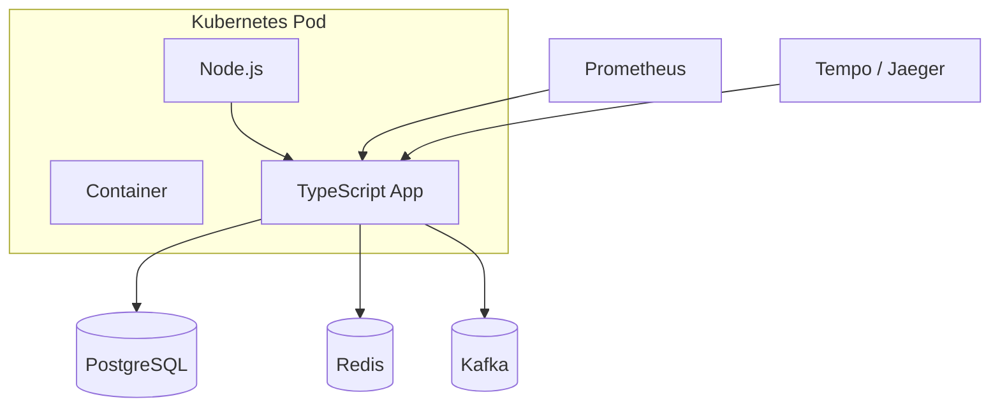

### 12.3 Production configuration <a class="askgpt-btn" href="https://chatgpt.com/?prompt=Read%20this%20section%20of%20my%20encyclopedia%20and%20explain%20it%20in%20depth%20with%20concrete%20examples%2C%20the%20main%20trade-offs%2C%20and%20common%20pitfalls%20a%20practitioner%20should%20know%3A%0A%0Ahttps%3A%2F%2Fgithub.com%2Fvishvasg14%2Fsoftware-engineering-encyclopedia%2Fblob%2Fmain%2F02-javascript-typescript%2Fjavascript-typescript.md%23123-production-configuration%0A%0ASection%20title%3A%2012.3%20Production%20configuration" target="_blank" rel="noopener" data-askgpt="12.3 Production configuration" data-askgpt-url="https://github.com/vishvasg14/software-engineering-encyclopedia/blob/main/02-javascript-typescript/javascript-typescript.md#123-production-configuration" data-askgpt-prompt-depth="Read%20this%20section%20of%20my%20encyclopedia%20and%20explain%20it%20in%20depth%20with%20concrete%20examples%2C%20the%20main%20trade-offs%2C%20and%20common%20pitfalls%20a%20practitioner%20should%20know%3A%0A%0Ahttps%3A%2F%2Fgithub.com%2Fvishvasg14%2Fsoftware-engineering-encyclopedia%2Fblob%2Fmain%2F02-javascript-typescript%2Fjavascript-typescript.md%23123-production-configuration%0A%0ASection%20title%3A%2012.3%20Production%20configuration" data-askgpt-prompt-examples="Read%20this%20section%20of%20my%20encyclopedia%20and%20give%20me%202-3%20real-world%20production%20examples%20for%20it.%20For%20each%3A%20what%20went%20right%2C%20what%20went%20wrong%2C%20and%20the%20lessons%20learned.%20Include%20company%20%2F%20project%20names%20if%20relevant.%0A%0Ahttps%3A%2F%2Fgithub.com%2Fvishvasg14%2Fsoftware-engineering-encyclopedia%2Fblob%2Fmain%2F02-javascript-typescript%2Fjavascript-typescript.md%23123-production-configuration%0A%0ASection%20title%3A%2012.3%20Production%20configuration" title="Ask ChatGPT about this section">💬</a>

A typical production Node.js launch:

```bash
node \
  --max-old-space-size=4096 \
  --enable-source-maps \
  --unhandled-rejections=strict \
  --abort-on-uncaught-exception \
  --experimental-vm-modules \
  --use-largepages=conditional \
  -r dotenv/config \
  dist/server.js
```

**Key flags:**

| Flag | Why |
|------|-----|
| `--max-old-space-size=4096` | Set heap cap (in MB). Prevents OOM surprise. |
| `--enable-source-maps` | Source maps for stack traces. |
| `--unhandled-rejections=strict` | Crash on unhandled promise rejections. |
| `--abort-on-uncaught-exception` | Generate core dump on crash. |
| `-r dotenv/config` | Load `.env` into process.env. |
| `NODE_ENV=production` | Disables dev-only behavior. |
| `NODE_OPTIONS` | Same flags via env. |

### 12.4 Production monitoring <a class="askgpt-btn" href="https://chatgpt.com/?prompt=Read%20this%20section%20of%20my%20encyclopedia%20and%20explain%20it%20in%20depth%20with%20concrete%20examples%2C%20the%20main%20trade-offs%2C%20and%20common%20pitfalls%20a%20practitioner%20should%20know%3A%0A%0Ahttps%3A%2F%2Fgithub.com%2Fvishvasg14%2Fsoftware-engineering-encyclopedia%2Fblob%2Fmain%2F02-javascript-typescript%2Fjavascript-typescript.md%23124-production-monitoring%0A%0ASection%20title%3A%2012.4%20Production%20monitoring" target="_blank" rel="noopener" data-askgpt="12.4 Production monitoring" data-askgpt-url="https://github.com/vishvasg14/software-engineering-encyclopedia/blob/main/02-javascript-typescript/javascript-typescript.md#124-production-monitoring" data-askgpt-prompt-depth="Read%20this%20section%20of%20my%20encyclopedia%20and%20explain%20it%20in%20depth%20with%20concrete%20examples%2C%20the%20main%20trade-offs%2C%20and%20common%20pitfalls%20a%20practitioner%20should%20know%3A%0A%0Ahttps%3A%2F%2Fgithub.com%2Fvishvasg14%2Fsoftware-engineering-encyclopedia%2Fblob%2Fmain%2F02-javascript-typescript%2Fjavascript-typescript.md%23124-production-monitoring%0A%0ASection%20title%3A%2012.4%20Production%20monitoring" data-askgpt-prompt-examples="Read%20this%20section%20of%20my%20encyclopedia%20and%20give%20me%202-3%20real-world%20production%20examples%20for%20it.%20For%20each%3A%20what%20went%20right%2C%20what%20went%20wrong%2C%20and%20the%20lessons%20learned.%20Include%20company%20%2F%20project%20names%20if%20relevant.%0A%0Ahttps%3A%2F%2Fgithub.com%2Fvishvasg14%2Fsoftware-engineering-encyclopedia%2Fblob%2Fmain%2F02-javascript-typescript%2Fjavascript-typescript.md%23124-production-monitoring%0A%0ASection%20title%3A%2012.4%20Production%20monitoring" title="Ask ChatGPT about this section">💬</a>

- **Prometheus client** — `prom-client` package.
- **OpenTelemetry** — `@opentelemetry/sdk-node` for tracing.
- **APM** — Datadog APM, New Relic, Elastic APM, Sentry.
- **Health checks** — `/health`, `/ready` endpoints.
- **Custom metrics** — request duration histograms, error counts.

### 12.5 Production logging <a class="askgpt-btn" href="https://chatgpt.com/?prompt=Read%20this%20section%20of%20my%20encyclopedia%20and%20explain%20it%20in%20depth%20with%20concrete%20examples%2C%20the%20main%20trade-offs%2C%20and%20common%20pitfalls%20a%20practitioner%20should%20know%3A%0A%0Ahttps%3A%2F%2Fgithub.com%2Fvishvasg14%2Fsoftware-engineering-encyclopedia%2Fblob%2Fmain%2F02-javascript-typescript%2Fjavascript-typescript.md%23125-production-logging%0A%0ASection%20title%3A%2012.5%20Production%20logging" target="_blank" rel="noopener" data-askgpt="12.5 Production logging" data-askgpt-url="https://github.com/vishvasg14/software-engineering-encyclopedia/blob/main/02-javascript-typescript/javascript-typescript.md#125-production-logging" data-askgpt-prompt-depth="Read%20this%20section%20of%20my%20encyclopedia%20and%20explain%20it%20in%20depth%20with%20concrete%20examples%2C%20the%20main%20trade-offs%2C%20and%20common%20pitfalls%20a%20practitioner%20should%20know%3A%0A%0Ahttps%3A%2F%2Fgithub.com%2Fvishvasg14%2Fsoftware-engineering-encyclopedia%2Fblob%2Fmain%2F02-javascript-typescript%2Fjavascript-typescript.md%23125-production-logging%0A%0ASection%20title%3A%2012.5%20Production%20logging" data-askgpt-prompt-examples="Read%20this%20section%20of%20my%20encyclopedia%20and%20give%20me%202-3%20real-world%20production%20examples%20for%20it.%20For%20each%3A%20what%20went%20right%2C%20what%20went%20wrong%2C%20and%20the%20lessons%20learned.%20Include%20company%20%2F%20project%20names%20if%20relevant.%0A%0Ahttps%3A%2F%2Fgithub.com%2Fvishvasg14%2Fsoftware-engineering-encyclopedia%2Fblob%2Fmain%2F02-javascript-typescript%2Fjavascript-typescript.md%23125-production-logging%0A%0ASection%20title%3A%2012.5%20Production%20logging" title="Ask ChatGPT about this section">💬</a>

- **Pino** — fastest JSON logger for Node.
- **Winston** — feature-rich but slower.
- **Bunyan** — older alternative.
- **Structured logs** — JSON output for centralized aggregation.

### 12.6 Production debugging <a class="askgpt-btn" href="https://chatgpt.com/?prompt=Read%20this%20section%20of%20my%20encyclopedia%20and%20explain%20it%20in%20depth%20with%20concrete%20examples%2C%20the%20main%20trade-offs%2C%20and%20common%20pitfalls%20a%20practitioner%20should%20know%3A%0A%0Ahttps%3A%2F%2Fgithub.com%2Fvishvasg14%2Fsoftware-engineering-encyclopedia%2Fblob%2Fmain%2F02-javascript-typescript%2Fjavascript-typescript.md%23126-production-debugging%0A%0ASection%20title%3A%2012.6%20Production%20debugging" target="_blank" rel="noopener" data-askgpt="12.6 Production debugging" data-askgpt-url="https://github.com/vishvasg14/software-engineering-encyclopedia/blob/main/02-javascript-typescript/javascript-typescript.md#126-production-debugging" data-askgpt-prompt-depth="Read%20this%20section%20of%20my%20encyclopedia%20and%20explain%20it%20in%20depth%20with%20concrete%20examples%2C%20the%20main%20trade-offs%2C%20and%20common%20pitfalls%20a%20practitioner%20should%20know%3A%0A%0Ahttps%3A%2F%2Fgithub.com%2Fvishvasg14%2Fsoftware-engineering-encyclopedia%2Fblob%2Fmain%2F02-javascript-typescript%2Fjavascript-typescript.md%23126-production-debugging%0A%0ASection%20title%3A%2012.6%20Production%20debugging" data-askgpt-prompt-examples="Read%20this%20section%20of%20my%20encyclopedia%20and%20give%20me%202-3%20real-world%20production%20examples%20for%20it.%20For%20each%3A%20what%20went%20right%2C%20what%20went%20wrong%2C%20and%20the%20lessons%20learned.%20Include%20company%20%2F%20project%20names%20if%20relevant.%0A%0Ahttps%3A%2F%2Fgithub.com%2Fvishvasg14%2Fsoftware-engineering-encyclopedia%2Fblob%2Fmain%2F02-javascript-typescript%2Fjavascript-typescript.md%23126-production-debugging%0A%0ASection%20title%3A%2012.6%20Production%20debugging" title="Ask ChatGPT about this section">💬</a>

- **`node --inspect`** — enables DevTools protocol on port 9229.
- **`chrome://inspect`** — connect DevTools to a running Node process.
- **`ndb`** — improved debugger (deprecated; DevTools is preferred).
- **Source maps** — required for debugging transpiled code in production.
- **Sentry / Rollbar** — error tracking with source map support.

### 12.7 Scaling strategy <a class="askgpt-btn" href="https://chatgpt.com/?prompt=Read%20this%20section%20of%20my%20encyclopedia%20and%20explain%20it%20in%20depth%20with%20concrete%20examples%2C%20the%20main%20trade-offs%2C%20and%20common%20pitfalls%20a%20practitioner%20should%20know%3A%0A%0Ahttps%3A%2F%2Fgithub.com%2Fvishvasg14%2Fsoftware-engineering-encyclopedia%2Fblob%2Fmain%2F02-javascript-typescript%2Fjavascript-typescript.md%23127-scaling-strategy%0A%0ASection%20title%3A%2012.7%20Scaling%20strategy" target="_blank" rel="noopener" data-askgpt="12.7 Scaling strategy" data-askgpt-url="https://github.com/vishvasg14/software-engineering-encyclopedia/blob/main/02-javascript-typescript/javascript-typescript.md#127-scaling-strategy" data-askgpt-prompt-depth="Read%20this%20section%20of%20my%20encyclopedia%20and%20explain%20it%20in%20depth%20with%20concrete%20examples%2C%20the%20main%20trade-offs%2C%20and%20common%20pitfalls%20a%20practitioner%20should%20know%3A%0A%0Ahttps%3A%2F%2Fgithub.com%2Fvishvasg14%2Fsoftware-engineering-encyclopedia%2Fblob%2Fmain%2F02-javascript-typescript%2Fjavascript-typescript.md%23127-scaling-strategy%0A%0ASection%20title%3A%2012.7%20Scaling%20strategy" data-askgpt-prompt-examples="Read%20this%20section%20of%20my%20encyclopedia%20and%20give%20me%202-3%20real-world%20production%20examples%20for%20it.%20For%20each%3A%20what%20went%20right%2C%20what%20went%20wrong%2C%20and%20the%20lessons%20learned.%20Include%20company%20%2F%20project%20names%20if%20relevant.%0A%0Ahttps%3A%2F%2Fgithub.com%2Fvishvasg14%2Fsoftware-engineering-encyclopedia%2Fblob%2Fmain%2F02-javascript-typescript%2Fjavascript-typescript.md%23127-scaling-strategy%0A%0ASection%20title%3A%2012.7%20Scaling%20strategy" title="Ask ChatGPT about this section">💬</a>

- **Vertical** — increase memory (`--max-old-space-size`), CPU.
- **Horizontal** — Kubernetes HPA, serverless (Vercel, AWS Lambda).
- **Cluster mode** — Node.js `cluster` module for multi-core.
- **Worker threads** — for CPU-bound work in a single process.

### 12.8 Failure handling <a class="askgpt-btn" href="https://chatgpt.com/?prompt=Read%20this%20section%20of%20my%20encyclopedia%20and%20explain%20it%20in%20depth%20with%20concrete%20examples%2C%20the%20main%20trade-offs%2C%20and%20common%20pitfalls%20a%20practitioner%20should%20know%3A%0A%0Ahttps%3A%2F%2Fgithub.com%2Fvishvasg14%2Fsoftware-engineering-encyclopedia%2Fblob%2Fmain%2F02-javascript-typescript%2Fjavascript-typescript.md%23128-failure-handling%0A%0ASection%20title%3A%2012.8%20Failure%20handling" target="_blank" rel="noopener" data-askgpt="12.8 Failure handling" data-askgpt-url="https://github.com/vishvasg14/software-engineering-encyclopedia/blob/main/02-javascript-typescript/javascript-typescript.md#128-failure-handling" data-askgpt-prompt-depth="Read%20this%20section%20of%20my%20encyclopedia%20and%20explain%20it%20in%20depth%20with%20concrete%20examples%2C%20the%20main%20trade-offs%2C%20and%20common%20pitfalls%20a%20practitioner%20should%20know%3A%0A%0Ahttps%3A%2F%2Fgithub.com%2Fvishvasg14%2Fsoftware-engineering-encyclopedia%2Fblob%2Fmain%2F02-javascript-typescript%2Fjavascript-typescript.md%23128-failure-handling%0A%0ASection%20title%3A%2012.8%20Failure%20handling" data-askgpt-prompt-examples="Read%20this%20section%20of%20my%20encyclopedia%20and%20give%20me%202-3%20real-world%20production%20examples%20for%20it.%20For%20each%3A%20what%20went%20right%2C%20what%20went%20wrong%2C%20and%20the%20lessons%20learned.%20Include%20company%20%2F%20project%20names%20if%20relevant.%0A%0Ahttps%3A%2F%2Fgithub.com%2Fvishvasg14%2Fsoftware-engineering-encyclopedia%2Fblob%2Fmain%2F02-javascript-typescript%2Fjavascript-typescript.md%23128-failure-handling%0A%0ASection%20title%3A%2012.8%20Failure%20handling" title="Ask ChatGPT about this section">💬</a>

| Failure | Behavior |
|---------|----------|
| Unhandled promise rejection | In strict mode, exit. In default, log warning. |
| Uncaught exception | Exit. Capture with `process.on('uncaughtException')`. |
| OOM (V8 heap) | `out-of-memory` event, then crash. Capture with `process.on('outOfMemory')`. |
| Crash | Process exits; orchestrator restarts. |

### 12.9 High availability <a class="askgpt-btn" href="https://chatgpt.com/?prompt=Read%20this%20section%20of%20my%20encyclopedia%20and%20explain%20it%20in%20depth%20with%20concrete%20examples%2C%20the%20main%20trade-offs%2C%20and%20common%20pitfalls%20a%20practitioner%20should%20know%3A%0A%0Ahttps%3A%2F%2Fgithub.com%2Fvishvasg14%2Fsoftware-engineering-encyclopedia%2Fblob%2Fmain%2F02-javascript-typescript%2Fjavascript-typescript.md%23129-high-availability%0A%0ASection%20title%3A%2012.9%20High%20availability" target="_blank" rel="noopener" data-askgpt="12.9 High availability" data-askgpt-url="https://github.com/vishvasg14/software-engineering-encyclopedia/blob/main/02-javascript-typescript/javascript-typescript.md#129-high-availability" data-askgpt-prompt-depth="Read%20this%20section%20of%20my%20encyclopedia%20and%20explain%20it%20in%20depth%20with%20concrete%20examples%2C%20the%20main%20trade-offs%2C%20and%20common%20pitfalls%20a%20practitioner%20should%20know%3A%0A%0Ahttps%3A%2F%2Fgithub.com%2Fvishvasg14%2Fsoftware-engineering-encyclopedia%2Fblob%2Fmain%2F02-javascript-typescript%2Fjavascript-typescript.md%23129-high-availability%0A%0ASection%20title%3A%2012.9%20High%20availability" data-askgpt-prompt-examples="Read%20this%20section%20of%20my%20encyclopedia%20and%20give%20me%202-3%20real-world%20production%20examples%20for%20it.%20For%20each%3A%20what%20went%20right%2C%20what%20went%20wrong%2C%20and%20the%20lessons%20learned.%20Include%20company%20%2F%20project%20names%20if%20relevant.%0A%0Ahttps%3A%2F%2Fgithub.com%2Fvishvasg14%2Fsoftware-engineering-encyclopedia%2Fblob%2Fmain%2F02-javascript-typescript%2Fjavascript-typescript.md%23129-high-availability%0A%0ASection%20title%3A%2012.9%20High%20availability" title="Ask ChatGPT about this section">💬</a>

- Multi-AZ deployment.
- Load balancing (AWS ALB, GCP LB).
- Graceful shutdown (`SIGTERM` handling).
- Health checks for Kubernetes probes.

### 12.10 Cost optimization <a class="askgpt-btn" href="https://chatgpt.com/?prompt=Read%20this%20section%20of%20my%20encyclopedia%20and%20explain%20it%20in%20depth%20with%20concrete%20examples%2C%20the%20main%20trade-offs%2C%20and%20common%20pitfalls%20a%20practitioner%20should%20know%3A%0A%0Ahttps%3A%2F%2Fgithub.com%2Fvishvasg14%2Fsoftware-engineering-encyclopedia%2Fblob%2Fmain%2F02-javascript-typescript%2Fjavascript-typescript.md%231210-cost-optimization%0A%0ASection%20title%3A%2012.10%20Cost%20optimization" target="_blank" rel="noopener" data-askgpt="12.10 Cost optimization" data-askgpt-url="https://github.com/vishvasg14/software-engineering-encyclopedia/blob/main/02-javascript-typescript/javascript-typescript.md#1210-cost-optimization" data-askgpt-prompt-depth="Read%20this%20section%20of%20my%20encyclopedia%20and%20explain%20it%20in%20depth%20with%20concrete%20examples%2C%20the%20main%20trade-offs%2C%20and%20common%20pitfalls%20a%20practitioner%20should%20know%3A%0A%0Ahttps%3A%2F%2Fgithub.com%2Fvishvasg14%2Fsoftware-engineering-encyclopedia%2Fblob%2Fmain%2F02-javascript-typescript%2Fjavascript-typescript.md%231210-cost-optimization%0A%0ASection%20title%3A%2012.10%20Cost%20optimization" data-askgpt-prompt-examples="Read%20this%20section%20of%20my%20encyclopedia%20and%20give%20me%202-3%20real-world%20production%20examples%20for%20it.%20For%20each%3A%20what%20went%20right%2C%20what%20went%20wrong%2C%20and%20the%20lessons%20learned.%20Include%20company%20%2F%20project%20names%20if%20relevant.%0A%0Ahttps%3A%2F%2Fgithub.com%2Fvishvasg14%2Fsoftware-engineering-encyclopedia%2Fblob%2Fmain%2F02-javascript-typescript%2Fjavascript-typescript.md%231210-cost-optimization%0A%0ASection%20title%3A%2012.10%20Cost%20optimization" title="Ask ChatGPT about this section">💬</a>

- Choose runtime wisely: Node.js for I/O-bound, Bun for startup-sensitive.
- Reduce dependency footprint (smaller install, faster cold starts).
- Use Cloudflare Workers or Lambda for spiky traffic.
- Cache aggressively (Redis, HTTP caching, CDN).

### 12.11 Upgrade strategy <a class="askgpt-btn" href="https://chatgpt.com/?prompt=Read%20this%20section%20of%20my%20encyclopedia%20and%20explain%20it%20in%20depth%20with%20concrete%20examples%2C%20the%20main%20trade-offs%2C%20and%20common%20pitfalls%20a%20practitioner%20should%20know%3A%0A%0Ahttps%3A%2F%2Fgithub.com%2Fvishvasg14%2Fsoftware-engineering-encyclopedia%2Fblob%2Fmain%2F02-javascript-typescript%2Fjavascript-typescript.md%231211-upgrade-strategy%0A%0ASection%20title%3A%2012.11%20Upgrade%20strategy" target="_blank" rel="noopener" data-askgpt="12.11 Upgrade strategy" data-askgpt-url="https://github.com/vishvasg14/software-engineering-encyclopedia/blob/main/02-javascript-typescript/javascript-typescript.md#1211-upgrade-strategy" data-askgpt-prompt-depth="Read%20this%20section%20of%20my%20encyclopedia%20and%20explain%20it%20in%20depth%20with%20concrete%20examples%2C%20the%20main%20trade-offs%2C%20and%20common%20pitfalls%20a%20practitioner%20should%20know%3A%0A%0Ahttps%3A%2F%2Fgithub.com%2Fvishvasg14%2Fsoftware-engineering-encyclopedia%2Fblob%2Fmain%2F02-javascript-typescript%2Fjavascript-typescript.md%231211-upgrade-strategy%0A%0ASection%20title%3A%2012.11%20Upgrade%20strategy" data-askgpt-prompt-examples="Read%20this%20section%20of%20my%20encyclopedia%20and%20give%20me%202-3%20real-world%20production%20examples%20for%20it.%20For%20each%3A%20what%20went%20right%2C%20what%20went%20wrong%2C%20and%20the%20lessons%20learned.%20Include%20company%20%2F%20project%20names%20if%20relevant.%0A%0Ahttps%3A%2F%2Fgithub.com%2Fvishvasg14%2Fsoftware-engineering-encyclopedia%2Fblob%2Fmain%2F02-javascript-typescript%2Fjavascript-typescript.md%231211-upgrade-strategy%0A%0ASection%20title%3A%2012.11%20Upgrade%20strategy" title="Ask ChatGPT about this section">💬</a>

- **Node.js** — even-numbered versions (18, 20, 22, 24) are LTS; odd-numbered are not.
- **TypeScript** — minor versions are mostly backward compatible.
- **ECMAScript** — engines update continuously; no "upgrade" needed.
- **Testing** — CI on multiple Node versions with `nvm` matrix.

### 12.12 Migration strategy <a class="askgpt-btn" href="https://chatgpt.com/?prompt=Read%20this%20section%20of%20my%20encyclopedia%20and%20explain%20it%20in%20depth%20with%20concrete%20examples%2C%20the%20main%20trade-offs%2C%20and%20common%20pitfalls%20a%20practitioner%20should%20know%3A%0A%0Ahttps%3A%2F%2Fgithub.com%2Fvishvasg14%2Fsoftware-engineering-encyclopedia%2Fblob%2Fmain%2F02-javascript-typescript%2Fjavascript-typescript.md%231212-migration-strategy%0A%0ASection%20title%3A%2012.12%20Migration%20strategy" target="_blank" rel="noopener" data-askgpt="12.12 Migration strategy" data-askgpt-url="https://github.com/vishvasg14/software-engineering-encyclopedia/blob/main/02-javascript-typescript/javascript-typescript.md#1212-migration-strategy" data-askgpt-prompt-depth="Read%20this%20section%20of%20my%20encyclopedia%20and%20explain%20it%20in%20depth%20with%20concrete%20examples%2C%20the%20main%20trade-offs%2C%20and%20common%20pitfalls%20a%20practitioner%20should%20know%3A%0A%0Ahttps%3A%2F%2Fgithub.com%2Fvishvasg14%2Fsoftware-engineering-encyclopedia%2Fblob%2Fmain%2F02-javascript-typescript%2Fjavascript-typescript.md%231212-migration-strategy%0A%0ASection%20title%3A%2012.12%20Migration%20strategy" data-askgpt-prompt-examples="Read%20this%20section%20of%20my%20encyclopedia%20and%20give%20me%202-3%20real-world%20production%20examples%20for%20it.%20For%20each%3A%20what%20went%20right%2C%20what%20went%20wrong%2C%20and%20the%20lessons%20learned.%20Include%20company%20%2F%20project%20names%20if%20relevant.%0A%0Ahttps%3A%2F%2Fgithub.com%2Fvishvasg14%2Fsoftware-engineering-encyclopedia%2Fblob%2Fmain%2F02-javascript-typescript%2Fjavascript-typescript.md%231212-migration-strategy%0A%0ASection%20title%3A%2012.12%20Migration%20strategy" title="Ask ChatGPT about this section">💬</a>

When migrating from JavaScript to TypeScript:

1. Add `tsconfig.json` with `allowJs: true`, `checkJs: false` initially.
2. Rename `.js` → `.ts` file by file, fixing type errors.
3. Enable `checkJs: true` and add JSDoc annotations.
4. Enable `strict: true` once most files are typed.
5. Adopt project references for incremental compilation.

---

## 13. Production Case Studies

### 13.1 Netflix — Node.js UI <a class="askgpt-btn" href="https://chatgpt.com/?prompt=Read%20this%20section%20of%20my%20encyclopedia%20and%20explain%20it%20in%20depth%20with%20concrete%20examples%2C%20the%20main%20trade-offs%2C%20and%20common%20pitfalls%20a%20practitioner%20should%20know%3A%0A%0Ahttps%3A%2F%2Fgithub.com%2Fvishvasg14%2Fsoftware-engineering-encyclopedia%2Fblob%2Fmain%2F02-javascript-typescript%2Fjavascript-typescript.md%23131-netflix-nodejs-ui%0A%0ASection%20title%3A%2013.1%20Netflix%20%E2%80%94%20Node.js%20UI" target="_blank" rel="noopener" data-askgpt="13.1 Netflix — Node.js UI" data-askgpt-url="https://github.com/vishvasg14/software-engineering-encyclopedia/blob/main/02-javascript-typescript/javascript-typescript.md#131-netflix-nodejs-ui" data-askgpt-prompt-depth="Read%20this%20section%20of%20my%20encyclopedia%20and%20explain%20it%20in%20depth%20with%20concrete%20examples%2C%20the%20main%20trade-offs%2C%20and%20common%20pitfalls%20a%20practitioner%20should%20know%3A%0A%0Ahttps%3A%2F%2Fgithub.com%2Fvishvasg14%2Fsoftware-engineering-encyclopedia%2Fblob%2Fmain%2F02-javascript-typescript%2Fjavascript-typescript.md%23131-netflix-nodejs-ui%0A%0ASection%20title%3A%2013.1%20Netflix%20%E2%80%94%20Node.js%20UI" data-askgpt-prompt-examples="Read%20this%20section%20of%20my%20encyclopedia%20and%20give%20me%202-3%20real-world%20production%20examples%20for%20it.%20For%20each%3A%20what%20went%20right%2C%20what%20went%20wrong%2C%20and%20the%20lessons%20learned.%20Include%20company%20%2F%20project%20names%20if%20relevant.%0A%0Ahttps%3A%2F%2Fgithub.com%2Fvishvasg14%2Fsoftware-engineering-encyclopedia%2Fblob%2Fmain%2F02-javascript-typescript%2Fjavascript-typescript.md%23131-netflix-nodejs-ui%0A%0ASection%20title%3A%2013.1%20Netflix%20%E2%80%94%20Node.js%20UI" title="Ask ChatGPT about this section">💬</a>

Netflix's user interface is one of the largest JavaScript codebases in production. They migrated from a Java-based backend rendering the UI to a Node.js backend that serves a JS-heavy SPA. The migration enabled faster iteration and unified the team on JavaScript.

**Lessons:**

- Node.js handles millions of concurrent connections (per-instance).
- TypeScript adoption was driven by code quality concerns.
- Internal frameworks and conventions emerged.

### 13.2 PayPal — Java to Node.js <a class="askgpt-btn" href="https://chatgpt.com/?prompt=Read%20this%20section%20of%20my%20encyclopedia%20and%20explain%20it%20in%20depth%20with%20concrete%20examples%2C%20the%20main%20trade-offs%2C%20and%20common%20pitfalls%20a%20practitioner%20should%20know%3A%0A%0Ahttps%3A%2F%2Fgithub.com%2Fvishvasg14%2Fsoftware-engineering-encyclopedia%2Fblob%2Fmain%2F02-javascript-typescript%2Fjavascript-typescript.md%23132-paypal-java-to-nodejs%0A%0ASection%20title%3A%2013.2%20PayPal%20%E2%80%94%20Java%20to%20Node.js" target="_blank" rel="noopener" data-askgpt="13.2 PayPal — Java to Node.js" data-askgpt-url="https://github.com/vishvasg14/software-engineering-encyclopedia/blob/main/02-javascript-typescript/javascript-typescript.md#132-paypal-java-to-nodejs" data-askgpt-prompt-depth="Read%20this%20section%20of%20my%20encyclopedia%20and%20explain%20it%20in%20depth%20with%20concrete%20examples%2C%20the%20main%20trade-offs%2C%20and%20common%20pitfalls%20a%20practitioner%20should%20know%3A%0A%0Ahttps%3A%2F%2Fgithub.com%2Fvishvasg14%2Fsoftware-engineering-encyclopedia%2Fblob%2Fmain%2F02-javascript-typescript%2Fjavascript-typescript.md%23132-paypal-java-to-nodejs%0A%0ASection%20title%3A%2013.2%20PayPal%20%E2%80%94%20Java%20to%20Node.js" data-askgpt-prompt-examples="Read%20this%20section%20of%20my%20encyclopedia%20and%20give%20me%202-3%20real-world%20production%20examples%20for%20it.%20For%20each%3A%20what%20went%20right%2C%20what%20went%20wrong%2C%20and%20the%20lessons%20learned.%20Include%20company%20%2F%20project%20names%20if%20relevant.%0A%0Ahttps%3A%2F%2Fgithub.com%2Fvishvasg14%2Fsoftware-engineering-encyclopedia%2Fblob%2Fmain%2F02-javascript-typescript%2Fjavascript-typescript.md%23132-paypal-java-to-nodejs%0A%0ASection%20title%3A%2013.2%20PayPal%20%E2%80%94%20Java%20to%20Node.js" title="Ask ChatGPT about this section">💬</a>

PayPal migrated their account overview page from Java to Node.js in 2013. The reported metrics (from their engineering blog):

- 2x fewer lines of code.
- 35% fewer files.
- 40% faster response times.
- Double the requests per second per server.

These figures were widely cited as evidence of Node.js's production viability.

### 13.3 Walmart — Black Friday on Node.js <a class="askgpt-btn" href="https://chatgpt.com/?prompt=Read%20this%20section%20of%20my%20encyclopedia%20and%20explain%20it%20in%20depth%20with%20concrete%20examples%2C%20the%20main%20trade-offs%2C%20and%20common%20pitfalls%20a%20practitioner%20should%20know%3A%0A%0Ahttps%3A%2F%2Fgithub.com%2Fvishvasg14%2Fsoftware-engineering-encyclopedia%2Fblob%2Fmain%2F02-javascript-typescript%2Fjavascript-typescript.md%23133-walmart-black-friday-on-nodejs%0A%0ASection%20title%3A%2013.3%20Walmart%20%E2%80%94%20Black%20Friday%20on%20Node.js" target="_blank" rel="noopener" data-askgpt="13.3 Walmart — Black Friday on Node.js" data-askgpt-url="https://github.com/vishvasg14/software-engineering-encyclopedia/blob/main/02-javascript-typescript/javascript-typescript.md#133-walmart-black-friday-on-nodejs" data-askgpt-prompt-depth="Read%20this%20section%20of%20my%20encyclopedia%20and%20explain%20it%20in%20depth%20with%20concrete%20examples%2C%20the%20main%20trade-offs%2C%20and%20common%20pitfalls%20a%20practitioner%20should%20know%3A%0A%0Ahttps%3A%2F%2Fgithub.com%2Fvishvasg14%2Fsoftware-engineering-encyclopedia%2Fblob%2Fmain%2F02-javascript-typescript%2Fjavascript-typescript.md%23133-walmart-black-friday-on-nodejs%0A%0ASection%20title%3A%2013.3%20Walmart%20%E2%80%94%20Black%20Friday%20on%20Node.js" data-askgpt-prompt-examples="Read%20this%20section%20of%20my%20encyclopedia%20and%20give%20me%202-3%20real-world%20production%20examples%20for%20it.%20For%20each%3A%20what%20went%20right%2C%20what%20went%20wrong%2C%20and%20the%20lessons%20learned.%20Include%20company%20%2F%20project%20names%20if%20relevant.%0A%0Ahttps%3A%2F%2Fgithub.com%2Fvishvasg14%2Fsoftware-engineering-encyclopedia%2Fblob%2Fmain%2F02-javascript-typescript%2Fjavascript-typescript.md%23133-walmart-black-friday-on-nodejs%0A%0ASection%20title%3A%2013.3%20Walmart%20%E2%80%94%20Black%20Friday%20on%20Node.js" title="Ask ChatGPT about this section">💬</a>

Walmart's Node.js stack handles Black Friday traffic — the largest e-commerce event in the US. Their engineering team documented that Node.js's non-blocking I/O and the unification of frontend/backend code made scaling easier than their previous Java stack.

### 13.4 Slack — JavaScript to TypeScript <a class="askgpt-btn" href="https://chatgpt.com/?prompt=Read%20this%20section%20of%20my%20encyclopedia%20and%20explain%20it%20in%20depth%20with%20concrete%20examples%2C%20the%20main%20trade-offs%2C%20and%20common%20pitfalls%20a%20practitioner%20should%20know%3A%0A%0Ahttps%3A%2F%2Fgithub.com%2Fvishvasg14%2Fsoftware-engineering-encyclopedia%2Fblob%2Fmain%2F02-javascript-typescript%2Fjavascript-typescript.md%23134-slack-javascript-to-typescript%0A%0ASection%20title%3A%2013.4%20Slack%20%E2%80%94%20JavaScript%20to%20TypeScript" target="_blank" rel="noopener" data-askgpt="13.4 Slack — JavaScript to TypeScript" data-askgpt-url="https://github.com/vishvasg14/software-engineering-encyclopedia/blob/main/02-javascript-typescript/javascript-typescript.md#134-slack-javascript-to-typescript" data-askgpt-prompt-depth="Read%20this%20section%20of%20my%20encyclopedia%20and%20explain%20it%20in%20depth%20with%20concrete%20examples%2C%20the%20main%20trade-offs%2C%20and%20common%20pitfalls%20a%20practitioner%20should%20know%3A%0A%0Ahttps%3A%2F%2Fgithub.com%2Fvishvasg14%2Fsoftware-engineering-encyclopedia%2Fblob%2Fmain%2F02-javascript-typescript%2Fjavascript-typescript.md%23134-slack-javascript-to-typescript%0A%0ASection%20title%3A%2013.4%20Slack%20%E2%80%94%20JavaScript%20to%20TypeScript" data-askgpt-prompt-examples="Read%20this%20section%20of%20my%20encyclopedia%20and%20give%20me%202-3%20real-world%20production%20examples%20for%20it.%20For%20each%3A%20what%20went%20right%2C%20what%20went%20wrong%2C%20and%20the%20lessons%20learned.%20Include%20company%20%2F%20project%20names%20if%20relevant.%0A%0Ahttps%3A%2F%2Fgithub.com%2Fvishvasg14%2Fsoftware-engineering-encyclopedia%2Fblob%2Fmain%2F02-javascript-typescript%2Fjavascript-typescript.md%23134-slack-javascript-to-typescript%0A%0ASection%20title%3A%2013.4%20Slack%20%E2%80%94%20JavaScript%20to%20TypeScript" title="Ask ChatGPT about this section">💬</a>

Slack migrated their Electron desktop app from JavaScript to TypeScript. Their blog documented:

- Gradual migration via `allowJs: true` and JSDoc.
- ~98% type coverage within a year.
- Significant reduction in runtime errors attributed to type-checked code.
- IDE support and refactoring confidence improved.

### 13.5 Airbnb — TypeScript migration <a class="askgpt-btn" href="https://chatgpt.com/?prompt=Read%20this%20section%20of%20my%20encyclopedia%20and%20explain%20it%20in%20depth%20with%20concrete%20examples%2C%20the%20main%20trade-offs%2C%20and%20common%20pitfalls%20a%20practitioner%20should%20know%3A%0A%0Ahttps%3A%2F%2Fgithub.com%2Fvishvasg14%2Fsoftware-engineering-encyclopedia%2Fblob%2Fmain%2F02-javascript-typescript%2Fjavascript-typescript.md%23135-airbnb-typescript-migration%0A%0ASection%20title%3A%2013.5%20Airbnb%20%E2%80%94%20TypeScript%20migration" target="_blank" rel="noopener" data-askgpt="13.5 Airbnb — TypeScript migration" data-askgpt-url="https://github.com/vishvasg14/software-engineering-encyclopedia/blob/main/02-javascript-typescript/javascript-typescript.md#135-airbnb-typescript-migration" data-askgpt-prompt-depth="Read%20this%20section%20of%20my%20encyclopedia%20and%20explain%20it%20in%20depth%20with%20concrete%20examples%2C%20the%20main%20trade-offs%2C%20and%20common%20pitfalls%20a%20practitioner%20should%20know%3A%0A%0Ahttps%3A%2F%2Fgithub.com%2Fvishvasg14%2Fsoftware-engineering-encyclopedia%2Fblob%2Fmain%2F02-javascript-typescript%2Fjavascript-typescript.md%23135-airbnb-typescript-migration%0A%0ASection%20title%3A%2013.5%20Airbnb%20%E2%80%94%20TypeScript%20migration" data-askgpt-prompt-examples="Read%20this%20section%20of%20my%20encyclopedia%20and%20give%20me%202-3%20real-world%20production%20examples%20for%20it.%20For%20each%3A%20what%20went%20right%2C%20what%20went%20wrong%2C%20and%20the%20lessons%20learned.%20Include%20company%20%2F%20project%20names%20if%20relevant.%0A%0Ahttps%3A%2F%2Fgithub.com%2Fvishvasg14%2Fsoftware-engineering-encyclopedia%2Fblob%2Fmain%2F02-javascript-typescript%2Fjavascript-typescript.md%23135-airbnb-typescript-migration%0A%0ASection%20title%3A%2013.5%20Airbnb%20%E2%80%94%20TypeScript%20migration" title="Ask ChatGPT about this section">💬</a>

Airbnb migrated their main web app from JavaScript to TypeScript. Their case study documented:

- Migration tooling (codemod scripts).
- Gradual rollout.
- Type coverage metrics.
- Improved developer confidence in refactoring.

### 13.6 Uber — Node.js at scale <a class="askgpt-btn" href="https://chatgpt.com/?prompt=Read%20this%20section%20of%20my%20encyclopedia%20and%20explain%20it%20in%20depth%20with%20concrete%20examples%2C%20the%20main%20trade-offs%2C%20and%20common%20pitfalls%20a%20practitioner%20should%20know%3A%0A%0Ahttps%3A%2F%2Fgithub.com%2Fvishvasg14%2Fsoftware-engineering-encyclopedia%2Fblob%2Fmain%2F02-javascript-typescript%2Fjavascript-typescript.md%23136-uber-nodejs-at-scale%0A%0ASection%20title%3A%2013.6%20Uber%20%E2%80%94%20Node.js%20at%20scale" target="_blank" rel="noopener" data-askgpt="13.6 Uber — Node.js at scale" data-askgpt-url="https://github.com/vishvasg14/software-engineering-encyclopedia/blob/main/02-javascript-typescript/javascript-typescript.md#136-uber-nodejs-at-scale" data-askgpt-prompt-depth="Read%20this%20section%20of%20my%20encyclopedia%20and%20explain%20it%20in%20depth%20with%20concrete%20examples%2C%20the%20main%20trade-offs%2C%20and%20common%20pitfalls%20a%20practitioner%20should%20know%3A%0A%0Ahttps%3A%2F%2Fgithub.com%2Fvishvasg14%2Fsoftware-engineering-encyclopedia%2Fblob%2Fmain%2F02-javascript-typescript%2Fjavascript-typescript.md%23136-uber-nodejs-at-scale%0A%0ASection%20title%3A%2013.6%20Uber%20%E2%80%94%20Node.js%20at%20scale" data-askgpt-prompt-examples="Read%20this%20section%20of%20my%20encyclopedia%20and%20give%20me%202-3%20real-world%20production%20examples%20for%20it.%20For%20each%3A%20what%20went%20right%2C%20what%20went%20wrong%2C%20and%20the%20lessons%20learned.%20Include%20company%20%2F%20project%20names%20if%20relevant.%0A%0Ahttps%3A%2F%2Fgithub.com%2Fvishvasg14%2Fsoftware-engineering-encyclopedia%2Fblob%2Fmain%2F02-javascript-typescript%2Fjavascript-typescript.md%23136-uber-nodejs-at-scale%0A%0ASection%20title%3A%2013.6%20Uber%20%E2%80%94%20Node.js%20at%20scale" title="Ask ChatGPT about this section">💬</a>

Uber runs large-scale Node.js services for trip dispatch and driver/rider apps. Their engineering blog has documented performance tuning, memory leak debugging, and operational practices.

---

## 14. Code Examples

### 14.1 Basic: ES vs TS syntax <a class="askgpt-btn" href="https://chatgpt.com/?prompt=Read%20this%20section%20of%20my%20encyclopedia%20and%20explain%20it%20in%20depth%20with%20concrete%20examples%2C%20the%20main%20trade-offs%2C%20and%20common%20pitfalls%20a%20practitioner%20should%20know%3A%0A%0Ahttps%3A%2F%2Fgithub.com%2Fvishvasg14%2Fsoftware-engineering-encyclopedia%2Fblob%2Fmain%2F02-javascript-typescript%2Fjavascript-typescript.md%23141-basic-es-vs-ts-syntax%0A%0ASection%20title%3A%2014.1%20Basic%3A%20ES%20vs%20TS%20syntax" target="_blank" rel="noopener" data-askgpt="14.1 Basic: ES vs TS syntax" data-askgpt-url="https://github.com/vishvasg14/software-engineering-encyclopedia/blob/main/02-javascript-typescript/javascript-typescript.md#141-basic-es-vs-ts-syntax" data-askgpt-prompt-depth="Read%20this%20section%20of%20my%20encyclopedia%20and%20explain%20it%20in%20depth%20with%20concrete%20examples%2C%20the%20main%20trade-offs%2C%20and%20common%20pitfalls%20a%20practitioner%20should%20know%3A%0A%0Ahttps%3A%2F%2Fgithub.com%2Fvishvasg14%2Fsoftware-engineering-encyclopedia%2Fblob%2Fmain%2F02-javascript-typescript%2Fjavascript-typescript.md%23141-basic-es-vs-ts-syntax%0A%0ASection%20title%3A%2014.1%20Basic%3A%20ES%20vs%20TS%20syntax" data-askgpt-prompt-examples="Read%20this%20section%20of%20my%20encyclopedia%20and%20give%20me%202-3%20real-world%20production%20examples%20for%20it.%20For%20each%3A%20what%20went%20right%2C%20what%20went%20wrong%2C%20and%20the%20lessons%20learned.%20Include%20company%20%2F%20project%20names%20if%20relevant.%0A%0Ahttps%3A%2F%2Fgithub.com%2Fvishvasg14%2Fsoftware-engineering-encyclopedia%2Fblob%2Fmain%2F02-javascript-typescript%2Fjavascript-typescript.md%23141-basic-es-vs-ts-syntax%0A%0ASection%20title%3A%2014.1%20Basic%3A%20ES%20vs%20TS%20syntax" title="Ask ChatGPT about this section">💬</a>

```ts
// JavaScript (ES2024)
function add(a, b) {
    return a + b;
}

// TypeScript
function addTyped(a: number, b: number): number {
    return a + b;
}
```

```ts
// Type inference
const x = 42;       // x: number
const y = [1, 2, 3]; // y: number[]
const z = { a: 1 }; // z: { a: number }
```

### 14.2 Closures and scope <a class="askgpt-btn" href="https://chatgpt.com/?prompt=Read%20this%20section%20of%20my%20encyclopedia%20and%20explain%20it%20in%20depth%20with%20concrete%20examples%2C%20the%20main%20trade-offs%2C%20and%20common%20pitfalls%20a%20practitioner%20should%20know%3A%0A%0Ahttps%3A%2F%2Fgithub.com%2Fvishvasg14%2Fsoftware-engineering-encyclopedia%2Fblob%2Fmain%2F02-javascript-typescript%2Fjavascript-typescript.md%23142-closures-and-scope%0A%0ASection%20title%3A%2014.2%20Closures%20and%20scope" target="_blank" rel="noopener" data-askgpt="14.2 Closures and scope" data-askgpt-url="https://github.com/vishvasg14/software-engineering-encyclopedia/blob/main/02-javascript-typescript/javascript-typescript.md#142-closures-and-scope" data-askgpt-prompt-depth="Read%20this%20section%20of%20my%20encyclopedia%20and%20explain%20it%20in%20depth%20with%20concrete%20examples%2C%20the%20main%20trade-offs%2C%20and%20common%20pitfalls%20a%20practitioner%20should%20know%3A%0A%0Ahttps%3A%2F%2Fgithub.com%2Fvishvasg14%2Fsoftware-engineering-encyclopedia%2Fblob%2Fmain%2F02-javascript-typescript%2Fjavascript-typescript.md%23142-closures-and-scope%0A%0ASection%20title%3A%2014.2%20Closures%20and%20scope" data-askgpt-prompt-examples="Read%20this%20section%20of%20my%20encyclopedia%20and%20give%20me%202-3%20real-world%20production%20examples%20for%20it.%20For%20each%3A%20what%20went%20right%2C%20what%20went%20wrong%2C%20and%20the%20lessons%20learned.%20Include%20company%20%2F%20project%20names%20if%20relevant.%0A%0Ahttps%3A%2F%2Fgithub.com%2Fvishvasg14%2Fsoftware-engineering-encyclopedia%2Fblob%2Fmain%2F02-javascript-typescript%2Fjavascript-typescript.md%23142-closures-and-scope%0A%0ASection%20title%3A%2014.2%20Closures%20and%20scope" title="Ask ChatGPT about this section">💬</a>

```js
function makeCounter() {
    let n = 0;
    return {
        increment: () => ++n,
        decrement: () => --n,
        get: () => n,
    };
}

const c = makeCounter();
c.increment();
c.increment();
c.get(); // 2
```

### 14.3 `this` binding <a class="askgpt-btn" href="https://chatgpt.com/?prompt=Read%20this%20section%20of%20my%20encyclopedia%20and%20explain%20it%20in%20depth%20with%20concrete%20examples%2C%20the%20main%20trade-offs%2C%20and%20common%20pitfalls%20a%20practitioner%20should%20know%3A%0A%0Ahttps%3A%2F%2Fgithub.com%2Fvishvasg14%2Fsoftware-engineering-encyclopedia%2Fblob%2Fmain%2F02-javascript-typescript%2Fjavascript-typescript.md%23143-this-binding%0A%0ASection%20title%3A%2014.3%20%60this%60%20binding" target="_blank" rel="noopener" data-askgpt="14.3 `this` binding" data-askgpt-url="https://github.com/vishvasg14/software-engineering-encyclopedia/blob/main/02-javascript-typescript/javascript-typescript.md#143-this-binding" data-askgpt-prompt-depth="Read%20this%20section%20of%20my%20encyclopedia%20and%20explain%20it%20in%20depth%20with%20concrete%20examples%2C%20the%20main%20trade-offs%2C%20and%20common%20pitfalls%20a%20practitioner%20should%20know%3A%0A%0Ahttps%3A%2F%2Fgithub.com%2Fvishvasg14%2Fsoftware-engineering-encyclopedia%2Fblob%2Fmain%2F02-javascript-typescript%2Fjavascript-typescript.md%23143-this-binding%0A%0ASection%20title%3A%2014.3%20%60this%60%20binding" data-askgpt-prompt-examples="Read%20this%20section%20of%20my%20encyclopedia%20and%20give%20me%202-3%20real-world%20production%20examples%20for%20it.%20For%20each%3A%20what%20went%20right%2C%20what%20went%20wrong%2C%20and%20the%20lessons%20learned.%20Include%20company%20%2F%20project%20names%20if%20relevant.%0A%0Ahttps%3A%2F%2Fgithub.com%2Fvishvasg14%2Fsoftware-engineering-encyclopedia%2Fblob%2Fmain%2F02-javascript-typescript%2Fjavascript-typescript.md%23143-this-binding%0A%0ASection%20title%3A%2014.3%20%60this%60%20binding" title="Ask ChatGPT about this section">💬</a>

```js
const obj = {
    name: 'Alice',
    greet: function () {
        console.log(this.name);
    },
    greetArrow: () => {
        console.log(this.name); // undefined — arrow captures outer `this`
    },
    delayed: function () {
        setTimeout(() => {
            console.log(this.name); // 'Alice' — arrow captures `this` of `delayed`
        }, 100);
    },
};
```

### 14.4 Prototypal inheritance <a class="askgpt-btn" href="https://chatgpt.com/?prompt=Read%20this%20section%20of%20my%20encyclopedia%20and%20explain%20it%20in%20depth%20with%20concrete%20examples%2C%20the%20main%20trade-offs%2C%20and%20common%20pitfalls%20a%20practitioner%20should%20know%3A%0A%0Ahttps%3A%2F%2Fgithub.com%2Fvishvasg14%2Fsoftware-engineering-encyclopedia%2Fblob%2Fmain%2F02-javascript-typescript%2Fjavascript-typescript.md%23144-prototypal-inheritance%0A%0ASection%20title%3A%2014.4%20Prototypal%20inheritance" target="_blank" rel="noopener" data-askgpt="14.4 Prototypal inheritance" data-askgpt-url="https://github.com/vishvasg14/software-engineering-encyclopedia/blob/main/02-javascript-typescript/javascript-typescript.md#144-prototypal-inheritance" data-askgpt-prompt-depth="Read%20this%20section%20of%20my%20encyclopedia%20and%20explain%20it%20in%20depth%20with%20concrete%20examples%2C%20the%20main%20trade-offs%2C%20and%20common%20pitfalls%20a%20practitioner%20should%20know%3A%0A%0Ahttps%3A%2F%2Fgithub.com%2Fvishvasg14%2Fsoftware-engineering-encyclopedia%2Fblob%2Fmain%2F02-javascript-typescript%2Fjavascript-typescript.md%23144-prototypal-inheritance%0A%0ASection%20title%3A%2014.4%20Prototypal%20inheritance" data-askgpt-prompt-examples="Read%20this%20section%20of%20my%20encyclopedia%20and%20give%20me%202-3%20real-world%20production%20examples%20for%20it.%20For%20each%3A%20what%20went%20right%2C%20what%20went%20wrong%2C%20and%20the%20lessons%20learned.%20Include%20company%20%2F%20project%20names%20if%20relevant.%0A%0Ahttps%3A%2F%2Fgithub.com%2Fvishvasg14%2Fsoftware-engineering-encyclopedia%2Fblob%2Fmain%2F02-javascript-typescript%2Fjavascript-typescript.md%23144-prototypal-inheritance%0A%0ASection%20title%3A%2014.4%20Prototypal%20inheritance" title="Ask ChatGPT about this section">💬</a>

```js
const animal = {
    speak() { return `${this.name} makes a sound`; },
};

const dog = Object.create(animal);
dog.name = 'Rex';
dog.speak = function () { return `${this.name} barks`; };

console.log(dog.speak());         // 'Rex barks'
console.log(Object.getPrototypeOf(dog) === animal); // true
```

### 14.5 Classes (ES2022+) <a class="askgpt-btn" href="https://chatgpt.com/?prompt=Read%20this%20section%20of%20my%20encyclopedia%20and%20explain%20it%20in%20depth%20with%20concrete%20examples%2C%20the%20main%20trade-offs%2C%20and%20common%20pitfalls%20a%20practitioner%20should%20know%3A%0A%0Ahttps%3A%2F%2Fgithub.com%2Fvishvasg14%2Fsoftware-engineering-encyclopedia%2Fblob%2Fmain%2F02-javascript-typescript%2Fjavascript-typescript.md%23145-classes-es2022%0A%0ASection%20title%3A%2014.5%20Classes%20(ES2022%2B)" target="_blank" rel="noopener" data-askgpt="14.5 Classes (ES2022+)" data-askgpt-url="https://github.com/vishvasg14/software-engineering-encyclopedia/blob/main/02-javascript-typescript/javascript-typescript.md#145-classes-es2022" data-askgpt-prompt-depth="Read%20this%20section%20of%20my%20encyclopedia%20and%20explain%20it%20in%20depth%20with%20concrete%20examples%2C%20the%20main%20trade-offs%2C%20and%20common%20pitfalls%20a%20practitioner%20should%20know%3A%0A%0Ahttps%3A%2F%2Fgithub.com%2Fvishvasg14%2Fsoftware-engineering-encyclopedia%2Fblob%2Fmain%2F02-javascript-typescript%2Fjavascript-typescript.md%23145-classes-es2022%0A%0ASection%20title%3A%2014.5%20Classes%20(ES2022%2B)" data-askgpt-prompt-examples="Read%20this%20section%20of%20my%20encyclopedia%20and%20give%20me%202-3%20real-world%20production%20examples%20for%20it.%20For%20each%3A%20what%20went%20right%2C%20what%20went%20wrong%2C%20and%20the%20lessons%20learned.%20Include%20company%20%2F%20project%20names%20if%20relevant.%0A%0Ahttps%3A%2F%2Fgithub.com%2Fvishvasg14%2Fsoftware-engineering-encyclopedia%2Fblob%2Fmain%2F02-javascript-typescript%2Fjavascript-typescript.md%23145-classes-es2022%0A%0ASection%20title%3A%2014.5%20Classes%20(ES2022%2B)" title="Ask ChatGPT about this section">💬</a>

```ts
class Animal {
    constructor(public name: string) {}
    speak(): string { return `${this.name} makes a sound`; }
}

class Dog extends Animal {
    #breed: string; // ES2022 private field
    constructor(name: string, breed: string) {
        super(name);
        this.#breed = breed;
    }
    override speak(): string {
        return `${this.name} the ${this.#breed} barks`;
    }
}
```

### 14.6 Async/await and the event loop <a class="askgpt-btn" href="https://chatgpt.com/?prompt=Read%20this%20section%20of%20my%20encyclopedia%20and%20explain%20it%20in%20depth%20with%20concrete%20examples%2C%20the%20main%20trade-offs%2C%20and%20common%20pitfalls%20a%20practitioner%20should%20know%3A%0A%0Ahttps%3A%2F%2Fgithub.com%2Fvishvasg14%2Fsoftware-engineering-encyclopedia%2Fblob%2Fmain%2F02-javascript-typescript%2Fjavascript-typescript.md%23146-asyncawait-and-the-event-loop%0A%0ASection%20title%3A%2014.6%20Async%2Fawait%20and%20the%20event%20loop" target="_blank" rel="noopener" data-askgpt="14.6 Async/await and the event loop" data-askgpt-url="https://github.com/vishvasg14/software-engineering-encyclopedia/blob/main/02-javascript-typescript/javascript-typescript.md#146-asyncawait-and-the-event-loop" data-askgpt-prompt-depth="Read%20this%20section%20of%20my%20encyclopedia%20and%20explain%20it%20in%20depth%20with%20concrete%20examples%2C%20the%20main%20trade-offs%2C%20and%20common%20pitfalls%20a%20practitioner%20should%20know%3A%0A%0Ahttps%3A%2F%2Fgithub.com%2Fvishvasg14%2Fsoftware-engineering-encyclopedia%2Fblob%2Fmain%2F02-javascript-typescript%2Fjavascript-typescript.md%23146-asyncawait-and-the-event-loop%0A%0ASection%20title%3A%2014.6%20Async%2Fawait%20and%20the%20event%20loop" data-askgpt-prompt-examples="Read%20this%20section%20of%20my%20encyclopedia%20and%20give%20me%202-3%20real-world%20production%20examples%20for%20it.%20For%20each%3A%20what%20went%20right%2C%20what%20went%20wrong%2C%20and%20the%20lessons%20learned.%20Include%20company%20%2F%20project%20names%20if%20relevant.%0A%0Ahttps%3A%2F%2Fgithub.com%2Fvishvasg14%2Fsoftware-engineering-encyclopedia%2Fblob%2Fmain%2F02-javascript-typescript%2Fjavascript-typescript.md%23146-asyncawait-and-the-event-loop%0A%0ASection%20title%3A%2014.6%20Async%2Fawait%20and%20the%20event%20loop" title="Ask ChatGPT about this section">💬</a>

```js
console.log('1');
setTimeout(() => console.log('2'), 0);
Promise.resolve().then(() => console.log('3'));
queueMicrotask(() => console.log('4'));
console.log('5');

// Output:
// 1, 5, 3, 4, 2
// Microtasks run between macrotasks; both run after synchronous code.
```

### 14.7 Promises and error handling <a class="askgpt-btn" href="https://chatgpt.com/?prompt=Read%20this%20section%20of%20my%20encyclopedia%20and%20explain%20it%20in%20depth%20with%20concrete%20examples%2C%20the%20main%20trade-offs%2C%20and%20common%20pitfalls%20a%20practitioner%20should%20know%3A%0A%0Ahttps%3A%2F%2Fgithub.com%2Fvishvasg14%2Fsoftware-engineering-encyclopedia%2Fblob%2Fmain%2F02-javascript-typescript%2Fjavascript-typescript.md%23147-promises-and-error-handling%0A%0ASection%20title%3A%2014.7%20Promises%20and%20error%20handling" target="_blank" rel="noopener" data-askgpt="14.7 Promises and error handling" data-askgpt-url="https://github.com/vishvasg14/software-engineering-encyclopedia/blob/main/02-javascript-typescript/javascript-typescript.md#147-promises-and-error-handling" data-askgpt-prompt-depth="Read%20this%20section%20of%20my%20encyclopedia%20and%20explain%20it%20in%20depth%20with%20concrete%20examples%2C%20the%20main%20trade-offs%2C%20and%20common%20pitfalls%20a%20practitioner%20should%20know%3A%0A%0Ahttps%3A%2F%2Fgithub.com%2Fvishvasg14%2Fsoftware-engineering-encyclopedia%2Fblob%2Fmain%2F02-javascript-typescript%2Fjavascript-typescript.md%23147-promises-and-error-handling%0A%0ASection%20title%3A%2014.7%20Promises%20and%20error%20handling" data-askgpt-prompt-examples="Read%20this%20section%20of%20my%20encyclopedia%20and%20give%20me%202-3%20real-world%20production%20examples%20for%20it.%20For%20each%3A%20what%20went%20right%2C%20what%20went%20wrong%2C%20and%20the%20lessons%20learned.%20Include%20company%20%2F%20project%20names%20if%20relevant.%0A%0Ahttps%3A%2F%2Fgithub.com%2Fvishvasg14%2Fsoftware-engineering-encyclopedia%2Fblob%2Fmain%2F02-javascript-typescript%2Fjavascript-typescript.md%23147-promises-and-error-handling%0A%0ASection%20title%3A%2014.7%20Promises%20and%20error%20handling" title="Ask ChatGPT about this section">💬</a>

```js
async function fetchUser(id) {
    try {
        const r = await fetch(`/api/user/${id}`);
        if (!r.ok) throw new Error(`HTTP ${r.status}`);
        return await r.json();
    } catch (err) {
        // Don't swallow — log and rethrow, or return a default
        console.error('fetchUser failed:', err);
        throw err;
    }
}

// Parallel
const [users, posts] = await Promise.all([
    fetch('/api/users').then(r => r.json()),
    fetch('/api/posts').then(r => r.json()),
]);
```

### 14.8 Generators and iterators <a class="askgpt-btn" href="https://chatgpt.com/?prompt=Read%20this%20section%20of%20my%20encyclopedia%20and%20explain%20it%20in%20depth%20with%20concrete%20examples%2C%20the%20main%20trade-offs%2C%20and%20common%20pitfalls%20a%20practitioner%20should%20know%3A%0A%0Ahttps%3A%2F%2Fgithub.com%2Fvishvasg14%2Fsoftware-engineering-encyclopedia%2Fblob%2Fmain%2F02-javascript-typescript%2Fjavascript-typescript.md%23148-generators-and-iterators%0A%0ASection%20title%3A%2014.8%20Generators%20and%20iterators" target="_blank" rel="noopener" data-askgpt="14.8 Generators and iterators" data-askgpt-url="https://github.com/vishvasg14/software-engineering-encyclopedia/blob/main/02-javascript-typescript/javascript-typescript.md#148-generators-and-iterators" data-askgpt-prompt-depth="Read%20this%20section%20of%20my%20encyclopedia%20and%20explain%20it%20in%20depth%20with%20concrete%20examples%2C%20the%20main%20trade-offs%2C%20and%20common%20pitfalls%20a%20practitioner%20should%20know%3A%0A%0Ahttps%3A%2F%2Fgithub.com%2Fvishvasg14%2Fsoftware-engineering-encyclopedia%2Fblob%2Fmain%2F02-javascript-typescript%2Fjavascript-typescript.md%23148-generators-and-iterators%0A%0ASection%20title%3A%2014.8%20Generators%20and%20iterators" data-askgpt-prompt-examples="Read%20this%20section%20of%20my%20encyclopedia%20and%20give%20me%202-3%20real-world%20production%20examples%20for%20it.%20For%20each%3A%20what%20went%20right%2C%20what%20went%20wrong%2C%20and%20the%20lessons%20learned.%20Include%20company%20%2F%20project%20names%20if%20relevant.%0A%0Ahttps%3A%2F%2Fgithub.com%2Fvishvasg14%2Fsoftware-engineering-encyclopedia%2Fblob%2Fmain%2F02-javascript-typescript%2Fjavascript-typescript.md%23148-generators-and-iterators%0A%0ASection%20title%3A%2014.8%20Generators%20and%20iterators" title="Ask ChatGPT about this section">💬</a>

```js
function* fib() {
    let [a, b] = [0, 1];
    while (true) {
        yield a;
        [a, b] = [b, a + b];
    }
}

// Take the first 10 fib numbers
const first10 = [];
for (const n of fib()) {
    if (first10.length >= 10) break;
    first10.push(n);
}
```

### 14.9 Modules (ESM) <a class="askgpt-btn" href="https://chatgpt.com/?prompt=Read%20this%20section%20of%20my%20encyclopedia%20and%20explain%20it%20in%20depth%20with%20concrete%20examples%2C%20the%20main%20trade-offs%2C%20and%20common%20pitfalls%20a%20practitioner%20should%20know%3A%0A%0Ahttps%3A%2F%2Fgithub.com%2Fvishvasg14%2Fsoftware-engineering-encyclopedia%2Fblob%2Fmain%2F02-javascript-typescript%2Fjavascript-typescript.md%23149-modules-esm%0A%0ASection%20title%3A%2014.9%20Modules%20(ESM)" target="_blank" rel="noopener" data-askgpt="14.9 Modules (ESM)" data-askgpt-url="https://github.com/vishvasg14/software-engineering-encyclopedia/blob/main/02-javascript-typescript/javascript-typescript.md#149-modules-esm" data-askgpt-prompt-depth="Read%20this%20section%20of%20my%20encyclopedia%20and%20explain%20it%20in%20depth%20with%20concrete%20examples%2C%20the%20main%20trade-offs%2C%20and%20common%20pitfalls%20a%20practitioner%20should%20know%3A%0A%0Ahttps%3A%2F%2Fgithub.com%2Fvishvasg14%2Fsoftware-engineering-encyclopedia%2Fblob%2Fmain%2F02-javascript-typescript%2Fjavascript-typescript.md%23149-modules-esm%0A%0ASection%20title%3A%2014.9%20Modules%20(ESM)" data-askgpt-prompt-examples="Read%20this%20section%20of%20my%20encyclopedia%20and%20give%20me%202-3%20real-world%20production%20examples%20for%20it.%20For%20each%3A%20what%20went%20right%2C%20what%20went%20wrong%2C%20and%20the%20lessons%20learned.%20Include%20company%20%2F%20project%20names%20if%20relevant.%0A%0Ahttps%3A%2F%2Fgithub.com%2Fvishvasg14%2Fsoftware-engineering-encyclopedia%2Fblob%2Fmain%2F02-javascript-typescript%2Fjavascript-typescript.md%23149-modules-esm%0A%0ASection%20title%3A%2014.9%20Modules%20(ESM)" title="Ask ChatGPT about this section">💬</a>

```ts
// math.ts
export const PI = 3.14159;
export function add(a: number, b: number): number { return a + b; }
export default class Calculator { /* ... */ }

// app.ts
import Calculator, { PI, add } from './math.js'; // note .js extension
const sum = add(2, 3);
const c = new Calculator();
```

### 14.10 TypeScript narrowing <a class="askgpt-btn" href="https://chatgpt.com/?prompt=Read%20this%20section%20of%20my%20encyclopedia%20and%20explain%20it%20in%20depth%20with%20concrete%20examples%2C%20the%20main%20trade-offs%2C%20and%20common%20pitfalls%20a%20practitioner%20should%20know%3A%0A%0Ahttps%3A%2F%2Fgithub.com%2Fvishvasg14%2Fsoftware-engineering-encyclopedia%2Fblob%2Fmain%2F02-javascript-typescript%2Fjavascript-typescript.md%231410-typescript-narrowing%0A%0ASection%20title%3A%2014.10%20TypeScript%20narrowing" target="_blank" rel="noopener" data-askgpt="14.10 TypeScript narrowing" data-askgpt-url="https://github.com/vishvasg14/software-engineering-encyclopedia/blob/main/02-javascript-typescript/javascript-typescript.md#1410-typescript-narrowing" data-askgpt-prompt-depth="Read%20this%20section%20of%20my%20encyclopedia%20and%20explain%20it%20in%20depth%20with%20concrete%20examples%2C%20the%20main%20trade-offs%2C%20and%20common%20pitfalls%20a%20practitioner%20should%20know%3A%0A%0Ahttps%3A%2F%2Fgithub.com%2Fvishvasg14%2Fsoftware-engineering-encyclopedia%2Fblob%2Fmain%2F02-javascript-typescript%2Fjavascript-typescript.md%231410-typescript-narrowing%0A%0ASection%20title%3A%2014.10%20TypeScript%20narrowing" data-askgpt-prompt-examples="Read%20this%20section%20of%20my%20encyclopedia%20and%20give%20me%202-3%20real-world%20production%20examples%20for%20it.%20For%20each%3A%20what%20went%20right%2C%20what%20went%20wrong%2C%20and%20the%20lessons%20learned.%20Include%20company%20%2F%20project%20names%20if%20relevant.%0A%0Ahttps%3A%2F%2Fgithub.com%2Fvishvasg14%2Fsoftware-engineering-encyclopedia%2Fblob%2Fmain%2F02-javascript-typescript%2Fjavascript-typescript.md%231410-typescript-narrowing%0A%0ASection%20title%3A%2014.10%20TypeScript%20narrowing" title="Ask ChatGPT about this section">💬</a>

```ts
type Result<T> =
    | { ok: true; value: T }
    | { ok: false; error: Error };

function unwrap<T>(r: Result<T>): T {
    if (r.ok) {
        return r.value; // narrowed
    }
    throw r.error;     // narrowed
}
```

### 14.11 Generics and conditional types <a class="askgpt-btn" href="https://chatgpt.com/?prompt=Read%20this%20section%20of%20my%20encyclopedia%20and%20explain%20it%20in%20depth%20with%20concrete%20examples%2C%20the%20main%20trade-offs%2C%20and%20common%20pitfalls%20a%20practitioner%20should%20know%3A%0A%0Ahttps%3A%2F%2Fgithub.com%2Fvishvasg14%2Fsoftware-engineering-encyclopedia%2Fblob%2Fmain%2F02-javascript-typescript%2Fjavascript-typescript.md%231411-generics-and-conditional-types%0A%0ASection%20title%3A%2014.11%20Generics%20and%20conditional%20types" target="_blank" rel="noopener" data-askgpt="14.11 Generics and conditional types" data-askgpt-url="https://github.com/vishvasg14/software-engineering-encyclopedia/blob/main/02-javascript-typescript/javascript-typescript.md#1411-generics-and-conditional-types" data-askgpt-prompt-depth="Read%20this%20section%20of%20my%20encyclopedia%20and%20explain%20it%20in%20depth%20with%20concrete%20examples%2C%20the%20main%20trade-offs%2C%20and%20common%20pitfalls%20a%20practitioner%20should%20know%3A%0A%0Ahttps%3A%2F%2Fgithub.com%2Fvishvasg14%2Fsoftware-engineering-encyclopedia%2Fblob%2Fmain%2F02-javascript-typescript%2Fjavascript-typescript.md%231411-generics-and-conditional-types%0A%0ASection%20title%3A%2014.11%20Generics%20and%20conditional%20types" data-askgpt-prompt-examples="Read%20this%20section%20of%20my%20encyclopedia%20and%20give%20me%202-3%20real-world%20production%20examples%20for%20it.%20For%20each%3A%20what%20went%20right%2C%20what%20went%20wrong%2C%20and%20the%20lessons%20learned.%20Include%20company%20%2F%20project%20names%20if%20relevant.%0A%0Ahttps%3A%2F%2Fgithub.com%2Fvishvasg14%2Fsoftware-engineering-encyclopedia%2Fblob%2Fmain%2F02-javascript-typescript%2Fjavascript-typescript.md%231411-generics-and-conditional-types%0A%0ASection%20title%3A%2014.11%20Generics%20and%20conditional%20types" title="Ask ChatGPT about this section">💬</a>

```ts
type Awaited<T> = T extends Promise<infer U> ? Awaited<U> : T;

type A = Awaited<Promise<string>>; // string
type B = Awaited<string>;          // string

type IsNever<T> = [T] extends [never] ? true : false;
type C = IsNever<never>; // true
```

### 14.12 Template literal types <a class="askgpt-btn" href="https://chatgpt.com/?prompt=Read%20this%20section%20of%20my%20encyclopedia%20and%20explain%20it%20in%20depth%20with%20concrete%20examples%2C%20the%20main%20trade-offs%2C%20and%20common%20pitfalls%20a%20practitioner%20should%20know%3A%0A%0Ahttps%3A%2F%2Fgithub.com%2Fvishvasg14%2Fsoftware-engineering-encyclopedia%2Fblob%2Fmain%2F02-javascript-typescript%2Fjavascript-typescript.md%231412-template-literal-types%0A%0ASection%20title%3A%2014.12%20Template%20literal%20types" target="_blank" rel="noopener" data-askgpt="14.12 Template literal types" data-askgpt-url="https://github.com/vishvasg14/software-engineering-encyclopedia/blob/main/02-javascript-typescript/javascript-typescript.md#1412-template-literal-types" data-askgpt-prompt-depth="Read%20this%20section%20of%20my%20encyclopedia%20and%20explain%20it%20in%20depth%20with%20concrete%20examples%2C%20the%20main%20trade-offs%2C%20and%20common%20pitfalls%20a%20practitioner%20should%20know%3A%0A%0Ahttps%3A%2F%2Fgithub.com%2Fvishvasg14%2Fsoftware-engineering-encyclopedia%2Fblob%2Fmain%2F02-javascript-typescript%2Fjavascript-typescript.md%231412-template-literal-types%0A%0ASection%20title%3A%2014.12%20Template%20literal%20types" data-askgpt-prompt-examples="Read%20this%20section%20of%20my%20encyclopedia%20and%20give%20me%202-3%20real-world%20production%20examples%20for%20it.%20For%20each%3A%20what%20went%20right%2C%20what%20went%20wrong%2C%20and%20the%20lessons%20learned.%20Include%20company%20%2F%20project%20names%20if%20relevant.%0A%0Ahttps%3A%2F%2Fgithub.com%2Fvishvasg14%2Fsoftware-engineering-encyclopedia%2Fblob%2Fmain%2F02-javascript-typescript%2Fjavascript-typescript.md%231412-template-literal-types%0A%0ASection%20title%3A%2014.12%20Template%20literal%20types" title="Ask ChatGPT about this section">💬</a>

```ts
type Route = `/${string}`;
type ApiRoute = `/api/${'users' | 'posts' | 'comments'}`;

const r1: Route = '/anything'; // OK
const r2: ApiRoute = '/api/users'; // OK

type EventName<T extends string> = `on${Capitalize<T>}`;
type ButtonEvents = EventName<'click' | 'hover'>; // 'onClick' | 'onHover'
```

### 14.13 Declaration files <a class="askgpt-btn" href="https://chatgpt.com/?prompt=Read%20this%20section%20of%20my%20encyclopedia%20and%20explain%20it%20in%20depth%20with%20concrete%20examples%2C%20the%20main%20trade-offs%2C%20and%20common%20pitfalls%20a%20practitioner%20should%20know%3A%0A%0Ahttps%3A%2F%2Fgithub.com%2Fvishvasg14%2Fsoftware-engineering-encyclopedia%2Fblob%2Fmain%2F02-javascript-typescript%2Fjavascript-typescript.md%231413-declaration-files%0A%0ASection%20title%3A%2014.13%20Declaration%20files" target="_blank" rel="noopener" data-askgpt="14.13 Declaration files" data-askgpt-url="https://github.com/vishvasg14/software-engineering-encyclopedia/blob/main/02-javascript-typescript/javascript-typescript.md#1413-declaration-files" data-askgpt-prompt-depth="Read%20this%20section%20of%20my%20encyclopedia%20and%20explain%20it%20in%20depth%20with%20concrete%20examples%2C%20the%20main%20trade-offs%2C%20and%20common%20pitfalls%20a%20practitioner%20should%20know%3A%0A%0Ahttps%3A%2F%2Fgithub.com%2Fvishvasg14%2Fsoftware-engineering-encyclopedia%2Fblob%2Fmain%2F02-javascript-typescript%2Fjavascript-typescript.md%231413-declaration-files%0A%0ASection%20title%3A%2014.13%20Declaration%20files" data-askgpt-prompt-examples="Read%20this%20section%20of%20my%20encyclopedia%20and%20give%20me%202-3%20real-world%20production%20examples%20for%20it.%20For%20each%3A%20what%20went%20right%2C%20what%20went%20wrong%2C%20and%20the%20lessons%20learned.%20Include%20company%20%2F%20project%20names%20if%20relevant.%0A%0Ahttps%3A%2F%2Fgithub.com%2Fvishvasg14%2Fsoftware-engineering-encyclopedia%2Fblob%2Fmain%2F02-javascript-typescript%2Fjavascript-typescript.md%231413-declaration-files%0A%0ASection%20title%3A%2014.13%20Declaration%20files" title="Ask ChatGPT about this section">💬</a>

```ts
// types.d.ts
declare module 'my-lib' {
    export interface Options {
        timeout?: number;
    }
    export function hello(name: string): string;
    export const version: string;
    export default class Client {
        constructor(opts?: Options);
        send(msg: string): Promise<void>;
    }
}
```

```ts
// usage
import Client, { hello, version } from 'my-lib';
const c = new Client({ timeout: 5000 });
```

### 14.14 Production tsconfig <a class="askgpt-btn" href="https://chatgpt.com/?prompt=Read%20this%20section%20of%20my%20encyclopedia%20and%20explain%20it%20in%20depth%20with%20concrete%20examples%2C%20the%20main%20trade-offs%2C%20and%20common%20pitfalls%20a%20practitioner%20should%20know%3A%0A%0Ahttps%3A%2F%2Fgithub.com%2Fvishvasg14%2Fsoftware-engineering-encyclopedia%2Fblob%2Fmain%2F02-javascript-typescript%2Fjavascript-typescript.md%231414-production-tsconfig%0A%0ASection%20title%3A%2014.14%20Production%20tsconfig" target="_blank" rel="noopener" data-askgpt="14.14 Production tsconfig" data-askgpt-url="https://github.com/vishvasg14/software-engineering-encyclopedia/blob/main/02-javascript-typescript/javascript-typescript.md#1414-production-tsconfig" data-askgpt-prompt-depth="Read%20this%20section%20of%20my%20encyclopedia%20and%20explain%20it%20in%20depth%20with%20concrete%20examples%2C%20the%20main%20trade-offs%2C%20and%20common%20pitfalls%20a%20practitioner%20should%20know%3A%0A%0Ahttps%3A%2F%2Fgithub.com%2Fvishvasg14%2Fsoftware-engineering-encyclopedia%2Fblob%2Fmain%2F02-javascript-typescript%2Fjavascript-typescript.md%231414-production-tsconfig%0A%0ASection%20title%3A%2014.14%20Production%20tsconfig" data-askgpt-prompt-examples="Read%20this%20section%20of%20my%20encyclopedia%20and%20give%20me%202-3%20real-world%20production%20examples%20for%20it.%20For%20each%3A%20what%20went%20right%2C%20what%20went%20wrong%2C%20and%20the%20lessons%20learned.%20Include%20company%20%2F%20project%20names%20if%20relevant.%0A%0Ahttps%3A%2F%2Fgithub.com%2Fvishvasg14%2Fsoftware-engineering-encyclopedia%2Fblob%2Fmain%2F02-javascript-typescript%2Fjavascript-typescript.md%231414-production-tsconfig%0A%0ASection%20title%3A%2014.14%20Production%20tsconfig" title="Ask ChatGPT about this section">💬</a>

```jsonc
// tsconfig.json
{
    "compilerOptions": {
        "target": "ES2022",
        "module": "ESNext",
        "moduleResolution": "bundler",
        "lib": ["ES2024", "DOM"],
        "strict": true,
        "noUncheckedIndexedAccess": true,
        "exactOptionalPropertyTypes": true,
        "noImplicitOverride": true,
        "noImplicitReturns": true,
        "noFallthroughCasesInSwitch": true,
        "noPropertyAccessFromIndexSignature": true,
        "isolatedModules": true,
        "esModuleInterop": true,
        "skipLibCheck": true,
        "forceConsistentCasingInFileNames": true,
        "resolveJsonModule": true,
        "declaration": true,
        "sourceMap": true,
        "outDir": "./dist"
    },
    "include": ["src/**/*"],
    "exclude": ["node_modules", "dist"]
}
```

### 14.15 Bad, anti-pattern, refactored, secure, performance-optimized, and thread-safe variants <a class="askgpt-btn" href="https://chatgpt.com/?prompt=Read%20this%20section%20of%20my%20encyclopedia%20and%20explain%20it%20in%20depth%20with%20concrete%20examples%2C%20the%20main%20trade-offs%2C%20and%20common%20pitfalls%20a%20practitioner%20should%20know%3A%0A%0Ahttps%3A%2F%2Fgithub.com%2Fvishvasg14%2Fsoftware-engineering-encyclopedia%2Fblob%2Fmain%2F02-javascript-typescript%2Fjavascript-typescript.md%231415-bad-anti-pattern-refactored-secure-performance-optimized-and-thread-safe-variants%0A%0ASection%20title%3A%2014.15%20Bad%2C%20anti-pattern%2C%20refactored%2C%20secure%2C%20performance-optimized%2C%20and%20thread-safe%20variants" target="_blank" rel="noopener" data-askgpt="14.15 Bad, anti-pattern, refactored, secure, performance-optimized, and thread-safe variants" data-askgpt-url="https://github.com/vishvasg14/software-engineering-encyclopedia/blob/main/02-javascript-typescript/javascript-typescript.md#1415-bad-anti-pattern-refactored-secure-performance-optimized-and-thread-safe-variants" data-askgpt-prompt-depth="Read%20this%20section%20of%20my%20encyclopedia%20and%20explain%20it%20in%20depth%20with%20concrete%20examples%2C%20the%20main%20trade-offs%2C%20and%20common%20pitfalls%20a%20practitioner%20should%20know%3A%0A%0Ahttps%3A%2F%2Fgithub.com%2Fvishvasg14%2Fsoftware-engineering-encyclopedia%2Fblob%2Fmain%2F02-javascript-typescript%2Fjavascript-typescript.md%231415-bad-anti-pattern-refactored-secure-performance-optimized-and-thread-safe-variants%0A%0ASection%20title%3A%2014.15%20Bad%2C%20anti-pattern%2C%20refactored%2C%20secure%2C%20performance-optimized%2C%20and%20thread-safe%20variants" data-askgpt-prompt-examples="Read%20this%20section%20of%20my%20encyclopedia%20and%20give%20me%202-3%20real-world%20production%20examples%20for%20it.%20For%20each%3A%20what%20went%20right%2C%20what%20went%20wrong%2C%20and%20the%20lessons%20learned.%20Include%20company%20%2F%20project%20names%20if%20relevant.%0A%0Ahttps%3A%2F%2Fgithub.com%2Fvishvasg14%2Fsoftware-engineering-encyclopedia%2Fblob%2Fmain%2F02-javascript-typescript%2Fjavascript-typescript.md%231415-bad-anti-pattern-refactored-secure-performance-optimized-and-thread-safe-variants%0A%0ASection%20title%3A%2014.15%20Bad%2C%20anti-pattern%2C%20refactored%2C%20secure%2C%20performance-optimized%2C%20and%20thread-safe%20variants" title="Ask ChatGPT about this section">💬</a>

**Bad: mutable shared state across async boundaries**

```js
let count = 0;
async function inc() {
    await fetch('/api');
    count++; // race condition — multiple concurrent calls overlap
}
```

**Anti-pattern: `eval`**

```js
const code = req.body.code;
eval(code); // NEVER do this with untrusted input
```

**Refactored: structured concurrency**

```js
async function process(items) {
    const results = await Promise.all(items.map(processOne));
    return results;
}
```

**Performance-optimized: avoid megamorphic call sites**

```js
// Bad
function area(o) {
    return o.x * o.y;
}
area({ x: 1, y: 2 });
area({ x: 1, y: 2, z: 3 });
area({ width: 1, height: 2 }); // different shape — megamorphic

// Better: consistent shape
interface Point { x: number; y: number; }
function area(p: Point) {
    return p.x * p.y;
}
```

**Secure: prevent prototype pollution**

```js
function safeMerge(target, source) {
    for (const key of Object.keys(source)) {
        if (key === '__proto__' || key === 'constructor' || key === 'prototype') continue;
        const v = source[key];
        if (v && typeof v === 'object' && !Array.isArray(v)) {
            if (!target[key]) target[key] = {};
            safeMerge(target[key], v);
        } else {
            target[key] = v;
        }
    }
    return target;
}
```

**Thread-safe (Node.js worker_threads):**

```js
// main.js
const { Worker, isMainThread, parentPort, workerData } = require('worker_threads');
if (isMainThread) {
    const w = new Worker(__filename, { workerData: { n: 1_000_000 } });
    w.on('message', msg => console.log('result:', msg));
} else {
    let sum = 0;
    for (let i = 0; i < workerData.n; i++) sum += i;
    parentPort.postMessage(sum);
}
```

---

## 15. Common Mistakes

### 15.1 Beginner mistakes <a class="askgpt-btn" href="https://chatgpt.com/?prompt=Read%20this%20section%20of%20my%20encyclopedia%20and%20explain%20it%20in%20depth%20with%20concrete%20examples%2C%20the%20main%20trade-offs%2C%20and%20common%20pitfalls%20a%20practitioner%20should%20know%3A%0A%0Ahttps%3A%2F%2Fgithub.com%2Fvishvasg14%2Fsoftware-engineering-encyclopedia%2Fblob%2Fmain%2F02-javascript-typescript%2Fjavascript-typescript.md%23151-beginner-mistakes%0A%0ASection%20title%3A%2015.1%20Beginner%20mistakes" target="_blank" rel="noopener" data-askgpt="15.1 Beginner mistakes" data-askgpt-url="https://github.com/vishvasg14/software-engineering-encyclopedia/blob/main/02-javascript-typescript/javascript-typescript.md#151-beginner-mistakes" data-askgpt-prompt-depth="Read%20this%20section%20of%20my%20encyclopedia%20and%20explain%20it%20in%20depth%20with%20concrete%20examples%2C%20the%20main%20trade-offs%2C%20and%20common%20pitfalls%20a%20practitioner%20should%20know%3A%0A%0Ahttps%3A%2F%2Fgithub.com%2Fvishvasg14%2Fsoftware-engineering-encyclopedia%2Fblob%2Fmain%2F02-javascript-typescript%2Fjavascript-typescript.md%23151-beginner-mistakes%0A%0ASection%20title%3A%2015.1%20Beginner%20mistakes" data-askgpt-prompt-examples="Read%20this%20section%20of%20my%20encyclopedia%20and%20give%20me%202-3%20real-world%20production%20examples%20for%20it.%20For%20each%3A%20what%20went%20right%2C%20what%20went%20wrong%2C%20and%20the%20lessons%20learned.%20Include%20company%20%2F%20project%20names%20if%20relevant.%0A%0Ahttps%3A%2F%2Fgithub.com%2Fvishvasg14%2Fsoftware-engineering-encyclopedia%2Fblob%2Fmain%2F02-javascript-typescript%2Fjavascript-typescript.md%23151-beginner-mistakes%0A%0ASection%20title%3A%2015.1%20Beginner%20mistakes" title="Ask ChatGPT about this section">💬</a>

- **Using `==` instead of `===`** — `0 == ''` is `true`, `'0' == false` is `true`. Always use `===`.
- **Forgetting `var` hoisting** — `var` declarations are hoisted to function scope; `let`/`const` are not.
- **Confusing `null` and `undefined`** — `typeof null === 'object'`, `typeof undefined === 'undefined'`.
- **Modifying arrays while iterating** — splice during `forEach` skips elements.
- **Off-by-one in `for` loops** — classic.
- **Mixing up `for...in` and `for...of`** — `for...in` iterates keys (including inherited), `for...of` iterates values.

### 15.2 Intermediate mistakes <a class="askgpt-btn" href="https://chatgpt.com/?prompt=Read%20this%20section%20of%20my%20encyclopedia%20and%20explain%20it%20in%20depth%20with%20concrete%20examples%2C%20the%20main%20trade-offs%2C%20and%20common%20pitfalls%20a%20practitioner%20should%20know%3A%0A%0Ahttps%3A%2F%2Fgithub.com%2Fvishvasg14%2Fsoftware-engineering-encyclopedia%2Fblob%2Fmain%2F02-javascript-typescript%2Fjavascript-typescript.md%23152-intermediate-mistakes%0A%0ASection%20title%3A%2015.2%20Intermediate%20mistakes" target="_blank" rel="noopener" data-askgpt="15.2 Intermediate mistakes" data-askgpt-url="https://github.com/vishvasg14/software-engineering-encyclopedia/blob/main/02-javascript-typescript/javascript-typescript.md#152-intermediate-mistakes" data-askgpt-prompt-depth="Read%20this%20section%20of%20my%20encyclopedia%20and%20explain%20it%20in%20depth%20with%20concrete%20examples%2C%20the%20main%20trade-offs%2C%20and%20common%20pitfalls%20a%20practitioner%20should%20know%3A%0A%0Ahttps%3A%2F%2Fgithub.com%2Fvishvasg14%2Fsoftware-engineering-encyclopedia%2Fblob%2Fmain%2F02-javascript-typescript%2Fjavascript-typescript.md%23152-intermediate-mistakes%0A%0ASection%20title%3A%2015.2%20Intermediate%20mistakes" data-askgpt-prompt-examples="Read%20this%20section%20of%20my%20encyclopedia%20and%20give%20me%202-3%20real-world%20production%20examples%20for%20it.%20For%20each%3A%20what%20went%20right%2C%20what%20went%20wrong%2C%20and%20the%20lessons%20learned.%20Include%20company%20%2F%20project%20names%20if%20relevant.%0A%0Ahttps%3A%2F%2Fgithub.com%2Fvishvasg14%2Fsoftware-engineering-encyclopedia%2Fblob%2Fmain%2F02-javascript-typescript%2Fjavascript-typescript.md%23152-intermediate-mistakes%0A%0ASection%20title%3A%2015.2%20Intermediate%20mistakes" title="Ask ChatGPT about this section">💬</a>

- **Forgetting to `await`** — `await` inside a non-async function is a syntax error; in async, missing `await` makes the function return before the operation completes.
- **Not catching promise rejections** — unhandled rejection events are emitted, but the promise chain silently fails.
- **Using `Array.map(parseInt)`** — `parseInt` takes `(value, radix)`; `.map(parseInt)` passes `(item, index, array)` and uses `index` as the radix.
- **Mutating function arguments** — `function f(obj) { obj.x = 1; }` mutates the caller's object.
- **Shadowing variables** — `let x` inside a block shadows an outer `x`; subtle bugs.
- **Confusing spread and rest** — `...` in function parameters is rest; in calls/array literals, it's spread.

### 15.3 Senior mistakes <a class="askgpt-btn" href="https://chatgpt.com/?prompt=Read%20this%20section%20of%20my%20encyclopedia%20and%20explain%20it%20in%20depth%20with%20concrete%20examples%2C%20the%20main%20trade-offs%2C%20and%20common%20pitfalls%20a%20practitioner%20should%20know%3A%0A%0Ahttps%3A%2F%2Fgithub.com%2Fvishvasg14%2Fsoftware-engineering-encyclopedia%2Fblob%2Fmain%2F02-javascript-typescript%2Fjavascript-typescript.md%23153-senior-mistakes%0A%0ASection%20title%3A%2015.3%20Senior%20mistakes" target="_blank" rel="noopener" data-askgpt="15.3 Senior mistakes" data-askgpt-url="https://github.com/vishvasg14/software-engineering-encyclopedia/blob/main/02-javascript-typescript/javascript-typescript.md#153-senior-mistakes" data-askgpt-prompt-depth="Read%20this%20section%20of%20my%20encyclopedia%20and%20explain%20it%20in%20depth%20with%20concrete%20examples%2C%20the%20main%20trade-offs%2C%20and%20common%20pitfalls%20a%20practitioner%20should%20know%3A%0A%0Ahttps%3A%2F%2Fgithub.com%2Fvishvasg14%2Fsoftware-engineering-encyclopedia%2Fblob%2Fmain%2F02-javascript-typescript%2Fjavascript-typescript.md%23153-senior-mistakes%0A%0ASection%20title%3A%2015.3%20Senior%20mistakes" data-askgpt-prompt-examples="Read%20this%20section%20of%20my%20encyclopedia%20and%20give%20me%202-3%20real-world%20production%20examples%20for%20it.%20For%20each%3A%20what%20went%20right%2C%20what%20went%20wrong%2C%20and%20the%20lessons%20learned.%20Include%20company%20%2F%20project%20names%20if%20relevant.%0A%0Ahttps%3A%2F%2Fgithub.com%2Fvishvasg14%2Fsoftware-engineering-encyclopedia%2Fblob%2Fmain%2F02-javascript-typescript%2Fjavascript-typescript.md%23153-senior-mistakes%0A%0ASection%20title%3A%2015.3%20Senior%20mistakes" title="Ask ChatGPT about this section">💬</a>

- **Mixing callbacks and promises** — `util.callbackify` and `util.promisify` exist; pick one style.
- **Using `Promise` constructor anti-pattern** — `new Promise((resolve) => fs.readFile(path, (e, data) => resolve(data)))` — just use `fs.promises.readFile`.
- **Floating promises** — `someAsync()` without await or `.catch` silently fails.
- **Sync I/O in async functions** — `fs.readFileSync` inside an async function blocks the event loop.
- **Async stack traces that don't help** — older Node versions cut stacks at `await` boundaries.

### 15.4 Production mistakes <a class="askgpt-btn" href="https://chatgpt.com/?prompt=Read%20this%20section%20of%20my%20encyclopedia%20and%20explain%20it%20in%20depth%20with%20concrete%20examples%2C%20the%20main%20trade-offs%2C%20and%20common%20pitfalls%20a%20practitioner%20should%20know%3A%0A%0Ahttps%3A%2F%2Fgithub.com%2Fvishvasg14%2Fsoftware-engineering-encyclopedia%2Fblob%2Fmain%2F02-javascript-typescript%2Fjavascript-typescript.md%23154-production-mistakes%0A%0ASection%20title%3A%2015.4%20Production%20mistakes" target="_blank" rel="noopener" data-askgpt="15.4 Production mistakes" data-askgpt-url="https://github.com/vishvasg14/software-engineering-encyclopedia/blob/main/02-javascript-typescript/javascript-typescript.md#154-production-mistakes" data-askgpt-prompt-depth="Read%20this%20section%20of%20my%20encyclopedia%20and%20explain%20it%20in%20depth%20with%20concrete%20examples%2C%20the%20main%20trade-offs%2C%20and%20common%20pitfalls%20a%20practitioner%20should%20know%3A%0A%0Ahttps%3A%2F%2Fgithub.com%2Fvishvasg14%2Fsoftware-engineering-encyclopedia%2Fblob%2Fmain%2F02-javascript-typescript%2Fjavascript-typescript.md%23154-production-mistakes%0A%0ASection%20title%3A%2015.4%20Production%20mistakes" data-askgpt-prompt-examples="Read%20this%20section%20of%20my%20encyclopedia%20and%20give%20me%202-3%20real-world%20production%20examples%20for%20it.%20For%20each%3A%20what%20went%20right%2C%20what%20went%20wrong%2C%20and%20the%20lessons%20learned.%20Include%20company%20%2F%20project%20names%20if%20relevant.%0A%0Ahttps%3A%2F%2Fgithub.com%2Fvishvasg14%2Fsoftware-engineering-encyclopedia%2Fblob%2Fmain%2F02-javascript-typescript%2Fjavascript-typescript.md%23154-production-mistakes%0A%0ASection%20title%3A%2015.4%20Production%20mistakes" title="Ask ChatGPT about this section">💬</a>

- **Not setting `NODE_ENV=production`** — Express, React, and others behave differently in dev vs production.
- **Logging sensitive data** — passwords, tokens in logs.
- **Not handling `unhandledRejection`** — set up `process.on('unhandledRejection', ...)` for graceful shutdown.
- **Missing graceful shutdown** — `SIGTERM` should trigger draining, not immediate exit.
- **Exposing error stacks** — in production, return generic messages; log details server-side.

### 15.5 Migration mistakes <a class="askgpt-btn" href="https://chatgpt.com/?prompt=Read%20this%20section%20of%20my%20encyclopedia%20and%20explain%20it%20in%20depth%20with%20concrete%20examples%2C%20the%20main%20trade-offs%2C%20and%20common%20pitfalls%20a%20practitioner%20should%20know%3A%0A%0Ahttps%3A%2F%2Fgithub.com%2Fvishvasg14%2Fsoftware-engineering-encyclopedia%2Fblob%2Fmain%2F02-javascript-typescript%2Fjavascript-typescript.md%23155-migration-mistakes%0A%0ASection%20title%3A%2015.5%20Migration%20mistakes" target="_blank" rel="noopener" data-askgpt="15.5 Migration mistakes" data-askgpt-url="https://github.com/vishvasg14/software-engineering-encyclopedia/blob/main/02-javascript-typescript/javascript-typescript.md#155-migration-mistakes" data-askgpt-prompt-depth="Read%20this%20section%20of%20my%20encyclopedia%20and%20explain%20it%20in%20depth%20with%20concrete%20examples%2C%20the%20main%20trade-offs%2C%20and%20common%20pitfalls%20a%20practitioner%20should%20know%3A%0A%0Ahttps%3A%2F%2Fgithub.com%2Fvishvasg14%2Fsoftware-engineering-encyclopedia%2Fblob%2Fmain%2F02-javascript-typescript%2Fjavascript-typescript.md%23155-migration-mistakes%0A%0ASection%20title%3A%2015.5%20Migration%20mistakes" data-askgpt-prompt-examples="Read%20this%20section%20of%20my%20encyclopedia%20and%20give%20me%202-3%20real-world%20production%20examples%20for%20it.%20For%20each%3A%20what%20went%20right%2C%20what%20went%20wrong%2C%20and%20the%20lessons%20learned.%20Include%20company%20%2F%20project%20names%20if%20relevant.%0A%0Ahttps%3A%2F%2Fgithub.com%2Fvishvasg14%2Fsoftware-engineering-encyclopedia%2Fblob%2Fmain%2F02-javascript-typescript%2Fjavascript-typescript.md%23155-migration-mistakes%0A%0ASection%20title%3A%2015.5%20Migration%20mistakes" title="Ask ChatGPT about this section">💬</a>

- **Skipping the type checker** — TypeScript without `tsc` is just a transpiler.
- **Using `any` everywhere** — defeats the purpose.
- **Over-typing library boundaries** — use `unknown` and narrow.
- **Type assertions instead of narrowing** — `as Foo` lies to the compiler; prefer runtime checks.

### 15.6 Configuration mistakes <a class="askgpt-btn" href="https://chatgpt.com/?prompt=Read%20this%20section%20of%20my%20encyclopedia%20and%20explain%20it%20in%20depth%20with%20concrete%20examples%2C%20the%20main%20trade-offs%2C%20and%20common%20pitfalls%20a%20practitioner%20should%20know%3A%0A%0Ahttps%3A%2F%2Fgithub.com%2Fvishvasg14%2Fsoftware-engineering-encyclopedia%2Fblob%2Fmain%2F02-javascript-typescript%2Fjavascript-typescript.md%23156-configuration-mistakes%0A%0ASection%20title%3A%2015.6%20Configuration%20mistakes" target="_blank" rel="noopener" data-askgpt="15.6 Configuration mistakes" data-askgpt-url="https://github.com/vishvasg14/software-engineering-encyclopedia/blob/main/02-javascript-typescript/javascript-typescript.md#156-configuration-mistakes" data-askgpt-prompt-depth="Read%20this%20section%20of%20my%20encyclopedia%20and%20explain%20it%20in%20depth%20with%20concrete%20examples%2C%20the%20main%20trade-offs%2C%20and%20common%20pitfalls%20a%20practitioner%20should%20know%3A%0A%0Ahttps%3A%2F%2Fgithub.com%2Fvishvasg14%2Fsoftware-engineering-encyclopedia%2Fblob%2Fmain%2F02-javascript-typescript%2Fjavascript-typescript.md%23156-configuration-mistakes%0A%0ASection%20title%3A%2015.6%20Configuration%20mistakes" data-askgpt-prompt-examples="Read%20this%20section%20of%20my%20encyclopedia%20and%20give%20me%202-3%20real-world%20production%20examples%20for%20it.%20For%20each%3A%20what%20went%20right%2C%20what%20went%20wrong%2C%20and%20the%20lessons%20learned.%20Include%20company%20%2F%20project%20names%20if%20relevant.%0A%0Ahttps%3A%2F%2Fgithub.com%2Fvishvasg14%2Fsoftware-engineering-encyclopedia%2Fblob%2Fmain%2F02-javascript-typescript%2Fjavascript-typescript.md%23156-configuration-mistakes%0A%0ASection%20title%3A%2015.6%20Configuration%20mistakes" title="Ask ChatGPT about this section">💬</a>

- **Outdated `tsconfig`** — not enabling strict checks.
- **`skipLibCheck: false`** in large projects — slows compilation.
- **Wrong `target`** — `target: "ES5"` in 2026 produces unnecessary boilerplate.
- **Wrong `module`** — `module: "CommonJS"` in modern code prevents ESM features.

### 15.7 Security mistakes <a class="askgpt-btn" href="https://chatgpt.com/?prompt=Read%20this%20section%20of%20my%20encyclopedia%20and%20explain%20it%20in%20depth%20with%20concrete%20examples%2C%20the%20main%20trade-offs%2C%20and%20common%20pitfalls%20a%20practitioner%20should%20know%3A%0A%0Ahttps%3A%2F%2Fgithub.com%2Fvishvasg14%2Fsoftware-engineering-encyclopedia%2Fblob%2Fmain%2F02-javascript-typescript%2Fjavascript-typescript.md%23157-security-mistakes%0A%0ASection%20title%3A%2015.7%20Security%20mistakes" target="_blank" rel="noopener" data-askgpt="15.7 Security mistakes" data-askgpt-url="https://github.com/vishvasg14/software-engineering-encyclopedia/blob/main/02-javascript-typescript/javascript-typescript.md#157-security-mistakes" data-askgpt-prompt-depth="Read%20this%20section%20of%20my%20encyclopedia%20and%20explain%20it%20in%20depth%20with%20concrete%20examples%2C%20the%20main%20trade-offs%2C%20and%20common%20pitfalls%20a%20practitioner%20should%20know%3A%0A%0Ahttps%3A%2F%2Fgithub.com%2Fvishvasg14%2Fsoftware-engineering-encyclopedia%2Fblob%2Fmain%2F02-javascript-typescript%2Fjavascript-typescript.md%23157-security-mistakes%0A%0ASection%20title%3A%2015.7%20Security%20mistakes" data-askgpt-prompt-examples="Read%20this%20section%20of%20my%20encyclopedia%20and%20give%20me%202-3%20real-world%20production%20examples%20for%20it.%20For%20each%3A%20what%20went%20right%2C%20what%20went%20wrong%2C%20and%20the%20lessons%20learned.%20Include%20company%20%2F%20project%20names%20if%20relevant.%0A%0Ahttps%3A%2F%2Fgithub.com%2Fvishvasg14%2Fsoftware-engineering-encyclopedia%2Fblob%2Fmain%2F02-javascript-typescript%2Fjavascript-typescript.md%23157-security-mistakes%0A%0ASection%20title%3A%2015.7%20Security%20mistakes" title="Ask ChatGPT about this section">💬</a>

- **`eval`, `new Function`, `setTimeout(string)`** — code injection.
- **`innerHTML` with user input** — XSS.
- **Logging sensitive data** — credentials, tokens.
- **Hardcoded secrets** — in source or .env files committed to git.
- **Missing CORS** — too permissive.

### 15.8 Performance mistakes <a class="askgpt-btn" href="https://chatgpt.com/?prompt=Read%20this%20section%20of%20my%20encyclopedia%20and%20explain%20it%20in%20depth%20with%20concrete%20examples%2C%20the%20main%20trade-offs%2C%20and%20common%20pitfalls%20a%20practitioner%20should%20know%3A%0A%0Ahttps%3A%2F%2Fgithub.com%2Fvishvasg14%2Fsoftware-engineering-encyclopedia%2Fblob%2Fmain%2F02-javascript-typescript%2Fjavascript-typescript.md%23158-performance-mistakes%0A%0ASection%20title%3A%2015.8%20Performance%20mistakes" target="_blank" rel="noopener" data-askgpt="15.8 Performance mistakes" data-askgpt-url="https://github.com/vishvasg14/software-engineering-encyclopedia/blob/main/02-javascript-typescript/javascript-typescript.md#158-performance-mistakes" data-askgpt-prompt-depth="Read%20this%20section%20of%20my%20encyclopedia%20and%20explain%20it%20in%20depth%20with%20concrete%20examples%2C%20the%20main%20trade-offs%2C%20and%20common%20pitfalls%20a%20practitioner%20should%20know%3A%0A%0Ahttps%3A%2F%2Fgithub.com%2Fvishvasg14%2Fsoftware-engineering-encyclopedia%2Fblob%2Fmain%2F02-javascript-typescript%2Fjavascript-typescript.md%23158-performance-mistakes%0A%0ASection%20title%3A%2015.8%20Performance%20mistakes" data-askgpt-prompt-examples="Read%20this%20section%20of%20my%20encyclopedia%20and%20give%20me%202-3%20real-world%20production%20examples%20for%20it.%20For%20each%3A%20what%20went%20right%2C%20what%20went%20wrong%2C%20and%20the%20lessons%20learned.%20Include%20company%20%2F%20project%20names%20if%20relevant.%0A%0Ahttps%3A%2F%2Fgithub.com%2Fvishvasg14%2Fsoftware-engineering-encyclopedia%2Fblob%2Fmain%2F02-javascript-typescript%2Fjavascript-typescript.md%23158-performance-mistakes%0A%0ASection%20title%3A%2015.8%20Performance%20mistakes" title="Ask ChatGPT about this section">💬</a>

- **Repeated DOM queries** — `document.getElementById` inside a loop; cache the result.
- **Forced synchronous layout** — reading `offsetHeight` after writing styles forces layout.
- **`delete obj.prop`** — deoptimizes the object's hidden class.
- **Big synchronous JSON.parse** — blocks the event loop.
- **Polling instead of event-driven** — `setInterval(check, 100)` instead of waiting on a promise/event.

### 15.9 Debugging mistakes <a class="askgpt-btn" href="https://chatgpt.com/?prompt=Read%20this%20section%20of%20my%20encyclopedia%20and%20explain%20it%20in%20depth%20with%20concrete%20examples%2C%20the%20main%20trade-offs%2C%20and%20common%20pitfalls%20a%20practitioner%20should%20know%3A%0A%0Ahttps%3A%2F%2Fgithub.com%2Fvishvasg14%2Fsoftware-engineering-encyclopedia%2Fblob%2Fmain%2F02-javascript-typescript%2Fjavascript-typescript.md%23159-debugging-mistakes%0A%0ASection%20title%3A%2015.9%20Debugging%20mistakes" target="_blank" rel="noopener" data-askgpt="15.9 Debugging mistakes" data-askgpt-url="https://github.com/vishvasg14/software-engineering-encyclopedia/blob/main/02-javascript-typescript/javascript-typescript.md#159-debugging-mistakes" data-askgpt-prompt-depth="Read%20this%20section%20of%20my%20encyclopedia%20and%20explain%20it%20in%20depth%20with%20concrete%20examples%2C%20the%20main%20trade-offs%2C%20and%20common%20pitfalls%20a%20practitioner%20should%20know%3A%0A%0Ahttps%3A%2F%2Fgithub.com%2Fvishvasg14%2Fsoftware-engineering-encyclopedia%2Fblob%2Fmain%2F02-javascript-typescript%2Fjavascript-typescript.md%23159-debugging-mistakes%0A%0ASection%20title%3A%2015.9%20Debugging%20mistakes" data-askgpt-prompt-examples="Read%20this%20section%20of%20my%20encyclopedia%20and%20give%20me%202-3%20real-world%20production%20examples%20for%20it.%20For%20each%3A%20what%20went%20right%2C%20what%20went%20wrong%2C%20and%20the%20lessons%20learned.%20Include%20company%20%2F%20project%20names%20if%20relevant.%0A%0Ahttps%3A%2F%2Fgithub.com%2Fvishvasg14%2Fsoftware-engineering-encyclopedia%2Fblob%2Fmain%2F02-javascript-typescript%2Fjavascript-typescript.md%23159-debugging-mistakes%0A%0ASection%20title%3A%2015.9%20Debugging%20mistakes" title="Ask ChatGPT about this section">💬</a>

- **Not using source maps in production** — debugging transpiled code is painful.
- **`console.log` everywhere** — use a debugger, breakpoints, or structured logging.
- **Looking at `process.memoryUsage()` once** — it fluctuates; capture over time.

### 15.10 Deployment mistakes <a class="askgpt-btn" href="https://chatgpt.com/?prompt=Read%20this%20section%20of%20my%20encyclopedia%20and%20explain%20it%20in%20depth%20with%20concrete%20examples%2C%20the%20main%20trade-offs%2C%20and%20common%20pitfalls%20a%20practitioner%20should%20know%3A%0A%0Ahttps%3A%2F%2Fgithub.com%2Fvishvasg14%2Fsoftware-engineering-encyclopedia%2Fblob%2Fmain%2F02-javascript-typescript%2Fjavascript-typescript.md%231510-deployment-mistakes%0A%0ASection%20title%3A%2015.10%20Deployment%20mistakes" target="_blank" rel="noopener" data-askgpt="15.10 Deployment mistakes" data-askgpt-url="https://github.com/vishvasg14/software-engineering-encyclopedia/blob/main/02-javascript-typescript/javascript-typescript.md#1510-deployment-mistakes" data-askgpt-prompt-depth="Read%20this%20section%20of%20my%20encyclopedia%20and%20explain%20it%20in%20depth%20with%20concrete%20examples%2C%20the%20main%20trade-offs%2C%20and%20common%20pitfalls%20a%20practitioner%20should%20know%3A%0A%0Ahttps%3A%2F%2Fgithub.com%2Fvishvasg14%2Fsoftware-engineering-encyclopedia%2Fblob%2Fmain%2F02-javascript-typescript%2Fjavascript-typescript.md%231510-deployment-mistakes%0A%0ASection%20title%3A%2015.10%20Deployment%20mistakes" data-askgpt-prompt-examples="Read%20this%20section%20of%20my%20encyclopedia%20and%20give%20me%202-3%20real-world%20production%20examples%20for%20it.%20For%20each%3A%20what%20went%20right%2C%20what%20went%20wrong%2C%20and%20the%20lessons%20learned.%20Include%20company%20%2F%20project%20names%20if%20relevant.%0A%0Ahttps%3A%2F%2Fgithub.com%2Fvishvasg14%2Fsoftware-engineering-encyclopedia%2Fblob%2Fmain%2F02-javascript-typescript%2Fjavascript-typescript.md%231510-deployment-mistakes%0A%0ASection%20title%3A%2015.10%20Deployment%20mistakes" title="Ask ChatGPT about this section">💬</a>

- **Not setting `NODE_ENV=production`** — see 15.4.
- **Container with `npm install` instead of `npm ci`** — non-reproducible builds.
- **Missing health checks** — Kubernetes can't detect deadlocked Node processes.
- **Long startup times** — Bun, Native ESM, or AOT compilation can help.

---

## 16. Debugging

### 16.1 How to identify problems <a class="askgpt-btn" href="https://chatgpt.com/?prompt=Read%20this%20section%20of%20my%20encyclopedia%20and%20explain%20it%20in%20depth%20with%20concrete%20examples%2C%20the%20main%20trade-offs%2C%20and%20common%20pitfalls%20a%20practitioner%20should%20know%3A%0A%0Ahttps%3A%2F%2Fgithub.com%2Fvishvasg14%2Fsoftware-engineering-encyclopedia%2Fblob%2Fmain%2F02-javascript-typescript%2Fjavascript-typescript.md%23161-how-to-identify-problems%0A%0ASection%20title%3A%2016.1%20How%20to%20identify%20problems" target="_blank" rel="noopener" data-askgpt="16.1 How to identify problems" data-askgpt-url="https://github.com/vishvasg14/software-engineering-encyclopedia/blob/main/02-javascript-typescript/javascript-typescript.md#161-how-to-identify-problems" data-askgpt-prompt-depth="Read%20this%20section%20of%20my%20encyclopedia%20and%20explain%20it%20in%20depth%20with%20concrete%20examples%2C%20the%20main%20trade-offs%2C%20and%20common%20pitfalls%20a%20practitioner%20should%20know%3A%0A%0Ahttps%3A%2F%2Fgithub.com%2Fvishvasg14%2Fsoftware-engineering-encyclopedia%2Fblob%2Fmain%2F02-javascript-typescript%2Fjavascript-typescript.md%23161-how-to-identify-problems%0A%0ASection%20title%3A%2016.1%20How%20to%20identify%20problems" data-askgpt-prompt-examples="Read%20this%20section%20of%20my%20encyclopedia%20and%20give%20me%202-3%20real-world%20production%20examples%20for%20it.%20For%20each%3A%20what%20went%20right%2C%20what%20went%20wrong%2C%20and%20the%20lessons%20learned.%20Include%20company%20%2F%20project%20names%20if%20relevant.%0A%0Ahttps%3A%2F%2Fgithub.com%2Fvishvasg14%2Fsoftware-engineering-encyclopedia%2Fblob%2Fmain%2F02-javascript-typescript%2Fjavascript-typescript.md%23161-how-to-identify-problems%0A%0ASection%20title%3A%2016.1%20How%20to%20identify%20problems" title="Ask ChatGPT about this section">💬</a>

| Symptom | First diagnostic step |
|---------|----------------------|
| Slow page load | DevTools Network tab, Lighthouse, Web Vitals |
| High CPU in Node | `node --prof`, `clinic doctor`, async-profiler |
| Memory leak | Heap snapshot diff, Chrome DevTools Memory tab |
| Latency spike | APM trace, `node --inspect`, async stack traces |
| Unexpected behavior | Set breakpoints in source-mapped code |
| Build failure | `tsc --traceResolution`, `tsc --listFiles` |

### 16.2 How to reproduce <a class="askgpt-btn" href="https://chatgpt.com/?prompt=Read%20this%20section%20of%20my%20encyclopedia%20and%20explain%20it%20in%20depth%20with%20concrete%20examples%2C%20the%20main%20trade-offs%2C%20and%20common%20pitfalls%20a%20practitioner%20should%20know%3A%0A%0Ahttps%3A%2F%2Fgithub.com%2Fvishvasg14%2Fsoftware-engineering-encyclopedia%2Fblob%2Fmain%2F02-javascript-typescript%2Fjavascript-typescript.md%23162-how-to-reproduce%0A%0ASection%20title%3A%2016.2%20How%20to%20reproduce" target="_blank" rel="noopener" data-askgpt="16.2 How to reproduce" data-askgpt-url="https://github.com/vishvasg14/software-engineering-encyclopedia/blob/main/02-javascript-typescript/javascript-typescript.md#162-how-to-reproduce" data-askgpt-prompt-depth="Read%20this%20section%20of%20my%20encyclopedia%20and%20explain%20it%20in%20depth%20with%20concrete%20examples%2C%20the%20main%20trade-offs%2C%20and%20common%20pitfalls%20a%20practitioner%20should%20know%3A%0A%0Ahttps%3A%2F%2Fgithub.com%2Fvishvasg14%2Fsoftware-engineering-encyclopedia%2Fblob%2Fmain%2F02-javascript-typescript%2Fjavascript-typescript.md%23162-how-to-reproduce%0A%0ASection%20title%3A%2016.2%20How%20to%20reproduce" data-askgpt-prompt-examples="Read%20this%20section%20of%20my%20encyclopedia%20and%20give%20me%202-3%20real-world%20production%20examples%20for%20it.%20For%20each%3A%20what%20went%20right%2C%20what%20went%20wrong%2C%20and%20the%20lessons%20learned.%20Include%20company%20%2F%20project%20names%20if%20relevant.%0A%0Ahttps%3A%2F%2Fgithub.com%2Fvishvasg14%2Fsoftware-engineering-encyclopedia%2Fblob%2Fmain%2F02-javascript-typescript%2Fjavascript-typescript.md%23162-how-to-reproduce%0A%0ASection%20title%3A%2016.2%20How%20to%20reproduce" title="Ask ChatGPT about this section">💬</a>

- **Production traffic replay** — record HTTP requests, replay against staging.
- **Browser DevTools "throttle"** — simulate slow CPU/network.
- **Fixtures** — for unit/integration tests.

### 16.3 Root cause analysis <a class="askgpt-btn" href="https://chatgpt.com/?prompt=Read%20this%20section%20of%20my%20encyclopedia%20and%20explain%20it%20in%20depth%20with%20concrete%20examples%2C%20the%20main%20trade-offs%2C%20and%20common%20pitfalls%20a%20practitioner%20should%20know%3A%0A%0Ahttps%3A%2F%2Fgithub.com%2Fvishvasg14%2Fsoftware-engineering-encyclopedia%2Fblob%2Fmain%2F02-javascript-typescript%2Fjavascript-typescript.md%23163-root-cause-analysis%0A%0ASection%20title%3A%2016.3%20Root%20cause%20analysis" target="_blank" rel="noopener" data-askgpt="16.3 Root cause analysis" data-askgpt-url="https://github.com/vishvasg14/software-engineering-encyclopedia/blob/main/02-javascript-typescript/javascript-typescript.md#163-root-cause-analysis" data-askgpt-prompt-depth="Read%20this%20section%20of%20my%20encyclopedia%20and%20explain%20it%20in%20depth%20with%20concrete%20examples%2C%20the%20main%20trade-offs%2C%20and%20common%20pitfalls%20a%20practitioner%20should%20know%3A%0A%0Ahttps%3A%2F%2Fgithub.com%2Fvishvasg14%2Fsoftware-engineering-encyclopedia%2Fblob%2Fmain%2F02-javascript-typescript%2Fjavascript-typescript.md%23163-root-cause-analysis%0A%0ASection%20title%3A%2016.3%20Root%20cause%20analysis" data-askgpt-prompt-examples="Read%20this%20section%20of%20my%20encyclopedia%20and%20give%20me%202-3%20real-world%20production%20examples%20for%20it.%20For%20each%3A%20what%20went%20right%2C%20what%20went%20wrong%2C%20and%20the%20lessons%20learned.%20Include%20company%20%2F%20project%20names%20if%20relevant.%0A%0Ahttps%3A%2F%2Fgithub.com%2Fvishvasg14%2Fsoftware-engineering-encyclopedia%2Fblob%2Fmain%2F02-javascript-typescript%2Fjavascript-typescript.md%23163-root-cause-analysis%0A%0ASection%20title%3A%2016.3%20Root%20cause%20analysis" title="Ask ChatGPT about this section">💬</a>

1. Capture state (heap snapshot, profile, log).
2. Identify the resource under pressure (CPU, memory, GC, I/O).
3. Localize to the function or line.
4. Verify with a focused experiment.
5. Fix and validate.

### 16.4 Logs <a class="askgpt-btn" href="https://chatgpt.com/?prompt=Read%20this%20section%20of%20my%20encyclopedia%20and%20explain%20it%20in%20depth%20with%20concrete%20examples%2C%20the%20main%20trade-offs%2C%20and%20common%20pitfalls%20a%20practitioner%20should%20know%3A%0A%0Ahttps%3A%2F%2Fgithub.com%2Fvishvasg14%2Fsoftware-engineering-encyclopedia%2Fblob%2Fmain%2F02-javascript-typescript%2Fjavascript-typescript.md%23164-logs%0A%0ASection%20title%3A%2016.4%20Logs" target="_blank" rel="noopener" data-askgpt="16.4 Logs" data-askgpt-url="https://github.com/vishvasg14/software-engineering-encyclopedia/blob/main/02-javascript-typescript/javascript-typescript.md#164-logs" data-askgpt-prompt-depth="Read%20this%20section%20of%20my%20encyclopedia%20and%20explain%20it%20in%20depth%20with%20concrete%20examples%2C%20the%20main%20trade-offs%2C%20and%20common%20pitfalls%20a%20practitioner%20should%20know%3A%0A%0Ahttps%3A%2F%2Fgithub.com%2Fvishvasg14%2Fsoftware-engineering-encyclopedia%2Fblob%2Fmain%2F02-javascript-typescript%2Fjavascript-typescript.md%23164-logs%0A%0ASection%20title%3A%2016.4%20Logs" data-askgpt-prompt-examples="Read%20this%20section%20of%20my%20encyclopedia%20and%20give%20me%202-3%20real-world%20production%20examples%20for%20it.%20For%20each%3A%20what%20went%20right%2C%20what%20went%20wrong%2C%20and%20the%20lessons%20learned.%20Include%20company%20%2F%20project%20names%20if%20relevant.%0A%0Ahttps%3A%2F%2Fgithub.com%2Fvishvasg14%2Fsoftware-engineering-encyclopedia%2Fblob%2Fmain%2F02-javascript-typescript%2Fjavascript-typescript.md%23164-logs%0A%0ASection%20title%3A%2016.4%20Logs" title="Ask ChatGPT about this section">💬</a>

- **Browser console** — `console.log`, `console.warn`, `console.error`, `console.table`.
- **Node console** — same, plus `process.stdout.write`.
- **Structured logging** — pino, winston, bunyan.
- **Source maps** — required for meaningful stack traces in production.

### 16.5 Metrics <a class="askgpt-btn" href="https://chatgpt.com/?prompt=Read%20this%20section%20of%20my%20encyclopedia%20and%20explain%20it%20in%20depth%20with%20concrete%20examples%2C%20the%20main%20trade-offs%2C%20and%20common%20pitfalls%20a%20practitioner%20should%20know%3A%0A%0Ahttps%3A%2F%2Fgithub.com%2Fvishvasg14%2Fsoftware-engineering-encyclopedia%2Fblob%2Fmain%2F02-javascript-typescript%2Fjavascript-typescript.md%23165-metrics%0A%0ASection%20title%3A%2016.5%20Metrics" target="_blank" rel="noopener" data-askgpt="16.5 Metrics" data-askgpt-url="https://github.com/vishvasg14/software-engineering-encyclopedia/blob/main/02-javascript-typescript/javascript-typescript.md#165-metrics" data-askgpt-prompt-depth="Read%20this%20section%20of%20my%20encyclopedia%20and%20explain%20it%20in%20depth%20with%20concrete%20examples%2C%20the%20main%20trade-offs%2C%20and%20common%20pitfalls%20a%20practitioner%20should%20know%3A%0A%0Ahttps%3A%2F%2Fgithub.com%2Fvishvasg14%2Fsoftware-engineering-encyclopedia%2Fblob%2Fmain%2F02-javascript-typescript%2Fjavascript-typescript.md%23165-metrics%0A%0ASection%20title%3A%2016.5%20Metrics" data-askgpt-prompt-examples="Read%20this%20section%20of%20my%20encyclopedia%20and%20give%20me%202-3%20real-world%20production%20examples%20for%20it.%20For%20each%3A%20what%20went%20right%2C%20what%20went%20wrong%2C%20and%20the%20lessons%20learned.%20Include%20company%20%2F%20project%20names%20if%20relevant.%0A%0Ahttps%3A%2F%2Fgithub.com%2Fvishvasg14%2Fsoftware-engineering-encyclopedia%2Fblob%2Fmain%2F02-javascript-typescript%2Fjavascript-typescript.md%23165-metrics%0A%0ASection%20title%3A%2016.5%20Metrics" title="Ask ChatGPT about this section">💬</a>

- **Browser Performance API** — `performance.mark`, `performance.measure`, `PerformanceObserver`.
- **Web Vitals** — LCP, FID (deprecated; replaced by INP), CLS.
- **Node `perf_hooks`** — `performance.now()`, `PerformanceObserver`.
- **`prom-client`** — Prometheus metrics for Node.

### 16.6 Tracing <a class="askgpt-btn" href="https://chatgpt.com/?prompt=Read%20this%20section%20of%20my%20encyclopedia%20and%20explain%20it%20in%20depth%20with%20concrete%20examples%2C%20the%20main%20trade-offs%2C%20and%20common%20pitfalls%20a%20practitioner%20should%20know%3A%0A%0Ahttps%3A%2F%2Fgithub.com%2Fvishvasg14%2Fsoftware-engineering-encyclopedia%2Fblob%2Fmain%2F02-javascript-typescript%2Fjavascript-typescript.md%23166-tracing%0A%0ASection%20title%3A%2016.6%20Tracing" target="_blank" rel="noopener" data-askgpt="16.6 Tracing" data-askgpt-url="https://github.com/vishvasg14/software-engineering-encyclopedia/blob/main/02-javascript-typescript/javascript-typescript.md#166-tracing" data-askgpt-prompt-depth="Read%20this%20section%20of%20my%20encyclopedia%20and%20explain%20it%20in%20depth%20with%20concrete%20examples%2C%20the%20main%20trade-offs%2C%20and%20common%20pitfalls%20a%20practitioner%20should%20know%3A%0A%0Ahttps%3A%2F%2Fgithub.com%2Fvishvasg14%2Fsoftware-engineering-encyclopedia%2Fblob%2Fmain%2F02-javascript-typescript%2Fjavascript-typescript.md%23166-tracing%0A%0ASection%20title%3A%2016.6%20Tracing" data-askgpt-prompt-examples="Read%20this%20section%20of%20my%20encyclopedia%20and%20give%20me%202-3%20real-world%20production%20examples%20for%20it.%20For%20each%3A%20what%20went%20right%2C%20what%20went%20wrong%2C%20and%20the%20lessons%20learned.%20Include%20company%20%2F%20project%20names%20if%20relevant.%0A%0Ahttps%3A%2F%2Fgithub.com%2Fvishvasg14%2Fsoftware-engineering-encyclopedia%2Fblob%2Fmain%2F02-javascript-typescript%2Fjavascript-typescript.md%23166-tracing%0A%0ASection%20title%3A%2016.6%20Tracing" title="Ask ChatGPT about this section">💬</a>

- **OpenTelemetry** — `instrumentation` packages for browser and Node.
- **Distributed tracing** — trace context across services.
- **Browser DevTools** — Source/Network panels.

### 16.7 Heap dump analysis (Node) <a class="askgpt-btn" href="https://chatgpt.com/?prompt=Read%20this%20section%20of%20my%20encyclopedia%20and%20explain%20it%20in%20depth%20with%20concrete%20examples%2C%20the%20main%20trade-offs%2C%20and%20common%20pitfalls%20a%20practitioner%20should%20know%3A%0A%0Ahttps%3A%2F%2Fgithub.com%2Fvishvasg14%2Fsoftware-engineering-encyclopedia%2Fblob%2Fmain%2F02-javascript-typescript%2Fjavascript-typescript.md%23167-heap-dump-analysis-node%0A%0ASection%20title%3A%2016.7%20Heap%20dump%20analysis%20(Node)" target="_blank" rel="noopener" data-askgpt="16.7 Heap dump analysis (Node)" data-askgpt-url="https://github.com/vishvasg14/software-engineering-encyclopedia/blob/main/02-javascript-typescript/javascript-typescript.md#167-heap-dump-analysis-node" data-askgpt-prompt-depth="Read%20this%20section%20of%20my%20encyclopedia%20and%20explain%20it%20in%20depth%20with%20concrete%20examples%2C%20the%20main%20trade-offs%2C%20and%20common%20pitfalls%20a%20practitioner%20should%20know%3A%0A%0Ahttps%3A%2F%2Fgithub.com%2Fvishvasg14%2Fsoftware-engineering-encyclopedia%2Fblob%2Fmain%2F02-javascript-typescript%2Fjavascript-typescript.md%23167-heap-dump-analysis-node%0A%0ASection%20title%3A%2016.7%20Heap%20dump%20analysis%20(Node)" data-askgpt-prompt-examples="Read%20this%20section%20of%20my%20encyclopedia%20and%20give%20me%202-3%20real-world%20production%20examples%20for%20it.%20For%20each%3A%20what%20went%20right%2C%20what%20went%20wrong%2C%20and%20the%20lessons%20learned.%20Include%20company%20%2F%20project%20names%20if%20relevant.%0A%0Ahttps%3A%2F%2Fgithub.com%2Fvishvasg14%2Fsoftware-engineering-encyclopedia%2Fblob%2Fmain%2F02-javascript-typescript%2Fjavascript-typescript.md%23167-heap-dump-analysis-node%0A%0ASection%20title%3A%2016.7%20Heap%20dump%20analysis%20(Node)" title="Ask ChatGPT about this section">💬</a>

```bash
# Capture heap snapshot
node --inspect server.js
# In another terminal, send SIGUSR2
kill -USR2 <pid>
# heapdump-<timestamp>.heapsnapshot is written
```

Open in Chrome DevTools (chrome://inspect → Memory → Load snapshot).

### 16.8 Async stack traces <a class="askgpt-btn" href="https://chatgpt.com/?prompt=Read%20this%20section%20of%20my%20encyclopedia%20and%20explain%20it%20in%20depth%20with%20concrete%20examples%2C%20the%20main%20trade-offs%2C%20and%20common%20pitfalls%20a%20practitioner%20should%20know%3A%0A%0Ahttps%3A%2F%2Fgithub.com%2Fvishvasg14%2Fsoftware-engineering-encyclopedia%2Fblob%2Fmain%2F02-javascript-typescript%2Fjavascript-typescript.md%23168-async-stack-traces%0A%0ASection%20title%3A%2016.8%20Async%20stack%20traces" target="_blank" rel="noopener" data-askgpt="16.8 Async stack traces" data-askgpt-url="https://github.com/vishvasg14/software-engineering-encyclopedia/blob/main/02-javascript-typescript/javascript-typescript.md#168-async-stack-traces" data-askgpt-prompt-depth="Read%20this%20section%20of%20my%20encyclopedia%20and%20explain%20it%20in%20depth%20with%20concrete%20examples%2C%20the%20main%20trade-offs%2C%20and%20common%20pitfalls%20a%20practitioner%20should%20know%3A%0A%0Ahttps%3A%2F%2Fgithub.com%2Fvishvasg14%2Fsoftware-engineering-encyclopedia%2Fblob%2Fmain%2F02-javascript-typescript%2Fjavascript-typescript.md%23168-async-stack-traces%0A%0ASection%20title%3A%2016.8%20Async%20stack%20traces" data-askgpt-prompt-examples="Read%20this%20section%20of%20my%20encyclopedia%20and%20give%20me%202-3%20real-world%20production%20examples%20for%20it.%20For%20each%3A%20what%20went%20right%2C%20what%20went%20wrong%2C%20and%20the%20lessons%20learned.%20Include%20company%20%2F%20project%20names%20if%20relevant.%0A%0Ahttps%3A%2F%2Fgithub.com%2Fvishvasg14%2Fsoftware-engineering-encyclopedia%2Fblob%2Fmain%2F02-javascript-typescript%2Fjavascript-typescript.md%23168-async-stack-traces%0A%0ASection%20title%3A%2016.8%20Async%20stack%20traces" title="Ask ChatGPT about this section">💬</a>

Modern Node.js preserves async stack traces across `await` boundaries. Enable with `--async-stack-traces` (default in Node 16+).

```js
async function a() { await b(); }
async function b() { await c(); }
async function c() { throw new Error('boom'); }

a().catch(console.error);
// Error: boom
//     at c (...)
//     at async b (...)
//     at async a (...)
```

### 16.9 Flame graphs <a class="askgpt-btn" href="https://chatgpt.com/?prompt=Read%20this%20section%20of%20my%20encyclopedia%20and%20explain%20it%20in%20depth%20with%20concrete%20examples%2C%20the%20main%20trade-offs%2C%20and%20common%20pitfalls%20a%20practitioner%20should%20know%3A%0A%0Ahttps%3A%2F%2Fgithub.com%2Fvishvasg14%2Fsoftware-engineering-encyclopedia%2Fblob%2Fmain%2F02-javascript-typescript%2Fjavascript-typescript.md%23169-flame-graphs%0A%0ASection%20title%3A%2016.9%20Flame%20graphs" target="_blank" rel="noopener" data-askgpt="16.9 Flame graphs" data-askgpt-url="https://github.com/vishvasg14/software-engineering-encyclopedia/blob/main/02-javascript-typescript/javascript-typescript.md#169-flame-graphs" data-askgpt-prompt-depth="Read%20this%20section%20of%20my%20encyclopedia%20and%20explain%20it%20in%20depth%20with%20concrete%20examples%2C%20the%20main%20trade-offs%2C%20and%20common%20pitfalls%20a%20practitioner%20should%20know%3A%0A%0Ahttps%3A%2F%2Fgithub.com%2Fvishvasg14%2Fsoftware-engineering-encyclopedia%2Fblob%2Fmain%2F02-javascript-typescript%2Fjavascript-typescript.md%23169-flame-graphs%0A%0ASection%20title%3A%2016.9%20Flame%20graphs" data-askgpt-prompt-examples="Read%20this%20section%20of%20my%20encyclopedia%20and%20give%20me%202-3%20real-world%20production%20examples%20for%20it.%20For%20each%3A%20what%20went%20right%2C%20what%20went%20wrong%2C%20and%20the%20lessons%20learned.%20Include%20company%20%2F%20project%20names%20if%20relevant.%0A%0Ahttps%3A%2F%2Fgithub.com%2Fvishvasg14%2Fsoftware-engineering-encyclopedia%2Fblob%2Fmain%2F02-javascript-typescript%2Fjavascript-typescript.md%23169-flame-graphs%0A%0ASection%20title%3A%2016.9%20Flame%20graphs" title="Ask ChatGPT about this section">💬</a>

```bash
# Node.js CPU profile
node --prof server.js
# Process log
node --prof-process isolate-*.log > processed.txt
# Or use clinic.js:
clinic flame -- node server.js
```

### 16.10 Profilers <a class="askgpt-btn" href="https://chatgpt.com/?prompt=Read%20this%20section%20of%20my%20encyclopedia%20and%20explain%20it%20in%20depth%20with%20concrete%20examples%2C%20the%20main%20trade-offs%2C%20and%20common%20pitfalls%20a%20practitioner%20should%20know%3A%0A%0Ahttps%3A%2F%2Fgithub.com%2Fvishvasg14%2Fsoftware-engineering-encyclopedia%2Fblob%2Fmain%2F02-javascript-typescript%2Fjavascript-typescript.md%231610-profilers%0A%0ASection%20title%3A%2016.10%20Profilers" target="_blank" rel="noopener" data-askgpt="16.10 Profilers" data-askgpt-url="https://github.com/vishvasg14/software-engineering-encyclopedia/blob/main/02-javascript-typescript/javascript-typescript.md#1610-profilers" data-askgpt-prompt-depth="Read%20this%20section%20of%20my%20encyclopedia%20and%20explain%20it%20in%20depth%20with%20concrete%20examples%2C%20the%20main%20trade-offs%2C%20and%20common%20pitfalls%20a%20practitioner%20should%20know%3A%0A%0Ahttps%3A%2F%2Fgithub.com%2Fvishvasg14%2Fsoftware-engineering-encyclopedia%2Fblob%2Fmain%2F02-javascript-typescript%2Fjavascript-typescript.md%231610-profilers%0A%0ASection%20title%3A%2016.10%20Profilers" data-askgpt-prompt-examples="Read%20this%20section%20of%20my%20encyclopedia%20and%20give%20me%202-3%20real-world%20production%20examples%20for%20it.%20For%20each%3A%20what%20went%20right%2C%20what%20went%20wrong%2C%20and%20the%20lessons%20learned.%20Include%20company%20%2F%20project%20names%20if%20relevant.%0A%0Ahttps%3A%2F%2Fgithub.com%2Fvishvasg14%2Fsoftware-engineering-encyclopedia%2Fblob%2Fmain%2F02-javascript-typescript%2Fjavascript-typescript.md%231610-profilers%0A%0ASection%20title%3A%2016.10%20Profilers" title="Ask ChatGPT about this section">💬</a>

- **Chrome DevTools Performance** — browser CPU profile.
- **Chrome DevTools Memory** — heap snapshots, allocation timeline.
- **`node --prof`** — V8 sampling profiler.
- **`clinic.js`** — suite (Doctor, Flame, Bubbleprof).
- **`0x`** — flame graph generator.
- **`heapdump`** — heap snapshot capture for Node.
- **`async-profiler`** — low-overhead sampling for JVM and Node (the JVM version is unrelated).

### 16.11 Production troubleshooting checklist (Node.js) <a class="askgpt-btn" href="https://chatgpt.com/?prompt=Read%20this%20section%20of%20my%20encyclopedia%20and%20explain%20it%20in%20depth%20with%20concrete%20examples%2C%20the%20main%20trade-offs%2C%20and%20common%20pitfalls%20a%20practitioner%20should%20know%3A%0A%0Ahttps%3A%2F%2Fgithub.com%2Fvishvasg14%2Fsoftware-engineering-encyclopedia%2Fblob%2Fmain%2F02-javascript-typescript%2Fjavascript-typescript.md%231611-production-troubleshooting-checklist-nodejs%0A%0ASection%20title%3A%2016.11%20Production%20troubleshooting%20checklist%20(Node.js)" target="_blank" rel="noopener" data-askgpt="16.11 Production troubleshooting checklist (Node.js)" data-askgpt-url="https://github.com/vishvasg14/software-engineering-encyclopedia/blob/main/02-javascript-typescript/javascript-typescript.md#1611-production-troubleshooting-checklist-nodejs" data-askgpt-prompt-depth="Read%20this%20section%20of%20my%20encyclopedia%20and%20explain%20it%20in%20depth%20with%20concrete%20examples%2C%20the%20main%20trade-offs%2C%20and%20common%20pitfalls%20a%20practitioner%20should%20know%3A%0A%0Ahttps%3A%2F%2Fgithub.com%2Fvishvasg14%2Fsoftware-engineering-encyclopedia%2Fblob%2Fmain%2F02-javascript-typescript%2Fjavascript-typescript.md%231611-production-troubleshooting-checklist-nodejs%0A%0ASection%20title%3A%2016.11%20Production%20troubleshooting%20checklist%20(Node.js)" data-askgpt-prompt-examples="Read%20this%20section%20of%20my%20encyclopedia%20and%20give%20me%202-3%20real-world%20production%20examples%20for%20it.%20For%20each%3A%20what%20went%20right%2C%20what%20went%20wrong%2C%20and%20the%20lessons%20learned.%20Include%20company%20%2F%20project%20names%20if%20relevant.%0A%0Ahttps%3A%2F%2Fgithub.com%2Fvishvasg14%2Fsoftware-engineering-encyclopedia%2Fblob%2Fmain%2F02-javascript-typescript%2Fjavascript-typescript.md%231611-production-troubleshooting-checklist-nodejs%0A%0ASection%20title%3A%2016.11%20Production%20troubleshooting%20checklist%20(Node.js)" title="Ask ChatGPT about this section">💬</a>

- [ ] Capture process metrics (`prom-client`).
- [ ] Capture APM traces (Datadog, New Relic).
- [ ] Capture recent logs.
- [ ] Check heap snapshot diff (if memory issue).
- [ ] Check CPU profile (if CPU issue).
- [ ] Check `unhandledRejection` / `uncaughtException` events.
- [ ] Check `process.memoryUsage()` trend.
- [ ] Check `node --inspect` connection.
- [ ] Capture `kill -USR2` heap snapshot before restart.
- [ ] Engage on-call rotation.

---

## 17. Monitoring & Observability

### 17.1 Logging <a class="askgpt-btn" href="https://chatgpt.com/?prompt=Read%20this%20section%20of%20my%20encyclopedia%20and%20explain%20it%20in%20depth%20with%20concrete%20examples%2C%20the%20main%20trade-offs%2C%20and%20common%20pitfalls%20a%20practitioner%20should%20know%3A%0A%0Ahttps%3A%2F%2Fgithub.com%2Fvishvasg14%2Fsoftware-engineering-encyclopedia%2Fblob%2Fmain%2F02-javascript-typescript%2Fjavascript-typescript.md%23171-logging%0A%0ASection%20title%3A%2017.1%20Logging" target="_blank" rel="noopener" data-askgpt="17.1 Logging" data-askgpt-url="https://github.com/vishvasg14/software-engineering-encyclopedia/blob/main/02-javascript-typescript/javascript-typescript.md#171-logging" data-askgpt-prompt-depth="Read%20this%20section%20of%20my%20encyclopedia%20and%20explain%20it%20in%20depth%20with%20concrete%20examples%2C%20the%20main%20trade-offs%2C%20and%20common%20pitfalls%20a%20practitioner%20should%20know%3A%0A%0Ahttps%3A%2F%2Fgithub.com%2Fvishvasg14%2Fsoftware-engineering-encyclopedia%2Fblob%2Fmain%2F02-javascript-typescript%2Fjavascript-typescript.md%23171-logging%0A%0ASection%20title%3A%2017.1%20Logging" data-askgpt-prompt-examples="Read%20this%20section%20of%20my%20encyclopedia%20and%20give%20me%202-3%20real-world%20production%20examples%20for%20it.%20For%20each%3A%20what%20went%20right%2C%20what%20went%20wrong%2C%20and%20the%20lessons%20learned.%20Include%20company%20%2F%20project%20names%20if%20relevant.%0A%0Ahttps%3A%2F%2Fgithub.com%2Fvishvasg14%2Fsoftware-engineering-encyclopedia%2Fblob%2Fmain%2F02-javascript-typescript%2Fjavascript-typescript.md%23171-logging%0A%0ASection%20title%3A%2017.1%20Logging" title="Ask ChatGPT about this section">💬</a>

- **Browser console** — limited in production; replace with remote logging.
- **Pino** — fastest Node logger, JSON output.
- **Winston** — feature-rich but slower.
- **Source maps** — essential for production debugging.

### 17.2 Metrics <a class="askgpt-btn" href="https://chatgpt.com/?prompt=Read%20this%20section%20of%20my%20encyclopedia%20and%20explain%20it%20in%20depth%20with%20concrete%20examples%2C%20the%20main%20trade-offs%2C%20and%20common%20pitfalls%20a%20practitioner%20should%20know%3A%0A%0Ahttps%3A%2F%2Fgithub.com%2Fvishvasg14%2Fsoftware-engineering-encyclopedia%2Fblob%2Fmain%2F02-javascript-typescript%2Fjavascript-typescript.md%23172-metrics%0A%0ASection%20title%3A%2017.2%20Metrics" target="_blank" rel="noopener" data-askgpt="17.2 Metrics" data-askgpt-url="https://github.com/vishvasg14/software-engineering-encyclopedia/blob/main/02-javascript-typescript/javascript-typescript.md#172-metrics" data-askgpt-prompt-depth="Read%20this%20section%20of%20my%20encyclopedia%20and%20explain%20it%20in%20depth%20with%20concrete%20examples%2C%20the%20main%20trade-offs%2C%20and%20common%20pitfalls%20a%20practitioner%20should%20know%3A%0A%0Ahttps%3A%2F%2Fgithub.com%2Fvishvasg14%2Fsoftware-engineering-encyclopedia%2Fblob%2Fmain%2F02-javascript-typescript%2Fjavascript-typescript.md%23172-metrics%0A%0ASection%20title%3A%2017.2%20Metrics" data-askgpt-prompt-examples="Read%20this%20section%20of%20my%20encyclopedia%20and%20give%20me%202-3%20real-world%20production%20examples%20for%20it.%20For%20each%3A%20what%20went%20right%2C%20what%20went%20wrong%2C%20and%20the%20lessons%20learned.%20Include%20company%20%2F%20project%20names%20if%20relevant.%0A%0Ahttps%3A%2F%2Fgithub.com%2Fvishvasg14%2Fsoftware-engineering-encyclopedia%2Fblob%2Fmain%2F02-javascript-typescript%2Fjavascript-typescript.md%23172-metrics%0A%0ASection%20title%3A%2017.2%20Metrics" title="Ask ChatGPT about this section">💬</a>

**Standard browser metrics:**

| Metric | What it measures |
|--------|------------------|
| LCP (Largest Contentful Paint) | Loading performance |
| INP (Interaction to Next Paint) | Responsiveness |
| CLS (Cumulative Layout Shift) | Visual stability |
| TTFB (Time to First Byte) | Server response time |
| FCP (First Contentful Paint) | First visible content |
| TTI (Time to Interactive) | When page is interactive |

**Standard Node metrics:**

| Metric | What it measures |
|--------|------------------|
| `process_cpu_seconds_total` | CPU usage |
| `nodejs_eventloop_lag_seconds` | Event loop lag |
| `nodejs_active_handles_total` | Active handles |
| `nodejs_heap_size_total_bytes` | Heap size |
| `nodejs_heap_size_used_bytes` | Heap used |
| `nodejs_gc_duration_seconds` | GC pause time (with `gc-stats`) |

### 17.3 Distributed tracing <a class="askgpt-btn" href="https://chatgpt.com/?prompt=Read%20this%20section%20of%20my%20encyclopedia%20and%20explain%20it%20in%20depth%20with%20concrete%20examples%2C%20the%20main%20trade-offs%2C%20and%20common%20pitfalls%20a%20practitioner%20should%20know%3A%0A%0Ahttps%3A%2F%2Fgithub.com%2Fvishvasg14%2Fsoftware-engineering-encyclopedia%2Fblob%2Fmain%2F02-javascript-typescript%2Fjavascript-typescript.md%23173-distributed-tracing%0A%0ASection%20title%3A%2017.3%20Distributed%20tracing" target="_blank" rel="noopener" data-askgpt="17.3 Distributed tracing" data-askgpt-url="https://github.com/vishvasg14/software-engineering-encyclopedia/blob/main/02-javascript-typescript/javascript-typescript.md#173-distributed-tracing" data-askgpt-prompt-depth="Read%20this%20section%20of%20my%20encyclopedia%20and%20explain%20it%20in%20depth%20with%20concrete%20examples%2C%20the%20main%20trade-offs%2C%20and%20common%20pitfalls%20a%20practitioner%20should%20know%3A%0A%0Ahttps%3A%2F%2Fgithub.com%2Fvishvasg14%2Fsoftware-engineering-encyclopedia%2Fblob%2Fmain%2F02-javascript-typescript%2Fjavascript-typescript.md%23173-distributed-tracing%0A%0ASection%20title%3A%2017.3%20Distributed%20tracing" data-askgpt-prompt-examples="Read%20this%20section%20of%20my%20encyclopedia%20and%20give%20me%202-3%20real-world%20production%20examples%20for%20it.%20For%20each%3A%20what%20went%20right%2C%20what%20went%20wrong%2C%20and%20the%20lessons%20learned.%20Include%20company%20%2F%20project%20names%20if%20relevant.%0A%0Ahttps%3A%2F%2Fgithub.com%2Fvishvasg14%2Fsoftware-engineering-encyclopedia%2Fblob%2Fmain%2F02-javascript-typescript%2Fjavascript-typescript.md%23173-distributed-tracing%0A%0ASection%20title%3A%2017.3%20Distributed%20tracing" title="Ask ChatGPT about this section">💬</a>

- **OpenTelemetry JS SDK** — `instrumentation` packages for HTTP, Express, Fastify, etc.
- **Browser** — `OTel Web SDK` for fetch, XHR.
- **Span context** — W3C Trace Context standard.

### 17.4 Health checks <a class="askgpt-btn" href="https://chatgpt.com/?prompt=Read%20this%20section%20of%20my%20encyclopedia%20and%20explain%20it%20in%20depth%20with%20concrete%20examples%2C%20the%20main%20trade-offs%2C%20and%20common%20pitfalls%20a%20practitioner%20should%20know%3A%0A%0Ahttps%3A%2F%2Fgithub.com%2Fvishvasg14%2Fsoftware-engineering-encyclopedia%2Fblob%2Fmain%2F02-javascript-typescript%2Fjavascript-typescript.md%23174-health-checks%0A%0ASection%20title%3A%2017.4%20Health%20checks" target="_blank" rel="noopener" data-askgpt="17.4 Health checks" data-askgpt-url="https://github.com/vishvasg14/software-engineering-encyclopedia/blob/main/02-javascript-typescript/javascript-typescript.md#174-health-checks" data-askgpt-prompt-depth="Read%20this%20section%20of%20my%20encyclopedia%20and%20explain%20it%20in%20depth%20with%20concrete%20examples%2C%20the%20main%20trade-offs%2C%20and%20common%20pitfalls%20a%20practitioner%20should%20know%3A%0A%0Ahttps%3A%2F%2Fgithub.com%2Fvishvasg14%2Fsoftware-engineering-encyclopedia%2Fblob%2Fmain%2F02-javascript-typescript%2Fjavascript-typescript.md%23174-health-checks%0A%0ASection%20title%3A%2017.4%20Health%20checks" data-askgpt-prompt-examples="Read%20this%20section%20of%20my%20encyclopedia%20and%20give%20me%202-3%20real-world%20production%20examples%20for%20it.%20For%20each%3A%20what%20went%20right%2C%20what%20went%20wrong%2C%20and%20the%20lessons%20learned.%20Include%20company%20%2F%20project%20names%20if%20relevant.%0A%0Ahttps%3A%2F%2Fgithub.com%2Fvishvasg14%2Fsoftware-engineering-encyclopedia%2Fblob%2Fmain%2F02-javascript-typescript%2Fjavascript-typescript.md%23174-health-checks%0A%0ASection%20title%3A%2017.4%20Health%20checks" title="Ask ChatGPT about this section">💬</a>

- **Liveness** — "is the process alive?"
- **Readiness** — "is it ready to serve traffic?" Check DB, downstream services.

```ts
// Express example
app.get('/health', (req, res) => res.json({ status: 'ok' }));
app.get('/ready', async (req, res) => {
    try {
        await db.ping();
        res.json({ status: 'ready' });
    } catch {
        res.status(503).json({ status: 'not ready' });
    }
});
```

### 17.5 Dashboards <a class="askgpt-btn" href="https://chatgpt.com/?prompt=Read%20this%20section%20of%20my%20encyclopedia%20and%20explain%20it%20in%20depth%20with%20concrete%20examples%2C%20the%20main%20trade-offs%2C%20and%20common%20pitfalls%20a%20practitioner%20should%20know%3A%0A%0Ahttps%3A%2F%2Fgithub.com%2Fvishvasg14%2Fsoftware-engineering-encyclopedia%2Fblob%2Fmain%2F02-javascript-typescript%2Fjavascript-typescript.md%23175-dashboards%0A%0ASection%20title%3A%2017.5%20Dashboards" target="_blank" rel="noopener" data-askgpt="17.5 Dashboards" data-askgpt-url="https://github.com/vishvasg14/software-engineering-encyclopedia/blob/main/02-javascript-typescript/javascript-typescript.md#175-dashboards" data-askgpt-prompt-depth="Read%20this%20section%20of%20my%20encyclopedia%20and%20explain%20it%20in%20depth%20with%20concrete%20examples%2C%20the%20main%20trade-offs%2C%20and%20common%20pitfalls%20a%20practitioner%20should%20know%3A%0A%0Ahttps%3A%2F%2Fgithub.com%2Fvishvasg14%2Fsoftware-engineering-encyclopedia%2Fblob%2Fmain%2F02-javascript-typescript%2Fjavascript-typescript.md%23175-dashboards%0A%0ASection%20title%3A%2017.5%20Dashboards" data-askgpt-prompt-examples="Read%20this%20section%20of%20my%20encyclopedia%20and%20give%20me%202-3%20real-world%20production%20examples%20for%20it.%20For%20each%3A%20what%20went%20right%2C%20what%20went%20wrong%2C%20and%20the%20lessons%20learned.%20Include%20company%20%2F%20project%20names%20if%20relevant.%0A%0Ahttps%3A%2F%2Fgithub.com%2Fvishvasg14%2Fsoftware-engineering-encyclopedia%2Fblob%2Fmain%2F02-javascript-typescript%2Fjavascript-typescript.md%23175-dashboards%0A%0ASection%20title%3A%2017.5%20Dashboards" title="Ask ChatGPT about this section">💬</a>

Sample Grafana dashboard for Node.js:

- Event loop lag (line).
- Heap size (line).
- GC pause time (heatmap).
- Request duration histogram.
- Error rate.
- CPU usage.
- Active connections.

### 17.6 Alerts <a class="askgpt-btn" href="https://chatgpt.com/?prompt=Read%20this%20section%20of%20my%20encyclopedia%20and%20explain%20it%20in%20depth%20with%20concrete%20examples%2C%20the%20main%20trade-offs%2C%20and%20common%20pitfalls%20a%20practitioner%20should%20know%3A%0A%0Ahttps%3A%2F%2Fgithub.com%2Fvishvasg14%2Fsoftware-engineering-encyclopedia%2Fblob%2Fmain%2F02-javascript-typescript%2Fjavascript-typescript.md%23176-alerts%0A%0ASection%20title%3A%2017.6%20Alerts" target="_blank" rel="noopener" data-askgpt="17.6 Alerts" data-askgpt-url="https://github.com/vishvasg14/software-engineering-encyclopedia/blob/main/02-javascript-typescript/javascript-typescript.md#176-alerts" data-askgpt-prompt-depth="Read%20this%20section%20of%20my%20encyclopedia%20and%20explain%20it%20in%20depth%20with%20concrete%20examples%2C%20the%20main%20trade-offs%2C%20and%20common%20pitfalls%20a%20practitioner%20should%20know%3A%0A%0Ahttps%3A%2F%2Fgithub.com%2Fvishvasg14%2Fsoftware-engineering-encyclopedia%2Fblob%2Fmain%2F02-javascript-typescript%2Fjavascript-typescript.md%23176-alerts%0A%0ASection%20title%3A%2017.6%20Alerts" data-askgpt-prompt-examples="Read%20this%20section%20of%20my%20encyclopedia%20and%20give%20me%202-3%20real-world%20production%20examples%20for%20it.%20For%20each%3A%20what%20went%20right%2C%20what%20went%20wrong%2C%20and%20the%20lessons%20learned.%20Include%20company%20%2F%20project%20names%20if%20relevant.%0A%0Ahttps%3A%2F%2Fgithub.com%2Fvishvasg14%2Fsoftware-engineering-encyclopedia%2Fblob%2Fmain%2F02-javascript-typescript%2Fjavascript-typescript.md%23176-alerts%0A%0ASection%20title%3A%2017.6%20Alerts" title="Ask ChatGPT about this section">💬</a>

Production-grade alerts:

- Event loop lag > 500ms for 1 minute.
- Heap used > 80% for 5 minutes.
- GC pause > 100ms (major GC).
- Error rate > 1%.
- p99 latency > SLA.

### 17.7 SLIs, SLOs, SLAs <a class="askgpt-btn" href="https://chatgpt.com/?prompt=Read%20this%20section%20of%20my%20encyclopedia%20and%20explain%20it%20in%20depth%20with%20concrete%20examples%2C%20the%20main%20trade-offs%2C%20and%20common%20pitfalls%20a%20practitioner%20should%20know%3A%0A%0Ahttps%3A%2F%2Fgithub.com%2Fvishvasg14%2Fsoftware-engineering-encyclopedia%2Fblob%2Fmain%2F02-javascript-typescript%2Fjavascript-typescript.md%23177-slis-slos-slas%0A%0ASection%20title%3A%2017.7%20SLIs%2C%20SLOs%2C%20SLAs" target="_blank" rel="noopener" data-askgpt="17.7 SLIs, SLOs, SLAs" data-askgpt-url="https://github.com/vishvasg14/software-engineering-encyclopedia/blob/main/02-javascript-typescript/javascript-typescript.md#177-slis-slos-slas" data-askgpt-prompt-depth="Read%20this%20section%20of%20my%20encyclopedia%20and%20explain%20it%20in%20depth%20with%20concrete%20examples%2C%20the%20main%20trade-offs%2C%20and%20common%20pitfalls%20a%20practitioner%20should%20know%3A%0A%0Ahttps%3A%2F%2Fgithub.com%2Fvishvasg14%2Fsoftware-engineering-encyclopedia%2Fblob%2Fmain%2F02-javascript-typescript%2Fjavascript-typescript.md%23177-slis-slos-slas%0A%0ASection%20title%3A%2017.7%20SLIs%2C%20SLOs%2C%20SLAs" data-askgpt-prompt-examples="Read%20this%20section%20of%20my%20encyclopedia%20and%20give%20me%202-3%20real-world%20production%20examples%20for%20it.%20For%20each%3A%20what%20went%20right%2C%20what%20went%20wrong%2C%20and%20the%20lessons%20learned.%20Include%20company%20%2F%20project%20names%20if%20relevant.%0A%0Ahttps%3A%2F%2Fgithub.com%2Fvishvasg14%2Fsoftware-engineering-encyclopedia%2Fblob%2Fmain%2F02-javascript-typescript%2Fjavascript-typescript.md%23177-slis-slos-slas%0A%0ASection%20title%3A%2017.7%20SLIs%2C%20SLOs%2C%20SLAs" title="Ask ChatGPT about this section">💬</a>

- **SLI** — request latency p99, error rate, availability.
- **SLO** — `p99 latency < 200ms`, `availability > 99.95%`.
- **SLA** — contractual commitment.

---

## 18. Best Practices

### 18.1 Industry best practices <a class="askgpt-btn" href="https://chatgpt.com/?prompt=Read%20this%20section%20of%20my%20encyclopedia%20and%20explain%20it%20in%20depth%20with%20concrete%20examples%2C%20the%20main%20trade-offs%2C%20and%20common%20pitfalls%20a%20practitioner%20should%20know%3A%0A%0Ahttps%3A%2F%2Fgithub.com%2Fvishvasg14%2Fsoftware-engineering-encyclopedia%2Fblob%2Fmain%2F02-javascript-typescript%2Fjavascript-typescript.md%23181-industry-best-practices%0A%0ASection%20title%3A%2018.1%20Industry%20best%20practices" target="_blank" rel="noopener" data-askgpt="18.1 Industry best practices" data-askgpt-url="https://github.com/vishvasg14/software-engineering-encyclopedia/blob/main/02-javascript-typescript/javascript-typescript.md#181-industry-best-practices" data-askgpt-prompt-depth="Read%20this%20section%20of%20my%20encyclopedia%20and%20explain%20it%20in%20depth%20with%20concrete%20examples%2C%20the%20main%20trade-offs%2C%20and%20common%20pitfalls%20a%20practitioner%20should%20know%3A%0A%0Ahttps%3A%2F%2Fgithub.com%2Fvishvasg14%2Fsoftware-engineering-encyclopedia%2Fblob%2Fmain%2F02-javascript-typescript%2Fjavascript-typescript.md%23181-industry-best-practices%0A%0ASection%20title%3A%2018.1%20Industry%20best%20practices" data-askgpt-prompt-examples="Read%20this%20section%20of%20my%20encyclopedia%20and%20give%20me%202-3%20real-world%20production%20examples%20for%20it.%20For%20each%3A%20what%20went%20right%2C%20what%20went%20wrong%2C%20and%20the%20lessons%20learned.%20Include%20company%20%2F%20project%20names%20if%20relevant.%0A%0Ahttps%3A%2F%2Fgithub.com%2Fvishvasg14%2Fsoftware-engineering-encyclopedia%2Fblob%2Fmain%2F02-javascript-typescript%2Fjavascript-typescript.md%23181-industry-best-practices%0A%0ASection%20title%3A%2018.1%20Industry%20best%20practices" title="Ask ChatGPT about this section">💬</a>

- Use TypeScript with `strict: true` and modern flags (`noUncheckedIndexedAccess`, `exactOptionalPropertyTypes`).
- Use ES modules (`import`/`export`).
- Use `===` everywhere.
- Use `let`/`const` only; avoid `var`.
- Prefer `async`/`await` over `.then` chains.
- Use structured logging (JSON).
- Use source maps in production.
- Set `NODE_ENV=production`.
- Pin dependencies (`package-lock.json`).
- Audit dependencies regularly.

### 18.2 Enterprise practices <a class="askgpt-btn" href="https://chatgpt.com/?prompt=Read%20this%20section%20of%20my%20encyclopedia%20and%20explain%20it%20in%20depth%20with%20concrete%20examples%2C%20the%20main%20trade-offs%2C%20and%20common%20pitfalls%20a%20practitioner%20should%20know%3A%0A%0Ahttps%3A%2F%2Fgithub.com%2Fvishvasg14%2Fsoftware-engineering-encyclopedia%2Fblob%2Fmain%2F02-javascript-typescript%2Fjavascript-typescript.md%23182-enterprise-practices%0A%0ASection%20title%3A%2018.2%20Enterprise%20practices" target="_blank" rel="noopener" data-askgpt="18.2 Enterprise practices" data-askgpt-url="https://github.com/vishvasg14/software-engineering-encyclopedia/blob/main/02-javascript-typescript/javascript-typescript.md#182-enterprise-practices" data-askgpt-prompt-depth="Read%20this%20section%20of%20my%20encyclopedia%20and%20explain%20it%20in%20depth%20with%20concrete%20examples%2C%20the%20main%20trade-offs%2C%20and%20common%20pitfalls%20a%20practitioner%20should%20know%3A%0A%0Ahttps%3A%2F%2Fgithub.com%2Fvishvasg14%2Fsoftware-engineering-encyclopedia%2Fblob%2Fmain%2F02-javascript-typescript%2Fjavascript-typescript.md%23182-enterprise-practices%0A%0ASection%20title%3A%2018.2%20Enterprise%20practices" data-askgpt-prompt-examples="Read%20this%20section%20of%20my%20encyclopedia%20and%20give%20me%202-3%20real-world%20production%20examples%20for%20it.%20For%20each%3A%20what%20went%20right%2C%20what%20went%20wrong%2C%20and%20the%20lessons%20learned.%20Include%20company%20%2F%20project%20names%20if%20relevant.%0A%0Ahttps%3A%2F%2Fgithub.com%2Fvishvasg14%2Fsoftware-engineering-encyclopedia%2Fblob%2Fmain%2F02-javascript-typescript%2Fjavascript-typescript.md%23182-enterprise-practices%0A%0ASection%20title%3A%2018.2%20Enterprise%20practices" title="Ask ChatGPT about this section">💬</a>

- Build pipeline with vulnerability scanning.
- Multiple Node versions in CI matrix.
- Bundle size budgets.
- Web Vitals tracking in RUM.
- SLOs and error budgets.

### 18.3 Clean code and maintainability <a class="askgpt-btn" href="https://chatgpt.com/?prompt=Read%20this%20section%20of%20my%20encyclopedia%20and%20explain%20it%20in%20depth%20with%20concrete%20examples%2C%20the%20main%20trade-offs%2C%20and%20common%20pitfalls%20a%20practitioner%20should%20know%3A%0A%0Ahttps%3A%2F%2Fgithub.com%2Fvishvasg14%2Fsoftware-engineering-encyclopedia%2Fblob%2Fmain%2F02-javascript-typescript%2Fjavascript-typescript.md%23183-clean-code-and-maintainability%0A%0ASection%20title%3A%2018.3%20Clean%20code%20and%20maintainability" target="_blank" rel="noopener" data-askgpt="18.3 Clean code and maintainability" data-askgpt-url="https://github.com/vishvasg14/software-engineering-encyclopedia/blob/main/02-javascript-typescript/javascript-typescript.md#183-clean-code-and-maintainability" data-askgpt-prompt-depth="Read%20this%20section%20of%20my%20encyclopedia%20and%20explain%20it%20in%20depth%20with%20concrete%20examples%2C%20the%20main%20trade-offs%2C%20and%20common%20pitfalls%20a%20practitioner%20should%20know%3A%0A%0Ahttps%3A%2F%2Fgithub.com%2Fvishvasg14%2Fsoftware-engineering-encyclopedia%2Fblob%2Fmain%2F02-javascript-typescript%2Fjavascript-typescript.md%23183-clean-code-and-maintainability%0A%0ASection%20title%3A%2018.3%20Clean%20code%20and%20maintainability" data-askgpt-prompt-examples="Read%20this%20section%20of%20my%20encyclopedia%20and%20give%20me%202-3%20real-world%20production%20examples%20for%20it.%20For%20each%3A%20what%20went%20right%2C%20what%20went%20wrong%2C%20and%20the%20lessons%20learned.%20Include%20company%20%2F%20project%20names%20if%20relevant.%0A%0Ahttps%3A%2F%2Fgithub.com%2Fvishvasg14%2Fsoftware-engineering-encyclopedia%2Fblob%2Fmain%2F02-javascript-typescript%2Fjavascript-typescript.md%23183-clean-code-and-maintainability%0A%0ASection%20title%3A%2018.3%20Clean%20code%20and%20maintainability" title="Ask ChatGPT about this section">💬</a>

- ESLint with a standard config (e.g., `eslint:recommended`, Airbnb, Standard).
- Prettier for formatting.
- Strict TypeScript.
- Modular code (small files, clear interfaces).

### 18.4 Reliability and availability <a class="askgpt-btn" href="https://chatgpt.com/?prompt=Read%20this%20section%20of%20my%20encyclopedia%20and%20explain%20it%20in%20depth%20with%20concrete%20examples%2C%20the%20main%20trade-offs%2C%20and%20common%20pitfalls%20a%20practitioner%20should%20know%3A%0A%0Ahttps%3A%2F%2Fgithub.com%2Fvishvasg14%2Fsoftware-engineering-encyclopedia%2Fblob%2Fmain%2F02-javascript-typescript%2Fjavascript-typescript.md%23184-reliability-and-availability%0A%0ASection%20title%3A%2018.4%20Reliability%20and%20availability" target="_blank" rel="noopener" data-askgpt="18.4 Reliability and availability" data-askgpt-url="https://github.com/vishvasg14/software-engineering-encyclopedia/blob/main/02-javascript-typescript/javascript-typescript.md#184-reliability-and-availability" data-askgpt-prompt-depth="Read%20this%20section%20of%20my%20encyclopedia%20and%20explain%20it%20in%20depth%20with%20concrete%20examples%2C%20the%20main%20trade-offs%2C%20and%20common%20pitfalls%20a%20practitioner%20should%20know%3A%0A%0Ahttps%3A%2F%2Fgithub.com%2Fvishvasg14%2Fsoftware-engineering-encyclopedia%2Fblob%2Fmain%2F02-javascript-typescript%2Fjavascript-typescript.md%23184-reliability-and-availability%0A%0ASection%20title%3A%2018.4%20Reliability%20and%20availability" data-askgpt-prompt-examples="Read%20this%20section%20of%20my%20encyclopedia%20and%20give%20me%202-3%20real-world%20production%20examples%20for%20it.%20For%20each%3A%20what%20went%20right%2C%20what%20went%20wrong%2C%20and%20the%20lessons%20learned.%20Include%20company%20%2F%20project%20names%20if%20relevant.%0A%0Ahttps%3A%2F%2Fgithub.com%2Fvishvasg14%2Fsoftware-engineering-encyclopedia%2Fblob%2Fmain%2F02-javascript-typescript%2Fjavascript-typescript.md%23184-reliability-and-availability%0A%0ASection%20title%3A%2018.4%20Reliability%20and%20availability" title="Ask ChatGPT about this section">💬</a>

- Graceful shutdown (`SIGTERM` handler).
- Health checks for Kubernetes.
- Circuit breakers around external calls.
- Retry with exponential backoff and jitter.

### 18.5 Security <a class="askgpt-btn" href="https://chatgpt.com/?prompt=Read%20this%20section%20of%20my%20encyclopedia%20and%20explain%20it%20in%20depth%20with%20concrete%20examples%2C%20the%20main%20trade-offs%2C%20and%20common%20pitfalls%20a%20practitioner%20should%20know%3A%0A%0Ahttps%3A%2F%2Fgithub.com%2Fvishvasg14%2Fsoftware-engineering-encyclopedia%2Fblob%2Fmain%2F02-javascript-typescript%2Fjavascript-typescript.md%23185-security%0A%0ASection%20title%3A%2018.5%20Security" target="_blank" rel="noopener" data-askgpt="18.5 Security" data-askgpt-url="https://github.com/vishvasg14/software-engineering-encyclopedia/blob/main/02-javascript-typescript/javascript-typescript.md#185-security" data-askgpt-prompt-depth="Read%20this%20section%20of%20my%20encyclopedia%20and%20explain%20it%20in%20depth%20with%20concrete%20examples%2C%20the%20main%20trade-offs%2C%20and%20common%20pitfalls%20a%20practitioner%20should%20know%3A%0A%0Ahttps%3A%2F%2Fgithub.com%2Fvishvasg14%2Fsoftware-engineering-encyclopedia%2Fblob%2Fmain%2F02-javascript-typescript%2Fjavascript-typescript.md%23185-security%0A%0ASection%20title%3A%2018.5%20Security" data-askgpt-prompt-examples="Read%20this%20section%20of%20my%20encyclopedia%20and%20give%20me%202-3%20real-world%20production%20examples%20for%20it.%20For%20each%3A%20what%20went%20right%2C%20what%20went%20wrong%2C%20and%20the%20lessons%20learned.%20Include%20company%20%2F%20project%20names%20if%20relevant.%0A%0Ahttps%3A%2F%2Fgithub.com%2Fvishvasg14%2Fsoftware-engineering-encyclopedia%2Fblob%2Fmain%2F02-javascript-typescript%2Fjavascript-typescript.md%23185-security%0A%0ASection%20title%3A%2018.5%20Security" title="Ask ChatGPT about this section">💬</a>

- CSP headers.
- HTTPS only.
- Cookies: `Secure`, `HttpOnly`, `SameSite`.
- Dependency audit (`npm audit`, Snyk).
- No `eval`/`new Function`.

### 18.6 Performance <a class="askgpt-btn" href="https://chatgpt.com/?prompt=Read%20this%20section%20of%20my%20encyclopedia%20and%20explain%20it%20in%20depth%20with%20concrete%20examples%2C%20the%20main%20trade-offs%2C%20and%20common%20pitfalls%20a%20practitioner%20should%20know%3A%0A%0Ahttps%3A%2F%2Fgithub.com%2Fvishvasg14%2Fsoftware-engineering-encyclopedia%2Fblob%2Fmain%2F02-javascript-typescript%2Fjavascript-typescript.md%23186-performance%0A%0ASection%20title%3A%2018.6%20Performance" target="_blank" rel="noopener" data-askgpt="18.6 Performance" data-askgpt-url="https://github.com/vishvasg14/software-engineering-encyclopedia/blob/main/02-javascript-typescript/javascript-typescript.md#186-performance" data-askgpt-prompt-depth="Read%20this%20section%20of%20my%20encyclopedia%20and%20explain%20it%20in%20depth%20with%20concrete%20examples%2C%20the%20main%20trade-offs%2C%20and%20common%20pitfalls%20a%20practitioner%20should%20know%3A%0A%0Ahttps%3A%2F%2Fgithub.com%2Fvishvasg14%2Fsoftware-engineering-encyclopedia%2Fblob%2Fmain%2F02-javascript-typescript%2Fjavascript-typescript.md%23186-performance%0A%0ASection%20title%3A%2018.6%20Performance" data-askgpt-prompt-examples="Read%20this%20section%20of%20my%20encyclopedia%20and%20give%20me%202-3%20real-world%20production%20examples%20for%20it.%20For%20each%3A%20what%20went%20right%2C%20what%20went%20wrong%2C%20and%20the%20lessons%20learned.%20Include%20company%20%2F%20project%20names%20if%20relevant.%0A%0Ahttps%3A%2F%2Fgithub.com%2Fvishvasg14%2Fsoftware-engineering-encyclopedia%2Fblob%2Fmain%2F02-javascript-typescript%2Fjavascript-typescript.md%23186-performance%0A%0ASection%20title%3A%2018.6%20Performance" title="Ask ChatGPT about this section">💬</a>

- Use `Map`/`Set` over plain objects for large collections.
- Avoid megamorphic call sites (consistent shapes).
- Use Web Workers for CPU-heavy work in browser.
- Use worker_threads for CPU-heavy work in Node.

### 18.7 Testing <a class="askgpt-btn" href="https://chatgpt.com/?prompt=Read%20this%20section%20of%20my%20encyclopedia%20and%20explain%20it%20in%20depth%20with%20concrete%20examples%2C%20the%20main%20trade-offs%2C%20and%20common%20pitfalls%20a%20practitioner%20should%20know%3A%0A%0Ahttps%3A%2F%2Fgithub.com%2Fvishvasg14%2Fsoftware-engineering-encyclopedia%2Fblob%2Fmain%2F02-javascript-typescript%2Fjavascript-typescript.md%23187-testing%0A%0ASection%20title%3A%2018.7%20Testing" target="_blank" rel="noopener" data-askgpt="18.7 Testing" data-askgpt-url="https://github.com/vishvasg14/software-engineering-encyclopedia/blob/main/02-javascript-typescript/javascript-typescript.md#187-testing" data-askgpt-prompt-depth="Read%20this%20section%20of%20my%20encyclopedia%20and%20explain%20it%20in%20depth%20with%20concrete%20examples%2C%20the%20main%20trade-offs%2C%20and%20common%20pitfalls%20a%20practitioner%20should%20know%3A%0A%0Ahttps%3A%2F%2Fgithub.com%2Fvishvasg14%2Fsoftware-engineering-encyclopedia%2Fblob%2Fmain%2F02-javascript-typescript%2Fjavascript-typescript.md%23187-testing%0A%0ASection%20title%3A%2018.7%20Testing" data-askgpt-prompt-examples="Read%20this%20section%20of%20my%20encyclopedia%20and%20give%20me%202-3%20real-world%20production%20examples%20for%20it.%20For%20each%3A%20what%20went%20right%2C%20what%20went%20wrong%2C%20and%20the%20lessons%20learned.%20Include%20company%20%2F%20project%20names%20if%20relevant.%0A%0Ahttps%3A%2F%2Fgithub.com%2Fvishvasg14%2Fsoftware-engineering-encyclopedia%2Fblob%2Fmain%2F02-javascript-typescript%2Fjavascript-typescript.md%23187-testing%0A%0ASection%20title%3A%2018.7%20Testing" title="Ask ChatGPT about this section">💬</a>

- Jest, Vitest, Mocha.
- Unit, integration, end-to-end (Playwright, Cypress).
- Type tests (`tsd`, `expect-type`).
- Mutation testing (Stryker).

### 18.8 Deployment <a class="askgpt-btn" href="https://chatgpt.com/?prompt=Read%20this%20section%20of%20my%20encyclopedia%20and%20explain%20it%20in%20depth%20with%20concrete%20examples%2C%20the%20main%20trade-offs%2C%20and%20common%20pitfalls%20a%20practitioner%20should%20know%3A%0A%0Ahttps%3A%2F%2Fgithub.com%2Fvishvasg14%2Fsoftware-engineering-encyclopedia%2Fblob%2Fmain%2F02-javascript-typescript%2Fjavascript-typescript.md%23188-deployment%0A%0ASection%20title%3A%2018.8%20Deployment" target="_blank" rel="noopener" data-askgpt="18.8 Deployment" data-askgpt-url="https://github.com/vishvasg14/software-engineering-encyclopedia/blob/main/02-javascript-typescript/javascript-typescript.md#188-deployment" data-askgpt-prompt-depth="Read%20this%20section%20of%20my%20encyclopedia%20and%20explain%20it%20in%20depth%20with%20concrete%20examples%2C%20the%20main%20trade-offs%2C%20and%20common%20pitfalls%20a%20practitioner%20should%20know%3A%0A%0Ahttps%3A%2F%2Fgithub.com%2Fvishvasg14%2Fsoftware-engineering-encyclopedia%2Fblob%2Fmain%2F02-javascript-typescript%2Fjavascript-typescript.md%23188-deployment%0A%0ASection%20title%3A%2018.8%20Deployment" data-askgpt-prompt-examples="Read%20this%20section%20of%20my%20encyclopedia%20and%20give%20me%202-3%20real-world%20production%20examples%20for%20it.%20For%20each%3A%20what%20went%20right%2C%20what%20went%20wrong%2C%20and%20the%20lessons%20learned.%20Include%20company%20%2F%20project%20names%20if%20relevant.%0A%0Ahttps%3A%2F%2Fgithub.com%2Fvishvasg14%2Fsoftware-engineering-encyclopedia%2Fblob%2Fmain%2F02-javascript-typescript%2Fjavascript-typescript.md%23188-deployment%0A%0ASection%20title%3A%2018.8%20Deployment" title="Ask ChatGPT about this section">💬</a>

- Blue-green or canary deployments.
- GitOps (ArgoCD, Flux).
- Immutable container images.
- Reproducible builds (`npm ci`).

---

## 19. Anti-Patterns

### 19.1 Why they happen <a class="askgpt-btn" href="https://chatgpt.com/?prompt=Read%20this%20section%20of%20my%20encyclopedia%20and%20explain%20it%20in%20depth%20with%20concrete%20examples%2C%20the%20main%20trade-offs%2C%20and%20common%20pitfalls%20a%20practitioner%20should%20know%3A%0A%0Ahttps%3A%2F%2Fgithub.com%2Fvishvasg14%2Fsoftware-engineering-encyclopedia%2Fblob%2Fmain%2F02-javascript-typescript%2Fjavascript-typescript.md%23191-why-they-happen%0A%0ASection%20title%3A%2019.1%20Why%20they%20happen" target="_blank" rel="noopener" data-askgpt="19.1 Why they happen" data-askgpt-url="https://github.com/vishvasg14/software-engineering-encyclopedia/blob/main/02-javascript-typescript/javascript-typescript.md#191-why-they-happen" data-askgpt-prompt-depth="Read%20this%20section%20of%20my%20encyclopedia%20and%20explain%20it%20in%20depth%20with%20concrete%20examples%2C%20the%20main%20trade-offs%2C%20and%20common%20pitfalls%20a%20practitioner%20should%20know%3A%0A%0Ahttps%3A%2F%2Fgithub.com%2Fvishvasg14%2Fsoftware-engineering-encyclopedia%2Fblob%2Fmain%2F02-javascript-typescript%2Fjavascript-typescript.md%23191-why-they-happen%0A%0ASection%20title%3A%2019.1%20Why%20they%20happen" data-askgpt-prompt-examples="Read%20this%20section%20of%20my%20encyclopedia%20and%20give%20me%202-3%20real-world%20production%20examples%20for%20it.%20For%20each%3A%20what%20went%20right%2C%20what%20went%20wrong%2C%20and%20the%20lessons%20learned.%20Include%20company%20%2F%20project%20names%20if%20relevant.%0A%0Ahttps%3A%2F%2Fgithub.com%2Fvishvasg14%2Fsoftware-engineering-encyclopedia%2Fblob%2Fmain%2F02-javascript-typescript%2Fjavascript-typescript.md%23191-why-they-happen%0A%0ASection%20title%3A%2019.1%20Why%20they%20happen" title="Ask ChatGPT about this section">💬</a>

Anti-patterns usually come from cargo culting tutorials, copy-pasting from older codebases, or underestimating the language's evolution.

### 19.2 Consequences <a class="askgpt-btn" href="https://chatgpt.com/?prompt=Read%20this%20section%20of%20my%20encyclopedia%20and%20explain%20it%20in%20depth%20with%20concrete%20examples%2C%20the%20main%20trade-offs%2C%20and%20common%20pitfalls%20a%20practitioner%20should%20know%3A%0A%0Ahttps%3A%2F%2Fgithub.com%2Fvishvasg14%2Fsoftware-engineering-encyclopedia%2Fblob%2Fmain%2F02-javascript-typescript%2Fjavascript-typescript.md%23192-consequences%0A%0ASection%20title%3A%2019.2%20Consequences" target="_blank" rel="noopener" data-askgpt="19.2 Consequences" data-askgpt-url="https://github.com/vishvasg14/software-engineering-encyclopedia/blob/main/02-javascript-typescript/javascript-typescript.md#192-consequences" data-askgpt-prompt-depth="Read%20this%20section%20of%20my%20encyclopedia%20and%20explain%20it%20in%20depth%20with%20concrete%20examples%2C%20the%20main%20trade-offs%2C%20and%20common%20pitfalls%20a%20practitioner%20should%20know%3A%0A%0Ahttps%3A%2F%2Fgithub.com%2Fvishvasg14%2Fsoftware-engineering-encyclopedia%2Fblob%2Fmain%2F02-javascript-typescript%2Fjavascript-typescript.md%23192-consequences%0A%0ASection%20title%3A%2019.2%20Consequences" data-askgpt-prompt-examples="Read%20this%20section%20of%20my%20encyclopedia%20and%20give%20me%202-3%20real-world%20production%20examples%20for%20it.%20For%20each%3A%20what%20went%20right%2C%20what%20went%20wrong%2C%20and%20the%20lessons%20learned.%20Include%20company%20%2F%20project%20names%20if%20relevant.%0A%0Ahttps%3A%2F%2Fgithub.com%2Fvishvasg14%2Fsoftware-engineering-encyclopedia%2Fblob%2Fmain%2F02-javascript-typescript%2Fjavascript-typescript.md%23192-consequences%0A%0ASection%20title%3A%2019.2%20Consequences" title="Ask ChatGPT about this section">💬</a>

- Bugs, security issues, performance regressions.
- Difficulty refactoring.
- Maintenance burden.

### 19.3 How to identify <a class="askgpt-btn" href="https://chatgpt.com/?prompt=Read%20this%20section%20of%20my%20encyclopedia%20and%20explain%20it%20in%20depth%20with%20concrete%20examples%2C%20the%20main%20trade-offs%2C%20and%20common%20pitfalls%20a%20practitioner%20should%20know%3A%0A%0Ahttps%3A%2F%2Fgithub.com%2Fvishvasg14%2Fsoftware-engineering-encyclopedia%2Fblob%2Fmain%2F02-javascript-typescript%2Fjavascript-typescript.md%23193-how-to-identify%0A%0ASection%20title%3A%2019.3%20How%20to%20identify" target="_blank" rel="noopener" data-askgpt="19.3 How to identify" data-askgpt-url="https://github.com/vishvasg14/software-engineering-encyclopedia/blob/main/02-javascript-typescript/javascript-typescript.md#193-how-to-identify" data-askgpt-prompt-depth="Read%20this%20section%20of%20my%20encyclopedia%20and%20explain%20it%20in%20depth%20with%20concrete%20examples%2C%20the%20main%20trade-offs%2C%20and%20common%20pitfalls%20a%20practitioner%20should%20know%3A%0A%0Ahttps%3A%2F%2Fgithub.com%2Fvishvasg14%2Fsoftware-engineering-encyclopedia%2Fblob%2Fmain%2F02-javascript-typescript%2Fjavascript-typescript.md%23193-how-to-identify%0A%0ASection%20title%3A%2019.3%20How%20to%20identify" data-askgpt-prompt-examples="Read%20this%20section%20of%20my%20encyclopedia%20and%20give%20me%202-3%20real-world%20production%20examples%20for%20it.%20For%20each%3A%20what%20went%20right%2C%20what%20went%20wrong%2C%20and%20the%20lessons%20learned.%20Include%20company%20%2F%20project%20names%20if%20relevant.%0A%0Ahttps%3A%2F%2Fgithub.com%2Fvishvasg14%2Fsoftware-engineering-encyclopedia%2Fblob%2Fmain%2F02-javascript-typescript%2Fjavascript-typescript.md%23193-how-to-identify%0A%0ASection%20title%3A%2019.3%20How%20to%20identify" title="Ask ChatGPT about this section">💬</a>

- ESLint with `eslint:recommended` and `@typescript-eslint/recommended`.
- Code review.
- Static analysis (SonarJS, CodeQL).

### 19.4 Common anti-patterns <a class="askgpt-btn" href="https://chatgpt.com/?prompt=Read%20this%20section%20of%20my%20encyclopedia%20and%20explain%20it%20in%20depth%20with%20concrete%20examples%2C%20the%20main%20trade-offs%2C%20and%20common%20pitfalls%20a%20practitioner%20should%20know%3A%0A%0Ahttps%3A%2F%2Fgithub.com%2Fvishvasg14%2Fsoftware-engineering-encyclopedia%2Fblob%2Fmain%2F02-javascript-typescript%2Fjavascript-typescript.md%23194-common-anti-patterns%0A%0ASection%20title%3A%2019.4%20Common%20anti-patterns" target="_blank" rel="noopener" data-askgpt="19.4 Common anti-patterns" data-askgpt-url="https://github.com/vishvasg14/software-engineering-encyclopedia/blob/main/02-javascript-typescript/javascript-typescript.md#194-common-anti-patterns" data-askgpt-prompt-depth="Read%20this%20section%20of%20my%20encyclopedia%20and%20explain%20it%20in%20depth%20with%20concrete%20examples%2C%20the%20main%20trade-offs%2C%20and%20common%20pitfalls%20a%20practitioner%20should%20know%3A%0A%0Ahttps%3A%2F%2Fgithub.com%2Fvishvasg14%2Fsoftware-engineering-encyclopedia%2Fblob%2Fmain%2F02-javascript-typescript%2Fjavascript-typescript.md%23194-common-anti-patterns%0A%0ASection%20title%3A%2019.4%20Common%20anti-patterns" data-askgpt-prompt-examples="Read%20this%20section%20of%20my%20encyclopedia%20and%20give%20me%202-3%20real-world%20production%20examples%20for%20it.%20For%20each%3A%20what%20went%20right%2C%20what%20went%20wrong%2C%20and%20the%20lessons%20learned.%20Include%20company%20%2F%20project%20names%20if%20relevant.%0A%0Ahttps%3A%2F%2Fgithub.com%2Fvishvasg14%2Fsoftware-engineering-encyclopedia%2Fblob%2Fmain%2F02-javascript-typescript%2Fjavascript-typescript.md%23194-common-anti-patterns%0A%0ASection%20title%3A%2019.4%20Common%20anti-patterns" title="Ask ChatGPT about this section">💬</a>

| Anti-pattern | Why it's wrong |
|--------------|----------------|
| `==` | Coerces; use `===` |
| `var` | Function-scoped, hoisted; use `let`/`const` |
| `with` | Deprecated, slow, can't optimize |
| `arguments` | Awkward, not available in arrow functions |
| `eval`/`new Function(string)` | Code injection risk |
| `innerHTML = userInput` | XSS |
| `setTimeout(string, 0)` | Like `eval` |
| `for...in` for arrays | Iterates inherited keys |
| Modifying `Object.prototype` | Breaks everything |
| `as any` in TS | Defeats the type system |
| `@ts-ignore` | Use `@ts-expect-error` with a reason |
| `var self = this` | Use arrow functions |
| Mixing CJS and ESM | Confusing, hard to maintain |
| `new Promise()` wrapping a callback API | Use the promise-native version |
| Callback hell | Use promises / async-await |
| Not catching promise rejections | Silent failures |
| `delete obj.prop` | Deoptimizes hidden class |
| Comparing objects with `===` | Compare by reference; deep compare with library |
| Hardcoded secrets in source | Use env vars / secrets manager |

### 19.5 Real production incidents <a class="askgpt-btn" href="https://chatgpt.com/?prompt=Read%20this%20section%20of%20my%20encyclopedia%20and%20explain%20it%20in%20depth%20with%20concrete%20examples%2C%20the%20main%20trade-offs%2C%20and%20common%20pitfalls%20a%20practitioner%20should%20know%3A%0A%0Ahttps%3A%2F%2Fgithub.com%2Fvishvasg14%2Fsoftware-engineering-encyclopedia%2Fblob%2Fmain%2F02-javascript-typescript%2Fjavascript-typescript.md%23195-real-production-incidents%0A%0ASection%20title%3A%2019.5%20Real%20production%20incidents" target="_blank" rel="noopener" data-askgpt="19.5 Real production incidents" data-askgpt-url="https://github.com/vishvasg14/software-engineering-encyclopedia/blob/main/02-javascript-typescript/javascript-typescript.md#195-real-production-incidents" data-askgpt-prompt-depth="Read%20this%20section%20of%20my%20encyclopedia%20and%20explain%20it%20in%20depth%20with%20concrete%20examples%2C%20the%20main%20trade-offs%2C%20and%20common%20pitfalls%20a%20practitioner%20should%20know%3A%0A%0Ahttps%3A%2F%2Fgithub.com%2Fvishvasg14%2Fsoftware-engineering-encyclopedia%2Fblob%2Fmain%2F02-javascript-typescript%2Fjavascript-typescript.md%23195-real-production-incidents%0A%0ASection%20title%3A%2019.5%20Real%20production%20incidents" data-askgpt-prompt-examples="Read%20this%20section%20of%20my%20encyclopedia%20and%20give%20me%202-3%20real-world%20production%20examples%20for%20it.%20For%20each%3A%20what%20went%20right%2C%20what%20went%20wrong%2C%20and%20the%20lessons%20learned.%20Include%20company%20%2F%20project%20names%20if%20relevant.%0A%0Ahttps%3A%2F%2Fgithub.com%2Fvishvasg14%2Fsoftware-engineering-encyclopedia%2Fblob%2Fmain%2F02-javascript-typescript%2Fjavascript-typescript.md%23195-real-production-incidents%0A%0ASection%20title%3A%2019.5%20Real%20production%20incidents" title="Ask ChatGPT about this section">💬</a>

- **Prototype pollution via lodash** — older lodash versions had prototype pollution vulnerabilities. Fix: update lodash; use `Object.create(null)` for user-controlled keys.
- **Prototype pollution via jQuery `$.extend`** — same issue, fixed in newer versions.
- **Async stack traces cut off** — older Node versions lost stack context across `await`. Fix: upgrade Node, enable `--async-stack-traces`.
- **TypeScript `as any` masking real bugs** — common pattern in codebases adopting TS gradually; `as any` lets types be wrong silently. Fix: replace with proper types or `unknown` + narrowing.

### 19.6 How to fix <a class="askgpt-btn" href="https://chatgpt.com/?prompt=Read%20this%20section%20of%20my%20encyclopedia%20and%20explain%20it%20in%20depth%20with%20concrete%20examples%2C%20the%20main%20trade-offs%2C%20and%20common%20pitfalls%20a%20practitioner%20should%20know%3A%0A%0Ahttps%3A%2F%2Fgithub.com%2Fvishvasg14%2Fsoftware-engineering-encyclopedia%2Fblob%2Fmain%2F02-javascript-typescript%2Fjavascript-typescript.md%23196-how-to-fix%0A%0ASection%20title%3A%2019.6%20How%20to%20fix" target="_blank" rel="noopener" data-askgpt="19.6 How to fix" data-askgpt-url="https://github.com/vishvasg14/software-engineering-encyclopedia/blob/main/02-javascript-typescript/javascript-typescript.md#196-how-to-fix" data-askgpt-prompt-depth="Read%20this%20section%20of%20my%20encyclopedia%20and%20explain%20it%20in%20depth%20with%20concrete%20examples%2C%20the%20main%20trade-offs%2C%20and%20common%20pitfalls%20a%20practitioner%20should%20know%3A%0A%0Ahttps%3A%2F%2Fgithub.com%2Fvishvasg14%2Fsoftware-engineering-encyclopedia%2Fblob%2Fmain%2F02-javascript-typescript%2Fjavascript-typescript.md%23196-how-to-fix%0A%0ASection%20title%3A%2019.6%20How%20to%20fix" data-askgpt-prompt-examples="Read%20this%20section%20of%20my%20encyclopedia%20and%20give%20me%202-3%20real-world%20production%20examples%20for%20it.%20For%20each%3A%20what%20went%20right%2C%20what%20went%20wrong%2C%20and%20the%20lessons%20learned.%20Include%20company%20%2F%20project%20names%20if%20relevant.%0A%0Ahttps%3A%2F%2Fgithub.com%2Fvishvasg14%2Fsoftware-engineering-encyclopedia%2Fblob%2Fmain%2F02-javascript-typescript%2Fjavascript-typescript.md%23196-how-to-fix%0A%0ASection%20title%3A%2019.6%20How%20to%20fix" title="Ask ChatGPT about this section">💬</a>

- **Enable strict TypeScript** — the most impactful single change.
- **Lint** — ESLint with `eslint:recommended` + `@typescript-eslint/recommended`.
- **Format** — Prettier.
- **Audit dependencies** — `npm audit`, Snyk.
- **Refactor in small steps** — don't try to fix everything at once.

---

## 20. Edge Cases

### 20.1 Floating point arithmetic <a class="askgpt-btn" href="https://chatgpt.com/?prompt=Read%20this%20section%20of%20my%20encyclopedia%20and%20explain%20it%20in%20depth%20with%20concrete%20examples%2C%20the%20main%20trade-offs%2C%20and%20common%20pitfalls%20a%20practitioner%20should%20know%3A%0A%0Ahttps%3A%2F%2Fgithub.com%2Fvishvasg14%2Fsoftware-engineering-encyclopedia%2Fblob%2Fmain%2F02-javascript-typescript%2Fjavascript-typescript.md%23201-floating-point-arithmetic%0A%0ASection%20title%3A%2020.1%20Floating%20point%20arithmetic" target="_blank" rel="noopener" data-askgpt="20.1 Floating point arithmetic" data-askgpt-url="https://github.com/vishvasg14/software-engineering-encyclopedia/blob/main/02-javascript-typescript/javascript-typescript.md#201-floating-point-arithmetic" data-askgpt-prompt-depth="Read%20this%20section%20of%20my%20encyclopedia%20and%20explain%20it%20in%20depth%20with%20concrete%20examples%2C%20the%20main%20trade-offs%2C%20and%20common%20pitfalls%20a%20practitioner%20should%20know%3A%0A%0Ahttps%3A%2F%2Fgithub.com%2Fvishvasg14%2Fsoftware-engineering-encyclopedia%2Fblob%2Fmain%2F02-javascript-typescript%2Fjavascript-typescript.md%23201-floating-point-arithmetic%0A%0ASection%20title%3A%2020.1%20Floating%20point%20arithmetic" data-askgpt-prompt-examples="Read%20this%20section%20of%20my%20encyclopedia%20and%20give%20me%202-3%20real-world%20production%20examples%20for%20it.%20For%20each%3A%20what%20went%20right%2C%20what%20went%20wrong%2C%20and%20the%20lessons%20learned.%20Include%20company%20%2F%20project%20names%20if%20relevant.%0A%0Ahttps%3A%2F%2Fgithub.com%2Fvishvasg14%2Fsoftware-engineering-encyclopedia%2Fblob%2Fmain%2F02-javascript-typescript%2Fjavascript-typescript.md%23201-floating-point-arithmetic%0A%0ASection%20title%3A%2020.1%20Floating%20point%20arithmetic" title="Ask ChatGPT about this section">💬</a>

```js
0.1 + 0.2;              // 0.30000000000000004
0.1 + 0.2 === 0.3;      // false
Number.EPSILON;          // 2.220446049250313e-16

// Workaround for comparisons:
function nearlyEqual(a, b, eps = Number.EPSILON) {
    return Math.abs(a - b) < eps;
}
```

### 20.2 `typeof null` <a class="askgpt-btn" href="https://chatgpt.com/?prompt=Read%20this%20section%20of%20my%20encyclopedia%20and%20explain%20it%20in%20depth%20with%20concrete%20examples%2C%20the%20main%20trade-offs%2C%20and%20common%20pitfalls%20a%20practitioner%20should%20know%3A%0A%0Ahttps%3A%2F%2Fgithub.com%2Fvishvasg14%2Fsoftware-engineering-encyclopedia%2Fblob%2Fmain%2F02-javascript-typescript%2Fjavascript-typescript.md%23202-typeof-null%0A%0ASection%20title%3A%2020.2%20%60typeof%20null%60" target="_blank" rel="noopener" data-askgpt="20.2 `typeof null`" data-askgpt-url="https://github.com/vishvasg14/software-engineering-encyclopedia/blob/main/02-javascript-typescript/javascript-typescript.md#202-typeof-null" data-askgpt-prompt-depth="Read%20this%20section%20of%20my%20encyclopedia%20and%20explain%20it%20in%20depth%20with%20concrete%20examples%2C%20the%20main%20trade-offs%2C%20and%20common%20pitfalls%20a%20practitioner%20should%20know%3A%0A%0Ahttps%3A%2F%2Fgithub.com%2Fvishvasg14%2Fsoftware-engineering-encyclopedia%2Fblob%2Fmain%2F02-javascript-typescript%2Fjavascript-typescript.md%23202-typeof-null%0A%0ASection%20title%3A%2020.2%20%60typeof%20null%60" data-askgpt-prompt-examples="Read%20this%20section%20of%20my%20encyclopedia%20and%20give%20me%202-3%20real-world%20production%20examples%20for%20it.%20For%20each%3A%20what%20went%20right%2C%20what%20went%20wrong%2C%20and%20the%20lessons%20learned.%20Include%20company%20%2F%20project%20names%20if%20relevant.%0A%0Ahttps%3A%2F%2Fgithub.com%2Fvishvasg14%2Fsoftware-engineering-encyclopedia%2Fblob%2Fmain%2F02-javascript-typescript%2Fjavascript-typescript.md%23202-typeof-null%0A%0ASection%20title%3A%2020.2%20%60typeof%20null%60" title="Ask ChatGPT about this section">💬</a>

```js
typeof null;       // 'object' (spec quirk, kept for compatibility)
typeof undefined;  // 'undefined'
null instanceof Object; // false
```

### 20.3 `NaN !== NaN` <a class="askgpt-btn" href="https://chatgpt.com/?prompt=Read%20this%20section%20of%20my%20encyclopedia%20and%20explain%20it%20in%20depth%20with%20concrete%20examples%2C%20the%20main%20trade-offs%2C%20and%20common%20pitfalls%20a%20practitioner%20should%20know%3A%0A%0Ahttps%3A%2F%2Fgithub.com%2Fvishvasg14%2Fsoftware-engineering-encyclopedia%2Fblob%2Fmain%2F02-javascript-typescript%2Fjavascript-typescript.md%23203-nan-nan%0A%0ASection%20title%3A%2020.3%20%60NaN%20!%3D%3D%20NaN%60" target="_blank" rel="noopener" data-askgpt="20.3 `NaN !== NaN`" data-askgpt-url="https://github.com/vishvasg14/software-engineering-encyclopedia/blob/main/02-javascript-typescript/javascript-typescript.md#203-nan-nan" data-askgpt-prompt-depth="Read%20this%20section%20of%20my%20encyclopedia%20and%20explain%20it%20in%20depth%20with%20concrete%20examples%2C%20the%20main%20trade-offs%2C%20and%20common%20pitfalls%20a%20practitioner%20should%20know%3A%0A%0Ahttps%3A%2F%2Fgithub.com%2Fvishvasg14%2Fsoftware-engineering-encyclopedia%2Fblob%2Fmain%2F02-javascript-typescript%2Fjavascript-typescript.md%23203-nan-nan%0A%0ASection%20title%3A%2020.3%20%60NaN%20!%3D%3D%20NaN%60" data-askgpt-prompt-examples="Read%20this%20section%20of%20my%20encyclopedia%20and%20give%20me%202-3%20real-world%20production%20examples%20for%20it.%20For%20each%3A%20what%20went%20right%2C%20what%20went%20wrong%2C%20and%20the%20lessons%20learned.%20Include%20company%20%2F%20project%20names%20if%20relevant.%0A%0Ahttps%3A%2F%2Fgithub.com%2Fvishvasg14%2Fsoftware-engineering-encyclopedia%2Fblob%2Fmain%2F02-javascript-typescript%2Fjavascript-typescript.md%23203-nan-nan%0A%0ASection%20title%3A%2020.3%20%60NaN%20!%3D%3D%20NaN%60" title="Ask ChatGPT about this section">💬</a>

```js
NaN === NaN;       // false
Number.isNaN(NaN); // true
Object.is(NaN, NaN); // true
```

### 20.4 `[] + {}` <a class="askgpt-btn" href="https://chatgpt.com/?prompt=Read%20this%20section%20of%20my%20encyclopedia%20and%20explain%20it%20in%20depth%20with%20concrete%20examples%2C%20the%20main%20trade-offs%2C%20and%20common%20pitfalls%20a%20practitioner%20should%20know%3A%0A%0Ahttps%3A%2F%2Fgithub.com%2Fvishvasg14%2Fsoftware-engineering-encyclopedia%2Fblob%2Fmain%2F02-javascript-typescript%2Fjavascript-typescript.md%23204%0A%0ASection%20title%3A%2020.4%20%60%5B%5D%20%2B%20%7B%7D%60" target="_blank" rel="noopener" data-askgpt="20.4 `[] + {}`" data-askgpt-url="https://github.com/vishvasg14/software-engineering-encyclopedia/blob/main/02-javascript-typescript/javascript-typescript.md#204" data-askgpt-prompt-depth="Read%20this%20section%20of%20my%20encyclopedia%20and%20explain%20it%20in%20depth%20with%20concrete%20examples%2C%20the%20main%20trade-offs%2C%20and%20common%20pitfalls%20a%20practitioner%20should%20know%3A%0A%0Ahttps%3A%2F%2Fgithub.com%2Fvishvasg14%2Fsoftware-engineering-encyclopedia%2Fblob%2Fmain%2F02-javascript-typescript%2Fjavascript-typescript.md%23204%0A%0ASection%20title%3A%2020.4%20%60%5B%5D%20%2B%20%7B%7D%60" data-askgpt-prompt-examples="Read%20this%20section%20of%20my%20encyclopedia%20and%20give%20me%202-3%20real-world%20production%20examples%20for%20it.%20For%20each%3A%20what%20went%20right%2C%20what%20went%20wrong%2C%20and%20the%20lessons%20learned.%20Include%20company%20%2F%20project%20names%20if%20relevant.%0A%0Ahttps%3A%2F%2Fgithub.com%2Fvishvasg14%2Fsoftware-engineering-encyclopedia%2Fblob%2Fmain%2F02-javascript-typescript%2Fjavascript-typescript.md%23204%0A%0ASection%20title%3A%2020.4%20%60%5B%5D%20%2B%20%7B%7D%60" title="Ask ChatGPT about this section">💬</a>

```js
[] + {}; // '[object Object]'
{} + []; // 0  (in some contexts, {} is parsed as empty block)
({} + []); // '[object Object]' (with parens, object literal)
```

### 20.5 Hoisting <a class="askgpt-btn" href="https://chatgpt.com/?prompt=Read%20this%20section%20of%20my%20encyclopedia%20and%20explain%20it%20in%20depth%20with%20concrete%20examples%2C%20the%20main%20trade-offs%2C%20and%20common%20pitfalls%20a%20practitioner%20should%20know%3A%0A%0Ahttps%3A%2F%2Fgithub.com%2Fvishvasg14%2Fsoftware-engineering-encyclopedia%2Fblob%2Fmain%2F02-javascript-typescript%2Fjavascript-typescript.md%23205-hoisting%0A%0ASection%20title%3A%2020.5%20Hoisting" target="_blank" rel="noopener" data-askgpt="20.5 Hoisting" data-askgpt-url="https://github.com/vishvasg14/software-engineering-encyclopedia/blob/main/02-javascript-typescript/javascript-typescript.md#205-hoisting" data-askgpt-prompt-depth="Read%20this%20section%20of%20my%20encyclopedia%20and%20explain%20it%20in%20depth%20with%20concrete%20examples%2C%20the%20main%20trade-offs%2C%20and%20common%20pitfalls%20a%20practitioner%20should%20know%3A%0A%0Ahttps%3A%2F%2Fgithub.com%2Fvishvasg14%2Fsoftware-engineering-encyclopedia%2Fblob%2Fmain%2F02-javascript-typescript%2Fjavascript-typescript.md%23205-hoisting%0A%0ASection%20title%3A%2020.5%20Hoisting" data-askgpt-prompt-examples="Read%20this%20section%20of%20my%20encyclopedia%20and%20give%20me%202-3%20real-world%20production%20examples%20for%20it.%20For%20each%3A%20what%20went%20right%2C%20what%20went%20wrong%2C%20and%20the%20lessons%20learned.%20Include%20company%20%2F%20project%20names%20if%20relevant.%0A%0Ahttps%3A%2F%2Fgithub.com%2Fvishvasg14%2Fsoftware-engineering-encyclopedia%2Fblob%2Fmain%2F02-javascript-typescript%2Fjavascript-typescript.md%23205-hoisting%0A%0ASection%20title%3A%2020.5%20Hoisting" title="Ask ChatGPT about this section">💬</a>

```js
// `var` declarations are hoisted to function scope:
console.log(x); // undefined (not ReferenceError)
var x = 1;

// `let`/`const` are not hoisted to accessible scope — TDZ (Temporal Dead Zone):
console.log(y); // ReferenceError
let y = 2;
```

### 20.6 TDZ (Temporal Dead Zone) <a class="askgpt-btn" href="https://chatgpt.com/?prompt=Read%20this%20section%20of%20my%20encyclopedia%20and%20explain%20it%20in%20depth%20with%20concrete%20examples%2C%20the%20main%20trade-offs%2C%20and%20common%20pitfalls%20a%20practitioner%20should%20know%3A%0A%0Ahttps%3A%2F%2Fgithub.com%2Fvishvasg14%2Fsoftware-engineering-encyclopedia%2Fblob%2Fmain%2F02-javascript-typescript%2Fjavascript-typescript.md%23206-tdz-temporal-dead-zone%0A%0ASection%20title%3A%2020.6%20TDZ%20(Temporal%20Dead%20Zone)" target="_blank" rel="noopener" data-askgpt="20.6 TDZ (Temporal Dead Zone)" data-askgpt-url="https://github.com/vishvasg14/software-engineering-encyclopedia/blob/main/02-javascript-typescript/javascript-typescript.md#206-tdz-temporal-dead-zone" data-askgpt-prompt-depth="Read%20this%20section%20of%20my%20encyclopedia%20and%20explain%20it%20in%20depth%20with%20concrete%20examples%2C%20the%20main%20trade-offs%2C%20and%20common%20pitfalls%20a%20practitioner%20should%20know%3A%0A%0Ahttps%3A%2F%2Fgithub.com%2Fvishvasg14%2Fsoftware-engineering-encyclopedia%2Fblob%2Fmain%2F02-javascript-typescript%2Fjavascript-typescript.md%23206-tdz-temporal-dead-zone%0A%0ASection%20title%3A%2020.6%20TDZ%20(Temporal%20Dead%20Zone)" data-askgpt-prompt-examples="Read%20this%20section%20of%20my%20encyclopedia%20and%20give%20me%202-3%20real-world%20production%20examples%20for%20it.%20For%20each%3A%20what%20went%20right%2C%20what%20went%20wrong%2C%20and%20the%20lessons%20learned.%20Include%20company%20%2F%20project%20names%20if%20relevant.%0A%0Ahttps%3A%2F%2Fgithub.com%2Fvishvasg14%2Fsoftware-engineering-encyclopedia%2Fblob%2Fmain%2F02-javascript-typescript%2Fjavascript-typescript.md%23206-tdz-temporal-dead-zone%0A%0ASection%20title%3A%2020.6%20TDZ%20(Temporal%20Dead%20Zone)" title="Ask ChatGPT about this section">💬</a>

```js
{
    console.log(x); // ReferenceError
    let x = 1;
}
```

### 20.7 `this` at module top level <a class="askgpt-btn" href="https://chatgpt.com/?prompt=Read%20this%20section%20of%20my%20encyclopedia%20and%20explain%20it%20in%20depth%20with%20concrete%20examples%2C%20the%20main%20trade-offs%2C%20and%20common%20pitfalls%20a%20practitioner%20should%20know%3A%0A%0Ahttps%3A%2F%2Fgithub.com%2Fvishvasg14%2Fsoftware-engineering-encyclopedia%2Fblob%2Fmain%2F02-javascript-typescript%2Fjavascript-typescript.md%23207-this-at-module-top-level%0A%0ASection%20title%3A%2020.7%20%60this%60%20at%20module%20top%20level" target="_blank" rel="noopener" data-askgpt="20.7 `this` at module top level" data-askgpt-url="https://github.com/vishvasg14/software-engineering-encyclopedia/blob/main/02-javascript-typescript/javascript-typescript.md#207-this-at-module-top-level" data-askgpt-prompt-depth="Read%20this%20section%20of%20my%20encyclopedia%20and%20explain%20it%20in%20depth%20with%20concrete%20examples%2C%20the%20main%20trade-offs%2C%20and%20common%20pitfalls%20a%20practitioner%20should%20know%3A%0A%0Ahttps%3A%2F%2Fgithub.com%2Fvishvasg14%2Fsoftware-engineering-encyclopedia%2Fblob%2Fmain%2F02-javascript-typescript%2Fjavascript-typescript.md%23207-this-at-module-top-level%0A%0ASection%20title%3A%2020.7%20%60this%60%20at%20module%20top%20level" data-askgpt-prompt-examples="Read%20this%20section%20of%20my%20encyclopedia%20and%20give%20me%202-3%20real-world%20production%20examples%20for%20it.%20For%20each%3A%20what%20went%20right%2C%20what%20went%20wrong%2C%20and%20the%20lessons%20learned.%20Include%20company%20%2F%20project%20names%20if%20relevant.%0A%0Ahttps%3A%2F%2Fgithub.com%2Fvishvasg14%2Fsoftware-engineering-encyclopedia%2Fblob%2Fmain%2F02-javascript-typescript%2Fjavascript-typescript.md%23207-this-at-module-top-level%0A%0ASection%20title%3A%2020.7%20%60this%60%20at%20module%20top%20level" title="Ask ChatGPT about this section">💬</a>

```js
// In ESM, top-level `this` is `undefined`
console.log(this); // undefined

// In CJS, top-level `this` is `module.exports`
console.log(this); // {} (initially)
```

### 20.8 Object created without prototype <a class="askgpt-btn" href="https://chatgpt.com/?prompt=Read%20this%20section%20of%20my%20encyclopedia%20and%20explain%20it%20in%20depth%20with%20concrete%20examples%2C%20the%20main%20trade-offs%2C%20and%20common%20pitfalls%20a%20practitioner%20should%20know%3A%0A%0Ahttps%3A%2F%2Fgithub.com%2Fvishvasg14%2Fsoftware-engineering-encyclopedia%2Fblob%2Fmain%2F02-javascript-typescript%2Fjavascript-typescript.md%23208-object-created-without-prototype%0A%0ASection%20title%3A%2020.8%20Object%20created%20without%20prototype" target="_blank" rel="noopener" data-askgpt="20.8 Object created without prototype" data-askgpt-url="https://github.com/vishvasg14/software-engineering-encyclopedia/blob/main/02-javascript-typescript/javascript-typescript.md#208-object-created-without-prototype" data-askgpt-prompt-depth="Read%20this%20section%20of%20my%20encyclopedia%20and%20explain%20it%20in%20depth%20with%20concrete%20examples%2C%20the%20main%20trade-offs%2C%20and%20common%20pitfalls%20a%20practitioner%20should%20know%3A%0A%0Ahttps%3A%2F%2Fgithub.com%2Fvishvasg14%2Fsoftware-engineering-encyclopedia%2Fblob%2Fmain%2F02-javascript-typescript%2Fjavascript-typescript.md%23208-object-created-without-prototype%0A%0ASection%20title%3A%2020.8%20Object%20created%20without%20prototype" data-askgpt-prompt-examples="Read%20this%20section%20of%20my%20encyclopedia%20and%20give%20me%202-3%20real-world%20production%20examples%20for%20it.%20For%20each%3A%20what%20went%20right%2C%20what%20went%20wrong%2C%20and%20the%20lessons%20learned.%20Include%20company%20%2F%20project%20names%20if%20relevant.%0A%0Ahttps%3A%2F%2Fgithub.com%2Fvishvasg14%2Fsoftware-engineering-encyclopedia%2Fblob%2Fmain%2F02-javascript-typescript%2Fjavascript-typescript.md%23208-object-created-without-prototype%0A%0ASection%20title%3A%2020.8%20Object%20created%20without%20prototype" title="Ask ChatGPT about this section">💬</a>

```js
const dict = Object.create(null);
dict.__proto__ = 'polluted'; // doesn't pollute Object.prototype
console.log(dict.toString); // undefined (no inherited methods)
```

### 20.9 Sparse arrays <a class="askgpt-btn" href="https://chatgpt.com/?prompt=Read%20this%20section%20of%20my%20encyclopedia%20and%20explain%20it%20in%20depth%20with%20concrete%20examples%2C%20the%20main%20trade-offs%2C%20and%20common%20pitfalls%20a%20practitioner%20should%20know%3A%0A%0Ahttps%3A%2F%2Fgithub.com%2Fvishvasg14%2Fsoftware-engineering-encyclopedia%2Fblob%2Fmain%2F02-javascript-typescript%2Fjavascript-typescript.md%23209-sparse-arrays%0A%0ASection%20title%3A%2020.9%20Sparse%20arrays" target="_blank" rel="noopener" data-askgpt="20.9 Sparse arrays" data-askgpt-url="https://github.com/vishvasg14/software-engineering-encyclopedia/blob/main/02-javascript-typescript/javascript-typescript.md#209-sparse-arrays" data-askgpt-prompt-depth="Read%20this%20section%20of%20my%20encyclopedia%20and%20explain%20it%20in%20depth%20with%20concrete%20examples%2C%20the%20main%20trade-offs%2C%20and%20common%20pitfalls%20a%20practitioner%20should%20know%3A%0A%0Ahttps%3A%2F%2Fgithub.com%2Fvishvasg14%2Fsoftware-engineering-encyclopedia%2Fblob%2Fmain%2F02-javascript-typescript%2Fjavascript-typescript.md%23209-sparse-arrays%0A%0ASection%20title%3A%2020.9%20Sparse%20arrays" data-askgpt-prompt-examples="Read%20this%20section%20of%20my%20encyclopedia%20and%20give%20me%202-3%20real-world%20production%20examples%20for%20it.%20For%20each%3A%20what%20went%20right%2C%20what%20went%20wrong%2C%20and%20the%20lessons%20learned.%20Include%20company%20%2F%20project%20names%20if%20relevant.%0A%0Ahttps%3A%2F%2Fgithub.com%2Fvishvasg14%2Fsoftware-engineering-encyclopedia%2Fblob%2Fmain%2F02-javascript-typescript%2Fjavascript-typescript.md%23209-sparse-arrays%0A%0ASection%20title%3A%2020.9%20Sparse%20arrays" title="Ask ChatGPT about this section">💬</a>

```js
const a = [1, , 3]; // index 1 is a hole
a[1];               // undefined
1 in a;             // false (the slot doesn't exist)
a.forEach(x => console.log(x)); // 1, 3 (skips holes)
```

### 20.10 `for await...of` <a class="askgpt-btn" href="https://chatgpt.com/?prompt=Read%20this%20section%20of%20my%20encyclopedia%20and%20explain%20it%20in%20depth%20with%20concrete%20examples%2C%20the%20main%20trade-offs%2C%20and%20common%20pitfalls%20a%20practitioner%20should%20know%3A%0A%0Ahttps%3A%2F%2Fgithub.com%2Fvishvasg14%2Fsoftware-engineering-encyclopedia%2Fblob%2Fmain%2F02-javascript-typescript%2Fjavascript-typescript.md%232010-for-awaitof%0A%0ASection%20title%3A%2020.10%20%60for%20await...of%60" target="_blank" rel="noopener" data-askgpt="20.10 `for await...of`" data-askgpt-url="https://github.com/vishvasg14/software-engineering-encyclopedia/blob/main/02-javascript-typescript/javascript-typescript.md#2010-for-awaitof" data-askgpt-prompt-depth="Read%20this%20section%20of%20my%20encyclopedia%20and%20explain%20it%20in%20depth%20with%20concrete%20examples%2C%20the%20main%20trade-offs%2C%20and%20common%20pitfalls%20a%20practitioner%20should%20know%3A%0A%0Ahttps%3A%2F%2Fgithub.com%2Fvishvasg14%2Fsoftware-engineering-encyclopedia%2Fblob%2Fmain%2F02-javascript-typescript%2Fjavascript-typescript.md%232010-for-awaitof%0A%0ASection%20title%3A%2020.10%20%60for%20await...of%60" data-askgpt-prompt-examples="Read%20this%20section%20of%20my%20encyclopedia%20and%20give%20me%202-3%20real-world%20production%20examples%20for%20it.%20For%20each%3A%20what%20went%20right%2C%20what%20went%20wrong%2C%20and%20the%20lessons%20learned.%20Include%20company%20%2F%20project%20names%20if%20relevant.%0A%0Ahttps%3A%2F%2Fgithub.com%2Fvishvasg14%2Fsoftware-engineering-encyclopedia%2Fblob%2Fmain%2F02-javascript-typescript%2Fjavascript-typescript.md%232010-for-awaitof%0A%0ASection%20title%3A%2020.10%20%60for%20await...of%60" title="Ask ChatGPT about this section">💬</a>

```js
async function* stream() {
    yield 1; yield 2; yield 3;
}
for await (const x of stream()) {
    console.log(x); // 1, 2, 3
}
```

### 20.11 Tagged template literals <a class="askgpt-btn" href="https://chatgpt.com/?prompt=Read%20this%20section%20of%20my%20encyclopedia%20and%20explain%20it%20in%20depth%20with%20concrete%20examples%2C%20the%20main%20trade-offs%2C%20and%20common%20pitfalls%20a%20practitioner%20should%20know%3A%0A%0Ahttps%3A%2F%2Fgithub.com%2Fvishvasg14%2Fsoftware-engineering-encyclopedia%2Fblob%2Fmain%2F02-javascript-typescript%2Fjavascript-typescript.md%232011-tagged-template-literals%0A%0ASection%20title%3A%2020.11%20Tagged%20template%20literals" target="_blank" rel="noopener" data-askgpt="20.11 Tagged template literals" data-askgpt-url="https://github.com/vishvasg14/software-engineering-encyclopedia/blob/main/02-javascript-typescript/javascript-typescript.md#2011-tagged-template-literals" data-askgpt-prompt-depth="Read%20this%20section%20of%20my%20encyclopedia%20and%20explain%20it%20in%20depth%20with%20concrete%20examples%2C%20the%20main%20trade-offs%2C%20and%20common%20pitfalls%20a%20practitioner%20should%20know%3A%0A%0Ahttps%3A%2F%2Fgithub.com%2Fvishvasg14%2Fsoftware-engineering-encyclopedia%2Fblob%2Fmain%2F02-javascript-typescript%2Fjavascript-typescript.md%232011-tagged-template-literals%0A%0ASection%20title%3A%2020.11%20Tagged%20template%20literals" data-askgpt-prompt-examples="Read%20this%20section%20of%20my%20encyclopedia%20and%20give%20me%202-3%20real-world%20production%20examples%20for%20it.%20For%20each%3A%20what%20went%20right%2C%20what%20went%20wrong%2C%20and%20the%20lessons%20learned.%20Include%20company%20%2F%20project%20names%20if%20relevant.%0A%0Ahttps%3A%2F%2Fgithub.com%2Fvishvasg14%2Fsoftware-engineering-encyclopedia%2Fblob%2Fmain%2F02-javascript-typescript%2Fjavascript-typescript.md%232011-tagged-template-literals%0A%0ASection%20title%3A%2020.11%20Tagged%20template%20literals" title="Ask ChatGPT about this section">💬</a>

```js
function html(strings, ...values) {
    return strings.reduce((acc, s, i) => acc + s + (values[i] ?? ''), '');
}
const user = '<script>alert(1)</script>';
html`Hello, ${user}!`; // 'Hello, <script>alert(1)</script>!'
// (this is NOT a sanitization — just an example)
```

### 20.12 Symbol coercion <a class="askgpt-btn" href="https://chatgpt.com/?prompt=Read%20this%20section%20of%20my%20encyclopedia%20and%20explain%20it%20in%20depth%20with%20concrete%20examples%2C%20the%20main%20trade-offs%2C%20and%20common%20pitfalls%20a%20practitioner%20should%20know%3A%0A%0Ahttps%3A%2F%2Fgithub.com%2Fvishvasg14%2Fsoftware-engineering-encyclopedia%2Fblob%2Fmain%2F02-javascript-typescript%2Fjavascript-typescript.md%232012-symbol-coercion%0A%0ASection%20title%3A%2020.12%20Symbol%20coercion" target="_blank" rel="noopener" data-askgpt="20.12 Symbol coercion" data-askgpt-url="https://github.com/vishvasg14/software-engineering-encyclopedia/blob/main/02-javascript-typescript/javascript-typescript.md#2012-symbol-coercion" data-askgpt-prompt-depth="Read%20this%20section%20of%20my%20encyclopedia%20and%20explain%20it%20in%20depth%20with%20concrete%20examples%2C%20the%20main%20trade-offs%2C%20and%20common%20pitfalls%20a%20practitioner%20should%20know%3A%0A%0Ahttps%3A%2F%2Fgithub.com%2Fvishvasg14%2Fsoftware-engineering-encyclopedia%2Fblob%2Fmain%2F02-javascript-typescript%2Fjavascript-typescript.md%232012-symbol-coercion%0A%0ASection%20title%3A%2020.12%20Symbol%20coercion" data-askgpt-prompt-examples="Read%20this%20section%20of%20my%20encyclopedia%20and%20give%20me%202-3%20real-world%20production%20examples%20for%20it.%20For%20each%3A%20what%20went%20right%2C%20what%20went%20wrong%2C%20and%20the%20lessons%20learned.%20Include%20company%20%2F%20project%20names%20if%20relevant.%0A%0Ahttps%3A%2F%2Fgithub.com%2Fvishvasg14%2Fsoftware-engineering-encyclopedia%2Fblob%2Fmain%2F02-javascript-typescript%2Fjavascript-typescript.md%232012-symbol-coercion%0A%0ASection%20title%3A%2020.12%20Symbol%20coercion" title="Ask ChatGPT about this section">💬</a>

```js
const sym = Symbol('x');
String(sym); // 'Symbol(x)'
sym + '';    // TypeError: Cannot convert a Symbol value to a string
```

### 20.13 `arguments` in arrow functions <a class="askgpt-btn" href="https://chatgpt.com/?prompt=Read%20this%20section%20of%20my%20encyclopedia%20and%20explain%20it%20in%20depth%20with%20concrete%20examples%2C%20the%20main%20trade-offs%2C%20and%20common%20pitfalls%20a%20practitioner%20should%20know%3A%0A%0Ahttps%3A%2F%2Fgithub.com%2Fvishvasg14%2Fsoftware-engineering-encyclopedia%2Fblob%2Fmain%2F02-javascript-typescript%2Fjavascript-typescript.md%232013-arguments-in-arrow-functions%0A%0ASection%20title%3A%2020.13%20%60arguments%60%20in%20arrow%20functions" target="_blank" rel="noopener" data-askgpt="20.13 `arguments` in arrow functions" data-askgpt-url="https://github.com/vishvasg14/software-engineering-encyclopedia/blob/main/02-javascript-typescript/javascript-typescript.md#2013-arguments-in-arrow-functions" data-askgpt-prompt-depth="Read%20this%20section%20of%20my%20encyclopedia%20and%20explain%20it%20in%20depth%20with%20concrete%20examples%2C%20the%20main%20trade-offs%2C%20and%20common%20pitfalls%20a%20practitioner%20should%20know%3A%0A%0Ahttps%3A%2F%2Fgithub.com%2Fvishvasg14%2Fsoftware-engineering-encyclopedia%2Fblob%2Fmain%2F02-javascript-typescript%2Fjavascript-typescript.md%232013-arguments-in-arrow-functions%0A%0ASection%20title%3A%2020.13%20%60arguments%60%20in%20arrow%20functions" data-askgpt-prompt-examples="Read%20this%20section%20of%20my%20encyclopedia%20and%20give%20me%202-3%20real-world%20production%20examples%20for%20it.%20For%20each%3A%20what%20went%20right%2C%20what%20went%20wrong%2C%20and%20the%20lessons%20learned.%20Include%20company%20%2F%20project%20names%20if%20relevant.%0A%0Ahttps%3A%2F%2Fgithub.com%2Fvishvasg14%2Fsoftware-engineering-encyclopedia%2Fblob%2Fmain%2F02-javascript-typescript%2Fjavascript-typescript.md%232013-arguments-in-arrow-functions%0A%0ASection%20title%3A%2020.13%20%60arguments%60%20in%20arrow%20functions" title="Ask ChatGPT about this section">💬</a>

```js
const f = () => {
    console.log(arguments); // ReferenceError: arguments is not defined
};
f(1, 2, 3);
```

### 20.14 Node `--harmony` flags <a class="askgpt-btn" href="https://chatgpt.com/?prompt=Read%20this%20section%20of%20my%20encyclopedia%20and%20explain%20it%20in%20depth%20with%20concrete%20examples%2C%20the%20main%20trade-offs%2C%20and%20common%20pitfalls%20a%20practitioner%20should%20know%3A%0A%0Ahttps%3A%2F%2Fgithub.com%2Fvishvasg14%2Fsoftware-engineering-encyclopedia%2Fblob%2Fmain%2F02-javascript-typescript%2Fjavascript-typescript.md%232014-node-harmony-flags%0A%0ASection%20title%3A%2020.14%20Node%20%60--harmony%60%20flags" target="_blank" rel="noopener" data-askgpt="20.14 Node `--harmony` flags" data-askgpt-url="https://github.com/vishvasg14/software-engineering-encyclopedia/blob/main/02-javascript-typescript/javascript-typescript.md#2014-node-harmony-flags" data-askgpt-prompt-depth="Read%20this%20section%20of%20my%20encyclopedia%20and%20explain%20it%20in%20depth%20with%20concrete%20examples%2C%20the%20main%20trade-offs%2C%20and%20common%20pitfalls%20a%20practitioner%20should%20know%3A%0A%0Ahttps%3A%2F%2Fgithub.com%2Fvishvasg14%2Fsoftware-engineering-encyclopedia%2Fblob%2Fmain%2F02-javascript-typescript%2Fjavascript-typescript.md%232014-node-harmony-flags%0A%0ASection%20title%3A%2020.14%20Node%20%60--harmony%60%20flags" data-askgpt-prompt-examples="Read%20this%20section%20of%20my%20encyclopedia%20and%20give%20me%202-3%20real-world%20production%20examples%20for%20it.%20For%20each%3A%20what%20went%20right%2C%20what%20went%20wrong%2C%20and%20the%20lessons%20learned.%20Include%20company%20%2F%20project%20names%20if%20relevant.%0A%0Ahttps%3A%2F%2Fgithub.com%2Fvishvasg14%2Fsoftware-engineering-encyclopedia%2Fblob%2Fmain%2F02-javascript-typescript%2Fjavascript-typescript.md%232014-node-harmony-flags%0A%0ASection%20title%3A%2020.14%20Node%20%60--harmony%60%20flags" title="Ask ChatGPT about this section">💬</a>

These enable experimental ES features. In modern Node, most are no longer needed.

```bash
node --harmony-array-grouping script.js  # ES2024 Array.groupBy
```

### 20.15 Internationalization surprises <a class="askgpt-btn" href="https://chatgpt.com/?prompt=Read%20this%20section%20of%20my%20encyclopedia%20and%20explain%20it%20in%20depth%20with%20concrete%20examples%2C%20the%20main%20trade-offs%2C%20and%20common%20pitfalls%20a%20practitioner%20should%20know%3A%0A%0Ahttps%3A%2F%2Fgithub.com%2Fvishvasg14%2Fsoftware-engineering-encyclopedia%2Fblob%2Fmain%2F02-javascript-typescript%2Fjavascript-typescript.md%232015-internationalization-surprises%0A%0ASection%20title%3A%2020.15%20Internationalization%20surprises" target="_blank" rel="noopener" data-askgpt="20.15 Internationalization surprises" data-askgpt-url="https://github.com/vishvasg14/software-engineering-encyclopedia/blob/main/02-javascript-typescript/javascript-typescript.md#2015-internationalization-surprises" data-askgpt-prompt-depth="Read%20this%20section%20of%20my%20encyclopedia%20and%20explain%20it%20in%20depth%20with%20concrete%20examples%2C%20the%20main%20trade-offs%2C%20and%20common%20pitfalls%20a%20practitioner%20should%20know%3A%0A%0Ahttps%3A%2F%2Fgithub.com%2Fvishvasg14%2Fsoftware-engineering-encyclopedia%2Fblob%2Fmain%2F02-javascript-typescript%2Fjavascript-typescript.md%232015-internationalization-surprises%0A%0ASection%20title%3A%2020.15%20Internationalization%20surprises" data-askgpt-prompt-examples="Read%20this%20section%20of%20my%20encyclopedia%20and%20give%20me%202-3%20real-world%20production%20examples%20for%20it.%20For%20each%3A%20what%20went%20right%2C%20what%20went%20wrong%2C%20and%20the%20lessons%20learned.%20Include%20company%20%2F%20project%20names%20if%20relevant.%0A%0Ahttps%3A%2F%2Fgithub.com%2Fvishvasg14%2Fsoftware-engineering-encyclopedia%2Fblob%2Fmain%2F02-javascript-typescript%2Fjavascript-typescript.md%232015-internationalization-surprises%0A%0ASection%20title%3A%2020.15%20Internationalization%20surprises" title="Ask ChatGPT about this section">💬</a>

```js
'👨‍👩‍👧‍👦'.length; // 7 (grapheme cluster is multiple UTF-16 code units)
[...'👨‍👩‍👧‍👦'].length; // 1 (iterates code points, but still 1 — grapheme is more)

const segmenter = new Intl.Segmenter('en', { granularity: 'grapheme' });
[...segmenter.segment('👨‍👩‍👧‍👦')].length; // 1 (correct grapheme count)
```

Use `Intl.Segmenter` for grapheme-aware operations.

---

## 21. Comparisons

### 21.1 V8 vs SpiderMonkey vs JavaScriptCore vs Hermes <a class="askgpt-btn" href="https://chatgpt.com/?prompt=Read%20this%20section%20of%20my%20encyclopedia%20and%20explain%20it%20in%20depth%20with%20concrete%20examples%2C%20the%20main%20trade-offs%2C%20and%20common%20pitfalls%20a%20practitioner%20should%20know%3A%0A%0Ahttps%3A%2F%2Fgithub.com%2Fvishvasg14%2Fsoftware-engineering-encyclopedia%2Fblob%2Fmain%2F02-javascript-typescript%2Fjavascript-typescript.md%23211-v8-vs-spidermonkey-vs-javascriptcore-vs-hermes%0A%0ASection%20title%3A%2021.1%20V8%20vs%20SpiderMonkey%20vs%20JavaScriptCore%20vs%20Hermes" target="_blank" rel="noopener" data-askgpt="21.1 V8 vs SpiderMonkey vs JavaScriptCore vs Hermes" data-askgpt-url="https://github.com/vishvasg14/software-engineering-encyclopedia/blob/main/02-javascript-typescript/javascript-typescript.md#211-v8-vs-spidermonkey-vs-javascriptcore-vs-hermes" data-askgpt-prompt-depth="Read%20this%20section%20of%20my%20encyclopedia%20and%20explain%20it%20in%20depth%20with%20concrete%20examples%2C%20the%20main%20trade-offs%2C%20and%20common%20pitfalls%20a%20practitioner%20should%20know%3A%0A%0Ahttps%3A%2F%2Fgithub.com%2Fvishvasg14%2Fsoftware-engineering-encyclopedia%2Fblob%2Fmain%2F02-javascript-typescript%2Fjavascript-typescript.md%23211-v8-vs-spidermonkey-vs-javascriptcore-vs-hermes%0A%0ASection%20title%3A%2021.1%20V8%20vs%20SpiderMonkey%20vs%20JavaScriptCore%20vs%20Hermes" data-askgpt-prompt-examples="Read%20this%20section%20of%20my%20encyclopedia%20and%20give%20me%202-3%20real-world%20production%20examples%20for%20it.%20For%20each%3A%20what%20went%20right%2C%20what%20went%20wrong%2C%20and%20the%20lessons%20learned.%20Include%20company%20%2F%20project%20names%20if%20relevant.%0A%0Ahttps%3A%2F%2Fgithub.com%2Fvishvasg14%2Fsoftware-engineering-encyclopedia%2Fblob%2Fmain%2F02-javascript-typescript%2Fjavascript-typescript.md%23211-v8-vs-spidermonkey-vs-javascriptcore-vs-hermes%0A%0ASection%20title%3A%2021.1%20V8%20vs%20SpiderMonkey%20vs%20JavaScriptCore%20vs%20Hermes" title="Ask ChatGPT about this section">💬</a>

| Engine | Used by | Strengths | Weaknesses |
|--------|---------|-----------|-----------|
| V8 | Chrome, Node, Deno | Excellent peak performance; mature | Higher memory |
| SpiderMonkey | Firefox | Stable, mature, fast | Less optimization focus in recent years |
| JavaScriptCore | Safari, Bun | Power-efficient, fast startup | Slightly slower peak than V8 |
| Hermes | React Native | Small footprint, fast startup, AOT | Limited ES feature set |

### 21.2 TypeScript vs Flow vs JSDoc + `checkJs` <a class="askgpt-btn" href="https://chatgpt.com/?prompt=Read%20this%20section%20of%20my%20encyclopedia%20and%20explain%20it%20in%20depth%20with%20concrete%20examples%2C%20the%20main%20trade-offs%2C%20and%20common%20pitfalls%20a%20practitioner%20should%20know%3A%0A%0Ahttps%3A%2F%2Fgithub.com%2Fvishvasg14%2Fsoftware-engineering-encyclopedia%2Fblob%2Fmain%2F02-javascript-typescript%2Fjavascript-typescript.md%23212-typescript-vs-flow-vs-jsdoc-checkjs%0A%0ASection%20title%3A%2021.2%20TypeScript%20vs%20Flow%20vs%20JSDoc%20%2B%20%60checkJs%60" target="_blank" rel="noopener" data-askgpt="21.2 TypeScript vs Flow vs JSDoc + `checkJs`" data-askgpt-url="https://github.com/vishvasg14/software-engineering-encyclopedia/blob/main/02-javascript-typescript/javascript-typescript.md#212-typescript-vs-flow-vs-jsdoc-checkjs" data-askgpt-prompt-depth="Read%20this%20section%20of%20my%20encyclopedia%20and%20explain%20it%20in%20depth%20with%20concrete%20examples%2C%20the%20main%20trade-offs%2C%20and%20common%20pitfalls%20a%20practitioner%20should%20know%3A%0A%0Ahttps%3A%2F%2Fgithub.com%2Fvishvasg14%2Fsoftware-engineering-encyclopedia%2Fblob%2Fmain%2F02-javascript-typescript%2Fjavascript-typescript.md%23212-typescript-vs-flow-vs-jsdoc-checkjs%0A%0ASection%20title%3A%2021.2%20TypeScript%20vs%20Flow%20vs%20JSDoc%20%2B%20%60checkJs%60" data-askgpt-prompt-examples="Read%20this%20section%20of%20my%20encyclopedia%20and%20give%20me%202-3%20real-world%20production%20examples%20for%20it.%20For%20each%3A%20what%20went%20right%2C%20what%20went%20wrong%2C%20and%20the%20lessons%20learned.%20Include%20company%20%2F%20project%20names%20if%20relevant.%0A%0Ahttps%3A%2F%2Fgithub.com%2Fvishvasg14%2Fsoftware-engineering-encyclopedia%2Fblob%2Fmain%2F02-javascript-typescript%2Fjavascript-typescript.md%23212-typescript-vs-flow-vs-jsdoc-checkjs%0A%0ASection%20title%3A%2021.2%20TypeScript%20vs%20Flow%20vs%20JSDoc%20%2B%20%60checkJs%60" title="Ask ChatGPT about this section">💬</a>

| Dimension | TypeScript | Flow | JSDoc + `checkJs` |
|-----------|-----------|------|--------------------|
| Type system | Structural, full inference | Structural, full inference | Structural, requires annotations |
| Erasure | Yes | Yes | Yes (no separate compile step) |
| Tooling | Excellent (tsc, tsserver, IDE) | Limited | Good (via TypeScript) |
| Maintenance | Active (Microsoft) | Maintenance (Meta uses internal fork) | Active (TypeScript) |
| Adoption | ~70% of JS devs | <5% | Niche (Google Closure legacy) |

### 21.3 CJS vs ESM <a class="askgpt-btn" href="https://chatgpt.com/?prompt=Read%20this%20section%20of%20my%20encyclopedia%20and%20explain%20it%20in%20depth%20with%20concrete%20examples%2C%20the%20main%20trade-offs%2C%20and%20common%20pitfalls%20a%20practitioner%20should%20know%3A%0A%0Ahttps%3A%2F%2Fgithub.com%2Fvishvasg14%2Fsoftware-engineering-encyclopedia%2Fblob%2Fmain%2F02-javascript-typescript%2Fjavascript-typescript.md%23213-cjs-vs-esm%0A%0ASection%20title%3A%2021.3%20CJS%20vs%20ESM" target="_blank" rel="noopener" data-askgpt="21.3 CJS vs ESM" data-askgpt-url="https://github.com/vishvasg14/software-engineering-encyclopedia/blob/main/02-javascript-typescript/javascript-typescript.md#213-cjs-vs-esm" data-askgpt-prompt-depth="Read%20this%20section%20of%20my%20encyclopedia%20and%20explain%20it%20in%20depth%20with%20concrete%20examples%2C%20the%20main%20trade-offs%2C%20and%20common%20pitfalls%20a%20practitioner%20should%20know%3A%0A%0Ahttps%3A%2F%2Fgithub.com%2Fvishvasg14%2Fsoftware-engineering-encyclopedia%2Fblob%2Fmain%2F02-javascript-typescript%2Fjavascript-typescript.md%23213-cjs-vs-esm%0A%0ASection%20title%3A%2021.3%20CJS%20vs%20ESM" data-askgpt-prompt-examples="Read%20this%20section%20of%20my%20encyclopedia%20and%20give%20me%202-3%20real-world%20production%20examples%20for%20it.%20For%20each%3A%20what%20went%20right%2C%20what%20went%20wrong%2C%20and%20the%20lessons%20learned.%20Include%20company%20%2F%20project%20names%20if%20relevant.%0A%0Ahttps%3A%2F%2Fgithub.com%2Fvishvasg14%2Fsoftware-engineering-encyclopedia%2Fblob%2Fmain%2F02-javascript-typescript%2Fjavascript-typescript.md%23213-cjs-vs-esm%0A%0ASection%20title%3A%2021.3%20CJS%20vs%20ESM" title="Ask ChatGPT about this section">💬</a>

| Dimension | CommonJS | ESM |
|-----------|----------|-----|
| Loading | Dynamic (`require`) | Static (`import`) |
| Tree shaking | Hard | Easy |
| Top-level await | N/A | ES2022+ |
| Browser support | Bundler-only | Native |
| `__dirname` etc. | Available | Need `import.meta.url` |
| Interop | Default | Requires `--experimental-vm-modules` or careful setup |

### 21.4 Node.js vs Deno vs Bun <a class="askgpt-btn" href="https://chatgpt.com/?prompt=Read%20this%20section%20of%20my%20encyclopedia%20and%20explain%20it%20in%20depth%20with%20concrete%20examples%2C%20the%20main%20trade-offs%2C%20and%20common%20pitfalls%20a%20practitioner%20should%20know%3A%0A%0Ahttps%3A%2F%2Fgithub.com%2Fvishvasg14%2Fsoftware-engineering-encyclopedia%2Fblob%2Fmain%2F02-javascript-typescript%2Fjavascript-typescript.md%23214-nodejs-vs-deno-vs-bun%0A%0ASection%20title%3A%2021.4%20Node.js%20vs%20Deno%20vs%20Bun" target="_blank" rel="noopener" data-askgpt="21.4 Node.js vs Deno vs Bun" data-askgpt-url="https://github.com/vishvasg14/software-engineering-encyclopedia/blob/main/02-javascript-typescript/javascript-typescript.md#214-nodejs-vs-deno-vs-bun" data-askgpt-prompt-depth="Read%20this%20section%20of%20my%20encyclopedia%20and%20explain%20it%20in%20depth%20with%20concrete%20examples%2C%20the%20main%20trade-offs%2C%20and%20common%20pitfalls%20a%20practitioner%20should%20know%3A%0A%0Ahttps%3A%2F%2Fgithub.com%2Fvishvasg14%2Fsoftware-engineering-encyclopedia%2Fblob%2Fmain%2F02-javascript-typescript%2Fjavascript-typescript.md%23214-nodejs-vs-deno-vs-bun%0A%0ASection%20title%3A%2021.4%20Node.js%20vs%20Deno%20vs%20Bun" data-askgpt-prompt-examples="Read%20this%20section%20of%20my%20encyclopedia%20and%20give%20me%202-3%20real-world%20production%20examples%20for%20it.%20For%20each%3A%20what%20went%20right%2C%20what%20went%20wrong%2C%20and%20the%20lessons%20learned.%20Include%20company%20%2F%20project%20names%20if%20relevant.%0A%0Ahttps%3A%2F%2Fgithub.com%2Fvishvasg14%2Fsoftware-engineering-encyclopedia%2Fblob%2Fmain%2F02-javascript-typescript%2Fjavascript-typescript.md%23214-nodejs-vs-deno-vs-bun%0A%0ASection%20title%3A%2021.4%20Node.js%20vs%20Deno%20vs%20Bun" title="Ask ChatGPT about this section">💬</a>

| Dimension | Node.js | Deno | Bun |
|-----------|---------|------|-----|
| Engine | V8 | V8 | JavaScriptCore |
| TypeScript | Via transpiler | First-class | First-class |
| Package manager | npm | URL imports (or npm compat) | npm-compatible |
| Performance | Standard | Faster startup | Fastest startup |
| Maturity | Production-proven | Maturing | Newer |

### 21.5 Async patterns: callbacks vs Promises vs async/await vs RxJS <a class="askgpt-btn" href="https://chatgpt.com/?prompt=Read%20this%20section%20of%20my%20encyclopedia%20and%20explain%20it%20in%20depth%20with%20concrete%20examples%2C%20the%20main%20trade-offs%2C%20and%20common%20pitfalls%20a%20practitioner%20should%20know%3A%0A%0Ahttps%3A%2F%2Fgithub.com%2Fvishvasg14%2Fsoftware-engineering-encyclopedia%2Fblob%2Fmain%2F02-javascript-typescript%2Fjavascript-typescript.md%23215-async-patterns-callbacks-vs-promises-vs-asyncawait-vs-rxjs%0A%0ASection%20title%3A%2021.5%20Async%20patterns%3A%20callbacks%20vs%20Promises%20vs%20async%2Fawait%20vs%20RxJS" target="_blank" rel="noopener" data-askgpt="21.5 Async patterns: callbacks vs Promises vs async/await vs RxJS" data-askgpt-url="https://github.com/vishvasg14/software-engineering-encyclopedia/blob/main/02-javascript-typescript/javascript-typescript.md#215-async-patterns-callbacks-vs-promises-vs-asyncawait-vs-rxjs" data-askgpt-prompt-depth="Read%20this%20section%20of%20my%20encyclopedia%20and%20explain%20it%20in%20depth%20with%20concrete%20examples%2C%20the%20main%20trade-offs%2C%20and%20common%20pitfalls%20a%20practitioner%20should%20know%3A%0A%0Ahttps%3A%2F%2Fgithub.com%2Fvishvasg14%2Fsoftware-engineering-encyclopedia%2Fblob%2Fmain%2F02-javascript-typescript%2Fjavascript-typescript.md%23215-async-patterns-callbacks-vs-promises-vs-asyncawait-vs-rxjs%0A%0ASection%20title%3A%2021.5%20Async%20patterns%3A%20callbacks%20vs%20Promises%20vs%20async%2Fawait%20vs%20RxJS" data-askgpt-prompt-examples="Read%20this%20section%20of%20my%20encyclopedia%20and%20give%20me%202-3%20real-world%20production%20examples%20for%20it.%20For%20each%3A%20what%20went%20right%2C%20what%20went%20wrong%2C%20and%20the%20lessons%20learned.%20Include%20company%20%2F%20project%20names%20if%20relevant.%0A%0Ahttps%3A%2F%2Fgithub.com%2Fvishvasg14%2Fsoftware-engineering-encyclopedia%2Fblob%2Fmain%2F02-javascript-typescript%2Fjavascript-typescript.md%23215-async-patterns-callbacks-vs-promises-vs-asyncawait-vs-rxjs%0A%0ASection%20title%3A%2021.5%20Async%20patterns%3A%20callbacks%20vs%20Promises%20vs%20async%2Fawait%20vs%20RxJS" title="Ask ChatGPT about this section">💬</a>

| Pattern | Use case | Trade-offs |
|---------|----------|-----------|
| Callbacks | Legacy code, Node.js-style APIs | Callback hell, error-prone |
| Promises | Modern async I/O | Verbose for sequential code |
| async/await | Sequential async, error handling | One async = one microtask boundary |
| RxJS | Event streams, complex async composition | Steep learning curve |
| Generators | Custom iterators, simple coroutines | Manual state machine |

### 21.6 Decision matrix <a class="askgpt-btn" href="https://chatgpt.com/?prompt=Read%20this%20section%20of%20my%20encyclopedia%20and%20explain%20it%20in%20depth%20with%20concrete%20examples%2C%20the%20main%20trade-offs%2C%20and%20common%20pitfalls%20a%20practitioner%20should%20know%3A%0A%0Ahttps%3A%2F%2Fgithub.com%2Fvishvasg14%2Fsoftware-engineering-encyclopedia%2Fblob%2Fmain%2F02-javascript-typescript%2Fjavascript-typescript.md%23216-decision-matrix%0A%0ASection%20title%3A%2021.6%20Decision%20matrix" target="_blank" rel="noopener" data-askgpt="21.6 Decision matrix" data-askgpt-url="https://github.com/vishvasg14/software-engineering-encyclopedia/blob/main/02-javascript-typescript/javascript-typescript.md#216-decision-matrix" data-askgpt-prompt-depth="Read%20this%20section%20of%20my%20encyclopedia%20and%20explain%20it%20in%20depth%20with%20concrete%20examples%2C%20the%20main%20trade-offs%2C%20and%20common%20pitfalls%20a%20practitioner%20should%20know%3A%0A%0Ahttps%3A%2F%2Fgithub.com%2Fvishvasg14%2Fsoftware-engineering-encyclopedia%2Fblob%2Fmain%2F02-javascript-typescript%2Fjavascript-typescript.md%23216-decision-matrix%0A%0ASection%20title%3A%2021.6%20Decision%20matrix" data-askgpt-prompt-examples="Read%20this%20section%20of%20my%20encyclopedia%20and%20give%20me%202-3%20real-world%20production%20examples%20for%20it.%20For%20each%3A%20what%20went%20right%2C%20what%20went%20wrong%2C%20and%20the%20lessons%20learned.%20Include%20company%20%2F%20project%20names%20if%20relevant.%0A%0Ahttps%3A%2F%2Fgithub.com%2Fvishvasg14%2Fsoftware-engineering-encyclopedia%2Fblob%2Fmain%2F02-javascript-typescript%2Fjavascript-typescript.md%23216-decision-matrix%0A%0ASection%20title%3A%2021.6%20Decision%20matrix" title="Ask ChatGPT about this section">💬</a>

| Scenario | Recommended |
|----------|------------|
| Browser SPA | TypeScript + Vite + React/Vue/Svelte |
| Backend API | TypeScript + Node.js + Express/Fastify/NestJS |
| CLI tool | TypeScript + Node.js, or Bun for startup speed |
| Library for npm | TypeScript with `declaration: true`, ESM, dual package |
| Serverless function | TypeScript + Node.js (or Bun) |
| Edge compute | TypeScript + Cloudflare Workers / Deno Deploy |

### 21.7 Migration paths <a class="askgpt-btn" href="https://chatgpt.com/?prompt=Read%20this%20section%20of%20my%20encyclopedia%20and%20explain%20it%20in%20depth%20with%20concrete%20examples%2C%20the%20main%20trade-offs%2C%20and%20common%20pitfalls%20a%20practitioner%20should%20know%3A%0A%0Ahttps%3A%2F%2Fgithub.com%2Fvishvasg14%2Fsoftware-engineering-encyclopedia%2Fblob%2Fmain%2F02-javascript-typescript%2Fjavascript-typescript.md%23217-migration-paths%0A%0ASection%20title%3A%2021.7%20Migration%20paths" target="_blank" rel="noopener" data-askgpt="21.7 Migration paths" data-askgpt-url="https://github.com/vishvasg14/software-engineering-encyclopedia/blob/main/02-javascript-typescript/javascript-typescript.md#217-migration-paths" data-askgpt-prompt-depth="Read%20this%20section%20of%20my%20encyclopedia%20and%20explain%20it%20in%20depth%20with%20concrete%20examples%2C%20the%20main%20trade-offs%2C%20and%20common%20pitfalls%20a%20practitioner%20should%20know%3A%0A%0Ahttps%3A%2F%2Fgithub.com%2Fvishvasg14%2Fsoftware-engineering-encyclopedia%2Fblob%2Fmain%2F02-javascript-typescript%2Fjavascript-typescript.md%23217-migration-paths%0A%0ASection%20title%3A%2021.7%20Migration%20paths" data-askgpt-prompt-examples="Read%20this%20section%20of%20my%20encyclopedia%20and%20give%20me%202-3%20real-world%20production%20examples%20for%20it.%20For%20each%3A%20what%20went%20right%2C%20what%20went%20wrong%2C%20and%20the%20lessons%20learned.%20Include%20company%20%2F%20project%20names%20if%20relevant.%0A%0Ahttps%3A%2F%2Fgithub.com%2Fvishvasg14%2Fsoftware-engineering-encyclopedia%2Fblob%2Fmain%2F02-javascript-typescript%2Fjavascript-typescript.md%23217-migration-paths%0A%0ASection%20title%3A%2021.7%20Migration%20paths" title="Ask ChatGPT about this section">💬</a>

- **JavaScript → TypeScript** — gradual, file by file with `allowJs: true`.
- **CommonJS → ESM** — `type: "module"` in `package.json`, replace `require`/`module.exports`.
- **Node.js → Bun** — usually drop-in; verify native modules and some Node-specific APIs.
- **Node.js → Deno** — similar code, different import paths (URLs or `npm:` specifier).
- **jQuery → vanilla JS or framework** — rewrite; framework migration is its own project.

---

## 22. Interview Preparation

### 22.1 Beginner (0-1 years experience) <a class="askgpt-btn" href="https://chatgpt.com/?prompt=Read%20this%20section%20of%20my%20encyclopedia%20and%20explain%20it%20in%20depth%20with%20concrete%20examples%2C%20the%20main%20trade-offs%2C%20and%20common%20pitfalls%20a%20practitioner%20should%20know%3A%0A%0Ahttps%3A%2F%2Fgithub.com%2Fvishvasg14%2Fsoftware-engineering-encyclopedia%2Fblob%2Fmain%2F02-javascript-typescript%2Fjavascript-typescript.md%23221-beginner-0-1-years-experience%0A%0ASection%20title%3A%2022.1%20Beginner%20(0-1%20years%20experience)" target="_blank" rel="noopener" data-askgpt="22.1 Beginner (0-1 years experience)" data-askgpt-url="https://github.com/vishvasg14/software-engineering-encyclopedia/blob/main/02-javascript-typescript/javascript-typescript.md#221-beginner-0-1-years-experience" data-askgpt-prompt-depth="Read%20this%20section%20of%20my%20encyclopedia%20and%20explain%20it%20in%20depth%20with%20concrete%20examples%2C%20the%20main%20trade-offs%2C%20and%20common%20pitfalls%20a%20practitioner%20should%20know%3A%0A%0Ahttps%3A%2F%2Fgithub.com%2Fvishvasg14%2Fsoftware-engineering-encyclopedia%2Fblob%2Fmain%2F02-javascript-typescript%2Fjavascript-typescript.md%23221-beginner-0-1-years-experience%0A%0ASection%20title%3A%2022.1%20Beginner%20(0-1%20years%20experience)" data-askgpt-prompt-examples="Read%20this%20section%20of%20my%20encyclopedia%20and%20give%20me%202-3%20real-world%20production%20examples%20for%20it.%20For%20each%3A%20what%20went%20right%2C%20what%20went%20wrong%2C%20and%20the%20lessons%20learned.%20Include%20company%20%2F%20project%20names%20if%20relevant.%0A%0Ahttps%3A%2F%2Fgithub.com%2Fvishvasg14%2Fsoftware-engineering-encyclopedia%2Fblob%2Fmain%2F02-javascript-typescript%2Fjavascript-typescript.md%23221-beginner-0-1-years-experience%0A%0ASection%20title%3A%2022.1%20Beginner%20(0-1%20years%20experience)" title="Ask ChatGPT about this section">💬</a>

**Q1: What is the difference between `let`, `const`, and `var`?**
**A:** `var` is function-scoped and hoisted (initialized to `undefined`); `let` and `const` are block-scoped and have a Temporal Dead Zone (TDZ). `const` cannot be reassigned; `let` can. In modern code, prefer `const`; use `let` only when reassignment is needed; avoid `var`.

**Q2: What is the difference between `==` and `===`?**
**A:** `===` checks type and value without coercion. `==` coerces types before comparison, leading to surprising results (`0 == ''` is `true`). Always use `===`.

**Q3: What is hoisting?**
**A:** `var` declarations and function declarations are moved ("hoisted") to the top of their scope. `var` is initialized to `undefined`; function declarations are fully initialized. `let`/`const` are hoisted but in the TDZ — accessing them before the declaration throws `ReferenceError`.

**Q4: What is an arrow function?**
**A:** `() => {}` syntax for function expressions. Arrow functions don't have their own `this` — they capture it from the enclosing scope. They can't be used as constructors (`new`) and don't have a `prototype`.

**Q5: What's the difference between `null` and `undefined`?**
**A:** `undefined` means "no value assigned"; `null` means "explicitly empty". `typeof null === 'object'` (a quirk kept for compatibility). `null == undefined` is `true`; `null === undefined` is `false`.

### 22.2 Junior (1-2 years) <a class="askgpt-btn" href="https://chatgpt.com/?prompt=Read%20this%20section%20of%20my%20encyclopedia%20and%20explain%20it%20in%20depth%20with%20concrete%20examples%2C%20the%20main%20trade-offs%2C%20and%20common%20pitfalls%20a%20practitioner%20should%20know%3A%0A%0Ahttps%3A%2F%2Fgithub.com%2Fvishvasg14%2Fsoftware-engineering-encyclopedia%2Fblob%2Fmain%2F02-javascript-typescript%2Fjavascript-typescript.md%23222-junior-1-2-years%0A%0ASection%20title%3A%2022.2%20Junior%20(1-2%20years)" target="_blank" rel="noopener" data-askgpt="22.2 Junior (1-2 years)" data-askgpt-url="https://github.com/vishvasg14/software-engineering-encyclopedia/blob/main/02-javascript-typescript/javascript-typescript.md#222-junior-1-2-years" data-askgpt-prompt-depth="Read%20this%20section%20of%20my%20encyclopedia%20and%20explain%20it%20in%20depth%20with%20concrete%20examples%2C%20the%20main%20trade-offs%2C%20and%20common%20pitfalls%20a%20practitioner%20should%20know%3A%0A%0Ahttps%3A%2F%2Fgithub.com%2Fvishvasg14%2Fsoftware-engineering-encyclopedia%2Fblob%2Fmain%2F02-javascript-typescript%2Fjavascript-typescript.md%23222-junior-1-2-years%0A%0ASection%20title%3A%2022.2%20Junior%20(1-2%20years)" data-askgpt-prompt-examples="Read%20this%20section%20of%20my%20encyclopedia%20and%20give%20me%202-3%20real-world%20production%20examples%20for%20it.%20For%20each%3A%20what%20went%20right%2C%20what%20went%20wrong%2C%20and%20the%20lessons%20learned.%20Include%20company%20%2F%20project%20names%20if%20relevant.%0A%0Ahttps%3A%2F%2Fgithub.com%2Fvishvasg14%2Fsoftware-engineering-encyclopedia%2Fblob%2Fmain%2F02-javascript-typescript%2Fjavascript-typescript.md%23222-junior-1-2-years%0A%0ASection%20title%3A%2022.2%20Junior%20(1-2%20years)" title="Ask ChatGPT about this section">💬</a>

**Q6: What is a Promise?**
**A:** An object representing the eventual completion of an async operation. Three states: pending, fulfilled, rejected. Transitions are one-way. Use `.then`/`.catch`/`.finally` to handle settlement. Async/await is syntactic sugar over promises.

**Q7: What is the event loop?**
**A:** The mechanism by which JavaScript (single-threaded) achieves concurrency. Tasks (macrotasks) are run one at a time; between tasks, all queued microtasks are run. Microtasks include promise reactions and `queueMicrotask`. Tasks include I/O, setTimeout, UI events.

**Q8: What's the difference between `==` and `===`?**
**A:** (already answered)

**Q9: What is prototypal inheritance?**
**A:** Every object has an internal `[[Prototype]]` (accessible via `Object.getPrototypeOf` or `__proto__`). Property reads walk the prototype chain. ES6 classes are syntactic sugar over this.

**Q10: What does `async`/`await` do?**
**A:** `async` functions return promises. `await` pauses the function until a promise settles. Under the hood, `await` schedules a microtask on resumption. Errors are catchable via try/catch.

**Q11: What is a closure?**
**A:** A function together with references to its surrounding lexical environment. Closures let inner functions access variables from outer functions even after the outer function has returned.

### 22.3 Mid (2-4 years) <a class="askgpt-btn" href="https://chatgpt.com/?prompt=Read%20this%20section%20of%20my%20encyclopedia%20and%20explain%20it%20in%20depth%20with%20concrete%20examples%2C%20the%20main%20trade-offs%2C%20and%20common%20pitfalls%20a%20practitioner%20should%20know%3A%0A%0Ahttps%3A%2F%2Fgithub.com%2Fvishvasg14%2Fsoftware-engineering-encyclopedia%2Fblob%2Fmain%2F02-javascript-typescript%2Fjavascript-typescript.md%23223-mid-2-4-years%0A%0ASection%20title%3A%2022.3%20Mid%20(2-4%20years)" target="_blank" rel="noopener" data-askgpt="22.3 Mid (2-4 years)" data-askgpt-url="https://github.com/vishvasg14/software-engineering-encyclopedia/blob/main/02-javascript-typescript/javascript-typescript.md#223-mid-2-4-years" data-askgpt-prompt-depth="Read%20this%20section%20of%20my%20encyclopedia%20and%20explain%20it%20in%20depth%20with%20concrete%20examples%2C%20the%20main%20trade-offs%2C%20and%20common%20pitfalls%20a%20practitioner%20should%20know%3A%0A%0Ahttps%3A%2F%2Fgithub.com%2Fvishvasg14%2Fsoftware-engineering-encyclopedia%2Fblob%2Fmain%2F02-javascript-typescript%2Fjavascript-typescript.md%23223-mid-2-4-years%0A%0ASection%20title%3A%2022.3%20Mid%20(2-4%20years)" data-askgpt-prompt-examples="Read%20this%20section%20of%20my%20encyclopedia%20and%20give%20me%202-3%20real-world%20production%20examples%20for%20it.%20For%20each%3A%20what%20went%20right%2C%20what%20went%20wrong%2C%20and%20the%20lessons%20learned.%20Include%20company%20%2F%20project%20names%20if%20relevant.%0A%0Ahttps%3A%2F%2Fgithub.com%2Fvishvasg14%2Fsoftware-engineering-encyclopedia%2Fblob%2Fmain%2F02-javascript-typescript%2Fjavascript-typescript.md%23223-mid-2-4-years%0A%0ASection%20title%3A%2022.3%20Mid%20(2-4%20years)" title="Ask ChatGPT about this section">💬</a>

**Q12: What is the difference between `for...in` and `for...of`?**
**A:** `for...in` iterates enumerable property keys (including inherited) of an object. `for...of` iterates the values of an iterable (arrays, strings, Maps, Sets, generators). For arrays, prefer `for...of`.

**Q13: What is the Temporal Dead Zone?**
**A:** The period between the start of a block and a `let`/`const` declaration. Accessing the variable in this period throws `ReferenceError`. The variable is hoisted but uninitialized.

**Q14: Explain the event loop in detail.**
**A:** (already answered; expand to browser vs Node phases, microtasks vs macrotasks)

**Q15: What's the difference between `Promise.all`, `Promise.race`, `Promise.allSettled`, and `Promise.any`?**
**A:**
- `Promise.all` — resolves when all resolve; rejects on first rejection.
- `Promise.race` — settles when first settles (resolve or reject).
- `Promise.allSettled` — waits for all to settle; never rejects; result is array of `{status, value|reason}`.
- `Promise.any` — resolves when first resolves; rejects only if all reject (`AggregateError`).

**Q16: What are WeakRef and FinalizationRegistry?**
**A:** `WeakRef` is a weak reference to an object — doesn't prevent GC. `FinalizationRegistry` lets you register a callback to run after an object is collected. Use sparingly; GC is unpredictable.

**Q17: How do you handle errors in async code?**
**A:** Use try/catch in async functions; use `.catch` on promise chains; listen for `unhandledRejection` at the process level; use `--unhandled-rejections=strict` to crash on unhandled rejections.

**Q18: What is the difference between `Map` and `Object` for key-value storage?**
**A:** `Map` preserves insertion order, accepts any key type (including objects), and has a stable size. Object keys are coerced to strings/symbols, and `Object.keys` order isn't fully guaranteed for integer-like keys. Use `Map` for dynamic key sets; use objects for fixed shapes.

### 22.4 Senior (4-6 years) <a class="askgpt-btn" href="https://chatgpt.com/?prompt=Read%20this%20section%20of%20my%20encyclopedia%20and%20explain%20it%20in%20depth%20with%20concrete%20examples%2C%20the%20main%20trade-offs%2C%20and%20common%20pitfalls%20a%20practitioner%20should%20know%3A%0A%0Ahttps%3A%2F%2Fgithub.com%2Fvishvasg14%2Fsoftware-engineering-encyclopedia%2Fblob%2Fmain%2F02-javascript-typescript%2Fjavascript-typescript.md%23224-senior-4-6-years%0A%0ASection%20title%3A%2022.4%20Senior%20(4-6%20years)" target="_blank" rel="noopener" data-askgpt="22.4 Senior (4-6 years)" data-askgpt-url="https://github.com/vishvasg14/software-engineering-encyclopedia/blob/main/02-javascript-typescript/javascript-typescript.md#224-senior-4-6-years" data-askgpt-prompt-depth="Read%20this%20section%20of%20my%20encyclopedia%20and%20explain%20it%20in%20depth%20with%20concrete%20examples%2C%20the%20main%20trade-offs%2C%20and%20common%20pitfalls%20a%20practitioner%20should%20know%3A%0A%0Ahttps%3A%2F%2Fgithub.com%2Fvishvasg14%2Fsoftware-engineering-encyclopedia%2Fblob%2Fmain%2F02-javascript-typescript%2Fjavascript-typescript.md%23224-senior-4-6-years%0A%0ASection%20title%3A%2022.4%20Senior%20(4-6%20years)" data-askgpt-prompt-examples="Read%20this%20section%20of%20my%20encyclopedia%20and%20give%20me%202-3%20real-world%20production%20examples%20for%20it.%20For%20each%3A%20what%20went%20right%2C%20what%20went%20wrong%2C%20and%20the%20lessons%20learned.%20Include%20company%20%2F%20project%20names%20if%20relevant.%0A%0Ahttps%3A%2F%2Fgithub.com%2Fvishvasg14%2Fsoftware-engineering-encyclopedia%2Fblob%2Fmain%2F02-javascript-typescript%2Fjavascript-typescript.md%23224-senior-4-6-years%0A%0ASection%20title%3A%2022.4%20Senior%20(4-6%20years)" title="Ask ChatGPT about this section">💬</a>

**Q19: How does the V8 engine execute JavaScript?**
**A:** Parse → AST → bytecode (Ignition) → execute. Hot functions are progressively compiled: Sparkplug (baseline JIT) → Maglev (mid-tier, since 2023) → TurboFan (optimizing JIT). Type feedback (hidden classes) drives optimization; deoptimization falls back to a lower tier when assumptions fail.

**Q20: What are hidden classes in V8?**
**A:** V8's internal type system for objects. Each object has a hidden class (Map) describing its layout. Inline caches record observed hidden classes at call sites. Monomorphic call sites (one shape) are fast; polymorphic (multiple shapes) and megamorphic (many shapes) are slow.

**Q21: What is prototype pollution and how do you prevent it?**
**A:** A vulnerability where user input modifies `Object.prototype`. Prevent by filtering `__proto__`, `constructor`, `prototype` keys; using `Object.create(null)` for user-controlled dictionaries; using `Map` instead of plain objects.

**Q22: How would you debug a memory leak in a Node.js service?**
**A:** Capture a heap snapshot via `kill -USR2 <pid>` (with `heapdump` loaded) or via DevTools. Compare two snapshots over time — look for objects whose count grew. Common culprits: unbounded caches, event listeners not removed, closures retaining large objects, timers not cleared.

**Q23: Compare CommonJS and ES modules. When would you use each?**
**A:** CJS: dynamic loading, simpler interop with older code, `__dirname`/`__filename` available. ESM: static (tree-shakeable), top-level await, native in browsers. Use ESM for new code; use CJS only when ESM is impractical.

**Q24: What are the trade-offs of TypeScript?**
**A:** Pros: type safety, refactoring confidence, IDE support, documentation. Cons: build step, slower iteration without `--watch`, learning curve, occasional type gymnastics for advanced types, runtime bugs from `as any`/`@ts-ignore`.

### 22.5 Lead (6-8 years) <a class="askgpt-btn" href="https://chatgpt.com/?prompt=Read%20this%20section%20of%20my%20encyclopedia%20and%20explain%20it%20in%20depth%20with%20concrete%20examples%2C%20the%20main%20trade-offs%2C%20and%20common%20pitfalls%20a%20practitioner%20should%20know%3A%0A%0Ahttps%3A%2F%2Fgithub.com%2Fvishvasg14%2Fsoftware-engineering-encyclopedia%2Fblob%2Fmain%2F02-javascript-typescript%2Fjavascript-typescript.md%23225-lead-6-8-years%0A%0ASection%20title%3A%2022.5%20Lead%20(6-8%20years)" target="_blank" rel="noopener" data-askgpt="22.5 Lead (6-8 years)" data-askgpt-url="https://github.com/vishvasg14/software-engineering-encyclopedia/blob/main/02-javascript-typescript/javascript-typescript.md#225-lead-6-8-years" data-askgpt-prompt-depth="Read%20this%20section%20of%20my%20encyclopedia%20and%20explain%20it%20in%20depth%20with%20concrete%20examples%2C%20the%20main%20trade-offs%2C%20and%20common%20pitfalls%20a%20practitioner%20should%20know%3A%0A%0Ahttps%3A%2F%2Fgithub.com%2Fvishvasg14%2Fsoftware-engineering-encyclopedia%2Fblob%2Fmain%2F02-javascript-typescript%2Fjavascript-typescript.md%23225-lead-6-8-years%0A%0ASection%20title%3A%2022.5%20Lead%20(6-8%20years)" data-askgpt-prompt-examples="Read%20this%20section%20of%20my%20encyclopedia%20and%20give%20me%202-3%20real-world%20production%20examples%20for%20it.%20For%20each%3A%20what%20went%20right%2C%20what%20went%20wrong%2C%20and%20the%20lessons%20learned.%20Include%20company%20%2F%20project%20names%20if%20relevant.%0A%0Ahttps%3A%2F%2Fgithub.com%2Fvishvasg14%2Fsoftware-engineering-encyclopedia%2Fblob%2Fmain%2F02-javascript-typescript%2Fjavascript-typescript.md%23225-lead-6-8-years%0A%0ASection%20title%3A%2022.5%20Lead%20(6-8%20years)" title="Ask ChatGPT about this section">💬</a>

**Q25: How would you architect a TypeScript monorepo?**
**A:** Use pnpm workspaces or Yarn workspaces. Define a top-level `tsconfig.base.json` with shared strict settings. Use project references (`composite: true`) for incremental builds. Share code via internal packages. Use a tool like Turborepo or Nx for build orchestration.

**Q26: Explain structural typing with an example.**
**A:** Two types are compatible if their structures match, regardless of declared names. Example: `interface User { name: string }` and `class Person { name: string }` — TypeScript treats them as compatible (after construction, the object has the right shape).

**Q27: How would you migrate a large JavaScript codebase to TypeScript?**
**A:** (1) Add `tsconfig.json` with `allowJs: true, checkJs: false`. (2) Set up CI to type-check on every PR. (3) File by file, rename `.js` → `.ts`, add types. (4) Enable `checkJs: true` for remaining `.js` files with JSDoc annotations. (5) Enable `strict: true` once most files are typed. (6) Use codemods for bulk changes.

**Q28: What is the difference between monomorphic, polymorphic, and megamorphic call sites?**
**A:** Monomorphic: one observed hidden class — fast. Polymorphic: 2-4 hidden classes — slower, checks multiple IC entries. Megamorphic: 5+ — falls back to dictionary mode, slow. Cause: mixed shapes of objects passed to the same function.

**Q29: How do you handle the event loop lag?**
**A:** Monitor with `monitorEventLoopDelay` (Node.js 16+). Identify long-running sync work. Move CPU-bound work to worker_threads. Use `setImmediate` to break up long tasks. Profile with `clinic doctor`.

### 22.6 Staff (8-12 years) <a class="askgpt-btn" href="https://chatgpt.com/?prompt=Read%20this%20section%20of%20my%20encyclopedia%20and%20explain%20it%20in%20depth%20with%20concrete%20examples%2C%20the%20main%20trade-offs%2C%20and%20common%20pitfalls%20a%20practitioner%20should%20know%3A%0A%0Ahttps%3A%2F%2Fgithub.com%2Fvishvasg14%2Fsoftware-engineering-encyclopedia%2Fblob%2Fmain%2F02-javascript-typescript%2Fjavascript-typescript.md%23226-staff-8-12-years%0A%0ASection%20title%3A%2022.6%20Staff%20(8-12%20years)" target="_blank" rel="noopener" data-askgpt="22.6 Staff (8-12 years)" data-askgpt-url="https://github.com/vishvasg14/software-engineering-encyclopedia/blob/main/02-javascript-typescript/javascript-typescript.md#226-staff-8-12-years" data-askgpt-prompt-depth="Read%20this%20section%20of%20my%20encyclopedia%20and%20explain%20it%20in%20depth%20with%20concrete%20examples%2C%20the%20main%20trade-offs%2C%20and%20common%20pitfalls%20a%20practitioner%20should%20know%3A%0A%0Ahttps%3A%2F%2Fgithub.com%2Fvishvasg14%2Fsoftware-engineering-encyclopedia%2Fblob%2Fmain%2F02-javascript-typescript%2Fjavascript-typescript.md%23226-staff-8-12-years%0A%0ASection%20title%3A%2022.6%20Staff%20(8-12%20years)" data-askgpt-prompt-examples="Read%20this%20section%20of%20my%20encyclopedia%20and%20give%20me%202-3%20real-world%20production%20examples%20for%20it.%20For%20each%3A%20what%20went%20right%2C%20what%20went%20wrong%2C%20and%20the%20lessons%20learned.%20Include%20company%20%2F%20project%20names%20if%20relevant.%0A%0Ahttps%3A%2F%2Fgithub.com%2Fvishvasg14%2Fsoftware-engineering-encyclopedia%2Fblob%2Fmain%2F02-javascript-typescript%2Fjavascript-typescript.md%23226-staff-8-12-years%0A%0ASection%20title%3A%2022.6%20Staff%20(8-12%20years)" title="Ask ChatGPT about this section">💬</a>

**Q30: Design a high-performance Node.js service.**
**A:** Use Fastify (or Hono) for HTTP. Use OpenTelemetry for observability. Use Pino for structured logging. Use Postgres via `pg` with prepared statements. Cache aggressively (Redis). Use worker_threads for CPU-bound work. Cluster with `node --experimental-worker` or Kubernetes. SLOs: p99 latency < 200ms, error rate < 0.1%.

**Q31: Compare the major JavaScript engines.**
**A:** (See §21.1)

**Q32: How do you decide between Node.js, Deno, and Bun?**
**A:** Node.js for production maturity and ecosystem depth. Deno for TypeScript-first, security model (permissions), and modern API. Bun for fastest startup (CLI tools, edge functions), better test runner, drop-in for most npm packages.

**Q33: What are the implications of `using` and explicit resource management (TS 5.2+)?**
**A:** `using` declarations acquire a resource and automatically dispose it at the end of the block (via `[Symbol.dispose]()`). Similar to `try-with-resources` in Java. Useful for file handles, locks, database connections. TypeScript type-checks the disposal method.

### 22.7 Principal / Architect <a class="askgpt-btn" href="https://chatgpt.com/?prompt=Read%20this%20section%20of%20my%20encyclopedia%20and%20explain%20it%20in%20depth%20with%20concrete%20examples%2C%20the%20main%20trade-offs%2C%20and%20common%20pitfalls%20a%20practitioner%20should%20know%3A%0A%0Ahttps%3A%2F%2Fgithub.com%2Fvishvasg14%2Fsoftware-engineering-encyclopedia%2Fblob%2Fmain%2F02-javascript-typescript%2Fjavascript-typescript.md%23227-principal-architect%0A%0ASection%20title%3A%2022.7%20Principal%20%2F%20Architect" target="_blank" rel="noopener" data-askgpt="22.7 Principal / Architect" data-askgpt-url="https://github.com/vishvasg14/software-engineering-encyclopedia/blob/main/02-javascript-typescript/javascript-typescript.md#227-principal-architect" data-askgpt-prompt-depth="Read%20this%20section%20of%20my%20encyclopedia%20and%20explain%20it%20in%20depth%20with%20concrete%20examples%2C%20the%20main%20trade-offs%2C%20and%20common%20pitfalls%20a%20practitioner%20should%20know%3A%0A%0Ahttps%3A%2F%2Fgithub.com%2Fvishvasg14%2Fsoftware-engineering-encyclopedia%2Fblob%2Fmain%2F02-javascript-typescript%2Fjavascript-typescript.md%23227-principal-architect%0A%0ASection%20title%3A%2022.7%20Principal%20%2F%20Architect" data-askgpt-prompt-examples="Read%20this%20section%20of%20my%20encyclopedia%20and%20give%20me%202-3%20real-world%20production%20examples%20for%20it.%20For%20each%3A%20what%20went%20right%2C%20what%20went%20wrong%2C%20and%20the%20lessons%20learned.%20Include%20company%20%2F%20project%20names%20if%20relevant.%0A%0Ahttps%3A%2F%2Fgithub.com%2Fvishvasg14%2Fsoftware-engineering-encyclopedia%2Fblob%2Fmain%2F02-javascript-typescript%2Fjavascript-typescript.md%23227-principal-architect%0A%0ASection%20title%3A%2022.7%20Principal%20%2F%20Architect" title="Ask ChatGPT about this section">💬</a>

**Q34: How do you evaluate whether to use TypeScript on a new project?**
**A:** For any project > 10k LOC or with team > 3 engineers: yes. For scripts and tiny utilities: not worth the build step. For libraries published to npm: yes (provides `.d.ts` for users). For long-lived codebases with strict correctness needs: definitely.

**Q35: How would you design a TypeScript types distribution strategy?**
**A:** Source code in TypeScript. Build outputs JS + `.d.ts`. For dual ESM/CJS, use `exports` field in `package.json` with conditional exports. Avoid mixing default and named exports ambiguously. Use `verbatimModuleSyntax: true` in TS 5.0+ for cleaner output.

**Q36: What are the long-term implications of WebAssembly for JavaScript?**
**A:** Wasm is a complement, not a replacement. It lets languages like C++, Rust, and Go compile to the browser. JS will remain the dominant language for business logic and DOM interaction. Wasm + JS interop enables heavy compute (image processing, encryption) in the browser.

### 22.8 Scenario-based questions <a class="askgpt-btn" href="https://chatgpt.com/?prompt=Read%20this%20section%20of%20my%20encyclopedia%20and%20explain%20it%20in%20depth%20with%20concrete%20examples%2C%20the%20main%20trade-offs%2C%20and%20common%20pitfalls%20a%20practitioner%20should%20know%3A%0A%0Ahttps%3A%2F%2Fgithub.com%2Fvishvasg14%2Fsoftware-engineering-encyclopedia%2Fblob%2Fmain%2F02-javascript-typescript%2Fjavascript-typescript.md%23228-scenario-based-questions%0A%0ASection%20title%3A%2022.8%20Scenario-based%20questions" target="_blank" rel="noopener" data-askgpt="22.8 Scenario-based questions" data-askgpt-url="https://github.com/vishvasg14/software-engineering-encyclopedia/blob/main/02-javascript-typescript/javascript-typescript.md#228-scenario-based-questions" data-askgpt-prompt-depth="Read%20this%20section%20of%20my%20encyclopedia%20and%20explain%20it%20in%20depth%20with%20concrete%20examples%2C%20the%20main%20trade-offs%2C%20and%20common%20pitfalls%20a%20practitioner%20should%20know%3A%0A%0Ahttps%3A%2F%2Fgithub.com%2Fvishvasg14%2Fsoftware-engineering-encyclopedia%2Fblob%2Fmain%2F02-javascript-typescript%2Fjavascript-typescript.md%23228-scenario-based-questions%0A%0ASection%20title%3A%2022.8%20Scenario-based%20questions" data-askgpt-prompt-examples="Read%20this%20section%20of%20my%20encyclopedia%20and%20give%20me%202-3%20real-world%20production%20examples%20for%20it.%20For%20each%3A%20what%20went%20right%2C%20what%20went%20wrong%2C%20and%20the%20lessons%20learned.%20Include%20company%20%2F%20project%20names%20if%20relevant.%0A%0Ahttps%3A%2F%2Fgithub.com%2Fvishvasg14%2Fsoftware-engineering-encyclopedia%2Fblob%2Fmain%2F02-javascript-typescript%2Fjavascript-typescript.md%23228-scenario-based-questions%0A%0ASection%20title%3A%2022.8%20Scenario-based%20questions" title="Ask ChatGPT about this section">💬</a>

**Scenario 1:** A Node.js service p99 latency spikes to 5s, but p50 is fine. What do you check?
**Answer:** This pattern suggests GC pauses or event loop blocking. Capture:
- Event loop lag (`monitorEventLoopDelay`).
- Heap snapshot before/after the spike.
- CPU profile.
- Check for long-running sync work (big JSON parse, large regex, synchronous fs).

**Scenario 2:** TypeScript reports an error on `if (x !== null)` narrowing but `x` is `string | null`. Why?
**Answer:** After `x !== null`, `x` should narrow to `string`. If it doesn't, possible reasons: (1) strict mode isn't on, (2) `x` was aliased (`const y = x; ... if (y !== null) x;` — `x` may have changed), (3) `x` is in a closure and was reassigned elsewhere.

**Scenario 3:** A service consumes too much memory. Heap snapshot shows millions of small objects of one class. What next?
**Answer:** Find what's holding references. Common: caches without eviction, event listeners not removed, timers not cleared, closures retaining large objects. Fix by adding bounds, removing listeners in cleanup, using `Map` with size limits, etc.

---

## 23. References

### 23.1 Official Documentation <a class="askgpt-btn" href="https://chatgpt.com/?prompt=Read%20this%20section%20of%20my%20encyclopedia%20and%20explain%20it%20in%20depth%20with%20concrete%20examples%2C%20the%20main%20trade-offs%2C%20and%20common%20pitfalls%20a%20practitioner%20should%20know%3A%0A%0Ahttps%3A%2F%2Fgithub.com%2Fvishvasg14%2Fsoftware-engineering-encyclopedia%2Fblob%2Fmain%2F02-javascript-typescript%2Fjavascript-typescript.md%23231-official-documentation%0A%0ASection%20title%3A%2023.1%20Official%20Documentation" target="_blank" rel="noopener" data-askgpt="23.1 Official Documentation" data-askgpt-url="https://github.com/vishvasg14/software-engineering-encyclopedia/blob/main/02-javascript-typescript/javascript-typescript.md#231-official-documentation" data-askgpt-prompt-depth="Read%20this%20section%20of%20my%20encyclopedia%20and%20explain%20it%20in%20depth%20with%20concrete%20examples%2C%20the%20main%20trade-offs%2C%20and%20common%20pitfalls%20a%20practitioner%20should%20know%3A%0A%0Ahttps%3A%2F%2Fgithub.com%2Fvishvasg14%2Fsoftware-engineering-encyclopedia%2Fblob%2Fmain%2F02-javascript-typescript%2Fjavascript-typescript.md%23231-official-documentation%0A%0ASection%20title%3A%2023.1%20Official%20Documentation" data-askgpt-prompt-examples="Read%20this%20section%20of%20my%20encyclopedia%20and%20give%20me%202-3%20real-world%20production%20examples%20for%20it.%20For%20each%3A%20what%20went%20right%2C%20what%20went%20wrong%2C%20and%20the%20lessons%20learned.%20Include%20company%20%2F%20project%20names%20if%20relevant.%0A%0Ahttps%3A%2F%2Fgithub.com%2Fvishvasg14%2Fsoftware-engineering-encyclopedia%2Fblob%2Fmain%2F02-javascript-typescript%2Fjavascript-typescript.md%23231-official-documentation%0A%0ASection%20title%3A%2023.1%20Official%20Documentation" title="Ask ChatGPT about this section">💬</a>

- **ECMAScript Specification (ECMA-262):** <https://tc39.es/ecma262/>
- **ECMAScript Internationalization API Specification (ECMA-402):** <https://tc39.es/ecma402/>
- **TypeScript Handbook:** <https://www.typescriptlang.org/docs/handbook/intro.html>
- **MDN Web Docs:** <https://developer.mozilla.org>
- **Node.js Documentation:** <https://nodejs.org/en/docs/>
- **Deno Documentation:** <https://docs.deno.com/>
- **Bun Documentation:** <https://bun.sh/docs>

### 23.2 Specifications and RFCs <a class="askgpt-btn" href="https://chatgpt.com/?prompt=Read%20this%20section%20of%20my%20encyclopedia%20and%20explain%20it%20in%20depth%20with%20concrete%20examples%2C%20the%20main%20trade-offs%2C%20and%20common%20pitfalls%20a%20practitioner%20should%20know%3A%0A%0Ahttps%3A%2F%2Fgithub.com%2Fvishvasg14%2Fsoftware-engineering-encyclopedia%2Fblob%2Fmain%2F02-javascript-typescript%2Fjavascript-typescript.md%23232-specifications-and-rfcs%0A%0ASection%20title%3A%2023.2%20Specifications%20and%20RFCs" target="_blank" rel="noopener" data-askgpt="23.2 Specifications and RFCs" data-askgpt-url="https://github.com/vishvasg14/software-engineering-encyclopedia/blob/main/02-javascript-typescript/javascript-typescript.md#232-specifications-and-rfcs" data-askgpt-prompt-depth="Read%20this%20section%20of%20my%20encyclopedia%20and%20explain%20it%20in%20depth%20with%20concrete%20examples%2C%20the%20main%20trade-offs%2C%20and%20common%20pitfalls%20a%20practitioner%20should%20know%3A%0A%0Ahttps%3A%2F%2Fgithub.com%2Fvishvasg14%2Fsoftware-engineering-encyclopedia%2Fblob%2Fmain%2F02-javascript-typescript%2Fjavascript-typescript.md%23232-specifications-and-rfcs%0A%0ASection%20title%3A%2023.2%20Specifications%20and%20RFCs" data-askgpt-prompt-examples="Read%20this%20section%20of%20my%20encyclopedia%20and%20give%20me%202-3%20real-world%20production%20examples%20for%20it.%20For%20each%3A%20what%20went%20right%2C%20what%20went%20wrong%2C%20and%20the%20lessons%20learned.%20Include%20company%20%2F%20project%20names%20if%20relevant.%0A%0Ahttps%3A%2F%2Fgithub.com%2Fvishvasg14%2Fsoftware-engineering-encyclopedia%2Fblob%2Fmain%2F02-javascript-typescript%2Fjavascript-typescript.md%23232-specifications-and-rfcs%0A%0ASection%20title%3A%2023.2%20Specifications%20and%20RFCs" title="Ask ChatGPT about this section">💬</a>

- **ECMA-262** (linked above).
- **ECMA-402** (linked above).
- **WHATWG HTML Living Standard** (event loop, microtasks, rendering): <https://html.spec.whatwg.org/>
- **W3C Web APIs:** <https://www.w3.org/>
- **TC39 Proposals:** <https://github.com/tc39/proposals>
- **WebAssembly Specification:** <https://webassembly.github.io/spec/core/>

### 23.3 Research and Engineering Blogs <a class="askgpt-btn" href="https://chatgpt.com/?prompt=Read%20this%20section%20of%20my%20encyclopedia%20and%20explain%20it%20in%20depth%20with%20concrete%20examples%2C%20the%20main%20trade-offs%2C%20and%20common%20pitfalls%20a%20practitioner%20should%20know%3A%0A%0Ahttps%3A%2F%2Fgithub.com%2Fvishvasg14%2Fsoftware-engineering-encyclopedia%2Fblob%2Fmain%2F02-javascript-typescript%2Fjavascript-typescript.md%23233-research-and-engineering-blogs%0A%0ASection%20title%3A%2023.3%20Research%20and%20Engineering%20Blogs" target="_blank" rel="noopener" data-askgpt="23.3 Research and Engineering Blogs" data-askgpt-url="https://github.com/vishvasg14/software-engineering-encyclopedia/blob/main/02-javascript-typescript/javascript-typescript.md#233-research-and-engineering-blogs" data-askgpt-prompt-depth="Read%20this%20section%20of%20my%20encyclopedia%20and%20explain%20it%20in%20depth%20with%20concrete%20examples%2C%20the%20main%20trade-offs%2C%20and%20common%20pitfalls%20a%20practitioner%20should%20know%3A%0A%0Ahttps%3A%2F%2Fgithub.com%2Fvishvasg14%2Fsoftware-engineering-encyclopedia%2Fblob%2Fmain%2F02-javascript-typescript%2Fjavascript-typescript.md%23233-research-and-engineering-blogs%0A%0ASection%20title%3A%2023.3%20Research%20and%20Engineering%20Blogs" data-askgpt-prompt-examples="Read%20this%20section%20of%20my%20encyclopedia%20and%20give%20me%202-3%20real-world%20production%20examples%20for%20it.%20For%20each%3A%20what%20went%20right%2C%20what%20went%20wrong%2C%20and%20the%20lessons%20learned.%20Include%20company%20%2F%20project%20names%20if%20relevant.%0A%0Ahttps%3A%2F%2Fgithub.com%2Fvishvasg14%2Fsoftware-engineering-encyclopedia%2Fblob%2Fmain%2F02-javascript-typescript%2Fjavascript-typescript.md%23233-research-and-engineering-blogs%0A%0ASection%20title%3A%2023.3%20Research%20and%20Engineering%20Blogs" title="Ask ChatGPT about this section">💬</a>

- **V8 Blog:** <https://v8.dev/blog>
- **SpiderMonkey blog:** <https://spidermonkey.dev/>
- **JavaScriptCore blog (WebKit):** <https://webkit.org/blog/category/javascript/>
- **Hermes (Meta):** <https://github.com/facebook/hermes>
- **Daniel Clifford — "JavaScript and the V8 Engine":** <https://www.youtube.com/watch?v=LWq6Za-SNt8> (essential viewing)

### 23.4 Books <a class="askgpt-btn" href="https://chatgpt.com/?prompt=Read%20this%20section%20of%20my%20encyclopedia%20and%20explain%20it%20in%20depth%20with%20concrete%20examples%2C%20the%20main%20trade-offs%2C%20and%20common%20pitfalls%20a%20practitioner%20should%20know%3A%0A%0Ahttps%3A%2F%2Fgithub.com%2Fvishvasg14%2Fsoftware-engineering-encyclopedia%2Fblob%2Fmain%2F02-javascript-typescript%2Fjavascript-typescript.md%23234-books%0A%0ASection%20title%3A%2023.4%20Books" target="_blank" rel="noopener" data-askgpt="23.4 Books" data-askgpt-url="https://github.com/vishvasg14/software-engineering-encyclopedia/blob/main/02-javascript-typescript/javascript-typescript.md#234-books" data-askgpt-prompt-depth="Read%20this%20section%20of%20my%20encyclopedia%20and%20explain%20it%20in%20depth%20with%20concrete%20examples%2C%20the%20main%20trade-offs%2C%20and%20common%20pitfalls%20a%20practitioner%20should%20know%3A%0A%0Ahttps%3A%2F%2Fgithub.com%2Fvishvasg14%2Fsoftware-engineering-encyclopedia%2Fblob%2Fmain%2F02-javascript-typescript%2Fjavascript-typescript.md%23234-books%0A%0ASection%20title%3A%2023.4%20Books" data-askgpt-prompt-examples="Read%20this%20section%20of%20my%20encyclopedia%20and%20give%20me%202-3%20real-world%20production%20examples%20for%20it.%20For%20each%3A%20what%20went%20right%2C%20what%20went%20wrong%2C%20and%20the%20lessons%20learned.%20Include%20company%20%2F%20project%20names%20if%20relevant.%0A%0Ahttps%3A%2F%2Fgithub.com%2Fvishvasg14%2Fsoftware-engineering-encyclopedia%2Fblob%2Fmain%2F02-javascript-typescript%2Fjavascript-typescript.md%23234-books%0A%0ASection%20title%3A%2023.4%20Books" title="Ask ChatGPT about this section">💬</a>

- *JavaScript: The Definitive Guide* — David Flanagan (O'Reilly).
- *You Don't Know JS* — Kyle Simpson (free online, deep dives).
- *Effective JavaScript* — David Herman (Addison-Wesley).
- *JavaScript: The Good Parts* — Douglas Crockford (O'Reilly).
- *Effective TypeScript* — Dan Vanderkam (O'Reilly).
- *Programming TypeScript* — Boris Cherny (O'Reilly).
- *Deep Dive into TypeScript* — Basarat Ali Syed (free online).

### 23.5 Tools <a class="askgpt-btn" href="https://chatgpt.com/?prompt=Read%20this%20section%20of%20my%20encyclopedia%20and%20explain%20it%20in%20depth%20with%20concrete%20examples%2C%20the%20main%20trade-offs%2C%20and%20common%20pitfalls%20a%20practitioner%20should%20know%3A%0A%0Ahttps%3A%2F%2Fgithub.com%2Fvishvasg14%2Fsoftware-engineering-encyclopedia%2Fblob%2Fmain%2F02-javascript-typescript%2Fjavascript-typescript.md%23235-tools%0A%0ASection%20title%3A%2023.5%20Tools" target="_blank" rel="noopener" data-askgpt="23.5 Tools" data-askgpt-url="https://github.com/vishvasg14/software-engineering-encyclopedia/blob/main/02-javascript-typescript/javascript-typescript.md#235-tools" data-askgpt-prompt-depth="Read%20this%20section%20of%20my%20encyclopedia%20and%20explain%20it%20in%20depth%20with%20concrete%20examples%2C%20the%20main%20trade-offs%2C%20and%20common%20pitfalls%20a%20practitioner%20should%20know%3A%0A%0Ahttps%3A%2F%2Fgithub.com%2Fvishvasg14%2Fsoftware-engineering-encyclopedia%2Fblob%2Fmain%2F02-javascript-typescript%2Fjavascript-typescript.md%23235-tools%0A%0ASection%20title%3A%2023.5%20Tools" data-askgpt-prompt-examples="Read%20this%20section%20of%20my%20encyclopedia%20and%20give%20me%202-3%20real-world%20production%20examples%20for%20it.%20For%20each%3A%20what%20went%20right%2C%20what%20went%20wrong%2C%20and%20the%20lessons%20learned.%20Include%20company%20%2F%20project%20names%20if%20relevant.%0A%0Ahttps%3A%2F%2Fgithub.com%2Fvishvasg14%2Fsoftware-engineering-encyclopedia%2Fblob%2Fmain%2F02-javascript-typescript%2Fjavascript-typescript.md%23235-tools%0A%0ASection%20title%3A%2023.5%20Tools" title="Ask ChatGPT about this section">💬</a>

- **TypeScript:** <https://www.typescriptlang.org/>
- **ESLint:** <https://eslint.org/>
- **Prettier:** <https://prettier.io/>
- **Biome:** <https://biomejs.dev/>
- **Vite:** <https://vitejs.dev/>
- **esbuild:** <https://esbuild.github.io/>
- **swc:** <https://swc.rs/>
- **Jest:** <https://jestjs.io/>
- **Vitest:** <https://vitest.dev/>
- **Playwright:** <https://playwright.dev/>
- **Webpack:** <https://webpack.js.org/>
- **Rollup:** <https://rollupjs.org/>
- **clinic.js:** <https://clinicjs.org/>
- **0x:** <https://github.com/davidmarkclements/0x>
- **prom-client:** <https://github.com/siimon/prom-client>
- **Pino:** <https://getpino.io/>
- **OpenTelemetry JS:** <https://opentelemetry.io/docs/languages/js/>

### 23.6 Frameworks and Libraries <a class="askgpt-btn" href="https://chatgpt.com/?prompt=Read%20this%20section%20of%20my%20encyclopedia%20and%20explain%20it%20in%20depth%20with%20concrete%20examples%2C%20the%20main%20trade-offs%2C%20and%20common%20pitfalls%20a%20practitioner%20should%20know%3A%0A%0Ahttps%3A%2F%2Fgithub.com%2Fvishvasg14%2Fsoftware-engineering-encyclopedia%2Fblob%2Fmain%2F02-javascript-typescript%2Fjavascript-typescript.md%23236-frameworks-and-libraries%0A%0ASection%20title%3A%2023.6%20Frameworks%20and%20Libraries" target="_blank" rel="noopener" data-askgpt="23.6 Frameworks and Libraries" data-askgpt-url="https://github.com/vishvasg14/software-engineering-encyclopedia/blob/main/02-javascript-typescript/javascript-typescript.md#236-frameworks-and-libraries" data-askgpt-prompt-depth="Read%20this%20section%20of%20my%20encyclopedia%20and%20explain%20it%20in%20depth%20with%20concrete%20examples%2C%20the%20main%20trade-offs%2C%20and%20common%20pitfalls%20a%20practitioner%20should%20know%3A%0A%0Ahttps%3A%2F%2Fgithub.com%2Fvishvasg14%2Fsoftware-engineering-encyclopedia%2Fblob%2Fmain%2F02-javascript-typescript%2Fjavascript-typescript.md%23236-frameworks-and-libraries%0A%0ASection%20title%3A%2023.6%20Frameworks%20and%20Libraries" data-askgpt-prompt-examples="Read%20this%20section%20of%20my%20encyclopedia%20and%20give%20me%202-3%20real-world%20production%20examples%20for%20it.%20For%20each%3A%20what%20went%20right%2C%20what%20went%20wrong%2C%20and%20the%20lessons%20learned.%20Include%20company%20%2F%20project%20names%20if%20relevant.%0A%0Ahttps%3A%2F%2Fgithub.com%2Fvishvasg14%2Fsoftware-engineering-encyclopedia%2Fblob%2Fmain%2F02-javascript-typescript%2Fjavascript-typescript.md%23236-frameworks-and-libraries%0A%0ASection%20title%3A%2023.6%20Frameworks%20and%20Libraries" title="Ask ChatGPT about this section">💬</a>

- **React:** <https://react.dev/>
- **Vue:** <https://vuejs.org/>
- **Angular:** <https://angular.io/>
- **Svelte:** <https://svelte.dev/>
- **Solid:** <https://www.solidjs.com/>
- **Express:** <https://expressjs.com/>
- **Fastify:** <https://fastify.dev/>
- **Hono:** <https://hono.dev/>
- **NestJS:** <https://nestjs.com/>
- **Next.js:** <https://nextjs.org/>
- **Nuxt:** <https://nuxt.com/>
- **Remix:** <https://remix.run/>

### 23.7 Community <a class="askgpt-btn" href="https://chatgpt.com/?prompt=Read%20this%20section%20of%20my%20encyclopedia%20and%20explain%20it%20in%20depth%20with%20concrete%20examples%2C%20the%20main%20trade-offs%2C%20and%20common%20pitfalls%20a%20practitioner%20should%20know%3A%0A%0Ahttps%3A%2F%2Fgithub.com%2Fvishvasg14%2Fsoftware-engineering-encyclopedia%2Fblob%2Fmain%2F02-javascript-typescript%2Fjavascript-typescript.md%23237-community%0A%0ASection%20title%3A%2023.7%20Community" target="_blank" rel="noopener" data-askgpt="23.7 Community" data-askgpt-url="https://github.com/vishvasg14/software-engineering-encyclopedia/blob/main/02-javascript-typescript/javascript-typescript.md#237-community" data-askgpt-prompt-depth="Read%20this%20section%20of%20my%20encyclopedia%20and%20explain%20it%20in%20depth%20with%20concrete%20examples%2C%20the%20main%20trade-offs%2C%20and%20common%20pitfalls%20a%20practitioner%20should%20know%3A%0A%0Ahttps%3A%2F%2Fgithub.com%2Fvishvasg14%2Fsoftware-engineering-encyclopedia%2Fblob%2Fmain%2F02-javascript-typescript%2Fjavascript-typescript.md%23237-community%0A%0ASection%20title%3A%2023.7%20Community" data-askgpt-prompt-examples="Read%20this%20section%20of%20my%20encyclopedia%20and%20give%20me%202-3%20real-world%20production%20examples%20for%20it.%20For%20each%3A%20what%20went%20right%2C%20what%20went%20wrong%2C%20and%20the%20lessons%20learned.%20Include%20company%20%2F%20project%20names%20if%20relevant.%0A%0Ahttps%3A%2F%2Fgithub.com%2Fvishvasg14%2Fsoftware-engineering-encyclopedia%2Fblob%2Fmain%2F02-javascript-typescript%2Fjavascript-typescript.md%23237-community%0A%0ASection%20title%3A%2023.7%20Community" title="Ask ChatGPT about this section">💬</a>

- **TC39:** <https://tc39.es/>
- **Node.js GitHub:** <https://github.com/nodejs/node>
- **DefinitelyTyped:** <https://github.com/DefinitelyTyped/DefinitelyTyped>
- **npm:** <https://www.npmjs.com/>
- **JavaScript Weekly:** <https://javascriptweekly.com/>
- **TypeScript Weekly:** <https://www.typescript-weekly.com/>

### 23.8 Stack Overflow Developer Survey <a class="askgpt-btn" href="https://chatgpt.com/?prompt=Read%20this%20section%20of%20my%20encyclopedia%20and%20explain%20it%20in%20depth%20with%20concrete%20examples%2C%20the%20main%20trade-offs%2C%20and%20common%20pitfalls%20a%20practitioner%20should%20know%3A%0A%0Ahttps%3A%2F%2Fgithub.com%2Fvishvasg14%2Fsoftware-engineering-encyclopedia%2Fblob%2Fmain%2F02-javascript-typescript%2Fjavascript-typescript.md%23238-stack-overflow-developer-survey%0A%0ASection%20title%3A%2023.8%20Stack%20Overflow%20Developer%20Survey" target="_blank" rel="noopener" data-askgpt="23.8 Stack Overflow Developer Survey" data-askgpt-url="https://github.com/vishvasg14/software-engineering-encyclopedia/blob/main/02-javascript-typescript/javascript-typescript.md#238-stack-overflow-developer-survey" data-askgpt-prompt-depth="Read%20this%20section%20of%20my%20encyclopedia%20and%20explain%20it%20in%20depth%20with%20concrete%20examples%2C%20the%20main%20trade-offs%2C%20and%20common%20pitfalls%20a%20practitioner%20should%20know%3A%0A%0Ahttps%3A%2F%2Fgithub.com%2Fvishvasg14%2Fsoftware-engineering-encyclopedia%2Fblob%2Fmain%2F02-javascript-typescript%2Fjavascript-typescript.md%23238-stack-overflow-developer-survey%0A%0ASection%20title%3A%2023.8%20Stack%20Overflow%20Developer%20Survey" data-askgpt-prompt-examples="Read%20this%20section%20of%20my%20encyclopedia%20and%20give%20me%202-3%20real-world%20production%20examples%20for%20it.%20For%20each%3A%20what%20went%20right%2C%20what%20went%20wrong%2C%20and%20the%20lessons%20learned.%20Include%20company%20%2F%20project%20names%20if%20relevant.%0A%0Ahttps%3A%2F%2Fgithub.com%2Fvishvasg14%2Fsoftware-engineering-encyclopedia%2Fblob%2Fmain%2F02-javascript-typescript%2Fjavascript-typescript.md%23238-stack-overflow-developer-survey%0A%0ASection%20title%3A%2023.8%20Stack%20Overflow%20Developer%20Survey" title="Ask ChatGPT about this section">💬</a>

- **2024 results:** <https://survey.stackoverflow.co/2024/>
- **2023 results:** <https://survey.stackoverflow.co/2023/>
- **TypeScript and JavaScript rankings, salary data, adoption trends.**

---

## Appendix A: ES Version Quick Reference

| Version | Year | Notable additions |
|---------|------|------------------|
| ES1 | 1997 | First edition |
| ES3 | 1999 | regex, try/catch |
| ES5 | 2009 | strict mode, JSON |
| ES2015 (ES6) | 2015 | classes, modules, Promises, arrow fns, generators, Map/Set |
| ES2016 | 2016 | `**`, `Array.includes`, `**=` |
| ES2017 | 2017 | async/await, shared memory |
| ES2018 | 2018 | rest/spread, async iteration, finally |
| ES2019 | 2019 | flat, fromEntries, optional catch binding |
| ES2020 | 2020 | optional chaining, nullish coalescing, BigInt |
| ES2021 | 2021 | logical assignment, replaceAll, Promise.any |
| ES2022 | 2022 | top-level await, class fields |
| ES2023 | 2023 | change-array-by-copy |
| ES2024 | 2024 | groupBy, withResolvers |
| ES2025 | 2025 | iterator helpers, Set operations |

---

## Appendix B: Common TypeScript Compiler Errors

| Error | Cause | Fix |
|-------|-------|-----|
| `Type 'X' is not assignable to type 'Y'` | Incompatible types | Check declared types; use narrowing |
| `Property 'foo' does not exist on type 'Y'` | Missing property | Add property or use `in` narrowing |
| `Argument of type 'X' is not assignable to parameter of type 'Y'` | Function arg mismatch | Fix argument or parameter type |
| `'X' is possibly 'null'` | strictNullChecks | Add null check or use `!` (assertion) |
| `Cannot find name 'X'` | Missing import or declaration | Add import or `declare` |
| `Object is possibly 'undefined'` | strictNullChecks, indexed access | Add undefined check |
| `'X' is declared but never used` | strict | Remove or `_` prefix |
| `This expression is not callable` | Wrong call type | Check function type |

---

## Appendix C: Glossary

| Term | Definition |
|------|-----------|
| **AST** | Abstract syntax tree; the parsed structure of source code. |
| **Async/await** | Syntactic sugar over promises; pauses execution until a promise settles. |
| **Babel** | JS transpiler; converts modern syntax to older for browser compatibility. |
| **BigInt** | Numeric type for arbitrarily large integers. |
| **Bytecode** | Platform-independent intermediate code executed by the JS engine. |
| **Call stack** | The stack of currently executing function calls. |
| **Closure** | A function plus its captured lexical environment. |
| **CJS** | CommonJS; Node.js's original module system. |
| **CSP** | Content Security Policy; HTTP header restricting resource loading. |
| **Deno** | Alternative JS runtime; V8 + TypeScript-first + permission model. |
| **DOM** | Document Object Model; browser API for HTML/XML manipulation. |
| **DTS** | `.d.ts` file; TypeScript declaration file. |
| **ECMAScript** | The standardized language spec (ECMA-262). |
| **ESM** | ECMAScript Modules; the modern static-import module system. |
| **Event loop** | The runtime's mechanism for executing async tasks. |
| **Hermes** | JavaScript engine optimized for React Native. |
| **Hidden class** | V8 internal type system tracking object shape. |
| **Hoisting** | JavaScript's behavior of moving declarations to the top of their scope. |
| **Inline cache** | V8 optimization caching observed hidden classes at call sites. |
| **JavaScriptCore** | Apple's JavaScript engine (used in Safari and Bun). |
| **JIT** | Just-in-time compilation; engines compile hot code to native. |
| **libuv** | Cross-platform async I/O library used by Node.js. |
| **Macrotask** | A task (setTimeout, I/O, etc.) scheduled on the event loop's task queue. |
| **Maglev** | V8's mid-tier JIT (added 2023). |
| **Microtask** | A task (Promise reaction, queueMicrotask) run after the current task and before the next. |
| **Node.js** | Server-side JavaScript runtime built on V8 and libuv. |
| **Nursery** | Young generation of V8's GC; most objects die here. |
| **Orinoco** | V8's garbage collector (generational, mostly concurrent). |
| **Promise** | Object representing eventual completion of an async operation. |
| **Prototype** | The object another object inherits from. |
| **Sparkplug** | V8's baseline JIT (added 2021). |
| **SpiderMonkey** | Mozilla's JavaScript engine. |
| **TDZ** | Temporal Dead Zone; period before `let`/`const` initialization. |
| **TSX** | TypeScript JSX; `.tsx` files. |
| **TurboFan** | V8's optimizing JIT compiler. |
| **V8** | Google's JavaScript engine. |
| **WeakRef** | A reference that doesn't prevent GC. |

---

## Appendix D: Cross-References

- For deeper treatment of GC and JIT internals, see [Java & JVM Internals](../01-java-internals/jvm-internals.md) — the JVM and JS engines share generational GC and tiered JIT concepts.
- Future docs will cover: V8/SpiderMonkey/JSC internals at depth, Node.js internals, DOM/Web APIs, build tooling.

---

*End of document. Total: 23 sections + 4 appendices.*

*Companion resources:*
- *Source: [`javascript-typescript.md`](./javascript-typescript.md)*
- *ECMAScript spec: [`references/ecmascript-spec.md`](./references/ecmascript-spec.md)*
- *TypeScript handbook: [`references/typescript-handbook.md`](./references/typescript-handbook.md)*
- *MDN links: [`references/mdn-links.md`](./references/mdn-links.md)*
- *Engines: [`references/engines.md`](./references/engines.md)*
- *Code examples: [`examples/`](./examples/)*