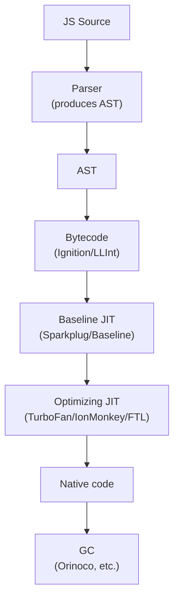

# JavaScript Engine Internals Reference

This file catalogs the major JavaScript engines, their design choices, and links to internal documentation. The flagship document covers engines at "explain behavior" depth; this reference supports deeper dives.

## Major engines

### V8 (Google) <a class="askgpt-btn" href="https://chatgpt.com/?q=Explain%20'V8%20(Google)'%20in%20detail%20with%20concrete%20examples%2C%20the%20main%20trade-offs%2C%20and%20common%20pitfalls%20a%20practitioner%20should%20know." target="_blank" rel="noopener" data-askgpt="V8 (Google)" title="Ask ChatGPT about this section">💬</a>

- **Used by:** Chrome, Chromium, Edge, Node.js, Deno, Bun (initially), Cloudflare Workers (workerd).
- **Written in:** C++.
- **Repository:** <https://chromium.googlesource.com/v8/v8/>
- **Blog:** <https://v8.dev/blog>
- **Features:** WebAssembly, interpreter (Ignition), baseline JIT (Sparkplug), mid-tier JIT (Maglev, since 2023), optimizing JIT (TurboFan), GC (Orinoco, generational with concurrent major GC).

### SpiderMonkey (Mozilla) <a class="askgpt-btn" href="https://chatgpt.com/?q=Explain%20'SpiderMonkey%20(Mozilla)'%20in%20detail%20with%20concrete%20examples%2C%20the%20main%20trade-offs%2C%20and%20common%20pitfalls%20a%20practitioner%20should%20know." target="_blank" rel="noopener" data-askgpt="SpiderMonkey (Mozilla)" title="Ask ChatGPT about this section">💬</a>

- **Used by:** Firefox, Servo (legacy).
- **Written in:** C++.
- **Repository:** <https://github.com/mozilla/gecko-dev/tree/master/js/src>
- **MDN SpiderMonkey docs:** <https://spidermonkey.dev/>
- **Features:** WebAssembly, interpreter (Baseline), baseline JIT (Baseline JIT), optimizing JIT (IonMonkey), GC (generational, nursery + tenured, G1-like major GC).

### JavaScriptCore / Nitro (Apple) <a class="askgpt-btn" href="https://chatgpt.com/?q=Explain%20'JavaScriptCore%20%2F%20Nitro%20(Apple)'%20in%20detail%20with%20concrete%20examples%2C%20the%20main%20trade-offs%2C%20and%20common%20pitfalls%20a%20practitioner%20should%20know." target="_blank" rel="noopener" data-askgpt="JavaScriptCore / Nitro (Apple)" title="Ask ChatGPT about this section">💬</a>

- **Used by:** Safari, Bun (since 2022), other WebKit-based browsers.
- **Written in:** C++.
- **Repository:** <https://github.com/WebKit/WebKit/tree/main/Source/JavaScriptCore>
- **Features:** WebAssembly, multiple tiers (LLInt → Baseline → DFG → FTL), GC (Generational + concurrent stop-the-world for old gen).

### Hermes (Meta) <a class="askgpt-btn" href="https://chatgpt.com/?q=Explain%20'Hermes%20(Meta)'%20in%20detail%20with%20concrete%20examples%2C%20the%20main%20trade-offs%2C%20and%20common%20pitfalls%20a%20practitioner%20should%20know." target="_blank" rel="noopener" data-askgpt="Hermes (Meta)" title="Ask ChatGPT about this section">💬</a>

- **Used by:** React Native (Android and iOS).
- **Written in:** C++.
- **Repository:** <https://github.com/facebook/hermes>
- **Features:** AOT compiler, smaller footprint, optimized for mobile startup; not full ES conformance — targets mobile use cases.

### Chakra / ChakraCore (Microsoft, legacy) <a class="askgpt-btn" href="https://chatgpt.com/?q=Explain%20'Chakra%20%2F%20ChakraCore%20(Microsoft%2C%20legacy)'%20in%20detail%20with%20concrete%20examples%2C%20the%20main%20trade-offs%2C%20and%20common%20pitfalls%20a%20practitioner%20should%20know." target="_blank" rel="noopener" data-askgpt="Chakra / ChakraCore (Microsoft, legacy)" title="Ask ChatGPT about this section">💬</a>

- **Used by:** legacy Edge (pre-Chromium), Node.js (legacy option).
- **Status:** Microsoft Edge migrated to Chromium/Blink/V8 in 2020. ChakraCore is in maintenance.

## Engine architecture overview

All modern engines share a layered architecture:

### Pipeline stages <a class="askgpt-btn" href="https://chatgpt.com/?q=Explain%20'Pipeline%20stages'%20in%20detail%20with%20concrete%20examples%2C%20the%20main%20trade-offs%2C%20and%20common%20pitfalls%20a%20practitioner%20should%20know." target="_blank" rel="noopener" data-askgpt="Pipeline stages" title="Ask ChatGPT about this section">💬</a>

1. **Parser** — produces an AST (abstract syntax tree). Many engines use a "pre-parser" to skip functions not yet called.
2. **Bytecode compiler** — emits platform-independent bytecode for the interpreter.
3. **Interpreter** — runs bytecode directly (Ignition in V8, LLInt in JSC, Baseline in SpiderMonkey).
4. **Baseline JIT** — emits simple native code quickly (Sparkplug in V8, Baseline in SpiderMonkey).
5. **Optimizing JIT** — emits highly optimized native code based on type feedback (TurboFan in V8, IonMonkey in SpiderMonkey, FTL in JSC).
6. **Deoptimizer** — falls back to a lower tier when assumptions fail.

## V8 internals (deep reference)

- **Ignition (interpreter):** register-based bytecode, accumulator model.
- **TurboFan:** Sea-of-Nodes IR, type feedback-driven.
- **Sparkplug:** simple baseline JIT (added 2021).
- **Maglev:** mid-tier JIT (added 2023).
- **Hidden classes / Maps:** how V8 tracks object shapes for inline caches.
- **Inline caches:** optimize property access based on observed types.
- **Generational GC (Orinoco):**
  - **Nursery** (young generation) — minor GC, fast.
  - **Old space** (tenured) — major GC, mostly concurrent.
  - **Major GC** uses a concurrent marking + concurrent compaction approach.
- **Memory layout:**
  - New space (nursery + intermediate).
  - Old space (old pointer space + old data space).
  - Large object space.
  - Code space (JIT-compiled code).
  - Map space (hidden classes).

## SpiderMonkey internals (deep reference)

- **Baseline JIT** — simple JIT, generated at first execution.
- **Warbuilder** — converts bytecode to MIR (middle IR).
- **IonMonkey** — optimizing JIT, similar in concept to TurboFan.
- **GC:** generational (nursery + tenured), incremental compaction, major GC trigger by allocation threshold.

## JSC internals (deep reference)

- **LLInt** — low-level interpreter.
- **Baseline JIT** — quick baseline.
- **DFG JIT** — data-flow-graph-based optimizing JIT.
- **FTL JIT** — faster-than-light, B3-based (LLVM-inspired) optimizing JIT.

## Performance characteristics

| Engine | Startup | Peak throughput | Memory |
|--------|---------|-----------------|--------|
| V8 | Good | Excellent | Higher |
| SpiderMonkey | Good | Excellent | Medium |
| JSC | Good | Excellent | Lower |
| Hermes | Excellent | Good | Lowest |

## Useful links

- **V8 design docs:** <https://v8.dev/docs>
- **V8 blog (deep technical):** <https://v8.dev/blog>
- **Daniel Clifford's V8 internals talk (essential):** <https://www.youtube.com/watch?v=LWq6Za-SNt8>
- **SpiderMonkey internals:** <https://wiki.mozilla.org/Javascript/SpiderMonkey>
- **JSC blog posts:** <https://webkit.org/blog/>
- **TurboFan IR documentation:** <https://v8.dev/docs/turbofan>
- **Ignition design doc:** <https://v8.dev/blog/ignition-interpreter>
- **Maglev design doc:** <https://v8.dev/blog/maglev>

## Garbage collection algorithms in modern engines

| Algorithm | Used by | Notes |
|-----------|---------|-------|
| Generational (nursery + tenured) | All | Weak generational hypothesis holds |
| Mark-and-sweep | All (old gen) | Cycle-tolerant |
| Concurrent marking | V8, SpiderMonkey, JSC | Reduces stop-the-world pause times |
| Concurrent compaction | V8, JSC | Major GC stays mostly concurrent |
| Incremental compaction | SpiderMonkey | Splits compaction work across minor GCs |

## Inline caches and hidden classes

V8's hidden class (map) system:

- Every object has a hidden class (Map) describing its layout.
- When code accesses a property, V8 records the hidden class in an inline cache.
- Subsequent accesses with the same hidden class become a simple load (not a property lookup).
- If the hidden class changes (e.g., new property added), the inline cache deoptimizes.

This is why **monomorphic** code (always sees objects of the same shape) is faster than **polymorphic** code.

## TypeScript compiler architecture

- **Scanner** — tokenizes source into tokens.
- **Parser** — produces AST (abstract syntax tree).
- **Binder** — builds symbol tables and resolves scopes.
- **Checker** — does type checking, emits diagnostics.
- **Emitter** — produces JS output, declarations, source maps.
- **tsserver** — language service used by IDEs.

Sources:

- **TypeScript compiler README:** <https://github.com/microsoft/TypeScript/blob/main/src/compiler/README.md>
- **"TypeScript Compiler API" walkthrough:** <https://github.com/microsoft/TypeScript/wiki/Using-the-Compiler-API>
- **Anders Hejlsberg on TypeScript design:** <https://www.youtube.com/watch?v=RaPJVqz0Kig>

## Node.js architecture (light coverage)

- **libuv** — async I/O library, event loop implementation.
- **V8** — JS engine.
- **Core libraries** — `fs`, `http`, `net`, `crypto`, etc. (C++ + JS).
- **npm** — package manager (separate from runtime).

Source: <https://github.com/nodejs/node>

## Deno and Bun (alternatives to Node)

- **Deno:** V8 + Rust runtime + TypeScript-first. <https://deno.com/>
- **Bun:** JavaScriptCore + Zig runtime. <https://bun.sh/>
- **workerd (Cloudflare Workers):** V8 + custom runtime. <https://github.com/cloudflare/workerd>