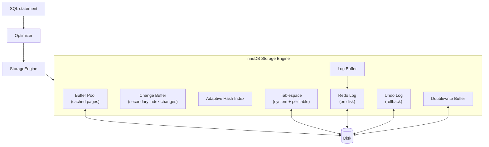

# MySQL InnoDB Reference

The default storage engine for MySQL since 5.5. This file catalogs the InnoDB internals and links to MySQL documentation.

## MySQL documentation

- **MySQL 8.0 Reference Manual:** <https://dev.mysql.com/doc/refman/8.0/en/>
- **MySQL Server source:** <https://github.com/mysql/mysql-server>
- **MySQL InnoDB internals wiki:** (no canonical wiki; source tree + dev zone)

## InnoDB architecture

## Key InnoDB components

| Component | Purpose |
|-----------|---------|
| **Buffer Pool** | In-memory cache of data pages (default `innodb_buffer_pool_size = 128M`). |
| **Change Buffer** | Buffers writes to secondary index pages not in the buffer pool. |
| **Adaptive Hash Index** | Automatically builds hash indexes on hot B-tree pages. |
| **Log Buffer** | In-memory buffer for redo log writes. |
| **Redo Log** | On-disk log for crash recovery (WAL). Configured by `innodb_log_file_size`. |
| **Undo Log** | Stores before-images for rollback and MVCC. |
| **System Tablespace** | Contains data dictionary, doublewrite buffer, undo logs. |
| **Per-Table Tablespaces** (`.ibd` files) | Default since MySQL 5.7. |
| **Doublewrite Buffer** | Prevents partial page writes; required for crash safety. |
| **Foreign Key Constraints** | Supported (unlike MyISAM). |
| **MVCC** | Multi-version concurrency control via undo log + trx_id. |

## InnoDB MVCC

Unlike PostgreSQL's xmin/xmax model, InnoDB uses a different MVCC implementation:

- Each row has two hidden columns: `DB_TRX_ID` (the transaction that last modified the row) and `DB_ROLL_PTR` (pointer to the undo log record).
- A read view contains the active transaction IDs at the time of the read.
- Rows are visible if their `DB_TRX_ID` was committed before the read view was created.
- `REPEATABLE READ` in InnoDB is closer to PostgreSQL's `REPEATABLE READ` than the SQL standard (which has stricter REPEATABLE READ semantics).

## InnoDB vs PostgreSQL MVCC comparison

| Aspect | PostgreSQL | InnoDB |
|--------|-----------|--------|
| Visibility info | xmin/xmax in row header | DB_TRX_ID, DB_ROLL_PTR |
| Rollback data | Separate system catalog (`pg_xact`) | Undo log |
| Update-in-place | No (creates new tuple via HOT update) | Yes (modifies in place, old version in undo) |
| Vacuum | Required (`VACUUM`, `autovacuum`) | Automatic purge based on undo log size |
| Wraparound protection | `transaction ID wraparound` | Undo log size / history length |
| Index updates | HOT for non-indexed columns | Change buffer for secondary indexes |

## Configuration parameters

| Parameter | Default | Purpose |
|-----------|---------|---------|
| `innodb_buffer_pool_size` | 128M | Buffer pool size (set to ~70% of RAM for dedicated DB) |
| `innodb_log_file_size` | 48M | Redo log size |
| `innodb_log_buffer_size` | 16M | Log buffer size |
| `innodb_flush_log_at_trx_commit` | 1 | 1=full ACID, 2=1s window loss risk, 0=loss risk |
| `innodb_flush_method` | fsync | Use O_DIRECT for direct disk I/O |
| `innodb_file_per_table` | ON (8.0) | Each table in its own `.ibd` file |
| `innodb_thread_concurrency` | 0 | Threads (0 = unlimited) |
| `innodb_read_io_threads` | 4 | Read I/O threads |
| `innodb_write_io_threads` | 4 | Write I/O threads |
| `innodb_io_capacity` | 200 | I/O capacity hint |
| `innodb_stats_persistent` | ON | Persistent statistics |
| `innodb_autoinc_lock_mode` | 2 | AUTO_INCREMENT lock mode |
| `innodb_change_buffering` | all | Change buffer operations |
| `innodb_adaptive_hash_index` | ON | Adaptive hash index |

## Replication

MySQL supports several replication modes:

| Mode | Description |
|------|-------------|
| **Asynchronous (default)** | Primary writes to binlog, replicas pull and apply asynchronously. |
| **Semisynchronous** | At least one replica acknowledges receipt of the binlog event before primary commits. |
| **Synchronous** (MySQL Group Replication, Galera) | All replicas acknowledge before commit. |

### Binlog formats <a class="askgpt-btn" href="https://chatgpt.com/?prompt=Read%20this%20section%20of%20my%20encyclopedia%20and%20explain%20it%20in%20depth%20with%20concrete%20examples%2C%20the%20main%20trade-offs%2C%20and%20common%20pitfalls%20a%20practitioner%20should%20know%3A%0A%0Ahttps%3A%2F%2Fgithub.com%2Fvishvasg14%2Fsoftware-engineering-encyclopedia%2Fblob%2Fmain%2F03-sql-databases%2Freferences%2Finnodb.md%23binlog-formats%0A%0ASection%20title%3A%20Binlog%20formats" target="_blank" rel="noopener" data-askgpt="Binlog formats" data-askgpt-url="https://github.com/vishvasg14/software-engineering-encyclopedia/blob/main/03-sql-databases/references/innodb.md#binlog-formats" data-askgpt-prompt-depth="Read%20this%20section%20of%20my%20encyclopedia%20and%20explain%20it%20in%20depth%20with%20concrete%20examples%2C%20the%20main%20trade-offs%2C%20and%20common%20pitfalls%20a%20practitioner%20should%20know%3A%0A%0Ahttps%3A%2F%2Fgithub.com%2Fvishvasg14%2Fsoftware-engineering-encyclopedia%2Fblob%2Fmain%2F03-sql-databases%2Freferences%2Finnodb.md%23binlog-formats%0A%0ASection%20title%3A%20Binlog%20formats" data-askgpt-prompt-examples="Read%20this%20section%20of%20my%20encyclopedia%20and%20give%20me%202-3%20real-world%20production%20examples%20for%20it.%20For%20each%3A%20what%20went%20right%2C%20what%20went%20wrong%2C%20and%20the%20lessons%20learned.%20Include%20company%20%2F%20project%20names%20if%20relevant.%0A%0Ahttps%3A%2F%2Fgithub.com%2Fvishvasg14%2Fsoftware-engineering-encyclopedia%2Fblob%2Fmain%2F03-sql-databases%2Freferences%2Finnodb.md%23binlog-formats%0A%0ASection%20title%3A%20Binlog%20formats" title="Ask ChatGPT about this section">💬</a>

- **STATEMENT** — log SQL statements (smaller; less safe for non-deterministic functions).
- **ROW** — log row changes (larger; safest for replication).
- **MIXED** — MySQL decides per-statement.

### GTIDs (Global Transaction Identifiers) <a class="askgpt-btn" href="https://chatgpt.com/?prompt=Read%20this%20section%20of%20my%20encyclopedia%20and%20explain%20it%20in%20depth%20with%20concrete%20examples%2C%20the%20main%20trade-offs%2C%20and%20common%20pitfalls%20a%20practitioner%20should%20know%3A%0A%0Ahttps%3A%2F%2Fgithub.com%2Fvishvasg14%2Fsoftware-engineering-encyclopedia%2Fblob%2Fmain%2F03-sql-databases%2Freferences%2Finnodb.md%23gtids-global-transaction-identifiers%0A%0ASection%20title%3A%20GTIDs%20(Global%20Transaction%20Identifiers)" target="_blank" rel="noopener" data-askgpt="GTIDs (Global Transaction Identifiers)" data-askgpt-url="https://github.com/vishvasg14/software-engineering-encyclopedia/blob/main/03-sql-databases/references/innodb.md#gtids-global-transaction-identifiers" data-askgpt-prompt-depth="Read%20this%20section%20of%20my%20encyclopedia%20and%20explain%20it%20in%20depth%20with%20concrete%20examples%2C%20the%20main%20trade-offs%2C%20and%20common%20pitfalls%20a%20practitioner%20should%20know%3A%0A%0Ahttps%3A%2F%2Fgithub.com%2Fvishvasg14%2Fsoftware-engineering-encyclopedia%2Fblob%2Fmain%2F03-sql-databases%2Freferences%2Finnodb.md%23gtids-global-transaction-identifiers%0A%0ASection%20title%3A%20GTIDs%20(Global%20Transaction%20Identifiers)" data-askgpt-prompt-examples="Read%20this%20section%20of%20my%20encyclopedia%20and%20give%20me%202-3%20real-world%20production%20examples%20for%20it.%20For%20each%3A%20what%20went%20right%2C%20what%20went%20wrong%2C%20and%20the%20lessons%20learned.%20Include%20company%20%2F%20project%20names%20if%20relevant.%0A%0Ahttps%3A%2F%2Fgithub.com%2Fvishvasg14%2Fsoftware-engineering-encyclopedia%2Fblob%2Fmain%2F03-sql-databases%2Freferences%2Finnodb.md%23gtids-global-transaction-identifiers%0A%0ASection%20title%3A%20GTIDs%20(Global%20Transaction%20Identifiers)" title="Ask ChatGPT about this section">💬</a>

Since MySQL 5.6, GTIDs provide a unique identifier for each committed transaction across the topology. Required for safe failover.

## When to choose MySQL

- Existing MySQL investment.
- Simple read-heavy workloads.
- Web applications needing straightforward replication.
- Cases where you need MyISAM-style behavior (full-text search — though InnoDB now supports it too).
- When you want a more permissive SQL dialect (though that's also a footgun).

## When NOT to choose MySQL

- Complex queries with multiple joins and CTEs (PostgreSQL's planner is more sophisticated).
- Need for advanced data types (JSONB in PG is far superior to JSON in MySQL).
- Strict ACID requirements with serializable transactions.
- Heavy analytical workloads (use a columnar warehouse).

## Key MySQL documentation pages

- **InnoDB architecture:** <https://dev.mysql.com/doc/refman/8.0/en/innodb-architecture.html>
- **InnoDB multi-versioning:** <https://dev.mysql.com/doc/refman/8.0/en/innodb-multi-versioning.html>
- **InnoDB locking:** <https://dev.mysql.com/doc/refman/8.0/en/innodb-locking.html>
- **InnoDB transaction model:** <https://dev.mysql.com/doc/refman/8.0/en/innodb-transaction-model.html>
- **Replication:** <https://dev.mysql.com/doc/refman/8.0/en/replication.html>
- **Group replication:** <https://dev.mysql.com/doc/refman/8.0/en/group-replication.html>
- **Performance schema:** <https://dev.mysql.com/doc/refman/8.0/en/performance-schema.html>
- **sys schema:** <https://dev.mysql.com/doc/refman/8.0/en/sys-schema.html>
- **EXPLAIN:** <https://dev.mysql.com/doc/refman/8.0/en/explain.html>
- **Optimization:** <https://dev.mysql.com/doc/refman/8.0/en/optimization.html>

## Books

- *High Performance MySQL* — Baron Schwartz, Peter Zaitsev, Vadim Tkachenko (O'Reilly).
- *MySQL Cookbook* — Paul DuBois (O'Reilly).
- *Effective MySQL* — Ronald Bradford (Oracle Press).

## Tools

- **mysqldump** — logical backup.
- **mysqlbinlog** — binlog reader.
- **MySQL Enterprise Monitor** — commercial monitoring.
- **Percona Toolkit** — open-source tools for MySQL ops (`pt-query-digest`, `pt-online-schema-change`, `pt-archiver`).
- **MySQL Workbench** — GUI admin.
- **ProxySQL** — connection pool and proxy.
- **Orchestrator** — replication topology management and failover.
- **MySQL Operator for Kubernetes** — k8s operator.