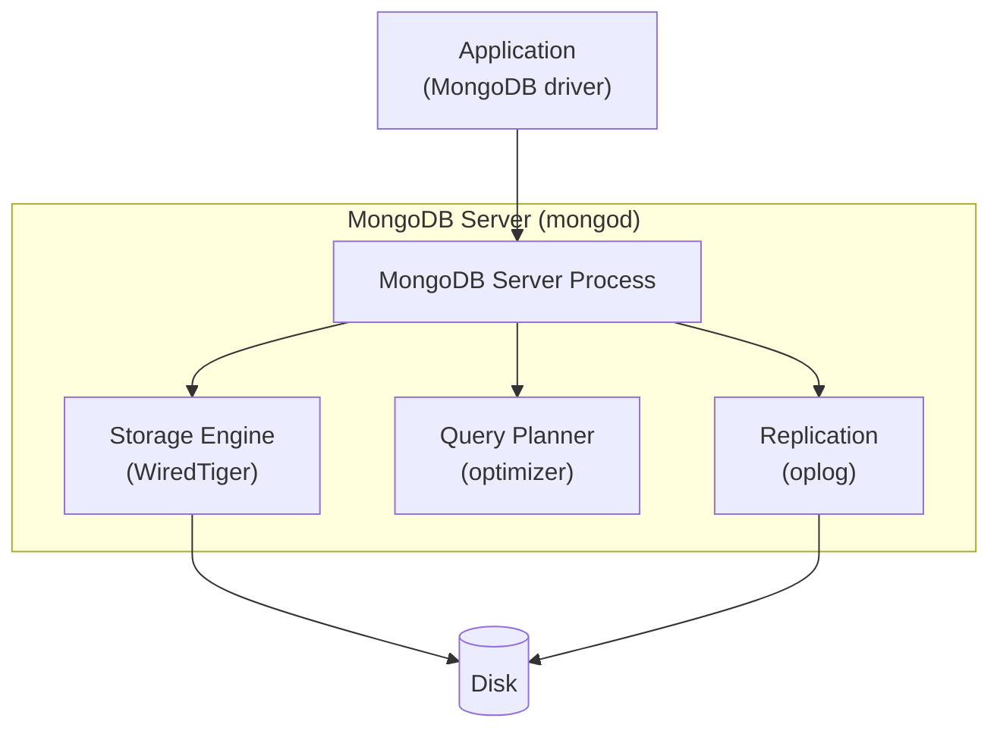
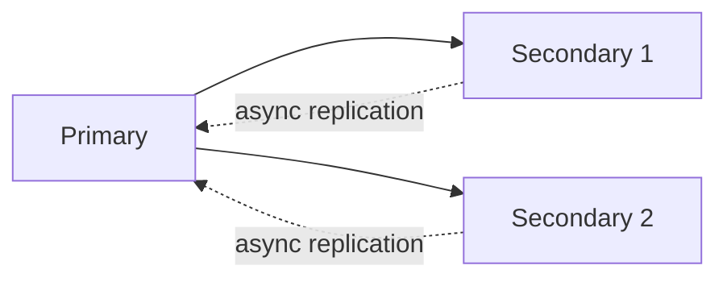
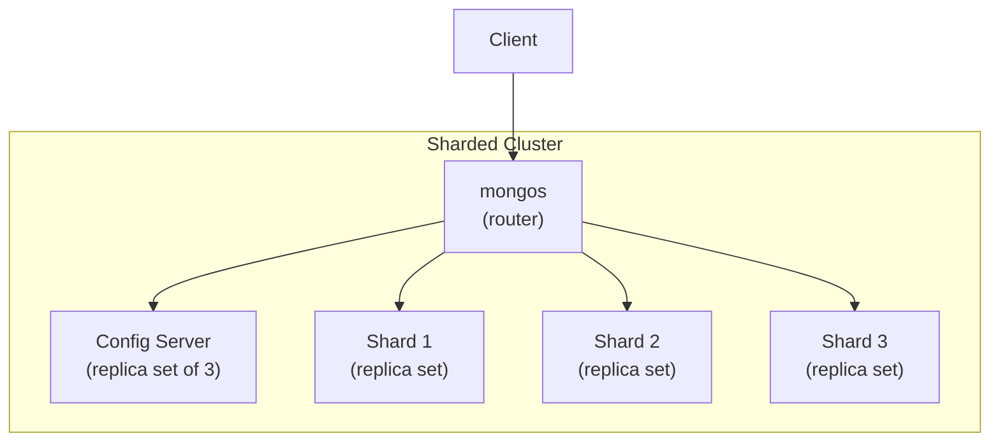

# MongoDB Reference

MongoDB is the dominant document database. This file catalogs MongoDB internals and links to official documentation.

## MongoDB documentation

- **MongoDB 7.0 Manual:** <https://www.mongodb.com/docs/manual/>
- **MongoDB source:** <https://github.com/mongodb/mongo>
- **MongoDB University (free courses):** <https://learn.mongodb.com/>
- **MongoDB blog:** <https://www.mongodb.com/blog>

## Data model

A document is a BSON (Binary JSON) object. MongoDB collections are schema-less by default (though schema validation can be enforced).

```js
// Sample document
{
    _id: ObjectId("..."),
    name: "Alice",
    email: "alice@example.com",
    address: {
        street: "123 Main St",
        city: "Springfield"
    },
    tags: ["admin", "active"],
    createdAt: ISODate("2026-07-26T10:00:00Z")
}
```

## BSON

BSON is a binary-encoded serialization of JSON-like documents. It supports more data types than JSON (e.g., `ObjectId`, `Date`, `Binary`, `Decimal128`, `int32`, `int64`, `double`).

## Architecture



## Storage engines

| Engine | Status | Notes |
|--------|--------|-------|
| **WiredTiger** | Default since 3.2 | B-tree-based, document-level concurrency, compression |
| **MMAPv1** | Removed in 4.2 | Old default; legacy |
| **In-Memory** | Subscription | WireTiger with disk persistence off |

WiredTiger supports:

- Document-level locking (not page-level).
- Compression (snappy, zlib, zstd).
- Configurable cache size.

## Replication

### Replica sets

A replica set is a group of mongod instances that maintain the same data set. Primary receives writes, secondaries replicate.



### Oplog

The operations log (`oplog.rs`) is a capped collection that records all writes. Secondaries tail the primary's oplog to replicate.

### Election

When the primary becomes unavailable, the remaining secondaries hold an election using Raft-like consensus. By default, writes are acknowledged only after the primary commits.

### Write concern

| Level | Behavior |
|-------|----------|
| `{w: 0}` | Fire-and-forget (no acknowledgment) |
| `{w: 1}` | Acknowledged by primary |
| `{w: "majority"}` | Acknowledged by majority of replica set members |
| `{w: 2}` | Acknowledged by primary + 1 secondary |

### Read concern

| Level | Behavior |
|-------|----------|
| `"local"` | Read latest data on the node |
| `"available"` | Read latest data available (sharded clusters) |
| `"majority"` | Read only data acknowledged by majority |
| `"linearizable"` | Read reflects all successful majority writes |

## Sharding

MongoDB scales horizontally via sharding:



**Sharding strategies:**

- **Range-based** — chunks of a range (good for range queries).
- **Hash-based** — chunks of a hash (good for distribution).
- **Zone sharding** — manual placement for locality.

## Indexes

MongoDB supports several index types:

| Type | Use case |
|------|----------|
| Single field | B-tree on one field |
| Compound | Multiple fields, order matters |
| Multikey | Arrays |
| Text | Full-text search |
| Geospatial (2D, 2dsphere) | Geo queries |
| Hashed | Equality, for hashed sharding |
| TTL | Auto-expire documents after N seconds |
| Partial | Index only matching documents |
| Wildcard | All fields under a path |

## Aggregation framework

```js
db.orders.aggregate([
    { $match: { status: "completed" } },
    { $group: { _id: "$customerId", total: { $sum: "$amount" } } },
    { $sort: { total: -1 } },
    { $limit: 10 }
]);
```

Stages include `$match`, `$group`, `$project`, `$sort`, `$limit`, `$lookup`, `$unwind`, `$facet`, `$bucket`, `$graphLookup`, `$unionWith`.

## Change streams

MongoDB applications can listen to real-time changes via change streams (since 3.6):

```js
const changeStream = db.collection('orders').watch();
changeStream.on('change', (change) => {
    console.log(change);
});
```

Under the hood, change streams tail the oplog.

## When to choose MongoDB

- Document-shaped data (nested, evolving schemas).
- Read-heavy workloads with simple query patterns.
- When you need horizontal scalability without manual sharding logic.
- When the application code is dynamic (frequent schema changes).
- Real-time analytics with the aggregation framework.

## When NOT to choose MongoDB

- Strong ACID transactional requirements (use PostgreSQL or a NewSQL DB).
- Complex joins across many collections.
- Strict schema enforcement (use a relational DB with constraints).
- When you need full SQL compliance (MongoDB has its own query language).

## ACID in MongoDB

Multi-document ACID transactions are supported since MongoDB 4.0 (replica sets) and 4.2 (sharded clusters). They use snapshot isolation by default.

```js
const session = db.getMongo().startSession();
session.startTransaction();
try {
    session.getDatabase('mydb').orders.insertOne({ ... });
    session.getDatabase('mydb').inventory.updateOne({ ... });
    session.commitTransaction();
} catch (e) {
    session.abortTransaction();
}
```

## Key documentation pages

- **Aggregation:** <https://www.mongodb.com/docs/manual/aggregation/>
- **Indexes:** <https://www.mongodb.com/docs/manual/indexes/>
- **Replication:** <https://www.mongodb.com/docs/manual/replication/>
- **Sharding:** <https://www.mongodb.com/docs/manual/sharding/>
- **Transactions:** <https://www.mongodb.com/docs/manual/core/transactions/>
- **Storage engines:** <https://www.mongodb.com/docs/manual/core/storage-engines/>
- **Change streams:** <https://www.mongodb.com/docs/manual/changeStreams/>
- **Performance best practices:** <https://www.mongodb.com/docs/manual/administration/analyze-performance-best-practices/>

## Drivers

| Language | Driver |
|----------|--------|
| JavaScript/Node.js | `mongodb` (official), `mongoose` (ODM) |
| Python | `pymongo` (official), `mongoengine` (ODM) |
| Java | `mongodb-driver-sync`, `mongodb-driver-reactivestreams` |
| Go | `go.mongodb.org/mongo-driver` |
| C# | `MongoDB.Driver` |
| Rust | `mongodb` (official crate) |

## Books

- *MongoDB: The Definitive Guide* — Shannon Bradshaw, Kristina Chodorow (O'Reilly).
- *MongoDB in Action* — Kyle Banker (Manning).
- *Practical MongoDB* — Shakuntala Gupta Edward (Apress).

## Tools

- **mongosh** — modern shell (replaces legacy `mongo`).
- **mongoimport, mongoexport** — data import/export.
- **mongodump, mongorestore** — backup.
- **Compass** — GUI.
- **Atlas** — managed cloud service.
- **Ops Manager / Cloud Manager** — ops tooling (commercial).