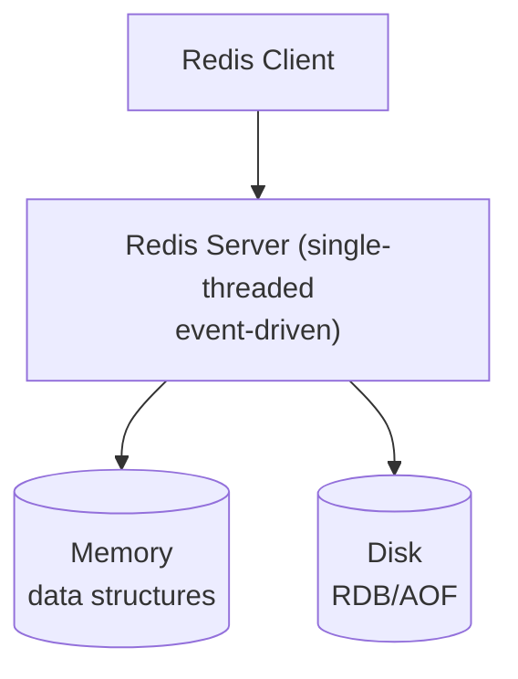
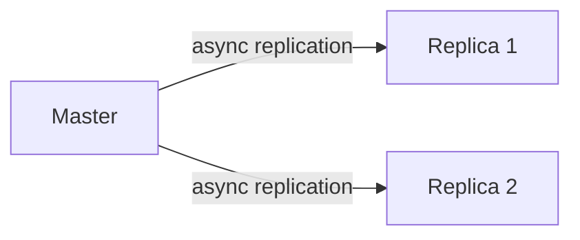
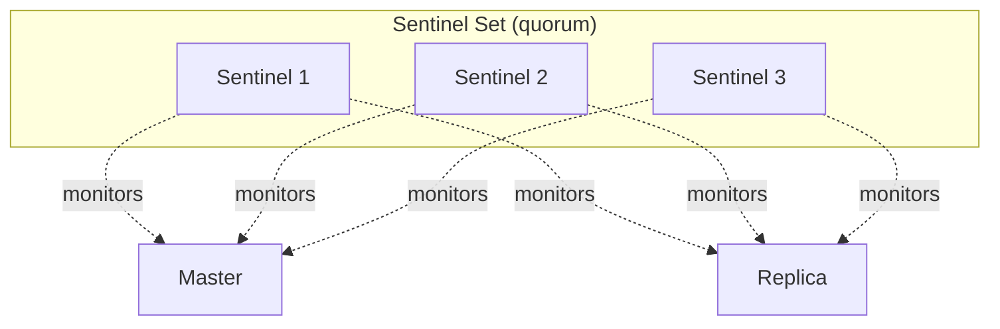
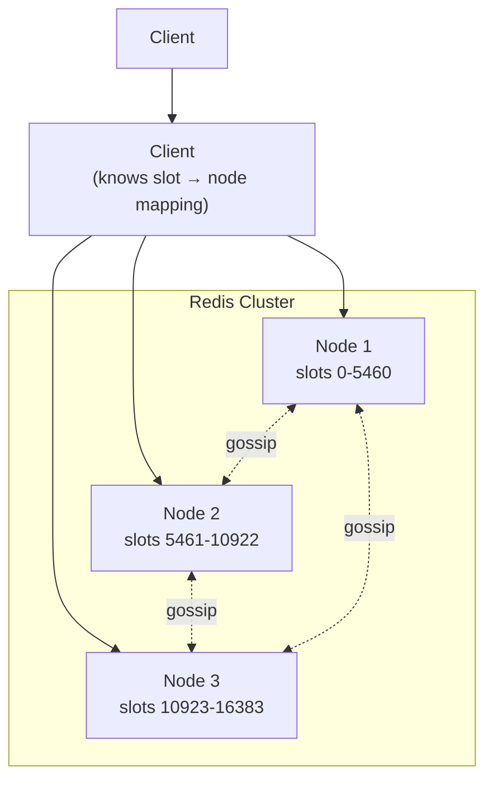

# Redis Reference

Redis is the dominant in-memory data structure store. This file catalogs Redis internals and links to official documentation.

## Redis documentation

- **Redis Documentation:** <https://redis.io/docs/>
- **Redis source:** <https://github.com/redis/redis>
- **Redis blog:** <https://redis.io/blog/>
- **Redis University (free courses):** <https://university.redis.io/>

## Data structures

Redis is not a simple key-value store; it supports rich data structures:

| Type | Operations | Use case |
|------|-----------|----------|
| **String** | GET, SET, INCR, DECR, APPEND, GETSET | Caching, counters |
| **Hash** | HSET, HGET, HMSET, HGETALL, HINCRBY | Object storage, per-field updates |
| **List** | LPUSH, RPUSH, LPOP, RPOP, LRANGE, BLPOP | Queues, recent activity |
| **Set** | SADD, SMEMBERS, SINTER, SUNION, SDIFF | Tags, unique items |
| **Sorted Set** (ZSet) | ZADD, ZRANGE, ZRANGEBYSCORE, ZINCRBY | Leaderboards, rate limiting |
| **Stream** (since 5.0) | XADD, XREAD, XLEN, XACK, consumer groups | Event log, message queue |
| **HyperLogLog** | PFADD, PFCOUNT | Cardinality estimation (fixed memory) |
| **Bitmap** | SETBIT, GETBIT, BITCOUNT | Compact boolean arrays |
| **Geospatial** | GEOADD, GEORADIUS, GEOSEARCH | Location queries |

## Architecture



**Single-threaded for command execution** — Redis 6+ uses multiple I/O threads but command execution remains single-threaded. This is critical to its latency profile.

## Persistence

Redis offers two persistence mechanisms:

### RDB (Redis Database file) <a class="askgpt-btn" data-askgpt="RDB (Redis Database file)" title="Ask ChatGPT about this section">💬</a>

- Point-in-time snapshots at configurable intervals.
- Compact, fast to load.
- Configurable via `save <seconds> <changes>`.

### AOF (Append Only File) <a class="askgpt-btn" data-askgpt="AOF (Append Only File)" title="Ask ChatGPT about this section">💬</a>

- Logs every write operation.
- Configurable fsync policy: `everysec`, `always`, `no`.
- Can be replayed to reconstruct state.
- Rewrite (compaction) to prevent unbounded growth.

### Mixed mode (since 7.0) <a class="askgpt-btn" data-askgpt="Mixed mode (since 7.0)" title="Ask ChatGPT about this section">💬</a>

- Default in Redis 7.0.
- Combines RDB snapshot + AOF log.
- Faster restarts, better durability.

## Replication



- Replicas asynchronously replicate from master.
- Replicas can serve reads (eventually consistent).
- Replicas can be chained.
- `replica-serve-stale-data` controls behavior during sync.

## Sentinel

For automatic failover:



Sentinels monitor masters and replicas, agree on a new master if the current one fails, and publish the new master address.

## Cluster mode

For horizontal scaling (since Redis 3.0):



- 16,384 hash slots distributed across masters.
- Data sharded by key (CRC16 of key modulo 16384).
- Multi-key operations require keys in the same slot (use hash tags: `{user:123}.profile` and `{user:123}.sessions` go to the same slot).
- Replicas of each master for HA.
- Asynchronous replication.

## Pipelining

Send multiple commands in one round-trip:

```
Client → Server: SET a 1, GET b, INCR c, LPUSH q 1
Server → Client: OK, value-b, 2, 1
```

Significant latency improvement for batch operations.

## Lua scripting

```bash
redis-cli EVAL "
    local current = redis.call('GET', KEYS[1])
    if current then
        redis.call('INCR', KEYS[1])
        return current
    else
        redis.call('SET', KEYS[1], 1)
        return 1
    end
" 1 mykey
```

Atomic execution — no other commands run while the script is executing.

## When to choose Redis

- In-memory cache (cache-aside, write-through, write-behind).
- Session storage.
- Rate limiting (token bucket with INCR).
- Leaderboards (sorted sets).
- Real-time analytics (HyperLogLog, sorted sets).
- Pub/sub for simple messaging.
- Distributed locks (with Redlock algorithm — though contested).
- Job queues (Redis Streams, BullMQ in Node.js).

## When NOT to choose Redis

- Persistent storage (Redis persistence is not as robust as a true database).
- Complex queries (no joins across keys).
- Strong consistency requirements (Redis is eventually consistent in cluster mode).
- Large datasets that don't fit in RAM (use a disk-based store).
- ACID transactions (Redis transactions are not ACID; MULTI/EXEC is atomic but not isolated in the SQL sense).

## Redis transactions

`MULTI/EXEC` provides atomic command grouping but NOT ACID isolation:

```bash
redis-cli MULTI
SET a 1
INCR b
EXEC
# Both commands execute atomically (no interleaving), but if b doesn't exist, INCR fails silently inside the transaction.
```

For real ACID, use a relational database. Redis transactions are for atomic command batches.

## Memory management

Redis holds all data in memory. Memory management strategies:

- **maxmemory-policy** — what to do when memory is full:
  - `noeviction` — return errors
  - `allkeys-lru` — evict any key by LRU
  - `volatile-lru` — evict by LRU only among keys with TTL
  - `allkeys-lfu` — evict by LFU (since Redis 4.0)
  - `volatile-lfu`
  - `allkeys-random`
  - `volatile-random`
  - `volatile-ttl`

- **Memory fragmentation** — can be a problem; `INFO memory` reports `mem_fragmentation_ratio`.

## Key documentation pages

- **Commands:** <https://redis.io/commands/>
- **Persistence:** <https://redis.io/docs/management/persistence/>
- **Replication:** <https://redis.io/docs/management/replication/>
- **Sentinel:** <https://redis.io/docs/management/sentinel/>
- **Cluster:** <https://redis.io/docs/management/scaling/>
- **Memory optimization:** <https://redis.io/docs/management/optimization/>
- **ACL:** <https://redis.io/docs/management/security/acl/>
- **Streams:** <https://redis.io/docs/data-types/streams/>
- **Functions (Lua):** <https://redis.io/docs/interact/programmability/eval-intro/>

## Modules (Redis Stack)

- **RediSearch** — full-text search, secondary indexes.
- **RedisJSON** — JSON document support.
- **RedisGraph** — graph database.
- **RedisTimeSeries** — time-series.
- **RedisBloom** — probabilistic data structures.

## Clients

| Language | Client |
|----------|--------|
| JavaScript/Node.js | `ioredis`, `node-redis`, `redis` |
| Python | `redis-py` |
| Java | `Lettuce`, `Jedis` |
| Go | `go-redis/redis` |
| C# | `StackExchange.Redis` |

## Books

- *Redis in Action* — Josiah Carlson (Manning).
- *Redis Essentials* — Maxwell Dayvson da Silva (Packt).
- *Mastering Redis* — Jeremy Nelson (Packt).