# SQL & Databases

> A comprehensive, production-grade treatment of the relational model, SQL, and PostgreSQL internals — from query planning to MVCC to replication, with comparison coverage of MySQL, MongoDB, and Redis.

---

## Table of Contents

1. [Overview](#1-overview)
2. [Definition](#2-definition)
3. [Five Ws + One H](#3-five-ws--one-h)
4. [History](#4-history)
5. [Problem Statement](#5-problem-statement)
6. [Real-World Motivation](#6-real-world-motivation)
7. [Internal Working](#7-internal-working)
8. [Deep Dive](#8-deep-dive)
9. [Architecture](#9-architecture)
10. [Performance](#10-performance)
11. [Security](#11-security)
12. [Production Engineering](#12-production-engineering)
13. [Production Case Studies](#13-production-case-studies)
14. [Code Examples](#14-code-examples)
15. [Common Mistakes](#15-common-mistakes)
16. [Debugging](#16-debugging)
17. [Monitoring & Observability](#17-monitoring--observability)
18. [Best Practices](#18-best-practices)
19. [Anti-Patterns](#19-anti-patterns)
20. [Edge Cases](#20-edge-cases)
21. [Comparisons](#21-comparisons)
22. [Interview Preparation](#22-interview-preparation)
23. [References](#23-references)

---

## 1. Overview

A database is a system that persists, organizes, and retrieves data on behalf of applications. Modern databases also enforce constraints, manage concurrent access, provide recovery after failures, and — in distributed systems — replicate data across machines. The relational database management system (RDBMS), founded on Edgar Codd's relational model (1970), is the dominant architecture for OLTP (Online Transaction Processing) workloads, while a broader ecosystem of document, key-value, wide-column, graph, and search databases serves other use cases.

This document treats SQL fundamentals, the relational model, and **PostgreSQL** at production depth. PostgreSQL is the most feature-rich open-source RDBMS and a representative example of how a modern relational engine actually works. It covers query planning, MVCC, indexes, WAL, VACUUM, replication, and partitioning — the things a senior engineer needs to understand to operate a production database. **MySQL** (InnoDB engine), **MongoDB**, and **Redis** are covered as comparison sections to clarify when to choose each.

**Scope.** This is not an SQL tutorial. It assumes you can already write `SELECT`, `JOIN`, `INSERT`. It focuses on **what happens after the query reaches the server**: how the planner decides on a plan, how the executor reads from disk, how MVCC determines visibility, why VACUUM is necessary, and how replication works.

**Version baselines.** PostgreSQL 16+ is the modern baseline (PG 17 features noted in passing). SQL:2016/2023 standards provide the language reference. MySQL 8.0+, MongoDB 6.0+, Redis 7.0+ for the comparison sections.

## 2. Definition

The terms in the database world are overloaded and often misused. Here's a precise taxonomy:

| Term | Type | Authoritative source |
|------|------|---------------------|
| **Relational model** | Mathematical model of data (relations, tuples, attributes, keys) | Edgar Codd, "A Relational Model of Data for Large Shared Data Banks" (1970) |
| **SQL (Structured Query Language)** | Standardized query language for relational data | ISO/IEC 9075 (SQL:1986, 1989, 1992, 1999, 2003, 2006, 2008, 2011, 2016, 2023) |
| **RDBMS (Relational Database Management System)** | Software implementing the relational model and SQL | Oracle, PostgreSQL, MySQL, SQL Server, Db2 |
| **PostgreSQL** | Open-source RDBMS, written in C, object-relational | PostgreSQL Global Development Group |
| **NoSQL** | Umbrella term for non-relational databases (document, key-value, wide-column, graph) | MongoDB, Redis, Cassandra, Neo4j |
| **NewSQL** | Distributed RDBMS with horizontal scalability | CockroachDB, TiDB, YugabyteDB |
| **OLTP** | Online Transaction Processing — many small concurrent queries | Typical web application workloads |
| **OLAP** | Online Analytical Processing — few complex analytical queries | Data warehousing, reporting |
| **HTAP** | Hybrid Transactional/Analytical Processing | TiDB, SingleStore, CockroachDB |

This document focuses on RDBMS (especially PostgreSQL) with comparison coverage of NoSQL systems.

**The standard stack:**

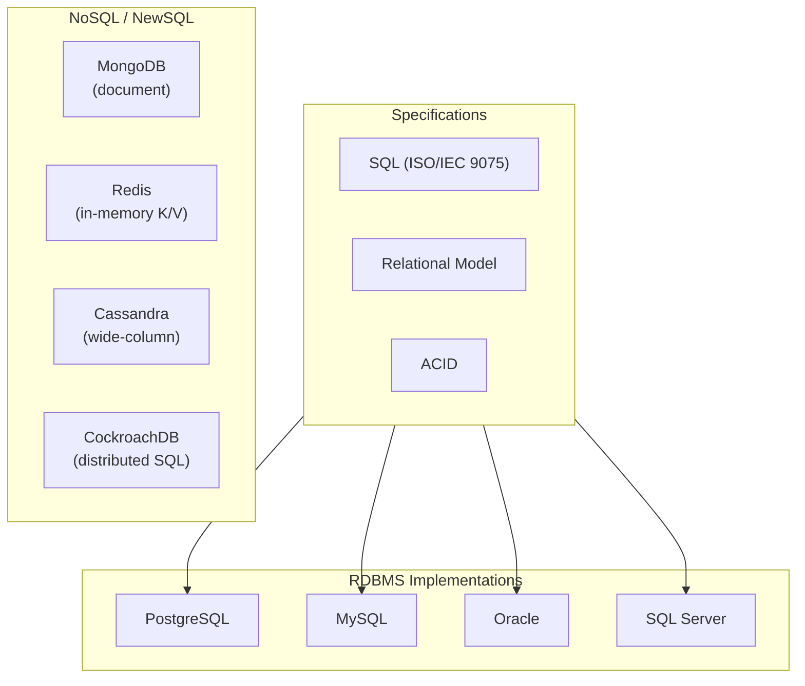

## 3. Five Ws + One H

### What <a class='askgpt-btn' href='https://chatgpt.com/?prompt=Read%20this%20section%20of%20my%20encyclopedia%20and%20explain%20it%20in%20depth%20with%20concrete%20examples%2C%20the%20main%20trade-offs%2C%20and%20common%20pitfalls%20a%20practitioner%20should%20know%3A%0A%0Ahttps%3A%2F%2Fgithub.com%2Fvishvasg14%2Fsoftware-engineering-encyclopedia%2Fblob%2Fmain%2F03-sql-databases%2Fsql-databases.md%23what%0A%0ASection%20title%3A%20What' target='_blank' rel='noopener' data-askgpt='What' data-askgpt-url='https://github.com/vishvasg14/software-engineering-encyclopedia/blob/main/03-sql-databases/sql-databases.md#what' data-askgpt-prompt-depth='Read%20this%20section%20of%20my%20encyclopedia%20and%20explain%20it%20in%20depth%20with%20concrete%20examples%2C%20the%20main%20trade-offs%2C%20and%20common%20pitfalls%20a%20practitioner%20should%20know%3A%0A%0Ahttps%3A%2F%2Fgithub.com%2Fvishvasg14%2Fsoftware-engineering-encyclopedia%2Fblob%2Fmain%2F03-sql-databases%2Fsql-databases.md%23what%0A%0ASection%20title%3A%20What' data-askgpt-prompt-examples='Read%20this%20section%20of%20my%20encyclopedia%20and%20give%20me%202-3%20real-world%20production%20examples%20for%20it.%20For%20each%3A%20what%20went%20right%2C%20what%20went%20wrong%2C%20and%20the%20lessons%20learned.%20Include%20company%20%2F%20project%20names%20if%20relevant.%0A%0Ahttps%3A%2F%2Fgithub.com%2Fvishvasg14%2Fsoftware-engineering-encyclopedia%2Fblob%2Fmain%2F03-sql-databases%2Fsql-databases.md%23what%0A%0ASection%20title%3A%20What' title='Ask ChatGPT about this section'>💬</a>

A **database** is a system that persists data, organizes it for retrieval, enforces integrity constraints, manages concurrent access, and provides recovery from failures. A **relational database** specifically organizes data into **relations** (tables) of **tuples** (rows) with **attributes** (columns), and queries it using the **relational algebra** expressed through **SQL**.

### Why <a class='askgpt-btn' href='https://chatgpt.com/?prompt=Read%20this%20section%20of%20my%20encyclopedia%20and%20explain%20it%20in%20depth%20with%20concrete%20examples%2C%20the%20main%20trade-offs%2C%20and%20common%20pitfalls%20a%20practitioner%20should%20know%3A%0A%0Ahttps%3A%2F%2Fgithub.com%2Fvishvasg14%2Fsoftware-engineering-encyclopedia%2Fblob%2Fmain%2F03-sql-databases%2Fsql-databases.md%23why%0A%0ASection%20title%3A%20Why' target='_blank' rel='noopener' data-askgpt='Why' data-askgpt-url='https://github.com/vishvasg14/software-engineering-encyclopedia/blob/main/03-sql-databases/sql-databases.md#why' data-askgpt-prompt-depth='Read%20this%20section%20of%20my%20encyclopedia%20and%20explain%20it%20in%20depth%20with%20concrete%20examples%2C%20the%20main%20trade-offs%2C%20and%20common%20pitfalls%20a%20practitioner%20should%20know%3A%0A%0Ahttps%3A%2F%2Fgithub.com%2Fvishvasg14%2Fsoftware-engineering-encyclopedia%2Fblob%2Fmain%2F03-sql-databases%2Fsql-databases.md%23why%0A%0ASection%20title%3A%20Why' data-askgpt-prompt-examples='Read%20this%20section%20of%20my%20encyclopedia%20and%20give%20me%202-3%20real-world%20production%20examples%20for%20it.%20For%20each%3A%20what%20went%20right%2C%20what%20went%20wrong%2C%20and%20the%20lessons%20learned.%20Include%20company%20%2F%20project%20names%20if%20relevant.%0A%0Ahttps%3A%2F%2Fgithub.com%2Fvishvasg14%2Fsoftware-engineering-encyclopedia%2Fblob%2Fmain%2F03-sql-databases%2Fsql-databases.md%23why%0A%0ASection%20title%3A%20Why' title='Ask ChatGPT about this section'>💬</a>

Databases exist because every application needs persistent state. Before databases, applications stored data in files managed by their own code — which meant each application reinvented concurrency control, indexing, crash recovery, and integrity constraints. Databases centralize these concerns.

### When <a class='askgpt-btn' href='https://chatgpt.com/?prompt=Read%20this%20section%20of%20my%20encyclopedia%20and%20explain%20it%20in%20depth%20with%20concrete%20examples%2C%20the%20main%20trade-offs%2C%20and%20common%20pitfalls%20a%20practitioner%20should%20know%3A%0A%0Ahttps%3A%2F%2Fgithub.com%2Fvishvasg14%2Fsoftware-engineering-encyclopedia%2Fblob%2Fmain%2F03-sql-databases%2Fsql-databases.md%23when%0A%0ASection%20title%3A%20When' target='_blank' rel='noopener' data-askgpt='When' data-askgpt-url='https://github.com/vishvasg14/software-engineering-encyclopedia/blob/main/03-sql-databases/sql-databases.md#when' data-askgpt-prompt-depth='Read%20this%20section%20of%20my%20encyclopedia%20and%20explain%20it%20in%20depth%20with%20concrete%20examples%2C%20the%20main%20trade-offs%2C%20and%20common%20pitfalls%20a%20practitioner%20should%20know%3A%0A%0Ahttps%3A%2F%2Fgithub.com%2Fvishvasg14%2Fsoftware-engineering-encyclopedia%2Fblob%2Fmain%2F03-sql-databases%2Fsql-databases.md%23when%0A%0ASection%20title%3A%20When' data-askgpt-prompt-examples='Read%20this%20section%20of%20my%20encyclopedia%20and%20give%20me%202-3%20real-world%20production%20examples%20for%20it.%20For%20each%3A%20what%20went%20right%2C%20what%20went%20wrong%2C%20and%20the%20lessons%20learned.%20Include%20company%20%2F%20project%20names%20if%20relevant.%0A%0Ahttps%3A%2F%2Fgithub.com%2Fvishvasg14%2Fsoftware-engineering-encyclopedia%2Fblob%2Fmain%2F03-sql-databases%2Fsql-databases.md%23when%0A%0ASection%20title%3A%20When' title='Ask ChatGPT about this section'>💬</a>

Databases have existed since the 1960s (hierarchical and network models). The relational model was proposed in 1970. SQL was standardized in 1986. Open-source RDBMSes (PostgreSQL, MySQL) became production-grade in the 2000s. The NoSQL wave (2009+) added alternatives for specific use cases. NewSQL (2010s+) brought horizontal scalability to the relational model.

### Where <a class='askgpt-btn' href='https://chatgpt.com/?prompt=Read%20this%20section%20of%20my%20encyclopedia%20and%20explain%20it%20in%20depth%20with%20concrete%20examples%2C%20the%20main%20trade-offs%2C%20and%20common%20pitfalls%20a%20practitioner%20should%20know%3A%0A%0Ahttps%3A%2F%2Fgithub.com%2Fvishvasg14%2Fsoftware-engineering-encyclopedia%2Fblob%2Fmain%2F03-sql-databases%2Fsql-databases.md%23where%0A%0ASection%20title%3A%20Where' target='_blank' rel='noopener' data-askgpt='Where' data-askgpt-url='https://github.com/vishvasg14/software-engineering-encyclopedia/blob/main/03-sql-databases/sql-databases.md#where' data-askgpt-prompt-depth='Read%20this%20section%20of%20my%20encyclopedia%20and%20explain%20it%20in%20depth%20with%20concrete%20examples%2C%20the%20main%20trade-offs%2C%20and%20common%20pitfalls%20a%20practitioner%20should%20know%3A%0A%0Ahttps%3A%2F%2Fgithub.com%2Fvishvasg14%2Fsoftware-engineering-encyclopedia%2Fblob%2Fmain%2F03-sql-databases%2Fsql-databases.md%23where%0A%0ASection%20title%3A%20Where' data-askgpt-prompt-examples='Read%20this%20section%20of%20my%20encyclopedia%20and%20give%20me%202-3%20real-world%20production%20examples%20for%20it.%20For%20each%3A%20what%20went%20right%2C%20what%20went%20wrong%2C%20and%20the%20lessons%20learned.%20Include%20company%20%2F%20project%20names%20if%20relevant.%0A%0Ahttps%3A%2F%2Fgithub.com%2Fvishvasg14%2Fsoftware-engineering-encyclopedia%2Fblob%2Fmain%2F03-sql-databases%2Fsql-databases.md%23where%0A%0ASection%20title%3A%20Where' title='Ask ChatGPT about this section'>💬</a>

Relational databases are used everywhere — web applications, financial systems, healthcare, government, ERP, CRM, banking. PostgreSQL specifically is used by Instagram, WhatsApp, Uber, GitLab, Stripe, Discord, Reddit, Notion, Apple, and many others.

### Who <a class='askgpt-btn' href='https://chatgpt.com/?prompt=Read%20this%20section%20of%20my%20encyclopedia%20and%20explain%20it%20in%20depth%20with%20concrete%20examples%2C%20the%20main%20trade-offs%2C%20and%20common%20pitfalls%20a%20practitioner%20should%20know%3A%0A%0Ahttps%3A%2F%2Fgithub.com%2Fvishvasg14%2Fsoftware-engineering-encyclopedia%2Fblob%2Fmain%2F03-sql-databases%2Fsql-databases.md%23who%0A%0ASection%20title%3A%20Who' target='_blank' rel='noopener' data-askgpt='Who' data-askgpt-url='https://github.com/vishvasg14/software-engineering-encyclopedia/blob/main/03-sql-databases/sql-databases.md#who' data-askgpt-prompt-depth='Read%20this%20section%20of%20my%20encyclopedia%20and%20explain%20it%20in%20depth%20with%20concrete%20examples%2C%20the%20main%20trade-offs%2C%20and%20common%20pitfalls%20a%20practitioner%20should%20know%3A%0A%0Ahttps%3A%2F%2Fgithub.com%2Fvishvasg14%2Fsoftware-engineering-encyclopedia%2Fblob%2Fmain%2F03-sql-databases%2Fsql-databases.md%23who%0A%0ASection%20title%3A%20Who' data-askgpt-prompt-examples='Read%20this%20section%20of%20my%20encyclopedia%20and%20give%20me%202-3%20real-world%20production%20examples%20for%20it.%20For%20each%3A%20what%20went%20right%2C%20what%20went%20wrong%2C%20and%20the%20lessons%20learned.%20Include%20company%20%2F%20project%20names%20if%20relevant.%0A%0Ahttps%3A%2F%2Fgithub.com%2Fvishvasg14%2Fsoftware-engineering-encyclopedia%2Fblob%2Fmain%2F03-sql-databases%2Fsql-databases.md%23who%0A%0ASection%20title%3A%20Who' title='Ask ChatGPT about this section'>💬</a>

- **Codd (1970)** — relational model.
- **Chamberlin, Boyce (IBM, 1974)** — SQL (originally SEQUEL).
- **Stonebraker (UC Berkeley, 1973-)** — Ingres → Postgres → PostgreSQL.
- **Widenius, Axmark (1995)** — MySQL.
- **Chodorow, Dirolf (MongoDB Inc., 2009)** — MongoDB.
- **Sanfilippo (2009)** — Redis.
- **PostgreSQL Global Development Group** — open-source maintainers of PostgreSQL.

### How (one-paragraph preview) <a class='askgpt-btn' href='https://chatgpt.com/?prompt=Read%20this%20section%20of%20my%20encyclopedia%20and%20explain%20it%20in%20depth%20with%20concrete%20examples%2C%20the%20main%20trade-offs%2C%20and%20common%20pitfalls%20a%20practitioner%20should%20know%3A%0A%0Ahttps%3A%2F%2Fgithub.com%2Fvishvasg14%2Fsoftware-engineering-encyclopedia%2Fblob%2Fmain%2F03-sql-databases%2Fsql-databases.md%23how-one-paragraph-preview%0A%0ASection%20title%3A%20How%20(one-paragraph%20preview)' target='_blank' rel='noopener' data-askgpt='How (one-paragraph preview)' data-askgpt-url='https://github.com/vishvasg14/software-engineering-encyclopedia/blob/main/03-sql-databases/sql-databases.md#how-one-paragraph-preview' data-askgpt-prompt-depth='Read%20this%20section%20of%20my%20encyclopedia%20and%20explain%20it%20in%20depth%20with%20concrete%20examples%2C%20the%20main%20trade-offs%2C%20and%20common%20pitfalls%20a%20practitioner%20should%20know%3A%0A%0Ahttps%3A%2F%2Fgithub.com%2Fvishvasg14%2Fsoftware-engineering-encyclopedia%2Fblob%2Fmain%2F03-sql-databases%2Fsql-databases.md%23how-one-paragraph-preview%0A%0ASection%20title%3A%20How%20(one-paragraph%20preview)' data-askgpt-prompt-examples='Read%20this%20section%20of%20my%20encyclopedia%20and%20give%20me%202-3%20real-world%20production%20examples%20for%20it.%20For%20each%3A%20what%20went%20right%2C%20what%20went%20wrong%2C%20and%20the%20lessons%20learned.%20Include%20company%20%2F%20project%20names%20if%20relevant.%0A%0Ahttps%3A%2F%2Fgithub.com%2Fvishvasg14%2Fsoftware-engineering-encyclopedia%2Fblob%2Fmain%2F03-sql-databases%2Fsql-databases.md%23how-one-paragraph-preview%0A%0ASection%20title%3A%20How%20(one-paragraph%20preview)' title='Ask ChatGPT about this section'>💬</a>

A SQL query reaches the database, is **parsed** into a parse tree, **analyzed** for semantic correctness and resolved names, **rewritten** to apply optimizations (e.g., flattening subqueries), **planned** to produce a tree of physical operators with cost estimates based on table statistics, and **executed** by iterating through the plan tree — fetching pages from the buffer pool or disk, evaluating predicates, joining tuples, applying aggregates, and returning results. Each step is governed by transactional semantics (ACID), MVCC visibility rules, and the storage engine's on-disk format.

## 4. History

### 4.1 Origins (1960s–1970s) <a class='askgpt-btn' href='https://chatgpt.com/?prompt=Read%20this%20section%20of%20my%20encyclopedia%20and%20explain%20it%20in%20depth%20with%20concrete%20examples%2C%20the%20main%20trade-offs%2C%20and%20common%20pitfalls%20a%20practitioner%20should%20know%3A%0A%0Ahttps%3A%2F%2Fgithub.com%2Fvishvasg14%2Fsoftware-engineering-encyclopedia%2Fblob%2Fmain%2F03-sql-databases%2Fsql-databases.md%2341-origins-1960s1970s%0A%0ASection%20title%3A%204.1%20Origins%20(1960s%E2%80%931970s)' target='_blank' rel='noopener' data-askgpt='4.1 Origins (1960s–1970s)' data-askgpt-url='https://github.com/vishvasg14/software-engineering-encyclopedia/blob/main/03-sql-databases/sql-databases.md#41-origins-1960s1970s' data-askgpt-prompt-depth='Read%20this%20section%20of%20my%20encyclopedia%20and%20explain%20it%20in%20depth%20with%20concrete%20examples%2C%20the%20main%20trade-offs%2C%20and%20common%20pitfalls%20a%20practitioner%20should%20know%3A%0A%0Ahttps%3A%2F%2Fgithub.com%2Fvishvasg14%2Fsoftware-engineering-encyclopedia%2Fblob%2Fmain%2F03-sql-databases%2Fsql-databases.md%2341-origins-1960s1970s%0A%0ASection%20title%3A%204.1%20Origins%20(1960s%E2%80%931970s)' data-askgpt-prompt-examples='Read%20this%20section%20of%20my%20encyclopedia%20and%20give%20me%202-3%20real-world%20production%20examples%20for%20it.%20For%20each%3A%20what%20went%20right%2C%20what%20went%20wrong%2C%20and%20the%20lessons%20learned.%20Include%20company%20%2F%20project%20names%20if%20relevant.%0A%0Ahttps%3A%2F%2Fgithub.com%2Fvishvasg14%2Fsoftware-engineering-encyclopedia%2Fblob%2Fmain%2F03-sql-databases%2Fsql-databases.md%2341-origins-1960s1970s%0A%0ASection%20title%3A%204.1%20Origins%20(1960s%E2%80%931970s)' title='Ask ChatGPT about this section'>💬</a>

- **1961** — Charles Bachman develops the Integrated Data Store (IDS), one of the first databases. Network (CODASYL) model.
- **1968** — IBM's IMS (Information Management System), hierarchical model, ships in production.
- **June 1970** — Edgar Codd publishes "A Relational Model of Data for Large Shared Data Banks" in *Communications of the ACM*. The foundation of everything that follows.
- **1973–1974** — IBM's System R project (Don Chamberlin, Ray Boyce) implements the first RDBMS and develops SQL (originally SEQUEL). System R proves the relational model works.
- **1977** — Larry Ellison founds Software Development Laboratories (later Oracle); ships the first commercial RDBMS in 1979.

### 4.2 The relational era (1980s) <a class='askgpt-btn' href='https://chatgpt.com/?prompt=Read%20this%20section%20of%20my%20encyclopedia%20and%20explain%20it%20in%20depth%20with%20concrete%20examples%2C%20the%20main%20trade-offs%2C%20and%20common%20pitfalls%20a%20practitioner%20should%20know%3A%0A%0Ahttps%3A%2F%2Fgithub.com%2Fvishvasg14%2Fsoftware-engineering-encyclopedia%2Fblob%2Fmain%2F03-sql-databases%2Fsql-databases.md%2342-the-relational-era-1980s%0A%0ASection%20title%3A%204.2%20The%20relational%20era%20(1980s)' target='_blank' rel='noopener' data-askgpt='4.2 The relational era (1980s)' data-askgpt-url='https://github.com/vishvasg14/software-engineering-encyclopedia/blob/main/03-sql-databases/sql-databases.md#42-the-relational-era-1980s' data-askgpt-prompt-depth='Read%20this%20section%20of%20my%20encyclopedia%20and%20explain%20it%20in%20depth%20with%20concrete%20examples%2C%20the%20main%20trade-offs%2C%20and%20common%20pitfalls%20a%20practitioner%20should%20know%3A%0A%0Ahttps%3A%2F%2Fgithub.com%2Fvishvasg14%2Fsoftware-engineering-encyclopedia%2Fblob%2Fmain%2F03-sql-databases%2Fsql-databases.md%2342-the-relational-era-1980s%0A%0ASection%20title%3A%204.2%20The%20relational%20era%20(1980s)' data-askgpt-prompt-examples='Read%20this%20section%20of%20my%20encyclopedia%20and%20give%20me%202-3%20real-world%20production%20examples%20for%20it.%20For%20each%3A%20what%20went%20right%2C%20what%20went%20wrong%2C%20and%20the%20lessons%20learned.%20Include%20company%20%2F%20project%20names%20if%20relevant.%0A%0Ahttps%3A%2F%2Fgithub.com%2Fvishvasg14%2Fsoftware-engineering-encyclopedia%2Fblob%2Fmain%2F03-sql-databases%2Fsql-databases.md%2342-the-relational-era-1980s%0A%0ASection%20title%3A%204.2%20The%20relational%20era%20(1980s)' title='Ask ChatGPT about this section'>💬</a>

- **1986** — **SQL-86** is published as ANSI X3.135 and ISO 9075. The first SQL standard.
- **1989** — **SQL-89** with integrity constraints.
- **1989–1994** — Michael Stonebraker leads the Postgres project at UC Berkeley as the successor to Ingres. Adds many features missing from System R (user-defined types, functions, rules).
- **1992** — **SQL-92** is a major rewrite; adds joins, subqueries, set operations, new types. The SQL most engineers recognize.

### 4.3 The open-source era (1990s) <a class='askgpt-btn' href='https://chatgpt.com/?prompt=Read%20this%20section%20of%20my%20encyclopedia%20and%20explain%20it%20in%20depth%20with%20concrete%20examples%2C%20the%20main%20trade-offs%2C%20and%20common%20pitfalls%20a%20practitioner%20should%20know%3A%0A%0Ahttps%3A%2F%2Fgithub.com%2Fvishvasg14%2Fsoftware-engineering-encyclopedia%2Fblob%2Fmain%2F03-sql-databases%2Fsql-databases.md%2343-the-open-source-era-1990s%0A%0ASection%20title%3A%204.3%20The%20open-source%20era%20(1990s)' target='_blank' rel='noopener' data-askgpt='4.3 The open-source era (1990s)' data-askgpt-url='https://github.com/vishvasg14/software-engineering-encyclopedia/blob/main/03-sql-databases/sql-databases.md#43-the-open-source-era-1990s' data-askgpt-prompt-depth='Read%20this%20section%20of%20my%20encyclopedia%20and%20explain%20it%20in%20depth%20with%20concrete%20examples%2C%20the%20main%20trade-offs%2C%20and%20common%20pitfalls%20a%20practitioner%20should%20know%3A%0A%0Ahttps%3A%2F%2Fgithub.com%2Fvishvasg14%2Fsoftware-engineering-encyclopedia%2Fblob%2Fmain%2F03-sql-databases%2Fsql-databases.md%2343-the-open-source-era-1990s%0A%0ASection%20title%3A%204.3%20The%20open-source%20era%20(1990s)' data-askgpt-prompt-examples='Read%20this%20section%20of%20my%20encyclopedia%20and%20give%20me%202-3%20real-world%20production%20examples%20for%20it.%20For%20each%3A%20what%20went%20right%2C%20what%20went%20wrong%2C%20and%20the%20lessons%20learned.%20Include%20company%20%2F%20project%20names%20if%20relevant.%0A%0Ahttps%3A%2F%2Fgithub.com%2Fvishvasg14%2Fsoftware-engineering-encyclopedia%2Fblob%2Fmain%2F03-sql-databases%2Fsql-databases.md%2343-the-open-source-era-1990s%0A%0ASection%20title%3A%204.3%20The%20open-source%20era%20(1990s)' title='Ask ChatGPT about this section'>💬</a>

- **1994–1995** — MySQL is created by Michael Widenius and David Axmark in Sweden.
- **1995** — Postgres95 → **PostgreSQL 1.0** is released; the "95" is dropped in 1996 (PostgreSQL 6.0).
- **1996** — **SQL-1996** adds integrity constraints, triggers.
- **1999** — **SQL:1999** adds recursive queries, OLAP features, regular expressions, Java integration.

### 4.4 The web era (2000s) <a class='askgpt-btn' href='https://chatgpt.com/?prompt=Read%20this%20section%20of%20my%20encyclopedia%20and%20explain%20it%20in%20depth%20with%20concrete%20examples%2C%20the%20main%20trade-offs%2C%20and%20common%20pitfalls%20a%20practitioner%20should%20know%3A%0A%0Ahttps%3A%2F%2Fgithub.com%2Fvishvasg14%2Fsoftware-engineering-encyclopedia%2Fblob%2Fmain%2F03-sql-databases%2Fsql-databases.md%2344-the-web-era-2000s%0A%0ASection%20title%3A%204.4%20The%20web%20era%20(2000s)' target='_blank' rel='noopener' data-askgpt='4.4 The web era (2000s)' data-askgpt-url='https://github.com/vishvasg14/software-engineering-encyclopedia/blob/main/03-sql-databases/sql-databases.md#44-the-web-era-2000s' data-askgpt-prompt-depth='Read%20this%20section%20of%20my%20encyclopedia%20and%20explain%20it%20in%20depth%20with%20concrete%20examples%2C%20the%20main%20trade-offs%2C%20and%20common%20pitfalls%20a%20practitioner%20should%20know%3A%0A%0Ahttps%3A%2F%2Fgithub.com%2Fvishvasg14%2Fsoftware-engineering-encyclopedia%2Fblob%2Fmain%2F03-sql-databases%2Fsql-databases.md%2344-the-web-era-2000s%0A%0ASection%20title%3A%204.4%20The%20web%20era%20(2000s)' data-askgpt-prompt-examples='Read%20this%20section%20of%20my%20encyclopedia%20and%20give%20me%202-3%20real-world%20production%20examples%20for%20it.%20For%20each%3A%20what%20went%20right%2C%20what%20went%20wrong%2C%20and%20the%20lessons%20learned.%20Include%20company%20%2F%20project%20names%20if%20relevant.%0A%0Ahttps%3A%2F%2Fgithub.com%2Fvishvasg14%2Fsoftware-engineering-encyclopedia%2Fblob%2Fmain%2F03-sql-databases%2Fsql-databases.md%2344-the-web-era-2000s%0A%0ASection%20title%3A%204.4%20The%20web%20era%20(2000s)' title='Ask ChatGPT about this section'>💬</a>

- **2000–2010** — PostgreSQL matures: WAL (2001), GIN indexes, partitioning precursors.
- **2003** — **SQL:2003** adds window functions, sequences, MERGE, XML.
- **2005** — MySQL 5.0 ships; Oracle acquires Innobase (InnoDB).
- **2008** — Google publishes the MapReduce paper; the data explosion begins.
- **2009** — **Redis** and **MongoDB** are released. The "NoSQL" movement begins. CAP theorem formalized (Gilbert, Lynch).

### 4.5 The scale era (2010s) <a class='askgpt-btn' href='https://chatgpt.com/?prompt=Read%20this%20section%20of%20my%20encyclopedia%20and%20explain%20it%20in%20depth%20with%20concrete%20examples%2C%20the%20main%20trade-offs%2C%20and%20common%20pitfalls%20a%20practitioner%20should%20know%3A%0A%0Ahttps%3A%2F%2Fgithub.com%2Fvishvasg14%2Fsoftware-engineering-encyclopedia%2Fblob%2Fmain%2F03-sql-databases%2Fsql-databases.md%2345-the-scale-era-2010s%0A%0ASection%20title%3A%204.5%20The%20scale%20era%20(2010s)' target='_blank' rel='noopener' data-askgpt='4.5 The scale era (2010s)' data-askgpt-url='https://github.com/vishvasg14/software-engineering-encyclopedia/blob/main/03-sql-databases/sql-databases.md#45-the-scale-era-2010s' data-askgpt-prompt-depth='Read%20this%20section%20of%20my%20encyclopedia%20and%20explain%20it%20in%20depth%20with%20concrete%20examples%2C%20the%20main%20trade-offs%2C%20and%20common%20pitfalls%20a%20practitioner%20should%20know%3A%0A%0Ahttps%3A%2F%2Fgithub.com%2Fvishvasg14%2Fsoftware-engineering-encyclopedia%2Fblob%2Fmain%2F03-sql-databases%2Fsql-databases.md%2345-the-scale-era-2010s%0A%0ASection%20title%3A%204.5%20The%20scale%20era%20(2010s)' data-askgpt-prompt-examples='Read%20this%20section%20of%20my%20encyclopedia%20and%20give%20me%202-3%20real-world%20production%20examples%20for%20it.%20For%20each%3A%20what%20went%20right%2C%20what%20went%20wrong%2C%20and%20the%20lessons%20learned.%20Include%20company%20%2F%20project%20names%20if%20relevant.%0A%0Ahttps%3A%2F%2Fgithub.com%2Fvishvasg14%2Fsoftware-engineering-encyclopedia%2Fblob%2Fmain%2F03-sql-databases%2Fsql-databases.md%2345-the-scale-era-2010s%0A%0ASection%20title%3A%204.5%20The%20scale%20era%20(2010s)' title='Ask ChatGPT about this section'>💬</a>

- **2010** — **Cassandra** (originally Facebook, 2008) reaches 0.7.
- **2010s** — NewSQL: **Spanner** (Google, 2012 paper), **CockroachDB** (2015), **TiDB** (2017).
- **2011** — **SQL:2011** adds temporal features.
- **2014** — **PostgreSQL 9.4** ships JSONB (game-changer for hybrid workloads).
- **2016** — **SQL:2016** adds JSONPath, polymorphic table functions.
- **2017** — **PostgreSQL 10** ships logical replication, declarative partitioning, native partitioning, SCRAM auth.

### 4.6 The cloud-native era (2020s) <a class='askgpt-btn' href='https://chatgpt.com/?prompt=Read%20this%20section%20of%20my%20encyclopedia%20and%20explain%20it%20in%20depth%20with%20concrete%20examples%2C%20the%20main%20trade-offs%2C%20and%20common%20pitfalls%20a%20practitioner%20should%20know%3A%0A%0Ahttps%3A%2F%2Fgithub.com%2Fvishvasg14%2Fsoftware-engineering-encyclopedia%2Fblob%2Fmain%2F03-sql-databases%2Fsql-databases.md%2346-the-cloud-native-era-2020s%0A%0ASection%20title%3A%204.6%20The%20cloud-native%20era%20(2020s)' target='_blank' rel='noopener' data-askgpt='4.6 The cloud-native era (2020s)' data-askgpt-url='https://github.com/vishvasg14/software-engineering-encyclopedia/blob/main/03-sql-databases/sql-databases.md#46-the-cloud-native-era-2020s' data-askgpt-prompt-depth='Read%20this%20section%20of%20my%20encyclopedia%20and%20explain%20it%20in%20depth%20with%20concrete%20examples%2C%20the%20main%20trade-offs%2C%20and%20common%20pitfalls%20a%20practitioner%20should%20know%3A%0A%0Ahttps%3A%2F%2Fgithub.com%2Fvishvasg14%2Fsoftware-engineering-encyclopedia%2Fblob%2Fmain%2F03-sql-databases%2Fsql-databases.md%2346-the-cloud-native-era-2020s%0A%0ASection%20title%3A%204.6%20The%20cloud-native%20era%20(2020s)' data-askgpt-prompt-examples='Read%20this%20section%20of%20my%20encyclopedia%20and%20give%20me%202-3%20real-world%20production%20examples%20for%20it.%20For%20each%3A%20what%20went%20right%2C%20what%20went%20wrong%2C%20and%20the%20lessons%20learned.%20Include%20company%20%2F%20project%20names%20if%20relevant.%0A%0Ahttps%3A%2F%2Fgithub.com%2Fvishvasg14%2Fsoftware-engineering-encyclopedia%2Fblob%2Fmain%2F03-sql-databases%2Fsql-databases.md%2346-the-cloud-native-era-2020s%0A%0ASection%20title%3A%204.6%20The%20cloud-native%20era%20(2020s)' title='Ask ChatGPT about this section'>💬</a>

- **2020** — **PostgreSQL 13** ships B-tree deduplication, incremental sorting.
- **2021** — **PostgreSQL 14** adds multirange types.
- **2023** — **PostgreSQL 16** ships logical replication of schema, ICU as default collation.
- **2024** — **PostgreSQL 17** ships MERGE with RETURNING, NOT NULL NOT ENFORCED, JSON_TABLE.
- **2023** — **SQL:2023** adds property graph queries (SQL/PGQ).
- **2025–2026** — **PostgreSQL 18** in development; further OLTP/HTAP work; pg_stat_io improvements.

### 4.7 Timeline <a class='askgpt-btn' href='https://chatgpt.com/?prompt=Read%20this%20section%20of%20my%20encyclopedia%20and%20explain%20it%20in%20depth%20with%20concrete%20examples%2C%20the%20main%20trade-offs%2C%20and%20common%20pitfalls%20a%20practitioner%20should%20know%3A%0A%0Ahttps%3A%2F%2Fgithub.com%2Fvishvasg14%2Fsoftware-engineering-encyclopedia%2Fblob%2Fmain%2F03-sql-databases%2Fsql-databases.md%2347-timeline%0A%0ASection%20title%3A%204.7%20Timeline' target='_blank' rel='noopener' data-askgpt='4.7 Timeline' data-askgpt-url='https://github.com/vishvasg14/software-engineering-encyclopedia/blob/main/03-sql-databases/sql-databases.md#47-timeline' data-askgpt-prompt-depth='Read%20this%20section%20of%20my%20encyclopedia%20and%20explain%20it%20in%20depth%20with%20concrete%20examples%2C%20the%20main%20trade-offs%2C%20and%20common%20pitfalls%20a%20practitioner%20should%20know%3A%0A%0Ahttps%3A%2F%2Fgithub.com%2Fvishvasg14%2Fsoftware-engineering-encyclopedia%2Fblob%2Fmain%2F03-sql-databases%2Fsql-databases.md%2347-timeline%0A%0ASection%20title%3A%204.7%20Timeline' data-askgpt-prompt-examples='Read%20this%20section%20of%20my%20encyclopedia%20and%20give%20me%202-3%20real-world%20production%20examples%20for%20it.%20For%20each%3A%20what%20went%20right%2C%20what%20went%20wrong%2C%20and%20the%20lessons%20learned.%20Include%20company%20%2F%20project%20names%20if%20relevant.%0A%0Ahttps%3A%2F%2Fgithub.com%2Fvishvasg14%2Fsoftware-engineering-encyclopedia%2Fblob%2Fmain%2F03-sql-databases%2Fsql-databases.md%2347-timeline%0A%0ASection%20title%3A%204.7%20Timeline' title='Ask ChatGPT about this section'>💬</a>

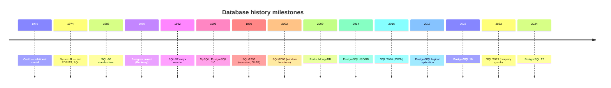

## 5. Problem Statement

### 5.1 What databases solve <a class='askgpt-btn' href='https://chatgpt.com/?prompt=Read%20this%20section%20of%20my%20encyclopedia%20and%20explain%20it%20in%20depth%20with%20concrete%20examples%2C%20the%20main%20trade-offs%2C%20and%20common%20pitfalls%20a%20practitioner%20should%20know%3A%0A%0Ahttps%3A%2F%2Fgithub.com%2Fvishvasg14%2Fsoftware-engineering-encyclopedia%2Fblob%2Fmain%2F03-sql-databases%2Fsql-databases.md%2351-what-databases-solve%0A%0ASection%20title%3A%205.1%20What%20databases%20solve' target='_blank' rel='noopener' data-askgpt='5.1 What databases solve' data-askgpt-url='https://github.com/vishvasg14/software-engineering-encyclopedia/blob/main/03-sql-databases/sql-databases.md#51-what-databases-solve' data-askgpt-prompt-depth='Read%20this%20section%20of%20my%20encyclopedia%20and%20explain%20it%20in%20depth%20with%20concrete%20examples%2C%20the%20main%20trade-offs%2C%20and%20common%20pitfalls%20a%20practitioner%20should%20know%3A%0A%0Ahttps%3A%2F%2Fgithub.com%2Fvishvasg14%2Fsoftware-engineering-encyclopedia%2Fblob%2Fmain%2F03-sql-databases%2Fsql-databases.md%2351-what-databases-solve%0A%0ASection%20title%3A%205.1%20What%20databases%20solve' data-askgpt-prompt-examples='Read%20this%20section%20of%20my%20encyclopedia%20and%20give%20me%202-3%20real-world%20production%20examples%20for%20it.%20For%20each%3A%20what%20went%20right%2C%20what%20went%20wrong%2C%20and%20the%20lessons%20learned.%20Include%20company%20%2F%20project%20names%20if%20relevant.%0A%0Ahttps%3A%2F%2Fgithub.com%2Fvishvasg14%2Fsoftware-engineering-encyclopedia%2Fblob%2Fmain%2F03-sql-databases%2Fsql-databases.md%2351-what-databases-solve%0A%0ASection%20title%3A%205.1%20What%20databases%20solve' title='Ask ChatGPT about this section'>💬</a>

Every non-trivial application needs to:

1. **Persist data** across process restarts and machine failures.
2. **Organize data** for fast retrieval by various access patterns (point lookups, range scans, joins, aggregates).
3. **Enforce integrity** — primary keys, foreign keys, unique constraints, check constraints.
4. **Manage concurrent access** — many users/transactions reading and writing without corrupting data.
5. **Recover from failures** — crashes, power loss, disk failures.
6. **Scale** — to growing data volumes and query rates.

### 5.2 Pre-database reality <a class='askgpt-btn' href='https://chatgpt.com/?prompt=Read%20this%20section%20of%20my%20encyclopedia%20and%20explain%20it%20in%20depth%20with%20concrete%20examples%2C%20the%20main%20trade-offs%2C%20and%20common%20pitfalls%20a%20practitioner%20should%20know%3A%0A%0Ahttps%3A%2F%2Fgithub.com%2Fvishvasg14%2Fsoftware-engineering-encyclopedia%2Fblob%2Fmain%2F03-sql-databases%2Fsql-databases.md%2352-pre-database-reality%0A%0ASection%20title%3A%205.2%20Pre-database%20reality' target='_blank' rel='noopener' data-askgpt='5.2 Pre-database reality' data-askgpt-url='https://github.com/vishvasg14/software-engineering-encyclopedia/blob/main/03-sql-databases/sql-databases.md#52-pre-database-reality' data-askgpt-prompt-depth='Read%20this%20section%20of%20my%20encyclopedia%20and%20explain%20it%20in%20depth%20with%20concrete%20examples%2C%20the%20main%20trade-offs%2C%20and%20common%20pitfalls%20a%20practitioner%20should%20know%3A%0A%0Ahttps%3A%2F%2Fgithub.com%2Fvishvasg14%2Fsoftware-engineering-encyclopedia%2Fblob%2Fmain%2F03-sql-databases%2Fsql-databases.md%2352-pre-database-reality%0A%0ASection%20title%3A%205.2%20Pre-database%20reality' data-askgpt-prompt-examples='Read%20this%20section%20of%20my%20encyclopedia%20and%20give%20me%202-3%20real-world%20production%20examples%20for%20it.%20For%20each%3A%20what%20went%20right%2C%20what%20went%20wrong%2C%20and%20the%20lessons%20learned.%20Include%20company%20%2F%20project%20names%20if%20relevant.%0A%0Ahttps%3A%2F%2Fgithub.com%2Fvishvasg14%2Fsoftware-engineering-encyclopedia%2Fblob%2Fmain%2F03-sql-databases%2Fsql-databases.md%2352-pre-database-reality%0A%0ASection%20title%3A%205.2%20Pre-database%20reality' title='Ask ChatGPT about this section'>💬</a>

Before databases, applications stored data in files managed by application code. Each application reinvented:

- File I/O and serialization.
- Concurrency control (locks, semaphores).
- Crash recovery (logs, two-phase commit).
- Query processing (linear scans, in-memory joins).

This led to repeated bugs, poor performance, and unscalable systems. Databases centralize these concerns with decades of engineering investment.

### 5.3 Why the relational model? <a class='askgpt-btn' href='https://chatgpt.com/?prompt=Read%20this%20section%20of%20my%20encyclopedia%20and%20explain%20it%20in%20depth%20with%20concrete%20examples%2C%20the%20main%20trade-offs%2C%20and%20common%20pitfalls%20a%20practitioner%20should%20know%3A%0A%0Ahttps%3A%2F%2Fgithub.com%2Fvishvasg14%2Fsoftware-engineering-encyclopedia%2Fblob%2Fmain%2F03-sql-databases%2Fsql-databases.md%2353-why-the-relational-model%0A%0ASection%20title%3A%205.3%20Why%20the%20relational%20model%3F' target='_blank' rel='noopener' data-askgpt='5.3 Why the relational model?' data-askgpt-url='https://github.com/vishvasg14/software-engineering-encyclopedia/blob/main/03-sql-databases/sql-databases.md#53-why-the-relational-model' data-askgpt-prompt-depth='Read%20this%20section%20of%20my%20encyclopedia%20and%20explain%20it%20in%20depth%20with%20concrete%20examples%2C%20the%20main%20trade-offs%2C%20and%20common%20pitfalls%20a%20practitioner%20should%20know%3A%0A%0Ahttps%3A%2F%2Fgithub.com%2Fvishvasg14%2Fsoftware-engineering-encyclopedia%2Fblob%2Fmain%2F03-sql-databases%2Fsql-databases.md%2353-why-the-relational-model%0A%0ASection%20title%3A%205.3%20Why%20the%20relational%20model%3F' data-askgpt-prompt-examples='Read%20this%20section%20of%20my%20encyclopedia%20and%20give%20me%202-3%20real-world%20production%20examples%20for%20it.%20For%20each%3A%20what%20went%20right%2C%20what%20went%20wrong%2C%20and%20the%20lessons%20learned.%20Include%20company%20%2F%20project%20names%20if%20relevant.%0A%0Ahttps%3A%2F%2Fgithub.com%2Fvishvasg14%2Fsoftware-engineering-encyclopedia%2Fblob%2Fmain%2F03-sql-databases%2Fsql-databases.md%2353-why-the-relational-model%0A%0ASection%20title%3A%205.3%20Why%20the%20relational%20model%3F' title='Ask ChatGPT about this section'>💬</a>

Codd's relational model won over hierarchical (IMS) and network (CODASYL) models because:

- **Data independence** — applications don't know about physical storage layout.
- **Declarative queries** — SQL says *what* to retrieve, not *how*. The engine optimizes.
- **Mathematical foundation** — relational algebra provides a solid theoretical base for query optimization.
- **Schema flexibility** — adding new attributes and tables doesn't break existing applications.

### 5.4 Why not always relational? <a class='askgpt-btn' href='https://chatgpt.com/?prompt=Read%20this%20section%20of%20my%20encyclopedia%20and%20explain%20it%20in%20depth%20with%20concrete%20examples%2C%20the%20main%20trade-offs%2C%20and%20common%20pitfalls%20a%20practitioner%20should%20know%3A%0A%0Ahttps%3A%2F%2Fgithub.com%2Fvishvasg14%2Fsoftware-engineering-encyclopedia%2Fblob%2Fmain%2F03-sql-databases%2Fsql-databases.md%2354-why-not-always-relational%0A%0ASection%20title%3A%205.4%20Why%20not%20always%20relational%3F' target='_blank' rel='noopener' data-askgpt='5.4 Why not always relational?' data-askgpt-url='https://github.com/vishvasg14/software-engineering-encyclopedia/blob/main/03-sql-databases/sql-databases.md#54-why-not-always-relational' data-askgpt-prompt-depth='Read%20this%20section%20of%20my%20encyclopedia%20and%20explain%20it%20in%20depth%20with%20concrete%20examples%2C%20the%20main%20trade-offs%2C%20and%20common%20pitfalls%20a%20practitioner%20should%20know%3A%0A%0Ahttps%3A%2F%2Fgithub.com%2Fvishvasg14%2Fsoftware-engineering-encyclopedia%2Fblob%2Fmain%2F03-sql-databases%2Fsql-databases.md%2354-why-not-always-relational%0A%0ASection%20title%3A%205.4%20Why%20not%20always%20relational%3F' data-askgpt-prompt-examples='Read%20this%20section%20of%20my%20encyclopedia%20and%20give%20me%202-3%20real-world%20production%20examples%20for%20it.%20For%20each%3A%20what%20went%20right%2C%20what%20went%20wrong%2C%20and%20the%20lessons%20learned.%20Include%20company%20%2F%20project%20names%20if%20relevant.%0A%0Ahttps%3A%2F%2Fgithub.com%2Fvishvasg14%2Fsoftware-engineering-encyclopedia%2Fblob%2Fmain%2F03-sql-databases%2Fsql-databases.md%2354-why-not-always-relational%0A%0ASection%20title%3A%205.4%20Why%20not%20always%20relational%3F' title='Ask ChatGPT about this section'>💬</a>

The relational model isn't a panacea. NoSQL emerged in the 2000s because:

- **Web scale** required horizontal partitioning beyond what a single RDBMS could do.
- **Document data** (nested, evolving schemas) fit poorly into rigid tables.
- **In-memory caches** could answer queries in microseconds vs. milliseconds.
- **Graph traversals** require recursive joins that are inefficient in SQL.

### 5.5 Modern reality <a class='askgpt-btn' href='https://chatgpt.com/?prompt=Read%20this%20section%20of%20my%20encyclopedia%20and%20explain%20it%20in%20depth%20with%20concrete%20examples%2C%20the%20main%20trade-offs%2C%20and%20common%20pitfalls%20a%20practitioner%20should%20know%3A%0A%0Ahttps%3A%2F%2Fgithub.com%2Fvishvasg14%2Fsoftware-engineering-encyclopedia%2Fblob%2Fmain%2F03-sql-databases%2Fsql-databases.md%2355-modern-reality%0A%0ASection%20title%3A%205.5%20Modern%20reality' target='_blank' rel='noopener' data-askgpt='5.5 Modern reality' data-askgpt-url='https://github.com/vishvasg14/software-engineering-encyclopedia/blob/main/03-sql-databases/sql-databases.md#55-modern-reality' data-askgpt-prompt-depth='Read%20this%20section%20of%20my%20encyclopedia%20and%20explain%20it%20in%20depth%20with%20concrete%20examples%2C%20the%20main%20trade-offs%2C%20and%20common%20pitfalls%20a%20practitioner%20should%20know%3A%0A%0Ahttps%3A%2F%2Fgithub.com%2Fvishvasg14%2Fsoftware-engineering-encyclopedia%2Fblob%2Fmain%2F03-sql-databases%2Fsql-databases.md%2355-modern-reality%0A%0ASection%20title%3A%205.5%20Modern%20reality' data-askgpt-prompt-examples='Read%20this%20section%20of%20my%20encyclopedia%20and%20give%20me%202-3%20real-world%20production%20examples%20for%20it.%20For%20each%3A%20what%20went%20right%2C%20what%20went%20wrong%2C%20and%20the%20lessons%20learned.%20Include%20company%20%2F%20project%20names%20if%20relevant.%0A%0Ahttps%3A%2F%2Fgithub.com%2Fvishvasg14%2Fsoftware-engineering-encyclopedia%2Fblob%2Fmain%2F03-sql-databases%2Fsql-databases.md%2355-modern-reality%0A%0ASection%20title%3A%205.5%20Modern%20reality' title='Ask ChatGPT about this section'>💬</a>

In 2026, most production systems use **a mix**:

- A primary RDBMS (PostgreSQL or MySQL) for transactional data.
- A document store (MongoDB) for flexible schemas.
- An in-memory cache (Redis) for hot data.
- An OLAP warehouse (Snowflake, BigQuery, ClickHouse) for analytics.

The relational model remains the workhorse. Most "NoSQL" stores have added SQL-like query languages or full SQL support (e.g., MongoDB's `$sql` aggregation, Cassandra's CQL).

## 6. Real-World Motivation

### 6.1 PostgreSQL at hyperscalers <a class='askgpt-btn' href='https://chatgpt.com/?prompt=Read%20this%20section%20of%20my%20encyclopedia%20and%20explain%20it%20in%20depth%20with%20concrete%20examples%2C%20the%20main%20trade-offs%2C%20and%20common%20pitfalls%20a%20practitioner%20should%20know%3A%0A%0Ahttps%3A%2F%2Fgithub.com%2Fvishvasg14%2Fsoftware-engineering-encyclopedia%2Fblob%2Fmain%2F03-sql-databases%2Fsql-databases.md%2361-postgresql-at-hyperscalers%0A%0ASection%20title%3A%206.1%20PostgreSQL%20at%20hyperscalers' target='_blank' rel='noopener' data-askgpt='6.1 PostgreSQL at hyperscalers' data-askgpt-url='https://github.com/vishvasg14/software-engineering-encyclopedia/blob/main/03-sql-databases/sql-databases.md#61-postgresql-at-hyperscalers' data-askgpt-prompt-depth='Read%20this%20section%20of%20my%20encyclopedia%20and%20explain%20it%20in%20depth%20with%20concrete%20examples%2C%20the%20main%20trade-offs%2C%20and%20common%20pitfalls%20a%20practitioner%20should%20know%3A%0A%0Ahttps%3A%2F%2Fgithub.com%2Fvishvasg14%2Fsoftware-engineering-encyclopedia%2Fblob%2Fmain%2F03-sql-databases%2Fsql-databases.md%2361-postgresql-at-hyperscalers%0A%0ASection%20title%3A%206.1%20PostgreSQL%20at%20hyperscalers' data-askgpt-prompt-examples='Read%20this%20section%20of%20my%20encyclopedia%20and%20give%20me%202-3%20real-world%20production%20examples%20for%20it.%20For%20each%3A%20what%20went%20right%2C%20what%20went%20wrong%2C%20and%20the%20lessons%20learned.%20Include%20company%20%2F%20project%20names%20if%20relevant.%0A%0Ahttps%3A%2F%2Fgithub.com%2Fvishvasg14%2Fsoftware-engineering-encyclopedia%2Fblob%2Fmain%2F03-sql-databases%2Fsql-databases.md%2361-postgresql-at-hyperscalers%0A%0ASection%20title%3A%206.1%20PostgreSQL%20at%20hyperscalers' title='Ask ChatGPT about this section'>💬</a>

**Instagram** — famously runs PostgreSQL at extreme scale. Mike Stonebraker's Berkeley team and Instagram's engineering published detailed accounts of how they sharded PostgreSQL to handle billions of photos and trillions of relationships. Key tactics: schema design, FDW (foreign data wrappers), careful vacuum, custom replication.

**WhatsApp** — runs the world's largest Erlang deployment, but the message store is PostgreSQL. They achieved 2 million connections per server via careful connection pooling and schema design (originally MySQL; later moved some workloads to PostgreSQL).

**GitLab** — uses PostgreSQL as its primary database and contributes extensively to the ecosystem. Their "GitLab Performance Tool" and database operations guides are canonical references.

**Stripe** — runs PostgreSQL for their financial platform, processing billions of transactions. They wrote about schema design for financial data, and built a "WAL-G" tool for PostgreSQL backups (now open source).

**Reddit** — was on a custom Cassandra-like store, but moved comments and core data to PostgreSQL.

**Uber** — had a famous "schemaless" MySQL architecture (document-like data on MySQL). They've since moved many workloads to PostgreSQL and documented the migration.

**Discord** — uses Cassandra for messages (trillions of rows) and PostgreSQL for everything else. Their engineering blog documents this split.

**Cloudflare** — runs PostgreSQL at scale for analytics and configuration data. They've published about their use of `pgcat` and PostgreSQL in production.

### 6.2 Other RDBMS in production <a class='askgpt-btn' href='https://chatgpt.com/?prompt=Read%20this%20section%20of%20my%20encyclopedia%20and%20explain%20it%20in%20depth%20with%20concrete%20examples%2C%20the%20main%20trade-offs%2C%20and%20common%20pitfalls%20a%20practitioner%20should%20know%3A%0A%0Ahttps%3A%2F%2Fgithub.com%2Fvishvasg14%2Fsoftware-engineering-encyclopedia%2Fblob%2Fmain%2F03-sql-databases%2Fsql-databases.md%2362-other-rdbms-in-production%0A%0ASection%20title%3A%206.2%20Other%20RDBMS%20in%20production' target='_blank' rel='noopener' data-askgpt='6.2 Other RDBMS in production' data-askgpt-url='https://github.com/vishvasg14/software-engineering-encyclopedia/blob/main/03-sql-databases/sql-databases.md#62-other-rdbms-in-production' data-askgpt-prompt-depth='Read%20this%20section%20of%20my%20encyclopedia%20and%20explain%20it%20in%20depth%20with%20concrete%20examples%2C%20the%20main%20trade-offs%2C%20and%20common%20pitfalls%20a%20practitioner%20should%20know%3A%0A%0Ahttps%3A%2F%2Fgithub.com%2Fvishvasg14%2Fsoftware-engineering-encyclopedia%2Fblob%2Fmain%2F03-sql-databases%2Fsql-databases.md%2362-other-rdbms-in-production%0A%0ASection%20title%3A%206.2%20Other%20RDBMS%20in%20production' data-askgpt-prompt-examples='Read%20this%20section%20of%20my%20encyclopedia%20and%20give%20me%202-3%20real-world%20production%20examples%20for%20it.%20For%20each%3A%20what%20went%20right%2C%20what%20went%20wrong%2C%20and%20the%20lessons%20learned.%20Include%20company%20%2F%20project%20names%20if%20relevant.%0A%0Ahttps%3A%2F%2Fgithub.com%2Fvishvasg14%2Fsoftware-engineering-encyclopedia%2Fblob%2Fmain%2F03-sql-databases%2Fsql-databases.md%2362-other-rdbms-in-production%0A%0ASection%20title%3A%206.2%20Other%20RDBMS%20in%20production' title='Ask ChatGPT about this section'>💬</a>

**MySQL** — Wikipedia, Facebook (some workloads), YouTube (originally), GitHub (legacy), WordPress (default). MySQL remains the most deployed open-source RDBMS.

**Oracle** — banks, government, ERP systems (SAP), large enterprises.

**SQL Server** — Microsoft ecosystem, enterprise Windows shops.

### 6.3 NoSQL at scale <a class='askgpt-btn' href='https://chatgpt.com/?prompt=Read%20this%20section%20of%20my%20encyclopedia%20and%20explain%20it%20in%20depth%20with%20concrete%20examples%2C%20the%20main%20trade-offs%2C%20and%20common%20pitfalls%20a%20practitioner%20should%20know%3A%0A%0Ahttps%3A%2F%2Fgithub.com%2Fvishvasg14%2Fsoftware-engineering-encyclopedia%2Fblob%2Fmain%2F03-sql-databases%2Fsql-databases.md%2363-nosql-at-scale%0A%0ASection%20title%3A%206.3%20NoSQL%20at%20scale' target='_blank' rel='noopener' data-askgpt='6.3 NoSQL at scale' data-askgpt-url='https://github.com/vishvasg14/software-engineering-encyclopedia/blob/main/03-sql-databases/sql-databases.md#63-nosql-at-scale' data-askgpt-prompt-depth='Read%20this%20section%20of%20my%20encyclopedia%20and%20explain%20it%20in%20depth%20with%20concrete%20examples%2C%20the%20main%20trade-offs%2C%20and%20common%20pitfalls%20a%20practitioner%20should%20know%3A%0A%0Ahttps%3A%2F%2Fgithub.com%2Fvishvasg14%2Fsoftware-engineering-encyclopedia%2Fblob%2Fmain%2F03-sql-databases%2Fsql-databases.md%2363-nosql-at-scale%0A%0ASection%20title%3A%206.3%20NoSQL%20at%20scale' data-askgpt-prompt-examples='Read%20this%20section%20of%20my%20encyclopedia%20and%20give%20me%202-3%20real-world%20production%20examples%20for%20it.%20For%20each%3A%20what%20went%20right%2C%20what%20went%20wrong%2C%20and%20the%20lessons%20learned.%20Include%20company%20%2F%20project%20names%20if%20relevant.%0A%0Ahttps%3A%2F%2Fgithub.com%2Fvishvasg14%2Fsoftware-engineering-encyclopedia%2Fblob%2Fmain%2F03-sql-databases%2Fsql-databases.md%2363-nosql-at-scale%0A%0ASection%20title%3A%206.3%20NoSQL%20at%20scale' title='Ask ChatGPT about this section'>💬</a>

**MongoDB** — EA, eBay, Coinbase, Forbes, Bosch.

**Redis** — Twitter (timeline cache), Instagram, Stack Overflow, Pinterest.

**Cassandra** — Netflix (large-scale data), Discord (messages), Apple (large deployments).

### 6.4 Economic motivation <a class='askgpt-btn' href='https://chatgpt.com/?prompt=Read%20this%20section%20of%20my%20encyclopedia%20and%20explain%20it%20in%20depth%20with%20concrete%20examples%2C%20the%20main%20trade-offs%2C%20and%20common%20pitfalls%20a%20practitioner%20should%20know%3A%0A%0Ahttps%3A%2F%2Fgithub.com%2Fvishvasg14%2Fsoftware-engineering-encyclopedia%2Fblob%2Fmain%2F03-sql-databases%2Fsql-databases.md%2364-economic-motivation%0A%0ASection%20title%3A%206.4%20Economic%20motivation' target='_blank' rel='noopener' data-askgpt='6.4 Economic motivation' data-askgpt-url='https://github.com/vishvasg14/software-engineering-encyclopedia/blob/main/03-sql-databases/sql-databases.md#64-economic-motivation' data-askgpt-prompt-depth='Read%20this%20section%20of%20my%20encyclopedia%20and%20explain%20it%20in%20depth%20with%20concrete%20examples%2C%20the%20main%20trade-offs%2C%20and%20common%20pitfalls%20a%20practitioner%20should%20know%3A%0A%0Ahttps%3A%2F%2Fgithub.com%2Fvishvasg14%2Fsoftware-engineering-encyclopedia%2Fblob%2Fmain%2F03-sql-databases%2Fsql-databases.md%2364-economic-motivation%0A%0ASection%20title%3A%206.4%20Economic%20motivation' data-askgpt-prompt-examples='Read%20this%20section%20of%20my%20encyclopedia%20and%20give%20me%202-3%20real-world%20production%20examples%20for%20it.%20For%20each%3A%20what%20went%20right%2C%20what%20went%20wrong%2C%20and%20the%20lessons%20learned.%20Include%20company%20%2F%20project%20names%20if%20relevant.%0A%0Ahttps%3A%2F%2Fgithub.com%2Fvishvasg14%2Fsoftware-engineering-encyclopedia%2Fblob%2Fmain%2F03-sql-databases%2Fsql-databases.md%2364-economic-motivation%0A%0ASection%20title%3A%206.4%20Economic%20motivation' title='Ask ChatGPT about this section'>💬</a>

- **Storage costs** — efficient schemas, compression, partitioning reduce storage bills.
- **Compute costs** — query optimization and indexing reduce CPU usage.
- **Latency SLOs** — p99 query latency directly affects user experience.
- **Developer velocity** — clear schema and good documentation reduce onboarding time.
- **Compliance** — GDPR, HIPAA, PCI-DSS require data governance that databases help enforce.

### 6.5 Why not alternatives? <a class='askgpt-btn' href='https://chatgpt.com/?prompt=Read%20this%20section%20of%20my%20encyclopedia%20and%20explain%20it%20in%20depth%20with%20concrete%20examples%2C%20the%20main%20trade-offs%2C%20and%20common%20pitfalls%20a%20practitioner%20should%20know%3A%0A%0Ahttps%3A%2F%2Fgithub.com%2Fvishvasg14%2Fsoftware-engineering-encyclopedia%2Fblob%2Fmain%2F03-sql-databases%2Fsql-databases.md%2365-why-not-alternatives%0A%0ASection%20title%3A%206.5%20Why%20not%20alternatives%3F' target='_blank' rel='noopener' data-askgpt='6.5 Why not alternatives?' data-askgpt-url='https://github.com/vishvasg14/software-engineering-encyclopedia/blob/main/03-sql-databases/sql-databases.md#65-why-not-alternatives' data-askgpt-prompt-depth='Read%20this%20section%20of%20my%20encyclopedia%20and%20explain%20it%20in%20depth%20with%20concrete%20examples%2C%20the%20main%20trade-offs%2C%20and%20common%20pitfalls%20a%20practitioner%20should%20know%3A%0A%0Ahttps%3A%2F%2Fgithub.com%2Fvishvasg14%2Fsoftware-engineering-encyclopedia%2Fblob%2Fmain%2F03-sql-databases%2Fsql-databases.md%2365-why-not-alternatives%0A%0ASection%20title%3A%206.5%20Why%20not%20alternatives%3F' data-askgpt-prompt-examples='Read%20this%20section%20of%20my%20encyclopedia%20and%20give%20me%202-3%20real-world%20production%20examples%20for%20it.%20For%20each%3A%20what%20went%20right%2C%20what%20went%20wrong%2C%20and%20the%20lessons%20learned.%20Include%20company%20%2F%20project%20names%20if%20relevant.%0A%0Ahttps%3A%2F%2Fgithub.com%2Fvishvasg14%2Fsoftware-engineering-encyclopedia%2Fblob%2Fmain%2F03-sql-databases%2Fsql-databases.md%2365-why-not-alternatives%0A%0ASection%20title%3A%206.5%20Why%20not%20alternatives%3F' title='Ask ChatGPT about this section'>💬</a>

| Alternative | Why enterprises don't migrate wholesale |
|-------------|------------------------------------------|
| Custom file-based stores | Have to reinvent all DB features; security, reliability, performance suffer |
| Object databases | Mostly disappeared; object-relational mapping to RDBMS dominates |
| XML databases | Specialized, niche |
| Graph-only databases (Neo4j) | Useful for specific graph workloads; not general-purpose |
| Blockchain | Throughput, latency, and consensus overhead make it unsuitable for OLTP |

### 6.6 Performance motivation <a class='askgpt-btn' href='https://chatgpt.com/?prompt=Read%20this%20section%20of%20my%20encyclopedia%20and%20explain%20it%20in%20depth%20with%20concrete%20examples%2C%20the%20main%20trade-offs%2C%20and%20common%20pitfalls%20a%20practitioner%20should%20know%3A%0A%0Ahttps%3A%2F%2Fgithub.com%2Fvishvasg14%2Fsoftware-engineering-encyclopedia%2Fblob%2Fmain%2F03-sql-databases%2Fsql-databases.md%2366-performance-motivation%0A%0ASection%20title%3A%206.6%20Performance%20motivation' target='_blank' rel='noopener' data-askgpt='6.6 Performance motivation' data-askgpt-url='https://github.com/vishvasg14/software-engineering-encyclopedia/blob/main/03-sql-databases/sql-databases.md#66-performance-motivation' data-askgpt-prompt-depth='Read%20this%20section%20of%20my%20encyclopedia%20and%20explain%20it%20in%20depth%20with%20concrete%20examples%2C%20the%20main%20trade-offs%2C%20and%20common%20pitfalls%20a%20practitioner%20should%20know%3A%0A%0Ahttps%3A%2F%2Fgithub.com%2Fvishvasg14%2Fsoftware-engineering-encyclopedia%2Fblob%2Fmain%2F03-sql-databases%2Fsql-databases.md%2366-performance-motivation%0A%0ASection%20title%3A%206.6%20Performance%20motivation' data-askgpt-prompt-examples='Read%20this%20section%20of%20my%20encyclopedia%20and%20give%20me%202-3%20real-world%20production%20examples%20for%20it.%20For%20each%3A%20what%20went%20right%2C%20what%20went%20wrong%2C%20and%20the%20lessons%20learned.%20Include%20company%20%2F%20project%20names%20if%20relevant.%0A%0Ahttps%3A%2F%2Fgithub.com%2Fvishvasg14%2Fsoftware-engineering-encyclopedia%2Fblob%2Fmain%2F03-sql-databases%2Fsql-databases.md%2366-performance-motivation%0A%0ASection%20title%3A%206.6%20Performance%20motivation' title='Ask ChatGPT about this section'>💬</a>

- **JIT and vectorization** in modern query engines — PostgreSQL added JIT in PG 11; HyPer and MemSQL pioneered vectorized execution.
- **MVCC** allows readers and writers to not block each other, dramatically improving concurrency.
- **Cost-based optimization** with up-to-date statistics lets the planner pick good plans automatically.
- **Index-only scans** answer queries without touching the heap.
- **Parallel query execution** uses multiple cores for a single query (PG 9.6+).

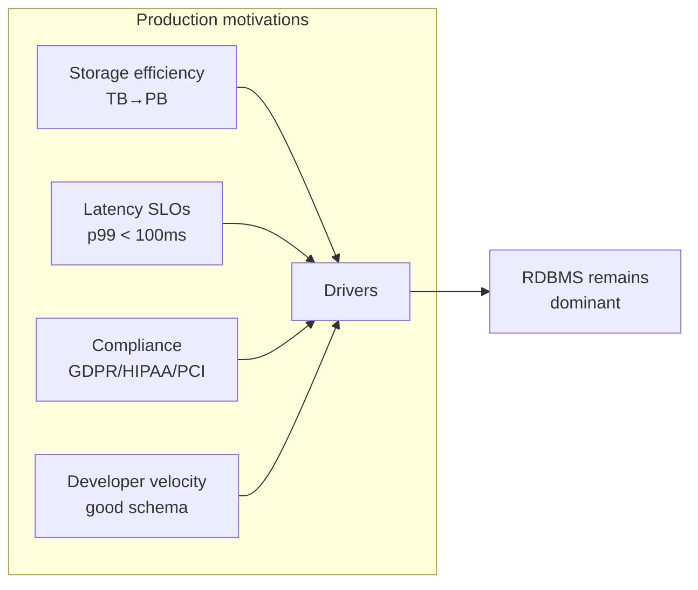

---

## 7. Internal Working

### 7.1 The lifecycle of a SQL query <a class='askgpt-btn' href='https://chatgpt.com/?prompt=Read%20this%20section%20of%20my%20encyclopedia%20and%20explain%20it%20in%20depth%20with%20concrete%20examples%2C%20the%20main%20trade-offs%2C%20and%20common%20pitfalls%20a%20practitioner%20should%20know%3A%0A%0Ahttps%3A%2F%2Fgithub.com%2Fvishvasg14%2Fsoftware-engineering-encyclopedia%2Fblob%2Fmain%2F03-sql-databases%2Fsql-databases.md%2371-the-lifecycle-of-a-sql-query%0A%0ASection%20title%3A%207.1%20The%20lifecycle%20of%20a%20SQL%20query' target='_blank' rel='noopener' data-askgpt='7.1 The lifecycle of a SQL query' data-askgpt-url='https://github.com/vishvasg14/software-engineering-encyclopedia/blob/main/03-sql-databases/sql-databases.md#71-the-lifecycle-of-a-sql-query' data-askgpt-prompt-depth='Read%20this%20section%20of%20my%20encyclopedia%20and%20explain%20it%20in%20depth%20with%20concrete%20examples%2C%20the%20main%20trade-offs%2C%20and%20common%20pitfalls%20a%20practitioner%20should%20know%3A%0A%0Ahttps%3A%2F%2Fgithub.com%2Fvishvasg14%2Fsoftware-engineering-encyclopedia%2Fblob%2Fmain%2F03-sql-databases%2Fsql-databases.md%2371-the-lifecycle-of-a-sql-query%0A%0ASection%20title%3A%207.1%20The%20lifecycle%20of%20a%20SQL%20query' data-askgpt-prompt-examples='Read%20this%20section%20of%20my%20encyclopedia%20and%20give%20me%202-3%20real-world%20production%20examples%20for%20it.%20For%20each%3A%20what%20went%20right%2C%20what%20went%20wrong%2C%20and%20the%20lessons%20learned.%20Include%20company%20%2F%20project%20names%20if%20relevant.%0A%0Ahttps%3A%2F%2Fgithub.com%2Fvishvasg14%2Fsoftware-engineering-encyclopedia%2Fblob%2Fmain%2F03-sql-databases%2Fsql-databases.md%2371-the-lifecycle-of-a-sql-query%0A%0ASection%20title%3A%207.1%20The%20lifecycle%20of%20a%20SQL%20query' title='Ask ChatGPT about this section'>💬</a>

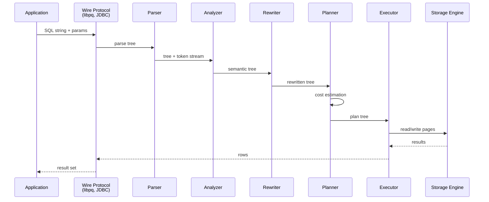

### 7.2 PostgreSQL process model <a class='askgpt-btn' href='https://chatgpt.com/?prompt=Read%20this%20section%20of%20my%20encyclopedia%20and%20explain%20it%20in%20depth%20with%20concrete%20examples%2C%20the%20main%20trade-offs%2C%20and%20common%20pitfalls%20a%20practitioner%20should%20know%3A%0A%0Ahttps%3A%2F%2Fgithub.com%2Fvishvasg14%2Fsoftware-engineering-encyclopedia%2Fblob%2Fmain%2F03-sql-databases%2Fsql-databases.md%2372-postgresql-process-model%0A%0ASection%20title%3A%207.2%20PostgreSQL%20process%20model' target='_blank' rel='noopener' data-askgpt='7.2 PostgreSQL process model' data-askgpt-url='https://github.com/vishvasg14/software-engineering-encyclopedia/blob/main/03-sql-databases/sql-databases.md#72-postgresql-process-model' data-askgpt-prompt-depth='Read%20this%20section%20of%20my%20encyclopedia%20and%20explain%20it%20in%20depth%20with%20concrete%20examples%2C%20the%20main%20trade-offs%2C%20and%20common%20pitfalls%20a%20practitioner%20should%20know%3A%0A%0Ahttps%3A%2F%2Fgithub.com%2Fvishvasg14%2Fsoftware-engineering-encyclopedia%2Fblob%2Fmain%2F03-sql-databases%2Fsql-databases.md%2372-postgresql-process-model%0A%0ASection%20title%3A%207.2%20PostgreSQL%20process%20model' data-askgpt-prompt-examples='Read%20this%20section%20of%20my%20encyclopedia%20and%20give%20me%202-3%20real-world%20production%20examples%20for%20it.%20For%20each%3A%20what%20went%20right%2C%20what%20went%20wrong%2C%20and%20the%20lessons%20learned.%20Include%20company%20%2F%20project%20names%20if%20relevant.%0A%0Ahttps%3A%2F%2Fgithub.com%2Fvishvasg14%2Fsoftware-engineering-encyclopedia%2Fblob%2Fmain%2F03-sql-databases%2Fsql-databases.md%2372-postgresql-process-model%0A%0ASection%20title%3A%207.2%20PostgreSQL%20process%20model' title='Ask ChatGPT about this section'>💬</a>

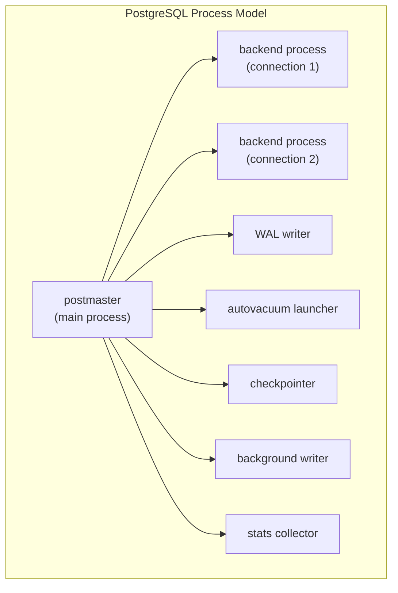

**Key facts:**

- One OS process per client connection (process-per-backend model). Expensive on connection-heavy workloads; mitigated by PgBouncer.
- Shared memory holds the buffer pool and other state.
- WAL writer serializes WAL records to disk.
- Autovacuum runs VACUUM and ANALYZE in the background.
- Background writer flushes dirty pages from buffer pool to disk.

### 7.3 Subsystems that participate <a class='askgpt-btn' href='https://chatgpt.com/?prompt=Read%20this%20section%20of%20my%20encyclopedia%20and%20explain%20it%20in%20depth%20with%20concrete%20examples%2C%20the%20main%20trade-offs%2C%20and%20common%20pitfalls%20a%20practitioner%20should%20know%3A%0A%0Ahttps%3A%2F%2Fgithub.com%2Fvishvasg14%2Fsoftware-engineering-encyclopedia%2Fblob%2Fmain%2F03-sql-databases%2Fsql-databases.md%2373-subsystems-that-participate%0A%0ASection%20title%3A%207.3%20Subsystems%20that%20participate' target='_blank' rel='noopener' data-askgpt='7.3 Subsystems that participate' data-askgpt-url='https://github.com/vishvasg14/software-engineering-encyclopedia/blob/main/03-sql-databases/sql-databases.md#73-subsystems-that-participate' data-askgpt-prompt-depth='Read%20this%20section%20of%20my%20encyclopedia%20and%20explain%20it%20in%20depth%20with%20concrete%20examples%2C%20the%20main%20trade-offs%2C%20and%20common%20pitfalls%20a%20practitioner%20should%20know%3A%0A%0Ahttps%3A%2F%2Fgithub.com%2Fvishvasg14%2Fsoftware-engineering-encyclopedia%2Fblob%2Fmain%2F03-sql-databases%2Fsql-databases.md%2373-subsystems-that-participate%0A%0ASection%20title%3A%207.3%20Subsystems%20that%20participate' data-askgpt-prompt-examples='Read%20this%20section%20of%20my%20encyclopedia%20and%20give%20me%202-3%20real-world%20production%20examples%20for%20it.%20For%20each%3A%20what%20went%20right%2C%20what%20went%20wrong%2C%20and%20the%20lessons%20learned.%20Include%20company%20%2F%20project%20names%20if%20relevant.%0A%0Ahttps%3A%2F%2Fgithub.com%2Fvishvasg14%2Fsoftware-engineering-encyclopedia%2Fblob%2Fmain%2F03-sql-databases%2Fsql-databases.md%2373-subsystems-that-participate%0A%0ASection%20title%3A%207.3%20Subsystems%20that%20participate' title='Ask ChatGPT about this section'>💬</a>

| Subsystem | Responsibility | Source location (PG) |
|-----------|---------------|---------------------|
| **Parser** | SQL text → parse tree | `src/backend/parser/` |
| **Analyzer** | Semantic analysis, type resolution | `src/backend/parser/analyze.c` |
| **Rewriter** | Apply rule transformations | `src/backend/rewrite/` |
| **Planner/Optimizer** | Cost-based plan selection | `src/backend/optimizer/` |
| **Executor** | Run the plan tree | `src/backend/executor/` |
| **Storage manager** | Heap, indexes, TOAST | `src/backend/storage/` |
| **Buffer manager** | Buffer pool + replacement | `src/backend/storage/buffer/` |
| **WAL** | Write-Ahead Logging | `src/backend/access/transam/` |
| **Lock manager** | Heavy-weight locks | `src/backend/storage/lmgr/` |
| **Transaction manager** | MVCC, snapshots | `src/backend/access/transam/` |

## 8. Deep Dive

This section is the heart of the document. Each subsection treats a major subsystem in depth.

### 8.1 The relational model <a class='askgpt-btn' href='https://chatgpt.com/?prompt=Read%20this%20section%20of%20my%20encyclopedia%20and%20explain%20it%20in%20depth%20with%20concrete%20examples%2C%20the%20main%20trade-offs%2C%20and%20common%20pitfalls%20a%20practitioner%20should%20know%3A%0A%0Ahttps%3A%2F%2Fgithub.com%2Fvishvasg14%2Fsoftware-engineering-encyclopedia%2Fblob%2Fmain%2F03-sql-databases%2Fsql-databases.md%2381-the-relational-model%0A%0ASection%20title%3A%208.1%20The%20relational%20model' target='_blank' rel='noopener' data-askgpt='8.1 The relational model' data-askgpt-url='https://github.com/vishvasg14/software-engineering-encyclopedia/blob/main/03-sql-databases/sql-databases.md#81-the-relational-model' data-askgpt-prompt-depth='Read%20this%20section%20of%20my%20encyclopedia%20and%20explain%20it%20in%20depth%20with%20concrete%20examples%2C%20the%20main%20trade-offs%2C%20and%20common%20pitfalls%20a%20practitioner%20should%20know%3A%0A%0Ahttps%3A%2F%2Fgithub.com%2Fvishvasg14%2Fsoftware-engineering-encyclopedia%2Fblob%2Fmain%2F03-sql-databases%2Fsql-databases.md%2381-the-relational-model%0A%0ASection%20title%3A%208.1%20The%20relational%20model' data-askgpt-prompt-examples='Read%20this%20section%20of%20my%20encyclopedia%20and%20give%20me%202-3%20real-world%20production%20examples%20for%20it.%20For%20each%3A%20what%20went%20right%2C%20what%20went%20wrong%2C%20and%20the%20lessons%20learned.%20Include%20company%20%2F%20project%20names%20if%20relevant.%0A%0Ahttps%3A%2F%2Fgithub.com%2Fvishvasg14%2Fsoftware-engineering-encyclopedia%2Fblob%2Fmain%2F03-sql-databases%2Fsql-databases.md%2381-the-relational-model%0A%0ASection%20title%3A%208.1%20The%20relational%20model' title='Ask ChatGPT about this section'>💬</a>

Codd's relational model defines:

- **Relation** — a table with a name and a heading (set of attributes).
- **Tuple** — a row in a relation.
- **Attribute** — a named column with a domain (type).
- **Key** — a minimal subset of attributes that uniquely identifies a tuple.
- **Schema** — the set of relations and their definitions.

The model's key insight: **the physical storage layout is independent of the logical structure**. Applications interact with the model declaratively, and the engine handles the implementation.

### 8.2 SQL anatomy <a class='askgpt-btn' href='https://chatgpt.com/?prompt=Read%20this%20section%20of%20my%20encyclopedia%20and%20explain%20it%20in%20depth%20with%20concrete%20examples%2C%20the%20main%20trade-offs%2C%20and%20common%20pitfalls%20a%20practitioner%20should%20know%3A%0A%0Ahttps%3A%2F%2Fgithub.com%2Fvishvasg14%2Fsoftware-engineering-encyclopedia%2Fblob%2Fmain%2F03-sql-databases%2Fsql-databases.md%2382-sql-anatomy%0A%0ASection%20title%3A%208.2%20SQL%20anatomy' target='_blank' rel='noopener' data-askgpt='8.2 SQL anatomy' data-askgpt-url='https://github.com/vishvasg14/software-engineering-encyclopedia/blob/main/03-sql-databases/sql-databases.md#82-sql-anatomy' data-askgpt-prompt-depth='Read%20this%20section%20of%20my%20encyclopedia%20and%20explain%20it%20in%20depth%20with%20concrete%20examples%2C%20the%20main%20trade-offs%2C%20and%20common%20pitfalls%20a%20practitioner%20should%20know%3A%0A%0Ahttps%3A%2F%2Fgithub.com%2Fvishvasg14%2Fsoftware-engineering-encyclopedia%2Fblob%2Fmain%2F03-sql-databases%2Fsql-databases.md%2382-sql-anatomy%0A%0ASection%20title%3A%208.2%20SQL%20anatomy' data-askgpt-prompt-examples='Read%20this%20section%20of%20my%20encyclopedia%20and%20give%20me%202-3%20real-world%20production%20examples%20for%20it.%20For%20each%3A%20what%20went%20right%2C%20what%20went%20wrong%2C%20and%20the%20lessons%20learned.%20Include%20company%20%2F%20project%20names%20if%20relevant.%0A%0Ahttps%3A%2F%2Fgithub.com%2Fvishvasg14%2Fsoftware-engineering-encyclopedia%2Fblob%2Fmain%2F03-sql-databases%2Fsql-databases.md%2382-sql-anatomy%0A%0ASection%20title%3A%208.2%20SQL%20anatomy' title='Ask ChatGPT about this section'>💬</a>

A SQL statement has five major clause categories:

```sql
SELECT [DISTINCT] select_list              -- projection
FROM from_clause                           -- source
[WHERE condition]                          -- row filter
[GROUP BY grouping_columns]                -- aggregation
[HAVING aggregate_condition]               -- aggregate filter
[ORDER BY sort_columns [ASC|DESC]]         -- sort
[LIMIT n [OFFSET m]]                       -- result limiting
```

### 8.3 Joins <a class='askgpt-btn' href='https://chatgpt.com/?prompt=Read%20this%20section%20of%20my%20encyclopedia%20and%20explain%20it%20in%20depth%20with%20concrete%20examples%2C%20the%20main%20trade-offs%2C%20and%20common%20pitfalls%20a%20practitioner%20should%20know%3A%0A%0Ahttps%3A%2F%2Fgithub.com%2Fvishvasg14%2Fsoftware-engineering-encyclopedia%2Fblob%2Fmain%2F03-sql-databases%2Fsql-databases.md%2383-joins%0A%0ASection%20title%3A%208.3%20Joins' target='_blank' rel='noopener' data-askgpt='8.3 Joins' data-askgpt-url='https://github.com/vishvasg14/software-engineering-encyclopedia/blob/main/03-sql-databases/sql-databases.md#83-joins' data-askgpt-prompt-depth='Read%20this%20section%20of%20my%20encyclopedia%20and%20explain%20it%20in%20depth%20with%20concrete%20examples%2C%20the%20main%20trade-offs%2C%20and%20common%20pitfalls%20a%20practitioner%20should%20know%3A%0A%0Ahttps%3A%2F%2Fgithub.com%2Fvishvasg14%2Fsoftware-engineering-encyclopedia%2Fblob%2Fmain%2F03-sql-databases%2Fsql-databases.md%2383-joins%0A%0ASection%20title%3A%208.3%20Joins' data-askgpt-prompt-examples='Read%20this%20section%20of%20my%20encyclopedia%20and%20give%20me%202-3%20real-world%20production%20examples%20for%20it.%20For%20each%3A%20what%20went%20right%2C%20what%20went%20wrong%2C%20and%20the%20lessons%20learned.%20Include%20company%20%2F%20project%20names%20if%20relevant.%0A%0Ahttps%3A%2F%2Fgithub.com%2Fvishvasg14%2Fsoftware-engineering-encyclopedia%2Fblob%2Fmain%2F03-sql-databases%2Fsql-databases.md%2383-joins%0A%0ASection%20title%3A%208.3%20Joins' title='Ask ChatGPT about this section'>💬</a>

| Join type | Returns |
|-----------|---------|
| **INNER JOIN** | Rows with matches in both tables |
| **LEFT OUTER JOIN** | All left rows + matching right rows (NULL if no match) |
| **RIGHT OUTER JOIN** | All right rows + matching left rows |
| **FULL OUTER JOIN** | All rows from both sides |
| **CROSS JOIN** | Cartesian product |
| **LATERAL** | Subquery can reference preceding FROM items (SQL:2003+) |

```sql
-- Implicit join syntax (old-style, still works)
SELECT *
FROM orders o, customers c
WHERE o.customer_id = c.id;

-- Explicit join syntax (preferred)
SELECT *
FROM orders o
INNER JOIN customers c ON o.customer_id = c.id;
```

### 8.4 Set operations <a class='askgpt-btn' href='https://chatgpt.com/?prompt=Read%20this%20section%20of%20my%20encyclopedia%20and%20explain%20it%20in%20depth%20with%20concrete%20examples%2C%20the%20main%20trade-offs%2C%20and%20common%20pitfalls%20a%20practitioner%20should%20know%3A%0A%0Ahttps%3A%2F%2Fgithub.com%2Fvishvasg14%2Fsoftware-engineering-encyclopedia%2Fblob%2Fmain%2F03-sql-databases%2Fsql-databases.md%2384-set-operations%0A%0ASection%20title%3A%208.4%20Set%20operations' target='_blank' rel='noopener' data-askgpt='8.4 Set operations' data-askgpt-url='https://github.com/vishvasg14/software-engineering-encyclopedia/blob/main/03-sql-databases/sql-databases.md#84-set-operations' data-askgpt-prompt-depth='Read%20this%20section%20of%20my%20encyclopedia%20and%20explain%20it%20in%20depth%20with%20concrete%20examples%2C%20the%20main%20trade-offs%2C%20and%20common%20pitfalls%20a%20practitioner%20should%20know%3A%0A%0Ahttps%3A%2F%2Fgithub.com%2Fvishvasg14%2Fsoftware-engineering-encyclopedia%2Fblob%2Fmain%2F03-sql-databases%2Fsql-databases.md%2384-set-operations%0A%0ASection%20title%3A%208.4%20Set%20operations' data-askgpt-prompt-examples='Read%20this%20section%20of%20my%20encyclopedia%20and%20give%20me%202-3%20real-world%20production%20examples%20for%20it.%20For%20each%3A%20what%20went%20right%2C%20what%20went%20wrong%2C%20and%20the%20lessons%20learned.%20Include%20company%20%2F%20project%20names%20if%20relevant.%0A%0Ahttps%3A%2F%2Fgithub.com%2Fvishvasg14%2Fsoftware-engineering-encyclopedia%2Fblob%2Fmain%2F03-sql-databases%2Fsql-databases.md%2384-set-operations%0A%0ASection%20title%3A%208.4%20Set%20operations' title='Ask ChatGPT about this section'>💬</a>

```sql
SELECT name FROM customers
UNION                           -- dedup
SELECT name FROM suppliers;

SELECT name FROM customers
UNION ALL                       -- preserve duplicates
SELECT name FROM suppliers;

SELECT name FROM customers
INTERSECT                       -- in both
SELECT name FROM suppliers;

SELECT name FROM customers
EXCEPT                          -- in first but not second
SELECT name FROM suppliers;
```

### 8.5 Subqueries <a class='askgpt-btn' href='https://chatgpt.com/?prompt=Read%20this%20section%20of%20my%20encyclopedia%20and%20explain%20it%20in%20depth%20with%20concrete%20examples%2C%20the%20main%20trade-offs%2C%20and%20common%20pitfalls%20a%20practitioner%20should%20know%3A%0A%0Ahttps%3A%2F%2Fgithub.com%2Fvishvasg14%2Fsoftware-engineering-encyclopedia%2Fblob%2Fmain%2F03-sql-databases%2Fsql-databases.md%2385-subqueries%0A%0ASection%20title%3A%208.5%20Subqueries' target='_blank' rel='noopener' data-askgpt='8.5 Subqueries' data-askgpt-url='https://github.com/vishvasg14/software-engineering-encyclopedia/blob/main/03-sql-databases/sql-databases.md#85-subqueries' data-askgpt-prompt-depth='Read%20this%20section%20of%20my%20encyclopedia%20and%20explain%20it%20in%20depth%20with%20concrete%20examples%2C%20the%20main%20trade-offs%2C%20and%20common%20pitfalls%20a%20practitioner%20should%20know%3A%0A%0Ahttps%3A%2F%2Fgithub.com%2Fvishvasg14%2Fsoftware-engineering-encyclopedia%2Fblob%2Fmain%2F03-sql-databases%2Fsql-databases.md%2385-subqueries%0A%0ASection%20title%3A%208.5%20Subqueries' data-askgpt-prompt-examples='Read%20this%20section%20of%20my%20encyclopedia%20and%20give%20me%202-3%20real-world%20production%20examples%20for%20it.%20For%20each%3A%20what%20went%20right%2C%20what%20went%20wrong%2C%20and%20the%20lessons%20learned.%20Include%20company%20%2F%20project%20names%20if%20relevant.%0A%0Ahttps%3A%2F%2Fgithub.com%2Fvishvasg14%2Fsoftware-engineering-encyclopedia%2Fblob%2Fmain%2F03-sql-databases%2Fsql-databases.md%2385-subqueries%0A%0ASection%20title%3A%208.5%20Subqueries' title='Ask ChatGPT about this section'>💬</a>

- **Scalar subquery** — returns a single value: `WHERE x = (SELECT MAX(y) FROM t)`.
- **IN / NOT IN** — `WHERE x IN (SELECT ...)`.
- **EXISTS** — `WHERE EXISTS (SELECT 1 FROM ...)` — checks for any row.
- **Correlated** — subquery references outer query.

### 8.6 Aggregates and GROUP BY <a class='askgpt-btn' href='https://chatgpt.com/?prompt=Read%20this%20section%20of%20my%20encyclopedia%20and%20explain%20it%20in%20depth%20with%20concrete%20examples%2C%20the%20main%20trade-offs%2C%20and%20common%20pitfalls%20a%20practitioner%20should%20know%3A%0A%0Ahttps%3A%2F%2Fgithub.com%2Fvishvasg14%2Fsoftware-engineering-encyclopedia%2Fblob%2Fmain%2F03-sql-databases%2Fsql-databases.md%2386-aggregates-and-group-by%0A%0ASection%20title%3A%208.6%20Aggregates%20and%20GROUP%20BY' target='_blank' rel='noopener' data-askgpt='8.6 Aggregates and GROUP BY' data-askgpt-url='https://github.com/vishvasg14/software-engineering-encyclopedia/blob/main/03-sql-databases/sql-databases.md#86-aggregates-and-group-by' data-askgpt-prompt-depth='Read%20this%20section%20of%20my%20encyclopedia%20and%20explain%20it%20in%20depth%20with%20concrete%20examples%2C%20the%20main%20trade-offs%2C%20and%20common%20pitfalls%20a%20practitioner%20should%20know%3A%0A%0Ahttps%3A%2F%2Fgithub.com%2Fvishvasg14%2Fsoftware-engineering-encyclopedia%2Fblob%2Fmain%2F03-sql-databases%2Fsql-databases.md%2386-aggregates-and-group-by%0A%0ASection%20title%3A%208.6%20Aggregates%20and%20GROUP%20BY' data-askgpt-prompt-examples='Read%20this%20section%20of%20my%20encyclopedia%20and%20give%20me%202-3%20real-world%20production%20examples%20for%20it.%20For%20each%3A%20what%20went%20right%2C%20what%20went%20wrong%2C%20and%20the%20lessons%20learned.%20Include%20company%20%2F%20project%20names%20if%20relevant.%0A%0Ahttps%3A%2F%2Fgithub.com%2Fvishvasg14%2Fsoftware-engineering-encyclopedia%2Fblob%2Fmain%2F03-sql-databases%2Fsql-databases.md%2386-aggregates-and-group-by%0A%0ASection%20title%3A%208.6%20Aggregates%20and%20GROUP%20BY' title='Ask ChatGPT about this section'>💬</a>

```sql
SELECT
    department,
    COUNT(*) AS n,
    AVG(salary) AS avg_salary,
    MAX(hire_date) AS most_recent
FROM employees
WHERE active = true
GROUP BY department
HAVING COUNT(*) > 5
ORDER BY avg_salary DESC
LIMIT 10;
```

Important: in standard SQL, every column in SELECT must be in GROUP BY or inside an aggregate. PostgreSQL allows functional dependency inference (primary key determines other columns), so you don't need to group by every selected column when the primary key is in GROUP BY.

### 8.7 Window functions <a class='askgpt-btn' href='https://chatgpt.com/?prompt=Read%20this%20section%20of%20my%20encyclopedia%20and%20explain%20it%20in%20depth%20with%20concrete%20examples%2C%20the%20main%20trade-offs%2C%20and%20common%20pitfalls%20a%20practitioner%20should%20know%3A%0A%0Ahttps%3A%2F%2Fgithub.com%2Fvishvasg14%2Fsoftware-engineering-encyclopedia%2Fblob%2Fmain%2F03-sql-databases%2Fsql-databases.md%2387-window-functions%0A%0ASection%20title%3A%208.7%20Window%20functions' target='_blank' rel='noopener' data-askgpt='8.7 Window functions' data-askgpt-url='https://github.com/vishvasg14/software-engineering-encyclopedia/blob/main/03-sql-databases/sql-databases.md#87-window-functions' data-askgpt-prompt-depth='Read%20this%20section%20of%20my%20encyclopedia%20and%20explain%20it%20in%20depth%20with%20concrete%20examples%2C%20the%20main%20trade-offs%2C%20and%20common%20pitfalls%20a%20practitioner%20should%20know%3A%0A%0Ahttps%3A%2F%2Fgithub.com%2Fvishvasg14%2Fsoftware-engineering-encyclopedia%2Fblob%2Fmain%2F03-sql-databases%2Fsql-databases.md%2387-window-functions%0A%0ASection%20title%3A%208.7%20Window%20functions' data-askgpt-prompt-examples='Read%20this%20section%20of%20my%20encyclopedia%20and%20give%20me%202-3%20real-world%20production%20examples%20for%20it.%20For%20each%3A%20what%20went%20right%2C%20what%20went%20wrong%2C%20and%20the%20lessons%20learned.%20Include%20company%20%2F%20project%20names%20if%20relevant.%0A%0Ahttps%3A%2F%2Fgithub.com%2Fvishvasg14%2Fsoftware-engineering-encyclopedia%2Fblob%2Fmain%2F03-sql-databases%2Fsql-databases.md%2387-window-functions%0A%0ASection%20title%3A%208.7%20Window%20functions' title='Ask ChatGPT about this section'>💬</a>

SQL:2003 introduced window functions. They compute values across a set of rows related to the current row, **without collapsing** the result set like aggregates do.

```sql
SELECT
    employee_id,
    department,
    salary,
    -- department rank (highest salary = rank 1)
    RANK() OVER (PARTITION BY department ORDER BY salary DESC) AS dept_rank,
    -- overall rank
    RANK() OVER (ORDER BY salary DESC) AS overall_rank,
    -- running total within department
    SUM(salary) OVER (PARTITION BY department ORDER BY hire_date) AS running_total,
    -- previous employee's salary
    LAG(salary, 1, 0) OVER (ORDER BY hire_date) AS prev_salary,
    -- next hire date
    LEAD(hire_date) OVER (ORDER BY hire_date) AS next_hire
FROM employees;
```

**Window function clauses:**

- `PARTITION BY` — like GROUP BY but doesn't collapse.
- `ORDER BY` — order within partition.
- Frame clause: `ROWS BETWEEN UNBOUNDED PRECEDING AND CURRENT ROW` — defines which rows the function sees.

**Common window functions:**

| Function | Purpose |
|----------|---------|
| `ROW_NUMBER()` | 1-based row number |
| `RANK()` | Rank with gaps (1, 2, 2, 4) |
| `DENSE_RANK()` | Rank without gaps (1, 2, 2, 3) |
| `NTILE(n)` | Divide into n buckets |
| `LAG(x, n, default)` | n-th previous row's x |
| `LEAD(x, n, default)` | n-th next row's x |
| `FIRST_VALUE(x)` | First in window |
| `LAST_VALUE(x)` | Last in window |
| `SUM/AVG/MIN/MAX(x)` | Aggregates over window |
| `PERCENT_RANK()`, `CUME_DIST()` | Distribution |

### 8.8 CTEs (Common Table Expressions) <a class='askgpt-btn' href='https://chatgpt.com/?prompt=Read%20this%20section%20of%20my%20encyclopedia%20and%20explain%20it%20in%20depth%20with%20concrete%20examples%2C%20the%20main%20trade-offs%2C%20and%20common%20pitfalls%20a%20practitioner%20should%20know%3A%0A%0Ahttps%3A%2F%2Fgithub.com%2Fvishvasg14%2Fsoftware-engineering-encyclopedia%2Fblob%2Fmain%2F03-sql-databases%2Fsql-databases.md%2388-ctes-common-table-expressions%0A%0ASection%20title%3A%208.8%20CTEs%20(Common%20Table%20Expressions)' target='_blank' rel='noopener' data-askgpt='8.8 CTEs (Common Table Expressions)' data-askgpt-url='https://github.com/vishvasg14/software-engineering-encyclopedia/blob/main/03-sql-databases/sql-databases.md#88-ctes-common-table-expressions' data-askgpt-prompt-depth='Read%20this%20section%20of%20my%20encyclopedia%20and%20explain%20it%20in%20depth%20with%20concrete%20examples%2C%20the%20main%20trade-offs%2C%20and%20common%20pitfalls%20a%20practitioner%20should%20know%3A%0A%0Ahttps%3A%2F%2Fgithub.com%2Fvishvasg14%2Fsoftware-engineering-encyclopedia%2Fblob%2Fmain%2F03-sql-databases%2Fsql-databases.md%2388-ctes-common-table-expressions%0A%0ASection%20title%3A%208.8%20CTEs%20(Common%20Table%20Expressions)' data-askgpt-prompt-examples='Read%20this%20section%20of%20my%20encyclopedia%20and%20give%20me%202-3%20real-world%20production%20examples%20for%20it.%20For%20each%3A%20what%20went%20right%2C%20what%20went%20wrong%2C%20and%20the%20lessons%20learned.%20Include%20company%20%2F%20project%20names%20if%20relevant.%0A%0Ahttps%3A%2F%2Fgithub.com%2Fvishvasg14%2Fsoftware-engineering-encyclopedia%2Fblob%2Fmain%2F03-sql-databases%2Fsql-databases.md%2388-ctes-common-table-expressions%0A%0ASection%20title%3A%208.8%20CTEs%20(Common%20Table%20Expressions)' title='Ask ChatGPT about this section'>💬</a>

CTEs (`WITH` clause) are named subqueries that make queries more readable:

```sql
WITH high_earners AS (
    SELECT * FROM employees WHERE salary > 100000
),
department_stats AS (
    SELECT department, AVG(salary) AS avg
    FROM employees
    GROUP BY department
)
SELECT h.name, h.salary, d.avg
FROM high_earners h
JOIN department_stats d ON h.department = d.department;
```

**Recursive CTEs** for graph/tree traversal:

```sql
WITH RECURSIVE subordinates AS (
    -- base case
    SELECT id, name, manager_id, 1 AS depth
    FROM employees
    WHERE id = 1
    UNION ALL
    -- recursive case
    SELECT e.id, e.name, e.manager_id, s.depth + 1
    FROM employees e
    INNER JOIN subordinates s ON e.manager_id = s.id
)
SELECT * FROM subordinates ORDER BY depth;
```

### 8.9 MERGE <a class='askgpt-btn' href='https://chatgpt.com/?prompt=Read%20this%20section%20of%20my%20encyclopedia%20and%20explain%20it%20in%20depth%20with%20concrete%20examples%2C%20the%20main%20trade-offs%2C%20and%20common%20pitfalls%20a%20practitioner%20should%20know%3A%0A%0Ahttps%3A%2F%2Fgithub.com%2Fvishvasg14%2Fsoftware-engineering-encyclopedia%2Fblob%2Fmain%2F03-sql-databases%2Fsql-databases.md%2389-merge%0A%0ASection%20title%3A%208.9%20MERGE' target='_blank' rel='noopener' data-askgpt='8.9 MERGE' data-askgpt-url='https://github.com/vishvasg14/software-engineering-encyclopedia/blob/main/03-sql-databases/sql-databases.md#89-merge' data-askgpt-prompt-depth='Read%20this%20section%20of%20my%20encyclopedia%20and%20explain%20it%20in%20depth%20with%20concrete%20examples%2C%20the%20main%20trade-offs%2C%20and%20common%20pitfalls%20a%20practitioner%20should%20know%3A%0A%0Ahttps%3A%2F%2Fgithub.com%2Fvishvasg14%2Fsoftware-engineering-encyclopedia%2Fblob%2Fmain%2F03-sql-databases%2Fsql-databases.md%2389-merge%0A%0ASection%20title%3A%208.9%20MERGE' data-askgpt-prompt-examples='Read%20this%20section%20of%20my%20encyclopedia%20and%20give%20me%202-3%20real-world%20production%20examples%20for%20it.%20For%20each%3A%20what%20went%20right%2C%20what%20went%20wrong%2C%20and%20the%20lessons%20learned.%20Include%20company%20%2F%20project%20names%20if%20relevant.%0A%0Ahttps%3A%2F%2Fgithub.com%2Fvishvasg14%2Fsoftware-engineering-encyclopedia%2Fblob%2Fmain%2F03-sql-databases%2Fsql-databases.md%2389-merge%0A%0ASection%20title%3A%208.9%20MERGE' title='Ask ChatGPT about this section'>💬</a>

SQL:2003 added `MERGE`. PostgreSQL finally added it in PG 15.

```sql
MERGE INTO target t
USING source s ON t.id = s.id
WHEN MATCHED AND s.deleted THEN
    DELETE
WHEN MATCHED THEN
    UPDATE SET value = s.value
WHEN NOT MATCHED THEN
    INSERT (id, value) VALUES (s.id, s.value);
```

### 8.10 Transactions and ACID <a class='askgpt-btn' href='https://chatgpt.com/?prompt=Read%20this%20section%20of%20my%20encyclopedia%20and%20explain%20it%20in%20depth%20with%20concrete%20examples%2C%20the%20main%20trade-offs%2C%20and%20common%20pitfalls%20a%20practitioner%20should%20know%3A%0A%0Ahttps%3A%2F%2Fgithub.com%2Fvishvasg14%2Fsoftware-engineering-encyclopedia%2Fblob%2Fmain%2F03-sql-databases%2Fsql-databases.md%23810-transactions-and-acid%0A%0ASection%20title%3A%208.10%20Transactions%20and%20ACID' target='_blank' rel='noopener' data-askgpt='8.10 Transactions and ACID' data-askgpt-url='https://github.com/vishvasg14/software-engineering-encyclopedia/blob/main/03-sql-databases/sql-databases.md#810-transactions-and-acid' data-askgpt-prompt-depth='Read%20this%20section%20of%20my%20encyclopedia%20and%20explain%20it%20in%20depth%20with%20concrete%20examples%2C%20the%20main%20trade-offs%2C%20and%20common%20pitfalls%20a%20practitioner%20should%20know%3A%0A%0Ahttps%3A%2F%2Fgithub.com%2Fvishvasg14%2Fsoftware-engineering-encyclopedia%2Fblob%2Fmain%2F03-sql-databases%2Fsql-databases.md%23810-transactions-and-acid%0A%0ASection%20title%3A%208.10%20Transactions%20and%20ACID' data-askgpt-prompt-examples='Read%20this%20section%20of%20my%20encyclopedia%20and%20give%20me%202-3%20real-world%20production%20examples%20for%20it.%20For%20each%3A%20what%20went%20right%2C%20what%20went%20wrong%2C%20and%20the%20lessons%20learned.%20Include%20company%20%2F%20project%20names%20if%20relevant.%0A%0Ahttps%3A%2F%2Fgithub.com%2Fvishvasg14%2Fsoftware-engineering-encyclopedia%2Fblob%2Fmain%2F03-sql-databases%2Fsql-databases.md%23810-transactions-and-acid%0A%0ASection%20title%3A%208.10%20Transactions%20and%20ACID' title='Ask ChatGPT about this section'>💬</a>

**ACID** properties (Haerder & Reuter, 1983):

- **Atomicity** — transaction is all-or-nothing.
- **Consistency** — database moves from one consistent state to another.
- **Isolation** — concurrent transactions don't see each other's intermediate state.
- **Durability** — committed transactions persist despite crashes.

**Transaction lifecycle in PostgreSQL:**

```sql
BEGIN;                        -- START TRANSACTION
    UPDATE accounts SET balance = balance - 100 WHERE id = 1;
    UPDATE accounts SET balance = balance + 100 WHERE id = 2;
COMMIT;                       -- or ROLLBACK on error
```

### 8.11 Isolation levels <a class='askgpt-btn' href='https://chatgpt.com/?prompt=Read%20this%20section%20of%20my%20encyclopedia%20and%20explain%20it%20in%20depth%20with%20concrete%20examples%2C%20the%20main%20trade-offs%2C%20and%20common%20pitfalls%20a%20practitioner%20should%20know%3A%0A%0Ahttps%3A%2F%2Fgithub.com%2Fvishvasg14%2Fsoftware-engineering-encyclopedia%2Fblob%2Fmain%2F03-sql-databases%2Fsql-databases.md%23811-isolation-levels%0A%0ASection%20title%3A%208.11%20Isolation%20levels' target='_blank' rel='noopener' data-askgpt='8.11 Isolation levels' data-askgpt-url='https://github.com/vishvasg14/software-engineering-encyclopedia/blob/main/03-sql-databases/sql-databases.md#811-isolation-levels' data-askgpt-prompt-depth='Read%20this%20section%20of%20my%20encyclopedia%20and%20explain%20it%20in%20depth%20with%20concrete%20examples%2C%20the%20main%20trade-offs%2C%20and%20common%20pitfalls%20a%20practitioner%20should%20know%3A%0A%0Ahttps%3A%2F%2Fgithub.com%2Fvishvasg14%2Fsoftware-engineering-encyclopedia%2Fblob%2Fmain%2F03-sql-databases%2Fsql-databases.md%23811-isolation-levels%0A%0ASection%20title%3A%208.11%20Isolation%20levels' data-askgpt-prompt-examples='Read%20this%20section%20of%20my%20encyclopedia%20and%20give%20me%202-3%20real-world%20production%20examples%20for%20it.%20For%20each%3A%20what%20went%20right%2C%20what%20went%20wrong%2C%20and%20the%20lessons%20learned.%20Include%20company%20%2F%20project%20names%20if%20relevant.%0A%0Ahttps%3A%2F%2Fgithub.com%2Fvishvasg14%2Fsoftware-engineering-encyclopedia%2Fblob%2Fmain%2F03-sql-databases%2Fsql-databases.md%23811-isolation-levels%0A%0ASection%20title%3A%208.11%20Isolation%20levels' title='Ask ChatGPT about this section'>💬</a>

The SQL standard defines four isolation levels, each preventing a different set of phenomena:

| Level | Dirty read | Non-repeatable read | Phantom read |
|-------|-----------|--------------------|--------------| 
| **READ UNCOMMITTED** | Possible | Possible | Possible |
| **READ COMMITTED** | Prevented | Possible | Possible |
| **REPEATABLE READ** | Prevented | Prevented | Possible (in standard; not in PG) |
| **SERIALIZABLE** | Prevented | Prevented | Prevented |

**Phenomena definitions:**

- **Dirty read** — reading uncommitted data from another transaction.
- **Non-repeatable read** — re-reading a row gives a different value.
- **Phantom read** — a query returns rows that didn't exist before (or fewer).

**PostgreSQL specifics:**

- **READ COMMITTED** is the default. Each statement sees a fresh snapshot of committed data.
- **REPEATABLE READ** uses a single snapshot for the whole transaction. PG's REPEATABLE READ prevents phantoms too (this is implementation-specific, not standard).
- **SERIALIZABLE** uses Serializable Snapshot Isolation (SSI) — true serializable isolation without locking. Detects serialization conflicts and aborts one of the conflicting transactions.

```sql
SET TRANSACTION ISOLATION LEVEL SERIALIZABLE;
BEGIN;
    SELECT SUM(balance) FROM accounts;  -- takes snapshot
    -- ... another transaction's UPDATE may conflict, causing our COMMIT to fail with
    -- ERROR: could not serialize access due to read/write dependencies
COMMIT;
```

### 8.12 MVCC — Multi-Version Concurrency Control <a class='askgpt-btn' href='https://chatgpt.com/?prompt=Read%20this%20section%20of%20my%20encyclopedia%20and%20explain%20it%20in%20depth%20with%20concrete%20examples%2C%20the%20main%20trade-offs%2C%20and%20common%20pitfalls%20a%20practitioner%20should%20know%3A%0A%0Ahttps%3A%2F%2Fgithub.com%2Fvishvasg14%2Fsoftware-engineering-encyclopedia%2Fblob%2Fmain%2F03-sql-databases%2Fsql-databases.md%23812-mvcc-multi-version-concurrency-control%0A%0ASection%20title%3A%208.12%20MVCC%20%E2%80%94%20Multi-Version%20Concurrency%20Control' target='_blank' rel='noopener' data-askgpt='8.12 MVCC — Multi-Version Concurrency Control' data-askgpt-url='https://github.com/vishvasg14/software-engineering-encyclopedia/blob/main/03-sql-databases/sql-databases.md#812-mvcc-multi-version-concurrency-control' data-askgpt-prompt-depth='Read%20this%20section%20of%20my%20encyclopedia%20and%20explain%20it%20in%20depth%20with%20concrete%20examples%2C%20the%20main%20trade-offs%2C%20and%20common%20pitfalls%20a%20practitioner%20should%20know%3A%0A%0Ahttps%3A%2F%2Fgithub.com%2Fvishvasg14%2Fsoftware-engineering-encyclopedia%2Fblob%2Fmain%2F03-sql-databases%2Fsql-databases.md%23812-mvcc-multi-version-concurrency-control%0A%0ASection%20title%3A%208.12%20MVCC%20%E2%80%94%20Multi-Version%20Concurrency%20Control' data-askgpt-prompt-examples='Read%20this%20section%20of%20my%20encyclopedia%20and%20give%20me%202-3%20real-world%20production%20examples%20for%20it.%20For%20each%3A%20what%20went%20right%2C%20what%20went%20wrong%2C%20and%20the%20lessons%20learned.%20Include%20company%20%2F%20project%20names%20if%20relevant.%0A%0Ahttps%3A%2F%2Fgithub.com%2Fvishvasg14%2Fsoftware-engineering-encyclopedia%2Fblob%2Fmain%2F03-sql-databases%2Fsql-databases.md%23812-mvcc-multi-version-concurrency-control%0A%0ASection%20title%3A%208.12%20MVCC%20%E2%80%94%20Multi-Version%20Concurrency%20Control' title='Ask ChatGPT about this section'>💬</a>

MVCC lets readers not block writers and writers not block readers. Each row carries information about which transactions can see it.

**PostgreSQL's MVCC implementation:**

Each row has two hidden system columns:

- **`xmin`** — the transaction ID that inserted this row.
- **`xmax`** — the transaction ID that deleted this row (or 0 if still live).

```sql
SELECT xmin, xmax, * FROM accounts;
```

A row is visible to transaction T if:

1. `xmin` is committed and `xmin` < T's snapshot's `xmin` (or T's snapshot includes `xmin`).
2. `xmax` is 0 or `xmax` is not committed or `xmax` > T's snapshot's `xmax`.

**Visibility example:**

```sql
-- Transaction A (xid 100): INSERT INTO t VALUES (1);
-- Transaction A COMMITs.
-- Transaction B (xid 110): SELECT * FROM t; -- sees row (1)

-- Transaction C (xid 120): UPDATE t SET x = 2;
-- Transaction C hasn't COMMITted yet.
-- Transaction D (xid 130): SELECT * FROM t;
--   -- sees (1) (the original tuple); the new tuple (2) is not visible
-- Transaction C COMMITs.
-- Transaction E (xid 140): SELECT * FROM t;
--   -- sees (2)
```

**Update in PostgreSQL:**

An `UPDATE` doesn't modify the row in place. It creates a new tuple version (pointed to via `ctid`). The old version is left as "dead" until VACUUM removes it.

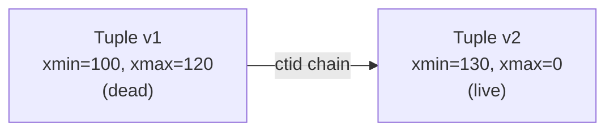

This is fundamentally different from InnoDB (MySQL), which uses undo logs to reconstruct old versions of updated rows.

### 8.13 VACUUM and tuple lifecycle <a class='askgpt-btn' href='https://chatgpt.com/?prompt=Read%20this%20section%20of%20my%20encyclopedia%20and%20explain%20it%20in%20depth%20with%20concrete%20examples%2C%20the%20main%20trade-offs%2C%20and%20common%20pitfalls%20a%20practitioner%20should%20know%3A%0A%0Ahttps%3A%2F%2Fgithub.com%2Fvishvasg14%2Fsoftware-engineering-encyclopedia%2Fblob%2Fmain%2F03-sql-databases%2Fsql-databases.md%23813-vacuum-and-tuple-lifecycle%0A%0ASection%20title%3A%208.13%20VACUUM%20and%20tuple%20lifecycle' target='_blank' rel='noopener' data-askgpt='8.13 VACUUM and tuple lifecycle' data-askgpt-url='https://github.com/vishvasg14/software-engineering-encyclopedia/blob/main/03-sql-databases/sql-databases.md#813-vacuum-and-tuple-lifecycle' data-askgpt-prompt-depth='Read%20this%20section%20of%20my%20encyclopedia%20and%20explain%20it%20in%20depth%20with%20concrete%20examples%2C%20the%20main%20trade-offs%2C%20and%20common%20pitfalls%20a%20practitioner%20should%20know%3A%0A%0Ahttps%3A%2F%2Fgithub.com%2Fvishvasg14%2Fsoftware-engineering-encyclopedia%2Fblob%2Fmain%2F03-sql-databases%2Fsql-databases.md%23813-vacuum-and-tuple-lifecycle%0A%0ASection%20title%3A%208.13%20VACUUM%20and%20tuple%20lifecycle' data-askgpt-prompt-examples='Read%20this%20section%20of%20my%20encyclopedia%20and%20give%20me%202-3%20real-world%20production%20examples%20for%20it.%20For%20each%3A%20what%20went%20right%2C%20what%20went%20wrong%2C%20and%20the%20lessons%20learned.%20Include%20company%20%2F%20project%20names%20if%20relevant.%0A%0Ahttps%3A%2F%2Fgithub.com%2Fvishvasg14%2Fsoftware-engineering-encyclopedia%2Fblob%2Fmain%2F03-sql-databases%2Fsql-databases.md%23813-vacuum-and-tuple-lifecycle%0A%0ASection%20title%3A%208.13%20VACUUM%20and%20tuple%20lifecycle' title='Ask ChatGPT about this section'>💬</a>

Because PostgreSQL doesn't update rows in place, **dead tuples accumulate** and must be reclaimed. VACUUM does this.

**What VACUUM does:**

1. Scans pages with dead tuples.
2. Marks dead tuple slots as free in the **Free Space Map (FSM)**.
3. Marks all-visible pages in the **Visibility Map (VM)**.
4. Optionally **freezes** old tuples (sets `xmin` to a special "frozen" value) to avoid transaction ID wraparound.

**Autovacuum** runs VACUUM and ANALYZE automatically based on heuristics. Critical for production.

```sql
-- Manual VACUUM
VACUUM (VERBOSE, ANALYZE) accounts;

-- Aggressive cleanup (rewrites table; locks it)
VACUUM FULL accounts;

-- Configure autovacuum per table
ALTER TABLE accounts SET (
    autovacuum_vacuum_scale_factor = 0.05,
    autovacuum_analyze_scale_factor = 0.02
);
```

### 8.14 Transaction ID wraparound <a class='askgpt-btn' href='https://chatgpt.com/?prompt=Read%20this%20section%20of%20my%20encyclopedia%20and%20explain%20it%20in%20depth%20with%20concrete%20examples%2C%20the%20main%20trade-offs%2C%20and%20common%20pitfalls%20a%20practitioner%20should%20know%3A%0A%0Ahttps%3A%2F%2Fgithub.com%2Fvishvasg14%2Fsoftware-engineering-encyclopedia%2Fblob%2Fmain%2F03-sql-databases%2Fsql-databases.md%23814-transaction-id-wraparound%0A%0ASection%20title%3A%208.14%20Transaction%20ID%20wraparound' target='_blank' rel='noopener' data-askgpt='8.14 Transaction ID wraparound' data-askgpt-url='https://github.com/vishvasg14/software-engineering-encyclopedia/blob/main/03-sql-databases/sql-databases.md#814-transaction-id-wraparound' data-askgpt-prompt-depth='Read%20this%20section%20of%20my%20encyclopedia%20and%20explain%20it%20in%20depth%20with%20concrete%20examples%2C%20the%20main%20trade-offs%2C%20and%20common%20pitfalls%20a%20practitioner%20should%20know%3A%0A%0Ahttps%3A%2F%2Fgithub.com%2Fvishvasg14%2Fsoftware-engineering-encyclopedia%2Fblob%2Fmain%2F03-sql-databases%2Fsql-databases.md%23814-transaction-id-wraparound%0A%0ASection%20title%3A%208.14%20Transaction%20ID%20wraparound' data-askgpt-prompt-examples='Read%20this%20section%20of%20my%20encyclopedia%20and%20give%20me%202-3%20real-world%20production%20examples%20for%20it.%20For%20each%3A%20what%20went%20right%2C%20what%20went%20wrong%2C%20and%20the%20lessons%20learned.%20Include%20company%20%2F%20project%20names%20if%20relevant.%0A%0Ahttps%3A%2F%2Fgithub.com%2Fvishvasg14%2Fsoftware-engineering-encyclopedia%2Fblob%2Fmain%2F03-sql-databases%2Fsql-databases.md%23814-transaction-id-wraparound%0A%0ASection%20title%3A%208.14%20Transaction%20ID%20wraparound' title='Ask ChatGPT about this section'>💬</a>

PostgreSQL uses a 32-bit transaction ID (`xid`). After ~2 billion transactions, the counter wraps around. Without protection, transactions would see rows from the "future" as visible.

**Solution: FREEZE.** When a tuple's `xmin` is older than `vacuum_freeze_min_age`, VACUUM marks it as "frozen" with a special `xmin` value that is always visible. This protects against wraparound.

If `autovacuum` falls behind or is disabled, the database will eventually **shut down** to prevent wraparound data corruption. Critical monitoring alert.

### 8.15 The query planner <a class='askgpt-btn' href='https://chatgpt.com/?prompt=Read%20this%20section%20of%20my%20encyclopedia%20and%20explain%20it%20in%20depth%20with%20concrete%20examples%2C%20the%20main%20trade-offs%2C%20and%20common%20pitfalls%20a%20practitioner%20should%20know%3A%0A%0Ahttps%3A%2F%2Fgithub.com%2Fvishvasg14%2Fsoftware-engineering-encyclopedia%2Fblob%2Fmain%2F03-sql-databases%2Fsql-databases.md%23815-the-query-planner%0A%0ASection%20title%3A%208.15%20The%20query%20planner' target='_blank' rel='noopener' data-askgpt='8.15 The query planner' data-askgpt-url='https://github.com/vishvasg14/software-engineering-encyclopedia/blob/main/03-sql-databases/sql-databases.md#815-the-query-planner' data-askgpt-prompt-depth='Read%20this%20section%20of%20my%20encyclopedia%20and%20explain%20it%20in%20depth%20with%20concrete%20examples%2C%20the%20main%20trade-offs%2C%20and%20common%20pitfalls%20a%20practitioner%20should%20know%3A%0A%0Ahttps%3A%2F%2Fgithub.com%2Fvishvasg14%2Fsoftware-engineering-encyclopedia%2Fblob%2Fmain%2F03-sql-databases%2Fsql-databases.md%23815-the-query-planner%0A%0ASection%20title%3A%208.15%20The%20query%20planner' data-askgpt-prompt-examples='Read%20this%20section%20of%20my%20encyclopedia%20and%20give%20me%202-3%20real-world%20production%20examples%20for%20it.%20For%20each%3A%20what%20went%20right%2C%20what%20went%20wrong%2C%20and%20the%20lessons%20learned.%20Include%20company%20%2F%20project%20names%20if%20relevant.%0A%0Ahttps%3A%2F%2Fgithub.com%2Fvishvasg14%2Fsoftware-engineering-encyclopedia%2Fblob%2Fmain%2F03-sql-databases%2Fsql-databases.md%23815-the-query-planner%0A%0ASection%20title%3A%208.15%20The%20query%20planner' title='Ask ChatGPT about this section'>💬</a>

The planner produces a tree of physical operators with cost estimates. Steps:

1. **Parse** — text → parse tree.
2. **Analyze** — resolve names, types; produce query tree.
3. **Rewrite** — apply view rules, subquery flattening, etc.
4. **Plan** — generate candidate plans, estimate costs, pick cheapest.

**Cost estimation uses statistics** stored in `pg_statistic`:

- Row count estimates.
- Most-common values.
- Histogram of values.
- Correlation between physical and logical order.

```sql
ANALYZE accounts;  -- refresh statistics
```

**Without up-to-date statistics, the planner makes poor choices** — e.g., choosing a sequential scan when an index scan would be 1000× faster.

### 8.16 Reading EXPLAIN ANALYZE <a class='askgpt-btn' href='https://chatgpt.com/?prompt=Read%20this%20section%20of%20my%20encyclopedia%20and%20explain%20it%20in%20depth%20with%20concrete%20examples%2C%20the%20main%20trade-offs%2C%20and%20common%20pitfalls%20a%20practitioner%20should%20know%3A%0A%0Ahttps%3A%2F%2Fgithub.com%2Fvishvasg14%2Fsoftware-engineering-encyclopedia%2Fblob%2Fmain%2F03-sql-databases%2Fsql-databases.md%23816-reading-explain-analyze%0A%0ASection%20title%3A%208.16%20Reading%20EXPLAIN%20ANALYZE' target='_blank' rel='noopener' data-askgpt='8.16 Reading EXPLAIN ANALYZE' data-askgpt-url='https://github.com/vishvasg14/software-engineering-encyclopedia/blob/main/03-sql-databases/sql-databases.md#816-reading-explain-analyze' data-askgpt-prompt-depth='Read%20this%20section%20of%20my%20encyclopedia%20and%20explain%20it%20in%20depth%20with%20concrete%20examples%2C%20the%20main%20trade-offs%2C%20and%20common%20pitfalls%20a%20practitioner%20should%20know%3A%0A%0Ahttps%3A%2F%2Fgithub.com%2Fvishvasg14%2Fsoftware-engineering-encyclopedia%2Fblob%2Fmain%2F03-sql-databases%2Fsql-databases.md%23816-reading-explain-analyze%0A%0ASection%20title%3A%208.16%20Reading%20EXPLAIN%20ANALYZE' data-askgpt-prompt-examples='Read%20this%20section%20of%20my%20encyclopedia%20and%20give%20me%202-3%20real-world%20production%20examples%20for%20it.%20For%20each%3A%20what%20went%20right%2C%20what%20went%20wrong%2C%20and%20the%20lessons%20learned.%20Include%20company%20%2F%20project%20names%20if%20relevant.%0A%0Ahttps%3A%2F%2Fgithub.com%2Fvishvasg14%2Fsoftware-engineering-encyclopedia%2Fblob%2Fmain%2F03-sql-databases%2Fsql-databases.md%23816-reading-explain-analyze%0A%0ASection%20title%3A%208.16%20Reading%20EXPLAIN%20ANALYZE' title='Ask ChatGPT about this section'>💬</a>

```sql
EXPLAIN (ANALYZE, BUFFERS, VERBOSE)
SELECT * FROM accounts WHERE balance > 1000;
```

Sample output:

```
Seq Scan on accounts  (cost=0.00..1834.00 rows=500 width=42) (actual time=0.123..12.345 rows=487 loops=1)
  Filter: (balance > 1000)
  Rows Removed by Filter: 9513
  Buffers: shared hit=120
Planning Time: 0.123 ms
Execution Time: 12.567 ms
```

**Key fields:**

- **cost** — planner's estimate (startup cost..total cost in arbitrary units).
- **rows** — estimated vs **actual** row count.
- **width** — average row size in bytes.
- **loops** — how many times this node executed.
- **Buffers** — shared/local hit/read/dirtied/written page counts.
- **Planning Time / Execution Time** — separate timings.

**Common plan nodes:**

| Node | Meaning |
|------|---------|
| **Seq Scan** | Reads all pages in sequence |
| **Index Scan** | Walks an index to find rows, then reads heap |
| **Index Only Scan** | Answer from index alone (visibility map) |
| **Bitmap Heap Scan** | Build bitmap of pages, then scan heap pages in order |
| **Nested Loop** | For each outer row, scan inner |
| **Hash Join** | Build hash table on inner, probe with outer |
| **Merge Join** | Both sides sorted, merge |
| **Sort** | Explicit sort |
| **Aggregate** | Hash or group aggregate |
| **Limit** | Stop after N rows |

### 8.17 Indexes <a class='askgpt-btn' href='https://chatgpt.com/?prompt=Read%20this%20section%20of%20my%20encyclopedia%20and%20explain%20it%20in%20depth%20with%20concrete%20examples%2C%20the%20main%20trade-offs%2C%20and%20common%20pitfalls%20a%20practitioner%20should%20know%3A%0A%0Ahttps%3A%2F%2Fgithub.com%2Fvishvasg14%2Fsoftware-engineering-encyclopedia%2Fblob%2Fmain%2F03-sql-databases%2Fsql-databases.md%23817-indexes%0A%0ASection%20title%3A%208.17%20Indexes' target='_blank' rel='noopener' data-askgpt='8.17 Indexes' data-askgpt-url='https://github.com/vishvasg14/software-engineering-encyclopedia/blob/main/03-sql-databases/sql-databases.md#817-indexes' data-askgpt-prompt-depth='Read%20this%20section%20of%20my%20encyclopedia%20and%20explain%20it%20in%20depth%20with%20concrete%20examples%2C%20the%20main%20trade-offs%2C%20and%20common%20pitfalls%20a%20practitioner%20should%20know%3A%0A%0Ahttps%3A%2F%2Fgithub.com%2Fvishvasg14%2Fsoftware-engineering-encyclopedia%2Fblob%2Fmain%2F03-sql-databases%2Fsql-databases.md%23817-indexes%0A%0ASection%20title%3A%208.17%20Indexes' data-askgpt-prompt-examples='Read%20this%20section%20of%20my%20encyclopedia%20and%20give%20me%202-3%20real-world%20production%20examples%20for%20it.%20For%20each%3A%20what%20went%20right%2C%20what%20went%20wrong%2C%20and%20the%20lessons%20learned.%20Include%20company%20%2F%20project%20names%20if%20relevant.%0A%0Ahttps%3A%2F%2Fgithub.com%2Fvishvasg14%2Fsoftware-engineering-encyclopedia%2Fblob%2Fmain%2F03-sql-databases%2Fsql-databases.md%23817-indexes%0A%0ASection%20title%3A%208.17%20Indexes' title='Ask ChatGPT about this section'>💬</a>

PostgreSQL supports multiple index types:

| Type | Use case | Internals |
|------|----------|-----------|
| **B-tree** (default) | Equality, range | Balanced tree; pages split at fill factor |
| **Hash** | Equality only | Hash function; rarely better than B-tree |
| **GIN (Generalized Inverted Index)** | Arrays, JSONB, full-text search | Inverted index: token → list of row IDs |
| **GiST (Generalized Search Tree)** | Geometric, range types, full-text | Tree of bounding regions |
| **SP-GiST** | Space-partitioned data (IP ranges, etc.) | Non-balanced tree |
| **BRIN (Block Range)** | Naturally-ordered data (timestamps, serial IDs) | Stores min/max per block range |

```sql
-- B-tree (default)
CREATE INDEX accounts_balance_idx ON accounts (balance);

-- Partial index (only some rows)
CREATE INDEX active_users_idx ON users (email) WHERE active;

-- Expression index
CREATE INDEX lower_email_idx ON users (lower(email));

-- GIN for JSONB
CREATE INDEX users_data_gin ON users USING gin (data jsonb_path_ops);

-- BRIN for large naturally-ordered tables
CREATE INDEX events_ts_brin ON events USING brin (created_at);
```

### 8.18 B-tree internals <a class='askgpt-btn' href='https://chatgpt.com/?prompt=Read%20this%20section%20of%20my%20encyclopedia%20and%20explain%20it%20in%20depth%20with%20concrete%20examples%2C%20the%20main%20trade-offs%2C%20and%20common%20pitfalls%20a%20practitioner%20should%20know%3A%0A%0Ahttps%3A%2F%2Fgithub.com%2Fvishvasg14%2Fsoftware-engineering-encyclopedia%2Fblob%2Fmain%2F03-sql-databases%2Fsql-databases.md%23818-b-tree-internals%0A%0ASection%20title%3A%208.18%20B-tree%20internals' target='_blank' rel='noopener' data-askgpt='8.18 B-tree internals' data-askgpt-url='https://github.com/vishvasg14/software-engineering-encyclopedia/blob/main/03-sql-databases/sql-databases.md#818-b-tree-internals' data-askgpt-prompt-depth='Read%20this%20section%20of%20my%20encyclopedia%20and%20explain%20it%20in%20depth%20with%20concrete%20examples%2C%20the%20main%20trade-offs%2C%20and%20common%20pitfalls%20a%20practitioner%20should%20know%3A%0A%0Ahttps%3A%2F%2Fgithub.com%2Fvishvasg14%2Fsoftware-engineering-encyclopedia%2Fblob%2Fmain%2F03-sql-databases%2Fsql-databases.md%23818-b-tree-internals%0A%0ASection%20title%3A%208.18%20B-tree%20internals' data-askgpt-prompt-examples='Read%20this%20section%20of%20my%20encyclopedia%20and%20give%20me%202-3%20real-world%20production%20examples%20for%20it.%20For%20each%3A%20what%20went%20right%2C%20what%20went%20wrong%2C%20and%20the%20lessons%20learned.%20Include%20company%20%2F%20project%20names%20if%20relevant.%0A%0Ahttps%3A%2F%2Fgithub.com%2Fvishvasg14%2Fsoftware-engineering-encyclopedia%2Fblob%2Fmain%2F03-sql-databases%2Fsql-databases.md%23818-b-tree-internals%0A%0ASection%20title%3A%208.18%20B-tree%20internals' title='Ask ChatGPT about this section'>💬</a>

B-trees are balanced trees where each page contains keys and child pointers. PostgreSQL B-trees:

- Default page size: 8 KB (matches disk block).
- Default fill factor: 90% (leaves 10% free for updates).
- Pages split when full.
- Index entries point to heap tuples via `ctid` (page + offset).
- "Index-only scans" possible when the visibility map marks all pages all-visible.

**B-tree deduplication** (PG 13+) collapses duplicate keys, saving space.

### 8.19 WAL (Write-Ahead Log) <a class='askgpt-btn' href='https://chatgpt.com/?prompt=Read%20this%20section%20of%20my%20encyclopedia%20and%20explain%20it%20in%20depth%20with%20concrete%20examples%2C%20the%20main%20trade-offs%2C%20and%20common%20pitfalls%20a%20practitioner%20should%20know%3A%0A%0Ahttps%3A%2F%2Fgithub.com%2Fvishvasg14%2Fsoftware-engineering-encyclopedia%2Fblob%2Fmain%2F03-sql-databases%2Fsql-databases.md%23819-wal-write-ahead-log%0A%0ASection%20title%3A%208.19%20WAL%20(Write-Ahead%20Log)' target='_blank' rel='noopener' data-askgpt='8.19 WAL (Write-Ahead Log)' data-askgpt-url='https://github.com/vishvasg14/software-engineering-encyclopedia/blob/main/03-sql-databases/sql-databases.md#819-wal-write-ahead-log' data-askgpt-prompt-depth='Read%20this%20section%20of%20my%20encyclopedia%20and%20explain%20it%20in%20depth%20with%20concrete%20examples%2C%20the%20main%20trade-offs%2C%20and%20common%20pitfalls%20a%20practitioner%20should%20know%3A%0A%0Ahttps%3A%2F%2Fgithub.com%2Fvishvasg14%2Fsoftware-engineering-encyclopedia%2Fblob%2Fmain%2F03-sql-databases%2Fsql-databases.md%23819-wal-write-ahead-log%0A%0ASection%20title%3A%208.19%20WAL%20(Write-Ahead%20Log)' data-askgpt-prompt-examples='Read%20this%20section%20of%20my%20encyclopedia%20and%20give%20me%202-3%20real-world%20production%20examples%20for%20it.%20For%20each%3A%20what%20went%20right%2C%20what%20went%20wrong%2C%20and%20the%20lessons%20learned.%20Include%20company%20%2F%20project%20names%20if%20relevant.%0A%0Ahttps%3A%2F%2Fgithub.com%2Fvishvasg14%2Fsoftware-engineering-encyclopedia%2Fblob%2Fmain%2F03-sql-databases%2Fsql-databases.md%23819-wal-write-ahead-log%0A%0ASection%20title%3A%208.19%20WAL%20(Write-Ahead%20Log)' title='Ask ChatGPT about this section'>💬</a>

WAL is the mechanism for crash safety and replication:

1. **Before** modifying a page, write the change to WAL.
2. Modified page is written to buffer pool (not immediately to disk).
3. **Checkpoint** periodically flushes dirty pages to disk.
4. **Crash recovery** replays WAL from last checkpoint.

**Why WAL?**

- **Performance** — sequential writes to WAL are faster than random writes to data pages.
- **Durability** — committed transactions are durable once WAL is on disk.
- **Replication** — streaming replication sends WAL records to replicas.

**LSN (Log Sequence Number)** — a 64-bit identifier for each WAL record. Monotonically increasing.

```mermaid
sequenceDiagram
    participant App
    participant WAL as WAL Buffer
    participant Disk as Disk
    participant Backend
    App->>Backend: UPDATE accounts SET balance = 500 WHERE id = 1
    Backend->>WAL: append WAL record (LSN=1234)
    WAL->>Disk: flush (fsync) at COMMIT
    Disk-->>WAL: ack
    Backend->>Backend: mark transaction committed
    Backend->>App: COMMIT success
    Note over Disk: Later — background writer flushes data page to disk; WAL can be truncated after checkpoint
```

### 8.20 Replication <a class='askgpt-btn' href='https://chatgpt.com/?prompt=Read%20this%20section%20of%20my%20encyclopedia%20and%20explain%20it%20in%20depth%20with%20concrete%20examples%2C%20the%20main%20trade-offs%2C%20and%20common%20pitfalls%20a%20practitioner%20should%20know%3A%0A%0Ahttps%3A%2F%2Fgithub.com%2Fvishvasg14%2Fsoftware-engineering-encyclopedia%2Fblob%2Fmain%2F03-sql-databases%2Fsql-databases.md%23820-replication%0A%0ASection%20title%3A%208.20%20Replication' target='_blank' rel='noopener' data-askgpt='8.20 Replication' data-askgpt-url='https://github.com/vishvasg14/software-engineering-encyclopedia/blob/main/03-sql-databases/sql-databases.md#820-replication' data-askgpt-prompt-depth='Read%20this%20section%20of%20my%20encyclopedia%20and%20explain%20it%20in%20depth%20with%20concrete%20examples%2C%20the%20main%20trade-offs%2C%20and%20common%20pitfalls%20a%20practitioner%20should%20know%3A%0A%0Ahttps%3A%2F%2Fgithub.com%2Fvishvasg14%2Fsoftware-engineering-encyclopedia%2Fblob%2Fmain%2F03-sql-databases%2Fsql-databases.md%23820-replication%0A%0ASection%20title%3A%208.20%20Replication' data-askgpt-prompt-examples='Read%20this%20section%20of%20my%20encyclopedia%20and%20give%20me%202-3%20real-world%20production%20examples%20for%20it.%20For%20each%3A%20what%20went%20right%2C%20what%20went%20wrong%2C%20and%20the%20lessons%20learned.%20Include%20company%20%2F%20project%20names%20if%20relevant.%0A%0Ahttps%3A%2F%2Fgithub.com%2Fvishvasg14%2Fsoftware-engineering-encyclopedia%2Fblob%2Fmain%2F03-sql-databases%2Fsql-databases.md%23820-replication%0A%0ASection%20title%3A%208.20%20Replication' title='Ask ChatGPT about this section'>💬</a>

**Streaming replication** (PG 9.0+):

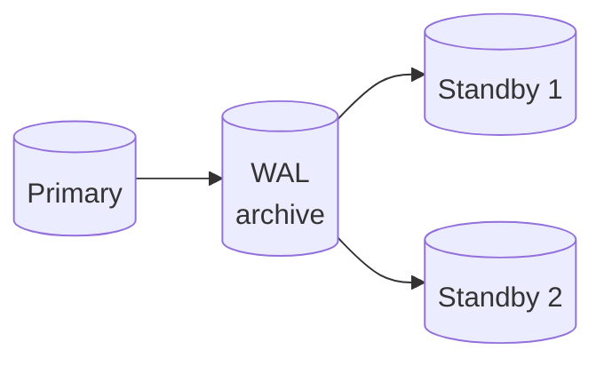

- Primary sends WAL records to standby(s).
- Standby applies WAL records, stays in sync.
- Standby can serve reads (hot standby).
- Synchronous option: wait for at least one replica to confirm before commit (durability vs latency trade-off).

**Logical replication** (PG 10+):

- Replicates changes per row, not per WAL record.
- Allows selective replication (specific tables).
- Enables cross-version upgrades.

**Replication slots** track standby progress; required to prevent the primary from discarding WAL records the standby hasn't read yet.

### 8.21 Partitioning <a class='askgpt-btn' href='https://chatgpt.com/?prompt=Read%20this%20section%20of%20my%20encyclopedia%20and%20explain%20it%20in%20depth%20with%20concrete%20examples%2C%20the%20main%20trade-offs%2C%20and%20common%20pitfalls%20a%20practitioner%20should%20know%3A%0A%0Ahttps%3A%2F%2Fgithub.com%2Fvishvasg14%2Fsoftware-engineering-encyclopedia%2Fblob%2Fmain%2F03-sql-databases%2Fsql-databases.md%23821-partitioning%0A%0ASection%20title%3A%208.21%20Partitioning' target='_blank' rel='noopener' data-askgpt='8.21 Partitioning' data-askgpt-url='https://github.com/vishvasg14/software-engineering-encyclopedia/blob/main/03-sql-databases/sql-databases.md#821-partitioning' data-askgpt-prompt-depth='Read%20this%20section%20of%20my%20encyclopedia%20and%20explain%20it%20in%20depth%20with%20concrete%20examples%2C%20the%20main%20trade-offs%2C%20and%20common%20pitfalls%20a%20practitioner%20should%20know%3A%0A%0Ahttps%3A%2F%2Fgithub.com%2Fvishvasg14%2Fsoftware-engineering-encyclopedia%2Fblob%2Fmain%2F03-sql-databases%2Fsql-databases.md%23821-partitioning%0A%0ASection%20title%3A%208.21%20Partitioning' data-askgpt-prompt-examples='Read%20this%20section%20of%20my%20encyclopedia%20and%20give%20me%202-3%20real-world%20production%20examples%20for%20it.%20For%20each%3A%20what%20went%20right%2C%20what%20went%20wrong%2C%20and%20the%20lessons%20learned.%20Include%20company%20%2F%20project%20names%20if%20relevant.%0A%0Ahttps%3A%2F%2Fgithub.com%2Fvishvasg14%2Fsoftware-engineering-encyclopedia%2Fblob%2Fmain%2F03-sql-databases%2Fsql-databases.md%23821-partitioning%0A%0ASection%20title%3A%208.21%20Partitioning' title='Ask ChatGPT about this section'>💬</a>

PostgreSQL declarative partitioning (PG 10+):

```sql
-- Range partitioning
CREATE TABLE events (
    id BIGSERIAL,
    created_at TIMESTAMPTZ NOT NULL,
    payload JSONB
) PARTITION BY RANGE (created_at);

CREATE TABLE events_2026 PARTITION OF events
    FOR VALUES FROM ('2026-01-01') TO ('2027-01-01');

CREATE TABLE events_2027 PARTITION OF events
    FOR VALUES FROM ('2027-01-01') TO ('2028-01-01');

-- List partitioning
CREATE TABLE users_by_region PARTITION OF users
    FOR VALUES IN ('us', 'ca');

-- Hash partitioning
CREATE TABLE users_hash PARTITION OF users
    FOR VALUES WITH (MODULUS 4, REMAINDER 0);
```

**Benefits:**

- Faster bulk operations (drop a partition instead of deleting rows).
- Parallel sequential scans across partitions.
- Each partition can have its own indexes.

**Gotchas:**

- Primary keys must include the partition key.
- Foreign keys to partitioned tables have limitations.
- Indexes must be created on each partition (or `CREATE INDEX ON parent` propagates).

### 8.22 Configuration essentials <a class='askgpt-btn' href='https://chatgpt.com/?prompt=Read%20this%20section%20of%20my%20encyclopedia%20and%20explain%20it%20in%20depth%20with%20concrete%20examples%2C%20the%20main%20trade-offs%2C%20and%20common%20pitfalls%20a%20practitioner%20should%20know%3A%0A%0Ahttps%3A%2F%2Fgithub.com%2Fvishvasg14%2Fsoftware-engineering-encyclopedia%2Fblob%2Fmain%2F03-sql-databases%2Fsql-databases.md%23822-configuration-essentials%0A%0ASection%20title%3A%208.22%20Configuration%20essentials' target='_blank' rel='noopener' data-askgpt='8.22 Configuration essentials' data-askgpt-url='https://github.com/vishvasg14/software-engineering-encyclopedia/blob/main/03-sql-databases/sql-databases.md#822-configuration-essentials' data-askgpt-prompt-depth='Read%20this%20section%20of%20my%20encyclopedia%20and%20explain%20it%20in%20depth%20with%20concrete%20examples%2C%20the%20main%20trade-offs%2C%20and%20common%20pitfalls%20a%20practitioner%20should%20know%3A%0A%0Ahttps%3A%2F%2Fgithub.com%2Fvishvasg14%2Fsoftware-engineering-encyclopedia%2Fblob%2Fmain%2F03-sql-databases%2Fsql-databases.md%23822-configuration-essentials%0A%0ASection%20title%3A%208.22%20Configuration%20essentials' data-askgpt-prompt-examples='Read%20this%20section%20of%20my%20encyclopedia%20and%20give%20me%202-3%20real-world%20production%20examples%20for%20it.%20For%20each%3A%20what%20went%20right%2C%20what%20went%20wrong%2C%20and%20the%20lessons%20learned.%20Include%20company%20%2F%20project%20names%20if%20relevant.%0A%0Ahttps%3A%2F%2Fgithub.com%2Fvishvasg14%2Fsoftware-engineering-encyclopedia%2Fblob%2Fmain%2F03-sql-databases%2Fsql-databases.md%23822-configuration-essentials%0A%0ASection%20title%3A%208.22%20Configuration%20essentials' title='Ask ChatGPT about this section'>💬</a>

`postgresql.conf` key parameters:

| Parameter | Default | Production recommendation |
|-----------|---------|---------------------------|
| `shared_buffers` | 128MB | 25% of RAM |
| `work_mem` | 4MB | 64MB-1GB depending on workload |
| `effective_cache_size` | 4GB | 50-75% of RAM |
| `maintenance_work_mem` | 64MB | 1-2GB for vacuum, index creation |
| `wal_buffers` | 4MB | 16MB |
| `max_connections` | 100 | 100-200 (use pooling for higher) |
| `checkpoint_completion_target` | 0.5 | 0.9 |
| `autovacuum_vacuum_scale_factor` | 0.2 | 0.05-0.1 for high-churn tables |
| `random_page_cost` | 4.0 | 1.1 for SSDs |
| `effective_io_concurrency` | 1 | 200+ for SSDs |

### 8.23 MySQL and InnoDB <a class='askgpt-btn' href='https://chatgpt.com/?prompt=Read%20this%20section%20of%20my%20encyclopedia%20and%20explain%20it%20in%20depth%20with%20concrete%20examples%2C%20the%20main%20trade-offs%2C%20and%20common%20pitfalls%20a%20practitioner%20should%20know%3A%0A%0Ahttps%3A%2F%2Fgithub.com%2Fvishvasg14%2Fsoftware-engineering-encyclopedia%2Fblob%2Fmain%2F03-sql-databases%2Fsql-databases.md%23823-mysql-and-innodb%0A%0ASection%20title%3A%208.23%20MySQL%20and%20InnoDB' target='_blank' rel='noopener' data-askgpt='8.23 MySQL and InnoDB' data-askgpt-url='https://github.com/vishvasg14/software-engineering-encyclopedia/blob/main/03-sql-databases/sql-databases.md#823-mysql-and-innodb' data-askgpt-prompt-depth='Read%20this%20section%20of%20my%20encyclopedia%20and%20explain%20it%20in%20depth%20with%20concrete%20examples%2C%20the%20main%20trade-offs%2C%20and%20common%20pitfalls%20a%20practitioner%20should%20know%3A%0A%0Ahttps%3A%2F%2Fgithub.com%2Fvishvasg14%2Fsoftware-engineering-encyclopedia%2Fblob%2Fmain%2F03-sql-databases%2Fsql-databases.md%23823-mysql-and-innodb%0A%0ASection%20title%3A%208.23%20MySQL%20and%20InnoDB' data-askgpt-prompt-examples='Read%20this%20section%20of%20my%20encyclopedia%20and%20give%20me%202-3%20real-world%20production%20examples%20for%20it.%20For%20each%3A%20what%20went%20right%2C%20what%20went%20wrong%2C%20and%20the%20lessons%20learned.%20Include%20company%20%2F%20project%20names%20if%20relevant.%0A%0Ahttps%3A%2F%2Fgithub.com%2Fvishvasg14%2Fsoftware-engineering-encyclopedia%2Fblob%2Fmain%2F03-sql-databases%2Fsql-databases.md%23823-mysql-and-innodb%0A%0ASection%20title%3A%208.23%20MySQL%20and%20InnoDB' title='Ask ChatGPT about this section'>💬</a>

**InnoDB** is MySQL's default storage engine since 5.5. Its key differences from PostgreSQL:

| Feature | PostgreSQL | InnoDB |
|---------|-----------|--------|
| MVCC | xmin/xmax in row header | DB_TRX_ID + DB_ROLL_PTR + undo log |
| Update | New tuple (HOT update possible) | Modify in place, old version in undo |
| Cleanup | VACUUM | Automatic purge of undo |
| Lock granularity | Row + page (heavyweight) + advisory | Row (next-key locks for REPEATABLE READ) |
| Replication | Streaming (physical) + logical | Binlog (logical) → replicas |
| Default isolation | READ COMMITTED | REPEATABLE READ |

**InnoDB architecture:**

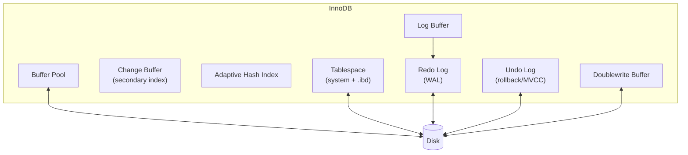

**MySQL replication:**

- **Asynchronous** (default) — primary writes binlog; replicas pull and apply.
- **Semisynchronous** — primary waits for at least one replica to acknowledge binlog receipt.
- **GTIDs** (since 5.6) — Global Transaction Identifiers for safe failover.

**When to choose MySQL over PostgreSQL:**

- Existing MySQL investment and team expertise.
- Web applications with simple read-heavy workloads.
- Cases where you need MyISAM-style behavior (rare).
- Some specific replication topologies (MySQL Group Replication).

### 8.24 MongoDB <a class='askgpt-btn' href='https://chatgpt.com/?prompt=Read%20this%20section%20of%20my%20encyclopedia%20and%20explain%20it%20in%20depth%20with%20concrete%20examples%2C%20the%20main%20trade-offs%2C%20and%20common%20pitfalls%20a%20practitioner%20should%20know%3A%0A%0Ahttps%3A%2F%2Fgithub.com%2Fvishvasg14%2Fsoftware-engineering-encyclopedia%2Fblob%2Fmain%2F03-sql-databases%2Fsql-databases.md%23824-mongodb%0A%0ASection%20title%3A%208.24%20MongoDB' target='_blank' rel='noopener' data-askgpt='8.24 MongoDB' data-askgpt-url='https://github.com/vishvasg14/software-engineering-encyclopedia/blob/main/03-sql-databases/sql-databases.md#824-mongodb' data-askgpt-prompt-depth='Read%20this%20section%20of%20my%20encyclopedia%20and%20explain%20it%20in%20depth%20with%20concrete%20examples%2C%20the%20main%20trade-offs%2C%20and%20common%20pitfalls%20a%20practitioner%20should%20know%3A%0A%0Ahttps%3A%2F%2Fgithub.com%2Fvishvasg14%2Fsoftware-engineering-encyclopedia%2Fblob%2Fmain%2F03-sql-databases%2Fsql-databases.md%23824-mongodb%0A%0ASection%20title%3A%208.24%20MongoDB' data-askgpt-prompt-examples='Read%20this%20section%20of%20my%20encyclopedia%20and%20give%20me%202-3%20real-world%20production%20examples%20for%20it.%20For%20each%3A%20what%20went%20right%2C%20what%20went%20wrong%2C%20and%20the%20lessons%20learned.%20Include%20company%20%2F%20project%20names%20if%20relevant.%0A%0Ahttps%3A%2F%2Fgithub.com%2Fvishvasg14%2Fsoftware-engineering-encyclopedia%2Fblob%2Fmain%2F03-sql-databases%2Fsql-databases.md%23824-mongodb%0A%0ASection%20title%3A%208.24%20MongoDB' title='Ask ChatGPT about this section'>💬</a>

**Document model** — JSON-like BSON objects, schema-less.

```js
db.users.insertOne({
    name: "Alice",
    email: "alice@example.com",
    address: { city: "Springfield", zip: "12345" },
    tags: ["admin", "active"]
});
```

**Storage engine: WiredTiger** (default since 3.2).

- Document-level locking (not page-level like InnoDB's page locks).
- Compression (snappy, zlib, zstd).
- Configurable cache size.

**Replication: replica sets.**

- One primary, multiple secondaries.
- Oplog-based (similar to MySQL binlog).
- Automatic failover via Raft-like consensus.
- Write concern `{w: "majority"}` for durability.

**Sharding** for horizontal scale:

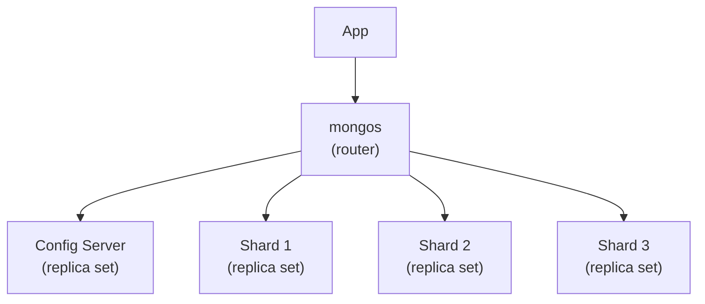

**When to choose MongoDB:**

- Document-shaped data (nested, evolving schemas).
- Read-heavy workloads with simple query patterns.
- Horizontal scalability via sharding.
- Real-time analytics with the aggregation framework.
- Flexible schema that changes often.

**When NOT to choose MongoDB:**

- Strong ACID transactions (PG/MySQL are better).
- Complex joins.
- Strict schema enforcement.

### 8.25 Redis <a class='askgpt-btn' href='https://chatgpt.com/?prompt=Read%20this%20section%20of%20my%20encyclopedia%20and%20explain%20it%20in%20depth%20with%20concrete%20examples%2C%20the%20main%20trade-offs%2C%20and%20common%20pitfalls%20a%20practitioner%20should%20know%3A%0A%0Ahttps%3A%2F%2Fgithub.com%2Fvishvasg14%2Fsoftware-engineering-encyclopedia%2Fblob%2Fmain%2F03-sql-databases%2Fsql-databases.md%23825-redis%0A%0ASection%20title%3A%208.25%20Redis' target='_blank' rel='noopener' data-askgpt='8.25 Redis' data-askgpt-url='https://github.com/vishvasg14/software-engineering-encyclopedia/blob/main/03-sql-databases/sql-databases.md#825-redis' data-askgpt-prompt-depth='Read%20this%20section%20of%20my%20encyclopedia%20and%20explain%20it%20in%20depth%20with%20concrete%20examples%2C%20the%20main%20trade-offs%2C%20and%20common%20pitfalls%20a%20practitioner%20should%20know%3A%0A%0Ahttps%3A%2F%2Fgithub.com%2Fvishvasg14%2Fsoftware-engineering-encyclopedia%2Fblob%2Fmain%2F03-sql-databases%2Fsql-databases.md%23825-redis%0A%0ASection%20title%3A%208.25%20Redis' data-askgpt-prompt-examples='Read%20this%20section%20of%20my%20encyclopedia%20and%20give%20me%202-3%20real-world%20production%20examples%20for%20it.%20For%20each%3A%20what%20went%20right%2C%20what%20went%20wrong%2C%20and%20the%20lessons%20learned.%20Include%20company%20%2F%20project%20names%20if%20relevant.%0A%0Ahttps%3A%2F%2Fgithub.com%2Fvishvasg14%2Fsoftware-engineering-encyclopedia%2Fblob%2Fmain%2F03-sql-databases%2Fsql-databases.md%23825-redis%0A%0ASection%20title%3A%208.25%20Redis' title='Ask ChatGPT about this section'>💬</a>

**In-memory data structure store.** Not a database in the traditional sense but commonly used as a primary store for specific workloads.

**Data structures:**

| Type | Use case |
|------|----------|
| String | Cache, counter |
| Hash | Object storage |
| List | Queue, recent activity |
| Set | Tags, unique items |
| Sorted Set | Leaderboard, rate limit |
| Stream | Event log |
| HyperLogLog | Cardinality estimation |
| Bitmap | Boolean arrays |

**Persistence:**

- **RDB** — point-in-time snapshots.
- **AOF** — log of all writes (configurable fsync).
- **Mixed mode (7.0+)** — RDB snapshot + AOF log; default.

**Replication:**

- Asynchronous master-replica.
- Sentinel for automatic failover.
- Cluster mode for sharding (16,384 hash slots).

**When to choose Redis:**

- In-memory cache.
- Session storage.
- Rate limiting.
- Leaderboards.
- Pub/sub for simple messaging.
- Real-time analytics.

**When NOT to choose Redis:**

- Large datasets that don't fit in RAM.
- ACID transactions (Redis transactions are not ACID).
- Strong consistency.

### 8.26 Theory: ACID, CAP, PACELC <a class='askgpt-btn' href='https://chatgpt.com/?prompt=Read%20this%20section%20of%20my%20encyclopedia%20and%20explain%20it%20in%20depth%20with%20concrete%20examples%2C%20the%20main%20trade-offs%2C%20and%20common%20pitfalls%20a%20practitioner%20should%20know%3A%0A%0Ahttps%3A%2F%2Fgithub.com%2Fvishvasg14%2Fsoftware-engineering-encyclopedia%2Fblob%2Fmain%2F03-sql-databases%2Fsql-databases.md%23826-theory-acid-cap-pacelc%0A%0ASection%20title%3A%208.26%20Theory%3A%20ACID%2C%20CAP%2C%20PACELC' target='_blank' rel='noopener' data-askgpt='8.26 Theory: ACID, CAP, PACELC' data-askgpt-url='https://github.com/vishvasg14/software-engineering-encyclopedia/blob/main/03-sql-databases/sql-databases.md#826-theory-acid-cap-pacelc' data-askgpt-prompt-depth='Read%20this%20section%20of%20my%20encyclopedia%20and%20explain%20it%20in%20depth%20with%20concrete%20examples%2C%20the%20main%20trade-offs%2C%20and%20common%20pitfalls%20a%20practitioner%20should%20know%3A%0A%0Ahttps%3A%2F%2Fgithub.com%2Fvishvasg14%2Fsoftware-engineering-encyclopedia%2Fblob%2Fmain%2F03-sql-databases%2Fsql-databases.md%23826-theory-acid-cap-pacelc%0A%0ASection%20title%3A%208.26%20Theory%3A%20ACID%2C%20CAP%2C%20PACELC' data-askgpt-prompt-examples='Read%20this%20section%20of%20my%20encyclopedia%20and%20give%20me%202-3%20real-world%20production%20examples%20for%20it.%20For%20each%3A%20what%20went%20right%2C%20what%20went%20wrong%2C%20and%20the%20lessons%20learned.%20Include%20company%20%2F%20project%20names%20if%20relevant.%0A%0Ahttps%3A%2F%2Fgithub.com%2Fvishvasg14%2Fsoftware-engineering-encyclopedia%2Fblob%2Fmain%2F03-sql-databases%2Fsql-databases.md%23826-theory-acid-cap-pacelc%0A%0ASection%20title%3A%208.26%20Theory%3A%20ACID%2C%20CAP%2C%20PACELC' title='Ask ChatGPT about this section'>💬</a>

**ACID** (covered above).

**CAP theorem** (Gilbert, Lynch 2002): A distributed system can have at most two of:

- **C**onsistency — all nodes see the same data.
- **A**vailability — every request gets a response.
- **P**artition tolerance — works despite network partitions.

Since network partitions are inevitable, CAP is really a choice between C and A during a partition.

**PACELC** (Daniel Abadi, 2010): Extends CAP. If Partition (P), choose Availability (A) or Consistency (C); Else (E), choose Latency (L) or Consistency (C).

- **PA/EL** — DynamoDB, Cassandra.
- **PC/EC** — Spanner, FaunaDB.
- **PA/EC** — Cosmos DB (configurable).

**BASE** (Basically Available, Soft state, Eventually consistent) — the alternative to ACID for distributed systems.

### 8.27 Normalization <a class='askgpt-btn' href='https://chatgpt.com/?prompt=Read%20this%20section%20of%20my%20encyclopedia%20and%20explain%20it%20in%20depth%20with%20concrete%20examples%2C%20the%20main%20trade-offs%2C%20and%20common%20pitfalls%20a%20practitioner%20should%20know%3A%0A%0Ahttps%3A%2F%2Fgithub.com%2Fvishvasg14%2Fsoftware-engineering-encyclopedia%2Fblob%2Fmain%2F03-sql-databases%2Fsql-databases.md%23827-normalization%0A%0ASection%20title%3A%208.27%20Normalization' target='_blank' rel='noopener' data-askgpt='8.27 Normalization' data-askgpt-url='https://github.com/vishvasg14/software-engineering-encyclopedia/blob/main/03-sql-databases/sql-databases.md#827-normalization' data-askgpt-prompt-depth='Read%20this%20section%20of%20my%20encyclopedia%20and%20explain%20it%20in%20depth%20with%20concrete%20examples%2C%20the%20main%20trade-offs%2C%20and%20common%20pitfalls%20a%20practitioner%20should%20know%3A%0A%0Ahttps%3A%2F%2Fgithub.com%2Fvishvasg14%2Fsoftware-engineering-encyclopedia%2Fblob%2Fmain%2F03-sql-databases%2Fsql-databases.md%23827-normalization%0A%0ASection%20title%3A%208.27%20Normalization' data-askgpt-prompt-examples='Read%20this%20section%20of%20my%20encyclopedia%20and%20give%20me%202-3%20real-world%20production%20examples%20for%20it.%20For%20each%3A%20what%20went%20right%2C%20what%20went%20wrong%2C%20and%20the%20lessons%20learned.%20Include%20company%20%2F%20project%20names%20if%20relevant.%0A%0Ahttps%3A%2F%2Fgithub.com%2Fvishvasg14%2Fsoftware-engineering-encyclopedia%2Fblob%2Fmain%2F03-sql-databases%2Fsql-databases.md%23827-normalization%0A%0ASection%20title%3A%208.27%20Normalization' title='Ask ChatGPT about this section'>💬</a>

Database normalization reduces redundancy and improves integrity.

| Normal form | Rule |
|------------|------|
| **1NF** | Atomic values; no repeating groups |
| **2NF** | 1NF + no partial dependencies (every non-key attribute depends on the whole key) |
| **3NF** | 2NF + no transitive dependencies (non-key attributes depend only on the key) |
| **BCNF** | 3NF + every determinant is a candidate key |
| **4NF** | BCNF + no multi-valued dependencies |
| **5NF** | 4NF + no join dependencies |

**Denormalization** (intentionally violating normal forms) is common for performance — fewer joins, faster reads. The trade-off is data redundancy and update anomalies.

**Example: 1NF → 2NF → 3NF**

```
Orders (unnormalized):
order_id | customer_name | customer_email | products
1        | Alice        | alice@...      | Book, Pen
2        | Bob          | bob@...        | Notebook

1NF: split products into separate rows.
Orders_1NF (order_id, customer_name, customer_email, product)
1, Alice, alice@..., Book
1, Alice, alice@..., Pen
2, Bob, bob@..., Notebook

Problem: customer info repeated for each order line → update anomaly.

2NF: separate customers from orders.
Customers (customer_id, customer_name, customer_email)
Orders (order_id, customer_id, product)
CustomerId 1: Alice, alice@...
Order 1: customer 1, Book
Order 1: customer 1, Pen
Order 2: customer 2, Notebook

3NF: ensure non-key attributes don't depend on other non-key attributes.
In Customers: name and email both depend on customer_id (the key). OK.
```

---

## 9. Architecture

### 9.1 PostgreSQL high-level architecture <a class='askgpt-btn' href='https://chatgpt.com/?prompt=Read%20this%20section%20of%20my%20encyclopedia%20and%20explain%20it%20in%20depth%20with%20concrete%20examples%2C%20the%20main%20trade-offs%2C%20and%20common%20pitfalls%20a%20practitioner%20should%20know%3A%0A%0Ahttps%3A%2F%2Fgithub.com%2Fvishvasg14%2Fsoftware-engineering-encyclopedia%2Fblob%2Fmain%2F03-sql-databases%2Fsql-databases.md%2391-postgresql-high-level-architecture%0A%0ASection%20title%3A%209.1%20PostgreSQL%20high-level%20architecture' target='_blank' rel='noopener' data-askgpt='9.1 PostgreSQL high-level architecture' data-askgpt-url='https://github.com/vishvasg14/software-engineering-encyclopedia/blob/main/03-sql-databases/sql-databases.md#91-postgresql-high-level-architecture' data-askgpt-prompt-depth='Read%20this%20section%20of%20my%20encyclopedia%20and%20explain%20it%20in%20depth%20with%20concrete%20examples%2C%20the%20main%20trade-offs%2C%20and%20common%20pitfalls%20a%20practitioner%20should%20know%3A%0A%0Ahttps%3A%2F%2Fgithub.com%2Fvishvasg14%2Fsoftware-engineering-encyclopedia%2Fblob%2Fmain%2F03-sql-databases%2Fsql-databases.md%2391-postgresql-high-level-architecture%0A%0ASection%20title%3A%209.1%20PostgreSQL%20high-level%20architecture' data-askgpt-prompt-examples='Read%20this%20section%20of%20my%20encyclopedia%20and%20give%20me%202-3%20real-world%20production%20examples%20for%20it.%20For%20each%3A%20what%20went%20right%2C%20what%20went%20wrong%2C%20and%20the%20lessons%20learned.%20Include%20company%20%2F%20project%20names%20if%20relevant.%0A%0Ahttps%3A%2F%2Fgithub.com%2Fvishvasg14%2Fsoftware-engineering-encyclopedia%2Fblob%2Fmain%2F03-sql-databases%2Fsql-databases.md%2391-postgresql-high-level-architecture%0A%0ASection%20title%3A%209.1%20PostgreSQL%20high-level%20architecture' title='Ask ChatGPT about this section'>💬</a>

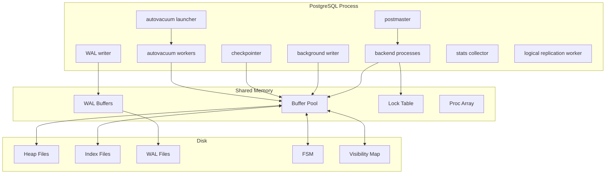

### 9.2 Storage hierarchy <a class='askgpt-btn' href='https://chatgpt.com/?prompt=Read%20this%20section%20of%20my%20encyclopedia%20and%20explain%20it%20in%20depth%20with%20concrete%20examples%2C%20the%20main%20trade-offs%2C%20and%20common%20pitfalls%20a%20practitioner%20should%20know%3A%0A%0Ahttps%3A%2F%2Fgithub.com%2Fvishvasg14%2Fsoftware-engineering-encyclopedia%2Fblob%2Fmain%2F03-sql-databases%2Fsql-databases.md%2392-storage-hierarchy%0A%0ASection%20title%3A%209.2%20Storage%20hierarchy' target='_blank' rel='noopener' data-askgpt='9.2 Storage hierarchy' data-askgpt-url='https://github.com/vishvasg14/software-engineering-encyclopedia/blob/main/03-sql-databases/sql-databases.md#92-storage-hierarchy' data-askgpt-prompt-depth='Read%20this%20section%20of%20my%20encyclopedia%20and%20explain%20it%20in%20depth%20with%20concrete%20examples%2C%20the%20main%20trade-offs%2C%20and%20common%20pitfalls%20a%20practitioner%20should%20know%3A%0A%0Ahttps%3A%2F%2Fgithub.com%2Fvishvasg14%2Fsoftware-engineering-encyclopedia%2Fblob%2Fmain%2F03-sql-databases%2Fsql-databases.md%2392-storage-hierarchy%0A%0ASection%20title%3A%209.2%20Storage%20hierarchy' data-askgpt-prompt-examples='Read%20this%20section%20of%20my%20encyclopedia%20and%20give%20me%202-3%20real-world%20production%20examples%20for%20it.%20For%20each%3A%20what%20went%20right%2C%20what%20went%20wrong%2C%20and%20the%20lessons%20learned.%20Include%20company%20%2F%20project%20names%20if%20relevant.%0A%0Ahttps%3A%2F%2Fgithub.com%2Fvishvasg14%2Fsoftware-engineering-encyclopedia%2Fblob%2Fmain%2F03-sql-databases%2Fsql-databases.md%2392-storage-hierarchy%0A%0ASection%20title%3A%209.2%20Storage%20hierarchy' title='Ask ChatGPT about this section'>💬</a>

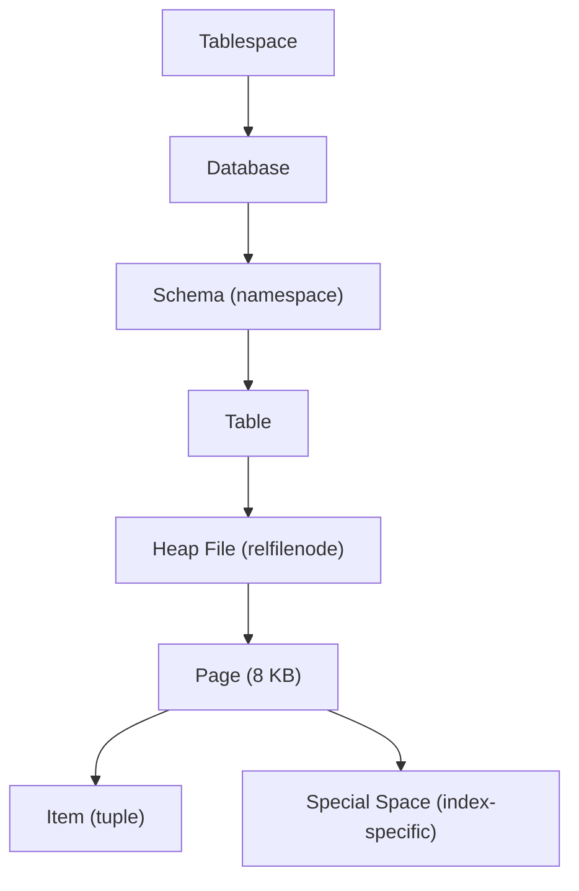

### 9.3 Buffer pool <a class='askgpt-btn' href='https://chatgpt.com/?prompt=Read%20this%20section%20of%20my%20encyclopedia%20and%20explain%20it%20in%20depth%20with%20concrete%20examples%2C%20the%20main%20trade-offs%2C%20and%20common%20pitfalls%20a%20practitioner%20should%20know%3A%0A%0Ahttps%3A%2F%2Fgithub.com%2Fvishvasg14%2Fsoftware-engineering-encyclopedia%2Fblob%2Fmain%2F03-sql-databases%2Fsql-databases.md%2393-buffer-pool%0A%0ASection%20title%3A%209.3%20Buffer%20pool' target='_blank' rel='noopener' data-askgpt='9.3 Buffer pool' data-askgpt-url='https://github.com/vishvasg14/software-engineering-encyclopedia/blob/main/03-sql-databases/sql-databases.md#93-buffer-pool' data-askgpt-prompt-depth='Read%20this%20section%20of%20my%20encyclopedia%20and%20explain%20it%20in%20depth%20with%20concrete%20examples%2C%20the%20main%20trade-offs%2C%20and%20common%20pitfalls%20a%20practitioner%20should%20know%3A%0A%0Ahttps%3A%2F%2Fgithub.com%2Fvishvasg14%2Fsoftware-engineering-encyclopedia%2Fblob%2Fmain%2F03-sql-databases%2Fsql-databases.md%2393-buffer-pool%0A%0ASection%20title%3A%209.3%20Buffer%20pool' data-askgpt-prompt-examples='Read%20this%20section%20of%20my%20encyclopedia%20and%20give%20me%202-3%20real-world%20production%20examples%20for%20it.%20For%20each%3A%20what%20went%20right%2C%20what%20went%20wrong%2C%20and%20the%20lessons%20learned.%20Include%20company%20%2F%20project%20names%20if%20relevant.%0A%0Ahttps%3A%2F%2Fgithub.com%2Fvishvasg14%2Fsoftware-engineering-encyclopedia%2Fblob%2Fmain%2F03-sql-databases%2Fsql-databases.md%2393-buffer-pool%0A%0ASection%20title%3A%209.3%20Buffer%20pool' title='Ask ChatGPT about this section'>💬</a>

The buffer pool is a fixed-size cache of disk pages. Replacement is via clock-sweep algorithm (similar to second-chance). Shared across all backends.

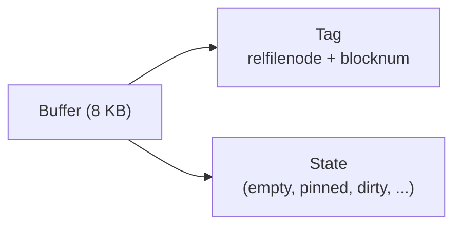

### 9.4 MVCC implementation details <a class='askgpt-btn' href='https://chatgpt.com/?prompt=Read%20this%20section%20of%20my%20encyclopedia%20and%20explain%20it%20in%20depth%20with%20concrete%20examples%2C%20the%20main%20trade-offs%2C%20and%20common%20pitfalls%20a%20practitioner%20should%20know%3A%0A%0Ahttps%3A%2F%2Fgithub.com%2Fvishvasg14%2Fsoftware-engineering-encyclopedia%2Fblob%2Fmain%2F03-sql-databases%2Fsql-databases.md%2394-mvcc-implementation-details%0A%0ASection%20title%3A%209.4%20MVCC%20implementation%20details' target='_blank' rel='noopener' data-askgpt='9.4 MVCC implementation details' data-askgpt-url='https://github.com/vishvasg14/software-engineering-encyclopedia/blob/main/03-sql-databases/sql-databases.md#94-mvcc-implementation-details' data-askgpt-prompt-depth='Read%20this%20section%20of%20my%20encyclopedia%20and%20explain%20it%20in%20depth%20with%20concrete%20examples%2C%20the%20main%20trade-offs%2C%20and%20common%20pitfalls%20a%20practitioner%20should%20know%3A%0A%0Ahttps%3A%2F%2Fgithub.com%2Fvishvasg14%2Fsoftware-engineering-encyclopedia%2Fblob%2Fmain%2F03-sql-databases%2Fsql-databases.md%2394-mvcc-implementation-details%0A%0ASection%20title%3A%209.4%20MVCC%20implementation%20details' data-askgpt-prompt-examples='Read%20this%20section%20of%20my%20encyclopedia%20and%20give%20me%202-3%20real-world%20production%20examples%20for%20it.%20For%20each%3A%20what%20went%20right%2C%20what%20went%20wrong%2C%20and%20the%20lessons%20learned.%20Include%20company%20%2F%20project%20names%20if%20relevant.%0A%0Ahttps%3A%2F%2Fgithub.com%2Fvishvasg14%2Fsoftware-engineering-encyclopedia%2Fblob%2Fmain%2F03-sql-databases%2Fsql-databases.md%2394-mvcc-implementation-details%0A%0ASection%20title%3A%209.4%20MVCC%20implementation%20details' title='Ask ChatGPT about this section'>💬</a>

Each row carries `xmin` and `xmax`. PostgreSQL uses **transaction IDs** (`xid`) — a 32-bit counter that wraps around every ~2 billion transactions.

**Snapshot** contains:

- `xmin` — lowest active xid at snapshot time.
- `xmax` — highest xid + 1, the "next" xid.
- `active_xids` — list of in-progress xids at snapshot time.

A tuple is visible if:

- `xmin` is committed and `xmin < snapshot.xmax` and `xmin` not in `active_xids` at snapshot time.
- `xmax` is 0 OR `xmax` not committed OR `xmax` in `active_xids` OR `xmax >= snapshot.xmax`.

### 9.5 Process vs thread model <a class='askgpt-btn' href='https://chatgpt.com/?prompt=Read%20this%20section%20of%20my%20encyclopedia%20and%20explain%20it%20in%20depth%20with%20concrete%20examples%2C%20the%20main%20trade-offs%2C%20and%20common%20pitfalls%20a%20practitioner%20should%20know%3A%0A%0Ahttps%3A%2F%2Fgithub.com%2Fvishvasg14%2Fsoftware-engineering-encyclopedia%2Fblob%2Fmain%2F03-sql-databases%2Fsql-databases.md%2395-process-vs-thread-model%0A%0ASection%20title%3A%209.5%20Process%20vs%20thread%20model' target='_blank' rel='noopener' data-askgpt='9.5 Process vs thread model' data-askgpt-url='https://github.com/vishvasg14/software-engineering-encyclopedia/blob/main/03-sql-databases/sql-databases.md#95-process-vs-thread-model' data-askgpt-prompt-depth='Read%20this%20section%20of%20my%20encyclopedia%20and%20explain%20it%20in%20depth%20with%20concrete%20examples%2C%20the%20main%20trade-offs%2C%20and%20common%20pitfalls%20a%20practitioner%20should%20know%3A%0A%0Ahttps%3A%2F%2Fgithub.com%2Fvishvasg14%2Fsoftware-engineering-encyclopedia%2Fblob%2Fmain%2F03-sql-databases%2Fsql-databases.md%2395-process-vs-thread-model%0A%0ASection%20title%3A%209.5%20Process%20vs%20thread%20model' data-askgpt-prompt-examples='Read%20this%20section%20of%20my%20encyclopedia%20and%20give%20me%202-3%20real-world%20production%20examples%20for%20it.%20For%20each%3A%20what%20went%20right%2C%20what%20went%20wrong%2C%20and%20the%20lessons%20learned.%20Include%20company%20%2F%20project%20names%20if%20relevant.%0A%0Ahttps%3A%2F%2Fgithub.com%2Fvishvasg14%2Fsoftware-engineering-encyclopedia%2Fblob%2Fmain%2F03-sql-databases%2Fsql-databases.md%2395-process-vs-thread-model%0A%0ASection%20title%3A%209.5%20Process%20vs%20thread%20model' title='Ask ChatGPT about this section'>💬</a>

PostgreSQL uses a **process-per-backend** model (not threads). This has advantages:

- Crash isolation — a backend crash doesn't kill the whole server.
- Easier reasoning about memory and locks.
- libpq connects via process boundary.

Disadvantages:

- More memory per connection (~5-10 MB).
- Higher overhead for very high connection counts.
- Solution: PgBouncer or similar pooling.

In contrast, MySQL uses threads (one thread per connection).

## 10. Performance

### 10.1 Time complexity of common operations <a class='askgpt-btn' href='https://chatgpt.com/?prompt=Read%20this%20section%20of%20my%20encyclopedia%20and%20explain%20it%20in%20depth%20with%20concrete%20examples%2C%20the%20main%20trade-offs%2C%20and%20common%20pitfalls%20a%20practitioner%20should%20know%3A%0A%0Ahttps%3A%2F%2Fgithub.com%2Fvishvasg14%2Fsoftware-engineering-encyclopedia%2Fblob%2Fmain%2F03-sql-databases%2Fsql-databases.md%23101-time-complexity-of-common-operations%0A%0ASection%20title%3A%2010.1%20Time%20complexity%20of%20common%20operations' target='_blank' rel='noopener' data-askgpt='10.1 Time complexity of common operations' data-askgpt-url='https://github.com/vishvasg14/software-engineering-encyclopedia/blob/main/03-sql-databases/sql-databases.md#101-time-complexity-of-common-operations' data-askgpt-prompt-depth='Read%20this%20section%20of%20my%20encyclopedia%20and%20explain%20it%20in%20depth%20with%20concrete%20examples%2C%20the%20main%20trade-offs%2C%20and%20common%20pitfalls%20a%20practitioner%20should%20know%3A%0A%0Ahttps%3A%2F%2Fgithub.com%2Fvishvasg14%2Fsoftware-engineering-encyclopedia%2Fblob%2Fmain%2F03-sql-databases%2Fsql-databases.md%23101-time-complexity-of-common-operations%0A%0ASection%20title%3A%2010.1%20Time%20complexity%20of%20common%20operations' data-askgpt-prompt-examples='Read%20this%20section%20of%20my%20encyclopedia%20and%20give%20me%202-3%20real-world%20production%20examples%20for%20it.%20For%20each%3A%20what%20went%20right%2C%20what%20went%20wrong%2C%20and%20the%20lessons%20learned.%20Include%20company%20%2F%20project%20names%20if%20relevant.%0A%0Ahttps%3A%2F%2Fgithub.com%2Fvishvasg14%2Fsoftware-engineering-encyclopedia%2Fblob%2Fmain%2F03-sql-databases%2Fsql-databases.md%23101-time-complexity-of-common-operations%0A%0ASection%20title%3A%2010.1%20Time%20complexity%20of%20common%20operations' title='Ask ChatGPT about this section'>💬</a>

| Operation | Complexity | Notes |
|-----------|-----------|-------|
| Point lookup via index | O(log n) | B-tree lookup |
| Sequential scan | O(n) | Reads all pages |
| Hash join | O(n + m) | Build hash on smaller side |
| Merge join | O(n + m) | Both sorted |
| Nested loop | O(n × m) | Worst case; OK with index |
| Insert | O(log n) index + O(1) heap | May cause page split |
| VACUUM | O(dead tuples) | Autovacuum runs incrementally |
| ANALYZE | O(sample size) | Default 30,000 rows |

### 10.2 Memory usage <a class='askgpt-btn' href='https://chatgpt.com/?prompt=Read%20this%20section%20of%20my%20encyclopedia%20and%20explain%20it%20in%20depth%20with%20concrete%20examples%2C%20the%20main%20trade-offs%2C%20and%20common%20pitfalls%20a%20practitioner%20should%20know%3A%0A%0Ahttps%3A%2F%2Fgithub.com%2Fvishvasg14%2Fsoftware-engineering-encyclopedia%2Fblob%2Fmain%2F03-sql-databases%2Fsql-databases.md%23102-memory-usage%0A%0ASection%20title%3A%2010.2%20Memory%20usage' target='_blank' rel='noopener' data-askgpt='10.2 Memory usage' data-askgpt-url='https://github.com/vishvasg14/software-engineering-encyclopedia/blob/main/03-sql-databases/sql-databases.md#102-memory-usage' data-askgpt-prompt-depth='Read%20this%20section%20of%20my%20encyclopedia%20and%20explain%20it%20in%20depth%20with%20concrete%20examples%2C%20the%20main%20trade-offs%2C%20and%20common%20pitfalls%20a%20practitioner%20should%20know%3A%0A%0Ahttps%3A%2F%2Fgithub.com%2Fvishvasg14%2Fsoftware-engineering-encyclopedia%2Fblob%2Fmain%2F03-sql-databases%2Fsql-databases.md%23102-memory-usage%0A%0ASection%20title%3A%2010.2%20Memory%20usage' data-askgpt-prompt-examples='Read%20this%20section%20of%20my%20encyclopedia%20and%20give%20me%202-3%20real-world%20production%20examples%20for%20it.%20For%20each%3A%20what%20went%20right%2C%20what%20went%20wrong%2C%20and%20the%20lessons%20learned.%20Include%20company%20%2F%20project%20names%20if%20relevant.%0A%0Ahttps%3A%2F%2Fgithub.com%2Fvishvasg14%2Fsoftware-engineering-encyclopedia%2Fblob%2Fmain%2F03-sql-databases%2Fsql-databases.md%23102-memory-usage%0A%0ASection%20title%3A%2010.2%20Memory%20usage' title='Ask ChatGPT about this section'>💬</a>

| Memory type | Tunable | Production note |
|-------------|---------|----------------|
| Shared buffers | `shared_buffers` | 25% of RAM; more doesn't always help |
| Work memory | `work_mem` | Per-operation; can be used many times per query |
| Maintenance work | `maintenance_work_mem` | For VACUUM, index creation |
| WAL buffers | `wal_buffers` | Auto-tuned since PG 13 |
| Connection memory | OS process memory | ~10 MB per backend |

### 10.3 CPU usage <a class='askgpt-btn' href='https://chatgpt.com/?prompt=Read%20this%20section%20of%20my%20encyclopedia%20and%20explain%20it%20in%20depth%20with%20concrete%20examples%2C%20the%20main%20trade-offs%2C%20and%20common%20pitfalls%20a%20practitioner%20should%20know%3A%0A%0Ahttps%3A%2F%2Fgithub.com%2Fvishvasg14%2Fsoftware-engineering-encyclopedia%2Fblob%2Fmain%2F03-sql-databases%2Fsql-databases.md%23103-cpu-usage%0A%0ASection%20title%3A%2010.3%20CPU%20usage' target='_blank' rel='noopener' data-askgpt='10.3 CPU usage' data-askgpt-url='https://github.com/vishvasg14/software-engineering-encyclopedia/blob/main/03-sql-databases/sql-databases.md#103-cpu-usage' data-askgpt-prompt-depth='Read%20this%20section%20of%20my%20encyclopedia%20and%20explain%20it%20in%20depth%20with%20concrete%20examples%2C%20the%20main%20trade-offs%2C%20and%20common%20pitfalls%20a%20practitioner%20should%20know%3A%0A%0Ahttps%3A%2F%2Fgithub.com%2Fvishvasg14%2Fsoftware-engineering-encyclopedia%2Fblob%2Fmain%2F03-sql-databases%2Fsql-databases.md%23103-cpu-usage%0A%0ASection%20title%3A%2010.3%20CPU%20usage' data-askgpt-prompt-examples='Read%20this%20section%20of%20my%20encyclopedia%20and%20give%20me%202-3%20real-world%20production%20examples%20for%20it.%20For%20each%3A%20what%20went%20right%2C%20what%20went%20wrong%2C%20and%20the%20lessons%20learned.%20Include%20company%20%2F%20project%20names%20if%20relevant.%0A%0Ahttps%3A%2F%2Fgithub.com%2Fvishvasg14%2Fsoftware-engineering-encyclopedia%2Fblob%2Fmain%2F03-sql-databases%2Fsql-databases.md%23103-cpu-usage%0A%0ASection%20title%3A%2010.3%20CPU%20usage' title='Ask ChatGPT about this section'>💬</a>

- **Query execution** scales with query complexity.
- **VACUUM** CPU spike during heavy bloat.
- **Autovacuum** workers can use significant CPU if not configured.
- **Parallel workers** for queries (max `max_parallel_workers_per_gather`, default 2).

### 10.4 Bottlenecks and optimization techniques <a class='askgpt-btn' href='https://chatgpt.com/?prompt=Read%20this%20section%20of%20my%20encyclopedia%20and%20explain%20it%20in%20depth%20with%20concrete%20examples%2C%20the%20main%20trade-offs%2C%20and%20common%20pitfalls%20a%20practitioner%20should%20know%3A%0A%0Ahttps%3A%2F%2Fgithub.com%2Fvishvasg14%2Fsoftware-engineering-encyclopedia%2Fblob%2Fmain%2F03-sql-databases%2Fsql-databases.md%23104-bottlenecks-and-optimization-techniques%0A%0ASection%20title%3A%2010.4%20Bottlenecks%20and%20optimization%20techniques' target='_blank' rel='noopener' data-askgpt='10.4 Bottlenecks and optimization techniques' data-askgpt-url='https://github.com/vishvasg14/software-engineering-encyclopedia/blob/main/03-sql-databases/sql-databases.md#104-bottlenecks-and-optimization-techniques' data-askgpt-prompt-depth='Read%20this%20section%20of%20my%20encyclopedia%20and%20explain%20it%20in%20depth%20with%20concrete%20examples%2C%20the%20main%20trade-offs%2C%20and%20common%20pitfalls%20a%20practitioner%20should%20know%3A%0A%0Ahttps%3A%2F%2Fgithub.com%2Fvishvasg14%2Fsoftware-engineering-encyclopedia%2Fblob%2Fmain%2F03-sql-databases%2Fsql-databases.md%23104-bottlenecks-and-optimization-techniques%0A%0ASection%20title%3A%2010.4%20Bottlenecks%20and%20optimization%20techniques' data-askgpt-prompt-examples='Read%20this%20section%20of%20my%20encyclopedia%20and%20give%20me%202-3%20real-world%20production%20examples%20for%20it.%20For%20each%3A%20what%20went%20right%2C%20what%20went%20wrong%2C%20and%20the%20lessons%20learned.%20Include%20company%20%2F%20project%20names%20if%20relevant.%0A%0Ahttps%3A%2F%2Fgithub.com%2Fvishvasg14%2Fsoftware-engineering-encyclopedia%2Fblob%2Fmain%2F03-sql-databases%2Fsql-databases.md%23104-bottlenecks-and-optimization-techniques%0A%0ASection%20title%3A%2010.4%20Bottlenecks%20and%20optimization%20techniques' title='Ask ChatGPT about this section'>💬</a>

| Bottleneck | Symptom | Technique |
|------------|---------|-----------|
| Sequential scan on large table | Slow query, high I/O | Add index |
| High bloat | Slow scans, large table size | Tune autovacuum; aggressive `VACUUM` |
| Buffer cache thrashing | High disk reads | Increase `shared_buffers` |
| Sort spilling to disk | Slow ORDER BY | Increase `work_mem` |
| Lock contention | Slow queries waiting | Reduce transaction size; use `SKIP LOCKED` |
| Connection storm | High memory, slow response | PgBouncer |
| Replication lag | Stale reads on replicas | Tune `wal_compression`, network |
| Inefficient joins | Slow joins | Better indexes; consider denormalization |

### 10.5 Index selection <a class='askgpt-btn' href='https://chatgpt.com/?prompt=Read%20this%20section%20of%20my%20encyclopedia%20and%20explain%20it%20in%20depth%20with%20concrete%20examples%2C%20the%20main%20trade-offs%2C%20and%20common%20pitfalls%20a%20practitioner%20should%20know%3A%0A%0Ahttps%3A%2F%2Fgithub.com%2Fvishvasg14%2Fsoftware-engineering-encyclopedia%2Fblob%2Fmain%2F03-sql-databases%2Fsql-databases.md%23105-index-selection%0A%0ASection%20title%3A%2010.5%20Index%20selection' target='_blank' rel='noopener' data-askgpt='10.5 Index selection' data-askgpt-url='https://github.com/vishvasg14/software-engineering-encyclopedia/blob/main/03-sql-databases/sql-databases.md#105-index-selection' data-askgpt-prompt-depth='Read%20this%20section%20of%20my%20encyclopedia%20and%20explain%20it%20in%20depth%20with%20concrete%20examples%2C%20the%20main%20trade-offs%2C%20and%20common%20pitfalls%20a%20practitioner%20should%20know%3A%0A%0Ahttps%3A%2F%2Fgithub.com%2Fvishvasg14%2Fsoftware-engineering-encyclopedia%2Fblob%2Fmain%2F03-sql-databases%2Fsql-databases.md%23105-index-selection%0A%0ASection%20title%3A%2010.5%20Index%20selection' data-askgpt-prompt-examples='Read%20this%20section%20of%20my%20encyclopedia%20and%20give%20me%202-3%20real-world%20production%20examples%20for%20it.%20For%20each%3A%20what%20went%20right%2C%20what%20went%20wrong%2C%20and%20the%20lessons%20learned.%20Include%20company%20%2F%20project%20names%20if%20relevant.%0A%0Ahttps%3A%2F%2Fgithub.com%2Fvishvasg14%2Fsoftware-engineering-encyclopedia%2Fblob%2Fmain%2F03-sql-databases%2Fsql-databases.md%23105-index-selection%0A%0ASection%20title%3A%2010.5%20Index%20selection' title='Ask ChatGPT about this section'>💬</a>

| Query pattern | Index type |
|---------------|-----------|
| `WHERE x = 5` | B-tree |
| `WHERE x > 5 AND x < 10` | B-tree |
| `WHERE x IN (1,2,3)` | B-tree |
| `WHERE lower(x) = 'foo'` | Expression index on `lower(x)` |
| `WHERE x = 5 AND y = 10` | Composite `(x, y)` (order matters!) |
| `WHERE active` (sparse filter) | Partial index `WHERE active` |
| `WHERE data @> '{"k":"v"}'::jsonb` | GIN on data |
| `WHERE tags && ARRAY['a','b']` | GIN on tags |
| `WHERE ts_vector @@ plainto_tsquery('foo')` | GIN on tsvector |
| Time-series on huge tables | BRIN on time column |
| Point lookups on equality | Hash index (rarely better than B-tree) |

### 10.6 Caching <a class='askgpt-btn' href='https://chatgpt.com/?prompt=Read%20this%20section%20of%20my%20encyclopedia%20and%20explain%20it%20in%20depth%20with%20concrete%20examples%2C%20the%20main%20trade-offs%2C%20and%20common%20pitfalls%20a%20practitioner%20should%20know%3A%0A%0Ahttps%3A%2F%2Fgithub.com%2Fvishvasg14%2Fsoftware-engineering-encyclopedia%2Fblob%2Fmain%2F03-sql-databases%2Fsql-databases.md%23106-caching%0A%0ASection%20title%3A%2010.6%20Caching' target='_blank' rel='noopener' data-askgpt='10.6 Caching' data-askgpt-url='https://github.com/vishvasg14/software-engineering-encyclopedia/blob/main/03-sql-databases/sql-databases.md#106-caching' data-askgpt-prompt-depth='Read%20this%20section%20of%20my%20encyclopedia%20and%20explain%20it%20in%20depth%20with%20concrete%20examples%2C%20the%20main%20trade-offs%2C%20and%20common%20pitfalls%20a%20practitioner%20should%20know%3A%0A%0Ahttps%3A%2F%2Fgithub.com%2Fvishvasg14%2Fsoftware-engineering-encyclopedia%2Fblob%2Fmain%2F03-sql-databases%2Fsql-databases.md%23106-caching%0A%0ASection%20title%3A%2010.6%20Caching' data-askgpt-prompt-examples='Read%20this%20section%20of%20my%20encyclopedia%20and%20give%20me%202-3%20real-world%20production%20examples%20for%20it.%20For%20each%3A%20what%20went%20right%2C%20what%20went%20wrong%2C%20and%20the%20lessons%20learned.%20Include%20company%20%2F%20project%20names%20if%20relevant.%0A%0Ahttps%3A%2F%2Fgithub.com%2Fvishvasg14%2Fsoftware-engineering-encyclopedia%2Fblob%2Fmain%2F03-sql-databases%2Fsql-databases.md%23106-caching%0A%0ASection%20title%3A%2010.6%20Caching' title='Ask ChatGPT about this section'>💬</a>

- **Buffer pool** — pages cached in memory.
- **OS page cache** — kernel page cache holds file pages.
- **Application cache** — Memcached, Redis.
- **Materialized views** — precomputed query results (PG 9.3+).

### 10.7 Benchmarking <a class='askgpt-btn' href='https://chatgpt.com/?prompt=Read%20this%20section%20of%20my%20encyclopedia%20and%20explain%20it%20in%20depth%20with%20concrete%20examples%2C%20the%20main%20trade-offs%2C%20and%20common%20pitfalls%20a%20practitioner%20should%20know%3A%0A%0Ahttps%3A%2F%2Fgithub.com%2Fvishvasg14%2Fsoftware-engineering-encyclopedia%2Fblob%2Fmain%2F03-sql-databases%2Fsql-databases.md%23107-benchmarking%0A%0ASection%20title%3A%2010.7%20Benchmarking' target='_blank' rel='noopener' data-askgpt='10.7 Benchmarking' data-askgpt-url='https://github.com/vishvasg14/software-engineering-encyclopedia/blob/main/03-sql-databases/sql-databases.md#107-benchmarking' data-askgpt-prompt-depth='Read%20this%20section%20of%20my%20encyclopedia%20and%20explain%20it%20in%20depth%20with%20concrete%20examples%2C%20the%20main%20trade-offs%2C%20and%20common%20pitfalls%20a%20practitioner%20should%20know%3A%0A%0Ahttps%3A%2F%2Fgithub.com%2Fvishvasg14%2Fsoftware-engineering-encyclopedia%2Fblob%2Fmain%2F03-sql-databases%2Fsql-databases.md%23107-benchmarking%0A%0ASection%20title%3A%2010.7%20Benchmarking' data-askgpt-prompt-examples='Read%20this%20section%20of%20my%20encyclopedia%20and%20give%20me%202-3%20real-world%20production%20examples%20for%20it.%20For%20each%3A%20what%20went%20right%2C%20what%20went%20wrong%2C%20and%20the%20lessons%20learned.%20Include%20company%20%2F%20project%20names%20if%20relevant.%0A%0Ahttps%3A%2F%2Fgithub.com%2Fvishvasg14%2Fsoftware-engineering-encyclopedia%2Fblob%2Fmain%2F03-sql-databases%2Fsql-databases.md%23107-benchmarking%0A%0ASection%20title%3A%2010.7%20Benchmarking' title='Ask ChatGPT about this section'>💬</a>

- **pgbench** — built-in benchmark.
- **sysbench** — generic.
- **HammerDB** — TPC-C/H.
- **Real workload replay** — capture production queries, replay at scale.

**Anti-patterns:**

- Not warming up (caches cold).
- Running on idle hardware.
- Comparing different heap sizes.
- Not using `EXPLAIN ANALYZE`.

## 11. Security

### 11.1 OWASP relevance <a class='askgpt-btn' href='https://chatgpt.com/?prompt=Read%20this%20section%20of%20my%20encyclopedia%20and%20explain%20it%20in%20depth%20with%20concrete%20examples%2C%20the%20main%20trade-offs%2C%20and%20common%20pitfalls%20a%20practitioner%20should%20know%3A%0A%0Ahttps%3A%2F%2Fgithub.com%2Fvishvasg14%2Fsoftware-engineering-encyclopedia%2Fblob%2Fmain%2F03-sql-databases%2Fsql-databases.md%23111-owasp-relevance%0A%0ASection%20title%3A%2011.1%20OWASP%20relevance' target='_blank' rel='noopener' data-askgpt='11.1 OWASP relevance' data-askgpt-url='https://github.com/vishvasg14/software-engineering-encyclopedia/blob/main/03-sql-databases/sql-databases.md#111-owasp-relevance' data-askgpt-prompt-depth='Read%20this%20section%20of%20my%20encyclopedia%20and%20explain%20it%20in%20depth%20with%20concrete%20examples%2C%20the%20main%20trade-offs%2C%20and%20common%20pitfalls%20a%20practitioner%20should%20know%3A%0A%0Ahttps%3A%2F%2Fgithub.com%2Fvishvasg14%2Fsoftware-engineering-encyclopedia%2Fblob%2Fmain%2F03-sql-databases%2Fsql-databases.md%23111-owasp-relevance%0A%0ASection%20title%3A%2011.1%20OWASP%20relevance' data-askgpt-prompt-examples='Read%20this%20section%20of%20my%20encyclopedia%20and%20give%20me%202-3%20real-world%20production%20examples%20for%20it.%20For%20each%3A%20what%20went%20right%2C%20what%20went%20wrong%2C%20and%20the%20lessons%20learned.%20Include%20company%20%2F%20project%20names%20if%20relevant.%0A%0Ahttps%3A%2F%2Fgithub.com%2Fvishvasg14%2Fsoftware-engineering-encyclopedia%2Fblob%2Fmain%2F03-sql-databases%2Fsql-databases.md%23111-owasp-relevance%0A%0ASection%20title%3A%2011.1%20OWASP%20relevance' title='Ask ChatGPT about this section'>💬</a>

- **A01 Broken Access Control** — RBAC, row-level security, least privilege.
- **A02 Cryptographic Failures** — TLS, encrypted backups, pgcrypto.
- **A03 Injection** — SQL injection; use parameterization.
- **A04 Insecure Design** — database design errors (e.g., storing passwords).
- **A05 Security Misconfiguration** — default credentials, public DB ports.
- **A07 Authentication Failures** — weak password storage; use SCRAM.

### 11.2 SQL injection <a class='askgpt-btn' href='https://chatgpt.com/?prompt=Read%20this%20section%20of%20my%20encyclopedia%20and%20explain%20it%20in%20depth%20with%20concrete%20examples%2C%20the%20main%20trade-offs%2C%20and%20common%20pitfalls%20a%20practitioner%20should%20know%3A%0A%0Ahttps%3A%2F%2Fgithub.com%2Fvishvasg14%2Fsoftware-engineering-encyclopedia%2Fblob%2Fmain%2F03-sql-databases%2Fsql-databases.md%23112-sql-injection%0A%0ASection%20title%3A%2011.2%20SQL%20injection' target='_blank' rel='noopener' data-askgpt='11.2 SQL injection' data-askgpt-url='https://github.com/vishvasg14/software-engineering-encyclopedia/blob/main/03-sql-databases/sql-databases.md#112-sql-injection' data-askgpt-prompt-depth='Read%20this%20section%20of%20my%20encyclopedia%20and%20explain%20it%20in%20depth%20with%20concrete%20examples%2C%20the%20main%20trade-offs%2C%20and%20common%20pitfalls%20a%20practitioner%20should%20know%3A%0A%0Ahttps%3A%2F%2Fgithub.com%2Fvishvasg14%2Fsoftware-engineering-encyclopedia%2Fblob%2Fmain%2F03-sql-databases%2Fsql-databases.md%23112-sql-injection%0A%0ASection%20title%3A%2011.2%20SQL%20injection' data-askgpt-prompt-examples='Read%20this%20section%20of%20my%20encyclopedia%20and%20give%20me%202-3%20real-world%20production%20examples%20for%20it.%20For%20each%3A%20what%20went%20right%2C%20what%20went%20wrong%2C%20and%20the%20lessons%20learned.%20Include%20company%20%2F%20project%20names%20if%20relevant.%0A%0Ahttps%3A%2F%2Fgithub.com%2Fvishvasg14%2Fsoftware-engineering-encyclopedia%2Fblob%2Fmain%2F03-sql-databases%2Fsql-databases.md%23112-sql-injection%0A%0ASection%20title%3A%2011.2%20SQL%20injection' title='Ask ChatGPT about this section'>💬</a>

```sql
-- Vulnerable
query = "SELECT * FROM users WHERE name = '" + name + "'";

-- Parameterized (safe)
PREPARE stmt FROM 'SELECT * FROM users WHERE name = $1';
EXECUTE stmt USING name;
```

Always use parameterized queries. Modern libraries (psycopg, JDBC, node-postgres) provide parameterization.

### 11.3 Authentication <a class='askgpt-btn' href='https://chatgpt.com/?prompt=Read%20this%20section%20of%20my%20encyclopedia%20and%20explain%20it%20in%20depth%20with%20concrete%20examples%2C%20the%20main%20trade-offs%2C%20and%20common%20pitfalls%20a%20practitioner%20should%20know%3A%0A%0Ahttps%3A%2F%2Fgithub.com%2Fvishvasg14%2Fsoftware-engineering-encyclopedia%2Fblob%2Fmain%2F03-sql-databases%2Fsql-databases.md%23113-authentication%0A%0ASection%20title%3A%2011.3%20Authentication' target='_blank' rel='noopener' data-askgpt='11.3 Authentication' data-askgpt-url='https://github.com/vishvasg14/software-engineering-encyclopedia/blob/main/03-sql-databases/sql-databases.md#113-authentication' data-askgpt-prompt-depth='Read%20this%20section%20of%20my%20encyclopedia%20and%20explain%20it%20in%20depth%20with%20concrete%20examples%2C%20the%20main%20trade-offs%2C%20and%20common%20pitfalls%20a%20practitioner%20should%20know%3A%0A%0Ahttps%3A%2F%2Fgithub.com%2Fvishvasg14%2Fsoftware-engineering-encyclopedia%2Fblob%2Fmain%2F03-sql-databases%2Fsql-databases.md%23113-authentication%0A%0ASection%20title%3A%2011.3%20Authentication' data-askgpt-prompt-examples='Read%20this%20section%20of%20my%20encyclopedia%20and%20give%20me%202-3%20real-world%20production%20examples%20for%20it.%20For%20each%3A%20what%20went%20right%2C%20what%20went%20wrong%2C%20and%20the%20lessons%20learned.%20Include%20company%20%2F%20project%20names%20if%20relevant.%0A%0Ahttps%3A%2F%2Fgithub.com%2Fvishvasg14%2Fsoftware-engineering-encyclopedia%2Fblob%2Fmain%2F03-sql-databases%2Fsql-databases.md%23113-authentication%0A%0ASection%20title%3A%2011.3%20Authentication' title='Ask ChatGPT about this section'>💬</a>

- **SCRAM-SHA-256** (default in PG 10+) — secure.
- **MD5** — legacy; deprecated.
- **Trust** — no auth; only for local development.
- **LDAP, Kerberos, OAuth** — external auth (via extensions).

### 11.4 Authorization <a class='askgpt-btn' href='https://chatgpt.com/?prompt=Read%20this%20section%20of%20my%20encyclopedia%20and%20explain%20it%20in%20depth%20with%20concrete%20examples%2C%20the%20main%20trade-offs%2C%20and%20common%20pitfalls%20a%20practitioner%20should%20know%3A%0A%0Ahttps%3A%2F%2Fgithub.com%2Fvishvasg14%2Fsoftware-engineering-encyclopedia%2Fblob%2Fmain%2F03-sql-databases%2Fsql-databases.md%23114-authorization%0A%0ASection%20title%3A%2011.4%20Authorization' target='_blank' rel='noopener' data-askgpt='11.4 Authorization' data-askgpt-url='https://github.com/vishvasg14/software-engineering-encyclopedia/blob/main/03-sql-databases/sql-databases.md#114-authorization' data-askgpt-prompt-depth='Read%20this%20section%20of%20my%20encyclopedia%20and%20explain%20it%20in%20depth%20with%20concrete%20examples%2C%20the%20main%20trade-offs%2C%20and%20common%20pitfalls%20a%20practitioner%20should%20know%3A%0A%0Ahttps%3A%2F%2Fgithub.com%2Fvishvasg14%2Fsoftware-engineering-encyclopedia%2Fblob%2Fmain%2F03-sql-databases%2Fsql-databases.md%23114-authorization%0A%0ASection%20title%3A%2011.4%20Authorization' data-askgpt-prompt-examples='Read%20this%20section%20of%20my%20encyclopedia%20and%20give%20me%202-3%20real-world%20production%20examples%20for%20it.%20For%20each%3A%20what%20went%20right%2C%20what%20went%20wrong%2C%20and%20the%20lessons%20learned.%20Include%20company%20%2F%20project%20names%20if%20relevant.%0A%0Ahttps%3A%2F%2Fgithub.com%2Fvishvasg14%2Fsoftware-engineering-encyclopedia%2Fblob%2Fmain%2F03-sql-databases%2Fsql-databases.md%23114-authorization%0A%0ASection%20title%3A%2011.4%20Authorization' title='Ask ChatGPT about this section'>💬</a>

- **Roles and grants** (`GRANT`, `REVOKE`).
- **Row-level security (RLS)** — per-row access control (PG 9.5+).

```sql
ALTER TABLE accounts ENABLE ROW LEVEL SECURITY;
CREATE POLICY user_owns_account ON accounts
    USING (user_id = current_user_id());
```

### 11.5 Encryption <a class='askgpt-btn' href='https://chatgpt.com/?prompt=Read%20this%20section%20of%20my%20encyclopedia%20and%20explain%20it%20in%20depth%20with%20concrete%20examples%2C%20the%20main%20trade-offs%2C%20and%20common%20pitfalls%20a%20practitioner%20should%20know%3A%0A%0Ahttps%3A%2F%2Fgithub.com%2Fvishvasg14%2Fsoftware-engineering-encyclopedia%2Fblob%2Fmain%2F03-sql-databases%2Fsql-databases.md%23115-encryption%0A%0ASection%20title%3A%2011.5%20Encryption' target='_blank' rel='noopener' data-askgpt='11.5 Encryption' data-askgpt-url='https://github.com/vishvasg14/software-engineering-encyclopedia/blob/main/03-sql-databases/sql-databases.md#115-encryption' data-askgpt-prompt-depth='Read%20this%20section%20of%20my%20encyclopedia%20and%20explain%20it%20in%20depth%20with%20concrete%20examples%2C%20the%20main%20trade-offs%2C%20and%20common%20pitfalls%20a%20practitioner%20should%20know%3A%0A%0Ahttps%3A%2F%2Fgithub.com%2Fvishvasg14%2Fsoftware-engineering-encyclopedia%2Fblob%2Fmain%2F03-sql-databases%2Fsql-databases.md%23115-encryption%0A%0ASection%20title%3A%2011.5%20Encryption' data-askgpt-prompt-examples='Read%20this%20section%20of%20my%20encyclopedia%20and%20give%20me%202-3%20real-world%20production%20examples%20for%20it.%20For%20each%3A%20what%20went%20right%2C%20what%20went%20wrong%2C%20and%20the%20lessons%20learned.%20Include%20company%20%2F%20project%20names%20if%20relevant.%0A%0Ahttps%3A%2F%2Fgithub.com%2Fvishvasg14%2Fsoftware-engineering-encyclopedia%2Fblob%2Fmain%2F03-sql-databases%2Fsql-databases.md%23115-encryption%0A%0ASection%20title%3A%2011.5%20Encryption' title='Ask ChatGPT about this section'>💬</a>

- **TLS** for connections (`ssl = on` in `postgresql.conf`).
- **pgcrypto** extension for column-level encryption.
- **TDE (Transparent Data Encryption)** — not built-in; use disk-level encryption (LUKS, AWS RDS encryption).
- **Password hashing** — `pgcrypto`'s `crypt()`, `gen_salt()`.

### 11.6 Audit logging <a class='askgpt-btn' href='https://chatgpt.com/?prompt=Read%20this%20section%20of%20my%20encyclopedia%20and%20explain%20it%20in%20depth%20with%20concrete%20examples%2C%20the%20main%20trade-offs%2C%20and%20common%20pitfalls%20a%20practitioner%20should%20know%3A%0A%0Ahttps%3A%2F%2Fgithub.com%2Fvishvasg14%2Fsoftware-engineering-encyclopedia%2Fblob%2Fmain%2F03-sql-databases%2Fsql-databases.md%23116-audit-logging%0A%0ASection%20title%3A%2011.6%20Audit%20logging' target='_blank' rel='noopener' data-askgpt='11.6 Audit logging' data-askgpt-url='https://github.com/vishvasg14/software-engineering-encyclopedia/blob/main/03-sql-databases/sql-databases.md#116-audit-logging' data-askgpt-prompt-depth='Read%20this%20section%20of%20my%20encyclopedia%20and%20explain%20it%20in%20depth%20with%20concrete%20examples%2C%20the%20main%20trade-offs%2C%20and%20common%20pitfalls%20a%20practitioner%20should%20know%3A%0A%0Ahttps%3A%2F%2Fgithub.com%2Fvishvasg14%2Fsoftware-engineering-encyclopedia%2Fblob%2Fmain%2F03-sql-databases%2Fsql-databases.md%23116-audit-logging%0A%0ASection%20title%3A%2011.6%20Audit%20logging' data-askgpt-prompt-examples='Read%20this%20section%20of%20my%20encyclopedia%20and%20give%20me%202-3%20real-world%20production%20examples%20for%20it.%20For%20each%3A%20what%20went%20right%2C%20what%20went%20wrong%2C%20and%20the%20lessons%20learned.%20Include%20company%20%2F%20project%20names%20if%20relevant.%0A%0Ahttps%3A%2F%2Fgithub.com%2Fvishvasg14%2Fsoftware-engineering-encyclopedia%2Fblob%2Fmain%2F03-sql-databases%2Fsql-databases.md%23116-audit-logging%0A%0ASection%20title%3A%2011.6%20Audit%20logging' title='Ask ChatGPT about this section'>💬</a>

- **pgaudit** extension logs all queries (configurable).
- **pg_stat_statements** records query stats.
- **Log file monitoring** — structured logs to SIEM.

### 11.7 Secure configuration checklist <a class='askgpt-btn' href='https://chatgpt.com/?prompt=Read%20this%20section%20of%20my%20encyclopedia%20and%20explain%20it%20in%20depth%20with%20concrete%20examples%2C%20the%20main%20trade-offs%2C%20and%20common%20pitfalls%20a%20practitioner%20should%20know%3A%0A%0Ahttps%3A%2F%2Fgithub.com%2Fvishvasg14%2Fsoftware-engineering-encyclopedia%2Fblob%2Fmain%2F03-sql-databases%2Fsql-databases.md%23117-secure-configuration-checklist%0A%0ASection%20title%3A%2011.7%20Secure%20configuration%20checklist' target='_blank' rel='noopener' data-askgpt='11.7 Secure configuration checklist' data-askgpt-url='https://github.com/vishvasg14/software-engineering-encyclopedia/blob/main/03-sql-databases/sql-databases.md#117-secure-configuration-checklist' data-askgpt-prompt-depth='Read%20this%20section%20of%20my%20encyclopedia%20and%20explain%20it%20in%20depth%20with%20concrete%20examples%2C%20the%20main%20trade-offs%2C%20and%20common%20pitfalls%20a%20practitioner%20should%20know%3A%0A%0Ahttps%3A%2F%2Fgithub.com%2Fvishvasg14%2Fsoftware-engineering-encyclopedia%2Fblob%2Fmain%2F03-sql-databases%2Fsql-databases.md%23117-secure-configuration-checklist%0A%0ASection%20title%3A%2011.7%20Secure%20configuration%20checklist' data-askgpt-prompt-examples='Read%20this%20section%20of%20my%20encyclopedia%20and%20give%20me%202-3%20real-world%20production%20examples%20for%20it.%20For%20each%3A%20what%20went%20right%2C%20what%20went%20wrong%2C%20and%20the%20lessons%20learned.%20Include%20company%20%2F%20project%20names%20if%20relevant.%0A%0Ahttps%3A%2F%2Fgithub.com%2Fvishvasg14%2Fsoftware-engineering-encyclopedia%2Fblob%2Fmain%2F03-sql-databases%2Fsql-databases.md%23117-secure-configuration-checklist%0A%0ASection%20title%3A%2011.7%20Secure%20configuration%20checklist' title='Ask ChatGPT about this section'>💬</a>

- [ ] No default `postgres` user password.
- [ ] `pg_hba.conf` restrict to known IPs.
- [ ] TLS for all connections.
- [ ] SCRAM authentication.
- [ ] No `trust` auth in production.
- [ ] Backups encrypted.
- [ ] Audit log enabled.
- [ ] Privileges scoped per role.
- [ ] No public DB port (only via VPC, VPN, or SSH tunnel).

## 12. Production Engineering

### 12.1 How PostgreSQL is used in production <a class='askgpt-btn' href='https://chatgpt.com/?prompt=Read%20this%20section%20of%20my%20encyclopedia%20and%20explain%20it%20in%20depth%20with%20concrete%20examples%2C%20the%20main%20trade-offs%2C%20and%20common%20pitfalls%20a%20practitioner%20should%20know%3A%0A%0Ahttps%3A%2F%2Fgithub.com%2Fvishvasg14%2Fsoftware-engineering-encyclopedia%2Fblob%2Fmain%2F03-sql-databases%2Fsql-databases.md%23121-how-postgresql-is-used-in-production%0A%0ASection%20title%3A%2012.1%20How%20PostgreSQL%20is%20used%20in%20production' target='_blank' rel='noopener' data-askgpt='12.1 How PostgreSQL is used in production' data-askgpt-url='https://github.com/vishvasg14/software-engineering-encyclopedia/blob/main/03-sql-databases/sql-databases.md#121-how-postgresql-is-used-in-production' data-askgpt-prompt-depth='Read%20this%20section%20of%20my%20encyclopedia%20and%20explain%20it%20in%20depth%20with%20concrete%20examples%2C%20the%20main%20trade-offs%2C%20and%20common%20pitfalls%20a%20practitioner%20should%20know%3A%0A%0Ahttps%3A%2F%2Fgithub.com%2Fvishvasg14%2Fsoftware-engineering-encyclopedia%2Fblob%2Fmain%2F03-sql-databases%2Fsql-databases.md%23121-how-postgresql-is-used-in-production%0A%0ASection%20title%3A%2012.1%20How%20PostgreSQL%20is%20used%20in%20production' data-askgpt-prompt-examples='Read%20this%20section%20of%20my%20encyclopedia%20and%20give%20me%202-3%20real-world%20production%20examples%20for%20it.%20For%20each%3A%20what%20went%20right%2C%20what%20went%20wrong%2C%20and%20the%20lessons%20learned.%20Include%20company%20%2F%20project%20names%20if%20relevant.%0A%0Ahttps%3A%2F%2Fgithub.com%2Fvishvasg14%2Fsoftware-engineering-encyclopedia%2Fblob%2Fmain%2F03-sql-databases%2Fsql-databases.md%23121-how-postgresql-is-used-in-production%0A%0ASection%20title%3A%2012.1%20How%20PostgreSQL%20is%20used%20in%20production' title='Ask ChatGPT about this section'>💬</a>

- **OLTP web services** — primary data store.
- **OLAP** — analytical queries (often paired with a warehouse).
- **Search backend** — with `tsvector` and GIN indexes.
- **Time-series** — with BRIN, partitioning, TimescaleDB extension.
- **Document store** — JSONB + GIN indexes.
- **Geospatial** — PostGIS extension.

### 12.2 Real architecture (typical Kubernetes + PostgreSQL) <a class='askgpt-btn' href='https://chatgpt.com/?prompt=Read%20this%20section%20of%20my%20encyclopedia%20and%20explain%20it%20in%20depth%20with%20concrete%20examples%2C%20the%20main%20trade-offs%2C%20and%20common%20pitfalls%20a%20practitioner%20should%20know%3A%0A%0Ahttps%3A%2F%2Fgithub.com%2Fvishvasg14%2Fsoftware-engineering-encyclopedia%2Fblob%2Fmain%2F03-sql-databases%2Fsql-databases.md%23122-real-architecture-typical-kubernetes-postgresql%0A%0ASection%20title%3A%2012.2%20Real%20architecture%20(typical%20Kubernetes%20%2B%20PostgreSQL)' target='_blank' rel='noopener' data-askgpt='12.2 Real architecture (typical Kubernetes + PostgreSQL)' data-askgpt-url='https://github.com/vishvasg14/software-engineering-encyclopedia/blob/main/03-sql-databases/sql-databases.md#122-real-architecture-typical-kubernetes-postgresql' data-askgpt-prompt-depth='Read%20this%20section%20of%20my%20encyclopedia%20and%20explain%20it%20in%20depth%20with%20concrete%20examples%2C%20the%20main%20trade-offs%2C%20and%20common%20pitfalls%20a%20practitioner%20should%20know%3A%0A%0Ahttps%3A%2F%2Fgithub.com%2Fvishvasg14%2Fsoftware-engineering-encyclopedia%2Fblob%2Fmain%2F03-sql-databases%2Fsql-databases.md%23122-real-architecture-typical-kubernetes-postgresql%0A%0ASection%20title%3A%2012.2%20Real%20architecture%20(typical%20Kubernetes%20%2B%20PostgreSQL)' data-askgpt-prompt-examples='Read%20this%20section%20of%20my%20encyclopedia%20and%20give%20me%202-3%20real-world%20production%20examples%20for%20it.%20For%20each%3A%20what%20went%20right%2C%20what%20went%20wrong%2C%20and%20the%20lessons%20learned.%20Include%20company%20%2F%20project%20names%20if%20relevant.%0A%0Ahttps%3A%2F%2Fgithub.com%2Fvishvasg14%2Fsoftware-engineering-encyclopedia%2Fblob%2Fmain%2F03-sql-databases%2Fsql-databases.md%23122-real-architecture-typical-kubernetes-postgresql%0A%0ASection%20title%3A%2012.2%20Real%20architecture%20(typical%20Kubernetes%20%2B%20PostgreSQL)' title='Ask ChatGPT about this section'>💬</a>

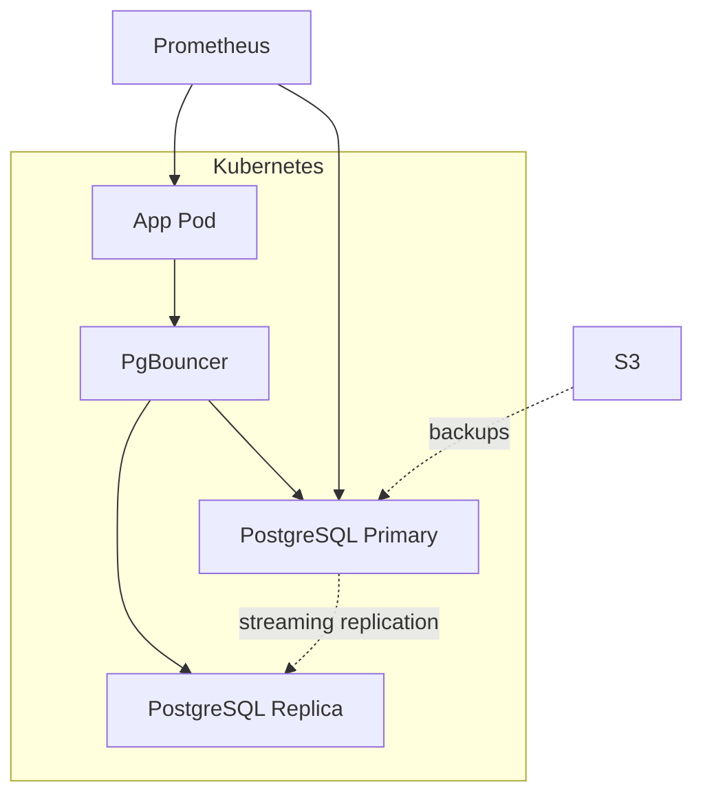

### 12.3 Production configuration <a class='askgpt-btn' href='https://chatgpt.com/?prompt=Read%20this%20section%20of%20my%20encyclopedia%20and%20explain%20it%20in%20depth%20with%20concrete%20examples%2C%20the%20main%20trade-offs%2C%20and%20common%20pitfalls%20a%20practitioner%20should%20know%3A%0A%0Ahttps%3A%2F%2Fgithub.com%2Fvishvasg14%2Fsoftware-engineering-encyclopedia%2Fblob%2Fmain%2F03-sql-databases%2Fsql-databases.md%23123-production-configuration%0A%0ASection%20title%3A%2012.3%20Production%20configuration' target='_blank' rel='noopener' data-askgpt='12.3 Production configuration' data-askgpt-url='https://github.com/vishvasg14/software-engineering-encyclopedia/blob/main/03-sql-databases/sql-databases.md#123-production-configuration' data-askgpt-prompt-depth='Read%20this%20section%20of%20my%20encyclopedia%20and%20explain%20it%20in%20depth%20with%20concrete%20examples%2C%20the%20main%20trade-offs%2C%20and%20common%20pitfalls%20a%20practitioner%20should%20know%3A%0A%0Ahttps%3A%2F%2Fgithub.com%2Fvishvasg14%2Fsoftware-engineering-encyclopedia%2Fblob%2Fmain%2F03-sql-databases%2Fsql-databases.md%23123-production-configuration%0A%0ASection%20title%3A%2012.3%20Production%20configuration' data-askgpt-prompt-examples='Read%20this%20section%20of%20my%20encyclopedia%20and%20give%20me%202-3%20real-world%20production%20examples%20for%20it.%20For%20each%3A%20what%20went%20right%2C%20what%20went%20wrong%2C%20and%20the%20lessons%20learned.%20Include%20company%20%2F%20project%20names%20if%20relevant.%0A%0Ahttps%3A%2F%2Fgithub.com%2Fvishvasg14%2Fsoftware-engineering-encyclopedia%2Fblob%2Fmain%2F03-sql-databases%2Fsql-databases.md%23123-production-configuration%0A%0ASection%20title%3A%2012.3%20Production%20configuration' title='Ask ChatGPT about this section'>💬</a>

`postgresql.conf` for production:

```ini
shared_buffers = 8GB
work_mem = 256MB
maintenance_work_mem = 2GB
effective_cache_size = 24GB
wal_buffers = 64MB
max_connections = 200
checkpoint_completion_target = 0.9
wal_compression = on
max_wal_size = 4GB
min_wal_size = 1GB
random_page_cost = 1.1
effective_io_concurrency = 200
log_min_duration_statement = 1000
log_checkpoints = on
log_connections = on
log_disconnections = on
log_lock_waits = on
autovacuum = on
autovacuum_max_workers = 4
autovacuum_naptime = 30s
```

### 12.4 High availability with Patroni <a class='askgpt-btn' href='https://chatgpt.com/?prompt=Read%20this%20section%20of%20my%20encyclopedia%20and%20explain%20it%20in%20depth%20with%20concrete%20examples%2C%20the%20main%20trade-offs%2C%20and%20common%20pitfalls%20a%20practitioner%20should%20know%3A%0A%0Ahttps%3A%2F%2Fgithub.com%2Fvishvasg14%2Fsoftware-engineering-encyclopedia%2Fblob%2Fmain%2F03-sql-databases%2Fsql-databases.md%23124-high-availability-with-patroni%0A%0ASection%20title%3A%2012.4%20High%20availability%20with%20Patroni' target='_blank' rel='noopener' data-askgpt='12.4 High availability with Patroni' data-askgpt-url='https://github.com/vishvasg14/software-engineering-encyclopedia/blob/main/03-sql-databases/sql-databases.md#124-high-availability-with-patroni' data-askgpt-prompt-depth='Read%20this%20section%20of%20my%20encyclopedia%20and%20explain%20it%20in%20depth%20with%20concrete%20examples%2C%20the%20main%20trade-offs%2C%20and%20common%20pitfalls%20a%20practitioner%20should%20know%3A%0A%0Ahttps%3A%2F%2Fgithub.com%2Fvishvasg14%2Fsoftware-engineering-encyclopedia%2Fblob%2Fmain%2F03-sql-databases%2Fsql-databases.md%23124-high-availability-with-patroni%0A%0ASection%20title%3A%2012.4%20High%20availability%20with%20Patroni' data-askgpt-prompt-examples='Read%20this%20section%20of%20my%20encyclopedia%20and%20give%20me%202-3%20real-world%20production%20examples%20for%20it.%20For%20each%3A%20what%20went%20right%2C%20what%20went%20wrong%2C%20and%20the%20lessons%20learned.%20Include%20company%20%2F%20project%20names%20if%20relevant.%0A%0Ahttps%3A%2F%2Fgithub.com%2Fvishvasg14%2Fsoftware-engineering-encyclopedia%2Fblob%2Fmain%2F03-sql-databases%2Fsql-databases.md%23124-high-availability-with-patroni%0A%0ASection%20title%3A%2012.4%20High%20availability%20with%20Patroni' title='Ask ChatGPT about this section'>💬</a>

Patroni is a popular HA orchestrator for PostgreSQL:

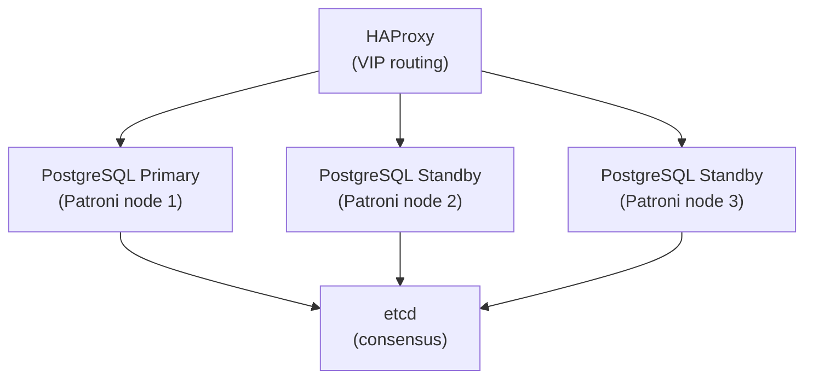

- Patroni uses etcd/ZooKeeper for consensus.
- Automatic failover if primary dies.
- HAProxy routes traffic to current primary.

### 12.5 Backup strategies <a class='askgpt-btn' href='https://chatgpt.com/?prompt=Read%20this%20section%20of%20my%20encyclopedia%20and%20explain%20it%20in%20depth%20with%20concrete%20examples%2C%20the%20main%20trade-offs%2C%20and%20common%20pitfalls%20a%20practitioner%20should%20know%3A%0A%0Ahttps%3A%2F%2Fgithub.com%2Fvishvasg14%2Fsoftware-engineering-encyclopedia%2Fblob%2Fmain%2F03-sql-databases%2Fsql-databases.md%23125-backup-strategies%0A%0ASection%20title%3A%2012.5%20Backup%20strategies' target='_blank' rel='noopener' data-askgpt='12.5 Backup strategies' data-askgpt-url='https://github.com/vishvasg14/software-engineering-encyclopedia/blob/main/03-sql-databases/sql-databases.md#125-backup-strategies' data-askgpt-prompt-depth='Read%20this%20section%20of%20my%20encyclopedia%20and%20explain%20it%20in%20depth%20with%20concrete%20examples%2C%20the%20main%20trade-offs%2C%20and%20common%20pitfalls%20a%20practitioner%20should%20know%3A%0A%0Ahttps%3A%2F%2Fgithub.com%2Fvishvasg14%2Fsoftware-engineering-encyclopedia%2Fblob%2Fmain%2F03-sql-databases%2Fsql-databases.md%23125-backup-strategies%0A%0ASection%20title%3A%2012.5%20Backup%20strategies' data-askgpt-prompt-examples='Read%20this%20section%20of%20my%20encyclopedia%20and%20give%20me%202-3%20real-world%20production%20examples%20for%20it.%20For%20each%3A%20what%20went%20right%2C%20what%20went%20wrong%2C%20and%20the%20lessons%20learned.%20Include%20company%20%2F%20project%20names%20if%20relevant.%0A%0Ahttps%3A%2F%2Fgithub.com%2Fvishvasg14%2Fsoftware-engineering-encyclopedia%2Fblob%2Fmain%2F03-sql-databases%2Fsql-databases.md%23125-backup-strategies%0A%0ASection%20title%3A%2012.5%20Backup%20strategies' title='Ask ChatGPT about this section'>💬</a>

| Type | Tool | Recovery point |
|------|------|----------------|
| Logical | `pg_dump`, `pg_dumpall` | Last logical backup |
| Physical | `pg_basebackup` | Last backup + WAL archive |
| Continuous archive | WAL archive + base backup | PITR to any point |

**Point-in-time recovery (PITR):**

1. Take base backup.
2. Continuously archive WAL files.
3. On failure, restore base backup + replay WAL up to desired time.

### 12.6 Production monitoring <a class='askgpt-btn' href='https://chatgpt.com/?prompt=Read%20this%20section%20of%20my%20encyclopedia%20and%20explain%20it%20in%20depth%20with%20concrete%20examples%2C%20the%20main%20trade-offs%2C%20and%20common%20pitfalls%20a%20practitioner%20should%20know%3A%0A%0Ahttps%3A%2F%2Fgithub.com%2Fvishvasg14%2Fsoftware-engineering-encyclopedia%2Fblob%2Fmain%2F03-sql-databases%2Fsql-databases.md%23126-production-monitoring%0A%0ASection%20title%3A%2012.6%20Production%20monitoring' target='_blank' rel='noopener' data-askgpt='12.6 Production monitoring' data-askgpt-url='https://github.com/vishvasg14/software-engineering-encyclopedia/blob/main/03-sql-databases/sql-databases.md#126-production-monitoring' data-askgpt-prompt-depth='Read%20this%20section%20of%20my%20encyclopedia%20and%20explain%20it%20in%20depth%20with%20concrete%20examples%2C%20the%20main%20trade-offs%2C%20and%20common%20pitfalls%20a%20practitioner%20should%20know%3A%0A%0Ahttps%3A%2F%2Fgithub.com%2Fvishvasg14%2Fsoftware-engineering-encyclopedia%2Fblob%2Fmain%2F03-sql-databases%2Fsql-databases.md%23126-production-monitoring%0A%0ASection%20title%3A%2012.6%20Production%20monitoring' data-askgpt-prompt-examples='Read%20this%20section%20of%20my%20encyclopedia%20and%20give%20me%202-3%20real-world%20production%20examples%20for%20it.%20For%20each%3A%20what%20went%20right%2C%20what%20went%20wrong%2C%20and%20the%20lessons%20learned.%20Include%20company%20%2F%20project%20names%20if%20relevant.%0A%0Ahttps%3A%2F%2Fgithub.com%2Fvishvasg14%2Fsoftware-engineering-encyclopedia%2Fblob%2Fmain%2F03-sql-databases%2Fsql-databases.md%23126-production-monitoring%0A%0ASection%20title%3A%2012.6%20Production%20monitoring' title='Ask ChatGPT about this section'>💬</a>

- `pg_stat_statements` — query stats.
- `pg_stat_activity` — active queries.
- `pg_stat_user_tables` — table stats (seq scans, index scans).
- `pg_stat_replication` — replication stats.
- `pg_locks` — current locks.
- `pg_stat_database` — database-level stats.

Tools:

- **pgwatch2** — Grafana-based.
- **pgDash** — commercial.
- **Datadog PostgreSQL integration**.
- **Prometheus postgres_exporter**.

### 12.7 Production debugging <a class='askgpt-btn' href='https://chatgpt.com/?prompt=Read%20this%20section%20of%20my%20encyclopedia%20and%20explain%20it%20in%20depth%20with%20concrete%20examples%2C%20the%20main%20trade-offs%2C%20and%20common%20pitfalls%20a%20practitioner%20should%20know%3A%0A%0Ahttps%3A%2F%2Fgithub.com%2Fvishvasg14%2Fsoftware-engineering-encyclopedia%2Fblob%2Fmain%2F03-sql-databases%2Fsql-databases.md%23127-production-debugging%0A%0ASection%20title%3A%2012.7%20Production%20debugging' target='_blank' rel='noopener' data-askgpt='12.7 Production debugging' data-askgpt-url='https://github.com/vishvasg14/software-engineering-encyclopedia/blob/main/03-sql-databases/sql-databases.md#127-production-debugging' data-askgpt-prompt-depth='Read%20this%20section%20of%20my%20encyclopedia%20and%20explain%20it%20in%20depth%20with%20concrete%20examples%2C%20the%20main%20trade-offs%2C%20and%20common%20pitfalls%20a%20practitioner%20should%20know%3A%0A%0Ahttps%3A%2F%2Fgithub.com%2Fvishvasg14%2Fsoftware-engineering-encyclopedia%2Fblob%2Fmain%2F03-sql-databases%2Fsql-databases.md%23127-production-debugging%0A%0ASection%20title%3A%2012.7%20Production%20debugging' data-askgpt-prompt-examples='Read%20this%20section%20of%20my%20encyclopedia%20and%20give%20me%202-3%20real-world%20production%20examples%20for%20it.%20For%20each%3A%20what%20went%20right%2C%20what%20went%20wrong%2C%20and%20the%20lessons%20learned.%20Include%20company%20%2F%20project%20names%20if%20relevant.%0A%0Ahttps%3A%2F%2Fgithub.com%2Fvishvasg14%2Fsoftware-engineering-encyclopedia%2Fblob%2Fmain%2F03-sql-databases%2Fsql-databases.md%23127-production-debugging%0A%0ASection%20title%3A%2012.7%20Production%20debugging' title='Ask ChatGPT about this section'>💬</a>

- `EXPLAIN ANALYZE` for slow queries.
- `pg_stat_activity` for "what's running now?".
- `pg_locks` for blocking.
- `auto_explain` for slow query logging.
- `log_min_duration_statement` to log slow queries.
- Heap dumps and core dumps on crash.

### 12.8 Scaling <a class='askgpt-btn' href='https://chatgpt.com/?prompt=Read%20this%20section%20of%20my%20encyclopedia%20and%20explain%20it%20in%20depth%20with%20concrete%20examples%2C%20the%20main%20trade-offs%2C%20and%20common%20pitfalls%20a%20practitioner%20should%20know%3A%0A%0Ahttps%3A%2F%2Fgithub.com%2Fvishvasg14%2Fsoftware-engineering-encyclopedia%2Fblob%2Fmain%2F03-sql-databases%2Fsql-databases.md%23128-scaling%0A%0ASection%20title%3A%2012.8%20Scaling' target='_blank' rel='noopener' data-askgpt='12.8 Scaling' data-askgpt-url='https://github.com/vishvasg14/software-engineering-encyclopedia/blob/main/03-sql-databases/sql-databases.md#128-scaling' data-askgpt-prompt-depth='Read%20this%20section%20of%20my%20encyclopedia%20and%20explain%20it%20in%20depth%20with%20concrete%20examples%2C%20the%20main%20trade-offs%2C%20and%20common%20pitfalls%20a%20practitioner%20should%20know%3A%0A%0Ahttps%3A%2F%2Fgithub.com%2Fvishvasg14%2Fsoftware-engineering-encyclopedia%2Fblob%2Fmain%2F03-sql-databases%2Fsql-databases.md%23128-scaling%0A%0ASection%20title%3A%2012.8%20Scaling' data-askgpt-prompt-examples='Read%20this%20section%20of%20my%20encyclopedia%20and%20give%20me%202-3%20real-world%20production%20examples%20for%20it.%20For%20each%3A%20what%20went%20right%2C%20what%20went%20wrong%2C%20and%20the%20lessons%20learned.%20Include%20company%20%2F%20project%20names%20if%20relevant.%0A%0Ahttps%3A%2F%2Fgithub.com%2Fvishvasg14%2Fsoftware-engineering-encyclopedia%2Fblob%2Fmain%2F03-sql-databases%2Fsql-databases.md%23128-scaling%0A%0ASection%20title%3A%2012.8%20Scaling' title='Ask ChatGPT about this section'>💬</a>

- **Vertical** — bigger machine (limited).
- **Horizontal** — read replicas, partitioning, sharding.
- **Sharding** — Citus (PG extension), manual application-level, foreign data wrappers.
- **OLAP offload** — replicate to ClickHouse, Snowflake, BigQuery.

### 12.9 Failover and disaster recovery <a class='askgpt-btn' href='https://chatgpt.com/?prompt=Read%20this%20section%20of%20my%20encyclopedia%20and%20explain%20it%20in%20depth%20with%20concrete%20examples%2C%20the%20main%20trade-offs%2C%20and%20common%20pitfalls%20a%20practitioner%20should%20know%3A%0A%0Ahttps%3A%2F%2Fgithub.com%2Fvishvasg14%2Fsoftware-engineering-encyclopedia%2Fblob%2Fmain%2F03-sql-databases%2Fsql-databases.md%23129-failover-and-disaster-recovery%0A%0ASection%20title%3A%2012.9%20Failover%20and%20disaster%20recovery' target='_blank' rel='noopener' data-askgpt='12.9 Failover and disaster recovery' data-askgpt-url='https://github.com/vishvasg14/software-engineering-encyclopedia/blob/main/03-sql-databases/sql-databases.md#129-failover-and-disaster-recovery' data-askgpt-prompt-depth='Read%20this%20section%20of%20my%20encyclopedia%20and%20explain%20it%20in%20depth%20with%20concrete%20examples%2C%20the%20main%20trade-offs%2C%20and%20common%20pitfalls%20a%20practitioner%20should%20know%3A%0A%0Ahttps%3A%2F%2Fgithub.com%2Fvishvasg14%2Fsoftware-engineering-encyclopedia%2Fblob%2Fmain%2F03-sql-databases%2Fsql-databases.md%23129-failover-and-disaster-recovery%0A%0ASection%20title%3A%2012.9%20Failover%20and%20disaster%20recovery' data-askgpt-prompt-examples='Read%20this%20section%20of%20my%20encyclopedia%20and%20give%20me%202-3%20real-world%20production%20examples%20for%20it.%20For%20each%3A%20what%20went%20right%2C%20what%20went%20wrong%2C%20and%20the%20lessons%20learned.%20Include%20company%20%2F%20project%20names%20if%20relevant.%0A%0Ahttps%3A%2F%2Fgithub.com%2Fvishvasg14%2Fsoftware-engineering-encyclopedia%2Fblob%2Fmain%2F03-sql-databases%2Fsql-databases.md%23129-failover-and-disaster-recovery%0A%0ASection%20title%3A%2012.9%20Failover%20and%20disaster%20recovery' title='Ask ChatGPT about this section'>💬</a>

- **RPO** (Recovery Point Objective) — how much data can be lost.
- **RTO** (Recovery Time Objective) — how long recovery takes.
- WAL archive to S3 enables RPO near zero.
- Patroni + etcd enables RTO in seconds.

### 12.10 Cost optimization <a class='askgpt-btn' href='https://chatgpt.com/?prompt=Read%20this%20section%20of%20my%20encyclopedia%20and%20explain%20it%20in%20depth%20with%20concrete%20examples%2C%20the%20main%20trade-offs%2C%20and%20common%20pitfalls%20a%20practitioner%20should%20know%3A%0A%0Ahttps%3A%2F%2Fgithub.com%2Fvishvasg14%2Fsoftware-engineering-encyclopedia%2Fblob%2Fmain%2F03-sql-databases%2Fsql-databases.md%231210-cost-optimization%0A%0ASection%20title%3A%2012.10%20Cost%20optimization' target='_blank' rel='noopener' data-askgpt='12.10 Cost optimization' data-askgpt-url='https://github.com/vishvasg14/software-engineering-encyclopedia/blob/main/03-sql-databases/sql-databases.md#1210-cost-optimization' data-askgpt-prompt-depth='Read%20this%20section%20of%20my%20encyclopedia%20and%20explain%20it%20in%20depth%20with%20concrete%20examples%2C%20the%20main%20trade-offs%2C%20and%20common%20pitfalls%20a%20practitioner%20should%20know%3A%0A%0Ahttps%3A%2F%2Fgithub.com%2Fvishvasg14%2Fsoftware-engineering-encyclopedia%2Fblob%2Fmain%2F03-sql-databases%2Fsql-databases.md%231210-cost-optimization%0A%0ASection%20title%3A%2012.10%20Cost%20optimization' data-askgpt-prompt-examples='Read%20this%20section%20of%20my%20encyclopedia%20and%20give%20me%202-3%20real-world%20production%20examples%20for%20it.%20For%20each%3A%20what%20went%20right%2C%20what%20went%20wrong%2C%20and%20the%20lessons%20learned.%20Include%20company%20%2F%20project%20names%20if%20relevant.%0A%0Ahttps%3A%2F%2Fgithub.com%2Fvishvasg14%2Fsoftware-engineering-encyclopedia%2Fblob%2Fmain%2F03-sql-databases%2Fsql-databases.md%231210-cost-optimization%0A%0ASection%20title%3A%2012.10%20Cost%20optimization' title='Ask ChatGPT about this section'>💬</a>

- Right-size instances (avoid over-provisioning).
- Compression (TOAST, lz4/zstd on WAL).
- Aggressive autovacuum for hot tables (smaller dead tuple overhead).
- Materialized views for expensive aggregations.

## 13. Production Case Studies

### 13.1 Instagram — PostgreSQL at extreme scale <a class='askgpt-btn' href='https://chatgpt.com/?prompt=Read%20this%20section%20of%20my%20encyclopedia%20and%20explain%20it%20in%20depth%20with%20concrete%20examples%2C%20the%20main%20trade-offs%2C%20and%20common%20pitfalls%20a%20practitioner%20should%20know%3A%0A%0Ahttps%3A%2F%2Fgithub.com%2Fvishvasg14%2Fsoftware-engineering-encyclopedia%2Fblob%2Fmain%2F03-sql-databases%2Fsql-databases.md%23131-instagram-postgresql-at-extreme-scale%0A%0ASection%20title%3A%2013.1%20Instagram%20%E2%80%94%20PostgreSQL%20at%20extreme%20scale' target='_blank' rel='noopener' data-askgpt='13.1 Instagram — PostgreSQL at extreme scale' data-askgpt-url='https://github.com/vishvasg14/software-engineering-encyclopedia/blob/main/03-sql-databases/sql-databases.md#131-instagram-postgresql-at-extreme-scale' data-askgpt-prompt-depth='Read%20this%20section%20of%20my%20encyclopedia%20and%20explain%20it%20in%20depth%20with%20concrete%20examples%2C%20the%20main%20trade-offs%2C%20and%20common%20pitfalls%20a%20practitioner%20should%20know%3A%0A%0Ahttps%3A%2F%2Fgithub.com%2Fvishvasg14%2Fsoftware-engineering-encyclopedia%2Fblob%2Fmain%2F03-sql-databases%2Fsql-databases.md%23131-instagram-postgresql-at-extreme-scale%0A%0ASection%20title%3A%2013.1%20Instagram%20%E2%80%94%20PostgreSQL%20at%20extreme%20scale' data-askgpt-prompt-examples='Read%20this%20section%20of%20my%20encyclopedia%20and%20give%20me%202-3%20real-world%20production%20examples%20for%20it.%20For%20each%3A%20what%20went%20right%2C%20what%20went%20wrong%2C%20and%20the%20lessons%20learned.%20Include%20company%20%2F%20project%20names%20if%20relevant.%0A%0Ahttps%3A%2F%2Fgithub.com%2Fvishvasg14%2Fsoftware-engineering-encyclopedia%2Fblob%2Fmain%2F03-sql-databases%2Fsql-databases.md%23131-instagram-postgresql-at-extreme-scale%0A%0ASection%20title%3A%2013.1%20Instagram%20%E2%80%94%20PostgreSQL%20at%20extreme%20scale' title='Ask ChatGPT about this section'>💬</a>

Instagram famously scaled PostgreSQL to billions of photos. Their approach:

- Schema design with denormalization where needed.
- Sharding via application-level partitioning (Instagram's "shard" terminology).
- PostgreSQL's FDW for distributed queries.
- Aggressive vacuum and analyze schedules.
- Custom connection pooling.

Their engineering blog and PGCon talks document specific techniques.

### 13.2 WhatsApp — Erlang + PostgreSQL <a class='askgpt-btn' href='https://chatgpt.com/?prompt=Read%20this%20section%20of%20my%20encyclopedia%20and%20explain%20it%20in%20depth%20with%20concrete%20examples%2C%20the%20main%20trade-offs%2C%20and%20common%20pitfalls%20a%20practitioner%20should%20know%3A%0A%0Ahttps%3A%2F%2Fgithub.com%2Fvishvasg14%2Fsoftware-engineering-encyclopedia%2Fblob%2Fmain%2F03-sql-databases%2Fsql-databases.md%23132-whatsapp-erlang-postgresql%0A%0ASection%20title%3A%2013.2%20WhatsApp%20%E2%80%94%20Erlang%20%2B%20PostgreSQL' target='_blank' rel='noopener' data-askgpt='13.2 WhatsApp — Erlang + PostgreSQL' data-askgpt-url='https://github.com/vishvasg14/software-engineering-encyclopedia/blob/main/03-sql-databases/sql-databases.md#132-whatsapp-erlang-postgresql' data-askgpt-prompt-depth='Read%20this%20section%20of%20my%20encyclopedia%20and%20explain%20it%20in%20depth%20with%20concrete%20examples%2C%20the%20main%20trade-offs%2C%20and%20common%20pitfalls%20a%20practitioner%20should%20know%3A%0A%0Ahttps%3A%2F%2Fgithub.com%2Fvishvasg14%2Fsoftware-engineering-encyclopedia%2Fblob%2Fmain%2F03-sql-databases%2Fsql-databases.md%23132-whatsapp-erlang-postgresql%0A%0ASection%20title%3A%2013.2%20WhatsApp%20%E2%80%94%20Erlang%20%2B%20PostgreSQL' data-askgpt-prompt-examples='Read%20this%20section%20of%20my%20encyclopedia%20and%20give%20me%202-3%20real-world%20production%20examples%20for%20it.%20For%20each%3A%20what%20went%20right%2C%20what%20went%20wrong%2C%20and%20the%20lessons%20learned.%20Include%20company%20%2F%20project%20names%20if%20relevant.%0A%0Ahttps%3A%2F%2Fgithub.com%2Fvishvasg14%2Fsoftware-engineering-encyclopedia%2Fblob%2Fmain%2F03-sql-databases%2Fsql-databases.md%23132-whatsapp-erlang-postgresql%0A%0ASection%20title%3A%2013.2%20WhatsApp%20%E2%80%94%20Erlang%20%2B%20PostgreSQL' title='Ask ChatGPT about this section'>💬</a>

WhatsApp famously runs the world's largest Erlang deployment but uses PostgreSQL for the message store. Their engineering team has documented:

- Schema design for billions of messages.
- Connection pooling (originally 1 million connections per server via Erlang's lightweight processes).
- `pgBouncer` later for further pooling.

### 13.3 Uber — schemaless to PostgreSQL <a class='askgpt-btn' href='https://chatgpt.com/?prompt=Read%20this%20section%20of%20my%20encyclopedia%20and%20explain%20it%20in%20depth%20with%20concrete%20examples%2C%20the%20main%20trade-offs%2C%20and%20common%20pitfalls%20a%20practitioner%20should%20know%3A%0A%0Ahttps%3A%2F%2Fgithub.com%2Fvishvasg14%2Fsoftware-engineering-encyclopedia%2Fblob%2Fmain%2F03-sql-databases%2Fsql-databases.md%23133-uber-schemaless-to-postgresql%0A%0ASection%20title%3A%2013.3%20Uber%20%E2%80%94%20schemaless%20to%20PostgreSQL' target='_blank' rel='noopener' data-askgpt='13.3 Uber — schemaless to PostgreSQL' data-askgpt-url='https://github.com/vishvasg14/software-engineering-encyclopedia/blob/main/03-sql-databases/sql-databases.md#133-uber-schemaless-to-postgresql' data-askgpt-prompt-depth='Read%20this%20section%20of%20my%20encyclopedia%20and%20explain%20it%20in%20depth%20with%20concrete%20examples%2C%20the%20main%20trade-offs%2C%20and%20common%20pitfalls%20a%20practitioner%20should%20know%3A%0A%0Ahttps%3A%2F%2Fgithub.com%2Fvishvasg14%2Fsoftware-engineering-encyclopedia%2Fblob%2Fmain%2F03-sql-databases%2Fsql-databases.md%23133-uber-schemaless-to-postgresql%0A%0ASection%20title%3A%2013.3%20Uber%20%E2%80%94%20schemaless%20to%20PostgreSQL' data-askgpt-prompt-examples='Read%20this%20section%20of%20my%20encyclopedia%20and%20give%20me%202-3%20real-world%20production%20examples%20for%20it.%20For%20each%3A%20what%20went%20right%2C%20what%20went%20wrong%2C%20and%20the%20lessons%20learned.%20Include%20company%20%2F%20project%20names%20if%20relevant.%0A%0Ahttps%3A%2F%2Fgithub.com%2Fvishvasg14%2Fsoftware-engineering-encyclopedia%2Fblob%2Fmain%2F03-sql-databases%2Fsql-databases.md%23133-uber-schemaless-to-postgresql%0A%0ASection%20title%3A%2013.3%20Uber%20%E2%80%94%20schemaless%20to%20PostgreSQL' title='Ask ChatGPT about this section'>💬</a>

Uber originally built a "schemaless" MySQL architecture (document-like rows). Their engineering blog documents the migration to PostgreSQL:

- Moved many services from MySQL to PostgreSQL.
- Better schema migration tools.
- Improved JSONB usage for flexible schemas.

### 13.4 Stripe — PostgreSQL as a service <a class='askgpt-btn' href='https://chatgpt.com/?prompt=Read%20this%20section%20of%20my%20encyclopedia%20and%20explain%20it%20in%20depth%20with%20concrete%20examples%2C%20the%20main%20trade-offs%2C%20and%20common%20pitfalls%20a%20practitioner%20should%20know%3A%0A%0Ahttps%3A%2F%2Fgithub.com%2Fvishvasg14%2Fsoftware-engineering-encyclopedia%2Fblob%2Fmain%2F03-sql-databases%2Fsql-databases.md%23134-stripe-postgresql-as-a-service%0A%0ASection%20title%3A%2013.4%20Stripe%20%E2%80%94%20PostgreSQL%20as%20a%20service' target='_blank' rel='noopener' data-askgpt='13.4 Stripe — PostgreSQL as a service' data-askgpt-url='https://github.com/vishvasg14/software-engineering-encyclopedia/blob/main/03-sql-databases/sql-databases.md#134-stripe-postgresql-as-a-service' data-askgpt-prompt-depth='Read%20this%20section%20of%20my%20encyclopedia%20and%20explain%20it%20in%20depth%20with%20concrete%20examples%2C%20the%20main%20trade-offs%2C%20and%20common%20pitfalls%20a%20practitioner%20should%20know%3A%0A%0Ahttps%3A%2F%2Fgithub.com%2Fvishvasg14%2Fsoftware-engineering-encyclopedia%2Fblob%2Fmain%2F03-sql-databases%2Fsql-databases.md%23134-stripe-postgresql-as-a-service%0A%0ASection%20title%3A%2013.4%20Stripe%20%E2%80%94%20PostgreSQL%20as%20a%20service' data-askgpt-prompt-examples='Read%20this%20section%20of%20my%20encyclopedia%20and%20give%20me%202-3%20real-world%20production%20examples%20for%20it.%20For%20each%3A%20what%20went%20right%2C%20what%20went%20wrong%2C%20and%20the%20lessons%20learned.%20Include%20company%20%2F%20project%20names%20if%20relevant.%0A%0Ahttps%3A%2F%2Fgithub.com%2Fvishvasg14%2Fsoftware-engineering-encyclopedia%2Fblob%2Fmain%2F03-sql-databases%2Fsql-databases.md%23134-stripe-postgresql-as-a-service%0A%0ASection%20title%3A%2013.4%20Stripe%20%E2%80%94%20PostgreSQL%20as%20a%20service' title='Ask ChatGPT about this section'>💬</a>

Stripe uses PostgreSQL for financial transactions. Their team has built and contributed:

- **WAL-G** — backup tool.
- Schema design for multi-tenant financial data.
- Custom replication and recovery tooling.

### 13.5 GitLab — large-scale PG operations <a class='askgpt-btn' href='https://chatgpt.com/?prompt=Read%20this%20section%20of%20my%20encyclopedia%20and%20explain%20it%20in%20depth%20with%20concrete%20examples%2C%20the%20main%20trade-offs%2C%20and%20common%20pitfalls%20a%20practitioner%20should%20know%3A%0A%0Ahttps%3A%2F%2Fgithub.com%2Fvishvasg14%2Fsoftware-engineering-encyclopedia%2Fblob%2Fmain%2F03-sql-databases%2Fsql-databases.md%23135-gitlab-large-scale-pg-operations%0A%0ASection%20title%3A%2013.5%20GitLab%20%E2%80%94%20large-scale%20PG%20operations' target='_blank' rel='noopener' data-askgpt='13.5 GitLab — large-scale PG operations' data-askgpt-url='https://github.com/vishvasg14/software-engineering-encyclopedia/blob/main/03-sql-databases/sql-databases.md#135-gitlab-large-scale-pg-operations' data-askgpt-prompt-depth='Read%20this%20section%20of%20my%20encyclopedia%20and%20explain%20it%20in%20depth%20with%20concrete%20examples%2C%20the%20main%20trade-offs%2C%20and%20common%20pitfalls%20a%20practitioner%20should%20know%3A%0A%0Ahttps%3A%2F%2Fgithub.com%2Fvishvasg14%2Fsoftware-engineering-encyclopedia%2Fblob%2Fmain%2F03-sql-databases%2Fsql-databases.md%23135-gitlab-large-scale-pg-operations%0A%0ASection%20title%3A%2013.5%20GitLab%20%E2%80%94%20large-scale%20PG%20operations' data-askgpt-prompt-examples='Read%20this%20section%20of%20my%20encyclopedia%20and%20give%20me%202-3%20real-world%20production%20examples%20for%20it.%20For%20each%3A%20what%20went%20right%2C%20what%20went%20wrong%2C%20and%20the%20lessons%20learned.%20Include%20company%20%2F%20project%20names%20if%20relevant.%0A%0Ahttps%3A%2F%2Fgithub.com%2Fvishvasg14%2Fsoftware-engineering-encyclopedia%2Fblob%2Fmain%2F03-sql-databases%2Fsql-databases.md%23135-gitlab-large-scale-pg-operations%0A%0ASection%20title%3A%2013.5%20GitLab%20%E2%80%94%20large-scale%20PG%20operations' title='Ask ChatGPT about this section'>💬</a>

GitLab runs PostgreSQL at significant scale. Their handbook documents operational practices:

- HA via Patroni.
- Backup strategies.
- Performance monitoring.

### 13.6 Cloudflare — PostgreSQL for analytics <a class='askgpt-btn' href='https://chatgpt.com/?prompt=Read%20this%20section%20of%20my%20encyclopedia%20and%20explain%20it%20in%20depth%20with%20concrete%20examples%2C%20the%20main%20trade-offs%2C%20and%20common%20pitfalls%20a%20practitioner%20should%20know%3A%0A%0Ahttps%3A%2F%2Fgithub.com%2Fvishvasg14%2Fsoftware-engineering-encyclopedia%2Fblob%2Fmain%2F03-sql-databases%2Fsql-databases.md%23136-cloudflare-postgresql-for-analytics%0A%0ASection%20title%3A%2013.6%20Cloudflare%20%E2%80%94%20PostgreSQL%20for%20analytics' target='_blank' rel='noopener' data-askgpt='13.6 Cloudflare — PostgreSQL for analytics' data-askgpt-url='https://github.com/vishvasg14/software-engineering-encyclopedia/blob/main/03-sql-databases/sql-databases.md#136-cloudflare-postgresql-for-analytics' data-askgpt-prompt-depth='Read%20this%20section%20of%20my%20encyclopedia%20and%20explain%20it%20in%20depth%20with%20concrete%20examples%2C%20the%20main%20trade-offs%2C%20and%20common%20pitfalls%20a%20practitioner%20should%20know%3A%0A%0Ahttps%3A%2F%2Fgithub.com%2Fvishvasg14%2Fsoftware-engineering-encyclopedia%2Fblob%2Fmain%2F03-sql-databases%2Fsql-databases.md%23136-cloudflare-postgresql-for-analytics%0A%0ASection%20title%3A%2013.6%20Cloudflare%20%E2%80%94%20PostgreSQL%20for%20analytics' data-askgpt-prompt-examples='Read%20this%20section%20of%20my%20encyclopedia%20and%20give%20me%202-3%20real-world%20production%20examples%20for%20it.%20For%20each%3A%20what%20went%20right%2C%20what%20went%20wrong%2C%20and%20the%20lessons%20learned.%20Include%20company%20%2F%20project%20names%20if%20relevant.%0A%0Ahttps%3A%2F%2Fgithub.com%2Fvishvasg14%2Fsoftware-engineering-encyclopedia%2Fblob%2Fmain%2F03-sql-databases%2Fsql-databases.md%23136-cloudflare-postgresql-for-analytics%0A%0ASection%20title%3A%2013.6%20Cloudflare%20%E2%80%94%20PostgreSQL%20for%20analytics' title='Ask ChatGPT about this section'>💬</a>

Cloudflare uses PostgreSQL for some analytics workloads. They built **pgcat**, a high-performance PostgreSQL proxy in Rust.

### 13.7 Discord — trillions of messages <a class='askgpt-btn' href='https://chatgpt.com/?prompt=Read%20this%20section%20of%20my%20encyclopedia%20and%20explain%20it%20in%20depth%20with%20concrete%20examples%2C%20the%20main%20trade-offs%2C%20and%20common%20pitfalls%20a%20practitioner%20should%20know%3A%0A%0Ahttps%3A%2F%2Fgithub.com%2Fvishvasg14%2Fsoftware-engineering-encyclopedia%2Fblob%2Fmain%2F03-sql-databases%2Fsql-databases.md%23137-discord-trillions-of-messages%0A%0ASection%20title%3A%2013.7%20Discord%20%E2%80%94%20trillions%20of%20messages' target='_blank' rel='noopener' data-askgpt='13.7 Discord — trillions of messages' data-askgpt-url='https://github.com/vishvasg14/software-engineering-encyclopedia/blob/main/03-sql-databases/sql-databases.md#137-discord-trillions-of-messages' data-askgpt-prompt-depth='Read%20this%20section%20of%20my%20encyclopedia%20and%20explain%20it%20in%20depth%20with%20concrete%20examples%2C%20the%20main%20trade-offs%2C%20and%20common%20pitfalls%20a%20practitioner%20should%20know%3A%0A%0Ahttps%3A%2F%2Fgithub.com%2Fvishvasg14%2Fsoftware-engineering-encyclopedia%2Fblob%2Fmain%2F03-sql-databases%2Fsql-databases.md%23137-discord-trillions-of-messages%0A%0ASection%20title%3A%2013.7%20Discord%20%E2%80%94%20trillions%20of%20messages' data-askgpt-prompt-examples='Read%20this%20section%20of%20my%20encyclopedia%20and%20give%20me%202-3%20real-world%20production%20examples%20for%20it.%20For%20each%3A%20what%20went%20right%2C%20what%20went%20wrong%2C%20and%20the%20lessons%20learned.%20Include%20company%20%2F%20project%20names%20if%20relevant.%0A%0Ahttps%3A%2F%2Fgithub.com%2Fvishvasg14%2Fsoftware-engineering-encyclopedia%2Fblob%2Fmain%2F03-sql-databases%2Fsql-databases.md%23137-discord-trillions-of-messages%0A%0ASection%20title%3A%2013.7%20Discord%20%E2%80%94%20trillions%20of%20messages' title='Ask ChatGPT about this section'>💬</a>

Discord famously stores trillions of messages using:

- Cassandra for the message store (write-heavy, denormalized).
- PostgreSQL for everything else.
- Their engineering blog documents the split.

### 13.8 Notion — PostgreSQL as foundation <a class='askgpt-btn' href='https://chatgpt.com/?prompt=Read%20this%20section%20of%20my%20encyclopedia%20and%20explain%20it%20in%20depth%20with%20concrete%20examples%2C%20the%20main%20trade-offs%2C%20and%20common%20pitfalls%20a%20practitioner%20should%20know%3A%0A%0Ahttps%3A%2F%2Fgithub.com%2Fvishvasg14%2Fsoftware-engineering-encyclopedia%2Fblob%2Fmain%2F03-sql-databases%2Fsql-databases.md%23138-notion-postgresql-as-foundation%0A%0ASection%20title%3A%2013.8%20Notion%20%E2%80%94%20PostgreSQL%20as%20foundation' target='_blank' rel='noopener' data-askgpt='13.8 Notion — PostgreSQL as foundation' data-askgpt-url='https://github.com/vishvasg14/software-engineering-encyclopedia/blob/main/03-sql-databases/sql-databases.md#138-notion-postgresql-as-foundation' data-askgpt-prompt-depth='Read%20this%20section%20of%20my%20encyclopedia%20and%20explain%20it%20in%20depth%20with%20concrete%20examples%2C%20the%20main%20trade-offs%2C%20and%20common%20pitfalls%20a%20practitioner%20should%20know%3A%0A%0Ahttps%3A%2F%2Fgithub.com%2Fvishvasg14%2Fsoftware-engineering-encyclopedia%2Fblob%2Fmain%2F03-sql-databases%2Fsql-databases.md%23138-notion-postgresql-as-foundation%0A%0ASection%20title%3A%2013.8%20Notion%20%E2%80%94%20PostgreSQL%20as%20foundation' data-askgpt-prompt-examples='Read%20this%20section%20of%20my%20encyclopedia%20and%20give%20me%202-3%20real-world%20production%20examples%20for%20it.%20For%20each%3A%20what%20went%20right%2C%20what%20went%20wrong%2C%20and%20the%20lessons%20learned.%20Include%20company%20%2F%20project%20names%20if%20relevant.%0A%0Ahttps%3A%2F%2Fgithub.com%2Fvishvasg14%2Fsoftware-engineering-encyclopedia%2Fblob%2Fmain%2F03-sql-databases%2Fsql-databases.md%23138-notion-postgresql-as-foundation%0A%0ASection%20title%3A%2013.8%20Notion%20%E2%80%94%20PostgreSQL%20as%20foundation' title='Ask ChatGPT about this section'>💬</a>

Notion built their collaborative workspace on PostgreSQL. They document:

- Heavy use of JSONB for flexible schemas.
- Logical replication for read replicas.
- Custom tooling for migrations.

---

## 14. Code Examples

### 14.1 Basic SELECT <a class='askgpt-btn' href='https://chatgpt.com/?prompt=Read%20this%20section%20of%20my%20encyclopedia%20and%20explain%20it%20in%20depth%20with%20concrete%20examples%2C%20the%20main%20trade-offs%2C%20and%20common%20pitfalls%20a%20practitioner%20should%20know%3A%0A%0Ahttps%3A%2F%2Fgithub.com%2Fvishvasg14%2Fsoftware-engineering-encyclopedia%2Fblob%2Fmain%2F03-sql-databases%2Fsql-databases.md%23141-basic-select%0A%0ASection%20title%3A%2014.1%20Basic%20SELECT' target='_blank' rel='noopener' data-askgpt='14.1 Basic SELECT' data-askgpt-url='https://github.com/vishvasg14/software-engineering-encyclopedia/blob/main/03-sql-databases/sql-databases.md#141-basic-select' data-askgpt-prompt-depth='Read%20this%20section%20of%20my%20encyclopedia%20and%20explain%20it%20in%20depth%20with%20concrete%20examples%2C%20the%20main%20trade-offs%2C%20and%20common%20pitfalls%20a%20practitioner%20should%20know%3A%0A%0Ahttps%3A%2F%2Fgithub.com%2Fvishvasg14%2Fsoftware-engineering-encyclopedia%2Fblob%2Fmain%2F03-sql-databases%2Fsql-databases.md%23141-basic-select%0A%0ASection%20title%3A%2014.1%20Basic%20SELECT' data-askgpt-prompt-examples='Read%20this%20section%20of%20my%20encyclopedia%20and%20give%20me%202-3%20real-world%20production%20examples%20for%20it.%20For%20each%3A%20what%20went%20right%2C%20what%20went%20wrong%2C%20and%20the%20lessons%20learned.%20Include%20company%20%2F%20project%20names%20if%20relevant.%0A%0Ahttps%3A%2F%2Fgithub.com%2Fvishvasg14%2Fsoftware-engineering-encyclopedia%2Fblob%2Fmain%2F03-sql-databases%2Fsql-databases.md%23141-basic-select%0A%0ASection%20title%3A%2014.1%20Basic%20SELECT' title='Ask ChatGPT about this section'>💬</a>

```sql
SELECT id, name, email
FROM users
WHERE active = true
ORDER BY created_at DESC
LIMIT 10;
```

### 14.2 Joins <a class='askgpt-btn' href='https://chatgpt.com/?prompt=Read%20this%20section%20of%20my%20encyclopedia%20and%20explain%20it%20in%20depth%20with%20concrete%20examples%2C%20the%20main%20trade-offs%2C%20and%20common%20pitfalls%20a%20practitioner%20should%20know%3A%0A%0Ahttps%3A%2F%2Fgithub.com%2Fvishvasg14%2Fsoftware-engineering-encyclopedia%2Fblob%2Fmain%2F03-sql-databases%2Fsql-databases.md%23142-joins%0A%0ASection%20title%3A%2014.2%20Joins' target='_blank' rel='noopener' data-askgpt='14.2 Joins' data-askgpt-url='https://github.com/vishvasg14/software-engineering-encyclopedia/blob/main/03-sql-databases/sql-databases.md#142-joins' data-askgpt-prompt-depth='Read%20this%20section%20of%20my%20encyclopedia%20and%20explain%20it%20in%20depth%20with%20concrete%20examples%2C%20the%20main%20trade-offs%2C%20and%20common%20pitfalls%20a%20practitioner%20should%20know%3A%0A%0Ahttps%3A%2F%2Fgithub.com%2Fvishvasg14%2Fsoftware-engineering-encyclopedia%2Fblob%2Fmain%2F03-sql-databases%2Fsql-databases.md%23142-joins%0A%0ASection%20title%3A%2014.2%20Joins' data-askgpt-prompt-examples='Read%20this%20section%20of%20my%20encyclopedia%20and%20give%20me%202-3%20real-world%20production%20examples%20for%20it.%20For%20each%3A%20what%20went%20right%2C%20what%20went%20wrong%2C%20and%20the%20lessons%20learned.%20Include%20company%20%2F%20project%20names%20if%20relevant.%0A%0Ahttps%3A%2F%2Fgithub.com%2Fvishvasg14%2Fsoftware-engineering-encyclopedia%2Fblob%2Fmain%2F03-sql-databases%2Fsql-databases.md%23142-joins%0A%0ASection%20title%3A%2014.2%20Joins' title='Ask ChatGPT about this section'>💬</a>

```sql
-- Inner join
SELECT u.name, COUNT(o.id) AS order_count
FROM users u
INNER JOIN orders o ON o.user_id = u.id
WHERE u.active = true
GROUP BY u.id, u.name
ORDER BY order_count DESC;

-- Left join (include users with no orders)
SELECT u.name, COALESCE(COUNT(o.id), 0) AS order_count
FROM users u
LEFT JOIN orders o ON o.user_id = u.id
GROUP BY u.id, u.name;
```

### 14.3 Aggregates <a class='askgpt-btn' href='https://chatgpt.com/?prompt=Read%20this%20section%20of%20my%20encyclopedia%20and%20explain%20it%20in%20depth%20with%20concrete%20examples%2C%20the%20main%20trade-offs%2C%20and%20common%20pitfalls%20a%20practitioner%20should%20know%3A%0A%0Ahttps%3A%2F%2Fgithub.com%2Fvishvasg14%2Fsoftware-engineering-encyclopedia%2Fblob%2Fmain%2F03-sql-databases%2Fsql-databases.md%23143-aggregates%0A%0ASection%20title%3A%2014.3%20Aggregates' target='_blank' rel='noopener' data-askgpt='14.3 Aggregates' data-askgpt-url='https://github.com/vishvasg14/software-engineering-encyclopedia/blob/main/03-sql-databases/sql-databases.md#143-aggregates' data-askgpt-prompt-depth='Read%20this%20section%20of%20my%20encyclopedia%20and%20explain%20it%20in%20depth%20with%20concrete%20examples%2C%20the%20main%20trade-offs%2C%20and%20common%20pitfalls%20a%20practitioner%20should%20know%3A%0A%0Ahttps%3A%2F%2Fgithub.com%2Fvishvasg14%2Fsoftware-engineering-encyclopedia%2Fblob%2Fmain%2F03-sql-databases%2Fsql-databases.md%23143-aggregates%0A%0ASection%20title%3A%2014.3%20Aggregates' data-askgpt-prompt-examples='Read%20this%20section%20of%20my%20encyclopedia%20and%20give%20me%202-3%20real-world%20production%20examples%20for%20it.%20For%20each%3A%20what%20went%20right%2C%20what%20went%20wrong%2C%20and%20the%20lessons%20learned.%20Include%20company%20%2F%20project%20names%20if%20relevant.%0A%0Ahttps%3A%2F%2Fgithub.com%2Fvishvasg14%2Fsoftware-engineering-encyclopedia%2Fblob%2Fmain%2F03-sql-databases%2Fsql-databases.md%23143-aggregates%0A%0ASection%20title%3A%2014.3%20Aggregates' title='Ask ChatGPT about this section'>💬</a>

```sql
SELECT
    department,
    COUNT(*) AS headcount,
    AVG(salary)::numeric(10,2) AS avg_salary,
    PERCENTILE_CONT(0.5) WITHIN GROUP (ORDER BY salary) AS median_salary,
    MAX(salary) - MIN(salary) AS salary_range
FROM employees
WHERE active = true
GROUP BY department
HAVING COUNT(*) >= 5
ORDER BY avg_salary DESC;
```

### 14.4 Window functions <a class='askgpt-btn' href='https://chatgpt.com/?prompt=Read%20this%20section%20of%20my%20encyclopedia%20and%20explain%20it%20in%20depth%20with%20concrete%20examples%2C%20the%20main%20trade-offs%2C%20and%20common%20pitfalls%20a%20practitioner%20should%20know%3A%0A%0Ahttps%3A%2F%2Fgithub.com%2Fvishvasg14%2Fsoftware-engineering-encyclopedia%2Fblob%2Fmain%2F03-sql-databases%2Fsql-databases.md%23144-window-functions%0A%0ASection%20title%3A%2014.4%20Window%20functions' target='_blank' rel='noopener' data-askgpt='14.4 Window functions' data-askgpt-url='https://github.com/vishvasg14/software-engineering-encyclopedia/blob/main/03-sql-databases/sql-databases.md#144-window-functions' data-askgpt-prompt-depth='Read%20this%20section%20of%20my%20encyclopedia%20and%20explain%20it%20in%20depth%20with%20concrete%20examples%2C%20the%20main%20trade-offs%2C%20and%20common%20pitfalls%20a%20practitioner%20should%20know%3A%0A%0Ahttps%3A%2F%2Fgithub.com%2Fvishvasg14%2Fsoftware-engineering-encyclopedia%2Fblob%2Fmain%2F03-sql-databases%2Fsql-databases.md%23144-window-functions%0A%0ASection%20title%3A%2014.4%20Window%20functions' data-askgpt-prompt-examples='Read%20this%20section%20of%20my%20encyclopedia%20and%20give%20me%202-3%20real-world%20production%20examples%20for%20it.%20For%20each%3A%20what%20went%20right%2C%20what%20went%20wrong%2C%20and%20the%20lessons%20learned.%20Include%20company%20%2F%20project%20names%20if%20relevant.%0A%0Ahttps%3A%2F%2Fgithub.com%2Fvishvasg14%2Fsoftware-engineering-encyclopedia%2Fblob%2Fmain%2F03-sql-databases%2Fsql-databases.md%23144-window-functions%0A%0ASection%20title%3A%2014.4%20Window%20functions' title='Ask ChatGPT about this section'>💬</a>

```sql
WITH ranked AS (
    SELECT
        employee_id,
        department,
        salary,
        RANK() OVER (PARTITION BY department ORDER BY salary DESC) AS dept_rank,
        SUM(salary) OVER (PARTITION BY department) AS dept_total,
        LAG(salary) OVER (PARTITION BY department ORDER BY hire_date) AS prev_salary
    FROM employees
)
SELECT * FROM ranked WHERE dept_rank <= 3;
```

### 14.5 CTEs and recursive queries <a class='askgpt-btn' href='https://chatgpt.com/?prompt=Read%20this%20section%20of%20my%20encyclopedia%20and%20explain%20it%20in%20depth%20with%20concrete%20examples%2C%20the%20main%20trade-offs%2C%20and%20common%20pitfalls%20a%20practitioner%20should%20know%3A%0A%0Ahttps%3A%2F%2Fgithub.com%2Fvishvasg14%2Fsoftware-engineering-encyclopedia%2Fblob%2Fmain%2F03-sql-databases%2Fsql-databases.md%23145-ctes-and-recursive-queries%0A%0ASection%20title%3A%2014.5%20CTEs%20and%20recursive%20queries' target='_blank' rel='noopener' data-askgpt='14.5 CTEs and recursive queries' data-askgpt-url='https://github.com/vishvasg14/software-engineering-encyclopedia/blob/main/03-sql-databases/sql-databases.md#145-ctes-and-recursive-queries' data-askgpt-prompt-depth='Read%20this%20section%20of%20my%20encyclopedia%20and%20explain%20it%20in%20depth%20with%20concrete%20examples%2C%20the%20main%20trade-offs%2C%20and%20common%20pitfalls%20a%20practitioner%20should%20know%3A%0A%0Ahttps%3A%2F%2Fgithub.com%2Fvishvasg14%2Fsoftware-engineering-encyclopedia%2Fblob%2Fmain%2F03-sql-databases%2Fsql-databases.md%23145-ctes-and-recursive-queries%0A%0ASection%20title%3A%2014.5%20CTEs%20and%20recursive%20queries' data-askgpt-prompt-examples='Read%20this%20section%20of%20my%20encyclopedia%20and%20give%20me%202-3%20real-world%20production%20examples%20for%20it.%20For%20each%3A%20what%20went%20right%2C%20what%20went%20wrong%2C%20and%20the%20lessons%20learned.%20Include%20company%20%2F%20project%20names%20if%20relevant.%0A%0Ahttps%3A%2F%2Fgithub.com%2Fvishvasg14%2Fsoftware-engineering-encyclopedia%2Fblob%2Fmain%2F03-sql-databases%2Fsql-databases.md%23145-ctes-and-recursive-queries%0A%0ASection%20title%3A%2014.5%20CTEs%20and%20recursive%20queries' title='Ask ChatGPT about this section'>💬</a>

```sql
-- Manager hierarchy (recursive)
WITH RECURSIVE org_chart AS (
    SELECT id, name, manager_id, 0 AS depth
    FROM employees
    WHERE id = 1  -- CEO
    UNION ALL
    SELECT e.id, e.name, e.manager_id, o.depth + 1
    FROM employees e
    JOIN org_chart o ON e.manager_id = o.id
)
SELECT * FROM org_chart ORDER BY depth, name;

-- Graph reachability
WITH RECURSIVE reach AS (
    SELECT id, 1 AS hops FROM nodes WHERE id = 1
    UNION
    SELECT e.to_id, r.hops + 1
    FROM edges e
    JOIN reach r ON e.from_id = r.id
    WHERE r.hops < 5
)
SELECT * FROM reach;
```

### 14.6 Transactions and isolation <a class='askgpt-btn' href='https://chatgpt.com/?prompt=Read%20this%20section%20of%20my%20encyclopedia%20and%20explain%20it%20in%20depth%20with%20concrete%20examples%2C%20the%20main%20trade-offs%2C%20and%20common%20pitfalls%20a%20practitioner%20should%20know%3A%0A%0Ahttps%3A%2F%2Fgithub.com%2Fvishvasg14%2Fsoftware-engineering-encyclopedia%2Fblob%2Fmain%2F03-sql-databases%2Fsql-databases.md%23146-transactions-and-isolation%0A%0ASection%20title%3A%2014.6%20Transactions%20and%20isolation' target='_blank' rel='noopener' data-askgpt='14.6 Transactions and isolation' data-askgpt-url='https://github.com/vishvasg14/software-engineering-encyclopedia/blob/main/03-sql-databases/sql-databases.md#146-transactions-and-isolation' data-askgpt-prompt-depth='Read%20this%20section%20of%20my%20encyclopedia%20and%20explain%20it%20in%20depth%20with%20concrete%20examples%2C%20the%20main%20trade-offs%2C%20and%20common%20pitfalls%20a%20practitioner%20should%20know%3A%0A%0Ahttps%3A%2F%2Fgithub.com%2Fvishvasg14%2Fsoftware-engineering-encyclopedia%2Fblob%2Fmain%2F03-sql-databases%2Fsql-databases.md%23146-transactions-and-isolation%0A%0ASection%20title%3A%2014.6%20Transactions%20and%20isolation' data-askgpt-prompt-examples='Read%20this%20section%20of%20my%20encyclopedia%20and%20give%20me%202-3%20real-world%20production%20examples%20for%20it.%20For%20each%3A%20what%20went%20right%2C%20what%20went%20wrong%2C%20and%20the%20lessons%20learned.%20Include%20company%20%2F%20project%20names%20if%20relevant.%0A%0Ahttps%3A%2F%2Fgithub.com%2Fvishvasg14%2Fsoftware-engineering-encyclopedia%2Fblob%2Fmain%2F03-sql-databases%2Fsql-databases.md%23146-transactions-and-isolation%0A%0ASection%20title%3A%2014.6%20Transactions%20and%20isolation' title='Ask ChatGPT about this section'>💬</a>

```sql
-- Read committed (default)
BEGIN;
    SELECT balance FROM accounts WHERE id = 1;  -- sees committed data
    -- another transaction commits a change to balance
    SELECT balance FROM accounts WHERE id = 1;  -- sees new value
COMMIT;

-- Repeatable read
BEGIN ISOLATION LEVEL REPEATABLE READ;
    SELECT * FROM accounts WHERE id = 1;
    -- other transactions' changes are not visible
COMMIT;

-- Serializable (SSI)
BEGIN ISOLATION LEVEL SERIALIZABLE;
    -- pattern that could cause write skew
    SELECT COUNT(*) FROM doctors WHERE on_call = true AND shift = 'night';
    -- another transaction also reads; both decide to take a night off
    -- one will fail to commit
    UPDATE doctors SET on_call = false WHERE id = 1;
COMMIT;
-- ERROR: could not serialize access due to read/write dependencies
```

### 14.7 MVCC visibility <a class='askgpt-btn' href='https://chatgpt.com/?prompt=Read%20this%20section%20of%20my%20encyclopedia%20and%20explain%20it%20in%20depth%20with%20concrete%20examples%2C%20the%20main%20trade-offs%2C%20and%20common%20pitfalls%20a%20practitioner%20should%20know%3A%0A%0Ahttps%3A%2F%2Fgithub.com%2Fvishvasg14%2Fsoftware-engineering-encyclopedia%2Fblob%2Fmain%2F03-sql-databases%2Fsql-databases.md%23147-mvcc-visibility%0A%0ASection%20title%3A%2014.7%20MVCC%20visibility' target='_blank' rel='noopener' data-askgpt='14.7 MVCC visibility' data-askgpt-url='https://github.com/vishvasg14/software-engineering-encyclopedia/blob/main/03-sql-databases/sql-databases.md#147-mvcc-visibility' data-askgpt-prompt-depth='Read%20this%20section%20of%20my%20encyclopedia%20and%20explain%20it%20in%20depth%20with%20concrete%20examples%2C%20the%20main%20trade-offs%2C%20and%20common%20pitfalls%20a%20practitioner%20should%20know%3A%0A%0Ahttps%3A%2F%2Fgithub.com%2Fvishvasg14%2Fsoftware-engineering-encyclopedia%2Fblob%2Fmain%2F03-sql-databases%2Fsql-databases.md%23147-mvcc-visibility%0A%0ASection%20title%3A%2014.7%20MVCC%20visibility' data-askgpt-prompt-examples='Read%20this%20section%20of%20my%20encyclopedia%20and%20give%20me%202-3%20real-world%20production%20examples%20for%20it.%20For%20each%3A%20what%20went%20right%2C%20what%20went%20wrong%2C%20and%20the%20lessons%20learned.%20Include%20company%20%2F%20project%20names%20if%20relevant.%0A%0Ahttps%3A%2F%2Fgithub.com%2Fvishvasg14%2Fsoftware-engineering-encyclopedia%2Fblob%2Fmain%2F03-sql-databases%2Fsql-databases.md%23147-mvcc-visibility%0A%0ASection%20title%3A%2014.7%20MVCC%20visibility' title='Ask ChatGPT about this section'>💬</a>

```sql
-- See row versions
SELECT
    xmin AS inserted_by_xid,
    xmax AS deleted_by_xid,
    ctid AS physical_location,
    *
FROM accounts
WHERE id = 1;

-- Trigger a version chain
BEGIN;
UPDATE accounts SET balance = balance + 1 WHERE id = 1;
SELECT xmin, xmax, ctid, balance FROM accounts WHERE id = 1;
ROLLBACK;
```

### 14.8 EXPLAIN ANALYZE <a class='askgpt-btn' href='https://chatgpt.com/?prompt=Read%20this%20section%20of%20my%20encyclopedia%20and%20explain%20it%20in%20depth%20with%20concrete%20examples%2C%20the%20main%20trade-offs%2C%20and%20common%20pitfalls%20a%20practitioner%20should%20know%3A%0A%0Ahttps%3A%2F%2Fgithub.com%2Fvishvasg14%2Fsoftware-engineering-encyclopedia%2Fblob%2Fmain%2F03-sql-databases%2Fsql-databases.md%23148-explain-analyze%0A%0ASection%20title%3A%2014.8%20EXPLAIN%20ANALYZE' target='_blank' rel='noopener' data-askgpt='14.8 EXPLAIN ANALYZE' data-askgpt-url='https://github.com/vishvasg14/software-engineering-encyclopedia/blob/main/03-sql-databases/sql-databases.md#148-explain-analyze' data-askgpt-prompt-depth='Read%20this%20section%20of%20my%20encyclopedia%20and%20explain%20it%20in%20depth%20with%20concrete%20examples%2C%20the%20main%20trade-offs%2C%20and%20common%20pitfalls%20a%20practitioner%20should%20know%3A%0A%0Ahttps%3A%2F%2Fgithub.com%2Fvishvasg14%2Fsoftware-engineering-encyclopedia%2Fblob%2Fmain%2F03-sql-databases%2Fsql-databases.md%23148-explain-analyze%0A%0ASection%20title%3A%2014.8%20EXPLAIN%20ANALYZE' data-askgpt-prompt-examples='Read%20this%20section%20of%20my%20encyclopedia%20and%20give%20me%202-3%20real-world%20production%20examples%20for%20it.%20For%20each%3A%20what%20went%20right%2C%20what%20went%20wrong%2C%20and%20the%20lessons%20learned.%20Include%20company%20%2F%20project%20names%20if%20relevant.%0A%0Ahttps%3A%2F%2Fgithub.com%2Fvishvasg14%2Fsoftware-engineering-encyclopedia%2Fblob%2Fmain%2F03-sql-databases%2Fsql-databases.md%23148-explain-analyze%0A%0ASection%20title%3A%2014.8%20EXPLAIN%20ANALYZE' title='Ask ChatGPT about this section'>💬</a>

```sql
EXPLAIN (ANALYZE, BUFFERS, VERBOSE)
SELECT * FROM accounts WHERE balance > 1000;

-- Output (truncated):
-- Seq Scan on public.accounts
--   (cost=0.00..1834.00 rows=500 width=42)
--   (actual time=0.123..12.345 rows=487 loops=1)
--   Output: id, name, balance
--   Filter: (balance > 1000)
--   Rows Removed by Filter: 9513
--   Buffers: shared hit=120
-- Planning Time: 0.123 ms
-- Execution Time: 12.567 ms
```

### 14.9 Indexes <a class='askgpt-btn' href='https://chatgpt.com/?prompt=Read%20this%20section%20of%20my%20encyclopedia%20and%20explain%20it%20in%20depth%20with%20concrete%20examples%2C%20the%20main%20trade-offs%2C%20and%20common%20pitfalls%20a%20practitioner%20should%20know%3A%0A%0Ahttps%3A%2F%2Fgithub.com%2Fvishvasg14%2Fsoftware-engineering-encyclopedia%2Fblob%2Fmain%2F03-sql-databases%2Fsql-databases.md%23149-indexes%0A%0ASection%20title%3A%2014.9%20Indexes' target='_blank' rel='noopener' data-askgpt='14.9 Indexes' data-askgpt-url='https://github.com/vishvasg14/software-engineering-encyclopedia/blob/main/03-sql-databases/sql-databases.md#149-indexes' data-askgpt-prompt-depth='Read%20this%20section%20of%20my%20encyclopedia%20and%20explain%20it%20in%20depth%20with%20concrete%20examples%2C%20the%20main%20trade-offs%2C%20and%20common%20pitfalls%20a%20practitioner%20should%20know%3A%0A%0Ahttps%3A%2F%2Fgithub.com%2Fvishvasg14%2Fsoftware-engineering-encyclopedia%2Fblob%2Fmain%2F03-sql-databases%2Fsql-databases.md%23149-indexes%0A%0ASection%20title%3A%2014.9%20Indexes' data-askgpt-prompt-examples='Read%20this%20section%20of%20my%20encyclopedia%20and%20give%20me%202-3%20real-world%20production%20examples%20for%20it.%20For%20each%3A%20what%20went%20right%2C%20what%20went%20wrong%2C%20and%20the%20lessons%20learned.%20Include%20company%20%2F%20project%20names%20if%20relevant.%0A%0Ahttps%3A%2F%2Fgithub.com%2Fvishvasg14%2Fsoftware-engineering-encyclopedia%2Fblob%2Fmain%2F03-sql-databases%2Fsql-databases.md%23149-indexes%0A%0ASection%20title%3A%2014.9%20Indexes' title='Ask ChatGPT about this section'>💬</a>

```sql
-- B-tree
CREATE INDEX accounts_balance_idx ON accounts (balance);

-- Composite (column order matters!)
CREATE INDEX orders_user_date_idx ON orders (user_id, created_at DESC);

-- Partial
CREATE INDEX active_users_email_idx ON users (email) WHERE active = true;

-- Expression
CREATE INDEX users_lower_email_idx ON users (lower(email));

-- GIN for JSONB
CREATE INDEX users_data_gin ON users USING gin (data jsonb_path_ops);

-- BRIN for time-series
CREATE TABLE events (
    id BIGSERIAL,
    created_at TIMESTAMPTZ NOT NULL,
    payload JSONB
);
CREATE INDEX events_created_brin ON events USING brin (created_at);
```

### 14.10 VACUUM and bloat <a class='askgpt-btn' href='https://chatgpt.com/?prompt=Read%20this%20section%20of%20my%20encyclopedia%20and%20explain%20it%20in%20depth%20with%20concrete%20examples%2C%20the%20main%20trade-offs%2C%20and%20common%20pitfalls%20a%20practitioner%20should%20know%3A%0A%0Ahttps%3A%2F%2Fgithub.com%2Fvishvasg14%2Fsoftware-engineering-encyclopedia%2Fblob%2Fmain%2F03-sql-databases%2Fsql-databases.md%231410-vacuum-and-bloat%0A%0ASection%20title%3A%2014.10%20VACUUM%20and%20bloat' target='_blank' rel='noopener' data-askgpt='14.10 VACUUM and bloat' data-askgpt-url='https://github.com/vishvasg14/software-engineering-encyclopedia/blob/main/03-sql-databases/sql-databases.md#1410-vacuum-and-bloat' data-askgpt-prompt-depth='Read%20this%20section%20of%20my%20encyclopedia%20and%20explain%20it%20in%20depth%20with%20concrete%20examples%2C%20the%20main%20trade-offs%2C%20and%20common%20pitfalls%20a%20practitioner%20should%20know%3A%0A%0Ahttps%3A%2F%2Fgithub.com%2Fvishvasg14%2Fsoftware-engineering-encyclopedia%2Fblob%2Fmain%2F03-sql-databases%2Fsql-databases.md%231410-vacuum-and-bloat%0A%0ASection%20title%3A%2014.10%20VACUUM%20and%20bloat' data-askgpt-prompt-examples='Read%20this%20section%20of%20my%20encyclopedia%20and%20give%20me%202-3%20real-world%20production%20examples%20for%20it.%20For%20each%3A%20what%20went%20right%2C%20what%20went%20wrong%2C%20and%20the%20lessons%20learned.%20Include%20company%20%2F%20project%20names%20if%20relevant.%0A%0Ahttps%3A%2F%2Fgithub.com%2Fvishvasg14%2Fsoftware-engineering-encyclopedia%2Fblob%2Fmain%2F03-sql-databases%2Fsql-databases.md%231410-vacuum-and-bloat%0A%0ASection%20title%3A%2014.10%20VACUUM%20and%20bloat' title='Ask ChatGPT about this section'>💬</a>

```sql
-- Manual VACUUM
VACUUM (VERBOSE, ANALYZE) accounts;

-- Find bloated tables
SELECT
    schemaname || '.' || tablename AS table_name,
    pg_size_pretty(pg_total_relation_size(schemaname||'.'||tablename)) AS total_size,
    pg_size_pretty(pg_total_relation_size(schemaname||'.'||tablename) - pg_relation_size(schemaname||'.'||tablename)) AS index_size,
    n_live_tup,
    n_dead_tup,
    ROUND(100.0 * n_dead_tup / NULLIF(n_live_tup + n_dead_tup, 0), 2) AS dead_pct
FROM pg_stat_user_tables
WHERE n_dead_tup > 1000
ORDER BY n_dead_tup DESC;

-- Aggressive per-table autovacuum
ALTER TABLE hot_table SET (
    autovacuum_vacuum_scale_factor = 0.02,
    autovacuum_analyze_scale_factor = 0.01,
    autovacuum_vacuum_cost_limit = 1000
);
```

### 14.11 Replication setup <a class='askgpt-btn' href='https://chatgpt.com/?prompt=Read%20this%20section%20of%20my%20encyclopedia%20and%20explain%20it%20in%20depth%20with%20concrete%20examples%2C%20the%20main%20trade-offs%2C%20and%20common%20pitfalls%20a%20practitioner%20should%20know%3A%0A%0Ahttps%3A%2F%2Fgithub.com%2Fvishvasg14%2Fsoftware-engineering-encyclopedia%2Fblob%2Fmain%2F03-sql-databases%2Fsql-databases.md%231411-replication-setup%0A%0ASection%20title%3A%2014.11%20Replication%20setup' target='_blank' rel='noopener' data-askgpt='14.11 Replication setup' data-askgpt-url='https://github.com/vishvasg14/software-engineering-encyclopedia/blob/main/03-sql-databases/sql-databases.md#1411-replication-setup' data-askgpt-prompt-depth='Read%20this%20section%20of%20my%20encyclopedia%20and%20explain%20it%20in%20depth%20with%20concrete%20examples%2C%20the%20main%20trade-offs%2C%20and%20common%20pitfalls%20a%20practitioner%20should%20know%3A%0A%0Ahttps%3A%2F%2Fgithub.com%2Fvishvasg14%2Fsoftware-engineering-encyclopedia%2Fblob%2Fmain%2F03-sql-databases%2Fsql-databases.md%231411-replication-setup%0A%0ASection%20title%3A%2014.11%20Replication%20setup' data-askgpt-prompt-examples='Read%20this%20section%20of%20my%20encyclopedia%20and%20give%20me%202-3%20real-world%20production%20examples%20for%20it.%20For%20each%3A%20what%20went%20right%2C%20what%20went%20wrong%2C%20and%20the%20lessons%20learned.%20Include%20company%20%2F%20project%20names%20if%20relevant.%0A%0Ahttps%3A%2F%2Fgithub.com%2Fvishvasg14%2Fsoftware-engineering-encyclopedia%2Fblob%2Fmain%2F03-sql-databases%2Fsql-databases.md%231411-replication-setup%0A%0ASection%20title%3A%2014.11%20Replication%20setup' title='Ask ChatGPT about this section'>💬</a>

```sql
-- On primary: enable WAL archiving
-- postgresql.conf:
--   wal_level = replica
--   archive_mode = on
--   archive_command = 'cp %p /var/lib/pgsql/wal-archive/%f'
--   max_wal_senders = 5

-- Create replication user
CREATE USER replicator WITH REPLICATION ENCRYPTED PASSWORD 'secret';

-- On standby: use pg_basebackup
-- $ pg_basebackup -h primary -D /var/lib/pgsql/data -U replicator -P -X stream

-- Create standby.signal file (PG 12+)
-- $ touch /var/lib/pgsql/data/standby.signal
```

### 14.12 Partitioning <a class='askgpt-btn' href='https://chatgpt.com/?prompt=Read%20this%20section%20of%20my%20encyclopedia%20and%20explain%20it%20in%20depth%20with%20concrete%20examples%2C%20the%20main%20trade-offs%2C%20and%20common%20pitfalls%20a%20practitioner%20should%20know%3A%0A%0Ahttps%3A%2F%2Fgithub.com%2Fvishvasg14%2Fsoftware-engineering-encyclopedia%2Fblob%2Fmain%2F03-sql-databases%2Fsql-databases.md%231412-partitioning%0A%0ASection%20title%3A%2014.12%20Partitioning' target='_blank' rel='noopener' data-askgpt='14.12 Partitioning' data-askgpt-url='https://github.com/vishvasg14/software-engineering-encyclopedia/blob/main/03-sql-databases/sql-databases.md#1412-partitioning' data-askgpt-prompt-depth='Read%20this%20section%20of%20my%20encyclopedia%20and%20explain%20it%20in%20depth%20with%20concrete%20examples%2C%20the%20main%20trade-offs%2C%20and%20common%20pitfalls%20a%20practitioner%20should%20know%3A%0A%0Ahttps%3A%2F%2Fgithub.com%2Fvishvasg14%2Fsoftware-engineering-encyclopedia%2Fblob%2Fmain%2F03-sql-databases%2Fsql-databases.md%231412-partitioning%0A%0ASection%20title%3A%2014.12%20Partitioning' data-askgpt-prompt-examples='Read%20this%20section%20of%20my%20encyclopedia%20and%20give%20me%202-3%20real-world%20production%20examples%20for%20it.%20For%20each%3A%20what%20went%20right%2C%20what%20went%20wrong%2C%20and%20the%20lessons%20learned.%20Include%20company%20%2F%20project%20names%20if%20relevant.%0A%0Ahttps%3A%2F%2Fgithub.com%2Fvishvasg14%2Fsoftware-engineering-encyclopedia%2Fblob%2Fmain%2F03-sql-databases%2Fsql-databases.md%231412-partitioning%0A%0ASection%20title%3A%2014.12%20Partitioning' title='Ask ChatGPT about this section'>💬</a>

```sql
CREATE TABLE events (
    id BIGSERIAL,
    created_at TIMESTAMPTZ NOT NULL,
    payload JSONB
) PARTITION BY RANGE (created_at);

CREATE TABLE events_2026_q1 PARTITION OF events
    FOR VALUES FROM ('2026-01-01') TO ('2026-04-01');
CREATE TABLE events_2026_q2 PARTITION OF events
    FOR VALUES FROM ('2026-04-01') TO ('2026-07-01');

-- Indexes on parent propagate to partitions
CREATE INDEX events_payload_gin ON events USING gin (payload jsonb_path_ops);

-- Detach and archive old partitions
ALTER TABLE events DETACH PARTITION events_2026_q1;
```

### 14.13 Bad, anti-pattern, refactored, secure, performance-optimized examples <a class='askgpt-btn' href='https://chatgpt.com/?prompt=Read%20this%20section%20of%20my%20encyclopedia%20and%20explain%20it%20in%20depth%20with%20concrete%20examples%2C%20the%20main%20trade-offs%2C%20and%20common%20pitfalls%20a%20practitioner%20should%20know%3A%0A%0Ahttps%3A%2F%2Fgithub.com%2Fvishvasg14%2Fsoftware-engineering-encyclopedia%2Fblob%2Fmain%2F03-sql-databases%2Fsql-databases.md%231413-bad-anti-pattern-refactored-secure-performance-optimized-examples%0A%0ASection%20title%3A%2014.13%20Bad%2C%20anti-pattern%2C%20refactored%2C%20secure%2C%20performance-optimized%20examples' target='_blank' rel='noopener' data-askgpt='14.13 Bad, anti-pattern, refactored, secure, performance-optimized examples' data-askgpt-url='https://github.com/vishvasg14/software-engineering-encyclopedia/blob/main/03-sql-databases/sql-databases.md#1413-bad-anti-pattern-refactored-secure-performance-optimized-examples' data-askgpt-prompt-depth='Read%20this%20section%20of%20my%20encyclopedia%20and%20explain%20it%20in%20depth%20with%20concrete%20examples%2C%20the%20main%20trade-offs%2C%20and%20common%20pitfalls%20a%20practitioner%20should%20know%3A%0A%0Ahttps%3A%2F%2Fgithub.com%2Fvishvasg14%2Fsoftware-engineering-encyclopedia%2Fblob%2Fmain%2F03-sql-databases%2Fsql-databases.md%231413-bad-anti-pattern-refactored-secure-performance-optimized-examples%0A%0ASection%20title%3A%2014.13%20Bad%2C%20anti-pattern%2C%20refactored%2C%20secure%2C%20performance-optimized%20examples' data-askgpt-prompt-examples='Read%20this%20section%20of%20my%20encyclopedia%20and%20give%20me%202-3%20real-world%20production%20examples%20for%20it.%20For%20each%3A%20what%20went%20right%2C%20what%20went%20wrong%2C%20and%20the%20lessons%20learned.%20Include%20company%20%2F%20project%20names%20if%20relevant.%0A%0Ahttps%3A%2F%2Fgithub.com%2Fvishvasg14%2Fsoftware-engineering-encyclopedia%2Fblob%2Fmain%2F03-sql-databases%2Fsql-databases.md%231413-bad-anti-pattern-refactored-secure-performance-optimized-examples%0A%0ASection%20title%3A%2014.13%20Bad%2C%20anti-pattern%2C%20refactored%2C%20secure%2C%20performance-optimized%20examples' title='Ask ChatGPT about this section'>💬</a>

**Bad: SQL injection**

```sql
-- DANGEROUS
query = "SELECT * FROM users WHERE name = '" + name + "'";
```

**Anti-pattern: `SELECT *`**

```sql
-- Returns all columns; breaks when schema changes; wastes I/O
SELECT * FROM users WHERE id = 1;

-- Better: explicit columns
SELECT id, name, email FROM users WHERE id = 1;
```

**Refactored: parameterize everything**

```sql
PREPARE get_user (INT) AS
    SELECT id, name, email FROM users WHERE id = $1;
EXECUTE get_user(1);
```

**Secure: row-level security**

```sql
ALTER TABLE accounts ENABLE ROW LEVEL SECURITY;
CREATE POLICY user_own_account ON accounts
    USING (user_id = current_setting('app.current_user_id')::INTEGER);
```

**Performance-optimized: covering index**

```sql
-- Query
SELECT user_id, status FROM orders WHERE created_at > '2026-01-01';

-- Index that covers both columns
CREATE INDEX orders_user_status_date_idx
    ON orders (created_at)
    INCLUDE (user_id, status);
```

**Thread-safe: advisory locks**

```sql
-- Acquire a named lock (auto-released at end of transaction)
SELECT pg_advisory_xact_lock(12345);

-- Use it for distributed coordination
SELECT pg_try_advisory_xact_lock(12345);  -- returns false if held
```

---

## 15. Common Mistakes

### 15.1 Beginner mistakes <a class='askgpt-btn' href='https://chatgpt.com/?prompt=Read%20this%20section%20of%20my%20encyclopedia%20and%20explain%20it%20in%20depth%20with%20concrete%20examples%2C%20the%20main%20trade-offs%2C%20and%20common%20pitfalls%20a%20practitioner%20should%20know%3A%0A%0Ahttps%3A%2F%2Fgithub.com%2Fvishvasg14%2Fsoftware-engineering-encyclopedia%2Fblob%2Fmain%2F03-sql-databases%2Fsql-databases.md%23151-beginner-mistakes%0A%0ASection%20title%3A%2015.1%20Beginner%20mistakes' target='_blank' rel='noopener' data-askgpt='15.1 Beginner mistakes' data-askgpt-url='https://github.com/vishvasg14/software-engineering-encyclopedia/blob/main/03-sql-databases/sql-databases.md#151-beginner-mistakes' data-askgpt-prompt-depth='Read%20this%20section%20of%20my%20encyclopedia%20and%20explain%20it%20in%20depth%20with%20concrete%20examples%2C%20the%20main%20trade-offs%2C%20and%20common%20pitfalls%20a%20practitioner%20should%20know%3A%0A%0Ahttps%3A%2F%2Fgithub.com%2Fvishvasg14%2Fsoftware-engineering-encyclopedia%2Fblob%2Fmain%2F03-sql-databases%2Fsql-databases.md%23151-beginner-mistakes%0A%0ASection%20title%3A%2015.1%20Beginner%20mistakes' data-askgpt-prompt-examples='Read%20this%20section%20of%20my%20encyclopedia%20and%20give%20me%202-3%20real-world%20production%20examples%20for%20it.%20For%20each%3A%20what%20went%20right%2C%20what%20went%20wrong%2C%20and%20the%20lessons%20learned.%20Include%20company%20%2F%20project%20names%20if%20relevant.%0A%0Ahttps%3A%2F%2Fgithub.com%2Fvishvasg14%2Fsoftware-engineering-encyclopedia%2Fblob%2Fmain%2F03-sql-databases%2Fsql-databases.md%23151-beginner-mistakes%0A%0ASection%20title%3A%2015.1%20Beginner%20mistakes' title='Ask ChatGPT about this section'>💬</a>

- **Using `SELECT *`** — fetch only what you need.
- **Not using indexes** — `WHERE column` requires an index on `column` for fast lookup.
- **Using functions on indexed columns** — `WHERE lower(name) = 'foo'` defeats an index unless you create an expression index.
- **Mixing up `LIKE 'foo%'` vs `LIKE '%foo%'`** — prefix patterns can use indexes; substring patterns cannot.
- **Confusing `NULL` and empty string** — `NULL` is not equal to anything, including itself.
- **Forgetting `GROUP BY` columns** — every non-aggregated column in SELECT must be in GROUP BY (or functionally dependent on it).

### 15.2 Intermediate mistakes <a class='askgpt-btn' href='https://chatgpt.com/?prompt=Read%20this%20section%20of%20my%20encyclopedia%20and%20explain%20it%20in%20depth%20with%20concrete%20examples%2C%20the%20main%20trade-offs%2C%20and%20common%20pitfalls%20a%20practitioner%20should%20know%3A%0A%0Ahttps%3A%2F%2Fgithub.com%2Fvishvasg14%2Fsoftware-engineering-encyclopedia%2Fblob%2Fmain%2F03-sql-databases%2Fsql-databases.md%23152-intermediate-mistakes%0A%0ASection%20title%3A%2015.2%20Intermediate%20mistakes' target='_blank' rel='noopener' data-askgpt='15.2 Intermediate mistakes' data-askgpt-url='https://github.com/vishvasg14/software-engineering-encyclopedia/blob/main/03-sql-databases/sql-databases.md#152-intermediate-mistakes' data-askgpt-prompt-depth='Read%20this%20section%20of%20my%20encyclopedia%20and%20explain%20it%20in%20depth%20with%20concrete%20examples%2C%20the%20main%20trade-offs%2C%20and%20common%20pitfalls%20a%20practitioner%20should%20know%3A%0A%0Ahttps%3A%2F%2Fgithub.com%2Fvishvasg14%2Fsoftware-engineering-encyclopedia%2Fblob%2Fmain%2F03-sql-databases%2Fsql-databases.md%23152-intermediate-mistakes%0A%0ASection%20title%3A%2015.2%20Intermediate%20mistakes' data-askgpt-prompt-examples='Read%20this%20section%20of%20my%20encyclopedia%20and%20give%20me%202-3%20real-world%20production%20examples%20for%20it.%20For%20each%3A%20what%20went%20right%2C%20what%20went%20wrong%2C%20and%20the%20lessons%20learned.%20Include%20company%20%2F%20project%20names%20if%20relevant.%0A%0Ahttps%3A%2F%2Fgithub.com%2Fvishvasg14%2Fsoftware-engineering-encyclopedia%2Fblob%2Fmain%2F03-sql-databases%2Fsql-databases.md%23152-intermediate-mistakes%0A%0ASection%20title%3A%2015.2%20Intermediate%20mistakes' title='Ask ChatGPT about this section'>💬</a>

- **N+1 queries** — fetching a list, then one query per item. Use JOINs or `IN (...)`.
- **Missing `LIMIT`** on large result sets.
- **Implicit type casts** — `WHERE numeric_col = '123'` (string) prevents index use in some databases.
- **No `EXPLAIN ANALYZE` before shipping queries**.
- **Long-running transactions** — blocks VACUUM, holds locks.
- **Skipping `ANALYZE`** after bulk loads.

### 15.3 Senior mistakes <a class='askgpt-btn' href='https://chatgpt.com/?prompt=Read%20this%20section%20of%20my%20encyclopedia%20and%20explain%20it%20in%20depth%20with%20concrete%20examples%2C%20the%20main%20trade-offs%2C%20and%20common%20pitfalls%20a%20practitioner%20should%20know%3A%0A%0Ahttps%3A%2F%2Fgithub.com%2Fvishvasg14%2Fsoftware-engineering-encyclopedia%2Fblob%2Fmain%2F03-sql-databases%2Fsql-databases.md%23153-senior-mistakes%0A%0ASection%20title%3A%2015.3%20Senior%20mistakes' target='_blank' rel='noopener' data-askgpt='15.3 Senior mistakes' data-askgpt-url='https://github.com/vishvasg14/software-engineering-encyclopedia/blob/main/03-sql-databases/sql-databases.md#153-senior-mistakes' data-askgpt-prompt-depth='Read%20this%20section%20of%20my%20encyclopedia%20and%20explain%20it%20in%20depth%20with%20concrete%20examples%2C%20the%20main%20trade-offs%2C%20and%20common%20pitfalls%20a%20practitioner%20should%20know%3A%0A%0Ahttps%3A%2F%2Fgithub.com%2Fvishvasg14%2Fsoftware-engineering-encyclopedia%2Fblob%2Fmain%2F03-sql-databases%2Fsql-databases.md%23153-senior-mistakes%0A%0ASection%20title%3A%2015.3%20Senior%20mistakes' data-askgpt-prompt-examples='Read%20this%20section%20of%20my%20encyclopedia%20and%20give%20me%202-3%20real-world%20production%20examples%20for%20it.%20For%20each%3A%20what%20went%20right%2C%20what%20went%20wrong%2C%20and%20the%20lessons%20learned.%20Include%20company%20%2F%20project%20names%20if%20relevant.%0A%0Ahttps%3A%2F%2Fgithub.com%2Fvishvasg14%2Fsoftware-engineering-encyclopedia%2Fblob%2Fmain%2F03-sql-databases%2Fsql-databases.md%23153-senior-mistakes%0A%0ASection%20title%3A%2015.3%20Senior%20mistakes' title='Ask ChatGPT about this section'>💬</a>

- **Not monitoring vacuum** — leads to bloat and eventually wraparound.
- **No connection pool** — high connection count degrades performance.
- **Designing for "the cloud" without benchmarking** — distributed transactions are slow.
- **Ignoring replication lag** — stale reads can cause bugs.
- **Missing partition key in unique constraints** — breaks partitioning.
- **Not using `SKIP LOCKED`** for queue patterns.

### 15.4 Production mistakes <a class='askgpt-btn' href='https://chatgpt.com/?prompt=Read%20this%20section%20of%20my%20encyclopedia%20and%20explain%20it%20in%20depth%20with%20concrete%20examples%2C%20the%20main%20trade-offs%2C%20and%20common%20pitfalls%20a%20practitioner%20should%20know%3A%0A%0Ahttps%3A%2F%2Fgithub.com%2Fvishvasg14%2Fsoftware-engineering-encyclopedia%2Fblob%2Fmain%2F03-sql-databases%2Fsql-databases.md%23154-production-mistakes%0A%0ASection%20title%3A%2015.4%20Production%20mistakes' target='_blank' rel='noopener' data-askgpt='15.4 Production mistakes' data-askgpt-url='https://github.com/vishvasg14/software-engineering-encyclopedia/blob/main/03-sql-databases/sql-databases.md#154-production-mistakes' data-askgpt-prompt-depth='Read%20this%20section%20of%20my%20encyclopedia%20and%20explain%20it%20in%20depth%20with%20concrete%20examples%2C%20the%20main%20trade-offs%2C%20and%20common%20pitfalls%20a%20practitioner%20should%20know%3A%0A%0Ahttps%3A%2F%2Fgithub.com%2Fvishvasg14%2Fsoftware-engineering-encyclopedia%2Fblob%2Fmain%2F03-sql-databases%2Fsql-databases.md%23154-production-mistakes%0A%0ASection%20title%3A%2015.4%20Production%20mistakes' data-askgpt-prompt-examples='Read%20this%20section%20of%20my%20encyclopedia%20and%20give%20me%202-3%20real-world%20production%20examples%20for%20it.%20For%20each%3A%20what%20went%20right%2C%20what%20went%20wrong%2C%20and%20the%20lessons%20learned.%20Include%20company%20%2F%20project%20names%20if%20relevant.%0A%0Ahttps%3A%2F%2Fgithub.com%2Fvishvasg14%2Fsoftware-engineering-encyclopedia%2Fblob%2Fmain%2F03-sql-databases%2Fsql-databases.md%23154-production-mistakes%0A%0ASection%20title%3A%2015.4%20Production%20mistakes' title='Ask ChatGPT about this section'>💬</a>

- **Setting `shared_buffers` too high or too low** — tune per workload.
- **Disabling autovacuum** — never; it leads to wraparound.
- **No `statement_timeout`** — runaway queries hold locks indefinitely.
- **Inadequate monitoring** — discover problems only after they cause outages.
- **No backup testing** — backups that don't restore are useless.
- **Running as root** — security risk.
- **No firewall** — DB accessible from the internet.

### 15.5 Migration mistakes <a class='askgpt-btn' href='https://chatgpt.com/?prompt=Read%20this%20section%20of%20my%20encyclopedia%20and%20explain%20it%20in%20depth%20with%20concrete%20examples%2C%20the%20main%20trade-offs%2C%20and%20common%20pitfalls%20a%20practitioner%20should%20know%3A%0A%0Ahttps%3A%2F%2Fgithub.com%2Fvishvasg14%2Fsoftware-engineering-encyclopedia%2Fblob%2Fmain%2F03-sql-databases%2Fsql-databases.md%23155-migration-mistakes%0A%0ASection%20title%3A%2015.5%20Migration%20mistakes' target='_blank' rel='noopener' data-askgpt='15.5 Migration mistakes' data-askgpt-url='https://github.com/vishvasg14/software-engineering-encyclopedia/blob/main/03-sql-databases/sql-databases.md#155-migration-mistakes' data-askgpt-prompt-depth='Read%20this%20section%20of%20my%20encyclopedia%20and%20explain%20it%20in%20depth%20with%20concrete%20examples%2C%20the%20main%20trade-offs%2C%20and%20common%20pitfalls%20a%20practitioner%20should%20know%3A%0A%0Ahttps%3A%2F%2Fgithub.com%2Fvishvasg14%2Fsoftware-engineering-encyclopedia%2Fblob%2Fmain%2F03-sql-databases%2Fsql-databases.md%23155-migration-mistakes%0A%0ASection%20title%3A%2015.5%20Migration%20mistakes' data-askgpt-prompt-examples='Read%20this%20section%20of%20my%20encyclopedia%20and%20give%20me%202-3%20real-world%20production%20examples%20for%20it.%20For%20each%3A%20what%20went%20right%2C%20what%20went%20wrong%2C%20and%20the%20lessons%20learned.%20Include%20company%20%2F%20project%20names%20if%20relevant.%0A%0Ahttps%3A%2F%2Fgithub.com%2Fvishvasg14%2Fsoftware-engineering-encyclopedia%2Fblob%2Fmain%2F03-sql-databases%2Fsql-databases.md%23155-migration-mistakes%0A%0ASection%20title%3A%2015.5%20Migration%20mistakes' title='Ask ChatGPT about this section'>💬</a>

- **Online schema migration without `pg_repack`** — long locks.
- **Adding NOT NULL columns without DEFAULT** — rewrites the table.
- **Renaming columns** — breaks applications immediately.
- **Adding indexes without `CONCURRENTLY`** — blocks writes.
- **Forgetting to update statistics after bulk loads**.

### 15.6 Configuration mistakes <a class='askgpt-btn' href='https://chatgpt.com/?prompt=Read%20this%20section%20of%20my%20encyclopedia%20and%20explain%20it%20in%20depth%20with%20concrete%20examples%2C%20the%20main%20trade-offs%2C%20and%20common%20pitfalls%20a%20practitioner%20should%20know%3A%0A%0Ahttps%3A%2F%2Fgithub.com%2Fvishvasg14%2Fsoftware-engineering-encyclopedia%2Fblob%2Fmain%2F03-sql-databases%2Fsql-databases.md%23156-configuration-mistakes%0A%0ASection%20title%3A%2015.6%20Configuration%20mistakes' target='_blank' rel='noopener' data-askgpt='15.6 Configuration mistakes' data-askgpt-url='https://github.com/vishvasg14/software-engineering-encyclopedia/blob/main/03-sql-databases/sql-databases.md#156-configuration-mistakes' data-askgpt-prompt-depth='Read%20this%20section%20of%20my%20encyclopedia%20and%20explain%20it%20in%20depth%20with%20concrete%20examples%2C%20the%20main%20trade-offs%2C%20and%20common%20pitfalls%20a%20practitioner%20should%20know%3A%0A%0Ahttps%3A%2F%2Fgithub.com%2Fvishvasg14%2Fsoftware-engineering-encyclopedia%2Fblob%2Fmain%2F03-sql-databases%2Fsql-databases.md%23156-configuration-mistakes%0A%0ASection%20title%3A%2015.6%20Configuration%20mistakes' data-askgpt-prompt-examples='Read%20this%20section%20of%20my%20encyclopedia%20and%20give%20me%202-3%20real-world%20production%20examples%20for%20it.%20For%20each%3A%20what%20went%20right%2C%20what%20went%20wrong%2C%20and%20the%20lessons%20learned.%20Include%20company%20%2F%20project%20names%20if%20relevant.%0A%0Ahttps%3A%2F%2Fgithub.com%2Fvishvasg14%2Fsoftware-engineering-encyclopedia%2Fblob%2Fmain%2F03-sql-databases%2Fsql-databases.md%23156-configuration-mistakes%0A%0ASection%20title%3A%2015.6%20Configuration%20mistakes' title='Ask ChatGPT about this section'>💬</a>

- **`work_mem` too low** — sort spills to disk.
- **`work_mem` too high** — memory blowups.
- **`random_page_cost = 4` on SSDs** — planner avoids index scans.
- **Default `max_connections = 100`** — too low for many applications; use pooling.

### 15.7 Security mistakes <a class='askgpt-btn' href='https://chatgpt.com/?prompt=Read%20this%20section%20of%20my%20encyclopedia%20and%20explain%20it%20in%20depth%20with%20concrete%20examples%2C%20the%20main%20trade-offs%2C%20and%20common%20pitfalls%20a%20practitioner%20should%20know%3A%0A%0Ahttps%3A%2F%2Fgithub.com%2Fvishvasg14%2Fsoftware-engineering-encyclopedia%2Fblob%2Fmain%2F03-sql-databases%2Fsql-databases.md%23157-security-mistakes%0A%0ASection%20title%3A%2015.7%20Security%20mistakes' target='_blank' rel='noopener' data-askgpt='15.7 Security mistakes' data-askgpt-url='https://github.com/vishvasg14/software-engineering-encyclopedia/blob/main/03-sql-databases/sql-databases.md#157-security-mistakes' data-askgpt-prompt-depth='Read%20this%20section%20of%20my%20encyclopedia%20and%20explain%20it%20in%20depth%20with%20concrete%20examples%2C%20the%20main%20trade-offs%2C%20and%20common%20pitfalls%20a%20practitioner%20should%20know%3A%0A%0Ahttps%3A%2F%2Fgithub.com%2Fvishvasg14%2Fsoftware-engineering-encyclopedia%2Fblob%2Fmain%2F03-sql-databases%2Fsql-databases.md%23157-security-mistakes%0A%0ASection%20title%3A%2015.7%20Security%20mistakes' data-askgpt-prompt-examples='Read%20this%20section%20of%20my%20encyclopedia%20and%20give%20me%202-3%20real-world%20production%20examples%20for%20it.%20For%20each%3A%20what%20went%20right%2C%20what%20went%20wrong%2C%20and%20the%20lessons%20learned.%20Include%20company%20%2F%20project%20names%20if%20relevant.%0A%0Ahttps%3A%2F%2Fgithub.com%2Fvishvasg14%2Fsoftware-engineering-encyclopedia%2Fblob%2Fmain%2F03-sql-databases%2Fsql-databases.md%23157-security-mistakes%0A%0ASection%20title%3A%2015.7%20Security%20mistakes' title='Ask ChatGPT about this section'>💬</a>

- **`trust` authentication in production**.
- **`pg_hba.conf` allowing all hosts**.
- **Default `postgres` user with default password**.
- **Logging queries with sensitive data**.
- **No TLS**.

### 15.8 Performance mistakes <a class='askgpt-btn' href='https://chatgpt.com/?prompt=Read%20this%20section%20of%20my%20encyclopedia%20and%20explain%20it%20in%20depth%20with%20concrete%20examples%2C%20the%20main%20trade-offs%2C%20and%20common%20pitfalls%20a%20practitioner%20should%20know%3A%0A%0Ahttps%3A%2F%2Fgithub.com%2Fvishvasg14%2Fsoftware-engineering-encyclopedia%2Fblob%2Fmain%2F03-sql-databases%2Fsql-databases.md%23158-performance-mistakes%0A%0ASection%20title%3A%2015.8%20Performance%20mistakes' target='_blank' rel='noopener' data-askgpt='15.8 Performance mistakes' data-askgpt-url='https://github.com/vishvasg14/software-engineering-encyclopedia/blob/main/03-sql-databases/sql-databases.md#158-performance-mistakes' data-askgpt-prompt-depth='Read%20this%20section%20of%20my%20encyclopedia%20and%20explain%20it%20in%20depth%20with%20concrete%20examples%2C%20the%20main%20trade-offs%2C%20and%20common%20pitfalls%20a%20practitioner%20should%20know%3A%0A%0Ahttps%3A%2F%2Fgithub.com%2Fvishvasg14%2Fsoftware-engineering-encyclopedia%2Fblob%2Fmain%2F03-sql-databases%2Fsql-databases.md%23158-performance-mistakes%0A%0ASection%20title%3A%2015.8%20Performance%20mistakes' data-askgpt-prompt-examples='Read%20this%20section%20of%20my%20encyclopedia%20and%20give%20me%202-3%20real-world%20production%20examples%20for%20it.%20For%20each%3A%20what%20went%20right%2C%20what%20went%20wrong%2C%20and%20the%20lessons%20learned.%20Include%20company%20%2F%20project%20names%20if%20relevant.%0A%0Ahttps%3A%2F%2Fgithub.com%2Fvishvasg14%2Fsoftware-engineering-encyclopedia%2Fblob%2Fmain%2F03-sql-databases%2Fsql-databases.md%23158-performance-mistakes%0A%0ASection%20title%3A%2015.8%20Performance%20mistakes' title='Ask ChatGPT about this section'>💬</a>

- **Missing indexes on foreign keys** — kills JOIN performance.
- **Indexes on low-cardinality columns** — e.g., boolean.
- **Over-indexing** — slows writes, wastes space.
- **Sequential scans on huge tables**.
- **No `LIMIT` on exploratory queries**.

### 15.9 Debugging mistakes <a class='askgpt-btn' href='https://chatgpt.com/?prompt=Read%20this%20section%20of%20my%20encyclopedia%20and%20explain%20it%20in%20depth%20with%20concrete%20examples%2C%20the%20main%20trade-offs%2C%20and%20common%20pitfalls%20a%20practitioner%20should%20know%3A%0A%0Ahttps%3A%2F%2Fgithub.com%2Fvishvasg14%2Fsoftware-engineering-encyclopedia%2Fblob%2Fmain%2F03-sql-databases%2Fsql-databases.md%23159-debugging-mistakes%0A%0ASection%20title%3A%2015.9%20Debugging%20mistakes' target='_blank' rel='noopener' data-askgpt='15.9 Debugging mistakes' data-askgpt-url='https://github.com/vishvasg14/software-engineering-encyclopedia/blob/main/03-sql-databases/sql-databases.md#159-debugging-mistakes' data-askgpt-prompt-depth='Read%20this%20section%20of%20my%20encyclopedia%20and%20explain%20it%20in%20depth%20with%20concrete%20examples%2C%20the%20main%20trade-offs%2C%20and%20common%20pitfalls%20a%20practitioner%20should%20know%3A%0A%0Ahttps%3A%2F%2Fgithub.com%2Fvishvasg14%2Fsoftware-engineering-encyclopedia%2Fblob%2Fmain%2F03-sql-databases%2Fsql-databases.md%23159-debugging-mistakes%0A%0ASection%20title%3A%2015.9%20Debugging%20mistakes' data-askgpt-prompt-examples='Read%20this%20section%20of%20my%20encyclopedia%20and%20give%20me%202-3%20real-world%20production%20examples%20for%20it.%20For%20each%3A%20what%20went%20right%2C%20what%20went%20wrong%2C%20and%20the%20lessons%20learned.%20Include%20company%20%2F%20project%20names%20if%20relevant.%0A%0Ahttps%3A%2F%2Fgithub.com%2Fvishvasg14%2Fsoftware-engineering-encyclopedia%2Fblob%2Fmain%2F03-sql-databases%2Fsql-databases.md%23159-debugging-mistakes%0A%0ASection%20title%3A%2015.9%20Debugging%20mistakes' title='Ask ChatGPT about this section'>💬</a>

- **Restarting the database first** — capture `pg_stat_activity` first.
- **Not using `EXPLAIN (ANALYZE, BUFFERS)`**.
- **Looking at `EXPLAIN` cost as absolute** — costs are relative.

### 15.10 Deployment mistakes <a class='askgpt-btn' href='https://chatgpt.com/?prompt=Read%20this%20section%20of%20my%20encyclopedia%20and%20explain%20it%20in%20depth%20with%20concrete%20examples%2C%20the%20main%20trade-offs%2C%20and%20common%20pitfalls%20a%20practitioner%20should%20know%3A%0A%0Ahttps%3A%2F%2Fgithub.com%2Fvishvasg14%2Fsoftware-engineering-encyclopedia%2Fblob%2Fmain%2F03-sql-databases%2Fsql-databases.md%231510-deployment-mistakes%0A%0ASection%20title%3A%2015.10%20Deployment%20mistakes' target='_blank' rel='noopener' data-askgpt='15.10 Deployment mistakes' data-askgpt-url='https://github.com/vishvasg14/software-engineering-encyclopedia/blob/main/03-sql-databases/sql-databases.md#1510-deployment-mistakes' data-askgpt-prompt-depth='Read%20this%20section%20of%20my%20encyclopedia%20and%20explain%20it%20in%20depth%20with%20concrete%20examples%2C%20the%20main%20trade-offs%2C%20and%20common%20pitfalls%20a%20practitioner%20should%20know%3A%0A%0Ahttps%3A%2F%2Fgithub.com%2Fvishvasg14%2Fsoftware-engineering-encyclopedia%2Fblob%2Fmain%2F03-sql-databases%2Fsql-databases.md%231510-deployment-mistakes%0A%0ASection%20title%3A%2015.10%20Deployment%20mistakes' data-askgpt-prompt-examples='Read%20this%20section%20of%20my%20encyclopedia%20and%20give%20me%202-3%20real-world%20production%20examples%20for%20it.%20For%20each%3A%20what%20went%20right%2C%20what%20went%20wrong%2C%20and%20the%20lessons%20learned.%20Include%20company%20%2F%20project%20names%20if%20relevant.%0A%0Ahttps%3A%2F%2Fgithub.com%2Fvishvasg14%2Fsoftware-engineering-encyclopedia%2Fblob%2Fmain%2F03-sql-databases%2Fsql-databases.md%231510-deployment-mistakes%0A%0ASection%20title%3A%2015.10%20Deployment%20mistakes' title='Ask ChatGPT about this section'>💬</a>

- **No health check endpoints** in app.
- **No readiness probe** — Kubernetes sends traffic before DB is ready.
- **No `livenessProbe` distinction** — same probe for liveness and readiness.

---

## 16. Debugging

### 16.1 How to identify problems <a class='askgpt-btn' href='https://chatgpt.com/?prompt=Read%20this%20section%20of%20my%20encyclopedia%20and%20explain%20it%20in%20depth%20with%20concrete%20examples%2C%20the%20main%20trade-offs%2C%20and%20common%20pitfalls%20a%20practitioner%20should%20know%3A%0A%0Ahttps%3A%2F%2Fgithub.com%2Fvishvasg14%2Fsoftware-engineering-encyclopedia%2Fblob%2Fmain%2F03-sql-databases%2Fsql-databases.md%23161-how-to-identify-problems%0A%0ASection%20title%3A%2016.1%20How%20to%20identify%20problems' target='_blank' rel='noopener' data-askgpt='16.1 How to identify problems' data-askgpt-url='https://github.com/vishvasg14/software-engineering-encyclopedia/blob/main/03-sql-databases/sql-databases.md#161-how-to-identify-problems' data-askgpt-prompt-depth='Read%20this%20section%20of%20my%20encyclopedia%20and%20explain%20it%20in%20depth%20with%20concrete%20examples%2C%20the%20main%20trade-offs%2C%20and%20common%20pitfalls%20a%20practitioner%20should%20know%3A%0A%0Ahttps%3A%2F%2Fgithub.com%2Fvishvasg14%2Fsoftware-engineering-encyclopedia%2Fblob%2Fmain%2F03-sql-databases%2Fsql-databases.md%23161-how-to-identify-problems%0A%0ASection%20title%3A%2016.1%20How%20to%20identify%20problems' data-askgpt-prompt-examples='Read%20this%20section%20of%20my%20encyclopedia%20and%20give%20me%202-3%20real-world%20production%20examples%20for%20it.%20For%20each%3A%20what%20went%20right%2C%20what%20went%20wrong%2C%20and%20the%20lessons%20learned.%20Include%20company%20%2F%20project%20names%20if%20relevant.%0A%0Ahttps%3A%2F%2Fgithub.com%2Fvishvasg14%2Fsoftware-engineering-encyclopedia%2Fblob%2Fmain%2F03-sql-databases%2Fsql-databases.md%23161-how-to-identify-problems%0A%0ASection%20title%3A%2016.1%20How%20to%20identify%20problems' title='Ask ChatGPT about this section'>💬</a>

| Symptom | First diagnostic step |
|---------|----------------------|
| Slow query | `EXPLAIN ANALYZE` |
| Stuck query | `pg_stat_activity` for `wait_event_type` |
| High CPU | `pg_stat_statements` for top queries |
| High I/O | `pg_stat_io` (PG 16+) for buffer hits/misses |
| Replication lag | `pg_stat_replication` |
| Lock contention | `pg_locks` |
| Bloated tables | `pg_stat_user_tables.n_dead_tup` |
| Connection issues | `pg_stat_activity` count, `pg_hba.conf` |

### 16.2 How to reproduce <a class='askgpt-btn' href='https://chatgpt.com/?prompt=Read%20this%20section%20of%20my%20encyclopedia%20and%20explain%20it%20in%20depth%20with%20concrete%20examples%2C%20the%20main%20trade-offs%2C%20and%20common%20pitfalls%20a%20practitioner%20should%20know%3A%0A%0Ahttps%3A%2F%2Fgithub.com%2Fvishvasg14%2Fsoftware-engineering-encyclopedia%2Fblob%2Fmain%2F03-sql-databases%2Fsql-databases.md%23162-how-to-reproduce%0A%0ASection%20title%3A%2016.2%20How%20to%20reproduce' target='_blank' rel='noopener' data-askgpt='16.2 How to reproduce' data-askgpt-url='https://github.com/vishvasg14/software-engineering-encyclopedia/blob/main/03-sql-databases/sql-databases.md#162-how-to-reproduce' data-askgpt-prompt-depth='Read%20this%20section%20of%20my%20encyclopedia%20and%20explain%20it%20in%20depth%20with%20concrete%20examples%2C%20the%20main%20trade-offs%2C%20and%20common%20pitfalls%20a%20practitioner%20should%20know%3A%0A%0Ahttps%3A%2F%2Fgithub.com%2Fvishvasg14%2Fsoftware-engineering-encyclopedia%2Fblob%2Fmain%2F03-sql-databases%2Fsql-databases.md%23162-how-to-reproduce%0A%0ASection%20title%3A%2016.2%20How%20to%20reproduce' data-askgpt-prompt-examples='Read%20this%20section%20of%20my%20encyclopedia%20and%20give%20me%202-3%20real-world%20production%20examples%20for%20it.%20For%20each%3A%20what%20went%20right%2C%20what%20went%20wrong%2C%20and%20the%20lessons%20learned.%20Include%20company%20%2F%20project%20names%20if%20relevant.%0A%0Ahttps%3A%2F%2Fgithub.com%2Fvishvasg14%2Fsoftware-engineering-encyclopedia%2Fblob%2Fmain%2F03-sql-databases%2Fsql-databases.md%23162-how-to-reproduce%0A%0ASection%20title%3A%2016.2%20How%20to%20reproduce' title='Ask ChatGPT about this section'>💬</a>

- Capture query from logs.
- Run on a snapshot of production data (use `pg_dump` for schema + sample data, or restore from backup).
- Reproduce on staging.

### 16.3 Root cause analysis <a class='askgpt-btn' href='https://chatgpt.com/?prompt=Read%20this%20section%20of%20my%20encyclopedia%20and%20explain%20it%20in%20depth%20with%20concrete%20examples%2C%20the%20main%20trade-offs%2C%20and%20common%20pitfalls%20a%20practitioner%20should%20know%3A%0A%0Ahttps%3A%2F%2Fgithub.com%2Fvishvasg14%2Fsoftware-engineering-encyclopedia%2Fblob%2Fmain%2F03-sql-databases%2Fsql-databases.md%23163-root-cause-analysis%0A%0ASection%20title%3A%2016.3%20Root%20cause%20analysis' target='_blank' rel='noopener' data-askgpt='16.3 Root cause analysis' data-askgpt-url='https://github.com/vishvasg14/software-engineering-encyclopedia/blob/main/03-sql-databases/sql-databases.md#163-root-cause-analysis' data-askgpt-prompt-depth='Read%20this%20section%20of%20my%20encyclopedia%20and%20explain%20it%20in%20depth%20with%20concrete%20examples%2C%20the%20main%20trade-offs%2C%20and%20common%20pitfalls%20a%20practitioner%20should%20know%3A%0A%0Ahttps%3A%2F%2Fgithub.com%2Fvishvasg14%2Fsoftware-engineering-encyclopedia%2Fblob%2Fmain%2F03-sql-databases%2Fsql-databases.md%23163-root-cause-analysis%0A%0ASection%20title%3A%2016.3%20Root%20cause%20analysis' data-askgpt-prompt-examples='Read%20this%20section%20of%20my%20encyclopedia%20and%20give%20me%202-3%20real-world%20production%20examples%20for%20it.%20For%20each%3A%20what%20went%20right%2C%20what%20went%20wrong%2C%20and%20the%20lessons%20learned.%20Include%20company%20%2F%20project%20names%20if%20relevant.%0A%0Ahttps%3A%2F%2Fgithub.com%2Fvishvasg14%2Fsoftware-engineering-encyclopedia%2Fblob%2Fmain%2F03-sql-databases%2Fsql-databases.md%23163-root-cause-analysis%0A%0ASection%20title%3A%2016.3%20Root%20cause%20analysis' title='Ask ChatGPT about this section'>💬</a>

1. Capture state (`pg_stat_activity`, `pg_locks`, query, plan).
2. Identify resource under pressure (CPU, I/O, locks).
3. Localize to query, table, or transaction.
4. Verify with focused experiment.
5. Fix and validate.

### 16.4 Logs <a class='askgpt-btn' href='https://chatgpt.com/?prompt=Read%20this%20section%20of%20my%20encyclopedia%20and%20explain%20it%20in%20depth%20with%20concrete%20examples%2C%20the%20main%20trade-offs%2C%20and%20common%20pitfalls%20a%20practitioner%20should%20know%3A%0A%0Ahttps%3A%2F%2Fgithub.com%2Fvishvasg14%2Fsoftware-engineering-encyclopedia%2Fblob%2Fmain%2F03-sql-databases%2Fsql-databases.md%23164-logs%0A%0ASection%20title%3A%2016.4%20Logs' target='_blank' rel='noopener' data-askgpt='16.4 Logs' data-askgpt-url='https://github.com/vishvasg14/software-engineering-encyclopedia/blob/main/03-sql-databases/sql-databases.md#164-logs' data-askgpt-prompt-depth='Read%20this%20section%20of%20my%20encyclopedia%20and%20explain%20it%20in%20depth%20with%20concrete%20examples%2C%20the%20main%20trade-offs%2C%20and%20common%20pitfalls%20a%20practitioner%20should%20know%3A%0A%0Ahttps%3A%2F%2Fgithub.com%2Fvishvasg14%2Fsoftware-engineering-encyclopedia%2Fblob%2Fmain%2F03-sql-databases%2Fsql-databases.md%23164-logs%0A%0ASection%20title%3A%2016.4%20Logs' data-askgpt-prompt-examples='Read%20this%20section%20of%20my%20encyclopedia%20and%20give%20me%202-3%20real-world%20production%20examples%20for%20it.%20For%20each%3A%20what%20went%20right%2C%20what%20went%20wrong%2C%20and%20the%20lessons%20learned.%20Include%20company%20%2F%20project%20names%20if%20relevant.%0A%0Ahttps%3A%2F%2Fgithub.com%2Fvishvasg14%2Fsoftware-engineering-encyclopedia%2Fblob%2Fmain%2F03-sql-databases%2Fsql-databases.md%23164-logs%0A%0ASection%20title%3A%2016.4%20Logs' title='Ask ChatGPT about this section'>💬</a>

- `postgresql.conf`: `log_destination`, `logging_collector`, `log_directory`, `log_filename`, `log_*` flags.
- `log_min_duration_statement` — log slow queries.
- `auto_explain` extension — log plan for slow queries.
- `pgaudit` — log DDL, DML, login events.

### 16.5 Metrics <a class='askgpt-btn' href='https://chatgpt.com/?prompt=Read%20this%20section%20of%20my%20encyclopedia%20and%20explain%20it%20in%20depth%20with%20concrete%20examples%2C%20the%20main%20trade-offs%2C%20and%20common%20pitfalls%20a%20practitioner%20should%20know%3A%0A%0Ahttps%3A%2F%2Fgithub.com%2Fvishvasg14%2Fsoftware-engineering-encyclopedia%2Fblob%2Fmain%2F03-sql-databases%2Fsql-databases.md%23165-metrics%0A%0ASection%20title%3A%2016.5%20Metrics' target='_blank' rel='noopener' data-askgpt='16.5 Metrics' data-askgpt-url='https://github.com/vishvasg14/software-engineering-encyclopedia/blob/main/03-sql-databases/sql-databases.md#165-metrics' data-askgpt-prompt-depth='Read%20this%20section%20of%20my%20encyclopedia%20and%20explain%20it%20in%20depth%20with%20concrete%20examples%2C%20the%20main%20trade-offs%2C%20and%20common%20pitfalls%20a%20practitioner%20should%20know%3A%0A%0Ahttps%3A%2F%2Fgithub.com%2Fvishvasg14%2Fsoftware-engineering-encyclopedia%2Fblob%2Fmain%2F03-sql-databases%2Fsql-databases.md%23165-metrics%0A%0ASection%20title%3A%2016.5%20Metrics' data-askgpt-prompt-examples='Read%20this%20section%20of%20my%20encyclopedia%20and%20give%20me%202-3%20real-world%20production%20examples%20for%20it.%20For%20each%3A%20what%20went%20right%2C%20what%20went%20wrong%2C%20and%20the%20lessons%20learned.%20Include%20company%20%2F%20project%20names%20if%20relevant.%0A%0Ahttps%3A%2F%2Fgithub.com%2Fvishvasg14%2Fsoftware-engineering-encyclopedia%2Fblob%2Fmain%2F03-sql-databases%2Fsql-databases.md%23165-metrics%0A%0ASection%20title%3A%2016.5%20Metrics' title='Ask ChatGPT about this section'>💬</a>

**PostgreSQL key metrics:**

| Metric | Source | Meaning |
|--------|--------|---------|
| `pg_stat_database_tup_fetched` | `pg_stat_database` | Rows read |
| `pg_stat_database_tup_inserted/updated/deleted` | `pg_stat_database` | Rows written |
| `pg_stat_database_blks_hit` | `pg_stat_database` | Buffer cache hits |
| `pg_stat_database_blks_read` | `pg_stat_database` | Disk reads |
| `pg_stat_replication.replay_lag` | `pg_stat_replication` | Replication lag in seconds |
| `pg_stat_user_tables.seq_scan` | `pg_stat_user_tables` | Sequential scans |
| `pg_stat_user_tables.idx_scan` | `pg_stat_user_tables` | Index scans |
| `pg_stat_user_tables.n_dead_tup` | `pg_stat_user_tables` | Dead tuples |

### 16.6 Tracing <a class='askgpt-btn' href='https://chatgpt.com/?prompt=Read%20this%20section%20of%20my%20encyclopedia%20and%20explain%20it%20in%20depth%20with%20concrete%20examples%2C%20the%20main%20trade-offs%2C%20and%20common%20pitfalls%20a%20practitioner%20should%20know%3A%0A%0Ahttps%3A%2F%2Fgithub.com%2Fvishvasg14%2Fsoftware-engineering-encyclopedia%2Fblob%2Fmain%2F03-sql-databases%2Fsql-databases.md%23166-tracing%0A%0ASection%20title%3A%2016.6%20Tracing' target='_blank' rel='noopener' data-askgpt='16.6 Tracing' data-askgpt-url='https://github.com/vishvasg14/software-engineering-encyclopedia/blob/main/03-sql-databases/sql-databases.md#166-tracing' data-askgpt-prompt-depth='Read%20this%20section%20of%20my%20encyclopedia%20and%20explain%20it%20in%20depth%20with%20concrete%20examples%2C%20the%20main%20trade-offs%2C%20and%20common%20pitfalls%20a%20practitioner%20should%20know%3A%0A%0Ahttps%3A%2F%2Fgithub.com%2Fvishvasg14%2Fsoftware-engineering-encyclopedia%2Fblob%2Fmain%2F03-sql-databases%2Fsql-databases.md%23166-tracing%0A%0ASection%20title%3A%2016.6%20Tracing' data-askgpt-prompt-examples='Read%20this%20section%20of%20my%20encyclopedia%20and%20give%20me%202-3%20real-world%20production%20examples%20for%20it.%20For%20each%3A%20what%20went%20right%2C%20what%20went%20wrong%2C%20and%20the%20lessons%20learned.%20Include%20company%20%2F%20project%20names%20if%20relevant.%0A%0Ahttps%3A%2F%2Fgithub.com%2Fvishvasg14%2Fsoftware-engineering-encyclopedia%2Fblob%2Fmain%2F03-sql-databases%2Fsql-databases.md%23166-tracing%0A%0ASection%20title%3A%2016.6%20Tracing' title='Ask ChatGPT about this section'>💬</a>

- `pg_stat_statements` — query-level stats.
- `pg_stat_statements` with `pg_stat_monitor` extension (Percona) — richer stats.
- OpenTelemetry — `pgcat` and other proxies can export traces.

### 16.7 Heap dump analysis <a class='askgpt-btn' href='https://chatgpt.com/?prompt=Read%20this%20section%20of%20my%20encyclopedia%20and%20explain%20it%20in%20depth%20with%20concrete%20examples%2C%20the%20main%20trade-offs%2C%20and%20common%20pitfalls%20a%20practitioner%20should%20know%3A%0A%0Ahttps%3A%2F%2Fgithub.com%2Fvishvasg14%2Fsoftware-engineering-encyclopedia%2Fblob%2Fmain%2F03-sql-databases%2Fsql-databases.md%23167-heap-dump-analysis%0A%0ASection%20title%3A%2016.7%20Heap%20dump%20analysis' target='_blank' rel='noopener' data-askgpt='16.7 Heap dump analysis' data-askgpt-url='https://github.com/vishvasg14/software-engineering-encyclopedia/blob/main/03-sql-databases/sql-databases.md#167-heap-dump-analysis' data-askgpt-prompt-depth='Read%20this%20section%20of%20my%20encyclopedia%20and%20explain%20it%20in%20depth%20with%20concrete%20examples%2C%20the%20main%20trade-offs%2C%20and%20common%20pitfalls%20a%20practitioner%20should%20know%3A%0A%0Ahttps%3A%2F%2Fgithub.com%2Fvishvasg14%2Fsoftware-engineering-encyclopedia%2Fblob%2Fmain%2F03-sql-databases%2Fsql-databases.md%23167-heap-dump-analysis%0A%0ASection%20title%3A%2016.7%20Heap%20dump%20analysis' data-askgpt-prompt-examples='Read%20this%20section%20of%20my%20encyclopedia%20and%20give%20me%202-3%20real-world%20production%20examples%20for%20it.%20For%20each%3A%20what%20went%20right%2C%20what%20went%20wrong%2C%20and%20the%20lessons%20learned.%20Include%20company%20%2F%20project%20names%20if%20relevant.%0A%0Ahttps%3A%2F%2Fgithub.com%2Fvishvasg14%2Fsoftware-engineering-encyclopedia%2Fblob%2Fmain%2F03-sql-databases%2Fsql-databases.md%23167-heap-dump-analysis%0A%0ASection%20title%3A%2016.7%20Heap%20dump%20analysis' title='Ask ChatGPT about this section'>💬</a>

PostgreSQL doesn't have a heap dump in the JVM sense, but for a frozen DB:

- Core dump on signal — `pg_ctl -D $DATA_DIR signal SIGQUIT`.
- Or set `coredump_filter` to capture full memory.

Analyze with `gdb` and `pg` source symbols.

### 16.8 Lock analysis <a class='askgpt-btn' href='https://chatgpt.com/?prompt=Read%20this%20section%20of%20my%20encyclopedia%20and%20explain%20it%20in%20depth%20with%20concrete%20examples%2C%20the%20main%20trade-offs%2C%20and%20common%20pitfalls%20a%20practitioner%20should%20know%3A%0A%0Ahttps%3A%2F%2Fgithub.com%2Fvishvasg14%2Fsoftware-engineering-encyclopedia%2Fblob%2Fmain%2F03-sql-databases%2Fsql-databases.md%23168-lock-analysis%0A%0ASection%20title%3A%2016.8%20Lock%20analysis' target='_blank' rel='noopener' data-askgpt='16.8 Lock analysis' data-askgpt-url='https://github.com/vishvasg14/software-engineering-encyclopedia/blob/main/03-sql-databases/sql-databases.md#168-lock-analysis' data-askgpt-prompt-depth='Read%20this%20section%20of%20my%20encyclopedia%20and%20explain%20it%20in%20depth%20with%20concrete%20examples%2C%20the%20main%20trade-offs%2C%20and%20common%20pitfalls%20a%20practitioner%20should%20know%3A%0A%0Ahttps%3A%2F%2Fgithub.com%2Fvishvasg14%2Fsoftware-engineering-encyclopedia%2Fblob%2Fmain%2F03-sql-databases%2Fsql-databases.md%23168-lock-analysis%0A%0ASection%20title%3A%2016.8%20Lock%20analysis' data-askgpt-prompt-examples='Read%20this%20section%20of%20my%20encyclopedia%20and%20give%20me%202-3%20real-world%20production%20examples%20for%20it.%20For%20each%3A%20what%20went%20right%2C%20what%20went%20wrong%2C%20and%20the%20lessons%20learned.%20Include%20company%20%2F%20project%20names%20if%20relevant.%0A%0Ahttps%3A%2F%2Fgithub.com%2Fvishvasg14%2Fsoftware-engineering-encyclopedia%2Fblob%2Fmain%2F03-sql-databases%2Fsql-databases.md%23168-lock-analysis%0A%0ASection%20title%3A%2016.8%20Lock%20analysis' title='Ask ChatGPT about this section'>💬</a>

```sql
-- Find blocking queries
SELECT
    blocked_locks.pid AS blocked_pid,
    blocking_locks.pid AS blocking_pid,
    blocked_activity.usename AS blocked_user,
    blocking_activity.usename AS blocking_user,
    blocked_activity.query AS blocked_statement,
    blocking_activity.query AS blocking_statement
FROM pg_catalog.pg_locks blocked_locks
JOIN pg_catalog.pg_stat_activity blocked_activity ON blocked_activity.pid = blocked_locks.pid
JOIN pg_catalog.pg_locks blocking_locks
    ON blocking_locks.locktype = blocked_locks.locktype
    AND blocking_locks.database IS NOT DISTINCT FROM blocked_locks.database
    AND blocking_locks.relation IS NOT DISTINCT FROM blocked_locks.relation
    AND blocking_locks.page IS NOT DISTINCT FROM blocked_locks.page
    AND blocking_locks.tuple IS NOT DISTINCT FROM blocked_locks.tuple
    AND blocking_locks.transactionid IS NOT DISTINCT FROM blocked_locks.transactionid
    AND blocking_locks.pid != blocked_locks.pid
JOIN pg_catalog.pg_stat_activity blocking_activity ON blocking_activity.pid = blocking_locks.pid
WHERE NOT blocked_locks.granted;
```

### 16.9 Flame graphs (PG-specific) <a class='askgpt-btn' href='https://chatgpt.com/?prompt=Read%20this%20section%20of%20my%20encyclopedia%20and%20explain%20it%20in%20depth%20with%20concrete%20examples%2C%20the%20main%20trade-offs%2C%20and%20common%20pitfalls%20a%20practitioner%20should%20know%3A%0A%0Ahttps%3A%2F%2Fgithub.com%2Fvishvasg14%2Fsoftware-engineering-encyclopedia%2Fblob%2Fmain%2F03-sql-databases%2Fsql-databases.md%23169-flame-graphs-pg-specific%0A%0ASection%20title%3A%2016.9%20Flame%20graphs%20(PG-specific)' target='_blank' rel='noopener' data-askgpt='16.9 Flame graphs (PG-specific)' data-askgpt-url='https://github.com/vishvasg14/software-engineering-encyclopedia/blob/main/03-sql-databases/sql-databases.md#169-flame-graphs-pg-specific' data-askgpt-prompt-depth='Read%20this%20section%20of%20my%20encyclopedia%20and%20explain%20it%20in%20depth%20with%20concrete%20examples%2C%20the%20main%20trade-offs%2C%20and%20common%20pitfalls%20a%20practitioner%20should%20know%3A%0A%0Ahttps%3A%2F%2Fgithub.com%2Fvishvasg14%2Fsoftware-engineering-encyclopedia%2Fblob%2Fmain%2F03-sql-databases%2Fsql-databases.md%23169-flame-graphs-pg-specific%0A%0ASection%20title%3A%2016.9%20Flame%20graphs%20(PG-specific)' data-askgpt-prompt-examples='Read%20this%20section%20of%20my%20encyclopedia%20and%20give%20me%202-3%20real-world%20production%20examples%20for%20it.%20For%20each%3A%20what%20went%20right%2C%20what%20went%20wrong%2C%20and%20the%20lessons%20learned.%20Include%20company%20%2F%20project%20names%20if%20relevant.%0A%0Ahttps%3A%2F%2Fgithub.com%2Fvishvasg14%2Fsoftware-engineering-encyclopedia%2Fblob%2Fmain%2F03-sql-databases%2Fsql-databases.md%23169-flame-graphs-pg-specific%0A%0ASection%20title%3A%2016.9%20Flame%20graphs%20(PG-specific)' title='Ask ChatGPT about this section'>💬</a>

- `perf` + `pgfincore` for I/O patterns.
- `pg_stat_statements` for query-level hotspots.
- `pg_stat_io` (PG 16+) for buffer-level I/O.

### 16.10 Production troubleshooting checklist <a class='askgpt-btn' href='https://chatgpt.com/?prompt=Read%20this%20section%20of%20my%20encyclopedia%20and%20explain%20it%20in%20depth%20with%20concrete%20examples%2C%20the%20main%20trade-offs%2C%20and%20common%20pitfalls%20a%20practitioner%20should%20know%3A%0A%0Ahttps%3A%2F%2Fgithub.com%2Fvishvasg14%2Fsoftware-engineering-encyclopedia%2Fblob%2Fmain%2F03-sql-databases%2Fsql-databases.md%231610-production-troubleshooting-checklist%0A%0ASection%20title%3A%2016.10%20Production%20troubleshooting%20checklist' target='_blank' rel='noopener' data-askgpt='16.10 Production troubleshooting checklist' data-askgpt-url='https://github.com/vishvasg14/software-engineering-encyclopedia/blob/main/03-sql-databases/sql-databases.md#1610-production-troubleshooting-checklist' data-askgpt-prompt-depth='Read%20this%20section%20of%20my%20encyclopedia%20and%20explain%20it%20in%20depth%20with%20concrete%20examples%2C%20the%20main%20trade-offs%2C%20and%20common%20pitfalls%20a%20practitioner%20should%20know%3A%0A%0Ahttps%3A%2F%2Fgithub.com%2Fvishvasg14%2Fsoftware-engineering-encyclopedia%2Fblob%2Fmain%2F03-sql-databases%2Fsql-databases.md%231610-production-troubleshooting-checklist%0A%0ASection%20title%3A%2016.10%20Production%20troubleshooting%20checklist' data-askgpt-prompt-examples='Read%20this%20section%20of%20my%20encyclopedia%20and%20give%20me%202-3%20real-world%20production%20examples%20for%20it.%20For%20each%3A%20what%20went%20right%2C%20what%20went%20wrong%2C%20and%20the%20lessons%20learned.%20Include%20company%20%2F%20project%20names%20if%20relevant.%0A%0Ahttps%3A%2F%2Fgithub.com%2Fvishvasg14%2Fsoftware-engineering-encyclopedia%2Fblob%2Fmain%2F03-sql-databases%2Fsql-databases.md%231610-production-troubleshooting-checklist%0A%0ASection%20title%3A%2016.10%20Production%20troubleshooting%20checklist' title='Ask ChatGPT about this section'>💬</a>

- [ ] Capture `pg_stat_activity` snapshot.
- [ ] Capture `pg_locks` snapshot.
- [ ] Capture slow query log.
- [ ] Capture `EXPLAIN ANALYZE` for the slow query.
- [ ] Check recent schema changes.
- [ ] Check autovacuum status (`pg_stat_user_tables`).
- [ ] Check replication lag.
- [ ] Check disk space.
- [ ] Check connection count vs `max_connections`.
- [ ] Engage on-call rotation if needed.

## 17. Monitoring & Observability

### 17.1 Logging <a class='askgpt-btn' href='https://chatgpt.com/?prompt=Read%20this%20section%20of%20my%20encyclopedia%20and%20explain%20it%20in%20depth%20with%20concrete%20examples%2C%20the%20main%20trade-offs%2C%20and%20common%20pitfalls%20a%20practitioner%20should%20know%3A%0A%0Ahttps%3A%2F%2Fgithub.com%2Fvishvasg14%2Fsoftware-engineering-encyclopedia%2Fblob%2Fmain%2F03-sql-databases%2Fsql-databases.md%23171-logging%0A%0ASection%20title%3A%2017.1%20Logging' target='_blank' rel='noopener' data-askgpt='17.1 Logging' data-askgpt-url='https://github.com/vishvasg14/software-engineering-encyclopedia/blob/main/03-sql-databases/sql-databases.md#171-logging' data-askgpt-prompt-depth='Read%20this%20section%20of%20my%20encyclopedia%20and%20explain%20it%20in%20depth%20with%20concrete%20examples%2C%20the%20main%20trade-offs%2C%20and%20common%20pitfalls%20a%20practitioner%20should%20know%3A%0A%0Ahttps%3A%2F%2Fgithub.com%2Fvishvasg14%2Fsoftware-engineering-encyclopedia%2Fblob%2Fmain%2F03-sql-databases%2Fsql-databases.md%23171-logging%0A%0ASection%20title%3A%2017.1%20Logging' data-askgpt-prompt-examples='Read%20this%20section%20of%20my%20encyclopedia%20and%20give%20me%202-3%20real-world%20production%20examples%20for%20it.%20For%20each%3A%20what%20went%20right%2C%20what%20went%20wrong%2C%20and%20the%20lessons%20learned.%20Include%20company%20%2F%20project%20names%20if%20relevant.%0A%0Ahttps%3A%2F%2Fgithub.com%2Fvishvasg14%2Fsoftware-engineering-encyclopedia%2Fblob%2Fmain%2F03-sql-databases%2Fsql-databases.md%23171-logging%0A%0ASection%20title%3A%2017.1%20Logging' title='Ask ChatGPT about this section'>💬</a>

- `log_destination = 'csvlog'` — structured CSV.
- `logging_collector = on` — capture to file.
- `log_directory`, `log_filename` — rotation.
- `log_rotation_age`, `log_rotation_size` — rotation policy.
- `log_min_duration_statement = 1000` — log queries > 1s.
- `auto_explain` extension — log plans for slow queries.

### 17.2 Metrics <a class='askgpt-btn' href='https://chatgpt.com/?prompt=Read%20this%20section%20of%20my%20encyclopedia%20and%20explain%20it%20in%20depth%20with%20concrete%20examples%2C%20the%20main%20trade-offs%2C%20and%20common%20pitfalls%20a%20practitioner%20should%20know%3A%0A%0Ahttps%3A%2F%2Fgithub.com%2Fvishvasg14%2Fsoftware-engineering-encyclopedia%2Fblob%2Fmain%2F03-sql-databases%2Fsql-databases.md%23172-metrics%0A%0ASection%20title%3A%2017.2%20Metrics' target='_blank' rel='noopener' data-askgpt='17.2 Metrics' data-askgpt-url='https://github.com/vishvasg14/software-engineering-encyclopedia/blob/main/03-sql-databases/sql-databases.md#172-metrics' data-askgpt-prompt-depth='Read%20this%20section%20of%20my%20encyclopedia%20and%20explain%20it%20in%20depth%20with%20concrete%20examples%2C%20the%20main%20trade-offs%2C%20and%20common%20pitfalls%20a%20practitioner%20should%20know%3A%0A%0Ahttps%3A%2F%2Fgithub.com%2Fvishvasg14%2Fsoftware-engineering-encyclopedia%2Fblob%2Fmain%2F03-sql-databases%2Fsql-databases.md%23172-metrics%0A%0ASection%20title%3A%2017.2%20Metrics' data-askgpt-prompt-examples='Read%20this%20section%20of%20my%20encyclopedia%20and%20give%20me%202-3%20real-world%20production%20examples%20for%20it.%20For%20each%3A%20what%20went%20right%2C%20what%20went%20wrong%2C%20and%20the%20lessons%20learned.%20Include%20company%20%2F%20project%20names%20if%20relevant.%0A%0Ahttps%3A%2F%2Fgithub.com%2Fvishvasg14%2Fsoftware-engineering-encyclopedia%2Fblob%2Fmain%2F03-sql-databases%2Fsql-databases.md%23172-metrics%0A%0ASection%20title%3A%2017.2%20Metrics' title='Ask ChatGPT about this section'>💬</a>

Standard PostgreSQL metrics via Prometheus (`postgres_exporter`):

```yaml
# prometheus.yml scrape config
- job_name: postgres
  static_configs:
    - targets: ['postgres-exporter:9187']
```

Key dashboards:

- Buffer cache hit ratio.
- Transactions per second.
- Active connections.
- Replication lag.
- Vacuum progress (`pg_stat_progress_vacuum`).
- Long-running queries.

### 17.3 Distributed tracing <a class='askgpt-btn' href='https://chatgpt.com/?prompt=Read%20this%20section%20of%20my%20encyclopedia%20and%20explain%20it%20in%20depth%20with%20concrete%20examples%2C%20the%20main%20trade-offs%2C%20and%20common%20pitfalls%20a%20practitioner%20should%20know%3A%0A%0Ahttps%3A%2F%2Fgithub.com%2Fvishvasg14%2Fsoftware-engineering-encyclopedia%2Fblob%2Fmain%2F03-sql-databases%2Fsql-databases.md%23173-distributed-tracing%0A%0ASection%20title%3A%2017.3%20Distributed%20tracing' target='_blank' rel='noopener' data-askgpt='17.3 Distributed tracing' data-askgpt-url='https://github.com/vishvasg14/software-engineering-encyclopedia/blob/main/03-sql-databases/sql-databases.md#173-distributed-tracing' data-askgpt-prompt-depth='Read%20this%20section%20of%20my%20encyclopedia%20and%20explain%20it%20in%20depth%20with%20concrete%20examples%2C%20the%20main%20trade-offs%2C%20and%20common%20pitfalls%20a%20practitioner%20should%20know%3A%0A%0Ahttps%3A%2F%2Fgithub.com%2Fvishvasg14%2Fsoftware-engineering-encyclopedia%2Fblob%2Fmain%2F03-sql-databases%2Fsql-databases.md%23173-distributed-tracing%0A%0ASection%20title%3A%2017.3%20Distributed%20tracing' data-askgpt-prompt-examples='Read%20this%20section%20of%20my%20encyclopedia%20and%20give%20me%202-3%20real-world%20production%20examples%20for%20it.%20For%20each%3A%20what%20went%20right%2C%20what%20went%20wrong%2C%20and%20the%20lessons%20learned.%20Include%20company%20%2F%20project%20names%20if%20relevant.%0A%0Ahttps%3A%2F%2Fgithub.com%2Fvishvasg14%2Fsoftware-engineering-encyclopedia%2Fblob%2Fmain%2F03-sql-databases%2Fsql-databases.md%23173-distributed-tracing%0A%0ASection%20title%3A%2017.3%20Distributed%20tracing' title='Ask ChatGPT about this section'>💬</a>

- `pgcat` (Cloudflare) — Rust proxy that emits traces.
- Application-level tracing — query in context of request.
- OpenTelemetry SQL instrumentation (in JDBC drivers, node-postgres).

### 17.4 Health checks <a class='askgpt-btn' href='https://chatgpt.com/?prompt=Read%20this%20section%20of%20my%20encyclopedia%20and%20explain%20it%20in%20depth%20with%20concrete%20examples%2C%20the%20main%20trade-offs%2C%20and%20common%20pitfalls%20a%20practitioner%20should%20know%3A%0A%0Ahttps%3A%2F%2Fgithub.com%2Fvishvasg14%2Fsoftware-engineering-encyclopedia%2Fblob%2Fmain%2F03-sql-databases%2Fsql-databases.md%23174-health-checks%0A%0ASection%20title%3A%2017.4%20Health%20checks' target='_blank' rel='noopener' data-askgpt='17.4 Health checks' data-askgpt-url='https://github.com/vishvasg14/software-engineering-encyclopedia/blob/main/03-sql-databases/sql-databases.md#174-health-checks' data-askgpt-prompt-depth='Read%20this%20section%20of%20my%20encyclopedia%20and%20explain%20it%20in%20depth%20with%20concrete%20examples%2C%20the%20main%20trade-offs%2C%20and%20common%20pitfalls%20a%20practitioner%20should%20know%3A%0A%0Ahttps%3A%2F%2Fgithub.com%2Fvishvasg14%2Fsoftware-engineering-encyclopedia%2Fblob%2Fmain%2F03-sql-databases%2Fsql-databases.md%23174-health-checks%0A%0ASection%20title%3A%2017.4%20Health%20checks' data-askgpt-prompt-examples='Read%20this%20section%20of%20my%20encyclopedia%20and%20give%20me%202-3%20real-world%20production%20examples%20for%20it.%20For%20each%3A%20what%20went%20right%2C%20what%20went%20wrong%2C%20and%20the%20lessons%20learned.%20Include%20company%20%2F%20project%20names%20if%20relevant.%0A%0Ahttps%3A%2F%2Fgithub.com%2Fvishvasg14%2Fsoftware-engineering-encyclopedia%2Fblob%2Fmain%2F03-sql-databases%2Fsql-databases.md%23174-health-checks%0A%0ASection%20title%3A%2017.4%20Health%20checks' title='Ask ChatGPT about this section'>💬</a>

- **Liveness** — is the database responsive?
- **Readiness** — is the primary ready to accept writes?

```bash
# Readiness check
pg_isready -h localhost -p 5432
```

### 17.5 Dashboards <a class='askgpt-btn' href='https://chatgpt.com/?prompt=Read%20this%20section%20of%20my%20encyclopedia%20and%20explain%20it%20in%20depth%20with%20concrete%20examples%2C%20the%20main%20trade-offs%2C%20and%20common%20pitfalls%20a%20practitioner%20should%20know%3A%0A%0Ahttps%3A%2F%2Fgithub.com%2Fvishvasg14%2Fsoftware-engineering-encyclopedia%2Fblob%2Fmain%2F03-sql-databases%2Fsql-databases.md%23175-dashboards%0A%0ASection%20title%3A%2017.5%20Dashboards' target='_blank' rel='noopener' data-askgpt='17.5 Dashboards' data-askgpt-url='https://github.com/vishvasg14/software-engineering-encyclopedia/blob/main/03-sql-databases/sql-databases.md#175-dashboards' data-askgpt-prompt-depth='Read%20this%20section%20of%20my%20encyclopedia%20and%20explain%20it%20in%20depth%20with%20concrete%20examples%2C%20the%20main%20trade-offs%2C%20and%20common%20pitfalls%20a%20practitioner%20should%20know%3A%0A%0Ahttps%3A%2F%2Fgithub.com%2Fvishvasg14%2Fsoftware-engineering-encyclopedia%2Fblob%2Fmain%2F03-sql-databases%2Fsql-databases.md%23175-dashboards%0A%0ASection%20title%3A%2017.5%20Dashboards' data-askgpt-prompt-examples='Read%20this%20section%20of%20my%20encyclopedia%20and%20give%20me%202-3%20real-world%20production%20examples%20for%20it.%20For%20each%3A%20what%20went%20right%2C%20what%20went%20wrong%2C%20and%20the%20lessons%20learned.%20Include%20company%20%2F%20project%20names%20if%20relevant.%0A%0Ahttps%3A%2F%2Fgithub.com%2Fvishvasg14%2Fsoftware-engineering-encyclopedia%2Fblob%2Fmain%2F03-sql-databases%2Fsql-databases.md%23175-dashboards%0A%0ASection%20title%3A%2017.5%20Dashboards' title='Ask ChatGPT about this section'>💬</a>

Sample Grafana dashboard for PostgreSQL:

- Buffer cache hit ratio (line).
- Transactions per second (line).
- Active queries (table).
- Replication lag (line).
- Vacuum activity (bar).
- Index usage (table).
- Lock waits (heatmap).

### 17.6 Alerts <a class='askgpt-btn' href='https://chatgpt.com/?prompt=Read%20this%20section%20of%20my%20encyclopedia%20and%20explain%20it%20in%20depth%20with%20concrete%20examples%2C%20the%20main%20trade-offs%2C%20and%20common%20pitfalls%20a%20practitioner%20should%20know%3A%0A%0Ahttps%3A%2F%2Fgithub.com%2Fvishvasg14%2Fsoftware-engineering-encyclopedia%2Fblob%2Fmain%2F03-sql-databases%2Fsql-databases.md%23176-alerts%0A%0ASection%20title%3A%2017.6%20Alerts' target='_blank' rel='noopener' data-askgpt='17.6 Alerts' data-askgpt-url='https://github.com/vishvasg14/software-engineering-encyclopedia/blob/main/03-sql-databases/sql-databases.md#176-alerts' data-askgpt-prompt-depth='Read%20this%20section%20of%20my%20encyclopedia%20and%20explain%20it%20in%20depth%20with%20concrete%20examples%2C%20the%20main%20trade-offs%2C%20and%20common%20pitfalls%20a%20practitioner%20should%20know%3A%0A%0Ahttps%3A%2F%2Fgithub.com%2Fvishvasg14%2Fsoftware-engineering-encyclopedia%2Fblob%2Fmain%2F03-sql-databases%2Fsql-databases.md%23176-alerts%0A%0ASection%20title%3A%2017.6%20Alerts' data-askgpt-prompt-examples='Read%20this%20section%20of%20my%20encyclopedia%20and%20give%20me%202-3%20real-world%20production%20examples%20for%20it.%20For%20each%3A%20what%20went%20right%2C%20what%20went%20wrong%2C%20and%20the%20lessons%20learned.%20Include%20company%20%2F%20project%20names%20if%20relevant.%0A%0Ahttps%3A%2F%2Fgithub.com%2Fvishvasg14%2Fsoftware-engineering-encyclopedia%2Fblob%2Fmain%2F03-sql-databases%2Fsql-databases.md%23176-alerts%0A%0ASection%20title%3A%2017.6%20Alerts' title='Ask ChatGPT about this section'>💬</a>

Production-grade alerts:

- Replication lag > 60s for 5 minutes.
- Buffer cache hit ratio < 95% for 10 minutes.
- Long-running query > 5 minutes.
- Dead tuples > 20% of live tuples (bloat).
- Connection count > 80% of max.
- Disk space < 20%.

### 17.7 SLIs, SLOs, SLAs <a class='askgpt-btn' href='https://chatgpt.com/?prompt=Read%20this%20section%20of%20my%20encyclopedia%20and%20explain%20it%20in%20depth%20with%20concrete%20examples%2C%20the%20main%20trade-offs%2C%20and%20common%20pitfalls%20a%20practitioner%20should%20know%3A%0A%0Ahttps%3A%2F%2Fgithub.com%2Fvishvasg14%2Fsoftware-engineering-encyclopedia%2Fblob%2Fmain%2F03-sql-databases%2Fsql-databases.md%23177-slis-slos-slas%0A%0ASection%20title%3A%2017.7%20SLIs%2C%20SLOs%2C%20SLAs' target='_blank' rel='noopener' data-askgpt='17.7 SLIs, SLOs, SLAs' data-askgpt-url='https://github.com/vishvasg14/software-engineering-encyclopedia/blob/main/03-sql-databases/sql-databases.md#177-slis-slos-slas' data-askgpt-prompt-depth='Read%20this%20section%20of%20my%20encyclopedia%20and%20explain%20it%20in%20depth%20with%20concrete%20examples%2C%20the%20main%20trade-offs%2C%20and%20common%20pitfalls%20a%20practitioner%20should%20know%3A%0A%0Ahttps%3A%2F%2Fgithub.com%2Fvishvasg14%2Fsoftware-engineering-encyclopedia%2Fblob%2Fmain%2F03-sql-databases%2Fsql-databases.md%23177-slis-slos-slas%0A%0ASection%20title%3A%2017.7%20SLIs%2C%20SLOs%2C%20SLAs' data-askgpt-prompt-examples='Read%20this%20section%20of%20my%20encyclopedia%20and%20give%20me%202-3%20real-world%20production%20examples%20for%20it.%20For%20each%3A%20what%20went%20right%2C%20what%20went%20wrong%2C%20and%20the%20lessons%20learned.%20Include%20company%20%2F%20project%20names%20if%20relevant.%0A%0Ahttps%3A%2F%2Fgithub.com%2Fvishvasg14%2Fsoftware-engineering-encyclopedia%2Fblob%2Fmain%2F03-sql-databases%2Fsql-databases.md%23177-slis-slos-slas%0A%0ASection%20title%3A%2017.7%20SLIs%2C%20SLOs%2C%20SLAs' title='Ask ChatGPT about this section'>💬</a>

- **SLI** — query latency p99, error rate, replication lag.
- **SLO** — `query p99 < 100ms`, `replication lag < 5s`.
- **SLA** — contractual commitment, often with credits.

## 18. Best Practices

### 18.1 Industry best practices <a class='askgpt-btn' href='https://chatgpt.com/?prompt=Read%20this%20section%20of%20my%20encyclopedia%20and%20explain%20it%20in%20depth%20with%20concrete%20examples%2C%20the%20main%20trade-offs%2C%20and%20common%20pitfalls%20a%20practitioner%20should%20know%3A%0A%0Ahttps%3A%2F%2Fgithub.com%2Fvishvasg14%2Fsoftware-engineering-encyclopedia%2Fblob%2Fmain%2F03-sql-databases%2Fsql-databases.md%23181-industry-best-practices%0A%0ASection%20title%3A%2018.1%20Industry%20best%20practices' target='_blank' rel='noopener' data-askgpt='18.1 Industry best practices' data-askgpt-url='https://github.com/vishvasg14/software-engineering-encyclopedia/blob/main/03-sql-databases/sql-databases.md#181-industry-best-practices' data-askgpt-prompt-depth='Read%20this%20section%20of%20my%20encyclopedia%20and%20explain%20it%20in%20depth%20with%20concrete%20examples%2C%20the%20main%20trade-offs%2C%20and%20common%20pitfalls%20a%20practitioner%20should%20know%3A%0A%0Ahttps%3A%2F%2Fgithub.com%2Fvishvasg14%2Fsoftware-engineering-encyclopedia%2Fblob%2Fmain%2F03-sql-databases%2Fsql-databases.md%23181-industry-best-practices%0A%0ASection%20title%3A%2018.1%20Industry%20best%20practices' data-askgpt-prompt-examples='Read%20this%20section%20of%20my%20encyclopedia%20and%20give%20me%202-3%20real-world%20production%20examples%20for%20it.%20For%20each%3A%20what%20went%20right%2C%20what%20went%20wrong%2C%20and%20the%20lessons%20learned.%20Include%20company%20%2F%20project%20names%20if%20relevant.%0A%0Ahttps%3A%2F%2Fgithub.com%2Fvishvasg14%2Fsoftware-engineering-encyclopedia%2Fblob%2Fmain%2F03-sql-databases%2Fsql-databases.md%23181-industry-best-practices%0A%0ASection%20title%3A%2018.1%20Industry%20best%20practices' title='Ask ChatGPT about this section'>💬</a>

- Always specify columns in `SELECT`.
- Use parameterized queries (no SQL injection).
- Index foreign keys.
- Set `statement_timeout` (e.g., 30s).
- Monitor autovacuum and tune per-table where needed.
- Use connection pooling (PgBouncer).
- Enable logical replication for major version upgrades.
- Use partitioning for tables > 100M rows.
- Use read replicas for read-heavy workloads.

### 18.2 Enterprise practices <a class='askgpt-btn' href='https://chatgpt.com/?prompt=Read%20this%20section%20of%20my%20encyclopedia%20and%20explain%20it%20in%20depth%20with%20concrete%20examples%2C%20the%20main%20trade-offs%2C%20and%20common%20pitfalls%20a%20practitioner%20should%20know%3A%0A%0Ahttps%3A%2F%2Fgithub.com%2Fvishvasg14%2Fsoftware-engineering-encyclopedia%2Fblob%2Fmain%2F03-sql-databases%2Fsql-databases.md%23182-enterprise-practices%0A%0ASection%20title%3A%2018.2%20Enterprise%20practices' target='_blank' rel='noopener' data-askgpt='18.2 Enterprise practices' data-askgpt-url='https://github.com/vishvasg14/software-engineering-encyclopedia/blob/main/03-sql-databases/sql-databases.md#182-enterprise-practices' data-askgpt-prompt-depth='Read%20this%20section%20of%20my%20encyclopedia%20and%20explain%20it%20in%20depth%20with%20concrete%20examples%2C%20the%20main%20trade-offs%2C%20and%20common%20pitfalls%20a%20practitioner%20should%20know%3A%0A%0Ahttps%3A%2F%2Fgithub.com%2Fvishvasg14%2Fsoftware-engineering-encyclopedia%2Fblob%2Fmain%2F03-sql-databases%2Fsql-databases.md%23182-enterprise-practices%0A%0ASection%20title%3A%2018.2%20Enterprise%20practices' data-askgpt-prompt-examples='Read%20this%20section%20of%20my%20encyclopedia%20and%20give%20me%202-3%20real-world%20production%20examples%20for%20it.%20For%20each%3A%20what%20went%20right%2C%20what%20went%20wrong%2C%20and%20the%20lessons%20learned.%20Include%20company%20%2F%20project%20names%20if%20relevant.%0A%0Ahttps%3A%2F%2Fgithub.com%2Fvishvasg14%2Fsoftware-engineering-encyclopedia%2Fblob%2Fmain%2F03-sql-databases%2Fsql-databases.md%23182-enterprise-practices%0A%0ASection%20title%3A%2018.2%20Enterprise%20practices' title='Ask ChatGPT about this section'>💬</a>

- HA via Patroni or similar.
- Offsite backups (S3, GCS, Azure Blob).
- DR drill quarterly.
- Schema migration tooling (Flyway, Liquibase, Sqitch).
- Per-environment credentials.

### 18.3 Schema design <a class='askgpt-btn' href='https://chatgpt.com/?prompt=Read%20this%20section%20of%20my%20encyclopedia%20and%20explain%20it%20in%20depth%20with%20concrete%20examples%2C%20the%20main%20trade-offs%2C%20and%20common%20pitfalls%20a%20practitioner%20should%20know%3A%0A%0Ahttps%3A%2F%2Fgithub.com%2Fvishvasg14%2Fsoftware-engineering-encyclopedia%2Fblob%2Fmain%2F03-sql-databases%2Fsql-databases.md%23183-schema-design%0A%0ASection%20title%3A%2018.3%20Schema%20design' target='_blank' rel='noopener' data-askgpt='18.3 Schema design' data-askgpt-url='https://github.com/vishvasg14/software-engineering-encyclopedia/blob/main/03-sql-databases/sql-databases.md#183-schema-design' data-askgpt-prompt-depth='Read%20this%20section%20of%20my%20encyclopedia%20and%20explain%20it%20in%20depth%20with%20concrete%20examples%2C%20the%20main%20trade-offs%2C%20and%20common%20pitfalls%20a%20practitioner%20should%20know%3A%0A%0Ahttps%3A%2F%2Fgithub.com%2Fvishvasg14%2Fsoftware-engineering-encyclopedia%2Fblob%2Fmain%2F03-sql-databases%2Fsql-databases.md%23183-schema-design%0A%0ASection%20title%3A%2018.3%20Schema%20design' data-askgpt-prompt-examples='Read%20this%20section%20of%20my%20encyclopedia%20and%20give%20me%202-3%20real-world%20production%20examples%20for%20it.%20For%20each%3A%20what%20went%20right%2C%20what%20went%20wrong%2C%20and%20the%20lessons%20learned.%20Include%20company%20%2F%20project%20names%20if%20relevant.%0A%0Ahttps%3A%2F%2Fgithub.com%2Fvishvasg14%2Fsoftware-engineering-encyclopedia%2Fblob%2Fmain%2F03-sql-databases%2Fsql-databases.md%23183-schema-design%0A%0ASection%20title%3A%2018.3%20Schema%20design' title='Ask ChatGPT about this section'>💬</a>

- Use appropriate data types (don't store dates as strings).
- Add constraints (`NOT NULL`, `CHECK`, `FK`).
- Avoid over-normalization for read-heavy workloads.
- Use surrogate keys when natural keys are unstable.

### 18.4 Reliability <a class='askgpt-btn' href='https://chatgpt.com/?prompt=Read%20this%20section%20of%20my%20encyclopedia%20and%20explain%20it%20in%20depth%20with%20concrete%20examples%2C%20the%20main%20trade-offs%2C%20and%20common%20pitfalls%20a%20practitioner%20should%20know%3A%0A%0Ahttps%3A%2F%2Fgithub.com%2Fvishvasg14%2Fsoftware-engineering-encyclopedia%2Fblob%2Fmain%2F03-sql-databases%2Fsql-databases.md%23184-reliability%0A%0ASection%20title%3A%2018.4%20Reliability' target='_blank' rel='noopener' data-askgpt='18.4 Reliability' data-askgpt-url='https://github.com/vishvasg14/software-engineering-encyclopedia/blob/main/03-sql-databases/sql-databases.md#184-reliability' data-askgpt-prompt-depth='Read%20this%20section%20of%20my%20encyclopedia%20and%20explain%20it%20in%20depth%20with%20concrete%20examples%2C%20the%20main%20trade-offs%2C%20and%20common%20pitfalls%20a%20practitioner%20should%20know%3A%0A%0Ahttps%3A%2F%2Fgithub.com%2Fvishvasg14%2Fsoftware-engineering-encyclopedia%2Fblob%2Fmain%2F03-sql-databases%2Fsql-databases.md%23184-reliability%0A%0ASection%20title%3A%2018.4%20Reliability' data-askgpt-prompt-examples='Read%20this%20section%20of%20my%20encyclopedia%20and%20give%20me%202-3%20real-world%20production%20examples%20for%20it.%20For%20each%3A%20what%20went%20right%2C%20what%20went%20wrong%2C%20and%20the%20lessons%20learned.%20Include%20company%20%2F%20project%20names%20if%20relevant.%0A%0Ahttps%3A%2F%2Fgithub.com%2Fvishvasg14%2Fsoftware-engineering-encyclopedia%2Fblob%2Fmain%2F03-sql-databases%2Fsql-databases.md%23184-reliability%0A%0ASection%20title%3A%2018.4%20Reliability' title='Ask ChatGPT about this section'>💬</a>

- Read replicas for HA.
- PgBouncer for connection pooling.
- Backups with point-in-time recovery.
- Tested failover procedures.

### 18.5 Security <a class='askgpt-btn' href='https://chatgpt.com/?prompt=Read%20this%20section%20of%20my%20encyclopedia%20and%20explain%20it%20in%20depth%20with%20concrete%20examples%2C%20the%20main%20trade-offs%2C%20and%20common%20pitfalls%20a%20practitioner%20should%20know%3A%0A%0Ahttps%3A%2F%2Fgithub.com%2Fvishvasg14%2Fsoftware-engineering-encyclopedia%2Fblob%2Fmain%2F03-sql-databases%2Fsql-databases.md%23185-security%0A%0ASection%20title%3A%2018.5%20Security' target='_blank' rel='noopener' data-askgpt='18.5 Security' data-askgpt-url='https://github.com/vishvasg14/software-engineering-encyclopedia/blob/main/03-sql-databases/sql-databases.md#185-security' data-askgpt-prompt-depth='Read%20this%20section%20of%20my%20encyclopedia%20and%20explain%20it%20in%20depth%20with%20concrete%20examples%2C%20the%20main%20trade-offs%2C%20and%20common%20pitfalls%20a%20practitioner%20should%20know%3A%0A%0Ahttps%3A%2F%2Fgithub.com%2Fvishvasg14%2Fsoftware-engineering-encyclopedia%2Fblob%2Fmain%2F03-sql-databases%2Fsql-databases.md%23185-security%0A%0ASection%20title%3A%2018.5%20Security' data-askgpt-prompt-examples='Read%20this%20section%20of%20my%20encyclopedia%20and%20give%20me%202-3%20real-world%20production%20examples%20for%20it.%20For%20each%3A%20what%20went%20right%2C%20what%20went%20wrong%2C%20and%20the%20lessons%20learned.%20Include%20company%20%2F%20project%20names%20if%20relevant.%0A%0Ahttps%3A%2F%2Fgithub.com%2Fvishvasg14%2Fsoftware-engineering-encyclopedia%2Fblob%2Fmain%2F03-sql-databases%2Fsql-databases.md%23185-security%0A%0ASection%20title%3A%2018.5%20Security' title='Ask ChatGPT about this section'>💬</a>

- SCRAM auth.
- TLS for all connections.
- pgaudit for sensitive workloads.
- Row-level security for multi-tenant data.
- Encryption at rest (disk-level or pgcrypto).

### 18.6 Performance <a class='askgpt-btn' href='https://chatgpt.com/?prompt=Read%20this%20section%20of%20my%20encyclopedia%20and%20explain%20it%20in%20depth%20with%20concrete%20examples%2C%20the%20main%20trade-offs%2C%20and%20common%20pitfalls%20a%20practitioner%20should%20know%3A%0A%0Ahttps%3A%2F%2Fgithub.com%2Fvishvasg14%2Fsoftware-engineering-encyclopedia%2Fblob%2Fmain%2F03-sql-databases%2Fsql-databases.md%23186-performance%0A%0ASection%20title%3A%2018.6%20Performance' target='_blank' rel='noopener' data-askgpt='18.6 Performance' data-askgpt-url='https://github.com/vishvasg14/software-engineering-encyclopedia/blob/main/03-sql-databases/sql-databases.md#186-performance' data-askgpt-prompt-depth='Read%20this%20section%20of%20my%20encyclopedia%20and%20explain%20it%20in%20depth%20with%20concrete%20examples%2C%20the%20main%20trade-offs%2C%20and%20common%20pitfalls%20a%20practitioner%20should%20know%3A%0A%0Ahttps%3A%2F%2Fgithub.com%2Fvishvasg14%2Fsoftware-engineering-encyclopedia%2Fblob%2Fmain%2F03-sql-databases%2Fsql-databases.md%23186-performance%0A%0ASection%20title%3A%2018.6%20Performance' data-askgpt-prompt-examples='Read%20this%20section%20of%20my%20encyclopedia%20and%20give%20me%202-3%20real-world%20production%20examples%20for%20it.%20For%20each%3A%20what%20went%20right%2C%20what%20went%20wrong%2C%20and%20the%20lessons%20learned.%20Include%20company%20%2F%20project%20names%20if%20relevant.%0A%0Ahttps%3A%2F%2Fgithub.com%2Fvishvasg14%2Fsoftware-engineering-encyclopedia%2Fblob%2Fmain%2F03-sql-databases%2Fsql-databases.md%23186-performance%0A%0ASection%20title%3A%2018.6%20Performance' title='Ask ChatGPT about this section'>💬</a>

- `EXPLAIN ANALYZE` before shipping queries.
- `pg_stat_statements` in production.
- `pg_stat_user_tables` for index health.
- Index-only scans where possible.
- Avoid `SELECT *`.

### 18.7 Testing <a class='askgpt-btn' href='https://chatgpt.com/?prompt=Read%20this%20section%20of%20my%20encyclopedia%20and%20explain%20it%20in%20depth%20with%20concrete%20examples%2C%20the%20main%20trade-offs%2C%20and%20common%20pitfalls%20a%20practitioner%20should%20know%3A%0A%0Ahttps%3A%2F%2Fgithub.com%2Fvishvasg14%2Fsoftware-engineering-encyclopedia%2Fblob%2Fmain%2F03-sql-databases%2Fsql-databases.md%23187-testing%0A%0ASection%20title%3A%2018.7%20Testing' target='_blank' rel='noopener' data-askgpt='18.7 Testing' data-askgpt-url='https://github.com/vishvasg14/software-engineering-encyclopedia/blob/main/03-sql-databases/sql-databases.md#187-testing' data-askgpt-prompt-depth='Read%20this%20section%20of%20my%20encyclopedia%20and%20explain%20it%20in%20depth%20with%20concrete%20examples%2C%20the%20main%20trade-offs%2C%20and%20common%20pitfalls%20a%20practitioner%20should%20know%3A%0A%0Ahttps%3A%2F%2Fgithub.com%2Fvishvasg14%2Fsoftware-engineering-encyclopedia%2Fblob%2Fmain%2F03-sql-databases%2Fsql-databases.md%23187-testing%0A%0ASection%20title%3A%2018.7%20Testing' data-askgpt-prompt-examples='Read%20this%20section%20of%20my%20encyclopedia%20and%20give%20me%202-3%20real-world%20production%20examples%20for%20it.%20For%20each%3A%20what%20went%20right%2C%20what%20went%20wrong%2C%20and%20the%20lessons%20learned.%20Include%20company%20%2F%20project%20names%20if%20relevant.%0A%0Ahttps%3A%2F%2Fgithub.com%2Fvishvasg14%2Fsoftware-engineering-encyclopedia%2Fblob%2Fmain%2F03-sql-databases%2Fsql-databases.md%23187-testing%0A%0ASection%20title%3A%2018.7%20Testing' title='Ask ChatGPT about this section'>💬</a>

- Test against production-like data.
- pg_replay for traffic replay.
- pgbench for synthetic load.
- pg_stat_statements in CI for regression detection.

### 18.8 Deployment <a class='askgpt-btn' href='https://chatgpt.com/?prompt=Read%20this%20section%20of%20my%20encyclopedia%20and%20explain%20it%20in%20depth%20with%20concrete%20examples%2C%20the%20main%20trade-offs%2C%20and%20common%20pitfalls%20a%20practitioner%20should%20know%3A%0A%0Ahttps%3A%2F%2Fgithub.com%2Fvishvasg14%2Fsoftware-engineering-encyclopedia%2Fblob%2Fmain%2F03-sql-databases%2Fsql-databases.md%23188-deployment%0A%0ASection%20title%3A%2018.8%20Deployment' target='_blank' rel='noopener' data-askgpt='18.8 Deployment' data-askgpt-url='https://github.com/vishvasg14/software-engineering-encyclopedia/blob/main/03-sql-databases/sql-databases.md#188-deployment' data-askgpt-prompt-depth='Read%20this%20section%20of%20my%20encyclopedia%20and%20explain%20it%20in%20depth%20with%20concrete%20examples%2C%20the%20main%20trade-offs%2C%20and%20common%20pitfalls%20a%20practitioner%20should%20know%3A%0A%0Ahttps%3A%2F%2Fgithub.com%2Fvishvasg14%2Fsoftware-engineering-encyclopedia%2Fblob%2Fmain%2F03-sql-databases%2Fsql-databases.md%23188-deployment%0A%0ASection%20title%3A%2018.8%20Deployment' data-askgpt-prompt-examples='Read%20this%20section%20of%20my%20encyclopedia%20and%20give%20me%202-3%20real-world%20production%20examples%20for%20it.%20For%20each%3A%20what%20went%20right%2C%20what%20went%20wrong%2C%20and%20the%20lessons%20learned.%20Include%20company%20%2F%20project%20names%20if%20relevant.%0A%0Ahttps%3A%2F%2Fgithub.com%2Fvishvasg14%2Fsoftware-engineering-encyclopedia%2Fblob%2Fmain%2F03-sql-databases%2Fsql-databases.md%23188-deployment%0A%0ASection%20title%3A%2018.8%20Deployment' title='Ask ChatGPT about this section'>💬</a>

- Online schema migrations (`pg_repack`, `pg-online-schema-change`).
- Index creation with `CONCURRENTLY`.
- Blue-green via logical replication.

## 19. Anti-Patterns

### 19.1 ORM abuse <a class='askgpt-btn' href='https://chatgpt.com/?prompt=Read%20this%20section%20of%20my%20encyclopedia%20and%20explain%20it%20in%20depth%20with%20concrete%20examples%2C%20the%20main%20trade-offs%2C%20and%20common%20pitfalls%20a%20practitioner%20should%20know%3A%0A%0Ahttps%3A%2F%2Fgithub.com%2Fvishvasg14%2Fsoftware-engineering-encyclopedia%2Fblob%2Fmain%2F03-sql-databases%2Fsql-databases.md%23191-orm-abuse%0A%0ASection%20title%3A%2019.1%20ORM%20abuse' target='_blank' rel='noopener' data-askgpt='19.1 ORM abuse' data-askgpt-url='https://github.com/vishvasg14/software-engineering-encyclopedia/blob/main/03-sql-databases/sql-databases.md#191-orm-abuse' data-askgpt-prompt-depth='Read%20this%20section%20of%20my%20encyclopedia%20and%20explain%20it%20in%20depth%20with%20concrete%20examples%2C%20the%20main%20trade-offs%2C%20and%20common%20pitfalls%20a%20practitioner%20should%20know%3A%0A%0Ahttps%3A%2F%2Fgithub.com%2Fvishvasg14%2Fsoftware-engineering-encyclopedia%2Fblob%2Fmain%2F03-sql-databases%2Fsql-databases.md%23191-orm-abuse%0A%0ASection%20title%3A%2019.1%20ORM%20abuse' data-askgpt-prompt-examples='Read%20this%20section%20of%20my%20encyclopedia%20and%20give%20me%202-3%20real-world%20production%20examples%20for%20it.%20For%20each%3A%20what%20went%20right%2C%20what%20went%20wrong%2C%20and%20the%20lessons%20learned.%20Include%20company%20%2F%20project%20names%20if%20relevant.%0A%0Ahttps%3A%2F%2Fgithub.com%2Fvishvasg14%2Fsoftware-engineering-encyclopedia%2Fblob%2Fmain%2F03-sql-databases%2Fsql-databases.md%23191-orm-abuse%0A%0ASection%20title%3A%2019.1%20ORM%20abuse' title='Ask ChatGPT about this section'>💬</a>

ORMs generate SQL automatically. Common issues:

- **N+1 queries** — fetching a list, then one query per item.
- **Cartesian explosion** — too many eager-loaded relationships.
- **No `LIMIT`** — fetching entire result sets.
- **No batching** — one INSERT/UPDATE per row instead of batch.

### 19.2 JSONB for everything <a class='askgpt-btn' href='https://chatgpt.com/?prompt=Read%20this%20section%20of%20my%20encyclopedia%20and%20explain%20it%20in%20depth%20with%20concrete%20examples%2C%20the%20main%20trade-offs%2C%20and%20common%20pitfalls%20a%20practitioner%20should%20know%3A%0A%0Ahttps%3A%2F%2Fgithub.com%2Fvishvasg14%2Fsoftware-engineering-encyclopedia%2Fblob%2Fmain%2F03-sql-databases%2Fsql-databases.md%23192-jsonb-for-everything%0A%0ASection%20title%3A%2019.2%20JSONB%20for%20everything' target='_blank' rel='noopener' data-askgpt='19.2 JSONB for everything' data-askgpt-url='https://github.com/vishvasg14/software-engineering-encyclopedia/blob/main/03-sql-databases/sql-databases.md#192-jsonb-for-everything' data-askgpt-prompt-depth='Read%20this%20section%20of%20my%20encyclopedia%20and%20explain%20it%20in%20depth%20with%20concrete%20examples%2C%20the%20main%20trade-offs%2C%20and%20common%20pitfalls%20a%20practitioner%20should%20know%3A%0A%0Ahttps%3A%2F%2Fgithub.com%2Fvishvasg14%2Fsoftware-engineering-encyclopedia%2Fblob%2Fmain%2F03-sql-databases%2Fsql-databases.md%23192-jsonb-for-everything%0A%0ASection%20title%3A%2019.2%20JSONB%20for%20everything' data-askgpt-prompt-examples='Read%20this%20section%20of%20my%20encyclopedia%20and%20give%20me%202-3%20real-world%20production%20examples%20for%20it.%20For%20each%3A%20what%20went%20right%2C%20what%20went%20wrong%2C%20and%20the%20lessons%20learned.%20Include%20company%20%2F%20project%20names%20if%20relevant.%0A%0Ahttps%3A%2F%2Fgithub.com%2Fvishvasg14%2Fsoftware-engineering-encyclopedia%2Fblob%2Fmain%2F03-sql-databases%2Fsql-databases.md%23192-jsonb-for-everything%0A%0ASection%20title%3A%2019.2%20JSONB%20for%20everything' title='Ask ChatGPT about this section'>💬</a>

JSONB is useful but has trade-offs:

- No schema validation (unless using JSON Schema).
- No referential integrity.
- Slower than typed columns for some queries.
- Use JSONB for genuinely flexible data; not because it's convenient.

### 19.3 No constraints <a class='askgpt-btn' href='https://chatgpt.com/?prompt=Read%20this%20section%20of%20my%20encyclopedia%20and%20explain%20it%20in%20depth%20with%20concrete%20examples%2C%20the%20main%20trade-offs%2C%20and%20common%20pitfalls%20a%20practitioner%20should%20know%3A%0A%0Ahttps%3A%2F%2Fgithub.com%2Fvishvasg14%2Fsoftware-engineering-encyclopedia%2Fblob%2Fmain%2F03-sql-databases%2Fsql-databases.md%23193-no-constraints%0A%0ASection%20title%3A%2019.3%20No%20constraints' target='_blank' rel='noopener' data-askgpt='19.3 No constraints' data-askgpt-url='https://github.com/vishvasg14/software-engineering-encyclopedia/blob/main/03-sql-databases/sql-databases.md#193-no-constraints' data-askgpt-prompt-depth='Read%20this%20section%20of%20my%20encyclopedia%20and%20explain%20it%20in%20depth%20with%20concrete%20examples%2C%20the%20main%20trade-offs%2C%20and%20common%20pitfalls%20a%20practitioner%20should%20know%3A%0A%0Ahttps%3A%2F%2Fgithub.com%2Fvishvasg14%2Fsoftware-engineering-encyclopedia%2Fblob%2Fmain%2F03-sql-databases%2Fsql-databases.md%23193-no-constraints%0A%0ASection%20title%3A%2019.3%20No%20constraints' data-askgpt-prompt-examples='Read%20this%20section%20of%20my%20encyclopedia%20and%20give%20me%202-3%20real-world%20production%20examples%20for%20it.%20For%20each%3A%20what%20went%20right%2C%20what%20went%20wrong%2C%20and%20the%20lessons%20learned.%20Include%20company%20%2F%20project%20names%20if%20relevant.%0A%0Ahttps%3A%2F%2Fgithub.com%2Fvishvasg14%2Fsoftware-engineering-encyclopedia%2Fblob%2Fmain%2F03-sql-databases%2Fsql-databases.md%23193-no-constraints%0A%0ASection%20title%3A%2019.3%20No%20constraints' title='Ask ChatGPT about this section'>💬</a>

Skipping `NOT NULL`, `CHECK`, `FK` because "the app handles it" is risky:

- App bugs allow bad data in.
- Other clients (BI tools, ad-hoc SQL) bypass the app.
- Adding constraints later requires table rewrite.

### 19.4 UUID as primary key <a class='askgpt-btn' href='https://chatgpt.com/?prompt=Read%20this%20section%20of%20my%20encyclopedia%20and%20explain%20it%20in%20depth%20with%20concrete%20examples%2C%20the%20main%20trade-offs%2C%20and%20common%20pitfalls%20a%20practitioner%20should%20know%3A%0A%0Ahttps%3A%2F%2Fgithub.com%2Fvishvasg14%2Fsoftware-engineering-encyclopedia%2Fblob%2Fmain%2F03-sql-databases%2Fsql-databases.md%23194-uuid-as-primary-key%0A%0ASection%20title%3A%2019.4%20UUID%20as%20primary%20key' target='_blank' rel='noopener' data-askgpt='19.4 UUID as primary key' data-askgpt-url='https://github.com/vishvasg14/software-engineering-encyclopedia/blob/main/03-sql-databases/sql-databases.md#194-uuid-as-primary-key' data-askgpt-prompt-depth='Read%20this%20section%20of%20my%20encyclopedia%20and%20explain%20it%20in%20depth%20with%20concrete%20examples%2C%20the%20main%20trade-offs%2C%20and%20common%20pitfalls%20a%20practitioner%20should%20know%3A%0A%0Ahttps%3A%2F%2Fgithub.com%2Fvishvasg14%2Fsoftware-engineering-encyclopedia%2Fblob%2Fmain%2F03-sql-databases%2Fsql-databases.md%23194-uuid-as-primary-key%0A%0ASection%20title%3A%2019.4%20UUID%20as%20primary%20key' data-askgpt-prompt-examples='Read%20this%20section%20of%20my%20encyclopedia%20and%20give%20me%202-3%20real-world%20production%20examples%20for%20it.%20For%20each%3A%20what%20went%20right%2C%20what%20went%20wrong%2C%20and%20the%20lessons%20learned.%20Include%20company%20%2F%20project%20names%20if%20relevant.%0A%0Ahttps%3A%2F%2Fgithub.com%2Fvishvasg14%2Fsoftware-engineering-encyclopedia%2Fblob%2Fmain%2F03-sql-databases%2Fsql-databases.md%23194-uuid-as-primary-key%0A%0ASection%20title%3A%2019.4%20UUID%20as%20primary%20key' title='Ask ChatGPT about this section'>💬</a>

UUIDs (v4) make poor primary keys:

- Random → random index order → write amplification.
- 16 bytes vs 4-8 for bigint.
- Better: `uuid v7` (time-ordered) or bigint with UUID as secondary.

### 19.5 Ignoring deadlocks <a class='askgpt-btn' href='https://chatgpt.com/?prompt=Read%20this%20section%20of%20my%20encyclopedia%20and%20explain%20it%20in%20depth%20with%20concrete%20examples%2C%20the%20main%20trade-offs%2C%20and%20common%20pitfalls%20a%20practitioner%20should%20know%3A%0A%0Ahttps%3A%2F%2Fgithub.com%2Fvishvasg14%2Fsoftware-engineering-encyclopedia%2Fblob%2Fmain%2F03-sql-databases%2Fsql-databases.md%23195-ignoring-deadlocks%0A%0ASection%20title%3A%2019.5%20Ignoring%20deadlocks' target='_blank' rel='noopener' data-askgpt='19.5 Ignoring deadlocks' data-askgpt-url='https://github.com/vishvasg14/software-engineering-encyclopedia/blob/main/03-sql-databases/sql-databases.md#195-ignoring-deadlocks' data-askgpt-prompt-depth='Read%20this%20section%20of%20my%20encyclopedia%20and%20explain%20it%20in%20depth%20with%20concrete%20examples%2C%20the%20main%20trade-offs%2C%20and%20common%20pitfalls%20a%20practitioner%20should%20know%3A%0A%0Ahttps%3A%2F%2Fgithub.com%2Fvishvasg14%2Fsoftware-engineering-encyclopedia%2Fblob%2Fmain%2F03-sql-databases%2Fsql-databases.md%23195-ignoring-deadlocks%0A%0ASection%20title%3A%2019.5%20Ignoring%20deadlocks' data-askgpt-prompt-examples='Read%20this%20section%20of%20my%20encyclopedia%20and%20give%20me%202-3%20real-world%20production%20examples%20for%20it.%20For%20each%3A%20what%20went%20right%2C%20what%20went%20wrong%2C%20and%20the%20lessons%20learned.%20Include%20company%20%2F%20project%20names%20if%20relevant.%0A%0Ahttps%3A%2F%2Fgithub.com%2Fvishvasg14%2Fsoftware-engineering-encyclopedia%2Fblob%2Fmain%2F03-sql-databases%2Fsql-databases.md%23195-ignoring-deadlocks%0A%0ASection%20title%3A%2019.5%20Ignoring%20deadlocks' title='Ask ChatGPT about this section'>💬</a>

Deadlocks are normal. PostgreSQL detects and aborts one transaction. The error should be handled (retry).

### 19.6 No connection pooling <a class='askgpt-btn' href='https://chatgpt.com/?prompt=Read%20this%20section%20of%20my%20encyclopedia%20and%20explain%20it%20in%20depth%20with%20concrete%20examples%2C%20the%20main%20trade-offs%2C%20and%20common%20pitfalls%20a%20practitioner%20should%20know%3A%0A%0Ahttps%3A%2F%2Fgithub.com%2Fvishvasg14%2Fsoftware-engineering-encyclopedia%2Fblob%2Fmain%2F03-sql-databases%2Fsql-databases.md%23196-no-connection-pooling%0A%0ASection%20title%3A%2019.6%20No%20connection%20pooling' target='_blank' rel='noopener' data-askgpt='19.6 No connection pooling' data-askgpt-url='https://github.com/vishvasg14/software-engineering-encyclopedia/blob/main/03-sql-databases/sql-databases.md#196-no-connection-pooling' data-askgpt-prompt-depth='Read%20this%20section%20of%20my%20encyclopedia%20and%20explain%20it%20in%20depth%20with%20concrete%20examples%2C%20the%20main%20trade-offs%2C%20and%20common%20pitfalls%20a%20practitioner%20should%20know%3A%0A%0Ahttps%3A%2F%2Fgithub.com%2Fvishvasg14%2Fsoftware-engineering-encyclopedia%2Fblob%2Fmain%2F03-sql-databases%2Fsql-databases.md%23196-no-connection-pooling%0A%0ASection%20title%3A%2019.6%20No%20connection%20pooling' data-askgpt-prompt-examples='Read%20this%20section%20of%20my%20encyclopedia%20and%20give%20me%202-3%20real-world%20production%20examples%20for%20it.%20For%20each%3A%20what%20went%20right%2C%20what%20went%20wrong%2C%20and%20the%20lessons%20learned.%20Include%20company%20%2F%20project%20names%20if%20relevant.%0A%0Ahttps%3A%2F%2Fgithub.com%2Fvishvasg14%2Fsoftware-engineering-encyclopedia%2Fblob%2Fmain%2F03-sql-databases%2Fsql-databases.md%23196-no-connection-pooling%0A%0ASection%20title%3A%2019.6%20No%20connection%20pooling' title='Ask ChatGPT about this section'>💬</a>

Direct connections from each app instance → connection storm → OOM. Use PgBouncer.

### 19.7 Storing passwords in plain text <a class='askgpt-btn' href='https://chatgpt.com/?prompt=Read%20this%20section%20of%20my%20encyclopedia%20and%20explain%20it%20in%20depth%20with%20concrete%20examples%2C%20the%20main%20trade-offs%2C%20and%20common%20pitfalls%20a%20practitioner%20should%20know%3A%0A%0Ahttps%3A%2F%2Fgithub.com%2Fvishvasg14%2Fsoftware-engineering-encyclopedia%2Fblob%2Fmain%2F03-sql-databases%2Fsql-databases.md%23197-storing-passwords-in-plain-text%0A%0ASection%20title%3A%2019.7%20Storing%20passwords%20in%20plain%20text' target='_blank' rel='noopener' data-askgpt='19.7 Storing passwords in plain text' data-askgpt-url='https://github.com/vishvasg14/software-engineering-encyclopedia/blob/main/03-sql-databases/sql-databases.md#197-storing-passwords-in-plain-text' data-askgpt-prompt-depth='Read%20this%20section%20of%20my%20encyclopedia%20and%20explain%20it%20in%20depth%20with%20concrete%20examples%2C%20the%20main%20trade-offs%2C%20and%20common%20pitfalls%20a%20practitioner%20should%20know%3A%0A%0Ahttps%3A%2F%2Fgithub.com%2Fvishvasg14%2Fsoftware-engineering-encyclopedia%2Fblob%2Fmain%2F03-sql-databases%2Fsql-databases.md%23197-storing-passwords-in-plain-text%0A%0ASection%20title%3A%2019.7%20Storing%20passwords%20in%20plain%20text' data-askgpt-prompt-examples='Read%20this%20section%20of%20my%20encyclopedia%20and%20give%20me%202-3%20real-world%20production%20examples%20for%20it.%20For%20each%3A%20what%20went%20right%2C%20what%20went%20wrong%2C%20and%20the%20lessons%20learned.%20Include%20company%20%2F%20project%20names%20if%20relevant.%0A%0Ahttps%3A%2F%2Fgithub.com%2Fvishvasg14%2Fsoftware-engineering-encyclopedia%2Fblob%2Fmain%2F03-sql-databases%2Fsql-databases.md%23197-storing-passwords-in-plain-text%0A%0ASection%20title%3A%2019.7%20Storing%20passwords%20in%20plain%20text' title='Ask ChatGPT about this section'>💬</a>

Use `pgcrypto`'s `crypt()` and `gen_salt('bf', 12)`.

## 20. Edge Cases

### 20.1 Transaction ID wraparound <a class='askgpt-btn' href='https://chatgpt.com/?prompt=Read%20this%20section%20of%20my%20encyclopedia%20and%20explain%20it%20in%20depth%20with%20concrete%20examples%2C%20the%20main%20trade-offs%2C%20and%20common%20pitfalls%20a%20practitioner%20should%20know%3A%0A%0Ahttps%3A%2F%2Fgithub.com%2Fvishvasg14%2Fsoftware-engineering-encyclopedia%2Fblob%2Fmain%2F03-sql-databases%2Fsql-databases.md%23201-transaction-id-wraparound%0A%0ASection%20title%3A%2020.1%20Transaction%20ID%20wraparound' target='_blank' rel='noopener' data-askgpt='20.1 Transaction ID wraparound' data-askgpt-url='https://github.com/vishvasg14/software-engineering-encyclopedia/blob/main/03-sql-databases/sql-databases.md#201-transaction-id-wraparound' data-askgpt-prompt-depth='Read%20this%20section%20of%20my%20encyclopedia%20and%20explain%20it%20in%20depth%20with%20concrete%20examples%2C%20the%20main%20trade-offs%2C%20and%20common%20pitfalls%20a%20practitioner%20should%20know%3A%0A%0Ahttps%3A%2F%2Fgithub.com%2Fvishvasg14%2Fsoftware-engineering-encyclopedia%2Fblob%2Fmain%2F03-sql-databases%2Fsql-databases.md%23201-transaction-id-wraparound%0A%0ASection%20title%3A%2020.1%20Transaction%20ID%20wraparound' data-askgpt-prompt-examples='Read%20this%20section%20of%20my%20encyclopedia%20and%20give%20me%202-3%20real-world%20production%20examples%20for%20it.%20For%20each%3A%20what%20went%20right%2C%20what%20went%20wrong%2C%20and%20the%20lessons%20learned.%20Include%20company%20%2F%20project%20names%20if%20relevant.%0A%0Ahttps%3A%2F%2Fgithub.com%2Fvishvasg14%2Fsoftware-engineering-encyclopedia%2Fblob%2Fmain%2F03-sql-databases%2Fsql-databases.md%23201-transaction-id-wraparound%0A%0ASection%20title%3A%2020.1%20Transaction%20ID%20wraparound' title='Ask ChatGPT about this section'>💬</a>

If autovacuum falls behind, `xid` approaches wraparound. PostgreSQL shuts down to prevent data corruption. Monitor `pg_stat_user_tables` and `age(datfrozenxid)`.

### 20.2 OID exhaustion <a class='askgpt-btn' href='https://chatgpt.com/?prompt=Read%20this%20section%20of%20my%20encyclopedia%20and%20explain%20it%20in%20depth%20with%20concrete%20examples%2C%20the%20main%20trade-offs%2C%20and%20common%20pitfalls%20a%20practitioner%20should%20know%3A%0A%0Ahttps%3A%2F%2Fgithub.com%2Fvishvasg14%2Fsoftware-engineering-encyclopedia%2Fblob%2Fmain%2F03-sql-databases%2Fsql-databases.md%23202-oid-exhaustion%0A%0ASection%20title%3A%2020.2%20OID%20exhaustion' target='_blank' rel='noopener' data-askgpt='20.2 OID exhaustion' data-askgpt-url='https://github.com/vishvasg14/software-engineering-encyclopedia/blob/main/03-sql-databases/sql-databases.md#202-oid-exhaustion' data-askgpt-prompt-depth='Read%20this%20section%20of%20my%20encyclopedia%20and%20explain%20it%20in%20depth%20with%20concrete%20examples%2C%20the%20main%20trade-offs%2C%20and%20common%20pitfalls%20a%20practitioner%20should%20know%3A%0A%0Ahttps%3A%2F%2Fgithub.com%2Fvishvasg14%2Fsoftware-engineering-encyclopedia%2Fblob%2Fmain%2F03-sql-databases%2Fsql-databases.md%23202-oid-exhaustion%0A%0ASection%20title%3A%2020.2%20OID%20exhaustion' data-askgpt-prompt-examples='Read%20this%20section%20of%20my%20encyclopedia%20and%20give%20me%202-3%20real-world%20production%20examples%20for%20it.%20For%20each%3A%20what%20went%20right%2C%20what%20went%20wrong%2C%20and%20the%20lessons%20learned.%20Include%20company%20%2F%20project%20names%20if%20relevant.%0A%0Ahttps%3A%2F%2Fgithub.com%2Fvishvasg14%2Fsoftware-engineering-encyclopedia%2Fblob%2Fmain%2F03-sql-databases%2Fsql-databases.md%23202-oid-exhaustion%0A%0ASection%20title%3A%2020.2%20OID%20exhaustion' title='Ask ChatGPT about this section'>💬</a>

PostgreSQL uses 32-bit OIDs for system catalogs. Theoretically a problem with billions of tables, but in practice never happens.

### 20.3 Locale/collation issues <a class='askgpt-btn' href='https://chatgpt.com/?prompt=Read%20this%20section%20of%20my%20encyclopedia%20and%20explain%20it%20in%20depth%20with%20concrete%20examples%2C%20the%20main%20trade-offs%2C%20and%20common%20pitfalls%20a%20practitioner%20should%20know%3A%0A%0Ahttps%3A%2F%2Fgithub.com%2Fvishvasg14%2Fsoftware-engineering-encyclopedia%2Fblob%2Fmain%2F03-sql-databases%2Fsql-databases.md%23203-localecollation-issues%0A%0ASection%20title%3A%2020.3%20Locale%2Fcollation%20issues' target='_blank' rel='noopener' data-askgpt='20.3 Locale/collation issues' data-askgpt-url='https://github.com/vishvasg14/software-engineering-encyclopedia/blob/main/03-sql-databases/sql-databases.md#203-localecollation-issues' data-askgpt-prompt-depth='Read%20this%20section%20of%20my%20encyclopedia%20and%20explain%20it%20in%20depth%20with%20concrete%20examples%2C%20the%20main%20trade-offs%2C%20and%20common%20pitfalls%20a%20practitioner%20should%20know%3A%0A%0Ahttps%3A%2F%2Fgithub.com%2Fvishvasg14%2Fsoftware-engineering-encyclopedia%2Fblob%2Fmain%2F03-sql-databases%2Fsql-databases.md%23203-localecollation-issues%0A%0ASection%20title%3A%2020.3%20Locale%2Fcollation%20issues' data-askgpt-prompt-examples='Read%20this%20section%20of%20my%20encyclopedia%20and%20give%20me%202-3%20real-world%20production%20examples%20for%20it.%20For%20each%3A%20what%20went%20right%2C%20what%20went%20wrong%2C%20and%20the%20lessons%20learned.%20Include%20company%20%2F%20project%20names%20if%20relevant.%0A%0Ahttps%3A%2F%2Fgithub.com%2Fvishvasg14%2Fsoftware-engineering-encyclopedia%2Fblob%2Fmain%2F03-sql-databases%2Fsql-databases.md%23203-localecollation-issues%0A%0ASection%20title%3A%2020.3%20Locale%2Fcollation%20issues' title='Ask ChatGPT about this section'>💬</a>

Database created with `en_US.UTF-8` may sort differently than expected. Use ICU collation for consistent behavior across versions.

### 20.4 Time zones <a class='askgpt-btn' href='https://chatgpt.com/?prompt=Read%20this%20section%20of%20my%20encyclopedia%20and%20explain%20it%20in%20depth%20with%20concrete%20examples%2C%20the%20main%20trade-offs%2C%20and%20common%20pitfalls%20a%20practitioner%20should%20know%3A%0A%0Ahttps%3A%2F%2Fgithub.com%2Fvishvasg14%2Fsoftware-engineering-encyclopedia%2Fblob%2Fmain%2F03-sql-databases%2Fsql-databases.md%23204-time-zones%0A%0ASection%20title%3A%2020.4%20Time%20zones' target='_blank' rel='noopener' data-askgpt='20.4 Time zones' data-askgpt-url='https://github.com/vishvasg14/software-engineering-encyclopedia/blob/main/03-sql-databases/sql-databases.md#204-time-zones' data-askgpt-prompt-depth='Read%20this%20section%20of%20my%20encyclopedia%20and%20explain%20it%20in%20depth%20with%20concrete%20examples%2C%20the%20main%20trade-offs%2C%20and%20common%20pitfalls%20a%20practitioner%20should%20know%3A%0A%0Ahttps%3A%2F%2Fgithub.com%2Fvishvasg14%2Fsoftware-engineering-encyclopedia%2Fblob%2Fmain%2F03-sql-databases%2Fsql-databases.md%23204-time-zones%0A%0ASection%20title%3A%2020.4%20Time%20zones' data-askgpt-prompt-examples='Read%20this%20section%20of%20my%20encyclopedia%20and%20give%20me%202-3%20real-world%20production%20examples%20for%20it.%20For%20each%3A%20what%20went%20right%2C%20what%20went%20wrong%2C%20and%20the%20lessons%20learned.%20Include%20company%20%2F%20project%20names%20if%20relevant.%0A%0Ahttps%3A%2F%2Fgithub.com%2Fvishvasg14%2Fsoftware-engineering-encyclopedia%2Fblob%2Fmain%2F03-sql-databases%2Fsql-databases.md%23204-time-zones%0A%0ASection%20title%3A%2020.4%20Time%20zones' title='Ask ChatGPT about this section'>💬</a>

PostgreSQL has `timestamp` (no zone) and `timestamptz` (with zone). Always use `timestamptz` to avoid timezone confusion.

### 20.5 Encoding mismatches <a class='askgpt-btn' href='https://chatgpt.com/?prompt=Read%20this%20section%20of%20my%20encyclopedia%20and%20explain%20it%20in%20depth%20with%20concrete%20examples%2C%20the%20main%20trade-offs%2C%20and%20common%20pitfalls%20a%20practitioner%20should%20know%3A%0A%0Ahttps%3A%2F%2Fgithub.com%2Fvishvasg14%2Fsoftware-engineering-encyclopedia%2Fblob%2Fmain%2F03-sql-databases%2Fsql-databases.md%23205-encoding-mismatches%0A%0ASection%20title%3A%2020.5%20Encoding%20mismatches' target='_blank' rel='noopener' data-askgpt='20.5 Encoding mismatches' data-askgpt-url='https://github.com/vishvasg14/software-engineering-encyclopedia/blob/main/03-sql-databases/sql-databases.md#205-encoding-mismatches' data-askgpt-prompt-depth='Read%20this%20section%20of%20my%20encyclopedia%20and%20explain%20it%20in%20depth%20with%20concrete%20examples%2C%20the%20main%20trade-offs%2C%20and%20common%20pitfalls%20a%20practitioner%20should%20know%3A%0A%0Ahttps%3A%2F%2Fgithub.com%2Fvishvasg14%2Fsoftware-engineering-encyclopedia%2Fblob%2Fmain%2F03-sql-databases%2Fsql-databases.md%23205-encoding-mismatches%0A%0ASection%20title%3A%2020.5%20Encoding%20mismatches' data-askgpt-prompt-examples='Read%20this%20section%20of%20my%20encyclopedia%20and%20give%20me%202-3%20real-world%20production%20examples%20for%20it.%20For%20each%3A%20what%20went%20right%2C%20what%20went%20wrong%2C%20and%20the%20lessons%20learned.%20Include%20company%20%2F%20project%20names%20if%20relevant.%0A%0Ahttps%3A%2F%2Fgithub.com%2Fvishvasg14%2Fsoftware-engineering-encyclopedia%2Fblob%2Fmain%2F03-sql-databases%2Fsql-databases.md%23205-encoding-mismatches%0A%0ASection%20title%3A%2020.5%20Encoding%20mismatches' title='Ask ChatGPT about this section'>💬</a>

Client encoding mismatch causes errors. Use `client_encoding = 'UTF8'` consistently.

### 20.6 Prepared statement plan invalidation <a class='askgpt-btn' href='https://chatgpt.com/?prompt=Read%20this%20section%20of%20my%20encyclopedia%20and%20explain%20it%20in%20depth%20with%20concrete%20examples%2C%20the%20main%20trade-offs%2C%20and%20common%20pitfalls%20a%20practitioner%20should%20know%3A%0A%0Ahttps%3A%2F%2Fgithub.com%2Fvishvasg14%2Fsoftware-engineering-encyclopedia%2Fblob%2Fmain%2F03-sql-databases%2Fsql-databases.md%23206-prepared-statement-plan-invalidation%0A%0ASection%20title%3A%2020.6%20Prepared%20statement%20plan%20invalidation' target='_blank' rel='noopener' data-askgpt='20.6 Prepared statement plan invalidation' data-askgpt-url='https://github.com/vishvasg14/software-engineering-encyclopedia/blob/main/03-sql-databases/sql-databases.md#206-prepared-statement-plan-invalidation' data-askgpt-prompt-depth='Read%20this%20section%20of%20my%20encyclopedia%20and%20explain%20it%20in%20depth%20with%20concrete%20examples%2C%20the%20main%20trade-offs%2C%20and%20common%20pitfalls%20a%20practitioner%20should%20know%3A%0A%0Ahttps%3A%2F%2Fgithub.com%2Fvishvasg14%2Fsoftware-engineering-encyclopedia%2Fblob%2Fmain%2F03-sql-databases%2Fsql-databases.md%23206-prepared-statement-plan-invalidation%0A%0ASection%20title%3A%2020.6%20Prepared%20statement%20plan%20invalidation' data-askgpt-prompt-examples='Read%20this%20section%20of%20my%20encyclopedia%20and%20give%20me%202-3%20real-world%20production%20examples%20for%20it.%20For%20each%3A%20what%20went%20right%2C%20what%20went%20wrong%2C%20and%20the%20lessons%20learned.%20Include%20company%20%2F%20project%20names%20if%20relevant.%0A%0Ahttps%3A%2F%2Fgithub.com%2Fvishvasg14%2Fsoftware-engineering-encyclopedia%2Fblob%2Fmain%2F03-sql-databases%2Fsql-databases.md%23206-prepared-statement-plan-invalidation%0A%0ASection%20title%3A%2020.6%20Prepared%20statement%20plan%20invalidation' title='Ask ChatGPT about this section'>💬</a>

After schema changes, prepared statements may use stale plans. `DEALLOCATE` and re-prepare.

### 20.7 TOAST overflow <a class='askgpt-btn' href='https://chatgpt.com/?prompt=Read%20this%20section%20of%20my%20encyclopedia%20and%20explain%20it%20in%20depth%20with%20concrete%20examples%2C%20the%20main%20trade-offs%2C%20and%20common%20pitfalls%20a%20practitioner%20should%20know%3A%0A%0Ahttps%3A%2F%2Fgithub.com%2Fvishvasg14%2Fsoftware-engineering-encyclopedia%2Fblob%2Fmain%2F03-sql-databases%2Fsql-databases.md%23207-toast-overflow%0A%0ASection%20title%3A%2020.7%20TOAST%20overflow' target='_blank' rel='noopener' data-askgpt='20.7 TOAST overflow' data-askgpt-url='https://github.com/vishvasg14/software-engineering-encyclopedia/blob/main/03-sql-databases/sql-databases.md#207-toast-overflow' data-askgpt-prompt-depth='Read%20this%20section%20of%20my%20encyclopedia%20and%20explain%20it%20in%20depth%20with%20concrete%20examples%2C%20the%20main%20trade-offs%2C%20and%20common%20pitfalls%20a%20practitioner%20should%20know%3A%0A%0Ahttps%3A%2F%2Fgithub.com%2Fvishvasg14%2Fsoftware-engineering-encyclopedia%2Fblob%2Fmain%2F03-sql-databases%2Fsql-databases.md%23207-toast-overflow%0A%0ASection%20title%3A%2020.7%20TOAST%20overflow' data-askgpt-prompt-examples='Read%20this%20section%20of%20my%20encyclopedia%20and%20give%20me%202-3%20real-world%20production%20examples%20for%20it.%20For%20each%3A%20what%20went%20right%2C%20what%20went%20wrong%2C%20and%20the%20lessons%20learned.%20Include%20company%20%2F%20project%20names%20if%20relevant.%0A%0Ahttps%3A%2F%2Fgithub.com%2Fvishvasg14%2Fsoftware-engineering-encyclopedia%2Fblob%2Fmain%2F03-sql-databases%2Fsql-databases.md%23207-toast-overflow%0A%0ASection%20title%3A%2020.7%20TOAST%20overflow' title='Ask ChatGPT about this section'>💬</a>

Single values > 2KB go to TOAST. Indexes can't index TOASTed values directly. Use expression indexes (`(data->>'key')`).

### 20.8 Sequence gaps <a class='askgpt-btn' href='https://chatgpt.com/?prompt=Read%20this%20section%20of%20my%20encyclopedia%20and%20explain%20it%20in%20depth%20with%20concrete%20examples%2C%20the%20main%20trade-offs%2C%20and%20common%20pitfalls%20a%20practitioner%20should%20know%3A%0A%0Ahttps%3A%2F%2Fgithub.com%2Fvishvasg14%2Fsoftware-engineering-encyclopedia%2Fblob%2Fmain%2F03-sql-databases%2Fsql-databases.md%23208-sequence-gaps%0A%0ASection%20title%3A%2020.8%20Sequence%20gaps' target='_blank' rel='noopener' data-askgpt='20.8 Sequence gaps' data-askgpt-url='https://github.com/vishvasg14/software-engineering-encyclopedia/blob/main/03-sql-databases/sql-databases.md#208-sequence-gaps' data-askgpt-prompt-depth='Read%20this%20section%20of%20my%20encyclopedia%20and%20explain%20it%20in%20depth%20with%20concrete%20examples%2C%20the%20main%20trade-offs%2C%20and%20common%20pitfalls%20a%20practitioner%20should%20know%3A%0A%0Ahttps%3A%2F%2Fgithub.com%2Fvishvasg14%2Fsoftware-engineering-encyclopedia%2Fblob%2Fmain%2F03-sql-databases%2Fsql-databases.md%23208-sequence-gaps%0A%0ASection%20title%3A%2020.8%20Sequence%20gaps' data-askgpt-prompt-examples='Read%20this%20section%20of%20my%20encyclopedia%20and%20give%20me%202-3%20real-world%20production%20examples%20for%20it.%20For%20each%3A%20what%20went%20right%2C%20what%20went%20wrong%2C%20and%20the%20lessons%20learned.%20Include%20company%20%2F%20project%20names%20if%20relevant.%0A%0Ahttps%3A%2F%2Fgithub.com%2Fvishvasg14%2Fsoftware-engineering-encyclopedia%2Fblob%2Fmain%2F03-sql-databases%2Fsql-databases.md%23208-sequence-gaps%0A%0ASection%20title%3A%2020.8%20Sequence%20gaps' title='Ask ChatGPT about this section'>💬</a>

Sequences don't reuse IDs on rollback. Gaps are normal and expected.

### 20.9 `MERGE` and concurrent updates <a class='askgpt-btn' href='https://chatgpt.com/?prompt=Read%20this%20section%20of%20my%20encyclopedia%20and%20explain%20it%20in%20depth%20with%20concrete%20examples%2C%20the%20main%20trade-offs%2C%20and%20common%20pitfalls%20a%20practitioner%20should%20know%3A%0A%0Ahttps%3A%2F%2Fgithub.com%2Fvishvasg14%2Fsoftware-engineering-encyclopedia%2Fblob%2Fmain%2F03-sql-databases%2Fsql-databases.md%23209-merge-and-concurrent-updates%0A%0ASection%20title%3A%2020.9%20%60MERGE%60%20and%20concurrent%20updates' target='_blank' rel='noopener' data-askgpt='20.9 `MERGE` and concurrent updates' data-askgpt-url='https://github.com/vishvasg14/software-engineering-encyclopedia/blob/main/03-sql-databases/sql-databases.md#209-merge-and-concurrent-updates' data-askgpt-prompt-depth='Read%20this%20section%20of%20my%20encyclopedia%20and%20explain%20it%20in%20depth%20with%20concrete%20examples%2C%20the%20main%20trade-offs%2C%20and%20common%20pitfalls%20a%20practitioner%20should%20know%3A%0A%0Ahttps%3A%2F%2Fgithub.com%2Fvishvasg14%2Fsoftware-engineering-encyclopedia%2Fblob%2Fmain%2F03-sql-databases%2Fsql-databases.md%23209-merge-and-concurrent-updates%0A%0ASection%20title%3A%2020.9%20%60MERGE%60%20and%20concurrent%20updates' data-askgpt-prompt-examples='Read%20this%20section%20of%20my%20encyclopedia%20and%20give%20me%202-3%20real-world%20production%20examples%20for%20it.%20For%20each%3A%20what%20went%20right%2C%20what%20went%20wrong%2C%20and%20the%20lessons%20learned.%20Include%20company%20%2F%20project%20names%20if%20relevant.%0A%0Ahttps%3A%2F%2Fgithub.com%2Fvishvasg14%2Fsoftware-engineering-encyclopedia%2Fblob%2Fmain%2F03-sql-databases%2Fsql-databases.md%23209-merge-and-concurrent-updates%0A%0ASection%20title%3A%2020.9%20%60MERGE%60%20and%20concurrent%20updates' title='Ask ChatGPT about this section'>💬</a>

PG 15+ `MERGE` behaves differently from the standard in some edge cases. Read the docs.

### 20.10 Logical replication slot retention <a class='askgpt-btn' href='https://chatgpt.com/?prompt=Read%20this%20section%20of%20my%20encyclopedia%20and%20explain%20it%20in%20depth%20with%20concrete%20examples%2C%20the%20main%20trade-offs%2C%20and%20common%20pitfalls%20a%20practitioner%20should%20know%3A%0A%0Ahttps%3A%2F%2Fgithub.com%2Fvishvasg14%2Fsoftware-engineering-encyclopedia%2Fblob%2Fmain%2F03-sql-databases%2Fsql-databases.md%232010-logical-replication-slot-retention%0A%0ASection%20title%3A%2020.10%20Logical%20replication%20slot%20retention' target='_blank' rel='noopener' data-askgpt='20.10 Logical replication slot retention' data-askgpt-url='https://github.com/vishvasg14/software-engineering-encyclopedia/blob/main/03-sql-databases/sql-databases.md#2010-logical-replication-slot-retention' data-askgpt-prompt-depth='Read%20this%20section%20of%20my%20encyclopedia%20and%20explain%20it%20in%20depth%20with%20concrete%20examples%2C%20the%20main%20trade-offs%2C%20and%20common%20pitfalls%20a%20practitioner%20should%20know%3A%0A%0Ahttps%3A%2F%2Fgithub.com%2Fvishvasg14%2Fsoftware-engineering-encyclopedia%2Fblob%2Fmain%2F03-sql-databases%2Fsql-databases.md%232010-logical-replication-slot-retention%0A%0ASection%20title%3A%2020.10%20Logical%20replication%20slot%20retention' data-askgpt-prompt-examples='Read%20this%20section%20of%20my%20encyclopedia%20and%20give%20me%202-3%20real-world%20production%20examples%20for%20it.%20For%20each%3A%20what%20went%20right%2C%20what%20went%20wrong%2C%20and%20the%20lessons%20learned.%20Include%20company%20%2F%20project%20names%20if%20relevant.%0A%0Ahttps%3A%2F%2Fgithub.com%2Fvishvasg14%2Fsoftware-engineering-encyclopedia%2Fblob%2Fmain%2F03-sql-databases%2Fsql-databases.md%232010-logical-replication-slot-retention%0A%0ASection%20title%3A%2020.10%20Logical%20replication%20slot%20retention' title='Ask ChatGPT about this section'>💬</a>

If a subscriber dies, the replication slot retains WAL. Disk fills up. Alert on `pg_replication_slots`.

### 20.11 Partitioning with FK <a class='askgpt-btn' href='https://chatgpt.com/?prompt=Read%20this%20section%20of%20my%20encyclopedia%20and%20explain%20it%20in%20depth%20with%20concrete%20examples%2C%20the%20main%20trade-offs%2C%20and%20common%20pitfalls%20a%20practitioner%20should%20know%3A%0A%0Ahttps%3A%2F%2Fgithub.com%2Fvishvasg14%2Fsoftware-engineering-encyclopedia%2Fblob%2Fmain%2F03-sql-databases%2Fsql-databases.md%232011-partitioning-with-fk%0A%0ASection%20title%3A%2020.11%20Partitioning%20with%20FK' target='_blank' rel='noopener' data-askgpt='20.11 Partitioning with FK' data-askgpt-url='https://github.com/vishvasg14/software-engineering-encyclopedia/blob/main/03-sql-databases/sql-databases.md#2011-partitioning-with-fk' data-askgpt-prompt-depth='Read%20this%20section%20of%20my%20encyclopedia%20and%20explain%20it%20in%20depth%20with%20concrete%20examples%2C%20the%20main%20trade-offs%2C%20and%20common%20pitfalls%20a%20practitioner%20should%20know%3A%0A%0Ahttps%3A%2F%2Fgithub.com%2Fvishvasg14%2Fsoftware-engineering-encyclopedia%2Fblob%2Fmain%2F03-sql-databases%2Fsql-databases.md%232011-partitioning-with-fk%0A%0ASection%20title%3A%2020.11%20Partitioning%20with%20FK' data-askgpt-prompt-examples='Read%20this%20section%20of%20my%20encyclopedia%20and%20give%20me%202-3%20real-world%20production%20examples%20for%20it.%20For%20each%3A%20what%20went%20right%2C%20what%20went%20wrong%2C%20and%20the%20lessons%20learned.%20Include%20company%20%2F%20project%20names%20if%20relevant.%0A%0Ahttps%3A%2F%2Fgithub.com%2Fvishvasg14%2Fsoftware-engineering-encyclopedia%2Fblob%2Fmain%2F03-sql-databases%2Fsql-databases.md%232011-partitioning-with-fk%0A%0ASection%20title%3A%2020.11%20Partitioning%20with%20FK' title='Ask ChatGPT about this section'>💬</a>

Foreign keys from non-partitioned tables to partitioned tables are limited. Avoid.

### 20.12 Bloat on heavily-updated tables <a class='askgpt-btn' href='https://chatgpt.com/?prompt=Read%20this%20section%20of%20my%20encyclopedia%20and%20explain%20it%20in%20depth%20with%20concrete%20examples%2C%20the%20main%20trade-offs%2C%20and%20common%20pitfalls%20a%20practitioner%20should%20know%3A%0A%0Ahttps%3A%2F%2Fgithub.com%2Fvishvasg14%2Fsoftware-engineering-encyclopedia%2Fblob%2Fmain%2F03-sql-databases%2Fsql-databases.md%232012-bloat-on-heavily-updated-tables%0A%0ASection%20title%3A%2020.12%20Bloat%20on%20heavily-updated%20tables' target='_blank' rel='noopener' data-askgpt='20.12 Bloat on heavily-updated tables' data-askgpt-url='https://github.com/vishvasg14/software-engineering-encyclopedia/blob/main/03-sql-databases/sql-databases.md#2012-bloat-on-heavily-updated-tables' data-askgpt-prompt-depth='Read%20this%20section%20of%20my%20encyclopedia%20and%20explain%20it%20in%20depth%20with%20concrete%20examples%2C%20the%20main%20trade-offs%2C%20and%20common%20pitfalls%20a%20practitioner%20should%20know%3A%0A%0Ahttps%3A%2F%2Fgithub.com%2Fvishvasg14%2Fsoftware-engineering-encyclopedia%2Fblob%2Fmain%2F03-sql-databases%2Fsql-databases.md%232012-bloat-on-heavily-updated-tables%0A%0ASection%20title%3A%2020.12%20Bloat%20on%20heavily-updated%20tables' data-askgpt-prompt-examples='Read%20this%20section%20of%20my%20encyclopedia%20and%20give%20me%202-3%20real-world%20production%20examples%20for%20it.%20For%20each%3A%20what%20went%20right%2C%20what%20went%20wrong%2C%20and%20the%20lessons%20learned.%20Include%20company%20%2F%20project%20names%20if%20relevant.%0A%0Ahttps%3A%2F%2Fgithub.com%2Fvishvasg14%2Fsoftware-engineering-encyclopedia%2Fblob%2Fmain%2F03-sql-databases%2Fsql-databases.md%232012-bloat-on-heavily-updated-tables%0A%0ASection%20title%3A%2020.12%20Bloat%20on%20heavily-updated%20tables' title='Ask ChatGPT about this section'>💬</a>

Tables with high UPDATE throughput bloat fast. Tune autovacuum aggressively.

### 20.13 Hot updates vs cold <a class='askgpt-btn' href='https://chatgpt.com/?prompt=Read%20this%20section%20of%20my%20encyclopedia%20and%20explain%20it%20in%20depth%20with%20concrete%20examples%2C%20the%20main%20trade-offs%2C%20and%20common%20pitfalls%20a%20practitioner%20should%20know%3A%0A%0Ahttps%3A%2F%2Fgithub.com%2Fvishvasg14%2Fsoftware-engineering-encyclopedia%2Fblob%2Fmain%2F03-sql-databases%2Fsql-databases.md%232013-hot-updates-vs-cold%0A%0ASection%20title%3A%2020.13%20Hot%20updates%20vs%20cold' target='_blank' rel='noopener' data-askgpt='20.13 Hot updates vs cold' data-askgpt-url='https://github.com/vishvasg14/software-engineering-encyclopedia/blob/main/03-sql-databases/sql-databases.md#2013-hot-updates-vs-cold' data-askgpt-prompt-depth='Read%20this%20section%20of%20my%20encyclopedia%20and%20explain%20it%20in%20depth%20with%20concrete%20examples%2C%20the%20main%20trade-offs%2C%20and%20common%20pitfalls%20a%20practitioner%20should%20know%3A%0A%0Ahttps%3A%2F%2Fgithub.com%2Fvishvasg14%2Fsoftware-engineering-encyclopedia%2Fblob%2Fmain%2F03-sql-databases%2Fsql-databases.md%232013-hot-updates-vs-cold%0A%0ASection%20title%3A%2020.13%20Hot%20updates%20vs%20cold' data-askgpt-prompt-examples='Read%20this%20section%20of%20my%20encyclopedia%20and%20give%20me%202-3%20real-world%20production%20examples%20for%20it.%20For%20each%3A%20what%20went%20right%2C%20what%20went%20wrong%2C%20and%20the%20lessons%20learned.%20Include%20company%20%2F%20project%20names%20if%20relevant.%0A%0Ahttps%3A%2F%2Fgithub.com%2Fvishvasg14%2Fsoftware-engineering-encyclopedia%2Fblob%2Fmain%2F03-sql-databases%2Fsql-databases.md%232013-hot-updates-vs-cold%0A%0ASection%20title%3A%2020.13%20Hot%20updates%20vs%20cold' title='Ask ChatGPT about this section'>💬</a>

HOT (Heap-Only Tuple) updates only work if no indexed columns are updated. Otherwise the new tuple needs new index entries.

---

## 21. Comparisons

### 21.1 PostgreSQL vs MySQL vs MongoDB vs Redis <a class='askgpt-btn' href='https://chatgpt.com/?prompt=Read%20this%20section%20of%20my%20encyclopedia%20and%20explain%20it%20in%20depth%20with%20concrete%20examples%2C%20the%20main%20trade-offs%2C%20and%20common%20pitfalls%20a%20practitioner%20should%20know%3A%0A%0Ahttps%3A%2F%2Fgithub.com%2Fvishvasg14%2Fsoftware-engineering-encyclopedia%2Fblob%2Fmain%2F03-sql-databases%2Fsql-databases.md%23211-postgresql-vs-mysql-vs-mongodb-vs-redis%0A%0ASection%20title%3A%2021.1%20PostgreSQL%20vs%20MySQL%20vs%20MongoDB%20vs%20Redis' target='_blank' rel='noopener' data-askgpt='21.1 PostgreSQL vs MySQL vs MongoDB vs Redis' data-askgpt-url='https://github.com/vishvasg14/software-engineering-encyclopedia/blob/main/03-sql-databases/sql-databases.md#211-postgresql-vs-mysql-vs-mongodb-vs-redis' data-askgpt-prompt-depth='Read%20this%20section%20of%20my%20encyclopedia%20and%20explain%20it%20in%20depth%20with%20concrete%20examples%2C%20the%20main%20trade-offs%2C%20and%20common%20pitfalls%20a%20practitioner%20should%20know%3A%0A%0Ahttps%3A%2F%2Fgithub.com%2Fvishvasg14%2Fsoftware-engineering-encyclopedia%2Fblob%2Fmain%2F03-sql-databases%2Fsql-databases.md%23211-postgresql-vs-mysql-vs-mongodb-vs-redis%0A%0ASection%20title%3A%2021.1%20PostgreSQL%20vs%20MySQL%20vs%20MongoDB%20vs%20Redis' data-askgpt-prompt-examples='Read%20this%20section%20of%20my%20encyclopedia%20and%20give%20me%202-3%20real-world%20production%20examples%20for%20it.%20For%20each%3A%20what%20went%20right%2C%20what%20went%20wrong%2C%20and%20the%20lessons%20learned.%20Include%20company%20%2F%20project%20names%20if%20relevant.%0A%0Ahttps%3A%2F%2Fgithub.com%2Fvishvasg14%2Fsoftware-engineering-encyclopedia%2Fblob%2Fmain%2F03-sql-databases%2Fsql-databases.md%23211-postgresql-vs-mysql-vs-mongodb-vs-redis%0A%0ASection%20title%3A%2021.1%20PostgreSQL%20vs%20MySQL%20vs%20MongoDB%20vs%20Redis' title='Ask ChatGPT about this section'>💬</a>

| Dimension | PostgreSQL | MySQL | MongoDB | Redis |
|-----------|-----------|-------|---------|-------|
| Type | RDBMS | RDBMS | Document | In-memory K/V |
| Primary use | OLTP, complex queries | OLTP web | Flexible schema, scale | Cache, queues |
| Data model | Tables, JSONB | Tables, JSON | BSON documents | Rich data structures |
| Transactions | ACID, SSI | ACID, RR default | Multi-doc ACID (4.0+) | MULTI/EXEC (atomic, not ACID) |
| Query language | SQL (PostgreSQL dialect) | SQL (MySQL dialect) | MQL / aggregation | Redis commands |
| Indexing | B-tree, hash, GIN, BRIN, GiST | B-tree, hash | B-tree, geo, text, TTL | (no secondary indexes) |
| Replication | Streaming, logical | Binlog (asynchronous, semisync) | Replica sets + oplog | Master-replica async |
| Sharding | Manual, FDW, Citus | Vitess, manual | Built-in | Cluster mode |
| Consistency | Strong (configurable) | Strong | Tunable | Eventual |
| Best for | Complex queries, JSON, analytics | Read-heavy web, existing stack | Document data, scale | Cache, queue, leaderboard |

### 21.2 SQL vs NoSQL <a class='askgpt-btn' href='https://chatgpt.com/?prompt=Read%20this%20section%20of%20my%20encyclopedia%20and%20explain%20it%20in%20depth%20with%20concrete%20examples%2C%20the%20main%20trade-offs%2C%20and%20common%20pitfalls%20a%20practitioner%20should%20know%3A%0A%0Ahttps%3A%2F%2Fgithub.com%2Fvishvasg14%2Fsoftware-engineering-encyclopedia%2Fblob%2Fmain%2F03-sql-databases%2Fsql-databases.md%23212-sql-vs-nosql%0A%0ASection%20title%3A%2021.2%20SQL%20vs%20NoSQL' target='_blank' rel='noopener' data-askgpt='21.2 SQL vs NoSQL' data-askgpt-url='https://github.com/vishvasg14/software-engineering-encyclopedia/blob/main/03-sql-databases/sql-databases.md#212-sql-vs-nosql' data-askgpt-prompt-depth='Read%20this%20section%20of%20my%20encyclopedia%20and%20explain%20it%20in%20depth%20with%20concrete%20examples%2C%20the%20main%20trade-offs%2C%20and%20common%20pitfalls%20a%20practitioner%20should%20know%3A%0A%0Ahttps%3A%2F%2Fgithub.com%2Fvishvasg14%2Fsoftware-engineering-encyclopedia%2Fblob%2Fmain%2F03-sql-databases%2Fsql-databases.md%23212-sql-vs-nosql%0A%0ASection%20title%3A%2021.2%20SQL%20vs%20NoSQL' data-askgpt-prompt-examples='Read%20this%20section%20of%20my%20encyclopedia%20and%20give%20me%202-3%20real-world%20production%20examples%20for%20it.%20For%20each%3A%20what%20went%20right%2C%20what%20went%20wrong%2C%20and%20the%20lessons%20learned.%20Include%20company%20%2F%20project%20names%20if%20relevant.%0A%0Ahttps%3A%2F%2Fgithub.com%2Fvishvasg14%2Fsoftware-engineering-encyclopedia%2Fblob%2Fmain%2F03-sql-databases%2Fsql-databases.md%23212-sql-vs-nosql%0A%0ASection%20title%3A%2021.2%20SQL%20vs%20NoSQL' title='Ask ChatGPT about this section'>💬</a>

| Dimension | SQL (RDBMS) | NoSQL |
|-----------|-------------|-------|
| Schema | Fixed, enforced | Schema-less (often) |
| Queries | SQL (declarative, rich) | Varies (MongoDB aggregation, Redis commands) |
| Joins | Yes, multiple types | Limited |
| Transactions | ACID | Varies |
| Scale | Vertical, then horizontal via replicas | Designed for horizontal |
| Flexibility | Rigid schema | Flexible, evolving |

### 21.3 OLTP vs OLAP vs HTAP <a class='askgpt-btn' href='https://chatgpt.com/?prompt=Read%20this%20section%20of%20my%20encyclopedia%20and%20explain%20it%20in%20depth%20with%20concrete%20examples%2C%20the%20main%20trade-offs%2C%20and%20common%20pitfalls%20a%20practitioner%20should%20know%3A%0A%0Ahttps%3A%2F%2Fgithub.com%2Fvishvasg14%2Fsoftware-engineering-encyclopedia%2Fblob%2Fmain%2F03-sql-databases%2Fsql-databases.md%23213-oltp-vs-olap-vs-htap%0A%0ASection%20title%3A%2021.3%20OLTP%20vs%20OLAP%20vs%20HTAP' target='_blank' rel='noopener' data-askgpt='21.3 OLTP vs OLAP vs HTAP' data-askgpt-url='https://github.com/vishvasg14/software-engineering-encyclopedia/blob/main/03-sql-databases/sql-databases.md#213-oltp-vs-olap-vs-htap' data-askgpt-prompt-depth='Read%20this%20section%20of%20my%20encyclopedia%20and%20explain%20it%20in%20depth%20with%20concrete%20examples%2C%20the%20main%20trade-offs%2C%20and%20common%20pitfalls%20a%20practitioner%20should%20know%3A%0A%0Ahttps%3A%2F%2Fgithub.com%2Fvishvasg14%2Fsoftware-engineering-encyclopedia%2Fblob%2Fmain%2F03-sql-databases%2Fsql-databases.md%23213-oltp-vs-olap-vs-htap%0A%0ASection%20title%3A%2021.3%20OLTP%20vs%20OLAP%20vs%20HTAP' data-askgpt-prompt-examples='Read%20this%20section%20of%20my%20encyclopedia%20and%20give%20me%202-3%20real-world%20production%20examples%20for%20it.%20For%20each%3A%20what%20went%20right%2C%20what%20went%20wrong%2C%20and%20the%20lessons%20learned.%20Include%20company%20%2F%20project%20names%20if%20relevant.%0A%0Ahttps%3A%2F%2Fgithub.com%2Fvishvasg14%2Fsoftware-engineering-encyclopedia%2Fblob%2Fmain%2F03-sql-databases%2Fsql-databases.md%23213-oltp-vs-olap-vs-htap%0A%0ASection%20title%3A%2021.3%20OLTP%20vs%20OLAP%20vs%20HTAP' title='Ask ChatGPT about this section'>💬</a>

| Dimension | OLTP | OLAP | HTAP |
|-----------|------|------|------|
| Workload | Many small transactions | Few complex queries | Both |
| Storage | Row-oriented | Column-oriented | Both (hybrid) |
| Examples | PostgreSQL, MySQL | Snowflake, BigQuery, ClickHouse | TiDB, SingleStore, CockroachDB |
| Latency | Milliseconds | Seconds to minutes | Varies |
| Throughput | High transaction rate | High analytical throughput | Both |

### 21.4 Decision matrix <a class='askgpt-btn' href='https://chatgpt.com/?prompt=Read%20this%20section%20of%20my%20encyclopedia%20and%20explain%20it%20in%20depth%20with%20concrete%20examples%2C%20the%20main%20trade-offs%2C%20and%20common%20pitfalls%20a%20practitioner%20should%20know%3A%0A%0Ahttps%3A%2F%2Fgithub.com%2Fvishvasg14%2Fsoftware-engineering-encyclopedia%2Fblob%2Fmain%2F03-sql-databases%2Fsql-databases.md%23214-decision-matrix%0A%0ASection%20title%3A%2021.4%20Decision%20matrix' target='_blank' rel='noopener' data-askgpt='21.4 Decision matrix' data-askgpt-url='https://github.com/vishvasg14/software-engineering-encyclopedia/blob/main/03-sql-databases/sql-databases.md#214-decision-matrix' data-askgpt-prompt-depth='Read%20this%20section%20of%20my%20encyclopedia%20and%20explain%20it%20in%20depth%20with%20concrete%20examples%2C%20the%20main%20trade-offs%2C%20and%20common%20pitfalls%20a%20practitioner%20should%20know%3A%0A%0Ahttps%3A%2F%2Fgithub.com%2Fvishvasg14%2Fsoftware-engineering-encyclopedia%2Fblob%2Fmain%2F03-sql-databases%2Fsql-databases.md%23214-decision-matrix%0A%0ASection%20title%3A%2021.4%20Decision%20matrix' data-askgpt-prompt-examples='Read%20this%20section%20of%20my%20encyclopedia%20and%20give%20me%202-3%20real-world%20production%20examples%20for%20it.%20For%20each%3A%20what%20went%20right%2C%20what%20went%20wrong%2C%20and%20the%20lessons%20learned.%20Include%20company%20%2F%20project%20names%20if%20relevant.%0A%0Ahttps%3A%2F%2Fgithub.com%2Fvishvasg14%2Fsoftware-engineering-encyclopedia%2Fblob%2Fmain%2F03-sql-databases%2Fsql-databases.md%23214-decision-matrix%0A%0ASection%20title%3A%2021.4%20Decision%20matrix' title='Ask ChatGPT about this section'>💬</a>

| Workload | Recommended |
|----------|------------|
| Web application with complex queries | PostgreSQL |
| Web application, simple queries, existing MySQL | MySQL |
| Document-shaped data, evolving schema | MongoDB |
| Cache, leaderboard, queue | Redis |
| Time-series | TimescaleDB (PG ext), InfluxDB, ClickHouse |
| Graph queries | Neo4j (with PG for other data) |
| Search | ElasticSearch (with PG for primary data) |
| Horizontal scale of relational data | CockroachDB, TiDB, Citus on PG |
| OLAP | Snowflake, BigQuery, Redshift, ClickHouse |

### 21.5 Migration paths <a class='askgpt-btn' href='https://chatgpt.com/?prompt=Read%20this%20section%20of%20my%20encyclopedia%20and%20explain%20it%20in%20depth%20with%20concrete%20examples%2C%20the%20main%20trade-offs%2C%20and%20common%20pitfalls%20a%20practitioner%20should%20know%3A%0A%0Ahttps%3A%2F%2Fgithub.com%2Fvishvasg14%2Fsoftware-engineering-encyclopedia%2Fblob%2Fmain%2F03-sql-databases%2Fsql-databases.md%23215-migration-paths%0A%0ASection%20title%3A%2021.5%20Migration%20paths' target='_blank' rel='noopener' data-askgpt='21.5 Migration paths' data-askgpt-url='https://github.com/vishvasg14/software-engineering-encyclopedia/blob/main/03-sql-databases/sql-databases.md#215-migration-paths' data-askgpt-prompt-depth='Read%20this%20section%20of%20my%20encyclopedia%20and%20explain%20it%20in%20depth%20with%20concrete%20examples%2C%20the%20main%20trade-offs%2C%20and%20common%20pitfalls%20a%20practitioner%20should%20know%3A%0A%0Ahttps%3A%2F%2Fgithub.com%2Fvishvasg14%2Fsoftware-engineering-encyclopedia%2Fblob%2Fmain%2F03-sql-databases%2Fsql-databases.md%23215-migration-paths%0A%0ASection%20title%3A%2021.5%20Migration%20paths' data-askgpt-prompt-examples='Read%20this%20section%20of%20my%20encyclopedia%20and%20give%20me%202-3%20real-world%20production%20examples%20for%20it.%20For%20each%3A%20what%20went%20right%2C%20what%20went%20wrong%2C%20and%20the%20lessons%20learned.%20Include%20company%20%2F%20project%20names%20if%20relevant.%0A%0Ahttps%3A%2F%2Fgithub.com%2Fvishvasg14%2Fsoftware-engineering-encyclopedia%2Fblob%2Fmain%2F03-sql-databases%2Fsql-databases.md%23215-migration-paths%0A%0ASection%20title%3A%2021.5%20Migration%20paths' title='Ask ChatGPT about this section'>💬</a>

- **MySQL → PostgreSQL** — `pgloader`, manual schema conversion; some MySQL features (e.g., `AUTO_INCREMENT`) need translation.
- **MongoDB → PostgreSQL** — manual data modeling to tables; JSONB can capture flexibility.
- **PostgreSQL → CockroachDB** — mostly transparent (PostgreSQL wire protocol compatible).
- **PostgreSQL → Citus** — extension on PG; minimal code changes.

---

## 22. Interview Preparation

### 22.1 Beginner (0-1 years) <a class='askgpt-btn' href='https://chatgpt.com/?prompt=Read%20this%20section%20of%20my%20encyclopedia%20and%20explain%20it%20in%20depth%20with%20concrete%20examples%2C%20the%20main%20trade-offs%2C%20and%20common%20pitfalls%20a%20practitioner%20should%20know%3A%0A%0Ahttps%3A%2F%2Fgithub.com%2Fvishvasg14%2Fsoftware-engineering-encyclopedia%2Fblob%2Fmain%2F03-sql-databases%2Fsql-databases.md%23221-beginner-0-1-years%0A%0ASection%20title%3A%2022.1%20Beginner%20(0-1%20years)' target='_blank' rel='noopener' data-askgpt='22.1 Beginner (0-1 years)' data-askgpt-url='https://github.com/vishvasg14/software-engineering-encyclopedia/blob/main/03-sql-databases/sql-databases.md#221-beginner-0-1-years' data-askgpt-prompt-depth='Read%20this%20section%20of%20my%20encyclopedia%20and%20explain%20it%20in%20depth%20with%20concrete%20examples%2C%20the%20main%20trade-offs%2C%20and%20common%20pitfalls%20a%20practitioner%20should%20know%3A%0A%0Ahttps%3A%2F%2Fgithub.com%2Fvishvasg14%2Fsoftware-engineering-encyclopedia%2Fblob%2Fmain%2F03-sql-databases%2Fsql-databases.md%23221-beginner-0-1-years%0A%0ASection%20title%3A%2022.1%20Beginner%20(0-1%20years)' data-askgpt-prompt-examples='Read%20this%20section%20of%20my%20encyclopedia%20and%20give%20me%202-3%20real-world%20production%20examples%20for%20it.%20For%20each%3A%20what%20went%20right%2C%20what%20went%20wrong%2C%20and%20the%20lessons%20learned.%20Include%20company%20%2F%20project%20names%20if%20relevant.%0A%0Ahttps%3A%2F%2Fgithub.com%2Fvishvasg14%2Fsoftware-engineering-encyclopedia%2Fblob%2Fmain%2F03-sql-databases%2Fsql-databases.md%23221-beginner-0-1-years%0A%0ASection%20title%3A%2022.1%20Beginner%20(0-1%20years)' title='Ask ChatGPT about this section'>💬</a>

**Q1: What is a database?**
**A:** A system that persists, organizes, and retrieves data, while managing concurrent access and providing recovery from failures.

**Q2: What is SQL?**
**A:** Structured Query Language — a standardized declarative language for querying and manipulating relational data.

**Q3: What is a primary key?**
**A:** A column (or set of columns) that uniquely identifies each row in a table. Cannot be NULL.

**Q4: What is a foreign key?**
**A:** A column (or set of columns) that references a primary key in another table, enforcing referential integrity.

**Q5: What is the difference between `WHERE` and `HAVING`?**
**A:** `WHERE` filters rows before aggregation; `HAVING` filters aggregated rows after `GROUP BY`.

### 22.2 Junior (1-2 years) <a class='askgpt-btn' href='https://chatgpt.com/?prompt=Read%20this%20section%20of%20my%20encyclopedia%20and%20explain%20it%20in%20depth%20with%20concrete%20examples%2C%20the%20main%20trade-offs%2C%20and%20common%20pitfalls%20a%20practitioner%20should%20know%3A%0A%0Ahttps%3A%2F%2Fgithub.com%2Fvishvasg14%2Fsoftware-engineering-encyclopedia%2Fblob%2Fmain%2F03-sql-databases%2Fsql-databases.md%23222-junior-1-2-years%0A%0ASection%20title%3A%2022.2%20Junior%20(1-2%20years)' target='_blank' rel='noopener' data-askgpt='22.2 Junior (1-2 years)' data-askgpt-url='https://github.com/vishvasg14/software-engineering-encyclopedia/blob/main/03-sql-databases/sql-databases.md#222-junior-1-2-years' data-askgpt-prompt-depth='Read%20this%20section%20of%20my%20encyclopedia%20and%20explain%20it%20in%20depth%20with%20concrete%20examples%2C%20the%20main%20trade-offs%2C%20and%20common%20pitfalls%20a%20practitioner%20should%20know%3A%0A%0Ahttps%3A%2F%2Fgithub.com%2Fvishvasg14%2Fsoftware-engineering-encyclopedia%2Fblob%2Fmain%2F03-sql-databases%2Fsql-databases.md%23222-junior-1-2-years%0A%0ASection%20title%3A%2022.2%20Junior%20(1-2%20years)' data-askgpt-prompt-examples='Read%20this%20section%20of%20my%20encyclopedia%20and%20give%20me%202-3%20real-world%20production%20examples%20for%20it.%20For%20each%3A%20what%20went%20right%2C%20what%20went%20wrong%2C%20and%20the%20lessons%20learned.%20Include%20company%20%2F%20project%20names%20if%20relevant.%0A%0Ahttps%3A%2F%2Fgithub.com%2Fvishvasg14%2Fsoftware-engineering-encyclopedia%2Fblob%2Fmain%2F03-sql-databases%2Fsql-databases.md%23222-junior-1-2-years%0A%0ASection%20title%3A%2022.2%20Junior%20(1-2%20years)' title='Ask ChatGPT about this section'>💬</a>

**Q6: What is an index and how does it work?**
**A:** A data structure (typically B-tree) that allows the database to find rows matching a predicate without scanning the whole table. Indexes trade write speed (each write updates the index) for read speed.

**Q7: What is normalization?**
**A:** The process of organizing schema to reduce redundancy. 1NF: atomic values. 2NF: no partial dependencies. 3NF: no transitive dependencies.

**Q8: What is ACID?**
**A:** Atomicity, Consistency, Isolation, Durability — properties of reliable transactions.

**Q9: What is the difference between `INNER JOIN` and `LEFT JOIN`?**
**A:** `INNER JOIN` returns only matching rows from both tables. `LEFT JOIN` returns all rows from the left table plus matching rows from the right (or NULLs if no match).

**Q10: What is a transaction?**
**A:** A sequence of SQL statements that execute as a single unit. All succeed or all roll back.

### 22.3 Mid (2-4 years) <a class='askgpt-btn' href='https://chatgpt.com/?prompt=Read%20this%20section%20of%20my%20encyclopedia%20and%20explain%20it%20in%20depth%20with%20concrete%20examples%2C%20the%20main%20trade-offs%2C%20and%20common%20pitfalls%20a%20practitioner%20should%20know%3A%0A%0Ahttps%3A%2F%2Fgithub.com%2Fvishvasg14%2Fsoftware-engineering-encyclopedia%2Fblob%2Fmain%2F03-sql-databases%2Fsql-databases.md%23223-mid-2-4-years%0A%0ASection%20title%3A%2022.3%20Mid%20(2-4%20years)' target='_blank' rel='noopener' data-askgpt='22.3 Mid (2-4 years)' data-askgpt-url='https://github.com/vishvasg14/software-engineering-encyclopedia/blob/main/03-sql-databases/sql-databases.md#223-mid-2-4-years' data-askgpt-prompt-depth='Read%20this%20section%20of%20my%20encyclopedia%20and%20explain%20it%20in%20depth%20with%20concrete%20examples%2C%20the%20main%20trade-offs%2C%20and%20common%20pitfalls%20a%20practitioner%20should%20know%3A%0A%0Ahttps%3A%2F%2Fgithub.com%2Fvishvasg14%2Fsoftware-engineering-encyclopedia%2Fblob%2Fmain%2F03-sql-databases%2Fsql-databases.md%23223-mid-2-4-years%0A%0ASection%20title%3A%2022.3%20Mid%20(2-4%20years)' data-askgpt-prompt-examples='Read%20this%20section%20of%20my%20encyclopedia%20and%20give%20me%202-3%20real-world%20production%20examples%20for%20it.%20For%20each%3A%20what%20went%20right%2C%20what%20went%20wrong%2C%20and%20the%20lessons%20learned.%20Include%20company%20%2F%20project%20names%20if%20relevant.%0A%0Ahttps%3A%2F%2Fgithub.com%2Fvishvasg14%2Fsoftware-engineering-encyclopedia%2Fblob%2Fmain%2F03-sql-databases%2Fsql-databases.md%23223-mid-2-4-years%0A%0ASection%20title%3A%2022.3%20Mid%20(2-4%20years)' title='Ask ChatGPT about this section'>💬</a>

**Q11: What is MVCC?**
**A:** Multi-Version Concurrency Control — a technique where readers see a consistent snapshot of data without blocking writers. PostgreSQL uses `xmin`/`xmax` in row headers; InnoDB uses undo logs.

**Q12: What is the difference between `REPEATABLE READ` and `SERIALIZABLE` in PostgreSQL?**
**A:** PG's `REPEATABLE READ` is snapshot isolation — same snapshot for the whole transaction. `SERIALIZABLE` (PG 9.1+) uses Serializable Snapshot Isolation (SSI) — detects serialization conflicts and aborts one transaction to ensure true serializability.

**Q13: What is the N+1 query problem?**
**A:** When fetching a list of N items, then executing 1 additional query per item (N+1 total). Use JOIN or batch fetching.

**Q14: What is a covering index?**
**A:** An index that contains all columns a query needs, allowing the query to be answered without accessing the heap (index-only scan).

**Q15: What is WAL?**
**A:** Write-Ahead Log — a sequential log of all changes. Written before modified pages reach disk. Used for crash recovery and replication.

**Q16: What is VACUUM?**
**A:** A PostgreSQL maintenance command that reclaims space from dead tuples (old versions created by MVCC updates).

**Q17: What is the query planner?**
**A:** The component that converts a parsed query into a plan tree with cost estimates, picking the cheapest plan.

### 22.4 Senior (4-6 years) <a class='askgpt-btn' href='https://chatgpt.com/?prompt=Read%20this%20section%20of%20my%20encyclopedia%20and%20explain%20it%20in%20depth%20with%20concrete%20examples%2C%20the%20main%20trade-offs%2C%20and%20common%20pitfalls%20a%20practitioner%20should%20know%3A%0A%0Ahttps%3A%2F%2Fgithub.com%2Fvishvasg14%2Fsoftware-engineering-encyclopedia%2Fblob%2Fmain%2F03-sql-databases%2Fsql-databases.md%23224-senior-4-6-years%0A%0ASection%20title%3A%2022.4%20Senior%20(4-6%20years)' target='_blank' rel='noopener' data-askgpt='22.4 Senior (4-6 years)' data-askgpt-url='https://github.com/vishvasg14/software-engineering-encyclopedia/blob/main/03-sql-databases/sql-databases.md#224-senior-4-6-years' data-askgpt-prompt-depth='Read%20this%20section%20of%20my%20encyclopedia%20and%20explain%20it%20in%20depth%20with%20concrete%20examples%2C%20the%20main%20trade-offs%2C%20and%20common%20pitfalls%20a%20practitioner%20should%20know%3A%0A%0Ahttps%3A%2F%2Fgithub.com%2Fvishvasg14%2Fsoftware-engineering-encyclopedia%2Fblob%2Fmain%2F03-sql-databases%2Fsql-databases.md%23224-senior-4-6-years%0A%0ASection%20title%3A%2022.4%20Senior%20(4-6%20years)' data-askgpt-prompt-examples='Read%20this%20section%20of%20my%20encyclopedia%20and%20give%20me%202-3%20real-world%20production%20examples%20for%20it.%20For%20each%3A%20what%20went%20right%2C%20what%20went%20wrong%2C%20and%20the%20lessons%20learned.%20Include%20company%20%2F%20project%20names%20if%20relevant.%0A%0Ahttps%3A%2F%2Fgithub.com%2Fvishvasg14%2Fsoftware-engineering-encyclopedia%2Fblob%2Fmain%2F03-sql-databases%2Fsql-databases.md%23224-senior-4-6-years%0A%0ASection%20title%3A%2022.4%20Senior%20(4-6%20years)' title='Ask ChatGPT about this section'>💬</a>

**Q18: How would you optimize a slow query?**
**A:** (1) Get `EXPLAIN ANALYZE`. (2) Identify sequential scans and add indexes. (3) Check for index-only scan opportunities. (4) Look at row count estimates vs actual (if far off, run `ANALYZE`). (5) Check `work_mem` if sort is spilling. (6) Look at join order and types.

**Q19: How would you migrate a schema in production with zero downtime?**
**A:** (1) Add new column nullable (no rewrite). (2) Backfill via batch updates. (3) Set NOT NULL after backfill. (4) Update application to use new column. (5) Drop old column. Use `pg_repack` or `pg-online-schema-change` for large table rewrites.

**Q20: Compare PostgreSQL and MySQL replication.**
**A:** PostgreSQL streaming replication ships WAL records (physical). Logical replication is row-based. MySQL binlog replication is row-based (statement, row, or mixed format). MySQL supports semisync and Group Replication (synchronous). PG supports synchronous and quorum replicas via Patroni.

**Q21: How would you handle a database that's about to run out of disk space?**
**A:** (1) Identify largest tables (`pg_total_relation_size`). (2) Vacuum to reclaim dead tuples. (3) Drop unused indexes. (4) Archive old data (detach partitions, move to cold storage). (5) As emergency: delete old WAL archive, shrink `max_wal_size`.

**Q22: Explain write-ahead logging and how it relates to durability.**
**A:** Changes are written to WAL before being applied to data pages. On crash recovery, replay WAL to reconstruct the latest committed state. Durability means committed transactions survive crashes — guaranteed once WAL is fsynced.

**Q23: How does PostgreSQL handle concurrent updates to the same row?**
**A:** First writer wins. The second `UPDATE` blocks until the first transaction commits or rolls back. If the first commits, the second sees the new row version (MVCC) and updates it.

### 22.5 Lead (6-8 years) <a class='askgpt-btn' href='https://chatgpt.com/?prompt=Read%20this%20section%20of%20my%20encyclopedia%20and%20explain%20it%20in%20depth%20with%20concrete%20examples%2C%20the%20main%20trade-offs%2C%20and%20common%20pitfalls%20a%20practitioner%20should%20know%3A%0A%0Ahttps%3A%2F%2Fgithub.com%2Fvishvasg14%2Fsoftware-engineering-encyclopedia%2Fblob%2Fmain%2F03-sql-databases%2Fsql-databases.md%23225-lead-6-8-years%0A%0ASection%20title%3A%2022.5%20Lead%20(6-8%20years)' target='_blank' rel='noopener' data-askgpt='22.5 Lead (6-8 years)' data-askgpt-url='https://github.com/vishvasg14/software-engineering-encyclopedia/blob/main/03-sql-databases/sql-databases.md#225-lead-6-8-years' data-askgpt-prompt-depth='Read%20this%20section%20of%20my%20encyclopedia%20and%20explain%20it%20in%20depth%20with%20concrete%20examples%2C%20the%20main%20trade-offs%2C%20and%20common%20pitfalls%20a%20practitioner%20should%20know%3A%0A%0Ahttps%3A%2F%2Fgithub.com%2Fvishvasg14%2Fsoftware-engineering-encyclopedia%2Fblob%2Fmain%2F03-sql-databases%2Fsql-databases.md%23225-lead-6-8-years%0A%0ASection%20title%3A%2022.5%20Lead%20(6-8%20years)' data-askgpt-prompt-examples='Read%20this%20section%20of%20my%20encyclopedia%20and%20give%20me%202-3%20real-world%20production%20examples%20for%20it.%20For%20each%3A%20what%20went%20right%2C%20what%20went%20wrong%2C%20and%20the%20lessons%20learned.%20Include%20company%20%2F%20project%20names%20if%20relevant.%0A%0Ahttps%3A%2F%2Fgithub.com%2Fvishvasg14%2Fsoftware-engineering-encyclopedia%2Fblob%2Fmain%2F03-sql-databases%2Fsql-databases.md%23225-lead-6-8-years%0A%0ASection%20title%3A%2022.5%20Lead%20(6-8%20years)' title='Ask ChatGPT about this section'>💬</a>

**Q24: Design a multi-tenant SaaS database schema.**
**A:** Three common approaches: (1) Separate database per tenant (strong isolation, expensive). (2) Shared database, separate schema per tenant (medium isolation). (3) Shared schema with `tenant_id` column + row-level security (cheapest, weaker isolation). Combine with partitioning by tenant for scale.

**Q25: How would you handle petabyte-scale PostgreSQL?**
**A:** (1) Partitioning by time or tenant. (2) Aggressive autovacuum on hot tables. (3) BRIN on time columns. (4) Foreign data wrappers for cold data. (5) Read replicas for queries. (6) OLAP offload (e.g., to ClickHouse). (7) Sharding via Citus or application-level partitioning.

**Q26: Compare streaming and logical replication.**
**A:** Streaming: physical, byte-level, entire cluster. Logical: row-level, can replicate subsets. Logical is needed for cross-version replication, selective table replication, and zero-downtime upgrades.

**Q27: How do you debug a deadlock?**
**A:** Capture `pg_locks` and `pg_stat_activity`. Identify blocking and blocked transactions. Look at the order of operations. Common fix: ensure all transactions acquire locks in the same order. Use `SELECT FOR UPDATE SKIP LOCKED` for queue patterns to reduce contention.

### 22.6 Staff (8-12 years) <a class='askgpt-btn' href='https://chatgpt.com/?prompt=Read%20this%20section%20of%20my%20encyclopedia%20and%20explain%20it%20in%20depth%20with%20concrete%20examples%2C%20the%20main%20trade-offs%2C%20and%20common%20pitfalls%20a%20practitioner%20should%20know%3A%0A%0Ahttps%3A%2F%2Fgithub.com%2Fvishvasg14%2Fsoftware-engineering-encyclopedia%2Fblob%2Fmain%2F03-sql-databases%2Fsql-databases.md%23226-staff-8-12-years%0A%0ASection%20title%3A%2022.6%20Staff%20(8-12%20years)' target='_blank' rel='noopener' data-askgpt='22.6 Staff (8-12 years)' data-askgpt-url='https://github.com/vishvasg14/software-engineering-encyclopedia/blob/main/03-sql-databases/sql-databases.md#226-staff-8-12-years' data-askgpt-prompt-depth='Read%20this%20section%20of%20my%20encyclopedia%20and%20explain%20it%20in%20depth%20with%20concrete%20examples%2C%20the%20main%20trade-offs%2C%20and%20common%20pitfalls%20a%20practitioner%20should%20know%3A%0A%0Ahttps%3A%2F%2Fgithub.com%2Fvishvasg14%2Fsoftware-engineering-encyclopedia%2Fblob%2Fmain%2F03-sql-databases%2Fsql-databases.md%23226-staff-8-12-years%0A%0ASection%20title%3A%2022.6%20Staff%20(8-12%20years)' data-askgpt-prompt-examples='Read%20this%20section%20of%20my%20encyclopedia%20and%20give%20me%202-3%20real-world%20production%20examples%20for%20it.%20For%20each%3A%20what%20went%20right%2C%20what%20went%20wrong%2C%20and%20the%20lessons%20learned.%20Include%20company%20%2F%20project%20names%20if%20relevant.%0A%0Ahttps%3A%2F%2Fgithub.com%2Fvishvasg14%2Fsoftware-engineering-encyclopedia%2Fblob%2Fmain%2F03-sql-databases%2Fsql-databases.md%23226-staff-8-12-years%0A%0ASection%20title%3A%2022.6%20Staff%20(8-12%20years)' title='Ask ChatGPT about this section'>💬</a>

**Q28: Design a database architecture for a fintech with strict consistency requirements.**
**A:** (1) Primary + synchronous replicas for durability. (2) Single-region to minimize latency. (3) Serializable isolation. (4) Read replicas for non-critical reads. (5) WAL archive to S3 for PITR. (6) Encrypted backups. (7) Audit logging (pgaudit). (8) Per-transaction statement timeout. (9) Tested failover procedure.

**Q29: How would you migrate from MongoDB to PostgreSQL?**
**A:** (1) Map each document collection to a table. (2) Extract frequently-queried fields to columns; keep flexible data as JSONB. (3) Use dual writes during transition. (4) Backfill from MongoDB to PG. (5) Switch reads incrementally. (6) Cutover.

**Q30: What are the trade-offs of synchronous vs asynchronous replication?**
**A:** Synchronous: stronger durability (wait for replica before commit), higher latency. Asynchronous: lower latency, but possible data loss if primary dies before replica receives commit. Choose sync for financial; async for read replicas.

**Q31: How would you detect a slow query before users complain?**
**A:** (1) `pg_stat_statements` with alerting on `mean_time` increases. (2) `pg_stat_activity` for queries running > threshold. (3) `auto_explain` with thresholds. (4) APM tools (Datadog, New Relic) for end-to-end tracing.

### 22.7 Principal / Architect <a class='askgpt-btn' href='https://chatgpt.com/?prompt=Read%20this%20section%20of%20my%20encyclopedia%20and%20explain%20it%20in%20depth%20with%20concrete%20examples%2C%20the%20main%20trade-offs%2C%20and%20common%20pitfalls%20a%20practitioner%20should%20know%3A%0A%0Ahttps%3A%2F%2Fgithub.com%2Fvishvasg14%2Fsoftware-engineering-encyclopedia%2Fblob%2Fmain%2F03-sql-databases%2Fsql-databases.md%23227-principal-architect%0A%0ASection%20title%3A%2022.7%20Principal%20%2F%20Architect' target='_blank' rel='noopener' data-askgpt='22.7 Principal / Architect' data-askgpt-url='https://github.com/vishvasg14/software-engineering-encyclopedia/blob/main/03-sql-databases/sql-databases.md#227-principal-architect' data-askgpt-prompt-depth='Read%20this%20section%20of%20my%20encyclopedia%20and%20explain%20it%20in%20depth%20with%20concrete%20examples%2C%20the%20main%20trade-offs%2C%20and%20common%20pitfalls%20a%20practitioner%20should%20know%3A%0A%0Ahttps%3A%2F%2Fgithub.com%2Fvishvasg14%2Fsoftware-engineering-encyclopedia%2Fblob%2Fmain%2F03-sql-databases%2Fsql-databases.md%23227-principal-architect%0A%0ASection%20title%3A%2022.7%20Principal%20%2F%20Architect' data-askgpt-prompt-examples='Read%20this%20section%20of%20my%20encyclopedia%20and%20give%20me%202-3%20real-world%20production%20examples%20for%20it.%20For%20each%3A%20what%20went%20right%2C%20what%20went%20wrong%2C%20and%20the%20lessons%20learned.%20Include%20company%20%2F%20project%20names%20if%20relevant.%0A%0Ahttps%3A%2F%2Fgithub.com%2Fvishvasg14%2Fsoftware-engineering-encyclopedia%2Fblob%2Fmain%2F03-sql-databases%2Fsql-databases.md%23227-principal-architect%0A%0ASection%20title%3A%2022.7%20Principal%20%2F%20Architect' title='Ask ChatGPT about this section'>💬</a>

**Q32: How do you evaluate whether a NewSQL DB (CockroachDB, TiDB) makes sense for a project?**
**A:** Consider: (1) Does the workload require horizontal scale beyond a single PG primary? (2) Does the application benefit from geographic distribution? (3) Can the team accept the operational overhead of a distributed system? (4) Does the application tolerate NewSQL's consistency/latency trade-offs? (5) Compare TCO of NewSQL vs PG with replicas + manual sharding.

**Q33: Design an analytical data pipeline that doesn't impact OLTP.**
**A:** (1) Logical replication from PG primary to a read replica. (2) ETL from replica to data warehouse (Snowflake, BigQuery). (3) Or use `pg_dump` + scheduled loads. (4) For real-time: change data capture (CDC) via Debezium or PG logical decoding → Kafka → warehouse.

**Q34: When would you choose a graph database?**
**A:** When the workload is dominated by recursive graph traversals (social networks, fraud detection, knowledge graphs) and the relationships are first-class data, not just join keys.

### 22.8 Scenario-based questions <a class='askgpt-btn' href='https://chatgpt.com/?prompt=Read%20this%20section%20of%20my%20encyclopedia%20and%20explain%20it%20in%20depth%20with%20concrete%20examples%2C%20the%20main%20trade-offs%2C%20and%20common%20pitfalls%20a%20practitioner%20should%20know%3A%0A%0Ahttps%3A%2F%2Fgithub.com%2Fvishvasg14%2Fsoftware-engineering-encyclopedia%2Fblob%2Fmain%2F03-sql-databases%2Fsql-databases.md%23228-scenario-based-questions%0A%0ASection%20title%3A%2022.8%20Scenario-based%20questions' target='_blank' rel='noopener' data-askgpt='22.8 Scenario-based questions' data-askgpt-url='https://github.com/vishvasg14/software-engineering-encyclopedia/blob/main/03-sql-databases/sql-databases.md#228-scenario-based-questions' data-askgpt-prompt-depth='Read%20this%20section%20of%20my%20encyclopedia%20and%20explain%20it%20in%20depth%20with%20concrete%20examples%2C%20the%20main%20trade-offs%2C%20and%20common%20pitfalls%20a%20practitioner%20should%20know%3A%0A%0Ahttps%3A%2F%2Fgithub.com%2Fvishvasg14%2Fsoftware-engineering-encyclopedia%2Fblob%2Fmain%2F03-sql-databases%2Fsql-databases.md%23228-scenario-based-questions%0A%0ASection%20title%3A%2022.8%20Scenario-based%20questions' data-askgpt-prompt-examples='Read%20this%20section%20of%20my%20encyclopedia%20and%20give%20me%202-3%20real-world%20production%20examples%20for%20it.%20For%20each%3A%20what%20went%20right%2C%20what%20went%20wrong%2C%20and%20the%20lessons%20learned.%20Include%20company%20%2F%20project%20names%20if%20relevant.%0A%0Ahttps%3A%2F%2Fgithub.com%2Fvishvasg14%2Fsoftware-engineering-encyclopedia%2Fblob%2Fmain%2F03-sql-databases%2Fsql-databases.md%23228-scenario-based-questions%0A%0ASection%20title%3A%2022.8%20Scenario-based%20questions' title='Ask ChatGPT about this section'>💬</a>

**Scenario 1:** A web app's `users` table has 100M rows. Login queries (`WHERE email = $1`) take 2 seconds. How do you fix it?
**Answer:** Add an index: `CREATE UNIQUE INDEX users_email_idx ON users (email)`. Verify with `EXPLAIN ANALYZE SELECT * FROM users WHERE email = $1`. Should be < 10ms.

**Scenario 2:** Disk is 95% full. What's happening?
**Answer:** Check: (1) Largest tables and indexes (`pg_total_relation_size`). (2) Dead tuples (`n_dead_tup`). (3) WAL files (`pg_wal_lsn_size`, archive_command if set). (4) Replication slots. (5) Old backups. Likely candidates: dead tuples needing VACUUM, retained WAL for a dead replica, missing backup retention.

**Scenario 3:** A migration that should take seconds is hanging. What's wrong?
**Answer:** (1) Check `pg_stat_activity` for the migration's query — is it waiting on a lock? (2) `pg_locks` for blocking. (3) The migration is probably acquiring an `ACCESS EXCLUSIVE` lock that's blocked by other queries. Either wait, kill blockers, or use `pg_repack` / online schema change tool.

**Scenario 4:** Application reports "too many connections". Database has `max_connections = 100`. 200 app instances each opening 5 connections. What's the fix?
**Answer:** Add PgBouncer in transaction pooling mode. Reduce per-instance connections to 2-3. Verify with `pg_stat_activity` after.

---

## 23. References

### 23.1 Official Documentation <a class='askgpt-btn' href='https://chatgpt.com/?prompt=Read%20this%20section%20of%20my%20encyclopedia%20and%20explain%20it%20in%20depth%20with%20concrete%20examples%2C%20the%20main%20trade-offs%2C%20and%20common%20pitfalls%20a%20practitioner%20should%20know%3A%0A%0Ahttps%3A%2F%2Fgithub.com%2Fvishvasg14%2Fsoftware-engineering-encyclopedia%2Fblob%2Fmain%2F03-sql-databases%2Fsql-databases.md%23231-official-documentation%0A%0ASection%20title%3A%2023.1%20Official%20Documentation' target='_blank' rel='noopener' data-askgpt='23.1 Official Documentation' data-askgpt-url='https://github.com/vishvasg14/software-engineering-encyclopedia/blob/main/03-sql-databases/sql-databases.md#231-official-documentation' data-askgpt-prompt-depth='Read%20this%20section%20of%20my%20encyclopedia%20and%20explain%20it%20in%20depth%20with%20concrete%20examples%2C%20the%20main%20trade-offs%2C%20and%20common%20pitfalls%20a%20practitioner%20should%20know%3A%0A%0Ahttps%3A%2F%2Fgithub.com%2Fvishvasg14%2Fsoftware-engineering-encyclopedia%2Fblob%2Fmain%2F03-sql-databases%2Fsql-databases.md%23231-official-documentation%0A%0ASection%20title%3A%2023.1%20Official%20Documentation' data-askgpt-prompt-examples='Read%20this%20section%20of%20my%20encyclopedia%20and%20give%20me%202-3%20real-world%20production%20examples%20for%20it.%20For%20each%3A%20what%20went%20right%2C%20what%20went%20wrong%2C%20and%20the%20lessons%20learned.%20Include%20company%20%2F%20project%20names%20if%20relevant.%0A%0Ahttps%3A%2F%2Fgithub.com%2Fvishvasg14%2Fsoftware-engineering-encyclopedia%2Fblob%2Fmain%2F03-sql-databases%2Fsql-databases.md%23231-official-documentation%0A%0ASection%20title%3A%2023.1%20Official%20Documentation' title='Ask ChatGPT about this section'>💬</a>

- **PostgreSQL 16 Documentation:** <https://www.postgresql.org/docs/16/>
- **PostgreSQL Wiki:** <https://wiki.postgresql.org/>
- **MySQL 8.0 Reference Manual:** <https://dev.mysql.com/doc/refman/8.0/en/>
- **MongoDB Manual:** <https://www.mongodb.com/docs/manual/>
- **Redis Documentation:** <https://redis.io/docs/>

### 23.2 Specifications <a class='askgpt-btn' href='https://chatgpt.com/?prompt=Read%20this%20section%20of%20my%20encyclopedia%20and%20explain%20it%20in%20depth%20with%20concrete%20examples%2C%20the%20main%20trade-offs%2C%20and%20common%20pitfalls%20a%20practitioner%20should%20know%3A%0A%0Ahttps%3A%2F%2Fgithub.com%2Fvishvasg14%2Fsoftware-engineering-encyclopedia%2Fblob%2Fmain%2F03-sql-databases%2Fsql-databases.md%23232-specifications%0A%0ASection%20title%3A%2023.2%20Specifications' target='_blank' rel='noopener' data-askgpt='23.2 Specifications' data-askgpt-url='https://github.com/vishvasg14/software-engineering-encyclopedia/blob/main/03-sql-databases/sql-databases.md#232-specifications' data-askgpt-prompt-depth='Read%20this%20section%20of%20my%20encyclopedia%20and%20explain%20it%20in%20depth%20with%20concrete%20examples%2C%20the%20main%20trade-offs%2C%20and%20common%20pitfalls%20a%20practitioner%20should%20know%3A%0A%0Ahttps%3A%2F%2Fgithub.com%2Fvishvasg14%2Fsoftware-engineering-encyclopedia%2Fblob%2Fmain%2F03-sql-databases%2Fsql-databases.md%23232-specifications%0A%0ASection%20title%3A%2023.2%20Specifications' data-askgpt-prompt-examples='Read%20this%20section%20of%20my%20encyclopedia%20and%20give%20me%202-3%20real-world%20production%20examples%20for%20it.%20For%20each%3A%20what%20went%20right%2C%20what%20went%20wrong%2C%20and%20the%20lessons%20learned.%20Include%20company%20%2F%20project%20names%20if%20relevant.%0A%0Ahttps%3A%2F%2Fgithub.com%2Fvishvasg14%2Fsoftware-engineering-encyclopedia%2Fblob%2Fmain%2F03-sql-databases%2Fsql-databases.md%23232-specifications%0A%0ASection%20title%3A%2023.2%20Specifications' title='Ask ChatGPT about this section'>💬</a>

- **SQL:2016 standard** (commercial, ISO/IEC 9075:2016).
- **SQL:2023 standard** (commercial, ISO/IEC 9075:2023).
- **JSON spec (RFC 8259):** <https://datatracker.ietf.org/doc/html/rfc8259>
- **BSON spec:** <http://bsonspec.org/>
- **Redis serialization protocol (RESP):** <https://redis.io/docs/reference/protocol-spec/>

### 23.3 Foundational papers <a class='askgpt-btn' href='https://chatgpt.com/?prompt=Read%20this%20section%20of%20my%20encyclopedia%20and%20explain%20it%20in%20depth%20with%20concrete%20examples%2C%20the%20main%20trade-offs%2C%20and%20common%20pitfalls%20a%20practitioner%20should%20know%3A%0A%0Ahttps%3A%2F%2Fgithub.com%2Fvishvasg14%2Fsoftware-engineering-encyclopedia%2Fblob%2Fmain%2F03-sql-databases%2Fsql-databases.md%23233-foundational-papers%0A%0ASection%20title%3A%2023.3%20Foundational%20papers' target='_blank' rel='noopener' data-askgpt='23.3 Foundational papers' data-askgpt-url='https://github.com/vishvasg14/software-engineering-encyclopedia/blob/main/03-sql-databases/sql-databases.md#233-foundational-papers' data-askgpt-prompt-depth='Read%20this%20section%20of%20my%20encyclopedia%20and%20explain%20it%20in%20depth%20with%20concrete%20examples%2C%20the%20main%20trade-offs%2C%20and%20common%20pitfalls%20a%20practitioner%20should%20know%3A%0A%0Ahttps%3A%2F%2Fgithub.com%2Fvishvasg14%2Fsoftware-engineering-encyclopedia%2Fblob%2Fmain%2F03-sql-databases%2Fsql-databases.md%23233-foundational-papers%0A%0ASection%20title%3A%2023.3%20Foundational%20papers' data-askgpt-prompt-examples='Read%20this%20section%20of%20my%20encyclopedia%20and%20give%20me%202-3%20real-world%20production%20examples%20for%20it.%20For%20each%3A%20what%20went%20right%2C%20what%20went%20wrong%2C%20and%20the%20lessons%20learned.%20Include%20company%20%2F%20project%20names%20if%20relevant.%0A%0Ahttps%3A%2F%2Fgithub.com%2Fvishvasg14%2Fsoftware-engineering-encyclopedia%2Fblob%2Fmain%2F03-sql-databases%2Fsql-databases.md%23233-foundational-papers%0A%0ASection%20title%3A%2023.3%20Foundational%20papers' title='Ask ChatGPT about this section'>💬</a>

- **Codd, E. F. (1970). "A Relational Model of Data for Large Shared Data Banks":** <https://www.seas.upenn.edu/~zives/03f/cis550/codd.pdf>
- **ARIES paper:** <https://www.cs.berkeley.edu/~brewer/cs262/Aries.pdf>
- **Selinger et al. (1979). "Access Path Selection":** — System R optimizer.
- **Bayer, McCreight (1972). "Organization and Maintenance of Large Ordered Indexes":** — B-tree.
- **Gilbert, Lynch (2002). "Brewer's Conjecture and the Feasibility of Consistent, Available, Partition-Tolerant Web Services":** — CAP theorem.

### 23.4 Books <a class='askgpt-btn' href='https://chatgpt.com/?prompt=Read%20this%20section%20of%20my%20encyclopedia%20and%20explain%20it%20in%20depth%20with%20concrete%20examples%2C%20the%20main%20trade-offs%2C%20and%20common%20pitfalls%20a%20practitioner%20should%20know%3A%0A%0Ahttps%3A%2F%2Fgithub.com%2Fvishvasg14%2Fsoftware-engineering-encyclopedia%2Fblob%2Fmain%2F03-sql-databases%2Fsql-databases.md%23234-books%0A%0ASection%20title%3A%2023.4%20Books' target='_blank' rel='noopener' data-askgpt='23.4 Books' data-askgpt-url='https://github.com/vishvasg14/software-engineering-encyclopedia/blob/main/03-sql-databases/sql-databases.md#234-books' data-askgpt-prompt-depth='Read%20this%20section%20of%20my%20encyclopedia%20and%20explain%20it%20in%20depth%20with%20concrete%20examples%2C%20the%20main%20trade-offs%2C%20and%20common%20pitfalls%20a%20practitioner%20should%20know%3A%0A%0Ahttps%3A%2F%2Fgithub.com%2Fvishvasg14%2Fsoftware-engineering-encyclopedia%2Fblob%2Fmain%2F03-sql-databases%2Fsql-databases.md%23234-books%0A%0ASection%20title%3A%2023.4%20Books' data-askgpt-prompt-examples='Read%20this%20section%20of%20my%20encyclopedia%20and%20give%20me%202-3%20real-world%20production%20examples%20for%20it.%20For%20each%3A%20what%20went%20right%2C%20what%20went%20wrong%2C%20and%20the%20lessons%20learned.%20Include%20company%20%2F%20project%20names%20if%20relevant.%0A%0Ahttps%3A%2F%2Fgithub.com%2Fvishvasg14%2Fsoftware-engineering-encyclopedia%2Fblob%2Fmain%2F03-sql-databases%2Fsql-databases.md%23234-books%0A%0ASection%20title%3A%2023.4%20Books' title='Ask ChatGPT about this section'>💬</a>

- *Database Internals: A Deep Dive into How Distributed Data Systems Work* — Alex Petrov (No Starch Press).
- *Designing Data-Intensive Applications* — Martin Kleppmann (O'Reilly).
- *PostgreSQL: Up and Running* — Regina Obe, Leo Hsu (O'Reilly).
- *PostgreSQL 16 Administration Cookbook* — Gianni Ciolli (Packt).
- *SQL Performance Explained* — Markus Winand.
- *Use The Index, Luke!* — Markus Winand (free online).
- *SQL Antipatterns* — Bill Karwin (Pragmatic Programmers).
- *Readings in Database Systems* — Peter Bailis et al. (free online, "Red Book").
- *Transaction Processing: Concepts and Techniques* — Jim Gray, Andreas Reuter (Morgan Kaufmann).
- *Concurrency Control and Recovery in Database Systems* — Bernstein, Hadzilacos, Goodman (free online).
- *High Performance MySQL* — Baron Schwartz et al. (O'Reilly).
- *MongoDB: The Definitive Guide* — Bradshaw, Chodorow (O'Reilly).
- *Redis in Action* — Josiah Carlson (Manning).

### 23.5 Engineering blogs <a class='askgpt-btn' href='https://chatgpt.com/?prompt=Read%20this%20section%20of%20my%20encyclopedia%20and%20explain%20it%20in%20depth%20with%20concrete%20examples%2C%20the%20main%20trade-offs%2C%20and%20common%20pitfalls%20a%20practitioner%20should%20know%3A%0A%0Ahttps%3A%2F%2Fgithub.com%2Fvishvasg14%2Fsoftware-engineering-encyclopedia%2Fblob%2Fmain%2F03-sql-databases%2Fsql-databases.md%23235-engineering-blogs%0A%0ASection%20title%3A%2023.5%20Engineering%20blogs' target='_blank' rel='noopener' data-askgpt='23.5 Engineering blogs' data-askgpt-url='https://github.com/vishvasg14/software-engineering-encyclopedia/blob/main/03-sql-databases/sql-databases.md#235-engineering-blogs' data-askgpt-prompt-depth='Read%20this%20section%20of%20my%20encyclopedia%20and%20explain%20it%20in%20depth%20with%20concrete%20examples%2C%20the%20main%20trade-offs%2C%20and%20common%20pitfalls%20a%20practitioner%20should%20know%3A%0A%0Ahttps%3A%2F%2Fgithub.com%2Fvishvasg14%2Fsoftware-engineering-encyclopedia%2Fblob%2Fmain%2F03-sql-databases%2Fsql-databases.md%23235-engineering-blogs%0A%0ASection%20title%3A%2023.5%20Engineering%20blogs' data-askgpt-prompt-examples='Read%20this%20section%20of%20my%20encyclopedia%20and%20give%20me%202-3%20real-world%20production%20examples%20for%20it.%20For%20each%3A%20what%20went%20right%2C%20what%20went%20wrong%2C%20and%20the%20lessons%20learned.%20Include%20company%20%2F%20project%20names%20if%20relevant.%0A%0Ahttps%3A%2F%2Fgithub.com%2Fvishvasg14%2Fsoftware-engineering-encyclopedia%2Fblob%2Fmain%2F03-sql-databases%2Fsql-databases.md%23235-engineering-blogs%0A%0ASection%20title%3A%2023.5%20Engineering%20blogs' title='Ask ChatGPT about this section'>💬</a>

- **Citus Data / Microsoft:** <https://www.citusdata.com/blog/>
- **Crunchy Data:** <https://www.crunchydata.com/blog>
- **PgAnalyze:** <https://pganalyze.com/blog>
- **Percona Database Performance Blog:** <https://www.percona.com/blog/>
- **Planet PostgreSQL:** <https://planet.postgresql.org/>
- **Uber Engineering:** <https://eng.uber.com/>
- **Discord Engineering:** <https://discord.com/blog/tag/engineering>
- **GitLab Engineering:** <https://about.gitlab.com/handbook/engineering/>
- **Cloudflare blog:** <https://blog.cloudflare.com/>
- **Stripe Engineering:** <https://stripe.com/blog/engineering>
- **Notion Engineering:** <https://www.notion.so/blog>
- **AWS Database Blog:** <https://aws.amazon.com/blogs/database/>

### 23.6 PostgreSQL internal documentation <a class='askgpt-btn' href='https://chatgpt.com/?prompt=Read%20this%20section%20of%20my%20encyclopedia%20and%20explain%20it%20in%20depth%20with%20concrete%20examples%2C%20the%20main%20trade-offs%2C%20and%20common%20pitfalls%20a%20practitioner%20should%20know%3A%0A%0Ahttps%3A%2F%2Fgithub.com%2Fvishvasg14%2Fsoftware-engineering-encyclopedia%2Fblob%2Fmain%2F03-sql-databases%2Fsql-databases.md%23236-postgresql-internal-documentation%0A%0ASection%20title%3A%2023.6%20PostgreSQL%20internal%20documentation' target='_blank' rel='noopener' data-askgpt='23.6 PostgreSQL internal documentation' data-askgpt-url='https://github.com/vishvasg14/software-engineering-encyclopedia/blob/main/03-sql-databases/sql-databases.md#236-postgresql-internal-documentation' data-askgpt-prompt-depth='Read%20this%20section%20of%20my%20encyclopedia%20and%20explain%20it%20in%20depth%20with%20concrete%20examples%2C%20the%20main%20trade-offs%2C%20and%20common%20pitfalls%20a%20practitioner%20should%20know%3A%0A%0Ahttps%3A%2F%2Fgithub.com%2Fvishvasg14%2Fsoftware-engineering-encyclopedia%2Fblob%2Fmain%2F03-sql-databases%2Fsql-databases.md%23236-postgresql-internal-documentation%0A%0ASection%20title%3A%2023.6%20PostgreSQL%20internal%20documentation' data-askgpt-prompt-examples='Read%20this%20section%20of%20my%20encyclopedia%20and%20give%20me%202-3%20real-world%20production%20examples%20for%20it.%20For%20each%3A%20what%20went%20right%2C%20what%20went%20wrong%2C%20and%20the%20lessons%20learned.%20Include%20company%20%2F%20project%20names%20if%20relevant.%0A%0Ahttps%3A%2F%2Fgithub.com%2Fvishvasg14%2Fsoftware-engineering-encyclopedia%2Fblob%2Fmain%2F03-sql-databases%2Fsql-databases.md%23236-postgresql-internal-documentation%0A%0ASection%20title%3A%2023.6%20PostgreSQL%20internal%20documentation' title='Ask ChatGPT about this section'>💬</a>

- **PostgreSQL Internals Through Pictures (Bruce Momjian):** <https://momjian.us/main/writings/pgsql/internalpics.pdf>
- **PostgreSQL Documentation: Internals:** <https://www.postgresql.org/docs/16/internals.html>

### 23.7 Tools and ecosystems <a class='askgpt-btn' href='https://chatgpt.com/?prompt=Read%20this%20section%20of%20my%20encyclopedia%20and%20explain%20it%20in%20depth%20with%20concrete%20examples%2C%20the%20main%20trade-offs%2C%20and%20common%20pitfalls%20a%20practitioner%20should%20know%3A%0A%0Ahttps%3A%2F%2Fgithub.com%2Fvishvasg14%2Fsoftware-engineering-encyclopedia%2Fblob%2Fmain%2F03-sql-databases%2Fsql-databases.md%23237-tools-and-ecosystems%0A%0ASection%20title%3A%2023.7%20Tools%20and%20ecosystems' target='_blank' rel='noopener' data-askgpt='23.7 Tools and ecosystems' data-askgpt-url='https://github.com/vishvasg14/software-engineering-encyclopedia/blob/main/03-sql-databases/sql-databases.md#237-tools-and-ecosystems' data-askgpt-prompt-depth='Read%20this%20section%20of%20my%20encyclopedia%20and%20explain%20it%20in%20depth%20with%20concrete%20examples%2C%20the%20main%20trade-offs%2C%20and%20common%20pitfalls%20a%20practitioner%20should%20know%3A%0A%0Ahttps%3A%2F%2Fgithub.com%2Fvishvasg14%2Fsoftware-engineering-encyclopedia%2Fblob%2Fmain%2F03-sql-databases%2Fsql-databases.md%23237-tools-and-ecosystems%0A%0ASection%20title%3A%2023.7%20Tools%20and%20ecosystems' data-askgpt-prompt-examples='Read%20this%20section%20of%20my%20encyclopedia%20and%20give%20me%202-3%20real-world%20production%20examples%20for%20it.%20For%20each%3A%20what%20went%20right%2C%20what%20went%20wrong%2C%20and%20the%20lessons%20learned.%20Include%20company%20%2F%20project%20names%20if%20relevant.%0A%0Ahttps%3A%2F%2Fgithub.com%2Fvishvasg14%2Fsoftware-engineering-encyclopedia%2Fblob%2Fmain%2F03-sql-databases%2Fsql-databases.md%23237-tools-and-ecosystems%0A%0ASection%20title%3A%2023.7%20Tools%20and%20ecosystems' title='Ask ChatGPT about this section'>💬</a>

- **pg_dump, pg_restore, pg_basebackup** — backup tools.
- **pg_stat_statements** — query stats.
- **pgaudit** — audit logging.
- **pgcrypto** — encryption.
- **PostGIS** — geospatial.
- **pg_trgm** — fuzzy text search.
- **Patroni** — HA orchestration.
- **PgBouncer** — connection pooler.
- **pg_repack** — online table reorganization.
- **pgBackRest, WAL-G** — backup tools.
- **pgwatch2, pgDash** — monitoring.
- **Flyway, Liquibase, Sqitch** — schema migrations.

### 23.8 Conferences <a class='askgpt-btn' href='https://chatgpt.com/?prompt=Read%20this%20section%20of%20my%20encyclopedia%20and%20explain%20it%20in%20depth%20with%20concrete%20examples%2C%20the%20main%20trade-offs%2C%20and%20common%20pitfalls%20a%20practitioner%20should%20know%3A%0A%0Ahttps%3A%2F%2Fgithub.com%2Fvishvasg14%2Fsoftware-engineering-encyclopedia%2Fblob%2Fmain%2F03-sql-databases%2Fsql-databases.md%23238-conferences%0A%0ASection%20title%3A%2023.8%20Conferences' target='_blank' rel='noopener' data-askgpt='23.8 Conferences' data-askgpt-url='https://github.com/vishvasg14/software-engineering-encyclopedia/blob/main/03-sql-databases/sql-databases.md#238-conferences' data-askgpt-prompt-depth='Read%20this%20section%20of%20my%20encyclopedia%20and%20explain%20it%20in%20depth%20with%20concrete%20examples%2C%20the%20main%20trade-offs%2C%20and%20common%20pitfalls%20a%20practitioner%20should%20know%3A%0A%0Ahttps%3A%2F%2Fgithub.com%2Fvishvasg14%2Fsoftware-engineering-encyclopedia%2Fblob%2Fmain%2F03-sql-databases%2Fsql-databases.md%23238-conferences%0A%0ASection%20title%3A%2023.8%20Conferences' data-askgpt-prompt-examples='Read%20this%20section%20of%20my%20encyclopedia%20and%20give%20me%202-3%20real-world%20production%20examples%20for%20it.%20For%20each%3A%20what%20went%20right%2C%20what%20went%20wrong%2C%20and%20the%20lessons%20learned.%20Include%20company%20%2F%20project%20names%20if%20relevant.%0A%0Ahttps%3A%2F%2Fgithub.com%2Fvishvasg14%2Fsoftware-engineering-encyclopedia%2Fblob%2Fmain%2F03-sql-databases%2Fsql-databases.md%23238-conferences%0A%0ASection%20title%3A%2023.8%20Conferences' title='Ask ChatGPT about this section'>💬</a>

- **PostgresConf:** <https://postgresconf.org/>
- **PGCon:** <https://www.pgcon.org/>
- **Percona Live:** <https://www.percona.com/live/>
- **SIGMOD, VLDB, ICDE, CIDR** — academic database conferences.

### 23.9 Free online courses <a class='askgpt-btn' href='https://chatgpt.com/?prompt=Read%20this%20section%20of%20my%20encyclopedia%20and%20explain%20it%20in%20depth%20with%20concrete%20examples%2C%20the%20main%20trade-offs%2C%20and%20common%20pitfalls%20a%20practitioner%20should%20know%3A%0A%0Ahttps%3A%2F%2Fgithub.com%2Fvishvasg14%2Fsoftware-engineering-encyclopedia%2Fblob%2Fmain%2F03-sql-databases%2Fsql-databases.md%23239-free-online-courses%0A%0ASection%20title%3A%2023.9%20Free%20online%20courses' target='_blank' rel='noopener' data-askgpt='23.9 Free online courses' data-askgpt-url='https://github.com/vishvasg14/software-engineering-encyclopedia/blob/main/03-sql-databases/sql-databases.md#239-free-online-courses' data-askgpt-prompt-depth='Read%20this%20section%20of%20my%20encyclopedia%20and%20explain%20it%20in%20depth%20with%20concrete%20examples%2C%20the%20main%20trade-offs%2C%20and%20common%20pitfalls%20a%20practitioner%20should%20know%3A%0A%0Ahttps%3A%2F%2Fgithub.com%2Fvishvasg14%2Fsoftware-engineering-encyclopedia%2Fblob%2Fmain%2F03-sql-databases%2Fsql-databases.md%23239-free-online-courses%0A%0ASection%20title%3A%2023.9%20Free%20online%20courses' data-askgpt-prompt-examples='Read%20this%20section%20of%20my%20encyclopedia%20and%20give%20me%202-3%20real-world%20production%20examples%20for%20it.%20For%20each%3A%20what%20went%20right%2C%20what%20went%20wrong%2C%20and%20the%20lessons%20learned.%20Include%20company%20%2F%20project%20names%20if%20relevant.%0A%0Ahttps%3A%2F%2Fgithub.com%2Fvishvasg14%2Fsoftware-engineering-encyclopedia%2Fblob%2Fmain%2F03-sql-databases%2Fsql-databases.md%23239-free-online-courses%0A%0ASection%20title%3A%2023.9%20Free%20online%20courses' title='Ask ChatGPT about this section'>💬</a>

- **CMU 15-445: Database Systems** — Andy Pavlo (YouTube).
- **Stanford CS 245** — Database Systems Principles.

---

## Appendix A: PostgreSQL Configuration Quick Reference

These parameters are anchored to PostgreSQL 16. Verify against your specific build with `SHOW all;`.

| Parameter | Default | Production recommendation |
|-----------|---------|---------------------------|
| `shared_buffers` | 128MB | 25% of RAM |
| `work_mem` | 4MB | 64MB–1GB depending on workload |
| `effective_cache_size` | 4GB | 50–75% of RAM |
| `maintenance_work_mem` | 64MB | 1–2GB |
| `wal_buffers` | 4MB (auto PG 13+) | Auto |
| `max_connections` | 100 | 100–200 with pooling |
| `checkpoint_completion_target` | 0.5 | 0.9 |
| `max_wal_size` | 1GB | 4–16GB |
| `min_wal_size` | 80MB | 1GB |
| `random_page_cost` | 4.0 | 1.1 for SSD |
| `effective_io_concurrency` | 1 | 200+ for SSD |
| `log_min_duration_statement` | -1 (off) | 1000 (1s) |
| `log_checkpoints` | off | on |
| `log_lock_waits` | off | on |
| `autovacuum` | on | on (always) |
| `autovacuum_max_workers` | 3 | 4 |
| `autovacuum_naptime` | 60s | 30s for busy systems |

---

## Appendix B: Common Postgres Error Codes

| SQLSTATE | Name | Cause |
|----------|------|-------|
| 23000 | Integrity constraint violation | FK, NOT NULL, UNIQUE, CHECK |
| 23503 | Foreign key violation | FK constraint violated |
| 23505 | Unique violation | UNIQUE constraint |
| 23502 | Not null violation | NOT NULL constraint |
| 40001 | Serialization failure | SERIALIZABLE conflict |
| 40P01 | Deadlock detected | Lock cycle |
| 42P01 | Undefined table | Table doesn't exist |
| 42703 | Undefined column | Column doesn't exist |
| 57014 | Query canceled | Statement timeout / user cancel |
| 53400 | Out of memory | Memory exhaustion |

---

## Appendix C: Common Postgres Extensions

| Extension | Purpose |
|-----------|---------|
| `pg_stat_statements` | Query statistics |
| `pgaudit` | Audit logging |
| `pgcrypto` | Cryptographic functions |
| `uuid-ossp` | UUID generation |
| `pg_trgm` | Trigram fuzzy text matching |
| `PostGIS` | Geospatial |
| `pgvector` | Vector similarity (for ML embeddings) |
| `hstore` | Key-value pairs |
| `TimescaleDB` | Time-series |
| `Citus` | Distributed PostgreSQL |
| `pg_partman` | Partition management |
| `pg_repack` | Online table reorganization |
| `pglogical` | Logical replication |
| `wal2json` | WAL to JSON for CDC |

---

## Appendix D: Glossary

| Term | Definition |
|------|-----------|
| **ACID** | Atomicity, Consistency, Isolation, Durability |
| **B-tree** | Balanced tree data structure used for indexes |
| **BASE** | Basically Available, Soft state, Eventually consistent |
| **BRIN** | Block Range Index; small summary indexes for ordered data |
| **CAP** | Consistency, Availability, Partition tolerance (theorem) |
| **CTE** | Common Table Expression; named subquery |
| **CTID** | Physical location of a tuple (page + offset) |
| **Dead tuple** | An obsolete row version pending VACUUM |
| **DDL** | Data Definition Language (CREATE, ALTER, DROP) |
| **DML** | Data Manipulation Language (SELECT, INSERT, UPDATE, DELETE) |
| **EXPLAIN** | Show query plan |
| **Foreign key** | Constraint enforcing referential integrity |
| **FSM** | Free Space Map; tracks available space per page |
| **GIN** | Generalized Inverted Index; for arrays, JSONB, text |
| **HOT update** | Heap-Only Tuple update; avoids new index entries |
| **HTAP** | Hybrid Transactional/Analytical Processing |
| **LSN** | Log Sequence Number; WAL record identifier |
| **MVCC** | Multi-Version Concurrency Control |
| **NewSQL** | Distributed RDBMS with horizontal scalability |
| **Normalization** | Schema design to reduce redundancy |
| **NoSQL** | Non-relational databases |
| **OLAP** | Online Analytical Processing |
| **OLTP** | Online Transaction Processing |
| **Partitioning** | Splitting a table into smaller physical pieces |
| **PGN** | PostgreSQL Global Development Group |
| **RDBMS** | Relational Database Management System |
| **RLS** | Row-Level Security |
| **SCRAM** | Salted Challenge Response Authentication Mechanism |
| **SSI** | Serializable Snapshot Isolation |
| **TOAST** | The Oversized-Attribute Storage Technique |
| **Tuple** | A row in a table |
| **VACUUM** | Reclaiming space from dead tuples |
| **VM** | Visibility Map; tracks all-visible pages |
| **WAL** | Write-Ahead Log |
| **Window function** | Function over a set of rows related to current row |
| **Wraparound** | Transaction ID overflow; dangerous if not protected |

---

*End of document. Total: 23 sections + 4 appendices.*

*Companion resources:*
- *Source: [`sql-databases.md`](./sql-databases.md)*
- *PostgreSQL docs: [`references/postgresql-docs.md`](./references/postgresql-docs.md)*
- *SQL standard: [`references/sql-standard.md`](./references/sql-standard.md)*
- *InnoDB: [`references/innodb.md`](./references/innodb.md)*
- *MongoDB: [`references/mongodb.md`](./references/mongodb.md)*
- *Redis: [`references/redis.md`](./references/redis.md)*
- *Papers: [`references/papers.md`](./references/papers.md)*
- *Code examples: [`examples/`](./examples/) (20 SQL examples + docker-compose.yml)*