# Spring Ecosystem

> A comprehensive, production-grade treatment of Spring Framework, Spring Boot, and Spring Data JPA + Hibernate — from IoC to transactions to production deployment.

---

## Table of Contents

1. [Overview](#1-overview)
2. [Definition](#2-definition)
3. [Five Ws + One H](#3-five-ws--one-h)
4. [History](#4-history)
5. [Problem Statement](#5-problem-statement)
6. [Real-World Motivation](#6-real-world-motivation)
7. [Internal Working](#7-internal-working)
8. [Deep Dive](#8-deep-dive)
9. [Architecture](#9-architecture)
10. [Performance](#10-performance)
11. [Security](#11-security)
12. [Production Engineering](#12-production-engineering)
13. [Production Case Studies](#13-production-case-studies)
14. [Code Examples](#14-code-examples)
15. [Common Mistakes](#15-common-mistakes)
16. [Debugging](#16-debugging)
17. [Monitoring & Observability](#17-monitoring--observability)
18. [Best Practices](#18-best-practices)
19. [Anti-Patterns](#19-anti-patterns)
20. [Edge Cases](#20-edge-cases)
21. [Comparisons](#21-comparisons)
22. [Interview Preparation](#22-interview-preparation)
23. [References](#23-references)

---

## 1. Overview

The Spring Framework is the dominant application framework for enterprise Java. It provides a comprehensive programming and configuration model for modern Java-based applications — web, batch, integration, data, microservices, and reactive. At its core, Spring inverts the conventional approach to software development: instead of application code controlling the flow, the framework controls the flow and the application code plugs into it. This **Inversion of Control (IoC)** is the foundation.

**Spring Boot** is an opinionated extension of Spring that simplifies getting started, increases productivity, and provides production-ready features out of the box. It enables `java -jar` executable JARs, embedded web servers, automatic configuration, and "starters" for common dependencies. Spring Boot has become the default for new Java applications.

The Spring ecosystem includes many subprojects: Spring Data (JPA, JDBC, MongoDB, Redis, R2DBC), Spring Security (authentication, authorization, OAuth2), Spring WebFlux (reactive web), Spring Cloud (microservices patterns), Spring Batch (batch processing), Spring Integration (messaging), and more. Together, they form the most widely used Java application platform.

This document treats Spring Framework Core, Spring Boot, and Spring Data JPA + Hibernate at production depth. It explains the IoC container, bean lifecycle, AOP, Spring Boot autoconfig, JPA repositories, transactions, and Spring Security. Brief comparison sections cover Spring WebFlux, Spring Cloud, Spring Batch, and Spring Integration.

**Scope.** This is not a Spring tutorial. It assumes you can already write a Spring Boot REST API. It focuses on **what happens inside the framework** — how the container assembles beans, how the proxy chain is built, how Hibernate manages the persistence context, and how to operate Spring in production.

**Version baseline.** Spring Framework 6.1, Spring Boot 3.3, Java 17+, Hibernate ORM 6.4, Jakarta EE 9+ namespace.

## 2. Definition

The Spring ecosystem is a collection of related projects. Here's a precise taxonomy:

| Project | Type | Purpose |
|---------|------|---------|
| **Spring Framework** | Open-source application framework | IoC, AOP, transaction management, web framework, data access |
| **Spring Boot** | Extension of Spring Framework | Auto-configuration, executable JARs, embedded servers, production-ready features |
| **Spring Data** | Data access abstraction | Repository pattern over JPA, JDBC, MongoDB, Redis, R2DBC, Cassandra, Neo4j, etc. |
| **Spring Security** | Authentication / authorization | Servlet and reactive security, OAuth2, OIDC, CSRF, password hashing |
| **Spring WebFlux** | Reactive web framework | Non-blocking web stack on Netty, server-sent events |
| **Spring Cloud** | Microservices patterns | Service discovery, config server, gateway, circuit breakers, distributed tracing |
| **Spring Batch** | Batch processing | Jobs, steps, ItemReader/Processor/Writer, restart, skip |
| **Spring Integration** | Messaging patterns | Channels, adapters, transformers for messaging integration |
| **Spring Authorization Server** | OAuth2 / OIDC server | Compliant OAuth2 authorization server |
| **Spring Cloud Stream** | Kafka/RabbitMQ bindings | Stream-based messaging abstraction |
| **Spring Modulith** | Modular monolith | Architectural framework for modular applications |
| **Spring AI** | LLM integration | AI/LLM integration abstractions |

The standard stack:

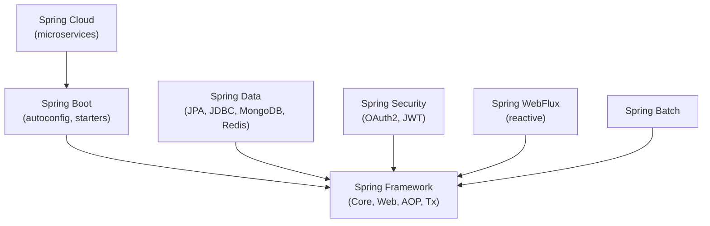

## 3. Five Ws + One H

### What

Spring is an **application framework** that provides an Inversion of Control (IoC) container, aspect-oriented programming (AOP), transaction management, data access abstractions, and a web framework. Spring Boot adds auto-configuration, executable JARs, and production-ready features.

### Why

Spring was created to solve the **complexity of Java EE development** in the early 2000s. EJB (Enterprise JavaBeans) was heavy, required verbose XML, mandated specific inheritance patterns, and coupled applications tightly to application server APIs. Spring demonstrated that the same problems could be solved with plain Java objects (POJOs) and a lightweight container.

### When

Spring 1.0 shipped in 2004. Spring Boot 1.0 shipped in 2014. Spring 6.0 (Jakarta EE 9) shipped in 2022. Spring Boot 3.3 (Java 17+, Spring 6.1) shipped in 2024. Today, Spring is the default Java application framework for most enterprise and web workloads.

### Where

Backend web services, microservices, batch processing, integration, reactive web, finance, e-commerce, government, healthcare, banking, telecom. Spring is used by a large fraction of Java developers (Stack Overflow's most-used Java framework for many years).

### Who

- **Creator:** Rod Johnson (2002-2004).
- **Origin:** The book "Expert One-on-One J2EE Design and Development" (2002) presented the ideas; Interface21 formed to build Spring.
- **Current:** VMware (Broadcom) maintains commercial Spring; Pivotal→VMware stewardship began in 2013; Spring is now part of the Spring team under Broadcom.
- **Major contributors:** VMware, individual contributors, partner organizations.

### How (one-paragraph preview)

A Spring application starts by creating an `ApplicationContext` — the IoC container. Bean definitions (from `@Configuration`, `@Component` scanning, XML, or auto-configuration) are read into `BeanDefinition` objects. The container instantiates beans, performs dependency injection, applies AOP proxies, and runs lifecycle callbacks. When a request arrives, Spring Web's `DispatcherServlet` routes it to a controller, executes the method, and serializes the response. JPA repositories use Hibernate to translate Java method calls into SQL, manage transactions, and cache entities. Spring Boot ties it all together with auto-configuration that detects libraries on the classpath and configures beans automatically.

## 4. History

### 4.1 Origins (2002-2004)

- **2002** — Rod Johnson publishes "Expert One-on-One J2EE Design and Development" (Wrox). The book demonstrates that EJB's heavyweight approach can be replaced with plain JavaBeans and a lightweight container. The 30,000-line example code base becomes the foundation for Spring.
- **2003** — Interface21 is founded to develop Spring commercially.
- **March 2004** — **Spring 1.0** is released under the Apache 2.0 license. Core features: IoC container, BeanFactory, ApplicationContext, AOP, JDBC abstraction, transaction management, MVC framework.

### 4.2 The growth years (2004-2014)

- **2006** — **Spring 2.0** introduces XML namespaces, AspectJ integration, and Spring Web Flow.
- **2007** — **Spring 2.5** adds annotation-driven configuration (`@Autowired`, `@Component`).
- **2009** — **Spring 3.0** introduces Java 5+ requirements, `@Configuration` classes, SpEL, and the standalone Spring Data Access module.
- **2011** — **Spring 3.1** adds `@Profile`, `@Cacheable`, `@cachoevict`, and the new `c` namespace.
- **2012** — **Spring 3.2** adds `@ControllerAdvice`, async MVC, and Spring MVC improvements.
- **2013** — **Spring 4.0** adapts to Java 8, supports JSR-310 (Date/Time), WebSocket.

### 4.3 Spring Boot and the cloud era (2014-2022)

- **April 2014** — **Spring Boot 1.0** is released. Just `java -jar` for production. Auto-configuration becomes the default. Starters replace manual `pom.xml` dependency wrangling.
- **2014** — Pivotal founded (EMC + VMware), absorbs SpringSource.
- **2015** — **Spring Framework 4.2** / **Spring Boot 1.3**.
- **2016** — Spring Cloud is established as a separate umbrella project.
- **September 2017** — **Spring Framework 5.0** with a reactive web stack (WebFlux, Project Reactor). Java 8 baseline.
- **2018** — **Spring Boot 2.0** uses Spring Framework 5; Java 8 baseline.
- **2019** — Spring Cloud Function, Spring Cloud Gateway.
- **2020** — Spring Initializr hits 1M projects/month.
- **2021** — Spring Boot 2.5, Spring Cloud 2020.x.

### 4.4 The Jakarta era (2022-2024)

- **November 2022** — **Spring Framework 6.0** and **Spring Boot 3.0** ship. Java 17+ baseline. **Jakarta EE 9** namespace (`jakarta.*` instead of `javax.*`). Migration: drop-replace `javax.*` to `jakarta.*` for servlet, JPA, validation, mail.
- **2023** — **Spring Framework 6.1** and **Spring Boot 3.2**. Virtual threads support (Project Loom), `JdbcClient` API.
- **2024** — **Spring Boot 3.3** (Spring Framework 6.1). CDS support, observability improvements, RestClient refinements.
- **2024** — **Spring Boot 3.4** (Spring Framework 6.2). RestClient fluent API refinements.

### 4.5 Governance

- **Pivotal** (2013-2019) — created via SpringSource + Cloud Foundry + GemFire.
- **VMware** acquires Pivotal (2019).
- **Broadcom** acquires VMware (2023). Spring continues under the Spring team within Broadcom.
- **Open source:** Spring remains Apache 2.0 licensed; commercial Spring Runtime (subscriptions) provides support.

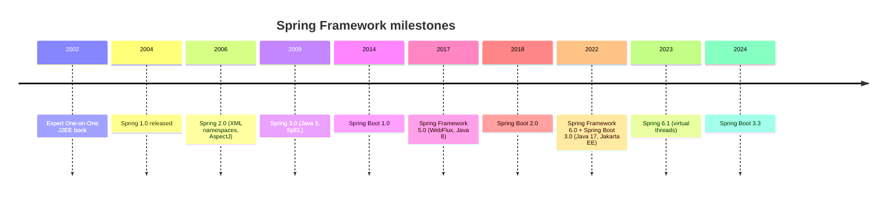

## 5. Problem Statement

### 5.1 What Spring solved

Before Spring, J2EE development required:

- **EJB containers** — heavyweight, required specific class hierarchies (`SessionBean`, `EntityBean`).
- **Container-managed persistence** — opaque, hard to debug.
- **JNDI lookups** — pulled dependencies from a global registry, decoupling objects from their dependencies.
- **Verbose XML** — every bean in a 50-line XML file.
- **Application server lock-in** — WebLogic, WebSphere, JBoss each had quirks.
- **Heavy testing** — needed to run inside a container to test.

### 5.2 Spring's approach

Spring demonstrated that the same problems could be solved with:

- **Plain Java objects** (POJOs) — no special base classes.
- **Dependency injection** — objects receive their dependencies; the container assembles them.
- **Annotation-driven configuration** — `@Component`, `@Autowired`, `@Configuration`.
- **Lightweight containers** — no separate application server needed.
- **Good integration** — JDBC, JPA, JMS, transactions, security, web.
- **Testability** — `ApplicationContext` can run in tests.

### 5.3 Why this mattered

Spring's approach:

- Made enterprise Java accessible.
- Reduced code volume by 3-5x.
- Improved testability.
- Decoupled application code from infrastructure.
- Allowed the same code to run in embedded containers (Tomcat) or full EE containers.

### 5.4 Spring Boot's contribution

Spring Boot further simplified by:

- **Auto-configuration** — detects libraries on the classpath and configures beans automatically.
- **Starters** — curated dependencies for common scenarios (`spring-boot-starter-web`).
- **Embedded servers** — Tomcat, Jetty, Netty bundled.
- **Executable JARs** — `java -jar app.jar` for production.
- **Production features** — Actuator, metrics, health checks.

### 5.5 What Spring didn't solve

Spring had its own problems:

- **XML configuration overload** (until annotations dominated).
- **Magic** — auto-configuration is hard to debug if you don't know what's happening.
- **Slow startup** — historical issue; virtual threads and CDS help.
- **Heavy for simple apps** — Quarkus, Micronaut, Helidon offer lighter alternatives.
- **Memory footprint** — bigger than native image alternatives.

## 6. Real-World Motivation

### 6.1 Production users

Spring is used by:

- **Amazon** — parts of AWS internal services.
- **Netflix** — Spring Cloud components for their microservices platform.
- **Alibaba** — Spring Cloud Alibaba for Chinese cloud-native deployments.
- **Twitter** — migrated away from Ruby/Rails to Java/Spring for performance.
- **Capital One** — banking Spring Boot microservices.
- **Goldman Sachs, JPMorgan, Bloomberg** — financial services.
- **Target** — migrated from Java EE to Spring Boot.
- **Zalando** — Europe's largest online fashion retailer.
- **eBay** — internal services.
- **Government** — IRS, NHS (UK), various defense agencies.

### 6.2 Data

- **Stack Overflow Developer Survey:** Spring Boot has consistently been the most-used Java framework (~50% of Java developers).
- **Maven Central:** Spring artifacts are downloaded billions of times per month.
- **GitHub:** Spring projects have >50K stars combined.

### 6.3 Economic motivation

- **Developer productivity** — Spring Boot reduces setup time from days to hours.
- **Talent pool** — Java + Spring is the largest enterprise Java skill set.
- **Ecosystem depth** — Spring has the most mature Java ecosystem (Spring Data, Security, Cloud, Batch, Integration).
- **Operational maturity** — Spring Boot Actuator, Micrometer integration, Helm charts; production-ready.

### 6.4 Why not alternatives?

| Alternative | Why not dominant |
|-------------|------------------|
| Java EE / Jakarta EE | Heavy; was enterprise-only before Spring |
| Quarkus | Smaller ecosystem; great for serverless but limited tooling |
| Micronaut | Smaller ecosystem; compile-time DI has trade-offs |
| Helidon | Oracle-centric; smaller community |
| Pure Javalin / Spark | Minimalist; no DI, no ecosystem |
| .NET / Spring.NET | Cross-platform, but different ecosystem |
| Node.js | Different runtime model; ecosystem mismatch for enterprise |

### 6.5 Performance motivation

- **Throughput** — Spring MVC can handle 100K+ requests/second on a single instance when configured correctly.
- **Latency** — WebFlux handles backpressure natively; virtual threads (Java 21+) handle 10K+ concurrent requests per JVM.
- **Startup** — Spring Boot 3 + CDS (Class Data Sharing) brings startup time to seconds.
- **Memory** — Spring Boot 3 + GraalVM Native Image offers 50MB RSS and <100ms startup.

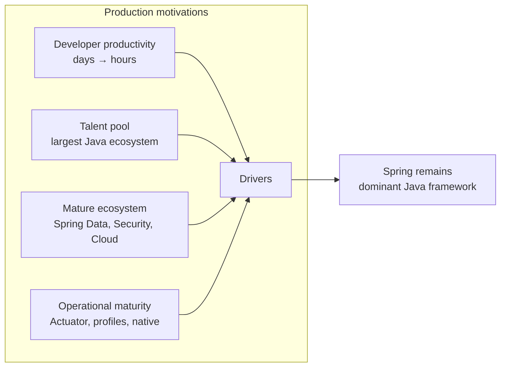

---

## 7. Internal Working

### 7.1 The lifecycle of a Spring Boot application

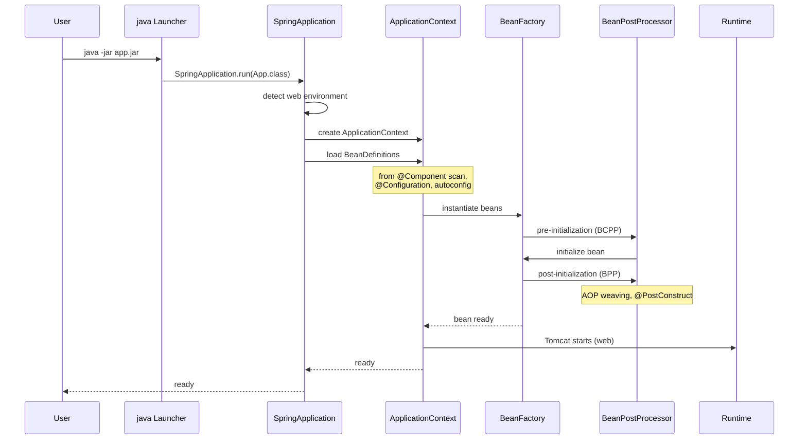

### 7.2 Subsystems that participate

| Subsystem | Responsibility | Spring module |
|-----------|---------------|---------------|
| **IoC container** | Bean instantiation, DI, lifecycle | `spring-context`, `spring-beans` |
| **AOP** | Cross-cutting concerns (transactions, security) | `spring-aop` |
| **Resources** | Classpath, file system, URL loading | `spring-core` |
| **Validation** | JSR-303 (Bean Validation) | `spring-context` |
| **SpEL** | Expression language | `spring-expression` |
| **Data access** | JDBC, JPA, transactions | `spring-jdbc`, `spring-orm`, `spring-tx` |
| **Web** | MVC, REST, HTTP | `spring-web`, `spring-webmvc` |
| **Reactive** | WebFlux, R2DBC | `spring-webflux` |
| **Security** | Authentication, authorization | `spring-security-*` |
| **Boot** | Auto-config, starters | `spring-boot-autoconfigure` |
| **Data** | Repositories over various stores | `spring-data-*` |

### 7.3 Bean lifecycle

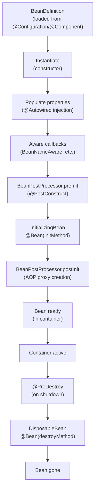

## 8. Deep Dive

This section is the heart of the document. Each subsection is a focused, internals-level treatment of a major subsystem.

### 8.1 IoC container

The **Inversion of Control (IoC) container** is Spring's core. Instead of application code instantiating dependencies, the container does it.

**Two container types:**

- **`BeanFactory`** — basic DI container; lazy initialization.
- **`ApplicationContext`** — extends `BeanFactory` with event publication, internationalization, resource loading, AOP integration. Most production apps use `ApplicationContext`.

**Configuration metadata sources:**

- **Java-based** (`@Configuration`, `@Bean`) — preferred.
- **Annotation-based** (`@Component`, `@Service`, `@Repository`, `@Controller`) — common.
- **XML** — legacy; still supported.
- **Auto-configuration** — Spring Boot's detection.

**BeanDefinition:** internal representation of a bean: class, scope, dependencies, lifecycle methods, etc.

```java
@Configuration
public class AppConfig {
    @Bean
    public UserService userService(UserRepository repo) {
        return new UserService(repo);
    }
}
```

When Spring reads this, it creates a `BeanDefinition` for `userService` with: class `UserService`, scope `singleton`, constructor argument `UserRepository` (which Spring will resolve).

### 8.2 Bean scopes

| Scope | Description | Use case |
|-------|-------------|----------|
| **singleton** (default) | One instance per container | Stateless services |
| **prototype** | New instance each time requested | Stateful objects |
| **request** | One per HTTP request | Web-tier state |
| **session** | One per HTTP session | Web session state |
| **application** | One per ServletContext | App-wide singletons |
| **websocket** | One per WebSocket session | WebSocket state |

```java
@Bean
@Scope("prototype")
public ShoppingCart cart() {
    return new ShoppingCart();
}
```

### 8.3 Bean lifecycle

The full lifecycle (in order):

1. **Instantiation** — constructor called.
2. **Populate properties** — `@Autowired` injected.
3. **Aware callbacks** — `BeanNameAware.setBeanName()`, `BeanFactoryAware.setBeanFactory()`, `ApplicationContextAware.setApplicationContext()`.
4. **BeanPostProcessor.postProcessBeforeInitialization** — pre-init interception.
5. **InitializingBean.afterPropertiesSet()** — explicit init callback.
6. **Custom init-method** — `@Bean(initMethod = "init")` or `@PostConstruct`.
7. **BeanPostProcessor.postProcessAfterInitialization** — post-init interception (AOP proxy creation).
8. **Bean ready** — usable.
9. **On shutdown**:
   - `@PreDestroy` annotation.
   - `DisposableBean.destroy()`.
   - Custom destroy-method.

### 8.4 Autowiring

Three autowiring modes:

- **By type** — `@Autowired` (default). Spring finds the matching bean by type.
- **By name** — `@Autowired` on a field/method named after the bean.
- **By constructor** — preferred for required dependencies.

```java
@Service
public class OrderService {
    private final UserRepository userRepository;
    private final PaymentGateway paymentGateway;

    // Constructor injection (preferred)
    public OrderService(UserRepository userRepository, PaymentGateway paymentGateway) {
        this.userRepository = userRepository;
        this.paymentGateway = paymentGateway;
    }
}
```

**Ambiguity resolution:**

- `@Primary` — marks one bean as preferred.
- `@Qualifier` — disambiguates by name.
- `@Profile` — bean only created in matching profile.

**Optional dependencies:** Use `@Autowired(required = false)` or `Optional<T>` parameter.

### 8.5 AOP

**Aspect-Oriented Programming** modularizes cross-cutting concerns (logging, transactions, security) into separate units called **aspects**.

**Concepts:**

- **Aspect** — the modularization of a concern (e.g., transaction management).
- **Join point** — a point during execution (method call, exception).
- **Advice** — action taken at a join point (`@Before`, `@After`, `@Around`).
- **Pointcut** — expression matching join points (e.g., `execution(* com.example.*.*(..))`).
- **Introduction** — adding fields/methods to a class.
- **Target** — the object being advised.
- **AOP proxy** — the object created by the AOP framework to implement the aspect.
- **Weaving** — linking aspects with application objects.

**Two proxy types:**

- **JDK dynamic proxies** — Java's built-in reflection-based proxies. Only proxy interfaces.
- **CGLIB proxies** — code-generated subclasses. Can proxy classes (no interfaces needed). Default in Spring Boot since 2.0.

```java
@Aspect
@Component
public class LoggingAspect {
    private static final Logger log = LoggerFactory.getLogger(LoggingAspect.class);

    @Pointcut("execution(* com.example.service.*.*(..))")
    public void serviceMethods() {}

    @Around("serviceMethods()")
    public Object log(ProceedingJoinPoint pjp) throws Throwable {
        log.info("calling: {}", pjp.getSignature());
        Object result = pjp.proceed();
        log.info("returned: {}", result);
        return result;
    }
}
```

**Spring AOP limitations:**

- Only method-execution join points (not field access, constructor, etc.).
- Only proxies beans from the container (not arbitrary objects).
- Self-invocation doesn't go through the proxy.

### 8.6 Spring Expression Language (SpEL)

`#{expression}` syntax for runtime evaluation.

```java
@Value("#{systemProperties['user.region']}")
private String region;

@Value("#{userRepository.findById(1)?.name}")
private String userName;

@ConditionalOnExpression("'${app.mode}' == 'production'")
```

### 8.7 Spring Boot autoconfiguration

**Spring Boot's killer feature.** On startup, Spring Boot reads `META-INF/spring/org.springframework.boot.autoconfigure.AutoConfiguration.imports` (Boot 3.x) and evaluates each auto-configuration class against the classpath and existing beans.

```java
@AutoConfiguration
@ConditionalOnClass(DataSource.class)
@ConditionalOnProperty(prefix = "spring.datasource", name = "url")
public class DataSourceAutoConfiguration {
    @Bean
    @ConfigurationProperties(prefix = "spring.datasource")
    public DataSource dataSource() {
        return DataSourceBuilder.create().build();
    }
}
```

**Conditional annotations:**

| Annotation | When applied |
|------------|-------------|
| `@ConditionalOnClass` | Required class is on the classpath |
| `@ConditionalOnMissingClass` | Required class is absent |
| `@ConditionalOnBean` | A specific bean exists |
| `@ConditionalOnMissingBean` | A specific bean doesn't exist |
| `@ConditionalOnProperty` | A property has a specific value |
| `@ConditionalOnResource` | A specific resource exists |
| `@ConditionalOnWebApplication` | Running in a web context |
| `@ConditionalOnNotWebApplication` | Not a web context |
| `@ConditionalOnJava` | Specific Java version |
| `@ConditionalOnSingleCandidate` | Exactly one bean of a type |

**Inspecting autoconfig:** `actuator/conditions` endpoint shows which conditions matched.

### 8.8 Spring Boot startup

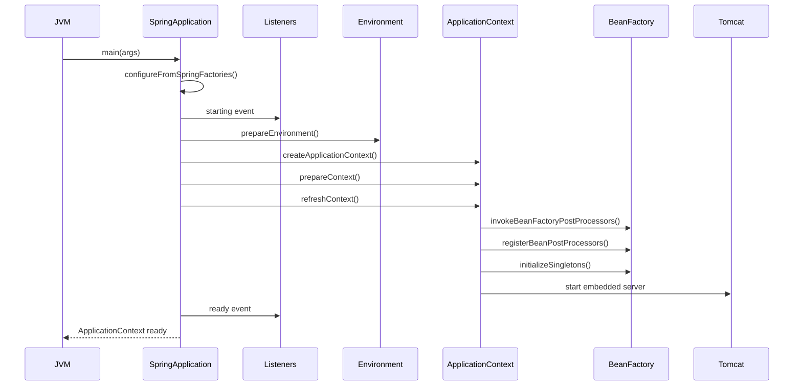

### 8.9 External configuration

**Sources** (in override order):

1. Devtools `~/.spring-boot-devtools.properties` (dev only).
2. `@TestPropertySource` (tests).
3. Command-line arguments.
4. `SPRING_APPLICATION_JSON` env var.
5. `application-{profile}.properties` (packaged).
6. `application.properties` (packaged).
7. Default values.

```java
@ConfigurationProperties(prefix = "app")
public class AppProperties {
    private String name;
    private Duration timeout;
    private List<String> servers;
    // getters and setters
}

@RestController
public class AppController {
    private final AppProperties props;
    public AppController(AppProperties props) { this.props = props; }
}
```

**Profiles:** activate with `@Profile("dev")` or `spring.profiles.active=dev`.

### 8.10 Spring Boot Actuator

Production-ready endpoints:

| Endpoint | Purpose |
|----------|---------|
| `/actuator/health` | Application health (liveness, readiness) |
| `/actuator/info` | App info |
| `/actuator/metrics` | All metrics |
| `/actuator/metrics/{name}` | Specific metric |
| `/actuator/env` | Environment properties |
| `/actuator/loggers` | Logging configuration |
| `/actuator/beans` | All beans |
| `/actuator/mappings` | URL mappings |
| `/actuator/conditions` | Auto-config conditions |
| `/actuator/configprops` | Configuration properties |
| `/actuator/threaddump` | Thread dump |
| `/actuator/heapdump` | Heap dump |
| `/actuator/prometheus` | Prometheus metrics |

### 8.11 Spring MVC

**DispatcherServlet** is the front controller. It routes requests to handlers.

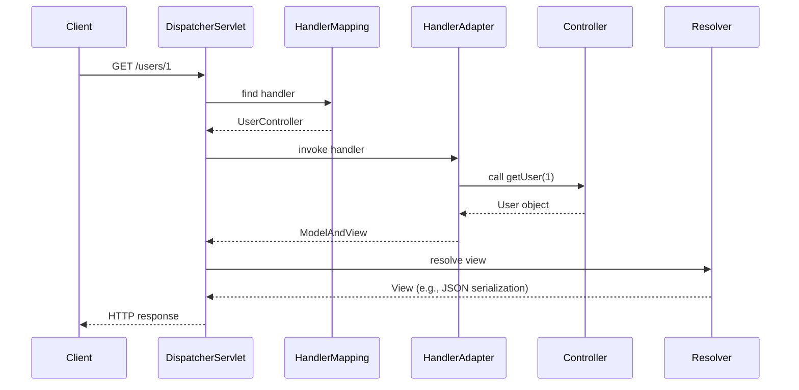

**REST controllers:**

```java
@RestController
@RequestMapping("/users")
public class UserController {
    private final UserService userService;

    public UserController(UserService userService) {
        this.userService = userService;
    }

    @GetMapping("/{id}")
    public User getUser(@PathVariable Long id) {
        return userService.findById(id);
    }

    @PostMapping
    public User createUser(@RequestBody @Valid User user) {
        return userService.save(user);
    }
}
```

**Validation:** Bean Validation (`@NotNull`, `@Email`, etc.) + `@Valid` parameter.

**Exception handling:** `@ControllerAdvice` + `@ExceptionHandler`.

```java
@ControllerAdvice
public class GlobalExceptionHandler {
    @ExceptionHandler(EntityNotFoundException.class)
    public ResponseEntity<ErrorResponse> handleNotFound(EntityNotFoundException e) {
        return ResponseEntity.status(404).body(new ErrorResponse("not_found", e.getMessage()));
    }
}
```

### 8.12 Spring Data JPA

**Repository abstraction:** Instead of writing DAO boilerplate, define an interface extending `JpaRepository` or `CrudRepository`.

```java
public interface UserRepository extends JpaRepository<User, Long> {
    Optional<User> findByEmail(String email);
    List<User> findByActiveTrue();
    List<User> findByCreatedAtAfter(LocalDateTime since);

    @Query("SELECT u FROM User u WHERE u.name LIKE %:pattern%")
    List<User> searchByName(@Param("pattern") String pattern);

    @Modifying
    @Query("UPDATE User u SET u.active = false WHERE u.lastLogin < :cutoff")
    int deactivateInactiveUsers(@Param("cutoff") LocalDateTime cutoff);
}
```

**Method names → query derivation:** Spring parses `findByEmail`, `findByActiveTrue`, etc., and generates appropriate queries.

**Projections:** DTOs to avoid loading entire entities.

```java
public interface UserSummary {
    String getName();
    String getEmail();
}

List<UserSummary> findByActiveTrue();
```

**Specifications (Criteria API):** dynamic queries.

```java
public class UserSpecs {
    public static Specification<User> hasName(String name) {
        return (root, q, cb) -> cb.equal(root.get("name"), name);
    }
    public static Specification<User> isActive() {
        return (root, q, cb) -> cb.isTrue(root.get("active"));
    }
}

userRepository.findAll(Specification.where(hasName("Alice")).and(isActive()));
```

### 8.13 JPA / Hibernate internals

**EntityManager** is the JPA interface to the persistence context.

**Persistence context** is the first-level cache of managed entities. Hibernate tracks:

- Entity state (clean, dirty, removed).
- Identity (same primary key → same Java instance).
- Lifecycle callbacks.

**Flush modes:**

- **AUTO** (default) — flush before query execution (to ensure fresh results).
- **COMMIT** — flush only at transaction commit.
- **MANUAL** — never auto-flush; explicit `flush()` required.

**Dirty checking:** Hibernate compares current entity state against snapshot at load time. Changes are auto-detected.

**Fetch strategies:**

- **EAGER** — load immediately.
- **LAZY** — load on access (proxy).
- **`JOIN FETCH`** — load eagerly in the same query.
- **`@EntityGraph`** — declarative fetch plan.
- **Batch fetching** — `@BatchSize(N)` — loads N lazy collections per query.

### 8.14 The N+1 problem

A classic Hibernate performance antipattern:

```java
// Bad: fetches 1 query for users, then N queries for orders
List<User> users = userRepository.findAll();
for (User user : users) {
    System.out.println(user.getOrders().size());  // lazy load → new query per user
}
```

**Fixes:**

```java
// 1. JOIN FETCH
@Query("SELECT u FROM User u JOIN FETCH u.orders")
List<User> findAllWithOrders();

// 2. @EntityGraph
@EntityGraph(attributePaths = {"orders"})
List<User> findAll();

// 3. Batch fetching
@OneToMany(mappedBy = "user")
@BatchSize(50)
private List<Order> orders;
```

### 8.15 Hibernate configuration

```properties
# application.properties
spring.jpa.hibernate.ddl-auto=validate
spring.jpa.properties.hibernate.dialect=org.hibernate.dialect.PostgreSQLDialect
spring.jpa.properties.hibernate.jdbc.batch_size=50
spring.jpa.properties.hibernate.order_inserts=true
spring.jpa.properties.hibernate.order_updates=true
spring.jpa.properties.hibernate.batch_versioned_data=true
spring.jpa.open-in-view=false
```

**Connection pooling:** HikariCP (default in Spring Boot).

### 8.16 Transactions

`@Transactional` is implemented via AOP proxies.

```java
@Service
public class OrderService {
    private final OrderRepository orderRepository;
    private final PaymentService paymentService;

    public OrderService(OrderRepository orderRepository, PaymentService paymentService) {
        this.orderRepository = orderRepository;
        this.paymentService = paymentService;
    }

    @Transactional
    public Order placeOrder(Order order) {
        Order saved = orderRepository.save(order);
        paymentService.charge(saved);
        return saved;
    }
}
```

**Propagation:**

| Value | Behavior |
|-------|----------|
| **REQUIRED** (default) | Use existing tx or create new |
| **REQUIRES_NEW** | Always new tx; suspends existing |
| **NESTED** | Savepoint within existing tx |
| **SUPPORTS** | Use existing tx if any |
| **NOT_SUPPORTED** | Execute non-transactionally |
| **MANDATORY** | Require existing tx |
| **NEVER** | Require no tx |

**Self-invocation trap:** `@Transactional` on a method only works when called via the proxy, not when called internally.

```java
@Service
public class OrderService {
    public void outer() {
        this.inner();  // NOT proxied; @Transactional on inner() ignored
    }

    @Transactional
    public void inner() { ... }
}
```

**Fix:** inject self or split into separate beans.

### 8.17 Spring Security

**Filter chain** with `SecurityFilterChain` bean (Spring Security 6.x):

```java
@Bean
public SecurityFilterChain filterChain(HttpSecurity http) throws Exception {
    http
        .authorizeHttpRequests(auth -> auth
            .requestMatchers("/public/**").permitAll()
            .requestMatchers("/admin/**").hasRole("ADMIN")
            .anyRequest().authenticated()
        )
        .formLogin(Customizer.withDefaults())
        .csrf(csrf -> csrf.disable())
        .sessionManagement(session -> session.sessionCreationPolicy(SessionCreationPolicy.STATELESS));
    return http.build();
}
```

**JWT resource server:**

```java
@Bean
public SecurityFilterChain jwtFilterChain(HttpSecurity http) throws Exception {
    http
        .authorizeHttpRequests(auth -> auth.anyRequest().authenticated())
        .oauth2ResourceServer(oauth2 -> oauth2.jwt(Customizer.withDefaults()));
    return http.build();
}
```

**Password hashing:** `BCryptPasswordEncoder`.

### 8.18 Spring Data Redis

```java
@Service
public class CacheService {
    private final RedisTemplate<String, User> redisTemplate;

    public CacheService(RedisTemplate<String, User> redisTemplate) {
        this.redisTemplate = redisTemplate;
    }

    public Optional<User> get(String id) {
        return Optional.ofNullable(redisTemplate.opsForValue().get("user:" + id));
    }

    public void put(String id, User user) {
        redisTemplate.opsForValue().set("user:" + id, user, Duration.ofMinutes(10));
    }
}
```

**Lettuce** is the default (since Spring Boot 2.x); **Jedis** is the alternative.

### 8.19 Spring Cloud Gateway

Gateway for routing and filtering in microservices architectures.

```yaml
spring:
  cloud:
    gateway:
      routes:
        - id: user-service
          uri: lb://user-service
          predicates:
            - Path=/api/users/**
          filters:
            - StripPrefix=1
            - AddRequestHeader=X-Request-Id, ${random.uuid}
```

**Built on Spring WebFlux** (non-blocking).

### 8.20 Spring Batch

Batch processing for large data:

```java
@Bean
public Job importJob(Step step) {
    return jobBuilderFactory.get("importJob").start(step).build();
}

@Bean
public Step step(ItemReader<User> reader, ItemProcessor<User, User> processor, ItemWriter<User> writer) {
    return stepBuilderFactory.get("step")
        .<User, User>chunk(100)
        .reader(reader)
        .processor(processor)
        .writer(writer)
        .build();
}
```

Features: restart, skip, retry, parallel processing, partitioning.

### 8.21 Testing

```java
@SpringBootTest
@AutoConfigureMockMvc
class UserControllerTest {
    @Autowired
    MockMvc mvc;

    @MockBean
    UserService userService;

    @Test
    void getUser() throws Exception {
        when(userService.findById(1L)).thenReturn(new User(1L, "Alice"));
        mvc.perform(get("/users/1"))
            .andExpect(status().isOk())
            .andExpect(jsonPath("$.name").value("Alice"));
    }
}
```

**Test slices:**

- `@SpringBootTest` — full context.
- `@WebMvcTest` — controller layer only.
- `@DataJpaTest` — JPA repositories only.
- `@DataRedisTest` — Redis only.
- `@JsonTest` — JSON serialization only.

**Testcontainers:** for integration tests with real databases.

---

## 9. Architecture

### 9.1 Spring Framework module dependencies

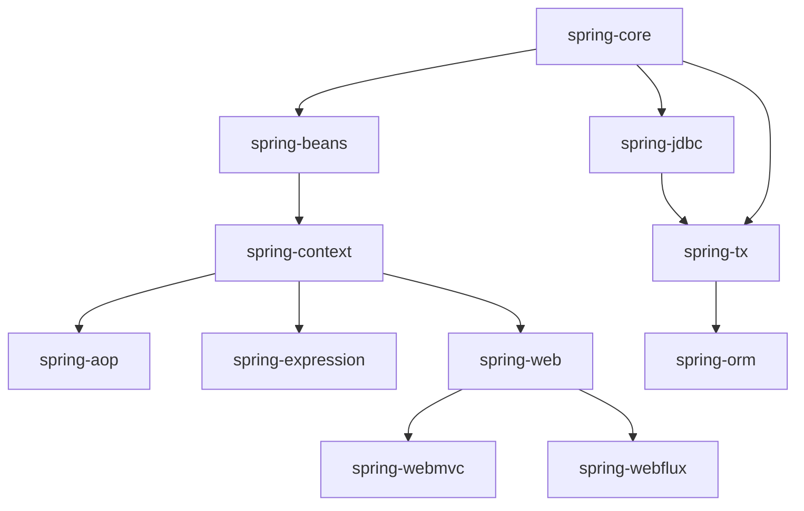

### 9.2 Spring Boot architecture

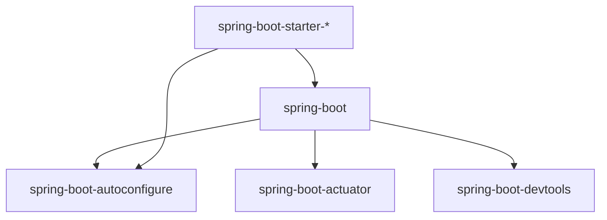

Spring Boot is a thin layer over Spring Framework that ships:

- A `SpringApplication` bootstrap class.
- Auto-configuration that detects libraries and configures beans.
- Actuator for production endpoints.
- CLI for project management.
- Build plugins (Maven, Gradle).

### 9.3 Spring Data architecture

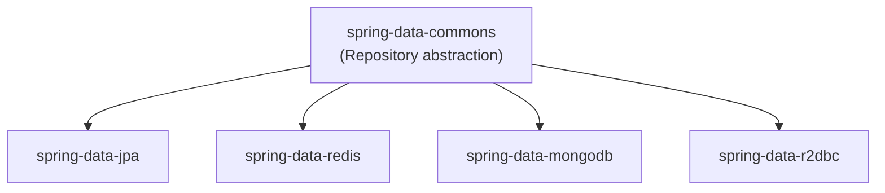

Spring Data Commons provides the `Repository` interface and base classes. Each module (JPA, Redis, MongoDB, etc.) provides the technology-specific implementation.

### 9.4 Bean lifecycle visualization

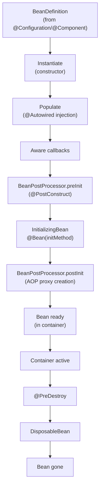

## 10. Performance

### 10.1 Performance considerations

| Aspect | Impact |
|--------|--------|
| Bean instantiation | First-time lazy; singleton is fast |
| AOP proxy | Method call overhead (~10-100ns) |
| CGLIB vs JDK proxy | CGLIB slightly slower; uses more memory |
| `@Transactional` overhead | Transaction begin/commit is non-trivial |
| JPA persistence context | Holds entities; can grow large |
| Hibernate dirty checking | Snapshot comparison per flush |
| `OpenSessionInView` | Default `true`; can mask N+1 |
| HikariCP | Default pool; well-tuned |
| JSON serialization | Jackson defaults; can be optimized |
| WebFlux vs MVC | WebFlux scales better for slow I/O |

### 10.2 JPA query performance

- **N+1** — most common JPA perf issue.
- **Eager loading** — fetches data you may not need.
- **Missing indexes** — generated by JPA but not always optimal.
- **No batch fetching** — `@BatchSize` helps.
- **DTO projections** — avoid loading entire entities.

### 10.3 Hibernate batching

```properties
spring.jpa.properties.hibernate.jdbc.batch_size=50
spring.jpa.properties.hibernate.order_inserts=true
spring.jpa.properties.hibernate.order_updates=true
spring.jpa.properties.hibernate.batch_versioned_data=true
```

These dramatically reduce INSERT/UPDATE round-trips.

### 10.4 Connection pooling

HikariCP is the default. Key settings:

```properties
spring.datasource.hikari.maximum-pool-size=20
spring.datasource.hikari.minimum-idle=5
spring.datasource.hikari.connection-timeout=20000
spring.datasource.hikari.idle-timeout=300000
spring.datasource.hikari.max-lifetime=1800000
```

**Sizing rule:** `pool_size = (core_count × 2) + effective_spindle_count` for HDD; for SSD, `pool_size = core_count × 4` is reasonable. Most production apps use 10-20.

### 10.5 Statement caching

```properties
spring.datasource.hikari.data-source-properties.prepareThreshold=5
```

PostgreSQL JDBC driver caches PreparedStatement objects above this threshold.

### 10.6 Caching

- `@Cacheable` on methods.
- `@EnableCaching` + cache provider (Caffeine, Ehcache, Redis).
- JCache (JSR-107) standard.

### 10.7 JVM tuning for Spring

- **Heap**: 2-4 GB usually enough.
- **GC**: G1GC default; ZGC for low-latency.
- **CDS**: `-Xshare:on` for faster startup.
- **Virtual threads** (Spring 6.1+): `spring.threads.virtual=true`.

---

## 11. Security

### 11.1 Spring Security defaults

By default, Spring Security (since 6.0):

- Enables CSRF protection.
- Requires authentication for all endpoints.
- Generates a random password for the default user at startup (logged at INFO).
- Uses BCrypt for password hashing.
- Adds common security headers (X-Frame-Options, X-Content-Type-Options, etc.).

### 11.2 OWASP relevance

- **A01 Broken Access Control** — Spring Security provides `@PreAuthorize`, role-based access, ACL.
- **A02 Cryptographic Failures** — BCrypt password hashing; JWT signing.
- **A03 Injection** — Spring's parameter binding protects against SQL injection; **not** a substitute for input validation.
- **A04 Insecure Design** — Spring's filter chain is the standard secure default.
- **A05 Security Misconfiguration** — Spring Security defaults are sensible; customization can weaken.
- **A07 Authentication Failures** — Spring Security has built-in session fixation protection.
- **A09 Logging Failures** — Spring's audit events; Spring Authorization Server logs.

### 11.3 Common attacks

- **CSRF** — Cross-Site Request Forgery. Spring Security's `CsrfFilter` validates tokens.
- **XSS** — Cross-Site Scripting. Spring's output escaping in JSP/Thymeleaf; JSON responses don't execute scripts.
- **Session fixation** — Spring Security changes session ID on authentication.
- **Clickjacking** — `X-Frame-Options` header by default.
- **CORS** — misconfiguration can leak credentials.
- **Open redirect** — unvalidated redirect targets after login.
- **JWT attacks** — algorithm confusion (none/HS256/RS256); signature stripping; replay.

### 11.4 OAuth2 and OIDC

Spring Security supports OAuth2 client (login via Google, GitHub, etc.), OAuth2 resource server (validating JWTs), and Spring Authorization Server (issuing tokens).

```java
// OAuth2 resource server with JWT
@Bean
public SecurityFilterChain filterChain(HttpSecurity http) throws Exception {
    http
        .authorizeHttpRequests(auth -> auth.anyRequest().authenticated())
        .oauth2ResourceServer(oauth2 -> oauth2.jwt(jwt ->
            jwt.jwkSetUri("https://issuer.example.com/.well-known/jwks.json")));
    return http.build();
}
```

### 11.5 JWT best practices

- Use strong keys (RS256 with 2048-bit RSA, or ES256 with P-256).
- Validate `iss`, `aud`, `exp`, `nbf` claims.
- Use short token TTLs (15 min access, 24h refresh).
- Rotate signing keys regularly.
- Never put sensitive data in JWTs (tokens are not encrypted).
- Use `kid` claim to handle key rotation.

### 11.6 Secret management

- Never commit secrets to source.
- Use environment variables, secrets managers (Vault, AWS Secrets Manager).
- Spring Boot has `spring.config.import` for external config.
- Spring Cloud Config Server for centralized config.

### 11.7 Secure configuration checklist

- [ ] CSRF enabled (or explicitly disabled with reason).
- [ ] HTTPS enforced.
- [ ] HSTS header set.
- [ ] Session cookies `Secure`, `HttpOnly`, `SameSite=Strict`.
- [ ] CORS configured minimally.
- [ ] Actuator endpoints restricted.
- [ ] All inputs validated.
- [ ] SQL injection prevented via parameter binding.
- [ ] Secrets externalized.
- [ ] Dependencies audited (OWASP Dependency-Check, Snyk).

## 12. Production Engineering

### 12.1 How Spring Boot is used in production

- **Microservices** — most common deployment pattern.
- **Monoliths** — Spring Boot enables modular monoliths.
- **Web applications** — REST APIs, GraphQL, server-side rendering.
- **Batch processing** — Spring Batch.
- **Serverless** — Spring Cloud Function on AWS Lambda, etc.

### 12.2 Real architecture (typical Spring Boot + Kubernetes)

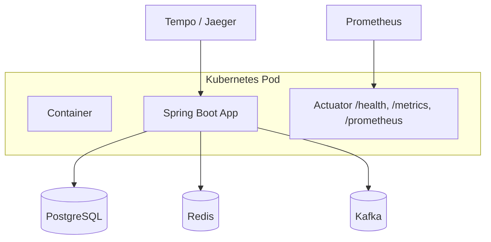

### 12.3 Production configuration

Typical `application.yml`:

```yaml
server:
  port: 8080
  shutdown: graceful

spring:
  application:
    name: my-service
  profiles:
    active: production
  datasource:
    url: jdbc:postgresql://db:5432/mydb
    hikari:
      maximum-pool-size: 20
      minimum-idle: 5
  jpa:
    open-in-view: false
    properties:
      hibernate.jdbc.batch_size: 50

management:
  endpoints:
    web:
      exposure:
        include: health, info, metrics, prometheus
  endpoint:
    health:
      probes:
        enabled: true
      show-details: when-authorized
  metrics:
    distribution:
      percentiles-histogram:
        http.server.requests: true
```

### 12.4 Graceful shutdown

```yaml
server:
  shutdown: graceful

spring:
  lifecycle:
    timeout-per-shutdown-phase: 30s
```

Spring Boot 2.3+ supports graceful shutdown: SIGTERM triggers drain, allowing in-flight requests to complete.

### 12.5 Health checks

- **Liveness** — `/actuator/health/liveness` — is the process alive?
- **Readiness** — `/actuator/health/readiness` — ready to serve traffic?

```yaml
management:
  endpoint:
    health:
      probes:
        enabled: true
      group:
        readiness:
          include: [db, redis, kafka]
        liveness:
          include: [ping]
```

Kubernetes uses these for pod lifecycle management.

### 12.6 Production monitoring

- **Micrometer** — metrics abstraction (Counter, Timer, Gauge, Distribution Summary).
- **Prometheus** — `/actuator/prometheus` exposes Micrometer metrics.
- **OpenTelemetry** — distributed tracing.
- **Spring Boot Admin** — UI for managing multiple Spring Boot apps.
- **Datadog, New Relic, Dynatrace, Elastic APM** — commercial APMs.

### 12.7 Production logging

- **Structured logs** (JSON) for log aggregation.
- Logback with `logstash-logback-encoder` or `ecs-logging`.
- `logback-spring.xml` for Spring-specific configuration.
- `log4j2` alternative.

### 12.8 Production debugging

- **Actuator endpoints** (`/beans`, `/conditions`, `/mappings`, `/env`, `/heapdump`, `/threaddump`).
- **Java Flight Recorder** — low-overhead CPU profiling.
- **async-profiler** — flame graphs.
- **Heap dumps** — analyze with Eclipse MAT or VisualVM.

### 12.9 Scaling strategy

- **Vertical** — more CPU, memory. Limit: JVM heap, GC overhead.
- **Horizontal** — Kubernetes HPA based on CPU/memory/custom metrics.
- **Stateless** — Spring Boot apps should be stateless; state in DB/cache/external store.

### 12.10 Failure handling

- **Circuit breakers** — Resilience4j, Spring Cloud Circuit Breaker.
- **Retries** — Spring Retry, Resilience4j.
- **Timeouts** — explicit timeouts on all I/O.
- **Bulkheads** — Resilience4j bulkhead pattern.

### 12.11 High availability

- Multi-zone deployment.
- Load balancing.
- Pod disruption budgets.
- Database HA (PostgreSQL with Patroni, etc.).
- Graceful shutdown.

### 12.12 Cost optimization

- Right-size JVM heap (don't over-allocate).
- Use HikariCP efficiently (no oversized pool).
- Cache aggressively (Redis, Caffeine).
- Use compression (gzip responses).
- Profile before optimizing.

### 12.13 Upgrade strategy

- **Test in staging** before production.
- **Read release notes** for breaking changes.
- **One major version at a time** (e.g., 3.2 → 3.3, not 3.2 → 4.0 directly).
- **Spring Boot 3.x** moved from `javax.*` to `jakarta.*` — automated migration with OpenRewrite.
- **LTS support** — Spring Boot provides commercial support via VMware Tanzu.

### 12.14 Migration: Spring Boot 2.x → 3.x

Key changes:

1. **Namespace**: `javax.*` → `jakarta.*` (servlet, JPA, validation, mail).
2. **Java baseline**: Java 8/11 → Java 17.
3. **Spring Framework**: 5.x → 6.x.
4. **Spring Security**: WebSecurityConfigurerAdapter → SecurityFilterChain bean.
5. **Configuration properties**: `spring.redis.*` → `spring.data.redis.*`.

Use OpenRewrite recipe:

```bash
mvn -U org.openrewrite.maven:rewrite-maven-plugin:run \
  -Drewrite.recipeCoordinates=org.openrewrite.java:SpringBoot3Migration
```

## 13. Production Case Studies

### 13.1 Netflix — Spring Cloud

Netflix contributed many Spring Cloud components:

- **Eureka** — service discovery.
- **Hystrix** — circuit breaker (now Resilience4j).
- **Ribbon** — client-side load balancer (now Spring Cloud LoadBalancer).
- **Zuul** — API gateway (now Spring Cloud Gateway).

Their microservices platform at scale uses Spring Cloud patterns.

### 13.2 Alibaba — Spring Cloud Alibaba

Alibaba's cloud-native stack (Nacos for discovery, Sentinel for flow control, RocketMQ for messaging) integrates as Spring Cloud Alibaba components.

### 13.3 Target — Spring Boot migration

Target migrated from Java EE to Spring Boot, reporting:

- Faster startup (executable JARs vs WAR deployment).
- Better development experience (auto-config).
- Easier deployment (containers).

### 13.4 British Airways

BA's digital transformation included Spring Boot microservices for booking, customer management, etc.

### 13.5 Zalando — Spring Boot at scale

Zalando runs Spring Boot microservices for their e-commerce platform. They publish engineering blogs about Spring Boot patterns at scale.

### 13.6 Capital One — financial services

Capital One uses Spring Boot microservices for their banking platform, with strict security and audit requirements.

### 13.7 eBay

eBay has used Spring for many years, including Spring Cloud for their event-driven microservices.

### 13.8 Common patterns

Across case studies:

- **External config** (Config Server or Vault).
- **Service discovery** (Eureka, Consul).
- **API Gateway** (Spring Cloud Gateway).
- **Distributed tracing** (Spring Cloud Sleuth / OpenTelemetry).
- **Circuit breakers** (Resilience4j).
- **Database per service**.
- **Event-driven async** (Kafka, RabbitMQ).

## 14. Code Examples

### 14.1 Basic: Spring Boot application

```java
// App.java
@SpringBootApplication
public class App {
    public static void main(String[] args) {
        SpringApplication.run(App.class, args);
    }
}

// UserController.java
@RestController
@RequestMapping("/users")
public class UserController {
    private final UserService userService;

    public UserController(UserService userService) {
        this.userService = userService;
    }

    @GetMapping("/{id}")
    public User getUser(@PathVariable Long id) {
        return userService.findById(id);
    }
}
```

### 14.2 Bean definition with autowiring

```java
@Service
public class UserService {
    private final UserRepository userRepository;
    private final EmailService emailService;

    public UserService(UserRepository userRepository, EmailService emailService) {
        this.userRepository = userRepository;
        this.emailService = emailService;
    }

    public User createUser(User user) {
        User saved = userRepository.save(user);
        emailService.sendWelcome(saved);
        return saved;
    }
}
```

### 14.3 Bean scopes

```java
@Component
@Scope("prototype")
public class ShoppingCart {
    private final Map<String, Integer> items = new HashMap<>();
    // stateful cart, new instance per injection
}
```

### 14.4 Lifecycle callbacks

```java
@Component
public class CacheWarmer {
    @PostConstruct
    public void init() {
        // called after dependency injection, before use
    }

    @PreDestroy
    public void cleanup() {
        // called on shutdown
    }
}
```

### 14.5 AOP

```java
@Aspect
@Component
public class LoggingAspect {
    @Around("execution(* com.example.service.*.*(..))")
    public Object log(ProceedingJoinPoint pjp) throws Throwable {
        long start = System.nanoTime();
        Object result = pjp.proceed();
        long elapsed = System.nanoTime() - start;
        log.info("{} took {} ns", pjp.getSignature(), elapsed);
        return result;
    }
}
```

### 14.6 Configuration properties

```java
@ConfigurationProperties(prefix = "app")
@Validated
public record AppProperties(
    @NotBlank String name,
    @NotNull Duration timeout,
    List<String> servers
) {}

@SpringBootApplication
@EnableConfigurationProperties(AppProperties.class)
public class App { }
```

### 14.7 JPA entity and repository

```java
@Entity
@Table(name = "users")
public class User {
    @Id
    @GeneratedValue(strategy = GenerationType.IDENTITY)
    private Long id;

    @Column(nullable = false)
    private String name;

    @Column(nullable = false, unique = true)
    private String email;

    @Column(nullable = false)
    private boolean active = true;

    @OneToMany(mappedBy = "user")
    private List<Order> orders = new ArrayList<>();

    // getters, setters, constructors
}

public interface UserRepository extends JpaRepository<User, Long> {
    Optional<User> findByEmail(String email);
    List<User> findByActiveTrue();
}
```

### 14.8 Avoiding N+1 with JOIN FETCH

```java
public interface UserRepository extends JpaRepository<User, Long> {
    @Query("SELECT DISTINCT u FROM User u LEFT JOIN FETCH u.orders WHERE u.active = true")
    List<User> findActiveWithOrders();

    @EntityGraph(attributePaths = {"orders"})
    @Query("SELECT u FROM User u WHERE u.active = true")
    List<User> findActiveWithOrdersGraph();
}
```

### 14.9 Transactional service

```java
@Service
public class OrderService {
    private final OrderRepository orderRepository;
    private final InventoryService inventoryService;

    public OrderService(OrderRepository orderRepository, InventoryService inventoryService) {
        this.orderRepository = orderRepository;
        this.inventoryService = inventoryService;
    }

    @Transactional
    public Order placeOrder(Order order) {
        inventoryService.reserve(order.getItems());
        return orderRepository.save(order);
    }

    @Transactional(propagation = Propagation.REQUIRES_NEW)
    public void logOrderAttempt(Order order) {
        // independent transaction for audit log
    }
}
```

### 14.10 Spring Security with JWT

```java
@Bean
public SecurityFilterChain filterChain(HttpSecurity http) throws Exception {
    http
        .csrf(csrf -> csrf.disable())
        .sessionManagement(s -> s.sessionCreationPolicy(SessionCreationPolicy.STATELESS))
        .authorizeHttpRequests(auth -> auth
            .requestMatchers("/api/public/**").permitAll()
            .requestMatchers("/api/admin/**").hasRole("ADMIN")
            .anyRequest().authenticated()
        )
        .oauth2ResourceServer(oauth2 -> oauth2.jwt(Customizer.withDefaults()));
    return http.build();
}
```

### 14.11 REST controller with validation

```java
@RestController
@RequestMapping("/api/users")
public class UserController {
    private final UserService userService;

    public UserController(UserService userService) {
        this.userService = userService;
    }

    @PostMapping
    public ResponseEntity<User> create(@RequestBody @Valid CreateUserRequest req) {
        User user = userService.create(req);
        return ResponseEntity.created(URI.create("/api/users/" + user.getId())).body(user);
    }
}

public record CreateUserRequest(
    @NotBlank @Size(min = 1, max = 100) String name,
    @NotBlank @Email String email
) {}
```

### 14.12 Bad, anti-pattern, refactored, secure, performance-optimized examples

**Bad: field injection**

```java
@Service
public class BadService {
    @Autowired
    private UserRepository userRepository;  // hard to test, hard to reason about
}
```

**Anti-pattern: God service**

```java
@Service
public class DoEverythingService {
    public void doThis() { /* ... */ }
    public void doThat() { /* ... */ }
    // 50+ methods; violates SRP
}
```

**Refactored: constructor injection + SRP**

```java
@Service
public class UserService {
    private final UserRepository userRepository;
    private final EmailService emailService;

    public UserService(UserRepository userRepository, EmailService emailService) {
        this.userRepository = userRepository;
        this.emailService = emailService;
    }
}
```

**Secure: parameterized queries (default in Spring Data JPA)**

```java
@Query("SELECT u FROM User u WHERE u.email = :email")
Optional<User> findByEmail(@Param("email") String email);
```

**Performance-optimized: JOIN FETCH to avoid N+1**

```java
@Query("SELECT DISTINCT u FROM User u LEFT JOIN FETCH u.orders")
List<User> findAllWithOrders();
```

**Thread-safe: idempotent services**

```java
@Service
public class IdempotentService {
    private final AtomicBoolean initialized = new AtomicBoolean(false);

    public void init() {
        if (initialized.compareAndSet(false, true)) {
            // initialize once
        }
    }
}
```

## 15. Common Mistakes

### 15.1 Beginner mistakes

- **Using field injection** — `@Autowired` on fields. Use constructor injection.
- **Missing `@Transactional`** — service methods that should be transactional aren't.
- **`@Transactional` on the controller** — services should be transactional, not controllers.
- **Putting `@Transactional` on an interface** — Spring uses class-based proxies; interface annotations are inherited but only via CGLIB.
- **Not handling exceptions** — letting exceptions propagate without logging.

### 15.2 Intermediate mistakes

- **Circular dependencies** — A depends on B, B depends on A. Fix by extracting a third bean or using setter injection (anti-pattern).
- **Eager initialization of beans that need `@Lazy`** — sometimes beans can't be constructed lazily enough.
- **Mixing JPA and JDBC** in the same transaction — different transaction managers.
- **Not closing resources** — Spring closes JDBC/HTTP resources via `@Cleanup` patterns; verify.
- **Forgetting to set `OpenSessionInView=false`** — masks N+1.

### 15.3 Senior mistakes

- **Self-invocation of `@Transactional`** — method calls bypass the proxy.
- **Mixing transaction propagation incorrectly** — REQUIRES_NEW without thinking about commit ordering.
- **EAGER fetching** — leads to cartesian explosion.
- **N+1 in production** — not detected until load test.
- **Auto-config disabled without understanding** — losing benefits of Spring Boot.

### 15.4 Production mistakes

- **No Actuator** — no observability.
- **No graceful shutdown** — in-flight requests dropped on SIGTERM.
- **Open JMX port** without authentication.
- **HikariCP too small or too large** — pool exhaustion or wasted resources.
- **No statement caching** — prepared statements re-created.
- **No JFR / profiler in production** — can't diagnose latency issues.

### 15.5 Migration mistakes

- **From Spring Boot 2.x to 3.x** — `javax.*` to `jakarta.*` everywhere.
- **From WebSecurityConfigurerAdapter** to SecurityFilterChain bean — major security config change.
- **From Java 8/11 to 17+** — module system, sealed classes, pattern matching.

### 15.6 Configuration mistakes

- **Using `spring.profiles.include` wrong order** — order matters.
- **Setting `server.port` via env but expecting it in `application.properties`** — env wins.
- **Mixing `@Value` and `@ConfigurationProperties`** — pick one.

### 15.7 Security mistakes

- **Disabling CSRF without justification** — leaves the app vulnerable.
- **PermitAll on `/api/**`** — easy mistake; debug-only.
- **Hardcoded secrets** — in `application.properties` committed to git.
- **JWT with `none` algorithm** — signature bypass.

### 15.8 Performance mistakes

- **N+1 queries** — most common JPA perf issue.
- **EAGER fetch on `@OneToMany`** — cartesian explosion.
- **`OpenSessionInView=true`** (default) — masks N+1.
- **Hibernate batch size not set** — slow bulk inserts.
- **Hikari pool too small** — connection exhaustion under load.

### 15.9 Debugging mistakes

- **Restarting without capturing heap dump** — lose state.
- **Looking at `System.out` instead of logs**.
- **Reading CGLIB-generated class names** — confusing.

### 15.10 Deployment mistakes

- **No readiness probe** — Kubernetes sends traffic before warmup.
- **No JVM tuning** — relying on defaults.
- **No CDS** — slow startup.

---

## 16. Debugging

### 16.1 How to identify problems

| Symptom | First diagnostic step |
|---------|----------------------|
| Slow startup | Actuator `/startup`; `-Ddebug=true` for autoconfig trace |
| Bean not found | Actuator `/beans` to see registered beans |
| Auto-config not applied | Actuator `/conditions` |
| Slow query | Hibernate statistics; SQL log; `EXPLAIN ANALYZE` (see SQL & Databases doc) |
| High CPU | async-profiler flame graph |
| High memory | Heap dump + MAT |
| Connection exhausted | Hikari metrics; `/actuator/metrics/hikaricp.connections.active` |
| 500 errors | Check application logs; `/actuator/loggers` for log level |
| Auth failure | Spring Security debug logging: `logging.level.org.springframework.security=DEBUG` |

### 16.2 How to reproduce

- Capture JFR recording.
- Use Testcontainers to spin up real DB.
- Local Docker Compose with the same DB.

### 16.3 Root cause analysis

1. Capture state (heap dump, thread dump, JFR, logs).
2. Identify resource under pressure.
3. Localize to bean / endpoint / SQL.
4. Verify with focused experiment.
5. Fix and validate.

### 16.4 Logs

- Spring Boot defaults to console.
- Structured logging with `logstash-logback-encoder`.
- Spring Boot 3 supports `logging.structured.format.console=ecs` for Elastic Common Schema.

### 16.5 Metrics

**Standard Spring Boot metrics via Micrometer:**

| Metric | What it measures |
|--------|------------------|
| `jvm.memory.used` | Memory by area |
| `jvm.gc.pause` | GC pause time |
| `http.server.requests` | Request count, latency |
| `hikaricp.connections.active` | Active connections |
| `hikaricp.connections.acquire` | Connection acquire time |
| `hibernate.statements` | Statement counts (if Hibernate metrics enabled) |
| `spring.data.repository.invocations` | Repository calls |
| `executor.completed` | Async task execution |

### 16.6 Tracing

- **Micrometer Tracing** — OpenTelemetry integration.
- **Spring Cloud Sleuth** (deprecated in 3.x; replaced by Micrometer Tracing).
- **OpenTelemetry Java agent** — auto-instrumentation.

### 16.7 Heap dump analysis

```bash
# Get heap dump via Actuator
curl http://localhost:8080/actuator/heapdump -o heap.hprof
# Or via JMX/jcmd
jcmd <pid> GC.heap_dump heap.hprof
```

Analyze with Eclipse MAT or VisualVM.

### 16.8 Thread dump analysis

```bash
# Via Actuator
curl http://localhost:8080/actuator/threaddump
# Or via jcmd
jcmd <pid> Thread.print
```

Look for:

- **BLOCKED threads** — lock contention.
- **WAITING** — normal or deadlock.
- **RUNNABLE** doing CPU work.

### 16.9 Flame graphs

```bash
# async-profiler
./profiler.sh -d 30 -f flame.html <pid>
./profiler.sh -e alloc -d 30 -f alloc.html <pid>
./profiler.sh -e lock -d 30 -f lock.html <pid>
```

### 16.10 Common debugging commands

```bash
# Check autoconfig decisions
curl localhost:8080/actuator/conditions

# List all beans
curl localhost:8080/actuator/beans

# Check environment
curl localhost:8080/actuator/env | jq '.propertySources[] | select(.name | contains("applicationConfig"))'

# Specific log level change
curl -X POST -H "Content-Type: application/json" \
  -d '{"configuredLevel":"DEBUG"}' \
  localhost:8080/actuator/loggers/org.springframework.security
```

### 16.11 Production troubleshooting checklist

- [ ] Capture heap dump (Actuator `/heapdump`).
- [ ] Capture thread dump (Actuator `/threaddump`).
- [ ] Capture JFR recording (5 min).
- [ ] Capture GC log (`-Xlog:gc*:file=gc.log`).
- [ ] Capture application logs.
- [ ] Capture `/actuator/conditions` output.
- [ ] Check `/actuator/health` for component health.
- [ ] Engage on-call rotation if needed.

## 17. Monitoring & Observability

### 17.1 Logging

- **Logback** default in Spring Boot.
- `logback-spring.xml` for Spring-specific config (profile-aware).
- `log4j2` alternative (better async performance in some cases).

### 17.2 Metrics

Micrometer is Spring Boot's metrics facade. It auto-instruments:

- JVM (memory, GC, threads, classes).
- HTTP server requests.
- JDBC/HikariCP.
- Hibernate (with `hibernate.generate_statistics=true`).
- Spring Data repositories.
- Custom code via `Counter`, `Timer`, `Gauge`, `DistributionSummary`.

**Exporters:**

- Prometheus (`micrometer-registry-prometheus`).
- Datadog.
- New Relic.
- Elastic.
- CloudWatch.
- OTLP.

### 17.3 Distributed tracing

- **Micrometer Tracing** (Spring Boot 3.x): OpenTelemetry, Zipkin, Wavefront.
- **Auto-instrumentation** via Java agent or Spring AOP.
- Span propagation via W3C Trace Context.

### 17.4 Health checks

```yaml
management:
  endpoint:
    health:
      probes:
        enabled: true
      group:
        liveness:
          include: [ping, livenessState]
        readiness:
          include: [db, redis, kafka, readinessState]
```

Custom health indicator:

```java
@Component
public class MyServiceHealthIndicator implements HealthIndicator {
    public Health health() {
        if (isHealthy()) {
            return Health.up().build();
        }
        return Health.down().withDetail("reason", "service degraded").build();
    }
}
```

### 17.5 Dashboards

Sample Grafana dashboard for Spring Boot:

- JVM heap by area (line).
- GC pause time (line).
- HTTP request latency p99 (line).
- Active connections (gauge).
- Bean count (gauge).
- Health (status).

### 17.6 Alerts

- JVM heap > 80% for 5 minutes.
- GC pause > 1s.
- p99 request latency > SLO.
- Error rate > 1%.
- DB connection pool exhausted.
- Health check failing.

### 17.7 SLIs, SLOs, SLAs

- **SLI** — request latency p99, error rate, availability.
- **SLO** — `p99 latency < 200ms`, `availability > 99.95%`.
- **SLA** — contractual commitment.

## 18. Best Practices

### 18.1 Industry best practices

- **Constructor injection** — never field injection.
- **Use `@ConfigurationProperties`** for type-safe config.
- **Profile-specific config** — `application-{profile}.yml`.
- **HikariCP sizing** — `pool_size = (core_count × 2) + effective_spindle_count`.
- **`OpenSessionInView=false`** — disable lazy anti-pattern.
- **JPA batch_size=50** for bulk operations.
- **Enable Actuator** for production.
- **Graceful shutdown** for in-flight requests.
- **Virtual threads** (Spring 6.1+) for high-concurrency I/O.

### 18.2 Enterprise practices

- **External config** (Spring Cloud Config, Vault).
- **Service discovery** (Eureka, Consul).
- **API Gateway** (Spring Cloud Gateway).
- **Distributed tracing** (Micrometer Tracing / OpenTelemetry).
- **Centralized logging** (ELK, Splunk, Loki).

### 18.3 Clean code

- Constructor injection.
- Immutable beans where possible.
- Single Responsibility (one service per concern).
- Constructor-based dependency injection (no field/setter injection).

### 18.4 Reliability

- Circuit breakers (Resilience4j).
- Timeouts on all I/O.
- Retries with exponential backoff.
- Health checks for dependencies.

### 18.5 Security

- Spring Security with sensible defaults.
- HTTPS enforced.
- Secrets externalized.
- Actuator restricted to internal networks.

### 18.6 Performance

- HikariCP tuned.
- Hibernate batch_size.
- DTO projections for read paths.
- JOIN FETCH to avoid N+1.
- `@Cacheable` on hot reads.

### 18.7 Testing

- Unit tests for service logic.
- Integration tests for repos (Testcontainers).
- Web layer tests (`@WebMvcTest`).
- Full stack tests (`@SpringBootTest`).
- Performance tests (JMH, Gatling).

### 18.8 Deployment

- Container images with Buildpacks.
- Graceful shutdown.
- Health/readiness probes.
- Liveness/restart policy.

## 19. Anti-Patterns

### 19.1 Field injection

```java
@Service
public class BadService {
    @Autowired
    private UserRepository userRepository;
}
```

**Why bad:** Hard to test, hard to reason about, hides dependencies.

**Fix:** Constructor injection.

### 19.2 God services

Services with 50+ methods that "do everything." Violates SRP.

**Fix:** Split into smaller, focused services.

### 19.3 Repository abuse

Using repositories for business logic:

```java
// Bad
@Query("UPDATE User u SET u.balance = u.balance + :amount WHERE u.id = :id")
void incrementBalance(@Param("id") Long id, @Param("amount") BigDecimal amount);
```

**Fix:** Repository for data access; service for business logic.

### 19.4 Missing transactions

Service methods that do multiple writes without `@Transactional`:

```java
public void transfer(Long fromId, Long toId, BigDecimal amount) {
    accountRepository.debit(fromId, amount);  // write 1
    accountRepository.credit(toId, amount);    // write 2 — separate transaction!
}
```

**Fix:** Add `@Transactional`.

### 19.5 `OpenSessionInView=true`

Default in Spring Boot. Hides N+1 problems by extending the persistence context to the web layer.

**Fix:** Set `spring.jpa.open-in-view=false`. Force explicit fetching decisions.

### 19.6 Raw SQL in repositories

```java
@Query(value = "SELECT * FROM users WHERE ...", nativeQuery = true)
List<User> findAll(...);
```

**Why bad:** Bypasses JPA caching, dirty checking, lifecycle.

**Fix:** Use JPQL or Specifications.

### 19.7 Mixing JPA and JDBC

Two different transaction managers. Hard to reason about.

**Fix:** Pick one; use `JdbcTemplate` for batch operations only.

### 19.8 Singleton scope for stateful beans

```java
@Service
@Scope("singleton")  // default
public class ShoppingCart {
    private List<Item> items;  // shared across all users!
}
```

**Fix:** Use `prototype` or `request` scope.

## 20. Edge Cases

### 20.1 Circular dependencies

A → B → A.

**Detection:** Spring throws `BeanCurrentlyInCreationException` on startup.

**Fixes:**
- Extract a third bean.
- Use setter injection (anti-pattern but works).
- Use `@Lazy` on one side.
- Re-architect.

### 20.2 Lazy initialization errors

A lazy bean fails on first access (e.g., repository called outside a Spring-managed transaction).

**Fix:** Ensure the lazy bean is accessed in a Spring-managed context.

### 20.3 Transaction propagation traps

`REQUIRES_NEW` in a method called from a transactional method creates a new transaction. The new tx commits independently of the outer.

**Gotcha:** If the outer rolls back after the inner commits, the inner's work is still committed. Use `NESTED` (savepoints) for atomicity, or `MANDATORY` to enforce.

### 20.4 `@Transactional` self-invocation

```java
@Service
public class OrderService {
    public void outer() {
        this.inner();  // bypasses proxy
    }

    @Transactional
    public void inner() { ... }
}
```

**Fix:** Inject self or split into separate beans.

### 20.5 Lock contention

Two transactions trying to lock the same row. One waits.

**Detection:** `pg_locks` for PG; Hibernate logs `LockTimeoutException`.

**Fixes:** Reduce transaction size; use optimistic locking (`@Version`); use SKIP LOCKED for queue patterns.

### 20.6 Optimistic vs pessimistic locking

- **Optimistic** (`@Version`) — version check at commit; throws `OptimisticLockException` on conflict. Good for low-contention.
- **Pessimistic** (`SELECT FOR UPDATE`) — row lock; blocks other transactions. Good for high-contention.

### 20.7 EAGER fetch cartesian explosion

```java
@Entity
class User {
    @OneToMany(fetch = FetchType.EAGER)
    List<Order> orders;

    @OneToMany(fetch = FetchType.EAGER)
    List<Address> addresses;
}
```

A query for users loads orders × addresses per user.

**Fix:** LAZY + explicit fetching.

### 20.8 `@TransactionalEventListener` quirks

Events are published within the transaction by default. After-commit listeners fire after the transaction commits.

### 20.9 Bean scope in async tasks

Beans injected into `@Async` methods are resolved in the calling thread's context. Configure `TaskExecutor` carefully.

### 20.10 Memory leak in singleton bean

A singleton with a `@PostConstruct` that registers a listener that holds a reference back: GC can't collect the listener.

**Fix:** Unregister in `@PreDestroy`.

---

## 21. Comparisons

### 21.1 Spring MVC vs WebFlux

| Dimension | Spring MVC | Spring WebFlux |
|-----------|-----------|----------------|
| Runtime | Servlet (Tomcat, Jetty) | Reactive (Netty, Tomcat) |
| API | Blocking | Non-blocking |
| Threads | Thread-per-request | Event loop |
| Concurrency model | Imperative | Reactive (Mono, Flux) |
| Backpressure | N/A | Native |
| Use cases | Synchronous business logic | I/O-heavy, streaming |
| Learning curve | Lower | Higher (reactive thinking) |
| Ecosystem | Mature | Growing |
| Virtual threads | Works with Spring 6.1 | Less relevant |

**When to choose MVC:** CPU-bound, simple request/response, ORM/JPA, mature ecosystem.

**When to choose WebFlux:** Many concurrent slow I/O calls per request, streaming responses, backpressure needed.

### 21.2 Spring Data JPA vs JDBC vs MyBatis

| Dimension | Spring Data JPA | JdbcTemplate | MyBatis |
|-----------|-----------------|--------------|--------|
| Mapping | Object-relational | Manual | SQL/XML mapping |
| Query language | JPQL/HQL | SQL | SQL (XML/annotations) |
| Schema flexibility | Object model | Plain rows | Plain rows |
| Boilerplate | Lowest | Medium | Low |
| Performance tuning | Hibernate-level | Direct SQL | Direct SQL |
| Best for | Standard CRUD | Complex queries, batch | Complex queries, dynamic SQL |

### 21.3 Spring Security vs Apache Shiro

| Dimension | Spring Security | Apache Shiro |
|-----------|-----------------|--------------|
| Integration | Spring-native | Spring integration available |
| OAuth2/OIDC | First-class | Plugin |
| CSRF | First-class | Plugin |
| Reactive | Yes | Limited |
| Configuration | Java DSL | INI or Java |
| Active development | Yes | Slower |

**When to choose Shiro:** Non-Spring stack, simpler needs, smaller app.

### 21.4 Spring Cloud Gateway vs Kong

| Dimension | Spring Cloud Gateway | Kong |
|-----------|---------------------|------|
| Runtime | Spring WebFlux | OpenResty (Lua) |
| Plugins | Custom code, community | Many official plugins |
| Auth | Spring Security | OAuth2, JWT, key auth |
| Rate limiting | Custom | First-class |
| Performance | Good | Higher (Lua/NGINX) |
| Operational | Spring Boot | NGINX/Lua |
| Best for | Spring microservices | Mixed stack, high throughput |

### 21.5 Spring Boot vs Quarkus vs Micronaut

| Dimension | Spring Boot | Quarkus | Micronaut |
|-----------|-----------|---------|-----------|
| Vendor | VMware (Broadcom) | Red Hat | Micronaut Foundation |
| Build tool | Buildpacks, Dockerfile | Build-time (GraalVM-first) | Build-time |
| Startup | ~2-5s | <1s (native), ~1s (JVM) | ~1s (native) |
| Memory | 100-200 MB (JVM) | 50-100 MB (native) | 50-100 MB (native) |
| Ecosystem | Largest | Growing | Smaller |
| AOT compile | Yes (Spring 6+) | Native (GraalVM) | Native |
| DI | Runtime | Build-time | Build-time |
| Best for | Long-running, JVM-friendly | Serverless, fast startup | Serverless, fast startup |

### 21.6 Decision matrix

| Workload | Recommended |
|----------|------------|
| Standard REST API | Spring Boot MVC |
| I/O-heavy streaming | Spring WebFlux |
| Existing Spring app | Spring Boot |
| Serverless / short-lived | Quarkus, Spring Native |
| Lightweight microservices | Micronaut, Helidon |
| Need rapid startup | Quarkus Native |
| Enterprise Java EE migration | Spring Boot |
| Lightweight, low-memory | Quarkus or Micronaut |

### 21.7 Migration paths

- **Java EE / Jakarta EE → Spring Boot** — manual, mostly straightforward. Replace `@Inject` with `@Autowired`; CDI beans → `@Component`.
- **Spring Boot 2 → 3** — `javax.*` → `jakarta.*`; WebSecurityConfigurerAdapter → SecurityFilterChain.
- **Spring MVC → WebFlux** — significant; need to convert to reactive types throughout.
- **Spring Boot → Quarkus** — significant; Quarkus extensions differ from Spring starters.

---

## 22. Interview Preparation

### 22.1 Beginner (0-1 years)

**Q1: What is Spring?**
**A:** An application framework for Java providing IoC, AOP, transaction management, data access, and web framework. Spring Boot adds auto-configuration and production features.

**Q2: What is IoC?**
**A:** Inversion of Control — instead of application code creating dependencies, the container creates and injects them. The framework controls the flow.

**Q3: What is a Spring bean?**
**A:** An object managed by the Spring IoC container. Created, configured, and destroyed by Spring.

**Q4: What is the difference between `@Component`, `@Service`, `@Repository`, `@Controller`?**
**A:** All make a class a Spring-managed bean. `@Service`, `@Repository`, `@Controller` are specializations for clearer semantics; `@Repository` adds exception translation for data access.

**Q5: What is `@Autowired`?**
**A:** Annotation telling Spring to inject a dependency. Best practice is constructor injection.

### 22.2 Junior (1-2 years)

**Q6: What is bean scope?**
**A:** The lifecycle of a bean: singleton (one per container), prototype (new each time), request/session/application (web scopes).

**Q7: What is the bean lifecycle?**
**A:** Instantiation → property population → Aware callbacks → BeanPostProcessor.preInit → InitializingBean / @PostConstruct → BeanPostProcessor.postInit → ready → on shutdown @PreDestroy / DisposableBean.

**Q8: What is Spring Boot autoconfiguration?**
**A:** Spring Boot detects libraries on the classpath and configures beans automatically based on conditional annotations (`@ConditionalOnClass`, `@ConditionalOnProperty`, etc.).

**Q9: What is Spring Boot Actuator?**
**A:** Production-ready endpoints exposing health, metrics, environment, beans, mappings, conditions. Used for observability and management.

**Q10: What is the difference between `@RestController` and `@Controller`?**
**A:** `@RestController` is `@Controller` + `@ResponseBody` on every method. Returns data (JSON) directly. `@Controller` typically returns view names.

### 22.3 Mid (2-4 years)

**Q11: How does Spring implement transactions?**
**A:** Via AOP proxies. When a `@Transactional` method is called via the proxy, the proxy starts a transaction (via PlatformTransactionManager) before the method runs, and commits/rolls back after. The proxy wraps the actual method invocation.

**Q12: What is the N+1 problem in JPA?**
**A:** A query fetches N parent records, then the application accesses a lazy collection on each, triggering N additional queries. Fix with `JOIN FETCH`, `@EntityGraph`, or `@BatchSize`.

**Q13: What is the difference between Spring MVC and Spring WebFlux?**
**A:** Spring MVC uses servlet API (blocking I/O, thread-per-request). Spring WebFlux is reactive (non-blocking, event loop, Project Reactor). WebFlux is for high-concurrency I/O scenarios.

**Q14: What is OpenSessionInView and why is it problematic?**
**A:** Default in Spring Boot; extends the Hibernate session to the web layer. Hides N+1 problems. Disable with `spring.jpa.open-in-view=false`.

**Q15: What is the difference between `@ConfigurationProperties` and `@Value`?**
**A:** `@Value` is for individual property injection with SpEL. `@ConfigurationProperties` binds a group of properties to a typed bean (often a record), enabling validation and IDE support.

**Q16: What is HikariCP and why is it the default connection pool?**
**A:** HikariCP is a high-performance JDBC connection pool. Fast, reliable, well-maintained. Default in Spring Boot since 1.x.

**Q17: What is Spring Security's filter chain?**
**A:** A configurable chain of servlet filters that process requests for authentication, authorization, CSRF, headers, CORS, session management, etc. Customizable via `SecurityFilterChain` bean (since Spring Security 6.x).

### 22.4 Senior (4-6 years)

**Q18: How does Spring Boot's autoconfiguration work?**
**A:** On startup, Spring Boot reads `META-INF/spring/org.springframework.boot.autoconfigure.AutoConfiguration.imports`, evaluates each auto-config class against the classpath and existing beans. Each auto-config uses `@ConditionalOn*` annotations to decide whether to apply.

**Q19: What is the difference between BeanFactory and ApplicationContext?**
**A:** BeanFactory is the basic DI container. ApplicationContext adds event publication, i18n, resource loading, and AOP integration. Most production apps use ApplicationContext.

**Q20: How would you migrate from Spring Boot 2.x to 3.x?**
**A:** (1) Upgrade Java to 17+. (2) Run OpenRewrite Spring Boot 3 migration recipe (handles `javax.*` → `jakarta.*`). (3) Update Spring Security to SecurityFilterChain bean (no more WebSecurityConfigurerAdapter). (4) Test thoroughly. (5) Deploy canary first.

**Q21: How would you diagnose a memory leak in a Spring Boot application?**
**A:** (1) Capture heap dump via Actuator or jcmd. (2) Open in Eclipse MAT or VisualVM. (3) Look at retained heap by class. (4) Common culprits: singleton beans with growing collections, listener references, ThreadLocal misuse, classloader leaks (hot redeploy).

**Q22: Compare Spring Data JPA, JdbcTemplate, and MyBatis.**
**A:** Spring Data JPA: object-relational, lowest boilerplate, Hibernate. JdbcTemplate: SQL-direct, more control, less abstraction. MyBatis: SQL XML mapping, good for complex queries.

**Q23: How would you secure a Spring Boot REST API?**
**A:** (1) Spring Security with `SecurityFilterChain` bean. (2) HTTPS enforced. (3) Authentication: JWT or OAuth2 resource server. (4) Authorization: `@PreAuthorize` or URL-based. (5) CSRF disabled for stateless APIs. (6) CORS configured minimally. (7) Rate limiting (Bucket4j or gateway-level). (8) Actuator restricted to internal networks.

### 22.5 Lead (6-8 years)

**Q24: How would you design a Spring Boot microservice from scratch?**
**A:** (1) Spring Initializr with chosen dependencies. (2) Domain layer (entities, repositories). (3) Service layer (business logic, `@Transactional`). (4) Web layer (`@RestController`). (5) Security. (6) Configuration (ConfigProperties for typed config). (7) Observability (Actuator + Micrometer). (8) Testing (unit, integration, contract). (9) Container build (Buildpacks). (10) Helm chart for Kubernetes.

**Q25: How would you handle transactions across multiple databases?**
**A:** Use `JtaTransactionManager` or `ChainedTransactionManager`. Define multiple `DataSource` beans, each with its own `EntityManagerFactory`. Use `@Transactional` with the appropriate `transactionManager` name.

**Q26: Compare Spring Boot to Quarkus for a new microservice.**
**A:** Spring Boot: largest ecosystem, mature tooling, easy to find Spring developers, but larger memory footprint and slower startup. Quarkus: faster startup, lower memory, native compilation, smaller ecosystem, Red Hat support. Choose Spring Boot for ecosystem and team familiarity; Quarkus for serverless and startup-critical.

**Q27: How would you handle Spring's circular dependency at scale?**
**A:** (1) Restructure: extract a third bean. (2) Re-architect to break the cycle (e.g., events instead of direct calls). (3) Use `@Lazy` on one side. (4) Use `ObjectFactory<T>` for lazy resolution. Avoid setter injection as a workaround.

### 22.6 Staff (8-12 years)

**Q28: Design a multi-tenant SaaS using Spring Boot.**
**A:** (1) Tenant identification (subdomain, header, JWT claim). (2) TenantContext (ThreadLocal). (3) Hibernate filters or `@FilterDef` for row-level isolation. (4) Schema-per-tenant via multi-datasource routing (AbstractRoutingDataSource). (5) Connection pooling per tenant. (6) Async tenants via thread pools. (7) Audit logging for compliance.

**Q29: How would you migrate a monolith to microservices using Spring Boot?**
**A:** (1) Identify bounded contexts. (2) Strangler fig pattern: new microservice for one feature at a time; route via API gateway. (3) Shared database initially; eventually split. (4) Event-driven async where appropriate. (5) Circuit breakers. (6) Distributed tracing. (7) Per-service CI/CD.

**Q30: How would you design a Spring Boot app for high availability?**
**A:** (1) Stateless (state in DB/cache). (2) Multi-zone deployment. (3) Load balancing. (4) Graceful shutdown. (5) Health checks (liveness/readiness). (6) Circuit breakers on dependencies. (7) Database HA (Patroni for PG). (8) Pod disruption budgets.

### 22.7 Principal / Architect

**Q31: When would you recommend NOT using Spring Boot?**
**A:** (1) Resource-constrained environments where memory matters most (use Quarkus Native). (2) Serverless functions where startup dominates (Quarkus Native, custom). (3) Polyglot systems where Python, Go, or Rust better fit the team. (4) Embedded/microcontroller environments (too heavy). (5) When the team lacks Java expertise.

**Q32: How do you evaluate Spring Boot for a new project?**
**A:** (1) Team Java/Spring expertise. (2) Ecosystem requirements (existing libraries). (3) Performance constraints (startup, memory). (4) Operational tooling (Spring Boot Admin, Actuator integration). (5) Long-term maintenance (vendor support). (6) Migration cost from existing stack.

### 22.8 Scenario-based questions

**Scenario 1:** App starts but `/users/1` returns 500. How do you debug?
**Answer:** (1) Check application logs. (2) `/actuator/health` for service health. (3) Reproduce locally. (4) Common causes: DB connection failed, missing transaction, lazy initialization exception (OpenSessionInView), NullPointerException in service.

**Scenario 2:** Spring Boot app takes 60 seconds to start. How do you speed it up?
**Answer:** (1) Check lazy/eager bean initialization. (2) Identify slow `@PostConstruct` methods via Actuator `/startup`. (3) Reduce component scanning scope. (4) Use CDS (`-Xshare:on`). (5) Consider Spring Native for <100ms startup.

**Scenario 3:** JPA query is slow (5s). Users table has 10M rows. What's wrong?
**Answer:** (1) Run `EXPLAIN ANALYZE` (see SQL & Databases doc). (2) Likely missing index. (3) Check `pg_stat_statements` for actual query. (4) Add appropriate index. (5) Or use a covering index, materialized view, or read replica.

**Scenario 4:** Two users report different data simultaneously (read-your-writes problem). What's wrong?
**Answer:** Likely a read replica with replication lag. (1) Check `pg_stat_replication.replay_lag`. (2) Use synchronous replication for the user's writes. (3) Or read from primary for a short window after writes. (4) Or accept eventual consistency in app design.

---

## 23. References

### 23.1 Official Documentation

- **Spring Framework 6.1:** <https://docs.spring.io/spring-framework/reference/>
- **Spring Boot 3.3:** <https://docs.spring.io/spring-boot/reference/>
- **Spring Security 6.3:** <https://docs.spring.io/spring-security/reference/>
- **Spring Data JPA:** <https://docs.spring.io/spring-data/jpa/reference/jpa.html>
- **Spring Initializr:** <https://start.spring.io/>
- **Hibernate ORM 6.x:** <https://docs.jboss.org/hibernate/orm/6.4/userguide/html_single/Hibernate_User_Guide.html>

### 23.2 Specifications

- **JSR-330** (Dependency Injection): <https://jcp.org/en/jsr/detail?id=330>
- **JSR-303** (Bean Validation): <https://jcp.org/en/jsr/detail?id=303>
- **JSR-380** (Bean Validation 2.0): <https://jcp.org/en/jsr/detail?id=380>
- **Jakarta EE 9 specifications:** <https://jakarta.ee/specifications/>
- **JPA 3.0 (Jakarta Persistence):** <https://jakarta.ee/specifications/persistence/3.0/>
- **Servlet 5.0 (Jakarta Servlet):** <https://jakarta.ee/specifications/servlet/5.0/>

### 23.3 Foundational papers and references

- *J2EE Development without EJB* — Rod Johnson, Juergen Hoeller (2004).
- *Expert One-on-One J2EE Design and Development* — Rod Johnson (Wrox, 2002).

### 23.4 Books

- *Spring in Action* — Craig Walls (Manning).
- *Spring Boot in Action* — Craig Walls (Manning).
- *Spring Start Here* — Laurentiu Spilca (Manning).
- *Pro Spring 6* — Cosmin Vasiu, Iuliana Cosmina, Rob Harrop, Chris Schaefer (Apress).
- *Spring 6 Recipes* — Marten Deinum, Daniel Rubio, Josh Long (Apress).
- *Spring Boot: Up and Running* — Mark Heckler (O'Reilly).
- *Learning Spring Boot 3* — Greg L. Turnquist (O'Reilly).
- *Spring Data JPA — Reference Documentation* — Oliver Gierke (free online).
- *Spring Security in Action* — Laurentiu Spilca (Manning).
- *Java Persistence with Hibernate* — Christian Bauer, Gavin King, Gary Gregory (Manning).
- *High-Performance Java Persistence* — Vlad Mihalcea (Leanpub).
- *Cloud Native Spring in Action* — Thomas Vitale (Manning).

### 23.5 Engineering blogs

- **Spring Blog:** <https://spring.io/blog>
- **Spring Guides:** <https://spring.io/guides>
- **Baeldung Spring:** <https://www.baeldung.com/spring>
- **Baeldung Spring Boot:** <https://www.baeldung.com/spring-boot>
- **Vlad Mihalcea's blog:** <https://vladmihalcea.com/> (Hibernate performance)
- **Thorben Janssen's blog:** <https://thorben-janssen.com/> (Hibernate Tips)
- **Netflix Tech Blog:** <https://netflixtechblog.com/> (Spring Cloud)
- **Alibaba Cloud blog:** <https://www.alibabacloud.com/blog>

### 23.6 Tools and ecosystem

- **Spring Initializr:** <https://start.spring.io/>
- **Spring Tools (Eclipse):** <https://spring.io/tools>
- **Spring Boot Dashboard (IntelliJ):** <https://www.jetbrains.com/help/idea/spring-boot.html>
- **Spring Boot Admin:** <https://github.com/codecentric/spring-boot-admin>
- **Resilience4j:** <https://resilience4j.readme.io/>
- **Micrometer:** <https://micrometer.io/>
- **OpenTelemetry Java:** <https://opentelemetry.io/docs/languages/java/>
- **OpenRewrite:** <https://docs.openrewrite.org/>
- **Testcontainers:** <https://java.testcontainers.org/>

### 23.7 Conferences

- **Spring I/O:** <https://springio.net/>
- **SpringOne:** <https://springone.io/>
- **JConf:** various JVM-language conferences.

### 23.8 Free online courses

- **Spring Academy (VMware Tanzu):** <https://spring.academy/>
- **Baeldung Spring tutorials:** <https://www.baeldung.com/spring>
- **Spring Guides:** <https://spring.io/guides>

---

## Appendix A: Spring Boot Configuration Quick Reference

These properties are anchored to Spring Boot 3.3. Verify against your specific build.

| Property | Default | Purpose |
|----------|---------|---------|
| `server.port` | 8080 | HTTP port |
| `server.shutdown` | immediate | graceful / immediate |
| `spring.application.name` | application | App name |
| `spring.profiles.active` | default | Active profile |
| `spring.datasource.url` | — | JDBC URL |
| `spring.datasource.hikari.maximum-pool-size` | 10 | Connection pool size |
| `spring.datasource.hikari.minimum-idle` | same as max | Minimum idle |
| `spring.datasource.hikari.connection-timeout` | 30000 | Acquire timeout (ms) |
| `spring.jpa.hibernate.ddl-auto` | none | validate / update / create |
| `spring.jpa.open-in-view` | true | **Disable for production** |
| `spring.jpa.properties.hibernate.jdbc.batch_size` | — | Hibernate batch size |
| `spring.jpa.show-sql` | false | Log SQL (dev only) |
| `management.endpoints.web.exposure.include` | health | Actuator endpoints |
| `management.endpoint.health.probes.enabled` | false | K8s probes |
| `logging.level.root` | INFO | Default log level |
| `logging.level.org.springframework.security` | INFO | Spring Security log level |
| `spring.threads.virtual.enabled` | false | Virtual threads (Spring 6.1+) |

---

## Appendix B: Common Spring Annotations

| Annotation | Purpose |
|------------|---------|
| `@SpringBootApplication` | Combines `@Configuration`, `@EnableAutoConfiguration`, `@ComponentScan` |
| `@Component` | Marks a class as a Spring-managed bean |
| `@Service` | Specialization of `@Component` for service layer |
| `@Repository` | Specialization with exception translation |
| `@Controller` | Specialization for web layer (returns views) |
| `@RestController` | `@Controller` + `@ResponseBody` (returns data) |
| `@Configuration` | Marks a class as a source of bean definitions |
| `@Bean` | Marks a method as producing a bean |
| `@Autowired` | Injects a dependency |
| `@Qualifier` | Disambiguates beans by name |
| `@Primary` | Marks one bean as preferred |
| `@Value` | Injects a property value with SpEL |
| `@ConfigurationProperties` | Binds a group of properties to a typed bean |
| `@Profile` | Activates a bean in matching profile |
| `@Scope` | Bean scope |
| `@PostConstruct` | Init callback after dependency injection |
| `@PreDestroy` | Destruction callback on shutdown |
| `@Transactional` | Wraps method in a transaction |
| `@Async` | Run method in a thread pool |
| `@Cacheable` | Cache the method's return value |
| `@Scheduled` | Run method on a schedule |
| `@EventListener` | Handle application events |
| `@ConditionalOn*` | Conditional bean registration |
| `@EnableAutoConfiguration` | Enable Spring Boot autoconfiguration |

---

## Appendix C: Spring Boot Starter Cheat Sheet

| Starter | Adds |
|---------|------|
| `spring-boot-starter-web` | Spring MVC + Tomcat |
| `spring-boot-starter-webflux` | WebFlux + Netty |
| `spring-boot-starter-data-jpa` | Spring Data JPA + Hibernate |
| `spring-boot-starter-data-redis` | Spring Data Redis (Lettuce) |
| `spring-boot-starter-data-mongodb` | Spring Data MongoDB |
| `spring-boot-starter-data-r2dbc` | Reactive DB access |
| `spring-boot-starter-security` | Spring Security |
| `spring-boot-starter-actuator` | Actuator endpoints |
| `spring-boot-starter-test` | JUnit, Mockito, AssertJ, Spring Test |
| `spring-boot-starter-validation` | Hibernate Validator |
| `spring-boot-starter-cache` | Spring caching abstraction |
| `spring-boot-starter-amqp` | RabbitMQ |
| `spring-boot-starter-batch` | Spring Batch |
| `spring-boot-starter-integration` | Spring Integration |
| `spring-boot-starter-graphql` | GraphQL |
| `spring-boot-starter-mail` | JavaMail |
| `spring-boot-starter-aop` | Spring AOP + AspectJ Weaver |
| `spring-boot-starter-thymeleaf` | Thymeleaf templates |
| `spring-boot-starter-websocket` | WebSocket support |

---

## Appendix D: Glossary

| Term | Definition |
|------|-----------|
| **AOP** | Aspect-Oriented Programming |
| **Bean** | Object managed by Spring IoC container |
| **BeanFactory** | Basic DI container |
| **ApplicationContext** | Full-featured DI container (extends BeanFactory) |
| **CDI** | Contexts and Dependency Injection (Jakarta EE) |
| **CGLIB** | Code-generation library for proxies |
| **CDS** | Class Data Sharing (JVM feature) |
| **DI** | Dependency Injection |
| **DSLD** | Domain-Specific Language |
| **IoC** | Inversion of Control |
| **JPA** | Jakarta Persistence API |
| **JDBC** | Java Database Connectivity |
| **JDK** | Java Development Kit |
| **JMM** | Java Memory Model (see JVM Internals doc) |
| **JVM** | Java Virtual Machine (see JVM Internals doc) |
| **N+1** | Query antipattern (1 + N queries) |
| **OSIV** | Open Session In View |
| **OSGi** | OSGi Alliance module system |
| **POJO** | Plain Old Java Object |
| **SLA** | Service Level Agreement |
| **SLI** | Service Level Indicator |
| **SLO** | Service Level Objective |
| **SPA** | Single Page Application |
| **SpEL** | Spring Expression Language |
| **SSI** | Serializable Snapshot Isolation (DB concept) |
| **WASM** | WebAssembly |
| **WebFlux** | Reactive web framework |
| **WebSocket** | Bidirectional persistent connection |

---

*End of document. Total: 23 sections + 4 appendices.*

*Companion resources:*
- *Source: [`spring-ecosystem.md`](./spring-ecosystem.md)*
- *Spring Framework docs: [`references/spring-docs.md`](./references/spring-docs.md)*
- *Spring Boot docs: [`references/spring-boot-docs.md`](./references/spring-boot-docs.md)*
- *Hibernate docs: [`references/hibernate-docs.md`](./references/hibernate-docs.md)*
- *Spring Security docs: [`references/spring-security-docs.md`](./references/spring-security-docs.md)*
- *Books: [`references/books.md`](./references/books.md)*
- *Code examples: [`examples/`](./examples/) (19 Spring Boot examples)*