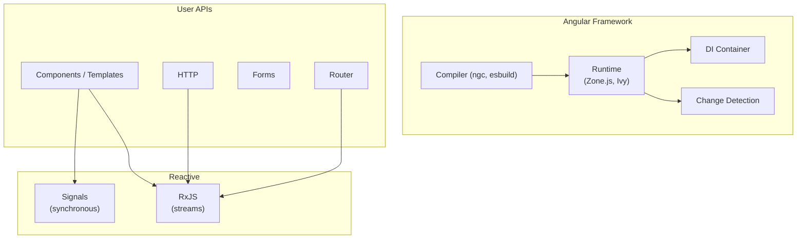
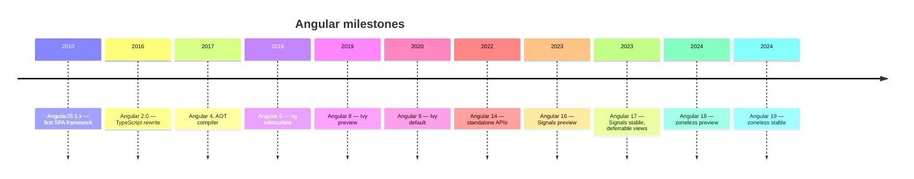
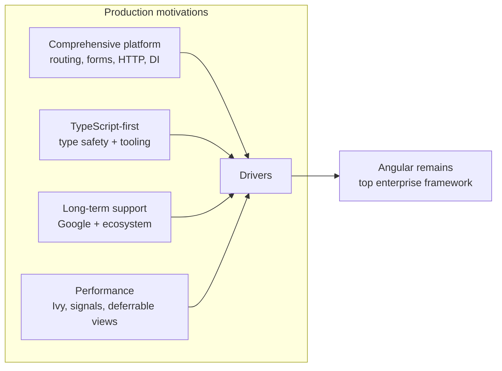
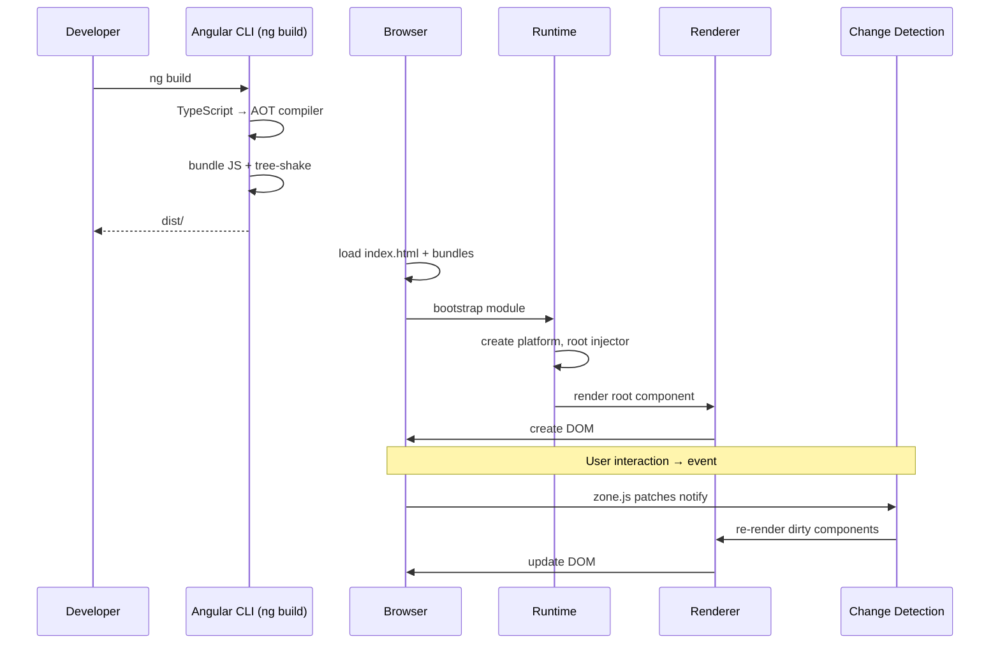
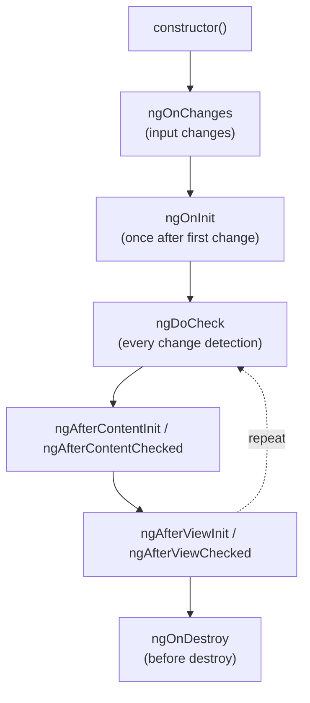
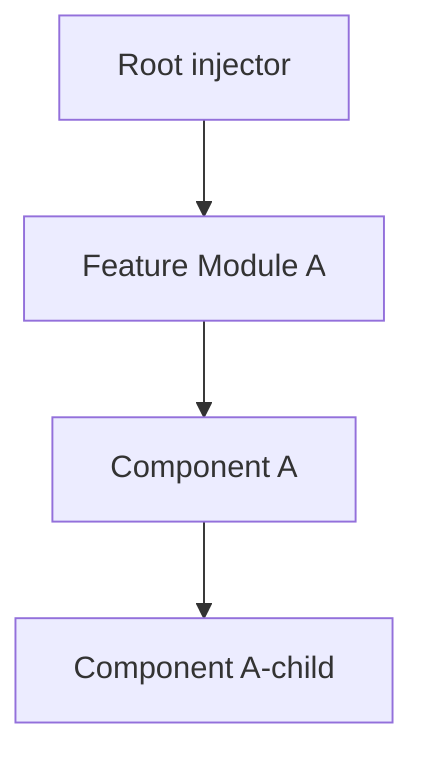
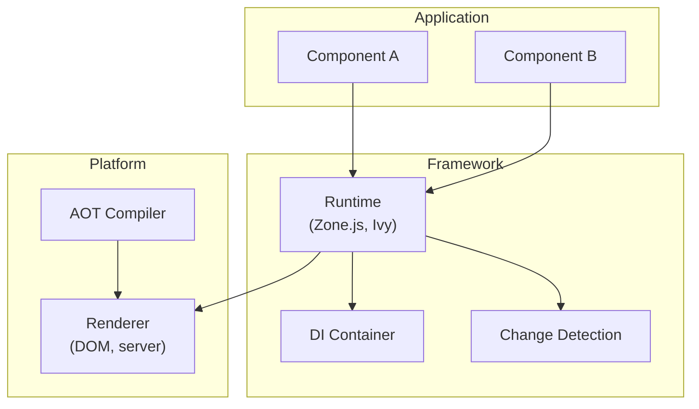
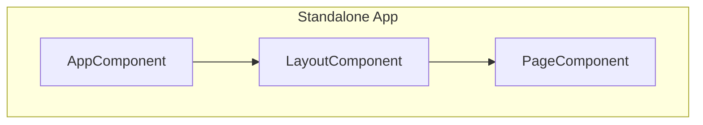
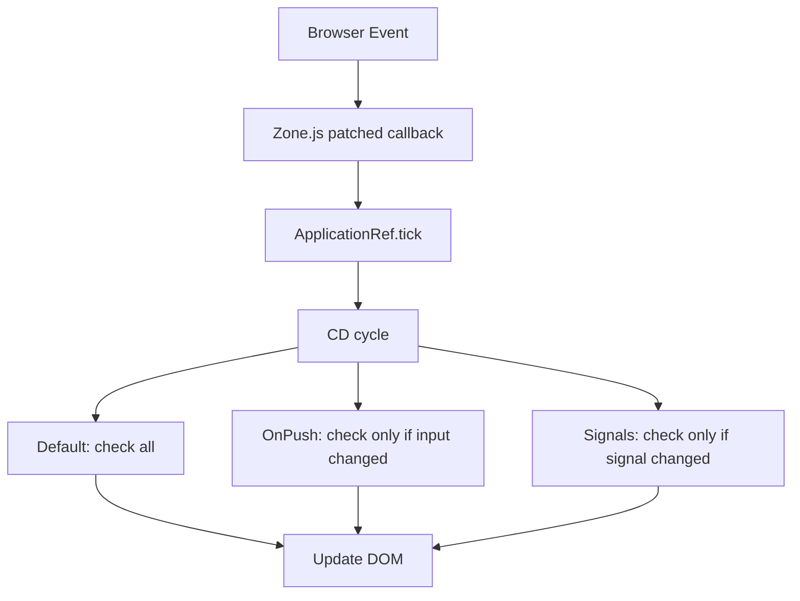
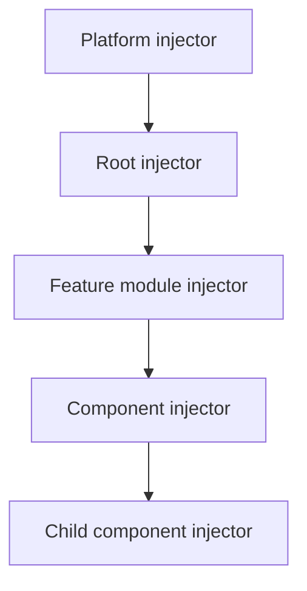

# Frontend (Angular, Signals, RxJS)

> A comprehensive, production-grade treatment of Angular, Signals, and RxJS — from change detection to components to interop patterns, with comparison coverage of React, Vue, and Svelte.

---

## Table of Contents

1. [Overview](#1-overview)
2. [Definition](#2-definition)
3. [Five Ws + One H](#3-five-ws--one-h)
4. [History](#4-history)
5. [Problem Statement](#5-problem-statement)
6. [Real-World Motivation](#6-real-world-motivation)
7. [Internal Working](#7-internal-working)
8. [Deep Dive](#8-deep-dive)
9. [Architecture](#9-architecture)
10. [Performance](#10-performance)
11. [Security](#11-security)
12. [Production Engineering](#12-production-engineering)
13. [Production Case Studies](#13-production-case-studies)
14. [Code Examples](#14-code-examples)
15. [Common Mistakes](#15-common-mistakes)
16. [Debugging](#16-debugging)
17. [Monitoring & Observability](#17-monitoring--observability)
18. [Best Practices](#18-best-practices)
19. [Anti-Patterns](#19-anti-patterns)
20. [Edge Cases](#20-edge-cases)
21. [Comparisons](#21-comparisons)
22. [Interview Preparation](#22-interview-preparation)
23. [References](#23-references)

---

## 1. Overview

Angular is Google's open-source application framework for building client-side web applications in TypeScript. It provides a complete platform: a component model, a dependency injection system, a router, forms, HTTP client, and — since v17 — first-class **Signals** for fine-grained reactivity. Angular also integrates deeply with **RxJS**, the reactive programming library that powers HTTP, routing, and many other async flows.

This document treats Angular, Signals, and RxJS at production depth. It explains Angular's **change detection** mechanism (Zone.js, OnPush, and the Signals-based alternative), the **dependency injection** system, **components** and **templates**, the **router**, **reactive forms**, **HTTP** with interceptors, and **testing**. It also covers how Angular compares to React, Vue, and Svelte — three frameworks with different mental models and trade-offs.

**Scope.** This is not an Angular tutorial. It assumes you can already build a basic Angular app. It focuses on **what's happening under the hood**: how change detection works, how Signals integrate with RxJS and OnPush, how the DI hierarchy is constructed, how the router lazy-loads modules, and how to operate Angular in production.

**Version baseline.** Angular 16 through 18 (current LTS in 2026). Both standalone and NgModule-based code are shown, with a preference for standalone in new code. RxJS 7.x. TypeScript 5+.

## 2. Definition

The frontend ecosystem uses overlapping terminology. Here's a precise taxonomy:

| Term | Type | Authoritative source |
|------|------|---------------------|
| **Frontend framework** | A library that structures the UI as a tree of components with declarative templates, change detection, and routing | Angular, React, Vue, Svelte, Solid, etc. |
| **Component** | A reusable, self-contained unit of UI with template, logic, and styles | Framework-specific definitions |
| **Signal** | A reactive primitive: a value that changes over time and notifies dependents when it does | Solid Signals, Vue ref/reactive, Angular signals (v16+) |
| **Reactive programming** | A paradigm where computation is expressed as data flows and propagation of change | RxJS, Bacon.js, Most.js |
| **Change detection** | The mechanism by which a framework updates the DOM to match the application state | Framework-specific (CD cycle, signals, virtual DOM diff) |
| **SPA** | Single-page application: a web app that loads once and updates the DOM dynamically | All major frameworks |
| **SSR** | Server-side rendering: rendering the initial HTML on the server for SEO and first-paint speed | Angular Universal, Next.js, Nuxt |
| **Standalone components** | Components that don't need to be declared in an NgModule (Angular v14+) | Angular-specific |

This document focuses on **Angular**, with **Signals** and **RxJS** as the two reactive primitives engineers need to know.

The Angular ecosystem stack:



## 3. Five Ws + One H

### What <a class="askgpt-btn" href="https://chatgpt.com/?q=Explain%20'What'%20in%20detail%20with%20concrete%20examples%2C%20the%20main%20trade-offs%2C%20and%20common%20pitfalls%20a%20practitioner%20should%20know." target="_blank" rel="noopener" data-askgpt="What" title="Ask ChatGPT about this section">💬</a>

Angular is a **TypeScript-first frontend framework** that structures web UIs as a tree of components with declarative templates, dependency injection, change detection, routing, HTTP, and forms. It supports **standalone components** (since v14) and **Signals** for fine-grained reactivity (since v16, stable v17).

### Why <a class="askgpt-btn" href="https://chatgpt.com/?q=Explain%20'Why'%20in%20detail%20with%20concrete%20examples%2C%20the%20main%20trade-offs%2C%20and%20common%20pitfalls%20a%20practitioner%20should%20know." target="_blank" rel="noopener" data-askgpt="Why" title="Ask ChatGPT about this section">💬</a>

Angular exists to make large-scale web application development structured, maintainable, and testable. Before Angular, jQuery-based codebases grew unmaintainable. Angular provides opinionated architecture: components, services, DI, observables — patterns that scale.

### When <a class="askgpt-btn" href="https://chatgpt.com/?q=Explain%20'When'%20in%20detail%20with%20concrete%20examples%2C%20the%20main%20trade-offs%2C%20and%20common%20pitfalls%20a%20practitioner%20should%20know." target="_blank" rel="noopener" data-askgpt="When" title="Ask ChatGPT about this section">💬</a>

AngularJS (1.x) shipped in 2010. Angular 2.0 (rewrite in TypeScript) shipped in 2016. Since then, major versions ship every 6 months: Angular 4 (2017), 5 (2017), 6 (2018), ..., 16 (2023), 17 (2023), 18 (2024). Angular's LTS-style support comes via the active development model.

### Where <a class="askgpt-btn" href="https://chatgpt.com/?q=Explain%20'Where'%20in%20detail%20with%20concrete%20examples%2C%20the%20main%20trade-offs%2C%20and%20common%20pitfalls%20a%20practitioner%20should%20know." target="_blank" rel="noopener" data-askgpt="Where" title="Ask ChatGPT about this section">💬</a>

Enterprise web apps, internal tools, dashboards, e-commerce sites, banking apps, government services, B2B SaaS. Angular is particularly strong in **large organizations** that value opinionated architecture.

### Who <a class="askgpt-btn" href="https://chatgpt.com/?q=Explain%20'Who'%20in%20detail%20with%20concrete%20examples%2C%20the%20main%20trade-offs%2C%20and%20common%20pitfalls%20a%20practitioner%20should%20know." target="_blank" rel="noopener" data-askgpt="Who" title="Ask ChatGPT about this section">💬</a>

- **Original creator:** Miško Hevery at Google (AngularJS, 2010).
- **Angular 2+ rewrite:** Brad Green, Igor Minar, Miško Hevery, plus a large Google team.
- **Maintainer:** Google Angular Team, with broad community contribution.
- **Used by:** Google (internal tools, Firebase console), Microsoft (Office 365), Deutsche Bank, IKEA, McDonald's, Samsung, Forbes, Gmail, and many others.

### How (one-paragraph preview) <a class="askgpt-btn" href="https://chatgpt.com/?q=Explain%20'How%20(one-paragraph%20preview)'%20in%20detail%20with%20concrete%20examples%2C%20the%20main%20trade-offs%2C%20and%20common%20pitfalls%20a%20practitioner%20should%20know." target="_blank" rel="noopener" data-askgpt="How (one-paragraph preview)" title="Ask ChatGPT about this section">💬</a>

A TypeScript source file is compiled by `ngc` (or `esbuild` since v16) to JavaScript. The browser loads the bundle, Angular bootstraps a platform, registers root providers, and instantiates the root component. The component template is compiled to JavaScript instructions that create and update the DOM. Change detection runs on every browser event (via Zone.js patching) or fine-grained via Signals. HTTP requests return RxJS Observables; components subscribe and render results.

## 4. History

### 4.1 Origins (2010-2014) <a class="askgpt-btn" href="https://chatgpt.com/?q=Explain%20'4.1%20Origins%20(2010-2014)'%20in%20detail%20with%20concrete%20examples%2C%20the%20main%20trade-offs%2C%20and%20common%20pitfalls%20a%20practitioner%20should%20know." target="_blank" rel="noopener" data-askgpt="4.1 Origins (2010-2014)" title="Ask ChatGPT about this section">💬</a>

- **2010** — Miško Hevery at Google releases **AngularJS (1.x)**. It popularizes the "single-page application" model with two-way data binding, dependency injection, and declarative HTML templates.
- **2012** — AngularJS gains traction; competing frameworks like Backbone.js, Ember.js, Knockout.js compete in the same space.
- **2013** — React is released by Facebook (open-sourced in 2013, used internally at FB since 2011). AngularJS continues to grow.
- **2014** — AngularJS 1.3 (one-way binding, performance improvements). Angular 2.0 announced as a complete rewrite.

### 4.2 The rewrite (2014-2016) <a class="askgpt-btn" href="https://chatgpt.com/?q=Explain%20'4.2%20The%20rewrite%20(2014-2016)'%20in%20detail%20with%20concrete%20examples%2C%20the%20main%20trade-offs%2C%20and%20common%20pitfalls%20a%20practitioner%20should%20know." target="_blank" rel="noopener" data-askgpt="4.2 The rewrite (2014-2016)" title="Ask ChatGPT about this section">💬</a>

- **2014-2016** — Angular 2 is developed. Controversial: completely different from AngularJS, breaking changes, AtScript (later TypeScript) adoption.
- **September 2016** — **Angular 2.0** ships. Written in TypeScript (Microsoft collaboration). Component-based, no more controllers and scopes.

### 4.3 The cadence era (2016-2022) <a class="askgpt-btn" href="https://chatgpt.com/?q=Explain%20'4.3%20The%20cadence%20era%20(2016-2022)'%20in%20detail%20with%20concrete%20examples%2C%20the%20main%20trade-offs%2C%20and%20common%20pitfalls%20a%20practitioner%20should%20know." target="_blank" rel="noopener" data-askgpt="4.3 The cadence era (2016-2022)" title="Ask ChatGPT about this section">💬</a>

Angular moves to a 6-month release cadence:

- **March 2017** — **Angular 4.0** (skipped 3 to align with Router version). Smaller bundles, animation package.
- **November 2017** — **Angular 5.0**. Build optimizer, AOT compiler default.
- **May 2018** — **Angular 6.0**. `ng add`/`ng update` schematics, RxJS 6.
- **October 2018** — **Angular 7.0**. Drag-drop, virtual scrolling.
- **May 2019** — **Angular 8.0**. Ivy renderer preview, differential loading, lazy loading.
- **February 2020** — **Angular 9.0**. **Ivy becomes default renderer**. Major performance wins.
- **June 2020** — **Angular 10.0**. Strict mode opt-in.
- **November 2020** — **Angular 11.0**. Hot module replacement, webpack 5.
- **May 2021** — **Angular 12.0**. Webpack 5 default, Tailwind, IE11 deprecation.
- **November 2021** — **Angular 13.0**. IE11 removed, factory-based DI.
- **June 2022** — **Angular 14.0**. **Standalone components** (developer preview), typed reactive forms.
- **November 2022** — **Angular 15.0**. Standalone APIs stable, functional route guards, image directive.
- **May 2023** — **Angular 16.0**. **Signals developer preview**, esbuild builder, SSR experimental.
- **November 2023** — **Angular 17.0**. **Signals stable**, **deferrable views**, control flow syntax (`@if`, `@for`).
- **May 2024** — **Angular 18.0**. Zoneless change detection preview, Material 3, deferred blocks.
- **November 2024** — **Angular 19.0**. Zoneless stable, signal-based inputs/outputs.

### 4.4 Governance <a class="askgpt-btn" href="https://chatgpt.com/?q=Explain%20'4.4%20Governance'%20in%20detail%20with%20concrete%20examples%2C%20the%20main%20trade-offs%2C%20and%20common%20pitfalls%20a%20practitioner%20should%20know." target="_blank" rel="noopener" data-askgpt="4.4 Governance" title="Ask ChatGPT about this section">💬</a>

- **Google Angular Team** maintains the framework.
- **Open source:** MIT license.
- **Community:** Angular Discord, GitHub Discussions, Stack Overflow, Angular GDEs.



## 5. Problem Statement

### 5.1 What Angular solved (and what the ecosystem solved before it) <a class="askgpt-btn" href="https://chatgpt.com/?q=Explain%20'5.1%20What%20Angular%20solved%20(and%20what%20the%20ecosystem%20solved%20before%20it)'%20in%20detail%20with%20concrete%20examples%2C%20the%20main%20trade-offs%2C%20and%20common%20pitfalls%20a%20practitioner%20should%20know." target="_blank" rel="noopener" data-askgpt="5.1 What Angular solved (and what the ecosystem solved before it)" title="Ask ChatGPT about this section">💬</a>

**1995-2005 — Static HTML and form submission.** Pages reload on every interaction.

**2005-2010 — jQuery era.** jQuery simplifies DOM manipulation. Ajax enables partial updates. But codebases grow into spaghetti as state management, view updates, and event handling get tangled.

**2010-2015 — First-gen SPA frameworks.** AngularJS, Backbone.js, Knockout.js. Two-way data binding, MVC patterns, declarative templates. Solve the structure problem but introduce complexity (digest cycles in AngularJS, manual rendering in Backbone).

**2013 — React introduces the Virtual DOM.** Declarative components, one-way data flow, fast reconciliation. Solves the performance problem of AngularJS's digest cycles.

**2014 — Vue.js.** Combines AngularJS-style templates with React-style reactivity (via getters/setters). Lower learning curve.

**2016 — Angular 2.** Full rewrite in TypeScript. Component-based, no digest cycle, ahead-of-time compilation, tree-shaking.

**2019 — Svelte.** Compiler-based: shifts work from runtime to compile time. No virtual DOM.

**2023 — Angular Signals.** Adopt fine-grained reactivity (à la Solid.js, Vue 3's reactivity).

### 5.2 Why Angular for an enterprise? <a class="askgpt-btn" href="https://chatgpt.com/?q=Explain%20'5.2%20Why%20Angular%20for%20an%20enterprise%3F'%20in%20detail%20with%20concrete%20examples%2C%20the%20main%20trade-offs%2C%20and%20common%20pitfalls%20a%20practitioner%20should%20know." target="_blank" rel="noopener" data-askgpt="5.2 Why Angular for an enterprise?" title="Ask ChatGPT about this section">💬</a>

- **Opinionated architecture** — components, services, modules, DI. New team members can navigate large codebases.
- **TypeScript-first** — type safety, IDE support, refactor confidence.
- **Comprehensive platform** — routing, forms, HTTP, i18n, animations, testing. One framework covers most needs.
- **Long-term support** — Google maintains it. Stable LTS-style policies.
- **AOT compilation** — catches errors at build time, smaller bundles.
- **Mature DI** — hierarchical injectors, testing-friendly providers.

### 5.3 What Angular is criticized for <a class="askgpt-btn" href="https://chatgpt.com/?q=Explain%20'5.3%20What%20Angular%20is%20criticized%20for'%20in%20detail%20with%20concrete%20examples%2C%20the%20main%20trade-offs%2C%20and%20common%20pitfalls%20a%20practitioner%20should%20know." target="_blank" rel="noopener" data-askgpt="5.3 What Angular is criticized for" title="Ask ChatGPT about this section">💬</a>

- **Bundle size** — historically larger than React/Vue.
- **Verbosity** — many files for one feature (component, module, template, styles).
- **Magic** — DI, change detection can be confusing.
- **Steeper learning curve** — RxJS, decorators, modules, DI.
- **Tied to TypeScript** — pure JavaScript is awkward.

## 6. Real-World Motivation

### 6.1 Production users <a class="askgpt-btn" href="https://chatgpt.com/?q=Explain%20'6.1%20Production%20users'%20in%20detail%20with%20concrete%20examples%2C%20the%20main%20trade-offs%2C%20and%20common%20pitfalls%20a%20practitioner%20should%20know." target="_blank" rel="noopener" data-askgpt="6.1 Production users" title="Ask ChatGPT about this section">💬</a>

- **Google** — Firebase console, Google Cloud console, internal tools. Angular's birthplace.
- **Microsoft** — Office 365 web apps use Angular.
- **Deutsche Bank** — digital banking platform.
- **IKEA** — e-commerce and store systems.
- **McDonald's** — ordering and kiosk apps.
- **Samsung** — Smart TV apps and internal tools.
- **Forbes** — content site.
- **Gmail** — many internal components.
- **Upwork, Freelancer** — talent platforms.

### 6.2 Economic motivation <a class="askgpt-btn" href="https://chatgpt.com/?q=Explain%20'6.2%20Economic%20motivation'%20in%20detail%20with%20concrete%20examples%2C%20the%20main%20trade-offs%2C%20and%20common%20pitfalls%20a%20practitioner%20should%20know." target="_blank" rel="noopener" data-askgpt="6.2 Economic motivation" title="Ask ChatGPT about this section">💬</a>

- **Developer productivity** — comprehensive platform means fewer third-party dependencies.
- **Talent pool** — Angular is widely known; TypeScript skills transfer.
- **Long-term maintainability** — opinionated architecture, TypeScript types, testing tools.
- **Performance** — Ivy renderer (default since v9) brings Angular performance in line with React/Vue.

### 6.3 Why not alternatives? <a class="askgpt-btn" href="https://chatgpt.com/?q=Explain%20'6.3%20Why%20not%20alternatives%3F'%20in%20detail%20with%20concrete%20examples%2C%20the%20main%20trade-offs%2C%20and%20common%20pitfalls%20a%20practitioner%20should%20know." target="_blank" rel="noopener" data-askgpt="6.3 Why not alternatives?" title="Ask ChatGPT about this section">💬</a>

| Alternative | Why not always chosen |
|-------------|------------------------|
| React | More flexibility, but architecture decisions left to the team; smaller built-in platform |
| Vue | Lower learning curve; smaller ecosystem |
| Svelte | Smaller runtime, but smaller ecosystem and team hiring pool |
| Solid | Smaller ecosystem |
| HTMX | Server-driven, doesn't fit complex SPAs |

### 6.4 Performance motivation <a class="askgpt-btn" href="https://chatgpt.com/?q=Explain%20'6.4%20Performance%20motivation'%20in%20detail%20with%20concrete%20examples%2C%20the%20main%20trade-offs%2C%20and%20common%20pitfalls%20a%20practitioner%20should%20know." target="_blank" rel="noopener" data-askgpt="6.4 Performance motivation" title="Ask ChatGPT about this section">💬</a>

- **Ivy renderer** (v9+) — smaller bundles, faster compilation, better tree-shaking.
- **Deferrable views** (v17+) — lazy-load component subtrees.
- **Signals** (v16+) — fine-grained reactivity, less DOM manipulation.
- **Zoneless change detection** (v18+) — eliminate Zone.js overhead.



---

## 7. Internal Working

### 7.1 The lifecycle of an Angular application <a class="askgpt-btn" href="https://chatgpt.com/?q=Explain%20'7.1%20The%20lifecycle%20of%20an%20Angular%20application'%20in%20detail%20with%20concrete%20examples%2C%20the%20main%20trade-offs%2C%20and%20common%20pitfalls%20a%20practitioner%20should%20know." target="_blank" rel="noopener" data-askgpt="7.1 The lifecycle of an Angular application" title="Ask ChatGPT about this section">💬</a>



### 7.2 Subsystems that participate <a class="askgpt-btn" href="https://chatgpt.com/?q=Explain%20'7.2%20Subsystems%20that%20participate'%20in%20detail%20with%20concrete%20examples%2C%20the%20main%20trade-offs%2C%20and%20common%20pitfalls%20a%20practitioner%20should%20know." target="_blank" rel="noopener" data-askgpt="7.2 Subsystems that participate" title="Ask ChatGPT about this section">💬</a>

| Subsystem | Responsibility | Source location |
|-----------|---------------|------------------|
| **Compiler** | AOT, template type-checking | `@angular/compiler-cli` |
| **Runtime** | Module loading, DI, change detection | `@angular/core` |
| **Renderer** | DOM manipulation | `@angular/core` (Ivy) |
| **Forms** | Reactive and template-driven | `@angular/forms` |
| **HTTP** | `HttpClient`, interceptors | `@angular/common/http` |
| **Router** | Routing, navigation, guards | `@angular/router` |
| **Animations** | Animation framework | `@angular/animations` |
| **Compiler CLI** | `ngc` / esbuild builder | `@angular/compiler-cli` |

### 7.3 Component lifecycle <a class="askgpt-btn" href="https://chatgpt.com/?q=Explain%20'7.3%20Component%20lifecycle'%20in%20detail%20with%20concrete%20examples%2C%20the%20main%20trade-offs%2C%20and%20common%20pitfalls%20a%20practitioner%20should%20know." target="_blank" rel="noopener" data-askgpt="7.3 Component lifecycle" title="Ask ChatGPT about this section">💬</a>



In **OnPush** components, lifecycle hooks fire only when input references change or events fire from within the component.

## 8. Deep Dive

This section is the heart of the document.

### 8.1 Bootstrap process <a class="askgpt-btn" href="https://chatgpt.com/?q=Explain%20'8.1%20Bootstrap%20process'%20in%20detail%20with%20concrete%20examples%2C%20the%20main%20trade-offs%2C%20and%20common%20pitfalls%20a%20practitioner%20should%20know." target="_blank" rel="noopener" data-askgpt="8.1 Bootstrap process" title="Ask ChatGPT about this section">💬</a>

**Standalone bootstrap (recommended since v17):**

```typescript
// main.ts
import { bootstrapApplication } from '@angular/platform-browser';
import { AppComponent } from './app/app.component';
import { appConfig } from './app/app.config';

bootstrapApplication(AppComponent, appConfig)
  .catch((err) => console.error(err));
```

```typescript
// app.config.ts
import { ApplicationConfig, provideZoneChangeDetection } from '@angular/core';
import { provideRouter } from '@angular/router';
import { routes } from './app.routes';

export const appConfig: ApplicationConfig = {
  providers: [
    provideZoneChangeDetection({ eventCoalescing: true }),
    provideRouter(routes),
  ],
};
```

**What happens:**

1. `bootstrapApplication` creates a platform (browser), then a root injector.
2. The `appConfig.providers` are registered.
3. The `AppComponent` is instantiated and rendered into the `app-root` element.
4. Zone.js (if enabled) patches `setTimeout`, `Promise`, event handlers to trigger change detection.

### 8.2 Standalone vs NgModule <a class="askgpt-btn" href="https://chatgpt.com/?q=Explain%20'8.2%20Standalone%20vs%20NgModule'%20in%20detail%20with%20concrete%20examples%2C%20the%20main%20trade-offs%2C%20and%20common%20pitfalls%20a%20practitioner%20should%20know." target="_blank" rel="noopener" data-askgpt="8.2 Standalone vs NgModule" title="Ask ChatGPT about this section">💬</a>

| Feature | NgModule | Standalone |
|---------|----------|------------|
| Introduced | v2 (2016) | v14 (2022, preview), v15 (stable) |
| Status | Legacy for new code | Recommended for new code |
| Bootstrap | `platformBrowserDynamic().bootstrapModule(AppModule)` | `bootstrapApplication(AppComponent, appConfig)` |
| Imports | `@NgModule({ imports: [...] })` | Direct imports in component metadata |

**Migration:** Use the schematic `ng generate @angular/core:standalone` to convert NgModules.

### 8.3 Components <a class="askgpt-btn" href="https://chatgpt.com/?q=Explain%20'8.3%20Components'%20in%20detail%20with%20concrete%20examples%2C%20the%20main%20trade-offs%2C%20and%20common%20pitfalls%20a%20practitioner%20should%20know." target="_blank" rel="noopener" data-askgpt="8.3 Components" title="Ask ChatGPT about this section">💬</a>

```typescript
import { Component } from '@angular/core';

@Component({
  selector: 'app-user-card',
  standalone: true,
  template: `
    <div class="card">
      <h2>{{ user().name }}</h2>
      <p>{{ user().email }}</p>
      <button (click)="onDelete()">Delete</button>
    </div>
  `,
  styles: [`
    .card { padding: 1rem; border: 1px solid #ccc; }
  `],
})
export class UserCardComponent {
  user = input.required<User>();
  deleted = output<string>();

  onDelete() {
    this.deleted.emit(this.user().id);
  }
}
```

**Key points:**
- `selector` — the HTML tag (`<app-user-card>`).
- `standalone: true` — doesn't need to be in an NgModule.
- `input.required<T>()` — signal-based input (v17.1+).
- `output<T>()` — signal-based output.

### 8.4 Templates <a class="askgpt-btn" href="https://chatgpt.com/?q=Explain%20'8.4%20Templates'%20in%20detail%20with%20concrete%20examples%2C%20the%20main%20trade-offs%2C%20and%20common%20pitfalls%20a%20practitioner%20should%20know." target="_blank" rel="noopener" data-askgpt="8.4 Templates" title="Ask ChatGPT about this section">💬</a>

```html
<!-- Interpolation -->
<h1>{{ title }}</h1>

<!-- Property binding -->


<!-- Event binding -->
<button (click)="onSave()">Save</button>

<!-- Two-way binding (signals) -->
<input [value]="name()" (input)="name.set($any($event.target).value)">

<!-- Control flow (v17+) -->
@if (user()) {
  <div>{{ user()!.name }}</div>
} @else {
  <p>Loading...</p>
}

@for (item of items(); track item.id) {
  <li>{{ item.name }}</li>
}

@switch (status()) {
  @case ('loading') { <p>Loading...</p> }
  @case ('error') { <p>Error!</p> }
  @default { <p>Ready</p> }
}
```

### 8.5 Directives <a class="askgpt-btn" href="https://chatgpt.com/?q=Explain%20'8.5%20Directives'%20in%20detail%20with%20concrete%20examples%2C%20the%20main%20trade-offs%2C%20and%20common%20pitfalls%20a%20practitioner%20should%20know." target="_blank" rel="noopener" data-askgpt="8.5 Directives" title="Ask ChatGPT about this section">💬</a>

| Directive | Purpose |
|----------|---------|
| `[class.active]` | Conditional class |
| `[style.color]` | Inline style binding |
| `*ngIf` | Conditional render (legacy; use `@if` in v17+) |
| `*ngFor` | Loop (legacy; use `@for` in v17+) |
| `*ngSwitch` | Switch (legacy; use `@switch` in v17+) |
| `[(ngModel)]` | Two-way binding (FormsModule) |
| `(click)`, `(keyup)`, etc. | Events |

**Custom directives:**

```typescript
@Directive({
  selector: '[appHighlight]',
  standalone: true,
})
export class HighlightDirective {
  private el = inject(ElementRef<HTMLElement>);

  constructor() {
    this.el.nativeElement.style.backgroundColor = 'yellow';
  }
}
```

### 8.6 Pipes <a class="askgpt-btn" href="https://chatgpt.com/?q=Explain%20'8.6%20Pipes'%20in%20detail%20with%20concrete%20examples%2C%20the%20main%20trade-offs%2C%20and%20common%20pitfalls%20a%20practitioner%20should%20know." target="_blank" rel="noopener" data-askgpt="8.6 Pipes" title="Ask ChatGPT about this section">💬</a>

```typescript
@Component({
  template: `
    <p>{{ today | date:'short' }}</p>
    <p>{{ user.name | uppercase }}</p>
    <p>{{ price | currency:'USD' }}</p>
    <p>{{ items$ | async }}</p>
  `,
})
export class MyComponent {
  today = new Date();
  user = { name: 'Alice' };
  price = 9.99;
  items$ = of([1, 2, 3]);
}
```

**Built-in pipes:** `date`, `uppercase`, `lowercase`, `currency`, `decimal`, `percent`, `json`, `slice`, `async`.

**Async pipe** subscribes to an Observable/Promise and returns the latest value. **Critical for memory leak prevention** — it cleans up automatically.

**Custom pipes:**

```typescript
@Pipe({ name: 'truncate', standalone: true })
export class TruncatePipe implements PipeTransform {
  transform(value: string, length = 50): string {
    return value.length > length ? value.slice(0, length) + '...' : value;
  }
}
```

**Pure vs impure pipes:**
- **Pure** (default) — called only when input reference changes. Fast.
- **Impure** — called on every change detection cycle. Use sparingly.

### 8.7 Dependency Injection <a class="askgpt-btn" href="https://chatgpt.com/?q=Explain%20'8.7%20Dependency%20Injection'%20in%20detail%20with%20concrete%20examples%2C%20the%20main%20trade-offs%2C%20and%20common%20pitfalls%20a%20practitioner%20should%20know." target="_blank" rel="noopener" data-askgpt="8.7 Dependency Injection" title="Ask ChatGPT about this section">💬</a>

```typescript
@Injectable({ providedIn: 'root' })
export class UserService {
  private http = inject(HttpClient);

  getUser(id: number): Observable<User> {
    return this.http.get<User>(`/api/users/${id}`);
  }
}

@Component({
  selector: 'app-user-detail',
  template: `{{ user()?.name }}`,
})
export class UserDetailComponent {
  private route = inject(ActivatedRoute);
  private userService = inject(UserService);

  user = toSignal(
    this.route.params.pipe(
      switchMap(p => this.userService.getUser(p['id']))
    )
  );
}
```

**Provider scopes:**

| Scope | Description |
|-------|-------------|
| `providedIn: 'root'` | Singleton in root injector |
| `providedIn: 'platform'` | Singleton across all Angular apps on page |
| `providedIn: 'any'` | One instance per lazy-loaded module |
| Component-level | Provided in component's injector |

**Hierarchical injectors:**



A child injector can see providers from parent injectors. Parents don't see children's.

**Injection tokens:**

```typescript
export const API_BASE = new InjectionToken<string>('API_BASE');

// Configure
{ provide: API_BASE, useValue: 'https://api.example.com' }

// Inject
private base = inject(API_BASE);
```

### 8.8 Change detection <a class="askgpt-btn" href="https://chatgpt.com/?q=Explain%20'8.8%20Change%20detection'%20in%20detail%20with%20concrete%20examples%2C%20the%20main%20trade-offs%2C%20and%20common%20pitfalls%20a%20practitioner%20should%20know." target="_blank" rel="noopener" data-askgpt="8.8 Change detection" title="Ask ChatGPT about this section">💬</a>

**Default (Zone.js):**

Zone.js patches browser APIs (`setTimeout`, `Promise`, `addEventListener`, `XMLHttpRequest`). When a callback fires, Zone.js notifies Angular, which runs change detection on all components.

**OnPush:**

```typescript
@Component({
  changeDetection: ChangeDetectionStrategy.OnPush,
})
export class MyComponent { }
```

With OnPush, change detection runs only when:
- An `@Input()` reference changes.
- An event fires from within the template.
- An Observable subscribed via `async` pipe emits.
- A signal read in the template changes (v17+).
- Manual `markForCheck()` is called.

**Signals (zoneless preview):**

With Signals, change detection is fine-grained. Only the components reading the changed signal are re-rendered.

```typescript
@Component({
  template: `{{ name() }}`,
})
export class MyComponent {
  name = signal('Alice');
}
```

When `name.set('Bob')` is called, only this component's view is updated.

### 8.9 Signals <a class="askgpt-btn" href="https://chatgpt.com/?q=Explain%20'8.9%20Signals'%20in%20detail%20with%20concrete%20examples%2C%20the%20main%20trade-offs%2C%20and%20common%20pitfalls%20a%20practitioner%20should%20know." target="_blank" rel="noopener" data-askgpt="8.9 Signals" title="Ask ChatGPT about this section">💬</a>

**`signal()` — writable reactive value:**

```typescript
const counter = signal(0);
counter.set(5);
counter.update(n => n + 1);
console.log(counter()); // 5
```

**`computed()` — derived value:**

```typescript
const firstName = signal('Alice');
const lastName = signal('Smith');
const fullName = computed(() => `${firstName()} ${lastName()}`);
// Lazy: only recomputes when read after change
```

**`effect()` — side effect on signal change:**

```typescript
effect(() => {
  console.log(`count changed: ${count()}`);
});
```

**`input()` / `output()` / `model()` — signal-based component I/O:**

```typescript
@Component({
  template: `<button (click)="increment()">{{ count() }}</button>`,
})
export class CounterComponent {
  initial = input(0);           // signal input
  count = computed(() => this.initial() + this.local());
  local = signal(0);
  increment() { this.local.update(n => n + 1); }
}
```

**`toSignal()` / `toObservable()` — interop with RxJS:**

```typescript
const user$ = this.http.get<User>('/api/user');
const user = toSignal(user$, { initialValue: null });
```

```typescript
const count$ = toObservable(this.count);
const debounced$ = count$.pipe(debounceTime(300));
```

### 8.10 RxJS <a class="askgpt-btn" href="https://chatgpt.com/?q=Explain%20'8.10%20RxJS'%20in%20detail%20with%20concrete%20examples%2C%20the%20main%20trade-offs%2C%20and%20common%20pitfalls%20a%20practitioner%20should%20know." target="_blank" rel="noopener" data-askgpt="8.10 RxJS" title="Ask ChatGPT about this section">💬</a>

**Observable:**

```typescript
const obs$ = new Observable(subscriber => {
  subscriber.next(1);
  subscriber.next(2);
  subscriber.complete();
});
```

**Hot vs cold:**
- **Cold** — each subscription runs the producer.
- **Hot** — subscriptions share the producer.

**Operators:**

```typescript
import { Component, inject } from '@angular/core';
import { HttpClient } from '@angular/common/http';
import { Observable } from 'rxjs';
import { map, debounceTime, distinctUntilChanged, switchMap, catchError } from 'rxjs/operators';

@Component({ /* ... */ })
export class SearchComponent {
  private http = inject(HttpClient);

  search(query$: Observable<string>): Observable<SearchResult[]> {
    return query$.pipe(
      debounceTime(300),
      distinctUntilChanged(),
      switchMap(q => this.http.get<SearchResult[]>(`/api/search?q=${q}`)),
      catchError(err => [])
    );
  }
}
```

**Critical operators:**

| Operator | Purpose |
|----------|---------|
| `map` | Transform values |
| `filter` | Pass matching values |
| `switchMap` | Cancel previous, start new inner Observable |
| `mergeMap` (formerly `flatMap`) | Concurrent inner Observables |
| `concatMap` | Sequential inner Observables |
| `exhaustMap` | Ignore new while active |
| `combineLatest` | Combine latest from N streams |
| `debounceTime` | Wait for pause |
| `distinctUntilChanged` | Drop consecutive duplicates |
| `catchError` | Recover from errors |
| `retry` | Retry on error |
| `take` | Take N values then complete |
| `takeUntil` | Take until notifier |
| `share` | Multicast |

**Subjects:**

| Subject | Behavior |
|---------|---------|
| `Subject` | Multicasts; no initial value; subscribers get only future emissions |
| `BehaviorSubject` | Has current value; new subscribers get latest |
| `ReplaySubject` | Buffers N values; new subscribers get buffer |
| `AsyncSubject` | Only emits last value on complete |

**Schedulers:**

| Scheduler | Use |
|-----------|-----|
| `asyncScheduler` | `setTimeout` (default) |
| `asapScheduler` | Microtasks (queueMicrotask) |
| `queueScheduler` | Synchronous |
| `animationFrameScheduler` | `requestAnimationFrame` |

### 8.11 HTTP <a class="askgpt-btn" href="https://chatgpt.com/?q=Explain%20'8.11%20HTTP'%20in%20detail%20with%20concrete%20examples%2C%20the%20main%20trade-offs%2C%20and%20common%20pitfalls%20a%20practitioner%20should%20know." target="_blank" rel="noopener" data-askgpt="8.11 HTTP" title="Ask ChatGPT about this section">💬</a>

```typescript
@Injectable({ providedIn: 'root' })
export class UserService {
  private http = inject(HttpClient);

  getUser(id: number): Observable<User> {
    return this.http.get<User>(`/api/users/${id}`);
  }
}
```

**Interceptors:**

```typescript
export const authInterceptor: HttpInterceptorFn = (req, next) => {
  const token = inject(AuthService).token();
  if (token) {
    req = req.clone({
      setHeaders: { Authorization: `Bearer ${token}` },
    });
  }
  return next(req);
};

// In app.config.ts
provideHttpClient(withInterceptors([authInterceptor, loggingInterceptor])),
```

**Error handling:**

```typescript
this.http.get<User>('/api/user').pipe(
  retry({ count: 3, delay: 1000 }),
  catchError(err => {
    console.error('API error:', err);
    return of(null);
  })
);
```

### 8.12 Router <a class="askgpt-btn" href="https://chatgpt.com/?q=Explain%20'8.12%20Router'%20in%20detail%20with%20concrete%20examples%2C%20the%20main%20trade-offs%2C%20and%20common%20pitfalls%20a%20practitioner%20should%20know." target="_blank" rel="noopener" data-askgpt="8.12 Router" title="Ask ChatGPT about this section">💬</a>

```typescript
// app.routes.ts
import { Routes } from '@angular/router';

export const routes: Routes = [
  { path: '', component: HomeComponent },
  { path: 'users/:id', component: UserDetailComponent,
    canActivate: [authGuard],
    loadComponent: () => import('./user-detail.component').then(m => m.UserDetailComponent)
  },
  { path: 'admin', loadChildren: () => import('./admin/admin.routes').then(m => m.ADMIN_ROUTES) },
];

// Functional guard
export const authGuard: CanActivateFn = () => {
  const auth = inject(AuthService);
  return auth.isLoggedIn() || inject(Router).parseUrl('/login');
};
```

**Lazy loading:** `loadComponent` and `loadChildren` enable code-splitting per route.

### 8.13 Forms <a class="askgpt-btn" href="https://chatgpt.com/?q=Explain%20'8.13%20Forms'%20in%20detail%20with%20concrete%20examples%2C%20the%20main%20trade-offs%2C%20and%20common%20pitfalls%20a%20practitioner%20should%20know." target="_blank" rel="noopener" data-askgpt="8.13 Forms" title="Ask ChatGPT about this section">💬</a>

**Template-driven:**

```html
<form #f="ngForm" (ngSubmit)="onSubmit(f)">
  <input name="email" ngModel required>
  <button [disabled]="f.invalid">Submit</button>
</form>
```

**Reactive:**

```typescript
@Component({
  template: `
    <form [formGroup]="form" (ngSubmit)="onSubmit()">
      <input formControlName="email">
      <div *ngIf="form.controls.email.errors?.['required']">Required</div>
      <button [disabled]="form.invalid">Submit</button>
    </form>
  `,
})
export class MyFormComponent {
  form = inject(FormBuilder).group({
    email: ['', [Validators.required, Validators.email]],
    password: ['', [Validators.required, Validators.minLength(8)]],
  });

  onSubmit() {
    if (this.form.valid) {
      console.log(this.form.value);
    }
  }
}
```

### 8.14 Testing <a class="askgpt-btn" href="https://chatgpt.com/?q=Explain%20'8.14%20Testing'%20in%20detail%20with%20concrete%20examples%2C%20the%20main%20trade-offs%2C%20and%20common%20pitfalls%20a%20practitioner%20should%20know." target="_blank" rel="noopener" data-askgpt="8.14 Testing" title="Ask ChatGPT about this section">💬</a>

**Component test:**

```typescript
describe('UserCardComponent', () => {
  it('renders user name', async () => {
    await TestBed.configureTestingModule({
      imports: [UserCardComponent],
    }).compileComponents();

    const fixture = TestBed.createComponent(UserCardComponent);
    fixture.componentRef.setInput('user', { name: 'Alice', email: 'alice@example.com' });
    fixture.detectChanges();

    expect(fixture.nativeElement.querySelector('h2').textContent).toContain('Alice');
  });
});
```

**Service test:**

```typescript
describe('UserService', () => {
  let service: UserService;
  let httpMock: HttpTestingController;

  beforeEach(() => {
    TestBed.configureTestingModule({
      imports: [HttpClientTestingModule],
      providers: [UserService],
    });
    service = TestBed.inject(UserService);
    httpMock = TestBed.inject(HttpTestingController);
  });

  it('fetches user', () => {
    service.getUser(1).subscribe(user => {
      expect(user.name).toBe('Alice');
    });

    const req = httpMock.expectOne('/api/users/1');
    req.flush({ name: 'Alice' });
  });
});
```

### 8.15 Performance <a class="askgpt-btn" href="https://chatgpt.com/?q=Explain%20'8.15%20Performance'%20in%20detail%20with%20concrete%20examples%2C%20the%20main%20trade-offs%2C%20and%20common%20pitfalls%20a%20practitioner%20should%20know." target="_blank" rel="noopener" data-askgpt="8.15 Performance" title="Ask ChatGPT about this section">💬</a>

**OnPush change detection** — most impactful.

**Lazy loading** — load routes on demand.

**Deferrable views (v17+):**

```html
@defer (on viewport) {
  <heavy-component />
} @placeholder {
  <div>Loading...</div>
}
```

Triggers: `on viewport`, `on idle`, `on hover`, `on timer(Xms)`, `on immediate`, `when condition()`.

**Track in `@for`:** Critical for performance.

```html
@for (item of items(); track item.id) {
  <div>{{ item.name }}</div>
}
```

**Bundle budgets** — `angular.json` budget config warns when bundles exceed size.

**Image optimization** — `NgOptimizedImage` (since v15):

```html

```

### 8.16 Comparison with React <a class="askgpt-btn" href="https://chatgpt.com/?q=Explain%20'8.16%20Comparison%20with%20React'%20in%20detail%20with%20concrete%20examples%2C%20the%20main%20trade-offs%2C%20and%20common%20pitfalls%20a%20practitioner%20should%20know." target="_blank" rel="noopener" data-askgpt="8.16 Comparison with React" title="Ask ChatGPT about this section">💬</a>

| Dimension | Angular | React |
|-----------|---------|-------|
| Author | Google | Meta (Facebook) |
| Type | Full framework | Library (UI only) |
| Language | TypeScript | JavaScript (TypeScript via build step) |
| Component model | Class or function with metadata | Function |
| State | Signals, RxJS, services | useState, useReducer, context, libraries |
| Async | RxJS Observables | Promises, async/await, libraries |
| Routing | `@angular/router` | React Router, Next.js |
| Forms | Built-in (`@angular/forms`) | Libraries (Formik, react-hook-form) |
| Server-side rendering | Angular Universal, Vite SSR | Next.js, Remix |
| Bundle size | Larger | Smaller (with libraries) |
| Convention over configuration | High | Low |

**When to choose React:**
- Smaller apps that need minimal framework.
- Existing React ecosystem.
- Custom architecture preferences.

**When to choose Angular:**
- Enterprise apps with long-term maintenance.
- Teams that value opinionated architecture.
- Heavy use of forms, HTTP, routing.
- TypeScript-first preference.

### 8.17 Comparison with Vue <a class="askgpt-btn" href="https://chatgpt.com/?q=Explain%20'8.17%20Comparison%20with%20Vue'%20in%20detail%20with%20concrete%20examples%2C%20the%20main%20trade-offs%2C%20and%20common%20pitfalls%20a%20practitioner%20should%20know." target="_blank" rel="noopener" data-askgpt="8.17 Comparison with Vue" title="Ask ChatGPT about this section">💬</a>

| Dimension | Angular | Vue 3 |
|-----------|---------|-------|
| Author | Google | Evan You (community) |
| Type | Full framework | Progressive framework |
| Composition | Classes + decorators | Composition API (functions) |
| Reactivity | Signals, RxJS | ref, reactive, computed, watch |
| Templates | HTML with `*`, `[`, `(`, `@` | HTML with `v-` directives |
| Single-file components | No | Yes (`.vue` files) |
| TypeScript | First-class | First-class |
| Bundle size | Larger | Smaller |
| Learning curve | Steeper | Gentler |

**When to choose Vue:**
- Smaller apps.
- Easier learning curve.
- Single-file component workflow.

### 8.18 Comparison with Svelte <a class="askgpt-btn" href="https://chatgpt.com/?q=Explain%20'8.18%20Comparison%20with%20Svelte'%20in%20detail%20with%20concrete%20examples%2C%20the%20main%20trade-offs%2C%20and%20common%20pitfalls%20a%20practitioner%20should%20know." target="_blank" rel="noopener" data-askgpt="8.18 Comparison with Svelte" title="Ask ChatGPT about this section">💬</a>

| Dimension | Angular | Svelte 5 |
|-----------|---------|----------|
| Author | Google | Rich Harris (community) |
| Type | Full framework | Compiler-based |
| Compilation | AOT (template → JS) | Compile Svelte → vanilla JS |
| Reactivity | Signals | Runes (`$state`, `$derived`) |
| Bundle size | Larger | Smallest |
| Runtime | ~100KB+ Ivy | ~5-10KB |
| Learning curve | Steeper | Gentler |

**When to choose Svelte:**
- Performance-critical apps.
- Smaller bundles.
- Simpler reactivity model.

---

## 9. Architecture

### 9.1 Angular framework layering <a class="askgpt-btn" href="https://chatgpt.com/?q=Explain%20'9.1%20Angular%20framework%20layering'%20in%20detail%20with%20concrete%20examples%2C%20the%20main%20trade-offs%2C%20and%20common%20pitfalls%20a%20practitioner%20should%20know." target="_blank" rel="noopener" data-askgpt="9.1 Angular framework layering" title="Ask ChatGPT about this section">💬</a>



### 9.2 Module / standalone component tree <a class="askgpt-btn" href="https://chatgpt.com/?q=Explain%20'9.2%20Module%20%2F%20standalone%20component%20tree'%20in%20detail%20with%20concrete%20examples%2C%20the%20main%20trade-offs%2C%20and%20common%20pitfalls%20a%20practitioner%20should%20know." target="_blank" rel="noopener" data-askgpt="9.2 Module / standalone component tree" title="Ask ChatGPT about this section">💬</a>



With standalone components (since v14), the tree is direct. No NgModule intermediary.

### 9.3 Change detection cycle <a class="askgpt-btn" href="https://chatgpt.com/?q=Explain%20'9.3%20Change%20detection%20cycle'%20in%20detail%20with%20concrete%20examples%2C%20the%20main%20trade-offs%2C%20and%20common%20pitfalls%20a%20practitioner%20should%20know." target="_blank" rel="noopener" data-askgpt="9.3 Change detection cycle" title="Ask ChatGPT about this section">💬</a>



### 9.4 DI hierarchy <a class="askgpt-btn" href="https://chatgpt.com/?q=Explain%20'9.4%20DI%20hierarchy'%20in%20detail%20with%20concrete%20examples%2C%20the%20main%20trade-offs%2C%20and%20common%20pitfalls%20a%20practitioner%20should%20know." target="_blank" rel="noopener" data-askgpt="9.4 DI hierarchy" title="Ask ChatGPT about this section">💬</a>



A child can see providers from all parents. Parents cannot see children's.

## 10. Performance

### 10.1 Bundle size optimization <a class="askgpt-btn" href="https://chatgpt.com/?q=Explain%20'10.1%20Bundle%20size%20optimization'%20in%20detail%20with%20concrete%20examples%2C%20the%20main%20trade-offs%2C%20and%20common%20pitfalls%20a%20practitioner%20should%20know." target="_blank" rel="noopener" data-askgpt="10.1 Bundle size optimization" title="Ask ChatGPT about this section">💬</a>

- **Tree-shaking:** ES modules + Ivy remove unused code.
- **Lazy loading:** route-level code splitting.
- **Deferrable views:** lazy-load component subtrees.
- **Production builds:** `ng build --configuration=production` enables AOT, minification, optimization.
- **Bundle budgets:** configure in `angular.json` to fail builds if bundles exceed size.

### 10.2 Runtime performance <a class="askgpt-btn" href="https://chatgpt.com/?q=Explain%20'10.2%20Runtime%20performance'%20in%20detail%20with%20concrete%20examples%2C%20the%20main%20trade-offs%2C%20and%20common%20pitfalls%20a%20practitioner%20should%20know." target="_blank" rel="noopener" data-askgpt="10.2 Runtime performance" title="Ask ChatGPT about this section">💬</a>

- **OnPush change detection:** skip unchanged components.
- **Signals:** fine-grained reactivity, only update affected components.
- **Pure pipes:** avoid impure pipes in templates.
- **`track` in `@for`:** required for performance.
- **`*ngIf` over `*ngSwitch`:** when only checking one branch.
- **Avoid subscriptions in templates:** use `async` pipe or `toSignal`.

### 10.3 Network performance <a class="askgpt-btn" href="https://chatgpt.com/?q=Explain%20'10.3%20Network%20performance'%20in%20detail%20with%20concrete%20examples%2C%20the%20main%20trade-offs%2C%20and%20common%20pitfalls%20a%20practitioner%20should%20know." target="_blank" rel="noopener" data-askgpt="10.3 Network performance" title="Ask ChatGPT about this section">💬</a>

- **HTTP caching headers.**
- **Service workers** for offline support (Angular Service Worker).
- **HTTP/2 push** for critical resources.
- **Image optimization** (`NgOptimizedImage`).
- **Code splitting per route** (default with `ng generate module --route=foo`).

### 10.4 Core Web Vitals <a class="askgpt-btn" href="https://chatgpt.com/?q=Explain%20'10.4%20Core%20Web%20Vitals'%20in%20detail%20with%20concrete%20examples%2C%20the%20main%20trade-offs%2C%20and%20common%20pitfalls%20a%20practitioner%20should%20know." target="_blank" rel="noopener" data-askgpt="10.4 Core Web Vitals" title="Ask ChatGPT about this section">💬</a>

- **LCP (Largest Contentful Paint):** preload critical images, use `NgOptimizedImage`.
- **INP (Interaction to Next Paint):** OnPush, Signals.
- **CLS (Cumulative Layout Shift):** set width/height on images.

### 10.5 SSR / Hydration <a class="askgpt-btn" href="https://chatgpt.com/?q=Explain%20'10.5%20SSR%20%2F%20Hydration'%20in%20detail%20with%20concrete%20examples%2C%20the%20main%20trade-offs%2C%20and%20common%20pitfalls%20a%20practitioner%20should%20know." target="_blank" rel="noopener" data-askgpt="10.5 SSR / Hydration" title="Ask ChatGPT about this section">💬</a>

Angular Universal provides SSR. Since v16, hydration is non-destructive (preserves DOM where possible).

## 11. Security

### 11.1 OWASP relevance <a class="askgpt-btn" href="https://chatgpt.com/?q=Explain%20'11.1%20OWASP%20relevance'%20in%20detail%20with%20concrete%20examples%2C%20the%20main%20trade-offs%2C%20and%20common%20pitfalls%20a%20practitioner%20should%20know." target="_blank" rel="noopener" data-askgpt="11.1 OWASP relevance" title="Ask ChatGPT about this section">💬</a>

- **A01 Broken Access Control** — Angular guards, route protection.
- **A02 Cryptographic Failures** — TLS, secure cookie attributes.
- **A03 Injection** — Angular's template binding auto-escapes; **not** a substitute for input validation.
- **A05 Security Misconfiguration** — CSP, X-Frame-Options headers.
- **A07 Authentication Failures** — JWT/OAuth integration patterns.

### 11.2 Cross-Site Scripting (XSS) <a class="askgpt-btn" href="https://chatgpt.com/?q=Explain%20'11.2%20Cross-Site%20Scripting%20(XSS)'%20in%20detail%20with%20concrete%20examples%2C%20the%20main%20trade-offs%2C%20and%20common%20pitfalls%20a%20practitioner%20should%20know." target="_blank" rel="noopener" data-askgpt="11.2 Cross-Site Scripting (XSS)" title="Ask ChatGPT about this section">💬</a>

Angular's template binding **escapes by default**. `{{ userInput }}` interpolates the safe string, not raw HTML.

```html
<!-- Safe: escaped -->
<div>{{ userInput }}</div>

<!-- Dangerous: raw HTML (requires DomSanitizer) -->
<div [innerHTML]="trustedHtml"></div>
```

If you must render HTML, use `DomSanitizer`:

```typescript
@Component({
  template: `<div [innerHTML]="safeHtml"></div>`,
})
export class MyComponent {
  private sanitizer = inject(DomSanitizer);
  safeHtml = this.sanitizer.bypassSecurityTrustHtml('...');
}
```

### 11.3 Cross-Site Request Forgery (CSRF) <a class="askgpt-btn" href="https://chatgpt.com/?q=Explain%20'11.3%20Cross-Site%20Request%20Forgery%20(CSRF)'%20in%20detail%20with%20concrete%20examples%2C%20the%20main%20trade-offs%2C%20and%20common%20pitfalls%20a%20practitioner%20should%20know." target="_blank" rel="noopener" data-askgpt="11.3 Cross-Site Request Forgery (CSRF)" title="Ask ChatGPT about this section">💬</a>

Angular's `HttpClient` has built-in CSRF protection:

```typescript
this.http.post('/api/data', body);  // Automatically reads XSRF-TOKEN cookie
                                // and sends X-XSRF-TOKEN header
```

Configure via `provideHttpClient(withXsrfConfiguration({...}))`.

### 11.4 Content Security Policy <a class="askgpt-btn" href="https://chatgpt.com/?q=Explain%20'11.4%20Content%20Security%20Policy'%20in%20detail%20with%20concrete%20examples%2C%20the%20main%20trade-offs%2C%20and%20common%20pitfalls%20a%20practitioner%20should%20know." target="_blank" rel="noopener" data-askgpt="11.4 Content Security Policy" title="Ask ChatGPT about this section">💬</a>

Set CSP headers in your backend:

```
Content-Security-Policy: default-src 'self'; script-src 'self'; style-src 'self' 'unsafe-inline'
```

Angular's strict mode (template binding) makes CSP easier to enforce.

### 11.5 Route protection <a class="askgpt-btn" href="https://chatgpt.com/?q=Explain%20'11.5%20Route%20protection'%20in%20detail%20with%20concrete%20examples%2C%20the%20main%20trade-offs%2C%20and%20common%20pitfalls%20a%20practitioner%20should%20know." target="_blank" rel="noopener" data-askgpt="11.5 Route protection" title="Ask ChatGPT about this section">💬</a>

```typescript
export const authGuard: CanActivateFn = (route, state) => {
  const auth = inject(AuthService);
  if (!auth.isLoggedIn()) {
    return inject(Router).parseUrl('/login');
  }
  return true;
};
```

```typescript
{ path: 'admin', component: AdminComponent, canActivate: [authGuard, adminGuard] }
```

### 11.6 Secure configuration checklist <a class="askgpt-btn" href="https://chatgpt.com/?q=Explain%20'11.6%20Secure%20configuration%20checklist'%20in%20detail%20with%20concrete%20examples%2C%20the%20main%20trade-offs%2C%20and%20common%20pitfalls%20a%20practitioner%20should%20know." target="_blank" rel="noopener" data-askgpt="11.6 Secure configuration checklist" title="Ask ChatGPT about this section">💬</a>

- [ ] JWT/OAuth tokens stored in memory, not localStorage.
- [ ] HTTPS enforced.
- [ ] CSP headers set.
- [ ] Cookies `Secure`, `HttpOnly`, `SameSite=Strict`.
- [ ] CORS configured minimally.
- [ ] Sanitize all user input.
- [ ] CSRF protection enabled.
- [ ] Dependencies audited.
- [ ] No `bypassSecurityTrust*` in production code.

## 12. Production Engineering

### 12.1 How Angular is used in production <a class="askgpt-btn" href="https://chatgpt.com/?q=Explain%20'12.1%20How%20Angular%20is%20used%20in%20production'%20in%20detail%20with%20concrete%20examples%2C%20the%20main%20trade-offs%2C%20and%20common%20pitfalls%20a%20practitioner%20should%20know." target="_blank" rel="noopener" data-askgpt="12.1 How Angular is used in production" title="Ask ChatGPT about this section">💬</a>

- **Single-page apps** (most common).
- **Enterprise portals** (with auth).
- **Internal tools** (admin dashboards).
- **E-commerce** sites.
- **Hybrid SSR** for SEO + interactivity.

### 12.2 Production configuration <a class="askgpt-btn" href="https://chatgpt.com/?q=Explain%20'12.2%20Production%20configuration'%20in%20detail%20with%20concrete%20examples%2C%20the%20main%20trade-offs%2C%20and%20common%20pitfalls%20a%20practitioner%20should%20know." target="_blank" rel="noopener" data-askgpt="12.2 Production configuration" title="Ask ChatGPT about this section">💬</a>

```typescript
// main.ts (production)
import { bootstrapApplication } from '@angular/platform-browser';
import { AppComponent } from './app/app.component';
import { appConfig } from './app/app.config';

bootstrapApplication(AppComponent, appConfig)
  .catch((err) => console.error(err));
```

```typescript
// app.config.ts
export const appConfig: ApplicationConfig = {
  providers: [
    provideZoneChangeDetection({ eventCoalescing: true }),
    provideRouter(routes, withComponentInputBinding()),
    provideHttpClient(
      withInterceptors([authInterceptor, errorInterceptor]),
      withFetch(),
    ),
    provideAnimations(),
  ],
};
```

### 12.3 Production build <a class="askgpt-btn" href="https://chatgpt.com/?q=Explain%20'12.3%20Production%20build'%20in%20detail%20with%20concrete%20examples%2C%20the%20main%20trade-offs%2C%20and%20common%20pitfalls%20a%20practitioner%20should%20know." target="_blank" rel="noopener" data-askgpt="12.3 Production build" title="Ask ChatGPT about this section">💬</a>

```bash
ng build --configuration=production
```

Output:
- AOT compilation.
- Minification.
- Tree-shaking.
- Hashing for cache-busting.
- Source maps (optional).
- Bundle analysis (`--stats-json`).

### 12.4 Deployment <a class="askgpt-btn" href="https://chatgpt.com/?q=Explain%20'12.4%20Deployment'%20in%20detail%20with%20concrete%20examples%2C%20the%20main%20trade-offs%2C%20and%20common%20pitfalls%20a%20practitioner%20should%20know." target="_blank" rel="noopener" data-askgpt="12.4 Deployment" title="Ask ChatGPT about this section">💬</a>

- **Static hosting** (Netlify, Vercel, AWS S3 + CloudFront).
- **Node.js server** (Express serving dist/).
- **SSR with Angular Universal** (Node.js).
- **Docker image:**
  ```Dockerfile
  FROM node:20-alpine AS build
  WORKDIR /app
  COPY package*.json ./
  RUN npm ci
  COPY . .
  RUN ng build

  FROM nginx:alpine
  COPY --from=build /app/dist/my-app/browser /usr/share/nginx/html
  ```

### 12.5 Production monitoring <a class="askgpt-btn" href="https://chatgpt.com/?q=Explain%20'12.5%20Production%20monitoring'%20in%20detail%20with%20concrete%20examples%2C%20the%20main%20trade-offs%2C%20and%20common%20pitfalls%20a%20practitioner%20should%20know." target="_blank" rel="noopener" data-askgpt="12.5 Production monitoring" title="Ask ChatGPT about this section">💬</a>

- **Sentry** (`@sentry/angular`) for error tracking.
- **Datadog RUM** for real user monitoring.
- **Google Analytics** for usage.
- **Custom logging** with structured output.

### 12.6 Performance monitoring <a class="askgpt-btn" href="https://chatgpt.com/?q=Explain%20'12.6%20Performance%20monitoring'%20in%20detail%20with%20concrete%20examples%2C%20the%20main%20trade-offs%2C%20and%20common%20pitfalls%20a%20practitioner%20should%20know." target="_blank" rel="noopener" data-askgpt="12.6 Performance monitoring" title="Ask ChatGPT about this section">💬</a>

- **Lighthouse CI** in build pipeline.
- **WebPageTest** for synthetic tests.
- **Real User Monitoring (RUM)** for production metrics.
- **Bundle size tracking** in CI.

### 12.7 Production debugging <a class="askgpt-btn" href="https://chatgpt.com/?q=Explain%20'12.7%20Production%20debugging'%20in%20detail%20with%20concrete%20examples%2C%20the%20main%20trade-offs%2C%20and%20common%20pitfalls%20a%20practitioner%20should%20know." target="_blank" rel="noopener" data-askgpt="12.7 Production debugging" title="Ask ChatGPT about this section">💬</a>

- **Angular DevTools** browser extension — component tree, signal graph, change detection cycle.
- **Source maps** for production stack traces.
- **Augury** (legacy, replaced by Angular DevTools).

### 12.8 Scaling <a class="askgpt-btn" href="https://chatgpt.com/?q=Explain%20'12.8%20Scaling'%20in%20detail%20with%20concrete%20examples%2C%20the%20main%20trade-offs%2C%20and%20common%20pitfalls%20a%20practitioner%20should%20know." target="_blank" rel="noopener" data-askgpt="12.8 Scaling" title="Ask ChatGPT about this section">💬</a>

- **CDN** for static assets.
- **Multiple deployments** behind load balancer.
- **Service workers** for caching (Angular Service Worker).

### 12.9 Cost optimization <a class="askgpt-btn" href="https://chatgpt.com/?q=Explain%20'12.9%20Cost%20optimization'%20in%20detail%20with%20concrete%20examples%2C%20the%20main%20trade-offs%2C%20and%20common%20pitfalls%20a%20practitioner%20should%20know." target="_blank" rel="noopener" data-askgpt="12.9 Cost optimization" title="Ask ChatGPT about this section">💬</a>

- Code splitting per route.
- Image optimization (NgOptimizedImage).
- Defer non-critical bundles.
- Monitor bundle sizes in CI.

### 12.10 Upgrade strategy <a class="askgpt-btn" href="https://chatgpt.com/?q=Explain%20'12.10%20Upgrade%20strategy'%20in%20detail%20with%20concrete%20examples%2C%20the%20main%20trade-offs%2C%20and%20common%20pitfalls%20a%20practitioner%20should%20know." target="_blank" rel="noopener" data-askgpt="12.10 Upgrade strategy" title="Ask ChatGPT about this section">💬</a>

- **ng update** schematic automates version bumps.
- **Read release notes** before upgrading.
- **Test in staging** with realistic data.
- **One major version at a time.**

### 12.11 Migration: NgModule to Standalone <a class="askgpt-btn" href="https://chatgpt.com/?q=Explain%20'12.11%20Migration%3A%20NgModule%20to%20Standalone'%20in%20detail%20with%20concrete%20examples%2C%20the%20main%20trade-offs%2C%20and%20common%20pitfalls%20a%20practitioner%20should%20know." target="_blank" rel="noopener" data-askgpt="12.11 Migration: NgModule to Standalone" title="Ask ChatGPT about this section">💬</a>

```bash
ng generate @angular/core:standalone
```

This converts NgModule declarations to standalone components automatically.

## 13. Production Case Studies

### 13.1 Google — Firebase Console <a class="askgpt-btn" href="https://chatgpt.com/?q=Explain%20'13.1%20Google%20%E2%80%94%20Firebase%20Console'%20in%20detail%20with%20concrete%20examples%2C%20the%20main%20trade-offs%2C%20and%20common%20pitfalls%20a%20practitioner%20should%20know." target="_blank" rel="noopener" data-askgpt="13.1 Google — Firebase Console" title="Ask ChatGPT about this section">💬</a>

Firebase Console is a large Angular application built at Google. It uses Angular Material, complex forms, real-time data, and Firebase authentication. It's a canonical example of Angular at scale within Google.

### 13.2 Microsoft — Office 365 <a class="askgpt-btn" href="https://chatgpt.com/?q=Explain%20'13.2%20Microsoft%20%E2%80%94%20Office%20365'%20in%20detail%20with%20concrete%20examples%2C%20the%20main%20trade-offs%2C%20and%20common%20pitfalls%20a%20practitioner%20should%20know." target="_blank" rel="noopener" data-askgpt="13.2 Microsoft — Office 365" title="Ask ChatGPT about this section">💬</a>

Office 365 web apps use Angular for parts of their UI (Outlook Web Access, etc.). Heavy enterprise patterns: complex routing, multiple languages (i18n), accessibility, and offline support.

### 13.3 Deutsche Bank — Digital Banking Platform <a class="askgpt-btn" href="https://chatgpt.com/?q=Explain%20'13.3%20Deutsche%20Bank%20%E2%80%94%20Digital%20Banking%20Platform'%20in%20detail%20with%20concrete%20examples%2C%20the%20main%20trade-offs%2C%20and%20common%20pitfalls%20a%20practitioner%20should%20know." target="_blank" rel="noopener" data-askgpt="13.3 Deutsche Bank — Digital Banking Platform" title="Ask ChatGPT about this section">💬</a>

Deutsche Bank migrated parts of their digital banking platform to Angular. Key requirements: strict security, accessibility, internationalization.

### 13.4 IKEA — E-commerce <a class="askgpt-btn" href="https://chatgpt.com/?q=Explain%20'13.4%20IKEA%20%E2%80%94%20E-commerce'%20in%20detail%20with%20concrete%20examples%2C%20the%20main%20trade-offs%2C%20and%20common%20pitfalls%20a%20practitioner%20should%20know." target="_blank" rel="noopener" data-askgpt="13.4 IKEA — E-commerce" title="Ask ChatGPT about this section">💬</a>

IKEA's e-commerce site uses Angular for catalog browsing, search, and checkout. Heavy use of i18n, image optimization, and lazy loading.

### 13.5 McDonald's — Ordering Platform <a class="askgpt-btn" href="https://chatgpt.com/?q=Explain%20'13.5%20McDonald's%20%E2%80%94%20Ordering%20Platform'%20in%20detail%20with%20concrete%20examples%2C%20the%20main%20trade-offs%2C%20and%20common%20pitfalls%20a%20practitioner%20should%20know." target="_blank" rel="noopener" data-askgpt="13.5 McDonald's — Ordering Platform" title="Ask ChatGPT about this section">💬</a>

McDonald's global ordering platform uses Angular for in-store kiosks and mobile web. Performance, accessibility, and reliability are critical.

### 13.6 Samsung — Smart TV Apps <a class="askgpt-btn" href="https://chatgpt.com/?q=Explain%20'13.6%20Samsung%20%E2%80%94%20Smart%20TV%20Apps'%20in%20detail%20with%20concrete%20examples%2C%20the%20main%20trade-offs%2C%20and%20common%20pitfalls%20a%20practitioner%20should%20know." target="_blank" rel="noopener" data-askgpt="13.6 Samsung — Smart TV Apps" title="Ask ChatGPT about this section">💬</a>

Samsung's Tizen-based Smart TV apps use Angular for the UI. Performance on low-end TV hardware is critical.

## 14. Code Examples

### 14.1 Basic: standalone bootstrap <a class="askgpt-btn" href="https://chatgpt.com/?q=Explain%20'14.1%20Basic%3A%20standalone%20bootstrap'%20in%20detail%20with%20concrete%20examples%2C%20the%20main%20trade-offs%2C%20and%20common%20pitfalls%20a%20practitioner%20should%20know." target="_blank" rel="noopener" data-askgpt="14.1 Basic: standalone bootstrap" title="Ask ChatGPT about this section">💬</a>

```typescript
// main.ts
import { bootstrapApplication } from '@angular/platform-browser';
import { provideRouter } from '@angular/router';
import { AppComponent } from './app/app.component';
import { routes } from './app/app.routes';

bootstrapApplication(AppComponent, {
  providers: [provideRouter(routes)],
}).catch(err => console.error(err));
```

### 14.2 Signal-based counter <a class="askgpt-btn" href="https://chatgpt.com/?q=Explain%20'14.2%20Signal-based%20counter'%20in%20detail%20with%20concrete%20examples%2C%20the%20main%20trade-offs%2C%20and%20common%20pitfalls%20a%20practitioner%20should%20know." target="_blank" rel="noopener" data-askgpt="14.2 Signal-based counter" title="Ask ChatGPT about this section">💬</a>

```typescript
import { Component, signal } from '@angular/core';

@Component({
  selector: 'app-counter',
  standalone: true,
  template: `
    <button (click)="decrement()">-</button>
    <span>{{ count() }}</span>
    <button (click)="increment()">+</button>
  `,
})
export class CounterComponent {
  count = signal(0);

  increment() { this.count.update(n => n + 1); }
  decrement() { this.count.update(n => n - 1); }
}
```

### 14.3 RxJS HTTP request <a class="askgpt-btn" href="https://chatgpt.com/?q=Explain%20'14.3%20RxJS%20HTTP%20request'%20in%20detail%20with%20concrete%20examples%2C%20the%20main%20trade-offs%2C%20and%20common%20pitfalls%20a%20practitioner%20should%20know." target="_blank" rel="noopener" data-askgpt="14.3 RxJS HTTP request" title="Ask ChatGPT about this section">💬</a>

```typescript
import { Component, inject } from '@angular/core';
import { HttpClient } from '@angular/common/http';
import { Observable } from 'rxjs';

@Component({
  selector: 'app-user-list',
  standalone: true,
  template: `
    @for (user of users$ | async; track user.id) {
      <div>{{ user.name }}</div>
    }
  `,
})
export class UserListComponent {
  private http = inject(HttpClient);
  users$: Observable<User[]> = this.http.get<User[]>('/api/users');
}
```

### 14.4 Reactive form <a class="askgpt-btn" href="https://chatgpt.com/?q=Explain%20'14.4%20Reactive%20form'%20in%20detail%20with%20concrete%20examples%2C%20the%20main%20trade-offs%2C%20and%20common%20pitfalls%20a%20practitioner%20should%20know." target="_blank" rel="noopener" data-askgpt="14.4 Reactive form" title="Ask ChatGPT about this section">💬</a>

```typescript
import { Component, inject } from '@angular/core';
import { FormBuilder, Validators } from '@angular/forms';

@Component({
  selector: 'app-register',
  standalone: true,
  template: `
    <form [formGroup]="form" (ngSubmit)="onSubmit()">
      <input formControlName="email" placeholder="Email">
      <input formControlName="password" type="password">
      <button [disabled]="form.invalid">Register</button>
    </form>
  `,
})
export class RegisterComponent {
  private fb = inject(FormBuilder);
  form = this.fb.group({
    email: ['', [Validators.required, Validators.email]],
    password: ['', [Validators.required, Validators.minLength(8)]],
  });

  onSubmit() {
    if (this.form.valid) {
      console.log(this.form.value);
    }
  }
}
```

### 14.5 Route guard <a class="askgpt-btn" href="https://chatgpt.com/?q=Explain%20'14.5%20Route%20guard'%20in%20detail%20with%20concrete%20examples%2C%20the%20main%20trade-offs%2C%20and%20common%20pitfalls%20a%20practitioner%20should%20know." target="_blank" rel="noopener" data-askgpt="14.5 Route guard" title="Ask ChatGPT about this section">💬</a>

```typescript
import { inject } from '@angular/core';
import { CanActivateFn, Router } from '@angular/router';

export const authGuard: CanActivateFn = (route, state) => {
  const auth = inject(AuthService);
  if (auth.isLoggedIn()) return true;
  return inject(Router).parseUrl('/login');
};
```

### 14.6 OnPush component with signals <a class="askgpt-btn" href="https://chatgpt.com/?q=Explain%20'14.6%20OnPush%20component%20with%20signals'%20in%20detail%20with%20concrete%20examples%2C%20the%20main%20trade-offs%2C%20and%20common%20pitfalls%20a%20practitioner%20should%20know." target="_blank" rel="noopener" data-askgpt="14.6 OnPush component with signals" title="Ask ChatGPT about this section">💬</a>

```typescript
import { Component, ChangeDetectionStrategy, input } from '@angular/core';

@Component({
  selector: 'app-greeting',
  standalone: true,
  changeDetection: ChangeDetectionStrategy.OnPush,
  template: `<h1>Hello, {{ name() }}!</h1>`,
})
export class GreetingComponent {
  name = input.required<string>();
}
```

### 14.7 Lazy-loaded route <a class="askgpt-btn" href="https://chatgpt.com/?q=Explain%20'14.7%20Lazy-loaded%20route'%20in%20detail%20with%20concrete%20examples%2C%20the%20main%20trade-offs%2C%20and%20common%20pitfalls%20a%20practitioner%20should%20know." target="_blank" rel="noopener" data-askgpt="14.7 Lazy-loaded route" title="Ask ChatGPT about this section">💬</a>

```typescript
// app.routes.ts
export const routes: Routes = [
  {
    path: 'admin',
    loadComponent: () => import('./admin/admin.component').then(m => m.AdminComponent),
    canMatch: [adminGuard],
  },
];
```

### 14.8 Deferrable view <a class="askgpt-btn" href="https://chatgpt.com/?q=Explain%20'14.8%20Deferrable%20view'%20in%20detail%20with%20concrete%20examples%2C%20the%20main%20trade-offs%2C%20and%20common%20pitfalls%20a%20practitioner%20should%20know." target="_blank" rel="noopener" data-askgpt="14.8 Deferrable view" title="Ask ChatGPT about this section">💬</a>

```html
@defer (on viewport) {
  <heavy-chart-component [data]="data()" />
} @placeholder {
  <div class="chart-placeholder">Loading chart...</div>
} @loading (minimum 200ms) {
  <spinner />
}
```

### 14.9 Bad, anti-pattern, refactored, secure, performance-optimized, and reactive examples <a class="askgpt-btn" href="https://chatgpt.com/?q=Explain%20'14.9%20Bad%2C%20anti-pattern%2C%20refactored%2C%20secure%2C%20performance-optimized%2C%20and%20reactive%20examples'%20in%20detail%20with%20concrete%20examples%2C%20the%20main%20trade-offs%2C%20and%20common%20pitfalls%20a%20practitioner%20should%20know." target="_blank" rel="noopener" data-askgpt="14.9 Bad, anti-pattern, refactored, secure, performance-optimized, and reactive examples" title="Ask ChatGPT about this section">💬</a>

**Bad: subscription leak in component**

```typescript
@Component({ /* ... */ })
export class BadComponent implements OnInit {
  ngOnInit() {
    this.http.get('/api/data').subscribe(data => {
      // subscription never unsubscribed; leak
    });
  }
}
```

**Anti-pattern: mutating state outside zone**

```typescript
@Component({ /* ... */ })
export class BadComponent {
  count = 0;

  onClick() {
    this.count++; // not detected by change detection in OnPush
  }
}
```

**Refactored: signal-based state**

```typescript
@Component({ /* ... */ })
export class GoodComponent {
  count = signal(0);

  onClick() {
    this.count.update(n => n + 1);
  }
}
```

**Secure: DomSanitizer usage**

```typescript
@Component({
  template: `<div [innerHTML]="safeHtml"></div>`,
})
export class MyComponent {
  private sanitizer = inject(DomSanitizer);
  userInput = '';
  safeHtml = computed(() => this.sanitizer.sanitize(SecurityContext.HTML, this.userInput));
}
```

**Performance-optimized: OnPush + signals + track**

```typescript
@Component({
  changeDetection: ChangeDetectionStrategy.OnPush,
  template: `
    @for (item of items(); track item.id) {
      <app-item [item]="item" />
    }
  `,
})
export class ListComponent {
  items = input.required<Item[]>();
}
```

**Reactive: RxJS + signals interop**

```typescript
@Component({
  template: `<div>{{ user()?.name }}</div>`,
})
export class UserComponent {
  private http = inject(HttpClient);
  user = toSignal(this.http.get<User>('/api/user'), { initialValue: null });
}
```

## 15. Common Mistakes

### 15.1 Beginner mistakes <a class="askgpt-btn" href="https://chatgpt.com/?q=Explain%20'15.1%20Beginner%20mistakes'%20in%20detail%20with%20concrete%20examples%2C%20the%20main%20trade-offs%2C%20and%20common%20pitfalls%20a%20practitioner%20should%20know." target="_blank" rel="noopener" data-askgpt="15.1 Beginner mistakes" title="Ask ChatGPT about this section">💬</a>

- **Subscribing in components without cleanup** — use `async` pipe or `takeUntilDestroyed`.
- **Two-way binding overuse** — `[(ngModel)]` everywhere; prefer one-way + signals.
- **Forgetting `track` in `@for`** — performance disaster.
- **Using `*ngIf` instead of `@if`** — legacy syntax, larger bundle.
- **Not handling errors in HTTP** — `catchError` is required.

### 15.2 Intermediate mistakes <a class="askgpt-btn" href="https://chatgpt.com/?q=Explain%20'15.2%20Intermediate%20mistakes'%20in%20detail%20with%20concrete%20examples%2C%20the%20main%20trade-offs%2C%20and%20common%20pitfalls%20a%20practitioner%20should%20know." target="_blank" rel="noopener" data-askgpt="15.2 Intermediate mistakes" title="Ask ChatGPT about this section">💬</a>

- **Memory leaks in subscriptions** — common without `async` pipe or `takeUntilDestroyed`.
- **Change detection on every event** — Default strategy + lots of events = slow.
- **Missing OnPush** — explicit OnPush forces you to think about reactivity.
- **Mutating objects directly** — bypasses change detection in OnPush.
- **Mixing Observables and promises** without clear strategy.

### 15.3 Senior mistakes <a class="askgpt-btn" href="https://chatgpt.com/?q=Explain%20'15.3%20Senior%20mistakes'%20in%20detail%20with%20concrete%20examples%2C%20the%20main%20trade-offs%2C%20and%20common%20pitfalls%20a%20practitioner%20should%20know." target="_blank" rel="noopener" data-askgpt="15.3 Senior mistakes" title="Ask ChatGPT about this section">💬</a>

- **NgModule in new code** — should use standalone.
- **God components** — split into presentational and container.
- **Slow change detection** — many event listeners triggering full CD cycles.
- **No error boundaries** — Angular doesn't have built-in error boundaries like React.
- **Using `subscribe()` in components** — leaks; use signals or async pipe.

### 15.4 Production mistakes <a class="askgpt-btn" href="https://chatgpt.com/?q=Explain%20'15.4%20Production%20mistakes'%20in%20detail%20with%20concrete%20examples%2C%20the%20main%20trade-offs%2C%20and%20common%20pitfalls%20a%20practitioner%20should%20know." target="_blank" rel="noopener" data-askgpt="15.4 Production mistakes" title="Ask ChatGPT about this section">💬</a>

- **No source maps** — debugging production stack traces impossible.
- **No error tracking** — Sentry/Datadog.
- **Bundle too large** — over 1MB initial bundle.
- **No CDN** — global latency.
- **No CSP** — security risk.

### 15.5 Migration mistakes <a class="askgpt-btn" href="https://chatgpt.com/?q=Explain%20'15.5%20Migration%20mistakes'%20in%20detail%20with%20concrete%20examples%2C%20the%20main%20trade-offs%2C%20and%20common%20pitfalls%20a%20practitioner%20should%20know." target="_blank" rel="noopener" data-askgpt="15.5 Migration mistakes" title="Ask ChatGPT about this section">💬</a>

- **NgModule to standalone** — incomplete conversion leaves mixed state.
- **Angular 16+ new features** — control flow syntax requires v17+.
- **RxJS 6 → 7 → 8** — operator renames.

### 15.6 Configuration mistakes <a class="askgpt-btn" href="https://chatgpt.com/?q=Explain%20'15.6%20Configuration%20mistakes'%20in%20detail%20with%20concrete%20examples%2C%20the%20main%20trade-offs%2C%20and%20common%20pitfalls%20a%20practitioner%20should%20know." target="_blank" rel="noopener" data-askgpt="15.6 Configuration mistakes" title="Ask ChatGPT about this section">💬</a>

- **Wrong `changeDetection`** — Default for everything causes perf issues.
- **No `OnPush`** in performance-critical components.
- **Wrong provider scope** — singleton vs per-component.

### 15.7 Security mistakes <a class="askgpt-btn" href="https://chatgpt.com/?q=Explain%20'15.7%20Security%20mistakes'%20in%20detail%20with%20concrete%20examples%2C%20the%20main%20trade-offs%2C%20and%20common%20pitfalls%20a%20practitioner%20should%20know." target="_blank" rel="noopener" data-askgpt="15.7 Security mistakes" title="Ask ChatGPT about this section">💬</a>

- **`bypassSecurityTrust*`** in production.
- **Tokens in localStorage.**
- **No HTTPS.**
- **Permissive CORS.**

### 15.8 Performance mistakes <a class="askgpt-btn" href="https://chatgpt.com/?q=Explain%20'15.8%20Performance%20mistakes'%20in%20detail%20with%20concrete%20examples%2C%20the%20main%20trade-offs%2C%20and%20common%20pitfalls%20a%20practitioner%20should%20know." target="_blank" rel="noopener" data-askgpt="15.8 Performance mistakes" title="Ask ChatGPT about this section">💬</a>

- **No `track` in `@for`.**
- **Impure pipes in templates.**
- **Eager loaded everything.**
- **No bundle budgets.**

### 15.9 Debugging mistakes <a class="askgpt-btn" href="https://chatgpt.com/?q=Explain%20'15.9%20Debugging%20mistakes'%20in%20detail%20with%20concrete%20examples%2C%20the%20main%20trade-offs%2C%20and%20common%20pitfalls%20a%20practitioner%20should%20know." target="_blank" rel="noopener" data-askgpt="15.9 Debugging mistakes" title="Ask ChatGPT about this section">💬</a>

- **Production debugging without source maps.**
- **Restarting on every issue.**
- **Not checking Angular DevTools.**

### 15.10 Deployment mistakes <a class="askgpt-btn" href="https://chatgpt.com/?q=Explain%20'15.10%20Deployment%20mistakes'%20in%20detail%20with%20concrete%20examples%2C%20the%20main%20trade-offs%2C%20and%20common%20pitfalls%20a%20practitioner%20should%20know." target="_blank" rel="noopener" data-askgpt="15.10 Deployment mistakes" title="Ask ChatGPT about this section">💬</a>

- **Not using `ng build --configuration=production`.**
- **No Docker cache optimization.**
- **No CDN.**

---

## 16. Debugging

### 16.1 Angular DevTools <a class="askgpt-btn" href="https://chatgpt.com/?q=Explain%20'16.1%20Angular%20DevTools'%20in%20detail%20with%20concrete%20examples%2C%20the%20main%20trade-offs%2C%20and%20common%20pitfalls%20a%20practitioner%20should%20know." target="_blank" rel="noopener" data-askgpt="16.1 Angular DevTools" title="Ask ChatGPT about this section">💬</a>

Browser extension (Chrome, Firefox) showing:

- Component tree with state.
- Signal dependency graph.
- Change detection cycles (when each component was checked).
- Router events.
- NgModule / standalone providers.

### 16.2 Console debugging <a class="askgpt-btn" href="https://chatgpt.com/?q=Explain%20'16.2%20Console%20debugging'%20in%20detail%20with%20concrete%20examples%2C%20the%20main%20trade-offs%2C%20and%20common%20pitfalls%20a%20practitioner%20should%20know." target="_blank" rel="noopener" data-askgpt="16.2 Console debugging" title="Ask ChatGPT about this section">💬</a>

```typescript
// Inject console
@Component({ /* ... */ })
export class MyComponent {
  ngOnInit() {
    console.log('init', this.user);
  }

  ngOnChanges(changes: SimpleChanges) {
    console.log('changes', changes);
  }
}
```

### 16.3 Breakpoints <a class="askgpt-btn" href="https://chatgpt.com/?q=Explain%20'16.3%20Breakpoints'%20in%20detail%20with%20concrete%20examples%2C%20the%20main%20trade-offs%2C%20and%20common%20pitfalls%20a%20practitioner%20should%20know." target="_blank" rel="noopener" data-askgpt="16.3 Breakpoints" title="Ask ChatGPT about this section">💬</a>

Set breakpoints in TypeScript source (with source maps). The browser pauses at the breakpoint, allowing inspection.

### 16.4 Common debugging commands <a class="askgpt-btn" href="https://chatgpt.com/?q=Explain%20'16.4%20Common%20debugging%20commands'%20in%20detail%20with%20concrete%20examples%2C%20the%20main%20trade-offs%2C%20and%20common%20pitfalls%20a%20practitioner%20should%20know." target="_blank" rel="noopener" data-askgpt="16.4 Common debugging commands" title="Ask ChatGPT about this section">💬</a>

```typescript
// In DevTools console
ng.getComponent(document.querySelector('app-user'))  // get component instance
ng.getDirectiveMetadata(...)  // get directive metadata
ng.applicationRef.tick()  // trigger change detection
```

### 16.5 Detecting subscription leaks <a class="askgpt-btn" href="https://chatgpt.com/?q=Explain%20'16.5%20Detecting%20subscription%20leaks'%20in%20detail%20with%20concrete%20examples%2C%20the%20main%20trade-offs%2C%20and%20common%20pitfalls%20a%20practitioner%20should%20know." target="_blank" rel="noopener" data-askgpt="16.5 Detecting subscription leaks" title="Ask ChatGPT about this section">💬</a>

If you see subscriptions accumulating:

- Use `takeUntilDestroyed()` (v16+) in components:
  ```typescript
  ngOnInit() {
    this.route.params
      .pipe(takeUntilDestroyed())
      .subscribe(/* ... */);
  }
  ```
- Or use `async` pipe in templates.
- Or convert to signals via `toSignal()`.

### 16.6 Production troubleshooting checklist <a class="askgpt-btn" href="https://chatgpt.com/?q=Explain%20'16.6%20Production%20troubleshooting%20checklist'%20in%20detail%20with%20concrete%20examples%2C%20the%20main%20trade-offs%2C%20and%20common%20pitfalls%20a%20practitioner%20should%20know." target="_blank" rel="noopener" data-askgpt="16.6 Production troubleshooting checklist" title="Ask ChatGPT about this section">💬</a>

- [ ] Check `dist/` output for source maps.
- [ ] Check Sentry/Datadog for errors.
- [ ] Check Core Web Vitals for performance.
- [ ] Check bundle sizes in CI.
- [ ] Check Angular DevTools profile.

## 17. Monitoring & Observability

### 17.1 Error tracking <a class="askgpt-btn" href="https://chatgpt.com/?q=Explain%20'17.1%20Error%20tracking'%20in%20detail%20with%20concrete%20examples%2C%20the%20main%20trade-offs%2C%20and%20common%20pitfalls%20a%20practitioner%20should%20know." target="_blank" rel="noopener" data-askgpt="17.1 Error tracking" title="Ask ChatGPT about this section">💬</a>

- **Sentry** (`@sentry/angular`) — automatic error capture with source maps.
- **Datadog RUM** — browser-side errors and performance.
- **Rollbar, Bugsnag, LogRocket** — alternatives.

### 17.2 Performance monitoring <a class="askgpt-btn" href="https://chatgpt.com/?q=Explain%20'17.2%20Performance%20monitoring'%20in%20detail%20with%20concrete%20examples%2C%20the%20main%20trade-offs%2C%20and%20common%20pitfalls%20a%20practitioner%20should%20know." target="_blank" rel="noopener" data-askgpt="17.2 Performance monitoring" title="Ask ChatGPT about this section">💬</a>

- **Web Vitals** — LCP, INP, CLS via `web-vitals` library.
- **Lighthouse** — synthetic audits in CI.
- **Real User Monitoring (RUM)** — Datadog, New Relic, Sentry Performance.

### 17.3 Logging <a class="askgpt-btn" href="https://chatgpt.com/?q=Explain%20'17.3%20Logging'%20in%20detail%20with%20concrete%20examples%2C%20the%20main%20trade-offs%2C%20and%20common%20pitfalls%20a%20practitioner%20should%20know." target="_blank" rel="noopener" data-askgpt="17.3 Logging" title="Ask ChatGPT about this section">💬</a>

```typescript
// main.ts
import { bootstrapApplication } from '@angular/platform-browser';

bootstrapApplication(AppComponent, appConfig).then(() => {
  console.log('App started');
});
```

For production logging, use a logging library (`loglevel`, `console.error` with structured data) and forward to your aggregator.

### 17.4 Health checks <a class="askgpt-btn" href="https://chatgpt.com/?q=Explain%20'17.4%20Health%20checks'%20in%20detail%20with%20concrete%20examples%2C%20the%20main%20trade-offs%2C%20and%20common%20pitfalls%20a%20practitioner%20should%20know." target="_blank" rel="noopener" data-askgpt="17.4 Health checks" title="Ask ChatGPT about this section">💬</a>

If serving as a single-page app, the server returns the same HTML for all routes; backend health is separate. Use:

- `ng build` exit code as CI signal.
- Lighthouse CI as scheduled check.
- Smoke tests on deployment (Playwright).

### 17.5 Dashboards <a class="askgpt-btn" href="https://chatgpt.com/?q=Explain%20'17.5%20Dashboards'%20in%20detail%20with%20concrete%20examples%2C%20the%20main%20trade-offs%2C%20and%20common%20pitfalls%20a%20practitioner%20should%20know." target="_blank" rel="noopener" data-askgpt="17.5 Dashboards" title="Ask ChatGPT about this section">💬</a>

- Core Web Vitals over time.
- Bundle sizes over time.
- Error rates by version.
- Performance budgets.

### 17.6 Alerts <a class="askgpt-btn" href="https://chatgpt.com/?q=Explain%20'17.6%20Alerts'%20in%20detail%20with%20concrete%20examples%2C%20the%20main%20trade-offs%2C%20and%20common%20pitfalls%20a%20practitioner%20should%20know." target="_blank" rel="noopener" data-askgpt="17.6 Alerts" title="Ask ChatGPT about this section">💬</a>

- Error rate spike.
- LCP > 2.5s for 95th percentile.
- INP > 200ms.
- CLS > 0.1.
- Bundle size exceeded budget.

## 18. Best Practices

### 18.1 Industry best practices <a class="askgpt-btn" href="https://chatgpt.com/?q=Explain%20'18.1%20Industry%20best%20practices'%20in%20detail%20with%20concrete%20examples%2C%20the%20main%20trade-offs%2C%20and%20common%20pitfalls%20a%20practitioner%20should%20know." target="_blank" rel="noopener" data-askgpt="18.1 Industry best practices" title="Ask ChatGPT about this section">💬</a>

- **Standalone everywhere** for new code.
- **OnPush by default** for performance-critical components.
- **Signals for component state**, RxJS for async streams.
- **Lazy load all routes** by default.
- **Defer non-critical UI** (v17+).
- **`track` in every `@for`.**
- **`async` pipe or `toSignal` instead of `subscribe`.**
- **Strict mode** for templates (`@angular/compiler-cli` strict).

### 18.2 Enterprise practices <a class="askgpt-btn" href="https://chatgpt.com/?q=Explain%20'18.2%20Enterprise%20practices'%20in%20detail%20with%20concrete%20examples%2C%20the%20main%20trade-offs%2C%20and%20common%20pitfalls%20a%20practitioner%20should%20know." target="_blank" rel="noopener" data-askgpt="18.2 Enterprise practices" title="Ask ChatGPT about this section">💬</a>

- **ESLint** with `@angular-eslint` rules.
- **Prettier** for formatting.
- **Jest** for unit testing (faster than Karma+Jasmine).
- **Playwright** for E2E.
- **Storybook** for component development.
- **Husky + lint-staged** for pre-commit.

### 18.3 Clean code <a class="askgpt-btn" href="https://chatgpt.com/?q=Explain%20'18.3%20Clean%20code'%20in%20detail%20with%20concrete%20examples%2C%20the%20main%20trade-offs%2C%20and%20common%20pitfalls%20a%20practitioner%20should%20know." target="_blank" rel="noopener" data-askgpt="18.3 Clean code" title="Ask ChatGPT about this section">💬</a>

- Smart vs presentational components.
- One responsibility per component.
- Extract reusable logic to services or composables.
- TypeScript strict mode + `noImplicitAny`.

### 18.4 Reliability <a class="askgpt-btn" href="https://chatgpt.com/?q=Explain%20'18.4%20Reliability'%20in%20detail%20with%20concrete%20examples%2C%20the%20main%20trade-offs%2C%20and%20common%20pitfalls%20a%20practitioner%20should%20know." target="_blank" rel="noopener" data-askgpt="18.4 Reliability" title="Ask ChatGPT about this section">💬</a>

- Error boundaries via `ErrorHandler`.
- Retry logic for HTTP.
- Loading and error states in UI.
- Optimistic UI updates.

### 18.5 Security <a class="askgpt-btn" href="https://chatgpt.com/?q=Explain%20'18.5%20Security'%20in%20detail%20with%20concrete%20examples%2C%20the%20main%20trade-offs%2C%20and%20common%20pitfalls%20a%20practitioner%20should%20know." target="_blank" rel="noopener" data-askgpt="18.5 Security" title="Ask ChatGPT about this section">💬</a>

- Sanitize HTML.
- HTTPS only.
- Tokens in memory, not localStorage.
- CSP headers.

### 18.6 Performance <a class="askgpt-btn" href="https://chatgpt.com/?q=Explain%20'18.6%20Performance'%20in%20detail%20with%20concrete%20examples%2C%20the%20main%20trade-offs%2C%20and%20common%20pitfalls%20a%20practitioner%20should%20know." target="_blank" rel="noopener" data-askgpt="18.6 Performance" title="Ask ChatGPT about this section">💬</a>

- `OnPush` + signals.
- `track` everywhere.
- Lazy load + defer.
- `NgOptimizedImage`.
- Bundle budgets in CI.

### 18.7 Testing <a class="askgpt-btn" href="https://chatgpt.com/?q=Explain%20'18.7%20Testing'%20in%20detail%20with%20concrete%20examples%2C%20the%20main%20trade-offs%2C%20and%20common%20pitfalls%20a%20practitioner%20should%20know." target="_blank" rel="noopener" data-askgpt="18.7 Testing" title="Ask ChatGPT about this section">💬</a>

- Unit tests for components and services.
- E2E tests for user flows.
- Visual regression tests (Storybook + Chromatic).
- Performance tests (Lighthouse CI).

### 18.8 Deployment <a class="askgpt-btn" href="https://chatgpt.com/?q=Explain%20'18.8%20Deployment'%20in%20detail%20with%20concrete%20examples%2C%20the%20main%20trade-offs%2C%20and%20common%20pitfalls%20a%20practitioner%20should%20know." target="_blank" rel="noopener" data-askgpt="18.8 Deployment" title="Ask ChatGPT about this section">💬</a>

- Blue-green or canary.
- CDN.
- Source maps for production debugging.
- Cache busting via hash.

## 19. Anti-Patterns

### 19.1 God components <a class="askgpt-btn" href="https://chatgpt.com/?q=Explain%20'19.1%20God%20components'%20in%20detail%20with%20concrete%20examples%2C%20the%20main%20trade-offs%2C%20and%20common%20pitfalls%20a%20practitioner%20should%20know." target="_blank" rel="noopener" data-askgpt="19.1 God components" title="Ask ChatGPT about this section">💬</a>

Components with 1000+ lines, multiple responsibilities, business logic, presentation, and HTTP calls all mixed.

**Fix:** Split into container (data) and presentational (UI) components.

### 19.2 Mutating state outside the framework <a class="askgpt-btn" href="https://chatgpt.com/?q=Explain%20'19.2%20Mutating%20state%20outside%20the%20framework'%20in%20detail%20with%20concrete%20examples%2C%20the%20main%20trade-offs%2C%20and%20common%20pitfalls%20a%20practitioner%20should%20know." target="_blank" rel="noopener" data-askgpt="19.2 Mutating state outside the framework" title="Ask ChatGPT about this section">💬</a>

```typescript
@Component({ /* ... */ })
export class BadComponent {
  count = 0;

  onClick() {
    this.count++; // not detected; UI doesn't update in OnPush
  }
}
```

**Fix:** Use signals for state.

### 19.3 Subscribing without cleanup <a class="askgpt-btn" href="https://chatgpt.com/?q=Explain%20'19.3%20Subscribing%20without%20cleanup'%20in%20detail%20with%20concrete%20examples%2C%20the%20main%20trade-offs%2C%20and%20common%20pitfalls%20a%20practitioner%20should%20know." target="_blank" rel="noopener" data-askgpt="19.3 Subscribing without cleanup" title="Ask ChatGPT about this section">💬</a>

```typescript
ngOnInit() {
  this.http.get('/api').subscribe(/* ... */);  // leak!
}
```

**Fix:** `async` pipe, `toSignal()`, or `takeUntilDestroyed()`.

### 19.4 NgModule in new code <a class="askgpt-btn" href="https://chatgpt.com/?q=Explain%20'19.4%20NgModule%20in%20new%20code'%20in%20detail%20with%20concrete%20examples%2C%20the%20main%20trade-offs%2C%20and%20common%20pitfalls%20a%20practitioner%20should%20know." target="_blank" rel="noopener" data-askgpt="19.4 NgModule in new code" title="Ask ChatGPT about this section">💬</a>

```typescript
@NgModule({
  declarations: [NewComponent],
  imports: [CommonModule],
  exports: [NewComponent],
})
export class NewModule {}
```

**Fix:** Standalone components, no module needed.

### 19.5 Service with global state <a class="askgpt-btn" href="https://chatgpt.com/?q=Explain%20'19.5%20Service%20with%20global%20state'%20in%20detail%20with%20concrete%20examples%2C%20the%20main%20trade-offs%2C%20and%20common%20pitfalls%20a%20practitioner%20should%20know." target="_blank" rel="noopener" data-askgpt="19.5 Service with global state" title="Ask ChatGPT about this section">💬</a>

```typescript
@Injectable({ providedIn: 'root' })
class BadService {
  counter = 0;  // shared, mutable, no reactivity
}
```

**Fix:** Use signals or BehaviorSubject.

### 19.6 Direct DOM manipulation <a class="askgpt-btn" href="https://chatgpt.com/?q=Explain%20'19.6%20Direct%20DOM%20manipulation'%20in%20detail%20with%20concrete%20examples%2C%20the%20main%20trade-offs%2C%20and%20common%20pitfalls%20a%20practitioner%20should%20know." target="_blank" rel="noopener" data-askgpt="19.6 Direct DOM manipulation" title="Ask ChatGPT about this section">💬</a>

```typescript
ngAfterViewInit() {
  document.getElementById('foo').innerText = 'bar';  // bypasses Angular
}
```

**Fix:** Use Angular bindings or ElementRef with Renderer2.

### 19.7 String-based style/class binding <a class="askgpt-btn" href="https://chatgpt.com/?q=Explain%20'19.7%20String-based%20style%2Fclass%20binding'%20in%20detail%20with%20concrete%20examples%2C%20the%20main%20trade-offs%2C%20and%20common%20pitfalls%20a%20practitioner%20should%20know." target="_blank" rel="noopener" data-askgpt="19.7 String-based style/class binding" title="Ask ChatGPT about this section">💬</a>

```html
<div [style]="'color: red; background: blue;'"></div>
```

**Fix:** Bind individual properties:

```html
<div [style.color]="'red'" [style.background]="'blue'"></div>
```

### 19.8 Eager loading everything <a class="askgpt-btn" href="https://chatgpt.com/?q=Explain%20'19.8%20Eager%20loading%20everything'%20in%20detail%20with%20concrete%20examples%2C%20the%20main%20trade-offs%2C%20and%20common%20pitfalls%20a%20practitioner%20should%20know." target="_blank" rel="noopener" data-askgpt="19.8 Eager loading everything" title="Ask ChatGPT about this section">💬</a>

```typescript
// app.routes.ts
{ path: 'admin', loadChildren: () => AdminModule }
```

If `AdminModule` is eagerly imported elsewhere, it's not lazy. Check the import graph.

## 20. Edge Cases

### 20.1 Signals + OnPush interaction <a class="askgpt-btn" href="https://chatgpt.com/?q=Explain%20'20.1%20Signals%20%2B%20OnPush%20interaction'%20in%20detail%20with%20concrete%20examples%2C%20the%20main%20trade-offs%2C%20and%20common%20pitfalls%20a%20practitioner%20should%20know." target="_blank" rel="noopener" data-askgpt="20.1 Signals + OnPush interaction" title="Ask ChatGPT about this section">💬</a>

With Signals + OnPush, only components reading the signal re-render. This is the most efficient pattern.

```typescript
@Component({
  changeDetection: ChangeDetectionStrategy.OnPush,
  template: `{{ count() }}`,
})
export class Counter {
  count = signal(0);  // local state, OnPush-friendly
}
```

### 20.2 SSR + Signals <a class="askgpt-btn" href="https://chatgpt.com/?q=Explain%20'20.2%20SSR%20%2B%20Signals'%20in%20detail%20with%20concrete%20examples%2C%20the%20main%20trade-offs%2C%20and%20common%20pitfalls%20a%20practitioner%20should%20know." target="_blank" rel="noopener" data-askgpt="20.2 SSR + Signals" title="Ask ChatGPT about this section">💬</a>

Signals work with Angular SSR. Use `provideClientHydration()` to enable hydration (preserves DOM where possible).

### 20.3 Zone.js + micro-frontends <a class="askgpt-btn" href="https://chatgpt.com/?q=Explain%20'20.3%20Zone.js%20%2B%20micro-frontends'%20in%20detail%20with%20concrete%20examples%2C%20the%20main%20trade-offs%2C%20and%20common%20pitfalls%20a%20practitioner%20should%20know." target="_blank" rel="noopener" data-askgpt="20.3 Zone.js + micro-frontends" title="Ask ChatGPT about this section">💬</a>

Module Federation uses its own Zone.js setup. Be careful with multiple Angular apps on a page.

### 20.4 Async pipe + change detection <a class="askgpt-btn" href="https://chatgpt.com/?q=Explain%20'20.4%20Async%20pipe%20%2B%20change%20detection'%20in%20detail%20with%20concrete%20examples%2C%20the%20main%20trade-offs%2C%20and%20common%20pitfalls%20a%20practitioner%20should%20know." target="_blank" rel="noopener" data-askgpt="20.4 Async pipe + change detection" title="Ask ChatGPT about this section">💬</a>

`async` pipe marks the component for check on each emission. With OnPush, this is the natural pattern.

### 20.5 Control flow vs structural directives <a class="askgpt-btn" href="https://chatgpt.com/?q=Explain%20'20.5%20Control%20flow%20vs%20structural%20directives'%20in%20detail%20with%20concrete%20examples%2C%20the%20main%20trade-offs%2C%20and%20common%20pitfalls%20a%20practitioner%20should%20know." target="_blank" rel="noopener" data-askgpt="20.5 Control flow vs structural directives" title="Ask ChatGPT about this section">💬</a>

`@if`, `@for`, `@switch` are control flow syntax (v17+), not structural directives. They generate more efficient code than `*ngIf` etc.

### 20.6 Standalone migration gotchas <a class="askgpt-btn" href="https://chatgpt.com/?q=Explain%20'20.6%20Standalone%20migration%20gotchas'%20in%20detail%20with%20concrete%20examples%2C%20the%20main%20trade-offs%2C%20and%20common%20pitfalls%20a%20practitioner%20should%20know." target="_blank" rel="noopener" data-askgpt="20.6 Standalone migration gotchas" title="Ask ChatGPT about this section">💬</a>

- Some libraries still require NgModule imports.
- Router lazy loading via `loadChildren` needs adjustment.
- `BrowserModule` → `provideBrowserGlobalEventListeners` etc.

### 20.7 Ivy deprecation <a class="askgpt-btn" href="https://chatgpt.com/?q=Explain%20'20.7%20Ivy%20deprecation'%20in%20detail%20with%20concrete%20examples%2C%20the%20main%20trade-offs%2C%20and%20common%20pitfalls%20a%20practitioner%20should%20know." target="_blank" rel="noopener" data-askgpt="20.7 Ivy deprecation" title="Ask ChatGPT about this section">💬</a>

Ivy is the default renderer since v9 and the only renderer since v12. Older "View Engine" code is deprecated.

### 20.8 RxJS v6 → v7 → v8 <a class="askgpt-btn" href="https://chatgpt.com/?q=Explain%20'20.8%20RxJS%20v6%20%E2%86%92%20v7%20%E2%86%92%20v8'%20in%20detail%20with%20concrete%20examples%2C%20the%20main%20trade-offs%2C%20and%20common%20pitfalls%20a%20practitioner%20should%20know." target="_blank" rel="noopener" data-askgpt="20.8 RxJS v6 → v7 → v8" title="Ask ChatGPT about this section">💬</a>

- v6 → v7: no breaking changes for most users.
- v7 → v8: changes to `lastValueFrom`, `firstValueFrom`; some operator signature changes.

### 20.9 Zoneless mode (v18+) <a class="askgpt-btn" href="https://chatgpt.com/?q=Explain%20'20.9%20Zoneless%20mode%20(v18%2B)'%20in%20detail%20with%20concrete%20examples%2C%20the%20main%20trade-offs%2C%20and%20common%20pitfalls%20a%20practitioner%20should%20know." target="_blank" rel="noopener" data-askgpt="20.9 Zoneless mode (v18+)" title="Ask ChatGPT about this section">💬</a>

With zoneless change detection:

```typescript
provideExperimentalZonelessChangeDetection()
```

Or in v19+: `provideZonelessChangeDetection()`.

Zone.js is replaced with native scheduling. Reduces bundle size and improves performance.

---

## 21. Comparisons

### 21.1 Signals vs RxJS <a class="askgpt-btn" href="https://chatgpt.com/?q=Explain%20'21.1%20Signals%20vs%20RxJS'%20in%20detail%20with%20concrete%20examples%2C%20the%20main%20trade-offs%2C%20and%20common%20pitfalls%20a%20practitioner%20should%20know." target="_blank" rel="noopener" data-askgpt="21.1 Signals vs RxJS" title="Ask ChatGPT about this section">💬</a>

| Use case | Signal | RxJS |
|----------|--------|------|
| Component state | ✓ Best | Overkill |
| Async streams | Use `toSignal` | ✓ Best |
| Time-based operators (debounce, throttle) | ✗ | ✓ Best |
| Event streams (DOM events) | Use `toSignal` | ✓ Best |
| Caching/memoization | ✓ Built-in `computed` | `shareReplay` |
| Multi-source combination | Limited | ✓ Best (combineLatest, etc.) |
| Cancellation | ✗ | ✓ Best (switchMap, takeUntil) |
| Backpressure | ✗ | ✓ Best |
| Learning curve | Low | Higher |

**Rule of thumb:** Use Signals for component state. Use RxJS for async streams and time-based operations. Convert between them with `toSignal` and `toObservable`.

### 21.2 Signals vs React useState <a class="askgpt-btn" href="https://chatgpt.com/?q=Explain%20'21.2%20Signals%20vs%20React%20useState'%20in%20detail%20with%20concrete%20examples%2C%20the%20main%20trade-offs%2C%20and%20common%20pitfalls%20a%20practitioner%20should%20know." target="_blank" rel="noopener" data-askgpt="21.2 Signals vs React useState" title="Ask ChatGPT about this section">💬</a>

| Dimension | Angular Signals | React useState |
|-----------|----------------|----------------|
| Trigger re-render | Automatic (signal read in template) | Manual (setter call) |
| Granularity | Fine-grained (only affected components) | Component-level |
| Outside component | Works anywhere (pure reactive) | Requires component |
| Computed values | `computed()` | `useMemo()` |
| Async source | `toSignal()` | `useState` + `useEffect` |
| Immutability | Mutable (use `.set()` or `.update()`) | Required (create new value) |

### 21.3 Angular vs React <a class="askgpt-btn" href="https://chatgpt.com/?q=Explain%20'21.3%20Angular%20vs%20React'%20in%20detail%20with%20concrete%20examples%2C%20the%20main%20trade-offs%2C%20and%20common%20pitfalls%20a%20practitioner%20should%20know." target="_blank" rel="noopener" data-askgpt="21.3 Angular vs React" title="Ask ChatGPT about this section">💬</a>

| Dimension | Angular | React |
|-----------|---------|-------|
| Type | Full framework | Library |
| Concrete | Strong opinions | Loose, bring-your-own |
| Language | TypeScript-first | TypeScript via build |
| Bundle size | Larger | Smaller |
| Reactivity | Signals + RxJS | Hooks + manual |
| Forms | Built-in | Library |
| Routing | Built-in | Library |
| Performance | Excellent (Signals, OnPush) | Excellent (compiler, RSC) |
| Enterprise | Strong | Strong (with discipline) |

### 21.4 Angular vs Vue <a class="askgpt-btn" href="https://chatgpt.com/?q=Explain%20'21.4%20Angular%20vs%20Vue'%20in%20detail%20with%20concrete%20examples%2C%20the%20main%20trade-offs%2C%20and%20common%20pitfalls%20a%20practitioner%20should%20know." target="_blank" rel="noopener" data-askgpt="21.4 Angular vs Vue" title="Ask ChatGPT about this section">💬</a>

| Dimension | Angular | Vue |
|-----------|---------|-----|
| Type | Full framework | Progressive framework |
| Component file | Multiple files (.ts, .html, .css) | Single-file (.vue) |
| Reactivity | Signals + RxJS | ref, reactive, computed |
| Templates | HTML with `*`, `[`, `(`, `@` | HTML with `v-` directives |
| TypeScript | First-class | First-class |
| Bundle size | Larger | Smaller |
| Learning curve | Steeper | Gentler |

### 21.5 Angular vs Svelte <a class="askgpt-btn" href="https://chatgpt.com/?q=Explain%20'21.5%20Angular%20vs%20Svelte'%20in%20detail%20with%20concrete%20examples%2C%20the%20main%20trade-offs%2C%20and%20common%20pitfalls%20a%20practitioner%20should%20know." target="_blank" rel="noopener" data-askgpt="21.5 Angular vs Svelte" title="Ask ChatGPT about this section">💬</a>

| Dimension | Angular | Svelte 5 |
|-----------|---------|----------|
| Compilation | AOT, runtime | Compile-time |
| Runtime | ~100KB+ | ~5-10KB |
| Reactivity | Signals (runtime) | Runes (compile-time) |
| Bundle size | Larger | Smallest |
| DOM updates | Patch via Zone/CD | Compiled to direct DOM updates |
| Learning curve | Steeper | Gentler |
| Performance | Excellent | Excellent |

### 21.6 Decision matrix <a class="askgpt-btn" href="https://chatgpt.com/?q=Explain%20'21.6%20Decision%20matrix'%20in%20detail%20with%20concrete%20examples%2C%20the%20main%20trade-offs%2C%20and%20common%20pitfalls%20a%20practitioner%20should%20know." target="_blank" rel="noopener" data-askgpt="21.6 Decision matrix" title="Ask ChatGPT about this section">💬</a>

| Workload | Recommended |
|----------|------------|
| Enterprise SPA, large team | Angular |
| Small SPA, fast iteration | React, Vue, Svelte |
| Performance-critical, small bundle | Svelte, Solid |
| Comprehensive framework | Angular |
| Mobile + web (React Native reuse) | React |
| Massive TypeScript adoption | Angular |
| Existing Angular investment | Angular |

### 21.7 Migration paths <a class="askgpt-btn" href="https://chatgpt.com/?q=Explain%20'21.7%20Migration%20paths'%20in%20detail%20with%20concrete%20examples%2C%20the%20main%20trade-offs%2C%20and%20common%20pitfalls%20a%20practitioner%20should%20know." target="_blank" rel="noopener" data-askgpt="21.7 Migration paths" title="Ask ChatGPT about this section">💬</a>

- **AngularJS to Angular** — full rewrite (not even close to compatible).
- **React to Angular** — possible but laborious; consider if Angular's bundle size is acceptable.
- **NgModule to Standalone** — `ng generate @angular/core:standalone`.
- **Angular 16 → 18+** — incremental via `ng update`.

---

## 22. Interview Preparation

### 22.1 Beginner (0-1 years) <a class="askgpt-btn" href="https://chatgpt.com/?q=Explain%20'22.1%20Beginner%20(0-1%20years)'%20in%20detail%20with%20concrete%20examples%2C%20the%20main%20trade-offs%2C%20and%20common%20pitfalls%20a%20practitioner%20should%20know." target="_blank" rel="noopener" data-askgpt="22.1 Beginner (0-1 years)" title="Ask ChatGPT about this section">💬</a>

**Q1: What is Angular?**
**A:** A TypeScript-first frontend framework for building single-page applications. Provides components, routing, forms, HTTP, DI, and a CLI.

**Q2: What is a component?**
**A:** A TypeScript class with metadata (`@Component`) that defines a piece of UI. Has a template, styles, and logic.

**Q3: What is a service?**
**A:** A TypeScript class with `@Injectable()` that provides shared logic, data, or state. Injected into components via DI.

**Q4: What is the difference between Angular and AngularJS?**
**A:** AngularJS (1.x) was the first version; used controllers, two-way binding, digest cycle. Angular (2+, 2016) is a complete rewrite in TypeScript with components, services, AOT, and tree-shaking.

**Q5: What is the Angular CLI?**
**A:** A command-line tool (`ng`) for scaffolding, building, testing, and deploying Angular apps. `ng new`, `ng generate`, `ng build`, `ng test`.

### 22.2 Junior (1-2 years) <a class="askgpt-btn" href="https://chatgpt.com/?q=Explain%20'22.2%20Junior%20(1-2%20years)'%20in%20detail%20with%20concrete%20examples%2C%20the%20main%20trade-offs%2C%20and%20common%20pitfalls%20a%20practitioner%20should%20know." target="_blank" rel="noopener" data-askgpt="22.2 Junior (1-2 years)" title="Ask ChatGPT about this section">💬</a>

**Q6: What is dependency injection?**
**A:** A pattern where dependencies are provided to a class rather than created by it. Spring-like `inject()` or constructor injection.

**Q7: What is `OnPush` change detection?**
**A:** A change detection strategy where a component is only checked when its `@Input()` references change or events fire from within. Improves performance.

**Q8: What is the difference between `*ngIf` and `@if`?**
**A:** `*ngIf` is a structural directive (legacy syntax). `@if` is the new control flow syntax (v17+), more efficient and syntactically cleaner.

**Q9: What is an Observable?**
**A:** RxJS type representing a stream of values over time. Cold Observables run per-subscription; hot Observables share one execution.

**Q10: What is a Signal?**
**A:** A reactive value that notifies dependents when changed. Reads via `signal()`; updates via `set()` or `update()`. Synchronous, no subscription needed.

### 22.3 Mid (2-4 years) <a class="askgpt-btn" href="https://chatgpt.com/?q=Explain%20'22.3%20Mid%20(2-4%20years)'%20in%20detail%20with%20concrete%20examples%2C%20the%20main%20trade-offs%2C%20and%20common%20pitfalls%20a%20practitioner%20should%20know." target="_blank" rel="noopener" data-askgpt="22.3 Mid (2-4 years)" title="Ask ChatGPT about this section">💬</a>

**Q11: How does Angular's change detection work?**
**A:** By default, Zone.js patches browser APIs. When a callback fires, Zone.js notifies Angular, which runs change detection on all components (in Default mode) or only on changed ones (OnPush). With Signals, change detection is fine-grained.

**Q12: What is the difference between `BehaviorSubject` and a Signal?**
**A:** Both hold a current value and notify on change. BehaviorSubject is async (RxJS), has `.value()`, and needs `.subscribe()`. Signal is sync, has `.set()`/`.update()`, and is read by calling `signal()`.

**Q13: How would you avoid memory leaks from subscriptions?**
**A:** Use `async` pipe in templates, `toSignal()` for component state, or `takeUntilDestroyed()` for explicit subscriptions. Never store subscriptions without cleanup.

**Q14: What is the difference between `providedIn: 'root'` and component-level providers?**
**A:** `providedIn: 'root'` creates a singleton in the root injector (shared across all). Component-level providers create a new instance per component (or per route).

**Q15: What is lazy loading?**
**A:** Loading a route's module on demand rather than at startup. Implemented via `loadComponent` or `loadChildren` in route definitions. Reduces initial bundle size.

**Q16: What is the difference between `@HostListener` and `(click)`?**
**A:** `@HostListener` is a decorator method that listens for events on the host element. `(click)` is template binding syntax. Both attach event listeners; `@HostListener` is useful for directive components.

**Q17: What is a Subject?**
**A:** An RxJS Observable that multicasts. Subscribers get future emissions. Types: Subject, BehaviorSubject (current value), ReplaySubject (buffer), AsyncSubject (only emits last value on complete).

### 22.4 Senior (4-6 years) <a class="askgpt-btn" href="https://chatgpt.com/?q=Explain%20'22.4%20Senior%20(4-6%20years)'%20in%20detail%20with%20concrete%20examples%2C%20the%20main%20trade-offs%2C%20and%20common%20pitfalls%20a%20practitioner%20should%20know." target="_blank" rel="noopener" data-askgpt="22.4 Senior (4-6 years)" title="Ask ChatGPT about this section">💬</a>

**Q18: Compare Signals and RxJS. When would you use each?**
**A:** Signals for synchronous component state — automatic reactivity, no subscription cleanup, fine-grained. RxJS for async streams — operators (debounce, throttle, switchMap, combineLatest), cancellation, multi-source combination. Use `toSignal` and `toObservable` to interop.

**Q19: How does Angular's hierarchical DI work?**
**A:** Each component has an injector. Children can see providers from parents. Parents don't see children's. `providedIn: 'root'` registers at root. Component-level providers register at the component. Lazy modules create their own injectors.

**Q20: How would you migrate from NgModule to Standalone?**
**A:** (1) Use `ng generate @angular/core:standalone`. (2) Convert each component to standalone. (3) Update routes to use `loadComponent`. (4) Replace providers with `provideRouter`, `provideHttpClient`, etc. (5) Test thoroughly.

**Q21: How would you debug a memory leak in Angular?**
**A:** (1) Heap snapshot via Chrome DevTools. (2) Open in Angular DevTools. (3) Check for accumulating subscriptions. (4) Check for event listeners not removed. (5) Common culprits: subscriptions in components, manual DOM manipulation, detached components.

**Q22: Explain Zone.js and how it works in Angular.**
**A:** Zone.js patches browser APIs (setTimeout, Promise, addEventListener, XHR). When a callback fires, Zone.js notifies Angular, which runs change detection. With zoneless mode (v18+), Zone.js is replaced with native scheduling via `provideZonelessChangeDetection()`.

### 22.5 Lead (6-8 years) <a class="askgpt-btn" href="https://chatgpt.com/?q=Explain%20'22.5%20Lead%20(6-8%20years)'%20in%20detail%20with%20concrete%20examples%2C%20the%20main%20trade-offs%2C%20and%20common%20pitfalls%20a%20practitioner%20should%20know." target="_blank" rel="noopener" data-askgpt="22.5 Lead (6-8 years)" title="Ask ChatGPT about this section">💬</a>

**Q23: How would you architect a large Angular application?**
**A:** (1) Standalone components throughout. (2) Feature-based folder structure (`/users/`, `/orders/`). (3) Lazy-loaded feature routes. (4) Shared services via `providedIn: 'root'` or feature-level providers. (5) Signals for component state, RxJS for async. (6) OnPush change detection. (7) Jest unit tests, Playwright E2E. (8) Storybook for component development. (9) ESLint + Prettier + Husky. (10) CI/CD with Lighthouse CI for performance budgets.

**Q24: How would you improve Angular's performance in a slow app?**
**A:** (1) Default → OnPush for components. (2) Subscribe via `async` pipe or `toSignal` instead of `subscribe()`. (3) Use `track` in `@for`. (4) Lazy load routes. (5) Use deferrable views for non-critical UI. (6) Migrate to Signals where applicable. (7) Enable zoneless mode. (8) Bundle analysis + code splitting. (9) NgOptimizedImage. (10) Pre-compute heavy data in resolvers.

**Q25: How would you convert a JavaScript design pattern to Angular?**
**A:** Map singleton services to Angular DI. Map pub/sub to Subjects. Map state to Signals or BehaviorSubject. Map components to Angular components with `@Input()`/`@Output()`. Map routers to Angular Router. Use Angular's reactive forms equivalent for forms.

### 22.6 Staff (8-12 years) <a class="askgpt-btn" href="https://chatgpt.com/?q=Explain%20'22.6%20Staff%20(8-12%20years)'%20in%20detail%20with%20concrete%20examples%2C%20the%20main%20trade-offs%2C%20and%20common%20pitfalls%20a%20practitioner%20should%20know." target="_blank" rel="noopener" data-askgpt="22.6 Staff (8-12 years)" title="Ask ChatGPT about this section">💬</a>

**Q26: Design an Angular application for high availability and performance.**
**A:** (1) Static SPA on CDN with edge caching. (2) SSR for initial paint + lazy hydration. (3) Signals + OnPush for fine-grained reactivity. (4) Lazy load all routes. (5) Defer non-critical UI. (6) Optimistic updates for perceived performance. (7) Service workers for offline support. (8) Bundle budgets in CI. (9) Real User Monitoring in production. (10) Source maps for debugging.

**Q27: Compare Angular Signals to React's Signals (Preact Signals, Solid Signals).**
**A:** Angular Signals: auto-tracking in templates, `input()`/`output()` for components, `toSignal()`/`toObservable()` interop. React has no built-in signals; Preact Signals and Solid Signals are libraries. All three share the same model: reactive values with automatic dependency tracking. Angular's is integrated with the framework; React's are separate.

**Q28: When would you recommend NOT using Angular?**
**A:** (1) Where bundle size is critical (Svelte, Solid). (2) Where existing React/Vue/Svelte team is strong. (3) For static sites (Astro, Next.js with mostly server components). (4) For very small apps (micro-frontends, embedded widgets). (5) When the team lacks TypeScript expertise.

### 22.7 Principal / Architect <a class="askgpt-btn" href="https://chatgpt.com/?q=Explain%20'22.7%20Principal%20%2F%20Architect'%20in%20detail%20with%20concrete%20examples%2C%20the%20main%20trade-offs%2C%20and%20common%20pitfalls%20a%20practitioner%20should%20know." target="_blank" rel="noopener" data-askgpt="22.7 Principal / Architect" title="Ask ChatGPT about this section">💬</a>

**Q29: How do you evaluate Angular vs React/Vue for a new project?**
**A:** (1) Team expertise. (2) Bundle size requirements. (3) Long-term maintenance. (4) Ecosystem needs (forms, routing, etc.). (5) Performance requirements. (6) Hiring pool. (7) Existing investment. (8) SSR needs. (9) TypeScript adoption. (10) Compliance and accessibility.

**Q30: How would you design a micro-frontend architecture with Angular?**
**A:** (1) Module Federation via `@angular-architects/module-federation`. (2) Each micro-frontend is a separate Angular app. (3) Shared shell loads remotes at runtime. (4) Shared dependencies via singleton registries. (5) Alternative: single SPA. (6) Alternative: iframes (simple but isolated). (7) Alternative: web components.

### 22.8 Scenario-based questions <a class="askgpt-btn" href="https://chatgpt.com/?q=Explain%20'22.8%20Scenario-based%20questions'%20in%20detail%20with%20concrete%20examples%2C%20the%20main%20trade-offs%2C%20and%20common%20pitfalls%20a%20practitioner%20should%20know." target="_blank" rel="noopener" data-askgpt="22.8 Scenario-based questions" title="Ask ChatGPT about this section">💬</a>

**Scenario 1:** User reports slow page load. How do you diagnose?
**Answer:** (1) Lighthouse report. (2) WebPageTest. (3) Check Web Vitals (LCP, INP, CLS). (4) Check bundle size (initial load). (5) Check for missing `track` in `@for`. (6) Check Angular DevTools for change detection cycles. (7) Check for memory leaks. (8) Likely culprits: too many Default strategy components, large initial bundle, no lazy loading.

**Scenario 2:** User reports data not updating after clicking save. What's wrong?
**Answer:** (1) Check HTTP request fired (Network tab). (2) Check if response handled. (3) Check if signal/state updated. (4) Check if OnPush change detection triggered. (5) Common cause: forgot to call `.set()` on signal, or used `.subscribe()` without marking for check. (6) Fix: ensure reactivity triggers (signals, async pipe, manual markForCheck).

**Scenario 3:** Web app has memory leak. Memory grows over time.
**Answer:** (1) Heap snapshot via Chrome DevTools. (2) Compare to baseline. (3) Common culprits: subscriptions in components, event listeners not removed, manual DOM manipulation, detached components. (4) Use `takeUntilDestroyed()` (v16+) or async pipe.

**Scenario 4:** OnPush component doesn't update after service data changes.
**Answer:** Service mutations don't trigger change detection in OnPush. Fix: convert service to use signals, or component subscribes via async pipe, or component calls `markForCheck()`.

---

## 23. References

### 23.1 Official Documentation <a class="askgpt-btn" href="https://chatgpt.com/?q=Explain%20'23.1%20Official%20Documentation'%20in%20detail%20with%20concrete%20examples%2C%20the%20main%20trade-offs%2C%20and%20common%20pitfalls%20a%20practitioner%20should%20know." target="_blank" rel="noopener" data-askgpt="23.1 Official Documentation" title="Ask ChatGPT about this section">💬</a>

- **Angular Documentation:** <https://angular.dev/>
- **Angular API Reference:** <https://angular.dev/api>
- **Angular GitHub:** <https://github.com/angular/angular>
- **RxJS Documentation:** <https://rxjs.dev/>
- **TypeScript Documentation:** <https://www.typescriptlang.org/docs/>

### 23.2 Specifications <a class="askgpt-btn" href="https://chatgpt.com/?q=Explain%20'23.2%20Specifications'%20in%20detail%20with%20concrete%20examples%2C%20the%20main%20trade-offs%2C%20and%20common%20pitfalls%20a%20practitioner%20should%20know." target="_blank" rel="noopener" data-askgpt="23.2 Specifications" title="Ask ChatGPT about this section">💬</a>

- **ECMAScript:** <https://tc39.es/ecma262/> (see JavaScript & TypeScript doc)
- **TypeScript:** TypeScript spec at <https://github.com/microsoft/TypeScript/blob/main/spec.md>
- **W3C Web Components:** <https://www.w3.org/standards/techs/components>

### 23.3 Research and design <a class="askgpt-btn" href="https://chatgpt.com/?q=Explain%20'23.3%20Research%20and%20design'%20in%20detail%20with%20concrete%20examples%2C%20the%20main%20trade-offs%2C%20and%20common%20pitfalls%20a%20practitioner%20should%20know." target="_blank" rel="noopener" data-askgpt="23.3 Research and design" title="Ask ChatGPT about this section">💬</a>

- **Angular Signals RFC:** <https://github.com/angular/angular/discussions/4902>
- **Reactive Programming (RxJS):** <http://reactivex.io/>

### 23.4 Books <a class="askgpt-btn" href="https://chatgpt.com/?q=Explain%20'23.4%20Books'%20in%20detail%20with%20concrete%20examples%2C%20the%20main%20trade-offs%2C%20and%20common%20pitfalls%20a%20practitioner%20should%20know." target="_blank" rel="noopener" data-askgpt="23.4 Books" title="Ask ChatGPT about this section">💬</a>

- *ng-book — The Complete Book on Angular* — Nate Murray, Felipe Coury, Ari Lerner, Carlos Taborda.
- *Angular in Action* — Jeremy Wilken (Manning).
- *Pro Angular 16* — Adam Freeman (Apress).
- *Angular — The Complete Guide* — Maximilian Schwarzmüller.
- *RxJS in Action* — Paul P. Daniels, Luis Atencio (Manning).
- *Reactive Programming with RxJS 7* — Sergi Mansilla.
- *Learning React* — Alex Banks, Eve Porcello (O'Reilly).
- *Vue.js in Action* — Erik Hanchett.
- *Svelte and Sapper in Action* — Mark Volkmann.

### 23.5 Engineering blogs <a class="askgpt-btn" href="https://chatgpt.com/?q=Explain%20'23.5%20Engineering%20blogs'%20in%20detail%20with%20concrete%20examples%2C%20the%20main%20trade-offs%2C%20and%20common%20pitfalls%20a%20practitioner%20should%20know." target="_blank" rel="noopener" data-askgpt="23.5 Engineering blogs" title="Ask ChatGPT about this section">💬</a>

- **Angular Blog:** <https://blog.angular.dev/>
- **Angular Architects:** <https://angulararchitects.io/blog/>
- **Angular University:** <https://angular-university.io/blog/>
- **Joshua Morony:** <https://www.joshuamorony.com/>
- **Decoded Frontend:** <https://www.decodedfrontend.io/>
- **Netflix Tech Blog:** <https://netflixtechblog.com/>
- **Svelte Blog:** <https://svelte.dev/blog>

### 23.6 Tools <a class="askgpt-btn" href="https://chatgpt.com/?q=Explain%20'23.6%20Tools'%20in%20detail%20with%20concrete%20examples%2C%20the%20main%20trade-offs%2C%20and%20common%20pitfalls%20a%20practitioner%20should%20know." target="_blank" rel="noopener" data-askgpt="23.6 Tools" title="Ask ChatGPT about this section">💬</a>

- **Angular DevTools:** <https://angular.dev/tools/devtools>
- **Angular ESLint:** <https://github.com/angular-eslint/angular-eslint>
- **NgRx:** <https://ngrx.io/>
- **Storybook:** <https://storybook.js.org/>
- **Jest:** <https://jestjs.io/>
- **Playwright:** <https://playwright.dev/>
- **Cypress:** <https://www.cypress.io/>
- **Sentry Angular:** <https://docs.sentry.io/platforms/javascript/guides/angular/>
- **Datadog RUM:** <https://docs.datadoghq.com/real_user_monitoring/>
- **Lighthouse CI:** <https://github.com/GoogleChrome/lighthouse-ci>

### 23.7 Conferences <a class="askgpt-btn" href="https://chatgpt.com/?q=Explain%20'23.7%20Conferences'%20in%20detail%20with%20concrete%20examples%2C%20the%20main%20trade-offs%2C%20and%20common%20pitfalls%20a%20practitioner%20should%20know." target="_blank" rel="noopener" data-askgpt="23.7 Conferences" title="Ask ChatGPT about this section">💬</a>

- **AngularConnect:** Annual conference.
- **ng-conf:** Annual US conference.
- **JCon:** JavaScript conferences.
- **JSConf:** Various global conferences.

### 23.8 Free online courses <a class="askgpt-btn" href="https://chatgpt.com/?q=Explain%20'23.8%20Free%20online%20courses'%20in%20detail%20with%20concrete%20examples%2C%20the%20main%20trade-offs%2C%20and%20common%20pitfalls%20a%20practitioner%20should%20know." target="_blank" rel="noopener" data-askgpt="23.8 Free online courses" title="Ask ChatGPT about this section">💬</a>

- **Angular Tour of Heroes:** <https://angular.dev/tutorial>
- **Angular University:** <https://angular-university.io>
- **RxJS Marbles:** <https://rxmarbles.com/>
- **Codecademy (Angular):** <https://www.codecademy.com/learn/learn-angular-js>

---

## Appendix A: Angular Configuration Quick Reference

These properties are anchored to Angular 18. Verify against your specific build.

| Property | Default | Purpose |
|----------|---------|---------|
| `provideZoneChangeDetection({ eventCoalescing: true })` | false | Enable Zone.js with event coalescing |
| `provideZonelessChangeDetection()` (v19+) | — | Enable zoneless change detection |
| `provideRouter(routes)` | — | Register router |
| `provideHttpClient(withInterceptors([...]))` | — | Register HTTP client |
| `provideAnimations()` | — | Enable animations |
| `provideClientHydration()` | — | Enable SSR hydration (v16+) |
| `provideExperimentalZonelessChangeDetection()` | — | Zoneless preview (v18) |

---

## Appendix B: Common Angular Annotations

| Annotation | Purpose |
|------------|---------|
| `@Component` | Marks a class as an Angular component |
| `@Injectable` | Marks a class as available for DI |
| `@NgModule` | NgModule declaration (legacy) |
| `@Pipe` | Marks a class as a pipe |
| `@Directive` | Marks a class as a directive |
| `@Input`, `@Output` | Component communication (legacy) |
| `input()`, `output()`, `model()` | Signal-based I/O (v17.1+) |
| `@HostListener` | Listen for host element events |
| `@HostBinding` | Bind to host element properties |
| `@ViewChild`, `@ContentChild` | Query template elements |
| `@Inject` | Manual injection (legacy) |
| `@Optional` | Mark injection as optional |
| `@Self`, `@SkipSelf`, `@Host` | DI resolution modifiers |
| `@Injectable({ providedIn: 'root' })` | Tree-shakeable provider |
| `@ViewEncapsulation` | Component style encapsulation |

---

## Appendix C: Common RxJS Operators Quick Reference

| Operator | Purpose |
|----------|---------|
| `map` | Transform values |
| `filter` | Pass matching values |
| `switchMap` | Cancel previous inner |
| `mergeMap` | Concurrent inner |
| `concatMap` | Sequential inner |
| `exhaustMap` | Ignore while active |
| `combineLatest` | Combine latest from N streams |
| `merge` | Interleave streams |
| `concat` | Sequential streams |
| `race` | First to emit wins |
| `debounceTime` | Wait for pause |
| `throttleTime` | Limit rate |
| `distinctUntilChanged` | Drop consecutive duplicates |
| `startWith` | Emit initial value |
| `catchError` | Recover from errors |
| `retry` | Retry on error |
| `take` | Take N values |
| `takeUntil` | Take until notifier |
| `share` | Multicast |
| `scan` | Accumulate |
| `reduce` | Combine all into one |
| `tap` | Side effect |

---

## Appendix D: Glossary

| Term | Definition |
|------|-----------|
| **AOT** | Ahead-of-Time compilation |
| **CD** | Change Detection |
| **CDN** | Content Delivery Network |
| **CSR** | Client-Side Rendering |
| **DI** | Dependency Injection |
| **Hydration** | Re-attaching event listeners to server-rendered DOM |
| **Ivy** | Angular's renderer (default since v9) |
| **NgModule** | Legacy module declaration (pre-v17) |
| **Observable** | RxJS type for async streams |
| **OnPush** | Change detection strategy |
| **PWA** | Progressive Web App |
| **RUM** | Real User Monitoring |
| **SSR** | Server-Side Rendering |
| **VCS** | Version Control System |
| **Zone.js** | Async task tracking library |

---

*End of document. Total: 23 sections + 4 appendices.*

*Companion resources:*
- *Source: [`frontend.md`](./frontend.md)*
- *Angular docs: [`references/angular-docs.md`](./references/angular-docs.md)*
- *RxJS docs: [`references/rxjs-docs.md`](./references/rxjs-docs.md)*
- *Signals ref: [`references/signals.md`](./references/signals.md)*
- *Books: [`references/books.md`](./references/books.md)*
- *Code examples: [`examples/`](./examples/) (18 Angular examples)*