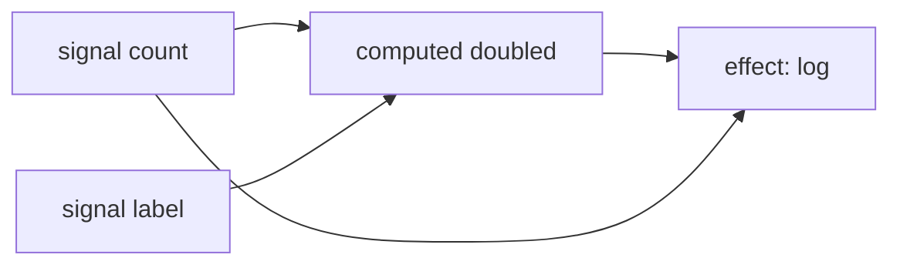

# Angular Signals Reference

Signals are Angular's reactive primitive introduced in v16 (developer preview) and stabilized in v17. This file catalogs the Signals API and patterns.

## Primary resources

- **Angular Signals Guide:** <https://angular.dev/guide/signals>
- **Signals RFC:** <https://github.com/angular/angular/discussions/4902>
- **Signals GitHub:** <https://github.com/angular/angular/tree/main/packages/core/src/signals>
- **API Reference:** <https://angular.dev/api/core/signals>

## Core API

### `signal()` <a class="askgpt-btn" href="https://chatgpt.com/?q=Explain%20'%60signal()%60'%20in%20detail%20with%20concrete%20examples%2C%20the%20main%20trade-offs%2C%20and%20common%20pitfalls%20a%20practitioner%20should%20know." target="_blank" rel="noopener" data-askgpt="`signal()`" title="Ask ChatGPT about this section">💬</a>

Creates a writable signal:

```typescript
import { signal } from '@angular/core';

const counter = signal(0);  // WritableSignal<number>

counter.set(5);             // Set to 5
counter.update(n => n + 1); // Update based on current
counter.mutate(n => n.push(1)); // Mutate array (only for arrays)
```

### `computed()` <a class="askgpt-btn" href="https://chatgpt.com/?q=Explain%20'%60computed()%60'%20in%20detail%20with%20concrete%20examples%2C%20the%20main%20trade-offs%2C%20and%20common%20pitfalls%20a%20practitioner%20should%20know." target="_blank" rel="noopener" data-askgpt="`computed()`" title="Ask ChatGPT about this section">💬</a>

Creates a read-only signal derived from other signals:

```typescript
import { computed, signal } from '@angular/core';

const firstName = signal('Alice');
const lastName = signal('Smith');
const fullName = computed(() => `${firstName()} ${lastName()}`);
```

Properties:
- Lazy: only recomputes when first read after invalidation.
- Memoized: cached until inputs change.
- Glitch-free: synchronous derivation.

### `effect()` <a class="askgpt-btn" href="https://chatgpt.com/?q=Explain%20'%60effect()%60'%20in%20detail%20with%20concrete%20examples%2C%20the%20main%20trade-offs%2C%20and%20common%20pitfalls%20a%20practitioner%20should%20know." target="_blank" rel="noopener" data-askgpt="`effect()`" title="Ask ChatGPT about this section">💬</a>

Side effect that runs when signals it reads change:

```typescript
import { effect, signal } from '@angular/core';

const count = signal(0);

effect(() => {
  console.log('count changed:', count());
});
```

By default, effects run in the injection context. Outside of injection context, pass an `Injector`:

```typescript
effect(() => { /* ... */ }, { injector });
```

Options:
- `manualCleanup` — don't auto-cleanup (for tests).

### `untracked()` <a class="askgpt-btn" href="https://chatgpt.com/?q=Explain%20'%60untracked()%60'%20in%20detail%20with%20concrete%20examples%2C%20the%20main%20trade-offs%2C%20and%20common%20pitfalls%20a%20practitioner%20should%20know." target="_blank" rel="noopener" data-askgpt="`untracked()`" title="Ask ChatGPT about this section">💬</a>

Read signals without tracking:

```typescript
import { untracked, signal } from '@angular/core';

const a = signal(1);
const b = signal(2);

const sum = computed(() => a() + untracked(() => b()));
```

## RxJS interop

### `toSignal()` <a class="askgpt-btn" href="https://chatgpt.com/?q=Explain%20'%60toSignal()%60'%20in%20detail%20with%20concrete%20examples%2C%20the%20main%20trade-offs%2C%20and%20common%20pitfalls%20a%20practitioner%20should%20know." target="_blank" rel="noopener" data-askgpt="`toSignal()`" title="Ask ChatGPT about this section">💬</a>

Convert Observable to Signal:

```typescript
import { toSignal } from '@angular/core/rxjs-interop';

const user$ = http.get<User>('/api/user/1');
const user = toSignal(user$, { initialValue: null });
```

Options:
- `initialValue` — value before first emission.
- `requireSync` — error if observable is async.
- `injector` — injector to use.
- `manualCleanup` — don't auto-cleanup.

### `toObservable()` <a class="askgpt-btn" href="https://chatgpt.com/?q=Explain%20'%60toObservable()%60'%20in%20detail%20with%20concrete%20examples%2C%20the%20main%20trade-offs%2C%20and%20common%20pitfalls%20a%20practitioner%20should%20know." target="_blank" rel="noopener" data-askgpt="`toObservable()`" title="Ask ChatGPT about this section">💬</a>

Convert Signal to Observable:

```typescript
import { toObservable } from '@angular/core/rxjs-interop';

const count = signal(0);
const count$ = toObservable(count);

// Use in RxJS pipeline
count$.pipe(debounceTime(300)).subscribe(...);
```

By default, `toObservable` uses an effect to track the signal. Pass `manualCleanup: true` to disable.

## Advanced

### `effect()` with cleanup <a class="askgpt-btn" href="https://chatgpt.com/?q=Explain%20'%60effect()%60%20with%20cleanup'%20in%20detail%20with%20concrete%20examples%2C%20the%20main%20trade-offs%2C%20and%20common%20pitfalls%20a%20practitioner%20should%20know." target="_blank" rel="noopener" data-askgpt="`effect()` with cleanup" title="Ask ChatGPT about this section">💬</a>

```typescript
effect((onCleanup) => {
  const id = setInterval(() => console.log(count()), 1000);
  onCleanup(() => clearInterval(id));
});
```

### `linkedSignal()` (Angular 19+) <a class="askgpt-btn" href="https://chatgpt.com/?q=Explain%20'%60linkedSignal()%60%20(Angular%2019%2B)'%20in%20detail%20with%20concrete%20examples%2C%20the%20main%20trade-offs%2C%20and%20common%20pitfalls%20a%20practitioner%20should%20know." target="_blank" rel="noopener" data-askgpt="`linkedSignal()` (Angular 19+)" title="Ask ChatGPT about this section">💬</a>

Writable signal that resets when a source changes:

```typescript
import { linkedSignal } from '@angular/core';

const filter = signal('all');
const items = signal<Item[]>([]);

const filtered = linkedSignal({
  source: () => filter(),
  computation: (f, prev) => items().filter(i => f === 'all' || i.tag === f)
});
```

### `resource()` (Angular 19+, experimental) <a class="askgpt-btn" href="https://chatgpt.com/?q=Explain%20'%60resource()%60%20(Angular%2019%2B%2C%20experimental)'%20in%20detail%20with%20concrete%20examples%2C%20the%20main%20trade-offs%2C%20and%20common%20pitfalls%20a%20practitioner%20should%20know." target="_blank" rel="noopener" data-askgpt="`resource()` (Angular 19+, experimental)" title="Ask ChatGPT about this section">💬</a>

Async loading state with signals:

```typescript
import { resource, signal } from '@angular/core';

const userId = signal('1');
const userResource = resource({
  params: () => ({ id: userId() }),
  loader: ({ params }) => fetch(`/api/user/${params.id}`).then(r => r.json())
});

// userResource.value(), userResource.isLoading(), userResource.error()
```

## Equality

By default, signals use `===` for equality. Override with `equal`:

```typescript
const items = signal<Item[]>([], { equal: (a, b) => a.length === b.length });
```

## Signal graph and reactivity

Signals form a graph:



When `count` changes:
1. `count` is marked dirty.
2. `doubled` is invalidated (lazy until read).
3. `effect` is queued to re-run.

## Performance characteristics

- **Synchronous reads:** `signal()` reads are O(1).
- **Lazy computation:** `computed()` only recomputes on read after change.
- **Glitch-free:** synchronous derivation prevents transient inconsistent states.
- **No subscription cleanup:** Unlike RxJS, no manual unsubscribe.

## Comparison with RxJS

| Use case | Signal | RxJS |
|----------|--------|------|
| Component state | ✓ Best | Overkill |
| Async streams | Use `toSignal` | ✓ Best |
| Time-based operators (debounce, throttle) | ✗ | ✓ Best |
| Event streams | Use `toSignal` | ✓ Best |
| Caching/memoization | ✓ Built-in | `shareReplay` |
| Cancellation | ✗ | `switchMap`, `takeUntil` |

## Tools

- **Angular DevTools:** Shows signal dependencies in component tree.
- **Chrome DevTools:** Signal updates visible via Angular's instrumentation.

## Migration from BehaviorSubject

Common migration pattern:

```typescript
// Before (RxJS)
const count$ = new BehaviorSubject(0);
count$.subscribe(v => console.log(v));
count$.next(1);

// After (Signals)
const count = signal(0);
effect(() => console.log(count()));
count.set(1);
```

Signals are simpler for synchronous state but lack RxJS's async operators. Use both: signals for state, RxJS for streams.

## Patterns

### State container <a class="askgpt-btn" href="https://chatgpt.com/?q=Explain%20'State%20container'%20in%20detail%20with%20concrete%20examples%2C%20the%20main%20trade-offs%2C%20and%20common%20pitfalls%20a%20practitioner%20should%20know." target="_blank" rel="noopener" data-askgpt="State container" title="Ask ChatGPT about this section">💬</a>

```typescript
@Injectable({ providedIn: 'root' })
class CounterStore {
  private _count = signal(0);
  readonly count = this._count.asReadonly();
  readonly doubled = computed(() => this._count() * 2);

  increment() { this._count.update(n => n + 1); }
}
```

### Component input with signals <a class="askgpt-btn" href="https://chatgpt.com/?q=Explain%20'Component%20input%20with%20signals'%20in%20detail%20with%20concrete%20examples%2C%20the%20main%20trade-offs%2C%20and%20common%20pitfalls%20a%20practitioner%20should%20know." target="_blank" rel="noopener" data-askgpt="Component input with signals" title="Ask ChatGPT about this section">💬</a>

```typescript
@Component({
  template: `<div>{{ name() }}</div>`
})
class MyComponent {
  name = input.required<string>();  // Signal-based input
}
```

### Model inputs (two-way binding) <a class="askgpt-btn" href="https://chatgpt.com/?q=Explain%20'Model%20inputs%20(two-way%20binding)'%20in%20detail%20with%20concrete%20examples%2C%20the%20main%20trade-offs%2C%20and%20common%20pitfalls%20a%20practitioner%20should%20know." target="_blank" rel="noopener" data-askgpt="Model inputs (two-way binding)" title="Ask ChatGPT about this section">💬</a>

```typescript
@Component({
  template: `<input [value]="value()" (input)="onInput($event)">`
})
class MyComponent {
  value = model(0);  // Writable signal with two-way binding support

  onInput(e: Event) {
    this.value.set(parseInt((e.target as HTMLInputElement).value));
  }
}
```