# Messaging (Kafka, RabbitMQ, Pulsar)

> A comprehensive, production-grade treatment of Apache Kafka — from brokers to KRaft to exactly-once semantics — with comparison coverage of RabbitMQ and Apache Pulsar.

---

## Table of Contents

1. [Overview](#1-overview)
2. [Definition](#2-definition)
3. [Five Ws + One H](#3-five-ws--one-h)
4. [History](#4-history)
5. [Problem Statement](#5-problem-statement)
6. [Real-World Motivation](#6-real-world-motivation)
7. [Internal Working](#7-internal-working)
8. [Deep Dive](#8-deep-dive)
9. [Architecture](#9-architecture)
10. [Performance](#10-performance)
11. [Security](#11-security)
12. [Production Engineering](#12-production-engineering)
13. [Production Case Studies](#13-production-case-studies)
14. [Code Examples](#14-code-examples)
15. [Common Mistakes](#15-common-mistakes)
16. [Debugging](#16-debugging)
17. [Monitoring & Observability](#17-monitoring--observability)
18. [Best Practices](#18-best-practices)
19. [Anti-Patterns](#19-anti-patterns)
20. [Edge Cases](#20-edge-cases)
21. [Comparisons](#21-comparisons)
22. [Interview Preparation](#22-interview-preparation)
23. [References](#23-references)

---

## 1. Overview

A **message broker** is a system that routes, buffers, and delivers messages between producers and consumers. Modern message brokers enable asynchronous, decoupled, and scalable communication across distributed systems. They are the backbone of event-driven architectures, real-time data pipelines, and microservices.

This document treats **Apache Kafka** at production depth: brokers, partitions, replication, the In-Sync Replicas (ISR) protocol, KRaft (the consensus protocol replacing ZooKeeper), exactly-once semantics, Kafka Streams, and operational concerns. **RabbitMQ** and **Apache Pulsar** are covered as comparison sections to clarify when each is the right choice.

**Scope.** This is not a messaging tutorial. It assumes you can already write a producer and consumer. It focuses on **what happens inside the broker**: how messages are stored, replicated, and retrieved; how leaders are elected; how exactly-once semantics are implemented; how streams are processed.

**Version baseline.** Apache Kafka 3.x (KRaft mode default since 3.3). RabbitMQ 3.13+. Apache Pulsar 3.x.

## 2. Definition

The messaging ecosystem uses overlapping terminology. Here's a precise taxonomy:

| Term | Type | Authoritative source |
|------|------|---------------------|
| **Message broker** | System that routes messages between producers and consumers | Kafka, RabbitMQ, Pulsar, ActiveMQ, NATS |
| **Topic** | A category or feed name to which messages are published | Kafka topic, Pulsar topic |
| **Queue** | A buffer that stores messages for a consumer | RabbitMQ queue, Kafka consumer group |
| **Producer** | Application that publishes messages | kafka-clients, amqp-client, pulsar-client |
| **Consumer** | Application that subscribes to messages | kafka-clients, amqp-client, pulsar-client |
| **Partition** | A subdivision of a topic for parallelism | Kafka, Pulsar |
| **Partition key** | A value used to determine which partition a message goes to | Kafka |
| **Consumer group** | A set of consumers that share the work of consuming a topic | Kafka |
| **Offset** | A position in a partition | Kafka, Pulsar |
| **Replication** | Copies of data across multiple brokers for fault tolerance | Kafka, Pulsar, RabbitMQ quorum queues |
| **ISR (In-Sync Replicas)** | Brokers that are caught up with the leader | Kafka |
| **KRaft** | Kafka's Raft-based consensus protocol (replacing ZooKeeper) | Kafka 3.3+ |
| **Stream processing** | Continuous computation over event streams | Kafka Streams, ksqlDB, Pulsar Functions |
| **Pub/sub** | Pattern where publishers send messages to subscribers | Most brokers |
| **AMQP** | Advanced Message Queuing Protocol (ISO standard) | RabbitMQ primary |
| **Event sourcing** | Pattern where state changes are stored as events | Kafka, Pulsar |

The standard stack:

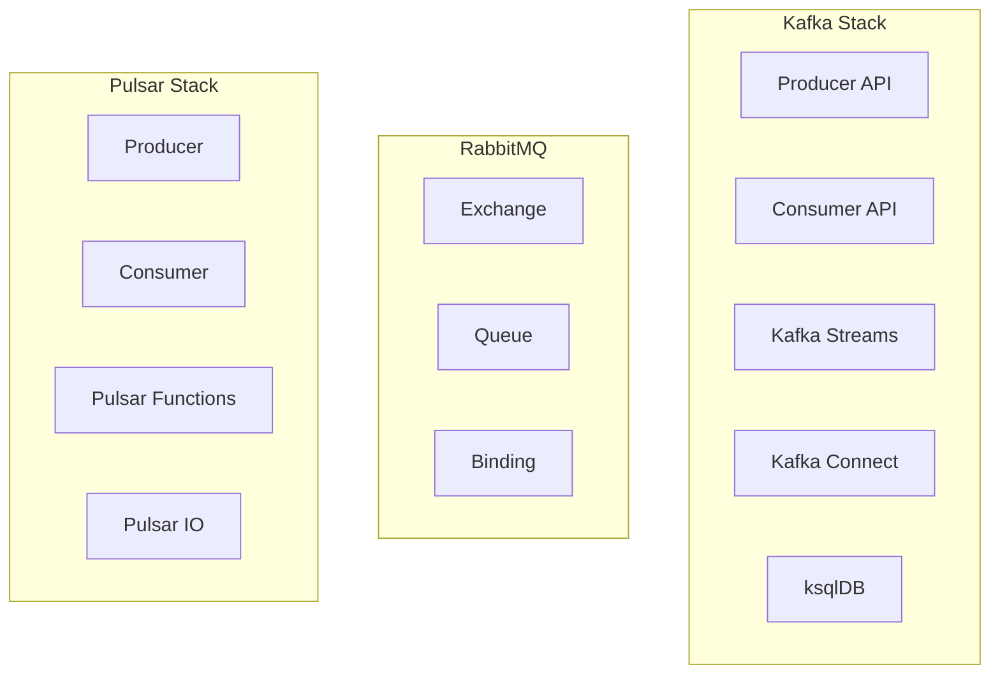

## 3. Five Ws + One H

### What

 <a class='askgpt-btn' href='https://chatgpt.com/?prompt=Read%20this%20section%20of%20my%20encyclopedia%20and%20explain%20it%20in%20depth%20with%20concrete%20examples%2C%20the%20main%20trade-offs%2C%20and%20common%20pitfalls%20a%20practitioner%20should%20know%3A%0A%0Ahttps%3A%2F%2Fgithub.com%2Fvishvasg14%2Fsoftware-engineering-encyclopedia%2Fblob%2Fmain%2F06-messaging%2Fmessaging.md%23what%0A%0ASection%20title%3A%20What' target='_blank' rel='noopener' data-askgpt='What' data-askgpt-url='https://github.com/vishvasg14/software-engineering-encyclopedia/blob/main/06-messaging/messaging.md#what' data-askgpt-prompt-depth='Read%20this%20section%20of%20my%20encyclopedia%20and%20explain%20it%20in%20depth%20with%20concrete%20examples%2C%20the%20main%20trade-offs%2C%20and%20common%20pitfalls%20a%20practitioner%20should%20know%3A%0A%0Ahttps%3A%2F%2Fgithub.com%2Fvishvasg14%2Fsoftware-engineering-encyclopedia%2Fblob%2Fmain%2F06-messaging%2Fmessaging.md%23what%0A%0ASection%20title%3A%20What' data-askgpt-prompt-examples='Read%20this%20section%20of%20my%20encyclopedia%20and%20give%20me%202-3%20real-world%20production%20examples%20for%20it.%20For%20each%3A%20what%20went%20right%2C%20what%20went%20wrong%2C%20and%20the%20lessons%20learned.%20Include%20company%20%2F%20project%20names%20if%20relevant.%0A%0Ahttps%3A%2F%2Fgithub.com%2Fvishvasg14%2Fsoftware-engineering-encyclopedia%2Fblob%2Fmain%2F06-messaging%2Fmessaging.md%23what%0A%0ASection%20title%3A%20What' title='Ask ChatGPT about this section'>💬</a>
**Apache Kafka** is a distributed event streaming platform — a horizontally scalable, fault-tolerant, durable log-based message broker. It provides pub/sub semantics with ordered, replayable message streams across topics and partitions.

### Why

 <a class='askgpt-btn' href='https://chatgpt.com/?prompt=Read%20this%20section%20of%20my%20encyclopedia%20and%20explain%20it%20in%20depth%20with%20concrete%20examples%2C%20the%20main%20trade-offs%2C%20and%20common%20pitfalls%20a%20practitioner%20should%20know%3A%0A%0Ahttps%3A%2F%2Fgithub.com%2Fvishvasg14%2Fsoftware-engineering-encyclopedia%2Fblob%2Fmain%2F06-messaging%2Fmessaging.md%23why%0A%0ASection%20title%3A%20Why' target='_blank' rel='noopener' data-askgpt='Why' data-askgpt-url='https://github.com/vishvasg14/software-engineering-encyclopedia/blob/main/06-messaging/messaging.md#why' data-askgpt-prompt-depth='Read%20this%20section%20of%20my%20encyclopedia%20and%20explain%20it%20in%20depth%20with%20concrete%20examples%2C%20the%20main%20trade-offs%2C%20and%20common%20pitfalls%20a%20practitioner%20should%20know%3A%0A%0Ahttps%3A%2F%2Fgithub.com%2Fvishvasg14%2Fsoftware-engineering-encyclopedia%2Fblob%2Fmain%2F06-messaging%2Fmessaging.md%23why%0A%0ASection%20title%3A%20Why' data-askgpt-prompt-examples='Read%20this%20section%20of%20my%20encyclopedia%20and%20give%20me%202-3%20real-world%20production%20examples%20for%20it.%20For%20each%3A%20what%20went%20right%2C%20what%20went%20wrong%2C%20and%20the%20lessons%20learned.%20Include%20company%20%2F%20project%20names%20if%20relevant.%0A%0Ahttps%3A%2F%2Fgithub.com%2Fvishvasg14%2Fsoftware-engineering-encyclopedia%2Fblob%2Fmain%2F06-messaging%2Fmessaging.md%23why%0A%0ASection%20title%3A%20Why' title='Ask ChatGPT about this section'>💬</a>
Kafka exists because traditional message brokers (ActiveMQ, RabbitMQ) were designed for short-lived queues and didn't scale to the volume of activity logs that companies like LinkedIn needed (2010–2011). The "log" abstraction — durable, ordered, replayable — turned out to be a unifying primitive for many distributed systems problems.

### When

 <a class='askgpt-btn' href='https://chatgpt.com/?prompt=Read%20this%20section%20of%20my%20encyclopedia%20and%20explain%20it%20in%20depth%20with%20concrete%20examples%2C%20the%20main%20trade-offs%2C%20and%20common%20pitfalls%20a%20practitioner%20should%20know%3A%0A%0Ahttps%3A%2F%2Fgithub.com%2Fvishvasg14%2Fsoftware-engineering-encyclopedia%2Fblob%2Fmain%2F06-messaging%2Fmessaging.md%23when%0A%0ASection%20title%3A%20When' target='_blank' rel='noopener' data-askgpt='When' data-askgpt-url='https://github.com/vishvasg14/software-engineering-encyclopedia/blob/main/06-messaging/messaging.md#when' data-askgpt-prompt-depth='Read%20this%20section%20of%20my%20encyclopedia%20and%20explain%20it%20in%20depth%20with%20concrete%20examples%2C%20the%20main%20trade-offs%2C%20and%20common%20pitfalls%20a%20practitioner%20should%20know%3A%0A%0Ahttps%3A%2F%2Fgithub.com%2Fvishvasg14%2Fsoftware-engineering-encyclopedia%2Fblob%2Fmain%2F06-messaging%2Fmessaging.md%23when%0A%0ASection%20title%3A%20When' data-askgpt-prompt-examples='Read%20this%20section%20of%20my%20encyclopedia%20and%20give%20me%202-3%20real-world%20production%20examples%20for%20it.%20For%20each%3A%20what%20went%20right%2C%20what%20went%20wrong%2C%20and%20the%20lessons%20learned.%20Include%20company%20%2F%20project%20names%20if%20relevant.%0A%0Ahttps%3A%2F%2Fgithub.com%2Fvishvasg14%2Fsoftware-engineering-encyclopedia%2Fblob%2Fmain%2F06-messaging%2Fmessaging.md%23when%0A%0ASection%20title%3A%20When' title='Ask ChatGPT about this section'>💬</a>
Kafka 0.7 was released in 2011; Kafka 1.0 in 2017 (production-ready API); Kafka 3.0 in 2021 (KRaft production-ready); Kafka 3.3 in 2023 (KRaft default). Today, Kafka is the dominant event streaming platform.

### Where

 <a class='askgpt-btn' href='https://chatgpt.com/?prompt=Read%20this%20section%20of%20my%20encyclopedia%20and%20explain%20it%20in%20depth%20with%20concrete%20examples%2C%20the%20main%20trade-offs%2C%20and%20common%20pitfalls%20a%20practitioner%20should%20know%3A%0A%0Ahttps%3A%2F%2Fgithub.com%2Fvishvasg14%2Fsoftware-engineering-encyclopedia%2Fblob%2Fmain%2F06-messaging%2Fmessaging.md%23where%0A%0ASection%20title%3A%20Where' target='_blank' rel='noopener' data-askgpt='Where' data-askgpt-url='https://github.com/vishvasg14/software-engineering-encyclopedia/blob/main/06-messaging/messaging.md#where' data-askgpt-prompt-depth='Read%20this%20section%20of%20my%20encyclopedia%20and%20explain%20it%20in%20depth%20with%20concrete%20examples%2C%20the%20main%20trade-offs%2C%20and%20common%20pitfalls%20a%20practitioner%20should%20know%3A%0A%0Ahttps%3A%2F%2Fgithub.com%2Fvishvasg14%2Fsoftware-engineering-encyclopedia%2Fblob%2Fmain%2F06-messaging%2Fmessaging.md%23where%0A%0ASection%20title%3A%20Where' data-askgpt-prompt-examples='Read%20this%20section%20of%20my%20encyclopedia%20and%20give%20me%202-3%20real-world%20production%20examples%20for%20it.%20For%20each%3A%20what%20went%20right%2C%20what%20went%20wrong%2C%20and%20the%20lessons%20learned.%20Include%20company%20%2F%20project%20names%20if%20relevant.%0A%0Ahttps%3A%2F%2Fgithub.com%2Fvishvasg14%2Fsoftware-engineering-encyclopedia%2Fblob%2Fmain%2F06-messaging%2Fmessaging.md%23where%0A%0ASection%20title%3A%20Where' title='Ask ChatGPT about this section'>💬</a>
Used by 80%+ of Fortune 100 companies for log aggregation, event sourcing, stream processing, message queuing, change data capture, and real-time analytics.

### Who

 <a class='askgpt-btn' href='https://chatgpt.com/?prompt=Read%20this%20section%20of%20my%20encyclopedia%20and%20explain%20it%20in%20depth%20with%20concrete%20examples%2C%20the%20main%20trade-offs%2C%20and%20common%20pitfalls%20a%20practitioner%20should%20know%3A%0A%0Ahttps%3A%2F%2Fgithub.com%2Fvishvasg14%2Fsoftware-engineering-encyclopedia%2Fblob%2Fmain%2F06-messaging%2Fmessaging.md%23who%0A%0ASection%20title%3A%20Who' target='_blank' rel='noopener' data-askgpt='Who' data-askgpt-url='https://github.com/vishvasg14/software-engineering-encyclopedia/blob/main/06-messaging/messaging.md#who' data-askgpt-prompt-depth='Read%20this%20section%20of%20my%20encyclopedia%20and%20explain%20it%20in%20depth%20with%20concrete%20examples%2C%20the%20main%20trade-offs%2C%20and%20common%20pitfalls%20a%20practitioner%20should%20know%3A%0A%0Ahttps%3A%2F%2Fgithub.com%2Fvishvasg14%2Fsoftware-engineering-encyclopedia%2Fblob%2Fmain%2F06-messaging%2Fmessaging.md%23who%0A%0ASection%20title%3A%20Who' data-askgpt-prompt-examples='Read%20this%20section%20of%20my%20encyclopedia%20and%20give%20me%202-3%20real-world%20production%20examples%20for%20it.%20For%20each%3A%20what%20went%20right%2C%20what%20went%20wrong%2C%20and%20the%20lessons%20learned.%20Include%20company%20%2F%20project%20names%20if%20relevant.%0A%0Ahttps%3A%2F%2Fgithub.com%2Fvishvasg14%2Fsoftware-engineering-encyclopedia%2Fblob%2Fmain%2F06-messaging%2Fmessaging.md%23who%0A%0ASection%20title%3A%20Who' title='Ask ChatGPT about this section'>💬</a>
- **Original creator:** Jay Kreps, Neha Narkhede, Jun Rao at LinkedIn (2010).
- **Maintainer:** Apache Software Foundation; major contributors from Confluent, LinkedIn, Uber, Microsoft.
- **Commercial:** Confluent (founded by Kafka creators) provides commercial Kafka-as-a-service and additional tools.

### How (one-paragraph preview)

 <a class='askgpt-btn' href='https://chatgpt.com/?prompt=Read%20this%20section%20of%20my%20encyclopedia%20and%20explain%20it%20in%20depth%20with%20concrete%20examples%2C%20the%20main%20trade-offs%2C%20and%20common%20pitfalls%20a%20practitioner%20should%20know%3A%0A%0Ahttps%3A%2F%2Fgithub.com%2Fvishvasg14%2Fsoftware-engineering-encyclopedia%2Fblob%2Fmain%2F06-messaging%2Fmessaging.md%23how-one-paragraph-preview%0A%0ASection%20title%3A%20How%20(one-paragraph%20preview)' target='_blank' rel='noopener' data-askgpt='How (one-paragraph preview)' data-askgpt-url='https://github.com/vishvasg14/software-engineering-encyclopedia/blob/main/06-messaging/messaging.md#how-one-paragraph-preview' data-askgpt-prompt-depth='Read%20this%20section%20of%20my%20encyclopedia%20and%20explain%20it%20in%20depth%20with%20concrete%20examples%2C%20the%20main%20trade-offs%2C%20and%20common%20pitfalls%20a%20practitioner%20should%20know%3A%0A%0Ahttps%3A%2F%2Fgithub.com%2Fvishvasg14%2Fsoftware-engineering-encyclopedia%2Fblob%2Fmain%2F06-messaging%2Fmessaging.md%23how-one-paragraph-preview%0A%0ASection%20title%3A%20How%20(one-paragraph%20preview)' data-askgpt-prompt-examples='Read%20this%20section%20of%20my%20encyclopedia%20and%20give%20me%202-3%20real-world%20production%20examples%20for%20it.%20For%20each%3A%20what%20went%20right%2C%20what%20went%20wrong%2C%20and%20the%20lessons%20learned.%20Include%20company%20%2F%20project%20names%20if%20relevant.%0A%0Ahttps%3A%2F%2Fgithub.com%2Fvishvasg14%2Fsoftware-engineering-encyclopedia%2Fblob%2Fmain%2F06-messaging%2Fmessaging.md%23how-one-paragraph-preview%0A%0ASection%20title%3A%20How%20(one-paragraph%20preview)' title='Ask ChatGPT about this section'>💬</a>
A producer publishes a message to a topic. The broker routes the message to a partition based on the partition key (or round-robin if no key). The partition is an append-only log on disk, replicated across multiple brokers. A consumer reads from a partition, tracking its position via an offset. Consumer groups distribute partitions across consumers for parallelism. Brokers coordinate cluster state via KRaft (Raft consensus) since Kafka 3.3 (formerly ZooKeeper). All this is designed to be partitioned, replicated, and fault-tolerant.

## 4. History

### 4.1 Origins (2010-2012)

 <a class='askgpt-btn' href='https://chatgpt.com/?prompt=Read%20this%20section%20of%20my%20encyclopedia%20and%20explain%20it%20in%20depth%20with%20concrete%20examples%2C%20the%20main%20trade-offs%2C%20and%20common%20pitfalls%20a%20practitioner%20should%20know%3A%0A%0Ahttps%3A%2F%2Fgithub.com%2Fvishvasg14%2Fsoftware-engineering-encyclopedia%2Fblob%2Fmain%2F06-messaging%2Fmessaging.md%2341-origins-2010-2012%0A%0ASection%20title%3A%204.1%20Origins%20(2010-2012)' target='_blank' rel='noopener' data-askgpt='4.1 Origins (2010-2012)' data-askgpt-url='https://github.com/vishvasg14/software-engineering-encyclopedia/blob/main/06-messaging/messaging.md#41-origins-2010-2012' data-askgpt-prompt-depth='Read%20this%20section%20of%20my%20encyclopedia%20and%20explain%20it%20in%20depth%20with%20concrete%20examples%2C%20the%20main%20trade-offs%2C%20and%20common%20pitfalls%20a%20practitioner%20should%20know%3A%0A%0Ahttps%3A%2F%2Fgithub.com%2Fvishvasg14%2Fsoftware-engineering-encyclopedia%2Fblob%2Fmain%2F06-messaging%2Fmessaging.md%2341-origins-2010-2012%0A%0ASection%20title%3A%204.1%20Origins%20(2010-2012)' data-askgpt-prompt-examples='Read%20this%20section%20of%20my%20encyclopedia%20and%20give%20me%202-3%20real-world%20production%20examples%20for%20it.%20For%20each%3A%20what%20went%20right%2C%20what%20went%20wrong%2C%20and%20the%20lessons%20learned.%20Include%20company%20%2F%20project%20names%20if%20relevant.%0A%0Ahttps%3A%2F%2Fgithub.com%2Fvishvasg14%2Fsoftware-engineering-encyclopedia%2Fblob%2Fmain%2F06-messaging%2Fmessaging.md%2341-origins-2010-2012%0A%0ASection%20title%3A%204.1%20Origins%20(2010-2012)' title='Ask ChatGPT about this section'>💬</a>
- **2010** — LinkedIn engineers Jay Kreps, Neha Narkhede, and Jun Rao begin building Kafka to handle LinkedIn's massive activity streams and log aggregation.
- **January 2011** — Kafka 0.7 open-sourced at LinkedIn.
- **November 2011** — Kafka graduates from Apache incubator.
- **2012** — Kafka 0.8 adds replication (the key feature for production durability).

### 4.2 Growth (2013-2017)

 <a class='askgpt-btn' href='https://chatgpt.com/?prompt=Read%20this%20section%20of%20my%20encyclopedia%20and%20explain%20it%20in%20depth%20with%20concrete%20examples%2C%20the%20main%20trade-offs%2C%20and%20common%20pitfalls%20a%20practitioner%20should%20know%3A%0A%0Ahttps%3A%2F%2Fgithub.com%2Fvishvasg14%2Fsoftware-engineering-encyclopedia%2Fblob%2Fmain%2F06-messaging%2Fmessaging.md%2342-growth-2013-2017%0A%0ASection%20title%3A%204.2%20Growth%20(2013-2017)' target='_blank' rel='noopener' data-askgpt='4.2 Growth (2013-2017)' data-askgpt-url='https://github.com/vishvasg14/software-engineering-encyclopedia/blob/main/06-messaging/messaging.md#42-growth-2013-2017' data-askgpt-prompt-depth='Read%20this%20section%20of%20my%20encyclopedia%20and%20explain%20it%20in%20depth%20with%20concrete%20examples%2C%20the%20main%20trade-offs%2C%20and%20common%20pitfalls%20a%20practitioner%20should%20know%3A%0A%0Ahttps%3A%2F%2Fgithub.com%2Fvishvasg14%2Fsoftware-engineering-encyclopedia%2Fblob%2Fmain%2F06-messaging%2Fmessaging.md%2342-growth-2013-2017%0A%0ASection%20title%3A%204.2%20Growth%20(2013-2017)' data-askgpt-prompt-examples='Read%20this%20section%20of%20my%20encyclopedia%20and%20give%20me%202-3%20real-world%20production%20examples%20for%20it.%20For%20each%3A%20what%20went%20right%2C%20what%20went%20wrong%2C%20and%20the%20lessons%20learned.%20Include%20company%20%2F%20project%20names%20if%20relevant.%0A%0Ahttps%3A%2F%2Fgithub.com%2Fvishvasg14%2Fsoftware-engineering-encyclopedia%2Fblob%2Fmain%2F06-messaging%2Fmessaging.md%2342-growth-2013-2017%0A%0ASection%20title%3A%204.2%20Growth%20(2013-2017)' title='Ask ChatGPT about this section'>💬</a>
- **2013** — Kafka 0.8.1 with replication. LinkedIn reports trillions of messages per day.
- **2014** — Apache Kafka graduates to top-level project.
- **2015** — Kafka 0.9: Kafka Connect, new consumer API, security (TLS, SASL). Kafka adopted by Twitter, Netflix, Uber, Pinterest.
- **2016** — Kafka 0.10: Kafka Streams (stream processing built-in), message timestamps.
- **2017** — Kafka 0.11: Exactly-once semantics via transactional API (KIP-98). Kafka 1.0 declares API stability.

### 4.3 The Kafka era (2018-2022)

 <a class='askgpt-btn' href='https://chatgpt.com/?prompt=Read%20this%20section%20of%20my%20encyclopedia%20and%20explain%20it%20in%20depth%20with%20concrete%20examples%2C%20the%20main%20trade-offs%2C%20and%20common%20pitfalls%20a%20practitioner%20should%20know%3A%0A%0Ahttps%3A%2F%2Fgithub.com%2Fvishvasg14%2Fsoftware-engineering-encyclopedia%2Fblob%2Fmain%2F06-messaging%2Fmessaging.md%2343-the-kafka-era-2018-2022%0A%0ASection%20title%3A%204.3%20The%20Kafka%20era%20(2018-2022)' target='_blank' rel='noopener' data-askgpt='4.3 The Kafka era (2018-2022)' data-askgpt-url='https://github.com/vishvasg14/software-engineering-encyclopedia/blob/main/06-messaging/messaging.md#43-the-kafka-era-2018-2022' data-askgpt-prompt-depth='Read%20this%20section%20of%20my%20encyclopedia%20and%20explain%20it%20in%20depth%20with%20concrete%20examples%2C%20the%20main%20trade-offs%2C%20and%20common%20pitfalls%20a%20practitioner%20should%20know%3A%0A%0Ahttps%3A%2F%2Fgithub.com%2Fvishvasg14%2Fsoftware-engineering-encyclopedia%2Fblob%2Fmain%2F06-messaging%2Fmessaging.md%2343-the-kafka-era-2018-2022%0A%0ASection%20title%3A%204.3%20The%20Kafka%20era%20(2018-2022)' data-askgpt-prompt-examples='Read%20this%20section%20of%20my%20encyclopedia%20and%20give%20me%202-3%20real-world%20production%20examples%20for%20it.%20For%20each%3A%20what%20went%20right%2C%20what%20went%20wrong%2C%20and%20the%20lessons%20learned.%20Include%20company%20%2F%20project%20names%20if%20relevant.%0A%0Ahttps%3A%2F%2Fgithub.com%2Fvishvasg14%2Fsoftware-engineering-encyclopedia%2Fblob%2Fmain%2F06-messaging%2Fmessaging.md%2343-the-kafka-era-2018-2022%0A%0ASection%20title%3A%204.3%20The%20Kafka%20era%20(2018-2022)' title='Ask ChatGPT about this section'>💬</a>
- **2018** — Kafka 2.0: Java 8+ baseline, KIP-279, KIP-339.
- **2019** — Kafka 2.4: TLS 1.3, KIP-380.
- **2020** — Kafka 2.7: Tiered storage preview, KIP-405.
- **2021** — Kafka 3.0: KRaft production-ready (replacing ZooKeeper dependency).
- **2022** — Kafka 3.2: Tiered storage production-ready.

### 4.4 KRaft and streams (2023-2026)

 <a class='askgpt-btn' href='https://chatgpt.com/?prompt=Read%20this%20section%20of%20my%20encyclopedia%20and%20explain%20it%20in%20depth%20with%20concrete%20examples%2C%20the%20main%20trade-offs%2C%20and%20common%20pitfalls%20a%20practitioner%20should%20know%3A%0A%0Ahttps%3A%2F%2Fgithub.com%2Fvishvasg14%2Fsoftware-engineering-encyclopedia%2Fblob%2Fmain%2F06-messaging%2Fmessaging.md%2344-kraft-and-streams-2023-2026%0A%0ASection%20title%3A%204.4%20KRaft%20and%20streams%20(2023-2026)' target='_blank' rel='noopener' data-askgpt='4.4 KRaft and streams (2023-2026)' data-askgpt-url='https://github.com/vishvasg14/software-engineering-encyclopedia/blob/main/06-messaging/messaging.md#44-kraft-and-streams-2023-2026' data-askgpt-prompt-depth='Read%20this%20section%20of%20my%20encyclopedia%20and%20explain%20it%20in%20depth%20with%20concrete%20examples%2C%20the%20main%20trade-offs%2C%20and%20common%20pitfalls%20a%20practitioner%20should%20know%3A%0A%0Ahttps%3A%2F%2Fgithub.com%2Fvishvasg14%2Fsoftware-engineering-encyclopedia%2Fblob%2Fmain%2F06-messaging%2Fmessaging.md%2344-kraft-and-streams-2023-2026%0A%0ASection%20title%3A%204.4%20KRaft%20and%20streams%20(2023-2026)' data-askgpt-prompt-examples='Read%20this%20section%20of%20my%20encyclopedia%20and%20give%20me%202-3%20real-world%20production%20examples%20for%20it.%20For%20each%3A%20what%20went%20right%2C%20what%20went%20wrong%2C%20and%20the%20lessons%20learned.%20Include%20company%20%2F%20project%20names%20if%20relevant.%0A%0Ahttps%3A%2F%2Fgithub.com%2Fvishvasg14%2Fsoftware-engineering-encyclopedia%2Fblob%2Fmain%2F06-messaging%2Fmessaging.md%2344-kraft-and-streams-2023-2026%0A%0ASection%20title%3A%204.4%20KRaft%20and%20streams%20(2023-2026)' title='Ask ChatGPT about this section'>💬</a>
- **2023** — Kafka 3.3: KRaft becomes default (no ZooKeeper), KIP-848 (next-gen consumer rebalance) preview.
- **2024** — Kafka 3.5: KIP-848 improvements, continued refinement.
- **2025** — Kafka 3.7, 3.8: ongoing improvements.
- **2026** — Kafka 4.0 in development.

### 4.5 RabbitMQ history

 <a class='askgpt-btn' href='https://chatgpt.com/?prompt=Read%20this%20section%20of%20my%20encyclopedia%20and%20explain%20it%20in%20depth%20with%20concrete%20examples%2C%20the%20main%20trade-offs%2C%20and%20common%20pitfalls%20a%20practitioner%20should%20know%3A%0A%0Ahttps%3A%2F%2Fgithub.com%2Fvishvasg14%2Fsoftware-engineering-encyclopedia%2Fblob%2Fmain%2F06-messaging%2Fmessaging.md%2345-rabbitmq-history%0A%0ASection%20title%3A%204.5%20RabbitMQ%20history' target='_blank' rel='noopener' data-askgpt='4.5 RabbitMQ history' data-askgpt-url='https://github.com/vishvasg14/software-engineering-encyclopedia/blob/main/06-messaging/messaging.md#45-rabbitmq-history' data-askgpt-prompt-depth='Read%20this%20section%20of%20my%20encyclopedia%20and%20explain%20it%20in%20depth%20with%20concrete%20examples%2C%20the%20main%20trade-offs%2C%20and%20common%20pitfalls%20a%20practitioner%20should%20know%3A%0A%0Ahttps%3A%2F%2Fgithub.com%2Fvishvasg14%2Fsoftware-engineering-encyclopedia%2Fblob%2Fmain%2F06-messaging%2Fmessaging.md%2345-rabbitmq-history%0A%0ASection%20title%3A%204.5%20RabbitMQ%20history' data-askgpt-prompt-examples='Read%20this%20section%20of%20my%20encyclopedia%20and%20give%20me%202-3%20real-world%20production%20examples%20for%20it.%20For%20each%3A%20what%20went%20right%2C%20what%20went%20wrong%2C%20and%20the%20lessons%20learned.%20Include%20company%20%2F%20project%20names%20if%20relevant.%0A%0Ahttps%3A%2F%2Fgithub.com%2Fvishvasg14%2Fsoftware-engineering-encyclopedia%2Fblob%2Fmain%2F06-messaging%2Fmessaging.md%2345-rabbitmq-history%0A%0ASection%20title%3A%204.5%20RabbitMQ%20history' title='Ask ChatGPT about this section'>💬</a>
- **2007** — RabbitMQ 1.0 released by Rabbit Technologies (acquired by SpringSource/VMware).
- **2010** — Acquired by SpringSource (later VMware/Pivotal).
- **2014** — Acquired by Pivotal.
- **2019** — Pivotal acquired by VMware.
- **2023** — VMware acquired by Broadcom.
- **2024** — RabbitMQ 3.13 with OAuth 2.0 support.
- **2025** — RabbitMQ 4.0 with Khepri (Raft-based metadata).

### 4.6 Pulsar history

 <a class='askgpt-btn' href='https://chatgpt.com/?prompt=Read%20this%20section%20of%20my%20encyclopedia%20and%20explain%20it%20in%20depth%20with%20concrete%20examples%2C%20the%20main%20trade-offs%2C%20and%20common%20pitfalls%20a%20practitioner%20should%20know%3A%0A%0Ahttps%3A%2F%2Fgithub.com%2Fvishvasg14%2Fsoftware-engineering-encyclopedia%2Fblob%2Fmain%2F06-messaging%2Fmessaging.md%2346-pulsar-history%0A%0ASection%20title%3A%204.6%20Pulsar%20history' target='_blank' rel='noopener' data-askgpt='4.6 Pulsar history' data-askgpt-url='https://github.com/vishvasg14/software-engineering-encyclopedia/blob/main/06-messaging/messaging.md#46-pulsar-history' data-askgpt-prompt-depth='Read%20this%20section%20of%20my%20encyclopedia%20and%20explain%20it%20in%20depth%20with%20concrete%20examples%2C%20the%20main%20trade-offs%2C%20and%20common%20pitfalls%20a%20practitioner%20should%20know%3A%0A%0Ahttps%3A%2F%2Fgithub.com%2Fvishvasg14%2Fsoftware-engineering-encyclopedia%2Fblob%2Fmain%2F06-messaging%2Fmessaging.md%2346-pulsar-history%0A%0ASection%20title%3A%204.6%20Pulsar%20history' data-askgpt-prompt-examples='Read%20this%20section%20of%20my%20encyclopedia%20and%20give%20me%202-3%20real-world%20production%20examples%20for%20it.%20For%20each%3A%20what%20went%20right%2C%20what%20went%20wrong%2C%20and%20the%20lessons%20learned.%20Include%20company%20%2F%20project%20names%20if%20relevant.%0A%0Ahttps%3A%2F%2Fgithub.com%2Fvishvasg14%2Fsoftware-engineering-encyclopedia%2Fblob%2Fmain%2F06-messaging%2Fmessaging.md%2346-pulsar-history%0A%0ASection%20title%3A%204.6%20Pulsar%20history' title='Ask ChatGPT about this section'>💬</a>
- **2016** — Original Yahoo open-source release.
- **2017** — Apache Pulsar top-level project.
- **2018** — Apache Pulsar 2.0: Functions, Schema registry.
- **2020** — Pulsar 2.6: AWS Lambda sink, state store.
- **2023** — Pulsar 3.0: Major rewrite.
- **2025** — Pulsar 3.3: Performance improvements.

### 4.7 Governance

 <a class='askgpt-btn' href='https://chatgpt.com/?prompt=Read%20this%20section%20of%20my%20encyclopedia%20and%20explain%20it%20in%20depth%20with%20concrete%20examples%2C%20the%20main%20trade-offs%2C%20and%20common%20pitfalls%20a%20practitioner%20should%20know%3A%0A%0Ahttps%3A%2F%2Fgithub.com%2Fvishvasg14%2Fsoftware-engineering-encyclopedia%2Fblob%2Fmain%2F06-messaging%2Fmessaging.md%2347-governance%0A%0ASection%20title%3A%204.7%20Governance' target='_blank' rel='noopener' data-askgpt='4.7 Governance' data-askgpt-url='https://github.com/vishvasg14/software-engineering-encyclopedia/blob/main/06-messaging/messaging.md#47-governance' data-askgpt-prompt-depth='Read%20this%20section%20of%20my%20encyclopedia%20and%20explain%20it%20in%20depth%20with%20concrete%20examples%2C%20the%20main%20trade-offs%2C%20and%20common%20pitfalls%20a%20practitioner%20should%20know%3A%0A%0Ahttps%3A%2F%2Fgithub.com%2Fvishvasg14%2Fsoftware-engineering-encyclopedia%2Fblob%2Fmain%2F06-messaging%2Fmessaging.md%2347-governance%0A%0ASection%20title%3A%204.7%20Governance' data-askgpt-prompt-examples='Read%20this%20section%20of%20my%20encyclopedia%20and%20give%20me%202-3%20real-world%20production%20examples%20for%20it.%20For%20each%3A%20what%20went%20right%2C%20what%20went%20wrong%2C%20and%20the%20lessons%20learned.%20Include%20company%20%2F%20project%20names%20if%20relevant.%0A%0Ahttps%3A%2F%2Fgithub.com%2Fvishvasg14%2Fsoftware-engineering-encyclopedia%2Fblob%2Fmain%2F06-messaging%2Fmessaging.md%2347-governance%0A%0ASection%20title%3A%204.7%20Governance' title='Ask ChatGPT about this section'>💬</a>
- **Apache Kafka:** Apache Software Foundation; major contributors Confluent, LinkedIn, Microsoft.
- **RabbitMQ:** Broadcom (via VMware).
- **Apache Pulsar:** Apache Software Foundation; major contributors StreamNative, Yahoo, Tencent.

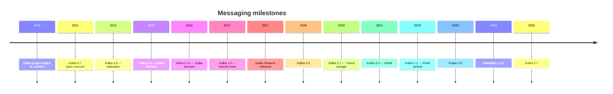

## 5. Problem Statement

### 5.1 What messaging solved

 <a class='askgpt-btn' href='https://chatgpt.com/?prompt=Read%20this%20section%20of%20my%20encyclopedia%20and%20explain%20it%20in%20depth%20with%20concrete%20examples%2C%20the%20main%20trade-offs%2C%20and%20common%20pitfalls%20a%20practitioner%20should%20know%3A%0A%0Ahttps%3A%2F%2Fgithub.com%2Fvishvasg14%2Fsoftware-engineering-encyclopedia%2Fblob%2Fmain%2F06-messaging%2Fmessaging.md%2351-what-messaging-solved%0A%0ASection%20title%3A%205.1%20What%20messaging%20solved' target='_blank' rel='noopener' data-askgpt='5.1 What messaging solved' data-askgpt-url='https://github.com/vishvasg14/software-engineering-encyclopedia/blob/main/06-messaging/messaging.md#51-what-messaging-solved' data-askgpt-prompt-depth='Read%20this%20section%20of%20my%20encyclopedia%20and%20explain%20it%20in%20depth%20with%20concrete%20examples%2C%20the%20main%20trade-offs%2C%20and%20common%20pitfalls%20a%20practitioner%20should%20know%3A%0A%0Ahttps%3A%2F%2Fgithub.com%2Fvishvasg14%2Fsoftware-engineering-encyclopedia%2Fblob%2Fmain%2F06-messaging%2Fmessaging.md%2351-what-messaging-solved%0A%0ASection%20title%3A%205.1%20What%20messaging%20solved' data-askgpt-prompt-examples='Read%20this%20section%20of%20my%20encyclopedia%20and%20give%20me%202-3%20real-world%20production%20examples%20for%20it.%20For%20each%3A%20what%20went%20right%2C%20what%20went%20wrong%2C%20and%20the%20lessons%20learned.%20Include%20company%20%2F%20project%20names%20if%20relevant.%0A%0Ahttps%3A%2F%2Fgithub.com%2Fvishvasg14%2Fsoftware-engineering-encyclopedia%2Fblob%2Fmain%2F06-messaging%2Fmessaging.md%2351-what-messaging-solved%0A%0ASection%20title%3A%205.1%20What%20messaging%20solved' title='Ask ChatGPT about this section'>💬</a>
Before message brokers, application integration relied on:

- **Direct API calls** — synchronous, brittle, tightly coupled.
- **File-based handoffs** — fragile, no semantics, no replay.
- **Database queues** — database tables acting as queues; poll, lock, poll again.
- **Custom TCP protocols** — every team reinvents the wheel.

Message brokers addressed:

- **Decoupling** — producers don't need to know about consumers.
- **Asynchrony** — consumers process at their own pace.
- **Durability** — messages survive broker failures.
- **Replayability** — consumers can re-read messages.
- **Fan-out** — multiple consumers get the same messages.
- **Backpressure** — buffering handles spikes.

### 5.2 Pre-Kafka pain

 <a class='askgpt-btn' href='https://chatgpt.com/?prompt=Read%20this%20section%20of%20my%20encyclopedia%20and%20explain%20it%20in%20depth%20with%20concrete%20examples%2C%20the%20main%20trade-offs%2C%20and%20common%20pitfalls%20a%20practitioner%20should%20know%3A%0A%0Ahttps%3A%2F%2Fgithub.com%2Fvishvasg14%2Fsoftware-engineering-encyclopedia%2Fblob%2Fmain%2F06-messaging%2Fmessaging.md%2352-pre-kafka-pain%0A%0ASection%20title%3A%205.2%20Pre-Kafka%20pain' target='_blank' rel='noopener' data-askgpt='5.2 Pre-Kafka pain' data-askgpt-url='https://github.com/vishvasg14/software-engineering-encyclopedia/blob/main/06-messaging/messaging.md#52-pre-kafka-pain' data-askgpt-prompt-depth='Read%20this%20section%20of%20my%20encyclopedia%20and%20explain%20it%20in%20depth%20with%20concrete%20examples%2C%20the%20main%20trade-offs%2C%20and%20common%20pitfalls%20a%20practitioner%20should%20know%3A%0A%0Ahttps%3A%2F%2Fgithub.com%2Fvishvasg14%2Fsoftware-engineering-encyclopedia%2Fblob%2Fmain%2F06-messaging%2Fmessaging.md%2352-pre-kafka-pain%0A%0ASection%20title%3A%205.2%20Pre-Kafka%20pain' data-askgpt-prompt-examples='Read%20this%20section%20of%20my%20encyclopedia%20and%20give%20me%202-3%20real-world%20production%20examples%20for%20it.%20For%20each%3A%20what%20went%20right%2C%20what%20went%20wrong%2C%20and%20the%20lessons%20learned.%20Include%20company%20%2F%20project%20names%20if%20relevant.%0A%0Ahttps%3A%2F%2Fgithub.com%2Fvishvasg14%2Fsoftware-engineering-encyclopedia%2Fblob%2Fmain%2F06-messaging%2Fmessaging.md%2352-pre-kafka-pain%0A%0ASection%20title%3A%205.2%20Pre-Kafka%20pain' title='Ask ChatGPT about this section'>💬</a>
In the late 2000s, LinkedIn's activity pipeline used a combination of ActiveMQ and custom Java pipelines. Each change required coordinated deployments across producer and consumer systems. Scale was painful. Logs (for analytics) and queues (for messaging) were separate systems with different semantics.

### 5.3 Kafka's breakthrough

 <a class='askgpt-btn' href='https://chatgpt.com/?prompt=Read%20this%20section%20of%20my%20encyclopedia%20and%20explain%20it%20in%20depth%20with%20concrete%20examples%2C%20the%20main%20trade-offs%2C%20and%20common%20pitfalls%20a%20practitioner%20should%20know%3A%0A%0Ahttps%3A%2F%2Fgithub.com%2Fvishvasg14%2Fsoftware-engineering-encyclopedia%2Fblob%2Fmain%2F06-messaging%2Fmessaging.md%2353-kafkas-breakthrough%0A%0ASection%20title%3A%205.3%20Kafka's%20breakthrough' target='_blank' rel='noopener' data-askgpt='5.3 Kafka&#39;s breakthrough' data-askgpt-url='https://github.com/vishvasg14/software-engineering-encyclopedia/blob/main/06-messaging/messaging.md#53-kafkas-breakthrough' data-askgpt-prompt-depth='Read%20this%20section%20of%20my%20encyclopedia%20and%20explain%20it%20in%20depth%20with%20concrete%20examples%2C%20the%20main%20trade-offs%2C%20and%20common%20pitfalls%20a%20practitioner%20should%20know%3A%0A%0Ahttps%3A%2F%2Fgithub.com%2Fvishvasg14%2Fsoftware-engineering-encyclopedia%2Fblob%2Fmain%2F06-messaging%2Fmessaging.md%2353-kafkas-breakthrough%0A%0ASection%20title%3A%205.3%20Kafka's%20breakthrough' data-askgpt-prompt-examples='Read%20this%20section%20of%20my%20encyclopedia%20and%20give%20me%202-3%20real-world%20production%20examples%20for%20it.%20For%20each%3A%20what%20went%20right%2C%20what%20went%20wrong%2C%20and%20the%20lessons%20learned.%20Include%20company%20%2F%20project%20names%20if%20relevant.%0A%0Ahttps%3A%2F%2Fgithub.com%2Fvishvasg14%2Fsoftware-engineering-encyclopedia%2Fblob%2Fmain%2F06-messaging%2Fmessaging.md%2353-kafkas-breakthrough%0A%0ASection%20title%3A%205.3%20Kafka's%20breakthrough' title='Ask ChatGPT about this section'>💬</a>
Kafka's insight: **a log is a fundamental abstraction**. The same ordered, durable, replayable record stream can serve:

- **Messaging** (consume once, ack).
- **Activity tracking** (consume many times, replay).
- **Stream processing** (consume continuously, transform).
- **Event sourcing** (consume to reconstruct state).
- **Change data capture** (consume DB changes).
- **Metrics** (consume operation events).

A single system handles all these use cases. This is why Kafka won.

### 5.4 What's still hard

 <a class='askgpt-btn' href='https://chatgpt.com/?prompt=Read%20this%20section%20of%20my%20encyclopedia%20and%20explain%20it%20in%20depth%20with%20concrete%20examples%2C%20the%20main%20trade-offs%2C%20and%20common%20pitfalls%20a%20practitioner%20should%20know%3A%0A%0Ahttps%3A%2F%2Fgithub.com%2Fvishvasg14%2Fsoftware-engineering-encyclopedia%2Fblob%2Fmain%2F06-messaging%2Fmessaging.md%2354-whats-still-hard%0A%0ASection%20title%3A%205.4%20What's%20still%20hard' target='_blank' rel='noopener' data-askgpt='5.4 What&#39;s still hard' data-askgpt-url='https://github.com/vishvasg14/software-engineering-encyclopedia/blob/main/06-messaging/messaging.md#54-whats-still-hard' data-askgpt-prompt-depth='Read%20this%20section%20of%20my%20encyclopedia%20and%20explain%20it%20in%20depth%20with%20concrete%20examples%2C%20the%20main%20trade-offs%2C%20and%20common%20pitfalls%20a%20practitioner%20should%20know%3A%0A%0Ahttps%3A%2F%2Fgithub.com%2Fvishvasg14%2Fsoftware-engineering-encyclopedia%2Fblob%2Fmain%2F06-messaging%2Fmessaging.md%2354-whats-still-hard%0A%0ASection%20title%3A%205.4%20What's%20still%20hard' data-askgpt-prompt-examples='Read%20this%20section%20of%20my%20encyclopedia%20and%20give%20me%202-3%20real-world%20production%20examples%20for%20it.%20For%20each%3A%20what%20went%20right%2C%20what%20went%20wrong%2C%20and%20the%20lessons%20learned.%20Include%20company%20%2F%20project%20names%20if%20relevant.%0A%0Ahttps%3A%2F%2Fgithub.com%2Fvishvasg14%2Fsoftware-engineering-encyclopedia%2Fblob%2Fmain%2F06-messaging%2Fmessaging.md%2354-whats-still-hard%0A%0ASection%20title%3A%205.4%20What's%20still%20hard' title='Ask ChatGPT about this section'>💬</a>
- **Operational complexity** — Kafka clusters require careful sizing, monitoring, and tuning.
- **Cost** — at scale, Kafka is expensive (storage, network).
- **Exactly-once semantics** — possible but with caveats (KIP-98).
- **Schema evolution** — managing changing message formats.
- **Multi-region** — Kafka is single-region first; geo-replication is complex.

## 6. Real-World Motivation

### 6.1 Kafka in production

 <a class='askgpt-btn' href='https://chatgpt.com/?prompt=Read%20this%20section%20of%20my%20encyclopedia%20and%20explain%20it%20in%20depth%20with%20concrete%20examples%2C%20the%20main%20trade-offs%2C%20and%20common%20pitfalls%20a%20practitioner%20should%20know%3A%0A%0Ahttps%3A%2F%2Fgithub.com%2Fvishvasg14%2Fsoftware-engineering-encyclopedia%2Fblob%2Fmain%2F06-messaging%2Fmessaging.md%2361-kafka-in-production%0A%0ASection%20title%3A%206.1%20Kafka%20in%20production' target='_blank' rel='noopener' data-askgpt='6.1 Kafka in production' data-askgpt-url='https://github.com/vishvasg14/software-engineering-encyclopedia/blob/main/06-messaging/messaging.md#61-kafka-in-production' data-askgpt-prompt-depth='Read%20this%20section%20of%20my%20encyclopedia%20and%20explain%20it%20in%20depth%20with%20concrete%20examples%2C%20the%20main%20trade-offs%2C%20and%20common%20pitfalls%20a%20practitioner%20should%20know%3A%0A%0Ahttps%3A%2F%2Fgithub.com%2Fvishvasg14%2Fsoftware-engineering-encyclopedia%2Fblob%2Fmain%2F06-messaging%2Fmessaging.md%2361-kafka-in-production%0A%0ASection%20title%3A%206.1%20Kafka%20in%20production' data-askgpt-prompt-examples='Read%20this%20section%20of%20my%20encyclopedia%20and%20give%20me%202-3%20real-world%20production%20examples%20for%20it.%20For%20each%3A%20what%20went%20right%2C%20what%20went%20wrong%2C%20and%20the%20lessons%20learned.%20Include%20company%20%2F%20project%20names%20if%20relevant.%0A%0Ahttps%3A%2F%2Fgithub.com%2Fvishvasg14%2Fsoftware-engineering-encyclopedia%2Fblob%2Fmain%2F06-messaging%2Fmessaging.md%2361-kafka-in-production%0A%0ASection%20title%3A%206.1%20Kafka%20in%20production' title='Ask ChatGPT about this section'>💬</a>
- **LinkedIn** — Kafka's birthplace. Original use case: log aggregation, activity tracking. Production stats: trillions of messages per day.
- **Uber** — trillions of messages per day across hundreds of services. Uber has published detailed Kafka operations guides.
- **Netflix** — Kafka for events, log aggregation, real-time analytics. Uses Kafka with their own schema evolution tooling.
- **LinkedIn** — Kafka still powers most of their data infrastructure.
- **Twitter (X)** — Event pipeline for ad targeting, recommendations.
- **Airbnb** — Trip events, search ranking, fraud detection.
- **Slack** — Event sourcing for messages, audit logs.
- **Goldman Sachs** — Trade events, audit, risk.
- **Visa** — Transaction processing at scale.
- **Pinterest** — Event-driven architecture.

### 6.2 RabbitMQ in production

 <a class='askgpt-btn' href='https://chatgpt.com/?prompt=Read%20this%20section%20of%20my%20encyclopedia%20and%20explain%20it%20in%20depth%20with%20concrete%20examples%2C%20the%20main%20trade-offs%2C%20and%20common%20pitfalls%20a%20practitioner%20should%20know%3A%0A%0Ahttps%3A%2F%2Fgithub.com%2Fvishvasg14%2Fsoftware-engineering-encyclopedia%2Fblob%2Fmain%2F06-messaging%2Fmessaging.md%2362-rabbitmq-in-production%0A%0ASection%20title%3A%206.2%20RabbitMQ%20in%20production' target='_blank' rel='noopener' data-askgpt='6.2 RabbitMQ in production' data-askgpt-url='https://github.com/vishvasg14/software-engineering-encyclopedia/blob/main/06-messaging/messaging.md#62-rabbitmq-in-production' data-askgpt-prompt-depth='Read%20this%20section%20of%20my%20encyclopedia%20and%20explain%20it%20in%20depth%20with%20concrete%20examples%2C%20the%20main%20trade-offs%2C%20and%20common%20pitfalls%20a%20practitioner%20should%20know%3A%0A%0Ahttps%3A%2F%2Fgithub.com%2Fvishvasg14%2Fsoftware-engineering-encyclopedia%2Fblob%2Fmain%2F06-messaging%2Fmessaging.md%2362-rabbitmq-in-production%0A%0ASection%20title%3A%206.2%20RabbitMQ%20in%20production' data-askgpt-prompt-examples='Read%20this%20section%20of%20my%20encyclopedia%20and%20give%20me%202-3%20real-world%20production%20examples%20for%20it.%20For%20each%3A%20what%20went%20right%2C%20what%20went%20wrong%2C%20and%20the%20lessons%20learned.%20Include%20company%20%2F%20project%20names%20if%20relevant.%0A%0Ahttps%3A%2F%2Fgithub.com%2Fvishvasg14%2Fsoftware-engineering-encyclopedia%2Fblob%2Fmain%2F06-messaging%2Fmessaging.md%2362-rabbitmq-in-production%0A%0ASection%20title%3A%206.2%20RabbitMQ%20in%20production' title='Ask ChatGPT about this section'>💬</a>
- **VMware** — Internal microservices.
- **SAAS providers** — Many smaller-scale SaaS companies use RabbitMQ.
- **Trading systems** — Low-latency queue applications.

### 6.3 Pulsar in production

 <a class='askgpt-btn' href='https://chatgpt.com/?prompt=Read%20this%20section%20of%20my%20encyclopedia%20and%20explain%20it%20in%20depth%20with%20concrete%20examples%2C%20the%20main%20trade-offs%2C%20and%20common%20pitfalls%20a%20practitioner%20should%20know%3A%0A%0Ahttps%3A%2F%2Fgithub.com%2Fvishvasg14%2Fsoftware-engineering-encyclopedia%2Fblob%2Fmain%2F06-messaging%2Fmessaging.md%2363-pulsar-in-production%0A%0ASection%20title%3A%206.3%20Pulsar%20in%20production' target='_blank' rel='noopener' data-askgpt='6.3 Pulsar in production' data-askgpt-url='https://github.com/vishvasg14/software-engineering-encyclopedia/blob/main/06-messaging/messaging.md#63-pulsar-in-production' data-askgpt-prompt-depth='Read%20this%20section%20of%20my%20encyclopedia%20and%20explain%20it%20in%20depth%20with%20concrete%20examples%2C%20the%20main%20trade-offs%2C%20and%20common%20pitfalls%20a%20practitioner%20should%20know%3A%0A%0Ahttps%3A%2F%2Fgithub.com%2Fvishvasg14%2Fsoftware-engineering-encyclopedia%2Fblob%2Fmain%2F06-messaging%2Fmessaging.md%2363-pulsar-in-production%0A%0ASection%20title%3A%206.3%20Pulsar%20in%20production' data-askgpt-prompt-examples='Read%20this%20section%20of%20my%20encyclopedia%20and%20give%20me%202-3%20real-world%20production%20examples%20for%20it.%20For%20each%3A%20what%20went%20right%2C%20what%20went%20wrong%2C%20and%20the%20lessons%20learned.%20Include%20company%20%2F%20project%20names%20if%20relevant.%0A%0Ahttps%3A%2F%2Fgithub.com%2Fvishvasg14%2Fsoftware-engineering-encyclopedia%2Fblob%2Fmain%2F06-messaging%2Fmessaging.md%2363-pulsar-in-production%0A%0ASection%20title%3A%206.3%20Pulsar%20in%20production' title='Ask ChatGPT about this section'>💬</a>
- **Yahoo Japan** — Massive-scale messaging.
- **Tencent** — Bilibili messaging infrastructure.
- **Splunk** — Observability data ingestion.
- **Pinterest** — Some workloads.

### 6.4 Economic and engineering motivation

 <a class='askgpt-btn' href='https://chatgpt.com/?prompt=Read%20this%20section%20of%20my%20encyclopedia%20and%20explain%20it%20in%20depth%20with%20concrete%20examples%2C%20the%20main%20trade-offs%2C%20and%20common%20pitfalls%20a%20practitioner%20should%20know%3A%0A%0Ahttps%3A%2F%2Fgithub.com%2Fvishvasg14%2Fsoftware-engineering-encyclopedia%2Fblob%2Fmain%2F06-messaging%2Fmessaging.md%2364-economic-and-engineering-motivation%0A%0ASection%20title%3A%206.4%20Economic%20and%20engineering%20motivation' target='_blank' rel='noopener' data-askgpt='6.4 Economic and engineering motivation' data-askgpt-url='https://github.com/vishvasg14/software-engineering-encyclopedia/blob/main/06-messaging/messaging.md#64-economic-and-engineering-motivation' data-askgpt-prompt-depth='Read%20this%20section%20of%20my%20encyclopedia%20and%20explain%20it%20in%20depth%20with%20concrete%20examples%2C%20the%20main%20trade-offs%2C%20and%20common%20pitfalls%20a%20practitioner%20should%20know%3A%0A%0Ahttps%3A%2F%2Fgithub.com%2Fvishvasg14%2Fsoftware-engineering-encyclopedia%2Fblob%2Fmain%2F06-messaging%2Fmessaging.md%2364-economic-and-engineering-motivation%0A%0ASection%20title%3A%206.4%20Economic%20and%20engineering%20motivation' data-askgpt-prompt-examples='Read%20this%20section%20of%20my%20encyclopedia%20and%20give%20me%202-3%20real-world%20production%20examples%20for%20it.%20For%20each%3A%20what%20went%20right%2C%20what%20went%20wrong%2C%20and%20the%20lessons%20learned.%20Include%20company%20%2F%20project%20names%20if%20relevant.%0A%0Ahttps%3A%2F%2Fgithub.com%2Fvishvasg14%2Fsoftware-engineering-encyclopedia%2Fblob%2Fmain%2F06-messaging%2Fmessaging.md%2364-economic-and-engineering-motivation%0A%0ASection%20title%3A%206.4%20Economic%20and%20engineering%20motivation' title='Ask ChatGPT about this section'>💬</a>
- **Decoupling** — teams can deploy independently.
- **Resilience** — failures don't cascade.
- **Scalability** — distributed by design.
- **Replayability** — bug fixes, schema evolution, new consumers.
- **Stream processing** — Kafka Streams, ksqlDB for real-time analytics.

### 6.5 Why not alternatives?

 <a class='askgpt-btn' href='https://chatgpt.com/?prompt=Read%20this%20section%20of%20my%20encyclopedia%20and%20explain%20it%20in%20depth%20with%20concrete%20examples%2C%20the%20main%20trade-offs%2C%20and%20common%20pitfalls%20a%20practitioner%20should%20know%3A%0A%0Ahttps%3A%2F%2Fgithub.com%2Fvishvasg14%2Fsoftware-engineering-encyclopedia%2Fblob%2Fmain%2F06-messaging%2Fmessaging.md%2365-why-not-alternatives%0A%0ASection%20title%3A%206.5%20Why%20not%20alternatives%3F' target='_blank' rel='noopener' data-askgpt='6.5 Why not alternatives?' data-askgpt-url='https://github.com/vishvasg14/software-engineering-encyclopedia/blob/main/06-messaging/messaging.md#65-why-not-alternatives' data-askgpt-prompt-depth='Read%20this%20section%20of%20my%20encyclopedia%20and%20explain%20it%20in%20depth%20with%20concrete%20examples%2C%20the%20main%20trade-offs%2C%20and%20common%20pitfalls%20a%20practitioner%20should%20know%3A%0A%0Ahttps%3A%2F%2Fgithub.com%2Fvishvasg14%2Fsoftware-engineering-encyclopedia%2Fblob%2Fmain%2F06-messaging%2Fmessaging.md%2365-why-not-alternatives%0A%0ASection%20title%3A%206.5%20Why%20not%20alternatives%3F' data-askgpt-prompt-examples='Read%20this%20section%20of%20my%20encyclopedia%20and%20give%20me%202-3%20real-world%20production%20examples%20for%20it.%20For%20each%3A%20what%20went%20right%2C%20what%20went%20wrong%2C%20and%20the%20lessons%20learned.%20Include%20company%20%2F%20project%20names%20if%20relevant.%0A%0Ahttps%3A%2F%2Fgithub.com%2Fvishvasg14%2Fsoftware-engineering-encyclopedia%2Fblob%2Fmain%2F06-messaging%2Fmessaging.md%2365-why-not-alternatives%0A%0ASection%20title%3A%206.5%20Why%20not%20alternatives%3F' title='Ask ChatGPT about this section'>💬</a>
| Alternative | Why not dominant |
|-------------|------------------|
| Direct API calls | Synchronous, fragile, tightly coupled |
| File-based | No semantics, no replay, fragile |
| Database queues | Doesn't scale, poll overhead |
| AMQP (RabbitMQ) | Lower throughput, less replay-friendly |
| MQTT (IoT) | Different use case (small devices) |
| ActiveMQ | Older, less scalable |
| SQS/SNS (AWS) | Lock-in, throughput limits |
| gRPC | Synchronous, no replay |

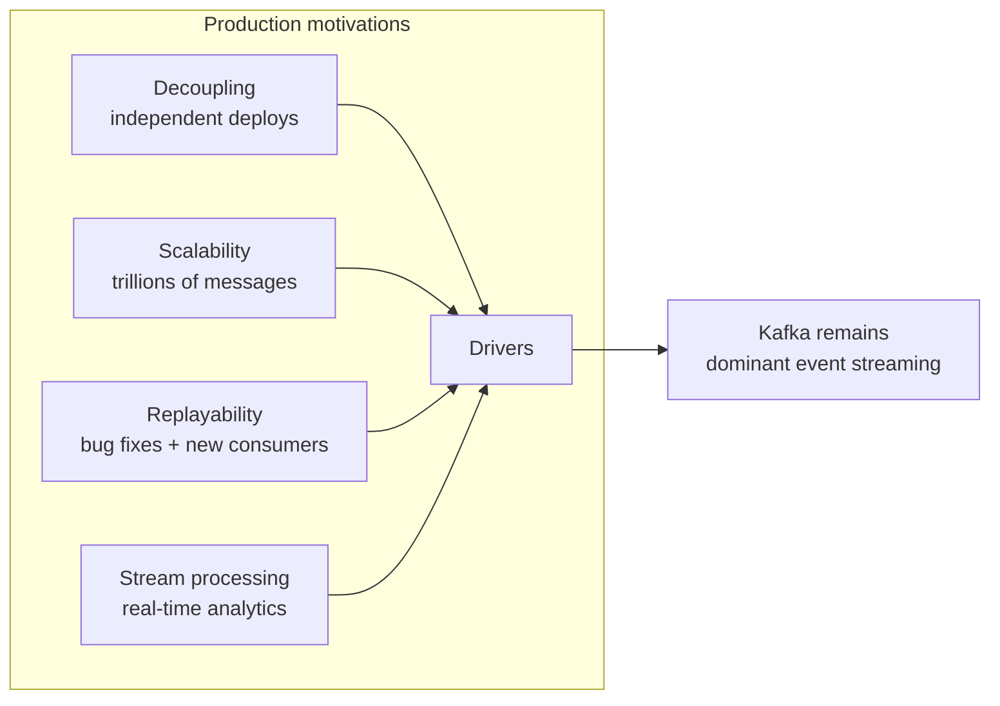

---

## 7. Internal Working

### 7.1 The lifecycle of a Kafka message

 <a class='askgpt-btn' href='https://chatgpt.com/?prompt=Read%20this%20section%20of%20my%20encyclopedia%20and%20explain%20it%20in%20depth%20with%20concrete%20examples%2C%20the%20main%20trade-offs%2C%20and%20common%20pitfalls%20a%20practitioner%20should%20know%3A%0A%0Ahttps%3A%2F%2Fgithub.com%2Fvishvasg14%2Fsoftware-engineering-encyclopedia%2Fblob%2Fmain%2F06-messaging%2Fmessaging.md%2371-the-lifecycle-of-a-kafka-message%0A%0ASection%20title%3A%207.1%20The%20lifecycle%20of%20a%20Kafka%20message' target='_blank' rel='noopener' data-askgpt='7.1 The lifecycle of a Kafka message' data-askgpt-url='https://github.com/vishvasg14/software-engineering-encyclopedia/blob/main/06-messaging/messaging.md#71-the-lifecycle-of-a-kafka-message' data-askgpt-prompt-depth='Read%20this%20section%20of%20my%20encyclopedia%20and%20explain%20it%20in%20depth%20with%20concrete%20examples%2C%20the%20main%20trade-offs%2C%20and%20common%20pitfalls%20a%20practitioner%20should%20know%3A%0A%0Ahttps%3A%2F%2Fgithub.com%2Fvishvasg14%2Fsoftware-engineering-encyclopedia%2Fblob%2Fmain%2F06-messaging%2Fmessaging.md%2371-the-lifecycle-of-a-kafka-message%0A%0ASection%20title%3A%207.1%20The%20lifecycle%20of%20a%20Kafka%20message' data-askgpt-prompt-examples='Read%20this%20section%20of%20my%20encyclopedia%20and%20give%20me%202-3%20real-world%20production%20examples%20for%20it.%20For%20each%3A%20what%20went%20right%2C%20what%20went%20wrong%2C%20and%20the%20lessons%20learned.%20Include%20company%20%2F%20project%20names%20if%20relevant.%0A%0Ahttps%3A%2F%2Fgithub.com%2Fvishvasg14%2Fsoftware-engineering-encyclopedia%2Fblob%2Fmain%2F06-messaging%2Fmessaging.md%2371-the-lifecycle-of-a-kafka-message%0A%0ASection%20title%3A%207.1%20The%20lifecycle%20of%20a%20Kafka%20message' title='Ask ChatGPT about this section'>💬</a>
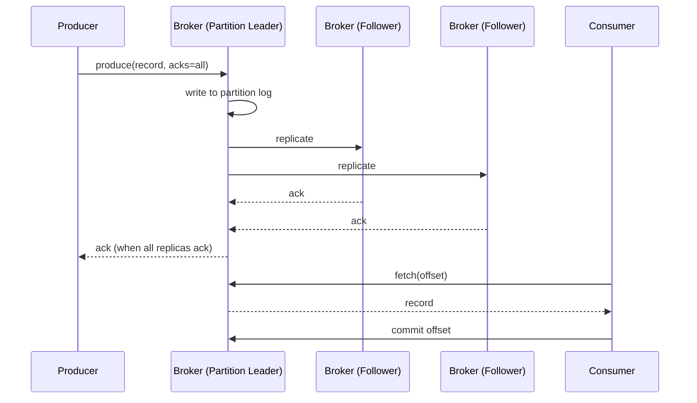

### 7.2 Subsystems that participate

 <a class='askgpt-btn' href='https://chatgpt.com/?prompt=Read%20this%20section%20of%20my%20encyclopedia%20and%20explain%20it%20in%20depth%20with%20concrete%20examples%2C%20the%20main%20trade-offs%2C%20and%20common%20pitfalls%20a%20practitioner%20should%20know%3A%0A%0Ahttps%3A%2F%2Fgithub.com%2Fvishvasg14%2Fsoftware-engineering-encyclopedia%2Fblob%2Fmain%2F06-messaging%2Fmessaging.md%2372-subsystems-that-participate%0A%0ASection%20title%3A%207.2%20Subsystems%20that%20participate' target='_blank' rel='noopener' data-askgpt='7.2 Subsystems that participate' data-askgpt-url='https://github.com/vishvasg14/software-engineering-encyclopedia/blob/main/06-messaging/messaging.md#72-subsystems-that-participate' data-askgpt-prompt-depth='Read%20this%20section%20of%20my%20encyclopedia%20and%20explain%20it%20in%20depth%20with%20concrete%20examples%2C%20the%20main%20trade-offs%2C%20and%20common%20pitfalls%20a%20practitioner%20should%20know%3A%0A%0Ahttps%3A%2F%2Fgithub.com%2Fvishvasg14%2Fsoftware-engineering-encyclopedia%2Fblob%2Fmain%2F06-messaging%2Fmessaging.md%2372-subsystems-that-participate%0A%0ASection%20title%3A%207.2%20Subsystems%20that%20participate' data-askgpt-prompt-examples='Read%20this%20section%20of%20my%20encyclopedia%20and%20give%20me%202-3%20real-world%20production%20examples%20for%20it.%20For%20each%3A%20what%20went%20right%2C%20what%20went%20wrong%2C%20and%20the%20lessons%20learned.%20Include%20company%20%2F%20project%20names%20if%20relevant.%0A%0Ahttps%3A%2F%2Fgithub.com%2Fvishvasg14%2Fsoftware-engineering-encyclopedia%2Fblob%2Fmain%2F06-messaging%2Fmessaging.md%2372-subsystems-that-participate%0A%0ASection%20title%3A%207.2%20Subsystems%20that%20participate' title='Ask ChatGPT about this section'>💬</a>
| Subsystem | Responsibility |
|-----------|---------------|
| **Producer** | Batches, compresses, partitions, sends records |
| **Broker** | Stores partitions, replicates, serves consumers |
| **Controller (KRaft)** | Manages cluster state, leader election |
| **Consumer** | Fetches, processes, commits offsets |
| **Group Coordinator** | Manages consumer groups, partition assignment |
| **Schema Registry** | Manages message schemas |
| **Connect** | Source/sink connectors for external systems |

### 7.3 Kafka architecture

 <a class='askgpt-btn' href='https://chatgpt.com/?prompt=Read%20this%20section%20of%20my%20encyclopedia%20and%20explain%20it%20in%20depth%20with%20concrete%20examples%2C%20the%20main%20trade-offs%2C%20and%20common%20pitfalls%20a%20practitioner%20should%20know%3A%0A%0Ahttps%3A%2F%2Fgithub.com%2Fvishvasg14%2Fsoftware-engineering-encyclopedia%2Fblob%2Fmain%2F06-messaging%2Fmessaging.md%2373-kafka-architecture%0A%0ASection%20title%3A%207.3%20Kafka%20architecture' target='_blank' rel='noopener' data-askgpt='7.3 Kafka architecture' data-askgpt-url='https://github.com/vishvasg14/software-engineering-encyclopedia/blob/main/06-messaging/messaging.md#73-kafka-architecture' data-askgpt-prompt-depth='Read%20this%20section%20of%20my%20encyclopedia%20and%20explain%20it%20in%20depth%20with%20concrete%20examples%2C%20the%20main%20trade-offs%2C%20and%20common%20pitfalls%20a%20practitioner%20should%20know%3A%0A%0Ahttps%3A%2F%2Fgithub.com%2Fvishvasg14%2Fsoftware-engineering-encyclopedia%2Fblob%2Fmain%2F06-messaging%2Fmessaging.md%2373-kafka-architecture%0A%0ASection%20title%3A%207.3%20Kafka%20architecture' data-askgpt-prompt-examples='Read%20this%20section%20of%20my%20encyclopedia%20and%20give%20me%202-3%20real-world%20production%20examples%20for%20it.%20For%20each%3A%20what%20went%20right%2C%20what%20went%20wrong%2C%20and%20the%20lessons%20learned.%20Include%20company%20%2F%20project%20names%20if%20relevant.%0A%0Ahttps%3A%2F%2Fgithub.com%2Fvishvasg14%2Fsoftware-engineering-encyclopedia%2Fblob%2Fmain%2F06-messaging%2Fmessaging.md%2373-kafka-architecture%0A%0ASection%20title%3A%207.3%20Kafka%20architecture' title='Ask ChatGPT about this section'>💬</a>
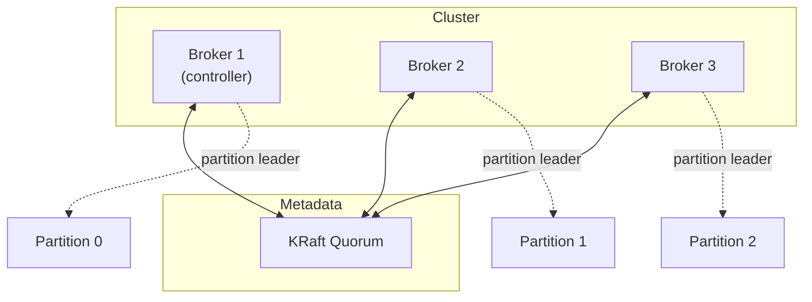

## 8. Deep Dive

This section is the heart of the document.

### 8.1 Kafka architecture

 <a class='askgpt-btn' href='https://chatgpt.com/?prompt=Read%20this%20section%20of%20my%20encyclopedia%20and%20explain%20it%20in%20depth%20with%20concrete%20examples%2C%20the%20main%20trade-offs%2C%20and%20common%20pitfalls%20a%20practitioner%20should%20know%3A%0A%0Ahttps%3A%2F%2Fgithub.com%2Fvishvasg14%2Fsoftware-engineering-encyclopedia%2Fblob%2Fmain%2F06-messaging%2Fmessaging.md%2381-kafka-architecture%0A%0ASection%20title%3A%208.1%20Kafka%20architecture' target='_blank' rel='noopener' data-askgpt='8.1 Kafka architecture' data-askgpt-url='https://github.com/vishvasg14/software-engineering-encyclopedia/blob/main/06-messaging/messaging.md#81-kafka-architecture' data-askgpt-prompt-depth='Read%20this%20section%20of%20my%20encyclopedia%20and%20explain%20it%20in%20depth%20with%20concrete%20examples%2C%20the%20main%20trade-offs%2C%20and%20common%20pitfalls%20a%20practitioner%20should%20know%3A%0A%0Ahttps%3A%2F%2Fgithub.com%2Fvishvasg14%2Fsoftware-engineering-encyclopedia%2Fblob%2Fmain%2F06-messaging%2Fmessaging.md%2381-kafka-architecture%0A%0ASection%20title%3A%208.1%20Kafka%20architecture' data-askgpt-prompt-examples='Read%20this%20section%20of%20my%20encyclopedia%20and%20give%20me%202-3%20real-world%20production%20examples%20for%20it.%20For%20each%3A%20what%20went%20right%2C%20what%20went%20wrong%2C%20and%20the%20lessons%20learned.%20Include%20company%20%2F%20project%20names%20if%20relevant.%0A%0Ahttps%3A%2F%2Fgithub.com%2Fvishvasg14%2Fsoftware-engineering-encyclopedia%2Fblob%2Fmain%2F06-messaging%2Fmessaging.md%2381-kafka-architecture%0A%0ASection%20title%3A%208.1%20Kafka%20architecture' title='Ask ChatGPT about this section'>💬</a>
Kafka is a **distributed, partitioned, replicated commit log service**. Core concepts:

- **Topic** — a named stream of records.
- **Partition** — a topic is split into N partitions (ordered, immutable). Each partition is a separate log.
- **Offset** — a monotonically increasing integer per partition. Each record has a unique offset.
- **Producer** — publishes records to a partition.
- **Consumer** — reads records in offset order.
- **Consumer group** — one or more consumers cooperating to consume a topic.
- **Broker** — a Kafka server hosting some partitions.
- **Cluster** — multiple brokers.
- **Replication** — partitions are replicated across N brokers for fault tolerance.

### 8.2 Partitions

 <a class='askgpt-btn' href='https://chatgpt.com/?prompt=Read%20this%20section%20of%20my%20encyclopedia%20and%20explain%20it%20in%20depth%20with%20concrete%20examples%2C%20the%20main%20trade-offs%2C%20and%20common%20pitfalls%20a%20practitioner%20should%20know%3A%0A%0Ahttps%3A%2F%2Fgithub.com%2Fvishvasg14%2Fsoftware-engineering-encyclopedia%2Fblob%2Fmain%2F06-messaging%2Fmessaging.md%2382-partitions%0A%0ASection%20title%3A%208.2%20Partitions' target='_blank' rel='noopener' data-askgpt='8.2 Partitions' data-askgpt-url='https://github.com/vishvasg14/software-engineering-encyclopedia/blob/main/06-messaging/messaging.md#82-partitions' data-askgpt-prompt-depth='Read%20this%20section%20of%20my%20encyclopedia%20and%20explain%20it%20in%20depth%20with%20concrete%20examples%2C%20the%20main%20trade-offs%2C%20and%20common%20pitfalls%20a%20practitioner%20should%20know%3A%0A%0Ahttps%3A%2F%2Fgithub.com%2Fvishvasg14%2Fsoftware-engineering-encyclopedia%2Fblob%2Fmain%2F06-messaging%2Fmessaging.md%2382-partitions%0A%0ASection%20title%3A%208.2%20Partitions' data-askgpt-prompt-examples='Read%20this%20section%20of%20my%20encyclopedia%20and%20give%20me%202-3%20real-world%20production%20examples%20for%20it.%20For%20each%3A%20what%20went%20right%2C%20what%20went%20wrong%2C%20and%20the%20lessons%20learned.%20Include%20company%20%2F%20project%20names%20if%20relevant.%0A%0Ahttps%3A%2F%2Fgithub.com%2Fvishvasg14%2Fsoftware-engineering-encyclopedia%2Fblob%2Fmain%2F06-messaging%2Fmessaging.md%2382-partitions%0A%0ASection%20title%3A%208.2%20Partitions' title='Ask ChatGPT about this section'>💬</a>
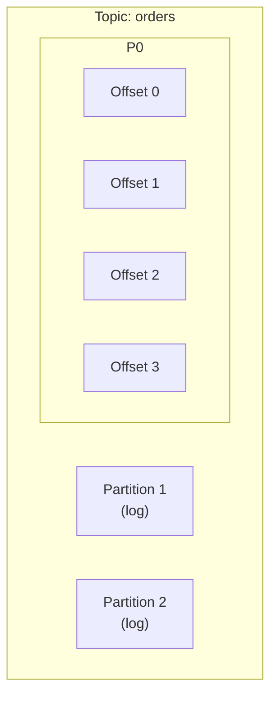

A partition is an **append-only log**. Records are appended in order. Each record has a unique offset.

- **Ordering guarantees only within a partition.** Across partitions, no ordering.
- **Partitioning key** determines which partition a record goes to: `hash(key) % num_partitions`.
- **Choose partition key carefully** — good keys distribute load; bad keys cause hot partitions.

### 8.3 Producer

 <a class='askgpt-btn' href='https://chatgpt.com/?prompt=Read%20this%20section%20of%20my%20encyclopedia%20and%20explain%20it%20in%20depth%20with%20concrete%20examples%2C%20the%20main%20trade-offs%2C%20and%20common%20pitfalls%20a%20practitioner%20should%20know%3A%0A%0Ahttps%3A%2F%2Fgithub.com%2Fvishvasg14%2Fsoftware-engineering-encyclopedia%2Fblob%2Fmain%2F06-messaging%2Fmessaging.md%2383-producer%0A%0ASection%20title%3A%208.3%20Producer' target='_blank' rel='noopener' data-askgpt='8.3 Producer' data-askgpt-url='https://github.com/vishvasg14/software-engineering-encyclopedia/blob/main/06-messaging/messaging.md#83-producer' data-askgpt-prompt-depth='Read%20this%20section%20of%20my%20encyclopedia%20and%20explain%20it%20in%20depth%20with%20concrete%20examples%2C%20the%20main%20trade-offs%2C%20and%20common%20pitfalls%20a%20practitioner%20should%20know%3A%0A%0Ahttps%3A%2F%2Fgithub.com%2Fvishvasg14%2Fsoftware-engineering-encyclopedia%2Fblob%2Fmain%2F06-messaging%2Fmessaging.md%2383-producer%0A%0ASection%20title%3A%208.3%20Producer' data-askgpt-prompt-examples='Read%20this%20section%20of%20my%20encyclopedia%20and%20give%20me%202-3%20real-world%20production%20examples%20for%20it.%20For%20each%3A%20what%20went%20right%2C%20what%20went%20wrong%2C%20and%20the%20lessons%20learned.%20Include%20company%20%2F%20project%20names%20if%20relevant.%0A%0Ahttps%3A%2F%2Fgithub.com%2Fvishvasg14%2Fsoftware-engineering-encyclopedia%2Fblob%2Fmain%2F06-messaging%2Fmessaging.md%2383-producer%0A%0ASection%20title%3A%208.3%20Producer' title='Ask ChatGPT about this section'>💬</a>
```java
Properties props = new Properties();
props.put(ProducerConfig.BOOTSTRAP_SERVERS_CONFIG, "localhost:9092");
props.put(ProducerConfig.KEY_SERIALIZER_CLASS_CONFIG, StringSerializer.class.getName());
props.put(ProducerConfig.VALUE_SERIALIZER_CLASS_CONFIG, StringSerializer.class.getName());
props.put(ProducerConfig.ACKS_CONFIG, "all");  // durability
props.put(ProducerConfig.ENABLE_IDEMPOTENCE_CONFIG, true);  // exactly-once per partition

KafkaProducer<String, String> producer = new KafkaProducer<>(props);
ProducerRecord<String, String> record = new ProducerRecord<>("topic", "key", "value");
RecordMetadata metadata = producer.send(record).get();
producer.close();
```

**Key configurations:**

| Config | Effect |
|--------|--------|
| `acks=0` | Fire-and-forget (no durability guarantee) |
| `acks=1` | Wait for leader only (loses data if leader fails before replication) |
| `acks=all` (`-1`) | Wait for all in-sync replicas (strongest durability) |
| `enable.idempotence=true` | Producer idempotency; prevents duplicates on retry |
| `compression.type` | `none`, `gzip`, `snappy`, `lz4`, `zstd` |
| `batch.size` | Bytes to batch (default 16 KB) |
| `linger.ms` | Wait time to fill batch (default 0) |
| `max.in.flight.requests.per.connection` | Max unacknowledged requests (1 with idempotence) |

### 8.4 Consumer

 <a class='askgpt-btn' href='https://chatgpt.com/?prompt=Read%20this%20section%20of%20my%20encyclopedia%20and%20explain%20it%20in%20depth%20with%20concrete%20examples%2C%20the%20main%20trade-offs%2C%20and%20common%20pitfalls%20a%20practitioner%20should%20know%3A%0A%0Ahttps%3A%2F%2Fgithub.com%2Fvishvasg14%2Fsoftware-engineering-encyclopedia%2Fblob%2Fmain%2F06-messaging%2Fmessaging.md%2384-consumer%0A%0ASection%20title%3A%208.4%20Consumer' target='_blank' rel='noopener' data-askgpt='8.4 Consumer' data-askgpt-url='https://github.com/vishvasg14/software-engineering-encyclopedia/blob/main/06-messaging/messaging.md#84-consumer' data-askgpt-prompt-depth='Read%20this%20section%20of%20my%20encyclopedia%20and%20explain%20it%20in%20depth%20with%20concrete%20examples%2C%20the%20main%20trade-offs%2C%20and%20common%20pitfalls%20a%20practitioner%20should%20know%3A%0A%0Ahttps%3A%2F%2Fgithub.com%2Fvishvasg14%2Fsoftware-engineering-encyclopedia%2Fblob%2Fmain%2F06-messaging%2Fmessaging.md%2384-consumer%0A%0ASection%20title%3A%208.4%20Consumer' data-askgpt-prompt-examples='Read%20this%20section%20of%20my%20encyclopedia%20and%20give%20me%202-3%20real-world%20production%20examples%20for%20it.%20For%20each%3A%20what%20went%20right%2C%20what%20went%20wrong%2C%20and%20the%20lessons%20learned.%20Include%20company%20%2F%20project%20names%20if%20relevant.%0A%0Ahttps%3A%2F%2Fgithub.com%2Fvishvasg14%2Fsoftware-engineering-encyclopedia%2Fblob%2Fmain%2F06-messaging%2Fmessaging.md%2384-consumer%0A%0ASection%20title%3A%208.4%20Consumer' title='Ask ChatGPT about this section'>💬</a>
```java
Properties props = new Properties();
props.put(ConsumerConfig.BOOTSTRAP_SERVERS_CONFIG, "localhost:9092");
props.put(ConsumerConfig.GROUP_ID_CONFIG, "my-group");
props.put(ConsumerConfig.KEY_DESERIALIZER_CLASS_CONFIG, StringDeserializer.class.getName());
props.put(ConsumerConfig.VALUE_DESERIALIZER_CLASS_CONFIG, StringDeserializer.class.getName());
props.put(ConsumerConfig.AUTO_OFFSET_RESET_CONFIG, "earliest");
props.put(ConsumerConfig.ENABLE_AUTO_COMMIT_CONFIG, false);  // manual commit

KafkaConsumer<String, String> consumer = new KafkaConsumer<>(props);
consumer.subscribe(List.of("topic"));

while (true) {
    ConsumerRecords<String, String> records = consumer.poll(Duration.ofMillis(100));
    for (ConsumerRecord<String, String> record : records) {
        System.out.println(record.offset() + ": " + record.value());
    }
    consumer.commitSync();  // commit offset
}
```

**Consumer groups:** multiple consumers with the same `group.id` form a group. Partitions are distributed across consumers in the group. Each partition is consumed by exactly one consumer at a time.

### 8.5 Replication and ISR

 <a class='askgpt-btn' href='https://chatgpt.com/?prompt=Read%20this%20section%20of%20my%20encyclopedia%20and%20explain%20it%20in%20depth%20with%20concrete%20examples%2C%20the%20main%20trade-offs%2C%20and%20common%20pitfalls%20a%20practitioner%20should%20know%3A%0A%0Ahttps%3A%2F%2Fgithub.com%2Fvishvasg14%2Fsoftware-engineering-encyclopedia%2Fblob%2Fmain%2F06-messaging%2Fmessaging.md%2385-replication-and-isr%0A%0ASection%20title%3A%208.5%20Replication%20and%20ISR' target='_blank' rel='noopener' data-askgpt='8.5 Replication and ISR' data-askgpt-url='https://github.com/vishvasg14/software-engineering-encyclopedia/blob/main/06-messaging/messaging.md#85-replication-and-isr' data-askgpt-prompt-depth='Read%20this%20section%20of%20my%20encyclopedia%20and%20explain%20it%20in%20depth%20with%20concrete%20examples%2C%20the%20main%20trade-offs%2C%20and%20common%20pitfalls%20a%20practitioner%20should%20know%3A%0A%0Ahttps%3A%2F%2Fgithub.com%2Fvishvasg14%2Fsoftware-engineering-encyclopedia%2Fblob%2Fmain%2F06-messaging%2Fmessaging.md%2385-replication-and-isr%0A%0ASection%20title%3A%208.5%20Replication%20and%20ISR' data-askgpt-prompt-examples='Read%20this%20section%20of%20my%20encyclopedia%20and%20give%20me%202-3%20real-world%20production%20examples%20for%20it.%20For%20each%3A%20what%20went%20right%2C%20what%20went%20wrong%2C%20and%20the%20lessons%20learned.%20Include%20company%20%2F%20project%20names%20if%20relevant.%0A%0Ahttps%3A%2F%2Fgithub.com%2Fvishvasg14%2Fsoftware-engineering-encyclopedia%2Fblob%2Fmain%2F06-messaging%2Fmessaging.md%2385-replication-and-isr%0A%0ASection%20title%3A%208.5%20Replication%20and%20ISR' title='Ask ChatGPT about this section'>💬</a>
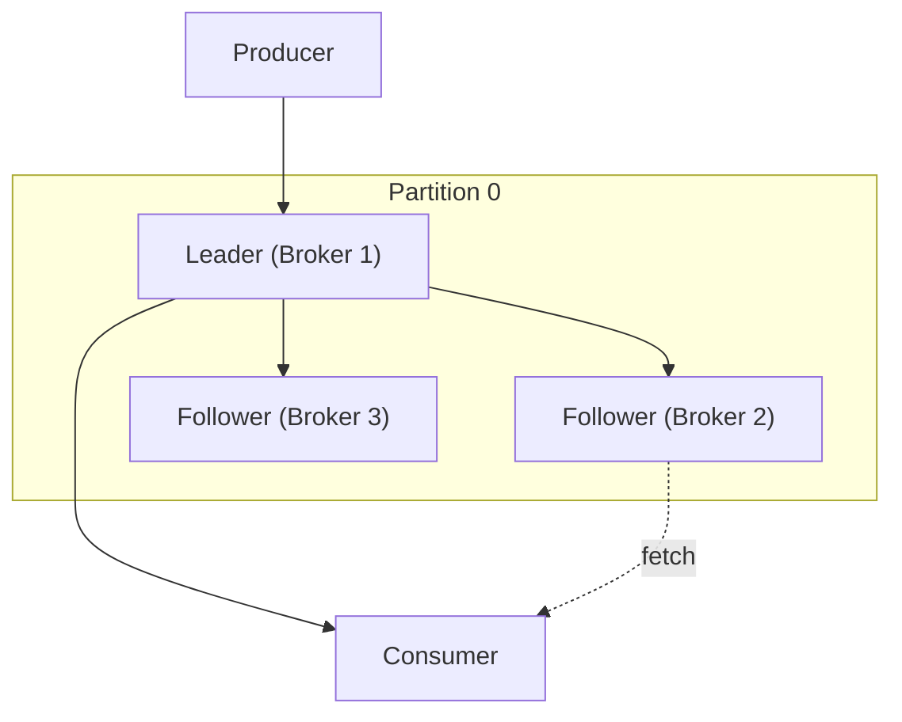

- **Replication factor** — number of copies of each partition (typically 3).
- **Leader** — one replica handles all reads and writes.
- **Followers** — replicate from the leader.
- **In-Sync Replicas (ISR)** — followers that are caught up with the leader.
- **acks=all** waits for all ISR to acknowledge.
- If a follower falls behind (more than `replica.lag.time.max.ms`), it's removed from ISR.
- If the leader fails, a new leader is elected from the ISR.

### 8.6 Storage: log segments

 <a class='askgpt-btn' href='https://chatgpt.com/?prompt=Read%20this%20section%20of%20my%20encyclopedia%20and%20explain%20it%20in%20depth%20with%20concrete%20examples%2C%20the%20main%20trade-offs%2C%20and%20common%20pitfalls%20a%20practitioner%20should%20know%3A%0A%0Ahttps%3A%2F%2Fgithub.com%2Fvishvasg14%2Fsoftware-engineering-encyclopedia%2Fblob%2Fmain%2F06-messaging%2Fmessaging.md%2386-storage-log-segments%0A%0ASection%20title%3A%208.6%20Storage%3A%20log%20segments' target='_blank' rel='noopener' data-askgpt='8.6 Storage: log segments' data-askgpt-url='https://github.com/vishvasg14/software-engineering-encyclopedia/blob/main/06-messaging/messaging.md#86-storage-log-segments' data-askgpt-prompt-depth='Read%20this%20section%20of%20my%20encyclopedia%20and%20explain%20it%20in%20depth%20with%20concrete%20examples%2C%20the%20main%20trade-offs%2C%20and%20common%20pitfalls%20a%20practitioner%20should%20know%3A%0A%0Ahttps%3A%2F%2Fgithub.com%2Fvishvasg14%2Fsoftware-engineering-encyclopedia%2Fblob%2Fmain%2F06-messaging%2Fmessaging.md%2386-storage-log-segments%0A%0ASection%20title%3A%208.6%20Storage%3A%20log%20segments' data-askgpt-prompt-examples='Read%20this%20section%20of%20my%20encyclopedia%20and%20give%20me%202-3%20real-world%20production%20examples%20for%20it.%20For%20each%3A%20what%20went%20right%2C%20what%20went%20wrong%2C%20and%20the%20lessons%20learned.%20Include%20company%20%2F%20project%20names%20if%20relevant.%0A%0Ahttps%3A%2F%2Fgithub.com%2Fvishvasg14%2Fsoftware-engineering-encyclopedia%2Fblob%2Fmain%2F06-messaging%2Fmessaging.md%2386-storage-log-segments%0A%0ASection%20title%3A%208.6%20Storage%3A%20log%20segments' title='Ask ChatGPT about this section'>💬</a>
Each partition is stored as a sequence of **segment files** on disk:

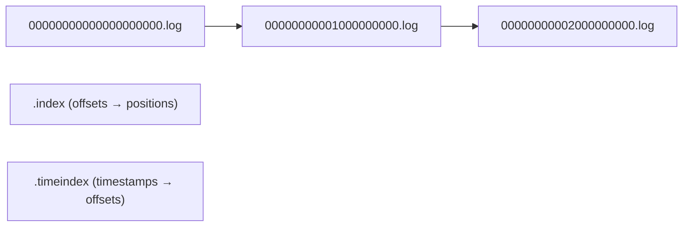

- **Active segment** — written to.
- **Closed segment** — full; not modified.
- **Retention** — old segments deleted by time (`retention.ms`) or size (`retention.bytes`).
- **Compaction** — keep only the latest record per key (for changelog topics).

### 8.7 KRaft

 <a class='askgpt-btn' href='https://chatgpt.com/?prompt=Read%20this%20section%20of%20my%20encyclopedia%20and%20explain%20it%20in%20depth%20with%20concrete%20examples%2C%20the%20main%20trade-offs%2C%20and%20common%20pitfalls%20a%20practitioner%20should%20know%3A%0A%0Ahttps%3A%2F%2Fgithub.com%2Fvishvasg14%2Fsoftware-engineering-encyclopedia%2Fblob%2Fmain%2F06-messaging%2Fmessaging.md%2387-kraft%0A%0ASection%20title%3A%208.7%20KRaft' target='_blank' rel='noopener' data-askgpt='8.7 KRaft' data-askgpt-url='https://github.com/vishvasg14/software-engineering-encyclopedia/blob/main/06-messaging/messaging.md#87-kraft' data-askgpt-prompt-depth='Read%20this%20section%20of%20my%20encyclopedia%20and%20explain%20it%20in%20depth%20with%20concrete%20examples%2C%20the%20main%20trade-offs%2C%20and%20common%20pitfalls%20a%20practitioner%20should%20know%3A%0A%0Ahttps%3A%2F%2Fgithub.com%2Fvishvasg14%2Fsoftware-engineering-encyclopedia%2Fblob%2Fmain%2F06-messaging%2Fmessaging.md%2387-kraft%0A%0ASection%20title%3A%208.7%20KRaft' data-askgpt-prompt-examples='Read%20this%20section%20of%20my%20encyclopedia%20and%20give%20me%202-3%20real-world%20production%20examples%20for%20it.%20For%20each%3A%20what%20went%20right%2C%20what%20went%20wrong%2C%20and%20the%20lessons%20learned.%20Include%20company%20%2F%20project%20names%20if%20relevant.%0A%0Ahttps%3A%2F%2Fgithub.com%2Fvishvasg14%2Fsoftware-engineering-encyclopedia%2Fblob%2Fmain%2F06-messaging%2Fmessaging.md%2387-kraft%0A%0ASection%20title%3A%208.7%20KRaft' title='Ask ChatGPT about this section'>💬</a>
Since Kafka 3.3, KRaft (Kafka Raft) replaces ZooKeeper for cluster metadata. KRaft uses the Raft consensus algorithm directly within Kafka.

**Why KRaft:**
- Removes ZooKeeper dependency.
- Scales to more partitions (100K+ per cluster).
- Faster controller failover.
- Simpler operational model.

**Raft basics:**
- **Leader** (active controller) — handles all metadata changes.
- **Followers** — replicate the metadata log.
- **Election** — when the leader fails, followers elect a new leader from the current quorum.
- **Quorum** — `(N/2) + 1` of nodes must agree.

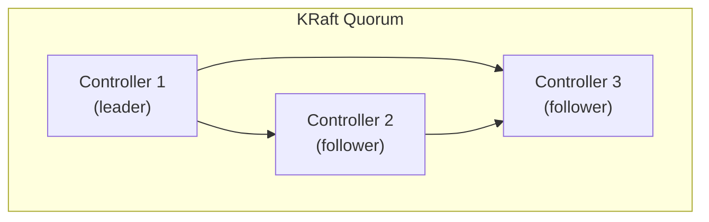

### 8.8 Exactly-once semantics (EOS)

 <a class='askgpt-btn' href='https://chatgpt.com/?prompt=Read%20this%20section%20of%20my%20encyclopedia%20and%20explain%20it%20in%20depth%20with%20concrete%20examples%2C%20the%20main%20trade-offs%2C%20and%20common%20pitfalls%20a%20practitioner%20should%20know%3A%0A%0Ahttps%3A%2F%2Fgithub.com%2Fvishvasg14%2Fsoftware-engineering-encyclopedia%2Fblob%2Fmain%2F06-messaging%2Fmessaging.md%2388-exactly-once-semantics-eos%0A%0ASection%20title%3A%208.8%20Exactly-once%20semantics%20(EOS)' target='_blank' rel='noopener' data-askgpt='8.8 Exactly-once semantics (EOS)' data-askgpt-url='https://github.com/vishvasg14/software-engineering-encyclopedia/blob/main/06-messaging/messaging.md#88-exactly-once-semantics-eos' data-askgpt-prompt-depth='Read%20this%20section%20of%20my%20encyclopedia%20and%20explain%20it%20in%20depth%20with%20concrete%20examples%2C%20the%20main%20trade-offs%2C%20and%20common%20pitfalls%20a%20practitioner%20should%20know%3A%0A%0Ahttps%3A%2F%2Fgithub.com%2Fvishvasg14%2Fsoftware-engineering-encyclopedia%2Fblob%2Fmain%2F06-messaging%2Fmessaging.md%2388-exactly-once-semantics-eos%0A%0ASection%20title%3A%208.8%20Exactly-once%20semantics%20(EOS)' data-askgpt-prompt-examples='Read%20this%20section%20of%20my%20encyclopedia%20and%20give%20me%202-3%20real-world%20production%20examples%20for%20it.%20For%20each%3A%20what%20went%20right%2C%20what%20went%20wrong%2C%20and%20the%20lessons%20learned.%20Include%20company%20%2F%20project%20names%20if%20relevant.%0A%0Ahttps%3A%2F%2Fgithub.com%2Fvishvasg14%2Fsoftware-engineering-encyclopedia%2Fblob%2Fmain%2F06-messaging%2Fmessaging.md%2388-exactly-once-semantics-eos%0A%0ASection%20title%3A%208.8%20Exactly-once%20semantics%20(EOS)' title='Ask ChatGPT about this section'>💬</a>
Kafka supports exactly-once semantics through three mechanisms:

1. **Idempotent producer** (`enable.idempotence=true`):
   - Producer ID + sequence number per partition.
   - Prevents duplicates on retry.
   - No coordination overhead.

2. **Transactional API**:
   - Atomic writes across multiple partitions.
   - `initTransactions()`, `beginTransaction()`, `commitTransaction()`.
   - Used for read-process-write patterns.

3. **Read-process-write pattern**:
   - Read from input topic.
   - Process with processing guarantee.
   - Write to output topic + commit offsets in one transaction.

```java
producer.initTransactions();
try {
    producer.beginTransaction();
    producer.send(new ProducerRecord<>("output", "key", "value"));
    // also commit input offsets via sendOffsetsToTransaction
    producer.sendOffsetsToTransaction(offsets, consumerGroupMetadata);
    producer.commitTransaction();
} catch (Exception e) {
    producer.abortTransaction();
}
```

### 8.9 Kafka Streams

 <a class='askgpt-btn' href='https://chatgpt.com/?prompt=Read%20this%20section%20of%20my%20encyclopedia%20and%20explain%20it%20in%20depth%20with%20concrete%20examples%2C%20the%20main%20trade-offs%2C%20and%20common%20pitfalls%20a%20practitioner%20should%20know%3A%0A%0Ahttps%3A%2F%2Fgithub.com%2Fvishvasg14%2Fsoftware-engineering-encyclopedia%2Fblob%2Fmain%2F06-messaging%2Fmessaging.md%2389-kafka-streams%0A%0ASection%20title%3A%208.9%20Kafka%20Streams' target='_blank' rel='noopener' data-askgpt='8.9 Kafka Streams' data-askgpt-url='https://github.com/vishvasg14/software-engineering-encyclopedia/blob/main/06-messaging/messaging.md#89-kafka-streams' data-askgpt-prompt-depth='Read%20this%20section%20of%20my%20encyclopedia%20and%20explain%20it%20in%20depth%20with%20concrete%20examples%2C%20the%20main%20trade-offs%2C%20and%20common%20pitfalls%20a%20practitioner%20should%20know%3A%0A%0Ahttps%3A%2F%2Fgithub.com%2Fvishvasg14%2Fsoftware-engineering-encyclopedia%2Fblob%2Fmain%2F06-messaging%2Fmessaging.md%2389-kafka-streams%0A%0ASection%20title%3A%208.9%20Kafka%20Streams' data-askgpt-prompt-examples='Read%20this%20section%20of%20my%20encyclopedia%20and%20give%20me%202-3%20real-world%20production%20examples%20for%20it.%20For%20each%3A%20what%20went%20right%2C%20what%20went%20wrong%2C%20and%20the%20lessons%20learned.%20Include%20company%20%2F%20project%20names%20if%20relevant.%0A%0Ahttps%3A%2F%2Fgithub.com%2Fvishvasg14%2Fsoftware-engineering-encyclopedia%2Fblob%2Fmain%2F06-messaging%2Fmessaging.md%2389-kafka-streams%0A%0ASection%20title%3A%208.9%20Kafka%20Streams' title='Ask ChatGPT about this section'>💬</a>
Kafka Streams is a **client library** for stream processing built on Kafka. It provides:

- **KStream** — unbounded stream of records.
- **KTable** — changelog stream (latest value per key).
- **GlobalKTable** — fully replicated table.
- **State stores** — embedded (in-memory or RocksDB).
- **Interactive queries** — expose state stores as queryable REST endpoints.

```java
StreamsBuilder builder = new StreamsBuilder();
KStream<String, String> source = builder.stream("input");

KTable<String, Long> counts = source
    .flatMapValues(value -> Arrays.asList(value.toLowerCase().split("\\s+")))
    .groupBy((key, word) -> word)
    .count();

counts.toStream().to("output", Produced.with(Serdes.String(), Serdes.Long()));

KafkaStreams streams = new KafkaStreams(builder.build(), props);
streams.start();
```

**Windowing:**
```java
KTable<Windowed<String>, Long> windowed = source
    .groupByKey()
    .windowedBy(TimeWindows.ofSizeAndGrace(Duration.ofMinutes(5), Duration.ofMinutes(1)))
    .count();
```

**Exactly-once in Streams:**
```java
props.put(StreamsConfig.PROCESSING_GUARANTEE_CONFIG, StreamsConfig.EXACTLY_ONCE_V2);
```

### 8.10 ksqlDB

 <a class='askgpt-btn' href='https://chatgpt.com/?prompt=Read%20this%20section%20of%20my%20encyclopedia%20and%20explain%20it%20in%20depth%20with%20concrete%20examples%2C%20the%20main%20trade-offs%2C%20and%20common%20pitfalls%20a%20practitioner%20should%20know%3A%0A%0Ahttps%3A%2F%2Fgithub.com%2Fvishvasg14%2Fsoftware-engineering-encyclopedia%2Fblob%2Fmain%2F06-messaging%2Fmessaging.md%23810-ksqldb%0A%0ASection%20title%3A%208.10%20ksqlDB' target='_blank' rel='noopener' data-askgpt='8.10 ksqlDB' data-askgpt-url='https://github.com/vishvasg14/software-engineering-encyclopedia/blob/main/06-messaging/messaging.md#810-ksqldb' data-askgpt-prompt-depth='Read%20this%20section%20of%20my%20encyclopedia%20and%20explain%20it%20in%20depth%20with%20concrete%20examples%2C%20the%20main%20trade-offs%2C%20and%20common%20pitfalls%20a%20practitioner%20should%20know%3A%0A%0Ahttps%3A%2F%2Fgithub.com%2Fvishvasg14%2Fsoftware-engineering-encyclopedia%2Fblob%2Fmain%2F06-messaging%2Fmessaging.md%23810-ksqldb%0A%0ASection%20title%3A%208.10%20ksqlDB' data-askgpt-prompt-examples='Read%20this%20section%20of%20my%20encyclopedia%20and%20give%20me%202-3%20real-world%20production%20examples%20for%20it.%20For%20each%3A%20what%20went%20right%2C%20what%20went%20wrong%2C%20and%20the%20lessons%20learned.%20Include%20company%20%2F%20project%20names%20if%20relevant.%0A%0Ahttps%3A%2F%2Fgithub.com%2Fvishvasg14%2Fsoftware-engineering-encyclopedia%2Fblob%2Fmain%2F06-messaging%2Fmessaging.md%23810-ksqldb%0A%0ASection%20title%3A%208.10%20ksqlDB' title='Ask ChatGPT about this section'>💬</a>
ksqlDB is an SQL engine for stream processing on Kafka. It supports tables, streams, joins, windowing, and materialized views.

```sql
CREATE STREAM orders (id INT, customer_id INT, amount DOUBLE) WITH (
    KAFKA_TOPIC = 'orders',
    VALUE_FORMAT = 'JSON'
);

CREATE TABLE customer_totals AS
    SELECT customer_id, SUM(amount) AS total
    FROM orders
    GROUP BY customer_id;
```

### 8.11 Kafka Connect

 <a class='askgpt-btn' href='https://chatgpt.com/?prompt=Read%20this%20section%20of%20my%20encyclopedia%20and%20explain%20it%20in%20depth%20with%20concrete%20examples%2C%20the%20main%20trade-offs%2C%20and%20common%20pitfalls%20a%20practitioner%20should%20know%3A%0A%0Ahttps%3A%2F%2Fgithub.com%2Fvishvasg14%2Fsoftware-engineering-encyclopedia%2Fblob%2Fmain%2F06-messaging%2Fmessaging.md%23811-kafka-connect%0A%0ASection%20title%3A%208.11%20Kafka%20Connect' target='_blank' rel='noopener' data-askgpt='8.11 Kafka Connect' data-askgpt-url='https://github.com/vishvasg14/software-engineering-encyclopedia/blob/main/06-messaging/messaging.md#811-kafka-connect' data-askgpt-prompt-depth='Read%20this%20section%20of%20my%20encyclopedia%20and%20explain%20it%20in%20depth%20with%20concrete%20examples%2C%20the%20main%20trade-offs%2C%20and%20common%20pitfalls%20a%20practitioner%20should%20know%3A%0A%0Ahttps%3A%2F%2Fgithub.com%2Fvishvasg14%2Fsoftware-engineering-encyclopedia%2Fblob%2Fmain%2F06-messaging%2Fmessaging.md%23811-kafka-connect%0A%0ASection%20title%3A%208.11%20Kafka%20Connect' data-askgpt-prompt-examples='Read%20this%20section%20of%20my%20encyclopedia%20and%20give%20me%202-3%20real-world%20production%20examples%20for%20it.%20For%20each%3A%20what%20went%20right%2C%20what%20went%20wrong%2C%20and%20the%20lessons%20learned.%20Include%20company%20%2F%20project%20names%20if%20relevant.%0A%0Ahttps%3A%2F%2Fgithub.com%2Fvishvasg14%2Fsoftware-engineering-encyclopedia%2Fblob%2Fmain%2F06-messaging%2Fmessaging.md%23811-kafka-connect%0A%0ASection%20title%3A%208.11%20Kafka%20Connect' title='Ask ChatGPT about this section'>💬</a>
Kafka Connect integrates external systems with Kafka via source and sink connectors.

- **Source connectors** — JDBC, Debezium (CDC), MQTT, etc.
- **Sink connectors** — S3, Elasticsearch, BigQuery, etc.

```json
{
    "name": "jdbc-source",
    "config": {
        "connector.class": "io.confluent.connect.jdbc.JdbcSourceConnector",
        "connection.url": "jdbc:postgresql://localhost:5432/db",
        "topic.prefix": "jdbc-",
        "mode": "incrementing",
        "incrementing.column.name": "id"
    }
}
```

### 8.12 RabbitMQ

 <a class='askgpt-btn' href='https://chatgpt.com/?prompt=Read%20this%20section%20of%20my%20encyclopedia%20and%20explain%20it%20in%20depth%20with%20concrete%20examples%2C%20the%20main%20trade-offs%2C%20and%20common%20pitfalls%20a%20practitioner%20should%20know%3A%0A%0Ahttps%3A%2F%2Fgithub.com%2Fvishvasg14%2Fsoftware-engineering-encyclopedia%2Fblob%2Fmain%2F06-messaging%2Fmessaging.md%23812-rabbitmq%0A%0ASection%20title%3A%208.12%20RabbitMQ' target='_blank' rel='noopener' data-askgpt='8.12 RabbitMQ' data-askgpt-url='https://github.com/vishvasg14/software-engineering-encyclopedia/blob/main/06-messaging/messaging.md#812-rabbitmq' data-askgpt-prompt-depth='Read%20this%20section%20of%20my%20encyclopedia%20and%20explain%20it%20in%20depth%20with%20concrete%20examples%2C%20the%20main%20trade-offs%2C%20and%20common%20pitfalls%20a%20practitioner%20should%20know%3A%0A%0Ahttps%3A%2F%2Fgithub.com%2Fvishvasg14%2Fsoftware-engineering-encyclopedia%2Fblob%2Fmain%2F06-messaging%2Fmessaging.md%23812-rabbitmq%0A%0ASection%20title%3A%208.12%20RabbitMQ' data-askgpt-prompt-examples='Read%20this%20section%20of%20my%20encyclopedia%20and%20give%20me%202-3%20real-world%20production%20examples%20for%20it.%20For%20each%3A%20what%20went%20right%2C%20what%20went%20wrong%2C%20and%20the%20lessons%20learned.%20Include%20company%20%2F%20project%20names%20if%20relevant.%0A%0Ahttps%3A%2F%2Fgithub.com%2Fvishvasg14%2Fsoftware-engineering-encyclopedia%2Fblob%2Fmain%2F06-messaging%2Fmessaging.md%23812-rabbitmq%0A%0ASection%20title%3A%208.12%20RabbitMQ' title='Ask ChatGPT about this section'>💬</a>
RabbitMQ is a **traditional AMQP message broker** with queues, exchanges, and bindings.

**Exchange types:**

| Type | Routing |
|------|---------|
| **Direct** | Routing key matches exactly |
| **Fanout** | Broadcast to all queues |
| **Topic** | Routing key with wildcards (`*`, `#`) |
| **Headers** | Routes based on header values |

**Producer:**

```java
ConnectionFactory factory = new ConnectionFactory();
factory.setHost("localhost");
try (Connection conn = factory.newConnection(); Channel ch = conn.createChannel()) {
    ch.exchangeDeclare("orders", BuiltinExchangeType.DIRECT);
    ch.basicPublish("orders", "order.created", null, "Hello".getBytes());
}
```

**Consumer:**

```java
DeliverCallback handler = (consumerTag, delivery) -> {
    String message = new String(delivery.getBody());
    System.out.println(message);
};
ch.basicConsume("queue", true, handler, consumerTag -> {});
```

**Quorum queues** (RabbitMQ 3.8+): Raft-based replicated queues for fault tolerance.

### 8.13 Pulsar

 <a class='askgpt-btn' href='https://chatgpt.com/?prompt=Read%20this%20section%20of%20my%20encyclopedia%20and%20explain%20it%20in%20depth%20with%20concrete%20examples%2C%20the%20main%20trade-offs%2C%20and%20common%20pitfalls%20a%20practitioner%20should%20know%3A%0A%0Ahttps%3A%2F%2Fgithub.com%2Fvishvasg14%2Fsoftware-engineering-encyclopedia%2Fblob%2Fmain%2F06-messaging%2Fmessaging.md%23813-pulsar%0A%0ASection%20title%3A%208.13%20Pulsar' target='_blank' rel='noopener' data-askgpt='8.13 Pulsar' data-askgpt-url='https://github.com/vishvasg14/software-engineering-encyclopedia/blob/main/06-messaging/messaging.md#813-pulsar' data-askgpt-prompt-depth='Read%20this%20section%20of%20my%20encyclopedia%20and%20explain%20it%20in%20depth%20with%20concrete%20examples%2C%20the%20main%20trade-offs%2C%20and%20common%20pitfalls%20a%20practitioner%20should%20know%3A%0A%0Ahttps%3A%2F%2Fgithub.com%2Fvishvasg14%2Fsoftware-engineering-encyclopedia%2Fblob%2Fmain%2F06-messaging%2Fmessaging.md%23813-pulsar%0A%0ASection%20title%3A%208.13%20Pulsar' data-askgpt-prompt-examples='Read%20this%20section%20of%20my%20encyclopedia%20and%20give%20me%202-3%20real-world%20production%20examples%20for%20it.%20For%20each%3A%20what%20went%20right%2C%20what%20went%20wrong%2C%20and%20the%20lessons%20learned.%20Include%20company%20%2F%20project%20names%20if%20relevant.%0A%0Ahttps%3A%2F%2Fgithub.com%2Fvishvasg14%2Fsoftware-engineering-encyclopedia%2Fblob%2Fmain%2F06-messaging%2Fmessaging.md%23813-pulsar%0A%0ASection%20title%3A%208.13%20Pulsar' title='Ask ChatGPT about this section'>💬</a>
Pulsar uses a **segmented architecture** — separate brokers (stateless) and storage (BookKeeper). This enables:

- **Multi-tenancy** — namespaces, isolation.
- **Geo-replication** — built-in.
- **Tiered storage** — offload to S3/GCS.
- **Functions** — serverless compute.

**Subscription types:**

| Type | Use case |
|------|----------|
| **Exclusive** | One consumer per subscription |
| **Failover** | One active, others standby |
| **Shared** | Multiple consumers, round-robin |
| **Key_Shared** | Multiple consumers, key-based affinity |

### 8.14 Messaging patterns

 <a class='askgpt-btn' href='https://chatgpt.com/?prompt=Read%20this%20section%20of%20my%20encyclopedia%20and%20explain%20it%20in%20depth%20with%20concrete%20examples%2C%20the%20main%20trade-offs%2C%20and%20common%20pitfalls%20a%20practitioner%20should%20know%3A%0A%0Ahttps%3A%2F%2Fgithub.com%2Fvishvasg14%2Fsoftware-engineering-encyclopedia%2Fblob%2Fmain%2F06-messaging%2Fmessaging.md%23814-messaging-patterns%0A%0ASection%20title%3A%208.14%20Messaging%20patterns' target='_blank' rel='noopener' data-askgpt='8.14 Messaging patterns' data-askgpt-url='https://github.com/vishvasg14/software-engineering-encyclopedia/blob/main/06-messaging/messaging.md#814-messaging-patterns' data-askgpt-prompt-depth='Read%20this%20section%20of%20my%20encyclopedia%20and%20explain%20it%20in%20depth%20with%20concrete%20examples%2C%20the%20main%20trade-offs%2C%20and%20common%20pitfalls%20a%20practitioner%20should%20know%3A%0A%0Ahttps%3A%2F%2Fgithub.com%2Fvishvasg14%2Fsoftware-engineering-encyclopedia%2Fblob%2Fmain%2F06-messaging%2Fmessaging.md%23814-messaging-patterns%0A%0ASection%20title%3A%208.14%20Messaging%20patterns' data-askgpt-prompt-examples='Read%20this%20section%20of%20my%20encyclopedia%20and%20give%20me%202-3%20real-world%20production%20examples%20for%20it.%20For%20each%3A%20what%20went%20right%2C%20what%20went%20wrong%2C%20and%20the%20lessons%20learned.%20Include%20company%20%2F%20project%20names%20if%20relevant.%0A%0Ahttps%3A%2F%2Fgithub.com%2Fvishvasg14%2Fsoftware-engineering-encyclopedia%2Fblob%2Fmain%2F06-messaging%2Fmessaging.md%23814-messaging-patterns%0A%0ASection%20title%3A%208.14%20Messaging%20patterns' title='Ask ChatGPT about this section'>💬</a>
**Pub/sub:** producers send to topics/exchanges, multiple consumers subscribe.

**Work queue:** producers send to queues, single consumer processes each message.

**Request-reply:** producers send a request with a correlation ID; consumers reply via a separate queue.

**Event-driven:** services emit events on state changes; other services react.

**Outbox pattern:** write events to an "outbox" table in the same transaction as the business write; a separate process publishes from the outbox to Kafka.

**Saga:** long-running transactions across services via event-driven choreography.

**CDC (Change Data Capture):** stream database changes to Kafka via tools like Debezium.

---

## 9. Architecture

### 9.1 Kafka cluster topology

 <a class='askgpt-btn' href='https://chatgpt.com/?prompt=Read%20this%20section%20of%20my%20encyclopedia%20and%20explain%20it%20in%20depth%20with%20concrete%20examples%2C%20the%20main%20trade-offs%2C%20and%20common%20pitfalls%20a%20practitioner%20should%20know%3A%0A%0Ahttps%3A%2F%2Fgithub.com%2Fvishvasg14%2Fsoftware-engineering-encyclopedia%2Fblob%2Fmain%2F06-messaging%2Fmessaging.md%2391-kafka-cluster-topology%0A%0ASection%20title%3A%209.1%20Kafka%20cluster%20topology' target='_blank' rel='noopener' data-askgpt='9.1 Kafka cluster topology' data-askgpt-url='https://github.com/vishvasg14/software-engineering-encyclopedia/blob/main/06-messaging/messaging.md#91-kafka-cluster-topology' data-askgpt-prompt-depth='Read%20this%20section%20of%20my%20encyclopedia%20and%20explain%20it%20in%20depth%20with%20concrete%20examples%2C%20the%20main%20trade-offs%2C%20and%20common%20pitfalls%20a%20practitioner%20should%20know%3A%0A%0Ahttps%3A%2F%2Fgithub.com%2Fvishvasg14%2Fsoftware-engineering-encyclopedia%2Fblob%2Fmain%2F06-messaging%2Fmessaging.md%2391-kafka-cluster-topology%0A%0ASection%20title%3A%209.1%20Kafka%20cluster%20topology' data-askgpt-prompt-examples='Read%20this%20section%20of%20my%20encyclopedia%20and%20give%20me%202-3%20real-world%20production%20examples%20for%20it.%20For%20each%3A%20what%20went%20right%2C%20what%20went%20wrong%2C%20and%20the%20lessons%20learned.%20Include%20company%20%2F%20project%20names%20if%20relevant.%0A%0Ahttps%3A%2F%2Fgithub.com%2Fvishvasg14%2Fsoftware-engineering-encyclopedia%2Fblob%2Fmain%2F06-messaging%2Fmessaging.md%2391-kafka-cluster-topology%0A%0ASection%20title%3A%209.1%20Kafka%20cluster%20topology' title='Ask ChatGPT about this section'>💬</a>
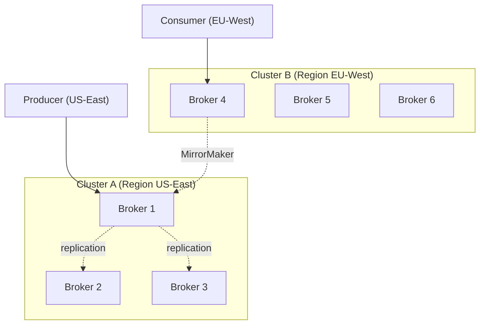

### 9.2 KRaft internals

 <a class='askgpt-btn' href='https://chatgpt.com/?prompt=Read%20this%20section%20of%20my%20encyclopedia%20and%20explain%20it%20in%20depth%20with%20concrete%20examples%2C%20the%20main%20trade-offs%2C%20and%20common%20pitfalls%20a%20practitioner%20should%20know%3A%0A%0Ahttps%3A%2F%2Fgithub.com%2Fvishvasg14%2Fsoftware-engineering-encyclopedia%2Fblob%2Fmain%2F06-messaging%2Fmessaging.md%2392-kraft-internals%0A%0ASection%20title%3A%209.2%20KRaft%20internals' target='_blank' rel='noopener' data-askgpt='9.2 KRaft internals' data-askgpt-url='https://github.com/vishvasg14/software-engineering-encyclopedia/blob/main/06-messaging/messaging.md#92-kraft-internals' data-askgpt-prompt-depth='Read%20this%20section%20of%20my%20encyclopedia%20and%20explain%20it%20in%20depth%20with%20concrete%20examples%2C%20the%20main%20trade-offs%2C%20and%20common%20pitfalls%20a%20practitioner%20should%20know%3A%0A%0Ahttps%3A%2F%2Fgithub.com%2Fvishvasg14%2Fsoftware-engineering-encyclopedia%2Fblob%2Fmain%2F06-messaging%2Fmessaging.md%2392-kraft-internals%0A%0ASection%20title%3A%209.2%20KRaft%20internals' data-askgpt-prompt-examples='Read%20this%20section%20of%20my%20encyclopedia%20and%20give%20me%202-3%20real-world%20production%20examples%20for%20it.%20For%20each%3A%20what%20went%20right%2C%20what%20went%20wrong%2C%20and%20the%20lessons%20learned.%20Include%20company%20%2F%20project%20names%20if%20relevant.%0A%0Ahttps%3A%2F%2Fgithub.com%2Fvishvasg14%2Fsoftware-engineering-encyclopedia%2Fblob%2Fmain%2F06-messaging%2Fmessaging.md%2392-kraft-internals%0A%0ASection%20title%3A%209.2%20KRaft%20internals' title='Ask ChatGPT about this section'>💬</a>
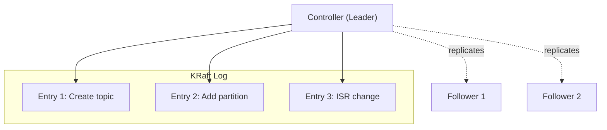

### 9.3 Log segment storage

 <a class='askgpt-btn' href='https://chatgpt.com/?prompt=Read%20this%20section%20of%20my%20encyclopedia%20and%20explain%20it%20in%20depth%20with%20concrete%20examples%2C%20the%20main%20trade-offs%2C%20and%20common%20pitfalls%20a%20practitioner%20should%20know%3A%0A%0Ahttps%3A%2F%2Fgithub.com%2Fvishvasg14%2Fsoftware-engineering-encyclopedia%2Fblob%2Fmain%2F06-messaging%2Fmessaging.md%2393-log-segment-storage%0A%0ASection%20title%3A%209.3%20Log%20segment%20storage' target='_blank' rel='noopener' data-askgpt='9.3 Log segment storage' data-askgpt-url='https://github.com/vishvasg14/software-engineering-encyclopedia/blob/main/06-messaging/messaging.md#93-log-segment-storage' data-askgpt-prompt-depth='Read%20this%20section%20of%20my%20encyclopedia%20and%20explain%20it%20in%20depth%20with%20concrete%20examples%2C%20the%20main%20trade-offs%2C%20and%20common%20pitfalls%20a%20practitioner%20should%20know%3A%0A%0Ahttps%3A%2F%2Fgithub.com%2Fvishvasg14%2Fsoftware-engineering-encyclopedia%2Fblob%2Fmain%2F06-messaging%2Fmessaging.md%2393-log-segment-storage%0A%0ASection%20title%3A%209.3%20Log%20segment%20storage' data-askgpt-prompt-examples='Read%20this%20section%20of%20my%20encyclopedia%20and%20give%20me%202-3%20real-world%20production%20examples%20for%20it.%20For%20each%3A%20what%20went%20right%2C%20what%20went%20wrong%2C%20and%20the%20lessons%20learned.%20Include%20company%20%2F%20project%20names%20if%20relevant.%0A%0Ahttps%3A%2F%2Fgithub.com%2Fvishvasg14%2Fsoftware-engineering-encyclopedia%2Fblob%2Fmain%2F06-messaging%2Fmessaging.md%2393-log-segment-storage%0A%0ASection%20title%3A%209.3%20Log%20segment%20storage' title='Ask ChatGPT about this section'>💬</a>
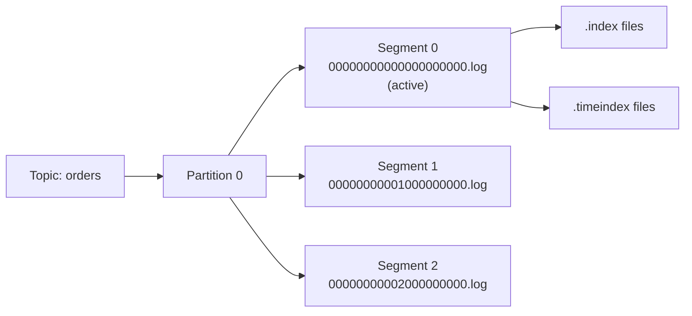

### 9.4 Producer → broker → consumer flow

 <a class='askgpt-btn' href='https://chatgpt.com/?prompt=Read%20this%20section%20of%20my%20encyclopedia%20and%20explain%20it%20in%20depth%20with%20concrete%20examples%2C%20the%20main%20trade-offs%2C%20and%20common%20pitfalls%20a%20practitioner%20should%20know%3A%0A%0Ahttps%3A%2F%2Fgithub.com%2Fvishvasg14%2Fsoftware-engineering-encyclopedia%2Fblob%2Fmain%2F06-messaging%2Fmessaging.md%2394-producer-broker-consumer-flow%0A%0ASection%20title%3A%209.4%20Producer%20%E2%86%92%20broker%20%E2%86%92%20consumer%20flow' target='_blank' rel='noopener' data-askgpt='9.4 Producer → broker → consumer flow' data-askgpt-url='https://github.com/vishvasg14/software-engineering-encyclopedia/blob/main/06-messaging/messaging.md#94-producer-broker-consumer-flow' data-askgpt-prompt-depth='Read%20this%20section%20of%20my%20encyclopedia%20and%20explain%20it%20in%20depth%20with%20concrete%20examples%2C%20the%20main%20trade-offs%2C%20and%20common%20pitfalls%20a%20practitioner%20should%20know%3A%0A%0Ahttps%3A%2F%2Fgithub.com%2Fvishvasg14%2Fsoftware-engineering-encyclopedia%2Fblob%2Fmain%2F06-messaging%2Fmessaging.md%2394-producer-broker-consumer-flow%0A%0ASection%20title%3A%209.4%20Producer%20%E2%86%92%20broker%20%E2%86%92%20consumer%20flow' data-askgpt-prompt-examples='Read%20this%20section%20of%20my%20encyclopedia%20and%20give%20me%202-3%20real-world%20production%20examples%20for%20it.%20For%20each%3A%20what%20went%20right%2C%20what%20went%20wrong%2C%20and%20the%20lessons%20learned.%20Include%20company%20%2F%20project%20names%20if%20relevant.%0A%0Ahttps%3A%2F%2Fgithub.com%2Fvishvasg14%2Fsoftware-engineering-encyclopedia%2Fblob%2Fmain%2F06-messaging%2Fmessaging.md%2394-producer-broker-consumer-flow%0A%0ASection%20title%3A%209.4%20Producer%20%E2%86%92%20broker%20%E2%86%92%20consumer%20flow' title='Ask ChatGPT about this section'>💬</a>
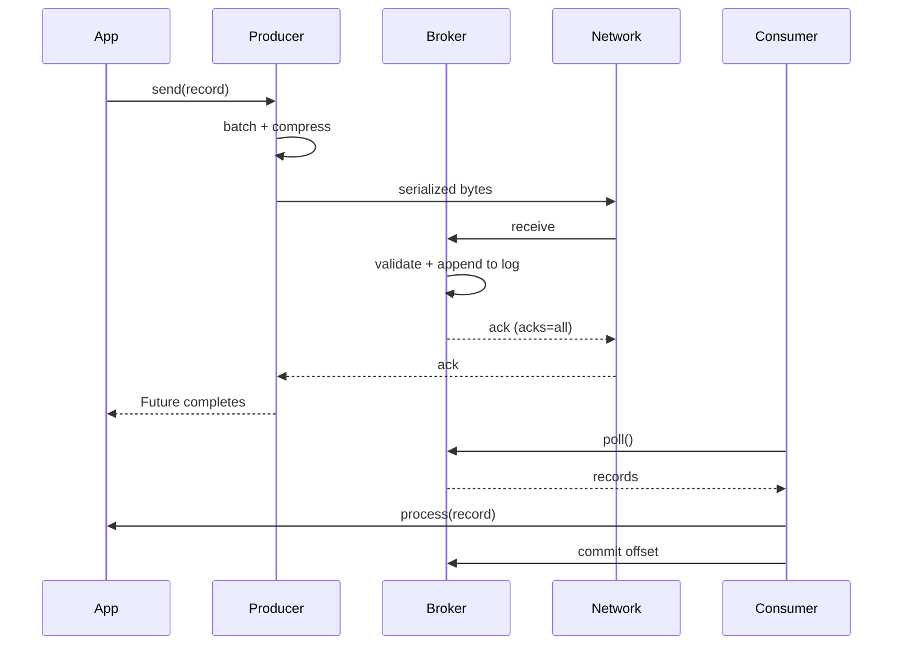

## 10. Performance

### 10.1 Producer performance

 <a class='askgpt-btn' href='https://chatgpt.com/?prompt=Read%20this%20section%20of%20my%20encyclopedia%20and%20explain%20it%20in%20depth%20with%20concrete%20examples%2C%20the%20main%20trade-offs%2C%20and%20common%20pitfalls%20a%20practitioner%20should%20know%3A%0A%0Ahttps%3A%2F%2Fgithub.com%2Fvishvasg14%2Fsoftware-engineering-encyclopedia%2Fblob%2Fmain%2F06-messaging%2Fmessaging.md%23101-producer-performance%0A%0ASection%20title%3A%2010.1%20Producer%20performance' target='_blank' rel='noopener' data-askgpt='10.1 Producer performance' data-askgpt-url='https://github.com/vishvasg14/software-engineering-encyclopedia/blob/main/06-messaging/messaging.md#101-producer-performance' data-askgpt-prompt-depth='Read%20this%20section%20of%20my%20encyclopedia%20and%20explain%20it%20in%20depth%20with%20concrete%20examples%2C%20the%20main%20trade-offs%2C%20and%20common%20pitfalls%20a%20practitioner%20should%20know%3A%0A%0Ahttps%3A%2F%2Fgithub.com%2Fvishvasg14%2Fsoftware-engineering-encyclopedia%2Fblob%2Fmain%2F06-messaging%2Fmessaging.md%23101-producer-performance%0A%0ASection%20title%3A%2010.1%20Producer%20performance' data-askgpt-prompt-examples='Read%20this%20section%20of%20my%20encyclopedia%20and%20give%20me%202-3%20real-world%20production%20examples%20for%20it.%20For%20each%3A%20what%20went%20right%2C%20what%20went%20wrong%2C%20and%20the%20lessons%20learned.%20Include%20company%20%2F%20project%20names%20if%20relevant.%0A%0Ahttps%3A%2F%2Fgithub.com%2Fvishvasg14%2Fsoftware-engineering-encyclopedia%2Fblob%2Fmain%2F06-messaging%2Fmessaging.md%23101-producer-performance%0A%0ASection%20title%3A%2010.1%20Producer%20performance' title='Ask ChatGPT about this section'>💬</a>
| Lever | Effect |
|-------|--------|
| Batching (`batch.size`, `linger.ms`) | Fewer requests, more bytes per request |
| Compression (`snappy`, `lz4`, `zstd`) | Less network, less disk |
| acks=`all` + idempotence | Safety; small latency cost |
| Page cache | OS keeps hot log segments in memory |
| Zero-copy (`sendfile()`) | Kafka uses sendfile to avoid copying through user space |

### 10.2 Consumer performance

 <a class='askgpt-btn' href='https://chatgpt.com/?prompt=Read%20this%20section%20of%20my%20encyclopedia%20and%20explain%20it%20in%20depth%20with%20concrete%20examples%2C%20the%20main%20trade-offs%2C%20and%20common%20pitfalls%20a%20practitioner%20should%20know%3A%0A%0Ahttps%3A%2F%2Fgithub.com%2Fvishvasg14%2Fsoftware-engineering-encyclopedia%2Fblob%2Fmain%2F06-messaging%2Fmessaging.md%23102-consumer-performance%0A%0ASection%20title%3A%2010.2%20Consumer%20performance' target='_blank' rel='noopener' data-askgpt='10.2 Consumer performance' data-askgpt-url='https://github.com/vishvasg14/software-engineering-encyclopedia/blob/main/06-messaging/messaging.md#102-consumer-performance' data-askgpt-prompt-depth='Read%20this%20section%20of%20my%20encyclopedia%20and%20explain%20it%20in%20depth%20with%20concrete%20examples%2C%20the%20main%20trade-offs%2C%20and%20common%20pitfalls%20a%20practitioner%20should%20know%3A%0A%0Ahttps%3A%2F%2Fgithub.com%2Fvishvasg14%2Fsoftware-engineering-encyclopedia%2Fblob%2Fmain%2F06-messaging%2Fmessaging.md%23102-consumer-performance%0A%0ASection%20title%3A%2010.2%20Consumer%20performance' data-askgpt-prompt-examples='Read%20this%20section%20of%20my%20encyclopedia%20and%20give%20me%202-3%20real-world%20production%20examples%20for%20it.%20For%20each%3A%20what%20went%20right%2C%20what%20went%20wrong%2C%20and%20the%20lessons%20learned.%20Include%20company%20%2F%20project%20names%20if%20relevant.%0A%0Ahttps%3A%2F%2Fgithub.com%2Fvishvasg14%2Fsoftware-engineering-encyclopedia%2Fblob%2Fmain%2F06-messaging%2Fmessaging.md%23102-consumer-performance%0A%0ASection%20title%3A%2010.2%20Consumer%20performance' title='Ask ChatGPT about this section'>💬</a>
| Lever | Effect |
|-------|--------|
| `fetch.min.bytes` | Wait for N bytes before responding |
| `fetch.max.wait.ms` | Max wait before responding |
| `max.partition.fetch.bytes` | Max bytes per partition |
| `max.poll.records` | Max records per poll |
| Manual commit (vs auto-commit) | Control over commit semantics |
| Parallel processing in handler | Multi-threaded handlers |

### 10.3 Broker performance

 <a class='askgpt-btn' href='https://chatgpt.com/?prompt=Read%20this%20section%20of%20my%20encyclopedia%20and%20explain%20it%20in%20depth%20with%20concrete%20examples%2C%20the%20main%20trade-offs%2C%20and%20common%20pitfalls%20a%20practitioner%20should%20know%3A%0A%0Ahttps%3A%2F%2Fgithub.com%2Fvishvasg14%2Fsoftware-engineering-encyclopedia%2Fblob%2Fmain%2F06-messaging%2Fmessaging.md%23103-broker-performance%0A%0ASection%20title%3A%2010.3%20Broker%20performance' target='_blank' rel='noopener' data-askgpt='10.3 Broker performance' data-askgpt-url='https://github.com/vishvasg14/software-engineering-encyclopedia/blob/main/06-messaging/messaging.md#103-broker-performance' data-askgpt-prompt-depth='Read%20this%20section%20of%20my%20encyclopedia%20and%20explain%20it%20in%20depth%20with%20concrete%20examples%2C%20the%20main%20trade-offs%2C%20and%20common%20pitfalls%20a%20practitioner%20should%20know%3A%0A%0Ahttps%3A%2F%2Fgithub.com%2Fvishvasg14%2Fsoftware-engineering-encyclopedia%2Fblob%2Fmain%2F06-messaging%2Fmessaging.md%23103-broker-performance%0A%0ASection%20title%3A%2010.3%20Broker%20performance' data-askgpt-prompt-examples='Read%20this%20section%20of%20my%20encyclopedia%20and%20give%20me%202-3%20real-world%20production%20examples%20for%20it.%20For%20each%3A%20what%20went%20right%2C%20what%20went%20wrong%2C%20and%20the%20lessons%20learned.%20Include%20company%20%2F%20project%20names%20if%20relevant.%0A%0Ahttps%3A%2F%2Fgithub.com%2Fvishvasg14%2Fsoftware-engineering-encyclopedia%2Fblob%2Fmain%2F06-messaging%2Fmessaging.md%23103-broker-performance%0A%0ASection%20title%3A%2010.3%20Broker%20performance' title='Ask ChatGPT about this section'>💬</a>
| Lever | Effect |
|-------|--------|
| Disk type (SSD vs HDD) | SSD gives 10×+ improvement |
| Page cache size | OS caches hot data; more RAM = better |
| `num.network.threads` | Network processing threads |
| `num.io.threads` | Disk I/O threads |
| `log.flush.interval.messages` | fsync frequency |
| `log.segment.bytes` | Segment size (default 1 GB) |

### 10.4 Partition sizing

 <a class='askgpt-btn' href='https://chatgpt.com/?prompt=Read%20this%20section%20of%20my%20encyclopedia%20and%20explain%20it%20in%20depth%20with%20concrete%20examples%2C%20the%20main%20trade-offs%2C%20and%20common%20pitfalls%20a%20practitioner%20should%20know%3A%0A%0Ahttps%3A%2F%2Fgithub.com%2Fvishvasg14%2Fsoftware-engineering-encyclopedia%2Fblob%2Fmain%2F06-messaging%2Fmessaging.md%23104-partition-sizing%0A%0ASection%20title%3A%2010.4%20Partition%20sizing' target='_blank' rel='noopener' data-askgpt='10.4 Partition sizing' data-askgpt-url='https://github.com/vishvasg14/software-engineering-encyclopedia/blob/main/06-messaging/messaging.md#104-partition-sizing' data-askgpt-prompt-depth='Read%20this%20section%20of%20my%20encyclopedia%20and%20explain%20it%20in%20depth%20with%20concrete%20examples%2C%20the%20main%20trade-offs%2C%20and%20common%20pitfalls%20a%20practitioner%20should%20know%3A%0A%0Ahttps%3A%2F%2Fgithub.com%2Fvishvasg14%2Fsoftware-engineering-encyclopedia%2Fblob%2Fmain%2F06-messaging%2Fmessaging.md%23104-partition-sizing%0A%0ASection%20title%3A%2010.4%20Partition%20sizing' data-askgpt-prompt-examples='Read%20this%20section%20of%20my%20encyclopedia%20and%20give%20me%202-3%20real-world%20production%20examples%20for%20it.%20For%20each%3A%20what%20went%20right%2C%20what%20went%20wrong%2C%20and%20the%20lessons%20learned.%20Include%20company%20%2F%20project%20names%20if%20relevant.%0A%0Ahttps%3A%2F%2Fgithub.com%2Fvishvasg14%2Fsoftware-engineering-encyclopedia%2Fblob%2Fmain%2F06-messaging%2Fmessaging.md%23104-partition-sizing%0A%0ASection%20title%3A%2010.4%20Partition%20sizing' title='Ask ChatGPT about this section'>💬</a>
Rule of thumb: **target 1000-3000 partitions per broker**. Beyond that, controller overhead grows.

For a topic:
- Number of partitions = max(consumer parallelism, target throughput / per-partition throughput).
- Per-partition throughput ~10 MB/s in production.

### 10.5 Replication factor

 <a class='askgpt-btn' href='https://chatgpt.com/?prompt=Read%20this%20section%20of%20my%20encyclopedia%20and%20explain%20it%20in%20depth%20with%20concrete%20examples%2C%20the%20main%20trade-offs%2C%20and%20common%20pitfalls%20a%20practitioner%20should%20know%3A%0A%0Ahttps%3A%2F%2Fgithub.com%2Fvishvasg14%2Fsoftware-engineering-encyclopedia%2Fblob%2Fmain%2F06-messaging%2Fmessaging.md%23105-replication-factor%0A%0ASection%20title%3A%2010.5%20Replication%20factor' target='_blank' rel='noopener' data-askgpt='10.5 Replication factor' data-askgpt-url='https://github.com/vishvasg14/software-engineering-encyclopedia/blob/main/06-messaging/messaging.md#105-replication-factor' data-askgpt-prompt-depth='Read%20this%20section%20of%20my%20encyclopedia%20and%20explain%20it%20in%20depth%20with%20concrete%20examples%2C%20the%20main%20trade-offs%2C%20and%20common%20pitfalls%20a%20practitioner%20should%20know%3A%0A%0Ahttps%3A%2F%2Fgithub.com%2Fvishvasg14%2Fsoftware-engineering-encyclopedia%2Fblob%2Fmain%2F06-messaging%2Fmessaging.md%23105-replication-factor%0A%0ASection%20title%3A%2010.5%20Replication%20factor' data-askgpt-prompt-examples='Read%20this%20section%20of%20my%20encyclopedia%20and%20give%20me%202-3%20real-world%20production%20examples%20for%20it.%20For%20each%3A%20what%20went%20right%2C%20what%20went%20wrong%2C%20and%20the%20lessons%20learned.%20Include%20company%20%2F%20project%20names%20if%20relevant.%0A%0Ahttps%3A%2F%2Fgithub.com%2Fvishvasg14%2Fsoftware-engineering-encyclopedia%2Fblob%2Fmain%2F06-messaging%2Fmessaging.md%23105-replication-factor%0A%0ASection%20title%3A%2010.5%20Replication%20factor' title='Ask ChatGPT about this section'>💬</a>
- **Production:** `replication.factor=3`.
- **Critical topics:** `replication.factor=5` or use `min.insync.replicas=2` with `replication.factor=3`.
- **Single broker dev:** `replication.factor=1`.

## 11. Security

### 11.1 OWASP relevance

 <a class='askgpt-btn' href='https://chatgpt.com/?prompt=Read%20this%20section%20of%20my%20encyclopedia%20and%20explain%20it%20in%20depth%20with%20concrete%20examples%2C%20the%20main%20trade-offs%2C%20and%20common%20pitfalls%20a%20practitioner%20should%20know%3A%0A%0Ahttps%3A%2F%2Fgithub.com%2Fvishvasg14%2Fsoftware-engineering-encyclopedia%2Fblob%2Fmain%2F06-messaging%2Fmessaging.md%23111-owasp-relevance%0A%0ASection%20title%3A%2011.1%20OWASP%20relevance' target='_blank' rel='noopener' data-askgpt='11.1 OWASP relevance' data-askgpt-url='https://github.com/vishvasg14/software-engineering-encyclopedia/blob/main/06-messaging/messaging.md#111-owasp-relevance' data-askgpt-prompt-depth='Read%20this%20section%20of%20my%20encyclopedia%20and%20explain%20it%20in%20depth%20with%20concrete%20examples%2C%20the%20main%20trade-offs%2C%20and%20common%20pitfalls%20a%20practitioner%20should%20know%3A%0A%0Ahttps%3A%2F%2Fgithub.com%2Fvishvasg14%2Fsoftware-engineering-encyclopedia%2Fblob%2Fmain%2F06-messaging%2Fmessaging.md%23111-owasp-relevance%0A%0ASection%20title%3A%2011.1%20OWASP%20relevance' data-askgpt-prompt-examples='Read%20this%20section%20of%20my%20encyclopedia%20and%20give%20me%202-3%20real-world%20production%20examples%20for%20it.%20For%20each%3A%20what%20went%20right%2C%20what%20went%20wrong%2C%20and%20the%20lessons%20learned.%20Include%20company%20%2F%20project%20names%20if%20relevant.%0A%0Ahttps%3A%2F%2Fgithub.com%2Fvishvasg14%2Fsoftware-engineering-encyclopedia%2Fblob%2Fmain%2F06-messaging%2Fmessaging.md%23111-owasp-relevance%0A%0ASection%20title%3A%2011.1%20OWASP%20relevance' title='Ask ChatGPT about this section'>💬</a>
- **A01 Broken Access Control** — Kafka ACLs.
- **A02 Cryptographic Failures** — TLS encryption in transit.
- **A05 Security Misconfiguration** — TLS + SASL + ACLs configured.
- **A07 Authentication Failures** — SASL mechanisms.
- **A09 Logging Failures** — audit logging via Auditbeat or custom.

### 11.2 Encryption

 <a class='askgpt-btn' href='https://chatgpt.com/?prompt=Read%20this%20section%20of%20my%20encyclopedia%20and%20explain%20it%20in%20depth%20with%20concrete%20examples%2C%20the%20main%20trade-offs%2C%20and%20common%20pitfalls%20a%20practitioner%20should%20know%3A%0A%0Ahttps%3A%2F%2Fgithub.com%2Fvishvasg14%2Fsoftware-engineering-encyclopedia%2Fblob%2Fmain%2F06-messaging%2Fmessaging.md%23112-encryption%0A%0ASection%20title%3A%2011.2%20Encryption' target='_blank' rel='noopener' data-askgpt='11.2 Encryption' data-askgpt-url='https://github.com/vishvasg14/software-engineering-encyclopedia/blob/main/06-messaging/messaging.md#112-encryption' data-askgpt-prompt-depth='Read%20this%20section%20of%20my%20encyclopedia%20and%20explain%20it%20in%20depth%20with%20concrete%20examples%2C%20the%20main%20trade-offs%2C%20and%20common%20pitfalls%20a%20practitioner%20should%20know%3A%0A%0Ahttps%3A%2F%2Fgithub.com%2Fvishvasg14%2Fsoftware-engineering-encyclopedia%2Fblob%2Fmain%2F06-messaging%2Fmessaging.md%23112-encryption%0A%0ASection%20title%3A%2011.2%20Encryption' data-askgpt-prompt-examples='Read%20this%20section%20of%20my%20encyclopedia%20and%20give%20me%202-3%20real-world%20production%20examples%20for%20it.%20For%20each%3A%20what%20went%20right%2C%20what%20went%20wrong%2C%20and%20the%20lessons%20learned.%20Include%20company%20%2F%20project%20names%20if%20relevant.%0A%0Ahttps%3A%2F%2Fgithub.com%2Fvishvasg14%2Fsoftware-engineering-encyclopedia%2Fblob%2Fmain%2F06-messaging%2Fmessaging.md%23112-encryption%0A%0ASection%20title%3A%2011.2%20Encryption' title='Ask ChatGPT about this section'>💬</a>
- **In transit:** TLS for client-broker and inter-broker (`ssl.*` configs).
- **At rest:** Disk-level encryption (LUKS, AWS EBS encryption) — Kafka doesn't have built-in message encryption.

### 11.3 Authentication

 <a class='askgpt-btn' href='https://chatgpt.com/?prompt=Read%20this%20section%20of%20my%20encyclopedia%20and%20explain%20it%20in%20depth%20with%20concrete%20examples%2C%20the%20main%20trade-offs%2C%20and%20common%20pitfalls%20a%20practitioner%20should%20know%3A%0A%0Ahttps%3A%2F%2Fgithub.com%2Fvishvasg14%2Fsoftware-engineering-encyclopedia%2Fblob%2Fmain%2F06-messaging%2Fmessaging.md%23113-authentication%0A%0ASection%20title%3A%2011.3%20Authentication' target='_blank' rel='noopener' data-askgpt='11.3 Authentication' data-askgpt-url='https://github.com/vishvasg14/software-engineering-encyclopedia/blob/main/06-messaging/messaging.md#113-authentication' data-askgpt-prompt-depth='Read%20this%20section%20of%20my%20encyclopedia%20and%20explain%20it%20in%20depth%20with%20concrete%20examples%2C%20the%20main%20trade-offs%2C%20and%20common%20pitfalls%20a%20practitioner%20should%20know%3A%0A%0Ahttps%3A%2F%2Fgithub.com%2Fvishvasg14%2Fsoftware-engineering-encyclopedia%2Fblob%2Fmain%2F06-messaging%2Fmessaging.md%23113-authentication%0A%0ASection%20title%3A%2011.3%20Authentication' data-askgpt-prompt-examples='Read%20this%20section%20of%20my%20encyclopedia%20and%20give%20me%202-3%20real-world%20production%20examples%20for%20it.%20For%20each%3A%20what%20went%20right%2C%20what%20went%20wrong%2C%20and%20the%20lessons%20learned.%20Include%20company%20%2F%20project%20names%20if%20relevant.%0A%0Ahttps%3A%2F%2Fgithub.com%2Fvishvasg14%2Fsoftware-engineering-encyclopedia%2Fblob%2Fmain%2F06-messaging%2Fmessaging.md%23113-authentication%0A%0ASection%20title%3A%2011.3%20Authentication' title='Ask ChatGPT about this section'>💬</a>
- **SASL/PLAIN** — username/password (simple, requires TLS).
- **SASL/SCRAM** — salted challenge-response (default in modern Kafka).
- **SASL/GSSAPI (Kerberos)** — enterprise SSO.
- **mTLS** — client certificates (broker-level).

### 11.4 Authorization (ACLs)

 <a class='askgpt-btn' href='https://chatgpt.com/?prompt=Read%20this%20section%20of%20my%20encyclopedia%20and%20explain%20it%20in%20depth%20with%20concrete%20examples%2C%20the%20main%20trade-offs%2C%20and%20common%20pitfalls%20a%20practitioner%20should%20know%3A%0A%0Ahttps%3A%2F%2Fgithub.com%2Fvishvasg14%2Fsoftware-engineering-encyclopedia%2Fblob%2Fmain%2F06-messaging%2Fmessaging.md%23114-authorization-acls%0A%0ASection%20title%3A%2011.4%20Authorization%20(ACLs)' target='_blank' rel='noopener' data-askgpt='11.4 Authorization (ACLs)' data-askgpt-url='https://github.com/vishvasg14/software-engineering-encyclopedia/blob/main/06-messaging/messaging.md#114-authorization-acls' data-askgpt-prompt-depth='Read%20this%20section%20of%20my%20encyclopedia%20and%20explain%20it%20in%20depth%20with%20concrete%20examples%2C%20the%20main%20trade-offs%2C%20and%20common%20pitfalls%20a%20practitioner%20should%20know%3A%0A%0Ahttps%3A%2F%2Fgithub.com%2Fvishvasg14%2Fsoftware-engineering-encyclopedia%2Fblob%2Fmain%2F06-messaging%2Fmessaging.md%23114-authorization-acls%0A%0ASection%20title%3A%2011.4%20Authorization%20(ACLs)' data-askgpt-prompt-examples='Read%20this%20section%20of%20my%20encyclopedia%20and%20give%20me%202-3%20real-world%20production%20examples%20for%20it.%20For%20each%3A%20what%20went%20right%2C%20what%20went%20wrong%2C%20and%20the%20lessons%20learned.%20Include%20company%20%2F%20project%20names%20if%20relevant.%0A%0Ahttps%3A%2F%2Fgithub.com%2Fvishvasg14%2Fsoftware-engineering-encyclopedia%2Fblob%2Fmain%2F06-messaging%2Fmessaging.md%23114-authorization-acls%0A%0ASection%20title%3A%2011.4%20Authorization%20(ACLs)' title='Ask ChatGPT about this section'>💬</a>
Kafka ACLs control who can read/write/admin each topic:

```bash
kafka-acls --authorizer-properties zookeeper.connect=localhost:2181 \
    --add --allow-principal User:alice --operation Read --topic orders
```

Operations: Read, Write, Create, Delete, Alter, Describe, ClusterAction, All.

### 11.5 Schema security

 <a class='askgpt-btn' href='https://chatgpt.com/?prompt=Read%20this%20section%20of%20my%20encyclopedia%20and%20explain%20it%20in%20depth%20with%20concrete%20examples%2C%20the%20main%20trade-offs%2C%20and%20common%20pitfalls%20a%20practitioner%20should%20know%3A%0A%0Ahttps%3A%2F%2Fgithub.com%2Fvishvasg14%2Fsoftware-engineering-encyclopedia%2Fblob%2Fmain%2F06-messaging%2Fmessaging.md%23115-schema-security%0A%0ASection%20title%3A%2011.5%20Schema%20security' target='_blank' rel='noopener' data-askgpt='11.5 Schema security' data-askgpt-url='https://github.com/vishvasg14/software-engineering-encyclopedia/blob/main/06-messaging/messaging.md#115-schema-security' data-askgpt-prompt-depth='Read%20this%20section%20of%20my%20encyclopedia%20and%20explain%20it%20in%20depth%20with%20concrete%20examples%2C%20the%20main%20trade-offs%2C%20and%20common%20pitfalls%20a%20practitioner%20should%20know%3A%0A%0Ahttps%3A%2F%2Fgithub.com%2Fvishvasg14%2Fsoftware-engineering-encyclopedia%2Fblob%2Fmain%2F06-messaging%2Fmessaging.md%23115-schema-security%0A%0ASection%20title%3A%2011.5%20Schema%20security' data-askgpt-prompt-examples='Read%20this%20section%20of%20my%20encyclopedia%20and%20give%20me%202-3%20real-world%20production%20examples%20for%20it.%20For%20each%3A%20what%20went%20right%2C%20what%20went%20wrong%2C%20and%20the%20lessons%20learned.%20Include%20company%20%2F%20project%20names%20if%20relevant.%0A%0Ahttps%3A%2F%2Fgithub.com%2Fvishvasg14%2Fsoftware-engineering-encyclopedia%2Fblob%2Fmain%2F06-messaging%2Fmessaging.md%23115-schema-security%0A%0ASection%20title%3A%2011.5%20Schema%20security' title='Ask ChatGPT about this section'>💬</a>
- Use Schema Registry for Avro/Protobuf/JSON-Schema.
- Enforce compatibility (BACKWARD, FORWARD, FULL).
- Use ACLs to restrict schema modifications.

### 11.6 Secure configuration checklist

 <a class='askgpt-btn' href='https://chatgpt.com/?prompt=Read%20this%20section%20of%20my%20encyclopedia%20and%20explain%20it%20in%20depth%20with%20concrete%20examples%2C%20the%20main%20trade-offs%2C%20and%20common%20pitfalls%20a%20practitioner%20should%20know%3A%0A%0Ahttps%3A%2F%2Fgithub.com%2Fvishvasg14%2Fsoftware-engineering-encyclopedia%2Fblob%2Fmain%2F06-messaging%2Fmessaging.md%23116-secure-configuration-checklist%0A%0ASection%20title%3A%2011.6%20Secure%20configuration%20checklist' target='_blank' rel='noopener' data-askgpt='11.6 Secure configuration checklist' data-askgpt-url='https://github.com/vishvasg14/software-engineering-encyclopedia/blob/main/06-messaging/messaging.md#116-secure-configuration-checklist' data-askgpt-prompt-depth='Read%20this%20section%20of%20my%20encyclopedia%20and%20explain%20it%20in%20depth%20with%20concrete%20examples%2C%20the%20main%20trade-offs%2C%20and%20common%20pitfalls%20a%20practitioner%20should%20know%3A%0A%0Ahttps%3A%2F%2Fgithub.com%2Fvishvasg14%2Fsoftware-engineering-encyclopedia%2Fblob%2Fmain%2F06-messaging%2Fmessaging.md%23116-secure-configuration-checklist%0A%0ASection%20title%3A%2011.6%20Secure%20configuration%20checklist' data-askgpt-prompt-examples='Read%20this%20section%20of%20my%20encyclopedia%20and%20give%20me%202-3%20real-world%20production%20examples%20for%20it.%20For%20each%3A%20what%20went%20right%2C%20what%20went%20wrong%2C%20and%20the%20lessons%20learned.%20Include%20company%20%2F%20project%20names%20if%20relevant.%0A%0Ahttps%3A%2F%2Fgithub.com%2Fvishvasg14%2Fsoftware-engineering-encyclopedia%2Fblob%2Fmain%2F06-messaging%2Fmessaging.md%23116-secure-configuration-checklist%0A%0ASection%20title%3A%2011.6%20Secure%20configuration%20checklist' title='Ask ChatGPT about this section'>💬</a>
- [ ] TLS enabled for client-broker and inter-broker.
- [ ] SASL/SCRAM or mTLS for authentication.
- [ ] ACLs configured per topic.
- [ ] `unauthorized.connections.enable.metrics=true`.
- [ ] Disk encryption at rest.
- [ ] Secrets in environment variables, not source.
- [ ] Schema Registry access restricted.
- [ ] Audit logging enabled.

## 12. Production Engineering

### 12.1 How Kafka is used in production

 <a class='askgpt-btn' href='https://chatgpt.com/?prompt=Read%20this%20section%20of%20my%20encyclopedia%20and%20explain%20it%20in%20depth%20with%20concrete%20examples%2C%20the%20main%20trade-offs%2C%20and%20common%20pitfalls%20a%20practitioner%20should%20know%3A%0A%0Ahttps%3A%2F%2Fgithub.com%2Fvishvasg14%2Fsoftware-engineering-encyclopedia%2Fblob%2Fmain%2F06-messaging%2Fmessaging.md%23121-how-kafka-is-used-in-production%0A%0ASection%20title%3A%2012.1%20How%20Kafka%20is%20used%20in%20production' target='_blank' rel='noopener' data-askgpt='12.1 How Kafka is used in production' data-askgpt-url='https://github.com/vishvasg14/software-engineering-encyclopedia/blob/main/06-messaging/messaging.md#121-how-kafka-is-used-in-production' data-askgpt-prompt-depth='Read%20this%20section%20of%20my%20encyclopedia%20and%20explain%20it%20in%20depth%20with%20concrete%20examples%2C%20the%20main%20trade-offs%2C%20and%20common%20pitfalls%20a%20practitioner%20should%20know%3A%0A%0Ahttps%3A%2F%2Fgithub.com%2Fvishvasg14%2Fsoftware-engineering-encyclopedia%2Fblob%2Fmain%2F06-messaging%2Fmessaging.md%23121-how-kafka-is-used-in-production%0A%0ASection%20title%3A%2012.1%20How%20Kafka%20is%20used%20in%20production' data-askgpt-prompt-examples='Read%20this%20section%20of%20my%20encyclopedia%20and%20give%20me%202-3%20real-world%20production%20examples%20for%20it.%20For%20each%3A%20what%20went%20right%2C%20what%20went%20wrong%2C%20and%20the%20lessons%20learned.%20Include%20company%20%2F%20project%20names%20if%20relevant.%0A%0Ahttps%3A%2F%2Fgithub.com%2Fvishvasg14%2Fsoftware-engineering-encyclopedia%2Fblob%2Fmain%2F06-messaging%2Fmessaging.md%23121-how-kafka-is-used-in-production%0A%0ASection%20title%3A%2012.1%20How%20Kafka%20is%20used%20in%20production' title='Ask ChatGPT about this section'>💬</a>
- **Log aggregation** (Splunk, ELK, Datadog alternatives).
- **Event sourcing** (microservices state).
- **Stream processing** (Kafka Streams, ksqlDB, Flink).
- **CDC pipeline** (Debezium → Kafka → downstream).
- **Message queue** (request-reply, work queues).
- **Real-time analytics** (ClickHouse, Druid, Pinot ingestion).

### 12.2 Real architecture

 <a class='askgpt-btn' href='https://chatgpt.com/?prompt=Read%20this%20section%20of%20my%20encyclopedia%20and%20explain%20it%20in%20depth%20with%20concrete%20examples%2C%20the%20main%20trade-offs%2C%20and%20common%20pitfalls%20a%20practitioner%20should%20know%3A%0A%0Ahttps%3A%2F%2Fgithub.com%2Fvishvasg14%2Fsoftware-engineering-encyclopedia%2Fblob%2Fmain%2F06-messaging%2Fmessaging.md%23122-real-architecture%0A%0ASection%20title%3A%2012.2%20Real%20architecture' target='_blank' rel='noopener' data-askgpt='12.2 Real architecture' data-askgpt-url='https://github.com/vishvasg14/software-engineering-encyclopedia/blob/main/06-messaging/messaging.md#122-real-architecture' data-askgpt-prompt-depth='Read%20this%20section%20of%20my%20encyclopedia%20and%20explain%20it%20in%20depth%20with%20concrete%20examples%2C%20the%20main%20trade-offs%2C%20and%20common%20pitfalls%20a%20practitioner%20should%20know%3A%0A%0Ahttps%3A%2F%2Fgithub.com%2Fvishvasg14%2Fsoftware-engineering-encyclopedia%2Fblob%2Fmain%2F06-messaging%2Fmessaging.md%23122-real-architecture%0A%0ASection%20title%3A%2012.2%20Real%20architecture' data-askgpt-prompt-examples='Read%20this%20section%20of%20my%20encyclopedia%20and%20give%20me%202-3%20real-world%20production%20examples%20for%20it.%20For%20each%3A%20what%20went%20right%2C%20what%20went%20wrong%2C%20and%20the%20lessons%20learned.%20Include%20company%20%2F%20project%20names%20if%20relevant.%0A%0Ahttps%3A%2F%2Fgithub.com%2Fvishvasg14%2Fsoftware-engineering-encyclopedia%2Fblob%2Fmain%2F06-messaging%2Fmessaging.md%23122-real-architecture%0A%0ASection%20title%3A%2012.2%20Real%20architecture' title='Ask ChatGPT about this section'>💬</a>
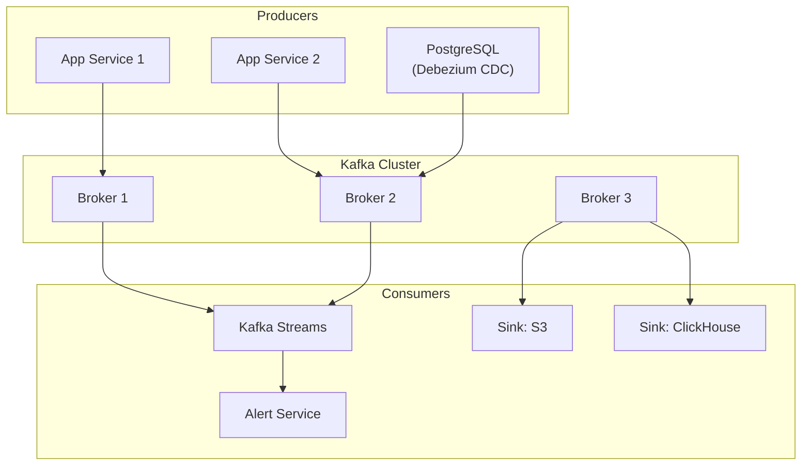

### 12.3 Production configuration

 <a class='askgpt-btn' href='https://chatgpt.com/?prompt=Read%20this%20section%20of%20my%20encyclopedia%20and%20explain%20it%20in%20depth%20with%20concrete%20examples%2C%20the%20main%20trade-offs%2C%20and%20common%20pitfalls%20a%20practitioner%20should%20know%3A%0A%0Ahttps%3A%2F%2Fgithub.com%2Fvishvasg14%2Fsoftware-engineering-encyclopedia%2Fblob%2Fmain%2F06-messaging%2Fmessaging.md%23123-production-configuration%0A%0ASection%20title%3A%2012.3%20Production%20configuration' target='_blank' rel='noopener' data-askgpt='12.3 Production configuration' data-askgpt-url='https://github.com/vishvasg14/software-engineering-encyclopedia/blob/main/06-messaging/messaging.md#123-production-configuration' data-askgpt-prompt-depth='Read%20this%20section%20of%20my%20encyclopedia%20and%20explain%20it%20in%20depth%20with%20concrete%20examples%2C%20the%20main%20trade-offs%2C%20and%20common%20pitfalls%20a%20practitioner%20should%20know%3A%0A%0Ahttps%3A%2F%2Fgithub.com%2Fvishvasg14%2Fsoftware-engineering-encyclopedia%2Fblob%2Fmain%2F06-messaging%2Fmessaging.md%23123-production-configuration%0A%0ASection%20title%3A%2012.3%20Production%20configuration' data-askgpt-prompt-examples='Read%20this%20section%20of%20my%20encyclopedia%20and%20give%20me%202-3%20real-world%20production%20examples%20for%20it.%20For%20each%3A%20what%20went%20right%2C%20what%20went%20wrong%2C%20and%20the%20lessons%20learned.%20Include%20company%20%2F%20project%20names%20if%20relevant.%0A%0Ahttps%3A%2F%2Fgithub.com%2Fvishvasg14%2Fsoftware-engineering-encyclopedia%2Fblob%2Fmain%2F06-messaging%2Fmessaging.md%23123-production-configuration%0A%0ASection%20title%3A%2012.3%20Production%20configuration' title='Ask ChatGPT about this section'>💬</a>
`server.properties` essentials:

```properties
# Replication
default.replication.factor=3
min.insync.replicas=2
offsets.topic.replication.factor=3
transaction.state.log.replication.factor=3

# KRaft (Kafka 3.3+)
process.roles=broker,controller
node.id=1
controller.quorum.voters=1@host1:9093,2@host2:9093,3@host3:9093
listeners=PLAINTEXT://:9092,CONTROLLER://:9093
inter.broker.listener.name=PLAINTEXT
controller.listener.names=CONTROLLER

# Performance
num.network.threads=8
num.io.threads=16
log.flush.interval.messages=10000
log.retention.hours=168
```

### 12.4 Production monitoring

 <a class='askgpt-btn' href='https://chatgpt.com/?prompt=Read%20this%20section%20of%20my%20encyclopedia%20and%20explain%20it%20in%20depth%20with%20concrete%20examples%2C%20the%20main%20trade-offs%2C%20and%20common%20pitfalls%20a%20practitioner%20should%20know%3A%0A%0Ahttps%3A%2F%2Fgithub.com%2Fvishvasg14%2Fsoftware-engineering-encyclopedia%2Fblob%2Fmain%2F06-messaging%2Fmessaging.md%23124-production-monitoring%0A%0ASection%20title%3A%2012.4%20Production%20monitoring' target='_blank' rel='noopener' data-askgpt='12.4 Production monitoring' data-askgpt-url='https://github.com/vishvasg14/software-engineering-encyclopedia/blob/main/06-messaging/messaging.md#124-production-monitoring' data-askgpt-prompt-depth='Read%20this%20section%20of%20my%20encyclopedia%20and%20explain%20it%20in%20depth%20with%20concrete%20examples%2C%20the%20main%20trade-offs%2C%20and%20common%20pitfalls%20a%20practitioner%20should%20know%3A%0A%0Ahttps%3A%2F%2Fgithub.com%2Fvishvasg14%2Fsoftware-engineering-encyclopedia%2Fblob%2Fmain%2F06-messaging%2Fmessaging.md%23124-production-monitoring%0A%0ASection%20title%3A%2012.4%20Production%20monitoring' data-askgpt-prompt-examples='Read%20this%20section%20of%20my%20encyclopedia%20and%20give%20me%202-3%20real-world%20production%20examples%20for%20it.%20For%20each%3A%20what%20went%20right%2C%20what%20went%20wrong%2C%20and%20the%20lessons%20learned.%20Include%20company%20%2F%20project%20names%20if%20relevant.%0A%0Ahttps%3A%2F%2Fgithub.com%2Fvishvasg14%2Fsoftware-engineering-encyclopedia%2Fblob%2Fmain%2F06-messaging%2Fmessaging.md%23124-production-monitoring%0A%0ASection%20title%3A%2012.4%20Production%20monitoring' title='Ask ChatGPT about this section'>💬</a>
- **JMX metrics** — built-in.
- **Prometheus Kafka Exporter** — exposes broker, consumer, producer metrics.
- **Burrow** (LinkedIn) — consumer lag monitoring.
- **Cruise Control** (LinkedIn) — automated rebalancing and self-healing.
- **Datadog, New Relic, Dynatrace** — commercial.

### 12.5 Production debugging

 <a class='askgpt-btn' href='https://chatgpt.com/?prompt=Read%20this%20section%20of%20my%20encyclopedia%20and%20explain%20it%20in%20depth%20with%20concrete%20examples%2C%20the%20main%20trade-offs%2C%20and%20common%20pitfalls%20a%20practitioner%20should%20know%3A%0A%0Ahttps%3A%2F%2Fgithub.com%2Fvishvasg14%2Fsoftware-engineering-encyclopedia%2Fblob%2Fmain%2F06-messaging%2Fmessaging.md%23125-production-debugging%0A%0ASection%20title%3A%2012.5%20Production%20debugging' target='_blank' rel='noopener' data-askgpt='12.5 Production debugging' data-askgpt-url='https://github.com/vishvasg14/software-engineering-encyclopedia/blob/main/06-messaging/messaging.md#125-production-debugging' data-askgpt-prompt-depth='Read%20this%20section%20of%20my%20encyclopedia%20and%20explain%20it%20in%20depth%20with%20concrete%20examples%2C%20the%20main%20trade-offs%2C%20and%20common%20pitfalls%20a%20practitioner%20should%20know%3A%0A%0Ahttps%3A%2F%2Fgithub.com%2Fvishvasg14%2Fsoftware-engineering-encyclopedia%2Fblob%2Fmain%2F06-messaging%2Fmessaging.md%23125-production-debugging%0A%0ASection%20title%3A%2012.5%20Production%20debugging' data-askgpt-prompt-examples='Read%20this%20section%20of%20my%20encyclopedia%20and%20give%20me%202-3%20real-world%20production%20examples%20for%20it.%20For%20each%3A%20what%20went%20right%2C%20what%20went%20wrong%2C%20and%20the%20lessons%20learned.%20Include%20company%20%2F%20project%20names%20if%20relevant.%0A%0Ahttps%3A%2F%2Fgithub.com%2Fvishvasg14%2Fsoftware-engineering-encyclopedia%2Fblob%2Fmain%2F06-messaging%2Fmessaging.md%23125-production-debugging%0A%0ASection%20title%3A%2012.5%20Production%20debugging' title='Ask ChatGPT about this section'>💬</a>
- `kafka-consumer-groups.sh --describe` — consumer lag.
- `kafka-log-dirs.sh` — log directory sizes.
- `kafka-configs.sh` — dynamic configuration.
- `kafka-topics.sh --describe` — topic/partitions/replicas.
- JMX via JConsole or VisualVM.
- Broker logs.

### 12.6 Scaling

 <a class='askgpt-btn' href='https://chatgpt.com/?prompt=Read%20this%20section%20of%20my%20encyclopedia%20and%20explain%20it%20in%20depth%20with%20concrete%20examples%2C%20the%20main%20trade-offs%2C%20and%20common%20pitfalls%20a%20practitioner%20should%20know%3A%0A%0Ahttps%3A%2F%2Fgithub.com%2Fvishvasg14%2Fsoftware-engineering-encyclopedia%2Fblob%2Fmain%2F06-messaging%2Fmessaging.md%23126-scaling%0A%0ASection%20title%3A%2012.6%20Scaling' target='_blank' rel='noopener' data-askgpt='12.6 Scaling' data-askgpt-url='https://github.com/vishvasg14/software-engineering-encyclopedia/blob/main/06-messaging/messaging.md#126-scaling' data-askgpt-prompt-depth='Read%20this%20section%20of%20my%20encyclopedia%20and%20explain%20it%20in%20depth%20with%20concrete%20examples%2C%20the%20main%20trade-offs%2C%20and%20common%20pitfalls%20a%20practitioner%20should%20know%3A%0A%0Ahttps%3A%2F%2Fgithub.com%2Fvishvasg14%2Fsoftware-engineering-encyclopedia%2Fblob%2Fmain%2F06-messaging%2Fmessaging.md%23126-scaling%0A%0ASection%20title%3A%2012.6%20Scaling' data-askgpt-prompt-examples='Read%20this%20section%20of%20my%20encyclopedia%20and%20give%20me%202-3%20real-world%20production%20examples%20for%20it.%20For%20each%3A%20what%20went%20right%2C%20what%20went%20wrong%2C%20and%20the%20lessons%20learned.%20Include%20company%20%2F%20project%20names%20if%20relevant.%0A%0Ahttps%3A%2F%2Fgithub.com%2Fvishvasg14%2Fsoftware-engineering-encyclopedia%2Fblob%2Fmain%2F06-messaging%2Fmessaging.md%23126-scaling%0A%0ASection%20title%3A%2012.6%20Scaling' title='Ask ChatGPT about this section'>💬</a>
- **Vertical** — bigger brokers (memory, disk, network).
- **Horizontal** — add brokers; partitions rebalance.
- **Tiered storage** (KIP-405) — offload old segments to S3.
- **Cross-cluster replication** — MirrorMaker 2.0 (now Kafka Connect).

### 12.7 Cost optimization

 <a class='askgpt-btn' href='https://chatgpt.com/?prompt=Read%20this%20section%20of%20my%20encyclopedia%20and%20explain%20it%20in%20depth%20with%20concrete%20examples%2C%20the%20main%20trade-offs%2C%20and%20common%20pitfalls%20a%20practitioner%20should%20know%3A%0A%0Ahttps%3A%2F%2Fgithub.com%2Fvishvasg14%2Fsoftware-engineering-encyclopedia%2Fblob%2Fmain%2F06-messaging%2Fmessaging.md%23127-cost-optimization%0A%0ASection%20title%3A%2012.7%20Cost%20optimization' target='_blank' rel='noopener' data-askgpt='12.7 Cost optimization' data-askgpt-url='https://github.com/vishvasg14/software-engineering-encyclopedia/blob/main/06-messaging/messaging.md#127-cost-optimization' data-askgpt-prompt-depth='Read%20this%20section%20of%20my%20encyclopedia%20and%20explain%20it%20in%20depth%20with%20concrete%20examples%2C%20the%20main%20trade-offs%2C%20and%20common%20pitfalls%20a%20practitioner%20should%20know%3A%0A%0Ahttps%3A%2F%2Fgithub.com%2Fvishvasg14%2Fsoftware-engineering-encyclopedia%2Fblob%2Fmain%2F06-messaging%2Fmessaging.md%23127-cost-optimization%0A%0ASection%20title%3A%2012.7%20Cost%20optimization' data-askgpt-prompt-examples='Read%20this%20section%20of%20my%20encyclopedia%20and%20give%20me%202-3%20real-world%20production%20examples%20for%20it.%20For%20each%3A%20what%20went%20right%2C%20what%20went%20wrong%2C%20and%20the%20lessons%20learned.%20Include%20company%20%2F%20project%20names%20if%20relevant.%0A%0Ahttps%3A%2F%2Fgithub.com%2Fvishvasg14%2Fsoftware-engineering-encyclopedia%2Fblob%2Fmain%2F06-messaging%2Fmessaging.md%23127-cost-optimization%0A%0ASection%20title%3A%2012.7%20Cost%20optimization' title='Ask ChatGPT about this section'>💬</a>
- Tiered storage reduces disk costs dramatically.
- Compression reduces network and disk.
- Right-size brokers; avoid over-provisioning.
- Use ephemeral brokers for transient workloads.

### 12.8 Upgrade strategy

 <a class='askgpt-btn' href='https://chatgpt.com/?prompt=Read%20this%20section%20of%20my%20encyclopedia%20and%20explain%20it%20in%20depth%20with%20concrete%20examples%2C%20the%20main%20trade-offs%2C%20and%20common%20pitfalls%20a%20practitioner%20should%20know%3A%0A%0Ahttps%3A%2F%2Fgithub.com%2Fvishvasg14%2Fsoftware-engineering-encyclopedia%2Fblob%2Fmain%2F06-messaging%2Fmessaging.md%23128-upgrade-strategy%0A%0ASection%20title%3A%2012.8%20Upgrade%20strategy' target='_blank' rel='noopener' data-askgpt='12.8 Upgrade strategy' data-askgpt-url='https://github.com/vishvasg14/software-engineering-encyclopedia/blob/main/06-messaging/messaging.md#128-upgrade-strategy' data-askgpt-prompt-depth='Read%20this%20section%20of%20my%20encyclopedia%20and%20explain%20it%20in%20depth%20with%20concrete%20examples%2C%20the%20main%20trade-offs%2C%20and%20common%20pitfalls%20a%20practitioner%20should%20know%3A%0A%0Ahttps%3A%2F%2Fgithub.com%2Fvishvasg14%2Fsoftware-engineering-encyclopedia%2Fblob%2Fmain%2F06-messaging%2Fmessaging.md%23128-upgrade-strategy%0A%0ASection%20title%3A%2012.8%20Upgrade%20strategy' data-askgpt-prompt-examples='Read%20this%20section%20of%20my%20encyclopedia%20and%20give%20me%202-3%20real-world%20production%20examples%20for%20it.%20For%20each%3A%20what%20went%20right%2C%20what%20went%20wrong%2C%20and%20the%20lessons%20learned.%20Include%20company%20%2F%20project%20names%20if%20relevant.%0A%0Ahttps%3A%2F%2Fgithub.com%2Fvishvasg14%2Fsoftware-engineering-encyclopedia%2Fblob%2Fmain%2F06-messaging%2Fmessaging.md%23128-upgrade-strategy%0A%0ASection%20title%3A%2012.8%20Upgrade%20strategy' title='Ask ChatGPT about this section'>💬</a>
- Read KIPs for breaking changes.
- One version at a time.
- Rolling upgrade brokers (one at a time).
- Test in staging with realistic load.

### 12.9 Migration from ZooKeeper to KRaft

 <a class='askgpt-btn' href='https://chatgpt.com/?prompt=Read%20this%20section%20of%20my%20encyclopedia%20and%20explain%20it%20in%20depth%20with%20concrete%20examples%2C%20the%20main%20trade-offs%2C%20and%20common%20pitfalls%20a%20practitioner%20should%20know%3A%0A%0Ahttps%3A%2F%2Fgithub.com%2Fvishvasg14%2Fsoftware-engineering-encyclopedia%2Fblob%2Fmain%2F06-messaging%2Fmessaging.md%23129-migration-from-zookeeper-to-kraft%0A%0ASection%20title%3A%2012.9%20Migration%20from%20ZooKeeper%20to%20KRaft' target='_blank' rel='noopener' data-askgpt='12.9 Migration from ZooKeeper to KRaft' data-askgpt-url='https://github.com/vishvasg14/software-engineering-encyclopedia/blob/main/06-messaging/messaging.md#129-migration-from-zookeeper-to-kraft' data-askgpt-prompt-depth='Read%20this%20section%20of%20my%20encyclopedia%20and%20explain%20it%20in%20depth%20with%20concrete%20examples%2C%20the%20main%20trade-offs%2C%20and%20common%20pitfalls%20a%20practitioner%20should%20know%3A%0A%0Ahttps%3A%2F%2Fgithub.com%2Fvishvasg14%2Fsoftware-engineering-encyclopedia%2Fblob%2Fmain%2F06-messaging%2Fmessaging.md%23129-migration-from-zookeeper-to-kraft%0A%0ASection%20title%3A%2012.9%20Migration%20from%20ZooKeeper%20to%20KRaft' data-askgpt-prompt-examples='Read%20this%20section%20of%20my%20encyclopedia%20and%20give%20me%202-3%20real-world%20production%20examples%20for%20it.%20For%20each%3A%20what%20went%20right%2C%20what%20went%20wrong%2C%20and%20the%20lessons%20learned.%20Include%20company%20%2F%20project%20names%20if%20relevant.%0A%0Ahttps%3A%2F%2Fgithub.com%2Fvishvasg14%2Fsoftware-engineering-encyclopedia%2Fblob%2Fmain%2F06-messaging%2Fmessaging.md%23129-migration-from-zookeeper-to-kraft%0A%0ASection%20title%3A%2012.9%20Migration%20from%20ZooKeeper%20to%20KRaft' title='Ask ChatGPT about this section'>💬</a>
Kafka 3.3+ supports both. To migrate:

1. Upgrade brokers to 3.3+ (still in ZooKeeper mode).
2. Run KRaft migration tool (`kafka-storage.sh format --cluster-id ...`).
3. Verify metadata replicated.
4. Decommission ZooKeeper.

## 13. Production Case Studies

### 13.1 LinkedIn — Kafka's birthplace

 <a class='askgpt-btn' href='https://chatgpt.com/?prompt=Read%20this%20section%20of%20my%20encyclopedia%20and%20explain%20it%20in%20depth%20with%20concrete%20examples%2C%20the%20main%20trade-offs%2C%20and%20common%20pitfalls%20a%20practitioner%20should%20know%3A%0A%0Ahttps%3A%2F%2Fgithub.com%2Fvishvasg14%2Fsoftware-engineering-encyclopedia%2Fblob%2Fmain%2F06-messaging%2Fmessaging.md%23131-linkedin-kafkas-birthplace%0A%0ASection%20title%3A%2013.1%20LinkedIn%20%E2%80%94%20Kafka's%20birthplace' target='_blank' rel='noopener' data-askgpt='13.1 LinkedIn — Kafka&#39;s birthplace' data-askgpt-url='https://github.com/vishvasg14/software-engineering-encyclopedia/blob/main/06-messaging/messaging.md#131-linkedin-kafkas-birthplace' data-askgpt-prompt-depth='Read%20this%20section%20of%20my%20encyclopedia%20and%20explain%20it%20in%20depth%20with%20concrete%20examples%2C%20the%20main%20trade-offs%2C%20and%20common%20pitfalls%20a%20practitioner%20should%20know%3A%0A%0Ahttps%3A%2F%2Fgithub.com%2Fvishvasg14%2Fsoftware-engineering-encyclopedia%2Fblob%2Fmain%2F06-messaging%2Fmessaging.md%23131-linkedin-kafkas-birthplace%0A%0ASection%20title%3A%2013.1%20LinkedIn%20%E2%80%94%20Kafka's%20birthplace' data-askgpt-prompt-examples='Read%20this%20section%20of%20my%20encyclopedia%20and%20give%20me%202-3%20real-world%20production%20examples%20for%20it.%20For%20each%3A%20what%20went%20right%2C%20what%20went%20wrong%2C%20and%20the%20lessons%20learned.%20Include%20company%20%2F%20project%20names%20if%20relevant.%0A%0Ahttps%3A%2F%2Fgithub.com%2Fvishvasg14%2Fsoftware-engineering-encyclopedia%2Fblob%2Fmain%2F06-messaging%2Fmessaging.md%23131-linkedin-kafkas-birthplace%0A%0ASection%20title%3A%2013.1%20LinkedIn%20%E2%80%94%20Kafka's%20birthplace' title='Ask ChatGPT about this section'>💬</a>
LinkedIn built Kafka to replace their ActiveMQ + custom pipeline. Their published stats:

- Trillions of messages per day.
- 1000+ topics.
- Hundreds of brokers.

Their engineering blog ("The Log", etc.) is foundational.

### 13.2 Uber — trillions of messages

 <a class='askgpt-btn' href='https://chatgpt.com/?prompt=Read%20this%20section%20of%20my%20encyclopedia%20and%20explain%20it%20in%20depth%20with%20concrete%20examples%2C%20the%20main%20trade-offs%2C%20and%20common%20pitfalls%20a%20practitioner%20should%20know%3A%0A%0Ahttps%3A%2F%2Fgithub.com%2Fvishvasg14%2Fsoftware-engineering-encyclopedia%2Fblob%2Fmain%2F06-messaging%2Fmessaging.md%23132-uber-trillions-of-messages%0A%0ASection%20title%3A%2013.2%20Uber%20%E2%80%94%20trillions%20of%20messages' target='_blank' rel='noopener' data-askgpt='13.2 Uber — trillions of messages' data-askgpt-url='https://github.com/vishvasg14/software-engineering-encyclopedia/blob/main/06-messaging/messaging.md#132-uber-trillions-of-messages' data-askgpt-prompt-depth='Read%20this%20section%20of%20my%20encyclopedia%20and%20explain%20it%20in%20depth%20with%20concrete%20examples%2C%20the%20main%20trade-offs%2C%20and%20common%20pitfalls%20a%20practitioner%20should%20know%3A%0A%0Ahttps%3A%2F%2Fgithub.com%2Fvishvasg14%2Fsoftware-engineering-encyclopedia%2Fblob%2Fmain%2F06-messaging%2Fmessaging.md%23132-uber-trillions-of-messages%0A%0ASection%20title%3A%2013.2%20Uber%20%E2%80%94%20trillions%20of%20messages' data-askgpt-prompt-examples='Read%20this%20section%20of%20my%20encyclopedia%20and%20give%20me%202-3%20real-world%20production%20examples%20for%20it.%20For%20each%3A%20what%20went%20right%2C%20what%20went%20wrong%2C%20and%20the%20lessons%20learned.%20Include%20company%20%2F%20project%20names%20if%20relevant.%0A%0Ahttps%3A%2F%2Fgithub.com%2Fvishvasg14%2Fsoftware-engineering-encyclopedia%2Fblob%2Fmain%2F06-messaging%2Fmessaging.md%23132-uber-trillions-of-messages%0A%0ASection%20title%3A%2013.2%20Uber%20%E2%80%94%20trillions%20of%20messages' title='Ask ChatGPT about this section'>💬</a>
Uber operates one of the largest Kafka deployments. They have published extensively on:

- Kafka operations at scale.
- Schema management.
- Tiered storage adoption.

### 13.3 Netflix — Kafka for events

 <a class='askgpt-btn' href='https://chatgpt.com/?prompt=Read%20this%20section%20of%20my%20encyclopedia%20and%20explain%20it%20in%20depth%20with%20concrete%20examples%2C%20the%20main%20trade-offs%2C%20and%20common%20pitfalls%20a%20practitioner%20should%20know%3A%0A%0Ahttps%3A%2F%2Fgithub.com%2Fvishvasg14%2Fsoftware-engineering-encyclopedia%2Fblob%2Fmain%2F06-messaging%2Fmessaging.md%23133-netflix-kafka-for-events%0A%0ASection%20title%3A%2013.3%20Netflix%20%E2%80%94%20Kafka%20for%20events' target='_blank' rel='noopener' data-askgpt='13.3 Netflix — Kafka for events' data-askgpt-url='https://github.com/vishvasg14/software-engineering-encyclopedia/blob/main/06-messaging/messaging.md#133-netflix-kafka-for-events' data-askgpt-prompt-depth='Read%20this%20section%20of%20my%20encyclopedia%20and%20explain%20it%20in%20depth%20with%20concrete%20examples%2C%20the%20main%20trade-offs%2C%20and%20common%20pitfalls%20a%20practitioner%20should%20know%3A%0A%0Ahttps%3A%2F%2Fgithub.com%2Fvishvasg14%2Fsoftware-engineering-encyclopedia%2Fblob%2Fmain%2F06-messaging%2Fmessaging.md%23133-netflix-kafka-for-events%0A%0ASection%20title%3A%2013.3%20Netflix%20%E2%80%94%20Kafka%20for%20events' data-askgpt-prompt-examples='Read%20this%20section%20of%20my%20encyclopedia%20and%20give%20me%202-3%20real-world%20production%20examples%20for%20it.%20For%20each%3A%20what%20went%20right%2C%20what%20went%20wrong%2C%20and%20the%20lessons%20learned.%20Include%20company%20%2F%20project%20names%20if%20relevant.%0A%0Ahttps%3A%2F%2Fgithub.com%2Fvishvasg14%2Fsoftware-engineering-encyclopedia%2Fblob%2Fmain%2F06-messaging%2Fmessaging.md%23133-netflix-kafka-for-events%0A%0ASection%20title%3A%2013.3%20Netflix%20%E2%80%94%20Kafka%20for%20events' title='Ask ChatGPT about this section'>💬</a>
Netflix uses Kafka for event-driven architecture across their streaming platform. They've built tooling around it.

### 13.4 Confluent — commercial Kafka

 <a class='askgpt-btn' href='https://chatgpt.com/?prompt=Read%20this%20section%20of%20my%20encyclopedia%20and%20explain%20it%20in%20depth%20with%20concrete%20examples%2C%20the%20main%20trade-offs%2C%20and%20common%20pitfalls%20a%20practitioner%20should%20know%3A%0A%0Ahttps%3A%2F%2Fgithub.com%2Fvishvasg14%2Fsoftware-engineering-encyclopedia%2Fblob%2Fmain%2F06-messaging%2Fmessaging.md%23134-confluent-commercial-kafka%0A%0ASection%20title%3A%2013.4%20Confluent%20%E2%80%94%20commercial%20Kafka' target='_blank' rel='noopener' data-askgpt='13.4 Confluent — commercial Kafka' data-askgpt-url='https://github.com/vishvasg14/software-engineering-encyclopedia/blob/main/06-messaging/messaging.md#134-confluent-commercial-kafka' data-askgpt-prompt-depth='Read%20this%20section%20of%20my%20encyclopedia%20and%20explain%20it%20in%20depth%20with%20concrete%20examples%2C%20the%20main%20trade-offs%2C%20and%20common%20pitfalls%20a%20practitioner%20should%20know%3A%0A%0Ahttps%3A%2F%2Fgithub.com%2Fvishvasg14%2Fsoftware-engineering-encyclopedia%2Fblob%2Fmain%2F06-messaging%2Fmessaging.md%23134-confluent-commercial-kafka%0A%0ASection%20title%3A%2013.4%20Confluent%20%E2%80%94%20commercial%20Kafka' data-askgpt-prompt-examples='Read%20this%20section%20of%20my%20encyclopedia%20and%20give%20me%202-3%20real-world%20production%20examples%20for%20it.%20For%20each%3A%20what%20went%20right%2C%20what%20went%20wrong%2C%20and%20the%20lessons%20learned.%20Include%20company%20%2F%20project%20names%20if%20relevant.%0A%0Ahttps%3A%2F%2Fgithub.com%2Fvishvasg14%2Fsoftware-engineering-encyclopedia%2Fblob%2Fmain%2F06-messaging%2Fmessaging.md%23134-confluent-commercial-kafka%0A%0ASection%20title%3A%2013.4%20Confluent%20%E2%80%94%20commercial%20Kafka' title='Ask ChatGPT about this section'>💬</a>
Confluent (founded by Kafka creators) provides Confluent Platform with Schema Registry, ksqlDB, and managed cloud (Confluent Cloud).

### 13.5 Discord — trillions of messages

 <a class='askgpt-btn' href='https://chatgpt.com/?prompt=Read%20this%20section%20of%20my%20encyclopedia%20and%20explain%20it%20in%20depth%20with%20concrete%20examples%2C%20the%20main%20trade-offs%2C%20and%20common%20pitfalls%20a%20practitioner%20should%20know%3A%0A%0Ahttps%3A%2F%2Fgithub.com%2Fvishvasg14%2Fsoftware-engineering-encyclopedia%2Fblob%2Fmain%2F06-messaging%2Fmessaging.md%23135-discord-trillions-of-messages%0A%0ASection%20title%3A%2013.5%20Discord%20%E2%80%94%20trillions%20of%20messages' target='_blank' rel='noopener' data-askgpt='13.5 Discord — trillions of messages' data-askgpt-url='https://github.com/vishvasg14/software-engineering-encyclopedia/blob/main/06-messaging/messaging.md#135-discord-trillions-of-messages' data-askgpt-prompt-depth='Read%20this%20section%20of%20my%20encyclopedia%20and%20explain%20it%20in%20depth%20with%20concrete%20examples%2C%20the%20main%20trade-offs%2C%20and%20common%20pitfalls%20a%20practitioner%20should%20know%3A%0A%0Ahttps%3A%2F%2Fgithub.com%2Fvishvasg14%2Fsoftware-engineering-encyclopedia%2Fblob%2Fmain%2F06-messaging%2Fmessaging.md%23135-discord-trillions-of-messages%0A%0ASection%20title%3A%2013.5%20Discord%20%E2%80%94%20trillions%20of%20messages' data-askgpt-prompt-examples='Read%20this%20section%20of%20my%20encyclopedia%20and%20give%20me%202-3%20real-world%20production%20examples%20for%20it.%20For%20each%3A%20what%20went%20right%2C%20what%20went%20wrong%2C%20and%20the%20lessons%20learned.%20Include%20company%20%2F%20project%20names%20if%20relevant.%0A%0Ahttps%3A%2F%2Fgithub.com%2Fvishvasg14%2Fsoftware-engineering-encyclopedia%2Fblob%2Fmain%2F06-messaging%2Fmessaging.md%23135-discord-trillions-of-messages%0A%0ASection%20title%3A%2013.5%20Discord%20%E2%80%94%20trillions%20of%20messages' title='Ask ChatGPT about this section'>💬</a>
Discord uses Kafka combined with Cassandra for their messaging platform.

### 13.6 Pinterest — Pulsar

 <a class='askgpt-btn' href='https://chatgpt.com/?prompt=Read%20this%20section%20of%20my%20encyclopedia%20and%20explain%20it%20in%20depth%20with%20concrete%20examples%2C%20the%20main%20trade-offs%2C%20and%20common%20pitfalls%20a%20practitioner%20should%20know%3A%0A%0Ahttps%3A%2F%2Fgithub.com%2Fvishvasg14%2Fsoftware-engineering-encyclopedia%2Fblob%2Fmain%2F06-messaging%2Fmessaging.md%23136-pinterest-pulsar%0A%0ASection%20title%3A%2013.6%20Pinterest%20%E2%80%94%20Pulsar' target='_blank' rel='noopener' data-askgpt='13.6 Pinterest — Pulsar' data-askgpt-url='https://github.com/vishvasg14/software-engineering-encyclopedia/blob/main/06-messaging/messaging.md#136-pinterest-pulsar' data-askgpt-prompt-depth='Read%20this%20section%20of%20my%20encyclopedia%20and%20explain%20it%20in%20depth%20with%20concrete%20examples%2C%20the%20main%20trade-offs%2C%20and%20common%20pitfalls%20a%20practitioner%20should%20know%3A%0A%0Ahttps%3A%2F%2Fgithub.com%2Fvishvasg14%2Fsoftware-engineering-encyclopedia%2Fblob%2Fmain%2F06-messaging%2Fmessaging.md%23136-pinterest-pulsar%0A%0ASection%20title%3A%2013.6%20Pinterest%20%E2%80%94%20Pulsar' data-askgpt-prompt-examples='Read%20this%20section%20of%20my%20encyclopedia%20and%20give%20me%202-3%20real-world%20production%20examples%20for%20it.%20For%20each%3A%20what%20went%20right%2C%20what%20went%20wrong%2C%20and%20the%20lessons%20learned.%20Include%20company%20%2F%20project%20names%20if%20relevant.%0A%0Ahttps%3A%2F%2Fgithub.com%2Fvishvasg14%2Fsoftware-engineering-encyclopedia%2Fblob%2Fmain%2F06-messaging%2Fmessaging.md%23136-pinterest-pulsar%0A%0ASection%20title%3A%2013.6%20Pinterest%20%E2%80%94%20Pulsar' title='Ask ChatGPT about this section'>💬</a>
Pinterest adopted Pulsar for some workloads, citing its multi-tenancy and tiered storage features.

## 14. Code Examples

### 14.1 Basic: Kafka producer

 <a class='askgpt-btn' href='https://chatgpt.com/?prompt=Read%20this%20section%20of%20my%20encyclopedia%20and%20explain%20it%20in%20depth%20with%20concrete%20examples%2C%20the%20main%20trade-offs%2C%20and%20common%20pitfalls%20a%20practitioner%20should%20know%3A%0A%0Ahttps%3A%2F%2Fgithub.com%2Fvishvasg14%2Fsoftware-engineering-encyclopedia%2Fblob%2Fmain%2F06-messaging%2Fmessaging.md%23141-basic-kafka-producer%0A%0ASection%20title%3A%2014.1%20Basic%3A%20Kafka%20producer' target='_blank' rel='noopener' data-askgpt='14.1 Basic: Kafka producer' data-askgpt-url='https://github.com/vishvasg14/software-engineering-encyclopedia/blob/main/06-messaging/messaging.md#141-basic-kafka-producer' data-askgpt-prompt-depth='Read%20this%20section%20of%20my%20encyclopedia%20and%20explain%20it%20in%20depth%20with%20concrete%20examples%2C%20the%20main%20trade-offs%2C%20and%20common%20pitfalls%20a%20practitioner%20should%20know%3A%0A%0Ahttps%3A%2F%2Fgithub.com%2Fvishvasg14%2Fsoftware-engineering-encyclopedia%2Fblob%2Fmain%2F06-messaging%2Fmessaging.md%23141-basic-kafka-producer%0A%0ASection%20title%3A%2014.1%20Basic%3A%20Kafka%20producer' data-askgpt-prompt-examples='Read%20this%20section%20of%20my%20encyclopedia%20and%20give%20me%202-3%20real-world%20production%20examples%20for%20it.%20For%20each%3A%20what%20went%20right%2C%20what%20went%20wrong%2C%20and%20the%20lessons%20learned.%20Include%20company%20%2F%20project%20names%20if%20relevant.%0A%0Ahttps%3A%2F%2Fgithub.com%2Fvishvasg14%2Fsoftware-engineering-encyclopedia%2Fblob%2Fmain%2F06-messaging%2Fmessaging.md%23141-basic-kafka-producer%0A%0ASection%20title%3A%2014.1%20Basic%3A%20Kafka%20producer' title='Ask ChatGPT about this section'>💬</a>
```java
// see 02-kafka-producers
```

### 14.2 Basic: Kafka consumer

 <a class='askgpt-btn' href='https://chatgpt.com/?prompt=Read%20this%20section%20of%20my%20encyclopedia%20and%20explain%20it%20in%20depth%20with%20concrete%20examples%2C%20the%20main%20trade-offs%2C%20and%20common%20pitfalls%20a%20practitioner%20should%20know%3A%0A%0Ahttps%3A%2F%2Fgithub.com%2Fvishvasg14%2Fsoftware-engineering-encyclopedia%2Fblob%2Fmain%2F06-messaging%2Fmessaging.md%23142-basic-kafka-consumer%0A%0ASection%20title%3A%2014.2%20Basic%3A%20Kafka%20consumer' target='_blank' rel='noopener' data-askgpt='14.2 Basic: Kafka consumer' data-askgpt-url='https://github.com/vishvasg14/software-engineering-encyclopedia/blob/main/06-messaging/messaging.md#142-basic-kafka-consumer' data-askgpt-prompt-depth='Read%20this%20section%20of%20my%20encyclopedia%20and%20explain%20it%20in%20depth%20with%20concrete%20examples%2C%20the%20main%20trade-offs%2C%20and%20common%20pitfalls%20a%20practitioner%20should%20know%3A%0A%0Ahttps%3A%2F%2Fgithub.com%2Fvishvasg14%2Fsoftware-engineering-encyclopedia%2Fblob%2Fmain%2F06-messaging%2Fmessaging.md%23142-basic-kafka-consumer%0A%0ASection%20title%3A%2014.2%20Basic%3A%20Kafka%20consumer' data-askgpt-prompt-examples='Read%20this%20section%20of%20my%20encyclopedia%20and%20give%20me%202-3%20real-world%20production%20examples%20for%20it.%20For%20each%3A%20what%20went%20right%2C%20what%20went%20wrong%2C%20and%20the%20lessons%20learned.%20Include%20company%20%2F%20project%20names%20if%20relevant.%0A%0Ahttps%3A%2F%2Fgithub.com%2Fvishvasg14%2Fsoftware-engineering-encyclopedia%2Fblob%2Fmain%2F06-messaging%2Fmessaging.md%23142-basic-kafka-consumer%0A%0ASection%20title%3A%2014.2%20Basic%3A%20Kafka%20consumer' title='Ask ChatGPT about this section'>💬</a>
```java
// see 03-kafka-consumers
```

### 14.3 Partitioning keys

 <a class='askgpt-btn' href='https://chatgpt.com/?prompt=Read%20this%20section%20of%20my%20encyclopedia%20and%20explain%20it%20in%20depth%20with%20concrete%20examples%2C%20the%20main%20trade-offs%2C%20and%20common%20pitfalls%20a%20practitioner%20should%20know%3A%0A%0Ahttps%3A%2F%2Fgithub.com%2Fvishvasg14%2Fsoftware-engineering-encyclopedia%2Fblob%2Fmain%2F06-messaging%2Fmessaging.md%23143-partitioning-keys%0A%0ASection%20title%3A%2014.3%20Partitioning%20keys' target='_blank' rel='noopener' data-askgpt='14.3 Partitioning keys' data-askgpt-url='https://github.com/vishvasg14/software-engineering-encyclopedia/blob/main/06-messaging/messaging.md#143-partitioning-keys' data-askgpt-prompt-depth='Read%20this%20section%20of%20my%20encyclopedia%20and%20explain%20it%20in%20depth%20with%20concrete%20examples%2C%20the%20main%20trade-offs%2C%20and%20common%20pitfalls%20a%20practitioner%20should%20know%3A%0A%0Ahttps%3A%2F%2Fgithub.com%2Fvishvasg14%2Fsoftware-engineering-encyclopedia%2Fblob%2Fmain%2F06-messaging%2Fmessaging.md%23143-partitioning-keys%0A%0ASection%20title%3A%2014.3%20Partitioning%20keys' data-askgpt-prompt-examples='Read%20this%20section%20of%20my%20encyclopedia%20and%20give%20me%202-3%20real-world%20production%20examples%20for%20it.%20For%20each%3A%20what%20went%20right%2C%20what%20went%20wrong%2C%20and%20the%20lessons%20learned.%20Include%20company%20%2F%20project%20names%20if%20relevant.%0A%0Ahttps%3A%2F%2Fgithub.com%2Fvishvasg14%2Fsoftware-engineering-encyclopedia%2Fblob%2Fmain%2F06-messaging%2Fmessaging.md%23143-partitioning-keys%0A%0ASection%20title%3A%2014.3%20Partitioning%20keys' title='Ask ChatGPT about this section'>💬</a>
```java
// see 04-partitions-keys
```

### 14.4 Idempotent producer

 <a class='askgpt-btn' href='https://chatgpt.com/?prompt=Read%20this%20section%20of%20my%20encyclopedia%20and%20explain%20it%20in%20depth%20with%20concrete%20examples%2C%20the%20main%20trade-offs%2C%20and%20common%20pitfalls%20a%20practitioner%20should%20know%3A%0A%0Ahttps%3A%2F%2Fgithub.com%2Fvishvasg14%2Fsoftware-engineering-encyclopedia%2Fblob%2Fmain%2F06-messaging%2Fmessaging.md%23144-idempotent-producer%0A%0ASection%20title%3A%2014.4%20Idempotent%20producer' target='_blank' rel='noopener' data-askgpt='14.4 Idempotent producer' data-askgpt-url='https://github.com/vishvasg14/software-engineering-encyclopedia/blob/main/06-messaging/messaging.md#144-idempotent-producer' data-askgpt-prompt-depth='Read%20this%20section%20of%20my%20encyclopedia%20and%20explain%20it%20in%20depth%20with%20concrete%20examples%2C%20the%20main%20trade-offs%2C%20and%20common%20pitfalls%20a%20practitioner%20should%20know%3A%0A%0Ahttps%3A%2F%2Fgithub.com%2Fvishvasg14%2Fsoftware-engineering-encyclopedia%2Fblob%2Fmain%2F06-messaging%2Fmessaging.md%23144-idempotent-producer%0A%0ASection%20title%3A%2014.4%20Idempotent%20producer' data-askgpt-prompt-examples='Read%20this%20section%20of%20my%20encyclopedia%20and%20give%20me%202-3%20real-world%20production%20examples%20for%20it.%20For%20each%3A%20what%20went%20right%2C%20what%20went%20wrong%2C%20and%20the%20lessons%20learned.%20Include%20company%20%2F%20project%20names%20if%20relevant.%0A%0Ahttps%3A%2F%2Fgithub.com%2Fvishvasg14%2Fsoftware-engineering-encyclopedia%2Fblob%2Fmain%2F06-messaging%2Fmessaging.md%23144-idempotent-producer%0A%0ASection%20title%3A%2014.4%20Idempotent%20producer' title='Ask ChatGPT about this section'>💬</a>
```java
Properties props = new Properties();
props.put(ProducerConfig.BOOTSTRAP_SERVERS_CONFIG, "localhost:9092");
props.put(ProducerConfig.KEY_SERIALIZER_CLASS_CONFIG, StringSerializer.class.getName());
props.put(ProducerConfig.VALUE_SERIALIZER_CLASS_CONFIG, StringSerializer.class.getName());
props.put(ProducerConfig.ENABLE_IDEMPOTENCE_CONFIG, true);  // EOS per partition
props.put(ProducerConfig.ACKS_CONFIG, "all");
props.put(ProducerConfig.MAX_IN_FLIGHT_REQUESTS_PER_CONNECTION, 5);  // ≤5 with idempotence

KafkaProducer<String, String> producer = new KafkaProducer<>(props);
// ... send records
```

### 14.5 Exactly-once transactional producer

 <a class='askgpt-btn' href='https://chatgpt.com/?prompt=Read%20this%20section%20of%20my%20encyclopedia%20and%20explain%20it%20in%20depth%20with%20concrete%20examples%2C%20the%20main%20trade-offs%2C%20and%20common%20pitfalls%20a%20practitioner%20should%20know%3A%0A%0Ahttps%3A%2F%2Fgithub.com%2Fvishvasg14%2Fsoftware-engineering-encyclopedia%2Fblob%2Fmain%2F06-messaging%2Fmessaging.md%23145-exactly-once-transactional-producer%0A%0ASection%20title%3A%2014.5%20Exactly-once%20transactional%20producer' target='_blank' rel='noopener' data-askgpt='14.5 Exactly-once transactional producer' data-askgpt-url='https://github.com/vishvasg14/software-engineering-encyclopedia/blob/main/06-messaging/messaging.md#145-exactly-once-transactional-producer' data-askgpt-prompt-depth='Read%20this%20section%20of%20my%20encyclopedia%20and%20explain%20it%20in%20depth%20with%20concrete%20examples%2C%20the%20main%20trade-offs%2C%20and%20common%20pitfalls%20a%20practitioner%20should%20know%3A%0A%0Ahttps%3A%2F%2Fgithub.com%2Fvishvasg14%2Fsoftware-engineering-encyclopedia%2Fblob%2Fmain%2F06-messaging%2Fmessaging.md%23145-exactly-once-transactional-producer%0A%0ASection%20title%3A%2014.5%20Exactly-once%20transactional%20producer' data-askgpt-prompt-examples='Read%20this%20section%20of%20my%20encyclopedia%20and%20give%20me%202-3%20real-world%20production%20examples%20for%20it.%20For%20each%3A%20what%20went%20right%2C%20what%20went%20wrong%2C%20and%20the%20lessons%20learned.%20Include%20company%20%2F%20project%20names%20if%20relevant.%0A%0Ahttps%3A%2F%2Fgithub.com%2Fvishvasg14%2Fsoftware-engineering-encyclopedia%2Fblob%2Fmain%2F06-messaging%2Fmessaging.md%23145-exactly-once-transactional-producer%0A%0ASection%20title%3A%2014.5%20Exactly-once%20transactional%20producer' title='Ask ChatGPT about this section'>💬</a>
```java
producer.initTransactions();
try {
    producer.beginTransaction();
    producer.send(new ProducerRecord<>("output", "value"));
    producer.commitTransaction();
} catch (Exception e) {
    producer.abortTransaction();
}
```

### 14.6 Kafka Streams topology

 <a class='askgpt-btn' href='https://chatgpt.com/?prompt=Read%20this%20section%20of%20my%20encyclopedia%20and%20explain%20it%20in%20depth%20with%20concrete%20examples%2C%20the%20main%20trade-offs%2C%20and%20common%20pitfalls%20a%20practitioner%20should%20know%3A%0A%0Ahttps%3A%2F%2Fgithub.com%2Fvishvasg14%2Fsoftware-engineering-encyclopedia%2Fblob%2Fmain%2F06-messaging%2Fmessaging.md%23146-kafka-streams-topology%0A%0ASection%20title%3A%2014.6%20Kafka%20Streams%20topology' target='_blank' rel='noopener' data-askgpt='14.6 Kafka Streams topology' data-askgpt-url='https://github.com/vishvasg14/software-engineering-encyclopedia/blob/main/06-messaging/messaging.md#146-kafka-streams-topology' data-askgpt-prompt-depth='Read%20this%20section%20of%20my%20encyclopedia%20and%20explain%20it%20in%20depth%20with%20concrete%20examples%2C%20the%20main%20trade-offs%2C%20and%20common%20pitfalls%20a%20practitioner%20should%20know%3A%0A%0Ahttps%3A%2F%2Fgithub.com%2Fvishvasg14%2Fsoftware-engineering-encyclopedia%2Fblob%2Fmain%2F06-messaging%2Fmessaging.md%23146-kafka-streams-topology%0A%0ASection%20title%3A%2014.6%20Kafka%20Streams%20topology' data-askgpt-prompt-examples='Read%20this%20section%20of%20my%20encyclopedia%20and%20give%20me%202-3%20real-world%20production%20examples%20for%20it.%20For%20each%3A%20what%20went%20right%2C%20what%20went%20wrong%2C%20and%20the%20lessons%20learned.%20Include%20company%20%2F%20project%20names%20if%20relevant.%0A%0Ahttps%3A%2F%2Fgithub.com%2Fvishvasg14%2Fsoftware-engineering-encyclopedia%2Fblob%2Fmain%2F06-messaging%2Fmessaging.md%23146-kafka-streams-topology%0A%0ASection%20title%3A%2014.6%20Kafka%20Streams%20topology' title='Ask ChatGPT about this section'>💬</a>
```java
StreamsBuilder builder = new StreamsBuilder();
KStream<String, String> input = builder.stream("input");

KTable<String, Long> wordCounts = input
    .flatMapValues(value -> Arrays.asList(value.split("\\s+")))
    .groupBy((key, word) -> word)
    .count(Materialized.as("counts-store"));

wordCounts.toStream().to("output", Produced.with(Serdes.String(), Serdes.Long()));
```

### 14.7 Outbox pattern (Spring/JPA)

 <a class='askgpt-btn' href='https://chatgpt.com/?prompt=Read%20this%20section%20of%20my%20encyclopedia%20and%20explain%20it%20in%20depth%20with%20concrete%20examples%2C%20the%20main%20trade-offs%2C%20and%20common%20pitfalls%20a%20practitioner%20should%20know%3A%0A%0Ahttps%3A%2F%2Fgithub.com%2Fvishvasg14%2Fsoftware-engineering-encyclopedia%2Fblob%2Fmain%2F06-messaging%2Fmessaging.md%23147-outbox-pattern-springjpa%0A%0ASection%20title%3A%2014.7%20Outbox%20pattern%20(Spring%2FJPA)' target='_blank' rel='noopener' data-askgpt='14.7 Outbox pattern (Spring/JPA)' data-askgpt-url='https://github.com/vishvasg14/software-engineering-encyclopedia/blob/main/06-messaging/messaging.md#147-outbox-pattern-springjpa' data-askgpt-prompt-depth='Read%20this%20section%20of%20my%20encyclopedia%20and%20explain%20it%20in%20depth%20with%20concrete%20examples%2C%20the%20main%20trade-offs%2C%20and%20common%20pitfalls%20a%20practitioner%20should%20know%3A%0A%0Ahttps%3A%2F%2Fgithub.com%2Fvishvasg14%2Fsoftware-engineering-encyclopedia%2Fblob%2Fmain%2F06-messaging%2Fmessaging.md%23147-outbox-pattern-springjpa%0A%0ASection%20title%3A%2014.7%20Outbox%20pattern%20(Spring%2FJPA)' data-askgpt-prompt-examples='Read%20this%20section%20of%20my%20encyclopedia%20and%20give%20me%202-3%20real-world%20production%20examples%20for%20it.%20For%20each%3A%20what%20went%20right%2C%20what%20went%20wrong%2C%20and%20the%20lessons%20learned.%20Include%20company%20%2F%20project%20names%20if%20relevant.%0A%0Ahttps%3A%2F%2Fgithub.com%2Fvishvasg14%2Fsoftware-engineering-encyclopedia%2Fblob%2Fmain%2F06-messaging%2Fmessaging.md%23147-outbox-pattern-springjpa%0A%0ASection%20title%3A%2014.7%20Outbox%20pattern%20(Spring%2FJPA)' title='Ask ChatGPT about this section'>💬</a>
```java
@Entity
public class OutboxEvent {
    @Id UUID id;
    String aggregateType;
    String aggregateId;
    String eventType;
    String payload;  // JSON
    Instant createdAt;
    boolean published;
}

// Service writes to outbox in same transaction:
@Transactional
public void createOrder(Order order) {
    orderRepository.save(order);
    OutboxEvent event = new OutboxEvent(/* ... */);
    outboxRepository.save(event);
}

// Separate poller publishes from outbox to Kafka
@Scheduled(fixedDelay = 1000)
public void publishPending() {
    List<OutboxEvent> pending = outboxRepository.findByPublishedFalse();
    for (OutboxEvent event : pending) {
        kafkaTemplate.send("events", event.payload);
        event.published = true;
        outboxRepository.save(event);
    }
}
```

### 14.8 RabbitMQ publish/subscribe

 <a class='askgpt-btn' href='https://chatgpt.com/?prompt=Read%20this%20section%20of%20my%20encyclopedia%20and%20explain%20it%20in%20depth%20with%20concrete%20examples%2C%20the%20main%20trade-offs%2C%20and%20common%20pitfalls%20a%20practitioner%20should%20know%3A%0A%0Ahttps%3A%2F%2Fgithub.com%2Fvishvasg14%2Fsoftware-engineering-encyclopedia%2Fblob%2Fmain%2F06-messaging%2Fmessaging.md%23148-rabbitmq-publishsubscribe%0A%0ASection%20title%3A%2014.8%20RabbitMQ%20publish%2Fsubscribe' target='_blank' rel='noopener' data-askgpt='14.8 RabbitMQ publish/subscribe' data-askgpt-url='https://github.com/vishvasg14/software-engineering-encyclopedia/blob/main/06-messaging/messaging.md#148-rabbitmq-publishsubscribe' data-askgpt-prompt-depth='Read%20this%20section%20of%20my%20encyclopedia%20and%20explain%20it%20in%20depth%20with%20concrete%20examples%2C%20the%20main%20trade-offs%2C%20and%20common%20pitfalls%20a%20practitioner%20should%20know%3A%0A%0Ahttps%3A%2F%2Fgithub.com%2Fvishvasg14%2Fsoftware-engineering-encyclopedia%2Fblob%2Fmain%2F06-messaging%2Fmessaging.md%23148-rabbitmq-publishsubscribe%0A%0ASection%20title%3A%2014.8%20RabbitMQ%20publish%2Fsubscribe' data-askgpt-prompt-examples='Read%20this%20section%20of%20my%20encyclopedia%20and%20give%20me%202-3%20real-world%20production%20examples%20for%20it.%20For%20each%3A%20what%20went%20right%2C%20what%20went%20wrong%2C%20and%20the%20lessons%20learned.%20Include%20company%20%2F%20project%20names%20if%20relevant.%0A%0Ahttps%3A%2F%2Fgithub.com%2Fvishvasg14%2Fsoftware-engineering-encyclopedia%2Fblob%2Fmain%2F06-messaging%2Fmessaging.md%23148-rabbitmq-publishsubscribe%0A%0ASection%20title%3A%2014.8%20RabbitMQ%20publish%2Fsubscribe' title='Ask ChatGPT about this section'>💬</a>
```java
// Producer
Channel ch = connection.createChannel();
ch.exchangeDeclare("events", "fanout");
ch.basicPublish("events", "", null, message.getBytes());

// Consumer
Channel ch = connection.createChannel();
ch.queueDeclare("my-queue", false, false, false, null);
ch.queueBind("my-queue", "events", "");
ch.basicConsume("my-queue", true, (consumerTag, delivery) -> {
    String message = new String(delivery.getBody());
    // process
}, consumerTag -> {});
```

### 14.9 Pulsar producer

 <a class='askgpt-btn' href='https://chatgpt.com/?prompt=Read%20this%20section%20of%20my%20encyclopedia%20and%20explain%20it%20in%20depth%20with%20concrete%20examples%2C%20the%20main%20trade-offs%2C%20and%20common%20pitfalls%20a%20practitioner%20should%20know%3A%0A%0Ahttps%3A%2F%2Fgithub.com%2Fvishvasg14%2Fsoftware-engineering-encyclopedia%2Fblob%2Fmain%2F06-messaging%2Fmessaging.md%23149-pulsar-producer%0A%0ASection%20title%3A%2014.9%20Pulsar%20producer' target='_blank' rel='noopener' data-askgpt='14.9 Pulsar producer' data-askgpt-url='https://github.com/vishvasg14/software-engineering-encyclopedia/blob/main/06-messaging/messaging.md#149-pulsar-producer' data-askgpt-prompt-depth='Read%20this%20section%20of%20my%20encyclopedia%20and%20explain%20it%20in%20depth%20with%20concrete%20examples%2C%20the%20main%20trade-offs%2C%20and%20common%20pitfalls%20a%20practitioner%20should%20know%3A%0A%0Ahttps%3A%2F%2Fgithub.com%2Fvishvasg14%2Fsoftware-engineering-encyclopedia%2Fblob%2Fmain%2F06-messaging%2Fmessaging.md%23149-pulsar-producer%0A%0ASection%20title%3A%2014.9%20Pulsar%20producer' data-askgpt-prompt-examples='Read%20this%20section%20of%20my%20encyclopedia%20and%20give%20me%202-3%20real-world%20production%20examples%20for%20it.%20For%20each%3A%20what%20went%20right%2C%20what%20went%20wrong%2C%20and%20the%20lessons%20learned.%20Include%20company%20%2F%20project%20names%20if%20relevant.%0A%0Ahttps%3A%2F%2Fgithub.com%2Fvishvasg14%2Fsoftware-engineering-encyclopedia%2Fblob%2Fmain%2F06-messaging%2Fmessaging.md%23149-pulsar-producer%0A%0ASection%20title%3A%2014.9%20Pulsar%20producer' title='Ask ChatGPT about this section'>💬</a>
```java
PulsarClient client = PulsarClient.builder().serviceUrl("pulsar://localhost:6650").build();
Producer<String> producer = client.newProducer(Schema.STRING)
    .topic("my-topic")
    .create();
producer.send("Hello");
producer.close();
```

### 14.10 Bad, anti-pattern, refactored, secure, performance-optimized examples

 <a class='askgpt-btn' href='https://chatgpt.com/?prompt=Read%20this%20section%20of%20my%20encyclopedia%20and%20explain%20it%20in%20depth%20with%20concrete%20examples%2C%20the%20main%20trade-offs%2C%20and%20common%20pitfalls%20a%20practitioner%20should%20know%3A%0A%0Ahttps%3A%2F%2Fgithub.com%2Fvishvasg14%2Fsoftware-engineering-encyclopedia%2Fblob%2Fmain%2F06-messaging%2Fmessaging.md%231410-bad-anti-pattern-refactored-secure-performance-optimized-examples%0A%0ASection%20title%3A%2014.10%20Bad%2C%20anti-pattern%2C%20refactored%2C%20secure%2C%20performance-optimized%20examples' target='_blank' rel='noopener' data-askgpt='14.10 Bad, anti-pattern, refactored, secure, performance-optimized examples' data-askgpt-url='https://github.com/vishvasg14/software-engineering-encyclopedia/blob/main/06-messaging/messaging.md#1410-bad-anti-pattern-refactored-secure-performance-optimized-examples' data-askgpt-prompt-depth='Read%20this%20section%20of%20my%20encyclopedia%20and%20explain%20it%20in%20depth%20with%20concrete%20examples%2C%20the%20main%20trade-offs%2C%20and%20common%20pitfalls%20a%20practitioner%20should%20know%3A%0A%0Ahttps%3A%2F%2Fgithub.com%2Fvishvasg14%2Fsoftware-engineering-encyclopedia%2Fblob%2Fmain%2F06-messaging%2Fmessaging.md%231410-bad-anti-pattern-refactored-secure-performance-optimized-examples%0A%0ASection%20title%3A%2014.10%20Bad%2C%20anti-pattern%2C%20refactored%2C%20secure%2C%20performance-optimized%20examples' data-askgpt-prompt-examples='Read%20this%20section%20of%20my%20encyclopedia%20and%20give%20me%202-3%20real-world%20production%20examples%20for%20it.%20For%20each%3A%20what%20went%20right%2C%20what%20went%20wrong%2C%20and%20the%20lessons%20learned.%20Include%20company%20%2F%20project%20names%20if%20relevant.%0A%0Ahttps%3A%2F%2Fgithub.com%2Fvishvasg14%2Fsoftware-engineering-encyclopedia%2Fblob%2Fmain%2F06-messaging%2Fmessaging.md%231410-bad-anti-pattern-refactored-secure-performance-optimized-examples%0A%0ASection%20title%3A%2014.10%20Bad%2C%20anti-pattern%2C%20refactored%2C%20secure%2C%20performance-optimized%20examples' title='Ask ChatGPT about this section'>💬</a>
**Bad: no acks, no idempotence**

```java
props.put(ProducerConfig.ACKS_CONFIG, "0");  // data loss on broker failure
```

**Anti-pattern: same partition key for everything**

```java
producer.send(new ProducerRecord<>("events", "all", payload));  // hot partition
```

**Refactored: better partition key**

```java
producer.send(new ProducerRecord<>("events", orderId, payload));  // distributed
```

**Secure: SASL/SCRAM**

```java
props.put("security.protocol", "SASL_SSL");
props.put("sasl.mechanism", "SCRAM-SHA-256");
props.put("sasl.jaas.config", "org.apache.kafka.common.security.scram.ScramLoginModule required username='alice' password='secret';");
```

**Performance-optimized: compression + batching**

```java
props.put(ProducerConfig.COMPRESSION_TYPE_CONFIG, "zstd");
props.put(ProducerConfig.LINGER_MS_CONFIG, 10);
props.put(ProducerConfig.BATCH_SIZE_CONFIG, 65536);  // 64 KB
```

**Thread-safe: many send() calls**

```java
KafkaProducer is thread-safe; share one producer across threads.
```

## 15. Common Mistakes

### 15.1 Beginner mistakes

 <a class='askgpt-btn' href='https://chatgpt.com/?prompt=Read%20this%20section%20of%20my%20encyclopedia%20and%20explain%20it%20in%20depth%20with%20concrete%20examples%2C%20the%20main%20trade-offs%2C%20and%20common%20pitfalls%20a%20practitioner%20should%20know%3A%0A%0Ahttps%3A%2F%2Fgithub.com%2Fvishvasg14%2Fsoftware-engineering-encyclopedia%2Fblob%2Fmain%2F06-messaging%2Fmessaging.md%23151-beginner-mistakes%0A%0ASection%20title%3A%2015.1%20Beginner%20mistakes' target='_blank' rel='noopener' data-askgpt='15.1 Beginner mistakes' data-askgpt-url='https://github.com/vishvasg14/software-engineering-encyclopedia/blob/main/06-messaging/messaging.md#151-beginner-mistakes' data-askgpt-prompt-depth='Read%20this%20section%20of%20my%20encyclopedia%20and%20explain%20it%20in%20depth%20with%20concrete%20examples%2C%20the%20main%20trade-offs%2C%20and%20common%20pitfalls%20a%20practitioner%20should%20know%3A%0A%0Ahttps%3A%2F%2Fgithub.com%2Fvishvasg14%2Fsoftware-engineering-encyclopedia%2Fblob%2Fmain%2F06-messaging%2Fmessaging.md%23151-beginner-mistakes%0A%0ASection%20title%3A%2015.1%20Beginner%20mistakes' data-askgpt-prompt-examples='Read%20this%20section%20of%20my%20encyclopedia%20and%20give%20me%202-3%20real-world%20production%20examples%20for%20it.%20For%20each%3A%20what%20went%20right%2C%20what%20went%20wrong%2C%20and%20the%20lessons%20learned.%20Include%20company%20%2F%20project%20names%20if%20relevant.%0A%0Ahttps%3A%2F%2Fgithub.com%2Fvishvasg14%2Fsoftware-engineering-encyclopedia%2Fblob%2Fmain%2F06-messaging%2Fmessaging.md%23151-beginner-mistakes%0A%0ASection%20title%3A%2015.1%20Beginner%20mistakes' title='Ask ChatGPT about this section'>💬</a>
- **Not setting acks=all** — data loss on leader failure.
- **Hot partition keys** — one partition gets all writes.
- **No consumer group** — manual partition assignment.
- **Forgetting to commit offsets** — duplicates on restart.
- **Polling with very short intervals** — wastes CPU.
- **Sync operations blocking producer** — use `.get()` only when necessary.

### 15.2 Intermediate mistakes

 <a class='askgpt-btn' href='https://chatgpt.com/?prompt=Read%20this%20section%20of%20my%20encyclopedia%20and%20explain%20it%20in%20depth%20with%20concrete%20examples%2C%20the%20main%20trade-offs%2C%20and%20common%20pitfalls%20a%20practitioner%20should%20know%3A%0A%0Ahttps%3A%2F%2Fgithub.com%2Fvishvasg14%2Fsoftware-engineering-encyclopedia%2Fblob%2Fmain%2F06-messaging%2Fmessaging.md%23152-intermediate-mistakes%0A%0ASection%20title%3A%2015.2%20Intermediate%20mistakes' target='_blank' rel='noopener' data-askgpt='15.2 Intermediate mistakes' data-askgpt-url='https://github.com/vishvasg14/software-engineering-encyclopedia/blob/main/06-messaging/messaging.md#152-intermediate-mistakes' data-askgpt-prompt-depth='Read%20this%20section%20of%20my%20encyclopedia%20and%20explain%20it%20in%20depth%20with%20concrete%20examples%2C%20the%20main%20trade-offs%2C%20and%20common%20pitfalls%20a%20practitioner%20should%20know%3A%0A%0Ahttps%3A%2F%2Fgithub.com%2Fvishvasg14%2Fsoftware-engineering-encyclopedia%2Fblob%2Fmain%2F06-messaging%2Fmessaging.md%23152-intermediate-mistakes%0A%0ASection%20title%3A%2015.2%20Intermediate%20mistakes' data-askgpt-prompt-examples='Read%20this%20section%20of%20my%20encyclopedia%20and%20give%20me%202-3%20real-world%20production%20examples%20for%20it.%20For%20each%3A%20what%20went%20right%2C%20what%20went%20wrong%2C%20and%20the%20lessons%20learned.%20Include%20company%20%2F%20project%20names%20if%20relevant.%0A%0Ahttps%3A%2F%2Fgithub.com%2Fvishvasg14%2Fsoftware-engineering-encyclopedia%2Fblob%2Fmain%2F06-messaging%2Fmessaging.md%23152-intermediate-mistakes%0A%0ASection%20title%3A%2015.2%20Intermediate%20mistakes' title='Ask ChatGPT about this section'>💬</a>
- **Reading from the same partition in two consumers** — both get the same messages, but offset commits conflict.
- **Not handling rebalances** — rebalance storms.
- **Too few partitions** — can't scale consumers.
- **Too many partitions** — controller overhead.
- **Skipping schema evolution** — breaking changes break consumers.
- **No retention policy** — disk fills.

### 15.3 Senior mistakes

 <a class='askgpt-btn' href='https://chatgpt.com/?prompt=Read%20this%20section%20of%20my%20encyclopedia%20and%20explain%20it%20in%20depth%20with%20concrete%20examples%2C%20the%20main%20trade-offs%2C%20and%20common%20pitfalls%20a%20practitioner%20should%20know%3A%0A%0Ahttps%3A%2F%2Fgithub.com%2Fvishvasg14%2Fsoftware-engineering-encyclopedia%2Fblob%2Fmain%2F06-messaging%2Fmessaging.md%23153-senior-mistakes%0A%0ASection%20title%3A%2015.3%20Senior%20mistakes' target='_blank' rel='noopener' data-askgpt='15.3 Senior mistakes' data-askgpt-url='https://github.com/vishvasg14/software-engineering-encyclopedia/blob/main/06-messaging/messaging.md#153-senior-mistakes' data-askgpt-prompt-depth='Read%20this%20section%20of%20my%20encyclopedia%20and%20explain%20it%20in%20depth%20with%20concrete%20examples%2C%20the%20main%20trade-offs%2C%20and%20common%20pitfalls%20a%20practitioner%20should%20know%3A%0A%0Ahttps%3A%2F%2Fgithub.com%2Fvishvasg14%2Fsoftware-engineering-encyclopedia%2Fblob%2Fmain%2F06-messaging%2Fmessaging.md%23153-senior-mistakes%0A%0ASection%20title%3A%2015.3%20Senior%20mistakes' data-askgpt-prompt-examples='Read%20this%20section%20of%20my%20encyclopedia%20and%20give%20me%202-3%20real-world%20production%20examples%20for%20it.%20For%20each%3A%20what%20went%20right%2C%20what%20went%20wrong%2C%20and%20the%20lessons%20learned.%20Include%20company%20%2F%20project%20names%20if%20relevant.%0A%0Ahttps%3A%2F%2Fgithub.com%2Fvishvasg14%2Fsoftware-engineering-encyclopedia%2Fblob%2Fmain%2F06-messaging%2Fmessaging.md%23153-senior-mistakes%0A%0ASection%20title%3A%2015.3%20Senior%20mistakes' title='Ask ChatGPT about this section'>💬</a>
- **replication.factor=1 in production** — no durability.
- **min.insync.replicas=1 with acks=all** — still loses data on partial failure.
- **Default partitioner without key** — round-robin; no ordering guarantees.
- **Large messages** — exceeds `message.max.bytes`; causes memory pressure.
- **No DLQ** — poison messages block consumer.

### 15.4 Production mistakes

 <a class='askgpt-btn' href='https://chatgpt.com/?prompt=Read%20this%20section%20of%20my%20encyclopedia%20and%20explain%20it%20in%20depth%20with%20concrete%20examples%2C%20the%20main%20trade-offs%2C%20and%20common%20pitfalls%20a%20practitioner%20should%20know%3A%0A%0Ahttps%3A%2F%2Fgithub.com%2Fvishvasg14%2Fsoftware-engineering-encyclopedia%2Fblob%2Fmain%2F06-messaging%2Fmessaging.md%23154-production-mistakes%0A%0ASection%20title%3A%2015.4%20Production%20mistakes' target='_blank' rel='noopener' data-askgpt='15.4 Production mistakes' data-askgpt-url='https://github.com/vishvasg14/software-engineering-encyclopedia/blob/main/06-messaging/messaging.md#154-production-mistakes' data-askgpt-prompt-depth='Read%20this%20section%20of%20my%20encyclopedia%20and%20explain%20it%20in%20depth%20with%20concrete%20examples%2C%20the%20main%20trade-offs%2C%20and%20common%20pitfalls%20a%20practitioner%20should%20know%3A%0A%0Ahttps%3A%2F%2Fgithub.com%2Fvishvasg14%2Fsoftware-engineering-encyclopedia%2Fblob%2Fmain%2F06-messaging%2Fmessaging.md%23154-production-mistakes%0A%0ASection%20title%3A%2015.4%20Production%20mistakes' data-askgpt-prompt-examples='Read%20this%20section%20of%20my%20encyclopedia%20and%20give%20me%202-3%20real-world%20production%20examples%20for%20it.%20For%20each%3A%20what%20went%20right%2C%20what%20went%20wrong%2C%20and%20the%20lessons%20learned.%20Include%20company%20%2F%20project%20names%20if%20relevant.%0A%0Ahttps%3A%2F%2Fgithub.com%2Fvishvasg14%2Fsoftware-engineering-encyclopedia%2Fblob%2Fmain%2F06-messaging%2Fmessaging.md%23154-production-mistakes%0A%0ASection%20title%3A%2015.4%20Production%20mistakes' title='Ask ChatGPT about this section'>💬</a>
- **No monitoring** — discover problems only after they cause outages.
- **No alerts** — silent failures.
- **Insufficient disk** — broker crashes when disk fills.
- **Insufficient network** — replication lag.
- **Single AZ** — datacenter outage = total outage.

### 15.5 Migration mistakes

 <a class='askgpt-btn' href='https://chatgpt.com/?prompt=Read%20this%20section%20of%20my%20encyclopedia%20and%20explain%20it%20in%20depth%20with%20concrete%20examples%2C%20the%20main%20trade-offs%2C%20and%20common%20pitfalls%20a%20practitioner%20should%20know%3A%0A%0Ahttps%3A%2F%2Fgithub.com%2Fvishvasg14%2Fsoftware-engineering-encyclopedia%2Fblob%2Fmain%2F06-messaging%2Fmessaging.md%23155-migration-mistakes%0A%0ASection%20title%3A%2015.5%20Migration%20mistakes' target='_blank' rel='noopener' data-askgpt='15.5 Migration mistakes' data-askgpt-url='https://github.com/vishvasg14/software-engineering-encyclopedia/blob/main/06-messaging/messaging.md#155-migration-mistakes' data-askgpt-prompt-depth='Read%20this%20section%20of%20my%20encyclopedia%20and%20explain%20it%20in%20depth%20with%20concrete%20examples%2C%20the%20main%20trade-offs%2C%20and%20common%20pitfalls%20a%20practitioner%20should%20know%3A%0A%0Ahttps%3A%2F%2Fgithub.com%2Fvishvasg14%2Fsoftware-engineering-encyclopedia%2Fblob%2Fmain%2F06-messaging%2Fmessaging.md%23155-migration-mistakes%0A%0ASection%20title%3A%2015.5%20Migration%20mistakes' data-askgpt-prompt-examples='Read%20this%20section%20of%20my%20encyclopedia%20and%20give%20me%202-3%20real-world%20production%20examples%20for%20it.%20For%20each%3A%20what%20went%20right%2C%20what%20went%20wrong%2C%20and%20the%20lessons%20learned.%20Include%20company%20%2F%20project%20names%20if%20relevant.%0A%0Ahttps%3A%2F%2Fgithub.com%2Fvishvasg14%2Fsoftware-engineering-encyclopedia%2Fblob%2Fmain%2F06-messaging%2Fmessaging.md%23155-migration-mistakes%0A%0ASection%20title%3A%2015.5%20Migration%20mistakes' title='Ask ChatGPT about this section'>💬</a>
- **From ZooKeeper to KRaft** — skipped validation.
- **From RabbitMQ to Kafka** — semantics differ; replay vs queue.
- **From Redis pub/sub to Kafka** — durability gap.

### 15.6 Configuration mistakes

 <a class='askgpt-btn' href='https://chatgpt.com/?prompt=Read%20this%20section%20of%20my%20encyclopedia%20and%20explain%20it%20in%20depth%20with%20concrete%20examples%2C%20the%20main%20trade-offs%2C%20and%20common%20pitfalls%20a%20practitioner%20should%20know%3A%0A%0Ahttps%3A%2F%2Fgithub.com%2Fvishvasg14%2Fsoftware-engineering-encyclopedia%2Fblob%2Fmain%2F06-messaging%2Fmessaging.md%23156-configuration-mistakes%0A%0ASection%20title%3A%2015.6%20Configuration%20mistakes' target='_blank' rel='noopener' data-askgpt='15.6 Configuration mistakes' data-askgpt-url='https://github.com/vishvasg14/software-engineering-encyclopedia/blob/main/06-messaging/messaging.md#156-configuration-mistakes' data-askgpt-prompt-depth='Read%20this%20section%20of%20my%20encyclopedia%20and%20explain%20it%20in%20depth%20with%20concrete%20examples%2C%20the%20main%20trade-offs%2C%20and%20common%20pitfalls%20a%20practitioner%20should%20know%3A%0A%0Ahttps%3A%2F%2Fgithub.com%2Fvishvasg14%2Fsoftware-engineering-encyclopedia%2Fblob%2Fmain%2F06-messaging%2Fmessaging.md%23156-configuration-mistakes%0A%0ASection%20title%3A%2015.6%20Configuration%20mistakes' data-askgpt-prompt-examples='Read%20this%20section%20of%20my%20encyclopedia%20and%20give%20me%202-3%20real-world%20production%20examples%20for%20it.%20For%20each%3A%20what%20went%20right%2C%20what%20went%20wrong%2C%20and%20the%20lessons%20learned.%20Include%20company%20%2F%20project%20names%20if%20relevant.%0A%0Ahttps%3A%2F%2Fgithub.com%2Fvishvasg14%2Fsoftware-engineering-encyclopedia%2Fblob%2Fmain%2F06-messaging%2Fmessaging.md%23156-configuration-mistakes%0A%0ASection%20title%3A%2015.6%20Configuration%20mistakes' title='Ask ChatGPT about this section'>💬</a>
- **`replication.factor=1` in dev** — fine for dev, deadly in prod.
- **`acks=0` for "performance"** — but data loss.
- **`auto.create.topics.enable=true`** — uncontrolled topic creation.

### 15.7 Security mistakes

 <a class='askgpt-btn' href='https://chatgpt.com/?prompt=Read%20this%20section%20of%20my%20encyclopedia%20and%20explain%20it%20in%20depth%20with%20concrete%20examples%2C%20the%20main%20trade-offs%2C%20and%20common%20pitfalls%20a%20practitioner%20should%20know%3A%0A%0Ahttps%3A%2F%2Fgithub.com%2Fvishvasg14%2Fsoftware-engineering-encyclopedia%2Fblob%2Fmain%2F06-messaging%2Fmessaging.md%23157-security-mistakes%0A%0ASection%20title%3A%2015.7%20Security%20mistakes' target='_blank' rel='noopener' data-askgpt='15.7 Security mistakes' data-askgpt-url='https://github.com/vishvasg14/software-engineering-encyclopedia/blob/main/06-messaging/messaging.md#157-security-mistakes' data-askgpt-prompt-depth='Read%20this%20section%20of%20my%20encyclopedia%20and%20explain%20it%20in%20depth%20with%20concrete%20examples%2C%20the%20main%20trade-offs%2C%20and%20common%20pitfalls%20a%20practitioner%20should%20know%3A%0A%0Ahttps%3A%2F%2Fgithub.com%2Fvishvasg14%2Fsoftware-engineering-encyclopedia%2Fblob%2Fmain%2F06-messaging%2Fmessaging.md%23157-security-mistakes%0A%0ASection%20title%3A%2015.7%20Security%20mistakes' data-askgpt-prompt-examples='Read%20this%20section%20of%20my%20encyclopedia%20and%20give%20me%202-3%20real-world%20production%20examples%20for%20it.%20For%20each%3A%20what%20went%20right%2C%20what%20went%20wrong%2C%20and%20the%20lessons%20learned.%20Include%20company%20%2F%20project%20names%20if%20relevant.%0A%0Ahttps%3A%2F%2Fgithub.com%2Fvishvasg14%2Fsoftware-engineering-encyclopedia%2Fblob%2Fmain%2F06-messaging%2Fmessaging.md%23157-security-mistakes%0A%0ASection%20title%3A%2015.7%20Security%20mistakes' title='Ask ChatGPT about this section'>💬</a>
- **SASL/PLAIN over plaintext** — credentials in the clear.
- **No ACLs** — any client can read any topic.
- **Hardcoded credentials**.

### 15.8 Performance mistakes

 <a class='askgpt-btn' href='https://chatgpt.com/?prompt=Read%20this%20section%20of%20my%20encyclopedia%20and%20explain%20it%20in%20depth%20with%20concrete%20examples%2C%20the%20main%20trade-offs%2C%20and%20common%20pitfalls%20a%20practitioner%20should%20know%3A%0A%0Ahttps%3A%2F%2Fgithub.com%2Fvishvasg14%2Fsoftware-engineering-encyclopedia%2Fblob%2Fmain%2F06-messaging%2Fmessaging.md%23158-performance-mistakes%0A%0ASection%20title%3A%2015.8%20Performance%20mistakes' target='_blank' rel='noopener' data-askgpt='15.8 Performance mistakes' data-askgpt-url='https://github.com/vishvasg14/software-engineering-encyclopedia/blob/main/06-messaging/messaging.md#158-performance-mistakes' data-askgpt-prompt-depth='Read%20this%20section%20of%20my%20encyclopedia%20and%20explain%20it%20in%20depth%20with%20concrete%20examples%2C%20the%20main%20trade-offs%2C%20and%20common%20pitfalls%20a%20practitioner%20should%20know%3A%0A%0Ahttps%3A%2F%2Fgithub.com%2Fvishvasg14%2Fsoftware-engineering-encyclopedia%2Fblob%2Fmain%2F06-messaging%2Fmessaging.md%23158-performance-mistakes%0A%0ASection%20title%3A%2015.8%20Performance%20mistakes' data-askgpt-prompt-examples='Read%20this%20section%20of%20my%20encyclopedia%20and%20give%20me%202-3%20real-world%20production%20examples%20for%20it.%20For%20each%3A%20what%20went%20right%2C%20what%20went%20wrong%2C%20and%20the%20lessons%20learned.%20Include%20company%20%2F%20project%20names%20if%20relevant.%0A%0Ahttps%3A%2F%2Fgithub.com%2Fvishvasg14%2Fsoftware-engineering-encyclopedia%2Fblob%2Fmain%2F06-messaging%2Fmessaging.md%23158-performance-mistakes%0A%0ASection%20title%3A%2015.8%20Performance%20mistakes' title='Ask ChatGPT about this section'>💬</a>
- **`linger.ms=0`** — no batching; one record per request.
- **`batch.size=1`** — same effect.
- **`fetch.max.bytes` too small** — many round-trips.
- **`fetch.max.wait.ms=0`** — busy loop.

### 15.9 Debugging mistakes

 <a class='askgpt-btn' href='https://chatgpt.com/?prompt=Read%20this%20section%20of%20my%20encyclopedia%20and%20explain%20it%20in%20depth%20with%20concrete%20examples%2C%20the%20main%20trade-offs%2C%20and%20common%20pitfalls%20a%20practitioner%20should%20know%3A%0A%0Ahttps%3A%2F%2Fgithub.com%2Fvishvasg14%2Fsoftware-engineering-encyclopedia%2Fblob%2Fmain%2F06-messaging%2Fmessaging.md%23159-debugging-mistakes%0A%0ASection%20title%3A%2015.9%20Debugging%20mistakes' target='_blank' rel='noopener' data-askgpt='15.9 Debugging mistakes' data-askgpt-url='https://github.com/vishvasg14/software-engineering-encyclopedia/blob/main/06-messaging/messaging.md#159-debugging-mistakes' data-askgpt-prompt-depth='Read%20this%20section%20of%20my%20encyclopedia%20and%20explain%20it%20in%20depth%20with%20concrete%20examples%2C%20the%20main%20trade-offs%2C%20and%20common%20pitfalls%20a%20practitioner%20should%20know%3A%0A%0Ahttps%3A%2F%2Fgithub.com%2Fvishvasg14%2Fsoftware-engineering-encyclopedia%2Fblob%2Fmain%2F06-messaging%2Fmessaging.md%23159-debugging-mistakes%0A%0ASection%20title%3A%2015.9%20Debugging%20mistakes' data-askgpt-prompt-examples='Read%20this%20section%20of%20my%20encyclopedia%20and%20give%20me%202-3%20real-world%20production%20examples%20for%20it.%20For%20each%3A%20what%20went%20right%2C%20what%20went%20wrong%2C%20and%20the%20lessons%20learned.%20Include%20company%20%2F%20project%20names%20if%20relevant.%0A%0Ahttps%3A%2F%2Fgithub.com%2Fvishvasg14%2Fsoftware-engineering-encyclopedia%2Fblob%2Fmain%2F06-messaging%2Fmessaging.md%23159-debugging-mistakes%0A%0ASection%20title%3A%2015.9%20Debugging%20mistakes' title='Ask ChatGPT about this section'>💬</a>
- **Restarting without capturing state** — broker logs, consumer lag, JMX.
- **Looking at broker metrics, not consumer lag** — broker may be healthy while consumers are stuck.

### 15.10 Deployment mistakes

 <a class='askgpt-btn' href='https://chatgpt.com/?prompt=Read%20this%20section%20of%20my%20encyclopedia%20and%20explain%20it%20in%20depth%20with%20concrete%20examples%2C%20the%20main%20trade-offs%2C%20and%20common%20pitfalls%20a%20practitioner%20should%20know%3A%0A%0Ahttps%3A%2F%2Fgithub.com%2Fvishvasg14%2Fsoftware-engineering-encyclopedia%2Fblob%2Fmain%2F06-messaging%2Fmessaging.md%231510-deployment-mistakes%0A%0ASection%20title%3A%2015.10%20Deployment%20mistakes' target='_blank' rel='noopener' data-askgpt='15.10 Deployment mistakes' data-askgpt-url='https://github.com/vishvasg14/software-engineering-encyclopedia/blob/main/06-messaging/messaging.md#1510-deployment-mistakes' data-askgpt-prompt-depth='Read%20this%20section%20of%20my%20encyclopedia%20and%20explain%20it%20in%20depth%20with%20concrete%20examples%2C%20the%20main%20trade-offs%2C%20and%20common%20pitfalls%20a%20practitioner%20should%20know%3A%0A%0Ahttps%3A%2F%2Fgithub.com%2Fvishvasg14%2Fsoftware-engineering-encyclopedia%2Fblob%2Fmain%2F06-messaging%2Fmessaging.md%231510-deployment-mistakes%0A%0ASection%20title%3A%2015.10%20Deployment%20mistakes' data-askgpt-prompt-examples='Read%20this%20section%20of%20my%20encyclopedia%20and%20give%20me%202-3%20real-world%20production%20examples%20for%20it.%20For%20each%3A%20what%20went%20right%2C%20what%20went%20wrong%2C%20and%20the%20lessons%20learned.%20Include%20company%20%2F%20project%20names%20if%20relevant.%0A%0Ahttps%3A%2F%2Fgithub.com%2Fvishvasg14%2Fsoftware-engineering-encyclopedia%2Fblob%2Fmain%2F06-messaging%2Fmessaging.md%231510-deployment-mistakes%0A%0ASection%20title%3A%2015.10%20Deployment%20mistakes' title='Ask ChatGPT about this section'>💬</a>
- **Mixing KRaft and ZooKeeper brokers** — configuration errors.
- **Not testing failover** — automated failover that hasn't been tested is not failover.
- **No backup of __consumer_offsets** — losing it loses all consumer state.

---

## 16. Debugging

### 16.1 How to identify problems

 <a class='askgpt-btn' href='https://chatgpt.com/?prompt=Read%20this%20section%20of%20my%20encyclopedia%20and%20explain%20it%20in%20depth%20with%20concrete%20examples%2C%20the%20main%20trade-offs%2C%20and%20common%20pitfalls%20a%20practitioner%20should%20know%3A%0A%0Ahttps%3A%2F%2Fgithub.com%2Fvishvasg14%2Fsoftware-engineering-encyclopedia%2Fblob%2Fmain%2F06-messaging%2Fmessaging.md%23161-how-to-identify-problems%0A%0ASection%20title%3A%2016.1%20How%20to%20identify%20problems' target='_blank' rel='noopener' data-askgpt='16.1 How to identify problems' data-askgpt-url='https://github.com/vishvasg14/software-engineering-encyclopedia/blob/main/06-messaging/messaging.md#161-how-to-identify-problems' data-askgpt-prompt-depth='Read%20this%20section%20of%20my%20encyclopedia%20and%20explain%20it%20in%20depth%20with%20concrete%20examples%2C%20the%20main%20trade-offs%2C%20and%20common%20pitfalls%20a%20practitioner%20should%20know%3A%0A%0Ahttps%3A%2F%2Fgithub.com%2Fvishvasg14%2Fsoftware-engineering-encyclopedia%2Fblob%2Fmain%2F06-messaging%2Fmessaging.md%23161-how-to-identify-problems%0A%0ASection%20title%3A%2016.1%20How%20to%20identify%20problems' data-askgpt-prompt-examples='Read%20this%20section%20of%20my%20encyclopedia%20and%20give%20me%202-3%20real-world%20production%20examples%20for%20it.%20For%20each%3A%20what%20went%20right%2C%20what%20went%20wrong%2C%20and%20the%20lessons%20learned.%20Include%20company%20%2F%20project%20names%20if%20relevant.%0A%0Ahttps%3A%2F%2Fgithub.com%2Fvishvasg14%2Fsoftware-engineering-encyclopedia%2Fblob%2Fmain%2F06-messaging%2Fmessaging.md%23161-how-to-identify-problems%0A%0ASection%20title%3A%2016.1%20How%20to%20identify%20problems' title='Ask ChatGPT about this section'>💬</a>
| Symptom | First diagnostic step |
|---------|----------------------|
| Consumer lag growing | `kafka-consumer-groups.sh --describe` |
| Slow throughput | Broker JMX (`BytesInPerSec`, `BytesOutPerSec`) |
| High CPU | JFR + async-profiler |
| High disk usage | `kafka-log-dirs.sh --describe` |
| Under-replicated partitions | `kafka-topics.sh --describe --under-replicated-partitions` |
| Offline partitions | `kafka-topics.sh --describe --unavailable-partitions` |
| Producer errors | `kafka.outgoing.byte.rate`, client logs |
| Consumer rebalance storm | Consumer group state |

### 16.2 Kafka CLI tools

 <a class='askgpt-btn' href='https://chatgpt.com/?prompt=Read%20this%20section%20of%20my%20encyclopedia%20and%20explain%20it%20in%20depth%20with%20concrete%20examples%2C%20the%20main%20trade-offs%2C%20and%20common%20pitfalls%20a%20practitioner%20should%20know%3A%0A%0Ahttps%3A%2F%2Fgithub.com%2Fvishvasg14%2Fsoftware-engineering-encyclopedia%2Fblob%2Fmain%2F06-messaging%2Fmessaging.md%23162-kafka-cli-tools%0A%0ASection%20title%3A%2016.2%20Kafka%20CLI%20tools' target='_blank' rel='noopener' data-askgpt='16.2 Kafka CLI tools' data-askgpt-url='https://github.com/vishvasg14/software-engineering-encyclopedia/blob/main/06-messaging/messaging.md#162-kafka-cli-tools' data-askgpt-prompt-depth='Read%20this%20section%20of%20my%20encyclopedia%20and%20explain%20it%20in%20depth%20with%20concrete%20examples%2C%20the%20main%20trade-offs%2C%20and%20common%20pitfalls%20a%20practitioner%20should%20know%3A%0A%0Ahttps%3A%2F%2Fgithub.com%2Fvishvasg14%2Fsoftware-engineering-encyclopedia%2Fblob%2Fmain%2F06-messaging%2Fmessaging.md%23162-kafka-cli-tools%0A%0ASection%20title%3A%2016.2%20Kafka%20CLI%20tools' data-askgpt-prompt-examples='Read%20this%20section%20of%20my%20encyclopedia%20and%20give%20me%202-3%20real-world%20production%20examples%20for%20it.%20For%20each%3A%20what%20went%20right%2C%20what%20went%20wrong%2C%20and%20the%20lessons%20learned.%20Include%20company%20%2F%20project%20names%20if%20relevant.%0A%0Ahttps%3A%2F%2Fgithub.com%2Fvishvasg14%2Fsoftware-engineering-encyclopedia%2Fblob%2Fmain%2F06-messaging%2Fmessaging.md%23162-kafka-cli-tools%0A%0ASection%20title%3A%2016.2%20Kafka%20CLI%20tools' title='Ask ChatGPT about this section'>💬</a>
```bash
# List topics
kafka-topics.sh --bootstrap-server localhost:9092 --list

# Describe topic
kafka-topics.sh --bootstrap-server localhost:9092 --describe --topic orders

# Consumer group details
kafka-consumer-groups.sh --bootstrap-server localhost:9092 --describe --group my-group

# Check log directories
kafka-log-dirs.sh --bootstrap-server localhost:9092 --describe

# Reassign partitions
kafka-reassign-partitions.sh --bootstrap-server localhost:9092 --reassignment-json-file plan.json --execute
```

### 16.3 JMX monitoring

 <a class='askgpt-btn' href='https://chatgpt.com/?prompt=Read%20this%20section%20of%20my%20encyclopedia%20and%20explain%20it%20in%20depth%20with%20concrete%20examples%2C%20the%20main%20trade-offs%2C%20and%20common%20pitfalls%20a%20practitioner%20should%20know%3A%0A%0Ahttps%3A%2F%2Fgithub.com%2Fvishvasg14%2Fsoftware-engineering-encyclopedia%2Fblob%2Fmain%2F06-messaging%2Fmessaging.md%23163-jmx-monitoring%0A%0ASection%20title%3A%2016.3%20JMX%20monitoring' target='_blank' rel='noopener' data-askgpt='16.3 JMX monitoring' data-askgpt-url='https://github.com/vishvasg14/software-engineering-encyclopedia/blob/main/06-messaging/messaging.md#163-jmx-monitoring' data-askgpt-prompt-depth='Read%20this%20section%20of%20my%20encyclopedia%20and%20explain%20it%20in%20depth%20with%20concrete%20examples%2C%20the%20main%20trade-offs%2C%20and%20common%20pitfalls%20a%20practitioner%20should%20know%3A%0A%0Ahttps%3A%2F%2Fgithub.com%2Fvishvasg14%2Fsoftware-engineering-encyclopedia%2Fblob%2Fmain%2F06-messaging%2Fmessaging.md%23163-jmx-monitoring%0A%0ASection%20title%3A%2016.3%20JMX%20monitoring' data-askgpt-prompt-examples='Read%20this%20section%20of%20my%20encyclopedia%20and%20give%20me%202-3%20real-world%20production%20examples%20for%20it.%20For%20each%3A%20what%20went%20right%2C%20what%20went%20wrong%2C%20and%20the%20lessons%20learned.%20Include%20company%20%2F%20project%20names%20if%20relevant.%0A%0Ahttps%3A%2F%2Fgithub.com%2Fvishvasg14%2Fsoftware-engineering-encyclopedia%2Fblob%2Fmain%2F06-messaging%2Fmessaging.md%23163-jmx-monitoring%0A%0ASection%20title%3A%2016.3%20JMX%20monitoring' title='Ask ChatGPT about this section'>💬</a>
```bash
# Connect jconsole
jconsole localhost:9999
# Or use JMX exporter to Prometheus
```

Key MBeans:
- `kafka.server:type=BrokerTopicMetrics,name=MessagesInPerSec`
- `kafka.server:type=BrokerTopicMetrics,name=BytesInPerSec`
- `kafka.server:type=ReplicaManager,name=UnderReplicatedPartitions`
- `kafka.consumer:type=consumer-fetch-manager-metrics`

### 16.4 Common debugging scenarios

 <a class='askgpt-btn' href='https://chatgpt.com/?prompt=Read%20this%20section%20of%20my%20encyclopedia%20and%20explain%20it%20in%20depth%20with%20concrete%20examples%2C%20the%20main%20trade-offs%2C%20and%20common%20pitfalls%20a%20practitioner%20should%20know%3A%0A%0Ahttps%3A%2F%2Fgithub.com%2Fvishvasg14%2Fsoftware-engineering-encyclopedia%2Fblob%2Fmain%2F06-messaging%2Fmessaging.md%23164-common-debugging-scenarios%0A%0ASection%20title%3A%2016.4%20Common%20debugging%20scenarios' target='_blank' rel='noopener' data-askgpt='16.4 Common debugging scenarios' data-askgpt-url='https://github.com/vishvasg14/software-engineering-encyclopedia/blob/main/06-messaging/messaging.md#164-common-debugging-scenarios' data-askgpt-prompt-depth='Read%20this%20section%20of%20my%20encyclopedia%20and%20explain%20it%20in%20depth%20with%20concrete%20examples%2C%20the%20main%20trade-offs%2C%20and%20common%20pitfalls%20a%20practitioner%20should%20know%3A%0A%0Ahttps%3A%2F%2Fgithub.com%2Fvishvasg14%2Fsoftware-engineering-encyclopedia%2Fblob%2Fmain%2F06-messaging%2Fmessaging.md%23164-common-debugging-scenarios%0A%0ASection%20title%3A%2016.4%20Common%20debugging%20scenarios' data-askgpt-prompt-examples='Read%20this%20section%20of%20my%20encyclopedia%20and%20give%20me%202-3%20real-world%20production%20examples%20for%20it.%20For%20each%3A%20what%20went%20right%2C%20what%20went%20wrong%2C%20and%20the%20lessons%20learned.%20Include%20company%20%2F%20project%20names%20if%20relevant.%0A%0Ahttps%3A%2F%2Fgithub.com%2Fvishvasg14%2Fsoftware-engineering-encyclopedia%2Fblob%2Fmain%2F06-messaging%2Fmessaging.md%23164-common-debugging-scenarios%0A%0ASection%20title%3A%2016.4%20Common%20debugging%20scenarios' title='Ask ChatGPT about this section'>💬</a>
**Consumer lag:**
1. `kafka-consumer-groups.sh --describe` shows lag per partition.
2. Check consumer thread for stuck processing.
3. Check downstream service if consumer is the bottleneck.

**Under-replicated partitions:**
1. `kafka-topics.sh --describe` shows partition count vs ISR count.
2. Check follower broker health.
3. Check network between brokers.

**Slow producer:**
1. Check `record.send.time` metric (added in KIP-794).
2. Check broker health.
3. Check network latency.

### 16.5 Production troubleshooting checklist

 <a class='askgpt-btn' href='https://chatgpt.com/?prompt=Read%20this%20section%20of%20my%20encyclopedia%20and%20explain%20it%20in%20depth%20with%20concrete%20examples%2C%20the%20main%20trade-offs%2C%20and%20common%20pitfalls%20a%20practitioner%20should%20know%3A%0A%0Ahttps%3A%2F%2Fgithub.com%2Fvishvasg14%2Fsoftware-engineering-encyclopedia%2Fblob%2Fmain%2F06-messaging%2Fmessaging.md%23165-production-troubleshooting-checklist%0A%0ASection%20title%3A%2016.5%20Production%20troubleshooting%20checklist' target='_blank' rel='noopener' data-askgpt='16.5 Production troubleshooting checklist' data-askgpt-url='https://github.com/vishvasg14/software-engineering-encyclopedia/blob/main/06-messaging/messaging.md#165-production-troubleshooting-checklist' data-askgpt-prompt-depth='Read%20this%20section%20of%20my%20encyclopedia%20and%20explain%20it%20in%20depth%20with%20concrete%20examples%2C%20the%20main%20trade-offs%2C%20and%20common%20pitfalls%20a%20practitioner%20should%20know%3A%0A%0Ahttps%3A%2F%2Fgithub.com%2Fvishvasg14%2Fsoftware-engineering-encyclopedia%2Fblob%2Fmain%2F06-messaging%2Fmessaging.md%23165-production-troubleshooting-checklist%0A%0ASection%20title%3A%2016.5%20Production%20troubleshooting%20checklist' data-askgpt-prompt-examples='Read%20this%20section%20of%20my%20encyclopedia%20and%20give%20me%202-3%20real-world%20production%20examples%20for%20it.%20For%20each%3A%20what%20went%20right%2C%20what%20went%20wrong%2C%20and%20the%20lessons%20learned.%20Include%20company%20%2F%20project%20names%20if%20relevant.%0A%0Ahttps%3A%2F%2Fgithub.com%2Fvishvasg14%2Fsoftware-engineering-encyclopedia%2Fblob%2Fmain%2F06-messaging%2Fmessaging.md%23165-production-troubleshooting-checklist%0A%0ASection%20title%3A%2016.5%20Production%20troubleshooting%20checklist' title='Ask ChatGPT about this section'>💬</a>
- [ ] Capture consumer group state.
- [ ] Capture broker JMX metrics.
- [ ] Capture recent broker logs.
- [ ] Capture GC log (`-Xlog:gc*`).
- [ ] Capture thread dump.
- [ ] Check under-replicated partitions.
- [ ] Check offline partitions.
- [ ] Engage on-call rotation.

## 17. Monitoring & Observability

### 17.1 Metrics

 <a class='askgpt-btn' href='https://chatgpt.com/?prompt=Read%20this%20section%20of%20my%20encyclopedia%20and%20explain%20it%20in%20depth%20with%20concrete%20examples%2C%20the%20main%20trade-offs%2C%20and%20common%20pitfalls%20a%20practitioner%20should%20know%3A%0A%0Ahttps%3A%2F%2Fgithub.com%2Fvishvasg14%2Fsoftware-engineering-encyclopedia%2Fblob%2Fmain%2F06-messaging%2Fmessaging.md%23171-metrics%0A%0ASection%20title%3A%2017.1%20Metrics' target='_blank' rel='noopener' data-askgpt='17.1 Metrics' data-askgpt-url='https://github.com/vishvasg14/software-engineering-encyclopedia/blob/main/06-messaging/messaging.md#171-metrics' data-askgpt-prompt-depth='Read%20this%20section%20of%20my%20encyclopedia%20and%20explain%20it%20in%20depth%20with%20concrete%20examples%2C%20the%20main%20trade-offs%2C%20and%20common%20pitfalls%20a%20practitioner%20should%20know%3A%0A%0Ahttps%3A%2F%2Fgithub.com%2Fvishvasg14%2Fsoftware-engineering-encyclopedia%2Fblob%2Fmain%2F06-messaging%2Fmessaging.md%23171-metrics%0A%0ASection%20title%3A%2017.1%20Metrics' data-askgpt-prompt-examples='Read%20this%20section%20of%20my%20encyclopedia%20and%20give%20me%202-3%20real-world%20production%20examples%20for%20it.%20For%20each%3A%20what%20went%20right%2C%20what%20went%20wrong%2C%20and%20the%20lessons%20learned.%20Include%20company%20%2F%20project%20names%20if%20relevant.%0A%0Ahttps%3A%2F%2Fgithub.com%2Fvishvasg14%2Fsoftware-engineering-encyclopedia%2Fblob%2Fmain%2F06-messaging%2Fmessaging.md%23171-metrics%0A%0ASection%20title%3A%2017.1%20Metrics' title='Ask ChatGPT about this section'>💬</a>
**Broker metrics (Prometheus via kafka_exporter):**

| Metric | Meaning |
|--------|---------|
| `kafka_topic_partition_current_offset` | Latest offset per partition |
| `kafka_consumergroup_lag` | Consumer lag per partition |
| `kafka_topic_partition_in_sync_replica_count` | ISR count |
| `kafka_server_replica_manager_under_replicated_partitions` | Count of under-replicated |
| `kafka_server_replica_manager_offline_partitions_count` | Count offline |
| `kafka_network_request_bytes_total` | Network throughput |
| `kafka_server_broker_topic_metrics_bytes_in_per_sec` | Incoming bytes/s |

**Consumer metrics (app-level):**

- Records consumed per second.
- Records lag (consumer.commit.offset - last.offset).
- Processing latency per record.

**Producer metrics (app-level):**

- Records sent per second.
- Send latency.
- Error rate.
- Record queue size.

### 17.2 Logging

 <a class='askgpt-btn' href='https://chatgpt.com/?prompt=Read%20this%20section%20of%20my%20encyclopedia%20and%20explain%20it%20in%20depth%20with%20concrete%20examples%2C%20the%20main%20trade-offs%2C%20and%20common%20pitfalls%20a%20practitioner%20should%20know%3A%0A%0Ahttps%3A%2F%2Fgithub.com%2Fvishvasg14%2Fsoftware-engineering-encyclopedia%2Fblob%2Fmain%2F06-messaging%2Fmessaging.md%23172-logging%0A%0ASection%20title%3A%2017.2%20Logging' target='_blank' rel='noopener' data-askgpt='17.2 Logging' data-askgpt-url='https://github.com/vishvasg14/software-engineering-encyclopedia/blob/main/06-messaging/messaging.md#172-logging' data-askgpt-prompt-depth='Read%20this%20section%20of%20my%20encyclopedia%20and%20explain%20it%20in%20depth%20with%20concrete%20examples%2C%20the%20main%20trade-offs%2C%20and%20common%20pitfalls%20a%20practitioner%20should%20know%3A%0A%0Ahttps%3A%2F%2Fgithub.com%2Fvishvasg14%2Fsoftware-engineering-encyclopedia%2Fblob%2Fmain%2F06-messaging%2Fmessaging.md%23172-logging%0A%0ASection%20title%3A%2017.2%20Logging' data-askgpt-prompt-examples='Read%20this%20section%20of%20my%20encyclopedia%20and%20give%20me%202-3%20real-world%20production%20examples%20for%20it.%20For%20each%3A%20what%20went%20right%2C%20what%20went%20wrong%2C%20and%20the%20lessons%20learned.%20Include%20company%20%2F%20project%20names%20if%20relevant.%0A%0Ahttps%3A%2F%2Fgithub.com%2Fvishvasg14%2Fsoftware-engineering-encyclopedia%2Fblob%2Fmain%2F06-messaging%2Fmessaging.md%23172-logging%0A%0ASection%20title%3A%2017.2%20Logging' title='Ask ChatGPT about this section'>💬</a>
- Configure `log4j2.properties` or `logback.xml`.
- Log to file with rotation.
- Structured logging (JSON) for production.
- Ship to ELK, Loki, Datadog.

### 17.3 Distributed tracing

 <a class='askgpt-btn' href='https://chatgpt.com/?prompt=Read%20this%20section%20of%20my%20encyclopedia%20and%20explain%20it%20in%20depth%20with%20concrete%20examples%2C%20the%20main%20trade-offs%2C%20and%20common%20pitfalls%20a%20practitioner%20should%20know%3A%0A%0Ahttps%3A%2F%2Fgithub.com%2Fvishvasg14%2Fsoftware-engineering-encyclopedia%2Fblob%2Fmain%2F06-messaging%2Fmessaging.md%23173-distributed-tracing%0A%0ASection%20title%3A%2017.3%20Distributed%20tracing' target='_blank' rel='noopener' data-askgpt='17.3 Distributed tracing' data-askgpt-url='https://github.com/vishvasg14/software-engineering-encyclopedia/blob/main/06-messaging/messaging.md#173-distributed-tracing' data-askgpt-prompt-depth='Read%20this%20section%20of%20my%20encyclopedia%20and%20explain%20it%20in%20depth%20with%20concrete%20examples%2C%20the%20main%20trade-offs%2C%20and%20common%20pitfalls%20a%20practitioner%20should%20know%3A%0A%0Ahttps%3A%2F%2Fgithub.com%2Fvishvasg14%2Fsoftware-engineering-encyclopedia%2Fblob%2Fmain%2F06-messaging%2Fmessaging.md%23173-distributed-tracing%0A%0ASection%20title%3A%2017.3%20Distributed%20tracing' data-askgpt-prompt-examples='Read%20this%20section%20of%20my%20encyclopedia%20and%20give%20me%202-3%20real-world%20production%20examples%20for%20it.%20For%20each%3A%20what%20went%20right%2C%20what%20went%20wrong%2C%20and%20the%20lessons%20learned.%20Include%20company%20%2F%20project%20names%20if%20relevant.%0A%0Ahttps%3A%2F%2Fgithub.com%2Fvishvasg14%2Fsoftware-engineering-encyclopedia%2Fblob%2Fmain%2F06-messaging%2Fmessaging.md%23173-distributed-tracing%0A%0ASection%20title%3A%2017.3%20Distributed%20tracing' title='Ask ChatGPT about this section'>💬</a>
- Kafka clients support OpenTelemetry instrumentation.
- Inject trace context in message headers.
- Trace from producer to consumer.

### 17.4 Health checks

 <a class='askgpt-btn' href='https://chatgpt.com/?prompt=Read%20this%20section%20of%20my%20encyclopedia%20and%20explain%20it%20in%20depth%20with%20concrete%20examples%2C%20the%20main%20trade-offs%2C%20and%20common%20pitfalls%20a%20practitioner%20should%20know%3A%0A%0Ahttps%3A%2F%2Fgithub.com%2Fvishvasg14%2Fsoftware-engineering-encyclopedia%2Fblob%2Fmain%2F06-messaging%2Fmessaging.md%23174-health-checks%0A%0ASection%20title%3A%2017.4%20Health%20checks' target='_blank' rel='noopener' data-askgpt='17.4 Health checks' data-askgpt-url='https://github.com/vishvasg14/software-engineering-encyclopedia/blob/main/06-messaging/messaging.md#174-health-checks' data-askgpt-prompt-depth='Read%20this%20section%20of%20my%20encyclopedia%20and%20explain%20it%20in%20depth%20with%20concrete%20examples%2C%20the%20main%20trade-offs%2C%20and%20common%20pitfalls%20a%20practitioner%20should%20know%3A%0A%0Ahttps%3A%2F%2Fgithub.com%2Fvishvasg14%2Fsoftware-engineering-encyclopedia%2Fblob%2Fmain%2F06-messaging%2Fmessaging.md%23174-health-checks%0A%0ASection%20title%3A%2017.4%20Health%20checks' data-askgpt-prompt-examples='Read%20this%20section%20of%20my%20encyclopedia%20and%20give%20me%202-3%20real-world%20production%20examples%20for%20it.%20For%20each%3A%20what%20went%20right%2C%20what%20went%20wrong%2C%20and%20the%20lessons%20learned.%20Include%20company%20%2F%20project%20names%20if%20relevant.%0A%0Ahttps%3A%2F%2Fgithub.com%2Fvishvasg14%2Fsoftware-engineering-encyclopedia%2Fblob%2Fmain%2F06-messaging%2Fmessaging.md%23174-health-checks%0A%0ASection%20title%3A%2017.4%20Health%20checks' title='Ask ChatGPT about this section'>💬</a>
- Broker: `kafka-broker-api-versions.sh` (returns metadata).
- Consumer: heartbeat to a heartbeat topic or REST endpoint.
- Liveness vs readiness probes (Kubernetes).

### 17.5 Dashboards

 <a class='askgpt-btn' href='https://chatgpt.com/?prompt=Read%20this%20section%20of%20my%20encyclopedia%20and%20explain%20it%20in%20depth%20with%20concrete%20examples%2C%20the%20main%20trade-offs%2C%20and%20common%20pitfalls%20a%20practitioner%20should%20know%3A%0A%0Ahttps%3A%2F%2Fgithub.com%2Fvishvasg14%2Fsoftware-engineering-encyclopedia%2Fblob%2Fmain%2F06-messaging%2Fmessaging.md%23175-dashboards%0A%0ASection%20title%3A%2017.5%20Dashboards' target='_blank' rel='noopener' data-askgpt='17.5 Dashboards' data-askgpt-url='https://github.com/vishvasg14/software-engineering-encyclopedia/blob/main/06-messaging/messaging.md#175-dashboards' data-askgpt-prompt-depth='Read%20this%20section%20of%20my%20encyclopedia%20and%20explain%20it%20in%20depth%20with%20concrete%20examples%2C%20the%20main%20trade-offs%2C%20and%20common%20pitfalls%20a%20practitioner%20should%20know%3A%0A%0Ahttps%3A%2F%2Fgithub.com%2Fvishvasg14%2Fsoftware-engineering-encyclopedia%2Fblob%2Fmain%2F06-messaging%2Fmessaging.md%23175-dashboards%0A%0ASection%20title%3A%2017.5%20Dashboards' data-askgpt-prompt-examples='Read%20this%20section%20of%20my%20encyclopedia%20and%20give%20me%202-3%20real-world%20production%20examples%20for%20it.%20For%20each%3A%20what%20went%20right%2C%20what%20went%20wrong%2C%20and%20the%20lessons%20learned.%20Include%20company%20%2F%20project%20names%20if%20relevant.%0A%0Ahttps%3A%2F%2Fgithub.com%2Fvishvasg14%2Fsoftware-engineering-encyclopedia%2Fblob%2Fmain%2F06-messaging%2Fmessaging.md%23175-dashboards%0A%0ASection%20title%3A%2017.5%20Dashboards' title='Ask ChatGPT about this section'>💬</a>
Sample Grafana dashboard:

- Throughput (in/out bytes per second).
- Consumer lag (per group).
- Under-replicated partitions.
- Request latency.
- GC pauses.
- Disk usage.

### 17.6 Alerts

 <a class='askgpt-btn' href='https://chatgpt.com/?prompt=Read%20this%20section%20of%20my%20encyclopedia%20and%20explain%20it%20in%20depth%20with%20concrete%20examples%2C%20the%20main%20trade-offs%2C%20and%20common%20pitfalls%20a%20practitioner%20should%20know%3A%0A%0Ahttps%3A%2F%2Fgithub.com%2Fvishvasg14%2Fsoftware-engineering-encyclopedia%2Fblob%2Fmain%2F06-messaging%2Fmessaging.md%23176-alerts%0A%0ASection%20title%3A%2017.6%20Alerts' target='_blank' rel='noopener' data-askgpt='17.6 Alerts' data-askgpt-url='https://github.com/vishvasg14/software-engineering-encyclopedia/blob/main/06-messaging/messaging.md#176-alerts' data-askgpt-prompt-depth='Read%20this%20section%20of%20my%20encyclopedia%20and%20explain%20it%20in%20depth%20with%20concrete%20examples%2C%20the%20main%20trade-offs%2C%20and%20common%20pitfalls%20a%20practitioner%20should%20know%3A%0A%0Ahttps%3A%2F%2Fgithub.com%2Fvishvasg14%2Fsoftware-engineering-encyclopedia%2Fblob%2Fmain%2F06-messaging%2Fmessaging.md%23176-alerts%0A%0ASection%20title%3A%2017.6%20Alerts' data-askgpt-prompt-examples='Read%20this%20section%20of%20my%20encyclopedia%20and%20give%20me%202-3%20real-world%20production%20examples%20for%20it.%20For%20each%3A%20what%20went%20right%2C%20what%20went%20wrong%2C%20and%20the%20lessons%20learned.%20Include%20company%20%2F%20project%20names%20if%20relevant.%0A%0Ahttps%3A%2F%2Fgithub.com%2Fvishvasg14%2Fsoftware-engineering-encyclopedia%2Fblob%2Fmain%2F06-messaging%2Fmessaging.md%23176-alerts%0A%0ASection%20title%3A%2017.6%20Alerts' title='Ask ChatGPT about this section'>💬</a>
- Under-replicated partitions > 0 for 5 minutes.
- Consumer lag > 10,000 for 5 minutes.
- Offline partitions > 0.
- Broker down > 1 minute.
- Disk usage > 80%.

## 18. Best Practices

### 18.1 Industry best practices

 <a class='askgpt-btn' href='https://chatgpt.com/?prompt=Read%20this%20section%20of%20my%20encyclopedia%20and%20explain%20it%20in%20depth%20with%20concrete%20examples%2C%20the%20main%20trade-offs%2C%20and%20common%20pitfalls%20a%20practitioner%20should%20know%3A%0A%0Ahttps%3A%2F%2Fgithub.com%2Fvishvasg14%2Fsoftware-engineering-encyclopedia%2Fblob%2Fmain%2F06-messaging%2Fmessaging.md%23181-industry-best-practices%0A%0ASection%20title%3A%2018.1%20Industry%20best%20practices' target='_blank' rel='noopener' data-askgpt='18.1 Industry best practices' data-askgpt-url='https://github.com/vishvasg14/software-engineering-encyclopedia/blob/main/06-messaging/messaging.md#181-industry-best-practices' data-askgpt-prompt-depth='Read%20this%20section%20of%20my%20encyclopedia%20and%20explain%20it%20in%20depth%20with%20concrete%20examples%2C%20the%20main%20trade-offs%2C%20and%20common%20pitfalls%20a%20practitioner%20should%20know%3A%0A%0Ahttps%3A%2F%2Fgithub.com%2Fvishvasg14%2Fsoftware-engineering-encyclopedia%2Fblob%2Fmain%2F06-messaging%2Fmessaging.md%23181-industry-best-practices%0A%0ASection%20title%3A%2018.1%20Industry%20best%20practices' data-askgpt-prompt-examples='Read%20this%20section%20of%20my%20encyclopedia%20and%20give%20me%202-3%20real-world%20production%20examples%20for%20it.%20For%20each%3A%20what%20went%20right%2C%20what%20went%20wrong%2C%20and%20the%20lessons%20learned.%20Include%20company%20%2F%20project%20names%20if%20relevant.%0A%0Ahttps%3A%2F%2Fgithub.com%2Fvishvasg14%2Fsoftware-engineering-encyclopedia%2Fblob%2Fmain%2F06-messaging%2Fmessaging.md%23181-industry-best-practices%0A%0ASection%20title%3A%2018.1%20Industry%20best%20practices' title='Ask ChatGPT about this section'>💬</a>
- **`acks=all` with `enable.idempotence=true`** for durability.
- **`replication.factor=3`** with **`min.insync.replicas=2`**.
- **Schema evolution** via Schema Registry.
- **Idempotent consumers** (handle duplicates).
- **DLQ** for poison messages.
- **Partition by stable key** for ordering + distribution.
- **Monitor consumer lag**.
- **Plan for rebalances** — graceful shutdown.
- **Use EOS for read-process-write** when needed.
- **Tiered storage** for cost.

### 18.2 Enterprise practices

 <a class='askgpt-btn' href='https://chatgpt.com/?prompt=Read%20this%20section%20of%20my%20encyclopedia%20and%20explain%20it%20in%20depth%20with%20concrete%20examples%2C%20the%20main%20trade-offs%2C%20and%20common%20pitfalls%20a%20practitioner%20should%20know%3A%0A%0Ahttps%3A%2F%2Fgithub.com%2Fvishvasg14%2Fsoftware-engineering-encyclopedia%2Fblob%2Fmain%2F06-messaging%2Fmessaging.md%23182-enterprise-practices%0A%0ASection%20title%3A%2018.2%20Enterprise%20practices' target='_blank' rel='noopener' data-askgpt='18.2 Enterprise practices' data-askgpt-url='https://github.com/vishvasg14/software-engineering-encyclopedia/blob/main/06-messaging/messaging.md#182-enterprise-practices' data-askgpt-prompt-depth='Read%20this%20section%20of%20my%20encyclopedia%20and%20explain%20it%20in%20depth%20with%20concrete%20examples%2C%20the%20main%20trade-offs%2C%20and%20common%20pitfalls%20a%20practitioner%20should%20know%3A%0A%0Ahttps%3A%2F%2Fgithub.com%2Fvishvasg14%2Fsoftware-engineering-encyclopedia%2Fblob%2Fmain%2F06-messaging%2Fmessaging.md%23182-enterprise-practices%0A%0ASection%20title%3A%2018.2%20Enterprise%20practices' data-askgpt-prompt-examples='Read%20this%20section%20of%20my%20encyclopedia%20and%20give%20me%202-3%20real-world%20production%20examples%20for%20it.%20For%20each%3A%20what%20went%20right%2C%20what%20went%20wrong%2C%20and%20the%20lessons%20learned.%20Include%20company%20%2F%20project%20names%20if%20relevant.%0A%0Ahttps%3A%2F%2Fgithub.com%2Fvishvasg14%2Fsoftware-engineering-encyclopedia%2Fblob%2Fmain%2F06-messaging%2Fmessaging.md%23182-enterprise-practices%0A%0ASection%20title%3A%2018.2%20Enterprise%20practices' title='Ask ChatGPT about this section'>💬</a>
- **Multi-AZ deployment** (3 brokers across 3 AZs).
- **MirrorMaker 2.0** for cross-region replication.
- **Confluent Schema Registry** for schema management.
- **Cruise Control** for self-healing.
- **Tiered storage with S3/GCS** for cost.
- **mTLS** for sensitive data.

### 18.3 Clean code

 <a class='askgpt-btn' href='https://chatgpt.com/?prompt=Read%20this%20section%20of%20my%20encyclopedia%20and%20explain%20it%20in%20depth%20with%20concrete%20examples%2C%20the%20main%20trade-offs%2C%20and%20common%20pitfalls%20a%20practitioner%20should%20know%3A%0A%0Ahttps%3A%2F%2Fgithub.com%2Fvishvasg14%2Fsoftware-engineering-encyclopedia%2Fblob%2Fmain%2F06-messaging%2Fmessaging.md%23183-clean-code%0A%0ASection%20title%3A%2018.3%20Clean%20code' target='_blank' rel='noopener' data-askgpt='18.3 Clean code' data-askgpt-url='https://github.com/vishvasg14/software-engineering-encyclopedia/blob/main/06-messaging/messaging.md#183-clean-code' data-askgpt-prompt-depth='Read%20this%20section%20of%20my%20encyclopedia%20and%20explain%20it%20in%20depth%20with%20concrete%20examples%2C%20the%20main%20trade-offs%2C%20and%20common%20pitfalls%20a%20practitioner%20should%20know%3A%0A%0Ahttps%3A%2F%2Fgithub.com%2Fvishvasg14%2Fsoftware-engineering-encyclopedia%2Fblob%2Fmain%2F06-messaging%2Fmessaging.md%23183-clean-code%0A%0ASection%20title%3A%2018.3%20Clean%20code' data-askgpt-prompt-examples='Read%20this%20section%20of%20my%20encyclopedia%20and%20give%20me%202-3%20real-world%20production%20examples%20for%20it.%20For%20each%3A%20what%20went%20right%2C%20what%20went%20wrong%2C%20and%20the%20lessons%20learned.%20Include%20company%20%2F%20project%20names%20if%20relevant.%0A%0Ahttps%3A%2F%2Fgithub.com%2Fvishvasg14%2Fsoftware-engineering-encyclopedia%2Fblob%2Fmain%2F06-messaging%2Fmessaging.md%23183-clean-code%0A%0ASection%20title%3A%2018.3%20Clean%20code' title='Ask ChatGPT about this section'>💬</a>
- Idempotent message handlers.
- Schema versioning.
- Use Avro/Protobuf, not raw JSON.
- Trace IDs in message headers.

### 18.4 Reliability

 <a class='askgpt-btn' href='https://chatgpt.com/?prompt=Read%20this%20section%20of%20my%20encyclopedia%20and%20explain%20it%20in%20depth%20with%20concrete%20examples%2C%20the%20main%20trade-offs%2C%20and%20common%20pitfalls%20a%20practitioner%20should%20know%3A%0A%0Ahttps%3A%2F%2Fgithub.com%2Fvishvasg14%2Fsoftware-engineering-encyclopedia%2Fblob%2Fmain%2F06-messaging%2Fmessaging.md%23184-reliability%0A%0ASection%20title%3A%2018.4%20Reliability' target='_blank' rel='noopener' data-askgpt='18.4 Reliability' data-askgpt-url='https://github.com/vishvasg14/software-engineering-encyclopedia/blob/main/06-messaging/messaging.md#184-reliability' data-askgpt-prompt-depth='Read%20this%20section%20of%20my%20encyclopedia%20and%20explain%20it%20in%20depth%20with%20concrete%20examples%2C%20the%20main%20trade-offs%2C%20and%20common%20pitfalls%20a%20practitioner%20should%20know%3A%0A%0Ahttps%3A%2F%2Fgithub.com%2Fvishvasg14%2Fsoftware-engineering-encyclopedia%2Fblob%2Fmain%2F06-messaging%2Fmessaging.md%23184-reliability%0A%0ASection%20title%3A%2018.4%20Reliability' data-askgpt-prompt-examples='Read%20this%20section%20of%20my%20encyclopedia%20and%20give%20me%202-3%20real-world%20production%20examples%20for%20it.%20For%20each%3A%20what%20went%20right%2C%20what%20went%20wrong%2C%20and%20the%20lessons%20learned.%20Include%20company%20%2F%20project%20names%20if%20relevant.%0A%0Ahttps%3A%2F%2Fgithub.com%2Fvishvasg14%2Fsoftware-engineering-encyclopedia%2Fblob%2Fmain%2F06-messaging%2Fmessaging.md%23184-reliability%0A%0ASection%20title%3A%2018.4%20Reliability' title='Ask ChatGPT about this section'>💬</a>
- Idempotent producers (default in modern Kafka).
- Transactions for atomic multi-partition writes.
- DLQ for poison messages.
- Circuit breakers around consumer processing.
- Retry with exponential backoff (idempotent).

### 18.5 Security

 <a class='askgpt-btn' href='https://chatgpt.com/?prompt=Read%20this%20section%20of%20my%20encyclopedia%20and%20explain%20it%20in%20depth%20with%20concrete%20examples%2C%20the%20main%20trade-offs%2C%20and%20common%20pitfalls%20a%20practitioner%20should%20know%3A%0A%0Ahttps%3A%2F%2Fgithub.com%2Fvishvasg14%2Fsoftware-engineering-encyclopedia%2Fblob%2Fmain%2F06-messaging%2Fmessaging.md%23185-security%0A%0ASection%20title%3A%2018.5%20Security' target='_blank' rel='noopener' data-askgpt='18.5 Security' data-askgpt-url='https://github.com/vishvasg14/software-engineering-encyclopedia/blob/main/06-messaging/messaging.md#185-security' data-askgpt-prompt-depth='Read%20this%20section%20of%20my%20encyclopedia%20and%20explain%20it%20in%20depth%20with%20concrete%20examples%2C%20the%20main%20trade-offs%2C%20and%20common%20pitfalls%20a%20practitioner%20should%20know%3A%0A%0Ahttps%3A%2F%2Fgithub.com%2Fvishvasg14%2Fsoftware-engineering-encyclopedia%2Fblob%2Fmain%2F06-messaging%2Fmessaging.md%23185-security%0A%0ASection%20title%3A%2018.5%20Security' data-askgpt-prompt-examples='Read%20this%20section%20of%20my%20encyclopedia%20and%20give%20me%202-3%20real-world%20production%20examples%20for%20it.%20For%20each%3A%20what%20went%20right%2C%20what%20went%20wrong%2C%20and%20the%20lessons%20learned.%20Include%20company%20%2F%20project%20names%20if%20relevant.%0A%0Ahttps%3A%2F%2Fgithub.com%2Fvishvasg14%2Fsoftware-engineering-encyclopedia%2Fblob%2Fmain%2F06-messaging%2Fmessaging.md%23185-security%0A%0ASection%20title%3A%2018.5%20Security' title='Ask ChatGPT about this section'>💬</a>
- TLS for all connections.
- SASL/SCRAM for auth.
- ACLs per topic.
- Audit logging.

### 18.6 Performance

 <a class='askgpt-btn' href='https://chatgpt.com/?prompt=Read%20this%20section%20of%20my%20encyclopedia%20and%20explain%20it%20in%20depth%20with%20concrete%20examples%2C%20the%20main%20trade-offs%2C%20and%20common%20pitfalls%20a%20practitioner%20should%20know%3A%0A%0Ahttps%3A%2F%2Fgithub.com%2Fvishvasg14%2Fsoftware-engineering-encyclopedia%2Fblob%2Fmain%2F06-messaging%2Fmessaging.md%23186-performance%0A%0ASection%20title%3A%2018.6%20Performance' target='_blank' rel='noopener' data-askgpt='18.6 Performance' data-askgpt-url='https://github.com/vishvasg14/software-engineering-encyclopedia/blob/main/06-messaging/messaging.md#186-performance' data-askgpt-prompt-depth='Read%20this%20section%20of%20my%20encyclopedia%20and%20explain%20it%20in%20depth%20with%20concrete%20examples%2C%20the%20main%20trade-offs%2C%20and%20common%20pitfalls%20a%20practitioner%20should%20know%3A%0A%0Ahttps%3A%2F%2Fgithub.com%2Fvishvasg14%2Fsoftware-engineering-encyclopedia%2Fblob%2Fmain%2F06-messaging%2Fmessaging.md%23186-performance%0A%0ASection%20title%3A%2018.6%20Performance' data-askgpt-prompt-examples='Read%20this%20section%20of%20my%20encyclopedia%20and%20give%20me%202-3%20real-world%20production%20examples%20for%20it.%20For%20each%3A%20what%20went%20right%2C%20what%20went%20wrong%2C%20and%20the%20lessons%20learned.%20Include%20company%20%2F%20project%20names%20if%20relevant.%0A%0Ahttps%3A%2F%2Fgithub.com%2Fvishvasg14%2Fsoftware-engineering-encyclopedia%2Fblob%2Fmain%2F06-messaging%2Fmessaging.md%23186-performance%0A%0ASection%20title%3A%2018.6%20Performance' title='Ask ChatGPT about this section'>💬</a>
- Idempotent producer (default).
- Compression (snappy/zstd).
- Batching (linger.ms, batch.size).
- Right-size partitions.

### 18.7 Testing

 <a class='askgpt-btn' href='https://chatgpt.com/?prompt=Read%20this%20section%20of%20my%20encyclopedia%20and%20explain%20it%20in%20depth%20with%20concrete%20examples%2C%20the%20main%20trade-offs%2C%20and%20common%20pitfalls%20a%20practitioner%20should%20know%3A%0A%0Ahttps%3A%2F%2Fgithub.com%2Fvishvasg14%2Fsoftware-engineering-encyclopedia%2Fblob%2Fmain%2F06-messaging%2Fmessaging.md%23187-testing%0A%0ASection%20title%3A%2018.7%20Testing' target='_blank' rel='noopener' data-askgpt='18.7 Testing' data-askgpt-url='https://github.com/vishvasg14/software-engineering-encyclopedia/blob/main/06-messaging/messaging.md#187-testing' data-askgpt-prompt-depth='Read%20this%20section%20of%20my%20encyclopedia%20and%20explain%20it%20in%20depth%20with%20concrete%20examples%2C%20the%20main%20trade-offs%2C%20and%20common%20pitfalls%20a%20practitioner%20should%20know%3A%0A%0Ahttps%3A%2F%2Fgithub.com%2Fvishvasg14%2Fsoftware-engineering-encyclopedia%2Fblob%2Fmain%2F06-messaging%2Fmessaging.md%23187-testing%0A%0ASection%20title%3A%2018.7%20Testing' data-askgpt-prompt-examples='Read%20this%20section%20of%20my%20encyclopedia%20and%20give%20me%202-3%20real-world%20production%20examples%20for%20it.%20For%20each%3A%20what%20went%20right%2C%20what%20went%20wrong%2C%20and%20the%20lessons%20learned.%20Include%20company%20%2F%20project%20names%20if%20relevant.%0A%0Ahttps%3A%2F%2Fgithub.com%2Fvishvasg14%2Fsoftware-engineering-encyclopedia%2Fblob%2Fmain%2F06-messaging%2Fmessaging.md%23187-testing%0A%0ASection%20title%3A%2018.7%20Testing' title='Ask ChatGPT about this section'>💬</a>
- **Testcontainers Kafka** for integration tests.
- **Embedded Kafka** for unit tests.
- **Mock consumer/producer** for app tests.
- **Schema evolution tests**.

### 18.8 Deployment

 <a class='askgpt-btn' href='https://chatgpt.com/?prompt=Read%20this%20section%20of%20my%20encyclopedia%20and%20explain%20it%20in%20depth%20with%20concrete%20examples%2C%20the%20main%20trade-offs%2C%20and%20common%20pitfalls%20a%20practitioner%20should%20know%3A%0A%0Ahttps%3A%2F%2Fgithub.com%2Fvishvasg14%2Fsoftware-engineering-encyclopedia%2Fblob%2Fmain%2F06-messaging%2Fmessaging.md%23188-deployment%0A%0ASection%20title%3A%2018.8%20Deployment' target='_blank' rel='noopener' data-askgpt='18.8 Deployment' data-askgpt-url='https://github.com/vishvasg14/software-engineering-encyclopedia/blob/main/06-messaging/messaging.md#188-deployment' data-askgpt-prompt-depth='Read%20this%20section%20of%20my%20encyclopedia%20and%20explain%20it%20in%20depth%20with%20concrete%20examples%2C%20the%20main%20trade-offs%2C%20and%20common%20pitfalls%20a%20practitioner%20should%20know%3A%0A%0Ahttps%3A%2F%2Fgithub.com%2Fvishvasg14%2Fsoftware-engineering-encyclopedia%2Fblob%2Fmain%2F06-messaging%2Fmessaging.md%23188-deployment%0A%0ASection%20title%3A%2018.8%20Deployment' data-askgpt-prompt-examples='Read%20this%20section%20of%20my%20encyclopedia%20and%20give%20me%202-3%20real-world%20production%20examples%20for%20it.%20For%20each%3A%20what%20went%20right%2C%20what%20went%20wrong%2C%20and%20the%20lessons%20learned.%20Include%20company%20%2F%20project%20names%20if%20relevant.%0A%0Ahttps%3A%2F%2Fgithub.com%2Fvishvasg14%2Fsoftware-engineering-encyclopedia%2Fblob%2Fmain%2F06-messaging%2Fmessaging.md%23188-deployment%0A%0ASection%20title%3A%2018.8%20Deployment' title='Ask ChatGPT about this section'>💬</a>
- KRaft (no ZooKeeper).
- Container images (Confluent or Strimzi).
- GitOps for cluster config.
- Blue-green for broker upgrades.

## 19. Anti-Patterns

### 19.1 Hot partition key

 <a class='askgpt-btn' href='https://chatgpt.com/?prompt=Read%20this%20section%20of%20my%20encyclopedia%20and%20explain%20it%20in%20depth%20with%20concrete%20examples%2C%20the%20main%20trade-offs%2C%20and%20common%20pitfalls%20a%20practitioner%20should%20know%3A%0A%0Ahttps%3A%2F%2Fgithub.com%2Fvishvasg14%2Fsoftware-engineering-encyclopedia%2Fblob%2Fmain%2F06-messaging%2Fmessaging.md%23191-hot-partition-key%0A%0ASection%20title%3A%2019.1%20Hot%20partition%20key' target='_blank' rel='noopener' data-askgpt='19.1 Hot partition key' data-askgpt-url='https://github.com/vishvasg14/software-engineering-encyclopedia/blob/main/06-messaging/messaging.md#191-hot-partition-key' data-askgpt-prompt-depth='Read%20this%20section%20of%20my%20encyclopedia%20and%20explain%20it%20in%20depth%20with%20concrete%20examples%2C%20the%20main%20trade-offs%2C%20and%20common%20pitfalls%20a%20practitioner%20should%20know%3A%0A%0Ahttps%3A%2F%2Fgithub.com%2Fvishvasg14%2Fsoftware-engineering-encyclopedia%2Fblob%2Fmain%2F06-messaging%2Fmessaging.md%23191-hot-partition-key%0A%0ASection%20title%3A%2019.1%20Hot%20partition%20key' data-askgpt-prompt-examples='Read%20this%20section%20of%20my%20encyclopedia%20and%20give%20me%202-3%20real-world%20production%20examples%20for%20it.%20For%20each%3A%20what%20went%20right%2C%20what%20went%20wrong%2C%20and%20the%20lessons%20learned.%20Include%20company%20%2F%20project%20names%20if%20relevant.%0A%0Ahttps%3A%2F%2Fgithub.com%2Fvishvasg14%2Fsoftware-engineering-encyclopedia%2Fblob%2Fmain%2F06-messaging%2Fmessaging.md%23191-hot-partition-key%0A%0ASection%20title%3A%2019.1%20Hot%20partition%20key' title='Ask ChatGPT about this section'>💬</a>
```java
producer.send(new ProducerRecord<>("events", "global", payload));  // all to one partition
```

**Fix:** Use a real partition key (e.g., user ID, order ID).

### 19.2 Large messages

 <a class='askgpt-btn' href='https://chatgpt.com/?prompt=Read%20this%20section%20of%20my%20encyclopedia%20and%20explain%20it%20in%20depth%20with%20concrete%20examples%2C%20the%20main%20trade-offs%2C%20and%20common%20pitfalls%20a%20practitioner%20should%20know%3A%0A%0Ahttps%3A%2F%2Fgithub.com%2Fvishvasg14%2Fsoftware-engineering-encyclopedia%2Fblob%2Fmain%2F06-messaging%2Fmessaging.md%23192-large-messages%0A%0ASection%20title%3A%2019.2%20Large%20messages' target='_blank' rel='noopener' data-askgpt='19.2 Large messages' data-askgpt-url='https://github.com/vishvasg14/software-engineering-encyclopedia/blob/main/06-messaging/messaging.md#192-large-messages' data-askgpt-prompt-depth='Read%20this%20section%20of%20my%20encyclopedia%20and%20explain%20it%20in%20depth%20with%20concrete%20examples%2C%20the%20main%20trade-offs%2C%20and%20common%20pitfalls%20a%20practitioner%20should%20know%3A%0A%0Ahttps%3A%2F%2Fgithub.com%2Fvishvasg14%2Fsoftware-engineering-encyclopedia%2Fblob%2Fmain%2F06-messaging%2Fmessaging.md%23192-large-messages%0A%0ASection%20title%3A%2019.2%20Large%20messages' data-askgpt-prompt-examples='Read%20this%20section%20of%20my%20encyclopedia%20and%20give%20me%202-3%20real-world%20production%20examples%20for%20it.%20For%20each%3A%20what%20went%20right%2C%20what%20went%20wrong%2C%20and%20the%20lessons%20learned.%20Include%20company%20%2F%20project%20names%20if%20relevant.%0A%0Ahttps%3A%2F%2Fgithub.com%2Fvishvasg14%2Fsoftware-engineering-encyclopedia%2Fblob%2Fmain%2F06-messaging%2Fmessaging.md%23192-large-messages%0A%0ASection%20title%3A%2019.2%20Large%20messages' title='Ask ChatGPT about this section'>💬</a>
```java
producer.send(new ProducerRecord<>("events", largeBlob));  // > 1 MB
```

**Fix:** Use external storage (S3) with reference in message; or use Pulsar (better for large messages).

### 19.3 No DLQ

 <a class='askgpt-btn' href='https://chatgpt.com/?prompt=Read%20this%20section%20of%20my%20encyclopedia%20and%20explain%20it%20in%20depth%20with%20concrete%20examples%2C%20the%20main%20trade-offs%2C%20and%20common%20pitfalls%20a%20practitioner%20should%20know%3A%0A%0Ahttps%3A%2F%2Fgithub.com%2Fvishvasg14%2Fsoftware-engineering-encyclopedia%2Fblob%2Fmain%2F06-messaging%2Fmessaging.md%23193-no-dlq%0A%0ASection%20title%3A%2019.3%20No%20DLQ' target='_blank' rel='noopener' data-askgpt='19.3 No DLQ' data-askgpt-url='https://github.com/vishvasg14/software-engineering-encyclopedia/blob/main/06-messaging/messaging.md#193-no-dlq' data-askgpt-prompt-depth='Read%20this%20section%20of%20my%20encyclopedia%20and%20explain%20it%20in%20depth%20with%20concrete%20examples%2C%20the%20main%20trade-offs%2C%20and%20common%20pitfalls%20a%20practitioner%20should%20know%3A%0A%0Ahttps%3A%2F%2Fgithub.com%2Fvishvasg14%2Fsoftware-engineering-encyclopedia%2Fblob%2Fmain%2F06-messaging%2Fmessaging.md%23193-no-dlq%0A%0ASection%20title%3A%2019.3%20No%20DLQ' data-askgpt-prompt-examples='Read%20this%20section%20of%20my%20encyclopedia%20and%20give%20me%202-3%20real-world%20production%20examples%20for%20it.%20For%20each%3A%20what%20went%20right%2C%20what%20went%20wrong%2C%20and%20the%20lessons%20learned.%20Include%20company%20%2F%20project%20names%20if%20relevant.%0A%0Ahttps%3A%2F%2Fgithub.com%2Fvishvasg14%2Fsoftware-engineering-encyclopedia%2Fblob%2Fmain%2F06-messaging%2Fmessaging.md%23193-no-dlq%0A%0ASection%20title%3A%2019.3%20No%20DLQ' title='Ask ChatGPT about this section'>💬</a>
```java
consumer.poll() -> process(record);  // if record is poison, infinite retries
```

**Fix:** Detect poison messages, send to DLQ, continue.

### 19.4 Synchronous processing in consumer thread

 <a class='askgpt-btn' href='https://chatgpt.com/?prompt=Read%20this%20section%20of%20my%20encyclopedia%20and%20explain%20it%20in%20depth%20with%20concrete%20examples%2C%20the%20main%20trade-offs%2C%20and%20common%20pitfalls%20a%20practitioner%20should%20know%3A%0A%0Ahttps%3A%2F%2Fgithub.com%2Fvishvasg14%2Fsoftware-engineering-encyclopedia%2Fblob%2Fmain%2F06-messaging%2Fmessaging.md%23194-synchronous-processing-in-consumer-thread%0A%0ASection%20title%3A%2019.4%20Synchronous%20processing%20in%20consumer%20thread' target='_blank' rel='noopener' data-askgpt='19.4 Synchronous processing in consumer thread' data-askgpt-url='https://github.com/vishvasg14/software-engineering-encyclopedia/blob/main/06-messaging/messaging.md#194-synchronous-processing-in-consumer-thread' data-askgpt-prompt-depth='Read%20this%20section%20of%20my%20encyclopedia%20and%20explain%20it%20in%20depth%20with%20concrete%20examples%2C%20the%20main%20trade-offs%2C%20and%20common%20pitfalls%20a%20practitioner%20should%20know%3A%0A%0Ahttps%3A%2F%2Fgithub.com%2Fvishvasg14%2Fsoftware-engineering-encyclopedia%2Fblob%2Fmain%2F06-messaging%2Fmessaging.md%23194-synchronous-processing-in-consumer-thread%0A%0ASection%20title%3A%2019.4%20Synchronous%20processing%20in%20consumer%20thread' data-askgpt-prompt-examples='Read%20this%20section%20of%20my%20encyclopedia%20and%20give%20me%202-3%20real-world%20production%20examples%20for%20it.%20For%20each%3A%20what%20went%20right%2C%20what%20went%20wrong%2C%20and%20the%20lessons%20learned.%20Include%20company%20%2F%20project%20names%20if%20relevant.%0A%0Ahttps%3A%2F%2Fgithub.com%2Fvishvasg14%2Fsoftware-engineering-encyclopedia%2Fblob%2Fmain%2F06-messaging%2Fmessaging.md%23194-synchronous-processing-in-consumer-thread%0A%0ASection%20title%3A%2019.4%20Synchronous%20processing%20in%20consumer%20thread' title='Ask ChatGPT about this section'>💬</a>
```java
while (true) {
    records = consumer.poll();
    for (record : records) {
        process(record);  // blocks consumer thread
    }
}
```

**Fix:** Offload processing to a thread pool; commit offsets after processing completes.

### 19.5 RabbitMQ as Kafka

 <a class='askgpt-btn' href='https://chatgpt.com/?prompt=Read%20this%20section%20of%20my%20encyclopedia%20and%20explain%20it%20in%20depth%20with%20concrete%20examples%2C%20the%20main%20trade-offs%2C%20and%20common%20pitfalls%20a%20practitioner%20should%20know%3A%0A%0Ahttps%3A%2F%2Fgithub.com%2Fvishvasg14%2Fsoftware-engineering-encyclopedia%2Fblob%2Fmain%2F06-messaging%2Fmessaging.md%23195-rabbitmq-as-kafka%0A%0ASection%20title%3A%2019.5%20RabbitMQ%20as%20Kafka' target='_blank' rel='noopener' data-askgpt='19.5 RabbitMQ as Kafka' data-askgpt-url='https://github.com/vishvasg14/software-engineering-encyclopedia/blob/main/06-messaging/messaging.md#195-rabbitmq-as-kafka' data-askgpt-prompt-depth='Read%20this%20section%20of%20my%20encyclopedia%20and%20explain%20it%20in%20depth%20with%20concrete%20examples%2C%20the%20main%20trade-offs%2C%20and%20common%20pitfalls%20a%20practitioner%20should%20know%3A%0A%0Ahttps%3A%2F%2Fgithub.com%2Fvishvasg14%2Fsoftware-engineering-encyclopedia%2Fblob%2Fmain%2F06-messaging%2Fmessaging.md%23195-rabbitmq-as-kafka%0A%0ASection%20title%3A%2019.5%20RabbitMQ%20as%20Kafka' data-askgpt-prompt-examples='Read%20this%20section%20of%20my%20encyclopedia%20and%20give%20me%202-3%20real-world%20production%20examples%20for%20it.%20For%20each%3A%20what%20went%20right%2C%20what%20went%20wrong%2C%20and%20the%20lessons%20learned.%20Include%20company%20%2F%20project%20names%20if%20relevant.%0A%0Ahttps%3A%2F%2Fgithub.com%2Fvishvasg14%2Fsoftware-engineering-encyclopedia%2Fblob%2Fmain%2F06-messaging%2Fmessaging.md%23195-rabbitmq-as-kafka%0A%0ASection%20title%3A%2019.5%20RabbitMQ%20as%20Kafka' title='Ask ChatGPT about this section'>💬</a>
Using RabbitMQ's queue semantics for high-throughput streaming. RabbitMQ has lower throughput and less replay-friendly than Kafka.

**Fix:** Choose the right tool. RabbitMQ for traditional messaging, Kafka for streaming.

### 19.6 Kafka as database

 <a class='askgpt-btn' href='https://chatgpt.com/?prompt=Read%20this%20section%20of%20my%20encyclopedia%20and%20explain%20it%20in%20depth%20with%20concrete%20examples%2C%20the%20main%20trade-offs%2C%20and%20common%20pitfalls%20a%20practitioner%20should%20know%3A%0A%0Ahttps%3A%2F%2Fgithub.com%2Fvishvasg14%2Fsoftware-engineering-encyclopedia%2Fblob%2Fmain%2F06-messaging%2Fmessaging.md%23196-kafka-as-database%0A%0ASection%20title%3A%2019.6%20Kafka%20as%20database' target='_blank' rel='noopener' data-askgpt='19.6 Kafka as database' data-askgpt-url='https://github.com/vishvasg14/software-engineering-encyclopedia/blob/main/06-messaging/messaging.md#196-kafka-as-database' data-askgpt-prompt-depth='Read%20this%20section%20of%20my%20encyclopedia%20and%20explain%20it%20in%20depth%20with%20concrete%20examples%2C%20the%20main%20trade-offs%2C%20and%20common%20pitfalls%20a%20practitioner%20should%20know%3A%0A%0Ahttps%3A%2F%2Fgithub.com%2Fvishvasg14%2Fsoftware-engineering-encyclopedia%2Fblob%2Fmain%2F06-messaging%2Fmessaging.md%23196-kafka-as-database%0A%0ASection%20title%3A%2019.6%20Kafka%20as%20database' data-askgpt-prompt-examples='Read%20this%20section%20of%20my%20encyclopedia%20and%20give%20me%202-3%20real-world%20production%20examples%20for%20it.%20For%20each%3A%20what%20went%20right%2C%20what%20went%20wrong%2C%20and%20the%20lessons%20learned.%20Include%20company%20%2F%20project%20names%20if%20relevant.%0A%0Ahttps%3A%2F%2Fgithub.com%2Fvishvasg14%2Fsoftware-engineering-encyclopedia%2Fblob%2Fmain%2F06-messaging%2Fmessaging.md%23196-kafka-as-database%0A%0ASection%20title%3A%2019.6%20Kafka%20as%20database' title='Ask ChatGPT about this section'>💬</a>
Storing all state in Kafka topics, expecting replay instead of state queries. Replay is expensive.

**Fix:** Use Kafka for events, databases for state. CQRS pattern.

## 20. Edge Cases

### 20.1 Partition rebalance storm

 <a class='askgpt-btn' href='https://chatgpt.com/?prompt=Read%20this%20section%20of%20my%20encyclopedia%20and%20explain%20it%20in%20depth%20with%20concrete%20examples%2C%20the%20main%20trade-offs%2C%20and%20common%20pitfalls%20a%20practitioner%20should%20know%3A%0A%0Ahttps%3A%2F%2Fgithub.com%2Fvishvasg14%2Fsoftware-engineering-encyclopedia%2Fblob%2Fmain%2F06-messaging%2Fmessaging.md%23201-partition-rebalance-storm%0A%0ASection%20title%3A%2020.1%20Partition%20rebalance%20storm' target='_blank' rel='noopener' data-askgpt='20.1 Partition rebalance storm' data-askgpt-url='https://github.com/vishvasg14/software-engineering-encyclopedia/blob/main/06-messaging/messaging.md#201-partition-rebalance-storm' data-askgpt-prompt-depth='Read%20this%20section%20of%20my%20encyclopedia%20and%20explain%20it%20in%20depth%20with%20concrete%20examples%2C%20the%20main%20trade-offs%2C%20and%20common%20pitfalls%20a%20practitioner%20should%20know%3A%0A%0Ahttps%3A%2F%2Fgithub.com%2Fvishvasg14%2Fsoftware-engineering-encyclopedia%2Fblob%2Fmain%2F06-messaging%2Fmessaging.md%23201-partition-rebalance-storm%0A%0ASection%20title%3A%2020.1%20Partition%20rebalance%20storm' data-askgpt-prompt-examples='Read%20this%20section%20of%20my%20encyclopedia%20and%20give%20me%202-3%20real-world%20production%20examples%20for%20it.%20For%20each%3A%20what%20went%20right%2C%20what%20went%20wrong%2C%20and%20the%20lessons%20learned.%20Include%20company%20%2F%20project%20names%20if%20relevant.%0A%0Ahttps%3A%2F%2Fgithub.com%2Fvishvasg14%2Fsoftware-engineering-encyclopedia%2Fblob%2Fmain%2F06-messaging%2Fmessaging.md%23201-partition-rebalance-storm%0A%0ASection%20title%3A%2020.1%20Partition%20rebalance%20storm' title='Ask ChatGPT about this section'>💬</a>
When a consumer joins/leaves, partitions rebalance. Frequent rebalances cause processing delays.

**Fix:** Increase `session.timeout.ms` and `max.poll.interval.ms`; use static membership (KIP-345).

### 20.2 Leader failure

 <a class='askgpt-btn' href='https://chatgpt.com/?prompt=Read%20this%20section%20of%20my%20encyclopedia%20and%20explain%20it%20in%20depth%20with%20concrete%20examples%2C%20the%20main%20trade-offs%2C%20and%20common%20pitfalls%20a%20practitioner%20should%20know%3A%0A%0Ahttps%3A%2F%2Fgithub.com%2Fvishvasg14%2Fsoftware-engineering-encyclopedia%2Fblob%2Fmain%2F06-messaging%2Fmessaging.md%23202-leader-failure%0A%0ASection%20title%3A%2020.2%20Leader%20failure' target='_blank' rel='noopener' data-askgpt='20.2 Leader failure' data-askgpt-url='https://github.com/vishvasg14/software-engineering-encyclopedia/blob/main/06-messaging/messaging.md#202-leader-failure' data-askgpt-prompt-depth='Read%20this%20section%20of%20my%20encyclopedia%20and%20explain%20it%20in%20depth%20with%20concrete%20examples%2C%20the%20main%20trade-offs%2C%20and%20common%20pitfalls%20a%20practitioner%20should%20know%3A%0A%0Ahttps%3A%2F%2Fgithub.com%2Fvishvasg14%2Fsoftware-engineering-encyclopedia%2Fblob%2Fmain%2F06-messaging%2Fmessaging.md%23202-leader-failure%0A%0ASection%20title%3A%2020.2%20Leader%20failure' data-askgpt-prompt-examples='Read%20this%20section%20of%20my%20encyclopedia%20and%20give%20me%202-3%20real-world%20production%20examples%20for%20it.%20For%20each%3A%20what%20went%20right%2C%20what%20went%20wrong%2C%20and%20the%20lessons%20learned.%20Include%20company%20%2F%20project%20names%20if%20relevant.%0A%0Ahttps%3A%2F%2Fgithub.com%2Fvishvasg14%2Fsoftware-engineering-encyclopedia%2Fblob%2Fmain%2F06-messaging%2Fmessaging.md%23202-leader-failure%0A%0ASection%20title%3A%2020.2%20Leader%20failure' title='Ask ChatGPT about this section'>💬</a>
When a leader fails, a new leader is elected from ISR. Brief unavailability (typically seconds).

**Fix:** Monitor leader election count; increase ISR.

### 20.3 Network partition

 <a class='askgpt-btn' href='https://chatgpt.com/?prompt=Read%20this%20section%20of%20my%20encyclopedia%20and%20explain%20it%20in%20depth%20with%20concrete%20examples%2C%20the%20main%20trade-offs%2C%20and%20common%20pitfalls%20a%20practitioner%20should%20know%3A%0A%0Ahttps%3A%2F%2Fgithub.com%2Fvishvasg14%2Fsoftware-engineering-encyclopedia%2Fblob%2Fmain%2F06-messaging%2Fmessaging.md%23203-network-partition%0A%0ASection%20title%3A%2020.3%20Network%20partition' target='_blank' rel='noopener' data-askgpt='20.3 Network partition' data-askgpt-url='https://github.com/vishvasg14/software-engineering-encyclopedia/blob/main/06-messaging/messaging.md#203-network-partition' data-askgpt-prompt-depth='Read%20this%20section%20of%20my%20encyclopedia%20and%20explain%20it%20in%20depth%20with%20concrete%20examples%2C%20the%20main%20trade-offs%2C%20and%20common%20pitfalls%20a%20practitioner%20should%20know%3A%0A%0Ahttps%3A%2F%2Fgithub.com%2Fvishvasg14%2Fsoftware-engineering-encyclopedia%2Fblob%2Fmain%2F06-messaging%2Fmessaging.md%23203-network-partition%0A%0ASection%20title%3A%2020.3%20Network%20partition' data-askgpt-prompt-examples='Read%20this%20section%20of%20my%20encyclopedia%20and%20give%20me%202-3%20real-world%20production%20examples%20for%20it.%20For%20each%3A%20what%20went%20right%2C%20what%20went%20wrong%2C%20and%20the%20lessons%20learned.%20Include%20company%20%2F%20project%20names%20if%20relevant.%0A%0Ahttps%3A%2F%2Fgithub.com%2Fvishvasg14%2Fsoftware-engineering-encyclopedia%2Fblob%2Fmain%2F06-messaging%2Fmessaging.md%23203-network-partition%0A%0ASection%20title%3A%2020.3%20Network%20partition' title='Ask ChatGPT about this section'>💬</a>
If a partition lasts longer than `replica.lag.time.max.ms`, followers are removed from ISR. The leader can lose data on subsequent failure.

**Fix:** Tune timeouts based on network reliability.

### 20.4 ZooKeeper split-brain (legacy)

 <a class='askgpt-btn' href='https://chatgpt.com/?prompt=Read%20this%20section%20of%20my%20encyclopedia%20and%20explain%20it%20in%20depth%20with%20concrete%20examples%2C%20the%20main%20trade-offs%2C%20and%20common%20pitfalls%20a%20practitioner%20should%20know%3A%0A%0Ahttps%3A%2F%2Fgithub.com%2Fvishvasg14%2Fsoftware-engineering-encyclopedia%2Fblob%2Fmain%2F06-messaging%2Fmessaging.md%23204-zookeeper-split-brain-legacy%0A%0ASection%20title%3A%2020.4%20ZooKeeper%20split-brain%20(legacy)' target='_blank' rel='noopener' data-askgpt='20.4 ZooKeeper split-brain (legacy)' data-askgpt-url='https://github.com/vishvasg14/software-engineering-encyclopedia/blob/main/06-messaging/messaging.md#204-zookeeper-split-brain-legacy' data-askgpt-prompt-depth='Read%20this%20section%20of%20my%20encyclopedia%20and%20explain%20it%20in%20depth%20with%20concrete%20examples%2C%20the%20main%20trade-offs%2C%20and%20common%20pitfalls%20a%20practitioner%20should%20know%3A%0A%0Ahttps%3A%2F%2Fgithub.com%2Fvishvasg14%2Fsoftware-engineering-encyclopedia%2Fblob%2Fmain%2F06-messaging%2Fmessaging.md%23204-zookeeper-split-brain-legacy%0A%0ASection%20title%3A%2020.4%20ZooKeeper%20split-brain%20(legacy)' data-askgpt-prompt-examples='Read%20this%20section%20of%20my%20encyclopedia%20and%20give%20me%202-3%20real-world%20production%20examples%20for%20it.%20For%20each%3A%20what%20went%20right%2C%20what%20went%20wrong%2C%20and%20the%20lessons%20learned.%20Include%20company%20%2F%20project%20names%20if%20relevant.%0A%0Ahttps%3A%2F%2Fgithub.com%2Fvishvasg14%2Fsoftware-engineering-encyclopedia%2Fblob%2Fmain%2F06-messaging%2Fmessaging.md%23204-zookeeper-split-brain-legacy%0A%0ASection%20title%3A%2020.4%20ZooKeeper%20split-brain%20(legacy)' title='Ask ChatGPT about this section'>💬</a>
In old Kafka with ZooKeeper, network partitions between Kafka and ZK could cause inconsistent state. KRaft fixes this.

### 20.5 KRaft recovery

 <a class='askgpt-btn' href='https://chatgpt.com/?prompt=Read%20this%20section%20of%20my%20encyclopedia%20and%20explain%20it%20in%20depth%20with%20concrete%20examples%2C%20the%20main%20trade-offs%2C%20and%20common%20pitfalls%20a%20practitioner%20should%20know%3A%0A%0Ahttps%3A%2F%2Fgithub.com%2Fvishvasg14%2Fsoftware-engineering-encyclopedia%2Fblob%2Fmain%2F06-messaging%2Fmessaging.md%23205-kraft-recovery%0A%0ASection%20title%3A%2020.5%20KRaft%20recovery' target='_blank' rel='noopener' data-askgpt='20.5 KRaft recovery' data-askgpt-url='https://github.com/vishvasg14/software-engineering-encyclopedia/blob/main/06-messaging/messaging.md#205-kraft-recovery' data-askgpt-prompt-depth='Read%20this%20section%20of%20my%20encyclopedia%20and%20explain%20it%20in%20depth%20with%20concrete%20examples%2C%20the%20main%20trade-offs%2C%20and%20common%20pitfalls%20a%20practitioner%20should%20know%3A%0A%0Ahttps%3A%2F%2Fgithub.com%2Fvishvasg14%2Fsoftware-engineering-encyclopedia%2Fblob%2Fmain%2F06-messaging%2Fmessaging.md%23205-kraft-recovery%0A%0ASection%20title%3A%2020.5%20KRaft%20recovery' data-askgpt-prompt-examples='Read%20this%20section%20of%20my%20encyclopedia%20and%20give%20me%202-3%20real-world%20production%20examples%20for%20it.%20For%20each%3A%20what%20went%20right%2C%20what%20went%20wrong%2C%20and%20the%20lessons%20learned.%20Include%20company%20%2F%20project%20names%20if%20relevant.%0A%0Ahttps%3A%2F%2Fgithub.com%2Fvishvasg14%2Fsoftware-engineering-encyclopedia%2Fblob%2Fmain%2F06-messaging%2Fmessaging.md%23205-kraft-recovery%0A%0ASection%20title%3A%2020.5%20KRaft%20recovery' title='Ask ChatGPT about this section'>💬</a>
After controller failure, a new controller is elected. Brief unavailability.

**Fix:** Configure `controller.quorum.voters` for high availability.

### 20.6 Message TTL

 <a class='askgpt-btn' href='https://chatgpt.com/?prompt=Read%20this%20section%20of%20my%20encyclopedia%20and%20explain%20it%20in%20depth%20with%20concrete%20examples%2C%20the%20main%20trade-offs%2C%20and%20common%20pitfalls%20a%20practitioner%20should%20know%3A%0A%0Ahttps%3A%2F%2Fgithub.com%2Fvishvasg14%2Fsoftware-engineering-encyclopedia%2Fblob%2Fmain%2F06-messaging%2Fmessaging.md%23206-message-ttl%0A%0ASection%20title%3A%2020.6%20Message%20TTL' target='_blank' rel='noopener' data-askgpt='20.6 Message TTL' data-askgpt-url='https://github.com/vishvasg14/software-engineering-encyclopedia/blob/main/06-messaging/messaging.md#206-message-ttl' data-askgpt-prompt-depth='Read%20this%20section%20of%20my%20encyclopedia%20and%20explain%20it%20in%20depth%20with%20concrete%20examples%2C%20the%20main%20trade-offs%2C%20and%20common%20pitfalls%20a%20practitioner%20should%20know%3A%0A%0Ahttps%3A%2F%2Fgithub.com%2Fvishvasg14%2Fsoftware-engineering-encyclopedia%2Fblob%2Fmain%2F06-messaging%2Fmessaging.md%23206-message-ttl%0A%0ASection%20title%3A%2020.6%20Message%20TTL' data-askgpt-prompt-examples='Read%20this%20section%20of%20my%20encyclopedia%20and%20give%20me%202-3%20real-world%20production%20examples%20for%20it.%20For%20each%3A%20what%20went%20right%2C%20what%20went%20wrong%2C%20and%20the%20lessons%20learned.%20Include%20company%20%2F%20project%20names%20if%20relevant.%0A%0Ahttps%3A%2F%2Fgithub.com%2Fvishvasg14%2Fsoftware-engineering-encyclopedia%2Fblob%2Fmain%2F06-messaging%2Fmessaging.md%23206-message-ttl%0A%0ASection%20title%3A%2020.6%20Message%20TTL' title='Ask ChatGPT about this section'>💬</a>
Kafka doesn't have per-message TTL by default. Use retention policies at the topic level.

### 20.7 Hot key

 <a class='askgpt-btn' href='https://chatgpt.com/?prompt=Read%20this%20section%20of%20my%20encyclopedia%20and%20explain%20it%20in%20depth%20with%20concrete%20examples%2C%20the%20main%20trade-offs%2C%20and%20common%20pitfalls%20a%20practitioner%20should%20know%3A%0A%0Ahttps%3A%2F%2Fgithub.com%2Fvishvasg14%2Fsoftware-engineering-encyclopedia%2Fblob%2Fmain%2F06-messaging%2Fmessaging.md%23207-hot-key%0A%0ASection%20title%3A%2020.7%20Hot%20key' target='_blank' rel='noopener' data-askgpt='20.7 Hot key' data-askgpt-url='https://github.com/vishvasg14/software-engineering-encyclopedia/blob/main/06-messaging/messaging.md#207-hot-key' data-askgpt-prompt-depth='Read%20this%20section%20of%20my%20encyclopedia%20and%20explain%20it%20in%20depth%20with%20concrete%20examples%2C%20the%20main%20trade-offs%2C%20and%20common%20pitfalls%20a%20practitioner%20should%20know%3A%0A%0Ahttps%3A%2F%2Fgithub.com%2Fvishvasg14%2Fsoftware-engineering-encyclopedia%2Fblob%2Fmain%2F06-messaging%2Fmessaging.md%23207-hot-key%0A%0ASection%20title%3A%2020.7%20Hot%20key' data-askgpt-prompt-examples='Read%20this%20section%20of%20my%20encyclopedia%20and%20give%20me%202-3%20real-world%20production%20examples%20for%20it.%20For%20each%3A%20what%20went%20right%2C%20what%20went%20wrong%2C%20and%20the%20lessons%20learned.%20Include%20company%20%2F%20project%20names%20if%20relevant.%0A%0Ahttps%3A%2F%2Fgithub.com%2Fvishvasg14%2Fsoftware-engineering-encyclopedia%2Fblob%2Fmain%2F06-messaging%2Fmessaging.md%23207-hot-key%0A%0ASection%20title%3A%2020.7%20Hot%20key' title='Ask ChatGPT about this section'>💬</a>
A partition key that's heavily used (e.g., a popular user) causes one partition to be a bottleneck.

**Fix:** Compound key (e.g., `user_id + timestamp_suffix`); or random salt.

### 20.8 Large messages exceeding limits

 <a class='askgpt-btn' href='https://chatgpt.com/?prompt=Read%20this%20section%20of%20my%20encyclopedia%20and%20explain%20it%20in%20depth%20with%20concrete%20examples%2C%20the%20main%20trade-offs%2C%20and%20common%20pitfalls%20a%20practitioner%20should%20know%3A%0A%0Ahttps%3A%2F%2Fgithub.com%2Fvishvasg14%2Fsoftware-engineering-encyclopedia%2Fblob%2Fmain%2F06-messaging%2Fmessaging.md%23208-large-messages-exceeding-limits%0A%0ASection%20title%3A%2020.8%20Large%20messages%20exceeding%20limits' target='_blank' rel='noopener' data-askgpt='20.8 Large messages exceeding limits' data-askgpt-url='https://github.com/vishvasg14/software-engineering-encyclopedia/blob/main/06-messaging/messaging.md#208-large-messages-exceeding-limits' data-askgpt-prompt-depth='Read%20this%20section%20of%20my%20encyclopedia%20and%20explain%20it%20in%20depth%20with%20concrete%20examples%2C%20the%20main%20trade-offs%2C%20and%20common%20pitfalls%20a%20practitioner%20should%20know%3A%0A%0Ahttps%3A%2F%2Fgithub.com%2Fvishvasg14%2Fsoftware-engineering-encyclopedia%2Fblob%2Fmain%2F06-messaging%2Fmessaging.md%23208-large-messages-exceeding-limits%0A%0ASection%20title%3A%2020.8%20Large%20messages%20exceeding%20limits' data-askgpt-prompt-examples='Read%20this%20section%20of%20my%20encyclopedia%20and%20give%20me%202-3%20real-world%20production%20examples%20for%20it.%20For%20each%3A%20what%20went%20right%2C%20what%20went%20wrong%2C%20and%20the%20lessons%20learned.%20Include%20company%20%2F%20project%20names%20if%20relevant.%0A%0Ahttps%3A%2F%2Fgithub.com%2Fvishvasg14%2Fsoftware-engineering-encyclopedia%2Fblob%2Fmain%2F06-messaging%2Fmessaging.md%23208-large-messages-exceeding-limits%0A%0ASection%20title%3A%2020.8%20Large%20messages%20exceeding%20limits' title='Ask ChatGPT about this section'>💬</a>
`message.max.bytes` (default 1 MB) limits message size. Larger messages are rejected by the broker.

**Fix:** Increase `message.max.bytes` (across broker, topic, producer, consumer); or use external storage.

---

## 21. Comparisons

### 21.1 Kafka vs RabbitMQ vs Pulsar

 <a class='askgpt-btn' href='https://chatgpt.com/?prompt=Read%20this%20section%20of%20my%20encyclopedia%20and%20explain%20it%20in%20depth%20with%20concrete%20examples%2C%20the%20main%20trade-offs%2C%20and%20common%20pitfalls%20a%20practitioner%20should%20know%3A%0A%0Ahttps%3A%2F%2Fgithub.com%2Fvishvasg14%2Fsoftware-engineering-encyclopedia%2Fblob%2Fmain%2F06-messaging%2Fmessaging.md%23211-kafka-vs-rabbitmq-vs-pulsar%0A%0ASection%20title%3A%2021.1%20Kafka%20vs%20RabbitMQ%20vs%20Pulsar' target='_blank' rel='noopener' data-askgpt='21.1 Kafka vs RabbitMQ vs Pulsar' data-askgpt-url='https://github.com/vishvasg14/software-engineering-encyclopedia/blob/main/06-messaging/messaging.md#211-kafka-vs-rabbitmq-vs-pulsar' data-askgpt-prompt-depth='Read%20this%20section%20of%20my%20encyclopedia%20and%20explain%20it%20in%20depth%20with%20concrete%20examples%2C%20the%20main%20trade-offs%2C%20and%20common%20pitfalls%20a%20practitioner%20should%20know%3A%0A%0Ahttps%3A%2F%2Fgithub.com%2Fvishvasg14%2Fsoftware-engineering-encyclopedia%2Fblob%2Fmain%2F06-messaging%2Fmessaging.md%23211-kafka-vs-rabbitmq-vs-pulsar%0A%0ASection%20title%3A%2021.1%20Kafka%20vs%20RabbitMQ%20vs%20Pulsar' data-askgpt-prompt-examples='Read%20this%20section%20of%20my%20encyclopedia%20and%20give%20me%202-3%20real-world%20production%20examples%20for%20it.%20For%20each%3A%20what%20went%20right%2C%20what%20went%20wrong%2C%20and%20the%20lessons%20learned.%20Include%20company%20%2F%20project%20names%20if%20relevant.%0A%0Ahttps%3A%2F%2Fgithub.com%2Fvishvasg14%2Fsoftware-engineering-encyclopedia%2Fblob%2Fmain%2F06-messaging%2Fmessaging.md%23211-kafka-vs-rabbitmq-vs-pulsar%0A%0ASection%20title%3A%2021.1%20Kafka%20vs%20RabbitMQ%20vs%20Pulsar' title='Ask ChatGPT about this section'>💬</a>
| Dimension | Kafka | RabbitMQ | Pulsar |
|-----------|-------|----------|--------|
| Architecture | Log | Queue | Segmented (broker + BookKeeper) |
| Protocol | Custom (Kafka wire protocol) | AMQP, MQTT, STOMP | Custom |
| Primary use | Event streaming | Traditional messaging | Streaming + multi-tenancy |
| Throughput | Very high | Moderate | Very high |
| Replay | Native (offsets) | Limited (requeue) | Native (offsets) |
| Multi-tenancy | Limited | vhosts | First-class (namespaces) |
| Geo-replication | MirrorMaker | Federation plugin | Built-in |
| Tiered storage | KIP-405 | Limited | Built-in |
| Stream processing | Kafka Streams | Streams plugin | Pulsar Functions |
| Schema registry | Separate (Confluent) | None | Built-in |
| Maturity | Production-proven | Production-proven | Growing |
| Operations | Complex (KRaft, ZooKeeper legacy) | Simpler | Complex (bookies) |

**When to choose Kafka:** Event streaming, high throughput, replay, stream processing.

**When to choose RabbitMQ:** Traditional messaging, queues, low-latency, AMQP compatibility.

**When to choose Pulsar:** Multi-tenancy, geo-replication, serverless functions.

### 21.2 Kafka vs RabbitMQ

 <a class='askgpt-btn' href='https://chatgpt.com/?prompt=Read%20this%20section%20of%20my%20encyclopedia%20and%20explain%20it%20in%20depth%20with%20concrete%20examples%2C%20the%20main%20trade-offs%2C%20and%20common%20pitfalls%20a%20practitioner%20should%20know%3A%0A%0Ahttps%3A%2F%2Fgithub.com%2Fvishvasg14%2Fsoftware-engineering-encyclopedia%2Fblob%2Fmain%2F06-messaging%2Fmessaging.md%23212-kafka-vs-rabbitmq%0A%0ASection%20title%3A%2021.2%20Kafka%20vs%20RabbitMQ' target='_blank' rel='noopener' data-askgpt='21.2 Kafka vs RabbitMQ' data-askgpt-url='https://github.com/vishvasg14/software-engineering-encyclopedia/blob/main/06-messaging/messaging.md#212-kafka-vs-rabbitmq' data-askgpt-prompt-depth='Read%20this%20section%20of%20my%20encyclopedia%20and%20explain%20it%20in%20depth%20with%20concrete%20examples%2C%20the%20main%20trade-offs%2C%20and%20common%20pitfalls%20a%20practitioner%20should%20know%3A%0A%0Ahttps%3A%2F%2Fgithub.com%2Fvishvasg14%2Fsoftware-engineering-encyclopedia%2Fblob%2Fmain%2F06-messaging%2Fmessaging.md%23212-kafka-vs-rabbitmq%0A%0ASection%20title%3A%2021.2%20Kafka%20vs%20RabbitMQ' data-askgpt-prompt-examples='Read%20this%20section%20of%20my%20encyclopedia%20and%20give%20me%202-3%20real-world%20production%20examples%20for%20it.%20For%20each%3A%20what%20went%20right%2C%20what%20went%20wrong%2C%20and%20the%20lessons%20learned.%20Include%20company%20%2F%20project%20names%20if%20relevant.%0A%0Ahttps%3A%2F%2Fgithub.com%2Fvishvasg14%2Fsoftware-engineering-encyclopedia%2Fblob%2Fmain%2F06-messaging%2Fmessaging.md%23212-kafka-vs-rabbitmq%0A%0ASection%20title%3A%2021.2%20Kafka%20vs%20RabbitMQ' title='Ask ChatGPT about this section'>💬</a>
| Dimension | Kafka | RabbitMQ |
|-----------|-------|----------|
| Model | Log | Queue |
| Storage | Disk-based log | Memory + disk |
| Throughput | Millions msg/s | Hundreds of thousands msg/s |
| Latency | 5-50 ms | Sub-millisecond |
| Replay | Native | Limited |
| Ordering | Per partition | Per queue (FIFO) |
| Patterns | Streams, events, pub/sub | Pub/sub, work queues, RPC |
| Maturity | Production-proven | Production-proven |

### 21.3 Streams vs queues

 <a class='askgpt-btn' href='https://chatgpt.com/?prompt=Read%20this%20section%20of%20my%20encyclopedia%20and%20explain%20it%20in%20depth%20with%20concrete%20examples%2C%20the%20main%20trade-offs%2C%20and%20common%20pitfalls%20a%20practitioner%20should%20know%3A%0A%0Ahttps%3A%2F%2Fgithub.com%2Fvishvasg14%2Fsoftware-engineering-encyclopedia%2Fblob%2Fmain%2F06-messaging%2Fmessaging.md%23213-streams-vs-queues%0A%0ASection%20title%3A%2021.3%20Streams%20vs%20queues' target='_blank' rel='noopener' data-askgpt='21.3 Streams vs queues' data-askgpt-url='https://github.com/vishvasg14/software-engineering-encyclopedia/blob/main/06-messaging/messaging.md#213-streams-vs-queues' data-askgpt-prompt-depth='Read%20this%20section%20of%20my%20encyclopedia%20and%20explain%20it%20in%20depth%20with%20concrete%20examples%2C%20the%20main%20trade-offs%2C%20and%20common%20pitfalls%20a%20practitioner%20should%20know%3A%0A%0Ahttps%3A%2F%2Fgithub.com%2Fvishvasg14%2Fsoftware-engineering-encyclopedia%2Fblob%2Fmain%2F06-messaging%2Fmessaging.md%23213-streams-vs-queues%0A%0ASection%20title%3A%2021.3%20Streams%20vs%20queues' data-askgpt-prompt-examples='Read%20this%20section%20of%20my%20encyclopedia%20and%20give%20me%202-3%20real-world%20production%20examples%20for%20it.%20For%20each%3A%20what%20went%20right%2C%20what%20went%20wrong%2C%20and%20the%20lessons%20learned.%20Include%20company%20%2F%20project%20names%20if%20relevant.%0A%0Ahttps%3A%2F%2Fgithub.com%2Fvishvasg14%2Fsoftware-engineering-encyclopedia%2Fblob%2Fmain%2F06-messaging%2Fmessaging.md%23213-streams-vs-queues%0A%0ASection%20title%3A%2021.3%20Streams%20vs%20queues' title='Ask ChatGPT about this section'>💬</a>
| Pattern | Use case |
|---------|----------|
| Streams (Kafka topic) | Events, analytics, replay, many consumers |
| Queues (RabbitMQ queue) | Task distribution, RPC, single consumer per message |

### 21.4 Pull vs push

 <a class='askgpt-btn' href='https://chatgpt.com/?prompt=Read%20this%20section%20of%20my%20encyclopedia%20and%20explain%20it%20in%20depth%20with%20concrete%20examples%2C%20the%20main%20trade-offs%2C%20and%20common%20pitfalls%20a%20practitioner%20should%20know%3A%0A%0Ahttps%3A%2F%2Fgithub.com%2Fvishvasg14%2Fsoftware-engineering-encyclopedia%2Fblob%2Fmain%2F06-messaging%2Fmessaging.md%23214-pull-vs-push%0A%0ASection%20title%3A%2021.4%20Pull%20vs%20push' target='_blank' rel='noopener' data-askgpt='21.4 Pull vs push' data-askgpt-url='https://github.com/vishvasg14/software-engineering-encyclopedia/blob/main/06-messaging/messaging.md#214-pull-vs-push' data-askgpt-prompt-depth='Read%20this%20section%20of%20my%20encyclopedia%20and%20explain%20it%20in%20depth%20with%20concrete%20examples%2C%20the%20main%20trade-offs%2C%20and%20common%20pitfalls%20a%20practitioner%20should%20know%3A%0A%0Ahttps%3A%2F%2Fgithub.com%2Fvishvasg14%2Fsoftware-engineering-encyclopedia%2Fblob%2Fmain%2F06-messaging%2Fmessaging.md%23214-pull-vs-push%0A%0ASection%20title%3A%2021.4%20Pull%20vs%20push' data-askgpt-prompt-examples='Read%20this%20section%20of%20my%20encyclopedia%20and%20give%20me%202-3%20real-world%20production%20examples%20for%20it.%20For%20each%3A%20what%20went%20right%2C%20what%20went%20wrong%2C%20and%20the%20lessons%20learned.%20Include%20company%20%2F%20project%20names%20if%20relevant.%0A%0Ahttps%3A%2F%2Fgithub.com%2Fvishvasg14%2Fsoftware-engineering-encyclopedia%2Fblob%2Fmain%2F06-messaging%2Fmessaging.md%23214-pull-vs-push%0A%0ASection%20title%3A%2021.4%20Pull%20vs%20push' title='Ask ChatGPT about this section'>💬</a>
| Model | Pros | Cons |
|-------|------|------|
| **Pull (Kafka)** | Consumer controls pace, replay, batching | Latency (poll interval) |
| **Push (RabbitMQ)** | Low latency | Consumer can be overwhelmed |

### 21.5 Kafka vs SQS vs Pub/Sub

 <a class='askgpt-btn' href='https://chatgpt.com/?prompt=Read%20this%20section%20of%20my%20encyclopedia%20and%20explain%20it%20in%20depth%20with%20concrete%20examples%2C%20the%20main%20trade-offs%2C%20and%20common%20pitfalls%20a%20practitioner%20should%20know%3A%0A%0Ahttps%3A%2F%2Fgithub.com%2Fvishvasg14%2Fsoftware-engineering-encyclopedia%2Fblob%2Fmain%2F06-messaging%2Fmessaging.md%23215-kafka-vs-sqs-vs-pubsub%0A%0ASection%20title%3A%2021.5%20Kafka%20vs%20SQS%20vs%20Pub%2FSub' target='_blank' rel='noopener' data-askgpt='21.5 Kafka vs SQS vs Pub/Sub' data-askgpt-url='https://github.com/vishvasg14/software-engineering-encyclopedia/blob/main/06-messaging/messaging.md#215-kafka-vs-sqs-vs-pubsub' data-askgpt-prompt-depth='Read%20this%20section%20of%20my%20encyclopedia%20and%20explain%20it%20in%20depth%20with%20concrete%20examples%2C%20the%20main%20trade-offs%2C%20and%20common%20pitfalls%20a%20practitioner%20should%20know%3A%0A%0Ahttps%3A%2F%2Fgithub.com%2Fvishvasg14%2Fsoftware-engineering-encyclopedia%2Fblob%2Fmain%2F06-messaging%2Fmessaging.md%23215-kafka-vs-sqs-vs-pubsub%0A%0ASection%20title%3A%2021.5%20Kafka%20vs%20SQS%20vs%20Pub%2FSub' data-askgpt-prompt-examples='Read%20this%20section%20of%20my%20encyclopedia%20and%20give%20me%202-3%20real-world%20production%20examples%20for%20it.%20For%20each%3A%20what%20went%20right%2C%20what%20went%20wrong%2C%20and%20the%20lessons%20learned.%20Include%20company%20%2F%20project%20names%20if%20relevant.%0A%0Ahttps%3A%2F%2Fgithub.com%2Fvishvasg14%2Fsoftware-engineering-encyclopedia%2Fblob%2Fmain%2F06-messaging%2Fmessaging.md%23215-kafka-vs-sqs-vs-pubsub%0A%0ASection%20title%3A%2021.5%20Kafka%20vs%20SQS%20vs%20Pub%2FSub' title='Ask ChatGPT about this section'>💬</a>
| Dimension | Kafka | SQS | Pub/Sub |
|-----------|-------|-----|---------|
| Type | Self-hosted / Confluent | AWS managed | GCP managed |
| Replay | Native | Limited (with redrive) | Snapshots only |
| Throughput | Very high | High | High |
| Cost | Operational | Per-message | Per-message |
| Multi-cloud | Complex | AWS-only | GCP-only |

### 21.6 Decision matrix

 <a class='askgpt-btn' href='https://chatgpt.com/?prompt=Read%20this%20section%20of%20my%20encyclopedia%20and%20explain%20it%20in%20depth%20with%20concrete%20examples%2C%20the%20main%20trade-offs%2C%20and%20common%20pitfalls%20a%20practitioner%20should%20know%3A%0A%0Ahttps%3A%2F%2Fgithub.com%2Fvishvasg14%2Fsoftware-engineering-encyclopedia%2Fblob%2Fmain%2F06-messaging%2Fmessaging.md%23216-decision-matrix%0A%0ASection%20title%3A%2021.6%20Decision%20matrix' target='_blank' rel='noopener' data-askgpt='21.6 Decision matrix' data-askgpt-url='https://github.com/vishvasg14/software-engineering-encyclopedia/blob/main/06-messaging/messaging.md#216-decision-matrix' data-askgpt-prompt-depth='Read%20this%20section%20of%20my%20encyclopedia%20and%20explain%20it%20in%20depth%20with%20concrete%20examples%2C%20the%20main%20trade-offs%2C%20and%20common%20pitfalls%20a%20practitioner%20should%20know%3A%0A%0Ahttps%3A%2F%2Fgithub.com%2Fvishvasg14%2Fsoftware-engineering-encyclopedia%2Fblob%2Fmain%2F06-messaging%2Fmessaging.md%23216-decision-matrix%0A%0ASection%20title%3A%2021.6%20Decision%20matrix' data-askgpt-prompt-examples='Read%20this%20section%20of%20my%20encyclopedia%20and%20give%20me%202-3%20real-world%20production%20examples%20for%20it.%20For%20each%3A%20what%20went%20right%2C%20what%20went%20wrong%2C%20and%20the%20lessons%20learned.%20Include%20company%20%2F%20project%20names%20if%20relevant.%0A%0Ahttps%3A%2F%2Fgithub.com%2Fvishvasg14%2Fsoftware-engineering-encyclopedia%2Fblob%2Fmain%2F06-messaging%2Fmessaging.md%23216-decision-matrix%0A%0ASection%20title%3A%2021.6%20Decision%20matrix' title='Ask ChatGPT about this section'>💬</a>
| Workload | Recommended |
|----------|------------|
| High-throughput event streaming | Kafka |
| Traditional message queue | RabbitMQ |
| Multi-tenant SaaS messaging | Pulsar |
| Low-latency task queue | RabbitMQ |
| CDC pipeline | Kafka + Debezium |
| AWS-only, managed | SQS / SNS |
| GCP-only, managed | Pub/Sub |
| Stream processing | Kafka Streams / ksqlDB |
| Serverless function with messaging | Pulsar Functions |
| IoT device messaging | MQTT + broker |

### 21.7 Migration paths

 <a class='askgpt-btn' href='https://chatgpt.com/?prompt=Read%20this%20section%20of%20my%20encyclopedia%20and%20explain%20it%20in%20depth%20with%20concrete%20examples%2C%20the%20main%20trade-offs%2C%20and%20common%20pitfalls%20a%20practitioner%20should%20know%3A%0A%0Ahttps%3A%2F%2Fgithub.com%2Fvishvasg14%2Fsoftware-engineering-encyclopedia%2Fblob%2Fmain%2F06-messaging%2Fmessaging.md%23217-migration-paths%0A%0ASection%20title%3A%2021.7%20Migration%20paths' target='_blank' rel='noopener' data-askgpt='21.7 Migration paths' data-askgpt-url='https://github.com/vishvasg14/software-engineering-encyclopedia/blob/main/06-messaging/messaging.md#217-migration-paths' data-askgpt-prompt-depth='Read%20this%20section%20of%20my%20encyclopedia%20and%20explain%20it%20in%20depth%20with%20concrete%20examples%2C%20the%20main%20trade-offs%2C%20and%20common%20pitfalls%20a%20practitioner%20should%20know%3A%0A%0Ahttps%3A%2F%2Fgithub.com%2Fvishvasg14%2Fsoftware-engineering-encyclopedia%2Fblob%2Fmain%2F06-messaging%2Fmessaging.md%23217-migration-paths%0A%0ASection%20title%3A%2021.7%20Migration%20paths' data-askgpt-prompt-examples='Read%20this%20section%20of%20my%20encyclopedia%20and%20give%20me%202-3%20real-world%20production%20examples%20for%20it.%20For%20each%3A%20what%20went%20right%2C%20what%20went%20wrong%2C%20and%20the%20lessons%20learned.%20Include%20company%20%2F%20project%20names%20if%20relevant.%0A%0Ahttps%3A%2F%2Fgithub.com%2Fvishvasg14%2Fsoftware-engineering-encyclopedia%2Fblob%2Fmain%2F06-messaging%2Fmessaging.md%23217-migration-paths%0A%0ASection%20title%3A%2021.7%20Migration%20paths' title='Ask ChatGPT about this section'>💬</a>
- **RabbitMQ → Kafka:** Rewrite consumers to use Kafka client; topics map to queues (with consumer groups replacing queue-per-consumer).
- **ActiveMQ → Kafka:** Same approach; ActiveMQ has both queues and topics.
- **SQS → Kafka:** Replace polling with Kafka consumer; embrace consumer groups.
- **ZooKeeper Kafka → KRaft Kafka:** Migration tool (`kafka-storage.sh format`).

---

## 22. Interview Preparation

### 22.1 Beginner (0-1 years)

 <a class='askgpt-btn' href='https://chatgpt.com/?prompt=Read%20this%20section%20of%20my%20encyclopedia%20and%20explain%20it%20in%20depth%20with%20concrete%20examples%2C%20the%20main%20trade-offs%2C%20and%20common%20pitfalls%20a%20practitioner%20should%20know%3A%0A%0Ahttps%3A%2F%2Fgithub.com%2Fvishvasg14%2Fsoftware-engineering-encyclopedia%2Fblob%2Fmain%2F06-messaging%2Fmessaging.md%23221-beginner-0-1-years%0A%0ASection%20title%3A%2022.1%20Beginner%20(0-1%20years)' target='_blank' rel='noopener' data-askgpt='22.1 Beginner (0-1 years)' data-askgpt-url='https://github.com/vishvasg14/software-engineering-encyclopedia/blob/main/06-messaging/messaging.md#221-beginner-0-1-years' data-askgpt-prompt-depth='Read%20this%20section%20of%20my%20encyclopedia%20and%20explain%20it%20in%20depth%20with%20concrete%20examples%2C%20the%20main%20trade-offs%2C%20and%20common%20pitfalls%20a%20practitioner%20should%20know%3A%0A%0Ahttps%3A%2F%2Fgithub.com%2Fvishvasg14%2Fsoftware-engineering-encyclopedia%2Fblob%2Fmain%2F06-messaging%2Fmessaging.md%23221-beginner-0-1-years%0A%0ASection%20title%3A%2022.1%20Beginner%20(0-1%20years)' data-askgpt-prompt-examples='Read%20this%20section%20of%20my%20encyclopedia%20and%20give%20me%202-3%20real-world%20production%20examples%20for%20it.%20For%20each%3A%20what%20went%20right%2C%20what%20went%20wrong%2C%20and%20the%20lessons%20learned.%20Include%20company%20%2F%20project%20names%20if%20relevant.%0A%0Ahttps%3A%2F%2Fgithub.com%2Fvishvasg14%2Fsoftware-engineering-encyclopedia%2Fblob%2Fmain%2F06-messaging%2Fmessaging.md%23221-beginner-0-1-years%0A%0ASection%20title%3A%2022.1%20Beginner%20(0-1%20years)' title='Ask ChatGPT about this section'>💬</a>
**Q1: What is Kafka?**
**A:** A distributed event streaming platform — a log-based message broker. Producers write records to topics; consumers read them. Partitioned for parallelism, replicated for fault tolerance.

**Q2: What is a topic?**
**A:** A named stream of records. Topics are split into partitions.

**Q3: What is a partition?**
**A:** An ordered, immutable sequence of records within a topic. Partitions are the unit of parallelism and replication.

**Q4: What is a consumer group?**
**A:** A set of consumers that cooperate to consume a topic. Each partition is consumed by exactly one consumer in the group at a time.

**Q5: What is an offset?**
**A:** A monotonically increasing integer identifying a record's position in a partition.

### 22.2 Junior (1-2 years)

 <a class='askgpt-btn' href='https://chatgpt.com/?prompt=Read%20this%20section%20of%20my%20encyclopedia%20and%20explain%20it%20in%20depth%20with%20concrete%20examples%2C%20the%20main%20trade-offs%2C%20and%20common%20pitfalls%20a%20practitioner%20should%20know%3A%0A%0Ahttps%3A%2F%2Fgithub.com%2Fvishvasg14%2Fsoftware-engineering-encyclopedia%2Fblob%2Fmain%2F06-messaging%2Fmessaging.md%23222-junior-1-2-years%0A%0ASection%20title%3A%2022.2%20Junior%20(1-2%20years)' target='_blank' rel='noopener' data-askgpt='22.2 Junior (1-2 years)' data-askgpt-url='https://github.com/vishvasg14/software-engineering-encyclopedia/blob/main/06-messaging/messaging.md#222-junior-1-2-years' data-askgpt-prompt-depth='Read%20this%20section%20of%20my%20encyclopedia%20and%20explain%20it%20in%20depth%20with%20concrete%20examples%2C%20the%20main%20trade-offs%2C%20and%20common%20pitfalls%20a%20practitioner%20should%20know%3A%0A%0Ahttps%3A%2F%2Fgithub.com%2Fvishvasg14%2Fsoftware-engineering-encyclopedia%2Fblob%2Fmain%2F06-messaging%2Fmessaging.md%23222-junior-1-2-years%0A%0ASection%20title%3A%2022.2%20Junior%20(1-2%20years)' data-askgpt-prompt-examples='Read%20this%20section%20of%20my%20encyclopedia%20and%20give%20me%202-3%20real-world%20production%20examples%20for%20it.%20For%20each%3A%20what%20went%20right%2C%20what%20went%20wrong%2C%20and%20the%20lessons%20learned.%20Include%20company%20%2F%20project%20names%20if%20relevant.%0A%0Ahttps%3A%2F%2Fgithub.com%2Fvishvasg14%2Fsoftware-engineering-encyclopedia%2Fblob%2Fmain%2F06-messaging%2Fmessaging.md%23222-junior-1-2-years%0A%0ASection%20title%3A%2022.2%20Junior%20(1-2%20years)' title='Ask ChatGPT about this section'>💬</a>
**Q6: What is replication?**
**A:** Each partition is replicated across multiple brokers. One replica is the leader (handles reads/writes); others are followers (replicate from the leader). Replication factor is the number of copies.

**Q7: What is ISR?**
**A:** In-Sync Replicas. Followers that are caught up with the leader. If the leader fails, a new leader is elected from the ISR.

**Q8: What does acks=all mean?**
**A:** The producer waits for all in-sync replicas to acknowledge the write before considering it successful. Strongest durability.

**Q9: What is Kafka Streams?**
**A:** A client library for stream processing on top of Kafka. Provides KStream (unbounded stream) and KTable (changelog) abstractions.

**Q10: What is the difference between a topic and a queue?**
**A:** A topic is a log (multiple consumers, replay). A queue is a buffer (single consumer per message, no replay). Kafka uses topics; RabbitMQ uses queues.

### 22.3 Mid (2-4 years)

 <a class='askgpt-btn' href='https://chatgpt.com/?prompt=Read%20this%20section%20of%20my%20encyclopedia%20and%20explain%20it%20in%20depth%20with%20concrete%20examples%2C%20the%20main%20trade-offs%2C%20and%20common%20pitfalls%20a%20practitioner%20should%20know%3A%0A%0Ahttps%3A%2F%2Fgithub.com%2Fvishvasg14%2Fsoftware-engineering-encyclopedia%2Fblob%2Fmain%2F06-messaging%2Fmessaging.md%23223-mid-2-4-years%0A%0ASection%20title%3A%2022.3%20Mid%20(2-4%20years)' target='_blank' rel='noopener' data-askgpt='22.3 Mid (2-4 years)' data-askgpt-url='https://github.com/vishvasg14/software-engineering-encyclopedia/blob/main/06-messaging/messaging.md#223-mid-2-4-years' data-askgpt-prompt-depth='Read%20this%20section%20of%20my%20encyclopedia%20and%20explain%20it%20in%20depth%20with%20concrete%20examples%2C%20the%20main%20trade-offs%2C%20and%20common%20pitfalls%20a%20practitioner%20should%20know%3A%0A%0Ahttps%3A%2F%2Fgithub.com%2Fvishvasg14%2Fsoftware-engineering-encyclopedia%2Fblob%2Fmain%2F06-messaging%2Fmessaging.md%23223-mid-2-4-years%0A%0ASection%20title%3A%2022.3%20Mid%20(2-4%20years)' data-askgpt-prompt-examples='Read%20this%20section%20of%20my%20encyclopedia%20and%20give%20me%202-3%20real-world%20production%20examples%20for%20it.%20For%20each%3A%20what%20went%20right%2C%20what%20went%20wrong%2C%20and%20the%20lessons%20learned.%20Include%20company%20%2F%20project%20names%20if%20relevant.%0A%0Ahttps%3A%2F%2Fgithub.com%2Fvishvasg14%2Fsoftware-engineering-encyclopedia%2Fblob%2Fmain%2F06-messaging%2Fmessaging.md%23223-mid-2-4-years%0A%0ASection%20title%3A%2022.3%20Mid%20(2-4%20years)' title='Ask ChatGPT about this section'>💬</a>
**Q11: How does Kafka guarantee ordering?**
**A:** Kafka guarantees ordering within a partition. Across partitions, no ordering. Choose a partition key to ensure related records go to the same partition.

**Q12: What is KRaft?**
**A:** Kafka's consensus protocol that replaces ZooKeeper for cluster metadata. Uses Raft directly within Kafka. Faster failover, scales to more partitions.

**Q13: How does idempotent producer work?**
**A:** Producer ID (PID) + sequence number per partition. Broker detects duplicates by checking the sequence. Prevents duplicates on retry without coordination.

**Q14: What is the outbox pattern?**
**A:** Write events to an outbox table in the same transaction as the business write. A separate process publishes from outbox to Kafka. Solves dual-write problem (DB + Kafka).

**Q15: How do you scale consumers?**
**A:** Add more consumers to the consumer group. Partitions are rebalanced across consumers. Note: number of consumers ≤ number of partitions (extra consumers are idle).

**Q16: What is CDC?**
**A:** Change Data Capture — streaming database changes to Kafka. Tools like Debezium read from PG's logical decoding or MySQL's binlog and publish to Kafka.

**Q17: What is the difference between at-least-once and exactly-once?**
**A:** At-least-once: producer may send duplicates; consumer must be idempotent. Exactly-once: with idempotent producer + transactions, no duplicates end-to-end.

### 22.4 Senior (4-6 years)

 <a class='askgpt-btn' href='https://chatgpt.com/?prompt=Read%20this%20section%20of%20my%20encyclopedia%20and%20explain%20it%20in%20depth%20with%20concrete%20examples%2C%20the%20main%20trade-offs%2C%20and%20common%20pitfalls%20a%20practitioner%20should%20know%3A%0A%0Ahttps%3A%2F%2Fgithub.com%2Fvishvasg14%2Fsoftware-engineering-encyclopedia%2Fblob%2Fmain%2F06-messaging%2Fmessaging.md%23224-senior-4-6-years%0A%0ASection%20title%3A%2022.4%20Senior%20(4-6%20years)' target='_blank' rel='noopener' data-askgpt='22.4 Senior (4-6 years)' data-askgpt-url='https://github.com/vishvasg14/software-engineering-encyclopedia/blob/main/06-messaging/messaging.md#224-senior-4-6-years' data-askgpt-prompt-depth='Read%20this%20section%20of%20my%20encyclopedia%20and%20explain%20it%20in%20depth%20with%20concrete%20examples%2C%20the%20main%20trade-offs%2C%20and%20common%20pitfalls%20a%20practitioner%20should%20know%3A%0A%0Ahttps%3A%2F%2Fgithub.com%2Fvishvasg14%2Fsoftware-engineering-encyclopedia%2Fblob%2Fmain%2F06-messaging%2Fmessaging.md%23224-senior-4-6-years%0A%0ASection%20title%3A%2022.4%20Senior%20(4-6%20years)' data-askgpt-prompt-examples='Read%20this%20section%20of%20my%20encyclopedia%20and%20give%20me%202-3%20real-world%20production%20examples%20for%20it.%20For%20each%3A%20what%20went%20right%2C%20what%20went%20wrong%2C%20and%20the%20lessons%20learned.%20Include%20company%20%2F%20project%20names%20if%20relevant.%0A%0Ahttps%3A%2F%2Fgithub.com%2Fvishvasg14%2Fsoftware-engineering-encyclopedia%2Fblob%2Fmain%2F06-messaging%2Fmessaging.md%23224-senior-4-6-years%0A%0ASection%20title%3A%2022.4%20Senior%20(4-6%20years)' title='Ask ChatGPT about this section'>💬</a>
**Q18: How would you design a high-throughput Kafka pipeline?**
**A:** (1) Idempotent producer with `acks=all`. (2) Compression (snappy/zstd). (3) Batching (`linger.ms=10`, `batch.size=64KB`). (4) Partition by stable key for ordering + distribution. (5) Consumer group with parallelism = number of partitions. (6) Manual commit after processing. (7) DLQ for poison messages. (8) Monitor lag, throughput, GC pauses.

**Q19: How would you migrate from ZooKeeper to KRaft?**
**A:** (1) Upgrade Kafka to 3.3+ in ZooKeeper mode. (2) Run KRaft migration tool with the new cluster ID. (3) Verify metadata replicated correctly. (4) Decommission ZooKeeper. (5) Test failover scenarios. (6) Monitor for issues during transition.

**Q20: How would you handle a Kafka outage in production?**
**A:** (1) Check broker health (JMX, logs). (2) Identify affected topics/partitions. (3) Check under-replicated partitions. (4) If leader failure, expect brief unavailability (seconds) until new leader elected. (5) If multiple broker failure, ISR may be exhausted; producer with `acks=all` will block until ISR recovers. (6) Communicate to consumers via status page.

**Q21: Explain Kafka Streams exactly-once.**
**A:** Uses Kafka's transactional API. Each input record is read, processed, and output to the result topic within a single transaction. Offsets are committed atomically with output writes. On failure, transaction aborts and processing retries from last committed offset.

**Q22: How would you handle schema evolution?**
**A:** (1) Use Avro/Protobuf with Schema Registry. (2) Set compatibility mode (BACKWARD, FORWARD, FULL). (3) New schema version must be compatible. (4) Consumers register for new schema; old consumers keep working until they upgrade.

### 22.5 Lead (6-8 years)

 <a class='askgpt-btn' href='https://chatgpt.com/?prompt=Read%20this%20section%20of%20my%20encyclopedia%20and%20explain%20it%20in%20depth%20with%20concrete%20examples%2C%20the%20main%20trade-offs%2C%20and%20common%20pitfalls%20a%20practitioner%20should%20know%3A%0A%0Ahttps%3A%2F%2Fgithub.com%2Fvishvasg14%2Fsoftware-engineering-encyclopedia%2Fblob%2Fmain%2F06-messaging%2Fmessaging.md%23225-lead-6-8-years%0A%0ASection%20title%3A%2022.5%20Lead%20(6-8%20years)' target='_blank' rel='noopener' data-askgpt='22.5 Lead (6-8 years)' data-askgpt-url='https://github.com/vishvasg14/software-engineering-encyclopedia/blob/main/06-messaging/messaging.md#225-lead-6-8-years' data-askgpt-prompt-depth='Read%20this%20section%20of%20my%20encyclopedia%20and%20explain%20it%20in%20depth%20with%20concrete%20examples%2C%20the%20main%20trade-offs%2C%20and%20common%20pitfalls%20a%20practitioner%20should%20know%3A%0A%0Ahttps%3A%2F%2Fgithub.com%2Fvishvasg14%2Fsoftware-engineering-encyclopedia%2Fblob%2Fmain%2F06-messaging%2Fmessaging.md%23225-lead-6-8-years%0A%0ASection%20title%3A%2022.5%20Lead%20(6-8%20years)' data-askgpt-prompt-examples='Read%20this%20section%20of%20my%20encyclopedia%20and%20give%20me%202-3%20real-world%20production%20examples%20for%20it.%20For%20each%3A%20what%20went%20right%2C%20what%20went%20wrong%2C%20and%20the%20lessons%20learned.%20Include%20company%20%2F%20project%20names%20if%20relevant.%0A%0Ahttps%3A%2F%2Fgithub.com%2Fvishvasg14%2Fsoftware-engineering-encyclopedia%2Fblob%2Fmain%2F06-messaging%2Fmessaging.md%23225-lead-6-8-years%0A%0ASection%20title%3A%2022.5%20Lead%20(6-8%20years)' title='Ask ChatGPT about this section'>💬</a>
**Q23: How would you design a multi-region Kafka deployment?**
**A:** (1) Active-active: MirrorMaker 2.0 between regions. (2) Active-passive: writes to primary region, async replication to secondary. (3) Schema Registry replication. (4) Consumers in each region. (5) Latency tradeoffs (cross-region replication adds seconds). (6) Conflict resolution for bi-directional replication (rare).

**Q24: How would you implement exactly-once across services using Kafka?**
**A:** (1) Idempotent producer per service. (2) Read-process-write pattern with transactions in each service. (3) Outbox pattern for DB writes. (4) Idempotent consumers handle duplicates. (5) Use UUIDs in messages for idempotency keys.

**Q25: How would you design a Kafka-based event sourcing system?**
**A:** (1) Each event represents a state change. (2) Events are append-only to a topic. (3) Aggregate state reconstructed by replaying events. (4) Snapshots for fast recovery. (5) Projections for query models. (6) Compaction for long-term storage.

### 22.6 Staff (8-12 years)

 <a class='askgpt-btn' href='https://chatgpt.com/?prompt=Read%20this%20section%20of%20my%20encyclopedia%20and%20explain%20it%20in%20depth%20with%20concrete%20examples%2C%20the%20main%20trade-offs%2C%20and%20common%20pitfalls%20a%20practitioner%20should%20know%3A%0A%0Ahttps%3A%2F%2Fgithub.com%2Fvishvasg14%2Fsoftware-engineering-encyclopedia%2Fblob%2Fmain%2F06-messaging%2Fmessaging.md%23226-staff-8-12-years%0A%0ASection%20title%3A%2022.6%20Staff%20(8-12%20years)' target='_blank' rel='noopener' data-askgpt='22.6 Staff (8-12 years)' data-askgpt-url='https://github.com/vishvasg14/software-engineering-encyclopedia/blob/main/06-messaging/messaging.md#226-staff-8-12-years' data-askgpt-prompt-depth='Read%20this%20section%20of%20my%20encyclopedia%20and%20explain%20it%20in%20depth%20with%20concrete%20examples%2C%20the%20main%20trade-offs%2C%20and%20common%20pitfalls%20a%20practitioner%20should%20know%3A%0A%0Ahttps%3A%2F%2Fgithub.com%2Fvishvasg14%2Fsoftware-engineering-encyclopedia%2Fblob%2Fmain%2F06-messaging%2Fmessaging.md%23226-staff-8-12-years%0A%0ASection%20title%3A%2022.6%20Staff%20(8-12%20years)' data-askgpt-prompt-examples='Read%20this%20section%20of%20my%20encyclopedia%20and%20give%20me%202-3%20real-world%20production%20examples%20for%20it.%20For%20each%3A%20what%20went%20right%2C%20what%20went%20wrong%2C%20and%20the%20lessons%20learned.%20Include%20company%20%2F%20project%20names%20if%20relevant.%0A%0Ahttps%3A%2F%2Fgithub.com%2Fvishvasg14%2Fsoftware-engineering-encyclopedia%2Fblob%2Fmain%2F06-messaging%2Fmessaging.md%23226-staff-8-12-years%0A%0ASection%20title%3A%2022.6%20Staff%20(8-12%20years)' title='Ask ChatGPT about this section'>💬</a>
**Q26: Design a globally distributed event streaming platform.**
**A:** (1) Regional Kafka clusters with MirrorMaker 2.0. (2) Edge processing with Kafka Streams or ksqlDB. (3) Centralized observability (Confluent Control Center). (4) Tiered storage for cost. (5) Disaster recovery: cross-region replication with RPO/RTO targets. (6) Schema Registry federation.

**Q27: How do you evaluate Kafka vs Pulsar vs RabbitMQ for a new project?**
**A:** (1) Use case: streaming (Kafka, Pulsar) vs traditional messaging (RabbitMQ). (2) Throughput requirements. (3) Need for replay (Kafka, Pulsar native; RabbitMQ limited). (4) Multi-tenancy (Pulsar first-class). (5) Operational expertise. (6) Existing investment. (7) Cost model.

**Q28: How do you handle GDPR / data residency in a Kafka deployment?**
**A:** (1) Region-specific clusters. (2) Encryption at rest (disk-level). (3) Schema fields can be marked PII. (4) Compaction + retention policies to delete data. (5) Stream processors for tokenization/anonymization. (6) Audit logging.

### 22.7 Principal / Architect

 <a class='askgpt-btn' href='https://chatgpt.com/?prompt=Read%20this%20section%20of%20my%20encyclopedia%20and%20explain%20it%20in%20depth%20with%20concrete%20examples%2C%20the%20main%20trade-offs%2C%20and%20common%20pitfalls%20a%20practitioner%20should%20know%3A%0A%0Ahttps%3A%2F%2Fgithub.com%2Fvishvasg14%2Fsoftware-engineering-encyclopedia%2Fblob%2Fmain%2F06-messaging%2Fmessaging.md%23227-principal-architect%0A%0ASection%20title%3A%2022.7%20Principal%20%2F%20Architect' target='_blank' rel='noopener' data-askgpt='22.7 Principal / Architect' data-askgpt-url='https://github.com/vishvasg14/software-engineering-encyclopedia/blob/main/06-messaging/messaging.md#227-principal-architect' data-askgpt-prompt-depth='Read%20this%20section%20of%20my%20encyclopedia%20and%20explain%20it%20in%20depth%20with%20concrete%20examples%2C%20the%20main%20trade-offs%2C%20and%20common%20pitfalls%20a%20practitioner%20should%20know%3A%0A%0Ahttps%3A%2F%2Fgithub.com%2Fvishvasg14%2Fsoftware-engineering-encyclopedia%2Fblob%2Fmain%2F06-messaging%2Fmessaging.md%23227-principal-architect%0A%0ASection%20title%3A%2022.7%20Principal%20%2F%20Architect' data-askgpt-prompt-examples='Read%20this%20section%20of%20my%20encyclopedia%20and%20give%20me%202-3%20real-world%20production%20examples%20for%20it.%20For%20each%3A%20what%20went%20right%2C%20what%20went%20wrong%2C%20and%20the%20lessons%20learned.%20Include%20company%20%2F%20project%20names%20if%20relevant.%0A%0Ahttps%3A%2F%2Fgithub.com%2Fvishvasg14%2Fsoftware-engineering-encyclopedia%2Fblob%2Fmain%2F06-messaging%2Fmessaging.md%23227-principal-architect%0A%0ASection%20title%3A%2022.7%20Principal%20%2F%20Architect' title='Ask ChatGPT about this section'>💬</a>
**Q29: When would you recommend NOT using Kafka?**
**A:** (1) Simple request-response (use REST/gRPC). (2) Low-latency single-process messaging (use in-memory queues). (3) Very small message volumes (overhead of Kafka is excessive). (4) When operational complexity exceeds team capability. (5) For pure pub/sub without replay, lightweight broker (NATS, Redis).

**Q30: How do you evolve a Kafka-based architecture?**
**A:** (1) Schema Registry for backward-compatible evolution. (2) Tiered storage to control costs. (3) KRaft for simplified operations. (4) Kafka Connect for integration. (5) Schema-per-domain (multiple topics per service). (6) Domain-driven design: bounded contexts map to topics.

### 22.8 Scenario-based questions

 <a class='askgpt-btn' href='https://chatgpt.com/?prompt=Read%20this%20section%20of%20my%20encyclopedia%20and%20explain%20it%20in%20depth%20with%20concrete%20examples%2C%20the%20main%20trade-offs%2C%20and%20common%20pitfalls%20a%20practitioner%20should%20know%3A%0A%0Ahttps%3A%2F%2Fgithub.com%2Fvishvasg14%2Fsoftware-engineering-encyclopedia%2Fblob%2Fmain%2F06-messaging%2Fmessaging.md%23228-scenario-based-questions%0A%0ASection%20title%3A%2022.8%20Scenario-based%20questions' target='_blank' rel='noopener' data-askgpt='22.8 Scenario-based questions' data-askgpt-url='https://github.com/vishvasg14/software-engineering-encyclopedia/blob/main/06-messaging/messaging.md#228-scenario-based-questions' data-askgpt-prompt-depth='Read%20this%20section%20of%20my%20encyclopedia%20and%20explain%20it%20in%20depth%20with%20concrete%20examples%2C%20the%20main%20trade-offs%2C%20and%20common%20pitfalls%20a%20practitioner%20should%20know%3A%0A%0Ahttps%3A%2F%2Fgithub.com%2Fvishvasg14%2Fsoftware-engineering-encyclopedia%2Fblob%2Fmain%2F06-messaging%2Fmessaging.md%23228-scenario-based-questions%0A%0ASection%20title%3A%2022.8%20Scenario-based%20questions' data-askgpt-prompt-examples='Read%20this%20section%20of%20my%20encyclopedia%20and%20give%20me%202-3%20real-world%20production%20examples%20for%20it.%20For%20each%3A%20what%20went%20right%2C%20what%20went%20wrong%2C%20and%20the%20lessons%20learned.%20Include%20company%20%2F%20project%20names%20if%20relevant.%0A%0Ahttps%3A%2F%2Fgithub.com%2Fvishvasg14%2Fsoftware-engineering-encyclopedia%2Fblob%2Fmain%2F06-messaging%2Fmessaging.md%23228-scenario-based-questions%0A%0ASection%20title%3A%2022.8%20Scenario-based%20questions' title='Ask ChatGPT about this section'>💬</a>
**Scenario 1:** Consumer lag is growing. What's wrong?
**Answer:** (1) Consumer processing slower than producer. (2) Check consumer thread for stuck processing. (3) Add more consumers (up to partition count). (4) Optimize consumer (batch, async). (5) Check downstream service if consumer is blocked by it.

**Scenario 2:** Producer send is slow. What's wrong?
**Answer:** (1) Check `linger.ms` and `batch.size` — may be small. (2) Compression — on/off? (3) Network latency. (4) Broker health. (5) Increase `max.in.flight.requests.per.connection`.

**Scenario 3:** Under-replicated partitions. What's wrong?
**Answer:** (1) Follower broker down or slow. (2) Network between brokers. (3) ISR shrinking because followers can't keep up. (4) Tune `replica.lag.time.max.ms`. (5) Add brokers / improve network.

**Scenario 4:** Hot partition — one partition has all the writes.
**Answer:** (1) Partition key has low cardinality (all messages go to one partition). (2) Change partition key. (3) Add a random salt to the key. (4) Verify: use `kafka-topics.sh --describe` to see partition distribution.

---

## 23. References

### 23.1 Official Documentation

 <a class='askgpt-btn' href='https://chatgpt.com/?prompt=Read%20this%20section%20of%20my%20encyclopedia%20and%20explain%20it%20in%20depth%20with%20concrete%20examples%2C%20the%20main%20trade-offs%2C%20and%20common%20pitfalls%20a%20practitioner%20should%20know%3A%0A%0Ahttps%3A%2F%2Fgithub.com%2Fvishvasg14%2Fsoftware-engineering-encyclopedia%2Fblob%2Fmain%2F06-messaging%2Fmessaging.md%23231-official-documentation%0A%0ASection%20title%3A%2023.1%20Official%20Documentation' target='_blank' rel='noopener' data-askgpt='23.1 Official Documentation' data-askgpt-url='https://github.com/vishvasg14/software-engineering-encyclopedia/blob/main/06-messaging/messaging.md#231-official-documentation' data-askgpt-prompt-depth='Read%20this%20section%20of%20my%20encyclopedia%20and%20explain%20it%20in%20depth%20with%20concrete%20examples%2C%20the%20main%20trade-offs%2C%20and%20common%20pitfalls%20a%20practitioner%20should%20know%3A%0A%0Ahttps%3A%2F%2Fgithub.com%2Fvishvasg14%2Fsoftware-engineering-encyclopedia%2Fblob%2Fmain%2F06-messaging%2Fmessaging.md%23231-official-documentation%0A%0ASection%20title%3A%2023.1%20Official%20Documentation' data-askgpt-prompt-examples='Read%20this%20section%20of%20my%20encyclopedia%20and%20give%20me%202-3%20real-world%20production%20examples%20for%20it.%20For%20each%3A%20what%20went%20right%2C%20what%20went%20wrong%2C%20and%20the%20lessons%20learned.%20Include%20company%20%2F%20project%20names%20if%20relevant.%0A%0Ahttps%3A%2F%2Fgithub.com%2Fvishvasg14%2Fsoftware-engineering-encyclopedia%2Fblob%2Fmain%2F06-messaging%2Fmessaging.md%23231-official-documentation%0A%0ASection%20title%3A%2023.1%20Official%20Documentation' title='Ask ChatGPT about this section'>💬</a>
- **Apache Kafka:** <https://kafka.apache.org/documentation/>
- **Kafka Streams:** <https://kafka.apache.org/documentation/streams/>
- **ksqlDB:** <https://docs.ksqldb.io/>
- **RabbitMQ:** <https://www.rabbitmq.com/docs>
- **Apache Pulsar:** <https://pulsar.apache.org/docs/>

### 23.2 Specifications

 <a class='askgpt-btn' href='https://chatgpt.com/?prompt=Read%20this%20section%20of%20my%20encyclopedia%20and%20explain%20it%20in%20depth%20with%20concrete%20examples%2C%20the%20main%20trade-offs%2C%20and%20common%20pitfalls%20a%20practitioner%20should%20know%3A%0A%0Ahttps%3A%2F%2Fgithub.com%2Fvishvasg14%2Fsoftware-engineering-encyclopedia%2Fblob%2Fmain%2F06-messaging%2Fmessaging.md%23232-specifications%0A%0ASection%20title%3A%2023.2%20Specifications' target='_blank' rel='noopener' data-askgpt='23.2 Specifications' data-askgpt-url='https://github.com/vishvasg14/software-engineering-encyclopedia/blob/main/06-messaging/messaging.md#232-specifications' data-askgpt-prompt-depth='Read%20this%20section%20of%20my%20encyclopedia%20and%20explain%20it%20in%20depth%20with%20concrete%20examples%2C%20the%20main%20trade-offs%2C%20and%20common%20pitfalls%20a%20practitioner%20should%20know%3A%0A%0Ahttps%3A%2F%2Fgithub.com%2Fvishvasg14%2Fsoftware-engineering-encyclopedia%2Fblob%2Fmain%2F06-messaging%2Fmessaging.md%23232-specifications%0A%0ASection%20title%3A%2023.2%20Specifications' data-askgpt-prompt-examples='Read%20this%20section%20of%20my%20encyclopedia%20and%20give%20me%202-3%20real-world%20production%20examples%20for%20it.%20For%20each%3A%20what%20went%20right%2C%20what%20went%20wrong%2C%20and%20the%20lessons%20learned.%20Include%20company%20%2F%20project%20names%20if%20relevant.%0A%0Ahttps%3A%2F%2Fgithub.com%2Fvishvasg14%2Fsoftware-engineering-encyclopedia%2Fblob%2Fmain%2F06-messaging%2Fmessaging.md%23232-specifications%0A%0ASection%20title%3A%2023.2%20Specifications' title='Ask ChatGPT about this section'>💬</a>
- **AMQP 0-9-1:** <https://www.amqp.org/specification/0-9-1>
- **AMQP 1.0:** <https://www.amqp.org/specification/1.0>
- **MQTT:** <https://docs.oasis-open.org/mqtt/mqtt/v5.0/mqtt-v5.0.html>
- **Kafka Improvement Proposals (KIPs):** <https://cwiki.apache.org/confluence/display/KAFKA/Kafka+Improvement+Proposals>

### 23.3 Foundational papers and engineering blogs

 <a class='askgpt-btn' href='https://chatgpt.com/?prompt=Read%20this%20section%20of%20my%20encyclopedia%20and%20explain%20it%20in%20depth%20with%20concrete%20examples%2C%20the%20main%20trade-offs%2C%20and%20common%20pitfalls%20a%20practitioner%20should%20know%3A%0A%0Ahttps%3A%2F%2Fgithub.com%2Fvishvasg14%2Fsoftware-engineering-encyclopedia%2Fblob%2Fmain%2F06-messaging%2Fmessaging.md%23233-foundational-papers-and-engineering-blogs%0A%0ASection%20title%3A%2023.3%20Foundational%20papers%20and%20engineering%20blogs' target='_blank' rel='noopener' data-askgpt='23.3 Foundational papers and engineering blogs' data-askgpt-url='https://github.com/vishvasg14/software-engineering-encyclopedia/blob/main/06-messaging/messaging.md#233-foundational-papers-and-engineering-blogs' data-askgpt-prompt-depth='Read%20this%20section%20of%20my%20encyclopedia%20and%20explain%20it%20in%20depth%20with%20concrete%20examples%2C%20the%20main%20trade-offs%2C%20and%20common%20pitfalls%20a%20practitioner%20should%20know%3A%0A%0Ahttps%3A%2F%2Fgithub.com%2Fvishvasg14%2Fsoftware-engineering-encyclopedia%2Fblob%2Fmain%2F06-messaging%2Fmessaging.md%23233-foundational-papers-and-engineering-blogs%0A%0ASection%20title%3A%2023.3%20Foundational%20papers%20and%20engineering%20blogs' data-askgpt-prompt-examples='Read%20this%20section%20of%20my%20encyclopedia%20and%20give%20me%202-3%20real-world%20production%20examples%20for%20it.%20For%20each%3A%20what%20went%20right%2C%20what%20went%20wrong%2C%20and%20the%20lessons%20learned.%20Include%20company%20%2F%20project%20names%20if%20relevant.%0A%0Ahttps%3A%2F%2Fgithub.com%2Fvishvasg14%2Fsoftware-engineering-encyclopedia%2Fblob%2Fmain%2F06-messaging%2Fmessaging.md%23233-foundational-papers-and-engineering-blogs%0A%0ASection%20title%3A%2023.3%20Foundational%20papers%20and%20engineering%20blogs' title='Ask ChatGPT about this section'>💬</a>
- **"Kafka: A Distributed Messaging System for Log Processing"** — LinkedIn engineering blog.
- **"The Log: What every software engineer should know about real-time data's unifying abstraction"** — Jay Kreps (LinkedIn).
- **"In Search of an Understandable Consensus Algorithm"** — Raft (Ongaro, Ousterhout).
- **"Zab: High-performance broadcast for primary-backup systems"** — Junqueira, Reed, Serafino.
- **"Paxos Made Simple"** — Lamport.
- **"Time, Clocks, and the Ordering of Events in a Distributed System"** — Lamport.

### 23.4 Books

 <a class='askgpt-btn' href='https://chatgpt.com/?prompt=Read%20this%20section%20of%20my%20encyclopedia%20and%20explain%20it%20in%20depth%20with%20concrete%20examples%2C%20the%20main%20trade-offs%2C%20and%20common%20pitfalls%20a%20practitioner%20should%20know%3A%0A%0Ahttps%3A%2F%2Fgithub.com%2Fvishvasg14%2Fsoftware-engineering-encyclopedia%2Fblob%2Fmain%2F06-messaging%2Fmessaging.md%23234-books%0A%0ASection%20title%3A%2023.4%20Books' target='_blank' rel='noopener' data-askgpt='23.4 Books' data-askgpt-url='https://github.com/vishvasg14/software-engineering-encyclopedia/blob/main/06-messaging/messaging.md#234-books' data-askgpt-prompt-depth='Read%20this%20section%20of%20my%20encyclopedia%20and%20explain%20it%20in%20depth%20with%20concrete%20examples%2C%20the%20main%20trade-offs%2C%20and%20common%20pitfalls%20a%20practitioner%20should%20know%3A%0A%0Ahttps%3A%2F%2Fgithub.com%2Fvishvasg14%2Fsoftware-engineering-encyclopedia%2Fblob%2Fmain%2F06-messaging%2Fmessaging.md%23234-books%0A%0ASection%20title%3A%2023.4%20Books' data-askgpt-prompt-examples='Read%20this%20section%20of%20my%20encyclopedia%20and%20give%20me%202-3%20real-world%20production%20examples%20for%20it.%20For%20each%3A%20what%20went%20right%2C%20what%20went%20wrong%2C%20and%20the%20lessons%20learned.%20Include%20company%20%2F%20project%20names%20if%20relevant.%0A%0Ahttps%3A%2F%2Fgithub.com%2Fvishvasg14%2Fsoftware-engineering-encyclopedia%2Fblob%2Fmain%2F06-messaging%2Fmessaging.md%23234-books%0A%0ASection%20title%3A%2023.4%20Books' title='Ask ChatGPT about this section'>💬</a>
- *Kafka: The Definitive Guide* — Gwen Shapira, Todd Palino, Rajini Sivaram, Krit Petty (O'Reilly, 2nd edition).
- *Effective Kafka* — Emil Koutanov (Leanpub).
- *Kafka Streams in Action* — Bill Bejeck (Manning).
- *Kafka in Action* — Dylan Scott (Manning).
- *RabbitMQ in Action* — Alvaro Videla, Jason Williams (Manning).
- *Mastering Apache Pulsar* — Scalablyted (Leanpub).
- *Designing Data-Intensive Applications* — Martin Kleppmann (O'Reilly).

### 23.5 Engineering blogs

 <a class='askgpt-btn' href='https://chatgpt.com/?prompt=Read%20this%20section%20of%20my%20encyclopedia%20and%20explain%20it%20in%20depth%20with%20concrete%20examples%2C%20the%20main%20trade-offs%2C%20and%20common%20pitfalls%20a%20practitioner%20should%20know%3A%0A%0Ahttps%3A%2F%2Fgithub.com%2Fvishvasg14%2Fsoftware-engineering-encyclopedia%2Fblob%2Fmain%2F06-messaging%2Fmessaging.md%23235-engineering-blogs%0A%0ASection%20title%3A%2023.5%20Engineering%20blogs' target='_blank' rel='noopener' data-askgpt='23.5 Engineering blogs' data-askgpt-url='https://github.com/vishvasg14/software-engineering-encyclopedia/blob/main/06-messaging/messaging.md#235-engineering-blogs' data-askgpt-prompt-depth='Read%20this%20section%20of%20my%20encyclopedia%20and%20explain%20it%20in%20depth%20with%20concrete%20examples%2C%20the%20main%20trade-offs%2C%20and%20common%20pitfalls%20a%20practitioner%20should%20know%3A%0A%0Ahttps%3A%2F%2Fgithub.com%2Fvishvasg14%2Fsoftware-engineering-encyclopedia%2Fblob%2Fmain%2F06-messaging%2Fmessaging.md%23235-engineering-blogs%0A%0ASection%20title%3A%2023.5%20Engineering%20blogs' data-askgpt-prompt-examples='Read%20this%20section%20of%20my%20encyclopedia%20and%20give%20me%202-3%20real-world%20production%20examples%20for%20it.%20For%20each%3A%20what%20went%20right%2C%20what%20went%20wrong%2C%20and%20the%20lessons%20learned.%20Include%20company%20%2F%20project%20names%20if%20relevant.%0A%0Ahttps%3A%2F%2Fgithub.com%2Fvishvasg14%2Fsoftware-engineering-encyclopedia%2Fblob%2Fmain%2F06-messaging%2Fmessaging.md%23235-engineering-blogs%0A%0ASection%20title%3A%2023.5%20Engineering%20blogs' title='Ask ChatGPT about this section'>💬</a>
- **Confluent Blog:** <https://www.confluent.io/blog/>
- **LinkedIn Engineering:** <https://engineering.linkedin.com/>
- **Uber Engineering:** <https://www.uber.com/blog/engineering/>
- **Netflix Tech Blog:** <https://netflixtechblog.com/>
- **Cloudflare Blog:** <https://blog.cloudflare.com/>
- **Pinterest Engineering:** <https://medium.com/pinterest-engineering/>
- **Discord Engineering:** <https://discord.com/blog/tag/engineering>

### 23.6 Tools

 <a class='askgpt-btn' href='https://chatgpt.com/?prompt=Read%20this%20section%20of%20my%20encyclopedia%20and%20explain%20it%20in%20depth%20with%20concrete%20examples%2C%20the%20main%20trade-offs%2C%20and%20common%20pitfalls%20a%20practitioner%20should%20know%3A%0A%0Ahttps%3A%2F%2Fgithub.com%2Fvishvasg14%2Fsoftware-engineering-encyclopedia%2Fblob%2Fmain%2F06-messaging%2Fmessaging.md%23236-tools%0A%0ASection%20title%3A%2023.6%20Tools' target='_blank' rel='noopener' data-askgpt='23.6 Tools' data-askgpt-url='https://github.com/vishvasg14/software-engineering-encyclopedia/blob/main/06-messaging/messaging.md#236-tools' data-askgpt-prompt-depth='Read%20this%20section%20of%20my%20encyclopedia%20and%20explain%20it%20in%20depth%20with%20concrete%20examples%2C%20the%20main%20trade-offs%2C%20and%20common%20pitfalls%20a%20practitioner%20should%20know%3A%0A%0Ahttps%3A%2F%2Fgithub.com%2Fvishvasg14%2Fsoftware-engineering-encyclopedia%2Fblob%2Fmain%2F06-messaging%2Fmessaging.md%23236-tools%0A%0ASection%20title%3A%2023.6%20Tools' data-askgpt-prompt-examples='Read%20this%20section%20of%20my%20encyclopedia%20and%20give%20me%202-3%20real-world%20production%20examples%20for%20it.%20For%20each%3A%20what%20went%20right%2C%20what%20went%20wrong%2C%20and%20the%20lessons%20learned.%20Include%20company%20%2F%20project%20names%20if%20relevant.%0A%0Ahttps%3A%2F%2Fgithub.com%2Fvishvasg14%2Fsoftware-engineering-encyclopedia%2Fblob%2Fmain%2F06-messaging%2Fmessaging.md%23236-tools%0A%0ASection%20title%3A%2023.6%20Tools' title='Ask ChatGPT about this section'>💬</a>
- **Kafka CLI:** `kafka-topics.sh`, `kafka-consumer-groups.sh`, etc.
- **Kafka Connect:** source/sink connectors.
- **Schema Registry:** Confluent Schema Registry.
- **Kafka Exporter:** <https://github.com/danielqsj/kafka_exporter>
- **Cruise Control:** <https://github.com/linkedin/cruise-control>
- **Burrow:** <https://github.com/linkedin/Burrow>
- **Strimzi:** <https://strimzi.io/> (Kubernetes operator)
- **kcat:** <https://github.com/edenhill/kcat>
- **Kowl (Kafka Web UI):** <https://github.com/cloudhut/kowl>

### 23.7 Conferences

 <a class='askgpt-btn' href='https://chatgpt.com/?prompt=Read%20this%20section%20of%20my%20encyclopedia%20and%20explain%20it%20in%20depth%20with%20concrete%20examples%2C%20the%20main%20trade-offs%2C%20and%20common%20pitfalls%20a%20practitioner%20should%20know%3A%0A%0Ahttps%3A%2F%2Fgithub.com%2Fvishvasg14%2Fsoftware-engineering-encyclopedia%2Fblob%2Fmain%2F06-messaging%2Fmessaging.md%23237-conferences%0A%0ASection%20title%3A%2023.7%20Conferences' target='_blank' rel='noopener' data-askgpt='23.7 Conferences' data-askgpt-url='https://github.com/vishvasg14/software-engineering-encyclopedia/blob/main/06-messaging/messaging.md#237-conferences' data-askgpt-prompt-depth='Read%20this%20section%20of%20my%20encyclopedia%20and%20explain%20it%20in%20depth%20with%20concrete%20examples%2C%20the%20main%20trade-offs%2C%20and%20common%20pitfalls%20a%20practitioner%20should%20know%3A%0A%0Ahttps%3A%2F%2Fgithub.com%2Fvishvasg14%2Fsoftware-engineering-encyclopedia%2Fblob%2Fmain%2F06-messaging%2Fmessaging.md%23237-conferences%0A%0ASection%20title%3A%2023.7%20Conferences' data-askgpt-prompt-examples='Read%20this%20section%20of%20my%20encyclopedia%20and%20give%20me%202-3%20real-world%20production%20examples%20for%20it.%20For%20each%3A%20what%20went%20right%2C%20what%20went%20wrong%2C%20and%20the%20lessons%20learned.%20Include%20company%20%2F%20project%20names%20if%20relevant.%0A%0Ahttps%3A%2F%2Fgithub.com%2Fvishvasg14%2Fsoftware-engineering-encyclopedia%2Fblob%2Fmain%2F06-messaging%2Fmessaging.md%23237-conferences%0A%0ASection%20title%3A%2023.7%20Conferences' title='Ask ChatGPT about this section'>💬</a>
- **Kafka Summit:** annual conference.
- **QCon:** distributed systems track.
- **Current:** <https://current.confluent.io/>

### 23.8 Free online courses

 <a class='askgpt-btn' href='https://chatgpt.com/?prompt=Read%20this%20section%20of%20my%20encyclopedia%20and%20explain%20it%20in%20depth%20with%20concrete%20examples%2C%20the%20main%20trade-offs%2C%20and%20common%20pitfalls%20a%20practitioner%20should%20know%3A%0A%0Ahttps%3A%2F%2Fgithub.com%2Fvishvasg14%2Fsoftware-engineering-encyclopedia%2Fblob%2Fmain%2F06-messaging%2Fmessaging.md%23238-free-online-courses%0A%0ASection%20title%3A%2023.8%20Free%20online%20courses' target='_blank' rel='noopener' data-askgpt='23.8 Free online courses' data-askgpt-url='https://github.com/vishvasg14/software-engineering-encyclopedia/blob/main/06-messaging/messaging.md#238-free-online-courses' data-askgpt-prompt-depth='Read%20this%20section%20of%20my%20encyclopedia%20and%20explain%20it%20in%20depth%20with%20concrete%20examples%2C%20the%20main%20trade-offs%2C%20and%20common%20pitfalls%20a%20practitioner%20should%20know%3A%0A%0Ahttps%3A%2F%2Fgithub.com%2Fvishvasg14%2Fsoftware-engineering-encyclopedia%2Fblob%2Fmain%2F06-messaging%2Fmessaging.md%23238-free-online-courses%0A%0ASection%20title%3A%2023.8%20Free%20online%20courses' data-askgpt-prompt-examples='Read%20this%20section%20of%20my%20encyclopedia%20and%20give%20me%202-3%20real-world%20production%20examples%20for%20it.%20For%20each%3A%20what%20went%20right%2C%20what%20went%20wrong%2C%20and%20the%20lessons%20learned.%20Include%20company%20%2F%20project%20names%20if%20relevant.%0A%0Ahttps%3A%2F%2Fgithub.com%2Fvishvasg14%2Fsoftware-engineering-encyclopedia%2Fblob%2Fmain%2F06-messaging%2Fmessaging.md%23238-free-online-courses%0A%0ASection%20title%3A%2023.8%20Free%20online%20courses' title='Ask ChatGPT about this section'>💬</a>
- **Confluent Developer:** <https://developer.confluent.io/>
- **Apache Kafka Fundamentals:** <https://www.confluent.io/training/>

---

## Appendix A: Kafka Configuration Quick Reference

These configs are anchored to Kafka 3.x. Verify against your specific build.

### Broker

 <a class='askgpt-btn' href='https://chatgpt.com/?prompt=Read%20this%20section%20of%20my%20encyclopedia%20and%20explain%20it%20in%20depth%20with%20concrete%20examples%2C%20the%20main%20trade-offs%2C%20and%20common%20pitfalls%20a%20practitioner%20should%20know%3A%0A%0Ahttps%3A%2F%2Fgithub.com%2Fvishvasg14%2Fsoftware-engineering-encyclopedia%2Fblob%2Fmain%2F06-messaging%2Fmessaging.md%23broker%0A%0ASection%20title%3A%20Broker' target='_blank' rel='noopener' data-askgpt='Broker' data-askgpt-url='https://github.com/vishvasg14/software-engineering-encyclopedia/blob/main/06-messaging/messaging.md#broker' data-askgpt-prompt-depth='Read%20this%20section%20of%20my%20encyclopedia%20and%20explain%20it%20in%20depth%20with%20concrete%20examples%2C%20the%20main%20trade-offs%2C%20and%20common%20pitfalls%20a%20practitioner%20should%20know%3A%0A%0Ahttps%3A%2F%2Fgithub.com%2Fvishvasg14%2Fsoftware-engineering-encyclopedia%2Fblob%2Fmain%2F06-messaging%2Fmessaging.md%23broker%0A%0ASection%20title%3A%20Broker' data-askgpt-prompt-examples='Read%20this%20section%20of%20my%20encyclopedia%20and%20give%20me%202-3%20real-world%20production%20examples%20for%20it.%20For%20each%3A%20what%20went%20right%2C%20what%20went%20wrong%2C%20and%20the%20lessons%20learned.%20Include%20company%20%2F%20project%20names%20if%20relevant.%0A%0Ahttps%3A%2F%2Fgithub.com%2Fvishvasg14%2Fsoftware-engineering-encyclopedia%2Fblob%2Fmain%2F06-messaging%2Fmessaging.md%23broker%0A%0ASection%20title%3A%20Broker' title='Ask ChatGPT about this section'>💬</a>
| Config | Default | Purpose |
|--------|---------|---------|
| `broker.id` | auto | Unique broker ID |
| `listeners` | PLAINTEXT://:9092 | Listeners |
| `log.dirs` | /tmp/kafka-logs | Log directories |
| `num.partitions` | 1 | Default partitions for new topics |
| `default.replication.factor` | 1 | Default replication |
| `min.insync.replicas` | 1 | Min ISR for acks=all |
| `log.retention.hours` | 168 | Default retention (7 days) |
| `log.segment.bytes` | 1073741824 | Segment size (1 GB) |
| `num.network.threads` | 3 | Network processing threads |
| `num.io.threads` | 8 | Disk I/O threads |
| `auto.create.topics.enable` | true | Auto-create topics on produce |

### Producer

 <a class='askgpt-btn' href='https://chatgpt.com/?prompt=Read%20this%20section%20of%20my%20encyclopedia%20and%20explain%20it%20in%20depth%20with%20concrete%20examples%2C%20the%20main%20trade-offs%2C%20and%20common%20pitfalls%20a%20practitioner%20should%20know%3A%0A%0Ahttps%3A%2F%2Fgithub.com%2Fvishvasg14%2Fsoftware-engineering-encyclopedia%2Fblob%2Fmain%2F06-messaging%2Fmessaging.md%23producer%0A%0ASection%20title%3A%20Producer' target='_blank' rel='noopener' data-askgpt='Producer' data-askgpt-url='https://github.com/vishvasg14/software-engineering-encyclopedia/blob/main/06-messaging/messaging.md#producer' data-askgpt-prompt-depth='Read%20this%20section%20of%20my%20encyclopedia%20and%20explain%20it%20in%20depth%20with%20concrete%20examples%2C%20the%20main%20trade-offs%2C%20and%20common%20pitfalls%20a%20practitioner%20should%20know%3A%0A%0Ahttps%3A%2F%2Fgithub.com%2Fvishvasg14%2Fsoftware-engineering-encyclopedia%2Fblob%2Fmain%2F06-messaging%2Fmessaging.md%23producer%0A%0ASection%20title%3A%20Producer' data-askgpt-prompt-examples='Read%20this%20section%20of%20my%20encyclopedia%20and%20give%20me%202-3%20real-world%20production%20examples%20for%20it.%20For%20each%3A%20what%20went%20right%2C%20what%20went%20wrong%2C%20and%20the%20lessons%20learned.%20Include%20company%20%2F%20project%20names%20if%20relevant.%0A%0Ahttps%3A%2F%2Fgithub.com%2Fvishvasg14%2Fsoftware-engineering-encyclopedia%2Fblob%2Fmain%2F06-messaging%2Fmessaging.md%23producer%0A%0ASection%20title%3A%20Producer' title='Ask ChatGPT about this section'>💬</a>
| Config | Default | Purpose |
|--------|---------|---------|
| `bootstrap.servers` | — | Broker list |
| `key.serializer` | — | Key serializer class |
| `value.serializer` | — | Value serializer class |
| `acks` | 1 | Durability (0, 1, all) |
| `enable.idempotence` | false | Idempotent producer |
| `compression.type` | none | Compression (snappy, lz4, zstd) |
| `batch.size` | 16384 | Batch size in bytes |
| `linger.ms` | 0 | Wait time to fill batch |
| `max.in.flight.requests.per.connection` | 5 | Max unacked requests |

### Consumer

 <a class='askgpt-btn' href='https://chatgpt.com/?prompt=Read%20this%20section%20of%20my%20encyclopedia%20and%20explain%20it%20in%20depth%20with%20concrete%20examples%2C%20the%20main%20trade-offs%2C%20and%20common%20pitfalls%20a%20practitioner%20should%20know%3A%0A%0Ahttps%3A%2F%2Fgithub.com%2Fvishvasg14%2Fsoftware-engineering-encyclopedia%2Fblob%2Fmain%2F06-messaging%2Fmessaging.md%23consumer%0A%0ASection%20title%3A%20Consumer' target='_blank' rel='noopener' data-askgpt='Consumer' data-askgpt-url='https://github.com/vishvasg14/software-engineering-encyclopedia/blob/main/06-messaging/messaging.md#consumer' data-askgpt-prompt-depth='Read%20this%20section%20of%20my%20encyclopedia%20and%20explain%20it%20in%20depth%20with%20concrete%20examples%2C%20the%20main%20trade-offs%2C%20and%20common%20pitfalls%20a%20practitioner%20should%20know%3A%0A%0Ahttps%3A%2F%2Fgithub.com%2Fvishvasg14%2Fsoftware-engineering-encyclopedia%2Fblob%2Fmain%2F06-messaging%2Fmessaging.md%23consumer%0A%0ASection%20title%3A%20Consumer' data-askgpt-prompt-examples='Read%20this%20section%20of%20my%20encyclopedia%20and%20give%20me%202-3%20real-world%20production%20examples%20for%20it.%20For%20each%3A%20what%20went%20right%2C%20what%20went%20wrong%2C%20and%20the%20lessons%20learned.%20Include%20company%20%2F%20project%20names%20if%20relevant.%0A%0Ahttps%3A%2F%2Fgithub.com%2Fvishvasg14%2Fsoftware-engineering-encyclopedia%2Fblob%2Fmain%2F06-messaging%2Fmessaging.md%23consumer%0A%0ASection%20title%3A%20Consumer' title='Ask ChatGPT about this section'>💬</a>
| Config | Default | Purpose |
|--------|---------|---------|
| `bootstrap.servers` | — | Broker list |
| `group.id` | — | Consumer group ID |
| `key.deserializer` | — | Key deserializer class |
| `value.deserializer` | — | Value deserializer class |
| `auto.offset.reset` | latest | earliest/latest/none |
| `enable.auto.commit` | true | Auto-commit offsets |
| `auto.commit.interval.ms` | 5000 | Auto-commit interval |
| `session.timeout.ms` | 45000 | Group session timeout |
| `max.poll.records` | 500 | Max records per poll |
| `fetch.min.bytes` | 1 | Min bytes per fetch |

---

## Appendix B: Kafka CLI Quick Reference

```bash
# Topics
kafka-topics.sh --bootstrap-server localhost:9092 --list
kafka-topics.sh --bootstrap-server localhost:9092 --describe --topic orders
kafka-topics.sh --bootstrap-server localhost:9092 --create --topic orders --partitions 3 --replication-factor 2
kafka-topics.sh --bootstrap-server localhost:9092 --delete --topic orders

# Producer / Consumer
kafka-console-producer.sh --bootstrap-server localhost:9092 --topic orders
kafka-console-consumer.sh --bootstrap-server localhost:9092 --topic orders --from-beginning

# Consumer groups
kafka-consumer-groups.sh --bootstrap-server localhost:9092 --list
kafka-consumer-groups.sh --bootstrap-server localhost:9092 --describe --group my-group
kafka-consumer-groups.sh --bootstrap-server localhost:9092 --reset-offsets --group my-group --topic orders --to-earliest --execute

# Logs / Configs
kafka-log-dirs.sh --bootstrap-server localhost:9092 --describe
kafka-configs.sh --bootstrap-server localhost:9092 --describe --entity-type brokers --entity-name 1

# Performance
kafka-producer-perf-test.sh --bootstrap-server localhost:9092 --topic perf --num-records 1000000 --record-size 1024 --throughput 100000
kafka-consumer-perf-test.sh --bootstrap-server localhost:9092 --topic perf --num-records 1000000

# ACLs
kafka-acls.sh --bootstrap-server localhost:9092 --list
kafka-acls.sh --bootstrap-server localhost:9092 --add --allow-principal User:alice --operation Read --topic orders
```

---

## Appendix C: Glossary

| Term | Definition |
|------|-----------|
| **AMQP** | Advanced Message Queuing Protocol (ISO standard) |
| **BKM** | BookKeeper (Pulsar's storage layer) |
| **CDC** | Change Data Capture |
| **DLQ** | Dead Letter Queue |
| **EOS** | Exactly-Once Semantics |
| **EOS-v2** | Improved EOS via transactions |
| **ISR** | In-Sync Replica |
| **KIP** | Kafka Improvement Proposal |
| **KRaft** | Kafka Raft (consensus without ZooKeeper) |
| **LSO** | Last Stable Offset |
| **LZ4** | Compression algorithm |
| **MQTT** | Message Queuing Telemetry Transport (IoT) |
| **OLAP** | Online Analytical Processing |
| **OLTP** | Online Transaction Processing |
| **OSIV** | Open Session In View |
| **SLA** | Service Level Agreement |
| **SLI** | Service Level Indicator |
| **SLO** | Service Level Objective |
| **ZAB** | ZooKeeper Atomic Broadcast |

---

*End of document. Total: 23 sections + 3 appendices.*

*Companion resources:*
- *Source: [`messaging.md`](./messaging.md)*
- *Kafka docs: [`references/kafka-docs.md`](./references/kafka-docs.md)*
- *Kafka Streams docs: [`references/kafka-streams-docs.md`](./references/kafka-streams-docs.md)*
- *RabbitMQ docs: [`references/rabbitmq-docs.md`](./references/rabbitmq-docs.md)*
- *Pulsar docs: [`references/pulsar-docs.md`](./references/pulsar-docs.md)*
- *Papers: [`references/papers.md`](./references/papers.md)*
- *Code examples: [`examples/`](./examples/) (18 messaging examples)*