# APIs (REST, GraphQL, gRPC, WebSocket)

> A comprehensive, production-grade treatment of the four primary API styles — REST, GraphQL, gRPC, and WebSocket — with cross-cutting concerns (HTTP/2, HTTP/3, OAuth2, OpenAPI, versioning).

---

## Table of Contents

1. [Overview](#1-overview)
2. [Definition](#2-definition)
3. [Five Ws + One H](#3-five-ws--one-h)
4. [History](#4-history)
5. [Problem Statement](#5-problem-statement)
6. [Real-World Motivation](#6-real-world-motivation)
7. [Internal Working](#7-internal-working)
8. [Deep Dive](#8-deep-dive)
9. [Architecture](#9-architecture)
10. [Performance](#10-performance)
11. [Security](#11-security)
12. [Production Engineering](#12-production-engineering)
13. [Production Case Studies](#13-production-case-studies)
14. [Code Examples](#14-code-examples)
15. [Common Mistakes](#15-common-mistakes)
16. [Debugging](#16-debugging)
17. [Monitoring & Observability](#17-monitoring--observability)
18. [Best Practices](#18-best-practices)
19. [Anti-Patterns](#19-anti-patterns)
20. [Edge Cases](#20-edge-cases)
21. [Comparisons](#21-comparisons)
22. [Interview Preparation](#22-interview-preparation)
23. [References](#23-references)

---

## 1. Overview

An **API (Application Programming Interface)** defines how software components communicate. Modern APIs are the contract between clients (web apps, mobile apps, servers) and the services they consume. The choice of API style — REST, GraphQL, gRPC, WebSocket — shapes performance, evolution, tooling, and developer experience.

This document treats all four primary API styles at production depth. **REST** is the dominant style for public web APIs. **GraphQL** addresses over-fetching and under-fetching by letting clients specify exact data needs. **gRPC** offers high-performance, type-safe, streaming RPC for service-to-service communication. **WebSocket** enables bidirectional real-time communication.

**Scope.** This is not an API tutorial. It assumes you can already write a REST endpoint. It focuses on **what API styles to choose when**, how each one works internally, and how to operate them in production.

**Version baselines.** HTTP/3 (RFC 9114), OpenAPI 3.1, GraphQL 2024 spec, gRPC current.

## 2. Definition

The API ecosystem uses overlapping terminology. Here's a precise taxonomy:

| Term | Type | Description |
|------|------|-------------|
| **API** | A contract for communication between software components | General term |
| **REST** | An architectural style using HTTP methods on resources | Roy Fielding, 2000 |
| **Resource** | A noun addressable via URL | REST concept |
| **JSON** | JavaScript Object Notation | Common payload format |
| **XML** | eXtensible Markup Language | Older payload format |
| **GraphQL** | A query language for APIs with a type system | Facebook, 2012 |
| **Schema** | The type definitions for a GraphQL API | GraphQL concept |
| **Query** | A read operation in GraphQL | GraphQL concept |
| **Mutation** | A write operation in GraphQL | GraphQL concept |
| **Subscription** | A long-lived read operation (via WebSocket/SSE) | GraphQL concept |
| **gRPC** | A high-performance RPC framework using Protobuf and HTTP/2 | Google, 2015 |
| **Protocol Buffers** | A binary serialization format | Google's IDL |
| **Unary RPC** | Single request, single response | gRPC pattern |
| **Server streaming** | Single request, streamed response | gRPC pattern |
| **Client streaming** | Streamed request, single response | gRPC pattern |
| **Bidirectional streaming** | Streamed both ways | gRPC pattern |
| **WebSocket** | A bidirectional TCP-based protocol for full-duplex communication | RFC 6455, 2011 |
| **HTTP/2** | A binary, multiplexed protocol replacing HTTP/1.1 | RFC 9113, 2022 |
| **HTTP/3** | HTTP over QUIC (UDP-based) | RFC 9114, 2022 |
| **OAuth2** | Authorization framework | RFC 6749 |
| **OIDC** | OpenID Connect — identity layer on top of OAuth2 | OpenID Foundation |
| **JWT** | JSON Web Token — signed token format | RFC 7519 |
| **OpenAPI** | Specification for describing REST APIs | OpenAPI Initiative |
| **AsyncAPI** | Specification for describing event-driven APIs | AsyncAPI Initiative |

The standard API stack:

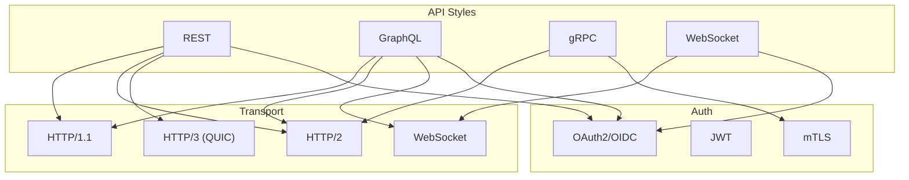

## 3. Five Ws + One H

### What <a class="askgpt-btn" href="https://chatgpt.com/?q=Explain%20'What'%20in%20detail%20with%20concrete%20examples%2C%20the%20main%20trade-offs%2C%20and%20common%20pitfalls%20a%20practitioner%20should%20know." target="_blank" rel="noopener" data-askgpt="What" title="Ask ChatGPT about this section">💬</a>

**REST** is an architectural style that uses HTTP methods (GET, POST, PUT, DELETE, PATCH) on resources identified by URLs, with stateless communication and a uniform interface. **GraphQL** is a query language and runtime for APIs that lets clients specify exact data requirements. **gRPC** is a high-performance RPC framework using HTTP/2 and Protocol Buffers. **WebSocket** is a protocol that upgrades an HTTP connection to a bidirectional, full-duplex, long-lived TCP socket.

### Why <a class="askgpt-btn" href="https://chatgpt.com/?q=Explain%20'Why'%20in%20detail%20with%20concrete%20examples%2C%20the%20main%20trade-offs%2C%20and%20common%20pitfalls%20a%20practitioner%20should%20know." target="_blank" rel="noopener" data-askgpt="Why" title="Ask ChatGPT about this section">💬</a>

API styles exist because applications need to communicate across networks. REST solved the chaos of SOAP. GraphQL solved over-fetching and under-fetching in mobile-era REST. gRPC solved performance and type safety for service-to-service. WebSocket solved real-time bidirectional needs that HTTP request-response couldn't.

### When <a class="askgpt-btn" href="https://chatgpt.com/?q=Explain%20'When'%20in%20detail%20with%20concrete%20examples%2C%20the%20main%20trade-offs%2C%20and%20common%20pitfalls%20a%20practitioner%20should%20know." target="_blank" rel="noopener" data-askgpt="When" title="Ask ChatGPT about this section">💬</a>

REST has been the dominant web API style since ~2005. GraphQL became mainstream in 2015-2020. gRPC is widely used at Google, Netflix, Square, and others since ~2017. WebSocket has been used for real-time features (chat, trading, gaming) since ~2012.

### Where <a class="askgpt-btn" href="https://chatgpt.com/?q=Explain%20'Where'%20in%20detail%20with%20concrete%20examples%2C%20the%20main%20trade-offs%2C%20and%20common%20pitfalls%20a%20practitioner%20should%20know." target="_blank" rel="noopener" data-askgpt="Where" title="Ask ChatGPT about this section">💬</a>

REST: GitHub, Twitter (older), Stripe, Twilio, virtually all public APIs. GraphQL: GitHub v4, Shopify, Facebook, Pinterest. gRPC: Netflix, Square, Google internal, CockroachDB. WebSocket: Slack, Discord, trading platforms, online games.

### Who <a class="askgpt-btn" href="https://chatgpt.com/?q=Explain%20'Who'%20in%20detail%20with%20concrete%20examples%2C%20the%20main%20trade-offs%2C%20and%20common%20pitfalls%20a%20practitioner%20should%20know." target="_blank" rel="noopener" data-askgpt="Who" title="Ask ChatGPT about this section">💬</a>

- **REST:** Roy Fielding (2000 dissertation); standardized via HTTP specs.
- **GraphQL:** Lee Byron, Dan Schafer, Nick Schrock at Facebook (2012); open-sourced 2015; now a Linux Foundation project.
- **gRPC:** Google (2015); CNCF graduated 2017; multi-language community.
- **WebSocket:** Ian Hickson, Michael Carter (HTML5 spec); RFC 6455 (2011).
- **OpenAPI:** OpenAPI Initiative (Linux Foundation).

### How (one-paragraph preview) <a class="askgpt-btn" href="https://chatgpt.com/?q=Explain%20'How%20(one-paragraph%20preview)'%20in%20detail%20with%20concrete%20examples%2C%20the%20main%20trade-offs%2C%20and%20common%20pitfalls%20a%20practitioner%20should%20know." target="_blank" rel="noopener" data-askgpt="How (one-paragraph preview)" title="Ask ChatGPT about this section">💬</a>

A client constructs a request (REST: HTTP + JSON; GraphQL: query string + variables; gRPC: Protobuf binary frame over HTTP/2; WebSocket: HTTP upgrade handshake + frames). It sends the request to a server. The server deserializes, validates, processes, and returns a serialized response. Modern APIs sit behind API gateways (Kong, Envoy, Apigee) that add auth, rate limiting, caching, and observability. Each style trades off complexity, performance, and developer ergonomics in different ways.

## 4. History

### 4.1 Origins (1991-2010) <a class="askgpt-btn" href="https://chatgpt.com/?q=Explain%20'4.1%20Origins%20(1991-2010)'%20in%20detail%20with%20concrete%20examples%2C%20the%20main%20trade-offs%2C%20and%20common%20pitfalls%20a%20practitioner%20should%20know." target="_blank" rel="noopener" data-askgpt="4.1 Origins (1991-2010)" title="Ask ChatGPT about this section">💬</a>

- **1991** — Tim Berners-Lee's HTTP/0.9 specification.
- **1996** — HTTP/1.0 standardization (RFC 1945).
- **1999** — HTTP/1.1 standardization (RFC 2616).
- **2000** — Roy Fielding's dissertation defines REST (representational state transfer) at UC Irvine.
- **2001** — SOAP (Simple Object Access Protocol) emerges as the dominant enterprise API style.

### 4.2 The REST revolution (2010-2015) <a class="askgpt-btn" href="https://chatgpt.com/?q=Explain%20'4.2%20The%20REST%20revolution%20(2010-2015)'%20in%20detail%20with%20concrete%20examples%2C%20the%20main%20trade-offs%2C%20and%20common%20pitfalls%20a%20practitioner%20should%20know." target="_blank" rel="noopener" data-askgpt="4.2 The REST revolution (2010-2015)" title="Ask ChatGPT about this section">💬</a>

- **2010** — Stripe launches a REST API that becomes a model for clean API design.
- **2011** — Twitter reinvents over REST after the famous "fail whale" era of SOAP-style complexity.
- **2012** — Facebook internally develops GraphQL to address mobile app over-fetching.
- **2014** — Google releases gRPC internally and open-sources it.
- **2015** — Facebook open-sources GraphQL; gRPC 1.0 released.
- **2015** — RFC 7540 standardizes HTTP/2.

### 4.3 The diversification era (2015-2022) <a class="askgpt-btn" href="https://chatgpt.com/?q=Explain%20'4.3%20The%20diversification%20era%20(2015-2022)'%20in%20detail%20with%20concrete%20examples%2C%20the%20main%20trade-offs%2C%20and%20common%20pitfalls%20a%20practitioner%20should%20know." target="_blank" rel="noopener" data-askgpt="4.3 The diversification era (2015-2022)" title="Ask ChatGPT about this section">💬</a>

- **2016** — Swagger becomes OpenAPI 3.0; the OpenAPI Initiative is founded.
- **2017** — HTTP/2 adoption becomes widespread.
- **2018** — Facebook releases GraphQL Foundation; Apollo Server reaches 1.0.
- **2019** — Cloudflare and Google push QUIC adoption; HTTP/3 drafts circulate.
- **2021** — HTTP/3 RFC 9114 published.
- **2022** — HTTP/3 standard (RFC 9114).
- **2024** — OpenAPI 3.1.1 published.

### 4.4 WebSocket timeline <a class="askgpt-btn" href="https://chatgpt.com/?q=Explain%20'4.4%20WebSocket%20timeline'%20in%20detail%20with%20concrete%20examples%2C%20the%20main%20trade-offs%2C%20and%20common%20pitfalls%20a%20practitioner%20should%20know." target="_blank" rel="noopener" data-askgpt="4.4 WebSocket timeline" title="Ask ChatGPT about this section">💬</a>

- **2011** — WebSocket RFC 6455.
- **2016** — WSS (WebSocket Secure) widely deployed.
- **2018+** — WebSocket adoption for chat, collaboration tools.

### 4.5 Governance <a class="askgpt-btn" href="https://chatgpt.com/?q=Explain%20'4.5%20Governance'%20in%20detail%20with%20concrete%20examples%2C%20the%20main%20trade-offs%2C%20and%20common%20pitfalls%20a%20practitioner%20should%20know." target="_blank" rel="noopener" data-askgpt="4.5 Governance" title="Ask ChatGPT about this section">💬</a>

- **HTTP:** IETF (Internet Engineering Task Force) + WHATWG.
- **REST:** No formal standards body; community-driven.
- **GraphQL:** GraphQL Foundation (Linux Foundation).
- **gRPC:** CNCF.
- **WebSocket:** IETF + W3C.
- **OpenAPI:** Linux Foundation.

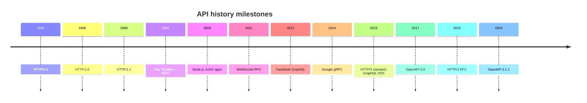

## 5. Problem Statement

### 5.1 What API styles solve <a class="askgpt-btn" href="https://chatgpt.com/?q=Explain%20'5.1%20What%20API%20styles%20solve'%20in%20detail%20with%20concrete%20examples%2C%20the%20main%20trade-offs%2C%20and%20common%20pitfalls%20a%20practitioner%20should%20know." target="_blank" rel="noopener" data-askgpt="5.1 What API styles solve" title="Ask ChatGPT about this section">💬</a>

Before modern APIs, integration relied on:

- **CORBA / DCOM** — vendor-locked, complex.
- **SOAP** — verbose XML, WS-* standards, poor tooling.
- **Custom protocols** — every company rolled their own.

Modern API styles address:

- **Simplicity** — declarative interfaces.
- **Tooling** — code generation, docs, testing.
- **Performance** — fast serialization, caching, streaming.
- **Evolvability** — versioning, federation.

### 5.2 The REST advantage <a class="askgpt-btn" href="https://chatgpt.com/?q=Explain%20'5.2%20The%20REST%20advantage'%20in%20detail%20with%20concrete%20examples%2C%20the%20main%20trade-offs%2C%20and%20common%20pitfalls%20a%20practitioner%20should%20know." target="_blank" rel="noopener" data-askgpt="5.2 The REST advantage" title="Ask ChatGPT about this section">💬</a>

REST simplified APIs by:

- Using HTTP semantics (already understood).
- Resources as nouns, methods as verbs.
- Cacheable responses (HTTP semantics).
- Self-describing messages (Content-Type).

### 5.3 Why not always REST? <a class="askgpt-btn" href="https://chatgpt.com/?q=Explain%20'5.3%20Why%20not%20always%20REST%3F'%20in%20detail%20with%20concrete%20examples%2C%20the%20main%20trade-offs%2C%20and%20common%20pitfalls%20a%20practitioner%20should%20know." target="_blank" rel="noopener" data-askgpt="5.3 Why not always REST?" title="Ask ChatGPT about this section">💬</a>

- **Over-fetching** — REST endpoints return fixed shapes; clients often need subsets.
- **Under-fetching** — clients need multiple round-trips.
- **Versioning burden** — supporting multiple API versions.
- **Performance** — JSON parsing, single-request-per-resource models.

### 5.4 What each API style solved <a class="askgpt-btn" href="https://chatgpt.com/?q=Explain%20'5.4%20What%20each%20API%20style%20solved'%20in%20detail%20with%20concrete%20examples%2C%20the%20main%20trade-offs%2C%20and%20common%20pitfalls%20a%20practitioner%20should%20know." target="_blank" rel="noopener" data-askgpt="5.4 What each API style solved" title="Ask ChatGPT about this section">💬</a>

| Style | Problem solved | Tradeoff |
|-------|----------------|----------|
| REST | Replace SOAP simplicity | Less flexible for complex queries |
| GraphQL | Avoid over/under-fetching | Complexity, N+1 risks |
| gRPC | High-performance service-to-service | Harder for browsers (no native HTTP/2) |
| WebSocket | Bidirectional real-time | Stateful connections, harder to scale |

## 6. Real-World Motivation

### 6.1 REST <a class="askgpt-btn" href="https://chatgpt.com/?q=Explain%20'6.1%20REST'%20in%20detail%20with%20concrete%20examples%2C%20the%20main%20trade-offs%2C%20and%20common%20pitfalls%20a%20practitioner%20should%20know." target="_blank" rel="noopener" data-askgpt="6.1 REST" title="Ask ChatGPT about this section">💬</a>

- **GitHub** — REST API with 1000s of endpoints; OpenAPI spec.
- **Stripe** — Model REST API; widely emulated.
- **Twitter** — Pivoted from SOAP-style complexity to REST; "fail whale" era.
- **Twilio** — Clean REST API; influential for documentation patterns.
- **AWS** — Every AWS service has a REST API.
- **Every public SaaS** — Stripe, Twilio, Shopify (alongside GraphQL), Slack (alongside WebSocket).

### 6.2 GraphQL <a class="askgpt-btn" href="https://chatgpt.com/?q=Explain%20'6.2%20GraphQL'%20in%20detail%20with%20concrete%20examples%2C%20the%20main%20trade-offs%2C%20and%20common%20pitfalls%20a%20practitioner%20should%20know." target="_blank" rel="noopener" data-askgpt="6.2 GraphQL" title="Ask ChatGPT about this section">💬</a>

- **GitHub v4 API** — Major GraphQL adopter.
- **Shopify** — GraphQL storefront API.
- **Facebook** — Where it was born.
- **Pinterest, Twitter, Yelp, Coursera** — Production GraphQL.
- **Apollo Federation** — Powers large composed APIs (Expedia, Walmart).

### 6.3 gRPC <a class="askgpt-btn" href="https://chatgpt.com/?q=Explain%20'6.3%20gRPC'%20in%20detail%20with%20concrete%20examples%2C%20the%20main%20trade-offs%2C%20and%20common%20pitfalls%20a%20practitioner%20should%20know." target="_blank" rel="noopener" data-askgpt="6.3 gRPC" title="Ask ChatGPT about this section">💬</a>

- **Netflix** — Service-to-service communication.
- **Google** — Internal RPC for nearly everything.
- **Square** — Cash App, infrastructure.
- **CockroachDB, etcd, containerd** — CNCF projects using gRPC.
- **Kubernetes** — Internal components communicate via gRPC.

### 6.4 WebSocket <a class="askgpt-btn" href="https://chatgpt.com/?q=Explain%20'6.4%20WebSocket'%20in%20detail%20with%20concrete%20examples%2C%20the%20main%20trade-offs%2C%20and%20common%20pitfalls%20a%20practitioner%20should%20know." target="_blank" rel="noopener" data-askgpt="6.4 WebSocket" title="Ask ChatGPT about this section">💬</a>

- **Slack** — Real-time messaging.
- **Discord** — Real-time chat.
- **Trading platforms** — Real-time prices.
- **Online games** — Multiplayer sync.
- **VS Code Live Share** — Real-time collaboration.

### 6.5 Economic and engineering motivation <a class="askgpt-btn" href="https://chatgpt.com/?q=Explain%20'6.5%20Economic%20and%20engineering%20motivation'%20in%20detail%20with%20concrete%20examples%2C%20the%20main%20trade-offs%2C%20and%20common%20pitfalls%20a%20practitioner%20should%20know." target="_blank" rel="noopener" data-askgpt="6.5 Economic and engineering motivation" title="Ask ChatGPT about this section">💬</a>

- **Developer productivity** — declarative interfaces with code generation.
- **Performance** — gRPC for service-to-service; WebSocket for real-time.
- **Flexibility** — GraphQL for varied client needs.
- **Interop** — REST for cross-org APIs (loose coupling).

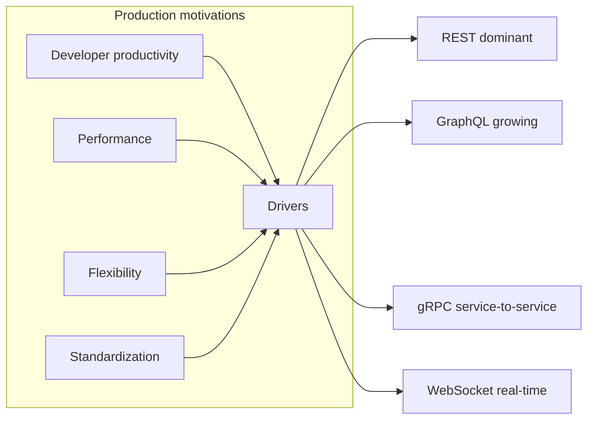

---

## 7. Internal Working

### 7.1 The lifecycle of an API request <a class="askgpt-btn" href="https://chatgpt.com/?q=Explain%20'7.1%20The%20lifecycle%20of%20an%20API%20request'%20in%20detail%20with%20concrete%20examples%2C%20the%20main%20trade-offs%2C%20and%20common%20pitfalls%20a%20practitioner%20should%20know." target="_blank" rel="noopener" data-askgpt="7.1 The lifecycle of an API request" title="Ask ChatGPT about this section">💬</a>

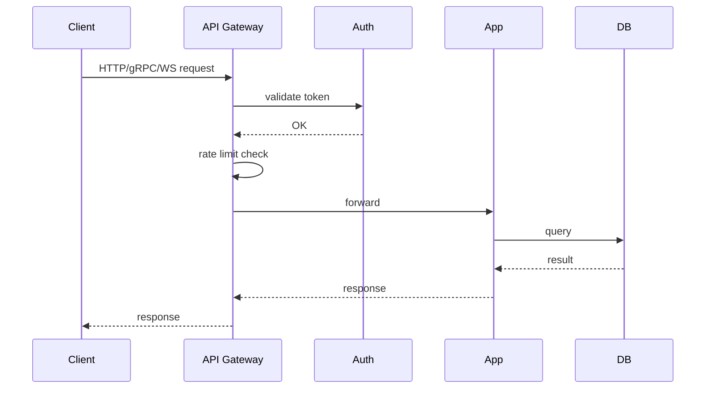

### 7.2 Subsystems that participate <a class="askgpt-btn" href="https://chatgpt.com/?q=Explain%20'7.2%20Subsystems%20that%20participate'%20in%20detail%20with%20concrete%20examples%2C%20the%20main%20trade-offs%2C%20and%20common%20pitfalls%20a%20practitioner%20should%20know." target="_blank" rel="noopener" data-askgpt="7.2 Subsystems that participate" title="Ask ChatGPT about this section">💬</a>

| Subsystem | Responsibility |
|-----------|---------------|
| **Client** | Initiates requests (browser, mobile, server) |
| **Edge / CDN** | TLS termination, caching, DDoS protection |
| **API Gateway** | Auth, rate limiting, routing, aggregation |
| **Service** | Business logic |
| **Data store** | Source of truth |
| **Observability** | Metrics, logs, traces |
| **Schema registry** | API contracts (OpenAPI, Protobuf, GraphQL SDL) |

### 7.3 HTTP request/response flow (REST) <a class="askgpt-btn" href="https://chatgpt.com/?q=Explain%20'7.3%20HTTP%20request%2Fresponse%20flow%20(REST)'%20in%20detail%20with%20concrete%20examples%2C%20the%20main%20trade-offs%2C%20and%20common%20pitfalls%20a%20practitioner%20should%20know." target="_blank" rel="noopener" data-askgpt="7.3 HTTP request/response flow (REST)" title="Ask ChatGPT about this section">💬</a>

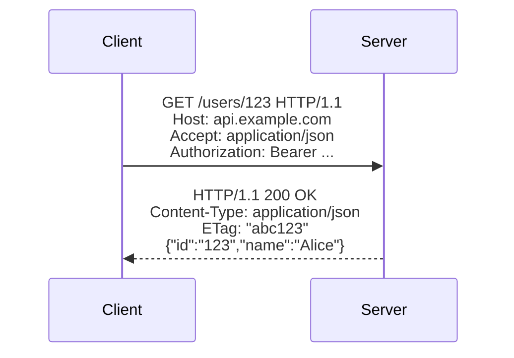

### 7.4 HTTP/2 multiplexing <a class="askgpt-btn" href="https://chatgpt.com/?q=Explain%20'7.4%20HTTP%2F2%20multiplexing'%20in%20detail%20with%20concrete%20examples%2C%20the%20main%20trade-offs%2C%20and%20common%20pitfalls%20a%20practitioner%20should%20know." target="_blank" rel="noopener" data-askgpt="7.4 HTTP/2 multiplexing" title="Ask ChatGPT about this section">💬</a>

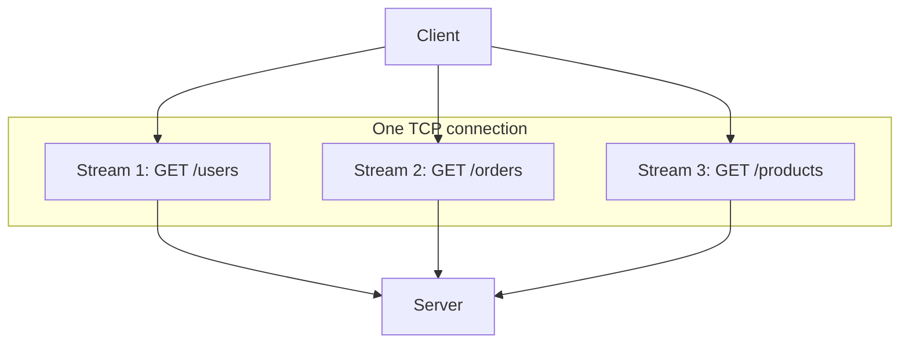

### 7.5 GraphQL execution flow <a class="askgpt-btn" href="https://chatgpt.com/?q=Explain%20'7.5%20GraphQL%20execution%20flow'%20in%20detail%20with%20concrete%20examples%2C%20the%20main%20trade-offs%2C%20and%20common%20pitfalls%20a%20practitioner%20should%20know." target="_blank" rel="noopener" data-askgpt="7.5 GraphQL execution flow" title="Ask ChatGPT about this section">💬</a>

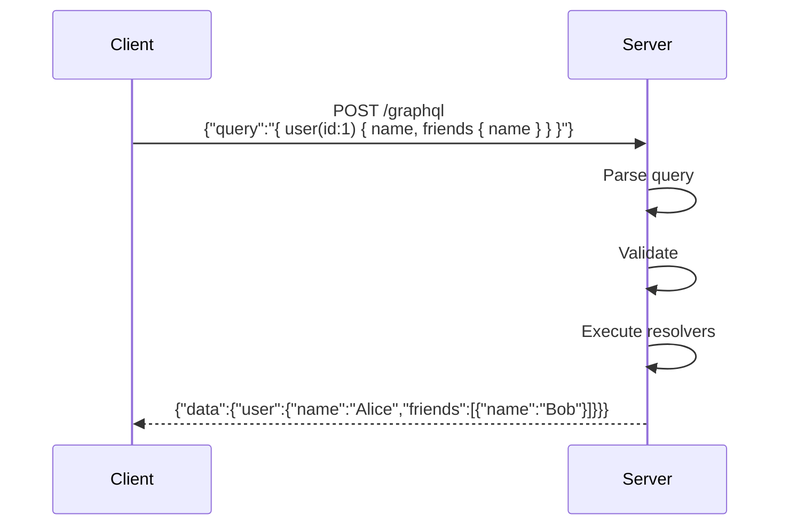

### 7.6 gRPC flow <a class="askgpt-btn" href="https://chatgpt.com/?q=Explain%20'7.6%20gRPC%20flow'%20in%20detail%20with%20concrete%20examples%2C%20the%20main%20trade-offs%2C%20and%20common%20pitfalls%20a%20practitioner%20should%20know." target="_blank" rel="noopener" data-askgpt="7.6 gRPC flow" title="Ask ChatGPT about this section">💬</a>

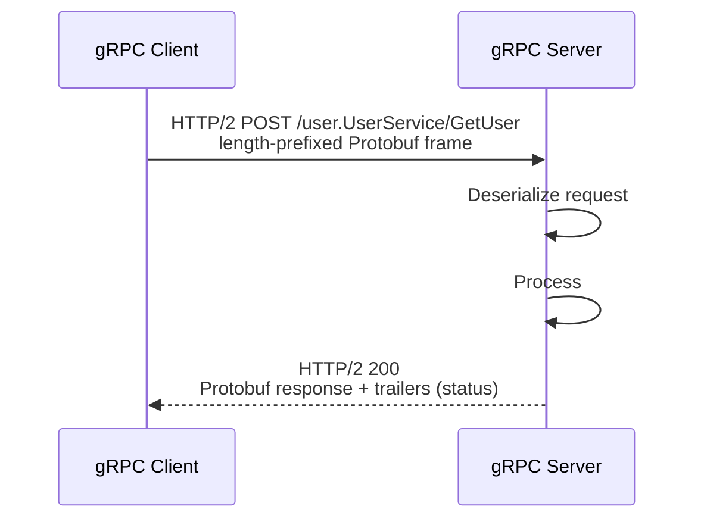

## 8. Deep Dive

This section is the heart of the document.

### 8.1 REST design <a class="askgpt-btn" href="https://chatgpt.com/?q=Explain%20'8.1%20REST%20design'%20in%20detail%20with%20concrete%20examples%2C%20the%20main%20trade-offs%2C%20and%20common%20pitfalls%20a%20practitioner%20should%20know." target="_blank" rel="noopener" data-askgpt="8.1 REST design" title="Ask ChatGPT about this section">💬</a>

**Resources, not verbs:**

```
GET    /users           # list users
GET    /users/123       # get one user
POST   /users           # create user
PUT    /users/123       # replace user
PATCH  /users/123       # partial update
DELETE /users/123       # delete user

GET    /users/123/orders  # sub-resource
```

**Status codes:**

| Code | Use |
|------|-----|
| 200 | OK with body |
| 201 | Created (use with `Location` header) |
| 204 | No content (DELETE, etc.) |
| 301/302 | Redirect |
| 304 | Not Modified (ETag match) |
| 400 | Bad request (validation) |
| 401 | Unauthorized (auth required) |
| 403 | Forbidden (auth present, insufficient) |
| 404 | Not found |
| 409 | Conflict (version conflict, etc.) |
| 422 | Unprocessable entity (semantic validation) |
| 429 | Rate limited |
| 5xx | Server errors |

### 8.2 REST design patterns <a class="askgpt-btn" href="https://chatgpt.com/?q=Explain%20'8.2%20REST%20design%20patterns'%20in%20detail%20with%20concrete%20examples%2C%20the%20main%20trade-offs%2C%20and%20common%20pitfalls%20a%20practitioner%20should%20know." target="_blank" rel="noopener" data-askgpt="8.2 REST design patterns" title="Ask ChatGPT about this section">💬</a>

**Pagination:**

Offset-based:
```
GET /users?offset=20&limit=10
```

Cursor-based:
```
GET /users?cursor=eyJpZCI6MTAwfQ&limit=10
```

**Filtering:**
```
GET /users?status=active&role=admin&createdAt>=2024-01-01
```

**Sorting:**
```
GET /users?sort=-lastName,firstName
```

**Sparse fieldsets:**
```
GET /users?fields=id,name,email
```

**Idempotency:**
```
POST /payments
Idempotency-Key: abc123

Server stores result by Idempotency-Key for 24 hours; same key returns same result.
```

**Caching:**
```
Cache-Control: public, max-age=300
ETag: "abc123"
```

### 8.3 Problem Details (RFC 7807) <a class="askgpt-btn" href="https://chatgpt.com/?q=Explain%20'8.3%20Problem%20Details%20(RFC%207807)'%20in%20detail%20with%20concrete%20examples%2C%20the%20main%20trade-offs%2C%20and%20common%20pitfalls%20a%20practitioner%20should%20know." target="_blank" rel="noopener" data-askgpt="8.3 Problem Details (RFC 7807)" title="Ask ChatGPT about this section">💬</a>

```json
{
    "type": "https://example.com/problems/insufficient-credit",
    "title": "Insufficient credit",
    "status": 403,
    "detail": "Your balance is 30, but the transaction requires 50",
    "instance": "/account/12345/transactions/789"
}
```

Standard `application/problem+json` media type.

### 8.4 GraphQL <a class="askgpt-btn" href="https://chatgpt.com/?q=Explain%20'8.4%20GraphQL'%20in%20detail%20with%20concrete%20examples%2C%20the%20main%20trade-offs%2C%20and%20common%20pitfalls%20a%20practitioner%20should%20know." target="_blank" rel="noopener" data-askgpt="8.4 GraphQL" title="Ask ChatGPT about this section">💬</a>

**Schema:**

```graphql
type Query {
    user(id: ID!): User
    users(limit: Int = 20, offset: Int = 0): [User!]!
}

type Mutation {
    createUser(input: CreateUserInput!): User!
    updateUser(id: ID!, input: UpdateUserInput!): User!
    deleteUser(id: ID!): DeleteResult!
}

type Subscription {
    userUpdated(id: ID!): User!
}

type User {
    id: ID!
    name: String!
    email: String!
    createdAt: DateTime!
    friends: [User!]!
}

input CreateUserInput {
    name: String!
    email: String!
}
```

**Query:**

```graphql
query GetUser($id: ID!) {
    user(id: $id) {
        id
        name
        email
        friends {
            name
            email
        }
    }
}
```

**Direct execution:**
```graphql
query {
    me {
        id
        name
    }
}
```

**Mutation:**
```graphql
mutation {
    createUser(input: { name: "Alice", email: "alice@example.com" }) {
        id
        name
    }
}
```

**N+1 problem and DataLoader:**

```javascript
import DataLoader from 'dataloader';
const userLoader = new DataLoader(async (ids) => {
    return db.query('SELECT * FROM users WHERE id IN (?)', [ids]);
}, new Set([1, 2, 3]));

const resolvers = {
    Query: {
        users: () => db.query('SELECT * FROM posts'),
    },
    Post: {
        author: (post) => userLoader.load(post.authorId),  // batched
    },
};
```

**Federation:**

Apollo Federation allows multiple GraphQL services to be composed into a unified schema. Each subgraph declares its types; the router composes them.

### 8.5 gRPC <a class="askgpt-btn" href="https://chatgpt.com/?q=Explain%20'8.5%20gRPC'%20in%20detail%20with%20concrete%20examples%2C%20the%20main%20trade-offs%2C%20and%20common%20pitfalls%20a%20practitioner%20should%20know." target="_blank" rel="noopener" data-askgpt="8.5 gRPC" title="Ask ChatGPT about this section">💬</a>

**Service definition (.proto):**

```protobuf
syntax = "proto3";

package user.v1;

service UserService {
  rpc GetUser(GetUserRequest) returns (User);
  rpc ListUsers(ListUsersRequest) returns (stream User);
  rpc CreateUser(CreateUserRequest) returns (User);
}

message User {
  string id = 1;
  string name = 2;
  string email = 3;
}

message GetUserRequest {
  string id = 1;
}

message ListUsersRequest {
  int32 page_size = 1;
}

message CreateUserRequest {
  string name = 1;
  string email = 2;
}
```

**Streaming types:**

| Type | Client | Server |
|------|--------|--------|
| Unary | One in, one out | — |
| Server streaming | One in, stream out | — |
| Client streaming | Stream in, one out | — |
| Bidirectional | Stream in, stream out | — |

**Status codes:**

| Code | Use |
|------|-----|
| `OK` | Success |
| `CANCELLED` | Caller cancelled |
| `INVALID_ARGUMENT` | Validation failed |
| `DEADLINE_EXCEEDED` | Timeout |
| `NOT_FOUND` | Resource missing |
| `PERMISSION_DENIED` | Auth failed |
| `RESOURCE_EXHAUSTED` | Rate limited / quota |
| `UNAVAILABLE` | Server unavailable |
| `UNIMPLEMENTED` | Method not implemented |
| `UNAUTHENTICATED` | Auth required |

**Deadlines:**

```javascript
// Client sets deadline
const user = await client.getUser(
    { id: "123" },
    { deadline: Date.now() + 1000 }  // 1 second
);
```

**Interceptors:**

```javascript
const authInterceptor = (options, nextCall) => {
    return new Metadata();
    return new Promise((resolve, reject) => {
        const call = nextCall(options);
        call.metadata.add('authorization', `Bearer ${token}`);
        call.then(resolve, reject);
    });
};
client = new UserServiceClient(
    target,
    grpc.credentials.createFromMetadataGenerator(authInterceptor)
);
```

### 8.6 WebSocket <a class="askgpt-btn" href="https://chatgpt.com/?q=Explain%20'8.6%20WebSocket'%20in%20detail%20with%20concrete%20examples%2C%20the%20main%20trade-offs%2C%20and%20common%20pitfalls%20a%20practitioner%20should%20know." target="_blank" rel="noopener" data-askgpt="8.6 WebSocket" title="Ask ChatGPT about this section">💬</a>

**Handshake:**

```
Client → Server:
GET /chat HTTP/1.1
Upgrade: websocket
Connection: Upgrade
Sec-WebSocket-Key: ...
Sec-WebSocket-Version: 13

Server → Client:
HTTP/1.1 101 Switching Protocols
Upgrade: websocket
Connection: Upgrade
Sec-WebSocket-Accept: ...
```

**Frames:**

- Text frames (UTF-8).
- Binary frames.
- Ping/Pong (keepalive).
- Close.

**Reconnection:**

```javascript
class ResilientWebSocket {
    constructor(url) {
        this.url = url;
        this.connect();
    }

    connect() {
        this.ws = new WebSocket(this.url);
        this.ws.onclose = () => {
            setTimeout(() => this.connect(), 1000);  // exponential backoff in prod
        };
    }
}
```

**Scaling WebSocket:**

- **Sticky sessions** — clients must hit the same backend.
- **Redis pub/sub** — broadcast across multiple backend instances.
- **Kafka** — durable event log (see Messaging doc).

### 8.7 HTTP/2 <a class="askgpt-btn" href="https://chatgpt.com/?q=Explain%20'8.7%20HTTP%2F2'%20in%20detail%20with%20concrete%20examples%2C%20the%20main%20trade-offs%2C%20and%20common%20pitfalls%20a%20practitioner%20should%20know." target="_blank" rel="noopener" data-askgpt="8.7 HTTP/2" title="Ask ChatGPT about this section">💬</a>

- **Binary framing** — easier parsing.
- **Multiplexing** — multiple requests over one TCP connection; no head-of-line blocking.
- **HPACK** — header compression.
- **Server push** — server can push resources (deprecated in practice).
- **Stream prioritization** — important requests get priority.

### 8.8 HTTP/3 <a class="askgpt-btn" href="https://chatgpt.com/?q=Explain%20'8.8%20HTTP%2F3'%20in%20detail%20with%20concrete%20examples%2C%20the%20main%20trade-offs%2C%20and%20common%20pitfalls%20a%20practitioner%20should%20know." target="_blank" rel="noopener" data-askgpt="8.8 HTTP/3" title="Ask ChatGPT about this section">💬</a>

- **QUIC transport** — UDP-based.
- **No head-of-line blocking** — each stream is independent.
- **0-RTT** — zero round-trip time for resumed connections.
- **Connection migration** — survives IP address changes (mobile).
- **Built-in TLS 1.3** — required.

### 8.9 Authentication <a class="askgpt-btn" href="https://chatgpt.com/?q=Explain%20'8.9%20Authentication'%20in%20detail%20with%20concrete%20examples%2C%20the%20main%20trade-offs%2C%20and%20common%20pitfalls%20a%20practitioner%20should%20know." target="_blank" rel="noopener" data-askgpt="8.9 Authentication" title="Ask ChatGPT about this section">💬</a>

**OAuth 2.1 grant types:**

| Grant | Use case |
|-------|----------|
| **Authorization Code** | Web apps with backend (server-side) |
| **Authorization Code + PKCE** | Web and mobile (public clients) |
| **Client Credentials** | Service-to-service (machine-to-machine) |
| **Device Code** | Smart TVs, IoT |
| **Refresh Token** | Long-lived access tokens |

**OAuth2 authorization code flow:**

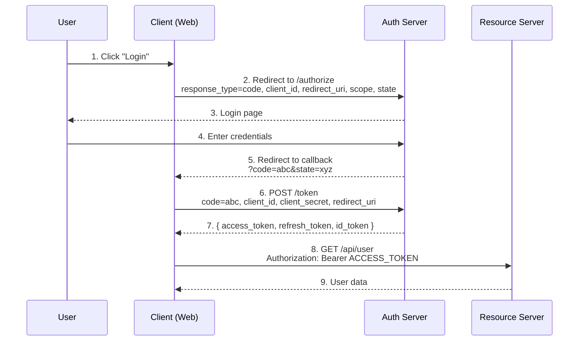

**PKCE (Proof Key for Code Exchange):**

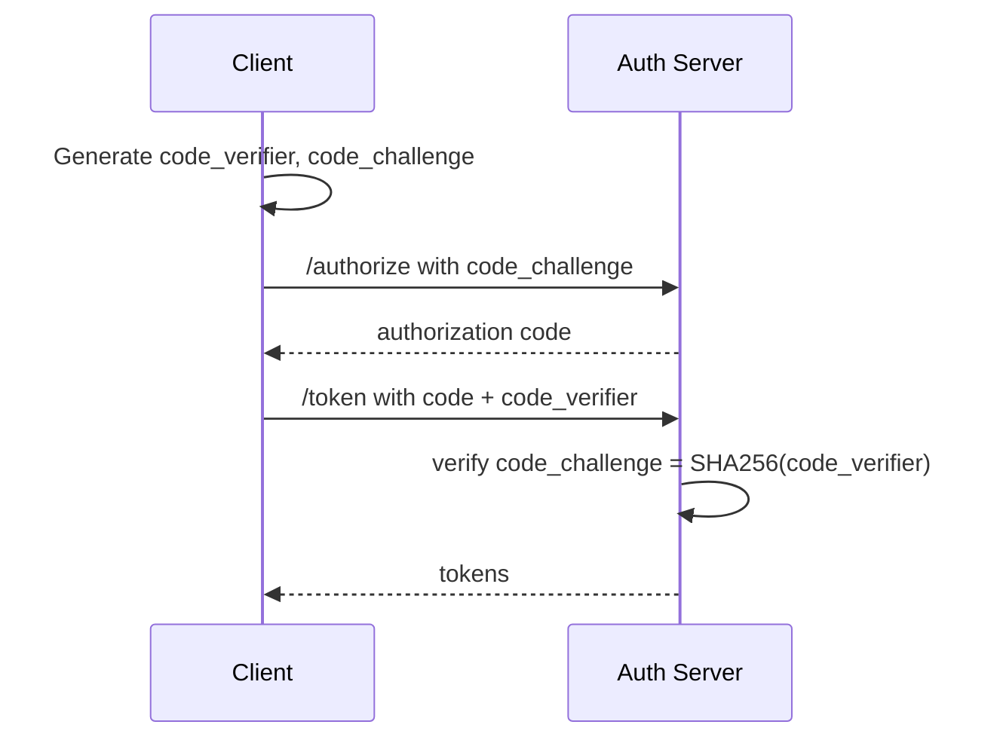

**JWT (JSON Web Token):**

```
Header: { "alg": "RS256", "typ": "JWT" }
Payload: { "sub": "123", "name": "Alice", "exp": 1700000000 }
Signature: base64(header).base64(payload), signed with private key
```

JWT format: `header.payload.signature`

**JWT best practices:**

- Use RS256 or ES256 (asymmetric).
- Short TTL (15 min).
- Refresh tokens for long-lived sessions.
- Validate `iss`, `aud`, `exp`, `nbf` claims.
- Never put sensitive data in JWT (tokens are not encrypted).

**mTLS:**

- Both client and server present certificates.
- Mutual authentication.
- Common for service-to-service.

### 8.10 Authorization <a class="askgpt-btn" href="https://chatgpt.com/?q=Explain%20'8.10%20Authorization'%20in%20detail%20with%20concrete%20examples%2C%20the%20main%20trade-offs%2C%20and%20common%20pitfalls%20a%20practitioner%20should%20know." target="_blank" rel="noopener" data-askgpt="8.10 Authorization" title="Ask ChatGPT about this section">💬</a>

**RBAC (Role-Based Access Control):**

```
GET /admin/users        → role: admin required
POST /api/v1/orders     → role: user
```

**ABAC (Attribute-Based Access Control):**

```json
{
    "effect": "allow",
    "action": "read",
    "resource": "document:123",
    "condition": {
        "user.department": "engineering",
        "resource.classification": "internal"
    }
}
```

**OAuth2 scopes:**

```
GET /api/v1/users
Authorization: Bearer abc
scope: users:read
```

### 8.11 Versioning <a class="askgpt-btn" href="https://chatgpt.com/?q=Explain%20'8.11%20Versioning'%20in%20detail%20with%20concrete%20examples%2C%20the%20main%20trade-offs%2C%20and%20common%20pitfalls%20a%20practitioner%20should%20know." target="_blank" rel="noopener" data-askgpt="8.11 Versioning" title="Ask ChatGPT about this section">💬</a>

**URI versioning:**
```
GET /v1/users
GET /v2/users
```

**Header versioning:**
```
GET /users
Accept-Version: v2
```

**Media type versioning:**
```
GET /users
Accept: application/vnd.myapi.v2+json
```

### 8.12 OpenAPI 3.1 <a class="askgpt-btn" href="https://chatgpt.com/?q=Explain%20'8.12%20OpenAPI%203.1'%20in%20detail%20with%20concrete%20examples%2C%20the%20main%20trade-offs%2C%20and%20common%20pitfalls%20a%20practitioner%20should%20know." target="_blank" rel="noopener" data-askgpt="8.12 OpenAPI 3.1" title="Ask ChatGPT about this section">💬</a>

```yaml
openapi: 3.1.0
info:
  title: User API
  version: 1.0.0
servers:
  - url: https://api.example.com/v1
paths:
  /users/{id}:
    get:
      parameters:
        - name: id
          in: path
          required: true
          schema:
            type: string
      responses:
        '200':
          content:
            application/json:
              schema:
                $ref: '#/components/schemas/User'
components:
  schemas:
    User:
      type: object
      properties:
        id: { type: string }
        name: { type: string }
        email: { type: string, format: email }
```

OpenAPI 3.1 aligns with JSON Schema 2020-12. Generate clients and servers from spec (OpenAPI Generator, Swagger Codegen).

---

## 9. Architecture

### 9.1 API gateway topology <a class="askgpt-btn" href="https://chatgpt.com/?q=Explain%20'9.1%20API%20gateway%20topology'%20in%20detail%20with%20concrete%20examples%2C%20the%20main%20trade-offs%2C%20and%20common%20pitfalls%20a%20practitioner%20should%20know." target="_blank" rel="noopener" data-askgpt="9.1 API gateway topology" title="Ask ChatGPT about this section">💬</a>

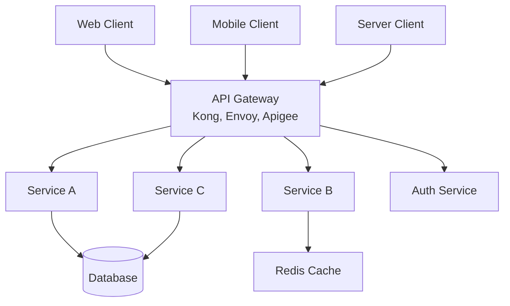

### 9.2 REST maturity model (Richardson) <a class="askgpt-btn" href="https://chatgpt.com/?q=Explain%20'9.2%20REST%20maturity%20model%20(Richardson)'%20in%20detail%20with%20concrete%20examples%2C%20the%20main%20trade-offs%2C%20and%20common%20pitfalls%20a%20practitioner%20should%20know." target="_blank" rel="noopener" data-askgpt="9.2 REST maturity model (Richardson)" title="Ask ChatGPT about this section">💬</a>

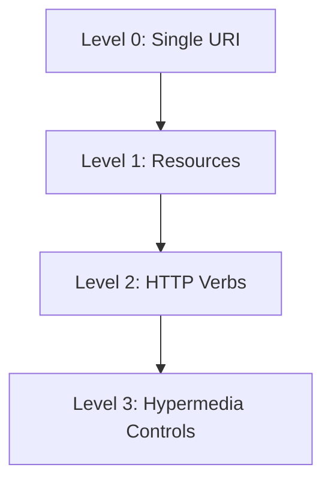

Most public APIs are at Level 2 (e.g., GitHub, Stripe). Level 3 (HATEOAS) is rare.

### 9.3 GraphQL execution pipeline <a class="askgpt-btn" href="https://chatgpt.com/?q=Explain%20'9.3%20GraphQL%20execution%20pipeline'%20in%20detail%20with%20concrete%20examples%2C%20the%20main%20trade-offs%2C%20and%20common%20pitfalls%20a%20practitioner%20should%20know." target="_blank" rel="noopener" data-askgpt="9.3 GraphQL execution pipeline" title="Ask ChatGPT about this section">💬</a>

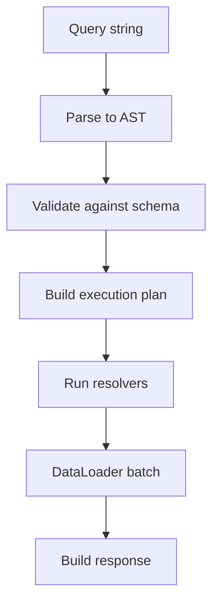

### 9.4 gRPC streaming <a class="askgpt-btn" href="https://chatgpt.com/?q=Explain%20'9.4%20gRPC%20streaming'%20in%20detail%20with%20concrete%20examples%2C%20the%20main%20trade-offs%2C%20and%20common%20pitfalls%20a%20practitioner%20should%20know." target="_blank" rel="noopener" data-askgpt="9.4 gRPC streaming" title="Ask ChatGPT about this section">💬</a>

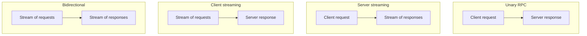

### 9.5 WebSocket multiplexing <a class="askgpt-btn" href="https://chatgpt.com/?q=Explain%20'9.5%20WebSocket%20multiplexing'%20in%20detail%20with%20concrete%20examples%2C%20the%20main%20trade-offs%2C%20and%20common%20pitfalls%20a%20practitioner%20should%20know." target="_blank" rel="noopener" data-askgpt="9.5 WebSocket multiplexing" title="Ask ChatGPT about this section">💬</a>

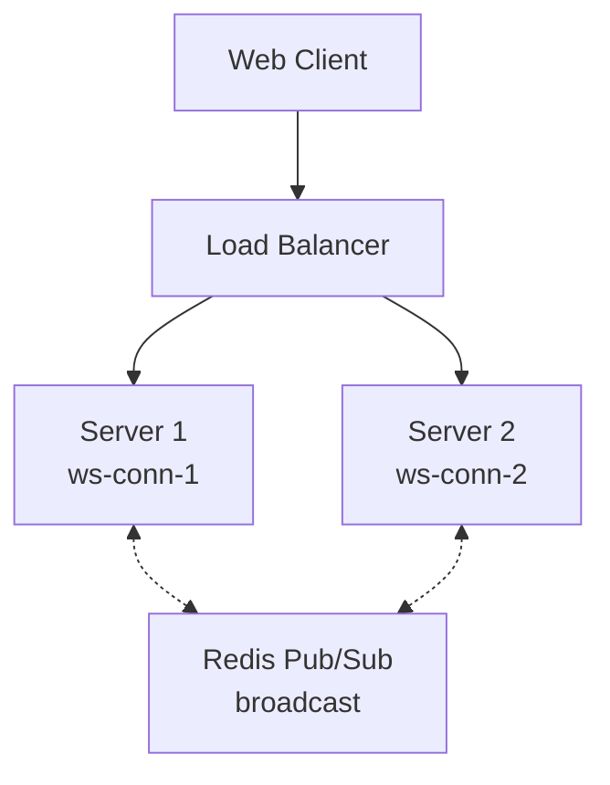

## 10. Performance

### 10.1 REST performance <a class="askgpt-btn" href="https://chatgpt.com/?q=Explain%20'10.1%20REST%20performance'%20in%20detail%20with%20concrete%20examples%2C%20the%20main%20trade-offs%2C%20and%20common%20pitfalls%20a%20practitioner%20should%20know." target="_blank" rel="noopener" data-askgpt="10.1 REST performance" title="Ask ChatGPT about this section">💬</a>

| Lever | Effect |
|-------|--------|
| Compression (gzip, br) | 60-80% size reduction |
| ETag + 304 | Save bandwidth on unchanged resources |
| Cache-Control | Browser / CDN caching |
| HTTP/2 multiplexing | One connection, many requests |
| HTTP/3 | Reduce head-of-line blocking |
| Pagination | Avoid huge responses |
| Sparse fieldsets | Avoid over-fetching |

### 10.2 GraphQL performance <a class="askgpt-btn" href="https://chatgpt.com/?q=Explain%20'10.2%20GraphQL%20performance'%20in%20detail%20with%20concrete%20examples%2C%20the%20main%20trade-offs%2C%20and%20common%20pitfalls%20a%20practitioner%20should%20know." target="_blank" rel="noopener" data-askgpt="10.2 GraphQL performance" title="Ask ChatGPT about this section">💬</a>

- **N+1 prevention via DataLoader** — batch and cache resolver calls.
- **Persisted queries** — server stores the parsed query; client sends hash.
- **Complexity limits** — bound query depth and cost.
- **DataLoader for relations** — critical for performance.
- **Caching at the field level** — `info.cacheControl` directives.

```javascript
// DataLoader for relations
const userLoader = new DataLoader(async (ids) =>
    db.query('SELECT * FROM users WHERE id IN (?)', [ids])
);

// Track by id, batch, dedupe
userLoader.prime('1', user);  // initial cache
```

### 10.3 gRPC performance <a class="askgpt-btn" href="https://chatgpt.com/?q=Explain%20'10.3%20gRPC%20performance'%20in%20detail%20with%20concrete%20examples%2C%20the%20main%20trade-offs%2C%20and%20common%20pitfalls%20a%20practitioner%20should%20know." target="_blank" rel="noopener" data-askgpt="10.3 gRPC performance" title="Ask ChatGPT about this section">💬</a>

- **HTTP/2 multiplexing** — many concurrent RPCs over one connection.
- **Protobuf binary** — 3-10x smaller than JSON.
- **Streaming** — server can push updates.
- **Connection pooling** — reuse TCP connections.

### 10.4 WebSocket performance <a class="askgpt-btn" href="https://chatgpt.com/?q=Explain%20'10.4%20WebSocket%20performance'%20in%20detail%20with%20concrete%20examples%2C%20the%20main%20trade-offs%2C%20and%20common%20pitfalls%20a%20practitioner%20should%20know." target="_blank" rel="noopener" data-askgpt="10.4 WebSocket performance" title="Ask ChatGPT about this section">💬</a>

- **Frame compression** (`permessage-deflate`).
- **Binary frames** instead of text (smaller).
- **Connection scaling** — sticky sessions, Redis broadcast.

### 10.5 Caching strategies <a class="askgpt-btn" href="https://chatgpt.com/?q=Explain%20'10.5%20Caching%20strategies'%20in%20detail%20with%20concrete%20examples%2C%20the%20main%20trade-offs%2C%20and%20common%20pitfalls%20a%20practitioner%20should%20know." target="_blank" rel="noopener" data-askgpt="10.5 Caching strategies" title="Ask ChatGPT about this section">💬</a>

- **HTTP caching**: `Cache-Control`, `ETag`, `Vary`.
- **CDN caching**: Cloudflare, Fastly, CloudFront.
- **Server-side caching**: Redis, Memcached.
- **Application-level**: Spring `@Cacheable`, Express middleware.

## 11. Security

### 11.1 OWASP API Security Top 10 <a class="askgpt-btn" href="https://chatgpt.com/?q=Explain%20'11.1%20OWASP%20API%20Security%20Top%2010'%20in%20detail%20with%20concrete%20examples%2C%20the%20main%20trade-offs%2C%20and%20common%20pitfalls%20a%20practitioner%20should%20know." target="_blank" rel="noopener" data-askgpt="11.1 OWASP API Security Top 10" title="Ask ChatGPT about this section">💬</a>

- **API1: Broken Object Level Authorization** — validate user can access resource.
- **API2: Broken Authentication** — use OAuth2 / OIDC, not custom auth.
- **API3: Broken Object Property Level Authorization** — limit fields exposed.
- **API4: Unrestricted Resource Consumption** — rate limiting.
- **API5: Broken Function Level Authorization** — RBAC, scope checks.
- **API6: Server-Side Request Forgery (SSRF)** — validate URLs.
- **API7: Security Misconfiguration** — security headers, default credentials.
- **API8: Lack of Protection from Automated Threats** — CAPTCHA, rate limiting.
- **API9: Improper Inventory Management** — track all endpoints.
- **API10: Unsafe Consumption of APIs** — validate third-party responses.

### 11.2 Common attacks <a class="askgpt-btn" href="https://chatgpt.com/?q=Explain%20'11.2%20Common%20attacks'%20in%20detail%20with%20concrete%20examples%2C%20the%20main%20trade-offs%2C%20and%20common%20pitfalls%20a%20practitioner%20should%20know." target="_blank" rel="noopener" data-askgpt="11.2 Common attacks" title="Ask ChatGPT about this section">💬</a>

- **Injection** (SQL, NoSQL, OS command) — parameterize.
- **XSS** — escape output.
- **CSRF** — token-based (SameSite cookies).
- **Broken access control** — RBAC, scope checks per request.
- **Mass assignment** — explicit field allowlists.
- **Replay attacks** — nonces, timestamps, JWT exp.

### 11.3 JWT best practices <a class="askgpt-btn" href="https://chatgpt.com/?q=Explain%20'11.3%20JWT%20best%20practices'%20in%20detail%20with%20concrete%20examples%2C%20the%20main%20trade-offs%2C%20and%20common%20pitfalls%20a%20practitioner%20should%20know." target="_blank" rel="noopener" data-askgpt="11.3 JWT best practices" title="Ask ChatGPT about this section">💬</a>

- Use `alg: RS256` or `ES256` (asymmetric).
- Validate `iss`, `aud`, `exp`, `nbf`, `iat`.
- Short TTL (15 min).
- Refresh tokens for long-lived access.
- Don't put PII in JWT (it's base64, not encrypted).
- Rotate signing keys (`kid` claim).

### 11.4 OAuth2 best practices <a class="askgpt-btn" href="https://chatgpt.com/?q=Explain%20'11.4%20OAuth2%20best%20practices'%20in%20detail%20with%20concrete%20examples%2C%20the%20main%20trade-offs%2C%20and%20common%20pitfalls%20a%20practitioner%20should%20know." target="_blank" rel="noopener" data-askgpt="11.4 OAuth2 best practices" title="Ask ChatGPT about this section">💬</a>

- Use **authorization code + PKCE** for public clients.
- Use **client credentials** for service-to-service.
- Validate `redirect_uri` strictly (exact match).
- Don't put tokens in URLs.
- Use refresh tokens with rotation.
- Implement token revocation (blacklist or short TTL).

### 11.5 mTLS <a class="askgpt-btn" href="https://chatgpt.com/?q=Explain%20'11.5%20mTLS'%20in%20detail%20with%20concrete%20examples%2C%20the%20main%20trade-offs%2C%20and%20common%20pitfalls%20a%20practitioner%20should%20know." target="_blank" rel="noopener" data-askgpt="11.5 mTLS" title="Ask ChatGPT about this section">💬</a>

- Both client and server present certificates.
- Common in service-to-service and zero-trust networks.

### 11.6 Secure configuration checklist <a class="askgpt-btn" href="https://chatgpt.com/?q=Explain%20'11.6%20Secure%20configuration%20checklist'%20in%20detail%20with%20concrete%20examples%2C%20the%20main%20trade-offs%2C%20and%20common%20pitfalls%20a%20practitioner%20should%20know." target="_blank" rel="noopener" data-askgpt="11.6 Secure configuration checklist" title="Ask ChatGPT about this section">💬</a>

- [ ] TLS enforced (HTTPS only).
- [ ] Authentication via OAuth2 / JWT (no custom auth).
- [ ] Authorization per request (RBAC, scope).
- [ ] Input validation (use OpenAPI for shapes).
- [ ] Output encoding.
- [ ] Rate limiting.
- [ ] CORS configured minimally.
- [ ] Security headers (CSP, X-Frame-Options).
- [ ] No secrets in URLs or logs.
- [ ] Dependencies audited (Snyk, OWASP Dependency-Check).
- [ ] API inventory up to date.

## 12. Production Engineering

### 12.1 API gateways <a class="askgpt-btn" href="https://chatgpt.com/?q=Explain%20'12.1%20API%20gateways'%20in%20detail%20with%20concrete%20examples%2C%20the%20main%20trade-offs%2C%20and%20common%20pitfalls%20a%20practitioner%20should%20know." target="_blank" rel="noopener" data-askgpt="12.1 API gateways" title="Ask ChatGPT about this section">💬</a>

API gateways handle cross-cutting concerns:

- **Kong** — open source, plugin-based.
- **Envoy** — Lyft, CNCF.
- **AWS API Gateway, Azure APIM, GCP API Gateway** — managed.
- **Apigee** — Google Cloud.
- **NGINX** — reverse proxy with caching, rate limiting.

### 12.2 Rate limiting <a class="askgpt-btn" href="https://chatgpt.com/?q=Explain%20'12.2%20Rate%20limiting'%20in%20detail%20with%20concrete%20examples%2C%20the%20main%20trade-offs%2C%20and%20common%20pitfalls%20a%20practitioner%20should%20know." target="_blank" rel="noopener" data-askgpt="12.2 Rate limiting" title="Ask ChatGPT about this section">💬</a>

- **Token bucket** — per-user.
- **Leaky bucket** — smooths bursts.
- **Fixed window** — simple.
- **Sliding window** — more accurate.
- **Distributed** — Redis-backed.

Tools: Kong, Envoy, Cloudflare.

### 12.3 Observability <a class="askgpt-btn" href="https://chatgpt.com/?q=Explain%20'12.3%20Observability'%20in%20detail%20with%20concrete%20examples%2C%20the%20main%20trade-offs%2C%20and%20common%20pitfalls%20a%20practitioner%20should%20know." target="_blank" rel="noopener" data-askgpt="12.3 Observability" title="Ask ChatGPT about this section">💬</a>

- **Metrics:** Prometheus, OpenTelemetry (OTel).
- **Tracing:** OpenTelemetry, Jaeger.
- **Logs:** Structured (JSON), centralized.

```typescript
import { trace } from '@opentelemetry/api';
const span = trace.getActiveSpan();
span?.setAttribute('http.method', 'GET');
```

### 12.4 Deployment <a class="askgpt-btn" href="https://chatgpt.com/?q=Explain%20'12.4%20Deployment'%20in%20detail%20with%20concrete%20examples%2C%20the%20main%20trade-offs%2C%20and%20common%20pitfalls%20a%20practitioner%20should%20know." target="_blank" rel="noopener" data-askgpt="12.4 Deployment" title="Ask ChatGPT about this section">💬</a>

- **Blue-green** — switch over instantly.
- **Canary** — partial rollouts.
- **Container** — Kubernetes, ECS.
- **API versioning** — maintain multiple versions simultaneously.

### 12.5 Cost optimization <a class="askgpt-btn" href="https://chatgpt.com/?q=Explain%20'12.5%20Cost%20optimization'%20in%20detail%20with%20concrete%20examples%2C%20the%20main%20trade-offs%2C%20and%20common%20pitfalls%20a%20practitioner%20should%20know." target="_blank" rel="noopener" data-askgpt="12.5 Cost optimization" title="Ask ChatGPT about this section">💬</a>

- Caching reduces backend load.
- Compression reduces bandwidth.
- Rate limiting protects from abuse.
- Tiered APIs (free vs paid).

### 12.6 Upgrade strategy <a class="askgpt-btn" href="https://chatgpt.com/?q=Explain%20'12.6%20Upgrade%20strategy'%20in%20detail%20with%20concrete%20examples%2C%20the%20main%20trade-offs%2C%20and%20common%20pitfalls%20a%20practitioner%20should%20know." target="_blank" rel="noopener" data-askgpt="12.6 Upgrade strategy" title="Ask ChatGPT about this section">💬</a>

- **OpenAPI / Protobuf first** — backward-compatible changes; never break clients.
- **Deprecation warnings** — `Deprecation` and `Sunset` HTTP headers (RFC 8594).
- **Sunset date** — give clients time to migrate.

### 12.7 Migration: REST to GraphQL <a class="askgpt-btn" href="https://chatgpt.com/?q=Explain%20'12.7%20Migration%3A%20REST%20to%20GraphQL'%20in%20detail%20with%20concrete%20examples%2C%20the%20main%20trade-offs%2C%20and%20common%20pitfalls%20a%20practitioner%20should%20know." target="_blank" rel="noopener" data-askgpt="12.7 Migration: REST to GraphQL" title="Ask ChatGPT about this section">💬</a>

1. Identify clients with over-fetching pain.
2. Define GraphQL schema (often a 1:1 mirror of REST resources).
3. Implement resolvers (often just calls REST APIs).
4. Add federation as complexity grows.

## 13. Production Case Studies

### 13.1 GitHub <a class="askgpt-btn" href="https://chatgpt.com/?q=Explain%20'13.1%20GitHub'%20in%20detail%20with%20concrete%20examples%2C%20the%20main%20trade-offs%2C%20and%20common%20pitfalls%20a%20practitioner%20should%20know." target="_blank" rel="noopener" data-askgpt="13.1 GitHub" title="Ask ChatGPT about this section">💬</a>

GitHub maintains both a REST API and a GraphQL API (v4). The GraphQL API was added for clients that needed efficient queries across related entities (issues, pull requests, repos, comments). Both APIs use OAuth2 / personal access tokens.

### 13.2 Netflix <a class="askgpt-btn" href="https://chatgpt.com/?q=Explain%20'13.2%20Netflix'%20in%20detail%20with%20concrete%20examples%2C%20the%20main%20trade-offs%2C%20and%20common%20pitfalls%20a%20practitioner%20should%20know." target="_blank" rel="noopener" data-askgpt="13.2 Netflix" title="Ask ChatGPT about this section">💬</a>

Netflix uses gRPC extensively for service-to-service communication. Their Polyglot Architecture team has published on gRPC patterns at scale.

### 13.3 Stripe <a class="askgpt-btn" href="https://chatgpt.com/?q=Explain%20'13.3%20Stripe'%20in%20detail%20with%20concrete%20examples%2C%20the%20main%20trade-offs%2C%20and%20common%20pitfalls%20a%20practitioner%20should%20know." target="_blank" rel="noopener" data-askgpt="13.3 Stripe" title="Ask ChatGPT about this section">💬</a>

Stripe's REST API is a gold standard for clean API design. Idempotency keys, clear status codes, consistent error structures. Influenced many subsequent APIs.

### 13.4 Slack <a class="askgpt-btn" href="https://chatgpt.com/?q=Explain%20'13.4%20Slack'%20in%20detail%20with%20concrete%20examples%2C%20the%20main%20trade-offs%2C%20and%20common%20pitfalls%20a%20practitioner%20should%20know." target="_blank" rel="noopener" data-askgpt="13.4 Slack" title="Ask ChatGPT about this section">💬</a>

Slack uses WebSocket for real-time messaging. Their `socket mode` and Events API power interactive features.

### 13.5 Shopify <a class="askgpt-btn" href="https://chatgpt.com/?q=Explain%20'13.5%20Shopify'%20in%20detail%20with%20concrete%20examples%2C%20the%20main%20trade-offs%2C%20and%20common%20pitfalls%20a%20practitioner%20should%20know." target="_blank" rel="noopener" data-askgpt="13.5 Shopify" title="Ask ChatGPT about this section">💬</a>

Shopify runs a large REST API and a GraphQL storefront API. GraphQL enables app developers to fetch exactly the data they need for product pages.

### 13.6 Square <a class="askgpt-btn" href="https://chatgpt.com/?q=Explain%20'13.6%20Square'%20in%20detail%20with%20concrete%20examples%2C%20the%20main%20trade-offs%2C%20and%20common%20pitfalls%20a%20practitioner%20should%20know." target="_blank" rel="noopener" data-askgpt="13.6 Square" title="Ask ChatGPT about this section">💬</a>

Square uses gRPC internally for service-to-service. They publish libraries in many languages.

### 13.7 Twitter <a class="askgpt-btn" href="https://chatgpt.com/?q=Explain%20'13.7%20Twitter'%20in%20detail%20with%20concrete%20examples%2C%20the%20main%20trade-offs%2C%20and%20common%20pitfalls%20a%20practitioner%20should%20know." target="_blank" rel="noopener" data-askgpt="13.7 Twitter" title="Ask ChatGPT about this section">💬</a>

Twitter's API history includes REST (v1.1) and GraphQL (newer). They documented their migration to GraphQL extensively.

## 14. Code Examples

### 14.1 Basic: REST endpoint (Express) <a class="askgpt-btn" href="https://chatgpt.com/?q=Explain%20'14.1%20Basic%3A%20REST%20endpoint%20(Express)'%20in%20detail%20with%20concrete%20examples%2C%20the%20main%20trade-offs%2C%20and%20common%20pitfalls%20a%20practitioner%20should%20know." target="_blank" rel="noopener" data-askgpt="14.1 Basic: REST endpoint (Express)" title="Ask ChatGPT about this section">💬</a>

```typescript
// see 01-rest-basics
```

### 14.2 OpenAPI spec <a class="askgpt-btn" href="https://chatgpt.com/?q=Explain%20'14.2%20OpenAPI%20spec'%20in%20detail%20with%20concrete%20examples%2C%20the%20main%20trade-offs%2C%20and%20common%20pitfalls%20a%20practitioner%20should%20know." target="_blank" rel="noopener" data-askgpt="14.2 OpenAPI spec" title="Ask ChatGPT about this section">💬</a>

```yaml
openapi: 3.1.0
info:
  title: User API
  version: 1.0.0
paths:
  /users/{id}:
    get:
      parameters:
        - name: id
          in: path
          required: true
          schema: { type: string }
      responses:
        '200':
          content:
            application/json:
              schema: { $ref: '#/components/schemas/User' }
components:
  schemas:
    User:
      type: object
      properties:
        id: { type: string }
        name: { type: string }
        email: { type: string, format: email }
      required: [id, name, email]
```

### 14.3 GraphQL schema + resolvers <a class="askgpt-btn" href="https://chatgpt.com/?q=Explain%20'14.3%20GraphQL%20schema%20%2B%20resolvers'%20in%20detail%20with%20concrete%20examples%2C%20the%20main%20trade-offs%2C%20and%20common%20pitfalls%20a%20practitioner%20should%20know." target="_blank" rel="noopener" data-askgpt="14.3 GraphQL schema + resolvers" title="Ask ChatGPT about this section">💬</a>

```typescript
// see 07-graphql-schema and 08-graphql-resolvers
```

### 14.4 gRPC service (.proto + Python) <a class="askgpt-btn" href="https://chatgpt.com/?q=Explain%20'14.4%20gRPC%20service%20(.proto%20%2B%20Python)'%20in%20detail%20with%20concrete%20examples%2C%20the%20main%20trade-offs%2C%20and%20common%20pitfalls%20a%20practitioner%20should%20know." target="_blank" rel="noopener" data-askgpt="14.4 gRPC service (.proto + Python)" title="Ask ChatGPT about this section">💬</a>

```protobuf
syntax = "proto3";
package user.v1;
service UserService { rpc GetUser(GetUserRequest) returns (User); }
message GetUserRequest { string id = 1; }
message User { string id = 1; string name = 2; string email = 3; }
```

```python
# Server
class UserServicer(user_pb2_grpc.UserServiceServicer):
    def GetUser(self, request, context):
        return user_pb2.User(id=request.id, name="Alice", email="alice@example.com")
```

### 14.5 WebSocket handler <a class="askgpt-btn" href="https://chatgpt.com/?q=Explain%20'14.5%20WebSocket%20handler'%20in%20detail%20with%20concrete%20examples%2C%20the%20main%20trade-offs%2C%20and%20common%20pitfalls%20a%20practitioner%20should%20know." target="_blank" rel="noopener" data-askgpt="14.5 WebSocket handler" title="Ask ChatGPT about this section">💬</a>

```typescript
import { WebSocketServer } from 'ws';
const wss = new WebSocketServer({ port: 8080 });

wss.on('connection', (ws) => {
    ws.on('message', (data) => {
        // broadcast to all clients
        wss.clients.forEach((c) => c.send(data));
    });
});
```

### 14.6 OAuth2 authorization code + PKCE <a class="askgpt-btn" href="https://chatgpt.com/?q=Explain%20'14.6%20OAuth2%20authorization%20code%20%2B%20PKCE'%20in%20detail%20with%20concrete%20examples%2C%20the%20main%20trade-offs%2C%20and%20common%20pitfalls%20a%20practitioner%20should%20know." target="_blank" rel="noopener" data-askgpt="14.6 OAuth2 authorization code + PKCE" title="Ask ChatGPT about this section">💬</a>

```typescript
// Generate code verifier and challenge
function generatePkce() {
    const verifier = base64url(crypto.getRandomValues(new Uint8Array(32)));
    const challenge = base64url(sha256(verifier));
    return { verifier, challenge };
}

// Authorization request
const authUrl = `https://auth.example.com/authorize?` +
    `response_type=code&client_id=${CLIENT_ID}&` +
    `redirect_uri=${REDIRECT_URI}&scope=openid+profile&` +
    `code_challenge=${challenge}&code_challenge_method=S256`;

// Token exchange
const token = await fetch('https://auth.example.com/token', {
    method: 'POST',
    body: new URLSearchParams({
        grant_type: 'authorization_code',
        code,
        code_verifier: verifier,
        redirect_uri: REDIRECT_URI,
        client_id: CLIENT_ID,
    }),
});
```

### 14.7 Bad, anti-pattern, refactored, secure, performance-optimized <a class="askgpt-btn" href="https://chatgpt.com/?q=Explain%20'14.7%20Bad%2C%20anti-pattern%2C%20refactored%2C%20secure%2C%20performance-optimized'%20in%20detail%20with%20concrete%20examples%2C%20the%20main%20trade-offs%2C%20and%20common%20pitfalls%20a%20practitioner%20should%20know." target="_blank" rel="noopener" data-askgpt="14.7 Bad, anti-pattern, refactored, secure, performance-optimized" title="Ask ChatGPT about this section">💬</a>

**Bad: returning stack traces**

```typescript
app.get('/users/:id', async (req, res) => {
    try {
        return res.json(await db.findUser(req.params.id));
    } catch (err) {
        return res.json({ error: err.message, stack: err.stack });
    }
});
```

**Anti-pattern: GET request that mutates state**

```typescript
// Don't do this — use POST
app.get('/users/:id/delete', (req, res) => { ... });
```

**Refactored: RFC 7807 Problem Details**

```typescript
app.get('/users/:id', async (req, res) => {
    try {
        const user = await db.findUser(req.params.id);
        if (!user) {
            return res.status(404)
                .type('application/problem+json')
                .json({
                    type: 'https://example.com/problems/user-not-found',
                    title: 'User not found',
                    status: 404,
                    instance: req.originalUrl,
                });
        }
        return res.json(user);
    } catch (err) {
        return res.status(500)
            .type('application/problem+json')
            .json({
                type: 'https://example.com/problems/internal',
                title: 'Internal error',
                status: 500,
            });
    }
});
```

**Secure: parametrize, validate**

```typescript
app.get('/users', zValidator({ query: z.object({ status: z.enum(['active', 'inactive']) }) }), async (req, res) => {
    const users = await db.findUsers(req.query);
    res.json(users);
});
```

**Performance-optimized: pagination + sparse fieldsets + caching**

```typescript
app.get('/users', async (req, res) => {
    const { offset, limit, fields } = req.query;
    const users = await db.findUsers({ offset, limit, fields });
    const total = await db.countUsers();
    res.set('Cache-Control', 'public, max-age=60').json({
        data: users,
        pagination: { offset: Number(offset), limit: Number(limit), total },
    });
});
```

## 15. Common Mistakes

### 15.1 Beginner mistakes <a class="askgpt-btn" href="https://chatgpt.com/?q=Explain%20'15.1%20Beginner%20mistakes'%20in%20detail%20with%20concrete%20examples%2C%20the%20main%20trade-offs%2C%20and%20common%20pitfalls%20a%20practitioner%20should%20know." target="_blank" rel="noopener" data-askgpt="15.1 Beginner mistakes" title="Ask ChatGPT about this section">💬</a>

- **GET request that mutates state** — should be POST.
- **Returning 200 for errors** — use 4xx/5xx.
- **Inconsistent error formats** — use Problem Details.
- **No versioning** — harder to deprecate.
- **Missing idempotency keys** — POST repeats cause duplicates.

### 15.2 Intermediate mistakes <a class="askgpt-btn" href="https://chatgpt.com/?q=Explain%20'15.2%20Intermediate%20mistakes'%20in%20detail%20with%20concrete%20examples%2C%20the%20main%20trade-offs%2C%20and%20common%20pitfalls%20a%20practitioner%20should%20know." target="_blank" rel="noopener" data-askgpt="15.2 Intermediate mistakes" title="Ask ChatGPT about this section">💬</a>

- **N+1 queries in GraphQL** — always use DataLoader.
- **Missing pagination** — large queries time out.
- **Missing rate limiting** — DOS attacks succeed.
- **No ETag / conditional requests** — wasted bandwidth.
- **JSON `null` vs `undefined` vs missing** — inconsistent.

### 15.3 Senior mistakes <a class="askgpt-btn" href="https://chatgpt.com/?q=Explain%20'15.3%20Senior%20mistakes'%20in%20detail%20with%20concrete%20examples%2C%20the%20main%20trade-offs%2C%20and%20common%20pitfalls%20a%20practitioner%20should%20know." target="_blank" rel="noopener" data-askgpt="15.3 Senior mistakes" title="Ask ChatGPT about this section">💬</a>

- **Breaking changes without versioning** — clients break.
- **Leaking stack traces** — security info disclosure.
- **Missing CORS** — frontend can't call.
- **Missing auth on certain endpoints** — partial security.
- **Returning 200 with an error in body** — debugging nightmare.

### 15.4 Production mistakes <a class="askgpt-btn" href="https://chatgpt.com/?q=Explain%20'15.4%20Production%20mistakes'%20in%20detail%20with%20concrete%20examples%2C%20the%20main%20trade-offs%2C%20and%20common%20pitfalls%20a%20practitioner%20should%20know." target="_blank" rel="noopener" data-askgpt="15.4 Production mistakes" title="Ask ChatGPT about this section">💬</a>

- **No rate limiting** — vulnerable to abuse.
- **Long-running synchronous endpoints** — block workers.
- **Sticky sessions for stateless APIs** — prevents scaling.
- **Hardcoded secrets in URLs** — leaked in logs.
- **No request tracing** — can't debug.

### 15.5 Migration mistakes <a class="askgpt-btn" href="https://chatgpt.com/?q=Explain%20'15.5%20Migration%20mistakes'%20in%20detail%20with%20concrete%20examples%2C%20the%20main%20trade-offs%2C%20and%20common%20pitfalls%20a%20practitioner%20should%20know." target="_blank" rel="noopener" data-askgpt="15.5 Migration mistakes" title="Ask ChatGPT about this section">💬</a>

- **REST to GraphQL** — incomplete field coverage.
- **HTTP/1.1 to HTTP/2** — not enabling multiplexing tuning.
- **HTTP to HTTPS** — mixed-content issues.
- **v1 to v2** — keeping too many versions forever.

### 15.6 Configuration mistakes <a class="askgpt-btn" href="https://chatgpt.com/?q=Explain%20'15.6%20Configuration%20mistakes'%20in%20detail%20with%20concrete%20examples%2C%20the%20main%20trade-offs%2C%20and%20common%20pitfalls%20a%20practitioner%20should%20know." target="_blank" rel="noopener" data-askgpt="15.6 Configuration mistakes" title="Ask ChatGPT about this section">💬</a>

- **CORS `Allow-Origin: *` with credentials** — security risk.
- **JWT in localStorage** — XSS exposure.
- **OAuth2 without PKCE for SPA** — code interception risk.
- **Open API without security** — internals exposed.

### 15.7 Security mistakes <a class="askgpt-btn" href="https://chatgpt.com/?q=Explain%20'15.7%20Security%20mistakes'%20in%20detail%20with%20concrete%20examples%2C%20the%20main%20trade-offs%2C%20and%20common%20pitfalls%20a%20practitioner%20should%20know." target="_blank" rel="noopener" data-askgpt="15.7 Security mistakes" title="Ask ChatGPT about this section">💬</a>

- **Custom auth** — use OAuth2 / JWT.
- **No input validation** — OpenAPI for shapes.
- **No rate limiting** — DOS.
- **Weak JWT secret** — use RS256.
- **No replay protection** — nonces, JWT exp.

### 15.8 Performance mistakes <a class="askgpt-btn" href="https://chatgpt.com/?q=Explain%20'15.8%20Performance%20mistakes'%20in%20detail%20with%20concrete%20examples%2C%20the%20main%20trade-offs%2C%20and%20common%20pitfalls%20a%20practitioner%20should%20know." target="_blank" rel="noopener" data-askgpt="15.8 Performance mistakes" title="Ask ChatGPT about this section">💬</a>

- **No compression** — wasted bandwidth.
- **No pagination** — large queries.
- **No caching** — redundant work.
- **No HTTP/2** — head-of-line blocking.

### 15.9 Debugging mistakes <a class="askgpt-btn" href="https://chatgpt.com/?q=Explain%20'15.9%20Debugging%20mistakes'%20in%20detail%20with%20concrete%20examples%2C%20the%20main%20trade-offs%2C%20and%20common%20pitfalls%20a%20practitioner%20should%20know." target="_blank" rel="noopener" data-askgpt="15.9 Debugging mistakes" title="Ask ChatGPT about this section">💬</a>

- **Restarting without capturing state** — logs, traces.
- **Not using OpenAPI tooling** — reinventing testing.
- **Hardcoded URLs** — different environments.

### 15.10 Deployment mistakes <a class="askgpt-btn" href="https://chatgpt.com/?q=Explain%20'15.10%20Deployment%20mistakes'%20in%20detail%20with%20concrete%20examples%2C%20the%20main%20trade-offs%2C%20and%20common%20pitfalls%20a%20practitioner%20should%20know." target="_blank" rel="noopener" data-askgpt="15.10 Deployment mistakes" title="Ask ChatGPT about this section">💬</a>

- **No blue-green** — risky deploys.
- **No canary** — full rollout.
- **No API versioning** — breaking changes.

---

## 16. Debugging

### 16.1 REST debugging <a class="askgpt-btn" href="https://chatgpt.com/?q=Explain%20'16.1%20REST%20debugging'%20in%20detail%20with%20concrete%20examples%2C%20the%20main%20trade-offs%2C%20and%20common%20pitfalls%20a%20practitioner%20should%20know." target="_blank" rel="noopener" data-askgpt="16.1 REST debugging" title="Ask ChatGPT about this section">💬</a>

```bash
# Verbose curl
curl -v https://api.example.com/users/123

# With auth
curl -H "Authorization: Bearer $TOKEN" https://api.example.com/users/123

# Follow redirects with timing
curl -L -w "@curl-format.txt" https://api.example.com/users/123

# POST with JSON body
curl -X POST -H "Content-Type: application/json" -d '{"name":"Alice"}' https://api.example.com/users
```

### 16.2 GraphQL debugging <a class="askgpt-btn" href="https://chatgpt.com/?q=Explain%20'16.2%20GraphQL%20debugging'%20in%20detail%20with%20concrete%20examples%2C%20the%20main%20trade-offs%2C%20and%20common%20pitfalls%20a%20practitioner%20should%20know." target="_blank" rel="noopener" data-askgpt="16.2 GraphQL debugging" title="Ask ChatGPT about this section">💬</a>

- **GraphiQL** — in-browser IDE.
- **Apollo Studio** — schema explorer.
- **Altair** — GraphQL client.
- **curl for queries:**

```bash
curl -X POST -H "Content-Type: application/json" \
    -d '{"query":"{ user(id:1) { name } }"}' \
    https://api.example.com/graphql
```

### 16.3 gRPC debugging <a class="askgpt-btn" href="https://chatgpt.com/?q=Explain%20'16.3%20gRPC%20debugging'%20in%20detail%20with%20concrete%20examples%2C%20the%20main%20trade-offs%2C%20and%20common%20pitfalls%20a%20practitioner%20should%20know." target="_blank" rel="noopener" data-askgpt="16.3 gRPC debugging" title="Ask ChatGPT about this section">💬</a>

- **grpcurl** — command-line client with reflection.

```bash
grpcurl -plaintext localhost:50051 list
grpcurl -plaintext localhost:50051 user.UserService/GetUser
```

- **BloomRPC, Kreya** — GUI clients.
- **Server reflection** — enable `grpc.reflection.v1alpha` for tooling.

### 16.4 WebSocket debugging <a class="askgpt-btn" href="https://chatgpt.com/?q=Explain%20'16.4%20WebSocket%20debugging'%20in%20detail%20with%20concrete%20examples%2C%20the%20main%20trade-offs%2C%20and%20common%20pitfalls%20a%20practitioner%20should%20know." target="_blank" rel="noopener" data-askgpt="16.4 WebSocket debugging" title="Ask ChatGPT about this section">💬</a>

- **Browser DevTools** — Network tab shows WS frames.
- **wscat** — command-line tool.
- **WebSocket King** — browser extension.

### 16.5 OpenAPI tools <a class="askgpt-btn" href="https://chatgpt.com/?q=Explain%20'16.5%20OpenAPI%20tools'%20in%20detail%20with%20concrete%20examples%2C%20the%20main%20trade-offs%2C%20and%20common%20pitfalls%20a%20practitioner%20should%20know." target="_blank" rel="noopener" data-askgpt="16.5 OpenAPI tools" title="Ask ChatGPT about this section">💬</a>

- **Swagger UI** — interactive docs.
- **Swagger Editor** — write spec.
- **Postman** — request testing.
- **Insomnia** — REST and GraphQL.
- **OpenAPI Generator** — generate clients/servers.

### 16.6 OAuth2 debugging <a class="askgpt-btn" href="https://chatgpt.com/?q=Explain%20'16.6%20OAuth2%20debugging'%20in%20detail%20with%20concrete%20examples%2C%20the%20main%20trade-offs%2C%20and%20common%20pitfalls%20a%20practitioner%20should%20know." target="_blank" rel="noopener" data-askgpt="16.6 OAuth2 debugging" title="Ask ChatGPT about this section">💬</a>

- **jwt.io** — decode tokens.
- **OAuth2 playground** (e.g., oauth.com/playground).
- Browser DevTools for inspecting token in `localStorage` / cookies.

### 16.7 Production troubleshooting checklist <a class="askgpt-btn" href="https://chatgpt.com/?q=Explain%20'16.7%20Production%20troubleshooting%20checklist'%20in%20detail%20with%20concrete%20examples%2C%20the%20main%20trade-offs%2C%20and%20common%20pitfalls%20a%20practitioner%20should%20know." target="_blank" rel="noopener" data-askgpt="16.7 Production troubleshooting checklist" title="Ask ChatGPT about this section">💬</a>

- [ ] Capture request ID (`X-Request-ID`).
- [ ] Capture trace ID (OpenTelemetry).
- [ ] Capture authentication context (user, scopes).
- [ ] Capture logs (structured).
- [ ] Capture database queries (slow query log).
- [ ] Capture third-party API calls.

## 17. Monitoring & Observability

### 17.1 Three pillars <a class="askgpt-btn" href="https://chatgpt.com/?q=Explain%20'17.1%20Three%20pillars'%20in%20detail%20with%20concrete%20examples%2C%20the%20main%20trade-offs%2C%20and%20common%20pitfalls%20a%20practitioner%20should%20know." target="_blank" rel="noopener" data-askgpt="17.1 Three pillars" title="Ask ChatGPT about this section">💬</a>

- **Metrics:** RED (Rate, Errors, Duration) for requests.
- **Logs:** Structured (JSON), centralized.
- **Traces:** OpenTelemetry, distributed.

### 17.2 Key metrics <a class="askgpt-btn" href="https://chatgpt.com/?q=Explain%20'17.2%20Key%20metrics'%20in%20detail%20with%20concrete%20examples%2C%20the%20main%20trade-offs%2C%20and%20common%20pitfalls%20a%20practitioner%20should%20know." target="_blank" rel="noopener" data-askgpt="17.2 Key metrics" title="Ask ChatGPT about this section">💬</a>

| Metric | Meaning |
|--------|---------|
| `http_requests_total` | Request count by status, method, route |
| `http_request_duration_seconds` | Latency distribution |
| `graphql_resolver_duration` | Resolver time |
| `grpc_server_handled_total` | gRPC method-level counts |
| `grpc_server_handled_seconds` | gRPC latency |
| `websocket_connections_active` | Active WS connections |
| `oauth_token_issued_total` | Tokens issued |

### 17.3 OpenTelemetry <a class="askgpt-btn" href="https://chatgpt.com/?q=Explain%20'17.3%20OpenTelemetry'%20in%20detail%20with%20concrete%20examples%2C%20the%20main%20trade-offs%2C%20and%20common%20pitfalls%20a%20practitioner%20should%20know." target="_blank" rel="noopener" data-askgpt="17.3 OpenTelemetry" title="Ask ChatGPT about this section">💬</a>

```typescript
import { trace } from '@opentelemetry/api';
import { NodeSDK } from '@opentelemetry/sdk-node';

const sdk = new NodeSDK({ /* config */ });
sdk.start();

const tracer = trace.getTracer('my-service');
const span = tracer.startSpan('handle-request');
// ... work
span.end();
```

### 17.4 Logging <a class="askgpt-btn" href="https://chatgpt.com/?q=Explain%20'17.4%20Logging'%20in%20detail%20with%20concrete%20examples%2C%20the%20main%20trade-offs%2C%20and%20common%20pitfalls%20a%20practitioner%20should%20know." target="_blank" rel="noopener" data-askgpt="17.4 Logging" title="Ask ChatGPT about this section">💬</a>

- Structured logs (JSON) to ELK, Loki, or Datadog.
- Include request ID, trace ID, user ID, route.
- Don't log sensitive data (PII, tokens).

### 17.5 Dashboards <a class="askgpt-btn" href="https://chatgpt.com/?q=Explain%20'17.5%20Dashboards'%20in%20detail%20with%20concrete%20examples%2C%20the%20main%20trade-offs%2C%20and%20common%20pitfalls%20a%20practitioner%20should%20know." target="_blank" rel="noopener" data-askgpt="17.5 Dashboards" title="Ask ChatGPT about this section">💬</a>

Sample Grafana dashboard:

- Request rate by endpoint.
- Error rate by status code.
- p50/p95/p99 latency.
- Auth failure rate.
- Open Circuit breakers.
- Cache hit ratio.

### 17.6 Alerts <a class="askgpt-btn" href="https://chatgpt.com/?q=Explain%20'17.6%20Alerts'%20in%20detail%20with%20concrete%20examples%2C%20the%20main%20trade-offs%2C%20and%20common%20pitfalls%20a%20practitioner%20should%20know." target="_blank" rel="noopener" data-askgpt="17.6 Alerts" title="Ask ChatGPT about this section">💬</a>

- Error rate > 1% for 5 minutes.
- p99 latency > 500ms.
- Auth failure rate spike.
- Rate limit hit rate.

## 18. Best Practices

### 18.1 Industry best practices <a class="askgpt-btn" href="https://chatgpt.com/?q=Explain%20'18.1%20Industry%20best%20practices'%20in%20detail%20with%20concrete%20examples%2C%20the%20main%20trade-offs%2C%20and%20common%20pitfalls%20a%20practitioner%20should%20know." target="_blank" rel="noopener" data-askgpt="18.1 Industry best practices" title="Ask ChatGPT about this section">💬</a>

- **OpenAPI spec for every REST API.**
- **GraphQL SDL for every GraphQL API.**
- **Use proper HTTP status codes** — RFC 9110 semantics.
- **Use Problem Details (RFC 7807)** for errors.
- **Pagination** — cursor-based for large datasets.
- **Idempotency keys** on POST.
- **OAuth2 + JWT** — never custom auth.
- **ETag + conditional requests** — save bandwidth.
- **Compression (gzip, br)** — always.
- **TLS 1.3** — everywhere.
- **Rate limiting** at the gateway.
- **Observability** — OpenTelemetry.

### 18.2 Enterprise practices <a class="askgpt-btn" href="https://chatgpt.com/?q=Explain%20'18.2%20Enterprise%20practices'%20in%20detail%20with%20concrete%20examples%2C%20the%20main%20trade-offs%2C%20and%20common%20pitfalls%20a%20practitioner%20should%20know." target="_blank" rel="noopener" data-askgpt="18.2 Enterprise practices" title="Ask ChatGPT about this section">💬</a>

- **API gateway** — Kong, Envoy, Apigee.
- **Schema registry** — OpenAPI in CI.
- **Contract testing** — Pact, Spring Cloud Contract.
- **Backwards compatibility** — never break clients.
- **Sunset policy** — deprecate over versions.

### 18.3 Clean contracts <a class="askgpt-btn" href="https://chatgpt.com/?q=Explain%20'18.3%20Clean%20contracts'%20in%20detail%20with%20concrete%20examples%2C%20the%20main%20trade-offs%2C%20and%20common%20pitfalls%20a%20practitioner%20should%20know." target="_blank" rel="noopener" data-askgpt="18.3 Clean contracts" title="Ask ChatGPT about this section">💬</a>

- Stable URL paths.
- Predictable resource hierarchy.
- Consistent error format.
- Comprehensive examples in docs.

### 18.4 Reliability <a class="askgpt-btn" href="https://chatgpt.com/?q=Explain%20'18.4%20Reliability'%20in%20detail%20with%20concrete%20examples%2C%20the%20main%20trade-offs%2C%20and%20common%20pitfalls%20a%20practitioner%20should%20know." target="_blank" rel="noopener" data-askgpt="18.4 Reliability" title="Ask ChatGPT about this section">💬</a>

- Health checks (`/health`, `/ready`).
- Circuit breakers for downstream calls.
- Retries with exponential backoff.
- Timeouts on all I/O.

### 18.5 Security <a class="askgpt-btn" href="https://chatgpt.com/?q=Explain%20'18.5%20Security'%20in%20detail%20with%20concrete%20examples%2C%20the%20main%20trade-offs%2C%20and%20common%20pitfalls%20a%20practitioner%20should%20know." target="_blank" rel="noopener" data-askgpt="18.5 Security" title="Ask ChatGPT about this section">💬</a>

- TLS 1.3.
- OAuth2 + JWT.
- RBAC or scope-based auth.
- Input validation (OpenAPI).
- Output encoding.
- Rate limiting.
- CORS configured.
- Security headers.

### 18.6 Performance <a class="askgpt-btn" href="https://chatgpt.com/?q=Explain%20'18.6%20Performance'%20in%20detail%20with%20concrete%20examples%2C%20the%20main%20trade-offs%2C%20and%20common%20pitfalls%20a%20practitioner%20should%20know." target="_blank" rel="noopener" data-askgpt="18.6 Performance" title="Ask ChatGPT about this section">💬</a>

- HTTP/3 (HTTP/2 fallback).
- Compression (gzip, br).
- CDN for static.
- ETag + 304.
- Pagination + sparse fieldsets.
- Connection pooling.

### 18.7 Testing <a class="askgpt-btn" href="https://chatgpt.com/?q=Explain%20'18.7%20Testing'%20in%20detail%20with%20concrete%20examples%2C%20the%20main%20trade-offs%2C%20and%20common%20pitfalls%20a%20practitioner%20should%20know." target="_blank" rel="noopener" data-askgpt="18.7 Testing" title="Ask ChatGPT about this section">💬</a>

- Unit tests for handlers.
- Contract tests (Pact).
- Integration tests (Testcontainers).
- Load tests (k6, Gatling).
- Security tests (OWASP ZAP).

### 18.8 Deployment <a class="askgpt-btn" href="https://chatgpt.com/?q=Explain%20'18.8%20Deployment'%20in%20detail%20with%20concrete%20examples%2C%20the%20main%20trade-offs%2C%20and%20common%20pitfalls%20a%20practitioner%20should%20know." target="_blank" rel="noopener" data-askgpt="18.8 Deployment" title="Ask ChatGPT about this section">💬</a>

- API gateway.
- Blue-green or canary.
- Rate limiting.
- CDN.
- Observability.

## 19. Anti-Patterns

### 19.1 RPC over REST <a class="askgpt-btn" href="https://chatgpt.com/?q=Explain%20'19.1%20RPC%20over%20REST'%20in%20detail%20with%20concrete%20examples%2C%20the%20main%20trade-offs%2C%20and%20common%20pitfalls%20a%20practitioner%20should%20know." target="_blank" rel="noopener" data-askgpt="19.1 RPC over REST" title="Ask ChatGPT about this section">💬</a>

Sending non-resource operations via POST:

```
POST /executeOrder  // Bad — should be POST /orders
{"items": [...]}
```

**Fix:** Use resource endpoints.

### 19.2 Verb in URL <a class="askgpt-btn" href="https://chatgpt.com/?q=Explain%20'19.2%20Verb%20in%20URL'%20in%20detail%20with%20concrete%20examples%2C%20the%20main%20trade-offs%2C%20and%20common%20pitfalls%20a%20practitioner%20should%20know." target="_blank" rel="noopener" data-askgpt="19.2 Verb in URL" title="Ask ChatGPT about this section">💬</a>

```
GET /api/getUser/123  // Bad — use GET /api/users/123
```

### 19.3 Returning HTML for errors <a class="askgpt-btn" href="https://chatgpt.com/?q=Explain%20'19.3%20Returning%20HTML%20for%20errors'%20in%20detail%20with%20concrete%20examples%2C%20the%20main%20trade-offs%2C%20and%20common%20pitfalls%20a%20practitioner%20should%20know." target="_blank" rel="noopener" data-askgpt="19.3 Returning HTML for errors" title="Ask ChatGPT about this section">💬</a>

Returning a stack trace or HTML error page instead of structured JSON.

**Fix:** Use Problem Details (RFC 7807).

### 19.4 Ad-hoc auth <a class="askgpt-btn" href="https://chatgpt.com/?q=Explain%20'19.4%20Ad-hoc%20auth'%20in%20detail%20with%20concrete%20examples%2C%20the%20main%20trade-offs%2C%20and%20common%20pitfalls%20a%20practitioner%20should%20know." target="_blank" rel="noopener" data-askgpt="19.4 Ad-hoc auth" title="Ask ChatGPT about this section">💬</a>

Custom token schemes, sessions without expiry, etc.

**Fix:** Use OAuth2 / JWT.

### 19.5 Unbounded queries <a class="askgpt-btn" href="https://chatgpt.com/?q=Explain%20'19.5%20Unbounded%20queries'%20in%20detail%20with%20concrete%20examples%2C%20the%20main%20trade-offs%2C%20and%20common%20pitfalls%20a%20practitioner%20should%20know." target="_blank" rel="noopener" data-askgpt="19.5 Unbounded queries" title="Ask ChatGPT about this section">💬</a>

No pagination; queries return entire tables.

**Fix:** Pagination + limits.

### 19.6 Mixing concerns <a class="askgpt-btn" href="https://chatgpt.com/?q=Explain%20'19.6%20Mixing%20concerns'%20in%20detail%20with%20concrete%20examples%2C%20the%20main%20trade-offs%2C%20and%20common%20pitfalls%20a%20practitioner%20should%20know." target="_blank" rel="noopener" data-askgpt="19.6 Mixing concerns" title="Ask ChatGPT about this section">💬</a>

API server does business logic, validation, and persistence in one.

**Fix:** Layered architecture; API server only handles HTTP.

## 20. Edge Cases

### 20.1 CORS preflight <a class="askgpt-btn" href="https://chatgpt.com/?q=Explain%20'20.1%20CORS%20preflight'%20in%20detail%20with%20concrete%20examples%2C%20the%20main%20trade-offs%2C%20and%20common%20pitfalls%20a%20practitioner%20should%20know." target="_blank" rel="noopener" data-askgpt="20.1 CORS preflight" title="Ask ChatGPT about this section">💬</a>

OPTIONS request before PUT/POST with custom headers — must respond with `Access-Control-Allow-*` headers.

### 20.2 Idempotency replay <a class="askgpt-btn" href="https://chatgpt.com/?q=Explain%20'20.2%20Idempotency%20replay'%20in%20detail%20with%20concrete%20examples%2C%20the%20main%20trade-offs%2C%20and%20common%20pitfalls%20a%20practitioner%20should%20know." target="_blank" rel="noopener" data-askgpt="20.2 Idempotency replay" title="Ask ChatGPT about this section">💬</a>

Same Idempotency-Key returns same response — must store results for 24+ hours; on conflict, return the stored response.

### 20.3 JWT rotation <a class="askgpt-btn" href="https://chatgpt.com/?q=Explain%20'20.3%20JWT%20rotation'%20in%20detail%20with%20concrete%20examples%2C%20the%20main%20trade-offs%2C%20and%20common%20pitfalls%20a%20practitioner%20should%20know." target="_blank" rel="noopener" data-askgpt="20.3 JWT rotation" title="Ask ChatGPT about this section">💬</a>

When signing keys rotate, tokens issued before rotation still validate. Use `kid` header to identify the key.

### 20.4 GraphQL circular references <a class="askgpt-btn" href="https://chatgpt.com/?q=Explain%20'20.4%20GraphQL%20circular%20references'%20in%20detail%20with%20concrete%20examples%2C%20the%20main%20trade-offs%2C%20and%20common%20pitfalls%20a%20practitioner%20should%20know." target="_blank" rel="noopener" data-askgpt="20.4 GraphQL circular references" title="Ask ChatGPT about this section">💬</a>

Two types reference each other. DataLoader prevents infinite loops.

### 20.5 WebSocket reconnection <a class="askgpt-btn" href="https://chatgpt.com/?q=Explain%20'20.5%20WebSocket%20reconnection'%20in%20detail%20with%20concrete%20examples%2C%20the%20main%20trade-offs%2C%20and%20common%20pitfalls%20a%20practitioner%20should%20know." target="_blank" rel="noopener" data-askgpt="20.5 WebSocket reconnection" title="Ask ChatGPT about this section">💬</a>

Server may go down; client must reconnect with exponential backoff. State on server may be lost — design for stateless connections.

### 20.6 OAuth2 token expiration <a class="askgpt-btn" href="https://chatgpt.com/?q=Explain%20'20.6%20OAuth2%20token%20expiration'%20in%20detail%20with%20concrete%20examples%2C%20the%20main%20trade-offs%2C%20and%20common%20pitfalls%20a%20practitioner%20should%20know." target="_blank" rel="noopener" data-askgpt="20.6 OAuth2 token expiration" title="Ask ChatGPT about this section">💬</a>

Access tokens expire (15 min typical). Refresh tokens get new access tokens. Handle 401 + retry.

### 20.7 Large responses <a class="askgpt-btn" href="https://chatgpt.com/?q=Explain%20'20.7%20Large%20responses'%20in%20detail%20with%20concrete%20examples%2C%20the%20main%20trade-offs%2C%20and%20common%20pitfalls%20a%20practitioner%20should%20know." target="_blank" rel="noopener" data-askgpt="20.7 Large responses" title="Ask ChatGPT about this section">💬</a>

Streaming (chunked transfer) for very large responses. Compress. Consider pagination.

### 20.8 Cursor stability <a class="askgpt-btn" href="https://chatgpt.com/?q=Explain%20'20.8%20Cursor%20stability'%20in%20detail%20with%20concrete%20examples%2C%20the%20main%20trade-offs%2C%20and%20common%20pitfalls%20a%20practitioner%20should%20know." target="_blank" rel="noopener" data-askgpt="20.8 Cursor stability" title="Ask ChatGPT about this section">💬</a>

Cursors must be stable even when data changes. Use offset+id, not offset alone.

### 20.9 Server-sent events fallback <a class="askgpt-btn" href="https://chatgpt.com/?q=Explain%20'20.9%20Server-sent%20events%20fallback'%20in%20detail%20with%20concrete%20examples%2C%20the%20main%20trade-offs%2C%20and%20common%20pitfalls%20a%20practitioner%20should%20know." target="_blank" rel="noopener" data-askgpt="20.9 Server-sent events fallback" title="Ask ChatGPT about this section">💬</a>

If WebSocket isn't available, fall back to SSE or long-polling.

---

## 21. Comparisons

### 21.1 REST vs GraphQL vs gRPC <a class="askgpt-btn" href="https://chatgpt.com/?q=Explain%20'21.1%20REST%20vs%20GraphQL%20vs%20gRPC'%20in%20detail%20with%20concrete%20examples%2C%20the%20main%20trade-offs%2C%20and%20common%20pitfalls%20a%20practitioner%20should%20know." target="_blank" rel="noopener" data-askgpt="21.1 REST vs GraphQL vs gRPC" title="Ask ChatGPT about this section">💬</a>

| Dimension | REST | GraphQL | gRPC |
|-----------|------|---------|------|
| **Wire format** | JSON text | JSON text | Protobuf binary |
| **Schema** | OpenAPI (optional) | SDL (required) | Protobuf (required) |
| **Transport** | HTTP/1.1, HTTP/2, HTTP/3 | HTTP/1.1, HTTP/2, WS | HTTP/2 |
| **Bidirectional streaming** | No (WebSocket separate) | Subscriptions (via WS/SSE) | Native |
| **Browser support** | Native | Native | grpc-web |
| **Type safety** | OpenAPI (optional) | SDL (required) | Protobuf (required) |
| **Over-fetching** | Yes (problem) | No (client specifies) | No (specific RPCs) |
| **Under-fetching** | Yes (problem) | No (single query) | No (specific RPCs) |
| **Caching** | HTTP cacheable | Custom | Custom |
| **Tooling** | Excellent (Postman, OpenAPI) | Good (Apollo, graphql-codegen) | Excellent (grpcui, kreya) |
| **Best for** | Public APIs, simple workflows | Mobile apps, varied client needs | Service-to-service, microservices |

**When to choose REST:**

- Public APIs with broad consumers.
- Simple request/response.
- HTTP caching is critical.
- Browser clients (no protobuf tooling).

**When to choose GraphQL:**

- Mobile + web apps with overlapping data needs.
- Multiple teams consuming the same API with different shapes.
- Aggregating data from multiple services.
- Real-time updates via subscriptions.

**When to choose gRPC:**

- Service-to-service (microservices).
- High-throughput, low-latency.
- Streaming RPCs (server, client, bidirectional).
- Strong type safety required.
- Polyglot teams (Protobuf generators for many languages).

### 21.2 WebSocket vs SSE vs Long Polling <a class="askgpt-btn" href="https://chatgpt.com/?q=Explain%20'21.2%20WebSocket%20vs%20SSE%20vs%20Long%20Polling'%20in%20detail%20with%20concrete%20examples%2C%20the%20main%20trade-offs%2C%20and%20common%20pitfalls%20a%20practitioner%20should%20know." target="_blank" rel="noopener" data-askgpt="21.2 WebSocket vs SSE vs Long Polling" title="Ask ChatGPT about this section">💬</a>

| Dimension | WebSocket | SSE | Long Polling |
|-----------|-----------|-----|-------------|
| Direction | Bidirectional | Server → client | Bidirectional (one request at a time) |
| Transport | HTTP upgrade | HTTP chunked | HTTP (repeated) |
| Reconnection | Client-side | Browser auto | Manual |
| Browser support | Universal | Most (no IE) | Universal |
| Best for | Real-time bi-directional | Server push (notifications) | Simple real-time without WS |

### 21.3 OAuth2 vs mTLS <a class="askgpt-btn" href="https://chatgpt.com/?q=Explain%20'21.3%20OAuth2%20vs%20mTLS'%20in%20detail%20with%20concrete%20examples%2C%20the%20main%20trade-offs%2C%20and%20common%20pitfalls%20a%20practitioner%20should%20know." target="_blank" rel="noopener" data-askgpt="21.3 OAuth2 vs mTLS" title="Ask ChatGPT about this section">💬</a>

| Dimension | OAuth2/JWT | mTLS |
|-----------|-----------|------|
| **Use case** | Public APIs, user auth | Service-to-service, zero-trust |
| **Mechanism** | Token | Certificate |
| **Revocation** | Token TTL, blacklist | Certificate revocation list (CRL) |
| **Setup** | Identity provider (Auth0, Cognito) | PKI infrastructure |
| **Performance** | Token verification | TLS handshake |

### 21.4 Streaming: gRPC vs WebSocket <a class="askgpt-btn" href="https://chatgpt.com/?q=Explain%20'21.4%20Streaming%3A%20gRPC%20vs%20WebSocket'%20in%20detail%20with%20concrete%20examples%2C%20the%20main%20trade-offs%2C%20and%20common%20pitfalls%20a%20practitioner%20should%20know." target="_blank" rel="noopener" data-askgpt="21.4 Streaming: gRPC vs WebSocket" title="Ask ChatGPT about this section">💬</a>

| Dimension | gRPC streaming | WebSocket |
|-----------|----------------|-----------|
| **Schema** | Protobuf | Custom |
| **Type safety** | Strong (codegen) | None |
| **Transport** | HTTP/2 | Custom over TCP |
| **Browser support** | grpc-web | Native |
| **Best for** | Service-to-service, typed RPC | Browser-to-server events |

### 21.5 Migration paths <a class="askgpt-btn" href="https://chatgpt.com/?q=Explain%20'21.5%20Migration%20paths'%20in%20detail%20with%20concrete%20examples%2C%20the%20main%20trade-offs%2C%20and%20common%20pitfalls%20a%20practitioner%20should%20know." target="_blank" rel="noopener" data-askgpt="21.5 Migration paths" title="Ask ChatGPT about this section">💬</a>

- **REST → GraphQL:** Add a GraphQL gateway over REST APIs (Apollo Federation).
- **REST → gRPC:** Use grpc-gateway to expose REST endpoints over gRPC services.
- **WebSocket → gRPC streaming:** When both endpoints fit the gRPC streaming model.
- **mTLS → OAuth2:** When adding cross-org consumers.

---

## 22. Interview Preparation

### 22.1 Beginner (0-1 years) <a class="askgpt-btn" href="https://chatgpt.com/?q=Explain%20'22.1%20Beginner%20(0-1%20years)'%20in%20detail%20with%20concrete%20examples%2C%20the%20main%20trade-offs%2C%20and%20common%20pitfalls%20a%20practitioner%20should%20know." target="_blank" rel="noopener" data-askgpt="22.1 Beginner (0-1 years)" title="Ask ChatGPT about this section">💬</a>

**Q1: What is REST?**
**A:** REST is an architectural style that uses HTTP methods (GET, POST, PUT, DELETE) on resources identified by URLs. It emphasizes stateless communication and a uniform interface.

**Q2: What is HTTP?**
**A:** HyperText Transfer Protocol — the protocol used for transmitting web resources. Has methods (verbs), status codes, headers, and bodies.

**Q3: What is a REST resource?**
**A:** A noun addressable via URL — `/users`, `/orders/123`.

**Q4: What is the difference between PUT and PATCH?**
**A:** PUT replaces the entire resource (idempotent). PATCH updates part of the resource.

**Q5: What is JSON?**
**A:** JavaScript Object Notation — a text-based data interchange format. The most common payload format for modern APIs.

### 22.2 Junior (1-2 years) <a class="askgpt-btn" href="https://chatgpt.com/?q=Explain%20'22.2%20Junior%20(1-2%20years)'%20in%20detail%20with%20concrete%20examples%2C%20the%20main%20trade-offs%2C%20and%20common%20pitfalls%20a%20practitioner%20should%20know." target="_blank" rel="noopener" data-askgpt="22.2 Junior (1-2 years)" title="Ask ChatGPT about this section">💬</a>

**Q6: What is the difference between authentication and authorization?**
**A:** Authentication verifies identity (who you are). Authorization verifies permissions (what you can do).

**Q7: What is OAuth2?**
**A:** An authorization framework that allows third-party apps to access user resources without sharing credentials. Uses access tokens issued by an authorization server.

**Q8: What is a JWT?**
**A:** JSON Web Token — a signed JSON token format commonly used for authentication. Header.Payload.Signature; can be verified without a database lookup.

**Q9: What is the difference between REST and GraphQL?**
**A:** REST exposes multiple endpoints with fixed response shapes; GraphQL exposes a single endpoint where clients specify exact data needs. REST can over-fetch or under-fetch; GraphQL fixes this.

**Q10: What is WebSocket?**
**A:** A protocol for full-duplex bidirectional communication over a single TCP connection, upgraded from HTTP.

### 22.3 Mid (2-4 years) <a class="askgpt-btn" href="https://chatgpt.com/?q=Explain%20'22.3%20Mid%20(2-4%20years)'%20in%20detail%20with%20concrete%20examples%2C%20the%20main%20trade-offs%2C%20and%20common%20pitfalls%20a%20practitioner%20should%20know." target="_blank" rel="noopener" data-askgpt="22.3 Mid (2-4 years)" title="Ask ChatGPT about this section">💬</a>

**Q11: What is CORS and how do you configure it?**
**A:** Cross-Origin Resource Sharing — browser mechanism to allow cross-origin requests. Configure on the server via `Access-Control-Allow-Origin` and related headers.

**Q12: How does OAuth2 authorization code flow work?**
**A:** (1) Client redirects user to auth server with client_id, redirect_uri. (2) User logs in, consents. (3) Auth server redirects back with code. (4) Client exchanges code + client_secret for access_token + refresh_token. (5) Client uses access_token to call resource server.

**Q13: What is the N+1 problem in GraphQL?**
**A:** When a resolver triggers another resolver in a loop, causing N+1 queries. Fixed with DataLoader (batches and caches).

**Q14: What is gRPC and when would you use it?**
**A:** A high-performance RPC framework using HTTP/2 and Protocol Buffers. Best for service-to-service communication where type safety and performance matter.

**Q15: What is idempotency and why does it matter?**
**A:** Idempotency means making the same request multiple times has the same effect as making it once. POST requests with side effects should use an `Idempotency-Key` header to prevent duplicate operations (e.g., double charges).

**Q16: What is OpenAPI?**
**A:** A specification (formerly Swagger) for describing REST APIs. Used to generate docs, clients, servers, and tests.

### 22.4 Senior (4-6 years) <a class="askgpt-btn" href="https://chatgpt.com/?q=Explain%20'22.4%20Senior%20(4-6%20years)'%20in%20detail%20with%20concrete%20examples%2C%20the%20main%20trade-offs%2C%20and%20common%20pitfalls%20a%20practitioner%20should%20know." target="_blank" rel="noopener" data-askgpt="22.4 Senior (4-6 years)" title="Ask ChatGPT about this section">💬</a>

**Q17: How would you design a public API?**
**A:** (1) Resource modeling (nouns, hierarchical). (2) HTTP methods correctly used. (3) Proper status codes (RFC 9110). (4) Versioning strategy. (5) OpenAPI specification. (6) Authentication via OAuth2. (7) Rate limiting. (8) Pagination + filtering. (9) Error handling (RFC 7807 Problem Details). (10) HATEOAS optional. (11) Documentation portal (Swagger UI / Redoc).

**Q18: How would you migrate from REST to GraphQL?**
**A:** (1) Identify clients with over-fetching or N+1 issues. (2) Define GraphQL schema mirroring REST resources. (3) Implement resolvers (often call REST APIs under the hood). (4) Deploy as gateway in front of existing services. (5) Run both APIs in parallel during migration. (6) Add federation as complexity grows.

**Q19: Compare gRPC vs WebSocket for streaming.**
**A:** gRPC has typed schemas (Protobuf), built-in streaming modes (server, client, bidirectional). WebSocket is simpler, browser-native, no schema. gRPC is better for service-to-service; WebSocket is better for browser-to-server events.

**Q20: What is JWT best-practice for production?**
**A:** Use RS256 or ES256 (asymmetric). Short TTL (15 min). Refresh tokens for long sessions. Validate `iss`, `aud`, `exp`, `nbf`. Use `kid` for key rotation. Don't store sensitive data in JWT (it's not encrypted).

**Q21: How would you handle API evolution?**
**A:** (1) Never break clients. (2) Add new fields/parameters (additive). (3) New versions via URI (`/v2/`) when removing fields. (4) Maintain multiple versions simultaneously. (5) Deprecation warnings (`Deprecation`, `Sunset` headers). (6) OpenAPI spec tracks everything.

### 22.5 Lead (6-8 years) <a class="askgpt-btn" href="https://chatgpt.com/?q=Explain%20'22.5%20Lead%20(6-8%20years)'%20in%20detail%20with%20concrete%20examples%2C%20the%20main%20trade-offs%2C%20and%20common%20pitfalls%20a%20practitioner%20should%20know." target="_blank" rel="noopener" data-askgpt="22.5 Lead (6-8 years)" title="Ask ChatGPT about this section">💬</a>

**Q22: How would you design a multi-region API?**
**A:** (1) Edge gateways (Cloudflare, AWS CloudFront). (2) Per-region API gateways. (3) Active-active vs active-passive. (4) Data locality (storing EU data in EU). (5) Read replicas. (6) Latency-aware routing. (7) JWT keys synchronized or per-region.

**Q23: How do you choose between REST and GraphQL for a project?**
**A:** REST when: simple public APIs, HTTP caching, broad consumer types. GraphQL when: mobile/web with overlapping needs, multiple teams, varied data shapes, aggregation from multiple services. Consider: tooling (REST has better OpenAPI tooling), caching (REST HTTP-cacheable), versioning (REST easier).

**Q24: How do you handle N+1 in production GraphQL?**
**A:** (1) DataLoader batching and caching for every relation resolver. (2) Query complexity analysis and limits. (3) Persisted queries with cost analysis. (4) Schema design: avoid list-of-list resolutions where possible.

### 22.6 Staff (8-12 years) <a class="askgpt-btn" href="https://chatgpt.com/?q=Explain%20'22.6%20Staff%20(8-12%20years)'%20in%20detail%20with%20concrete%20examples%2C%20the%20main%20trade-offs%2C%20and%20common%20pitfalls%20a%20practitioner%20should%20know." target="_blank" rel="noopener" data-askgpt="22.6 Staff (8-12 years)" title="Ask ChatGPT about this section">💬</a>

**Q25: Design a global API platform for a multi-product company.**
**A:** (1) API gateway (Kong, Envoy). (2) Per-product microservices with their own schemas. (3) API federation for cross-product queries (GraphQL Federation). (4) Centralized auth (OIDC). (5) Observability (OpenTelemetry). (6) Per-region deployments. (7) Multi-version support. (8) Developer portal (API catalog, docs, sandboxes).

**Q26: How would you migrate from JWT session tokens to OAuth2?**
**A:** (1) Stand up OAuth2 authorization server (Keycloak, Auth0, Ory). (2) Identify clients (web, mobile, server). (3) For SPAs: authorization code + PKCE. (4) For server-to-server: client credentials. (5) Token revocation strategy. (6) Migration of existing JWTs (gradual). (7) Token rotation and refresh handling.

### 22.7 Principal / Architect <a class="askgpt-btn" href="https://chatgpt.com/?q=Explain%20'22.7%20Principal%20%2F%20Architect'%20in%20detail%20with%20concrete%20examples%2C%20the%20main%20trade-offs%2C%20and%20common%20pitfalls%20a%20practitioner%20should%20know." target="_blank" rel="noopener" data-askgpt="22.7 Principal / Architect" title="Ask ChatGPT about this section">💬</a>

**Q27: When would you choose REST vs GraphQL vs gRPC for a system?**
**A:** REST for public APIs with broad consumers. GraphQL when clients have varied data needs (mobile + web). gRPC for service-to-service in microservices. WebSocket for real-time features. Use combinations: gRPC service-to-service + REST/GraphQL public APIs.

**Q28: How do you design for API security at scale?**
**A:** Defense in depth: (1) Edge (TLS, DDoS protection, CDN). (2) Gateway (rate limiting, auth). (3) Service (RBAC, scopes, validation). (4) Storage (encryption at rest). (5) Network (mTLS, zero-trust). (6) Audit logging. (7) Secrets management. (8) Continuous security testing.

### 22.8 Scenario-based questions <a class="askgpt-btn" href="https://chatgpt.com/?q=Explain%20'22.8%20Scenario-based%20questions'%20in%20detail%20with%20concrete%20examples%2C%20the%20main%20trade-offs%2C%20and%20common%20pitfalls%20a%20practitioner%20should%20know." target="_blank" rel="noopener" data-askgpt="22.8 Scenario-based questions" title="Ask ChatGPT about this section">💬</a>

**Scenario 1:** Mobile app makes a REST call to get user info; needs user + posts + comments + recent orders. Each is a separate REST endpoint. Mobile app makes 4 round-trips.
**Answer:** Use GraphQL — single endpoint, client specifies exact fields, single round-trip.

**Scenario 2:** API has high latency. Users report slow responses.
**Answer:** (1) Check p50/p95/p99. (2) Profile database queries (slow query log). (3) Check for N+1. (4) Check downstream service health. (5) Add caching (Redis). (6) Add compression. (7) Check HTTP/2 multiplexing.

**Scenario 3:** Tokens keep expiring; users have to re-login every 15 minutes.
**Answer:** Implement refresh tokens (OAuth2). Access token TTL 15 min; refresh token TTL 7 days. Refresh access token automatically before expiry.

**Scenario 4:** WebSocket connections keep dropping in production.
**Answer:** (1) Check server logs for close reasons. (2) Implement ping/pong heartbeat. (3) Implement client-side reconnection with exponential backoff. (4) Check for proxy timeouts. (5) Reduce idle timeout. (6) Check server scaling (sticky sessions, broadcast strategy).

---

## 23. References

### 23.1 Official specifications <a class="askgpt-btn" href="https://chatgpt.com/?q=Explain%20'23.1%20Official%20specifications'%20in%20detail%20with%20concrete%20examples%2C%20the%20main%20trade-offs%2C%20and%20common%20pitfalls%20a%20practitioner%20should%20know." target="_blank" rel="noopener" data-askgpt="23.1 Official specifications" title="Ask ChatGPT about this section">💬</a>

- **HTTP Semantics:** <https://www.rfc-editor.org/rfc/rfc9110.html>
- **HTTP/1.1:** <https://www.rfc-editor.org/rfc/rfc9112.html>
- **HTTP Caching:** <https://www.rfc-editor.org/rfc/rfc9111.html>
- **HTTP/2:** <https://www.rfc-editor.org/rfc/rfc9113.html>
- **HTTP/3:** <https://www.rfc-editor.org/rfc/rfc9114.html>
- **QUIC:** <https://www.rfc-editor.org/rfc/rfc9000.html>
- **TLS 1.3:** <https://www.rfc-editor.org/rfc/rfc8446.html>
- **OAuth 2.0:** <https://www.rfc-editor.org/rfc/rfc6749.html>
- **OAuth 2.1 (draft):** <https://datatracker.ietf.org/doc/draft-ietf-oauth-v2-1/>
- **JWT:** <https://www.rfc-editor.org/rfc/rfc7519.html>
- **JWS:** <https://www.rfc-editor.org/rfc/rfc7515.html>
- **Problem Details:** <https://www.rfc-editor.org/rfc/rfc7807.html>
- **Sunset Header:** <https://www.rfc-editor.org/rfc/rfc8594.html>
- **WebSocket:** <https://www.rfc-editor.org/rfc/rfc6455.html>
- **GraphQL Spec:** <https://spec.graphql.org/>
- **OpenAPI 3.1.0:** <https://spec.openapis.org/oas/v3.1.0>

### 23.2 Foundational documents <a class="askgpt-btn" href="https://chatgpt.com/?q=Explain%20'23.2%20Foundational%20documents'%20in%20detail%20with%20concrete%20examples%2C%20the%20main%20trade-offs%2C%20and%20common%20pitfalls%20a%20practitioner%20should%20know." target="_blank" rel="noopener" data-askgpt="23.2 Foundational documents" title="Ask ChatGPT about this section">💬</a>

- **Roy Fielding's REST dissertation:** <https://www.ics.uci.edu/~fielding/pubs/dissertation/rest_arch_style.htm>
- **Leonard Richardson's Maturity Model.**

### 23.3 Books <a class="askgpt-btn" href="https://chatgpt.com/?q=Explain%20'23.3%20Books'%20in%20detail%20with%20concrete%20examples%2C%20the%20main%20trade-offs%2C%20and%20common%20pitfalls%20a%20practitioner%20should%20know." target="_blank" rel="noopener" data-askgpt="23.3 Books" title="Ask ChatGPT about this section">💬</a>

- *RESTful Web APIs* — Richardson, Amundsen, Ruby (O'Reilly).
- *HTTP: The Definitive Guide* — David Gourley et al. (O'Reilly).
- *Learning GraphQL* — Eve Porcello, Alex Banks (O'Reilly).
- *GraphQL in Action* — Samer Buna (Manning).
- *Production GraphQL* — Marc-André Giroux.
- *gRPC: Up and Running* — Kasun Indrasiri, Danesh Kuruppu (O'Reilly).
- *Designing Web APIs* — Brenda Jin et al. (O'Reilly).
- *API Design Patterns* — JJ Geewax (Manning).
- *High Performance Browser Networking* — Ilya Grigorik (free online).

### 23.4 Engineering blogs and resources <a class="askgpt-btn" href="https://chatgpt.com/?q=Explain%20'23.4%20Engineering%20blogs%20and%20resources'%20in%20detail%20with%20concrete%20examples%2C%20the%20main%20trade-offs%2C%20and%20common%20pitfalls%20a%20practitioner%20should%20know." target="_blank" rel="noopener" data-askgpt="23.4 Engineering blogs and resources" title="Ask ChatGPT about this section">💬</a>

- **Stripe API blog:** <https://stripe.com/blog/engineering>
- **GitHub Engineering:** <https://github.blog/engineering/>
- **Apollo GraphQL blog:** <https://www.apollographql.com/blog/>
- **LinkedIn Engineering (REST.li, gRPC):** <https://engineering.linkedin.com/>
- **Netflix Tech Blog:** <https://netflixtechblog.com/>
- **Shopify Engineering:** <https://shopify.engineering/>
- **Slack Engineering:** <https://slack.engineering/>
- **Square / Block Engineering:** <https://developer.squareup.com/blog>

### 23.5 Open source tools <a class="askgpt-btn" href="https://chatgpt.com/?q=Explain%20'23.5%20Open%20source%20tools'%20in%20detail%20with%20concrete%20examples%2C%20the%20main%20trade-offs%2C%20and%20common%20pitfalls%20a%20practitioner%20should%20know." target="_blank" rel="noopener" data-askgpt="23.5 Open source tools" title="Ask ChatGPT about this section">💬</a>

- **Kong API Gateway:** <https://konghq.com/>
- **Envoy Proxy:** <https://www.envoyproxy.io/>
- **Apigee:** <https://cloud.google.com/apigee>
- **Postman:** <https://www.postman.com/>
- **Insomnia:** <https://insomnia.rest/>
- **grpcurl:** <https://github.com/fullstorydev/grpcurl>
- **Kreya:** <https://kreya.app/>
- **OpenAPI Generator:** <https://openapi-generator.tech/>
- **Swagger Codegen:** <https://swagger.io/tools/swagger-codegen/>
- **Spectural:** <https://stoplight.io/open-source/spectral>
- **Redoc:** <https://redocly.com/redoc/>
- **Stoplight Elements:** <https://stoplight.io/open-source/elements>
- **DataLoader:** <https://github.com/graphql/dataloader>

### 23.6 Conferences <a class="askgpt-btn" href="https://chatgpt.com/?q=Explain%20'23.6%20Conferences'%20in%20detail%20with%20concrete%20examples%2C%20the%20main%20trade-offs%2C%20and%20common%20pitfalls%20a%20practitioner%20should%20know." target="_blank" rel="noopener" data-askgpt="23.6 Conferences" title="Ask ChatGPT about this section">💬</a>

- **QCon:** distributed systems track.
- **API World, API Conference.**

### 23.7 Free online resources <a class="askgpt-btn" href="https://chatgpt.com/?q=Explain%20'23.7%20Free%20online%20resources'%20in%20detail%20with%20concrete%20examples%2C%20the%20main%20trade-offs%2C%20and%20common%20pitfalls%20a%20practitioner%20should%20know." target="_blank" rel="noopener" data-askgpt="23.7 Free online resources" title="Ask ChatGPT about this section">💬</a>

- **HTTP specification (free HTML versions):** <https://httpwg.org/>
- **GraphQL Foundation Learn:** <https://graphql.org/learn/>
- **gRPC documentation:** <https://grpc.io/docs/>
- **MDN HTTP:** <https://developer.mozilla.org/en-US/docs/Web/HTTP>
- **Use The Index, Luke!** (about indexing APIs / DB): <https://use-the-index-luke.com/>

---

## Appendix A: HTTP Status Codes Quick Reference

## Appendix B: OpenAPI 3.1 Example

A complete OpenAPI example is in [`references/openapi-docs.md`](./references/openapi-docs.md).

## Appendix C: Glossary

| Term | Definition |
|------|-----------|
| **API** | Application Programming Interface |
| **CORS** | Cross-Origin Resource Sharing |
| **CSRF** | Cross-Site Request Forgery |
| **DDoS** | Distributed Denial of Service |
| **DT** | Distributed Tracing |
| **EOS** | Exactly-Once Semantics |
| **HSM** | Hardware Security Module |
| **HMAC** | Hash-based Message Authentication Code |
| **JWT** | JSON Web Token |
| **JWS** | JSON Web Signature |
| **JWE** | JSON Web Encryption |
| **mTLS** | Mutual TLS |
| **OAuth2** | Authorization framework |
| **OIDC** | OpenID Connect (identity layer on OAuth2) |
| **OWASP** | Open Web Application Security Project |
| **PKCE** | Proof Key for Code Exchange |
| **POS** | Plain Old Service |
| **RFC** | Request for Comments |
| **REST** | Representational State Transfer |
| **RT** | Reactive Token (OAuth2 extension) |
| **SA** | System Administrator / Service Account |
| **SDK** | Software Development Kit |
| **SLO** | Service Level Objective |
| **SSE** | Server-Sent Events |
| **WAF** | Web Application Firewall |
| **WSGI** | Web Server Gateway Interface (Python) |

---

*End of document. Total: 23 sections + 3 appendices.*

*Companion resources:*
- *Source: [`apis.md`](./apis.md)*
- *HTTP specs: [`references/http-specs.md`](./references/http-specs.md)*
- *REST guidelines: [`references/rest-guidelines.md`](./references/rest-guidelines.md)*
- *GraphQL docs: [`references/graphql-docs.md`](./references/graphql-docs.md)*
- *gRPC docs: [`references/grpc-docs.md`](./references/grpc-docs.md)*
- *OpenAPI docs: [`references/openapi-docs.md`](./references/openapi-docs.md)*
- *Code examples: [`examples/`](./examples/) (16 API examples)*