# Caching (Redis, Caffeine, Memcached)

> A comprehensive, production-grade treatment of Redis (deep), Caffeine (deep), Memcached (brief), caching patterns, and CDN — from data structures to eviction algorithms to invalidation strategies.

---

## Table of Contents

1. [Overview](#1-overview)
2. [Definition](#2-definition)
3. [Five Ws + One H](#3-five-ws--one-h)
4. [History](#4-history)
5. [Problem Statement](#5-problem-statement)
6. [Real-World Motivation](#6-real-world-motivation)
7. [Internal Working](#7-internal-working)
8. [Deep Dive](#8-deep-dive)
9. [Architecture](#9-architecture)
10. [Performance](#10-performance)
11. [Security](#11-security)
12. [Production Engineering](#12-production-engineering)
13. [Production Case Studies](#13-production-case-studies)
14. [Code Examples](#14-code-examples)
15. [Common Mistakes](#15-common-mistakes)
16. [Debugging](#16-debugging)
17. [Monitoring & Observability](#17-monitoring--observability)
18. [Best Practices](#18-best-practices)
19. [Anti-Patterns](#19-anti-patterns)
20. [Edge Cases](#20-edge-cases)
21. [Comparisons](#21-comparisons)
22. [Interview Preparation](#22-interview-preparation)
23. [References](#23-references)

---

## 1. Overview

A **cache** is a high-speed storage layer that serves a subset of data, typically transient, so that future requests for that data are served faster than accessing the primary storage. Caching is one of the most effective performance optimizations: a hit can make a request 10×–1000× faster than going to the source of truth.

This document treats **Redis** (deep) as the dominant distributed cache, **Caffeine** (deep) as the dominant in-JVM cache for Java applications, and **Memcached** (brief) as a legacy alternative. It explains caching patterns (cache-aside, write-through, etc.), invalidation strategies, common pitfalls, and the role of CDNs in the broader caching landscape.

**Scope.** This is not a Redis tutorial. It assumes you have used caches in production. It focuses on **how caches work internally**, how to choose the right cache for a workload, and how to operate caches at scale.

**Version baselines.** Redis 7+, Caffeine 3.x, Memcached 1.6.

## 2. Definition

The caching ecosystem uses overlapping terminology. Here's a precise taxonomy:

| Term | Type | Authoritative source |
|------|------|---------------------|
| **Cache** | High-speed storage that serves a subset of data | General term |
| **Cache hit** | Request served from cache | — |
| **Cache miss** | Request not in cache; goes to source of truth | — |
| **Hot key** | Frequently accessed key, often a bottleneck | Redis/Caffeine |
| **TTL (Time-To-Live)** | Duration before cache entry expires | — |
| **LRU** | Least Recently Used — eviction policy | General algorithm |
| **LFU** | Least Frequently Used — eviction policy | Memcached, Caffeine |
| **W-TinyLFU** | Windowed TinyLFU — Caffeine's eviction algorithm | Caffeine |
| **Cache-aside** | Pattern where the application manages the cache | Pattern |
| **Read-through** | Pattern where the cache library manages load | Pattern |
| **Write-through** | Pattern where writes go to cache and DB synchronously | Pattern |
| **Write-behind** | Pattern where writes go to cache first, async to DB | Pattern |
| **Refresh-ahead** | Pattern where the cache auto-refreshes before expiry | Pattern |
| **Cache stampede** | Many requests miss simultaneously, all hit the source | Anti-pattern |
| **Cache invalidation** | Process of removing stale entries | — |
| **TTL-based invalidation** | Entries expire automatically | — |
| **Event-based invalidation** | Entries removed on event | — |
| **Versioning** | Compare-and-swap on versioned keys | — |
| **Redis** | In-memory data structure store, used as cache | redis.io |
| **Caffeine** | High-performance Java caching library | github.com/ben-manes/caffeine |
| **Memcached** | Distributed in-memory cache | memcached.org |
| **Hazelcast** | Distributed in-memory data grid | hazelcast.com |
| **CDN** | Content Delivery Network | — |

The standard cache stack:

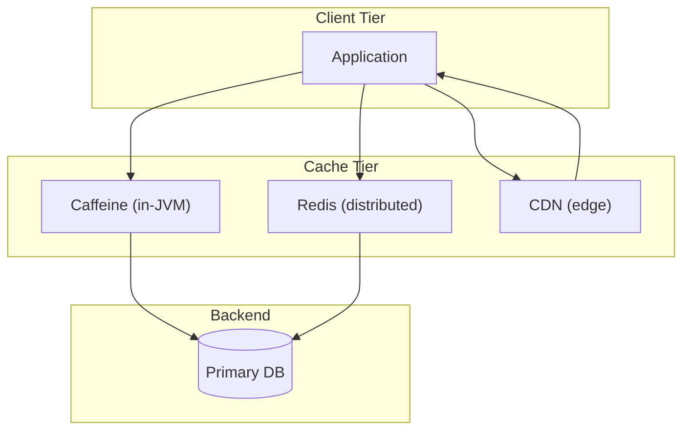

## 3. Five Ws + One H

### What <a class="askgpt-btn" href="https://chatgpt.com/?prompt=Read%20this%20section%20of%20my%20encyclopedia%20and%20explain%20it%20in%20depth%20with%20concrete%20examples%2C%20the%20main%20trade-offs%2C%20and%20common%20pitfalls%20a%20practitioner%20should%20know%3A%0A%0Ahttps%3A%2F%2Fgithub.com%2Fvishvasg14%2Fsoftware-engineering-encyclopedia%2Fblob%2Fmain%2F08-caching%2Fcaching.md%23what%0A%0ASection%20title%3A%20What" target="_blank" rel="noopener" data-askgpt="What" data-askgpt-url="https://github.com/vishvasg14/software-engineering-encyclopedia/blob/main/08-caching/caching.md#what" data-askgpt-prompt-depth="Read%20this%20section%20of%20my%20encyclopedia%20and%20explain%20it%20in%20depth%20with%20concrete%20examples%2C%20the%20main%20trade-offs%2C%20and%20common%20pitfalls%20a%20practitioner%20should%20know%3A%0A%0Ahttps%3A%2F%2Fgithub.com%2Fvishvasg14%2Fsoftware-engineering-encyclopedia%2Fblob%2Fmain%2F08-caching%2Fcaching.md%23what%0A%0ASection%20title%3A%20What" data-askgpt-prompt-examples="Read%20this%20section%20of%20my%20encyclopedia%20and%20give%20me%202-3%20real-world%20production%20examples%20for%20it.%20For%20each%3A%20what%20went%20right%2C%20what%20went%20wrong%2C%20and%20the%20lessons%20learned.%20Include%20company%20%2F%20project%20names%20if%20relevant.%0A%0Ahttps%3A%2F%2Fgithub.com%2Fvishvasg14%2Fsoftware-engineering-encyclopedia%2Fblob%2Fmain%2F08-caching%2Fcaching.md%23what%0A%0ASection%20title%3A%20What" title="Ask ChatGPT about this section">💬</a>

**Redis** is an in-memory data structure server that can be used as a cache, database, message broker, or streaming engine. **Caffeine** is a high-performance in-JVM caching library for Java. **Memcached** is a simple distributed in-memory cache.

### Why <a class="askgpt-btn" href="https://chatgpt.com/?prompt=Read%20this%20section%20of%20my%20encyclopedia%20and%20explain%20it%20in%20depth%20with%20concrete%20examples%2C%20the%20main%20trade-offs%2C%20and%20common%20pitfalls%20a%20practitioner%20should%20know%3A%0A%0Ahttps%3A%2F%2Fgithub.com%2Fvishvasg14%2Fsoftware-engineering-encyclopedia%2Fblob%2Fmain%2F08-caching%2Fcaching.md%23why%0A%0ASection%20title%3A%20Why" target="_blank" rel="noopener" data-askgpt="Why" data-askgpt-url="https://github.com/vishvasg14/software-engineering-encyclopedia/blob/main/08-caching/caching.md#why" data-askgpt-prompt-depth="Read%20this%20section%20of%20my%20encyclopedia%20and%20explain%20it%20in%20depth%20with%20concrete%20examples%2C%20the%20main%20trade-offs%2C%20and%20common%20pitfalls%20a%20practitioner%20should%20know%3A%0A%0Ahttps%3A%2F%2Fgithub.com%2Fvishvasg14%2Fsoftware-engineering-encyclopedia%2Fblob%2Fmain%2F08-caching%2Fcaching.md%23why%0A%0ASection%20title%3A%20Why" data-askgpt-prompt-examples="Read%20this%20section%20of%20my%20encyclopedia%20and%20give%20me%202-3%20real-world%20production%20examples%20for%20it.%20For%20each%3A%20what%20went%20right%2C%20what%20went%20wrong%2C%20and%20the%20lessons%20learned.%20Include%20company%20%2F%20project%20names%20if%20relevant.%0A%0Ahttps%3A%2F%2Fgithub.com%2Fvishvasg14%2Fsoftware-engineering-encyclopedia%2Fblob%2Fmain%2F08-caching%2Fcaching.md%23why%0A%0ASection%20title%3A%20Why" title="Ask ChatGPT about this section">💬</a>

Caching exists because applications have hot data — data that's accessed far more often than the rest. By storing hot data in memory (Redis, Caffeine) or at the edge (CDN), we avoid slow disk accesses to the primary database.

### When <a class="askgpt-btn" href="https://chatgpt.com/?prompt=Read%20this%20section%20of%20my%20encyclopedia%20and%20explain%20it%20in%20depth%20with%20concrete%20examples%2C%20the%20main%20trade-offs%2C%20and%20common%20pitfalls%20a%20practitioner%20should%20know%3A%0A%0Ahttps%3A%2F%2Fgithub.com%2Fvishvasg14%2Fsoftware-engineering-encyclopedia%2Fblob%2Fmain%2F08-caching%2Fcaching.md%23when%0A%0ASection%20title%3A%20When" target="_blank" rel="noopener" data-askgpt="When" data-askgpt-url="https://github.com/vishvasg14/software-engineering-encyclopedia/blob/main/08-caching/caching.md#when" data-askgpt-prompt-depth="Read%20this%20section%20of%20my%20encyclopedia%20and%20explain%20it%20in%20depth%20with%20concrete%20examples%2C%20the%20main%20trade-offs%2C%20and%20common%20pitfalls%20a%20practitioner%20should%20know%3A%0A%0Ahttps%3A%2F%2Fgithub.com%2Fvishvasg14%2Fsoftware-engineering-encyclopedia%2Fblob%2Fmain%2F08-caching%2Fcaching.md%23when%0A%0ASection%20title%3A%20When" data-askgpt-prompt-examples="Read%20this%20section%20of%20my%20encyclopedia%20and%20give%20me%202-3%20real-world%20production%20examples%20for%20it.%20For%20each%3A%20what%20went%20right%2C%20what%20went%20wrong%2C%20and%20the%20lessons%20learned.%20Include%20company%20%2F%20project%20names%20if%20relevant.%0A%0Ahttps%3A%2F%2Fgithub.com%2Fvishvasg14%2Fsoftware-engineering-encyclopedia%2Fblob%2Fmain%2F08-caching%2Fcaching.md%23when%0A%0ASection%20title%3A%20When" title="Ask ChatGPT about this section">💬</a>

Memcached (2003) was the original open-source distributed cache. Redis (2009) extended the model to a multi-data-structure server. Caffeine (2014) became the standard in-JVM cache for Java after Guava Cache. The pattern of "cache everything you can" matured in the 2010s.

### Where <a class="askgpt-btn" href="https://chatgpt.com/?prompt=Read%20this%20section%20of%20my%20encyclopedia%20and%20explain%20it%20in%20depth%20with%20concrete%20examples%2C%20the%20main%20trade-offs%2C%20and%20common%20pitfalls%20a%20practitioner%20should%20know%3A%0A%0Ahttps%3A%2F%2Fgithub.com%2Fvishvasg14%2Fsoftware-engineering-encyclopedia%2Fblob%2Fmain%2F08-caching%2Fcaching.md%23where%0A%0ASection%20title%3A%20Where" target="_blank" rel="noopener" data-askgpt="Where" data-askgpt-url="https://github.com/vishvasg14/software-engineering-encyclopedia/blob/main/08-caching/caching.md#where" data-askgpt-prompt-depth="Read%20this%20section%20of%20my%20encyclopedia%20and%20explain%20it%20in%20depth%20with%20concrete%20examples%2C%20the%20main%20trade-offs%2C%20and%20common%20pitfalls%20a%20practitioner%20should%20know%3A%0A%0Ahttps%3A%2F%2Fgithub.com%2Fvishvasg14%2Fsoftware-engineering-encyclopedia%2Fblob%2Fmain%2F08-caching%2Fcaching.md%23where%0A%0ASection%20title%3A%20Where" data-askgpt-prompt-examples="Read%20this%20section%20of%20my%20encyclopedia%20and%20give%20me%202-3%20real-world%20production%20examples%20for%20it.%20For%20each%3A%20what%20went%20right%2C%20what%20went%20wrong%2C%20and%20the%20lessons%20learned.%20Include%20company%20%2F%20project%20names%20if%20relevant.%0A%0Ahttps%3A%2F%2Fgithub.com%2Fvishvasg14%2Fsoftware-engineering-encyclopedia%2Fblob%2Fmain%2F08-caching%2Fcaching.md%23where%0A%0ASection%20title%3A%20Where" title="Ask ChatGPT about this section">💬</a>

- **Twitter:** Redis for timelines and counters.
- **GitHub:** Redis for rate limiting and session state.
- **Facebook/Meta:** Memcached and TAO for social graph.
- **Pinterest:** Redis for feed generation.
- **Stack Overflow, GitLab, Discourse:** Redis for session, rate limiting, queue.

### Who <a class="askgpt-btn" href="https://chatgpt.com/?prompt=Read%20this%20section%20of%20my%20encyclopedia%20and%20explain%20it%20in%20depth%20with%20concrete%20examples%2C%20the%20main%20trade-offs%2C%20and%20common%20pitfalls%20a%20practitioner%20should%20know%3A%0A%0Ahttps%3A%2F%2Fgithub.com%2Fvishvasg14%2Fsoftware-engineering-encyclopedia%2Fblob%2Fmain%2F08-caching%2Fcaching.md%23who%0A%0ASection%20title%3A%20Who" target="_blank" rel="noopener" data-askgpt="Who" data-askgpt-url="https://github.com/vishvasg14/software-engineering-encyclopedia/blob/main/08-caching/caching.md#who" data-askgpt-prompt-depth="Read%20this%20section%20of%20my%20encyclopedia%20and%20explain%20it%20in%20depth%20with%20concrete%20examples%2C%20the%20main%20trade-offs%2C%20and%20common%20pitfalls%20a%20practitioner%20should%20know%3A%0A%0Ahttps%3A%2F%2Fgithub.com%2Fvishvasg14%2Fsoftware-engineering-encyclopedia%2Fblob%2Fmain%2F08-caching%2Fcaching.md%23who%0A%0ASection%20title%3A%20Who" data-askgpt-prompt-examples="Read%20this%20section%20of%20my%20encyclopedia%20and%20give%20me%202-3%20real-world%20production%20examples%20for%20it.%20For%20each%3A%20what%20went%20right%2C%20what%20went%20wrong%2C%20and%20the%20lessons%20learned.%20Include%20company%20%2F%20project%20names%20if%20relevant.%0A%0Ahttps%3A%2F%2Fgithub.com%2Fvishvasg14%2Fsoftware-engineering-encyclopedia%2Fblob%2Fmain%2F08-caching%2Fcaching.md%23who%0A%0ASection%20title%3A%20Who" title="Ask ChatGPT about this section">💬</a>

- **Memcached:** Brad Fitzpatrick (LiveJournal), 2003.
- **Redis:** Salvatore Sanfilippo (antirez), 2009. Now part of Redis Inc.
- **Caffeine:** Ben Manes (discontinued Guava Cache author).
- **Hazelcast:** Hazelcast company.

### How (one-paragraph preview) <a class="askgpt-btn" href="https://chatgpt.com/?prompt=Read%20this%20section%20of%20my%20encyclopedia%20and%20explain%20it%20in%20depth%20with%20concrete%20examples%2C%20the%20main%20trade-offs%2C%20and%20common%20pitfalls%20a%20practitioner%20should%20know%3A%0A%0Ahttps%3A%2F%2Fgithub.com%2Fvishvasg14%2Fsoftware-engineering-encyclopedia%2Fblob%2Fmain%2F08-caching%2Fcaching.md%23how-one-paragraph-preview%0A%0ASection%20title%3A%20How%20(one-paragraph%20preview)" target="_blank" rel="noopener" data-askgpt="How (one-paragraph preview)" data-askgpt-url="https://github.com/vishvasg14/software-engineering-encyclopedia/blob/main/08-caching/caching.md#how-one-paragraph-preview" data-askgpt-prompt-depth="Read%20this%20section%20of%20my%20encyclopedia%20and%20explain%20it%20in%20depth%20with%20concrete%20examples%2C%20the%20main%20trade-offs%2C%20and%20common%20pitfalls%20a%20practitioner%20should%20know%3A%0A%0Ahttps%3A%2F%2Fgithub.com%2Fvishvasg14%2Fsoftware-engineering-encyclopedia%2Fblob%2Fmain%2F08-caching%2Fcaching.md%23how-one-paragraph-preview%0A%0ASection%20title%3A%20How%20(one-paragraph%20preview)" data-askgpt-prompt-examples="Read%20this%20section%20of%20my%20encyclopedia%20and%20give%20me%202-3%20real-world%20production%20examples%20for%20it.%20For%20each%3A%20what%20went%20right%2C%20what%20went%20wrong%2C%20and%20the%20lessons%20learned.%20Include%20company%20%2F%20project%20names%20if%20relevant.%0A%0Ahttps%3A%2F%2Fgithub.com%2Fvishvasg14%2Fsoftware-engineering-encyclopedia%2Fblob%2Fmain%2F08-caching%2Fcaching.md%23how-one-paragraph-preview%0A%0ASection%20title%3A%20How%20(one-paragraph%20preview)" title="Ask ChatGPT about this section">💬</a>

A client application checks the cache before going to the source of truth. On a hit, it serves the cached value. On a miss, it fetches from the source, stores it in the cache (typically with a TTL), and serves it. The cache uses an eviction algorithm (LRU, LFU, W-TinyLFU) to bound memory. On writes, the pattern (cache-aside, write-through, write-behind) determines whether the cache is updated synchronously or async. Invalidation ensures stale data doesn't linger.

## 4. History

### 4.1 Origins (2003-2009) <a class="askgpt-btn" href="https://chatgpt.com/?prompt=Read%20this%20section%20of%20my%20encyclopedia%20and%20explain%20it%20in%20depth%20with%20concrete%20examples%2C%20the%20main%20trade-offs%2C%20and%20common%20pitfalls%20a%20practitioner%20should%20know%3A%0A%0Ahttps%3A%2F%2Fgithub.com%2Fvishvasg14%2Fsoftware-engineering-encyclopedia%2Fblob%2Fmain%2F08-caching%2Fcaching.md%2341-origins-2003-2009%0A%0ASection%20title%3A%204.1%20Origins%20(2003-2009)" target="_blank" rel="noopener" data-askgpt="4.1 Origins (2003-2009)" data-askgpt-url="https://github.com/vishvasg14/software-engineering-encyclopedia/blob/main/08-caching/caching.md#41-origins-2003-2009" data-askgpt-prompt-depth="Read%20this%20section%20of%20my%20encyclopedia%20and%20explain%20it%20in%20depth%20with%20concrete%20examples%2C%20the%20main%20trade-offs%2C%20and%20common%20pitfalls%20a%20practitioner%20should%20know%3A%0A%0Ahttps%3A%2F%2Fgithub.com%2Fvishvasg14%2Fsoftware-engineering-encyclopedia%2Fblob%2Fmain%2F08-caching%2Fcaching.md%2341-origins-2003-2009%0A%0ASection%20title%3A%204.1%20Origins%20(2003-2009)" data-askgpt-prompt-examples="Read%20this%20section%20of%20my%20encyclopedia%20and%20give%20me%202-3%20real-world%20production%20examples%20for%20it.%20For%20each%3A%20what%20went%20right%2C%20what%20went%20wrong%2C%20and%20the%20lessons%20learned.%20Include%20company%20%2F%20project%20names%20if%20relevant.%0A%0Ahttps%3A%2F%2Fgithub.com%2Fvishvasg14%2Fsoftware-engineering-encyclopedia%2Fblob%2Fmain%2F08-caching%2Fcaching.md%2341-origins-2003-2009%0A%0ASection%20title%3A%204.1%20Origins%20(2003-2009)" title="Ask ChatGPT about this section">💬</a>

- **2003** — Brad Fitzpatrick creates **Memcached** at LiveJournal to scale reads.
- **2003-2008** — Memcached becomes the standard distributed cache (Facebook, Twitter, Wikipedia).
- **2009** — Salvatore Sanfilippo creates **Redis** in Italy. Originally for real-time web analytics.

### 4.2 Growth (2009-2014) <a class="askgpt-btn" href="https://chatgpt.com/?prompt=Read%20this%20section%20of%20my%20encyclopedia%20and%20explain%20it%20in%20depth%20with%20concrete%20examples%2C%20the%20main%20trade-offs%2C%20and%20common%20pitfalls%20a%20practitioner%20should%20know%3A%0A%0Ahttps%3A%2F%2Fgithub.com%2Fvishvasg14%2Fsoftware-engineering-encyclopedia%2Fblob%2Fmain%2F08-caching%2Fcaching.md%2342-growth-2009-2014%0A%0ASection%20title%3A%204.2%20Growth%20(2009-2014)" target="_blank" rel="noopener" data-askgpt="4.2 Growth (2009-2014)" data-askgpt-url="https://github.com/vishvasg14/software-engineering-encyclopedia/blob/main/08-caching/caching.md#42-growth-2009-2014" data-askgpt-prompt-depth="Read%20this%20section%20of%20my%20encyclopedia%20and%20explain%20it%20in%20depth%20with%20concrete%20examples%2C%20the%20main%20trade-offs%2C%20and%20common%20pitfalls%20a%20practitioner%20should%20know%3A%0A%0Ahttps%3A%2F%2Fgithub.com%2Fvishvasg14%2Fsoftware-engineering-encyclopedia%2Fblob%2Fmain%2F08-caching%2Fcaching.md%2342-growth-2009-2014%0A%0ASection%20title%3A%204.2%20Growth%20(2009-2014)" data-askgpt-prompt-examples="Read%20this%20section%20of%20my%20encyclopedia%20and%20give%20me%202-3%20real-world%20production%20examples%20for%20it.%20For%20each%3A%20what%20went%20right%2C%20what%20went%20wrong%2C%20and%20the%20lessons%20learned.%20Include%20company%20%2F%20project%20names%20if%20relevant.%0A%0Ahttps%3A%2F%2Fgithub.com%2Fvishvasg14%2Fsoftware-engineering-encyclopedia%2Fblob%2Fmain%2F08-caching%2Fcaching.md%2342-growth-2009-2014%0A%0ASection%20title%3A%204.2%20Growth%20(2009-2014)" title="Ask ChatGPT about this section">💬</a>

- **2009** — Redis 1.0 released.
- **2010** — Redis adds replication.
- **2012** — Redis adds Lua scripting.
- **2014** — Caffeine (originally Guava Cache) becomes standard for Java. Spring Boot begins using it.
- **2015** — Redis Cluster GA.
- **2016** — Redis 3.2 adds LFU eviction and Streams (preview).

### 4.3 Modern era (2017-2026) <a class="askgpt-btn" href="https://chatgpt.com/?prompt=Read%20this%20section%20of%20my%20encyclopedia%20and%20explain%20it%20in%20depth%20with%20concrete%20examples%2C%20the%20main%20trade-offs%2C%20and%20common%20pitfalls%20a%20practitioner%20should%20know%3A%0A%0Ahttps%3A%2F%2Fgithub.com%2Fvishvasg14%2Fsoftware-engineering-encyclopedia%2Fblob%2Fmain%2F08-caching%2Fcaching.md%2343-modern-era-2017-2026%0A%0ASection%20title%3A%204.3%20Modern%20era%20(2017-2026)" target="_blank" rel="noopener" data-askgpt="4.3 Modern era (2017-2026)" data-askgpt-url="https://github.com/vishvasg14/software-engineering-encyclopedia/blob/main/08-caching/caching.md#43-modern-era-2017-2026" data-askgpt-prompt-depth="Read%20this%20section%20of%20my%20encyclopedia%20and%20explain%20it%20in%20depth%20with%20concrete%20examples%2C%20the%20main%20trade-offs%2C%20and%20common%20pitfalls%20a%20practitioner%20should%20know%3A%0A%0Ahttps%3A%2F%2Fgithub.com%2Fvishvasg14%2Fsoftware-engineering-encyclopedia%2Fblob%2Fmain%2F08-caching%2Fcaching.md%2343-modern-era-2017-2026%0A%0ASection%20title%3A%204.3%20Modern%20era%20(2017-2026)" data-askgpt-prompt-examples="Read%20this%20section%20of%20my%20encyclopedia%20and%20give%20me%202-3%20real-world%20production%20examples%20for%20it.%20For%20each%3A%20what%20went%20right%2C%20what%20went%20wrong%2C%20and%20the%20lessons%20learned.%20Include%20company%20%2F%20project%20names%20if%20relevant.%0A%0Ahttps%3A%2F%2Fgithub.com%2Fvishvasg14%2Fsoftware-engineering-encyclopedia%2Fblob%2Fmain%2F08-caching%2Fcaching.md%2343-modern-era-2017-2026%0A%0ASection%20title%3A%204.3%20Modern%20era%20(2017-2026)" title="Ask ChatGPT about this section">💬</a>

- **2017** — Redis 4.0: modules (RediSearch, RedisJSON).
- **2018** — Redis 5.0: Streams GA.
- **2020** — Redis 6.0: ACL, RESP3, client-side caching.
- **2021** — Caffeine 3.0 (Java 11+).
- **2023** — Redis 7.0: functions, ACLv2.
- **2024** — Redis 7.2: improvements.
- **2025** — Caffeine 3.2 (Java 17+).

### 4.4 Governance <a class="askgpt-btn" href="https://chatgpt.com/?prompt=Read%20this%20section%20of%20my%20encyclopedia%20and%20explain%20it%20in%20depth%20with%20concrete%20examples%2C%20the%20main%20trade-offs%2C%20and%20common%20pitfalls%20a%20practitioner%20should%20know%3A%0A%0Ahttps%3A%2F%2Fgithub.com%2Fvishvasg14%2Fsoftware-engineering-encyclopedia%2Fblob%2Fmain%2F08-caching%2Fcaching.md%2344-governance%0A%0ASection%20title%3A%204.4%20Governance" target="_blank" rel="noopener" data-askgpt="4.4 Governance" data-askgpt-url="https://github.com/vishvasg14/software-engineering-encyclopedia/blob/main/08-caching/caching.md#44-governance" data-askgpt-prompt-depth="Read%20this%20section%20of%20my%20encyclopedia%20and%20explain%20it%20in%20depth%20with%20concrete%20examples%2C%20the%20main%20trade-offs%2C%20and%20common%20pitfalls%20a%20practitioner%20should%20know%3A%0A%0Ahttps%3A%2F%2Fgithub.com%2Fvishvasg14%2Fsoftware-engineering-encyclopedia%2Fblob%2Fmain%2F08-caching%2Fcaching.md%2344-governance%0A%0ASection%20title%3A%204.4%20Governance" data-askgpt-prompt-examples="Read%20this%20section%20of%20my%20encyclopedia%20and%20give%20me%202-3%20real-world%20production%20examples%20for%20it.%20For%20each%3A%20what%20went%20right%2C%20what%20went%20wrong%2C%20and%20the%20lessons%20learned.%20Include%20company%20%2F%20project%20names%20if%20relevant.%0A%0Ahttps%3A%2F%2Fgithub.com%2Fvishvasg14%2Fsoftware-engineering-encyclopedia%2Fblob%2Fmain%2F08-caching%2Fcaching.md%2344-governance%0A%0ASection%20title%3A%204.4%20Governance" title="Ask ChatGPT about this section">💬</a>

- **Redis:** Originally BSD-licensed; Redis Inc. relicensed some modules (RSAL/SSPLv1) in 2024. The open-source Redis fork is **Valkey** (Linux Foundation) since 2024.
- **Caffeine:** Apache 2.0.
- **Memcached:** BSD.
- **Hazelcast:** Apache 2.0.

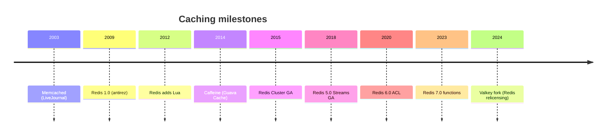

## 5. Problem Statement

### 5.1 What caching solves <a class="askgpt-btn" href="https://chatgpt.com/?prompt=Read%20this%20section%20of%20my%20encyclopedia%20and%20explain%20it%20in%20depth%20with%20concrete%20examples%2C%20the%20main%20trade-offs%2C%20and%20common%20pitfalls%20a%20practitioner%20should%20know%3A%0A%0Ahttps%3A%2F%2Fgithub.com%2Fvishvasg14%2Fsoftware-engineering-encyclopedia%2Fblob%2Fmain%2F08-caching%2Fcaching.md%2351-what-caching-solves%0A%0ASection%20title%3A%205.1%20What%20caching%20solves" target="_blank" rel="noopener" data-askgpt="5.1 What caching solves" data-askgpt-url="https://github.com/vishvasg14/software-engineering-encyclopedia/blob/main/08-caching/caching.md#51-what-caching-solves" data-askgpt-prompt-depth="Read%20this%20section%20of%20my%20encyclopedia%20and%20explain%20it%20in%20depth%20with%20concrete%20examples%2C%20the%20main%20trade-offs%2C%20and%20common%20pitfalls%20a%20practitioner%20should%20know%3A%0A%0Ahttps%3A%2F%2Fgithub.com%2Fvishvasg14%2Fsoftware-engineering-encyclopedia%2Fblob%2Fmain%2F08-caching%2Fcaching.md%2351-what-caching-solves%0A%0ASection%20title%3A%205.1%20What%20caching%20solves" data-askgpt-prompt-examples="Read%20this%20section%20of%20my%20encyclopedia%20and%20give%20me%202-3%20real-world%20production%20examples%20for%20it.%20For%20each%3A%20what%20went%20right%2C%20what%20went%20wrong%2C%20and%20the%20lessons%20learned.%20Include%20company%20%2F%20project%20names%20if%20relevant.%0A%0Ahttps%3A%2F%2Fgithub.com%2Fvishvasg14%2Fsoftware-engineering-encyclopedia%2Fblob%2Fmain%2F08-caching%2Fcaching.md%2351-what-caching-solves%0A%0ASection%20title%3A%205.1%20What%20caching%20solves" title="Ask ChatGPT about this section">💬</a>

Caching addresses:

- **Read latency** — in-memory access is 1000× faster than disk.
- **Read load** — a cache can absorb 90%+ of reads, freeing the database.
- **Compute** — expensive computations can be cached.
- **Cost** — fewer database queries = lower CPU/IO cost.

### 5.2 What caching doesn't solve <a class="askgpt-btn" href="https://chatgpt.com/?prompt=Read%20this%20section%20of%20my%20encyclopedia%20and%20explain%20it%20in%20depth%20with%20concrete%20examples%2C%20the%20main%20trade-offs%2C%20and%20common%20pitfalls%20a%20practitioner%20should%20know%3A%0A%0Ahttps%3A%2F%2Fgithub.com%2Fvishvasg14%2Fsoftware-engineering-encyclopedia%2Fblob%2Fmain%2F08-caching%2Fcaching.md%2352-what-caching-doesnt-solve%0A%0ASection%20title%3A%205.2%20What%20caching%20doesn't%20solve" target="_blank" rel="noopener" data-askgpt="5.2 What caching doesn't solve" data-askgpt-url="https://github.com/vishvasg14/software-engineering-encyclopedia/blob/main/08-caching/caching.md#52-what-caching-doesnt-solve" data-askgpt-prompt-depth="Read%20this%20section%20of%20my%20encyclopedia%20and%20explain%20it%20in%20depth%20with%20concrete%20examples%2C%20the%20main%20trade-offs%2C%20and%20common%20pitfalls%20a%20practitioner%20should%20know%3A%0A%0Ahttps%3A%2F%2Fgithub.com%2Fvishvasg14%2Fsoftware-engineering-encyclopedia%2Fblob%2Fmain%2F08-caching%2Fcaching.md%2352-what-caching-doesnt-solve%0A%0ASection%20title%3A%205.2%20What%20caching%20doesn't%20solve" data-askgpt-prompt-examples="Read%20this%20section%20of%20my%20encyclopedia%20and%20give%20me%202-3%20real-world%20production%20examples%20for%20it.%20For%20each%3A%20what%20went%20right%2C%20what%20went%20wrong%2C%20and%20the%20lessons%20learned.%20Include%20company%20%2F%20project%20names%20if%20relevant.%0A%0Ahttps%3A%2F%2Fgithub.com%2Fvishvasg14%2Fsoftware-engineering-encyclopedia%2Fblob%2Fmain%2F08-caching%2Fcaching.md%2352-what-caching-doesnt-solve%0A%0ASection%20title%3A%205.2%20What%20caching%20doesn't%20solve" title="Ask ChatGPT about this section">💬</a>

- **Consistency** — cached data can become stale.
- **Single source of truth** — the database is still authoritative.
- **Write scaling** — caching helps reads, not writes.
- **Real-time data** — unless TTL is very short, cache lags reality.

### 5.3 Why not cache everything? <a class="askgpt-btn" href="https://chatgpt.com/?prompt=Read%20this%20section%20of%20my%20encyclopedia%20and%20explain%20it%20in%20depth%20with%20concrete%20examples%2C%20the%20main%20trade-offs%2C%20and%20common%20pitfalls%20a%20practitioner%20should%20know%3A%0A%0Ahttps%3A%2F%2Fgithub.com%2Fvishvasg14%2Fsoftware-engineering-encyclopedia%2Fblob%2Fmain%2F08-caching%2Fcaching.md%2353-why-not-cache-everything%0A%0ASection%20title%3A%205.3%20Why%20not%20cache%20everything%3F" target="_blank" rel="noopener" data-askgpt="5.3 Why not cache everything?" data-askgpt-url="https://github.com/vishvasg14/software-engineering-encyclopedia/blob/main/08-caching/caching.md#53-why-not-cache-everything" data-askgpt-prompt-depth="Read%20this%20section%20of%20my%20encyclopedia%20and%20explain%20it%20in%20depth%20with%20concrete%20examples%2C%20the%20main%20trade-offs%2C%20and%20common%20pitfalls%20a%20practitioner%20should%20know%3A%0A%0Ahttps%3A%2F%2Fgithub.com%2Fvishvasg14%2Fsoftware-engineering-encyclopedia%2Fblob%2Fmain%2F08-caching%2Fcaching.md%2353-why-not-cache-everything%0A%0ASection%20title%3A%205.3%20Why%20not%20cache%20everything%3F" data-askgpt-prompt-examples="Read%20this%20section%20of%20my%20encyclopedia%20and%20give%20me%202-3%20real-world%20production%20examples%20for%20it.%20For%20each%3A%20what%20went%20right%2C%20what%20went%20wrong%2C%20and%20the%20lessons%20learned.%20Include%20company%20%2F%20project%20names%20if%20relevant.%0A%0Ahttps%3A%2F%2Fgithub.com%2Fvishvasg14%2Fsoftware-engineering-encyclopedia%2Fblob%2Fmain%2F08-caching%2Fcaching.md%2353-why-not-cache-everything%0A%0ASection%20title%3A%205.3%20Why%20not%20cache%20everything%3F" title="Ask ChatGPT about this section">💬</a>

- Memory is finite.
- Cache invalidation is hard.
- Cold cache (cold start) causes thundering herd.
- Stale data causes correctness bugs.

## 6. Real-World Motivation

### 6.1 Twitter / X <a class="askgpt-btn" href="https://chatgpt.com/?prompt=Read%20this%20section%20of%20my%20encyclopedia%20and%20explain%20it%20in%20depth%20with%20concrete%20examples%2C%20the%20main%20trade-offs%2C%20and%20common%20pitfalls%20a%20practitioner%20should%20know%3A%0A%0Ahttps%3A%2F%2Fgithub.com%2Fvishvasg14%2Fsoftware-engineering-encyclopedia%2Fblob%2Fmain%2F08-caching%2Fcaching.md%2361-twitter-x%0A%0ASection%20title%3A%206.1%20Twitter%20%2F%20X" target="_blank" rel="noopener" data-askgpt="6.1 Twitter / X" data-askgpt-url="https://github.com/vishvasg14/software-engineering-encyclopedia/blob/main/08-caching/caching.md#61-twitter-x" data-askgpt-prompt-depth="Read%20this%20section%20of%20my%20encyclopedia%20and%20explain%20it%20in%20depth%20with%20concrete%20examples%2C%20the%20main%20trade-offs%2C%20and%20common%20pitfalls%20a%20practitioner%20should%20know%3A%0A%0Ahttps%3A%2F%2Fgithub.com%2Fvishvasg14%2Fsoftware-engineering-encyclopedia%2Fblob%2Fmain%2F08-caching%2Fcaching.md%2361-twitter-x%0A%0ASection%20title%3A%206.1%20Twitter%20%2F%20X" data-askgpt-prompt-examples="Read%20this%20section%20of%20my%20encyclopedia%20and%20give%20me%202-3%20real-world%20production%20examples%20for%20it.%20For%20each%3A%20what%20went%20right%2C%20what%20went%20wrong%2C%20and%20the%20lessons%20learned.%20Include%20company%20%2F%20project%20names%20if%20relevant.%0A%0Ahttps%3A%2F%2Fgithub.com%2Fvishvasg14%2Fsoftware-engineering-encyclopedia%2Fblob%2Fmain%2F08-caching%2Fcaching.md%2361-twitter-x%0A%0ASection%20title%3A%206.1%20Twitter%20%2F%20X" title="Ask ChatGPT about this section">💬</a>

Twitter uses Redis extensively for timelines (home_timeline, user_timeline), counters, and rate limiting. Their engineering has published several influential posts on Redis at scale.

### 6.2 Pinterest <a class="askgpt-btn" href="https://chatgpt.com/?prompt=Read%20this%20section%20of%20my%20encyclopedia%20and%20explain%20it%20in%20depth%20with%20concrete%20examples%2C%20the%20main%20trade-offs%2C%20and%20common%20pitfalls%20a%20practitioner%20should%20know%3A%0A%0Ahttps%3A%2F%2Fgithub.com%2Fvishvasg14%2Fsoftware-engineering-encyclopedia%2Fblob%2Fmain%2F08-caching%2Fcaching.md%2362-pinterest%0A%0ASection%20title%3A%206.2%20Pinterest" target="_blank" rel="noopener" data-askgpt="6.2 Pinterest" data-askgpt-url="https://github.com/vishvasg14/software-engineering-encyclopedia/blob/main/08-caching/caching.md#62-pinterest" data-askgpt-prompt-depth="Read%20this%20section%20of%20my%20encyclopedia%20and%20explain%20it%20in%20depth%20with%20concrete%20examples%2C%20the%20main%20trade-offs%2C%20and%20common%20pitfalls%20a%20practitioner%20should%20know%3A%0A%0Ahttps%3A%2F%2Fgithub.com%2Fvishvasg14%2Fsoftware-engineering-encyclopedia%2Fblob%2Fmain%2F08-caching%2Fcaching.md%2362-pinterest%0A%0ASection%20title%3A%206.2%20Pinterest" data-askgpt-prompt-examples="Read%20this%20section%20of%20my%20encyclopedia%20and%20give%20me%202-3%20real-world%20production%20examples%20for%20it.%20For%20each%3A%20what%20went%20right%2C%20what%20went%20wrong%2C%20and%20the%20lessons%20learned.%20Include%20company%20%2F%20project%20names%20if%20relevant.%0A%0Ahttps%3A%2F%2Fgithub.com%2Fvishvasg14%2Fsoftware-engineering-encyclopedia%2Fblob%2Fmain%2F08-caching%2Fcaching.md%2362-pinterest%0A%0ASection%20title%3A%206.2%20Pinterest" title="Ask ChatGPT about this section">💬</a>

Pinterest uses Redis as a cache layer for their feed generation. They've published on caching patterns and Redis operations.

### 6.3 Facebook / Meta <a class="askgpt-btn" href="https://chatgpt.com/?prompt=Read%20this%20section%20of%20my%20encyclopedia%20and%20explain%20it%20in%20depth%20with%20concrete%20examples%2C%20the%20main%20trade-offs%2C%20and%20common%20pitfalls%20a%20practitioner%20should%20know%3A%0A%0Ahttps%3A%2F%2Fgithub.com%2Fvishvasg14%2Fsoftware-engineering-encyclopedia%2Fblob%2Fmain%2F08-caching%2Fcaching.md%2363-facebook-meta%0A%0ASection%20title%3A%206.3%20Facebook%20%2F%20Meta" target="_blank" rel="noopener" data-askgpt="6.3 Facebook / Meta" data-askgpt-url="https://github.com/vishvasg14/software-engineering-encyclopedia/blob/main/08-caching/caching.md#63-facebook-meta" data-askgpt-prompt-depth="Read%20this%20section%20of%20my%20encyclopedia%20and%20explain%20it%20in%20depth%20with%20concrete%20examples%2C%20the%20main%20trade-offs%2C%20and%20common%20pitfalls%20a%20practitioner%20should%20know%3A%0A%0Ahttps%3A%2F%2Fgithub.com%2Fvishvasg14%2Fsoftware-engineering-encyclopedia%2Fblob%2Fmain%2F08-caching%2Fcaching.md%2363-facebook-meta%0A%0ASection%20title%3A%206.3%20Facebook%20%2F%20Meta" data-askgpt-prompt-examples="Read%20this%20section%20of%20my%20encyclopedia%20and%20give%20me%202-3%20real-world%20production%20examples%20for%20it.%20For%20each%3A%20what%20went%20right%2C%20what%20went%20wrong%2C%20and%20the%20lessons%20learned.%20Include%20company%20%2F%20project%20names%20if%20relevant.%0A%0Ahttps%3A%2F%2Fgithub.com%2Fvishvasg14%2Fsoftware-engineering-encyclopedia%2Fblob%2Fmain%2F08-caching%2Fcaching.md%2363-facebook-meta%0A%0ASection%20title%3A%206.3%20Facebook%20%2F%20Meta" title="Ask ChatGPT about this section">💬</a>

Meta uses Memcached at massive scale (thousands of servers) for their social graph cache. They pioneered many caching patterns (leases, "thundering herd protection").

### 6.4 GitHub <a class="askgpt-btn" href="https://chatgpt.com/?prompt=Read%20this%20section%20of%20my%20encyclopedia%20and%20explain%20it%20in%20depth%20with%20concrete%20examples%2C%20the%20main%20trade-offs%2C%20and%20common%20pitfalls%20a%20practitioner%20should%20know%3A%0A%0Ahttps%3A%2F%2Fgithub.com%2Fvishvasg14%2Fsoftware-engineering-encyclopedia%2Fblob%2Fmain%2F08-caching%2Fcaching.md%2364-github%0A%0ASection%20title%3A%206.4%20GitHub" target="_blank" rel="noopener" data-askgpt="6.4 GitHub" data-askgpt-url="https://github.com/vishvasg14/software-engineering-encyclopedia/blob/main/08-caching/caching.md#64-github" data-askgpt-prompt-depth="Read%20this%20section%20of%20my%20encyclopedia%20and%20explain%20it%20in%20depth%20with%20concrete%20examples%2C%20the%20main%20trade-offs%2C%20and%20common%20pitfalls%20a%20practitioner%20should%20know%3A%0A%0Ahttps%3A%2F%2Fgithub.com%2Fvishvasg14%2Fsoftware-engineering-encyclopedia%2Fblob%2Fmain%2F08-caching%2Fcaching.md%2364-github%0A%0ASection%20title%3A%206.4%20GitHub" data-askgpt-prompt-examples="Read%20this%20section%20of%20my%20encyclopedia%20and%20give%20me%202-3%20real-world%20production%20examples%20for%20it.%20For%20each%3A%20what%20went%20right%2C%20what%20went%20wrong%2C%20and%20the%20lessons%20learned.%20Include%20company%20%2F%20project%20names%20if%20relevant.%0A%0Ahttps%3A%2F%2Fgithub.com%2Fvishvasg14%2Fsoftware-engineering-encyclopedia%2Fblob%2Fmain%2F08-caching%2Fcaching.md%2364-github%0A%0ASection%20title%3A%206.4%20GitHub" title="Ask ChatGPT about this section">💬</a>

GitHub uses Redis for session storage and rate limiting. They built Haystack on top of it for blob storage.

### 6.5 Economic motivation <a class="askgpt-btn" href="https://chatgpt.com/?prompt=Read%20this%20section%20of%20my%20encyclopedia%20and%20explain%20it%20in%20depth%20with%20concrete%20examples%2C%20the%20main%20trade-offs%2C%20and%20common%20pitfalls%20a%20practitioner%20should%20know%3A%0A%0Ahttps%3A%2F%2Fgithub.com%2Fvishvasg14%2Fsoftware-engineering-encyclopedia%2Fblob%2Fmain%2F08-caching%2Fcaching.md%2365-economic-motivation%0A%0ASection%20title%3A%206.5%20Economic%20motivation" target="_blank" rel="noopener" data-askgpt="6.5 Economic motivation" data-askgpt-url="https://github.com/vishvasg14/software-engineering-encyclopedia/blob/main/08-caching/caching.md#65-economic-motivation" data-askgpt-prompt-depth="Read%20this%20section%20of%20my%20encyclopedia%20and%20explain%20it%20in%20depth%20with%20concrete%20examples%2C%20the%20main%20trade-offs%2C%20and%20common%20pitfalls%20a%20practitioner%20should%20know%3A%0A%0Ahttps%3A%2F%2Fgithub.com%2Fvishvasg14%2Fsoftware-engineering-encyclopedia%2Fblob%2Fmain%2F08-caching%2Fcaching.md%2365-economic-motivation%0A%0ASection%20title%3A%206.5%20Economic%20motivation" data-askgpt-prompt-examples="Read%20this%20section%20of%20my%20encyclopedia%20and%20give%20me%202-3%20real-world%20production%20examples%20for%20it.%20For%20each%3A%20what%20went%20right%2C%20what%20went%20wrong%2C%20and%20the%20lessons%20learned.%20Include%20company%20%2F%20project%20names%20if%20relevant.%0A%0Ahttps%3A%2F%2Fgithub.com%2Fvishvasg14%2Fsoftware-engineering-encyclopedia%2Fblob%2Fmain%2F08-caching%2Fcaching.md%2365-economic-motivation%0A%0ASection%20title%3A%206.5%20Economic%20motivation" title="Ask ChatGPT about this section">💬</a>

- **Latency** — Caffeine in-JVM cache: sub-microsecond. Redis: sub-millisecond.
- **Cost** — fewer database queries = lower database cost.
- **Throughput** — a single Redis instance can handle 100K+ ops/s.

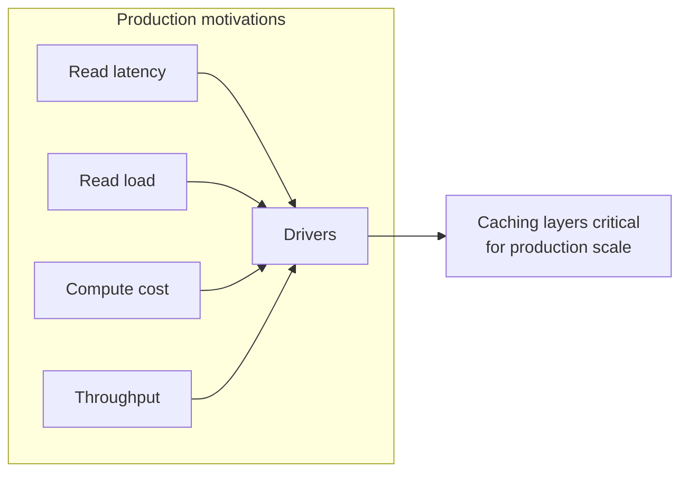

---

## 7. Internal Working

### 7.1 The lifecycle of a cache read <a class="askgpt-btn" href="https://chatgpt.com/?prompt=Read%20this%20section%20of%20my%20encyclopedia%20and%20explain%20it%20in%20depth%20with%20concrete%20examples%2C%20the%20main%20trade-offs%2C%20and%20common%20pitfalls%20a%20practitioner%20should%20know%3A%0A%0Ahttps%3A%2F%2Fgithub.com%2Fvishvasg14%2Fsoftware-engineering-encyclopedia%2Fblob%2Fmain%2F08-caching%2Fcaching.md%2371-the-lifecycle-of-a-cache-read%0A%0ASection%20title%3A%207.1%20The%20lifecycle%20of%20a%20cache%20read" target="_blank" rel="noopener" data-askgpt="7.1 The lifecycle of a cache read" data-askgpt-url="https://github.com/vishvasg14/software-engineering-encyclopedia/blob/main/08-caching/caching.md#71-the-lifecycle-of-a-cache-read" data-askgpt-prompt-depth="Read%20this%20section%20of%20my%20encyclopedia%20and%20explain%20it%20in%20depth%20with%20concrete%20examples%2C%20the%20main%20trade-offs%2C%20and%20common%20pitfalls%20a%20practitioner%20should%20know%3A%0A%0Ahttps%3A%2F%2Fgithub.com%2Fvishvasg14%2Fsoftware-engineering-encyclopedia%2Fblob%2Fmain%2F08-caching%2Fcaching.md%2371-the-lifecycle-of-a-cache-read%0A%0ASection%20title%3A%207.1%20The%20lifecycle%20of%20a%20cache%20read" data-askgpt-prompt-examples="Read%20this%20section%20of%20my%20encyclopedia%20and%20give%20me%202-3%20real-world%20production%20examples%20for%20it.%20For%20each%3A%20what%20went%20right%2C%20what%20went%20wrong%2C%20and%20the%20lessons%20learned.%20Include%20company%20%2F%20project%20names%20if%20relevant.%0A%0Ahttps%3A%2F%2Fgithub.com%2Fvishvasg14%2Fsoftware-engineering-encyclopedia%2Fblob%2Fmain%2F08-caching%2Fcaching.md%2371-the-lifecycle-of-a-cache-read%0A%0ASection%20title%3A%207.1%20The%20lifecycle%20of%20a%20cache%20read" title="Ask ChatGPT about this section">💬</a>

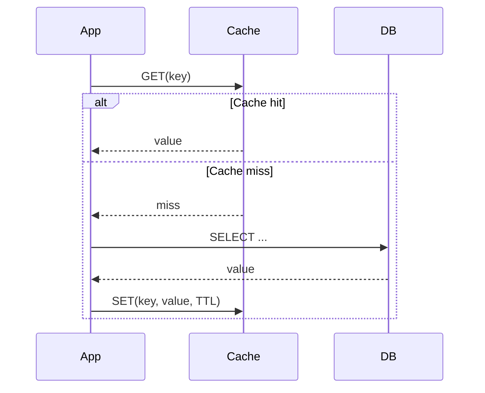

### 7.2 Subsystems that participate <a class="askgpt-btn" href="https://chatgpt.com/?prompt=Read%20this%20section%20of%20my%20encyclopedia%20and%20explain%20it%20in%20depth%20with%20concrete%20examples%2C%20the%20main%20trade-offs%2C%20and%20common%20pitfalls%20a%20practitioner%20should%20know%3A%0A%0Ahttps%3A%2F%2Fgithub.com%2Fvishvasg14%2Fsoftware-engineering-encyclopedia%2Fblob%2Fmain%2F08-caching%2Fcaching.md%2372-subsystems-that-participate%0A%0ASection%20title%3A%207.2%20Subsystems%20that%20participate" target="_blank" rel="noopener" data-askgpt="7.2 Subsystems that participate" data-askgpt-url="https://github.com/vishvasg14/software-engineering-encyclopedia/blob/main/08-caching/caching.md#72-subsystems-that-participate" data-askgpt-prompt-depth="Read%20this%20section%20of%20my%20encyclopedia%20and%20explain%20it%20in%20depth%20with%20concrete%20examples%2C%20the%20main%20trade-offs%2C%20and%20common%20pitfalls%20a%20practitioner%20should%20know%3A%0A%0Ahttps%3A%2F%2Fgithub.com%2Fvishvasg14%2Fsoftware-engineering-encyclopedia%2Fblob%2Fmain%2F08-caching%2Fcaching.md%2372-subsystems-that-participate%0A%0ASection%20title%3A%207.2%20Subsystems%20that%20participate" data-askgpt-prompt-examples="Read%20this%20section%20of%20my%20encyclopedia%20and%20give%20me%202-3%20real-world%20production%20examples%20for%20it.%20For%20each%3A%20what%20went%20right%2C%20what%20went%20wrong%2C%20and%20the%20lessons%20learned.%20Include%20company%20%2F%20project%20names%20if%20relevant.%0A%0Ahttps%3A%2F%2Fgithub.com%2Fvishvasg14%2Fsoftware-engineering-encyclopedia%2Fblob%2Fmain%2F08-caching%2Fcaching.md%2372-subsystems-that-participate%0A%0ASection%20title%3A%207.2%20Subsystems%20that%20participate" title="Ask ChatGPT about this section">💬</a>

| Subsystem | Responsibility |
|-----------|---------------|
| **Client** | Reads/writes via cached library |
| **Cache library** (Caffeine) | In-JVM cache: eviction, expiration |
| **Cache server** (Redis, Memcached) | Networked key-value store |
| **CDN** | Edge cache for HTTP responses |
| **Source of truth** (DB) | Authoritative store |
| **Observability** | Metrics, traces |

### 7.3 Caffeine architecture <a class="askgpt-btn" href="https://chatgpt.com/?prompt=Read%20this%20section%20of%20my%20encyclopedia%20and%20explain%20it%20in%20depth%20with%20concrete%20examples%2C%20the%20main%20trade-offs%2C%20and%20common%20pitfalls%20a%20practitioner%20should%20know%3A%0A%0Ahttps%3A%2F%2Fgithub.com%2Fvishvasg14%2Fsoftware-engineering-encyclopedia%2Fblob%2Fmain%2F08-caching%2Fcaching.md%2373-caffeine-architecture%0A%0ASection%20title%3A%207.3%20Caffeine%20architecture" target="_blank" rel="noopener" data-askgpt="7.3 Caffeine architecture" data-askgpt-url="https://github.com/vishvasg14/software-engineering-encyclopedia/blob/main/08-caching/caching.md#73-caffeine-architecture" data-askgpt-prompt-depth="Read%20this%20section%20of%20my%20encyclopedia%20and%20explain%20it%20in%20depth%20with%20concrete%20examples%2C%20the%20main%20trade-offs%2C%20and%20common%20pitfalls%20a%20practitioner%20should%20know%3A%0A%0Ahttps%3A%2F%2Fgithub.com%2Fvishvasg14%2Fsoftware-engineering-encyclopedia%2Fblob%2Fmain%2F08-caching%2Fcaching.md%2373-caffeine-architecture%0A%0ASection%20title%3A%207.3%20Caffeine%20architecture" data-askgpt-prompt-examples="Read%20this%20section%20of%20my%20encyclopedia%20and%20give%20me%202-3%20real-world%20production%20examples%20for%20it.%20For%20each%3A%20what%20went%20right%2C%20what%20went%20wrong%2C%20and%20the%20lessons%20learned.%20Include%20company%20%2F%20project%20names%20if%20relevant.%0A%0Ahttps%3A%2F%2Fgithub.com%2Fvishvasg14%2Fsoftware-engineering-encyclopedia%2Fblob%2Fmain%2F08-caching%2Fcaching.md%2373-caffeine-architecture%0A%0ASection%20title%3A%207.3%20Caffeine%20architecture" title="Ask ChatGPT about this section">💬</a>

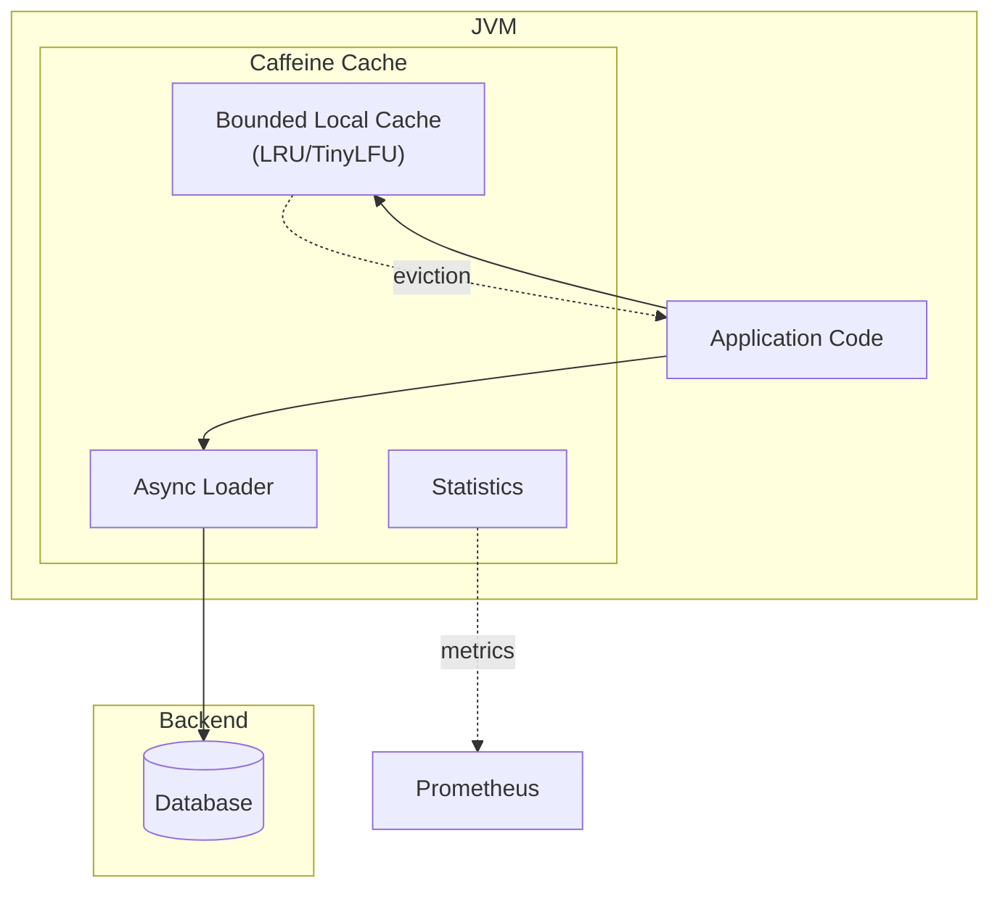

### 7.4 Redis event loop <a class="askgpt-btn" href="https://chatgpt.com/?prompt=Read%20this%20section%20of%20my%20encyclopedia%20and%20explain%20it%20in%20depth%20with%20concrete%20examples%2C%20the%20main%20trade-offs%2C%20and%20common%20pitfalls%20a%20practitioner%20should%20know%3A%0A%0Ahttps%3A%2F%2Fgithub.com%2Fvishvasg14%2Fsoftware-engineering-encyclopedia%2Fblob%2Fmain%2F08-caching%2Fcaching.md%2374-redis-event-loop%0A%0ASection%20title%3A%207.4%20Redis%20event%20loop" target="_blank" rel="noopener" data-askgpt="7.4 Redis event loop" data-askgpt-url="https://github.com/vishvasg14/software-engineering-encyclopedia/blob/main/08-caching/caching.md#74-redis-event-loop" data-askgpt-prompt-depth="Read%20this%20section%20of%20my%20encyclopedia%20and%20explain%20it%20in%20depth%20with%20concrete%20examples%2C%20the%20main%20trade-offs%2C%20and%20common%20pitfalls%20a%20practitioner%20should%20know%3A%0A%0Ahttps%3A%2F%2Fgithub.com%2Fvishvasg14%2Fsoftware-engineering-encyclopedia%2Fblob%2Fmain%2F08-caching%2Fcaching.md%2374-redis-event-loop%0A%0ASection%20title%3A%207.4%20Redis%20event%20loop" data-askgpt-prompt-examples="Read%20this%20section%20of%20my%20encyclopedia%20and%20give%20me%202-3%20real-world%20production%20examples%20for%20it.%20For%20each%3A%20what%20went%20right%2C%20what%20went%20wrong%2C%20and%20the%20lessons%20learned.%20Include%20company%20%2F%20project%20names%20if%20relevant.%0A%0Ahttps%3A%2F%2Fgithub.com%2Fvishvasg14%2Fsoftware-engineering-encyclopedia%2Fblob%2Fmain%2F08-caching%2Fcaching.md%2374-redis-event-loop%0A%0ASection%20title%3A%207.4%20Redis%20event%20loop" title="Ask ChatGPT about this section">💬</a>

```mermaid
sequenceDiagram
    participant C as Client
    participant Loop as Event Loop
    Loop->>Loop: epoll_wait / kqueue / select
    C->>Loop: send command
    Loop->>Loop: parse
    Loop->>Loop: execute (single-threaded)
    Loop-->>C: response
    Note over Loop: Memory access is the bottleneck;<br/>single-threading avoids locks
```

## 8. Deep Dive

This section is the heart of the document.

### 8.1 Redis data structures <a class="askgpt-btn" href="https://chatgpt.com/?prompt=Read%20this%20section%20of%20my%20encyclopedia%20and%20explain%20it%20in%20depth%20with%20concrete%20examples%2C%20the%20main%20trade-offs%2C%20and%20common%20pitfalls%20a%20practitioner%20should%20know%3A%0A%0Ahttps%3A%2F%2Fgithub.com%2Fvishvasg14%2Fsoftware-engineering-encyclopedia%2Fblob%2Fmain%2F08-caching%2Fcaching.md%2381-redis-data-structures%0A%0ASection%20title%3A%208.1%20Redis%20data%20structures" target="_blank" rel="noopener" data-askgpt="8.1 Redis data structures" data-askgpt-url="https://github.com/vishvasg14/software-engineering-encyclopedia/blob/main/08-caching/caching.md#81-redis-data-structures" data-askgpt-prompt-depth="Read%20this%20section%20of%20my%20encyclopedia%20and%20explain%20it%20in%20depth%20with%20concrete%20examples%2C%20the%20main%20trade-offs%2C%20and%20common%20pitfalls%20a%20practitioner%20should%20know%3A%0A%0Ahttps%3A%2F%2Fgithub.com%2Fvishvasg14%2Fsoftware-engineering-encyclopedia%2Fblob%2Fmain%2F08-caching%2Fcaching.md%2381-redis-data-structures%0A%0ASection%20title%3A%208.1%20Redis%20data%20structures" data-askgpt-prompt-examples="Read%20this%20section%20of%20my%20encyclopedia%20and%20give%20me%202-3%20real-world%20production%20examples%20for%20it.%20For%20each%3A%20what%20went%20right%2C%20what%20went%20wrong%2C%20and%20the%20lessons%20learned.%20Include%20company%20%2F%20project%20names%20if%20relevant.%0A%0Ahttps%3A%2F%2Fgithub.com%2Fvishvasg14%2Fsoftware-engineering-encyclopedia%2Fblob%2Fmain%2F08-caching%2Fcaching.md%2381-redis-data-structures%0A%0ASection%20title%3A%208.1%20Redis%20data%20structures" title="Ask ChatGPT about this section">💬</a>

**Strings:**

```bash
SET user:1:name "Alice"
SET user:1:visits 0
INCR user:1:visits
GET user:1:visits
MSET user:1:name "Alice" user:1:email "alice@example.com"
```

Max 512 MB. Used for caching, counters, sessions, locking (SETNX).

**Hashes:**

```bash
HSET user:1 name "Alice" email "alice@..." active true
HGETALL user:1
HINCRBY user:1 visits 1
```

Map of fields to values. Used for object caching. Avoids JSON serialization overhead.

**Lists:**

```bash
LPUSH recent:activity "user1:login" "user2:click"
LRANGE recent:activity 0 9
LPOP recent:activity
RPOP recent:activity
```

Doubly-linked list. Used for queues, recent activity, pub/sub primitives.

**Sets:**

```bash
SADD tags:article:1 "tech" "redis"
SMEMBERS tags:article:1
SINTER tags:article:1 tags:article:2
SUNION tags:article:1 tags:article:2
```

Unordered collection of unique strings. Used for tags, members, deduplication.

**Sorted sets:**

```bash
ZADD leaderboard 1000 "alice"
ZADD leaderboard 950 "bob"
ZREVRANGE leaderboard 0 9
ZINCRBY leaderboard 100 "alice"
```

Score-ordered set. Used for leaderboards, time-series (score = timestamp), priority queues.

**Streams:**

```bash
XADD events:user * type "click" user "alice"
XLEN events:user
XRANGE events:user - +
XREAD BLOCK 10000 STREAMS events:user $
```

Append-only log with consumer groups. Used for event streaming, message queues, activity feeds.

**HyperLogLog (HLL):**

```bash
PFADD unique:visitors "user1" "user2" "user3"
PFCOUNT unique:visitors
```

Approximate distinct count with ~0.81% error. Fixed memory (12 KB). Used for "DAU" metrics.

**Geospatial:**

```bash
GEOADD locations 13.361389 38.115556 "Palermo"
GEODIST locations "Palermo" "Catania"
GEOSEARCH locations FROMLONLAT 15 LAT 37 RADIUS 200 km
```

Lat/long. Used for "find nearby", location-based services.

**Bitmaps:**

```bash
SETBIT daily:active:2024-01-15 12345 1
BITCOUNT daily:active:2024-01-15
BITOP OR daily:active:7d daily:active:2024-01-09 daily:active:2024-01-08
```

Bit operations on strings. Used for daily/monthly active user tracking.

### 8.2 Redis persistence <a class="askgpt-btn" href="https://chatgpt.com/?prompt=Read%20this%20section%20of%20my%20encyclopedia%20and%20explain%20it%20in%20depth%20with%20concrete%20examples%2C%20the%20main%20trade-offs%2C%20and%20common%20pitfalls%20a%20practitioner%20should%20know%3A%0A%0Ahttps%3A%2F%2Fgithub.com%2Fvishvasg14%2Fsoftware-engineering-encyclopedia%2Fblob%2Fmain%2F08-caching%2Fcaching.md%2382-redis-persistence%0A%0ASection%20title%3A%208.2%20Redis%20persistence" target="_blank" rel="noopener" data-askgpt="8.2 Redis persistence" data-askgpt-url="https://github.com/vishvasg14/software-engineering-encyclopedia/blob/main/08-caching/caching.md#82-redis-persistence" data-askgpt-prompt-depth="Read%20this%20section%20of%20my%20encyclopedia%20and%20explain%20it%20in%20depth%20with%20concrete%20examples%2C%20the%20main%20trade-offs%2C%20and%20common%20pitfalls%20a%20practitioner%20should%20know%3A%0A%0Ahttps%3A%2F%2Fgithub.com%2Fvishvasg14%2Fsoftware-engineering-encyclopedia%2Fblob%2Fmain%2F08-caching%2Fcaching.md%2382-redis-persistence%0A%0ASection%20title%3A%208.2%20Redis%20persistence" data-askgpt-prompt-examples="Read%20this%20section%20of%20my%20encyclopedia%20and%20give%20me%202-3%20real-world%20production%20examples%20for%20it.%20For%20each%3A%20what%20went%20right%2C%20what%20went%20wrong%2C%20and%20the%20lessons%20learned.%20Include%20company%20%2F%20project%20names%20if%20relevant.%0A%0Ahttps%3A%2F%2Fgithub.com%2Fvishvasg14%2Fsoftware-engineering-encyclopedia%2Fblob%2Fmain%2F08-caching%2Fcaching.md%2382-redis-persistence%0A%0ASection%20title%3A%208.2%20Redis%20persistence" title="Ask ChatGPT about this section">💬</a>

Redis offers two persistence options (configurable per instance):

**RDB (Redis Database):**
- Point-in-time snapshots.
- Configurable: `save 3600 1000` (snapshot every hour if 1000+ keys changed).
- Format: `dump.rdb` file.
- Fast to load, but data loss between snapshots.

**AOF (Append Only File):**
- Log every write operation.
- Configurable fsync policy: `everysec`, `always`, `no`.
- Replay on startup to restore state.
- Larger than RDB; some performance overhead.

**Best practice:** Use RDB for backups and AOF with `everysec` for durability. Redis 4.0+ supports RDB + AOF hybrid mode where AOF is rewritten as RDB snapshots.

### 8.3 Redis replication <a class="askgpt-btn" href="https://chatgpt.com/?prompt=Read%20this%20section%20of%20my%20encyclopedia%20and%20explain%20it%20in%20depth%20with%20concrete%20examples%2C%20the%20main%20trade-offs%2C%20and%20common%20pitfalls%20a%20practitioner%20should%20know%3A%0A%0Ahttps%3A%2F%2Fgithub.com%2Fvishvasg14%2Fsoftware-engineering-encyclopedia%2Fblob%2Fmain%2F08-caching%2Fcaching.md%2383-redis-replication%0A%0ASection%20title%3A%208.3%20Redis%20replication" target="_blank" rel="noopener" data-askgpt="8.3 Redis replication" data-askgpt-url="https://github.com/vishvasg14/software-engineering-encyclopedia/blob/main/08-caching/caching.md#83-redis-replication" data-askgpt-prompt-depth="Read%20this%20section%20of%20my%20encyclopedia%20and%20explain%20it%20in%20depth%20with%20concrete%20examples%2C%20the%20main%20trade-offs%2C%20and%20common%20pitfalls%20a%20practitioner%20should%20know%3A%0A%0Ahttps%3A%2F%2Fgithub.com%2Fvishvasg14%2Fsoftware-engineering-encyclopedia%2Fblob%2Fmain%2F08-caching%2Fcaching.md%2383-redis-replication%0A%0ASection%20title%3A%208.3%20Redis%20replication" data-askgpt-prompt-examples="Read%20this%20section%20of%20my%20encyclopedia%20and%20give%20me%202-3%20real-world%20production%20examples%20for%20it.%20For%20each%3A%20what%20went%20right%2C%20what%20went%20wrong%2C%20and%20the%20lessons%20learned.%20Include%20company%20%2F%20project%20names%20if%20relevant.%0A%0Ahttps%3A%2F%2Fgithub.com%2Fvishvasg14%2Fsoftware-engineering-encyclopedia%2Fblob%2Fmain%2F08-caching%2Fcaching.md%2383-redis-replication%0A%0ASection%20title%3A%208.3%20Redis%20replication" title="Ask ChatGPT about this section">💬</a>

Redis uses async leader-replica replication:

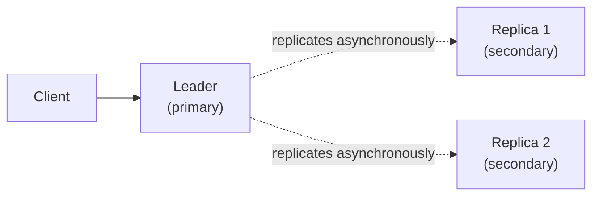

- Replicas connect to leader.
- Leader sends write commands to replicas.
- Async by default; can be configured for sync replication.

**Use cases:**
- Read scaling (reads go to replicas).
- High availability (failover to replica).
- Geographic distribution.

**Consistency:** Async replication means replicas may lag. Reads from replicas can return stale data. Tunable via `WAIT` for stronger guarantees.

### 8.4 Redis Sentinel <a class="askgpt-btn" href="https://chatgpt.com/?prompt=Read%20this%20section%20of%20my%20encyclopedia%20and%20explain%20it%20in%20depth%20with%20concrete%20examples%2C%20the%20main%20trade-offs%2C%20and%20common%20pitfalls%20a%20practitioner%20should%20know%3A%0A%0Ahttps%3A%2F%2Fgithub.com%2Fvishvasg14%2Fsoftware-engineering-encyclopedia%2Fblob%2Fmain%2F08-caching%2Fcaching.md%2384-redis-sentinel%0A%0ASection%20title%3A%208.4%20Redis%20Sentinel" target="_blank" rel="noopener" data-askgpt="8.4 Redis Sentinel" data-askgpt-url="https://github.com/vishvasg14/software-engineering-encyclopedia/blob/main/08-caching/caching.md#84-redis-sentinel" data-askgpt-prompt-depth="Read%20this%20section%20of%20my%20encyclopedia%20and%20explain%20it%20in%20depth%20with%20concrete%20examples%2C%20the%20main%20trade-offs%2C%20and%20common%20pitfalls%20a%20practitioner%20should%20know%3A%0A%0Ahttps%3A%2F%2Fgithub.com%2Fvishvasg14%2Fsoftware-engineering-encyclopedia%2Fblob%2Fmain%2F08-caching%2Fcaching.md%2384-redis-sentinel%0A%0ASection%20title%3A%208.4%20Redis%20Sentinel" data-askgpt-prompt-examples="Read%20this%20section%20of%20my%20encyclopedia%20and%20give%20me%202-3%20real-world%20production%20examples%20for%20it.%20For%20each%3A%20what%20went%20right%2C%20what%20went%20wrong%2C%20and%20the%20lessons%20learned.%20Include%20company%20%2F%20project%20names%20if%20relevant.%0A%0Ahttps%3A%2F%2Fgithub.com%2Fvishvasg14%2Fsoftware-engineering-encyclopedia%2Fblob%2Fmain%2F08-caching%2Fcaching.md%2384-redis-sentinel%0A%0ASection%20title%3A%208.4%20Redis%20Sentinel" title="Ask ChatGPT about this section">💬</a>

Sentinel provides automatic failover:

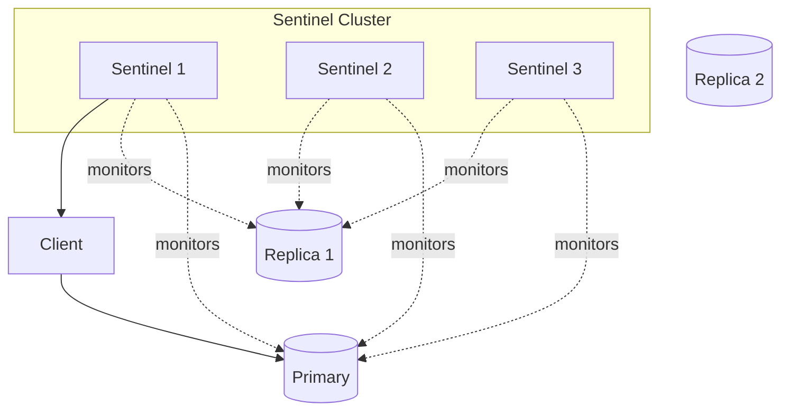

- Multiple sentinels monitor the master.
- If majority of sentinels agree master is down, elect new master from replicas.
- Client connects via sentinel, gets current master address.
- Quorum: typically 3 sentinels, 2+ agreement required.

### 8.5 Redis Cluster <a class="askgpt-btn" href="https://chatgpt.com/?prompt=Read%20this%20section%20of%20my%20encyclopedia%20and%20explain%20it%20in%20depth%20with%20concrete%20examples%2C%20the%20main%20trade-offs%2C%20and%20common%20pitfalls%20a%20practitioner%20should%20know%3A%0A%0Ahttps%3A%2F%2Fgithub.com%2Fvishvasg14%2Fsoftware-engineering-encyclopedia%2Fblob%2Fmain%2F08-caching%2Fcaching.md%2385-redis-cluster%0A%0ASection%20title%3A%208.5%20Redis%20Cluster" target="_blank" rel="noopener" data-askgpt="8.5 Redis Cluster" data-askgpt-url="https://github.com/vishvasg14/software-engineering-encyclopedia/blob/main/08-caching/caching.md#85-redis-cluster" data-askgpt-prompt-depth="Read%20this%20section%20of%20my%20encyclopedia%20and%20explain%20it%20in%20depth%20with%20concrete%20examples%2C%20the%20main%20trade-offs%2C%20and%20common%20pitfalls%20a%20practitioner%20should%20know%3A%0A%0Ahttps%3A%2F%2Fgithub.com%2Fvishvasg14%2Fsoftware-engineering-encyclopedia%2Fblob%2Fmain%2F08-caching%2Fcaching.md%2385-redis-cluster%0A%0ASection%20title%3A%208.5%20Redis%20Cluster" data-askgpt-prompt-examples="Read%20this%20section%20of%20my%20encyclopedia%20and%20give%20me%202-3%20real-world%20production%20examples%20for%20it.%20For%20each%3A%20what%20went%20right%2C%20what%20went%20wrong%2C%20and%20the%20lessons%20learned.%20Include%20company%20%2F%20project%20names%20if%20relevant.%0A%0Ahttps%3A%2F%2Fgithub.com%2Fvishvasg14%2Fsoftware-engineering-encyclopedia%2Fblob%2Fmain%2F08-caching%2Fcaching.md%2385-redis-cluster%0A%0ASection%20title%3A%208.5%20Redis%20Cluster" title="Ask ChatGPT about this section">💬</a>

For horizontal scaling, Redis Cluster shards data across nodes:

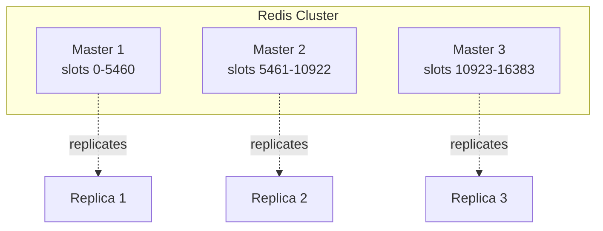

**Hash slots:** 16,384 slots; key `foo` hashes to `CRC16(key) mod 16384`. Each master owns slots.

**Hash tags:** `{user:123}.profile` and `{user:123}.sessions` use the same hash because the tag `user:123` is what gets hashed. This enables multi-key operations.

**Resharding:** Move slots from one node to another without downtime.

**Limitations:**
- Multi-key operations require keys in the same slot.
- No multi-database.
- Lua scripts must touch keys in one slot.

### 8.6 Redis transactions <a class="askgpt-btn" href="https://chatgpt.com/?prompt=Read%20this%20section%20of%20my%20encyclopedia%20and%20explain%20it%20in%20depth%20with%20concrete%20examples%2C%20the%20main%20trade-offs%2C%20and%20common%20pitfalls%20a%20practitioner%20should%20know%3A%0A%0Ahttps%3A%2F%2Fgithub.com%2Fvishvasg14%2Fsoftware-engineering-encyclopedia%2Fblob%2Fmain%2F08-caching%2Fcaching.md%2386-redis-transactions%0A%0ASection%20title%3A%208.6%20Redis%20transactions" target="_blank" rel="noopener" data-askgpt="8.6 Redis transactions" data-askgpt-url="https://github.com/vishvasg14/software-engineering-encyclopedia/blob/main/08-caching/caching.md#86-redis-transactions" data-askgpt-prompt-depth="Read%20this%20section%20of%20my%20encyclopedia%20and%20explain%20it%20in%20depth%20with%20concrete%20examples%2C%20the%20main%20trade-offs%2C%20and%20common%20pitfalls%20a%20practitioner%20should%20know%3A%0A%0Ahttps%3A%2F%2Fgithub.com%2Fvishvasg14%2Fsoftware-engineering-encyclopedia%2Fblob%2Fmain%2F08-caching%2Fcaching.md%2386-redis-transactions%0A%0ASection%20title%3A%208.6%20Redis%20transactions" data-askgpt-prompt-examples="Read%20this%20section%20of%20my%20encyclopedia%20and%20give%20me%202-3%20real-world%20production%20examples%20for%20it.%20For%20each%3A%20what%20went%20right%2C%20what%20went%20wrong%2C%20and%20the%20lessons%20learned.%20Include%20company%20%2F%20project%20names%20if%20relevant.%0A%0Ahttps%3A%2F%2Fgithub.com%2Fvishvasg14%2Fsoftware-engineering-encyclopedia%2Fblob%2Fmain%2F08-caching%2Fcaching.md%2386-redis-transactions%0A%0ASection%20title%3A%208.6%20Redis%20transactions" title="Ask ChatGPT about this section">💬</a>

Redis supports MULTI/EXEC transactions:

```bash
MULTI
INCR user:1:balance
DECR user:2:balance
INCR transfers:count
EXEC
```

- Commands queued, executed atomically.
- Other clients see no intermediate state.
- No rollback on failure.

**Optimistic locking via WATCH:**

```bash
WATCH user:1:balance
val = GET user:1:balance
if val > 100:
    MULTI
    DECRBY user:1:balance 100
    INCRBY user:2:balance 100
    EXEC
else:
    UNWATCH
```

- WATCH monitors keys; if any change before EXEC, the transaction is aborted.

### 8.7 Redis Streams (consumer groups) <a class="askgpt-btn" href="https://chatgpt.com/?prompt=Read%20this%20section%20of%20my%20encyclopedia%20and%20explain%20it%20in%20depth%20with%20concrete%20examples%2C%20the%20main%20trade-offs%2C%20and%20common%20pitfalls%20a%20practitioner%20should%20know%3A%0A%0Ahttps%3A%2F%2Fgithub.com%2Fvishvasg14%2Fsoftware-engineering-encyclopedia%2Fblob%2Fmain%2F08-caching%2Fcaching.md%2387-redis-streams-consumer-groups%0A%0ASection%20title%3A%208.7%20Redis%20Streams%20(consumer%20groups)" target="_blank" rel="noopener" data-askgpt="8.7 Redis Streams (consumer groups)" data-askgpt-url="https://github.com/vishvasg14/software-engineering-encyclopedia/blob/main/08-caching/caching.md#87-redis-streams-consumer-groups" data-askgpt-prompt-depth="Read%20this%20section%20of%20my%20encyclopedia%20and%20explain%20it%20in%20depth%20with%20concrete%20examples%2C%20the%20main%20trade-offs%2C%20and%20common%20pitfalls%20a%20practitioner%20should%20know%3A%0A%0Ahttps%3A%2F%2Fgithub.com%2Fvishvasg14%2Fsoftware-engineering-encyclopedia%2Fblob%2Fmain%2F08-caching%2Fcaching.md%2387-redis-streams-consumer-groups%0A%0ASection%20title%3A%208.7%20Redis%20Streams%20(consumer%20groups)" data-askgpt-prompt-examples="Read%20this%20section%20of%20my%20encyclopedia%20and%20give%20me%202-3%20real-world%20production%20examples%20for%20it.%20For%20each%3A%20what%20went%20right%2C%20what%20went%20wrong%2C%20and%20the%20lessons%20learned.%20Include%20company%20%2F%20project%20names%20if%20relevant.%0A%0Ahttps%3A%2F%2Fgithub.com%2Fvishvasg14%2Fsoftware-engineering-encyclopedia%2Fblob%2Fmain%2F08-caching%2Fcaching.md%2387-redis-streams-consumer-groups%0A%0ASection%20title%3A%208.7%20Redis%20Streams%20(consumer%20groups)" title="Ask ChatGPT about this section">💬</a>

```bash
# Producer
XADD events:user * type "click" user "alice"

# Consumer group
XGROUP CREATE events:user consumer1 $
XREADGROUP GROUP consumer1 alice COUNT 10 BLOCK 5000 STREAMS events:user >
XACK events:user consumer1 <id>
```

- Consumer groups: multiple consumers share work.
- Pending entries: list (PEL) tracks unacked messages.
- `>` (new), `0` (from start), `$` (from end).
- Re-delivery via XCLAIM/XAUTOCLAIM.

### 8.8 Redis Lua scripting <a class="askgpt-btn" href="https://chatgpt.com/?prompt=Read%20this%20section%20of%20my%20encyclopedia%20and%20explain%20it%20in%20depth%20with%20concrete%20examples%2C%20the%20main%20trade-offs%2C%20and%20common%20pitfalls%20a%20practitioner%20should%20know%3A%0A%0Ahttps%3A%2F%2Fgithub.com%2Fvishvasg14%2Fsoftware-engineering-encyclopedia%2Fblob%2Fmain%2F08-caching%2Fcaching.md%2388-redis-lua-scripting%0A%0ASection%20title%3A%208.8%20Redis%20Lua%20scripting" target="_blank" rel="noopener" data-askgpt="8.8 Redis Lua scripting" data-askgpt-url="https://github.com/vishvasg14/software-engineering-encyclopedia/blob/main/08-caching/caching.md#88-redis-lua-scripting" data-askgpt-prompt-depth="Read%20this%20section%20of%20my%20encyclopedia%20and%20explain%20it%20in%20depth%20with%20concrete%20examples%2C%20the%20main%20trade-offs%2C%20and%20common%20pitfalls%20a%20practitioner%20should%20know%3A%0A%0Ahttps%3A%2F%2Fgithub.com%2Fvishvasg14%2Fsoftware-engineering-encyclopedia%2Fblob%2Fmain%2F08-caching%2Fcaching.md%2388-redis-lua-scripting%0A%0ASection%20title%3A%208.8%20Redis%20Lua%20scripting" data-askgpt-prompt-examples="Read%20this%20section%20of%20my%20encyclopedia%20and%20give%20me%202-3%20real-world%20production%20examples%20for%20it.%20For%20each%3A%20what%20went%20right%2C%20what%20went%20wrong%2C%20and%20the%20lessons%20learned.%20Include%20company%20%2F%20project%20names%20if%20relevant.%0A%0Ahttps%3A%2F%2Fgithub.com%2Fvishvasg14%2Fsoftware-engineering-encyclopedia%2Fblob%2Fmain%2F08-caching%2Fcaching.md%2388-redis-lua-scripting%0A%0ASection%20title%3A%208.8%20Redis%20Lua%20scripting" title="Ask ChatGPT about this section">💬</a>

```lua
-- Increment and return new value, atomically
local val = redis.call('INCR', KEYS[1])
if val == 1 then
    redis.call('EXPIRE', KEYS[1], ARGV[1])
end
return val
```

Called via `EVAL "..." 1 key arg` or `EVALSHA`. Atomic execution — no other commands run during the script.

### 8.9 Caffeine <a class="askgpt-btn" href="https://chatgpt.com/?prompt=Read%20this%20section%20of%20my%20encyclopedia%20and%20explain%20it%20in%20depth%20with%20concrete%20examples%2C%20the%20main%20trade-offs%2C%20and%20common%20pitfalls%20a%20practitioner%20should%20know%3A%0A%0Ahttps%3A%2F%2Fgithub.com%2Fvishvasg14%2Fsoftware-engineering-encyclopedia%2Fblob%2Fmain%2F08-caching%2Fcaching.md%2389-caffeine%0A%0ASection%20title%3A%208.9%20Caffeine" target="_blank" rel="noopener" data-askgpt="8.9 Caffeine" data-askgpt-url="https://github.com/vishvasg14/software-engineering-encyclopedia/blob/main/08-caching/caching.md#89-caffeine" data-askgpt-prompt-depth="Read%20this%20section%20of%20my%20encyclopedia%20and%20explain%20it%20in%20depth%20with%20concrete%20examples%2C%20the%20main%20trade-offs%2C%20and%20common%20pitfalls%20a%20practitioner%20should%20know%3A%0A%0Ahttps%3A%2F%2Fgithub.com%2Fvishvasg14%2Fsoftware-engineering-encyclopedia%2Fblob%2Fmain%2F08-caching%2Fcaching.md%2389-caffeine%0A%0ASection%20title%3A%208.9%20Caffeine" data-askgpt-prompt-examples="Read%20this%20section%20of%20my%20encyclopedia%20and%20give%20me%202-3%20real-world%20production%20examples%20for%20it.%20For%20each%3A%20what%20went%20right%2C%20what%20went%20wrong%2C%20and%20the%20lessons%20learned.%20Include%20company%20%2F%20project%20names%20if%20relevant.%0A%0Ahttps%3A%2F%2Fgithub.com%2Fvishvasg14%2Fsoftware-engineering-encyclopedia%2Fblob%2Fmain%2F08-caching%2Fcaching.md%2389-caffeine%0A%0ASection%20title%3A%208.9%20Caffeine" title="Ask ChatGPT about this section">💬</a>

**Basic cache:**

```java
Cache<String, User> cache = Caffeine.newBuilder()
    .maximumSize(10_000)
    .expireAfterWrite(Duration.ofMinutes(5))
    .build();

User user = cache.get("user:1", key -> userRepository.findById(1L).orElseThrow());
cache.put("user:1", user);
cache.invalidate("user:1");
```

**Loading cache (automatic loading):**

```java
LoadingCache<String, User> cache = Caffeine.newBuilder()
    .maximumSize(10_000)
    .expireAfterWrite(Duration.ofMinutes(5))
    .build(key -> userRepository.findById(Long.parseLong(key.substring(5))).orElseThrow());

User user = cache.get("user:1");  // auto-loads if missing
```

**Async loading:**

```java
AsyncCache<String, User> cache = Caffeine.newBuilder()
    .maximumSize(10_000)
    .buildAsync();

CompletableFuture<User> future = cache.get("user:1", key ->
    CompletableFuture.supplyAsync(() -> userRepository.findById(...).orElseThrow())
);
```

### 8.10 Caffeine eviction: W-TinyLFU <a class="askgpt-btn" href="https://chatgpt.com/?prompt=Read%20this%20section%20of%20my%20encyclopedia%20and%20explain%20it%20in%20depth%20with%20concrete%20examples%2C%20the%20main%20trade-offs%2C%20and%20common%20pitfalls%20a%20practitioner%20should%20know%3A%0A%0Ahttps%3A%2F%2Fgithub.com%2Fvishvasg14%2Fsoftware-engineering-encyclopedia%2Fblob%2Fmain%2F08-caching%2Fcaching.md%23810-caffeine-eviction-w-tinylfu%0A%0ASection%20title%3A%208.10%20Caffeine%20eviction%3A%20W-TinyLFU" target="_blank" rel="noopener" data-askgpt="8.10 Caffeine eviction: W-TinyLFU" data-askgpt-url="https://github.com/vishvasg14/software-engineering-encyclopedia/blob/main/08-caching/caching.md#810-caffeine-eviction-w-tinylfu" data-askgpt-prompt-depth="Read%20this%20section%20of%20my%20encyclopedia%20and%20explain%20it%20in%20depth%20with%20concrete%20examples%2C%20the%20main%20trade-offs%2C%20and%20common%20pitfalls%20a%20practitioner%20should%20know%3A%0A%0Ahttps%3A%2F%2Fgithub.com%2Fvishvasg14%2Fsoftware-engineering-encyclopedia%2Fblob%2Fmain%2F08-caching%2Fcaching.md%23810-caffeine-eviction-w-tinylfu%0A%0ASection%20title%3A%208.10%20Caffeine%20eviction%3A%20W-TinyLFU" data-askgpt-prompt-examples="Read%20this%20section%20of%20my%20encyclopedia%20and%20give%20me%202-3%20real-world%20production%20examples%20for%20it.%20For%20each%3A%20what%20went%20right%2C%20what%20went%20wrong%2C%20and%20the%20lessons%20learned.%20Include%20company%20%2F%20project%20names%20if%20relevant.%0A%0Ahttps%3A%2F%2Fgithub.com%2Fvishvasg14%2Fsoftware-engineering-encyclopedia%2Fblob%2Fmain%2F08-caching%2Fcaching.md%23810-caffeine-eviction-w-tinylfu%0A%0ASection%20title%3A%208.10%20Caffeine%20eviction%3A%20W-TinyLFU" title="Ask ChatGPT about this section">💬</a>

Caffeine uses **W-TinyLFU** (Windowed TinyLFU), a hybrid eviction policy:

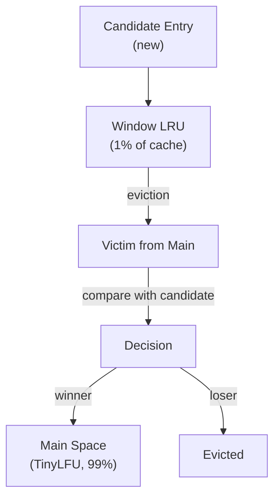

- **TinyLFU** uses a counting sketch (frequency estimation).
- **Window** (1% of size) catches recent items; **Main** (99%) holds frequently-accessed items.
- New candidates must compete against main-space victims.
- Outperforms pure LRU at typical cache sizes.

**Why W-TinyLFU beats LRU:**
- LRU misses high-frequency scan patterns (a scan evicts useful items).
- LFU penalties are too high (stale counts).
- W-TinyLFU combines recency (window) with frequency (main).

### 8.11 Caffeine Spring integration <a class="askgpt-btn" href="https://chatgpt.com/?prompt=Read%20this%20section%20of%20my%20encyclopedia%20and%20explain%20it%20in%20depth%20with%20concrete%20examples%2C%20the%20main%20trade-offs%2C%20and%20common%20pitfalls%20a%20practitioner%20should%20know%3A%0A%0Ahttps%3A%2F%2Fgithub.com%2Fvishvasg14%2Fsoftware-engineering-encyclopedia%2Fblob%2Fmain%2F08-caching%2Fcaching.md%23811-caffeine-spring-integration%0A%0ASection%20title%3A%208.11%20Caffeine%20Spring%20integration" target="_blank" rel="noopener" data-askgpt="8.11 Caffeine Spring integration" data-askgpt-url="https://github.com/vishvasg14/software-engineering-encyclopedia/blob/main/08-caching/caching.md#811-caffeine-spring-integration" data-askgpt-prompt-depth="Read%20this%20section%20of%20my%20encyclopedia%20and%20explain%20it%20in%20depth%20with%20concrete%20examples%2C%20the%20main%20trade-offs%2C%20and%20common%20pitfalls%20a%20practitioner%20should%20know%3A%0A%0Ahttps%3A%2F%2Fgithub.com%2Fvishvasg14%2Fsoftware-engineering-encyclopedia%2Fblob%2Fmain%2F08-caching%2Fcaching.md%23811-caffeine-spring-integration%0A%0ASection%20title%3A%208.11%20Caffeine%20Spring%20integration" data-askgpt-prompt-examples="Read%20this%20section%20of%20my%20encyclopedia%20and%20give%20me%202-3%20real-world%20production%20examples%20for%20it.%20For%20each%3A%20what%20went%20right%2C%20what%20went%20wrong%2C%20and%20the%20lessons%20learned.%20Include%20company%20%2F%20project%20names%20if%20relevant.%0A%0Ahttps%3A%2F%2Fgithub.com%2Fvishvasg14%2Fsoftware-engineering-encyclopedia%2Fblob%2Fmain%2F08-caching%2Fcaching.md%23811-caffeine-spring-integration%0A%0ASection%20title%3A%208.11%20Caffeine%20Spring%20integration" title="Ask ChatGPT about this section">💬</a>

```java
@Configuration
@EnableCaching
public class CacheConfig {

    @Bean
    public CaffeineCacheManager cacheManager() {
        CaffeineCacheManager manager = new CaffeineCacheManager();
        manager.setCaffeine(Caffeine.newBuilder()
            .maximumSize(10_000)
            .expireAfterWrite(Duration.ofMinutes(5))
            .recordStats());
        return manager;
    }
}

@Service
public class UserService {
    private final UserRepository userRepository;

    public UserService(UserRepository userRepository) {
        this.userRepository = userRepository;
    }

    @Cacheable(value = "users", key = "#id")
    public User findById(Long id) {
        return userRepository.findById(id).orElseThrow();
    }
}
```

### 8.12 Memcached <a class="askgpt-btn" href="https://chatgpt.com/?prompt=Read%20this%20section%20of%20my%20encyclopedia%20and%20explain%20it%20in%20depth%20with%20concrete%20examples%2C%20the%20main%20trade-offs%2C%20and%20common%20pitfalls%20a%20practitioner%20should%20know%3A%0A%0Ahttps%3A%2F%2Fgithub.com%2Fvishvasg14%2Fsoftware-engineering-encyclopedia%2Fblob%2Fmain%2F08-caching%2Fcaching.md%23812-memcached%0A%0ASection%20title%3A%208.12%20Memcached" target="_blank" rel="noopener" data-askgpt="8.12 Memcached" data-askgpt-url="https://github.com/vishvasg14/software-engineering-encyclopedia/blob/main/08-caching/caching.md#812-memcached" data-askgpt-prompt-depth="Read%20this%20section%20of%20my%20encyclopedia%20and%20explain%20it%20in%20depth%20with%20concrete%20examples%2C%20the%20main%20trade-offs%2C%20and%20common%20pitfalls%20a%20practitioner%20should%20know%3A%0A%0Ahttps%3A%2F%2Fgithub.com%2Fvishvasg14%2Fsoftware-engineering-encyclopedia%2Fblob%2Fmain%2F08-caching%2Fcaching.md%23812-memcached%0A%0ASection%20title%3A%208.12%20Memcached" data-askgpt-prompt-examples="Read%20this%20section%20of%20my%20encyclopedia%20and%20give%20me%202-3%20real-world%20production%20examples%20for%20it.%20For%20each%3A%20what%20went%20right%2C%20what%20went%20wrong%2C%20and%20the%20lessons%20learned.%20Include%20company%20%2F%20project%20names%20if%20relevant.%0A%0Ahttps%3A%2F%2Fgithub.com%2Fvishvasg14%2Fsoftware-engineering-encyclopedia%2Fblob%2Fmain%2F08-caching%2Fcaching.md%23812-memcached%0A%0ASection%20title%3A%208.12%20Memcached" title="Ask ChatGPT about this section">💬</a>

Memcached is simpler than Redis:

- **Pure cache**: no persistence, no replication built in.
- **Slab allocator**: memory pre-partitioned into 1MB slabs, each with LRU.
- **Multi-threaded**: scales with cores.
- **Distributed hashing**: client hashes keys to determine which server.

```bash
# Set
set user:1 0 60 5
alice
STORED

# Get
get user:1
VALUE user:1 0 5
alice
END

# Delete
delete user:1
DELETED
```

When to choose Memcached over Redis:
- Pure cache (no persistence needed).
- Massive scale (>1 TB cache).
- Already in your stack.

### 8.13 Caching patterns <a class="askgpt-btn" href="https://chatgpt.com/?prompt=Read%20this%20section%20of%20my%20encyclopedia%20and%20explain%20it%20in%20depth%20with%20concrete%20examples%2C%20the%20main%20trade-offs%2C%20and%20common%20pitfalls%20a%20practitioner%20should%20know%3A%0A%0Ahttps%3A%2F%2Fgithub.com%2Fvishvasg14%2Fsoftware-engineering-encyclopedia%2Fblob%2Fmain%2F08-caching%2Fcaching.md%23813-caching-patterns%0A%0ASection%20title%3A%208.13%20Caching%20patterns" target="_blank" rel="noopener" data-askgpt="8.13 Caching patterns" data-askgpt-url="https://github.com/vishvasg14/software-engineering-encyclopedia/blob/main/08-caching/caching.md#813-caching-patterns" data-askgpt-prompt-depth="Read%20this%20section%20of%20my%20encyclopedia%20and%20explain%20it%20in%20depth%20with%20concrete%20examples%2C%20the%20main%20trade-offs%2C%20and%20common%20pitfalls%20a%20practitioner%20should%20know%3A%0A%0Ahttps%3A%2F%2Fgithub.com%2Fvishvasg14%2Fsoftware-engineering-encyclopedia%2Fblob%2Fmain%2F08-caching%2Fcaching.md%23813-caching-patterns%0A%0ASection%20title%3A%208.13%20Caching%20patterns" data-askgpt-prompt-examples="Read%20this%20section%20of%20my%20encyclopedia%20and%20give%20me%202-3%20real-world%20production%20examples%20for%20it.%20For%20each%3A%20what%20went%20right%2C%20what%20went%20wrong%2C%20and%20the%20lessons%20learned.%20Include%20company%20%2F%20project%20names%20if%20relevant.%0A%0Ahttps%3A%2F%2Fgithub.com%2Fvishvasg14%2Fsoftware-engineering-encyclopedia%2Fblob%2Fmain%2F08-caching%2Fcaching.md%23813-caching-patterns%0A%0ASection%20title%3A%208.13%20Caching%20patterns" title="Ask ChatGPT about this section">💬</a>

**Cache-aside (lazy loading):**

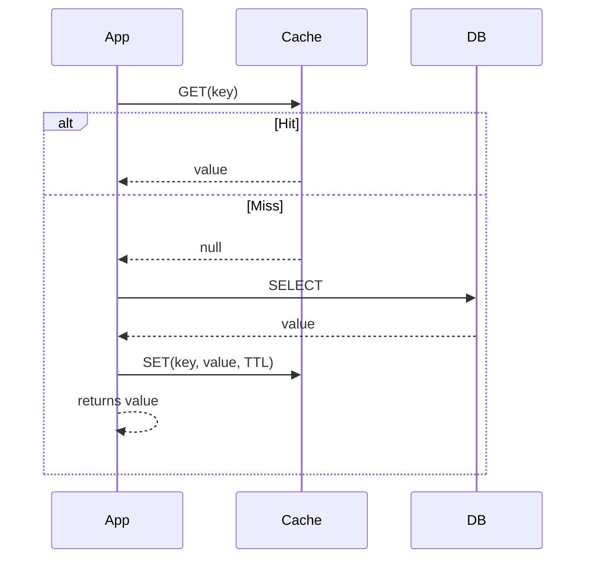

The application manages the cache. Most common pattern. Risk: cache stampede on miss.

**Read-through:**

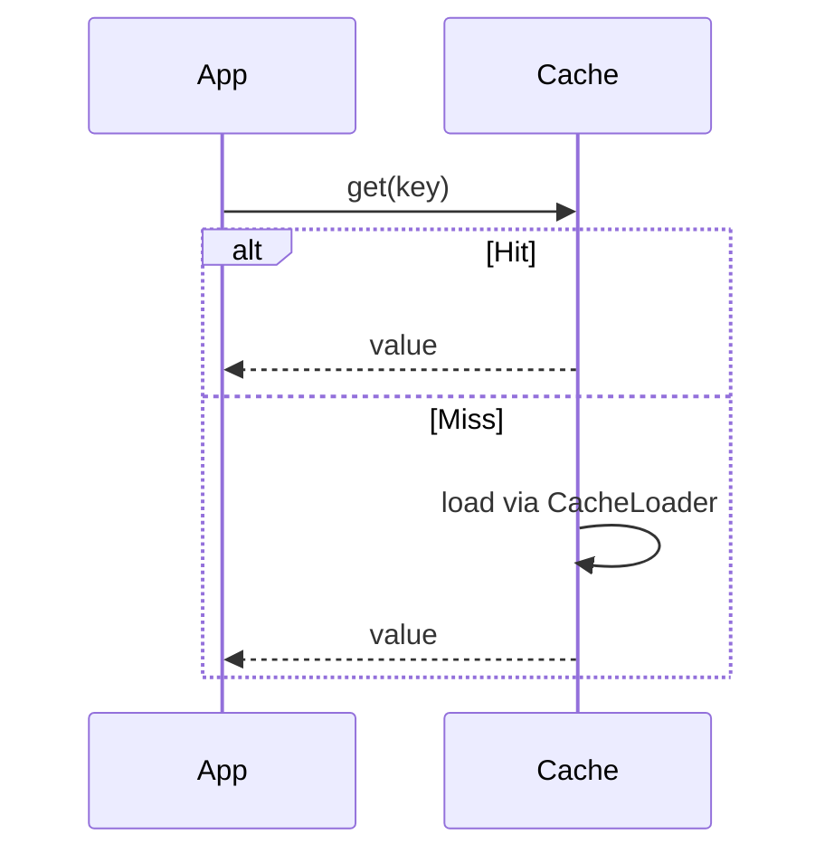

The cache library (Caffeine's LoadingCache) handles loading. Cleaner code.

**Write-through:**

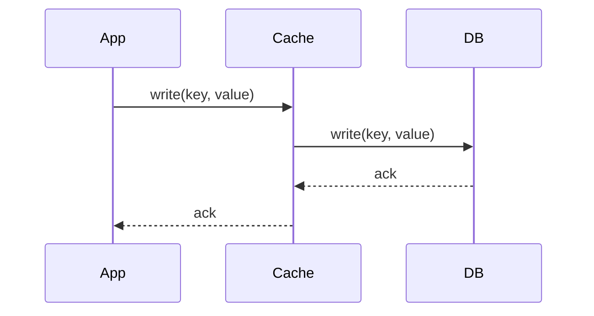

Both cache and DB updated synchronously. Cache and DB always consistent (until eviction).

**Write-behind (write-back):**

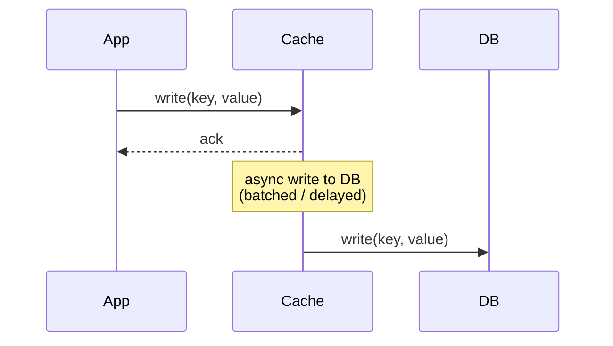

Cache writes fast; DB writes async. Risk: data loss if cache fails before DB write.

**Refresh-ahead:**

```mermaid
sequenceDiagram
    participant App
    participant Cache
    participant DB

    App->>Cache: get(key)
    Cache-->>App: value
    Note over Cache: TTL approaching;<br/>async refresh
    Cache->>DB: SELECT
    Cache: update value
```

Cache refreshes in background before expiry. Avoids sync misses.

### 8.14 Cache invalidation <a class="askgpt-btn" href="https://chatgpt.com/?prompt=Read%20this%20section%20of%20my%20encyclopedia%20and%20explain%20it%20in%20depth%20with%20concrete%20examples%2C%20the%20main%20trade-offs%2C%20and%20common%20pitfalls%20a%20practitioner%20should%20know%3A%0A%0Ahttps%3A%2F%2Fgithub.com%2Fvishvasg14%2Fsoftware-engineering-encyclopedia%2Fblob%2Fmain%2F08-caching%2Fcaching.md%23814-cache-invalidation%0A%0ASection%20title%3A%208.14%20Cache%20invalidation" target="_blank" rel="noopener" data-askgpt="8.14 Cache invalidation" data-askgpt-url="https://github.com/vishvasg14/software-engineering-encyclopedia/blob/main/08-caching/caching.md#814-cache-invalidation" data-askgpt-prompt-depth="Read%20this%20section%20of%20my%20encyclopedia%20and%20explain%20it%20in%20depth%20with%20concrete%20examples%2C%20the%20main%20trade-offs%2C%20and%20common%20pitfalls%20a%20practitioner%20should%20know%3A%0A%0Ahttps%3A%2F%2Fgithub.com%2Fvishvasg14%2Fsoftware-engineering-encyclopedia%2Fblob%2Fmain%2F08-caching%2Fcaching.md%23814-cache-invalidation%0A%0ASection%20title%3A%208.14%20Cache%20invalidation" data-askgpt-prompt-examples="Read%20this%20section%20of%20my%20encyclopedia%20and%20give%20me%202-3%20real-world%20production%20examples%20for%20it.%20For%20each%3A%20what%20went%20right%2C%20what%20went%20wrong%2C%20and%20the%20lessons%20learned.%20Include%20company%20%2F%20project%20names%20if%20relevant.%0A%0Ahttps%3A%2F%2Fgithub.com%2Fvishvasg14%2Fsoftware-engineering-encyclopedia%2Fblob%2Fmain%2F08-caching%2Fcaching.md%23814-cache-invalidation%0A%0ASection%20title%3A%208.14%20Cache%20invalidation" title="Ask ChatGPT about this section">💬</a>

Two-philosophy problem per Phil Karlton: "There are only two hard things in Computer Science: cache invalidation and naming things."

**TTL-based:** Entries expire after a fixed duration. Simple, but can serve stale data within TTL.

**Event-based:** On DB write, publish a "cache invalidate" event. Consumer deletes cache entry. Strong consistency.

```java
@CacheEvict(value = "users", key = "#user.id")
public void updateUser(User user) {
    userRepository.save(user);
    // Cache evicted; next read repopulates.
}
```

**Versioning:** Store a version per entity. Cache key includes version. Update bumps version.

### 8.15 Cache pitfalls <a class="askgpt-btn" href="https://chatgpt.com/?prompt=Read%20this%20section%20of%20my%20encyclopedia%20and%20explain%20it%20in%20depth%20with%20concrete%20examples%2C%20the%20main%20trade-offs%2C%20and%20common%20pitfalls%20a%20practitioner%20should%20know%3A%0A%0Ahttps%3A%2F%2Fgithub.com%2Fvishvasg14%2Fsoftware-engineering-encyclopedia%2Fblob%2Fmain%2F08-caching%2Fcaching.md%23815-cache-pitfalls%0A%0ASection%20title%3A%208.15%20Cache%20pitfalls" target="_blank" rel="noopener" data-askgpt="8.15 Cache pitfalls" data-askgpt-url="https://github.com/vishvasg14/software-engineering-encyclopedia/blob/main/08-caching/caching.md#815-cache-pitfalls" data-askgpt-prompt-depth="Read%20this%20section%20of%20my%20encyclopedia%20and%20explain%20it%20in%20depth%20with%20concrete%20examples%2C%20the%20main%20trade-offs%2C%20and%20common%20pitfalls%20a%20practitioner%20should%20know%3A%0A%0Ahttps%3A%2F%2Fgithub.com%2Fvishvasg14%2Fsoftware-engineering-encyclopedia%2Fblob%2Fmain%2F08-caching%2Fcaching.md%23815-cache-pitfalls%0A%0ASection%20title%3A%208.15%20Cache%20pitfalls" data-askgpt-prompt-examples="Read%20this%20section%20of%20my%20encyclopedia%20and%20give%20me%202-3%20real-world%20production%20examples%20for%20it.%20For%20each%3A%20what%20went%20right%2C%20what%20went%20wrong%2C%20and%20the%20lessons%20learned.%20Include%20company%20%2F%20project%20names%20if%20relevant.%0A%0Ahttps%3A%2F%2Fgithub.com%2Fvishvasg14%2Fsoftware-engineering-encyclopedia%2Fblob%2Fmain%2F08-caching%2Fcaching.md%23815-cache-pitfalls%0A%0ASection%20title%3A%208.15%20Cache%20pitfalls" title="Ask ChatGPT about this section">💬</a>

**Cache stampede:**
- All instances miss simultaneously → all hit DB → DB overload.
- **Solutions:**
  - Probabilistic early expiration (XFetch).
  - Single-flight (only one request loads; others wait).
  - Background refresh.

**Thundering herd (CDN invalidation):**
- All CDN edges miss after invalidation → all hit origin.
- Solution: stale-while-revalidate, versioned URLs.

**Cold cache:**
- After restart, all requests miss.
- Solution: cache warming, lazy loading, prefetching.

**Hot key:**
- One key gets 90% of requests.
- Solution: local cache on application server, replicated cache.

**Large value:**
- Single 1MB value blocks the network.
- Solution: store references, compress, break up.

### 8.16 CDN <a class="askgpt-btn" href="https://chatgpt.com/?prompt=Read%20this%20section%20of%20my%20encyclopedia%20and%20explain%20it%20in%20depth%20with%20concrete%20examples%2C%20the%20main%20trade-offs%2C%20and%20common%20pitfalls%20a%20practitioner%20should%20know%3A%0A%0Ahttps%3A%2F%2Fgithub.com%2Fvishvasg14%2Fsoftware-engineering-encyclopedia%2Fblob%2Fmain%2F08-caching%2Fcaching.md%23816-cdn%0A%0ASection%20title%3A%208.16%20CDN" target="_blank" rel="noopener" data-askgpt="8.16 CDN" data-askgpt-url="https://github.com/vishvasg14/software-engineering-encyclopedia/blob/main/08-caching/caching.md#816-cdn" data-askgpt-prompt-depth="Read%20this%20section%20of%20my%20encyclopedia%20and%20explain%20it%20in%20depth%20with%20concrete%20examples%2C%20the%20main%20trade-offs%2C%20and%20common%20pitfalls%20a%20practitioner%20should%20know%3A%0A%0Ahttps%3A%2F%2Fgithub.com%2Fvishvasg14%2Fsoftware-engineering-encyclopedia%2Fblob%2Fmain%2F08-caching%2Fcaching.md%23816-cdn%0A%0ASection%20title%3A%208.16%20CDN" data-askgpt-prompt-examples="Read%20this%20section%20of%20my%20encyclopedia%20and%20give%20me%202-3%20real-world%20production%20examples%20for%20it.%20For%20each%3A%20what%20went%20right%2C%20what%20went%20wrong%2C%20and%20the%20lessons%20learned.%20Include%20company%20%2F%20project%20names%20if%20relevant.%0A%0Ahttps%3A%2F%2Fgithub.com%2Fvishvasg14%2Fsoftware-engineering-encyclopedia%2Fblob%2Fmain%2F08-caching%2Fcaching.md%23816-cdn%0A%0ASection%20title%3A%208.16%20CDN" title="Ask ChatGPT about this section">💬</a>

A **CDN** (Content Delivery Network) caches HTTP responses at edge locations worldwide:

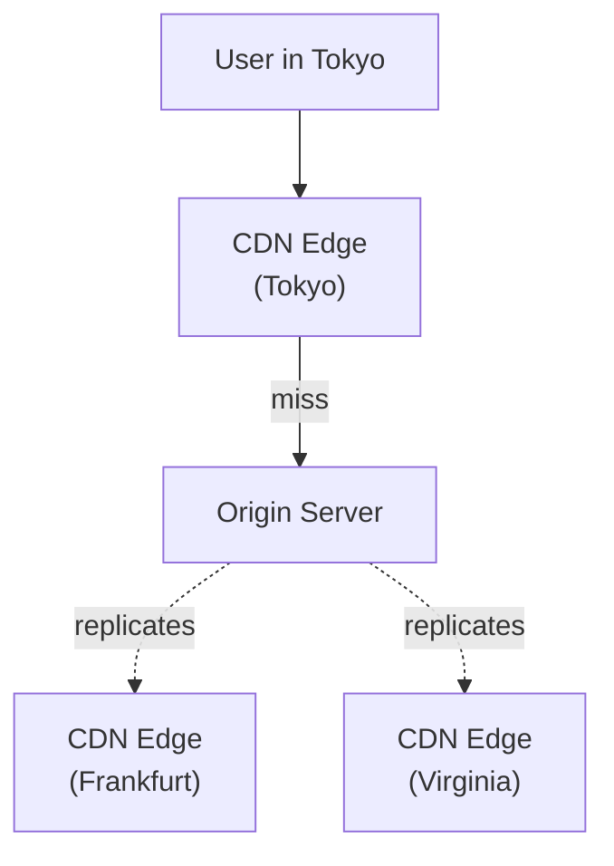

CDN caching strategies:
- **Static content:** CSS, JS, images, fonts. TTL: days.
- **HTML:** Page-level. TTL: seconds.
- **API responses:** Per-endpoint. Varies.

Popular CDNs:
- Cloudflare.
- AWS CloudFront.
- Fastly.
- Akamai.
- Vercel Edge Network.

CDN + cache headers:
```http
Cache-Control: public, max-age=300, s-maxage=3600
CDN-Cache-Control: public, max-age=86400
```

(See [APIs doc](../07-apis/apis.md) for HTTP caching details.)

### 8.17 Distributed caches: Hazelcast, Ignite <a class="askgpt-btn" href="https://chatgpt.com/?prompt=Read%20this%20section%20of%20my%20encyclopedia%20and%20explain%20it%20in%20depth%20with%20concrete%20examples%2C%20the%20main%20trade-offs%2C%20and%20common%20pitfalls%20a%20practitioner%20should%20know%3A%0A%0Ahttps%3A%2F%2Fgithub.com%2Fvishvasg14%2Fsoftware-engineering-encyclopedia%2Fblob%2Fmain%2F08-caching%2Fcaching.md%23817-distributed-caches-hazelcast-ignite%0A%0ASection%20title%3A%208.17%20Distributed%20caches%3A%20Hazelcast%2C%20Ignite" target="_blank" rel="noopener" data-askgpt="8.17 Distributed caches: Hazelcast, Ignite" data-askgpt-url="https://github.com/vishvasg14/software-engineering-encyclopedia/blob/main/08-caching/caching.md#817-distributed-caches-hazelcast-ignite" data-askgpt-prompt-depth="Read%20this%20section%20of%20my%20encyclopedia%20and%20explain%20it%20in%20depth%20with%20concrete%20examples%2C%20the%20main%20trade-offs%2C%20and%20common%20pitfalls%20a%20practitioner%20should%20know%3A%0A%0Ahttps%3A%2F%2Fgithub.com%2Fvishvasg14%2Fsoftware-engineering-encyclopedia%2Fblob%2Fmain%2F08-caching%2Fcaching.md%23817-distributed-caches-hazelcast-ignite%0A%0ASection%20title%3A%208.17%20Distributed%20caches%3A%20Hazelcast%2C%20Ignite" data-askgpt-prompt-examples="Read%20this%20section%20of%20my%20encyclopedia%20and%20give%20me%202-3%20real-world%20production%20examples%20for%20it.%20For%20each%3A%20what%20went%20right%2C%20what%20went%20wrong%2C%20and%20the%20lessons%20learned.%20Include%20company%20%2F%20project%20names%20if%20relevant.%0A%0Ahttps%3A%2F%2Fgithub.com%2Fvishvasg14%2Fsoftware-engineering-encyclopedia%2Fblob%2Fmain%2F08-caching%2Fcaching.md%23817-distributed-caches-hazelcast-ignite%0A%0ASection%20title%3A%208.17%20Distributed%20caches%3A%20Hazelcast%2C%20Ignite" title="Ask ChatGPT about this section">💬</a>

**Hazelcast** — distributed in-memory data grid. Distributed maps, queues, topics. Used in trading and gaming.

**Apache Ignite** — distributed in-memory database. SQL support, key-value, computation.

These offer data grid features beyond cache (transactions, distributed compute). Choose when you need multi-region consistency or computation near data.

---

## 9. Architecture

### 9.1 Redis server architecture <a class="askgpt-btn" href="https://chatgpt.com/?prompt=Read%20this%20section%20of%20my%20encyclopedia%20and%20explain%20it%20in%20depth%20with%20concrete%20examples%2C%20the%20main%20trade-offs%2C%20and%20common%20pitfalls%20a%20practitioner%20should%20know%3A%0A%0Ahttps%3A%2F%2Fgithub.com%2Fvishvasg14%2Fsoftware-engineering-encyclopedia%2Fblob%2Fmain%2F08-caching%2Fcaching.md%2391-redis-server-architecture%0A%0ASection%20title%3A%209.1%20Redis%20server%20architecture" target="_blank" rel="noopener" data-askgpt="9.1 Redis server architecture" data-askgpt-url="https://github.com/vishvasg14/software-engineering-encyclopedia/blob/main/08-caching/caching.md#91-redis-server-architecture" data-askgpt-prompt-depth="Read%20this%20section%20of%20my%20encyclopedia%20and%20explain%20it%20in%20depth%20with%20concrete%20examples%2C%20the%20main%20trade-offs%2C%20and%20common%20pitfalls%20a%20practitioner%20should%20know%3A%0A%0Ahttps%3A%2F%2Fgithub.com%2Fvishvasg14%2Fsoftware-engineering-encyclopedia%2Fblob%2Fmain%2F08-caching%2Fcaching.md%2391-redis-server-architecture%0A%0ASection%20title%3A%209.1%20Redis%20server%20architecture" data-askgpt-prompt-examples="Read%20this%20section%20of%20my%20encyclopedia%20and%20give%20me%202-3%20real-world%20production%20examples%20for%20it.%20For%20each%3A%20what%20went%20right%2C%20what%20went%20wrong%2C%20and%20the%20lessons%20learned.%20Include%20company%20%2F%20project%20names%20if%20relevant.%0A%0Ahttps%3A%2F%2Fgithub.com%2Fvishvasg14%2Fsoftware-engineering-encyclopedia%2Fblob%2Fmain%2F08-caching%2Fcaching.md%2391-redis-server-architecture%0A%0ASection%20title%3A%209.1%20Redis%20server%20architecture" title="Ask ChatGPT about this section">💬</a>

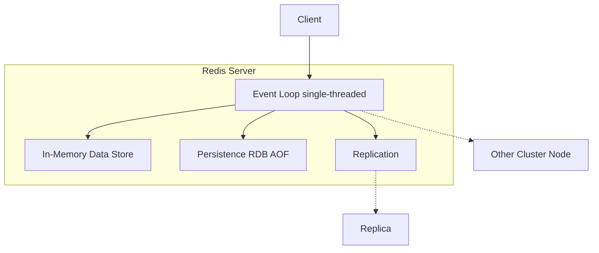

### 9.2 Cache patterns compared <a class="askgpt-btn" href="https://chatgpt.com/?prompt=Read%20this%20section%20of%20my%20encyclopedia%20and%20explain%20it%20in%20depth%20with%20concrete%20examples%2C%20the%20main%20trade-offs%2C%20and%20common%20pitfalls%20a%20practitioner%20should%20know%3A%0A%0Ahttps%3A%2F%2Fgithub.com%2Fvishvasg14%2Fsoftware-engineering-encyclopedia%2Fblob%2Fmain%2F08-caching%2Fcaching.md%2392-cache-patterns-compared%0A%0ASection%20title%3A%209.2%20Cache%20patterns%20compared" target="_blank" rel="noopener" data-askgpt="9.2 Cache patterns compared" data-askgpt-url="https://github.com/vishvasg14/software-engineering-encyclopedia/blob/main/08-caching/caching.md#92-cache-patterns-compared" data-askgpt-prompt-depth="Read%20this%20section%20of%20my%20encyclopedia%20and%20explain%20it%20in%20depth%20with%20concrete%20examples%2C%20the%20main%20trade-offs%2C%20and%20common%20pitfalls%20a%20practitioner%20should%20know%3A%0A%0Ahttps%3A%2F%2Fgithub.com%2Fvishvasg14%2Fsoftware-engineering-encyclopedia%2Fblob%2Fmain%2F08-caching%2Fcaching.md%2392-cache-patterns-compared%0A%0ASection%20title%3A%209.2%20Cache%20patterns%20compared" data-askgpt-prompt-examples="Read%20this%20section%20of%20my%20encyclopedia%20and%20give%20me%202-3%20real-world%20production%20examples%20for%20it.%20For%20each%3A%20what%20went%20right%2C%20what%20went%20wrong%2C%20and%20the%20lessons%20learned.%20Include%20company%20%2F%20project%20names%20if%20relevant.%0A%0Ahttps%3A%2F%2Fgithub.com%2Fvishvasg14%2Fsoftware-engineering-encyclopedia%2Fblob%2Fmain%2F08-caching%2Fcaching.md%2392-cache-patterns-compared%0A%0ASection%20title%3A%209.2%20Cache%20patterns%20compared" title="Ask ChatGPT about this section">💬</a>

| Pattern | Read path | Write path | Consistency | Use case |
|---------|-----------|-----------|-------------|----------|
| Cache-aside | App checks cache | App invalidates | Eventual | Common pattern |
| Read-through | Cache library | App writes DB | Eventual | Cleaner code |
| Write-through | App updates cache | Cache writes DB synchronously | Strong (until eviction) | Strong consistency |
| Write-behind | App updates cache | Cache writes DB async | Weak (data loss risk) | High write throughput |
| Refresh-ahead | Cache auto-refreshes | App updates DB; cache reloads | Strong (continuous) | Latency-sensitive |

## 10. Performance

### 10.1 Redis performance <a class="askgpt-btn" href="https://chatgpt.com/?prompt=Read%20this%20section%20of%20my%20encyclopedia%20and%20explain%20it%20in%20depth%20with%20concrete%20examples%2C%20the%20main%20trade-offs%2C%20and%20common%20pitfalls%20a%20practitioner%20should%20know%3A%0A%0Ahttps%3A%2F%2Fgithub.com%2Fvishvasg14%2Fsoftware-engineering-encyclopedia%2Fblob%2Fmain%2F08-caching%2Fcaching.md%23101-redis-performance%0A%0ASection%20title%3A%2010.1%20Redis%20performance" target="_blank" rel="noopener" data-askgpt="10.1 Redis performance" data-askgpt-url="https://github.com/vishvasg14/software-engineering-encyclopedia/blob/main/08-caching/caching.md#101-redis-performance" data-askgpt-prompt-depth="Read%20this%20section%20of%20my%20encyclopedia%20and%20explain%20it%20in%20depth%20with%20concrete%20examples%2C%20the%20main%20trade-offs%2C%20and%20common%20pitfalls%20a%20practitioner%20should%20know%3A%0A%0Ahttps%3A%2F%2Fgithub.com%2Fvishvasg14%2Fsoftware-engineering-encyclopedia%2Fblob%2Fmain%2F08-caching%2Fcaching.md%23101-redis-performance%0A%0ASection%20title%3A%2010.1%20Redis%20performance" data-askgpt-prompt-examples="Read%20this%20section%20of%20my%20encyclopedia%20and%20give%20me%202-3%20real-world%20production%20examples%20for%20it.%20For%20each%3A%20what%20went%20right%2C%20what%20went%20wrong%2C%20and%20the%20lessons%20learned.%20Include%20company%20%2F%20project%20names%20if%20relevant.%0A%0Ahttps%3A%2F%2Fgithub.com%2Fvishvasg14%2Fsoftware-engineering-encyclopedia%2Fblob%2Fmain%2F08-caching%2Fcaching.md%23101-redis-performance%0A%0ASection%20title%3A%2010.1%20Redis%20performance" title="Ask ChatGPT about this section">💬</a>

| Lever | Effect |
|-------|--------|
| Pipeline commands | Reduce RTT, 5-10× throughput |
| Lua scripting | Atomic batch on server |
| Pipelining + multi-threading | 100K+ ops/s per instance |
| Cluster sharding | Linear scaling |
| Client-side caching (RESP3) | Reduce network |
| Compression (`--compress` in redis-cli) | Reduce bytes |
| Memory tuning (`maxmemory-policy`) | Avoid OOM |

### 10.2 Caffeine performance <a class="askgpt-btn" href="https://chatgpt.com/?prompt=Read%20this%20section%20of%20my%20encyclopedia%20and%20explain%20it%20in%20depth%20with%20concrete%20examples%2C%20the%20main%20trade-offs%2C%20and%20common%20pitfalls%20a%20practitioner%20should%20know%3A%0A%0Ahttps%3A%2F%2Fgithub.com%2Fvishvasg14%2Fsoftware-engineering-encyclopedia%2Fblob%2Fmain%2F08-caching%2Fcaching.md%23102-caffeine-performance%0A%0ASection%20title%3A%2010.2%20Caffeine%20performance" target="_blank" rel="noopener" data-askgpt="10.2 Caffeine performance" data-askgpt-url="https://github.com/vishvasg14/software-engineering-encyclopedia/blob/main/08-caching/caching.md#102-caffeine-performance" data-askgpt-prompt-depth="Read%20this%20section%20of%20my%20encyclopedia%20and%20explain%20it%20in%20depth%20with%20concrete%20examples%2C%20the%20main%20trade-offs%2C%20and%20common%20pitfalls%20a%20practitioner%20should%20know%3A%0A%0Ahttps%3A%2F%2Fgithub.com%2Fvishvasg14%2Fsoftware-engineering-encyclopedia%2Fblob%2Fmain%2F08-caching%2Fcaching.md%23102-caffeine-performance%0A%0ASection%20title%3A%2010.2%20Caffeine%20performance" data-askgpt-prompt-examples="Read%20this%20section%20of%20my%20encyclopedia%20and%20give%20me%202-3%20real-world%20production%20examples%20for%20it.%20For%20each%3A%20what%20went%20right%2C%20what%20went%20wrong%2C%20and%20the%20lessons%20learned.%20Include%20company%20%2F%20project%20names%20if%20relevant.%0A%0Ahttps%3A%2F%2Fgithub.com%2Fvishvasg14%2Fsoftware-engineering-encyclopedia%2Fblob%2Fmain%2F08-caching%2Fcaching.md%23102-caffeine-performance%0A%0ASection%20title%3A%2010.2%20Caffeine%20performance" title="Ask ChatGPT about this section">💬</a>

- **Caffeine is one of the fastest Java caches** (often faster than Guava Cache, ConcurrentHashMap).
- Common throughput: 10M+ reads/s per JVM.
- Latency: < 1 µs for hits.

**Tuning:**
- `maximumSize` vs `maximumWeight` — weight allows variable-cost items.
- `initialCapacity` — pre-allocate to avoid resizing.
- `concurrencyLevel` (removed in 3.x) — replaced by lock striping.

### 10.3 Hot keys <a class="askgpt-btn" href="https://chatgpt.com/?prompt=Read%20this%20section%20of%20my%20encyclopedia%20and%20explain%20it%20in%20depth%20with%20concrete%20examples%2C%20the%20main%20trade-offs%2C%20and%20common%20pitfalls%20a%20practitioner%20should%20know%3A%0A%0Ahttps%3A%2F%2Fgithub.com%2Fvishvasg14%2Fsoftware-engineering-encyclopedia%2Fblob%2Fmain%2F08-caching%2Fcaching.md%23103-hot-keys%0A%0ASection%20title%3A%2010.3%20Hot%20keys" target="_blank" rel="noopener" data-askgpt="10.3 Hot keys" data-askgpt-url="https://github.com/vishvasg14/software-engineering-encyclopedia/blob/main/08-caching/caching.md#103-hot-keys" data-askgpt-prompt-depth="Read%20this%20section%20of%20my%20encyclopedia%20and%20explain%20it%20in%20depth%20with%20concrete%20examples%2C%20the%20main%20trade-offs%2C%20and%20common%20pitfalls%20a%20practitioner%20should%20know%3A%0A%0Ahttps%3A%2F%2Fgithub.com%2Fvishvasg14%2Fsoftware-engineering-encyclopedia%2Fblob%2Fmain%2F08-caching%2Fcaching.md%23103-hot-keys%0A%0ASection%20title%3A%2010.3%20Hot%20keys" data-askgpt-prompt-examples="Read%20this%20section%20of%20my%20encyclopedia%20and%20give%20me%202-3%20real-world%20production%20examples%20for%20it.%20For%20each%3A%20what%20went%20right%2C%20what%20went%20wrong%2C%20and%20the%20lessons%20learned.%20Include%20company%20%2F%20project%20names%20if%20relevant.%0A%0Ahttps%3A%2F%2Fgithub.com%2Fvishvasg14%2Fsoftware-engineering-encyclopedia%2Fblob%2Fmain%2F08-caching%2Fcaching.md%23103-hot-keys%0A%0ASection%20title%3A%2010.3%20Hot%20keys" title="Ask ChatGPT about this section">💬</a>

One key gets 90% of requests. Symptoms:
- Redis CPU pegged on one key.
- Network bottleneck on one key.

**Solutions:**
- **Local in-JVM cache** (Caffeine) for hot keys, Redis for the rest.
- **Random suffix** for write-only hot keys (e.g., counters): `counter:user:123:0`, `counter:user:123:1`; aggregate on read.
- **Key splitting** with consistent hashing.

### 10.4 Large keys/values <a class="askgpt-btn" href="https://chatgpt.com/?prompt=Read%20this%20section%20of%20my%20encyclopedia%20and%20explain%20it%20in%20depth%20with%20concrete%20examples%2C%20the%20main%20trade-offs%2C%20and%20common%20pitfalls%20a%20practitioner%20should%20know%3A%0A%0Ahttps%3A%2F%2Fgithub.com%2Fvishvasg14%2Fsoftware-engineering-encyclopedia%2Fblob%2Fmain%2F08-caching%2Fcaching.md%23104-large-keysvalues%0A%0ASection%20title%3A%2010.4%20Large%20keys%2Fvalues" target="_blank" rel="noopener" data-askgpt="10.4 Large keys/values" data-askgpt-url="https://github.com/vishvasg14/software-engineering-encyclopedia/blob/main/08-caching/caching.md#104-large-keysvalues" data-askgpt-prompt-depth="Read%20this%20section%20of%20my%20encyclopedia%20and%20explain%20it%20in%20depth%20with%20concrete%20examples%2C%20the%20main%20trade-offs%2C%20and%20common%20pitfalls%20a%20practitioner%20should%20know%3A%0A%0Ahttps%3A%2F%2Fgithub.com%2Fvishvasg14%2Fsoftware-engineering-encyclopedia%2Fblob%2Fmain%2F08-caching%2Fcaching.md%23104-large-keysvalues%0A%0ASection%20title%3A%2010.4%20Large%20keys%2Fvalues" data-askgpt-prompt-examples="Read%20this%20section%20of%20my%20encyclopedia%20and%20give%20me%202-3%20real-world%20production%20examples%20for%20it.%20For%20each%3A%20what%20went%20right%2C%20what%20went%20wrong%2C%20and%20the%20lessons%20learned.%20Include%20company%20%2F%20project%20names%20if%20relevant.%0A%0Ahttps%3A%2F%2Fgithub.com%2Fvishvasg14%2Fsoftware-engineering-encyclopedia%2Fblob%2Fmain%2F08-caching%2Fcaching.md%23104-large-keysvalues%0A%0ASection%20title%3A%2010.4%20Large%20keys%2Fvalues" title="Ask ChatGPT about this section">💬</a>

- Redis string max 512 MB.
- Memcached max 1 MB.
- Kafka max 1 MB (default).

**Solutions:**
- Compress.
- Store references (e.g., S3 URL) instead of content.
- Break into multiple keys.

### 10.5 Eviction tuning <a class="askgpt-btn" href="https://chatgpt.com/?prompt=Read%20this%20section%20of%20my%20encyclopedia%20and%20explain%20it%20in%20depth%20with%20concrete%20examples%2C%20the%20main%20trade-offs%2C%20and%20common%20pitfalls%20a%20practitioner%20should%20know%3A%0A%0Ahttps%3A%2F%2Fgithub.com%2Fvishvasg14%2Fsoftware-engineering-encyclopedia%2Fblob%2Fmain%2F08-caching%2Fcaching.md%23105-eviction-tuning%0A%0ASection%20title%3A%2010.5%20Eviction%20tuning" target="_blank" rel="noopener" data-askgpt="10.5 Eviction tuning" data-askgpt-url="https://github.com/vishvasg14/software-engineering-encyclopedia/blob/main/08-caching/caching.md#105-eviction-tuning" data-askgpt-prompt-depth="Read%20this%20section%20of%20my%20encyclopedia%20and%20explain%20it%20in%20depth%20with%20concrete%20examples%2C%20the%20main%20trade-offs%2C%20and%20common%20pitfalls%20a%20practitioner%20should%20know%3A%0A%0Ahttps%3A%2F%2Fgithub.com%2Fvishvasg14%2Fsoftware-engineering-encyclopedia%2Fblob%2Fmain%2F08-caching%2Fcaching.md%23105-eviction-tuning%0A%0ASection%20title%3A%2010.5%20Eviction%20tuning" data-askgpt-prompt-examples="Read%20this%20section%20of%20my%20encyclopedia%20and%20give%20me%202-3%20real-world%20production%20examples%20for%20it.%20For%20each%3A%20what%20went%20right%2C%20what%20went%20wrong%2C%20and%20the%20lessons%20learned.%20Include%20company%20%2F%20project%20names%20if%20relevant.%0A%0Ahttps%3A%2F%2Fgithub.com%2Fvishvasg14%2Fsoftware-engineering-encyclopedia%2Fblob%2Fmain%2F08-caching%2Fcaching.md%23105-eviction-tuning%0A%0ASection%20title%3A%2010.5%20Eviction%20tuning" title="Ask ChatGPT about this section">💬</a>

**Redis:**

```
maxmemory 4gb
maxmemory-policy allkeys-lfu   # preferred for caches
# or volatile-lru, volatile-lfu, allkeys-lru, allkeys-lfu
```

**Caffeine:**

```java
Caffeine.newBuilder()
    .maximumSize(10_000)
    .expireAfterWrite(Duration.ofMinutes(5))
    .recordStats();
```

**Memcached:**

```
-vm      # max memory (MB)
-m       # mlock all pages (avoid swap)
```

## 11. Security

### 11.1 Redis security <a class="askgpt-btn" href="https://chatgpt.com/?prompt=Read%20this%20section%20of%20my%20encyclopedia%20and%20explain%20it%20in%20depth%20with%20concrete%20examples%2C%20the%20main%20trade-offs%2C%20and%20common%20pitfalls%20a%20practitioner%20should%20know%3A%0A%0Ahttps%3A%2F%2Fgithub.com%2Fvishvasg14%2Fsoftware-engineering-encyclopedia%2Fblob%2Fmain%2F08-caching%2Fcaching.md%23111-redis-security%0A%0ASection%20title%3A%2011.1%20Redis%20security" target="_blank" rel="noopener" data-askgpt="11.1 Redis security" data-askgpt-url="https://github.com/vishvasg14/software-engineering-encyclopedia/blob/main/08-caching/caching.md#111-redis-security" data-askgpt-prompt-depth="Read%20this%20section%20of%20my%20encyclopedia%20and%20explain%20it%20in%20depth%20with%20concrete%20examples%2C%20the%20main%20trade-offs%2C%20and%20common%20pitfalls%20a%20practitioner%20should%20know%3A%0A%0Ahttps%3A%2F%2Fgithub.com%2Fvishvasg14%2Fsoftware-engineering-encyclopedia%2Fblob%2Fmain%2F08-caching%2Fcaching.md%23111-redis-security%0A%0ASection%20title%3A%2011.1%20Redis%20security" data-askgpt-prompt-examples="Read%20this%20section%20of%20my%20encyclopedia%20and%20give%20me%202-3%20real-world%20production%20examples%20for%20it.%20For%20each%3A%20what%20went%20right%2C%20what%20went%20wrong%2C%20and%20the%20lessons%20learned.%20Include%20company%20%2F%20project%20names%20if%20relevant.%0A%0Ahttps%3A%2F%2Fgithub.com%2Fvishvasg14%2Fsoftware-engineering-encyclopedia%2Fblob%2Fmain%2F08-caching%2Fcaching.md%23111-redis-security%0A%0ASection%20title%3A%2011.1%20Redis%20security" title="Ask ChatGPT about this section">💬</a>

- **AUTH** — password.
- **ACL** (since 6.0) — users, permissions, key patterns.
- **TLS** — encrypt in transit.
- **bind** to specific interfaces.
- **rename-command` CONFIG``** etc. to disable dangerous commands.
- **protected-mode** (no bind, no password = refuse external connections).

```bash
# Enable TLS, ACL, bind to specific interface
bind 0.0.0.0
requirepass "..."
tls-port 6380
tls-cert-file /path/to/redis.crt
tls-key-file /path/to/redis.key
```

### 11.2 Caffeine security <a class="askgpt-btn" href="https://chatgpt.com/?prompt=Read%20this%20section%20of%20my%20encyclopedia%20and%20explain%20it%20in%20depth%20with%20concrete%20examples%2C%20the%20main%20trade-offs%2C%20and%20common%20pitfalls%20a%20practitioner%20should%20know%3A%0A%0Ahttps%3A%2F%2Fgithub.com%2Fvishvasg14%2Fsoftware-engineering-encyclopedia%2Fblob%2Fmain%2F08-caching%2Fcaching.md%23112-caffeine-security%0A%0ASection%20title%3A%2011.2%20Caffeine%20security" target="_blank" rel="noopener" data-askgpt="11.2 Caffeine security" data-askgpt-url="https://github.com/vishvasg14/software-engineering-encyclopedia/blob/main/08-caching/caching.md#112-caffeine-security" data-askgpt-prompt-depth="Read%20this%20section%20of%20my%20encyclopedia%20and%20explain%20it%20in%20depth%20with%20concrete%20examples%2C%20the%20main%20trade-offs%2C%20and%20common%20pitfalls%20a%20practitioner%20should%20know%3A%0A%0Ahttps%3A%2F%2Fgithub.com%2Fvishvasg14%2Fsoftware-engineering-encyclopedia%2Fblob%2Fmain%2F08-caching%2Fcaching.md%23112-caffeine-security%0A%0ASection%20title%3A%2011.2%20Caffeine%20security" data-askgpt-prompt-examples="Read%20this%20section%20of%20my%20encyclopedia%20and%20give%20me%202-3%20real-world%20production%20examples%20for%20it.%20For%20each%3A%20what%20went%20right%2C%20what%20went%20wrong%2C%20and%20the%20lessons%20learned.%20Include%20company%20%2F%20project%20names%20if%20relevant.%0A%0Ahttps%3A%2F%2Fgithub.com%2Fvishvasg14%2Fsoftware-engineering-encyclopedia%2Fblob%2Fmain%2F08-caching%2Fcaching.md%23112-caffeine-security%0A%0ASection%20title%3A%2011.2%20Caffeine%20security" title="Ask ChatGPT about this section">💬</a>

- Cache lives in JVM heap; subject to JVM security.
- Don't put secrets in cache (memory dumps can leak).
- Use `weakValues()` for sensitive data with short TTLs.

### 11.3 Memcached security <a class="askgpt-btn" href="https://chatgpt.com/?prompt=Read%20this%20section%20of%20my%20encyclopedia%20and%20explain%20it%20in%20depth%20with%20concrete%20examples%2C%20the%20main%20trade-offs%2C%20and%20common%20pitfalls%20a%20practitioner%20should%20know%3A%0A%0Ahttps%3A%2F%2Fgithub.com%2Fvishvasg14%2Fsoftware-engineering-encyclopedia%2Fblob%2Fmain%2F08-caching%2Fcaching.md%23113-memcached-security%0A%0ASection%20title%3A%2011.3%20Memcached%20security" target="_blank" rel="noopener" data-askgpt="11.3 Memcached security" data-askgpt-url="https://github.com/vishvasg14/software-engineering-encyclopedia/blob/main/08-caching/caching.md#113-memcached-security" data-askgpt-prompt-depth="Read%20this%20section%20of%20my%20encyclopedia%20and%20explain%20it%20in%20depth%20with%20concrete%20examples%2C%20the%20main%20trade-offs%2C%20and%20common%20pitfalls%20a%20practitioner%20should%20know%3A%0A%0Ahttps%3A%2F%2Fgithub.com%2Fvishvasg14%2Fsoftware-engineering-encyclopedia%2Fblob%2Fmain%2F08-caching%2Fcaching.md%23113-memcached-security%0A%0ASection%20title%3A%2011.3%20Memcached%20security" data-askgpt-prompt-examples="Read%20this%20section%20of%20my%20encyclopedia%20and%20give%20me%202-3%20real-world%20production%20examples%20for%20it.%20For%20each%3A%20what%20went%20right%2C%20what%20went%20wrong%2C%20and%20the%20lessons%20learned.%20Include%20company%20%2F%20project%20names%20if%20relevant.%0A%0Ahttps%3A%2F%2Fgithub.com%2Fvishvasg14%2Fsoftware-engineering-encyclopedia%2Fblob%2Fmain%2F08-caching%2Fcaching.md%23113-memcached-security%0A%0ASection%20title%3A%2011.3%20Memcached%20security" title="Ask ChatGPT about this section">💬</a>

- Built-in authentication removed in 1.4.3 (was insecure).
- Use SASL authentication (binary protocol).
- Bind to localhost; never expose directly to internet.
- Use a VPN or SSH tunnel for cross-host access.
- Use TLS for transit.

### 11.4 Secure configuration checklist <a class="askgpt-btn" href="https://chatgpt.com/?prompt=Read%20this%20section%20of%20my%20encyclopedia%20and%20explain%20it%20in%20depth%20with%20concrete%20examples%2C%20the%20main%20trade-offs%2C%20and%20common%20pitfalls%20a%20practitioner%20should%20know%3A%0A%0Ahttps%3A%2F%2Fgithub.com%2Fvishvasg14%2Fsoftware-engineering-encyclopedia%2Fblob%2Fmain%2F08-caching%2Fcaching.md%23114-secure-configuration-checklist%0A%0ASection%20title%3A%2011.4%20Secure%20configuration%20checklist" target="_blank" rel="noopener" data-askgpt="11.4 Secure configuration checklist" data-askgpt-url="https://github.com/vishvasg14/software-engineering-encyclopedia/blob/main/08-caching/caching.md#114-secure-configuration-checklist" data-askgpt-prompt-depth="Read%20this%20section%20of%20my%20encyclopedia%20and%20explain%20it%20in%20depth%20with%20concrete%20examples%2C%20the%20main%20trade-offs%2C%20and%20common%20pitfalls%20a%20practitioner%20should%20know%3A%0A%0Ahttps%3A%2F%2Fgithub.com%2Fvishvasg14%2Fsoftware-engineering-encyclopedia%2Fblob%2Fmain%2F08-caching%2Fcaching.md%23114-secure-configuration-checklist%0A%0ASection%20title%3A%2011.4%20Secure%20configuration%20checklist" data-askgpt-prompt-examples="Read%20this%20section%20of%20my%20encyclopedia%20and%20give%20me%202-3%20real-world%20production%20examples%20for%20it.%20For%20each%3A%20what%20went%20right%2C%20what%20went%20wrong%2C%20and%20the%20lessons%20learned.%20Include%20company%20%2F%20project%20names%20if%20relevant.%0A%0Ahttps%3A%2F%2Fgithub.com%2Fvishvasg14%2Fsoftware-engineering-encyclopedia%2Fblob%2Fmain%2F08-caching%2Fcaching.md%23114-secure-configuration-checklist%0A%0ASection%20title%3A%2011.4%20Secure%20configuration%20checklist" title="Ask ChatGPT about this section">💬</a>

- [ ] Redis ACL enabled with least-privilege users.
- [ ] Redis TLS for transit.
- [ ] Network segmentation (cache not exposed to internet).
- [ ] No secrets in cache.
- [ ] Audit log of cache operations.
- [ ] Backups encrypted at rest.

## 12. Production Engineering

### 12.1 Redis in production <a class="askgpt-btn" href="https://chatgpt.com/?prompt=Read%20this%20section%20of%20my%20encyclopedia%20and%20explain%20it%20in%20depth%20with%20concrete%20examples%2C%20the%20main%20trade-offs%2C%20and%20common%20pitfalls%20a%20practitioner%20should%20know%3A%0A%0Ahttps%3A%2F%2Fgithub.com%2Fvishvasg14%2Fsoftware-engineering-encyclopedia%2Fblob%2Fmain%2F08-caching%2Fcaching.md%23121-redis-in-production%0A%0ASection%20title%3A%2012.1%20Redis%20in%20production" target="_blank" rel="noopener" data-askgpt="12.1 Redis in production" data-askgpt-url="https://github.com/vishvasg14/software-engineering-encyclopedia/blob/main/08-caching/caching.md#121-redis-in-production" data-askgpt-prompt-depth="Read%20this%20section%20of%20my%20encyclopedia%20and%20explain%20it%20in%20depth%20with%20concrete%20examples%2C%20the%20main%20trade-offs%2C%20and%20common%20pitfalls%20a%20practitioner%20should%20know%3A%0A%0Ahttps%3A%2F%2Fgithub.com%2Fvishvasg14%2Fsoftware-engineering-encyclopedia%2Fblob%2Fmain%2F08-caching%2Fcaching.md%23121-redis-in-production%0A%0ASection%20title%3A%2012.1%20Redis%20in%20production" data-askgpt-prompt-examples="Read%20this%20section%20of%20my%20encyclopedia%20and%20give%20me%202-3%20real-world%20production%20examples%20for%20it.%20For%20each%3A%20what%20went%20right%2C%20what%20went%20wrong%2C%20and%20the%20lessons%20learned.%20Include%20company%20%2F%20project%20names%20if%20relevant.%0A%0Ahttps%3A%2F%2Fgithub.com%2Fvishvasg14%2Fsoftware-engineering-encyclopedia%2Fblob%2Fmain%2F08-caching%2Fcaching.md%23121-redis-in-production%0A%0ASection%20title%3A%2012.1%20Redis%20in%20production" title="Ask ChatGPT about this section">💬</a>

- Sentinel for HA (single-region).
- Cluster for horizontal scale.
- Backup RDB to S3.
- Slow log: `SLOWLOG GET 10`.
- Latency monitoring: `redis-cli --latency`.
- Memory pressure: `INFO memory`, eviction count.

### 12.2 Caffeine in production <a class="askgpt-btn" href="https://chatgpt.com/?prompt=Read%20this%20section%20of%20my%20encyclopedia%20and%20explain%20it%20in%20depth%20with%20concrete%20examples%2C%20the%20main%20trade-offs%2C%20and%20common%20pitfalls%20a%20practitioner%20should%20know%3A%0A%0Ahttps%3A%2F%2Fgithub.com%2Fvishvasg14%2Fsoftware-engineering-encyclopedia%2Fblob%2Fmain%2F08-caching%2Fcaching.md%23122-caffeine-in-production%0A%0ASection%20title%3A%2012.2%20Caffeine%20in%20production" target="_blank" rel="noopener" data-askgpt="12.2 Caffeine in production" data-askgpt-url="https://github.com/vishvasg14/software-engineering-encyclopedia/blob/main/08-caching/caching.md#122-caffeine-in-production" data-askgpt-prompt-depth="Read%20this%20section%20of%20my%20encyclopedia%20and%20explain%20it%20in%20depth%20with%20concrete%20examples%2C%20the%20main%20trade-offs%2C%20and%20common%20pitfalls%20a%20practitioner%20should%20know%3A%0A%0Ahttps%3A%2F%2Fgithub.com%2Fvishvasg14%2Fsoftware-engineering-encyclopedia%2Fblob%2Fmain%2F08-caching%2Fcaching.md%23122-caffeine-in-production%0A%0ASection%20title%3A%2012.2%20Caffeine%20in%20production" data-askgpt-prompt-examples="Read%20this%20section%20of%20my%20encyclopedia%20and%20give%20me%202-3%20real-world%20production%20examples%20for%20it.%20For%20each%3A%20what%20went%20right%2C%20what%20went%20wrong%2C%20and%20the%20lessons%20learned.%20Include%20company%20%2F%20project%20names%20if%20relevant.%0A%0Ahttps%3A%2F%2Fgithub.com%2Fvishvasg14%2Fsoftware-engineering-encyclopedia%2Fblob%2Fmain%2F08-caching%2Fcaching.md%23122-caffeine-in-production%0A%0ASection%20title%3A%2012.2%20Caffeine%20in%20production" title="Ask ChatGPT about this section">💬</a>

- Set realistic `maximumSize` (don't OOM heap).
- Monitor hit rate via `recordStats()`.
- Use async loader for slow backends.
- Spring Boot Actuator exposes Caffeine metrics.

### 12.3 CDN in production <a class="askgpt-btn" href="https://chatgpt.com/?prompt=Read%20this%20section%20of%20my%20encyclopedia%20and%20explain%20it%20in%20depth%20with%20concrete%20examples%2C%20the%20main%20trade-offs%2C%20and%20common%20pitfalls%20a%20practitioner%20should%20know%3A%0A%0Ahttps%3A%2F%2Fgithub.com%2Fvishvasg14%2Fsoftware-engineering-encyclopedia%2Fblob%2Fmain%2F08-caching%2Fcaching.md%23123-cdn-in-production%0A%0ASection%20title%3A%2012.3%20CDN%20in%20production" target="_blank" rel="noopener" data-askgpt="12.3 CDN in production" data-askgpt-url="https://github.com/vishvasg14/software-engineering-encyclopedia/blob/main/08-caching/caching.md#123-cdn-in-production" data-askgpt-prompt-depth="Read%20this%20section%20of%20my%20encyclopedia%20and%20explain%20it%20in%20depth%20with%20concrete%20examples%2C%20the%20main%20trade-offs%2C%20and%20common%20pitfalls%20a%20practitioner%20should%20know%3A%0A%0Ahttps%3A%2F%2Fgithub.com%2Fvishvasg14%2Fsoftware-engineering-encyclopedia%2Fblob%2Fmain%2F08-caching%2Fcaching.md%23123-cdn-in-production%0A%0ASection%20title%3A%2012.3%20CDN%20in%20production" data-askgpt-prompt-examples="Read%20this%20section%20of%20my%20encyclopedia%20and%20give%20me%202-3%20real-world%20production%20examples%20for%20it.%20For%20each%3A%20what%20went%20right%2C%20what%20went%20wrong%2C%20and%20the%20lessons%20learned.%20Include%20company%20%2F%20project%20names%20if%20relevant.%0A%0Ahttps%3A%2F%2Fgithub.com%2Fvishvasg14%2Fsoftware-engineering-encyclopedia%2Fblob%2Fmain%2F08-caching%2Fcaching.md%23123-cdn-in-production%0A%0ASection%20title%3A%2012.3%20CDN%20in%20production" title="Ask ChatGPT about this section">💬</a>

- **Cache-Control headers** on origin.
- **Stale-while-revalidate** for static.
- **Versioned URLs** for cache busting.
- **Geographic distribution** matters.

### 12.4 Cache warming <a class="askgpt-btn" href="https://chatgpt.com/?prompt=Read%20this%20section%20of%20my%20encyclopedia%20and%20explain%20it%20in%20depth%20with%20concrete%20examples%2C%20the%20main%20trade-offs%2C%20and%20common%20pitfalls%20a%20practitioner%20should%20know%3A%0A%0Ahttps%3A%2F%2Fgithub.com%2Fvishvasg14%2Fsoftware-engineering-encyclopedia%2Fblob%2Fmain%2F08-caching%2Fcaching.md%23124-cache-warming%0A%0ASection%20title%3A%2012.4%20Cache%20warming" target="_blank" rel="noopener" data-askgpt="12.4 Cache warming" data-askgpt-url="https://github.com/vishvasg14/software-engineering-encyclopedia/blob/main/08-caching/caching.md#124-cache-warming" data-askgpt-prompt-depth="Read%20this%20section%20of%20my%20encyclopedia%20and%20explain%20it%20in%20depth%20with%20concrete%20examples%2C%20the%20main%20trade-offs%2C%20and%20common%20pitfalls%20a%20practitioner%20should%20know%3A%0A%0Ahttps%3A%2F%2Fgithub.com%2Fvishvasg14%2Fsoftware-engineering-encyclopedia%2Fblob%2Fmain%2F08-caching%2Fcaching.md%23124-cache-warming%0A%0ASection%20title%3A%2012.4%20Cache%20warming" data-askgpt-prompt-examples="Read%20this%20section%20of%20my%20encyclopedia%20and%20give%20me%202-3%20real-world%20production%20examples%20for%20it.%20For%20each%3A%20what%20went%20right%2C%20what%20went%20wrong%2C%20and%20the%20lessons%20learned.%20Include%20company%20%2F%20project%20names%20if%20relevant.%0A%0Ahttps%3A%2F%2Fgithub.com%2Fvishvasg14%2Fsoftware-engineering-encyclopedia%2Fblob%2Fmain%2F08-caching%2Fcaching.md%23124-cache-warming%0A%0ASection%20title%3A%2012.4%20Cache%20warming" title="Ask ChatGPT about this section">💬</a>

On cold start, cache is empty. Two strategies:

- **Lazy**: load on demand.
- **Eager**: pre-populate from DB.

```java
@PostConstruct
public void warmUp() {
    for (Long id : popularUserIds) {
        cache.get(id, this::loadUser);
    }
}
```

### 12.5 Multi-tier caching <a class="askgpt-btn" href="https://chatgpt.com/?prompt=Read%20this%20section%20of%20my%20encyclopedia%20and%20explain%20it%20in%20depth%20with%20concrete%20examples%2C%20the%20main%20trade-offs%2C%20and%20common%20pitfalls%20a%20practitioner%20should%20know%3A%0A%0Ahttps%3A%2F%2Fgithub.com%2Fvishvasg14%2Fsoftware-engineering-encyclopedia%2Fblob%2Fmain%2F08-caching%2Fcaching.md%23125-multi-tier-caching%0A%0ASection%20title%3A%2012.5%20Multi-tier%20caching" target="_blank" rel="noopener" data-askgpt="12.5 Multi-tier caching" data-askgpt-url="https://github.com/vishvasg14/software-engineering-encyclopedia/blob/main/08-caching/caching.md#125-multi-tier-caching" data-askgpt-prompt-depth="Read%20this%20section%20of%20my%20encyclopedia%20and%20explain%20it%20in%20depth%20with%20concrete%20examples%2C%20the%20main%20trade-offs%2C%20and%20common%20pitfalls%20a%20practitioner%20should%20know%3A%0A%0Ahttps%3A%2F%2Fgithub.com%2Fvishvasg14%2Fsoftware-engineering-encyclopedia%2Fblob%2Fmain%2F08-caching%2Fcaching.md%23125-multi-tier-caching%0A%0ASection%20title%3A%2012.5%20Multi-tier%20caching" data-askgpt-prompt-examples="Read%20this%20section%20of%20my%20encyclopedia%20and%20give%20me%202-3%20real-world%20production%20examples%20for%20it.%20For%20each%3A%20what%20went%20right%2C%20what%20went%20wrong%2C%20and%20the%20lessons%20learned.%20Include%20company%20%2F%20project%20names%20if%20relevant.%0A%0Ahttps%3A%2F%2Fgithub.com%2Fvishvasg14%2Fsoftware-engineering-encyclopedia%2Fblob%2Fmain%2F08-caching%2Fcaching.md%23125-multi-tier-caching%0A%0ASection%20title%3A%2012.5%20Multi-tier%20caching" title="Ask ChatGPT about this section">💬</a>

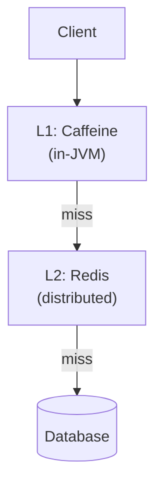

L1 catches most reads (microseconds). L2 catches reads missed by L1. DB only when both miss.

### 12.6 Cost optimization <a class="askgpt-btn" href="https://chatgpt.com/?prompt=Read%20this%20section%20of%20my%20encyclopedia%20and%20explain%20it%20in%20depth%20with%20concrete%20examples%2C%20the%20main%20trade-offs%2C%20and%20common%20pitfalls%20a%20practitioner%20should%20know%3A%0A%0Ahttps%3A%2F%2Fgithub.com%2Fvishvasg14%2Fsoftware-engineering-encyclopedia%2Fblob%2Fmain%2F08-caching%2Fcaching.md%23126-cost-optimization%0A%0ASection%20title%3A%2012.6%20Cost%20optimization" target="_blank" rel="noopener" data-askgpt="12.6 Cost optimization" data-askgpt-url="https://github.com/vishvasg14/software-engineering-encyclopedia/blob/main/08-caching/caching.md#126-cost-optimization" data-askgpt-prompt-depth="Read%20this%20section%20of%20my%20encyclopedia%20and%20explain%20it%20in%20depth%20with%20concrete%20examples%2C%20the%20main%20trade-offs%2C%20and%20common%20pitfalls%20a%20practitioner%20should%20know%3A%0A%0Ahttps%3A%2F%2Fgithub.com%2Fvishvasg14%2Fsoftware-engineering-encyclopedia%2Fblob%2Fmain%2F08-caching%2Fcaching.md%23126-cost-optimization%0A%0ASection%20title%3A%2012.6%20Cost%20optimization" data-askgpt-prompt-examples="Read%20this%20section%20of%20my%20encyclopedia%20and%20give%20me%202-3%20real-world%20production%20examples%20for%20it.%20For%20each%3A%20what%20went%20right%2C%20what%20went%20wrong%2C%20and%20the%20lessons%20learned.%20Include%20company%20%2F%20project%20names%20if%20relevant.%0A%0Ahttps%3A%2F%2Fgithub.com%2Fvishvasg14%2Fsoftware-engineering-encyclopedia%2Fblob%2Fmain%2F08-caching%2Fcaching.md%23126-cost-optimization%0A%0ASection%20title%3A%2012.6%20Cost%20optimization" title="Ask ChatGPT about this section">💬</a>

- Right-size cache to memory budget.
- Use eviction policy that matches access pattern.
- Use CDN for static content.
- Offload to object storage for cold data.

## 13. Production Case Studies

### 13.1 Twitter / X <a class="askgpt-btn" href="https://chatgpt.com/?prompt=Read%20this%20section%20of%20my%20encyclopedia%20and%20explain%20it%20in%20depth%20with%20concrete%20examples%2C%20the%20main%20trade-offs%2C%20and%20common%20pitfalls%20a%20practitioner%20should%20know%3A%0A%0Ahttps%3A%2F%2Fgithub.com%2Fvishvasg14%2Fsoftware-engineering-encyclopedia%2Fblob%2Fmain%2F08-caching%2Fcaching.md%23131-twitter-x%0A%0ASection%20title%3A%2013.1%20Twitter%20%2F%20X" target="_blank" rel="noopener" data-askgpt="13.1 Twitter / X" data-askgpt-url="https://github.com/vishvasg14/software-engineering-encyclopedia/blob/main/08-caching/caching.md#131-twitter-x" data-askgpt-prompt-depth="Read%20this%20section%20of%20my%20encyclopedia%20and%20explain%20it%20in%20depth%20with%20concrete%20examples%2C%20the%20main%20trade-offs%2C%20and%20common%20pitfalls%20a%20practitioner%20should%20know%3A%0A%0Ahttps%3A%2F%2Fgithub.com%2Fvishvasg14%2Fsoftware-engineering-encyclopedia%2Fblob%2Fmain%2F08-caching%2Fcaching.md%23131-twitter-x%0A%0ASection%20title%3A%2013.1%20Twitter%20%2F%20X" data-askgpt-prompt-examples="Read%20this%20section%20of%20my%20encyclopedia%20and%20give%20me%202-3%20real-world%20production%20examples%20for%20it.%20For%20each%3A%20what%20went%20right%2C%20what%20went%20wrong%2C%20and%20the%20lessons%20learned.%20Include%20company%20%2F%20project%20names%20if%20relevant.%0A%0Ahttps%3A%2F%2Fgithub.com%2Fvishvasg14%2Fsoftware-engineering-encyclopedia%2Fblob%2Fmain%2F08-caching%2Fcaching.md%23131-twitter-x%0A%0ASection%20title%3A%2013.1%20Twitter%20%2F%20X" title="Ask ChatGPT about this section">💬</a>

Twitter uses Redis for home timeline caching, user sessions, and rate limiting. They published influential posts on Redis at scale.

### 13.2 Pinterest <a class="askgpt-btn" href="https://chatgpt.com/?prompt=Read%20this%20section%20of%20my%20encyclopedia%20and%20explain%20it%20in%20depth%20with%20concrete%20examples%2C%20the%20main%20trade-offs%2C%20and%20common%20pitfalls%20a%20practitioner%20should%20know%3A%0A%0Ahttps%3A%2F%2Fgithub.com%2Fvishvasg14%2Fsoftware-engineering-encyclopedia%2Fblob%2Fmain%2F08-caching%2Fcaching.md%23132-pinterest%0A%0ASection%20title%3A%2013.2%20Pinterest" target="_blank" rel="noopener" data-askgpt="13.2 Pinterest" data-askgpt-url="https://github.com/vishvasg14/software-engineering-encyclopedia/blob/main/08-caching/caching.md#132-pinterest" data-askgpt-prompt-depth="Read%20this%20section%20of%20my%20encyclopedia%20and%20explain%20it%20in%20depth%20with%20concrete%20examples%2C%20the%20main%20trade-offs%2C%20and%20common%20pitfalls%20a%20practitioner%20should%20know%3A%0A%0Ahttps%3A%2F%2Fgithub.com%2Fvishvasg14%2Fsoftware-engineering-encyclopedia%2Fblob%2Fmain%2F08-caching%2Fcaching.md%23132-pinterest%0A%0ASection%20title%3A%2013.2%20Pinterest" data-askgpt-prompt-examples="Read%20this%20section%20of%20my%20encyclopedia%20and%20give%20me%202-3%20real-world%20production%20examples%20for%20it.%20For%20each%3A%20what%20went%20right%2C%20what%20went%20wrong%2C%20and%20the%20lessons%20learned.%20Include%20company%20%2F%20project%20names%20if%20relevant.%0A%0Ahttps%3A%2F%2Fgithub.com%2Fvishvasg14%2Fsoftware-engineering-encyclopedia%2Fblob%2Fmain%2F08-caching%2Fcaching.md%23132-pinterest%0A%0ASection%20title%3A%2013.2%20Pinterest" title="Ask ChatGPT about this section">💬</a>

Pinterest uses Redis as a cache layer for their feed generation. They documented their migration to Redis 3.2 and use of LFU eviction.

### 13.3 Facebook / Meta <a class="askgpt-btn" href="https://chatgpt.com/?prompt=Read%20this%20section%20of%20my%20encyclopedia%20and%20explain%20it%20in%20depth%20with%20concrete%20examples%2C%20the%20main%20trade-offs%2C%20and%20common%20pitfalls%20a%20practitioner%20should%20know%3A%0A%0Ahttps%3A%2F%2Fgithub.com%2Fvishvasg14%2Fsoftware-engineering-encyclopedia%2Fblob%2Fmain%2F08-caching%2Fcaching.md%23133-facebook-meta%0A%0ASection%20title%3A%2013.3%20Facebook%20%2F%20Meta" target="_blank" rel="noopener" data-askgpt="13.3 Facebook / Meta" data-askgpt-url="https://github.com/vishvasg14/software-engineering-encyclopedia/blob/main/08-caching/caching.md#133-facebook-meta" data-askgpt-prompt-depth="Read%20this%20section%20of%20my%20encyclopedia%20and%20explain%20it%20in%20depth%20with%20concrete%20examples%2C%20the%20main%20trade-offs%2C%20and%20common%20pitfalls%20a%20practitioner%20should%20know%3A%0A%0Ahttps%3A%2F%2Fgithub.com%2Fvishvasg14%2Fsoftware-engineering-encyclopedia%2Fblob%2Fmain%2F08-caching%2Fcaching.md%23133-facebook-meta%0A%0ASection%20title%3A%2013.3%20Facebook%20%2F%20Meta" data-askgpt-prompt-examples="Read%20this%20section%20of%20my%20encyclopedia%20and%20give%20me%202-3%20real-world%20production%20examples%20for%20it.%20For%20each%3A%20what%20went%20right%2C%20what%20went%20wrong%2C%20and%20the%20lessons%20learned.%20Include%20company%20%2F%20project%20names%20if%20relevant.%0A%0Ahttps%3A%2F%2Fgithub.com%2Fvishvasg14%2Fsoftware-engineering-encyclopedia%2Fblob%2Fmain%2F08-caching%2Fcaching.md%23133-facebook-meta%0A%0ASection%20title%3A%2013.3%20Facebook%20%2F%20Meta" title="Ask ChatGPT about this section">💬</a>

Meta uses Memcached at scale (thousands of servers) with custom innovations like leases and "thundering herd protection."

### 13.4 GitHub <a class="askgpt-btn" href="https://chatgpt.com/?prompt=Read%20this%20section%20of%20my%20encyclopedia%20and%20explain%20it%20in%20depth%20with%20concrete%20examples%2C%20the%20main%20trade-offs%2C%20and%20common%20pitfalls%20a%20practitioner%20should%20know%3A%0A%0Ahttps%3A%2F%2Fgithub.com%2Fvishvasg14%2Fsoftware-engineering-encyclopedia%2Fblob%2Fmain%2F08-caching%2Fcaching.md%23134-github%0A%0ASection%20title%3A%2013.4%20GitHub" target="_blank" rel="noopener" data-askgpt="13.4 GitHub" data-askgpt-url="https://github.com/vishvasg14/software-engineering-encyclopedia/blob/main/08-caching/caching.md#134-github" data-askgpt-prompt-depth="Read%20this%20section%20of%20my%20encyclopedia%20and%20explain%20it%20in%20depth%20with%20concrete%20examples%2C%20the%20main%20trade-offs%2C%20and%20common%20pitfalls%20a%20practitioner%20should%20know%3A%0A%0Ahttps%3A%2F%2Fgithub.com%2Fvishvasg14%2Fsoftware-engineering-encyclopedia%2Fblob%2Fmain%2F08-caching%2Fcaching.md%23134-github%0A%0ASection%20title%3A%2013.4%20GitHub" data-askgpt-prompt-examples="Read%20this%20section%20of%20my%20encyclopedia%20and%20give%20me%202-3%20real-world%20production%20examples%20for%20it.%20For%20each%3A%20what%20went%20right%2C%20what%20went%20wrong%2C%20and%20the%20lessons%20learned.%20Include%20company%20%2F%20project%20names%20if%20relevant.%0A%0Ahttps%3A%2F%2Fgithub.com%2Fvishvasg14%2Fsoftware-engineering-encyclopedia%2Fblob%2Fmain%2F08-caching%2Fcaching.md%23134-github%0A%0ASection%20title%3A%2013.4%20GitHub" title="Ask ChatGPT about this section">💬</a>

GitHub uses Redis for session storage, rate limiting, and background job queue (Resque).

### 13.5 Stack Overflow <a class="askgpt-btn" href="https://chatgpt.com/?prompt=Read%20this%20section%20of%20my%20encyclopedia%20and%20explain%20it%20in%20depth%20with%20concrete%20examples%2C%20the%20main%20trade-offs%2C%20and%20common%20pitfalls%20a%20practitioner%20should%20know%3A%0A%0Ahttps%3A%2F%2Fgithub.com%2Fvishvasg14%2Fsoftware-engineering-encyclopedia%2Fblob%2Fmain%2F08-caching%2Fcaching.md%23135-stack-overflow%0A%0ASection%20title%3A%2013.5%20Stack%20Overflow" target="_blank" rel="noopener" data-askgpt="13.5 Stack Overflow" data-askgpt-url="https://github.com/vishvasg14/software-engineering-encyclopedia/blob/main/08-caching/caching.md#135-stack-overflow" data-askgpt-prompt-depth="Read%20this%20section%20of%20my%20encyclopedia%20and%20explain%20it%20in%20depth%20with%20concrete%20examples%2C%20the%20main%20trade-offs%2C%20and%20common%20pitfalls%20a%20practitioner%20should%20know%3A%0A%0Ahttps%3A%2F%2Fgithub.com%2Fvishvasg14%2Fsoftware-engineering-encyclopedia%2Fblob%2Fmain%2F08-caching%2Fcaching.md%23135-stack-overflow%0A%0ASection%20title%3A%2013.5%20Stack%20Overflow" data-askgpt-prompt-examples="Read%20this%20section%20of%20my%20encyclopedia%20and%20give%20me%202-3%20real-world%20production%20examples%20for%20it.%20For%20each%3A%20what%20went%20right%2C%20what%20went%20wrong%2C%20and%20the%20lessons%20learned.%20Include%20company%20%2F%20project%20names%20if%20relevant.%0A%0Ahttps%3A%2F%2Fgithub.com%2Fvishvasg14%2Fsoftware-engineering-encyclopedia%2Fblob%2Fmain%2F08-caching%2Fcaching.md%23135-stack-overflow%0A%0ASection%20title%3A%2013.5%20Stack%20Overflow" title="Ask ChatGPT about this section">💬</a>

Stack Overflow uses Redis for session storage and rate limiting; document cache and object cache primarily via local caches.

## 14. Code Examples

### 14.1 Basic: Redis client (Python) <a class="askgpt-btn" href="https://chatgpt.com/?prompt=Read%20this%20section%20of%20my%20encyclopedia%20and%20explain%20it%20in%20depth%20with%20concrete%20examples%2C%20the%20main%20trade-offs%2C%20and%20common%20pitfalls%20a%20practitioner%20should%20know%3A%0A%0Ahttps%3A%2F%2Fgithub.com%2Fvishvasg14%2Fsoftware-engineering-encyclopedia%2Fblob%2Fmain%2F08-caching%2Fcaching.md%23141-basic-redis-client-python%0A%0ASection%20title%3A%2014.1%20Basic%3A%20Redis%20client%20(Python)" target="_blank" rel="noopener" data-askgpt="14.1 Basic: Redis client (Python)" data-askgpt-url="https://github.com/vishvasg14/software-engineering-encyclopedia/blob/main/08-caching/caching.md#141-basic-redis-client-python" data-askgpt-prompt-depth="Read%20this%20section%20of%20my%20encyclopedia%20and%20explain%20it%20in%20depth%20with%20concrete%20examples%2C%20the%20main%20trade-offs%2C%20and%20common%20pitfalls%20a%20practitioner%20should%20know%3A%0A%0Ahttps%3A%2F%2Fgithub.com%2Fvishvasg14%2Fsoftware-engineering-encyclopedia%2Fblob%2Fmain%2F08-caching%2Fcaching.md%23141-basic-redis-client-python%0A%0ASection%20title%3A%2014.1%20Basic%3A%20Redis%20client%20(Python)" data-askgpt-prompt-examples="Read%20this%20section%20of%20my%20encyclopedia%20and%20give%20me%202-3%20real-world%20production%20examples%20for%20it.%20For%20each%3A%20what%20went%20right%2C%20what%20went%20wrong%2C%20and%20the%20lessons%20learned.%20Include%20company%20%2F%20project%20names%20if%20relevant.%0A%0Ahttps%3A%2F%2Fgithub.com%2Fvishvasg14%2Fsoftware-engineering-encyclopedia%2Fblob%2Fmain%2F08-caching%2Fcaching.md%23141-basic-redis-client-python%0A%0ASection%20title%3A%2014.1%20Basic%3A%20Redis%20client%20(Python)" title="Ask ChatGPT about this section">💬</a>

```python
import redis

r = redis.Redis(host="localhost", port=6379)

# Strings
r.set("user:1:name", "Alice", ex=60)  # 60s TTL
name = r.get("user:1:name")

# Hashes
r.hset("user:1", mapping={"name": "Alice", "email": "alice@..."})
user = r.hgetall("user:1")

# Atomic counter
r.incr("user:1:visits")

# TTL operations
r.expire("user:1:name", 30)
ttl = r.ttl("user:1:name")
```

### 14.2 Basic: Caffeine (Java) <a class="askgpt-btn" href="https://chatgpt.com/?prompt=Read%20this%20section%20of%20my%20encyclopedia%20and%20explain%20it%20in%20depth%20with%20concrete%20examples%2C%20the%20main%20trade-offs%2C%20and%20common%20pitfalls%20a%20practitioner%20should%20know%3A%0A%0Ahttps%3A%2F%2Fgithub.com%2Fvishvasg14%2Fsoftware-engineering-encyclopedia%2Fblob%2Fmain%2F08-caching%2Fcaching.md%23142-basic-caffeine-java%0A%0ASection%20title%3A%2014.2%20Basic%3A%20Caffeine%20(Java)" target="_blank" rel="noopener" data-askgpt="14.2 Basic: Caffeine (Java)" data-askgpt-url="https://github.com/vishvasg14/software-engineering-encyclopedia/blob/main/08-caching/caching.md#142-basic-caffeine-java" data-askgpt-prompt-depth="Read%20this%20section%20of%20my%20encyclopedia%20and%20explain%20it%20in%20depth%20with%20concrete%20examples%2C%20the%20main%20trade-offs%2C%20and%20common%20pitfalls%20a%20practitioner%20should%20know%3A%0A%0Ahttps%3A%2F%2Fgithub.com%2Fvishvasg14%2Fsoftware-engineering-encyclopedia%2Fblob%2Fmain%2F08-caching%2Fcaching.md%23142-basic-caffeine-java%0A%0ASection%20title%3A%2014.2%20Basic%3A%20Caffeine%20(Java)" data-askgpt-prompt-examples="Read%20this%20section%20of%20my%20encyclopedia%20and%20give%20me%202-3%20real-world%20production%20examples%20for%20it.%20For%20each%3A%20what%20went%20right%2C%20what%20went%20wrong%2C%20and%20the%20lessons%20learned.%20Include%20company%20%2F%20project%20names%20if%20relevant.%0A%0Ahttps%3A%2F%2Fgithub.com%2Fvishvasg14%2Fsoftware-engineering-encyclopedia%2Fblob%2Fmain%2F08-caching%2Fcaching.md%23142-basic-caffeine-java%0A%0ASection%20title%3A%2014.2%20Basic%3A%20Caffeine%20(Java)" title="Ask ChatGPT about this section">💬</a>

```java
import com.github.benmanes.caffeine.cache.Caffeine;
import com.github.benmanes.caffeine.cache.Cache;

Cache<String, User> cache = Caffeine.newBuilder()
    .maximumSize(10_000)
    .expireAfterWrite(Duration.ofMinutes(5))
    .build();

User user = cache.get("user:1", key -> userRepository.findById(...).orElseThrow());
```

### 14.3 Cache-aside pattern <a class="askgpt-btn" href="https://chatgpt.com/?prompt=Read%20this%20section%20of%20my%20encyclopedia%20and%20explain%20it%20in%20depth%20with%20concrete%20examples%2C%20the%20main%20trade-offs%2C%20and%20common%20pitfalls%20a%20practitioner%20should%20know%3A%0A%0Ahttps%3A%2F%2Fgithub.com%2Fvishvasg14%2Fsoftware-engineering-encyclopedia%2Fblob%2Fmain%2F08-caching%2Fcaching.md%23143-cache-aside-pattern%0A%0ASection%20title%3A%2014.3%20Cache-aside%20pattern" target="_blank" rel="noopener" data-askgpt="14.3 Cache-aside pattern" data-askgpt-url="https://github.com/vishvasg14/software-engineering-encyclopedia/blob/main/08-caching/caching.md#143-cache-aside-pattern" data-askgpt-prompt-depth="Read%20this%20section%20of%20my%20encyclopedia%20and%20explain%20it%20in%20depth%20with%20concrete%20examples%2C%20the%20main%20trade-offs%2C%20and%20common%20pitfalls%20a%20practitioner%20should%20know%3A%0A%0Ahttps%3A%2F%2Fgithub.com%2Fvishvasg14%2Fsoftware-engineering-encyclopedia%2Fblob%2Fmain%2F08-caching%2Fcaching.md%23143-cache-aside-pattern%0A%0ASection%20title%3A%2014.3%20Cache-aside%20pattern" data-askgpt-prompt-examples="Read%20this%20section%20of%20my%20encyclopedia%20and%20give%20me%202-3%20real-world%20production%20examples%20for%20it.%20For%20each%3A%20what%20went%20right%2C%20what%20went%20wrong%2C%20and%20the%20lessons%20learned.%20Include%20company%20%2F%20project%20names%20if%20relevant.%0A%0Ahttps%3A%2F%2Fgithub.com%2Fvishvasg14%2Fsoftware-engineering-encyclopedia%2Fblob%2Fmain%2F08-caching%2Fcaching.md%23143-cache-aside-pattern%0A%0ASection%20title%3A%2014.3%20Cache-aside%20pattern" title="Ask ChatGPT about this section">💬</a>

```java
@Service
public class UserService {

    private final UserRepository userRepository;
    private final Cache<String, User> cache;

    public UserService(UserRepository userRepository, Cache<String, User> cache) {
        this.userRepository = userRepository;
        this.cache = cache;
    }

    public User findById(Long id) {
        String key = "user:" + id;
        User user = cache.get(key, k -> userRepository.findById(id).orElse(null));
        if (user == null) throw new NotFoundException();
        return user;
    }

    public void updateUser(User user) {
        userRepository.save(user);
        cache.invalidate("user:" + user.getId());
    }
}
```

### 14.4 Write-through pattern <a class="askgpt-btn" href="https://chatgpt.com/?prompt=Read%20this%20section%20of%20my%20encyclopedia%20and%20explain%20it%20in%20depth%20with%20concrete%20examples%2C%20the%20main%20trade-offs%2C%20and%20common%20pitfalls%20a%20practitioner%20should%20know%3A%0A%0Ahttps%3A%2F%2Fgithub.com%2Fvishvasg14%2Fsoftware-engineering-encyclopedia%2Fblob%2Fmain%2F08-caching%2Fcaching.md%23144-write-through-pattern%0A%0ASection%20title%3A%2014.4%20Write-through%20pattern" target="_blank" rel="noopener" data-askgpt="14.4 Write-through pattern" data-askgpt-url="https://github.com/vishvasg14/software-engineering-encyclopedia/blob/main/08-caching/caching.md#144-write-through-pattern" data-askgpt-prompt-depth="Read%20this%20section%20of%20my%20encyclopedia%20and%20explain%20it%20in%20depth%20with%20concrete%20examples%2C%20the%20main%20trade-offs%2C%20and%20common%20pitfalls%20a%20practitioner%20should%20know%3A%0A%0Ahttps%3A%2F%2Fgithub.com%2Fvishvasg14%2Fsoftware-engineering-encyclopedia%2Fblob%2Fmain%2F08-caching%2Fcaching.md%23144-write-through-pattern%0A%0ASection%20title%3A%2014.4%20Write-through%20pattern" data-askgpt-prompt-examples="Read%20this%20section%20of%20my%20encyclopedia%20and%20give%20me%202-3%20real-world%20production%20examples%20for%20it.%20For%20each%3A%20what%20went%20right%2C%20what%20went%20wrong%2C%20and%20the%20lessons%20learned.%20Include%20company%20%2F%20project%20names%20if%20relevant.%0A%0Ahttps%3A%2F%2Fgithub.com%2Fvishvasg14%2Fsoftware-engineering-encyclopedia%2Fblob%2Fmain%2F08-caching%2Fcaching.md%23144-write-through-pattern%0A%0ASection%20title%3A%2014.4%20Write-through%20pattern" title="Ask ChatGPT about this section">💬</a>

```java
@Service
public class UserCacheService {
    private final UserRepository userRepository;
    private final Cache<String, User> cache;

    public void save(User user) {
        // Write to DB
        userRepository.save(user);
        // Update cache
        cache.put("user:" + user.getId(), user);
    }
}
```

### 14.5 Spring Cache with Caffeine <a class="askgpt-btn" href="https://chatgpt.com/?prompt=Read%20this%20section%20of%20my%20encyclopedia%20and%20explain%20it%20in%20depth%20with%20concrete%20examples%2C%20the%20main%20trade-offs%2C%20and%20common%20pitfalls%20a%20practitioner%20should%20know%3A%0A%0Ahttps%3A%2F%2Fgithub.com%2Fvishvasg14%2Fsoftware-engineering-encyclopedia%2Fblob%2Fmain%2F08-caching%2Fcaching.md%23145-spring-cache-with-caffeine%0A%0ASection%20title%3A%2014.5%20Spring%20Cache%20with%20Caffeine" target="_blank" rel="noopener" data-askgpt="14.5 Spring Cache with Caffeine" data-askgpt-url="https://github.com/vishvasg14/software-engineering-encyclopedia/blob/main/08-caching/caching.md#145-spring-cache-with-caffeine" data-askgpt-prompt-depth="Read%20this%20section%20of%20my%20encyclopedia%20and%20explain%20it%20in%20depth%20with%20concrete%20examples%2C%20the%20main%20trade-offs%2C%20and%20common%20pitfalls%20a%20practitioner%20should%20know%3A%0A%0Ahttps%3A%2F%2Fgithub.com%2Fvishvasg14%2Fsoftware-engineering-encyclopedia%2Fblob%2Fmain%2F08-caching%2Fcaching.md%23145-spring-cache-with-caffeine%0A%0ASection%20title%3A%2014.5%20Spring%20Cache%20with%20Caffeine" data-askgpt-prompt-examples="Read%20this%20section%20of%20my%20encyclopedia%20and%20give%20me%202-3%20real-world%20production%20examples%20for%20it.%20For%20each%3A%20what%20went%20right%2C%20what%20went%20wrong%2C%20and%20the%20lessons%20learned.%20Include%20company%20%2F%20project%20names%20if%20relevant.%0A%0Ahttps%3A%2F%2Fgithub.com%2Fvishvasg14%2Fsoftware-engineering-encyclopedia%2Fblob%2Fmain%2F08-caching%2Fcaching.md%23145-spring-cache-with-caffeine%0A%0ASection%20title%3A%2014.5%20Spring%20Cache%20with%20Caffeine" title="Ask ChatGPT about this section">💬</a>

```java
@Configuration
@EnableCaching
public class CacheConfig {

    @Bean
    public CacheManager cacheManager() {
        CaffeineCacheManager manager = new CaffeineCacheManager();
        manager.setCaffeine(Caffeine.newBuilder()
            .maximumSize(10_000)
            .expireAfterWrite(Duration.ofMinutes(5)));
        return manager;
    }
}

@Service
public class ProductService {

    @Cacheable(value = "products", key = "#id")
    public Product getProduct(Long id) {
        return productRepository.findById(id).orElseThrow();
    }

    @CacheEvict(value = "products", key = "#product.id")
    public void updateProduct(Product product) {
        productRepository.save(product);
    }
}
```

### 14.6 Bad, anti-pattern, refactored, secure, performance-optimized examples <a class="askgpt-btn" href="https://chatgpt.com/?prompt=Read%20this%20section%20of%20my%20encyclopedia%20and%20explain%20it%20in%20depth%20with%20concrete%20examples%2C%20the%20main%20trade-offs%2C%20and%20common%20pitfalls%20a%20practitioner%20should%20know%3A%0A%0Ahttps%3A%2F%2Fgithub.com%2Fvishvasg14%2Fsoftware-engineering-encyclopedia%2Fblob%2Fmain%2F08-caching%2Fcaching.md%23146-bad-anti-pattern-refactored-secure-performance-optimized-examples%0A%0ASection%20title%3A%2014.6%20Bad%2C%20anti-pattern%2C%20refactored%2C%20secure%2C%20performance-optimized%20examples" target="_blank" rel="noopener" data-askgpt="14.6 Bad, anti-pattern, refactored, secure, performance-optimized examples" data-askgpt-url="https://github.com/vishvasg14/software-engineering-encyclopedia/blob/main/08-caching/caching.md#146-bad-anti-pattern-refactored-secure-performance-optimized-examples" data-askgpt-prompt-depth="Read%20this%20section%20of%20my%20encyclopedia%20and%20explain%20it%20in%20depth%20with%20concrete%20examples%2C%20the%20main%20trade-offs%2C%20and%20common%20pitfalls%20a%20practitioner%20should%20know%3A%0A%0Ahttps%3A%2F%2Fgithub.com%2Fvishvasg14%2Fsoftware-engineering-encyclopedia%2Fblob%2Fmain%2F08-caching%2Fcaching.md%23146-bad-anti-pattern-refactored-secure-performance-optimized-examples%0A%0ASection%20title%3A%2014.6%20Bad%2C%20anti-pattern%2C%20refactored%2C%20secure%2C%20performance-optimized%20examples" data-askgpt-prompt-examples="Read%20this%20section%20of%20my%20encyclopedia%20and%20give%20me%202-3%20real-world%20production%20examples%20for%20it.%20For%20each%3A%20what%20went%20right%2C%20what%20went%20wrong%2C%20and%20the%20lessons%20learned.%20Include%20company%20%2F%20project%20names%20if%20relevant.%0A%0Ahttps%3A%2F%2Fgithub.com%2Fvishvasg14%2Fsoftware-engineering-encyclopedia%2Fblob%2Fmain%2F08-caching%2Fcaching.md%23146-bad-anti-pattern-refactored-secure-performance-optimized-examples%0A%0ASection%20title%3A%2014.6%20Bad%2C%20anti-pattern%2C%20refactored%2C%20secure%2C%20performance-optimized%20examples" title="Ask ChatGPT about this section">💬</a>

**Bad: no TTL**

```java
cache.put("user:1", user);  // never expires!
```

**Anti-pattern: cache DB rows that change often**

```java
// Bad: counter changes every request
cache.put("counter", counter);
```

**Refactored: TTL always**

```java
cache.put("user:1", user, Duration.ofMinutes(5));
```

**Secure: don't put secrets in cache**

```java
// Bad
cache.put("user:" + id + ":token", jwtToken);
// Good
// Use a server-side session store, not cache
```

**Performance-optimized: local in-JVM cache for hot keys**

```java
CaffeineCacheManager + RedisTemplate
// L1: Caffeine (in-JVM, microseconds)
// L2: Redis (distributed, milliseconds)
```

## 15. Common Mistakes

### 15.1 Beginner mistakes <a class="askgpt-btn" href="https://chatgpt.com/?prompt=Read%20this%20section%20of%20my%20encyclopedia%20and%20explain%20it%20in%20depth%20with%20concrete%20examples%2C%20the%20main%20trade-offs%2C%20and%20common%20pitfalls%20a%20practitioner%20should%20know%3A%0A%0Ahttps%3A%2F%2Fgithub.com%2Fvishvasg14%2Fsoftware-engineering-encyclopedia%2Fblob%2Fmain%2F08-caching%2Fcaching.md%23151-beginner-mistakes%0A%0ASection%20title%3A%2015.1%20Beginner%20mistakes" target="_blank" rel="noopener" data-askgpt="15.1 Beginner mistakes" data-askgpt-url="https://github.com/vishvasg14/software-engineering-encyclopedia/blob/main/08-caching/caching.md#151-beginner-mistakes" data-askgpt-prompt-depth="Read%20this%20section%20of%20my%20encyclopedia%20and%20explain%20it%20in%20depth%20with%20concrete%20examples%2C%20the%20main%20trade-offs%2C%20and%20common%20pitfalls%20a%20practitioner%20should%20know%3A%0A%0Ahttps%3A%2F%2Fgithub.com%2Fvishvasg14%2Fsoftware-engineering-encyclopedia%2Fblob%2Fmain%2F08-caching%2Fcaching.md%23151-beginner-mistakes%0A%0ASection%20title%3A%2015.1%20Beginner%20mistakes" data-askgpt-prompt-examples="Read%20this%20section%20of%20my%20encyclopedia%20and%20give%20me%202-3%20real-world%20production%20examples%20for%20it.%20For%20each%3A%20what%20went%20right%2C%20what%20went%20wrong%2C%20and%20the%20lessons%20learned.%20Include%20company%20%2F%20project%20names%20if%20relevant.%0A%0Ahttps%3A%2F%2Fgithub.com%2Fvishvasg14%2Fsoftware-engineering-encyclopedia%2Fblob%2Fmain%2F08-caching%2Fcaching.md%23151-beginner-mistakes%0A%0ASection%20title%3A%2015.1%20Beginner%20mistakes" title="Ask ChatGPT about this section">💬</a>

- **No TTL** — entries never expire; memory blows up.
- **Cache without invalidation** — stale data forever.
- **Cache DB writes** — caching a write doesn't mean it persisted.
- **Don't monitor** — discover problems only when OOM.
- **Single huge value** — blocks network.

### 15.2 Intermediate mistakes <a class="askgpt-btn" href="https://chatgpt.com/?prompt=Read%20this%20section%20of%20my%20encyclopedia%20and%20explain%20it%20in%20depth%20with%20concrete%20examples%2C%20the%20main%20trade-offs%2C%20and%20common%20pitfalls%20a%20practitioner%20should%20know%3A%0A%0Ahttps%3A%2F%2Fgithub.com%2Fvishvasg14%2Fsoftware-engineering-encyclopedia%2Fblob%2Fmain%2F08-caching%2Fcaching.md%23152-intermediate-mistakes%0A%0ASection%20title%3A%2015.2%20Intermediate%20mistakes" target="_blank" rel="noopener" data-askgpt="15.2 Intermediate mistakes" data-askgpt-url="https://github.com/vishvasg14/software-engineering-encyclopedia/blob/main/08-caching/caching.md#152-intermediate-mistakes" data-askgpt-prompt-depth="Read%20this%20section%20of%20my%20encyclopedia%20and%20explain%20it%20in%20depth%20with%20concrete%20examples%2C%20the%20main%20trade-offs%2C%20and%20common%20pitfalls%20a%20practitioner%20should%20know%3A%0A%0Ahttps%3A%2F%2Fgithub.com%2Fvishvasg14%2Fsoftware-engineering-encyclopedia%2Fblob%2Fmain%2F08-caching%2Fcaching.md%23152-intermediate-mistakes%0A%0ASection%20title%3A%2015.2%20Intermediate%20mistakes" data-askgpt-prompt-examples="Read%20this%20section%20of%20my%20encyclopedia%20and%20give%20me%202-3%20real-world%20production%20examples%20for%20it.%20For%20each%3A%20what%20went%20right%2C%20what%20went%20wrong%2C%20and%20the%20lessons%20learned.%20Include%20company%20%2F%20project%20names%20if%20relevant.%0A%0Ahttps%3A%2F%2Fgithub.com%2Fvishvasg14%2Fsoftware-engineering-encyclopedia%2Fblob%2Fmain%2F08-caching%2Fcaching.md%23152-intermediate-mistakes%0A%0ASection%20title%3A%2015.2%20Intermediate%20mistakes" title="Ask ChatGPT about this section">💬</a>

- **No cache stampede protection** — DB overload on miss.
- **Eager caching of entire tables** — wastes memory.
- **Hot key unmitigated** — single point of failure.
- **Cache inconsistent with DB schema** — old data after migration.
- **Wrong eviction policy** — LRU evicts hot items under scan.

### 15.3 Senior mistakes <a class="askgpt-btn" href="https://chatgpt.com/?prompt=Read%20this%20section%20of%20my%20encyclopedia%20and%20explain%20it%20in%20depth%20with%20concrete%20examples%2C%20the%20main%20trade-offs%2C%20and%20common%20pitfalls%20a%20practitioner%20should%20know%3A%0A%0Ahttps%3A%2F%2Fgithub.com%2Fvishvasg14%2Fsoftware-engineering-encyclopedia%2Fblob%2Fmain%2F08-caching%2Fcaching.md%23153-senior-mistakes%0A%0ASection%20title%3A%2015.3%20Senior%20mistakes" target="_blank" rel="noopener" data-askgpt="15.3 Senior mistakes" data-askgpt-url="https://github.com/vishvasg14/software-engineering-encyclopedia/blob/main/08-caching/caching.md#153-senior-mistakes" data-askgpt-prompt-depth="Read%20this%20section%20of%20my%20encyclopedia%20and%20explain%20it%20in%20depth%20with%20concrete%20examples%2C%20the%20main%20trade-offs%2C%20and%20common%20pitfalls%20a%20practitioner%20should%20know%3A%0A%0Ahttps%3A%2F%2Fgithub.com%2Fvishvasg14%2Fsoftware-engineering-encyclopedia%2Fblob%2Fmain%2F08-caching%2Fcaching.md%23153-senior-mistakes%0A%0ASection%20title%3A%2015.3%20Senior%20mistakes" data-askgpt-prompt-examples="Read%20this%20section%20of%20my%20encyclopedia%20and%20give%20me%202-3%20real-world%20production%20examples%20for%20it.%20For%20each%3A%20what%20went%20right%2C%20what%20went%20wrong%2C%20and%20the%20lessons%20learned.%20Include%20company%20%2F%20project%20names%20if%20relevant.%0A%0Ahttps%3A%2F%2Fgithub.com%2Fvishvasg14%2Fsoftware-engineering-encyclopedia%2Fblob%2Fmain%2F08-caching%2Fcaching.md%23153-senior-mistakes%0A%0ASection%20title%3A%2015.3%20Senior%20mistakes" title="Ask ChatGPT about this section">💬</a>

- **Using Redis as primary store** — Redis is fast but not durable (without AOF).
- **No cache warming** — cold cache = thundering herd.
- **Multi-tier without invalidation** — L1 and L2 diverge.
- **No size limits** — OOM.
- **Caching the wrong thing** — caching doesn't fix broken schemas.

### 15.4 Production mistakes <a class="askgpt-btn" href="https://chatgpt.com/?prompt=Read%20this%20section%20of%20my%20encyclopedia%20and%20explain%20it%20in%20depth%20with%20concrete%20examples%2C%20the%20main%20trade-offs%2C%20and%20common%20pitfalls%20a%20practitioner%20should%20know%3A%0A%0Ahttps%3A%2F%2Fgithub.com%2Fvishvasg14%2Fsoftware-engineering-encyclopedia%2Fblob%2Fmain%2F08-caching%2Fcaching.md%23154-production-mistakes%0A%0ASection%20title%3A%2015.4%20Production%20mistakes" target="_blank" rel="noopener" data-askgpt="15.4 Production mistakes" data-askgpt-url="https://github.com/vishvasg14/software-engineering-encyclopedia/blob/main/08-caching/caching.md#154-production-mistakes" data-askgpt-prompt-depth="Read%20this%20section%20of%20my%20encyclopedia%20and%20explain%20it%20in%20depth%20with%20concrete%20examples%2C%20the%20main%20trade-offs%2C%20and%20common%20pitfalls%20a%20practitioner%20should%20know%3A%0A%0Ahttps%3A%2F%2Fgithub.com%2Fvishvasg14%2Fsoftware-engineering-encyclopedia%2Fblob%2Fmain%2F08-caching%2Fcaching.md%23154-production-mistakes%0A%0ASection%20title%3A%2015.4%20Production%20mistakes" data-askgpt-prompt-examples="Read%20this%20section%20of%20my%20encyclopedia%20and%20give%20me%202-3%20real-world%20production%20examples%20for%20it.%20For%20each%3A%20what%20went%20right%2C%20what%20went%20wrong%2C%20and%20the%20lessons%20learned.%20Include%20company%20%2F%20project%20names%20if%20relevant.%0A%0Ahttps%3A%2F%2Fgithub.com%2Fvishvasg14%2Fsoftware-engineering-encyclopedia%2Fblob%2Fmain%2F08-caching%2Fcaching.md%23154-production-mistakes%0A%0ASection%20title%3A%2015.4%20Production%20mistakes" title="Ask ChatGPT about this section">💬</a>

- **No monitoring** — discover problems too late.
- **Single point of failure** — Redis Sentinel/Cluster not configured.
- **Memory pressure** — eviction = data loss; OOM = crash.
- **Network saturation** — too many cache calls.
- **Cold cache after restart** — all requests miss.

### 15.5 Migration mistakes <a class="askgpt-btn" href="https://chatgpt.com/?prompt=Read%20this%20section%20of%20my%20encyclopedia%20and%20explain%20it%20in%20depth%20with%20concrete%20examples%2C%20the%20main%20trade-offs%2C%20and%20common%20pitfalls%20a%20practitioner%20should%20know%3A%0A%0Ahttps%3A%2F%2Fgithub.com%2Fvishvasg14%2Fsoftware-engineering-encyclopedia%2Fblob%2Fmain%2F08-caching%2Fcaching.md%23155-migration-mistakes%0A%0ASection%20title%3A%2015.5%20Migration%20mistakes" target="_blank" rel="noopener" data-askgpt="15.5 Migration mistakes" data-askgpt-url="https://github.com/vishvasg14/software-engineering-encyclopedia/blob/main/08-caching/caching.md#155-migration-mistakes" data-askgpt-prompt-depth="Read%20this%20section%20of%20my%20encyclopedia%20and%20explain%20it%20in%20depth%20with%20concrete%20examples%2C%20the%20main%20trade-offs%2C%20and%20common%20pitfalls%20a%20practitioner%20should%20know%3A%0A%0Ahttps%3A%2F%2Fgithub.com%2Fvishvasg14%2Fsoftware-engineering-encyclopedia%2Fblob%2Fmain%2F08-caching%2Fcaching.md%23155-migration-mistakes%0A%0ASection%20title%3A%2015.5%20Migration%20mistakes" data-askgpt-prompt-examples="Read%20this%20section%20of%20my%20encyclopedia%20and%20give%20me%202-3%20real-world%20production%20examples%20for%20it.%20For%20each%3A%20what%20went%20right%2C%20what%20went%20wrong%2C%20and%20the%20lessons%20learned.%20Include%20company%20%2F%20project%20names%20if%20relevant.%0A%0Ahttps%3A%2F%2Fgithub.com%2Fvishvasg14%2Fsoftware-engineering-encyclopedia%2Fblob%2Fmain%2F08-caching%2Fcaching.md%23155-migration-mistakes%0A%0ASection%20title%3A%2015.5%20Migration%20mistakes" title="Ask ChatGPT about this section">💬</a>

- **In-memory to Redis** — assumes single-machine suffices.
- **Redis to Cluster** — keys not in same slot; multi-key ops break.
- **No rollback plan** — when something goes wrong, can't revert.

### 15.6 Configuration mistakes <a class="askgpt-btn" href="https://chatgpt.com/?prompt=Read%20this%20section%20of%20my%20encyclopedia%20and%20explain%20it%20in%20depth%20with%20concrete%20examples%2C%20the%20main%20trade-offs%2C%20and%20common%20pitfalls%20a%20practitioner%20should%20know%3A%0A%0Ahttps%3A%2F%2Fgithub.com%2Fvishvasg14%2Fsoftware-engineering-encyclopedia%2Fblob%2Fmain%2F08-caching%2Fcaching.md%23156-configuration-mistakes%0A%0ASection%20title%3A%2015.6%20Configuration%20mistakes" target="_blank" rel="noopener" data-askgpt="15.6 Configuration mistakes" data-askgpt-url="https://github.com/vishvasg14/software-engineering-encyclopedia/blob/main/08-caching/caching.md#156-configuration-mistakes" data-askgpt-prompt-depth="Read%20this%20section%20of%20my%20encyclopedia%20and%20explain%20it%20in%20depth%20with%20concrete%20examples%2C%20the%20main%20trade-offs%2C%20and%20common%20pitfalls%20a%20practitioner%20should%20know%3A%0A%0Ahttps%3A%2F%2Fgithub.com%2Fvishvasg14%2Fsoftware-engineering-encyclopedia%2Fblob%2Fmain%2F08-caching%2Fcaching.md%23156-configuration-mistakes%0A%0ASection%20title%3A%2015.6%20Configuration%20mistakes" data-askgpt-prompt-examples="Read%20this%20section%20of%20my%20encyclopedia%20and%20give%20me%202-3%20real-world%20production%20examples%20for%20it.%20For%20each%3A%20what%20went%20right%2C%20what%20went%20wrong%2C%20and%20the%20lessons%20learned.%20Include%20company%20%2F%20project%20names%20if%20relevant.%0A%0Ahttps%3A%2F%2Fgithub.com%2Fvishvasg14%2Fsoftware-engineering-encyclopedia%2Fblob%2Fmain%2F08-caching%2Fcaching.md%23156-configuration-mistakes%0A%0ASection%20title%3A%2015.6%20Configuration%20mistakes" title="Ask ChatGPT about this section">💬</a>

- **Default eviction with mixed access** — LRU for hot-and-cold mix.
- **`maxmemory 0` in production** — no limit = OOM.
- **`save ""` (no RDB)** — no durability.
- **`appendonly no`** — no AOF.

### 15.7 Security mistakes <a class="askgpt-btn" href="https://chatgpt.com/?prompt=Read%20this%20section%20of%20my%20encyclopedia%20and%20explain%20it%20in%20depth%20with%20concrete%20examples%2C%20the%20main%20trade-offs%2C%20and%20common%20pitfalls%20a%20practitioner%20should%20know%3A%0A%0Ahttps%3A%2F%2Fgithub.com%2Fvishvasg14%2Fsoftware-engineering-encyclopedia%2Fblob%2Fmain%2F08-caching%2Fcaching.md%23157-security-mistakes%0A%0ASection%20title%3A%2015.7%20Security%20mistakes" target="_blank" rel="noopener" data-askgpt="15.7 Security mistakes" data-askgpt-url="https://github.com/vishvasg14/software-engineering-encyclopedia/blob/main/08-caching/caching.md#157-security-mistakes" data-askgpt-prompt-depth="Read%20this%20section%20of%20my%20encyclopedia%20and%20explain%20it%20in%20depth%20with%20concrete%20examples%2C%20the%20main%20trade-offs%2C%20and%20common%20pitfalls%20a%20practitioner%20should%20know%3A%0A%0Ahttps%3A%2F%2Fgithub.com%2Fvishvasg14%2Fsoftware-engineering-encyclopedia%2Fblob%2Fmain%2F08-caching%2Fcaching.md%23157-security-mistakes%0A%0ASection%20title%3A%2015.7%20Security%20mistakes" data-askgpt-prompt-examples="Read%20this%20section%20of%20my%20encyclopedia%20and%20give%20me%202-3%20real-world%20production%20examples%20for%20it.%20For%20each%3A%20what%20went%20right%2C%20what%20went%20wrong%2C%20and%20the%20lessons%20learned.%20Include%20company%20%2F%20project%20names%20if%20relevant.%0A%0Ahttps%3A%2F%2Fgithub.com%2Fvishvasg14%2Fsoftware-engineering-encyclopedia%2Fblob%2Fmain%2F08-caching%2Fcaching.md%23157-security-mistakes%0A%0ASection%20title%3A%2015.7%20Security%20mistakes" title="Ask ChatGPT about this section">💬</a>

- **Redis exposed to internet with weak auth** — data leak.
- **Secrets in cache** — memory dumps leak.
- **Memcached on internet** — DOS via amplification attacks.

### 15.8 Performance mistakes <a class="askgpt-btn" href="https://chatgpt.com/?prompt=Read%20this%20section%20of%20my%20encyclopedia%20and%20explain%20it%20in%20depth%20with%20concrete%20examples%2C%20the%20main%20trade-offs%2C%20and%20common%20pitfalls%20a%20practitioner%20should%20know%3A%0A%0Ahttps%3A%2F%2Fgithub.com%2Fvishvasg14%2Fsoftware-engineering-encyclopedia%2Fblob%2Fmain%2F08-caching%2Fcaching.md%23158-performance-mistakes%0A%0ASection%20title%3A%2015.8%20Performance%20mistakes" target="_blank" rel="noopener" data-askgpt="15.8 Performance mistakes" data-askgpt-url="https://github.com/vishvasg14/software-engineering-encyclopedia/blob/main/08-caching/caching.md#158-performance-mistakes" data-askgpt-prompt-depth="Read%20this%20section%20of%20my%20encyclopedia%20and%20explain%20it%20in%20depth%20with%20concrete%20examples%2C%20the%20main%20trade-offs%2C%20and%20common%20pitfalls%20a%20practitioner%20should%20know%3A%0A%0Ahttps%3A%2F%2Fgithub.com%2Fvishvasg14%2Fsoftware-engineering-encyclopedia%2Fblob%2Fmain%2F08-caching%2Fcaching.md%23158-performance-mistakes%0A%0ASection%20title%3A%2015.8%20Performance%20mistakes" data-askgpt-prompt-examples="Read%20this%20section%20of%20my%20encyclopedia%20and%20give%20me%202-3%20real-world%20production%20examples%20for%20it.%20For%20each%3A%20what%20went%20right%2C%20what%20went%20wrong%2C%20and%20the%20lessons%20learned.%20Include%20company%20%2F%20project%20names%20if%20relevant.%0A%0Ahttps%3A%2F%2Fgithub.com%2Fvishvasg14%2Fsoftware-engineering-encyclopedia%2Fblob%2Fmain%2F08-caching%2Fcaching.md%23158-performance-mistakes%0A%0ASection%20title%3A%2015.8%20Performance%20mistakes" title="Ask ChatGPT about this section">💬</a>

- **No pipelining** — round-trip per command.
- **Big keys** — block the event loop.
- **Many small keys in one slot** — Redis Cluster hot slot.

### 15.9 Debugging mistakes <a class="askgpt-btn" href="https://chatgpt.com/?prompt=Read%20this%20section%20of%20my%20encyclopedia%20and%20explain%20it%20in%20depth%20with%20concrete%20examples%2C%20the%20main%20trade-offs%2C%20and%20common%20pitfalls%20a%20practitioner%20should%20know%3A%0A%0Ahttps%3A%2F%2Fgithub.com%2Fvishvasg14%2Fsoftware-engineering-encyclopedia%2Fblob%2Fmain%2F08-caching%2Fcaching.md%23159-debugging-mistakes%0A%0ASection%20title%3A%2015.9%20Debugging%20mistakes" target="_blank" rel="noopener" data-askgpt="15.9 Debugging mistakes" data-askgpt-url="https://github.com/vishvasg14/software-engineering-encyclopedia/blob/main/08-caching/caching.md#159-debugging-mistakes" data-askgpt-prompt-depth="Read%20this%20section%20of%20my%20encyclopedia%20and%20explain%20it%20in%20depth%20with%20concrete%20examples%2C%20the%20main%20trade-offs%2C%20and%20common%20pitfalls%20a%20practitioner%20should%20know%3A%0A%0Ahttps%3A%2F%2Fgithub.com%2Fvishvasg14%2Fsoftware-engineering-encyclopedia%2Fblob%2Fmain%2F08-caching%2Fcaching.md%23159-debugging-mistakes%0A%0ASection%20title%3A%2015.9%20Debugging%20mistakes" data-askgpt-prompt-examples="Read%20this%20section%20of%20my%20encyclopedia%20and%20give%20me%202-3%20real-world%20production%20examples%20for%20it.%20For%20each%3A%20what%20went%20right%2C%20what%20went%20wrong%2C%20and%20the%20lessons%20learned.%20Include%20company%20%2F%20project%20names%20if%20relevant.%0A%0Ahttps%3A%2F%2Fgithub.com%2Fvishvasg14%2Fsoftware-engineering-encyclopedia%2Fblob%2Fmain%2F08-caching%2Fcaching.md%23159-debugging-mistakes%0A%0ASection%20title%3A%2015.9%20Debugging%20mistakes" title="Ask ChatGPT about this section">💬</a>

- **No key TTL info** — debugging "where did this come from?".
- **No monitoring** — don't know hit rate.
- **No tracing** — can't correlate cache miss with downstream.

### 15.10 Deployment mistakes <a class="askgpt-btn" href="https://chatgpt.com/?prompt=Read%20this%20section%20of%20my%20encyclopedia%20and%20explain%20it%20in%20depth%20with%20concrete%20examples%2C%20the%20main%20trade-offs%2C%20and%20common%20pitfalls%20a%20practitioner%20should%20know%3A%0A%0Ahttps%3A%2F%2Fgithub.com%2Fvishvasg14%2Fsoftware-engineering-encyclopedia%2Fblob%2Fmain%2F08-caching%2Fcaching.md%231510-deployment-mistakes%0A%0ASection%20title%3A%2015.10%20Deployment%20mistakes" target="_blank" rel="noopener" data-askgpt="15.10 Deployment mistakes" data-askgpt-url="https://github.com/vishvasg14/software-engineering-encyclopedia/blob/main/08-caching/caching.md#1510-deployment-mistakes" data-askgpt-prompt-depth="Read%20this%20section%20of%20my%20encyclopedia%20and%20explain%20it%20in%20depth%20with%20concrete%20examples%2C%20the%20main%20trade-offs%2C%20and%20common%20pitfalls%20a%20practitioner%20should%20know%3A%0A%0Ahttps%3A%2F%2Fgithub.com%2Fvishvasg14%2Fsoftware-engineering-encyclopedia%2Fblob%2Fmain%2F08-caching%2Fcaching.md%231510-deployment-mistakes%0A%0ASection%20title%3A%2015.10%20Deployment%20mistakes" data-askgpt-prompt-examples="Read%20this%20section%20of%20my%20encyclopedia%20and%20give%20me%202-3%20real-world%20production%20examples%20for%20it.%20For%20each%3A%20what%20went%20right%2C%20what%20went%20wrong%2C%20and%20the%20lessons%20learned.%20Include%20company%20%2F%20project%20names%20if%20relevant.%0A%0Ahttps%3A%2F%2Fgithub.com%2Fvishvasg14%2Fsoftware-engineering-encyclopedia%2Fblob%2Fmain%2F08-caching%2Fcaching.md%231510-deployment-mistakes%0A%0ASection%20title%3A%2015.10%20Deployment%20mistakes" title="Ask ChatGPT about this section">💬</a>

- **Single Redis without Sentinel** — SPOF.
- **No backup** — data loss on hardware failure.
- **No monitoring** — discover problems too late.

---

## 16. Debugging

### 16.1 Redis debugging <a class="askgpt-btn" href="https://chatgpt.com/?prompt=Read%20this%20section%20of%20my%20encyclopedia%20and%20explain%20it%20in%20depth%20with%20concrete%20examples%2C%20the%20main%20trade-offs%2C%20and%20common%20pitfalls%20a%20practitioner%20should%20know%3A%0A%0Ahttps%3A%2F%2Fgithub.com%2Fvishvasg14%2Fsoftware-engineering-encyclopedia%2Fblob%2Fmain%2F08-caching%2Fcaching.md%23161-redis-debugging%0A%0ASection%20title%3A%2016.1%20Redis%20debugging" target="_blank" rel="noopener" data-askgpt="16.1 Redis debugging" data-askgpt-url="https://github.com/vishvasg14/software-engineering-encyclopedia/blob/main/08-caching/caching.md#161-redis-debugging" data-askgpt-prompt-depth="Read%20this%20section%20of%20my%20encyclopedia%20and%20explain%20it%20in%20depth%20with%20concrete%20examples%2C%20the%20main%20trade-offs%2C%20and%20common%20pitfalls%20a%20practitioner%20should%20know%3A%0A%0Ahttps%3A%2F%2Fgithub.com%2Fvishvasg14%2Fsoftware-engineering-encyclopedia%2Fblob%2Fmain%2F08-caching%2Fcaching.md%23161-redis-debugging%0A%0ASection%20title%3A%2016.1%20Redis%20debugging" data-askgpt-prompt-examples="Read%20this%20section%20of%20my%20encyclopedia%20and%20give%20me%202-3%20real-world%20production%20examples%20for%20it.%20For%20each%3A%20what%20went%20right%2C%20what%20went%20wrong%2C%20and%20the%20lessons%20learned.%20Include%20company%20%2F%20project%20names%20if%20relevant.%0A%0Ahttps%3A%2F%2Fgithub.com%2Fvishvasg14%2Fsoftware-engineering-encyclopedia%2Fblob%2Fmain%2F08-caching%2Fcaching.md%23161-redis-debugging%0A%0ASection%20title%3A%2016.1%20Redis%20debugging" title="Ask ChatGPT about this section">💬</a>

```bash
# SLOWLOG — find slow queries
SLOWLOG GET 10

# MONITOR — see all commands in real-time (CAUTION: production impact)
MONITOR

# INFO — server stats
INFO memory
INFO replication
INFO stats

# Latency check
redis-cli --latency -h localhost -p 6379

# CLIENT LIST — see connected clients
CLIENT LIST

# MEMORY DOCTOR — recommendations
MEMORY DOCTOR

# DEBUG OBJECT on key — internal info
DEBUG OBJECT mykey

# Big keys scan
redis-cli --bigkeys

# Hot keys
redis-cli --hotkeys

# MEMORY USAGE for a key
MEMORY USAGE mykey
```

### 16.2 Caffeine debugging <a class="askgpt-btn" href="https://chatgpt.com/?prompt=Read%20this%20section%20of%20my%20encyclopedia%20and%20explain%20it%20in%20depth%20with%20concrete%20examples%2C%20the%20main%20trade-offs%2C%20and%20common%20pitfalls%20a%20practitioner%20should%20know%3A%0A%0Ahttps%3A%2F%2Fgithub.com%2Fvishvasg14%2Fsoftware-engineering-encyclopedia%2Fblob%2Fmain%2F08-caching%2Fcaching.md%23162-caffeine-debugging%0A%0ASection%20title%3A%2016.2%20Caffeine%20debugging" target="_blank" rel="noopener" data-askgpt="16.2 Caffeine debugging" data-askgpt-url="https://github.com/vishvasg14/software-engineering-encyclopedia/blob/main/08-caching/caching.md#162-caffeine-debugging" data-askgpt-prompt-depth="Read%20this%20section%20of%20my%20encyclopedia%20and%20explain%20it%20in%20depth%20with%20concrete%20examples%2C%20the%20main%20trade-offs%2C%20and%20common%20pitfalls%20a%20practitioner%20should%20know%3A%0A%0Ahttps%3A%2F%2Fgithub.com%2Fvishvasg14%2Fsoftware-engineering-encyclopedia%2Fblob%2Fmain%2F08-caching%2Fcaching.md%23162-caffeine-debugging%0A%0ASection%20title%3A%2016.2%20Caffeine%20debugging" data-askgpt-prompt-examples="Read%20this%20section%20of%20my%20encyclopedia%20and%20give%20me%202-3%20real-world%20production%20examples%20for%20it.%20For%20each%3A%20what%20went%20right%2C%20what%20went%20wrong%2C%20and%20the%20lessons%20learned.%20Include%20company%20%2F%20project%20names%20if%20relevant.%0A%0Ahttps%3A%2F%2Fgithub.com%2Fvishvasg14%2Fsoftware-engineering-encyclopedia%2Fblob%2Fmain%2F08-caching%2Fcaching.md%23162-caffeine-debugging%0A%0ASection%20title%3A%2016.2%20Caffeine%20debugging" title="Ask ChatGPT about this section">💬</a>

```java
Cache<Key, Value> cache = Caffeine.newBuilder()
    .recordStats()
    .build();

CacheStats stats = cache.stats();
log.info("hits={} misses={} hitRate={}",
    stats.hitCount(), stats.missCount(), stats.hitRate());
```

JMX beans also exposed (default). Spring Boot Actuator includes Caffeine metrics.

### 16.3 Cache key inspection <a class="askgpt-btn" href="https://chatgpt.com/?prompt=Read%20this%20section%20of%20my%20encyclopedia%20and%20explain%20it%20in%20depth%20with%20concrete%20examples%2C%20the%20main%20trade-offs%2C%20and%20common%20pitfalls%20a%20practitioner%20should%20know%3A%0A%0Ahttps%3A%2F%2Fgithub.com%2Fvishvasg14%2Fsoftware-engineering-encyclopedia%2Fblob%2Fmain%2F08-caching%2Fcaching.md%23163-cache-key-inspection%0A%0ASection%20title%3A%2016.3%20Cache%20key%20inspection" target="_blank" rel="noopener" data-askgpt="16.3 Cache key inspection" data-askgpt-url="https://github.com/vishvasg14/software-engineering-encyclopedia/blob/main/08-caching/caching.md#163-cache-key-inspection" data-askgpt-prompt-depth="Read%20this%20section%20of%20my%20encyclopedia%20and%20explain%20it%20in%20depth%20with%20concrete%20examples%2C%20the%20main%20trade-offs%2C%20and%20common%20pitfalls%20a%20practitioner%20should%20know%3A%0A%0Ahttps%3A%2F%2Fgithub.com%2Fvishvasg14%2Fsoftware-engineering-encyclopedia%2Fblob%2Fmain%2F08-caching%2Fcaching.md%23163-cache-key-inspection%0A%0ASection%20title%3A%2016.3%20Cache%20key%20inspection" data-askgpt-prompt-examples="Read%20this%20section%20of%20my%20encyclopedia%20and%20give%20me%202-3%20real-world%20production%20examples%20for%20it.%20For%20each%3A%20what%20went%20right%2C%20what%20went%20wrong%2C%20and%20the%20lessons%20learned.%20Include%20company%20%2F%20project%20names%20if%20relevant.%0A%0Ahttps%3A%2F%2Fgithub.com%2Fvishvasg14%2Fsoftware-engineering-encyclopedia%2Fblob%2Fmain%2F08-caching%2Fcaching.md%23163-cache-key-inspection%0A%0ASection%20title%3A%2016.3%20Cache%20key%20inspection" title="Ask ChatGPT about this section">💬</a>

Tag cache keys with versioned prefixes for easier inspection:

```java
String key = "v2:user:" + id;  // versioned namespace
```

### 16.4 Production troubleshooting checklist <a class="askgpt-btn" href="https://chatgpt.com/?prompt=Read%20this%20section%20of%20my%20encyclopedia%20and%20explain%20it%20in%20depth%20with%20concrete%20examples%2C%20the%20main%20trade-offs%2C%20and%20common%20pitfalls%20a%20practitioner%20should%20know%3A%0A%0Ahttps%3A%2F%2Fgithub.com%2Fvishvasg14%2Fsoftware-engineering-encyclopedia%2Fblob%2Fmain%2F08-caching%2Fcaching.md%23164-production-troubleshooting-checklist%0A%0ASection%20title%3A%2016.4%20Production%20troubleshooting%20checklist" target="_blank" rel="noopener" data-askgpt="16.4 Production troubleshooting checklist" data-askgpt-url="https://github.com/vishvasg14/software-engineering-encyclopedia/blob/main/08-caching/caching.md#164-production-troubleshooting-checklist" data-askgpt-prompt-depth="Read%20this%20section%20of%20my%20encyclopedia%20and%20explain%20it%20in%20depth%20with%20concrete%20examples%2C%20the%20main%20trade-offs%2C%20and%20common%20pitfalls%20a%20practitioner%20should%20know%3A%0A%0Ahttps%3A%2F%2Fgithub.com%2Fvishvasg14%2Fsoftware-engineering-encyclopedia%2Fblob%2Fmain%2F08-caching%2Fcaching.md%23164-production-troubleshooting-checklist%0A%0ASection%20title%3A%2016.4%20Production%20troubleshooting%20checklist" data-askgpt-prompt-examples="Read%20this%20section%20of%20my%20encyclopedia%20and%20give%20me%202-3%20real-world%20production%20examples%20for%20it.%20For%20each%3A%20what%20went%20right%2C%20what%20went%20wrong%2C%20and%20the%20lessons%20learned.%20Include%20company%20%2F%20project%20names%20if%20relevant.%0A%0Ahttps%3A%2F%2Fgithub.com%2Fvishvasg14%2Fsoftware-engineering-encyclopedia%2Fblob%2Fmain%2F08-caching%2Fcaching.md%23164-production-troubleshooting-checklist%0A%0ASection%20title%3A%2016.4%20Production%20troubleshooting%20checklist" title="Ask ChatGPT about this section">💬</a>

- [ ] Capture hit rate metrics.
- [ ] Capture eviction count.
- [ ] Capture memory pressure.
- [ ] Check replication lag (if Redis).
- [ ] Check Sentinel state (if HA).
- [ ] Capture slow log.
- [ ] Capture thread dump (if Caffeine).
- [ ] Capture application metrics.

## 17. Monitoring & Observability

### 17.1 Redis metrics <a class="askgpt-btn" href="https://chatgpt.com/?prompt=Read%20this%20section%20of%20my%20encyclopedia%20and%20explain%20it%20in%20depth%20with%20concrete%20examples%2C%20the%20main%20trade-offs%2C%20and%20common%20pitfalls%20a%20practitioner%20should%20know%3A%0A%0Ahttps%3A%2F%2Fgithub.com%2Fvishvasg14%2Fsoftware-engineering-encyclopedia%2Fblob%2Fmain%2F08-caching%2Fcaching.md%23171-redis-metrics%0A%0ASection%20title%3A%2017.1%20Redis%20metrics" target="_blank" rel="noopener" data-askgpt="17.1 Redis metrics" data-askgpt-url="https://github.com/vishvasg14/software-engineering-encyclopedia/blob/main/08-caching/caching.md#171-redis-metrics" data-askgpt-prompt-depth="Read%20this%20section%20of%20my%20encyclopedia%20and%20explain%20it%20in%20depth%20with%20concrete%20examples%2C%20the%20main%20trade-offs%2C%20and%20common%20pitfalls%20a%20practitioner%20should%20know%3A%0A%0Ahttps%3A%2F%2Fgithub.com%2Fvishvasg14%2Fsoftware-engineering-encyclopedia%2Fblob%2Fmain%2F08-caching%2Fcaching.md%23171-redis-metrics%0A%0ASection%20title%3A%2017.1%20Redis%20metrics" data-askgpt-prompt-examples="Read%20this%20section%20of%20my%20encyclopedia%20and%20give%20me%202-3%20real-world%20production%20examples%20for%20it.%20For%20each%3A%20what%20went%20right%2C%20what%20went%20wrong%2C%20and%20the%20lessons%20learned.%20Include%20company%20%2F%20project%20names%20if%20relevant.%0A%0Ahttps%3A%2F%2Fgithub.com%2Fvishvasg14%2Fsoftware-engineering-encyclopedia%2Fblob%2Fmain%2F08-caching%2Fcaching.md%23171-redis-metrics%0A%0ASection%20title%3A%2017.1%20Redis%20metrics" title="Ask ChatGPT about this section">💬</a>

| Metric | Source | Meaning |
|--------|--------|---------|
| `redis_used_memory_bytes` | INFO memory | Memory used |
| `redis_connected_clients` | INFO clients | Active connections |
| `redis_evicted_keys_total` | INFO stats | Evictions (memory pressure) |
| `redis_keyspace_hits_total` | INFO stats | Cache hits |
| `redis_keyspace_misses_total` | INFO stats | Cache misses |
| `redis_commands_processed_total` | INFO stats | Throughput |
| `redis_replication_lag_bytes` | INFO replication | Replica lag |
| `redis_slowlog_length` | SLOWLOG LEN | Slow query count |

**Tools:** Redis Exporter (Prometheus), Datadog, New Relic.

### 17.2 Caffeine metrics <a class="askgpt-btn" href="https://chatgpt.com/?prompt=Read%20this%20section%20of%20my%20encyclopedia%20and%20explain%20it%20in%20depth%20with%20concrete%20examples%2C%20the%20main%20trade-offs%2C%20and%20common%20pitfalls%20a%20practitioner%20should%20know%3A%0A%0Ahttps%3A%2F%2Fgithub.com%2Fvishvasg14%2Fsoftware-engineering-encyclopedia%2Fblob%2Fmain%2F08-caching%2Fcaching.md%23172-caffeine-metrics%0A%0ASection%20title%3A%2017.2%20Caffeine%20metrics" target="_blank" rel="noopener" data-askgpt="17.2 Caffeine metrics" data-askgpt-url="https://github.com/vishvasg14/software-engineering-encyclopedia/blob/main/08-caching/caching.md#172-caffeine-metrics" data-askgpt-prompt-depth="Read%20this%20section%20of%20my%20encyclopedia%20and%20explain%20it%20in%20depth%20with%20concrete%20examples%2C%20the%20main%20trade-offs%2C%20and%20common%20pitfalls%20a%20practitioner%20should%20know%3A%0A%0Ahttps%3A%2F%2Fgithub.com%2Fvishvasg14%2Fsoftware-engineering-encyclopedia%2Fblob%2Fmain%2F08-caching%2Fcaching.md%23172-caffeine-metrics%0A%0ASection%20title%3A%2017.2%20Caffeine%20metrics" data-askgpt-prompt-examples="Read%20this%20section%20of%20my%20encyclopedia%20and%20give%20me%202-3%20real-world%20production%20examples%20for%20it.%20For%20each%3A%20what%20went%20right%2C%20what%20went%20wrong%2C%20and%20the%20lessons%20learned.%20Include%20company%20%2F%20project%20names%20if%20relevant.%0A%0Ahttps%3A%2F%2Fgithub.com%2Fvishvasg14%2Fsoftware-engineering-encyclopedia%2Fblob%2Fmain%2F08-caching%2Fcaching.md%23172-caffeine-metrics%0A%0ASection%20title%3A%2017.2%20Caffeine%20metrics" title="Ask ChatGPT about this section">💬</a>

Via `recordStats()`:

```java
CacheStats {
    hitCount()       // total cache hits
    missCount()      // total cache misses
    hitRate()        // hit / (hit + miss)
    loadCount()      // load() invocations
    loadFailureCount()
    evictionCount()  // evictions
    totalLoadTime()  // sum of load times
    averageLoadPenalty()
}
```

Spring Boot Actuator exposes these at `/actuator/metrics/`.

### 17.3 CDN metrics <a class="askgpt-btn" href="https://chatgpt.com/?prompt=Read%20this%20section%20of%20my%20encyclopedia%20and%20explain%20it%20in%20depth%20with%20concrete%20examples%2C%20the%20main%20trade-offs%2C%20and%20common%20pitfalls%20a%20practitioner%20should%20know%3A%0A%0Ahttps%3A%2F%2Fgithub.com%2Fvishvasg14%2Fsoftware-engineering-encyclopedia%2Fblob%2Fmain%2F08-caching%2Fcaching.md%23173-cdn-metrics%0A%0ASection%20title%3A%2017.3%20CDN%20metrics" target="_blank" rel="noopener" data-askgpt="17.3 CDN metrics" data-askgpt-url="https://github.com/vishvasg14/software-engineering-encyclopedia/blob/main/08-caching/caching.md#173-cdn-metrics" data-askgpt-prompt-depth="Read%20this%20section%20of%20my%20encyclopedia%20and%20explain%20it%20in%20depth%20with%20concrete%20examples%2C%20the%20main%20trade-offs%2C%20and%20common%20pitfalls%20a%20practitioner%20should%20know%3A%0A%0Ahttps%3A%2F%2Fgithub.com%2Fvishvasg14%2Fsoftware-engineering-encyclopedia%2Fblob%2Fmain%2F08-caching%2Fcaching.md%23173-cdn-metrics%0A%0ASection%20title%3A%2017.3%20CDN%20metrics" data-askgpt-prompt-examples="Read%20this%20section%20of%20my%20encyclopedia%20and%20give%20me%202-3%20real-world%20production%20examples%20for%20it.%20For%20each%3A%20what%20went%20right%2C%20what%20went%20wrong%2C%20and%20the%20lessons%20learned.%20Include%20company%20%2F%20project%20names%20if%20relevant.%0A%0Ahttps%3A%2F%2Fgithub.com%2Fvishvasg14%2Fsoftware-engineering-encyclopedia%2Fblob%2Fmain%2F08-caching%2Fcaching.md%23173-cdn-metrics%0A%0ASection%20title%3A%2017.3%20CDN%20metrics" title="Ask ChatGPT about this section">💬</a>

- Cache hit rate.
- Origin request rate.
- Bandwidth served.
- Latency (TTFB).

## 18. Best Practices

### 18.1 Industry best practices <a class="askgpt-btn" href="https://chatgpt.com/?prompt=Read%20this%20section%20of%20my%20encyclopedia%20and%20explain%20it%20in%20depth%20with%20concrete%20examples%2C%20the%20main%20trade-offs%2C%20and%20common%20pitfalls%20a%20practitioner%20should%20know%3A%0A%0Ahttps%3A%2F%2Fgithub.com%2Fvishvasg14%2Fsoftware-engineering-encyclopedia%2Fblob%2Fmain%2F08-caching%2Fcaching.md%23181-industry-best-practices%0A%0ASection%20title%3A%2018.1%20Industry%20best%20practices" target="_blank" rel="noopener" data-askgpt="18.1 Industry best practices" data-askgpt-url="https://github.com/vishvasg14/software-engineering-encyclopedia/blob/main/08-caching/caching.md#181-industry-best-practices" data-askgpt-prompt-depth="Read%20this%20section%20of%20my%20encyclopedia%20and%20explain%20it%20in%20depth%20with%20concrete%20examples%2C%20the%20main%20trade-offs%2C%20and%20common%20pitfalls%20a%20practitioner%20should%20know%3A%0A%0Ahttps%3A%2F%2Fgithub.com%2Fvishvasg14%2Fsoftware-engineering-encyclopedia%2Fblob%2Fmain%2F08-caching%2Fcaching.md%23181-industry-best-practices%0A%0ASection%20title%3A%2018.1%20Industry%20best%20practices" data-askgpt-prompt-examples="Read%20this%20section%20of%20my%20encyclopedia%20and%20give%20me%202-3%20real-world%20production%20examples%20for%20it.%20For%20each%3A%20what%20went%20right%2C%20what%20went%20wrong%2C%20and%20the%20lessons%20learned.%20Include%20company%20%2F%20project%20names%20if%20relevant.%0A%0Ahttps%3A%2F%2Fgithub.com%2Fvishvasg14%2Fsoftware-engineering-encyclopedia%2Fblob%2Fmain%2F08-caching%2Fcaching.md%23181-industry-best-practices%0A%0ASection%20title%3A%2018.1%20Industry%20best%20practices" title="Ask ChatGPT about this section">💬</a>

- **Always set TTL** — even on writes.
- **Key naming** — use versioned prefixes (`v2:user:1`).
- **Cache invalidation on writes** — `@CacheEvict` or pub/sub.
- **Monitor hit rate** — below 80%, investigate.
- **Right-size caches** — don't OOM.
- **Multi-tier caching** — Caffeine in-JVM + Redis distributed.
- **Use Lua scripts for atomic operations** — Redis.
- **Use `@Cacheable` for declarative caching** — Spring.
- **Plan for cold start** — cache warming.
- **CDN for static content** — always.
- **Compress large values**.

### 18.2 Enterprise practices <a class="askgpt-btn" href="https://chatgpt.com/?prompt=Read%20this%20section%20of%20my%20encyclopedia%20and%20explain%20it%20in%20depth%20with%20concrete%20examples%2C%20the%20main%20trade-offs%2C%20and%20common%20pitfalls%20a%20practitioner%20should%20know%3A%0A%0Ahttps%3A%2F%2Fgithub.com%2Fvishvasg14%2Fsoftware-engineering-encyclopedia%2Fblob%2Fmain%2F08-caching%2Fcaching.md%23182-enterprise-practices%0A%0ASection%20title%3A%2018.2%20Enterprise%20practices" target="_blank" rel="noopener" data-askgpt="18.2 Enterprise practices" data-askgpt-url="https://github.com/vishvasg14/software-engineering-encyclopedia/blob/main/08-caching/caching.md#182-enterprise-practices" data-askgpt-prompt-depth="Read%20this%20section%20of%20my%20encyclopedia%20and%20explain%20it%20in%20depth%20with%20concrete%20examples%2C%20the%20main%20trade-offs%2C%20and%20common%20pitfalls%20a%20practitioner%20should%20know%3A%0A%0Ahttps%3A%2F%2Fgithub.com%2Fvishvasg14%2Fsoftware-engineering-encyclopedia%2Fblob%2Fmain%2F08-caching%2Fcaching.md%23182-enterprise-practices%0A%0ASection%20title%3A%2018.2%20Enterprise%20practices" data-askgpt-prompt-examples="Read%20this%20section%20of%20my%20encyclopedia%20and%20give%20me%202-3%20real-world%20production%20examples%20for%20it.%20For%20each%3A%20what%20went%20right%2C%20what%20went%20wrong%2C%20and%20the%20lessons%20learned.%20Include%20company%20%2F%20project%20names%20if%20relevant.%0A%0Ahttps%3A%2F%2Fgithub.com%2Fvishvasg14%2Fsoftware-engineering-encyclopedia%2Fblob%2Fmain%2F08-caching%2Fcaching.md%23182-enterprise-practices%0A%0ASection%20title%3A%2018.2%20Enterprise%20practices" title="Ask ChatGPT about this section">💬</a>

- **Redis Sentinel for HA**, Cluster for scale.
- **TLS for cache traffic**.
- **Audit log of cache operations**.
- **Backups for Redis (RDB to S3)**.
- **Capacity planning** for cache memory.

### 18.3 Clean code <a class="askgpt-btn" href="https://chatgpt.com/?prompt=Read%20this%20section%20of%20my%20encyclopedia%20and%20explain%20it%20in%20depth%20with%20concrete%20examples%2C%20the%20main%20trade-offs%2C%20and%20common%20pitfalls%20a%20practitioner%20should%20know%3A%0A%0Ahttps%3A%2F%2Fgithub.com%2Fvishvasg14%2Fsoftware-engineering-encyclopedia%2Fblob%2Fmain%2F08-caching%2Fcaching.md%23183-clean-code%0A%0ASection%20title%3A%2018.3%20Clean%20code" target="_blank" rel="noopener" data-askgpt="18.3 Clean code" data-askgpt-url="https://github.com/vishvasg14/software-engineering-encyclopedia/blob/main/08-caching/caching.md#183-clean-code" data-askgpt-prompt-depth="Read%20this%20section%20of%20my%20encyclopedia%20and%20explain%20it%20in%20depth%20with%20concrete%20examples%2C%20the%20main%20trade-offs%2C%20and%20common%20pitfalls%20a%20practitioner%20should%20know%3A%0A%0Ahttps%3A%2F%2Fgithub.com%2Fvishvasg14%2Fsoftware-engineering-encyclopedia%2Fblob%2Fmain%2F08-caching%2Fcaching.md%23183-clean-code%0A%0ASection%20title%3A%2018.3%20Clean%20code" data-askgpt-prompt-examples="Read%20this%20section%20of%20my%20encyclopedia%20and%20give%20me%202-3%20real-world%20production%20examples%20for%20it.%20For%20each%3A%20what%20went%20right%2C%20what%20went%20wrong%2C%20and%20the%20lessons%20learned.%20Include%20company%20%2F%20project%20names%20if%20relevant.%0A%0Ahttps%3A%2F%2Fgithub.com%2Fvishvasg14%2Fsoftware-engineering-encyclopedia%2Fblob%2Fmain%2F08-caching%2Fcaching.md%23183-clean-code%0A%0ASection%20title%3A%2018.3%20Clean%20code" title="Ask ChatGPT about this section">💬</a>

- **Clear key naming** — `service:entity:id`.
- **Type-safe cache values** — generic types.
- **Cache interface** — abstract over Caffeine/Redis.
- **Documented TTL strategy**.

### 18.4 Reliability <a class="askgpt-btn" href="https://chatgpt.com/?prompt=Read%20this%20section%20of%20my%20encyclopedia%20and%20explain%20it%20in%20depth%20with%20concrete%20examples%2C%20the%20main%20trade-offs%2C%20and%20common%20pitfalls%20a%20practitioner%20should%20know%3A%0A%0Ahttps%3A%2F%2Fgithub.com%2Fvishvasg14%2Fsoftware-engineering-encyclopedia%2Fblob%2Fmain%2F08-caching%2Fcaching.md%23184-reliability%0A%0ASection%20title%3A%2018.4%20Reliability" target="_blank" rel="noopener" data-askgpt="18.4 Reliability" data-askgpt-url="https://github.com/vishvasg14/software-engineering-encyclopedia/blob/main/08-caching/caching.md#184-reliability" data-askgpt-prompt-depth="Read%20this%20section%20of%20my%20encyclopedia%20and%20explain%20it%20in%20depth%20with%20concrete%20examples%2C%20the%20main%20trade-offs%2C%20and%20common%20pitfalls%20a%20practitioner%20should%20know%3A%0A%0Ahttps%3A%2F%2Fgithub.com%2Fvishvasg14%2Fsoftware-engineering-encyclopedia%2Fblob%2Fmain%2F08-caching%2Fcaching.md%23184-reliability%0A%0ASection%20title%3A%2018.4%20Reliability" data-askgpt-prompt-examples="Read%20this%20section%20of%20my%20encyclopedia%20and%20give%20me%202-3%20real-world%20production%20examples%20for%20it.%20For%20each%3A%20what%20went%20right%2C%20what%20went%20wrong%2C%20and%20the%20lessons%20learned.%20Include%20company%20%2F%20project%20names%20if%20relevant.%0A%0Ahttps%3A%2F%2Fgithub.com%2Fvishvasg14%2Fsoftware-engineering-encyclopedia%2Fblob%2Fmain%2F08-caching%2Fcaching.md%23184-reliability%0A%0ASection%20title%3A%2018.4%20Reliability" title="Ask ChatGPT about this section">💬</a>

- **Multi-tier caching** — L1 (Caffeine) + L2 (Redis).
- **Cache stampede protection** — early expiration, single-flight.
- **Health checks** for cache layer.
- **Graceful degradation** — fall through to DB on cache failure.

### 18.5 Security <a class="askgpt-btn" href="https://chatgpt.com/?prompt=Read%20this%20section%20of%20my%20encyclopedia%20and%20explain%20it%20in%20depth%20with%20concrete%20examples%2C%20the%20main%20trade-offs%2C%20and%20common%20pitfalls%20a%20practitioner%20should%20know%3A%0A%0Ahttps%3A%2F%2Fgithub.com%2Fvishvasg14%2Fsoftware-engineering-encyclopedia%2Fblob%2Fmain%2F08-caching%2Fcaching.md%23185-security%0A%0ASection%20title%3A%2018.5%20Security" target="_blank" rel="noopener" data-askgpt="18.5 Security" data-askgpt-url="https://github.com/vishvasg14/software-engineering-encyclopedia/blob/main/08-caching/caching.md#185-security" data-askgpt-prompt-depth="Read%20this%20section%20of%20my%20encyclopedia%20and%20explain%20it%20in%20depth%20with%20concrete%20examples%2C%20the%20main%20trade-offs%2C%20and%20common%20pitfalls%20a%20practitioner%20should%20know%3A%0A%0Ahttps%3A%2F%2Fgithub.com%2Fvishvasg14%2Fsoftware-engineering-encyclopedia%2Fblob%2Fmain%2F08-caching%2Fcaching.md%23185-security%0A%0ASection%20title%3A%2018.5%20Security" data-askgpt-prompt-examples="Read%20this%20section%20of%20my%20encyclopedia%20and%20give%20me%202-3%20real-world%20production%20examples%20for%20it.%20For%20each%3A%20what%20went%20right%2C%20what%20went%20wrong%2C%20and%20the%20lessons%20learned.%20Include%20company%20%2F%20project%20names%20if%20relevant.%0A%0Ahttps%3A%2F%2Fgithub.com%2Fvishvasg14%2Fsoftware-engineering-encyclopedia%2Fblob%2Fmain%2F08-caching%2Fcaching.md%23185-security%0A%0ASection%20title%3A%2018.5%20Security" title="Ask ChatGPT about this section">💬</a>

- **Redis ACL** for fine-grained access.
- **TLS** for transit.
- **Network segmentation** — cache not exposed to internet.
- **No secrets in cache**.

### 18.6 Performance <a class="askgpt-btn" href="https://chatgpt.com/?prompt=Read%20this%20section%20of%20my%20encyclopedia%20and%20explain%20it%20in%20depth%20with%20concrete%20examples%2C%20the%20main%20trade-offs%2C%20and%20common%20pitfalls%20a%20practitioner%20should%20know%3A%0A%0Ahttps%3A%2F%2Fgithub.com%2Fvishvasg14%2Fsoftware-engineering-encyclopedia%2Fblob%2Fmain%2F08-caching%2Fcaching.md%23186-performance%0A%0ASection%20title%3A%2018.6%20Performance" target="_blank" rel="noopener" data-askgpt="18.6 Performance" data-askgpt-url="https://github.com/vishvasg14/software-engineering-encyclopedia/blob/main/08-caching/caching.md#186-performance" data-askgpt-prompt-depth="Read%20this%20section%20of%20my%20encyclopedia%20and%20explain%20it%20in%20depth%20with%20concrete%20examples%2C%20the%20main%20trade-offs%2C%20and%20common%20pitfalls%20a%20practitioner%20should%20know%3A%0A%0Ahttps%3A%2F%2Fgithub.com%2Fvishvasg14%2Fsoftware-engineering-encyclopedia%2Fblob%2Fmain%2F08-caching%2Fcaching.md%23186-performance%0A%0ASection%20title%3A%2018.6%20Performance" data-askgpt-prompt-examples="Read%20this%20section%20of%20my%20encyclopedia%20and%20give%20me%202-3%20real-world%20production%20examples%20for%20it.%20For%20each%3A%20what%20went%20right%2C%20what%20went%20wrong%2C%20and%20the%20lessons%20learned.%20Include%20company%20%2F%20project%20names%20if%20relevant.%0A%0Ahttps%3A%2F%2Fgithub.com%2Fvishvasg14%2Fsoftware-engineering-encyclopedia%2Fblob%2Fmain%2F08-caching%2Fcaching.md%23186-performance%0A%0ASection%20title%3A%2018.6%20Performance" title="Ask ChatGPT about this section">💬</a>

- **Use pipelining** for batch operations.
- **Use Lua scripts** for atomic operations.
- **Right-size eviction policy** to access pattern.
- **Compress** large values.
- **CDN** for static content.

### 18.7 Testing <a class="askgpt-btn" href="https://chatgpt.com/?prompt=Read%20this%20section%20of%20my%20encyclopedia%20and%20explain%20it%20in%20depth%20with%20concrete%20examples%2C%20the%20main%20trade-offs%2C%20and%20common%20pitfalls%20a%20practitioner%20should%20know%3A%0A%0Ahttps%3A%2F%2Fgithub.com%2Fvishvasg14%2Fsoftware-engineering-encyclopedia%2Fblob%2Fmain%2F08-caching%2Fcaching.md%23187-testing%0A%0ASection%20title%3A%2018.7%20Testing" target="_blank" rel="noopener" data-askgpt="18.7 Testing" data-askgpt-url="https://github.com/vishvasg14/software-engineering-encyclopedia/blob/main/08-caching/caching.md#187-testing" data-askgpt-prompt-depth="Read%20this%20section%20of%20my%20encyclopedia%20and%20explain%20it%20in%20depth%20with%20concrete%20examples%2C%20the%20main%20trade-offs%2C%20and%20common%20pitfalls%20a%20practitioner%20should%20know%3A%0A%0Ahttps%3A%2F%2Fgithub.com%2Fvishvasg14%2Fsoftware-engineering-encyclopedia%2Fblob%2Fmain%2F08-caching%2Fcaching.md%23187-testing%0A%0ASection%20title%3A%2018.7%20Testing" data-askgpt-prompt-examples="Read%20this%20section%20of%20my%20encyclopedia%20and%20give%20me%202-3%20real-world%20production%20examples%20for%20it.%20For%20each%3A%20what%20went%20right%2C%20what%20went%20wrong%2C%20and%20the%20lessons%20learned.%20Include%20company%20%2F%20project%20names%20if%20relevant.%0A%0Ahttps%3A%2F%2Fgithub.com%2Fvishvasg14%2Fsoftware-engineering-encyclopedia%2Fblob%2Fmain%2F08-caching%2Fcaching.md%23187-testing%0A%0ASection%20title%3A%2018.7%20Testing" title="Ask ChatGPT about this section">💬</a>

- **Unit tests for cache behavior**.
- **Integration tests with Testcontainers** (Redis).
- **Load tests** (JMH, k6, Gatling).
- **Chaos tests** — kill cache, see fallback.

### 18.8 Deployment <a class="askgpt-btn" href="https://chatgpt.com/?prompt=Read%20this%20section%20of%20my%20encyclopedia%20and%20explain%20it%20in%20depth%20with%20concrete%20examples%2C%20the%20main%20trade-offs%2C%20and%20common%20pitfalls%20a%20practitioner%20should%20know%3A%0A%0Ahttps%3A%2F%2Fgithub.com%2Fvishvasg14%2Fsoftware-engineering-encyclopedia%2Fblob%2Fmain%2F08-caching%2Fcaching.md%23188-deployment%0A%0ASection%20title%3A%2018.8%20Deployment" target="_blank" rel="noopener" data-askgpt="18.8 Deployment" data-askgpt-url="https://github.com/vishvasg14/software-engineering-encyclopedia/blob/main/08-caching/caching.md#188-deployment" data-askgpt-prompt-depth="Read%20this%20section%20of%20my%20encyclopedia%20and%20explain%20it%20in%20depth%20with%20concrete%20examples%2C%20the%20main%20trade-offs%2C%20and%20common%20pitfalls%20a%20practitioner%20should%20know%3A%0A%0Ahttps%3A%2F%2Fgithub.com%2Fvishvasg14%2Fsoftware-engineering-encyclopedia%2Fblob%2Fmain%2F08-caching%2Fcaching.md%23188-deployment%0A%0ASection%20title%3A%2018.8%20Deployment" data-askgpt-prompt-examples="Read%20this%20section%20of%20my%20encyclopedia%20and%20give%20me%202-3%20real-world%20production%20examples%20for%20it.%20For%20each%3A%20what%20went%20right%2C%20what%20went%20wrong%2C%20and%20the%20lessons%20learned.%20Include%20company%20%2F%20project%20names%20if%20relevant.%0A%0Ahttps%3A%2F%2Fgithub.com%2Fvishvasg14%2Fsoftware-engineering-encyclopedia%2Fblob%2Fmain%2F08-caching%2Fcaching.md%23188-deployment%0A%0ASection%20title%3A%2018.8%20Deployment" title="Ask ChatGPT about this section">💬</a>

- **Cache warming** on startup.
- **Health check endpoint**.
- **Versioned cache keys** for safe deployments.

## 19. Anti-Patterns

### 19.1 Cache as primary store <a class="askgpt-btn" href="https://chatgpt.com/?prompt=Read%20this%20section%20of%20my%20encyclopedia%20and%20explain%20it%20in%20depth%20with%20concrete%20examples%2C%20the%20main%20trade-offs%2C%20and%20common%20pitfalls%20a%20practitioner%20should%20know%3A%0A%0Ahttps%3A%2F%2Fgithub.com%2Fvishvasg14%2Fsoftware-engineering-encyclopedia%2Fblob%2Fmain%2F08-caching%2Fcaching.md%23191-cache-as-primary-store%0A%0ASection%20title%3A%2019.1%20Cache%20as%20primary%20store" target="_blank" rel="noopener" data-askgpt="19.1 Cache as primary store" data-askgpt-url="https://github.com/vishvasg14/software-engineering-encyclopedia/blob/main/08-caching/caching.md#191-cache-as-primary-store" data-askgpt-prompt-depth="Read%20this%20section%20of%20my%20encyclopedia%20and%20explain%20it%20in%20depth%20with%20concrete%20examples%2C%20the%20main%20trade-offs%2C%20and%20common%20pitfalls%20a%20practitioner%20should%20know%3A%0A%0Ahttps%3A%2F%2Fgithub.com%2Fvishvasg14%2Fsoftware-engineering-encyclopedia%2Fblob%2Fmain%2F08-caching%2Fcaching.md%23191-cache-as-primary-store%0A%0ASection%20title%3A%2019.1%20Cache%20as%20primary%20store" data-askgpt-prompt-examples="Read%20this%20section%20of%20my%20encyclopedia%20and%20give%20me%202-3%20real-world%20production%20examples%20for%20it.%20For%20each%3A%20what%20went%20right%2C%20what%20went%20wrong%2C%20and%20the%20lessons%20learned.%20Include%20company%20%2F%20project%20names%20if%20relevant.%0A%0Ahttps%3A%2F%2Fgithub.com%2Fvishvasg14%2Fsoftware-engineering-encyclopedia%2Fblob%2Fmain%2F08-caching%2Fcaching.md%23191-cache-as-primary-store%0A%0ASection%20title%3A%2019.1%20Cache%20as%20primary%20store" title="Ask ChatGPT about this section">💬</a>

Using Redis without AOF as the source of truth. Cache eviction = data loss.

**Fix:** Use Redis with AOF or a real database.

### 19.2 No TTL <a class="askgpt-btn" href="https://chatgpt.com/?prompt=Read%20this%20section%20of%20my%20encyclopedia%20and%20explain%20it%20in%20depth%20with%20concrete%20examples%2C%20the%20main%20trade-offs%2C%20and%20common%20pitfalls%20a%20practitioner%20should%20know%3A%0A%0Ahttps%3A%2F%2Fgithub.com%2Fvishvasg14%2Fsoftware-engineering-encyclopedia%2Fblob%2Fmain%2F08-caching%2Fcaching.md%23192-no-ttl%0A%0ASection%20title%3A%2019.2%20No%20TTL" target="_blank" rel="noopener" data-askgpt="19.2 No TTL" data-askgpt-url="https://github.com/vishvasg14/software-engineering-encyclopedia/blob/main/08-caching/caching.md#192-no-ttl" data-askgpt-prompt-depth="Read%20this%20section%20of%20my%20encyclopedia%20and%20explain%20it%20in%20depth%20with%20concrete%20examples%2C%20the%20main%20trade-offs%2C%20and%20common%20pitfalls%20a%20practitioner%20should%20know%3A%0A%0Ahttps%3A%2F%2Fgithub.com%2Fvishvasg14%2Fsoftware-engineering-encyclopedia%2Fblob%2Fmain%2F08-caching%2Fcaching.md%23192-no-ttl%0A%0ASection%20title%3A%2019.2%20No%20TTL" data-askgpt-prompt-examples="Read%20this%20section%20of%20my%20encyclopedia%20and%20give%20me%202-3%20real-world%20production%20examples%20for%20it.%20For%20each%3A%20what%20went%20right%2C%20what%20went%20wrong%2C%20and%20the%20lessons%20learned.%20Include%20company%20%2F%20project%20names%20if%20relevant.%0A%0Ahttps%3A%2F%2Fgithub.com%2Fvishvasg14%2Fsoftware-engineering-encyclopedia%2Fblob%2Fmain%2F08-caching%2Fcaching.md%23192-no-ttl%0A%0ASection%20title%3A%2019.2%20No%20TTL" title="Ask ChatGPT about this section">💬</a>

```java
cache.put("user:1", user);  // never expires
```

Memory grows unbounded.

**Fix:** Always set TTL.

### 19.3 Cache without invalidation <a class="askgpt-btn" href="https://chatgpt.com/?prompt=Read%20this%20section%20of%20my%20encyclopedia%20and%20explain%20it%20in%20depth%20with%20concrete%20examples%2C%20the%20main%20trade-offs%2C%20and%20common%20pitfalls%20a%20practitioner%20should%20know%3A%0A%0Ahttps%3A%2F%2Fgithub.com%2Fvishvasg14%2Fsoftware-engineering-encyclopedia%2Fblob%2Fmain%2F08-caching%2Fcaching.md%23193-cache-without-invalidation%0A%0ASection%20title%3A%2019.3%20Cache%20without%20invalidation" target="_blank" rel="noopener" data-askgpt="19.3 Cache without invalidation" data-askgpt-url="https://github.com/vishvasg14/software-engineering-encyclopedia/blob/main/08-caching/caching.md#193-cache-without-invalidation" data-askgpt-prompt-depth="Read%20this%20section%20of%20my%20encyclopedia%20and%20explain%20it%20in%20depth%20with%20concrete%20examples%2C%20the%20main%20trade-offs%2C%20and%20common%20pitfalls%20a%20practitioner%20should%20know%3A%0A%0Ahttps%3A%2F%2Fgithub.com%2Fvishvasg14%2Fsoftware-engineering-encyclopedia%2Fblob%2Fmain%2F08-caching%2Fcaching.md%23193-cache-without-invalidation%0A%0ASection%20title%3A%2019.3%20Cache%20without%20invalidation" data-askgpt-prompt-examples="Read%20this%20section%20of%20my%20encyclopedia%20and%20give%20me%202-3%20real-world%20production%20examples%20for%20it.%20For%20each%3A%20what%20went%20right%2C%20what%20went%20wrong%2C%20and%20the%20lessons%20learned.%20Include%20company%20%2F%20project%20names%20if%20relevant.%0A%0Ahttps%3A%2F%2Fgithub.com%2Fvishvasg14%2Fsoftware-engineering-encyclopedia%2Fblob%2Fmain%2F08-caching%2Fcaching.md%23193-cache-without-invalidation%0A%0ASection%20title%3A%2019.3%20Cache%20without%20invalidation" title="Ask ChatGPT about this section">💬</a>

Write to DB but don't update cache. Stale forever (until TTL).

**Fix:** `@CacheEvict` on writes.

### 19.4 Caching the entire result of expensive query <a class="askgpt-btn" href="https://chatgpt.com/?prompt=Read%20this%20section%20of%20my%20encyclopedia%20and%20explain%20it%20in%20depth%20with%20concrete%20examples%2C%20the%20main%20trade-offs%2C%20and%20common%20pitfalls%20a%20practitioner%20should%20know%3A%0A%0Ahttps%3A%2F%2Fgithub.com%2Fvishvasg14%2Fsoftware-engineering-encyclopedia%2Fblob%2Fmain%2F08-caching%2Fcaching.md%23194-caching-the-entire-result-of-expensive-query%0A%0ASection%20title%3A%2019.4%20Caching%20the%20entire%20result%20of%20expensive%20query" target="_blank" rel="noopener" data-askgpt="19.4 Caching the entire result of expensive query" data-askgpt-url="https://github.com/vishvasg14/software-engineering-encyclopedia/blob/main/08-caching/caching.md#194-caching-the-entire-result-of-expensive-query" data-askgpt-prompt-depth="Read%20this%20section%20of%20my%20encyclopedia%20and%20explain%20it%20in%20depth%20with%20concrete%20examples%2C%20the%20main%20trade-offs%2C%20and%20common%20pitfalls%20a%20practitioner%20should%20know%3A%0A%0Ahttps%3A%2F%2Fgithub.com%2Fvishvasg14%2Fsoftware-engineering-encyclopedia%2Fblob%2Fmain%2F08-caching%2Fcaching.md%23194-caching-the-entire-result-of-expensive-query%0A%0ASection%20title%3A%2019.4%20Caching%20the%20entire%20result%20of%20expensive%20query" data-askgpt-prompt-examples="Read%20this%20section%20of%20my%20encyclopedia%20and%20give%20me%202-3%20real-world%20production%20examples%20for%20it.%20For%20each%3A%20what%20went%20right%2C%20what%20went%20wrong%2C%20and%20the%20lessons%20learned.%20Include%20company%20%2F%20project%20names%20if%20relevant.%0A%0Ahttps%3A%2F%2Fgithub.com%2Fvishvasg14%2Fsoftware-engineering-encyclopedia%2Fblob%2Fmain%2F08-caching%2Fcaching.md%23194-caching-the-entire-result-of-expensive-query%0A%0ASection%20title%3A%2019.4%20Caching%20the%20entire%20result%20of%20expensive%20query" title="Ask ChatGPT about this section">💬</a>

```java
@Cacheable("users")
public List<User> findAll() {
    return userRepository.findAll();  // 1M users cached!
}
```

**Fix:** Paginate; cache only what you need.

### 19.5 Hot key unmitigated <a class="askgpt-btn" href="https://chatgpt.com/?prompt=Read%20this%20section%20of%20my%20encyclopedia%20and%20explain%20it%20in%20depth%20with%20concrete%20examples%2C%20the%20main%20trade-offs%2C%20and%20common%20pitfalls%20a%20practitioner%20should%20know%3A%0A%0Ahttps%3A%2F%2Fgithub.com%2Fvishvasg14%2Fsoftware-engineering-encyclopedia%2Fblob%2Fmain%2F08-caching%2Fcaching.md%23195-hot-key-unmitigated%0A%0ASection%20title%3A%2019.5%20Hot%20key%20unmitigated" target="_blank" rel="noopener" data-askgpt="19.5 Hot key unmitigated" data-askgpt-url="https://github.com/vishvasg14/software-engineering-encyclopedia/blob/main/08-caching/caching.md#195-hot-key-unmitigated" data-askgpt-prompt-depth="Read%20this%20section%20of%20my%20encyclopedia%20and%20explain%20it%20in%20depth%20with%20concrete%20examples%2C%20the%20main%20trade-offs%2C%20and%20common%20pitfalls%20a%20practitioner%20should%20know%3A%0A%0Ahttps%3A%2F%2Fgithub.com%2Fvishvasg14%2Fsoftware-engineering-encyclopedia%2Fblob%2Fmain%2F08-caching%2Fcaching.md%23195-hot-key-unmitigated%0A%0ASection%20title%3A%2019.5%20Hot%20key%20unmitigated" data-askgpt-prompt-examples="Read%20this%20section%20of%20my%20encyclopedia%20and%20give%20me%202-3%20real-world%20production%20examples%20for%20it.%20For%20each%3A%20what%20went%20right%2C%20what%20went%20wrong%2C%20and%20the%20lessons%20learned.%20Include%20company%20%2F%20project%20names%20if%20relevant.%0A%0Ahttps%3A%2F%2Fgithub.com%2Fvishvasg14%2Fsoftware-engineering-encyclopedia%2Fblob%2Fmain%2F08-caching%2Fcaching.md%23195-hot-key-unmitigated%0A%0ASection%20title%3A%2019.5%20Hot%20key%20unmitigated" title="Ask ChatGPT about this section">💬</a>

One key gets 90% of requests. Single Redis CPU bottleneck.

**Fix:** Local in-JVM cache (Caffeine) for hot keys.

### 19.6 Caching 1MB+ values <a class="askgpt-btn" href="https://chatgpt.com/?prompt=Read%20this%20section%20of%20my%20encyclopedia%20and%20explain%20it%20in%20depth%20with%20concrete%20examples%2C%20the%20main%20trade-offs%2C%20and%20common%20pitfalls%20a%20practitioner%20should%20know%3A%0A%0Ahttps%3A%2F%2Fgithub.com%2Fvishvasg14%2Fsoftware-engineering-encyclopedia%2Fblob%2Fmain%2F08-caching%2Fcaching.md%23196-caching-1mb-values%0A%0ASection%20title%3A%2019.6%20Caching%201MB%2B%20values" target="_blank" rel="noopener" data-askgpt="19.6 Caching 1MB+ values" data-askgpt-url="https://github.com/vishvasg14/software-engineering-encyclopedia/blob/main/08-caching/caching.md#196-caching-1mb-values" data-askgpt-prompt-depth="Read%20this%20section%20of%20my%20encyclopedia%20and%20explain%20it%20in%20depth%20with%20concrete%20examples%2C%20the%20main%20trade-offs%2C%20and%20common%20pitfalls%20a%20practitioner%20should%20know%3A%0A%0Ahttps%3A%2F%2Fgithub.com%2Fvishvasg14%2Fsoftware-engineering-encyclopedia%2Fblob%2Fmain%2F08-caching%2Fcaching.md%23196-caching-1mb-values%0A%0ASection%20title%3A%2019.6%20Caching%201MB%2B%20values" data-askgpt-prompt-examples="Read%20this%20section%20of%20my%20encyclopedia%20and%20give%20me%202-3%20real-world%20production%20examples%20for%20it.%20For%20each%3A%20what%20went%20right%2C%20what%20went%20wrong%2C%20and%20the%20lessons%20learned.%20Include%20company%20%2F%20project%20names%20if%20relevant.%0A%0Ahttps%3A%2F%2Fgithub.com%2Fvishvasg14%2Fsoftware-engineering-encyclopedia%2Fblob%2Fmain%2F08-caching%2Fcaching.md%23196-caching-1mb-values%0A%0ASection%20title%3A%2019.6%20Caching%201MB%2B%20values" title="Ask ChatGPT about this section">💬</a>

```python
cache.set("big:object", pickle.dumps(big_object))  # 5MB
```

Blocks Redis event loop.

**Fix:** Compress or store reference (S3 URL).

### 19.7 No cache stampede protection <a class="askgpt-btn" href="https://chatgpt.com/?prompt=Read%20this%20section%20of%20my%20encyclopedia%20and%20explain%20it%20in%20depth%20with%20concrete%20examples%2C%20the%20main%20trade-offs%2C%20and%20common%20pitfalls%20a%20practitioner%20should%20know%3A%0A%0Ahttps%3A%2F%2Fgithub.com%2Fvishvasg14%2Fsoftware-engineering-encyclopedia%2Fblob%2Fmain%2F08-caching%2Fcaching.md%23197-no-cache-stampede-protection%0A%0ASection%20title%3A%2019.7%20No%20cache%20stampede%20protection" target="_blank" rel="noopener" data-askgpt="19.7 No cache stampede protection" data-askgpt-url="https://github.com/vishvasg14/software-engineering-encyclopedia/blob/main/08-caching/caching.md#197-no-cache-stampede-protection" data-askgpt-prompt-depth="Read%20this%20section%20of%20my%20encyclopedia%20and%20explain%20it%20in%20depth%20with%20concrete%20examples%2C%20the%20main%20trade-offs%2C%20and%20common%20pitfalls%20a%20practitioner%20should%20know%3A%0A%0Ahttps%3A%2F%2Fgithub.com%2Fvishvasg14%2Fsoftware-engineering-encyclopedia%2Fblob%2Fmain%2F08-caching%2Fcaching.md%23197-no-cache-stampede-protection%0A%0ASection%20title%3A%2019.7%20No%20cache%20stampede%20protection" data-askgpt-prompt-examples="Read%20this%20section%20of%20my%20encyclopedia%20and%20give%20me%202-3%20real-world%20production%20examples%20for%20it.%20For%20each%3A%20what%20went%20right%2C%20what%20went%20wrong%2C%20and%20the%20lessons%20learned.%20Include%20company%20%2F%20project%20names%20if%20relevant.%0A%0Ahttps%3A%2F%2Fgithub.com%2Fvishvasg14%2Fsoftware-engineering-encyclopedia%2Fblob%2Fmain%2F08-caching%2Fcaching.md%23197-no-cache-stampede-protection%0A%0ASection%20title%3A%2019.7%20No%20cache%20stampede%20protection" title="Ask ChatGPT about this section">💬</a>

```java
public User findById(Long id) {
    if (cache.get(id) == null) {
        return cache.put(id, userRepository.findById(id));  // thundering herd!
    }
    return cache.get(id);
}
```

**Fix:** Single-flight or XFetch.

## 20. Edge Cases

### 20.1 Cache stampede <a class="askgpt-btn" href="https://chatgpt.com/?prompt=Read%20this%20section%20of%20my%20encyclopedia%20and%20explain%20it%20in%20depth%20with%20concrete%20examples%2C%20the%20main%20trade-offs%2C%20and%20common%20pitfalls%20a%20practitioner%20should%20know%3A%0A%0Ahttps%3A%2F%2Fgithub.com%2Fvishvasg14%2Fsoftware-engineering-encyclopedia%2Fblob%2Fmain%2F08-caching%2Fcaching.md%23201-cache-stampede%0A%0ASection%20title%3A%2020.1%20Cache%20stampede" target="_blank" rel="noopener" data-askgpt="20.1 Cache stampede" data-askgpt-url="https://github.com/vishvasg14/software-engineering-encyclopedia/blob/main/08-caching/caching.md#201-cache-stampede" data-askgpt-prompt-depth="Read%20this%20section%20of%20my%20encyclopedia%20and%20explain%20it%20in%20depth%20with%20concrete%20examples%2C%20the%20main%20trade-offs%2C%20and%20common%20pitfalls%20a%20practitioner%20should%20know%3A%0A%0Ahttps%3A%2F%2Fgithub.com%2Fvishvasg14%2Fsoftware-engineering-encyclopedia%2Fblob%2Fmain%2F08-caching%2Fcaching.md%23201-cache-stampede%0A%0ASection%20title%3A%2020.1%20Cache%20stampede" data-askgpt-prompt-examples="Read%20this%20section%20of%20my%20encyclopedia%20and%20give%20me%202-3%20real-world%20production%20examples%20for%20it.%20For%20each%3A%20what%20went%20right%2C%20what%20went%20wrong%2C%20and%20the%20lessons%20learned.%20Include%20company%20%2F%20project%20names%20if%20relevant.%0A%0Ahttps%3A%2F%2Fgithub.com%2Fvishvasg14%2Fsoftware-engineering-encyclopedia%2Fblob%2Fmain%2F08-caching%2Fcaching.md%23201-cache-stampede%0A%0ASection%20title%3A%2020.1%20Cache%20stampede" title="Ask ChatGPT about this section">💬</a>

Many concurrent misses → DB overload.

**Solutions:**
- **Single-flight:** `synchronized(cacheLoader)` so only one thread loads.
- **Early expiration (XFetch):** probabilistically refresh before TTL.
- **Background refresh:** `refreshAfterWrite()` in Caffeine.
- **Locking:** distribute `SETNX` lock for "this key is being loaded".

### 20.2 Hot key <a class="askgpt-btn" href="https://chatgpt.com/?prompt=Read%20this%20section%20of%20my%20encyclopedia%20and%20explain%20it%20in%20depth%20with%20concrete%20examples%2C%20the%20main%20trade-offs%2C%20and%20common%20pitfalls%20a%20practitioner%20should%20know%3A%0A%0Ahttps%3A%2F%2Fgithub.com%2Fvishvasg14%2Fsoftware-engineering-encyclopedia%2Fblob%2Fmain%2F08-caching%2Fcaching.md%23202-hot-key%0A%0ASection%20title%3A%2020.2%20Hot%20key" target="_blank" rel="noopener" data-askgpt="20.2 Hot key" data-askgpt-url="https://github.com/vishvasg14/software-engineering-encyclopedia/blob/main/08-caching/caching.md#202-hot-key" data-askgpt-prompt-depth="Read%20this%20section%20of%20my%20encyclopedia%20and%20explain%20it%20in%20depth%20with%20concrete%20examples%2C%20the%20main%20trade-offs%2C%20and%20common%20pitfalls%20a%20practitioner%20should%20know%3A%0A%0Ahttps%3A%2F%2Fgithub.com%2Fvishvasg14%2Fsoftware-engineering-encyclopedia%2Fblob%2Fmain%2F08-caching%2Fcaching.md%23202-hot-key%0A%0ASection%20title%3A%2020.2%20Hot%20key" data-askgpt-prompt-examples="Read%20this%20section%20of%20my%20encyclopedia%20and%20give%20me%202-3%20real-world%20production%20examples%20for%20it.%20For%20each%3A%20what%20went%20right%2C%20what%20went%20wrong%2C%20and%20the%20lessons%20learned.%20Include%20company%20%2F%20project%20names%20if%20relevant.%0A%0Ahttps%3A%2F%2Fgithub.com%2Fvishvasg14%2Fsoftware-engineering-encyclopedia%2Fblob%2Fmain%2F08-caching%2Fcaching.md%23202-hot-key%0A%0ASection%20title%3A%2020.2%20Hot%20key" title="Ask ChatGPT about this section">💬</a>

One key gets 90% of requests → Redis CPU bottleneck.

**Solutions:**
- **Local in-JVM cache** for hot keys.
- **Random suffix** for write-only hot keys (counter, recent list).
- **Multi-get with field selection** instead of single hot key.

### 20.3 Large value <a class="askgpt-btn" href="https://chatgpt.com/?prompt=Read%20this%20section%20of%20my%20encyclopedia%20and%20explain%20it%20in%20depth%20with%20concrete%20examples%2C%20the%20main%20trade-offs%2C%20and%20common%20pitfalls%20a%20practitioner%20should%20know%3A%0A%0Ahttps%3A%2F%2Fgithub.com%2Fvishvasg14%2Fsoftware-engineering-encyclopedia%2Fblob%2Fmain%2F08-caching%2Fcaching.md%23203-large-value%0A%0ASection%20title%3A%2020.3%20Large%20value" target="_blank" rel="noopener" data-askgpt="20.3 Large value" data-askgpt-url="https://github.com/vishvasg14/software-engineering-encyclopedia/blob/main/08-caching/caching.md#203-large-value" data-askgpt-prompt-depth="Read%20this%20section%20of%20my%20encyclopedia%20and%20explain%20it%20in%20depth%20with%20concrete%20examples%2C%20the%20main%20trade-offs%2C%20and%20common%20pitfalls%20a%20practitioner%20should%20know%3A%0A%0Ahttps%3A%2F%2Fgithub.com%2Fvishvasg14%2Fsoftware-engineering-encyclopedia%2Fblob%2Fmain%2F08-caching%2Fcaching.md%23203-large-value%0A%0ASection%20title%3A%2020.3%20Large%20value" data-askgpt-prompt-examples="Read%20this%20section%20of%20my%20encyclopedia%20and%20give%20me%202-3%20real-world%20production%20examples%20for%20it.%20For%20each%3A%20what%20went%20right%2C%20what%20went%20wrong%2C%20and%20the%20lessons%20learned.%20Include%20company%20%2F%20project%20names%20if%20relevant.%0A%0Ahttps%3A%2F%2Fgithub.com%2Fvishvasg14%2Fsoftware-engineering-encyclopedia%2Fblob%2Fmain%2F08-caching%2Fcaching.md%23203-large-value%0A%0ASection%20title%3A%2020.3%20Large%20value" title="Ask ChatGPT about this section">💬</a>

Single value > 1 MB blocks Redis event loop (Redis is single-threaded).

**Solutions:**
- Compress (gzip, lz4).
- Store reference (S3 URL).
- Break into multiple keys.

### 20.4 Memory pressure <a class="askgpt-btn" href="https://chatgpt.com/?prompt=Read%20this%20section%20of%20my%20encyclopedia%20and%20explain%20it%20in%20depth%20with%20concrete%20examples%2C%20the%20main%20trade-offs%2C%20and%20common%20pitfalls%20a%20practitioner%20should%20know%3A%0A%0Ahttps%3A%2F%2Fgithub.com%2Fvishvasg14%2Fsoftware-engineering-encyclopedia%2Fblob%2Fmain%2F08-caching%2Fcaching.md%23204-memory-pressure%0A%0ASection%20title%3A%2020.4%20Memory%20pressure" target="_blank" rel="noopener" data-askgpt="20.4 Memory pressure" data-askgpt-url="https://github.com/vishvasg14/software-engineering-encyclopedia/blob/main/08-caching/caching.md#204-memory-pressure" data-askgpt-prompt-depth="Read%20this%20section%20of%20my%20encyclopedia%20and%20explain%20it%20in%20depth%20with%20concrete%20examples%2C%20the%20main%20trade-offs%2C%20and%20common%20pitfalls%20a%20practitioner%20should%20know%3A%0A%0Ahttps%3A%2F%2Fgithub.com%2Fvishvasg14%2Fsoftware-engineering-encyclopedia%2Fblob%2Fmain%2F08-caching%2Fcaching.md%23204-memory-pressure%0A%0ASection%20title%3A%2020.4%20Memory%20pressure" data-askgpt-prompt-examples="Read%20this%20section%20of%20my%20encyclopedia%20and%20give%20me%202-3%20real-world%20production%20examples%20for%20it.%20For%20each%3A%20what%20went%20right%2C%20what%20went%20wrong%2C%20and%20the%20lessons%20learned.%20Include%20company%20%2F%20project%20names%20if%20relevant.%0A%0Ahttps%3A%2F%2Fgithub.com%2Fvishvasg14%2Fsoftware-engineering-encyclopedia%2Fblob%2Fmain%2F08-caching%2Fcaching.md%23204-memory-pressure%0A%0ASection%20title%3A%2020.4%20Memory%20pressure" title="Ask ChatGPT about this section">💬</a>

Cache fills memory; OOM risk.

**Solutions:**
- `maxmemory` and `maxmemory-policy`.
- Caffeine `maximumSize`.
- Monitor eviction count.
- Alert on memory > 80%.

### 20.5 Cluster resharding <a class="askgpt-btn" href="https://chatgpt.com/?prompt=Read%20this%20section%20of%20my%20encyclopedia%20and%20explain%20it%20in%20depth%20with%20concrete%20examples%2C%20the%20main%20trade-offs%2C%20and%20common%20pitfalls%20a%20practitioner%20should%20know%3A%0A%0Ahttps%3A%2F%2Fgithub.com%2Fvishvasg14%2Fsoftware-engineering-encyclopedia%2Fblob%2Fmain%2F08-caching%2Fcaching.md%23205-cluster-resharding%0A%0ASection%20title%3A%2020.5%20Cluster%20resharding" target="_blank" rel="noopener" data-askgpt="20.5 Cluster resharding" data-askgpt-url="https://github.com/vishvasg14/software-engineering-encyclopedia/blob/main/08-caching/caching.md#205-cluster-resharding" data-askgpt-prompt-depth="Read%20this%20section%20of%20my%20encyclopedia%20and%20explain%20it%20in%20depth%20with%20concrete%20examples%2C%20the%20main%20trade-offs%2C%20and%20common%20pitfalls%20a%20practitioner%20should%20know%3A%0A%0Ahttps%3A%2F%2Fgithub.com%2Fvishvasg14%2Fsoftware-engineering-encyclopedia%2Fblob%2Fmain%2F08-caching%2Fcaching.md%23205-cluster-resharding%0A%0ASection%20title%3A%2020.5%20Cluster%20resharding" data-askgpt-prompt-examples="Read%20this%20section%20of%20my%20encyclopedia%20and%20give%20me%202-3%20real-world%20production%20examples%20for%20it.%20For%20each%3A%20what%20went%20right%2C%20what%20went%20wrong%2C%20and%20the%20lessons%20learned.%20Include%20company%20%2F%20project%20names%20if%20relevant.%0A%0Ahttps%3A%2F%2Fgithub.com%2Fvishvasg14%2Fsoftware-engineering-encyclopedia%2Fblob%2Fmain%2F08-caching%2Fcaching.md%23205-cluster-resharding%0A%0ASection%20title%3A%2020.5%20Cluster%20resharding" title="Ask ChatGPT about this section">💬</a>

Adding a node requires moving slots. Brief latency during migration.

**Mitigation:** Use `redis-cli --cluster reshard` during low-traffic period.

### 20.6 Connection pool exhaustion <a class="askgpt-btn" href="https://chatgpt.com/?prompt=Read%20this%20section%20of%20my%20encyclopedia%20and%20explain%20it%20in%20depth%20with%20concrete%20examples%2C%20the%20main%20trade-offs%2C%20and%20common%20pitfalls%20a%20practitioner%20should%20know%3A%0A%0Ahttps%3A%2F%2Fgithub.com%2Fvishvasg14%2Fsoftware-engineering-encyclopedia%2Fblob%2Fmain%2F08-caching%2Fcaching.md%23206-connection-pool-exhaustion%0A%0ASection%20title%3A%2020.6%20Connection%20pool%20exhaustion" target="_blank" rel="noopener" data-askgpt="20.6 Connection pool exhaustion" data-askgpt-url="https://github.com/vishvasg14/software-engineering-encyclopedia/blob/main/08-caching/caching.md#206-connection-pool-exhaustion" data-askgpt-prompt-depth="Read%20this%20section%20of%20my%20encyclopedia%20and%20explain%20it%20in%20depth%20with%20concrete%20examples%2C%20the%20main%20trade-offs%2C%20and%20common%20pitfalls%20a%20practitioner%20should%20know%3A%0A%0Ahttps%3A%2F%2Fgithub.com%2Fvishvasg14%2Fsoftware-engineering-encyclopedia%2Fblob%2Fmain%2F08-caching%2Fcaching.md%23206-connection-pool-exhaustion%0A%0ASection%20title%3A%2020.6%20Connection%20pool%20exhaustion" data-askgpt-prompt-examples="Read%20this%20section%20of%20my%20encyclopedia%20and%20give%20me%202-3%20real-world%20production%20examples%20for%20it.%20For%20each%3A%20what%20went%20right%2C%20what%20went%20wrong%2C%20and%20the%20lessons%20learned.%20Include%20company%20%2F%20project%20names%20if%20relevant.%0A%0Ahttps%3A%2F%2Fgithub.com%2Fvishvasg14%2Fsoftware-engineering-encyclopedia%2Fblob%2Fmain%2F08-caching%2Fcaching.md%23206-connection-pool-exhaustion%0A%0ASection%20title%3A%2020.6%20Connection%20pool%20exhaustion" title="Ask ChatGPT about this section">💬</a>

Too many clients → Redis can't accept new connections.

**Mitigation:** Connection pooling (Lettuce in Spring, hiredis in Node).

### 20.7 Cache poisoning <a class="askgpt-btn" href="https://chatgpt.com/?prompt=Read%20this%20section%20of%20my%20encyclopedia%20and%20explain%20it%20in%20depth%20with%20concrete%20examples%2C%20the%20main%20trade-offs%2C%20and%20common%20pitfalls%20a%20practitioner%20should%20know%3A%0A%0Ahttps%3A%2F%2Fgithub.com%2Fvishvasg14%2Fsoftware-engineering-encyclopedia%2Fblob%2Fmain%2F08-caching%2Fcaching.md%23207-cache-poisoning%0A%0ASection%20title%3A%2020.7%20Cache%20poisoning" target="_blank" rel="noopener" data-askgpt="20.7 Cache poisoning" data-askgpt-url="https://github.com/vishvasg14/software-engineering-encyclopedia/blob/main/08-caching/caching.md#207-cache-poisoning" data-askgpt-prompt-depth="Read%20this%20section%20of%20my%20encyclopedia%20and%20explain%20it%20in%20depth%20with%20concrete%20examples%2C%20the%20main%20trade-offs%2C%20and%20common%20pitfalls%20a%20practitioner%20should%20know%3A%0A%0Ahttps%3A%2F%2Fgithub.com%2Fvishvasg14%2Fsoftware-engineering-encyclopedia%2Fblob%2Fmain%2F08-caching%2Fcaching.md%23207-cache-poisoning%0A%0ASection%20title%3A%2020.7%20Cache%20poisoning" data-askgpt-prompt-examples="Read%20this%20section%20of%20my%20encyclopedia%20and%20give%20me%202-3%20real-world%20production%20examples%20for%20it.%20For%20each%3A%20what%20went%20right%2C%20what%20went%20wrong%2C%20and%20the%20lessons%20learned.%20Include%20company%20%2F%20project%20names%20if%20relevant.%0A%0Ahttps%3A%2F%2Fgithub.com%2Fvishvasg14%2Fsoftware-engineering-encyclopedia%2Fblob%2Fmain%2F08-caching%2Fcaching.md%23207-cache-poisoning%0A%0ASection%20title%3A%2020.7%20Cache%20poisoning" title="Ask ChatGPT about this section">💬</a>

Malicious input triggers expensive cache key (e.g., unbounded cardinality).

**Mitigation:** Key validation; bounded key space.

---

## 21. Comparisons

### 21.1 Redis vs Memcached <a class="askgpt-btn" href="https://chatgpt.com/?prompt=Read%20this%20section%20of%20my%20encyclopedia%20and%20explain%20it%20in%20depth%20with%20concrete%20examples%2C%20the%20main%20trade-offs%2C%20and%20common%20pitfalls%20a%20practitioner%20should%20know%3A%0A%0Ahttps%3A%2F%2Fgithub.com%2Fvishvasg14%2Fsoftware-engineering-encyclopedia%2Fblob%2Fmain%2F08-caching%2Fcaching.md%23211-redis-vs-memcached%0A%0ASection%20title%3A%2021.1%20Redis%20vs%20Memcached" target="_blank" rel="noopener" data-askgpt="21.1 Redis vs Memcached" data-askgpt-url="https://github.com/vishvasg14/software-engineering-encyclopedia/blob/main/08-caching/caching.md#211-redis-vs-memcached" data-askgpt-prompt-depth="Read%20this%20section%20of%20my%20encyclopedia%20and%20explain%20it%20in%20depth%20with%20concrete%20examples%2C%20the%20main%20trade-offs%2C%20and%20common%20pitfalls%20a%20practitioner%20should%20know%3A%0A%0Ahttps%3A%2F%2Fgithub.com%2Fvishvasg14%2Fsoftware-engineering-encyclopedia%2Fblob%2Fmain%2F08-caching%2Fcaching.md%23211-redis-vs-memcached%0A%0ASection%20title%3A%2021.1%20Redis%20vs%20Memcached" data-askgpt-prompt-examples="Read%20this%20section%20of%20my%20encyclopedia%20and%20give%20me%202-3%20real-world%20production%20examples%20for%20it.%20For%20each%3A%20what%20went%20right%2C%20what%20went%20wrong%2C%20and%20the%20lessons%20learned.%20Include%20company%20%2F%20project%20names%20if%20relevant.%0A%0Ahttps%3A%2F%2Fgithub.com%2Fvishvasg14%2Fsoftware-engineering-encyclopedia%2Fblob%2Fmain%2F08-caching%2Fcaching.md%23211-redis-vs-memcached%0A%0ASection%20title%3A%2021.1%20Redis%20vs%20Memcached" title="Ask ChatGPT about this section">💬</a>

| Dimension | Redis | Memcached |
|-----------|-------|-----------|
| Data structures | Strings, hashes, lists, sets, sorted sets, streams, etc. | Strings (binary blobs) only |
| Persistence | RDB + AOF | None |
| Replication | Async, Sentinel, Cluster | None (client-side hashing) |
| Threads | Single-threaded (commands) | Multi-threaded |
| Memory | 100+ GB typical | Multi-TB possible |
| Transactions | MULTI/EXEC, WATCH | None |
| Pub/Sub | Yes | No |
| Streams | Yes | No |
| Lua scripting | Yes | No |
| Latency | Sub-millisecond | Sub-millisecond |
| Throughput | 100K+ ops/s | 1M+ ops/s per server |
| Best for | Caching, sessions, queues, leaderboards, pub/sub | Pure cache, large memory |

**When to choose Redis:**
- Need persistence.
- Need complex data structures.
- Need replication / HA.
- Need pub/sub or streams.
- Need atomic transactions.

**When to choose Memcached:**
- Pure cache (no persistence needed).
- Multi-threaded server.
- Multi-TB cache size.
- Existing in your stack.

### 21.2 Redis vs Caffeine <a class="askgpt-btn" href="https://chatgpt.com/?prompt=Read%20this%20section%20of%20my%20encyclopedia%20and%20explain%20it%20in%20depth%20with%20concrete%20examples%2C%20the%20main%20trade-offs%2C%20and%20common%20pitfalls%20a%20practitioner%20should%20know%3A%0A%0Ahttps%3A%2F%2Fgithub.com%2Fvishvasg14%2Fsoftware-engineering-encyclopedia%2Fblob%2Fmain%2F08-caching%2Fcaching.md%23212-redis-vs-caffeine%0A%0ASection%20title%3A%2021.2%20Redis%20vs%20Caffeine" target="_blank" rel="noopener" data-askgpt="21.2 Redis vs Caffeine" data-askgpt-url="https://github.com/vishvasg14/software-engineering-encyclopedia/blob/main/08-caching/caching.md#212-redis-vs-caffeine" data-askgpt-prompt-depth="Read%20this%20section%20of%20my%20encyclopedia%20and%20explain%20it%20in%20depth%20with%20concrete%20examples%2C%20the%20main%20trade-offs%2C%20and%20common%20pitfalls%20a%20practitioner%20should%20know%3A%0A%0Ahttps%3A%2F%2Fgithub.com%2Fvishvasg14%2Fsoftware-engineering-encyclopedia%2Fblob%2Fmain%2F08-caching%2Fcaching.md%23212-redis-vs-caffeine%0A%0ASection%20title%3A%2021.2%20Redis%20vs%20Caffeine" data-askgpt-prompt-examples="Read%20this%20section%20of%20my%20encyclopedia%20and%20give%20me%202-3%20real-world%20production%20examples%20for%20it.%20For%20each%3A%20what%20went%20right%2C%20what%20went%20wrong%2C%20and%20the%20lessons%20learned.%20Include%20company%20%2F%20project%20names%20if%20relevant.%0A%0Ahttps%3A%2F%2Fgithub.com%2Fvishvasg14%2Fsoftware-engineering-encyclopedia%2Fblob%2Fmain%2F08-caching%2Fcaching.md%23212-redis-vs-caffeine%0A%0ASection%20title%3A%2021.2%20Redis%20vs%20Caffeine" title="Ask ChatGPT about this section">💬</a>

| Dimension | Redis | Caffeine |
|-----------|-------|----------|
| Location | Distributed (network) | In-JVM (memory) |
| Latency | ~1 ms (network round-trip) | < 1 µs (no network) |
| Capacity | Limited by Redis memory | Limited by JVM heap |
| Persistence | Yes (RDB/AOF) | No (in-memory only) |
| Data structures | Rich | Generic Key→Value |
| Best for | Distributed cache, multi-instance | Single-JVM cache, hot key |

**Multi-tier pattern:** Caffeine (L1) for hot keys, Redis (L2) for the rest.

### 21.3 LRU vs LFU <a class="askgpt-btn" href="https://chatgpt.com/?prompt=Read%20this%20section%20of%20my%20encyclopedia%20and%20explain%20it%20in%20depth%20with%20concrete%20examples%2C%20the%20main%20trade-offs%2C%20and%20common%20pitfalls%20a%20practitioner%20should%20know%3A%0A%0Ahttps%3A%2F%2Fgithub.com%2Fvishvasg14%2Fsoftware-engineering-encyclopedia%2Fblob%2Fmain%2F08-caching%2Fcaching.md%23213-lru-vs-lfu%0A%0ASection%20title%3A%2021.3%20LRU%20vs%20LFU" target="_blank" rel="noopener" data-askgpt="21.3 LRU vs LFU" data-askgpt-url="https://github.com/vishvasg14/software-engineering-encyclopedia/blob/main/08-caching/caching.md#213-lru-vs-lfu" data-askgpt-prompt-depth="Read%20this%20section%20of%20my%20encyclopedia%20and%20explain%20it%20in%20depth%20with%20concrete%20examples%2C%20the%20main%20trade-offs%2C%20and%20common%20pitfalls%20a%20practitioner%20should%20know%3A%0A%0Ahttps%3A%2F%2Fgithub.com%2Fvishvasg14%2Fsoftware-engineering-encyclopedia%2Fblob%2Fmain%2F08-caching%2Fcaching.md%23213-lru-vs-lfu%0A%0ASection%20title%3A%2021.3%20LRU%20vs%20LFU" data-askgpt-prompt-examples="Read%20this%20section%20of%20my%20encyclopedia%20and%20give%20me%202-3%20real-world%20production%20examples%20for%20it.%20For%20each%3A%20what%20went%20right%2C%20what%20went%20wrong%2C%20and%20the%20lessons%20learned.%20Include%20company%20%2F%20project%20names%20if%20relevant.%0A%0Ahttps%3A%2F%2Fgithub.com%2Fvishvasg14%2Fsoftware-engineering-encyclopedia%2Fblob%2Fmain%2F08-caching%2Fcaching.md%23213-lru-vs-lfu%0A%0ASection%20title%3A%2021.3%20LRU%20vs%20LFU" title="Ask ChatGPT about this section">💬</a>

| Algorithm | Pros | Cons |
|-----------|------|------|
| **LRU** | Simple, well-understood | Bad for scan-heavy workloads (evicts hot items) |
| **LFU** | Keeps frequent items | Stale frequency counts |
| **W-TinyLFU** (Caffeine) | Best of both | Slightly more memory |
| **TinyLFU** | Compact sketch | Scan-resistant |
| **SLRU** (Segmented LRU) | Adapts to scan | More complex |
| **ARC** (Adaptive Replacement Cache) | Self-tuning | Complex |

W-TinyLFU (Caffeine) wins benchmarks in most realistic workloads.

### 21.4 CDN providers <a class="askgpt-btn" href="https://chatgpt.com/?prompt=Read%20this%20section%20of%20my%20encyclopedia%20and%20explain%20it%20in%20depth%20with%20concrete%20examples%2C%20the%20main%20trade-offs%2C%20and%20common%20pitfalls%20a%20practitioner%20should%20know%3A%0A%0Ahttps%3A%2F%2Fgithub.com%2Fvishvasg14%2Fsoftware-engineering-encyclopedia%2Fblob%2Fmain%2F08-caching%2Fcaching.md%23214-cdn-providers%0A%0ASection%20title%3A%2021.4%20CDN%20providers" target="_blank" rel="noopener" data-askgpt="21.4 CDN providers" data-askgpt-url="https://github.com/vishvasg14/software-engineering-encyclopedia/blob/main/08-caching/caching.md#214-cdn-providers" data-askgpt-prompt-depth="Read%20this%20section%20of%20my%20encyclopedia%20and%20explain%20it%20in%20depth%20with%20concrete%20examples%2C%20the%20main%20trade-offs%2C%20and%20common%20pitfalls%20a%20practitioner%20should%20know%3A%0A%0Ahttps%3A%2F%2Fgithub.com%2Fvishvasg14%2Fsoftware-engineering-encyclopedia%2Fblob%2Fmain%2F08-caching%2Fcaching.md%23214-cdn-providers%0A%0ASection%20title%3A%2021.4%20CDN%20providers" data-askgpt-prompt-examples="Read%20this%20section%20of%20my%20encyclopedia%20and%20give%20me%202-3%20real-world%20production%20examples%20for%20it.%20For%20each%3A%20what%20went%20right%2C%20what%20went%20wrong%2C%20and%20the%20lessons%20learned.%20Include%20company%20%2F%20project%20names%20if%20relevant.%0A%0Ahttps%3A%2F%2Fgithub.com%2Fvishvasg14%2Fsoftware-engineering-encyclopedia%2Fblob%2Fmain%2F08-caching%2Fcaching.md%23214-cdn-providers%0A%0ASection%20title%3A%2021.4%20CDN%20providers" title="Ask ChatGPT about this section">💬</a>

| Provider | Notable features |
|----------|------------------|
| **Cloudflare** | DDoS protection, free tier, Workers |
| **AWS CloudFront** | Lambda@Edge, deep AWS integration |
| **Fastly** | Real-time purging, VCL, edge compute |
| **Akamai** | Largest network, enterprise |
| **Vercel Edge** | Next.js integration, simple |
| **BunnyCDN** | Cost-effective, simple |

### 21.5 Hazelcast vs Ignite vs Redis <a class="askgpt-btn" href="https://chatgpt.com/?prompt=Read%20this%20section%20of%20my%20encyclopedia%20and%20explain%20it%20in%20depth%20with%20concrete%20examples%2C%20the%20main%20trade-offs%2C%20and%20common%20pitfalls%20a%20practitioner%20should%20know%3A%0A%0Ahttps%3A%2F%2Fgithub.com%2Fvishvasg14%2Fsoftware-engineering-encyclopedia%2Fblob%2Fmain%2F08-caching%2Fcaching.md%23215-hazelcast-vs-ignite-vs-redis%0A%0ASection%20title%3A%2021.5%20Hazelcast%20vs%20Ignite%20vs%20Redis" target="_blank" rel="noopener" data-askgpt="21.5 Hazelcast vs Ignite vs Redis" data-askgpt-url="https://github.com/vishvasg14/software-engineering-encyclopedia/blob/main/08-caching/caching.md#215-hazelcast-vs-ignite-vs-redis" data-askgpt-prompt-depth="Read%20this%20section%20of%20my%20encyclopedia%20and%20explain%20it%20in%20depth%20with%20concrete%20examples%2C%20the%20main%20trade-offs%2C%20and%20common%20pitfalls%20a%20practitioner%20should%20know%3A%0A%0Ahttps%3A%2F%2Fgithub.com%2Fvishvasg14%2Fsoftware-engineering-encyclopedia%2Fblob%2Fmain%2F08-caching%2Fcaching.md%23215-hazelcast-vs-ignite-vs-redis%0A%0ASection%20title%3A%2021.5%20Hazelcast%20vs%20Ignite%20vs%20Redis" data-askgpt-prompt-examples="Read%20this%20section%20of%20my%20encyclopedia%20and%20give%20me%202-3%20real-world%20production%20examples%20for%20it.%20For%20each%3A%20what%20went%20right%2C%20what%20went%20wrong%2C%20and%20the%20lessons%20learned.%20Include%20company%20%2F%20project%20names%20if%20relevant.%0A%0Ahttps%3A%2F%2Fgithub.com%2Fvishvasg14%2Fsoftware-engineering-encyclopedia%2Fblob%2Fmain%2F08-caching%2Fcaching.md%23215-hazelcast-vs-ignite-vs-redis%0A%0ASection%20title%3A%2021.5%20Hazelcast%20vs%20Ignite%20vs%20Redis" title="Ask ChatGPT about this section">💬</a>

| Dimension | Hazelcast | Ignite | Redis |
|-----------|-----------|--------|-------|
| Data structures | Distributed maps, queues, topics | SQL + key-value | Many (see 8.1) |
| Compute | Entry processors | Distributed compute | Lua scripts |
| SQL | Limited | Yes (full SQL) | No |
| Best for | Low-latency data grid | In-memory DB | Cache, queue |

### 21.6 Decision matrix <a class="askgpt-btn" href="https://chatgpt.com/?prompt=Read%20this%20section%20of%20my%20encyclopedia%20and%20explain%20it%20in%20depth%20with%20concrete%20examples%2C%20the%20main%20trade-offs%2C%20and%20common%20pitfalls%20a%20practitioner%20should%20know%3A%0A%0Ahttps%3A%2F%2Fgithub.com%2Fvishvasg14%2Fsoftware-engineering-encyclopedia%2Fblob%2Fmain%2F08-caching%2Fcaching.md%23216-decision-matrix%0A%0ASection%20title%3A%2021.6%20Decision%20matrix" target="_blank" rel="noopener" data-askgpt="21.6 Decision matrix" data-askgpt-url="https://github.com/vishvasg14/software-engineering-encyclopedia/blob/main/08-caching/caching.md#216-decision-matrix" data-askgpt-prompt-depth="Read%20this%20section%20of%20my%20encyclopedia%20and%20explain%20it%20in%20depth%20with%20concrete%20examples%2C%20the%20main%20trade-offs%2C%20and%20common%20pitfalls%20a%20practitioner%20should%20know%3A%0A%0Ahttps%3A%2F%2Fgithub.com%2Fvishvasg14%2Fsoftware-engineering-encyclopedia%2Fblob%2Fmain%2F08-caching%2Fcaching.md%23216-decision-matrix%0A%0ASection%20title%3A%2021.6%20Decision%20matrix" data-askgpt-prompt-examples="Read%20this%20section%20of%20my%20encyclopedia%20and%20give%20me%202-3%20real-world%20production%20examples%20for%20it.%20For%20each%3A%20what%20went%20right%2C%20what%20went%20wrong%2C%20and%20the%20lessons%20learned.%20Include%20company%20%2F%20project%20names%20if%20relevant.%0A%0Ahttps%3A%2F%2Fgithub.com%2Fvishvasg14%2Fsoftware-engineering-encyclopedia%2Fblob%2Fmain%2F08-caching%2Fcaching.md%23216-decision-matrix%0A%0ASection%20title%3A%2021.6%20Decision%20matrix" title="Ask ChatGPT about this section">💬</a>

| Workload | Recommended |
|----------|------------|
| In-JVM hot key cache | Caffeine |
| Distributed cache (general) | Redis |
| Massive (>1 TB) cache | Memcached |
| Session storage | Redis (TTL + atomic ops) |
| Distributed data grid | Hazelcast |
| SQL over in-memory | Apache Ignite |
| Static asset delivery | CDN (Cloudflare, Fastly) |

---

## 22. Interview Preparation

### 22.1 Beginner (0-1 years) <a class="askgpt-btn" href="https://chatgpt.com/?prompt=Read%20this%20section%20of%20my%20encyclopedia%20and%20explain%20it%20in%20depth%20with%20concrete%20examples%2C%20the%20main%20trade-offs%2C%20and%20common%20pitfalls%20a%20practitioner%20should%20know%3A%0A%0Ahttps%3A%2F%2Fgithub.com%2Fvishvasg14%2Fsoftware-engineering-encyclopedia%2Fblob%2Fmain%2F08-caching%2Fcaching.md%23221-beginner-0-1-years%0A%0ASection%20title%3A%2022.1%20Beginner%20(0-1%20years)" target="_blank" rel="noopener" data-askgpt="22.1 Beginner (0-1 years)" data-askgpt-url="https://github.com/vishvasg14/software-engineering-encyclopedia/blob/main/08-caching/caching.md#221-beginner-0-1-years" data-askgpt-prompt-depth="Read%20this%20section%20of%20my%20encyclopedia%20and%20explain%20it%20in%20depth%20with%20concrete%20examples%2C%20the%20main%20trade-offs%2C%20and%20common%20pitfalls%20a%20practitioner%20should%20know%3A%0A%0Ahttps%3A%2F%2Fgithub.com%2Fvishvasg14%2Fsoftware-engineering-encyclopedia%2Fblob%2Fmain%2F08-caching%2Fcaching.md%23221-beginner-0-1-years%0A%0ASection%20title%3A%2022.1%20Beginner%20(0-1%20years)" data-askgpt-prompt-examples="Read%20this%20section%20of%20my%20encyclopedia%20and%20give%20me%202-3%20real-world%20production%20examples%20for%20it.%20For%20each%3A%20what%20went%20right%2C%20what%20went%20wrong%2C%20and%20the%20lessons%20learned.%20Include%20company%20%2F%20project%20names%20if%20relevant.%0A%0Ahttps%3A%2F%2Fgithub.com%2Fvishvasg14%2Fsoftware-engineering-encyclopedia%2Fblob%2Fmain%2F08-caching%2Fcaching.md%23221-beginner-0-1-years%0A%0ASection%20title%3A%2022.1%20Beginner%20(0-1%20years)" title="Ask ChatGPT about this section">💬</a>

**Q1: What is caching?**
**A:** Storing frequently-accessed data in a fast storage layer (in-memory) to reduce latency and load on the primary data store.

**Q2: What is TTL?**
**A:** Time-to-live — the duration a cache entry remains valid before being evicted or expired.

**Q3: What is the difference between Redis and Memcached?**
**A:** Redis is a multi-data-structure server with persistence, replication, transactions, and pub/sub. Memcached is a simple distributed cache with no persistence.

**Q4: What is a cache hit? A cache miss?**
**A:** Hit: data is in cache, served from cache. Miss: data not in cache, fetched from source of truth.

**Q5: What is LRU?**
**A:** Least Recently Used — eviction policy that removes the entry accessed least recently when memory is full.

### 22.2 Junior (1-2 years) <a class="askgpt-btn" href="https://chatgpt.com/?prompt=Read%20this%20section%20of%20my%20encyclopedia%20and%20explain%20it%20in%20depth%20with%20concrete%20examples%2C%20the%20main%20trade-offs%2C%20and%20common%20pitfalls%20a%20practitioner%20should%20know%3A%0A%0Ahttps%3A%2F%2Fgithub.com%2Fvishvasg14%2Fsoftware-engineering-encyclopedia%2Fblob%2Fmain%2F08-caching%2Fcaching.md%23222-junior-1-2-years%0A%0ASection%20title%3A%2022.2%20Junior%20(1-2%20years)" target="_blank" rel="noopener" data-askgpt="22.2 Junior (1-2 years)" data-askgpt-url="https://github.com/vishvasg14/software-engineering-encyclopedia/blob/main/08-caching/caching.md#222-junior-1-2-years" data-askgpt-prompt-depth="Read%20this%20section%20of%20my%20encyclopedia%20and%20explain%20it%20in%20depth%20with%20concrete%20examples%2C%20the%20main%20trade-offs%2C%20and%20common%20pitfalls%20a%20practitioner%20should%20know%3A%0A%0Ahttps%3A%2F%2Fgithub.com%2Fvishvasg14%2Fsoftware-engineering-encyclopedia%2Fblob%2Fmain%2F08-caching%2Fcaching.md%23222-junior-1-2-years%0A%0ASection%20title%3A%2022.2%20Junior%20(1-2%20years)" data-askgpt-prompt-examples="Read%20this%20section%20of%20my%20encyclopedia%20and%20give%20me%202-3%20real-world%20production%20examples%20for%20it.%20For%20each%3A%20what%20went%20right%2C%20what%20went%20wrong%2C%20and%20the%20lessons%20learned.%20Include%20company%20%2F%20project%20names%20if%20relevant.%0A%0Ahttps%3A%2F%2Fgithub.com%2Fvishvasg14%2Fsoftware-engineering-encyclopedia%2Fblob%2Fmain%2F08-caching%2Fcaching.md%23222-junior-1-2-years%0A%0ASection%20title%3A%2022.2%20Junior%20(1-2%20years)" title="Ask ChatGPT about this section">💬</a>

**Q6: What is the cache-aside pattern?**
**A:** Application checks cache first; on miss, fetches from DB and updates cache. On writes, application invalidates cache.

**Q7: What is a cache stampede?**
**A:** When a hot key expires, many concurrent requests miss simultaneously and overwhelm the database.

**Q8: How do you prevent cache stampedes?**
**A:** (1) Single-flight: only one thread loads. (2) Early expiration (XFetch). (3) Background refresh. (4) Stale-while-revalidate.

**Q9: What is the difference between in-JVM and distributed cache?**
**A:** In-JVM (Caffeine) lives in the application's heap; no network. Distributed (Redis) is a separate server; requires network round-trip. Use both: Caffeine as L1, Redis as L2.

**Q10: What is W-TinyLFU?**
**A:** Caffeine's eviction algorithm. Combines a 1% window (LRU) with 99% main space (TinyLFU, a frequency-based sketch). Outperforms pure LRU.

### 22.3 Mid (2-4 years) <a class="askgpt-btn" href="https://chatgpt.com/?prompt=Read%20this%20section%20of%20my%20encyclopedia%20and%20explain%20it%20in%20depth%20with%20concrete%20examples%2C%20the%20main%20trade-offs%2C%20and%20common%20pitfalls%20a%20practitioner%20should%20know%3A%0A%0Ahttps%3A%2F%2Fgithub.com%2Fvishvasg14%2Fsoftware-engineering-encyclopedia%2Fblob%2Fmain%2F08-caching%2Fcaching.md%23223-mid-2-4-years%0A%0ASection%20title%3A%2022.3%20Mid%20(2-4%20years)" target="_blank" rel="noopener" data-askgpt="22.3 Mid (2-4 years)" data-askgpt-url="https://github.com/vishvasg14/software-engineering-encyclopedia/blob/main/08-caching/caching.md#223-mid-2-4-years" data-askgpt-prompt-depth="Read%20this%20section%20of%20my%20encyclopedia%20and%20explain%20it%20in%20depth%20with%20concrete%20examples%2C%20the%20main%20trade-offs%2C%20and%20common%20pitfalls%20a%20practitioner%20should%20know%3A%0A%0Ahttps%3A%2F%2Fgithub.com%2Fvishvasg14%2Fsoftware-engineering-encyclopedia%2Fblob%2Fmain%2F08-caching%2Fcaching.md%23223-mid-2-4-years%0A%0ASection%20title%3A%2022.3%20Mid%20(2-4%20years)" data-askgpt-prompt-examples="Read%20this%20section%20of%20my%20encyclopedia%20and%20give%20me%202-3%20real-world%20production%20examples%20for%20it.%20For%20each%3A%20what%20went%20right%2C%20what%20went%20wrong%2C%20and%20the%20lessons%20learned.%20Include%20company%20%2F%20project%20names%20if%20relevant.%0A%0Ahttps%3A%2F%2Fgithub.com%2Fvishvasg14%2Fsoftware-engineering-encyclopedia%2Fblob%2Fmain%2F08-caching%2Fcaching.md%23223-mid-2-4-years%0A%0ASection%20title%3A%2022.3%20Mid%20(2-4%20years)" title="Ask ChatGPT about this section">💬</a>

**Q11: How do you handle cache invalidation?**
**A:** (1) TTL: expire after fixed duration. (2) Event-based: emit "cache invalidate" event on writes. (3) Versioning: include version in key; bump version on update.

**Q12: How do you choose cache size?**
**A:** Workload analysis. Measure hit rate vs size. Goal: 80%+ hit rate. Monitor eviction count.

**Q13: What is a hot key? How do you handle it?**
**A:** A key that gets a disproportionately high fraction of requests. Causes single-node bottleneck in distributed cache. Mitigations: local in-JVM cache for hot keys; random suffix for write-only hot keys; replication.

**Q14: Compare Redis persistence options.**
**A:** RDB (point-in-time snapshots; fast to load; data loss between snapshots). AOF (log every write; replay on startup; configurable fsync). Hybrid mode (since 4.0) combines both.

**Q15: What is the difference between Redis Cluster and Redis Sentinel?**
**A:** Sentinel: HA + automatic failover. Single primary. Cluster: horizontal scale + HA. Hash slots distributed across nodes.

**Q16: How do you monitor cache effectiveness?**
**A:** Hit rate (hits / total requests). Eviction count (memory pressure). Latency (cache miss penalty). Caffeine exposes via `recordStats()`. Redis via INFO command.

### 22.4 Senior (4-6 years) <a class="askgpt-btn" href="https://chatgpt.com/?prompt=Read%20this%20section%20of%20my%20encyclopedia%20and%20explain%20it%20in%20depth%20with%20concrete%20examples%2C%20the%20main%20trade-offs%2C%20and%20common%20pitfalls%20a%20practitioner%20should%20know%3A%0A%0Ahttps%3A%2F%2Fgithub.com%2Fvishvasg14%2Fsoftware-engineering-encyclopedia%2Fblob%2Fmain%2F08-caching%2Fcaching.md%23224-senior-4-6-years%0A%0ASection%20title%3A%2022.4%20Senior%20(4-6%20years)" target="_blank" rel="noopener" data-askgpt="22.4 Senior (4-6 years)" data-askgpt-url="https://github.com/vishvasg14/software-engineering-encyclopedia/blob/main/08-caching/caching.md#224-senior-4-6-years" data-askgpt-prompt-depth="Read%20this%20section%20of%20my%20encyclopedia%20and%20explain%20it%20in%20depth%20with%20concrete%20examples%2C%20the%20main%20trade-offs%2C%20and%20common%20pitfalls%20a%20practitioner%20should%20know%3A%0A%0Ahttps%3A%2F%2Fgithub.com%2Fvishvasg14%2Fsoftware-engineering-encyclopedia%2Fblob%2Fmain%2F08-caching%2Fcaching.md%23224-senior-4-6-years%0A%0ASection%20title%3A%2022.4%20Senior%20(4-6%20years)" data-askgpt-prompt-examples="Read%20this%20section%20of%20my%20encyclopedia%20and%20give%20me%202-3%20real-world%20production%20examples%20for%20it.%20For%20each%3A%20what%20went%20right%2C%20what%20went%20wrong%2C%20and%20the%20lessons%20learned.%20Include%20company%20%2F%20project%20names%20if%20relevant.%0A%0Ahttps%3A%2F%2Fgithub.com%2Fvishvasg14%2Fsoftware-engineering-encyclopedia%2Fblob%2Fmain%2F08-caching%2Fcaching.md%23224-senior-4-6-years%0A%0ASection%20title%3A%2022.4%20Senior%20(4-6%20years)" title="Ask ChatGPT about this section">💬</a>

**Q17: How would you design a multi-tier caching strategy?**
**A:** L1: Caffeine (in-JVM, hot keys, microseconds). L2: Redis (distributed, milliseconds). L3: DB (slowest). Read path: L1 → L2 → L3. Write path: invalidate L1 (invalidate by topic for multi-instance); invalidate L2; write to DB. Use versioned keys for safe deployment.

**Q18: How do you migrate from no-cache to cache?**
**A:** (1) Identify hot data (slow queries, frequent reads). (2) Add cache layer for hot data only. (3) Monitor hit rate; tune. (4) Add invalidation. (5) Expand scope. (6) Multi-tier for scale.

**Q19: How do you prevent thundering herd after cache invalidation?**
**A:** (1) Single-flight (only one thread loads). (2) Locking (SETNX with TTL). (3) Early expiration. (4) Background refresh. (5) Stale-while-revalidate.

**Q20: How do you debug "data is stale in cache"?**
**A:** (1) Check TTL — maybe longer than expected. (2) Check invalidation — is it firing? (3) Check multi-tier — L1 might be ahead of L2. (4) Check replication lag (Redis async). (5) Trace the request end-to-end.

**Q21: How do you handle Redis Sentinel failover?**
**A:** (1) Configure Sentinel with 3-5 nodes. (2) Quorum: 2 of 3 agreement. (3) Application uses Sentinel-aware client. (4) Test failover regularly. (5) Monitor Sentinel health.

### 22.5 Lead (6-8 years) <a class="askgpt-btn" href="https://chatgpt.com/?prompt=Read%20this%20section%20of%20my%20encyclopedia%20and%20explain%20it%20in%20depth%20with%20concrete%20examples%2C%20the%20main%20trade-offs%2C%20and%20common%20pitfalls%20a%20practitioner%20should%20know%3A%0A%0Ahttps%3A%2F%2Fgithub.com%2Fvishvasg14%2Fsoftware-engineering-encyclopedia%2Fblob%2Fmain%2F08-caching%2Fcaching.md%23225-lead-6-8-years%0A%0ASection%20title%3A%2022.5%20Lead%20(6-8%20years)" target="_blank" rel="noopener" data-askgpt="22.5 Lead (6-8 years)" data-askgpt-url="https://github.com/vishvasg14/software-engineering-encyclopedia/blob/main/08-caching/caching.md#225-lead-6-8-years" data-askgpt-prompt-depth="Read%20this%20section%20of%20my%20encyclopedia%20and%20explain%20it%20in%20depth%20with%20concrete%20examples%2C%20the%20main%20trade-offs%2C%20and%20common%20pitfalls%20a%20practitioner%20should%20know%3A%0A%0Ahttps%3A%2F%2Fgithub.com%2Fvishvasg14%2Fsoftware-engineering-encyclopedia%2Fblob%2Fmain%2F08-caching%2Fcaching.md%23225-lead-6-8-years%0A%0ASection%20title%3A%2022.5%20Lead%20(6-8%20years)" data-askgpt-prompt-examples="Read%20this%20section%20of%20my%20encyclopedia%20and%20give%20me%202-3%20real-world%20production%20examples%20for%20it.%20For%20each%3A%20what%20went%20right%2C%20what%20went%20wrong%2C%20and%20the%20lessons%20learned.%20Include%20company%20%2F%20project%20names%20if%20relevant.%0A%0Ahttps%3A%2F%2Fgithub.com%2Fvishvasg14%2Fsoftware-engineering-encyclopedia%2Fblob%2Fmain%2F08-caching%2Fcaching.md%23225-lead-6-8-years%0A%0ASection%20title%3A%2022.5%20Lead%20(6-8%20years)" title="Ask ChatGPT about this section">💬</a>

**Q22: How would you scale caching globally?**
**A:** (1) Regional Redis clusters per region. (2) Read from local region. (3) Writes through to home region (or async replication). (4) CDN for static content. (5) Local in-JVM cache for hot keys per region. (6) Handle stale reads during region failover.

**Q23: How would you migrate from Caffeine-only to Caffeine + Redis?**
**A:** (1) Add Redis as L2 (Caffeine as L1). (2) Multi-tier: check L1, on miss check L2, on miss hit DB. (3) On write, invalidate both. (4) Monitor hit rate at both layers. (5) Tune L1 size based on hot data.

**Q24: How do you evaluate Redis vs Memcached for a new project?**
**A:** Redis if you need persistence, complex data structures, replication, or pub/sub. Memcached if pure cache, large memory, multi-threaded server. Consider: existing stack, team familiarity, operational complexity.

### 22.6 Staff (8-12 years) <a class="askgpt-btn" href="https://chatgpt.com/?prompt=Read%20this%20section%20of%20my%20encyclopedia%20and%20explain%20it%20in%20depth%20with%20concrete%20examples%2C%20the%20main%20trade-offs%2C%20and%20common%20pitfalls%20a%20practitioner%20should%20know%3A%0A%0Ahttps%3A%2F%2Fgithub.com%2Fvishvasg14%2Fsoftware-engineering-encyclopedia%2Fblob%2Fmain%2F08-caching%2Fcaching.md%23226-staff-8-12-years%0A%0ASection%20title%3A%2022.6%20Staff%20(8-12%20years)" target="_blank" rel="noopener" data-askgpt="22.6 Staff (8-12 years)" data-askgpt-url="https://github.com/vishvasg14/software-engineering-encyclopedia/blob/main/08-caching/caching.md#226-staff-8-12-years" data-askgpt-prompt-depth="Read%20this%20section%20of%20my%20encyclopedia%20and%20explain%20it%20in%20depth%20with%20concrete%20examples%2C%20the%20main%20trade-offs%2C%20and%20common%20pitfalls%20a%20practitioner%20should%20know%3A%0A%0Ahttps%3A%2F%2Fgithub.com%2Fvishvasg14%2Fsoftware-engineering-encyclopedia%2Fblob%2Fmain%2F08-caching%2Fcaching.md%23226-staff-8-12-years%0A%0ASection%20title%3A%2022.6%20Staff%20(8-12%20years)" data-askgpt-prompt-examples="Read%20this%20section%20of%20my%20encyclopedia%20and%20give%20me%202-3%20real-world%20production%20examples%20for%20it.%20For%20each%3A%20what%20went%20right%2C%20what%20went%20wrong%2C%20and%20the%20lessons%20learned.%20Include%20company%20%2F%20project%20names%20if%20relevant.%0A%0Ahttps%3A%2F%2Fgithub.com%2Fvishvasg14%2Fsoftware-engineering-encyclopedia%2Fblob%2Fmain%2F08-caching%2Fcaching.md%23226-staff-8-12-years%0A%0ASection%20title%3A%2022.6%20Staff%20(8-12%20years)" title="Ask ChatGPT about this section">💬</a>

**Q25: Design a globally distributed caching platform for a SaaS product.**
**A:** (1) Regional Redis clusters per region. (2) In-JVM Caffeine as L1. (3) Active-active writes; last-writer-wins or CRDTs. (4) Conflict resolution: version-based. (5) Cache invalidation via Kafka pub/sub. (6) CDN for static. (7) Observability: tracing, metrics. (8) Cost: right-size; use tiered storage for cold.

**Q26: How do you handle cache invalidation in event-sourced systems?**
**A:** (1) Subscribe to event log (Kafka). (2) On relevant event, invalidate cache. (3) Eventually consistent. (4) Trade-off: invalidation latency vs staleness. (5) Versioned keys for safe deployment.

### 22.7 Principal / Architect <a class="askgpt-btn" href="https://chatgpt.com/?prompt=Read%20this%20section%20of%20my%20encyclopedia%20and%20explain%20it%20in%20depth%20with%20concrete%20examples%2C%20the%20main%20trade-offs%2C%20and%20common%20pitfalls%20a%20practitioner%20should%20know%3A%0A%0Ahttps%3A%2F%2Fgithub.com%2Fvishvasg14%2Fsoftware-engineering-encyclopedia%2Fblob%2Fmain%2F08-caching%2Fcaching.md%23227-principal-architect%0A%0ASection%20title%3A%2022.7%20Principal%20%2F%20Architect" target="_blank" rel="noopener" data-askgpt="22.7 Principal / Architect" data-askgpt-url="https://github.com/vishvasg14/software-engineering-encyclopedia/blob/main/08-caching/caching.md#227-principal-architect" data-askgpt-prompt-depth="Read%20this%20section%20of%20my%20encyclopedia%20and%20explain%20it%20in%20depth%20with%20concrete%20examples%2C%20the%20main%20trade-offs%2C%20and%20common%20pitfalls%20a%20practitioner%20should%20know%3A%0A%0Ahttps%3A%2F%2Fgithub.com%2Fvishvasg14%2Fsoftware-engineering-encyclopedia%2Fblob%2Fmain%2F08-caching%2Fcaching.md%23227-principal-architect%0A%0ASection%20title%3A%2022.7%20Principal%20%2F%20Architect" data-askgpt-prompt-examples="Read%20this%20section%20of%20my%20encyclopedia%20and%20give%20me%202-3%20real-world%20production%20examples%20for%20it.%20For%20each%3A%20what%20went%20right%2C%20what%20went%20wrong%2C%20and%20the%20lessons%20learned.%20Include%20company%20%2F%20project%20names%20if%20relevant.%0A%0Ahttps%3A%2F%2Fgithub.com%2Fvishvasg14%2Fsoftware-engineering-encyclopedia%2Fblob%2Fmain%2F08-caching%2Fcaching.md%23227-principal-architect%0A%0ASection%20title%3A%2022.7%20Principal%20%2F%20Architect" title="Ask ChatGPT about this section">💬</a>

**Q27: When would you choose NOT to use a cache?**
**A:** (1) Data is highly dynamic (changes constantly). (2) Strong consistency required. (3) Single user (no scaling benefit). (4) Compliance: data must not be cached for security reasons.

**Q28: How do you evaluate Caffeine vs other JVM caching libraries?**
**A:** Caffeine is the modern choice (W-TinyLFU wins benchmarks). Guava Cache is older; Caffeine replaced it in many codebases. EhCache is feature-rich but more complex. ConcurrentHashMap: no expiration, no eviction. Compare: hit rate, throughput, latency, memory, integration.

### 22.8 Scenario-based questions <a class="askgpt-btn" href="https://chatgpt.com/?prompt=Read%20this%20section%20of%20my%20encyclopedia%20and%20explain%20it%20in%20depth%20with%20concrete%20examples%2C%20the%20main%20trade-offs%2C%20and%20common%20pitfalls%20a%20practitioner%20should%20know%3A%0A%0Ahttps%3A%2F%2Fgithub.com%2Fvishvasg14%2Fsoftware-engineering-encyclopedia%2Fblob%2Fmain%2F08-caching%2Fcaching.md%23228-scenario-based-questions%0A%0ASection%20title%3A%2022.8%20Scenario-based%20questions" target="_blank" rel="noopener" data-askgpt="22.8 Scenario-based questions" data-askgpt-url="https://github.com/vishvasg14/software-engineering-encyclopedia/blob/main/08-caching/caching.md#228-scenario-based-questions" data-askgpt-prompt-depth="Read%20this%20section%20of%20my%20encyclopedia%20and%20explain%20it%20in%20depth%20with%20concrete%20examples%2C%20the%20main%20trade-offs%2C%20and%20common%20pitfalls%20a%20practitioner%20should%20know%3A%0A%0Ahttps%3A%2F%2Fgithub.com%2Fvishvasg14%2Fsoftware-engineering-encyclopedia%2Fblob%2Fmain%2F08-caching%2Fcaching.md%23228-scenario-based-questions%0A%0ASection%20title%3A%2022.8%20Scenario-based%20questions" data-askgpt-prompt-examples="Read%20this%20section%20of%20my%20encyclopedia%20and%20give%20me%202-3%20real-world%20production%20examples%20for%20it.%20For%20each%3A%20what%20went%20right%2C%20what%20went%20wrong%2C%20and%20the%20lessons%20learned.%20Include%20company%20%2F%20project%20names%20if%20relevant.%0A%0Ahttps%3A%2F%2Fgithub.com%2Fvishvasg14%2Fsoftware-engineering-encyclopedia%2Fblob%2Fmain%2F08-caching%2Fcaching.md%23228-scenario-based-questions%0A%0ASection%20title%3A%2022.8%20Scenario-based%20questions" title="Ask ChatGPT about this section">💬</a>

**Scenario 1:** Hit rate drops from 95% to 60% overnight. What's wrong?
**Answer:** (1) Check eviction count (memory pressure). (2) Check key distribution (hot key). (3) Check if any bulk operations are invalidating. (4) Check TTL changes. (5) Check traffic pattern changes (new code path).

**Scenario 2:** Redis is using too much memory.
**Answer:** (1) `INFO memory` to see breakdown. (2) `redis-cli --bigkeys` to find large keys. (3) Check `evicted_keys` (memory pressure). (4) Set `maxmemory` and `maxmemory-policy`. (5) Use shorter TTLs or evict sooner.

**Scenario 3:** Cache hit, but data is stale.
**Answer:** (1) TTL too long. (2) Invalidation not firing. (3) Multi-tier divergence (L1 ahead of L2). (4) Replication lag (if reading from replica). (5) Application bug — caching the wrong key.

**Scenario 4:** Cache miss storm after deployment.
**Answer:** (1) Cold cache after restart. (2) Cache warming not configured. (3) New code path bypasses cache. (4) TTL too short. (5) Cache invalidation event fired in bulk. Solution: cache warming, gradual rollout, longer TTLs.

---

## 23. References

### 23.1 Official documentation <a class="askgpt-btn" href="https://chatgpt.com/?prompt=Read%20this%20section%20of%20my%20encyclopedia%20and%20explain%20it%20in%20depth%20with%20concrete%20examples%2C%20the%20main%20trade-offs%2C%20and%20common%20pitfalls%20a%20practitioner%20should%20know%3A%0A%0Ahttps%3A%2F%2Fgithub.com%2Fvishvasg14%2Fsoftware-engineering-encyclopedia%2Fblob%2Fmain%2F08-caching%2Fcaching.md%23231-official-documentation%0A%0ASection%20title%3A%2023.1%20Official%20documentation" target="_blank" rel="noopener" data-askgpt="23.1 Official documentation" data-askgpt-url="https://github.com/vishvasg14/software-engineering-encyclopedia/blob/main/08-caching/caching.md#231-official-documentation" data-askgpt-prompt-depth="Read%20this%20section%20of%20my%20encyclopedia%20and%20explain%20it%20in%20depth%20with%20concrete%20examples%2C%20the%20main%20trade-offs%2C%20and%20common%20pitfalls%20a%20practitioner%20should%20know%3A%0A%0Ahttps%3A%2F%2Fgithub.com%2Fvishvasg14%2Fsoftware-engineering-encyclopedia%2Fblob%2Fmain%2F08-caching%2Fcaching.md%23231-official-documentation%0A%0ASection%20title%3A%2023.1%20Official%20documentation" data-askgpt-prompt-examples="Read%20this%20section%20of%20my%20encyclopedia%20and%20give%20me%202-3%20real-world%20production%20examples%20for%20it.%20For%20each%3A%20what%20went%20right%2C%20what%20went%20wrong%2C%20and%20the%20lessons%20learned.%20Include%20company%20%2F%20project%20names%20if%20relevant.%0A%0Ahttps%3A%2F%2Fgithub.com%2Fvishvasg14%2Fsoftware-engineering-encyclopedia%2Fblob%2Fmain%2F08-caching%2Fcaching.md%23231-official-documentation%0A%0ASection%20title%3A%2023.1%20Official%20documentation" title="Ask ChatGPT about this section">💬</a>

- **Redis Documentation:** <https://redis.io/docs/>
- **Caffeine GitHub:** <https://github.com/ben-manes/caffeine>
- **Memcached:** <https://github.com/memcached/memcached/wiki>
- **Spring Cache:** <https://docs.spring.io/spring-framework/reference/integration/cache.html>
- **Valkey (Redis fork):** <https://valkey.io/>

### 23.2 Specifications <a class="askgpt-btn" href="https://chatgpt.com/?prompt=Read%20this%20section%20of%20my%20encyclopedia%20and%20explain%20it%20in%20depth%20with%20concrete%20examples%2C%20the%20main%20trade-offs%2C%20and%20common%20pitfalls%20a%20practitioner%20should%20know%3A%0A%0Ahttps%3A%2F%2Fgithub.com%2Fvishvasg14%2Fsoftware-engineering-encyclopedia%2Fblob%2Fmain%2F08-caching%2Fcaching.md%23232-specifications%0A%0ASection%20title%3A%2023.2%20Specifications" target="_blank" rel="noopener" data-askgpt="23.2 Specifications" data-askgpt-url="https://github.com/vishvasg14/software-engineering-encyclopedia/blob/main/08-caching/caching.md#232-specifications" data-askgpt-prompt-depth="Read%20this%20section%20of%20my%20encyclopedia%20and%20explain%20it%20in%20depth%20with%20concrete%20examples%2C%20the%20main%20trade-offs%2C%20and%20common%20pitfalls%20a%20practitioner%20should%20know%3A%0A%0Ahttps%3A%2F%2Fgithub.com%2Fvishvasg14%2Fsoftware-engineering-encyclopedia%2Fblob%2Fmain%2F08-caching%2Fcaching.md%23232-specifications%0A%0ASection%20title%3A%2023.2%20Specifications" data-askgpt-prompt-examples="Read%20this%20section%20of%20my%20encyclopedia%20and%20give%20me%202-3%20real-world%20production%20examples%20for%20it.%20For%20each%3A%20what%20went%20right%2C%20what%20went%20wrong%2C%20and%20the%20lessons%20learned.%20Include%20company%20%2F%20project%20names%20if%20relevant.%0A%0Ahttps%3A%2F%2Fgithub.com%2Fvishvasg14%2Fsoftware-engineering-encyclopedia%2Fblob%2Fmain%2F08-caching%2Fcaching.md%23232-specifications%0A%0ASection%20title%3A%2023.2%20Specifications" title="Ask ChatGPT about this section">💬</a>

- **Memcached protocol:** <https://github.com/memcached/memcached/blob/master/doc/protocol.txt>
- **RESP (Redis Serialization Protocol):** <https://redis.io/docs/reference/protocol-spec/>
- **RESP3:** <https://github.com/redis/redis-specifications/blob/master/protocol/RESP3.md>

### 23.3 Foundational papers and posts <a class="askgpt-btn" href="https://chatgpt.com/?prompt=Read%20this%20section%20of%20my%20encyclopedia%20and%20explain%20it%20in%20depth%20with%20concrete%20examples%2C%20the%20main%20trade-offs%2C%20and%20common%20pitfalls%20a%20practitioner%20should%20know%3A%0A%0Ahttps%3A%2F%2Fgithub.com%2Fvishvasg14%2Fsoftware-engineering-encyclopedia%2Fblob%2Fmain%2F08-caching%2Fcaching.md%23233-foundational-papers-and-posts%0A%0ASection%20title%3A%2023.3%20Foundational%20papers%20and%20posts" target="_blank" rel="noopener" data-askgpt="23.3 Foundational papers and posts" data-askgpt-url="https://github.com/vishvasg14/software-engineering-encyclopedia/blob/main/08-caching/caching.md#233-foundational-papers-and-posts" data-askgpt-prompt-depth="Read%20this%20section%20of%20my%20encyclopedia%20and%20explain%20it%20in%20depth%20with%20concrete%20examples%2C%20the%20main%20trade-offs%2C%20and%20common%20pitfalls%20a%20practitioner%20should%20know%3A%0A%0Ahttps%3A%2F%2Fgithub.com%2Fvishvasg14%2Fsoftware-engineering-encyclopedia%2Fblob%2Fmain%2F08-caching%2Fcaching.md%23233-foundational-papers-and-posts%0A%0ASection%20title%3A%2023.3%20Foundational%20papers%20and%20posts" data-askgpt-prompt-examples="Read%20this%20section%20of%20my%20encyclopedia%20and%20give%20me%202-3%20real-world%20production%20examples%20for%20it.%20For%20each%3A%20what%20went%20right%2C%20what%20went%20wrong%2C%20and%20the%20lessons%20learned.%20Include%20company%20%2F%20project%20names%20if%20relevant.%0A%0Ahttps%3A%2F%2Fgithub.com%2Fvishvasg14%2Fsoftware-engineering-encyclopedia%2Fblob%2Fmain%2F08-caching%2Fcaching.md%23233-foundational-papers-and-posts%0A%0ASection%20title%3A%2023.3%20Foundational%20papers%20and%20posts" title="Ask ChatGPT about this section">💬</a>

- **"Caching at Reddit"** — <https://redditblog.com/>
- **"Redis at Pinterest"** — <https://medium.com/pinterest-engineering/>
- **"Memcached at Facebook"** — multiple engineering posts.
- **"W-TinyLFU: a modern cache eviction policy"** — Ben Manes.
- **"TinyLFU: a highly efficient cache admission policy"** — Einziger, Friedman, Manes.

### 23.4 Books <a class="askgpt-btn" href="https://chatgpt.com/?prompt=Read%20this%20section%20of%20my%20encyclopedia%20and%20explain%20it%20in%20depth%20with%20concrete%20examples%2C%20the%20main%20trade-offs%2C%20and%20common%20pitfalls%20a%20practitioner%20should%20know%3A%0A%0Ahttps%3A%2F%2Fgithub.com%2Fvishvasg14%2Fsoftware-engineering-encyclopedia%2Fblob%2Fmain%2F08-caching%2Fcaching.md%23234-books%0A%0ASection%20title%3A%2023.4%20Books" target="_blank" rel="noopener" data-askgpt="23.4 Books" data-askgpt-url="https://github.com/vishvasg14/software-engineering-encyclopedia/blob/main/08-caching/caching.md#234-books" data-askgpt-prompt-depth="Read%20this%20section%20of%20my%20encyclopedia%20and%20explain%20it%20in%20depth%20with%20concrete%20examples%2C%20the%20main%20trade-offs%2C%20and%20common%20pitfalls%20a%20practitioner%20should%20know%3A%0A%0Ahttps%3A%2F%2Fgithub.com%2Fvishvasg14%2Fsoftware-engineering-encyclopedia%2Fblob%2Fmain%2F08-caching%2Fcaching.md%23234-books%0A%0ASection%20title%3A%2023.4%20Books" data-askgpt-prompt-examples="Read%20this%20section%20of%20my%20encyclopedia%20and%20give%20me%202-3%20real-world%20production%20examples%20for%20it.%20For%20each%3A%20what%20went%20right%2C%20what%20went%20wrong%2C%20and%20the%20lessons%20learned.%20Include%20company%20%2F%20project%20names%20if%20relevant.%0A%0Ahttps%3A%2F%2Fgithub.com%2Fvishvasg14%2Fsoftware-engineering-encyclopedia%2Fblob%2Fmain%2F08-caching%2Fcaching.md%23234-books%0A%0ASection%20title%3A%2023.4%20Books" title="Ask ChatGPT about this section">💬</a>

- *Redis in Action* — Josiah Carlson (Manning).
- *Designing Data-Intensive Applications* — Martin Kleppmann (O'Reilly). Free online.
- *High Performance MySQL* — Schwartz et al. (O'Reilly). Has Redis comparison.
- *Java Performance: The Definitive Guide* — Scott Oaks (O'Reilly). Covers in-memory caching.
- *Caching at Scale* — various.

### 23.5 Engineering blogs <a class="askgpt-btn" href="https://chatgpt.com/?prompt=Read%20this%20section%20of%20my%20encyclopedia%20and%20explain%20it%20in%20depth%20with%20concrete%20examples%2C%20the%20main%20trade-offs%2C%20and%20common%20pitfalls%20a%20practitioner%20should%20know%3A%0A%0Ahttps%3A%2F%2Fgithub.com%2Fvishvasg14%2Fsoftware-engineering-encyclopedia%2Fblob%2Fmain%2F08-caching%2Fcaching.md%23235-engineering-blogs%0A%0ASection%20title%3A%2023.5%20Engineering%20blogs" target="_blank" rel="noopener" data-askgpt="23.5 Engineering blogs" data-askgpt-url="https://github.com/vishvasg14/software-engineering-encyclopedia/blob/main/08-caching/caching.md#235-engineering-blogs" data-askgpt-prompt-depth="Read%20this%20section%20of%20my%20encyclopedia%20and%20explain%20it%20in%20depth%20with%20concrete%20examples%2C%20the%20main%20trade-offs%2C%20and%20common%20pitfalls%20a%20practitioner%20should%20know%3A%0A%0Ahttps%3A%2F%2Fgithub.com%2Fvishvasg14%2Fsoftware-engineering-encyclopedia%2Fblob%2Fmain%2F08-caching%2Fcaching.md%23235-engineering-blogs%0A%0ASection%20title%3A%2023.5%20Engineering%20blogs" data-askgpt-prompt-examples="Read%20this%20section%20of%20my%20encyclopedia%20and%20give%20me%202-3%20real-world%20production%20examples%20for%20it.%20For%20each%3A%20what%20went%20right%2C%20what%20went%20wrong%2C%20and%20the%20lessons%20learned.%20Include%20company%20%2F%20project%20names%20if%20relevant.%0A%0Ahttps%3A%2F%2Fgithub.com%2Fvishvasg14%2Fsoftware-engineering-encyclopedia%2Fblob%2Fmain%2F08-caching%2Fcaching.md%23235-engineering-blogs%0A%0ASection%20title%3A%2023.5%20Engineering%20blogs" title="Ask ChatGPT about this section">💬</a>

- **Twitter Engineering:** <https://blog.twitter.com/engineering>
- **Pinterest Engineering:** <https://medium.com/pinterest-engineering/>
- **GitHub Engineering:** <https://github.blog/engineering/>
- **Redis Blog:** <https://redis.com/blog/>
- **Meta Engineering (Memcached):** <https://engineering.fb.com/>

### 23.6 Tools <a class="askgpt-btn" href="https://chatgpt.com/?prompt=Read%20this%20section%20of%20my%20encyclopedia%20and%20explain%20it%20in%20depth%20with%20concrete%20examples%2C%20the%20main%20trade-offs%2C%20and%20common%20pitfalls%20a%20practitioner%20should%20know%3A%0A%0Ahttps%3A%2F%2Fgithub.com%2Fvishvasg14%2Fsoftware-engineering-encyclopedia%2Fblob%2Fmain%2F08-caching%2Fcaching.md%23236-tools%0A%0ASection%20title%3A%2023.6%20Tools" target="_blank" rel="noopener" data-askgpt="23.6 Tools" data-askgpt-url="https://github.com/vishvasg14/software-engineering-encyclopedia/blob/main/08-caching/caching.md#236-tools" data-askgpt-prompt-depth="Read%20this%20section%20of%20my%20encyclopedia%20and%20explain%20it%20in%20depth%20with%20concrete%20examples%2C%20the%20main%20trade-offs%2C%20and%20common%20pitfalls%20a%20practitioner%20should%20know%3A%0A%0Ahttps%3A%2F%2Fgithub.com%2Fvishvasg14%2Fsoftware-engineering-encyclopedia%2Fblob%2Fmain%2F08-caching%2Fcaching.md%23236-tools%0A%0ASection%20title%3A%2023.6%20Tools" data-askgpt-prompt-examples="Read%20this%20section%20of%20my%20encyclopedia%20and%20give%20me%202-3%20real-world%20production%20examples%20for%20it.%20For%20each%3A%20what%20went%20right%2C%20what%20went%20wrong%2C%20and%20the%20lessons%20learned.%20Include%20company%20%2F%20project%20names%20if%20relevant.%0A%0Ahttps%3A%2F%2Fgithub.com%2Fvishvasg14%2Fsoftware-engineering-encyclopedia%2Fblob%2Fmain%2F08-caching%2Fcaching.md%23236-tools%0A%0ASection%20title%3A%2023.6%20Tools" title="Ask ChatGPT about this section">💬</a>

- **Redis CLI:** <https://redis.io/docs/manual/cli/>
- **Redis Exporter (Prometheus):** <https://github.com/oliver006/redis_exporter>
- **RedisInsight:** Redis GUI.
- **Caffeine JCache adapter:** <https://github.com/ben-manes/caffeine/wiki/JCache>

### 23.7 Conferences <a class="askgpt-btn" href="https://chatgpt.com/?prompt=Read%20this%20section%20of%20my%20encyclopedia%20and%20explain%20it%20in%20depth%20with%20concrete%20examples%2C%20the%20main%20trade-offs%2C%20and%20common%20pitfalls%20a%20practitioner%20should%20know%3A%0A%0Ahttps%3A%2F%2Fgithub.com%2Fvishvasg14%2Fsoftware-engineering-encyclopedia%2Fblob%2Fmain%2F08-caching%2Fcaching.md%23237-conferences%0A%0ASection%20title%3A%2023.7%20Conferences" target="_blank" rel="noopener" data-askgpt="23.7 Conferences" data-askgpt-url="https://github.com/vishvasg14/software-engineering-encyclopedia/blob/main/08-caching/caching.md#237-conferences" data-askgpt-prompt-depth="Read%20this%20section%20of%20my%20encyclopedia%20and%20explain%20it%20in%20depth%20with%20concrete%20examples%2C%20the%20main%20trade-offs%2C%20and%20common%20pitfalls%20a%20practitioner%20should%20know%3A%0A%0Ahttps%3A%2F%2Fgithub.com%2Fvishvasg14%2Fsoftware-engineering-encyclopedia%2Fblob%2Fmain%2F08-caching%2Fcaching.md%23237-conferences%0A%0ASection%20title%3A%2023.7%20Conferences" data-askgpt-prompt-examples="Read%20this%20section%20of%20my%20encyclopedia%20and%20give%20me%202-3%20real-world%20production%20examples%20for%20it.%20For%20each%3A%20what%20went%20right%2C%20what%20went%20wrong%2C%20and%20the%20lessons%20learned.%20Include%20company%20%2F%20project%20names%20if%20relevant.%0A%0Ahttps%3A%2F%2Fgithub.com%2Fvishvasg14%2Fsoftware-engineering-encyclopedia%2Fblob%2Fmain%2F08-caching%2Fcaching.md%23237-conferences%0A%0ASection%20title%3A%2023.7%20Conferences" title="Ask ChatGPT about this section">💬</a>

- **RedisConf:** annual.
- **StrangeLoop:** distributed caching talks.
- **QCon:** distributed systems track.

### 23.8 Free online resources <a class="askgpt-btn" href="https://chatgpt.com/?prompt=Read%20this%20section%20of%20my%20encyclopedia%20and%20explain%20it%20in%20depth%20with%20concrete%20examples%2C%20the%20main%20trade-offs%2C%20and%20common%20pitfalls%20a%20practitioner%20should%20know%3A%0A%0Ahttps%3A%2F%2Fgithub.com%2Fvishvasg14%2Fsoftware-engineering-encyclopedia%2Fblob%2Fmain%2F08-caching%2Fcaching.md%23238-free-online-resources%0A%0ASection%20title%3A%2023.8%20Free%20online%20resources" target="_blank" rel="noopener" data-askgpt="23.8 Free online resources" data-askgpt-url="https://github.com/vishvasg14/software-engineering-encyclopedia/blob/main/08-caching/caching.md#238-free-online-resources" data-askgpt-prompt-depth="Read%20this%20section%20of%20my%20encyclopedia%20and%20explain%20it%20in%20depth%20with%20concrete%20examples%2C%20the%20main%20trade-offs%2C%20and%20common%20pitfalls%20a%20practitioner%20should%20know%3A%0A%0Ahttps%3A%2F%2Fgithub.com%2Fvishvasg14%2Fsoftware-engineering-encyclopedia%2Fblob%2Fmain%2F08-caching%2Fcaching.md%23238-free-online-resources%0A%0ASection%20title%3A%2023.8%20Free%20online%20resources" data-askgpt-prompt-examples="Read%20this%20section%20of%20my%20encyclopedia%20and%20give%20me%202-3%20real-world%20production%20examples%20for%20it.%20For%20each%3A%20what%20went%20right%2C%20what%20went%20wrong%2C%20and%20the%20lessons%20learned.%20Include%20company%20%2F%20project%20names%20if%20relevant.%0A%0Ahttps%3A%2F%2Fgithub.com%2Fvishvasg14%2Fsoftware-engineering-encyclopedia%2Fblob%2Fmain%2F08-caching%2Fcaching.md%23238-free-online-resources%0A%0ASection%20title%3A%2023.8%20Free%20online%20resources" title="Ask ChatGPT about this section">💬</a>

- **Redis University:** <https://university.redis.io/>
- **Caffeine wiki:** <https://github.com/ben-manes/caffeine/wiki>
- **Spring Cache reference:** <https://docs.spring.io/spring-framework/reference/integration/cache.html>

---

## Appendix A: Caffeine Configuration Quick Reference

These configs are anchored to Caffeine 3.x.

| Option | Default | Purpose |
|--------|---------|---------|
| `maximumSize(long)` | unlimited | Max entries (size-based) |
| `maximumWeight(long)` | unlimited | Max weight (custom) |
| `expireAfterWrite(Duration)` | never | Expire after write |
| `expireAfterAccess(Duration)` | never | Expire after access |
| `refreshAfterWrite(Duration)` | never | Async refresh |
| `initialCapacity(int)` | 16 | Initial size |
| `recordStats()` | false | Enable statistics |
| `softValues()` | false | Use soft references |
| `weakKeys()` / `weakValues()` | false | Use weak references |
| `removalListener(RemovalListener)` | none | Listen to evictions |

---

## Appendix B: Redis Configuration Quick Reference

Anchor: Redis 7.x.

| Config | Default | Purpose |
|--------|---------|---------|
| `maxmemory` | unlimited | Max memory |
| `maxmemory-policy` | `noeviction` | `volatile-lru`, `allkeys-lfu`, etc. |
| `maxmemory-samples` | 5 | LRU/TTL samples |
| `appendonly` | no | Enable AOF |
| `appendfsync` | everysec | AOF fsync policy |
| `save` | "" | RDB snapshot policy |
| `repl-backlog-size` | 1mb | Replication buffer |
| `cluster-enabled` | no | Enable Cluster mode |
| `requirepass` | "" | AUTH password |
| `tls-port` | 0 | TLS port |

---

## Appendix C: Glossary

| Term | Definition |
|------|-----------|
| **ACID** | Atomicity, Consistency, Isolation, Durability |
| **ARC** | Adaptive Replacement Cache (IBM) |
| **CDN** | Content Delivery Network |
| **HLL** | HyperLogLog |
| **LFU** | Least Frequently Used |
| **LRU** | Least Recently Used |
| **OSIV** | Open Session In View |
| **RDB** | Redis Database file (snapshot) |
| **RTT** | Round-Trip Time |
| **SLO** | Service Level Objective |
| **SLRU** | Segmented LRU |
| **SOA** | Service-Oriented Architecture |
| **W-TinyLFU** | Windowed TinyLFU (Caffeine's algorithm) |
| **XA** | eXtended Architecture (distributed transactions) |

---

*End of document. Total: 23 sections + 3 appendices.*

*Companion resources:*
- *Source: [`caching.md`](./caching.md)*
- *Redis docs: [`references/redis-docs.md`](./references/redis-docs.md)*
- *Caffeine docs: [`references/caffeine-docs.md`](./references/caffeine-docs.md)*
- *Memcached docs: [`references/memcached-docs.md`](./references/memcached-docs.md)*
- *Code examples: [`examples/`](./examples/) (14 caching examples)*