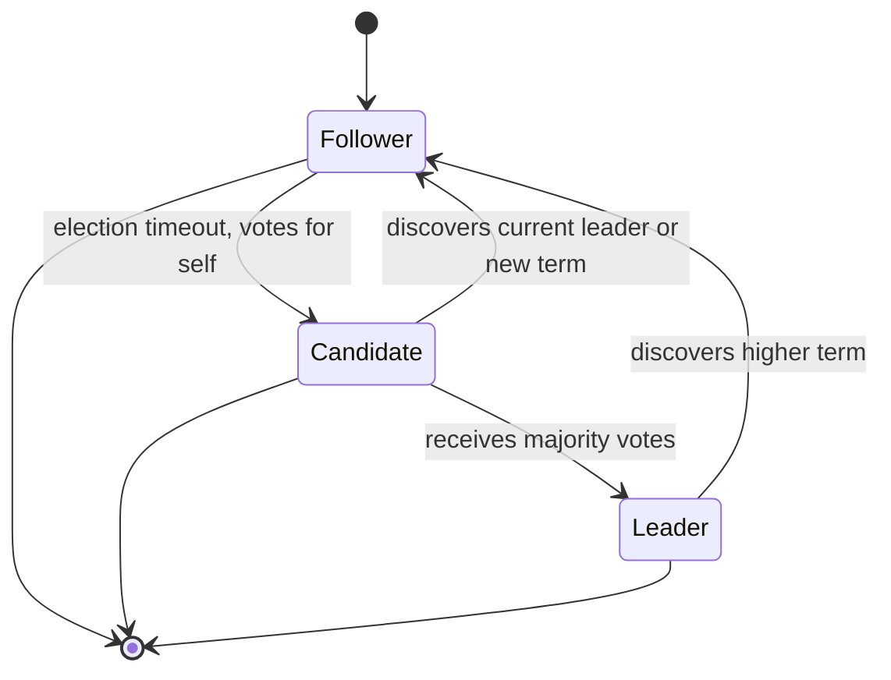

# Raft Consensus Algorithm Reference

The Raft paper is the canonical reference for understanding consensus algorithms in production distributed systems. This file catalogs the key concepts from the Raft paper referenced in the System Design document.

## Paper info

- **Title:** In Search of an Understandable Consensus Algorithm
- **Authors:** Diego Ongaro, John Ousterhout
- **Year:** 2014
- **Published:** USENIX ATC '14
- **PDF:** <https://raft.github.io/raft.pdf>
- **Website:** <https://raft.github.io/>
- **Raft visualization:** <https://raft.github.io/raftscope/index.html>
- **Raft GitHub:** <https://github.com/raft/raft.github.io>

## Why Raft

Paxos (Lamport, 1998) is famously hard to understand. Raft was designed to be a more understandable alternative while providing the same guarantees:
- Leader-based: one leader at a time.
- Strong leader: all data flows from leader.
- Random timeouts to elect new leaders.
- Membership changes: joint consensus.

## Three Subproblems

Raft decomposes consensus into three subproblems:

1. **Leader election:** A new leader must be chosen when an existing leader fails.
2. **Log replication:** The leader must accept log entries from clients and replicate them across the cluster.
3. **Safety:** If any server has applied a log entry to its state machine, no other server may apply a different log entry for the same index.

## States of a Server

**Three states:**
- **Follower:** passive; responds to RPCs from leader and candidate.
- **Candidate:** used to elect a new leader.
- **Leader:** handles all client requests and replicates log.

## Terms

Raft divides time into **terms** of arbitrary length:
- Each term begins with an election.
- One or more candidates attempt to become leader.
- If a candidate wins the election, it serves as leader for the rest of the term.
- If no winner, a new term begins with a new election.

Terms are monotonically increasing integers; each server stores the current term.

## Leader Election

When a follower doesn't hear from the leader for an **election timeout** (e.g., 150-300ms), it:
1. Transitions to **Candidate**.
2. Increments its term.
3. Votes for itself.
4. Sends `RequestVote` RPCs to all other servers.
5. Waits for responses:
   - **Majority votes** → becomes Leader; sends heartbeats.
   - **Newer term discovered** → reverts to Follower.
   - **Election timeout expires** → starts a new election.

**Voting rule:** A server votes for at most one candidate per term, on a first-come-first-served basis. A candidate's log must be at least as up-to-date as the voter's log to receive a vote (this is the **up-to-date rule**).

## Log Replication

When the leader receives a client request:
1. Appends entry to its log.
2. Sends `AppendEntries` RPCs to all followers.
3. Waits for majority confirmation.
4. Commits the entry (once a majority has it).
5. Applies entry to state machine.
6. Returns result to client.

**Log matching property:** If two entries in different logs have the same index and term, they store the same command. The logs are identical in all entries up through that index.

**Leader's responsibilities:**
- Append entries from client.
- Replicate to followers.
- Apply committed entries to state machine.

## Safety

Raft guarantees:
- **Election Safety:** At most one leader per term.
- **Leader Append-Only:** Leader never overwrites or deletes entries in its log.
- **Log Matching:** Two logs are identical up through the last committed entry.
- **Leader Completeness:** If a log entry is committed in a term, it will be present in the logs of all leaders for all later terms.
- **State Machine Safety:** If a server has applied a log entry at a given index to its state machine, no other server will ever apply a different log entry for the same index.

## Joint Consensus (Membership Changes)

Raft uses **joint consensus** for membership changes:
1. New and old configurations overlap during the transition.
2. Either configuration can decide.
3. Either configuration can commit.

This ensures safety during the transition.

## Log Compaction

To prevent unbounded log growth:
- Snapshot the state machine at a point.
- Discard old log entries before that point.
- New leaders send the snapshot to followers that are too far behind.

## Implementations

Many production systems use Raft or Raft variants:

- **etcd:** Raft for distributed key-value store.
- **Consul:** Raft-based service discovery.
- **CockroachDB:** Raft for distributed SQL.
- **TiKV:** Raft-based distributed KV.
- **InfluxDB:** Raft for HA.
- **Kubernetes:** etcd (Raft) for cluster state.

## Production Considerations

- **Tuning timeouts:** Election timeout should be > RTT for heartbeats.
- **Network partitions:** Minority side stops serving; majority side continues.
- **Disk fsync:** Critical for durability.
- **Snapshot strategy:** Bounded memory growth.

## Related Algorithms

- **Paxos:** Lamport 1998; same guarantees as Raft, less understandable.
- **Multi-Paxos:** Optimized Paxos for steady state.
- **EPaxos:** Equality-based; lower latency in some topologies.
- **Zab:** Used by ZooKeeper (predecessor of Raft).
- **Viewstamped Replication:** Another consensus algorithm.

## Online resources

- **Raft website:** <https://raft.github.io/>
- **Raft visualization:** <https://raft.github.io/raftscope/index.html>
- **etcd Raft implementation:** <https://github.com/etcd-io/raft>
- **Consul:** uses Raft for HA.
- **Diego Ongaro's PhD thesis:** contains the full Raft derivation.