# System Design & Distributed Systems

> A comprehensive, production-grade treatment of system design patterns, distributed systems theory, and architecture styles — from CQRS to Raft to classic interview problems.

---

## Table of Contents

1. [Overview](#1-overview)
2. [Definition](#2-definition)
3. [Five Ws + One H](#3-five-ws--one-h)
4. [History](#4-history)
5. [Problem Statement](#5-problem-statement)
6. [Real-World Motivation](#6-real-world-motivation)
7. [Internal Working](#7-internal-working)
8. [Deep Dive](#8-deep-dive)
9. [Architecture](#9-architecture)
10. [Performance](#10-performance)
11. [Security](#11-security)
12. [Production Engineering](#12-production-engineering)
13. [Production Case Studies](#13-production-case-studies)
14. [Code Examples](#14-code-examples)
15. [Common Mistakes](#15-common-mistakes)
16. [Debugging](#16-debugging)
17. [Monitoring & Observability](#17-monitoring--observability)
18. [Best Practices](#18-best-practices)
19. [Anti-Patterns](#19-anti-patterns)
20. [Edge Cases](#20-edge-cases)
21. [Comparisons](#21-comparisons)
22. [Interview Preparation](#22-interview-preparation)
23. [References](#23-references)

---

## 1. Overview

**System design** is the practice of designing software systems that meet functional and non-functional requirements at scale. **Distributed systems** are systems whose components are located on different networked computers that communicate by passing messages. Together, they form the foundation of every modern web-scale application: search engines, social networks, e-commerce platforms, real-time analytics, and more.

This document treats both topics at production depth. It covers the **theory** (CAP, PACELC, Raft, consistency models) and the **practice** (CQRS, event-driven architecture, saga, outbox pattern, microservices migration, DDD, classic interview problems).

**Scope.** This is not a tutorial. It assumes you have built distributed systems. It focuses on the **patterns, trade-offs, and algorithms** that distinguish production-grade systems from toy implementations.

**Version baselines.** Raft (Ongaro, Ousterhout 2014 — still current). CAP (Brewer 2000, Gilbert-Lynch 2002). Microservices (Lewis, Fowler 2014 — still current). DDD (Evans 2003 book — vocabulary updated).

## 2. Definition

The system design and distributed systems vocabulary is precise and overlapping. Here's a taxonomy:

| Term | Type | Authoritative source |
|------|------|---------------------|
| **System design** | The practice of designing software systems | General |
| **Distributed system** | A system whose components are on different networked computers | Tanenbaum, van Steen |
| **CAP theorem** | During a network partition, choose Consistency or Availability | Brewer 2000, Gilbert-Lynch 2002 |
| **PACELC** | If Partition → A or C; Else → Latency or Consistency | Abadi 2010 |
| **Consensus** | Agreement among distributed nodes on a value | Lamport |
| **Raft** | A consensus algorithm | Ongaro, Ousterhout 2014 |
| **Paxos** | The original consensus algorithm | Lamport 1998 |
| **Linearizability** | Strongest single-object consistency | Herlihy, Wing |
| **Causal consistency** | Causally-related ops are seen in order | — |
| **Eventual consistency** | All replicas converge eventually | — |
| **CQRS** | Command-Query Responsibility Segregation | Young, Fowler |
| **Event sourcing** | State derived from event log | Fowler |
| **Saga** | Long-running transaction across services | Garcia-Molina, Salem; revised by microservices community |
| **Outbox pattern** | Atomic event publication via DB | Microsoft |
| **DDD** | Domain-Driven Design | Evans 2003 |
| **Bounded context** | A model boundary | Evans |
| **Aggregate** | A consistency boundary in DDD | Evans |
| **Microservices** | Loosely coupled, independently deployable services | Lewis, Fowler 2014 |
| **Monolith** | Single deployable unit | — |
| **Modular monolith** | Single deployable, internally modular | — |
| **Idempotency** | Same operation produces same result | — |
| **Rate limiting** | Throttling requests per client | — |
| **Distributed lock** | Mutual exclusion across machines | — |
| **API gateway** | Single entry point for clients | — |
| **Service mesh** | Infrastructure layer for service-to-service communication | — |

The standard reference architecture:

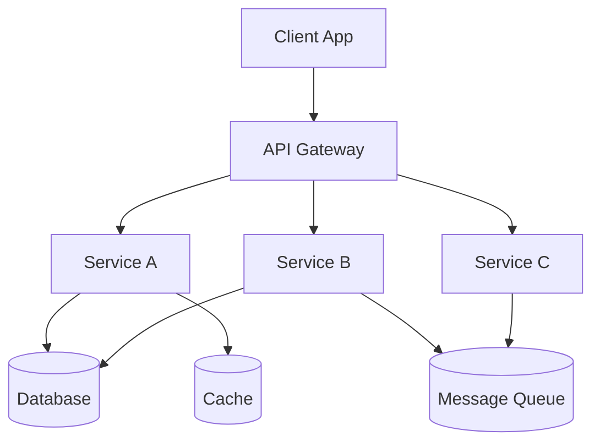

## 3. Five Ws + One H

### What <a class="askgpt-btn" href="https://chatgpt.com/?prompt=Explain%20'What'%20in%20detail%20with%20concrete%20examples%2C%20the%20main%20trade-offs%2C%20and%20common%20pitfalls%20a%20practitioner%20should%20know." target="_blank" rel="noopener" data-askgpt="What" title="Ask ChatGPT about this section">💬</a>

**System design** is the discipline of choosing architectures, components, protocols, and data structures to meet requirements at scale. **Distributed systems** are the systems that result from running software across multiple machines.

### Why <a class="askgpt-btn" href="https://chatgpt.com/?prompt=Explain%20'Why'%20in%20detail%20with%20concrete%20examples%2C%20the%20main%20trade-offs%2C%20and%20common%20pitfalls%20a%20practitioner%20should%20know." target="_blank" rel="noopener" data-askgpt="Why" title="Ask ChatGPT about this section">💬</a>

Modern applications serve billions of users, process petabytes of data, and require 99.99%+ availability. Single-machine designs don't scale. Distributed designs trade complexity (consensus, partial failure, network latency) for scale.

### When <a class="askgpt-btn" href="https://chatgpt.com/?prompt=Explain%20'When'%20in%20detail%20with%20concrete%20examples%2C%20the%20main%20trade-offs%2C%20and%20common%20pitfalls%20a%20practitioner%20should%20know." target="_blank" rel="noopener" data-askgpt="When" title="Ask ChatGPT about this section">💬</a>

System design as a discipline matured with the rise of web-scale services (Google, Amazon, eBay in the late 1990s / 2000s). Microservices became mainstream around 2014 with the publication of Lewis and Fowler's book. Modern concerns (serverless, edge compute, AI workloads) continue to evolve the field.

### Where <a class="askgpt-btn" href="https://chatgpt.com/?prompt=Explain%20'Where'%20in%20detail%20with%20concrete%20examples%2C%20the%20main%20trade-offs%2C%20and%20common%20pitfalls%20a%20practitioner%20should%20know." target="_blank" rel="noopener" data-askgpt="Where" title="Ask ChatGPT about this section">💬</a>

- **Web services:** Google, Amazon, Netflix, Meta, Twitter/X.
- **Enterprise:** Banks, governments, healthcare.
- **Mobile backends:** Instagram, WhatsApp, TikTok.
- **Real-time analytics:** Uber, Lyft, Airbnb.
- **IoT and edge:** Industrial, autonomous systems.

### Who <a class="askgpt-btn" href="https://chatgpt.com/?prompt=Explain%20'Who'%20in%20detail%20with%20concrete%20examples%2C%20the%20main%20trade-offs%2C%20and%20common%20pitfalls%20a%20practitioner%20should%20know." target="_blank" rel="noopener" data-askgpt="Who" title="Ask ChatGPT about this section">💬</a>

- **Eric Brewer:** CAP theorem (2000).
- **Leslie Lamport:** Paxos, time/clock ordering (1978+).
- **Diego Ongaro & John Ousterhout:** Raft (2014).
- **Martin Fowler:** Enterprise architecture, microservices, CQRS.
- **Eric Evans:** DDD.
- **Sam Newman:** Microservices.
- **Daniel Abadi:** PACELC.

### How (one-paragraph preview) <a class="askgpt-btn" href="https://chatgpt.com/?prompt=Explain%20'How%20(one-paragraph%20preview)'%20in%20detail%20with%20concrete%20examples%2C%20the%20main%20trade-offs%2C%20and%20common%20pitfalls%20a%20practitioner%20should%20know." target="_blank" rel="noopener" data-askgpt="How (one-paragraph preview)" title="Ask ChatGPT about this section">💬</a>

A system designer gathers requirements (functional and non-functional), estimates scale, identifies bottlenecks, chooses an architecture (monolith vs microservices vs modular monolith), designs data flow (synchronous vs asynchronous), selects algorithms (consensus, replication, caching), and plans operations (observability, deployment, scaling). For distributed systems specifically, you reason about failure modes (network partitions, process crashes, clock skew) and trade-offs (CAP, consistency vs latency).

## 4. History

### 4.1 Origins (1960s-1990s) <a class="askgpt-btn" href="https://chatgpt.com/?prompt=Explain%20'4.1%20Origins%20(1960s-1990s)'%20in%20detail%20with%20concrete%20examples%2C%20the%20main%20trade-offs%2C%20and%20common%20pitfalls%20a%20practitioner%20should%20know." target="_blank" rel="noopener" data-askgpt="4.1 Origins (1960s-1990s)" title="Ask ChatGPT about this section">💬</a>

- **1960s** — Time-sharing systems; ARPANET.
- **1978** — Leslie Lamport's "Time, Clocks, and the Ordering of Events" — the foundational paper on distributed systems ordering.
- **1980s** — Sun RPC, CORBA, DCOM; early distributed object systems.
- **1991** — WWW.
- **1998** — Lamport publishes "Paxos Made Simple" (concept existed since 1989).

### 4.2 The web era (2000-2010) <a class="askgpt-btn" href="https://chatgpt.com/?prompt=Explain%20'4.2%20The%20web%20era%20(2000-2010)'%20in%20detail%20with%20concrete%20examples%2C%20the%20main%20trade-offs%2C%20and%20common%20pitfalls%20a%20practitioner%20should%20know." target="_blank" rel="noopener" data-askgpt="4.2 The web era (2000-2010)" title="Ask ChatGPT about this section">💬</a>

- **2000** — Eric Brewer's PODC keynote introduces the CAP conjecture.
- **2002** — Gilbert and Lynch formally prove CAP.
- **2003** — Eric Evans publishes "Domain-Driven Design."
- **2004** — Google publishes GFS, MapReduce, Bigtable. Birth of modern distributed data systems.
- **2006-2007** — Amazon Dynamo, Google Bigtable papers.
- **2007** — Kafka project begins at LinkedIn.

### 4.3 The cloud and microservices era (2010-2018) <a class="askgpt-btn" href="https://chatgpt.com/?prompt=Explain%20'4.3%20The%20cloud%20and%20microservices%20era%20(2010-2018)'%20in%20detail%20with%20concrete%20examples%2C%20the%20main%20trade-offs%2C%20and%20common%20pitfalls%20a%20practitioner%20should%20know." target="_blank" rel="noopener" data-askgpt="4.3 The cloud and microservices era (2010-2018)" title="Ask ChatGPT about this section">💬</a>

- **2010-2012** — Microservices concepts crystallize.
- **2012** — Twitter's "fail whale" era ends; migration to JVM-based services.
- **2014** — Sam Newman publishes "Building Microservices." Lewis and Fowler define microservices.
- **2014** — Spring Boot 1.0.
- **2014** — Raft paper published.
- **2015** — Kubernetes 1.0.
- **2016** — Service mesh (Linkerd, Istio).

### 4.4 The cloud-native era (2018-2026) <a class="askgpt-btn" href="https://chatgpt.com/?prompt=Explain%20'4.4%20The%20cloud-native%20era%20(2018-2026)'%20in%20detail%20with%20concrete%20examples%2C%20the%20main%20trade-offs%2C%20and%20common%20pitfalls%20a%20practitioner%20should%20know." target="_blank" rel="noopener" data-askgpt="4.4 The cloud-native era (2018-2026)" title="Ask ChatGPT about this section">💬</a>

- **2018** — Knative, serverless.
- **2019** — Cross-cloud, multi-cloud patterns.
- **2020** — eBPF emerges for observability and networking.
- **2021** — WebAssembly for server-side.
- **2022** — Kubernetes matured; service mesh standard.
- **2024** — AI workloads drive new architecture patterns (LLM gateways, vector DBs).
- **2026** — Mature cloud-native ecosystem; continued focus on simplicity.

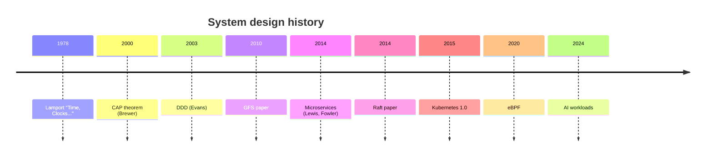

## 5. Problem Statement

### 5.1 What system design solves <a class="askgpt-btn" href="https://chatgpt.com/?prompt=Explain%20'5.1%20What%20system%20design%20solves'%20in%20detail%20with%20concrete%20examples%2C%20the%20main%20trade-offs%2C%20and%20common%20pitfalls%20a%20practitioner%20should%20know." target="_blank" rel="noopener" data-askgpt="5.1 What system design solves" title="Ask ChatGPT about this section">💬</a>

System design addresses:

- **Scale** — handling more users, more data, more traffic.
- **Reliability** — staying up despite failures.
- **Performance** — meeting latency and throughput requirements.
- **Maintainability** — allowing teams to ship without breaking things.
- **Security** — protecting data and systems.
- **Cost** — operating economically.

### 5.2 What system design doesn't solve <a class="askgpt-btn" href="https://chatgpt.com/?prompt=Explain%20'5.2%20What%20system%20design%20doesn't%20solve'%20in%20detail%20with%20concrete%20examples%2C%20the%20main%20trade-offs%2C%20and%20common%20pitfalls%20a%20practitioner%20should%20know." target="_blank" rel="noopener" data-askgpt="5.2 What system design doesn't solve" title="Ask ChatGPT about this section">💬</a>

- **Domain modeling** — that's where DDD helps.
- **Code quality** — that's where clean code helps.
- **Team organization** — that's where Conway's law bites.
- **Process** — that's where agile/scrum helps.

### 5.3 The cost of scale <a class="askgpt-btn" href="https://chatgpt.com/?prompt=Explain%20'5.3%20The%20cost%20of%20scale'%20in%20detail%20with%20concrete%20examples%2C%20the%20main%20trade-offs%2C%20and%20common%20pitfalls%20a%20practitioner%20should%20know." target="_blank" rel="noopener" data-askgpt="5.3 The cost of scale" title="Ask ChatGPT about this section">💬</a>

At small scale, you can ignore most distributed systems concerns. At large scale, you must design for:

- **Partial failure:** Some services are down; some are slow; some are returning stale data.
- **Network latency:** 1ms in datacenter, 50-200ms across regions.
- **Eventual consistency:** You can't have global strong consistency AND availability.
- **Operational complexity:** More services = more failure modes.

## 6. Real-World Motivation

### 6.1 Amazon <a class="askgpt-btn" href="https://chatgpt.com/?prompt=Explain%20'6.1%20Amazon'%20in%20detail%20with%20concrete%20examples%2C%20the%20main%20trade-offs%2C%20and%20common%20pitfalls%20a%20practitioner%20should%20know." target="_blank" rel="noopener" data-askgpt="6.1 Amazon" title="Ask ChatGPT about this section">💬</a>

Amazon's evolution from monolith to microservices is the canonical case study. Jeff Bezos issued the famous "API mandate" in 2002: all teams must expose data and functionality via service interfaces. This led to the Amazon SOA, which evolved into modern microservices.

### 6.2 Netflix <a class="askgpt-btn" href="https://chatgpt.com/?prompt=Explain%20'6.2%20Netflix'%20in%20detail%20with%20concrete%20examples%2C%20the%20main%20trade-offs%2C%20and%20common%20pitfalls%20a%20practitioner%20should%20know." target="_blank" rel="noopener" data-askgpt="6.2 Netflix" title="Ask ChatGPT about this section">💬</a>

Netflix migrated from Oracle-backed monolith to Cassandra + microservices on AWS in 2008-2017. They pioneered many patterns: Hystrix circuit breaker, Eureka service discovery, Zuul gateway, Chaos Monkey for resilience testing.

### 6.3 Uber <a class="askgpt-btn" href="https://chatgpt.com/?prompt=Explain%20'6.3%20Uber'%20in%20detail%20with%20concrete%20examples%2C%20the%20main%20trade-offs%2C%20and%20common%20pitfalls%20a%20practitioner%20should%20know." target="_blank" rel="noopener" data-askgpt="6.3 Uber" title="Ask ChatGPT about this section">💬</a>

Uber went from a Python monolith to a domain-oriented microservices architecture (2500+ services in 2020). They documented the trade-offs in their "Microservice Architecture" engineering blog.

### 6.4 Stripe <a class="askgpt-btn" href="https://chatgpt.com/?prompt=Explain%20'6.4%20Stripe'%20in%20detail%20with%20concrete%20examples%2C%20the%20main%20trade-offs%2C%20and%20common%20pitfalls%20a%20practitioner%20should%20know." target="_blank" rel="noopener" data-askgpt="6.4 Stripe" title="Ask ChatGPT about this section">💬</a>

Stripe operates one of the most sophisticated payment processing systems. They use event-driven architecture extensively, with detailed state machines for payment flows.

### 6.5 Twitter / X <a class="askgpt-btn" href="https://chatgpt.com/?prompt=Explain%20'6.5%20Twitter%20%2F%20X'%20in%20detail%20with%20concrete%20examples%2C%20the%20main%20trade-offs%2C%20and%20common%20pitfalls%20a%20practitioner%20should%20know." target="_blank" rel="noopener" data-askgpt="6.5 Twitter / X" title="Ask ChatGPT about this section">💬</a>

Twitter's transition from Rails monolith to "Service Oriented Architecture" (SOA) — and then back to a more managed approach — is well-documented. They used Scala and Mesos/Manhattan.

### 6.6 Shopify <a class="askgpt-btn" href="https://chatgpt.com/?prompt=Explain%20'6.6%20Shopify'%20in%20detail%20with%20concrete%20examples%2C%20the%20main%20trade-offs%2C%20and%20common%20pitfalls%20a%20practitioner%20should%20know." target="_blank" rel="noopener" data-askgpt="6.6 Shopify" title="Ask ChatGPT about this section">💬</a>

Shopify runs a modular monolith on Rails. They've explicitly avoided microservices, choosing strong module boundaries inside a single deployable.

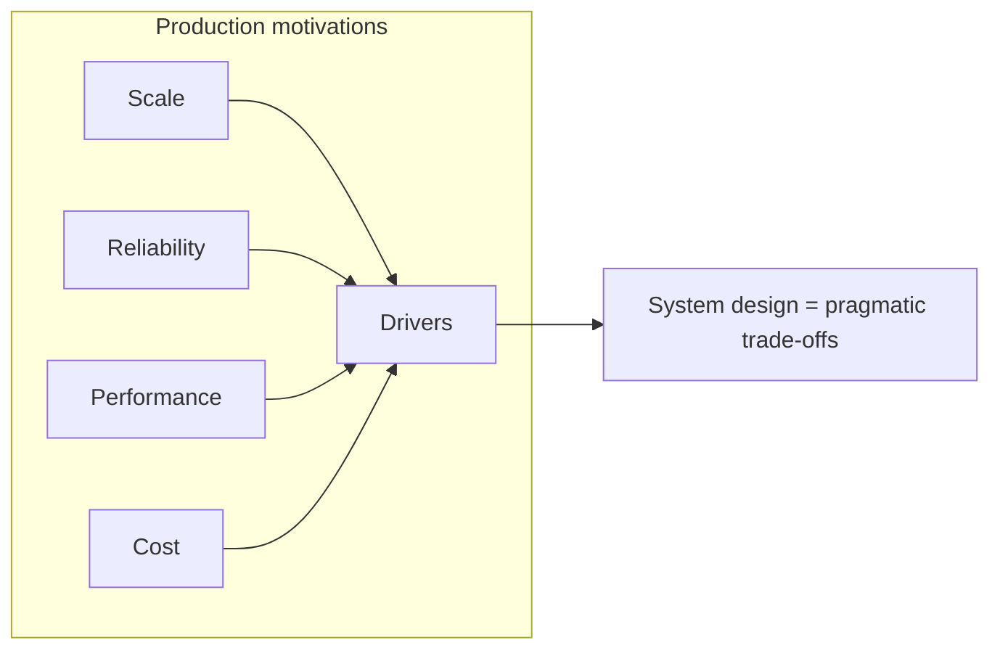

---

## 7. Internal Working

### 7.1 Request flow in a distributed system <a class="askgpt-btn" href="https://chatgpt.com/?prompt=Explain%20'7.1%20Request%20flow%20in%20a%20distributed%20system'%20in%20detail%20with%20concrete%20examples%2C%20the%20main%20trade-offs%2C%20and%20common%20pitfalls%20a%20practitioner%20should%20know." target="_blank" rel="noopener" data-askgpt="7.1 Request flow in a distributed system" title="Ask ChatGPT about this section">💬</a>

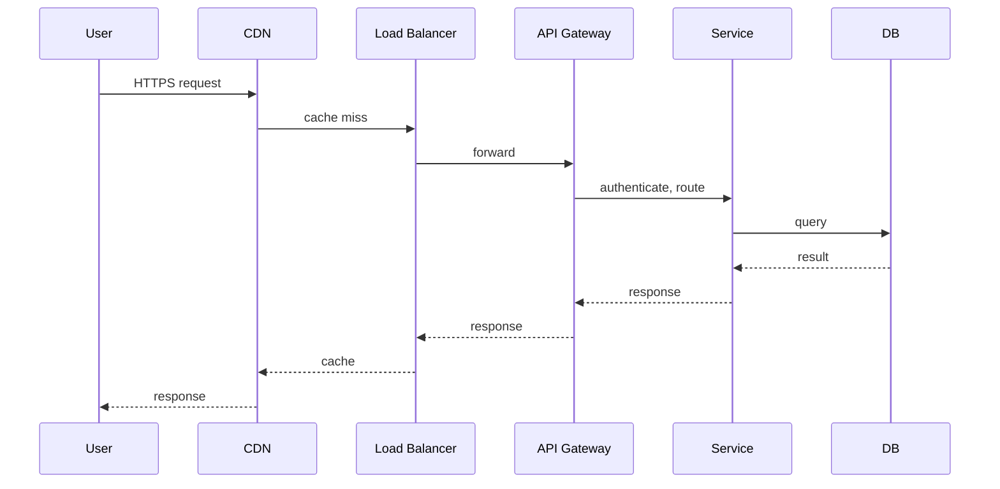

### 7.2 Subsystems that participate <a class="askgpt-btn" href="https://chatgpt.com/?prompt=Explain%20'7.2%20Subsystems%20that%20participate'%20in%20detail%20with%20concrete%20examples%2C%20the%20main%20trade-offs%2C%20and%20common%20pitfalls%20a%20practitioner%20should%20know." target="_blank" rel="noopener" data-askgpt="7.2 Subsystems that participate" title="Ask ChatGPT about this section">💬</a>

| Subsystem | Responsibility |
|-----------|---------------|
| **CDN** | Edge caching |
| **Load balancer** | Distribute traffic |
| **API gateway** | Auth, routing, rate limiting |
| **Service** | Business logic |
| **Database** | Source of truth |
| **Cache** | In-memory acceleration |
| **Message queue** | Async events |
| **Observability** | Metrics, logs, traces |

### 7.3 The CAP triangle <a class="askgpt-btn" href="https://chatgpt.com/?prompt=Explain%20'7.3%20The%20CAP%20triangle'%20in%20detail%20with%20concrete%20examples%2C%20the%20main%20trade-offs%2C%20and%20common%20pitfalls%20a%20practitioner%20should%20know." target="_blank" rel="noopener" data-askgpt="7.3 The CAP triangle" title="Ask ChatGPT about this section">💬</a>

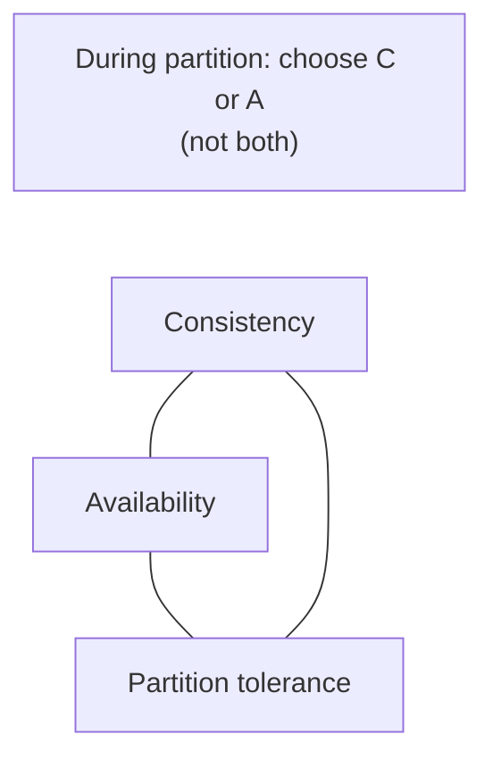

During a network partition (P), you must choose between Consistency (C) and Availability (A). After the partition heals, you can return to normal.

## 8. Deep Dive

This section is the heart of the document.

### 8.1 CAP and PACELC <a class="askgpt-btn" href="https://chatgpt.com/?prompt=Explain%20'8.1%20CAP%20and%20PACELC'%20in%20detail%20with%20concrete%20examples%2C%20the%20main%20trade-offs%2C%20and%20common%20pitfalls%20a%20practitioner%20should%20know." target="_blank" rel="noopener" data-askgpt="8.1 CAP and PACELC" title="Ask ChatGPT about this section">💬</a>

**CAP theorem:** In a distributed system, you can have at most two of:

- **Consistency:** All nodes see the same data at the same time.
- **Availability:** Every request gets a response (even if it's stale).
- **Partition tolerance:** The system continues to operate despite network failures.

Since network partitions are inevitable, you must choose C or A during a partition. Most systems choose **AP** (availability over consistency, e.g., Dynamo, Cassandra) or **CP** (consistency over availability, e.g., etcd, ZooKeeper, HBase).

**PACELC** refines CAP: Even when there is no partition (Else), you must choose between Latency and Consistency. So:

- **PA/EL** — DynamoDB, Cassandra.
- **PC/EC** — Spanner, FaunaDB.
- **PA/EC** — Cosmos DB (configurable).

### 8.2 Consistency models <a class="askgpt-btn" href="https://chatgpt.com/?prompt=Explain%20'8.2%20Consistency%20models'%20in%20detail%20with%20concrete%20examples%2C%20the%20main%20trade-offs%2C%20and%20common%20pitfalls%20a%20practitioner%20should%20know." target="_blank" rel="noopener" data-askgpt="8.2 Consistency models" title="Ask ChatGPT about this section">💬</a>

**Strong (linearizable):** Reads see the most recent write. Expensive; often requires consensus.

**Causal:** Causally-related ops are seen in order. Unrelated ops can be in any order.

**Eventual:** Replicas converge eventually. Cheap; widely used.

**Read-your-writes:** A user sees their own writes immediately.

**Monotonic reads:** A user never sees older data after newer.

### 8.3 Raft consensus <a class="askgpt-btn" href="https://chatgpt.com/?prompt=Explain%20'8.3%20Raft%20consensus'%20in%20detail%20with%20concrete%20examples%2C%20the%20main%20trade-offs%2C%20and%20common%20pitfalls%20a%20practitioner%20should%20know." target="_blank" rel="noopener" data-askgpt="8.3 Raft consensus" title="Ask ChatGPT about this section">💬</a>

Raft decomposes consensus into three subproblems:

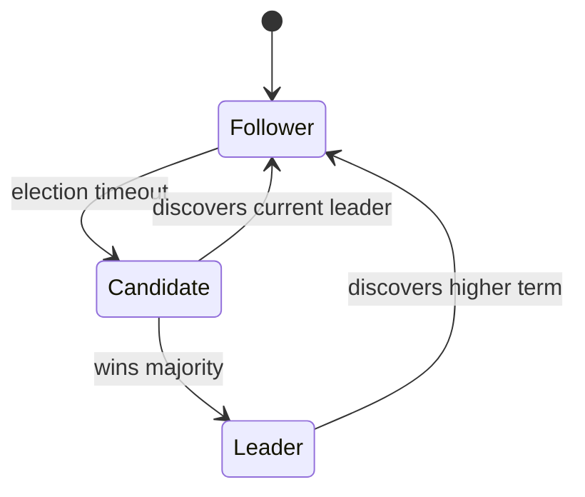

**Leader election:**
- Each follower has a randomized election timeout (150-300ms).
- If timeout expires, follower becomes candidate, votes for itself, sends `RequestVote` to others.
- Receives majority → becomes leader.
- Sends heartbeats to maintain authority.

**Log replication:**
- Leader receives client command, appends to log.
- Sends `AppendEntries` to followers.
- Commits when majority has it.
- Applies to state machine.

**Safety properties:**
- Election safety: at most one leader per term.
- Leader append-only: never overwrites log.
- Log matching: if entries match in index and term, all preceding match.
- Leader completeness: committed entry present in all future leaders.
- State machine safety: same index applies same command.

### 8.4 Paxos (brief) <a class="askgpt-btn" href="https://chatgpt.com/?prompt=Explain%20'8.4%20Paxos%20(brief)'%20in%20detail%20with%20concrete%20examples%2C%20the%20main%20trade-offs%2C%20and%20common%20pitfalls%20a%20practitioner%20should%20know." target="_blank" rel="noopener" data-askgpt="8.4 Paxos (brief)" title="Ask ChatGPT about this section">💬</a>

Paxos is the original consensus algorithm. It's correct but notoriously hard to understand. Multi-Paxos optimizes for the steady state.

Paxos phases:
- **Prepare:** Proposer sends prepare(n) to acceptors.
- **Promise:** Acceptors promise not to accept lower-numbered proposals.
- **Accept:** Proposer sends accept(n, value).
- **Accepted:** Acceptors accept if no higher promise.

Raft is essentially a more understandable Paxos variant.

### 8.5 Architecture styles <a class="askgpt-btn" href="https://chatgpt.com/?prompt=Explain%20'8.5%20Architecture%20styles'%20in%20detail%20with%20concrete%20examples%2C%20the%20main%20trade-offs%2C%20and%20common%20pitfalls%20a%20practitioner%20should%20know." target="_blank" rel="noopener" data-askgpt="8.5 Architecture styles" title="Ask ChatGPT about this section">💬</a>

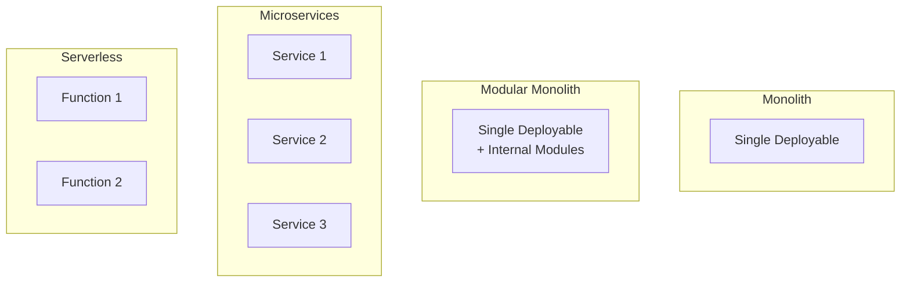

**Monolith:**
- Single deployable, single codebase.
- Simple to develop and test.
- Doesn't scale; single failure point.

**Modular monolith:**
- Single deployable, but with strong module boundaries (DDD bounded contexts).
- Best of both worlds: simpler than microservices, more scalable than monolith.
- Recommended starting point (Shopify, GitHub, Shopify-scale).

**Microservices:**
- Independent deployable services, each owning one bounded context.
- Scales teams and deployments independently.
- Network calls between services add latency and failure modes.
- Requires mature DevOps, observability, distributed systems expertise.

**Serverless:**
- Functions-as-a-service (Lambda, Cloud Functions).
- Pay-per-use; auto-scaling.
- Cold starts; limited runtime; vendor lock-in.
- Best for spiky, event-driven workloads.

### 8.6 Domain-Driven Design (DDD) <a class="askgpt-btn" href="https://chatgpt.com/?prompt=Explain%20'8.6%20Domain-Driven%20Design%20(DDD)'%20in%20detail%20with%20concrete%20examples%2C%20the%20main%20trade-offs%2C%20and%20common%20pitfalls%20a%20practitioner%20should%20know." target="_blank" rel="noopener" data-askgpt="8.6 Domain-Driven Design (DDD)" title="Ask ChatGPT about this section">💬</a>

**Strategic patterns:**

- **Bounded context:** A model boundary. Each context has its own ubiquitous language.
- **Subdomain:** A part of the domain. Core (competitive advantage), Supporting (necessary but not differentiating), Generic (could be bought).

**Tactical patterns:**

- **Aggregate:** A consistency boundary. Modified via the aggregate root.
- **Entity:** Has identity.
- **Value object:** No identity; immutable.
- **Domain event:** A fact that happened in the past.
- **Repository:** Abstraction over persistence.
- **Service:** Stateless operations that don't belong to an entity.

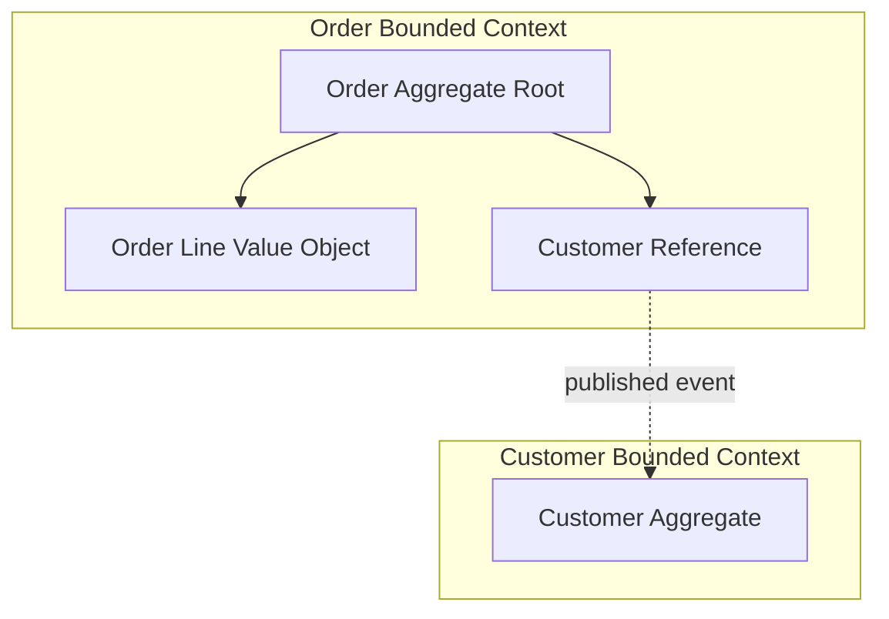

### 8.7 Clean Architecture <a class="askgpt-btn" href="https://chatgpt.com/?prompt=Explain%20'8.7%20Clean%20Architecture'%20in%20detail%20with%20concrete%20examples%2C%20the%20main%20trade-offs%2C%20and%20common%20pitfalls%20a%20practitioner%20should%20know." target="_blank" rel="noopener" data-askgpt="8.7 Clean Architecture" title="Ask ChatGPT about this section">💬</a>

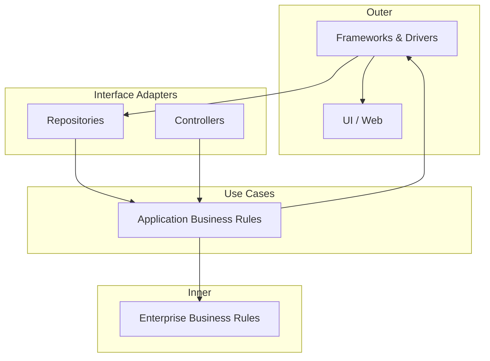

Dependencies point inward. Inner layers know nothing about outer layers.

### 8.8 Hexagonal Architecture (Ports and Adapters) <a class="askgpt-btn" href="https://chatgpt.com/?prompt=Explain%20'8.8%20Hexagonal%20Architecture%20(Ports%20and%20Adapters)'%20in%20detail%20with%20concrete%20examples%2C%20the%20main%20trade-offs%2C%20and%20common%20pitfalls%20a%20practitioner%20should%20know." target="_blank" rel="noopener" data-askgpt="8.8 Hexagonal Architecture (Ports and Adapters)" title="Ask ChatGPT about this section">💬</a>

- **Domain:** Business logic.
- **Ports:** Interfaces (driving and driven).
- **Adapters:** Concrete implementations (web, database, etc.).

### 8.9 Onion Architecture <a class="askgpt-btn" href="https://chatgpt.com/?prompt=Explain%20'8.9%20Onion%20Architecture'%20in%20detail%20with%20concrete%20examples%2C%20the%20main%20trade-offs%2C%20and%20common%20pitfalls%20a%20practitioner%20should%20know." target="_blank" rel="noopener" data-askgpt="8.9 Onion Architecture" title="Ask ChatGPT about this section">💬</a>

Similar to Clean Architecture. Layers:
- Domain Model (innermost).
- Domain Services.
- Application Services.
- Infrastructure (outermost).

### 8.10 CQRS (Command-Query Responsibility Segregation) <a class="askgpt-btn" href="https://chatgpt.com/?prompt=Explain%20'8.10%20CQRS%20(Command-Query%20Responsibility%20Segregation)'%20in%20detail%20with%20concrete%20examples%2C%20the%20main%20trade-offs%2C%20and%20common%20pitfalls%20a%20practitioner%20should%20know." target="_blank" rel="noopener" data-askgpt="8.10 CQRS (Command-Query Responsibility Segregation)" title="Ask ChatGPT about this section">💬</a>

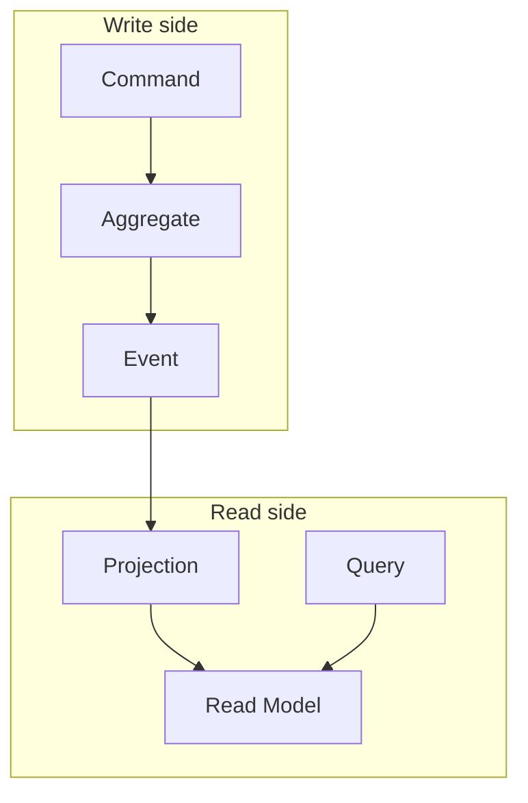

**Why CQRS?**
- Read and write workloads are different.
- Reads can be denormalized for query speed.
- Writes optimized for consistency.
- Event sourcing often pairs with CQRS.

**When to use:**
- Complex domain with high read volume.
- Different consistency needs for reads vs writes.
- Event-driven architecture.

**When NOT to use:**
- Simple CRUD with no scaling issues.
- Adds complexity.

### 8.11 Event-driven architecture <a class="askgpt-btn" href="https://chatgpt.com/?prompt=Explain%20'8.11%20Event-driven%20architecture'%20in%20detail%20with%20concrete%20examples%2C%20the%20main%20trade-offs%2C%20and%20common%20pitfalls%20a%20practitioner%20should%20know." target="_blank" rel="noopener" data-askgpt="8.11 Event-driven architecture" title="Ask ChatGPT about this section">💬</a>

**Event notification:** Notify other systems of an event. Loose coupling.

**Event-carried state transfer:** Send the new state in the event. Consumers don't need to query.

**Event sourcing:** State is derived from the event log. Append-only events.

**Event storming:** Domain discovery technique using sticky notes to map events.

### 8.12 Saga pattern <a class="askgpt-btn" href="https://chatgpt.com/?prompt=Explain%20'8.12%20Saga%20pattern'%20in%20detail%20with%20concrete%20examples%2C%20the%20main%20trade-offs%2C%20and%20common%20pitfalls%20a%20practitioner%20should%20know." target="_blank" rel="noopener" data-askgpt="8.12 Saga pattern" title="Ask ChatGPT about this section">💬</a>

Long-running transactions across services. Two types:

**Choreography:** Each service emits events; others react. No central coordinator.

**Orchestration:** A central orchestrator (saga) coordinates steps.

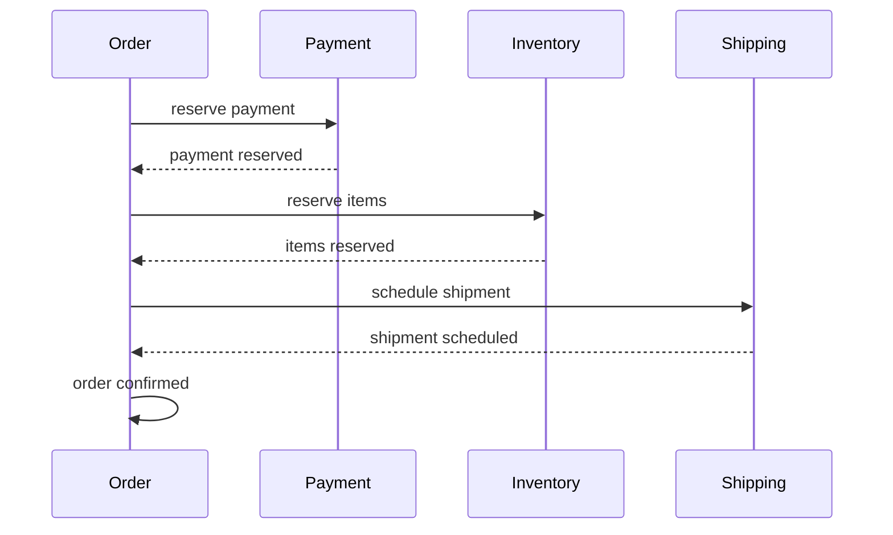

**Compensating actions:** On failure, each step has a reverse action (e.g., refund payment, release inventory).

### 8.13 Outbox pattern <a class="askgpt-btn" href="https://chatgpt.com/?prompt=Explain%20'8.13%20Outbox%20pattern'%20in%20detail%20with%20concrete%20examples%2C%20the%20main%20trade-offs%2C%20and%20common%20pitfalls%20a%20practitioner%20should%20know." target="_blank" rel="noopener" data-askgpt="8.13 Outbox pattern" title="Ask ChatGPT about this section">💬</a>

The "dual write" problem: writing to DB and publishing to Kafka is not atomic.

**Solution:** Outbox table.

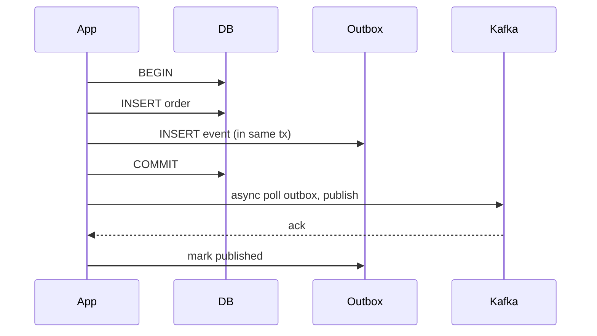

**Transactional outbox:** The outbox row is written in the same transaction as the business write. A separate process polls the outbox and publishes to Kafka, marking rows as published.

### 8.14 Idempotency <a class="askgpt-btn" href="https://chatgpt.com/?prompt=Explain%20'8.14%20Idempotency'%20in%20detail%20with%20concrete%20examples%2C%20the%20main%20trade-offs%2C%20and%20common%20pitfalls%20a%20practitioner%20should%20know." target="_blank" rel="noopener" data-askgpt="8.14 Idempotency" title="Ask ChatGPT about this section">💬</a>

The same request made multiple times produces the same result. Essential for:

- **At-least-once delivery:** Messages may be delivered multiple times.
- **Network retries:** Client retries on failure.
- **Idempotency keys:** Client provides a unique ID; server caches the result.

```http
POST /payments
Idempotency-Key: abc123
```

Server stores the result by key. Same key returns same result. Expires after 24 hours.

### 8.15 Rate limiting <a class="askgpt-btn" href="https://chatgpt.com/?prompt=Explain%20'8.15%20Rate%20limiting'%20in%20detail%20with%20concrete%20examples%2C%20the%20main%20trade-offs%2C%20and%20common%20pitfalls%20a%20practitioner%20should%20know." target="_blank" rel="noopener" data-askgpt="8.15 Rate limiting" title="Ask ChatGPT about this section">💬</a>

| Algorithm | Pros | Cons |
|-----------|------|------|
| **Fixed window** | Simple | Burst at window boundary |
| **Sliding window** | Smoother | More memory |
| **Token bucket** | Allows bursts | More complex |
| **Leaky bucket** | Smooths rate | Adds latency |
| **Sliding log** | Most accurate | Most memory |

Tools: **Resilience4j** (Java), **redis-cell** (Redis), **NGINX limit_req**, **Envoy ratelimit**.

### 8.16 Distributed locks <a class="askgpt-btn" href="https://chatgpt.com/?prompt=Explain%20'8.16%20Distributed%20locks'%20in%20detail%20with%20concrete%20examples%2C%20the%20main%20trade-offs%2C%20and%20common%20pitfalls%20a%20practitioner%20should%20know." target="_blank" rel="noopener" data-askgpt="8.16 Distributed locks" title="Ask ChatGPT about this section">💬</a>

A mutex across machines. Implementations:

- **Redis SETNX:** Simple; not safe (see Redlock).
- **Redlock:** Multi-Redis-node algorithm.
- **ZooKeeper ephemeral nodes:** Strong consistency.
- **etcd transactions:** Strong consistency.
- **PostgreSQL advisory locks:** Single DB.

**Caveat:** Distributed locks are hard to get right. Most use cases can use database row-level locks or optimistic concurrency.

### 8.17 Microservices migration <a class="askgpt-btn" href="https://chatgpt.com/?prompt=Explain%20'8.17%20Microservices%20migration'%20in%20detail%20with%20concrete%20examples%2C%20the%20main%20trade-offs%2C%20and%20common%20pitfalls%20a%20practitioner%20should%20know." target="_blank" rel="noopener" data-askgpt="8.17 Microservices migration" title="Ask ChatGPT about this section">💬</a>

**Strangler fig pattern:** Gradually replace monolith endpoints with new services.

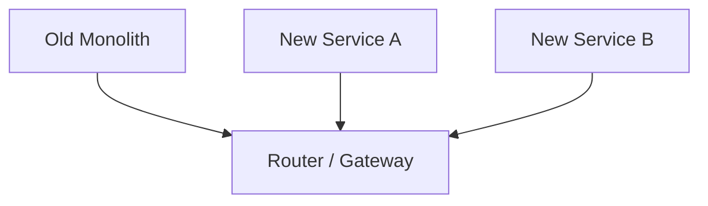

Steps:
1. Identify a bounded context.
2. Build new service alongside monolith.
3. Route traffic to new service (gradually).
4. Migrate data (dual-write, then backfill).
5. Decommission monolith component.

### 8.18 Modular monolith <a class="askgpt-btn" href="https://chatgpt.com/?prompt=Explain%20'8.18%20Modular%20monolith'%20in%20detail%20with%20concrete%20examples%2C%20the%20main%20trade-offs%2C%20and%20common%20pitfalls%20a%20practitioner%20should%20know." target="_blank" rel="noopener" data-askgpt="8.18 Modular monolith" title="Ask ChatGPT about this section">💬</a>

A single deployable with strong internal module boundaries.

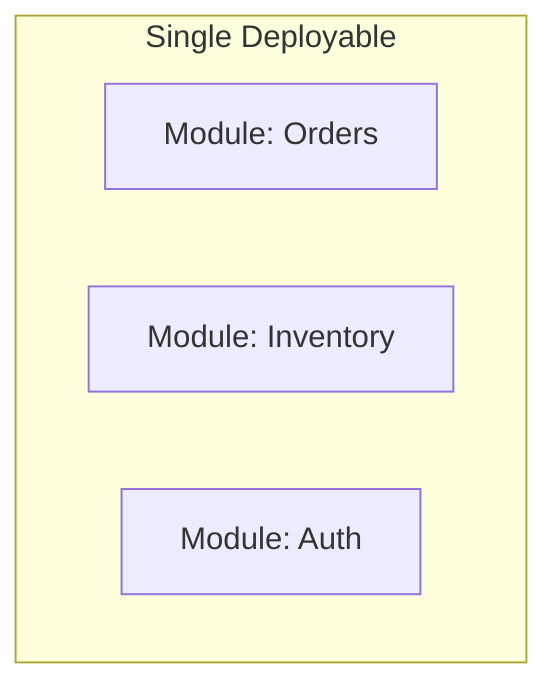

Modules communicate via in-process calls (not network). Boundaries enforced by package structure, build modules, or DDD bounded contexts.

**Advantages:** Simple operations, fast IPC, single deploy.

**Risk:** Without discipline, modules become tightly coupled. Mitigate with strict package boundaries, code review, and module tests.

### 8.19 Classic problem: URL shortener <a class="askgpt-btn" href="https://chatgpt.com/?prompt=Explain%20'8.19%20Classic%20problem%3A%20URL%20shortener'%20in%20detail%20with%20concrete%20examples%2C%20the%20main%20trade-offs%2C%20and%20common%20pitfalls%20a%20practitioner%20should%20know." target="_blank" rel="noopener" data-askgpt="8.19 Classic problem: URL shortener" title="Ask ChatGPT about this section">💬</a>

Requirements: shorten URL to short code, redirect to original.

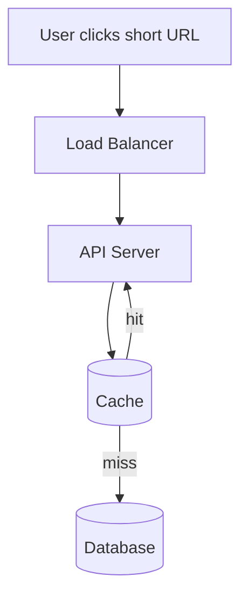

**Key generation:** Random short string (e.g., 6-7 chars base62) or hash-based.

**Database:** `(short_code, original_url, created_at, expires_at, user_id)`.

**Caching:** Cache hot URLs in Redis (LRU).

**Scale:** For 100K URLs/sec, 6-char codes give 56 billion combinations. Hash function ensures even distribution.

**Concerns:**
- Hot URLs (single short URL getting all traffic). Cache in front of DB.
- Analytics (track clicks).
- Expiration.

### 8.20 Classic problem: Twitter timeline <a class="askgpt-btn" href="https://chatgpt.com/?prompt=Explain%20'8.20%20Classic%20problem%3A%20Twitter%20timeline'%20in%20detail%20with%20concrete%20examples%2C%20the%20main%20trade-offs%2C%20and%20common%20pitfalls%20a%20practitioner%20should%20know." target="_blank" rel="noopener" data-askgpt="8.20 Classic problem: Twitter timeline" title="Ask ChatGPT about this section">💬</a>

Requirements: user sees tweets from people they follow, in reverse chronological order.

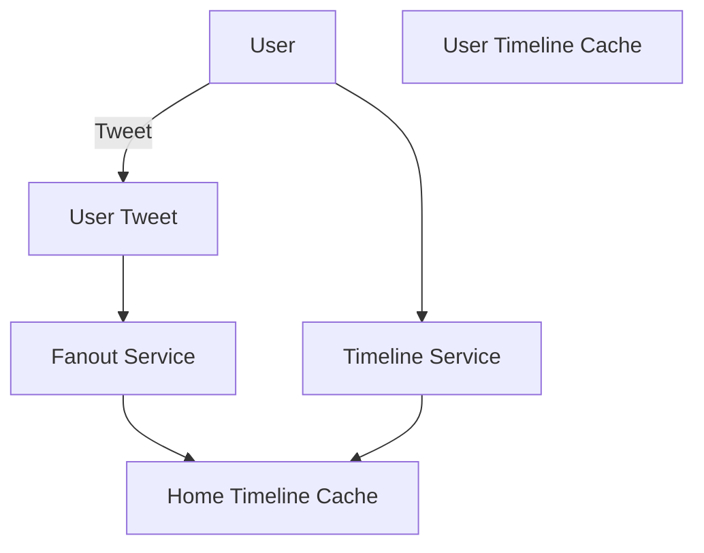

**Two approaches:**

1. **Pull (read on demand):** When user opens timeline, query tweets from followees, merge and sort.
2. **Push (fanout on write):** When user tweets, push to all followers' timeline caches.

**Hybrid:** Push for normal users; pull for celebrities (millions of followers).

**Concerns:**
- Fanout latency at scale.
- Celebrity user problem.
- Storage growth.

### 8.21 Classic problem: rate limiter <a class="askgpt-btn" href="https://chatgpt.com/?prompt=Explain%20'8.21%20Classic%20problem%3A%20rate%20limiter'%20in%20detail%20with%20concrete%20examples%2C%20the%20main%20trade-offs%2C%20and%20common%20pitfalls%20a%20practitioner%20should%20know." target="_blank" rel="noopener" data-askgpt="8.21 Classic problem: rate limiter" title="Ask ChatGPT about this section">💬</a>

Requirements: limit per-user/per-IP requests.

**Algorithm:** Token bucket with Redis.

```lua
local key = KEYS[1]
local rate = tonumber(ARGV[1])
local capacity = tonumber(ARGV[2])
local now = tonumber(ARGV[3])
local requested = tonumber(ARGV[4])

local fill_time = capacity / rate
local ttl = math.floor(fill_time * 2)

local bucket = redis.call('HMGET', key, 'tokens', 'last_refill')
local tokens = tonumber(bucket[1])
local last_refill = tonumber(bucket[2])

if tokens == nil then
    tokens = capacity
    last_refill = now
end

local delta = math.max(0, now - last_refill)
local refill = math.floor(delta * rate)
tokens = math.min(capacity, tokens + refill)
last_refill = now

local allowed = 0
if tokens >= requested then
    tokens = tokens - requested
    allowed = 1
end

redis.call('HMSET', key, 'tokens', tokens, 'last_refill', last_refill)
redis.call('EXPIRE', key, ttl)

return allowed
```

### 8.22 Classic problem: message queue <a class="askgpt-btn" href="https://chatgpt.com/?prompt=Explain%20'8.22%20Classic%20problem%3A%20message%20queue'%20in%20detail%20with%20concrete%20examples%2C%20the%20main%20trade-offs%2C%20and%20common%20pitfalls%20a%20practitioner%20should%20know." target="_blank" rel="noopener" data-askgpt="8.22 Classic problem: message queue" title="Ask ChatGPT about this section">💬</a>

Requirements: durable, ordered, high-throughput message delivery.

Reference design: **Kafka** (covered in [Messaging doc](../06-messaging/messaging.md)).

### 8.23 Classic problem: distributed cache <a class="askgpt-btn" href="https://chatgpt.com/?prompt=Explain%20'8.23%20Classic%20problem%3A%20distributed%20cache'%20in%20detail%20with%20concrete%20examples%2C%20the%20main%20trade-offs%2C%20and%20common%20pitfalls%20a%20practitioner%20should%20know." target="_blank" rel="noopener" data-askgpt="8.23 Classic problem: distributed cache" title="Ask ChatGPT about this section">💬</a>

Reference design: **Redis** (covered in [Caching doc](../08-caching/caching.md)).

---

## 9. Architecture

### 9.1 Reference architecture: large-scale web service <a class="askgpt-btn" href="https://chatgpt.com/?prompt=Explain%20'9.1%20Reference%20architecture%3A%20large-scale%20web%20service'%20in%20detail%20with%20concrete%20examples%2C%20the%20main%20trade-offs%2C%20and%20common%20pitfalls%20a%20practitioner%20should%20know." target="_blank" rel="noopener" data-askgpt="9.1 Reference architecture: large-scale web service" title="Ask ChatGPT about this section">💬</a>

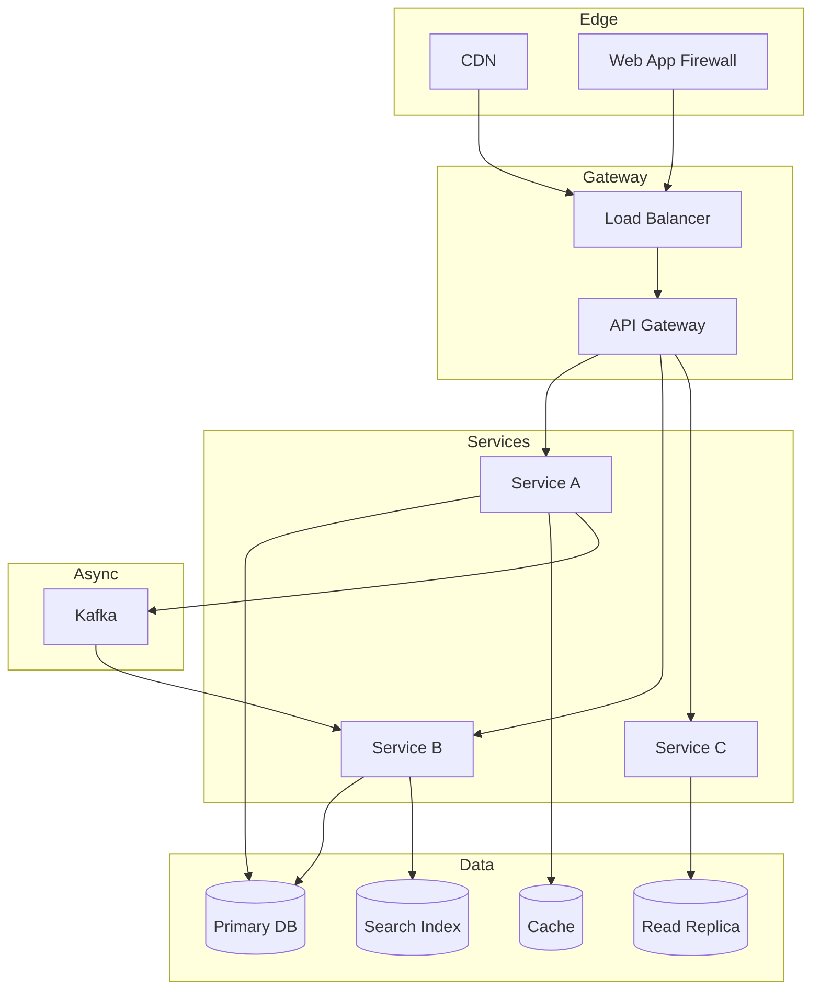

### 9.2 Monolith vs modular vs microservices <a class="askgpt-btn" href="https://chatgpt.com/?prompt=Explain%20'9.2%20Monolith%20vs%20modular%20vs%20microservices'%20in%20detail%20with%20concrete%20examples%2C%20the%20main%20trade-offs%2C%20and%20common%20pitfalls%20a%20practitioner%20should%20know." target="_blank" rel="noopener" data-askgpt="9.2 Monolith vs modular vs microservices" title="Ask ChatGPT about this section">💬</a>

| Dimension | Monolith | Modular Monolith | Microservices |
|-----------|----------|------------------|----------------|
| Deploy | 1 unit | 1 unit | Many units |
| Team size | Small | Medium | Large |
| Complexity | Low | Medium | High |
| Scaling | Vertical | Vertical | Horizontal |
| Tech diversity | Limited | Limited | High |
| Failure blast radius | Whole | Whole | One service |
| When to use | Startups, simple | Most production | Massive scale |

## 10. Performance

### 10.1 Latency budgets <a class="askgpt-btn" href="https://chatgpt.com/?prompt=Explain%20'10.1%20Latency%20budgets'%20in%20detail%20with%20concrete%20examples%2C%20the%20main%20trade-offs%2C%20and%20common%20pitfalls%20a%20practitioner%20should%20know." target="_blank" rel="noopener" data-askgpt="10.1 Latency budgets" title="Ask ChatGPT about this section">💬</a>

| Component | Budget |
|-----------|--------|
| Client → CDN | 50ms |
| CDN → Origin | 100ms |
| API gateway | 10ms |
| Auth | 5ms |
| Service logic | 20ms |
| DB query | 30ms |
| Cache | 1ms |
| Total | ~200ms p99 |

### 10.2 Throughput calculation <a class="askgpt-btn" href="https://chatgpt.com/?prompt=Explain%20'10.2%20Throughput%20calculation'%20in%20detail%20with%20concrete%20examples%2C%20the%20main%20trade-offs%2C%20and%20common%20pitfalls%20a%20practitioner%20should%20know." target="_blank" rel="noopener" data-askgpt="10.2 Throughput calculation" title="Ask ChatGPT about this section">💬</a>

**Little's Law:** `Concurrency = Throughput × Latency`.

To handle 100K requests/sec at 100ms latency, you need 10K concurrent in-flight requests.

### 10.3 Backpressure <a class="askgpt-btn" href="https://chatgpt.com/?prompt=Explain%20'10.3%20Backpressure'%20in%20detail%20with%20concrete%20examples%2C%20the%20main%20trade-offs%2C%20and%20common%20pitfalls%20a%20practitioner%20should%20know." target="_blank" rel="noopener" data-askgpt="10.3 Backpressure" title="Ask ChatGPT about this section">💬</a>

When downstream can't keep up:

- **TCP backpressure:** TCP windowing handles TCP-level.
- **Application backpressure:** Block the producer; signal the consumer to slow down.
- **Queue-based backpressure:** Bounded queue; reject when full.

## 11. Security

### 11.1 Defense in depth <a class="askgpt-btn" href="https://chatgpt.com/?prompt=Explain%20'11.1%20Defense%20in%20depth'%20in%20detail%20with%20concrete%20examples%2C%20the%20main%20trade-offs%2C%20and%20common%20pitfalls%20a%20practitioner%20should%20know." target="_blank" rel="noopener" data-askgpt="11.1 Defense in depth" title="Ask ChatGPT about this section">💬</a>

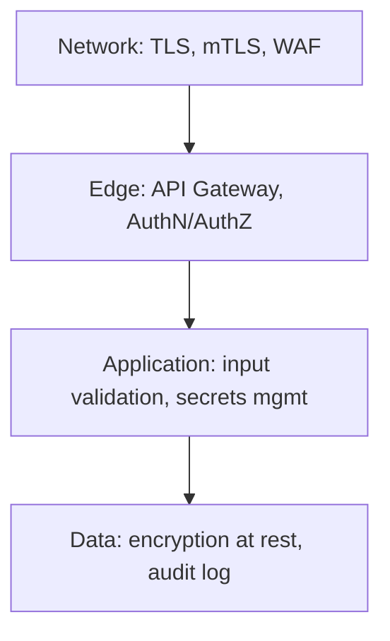

### 11.2 Zero trust <a class="askgpt-btn" href="https://chatgpt.com/?prompt=Explain%20'11.2%20Zero%20trust'%20in%20detail%20with%20concrete%20examples%2C%20the%20main%20trade-offs%2C%20and%20common%20pitfalls%20a%20practitioner%20should%20know." target="_blank" rel="noopener" data-askgpt="11.2 Zero trust" title="Ask ChatGPT about this section">💬</a>

- Every request authenticated.
- Every connection encrypted (mTLS).
- Every service has its own credentials.
- Network segmentation.

### 11.3 Secrets management <a class="askgpt-btn" href="https://chatgpt.com/?prompt=Explain%20'11.3%20Secrets%20management'%20in%20detail%20with%20concrete%20examples%2C%20the%20main%20trade-offs%2C%20and%20common%20pitfalls%20a%20practitioner%20should%20know." target="_blank" rel="noopener" data-askgpt="11.3 Secrets management" title="Ask ChatGPT about this section">💬</a>

- **HashiCorp Vault:** Centralized secrets.
- **AWS Secrets Manager:** Cloud-managed.
- **Kubernetes Secrets:** Base64 (not secure by itself).

## 12. Production Engineering

### 12.1 Observability <a class="askgpt-btn" href="https://chatgpt.com/?prompt=Explain%20'12.1%20Observability'%20in%20detail%20with%20concrete%20examples%2C%20the%20main%20trade-offs%2C%20and%20common%20pitfalls%20a%20practitioner%20should%20know." target="_blank" rel="noopener" data-askgpt="12.1 Observability" title="Ask ChatGPT about this section">💬</a>

- **Metrics:** RED (Rate, Errors, Duration), USE (Utilization, Saturation, Errors).
- **Logs:** Structured (JSON), centralized.
- **Traces:** Distributed (OpenTelemetry, Jaeger).
- **SLOs:** Service Level Objectives.

### 12.2 Deployment <a class="askgpt-btn" href="https://chatgpt.com/?prompt=Explain%20'12.2%20Deployment'%20in%20detail%20with%20concrete%20examples%2C%20the%20main%20trade-offs%2C%20and%20common%20pitfalls%20a%20practitioner%20should%20know." target="_blank" rel="noopener" data-askgpt="12.2 Deployment" title="Ask ChatGPT about this section">💬</a>

- **Blue-green:** switch over.
- **Canary:** partial rollouts.
- **GitOps:** declarative.

### 12.3 Capacity planning <a class="askgpt-btn" href="https://chatgpt.com/?prompt=Explain%20'12.3%20Capacity%20planning'%20in%20detail%20with%20concrete%20examples%2C%20the%20main%20trade-offs%2C%20and%20common%20pitfalls%20a%20practitioner%20should%20know." target="_blank" rel="noopener" data-askgpt="12.3 Capacity planning" title="Ask ChatGPT about this section">💬</a>

- **Load testing:** k6, Gatling, JMeter.
- **Forecast:** model growth.
- **Reserve capacity:** cloud reserved instances.

## 13. Production Case Studies

### 13.1 Amazon <a class="askgpt-btn" href="https://chatgpt.com/?prompt=Explain%20'13.1%20Amazon'%20in%20detail%20with%20concrete%20examples%2C%20the%20main%20trade-offs%2C%20and%20common%20pitfalls%20a%20practitioner%20should%20know." target="_blank" rel="noopener" data-askgpt="13.1 Amazon" title="Ask ChatGPT about this section">💬</a>

The original microservices case study. Jeff Bezos's 2002 API mandate drove the company toward service-oriented architecture. By 2020, Amazon runs tens of thousands of services.

### 13.2 Netflix <a class="askgpt-btn" href="https://chatgpt.com/?prompt=Explain%20'13.2%20Netflix'%20in%20detail%20with%20concrete%20examples%2C%20the%20main%20trade-offs%2C%20and%20common%20pitfalls%20a%20practitioner%20should%20know." target="_blank" rel="noopener" data-askgpt="13.2 Netflix" title="Ask ChatGPT about this section">💬</a>

Migrated from Oracle monolith to Cassandra + microservices in 2008-2017. They pioneered many patterns: Hystrix, Eureka, Zuul, Chaos Monkey.

### 13.3 Uber <a class="askgpt-btn" href="https://chatgpt.com/?prompt=Explain%20'13.3%20Uber'%20in%20detail%20with%20concrete%20examples%2C%20the%20main%20trade-offs%2C%20and%20common%20pitfalls%20a%20practitioner%20should%20know." target="_blank" rel="noopener" data-askgpt="13.3 Uber" title="Ask ChatGPT about this section">💬</a>

2500+ microservices. Domain-Oriented Microservice Architecture (DOMA) — bounded contexts around business capabilities (e.g., "rides", "payments", "eats").

### 13.4 Stripe <a class="askgpt-btn" href="https://chatgpt.com/?prompt=Explain%20'13.4%20Stripe'%20in%20detail%20with%20concrete%20examples%2C%20the%20main%20trade-offs%2C%20and%20common%20pitfalls%20a%20practitioner%20should%20know." target="_blank" rel="noopener" data-askgpt="13.4 Stripe" title="Ask ChatGPT about this section">💬</a>

Event-driven architecture. Complex state machines for payment flows. Detailed error handling.

### 13.5 Shopify <a class="askgpt-btn" href="https://chatgpt.com/?prompt=Explain%20'13.5%20Shopify'%20in%20detail%20with%20concrete%20examples%2C%20the%20main%20trade-offs%2C%20and%20common%20pitfalls%20a%20practitioner%20should%20know." target="_blank" rel="noopener" data-askgpt="13.5 Shopify" title="Ask ChatGPT about this section">💬</a>

Modular monolith on Rails. Explicitly avoided microservices. Strong module boundaries.

### 13.6 Twitter / X <a class="askgpt-btn" href="https://chatgpt.com/?prompt=Explain%20'13.6%20Twitter%20%2F%20X'%20in%20detail%20with%20concrete%20examples%2C%20the%20main%20trade-offs%2C%20and%20common%20pitfalls%20a%20practitioner%20should%20know." target="_blank" rel="noopener" data-askgpt="13.6 Twitter / X" title="Ask ChatGPT about this section">💬</a>

Migrated from Rails monolith to "Manhattan" Scala-based microservices on Mesos. Then consolidated some back into services.

## 14. Code Examples

### 14.1 Basic: CQRS read/write split (TypeScript) <a class="askgpt-btn" href="https://chatgpt.com/?prompt=Explain%20'14.1%20Basic%3A%20CQRS%20read%2Fwrite%20split%20(TypeScript)'%20in%20detail%20with%20concrete%20examples%2C%20the%20main%20trade-offs%2C%20and%20common%20pitfalls%20a%20practitioner%20should%20know." target="_blank" rel="noopener" data-askgpt="14.1 Basic: CQRS read/write split (TypeScript)" title="Ask ChatGPT about this section">💬</a>

```typescript
// see 01-cqrs/
```

### 14.2 Saga pattern <a class="askgpt-btn" href="https://chatgpt.com/?prompt=Explain%20'14.2%20Saga%20pattern'%20in%20detail%20with%20concrete%20examples%2C%20the%20main%20trade-offs%2C%20and%20common%20pitfalls%20a%20practitioner%20should%20know." target="_blank" rel="noopener" data-askgpt="14.2 Saga pattern" title="Ask ChatGPT about this section">💬</a>

```typescript
// see 03-saga/
```

### 14.3 Outbox pattern <a class="askgpt-btn" href="https://chatgpt.com/?prompt=Explain%20'14.3%20Outbox%20pattern'%20in%20detail%20with%20concrete%20examples%2C%20the%20main%20trade-offs%2C%20and%20common%20pitfalls%20a%20practitioner%20should%20know." target="_blank" rel="noopener" data-askgpt="14.3 Outbox pattern" title="Ask ChatGPT about this section">💬</a>

```typescript
// see 04-outbox-pattern/
```

### 14.4 Idempotency <a class="askgpt-btn" href="https://chatgpt.com/?prompt=Explain%20'14.4%20Idempotency'%20in%20detail%20with%20concrete%20examples%2C%20the%20main%20trade-offs%2C%20and%20common%20pitfalls%20a%20practitioner%20should%20know." target="_blank" rel="noopener" data-askgpt="14.4 Idempotency" title="Ask ChatGPT about this section">💬</a>

```typescript
// see 12-idempotency/
```

### 14.5 Rate limiter (token bucket, Lua + Redis) <a class="askgpt-btn" href="https://chatgpt.com/?prompt=Explain%20'14.5%20Rate%20limiter%20(token%20bucket%2C%20Lua%20%2B%20Redis)'%20in%20detail%20with%20concrete%20examples%2C%20the%20main%20trade-offs%2C%20and%20common%20pitfalls%20a%20practitioner%20should%20know." target="_blank" rel="noopener" data-askgpt="14.5 Rate limiter (token bucket, Lua + Redis)" title="Ask ChatGPT about this section">💬</a>

```lua
-- see 11-rate-limiter/
```

### 14.6 Bad, anti-pattern, refactored, secure examples <a class="askgpt-btn" href="https://chatgpt.com/?prompt=Explain%20'14.6%20Bad%2C%20anti-pattern%2C%20refactored%2C%20secure%20examples'%20in%20detail%20with%20concrete%20examples%2C%20the%20main%20trade-offs%2C%20and%20common%20pitfalls%20a%20practitioner%20should%20know." target="_blank" rel="noopener" data-askgpt="14.6 Bad, anti-pattern, refactored, secure examples" title="Ask ChatGPT about this section">💬</a>

**Bad: distributed monolith**

```typescript
// All services share a database
// Tight coupling
// "Microservice" in name only
```

**Anti-pattern: chatty services**

```typescript
// 50 round-trips per user request
```

**Refactored: aggregate calls**

```typescript
// BFF (Backend for Frontend) pattern
```

**Secure: zero trust**

```typescript
// mTLS between services
// Short-lived tokens
```

**Thread-safe: distributed lock (Redis Redlock)**

```typescript
// see 13-distributed-lock/
```

## 15. Common Mistakes

### 15.1 Beginner mistakes <a class="askgpt-btn" href="https://chatgpt.com/?prompt=Explain%20'15.1%20Beginner%20mistakes'%20in%20detail%20with%20concrete%20examples%2C%20the%20main%20trade-offs%2C%20and%20common%20pitfalls%20a%20practitioner%20should%20know." target="_blank" rel="noopener" data-askgpt="15.1 Beginner mistakes" title="Ask ChatGPT about this section">💬</a>

- **Premature microservices** — splitting a small app too early.
- **No idempotency** — POST without keys; double charges.
- **Sync chains** — service A calls B calls C calls D; latency adds up.
- **No timeouts** — one slow service blocks the whole chain.
- **No circuit breakers** — one service failure cascades.

### 15.2 Intermediate mistakes <a class="askgpt-btn" href="https://chatgpt.com/?prompt=Explain%20'15.2%20Intermediate%20mistakes'%20in%20detail%20with%20concrete%20examples%2C%20the%20main%20trade-offs%2C%20and%20common%20pitfalls%20a%20practitioner%20should%20know." target="_blank" rel="noopener" data-askgpt="15.2 Intermediate mistakes" title="Ask ChatGPT about this section">💬</a>

- **Distributed monolith** — services share a database.
- **No compensation in saga** — failure leaves inconsistent state.
- **No idempotency keys** — duplicate processing.
- **Hot partitions** — single key bottleneck.
- **Missing observability** — can't debug.

### 15.3 Senior mistakes <a class="askgpt-btn" href="https://chatgpt.com/?prompt=Explain%20'15.3%20Senior%20mistakes'%20in%20detail%20with%20concrete%20examples%2C%20the%20main%20trade-offs%2C%20and%20common%20pitfalls%20a%20practitioner%20should%20know." target="_blank" rel="noopener" data-askgpt="15.3 Senior mistakes" title="Ask ChatGPT about this section">💬</a>

- **Wrong architecture choice** — microservices when monolith fits.
- **Synchronous chain in EDA** — defeats event-driven benefits.
- **No backpressure** — cascading failures.
- **Wrong consistency model** — strong when eventual would work.

### 15.4 Production mistakes <a class="askgpt-btn" href="https://chatgpt.com/?prompt=Explain%20'15.4%20Production%20mistakes'%20in%20detail%20with%20concrete%20examples%2C%20the%20main%20trade-offs%2C%20and%20common%20pitfalls%20a%20practitioner%20should%20know." target="_blank" rel="noopener" data-askgpt="15.4 Production mistakes" title="Ask ChatGPT about this section">💬</a>

- **No rate limiting** — DOS.
- **No timeout** — hangs.
- **No retry budget** — retry storm.
- **No chaos testing** — discover problems at launch.

### 15.5 Migration mistakes <a class="askgpt-btn" href="https://chatgpt.com/?prompt=Explain%20'15.5%20Migration%20mistakes'%20in%20detail%20with%20concrete%20examples%2C%20the%20main%20trade-offs%2C%20and%20common%20pitfalls%20a%20practitioner%20should%20know." target="_blank" rel="noopener" data-askgpt="15.5 Migration mistakes" title="Ask ChatGPT about this section">💬</a>

- **Big-bang migration** — all at once; high risk.
- **Shared database between services** — defeats the point.
- **No rollback plan** — when something breaks.
- **No feature flags** — can't disable.

### 15.6 Configuration mistakes <a class="askgpt-btn" href="https://chatgpt.com/?prompt=Explain%20'15.6%20Configuration%20mistakes'%20in%20detail%20with%20concrete%20examples%2C%20the%20main%20trade-offs%2C%20and%20common%20pitfalls%20a%20practitioner%20should%20know." target="_blank" rel="noopener" data-askgpt="15.6 Configuration mistakes" title="Ask ChatGPT about this section">💬</a>

- **Timeouts too long** — slow detection.
- **Connection pool too small** — exhausted.
- **No rate limit** — vulnerable.

### 15.7 Security mistakes <a class="askgpt-btn" href="https://chatgpt.com/?prompt=Explain%20'15.7%20Security%20mistakes'%20in%20detail%20with%20concrete%20examples%2C%20the%20main%20trade-offs%2C%20and%20common%20pitfalls%20a%20practitioner%20should%20know." target="_blank" rel="noopener" data-askgpt="15.7 Security mistakes" title="Ask ChatGPT about this section">💬</a>

- **Trusting internal network** — no mTLS.
- **Long-lived tokens** — no rotation.
- **Secrets in code** — git history leaks.
- **No audit log** — can't investigate.

### 15.8 Performance mistakes <a class="askgpt-btn" href="https://chatgpt.com/?prompt=Explain%20'15.8%20Performance%20mistakes'%20in%20detail%20with%20concrete%20examples%2C%20the%20main%20trade-offs%2C%20and%20common%20pitfalls%20a%20practitioner%20should%20know." target="_blank" rel="noopener" data-askgpt="15.8 Performance mistakes" title="Ask ChatGPT about this section">💬</a>

- **Sync calls in async paths** — defeats purpose.
- **Hot key in cache** — single point.
- **N+1 queries** — DB round-trips.
- **No batching** — missed optimization.

### 15.9 Debugging mistakes <a class="askgpt-btn" href="https://chatgpt.com/?prompt=Explain%20'15.9%20Debugging%20mistakes'%20in%20detail%20with%20concrete%20examples%2C%20the%20main%20trade-offs%2C%20and%20common%20pitfalls%20a%20practitioner%20should%20know." target="_blank" rel="noopener" data-askgpt="15.9 Debugging mistakes" title="Ask ChatGPT about this section">💬</a>

- **Restarting without logs** — lose state.
- **No correlation IDs** — can't trace.
- **No service map** — don't know dependencies.

### 15.10 Deployment mistakes <a class="askgpt-btn" href="https://chatgpt.com/?prompt=Explain%20'15.10%20Deployment%20mistakes'%20in%20detail%20with%20concrete%20examples%2C%20the%20main%20trade-offs%2C%20and%20common%20pitfalls%20a%20practitioner%20should%20know." target="_blank" rel="noopener" data-askgpt="15.10 Deployment mistakes" title="Ask ChatGPT about this section">💬</a>

- **No canary** — full rollout.
- **No health checks** — K8s doesn't know status.
- **No graceful shutdown** — drop in-flight requests.

## 16. Debugging

### 16.1 Distributed tracing <a class="askgpt-btn" href="https://chatgpt.com/?prompt=Explain%20'16.1%20Distributed%20tracing'%20in%20detail%20with%20concrete%20examples%2C%20the%20main%20trade-offs%2C%20and%20common%20pitfalls%20a%20practitioner%20should%20know." target="_blank" rel="noopener" data-askgpt="16.1 Distributed tracing" title="Ask ChatGPT about this section">💬</a>

```typescript
// OpenTelemetry
import { trace, context } from '@opentelemetry/api';
const span = trace.getActiveSpan();
span?.setAttribute('user.id', '123');
```

- **Trace:** End-to-end request path.
- **Span:** Single unit of work.
- **Trace ID:** Correlation across services.
- **Span ID:** Unique per operation.

### 16.2 Log correlation <a class="askgpt-btn" href="https://chatgpt.com/?prompt=Explain%20'16.2%20Log%20correlation'%20in%20detail%20with%20concrete%20examples%2C%20the%20main%20trade-offs%2C%20and%20common%20pitfalls%20a%20practitioner%20should%20know." target="_blank" rel="noopener" data-askgpt="16.2 Log correlation" title="Ask ChatGPT about this section">💬</a>

```typescript
// Inject trace ID into log
logger.info({ traceId, spanId, message: 'user updated' });
```

### 16.3 Common debugging tools <a class="askgpt-btn" href="https://chatgpt.com/?prompt=Explain%20'16.3%20Common%20debugging%20tools'%20in%20detail%20with%20concrete%20examples%2C%20the%20main%20trade-offs%2C%20and%20common%20pitfalls%20a%20practitioner%20should%20know." target="_blank" rel="noopener" data-askgpt="16.3 Common debugging tools" title="Ask ChatGPT about this section">💬</a>

- **Wireshark:** Packet capture.
- **tcpdump:** Network debugging.
- **curl:** HTTP testing.
- **grpcurl:** gRPC testing.
- **kafkacat (kcat):** Kafka debugging.
- **redis-cli:** Redis debugging.
- **psql:** PostgreSQL debugging.

### 16.4 Chaos engineering <a class="askgpt-btn" href="https://chatgpt.com/?prompt=Explain%20'16.4%20Chaos%20engineering'%20in%20detail%20with%20concrete%20examples%2C%20the%20main%20trade-offs%2C%20and%20common%20pitfalls%20a%20practitioner%20should%20know." target="_blank" rel="noopener" data-askgpt="16.4 Chaos engineering" title="Ask ChatGPT about this section">💬</a>

Tools: **Chaos Monkey**, **Gremlin**, **Litmus**.

Experiments:
- Kill a service instance.
- Inject network latency.
- Drop packets between services.
- Fill disk.
- Exhaust CPU.

### 16.5 Production troubleshooting checklist <a class="askgpt-btn" href="https://chatgpt.com/?prompt=Explain%20'16.5%20Production%20troubleshooting%20checklist'%20in%20detail%20with%20concrete%20examples%2C%20the%20main%20trade-offs%2C%20and%20common%20pitfalls%20a%20practitioner%20should%20know." target="_blank" rel="noopener" data-askgpt="16.5 Production troubleshooting checklist" title="Ask ChatGPT about this section">💬</a>

- [ ] Capture trace ID.
- [ ] Capture logs from all involved services.
- [ ] Check service health endpoints.
- [ ] Check recent deployments.
- [ ] Check recent configuration changes.
- [ ] Check upstream/downstream service health.
- [ ] Capture thread/heap dumps.

## 17. Monitoring & Observability

### 17.1 Three pillars <a class="askgpt-btn" href="https://chatgpt.com/?prompt=Explain%20'17.1%20Three%20pillars'%20in%20detail%20with%20concrete%20examples%2C%20the%20main%20trade-offs%2C%20and%20common%20pitfalls%20a%20practitioner%20should%20know." target="_blank" rel="noopener" data-askgpt="17.1 Three pillars" title="Ask ChatGPT about this section">💬</a>

- **Metrics:** Counters, gauges, histograms.
- **Logs:** Structured events.
- **Traces:** Distributed spans.

### 17.2 RED method (for services) <a class="askgpt-btn" href="https://chatgpt.com/?prompt=Explain%20'17.2%20RED%20method%20(for%20services)'%20in%20detail%20with%20concrete%20examples%2C%20the%20main%20trade-offs%2C%20and%20common%20pitfalls%20a%20practitioner%20should%20know." target="_blank" rel="noopener" data-askgpt="17.2 RED method (for services)" title="Ask ChatGPT about this section">💬</a>

- **Rate:** Requests per second.
- **Errors:** Failed requests per second.
- **Duration:** Latency distribution.

### 17.3 USE method (for resources) <a class="askgpt-btn" href="https://chatgpt.com/?prompt=Explain%20'17.3%20USE%20method%20(for%20resources)'%20in%20detail%20with%20concrete%20examples%2C%20the%20main%20trade-offs%2C%20and%20common%20pitfalls%20a%20practitioner%20should%20know." target="_blank" rel="noopener" data-askgpt="17.3 USE method (for resources)" title="Ask ChatGPT about this section">💬</a>

- **Utilization:** % time busy.
- **Saturation:** Queue depth.
- **Errors:** Error count.

### 17.4 SLOs <a class="askgpt-btn" href="https://chatgpt.com/?prompt=Explain%20'17.4%20SLOs'%20in%20detail%20with%20concrete%20examples%2C%20the%20main%20trade-offs%2C%20and%20common%20pitfalls%20a%20practitioner%20should%20know." target="_blank" rel="noopener" data-askgpt="17.4 SLOs" title="Ask ChatGPT about this section">💬</a>

- **Availability:** 99.9%, 99.95%, 99.99%.
- **Latency:** p50, p95, p99.
- **Error rate:** 0.1%, 0.01%.

### 17.5 Alerting <a class="askgpt-btn" href="https://chatgpt.com/?prompt=Explain%20'17.5%20Alerting'%20in%20detail%20with%20concrete%20examples%2C%20the%20main%20trade-offs%2C%20and%20common%20pitfalls%20a%20practitioner%20should%20know." target="_blank" rel="noopener" data-askgpt="17.5 Alerting" title="Ask ChatGPT about this section">💬</a>

- Page on user-visible symptoms (latency, error rate).
- Don't page on internal symptoms (CPU, memory).
- Use SLO-based alerts.

## 18. Best Practices

### 18.1 Industry best practices <a class="askgpt-btn" href="https://chatgpt.com/?prompt=Explain%20'18.1%20Industry%20best%20practices'%20in%20detail%20with%20concrete%20examples%2C%20the%20main%20trade-offs%2C%20and%20common%20pitfalls%20a%20practitioner%20should%20know." target="_blank" rel="noopener" data-askgpt="18.1 Industry best practices" title="Ask ChatGPT about this section">💬</a>

- **Design for failure:** every request can fail; handle it.
- **Idempotency:** every operation should be safe to retry.
- **Timeouts everywhere:** every I/O has a deadline.
- **Circuit breakers:** wrap external calls.
- **Bulkheads:** isolate failures.
- **Backpressure:** don't overwhelm downstream.
- **Idempotency keys:** for non-idempotent operations.
- **Observability:** trace, log, measure.
- **Chaos engineering:** test failure modes.
- **Documentation:** ADRs for decisions.

### 18.2 Enterprise practices <a class="askgpt-btn" href="https://chatgpt.com/?prompt=Explain%20'18.2%20Enterprise%20practices'%20in%20detail%20with%20concrete%20examples%2C%20the%20main%20trade-offs%2C%20and%20common%20pitfalls%20a%20practitioner%20should%20know." target="_blank" rel="noopener" data-askgpt="18.2 Enterprise practices" title="Ask ChatGPT about this section">💬</a>

- **Architecture decision records (ADRs):** Document why.
- **Threat modeling:** Identify risks.
- **Compliance:** GDPR, HIPAA, SOC2.
- **Cost monitoring:** per-service attribution.
- **On-call training:** Runbooks.

### 18.3 Clean code <a class="askgpt-btn" href="https://chatgpt.com/?prompt=Explain%20'18.3%20Clean%20code'%20in%20detail%20with%20concrete%20examples%2C%20the%20main%20trade-offs%2C%20and%20common%20pitfalls%20a%20practitioner%20should%20know." target="_blank" rel="noopener" data-askgpt="18.3 Clean code" title="Ask ChatGPT about this section">💬</a>

- **Single responsibility:** one reason to change.
- **Boundaries:** modules with clear interfaces.
- **Testability:** pure functions where possible.
- **Idempotency:** no side effects without intent.

### 18.4 Reliability <a class="askgpt-btn" href="https://chatgpt.com/?prompt=Explain%20'18.4%20Reliability'%20in%20detail%20with%20concrete%20examples%2C%20the%20main%20trade-offs%2C%20and%20common%20pitfalls%20a%20practitioner%20should%20know." target="_blank" rel="noopener" data-askgpt="18.4 Reliability" title="Ask ChatGPT about this section">💬</a>

- **Circuit breakers** (Resilience4j).
- **Retries with exponential backoff.**
- **Timeouts** (P99 + buffer).
- **Bulkheads** (thread pools, connection pools).
- **Health checks** (liveness, readiness).

### 18.5 Security <a class="askgpt-btn" href="https://chatgpt.com/?prompt=Explain%20'18.5%20Security'%20in%20detail%20with%20concrete%20examples%2C%20the%20main%20trade-offs%2C%20and%20common%20pitfalls%20a%20practitioner%20should%20know." target="_blank" rel="noopener" data-askgpt="18.5 Security" title="Ask ChatGPT about this section">💬</a>

- **mTLS** for service-to-service.
- **OAuth2 / JWT** for user auth.
- **Secrets in vault**, not code.
- **Audit logging.**
- **Network policies** (Kubernetes NetworkPolicy).

### 18.6 Performance <a class="askgpt-btn" href="https://chatgpt.com/?prompt=Explain%20'18.6%20Performance'%20in%20detail%20with%20concrete%20examples%2C%20the%20main%20trade-offs%2C%20and%20common%20pitfalls%20a%20practitioner%20should%20know." target="_blank" rel="noopener" data-askgpt="18.6 Performance" title="Ask ChatGPT about this section">💬</a>

- **Caching** (L1 in-JVM, L2 distributed).
- **Connection pooling.**
- **Async** for non-blocking I/O.
- **CDN** for static.

### 18.7 Testing <a class="askgpt-btn" href="https://chatgpt.com/?prompt=Explain%20'18.7%20Testing'%20in%20detail%20with%20concrete%20examples%2C%20the%20main%20trade-offs%2C%20and%20common%20pitfalls%20a%20practitioner%20should%20know." target="_blank" rel="noopener" data-askgpt="18.7 Testing" title="Ask ChatGPT about this section">💬</a>

- **Unit tests** for logic.
- **Contract tests** (Pact).
- **Integration tests** (Testcontainers).
- **Load tests** (k6, Gatling).
- **Chaos tests** (Gremlin).

### 18.8 Deployment <a class="askgpt-btn" href="https://chatgpt.com/?prompt=Explain%20'18.8%20Deployment'%20in%20detail%20with%20concrete%20examples%2C%20the%20main%20trade-offs%2C%20and%20common%20pitfalls%20a%20practitioner%20should%20know." target="_blank" rel="noopener" data-askgpt="18.8 Deployment" title="Ask ChatGPT about this section">💬</a>

- **Canary** for safe rollouts.
- **GitOps** for declarative.
- **Feature flags** for safe launches.
- **Rollback** tested.

## 19. Anti-Patterns

### 19.1 Distributed monolith <a class="askgpt-btn" href="https://chatgpt.com/?prompt=Explain%20'19.1%20Distributed%20monolith'%20in%20detail%20with%20concrete%20examples%2C%20the%20main%20trade-offs%2C%20and%20common%20pitfalls%20a%20practitioner%20should%20know." target="_blank" rel="noopener" data-askgpt="19.1 Distributed monolith" title="Ask ChatGPT about this section">💬</a>

Services share a database; tight coupling; "microservices" in name only.

**Fix:** True bounded contexts; each service owns its data.

### 19.2 Sync chain <a class="askgpt-btn" href="https://chatgpt.com/?prompt=Explain%20'19.2%20Sync%20chain'%20in%20detail%20with%20concrete%20examples%2C%20the%20main%20trade-offs%2C%20and%20common%20pitfalls%20a%20practitioner%20should%20know." target="_blank" rel="noopener" data-askgpt="19.2 Sync chain" title="Ask ChatGPT about this section">💬</a>

A calls B calls C calls D. Latency adds up; one failure breaks all.

**Fix:** Async events; aggregate at boundaries.

### 19.3 Magic push <a class="askgpt-btn" href="https://chatgpt.com/?prompt=Explain%20'19.3%20Magic%20push'%20in%20detail%20with%20concrete%20examples%2C%20the%20main%20trade-offs%2C%20and%20common%20pitfalls%20a%20practitioner%20should%20know." target="_blank" rel="noopener" data-askgpt="19.3 Magic push" title="Ask ChatGPT about this section">💬</a>

A service "magically" pushes state to others without explicit contracts.

**Fix:** Explicit events; clear ownership.

### 19.4 Distributed transaction abuse <a class="askgpt-btn" href="https://chatgpt.com/?prompt=Explain%20'19.4%20Distributed%20transaction%20abuse'%20in%20detail%20with%20concrete%20examples%2C%20the%20main%20trade-offs%2C%20and%20common%20pitfalls%20a%20practitioner%20should%20know." target="_blank" rel="noopener" data-askgpt="19.4 Distributed transaction abuse" title="Ask ChatGPT about this section">💬</a>

Trying to do 2PC across many services. Slow; fragile.

**Fix:** Saga with compensating actions.

### 19.5 Choreography spaghetti <a class="askgpt-btn" href="https://chatgpt.com/?prompt=Explain%20'19.5%20Choreography%20spaghetti'%20in%20detail%20with%20concrete%20examples%2C%20the%20main%20trade-offs%2C%20and%20common%20pitfalls%20a%20practitioner%20should%20know." target="_blank" rel="noopener" data-askgpt="19.5 Choreography spaghetti" title="Ask ChatGPT about this section">💬</a>

Services emit events; consumers react; no one understands the flow.

**Fix:** Document with sequence diagrams; consider orchestration for complex flows.

## 20. Edge Cases

### 20.1 Split brain <a class="askgpt-btn" href="https://chatgpt.com/?prompt=Explain%20'20.1%20Split%20brain'%20in%20detail%20with%20concrete%20examples%2C%20the%20main%20trade-offs%2C%20and%20common%20pitfalls%20a%20practitioner%20should%20know." target="_blank" rel="noopener" data-askgpt="20.1 Split brain" title="Ask ChatGPT about this section">💬</a>

Two services both think they're the leader. Can lead to data corruption.

**Mitigation:** Quorum-based leader election (Raft, ZooKeeper).

### 20.2 Thundering herd <a class="askgpt-btn" href="https://chatgpt.com/?prompt=Explain%20'20.2%20Thundering%20herd'%20in%20detail%20with%20concrete%20examples%2C%20the%20main%20trade-offs%2C%20and%20common%20pitfalls%20a%20practitioner%20should%20know." target="_blank" rel="noopener" data-askgpt="20.2 Thundering herd" title="Ask ChatGPT about this section">💬</a>

Many requests hit a cold cache simultaneously. DB overload.

**Mitigation:** Single-flight, lock, early expiration.

### 20.3 Hot partition <a class="askgpt-btn" href="https://chatgpt.com/?prompt=Explain%20'20.3%20Hot%20partition'%20in%20detail%20with%20concrete%20examples%2C%20the%20main%20trade-offs%2C%20and%20common%20pitfalls%20a%20practitioner%20should%20know." target="_blank" rel="noopener" data-askgpt="20.3 Hot partition" title="Ask ChatGPT about this section">💬</a>

Single key in distributed store gets all traffic.

**Mitigation:** Random suffix, local cache, replication.

### 20.4 Clock skew <a class="askgpt-btn" href="https://chatgpt.com/?prompt=Explain%20'20.4%20Clock%20skew'%20in%20detail%20with%20concrete%20examples%2C%20the%20main%20trade-offs%2C%20and%20common%20pitfalls%20a%20practitioner%20should%20know." target="_blank" rel="noopener" data-askgpt="20.4 Clock skew" title="Ask ChatGPT about this section">💬</a>

Servers have different times. Can confuse timestamps.

**Mitigation:** NTP, monotonic clocks, logical clocks (vector, hybrid).

### 20.5 Retry storms <a class="askgpt-btn" href="https://chatgpt.com/?prompt=Explain%20'20.5%20Retry%20storms'%20in%20detail%20with%20concrete%20examples%2C%20the%20main%20trade-offs%2C%20and%20common%20pitfalls%20a%20practitioner%20should%20know." target="_blank" rel="noopener" data-askgpt="20.5 Retry storms" title="Ask ChatGPT about this section">💬</a>

Service A retries on failure; service B is down; A floods B with retries.

**Mitigation:** Exponential backoff with jitter; circuit breaker.

### 20.6 Partial network failures <a class="askgpt-btn" href="https://chatgpt.com/?prompt=Explain%20'20.6%20Partial%20network%20failures'%20in%20detail%20with%20concrete%20examples%2C%20the%20main%20trade-offs%2C%20and%20common%20pitfalls%20a%20practitioner%20should%20know." target="_blank" rel="noopener" data-askgpt="20.6 Partial network failures" title="Ask ChatGPT about this section">💬</a>

Some packets get through; some don't. Hard to detect.

**Mitigation:** Timeouts; circuit breakers; bulkheads.

### 20.7 Data inconsistency <a class="askgpt-btn" href="https://chatgpt.com/?prompt=Explain%20'20.7%20Data%20inconsistency'%20in%20detail%20with%20concrete%20examples%2C%20the%20main%20trade-offs%2C%20and%20common%20pitfalls%20a%20practitioner%20should%20know." target="_blank" rel="noopener" data-askgpt="20.7 Data inconsistency" title="Ask ChatGPT about this section">💬</a>

Replicas diverge; updates applied in different orders.

**Mitigation:** Quorum reads/writes, vector clocks, CRDTs.

---

## 21. Comparisons

### 21.1 Monolith vs Modular Monolith vs Microservices <a class="askgpt-btn" href="https://chatgpt.com/?prompt=Explain%20'21.1%20Monolith%20vs%20Modular%20Monolith%20vs%20Microservices'%20in%20detail%20with%20concrete%20examples%2C%20the%20main%20trade-offs%2C%20and%20common%20pitfalls%20a%20practitioner%20should%20know." target="_blank" rel="noopener" data-askgpt="21.1 Monolith vs Modular Monolith vs Microservices" title="Ask ChatGPT about this section">💬</a>

| Dimension | Monolith | Modular Monolith | Microservices |
|-----------|----------|------------------|----------------|
| Deploy | 1 unit | 1 unit | Many units |
| Team size | 1-10 | 10-50 | 50+ |
| Complexity | Low | Medium | High |
| IPC | In-process | In-process | Network |
| Failure blast radius | Whole | Whole | One service |
| Scaling | Vertical | Vertical | Horizontal |
| Best for | Startups | Most production | Massive scale |

### 21.2 Synchronous vs Asynchronous <a class="askgpt-btn" href="https://chatgpt.com/?prompt=Explain%20'21.2%20Synchronous%20vs%20Asynchronous'%20in%20detail%20with%20concrete%20examples%2C%20the%20main%20trade-offs%2C%20and%20common%20pitfalls%20a%20practitioner%20should%20know." target="_blank" rel="noopener" data-askgpt="21.2 Synchronous vs Asynchronous" title="Ask ChatGPT about this section">💬</a>

| Dimension | Synchronous | Asynchronous |
|-----------|-------------|--------------|
| Latency | Direct | Higher (eventual) |
| Coupling | High | Low |
| Failure mode | Cascading | Independent |
| Use case | Request-response | Event-driven |

**Rule of thumb:** Use sync for queries; use async for state changes that don't need immediate response.

### 21.3 REST vs Events vs gRPC <a class="askgpt-btn" href="https://chatgpt.com/?prompt=Explain%20'21.3%20REST%20vs%20Events%20vs%20gRPC'%20in%20detail%20with%20concrete%20examples%2C%20the%20main%20trade-offs%2C%20and%20common%20pitfalls%20a%20practitioner%20should%20know." target="_blank" rel="noopener" data-askgpt="21.3 REST vs Events vs gRPC" title="Ask ChatGPT about this section">💬</a>

| Dimension | REST | Events | gRPC |
|-----------|------|--------|------|
| Pattern | Request-response | Pub/sub | Request-response |
| Coupling | Tight | Loose | Tight |
| Schema | OpenAPI | Schema Registry | Protobuf |
| Browser support | Native | Needs WS/SSE | Needs grpc-web |
| Best for | Public APIs | Domain events | Service-to-service |

### 21.4 Consensus algorithms <a class="askgpt-btn" href="https://chatgpt.com/?prompt=Explain%20'21.4%20Consensus%20algorithms'%20in%20detail%20with%20concrete%20examples%2C%20the%20main%20trade-offs%2C%20and%20common%20pitfalls%20a%20practitioner%20should%20know." target="_blank" rel="noopener" data-askgpt="21.4 Consensus algorithms" title="Ask ChatGPT about this section">💬</a>

| Algorithm | Pros | Cons | Used by |
|-----------|------|------|--------|
| **Raft** | Understandable | Leader-based | etcd, Consul, CockroachDB |
| **Paxos** | Proven | Complex | Megastore, Spanner (variant) |
| **Zab** | Mature | ZK-specific | ZooKeeper |
| **EPaxos** | Low latency in some topologies | Complex | Some research systems |

### 21.5 Rate limiting algorithms <a class="askgpt-btn" href="https://chatgpt.com/?prompt=Explain%20'21.5%20Rate%20limiting%20algorithms'%20in%20detail%20with%20concrete%20examples%2C%20the%20main%20trade-offs%2C%20and%20common%20pitfalls%20a%20practitioner%20should%20know." target="_blank" rel="noopener" data-askgpt="21.5 Rate limiting algorithms" title="Ask ChatGPT about this section">💬</a>

| Algorithm | Memory | Accuracy | Burst handling |
|-----------|--------|----------|----------------|
| Fixed window | Low | Poor at edges | Bad |
| Sliding window | Medium | Better | Better |
| Token bucket | Low | Good | Allows bursts |
| Leaky bucket | Low | Good | Smooths |
| Sliding log | High | Most accurate | Accurate |

### 21.6 Decision matrix <a class="askgpt-btn" href="https://chatgpt.com/?prompt=Explain%20'21.6%20Decision%20matrix'%20in%20detail%20with%20concrete%20examples%2C%20the%20main%20trade-offs%2C%20and%20common%20pitfalls%20a%20practitioner%20should%20know." target="_blank" rel="noopener" data-askgpt="21.6 Decision matrix" title="Ask ChatGPT about this section">💬</a>

| Workload | Recommended |
|----------|------------|
| Small startup | Monolith |
| Most production | Modular monolith |
| Massive scale, multiple teams | Microservices |
| Spiky, event-driven | Serverless |
| Real-time | Modular monolith + WebSockets |
| Multi-cloud | Microservices + service mesh |

### 21.7 Migration paths <a class="askgpt-btn" href="https://chatgpt.com/?prompt=Explain%20'21.7%20Migration%20paths'%20in%20detail%20with%20concrete%20examples%2C%20the%20main%20trade-offs%2C%20and%20common%20pitfalls%20a%20practitioner%20should%20know." target="_blank" rel="noopener" data-askgpt="21.7 Migration paths" title="Ask ChatGPT about this section">💬</a>

- **Monolith → Modular:** Extract modules, define boundaries, enforce.
- **Modular → Microservices:** Strangler fig, one bounded context at a time.
- **Microservices → Modular:** Consolidate, reduce network calls, simplify ops.
- **Serverless:** Decompose functions, async events, state management.

---

## 22. Interview Preparation

### 22.1 Beginner (0-1 years) <a class="askgpt-btn" href="https://chatgpt.com/?prompt=Explain%20'22.1%20Beginner%20(0-1%20years)'%20in%20detail%20with%20concrete%20examples%2C%20the%20main%20trade-offs%2C%20and%20common%20pitfalls%20a%20practitioner%20should%20know." target="_blank" rel="noopener" data-askgpt="22.1 Beginner (0-1 years)" title="Ask ChatGPT about this section">💬</a>

**Q1: What is the CAP theorem?**
**A:** In a distributed system, during a network partition, you must choose between Consistency and Availability. Since partitions are inevitable, you trade off.

**Q2: What is a microservice?**
**A:** A small, independently deployable service that owns one bounded context. Communicates with other services over a network (REST, gRPC, events).

**Q3: What is eventual consistency?**
**A:** Replicas converge to the same value eventually, but reads may return stale data. Used in AP systems (Cassandra, Dynamo).

**Q4: What is an idempotent operation?**
**A:** Produces the same result whether executed once or multiple times. Essential for safe retries.

**Q5: What is a load balancer?**
**A:** Distributes requests across multiple servers. Improves availability and capacity.

### 22.2 Junior (1-2 years) <a class="askgpt-btn" href="https://chatgpt.com/?prompt=Explain%20'22.2%20Junior%20(1-2%20years)'%20in%20detail%20with%20concrete%20examples%2C%20the%20main%20trade-offs%2C%20and%20common%20pitfalls%20a%20practitioner%20should%20know." target="_blank" rel="noopener" data-askgpt="22.2 Junior (1-2 years)" title="Ask ChatGPT about this section">💬</a>

**Q6: What is CQRS?**
**A:** Command-Query Responsibility Segregation. Separate write and read models. Reads are denormalized for query speed; writes go through aggregates.

**Q7: What is the saga pattern?**
**A:** A way to manage distributed transactions across services. Each step has a compensating action. Two types: choreography (events) and orchestration (central saga).

**Q8: What is event sourcing?**
**A:** State is derived from a sequence of events. The log is the source of truth. Projections compute current state.

**Q9: What is the outbox pattern?**
**A:** Solves the dual-write problem. Write the event to an outbox table in the same transaction as the business write. A separate process publishes from outbox to broker.

**Q10: What is a bounded context?**
**A:** A DDD concept — a model boundary where terms have a specific meaning. Each microservice typically owns one bounded context.

### 22.3 Mid (2-4 years) <a class="askgpt-btn" href="https://chatgpt.com/?prompt=Explain%20'22.3%20Mid%20(2-4%20years)'%20in%20detail%20with%20concrete%20examples%2C%20the%20main%20trade-offs%2C%20and%20common%20pitfalls%20a%20practitioner%20should%20know." target="_blank" rel="noopener" data-askgpt="22.3 Mid (2-4 years)" title="Ask ChatGPT about this section">💬</a>

**Q11: How do you handle distributed transactions without 2PC?**
**A:** (1) Saga pattern with compensating actions. (2) Eventual consistency via events. (3) Outbox pattern for reliable event publication.

**Q12: Compare single-leader and multi-leader replication.**
**A:** Single-leader: one writer, simpler, but writer is bottleneck. Multi-leader: multiple writers, more complex, conflict resolution needed. Multi-leader is rare; most use single-leader with replicas.

**Q13: What is the strangler fig pattern?**
**A:** Gradually replace a monolith by routing requests to new services. Old code is "strangled" as new services take over.

**Q14: How do you ensure idempotency in event-driven systems?**
**A:** (1) Idempotency keys in events. (2) Consumer stores processed event IDs. (3) Exactly-once semantics (Kafka transactional API). (4) Idempotent operations in business logic.

**Q15: How do you scale a read-heavy system?**
**A:** (1) Replicas. (2) Caching (CDN, in-memory, distributed). (3) Read-optimized schema (denormalized, indexed). (4) CQRS with read models.

**Q16: What is the difference between orchestration and choreography?**
**A:** Orchestration: a central saga coordinates steps. Choreography: services emit events; no central coordinator. Orchestration is explicit but coupled; choreography is loosely coupled but harder to understand.

### 22.4 Senior (4-6 years) <a class="askgpt-btn" href="https://chatgpt.com/?prompt=Explain%20'22.4%20Senior%20(4-6%20years)'%20in%20detail%20with%20concrete%20examples%2C%20the%20main%20trade-offs%2C%20and%20common%20pitfalls%20a%20practitioner%20should%20know." target="_blank" rel="noopener" data-askgpt="22.4 Senior (4-6 years)" title="Ask ChatGPT about this section">💬</a>

**Q17: How would you design a distributed cache for a high-traffic service?**
**A:** (1) Multi-tier: Caffeine (L1, in-JVM) + Redis (L2, distributed). (2) Cache-aside pattern. (3) Stampede protection (single-flight). (4) Hot key detection + local cache. (5) TTL strategy. (6) Monitoring hit rate.

**Q18: How do you migrate from monolith to microservices?**
**A:** (1) Identify bounded contexts (DDD). (2) Strangler fig: route requests to new service. (3) Dual-write data during migration. (4) Backfill from monolith. (5) Switch reads. (6) Decommission. Strangler over big-bang.

**Q19: How do you handle a distributed deadlock?**
**A:** (1) Timeout-based: detect via lock TTL. (2) Wait-for-graph detection. (3) Pre-ordering: assign IDs to resources; acquire in order. (4) Use saga with compensation.

**Q20: How do you implement a rate limiter?**
**A:** Token bucket in Redis (atomic via Lua). Per-user limit. Distributed via shared Redis. With circuit breaker fallback. Edge-deployed for low latency.

**Q21: How do you debug a system that's distributed across regions?**
**A:** (1) Distributed tracing (OpenTelemetry). (2) Trace ID propagation. (3) Log aggregation. (4) Network observability. (5) Synthetic monitoring.

### 22.5 Lead (6-8 years) <a class="askgpt-btn" href="https://chatgpt.com/?prompt=Explain%20'22.5%20Lead%20(6-8%20years)'%20in%20detail%20with%20concrete%20examples%2C%20the%20main%20trade-offs%2C%20and%20common%20pitfalls%20a%20practitioner%20should%20know." target="_blank" rel="noopener" data-askgpt="22.5 Lead (6-8 years)" title="Ask ChatGPT about this section">💬</a>

**Q22: How do you choose between monolith, modular monolith, and microservices?**
**A:** (1) Team size: small → monolith; medium → modular; large → microservices. (2) Domain clarity: clear bounded contexts → microservices; entangled → monolith. (3) Operational maturity: low → monolith; high → microservices. (4) Scaling needs: vertical → monolith; horizontal → microservices. (5) Default: modular monolith; split when needed.

**Q23: How do you design for zero-downtime deployment?**
**A:** (1) Blue-green: route traffic to new version. (2) Canary: partial rollouts. (3) Health checks: liveness, readiness. (4) Graceful shutdown: drain in-flight. (5) Database migrations: backward-compatible first. (6) Feature flags: enable progressively.

**Q24: How do you handle the dual-write problem?**
**A:** (1) Outbox pattern: write event to DB in same transaction; separate process publishes. (2) Change data capture: read from DB binlog; publish to Kafka (e.g., Debezium). (3) Two-phase commit: avoid; slow and fragile.

### 22.6 Staff (8-12 years) <a class="askgpt-btn" href="https://chatgpt.com/?prompt=Explain%20'22.6%20Staff%20(8-12%20years)'%20in%20detail%20with%20concrete%20examples%2C%20the%20main%20trade-offs%2C%20and%20common%20pitfalls%20a%20practitioner%20should%20know." target="_blank" rel="noopener" data-askgpt="22.6 Staff (8-12 years)" title="Ask ChatGPT about this section">💬</a>

**Q25: Design a global, multi-region distributed system.**
**A:** (1) Edge gateways (CDN, load balancers). (2) Regional API gateways. (3) Active-active services per region. (4) Async replication for state. (5) Conflict resolution: last-writer-wins or CRDTs. (6) Active-active data: read local, write global (or per-region). (7) Observability: distributed tracing. (8) Cost: right-size.

**Q26: How do you design for resilience?**
**A:** (1) Bulkheads. (2) Circuit breakers. (3) Retries with exponential backoff. (4) Timeouts everywhere. (5) Idempotency. (6) Graceful degradation. (7) Chaos engineering. (8) SLO-based alerting.

**Q27: How do you evolve a distributed system over years?**
**A:** (1) Bounded contexts stable. (2) Schemas evolve with backward compatibility. (3) Deprecation policy. (4) API versioning. (5) Feature flags. (6) Documented in ADRs.

### 22.7 Principal / Architect <a class="askgpt-btn" href="https://chatgpt.com/?prompt=Explain%20'22.7%20Principal%20%2F%20Architect'%20in%20detail%20with%20concrete%20examples%2C%20the%20main%20trade-offs%2C%20and%20common%20pitfalls%20a%20practitioner%20should%20know." target="_blank" rel="noopener" data-askgpt="22.7 Principal / Architect" title="Ask ChatGPT about this section">💬</a>

**Q28: When would you choose NOT to use microservices?**
**A:** (1) Small team. (2) Single domain. (3) Early stage. (4) Low operational maturity. (5) Cost-sensitive. Microservices add operational complexity. Modular monolith is often the right choice.

**Q29: How do you evaluate distributed systems trade-offs?**
**A:** (1) Identify requirements (consistency, latency, scale). (2) Apply CAP/PACELC. (3) Cost analysis (operational complexity). (4) Team capability. (5) Migration risk. (6) Document trade-offs in ADRs.

### 22.8 Scenario-based questions <a class="askgpt-btn" href="https://chatgpt.com/?prompt=Explain%20'22.8%20Scenario-based%20questions'%20in%20detail%20with%20concrete%20examples%2C%20the%20main%20trade-offs%2C%20and%20common%20pitfalls%20a%20practitioner%20should%20know." target="_blank" rel="noopener" data-askgpt="22.8 Scenario-based questions" title="Ask ChatGPT about this section">💬</a>

**Scenario 1:** Your service is overwhelmed. How do you debug?
**Answer:** (1) Check metrics (latency, error rate, throughput). (2) Distributed traces to find slow spans. (3) Check downstream service health. (4) Check DB performance (slow queries, locks). (5) Check resource saturation (CPU, memory, network). (6) Check recent deployments.

**Scenario 2:** Two services are updating the same record, causing data corruption.
**Answer:** (1) Identify the race condition. (2) Use database row-level locks or optimistic concurrency (version column). (3) Use a single owner per record (one service writes). (4) Use event-driven architecture with eventual consistency.

**Scenario 3:** Users report stale data.
**Answer:** (1) Check cache TTL. (2) Check cache invalidation logic. (3) Check replication lag. (4) Check read-your-writes consistency. (5) Increase cache invalidation frequency.

**Scenario 4:** A service is slow only during peak hours.
**Answer:** (1) Check connection pool saturation. (2) Check DB slow queries. (3) Check thread pool. (4) Check garbage collection pauses. (5) Check external API latency. (6) Auto-scaling thresholds.

---

## 23. References

### 23.1 Foundational papers <a class="askgpt-btn" href="https://chatgpt.com/?prompt=Explain%20'23.1%20Foundational%20papers'%20in%20detail%20with%20concrete%20examples%2C%20the%20main%20trade-offs%2C%20and%20common%20pitfalls%20a%20practitioner%20should%20know." target="_blank" rel="noopener" data-askgpt="23.1 Foundational papers" title="Ask ChatGPT about this section">💬</a>

- **"Time, Clocks, and the Ordering of Events in a Distributed System"** — Lamport (1978). Foundational.
- **"Paxos Made Simple"** — Lamport (2001).
- **"In Search of an Understandable Consensus Algorithm"** — Ongaro, Ousterhout (Raft, 2014). <https://raft.github.io/raft.pdf>
- **"The Google File System"** — Ghemawat et al. (2003).
- **"Bigtable: A Distributed Storage System for Structured Data"** — Chang et al. (2006).
- **"Dynamo: Amazon's Highly Available Key-value Store"** — DeCandia et al. (2007).
- **"CAP Twelve Years Later"** — Brewer (2012).
- **"A Certain Freedom: Rethinking PACELC"** — Abadi (2010).
- **"Kafka: A Distributed Messaging System for Log Processing"** — LinkedIn (2011).
- **"Spanner: Google's Globally-Distributed Database"** — Corbett et al. (2012).

### 23.2 Books <a class="askgpt-btn" href="https://chatgpt.com/?prompt=Explain%20'23.2%20Books'%20in%20detail%20with%20concrete%20examples%2C%20the%20main%20trade-offs%2C%20and%20common%20pitfalls%20a%20practitioner%20should%20know." target="_blank" rel="noopener" data-askgpt="23.2 Books" title="Ask ChatGPT about this section">💬</a>

- *Designing Data-Intensive Applications* — Martin Kleppmann (O'Reilly). **The book.** Free online.
- *Building Microservices* — Sam Newman (O'Reilly).
- *Microservices Patterns* — Chris Richardson (Manning).
- *Monolith to Microservices* — Sam Newman (O'Reilly).
- *Domain-Driven Design* — Eric Evans (Addison-Wesley).
- *Domain-Driven Design Distilled* — Vaughn Vernon (Addison-Wesley).
- *Software Architecture: The Hard Parts* — Neal Ford et al. (O'Reilly).
- *System Design Interview* — Alex Xu (ByteByteGo).
- *Site Reliability Engineering* — Betsy Beyer et al. (O'Reilly). Free online.
- *Production-Ready Microservices* — Susan Fowler (O'Reilly). Free online.
- *Clean Architecture* — Robert C. Martin.
- *Event Storming* — Alberto Brandolini.

### 23.3 Engineering blogs <a class="askgpt-btn" href="https://chatgpt.com/?prompt=Explain%20'23.3%20Engineering%20blogs'%20in%20detail%20with%20concrete%20examples%2C%20the%20main%20trade-offs%2C%20and%20common%20pitfalls%20a%20practitioner%20should%20know." target="_blank" rel="noopener" data-askgpt="23.3 Engineering blogs" title="Ask ChatGPT about this section">💬</a>

- **High Scalability:** <http://highscalability.com/>
- **The morning paper:** <https://blog.acolyer.org/>
- **InfoQ:** <https://www.infoq.com/>
- **Martin Fowler's blog:** <https://martinfowler.com/>
- **Netflix Tech Blog:** <https://netflixtechblog.com/>
- **Uber Engineering:** <https://www.uber.com/blog/engineering/>
- **Discord Engineering:** <https://discord.com/blog/tag/engineering>
- **AWS Architecture Blog:** <https://aws.amazon.com/blogs/architecture/>

### 23.4 Tools <a class="askgpt-btn" href="https://chatgpt.com/?prompt=Explain%20'23.4%20Tools'%20in%20detail%20with%20concrete%20examples%2C%20the%20main%20trade-offs%2C%20and%20common%20pitfalls%20a%20practitioner%20should%20know." target="_blank" rel="noopener" data-askgpt="23.4 Tools" title="Ask ChatGPT about this section">💬</a>

- **Excalidraw:** <https://excalidraw.com/>
- **Mermaid:** <https://mermaid.js.org/>
- **Structurizr (C4 model):** <https://structurizr.com/>
- **ADR Tools:** <https://adr.github.io/>
- **OpenTelemetry:** <https://opentelemetry.io/>
- **Chaos Monkey:** <https://github.com/Netflix/chaosmonkey>
- **Gremlin:** <https://www.gremlin.com/>
- **Litmus:** <https://litmuschaos.io/>

### 23.5 Conferences <a class="askgpt-btn" href="https://chatgpt.com/?prompt=Explain%20'23.5%20Conferences'%20in%20detail%20with%20concrete%20examples%2C%20the%20main%20trade-offs%2C%20and%20common%20pitfalls%20a%20practitioner%20should%20know." target="_blank" rel="noopener" data-askgpt="23.5 Conferences" title="Ask ChatGPT about this section">💬</a>

- **QCon:** <https://qconferences.com/>
- **StrangeLoop:** <https://thestrangeloop.com/>
- **KubeCon:** <https://events.linuxfoundation.org/>
- **GopherCon:** Go-specific system design.

### 23.6 Free online courses <a class="askgpt-btn" href="https://chatgpt.com/?prompt=Explain%20'23.6%20Free%20online%20courses'%20in%20detail%20with%20concrete%20examples%2C%20the%20main%20trade-offs%2C%20and%20common%20pitfalls%20a%20practitioner%20should%20know." target="_blank" rel="noopener" data-askgpt="23.6 Free online courses" title="Ask ChatGPT about this section">💬</a>

- **CMU 15-440 Distributed Systems** — Andrew Myers.
- **MIT 6.824 Distributed Systems** — Robert Morris.
- **Grokking the System Design Interview (Educative):** <https://www.educative.io/>
- **System Design Primer (GitHub):** <https://github.com/donnemartin/system-design-primer>
- **Hello Interview:** <https://www.hellointerview.com/>

---

## Appendix A: Distributed Systems Trade-offs

| Trade-off | Choice A | Choice B |
|-----------|---------|----------|
| Consistency vs Availability | Strong (CP) | Available (AP) |
| Sync vs Async | Direct latency | Eventual consistency |
| Push vs Pull | Faster reads | Lower write cost |
| Single-leader vs Multi-leader | Simpler | Higher write availability |
| Choreography vs Orchestration | Loose coupling | Explicit flow |
| Monolith vs Microservices | Simple ops | Independent deploys |
| SQL vs NoSQL | Strong consistency | Flexible schema |
| Strong vs Eventual | Always correct | Eventually correct |

## Appendix B: Common Algorithms Quick Reference

| Algorithm | Use case | Pros | Cons |
|-----------|----------|------|------|
| Raft | Consensus | Understandable | Leader-based |
| Paxos | Consensus | Proven | Complex |
| Quorum | Strong reads | Tunable | Latency |
| Consistent hashing | Distributed cache | Stable | Rebalancing |
| Token bucket | Rate limit | Bursts OK | Memory |
| Sliding window | Smooth rate | Accurate | Memory |
| Bully algorithm | Leader election | Simple | Network |
| Ring hash | Consistent | Fast | Churn |

## Appendix C: Glossary

| Term | Definition |
|------|-----------|
| **ACID** | Atomicity, Consistency, Isolation, Durability |
| **ADR** | Architecture Decision Record |
| **BFF** | Backend for Frontend |
| **BFT** | Byzantine Fault Tolerance |
| **CA** | Consistency + Availability (not partition tolerant) |
| **CAP** | Consistency, Availability, Partition tolerance |
| **CP** | Consistency + Partition tolerance |
| **CQRS** | Command-Query Responsibility Segregation |
| **CRDT** | Conflict-free Replicated Data Type |
| **DDD** | Domain-Driven Design |
| **EBS** | Eventual Boundary Sorter |
| **EDA** | Event-Driven Architecture |
| **EPaxos** | Equality-based Paxos |
| **HLC** | Hybrid Logical Clock |
| **LRU** | Least Recently Used |
| **MVCC** | Multi-Version Concurrency Control |
| **NTP** | Network Time Protocol |
| **OLAP** | Online Analytical Processing |
| **OLTP** | Online Transaction Processing |
| **PACELC** | Partition-Availability-Else-Latency-Consistency |
| **Raft** | Replicated state machine algorithm |
| **RBAC** | Role-Based Access Control |
| **SLO** | Service Level Objective |
| **SOA** | Service-Oriented Architecture |
| **SRV** | Service record (DNS) |
| **TLA+** | Temporal Logic of Actions (verification) |
| **2PC** | Two-Phase Commit |
| **WAL** | Write-Ahead Log |
| **WSL** | WebSocket Layer |

---

*End of document. Total: 23 sections + 3 appendices.*

*Companion resources:*
- *Source: [`system-design.md`](./system-design.md)*
- *DDIA: [`references/ddia-book.md`](./references/ddia-book.md)*
- *Raft paper: [`references/raft-paper.md`](./references/raft-paper.md)*
- *Books: [`references/system-design-books.md`](./references/system-design-books.md)*
- *Code examples: [`examples/`](./examples/) (16 system design examples)*