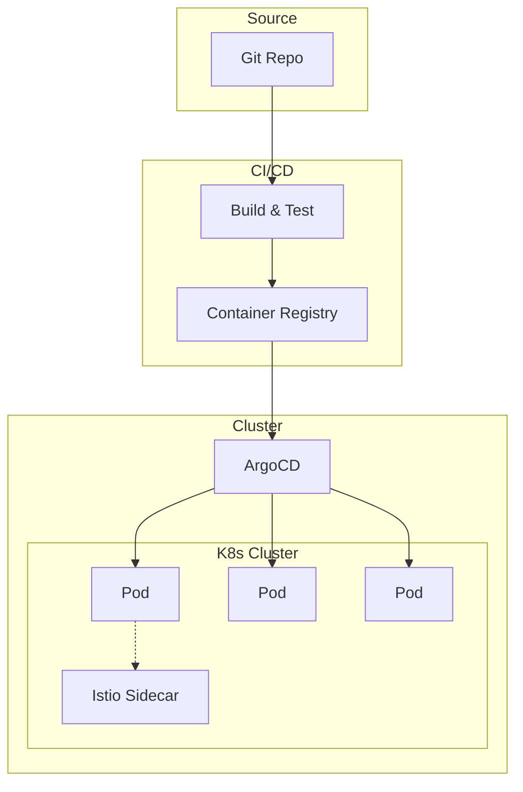
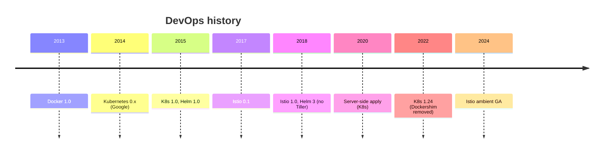
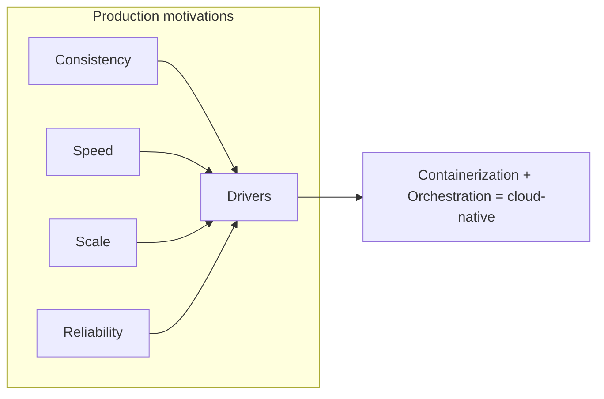
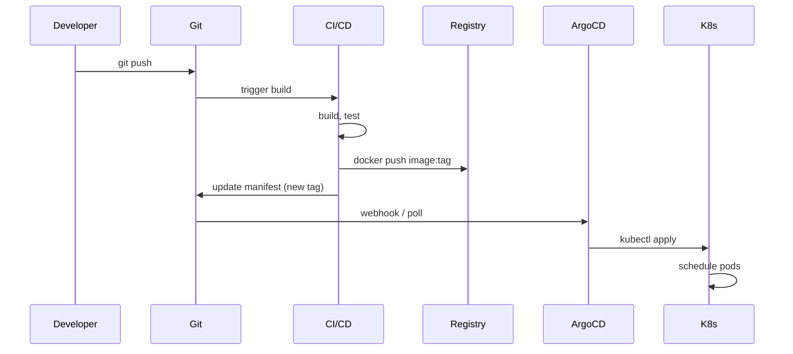
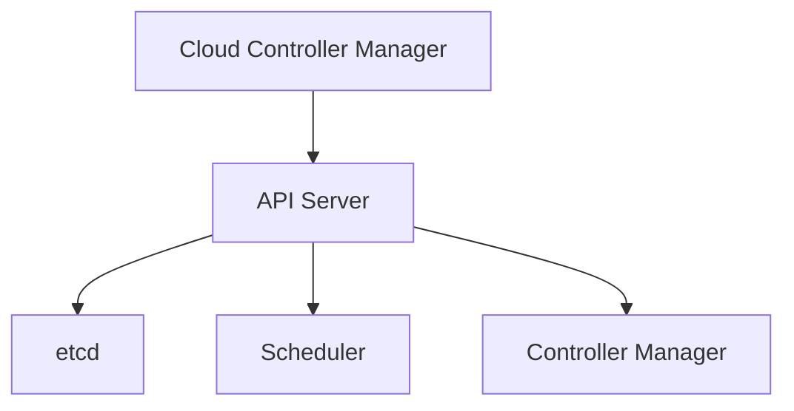
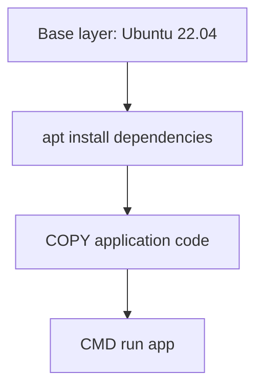
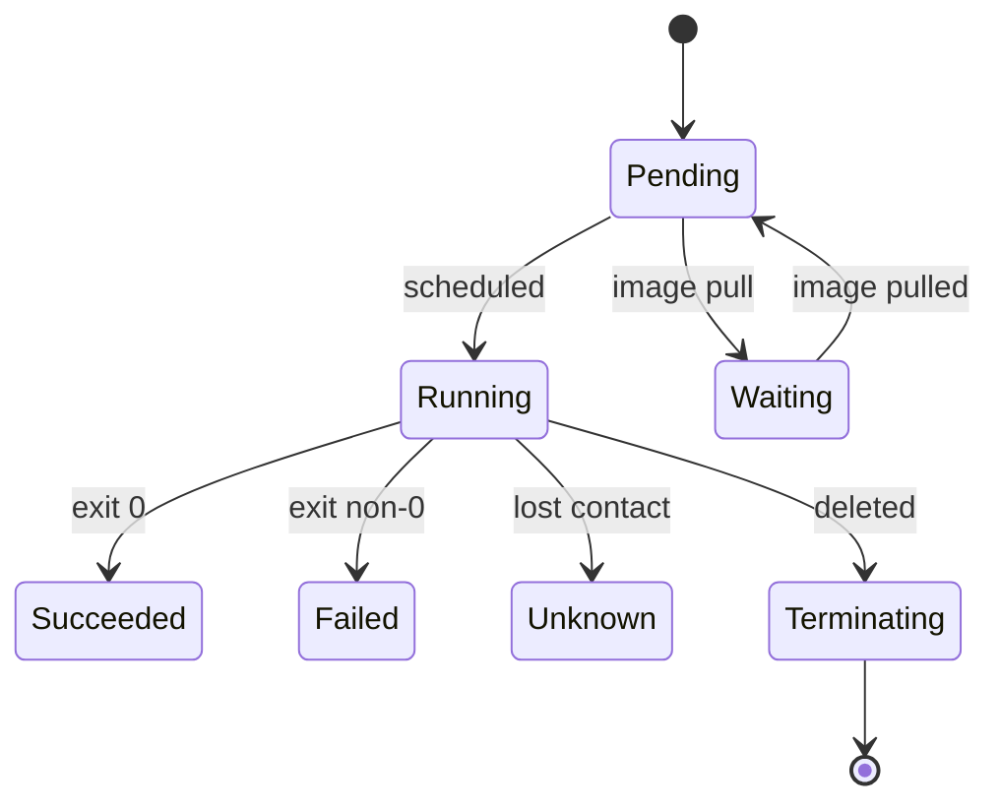
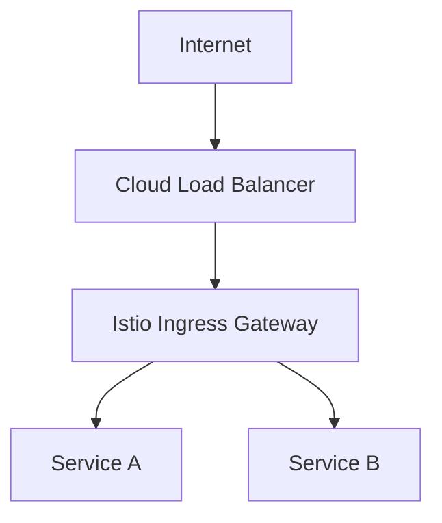
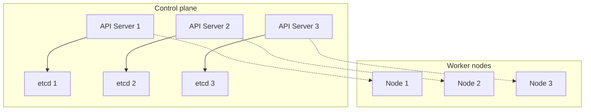
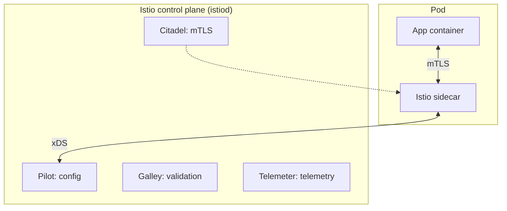

# DevOps (Docker, Kubernetes, Helm, Istio)

> A comprehensive, production-grade treatment of Docker, Kubernetes, Helm, Istio, GitOps, deployment strategies, and observability — from containers to service mesh.

---

## Table of Contents

1. [Overview](#1-overview)
2. [Definition](#2-definition)
3. [Five Ws + One H](#3-five-ws--one-h)
4. [History](#4-history)
5. [Problem Statement](#5-problem-statement)
6. [Real-World Motivation](#6-real-world-motivation)
7. [Internal Working](#7-internal-working)
8. [Deep Dive](#8-deep-dive)
9. [Architecture](#9-architecture)
10. [Performance](#10-performance)
11. [Security](#11-security)
12. [Production Engineering](#12-production-engineering)
13. [Production Case Studies](#13-production-case-studies)
14. [Code Examples](#14-code-examples)
15. [Common Mistakes](#15-common-mistakes)
16. [Debugging](#16-debugging)
17. [Monitoring & Observability](#17-monitoring--observability)
18. [Best Practices](#18-best-practices)
19. [Anti-Patterns](#19-anti-patterns)
20. [Edge Cases](#20-edge-cases)
21. [Comparisons](#21-comparisons)
22. [Interview Preparation](#22-interview-preparation)
23. [References](#23-references)

---

## 1. Overview

**DevOps** is the practice of combining software development (Dev) and IT operations (Ops) to shorten the systems development life cycle. Modern DevOps is built on **containerization** (Docker), **orchestration** (Kubernetes), **packaging** (Helm), and **service mesh** (Istio) — the four primary technologies this document covers.

This document treats **Docker** (containers and images), **Kubernetes** (workload orchestration), **Helm** (Kubernetes package manager), and **Istio** (service mesh) at production depth. It also covers **GitOps** (ArgoCD, Flux), **deployment strategies** (blue-green, canary, rolling, A/B, feature flags), and basic **observability** (Prometheus, Grafana, OpenTelemetry).

**Scope.** This is not a tutorial. It assumes you can already write a Dockerfile and run `kubectl`. It focuses on **production-grade patterns**: image optimization, workload design, networking, storage, security, deployment strategies, and operational concerns.

**Version baselines.** Docker 25+, Kubernetes 1.29+, Helm 3.x, Istio 1.21+, ArgoCD 2.10+.

## 2. Definition

The DevOps ecosystem uses overlapping terminology. Here's a precise taxonomy:

| Term | Type | Authoritative source |
|------|------|---------------------|
| **Container** | A standardized unit of software (image + runtime) | OCI |
| **Image** | A read-only template for containers | OCI |
| **Docker** | A container runtime and toolchain | docker.com |
| **OCI** | Open Container Initiative — image and runtime spec | opencontainers.org |
| **Containerd** | A container runtime (used by Docker and K8s) | containerd.io |
| **Kubernetes** | Container orchestration platform | kubernetes.io |
| **Pod** | The smallest deployable unit in K8s | K8s |
| **Deployment** | Manages a ReplicaSet of pods | K8s |
| **Service** | A stable network endpoint for a set of pods | K8s |
| **Ingress** | HTTP routing from outside the cluster | K8s |
| **Helm** | Package manager for K8s | helm.sh |
| **Chart** | A Helm package | helm.sh |
| **Istio** | A service mesh (mTLS, traffic management, observability) | istio.io |
| **Sidecar** | A container that runs alongside the main container | K8s / Istio pattern |
| **Service mesh** | Infrastructure for service-to-service communication | istio.io |
| **GitOps** | Declarative deployment from Git as the source of truth | open-gitops.dev |
| **ArgoCD** | GitOps continuous delivery tool for K8s | argoproj.github.io |
| **Blue-green** | Deployment with two environments, switch traffic | Deployment pattern |
| **Canary** | Deployment with gradual traffic shift | Deployment pattern |
| **Rolling** | Deployment with gradual replacement | Deployment pattern |
| **Feature flag** | Runtime toggle of features without redeployment | Deployment pattern |
| **HPA** | Horizontal Pod Autoscaler | K8s |
| **VPA** | Vertical Pod Autoscaler | K8s |
| **CRD** | Custom Resource Definition | K8s |
| **Operator** | A K8s controller that manages a custom resource | K8s pattern |
| **mTLS** | Mutual TLS — both sides authenticate | TLS |
| **CDN** | Content Delivery Network | — |

The standard reference architecture:



## 3. Five Ws + One H

### What <a class="askgpt-btn" href="https://chatgpt.com/?prompt=Read%20this%20section%20of%20my%20encyclopedia%20and%20explain%20it%20in%20depth%20with%20concrete%20examples%2C%20the%20main%20trade-offs%2C%20and%20common%20pitfalls%20a%20practitioner%20should%20know%3A%0A%0Ahttps%3A%2F%2Fgithub.com%2Fvishvasg14%2Fsoftware-engineering-encyclopedia%2Fblob%2Fmain%2F10-devops%2Fdevops.md%23what%0A%0ASection%20title%3A%20What" target="_blank" rel="noopener" data-askgpt="What" data-askgpt-url="https://github.com/vishvasg14/software-engineering-encyclopedia/blob/main/10-devops/devops.md#what" data-askgpt-prompt-depth="Read%20this%20section%20of%20my%20encyclopedia%20and%20explain%20it%20in%20depth%20with%20concrete%20examples%2C%20the%20main%20trade-offs%2C%20and%20common%20pitfalls%20a%20practitioner%20should%20know%3A%0A%0Ahttps%3A%2F%2Fgithub.com%2Fvishvasg14%2Fsoftware-engineering-encyclopedia%2Fblob%2Fmain%2F10-devops%2Fdevops.md%23what%0A%0ASection%20title%3A%20What" data-askgpt-prompt-examples="Read%20this%20section%20of%20my%20encyclopedia%20and%20give%20me%202-3%20real-world%20production%20examples%20for%20it.%20For%20each%3A%20what%20went%20right%2C%20what%20went%20wrong%2C%20and%20the%20lessons%20learned.%20Include%20company%20%2F%20project%20names%20if%20relevant.%0A%0Ahttps%3A%2F%2Fgithub.com%2Fvishvasg14%2Fsoftware-engineering-encyclopedia%2Fblob%2Fmain%2F10-devops%2Fdevops.md%23what%0A%0ASection%20title%3A%20What" title="Ask ChatGPT about this section">💬</a>

**Docker** is a container runtime. **Kubernetes** is a container orchestrator. **Helm** is a package manager for Kubernetes. **Istio** is a service mesh for service-to-service communication. Together, they form the foundation of cloud-native deployment.

### Why <a class="askgpt-btn" href="https://chatgpt.com/?prompt=Read%20this%20section%20of%20my%20encyclopedia%20and%20explain%20it%20in%20depth%20with%20concrete%20examples%2C%20the%20main%20trade-offs%2C%20and%20common%20pitfalls%20a%20practitioner%20should%20know%3A%0A%0Ahttps%3A%2F%2Fgithub.com%2Fvishvasg14%2Fsoftware-engineering-encyclopedia%2Fblob%2Fmain%2F10-devops%2Fdevops.md%23why%0A%0ASection%20title%3A%20Why" target="_blank" rel="noopener" data-askgpt="Why" data-askgpt-url="https://github.com/vishvasg14/software-engineering-encyclopedia/blob/main/10-devops/devops.md#why" data-askgpt-prompt-depth="Read%20this%20section%20of%20my%20encyclopedia%20and%20explain%20it%20in%20depth%20with%20concrete%20examples%2C%20the%20main%20trade-offs%2C%20and%20common%20pitfalls%20a%20practitioner%20should%20know%3A%0A%0Ahttps%3A%2F%2Fgithub.com%2Fvishvasg14%2Fsoftware-engineering-encyclopedia%2Fblob%2Fmain%2F10-devops%2Fdevops.md%23why%0A%0ASection%20title%3A%20Why" data-askgpt-prompt-examples="Read%20this%20section%20of%20my%20encyclopedia%20and%20give%20me%202-3%20real-world%20production%20examples%20for%20it.%20For%20each%3A%20what%20went%20right%2C%20what%20went%20wrong%2C%20and%20the%20lessons%20learned.%20Include%20company%20%2F%20project%20names%20if%20relevant.%0A%0Ahttps%3A%2F%2Fgithub.com%2Fvishvasg14%2Fsoftware-engineering-encyclopedia%2Fblob%2Fmain%2F10-devops%2Fdevops.md%23why%0A%0ASection%20title%3A%20Why" title="Ask ChatGPT about this section">💬</a>

Containers provide consistent environments across dev, test, and prod. Orchestrators manage container lifecycles at scale. Package managers standardize deployments. Service meshes add cross-cutting concerns (mTLS, observability, traffic management) without app changes.

### When <a class="askgpt-btn" href="https://chatgpt.com/?prompt=Read%20this%20section%20of%20my%20encyclopedia%20and%20explain%20it%20in%20depth%20with%20concrete%20examples%2C%20the%20main%20trade-offs%2C%20and%20common%20pitfalls%20a%20practitioner%20should%20know%3A%0A%0Ahttps%3A%2F%2Fgithub.com%2Fvishvasg14%2Fsoftware-engineering-encyclopedia%2Fblob%2Fmain%2F10-devops%2Fdevops.md%23when%0A%0ASection%20title%3A%20When" target="_blank" rel="noopener" data-askgpt="When" data-askgpt-url="https://github.com/vishvasg14/software-engineering-encyclopedia/blob/main/10-devops/devops.md#when" data-askgpt-prompt-depth="Read%20this%20section%20of%20my%20encyclopedia%20and%20explain%20it%20in%20depth%20with%20concrete%20examples%2C%20the%20main%20trade-offs%2C%20and%20common%20pitfalls%20a%20practitioner%20should%20know%3A%0A%0Ahttps%3A%2F%2Fgithub.com%2Fvishvasg14%2Fsoftware-engineering-encyclopedia%2Fblob%2Fmain%2F10-devops%2Fdevops.md%23when%0A%0ASection%20title%3A%20When" data-askgpt-prompt-examples="Read%20this%20section%20of%20my%20encyclopedia%20and%20give%20me%202-3%20real-world%20production%20examples%20for%20it.%20For%20each%3A%20what%20went%20right%2C%20what%20went%20wrong%2C%20and%20the%20lessons%20learned.%20Include%20company%20%2F%20project%20names%20if%20relevant.%0A%0Ahttps%3A%2F%2Fgithub.com%2Fvishvasg14%2Fsoftware-engineering-encyclopedia%2Fblob%2Fmain%2F10-devops%2Fdevops.md%23when%0A%0ASection%20title%3A%20When" title="Ask ChatGPT about this section">💬</a>

Docker (2013) introduced containers for the masses. Kubernetes (2014) was open-sourced by Google. Helm (2015) was created to template K8s manifests. Istio (2017) was created at Lyft. Now they're the de facto standard for cloud-native deployment.

### Where <a class="askgpt-btn" href="https://chatgpt.com/?prompt=Read%20this%20section%20of%20my%20encyclopedia%20and%20explain%20it%20in%20depth%20with%20concrete%20examples%2C%20the%20main%20trade-offs%2C%20and%20common%20pitfalls%20a%20practitioner%20should%20know%3A%0A%0Ahttps%3A%2F%2Fgithub.com%2Fvishvasg14%2Fsoftware-engineering-encyclopedia%2Fblob%2Fmain%2F10-devops%2Fdevops.md%23where%0A%0ASection%20title%3A%20Where" target="_blank" rel="noopener" data-askgpt="Where" data-askgpt-url="https://github.com/vishvasg14/software-engineering-encyclopedia/blob/main/10-devops/devops.md#where" data-askgpt-prompt-depth="Read%20this%20section%20of%20my%20encyclopedia%20and%20explain%20it%20in%20depth%20with%20concrete%20examples%2C%20the%20main%20trade-offs%2C%20and%20common%20pitfalls%20a%20practitioner%20should%20know%3A%0A%0Ahttps%3A%2F%2Fgithub.com%2Fvishvasg14%2Fsoftware-engineering-encyclopedia%2Fblob%2Fmain%2F10-devops%2Fdevops.md%23where%0A%0ASection%20title%3A%20Where" data-askgpt-prompt-examples="Read%20this%20section%20of%20my%20encyclopedia%20and%20give%20me%202-3%20real-world%20production%20examples%20for%20it.%20For%20each%3A%20what%20went%20right%2C%20what%20went%20wrong%2C%20and%20the%20lessons%20learned.%20Include%20company%20%2F%20project%20names%20if%20relevant.%0A%0Ahttps%3A%2F%2Fgithub.com%2Fvishvasg14%2Fsoftware-engineering-encyclopedia%2Fblob%2Fmain%2F10-devops%2Fdevops.md%23where%0A%0ASection%20title%3A%20Where" title="Ask ChatGPT about this section">💬</a>

Every web-scale company runs containers in production. Kubernetes is the standard orchestrator. Istio is increasingly adopted for service mesh.

### Who <a class="askgpt-btn" href="https://chatgpt.com/?prompt=Read%20this%20section%20of%20my%20encyclopedia%20and%20explain%20it%20in%20depth%20with%20concrete%20examples%2C%20the%20main%20trade-offs%2C%20and%20common%20pitfalls%20a%20practitioner%20should%20know%3A%0A%0Ahttps%3A%2F%2Fgithub.com%2Fvishvasg14%2Fsoftware-engineering-encyclopedia%2Fblob%2Fmain%2F10-devops%2Fdevops.md%23who%0A%0ASection%20title%3A%20Who" target="_blank" rel="noopener" data-askgpt="Who" data-askgpt-url="https://github.com/vishvasg14/software-engineering-encyclopedia/blob/main/10-devops/devops.md#who" data-askgpt-prompt-depth="Read%20this%20section%20of%20my%20encyclopedia%20and%20explain%20it%20in%20depth%20with%20concrete%20examples%2C%20the%20main%20trade-offs%2C%20and%20common%20pitfalls%20a%20practitioner%20should%20know%3A%0A%0Ahttps%3A%2F%2Fgithub.com%2Fvishvasg14%2Fsoftware-engineering-encyclopedia%2Fblob%2Fmain%2F10-devops%2Fdevops.md%23who%0A%0ASection%20title%3A%20Who" data-askgpt-prompt-examples="Read%20this%20section%20of%20my%20encyclopedia%20and%20give%20me%202-3%20real-world%20production%20examples%20for%20it.%20For%20each%3A%20what%20went%20right%2C%20what%20went%20wrong%2C%20and%20the%20lessons%20learned.%20Include%20company%20%2F%20project%20names%20if%20relevant.%0A%0Ahttps%3A%2F%2Fgithub.com%2Fvishvasg14%2Fsoftware-engineering-encyclopedia%2Fblob%2Fmain%2F10-devops%2Fdevops.md%23who%0A%0ASection%20title%3A%20Who" title="Ask ChatGPT about this section">💬</a>

- **Solomon Hykes:** Docker (2013).
- **Google:** Kubernetes (2014), open-sourced from Borg.
- **Deis Labs:** Helm (2015).
- **Lyft:** Envoy proxy (2014), Istio (2017) with IBM and Google.
- **Red Hat:** OpenShift.
- **CNCF:** hosts Kubernetes, Istio, ArgoCD, Prometheus, etcd.

### How (one-paragraph preview) <a class="askgpt-btn" href="https://chatgpt.com/?prompt=Read%20this%20section%20of%20my%20encyclopedia%20and%20explain%20it%20in%20depth%20with%20concrete%20examples%2C%20the%20main%20trade-offs%2C%20and%20common%20pitfalls%20a%20practitioner%20should%20know%3A%0A%0Ahttps%3A%2F%2Fgithub.com%2Fvishvasg14%2Fsoftware-engineering-encyclopedia%2Fblob%2Fmain%2F10-devops%2Fdevops.md%23how-one-paragraph-preview%0A%0ASection%20title%3A%20How%20(one-paragraph%20preview)" target="_blank" rel="noopener" data-askgpt="How (one-paragraph preview)" data-askgpt-url="https://github.com/vishvasg14/software-engineering-encyclopedia/blob/main/10-devops/devops.md#how-one-paragraph-preview" data-askgpt-prompt-depth="Read%20this%20section%20of%20my%20encyclopedia%20and%20explain%20it%20in%20depth%20with%20concrete%20examples%2C%20the%20main%20trade-offs%2C%20and%20common%20pitfalls%20a%20practitioner%20should%20know%3A%0A%0Ahttps%3A%2F%2Fgithub.com%2Fvishvasg14%2Fsoftware-engineering-encyclopedia%2Fblob%2Fmain%2F10-devops%2Fdevops.md%23how-one-paragraph-preview%0A%0ASection%20title%3A%20How%20(one-paragraph%20preview)" data-askgpt-prompt-examples="Read%20this%20section%20of%20my%20encyclopedia%20and%20give%20me%202-3%20real-world%20production%20examples%20for%20it.%20For%20each%3A%20what%20went%20right%2C%20what%20went%20wrong%2C%20and%20the%20lessons%20learned.%20Include%20company%20%2F%20project%20names%20if%20relevant.%0A%0Ahttps%3A%2F%2Fgithub.com%2Fvishvasg14%2Fsoftware-engineering-encyclopedia%2Fblob%2Fmain%2F10-devops%2Fdevops.md%23how-one-paragraph-preview%0A%0ASection%20title%3A%20How%20(one-paragraph%20preview)" title="Ask ChatGPT about this section">💬</a>

A developer writes code, packages it in a Docker image (multi-stage build for small size), pushes it to a container registry. CI builds, tests, and updates the image tag. GitOps (ArgoCD) watches the Git repository and syncs the cluster to match. Kubernetes schedules pods on nodes; pods are wrapped in Deployments for self-healing. Services provide stable network identities. Istio's sidecar proxies handle mTLS, retries, and observability. The developer never SSHes into a server; they update Git.

## 4. History

### 4.1 Origins (2000-2013) <a class="askgpt-btn" href="https://chatgpt.com/?prompt=Read%20this%20section%20of%20my%20encyclopedia%20and%20explain%20it%20in%20depth%20with%20concrete%20examples%2C%20the%20main%20trade-offs%2C%20and%20common%20pitfalls%20a%20practitioner%20should%20know%3A%0A%0Ahttps%3A%2F%2Fgithub.com%2Fvishvasg14%2Fsoftware-engineering-encyclopedia%2Fblob%2Fmain%2F10-devops%2Fdevops.md%2341-origins-2000-2013%0A%0ASection%20title%3A%204.1%20Origins%20(2000-2013)" target="_blank" rel="noopener" data-askgpt="4.1 Origins (2000-2013)" data-askgpt-url="https://github.com/vishvasg14/software-engineering-encyclopedia/blob/main/10-devops/devops.md#41-origins-2000-2013" data-askgpt-prompt-depth="Read%20this%20section%20of%20my%20encyclopedia%20and%20explain%20it%20in%20depth%20with%20concrete%20examples%2C%20the%20main%20trade-offs%2C%20and%20common%20pitfalls%20a%20practitioner%20should%20know%3A%0A%0Ahttps%3A%2F%2Fgithub.com%2Fvishvasg14%2Fsoftware-engineering-encyclopedia%2Fblob%2Fmain%2F10-devops%2Fdevops.md%2341-origins-2000-2013%0A%0ASection%20title%3A%204.1%20Origins%20(2000-2013)" data-askgpt-prompt-examples="Read%20this%20section%20of%20my%20encyclopedia%20and%20give%20me%202-3%20real-world%20production%20examples%20for%20it.%20For%20each%3A%20what%20went%20right%2C%20what%20went%20wrong%2C%20and%20the%20lessons%20learned.%20Include%20company%20%2F%20project%20names%20if%20relevant.%0A%0Ahttps%3A%2F%2Fgithub.com%2Fvishvasg14%2Fsoftware-engineering-encyclopedia%2Fblob%2Fmain%2F10-devops%2Fdevops.md%2341-origins-2000-2013%0A%0ASection%20title%3A%204.1%20Origins%20(2000-2013)" title="Ask ChatGPT about this section">💬</a>

- **2000s** — Physical servers; bare metal provisioning; long lead times.
- **2006** — Amazon EC2 launches cloud VMs; virtualization era.
- **2008** — LXC (Linux Containers) merged into kernel; cgroups mature.
- **2013** — Docker 1.0; containers become accessible.

### 4.2 The container era (2013-2015) <a class="askgpt-btn" href="https://chatgpt.com/?prompt=Read%20this%20section%20of%20my%20encyclopedia%20and%20explain%20it%20in%20depth%20with%20concrete%20examples%2C%20the%20main%20trade-offs%2C%20and%20common%20pitfalls%20a%20practitioner%20should%20know%3A%0A%0Ahttps%3A%2F%2Fgithub.com%2Fvishvasg14%2Fsoftware-engineering-encyclopedia%2Fblob%2Fmain%2F10-devops%2Fdevops.md%2342-the-container-era-2013-2015%0A%0ASection%20title%3A%204.2%20The%20container%20era%20(2013-2015)" target="_blank" rel="noopener" data-askgpt="4.2 The container era (2013-2015)" data-askgpt-url="https://github.com/vishvasg14/software-engineering-encyclopedia/blob/main/10-devops/devops.md#42-the-container-era-2013-2015" data-askgpt-prompt-depth="Read%20this%20section%20of%20my%20encyclopedia%20and%20explain%20it%20in%20depth%20with%20concrete%20examples%2C%20the%20main%20trade-offs%2C%20and%20common%20pitfalls%20a%20practitioner%20should%20know%3A%0A%0Ahttps%3A%2F%2Fgithub.com%2Fvishvasg14%2Fsoftware-engineering-encyclopedia%2Fblob%2Fmain%2F10-devops%2Fdevops.md%2342-the-container-era-2013-2015%0A%0ASection%20title%3A%204.2%20The%20container%20era%20(2013-2015)" data-askgpt-prompt-examples="Read%20this%20section%20of%20my%20encyclopedia%20and%20give%20me%202-3%20real-world%20production%20examples%20for%20it.%20For%20each%3A%20what%20went%20right%2C%20what%20went%20wrong%2C%20and%20the%20lessons%20learned.%20Include%20company%20%2F%20project%20names%20if%20relevant.%0A%0Ahttps%3A%2F%2Fgithub.com%2Fvishvasg14%2Fsoftware-engineering-encyclopedia%2Fblob%2Fmain%2F10-devops%2Fdevops.md%2342-the-container-era-2013-2015%0A%0ASection%20title%3A%204.2%20The%20container%20era%20(2013-2015)" title="Ask ChatGPT about this section">💬</a>

- **2013** — Docker announces at PyCon.
- **2014** — Docker Compose, Docker Hub. Kubernetes 0.x released by Google.
- **2015** — OCI (Open Container Initiative) founded. Kubernetes 1.0. CNCF founded.

### 4.3 The Kubernetes era (2015-2020) <a class="askgpt-btn" href="https://chatgpt.com/?prompt=Read%20this%20section%20of%20my%20encyclopedia%20and%20explain%20it%20in%20depth%20with%20concrete%20examples%2C%20the%20main%20trade-offs%2C%20and%20common%20pitfalls%20a%20practitioner%20should%20know%3A%0A%0Ahttps%3A%2F%2Fgithub.com%2Fvishvasg14%2Fsoftware-engineering-encyclopedia%2Fblob%2Fmain%2F10-devops%2Fdevops.md%2343-the-kubernetes-era-2015-2020%0A%0ASection%20title%3A%204.3%20The%20Kubernetes%20era%20(2015-2020)" target="_blank" rel="noopener" data-askgpt="4.3 The Kubernetes era (2015-2020)" data-askgpt-url="https://github.com/vishvasg14/software-engineering-encyclopedia/blob/main/10-devops/devops.md#43-the-kubernetes-era-2015-2020" data-askgpt-prompt-depth="Read%20this%20section%20of%20my%20encyclopedia%20and%20explain%20it%20in%20depth%20with%20concrete%20examples%2C%20the%20main%20trade-offs%2C%20and%20common%20pitfalls%20a%20practitioner%20should%20know%3A%0A%0Ahttps%3A%2F%2Fgithub.com%2Fvishvasg14%2Fsoftware-engineering-encyclopedia%2Fblob%2Fmain%2F10-devops%2Fdevops.md%2343-the-kubernetes-era-2015-2020%0A%0ASection%20title%3A%204.3%20The%20Kubernetes%20era%20(2015-2020)" data-askgpt-prompt-examples="Read%20this%20section%20of%20my%20encyclopedia%20and%20give%20me%202-3%20real-world%20production%20examples%20for%20it.%20For%20each%3A%20what%20went%20right%2C%20what%20went%20wrong%2C%20and%20the%20lessons%20learned.%20Include%20company%20%2F%20project%20names%20if%20relevant.%0A%0Ahttps%3A%2F%2Fgithub.com%2Fvishvasg14%2Fsoftware-engineering-encyclopedia%2Fblob%2Fmain%2F10-devops%2Fdevops.md%2343-the-kubernetes-era-2015-2020%0A%0ASection%20title%3A%204.3%20The%20Kubernetes%20era%20(2015-2020)" title="Ask ChatGPT about this section">💬</a>

- **2015** — Helm 1.0; K8s 1.0.
- **2016** — Helm 2; CNCF adopts K8s.
- **2017** — Istio 0.1; K8s 1.6 (RBAC stable).
- **2018** — Istio 1.0; Helm 3.0 (Tiller removed); K8s 1.10.
- **2019** — K8s 1.13 (CoreDNS default); Knative.

### 4.4 The cloud-native era (2020-2026) <a class="askgpt-btn" href="https://chatgpt.com/?prompt=Read%20this%20section%20of%20my%20encyclopedia%20and%20explain%20it%20in%20depth%20with%20concrete%20examples%2C%20the%20main%20trade-offs%2C%20and%20common%20pitfalls%20a%20practitioner%20should%20know%3A%0A%0Ahttps%3A%2F%2Fgithub.com%2Fvishvasg14%2Fsoftware-engineering-encyclopedia%2Fblob%2Fmain%2F10-devops%2Fdevops.md%2344-the-cloud-native-era-2020-2026%0A%0ASection%20title%3A%204.4%20The%20cloud-native%20era%20(2020-2026)" target="_blank" rel="noopener" data-askgpt="4.4 The cloud-native era (2020-2026)" data-askgpt-url="https://github.com/vishvasg14/software-engineering-encyclopedia/blob/main/10-devops/devops.md#44-the-cloud-native-era-2020-2026" data-askgpt-prompt-depth="Read%20this%20section%20of%20my%20encyclopedia%20and%20explain%20it%20in%20depth%20with%20concrete%20examples%2C%20the%20main%20trade-offs%2C%20and%20common%20pitfalls%20a%20practitioner%20should%20know%3A%0A%0Ahttps%3A%2F%2Fgithub.com%2Fvishvasg14%2Fsoftware-engineering-encyclopedia%2Fblob%2Fmain%2F10-devops%2Fdevops.md%2344-the-cloud-native-era-2020-2026%0A%0ASection%20title%3A%204.4%20The%20cloud-native%20era%20(2020-2026)" data-askgpt-prompt-examples="Read%20this%20section%20of%20my%20encyclopedia%20and%20give%20me%202-3%20real-world%20production%20examples%20for%20it.%20For%20each%3A%20what%20went%20right%2C%20what%20went%20wrong%2C%20and%20the%20lessons%20learned.%20Include%20company%20%2F%20project%20names%20if%20relevant.%0A%0Ahttps%3A%2F%2Fgithub.com%2Fvishvasg14%2Fsoftware-engineering-encyclopedia%2Fblob%2Fmain%2F10-devops%2Fdevops.md%2344-the-cloud-native-era-2020-2026%0A%0ASection%20title%3A%204.4%20The%20cloud-native%20era%20(2020-2026)" title="Ask ChatGPT about this section">💬</a>

- **2020** — K8s 1.18 (server-side apply); Istio 1.6.
- **2021** — ArgoCD matures; eBPF emerges.
- **2022** — K8s 1.24 (Dockershim removed); Istio 1.13.
- **2023** — K8s 1.27 (sidecar GA); Istio ambient beta.
- **2024** — Istio ambient GA; service mesh standard.
- **2025** — eBPF-based data planes mature.
- **2026** — WebAssembly (Wasm) in service mesh.



## 5. Problem Statement

### 5.1 What DevOps solves <a class="askgpt-btn" href="https://chatgpt.com/?prompt=Read%20this%20section%20of%20my%20encyclopedia%20and%20explain%20it%20in%20depth%20with%20concrete%20examples%2C%20the%20main%20trade-offs%2C%20and%20common%20pitfalls%20a%20practitioner%20should%20know%3A%0A%0Ahttps%3A%2F%2Fgithub.com%2Fvishvasg14%2Fsoftware-engineering-encyclopedia%2Fblob%2Fmain%2F10-devops%2Fdevops.md%2351-what-devops-solves%0A%0ASection%20title%3A%205.1%20What%20DevOps%20solves" target="_blank" rel="noopener" data-askgpt="5.1 What DevOps solves" data-askgpt-url="https://github.com/vishvasg14/software-engineering-encyclopedia/blob/main/10-devops/devops.md#51-what-devops-solves" data-askgpt-prompt-depth="Read%20this%20section%20of%20my%20encyclopedia%20and%20explain%20it%20in%20depth%20with%20concrete%20examples%2C%20the%20main%20trade-offs%2C%20and%20common%20pitfalls%20a%20practitioner%20should%20know%3A%0A%0Ahttps%3A%2F%2Fgithub.com%2Fvishvasg14%2Fsoftware-engineering-encyclopedia%2Fblob%2Fmain%2F10-devops%2Fdevops.md%2351-what-devops-solves%0A%0ASection%20title%3A%205.1%20What%20DevOps%20solves" data-askgpt-prompt-examples="Read%20this%20section%20of%20my%20encyclopedia%20and%20give%20me%202-3%20real-world%20production%20examples%20for%20it.%20For%20each%3A%20what%20went%20right%2C%20what%20went%20wrong%2C%20and%20the%20lessons%20learned.%20Include%20company%20%2F%20project%20names%20if%20relevant.%0A%0Ahttps%3A%2F%2Fgithub.com%2Fvishvasg14%2Fsoftware-engineering-encyclopedia%2Fblob%2Fmain%2F10-devops%2Fdevops.md%2351-what-devops-solves%0A%0ASection%20title%3A%205.1%20What%20DevOps%20solves" title="Ask ChatGPT about this section">💬</a>

- **"Works on my machine"** — containers ensure consistency.
- **Slow deployments** — CI/CD, blue-green, canary.
- **Manual operations** — automation, GitOps.
- **Inconsistency across environments** — Infrastructure as Code.
- **Scaling** — Kubernetes auto-scaling.
- **Service-to-service complexity** — service mesh.

### 5.2 What DevOps doesn't solve <a class="askgpt-btn" href="https://chatgpt.com/?prompt=Read%20this%20section%20of%20my%20encyclopedia%20and%20explain%20it%20in%20depth%20with%20concrete%20examples%2C%20the%20main%20trade-offs%2C%20and%20common%20pitfalls%20a%20practitioner%20should%20know%3A%0A%0Ahttps%3A%2F%2Fgithub.com%2Fvishvasg14%2Fsoftware-engineering-encyclopedia%2Fblob%2Fmain%2F10-devops%2Fdevops.md%2352-what-devops-doesnt-solve%0A%0ASection%20title%3A%205.2%20What%20DevOps%20doesn't%20solve" target="_blank" rel="noopener" data-askgpt="5.2 What DevOps doesn't solve" data-askgpt-url="https://github.com/vishvasg14/software-engineering-encyclopedia/blob/main/10-devops/devops.md#52-what-devops-doesnt-solve" data-askgpt-prompt-depth="Read%20this%20section%20of%20my%20encyclopedia%20and%20explain%20it%20in%20depth%20with%20concrete%20examples%2C%20the%20main%20trade-offs%2C%20and%20common%20pitfalls%20a%20practitioner%20should%20know%3A%0A%0Ahttps%3A%2F%2Fgithub.com%2Fvishvasg14%2Fsoftware-engineering-encyclopedia%2Fblob%2Fmain%2F10-devops%2Fdevops.md%2352-what-devops-doesnt-solve%0A%0ASection%20title%3A%205.2%20What%20DevOps%20doesn't%20solve" data-askgpt-prompt-examples="Read%20this%20section%20of%20my%20encyclopedia%20and%20give%20me%202-3%20real-world%20production%20examples%20for%20it.%20For%20each%3A%20what%20went%20right%2C%20what%20went%20wrong%2C%20and%20the%20lessons%20learned.%20Include%20company%20%2F%20project%20names%20if%20relevant.%0A%0Ahttps%3A%2F%2Fgithub.com%2Fvishvasg14%2Fsoftware-engineering-encyclopedia%2Fblob%2Fmain%2F10-devops%2Fdevops.md%2352-what-devops-doesnt-solve%0A%0ASection%20title%3A%205.2%20What%20DevOps%20doesn't%20solve" title="Ask ChatGPT about this section">💬</a>

- **Application architecture** — that's where system design helps.
- **Code quality** — that's where engineering practices help.
- **Business logic** — that's where DDD helps.

### 5.3 The cost of distributed systems <a class="askgpt-btn" href="https://chatgpt.com/?prompt=Read%20this%20section%20of%20my%20encyclopedia%20and%20explain%20it%20in%20depth%20with%20concrete%20examples%2C%20the%20main%20trade-offs%2C%20and%20common%20pitfalls%20a%20practitioner%20should%20know%3A%0A%0Ahttps%3A%2F%2Fgithub.com%2Fvishvasg14%2Fsoftware-engineering-encyclopedia%2Fblob%2Fmain%2F10-devops%2Fdevops.md%2353-the-cost-of-distributed-systems%0A%0ASection%20title%3A%205.3%20The%20cost%20of%20distributed%20systems" target="_blank" rel="noopener" data-askgpt="5.3 The cost of distributed systems" data-askgpt-url="https://github.com/vishvasg14/software-engineering-encyclopedia/blob/main/10-devops/devops.md#53-the-cost-of-distributed-systems" data-askgpt-prompt-depth="Read%20this%20section%20of%20my%20encyclopedia%20and%20explain%20it%20in%20depth%20with%20concrete%20examples%2C%20the%20main%20trade-offs%2C%20and%20common%20pitfalls%20a%20practitioner%20should%20know%3A%0A%0Ahttps%3A%2F%2Fgithub.com%2Fvishvasg14%2Fsoftware-engineering-encyclopedia%2Fblob%2Fmain%2F10-devops%2Fdevops.md%2353-the-cost-of-distributed-systems%0A%0ASection%20title%3A%205.3%20The%20cost%20of%20distributed%20systems" data-askgpt-prompt-examples="Read%20this%20section%20of%20my%20encyclopedia%20and%20give%20me%202-3%20real-world%20production%20examples%20for%20it.%20For%20each%3A%20what%20went%20right%2C%20what%20went%20wrong%2C%20and%20the%20lessons%20learned.%20Include%20company%20%2F%20project%20names%20if%20relevant.%0A%0Ahttps%3A%2F%2Fgithub.com%2Fvishvasg14%2Fsoftware-engineering-encyclopedia%2Fblob%2Fmain%2F10-devops%2Fdevops.md%2353-the-cost-of-distributed-systems%0A%0ASection%20title%3A%205.3%20The%20cost%20of%20distributed%20systems" title="Ask ChatGPT about this section">💬</a>

Kubernetes and service mesh add operational complexity. Smaller teams should consider managed services (EKS, GKE, AKS) or simpler abstractions (render.com, Fly.io).

## 6. Real-World Motivation

### 6.1 Google <a class="askgpt-btn" href="https://chatgpt.com/?prompt=Read%20this%20section%20of%20my%20encyclopedia%20and%20explain%20it%20in%20depth%20with%20concrete%20examples%2C%20the%20main%20trade-offs%2C%20and%20common%20pitfalls%20a%20practitioner%20should%20know%3A%0A%0Ahttps%3A%2F%2Fgithub.com%2Fvishvasg14%2Fsoftware-engineering-encyclopedia%2Fblob%2Fmain%2F10-devops%2Fdevops.md%2361-google%0A%0ASection%20title%3A%206.1%20Google" target="_blank" rel="noopener" data-askgpt="6.1 Google" data-askgpt-url="https://github.com/vishvasg14/software-engineering-encyclopedia/blob/main/10-devops/devops.md#61-google" data-askgpt-prompt-depth="Read%20this%20section%20of%20my%20encyclopedia%20and%20explain%20it%20in%20depth%20with%20concrete%20examples%2C%20the%20main%20trade-offs%2C%20and%20common%20pitfalls%20a%20practitioner%20should%20know%3A%0A%0Ahttps%3A%2F%2Fgithub.com%2Fvishvasg14%2Fsoftware-engineering-encyclopedia%2Fblob%2Fmain%2F10-devops%2Fdevops.md%2361-google%0A%0ASection%20title%3A%206.1%20Google" data-askgpt-prompt-examples="Read%20this%20section%20of%20my%20encyclopedia%20and%20give%20me%202-3%20real-world%20production%20examples%20for%20it.%20For%20each%3A%20what%20went%20right%2C%20what%20went%20wrong%2C%20and%20the%20lessons%20learned.%20Include%20company%20%2F%20project%20names%20if%20relevant.%0A%0Ahttps%3A%2F%2Fgithub.com%2Fvishvasg14%2Fsoftware-engineering-encyclopedia%2Fblob%2Fmain%2F10-devops%2Fdevops.md%2361-google%0A%0ASection%20title%3A%206.1%20Google" title="Ask ChatGPT about this section">💬</a>

The original Kubernetes author. GKE runs millions of containers. Borg (predecessor) inspired Kubernetes.

### 6.2 Netflix <a class="askgpt-btn" href="https://chatgpt.com/?prompt=Read%20this%20section%20of%20my%20encyclopedia%20and%20explain%20it%20in%20depth%20with%20concrete%20examples%2C%20the%20main%20trade-offs%2C%20and%20common%20pitfalls%20a%20practitioner%20should%20know%3A%0A%0Ahttps%3A%2F%2Fgithub.com%2Fvishvasg14%2Fsoftware-engineering-encyclopedia%2Fblob%2Fmain%2F10-devops%2Fdevops.md%2362-netflix%0A%0ASection%20title%3A%206.2%20Netflix" target="_blank" rel="noopener" data-askgpt="6.2 Netflix" data-askgpt-url="https://github.com/vishvasg14/software-engineering-encyclopedia/blob/main/10-devops/devops.md#62-netflix" data-askgpt-prompt-depth="Read%20this%20section%20of%20my%20encyclopedia%20and%20explain%20it%20in%20depth%20with%20concrete%20examples%2C%20the%20main%20trade-offs%2C%20and%20common%20pitfalls%20a%20practitioner%20should%20know%3A%0A%0Ahttps%3A%2F%2Fgithub.com%2Fvishvasg14%2Fsoftware-engineering-encyclopedia%2Fblob%2Fmain%2F10-devops%2Fdevops.md%2362-netflix%0A%0ASection%20title%3A%206.2%20Netflix" data-askgpt-prompt-examples="Read%20this%20section%20of%20my%20encyclopedia%20and%20give%20me%202-3%20real-world%20production%20examples%20for%20it.%20For%20each%3A%20what%20went%20right%2C%20what%20went%20wrong%2C%20and%20the%20lessons%20learned.%20Include%20company%20%2F%20project%20names%20if%20relevant.%0A%0Ahttps%3A%2F%2Fgithub.com%2Fvishvasg14%2Fsoftware-engineering-encyclopedia%2Fblob%2Fmain%2F10-devops%2Fdevops.md%2362-netflix%0A%0ASection%20title%3A%206.2%20Netflix" title="Ask ChatGPT about this section">💬</a>

Runs on AWS EKS. Microservices on K8s with extensive CI/CD.

### 6.3 Spotify <a class="askgpt-btn" href="https://chatgpt.com/?prompt=Read%20this%20section%20of%20my%20encyclopedia%20and%20explain%20it%20in%20depth%20with%20concrete%20examples%2C%20the%20main%20trade-offs%2C%20and%20common%20pitfalls%20a%20practitioner%20should%20know%3A%0A%0Ahttps%3A%2F%2Fgithub.com%2Fvishvasg14%2Fsoftware-engineering-encyclopedia%2Fblob%2Fmain%2F10-devops%2Fdevops.md%2363-spotify%0A%0ASection%20title%3A%206.3%20Spotify" target="_blank" rel="noopener" data-askgpt="6.3 Spotify" data-askgpt-url="https://github.com/vishvasg14/software-engineering-encyclopedia/blob/main/10-devops/devops.md#63-spotify" data-askgpt-prompt-depth="Read%20this%20section%20of%20my%20encyclopedia%20and%20explain%20it%20in%20depth%20with%20concrete%20examples%2C%20the%20main%20trade-offs%2C%20and%20common%20pitfalls%20a%20practitioner%20should%20know%3A%0A%0Ahttps%3A%2F%2Fgithub.com%2Fvishvasg14%2Fsoftware-engineering-encyclopedia%2Fblob%2Fmain%2F10-devops%2Fdevops.md%2363-spotify%0A%0ASection%20title%3A%206.3%20Spotify" data-askgpt-prompt-examples="Read%20this%20section%20of%20my%20encyclopedia%20and%20give%20me%202-3%20real-world%20production%20examples%20for%20it.%20For%20each%3A%20what%20went%20right%2C%20what%20went%20wrong%2C%20and%20the%20lessons%20learned.%20Include%20company%20%2F%20project%20names%20if%20relevant.%0A%0Ahttps%3A%2F%2Fgithub.com%2Fvishvasg14%2Fsoftware-engineering-encyclopedia%2Fblob%2Fmain%2F10-devops%2Fdevops.md%2363-spotify%0A%0ASection%20title%3A%206.3%20Spotify" title="Ask ChatGPT about this section">💬</a>

Migrated to K8s. Built their own operator (Backstage). Open-sourced many tools.

### 6.4 Airbnb <a class="askgpt-btn" href="https://chatgpt.com/?prompt=Read%20this%20section%20of%20my%20encyclopedia%20and%20explain%20it%20in%20depth%20with%20concrete%20examples%2C%20the%20main%20trade-offs%2C%20and%20common%20pitfalls%20a%20practitioner%20should%20know%3A%0A%0Ahttps%3A%2F%2Fgithub.com%2Fvishvasg14%2Fsoftware-engineering-encyclopedia%2Fblob%2Fmain%2F10-devops%2Fdevops.md%2364-airbnb%0A%0ASection%20title%3A%206.4%20Airbnb" target="_blank" rel="noopener" data-askgpt="6.4 Airbnb" data-askgpt-url="https://github.com/vishvasg14/software-engineering-encyclopedia/blob/main/10-devops/devops.md#64-airbnb" data-askgpt-prompt-depth="Read%20this%20section%20of%20my%20encyclopedia%20and%20explain%20it%20in%20depth%20with%20concrete%20examples%2C%20the%20main%20trade-offs%2C%20and%20common%20pitfalls%20a%20practitioner%20should%20know%3A%0A%0Ahttps%3A%2F%2Fgithub.com%2Fvishvasg14%2Fsoftware-engineering-encyclopedia%2Fblob%2Fmain%2F10-devops%2Fdevops.md%2364-airbnb%0A%0ASection%20title%3A%206.4%20Airbnb" data-askgpt-prompt-examples="Read%20this%20section%20of%20my%20encyclopedia%20and%20give%20me%202-3%20real-world%20production%20examples%20for%20it.%20For%20each%3A%20what%20went%20right%2C%20what%20went%20wrong%2C%20and%20the%20lessons%20learned.%20Include%20company%20%2F%20project%20names%20if%20relevant.%0A%0Ahttps%3A%2F%2Fgithub.com%2Fvishvasg14%2Fsoftware-engineering-encyclopedia%2Fblob%2Fmain%2F10-devops%2Fdevops.md%2364-airbnb%0A%0ASection%20title%3A%206.4%20Airbnb" title="Ask ChatGPT about this section">💬</a>

Runs K8s at scale. Built infrastructure-as-code (AirbnbClone).

### 6.5 Capital One <a class="askgpt-btn" href="https://chatgpt.com/?prompt=Read%20this%20section%20of%20my%20encyclopedia%20and%20explain%20it%20in%20depth%20with%20concrete%20examples%2C%20the%20main%20trade-offs%2C%20and%20common%20pitfalls%20a%20practitioner%20should%20know%3A%0A%0Ahttps%3A%2F%2Fgithub.com%2Fvishvasg14%2Fsoftware-engineering-encyclopedia%2Fblob%2Fmain%2F10-devops%2Fdevops.md%2365-capital-one%0A%0ASection%20title%3A%206.5%20Capital%20One" target="_blank" rel="noopener" data-askgpt="6.5 Capital One" data-askgpt-url="https://github.com/vishvasg14/software-engineering-encyclopedia/blob/main/10-devops/devops.md#65-capital-one" data-askgpt-prompt-depth="Read%20this%20section%20of%20my%20encyclopedia%20and%20explain%20it%20in%20depth%20with%20concrete%20examples%2C%20the%20main%20trade-offs%2C%20and%20common%20pitfalls%20a%20practitioner%20should%20know%3A%0A%0Ahttps%3A%2F%2Fgithub.com%2Fvishvasg14%2Fsoftware-engineering-encyclopedia%2Fblob%2Fmain%2F10-devops%2Fdevops.md%2365-capital-one%0A%0ASection%20title%3A%206.5%20Capital%20One" data-askgpt-prompt-examples="Read%20this%20section%20of%20my%20encyclopedia%20and%20give%20me%202-3%20real-world%20production%20examples%20for%20it.%20For%20each%3A%20what%20went%20right%2C%20what%20went%20wrong%2C%20and%20the%20lessons%20learned.%20Include%20company%20%2F%20project%20names%20if%20relevant.%0A%0Ahttps%3A%2F%2Fgithub.com%2Fvishvasg14%2Fsoftware-engineering-encyclopedia%2Fblob%2Fmain%2F10-devops%2Fdevops.md%2365-capital-one%0A%0ASection%20title%3A%206.5%20Capital%20One" title="Ask ChatGPT about this section">💬</a>

Banking on K8s. Heavy compliance requirements.

### 6.6 GitHub <a class="askgpt-btn" href="https://chatgpt.com/?prompt=Read%20this%20section%20of%20my%20encyclopedia%20and%20explain%20it%20in%20depth%20with%20concrete%20examples%2C%20the%20main%20trade-offs%2C%20and%20common%20pitfalls%20a%20practitioner%20should%20know%3A%0A%0Ahttps%3A%2F%2Fgithub.com%2Fvishvasg14%2Fsoftware-engineering-encyclopedia%2Fblob%2Fmain%2F10-devops%2Fdevops.md%2366-github%0A%0ASection%20title%3A%206.6%20GitHub" target="_blank" rel="noopener" data-askgpt="6.6 GitHub" data-askgpt-url="https://github.com/vishvasg14/software-engineering-encyclopedia/blob/main/10-devops/devops.md#66-github" data-askgpt-prompt-depth="Read%20this%20section%20of%20my%20encyclopedia%20and%20explain%20it%20in%20depth%20with%20concrete%20examples%2C%20the%20main%20trade-offs%2C%20and%20common%20pitfalls%20a%20practitioner%20should%20know%3A%0A%0Ahttps%3A%2F%2Fgithub.com%2Fvishvasg14%2Fsoftware-engineering-encyclopedia%2Fblob%2Fmain%2F10-devops%2Fdevops.md%2366-github%0A%0ASection%20title%3A%206.6%20GitHub" data-askgpt-prompt-examples="Read%20this%20section%20of%20my%20encyclopedia%20and%20give%20me%202-3%20real-world%20production%20examples%20for%20it.%20For%20each%3A%20what%20went%20right%2C%20what%20went%20wrong%2C%20and%20the%20lessons%20learned.%20Include%20company%20%2F%20project%20names%20if%20relevant.%0A%0Ahttps%3A%2F%2Fgithub.com%2Fvishvasg14%2Fsoftware-engineering-encyclopedia%2Fblob%2Fmain%2F10-devops%2Fdevops.md%2366-github%0A%0ASection%20title%3A%206.6%20GitHub" title="Ask ChatGPT about this section">💬</a>

GitHub Actions for CI. GitOps workflows for deployments.



---

## 7. Internal Working

### 7.1 The deployment pipeline <a class="askgpt-btn" href="https://chatgpt.com/?prompt=Read%20this%20section%20of%20my%20encyclopedia%20and%20explain%20it%20in%20depth%20with%20concrete%20examples%2C%20the%20main%20trade-offs%2C%20and%20common%20pitfalls%20a%20practitioner%20should%20know%3A%0A%0Ahttps%3A%2F%2Fgithub.com%2Fvishvasg14%2Fsoftware-engineering-encyclopedia%2Fblob%2Fmain%2F10-devops%2Fdevops.md%2371-the-deployment-pipeline%0A%0ASection%20title%3A%207.1%20The%20deployment%20pipeline" target="_blank" rel="noopener" data-askgpt="7.1 The deployment pipeline" data-askgpt-url="https://github.com/vishvasg14/software-engineering-encyclopedia/blob/main/10-devops/devops.md#71-the-deployment-pipeline" data-askgpt-prompt-depth="Read%20this%20section%20of%20my%20encyclopedia%20and%20explain%20it%20in%20depth%20with%20concrete%20examples%2C%20the%20main%20trade-offs%2C%20and%20common%20pitfalls%20a%20practitioner%20should%20know%3A%0A%0Ahttps%3A%2F%2Fgithub.com%2Fvishvasg14%2Fsoftware-engineering-encyclopedia%2Fblob%2Fmain%2F10-devops%2Fdevops.md%2371-the-deployment-pipeline%0A%0ASection%20title%3A%207.1%20The%20deployment%20pipeline" data-askgpt-prompt-examples="Read%20this%20section%20of%20my%20encyclopedia%20and%20give%20me%202-3%20real-world%20production%20examples%20for%20it.%20For%20each%3A%20what%20went%20right%2C%20what%20went%20wrong%2C%20and%20the%20lessons%20learned.%20Include%20company%20%2F%20project%20names%20if%20relevant.%0A%0Ahttps%3A%2F%2Fgithub.com%2Fvishvasg14%2Fsoftware-engineering-encyclopedia%2Fblob%2Fmain%2F10-devops%2Fdevops.md%2371-the-deployment-pipeline%0A%0ASection%20title%3A%207.1%20The%20deployment%20pipeline" title="Ask ChatGPT about this section">💬</a>



### 7.2 Subsystems that participate <a class="askgpt-btn" href="https://chatgpt.com/?prompt=Read%20this%20section%20of%20my%20encyclopedia%20and%20explain%20it%20in%20depth%20with%20concrete%20examples%2C%20the%20main%20trade-offs%2C%20and%20common%20pitfalls%20a%20practitioner%20should%20know%3A%0A%0Ahttps%3A%2F%2Fgithub.com%2Fvishvasg14%2Fsoftware-engineering-encyclopedia%2Fblob%2Fmain%2F10-devops%2Fdevops.md%2372-subsystems-that-participate%0A%0ASection%20title%3A%207.2%20Subsystems%20that%20participate" target="_blank" rel="noopener" data-askgpt="7.2 Subsystems that participate" data-askgpt-url="https://github.com/vishvasg14/software-engineering-encyclopedia/blob/main/10-devops/devops.md#72-subsystems-that-participate" data-askgpt-prompt-depth="Read%20this%20section%20of%20my%20encyclopedia%20and%20explain%20it%20in%20depth%20with%20concrete%20examples%2C%20the%20main%20trade-offs%2C%20and%20common%20pitfalls%20a%20practitioner%20should%20know%3A%0A%0Ahttps%3A%2F%2Fgithub.com%2Fvishvasg14%2Fsoftware-engineering-encyclopedia%2Fblob%2Fmain%2F10-devops%2Fdevops.md%2372-subsystems-that-participate%0A%0ASection%20title%3A%207.2%20Subsystems%20that%20participate" data-askgpt-prompt-examples="Read%20this%20section%20of%20my%20encyclopedia%20and%20give%20me%202-3%20real-world%20production%20examples%20for%20it.%20For%20each%3A%20what%20went%20right%2C%20what%20went%20wrong%2C%20and%20the%20lessons%20learned.%20Include%20company%20%2F%20project%20names%20if%20relevant.%0A%0Ahttps%3A%2F%2Fgithub.com%2Fvishvasg14%2Fsoftware-engineering-encyclopedia%2Fblob%2Fmain%2F10-devops%2Fdevops.md%2372-subsystems-that-participate%0A%0ASection%20title%3A%207.2%20Subsystems%20that%20participate" title="Ask ChatGPT about this section">💬</a>

| Subsystem | Responsibility |
|-----------|---------------|
| **Git** | Source of truth for code and manifests |
| **CI/CD** | Build, test, push image |
| **Registry** | Store container images |
| **GitOps** | Sync cluster to Git |
| **K8s control plane** | API server, scheduler, etcd |
| **K8s worker nodes** | kubelet, kube-proxy, container runtime |
| **Service mesh** | mTLS, traffic management, observability |
| **Observability** | Metrics, logs, traces |

### 7.3 K8s control plane <a class="askgpt-btn" href="https://chatgpt.com/?prompt=Read%20this%20section%20of%20my%20encyclopedia%20and%20explain%20it%20in%20depth%20with%20concrete%20examples%2C%20the%20main%20trade-offs%2C%20and%20common%20pitfalls%20a%20practitioner%20should%20know%3A%0A%0Ahttps%3A%2F%2Fgithub.com%2Fvishvasg14%2Fsoftware-engineering-encyclopedia%2Fblob%2Fmain%2F10-devops%2Fdevops.md%2373-k8s-control-plane%0A%0ASection%20title%3A%207.3%20K8s%20control%20plane" target="_blank" rel="noopener" data-askgpt="7.3 K8s control plane" data-askgpt-url="https://github.com/vishvasg14/software-engineering-encyclopedia/blob/main/10-devops/devops.md#73-k8s-control-plane" data-askgpt-prompt-depth="Read%20this%20section%20of%20my%20encyclopedia%20and%20explain%20it%20in%20depth%20with%20concrete%20examples%2C%20the%20main%20trade-offs%2C%20and%20common%20pitfalls%20a%20practitioner%20should%20know%3A%0A%0Ahttps%3A%2F%2Fgithub.com%2Fvishvasg14%2Fsoftware-engineering-encyclopedia%2Fblob%2Fmain%2F10-devops%2Fdevops.md%2373-k8s-control-plane%0A%0ASection%20title%3A%207.3%20K8s%20control%20plane" data-askgpt-prompt-examples="Read%20this%20section%20of%20my%20encyclopedia%20and%20give%20me%202-3%20real-world%20production%20examples%20for%20it.%20For%20each%3A%20what%20went%20right%2C%20what%20went%20wrong%2C%20and%20the%20lessons%20learned.%20Include%20company%20%2F%20project%20names%20if%20relevant.%0A%0Ahttps%3A%2F%2Fgithub.com%2Fvishvasg14%2Fsoftware-engineering-encyclopedia%2Fblob%2Fmain%2F10-devops%2Fdevops.md%2373-k8s-control-plane%0A%0ASection%20title%3A%207.3%20K8s%20control%20plane" title="Ask ChatGPT about this section">💬</a>



---

## 8. Deep Dive

This section is the heart of the document.

### 8.1 Docker <a class="askgpt-btn" href="https://chatgpt.com/?prompt=Read%20this%20section%20of%20my%20encyclopedia%20and%20explain%20it%20in%20depth%20with%20concrete%20examples%2C%20the%20main%20trade-offs%2C%20and%20common%20pitfalls%20a%20practitioner%20should%20know%3A%0A%0Ahttps%3A%2F%2Fgithub.com%2Fvishvasg14%2Fsoftware-engineering-encyclopedia%2Fblob%2Fmain%2F10-devops%2Fdevops.md%2381-docker%0A%0ASection%20title%3A%208.1%20Docker" target="_blank" rel="noopener" data-askgpt="8.1 Docker" data-askgpt-url="https://github.com/vishvasg14/software-engineering-encyclopedia/blob/main/10-devops/devops.md#81-docker" data-askgpt-prompt-depth="Read%20this%20section%20of%20my%20encyclopedia%20and%20explain%20it%20in%20depth%20with%20concrete%20examples%2C%20the%20main%20trade-offs%2C%20and%20common%20pitfalls%20a%20practitioner%20should%20know%3A%0A%0Ahttps%3A%2F%2Fgithub.com%2Fvishvasg14%2Fsoftware-engineering-encyclopedia%2Fblob%2Fmain%2F10-devops%2Fdevops.md%2381-docker%0A%0ASection%20title%3A%208.1%20Docker" data-askgpt-prompt-examples="Read%20this%20section%20of%20my%20encyclopedia%20and%20give%20me%202-3%20real-world%20production%20examples%20for%20it.%20For%20each%3A%20what%20went%20right%2C%20what%20went%20wrong%2C%20and%20the%20lessons%20learned.%20Include%20company%20%2F%20project%20names%20if%20relevant.%0A%0Ahttps%3A%2F%2Fgithub.com%2Fvishvasg14%2Fsoftware-engineering-encyclopedia%2Fblob%2Fmain%2F10-devops%2Fdevops.md%2381-docker%0A%0ASection%20title%3A%208.1%20Docker" title="Ask ChatGPT about this section">💬</a>

A Docker image is a **layered, immutable filesystem**. Layers are stacked:



Each instruction in a Dockerfile creates a layer. Layers are cached; only changed layers are rebuilt.

**Dockerfile best practices:**

- **Multi-stage builds:** separate build and runtime.
- **Small base images:** `alpine` or `distroless`.
- **Layer caching:** order instructions from least-changed to most-changed.
- **`.dockerignore`:** exclude irrelevant files.
- **Non-root user:** `USER appuser`.
- **Specific tags:** avoid `latest` in production.
- **Combine RUN:** `RUN apt-get update && apt-get install -y pkg && rm -rf /var/lib/apt/lists/*`.

### 8.2 Multi-stage builds <a class="askgpt-btn" href="https://chatgpt.com/?prompt=Read%20this%20section%20of%20my%20encyclopedia%20and%20explain%20it%20in%20depth%20with%20concrete%20examples%2C%20the%20main%20trade-offs%2C%20and%20common%20pitfalls%20a%20practitioner%20should%20know%3A%0A%0Ahttps%3A%2F%2Fgithub.com%2Fvishvasg14%2Fsoftware-engineering-encyclopedia%2Fblob%2Fmain%2F10-devops%2Fdevops.md%2382-multi-stage-builds%0A%0ASection%20title%3A%208.2%20Multi-stage%20builds" target="_blank" rel="noopener" data-askgpt="8.2 Multi-stage builds" data-askgpt-url="https://github.com/vishvasg14/software-engineering-encyclopedia/blob/main/10-devops/devops.md#82-multi-stage-builds" data-askgpt-prompt-depth="Read%20this%20section%20of%20my%20encyclopedia%20and%20explain%20it%20in%20depth%20with%20concrete%20examples%2C%20the%20main%20trade-offs%2C%20and%20common%20pitfalls%20a%20practitioner%20should%20know%3A%0A%0Ahttps%3A%2F%2Fgithub.com%2Fvishvasg14%2Fsoftware-engineering-encyclopedia%2Fblob%2Fmain%2F10-devops%2Fdevops.md%2382-multi-stage-builds%0A%0ASection%20title%3A%208.2%20Multi-stage%20builds" data-askgpt-prompt-examples="Read%20this%20section%20of%20my%20encyclopedia%20and%20give%20me%202-3%20real-world%20production%20examples%20for%20it.%20For%20each%3A%20what%20went%20right%2C%20what%20went%20wrong%2C%20and%20the%20lessons%20learned.%20Include%20company%20%2F%20project%20names%20if%20relevant.%0A%0Ahttps%3A%2F%2Fgithub.com%2Fvishvasg14%2Fsoftware-engineering-encyclopedia%2Fblob%2Fmain%2F10-devops%2Fdevops.md%2382-multi-stage-builds%0A%0ASection%20title%3A%208.2%20Multi-stage%20builds" title="Ask ChatGPT about this section">💬</a>

```dockerfile
# Build stage
FROM node:20-alpine AS build
WORKDIR /app
COPY package*.json ./
RUN npm ci
COPY . .
RUN npm run build

# Runtime stage
FROM nginx:alpine
COPY --from=build /app/dist /usr/share/nginx/html
```

Multi-stage builds keep the runtime image small (no build tools).

### 8.3 Kubernetes architecture <a class="askgpt-btn" href="https://chatgpt.com/?prompt=Read%20this%20section%20of%20my%20encyclopedia%20and%20explain%20it%20in%20depth%20with%20concrete%20examples%2C%20the%20main%20trade-offs%2C%20and%20common%20pitfalls%20a%20practitioner%20should%20know%3A%0A%0Ahttps%3A%2F%2Fgithub.com%2Fvishvasg14%2Fsoftware-engineering-encyclopedia%2Fblob%2Fmain%2F10-devops%2Fdevops.md%2383-kubernetes-architecture%0A%0ASection%20title%3A%208.3%20Kubernetes%20architecture" target="_blank" rel="noopener" data-askgpt="8.3 Kubernetes architecture" data-askgpt-url="https://github.com/vishvasg14/software-engineering-encyclopedia/blob/main/10-devops/devops.md#83-kubernetes-architecture" data-askgpt-prompt-depth="Read%20this%20section%20of%20my%20encyclopedia%20and%20explain%20it%20in%20depth%20with%20concrete%20examples%2C%20the%20main%20trade-offs%2C%20and%20common%20pitfalls%20a%20practitioner%20should%20know%3A%0A%0Ahttps%3A%2F%2Fgithub.com%2Fvishvasg14%2Fsoftware-engineering-encyclopedia%2Fblob%2Fmain%2F10-devops%2Fdevops.md%2383-kubernetes-architecture%0A%0ASection%20title%3A%208.3%20Kubernetes%20architecture" data-askgpt-prompt-examples="Read%20this%20section%20of%20my%20encyclopedia%20and%20give%20me%202-3%20real-world%20production%20examples%20for%20it.%20For%20each%3A%20what%20went%20right%2C%20what%20went%20wrong%2C%20and%20the%20lessons%20learned.%20Include%20company%20%2F%20project%20names%20if%20relevant.%0A%0Ahttps%3A%2F%2Fgithub.com%2Fvishvasg14%2Fsoftware-engineering-encyclopedia%2Fblob%2Fmain%2F10-devops%2Fdevops.md%2383-kubernetes-architecture%0A%0ASection%20title%3A%208.3%20Kubernetes%20architecture" title="Ask ChatGPT about this section">💬</a>

**Control plane** (manages the cluster):

- **API Server (`kube-apiserver`):** the front-end; the only component that talks to etcd.
- **etcd:** distributed key-value store; stores all cluster state.
- **Scheduler (`kube-scheduler`):** assigns pods to nodes.
- **Controller Manager (`kube-controller-manager`):** runs controllers (Deployment, ReplicaSet, etc.).
- **Cloud Controller Manager:** cloud-provider-specific logic.

**Worker nodes** (run pods):

- **kubelet:** agent; ensures pods are running.
- **kube-proxy:** maintains network rules.
- **Container runtime:** containerd or CRI-O.

### 8.4 Pod lifecycle <a class="askgpt-btn" href="https://chatgpt.com/?prompt=Read%20this%20section%20of%20my%20encyclopedia%20and%20explain%20it%20in%20depth%20with%20concrete%20examples%2C%20the%20main%20trade-offs%2C%20and%20common%20pitfalls%20a%20practitioner%20should%20know%3A%0A%0Ahttps%3A%2F%2Fgithub.com%2Fvishvasg14%2Fsoftware-engineering-encyclopedia%2Fblob%2Fmain%2F10-devops%2Fdevops.md%2384-pod-lifecycle%0A%0ASection%20title%3A%208.4%20Pod%20lifecycle" target="_blank" rel="noopener" data-askgpt="8.4 Pod lifecycle" data-askgpt-url="https://github.com/vishvasg14/software-engineering-encyclopedia/blob/main/10-devops/devops.md#84-pod-lifecycle" data-askgpt-prompt-depth="Read%20this%20section%20of%20my%20encyclopedia%20and%20explain%20it%20in%20depth%20with%20concrete%20examples%2C%20the%20main%20trade-offs%2C%20and%20common%20pitfalls%20a%20practitioner%20should%20know%3A%0A%0Ahttps%3A%2F%2Fgithub.com%2Fvishvasg14%2Fsoftware-engineering-encyclopedia%2Fblob%2Fmain%2F10-devops%2Fdevops.md%2384-pod-lifecycle%0A%0ASection%20title%3A%208.4%20Pod%20lifecycle" data-askgpt-prompt-examples="Read%20this%20section%20of%20my%20encyclopedia%20and%20give%20me%202-3%20real-world%20production%20examples%20for%20it.%20For%20each%3A%20what%20went%20right%2C%20what%20went%20wrong%2C%20and%20the%20lessons%20learned.%20Include%20company%20%2F%20project%20names%20if%20relevant.%0A%0Ahttps%3A%2F%2Fgithub.com%2Fvishvasg14%2Fsoftware-engineering-encyclopedia%2Fblob%2Fmain%2F10-devops%2Fdevops.md%2384-pod-lifecycle%0A%0ASection%20title%3A%208.4%20Pod%20lifecycle" title="Ask ChatGPT about this section">💬</a>



Phases:
- **Pending:** scheduled, not yet running.
- **Running:** at least one container is up.
- **Succeeded:** all containers exited 0.
- **Failed:** at least one container exited non-0.
- **Unknown:** state cannot be obtained.
- **Waiting:** container waiting (e.g., image pull).

### 8.5 Workload resources <a class="askgpt-btn" href="https://chatgpt.com/?prompt=Read%20this%20section%20of%20my%20encyclopedia%20and%20explain%20it%20in%20depth%20with%20concrete%20examples%2C%20the%20main%20trade-offs%2C%20and%20common%20pitfalls%20a%20practitioner%20should%20know%3A%0A%0Ahttps%3A%2F%2Fgithub.com%2Fvishvasg14%2Fsoftware-engineering-encyclopedia%2Fblob%2Fmain%2F10-devops%2Fdevops.md%2385-workload-resources%0A%0ASection%20title%3A%208.5%20Workload%20resources" target="_blank" rel="noopener" data-askgpt="8.5 Workload resources" data-askgpt-url="https://github.com/vishvasg14/software-engineering-encyclopedia/blob/main/10-devops/devops.md#85-workload-resources" data-askgpt-prompt-depth="Read%20this%20section%20of%20my%20encyclopedia%20and%20explain%20it%20in%20depth%20with%20concrete%20examples%2C%20the%20main%20trade-offs%2C%20and%20common%20pitfalls%20a%20practitioner%20should%20know%3A%0A%0Ahttps%3A%2F%2Fgithub.com%2Fvishvasg14%2Fsoftware-engineering-encyclopedia%2Fblob%2Fmain%2F10-devops%2Fdevops.md%2385-workload-resources%0A%0ASection%20title%3A%208.5%20Workload%20resources" data-askgpt-prompt-examples="Read%20this%20section%20of%20my%20encyclopedia%20and%20give%20me%202-3%20real-world%20production%20examples%20for%20it.%20For%20each%3A%20what%20went%20right%2C%20what%20went%20wrong%2C%20and%20the%20lessons%20learned.%20Include%20company%20%2F%20project%20names%20if%20relevant.%0A%0Ahttps%3A%2F%2Fgithub.com%2Fvishvasg14%2Fsoftware-engineering-encyclopedia%2Fblob%2Fmain%2F10-devops%2Fdevops.md%2385-workload-resources%0A%0ASection%20title%3A%208.5%20Workload%20resources" title="Ask ChatGPT about this section">💬</a>

| Resource | Use |
|----------|-----|
| **Pod** | Smallest unit; ephemeral |
| **Deployment** | Manages ReplicaSet of pods; rolling updates |
| **StatefulSet** | Stable identity (databases, queues) |
| **DaemonSet** | One pod per node (logging, monitoring) |
| **Job** | Run to completion |
| **CronJob** | Scheduled run |

### 8.6 Services <a class="askgpt-btn" href="https://chatgpt.com/?prompt=Read%20this%20section%20of%20my%20encyclopedia%20and%20explain%20it%20in%20depth%20with%20concrete%20examples%2C%20the%20main%20trade-offs%2C%20and%20common%20pitfalls%20a%20practitioner%20should%20know%3A%0A%0Ahttps%3A%2F%2Fgithub.com%2Fvishvasg14%2Fsoftware-engineering-encyclopedia%2Fblob%2Fmain%2F10-devops%2Fdevops.md%2386-services%0A%0ASection%20title%3A%208.6%20Services" target="_blank" rel="noopener" data-askgpt="8.6 Services" data-askgpt-url="https://github.com/vishvasg14/software-engineering-encyclopedia/blob/main/10-devops/devops.md#86-services" data-askgpt-prompt-depth="Read%20this%20section%20of%20my%20encyclopedia%20and%20explain%20it%20in%20depth%20with%20concrete%20examples%2C%20the%20main%20trade-offs%2C%20and%20common%20pitfalls%20a%20practitioner%20should%20know%3A%0A%0Ahttps%3A%2F%2Fgithub.com%2Fvishvasg14%2Fsoftware-engineering-encyclopedia%2Fblob%2Fmain%2F10-devops%2Fdevops.md%2386-services%0A%0ASection%20title%3A%208.6%20Services" data-askgpt-prompt-examples="Read%20this%20section%20of%20my%20encyclopedia%20and%20give%20me%202-3%20real-world%20production%20examples%20for%20it.%20For%20each%3A%20what%20went%20right%2C%20what%20went%20wrong%2C%20and%20the%20lessons%20learned.%20Include%20company%20%2F%20project%20names%20if%20relevant.%0A%0Ahttps%3A%2F%2Fgithub.com%2Fvishvasg14%2Fsoftware-engineering-encyclopedia%2Fblob%2Fmain%2F10-devops%2Fdevops.md%2386-services%0A%0ASection%20title%3A%208.6%20Services" title="Ask ChatGPT about this section">💬</a>

A Service provides a stable network endpoint for a set of pods:

```yaml
apiVersion: v1
kind: Service
metadata:
  name: my-service
spec:
  selector:
    app: my-app
  ports:
    - port: 80
      targetPort: 8080
  type: ClusterIP  # or NodePort, LoadBalancer
```

**Service types:**
- **ClusterIP:** internal only.
- **NodePort:** exposed on each node's port.
- **LoadBalancer:** cloud-provider load balancer.
- **ExternalName:** DNS-only.

### 8.7 Ingress <a class="askgpt-btn" href="https://chatgpt.com/?prompt=Read%20this%20section%20of%20my%20encyclopedia%20and%20explain%20it%20in%20depth%20with%20concrete%20examples%2C%20the%20main%20trade-offs%2C%20and%20common%20pitfalls%20a%20practitioner%20should%20know%3A%0A%0Ahttps%3A%2F%2Fgithub.com%2Fvishvasg14%2Fsoftware-engineering-encyclopedia%2Fblob%2Fmain%2F10-devops%2Fdevops.md%2387-ingress%0A%0ASection%20title%3A%208.7%20Ingress" target="_blank" rel="noopener" data-askgpt="8.7 Ingress" data-askgpt-url="https://github.com/vishvasg14/software-engineering-encyclopedia/blob/main/10-devops/devops.md#87-ingress" data-askgpt-prompt-depth="Read%20this%20section%20of%20my%20encyclopedia%20and%20explain%20it%20in%20depth%20with%20concrete%20examples%2C%20the%20main%20trade-offs%2C%20and%20common%20pitfalls%20a%20practitioner%20should%20know%3A%0A%0Ahttps%3A%2F%2Fgithub.com%2Fvishvasg14%2Fsoftware-engineering-encyclopedia%2Fblob%2Fmain%2F10-devops%2Fdevops.md%2387-ingress%0A%0ASection%20title%3A%208.7%20Ingress" data-askgpt-prompt-examples="Read%20this%20section%20of%20my%20encyclopedia%20and%20give%20me%202-3%20real-world%20production%20examples%20for%20it.%20For%20each%3A%20what%20went%20right%2C%20what%20went%20wrong%2C%20and%20the%20lessons%20learned.%20Include%20company%20%2F%20project%20names%20if%20relevant.%0A%0Ahttps%3A%2F%2Fgithub.com%2Fvishvasg14%2Fsoftware-engineering-encyclopedia%2Fblob%2Fmain%2F10-devops%2Fdevops.md%2387-ingress%0A%0ASection%20title%3A%208.7%20Ingress" title="Ask ChatGPT about this section">💬</a>

Routes HTTP/HTTPS from outside the cluster to services:

```yaml
apiVersion: networking.k8s.io/v1
kind: Ingress
metadata:
  name: my-ingress
spec:
  ingressClassName: nginx
  rules:
    - host: example.com
      http:
        paths:
          - path: /api
            pathType: Prefix
            backend:
              service:
                name: api-service
                port:
                  number: 80
```

### 8.8 ConfigMaps and Secrets <a class="askgpt-btn" href="https://chatgpt.com/?prompt=Read%20this%20section%20of%20my%20encyclopedia%20and%20explain%20it%20in%20depth%20with%20concrete%20examples%2C%20the%20main%20trade-offs%2C%20and%20common%20pitfalls%20a%20practitioner%20should%20know%3A%0A%0Ahttps%3A%2F%2Fgithub.com%2Fvishvasg14%2Fsoftware-engineering-encyclopedia%2Fblob%2Fmain%2F10-devops%2Fdevops.md%2388-configmaps-and-secrets%0A%0ASection%20title%3A%208.8%20ConfigMaps%20and%20Secrets" target="_blank" rel="noopener" data-askgpt="8.8 ConfigMaps and Secrets" data-askgpt-url="https://github.com/vishvasg14/software-engineering-encyclopedia/blob/main/10-devops/devops.md#88-configmaps-and-secrets" data-askgpt-prompt-depth="Read%20this%20section%20of%20my%20encyclopedia%20and%20explain%20it%20in%20depth%20with%20concrete%20examples%2C%20the%20main%20trade-offs%2C%20and%20common%20pitfalls%20a%20practitioner%20should%20know%3A%0A%0Ahttps%3A%2F%2Fgithub.com%2Fvishvasg14%2Fsoftware-engineering-encyclopedia%2Fblob%2Fmain%2F10-devops%2Fdevops.md%2388-configmaps-and-secrets%0A%0ASection%20title%3A%208.8%20ConfigMaps%20and%20Secrets" data-askgpt-prompt-examples="Read%20this%20section%20of%20my%20encyclopedia%20and%20give%20me%202-3%20real-world%20production%20examples%20for%20it.%20For%20each%3A%20what%20went%20right%2C%20what%20went%20wrong%2C%20and%20the%20lessons%20learned.%20Include%20company%20%2F%20project%20names%20if%20relevant.%0A%0Ahttps%3A%2F%2Fgithub.com%2Fvishvasg14%2Fsoftware-engineering-encyclopedia%2Fblob%2Fmain%2F10-devops%2Fdevops.md%2388-configmaps-and-secrets%0A%0ASection%20title%3A%208.8%20ConfigMaps%20and%20Secrets" title="Ask ChatGPT about this section">💬</a>

- **ConfigMap:** non-sensitive configuration as key-value pairs.
- **Secret:** sensitive data (passwords, tokens); base64-encoded (not encrypted at rest unless etcd is encrypted).

```yaml
apiVersion: v1
kind: ConfigMap
metadata:
  name: app-config
data:
  DATABASE_URL: postgres://db:5432
  LOG_LEVEL: info
```

```yaml
apiVersion: v1
kind: Secret
metadata:
  name: app-secret
type: Opaque
stringData:
  DATABASE_PASSWORD: my-secret-password
```

### 8.9 Storage <a class="askgpt-btn" href="https://chatgpt.com/?prompt=Read%20this%20section%20of%20my%20encyclopedia%20and%20explain%20it%20in%20depth%20with%20concrete%20examples%2C%20the%20main%20trade-offs%2C%20and%20common%20pitfalls%20a%20practitioner%20should%20know%3A%0A%0Ahttps%3A%2F%2Fgithub.com%2Fvishvasg14%2Fsoftware-engineering-encyclopedia%2Fblob%2Fmain%2F10-devops%2Fdevops.md%2389-storage%0A%0ASection%20title%3A%208.9%20Storage" target="_blank" rel="noopener" data-askgpt="8.9 Storage" data-askgpt-url="https://github.com/vishvasg14/software-engineering-encyclopedia/blob/main/10-devops/devops.md#89-storage" data-askgpt-prompt-depth="Read%20this%20section%20of%20my%20encyclopedia%20and%20explain%20it%20in%20depth%20with%20concrete%20examples%2C%20the%20main%20trade-offs%2C%20and%20common%20pitfalls%20a%20practitioner%20should%20know%3A%0A%0Ahttps%3A%2F%2Fgithub.com%2Fvishvasg14%2Fsoftware-engineering-encyclopedia%2Fblob%2Fmain%2F10-devops%2Fdevops.md%2389-storage%0A%0ASection%20title%3A%208.9%20Storage" data-askgpt-prompt-examples="Read%20this%20section%20of%20my%20encyclopedia%20and%20give%20me%202-3%20real-world%20production%20examples%20for%20it.%20For%20each%3A%20what%20went%20right%2C%20what%20went%20wrong%2C%20and%20the%20lessons%20learned.%20Include%20company%20%2F%20project%20names%20if%20relevant.%0A%0Ahttps%3A%2F%2Fgithub.com%2Fvishvasg14%2Fsoftware-engineering-encyclopedia%2Fblob%2Fmain%2F10-devops%2Fdevops.md%2389-storage%0A%0ASection%20title%3A%208.9%20Storage" title="Ask ChatGPT about this section">💬</a>

```yaml
apiVersion: v1
kind: PersistentVolumeClaim
metadata:
  name: my-pvc
spec:
  accessModes: [ReadWriteOnce]
  resources:
    requests:
      storage: 10Gi
  storageClassName: gp3  # AWS EBS GP3
```

**Storage classes:** provisioner-backed (AWS EBS, GCE PD, Azure Disk, NFS, Ceph).

**StatefulSets** give stable network identity (per-pod DNS) for databases.

### 8.10 RBAC <a class="askgpt-btn" href="https://chatgpt.com/?prompt=Read%20this%20section%20of%20my%20encyclopedia%20and%20explain%20it%20in%20depth%20with%20concrete%20examples%2C%20the%20main%20trade-offs%2C%20and%20common%20pitfalls%20a%20practitioner%20should%20know%3A%0A%0Ahttps%3A%2F%2Fgithub.com%2Fvishvasg14%2Fsoftware-engineering-encyclopedia%2Fblob%2Fmain%2F10-devops%2Fdevops.md%23810-rbac%0A%0ASection%20title%3A%208.10%20RBAC" target="_blank" rel="noopener" data-askgpt="8.10 RBAC" data-askgpt-url="https://github.com/vishvasg14/software-engineering-encyclopedia/blob/main/10-devops/devops.md#810-rbac" data-askgpt-prompt-depth="Read%20this%20section%20of%20my%20encyclopedia%20and%20explain%20it%20in%20depth%20with%20concrete%20examples%2C%20the%20main%20trade-offs%2C%20and%20common%20pitfalls%20a%20practitioner%20should%20know%3A%0A%0Ahttps%3A%2F%2Fgithub.com%2Fvishvasg14%2Fsoftware-engineering-encyclopedia%2Fblob%2Fmain%2F10-devops%2Fdevops.md%23810-rbac%0A%0ASection%20title%3A%208.10%20RBAC" data-askgpt-prompt-examples="Read%20this%20section%20of%20my%20encyclopedia%20and%20give%20me%202-3%20real-world%20production%20examples%20for%20it.%20For%20each%3A%20what%20went%20right%2C%20what%20went%20wrong%2C%20and%20the%20lessons%20learned.%20Include%20company%20%2F%20project%20names%20if%20relevant.%0A%0Ahttps%3A%2F%2Fgithub.com%2Fvishvasg14%2Fsoftware-engineering-encyclopedia%2Fblob%2Fmain%2F10-devops%2Fdevops.md%23810-rbac%0A%0ASection%20title%3A%208.10%20RBAC" title="Ask ChatGPT about this section">💬</a>

**Role** (namespace-scoped) or **ClusterRole** (cluster-scoped) defines permissions. **RoleBinding** or **ClusterRoleBinding** grants them to subjects (users, groups, ServiceAccounts).

```yaml
apiVersion: rbac.authorization.k8s.io/v1
kind: Role
metadata:
  namespace: my-namespace
  name: pod-reader
rules:
  - apiGroups: [""]
    resources: ["pods"]
    verbs: ["get", "list"]
---
apiVersion: rbac.authorization.k8s.io/v1
kind: RoleBinding
metadata:
  namespace: my-namespace
  name: read-pods
subjects:
  - kind: User
    name: jane
    apiGroup: rbac.authorization.k8s.io
roleRef:
  kind: Role
  name: pod-reader
  apiGroup: rbac.authorization.k8s.io
```

### 8.11 Helm <a class="askgpt-btn" href="https://chatgpt.com/?prompt=Read%20this%20section%20of%20my%20encyclopedia%20and%20explain%20it%20in%20depth%20with%20concrete%20examples%2C%20the%20main%20trade-offs%2C%20and%20common%20pitfalls%20a%20practitioner%20should%20know%3A%0A%0Ahttps%3A%2F%2Fgithub.com%2Fvishvasg14%2Fsoftware-engineering-encyclopedia%2Fblob%2Fmain%2F10-devops%2Fdevops.md%23811-helm%0A%0ASection%20title%3A%208.11%20Helm" target="_blank" rel="noopener" data-askgpt="8.11 Helm" data-askgpt-url="https://github.com/vishvasg14/software-engineering-encyclopedia/blob/main/10-devops/devops.md#811-helm" data-askgpt-prompt-depth="Read%20this%20section%20of%20my%20encyclopedia%20and%20explain%20it%20in%20depth%20with%20concrete%20examples%2C%20the%20main%20trade-offs%2C%20and%20common%20pitfalls%20a%20practitioner%20should%20know%3A%0A%0Ahttps%3A%2F%2Fgithub.com%2Fvishvasg14%2Fsoftware-engineering-encyclopedia%2Fblob%2Fmain%2F10-devops%2Fdevops.md%23811-helm%0A%0ASection%20title%3A%208.11%20Helm" data-askgpt-prompt-examples="Read%20this%20section%20of%20my%20encyclopedia%20and%20give%20me%202-3%20real-world%20production%20examples%20for%20it.%20For%20each%3A%20what%20went%20right%2C%20what%20went%20wrong%2C%20and%20the%20lessons%20learned.%20Include%20company%20%2F%20project%20names%20if%20relevant.%0A%0Ahttps%3A%2F%2Fgithub.com%2Fvishvasg14%2Fsoftware-engineering-encyclopedia%2Fblob%2Fmain%2F10-devops%2Fdevops.md%23811-helm%0A%0ASection%20title%3A%208.11%20Helm" title="Ask ChatGPT about this section">💬</a>

Helm templates K8s manifests with values-driven substitution:

```yaml
# values.yaml
replicas: 3
image: myapp:1.0.0
```

```yaml
# templates/deployment.yaml
apiVersion: apps/v1
kind: Deployment
metadata:
  name: myapp
spec:
  replicas: {{ .Values.replicas }}
  template:
    spec:
      containers:
        - name: myapp
          image: {{ .Values.image }}
```

**Commands:**
- `helm install release chart` — install.
- `helm upgrade release chart` — upgrade.
- `helm rollback release revision` — rollback.
- `helm uninstall release` — remove.

**Charts:** packaged templates (`Chart.yaml` + `values.yaml` + `templates/`).
**OCI registry support:** Helm 3.8+ can store charts in OCI registries.

### 8.12 Istio service mesh <a class="askgpt-btn" href="https://chatgpt.com/?prompt=Read%20this%20section%20of%20my%20encyclopedia%20and%20explain%20it%20in%20depth%20with%20concrete%20examples%2C%20the%20main%20trade-offs%2C%20and%20common%20pitfalls%20a%20practitioner%20should%20know%3A%0A%0Ahttps%3A%2F%2Fgithub.com%2Fvishvasg14%2Fsoftware-engineering-encyclopedia%2Fblob%2Fmain%2F10-devops%2Fdevops.md%23812-istio-service-mesh%0A%0ASection%20title%3A%208.12%20Istio%20service%20mesh" target="_blank" rel="noopener" data-askgpt="8.12 Istio service mesh" data-askgpt-url="https://github.com/vishvasg14/software-engineering-encyclopedia/blob/main/10-devops/devops.md#812-istio-service-mesh" data-askgpt-prompt-depth="Read%20this%20section%20of%20my%20encyclopedia%20and%20explain%20it%20in%20depth%20with%20concrete%20examples%2C%20the%20main%20trade-offs%2C%20and%20common%20pitfalls%20a%20practitioner%20should%20know%3A%0A%0Ahttps%3A%2F%2Fgithub.com%2Fvishvasg14%2Fsoftware-engineering-encyclopedia%2Fblob%2Fmain%2F10-devops%2Fdevops.md%23812-istio-service-mesh%0A%0ASection%20title%3A%208.12%20Istio%20service%20mesh" data-askgpt-prompt-examples="Read%20this%20section%20of%20my%20encyclopedia%20and%20give%20me%202-3%20real-world%20production%20examples%20for%20it.%20For%20each%3A%20what%20went%20right%2C%20what%20went%20wrong%2C%20and%20the%20lessons%20learned.%20Include%20company%20%2F%20project%20names%20if%20relevant.%0A%0Ahttps%3A%2F%2Fgithub.com%2Fvishvasg14%2Fsoftware-engineering-encyclopedia%2Fblob%2Fmain%2F10-devops%2Fdevops.md%23812-istio-service-mesh%0A%0ASection%20title%3A%208.12%20Istio%20service%20mesh" title="Ask ChatGPT about this section">💬</a>

Istio deploys an **Envoy sidecar proxy** alongside each service. The control plane (istiod) configures proxies.

```mermaid
graph TB
    subgraph "Service A pod"
        AppA[App container]
        SidecarA[Istio sidecar (Envoy)]
    end
    subgraph "Service B pod"
        AppB[App container]
        SidecarB[Istio sidecar (Envoy)]
    end
    AppA <--> SidecarA
    SidecarA <--> SidecarB
    SidecarB <--> AppB
```

**Features:**
- **mTLS:** automatic between sidecars.
- **Traffic management:** VirtualService (routing), DestinationRule (load balancing).
- **Observability:** metrics, traces, logs (via sidecar).
- **Security:** AuthorizationPolicy.

**VirtualService example:**

```yaml
apiVersion: networking.istio.io/v1beta1
kind: VirtualService
metadata:
  name: my-app
spec:
  hosts: [my-app]
  http:
    - match:
        - uri:
            prefix: /v1
      route:
        - destination:
            host: my-app
            subset: v1
      timeout: 30s
    - route:
        - destination:
            host: my-app
            subset: v2
```

### 8.13 Deployment strategies <a class="askgpt-btn" href="https://chatgpt.com/?prompt=Read%20this%20section%20of%20my%20encyclopedia%20and%20explain%20it%20in%20depth%20with%20concrete%20examples%2C%20the%20main%20trade-offs%2C%20and%20common%20pitfalls%20a%20practitioner%20should%20know%3A%0A%0Ahttps%3A%2F%2Fgithub.com%2Fvishvasg14%2Fsoftware-engineering-encyclopedia%2Fblob%2Fmain%2F10-devops%2Fdevops.md%23813-deployment-strategies%0A%0ASection%20title%3A%208.13%20Deployment%20strategies" target="_blank" rel="noopener" data-askgpt="8.13 Deployment strategies" data-askgpt-url="https://github.com/vishvasg14/software-engineering-encyclopedia/blob/main/10-devops/devops.md#813-deployment-strategies" data-askgpt-prompt-depth="Read%20this%20section%20of%20my%20encyclopedia%20and%20explain%20it%20in%20depth%20with%20concrete%20examples%2C%20the%20main%20trade-offs%2C%20and%20common%20pitfalls%20a%20practitioner%20should%20know%3A%0A%0Ahttps%3A%2F%2Fgithub.com%2Fvishvasg14%2Fsoftware-engineering-encyclopedia%2Fblob%2Fmain%2F10-devops%2Fdevops.md%23813-deployment-strategies%0A%0ASection%20title%3A%208.13%20Deployment%20strategies" data-askgpt-prompt-examples="Read%20this%20section%20of%20my%20encyclopedia%20and%20give%20me%202-3%20real-world%20production%20examples%20for%20it.%20For%20each%3A%20what%20went%20right%2C%20what%20went%20wrong%2C%20and%20the%20lessons%20learned.%20Include%20company%20%2F%20project%20names%20if%20relevant.%0A%0Ahttps%3A%2F%2Fgithub.com%2Fvishvasg14%2Fsoftware-engineering-encyclopedia%2Fblob%2Fmain%2F10-devops%2Fdevops.md%23813-deployment-strategies%0A%0ASection%20title%3A%208.13%20Deployment%20strategies" title="Ask ChatGPT about this section">💬</a>

| Strategy | Downtime | Rollback | Resource |
|----------|----------|----------|----------|
| **Recreate** | Yes | N/A | 1x |
| **Rolling** | No | Slow | 1.25x |
| **Blue-green** | No | Instant | 2x |
| **Canary** | No | Fast | 1.05-1.5x |
| **A/B** | No | Fast | 1.5x |
| **Shadow** | No | N/A | 1.05x |

**Canary in Istio:**

```yaml
apiVersion: networking.istio.io/v1beta1
kind: VirtualService
metadata:
  name: my-app
spec:
  hosts: [my-app]
  http:
    - route:
        - destination:
            host: my-app
            subset: v1
          weight: 95
        - destination:
            host: my-app
            subset: v2
          weight: 5  # 5% to canary
```

### 8.14 GitOps (ArgoCD) <a class="askgpt-btn" href="https://chatgpt.com/?prompt=Read%20this%20section%20of%20my%20encyclopedia%20and%20explain%20it%20in%20depth%20with%20concrete%20examples%2C%20the%20main%20trade-offs%2C%20and%20common%20pitfalls%20a%20practitioner%20should%20know%3A%0A%0Ahttps%3A%2F%2Fgithub.com%2Fvishvasg14%2Fsoftware-engineering-encyclopedia%2Fblob%2Fmain%2F10-devops%2Fdevops.md%23814-gitops-argocd%0A%0ASection%20title%3A%208.14%20GitOps%20(ArgoCD)" target="_blank" rel="noopener" data-askgpt="8.14 GitOps (ArgoCD)" data-askgpt-url="https://github.com/vishvasg14/software-engineering-encyclopedia/blob/main/10-devops/devops.md#814-gitops-argocd" data-askgpt-prompt-depth="Read%20this%20section%20of%20my%20encyclopedia%20and%20explain%20it%20in%20depth%20with%20concrete%20examples%2C%20the%20main%20trade-offs%2C%20and%20common%20pitfalls%20a%20practitioner%20should%20know%3A%0A%0Ahttps%3A%2F%2Fgithub.com%2Fvishvasg14%2Fsoftware-engineering-encyclopedia%2Fblob%2Fmain%2F10-devops%2Fdevops.md%23814-gitops-argocd%0A%0ASection%20title%3A%208.14%20GitOps%20(ArgoCD)" data-askgpt-prompt-examples="Read%20this%20section%20of%20my%20encyclopedia%20and%20give%20me%202-3%20real-world%20production%20examples%20for%20it.%20For%20each%3A%20what%20went%20right%2C%20what%20went%20wrong%2C%20and%20the%20lessons%20learned.%20Include%20company%20%2F%20project%20names%20if%20relevant.%0A%0Ahttps%3A%2F%2Fgithub.com%2Fvishvasg14%2Fsoftware-engineering-encyclopedia%2Fblob%2Fmain%2F10-devops%2Fdevops.md%23814-gitops-argocd%0A%0ASection%20title%3A%208.14%20GitOps%20(ArgoCD)" title="Ask ChatGPT about this section">💬</a>

```yaml
apiVersion: argoproj.io/v1alpha1
kind: Application
metadata:
  name: my-app
  namespace: argocd
spec:
  project: default
  source:
    repoURL: https://github.com/myorg/my-app-config
    targetRevision: main
    path: helm/my-app
  destination:
    server: https://kubernetes.default.svc
    namespace: my-app
  syncPolicy:
    automated:
      prune: true
      selfHeal: true
    syncOptions:
      CreateNamespace: true
```

**ArgoCD features:**
- Pulls Git, applies manifests, compares with cluster.
- Auto-sync; drift detection.
- Rollback via UI.
- Multi-cluster, multi-tenant.

**Sync waves:** order application creation.

### 8.15 Observability <a class="askgpt-btn" href="https://chatgpt.com/?prompt=Read%20this%20section%20of%20my%20encyclopedia%20and%20explain%20it%20in%20depth%20with%20concrete%20examples%2C%20the%20main%20trade-offs%2C%20and%20common%20pitfalls%20a%20practitioner%20should%20know%3A%0A%0Ahttps%3A%2F%2Fgithub.com%2Fvishvasg14%2Fsoftware-engineering-encyclopedia%2Fblob%2Fmain%2F10-devops%2Fdevops.md%23815-observability%0A%0ASection%20title%3A%208.15%20Observability" target="_blank" rel="noopener" data-askgpt="8.15 Observability" data-askgpt-url="https://github.com/vishvasg14/software-engineering-encyclopedia/blob/main/10-devops/devops.md#815-observability" data-askgpt-prompt-depth="Read%20this%20section%20of%20my%20encyclopedia%20and%20explain%20it%20in%20depth%20with%20concrete%20examples%2C%20the%20main%20trade-offs%2C%20and%20common%20pitfalls%20a%20practitioner%20should%20know%3A%0A%0Ahttps%3A%2F%2Fgithub.com%2Fvishvasg14%2Fsoftware-engineering-encyclopedia%2Fblob%2Fmain%2F10-devops%2Fdevops.md%23815-observability%0A%0ASection%20title%3A%208.15%20Observability" data-askgpt-prompt-examples="Read%20this%20section%20of%20my%20encyclopedia%20and%20give%20me%202-3%20real-world%20production%20examples%20for%20it.%20For%20each%3A%20what%20went%20right%2C%20what%20went%20wrong%2C%20and%20the%20lessons%20learned.%20Include%20company%20%2F%20project%20names%20if%20relevant.%0A%0Ahttps%3A%2F%2Fgithub.com%2Fvishvasg14%2Fsoftware-engineering-encyclopedia%2Fblob%2Fmain%2F10-devops%2Fdevops.md%23815-observability%0A%0ASection%20title%3A%208.15%20Observability" title="Ask ChatGPT about this section">💬</a>

The three pillars:

- **Metrics:** Prometheus scrapes `/metrics` endpoints.
- **Logs:** collected by Promtail, Fluentd, or Vector; stored in Loki, Elasticsearch.
- **Traces:** OpenTelemetry SDK; backend in Jaeger or Tempo.

**RED method:**
- **Rate** of requests.
- **Errors.**
- **Duration** (latency).

**USE method** (for resources):
- **Utilization** (CPU, memory).
- **Saturation** (queue depth).
- **Errors.**

### 8.16 Production patterns <a class="askgpt-btn" href="https://chatgpt.com/?prompt=Read%20this%20section%20of%20my%20encyclopedia%20and%20explain%20it%20in%20depth%20with%20concrete%20examples%2C%20the%20main%20trade-offs%2C%20and%20common%20pitfalls%20a%20practitioner%20should%20know%3A%0A%0Ahttps%3A%2F%2Fgithub.com%2Fvishvasg14%2Fsoftware-engineering-encyclopedia%2Fblob%2Fmain%2F10-devops%2Fdevops.md%23816-production-patterns%0A%0ASection%20title%3A%208.16%20Production%20patterns" target="_blank" rel="noopener" data-askgpt="8.16 Production patterns" data-askgpt-url="https://github.com/vishvasg14/software-engineering-encyclopedia/blob/main/10-devops/devops.md#816-production-patterns" data-askgpt-prompt-depth="Read%20this%20section%20of%20my%20encyclopedia%20and%20explain%20it%20in%20depth%20with%20concrete%20examples%2C%20the%20main%20trade-offs%2C%20and%20common%20pitfalls%20a%20practitioner%20should%20know%3A%0A%0Ahttps%3A%2F%2Fgithub.com%2Fvishvasg14%2Fsoftware-engineering-encyclopedia%2Fblob%2Fmain%2F10-devops%2Fdevops.md%23816-production-patterns%0A%0ASection%20title%3A%208.16%20Production%20patterns" data-askgpt-prompt-examples="Read%20this%20section%20of%20my%20encyclopedia%20and%20give%20me%202-3%20real-world%20production%20examples%20for%20it.%20For%20each%3A%20what%20went%20right%2C%20what%20went%20wrong%2C%20and%20the%20lessons%20learned.%20Include%20company%20%2F%20project%20names%20if%20relevant.%0A%0Ahttps%3A%2F%2Fgithub.com%2Fvishvasg14%2Fsoftware-engineering-encyclopedia%2Fblob%2Fmain%2F10-devops%2Fdevops.md%23816-production-patterns%0A%0ASection%20title%3A%208.16%20Production%20patterns" title="Ask ChatGPT about this section">💬</a>

- **Image signing:** Sigstore cosign.
- **Image scanning:** Trivy, Snyk.
- **Policy enforcement:** OPA / Kyverno.
- **Service mesh:** Istio for mTLS, observability.
- **GitOps:** ArgoCD for declarative deployments.
- **Progressive delivery:** Argo Rollouts, Flagger.

### 8.17 HPA and VPA <a class="askgpt-btn" href="https://chatgpt.com/?prompt=Read%20this%20section%20of%20my%20encyclopedia%20and%20explain%20it%20in%20depth%20with%20concrete%20examples%2C%20the%20main%20trade-offs%2C%20and%20common%20pitfalls%20a%20practitioner%20should%20know%3A%0A%0Ahttps%3A%2F%2Fgithub.com%2Fvishvasg14%2Fsoftware-engineering-encyclopedia%2Fblob%2Fmain%2F10-devops%2Fdevops.md%23817-hpa-and-vpa%0A%0ASection%20title%3A%208.17%20HPA%20and%20VPA" target="_blank" rel="noopener" data-askgpt="8.17 HPA and VPA" data-askgpt-url="https://github.com/vishvasg14/software-engineering-encyclopedia/blob/main/10-devops/devops.md#817-hpa-and-vpa" data-askgpt-prompt-depth="Read%20this%20section%20of%20my%20encyclopedia%20and%20explain%20it%20in%20depth%20with%20concrete%20examples%2C%20the%20main%20trade-offs%2C%20and%20common%20pitfalls%20a%20practitioner%20should%20know%3A%0A%0Ahttps%3A%2F%2Fgithub.com%2Fvishvasg14%2Fsoftware-engineering-encyclopedia%2Fblob%2Fmain%2F10-devops%2Fdevops.md%23817-hpa-and-vpa%0A%0ASection%20title%3A%208.17%20HPA%20and%20VPA" data-askgpt-prompt-examples="Read%20this%20section%20of%20my%20encyclopedia%20and%20give%20me%202-3%20real-world%20production%20examples%20for%20it.%20For%20each%3A%20what%20went%20right%2C%20what%20went%20wrong%2C%20and%20the%20lessons%20learned.%20Include%20company%20%2F%20project%20names%20if%20relevant.%0A%0Ahttps%3A%2F%2Fgithub.com%2Fvishvasg14%2Fsoftware-engineering-encyclopedia%2Fblob%2Fmain%2F10-devops%2Fdevops.md%23817-hpa-and-vpa%0A%0ASection%20title%3A%208.17%20HPA%20and%20VPA" title="Ask ChatGPT about this section">💬</a>

**Horizontal Pod Autoscaler (HPA):** scale pod count based on CPU, memory, custom metrics.

```yaml
apiVersion: autoscaling/v2
kind: HorizontalPodAutoscaler
metadata:
  name: my-app
spec:
  scaleTargetRef:
    apiVersion: apps/v1
    kind: Deployment
    name: my-app
  minReplicas: 2
  maxReplicas: 10
  metrics:
    - type: Resource
      resource:
        name: cpu
        target:
          type: Utilization
          averageUtilization: 70
```

**Vertical Pod Autoscaler (VPA):** adjusts pod resource requests/limits.

**Cluster Autoscaler:** adds/removes nodes.

### 8.18 Networking <a class="askgpt-btn" href="https://chatgpt.com/?prompt=Read%20this%20section%20of%20my%20encyclopedia%20and%20explain%20it%20in%20depth%20with%20concrete%20examples%2C%20the%20main%20trade-offs%2C%20and%20common%20pitfalls%20a%20practitioner%20should%20know%3A%0A%0Ahttps%3A%2F%2Fgithub.com%2Fvishvasg14%2Fsoftware-engineering-encyclopedia%2Fblob%2Fmain%2F10-devops%2Fdevops.md%23818-networking%0A%0ASection%20title%3A%208.18%20Networking" target="_blank" rel="noopener" data-askgpt="8.18 Networking" data-askgpt-url="https://github.com/vishvasg14/software-engineering-encyclopedia/blob/main/10-devops/devops.md#818-networking" data-askgpt-prompt-depth="Read%20this%20section%20of%20my%20encyclopedia%20and%20explain%20it%20in%20depth%20with%20concrete%20examples%2C%20the%20main%20trade-offs%2C%20and%20common%20pitfalls%20a%20practitioner%20should%20know%3A%0A%0Ahttps%3A%2F%2Fgithub.com%2Fvishvasg14%2Fsoftware-engineering-encyclopedia%2Fblob%2Fmain%2F10-devops%2Fdevops.md%23818-networking%0A%0ASection%20title%3A%208.18%20Networking" data-askgpt-prompt-examples="Read%20this%20section%20of%20my%20encyclopedia%20and%20give%20me%202-3%20real-world%20production%20examples%20for%20it.%20For%20each%3A%20what%20went%20right%2C%20what%20went%20wrong%2C%20and%20the%20lessons%20learned.%20Include%20company%20%2F%20project%20names%20if%20relevant.%0A%0Ahttps%3A%2F%2Fgithub.com%2Fvishvasg14%2Fsoftware-engineering-encyclopedia%2Fblob%2Fmain%2F10-devops%2Fdevops.md%23818-networking%0A%0ASection%20title%3A%208.18%20Networking" title="Ask ChatGPT about this section">💬</a>



- **Pod network:** flat (no NAT between pods in a cluster).
- **CNI:** Container Network Interface (Calico, Cilium, Flannel).
- **Service mesh:** Istio adds sidecar proxies.
- **NetworkPolicy:** firewall rules for pods.

### 8.19 Probes <a class="askgpt-btn" href="https://chatgpt.com/?prompt=Read%20this%20section%20of%20my%20encyclopedia%20and%20explain%20it%20in%20depth%20with%20concrete%20examples%2C%20the%20main%20trade-offs%2C%20and%20common%20pitfalls%20a%20practitioner%20should%20know%3A%0A%0Ahttps%3A%2F%2Fgithub.com%2Fvishvasg14%2Fsoftware-engineering-encyclopedia%2Fblob%2Fmain%2F10-devops%2Fdevops.md%23819-probes%0A%0ASection%20title%3A%208.19%20Probes" target="_blank" rel="noopener" data-askgpt="8.19 Probes" data-askgpt-url="https://github.com/vishvasg14/software-engineering-encyclopedia/blob/main/10-devops/devops.md#819-probes" data-askgpt-prompt-depth="Read%20this%20section%20of%20my%20encyclopedia%20and%20explain%20it%20in%20depth%20with%20concrete%20examples%2C%20the%20main%20trade-offs%2C%20and%20common%20pitfalls%20a%20practitioner%20should%20know%3A%0A%0Ahttps%3A%2F%2Fgithub.com%2Fvishvasg14%2Fsoftware-engineering-encyclopedia%2Fblob%2Fmain%2F10-devops%2Fdevops.md%23819-probes%0A%0ASection%20title%3A%208.19%20Probes" data-askgpt-prompt-examples="Read%20this%20section%20of%20my%20encyclopedia%20and%20give%20me%202-3%20real-world%20production%20examples%20for%20it.%20For%20each%3A%20what%20went%20right%2C%20what%20went%20wrong%2C%20and%20the%20lessons%20learned.%20Include%20company%20%2F%20project%20names%20if%20relevant.%0A%0Ahttps%3A%2F%2Fgithub.com%2Fvishvasg14%2Fsoftware-engineering-encyclopedia%2Fblob%2Fmain%2F10-devops%2Fdevops.md%23819-probes%0A%0ASection%20title%3A%208.19%20Probes" title="Ask ChatGPT about this section">💬</a>

Three types of probes:

- **livenessProbe:** is the container alive? If fails, restart container.
- **readinessProbe:** is the container ready to serve traffic? If fails, remove from Service.
- **startupProbe:** is the container started? Disables other probes until startup succeeds.

```yaml
livenessProbe:
  httpGet:
    path: /healthz
    port: 8080
  initialDelaySeconds: 30
  periodSeconds: 10
readinessProbe:
  httpGet:
    path: /ready
    port: 8080
  periodSeconds: 5
```

### 8.20 ConfigMap and Secret as volumes <a class="askgpt-btn" href="https://chatgpt.com/?prompt=Read%20this%20section%20of%20my%20encyclopedia%20and%20explain%20it%20in%20depth%20with%20concrete%20examples%2C%20the%20main%20trade-offs%2C%20and%20common%20pitfalls%20a%20practitioner%20should%20know%3A%0A%0Ahttps%3A%2F%2Fgithub.com%2Fvishvasg14%2Fsoftware-engineering-encyclopedia%2Fblob%2Fmain%2F10-devops%2Fdevops.md%23820-configmap-and-secret-as-volumes%0A%0ASection%20title%3A%208.20%20ConfigMap%20and%20Secret%20as%20volumes" target="_blank" rel="noopener" data-askgpt="8.20 ConfigMap and Secret as volumes" data-askgpt-url="https://github.com/vishvasg14/software-engineering-encyclopedia/blob/main/10-devops/devops.md#820-configmap-and-secret-as-volumes" data-askgpt-prompt-depth="Read%20this%20section%20of%20my%20encyclopedia%20and%20explain%20it%20in%20depth%20with%20concrete%20examples%2C%20the%20main%20trade-offs%2C%20and%20common%20pitfalls%20a%20practitioner%20should%20know%3A%0A%0Ahttps%3A%2F%2Fgithub.com%2Fvishvasg14%2Fsoftware-engineering-encyclopedia%2Fblob%2Fmain%2F10-devops%2Fdevops.md%23820-configmap-and-secret-as-volumes%0A%0ASection%20title%3A%208.20%20ConfigMap%20and%20Secret%20as%20volumes" data-askgpt-prompt-examples="Read%20this%20section%20of%20my%20encyclopedia%20and%20give%20me%202-3%20real-world%20production%20examples%20for%20it.%20For%20each%3A%20what%20went%20right%2C%20what%20went%20wrong%2C%20and%20the%20lessons%20learned.%20Include%20company%20%2F%20project%20names%20if%20relevant.%0A%0Ahttps%3A%2F%2Fgithub.com%2Fvishvasg14%2Fsoftware-engineering-encyclopedia%2Fblob%2Fmain%2F10-devops%2Fdevops.md%23820-configmap-and-secret-as-volumes%0A%0ASection%20title%3A%208.20%20ConfigMap%20and%20Secret%20as%20volumes" title="Ask ChatGPT about this section">💬</a>

```yaml
volumes:
  - name: config
    configMap:
      name: app-config
  - name: secrets
    secret:
      secretName: app-secret
containers:
  - volumeMounts:
      - name: config
        mountPath: /etc/config
      - name: secrets
        mountPath: /etc/secrets
```

---

## 9. Architecture

### 9.1 Production K8s cluster <a class="askgpt-btn" href="https://chatgpt.com/?prompt=Read%20this%20section%20of%20my%20encyclopedia%20and%20explain%20it%20in%20depth%20with%20concrete%20examples%2C%20the%20main%20trade-offs%2C%20and%20common%20pitfalls%20a%20practitioner%20should%20know%3A%0A%0Ahttps%3A%2F%2Fgithub.com%2Fvishvasg14%2Fsoftware-engineering-encyclopedia%2Fblob%2Fmain%2F10-devops%2Fdevops.md%2391-production-k8s-cluster%0A%0ASection%20title%3A%209.1%20Production%20K8s%20cluster" target="_blank" rel="noopener" data-askgpt="9.1 Production K8s cluster" data-askgpt-url="https://github.com/vishvasg14/software-engineering-encyclopedia/blob/main/10-devops/devops.md#91-production-k8s-cluster" data-askgpt-prompt-depth="Read%20this%20section%20of%20my%20encyclopedia%20and%20explain%20it%20in%20depth%20with%20concrete%20examples%2C%20the%20main%20trade-offs%2C%20and%20common%20pitfalls%20a%20practitioner%20should%20know%3A%0A%0Ahttps%3A%2F%2Fgithub.com%2Fvishvasg14%2Fsoftware-engineering-encyclopedia%2Fblob%2Fmain%2F10-devops%2Fdevops.md%2391-production-k8s-cluster%0A%0ASection%20title%3A%209.1%20Production%20K8s%20cluster" data-askgpt-prompt-examples="Read%20this%20section%20of%20my%20encyclopedia%20and%20give%20me%202-3%20real-world%20production%20examples%20for%20it.%20For%20each%3A%20what%20went%20right%2C%20what%20went%20wrong%2C%20and%20the%20lessons%20learned.%20Include%20company%20%2F%20project%20names%20if%20relevant.%0A%0Ahttps%3A%2F%2Fgithub.com%2Fvishvasg14%2Fsoftware-engineering-encyclopedia%2Fblob%2Fmain%2F10-devops%2Fdevops.md%2391-production-k8s-cluster%0A%0ASection%20title%3A%209.1%20Production%20K8s%20cluster" title="Ask ChatGPT about this section">💬</a>



### 9.2 GitOps flow <a class="askgpt-btn" href="https://chatgpt.com/?prompt=Read%20this%20section%20of%20my%20encyclopedia%20and%20explain%20it%20in%20depth%20with%20concrete%20examples%2C%20the%20main%20trade-offs%2C%20and%20common%20pitfalls%20a%20practitioner%20should%20know%3A%0A%0Ahttps%3A%2F%2Fgithub.com%2Fvishvasg14%2Fsoftware-engineering-encyclopedia%2Fblob%2Fmain%2F10-devops%2Fdevops.md%2392-gitops-flow%0A%0ASection%20title%3A%209.2%20GitOps%20flow" target="_blank" rel="noopener" data-askgpt="9.2 GitOps flow" data-askgpt-url="https://github.com/vishvasg14/software-engineering-encyclopedia/blob/main/10-devops/devops.md#92-gitops-flow" data-askgpt-prompt-depth="Read%20this%20section%20of%20my%20encyclopedia%20and%20explain%20it%20in%20depth%20with%20concrete%20examples%2C%20the%20main%20trade-offs%2C%20and%20common%20pitfalls%20a%20practitioner%20should%20know%3A%0A%0Ahttps%3A%2F%2Fgithub.com%2Fvishvasg14%2Fsoftware-engineering-encyclopedia%2Fblob%2Fmain%2F10-devops%2Fdevops.md%2392-gitops-flow%0A%0ASection%20title%3A%209.2%20GitOps%20flow" data-askgpt-prompt-examples="Read%20this%20section%20of%20my%20encyclopedia%20and%20give%20me%202-3%20real-world%20production%20examples%20for%20it.%20For%20each%3A%20what%20went%20right%2C%20what%20went%20wrong%2C%20and%20the%20lessons%20learned.%20Include%20company%20%2F%20project%20names%20if%20relevant.%0A%0Ahttps%3A%2F%2Fgithub.com%2Fvishvasg14%2Fsoftware-engineering-encyclopedia%2Fblob%2Fmain%2F10-devops%2Fdevops.md%2392-gitops-flow%0A%0ASection%20title%3A%209.2%20GitOps%20flow" title="Ask ChatGPT about this section">💬</a>

```mermaid
graph TB
    Dev[Developer]
    Git[(Git repo)]
    CI[CI: build & test]
    Registry[(Container registry)]
    Argo[ArgoCD]
    K8s[Kubernetes cluster]
    Prometheus[Prometheus]
    Grafana[Grafana]

    Dev ->|git push| Git
    Git -> CI
    CI -> Registry
    CI -> Git
    Git ->|poll| Argo
    Registry -> K8s
    Argo ->|apply manifests| K8s
    K8s -> Prometheus
    Prometheus -> Grafana
```

### 9.3 Service mesh with Istio <a class="askgpt-btn" href="https://chatgpt.com/?prompt=Read%20this%20section%20of%20my%20encyclopedia%20and%20explain%20it%20in%20depth%20with%20concrete%20examples%2C%20the%20main%20trade-offs%2C%20and%20common%20pitfalls%20a%20practitioner%20should%20know%3A%0A%0Ahttps%3A%2F%2Fgithub.com%2Fvishvasg14%2Fsoftware-engineering-encyclopedia%2Fblob%2Fmain%2F10-devops%2Fdevops.md%2393-service-mesh-with-istio%0A%0ASection%20title%3A%209.3%20Service%20mesh%20with%20Istio" target="_blank" rel="noopener" data-askgpt="9.3 Service mesh with Istio" data-askgpt-url="https://github.com/vishvasg14/software-engineering-encyclopedia/blob/main/10-devops/devops.md#93-service-mesh-with-istio" data-askgpt-prompt-depth="Read%20this%20section%20of%20my%20encyclopedia%20and%20explain%20it%20in%20depth%20with%20concrete%20examples%2C%20the%20main%20trade-offs%2C%20and%20common%20pitfalls%20a%20practitioner%20should%20know%3A%0A%0Ahttps%3A%2F%2Fgithub.com%2Fvishvasg14%2Fsoftware-engineering-encyclopedia%2Fblob%2Fmain%2F10-devops%2Fdevops.md%2393-service-mesh-with-istio%0A%0ASection%20title%3A%209.3%20Service%20mesh%20with%20Istio" data-askgpt-prompt-examples="Read%20this%20section%20of%20my%20encyclopedia%20and%20give%20me%202-3%20real-world%20production%20examples%20for%20it.%20For%20each%3A%20what%20went%20right%2C%20what%20went%20wrong%2C%20and%20the%20lessons%20learned.%20Include%20company%20%2F%20project%20names%20if%20relevant.%0A%0Ahttps%3A%2F%2Fgithub.com%2Fvishvasg14%2Fsoftware-engineering-encyclopedia%2Fblob%2Fmain%2F10-devops%2Fdevops.md%2393-service-mesh-with-istio%0A%0ASection%20title%3A%209.3%20Service%20mesh%20with%20Istio" title="Ask ChatGPT about this section">💬</a>



## 10. Performance

### 10.1 Image size <a class="askgpt-btn" href="https://chatgpt.com/?prompt=Read%20this%20section%20of%20my%20encyclopedia%20and%20explain%20it%20in%20depth%20with%20concrete%20examples%2C%20the%20main%20trade-offs%2C%20and%20common%20pitfalls%20a%20practitioner%20should%20know%3A%0A%0Ahttps%3A%2F%2Fgithub.com%2Fvishvasg14%2Fsoftware-engineering-encyclopedia%2Fblob%2Fmain%2F10-devops%2Fdevops.md%23101-image-size%0A%0ASection%20title%3A%2010.1%20Image%20size" target="_blank" rel="noopener" data-askgpt="10.1 Image size" data-askgpt-url="https://github.com/vishvasg14/software-engineering-encyclopedia/blob/main/10-devops/devops.md#101-image-size" data-askgpt-prompt-depth="Read%20this%20section%20of%20my%20encyclopedia%20and%20explain%20it%20in%20depth%20with%20concrete%20examples%2C%20the%20main%20trade-offs%2C%20and%20common%20pitfalls%20a%20practitioner%20should%20know%3A%0A%0Ahttps%3A%2F%2Fgithub.com%2Fvishvasg14%2Fsoftware-engineering-encyclopedia%2Fblob%2Fmain%2F10-devops%2Fdevops.md%23101-image-size%0A%0ASection%20title%3A%2010.1%20Image%20size" data-askgpt-prompt-examples="Read%20this%20section%20of%20my%20encyclopedia%20and%20give%20me%202-3%20real-world%20production%20examples%20for%20it.%20For%20each%3A%20what%20went%20right%2C%20what%20went%20wrong%2C%20and%20the%20lessons%20learned.%20Include%20company%20%2F%20project%20names%20if%20relevant.%0A%0Ahttps%3A%2F%2Fgithub.com%2Fvishvasg14%2Fsoftware-engineering-encyclopedia%2Fblob%2Fmain%2F10-devops%2Fdevops.md%23101-image-size%0A%0ASection%20title%3A%2010.1%20Image%20size" title="Ask ChatGPT about this section">💬</a>

- **Alpine base:** ~5 MB.
- **Distroless:** ~2 MB.
- **Multi-stage:** strip build tools.
- **Layer caching:** order from least-changed to most-changed.

**Image size goal:** under 200 MB for typical web app.

### 10.2 Startup time <a class="askgpt-btn" href="https://chatgpt.com/?prompt=Read%20this%20section%20of%20my%20encyclopedia%20and%20explain%20it%20in%20depth%20with%20concrete%20examples%2C%20the%20main%20trade-offs%2C%20and%20common%20pitfalls%20a%20practitioner%20should%20know%3A%0A%0Ahttps%3A%2F%2Fgithub.com%2Fvishvasg14%2Fsoftware-engineering-encyclopedia%2Fblob%2Fmain%2F10-devops%2Fdevops.md%23102-startup-time%0A%0ASection%20title%3A%2010.2%20Startup%20time" target="_blank" rel="noopener" data-askgpt="10.2 Startup time" data-askgpt-url="https://github.com/vishvasg14/software-engineering-encyclopedia/blob/main/10-devops/devops.md#102-startup-time" data-askgpt-prompt-depth="Read%20this%20section%20of%20my%20encyclopedia%20and%20explain%20it%20in%20depth%20with%20concrete%20examples%2C%20the%20main%20trade-offs%2C%20and%20common%20pitfalls%20a%20practitioner%20should%20know%3A%0A%0Ahttps%3A%2F%2Fgithub.com%2Fvishvasg14%2Fsoftware-engineering-encyclopedia%2Fblob%2Fmain%2F10-devops%2Fdevops.md%23102-startup-time%0A%0ASection%20title%3A%2010.2%20Startup%20time" data-askgpt-prompt-examples="Read%20this%20section%20of%20my%20encyclopedia%20and%20give%20me%202-3%20real-world%20production%20examples%20for%20it.%20For%20each%3A%20what%20went%20right%2C%20what%20went%20wrong%2C%20and%20the%20lessons%20learned.%20Include%20company%20%2F%20project%20names%20if%20relevant.%0A%0Ahttps%3A%2F%2Fgithub.com%2Fvishvasg14%2Fsoftware-engineering-encyclopedia%2Fblob%2Fmain%2F10-devops%2Fdevops.md%23102-startup-time%0A%0ASection%20title%3A%2010.2%20Startup%20time" title="Ask ChatGPT about this section">💬</a>

- **JVM:** Spring Boot 3 + CDS (~1s).
- **Native image:** GraalVM Native (50-100ms).
- **Container warmup:** reuse containers in dev.

### 10.3 Network <a class="askgpt-btn" href="https://chatgpt.com/?prompt=Read%20this%20section%20of%20my%20encyclopedia%20and%20explain%20it%20in%20depth%20with%20concrete%20examples%2C%20the%20main%20trade-offs%2C%20and%20common%20pitfalls%20a%20practitioner%20should%20know%3A%0A%0Ahttps%3A%2F%2Fgithub.com%2Fvishvasg14%2Fsoftware-engineering-encyclopedia%2Fblob%2Fmain%2F10-devops%2Fdevops.md%23103-network%0A%0ASection%20title%3A%2010.3%20Network" target="_blank" rel="noopener" data-askgpt="10.3 Network" data-askgpt-url="https://github.com/vishvasg14/software-engineering-encyclopedia/blob/main/10-devops/devops.md#103-network" data-askgpt-prompt-depth="Read%20this%20section%20of%20my%20encyclopedia%20and%20explain%20it%20in%20depth%20with%20concrete%20examples%2C%20the%20main%20trade-offs%2C%20and%20common%20pitfalls%20a%20practitioner%20should%20know%3A%0A%0Ahttps%3A%2F%2Fgithub.com%2Fvishvasg14%2Fsoftware-engineering-encyclopedia%2Fblob%2Fmain%2F10-devops%2Fdevops.md%23103-network%0A%0ASection%20title%3A%2010.3%20Network" data-askgpt-prompt-examples="Read%20this%20section%20of%20my%20encyclopedia%20and%20give%20me%202-3%20real-world%20production%20examples%20for%20it.%20For%20each%3A%20what%20went%20right%2C%20what%20went%20wrong%2C%20and%20the%20lessons%20learned.%20Include%20company%20%2F%20project%20names%20if%20relevant.%0A%0Ahttps%3A%2F%2Fgithub.com%2Fvishvasg14%2Fsoftware-engineering-encyclopedia%2Fblob%2Fmain%2F10-devops%2Fdevops.md%23103-network%0A%0ASection%20title%3A%2010.3%20Network" title="Ask ChatGPT about this section">💬</a>

- **HTTP/2 in ingress:** reduced latency.
- **gRPC for service-to-service:** smaller payloads.
- **Connection pooling:** avoid connection churn.
- **Compression:** reduce bytes.

### 10.4 Resource limits <a class="askgpt-btn" href="https://chatgpt.com/?prompt=Read%20this%20section%20of%20my%20encyclopedia%20and%20explain%20it%20in%20depth%20with%20concrete%20examples%2C%20the%20main%20trade-offs%2C%20and%20common%20pitfalls%20a%20practitioner%20should%20know%3A%0A%0Ahttps%3A%2F%2Fgithub.com%2Fvishvasg14%2Fsoftware-engineering-encyclopedia%2Fblob%2Fmain%2F10-devops%2Fdevops.md%23104-resource-limits%0A%0ASection%20title%3A%2010.4%20Resource%20limits" target="_blank" rel="noopener" data-askgpt="10.4 Resource limits" data-askgpt-url="https://github.com/vishvasg14/software-engineering-encyclopedia/blob/main/10-devops/devops.md#104-resource-limits" data-askgpt-prompt-depth="Read%20this%20section%20of%20my%20encyclopedia%20and%20explain%20it%20in%20depth%20with%20concrete%20examples%2C%20the%20main%20trade-offs%2C%20and%20common%20pitfalls%20a%20practitioner%20should%20know%3A%0A%0Ahttps%3A%2F%2Fgithub.com%2Fvishvasg14%2Fsoftware-engineering-encyclopedia%2Fblob%2Fmain%2F10-devops%2Fdevops.md%23104-resource-limits%0A%0ASection%20title%3A%2010.4%20Resource%20limits" data-askgpt-prompt-examples="Read%20this%20section%20of%20my%20encyclopedia%20and%20give%20me%202-3%20real-world%20production%20examples%20for%20it.%20For%20each%3A%20what%20went%20right%2C%20what%20went%20wrong%2C%20and%20the%20lessons%20learned.%20Include%20company%20%2F%20project%20names%20if%20relevant.%0A%0Ahttps%3A%2F%2Fgithub.com%2Fvishvasg14%2Fsoftware-engineering-encyclopedia%2Fblob%2Fmain%2F10-devops%2Fdevops.md%23104-resource-limits%0A%0ASection%20title%3A%2010.4%20Resource%20limits" title="Ask ChatGPT about this section">💬</a>

Set requests and limits for every container:

```yaml
resources:
  requests:
    cpu: 100m
    memory: 128Mi
  limits:
    cpu: 500m
    memory: 512Mi
```

- **requests:** scheduling basis; what the pod is guaranteed.
- **limits:** hard cap; OOMKill if exceeded.

### 10.5 HPA tuning <a class="askgpt-btn" href="https://chatgpt.com/?prompt=Read%20this%20section%20of%20my%20encyclopedia%20and%20explain%20it%20in%20depth%20with%20concrete%20examples%2C%20the%20main%20trade-offs%2C%20and%20common%20pitfalls%20a%20practitioner%20should%20know%3A%0A%0Ahttps%3A%2F%2Fgithub.com%2Fvishvasg14%2Fsoftware-engineering-encyclopedia%2Fblob%2Fmain%2F10-devops%2Fdevops.md%23105-hpa-tuning%0A%0ASection%20title%3A%2010.5%20HPA%20tuning" target="_blank" rel="noopener" data-askgpt="10.5 HPA tuning" data-askgpt-url="https://github.com/vishvasg14/software-engineering-encyclopedia/blob/main/10-devops/devops.md#105-hpa-tuning" data-askgpt-prompt-depth="Read%20this%20section%20of%20my%20encyclopedia%20and%20explain%20it%20in%20depth%20with%20concrete%20examples%2C%20the%20main%20trade-offs%2C%20and%20common%20pitfalls%20a%20practitioner%20should%20know%3A%0A%0Ahttps%3A%2F%2Fgithub.com%2Fvishvasg14%2Fsoftware-engineering-encyclopedia%2Fblob%2Fmain%2F10-devops%2Fdevops.md%23105-hpa-tuning%0A%0ASection%20title%3A%2010.5%20HPA%20tuning" data-askgpt-prompt-examples="Read%20this%20section%20of%20my%20encyclopedia%20and%20give%20me%202-3%20real-world%20production%20examples%20for%20it.%20For%20each%3A%20what%20went%20right%2C%20what%20went%20wrong%2C%20and%20the%20lessons%20learned.%20Include%20company%20%2F%20project%20names%20if%20relevant.%0A%0Ahttps%3A%2F%2Fgithub.com%2Fvishvasg14%2Fsoftware-engineering-encyclopedia%2Fblob%2Fmain%2F10-devops%2Fdevops.md%23105-hpa-tuning%0A%0ASection%20title%3A%2010.5%20HPA%20tuning" title="Ask ChatGPT about this section">💬</a>

- Set appropriate metrics (CPU, memory, custom).
- Set min/max replicas.
- Use `behavior` to stabilize scaling:

```yaml
behavior:
  scaleDown:
    stabilizationWindowSeconds: 300
  scaleUp:
    stabilizationWindowSeconds: 60
```

## 11. Security

### 11.1 Container security <a class="askgpt-btn" href="https://chatgpt.com/?prompt=Read%20this%20section%20of%20my%20encyclopedia%20and%20explain%20it%20in%20depth%20with%20concrete%20examples%2C%20the%20main%20trade-offs%2C%20and%20common%20pitfalls%20a%20practitioner%20should%20know%3A%0A%0Ahttps%3A%2F%2Fgithub.com%2Fvishvasg14%2Fsoftware-engineering-encyclopedia%2Fblob%2Fmain%2F10-devops%2Fdevops.md%23111-container-security%0A%0ASection%20title%3A%2011.1%20Container%20security" target="_blank" rel="noopener" data-askgpt="11.1 Container security" data-askgpt-url="https://github.com/vishvasg14/software-engineering-encyclopedia/blob/main/10-devops/devops.md#111-container-security" data-askgpt-prompt-depth="Read%20this%20section%20of%20my%20encyclopedia%20and%20explain%20it%20in%20depth%20with%20concrete%20examples%2C%20the%20main%20trade-offs%2C%20and%20common%20pitfalls%20a%20practitioner%20should%20know%3A%0A%0Ahttps%3A%2F%2Fgithub.com%2Fvishvasg14%2Fsoftware-engineering-encyclopedia%2Fblob%2Fmain%2F10-devops%2Fdevops.md%23111-container-security%0A%0ASection%20title%3A%2011.1%20Container%20security" data-askgpt-prompt-examples="Read%20this%20section%20of%20my%20encyclopedia%20and%20give%20me%202-3%20real-world%20production%20examples%20for%20it.%20For%20each%3A%20what%20went%20right%2C%20what%20went%20wrong%2C%20and%20the%20lessons%20learned.%20Include%20company%20%2F%20project%20names%20if%20relevant.%0A%0Ahttps%3A%2F%2Fgithub.com%2Fvishvasg14%2Fsoftware-engineering-encyclopedia%2Fblob%2Fmain%2F10-devops%2Fdevops.md%23111-container-security%0A%0ASection%20title%3A%2011.1%20Container%20security" title="Ask ChatGPT about this section">💬</a>

- **Image scanning:** Trivy, Snyk.
- **Distroless images:** no shell, no package manager.
- **Non-root user:** `USER appuser`.
- **Read-only root filesystem:** `readOnlyRootFilesystem: true`.
- **Drop capabilities:** `securityContext.capabilities.drop: [ALL]`.
- **No privileged containers:** `privileged: false` (default).

### 11.2 K8s security <a class="askgpt-btn" href="https://chatgpt.com/?prompt=Read%20this%20section%20of%20my%20encyclopedia%20and%20explain%20it%20in%20depth%20with%20concrete%20examples%2C%20the%20main%20trade-offs%2C%20and%20common%20pitfalls%20a%20practitioner%20should%20know%3A%0A%0Ahttps%3A%2F%2Fgithub.com%2Fvishvasg14%2Fsoftware-engineering-encyclopedia%2Fblob%2Fmain%2F10-devops%2Fdevops.md%23112-k8s-security%0A%0ASection%20title%3A%2011.2%20K8s%20security" target="_blank" rel="noopener" data-askgpt="11.2 K8s security" data-askgpt-url="https://github.com/vishvasg14/software-engineering-encyclopedia/blob/main/10-devops/devops.md#112-k8s-security" data-askgpt-prompt-depth="Read%20this%20section%20of%20my%20encyclopedia%20and%20explain%20it%20in%20depth%20with%20concrete%20examples%2C%20the%20main%20trade-offs%2C%20and%20common%20pitfalls%20a%20practitioner%20should%20know%3A%0A%0Ahttps%3A%2F%2Fgithub.com%2Fvishvasg14%2Fsoftware-engineering-encyclopedia%2Fblob%2Fmain%2F10-devops%2Fdevops.md%23112-k8s-security%0A%0ASection%20title%3A%2011.2%20K8s%20security" data-askgpt-prompt-examples="Read%20this%20section%20of%20my%20encyclopedia%20and%20give%20me%202-3%20real-world%20production%20examples%20for%20it.%20For%20each%3A%20what%20went%20right%2C%20what%20went%20wrong%2C%20and%20the%20lessons%20learned.%20Include%20company%20%2F%20project%20names%20if%20relevant.%0A%0Ahttps%3A%2F%2Fgithub.com%2Fvishvasg14%2Fsoftware-engineering-encyclopedia%2Fblob%2Fmain%2F10-devops%2Fdevops.md%23112-k8s-security%0A%0ASection%20title%3A%2011.2%20K8s%20security" title="Ask ChatGPT about this section">💬</a>

- **RBAC:** least privilege.
- **Network Policies:** pod-to-pod firewall.
- **Pod Security Standards:** enforce baseline/restricted.
- **Secrets in etcd:** encryption at rest.
- **Image pull secrets:** private registry auth.
- **Service Account tokens:** short-lived.

### 11.3 Supply chain security <a class="askgpt-btn" href="https://chatgpt.com/?prompt=Read%20this%20section%20of%20my%20encyclopedia%20and%20explain%20it%20in%20depth%20with%20concrete%20examples%2C%20the%20main%20trade-offs%2C%20and%20common%20pitfalls%20a%20practitioner%20should%20know%3A%0A%0Ahttps%3A%2F%2Fgithub.com%2Fvishvasg14%2Fsoftware-engineering-encyclopedia%2Fblob%2Fmain%2F10-devops%2Fdevops.md%23113-supply-chain-security%0A%0ASection%20title%3A%2011.3%20Supply%20chain%20security" target="_blank" rel="noopener" data-askgpt="11.3 Supply chain security" data-askgpt-url="https://github.com/vishvasg14/software-engineering-encyclopedia/blob/main/10-devops/devops.md#113-supply-chain-security" data-askgpt-prompt-depth="Read%20this%20section%20of%20my%20encyclopedia%20and%20explain%20it%20in%20depth%20with%20concrete%20examples%2C%20the%20main%20trade-offs%2C%20and%20common%20pitfalls%20a%20practitioner%20should%20know%3A%0A%0Ahttps%3A%2F%2Fgithub.com%2Fvishvasg14%2Fsoftware-engineering-encyclopedia%2Fblob%2Fmain%2F10-devops%2Fdevops.md%23113-supply-chain-security%0A%0ASection%20title%3A%2011.3%20Supply%20chain%20security" data-askgpt-prompt-examples="Read%20this%20section%20of%20my%20encyclopedia%20and%20give%20me%202-3%20real-world%20production%20examples%20for%20it.%20For%20each%3A%20what%20went%20right%2C%20what%20went%20wrong%2C%20and%20the%20lessons%20learned.%20Include%20company%20%2F%20project%20names%20if%20relevant.%0A%0Ahttps%3A%2F%2Fgithub.com%2Fvishvasg14%2Fsoftware-engineering-encyclopedia%2Fblob%2Fmain%2F10-devops%2Fdevops.md%23113-supply-chain-security%0A%0ASection%20title%3A%2011.3%20Supply%20chain%20security" title="Ask ChatGPT about this section">💬</a>

- **SLSA framework:** supply chain levels.
- **Sigstore cosign:** image signing and verification.
- **SBOM:** software bill of materials.
- **Image attestation:** provenance.

### 11.4 Service mesh security <a class="askgpt-btn" href="https://chatgpt.com/?prompt=Read%20this%20section%20of%20my%20encyclopedia%20and%20explain%20it%20in%20depth%20with%20concrete%20examples%2C%20the%20main%20trade-offs%2C%20and%20common%20pitfalls%20a%20practitioner%20should%20know%3A%0A%0Ahttps%3A%2F%2Fgithub.com%2Fvishvasg14%2Fsoftware-engineering-encyclopedia%2Fblob%2Fmain%2F10-devops%2Fdevops.md%23114-service-mesh-security%0A%0ASection%20title%3A%2011.4%20Service%20mesh%20security" target="_blank" rel="noopener" data-askgpt="11.4 Service mesh security" data-askgpt-url="https://github.com/vishvasg14/software-engineering-encyclopedia/blob/main/10-devops/devops.md#114-service-mesh-security" data-askgpt-prompt-depth="Read%20this%20section%20of%20my%20encyclopedia%20and%20explain%20it%20in%20depth%20with%20concrete%20examples%2C%20the%20main%20trade-offs%2C%20and%20common%20pitfalls%20a%20practitioner%20should%20know%3A%0A%0Ahttps%3A%2F%2Fgithub.com%2Fvishvasg14%2Fsoftware-engineering-encyclopedia%2Fblob%2Fmain%2F10-devops%2Fdevops.md%23114-service-mesh-security%0A%0ASection%20title%3A%2011.4%20Service%20mesh%20security" data-askgpt-prompt-examples="Read%20this%20section%20of%20my%20encyclopedia%20and%20give%20me%202-3%20real-world%20production%20examples%20for%20it.%20For%20each%3A%20what%20went%20right%2C%20what%20went%20wrong%2C%20and%20the%20lessons%20learned.%20Include%20company%20%2F%20project%20names%20if%20relevant.%0A%0Ahttps%3A%2F%2Fgithub.com%2Fvishvasg14%2Fsoftware-engineering-encyclopedia%2Fblob%2Fmain%2F10-devops%2Fdevops.md%23114-service-mesh-security%0A%0ASection%20title%3A%2011.4%20Service%20mesh%20security" title="Ask ChatGPT about this section">💬</a>

- **mTLS:** automatic between sidecars.
- **AuthorizationPolicy:** access control.
- **JWT validation:** at the gateway.

### 11.5 Secure configuration checklist <a class="askgpt-btn" href="https://chatgpt.com/?prompt=Read%20this%20section%20of%20my%20encyclopedia%20and%20explain%20it%20in%20depth%20with%20concrete%20examples%2C%20the%20main%20trade-offs%2C%20and%20common%20pitfalls%20a%20practitioner%20should%20know%3A%0A%0Ahttps%3A%2F%2Fgithub.com%2Fvishvasg14%2Fsoftware-engineering-encyclopedia%2Fblob%2Fmain%2F10-devops%2Fdevops.md%23115-secure-configuration-checklist%0A%0ASection%20title%3A%2011.5%20Secure%20configuration%20checklist" target="_blank" rel="noopener" data-askgpt="11.5 Secure configuration checklist" data-askgpt-url="https://github.com/vishvasg14/software-engineering-encyclopedia/blob/main/10-devops/devops.md#115-secure-configuration-checklist" data-askgpt-prompt-depth="Read%20this%20section%20of%20my%20encyclopedia%20and%20explain%20it%20in%20depth%20with%20concrete%20examples%2C%20the%20main%20trade-offs%2C%20and%20common%20pitfalls%20a%20practitioner%20should%20know%3A%0A%0Ahttps%3A%2F%2Fgithub.com%2Fvishvasg14%2Fsoftware-engineering-encyclopedia%2Fblob%2Fmain%2F10-devops%2Fdevops.md%23115-secure-configuration-checklist%0A%0ASection%20title%3A%2011.5%20Secure%20configuration%20checklist" data-askgpt-prompt-examples="Read%20this%20section%20of%20my%20encyclopedia%20and%20give%20me%202-3%20real-world%20production%20examples%20for%20it.%20For%20each%3A%20what%20went%20right%2C%20what%20went%20wrong%2C%20and%20the%20lessons%20learned.%20Include%20company%20%2F%20project%20names%20if%20relevant.%0A%0Ahttps%3A%2F%2Fgithub.com%2Fvishvasg14%2Fsoftware-engineering-encyclopedia%2Fblob%2Fmain%2F10-devops%2Fdevops.md%23115-secure-configuration-checklist%0A%0ASection%20title%3A%2011.5%20Secure%20configuration%20checklist" title="Ask ChatGPT about this section">💬</a>

- [ ] Images scanned for vulnerabilities.
- [ ] Images signed (cosign).
- [ ] Containers run as non-root.
- [ ] RBAC least privilege.
- [ ] Network Policies applied.
- [ ] Pod Security Standards "restricted" enforced.
- [ ] Secrets externalized (Vault).
- [ ] mTLS via service mesh.
- [ ] No privileged containers.
- [ ] Read-only root filesystem where possible.

## 12. Production Engineering

### 12.1 Multi-cluster <a class="askgpt-btn" href="https://chatgpt.com/?prompt=Read%20this%20section%20of%20my%20encyclopedia%20and%20explain%20it%20in%20depth%20with%20concrete%20examples%2C%20the%20main%20trade-offs%2C%20and%20common%20pitfalls%20a%20practitioner%20should%20know%3A%0A%0Ahttps%3A%2F%2Fgithub.com%2Fvishvasg14%2Fsoftware-engineering-encyclopedia%2Fblob%2Fmain%2F10-devops%2Fdevops.md%23121-multi-cluster%0A%0ASection%20title%3A%2012.1%20Multi-cluster" target="_blank" rel="noopener" data-askgpt="12.1 Multi-cluster" data-askgpt-url="https://github.com/vishvasg14/software-engineering-encyclopedia/blob/main/10-devops/devops.md#121-multi-cluster" data-askgpt-prompt-depth="Read%20this%20section%20of%20my%20encyclopedia%20and%20explain%20it%20in%20depth%20with%20concrete%20examples%2C%20the%20main%20trade-offs%2C%20and%20common%20pitfalls%20a%20practitioner%20should%20know%3A%0A%0Ahttps%3A%2F%2Fgithub.com%2Fvishvasg14%2Fsoftware-engineering-encyclopedia%2Fblob%2Fmain%2F10-devops%2Fdevops.md%23121-multi-cluster%0A%0ASection%20title%3A%2012.1%20Multi-cluster" data-askgpt-prompt-examples="Read%20this%20section%20of%20my%20encyclopedia%20and%20give%20me%202-3%20real-world%20production%20examples%20for%20it.%20For%20each%3A%20what%20went%20right%2C%20what%20went%20wrong%2C%20and%20the%20lessons%20learned.%20Include%20company%20%2F%20project%20names%20if%20relevant.%0A%0Ahttps%3A%2F%2Fgithub.com%2Fvishvasg14%2Fsoftware-engineering-encyclopedia%2Fblob%2Fmain%2F10-devops%2Fdevops.md%23121-multi-cluster%0A%0ASection%20title%3A%2012.1%20Multi-cluster" title="Ask ChatGPT about this section">💬</a>

- **Cluster federation:** K8s Federation (v2) for cross-cluster.
- **GitOps per cluster:** ArgoCD Applications per cluster.
- **Service mesh federation:** Istio multi-primary.
- **Disaster recovery:** backup etcd, restore.

### 12.2 Observability <a class="askgpt-btn" href="https://chatgpt.com/?prompt=Read%20this%20section%20of%20my%20encyclopedia%20and%20explain%20it%20in%20depth%20with%20concrete%20examples%2C%20the%20main%20trade-offs%2C%20and%20common%20pitfalls%20a%20practitioner%20should%20know%3A%0A%0Ahttps%3A%2F%2Fgithub.com%2Fvishvasg14%2Fsoftware-engineering-encyclopedia%2Fblob%2Fmain%2F10-devops%2Fdevops.md%23122-observability%0A%0ASection%20title%3A%2012.2%20Observability" target="_blank" rel="noopener" data-askgpt="12.2 Observability" data-askgpt-url="https://github.com/vishvasg14/software-engineering-encyclopedia/blob/main/10-devops/devops.md#122-observability" data-askgpt-prompt-depth="Read%20this%20section%20of%20my%20encyclopedia%20and%20explain%20it%20in%20depth%20with%20concrete%20examples%2C%20the%20main%20trade-offs%2C%20and%20common%20pitfalls%20a%20practitioner%20should%20know%3A%0A%0Ahttps%3A%2F%2Fgithub.com%2Fvishvasg14%2Fsoftware-engineering-encyclopedia%2Fblob%2Fmain%2F10-devops%2Fdevops.md%23122-observability%0A%0ASection%20title%3A%2012.2%20Observability" data-askgpt-prompt-examples="Read%20this%20section%20of%20my%20encyclopedia%20and%20give%20me%202-3%20real-world%20production%20examples%20for%20it.%20For%20each%3A%20what%20went%20right%2C%20what%20went%20wrong%2C%20and%20the%20lessons%20learned.%20Include%20company%20%2F%20project%20names%20if%20relevant.%0A%0Ahttps%3A%2F%2Fgithub.com%2Fvishvasg14%2Fsoftware-engineering-encyclopedia%2Fblob%2Fmain%2F10-devops%2Fdevops.md%23122-observability%0A%0ASection%20title%3A%2012.2%20Observability" title="Ask ChatGPT about this section">💬</a>

- **Metrics:** Prometheus + Grafana.
- **Logs:** Promtail + Loki or Fluentd + Elasticsearch.
- **Traces:** OpenTelemetry + Jaeger or Tempo.
- **Alerts:** Alertmanager + PagerDuty / Slack.

### 12.3 Capacity planning <a class="askgpt-btn" href="https://chatgpt.com/?prompt=Read%20this%20section%20of%20my%20encyclopedia%20and%20explain%20it%20in%20depth%20with%20concrete%20examples%2C%20the%20main%20trade-offs%2C%20and%20common%20pitfalls%20a%20practitioner%20should%20know%3A%0A%0Ahttps%3A%2F%2Fgithub.com%2Fvishvasg14%2Fsoftware-engineering-encyclopedia%2Fblob%2Fmain%2F10-devops%2Fdevops.md%23123-capacity-planning%0A%0ASection%20title%3A%2012.3%20Capacity%20planning" target="_blank" rel="noopener" data-askgpt="12.3 Capacity planning" data-askgpt-url="https://github.com/vishvasg14/software-engineering-encyclopedia/blob/main/10-devops/devops.md#123-capacity-planning" data-askgpt-prompt-depth="Read%20this%20section%20of%20my%20encyclopedia%20and%20explain%20it%20in%20depth%20with%20concrete%20examples%2C%20the%20main%20trade-offs%2C%20and%20common%20pitfalls%20a%20practitioner%20should%20know%3A%0A%0Ahttps%3A%2F%2Fgithub.com%2Fvishvasg14%2Fsoftware-engineering-encyclopedia%2Fblob%2Fmain%2F10-devops%2Fdevops.md%23123-capacity-planning%0A%0ASection%20title%3A%2012.3%20Capacity%20planning" data-askgpt-prompt-examples="Read%20this%20section%20of%20my%20encyclopedia%20and%20give%20me%202-3%20real-world%20production%20examples%20for%20it.%20For%20each%3A%20what%20went%20right%2C%20what%20went%20wrong%2C%20and%20the%20lessons%20learned.%20Include%20company%20%2F%20project%20names%20if%20relevant.%0A%0Ahttps%3A%2F%2Fgithub.com%2Fvishvasg14%2Fsoftware-engineering-encyclopedia%2Fblob%2Fmain%2F10-devops%2Fdevops.md%23123-capacity-planning%0A%0ASection%20title%3A%2012.3%20Capacity%20planning" title="Ask ChatGPT about this section">💬</a>

- **Resource requests:** HPA tuning.
- **Node count:** based on requests sum + headroom.
- **Storage:** based on retention and growth.
- **Network:** based on bandwidth estimates.

### 12.4 CI/CD <a class="askgpt-btn" href="https://chatgpt.com/?prompt=Read%20this%20section%20of%20my%20encyclopedia%20and%20explain%20it%20in%20depth%20with%20concrete%20examples%2C%20the%20main%20trade-offs%2C%20and%20common%20pitfalls%20a%20practitioner%20should%20know%3A%0A%0Ahttps%3A%2F%2Fgithub.com%2Fvishvasg14%2Fsoftware-engineering-encyclopedia%2Fblob%2Fmain%2F10-devops%2Fdevops.md%23124-cicd%0A%0ASection%20title%3A%2012.4%20CI%2FCD" target="_blank" rel="noopener" data-askgpt="12.4 CI/CD" data-askgpt-url="https://github.com/vishvasg14/software-engineering-encyclopedia/blob/main/10-devops/devops.md#124-cicd" data-askgpt-prompt-depth="Read%20this%20section%20of%20my%20encyclopedia%20and%20explain%20it%20in%20depth%20with%20concrete%20examples%2C%20the%20main%20trade-offs%2C%20and%20common%20pitfalls%20a%20practitioner%20should%20know%3A%0A%0Ahttps%3A%2F%2Fgithub.com%2Fvishvasg14%2Fsoftware-engineering-encyclopedia%2Fblob%2Fmain%2F10-devops%2Fdevops.md%23124-cicd%0A%0ASection%20title%3A%2012.4%20CI%2FCD" data-askgpt-prompt-examples="Read%20this%20section%20of%20my%20encyclopedia%20and%20give%20me%202-3%20real-world%20production%20examples%20for%20it.%20For%20each%3A%20what%20went%20right%2C%20what%20went%20wrong%2C%20and%20the%20lessons%20learned.%20Include%20company%20%2F%20project%20names%20if%20relevant.%0A%0Ahttps%3A%2F%2Fgithub.com%2Fvishvasg14%2Fsoftware-engineering-encyclopedia%2Fblob%2Fmain%2F10-devops%2Fdevops.md%23124-cicd%0A%0ASection%20title%3A%2012.4%20CI%2FCD" title="Ask ChatGPT about this section">💬</a>

- **GitHub Actions:** build, test, push image.
- **GitLab CI:** same with .gitlab-ci.yml.
- **BuildKit:** efficient Docker builds.
- **Argo Workflows:** Kubernetes-native workflows.
- **Argo CD:** GitOps deployments.
- **Argo Rollouts:** progressive delivery.

### 12.5 Disaster recovery <a class="askgpt-btn" href="https://chatgpt.com/?prompt=Read%20this%20section%20of%20my%20encyclopedia%20and%20explain%20it%20in%20depth%20with%20concrete%20examples%2C%20the%20main%20trade-offs%2C%20and%20common%20pitfalls%20a%20practitioner%20should%20know%3A%0A%0Ahttps%3A%2F%2Fgithub.com%2Fvishvasg14%2Fsoftware-engineering-encyclopedia%2Fblob%2Fmain%2F10-devops%2Fdevops.md%23125-disaster-recovery%0A%0ASection%20title%3A%2012.5%20Disaster%20recovery" target="_blank" rel="noopener" data-askgpt="12.5 Disaster recovery" data-askgpt-url="https://github.com/vishvasg14/software-engineering-encyclopedia/blob/main/10-devops/devops.md#125-disaster-recovery" data-askgpt-prompt-depth="Read%20this%20section%20of%20my%20encyclopedia%20and%20explain%20it%20in%20depth%20with%20concrete%20examples%2C%20the%20main%20trade-offs%2C%20and%20common%20pitfalls%20a%20practitioner%20should%20know%3A%0A%0Ahttps%3A%2F%2Fgithub.com%2Fvishvasg14%2Fsoftware-engineering-encyclopedia%2Fblob%2Fmain%2F10-devops%2Fdevops.md%23125-disaster-recovery%0A%0ASection%20title%3A%2012.5%20Disaster%20recovery" data-askgpt-prompt-examples="Read%20this%20section%20of%20my%20encyclopedia%20and%20give%20me%202-3%20real-world%20production%20examples%20for%20it.%20For%20each%3A%20what%20went%20right%2C%20what%20went%20wrong%2C%20and%20the%20lessons%20learned.%20Include%20company%20%2F%20project%20names%20if%20relevant.%0A%0Ahttps%3A%2F%2Fgithub.com%2Fvishvasg14%2Fsoftware-engineering-encyclopedia%2Fblob%2Fmain%2F10-devops%2Fdevops.md%23125-disaster-recovery%0A%0ASection%20title%3A%2012.5%20Disaster%20recovery" title="Ask ChatGPT about this section">💬</a>

- **Backup etcd:** regular snapshots to S3.
- **Backup persistent volumes:** Velero.
- **Multi-region:** cluster federation.
- **RTO / RPO:** define targets; test recovery.

### 12.6 Cost optimization <a class="askgpt-btn" href="https://chatgpt.com/?prompt=Read%20this%20section%20of%20my%20encyclopedia%20and%20explain%20it%20in%20depth%20with%20concrete%20examples%2C%20the%20main%20trade-offs%2C%20and%20common%20pitfalls%20a%20practitioner%20should%20know%3A%0A%0Ahttps%3A%2F%2Fgithub.com%2Fvishvasg14%2Fsoftware-engineering-encyclopedia%2Fblob%2Fmain%2F10-devops%2Fdevops.md%23126-cost-optimization%0A%0ASection%20title%3A%2012.6%20Cost%20optimization" target="_blank" rel="noopener" data-askgpt="12.6 Cost optimization" data-askgpt-url="https://github.com/vishvasg14/software-engineering-encyclopedia/blob/main/10-devops/devops.md#126-cost-optimization" data-askgpt-prompt-depth="Read%20this%20section%20of%20my%20encyclopedia%20and%20explain%20it%20in%20depth%20with%20concrete%20examples%2C%20the%20main%20trade-offs%2C%20and%20common%20pitfalls%20a%20practitioner%20should%20know%3A%0A%0Ahttps%3A%2F%2Fgithub.com%2Fvishvasg14%2Fsoftware-engineering-encyclopedia%2Fblob%2Fmain%2F10-devops%2Fdevops.md%23126-cost-optimization%0A%0ASection%20title%3A%2012.6%20Cost%20optimization" data-askgpt-prompt-examples="Read%20this%20section%20of%20my%20encyclopedia%20and%20give%20me%202-3%20real-world%20production%20examples%20for%20it.%20For%20each%3A%20what%20went%20right%2C%20what%20went%20wrong%2C%20and%20the%20lessons%20learned.%20Include%20company%20%2F%20project%20names%20if%20relevant.%0A%0Ahttps%3A%2F%2Fgithub.com%2Fvishvasg14%2Fsoftware-engineering-encyclopedia%2Fblob%2Fmain%2F10-devops%2Fdevops.md%23126-cost-optimization%0A%0ASection%20title%3A%2012.6%20Cost%20optimization" title="Ask ChatGPT about this section">💬</a>

- **Right-size nodes:** don't over-provision.
- **Spot instances:** for stateless workloads.
- **Cluster autoscaler:** add nodes on demand.
- **Bin-packing:** efficient scheduling.
- **Spot / preemptible:** for non-critical workloads.

## 13. Production Case Studies

### 13.1 Google <a class="askgpt-btn" href="https://chatgpt.com/?prompt=Read%20this%20section%20of%20my%20encyclopedia%20and%20explain%20it%20in%20depth%20with%20concrete%20examples%2C%20the%20main%20trade-offs%2C%20and%20common%20pitfalls%20a%20practitioner%20should%20know%3A%0A%0Ahttps%3A%2F%2Fgithub.com%2Fvishvasg14%2Fsoftware-engineering-encyclopedia%2Fblob%2Fmain%2F10-devops%2Fdevops.md%23131-google%0A%0ASection%20title%3A%2013.1%20Google" target="_blank" rel="noopener" data-askgpt="13.1 Google" data-askgpt-url="https://github.com/vishvasg14/software-engineering-encyclopedia/blob/main/10-devops/devops.md#131-google" data-askgpt-prompt-depth="Read%20this%20section%20of%20my%20encyclopedia%20and%20explain%20it%20in%20depth%20with%20concrete%20examples%2C%20the%20main%20trade-offs%2C%20and%20common%20pitfalls%20a%20practitioner%20should%20know%3A%0A%0Ahttps%3A%2F%2Fgithub.com%2Fvishvasg14%2Fsoftware-engineering-encyclopedia%2Fblob%2Fmain%2F10-devops%2Fdevops.md%23131-google%0A%0ASection%20title%3A%2013.1%20Google" data-askgpt-prompt-examples="Read%20this%20section%20of%20my%20encyclopedia%20and%20give%20me%202-3%20real-world%20production%20examples%20for%20it.%20For%20each%3A%20what%20went%20right%2C%20what%20went%20wrong%2C%20and%20the%20lessons%20learned.%20Include%20company%20%2F%20project%20names%20if%20relevant.%0A%0Ahttps%3A%2F%2Fgithub.com%2Fvishvasg14%2Fsoftware-engineering-encyclopedia%2Fblob%2Fmain%2F10-devops%2Fdevops.md%23131-google%0A%0ASection%20title%3A%2013.1%20Google" title="Ask ChatGPT about this section">💬</a>

The original Kubernetes author. Runs GKE for many internal services. Pioneered Borg (predecessor to K8s).

### 13.2 Netflix <a class="askgpt-btn" href="https://chatgpt.com/?prompt=Read%20this%20section%20of%20my%20encyclopedia%20and%20explain%20it%20in%20depth%20with%20concrete%20examples%2C%20the%20main%20trade-offs%2C%20and%20common%20pitfalls%20a%20practitioner%20should%20know%3A%0A%0Ahttps%3A%2F%2Fgithub.com%2Fvishvasg14%2Fsoftware-engineering-encyclopedia%2Fblob%2Fmain%2F10-devops%2Fdevops.md%23132-netflix%0A%0ASection%20title%3A%2013.2%20Netflix" target="_blank" rel="noopener" data-askgpt="13.2 Netflix" data-askgpt-url="https://github.com/vishvasg14/software-engineering-encyclopedia/blob/main/10-devops/devops.md#132-netflix" data-askgpt-prompt-depth="Read%20this%20section%20of%20my%20encyclopedia%20and%20explain%20it%20in%20depth%20with%20concrete%20examples%2C%20the%20main%20trade-offs%2C%20and%20common%20pitfalls%20a%20practitioner%20should%20know%3A%0A%0Ahttps%3A%2F%2Fgithub.com%2Fvishvasg14%2Fsoftware-engineering-encyclopedia%2Fblob%2Fmain%2F10-devops%2Fdevops.md%23132-netflix%0A%0ASection%20title%3A%2013.2%20Netflix" data-askgpt-prompt-examples="Read%20this%20section%20of%20my%20encyclopedia%20and%20give%20me%202-3%20real-world%20production%20examples%20for%20it.%20For%20each%3A%20what%20went%20right%2C%20what%20went%20wrong%2C%20and%20the%20lessons%20learned.%20Include%20company%20%2F%20project%20names%20if%20relevant.%0A%0Ahttps%3A%2F%2Fgithub.com%2Fvishvasg14%2Fsoftware-engineering-encyclopedia%2Fblob%2Fmain%2F10-devops%2Fdevops.md%23132-netflix%0A%0ASection%20title%3A%2013.2%20Netflix" title="Ask ChatGPT about this section">💬</a>

Migrated from monolithic Java to microservices on AWS EKS. Heavily uses Istio for service mesh, mTLS, traffic management.

### 13.3 Spotify <a class="askgpt-btn" href="https://chatgpt.com/?prompt=Read%20this%20section%20of%20my%20encyclopedia%20and%20explain%20it%20in%20depth%20with%20concrete%20examples%2C%20the%20main%20trade-offs%2C%20and%20common%20pitfalls%20a%20practitioner%20should%20know%3A%0A%0Ahttps%3A%2F%2Fgithub.com%2Fvishvasg14%2Fsoftware-engineering-encyclopedia%2Fblob%2Fmain%2F10-devops%2Fdevops.md%23133-spotify%0A%0ASection%20title%3A%2013.3%20Spotify" target="_blank" rel="noopener" data-askgpt="13.3 Spotify" data-askgpt-url="https://github.com/vishvasg14/software-engineering-encyclopedia/blob/main/10-devops/devops.md#133-spotify" data-askgpt-prompt-depth="Read%20this%20section%20of%20my%20encyclopedia%20and%20explain%20it%20in%20depth%20with%20concrete%20examples%2C%20the%20main%20trade-offs%2C%20and%20common%20pitfalls%20a%20practitioner%20should%20know%3A%0A%0Ahttps%3A%2F%2Fgithub.com%2Fvishvasg14%2Fsoftware-engineering-encyclopedia%2Fblob%2Fmain%2F10-devops%2Fdevops.md%23133-spotify%0A%0ASection%20title%3A%2013.3%20Spotify" data-askgpt-prompt-examples="Read%20this%20section%20of%20my%20encyclopedia%20and%20give%20me%202-3%20real-world%20production%20examples%20for%20it.%20For%20each%3A%20what%20went%20right%2C%20what%20went%20wrong%2C%20and%20the%20lessons%20learned.%20Include%20company%20%2F%20project%20names%20if%20relevant.%0A%0Ahttps%3A%2F%2Fgithub.com%2Fvishvasg14%2Fsoftware-engineering-encyclopedia%2Fblob%2Fmain%2F10-devops%2Fdevops.md%23133-spotify%0A%0ASection%20title%3A%2013.3%20Spotify" title="Ask ChatGPT about this section">💬</a>

Migrated to K8s. Built Backstage (developer portal). Open-sourced many tools (Kubeflow, Argo).

### 13.4 Airbnb <a class="askgpt-btn" href="https://chatgpt.com/?prompt=Read%20this%20section%20of%20my%20encyclopedia%20and%20explain%20it%20in%20depth%20with%20concrete%20examples%2C%20the%20main%20trade-offs%2C%20and%20common%20pitfalls%20a%20practitioner%20should%20know%3A%0A%0Ahttps%3A%2F%2Fgithub.com%2Fvishvasg14%2Fsoftware-engineering-encyclopedia%2Fblob%2Fmain%2F10-devops%2Fdevops.md%23134-airbnb%0A%0ASection%20title%3A%2013.4%20Airbnb" target="_blank" rel="noopener" data-askgpt="13.4 Airbnb" data-askgpt-url="https://github.com/vishvasg14/software-engineering-encyclopedia/blob/main/10-devops/devops.md#134-airbnb" data-askgpt-prompt-depth="Read%20this%20section%20of%20my%20encyclopedia%20and%20explain%20it%20in%20depth%20with%20concrete%20examples%2C%20the%20main%20trade-offs%2C%20and%20common%20pitfalls%20a%20practitioner%20should%20know%3A%0A%0Ahttps%3A%2F%2Fgithub.com%2Fvishvasg14%2Fsoftware-engineering-encyclopedia%2Fblob%2Fmain%2F10-devops%2Fdevops.md%23134-airbnb%0A%0ASection%20title%3A%2013.4%20Airbnb" data-askgpt-prompt-examples="Read%20this%20section%20of%20my%20encyclopedia%20and%20give%20me%202-3%20real-world%20production%20examples%20for%20it.%20For%20each%3A%20what%20went%20right%2C%20what%20went%20wrong%2C%20and%20the%20lessons%20learned.%20Include%20company%20%2F%20project%20names%20if%20relevant.%0A%0Ahttps%3A%2F%2Fgithub.com%2Fvishvasg14%2Fsoftware-engineering-encyclopedia%2Fblob%2Fmain%2F10-devops%2Fdevops.md%23134-airbnb%0A%0ASection%20title%3A%2013.4%20Airbnb" title="Ask ChatGPT about this section">💬</a>

Migrated to K8s for internal services. Built Airflow (workflow) and other tools.

### 13.5 Capital One <a class="askgpt-btn" href="https://chatgpt.com/?prompt=Read%20this%20section%20of%20my%20encyclopedia%20and%20explain%20it%20in%20depth%20with%20concrete%20examples%2C%20the%20main%20trade-offs%2C%20and%20common%20pitfalls%20a%20practitioner%20should%20know%3A%0A%0Ahttps%3A%2F%2Fgithub.com%2Fvishvasg14%2Fsoftware-engineering-encyclopedia%2Fblob%2Fmain%2F10-devops%2Fdevops.md%23135-capital-one%0A%0ASection%20title%3A%2013.5%20Capital%20One" target="_blank" rel="noopener" data-askgpt="13.5 Capital One" data-askgpt-url="https://github.com/vishvasg14/software-engineering-encyclopedia/blob/main/10-devops/devops.md#135-capital-one" data-askgpt-prompt-depth="Read%20this%20section%20of%20my%20encyclopedia%20and%20explain%20it%20in%20depth%20with%20concrete%20examples%2C%20the%20main%20trade-offs%2C%20and%20common%20pitfalls%20a%20practitioner%20should%20know%3A%0A%0Ahttps%3A%2F%2Fgithub.com%2Fvishvasg14%2Fsoftware-engineering-encyclopedia%2Fblob%2Fmain%2F10-devops%2Fdevops.md%23135-capital-one%0A%0ASection%20title%3A%2013.5%20Capital%20One" data-askgpt-prompt-examples="Read%20this%20section%20of%20my%20encyclopedia%20and%20give%20me%202-3%20real-world%20production%20examples%20for%20it.%20For%20each%3A%20what%20went%20right%2C%20what%20went%20wrong%2C%20and%20the%20lessons%20learned.%20Include%20company%20%2F%20project%20names%20if%20relevant.%0A%0Ahttps%3A%2F%2Fgithub.com%2Fvishvasg14%2Fsoftware-engineering-encyclopedia%2Fblob%2Fmain%2F10-devops%2Fdevops.md%23135-capital-one%0A%0ASection%20title%3A%2013.5%20Capital%20One" title="Ask ChatGPT about this section">💬</a>

Runs banking on K8s. Heavy compliance. Uses Istio for mTLS.

### 13.6 GitHub <a class="askgpt-btn" href="https://chatgpt.com/?prompt=Read%20this%20section%20of%20my%20encyclopedia%20and%20explain%20it%20in%20depth%20with%20concrete%20examples%2C%20the%20main%20trade-offs%2C%20and%20common%20pitfalls%20a%20practitioner%20should%20know%3A%0A%0Ahttps%3A%2F%2Fgithub.com%2Fvishvasg14%2Fsoftware-engineering-encyclopedia%2Fblob%2Fmain%2F10-devops%2Fdevops.md%23136-github%0A%0ASection%20title%3A%2013.6%20GitHub" target="_blank" rel="noopener" data-askgpt="13.6 GitHub" data-askgpt-url="https://github.com/vishvasg14/software-engineering-encyclopedia/blob/main/10-devops/devops.md#136-github" data-askgpt-prompt-depth="Read%20this%20section%20of%20my%20encyclopedia%20and%20explain%20it%20in%20depth%20with%20concrete%20examples%2C%20the%20main%20trade-offs%2C%20and%20common%20pitfalls%20a%20practitioner%20should%20know%3A%0A%0Ahttps%3A%2F%2Fgithub.com%2Fvishvasg14%2Fsoftware-engineering-encyclopedia%2Fblob%2Fmain%2F10-devops%2Fdevops.md%23136-github%0A%0ASection%20title%3A%2013.6%20GitHub" data-askgpt-prompt-examples="Read%20this%20section%20of%20my%20encyclopedia%20and%20give%20me%202-3%20real-world%20production%20examples%20for%20it.%20For%20each%3A%20what%20went%20right%2C%20what%20went%20wrong%2C%20and%20the%20lessons%20learned.%20Include%20company%20%2F%20project%20names%20if%20relevant.%0A%0Ahttps%3A%2F%2Fgithub.com%2Fvishvasg14%2Fsoftware-engineering-encyclopedia%2Fblob%2Fmain%2F10-devops%2Fdevops.md%23136-github%0A%0ASection%20title%3A%2013.6%20GitHub" title="Ask ChatGPT about this section">💬</a>

GitHub Actions for CI. ArgoCD for K8s deployments. Container images signed with cosign.

## 14. Code Examples

### 14.1 Basic: Dockerfile (multi-stage) <a class="askgpt-btn" href="https://chatgpt.com/?prompt=Read%20this%20section%20of%20my%20encyclopedia%20and%20explain%20it%20in%20depth%20with%20concrete%20examples%2C%20the%20main%20trade-offs%2C%20and%20common%20pitfalls%20a%20practitioner%20should%20know%3A%0A%0Ahttps%3A%2F%2Fgithub.com%2Fvishvasg14%2Fsoftware-engineering-encyclopedia%2Fblob%2Fmain%2F10-devops%2Fdevops.md%23141-basic-dockerfile-multi-stage%0A%0ASection%20title%3A%2014.1%20Basic%3A%20Dockerfile%20(multi-stage)" target="_blank" rel="noopener" data-askgpt="14.1 Basic: Dockerfile (multi-stage)" data-askgpt-url="https://github.com/vishvasg14/software-engineering-encyclopedia/blob/main/10-devops/devops.md#141-basic-dockerfile-multi-stage" data-askgpt-prompt-depth="Read%20this%20section%20of%20my%20encyclopedia%20and%20explain%20it%20in%20depth%20with%20concrete%20examples%2C%20the%20main%20trade-offs%2C%20and%20common%20pitfalls%20a%20practitioner%20should%20know%3A%0A%0Ahttps%3A%2F%2Fgithub.com%2Fvishvasg14%2Fsoftware-engineering-encyclopedia%2Fblob%2Fmain%2F10-devops%2Fdevops.md%23141-basic-dockerfile-multi-stage%0A%0ASection%20title%3A%2014.1%20Basic%3A%20Dockerfile%20(multi-stage)" data-askgpt-prompt-examples="Read%20this%20section%20of%20my%20encyclopedia%20and%20give%20me%202-3%20real-world%20production%20examples%20for%20it.%20For%20each%3A%20what%20went%20right%2C%20what%20went%20wrong%2C%20and%20the%20lessons%20learned.%20Include%20company%20%2F%20project%20names%20if%20relevant.%0A%0Ahttps%3A%2F%2Fgithub.com%2Fvishvasg14%2Fsoftware-engineering-encyclopedia%2Fblob%2Fmain%2F10-devops%2Fdevops.md%23141-basic-dockerfile-multi-stage%0A%0ASection%20title%3A%2014.1%20Basic%3A%20Dockerfile%20(multi-stage)" title="Ask ChatGPT about this section">💬</a>

```dockerfile
# see 03-multi-stage-builds/
```

### 14.2 Basic: K8s manifest <a class="askgpt-btn" href="https://chatgpt.com/?prompt=Read%20this%20section%20of%20my%20encyclopedia%20and%20explain%20it%20in%20depth%20with%20concrete%20examples%2C%20the%20main%20trade-offs%2C%20and%20common%20pitfalls%20a%20practitioner%20should%20know%3A%0A%0Ahttps%3A%2F%2Fgithub.com%2Fvishvasg14%2Fsoftware-engineering-encyclopedia%2Fblob%2Fmain%2F10-devops%2Fdevops.md%23142-basic-k8s-manifest%0A%0ASection%20title%3A%2014.2%20Basic%3A%20K8s%20manifest" target="_blank" rel="noopener" data-askgpt="14.2 Basic: K8s manifest" data-askgpt-url="https://github.com/vishvasg14/software-engineering-encyclopedia/blob/main/10-devops/devops.md#142-basic-k8s-manifest" data-askgpt-prompt-depth="Read%20this%20section%20of%20my%20encyclopedia%20and%20explain%20it%20in%20depth%20with%20concrete%20examples%2C%20the%20main%20trade-offs%2C%20and%20common%20pitfalls%20a%20practitioner%20should%20know%3A%0A%0Ahttps%3A%2F%2Fgithub.com%2Fvishvasg14%2Fsoftware-engineering-encyclopedia%2Fblob%2Fmain%2F10-devops%2Fdevops.md%23142-basic-k8s-manifest%0A%0ASection%20title%3A%2014.2%20Basic%3A%20K8s%20manifest" data-askgpt-prompt-examples="Read%20this%20section%20of%20my%20encyclopedia%20and%20give%20me%202-3%20real-world%20production%20examples%20for%20it.%20For%20each%3A%20what%20went%20right%2C%20what%20went%20wrong%2C%20and%20the%20lessons%20learned.%20Include%20company%20%2F%20project%20names%20if%20relevant.%0A%0Ahttps%3A%2F%2Fgithub.com%2Fvishvasg14%2Fsoftware-engineering-encyclopedia%2Fblob%2Fmain%2F10-devops%2Fdevops.md%23142-basic-k8s-manifest%0A%0ASection%20title%3A%2014.2%20Basic%3A%20K8s%20manifest" title="Ask ChatGPT about this section">💬</a>

```yaml
apiVersion: apps/v1
kind: Deployment
metadata:
  name: my-app
  labels:
    app: my-app
spec:
  replicas: 3
  selector:
    matchLabels:
      app: my-app
  template:
    metadata:
      labels:
        app: my-app
    spec:
      containers:
        - name: my-app
          image: myorg/my-app:1.0.0
          ports:
            - containerPort: 8080
          resources:
            requests:
              cpu: 100m
              memory: 128Mi
            limits:
              cpu: 500m
              memory: 512Mi
          livenessProbe:
            httpGet:
              path: /healthz
              port: 8080
          readinessProbe:
            httpGet:
              path: /ready
              port: 8080
---
apiVersion: v1
kind: Service
metadata:
  name: my-app
spec:
  selector:
    app: my-app
  ports:
    - port: 80
      targetPort: 8080
```

### 14.3 Basic: Helm chart <a class="askgpt-btn" href="https://chatgpt.com/?prompt=Read%20this%20section%20of%20my%20encyclopedia%20and%20explain%20it%20in%20depth%20with%20concrete%20examples%2C%20the%20main%20trade-offs%2C%20and%20common%20pitfalls%20a%20practitioner%20should%20know%3A%0A%0Ahttps%3A%2F%2Fgithub.com%2Fvishvasg14%2Fsoftware-engineering-encyclopedia%2Fblob%2Fmain%2F10-devops%2Fdevops.md%23143-basic-helm-chart%0A%0ASection%20title%3A%2014.3%20Basic%3A%20Helm%20chart" target="_blank" rel="noopener" data-askgpt="14.3 Basic: Helm chart" data-askgpt-url="https://github.com/vishvasg14/software-engineering-encyclopedia/blob/main/10-devops/devops.md#143-basic-helm-chart" data-askgpt-prompt-depth="Read%20this%20section%20of%20my%20encyclopedia%20and%20explain%20it%20in%20depth%20with%20concrete%20examples%2C%20the%20main%20trade-offs%2C%20and%20common%20pitfalls%20a%20practitioner%20should%20know%3A%0A%0Ahttps%3A%2F%2Fgithub.com%2Fvishvasg14%2Fsoftware-engineering-encyclopedia%2Fblob%2Fmain%2F10-devops%2Fdevops.md%23143-basic-helm-chart%0A%0ASection%20title%3A%2014.3%20Basic%3A%20Helm%20chart" data-askgpt-prompt-examples="Read%20this%20section%20of%20my%20encyclopedia%20and%20give%20me%202-3%20real-world%20production%20examples%20for%20it.%20For%20each%3A%20what%20went%20right%2C%20what%20went%20wrong%2C%20and%20the%20lessons%20learned.%20Include%20company%20%2F%20project%20names%20if%20relevant.%0A%0Ahttps%3A%2F%2Fgithub.com%2Fvishvasg14%2Fsoftware-engineering-encyclopedia%2Fblob%2Fmain%2F10-devops%2Fdevops.md%23143-basic-helm-chart%0A%0ASection%20title%3A%2014.3%20Basic%3A%20Helm%20chart" title="Ask ChatGPT about this section">💬</a>

```yaml
# see 13-helm-charts/
```

### 14.4 Basic: Istio VirtualService <a class="askgpt-btn" href="https://chatgpt.com/?prompt=Read%20this%20section%20of%20my%20encyclopedia%20and%20explain%20it%20in%20depth%20with%20concrete%20examples%2C%20the%20main%20trade-offs%2C%20and%20common%20pitfalls%20a%20practitioner%20should%20know%3A%0A%0Ahttps%3A%2F%2Fgithub.com%2Fvishvasg14%2Fsoftware-engineering-encyclopedia%2Fblob%2Fmain%2F10-devops%2Fdevops.md%23144-basic-istio-virtualservice%0A%0ASection%20title%3A%2014.4%20Basic%3A%20Istio%20VirtualService" target="_blank" rel="noopener" data-askgpt="14.4 Basic: Istio VirtualService" data-askgpt-url="https://github.com/vishvasg14/software-engineering-encyclopedia/blob/main/10-devops/devops.md#144-basic-istio-virtualservice" data-askgpt-prompt-depth="Read%20this%20section%20of%20my%20encyclopedia%20and%20explain%20it%20in%20depth%20with%20concrete%20examples%2C%20the%20main%20trade-offs%2C%20and%20common%20pitfalls%20a%20practitioner%20should%20know%3A%0A%0Ahttps%3A%2F%2Fgithub.com%2Fvishvasg14%2Fsoftware-engineering-encyclopedia%2Fblob%2Fmain%2F10-devops%2Fdevops.md%23144-basic-istio-virtualservice%0A%0ASection%20title%3A%2014.4%20Basic%3A%20Istio%20VirtualService" data-askgpt-prompt-examples="Read%20this%20section%20of%20my%20encyclopedia%20and%20give%20me%202-3%20real-world%20production%20examples%20for%20it.%20For%20each%3A%20what%20went%20right%2C%20what%20went%20wrong%2C%20and%20the%20lessons%20learned.%20Include%20company%20%2F%20project%20names%20if%20relevant.%0A%0Ahttps%3A%2F%2Fgithub.com%2Fvishvasg14%2Fsoftware-engineering-encyclopedia%2Fblob%2Fmain%2F10-devops%2Fdevops.md%23144-basic-istio-virtualservice%0A%0ASection%20title%3A%2014.4%20Basic%3A%20Istio%20VirtualService" title="Ask ChatGPT about this section">💬</a>

```yaml
# see 14-istio-service-mesh/
```

### 14.5 Bad, anti-pattern, refactored, secure examples <a class="askgpt-btn" href="https://chatgpt.com/?prompt=Read%20this%20section%20of%20my%20encyclopedia%20and%20explain%20it%20in%20depth%20with%20concrete%20examples%2C%20the%20main%20trade-offs%2C%20and%20common%20pitfalls%20a%20practitioner%20should%20know%3A%0A%0Ahttps%3A%2F%2Fgithub.com%2Fvishvasg14%2Fsoftware-engineering-encyclopedia%2Fblob%2Fmain%2F10-devops%2Fdevops.md%23145-bad-anti-pattern-refactored-secure-examples%0A%0ASection%20title%3A%2014.5%20Bad%2C%20anti-pattern%2C%20refactored%2C%20secure%20examples" target="_blank" rel="noopener" data-askgpt="14.5 Bad, anti-pattern, refactored, secure examples" data-askgpt-url="https://github.com/vishvasg14/software-engineering-encyclopedia/blob/main/10-devops/devops.md#145-bad-anti-pattern-refactored-secure-examples" data-askgpt-prompt-depth="Read%20this%20section%20of%20my%20encyclopedia%20and%20explain%20it%20in%20depth%20with%20concrete%20examples%2C%20the%20main%20trade-offs%2C%20and%20common%20pitfalls%20a%20practitioner%20should%20know%3A%0A%0Ahttps%3A%2F%2Fgithub.com%2Fvishvasg14%2Fsoftware-engineering-encyclopedia%2Fblob%2Fmain%2F10-devops%2Fdevops.md%23145-bad-anti-pattern-refactored-secure-examples%0A%0ASection%20title%3A%2014.5%20Bad%2C%20anti-pattern%2C%20refactored%2C%20secure%20examples" data-askgpt-prompt-examples="Read%20this%20section%20of%20my%20encyclopedia%20and%20give%20me%202-3%20real-world%20production%20examples%20for%20it.%20For%20each%3A%20what%20went%20right%2C%20what%20went%20wrong%2C%20and%20the%20lessons%20learned.%20Include%20company%20%2F%20project%20names%20if%20relevant.%0A%0Ahttps%3A%2F%2Fgithub.com%2Fvishvasg14%2Fsoftware-engineering-encyclopedia%2Fblob%2Fmain%2F10-devops%2Fdevops.md%23145-bad-anti-pattern-refactored-secure-examples%0A%0ASection%20title%3A%2014.5%20Bad%2C%20anti-pattern%2C%20refactored%2C%20secure%20examples" title="Ask ChatGPT about this section">💬</a>

**Bad: running as root**

```dockerfile
FROM node:20-alpine
# No USER directive; runs as root
CMD ["node", "app.js"]
```

**Anti-pattern: missing resource limits**

```yaml
# Pod without resources
spec:
  containers:
    - name: app
      image: myapp:1.0.0
      # No resources specified
```

**Refactored: explicit limits + non-root**

```dockerfile
FROM node:20-alpine
USER node
CMD ["node", "app.js"]
```

```yaml
spec:
  containers:
    - name: app
      image: myapp:1.0.0
      resources:
        requests: { cpu: 100m, memory: 128Mi }
        limits: { cpu: 500m, memory: 512Mi }
      securityContext:
        runAsNonRoot: true
        readOnlyRootFilesystem: true
        allowPrivilegeEscalation: false
```

**Secure: image scanning + signing**

```bash
trivy image myapp:1.0.0
cosign sign --key cosign.key myapp:1.0.0
cosign verify --key cosign.pub myapp:1.0.0
```

## 15. Common Mistakes

### 15.1 Beginner mistakes <a class="askgpt-btn" href="https://chatgpt.com/?prompt=Read%20this%20section%20of%20my%20encyclopedia%20and%20explain%20it%20in%20depth%20with%20concrete%20examples%2C%20the%20main%20trade-offs%2C%20and%20common%20pitfalls%20a%20practitioner%20should%20know%3A%0A%0Ahttps%3A%2F%2Fgithub.com%2Fvishvasg14%2Fsoftware-engineering-encyclopedia%2Fblob%2Fmain%2F10-devops%2Fdevops.md%23151-beginner-mistakes%0A%0ASection%20title%3A%2015.1%20Beginner%20mistakes" target="_blank" rel="noopener" data-askgpt="15.1 Beginner mistakes" data-askgpt-url="https://github.com/vishvasg14/software-engineering-encyclopedia/blob/main/10-devops/devops.md#151-beginner-mistakes" data-askgpt-prompt-depth="Read%20this%20section%20of%20my%20encyclopedia%20and%20explain%20it%20in%20depth%20with%20concrete%20examples%2C%20the%20main%20trade-offs%2C%20and%20common%20pitfalls%20a%20practitioner%20should%20know%3A%0A%0Ahttps%3A%2F%2Fgithub.com%2Fvishvasg14%2Fsoftware-engineering-encyclopedia%2Fblob%2Fmain%2F10-devops%2Fdevops.md%23151-beginner-mistakes%0A%0ASection%20title%3A%2015.1%20Beginner%20mistakes" data-askgpt-prompt-examples="Read%20this%20section%20of%20my%20encyclopedia%20and%20give%20me%202-3%20real-world%20production%20examples%20for%20it.%20For%20each%3A%20what%20went%20right%2C%20what%20went%20wrong%2C%20and%20the%20lessons%20learned.%20Include%20company%20%2F%20project%20names%20if%20relevant.%0A%0Ahttps%3A%2F%2Fgithub.com%2Fvishvasg14%2Fsoftware-engineering-encyclopedia%2Fblob%2Fmain%2F10-devops%2Fdevops.md%23151-beginner-mistakes%0A%0ASection%20title%3A%2015.1%20Beginner%20mistakes" title="Ask ChatGPT about this section">💬</a>

- **Running as root:** security risk.
- **No resource limits:** noisy neighbor; OOM.
- **No health checks:** Kubernetes can't detect failure.
- **Latest tag:** non-reproducible builds.
- **No .dockerignore:** large images, cache misses.

### 15.2 Intermediate mistakes <a class="askgpt-btn" href="https://chatgpt.com/?prompt=Read%20this%20section%20of%20my%20encyclopedia%20and%20explain%20it%20in%20depth%20with%20concrete%20examples%2C%20the%20main%20trade-offs%2C%20and%20common%20pitfalls%20a%20practitioner%20should%20know%3A%0A%0Ahttps%3A%2F%2Fgithub.com%2Fvishvasg14%2Fsoftware-engineering-encyclopedia%2Fblob%2Fmain%2F10-devops%2Fdevops.md%23152-intermediate-mistakes%0A%0ASection%20title%3A%2015.2%20Intermediate%20mistakes" target="_blank" rel="noopener" data-askgpt="15.2 Intermediate mistakes" data-askgpt-url="https://github.com/vishvasg14/software-engineering-encyclopedia/blob/main/10-devops/devops.md#152-intermediate-mistakes" data-askgpt-prompt-depth="Read%20this%20section%20of%20my%20encyclopedia%20and%20explain%20it%20in%20depth%20with%20concrete%20examples%2C%20the%20main%20trade-offs%2C%20and%20common%20pitfalls%20a%20practitioner%20should%20know%3A%0A%0Ahttps%3A%2F%2Fgithub.com%2Fvishvasg14%2Fsoftware-engineering-encyclopedia%2Fblob%2Fmain%2F10-devops%2Fdevops.md%23152-intermediate-mistakes%0A%0ASection%20title%3A%2015.2%20Intermediate%20mistakes" data-askgpt-prompt-examples="Read%20this%20section%20of%20my%20encyclopedia%20and%20give%20me%202-3%20real-world%20production%20examples%20for%20it.%20For%20each%3A%20what%20went%20right%2C%20what%20went%20wrong%2C%20and%20the%20lessons%20learned.%20Include%20company%20%2F%20project%20names%20if%20relevant.%0A%0Ahttps%3A%2F%2Fgithub.com%2Fvishvasg14%2Fsoftware-engineering-encyclopedia%2Fblob%2Fmain%2F10-devops%2Fdevops.md%23152-intermediate-mistakes%0A%0ASection%20title%3A%2015.2%20Intermediate%20mistakes" title="Ask ChatGPT about this section">💬</a>

- **No probes:** failures go undetected.
- **No horizontal scaling:** single-pod single point.
- **Sidecar sprawl:** too many sidecars (each consumes resources).
- **Manual `kubectl apply`:** no GitOps; no audit trail.
- **No resource requests:** scheduler makes poor decisions.

### 15.3 Senior mistakes <a class="askgpt-btn" href="https://chatgpt.com/?prompt=Read%20this%20section%20of%20my%20encyclopedia%20and%20explain%20it%20in%20depth%20with%20concrete%20examples%2C%20the%20main%20trade-offs%2C%20and%20common%20pitfalls%20a%20practitioner%20should%20know%3A%0A%0Ahttps%3A%2F%2Fgithub.com%2Fvishvasg14%2Fsoftware-engineering-encyclopedia%2Fblob%2Fmain%2F10-devops%2Fdevops.md%23153-senior-mistakes%0A%0ASection%20title%3A%2015.3%20Senior%20mistakes" target="_blank" rel="noopener" data-askgpt="15.3 Senior mistakes" data-askgpt-url="https://github.com/vishvasg14/software-engineering-encyclopedia/blob/main/10-devops/devops.md#153-senior-mistakes" data-askgpt-prompt-depth="Read%20this%20section%20of%20my%20encyclopedia%20and%20explain%20it%20in%20depth%20with%20concrete%20examples%2C%20the%20main%20trade-offs%2C%20and%20common%20pitfalls%20a%20practitioner%20should%20know%3A%0A%0Ahttps%3A%2F%2Fgithub.com%2Fvishvasg14%2Fsoftware-engineering-encyclopedia%2Fblob%2Fmain%2F10-devops%2Fdevops.md%23153-senior-mistakes%0A%0ASection%20title%3A%2015.3%20Senior%20mistakes" data-askgpt-prompt-examples="Read%20this%20section%20of%20my%20encyclopedia%20and%20give%20me%202-3%20real-world%20production%20examples%20for%20it.%20For%20each%3A%20what%20went%20right%2C%20what%20went%20wrong%2C%20and%20the%20lessons%20learned.%20Include%20company%20%2F%20project%20names%20if%20relevant.%0A%0Ahttps%3A%2F%2Fgithub.com%2Fvishvasg14%2Fsoftware-engineering-encyclopedia%2Fblob%2Fmain%2F10-devops%2Fdevops.md%23153-senior-mistakes%0A%0ASection%20title%3A%2015.3%20Senior%20mistakes" title="Ask ChatGPT about this section">💬</a>

- **Tightly coupled deployments:** microservices that deploy together.
- **Shared database between services:** defeats the point.
- **No rollback strategy:** deployments can't be undone.
- **No chaos testing:** discover problems at launch.

### 15.4 Production mistakes <a class="askgpt-btn" href="https://chatgpt.com/?prompt=Read%20this%20section%20of%20my%20encyclopedia%20and%20explain%20it%20in%20depth%20with%20concrete%20examples%2C%20the%20main%20trade-offs%2C%20and%20common%20pitfalls%20a%20practitioner%20should%20know%3A%0A%0Ahttps%3A%2F%2Fgithub.com%2Fvishvasg14%2Fsoftware-engineering-encyclopedia%2Fblob%2Fmain%2F10-devops%2Fdevops.md%23154-production-mistakes%0A%0ASection%20title%3A%2015.4%20Production%20mistakes" target="_blank" rel="noopener" data-askgpt="15.4 Production mistakes" data-askgpt-url="https://github.com/vishvasg14/software-engineering-encyclopedia/blob/main/10-devops/devops.md#154-production-mistakes" data-askgpt-prompt-depth="Read%20this%20section%20of%20my%20encyclopedia%20and%20explain%20it%20in%20depth%20with%20concrete%20examples%2C%20the%20main%20trade-offs%2C%20and%20common%20pitfalls%20a%20practitioner%20should%20know%3A%0A%0Ahttps%3A%2F%2Fgithub.com%2Fvishvasg14%2Fsoftware-engineering-encyclopedia%2Fblob%2Fmain%2F10-devops%2Fdevops.md%23154-production-mistakes%0A%0ASection%20title%3A%2015.4%20Production%20mistakes" data-askgpt-prompt-examples="Read%20this%20section%20of%20my%20encyclopedia%20and%20give%20me%202-3%20real-world%20production%20examples%20for%20it.%20For%20each%3A%20what%20went%20right%2C%20what%20went%20wrong%2C%20and%20the%20lessons%20learned.%20Include%20company%20%2F%20project%20names%20if%20relevant.%0A%0Ahttps%3A%2F%2Fgithub.com%2Fvishvasg14%2Fsoftware-engineering-encyclopedia%2Fblob%2Fmain%2F10-devops%2Fdevops.md%23154-production-mistakes%0A%0ASection%20title%3A%2015.4%20Production%20mistakes" title="Ask ChatGPT about this section">💬</a>

- **Single cluster, single region:** no HA.
- **No backup of etcd:** cluster state loss = disaster.
- **No monitoring:** discover problems at customer impact.
- **No alert escalation:** pages go to /dev/null.
- **No runbook:** on-call doesn't know what to do.

### 15.5 Migration mistakes <a class="askgpt-btn" href="https://chatgpt.com/?prompt=Read%20this%20section%20of%20my%20encyclopedia%20and%20explain%20it%20in%20depth%20with%20concrete%20examples%2C%20the%20main%20trade-offs%2C%20and%20common%20pitfalls%20a%20practitioner%20should%20know%3A%0A%0Ahttps%3A%2F%2Fgithub.com%2Fvishvasg14%2Fsoftware-engineering-encyclopedia%2Fblob%2Fmain%2F10-devops%2Fdevops.md%23155-migration-mistakes%0A%0ASection%20title%3A%2015.5%20Migration%20mistakes" target="_blank" rel="noopener" data-askgpt="15.5 Migration mistakes" data-askgpt-url="https://github.com/vishvasg14/software-engineering-encyclopedia/blob/main/10-devops/devops.md#155-migration-mistakes" data-askgpt-prompt-depth="Read%20this%20section%20of%20my%20encyclopedia%20and%20explain%20it%20in%20depth%20with%20concrete%20examples%2C%20the%20main%20trade-offs%2C%20and%20common%20pitfalls%20a%20practitioner%20should%20know%3A%0A%0Ahttps%3A%2F%2Fgithub.com%2Fvishvasg14%2Fsoftware-engineering-encyclopedia%2Fblob%2Fmain%2F10-devops%2Fdevops.md%23155-migration-mistakes%0A%0ASection%20title%3A%2015.5%20Migration%20mistakes" data-askgpt-prompt-examples="Read%20this%20section%20of%20my%20encyclopedia%20and%20give%20me%202-3%20real-world%20production%20examples%20for%20it.%20For%20each%3A%20what%20went%20right%2C%20what%20went%20wrong%2C%20and%20the%20lessons%20learned.%20Include%20company%20%2F%20project%20names%20if%20relevant.%0A%0Ahttps%3A%2F%2Fgithub.com%2Fvishvasg14%2Fsoftware-engineering-encyclopedia%2Fblob%2Fmain%2F10-devops%2Fdevops.md%23155-migration-mistakes%0A%0ASection%20title%3A%2015.5%20Migration%20mistakes" title="Ask ChatGPT about this section">💬</a>

- **Big-bang migration:** all at once; high risk.
- **Lift-and-shift VMs to K8s:** missing the point of containers.
- **No operator strategy:** managing complex apps via kubectl.

### 15.6 Configuration mistakes <a class="askgpt-btn" href="https://chatgpt.com/?prompt=Read%20this%20section%20of%20my%20encyclopedia%20and%20explain%20it%20in%20depth%20with%20concrete%20examples%2C%20the%20main%20trade-offs%2C%20and%20common%20pitfalls%20a%20practitioner%20should%20know%3A%0A%0Ahttps%3A%2F%2Fgithub.com%2Fvishvasg14%2Fsoftware-engineering-encyclopedia%2Fblob%2Fmain%2F10-devops%2Fdevops.md%23156-configuration-mistakes%0A%0ASection%20title%3A%2015.6%20Configuration%20mistakes" target="_blank" rel="noopener" data-askgpt="15.6 Configuration mistakes" data-askgpt-url="https://github.com/vishvasg14/software-engineering-encyclopedia/blob/main/10-devops/devops.md#156-configuration-mistakes" data-askgpt-prompt-depth="Read%20this%20section%20of%20my%20encyclopedia%20and%20explain%20it%20in%20depth%20with%20concrete%20examples%2C%20the%20main%20trade-offs%2C%20and%20common%20pitfalls%20a%20practitioner%20should%20know%3A%0A%0Ahttps%3A%2F%2Fgithub.com%2Fvishvasg14%2Fsoftware-engineering-encyclopedia%2Fblob%2Fmain%2F10-devops%2Fdevops.md%23156-configuration-mistakes%0A%0ASection%20title%3A%2015.6%20Configuration%20mistakes" data-askgpt-prompt-examples="Read%20this%20section%20of%20my%20encyclopedia%20and%20give%20me%202-3%20real-world%20production%20examples%20for%20it.%20For%20each%3A%20what%20went%20right%2C%20what%20went%20wrong%2C%20and%20the%20lessons%20learned.%20Include%20company%20%2F%20project%20names%20if%20relevant.%0A%0Ahttps%3A%2F%2Fgithub.com%2Fvishvasg14%2Fsoftware-engineering-encyclopedia%2Fblob%2Fmain%2F10-devops%2Fdevops.md%23156-configuration-mistakes%0A%0ASection%20title%3A%2015.6%20Configuration%20mistakes" title="Ask ChatGPT about this section">💬</a>

- **CPU limits without ` Guaranteed`:** throttling.
- **Memory limits too low:** OOMKill.
- **No `startupProbe`:** slow-starting apps marked unhealthy.
- **Wrong `imagePullPolicy`:** `Always` for prod, `IfNotPresent` for dev.

### 15.7 Security mistakes <a class="askgpt-btn" href="https://chatgpt.com/?prompt=Read%20this%20section%20of%20my%20encyclopedia%20and%20explain%20it%20in%20depth%20with%20concrete%20examples%2C%20the%20main%20trade-offs%2C%20and%20common%20pitfalls%20a%20practitioner%20should%20know%3A%0A%0Ahttps%3A%2F%2Fgithub.com%2Fvishvasg14%2Fsoftware-engineering-encyclopedia%2Fblob%2Fmain%2F10-devops%2Fdevops.md%23157-security-mistakes%0A%0ASection%20title%3A%2015.7%20Security%20mistakes" target="_blank" rel="noopener" data-askgpt="15.7 Security mistakes" data-askgpt-url="https://github.com/vishvasg14/software-engineering-encyclopedia/blob/main/10-devops/devops.md#157-security-mistakes" data-askgpt-prompt-depth="Read%20this%20section%20of%20my%20encyclopedia%20and%20explain%20it%20in%20depth%20with%20concrete%20examples%2C%20the%20main%20trade-offs%2C%20and%20common%20pitfalls%20a%20practitioner%20should%20know%3A%0A%0Ahttps%3A%2F%2Fgithub.com%2Fvishvasg14%2Fsoftware-engineering-encyclopedia%2Fblob%2Fmain%2F10-devops%2Fdevops.md%23157-security-mistakes%0A%0ASection%20title%3A%2015.7%20Security%20mistakes" data-askgpt-prompt-examples="Read%20this%20section%20of%20my%20encyclopedia%20and%20give%20me%202-3%20real-world%20production%20examples%20for%20it.%20For%20each%3A%20what%20went%20right%2C%20what%20went%20wrong%2C%20and%20the%20lessons%20learned.%20Include%20company%20%2F%20project%20names%20if%20relevant.%0A%0Ahttps%3A%2F%2Fgithub.com%2Fvishvasg14%2Fsoftware-engineering-encyclopedia%2Fblob%2Fmain%2F10-devops%2Fdevops.md%23157-security-mistakes%0A%0ASection%20title%3A%2015.7%20Security%20mistakes" title="Ask ChatGPT about this section">💬</a>

- **Privileged containers:** full host access.
- **Root user:** security risk.
- **Host network:** bypasses network policies.
- **No read-only root FS:** mutable attack surface.

### 15.8 Performance mistakes <a class="askgpt-btn" href="https://chatgpt.com/?prompt=Read%20this%20section%20of%20my%20encyclopedia%20and%20explain%20it%20in%20depth%20with%20concrete%20examples%2C%20the%20main%20trade-offs%2C%20and%20common%20pitfalls%20a%20practitioner%20should%20know%3A%0A%0Ahttps%3A%2F%2Fgithub.com%2Fvishvasg14%2Fsoftware-engineering-encyclopedia%2Fblob%2Fmain%2F10-devops%2Fdevops.md%23158-performance-mistakes%0A%0ASection%20title%3A%2015.8%20Performance%20mistakes" target="_blank" rel="noopener" data-askgpt="15.8 Performance mistakes" data-askgpt-url="https://github.com/vishvasg14/software-engineering-encyclopedia/blob/main/10-devops/devops.md#158-performance-mistakes" data-askgpt-prompt-depth="Read%20this%20section%20of%20my%20encyclopedia%20and%20explain%20it%20in%20depth%20with%20concrete%20examples%2C%20the%20main%20trade-offs%2C%20and%20common%20pitfalls%20a%20practitioner%20should%20know%3A%0A%0Ahttps%3A%2F%2Fgithub.com%2Fvishvasg14%2Fsoftware-engineering-encyclopedia%2Fblob%2Fmain%2F10-devops%2Fdevops.md%23158-performance-mistakes%0A%0ASection%20title%3A%2015.8%20Performance%20mistakes" data-askgpt-prompt-examples="Read%20this%20section%20of%20my%20encyclopedia%20and%20give%20me%202-3%20real-world%20production%20examples%20for%20it.%20For%20each%3A%20what%20went%20right%2C%20what%20went%20wrong%2C%20and%20the%20lessons%20learned.%20Include%20company%20%2F%20project%20names%20if%20relevant.%0A%0Ahttps%3A%2F%2Fgithub.com%2Fvishvasg14%2Fsoftware-engineering-encyclopedia%2Fblob%2Fmain%2F10-devops%2Fdevops.md%23158-performance-mistakes%0A%0ASection%20title%3A%2015.8%20Performance%20mistakes" title="Ask ChatGPT about this section">💬</a>

- **Large images:** slow pulls.
- **Many layers:** slow builds.
- **No resource limits:** noisy neighbor.
- **HPA too aggressive:** thrash.

### 15.9 Debugging mistakes <a class="askgpt-btn" href="https://chatgpt.com/?prompt=Read%20this%20section%20of%20my%20encyclopedia%20and%20explain%20it%20in%20depth%20with%20concrete%20examples%2C%20the%20main%20trade-offs%2C%20and%20common%20pitfalls%20a%20practitioner%20should%20know%3A%0A%0Ahttps%3A%2F%2Fgithub.com%2Fvishvasg14%2Fsoftware-engineering-encyclopedia%2Fblob%2Fmain%2F10-devops%2Fdevops.md%23159-debugging-mistakes%0A%0ASection%20title%3A%2015.9%20Debugging%20mistakes" target="_blank" rel="noopener" data-askgpt="15.9 Debugging mistakes" data-askgpt-url="https://github.com/vishvasg14/software-engineering-encyclopedia/blob/main/10-devops/devops.md#159-debugging-mistakes" data-askgpt-prompt-depth="Read%20this%20section%20of%20my%20encyclopedia%20and%20explain%20it%20in%20depth%20with%20concrete%20examples%2C%20the%20main%20trade-offs%2C%20and%20common%20pitfalls%20a%20practitioner%20should%20know%3A%0A%0Ahttps%3A%2F%2Fgithub.com%2Fvishvasg14%2Fsoftware-engineering-encyclopedia%2Fblob%2Fmain%2F10-devops%2Fdevops.md%23159-debugging-mistakes%0A%0ASection%20title%3A%2015.9%20Debugging%20mistakes" data-askgpt-prompt-examples="Read%20this%20section%20of%20my%20encyclopedia%20and%20give%20me%202-3%20real-world%20production%20examples%20for%20it.%20For%20each%3A%20what%20went%20right%2C%20what%20went%20wrong%2C%20and%20the%20lessons%20learned.%20Include%20company%20%2F%20project%20names%20if%20relevant.%0A%0Ahttps%3A%2F%2Fgithub.com%2Fvishvasg14%2Fsoftware-engineering-encyclopedia%2Fblob%2Fmain%2F10-devops%2Fdevops.md%23159-debugging-mistakes%0A%0ASection%20title%3A%2015.9%20Debugging%20mistakes" title="Ask ChatGPT about this section">💬</a>

- **Restarting without logs:** lose state.
- **kubectl logs only:** miss metrics.
- **No distributed tracing:** can't correlate.

### 15.10 Deployment mistakes <a class="askgpt-btn" href="https://chatgpt.com/?prompt=Read%20this%20section%20of%20my%20encyclopedia%20and%20explain%20it%20in%20depth%20with%20concrete%20examples%2C%20the%20main%20trade-offs%2C%20and%20common%20pitfalls%20a%20practitioner%20should%20know%3A%0A%0Ahttps%3A%2F%2Fgithub.com%2Fvishvasg14%2Fsoftware-engineering-encyclopedia%2Fblob%2Fmain%2F10-devops%2Fdevops.md%231510-deployment-mistakes%0A%0ASection%20title%3A%2015.10%20Deployment%20mistakes" target="_blank" rel="noopener" data-askgpt="15.10 Deployment mistakes" data-askgpt-url="https://github.com/vishvasg14/software-engineering-encyclopedia/blob/main/10-devops/devops.md#1510-deployment-mistakes" data-askgpt-prompt-depth="Read%20this%20section%20of%20my%20encyclopedia%20and%20explain%20it%20in%20depth%20with%20concrete%20examples%2C%20the%20main%20trade-offs%2C%20and%20common%20pitfalls%20a%20practitioner%20should%20know%3A%0A%0Ahttps%3A%2F%2Fgithub.com%2Fvishvasg14%2Fsoftware-engineering-encyclopedia%2Fblob%2Fmain%2F10-devops%2Fdevops.md%231510-deployment-mistakes%0A%0ASection%20title%3A%2015.10%20Deployment%20mistakes" data-askgpt-prompt-examples="Read%20this%20section%20of%20my%20encyclopedia%20and%20give%20me%202-3%20real-world%20production%20examples%20for%20it.%20For%20each%3A%20what%20went%20right%2C%20what%20went%20wrong%2C%20and%20the%20lessons%20learned.%20Include%20company%20%2F%20project%20names%20if%20relevant.%0A%0Ahttps%3A%2F%2Fgithub.com%2Fvishvasg14%2Fsoftware-engineering-encyclopedia%2Fblob%2Fmain%2F10-devops%2Fdevops.md%231510-deployment-mistakes%0A%0ASection%20title%3A%2015.10%20Deployment%20mistakes" title="Ask ChatGPT about this section">💬</a>

- **No canary:** full rollout.
- **No health checks:** K8s doesn't know status.
- **No graceful shutdown:** drop in-flight requests.

## 16. Debugging

### 16.1 kubectl commands <a class="askgpt-btn" href="https://chatgpt.com/?prompt=Read%20this%20section%20of%20my%20encyclopedia%20and%20explain%20it%20in%20depth%20with%20concrete%20examples%2C%20the%20main%20trade-offs%2C%20and%20common%20pitfalls%20a%20practitioner%20should%20know%3A%0A%0Ahttps%3A%2F%2Fgithub.com%2Fvishvasg14%2Fsoftware-engineering-encyclopedia%2Fblob%2Fmain%2F10-devops%2Fdevops.md%23161-kubectl-commands%0A%0ASection%20title%3A%2016.1%20kubectl%20commands" target="_blank" rel="noopener" data-askgpt="16.1 kubectl commands" data-askgpt-url="https://github.com/vishvasg14/software-engineering-encyclopedia/blob/main/10-devops/devops.md#161-kubectl-commands" data-askgpt-prompt-depth="Read%20this%20section%20of%20my%20encyclopedia%20and%20explain%20it%20in%20depth%20with%20concrete%20examples%2C%20the%20main%20trade-offs%2C%20and%20common%20pitfalls%20a%20practitioner%20should%20know%3A%0A%0Ahttps%3A%2F%2Fgithub.com%2Fvishvasg14%2Fsoftware-engineering-encyclopedia%2Fblob%2Fmain%2F10-devops%2Fdevops.md%23161-kubectl-commands%0A%0ASection%20title%3A%2016.1%20kubectl%20commands" data-askgpt-prompt-examples="Read%20this%20section%20of%20my%20encyclopedia%20and%20give%20me%202-3%20real-world%20production%20examples%20for%20it.%20For%20each%3A%20what%20went%20right%2C%20what%20went%20wrong%2C%20and%20the%20lessons%20learned.%20Include%20company%20%2F%20project%20names%20if%20relevant.%0A%0Ahttps%3A%2F%2Fgithub.com%2Fvishvasg14%2Fsoftware-engineering-encyclopedia%2Fblob%2Fmain%2F10-devops%2Fdevops.md%23161-kubectl-commands%0A%0ASection%20title%3A%2016.1%20kubectl%20commands" title="Ask ChatGPT about this section">💬</a>

```bash
# Get resources
kubectl get pods
kubectl describe pod <name>
kubectl logs <pod>
kubectl exec -it <pod> -- bash

# Debug
kubectl debug -it <pod> --image=busybox
kubectl port-forward <pod> 8080:80
kubectl top pods
kubectl get events --sort-by=.lastTimestamp
```

### 16.2 Ephemeral containers <a class="askgpt-btn" href="https://chatgpt.com/?prompt=Read%20this%20section%20of%20my%20encyclopedia%20and%20explain%20it%20in%20depth%20with%20concrete%20examples%2C%20the%20main%20trade-offs%2C%20and%20common%20pitfalls%20a%20practitioner%20should%20know%3A%0A%0Ahttps%3A%2F%2Fgithub.com%2Fvishvasg14%2Fsoftware-engineering-encyclopedia%2Fblob%2Fmain%2F10-devops%2Fdevops.md%23162-ephemeral-containers%0A%0ASection%20title%3A%2016.2%20Ephemeral%20containers" target="_blank" rel="noopener" data-askgpt="16.2 Ephemeral containers" data-askgpt-url="https://github.com/vishvasg14/software-engineering-encyclopedia/blob/main/10-devops/devops.md#162-ephemeral-containers" data-askgpt-prompt-depth="Read%20this%20section%20of%20my%20encyclopedia%20and%20explain%20it%20in%20depth%20with%20concrete%20examples%2C%20the%20main%20trade-offs%2C%20and%20common%20pitfalls%20a%20practitioner%20should%20know%3A%0A%0Ahttps%3A%2F%2Fgithub.com%2Fvishvasg14%2Fsoftware-engineering-encyclopedia%2Fblob%2Fmain%2F10-devops%2Fdevops.md%23162-ephemeral-containers%0A%0ASection%20title%3A%2016.2%20Ephemeral%20containers" data-askgpt-prompt-examples="Read%20this%20section%20of%20my%20encyclopedia%20and%20give%20me%202-3%20real-world%20production%20examples%20for%20it.%20For%20each%3A%20what%20went%20right%2C%20what%20went%20wrong%2C%20and%20the%20lessons%20learned.%20Include%20company%20%2F%20project%20names%20if%20relevant.%0A%0Ahttps%3A%2F%2Fgithub.com%2Fvishvasg14%2Fsoftware-engineering-encyclopedia%2Fblob%2Fmain%2F10-devops%2Fdevops.md%23162-ephemeral-containers%0A%0ASection%20title%3A%2016.2%20Ephemeral%20containers" title="Ask ChatGPT about this section">💬</a>

```bash
# Add ephemeral container for debugging without restart
kubectl debug -it <pod> --image=busybox --target=<container>
```

### 16.3 kubectl debug <a class="askgpt-btn" href="https://chatgpt.com/?prompt=Read%20this%20section%20of%20my%20encyclopedia%20and%20explain%20it%20in%20depth%20with%20concrete%20examples%2C%20the%20main%20trade-offs%2C%20and%20common%20pitfalls%20a%20practitioner%20should%20know%3A%0A%0Ahttps%3A%2F%2Fgithub.com%2Fvishvasg14%2Fsoftware-engineering-encyclopedia%2Fblob%2Fmain%2F10-devops%2Fdevops.md%23163-kubectl-debug%0A%0ASection%20title%3A%2016.3%20kubectl%20debug" target="_blank" rel="noopener" data-askgpt="16.3 kubectl debug" data-askgpt-url="https://github.com/vishvasg14/software-engineering-encyclopedia/blob/main/10-devops/devops.md#163-kubectl-debug" data-askgpt-prompt-depth="Read%20this%20section%20of%20my%20encyclopedia%20and%20explain%20it%20in%20depth%20with%20concrete%20examples%2C%20the%20main%20trade-offs%2C%20and%20common%20pitfalls%20a%20practitioner%20should%20know%3A%0A%0Ahttps%3A%2F%2Fgithub.com%2Fvishvasg14%2Fsoftware-engineering-encyclopedia%2Fblob%2Fmain%2F10-devops%2Fdevops.md%23163-kubectl-debug%0A%0ASection%20title%3A%2016.3%20kubectl%20debug" data-askgpt-prompt-examples="Read%20this%20section%20of%20my%20encyclopedia%20and%20give%20me%202-3%20real-world%20production%20examples%20for%20it.%20For%20each%3A%20what%20went%20right%2C%20what%20went%20wrong%2C%20and%20the%20lessons%20learned.%20Include%20company%20%2F%20project%20names%20if%20relevant.%0A%0Ahttps%3A%2F%2Fgithub.com%2Fvishvasg14%2Fsoftware-engineering-encyclopedia%2Fblob%2Fmain%2F10-devops%2Fdevops.md%23163-kubectl-debug%0A%0ASection%20title%3A%2016.3%20kubectl%20debug" title="Ask ChatGPT about this section">💬</a>

```bash
# Copy pod and modify for debugging
kubectl debug <pod> --copy-to=<new-pod> --image=<debug-image>
```

### 16.4 Common debugging scenarios <a class="askgpt-btn" href="https://chatgpt.com/?prompt=Read%20this%20section%20of%20my%20encyclopedia%20and%20explain%20it%20in%20depth%20with%20concrete%20examples%2C%20the%20main%20trade-offs%2C%20and%20common%20pitfalls%20a%20practitioner%20should%20know%3A%0A%0Ahttps%3A%2F%2Fgithub.com%2Fvishvasg14%2Fsoftware-engineering-encyclopedia%2Fblob%2Fmain%2F10-devops%2Fdevops.md%23164-common-debugging-scenarios%0A%0ASection%20title%3A%2016.4%20Common%20debugging%20scenarios" target="_blank" rel="noopener" data-askgpt="16.4 Common debugging scenarios" data-askgpt-url="https://github.com/vishvasg14/software-engineering-encyclopedia/blob/main/10-devops/devops.md#164-common-debugging-scenarios" data-askgpt-prompt-depth="Read%20this%20section%20of%20my%20encyclopedia%20and%20explain%20it%20in%20depth%20with%20concrete%20examples%2C%20the%20main%20trade-offs%2C%20and%20common%20pitfalls%20a%20practitioner%20should%20know%3A%0A%0Ahttps%3A%2F%2Fgithub.com%2Fvishvasg14%2Fsoftware-engineering-encyclopedia%2Fblob%2Fmain%2F10-devops%2Fdevops.md%23164-common-debugging-scenarios%0A%0ASection%20title%3A%2016.4%20Common%20debugging%20scenarios" data-askgpt-prompt-examples="Read%20this%20section%20of%20my%20encyclopedia%20and%20give%20me%202-3%20real-world%20production%20examples%20for%20it.%20For%20each%3A%20what%20went%20right%2C%20what%20went%20wrong%2C%20and%20the%20lessons%20learned.%20Include%20company%20%2F%20project%20names%20if%20relevant.%0A%0Ahttps%3A%2F%2Fgithub.com%2Fvishvasg14%2Fsoftware-engineering-encyclopedia%2Fblob%2Fmain%2F10-devops%2Fdevops.md%23164-common-debugging-scenarios%0A%0ASection%20title%3A%2016.4%20Common%20debugging%20scenarios" title="Ask ChatGPT about this section">💬</a>

- **Pod stuck Pending:** check events, scheduler decisions.
- **CrashLoopBackOff:** check logs, last exit code.
- **OOMKilled:** increase memory limits.
- **ImagePullBackOff:** check image name, registry auth.
- **Evicted:** check node disk/memory pressure.

### 16.5 Production troubleshooting checklist <a class="askgpt-btn" href="https://chatgpt.com/?prompt=Read%20this%20section%20of%20my%20encyclopedia%20and%20explain%20it%20in%20depth%20with%20concrete%20examples%2C%20the%20main%20trade-offs%2C%20and%20common%20pitfalls%20a%20practitioner%20should%20know%3A%0A%0Ahttps%3A%2F%2Fgithub.com%2Fvishvasg14%2Fsoftware-engineering-encyclopedia%2Fblob%2Fmain%2F10-devops%2Fdevops.md%23165-production-troubleshooting-checklist%0A%0ASection%20title%3A%2016.5%20Production%20troubleshooting%20checklist" target="_blank" rel="noopener" data-askgpt="16.5 Production troubleshooting checklist" data-askgpt-url="https://github.com/vishvasg14/software-engineering-encyclopedia/blob/main/10-devops/devops.md#165-production-troubleshooting-checklist" data-askgpt-prompt-depth="Read%20this%20section%20of%20my%20encyclopedia%20and%20explain%20it%20in%20depth%20with%20concrete%20examples%2C%20the%20main%20trade-offs%2C%20and%20common%20pitfalls%20a%20practitioner%20should%20know%3A%0A%0Ahttps%3A%2F%2Fgithub.com%2Fvishvasg14%2Fsoftware-engineering-encyclopedia%2Fblob%2Fmain%2F10-devops%2Fdevops.md%23165-production-troubleshooting-checklist%0A%0ASection%20title%3A%2016.5%20Production%20troubleshooting%20checklist" data-askgpt-prompt-examples="Read%20this%20section%20of%20my%20encyclopedia%20and%20give%20me%202-3%20real-world%20production%20examples%20for%20it.%20For%20each%3A%20what%20went%20right%2C%20what%20went%20wrong%2C%20and%20the%20lessons%20learned.%20Include%20company%20%2F%20project%20names%20if%20relevant.%0A%0Ahttps%3A%2F%2Fgithub.com%2Fvishvasg14%2Fsoftware-engineering-encyclopedia%2Fblob%2Fmain%2F10-devops%2Fdevops.md%23165-production-troubleshooting-checklist%0A%0ASection%20title%3A%2016.5%20Production%20troubleshooting%20checklist" title="Ask ChatGPT about this section">💬</a>

- [ ] Capture pod status, events, logs.
- [ ] Check resource usage (CPU, memory).
- [ ] Check recent deployments.
- [ ] Check service health.
- [ ] Check upstream/downstream service.
- [ ] Check etcd health.
- [ ] Engage on-call rotation.

## 17. Monitoring & Observability

### 17.1 Three pillars <a class="askgpt-btn" href="https://chatgpt.com/?prompt=Read%20this%20section%20of%20my%20encyclopedia%20and%20explain%20it%20in%20depth%20with%20concrete%20examples%2C%20the%20main%20trade-offs%2C%20and%20common%20pitfalls%20a%20practitioner%20should%20know%3A%0A%0Ahttps%3A%2F%2Fgithub.com%2Fvishvasg14%2Fsoftware-engineering-encyclopedia%2Fblob%2Fmain%2F10-devops%2Fdevops.md%23171-three-pillars%0A%0ASection%20title%3A%2017.1%20Three%20pillars" target="_blank" rel="noopener" data-askgpt="17.1 Three pillars" data-askgpt-url="https://github.com/vishvasg14/software-engineering-encyclopedia/blob/main/10-devops/devops.md#171-three-pillars" data-askgpt-prompt-depth="Read%20this%20section%20of%20my%20encyclopedia%20and%20explain%20it%20in%20depth%20with%20concrete%20examples%2C%20the%20main%20trade-offs%2C%20and%20common%20pitfalls%20a%20practitioner%20should%20know%3A%0A%0Ahttps%3A%2F%2Fgithub.com%2Fvishvasg14%2Fsoftware-engineering-encyclopedia%2Fblob%2Fmain%2F10-devops%2Fdevops.md%23171-three-pillars%0A%0ASection%20title%3A%2017.1%20Three%20pillars" data-askgpt-prompt-examples="Read%20this%20section%20of%20my%20encyclopedia%20and%20give%20me%202-3%20real-world%20production%20examples%20for%20it.%20For%20each%3A%20what%20went%20right%2C%20what%20went%20wrong%2C%20and%20the%20lessons%20learned.%20Include%20company%20%2F%20project%20names%20if%20relevant.%0A%0Ahttps%3A%2F%2Fgithub.com%2Fvishvasg14%2Fsoftware-engineering-encyclopedia%2Fblob%2Fmain%2F10-devops%2Fdevops.md%23171-three-pillars%0A%0ASection%20title%3A%2017.1%20Three%20pillars" title="Ask ChatGPT about this section">💬</a>

- **Metrics:** Prometheus scrapes `/metrics`.
- **Logs:** Promtail → Loki.
- **Traces:** OpenTelemetry → Jaeger/Tempo.

### 17.2 K8s-specific metrics <a class="askgpt-btn" href="https://chatgpt.com/?prompt=Read%20this%20section%20of%20my%20encyclopedia%20and%20explain%20it%20in%20depth%20with%20concrete%20examples%2C%20the%20main%20trade-offs%2C%20and%20common%20pitfalls%20a%20practitioner%20should%20know%3A%0A%0Ahttps%3A%2F%2Fgithub.com%2Fvishvasg14%2Fsoftware-engineering-encyclopedia%2Fblob%2Fmain%2F10-devops%2Fdevops.md%23172-k8s-specific-metrics%0A%0ASection%20title%3A%2017.2%20K8s-specific%20metrics" target="_blank" rel="noopener" data-askgpt="17.2 K8s-specific metrics" data-askgpt-url="https://github.com/vishvasg14/software-engineering-encyclopedia/blob/main/10-devops/devops.md#172-k8s-specific-metrics" data-askgpt-prompt-depth="Read%20this%20section%20of%20my%20encyclopedia%20and%20explain%20it%20in%20depth%20with%20concrete%20examples%2C%20the%20main%20trade-offs%2C%20and%20common%20pitfalls%20a%20practitioner%20should%20know%3A%0A%0Ahttps%3A%2F%2Fgithub.com%2Fvishvasg14%2Fsoftware-engineering-encyclopedia%2Fblob%2Fmain%2F10-devops%2Fdevops.md%23172-k8s-specific-metrics%0A%0ASection%20title%3A%2017.2%20K8s-specific%20metrics" data-askgpt-prompt-examples="Read%20this%20section%20of%20my%20encyclopedia%20and%20give%20me%202-3%20real-world%20production%20examples%20for%20it.%20For%20each%3A%20what%20went%20right%2C%20what%20went%20wrong%2C%20and%20the%20lessons%20learned.%20Include%20company%20%2F%20project%20names%20if%20relevant.%0A%0Ahttps%3A%2F%2Fgithub.com%2Fvishvasg14%2Fsoftware-engineering-encyclopedia%2Fblob%2Fmain%2F10-devops%2Fdevops.md%23172-k8s-specific-metrics%0A%0ASection%20title%3A%2017.2%20K8s-specific%20metrics" title="Ask ChatGPT about this section">💬</a>

- `kube_pod_info` — pod metadata.
- `kube_pod_status_phase` — pod phase.
- `kube_deployment_status_replicas` — replica counts.
- `kube_node_info` — node metadata.
- `container_cpu_usage_seconds_total` — container CPU.
- `container_memory_usage_bytes` — container memory.

### 17.3 Istio metrics <a class="askgpt-btn" href="https://chatgpt.com/?prompt=Read%20this%20section%20of%20my%20encyclopedia%20and%20explain%20it%20in%20depth%20with%20concrete%20examples%2C%20the%20main%20trade-offs%2C%20and%20common%20pitfalls%20a%20practitioner%20should%20know%3A%0A%0Ahttps%3A%2F%2Fgithub.com%2Fvishvasg14%2Fsoftware-engineering-encyclopedia%2Fblob%2Fmain%2F10-devops%2Fdevops.md%23173-istio-metrics%0A%0ASection%20title%3A%2017.3%20Istio%20metrics" target="_blank" rel="noopener" data-askgpt="17.3 Istio metrics" data-askgpt-url="https://github.com/vishvasg14/software-engineering-encyclopedia/blob/main/10-devops/devops.md#173-istio-metrics" data-askgpt-prompt-depth="Read%20this%20section%20of%20my%20encyclopedia%20and%20explain%20it%20in%20depth%20with%20concrete%20examples%2C%20the%20main%20trade-offs%2C%20and%20common%20pitfalls%20a%20practitioner%20should%20know%3A%0A%0Ahttps%3A%2F%2Fgithub.com%2Fvishvasg14%2Fsoftware-engineering-encyclopedia%2Fblob%2Fmain%2F10-devops%2Fdevops.md%23173-istio-metrics%0A%0ASection%20title%3A%2017.3%20Istio%20metrics" data-askgpt-prompt-examples="Read%20this%20section%20of%20my%20encyclopedia%20and%20give%20me%202-3%20real-world%20production%20examples%20for%20it.%20For%20each%3A%20what%20went%20right%2C%20what%20went%20wrong%2C%20and%20the%20lessons%20learned.%20Include%20company%20%2F%20project%20names%20if%20relevant.%0A%0Ahttps%3A%2F%2Fgithub.com%2Fvishvasg14%2Fsoftware-engineering-encyclopedia%2Fblob%2Fmain%2F10-devops%2Fdevops.md%23173-istio-metrics%0A%0ASection%20title%3A%2017.3%20Istio%20metrics" title="Ask ChatGPT about this section">💬</a>

- `istio_requests_total` — request count.
- `istio_request_duration_milliseconds` — latency.
- `istio_request_bytes` — request size.
- `tcp_bytes_sent` / `tcp_bytes_received` — network.

### 17.4 Prometheus + Grafana <a class="askgpt-btn" href="https://chatgpt.com/?prompt=Read%20this%20section%20of%20my%20encyclopedia%20and%20explain%20it%20in%20depth%20with%20concrete%20examples%2C%20the%20main%20trade-offs%2C%20and%20common%20pitfalls%20a%20practitioner%20should%20know%3A%0A%0Ahttps%3A%2F%2Fgithub.com%2Fvishvasg14%2Fsoftware-engineering-encyclopedia%2Fblob%2Fmain%2F10-devops%2Fdevops.md%23174-prometheus-grafana%0A%0ASection%20title%3A%2017.4%20Prometheus%20%2B%20Grafana" target="_blank" rel="noopener" data-askgpt="17.4 Prometheus + Grafana" data-askgpt-url="https://github.com/vishvasg14/software-engineering-encyclopedia/blob/main/10-devops/devops.md#174-prometheus-grafana" data-askgpt-prompt-depth="Read%20this%20section%20of%20my%20encyclopedia%20and%20explain%20it%20in%20depth%20with%20concrete%20examples%2C%20the%20main%20trade-offs%2C%20and%20common%20pitfalls%20a%20practitioner%20should%20know%3A%0A%0Ahttps%3A%2F%2Fgithub.com%2Fvishvasg14%2Fsoftware-engineering-encyclopedia%2Fblob%2Fmain%2F10-devops%2Fdevops.md%23174-prometheus-grafana%0A%0ASection%20title%3A%2017.4%20Prometheus%20%2B%20Grafana" data-askgpt-prompt-examples="Read%20this%20section%20of%20my%20encyclopedia%20and%20give%20me%202-3%20real-world%20production%20examples%20for%20it.%20For%20each%3A%20what%20went%20right%2C%20what%20went%20wrong%2C%20and%20the%20lessons%20learned.%20Include%20company%20%2F%20project%20names%20if%20relevant.%0A%0Ahttps%3A%2F%2Fgithub.com%2Fvishvasg14%2Fsoftware-engineering-encyclopedia%2Fblob%2Fmain%2F10-devops%2Fdevops.md%23174-prometheus-grafana%0A%0ASection%20title%3A%2017.4%20Prometheus%20%2B%20Grafana" title="Ask ChatGPT about this section">💬</a>

```yaml
# prometheus.yml
scrape_configs:
  - job_name: kubernetes-pods
    kubernetes_sd_configs:
      - role: pod
```

### 17.5 Alerts <a class="askgpt-btn" href="https://chatgpt.com/?prompt=Read%20this%20section%20of%20my%20encyclopedia%20and%20explain%20it%20in%20depth%20with%20concrete%20examples%2C%20the%20main%20trade-offs%2C%20and%20common%20pitfalls%20a%20practitioner%20should%20know%3A%0A%0Ahttps%3A%2F%2Fgithub.com%2Fvishvasg14%2Fsoftware-engineering-encyclopedia%2Fblob%2Fmain%2F10-devops%2Fdevops.md%23175-alerts%0A%0ASection%20title%3A%2017.5%20Alerts" target="_blank" rel="noopener" data-askgpt="17.5 Alerts" data-askgpt-url="https://github.com/vishvasg14/software-engineering-encyclopedia/blob/main/10-devops/devops.md#175-alerts" data-askgpt-prompt-depth="Read%20this%20section%20of%20my%20encyclopedia%20and%20explain%20it%20in%20depth%20with%20concrete%20examples%2C%20the%20main%20trade-offs%2C%20and%20common%20pitfalls%20a%20practitioner%20should%20know%3A%0A%0Ahttps%3A%2F%2Fgithub.com%2Fvishvasg14%2Fsoftware-engineering-encyclopedia%2Fblob%2Fmain%2F10-devops%2Fdevops.md%23175-alerts%0A%0ASection%20title%3A%2017.5%20Alerts" data-askgpt-prompt-examples="Read%20this%20section%20of%20my%20encyclopedia%20and%20give%20me%202-3%20real-world%20production%20examples%20for%20it.%20For%20each%3A%20what%20went%20right%2C%20what%20went%20wrong%2C%20and%20the%20lessons%20learned.%20Include%20company%20%2F%20project%20names%20if%20relevant.%0A%0Ahttps%3A%2F%2Fgithub.com%2Fvishvasg14%2Fsoftware-engineering-encyclopedia%2Fblob%2Fmain%2F10-devops%2Fdevops.md%23175-alerts%0A%0ASection%20title%3A%2017.5%20Alerts" title="Ask ChatGPT about this section">💬</a>

- `KubePodCrashLooping` — pod crashes repeatedly.
- `KubePodNotReady` — pod not ready for >15 min.
- `KubeDeploymentReplicasMismatch` — replica count off.
- `KubeContainerWaiting` — container waiting >1 hr.

## 18. Best Practices

### 18.1 Industry best practices <a class="askgpt-btn" href="https://chatgpt.com/?prompt=Read%20this%20section%20of%20my%20encyclopedia%20and%20explain%20it%20in%20depth%20with%20concrete%20examples%2C%20the%20main%20trade-offs%2C%20and%20common%20pitfalls%20a%20practitioner%20should%20know%3A%0A%0Ahttps%3A%2F%2Fgithub.com%2Fvishvasg14%2Fsoftware-engineering-encyclopedia%2Fblob%2Fmain%2F10-devops%2Fdevops.md%23181-industry-best-practices%0A%0ASection%20title%3A%2018.1%20Industry%20best%20practices" target="_blank" rel="noopener" data-askgpt="18.1 Industry best practices" data-askgpt-url="https://github.com/vishvasg14/software-engineering-encyclopedia/blob/main/10-devops/devops.md#181-industry-best-practices" data-askgpt-prompt-depth="Read%20this%20section%20of%20my%20encyclopedia%20and%20explain%20it%20in%20depth%20with%20concrete%20examples%2C%20the%20main%20trade-offs%2C%20and%20common%20pitfalls%20a%20practitioner%20should%20know%3A%0A%0Ahttps%3A%2F%2Fgithub.com%2Fvishvasg14%2Fsoftware-engineering-encyclopedia%2Fblob%2Fmain%2F10-devops%2Fdevops.md%23181-industry-best-practices%0A%0ASection%20title%3A%2018.1%20Industry%20best%20practices" data-askgpt-prompt-examples="Read%20this%20section%20of%20my%20encyclopedia%20and%20give%20me%202-3%20real-world%20production%20examples%20for%20it.%20For%20each%3A%20what%20went%20right%2C%20what%20went%20wrong%2C%20and%20the%20lessons%20learned.%20Include%20company%20%2F%20project%20names%20if%20relevant.%0A%0Ahttps%3A%2F%2Fgithub.com%2Fvishvasg14%2Fsoftware-engineering-encyclopedia%2Fblob%2Fmain%2F10-devops%2Fdevops.md%23181-industry-best-practices%0A%0ASection%20title%3A%2018.1%20Industry%20best%20practices" title="Ask ChatGPT about this section">💬</a>

- **Immutable images:** same image for dev/test/prod.
- **Declarative deployments:** GitOps; no manual `kubectl apply`.
- **12-factor app:** stateless processes, config in env, log streams, etc.
- **Liveness and readiness probes:** every container.
- **Resource requests and limits:** every container.
- **Run as non-root:** every container.
- **Read-only root FS:** where possible.
- **No `latest` tag:** use specific versions.
- **Multi-stage builds:** small runtime images.
- **Image scanning:** Trivy in CI.
- **Image signing:** cosign.
- **Service mesh:** mTLS, observability.
- **GitOps:** ArgoCD for declarative deployments.
- **Observability:** metrics, logs, traces.
- **Chaos engineering:** test failure modes.
- **Runbooks:** for on-call.
- **DR drills:** test recovery.

### 18.2 Enterprise practices <a class="askgpt-btn" href="https://chatgpt.com/?prompt=Read%20this%20section%20of%20my%20encyclopedia%20and%20explain%20it%20in%20depth%20with%20concrete%20examples%2C%20the%20main%20trade-offs%2C%20and%20common%20pitfalls%20a%20practitioner%20should%20know%3A%0A%0Ahttps%3A%2F%2Fgithub.com%2Fvishvasg14%2Fsoftware-engineering-encyclopedia%2Fblob%2Fmain%2F10-devops%2Fdevops.md%23182-enterprise-practices%0A%0ASection%20title%3A%2018.2%20Enterprise%20practices" target="_blank" rel="noopener" data-askgpt="18.2 Enterprise practices" data-askgpt-url="https://github.com/vishvasg14/software-engineering-encyclopedia/blob/main/10-devops/devops.md#182-enterprise-practices" data-askgpt-prompt-depth="Read%20this%20section%20of%20my%20encyclopedia%20and%20explain%20it%20in%20depth%20with%20concrete%20examples%2C%20the%20main%20trade-offs%2C%20and%20common%20pitfalls%20a%20practitioner%20should%20know%3A%0A%0Ahttps%3A%2F%2Fgithub.com%2Fvishvasg14%2Fsoftware-engineering-encyclopedia%2Fblob%2Fmain%2F10-devops%2Fdevops.md%23182-enterprise-practices%0A%0ASection%20title%3A%2018.2%20Enterprise%20practices" data-askgpt-prompt-examples="Read%20this%20section%20of%20my%20encyclopedia%20and%20give%20me%202-3%20real-world%20production%20examples%20for%20it.%20For%20each%3A%20what%20went%20right%2C%20what%20went%20wrong%2C%20and%20the%20lessons%20learned.%20Include%20company%20%2F%20project%20names%20if%20relevant.%0A%0Ahttps%3A%2F%2Fgithub.com%2Fvishvasg14%2Fsoftware-engineering-encyclopedia%2Fblob%2Fmain%2F10-devops%2Fdevops.md%23182-enterprise-practices%0A%0ASection%20title%3A%2018.2%20Enterprise%20practices" title="Ask ChatGPT about this section">💬</a>

- **Multi-cluster:** for HA and region.
- **Policy enforcement:** OPA / Kyverno.
- **Image registry:** private registry (Harbor, ECR).
- **Vulnerability scanning:** in CI.
- **SBOM:** for compliance.
- **Audit logging:** for compliance.

### 18.3 Clean code <a class="askgpt-btn" href="https://chatgpt.com/?prompt=Read%20this%20section%20of%20my%20encyclopedia%20and%20explain%20it%20in%20depth%20with%20concrete%20examples%2C%20the%20main%20trade-offs%2C%20and%20common%20pitfalls%20a%20practitioner%20should%20know%3A%0A%0Ahttps%3A%2F%2Fgithub.com%2Fvishvasg14%2Fsoftware-engineering-encyclopedia%2Fblob%2Fmain%2F10-devops%2Fdevops.md%23183-clean-code%0A%0ASection%20title%3A%2018.3%20Clean%20code" target="_blank" rel="noopener" data-askgpt="18.3 Clean code" data-askgpt-url="https://github.com/vishvasg14/software-engineering-encyclopedia/blob/main/10-devops/devops.md#183-clean-code" data-askgpt-prompt-depth="Read%20this%20section%20of%20my%20encyclopedia%20and%20explain%20it%20in%20depth%20with%20concrete%20examples%2C%20the%20main%20trade-offs%2C%20and%20common%20pitfalls%20a%20practitioner%20should%20know%3A%0A%0Ahttps%3A%2F%2Fgithub.com%2Fvishvasg14%2Fsoftware-engineering-encyclopedia%2Fblob%2Fmain%2F10-devops%2Fdevops.md%23183-clean-code%0A%0ASection%20title%3A%2018.3%20Clean%20code" data-askgpt-prompt-examples="Read%20this%20section%20of%20my%20encyclopedia%20and%20give%20me%202-3%20real-world%20production%20examples%20for%20it.%20For%20each%3A%20what%20went%20right%2C%20what%20went%20wrong%2C%20and%20the%20lessons%20learned.%20Include%20company%20%2F%20project%20names%20if%20relevant.%0A%0Ahttps%3A%2F%2Fgithub.com%2Fvishvasg14%2Fsoftware-engineering-encyclopedia%2Fblob%2Fmain%2F10-devops%2Fdevops.md%23183-clean-code%0A%0ASection%20title%3A%2018.3%20Clean%20code" title="Ask ChatGPT about this section">💬</a>

- **Single responsibility:** one container per service.
- **Stateless:** no in-container state.
- **Idempotent:** restart-safe.
- **Observable:** expose metrics, logs, traces.

### 18.4 Reliability <a class="askgpt-btn" href="https://chatgpt.com/?prompt=Read%20this%20section%20of%20my%20encyclopedia%20and%20explain%20it%20in%20depth%20with%20concrete%20examples%2C%20the%20main%20trade-offs%2C%20and%20common%20pitfalls%20a%20practitioner%20should%20know%3A%0A%0Ahttps%3A%2F%2Fgithub.com%2Fvishvasg14%2Fsoftware-engineering-encyclopedia%2Fblob%2Fmain%2F10-devops%2Fdevops.md%23184-reliability%0A%0ASection%20title%3A%2018.4%20Reliability" target="_blank" rel="noopener" data-askgpt="18.4 Reliability" data-askgpt-url="https://github.com/vishvasg14/software-engineering-encyclopedia/blob/main/10-devops/devops.md#184-reliability" data-askgpt-prompt-depth="Read%20this%20section%20of%20my%20encyclopedia%20and%20explain%20it%20in%20depth%20with%20concrete%20examples%2C%20the%20main%20trade-offs%2C%20and%20common%20pitfalls%20a%20practitioner%20should%20know%3A%0A%0Ahttps%3A%2F%2Fgithub.com%2Fvishvasg14%2Fsoftware-engineering-encyclopedia%2Fblob%2Fmain%2F10-devops%2Fdevops.md%23184-reliability%0A%0ASection%20title%3A%2018.4%20Reliability" data-askgpt-prompt-examples="Read%20this%20section%20of%20my%20encyclopedia%20and%20give%20me%202-3%20real-world%20production%20examples%20for%20it.%20For%20each%3A%20what%20went%20right%2C%20what%20went%20wrong%2C%20and%20the%20lessons%20learned.%20Include%20company%20%2F%20project%20names%20if%20relevant.%0A%0Ahttps%3A%2F%2Fgithub.com%2Fvishvasg14%2Fsoftware-engineering-encyclopedia%2Fblob%2Fmain%2F10-devops%2Fdevops.md%23184-reliability%0A%0ASection%20title%3A%2018.4%20Reliability" title="Ask ChatGPT about this section">💬</a>

- **Multi-AZ deployment.**
- **PodDisruptionBudget.**
- **Anti-affinity rules.**
- **HPA + Cluster Autoscaler.**
- **Graceful shutdown.**

### 18.5 Security <a class="askgpt-btn" href="https://chatgpt.com/?prompt=Read%20this%20section%20of%20my%20encyclopedia%20and%20explain%20it%20in%20depth%20with%20concrete%20examples%2C%20the%20main%20trade-offs%2C%20and%20common%20pitfalls%20a%20practitioner%20should%20know%3A%0A%0Ahttps%3A%2F%2Fgithub.com%2Fvishvasg14%2Fsoftware-engineering-encyclopedia%2Fblob%2Fmain%2F10-devops%2Fdevops.md%23185-security%0A%0ASection%20title%3A%2018.5%20Security" target="_blank" rel="noopener" data-askgpt="18.5 Security" data-askgpt-url="https://github.com/vishvasg14/software-engineering-encyclopedia/blob/main/10-devops/devops.md#185-security" data-askgpt-prompt-depth="Read%20this%20section%20of%20my%20encyclopedia%20and%20explain%20it%20in%20depth%20with%20concrete%20examples%2C%20the%20main%20trade-offs%2C%20and%20common%20pitfalls%20a%20practitioner%20should%20know%3A%0A%0Ahttps%3A%2F%2Fgithub.com%2Fvishvasg14%2Fsoftware-engineering-encyclopedia%2Fblob%2Fmain%2F10-devops%2Fdevops.md%23185-security%0A%0ASection%20title%3A%2018.5%20Security" data-askgpt-prompt-examples="Read%20this%20section%20of%20my%20encyclopedia%20and%20give%20me%202-3%20real-world%20production%20examples%20for%20it.%20For%20each%3A%20what%20went%20right%2C%20what%20went%20wrong%2C%20and%20the%20lessons%20learned.%20Include%20company%20%2F%20project%20names%20if%20relevant.%0A%0Ahttps%3A%2F%2Fgithub.com%2Fvishvasg14%2Fsoftware-engineering-encyclopedia%2Fblob%2Fmain%2F10-devops%2Fdevops.md%23185-security%0A%0ASection%20title%3A%2018.5%20Security" title="Ask ChatGPT about this section">💬</a>

- **Image scanning and signing.**
- **Non-root users.**
- **Pod Security Standards "restricted".**
- **Network Policies.**
- **RBAC least privilege.**
- **mTLS via service mesh.**

### 18.6 Performance <a class="askgpt-btn" href="https://chatgpt.com/?prompt=Read%20this%20section%20of%20my%20encyclopedia%20and%20explain%20it%20in%20depth%20with%20concrete%20examples%2C%20the%20main%20trade-offs%2C%20and%20common%20pitfalls%20a%20practitioner%20should%20know%3A%0A%0Ahttps%3A%2F%2Fgithub.com%2Fvishvasg14%2Fsoftware-engineering-encyclopedia%2Fblob%2Fmain%2F10-devops%2Fdevops.md%23186-performance%0A%0ASection%20title%3A%2018.6%20Performance" target="_blank" rel="noopener" data-askgpt="18.6 Performance" data-askgpt-url="https://github.com/vishvasg14/software-engineering-encyclopedia/blob/main/10-devops/devops.md#186-performance" data-askgpt-prompt-depth="Read%20this%20section%20of%20my%20encyclopedia%20and%20explain%20it%20in%20depth%20with%20concrete%20examples%2C%20the%20main%20trade-offs%2C%20and%20common%20pitfalls%20a%20practitioner%20should%20know%3A%0A%0Ahttps%3A%2F%2Fgithub.com%2Fvishvasg14%2Fsoftware-engineering-encyclopedia%2Fblob%2Fmain%2F10-devops%2Fdevops.md%23186-performance%0A%0ASection%20title%3A%2018.6%20Performance" data-askgpt-prompt-examples="Read%20this%20section%20of%20my%20encyclopedia%20and%20give%20me%202-3%20real-world%20production%20examples%20for%20it.%20For%20each%3A%20what%20went%20right%2C%20what%20went%20wrong%2C%20and%20the%20lessons%20learned.%20Include%20company%20%2F%20project%20names%20if%20relevant.%0A%0Ahttps%3A%2F%2Fgithub.com%2Fvishvasg14%2Fsoftware-engineering-encyclopedia%2Fblob%2Fmain%2F10-devops%2Fdevops.md%23186-performance%0A%0ASection%20title%3A%2018.6%20Performance" title="Ask ChatGPT about this section">💬</a>

- **Right-size CPU/memory.**
- **HPA based on real metrics.**
- **Connection pooling.**
- **CDN for static.**
- **Caching layers.**

### 18.7 Testing <a class="askgpt-btn" href="https://chatgpt.com/?prompt=Read%20this%20section%20of%20my%20encyclopedia%20and%20explain%20it%20in%20depth%20with%20concrete%20examples%2C%20the%20main%20trade-offs%2C%20and%20common%20pitfalls%20a%20practitioner%20should%20know%3A%0A%0Ahttps%3A%2F%2Fgithub.com%2Fvishvasg14%2Fsoftware-engineering-encyclopedia%2Fblob%2Fmain%2F10-devops%2Fdevops.md%23187-testing%0A%0ASection%20title%3A%2018.7%20Testing" target="_blank" rel="noopener" data-askgpt="18.7 Testing" data-askgpt-url="https://github.com/vishvasg14/software-engineering-encyclopedia/blob/main/10-devops/devops.md#187-testing" data-askgpt-prompt-depth="Read%20this%20section%20of%20my%20encyclopedia%20and%20explain%20it%20in%20depth%20with%20concrete%20examples%2C%20the%20main%20trade-offs%2C%20and%20common%20pitfalls%20a%20practitioner%20should%20know%3A%0A%0Ahttps%3A%2F%2Fgithub.com%2Fvishvasg14%2Fsoftware-engineering-encyclopedia%2Fblob%2Fmain%2F10-devops%2Fdevops.md%23187-testing%0A%0ASection%20title%3A%2018.7%20Testing" data-askgpt-prompt-examples="Read%20this%20section%20of%20my%20encyclopedia%20and%20give%20me%202-3%20real-world%20production%20examples%20for%20it.%20For%20each%3A%20what%20went%20right%2C%20what%20went%20wrong%2C%20and%20the%20lessons%20learned.%20Include%20company%20%2F%20project%20names%20if%20relevant.%0A%0Ahttps%3A%2F%2Fgithub.com%2Fvishvasg14%2Fsoftware-engineering-encyclopedia%2Fblob%2Fmain%2F10-devops%2Fdevops.md%23187-testing%0A%0ASection%20title%3A%2018.7%20Testing" title="Ask ChatGPT about this section">💬</a>

- **Unit tests.**
- **Integration tests** (testcontainers).
- **E2E tests** (Kind, GKE test cluster).
- **Load tests** (k6, Gatling).
- **Chaos tests** (Litmus, Gremlin).

### 18.8 Deployment <a class="askgpt-btn" href="https://chatgpt.com/?prompt=Read%20this%20section%20of%20my%20encyclopedia%20and%20explain%20it%20in%20depth%20with%20concrete%20examples%2C%20the%20main%20trade-offs%2C%20and%20common%20pitfalls%20a%20practitioner%20should%20know%3A%0A%0Ahttps%3A%2F%2Fgithub.com%2Fvishvasg14%2Fsoftware-engineering-encyclopedia%2Fblob%2Fmain%2F10-devops%2Fdevops.md%23188-deployment%0A%0ASection%20title%3A%2018.8%20Deployment" target="_blank" rel="noopener" data-askgpt="18.8 Deployment" data-askgpt-url="https://github.com/vishvasg14/software-engineering-encyclopedia/blob/main/10-devops/devops.md#188-deployment" data-askgpt-prompt-depth="Read%20this%20section%20of%20my%20encyclopedia%20and%20explain%20it%20in%20depth%20with%20concrete%20examples%2C%20the%20main%20trade-offs%2C%20and%20common%20pitfalls%20a%20practitioner%20should%20know%3A%0A%0Ahttps%3A%2F%2Fgithub.com%2Fvishvasg14%2Fsoftware-engineering-encyclopedia%2Fblob%2Fmain%2F10-devops%2Fdevops.md%23188-deployment%0A%0ASection%20title%3A%2018.8%20Deployment" data-askgpt-prompt-examples="Read%20this%20section%20of%20my%20encyclopedia%20and%20give%20me%202-3%20real-world%20production%20examples%20for%20it.%20For%20each%3A%20what%20went%20right%2C%20what%20went%20wrong%2C%20and%20the%20lessons%20learned.%20Include%20company%20%2F%20project%20names%20if%20relevant.%0A%0Ahttps%3A%2F%2Fgithub.com%2Fvishvasg14%2Fsoftware-engineering-encyclopedia%2Fblob%2Fmain%2F10-devops%2Fdevops.md%23188-deployment%0A%0ASection%20title%3A%2018.8%20Deployment" title="Ask ChatGPT about this section">💬</a>

- **GitOps** (ArgoCD).
- **Canary** for safe rollouts.
- **Feature flags** for launches.
- **Rollback** tested.

## 19. Anti-Patterns

### 19.1 Pod as VM <a class="askgpt-btn" href="https://chatgpt.com/?prompt=Read%20this%20section%20of%20my%20encyclopedia%20and%20explain%20it%20in%20depth%20with%20concrete%20examples%2C%20the%20main%20trade-offs%2C%20and%20common%20pitfalls%20a%20practitioner%20should%20know%3A%0A%0Ahttps%3A%2F%2Fgithub.com%2Fvishvasg14%2Fsoftware-engineering-encyclopedia%2Fblob%2Fmain%2F10-devops%2Fdevops.md%23191-pod-as-vm%0A%0ASection%20title%3A%2019.1%20Pod%20as%20VM" target="_blank" rel="noopener" data-askgpt="19.1 Pod as VM" data-askgpt-url="https://github.com/vishvasg14/software-engineering-encyclopedia/blob/main/10-devops/devops.md#191-pod-as-vm" data-askgpt-prompt-depth="Read%20this%20section%20of%20my%20encyclopedia%20and%20explain%20it%20in%20depth%20with%20concrete%20examples%2C%20the%20main%20trade-offs%2C%20and%20common%20pitfalls%20a%20practitioner%20should%20know%3A%0A%0Ahttps%3A%2F%2Fgithub.com%2Fvishvasg14%2Fsoftware-engineering-encyclopedia%2Fblob%2Fmain%2F10-devops%2Fdevops.md%23191-pod-as-vm%0A%0ASection%20title%3A%2019.1%20Pod%20as%20VM" data-askgpt-prompt-examples="Read%20this%20section%20of%20my%20encyclopedia%20and%20give%20me%202-3%20real-world%20production%20examples%20for%20it.%20For%20each%3A%20what%20went%20right%2C%20what%20went%20wrong%2C%20and%20the%20lessons%20learned.%20Include%20company%20%2F%20project%20names%20if%20relevant.%0A%0Ahttps%3A%2F%2Fgithub.com%2Fvishvasg14%2Fsoftware-engineering-encyclopedia%2Fblob%2Fmain%2F10-devops%2Fdevops.md%23191-pod-as-vm%0A%0ASection%20title%3A%2019.1%20Pod%20as%20VM" title="Ask ChatGPT about this section">💬</a>

Treating pods as long-lived virtual machines. Defeats the purpose.

**Fix:** Stateless services; graceful shutdown; restarts.

### 19.2 Sidecar sprawl <a class="askgpt-btn" href="https://chatgpt.com/?prompt=Read%20this%20section%20of%20my%20encyclopedia%20and%20explain%20it%20in%20depth%20with%20concrete%20examples%2C%20the%20main%20trade-offs%2C%20and%20common%20pitfalls%20a%20practitioner%20should%20know%3A%0A%0Ahttps%3A%2F%2Fgithub.com%2Fvishvasg14%2Fsoftware-engineering-encyclopedia%2Fblob%2Fmain%2F10-devops%2Fdevops.md%23192-sidecar-sprawl%0A%0ASection%20title%3A%2019.2%20Sidecar%20sprawl" target="_blank" rel="noopener" data-askgpt="19.2 Sidecar sprawl" data-askgpt-url="https://github.com/vishvasg14/software-engineering-encyclopedia/blob/main/10-devops/devops.md#192-sidecar-sprawl" data-askgpt-prompt-depth="Read%20this%20section%20of%20my%20encyclopedia%20and%20explain%20it%20in%20depth%20with%20concrete%20examples%2C%20the%20main%20trade-offs%2C%20and%20common%20pitfalls%20a%20practitioner%20should%20know%3A%0A%0Ahttps%3A%2F%2Fgithub.com%2Fvishvasg14%2Fsoftware-engineering-encyclopedia%2Fblob%2Fmain%2F10-devops%2Fdevops.md%23192-sidecar-sprawl%0A%0ASection%20title%3A%2019.2%20Sidecar%20sprawl" data-askgpt-prompt-examples="Read%20this%20section%20of%20my%20encyclopedia%20and%20give%20me%202-3%20real-world%20production%20examples%20for%20it.%20For%20each%3A%20what%20went%20right%2C%20what%20went%20wrong%2C%20and%20the%20lessons%20learned.%20Include%20company%20%2F%20project%20names%20if%20relevant.%0A%0Ahttps%3A%2F%2Fgithub.com%2Fvishvasg14%2Fsoftware-engineering-encyclopedia%2Fblob%2Fmain%2F10-devops%2Fdevops.md%23192-sidecar-sprawl%0A%0ASection%20title%3A%2019.2%20Sidecar%20sprawl" title="Ask ChatGPT about this section">💬</a>

Too many sidecars per pod (e.g., 10+ sidecars). Each consumes resources.

**Fix:** Consolidate sidecars; use Istio ambient mode (no sidecars).

### 19.3 Shared volumes <a class="askgpt-btn" href="https://chatgpt.com/?prompt=Read%20this%20section%20of%20my%20encyclopedia%20and%20explain%20it%20in%20depth%20with%20concrete%20examples%2C%20the%20main%20trade-offs%2C%20and%20common%20pitfalls%20a%20practitioner%20should%20know%3A%0A%0Ahttps%3A%2F%2Fgithub.com%2Fvishvasg14%2Fsoftware-engineering-encyclopedia%2Fblob%2Fmain%2F10-devops%2Fdevops.md%23193-shared-volumes%0A%0ASection%20title%3A%2019.3%20Shared%20volumes" target="_blank" rel="noopener" data-askgpt="19.3 Shared volumes" data-askgpt-url="https://github.com/vishvasg14/software-engineering-encyclopedia/blob/main/10-devops/devops.md#193-shared-volumes" data-askgpt-prompt-depth="Read%20this%20section%20of%20my%20encyclopedia%20and%20explain%20it%20in%20depth%20with%20concrete%20examples%2C%20the%20main%20trade-offs%2C%20and%20common%20pitfalls%20a%20practitioner%20should%20know%3A%0A%0Ahttps%3A%2F%2Fgithub.com%2Fvishvasg14%2Fsoftware-engineering-encyclopedia%2Fblob%2Fmain%2F10-devops%2Fdevops.md%23193-shared-volumes%0A%0ASection%20title%3A%2019.3%20Shared%20volumes" data-askgpt-prompt-examples="Read%20this%20section%20of%20my%20encyclopedia%20and%20give%20me%202-3%20real-world%20production%20examples%20for%20it.%20For%20each%3A%20what%20went%20right%2C%20what%20went%20wrong%2C%20and%20the%20lessons%20learned.%20Include%20company%20%2F%20project%20names%20if%20relevant.%0A%0Ahttps%3A%2F%2Fgithub.com%2Fvishvasg14%2Fsoftware-engineering-encyclopedia%2Fblob%2Fmain%2F10-devops%2Fdevops.md%23193-shared-volumes%0A%0ASection%20title%3A%2019.3%20Shared%20volumes" title="Ask ChatGPT about this section">💬</a>

Multiple pods sharing a volume. Race conditions; data corruption.

**Fix:** Per-pod volumes; use StatefulSets for stateful apps.

### 19.4 Manual `kubectl apply` <a class="askgpt-btn" href="https://chatgpt.com/?prompt=Read%20this%20section%20of%20my%20encyclopedia%20and%20explain%20it%20in%20depth%20with%20concrete%20examples%2C%20the%20main%20trade-offs%2C%20and%20common%20pitfalls%20a%20practitioner%20should%20know%3A%0A%0Ahttps%3A%2F%2Fgithub.com%2Fvishvasg14%2Fsoftware-engineering-encyclopedia%2Fblob%2Fmain%2F10-devops%2Fdevops.md%23194-manual-kubectl-apply%0A%0ASection%20title%3A%2019.4%20Manual%20%60kubectl%20apply%60" target="_blank" rel="noopener" data-askgpt="19.4 Manual `kubectl apply`" data-askgpt-url="https://github.com/vishvasg14/software-engineering-encyclopedia/blob/main/10-devops/devops.md#194-manual-kubectl-apply" data-askgpt-prompt-depth="Read%20this%20section%20of%20my%20encyclopedia%20and%20explain%20it%20in%20depth%20with%20concrete%20examples%2C%20the%20main%20trade-offs%2C%20and%20common%20pitfalls%20a%20practitioner%20should%20know%3A%0A%0Ahttps%3A%2F%2Fgithub.com%2Fvishvasg14%2Fsoftware-engineering-encyclopedia%2Fblob%2Fmain%2F10-devops%2Fdevops.md%23194-manual-kubectl-apply%0A%0ASection%20title%3A%2019.4%20Manual%20%60kubectl%20apply%60" data-askgpt-prompt-examples="Read%20this%20section%20of%20my%20encyclopedia%20and%20give%20me%202-3%20real-world%20production%20examples%20for%20it.%20For%20each%3A%20what%20went%20right%2C%20what%20went%20wrong%2C%20and%20the%20lessons%20learned.%20Include%20company%20%2F%20project%20names%20if%20relevant.%0A%0Ahttps%3A%2F%2Fgithub.com%2Fvishvasg14%2Fsoftware-engineering-encyclopedia%2Fblob%2Fmain%2F10-devops%2Fdevops.md%23194-manual-kubectl-apply%0A%0ASection%20title%3A%2019.4%20Manual%20%60kubectl%20apply%60" title="Ask ChatGPT about this section">💬</a>

No GitOps; no audit trail; no rollback.

**Fix:** GitOps (ArgoCD); all changes via Git.

### 19.5 Running as root <a class="askgpt-btn" href="https://chatgpt.com/?prompt=Read%20this%20section%20of%20my%20encyclopedia%20and%20explain%20it%20in%20depth%20with%20concrete%20examples%2C%20the%20main%20trade-offs%2C%20and%20common%20pitfalls%20a%20practitioner%20should%20know%3A%0A%0Ahttps%3A%2F%2Fgithub.com%2Fvishvasg14%2Fsoftware-engineering-encyclopedia%2Fblob%2Fmain%2F10-devops%2Fdevops.md%23195-running-as-root%0A%0ASection%20title%3A%2019.5%20Running%20as%20root" target="_blank" rel="noopener" data-askgpt="19.5 Running as root" data-askgpt-url="https://github.com/vishvasg14/software-engineering-encyclopedia/blob/main/10-devops/devops.md#195-running-as-root" data-askgpt-prompt-depth="Read%20this%20section%20of%20my%20encyclopedia%20and%20explain%20it%20in%20depth%20with%20concrete%20examples%2C%20the%20main%20trade-offs%2C%20and%20common%20pitfalls%20a%20practitioner%20should%20know%3A%0A%0Ahttps%3A%2F%2Fgithub.com%2Fvishvasg14%2Fsoftware-engineering-encyclopedia%2Fblob%2Fmain%2F10-devops%2Fdevops.md%23195-running-as-root%0A%0ASection%20title%3A%2019.5%20Running%20as%20root" data-askgpt-prompt-examples="Read%20this%20section%20of%20my%20encyclopedia%20and%20give%20me%202-3%20real-world%20production%20examples%20for%20it.%20For%20each%3A%20what%20went%20right%2C%20what%20went%20wrong%2C%20and%20the%20lessons%20learned.%20Include%20company%20%2F%20project%20names%20if%20relevant.%0A%0Ahttps%3A%2F%2Fgithub.com%2Fvishvasg14%2Fsoftware-engineering-encyclopedia%2Fblob%2Fmain%2F10-devops%2Fdevops.md%23195-running-as-root%0A%0ASection%20title%3A%2019.5%20Running%20as%20root" title="Ask ChatGPT about this section">💬</a>

Container runs as UID 0. Security risk.

**Fix:** `USER 1000` in Dockerfile; `runAsNonRoot: true` in securityContext.

### 19.6 Liveness probe pointing to wrong endpoint <a class="askgpt-btn" href="https://chatgpt.com/?prompt=Read%20this%20section%20of%20my%20encyclopedia%20and%20explain%20it%20in%20depth%20with%20concrete%20examples%2C%20the%20main%20trade-offs%2C%20and%20common%20pitfalls%20a%20practitioner%20should%20know%3A%0A%0Ahttps%3A%2F%2Fgithub.com%2Fvishvasg14%2Fsoftware-engineering-encyclopedia%2Fblob%2Fmain%2F10-devops%2Fdevops.md%23196-liveness-probe-pointing-to-wrong-endpoint%0A%0ASection%20title%3A%2019.6%20Liveness%20probe%20pointing%20to%20wrong%20endpoint" target="_blank" rel="noopener" data-askgpt="19.6 Liveness probe pointing to wrong endpoint" data-askgpt-url="https://github.com/vishvasg14/software-engineering-encyclopedia/blob/main/10-devops/devops.md#196-liveness-probe-pointing-to-wrong-endpoint" data-askgpt-prompt-depth="Read%20this%20section%20of%20my%20encyclopedia%20and%20explain%20it%20in%20depth%20with%20concrete%20examples%2C%20the%20main%20trade-offs%2C%20and%20common%20pitfalls%20a%20practitioner%20should%20know%3A%0A%0Ahttps%3A%2F%2Fgithub.com%2Fvishvasg14%2Fsoftware-engineering-encyclopedia%2Fblob%2Fmain%2F10-devops%2Fdevops.md%23196-liveness-probe-pointing-to-wrong-endpoint%0A%0ASection%20title%3A%2019.6%20Liveness%20probe%20pointing%20to%20wrong%20endpoint" data-askgpt-prompt-examples="Read%20this%20section%20of%20my%20encyclopedia%20and%20give%20me%202-3%20real-world%20production%20examples%20for%20it.%20For%20each%3A%20what%20went%20right%2C%20what%20went%20wrong%2C%20and%20the%20lessons%20learned.%20Include%20company%20%2F%20project%20names%20if%20relevant.%0A%0Ahttps%3A%2F%2Fgithub.com%2Fvishvasg14%2Fsoftware-engineering-encyclopedia%2Fblob%2Fmain%2F10-devops%2Fdevops.md%23196-liveness-probe-pointing-to-wrong-endpoint%0A%0ASection%20title%3A%2019.6%20Liveness%20probe%20pointing%20to%20wrong%20endpoint" title="Ask ChatGPT about this section">💬</a>

Liveness probe pointing to a slow endpoint causes restarts.

**Fix:** Liveness probe to a fast `/healthz`; readiness probe to a thorough check.

### 19.7 `latest` tag in production <a class="askgpt-btn" href="https://chatgpt.com/?prompt=Read%20this%20section%20of%20my%20encyclopedia%20and%20explain%20it%20in%20depth%20with%20concrete%20examples%2C%20the%20main%20trade-offs%2C%20and%20common%20pitfalls%20a%20practitioner%20should%20know%3A%0A%0Ahttps%3A%2F%2Fgithub.com%2Fvishvasg14%2Fsoftware-engineering-encyclopedia%2Fblob%2Fmain%2F10-devops%2Fdevops.md%23197-latest-tag-in-production%0A%0ASection%20title%3A%2019.7%20%60latest%60%20tag%20in%20production" target="_blank" rel="noopener" data-askgpt="19.7 `latest` tag in production" data-askgpt-url="https://github.com/vishvasg14/software-engineering-encyclopedia/blob/main/10-devops/devops.md#197-latest-tag-in-production" data-askgpt-prompt-depth="Read%20this%20section%20of%20my%20encyclopedia%20and%20explain%20it%20in%20depth%20with%20concrete%20examples%2C%20the%20main%20trade-offs%2C%20and%20common%20pitfalls%20a%20practitioner%20should%20know%3A%0A%0Ahttps%3A%2F%2Fgithub.com%2Fvishvasg14%2Fsoftware-engineering-encyclopedia%2Fblob%2Fmain%2F10-devops%2Fdevops.md%23197-latest-tag-in-production%0A%0ASection%20title%3A%2019.7%20%60latest%60%20tag%20in%20production" data-askgpt-prompt-examples="Read%20this%20section%20of%20my%20encyclopedia%20and%20give%20me%202-3%20real-world%20production%20examples%20for%20it.%20For%20each%3A%20what%20went%20right%2C%20what%20went%20wrong%2C%20and%20the%20lessons%20learned.%20Include%20company%20%2F%20project%20names%20if%20relevant.%0A%0Ahttps%3A%2F%2Fgithub.com%2Fvishvasg14%2Fsoftware-engineering-encyclopedia%2Fblob%2Fmain%2F10-devops%2Fdevops.md%23197-latest-tag-in-production%0A%0ASection%20title%3A%2019.7%20%60latest%60%20tag%20in%20production" title="Ask ChatGPT about this section">💬</a>

Non-reproducible builds. "Works today" ≠ "works tomorrow".

**Fix:** Use specific tags; pin digests in production.

## 20. Edge Cases

### 20.1 Clock skew <a class="askgpt-btn" href="https://chatgpt.com/?prompt=Read%20this%20section%20of%20my%20encyclopedia%20and%20explain%20it%20in%20depth%20with%20concrete%20examples%2C%20the%20main%20trade-offs%2C%20and%20common%20pitfalls%20a%20practitioner%20should%20know%3A%0A%0Ahttps%3A%2F%2Fgithub.com%2Fvishvasg14%2Fsoftware-engineering-encyclopedia%2Fblob%2Fmain%2F10-devops%2Fdevops.md%23201-clock-skew%0A%0ASection%20title%3A%2020.1%20Clock%20skew" target="_blank" rel="noopener" data-askgpt="20.1 Clock skew" data-askgpt-url="https://github.com/vishvasg14/software-engineering-encyclopedia/blob/main/10-devops/devops.md#201-clock-skew" data-askgpt-prompt-depth="Read%20this%20section%20of%20my%20encyclopedia%20and%20explain%20it%20in%20depth%20with%20concrete%20examples%2C%20the%20main%20trade-offs%2C%20and%20common%20pitfalls%20a%20practitioner%20should%20know%3A%0A%0Ahttps%3A%2F%2Fgithub.com%2Fvishvasg14%2Fsoftware-engineering-encyclopedia%2Fblob%2Fmain%2F10-devops%2Fdevops.md%23201-clock-skew%0A%0ASection%20title%3A%2020.1%20Clock%20skew" data-askgpt-prompt-examples="Read%20this%20section%20of%20my%20encyclopedia%20and%20give%20me%202-3%20real-world%20production%20examples%20for%20it.%20For%20each%3A%20what%20went%20right%2C%20what%20went%20wrong%2C%20and%20the%20lessons%20learned.%20Include%20company%20%2F%20project%20names%20if%20relevant.%0A%0Ahttps%3A%2F%2Fgithub.com%2Fvishvasg14%2Fsoftware-engineering-encyclopedia%2Fblob%2Fmain%2F10-devops%2Fdevops.md%23201-clock-skew%0A%0ASection%20title%3A%2020.1%20Clock%20skew" title="Ask ChatGPT about this section">💬</a>

Nodes have different times. Affects TLS, log correlation.

**Mitigation:** NTP; monotonic clocks; logical clocks.

### 20.2 OOMKilled <a class="askgpt-btn" href="https://chatgpt.com/?prompt=Read%20this%20section%20of%20my%20encyclopedia%20and%20explain%20it%20in%20depth%20with%20concrete%20examples%2C%20the%20main%20trade-offs%2C%20and%20common%20pitfalls%20a%20practitioner%20should%20know%3A%0A%0Ahttps%3A%2F%2Fgithub.com%2Fvishvasg14%2Fsoftware-engineering-encyclopedia%2Fblob%2Fmain%2F10-devops%2Fdevops.md%23202-oomkilled%0A%0ASection%20title%3A%2020.2%20OOMKilled" target="_blank" rel="noopener" data-askgpt="20.2 OOMKilled" data-askgpt-url="https://github.com/vishvasg14/software-engineering-encyclopedia/blob/main/10-devops/devops.md#202-oomkilled" data-askgpt-prompt-depth="Read%20this%20section%20of%20my%20encyclopedia%20and%20explain%20it%20in%20depth%20with%20concrete%20examples%2C%20the%20main%20trade-offs%2C%20and%20common%20pitfalls%20a%20practitioner%20should%20know%3A%0A%0Ahttps%3A%2F%2Fgithub.com%2Fvishvasg14%2Fsoftware-engineering-encyclopedia%2Fblob%2Fmain%2F10-devops%2Fdevops.md%23202-oomkilled%0A%0ASection%20title%3A%2020.2%20OOMKilled" data-askgpt-prompt-examples="Read%20this%20section%20of%20my%20encyclopedia%20and%20give%20me%202-3%20real-world%20production%20examples%20for%20it.%20For%20each%3A%20what%20went%20right%2C%20what%20went%20wrong%2C%20and%20the%20lessons%20learned.%20Include%20company%20%2F%20project%20names%20if%20relevant.%0A%0Ahttps%3A%2F%2Fgithub.com%2Fvishvasg14%2Fsoftware-engineering-encyclopedia%2Fblob%2Fmain%2F10-devops%2Fdevops.md%23202-oomkilled%0A%0ASection%20title%3A%2020.2%20OOMKilled" title="Ask ChatGPT about this section">💬</a>

Container exceeded memory limit. Kernel kills it.

**Mitigation:** Set higher memory limit; fix memory leak; use JVM heap limits.

### 20.3 Evicted <a class="askgpt-btn" href="https://chatgpt.com/?prompt=Read%20this%20section%20of%20my%20encyclopedia%20and%20explain%20it%20in%20depth%20with%20concrete%20examples%2C%20the%20main%20trade-offs%2C%20and%20common%20pitfalls%20a%20practitioner%20should%20know%3A%0A%0Ahttps%3A%2F%2Fgithub.com%2Fvishvasg14%2Fsoftware-engineering-encyclopedia%2Fblob%2Fmain%2F10-devops%2Fdevops.md%23203-evicted%0A%0ASection%20title%3A%2020.3%20Evicted" target="_blank" rel="noopener" data-askgpt="20.3 Evicted" data-askgpt-url="https://github.com/vishvasg14/software-engineering-encyclopedia/blob/main/10-devops/devops.md#203-evicted" data-askgpt-prompt-depth="Read%20this%20section%20of%20my%20encyclopedia%20and%20explain%20it%20in%20depth%20with%20concrete%20examples%2C%20the%20main%20trade-offs%2C%20and%20common%20pitfalls%20a%20practitioner%20should%20know%3A%0A%0Ahttps%3A%2F%2Fgithub.com%2Fvishvasg14%2Fsoftware-engineering-encyclopedia%2Fblob%2Fmain%2F10-devops%2Fdevops.md%23203-evicted%0A%0ASection%20title%3A%2020.3%20Evicted" data-askgpt-prompt-examples="Read%20this%20section%20of%20my%20encyclopedia%20and%20give%20me%202-3%20real-world%20production%20examples%20for%20it.%20For%20each%3A%20what%20went%20right%2C%20what%20went%20wrong%2C%20and%20the%20lessons%20learned.%20Include%20company%20%2F%20project%20names%20if%20relevant.%0A%0Ahttps%3A%2F%2Fgithub.com%2Fvishvasg14%2Fsoftware-engineering-encyclopedia%2Fblob%2Fmain%2F10-devops%2Fdevops.md%23203-evicted%0A%0ASection%20title%3A%2020.3%20Evicted" title="Ask ChatGPT about this section">💬</a>

Node under resource pressure. Pods evicted.

**Mitigation:** Set PodDisruptionBudget; ensure scheduling headroom.

### 20.4 ImagePullBackOff <a class="askgpt-btn" href="https://chatgpt.com/?prompt=Read%20this%20section%20of%20my%20encyclopedia%20and%20explain%20it%20in%20depth%20with%20concrete%20examples%2C%20the%20main%20trade-offs%2C%20and%20common%20pitfalls%20a%20practitioner%20should%20know%3A%0A%0Ahttps%3A%2F%2Fgithub.com%2Fvishvasg14%2Fsoftware-engineering-encyclopedia%2Fblob%2Fmain%2F10-devops%2Fdevops.md%23204-imagepullbackoff%0A%0ASection%20title%3A%2020.4%20ImagePullBackOff" target="_blank" rel="noopener" data-askgpt="20.4 ImagePullBackOff" data-askgpt-url="https://github.com/vishvasg14/software-engineering-encyclopedia/blob/main/10-devops/devops.md#204-imagepullbackoff" data-askgpt-prompt-depth="Read%20this%20section%20of%20my%20encyclopedia%20and%20explain%20it%20in%20depth%20with%20concrete%20examples%2C%20the%20main%20trade-offs%2C%20and%20common%20pitfalls%20a%20practitioner%20should%20know%3A%0A%0Ahttps%3A%2F%2Fgithub.com%2Fvishvasg14%2Fsoftware-engineering-encyclopedia%2Fblob%2Fmain%2F10-devops%2Fdevops.md%23204-imagepullbackoff%0A%0ASection%20title%3A%2020.4%20ImagePullBackOff" data-askgpt-prompt-examples="Read%20this%20section%20of%20my%20encyclopedia%20and%20give%20me%202-3%20real-world%20production%20examples%20for%20it.%20For%20each%3A%20what%20went%20right%2C%20what%20went%20wrong%2C%20and%20the%20lessons%20learned.%20Include%20company%20%2F%20project%20names%20if%20relevant.%0A%0Ahttps%3A%2F%2Fgithub.com%2Fvishvasg14%2Fsoftware-engineering-encyclopedia%2Fblob%2Fmain%2F10-devops%2Fdevops.md%23204-imagepullbackoff%0A%0ASection%20title%3A%2020.4%20ImagePullBackOff" title="Ask ChatGPT about this section">💬</a>

Image not found or registry auth failed.

**Mitigation:** Check image name, image pull secrets, registry status.

### 20.5 etcd loss <a class="askgpt-btn" href="https://chatgpt.com/?prompt=Read%20this%20section%20of%20my%20encyclopedia%20and%20explain%20it%20in%20depth%20with%20concrete%20examples%2C%20the%20main%20trade-offs%2C%20and%20common%20pitfalls%20a%20practitioner%20should%20know%3A%0A%0Ahttps%3A%2F%2Fgithub.com%2Fvishvasg14%2Fsoftware-engineering-encyclopedia%2Fblob%2Fmain%2F10-devops%2Fdevops.md%23205-etcd-loss%0A%0ASection%20title%3A%2020.5%20etcd%20loss" target="_blank" rel="noopener" data-askgpt="20.5 etcd loss" data-askgpt-url="https://github.com/vishvasg14/software-engineering-encyclopedia/blob/main/10-devops/devops.md#205-etcd-loss" data-askgpt-prompt-depth="Read%20this%20section%20of%20my%20encyclopedia%20and%20explain%20it%20in%20depth%20with%20concrete%20examples%2C%20the%20main%20trade-offs%2C%20and%20common%20pitfalls%20a%20practitioner%20should%20know%3A%0A%0Ahttps%3A%2F%2Fgithub.com%2Fvishvasg14%2Fsoftware-engineering-encyclopedia%2Fblob%2Fmain%2F10-devops%2Fdevops.md%23205-etcd-loss%0A%0ASection%20title%3A%2020.5%20etcd%20loss" data-askgpt-prompt-examples="Read%20this%20section%20of%20my%20encyclopedia%20and%20give%20me%202-3%20real-world%20production%20examples%20for%20it.%20For%20each%3A%20what%20went%20right%2C%20what%20went%20wrong%2C%20and%20the%20lessons%20learned.%20Include%20company%20%2F%20project%20names%20if%20relevant.%0A%0Ahttps%3A%2F%2Fgithub.com%2Fvishvasg14%2Fsoftware-engineering-encyclopedia%2Fblob%2Fmain%2F10-devops%2Fdevops.md%23205-etcd-loss%0A%0ASection%20title%3A%2020.5%20etcd%20loss" title="Ask ChatGPT about this section">💬</a>

Cluster state lost if etcd fails. Disaster.

**Mitigation:** etcd backups to S3; multi-node etcd cluster; tested restore.

### 20.6 Network partition <a class="askgpt-btn" href="https://chatgpt.com/?prompt=Read%20this%20section%20of%20my%20encyclopedia%20and%20explain%20it%20in%20depth%20with%20concrete%20examples%2C%20the%20main%20trade-offs%2C%20and%20common%20pitfalls%20a%20practitioner%20should%20know%3A%0A%0Ahttps%3A%2F%2Fgithub.com%2Fvishvasg14%2Fsoftware-engineering-encyclopedia%2Fblob%2Fmain%2F10-devops%2Fdevops.md%23206-network-partition%0A%0ASection%20title%3A%2020.6%20Network%20partition" target="_blank" rel="noopener" data-askgpt="20.6 Network partition" data-askgpt-url="https://github.com/vishvasg14/software-engineering-encyclopedia/blob/main/10-devops/devops.md#206-network-partition" data-askgpt-prompt-depth="Read%20this%20section%20of%20my%20encyclopedia%20and%20explain%20it%20in%20depth%20with%20concrete%20examples%2C%20the%20main%20trade-offs%2C%20and%20common%20pitfalls%20a%20practitioner%20should%20know%3A%0A%0Ahttps%3A%2F%2Fgithub.com%2Fvishvasg14%2Fsoftware-engineering-encyclopedia%2Fblob%2Fmain%2F10-devops%2Fdevops.md%23206-network-partition%0A%0ASection%20title%3A%2020.6%20Network%20partition" data-askgpt-prompt-examples="Read%20this%20section%20of%20my%20encyclopedia%20and%20give%20me%202-3%20real-world%20production%20examples%20for%20it.%20For%20each%3A%20what%20went%20right%2C%20what%20went%20wrong%2C%20and%20the%20lessons%20learned.%20Include%20company%20%2F%20project%20names%20if%20relevant.%0A%0Ahttps%3A%2F%2Fgithub.com%2Fvishvasg14%2Fsoftware-engineering-encyclopedia%2Fblob%2Fmain%2F10-devops%2Fdevops.md%23206-network-partition%0A%0ASection%20title%3A%2020.6%20Network%20partition" title="Ask ChatGPT about this section">💬</a>

Some pods can't reach others. Cascading failures.

**Mitigation:** Network policies; circuit breakers; retries with backoff.

### 20.7 DNS resolution failure <a class="askgpt-btn" href="https://chatgpt.com/?prompt=Read%20this%20section%20of%20my%20encyclopedia%20and%20explain%20it%20in%20depth%20with%20concrete%20examples%2C%20the%20main%20trade-offs%2C%20and%20common%20pitfalls%20a%20practitioner%20should%20know%3A%0A%0Ahttps%3A%2F%2Fgithub.com%2Fvishvasg14%2Fsoftware-engineering-encyclopedia%2Fblob%2Fmain%2F10-devops%2Fdevops.md%23207-dns-resolution-failure%0A%0ASection%20title%3A%2020.7%20DNS%20resolution%20failure" target="_blank" rel="noopener" data-askgpt="20.7 DNS resolution failure" data-askgpt-url="https://github.com/vishvasg14/software-engineering-encyclopedia/blob/main/10-devops/devops.md#207-dns-resolution-failure" data-askgpt-prompt-depth="Read%20this%20section%20of%20my%20encyclopedia%20and%20explain%20it%20in%20depth%20with%20concrete%20examples%2C%20the%20main%20trade-offs%2C%20and%20common%20pitfalls%20a%20practitioner%20should%20know%3A%0A%0Ahttps%3A%2F%2Fgithub.com%2Fvishvasg14%2Fsoftware-engineering-encyclopedia%2Fblob%2Fmain%2F10-devops%2Fdevops.md%23207-dns-resolution-failure%0A%0ASection%20title%3A%2020.7%20DNS%20resolution%20failure" data-askgpt-prompt-examples="Read%20this%20section%20of%20my%20encyclopedia%20and%20give%20me%202-3%20real-world%20production%20examples%20for%20it.%20For%20each%3A%20what%20went%20right%2C%20what%20went%20wrong%2C%20and%20the%20lessons%20learned.%20Include%20company%20%2F%20project%20names%20if%20relevant.%0A%0Ahttps%3A%2F%2Fgithub.com%2Fvishvasg14%2Fsoftware-engineering-encyclopedia%2Fblob%2Fmain%2F10-devops%2Fdevops.md%23207-dns-resolution-failure%0A%0ASection%20title%3A%2020.7%20DNS%20resolution%20failure" title="Ask ChatGPT about this section">💬</a>

Service discovery fails. Cascade.

**Mitigation:** CoreDNS HA; nodelocal DNS cache; retry.

---

## 21. Comparisons

### 21.1 Docker vs Podman <a class="askgpt-btn" href="https://chatgpt.com/?prompt=Read%20this%20section%20of%20my%20encyclopedia%20and%20explain%20it%20in%20depth%20with%20concrete%20examples%2C%20the%20main%20trade-offs%2C%20and%20common%20pitfalls%20a%20practitioner%20should%20know%3A%0A%0Ahttps%3A%2F%2Fgithub.com%2Fvishvasg14%2Fsoftware-engineering-encyclopedia%2Fblob%2Fmain%2F10-devops%2Fdevops.md%23211-docker-vs-podman%0A%0ASection%20title%3A%2021.1%20Docker%20vs%20Podman" target="_blank" rel="noopener" data-askgpt="21.1 Docker vs Podman" data-askgpt-url="https://github.com/vishvasg14/software-engineering-encyclopedia/blob/main/10-devops/devops.md#211-docker-vs-podman" data-askgpt-prompt-depth="Read%20this%20section%20of%20my%20encyclopedia%20and%20explain%20it%20in%20depth%20with%20concrete%20examples%2C%20the%20main%20trade-offs%2C%20and%20common%20pitfalls%20a%20practitioner%20should%20know%3A%0A%0Ahttps%3A%2F%2Fgithub.com%2Fvishvasg14%2Fsoftware-engineering-encyclopedia%2Fblob%2Fmain%2F10-devops%2Fdevops.md%23211-docker-vs-podman%0A%0ASection%20title%3A%2021.1%20Docker%20vs%20Podman" data-askgpt-prompt-examples="Read%20this%20section%20of%20my%20encyclopedia%20and%20give%20me%202-3%20real-world%20production%20examples%20for%20it.%20For%20each%3A%20what%20went%20right%2C%20what%20went%20wrong%2C%20and%20the%20lessons%20learned.%20Include%20company%20%2F%20project%20names%20if%20relevant.%0A%0Ahttps%3A%2F%2Fgithub.com%2Fvishvasg14%2Fsoftware-engineering-encyclopedia%2Fblob%2Fmain%2F10-devops%2Fdevops.md%23211-docker-vs-podman%0A%0ASection%20title%3A%2021.1%20Docker%20vs%20Podman" title="Ask ChatGPT about this section">💬</a>

| Dimension | Docker | Podman |
|-----------|--------|--------|
| Architecture | Daemon (dockerd) | Daemonless |
| Root | Required by default | Rootless by default |
| Systemd integration | Strong | Strong |
| Compose | docker-compose | podman-compose |
| Compatibility | OCI | OCI + Docker |
| Best for | Default in industry | Rootless, systemd-friendly |

### 21.2 Kubernetes vs Nomad <a class="askgpt-btn" href="https://chatgpt.com/?prompt=Read%20this%20section%20of%20my%20encyclopedia%20and%20explain%20it%20in%20depth%20with%20concrete%20examples%2C%20the%20main%20trade-offs%2C%20and%20common%20pitfalls%20a%20practitioner%20should%20know%3A%0A%0Ahttps%3A%2F%2Fgithub.com%2Fvishvasg14%2Fsoftware-engineering-encyclopedia%2Fblob%2Fmain%2F10-devops%2Fdevops.md%23212-kubernetes-vs-nomad%0A%0ASection%20title%3A%2021.2%20Kubernetes%20vs%20Nomad" target="_blank" rel="noopener" data-askgpt="21.2 Kubernetes vs Nomad" data-askgpt-url="https://github.com/vishvasg14/software-engineering-encyclopedia/blob/main/10-devops/devops.md#212-kubernetes-vs-nomad" data-askgpt-prompt-depth="Read%20this%20section%20of%20my%20encyclopedia%20and%20explain%20it%20in%20depth%20with%20concrete%20examples%2C%20the%20main%20trade-offs%2C%20and%20common%20pitfalls%20a%20practitioner%20should%20know%3A%0A%0Ahttps%3A%2F%2Fgithub.com%2Fvishvasg14%2Fsoftware-engineering-encyclopedia%2Fblob%2Fmain%2F10-devops%2Fdevops.md%23212-kubernetes-vs-nomad%0A%0ASection%20title%3A%2021.2%20Kubernetes%20vs%20Nomad" data-askgpt-prompt-examples="Read%20this%20section%20of%20my%20encyclopedia%20and%20give%20me%202-3%20real-world%20production%20examples%20for%20it.%20For%20each%3A%20what%20went%20right%2C%20what%20went%20wrong%2C%20and%20the%20lessons%20learned.%20Include%20company%20%2F%20project%20names%20if%20relevant.%0A%0Ahttps%3A%2F%2Fgithub.com%2Fvishvasg14%2Fsoftware-engineering-encyclopedia%2Fblob%2Fmain%2F10-devops%2Fdevops.md%23212-kubernetes-vs-nomad%0A%0ASection%20title%3A%2021.2%20Kubernetes%20vs%20Nomad" title="Ask ChatGPT about this section">💬</a>

| Dimension | Kubernetes | Nomad |
|-----------|-----------|-------|
| Architecture | Declarative | Declarative |
| Complexity | High | Low |
| Ecosystem | Massive | Smaller |
| Storage | Built-in CSI | External |
| Service mesh | Istio, Linkerd | Consul Connect |
| Best for | Cloud-native, complex | Simpler workloads |

### 21.3 Helm vs Kustomize <a class="askgpt-btn" href="https://chatgpt.com/?prompt=Read%20this%20section%20of%20my%20encyclopedia%20and%20explain%20it%20in%20depth%20with%20concrete%20examples%2C%20the%20main%20trade-offs%2C%20and%20common%20pitfalls%20a%20practitioner%20should%20know%3A%0A%0Ahttps%3A%2F%2Fgithub.com%2Fvishvasg14%2Fsoftware-engineering-encyclopedia%2Fblob%2Fmain%2F10-devops%2Fdevops.md%23213-helm-vs-kustomize%0A%0ASection%20title%3A%2021.3%20Helm%20vs%20Kustomize" target="_blank" rel="noopener" data-askgpt="21.3 Helm vs Kustomize" data-askgpt-url="https://github.com/vishvasg14/software-engineering-encyclopedia/blob/main/10-devops/devops.md#213-helm-vs-kustomize" data-askgpt-prompt-depth="Read%20this%20section%20of%20my%20encyclopedia%20and%20explain%20it%20in%20depth%20with%20concrete%20examples%2C%20the%20main%20trade-offs%2C%20and%20common%20pitfalls%20a%20practitioner%20should%20know%3A%0A%0Ahttps%3A%2F%2Fgithub.com%2Fvishvasg14%2Fsoftware-engineering-encyclopedia%2Fblob%2Fmain%2F10-devops%2Fdevops.md%23213-helm-vs-kustomize%0A%0ASection%20title%3A%2021.3%20Helm%20vs%20Kustomize" data-askgpt-prompt-examples="Read%20this%20section%20of%20my%20encyclopedia%20and%20give%20me%202-3%20real-world%20production%20examples%20for%20it.%20For%20each%3A%20what%20went%20right%2C%20what%20went%20wrong%2C%20and%20the%20lessons%20learned.%20Include%20company%20%2F%20project%20names%20if%20relevant.%0A%0Ahttps%3A%2F%2Fgithub.com%2Fvishvasg14%2Fsoftware-engineering-encyclopedia%2Fblob%2Fmain%2F10-devops%2Fdevops.md%23213-helm-vs-kustomize%0A%0ASection%20title%3A%2021.3%20Helm%20vs%20Kustomize" title="Ask ChatGPT about this section">💬</a>

| Dimension | Helm | Kustomize |
|-----------|------|-----------|
| Approach | Templates with substitution | Patches |
| Tiller | Removed (Helm 3) | None |
| Learning curve | Medium | Medium |
| Logic | Full programming language | Limited |
| Best for | Templated multi-env | Simple env overlays |

### 21.4 Istio vs Linkerd <a class="askgpt-btn" href="https://chatgpt.com/?prompt=Read%20this%20section%20of%20my%20encyclopedia%20and%20explain%20it%20in%20depth%20with%20concrete%20examples%2C%20the%20main%20trade-offs%2C%20and%20common%20pitfalls%20a%20practitioner%20should%20know%3A%0A%0Ahttps%3A%2F%2Fgithub.com%2Fvishvasg14%2Fsoftware-engineering-encyclopedia%2Fblob%2Fmain%2F10-devops%2Fdevops.md%23214-istio-vs-linkerd%0A%0ASection%20title%3A%2021.4%20Istio%20vs%20Linkerd" target="_blank" rel="noopener" data-askgpt="21.4 Istio vs Linkerd" data-askgpt-url="https://github.com/vishvasg14/software-engineering-encyclopedia/blob/main/10-devops/devops.md#214-istio-vs-linkerd" data-askgpt-prompt-depth="Read%20this%20section%20of%20my%20encyclopedia%20and%20explain%20it%20in%20depth%20with%20concrete%20examples%2C%20the%20main%20trade-offs%2C%20and%20common%20pitfalls%20a%20practitioner%20should%20know%3A%0A%0Ahttps%3A%2F%2Fgithub.com%2Fvishvasg14%2Fsoftware-engineering-encyclopedia%2Fblob%2Fmain%2F10-devops%2Fdevops.md%23214-istio-vs-linkerd%0A%0ASection%20title%3A%2021.4%20Istio%20vs%20Linkerd" data-askgpt-prompt-examples="Read%20this%20section%20of%20my%20encyclopedia%20and%20give%20me%202-3%20real-world%20production%20examples%20for%20it.%20For%20each%3A%20what%20went%20right%2C%20what%20went%20wrong%2C%20and%20the%20lessons%20learned.%20Include%20company%20%2F%20project%20names%20if%20relevant.%0A%0Ahttps%3A%2F%2Fgithub.com%2Fvishvasg14%2Fsoftware-engineering-encyclopedia%2Fblob%2Fmain%2F10-devops%2Fdevops.md%23214-istio-vs-linkerd%0A%0ASection%20title%3A%2021.4%20Istio%20vs%20Linkerd" title="Ask ChatGPT about this section">💬</a>

| Dimension | Istio | Linkerd |
|-----------|-------|---------|
| Data plane | Envoy (C++) | Linkerd2-proxy (Rust) |
| Maturity | Very mature | Mature |
| Performance | Good | Excellent (lower latency) |
| Resource use | Higher | Lower |
| Features | Comprehensive | Focused |
| Best for | Full-featured mesh | Performance-focused mesh |

### 21.5 GitOps tools <a class="askgpt-btn" href="https://chatgpt.com/?prompt=Read%20this%20section%20of%20my%20encyclopedia%20and%20explain%20it%20in%20depth%20with%20concrete%20examples%2C%20the%20main%20trade-offs%2C%20and%20common%20pitfalls%20a%20practitioner%20should%20know%3A%0A%0Ahttps%3A%2F%2Fgithub.com%2Fvishvasg14%2Fsoftware-engineering-encyclopedia%2Fblob%2Fmain%2F10-devops%2Fdevops.md%23215-gitops-tools%0A%0ASection%20title%3A%2021.5%20GitOps%20tools" target="_blank" rel="noopener" data-askgpt="21.5 GitOps tools" data-askgpt-url="https://github.com/vishvasg14/software-engineering-encyclopedia/blob/main/10-devops/devops.md#215-gitops-tools" data-askgpt-prompt-depth="Read%20this%20section%20of%20my%20encyclopedia%20and%20explain%20it%20in%20depth%20with%20concrete%20examples%2C%20the%20main%20trade-offs%2C%20and%20common%20pitfalls%20a%20practitioner%20should%20know%3A%0A%0Ahttps%3A%2F%2Fgithub.com%2Fvishvasg14%2Fsoftware-engineering-encyclopedia%2Fblob%2Fmain%2F10-devops%2Fdevops.md%23215-gitops-tools%0A%0ASection%20title%3A%2021.5%20GitOps%20tools" data-askgpt-prompt-examples="Read%20this%20section%20of%20my%20encyclopedia%20and%20give%20me%202-3%20real-world%20production%20examples%20for%20it.%20For%20each%3A%20what%20went%20right%2C%20what%20went%20wrong%2C%20and%20the%20lessons%20learned.%20Include%20company%20%2F%20project%20names%20if%20relevant.%0A%0Ahttps%3A%2F%2Fgithub.com%2Fvishvasg14%2Fsoftware-engineering-encyclopedia%2Fblob%2Fmain%2F10-devops%2Fdevops.md%23215-gitops-tools%0A%0ASection%20title%3A%2021.5%20GitOps%20tools" title="Ask ChatGPT about this section">💬</a>

| Tool | Strength |
|------|----------|
| **ArgoCD** | Most popular; K8s-native UI |
| **Flux** | Lightweight; GitOps Toolkit |
| **Jenkins X** | CI + CD combined |
| **Spinnaker** | Multi-cloud; mature |
| **Atlantis** | Terraform-focused |

### 21.6 CI/CD tools <a class="askgpt-btn" href="https://chatgpt.com/?prompt=Read%20this%20section%20of%20my%20encyclopedia%20and%20explain%20it%20in%20depth%20with%20concrete%20examples%2C%20the%20main%20trade-offs%2C%20and%20common%20pitfalls%20a%20practitioner%20should%20know%3A%0A%0Ahttps%3A%2F%2Fgithub.com%2Fvishvasg14%2Fsoftware-engineering-encyclopedia%2Fblob%2Fmain%2F10-devops%2Fdevops.md%23216-cicd-tools%0A%0ASection%20title%3A%2021.6%20CI%2FCD%20tools" target="_blank" rel="noopener" data-askgpt="21.6 CI/CD tools" data-askgpt-url="https://github.com/vishvasg14/software-engineering-encyclopedia/blob/main/10-devops/devops.md#216-cicd-tools" data-askgpt-prompt-depth="Read%20this%20section%20of%20my%20encyclopedia%20and%20explain%20it%20in%20depth%20with%20concrete%20examples%2C%20the%20main%20trade-offs%2C%20and%20common%20pitfalls%20a%20practitioner%20should%20know%3A%0A%0Ahttps%3A%2F%2Fgithub.com%2Fvishvasg14%2Fsoftware-engineering-encyclopedia%2Fblob%2Fmain%2F10-devops%2Fdevops.md%23216-cicd-tools%0A%0ASection%20title%3A%2021.6%20CI%2FCD%20tools" data-askgpt-prompt-examples="Read%20this%20section%20of%20my%20encyclopedia%20and%20give%20me%202-3%20real-world%20production%20examples%20for%20it.%20For%20each%3A%20what%20went%20right%2C%20what%20went%20wrong%2C%20and%20the%20lessons%20learned.%20Include%20company%20%2F%20project%20names%20if%20relevant.%0A%0Ahttps%3A%2F%2Fgithub.com%2Fvishvasg14%2Fsoftware-engineering-encyclopedia%2Fblob%2Fmain%2F10-devops%2Fdevops.md%23216-cicd-tools%0A%0ASection%20title%3A%2021.6%20CI%2FCD%20tools" title="Ask ChatGPT about this section">💬</a>

| Tool | Strength |
|------|----------|
| **GitHub Actions** | Tight GitHub integration |
| **GitLab CI** | Self-hosted option |
| **CircleCI** | Fast builds |
| **Jenkins** | Most mature |
| **Buildkite** | Hybrid model |
| **Drone** | Container-native |

### 21.7 Container registries <a class="askgpt-btn" href="https://chatgpt.com/?prompt=Read%20this%20section%20of%20my%20encyclopedia%20and%20explain%20it%20in%20depth%20with%20concrete%20examples%2C%20the%20main%20trade-offs%2C%20and%20common%20pitfalls%20a%20practitioner%20should%20know%3A%0A%0Ahttps%3A%2F%2Fgithub.com%2Fvishvasg14%2Fsoftware-engineering-encyclopedia%2Fblob%2Fmain%2F10-devops%2Fdevops.md%23217-container-registries%0A%0ASection%20title%3A%2021.7%20Container%20registries" target="_blank" rel="noopener" data-askgpt="21.7 Container registries" data-askgpt-url="https://github.com/vishvasg14/software-engineering-encyclopedia/blob/main/10-devops/devops.md#217-container-registries" data-askgpt-prompt-depth="Read%20this%20section%20of%20my%20encyclopedia%20and%20explain%20it%20in%20depth%20with%20concrete%20examples%2C%20the%20main%20trade-offs%2C%20and%20common%20pitfalls%20a%20practitioner%20should%20know%3A%0A%0Ahttps%3A%2F%2Fgithub.com%2Fvishvasg14%2Fsoftware-engineering-encyclopedia%2Fblob%2Fmain%2F10-devops%2Fdevops.md%23217-container-registries%0A%0ASection%20title%3A%2021.7%20Container%20registries" data-askgpt-prompt-examples="Read%20this%20section%20of%20my%20encyclopedia%20and%20give%20me%202-3%20real-world%20production%20examples%20for%20it.%20For%20each%3A%20what%20went%20right%2C%20what%20went%20wrong%2C%20and%20the%20lessons%20learned.%20Include%20company%20%2F%20project%20names%20if%20relevant.%0A%0Ahttps%3A%2F%2Fgithub.com%2Fvishvasg14%2Fsoftware-engineering-encyclopedia%2Fblob%2Fmain%2F10-devops%2Fdevops.md%23217-container-registries%0A%0ASection%20title%3A%2021.7%20Container%20registries" title="Ask ChatGPT about this section">💬</a>

| Registry | Type | Notes |
|----------|------|-------|
| **Docker Hub** | Public + private | Default |
| **GitHub Container Registry** | Public + private | Tight GH integration |
| **AWS ECR** | Private | AWS-native |
| **GCP Artifact Registry** | Private | GCP-native |
| **Azure Container Registry** | Private | Azure-native |
| **Harbor** | Self-hosted | Open source, CNCF graduated |
| **Quay** | Self-hosted + public | Red Hat, security-focused |

### 21.8 Decision matrix <a class="askgpt-btn" href="https://chatgpt.com/?prompt=Read%20this%20section%20of%20my%20encyclopedia%20and%20explain%20it%20in%20depth%20with%20concrete%20examples%2C%20the%20main%20trade-offs%2C%20and%20common%20pitfalls%20a%20practitioner%20should%20know%3A%0A%0Ahttps%3A%2F%2Fgithub.com%2Fvishvasg14%2Fsoftware-engineering-encyclopedia%2Fblob%2Fmain%2F10-devops%2Fdevops.md%23218-decision-matrix%0A%0ASection%20title%3A%2021.8%20Decision%20matrix" target="_blank" rel="noopener" data-askgpt="21.8 Decision matrix" data-askgpt-url="https://github.com/vishvasg14/software-engineering-encyclopedia/blob/main/10-devops/devops.md#218-decision-matrix" data-askgpt-prompt-depth="Read%20this%20section%20of%20my%20encyclopedia%20and%20explain%20it%20in%20depth%20with%20concrete%20examples%2C%20the%20main%20trade-offs%2C%20and%20common%20pitfalls%20a%20practitioner%20should%20know%3A%0A%0Ahttps%3A%2F%2Fgithub.com%2Fvishvasg14%2Fsoftware-engineering-encyclopedia%2Fblob%2Fmain%2F10-devops%2Fdevops.md%23218-decision-matrix%0A%0ASection%20title%3A%2021.8%20Decision%20matrix" data-askgpt-prompt-examples="Read%20this%20section%20of%20my%20encyclopedia%20and%20give%20me%202-3%20real-world%20production%20examples%20for%20it.%20For%20each%3A%20what%20went%20right%2C%20what%20went%20wrong%2C%20and%20the%20lessons%20learned.%20Include%20company%20%2F%20project%20names%20if%20relevant.%0A%0Ahttps%3A%2F%2Fgithub.com%2Fvishvasg14%2Fsoftware-engineering-encyclopedia%2Fblob%2Fmain%2F10-devops%2Fdevops.md%23218-decision-matrix%0A%0ASection%20title%3A%2021.8%20Decision%20matrix" title="Ask ChatGPT about this section">💬</a>

| Workload | Recommended |
|----------|------------|
| Standard web service | Docker + K8s + Helm |
| Multi-cluster | K8s + ArgoCD |
| Service-to-service mTLS | Istio |
| Cost-sensitive | Spot instances + autoscaling |
| Legacy VMs | Migrate to containers (lift-and-shift, then refactor) |
| Compliance-heavy | Private registry, signed images, policy enforcement |

### 21.9 Migration paths <a class="askgpt-btn" href="https://chatgpt.com/?prompt=Read%20this%20section%20of%20my%20encyclopedia%20and%20explain%20it%20in%20depth%20with%20concrete%20examples%2C%20the%20main%20trade-offs%2C%20and%20common%20pitfalls%20a%20practitioner%20should%20know%3A%0A%0Ahttps%3A%2F%2Fgithub.com%2Fvishvasg14%2Fsoftware-engineering-encyclopedia%2Fblob%2Fmain%2F10-devops%2Fdevops.md%23219-migration-paths%0A%0ASection%20title%3A%2021.9%20Migration%20paths" target="_blank" rel="noopener" data-askgpt="21.9 Migration paths" data-askgpt-url="https://github.com/vishvasg14/software-engineering-encyclopedia/blob/main/10-devops/devops.md#219-migration-paths" data-askgpt-prompt-depth="Read%20this%20section%20of%20my%20encyclopedia%20and%20explain%20it%20in%20depth%20with%20concrete%20examples%2C%20the%20main%20trade-offs%2C%20and%20common%20pitfalls%20a%20practitioner%20should%20know%3A%0A%0Ahttps%3A%2F%2Fgithub.com%2Fvishvasg14%2Fsoftware-engineering-encyclopedia%2Fblob%2Fmain%2F10-devops%2Fdevops.md%23219-migration-paths%0A%0ASection%20title%3A%2021.9%20Migration%20paths" data-askgpt-prompt-examples="Read%20this%20section%20of%20my%20encyclopedia%20and%20give%20me%202-3%20real-world%20production%20examples%20for%20it.%20For%20each%3A%20what%20went%20right%2C%20what%20went%20wrong%2C%20and%20the%20lessons%20learned.%20Include%20company%20%2F%20project%20names%20if%20relevant.%0A%0Ahttps%3A%2F%2Fgithub.com%2Fvishvasg14%2Fsoftware-engineering-encyclopedia%2Fblob%2Fmain%2F10-devops%2Fdevops.md%23219-migration-paths%0A%0ASection%20title%3A%2021.9%20Migration%20paths" title="Ask ChatGPT about this section">💬</a>

- **VM → Containers:** lift-and-shift via Docker, then refactor.
- **Compose → K8s:** kompose tool for conversion.
- **Manual → GitOps:** migrate to ArgoCD; declare in Git.
- **K8s 1.x → 1.30:** version-upgrade via kubeadm.

---

## 22. Interview Preparation

### 22.1 Beginner (0-1 years) <a class="askgpt-btn" href="https://chatgpt.com/?prompt=Read%20this%20section%20of%20my%20encyclopedia%20and%20explain%20it%20in%20depth%20with%20concrete%20examples%2C%20the%20main%20trade-offs%2C%20and%20common%20pitfalls%20a%20practitioner%20should%20know%3A%0A%0Ahttps%3A%2F%2Fgithub.com%2Fvishvasg14%2Fsoftware-engineering-encyclopedia%2Fblob%2Fmain%2F10-devops%2Fdevops.md%23221-beginner-0-1-years%0A%0ASection%20title%3A%2022.1%20Beginner%20(0-1%20years)" target="_blank" rel="noopener" data-askgpt="22.1 Beginner (0-1 years)" data-askgpt-url="https://github.com/vishvasg14/software-engineering-encyclopedia/blob/main/10-devops/devops.md#221-beginner-0-1-years" data-askgpt-prompt-depth="Read%20this%20section%20of%20my%20encyclopedia%20and%20explain%20it%20in%20depth%20with%20concrete%20examples%2C%20the%20main%20trade-offs%2C%20and%20common%20pitfalls%20a%20practitioner%20should%20know%3A%0A%0Ahttps%3A%2F%2Fgithub.com%2Fvishvasg14%2Fsoftware-engineering-encyclopedia%2Fblob%2Fmain%2F10-devops%2Fdevops.md%23221-beginner-0-1-years%0A%0ASection%20title%3A%2022.1%20Beginner%20(0-1%20years)" data-askgpt-prompt-examples="Read%20this%20section%20of%20my%20encyclopedia%20and%20give%20me%202-3%20real-world%20production%20examples%20for%20it.%20For%20each%3A%20what%20went%20right%2C%20what%20went%20wrong%2C%20and%20the%20lessons%20learned.%20Include%20company%20%2F%20project%20names%20if%20relevant.%0A%0Ahttps%3A%2F%2Fgithub.com%2Fvishvasg14%2Fsoftware-engineering-encyclopedia%2Fblob%2Fmain%2F10-devops%2Fdevops.md%23221-beginner-0-1-years%0A%0ASection%20title%3A%2022.1%20Beginner%20(0-1%20years)" title="Ask ChatGPT about this section">💬</a>

**Q1: What is Docker?**
**A:** A container runtime that packages applications with their dependencies into standardized units (images) that run consistently across environments.

**Q2: What is Kubernetes?**
**A:** An open-source container orchestrator that automates deployment, scaling, and management of containerized applications.

**Q3: What is a container?**
**A:** A standardized, portable unit of software that includes the application and its dependencies, isolated from the host.

**Q4: What is a Pod?**
**A:** The smallest deployable unit in Kubernetes; one or more containers that share network and storage.

**Q5: What is a Deployment?**
**A:** A K8s resource that manages a ReplicaSet of pods with rolling updates.

### 22.2 Junior (1-2 years) <a class="askgpt-btn" href="https://chatgpt.com/?prompt=Read%20this%20section%20of%20my%20encyclopedia%20and%20explain%20it%20in%20depth%20with%20concrete%20examples%2C%20the%20main%20trade-offs%2C%20and%20common%20pitfalls%20a%20practitioner%20should%20know%3A%0A%0Ahttps%3A%2F%2Fgithub.com%2Fvishvasg14%2Fsoftware-engineering-encyclopedia%2Fblob%2Fmain%2F10-devops%2Fdevops.md%23222-junior-1-2-years%0A%0ASection%20title%3A%2022.2%20Junior%20(1-2%20years)" target="_blank" rel="noopener" data-askgpt="22.2 Junior (1-2 years)" data-askgpt-url="https://github.com/vishvasg14/software-engineering-encyclopedia/blob/main/10-devops/devops.md#222-junior-1-2-years" data-askgpt-prompt-depth="Read%20this%20section%20of%20my%20encyclopedia%20and%20explain%20it%20in%20depth%20with%20concrete%20examples%2C%20the%20main%20trade-offs%2C%20and%20common%20pitfalls%20a%20practitioner%20should%20know%3A%0A%0Ahttps%3A%2F%2Fgithub.com%2Fvishvasg14%2Fsoftware-engineering-encyclopedia%2Fblob%2Fmain%2F10-devops%2Fdevops.md%23222-junior-1-2-years%0A%0ASection%20title%3A%2022.2%20Junior%20(1-2%20years)" data-askgpt-prompt-examples="Read%20this%20section%20of%20my%20encyclopedia%20and%20give%20me%202-3%20real-world%20production%20examples%20for%20it.%20For%20each%3A%20what%20went%20right%2C%20what%20went%20wrong%2C%20and%20the%20lessons%20learned.%20Include%20company%20%2F%20project%20names%20if%20relevant.%0A%0Ahttps%3A%2F%2Fgithub.com%2Fvishvasg14%2Fsoftware-engineering-encyclopedia%2Fblob%2Fmain%2F10-devops%2Fdevops.md%23222-junior-1-2-years%0A%0ASection%20title%3A%2022.2%20Junior%20(1-2%20years)" title="Ask ChatGPT about this section">💬</a>

**Q6: What is the difference between Docker and a VM?**
**A:** VMs virtualize hardware; each has its own kernel. Containers virtualize the OS; share the host kernel. Containers are smaller, faster to start, and more portable.

**Q7: What is a multi-stage build?**
**A:** A Dockerfile pattern with multiple `FROM` statements. The first stages build the app; later stages copy the artifacts into a smaller runtime image.

**Q8: What is a Service in K8s?**
**A:** A stable network endpoint for a set of pods. Provides load balancing and service discovery within the cluster.

**Q9: What is the difference between a Deployment and a StatefulSet?**
**A:** Deployment: stateless pods with random names. StatefulSet: stateful pods with stable network identity and persistent storage.

**Q10: What is a ConfigMap?**
**A:** A K8s resource for non-sensitive configuration data, accessible as files or env vars by pods.

### 22.3 Mid (2-4 years) <a class="askgpt-btn" href="https://chatgpt.com/?prompt=Read%20this%20section%20of%20my%20encyclopedia%20and%20explain%20it%20in%20depth%20with%20concrete%20examples%2C%20the%20main%20trade-offs%2C%20and%20common%20pitfalls%20a%20practitioner%20should%20know%3A%0A%0Ahttps%3A%2F%2Fgithub.com%2Fvishvasg14%2Fsoftware-engineering-encyclopedia%2Fblob%2Fmain%2F10-devops%2Fdevops.md%23223-mid-2-4-years%0A%0ASection%20title%3A%2022.3%20Mid%20(2-4%20years)" target="_blank" rel="noopener" data-askgpt="22.3 Mid (2-4 years)" data-askgpt-url="https://github.com/vishvasg14/software-engineering-encyclopedia/blob/main/10-devops/devops.md#223-mid-2-4-years" data-askgpt-prompt-depth="Read%20this%20section%20of%20my%20encyclopedia%20and%20explain%20it%20in%20depth%20with%20concrete%20examples%2C%20the%20main%20trade-offs%2C%20and%20common%20pitfalls%20a%20practitioner%20should%20know%3A%0A%0Ahttps%3A%2F%2Fgithub.com%2Fvishvasg14%2Fsoftware-engineering-encyclopedia%2Fblob%2Fmain%2F10-devops%2Fdevops.md%23223-mid-2-4-years%0A%0ASection%20title%3A%2022.3%20Mid%20(2-4%20years)" data-askgpt-prompt-examples="Read%20this%20section%20of%20my%20encyclopedia%20and%20give%20me%202-3%20real-world%20production%20examples%20for%20it.%20For%20each%3A%20what%20went%20right%2C%20what%20went%20wrong%2C%20and%20the%20lessons%20learned.%20Include%20company%20%2F%20project%20names%20if%20relevant.%0A%0Ahttps%3A%2F%2Fgithub.com%2Fvishvasg14%2Fsoftware-engineering-encyclopedia%2Fblob%2Fmain%2F10-devops%2Fdevops.md%23223-mid-2-4-years%0A%0ASection%20title%3A%2022.3%20Mid%20(2-4%20years)" title="Ask ChatGPT about this section">💬</a>

**Q11: How do you deploy a service to K8s?**
**A:** (1) Build Docker image. (2) Push to registry. (3) Write K8s manifest (Deployment, Service). (4) Apply via `kubectl apply` or ArgoCD. (5) Verify with `kubectl get`. (6) Monitor.

**Q12: What is a liveness probe vs readiness probe?**
**A:** Liveness: is the container alive? If fails, restart. Readiness: is the container ready to serve traffic? If fails, remove from Service endpoints.

**Q13: How do you scale a K8s application?**
**A:** (1) HPA based on CPU/memory/custom metrics. (2) Set min/max replicas. (3) Use `behavior` to stabilize. (4) Test load.

**Q14: What is a Helm chart?**
**A:** A package of pre-configured K8s resources that can be parameterized via values.yaml. Templates allow reuse across environments.

**Q15: How do you implement a canary deployment in K8s?**
**A:** (1) Deploy new version alongside old. (2) Use Istio VirtualService with traffic weights (e.g., 95% old, 5% new). (3) Monitor metrics. (4) Gradually shift weight. (5) Cut over fully.

**Q16: What is GitOps?**
**A:** A deployment pattern where Git is the source of truth for both application code and infrastructure config. Tools like ArgoCD sync the cluster to match Git.

### 22.4 Senior (4-6 years) <a class="askgpt-btn" href="https://chatgpt.com/?prompt=Read%20this%20section%20of%20my%20encyclopedia%20and%20explain%20it%20in%20depth%20with%20concrete%20examples%2C%20the%20main%20trade-offs%2C%20and%20common%20pitfalls%20a%20practitioner%20should%20know%3A%0A%0Ahttps%3A%2F%2Fgithub.com%2Fvishvasg14%2Fsoftware-engineering-encyclopedia%2Fblob%2Fmain%2F10-devops%2Fdevops.md%23224-senior-4-6-years%0A%0ASection%20title%3A%2022.4%20Senior%20(4-6%20years)" target="_blank" rel="noopener" data-askgpt="22.4 Senior (4-6 years)" data-askgpt-url="https://github.com/vishvasg14/software-engineering-encyclopedia/blob/main/10-devops/devops.md#224-senior-4-6-years" data-askgpt-prompt-depth="Read%20this%20section%20of%20my%20encyclopedia%20and%20explain%20it%20in%20depth%20with%20concrete%20examples%2C%20the%20main%20trade-offs%2C%20and%20common%20pitfalls%20a%20practitioner%20should%20know%3A%0A%0Ahttps%3A%2F%2Fgithub.com%2Fvishvasg14%2Fsoftware-engineering-encyclopedia%2Fblob%2Fmain%2F10-devops%2Fdevops.md%23224-senior-4-6-years%0A%0ASection%20title%3A%2022.4%20Senior%20(4-6%20years)" data-askgpt-prompt-examples="Read%20this%20section%20of%20my%20encyclopedia%20and%20give%20me%202-3%20real-world%20production%20examples%20for%20it.%20For%20each%3A%20what%20went%20right%2C%20what%20went%20wrong%2C%20and%20the%20lessons%20learned.%20Include%20company%20%2F%20project%20names%20if%20relevant.%0A%0Ahttps%3A%2F%2Fgithub.com%2Fvishvasg14%2Fsoftware-engineering-encyclopedia%2Fblob%2Fmain%2F10-devops%2Fdevops.md%23224-senior-4-6-years%0A%0ASection%20title%3A%2022.4%20Senior%20(4-6%20years)" title="Ask ChatGPT about this section">💬</a>

**Q17: How do you operate a production K8s cluster?**
**A:** (1) Multi-AZ, multi-node control plane. (2) etcd backups to S3. (3) ArgoCD for declarative deployments. (4) Prometheus + Grafana + Alertmanager. (5) Jaeger for tracing. (6) Chaos engineering. (7) DR drills.

**Q18: How do you debug a K8s deployment?**
**A:** (1) `kubectl get pods` to check status. (2) `kubectl describe pod` for events. (3) `kubectl logs` for container logs. (4) `kubectl exec` to enter. (5) `kubectl debug` for ephemeral containers. (6) Distributed tracing.

**Q19: How do you manage secrets in K8s?**
**A:** (1) External secrets manager (Vault, AWS Secrets Manager). (2) Sync to K8s Secrets via operator. (3) Mount as env vars or files. (4) Never commit to Git. (5) Rotate regularly.

**Q20: How do you implement zero-downtime deployments?**
**A:** (1) Rolling update (default in Deployment). (2) Health checks (readiness probe). (3) Pre-stop hook for graceful shutdown. (4) PodDisruptionBudget. (5) Sufficient replicas (3+ for zero-downtime).

**Q21: How do you handle multi-tenancy in K8s?**
**A:** (1) Namespace per tenant. (2) RBAC per namespace. (3) ResourceQuotas per namespace. (4) NetworkPolicies for isolation. (5) Separate ingress per tenant.

### 22.5 Lead (6-8 years) <a class="askgpt-btn" href="https://chatgpt.com/?prompt=Read%20this%20section%20of%20my%20encyclopedia%20and%20explain%20it%20in%20depth%20with%20concrete%20examples%2C%20the%20main%20trade-offs%2C%20and%20common%20pitfalls%20a%20practitioner%20should%20know%3A%0A%0Ahttps%3A%2F%2Fgithub.com%2Fvishvasg14%2Fsoftware-engineering-encyclopedia%2Fblob%2Fmain%2F10-devops%2Fdevops.md%23225-lead-6-8-years%0A%0ASection%20title%3A%2022.5%20Lead%20(6-8%20years)" target="_blank" rel="noopener" data-askgpt="22.5 Lead (6-8 years)" data-askgpt-url="https://github.com/vishvasg14/software-engineering-encyclopedia/blob/main/10-devops/devops.md#225-lead-6-8-years" data-askgpt-prompt-depth="Read%20this%20section%20of%20my%20encyclopedia%20and%20explain%20it%20in%20depth%20with%20concrete%20examples%2C%20the%20main%20trade-offs%2C%20and%20common%20pitfalls%20a%20practitioner%20should%20know%3A%0A%0Ahttps%3A%2F%2Fgithub.com%2Fvishvasg14%2Fsoftware-engineering-encyclopedia%2Fblob%2Fmain%2F10-devops%2Fdevops.md%23225-lead-6-8-years%0A%0ASection%20title%3A%2022.5%20Lead%20(6-8%20years)" data-askgpt-prompt-examples="Read%20this%20section%20of%20my%20encyclopedia%20and%20give%20me%202-3%20real-world%20production%20examples%20for%20it.%20For%20each%3A%20what%20went%20right%2C%20what%20went%20wrong%2C%20and%20the%20lessons%20learned.%20Include%20company%20%2F%20project%20names%20if%20relevant.%0A%0Ahttps%3A%2F%2Fgithub.com%2Fvishvasg14%2Fsoftware-engineering-encyclopedia%2Fblob%2Fmain%2F10-devops%2Fdevops.md%23225-lead-6-8-years%0A%0ASection%20title%3A%2022.5%20Lead%20(6-8%20years)" title="Ask ChatGPT about this section">💬</a>

**Q22: How do you migrate from VMs to K8s?**
**A:** (1) Inventory apps. (2) Containerize (start with stateless). (3) Deploy to dev K8s. (4) Add observability. (5) Test canary. (6) Migrate production (one app at a time). (7) Decommission VMs.

**Q23: How do you handle stateful workloads in K8s?**
**A:** (1) StatefulSets for stable identity. (2) PersistentVolumes for storage. (3) Headless services for stable DNS. (4) Operators for stateful apps (Postgres operator, Redis operator). (5) Backups.

**Q24: How do you design a multi-cluster K8s setup?**
**A:** (1) Per-region clusters for HA. (2) Cluster API for lifecycle. (3) ArgoCD for GitOps. (4) Istio multi-primary for service mesh. (5) DNS-based service discovery across clusters. (6) Data replication at the app layer.

### 22.6 Staff (8-12 years) <a class="askgpt-btn" href="https://chatgpt.com/?prompt=Read%20this%20section%20of%20my%20encyclopedia%20and%20explain%20it%20in%20depth%20with%20concrete%20examples%2C%20the%20main%20trade-offs%2C%20and%20common%20pitfalls%20a%20practitioner%20should%20know%3A%0A%0Ahttps%3A%2F%2Fgithub.com%2Fvishvasg14%2Fsoftware-engineering-encyclopedia%2Fblob%2Fmain%2F10-devops%2Fdevops.md%23226-staff-8-12-years%0A%0ASection%20title%3A%2022.6%20Staff%20(8-12%20years)" target="_blank" rel="noopener" data-askgpt="22.6 Staff (8-12 years)" data-askgpt-url="https://github.com/vishvasg14/software-engineering-encyclopedia/blob/main/10-devops/devops.md#226-staff-8-12-years" data-askgpt-prompt-depth="Read%20this%20section%20of%20my%20encyclopedia%20and%20explain%20it%20in%20depth%20with%20concrete%20examples%2C%20the%20main%20trade-offs%2C%20and%20common%20pitfalls%20a%20practitioner%20should%20know%3A%0A%0Ahttps%3A%2F%2Fgithub.com%2Fvishvasg14%2Fsoftware-engineering-encyclopedia%2Fblob%2Fmain%2F10-devops%2Fdevops.md%23226-staff-8-12-years%0A%0ASection%20title%3A%2022.6%20Staff%20(8-12%20years)" data-askgpt-prompt-examples="Read%20this%20section%20of%20my%20encyclopedia%20and%20give%20me%202-3%20real-world%20production%20examples%20for%20it.%20For%20each%3A%20what%20went%20right%2C%20what%20went%20wrong%2C%20and%20the%20lessons%20learned.%20Include%20company%20%2F%20project%20names%20if%20relevant.%0A%0Ahttps%3A%2F%2Fgithub.com%2Fvishvasg14%2Fsoftware-engineering-encyclopedia%2Fblob%2Fmain%2F10-devops%2Fdevops.md%23226-staff-8-12-years%0A%0ASection%20title%3A%2022.6%20Staff%20(8-12%20years)" title="Ask ChatGPT about this section">💬</a>

**Q25: How do you evaluate GitOps vs traditional CI/CD?**
**A:** GitOps wins for declarative infra and K8s; ensures Git is source of truth. Traditional CI/CD wins for build pipelines. Most teams use both: CI builds images, GitOps deploys.

**Q26: How do you operate K8s at hyperscale?**
**A:** (1) Multi-cluster federation. (2) Cluster API for lifecycle. (3) Operators for app lifecycle. (4) Hierarchical namespaces. (5) Custom controllers for domain-specific concerns. (6) Massive automation.

### 22.7 Principal / Architect <a class="askgpt-btn" href="https://chatgpt.com/?prompt=Read%20this%20section%20of%20my%20encyclopedia%20and%20explain%20it%20in%20depth%20with%20concrete%20examples%2C%20the%20main%20trade-offs%2C%20and%20common%20pitfalls%20a%20practitioner%20should%20know%3A%0A%0Ahttps%3A%2F%2Fgithub.com%2Fvishvasg14%2Fsoftware-engineering-encyclopedia%2Fblob%2Fmain%2F10-devops%2Fdevops.md%23227-principal-architect%0A%0ASection%20title%3A%2022.7%20Principal%20%2F%20Architect" target="_blank" rel="noopener" data-askgpt="22.7 Principal / Architect" data-askgpt-url="https://github.com/vishvasg14/software-engineering-encyclopedia/blob/main/10-devops/devops.md#227-principal-architect" data-askgpt-prompt-depth="Read%20this%20section%20of%20my%20encyclopedia%20and%20explain%20it%20in%20depth%20with%20concrete%20examples%2C%20the%20main%20trade-offs%2C%20and%20common%20pitfalls%20a%20practitioner%20should%20know%3A%0A%0Ahttps%3A%2F%2Fgithub.com%2Fvishvasg14%2Fsoftware-engineering-encyclopedia%2Fblob%2Fmain%2F10-devops%2Fdevops.md%23227-principal-architect%0A%0ASection%20title%3A%2022.7%20Principal%20%2F%20Architect" data-askgpt-prompt-examples="Read%20this%20section%20of%20my%20encyclopedia%20and%20give%20me%202-3%20real-world%20production%20examples%20for%20it.%20For%20each%3A%20what%20went%20right%2C%20what%20went%20wrong%2C%20and%20the%20lessons%20learned.%20Include%20company%20%2F%20project%20names%20if%20relevant.%0A%0Ahttps%3A%2F%2Fgithub.com%2Fvishvasg14%2Fsoftware-engineering-encyclopedia%2Fblob%2Fmain%2F10-devops%2Fdevops.md%23227-principal-architect%0A%0ASection%20title%3A%2022.7%20Principal%20%2F%20Architect" title="Ask ChatGPT about this section">💬</a>

**Q27: When would you choose NOT to use K8s?**
**A:** (1) Single application, small team. (2) Strict latency requirements (no sidecar overhead). (3) Compliance forbids containers. (4) Existing mainframe investment. (5) Pure serverless workloads.

**Q28: How do you evolve a K8s architecture over years?**
**A:** (1) Start simple. (2) Add observability. (3) Add automation (ArgoCD). (4) Add service mesh (Istio) when needed. (5) Add multi-cluster when needed. (6) Avoid premature complexity.

### 22.8 Scenario-based questions <a class="askgpt-btn" href="https://chatgpt.com/?prompt=Read%20this%20section%20of%20my%20encyclopedia%20and%20explain%20it%20in%20depth%20with%20concrete%20examples%2C%20the%20main%20trade-offs%2C%20and%20common%20pitfalls%20a%20practitioner%20should%20know%3A%0A%0Ahttps%3A%2F%2Fgithub.com%2Fvishvasg14%2Fsoftware-engineering-encyclopedia%2Fblob%2Fmain%2F10-devops%2Fdevops.md%23228-scenario-based-questions%0A%0ASection%20title%3A%2022.8%20Scenario-based%20questions" target="_blank" rel="noopener" data-askgpt="22.8 Scenario-based questions" data-askgpt-url="https://github.com/vishvasg14/software-engineering-encyclopedia/blob/main/10-devops/devops.md#228-scenario-based-questions" data-askgpt-prompt-depth="Read%20this%20section%20of%20my%20encyclopedia%20and%20explain%20it%20in%20depth%20with%20concrete%20examples%2C%20the%20main%20trade-offs%2C%20and%20common%20pitfalls%20a%20practitioner%20should%20know%3A%0A%0Ahttps%3A%2F%2Fgithub.com%2Fvishvasg14%2Fsoftware-engineering-encyclopedia%2Fblob%2Fmain%2F10-devops%2Fdevops.md%23228-scenario-based-questions%0A%0ASection%20title%3A%2022.8%20Scenario-based%20questions" data-askgpt-prompt-examples="Read%20this%20section%20of%20my%20encyclopedia%20and%20give%20me%202-3%20real-world%20production%20examples%20for%20it.%20For%20each%3A%20what%20went%20right%2C%20what%20went%20wrong%2C%20and%20the%20lessons%20learned.%20Include%20company%20%2F%20project%20names%20if%20relevant.%0A%0Ahttps%3A%2F%2Fgithub.com%2Fvishvasg14%2Fsoftware-engineering-encyclopedia%2Fblob%2Fmain%2F10-devops%2Fdevops.md%23228-scenario-based-questions%0A%0ASection%20title%3A%2022.8%20Scenario-based%20questions" title="Ask ChatGPT about this section">💬</a>

**Scenario 1:** A pod is in CrashLoopBackOff. How do you debug?
**Answer:** (1) `kubectl describe pod` for events. (2) `kubectl logs <pod> --previous` for previous container logs. (3) Check liveness probe — if pointing to slow endpoint, fix. (4) Check OOM — increase memory. (5) Check image — verify image pull. (6) Common: missing env var, config, or DB.

**Scenario 2:** Traffic spike. Pods not scaling fast enough.
**Answer:** (1) Check HPA — is it enabled? (2) Check metrics — is CPU at threshold? (3) Check min replicas. (4) Check Cluster Autoscaler — are nodes available? (5) Consider pre-scheduled surge capacity.

**Scenario 3:** Deploy rolled out. Users report errors.
**Answer:** (1) Check error rate. (2) Compare new vs old version. (3) Check logs for differences. (4) Roll back via ArgoCD or `kubectl rollout undo`. (5) Investigate root cause. (6) Re-deploy fix.

**Scenario 4:** Service A can't reach Service B. Network issue?
**Answer:** (1) `kubectl get pods -A` — are both running? (2) `kubectl get svc` — services exist? (3) `kubectl get endpoints` — pods bound? (4) `kubectl exec` — DNS resolves? (5) NetworkPolicy blocking? (6) Service mesh (Istio) blocking?

---

## 23. References

### 23.1 Official documentation <a class="askgpt-btn" href="https://chatgpt.com/?prompt=Read%20this%20section%20of%20my%20encyclopedia%20and%20explain%20it%20in%20depth%20with%20concrete%20examples%2C%20the%20main%20trade-offs%2C%20and%20common%20pitfalls%20a%20practitioner%20should%20know%3A%0A%0Ahttps%3A%2F%2Fgithub.com%2Fvishvasg14%2Fsoftware-engineering-encyclopedia%2Fblob%2Fmain%2F10-devops%2Fdevops.md%23231-official-documentation%0A%0ASection%20title%3A%2023.1%20Official%20documentation" target="_blank" rel="noopener" data-askgpt="23.1 Official documentation" data-askgpt-url="https://github.com/vishvasg14/software-engineering-encyclopedia/blob/main/10-devops/devops.md#231-official-documentation" data-askgpt-prompt-depth="Read%20this%20section%20of%20my%20encyclopedia%20and%20explain%20it%20in%20depth%20with%20concrete%20examples%2C%20the%20main%20trade-offs%2C%20and%20common%20pitfalls%20a%20practitioner%20should%20know%3A%0A%0Ahttps%3A%2F%2Fgithub.com%2Fvishvasg14%2Fsoftware-engineering-encyclopedia%2Fblob%2Fmain%2F10-devops%2Fdevops.md%23231-official-documentation%0A%0ASection%20title%3A%2023.1%20Official%20documentation" data-askgpt-prompt-examples="Read%20this%20section%20of%20my%20encyclopedia%20and%20give%20me%202-3%20real-world%20production%20examples%20for%20it.%20For%20each%3A%20what%20went%20right%2C%20what%20went%20wrong%2C%20and%20the%20lessons%20learned.%20Include%20company%20%2F%20project%20names%20if%20relevant.%0A%0Ahttps%3A%2F%2Fgithub.com%2Fvishvasg14%2Fsoftware-engineering-encyclopedia%2Fblob%2Fmain%2F10-devops%2Fdevops.md%23231-official-documentation%0A%0ASection%20title%3A%2023.1%20Official%20documentation" title="Ask ChatGPT about this section">💬</a>

- **Docker:** <https://docs.docker.com/>
- **Kubernetes:** <https://kubernetes.io/docs/>
- **Helm:** <https://helm.sh/docs/>
- **Istio:** <https://istio.io/latest/docs/>
- **ArgoCD:** <https://argo-cd.readthedocs.io/>
- **Prometheus:** <https://prometheus.io/docs/>
- **CNCF:** <https://www.cncf.io/>

### 23.2 Specifications <a class="askgpt-btn" href="https://chatgpt.com/?prompt=Read%20this%20section%20of%20my%20encyclopedia%20and%20explain%20it%20in%20depth%20with%20concrete%20examples%2C%20the%20main%20trade-offs%2C%20and%20common%20pitfalls%20a%20practitioner%20should%20know%3A%0A%0Ahttps%3A%2F%2Fgithub.com%2Fvishvasg14%2Fsoftware-engineering-encyclopedia%2Fblob%2Fmain%2F10-devops%2Fdevops.md%23232-specifications%0A%0ASection%20title%3A%2023.2%20Specifications" target="_blank" rel="noopener" data-askgpt="23.2 Specifications" data-askgpt-url="https://github.com/vishvasg14/software-engineering-encyclopedia/blob/main/10-devops/devops.md#232-specifications" data-askgpt-prompt-depth="Read%20this%20section%20of%20my%20encyclopedia%20and%20explain%20it%20in%20depth%20with%20concrete%20examples%2C%20the%20main%20trade-offs%2C%20and%20common%20pitfalls%20a%20practitioner%20should%20know%3A%0A%0Ahttps%3A%2F%2Fgithub.com%2Fvishvasg14%2Fsoftware-engineering-encyclopedia%2Fblob%2Fmain%2F10-devops%2Fdevops.md%23232-specifications%0A%0ASection%20title%3A%2023.2%20Specifications" data-askgpt-prompt-examples="Read%20this%20section%20of%20my%20encyclopedia%20and%20give%20me%202-3%20real-world%20production%20examples%20for%20it.%20For%20each%3A%20what%20went%20right%2C%20what%20went%20wrong%2C%20and%20the%20lessons%20learned.%20Include%20company%20%2F%20project%20names%20if%20relevant.%0A%0Ahttps%3A%2F%2Fgithub.com%2Fvishvasg14%2Fsoftware-engineering-encyclopedia%2Fblob%2Fmain%2F10-devops%2Fdevops.md%23232-specifications%0A%0ASection%20title%3A%2023.2%20Specifications" title="Ask ChatGPT about this section">💬</a>

- **OCI Image Spec:** <https://github.com/opencontainers/image-spec>
- **OCI Runtime Spec:** <https://github.com/opencontainers/runtime-spec>
- **OCI Distribution Spec:** <https://github.com/opencontainers/distribution-spec>
- **CNI (Container Network Interface):** <https://github.com/containernetworking/cni>
- **CSI (Container Storage Interface):** <https://github.com/container-storage-interface/spec>
- **CRI (Container Runtime Interface):** <https://kubernetes.io/docs/concepts/architecture/cri/>

### 23.3 Foundational papers <a class="askgpt-btn" href="https://chatgpt.com/?prompt=Read%20this%20section%20of%20my%20encyclopedia%20and%20explain%20it%20in%20depth%20with%20concrete%20examples%2C%20the%20main%20trade-offs%2C%20and%20common%20pitfalls%20a%20practitioner%20should%20know%3A%0A%0Ahttps%3A%2F%2Fgithub.com%2Fvishvasg14%2Fsoftware-engineering-encyclopedia%2Fblob%2Fmain%2F10-devops%2Fdevops.md%23233-foundational-papers%0A%0ASection%20title%3A%2023.3%20Foundational%20papers" target="_blank" rel="noopener" data-askgpt="23.3 Foundational papers" data-askgpt-url="https://github.com/vishvasg14/software-engineering-encyclopedia/blob/main/10-devops/devops.md#233-foundational-papers" data-askgpt-prompt-depth="Read%20this%20section%20of%20my%20encyclopedia%20and%20explain%20it%20in%20depth%20with%20concrete%20examples%2C%20the%20main%20trade-offs%2C%20and%20common%20pitfalls%20a%20practitioner%20should%20know%3A%0A%0Ahttps%3A%2F%2Fgithub.com%2Fvishvasg14%2Fsoftware-engineering-encyclopedia%2Fblob%2Fmain%2F10-devops%2Fdevops.md%23233-foundational-papers%0A%0ASection%20title%3A%2023.3%20Foundational%20papers" data-askgpt-prompt-examples="Read%20this%20section%20of%20my%20encyclopedia%20and%20give%20me%202-3%20real-world%20production%20examples%20for%20it.%20For%20each%3A%20what%20went%20right%2C%20what%20went%20wrong%2C%20and%20the%20lessons%20learned.%20Include%20company%20%2F%20project%20names%20if%20relevant.%0A%0Ahttps%3A%2F%2Fgithub.com%2Fvishvasg14%2Fsoftware-engineering-encyclopedia%2Fblob%2Fmain%2F10-devops%2Fdevops.md%23233-foundational-papers%0A%0ASection%20title%3A%2023.3%20Foundational%20papers" title="Ask ChatGPT about this section">💬</a>

- **"Large-scale cluster management at Google with Borg"** — Abhishek Verma et al. (2015). The Borg paper that inspired Kubernetes.
- **"Resilient OS-level service deployment in highly volatile clouds"** — University of Chicago (HotCloud 2010).
- **"Taming the Kubernetes Beast"** — Brendan Burns (SIGMOD 2019).

### 23.4 Books <a class="askgpt-btn" href="https://chatgpt.com/?prompt=Read%20this%20section%20of%20my%20encyclopedia%20and%20explain%20it%20in%20depth%20with%20concrete%20examples%2C%20the%20main%20trade-offs%2C%20and%20common%20pitfalls%20a%20practitioner%20should%20know%3A%0A%0Ahttps%3A%2F%2Fgithub.com%2Fvishvasg14%2Fsoftware-engineering-encyclopedia%2Fblob%2Fmain%2F10-devops%2Fdevops.md%23234-books%0A%0ASection%20title%3A%2023.4%20Books" target="_blank" rel="noopener" data-askgpt="23.4 Books" data-askgpt-url="https://github.com/vishvasg14/software-engineering-encyclopedia/blob/main/10-devops/devops.md#234-books" data-askgpt-prompt-depth="Read%20this%20section%20of%20my%20encyclopedia%20and%20explain%20it%20in%20depth%20with%20concrete%20examples%2C%20the%20main%20trade-offs%2C%20and%20common%20pitfalls%20a%20practitioner%20should%20know%3A%0A%0Ahttps%3A%2F%2Fgithub.com%2Fvishvasg14%2Fsoftware-engineering-encyclopedia%2Fblob%2Fmain%2F10-devops%2Fdevops.md%23234-books%0A%0ASection%20title%3A%2023.4%20Books" data-askgpt-prompt-examples="Read%20this%20section%20of%20my%20encyclopedia%20and%20give%20me%202-3%20real-world%20production%20examples%20for%20it.%20For%20each%3A%20what%20went%20right%2C%20what%20went%20wrong%2C%20and%20the%20lessons%20learned.%20Include%20company%20%2F%20project%20names%20if%20relevant.%0A%0Ahttps%3A%2F%2Fgithub.com%2Fvishvasg14%2Fsoftware-engineering-encyclopedia%2Fblob%2Fmain%2F10-devops%2Fdevops.md%23234-books%0A%0ASection%20title%3A%2023.4%20Books" title="Ask ChatGPT about this section">💬</a>

- *Kubernetes Patterns* — Bilgin Ibryam, Roland Huß (O'Reilly). Free online.
- *Kubernetes Up and Running* — Brendan Burns, Joe Beda, Kelsey Hightower (O'Reilly).
- *Cloud Native DevOps with Kubernetes* — John Arundel, Justin Domingus (O'Reilly). Free online.
- *Production Kubernetes* — Josh Rosso et al. (O'Reilly).
- *Docker Deep Dive* — Nigel Poulton (Pluralsight).
- *Istio in Action* — Christian Posta, Rinor Maloku (Manning).
- *GitOps and Kubernetes* — Billy Yuen, Jesse Suen, Alex Mattson, Ryan Kehoe (Manning).
- *Learning Helm* — Andrew Block, Austin Dewey (O'Reilly).

### 23.5 Engineering blogs <a class="askgpt-btn" href="https://chatgpt.com/?prompt=Read%20this%20section%20of%20my%20encyclopedia%20and%20explain%20it%20in%20depth%20with%20concrete%20examples%2C%20the%20main%20trade-offs%2C%20and%20common%20pitfalls%20a%20practitioner%20should%20know%3A%0A%0Ahttps%3A%2F%2Fgithub.com%2Fvishvasg14%2Fsoftware-engineering-encyclopedia%2Fblob%2Fmain%2F10-devops%2Fdevops.md%23235-engineering-blogs%0A%0ASection%20title%3A%2023.5%20Engineering%20blogs" target="_blank" rel="noopener" data-askgpt="23.5 Engineering blogs" data-askgpt-url="https://github.com/vishvasg14/software-engineering-encyclopedia/blob/main/10-devops/devops.md#235-engineering-blogs" data-askgpt-prompt-depth="Read%20this%20section%20of%20my%20encyclopedia%20and%20explain%20it%20in%20depth%20with%20concrete%20examples%2C%20the%20main%20trade-offs%2C%20and%20common%20pitfalls%20a%20practitioner%20should%20know%3A%0A%0Ahttps%3A%2F%2Fgithub.com%2Fvishvasg14%2Fsoftware-engineering-encyclopedia%2Fblob%2Fmain%2F10-devops%2Fdevops.md%23235-engineering-blogs%0A%0ASection%20title%3A%2023.5%20Engineering%20blogs" data-askgpt-prompt-examples="Read%20this%20section%20of%20my%20encyclopedia%20and%20give%20me%202-3%20real-world%20production%20examples%20for%20it.%20For%20each%3A%20what%20went%20right%2C%20what%20went%20wrong%2C%20and%20the%20lessons%20learned.%20Include%20company%20%2F%20project%20names%20if%20relevant.%0A%0Ahttps%3A%2F%2Fgithub.com%2Fvishvasg14%2Fsoftware-engineering-encyclopedia%2Fblob%2Fmain%2F10-devops%2Fdevops.md%23235-engineering-blogs%0A%0ASection%20title%3A%2023.5%20Engineering%20blogs" title="Ask ChatGPT about this section">💬</a>

- **CNCF Blog:** <https://www.cncf.io/blog/>
- **Kubernetes Blog:** <https://kubernetes.io/blog/>
- **Docker Blog:** <https://www.docker.com/blog/>
- **Netflix Tech Blog:** <https://netflixtechblog.com/>
- **Spotify Engineering:** <https://engineering.atspotify.com/>
- **GitHub Engineering:** <https://github.blog/engineering/>
- **AWS Containers:** <https://aws.amazon.com/blogs/containers/>

### 23.6 Tools <a class="askgpt-btn" href="https://chatgpt.com/?prompt=Read%20this%20section%20of%20my%20encyclopedia%20and%20explain%20it%20in%20depth%20with%20concrete%20examples%2C%20the%20main%20trade-offs%2C%20and%20common%20pitfalls%20a%20practitioner%20should%20know%3A%0A%0Ahttps%3A%2F%2Fgithub.com%2Fvishvasg14%2Fsoftware-engineering-encyclopedia%2Fblob%2Fmain%2F10-devops%2Fdevops.md%23236-tools%0A%0ASection%20title%3A%2023.6%20Tools" target="_blank" rel="noopener" data-askgpt="23.6 Tools" data-askgpt-url="https://github.com/vishvasg14/software-engineering-encyclopedia/blob/main/10-devops/devops.md#236-tools" data-askgpt-prompt-depth="Read%20this%20section%20of%20my%20encyclopedia%20and%20explain%20it%20in%20depth%20with%20concrete%20examples%2C%20the%20main%20trade-offs%2C%20and%20common%20pitfalls%20a%20practitioner%20should%20know%3A%0A%0Ahttps%3A%2F%2Fgithub.com%2Fvishvasg14%2Fsoftware-engineering-encyclopedia%2Fblob%2Fmain%2F10-devops%2Fdevops.md%23236-tools%0A%0ASection%20title%3A%2023.6%20Tools" data-askgpt-prompt-examples="Read%20this%20section%20of%20my%20encyclopedia%20and%20give%20me%202-3%20real-world%20production%20examples%20for%20it.%20For%20each%3A%20what%20went%20right%2C%20what%20went%20wrong%2C%20and%20the%20lessons%20learned.%20Include%20company%20%2F%20project%20names%20if%20relevant.%0A%0Ahttps%3A%2F%2Fgithub.com%2Fvishvasg14%2Fsoftware-engineering-encyclopedia%2Fblob%2Fmain%2F10-devops%2Fdevops.md%23236-tools%0A%0ASection%20title%3A%2023.6%20Tools" title="Ask ChatGPT about this section">💬</a>

- **Docker Desktop:** <https://www.docker.com/products/docker-desktop/>
- **Rancher Desktop:** <https://rancherdesktop.io/>
- **Kind:** local K8s for testing.
- **Minikube:** local K8s.
- **Lens:** K8s IDE.
- **k9s:** terminal UI.
- **Skaffold:** iterative dev.
- **Tilt:** dev workflow.
- **ArgoCD:** GitOps.
- **Flux:** GitOps.
- **Argo Rollouts:** progressive delivery.
- **Flagger:** progressive delivery.
- **Trivy:** vulnerability scanning.
- **Snyk:** vulnerability scanning.
- **cosign:** image signing.
- **Kyverno:** policy enforcement.
- **OPA:** policy enforcement.
- **Cilium:** eBPF networking.
- **Linkerd:** alternative service mesh.

### 23.7 Conferences <a class="askgpt-btn" href="https://chatgpt.com/?prompt=Read%20this%20section%20of%20my%20encyclopedia%20and%20explain%20it%20in%20depth%20with%20concrete%20examples%2C%20the%20main%20trade-offs%2C%20and%20common%20pitfalls%20a%20practitioner%20should%20know%3A%0A%0Ahttps%3A%2F%2Fgithub.com%2Fvishvasg14%2Fsoftware-engineering-encyclopedia%2Fblob%2Fmain%2F10-devops%2Fdevops.md%23237-conferences%0A%0ASection%20title%3A%2023.7%20Conferences" target="_blank" rel="noopener" data-askgpt="23.7 Conferences" data-askgpt-url="https://github.com/vishvasg14/software-engineering-encyclopedia/blob/main/10-devops/devops.md#237-conferences" data-askgpt-prompt-depth="Read%20this%20section%20of%20my%20encyclopedia%20and%20explain%20it%20in%20depth%20with%20concrete%20examples%2C%20the%20main%20trade-offs%2C%20and%20common%20pitfalls%20a%20practitioner%20should%20know%3A%0A%0Ahttps%3A%2F%2Fgithub.com%2Fvishvasg14%2Fsoftware-engineering-encyclopedia%2Fblob%2Fmain%2F10-devops%2Fdevops.md%23237-conferences%0A%0ASection%20title%3A%2023.7%20Conferences" data-askgpt-prompt-examples="Read%20this%20section%20of%20my%20encyclopedia%20and%20give%20me%202-3%20real-world%20production%20examples%20for%20it.%20For%20each%3A%20what%20went%20right%2C%20what%20went%20wrong%2C%20and%20the%20lessons%20learned.%20Include%20company%20%2F%20project%20names%20if%20relevant.%0A%0Ahttps%3A%2F%2Fgithub.com%2Fvishvasg14%2Fsoftware-engineering-encyclopedia%2Fblob%2Fmain%2F10-devops%2Fdevops.md%23237-conferences%0A%0ASection%20title%3A%2023.7%20Conferences" title="Ask ChatGPT about this section">💬</a>

- **KubeCon + CloudNativeCon:** <https://events.linuxfoundation.org/kubecon-cloudnativecon-north-america/>
- **DockerCon:** <https://www.docker.com/dockercon/>
- **IstioCon.**
- **GitOpsCon.**

### 23.8 Free online resources <a class="askgpt-btn" href="https://chatgpt.com/?prompt=Read%20this%20section%20of%20my%20encyclopedia%20and%20explain%20it%20in%20depth%20with%20concrete%20examples%2C%20the%20main%20trade-offs%2C%20and%20common%20pitfalls%20a%20practitioner%20should%20know%3A%0A%0Ahttps%3A%2F%2Fgithub.com%2Fvishvasg14%2Fsoftware-engineering-encyclopedia%2Fblob%2Fmain%2F10-devops%2Fdevops.md%23238-free-online-resources%0A%0ASection%20title%3A%2023.8%20Free%20online%20resources" target="_blank" rel="noopener" data-askgpt="23.8 Free online resources" data-askgpt-url="https://github.com/vishvasg14/software-engineering-encyclopedia/blob/main/10-devops/devops.md#238-free-online-resources" data-askgpt-prompt-depth="Read%20this%20section%20of%20my%20encyclopedia%20and%20explain%20it%20in%20depth%20with%20concrete%20examples%2C%20the%20main%20trade-offs%2C%20and%20common%20pitfalls%20a%20practitioner%20should%20know%3A%0A%0Ahttps%3A%2F%2Fgithub.com%2Fvishvasg14%2Fsoftware-engineering-encyclopedia%2Fblob%2Fmain%2F10-devops%2Fdevops.md%23238-free-online-resources%0A%0ASection%20title%3A%2023.8%20Free%20online%20resources" data-askgpt-prompt-examples="Read%20this%20section%20of%20my%20encyclopedia%20and%20give%20me%202-3%20real-world%20production%20examples%20for%20it.%20For%20each%3A%20what%20went%20right%2C%20what%20went%20wrong%2C%20and%20the%20lessons%20learned.%20Include%20company%20%2F%20project%20names%20if%20relevant.%0A%0Ahttps%3A%2F%2Fgithub.com%2Fvishvasg14%2Fsoftware-engineering-encyclopedia%2Fblob%2Fmain%2F10-devops%2Fdevops.md%23238-free-online-resources%0A%0ASection%20title%3A%2023.8%20Free%20online%20resources" title="Ask ChatGPT about this section">💬</a>

- **Kubernetes the Hard Way:** <https://github.com/kelseyhightower/kubernetes-the-hard-way>
- **Learn Kubernetes Basics:** <https://kubernetes.io/docs/tutorials/kubernetes-basics/>
- **Docker Getting Started:** <https://docs.docker.com/get-started/>
- **Helm Quickstart:** <https://helm.sh/docs/intro/quickstart/>
- **Istio Getting Started:** <https://istio.io/latest/docs/setup/getting-started/>
- **ArgoCD Getting Started:** <https://argo-cd.readthedocs.io/en/stable/getting_started/>

---

## Appendix A: Dockerfile Best Practices Cheat Sheet

| Rule | Example |
|------|---------|
| Pin base image | `FROM node:20.11-alpine` |
| Use multi-stage | `FROM node:20-alpine AS build` then `FROM nginx:alpine` |
| Copy deps first | `COPY package*.json .` then `RUN npm ci` then `COPY . .` |
| Run as non-root | `RUN adduser -D appuser && USER appuser` |
| Set workdir | `WORKDIR /app` |
| Combine RUN | `RUN apt-get update && apt-get install -y` |
| Clean up | `rm -rf /var/lib/apt/lists/*` |
| Use `.dockerignore` | exclude `node_modules`, `.git`, `*.md` |
| Expose ports | `EXPOSE 8080` |
| Healthcheck | `HEALTHCHECK CMD curl -f http://localhost:8080/healthz` |
| Specific tags | `node:20.11-alpine` not `latest` |
| Pin digests (prod) | `node:20.11-alpine@sha256:...` |

## Appendix B: kubectl Cheat Sheet

```bash
# Cluster
kubectl cluster-info
kubectl get nodes
kubectl top nodes

# Workloads
kubectl get pods
kubectl get deployments
kubectl get services
kubectl get ingress
kubectl get all -A

# Describe
kubectl describe pod <name>
kubectl describe node <name>

# Logs
kubectl logs <pod>
kubectl logs -f <pod>
kubectl logs <pod> --previous
kubectl logs -l app=my-app --tail=100

# Execute
kubectl exec -it <pod> -- bash
kubectl exec -it <pod> -- env

# Apply / Delete
kubectl apply -f manifest.yaml
kubectl delete -f manifest.yaml
kubectl delete pod <name>

# Scale
kubectl scale deployment my-app --replicas=5

# Rollout
kubectl rollout status deployment my-app
kubectl rollout undo deployment my-app
kubectl rollout history deployment my-app

# Debug
kubectl debug -it <pod> --image=busybox
kubectl port-forward <pod> 8080:80

# Resources
kubectl get pods -A
kubectl top pods
kubectl describe resource <name>
```

## Appendix C: Glossary

| Term | Definition |
|------|-----------|
| **AC** | Admission Controller |
| **AOT** | Ahead-of-Time (compilation) |
| **CRD** | Custom Resource Definition |
| **CRI** | Container Runtime Interface |
| **CSI** | Container Storage Interface |
| **CNI** | Container Network Interface |
| **CNCF** | Cloud Native Computing Foundation |
| **CVE** | Common Vulnerabilities and Exposures |
| **DRA** | Dynamic Resource Allocation (K8s) |
| **EKS** | Elastic Kubernetes Service (AWS) |
| **GKE** | Google Kubernetes Engine |
| **HPA** | Horizontal Pod Autoscaler |
| **K8s** | Kubernetes |
| **OCI** | Open Container Initiative |
| **OOM** | Out of Memory |
| **OPA** | Open Policy Agent |
| **OTel** | OpenTelemetry |
| **PVC** | Persistent Volume Claim |
| **PV** | Persistent Volume |
| **RBAC** | Role-Based Access Control |
| **SA** | Service Account |
| **SBOM** | Software Bill of Materials |
| **SLSA** | Supply chain Levels for Software Artifacts |
| **SPIFFE** | Secure Production Identity Framework for Everyone |
| **VPA** | Vertical Pod Autoscaler |

---

*End of document. Total: 23 sections + 3 appendices.*

*Companion resources:*
- *Source: [`devops.md`](./devops.md)*
- *Docker: [`references/docker-docs.md`](./references/docker-docs.md)*
- *Kubernetes: [`references/kubernetes-docs.md`](./references/kubernetes-docs.md)*
- *Helm: [`references/helm-docs.md`](./references/helm-docs.md)*
- *Istio: [`references/istio-docs.md`](./references/istio-docs.md)*
- *Code examples: [`examples/`](./examples/) (16 DevOps examples)*