# Cloud (AWS, Azure, GCP)

> A comprehensive, production-grade treatment of cloud computing patterns — from compute and storage to serverless and FinOps, with AWS examples and Azure/GCP comparisons.

---

## Table of Contents

1. [Overview](#1-overview)
2. [Definition](#2-definition)
3. [Five Ws + One H](#3-five-ws--one-h)
4. [History](#4-history)
5. [Problem Statement](#5-problem-statement)
6. [Real-World Motivation](#6-real-world-motivation)
7. [Internal Working](#7-internal-working)
8. [Deep Dive](#8-deep-dive)
9. [Architecture](#9-architecture)
10. [Performance](#10-performance)
11. [Security](#11-security)
12. [Production Engineering](#12-production-engineering)
13. [Production Case Studies](#13-production-case-studies)
14. [Code Examples](#14-code-examples)
15. [Common Mistakes](#15-common-mistakes)
16. [Debugging](#16-debugging)
17. [Monitoring & Observability](#17-monitoring--observability)
18. [Best Practices](#18-best-practices)
19. [Anti-Patterns](#19-anti-patterns)
20. [Edge Cases](#20-edge-cases)
21. [Comparisons](#21-comparisons)
22. [Interview Preparation](#22-interview-preparation)
23. [References](#23-references)

---

## 1. Overview

**Cloud computing** delivers on-demand computing services over the internet — servers, storage, databases, networking, software, analytics, and intelligence. The three dominant public cloud providers are **AWS** (Amazon Web Services, launched 2006), **Azure** (Microsoft, launched 2010), and **GCP** (Google Cloud Platform, launched 2008).

This document treats cloud computing patterns at production depth: compute (VMs, containers, serverless), storage (object, block, file), networking (VPC, subnets, security groups), IAM, serverless, managed databases, managed Kafka, observability, cost optimization, and multi-cloud patterns.

**Scope.** This is not a tutorial. It assumes you have used cloud services. It focuses on **patterns and trade-offs** that distinguish production-grade deployments from toy ones.

**Version baselines.** As of 2026; services evolve constantly. Anchor to "principles" rather than specific service SKUs.

## 2. Definition

The cloud ecosystem uses overlapping terminology. Here's a precise taxonomy:

| Term | Type | Authoritative source |
|------|------|---------------------|
| **IaaS** | Infrastructure as a Service | Cloud provider docs |
| **PaaS** | Platform as a Service | Cloud provider docs |
| **SaaS** | Software as a Service | Cloud provider docs |
| **FaaS** | Function as a Service (serverless) | Cloud provider docs |
| **Region** | Isolated geographic area | All clouds |
| **AZ (Availability Zone)** | Independent data center within a region | All clouds |
| **VPC (Virtual Private Cloud)** | Isolated network in the cloud | AWS / VNet in Azure / VPC in GCP |
| **IAM** | Identity and Access Management | All clouds |
| **EBS / Persistent Disk** | Block storage attached to a VM | AWS / GCP |
| **S3 / Blob / GCS** | Object storage | All clouds |
| **RDS / Cloud SQL / Azure SQL** | Managed relational database | All clouds |
| **DynamoDB / Cosmos DB / Firestore** | Managed NoSQL | All clouds |
| **Lambda / Functions / Cloud Run** | Serverless compute | All clouds |
| **API Gateway** | Managed API proxy | All clouds |
| **CDN** | Content Delivery Network | All clouds |
| **FinOps** | Financial Operations practice | Community |
| **VPC Peering** | Direct connection between VPCs | All clouds |
| **Transit Gateway** | Hub for many VPC connections | AWS / Virtual WAN in Azure / Cloud Router in GCP |

The standard reference architecture:

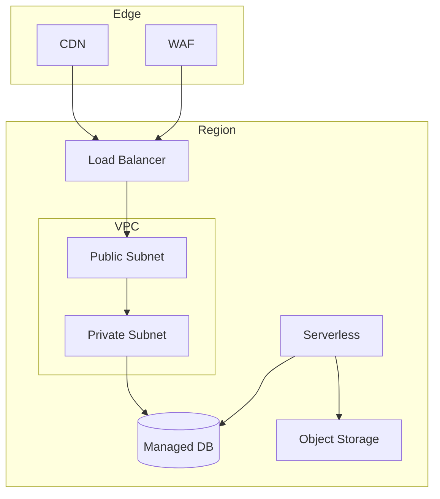

## 3. Five Ws + One H

### What <a class='askgpt-btn' href='https://chatgpt.com/?prompt=Read%20this%20section%20of%20my%20encyclopedia%20and%20explain%20it%20in%20depth%20with%20concrete%20examples%2C%20the%20main%20trade-offs%2C%20and%20common%20pitfalls%20a%20practitioner%20should%20know%3A%0A%0Ahttps%3A%2F%2Fgithub.com%2Fvishvasg14%2Fsoftware-engineering-encyclopedia%2Fblob%2Fmain%2F11-cloud%2Fcloud.md%23what%0A%0ASection%20title%3A%20What' target='_blank' rel='noopener' data-askgpt='What' data-askgpt-url='https://github.com/vishvasg14/software-engineering-encyclopedia/blob/main/11-cloud/cloud.md#what' data-askgpt-prompt-depth='Read%20this%20section%20of%20my%20encyclopedia%20and%20explain%20it%20in%20depth%20with%20concrete%20examples%2C%20the%20main%20trade-offs%2C%20and%20common%20pitfalls%20a%20practitioner%20should%20know%3A%0A%0Ahttps%3A%2F%2Fgithub.com%2Fvishvasg14%2Fsoftware-engineering-encyclopedia%2Fblob%2Fmain%2F11-cloud%2Fcloud.md%23what%0A%0ASection%20title%3A%20What' data-askgpt-prompt-examples='Read%20this%20section%20of%20my%20encyclopedia%20and%20give%20me%202-3%20real-world%20production%20examples%20for%20it.%20For%20each%3A%20what%20went%20right%2C%20what%20went%20wrong%2C%20and%20the%20lessons%20learned.%20Include%20company%20%2F%20project%20names%20if%20relevant.%0A%0Ahttps%3A%2F%2Fgithub.com%2Fvishvasg14%2Fsoftware-engineering-encyclopedia%2Fblob%2Fmain%2F11-cloud%2Fcloud.md%23what%0A%0ASection%20title%3A%20What' title='Ask ChatGPT about this section'>💬</a>

**Cloud computing** is on-demand delivery of IT resources via the internet with pay-as-you-go pricing. **AWS**, **Azure**, and **GCP** are the three dominant providers, each offering 200+ services.

### Why <a class='askgpt-btn' href='https://chatgpt.com/?prompt=Read%20this%20section%20of%20my%20encyclopedia%20and%20explain%20it%20in%20depth%20with%20concrete%20examples%2C%20the%20main%20trade-offs%2C%20and%20common%20pitfalls%20a%20practitioner%20should%20know%3A%0A%0Ahttps%3A%2F%2Fgithub.com%2Fvishvasg14%2Fsoftware-engineering-encyclopedia%2Fblob%2Fmain%2F11-cloud%2Fcloud.md%23why%0A%0ASection%20title%3A%20Why' target='_blank' rel='noopener' data-askgpt='Why' data-askgpt-url='https://github.com/vishvasg14/software-engineering-encyclopedia/blob/main/11-cloud/cloud.md#why' data-askgpt-prompt-depth='Read%20this%20section%20of%20my%20encyclopedia%20and%20explain%20it%20in%20depth%20with%20concrete%20examples%2C%20the%20main%20trade-offs%2C%20and%20common%20pitfalls%20a%20practitioner%20should%20know%3A%0A%0Ahttps%3A%2F%2Fgithub.com%2Fvishvasg14%2Fsoftware-engineering-encyclopedia%2Fblob%2Fmain%2F11-cloud%2Fcloud.md%23why%0A%0ASection%20title%3A%20Why' data-askgpt-prompt-examples='Read%20this%20section%20of%20my%20encyclopedia%20and%20give%20me%202-3%20real-world%20production%20examples%20for%20it.%20For%20each%3A%20what%20went%20right%2C%20what%20went%20wrong%2C%20and%20the%20lessons%20learned.%20Include%20company%20%2F%20project%20names%20if%20relevant.%0A%0Ahttps%3A%2F%2Fgithub.com%2Fvishvasg14%2Fsoftware-engineering-encyclopedia%2Fblob%2Fmain%2F11-cloud%2Fcloud.md%23why%0A%0ASection%20title%3A%20Why' title='Ask ChatGPT about this section'>💬</a>

Cloud replaces capital expenditure (CapEx) with operational expenditure (OpEx). Instead of buying servers and provisioning data centers, you rent compute, storage, and services on demand. This allows elasticity, global reach, and faster time-to-market.

### When <a class='askgpt-btn' href='https://chatgpt.com/?prompt=Read%20this%20section%20of%20my%20encyclopedia%20and%20explain%20it%20in%20depth%20with%20concrete%20examples%2C%20the%20main%20trade-offs%2C%20and%20common%20pitfalls%20a%20practitioner%20should%20know%3A%0A%0Ahttps%3A%2F%2Fgithub.com%2Fvishvasg14%2Fsoftware-engineering-encyclopedia%2Fblob%2Fmain%2F11-cloud%2Fcloud.md%23when%0A%0ASection%20title%3A%20When' target='_blank' rel='noopener' data-askgpt='When' data-askgpt-url='https://github.com/vishvasg14/software-engineering-encyclopedia/blob/main/11-cloud/cloud.md#when' data-askgpt-prompt-depth='Read%20this%20section%20of%20my%20encyclopedia%20and%20explain%20it%20in%20depth%20with%20concrete%20examples%2C%20the%20main%20trade-offs%2C%20and%20common%20pitfalls%20a%20practitioner%20should%20know%3A%0A%0Ahttps%3A%2F%2Fgithub.com%2Fvishvasg14%2Fsoftware-engineering-encyclopedia%2Fblob%2Fmain%2F11-cloud%2Fcloud.md%23when%0A%0ASection%20title%3A%20When' data-askgpt-prompt-examples='Read%20this%20section%20of%20my%20encyclopedia%20and%20give%20me%202-3%20real-world%20production%20examples%20for%20it.%20For%20each%3A%20what%20went%20right%2C%20what%20went%20wrong%2C%20and%20the%20lessons%20learned.%20Include%20company%20%2F%20project%20names%20if%20relevant.%0A%0Ahttps%3A%2F%2Fgithub.com%2Fvishvasg14%2Fsoftware-engineering-encyclopedia%2Fblob%2Fmain%2F11-cloud%2Fcloud.md%23when%0A%0ASection%20title%3A%20When' title='Ask ChatGPT about this section'>💬</a>

AWS (2006), GCP (2008), Azure (2010) all emerged in the late 2000s/early 2010s. They matured through the 2010s. By 2026, they are the de facto standard for new application deployment.

### Where <a class='askgpt-btn' href='https://chatgpt.com/?prompt=Read%20this%20section%20of%20my%20encyclopedia%20and%20explain%20it%20in%20depth%20with%20concrete%20examples%2C%20the%20main%20trade-offs%2C%20and%20common%20pitfalls%20a%20practitioner%20should%20know%3A%0A%0Ahttps%3A%2F%2Fgithub.com%2Fvishvasg14%2Fsoftware-engineering-encyclopedia%2Fblob%2Fmain%2F11-cloud%2Fcloud.md%23where%0A%0ASection%20title%3A%20Where' target='_blank' rel='noopener' data-askgpt='Where' data-askgpt-url='https://github.com/vishvasg14/software-engineering-encyclopedia/blob/main/11-cloud/cloud.md#where' data-askgpt-prompt-depth='Read%20this%20section%20of%20my%20encyclopedia%20and%20explain%20it%20in%20depth%20with%20concrete%20examples%2C%20the%20main%20trade-offs%2C%20and%20common%20pitfalls%20a%20practitioner%20should%20know%3A%0A%0Ahttps%3A%2F%2Fgithub.com%2Fvishvasg14%2Fsoftware-engineering-encyclopedia%2Fblob%2Fmain%2F11-cloud%2Fcloud.md%23where%0A%0ASection%20title%3A%20Where' data-askgpt-prompt-examples='Read%20this%20section%20of%20my%20encyclopedia%20and%20give%20me%202-3%20real-world%20production%20examples%20for%20it.%20For%20each%3A%20what%20went%20right%2C%20what%20went%20wrong%2C%20and%20the%20lessons%20learned.%20Include%20company%20%2F%20project%20names%20if%20relevant.%0A%0Ahttps%3A%2F%2Fgithub.com%2Fvishvasg14%2Fsoftware-engineering-encyclopedia%2Fblob%2Fmain%2F11-cloud%2Fcloud.md%23where%0A%0ASection%20title%3A%20Where' title='Ask ChatGPT about this section'>💬</a>

Every web-scale company uses cloud. Netflix, Spotify, Airbnb run on AWS. Most enterprises use Azure (Microsoft-heavy) or AWS. Many startups use GCP for its data and ML capabilities.

### Who <a class='askgpt-btn' href='https://chatgpt.com/?prompt=Read%20this%20section%20of%20my%20encyclopedia%20and%20explain%20it%20in%20depth%20with%20concrete%20examples%2C%20the%20main%20trade-offs%2C%20and%20common%20pitfalls%20a%20practitioner%20should%20know%3A%0A%0Ahttps%3A%2F%2Fgithub.com%2Fvishvasg14%2Fsoftware-engineering-encyclopedia%2Fblob%2Fmain%2F11-cloud%2Fcloud.md%23who%0A%0ASection%20title%3A%20Who' target='_blank' rel='noopener' data-askgpt='Who' data-askgpt-url='https://github.com/vishvasg14/software-engineering-encyclopedia/blob/main/11-cloud/cloud.md#who' data-askgpt-prompt-depth='Read%20this%20section%20of%20my%20encyclopedia%20and%20explain%20it%20in%20depth%20with%20concrete%20examples%2C%20the%20main%20trade-offs%2C%20and%20common%20pitfalls%20a%20practitioner%20should%20know%3A%0A%0Ahttps%3A%2F%2Fgithub.com%2Fvishvasg14%2Fsoftware-engineering-encyclopedia%2Fblob%2Fmain%2F11-cloud%2Fcloud.md%23who%0A%0ASection%20title%3A%20Who' data-askgpt-prompt-examples='Read%20this%20section%20of%20my%20encyclopedia%20and%20give%20me%202-3%20real-world%20production%20examples%20for%20it.%20For%20each%3A%20what%20went%20right%2C%20what%20went%20wrong%2C%20and%20the%20lessons%20learned.%20Include%20company%20%2F%20project%20names%20if%20relevant.%0A%0Ahttps%3A%2F%2Fgithub.com%2Fvishvasg14%2Fsoftware-engineering-encyclopedia%2Fblob%2Fmain%2F11-cloud%2Fcloud.md%23who%0A%0ASection%20title%3A%20Who' title='Ask ChatGPT about this section'>💬</a>

- **AWS:** Amazon (Andy Jassy led the early years; now CEO of Amazon).
- **Azure:** Microsoft (Satya Nadella era; key Azure leadership).
- **GCP:** Google (originally App Engine, then expanded under Diane Greene and Thomas Kurian).

### How (one-paragraph preview) <a class='askgpt-btn' href='https://chatgpt.com/?prompt=Read%20this%20section%20of%20my%20encyclopedia%20and%20explain%20it%20in%20depth%20with%20concrete%20examples%2C%20the%20main%20trade-offs%2C%20and%20common%20pitfalls%20a%20practitioner%20should%20know%3A%0A%0Ahttps%3A%2F%2Fgithub.com%2Fvishvasg14%2Fsoftware-engineering-encyclopedia%2Fblob%2Fmain%2F11-cloud%2Fcloud.md%23how-one-paragraph-preview%0A%0ASection%20title%3A%20How%20(one-paragraph%20preview)' target='_blank' rel='noopener' data-askgpt='How (one-paragraph preview)' data-askgpt-url='https://github.com/vishvasg14/software-engineering-encyclopedia/blob/main/11-cloud/cloud.md#how-one-paragraph-preview' data-askgpt-prompt-depth='Read%20this%20section%20of%20my%20encyclopedia%20and%20explain%20it%20in%20depth%20with%20concrete%20examples%2C%20the%20main%20trade-offs%2C%20and%20common%20pitfalls%20a%20practitioner%20should%20know%3A%0A%0Ahttps%3A%2F%2Fgithub.com%2Fvishvasg14%2Fsoftware-engineering-encyclopedia%2Fblob%2Fmain%2F11-cloud%2Fcloud.md%23how-one-paragraph-preview%0A%0ASection%20title%3A%20How%20(one-paragraph%20preview)' data-askgpt-prompt-examples='Read%20this%20section%20of%20my%20encyclopedia%20and%20give%20me%202-3%20real-world%20production%20examples%20for%20it.%20For%20each%3A%20what%20went%20right%2C%20what%20went%20wrong%2C%20and%20the%20lessons%20learned.%20Include%20company%20%2F%20project%20names%20if%20relevant.%0A%0Ahttps%3A%2F%2Fgithub.com%2Fvishvasg14%2Fsoftware-engineering-encyclopedia%2Fblob%2Fmain%2F11-cloud%2Fcloud.md%23how-one-paragraph-preview%0A%0ASection%20title%3A%20How%20(one-paragraph%20preview)' title='Ask ChatGPT about this section'>💬</a>

A team writes an application, packages it in a container or zip, and deploys to a cloud-managed service (EKS/AKS/GKE, Lambda/Functions/Cloud Run, EC2/VM, etc.). The cloud provides networking (VPC), storage (S3/Blob/GCS), databases (RDS/Cloud SQL/Azure SQL, DynamoDB/Cosmos/Firestore), messaging (SQS/Service Bus/Pub-Sub), monitoring (CloudWatch/Monitor/Cloud Monitoring), and security (IAM, KMS). The team pays for what they use, scales on demand, and benefits from the cloud provider's global infrastructure.

## 4. History

### 4.1 Origins (2006-2010) <a class='askgpt-btn' href='https://chatgpt.com/?prompt=Read%20this%20section%20of%20my%20encyclopedia%20and%20explain%20it%20in%20depth%20with%20concrete%20examples%2C%20the%20main%20trade-offs%2C%20and%20common%20pitfalls%20a%20practitioner%20should%20know%3A%0A%0Ahttps%3A%2F%2Fgithub.com%2Fvishvasg14%2Fsoftware-engineering-encyclopedia%2Fblob%2Fmain%2F11-cloud%2Fcloud.md%2341-origins-2006-2010%0A%0ASection%20title%3A%204.1%20Origins%20(2006-2010)' target='_blank' rel='noopener' data-askgpt='4.1 Origins (2006-2010)' data-askgpt-url='https://github.com/vishvasg14/software-engineering-encyclopedia/blob/main/11-cloud/cloud.md#41-origins-2006-2010' data-askgpt-prompt-depth='Read%20this%20section%20of%20my%20encyclopedia%20and%20explain%20it%20in%20depth%20with%20concrete%20examples%2C%20the%20main%20trade-offs%2C%20and%20common%20pitfalls%20a%20practitioner%20should%20know%3A%0A%0Ahttps%3A%2F%2Fgithub.com%2Fvishvasg14%2Fsoftware-engineering-encyclopedia%2Fblob%2Fmain%2F11-cloud%2Fcloud.md%2341-origins-2006-2010%0A%0ASection%20title%3A%204.1%20Origins%20(2006-2010)' data-askgpt-prompt-examples='Read%20this%20section%20of%20my%20encyclopedia%20and%20give%20me%202-3%20real-world%20production%20examples%20for%20it.%20For%20each%3A%20what%20went%20right%2C%20what%20went%20wrong%2C%20and%20the%20lessons%20learned.%20Include%20company%20%2F%20project%20names%20if%20relevant.%0A%0Ahttps%3A%2F%2Fgithub.com%2Fvishvasg14%2Fsoftware-engineering-encyclopedia%2Fblob%2Fmain%2F11-cloud%2Fcloud.md%2341-origins-2006-2010%0A%0ASection%20title%3A%204.1%20Origins%20(2006-2010)' title='Ask ChatGPT about this section'>💬</a>

- **2002** — Amazon Web Services launched internally (SQS first).
- **2006** — AWS public launch (SQS, S3, EC2).
- **2008** — Google App Engine (PaaS) launched.
- **2008** — Google releases the Bigtable paper; spawns HBase, Cassandra, etc.
- **2010** — Microsoft Azure launched (Feb 2010, as Windows Azure).
- **2010** — Google App Engine, AWS Marketplace.

### 4.2 The growth era (2010-2015) <a class='askgpt-btn' href='https://chatgpt.com/?prompt=Read%20this%20section%20of%20my%20encyclopedia%20and%20explain%20it%20in%20depth%20with%20concrete%20examples%2C%20the%20main%20trade-offs%2C%20and%20common%20pitfalls%20a%20practitioner%20should%20know%3A%0A%0Ahttps%3A%2F%2Fgithub.com%2Fvishvasg14%2Fsoftware-engineering-encyclopedia%2Fblob%2Fmain%2F11-cloud%2Fcloud.md%2342-the-growth-era-2010-2015%0A%0ASection%20title%3A%204.2%20The%20growth%20era%20(2010-2015)' target='_blank' rel='noopener' data-askgpt='4.2 The growth era (2010-2015)' data-askgpt-url='https://github.com/vishvasg14/software-engineering-encyclopedia/blob/main/11-cloud/cloud.md#42-the-growth-era-2010-2015' data-askgpt-prompt-depth='Read%20this%20section%20of%20my%20encyclopedia%20and%20explain%20it%20in%20depth%20with%20concrete%20examples%2C%20the%20main%20trade-offs%2C%20and%20common%20pitfalls%20a%20practitioner%20should%20know%3A%0A%0Ahttps%3A%2F%2Fgithub.com%2Fvishvasg14%2Fsoftware-engineering-encyclopedia%2Fblob%2Fmain%2F11-cloud%2Fcloud.md%2342-the-growth-era-2010-2015%0A%0ASection%20title%3A%204.2%20The%20growth%20era%20(2010-2015)' data-askgpt-prompt-examples='Read%20this%20section%20of%20my%20encyclopedia%20and%20give%20me%202-3%20real-world%20production%20examples%20for%20it.%20For%20each%3A%20what%20went%20right%2C%20what%20went%20wrong%2C%20and%20the%20lessons%20learned.%20Include%20company%20%2F%20project%20names%20if%20relevant.%0A%0Ahttps%3A%2F%2Fgithub.com%2Fvishvasg14%2Fsoftware-engineering-encyclopedia%2Fblob%2Fmain%2F11-cloud%2Fcloud.md%2342-the-growth-era-2010-2015%0A%0ASection%20title%3A%204.2%20The%20growth%20era%20(2010-2015)' title='Ask ChatGPT about this section'>💬</a>

- **2010-2013** — EKS / GKE / AKS precursors (EC2 Container Service 2013).
- **2014** — AWS Lambda launched (serverless). GCP released managed services.
- **2014** — Azure Resource Manager (ARM) templates.
- **2015** — Google Kubernetes Engine (GKE) generally available.
- **2015** — Azure Functions (preview). AWS EFS, AWS Lambda.
- **2015** — AWS re:Invent establishes "Lambda" and "Aurora" as household names.

### 4.3 The maturity era (2015-2020) <a class='askgpt-btn' href='https://chatgpt.com/?prompt=Read%20this%20section%20of%20my%20encyclopedia%20and%20explain%20it%20in%20depth%20with%20concrete%20examples%2C%20the%20main%20trade-offs%2C%20and%20common%20pitfalls%20a%20practitioner%20should%20know%3A%0A%0Ahttps%3A%2F%2Fgithub.com%2Fvishvasg14%2Fsoftware-engineering-encyclopedia%2Fblob%2Fmain%2F11-cloud%2Fcloud.md%2343-the-maturity-era-2015-2020%0A%0ASection%20title%3A%204.3%20The%20maturity%20era%20(2015-2020)' target='_blank' rel='noopener' data-askgpt='4.3 The maturity era (2015-2020)' data-askgpt-url='https://github.com/vishvasg14/software-engineering-encyclopedia/blob/main/11-cloud/cloud.md#43-the-maturity-era-2015-2020' data-askgpt-prompt-depth='Read%20this%20section%20of%20my%20encyclopedia%20and%20explain%20it%20in%20depth%20with%20concrete%20examples%2C%20the%20main%20trade-offs%2C%20and%20common%20pitfalls%20a%20practitioner%20should%20know%3A%0A%0Ahttps%3A%2F%2Fgithub.com%2Fvishvasg14%2Fsoftware-engineering-encyclopedia%2Fblob%2Fmain%2F11-cloud%2Fcloud.md%2343-the-maturity-era-2015-2020%0A%0ASection%20title%3A%204.3%20The%20maturity%20era%20(2015-2020)' data-askgpt-prompt-examples='Read%20this%20section%20of%20my%20encyclopedia%20and%20give%20me%202-3%20real-world%20production%20examples%20for%20it.%20For%20each%3A%20what%20went%20right%2C%20what%20went%20wrong%2C%20and%20the%20lessons%20learned.%20Include%20company%20%2F%20project%20names%20if%20relevant.%0A%0Ahttps%3A%2F%2Fgithub.com%2Fvishvasg14%2Fsoftware-engineering-encyclopedia%2Fblob%2Fmain%2F11-cloud%2Fcloud.md%2343-the-maturity-era-2015-2020%0A%0ASection%20title%3A%204.3%20The%20maturity%20era%20(2015-2020)' title='Ask ChatGPT about this section'>💬</a>

- **2016** — GCP becomes more competitive. AWS expands regions.
- **2017** — Amazon EKS announced. Azure Kubernetes Service (AKS) preview.
- **2018** — AWS Lambda Layers. GCP releases BigQuery, BigQuery Omni.
- **2019** — AWS Fargate GA. Azure Arc announced.
- **2020** — Azure ARM templates mature. Cloud adoption accelerates due to COVID-19.

### 4.4 The cloud-native era (2020-2026) <a class='askgpt-btn' href='https://chatgpt.com/?prompt=Read%20this%20section%20of%20my%20encyclopedia%20and%20explain%20it%20in%20depth%20with%20concrete%20examples%2C%20the%20main%20trade-offs%2C%20and%20common%20pitfalls%20a%20practitioner%20should%20know%3A%0A%0Ahttps%3A%2F%2Fgithub.com%2Fvishvasg14%2Fsoftware-engineering-encyclopedia%2Fblob%2Fmain%2F11-cloud%2Fcloud.md%2344-the-cloud-native-era-2020-2026%0A%0ASection%20title%3A%204.4%20The%20cloud-native%20era%20(2020-2026)' target='_blank' rel='noopener' data-askgpt='4.4 The cloud-native era (2020-2026)' data-askgpt-url='https://github.com/vishvasg14/software-engineering-encyclopedia/blob/main/11-cloud/cloud.md#44-the-cloud-native-era-2020-2026' data-askgpt-prompt-depth='Read%20this%20section%20of%20my%20encyclopedia%20and%20explain%20it%20in%20depth%20with%20concrete%20examples%2C%20the%20main%20trade-offs%2C%20and%20common%20pitfalls%20a%20practitioner%20should%20know%3A%0A%0Ahttps%3A%2F%2Fgithub.com%2Fvishvasg14%2Fsoftware-engineering-encyclopedia%2Fblob%2Fmain%2F11-cloud%2Fcloud.md%2344-the-cloud-native-era-2020-2026%0A%0ASection%20title%3A%204.4%20The%20cloud-native%20era%20(2020-2026)' data-askgpt-prompt-examples='Read%20this%20section%20of%20my%20encyclopedia%20and%20give%20me%202-3%20real-world%20production%20examples%20for%20it.%20For%20each%3A%20what%20went%20right%2C%20what%20went%20wrong%2C%20and%20the%20lessons%20learned.%20Include%20company%20%2F%20project%20names%20if%20relevant.%0A%0Ahttps%3A%2F%2Fgithub.com%2Fvishvasg14%2Fsoftware-engineering-encyclopedia%2Fblob%2Fmain%2F11-cloud%2Fcloud.md%2344-the-cloud-native-era-2020-2026%0A%0ASection%20title%3A%204.4%20The%20cloud-native%20era%20(2020-2026)' title='Ask ChatGPT about this section'>💬</a>

- **2020** — Massive growth in managed Kubernetes (EKS, AKS, GKE).
- **2021** — Cloud cost optimization (FinOps) becomes critical.
- **2022** — Cloud sustainability focus. Serverless adoption grows.
- **2023** — Generative AI workloads drive new GPU services.
- **2024** — LLM gateways, vector databases, GPU-as-a-service.
- **2025** — Multi-cloud mature. eBPF data planes.
- **2026** — AI-first clouds.

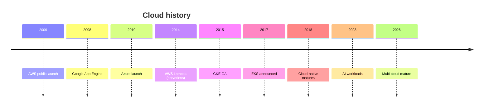

## 5. Problem Statement

### 5.1 What cloud solves <a class='askgpt-btn' href='https://chatgpt.com/?prompt=Read%20this%20section%20of%20my%20encyclopedia%20and%20explain%20it%20in%20depth%20with%20concrete%20examples%2C%20the%20main%20trade-offs%2C%20and%20common%20pitfalls%20a%20practitioner%20should%20know%3A%0A%0Ahttps%3A%2F%2Fgithub.com%2Fvishvasg14%2Fsoftware-engineering-encyclopedia%2Fblob%2Fmain%2F11-cloud%2Fcloud.md%2351-what-cloud-solves%0A%0ASection%20title%3A%205.1%20What%20cloud%20solves' target='_blank' rel='noopener' data-askgpt='5.1 What cloud solves' data-askgpt-url='https://github.com/vishvasg14/software-engineering-encyclopedia/blob/main/11-cloud/cloud.md#51-what-cloud-solves' data-askgpt-prompt-depth='Read%20this%20section%20of%20my%20encyclopedia%20and%20explain%20it%20in%20depth%20with%20concrete%20examples%2C%20the%20main%20trade-offs%2C%20and%20common%20pitfalls%20a%20practitioner%20should%20know%3A%0A%0Ahttps%3A%2F%2Fgithub.com%2Fvishvasg14%2Fsoftware-engineering-encyclopedia%2Fblob%2Fmain%2F11-cloud%2Fcloud.md%2351-what-cloud-solves%0A%0ASection%20title%3A%205.1%20What%20cloud%20solves' data-askgpt-prompt-examples='Read%20this%20section%20of%20my%20encyclopedia%20and%20give%20me%202-3%20real-world%20production%20examples%20for%20it.%20For%20each%3A%20what%20went%20right%2C%20what%20went%20wrong%2C%20and%20the%20lessons%20learned.%20Include%20company%20%2F%20project%20names%20if%20relevant.%0A%0Ahttps%3A%2F%2Fgithub.com%2Fvishvasg14%2Fsoftware-engineering-encyclopedia%2Fblob%2Fmain%2F11-cloud%2Fcloud.md%2351-what-cloud-solves%0A%0ASection%20title%3A%205.1%20What%20cloud%20solves' title='Ask ChatGPT about this section'>💬</a>

- **Capital expense** — pay as you go.
- **Capacity planning** — scale on demand.
- **Geographic reach** — global regions.
- **Time to market** — managed services.
- **Operational overhead** — provider handles the undifferentiated heavy lifting.

### 5.2 What cloud doesn't solve <a class='askgpt-btn' href='https://chatgpt.com/?prompt=Read%20this%20section%20of%20my%20encyclopedia%20and%20explain%20it%20in%20depth%20with%20concrete%20examples%2C%20the%20main%20trade-offs%2C%20and%20common%20pitfalls%20a%20practitioner%20should%20know%3A%0A%0Ahttps%3A%2F%2Fgithub.com%2Fvishvasg14%2Fsoftware-engineering-encyclopedia%2Fblob%2Fmain%2F11-cloud%2Fcloud.md%2352-what-cloud-doesnt-solve%0A%0ASection%20title%3A%205.2%20What%20cloud%20doesn't%20solve' target='_blank' rel='noopener' data-askgpt='5.2 What cloud doesn&#39;t solve' data-askgpt-url='https://github.com/vishvasg14/software-engineering-encyclopedia/blob/main/11-cloud/cloud.md#52-what-cloud-doesnt-solve' data-askgpt-prompt-depth='Read%20this%20section%20of%20my%20encyclopedia%20and%20explain%20it%20in%20depth%20with%20concrete%20examples%2C%20the%20main%20trade-offs%2C%20and%20common%20pitfalls%20a%20practitioner%20should%20know%3A%0A%0Ahttps%3A%2F%2Fgithub.com%2Fvishvasg14%2Fsoftware-engineering-encyclopedia%2Fblob%2Fmain%2F11-cloud%2Fcloud.md%2352-what-cloud-doesnt-solve%0A%0ASection%20title%3A%205.2%20What%20cloud%20doesn't%20solve' data-askgpt-prompt-examples='Read%20this%20section%20of%20my%20encyclopedia%20and%20give%20me%202-3%20real-world%20production%20examples%20for%20it.%20For%20each%3A%20what%20went%20right%2C%20what%20went%20wrong%2C%20and%20the%20lessons%20learned.%20Include%20company%20%2F%20project%20names%20if%20relevant.%0A%0Ahttps%3A%2F%2Fgithub.com%2Fvishvasg14%2Fsoftware-engineering-encyclopedia%2Fblob%2Fmain%2F11-cloud%2Fcloud.md%2352-what-cloud-doesnt-solve%0A%0ASection%20title%3A%205.2%20What%20cloud%20doesn't%20solve' title='Ask ChatGPT about this section'>💬</a>

- **Application architecture** — that's where system design helps.
- **Code quality** — that's where engineering practices help.
- **Cost if not managed** — FinOps discipline required.
- **Vendor lock-in** — multi-cloud mitigates but adds complexity.

### 5.3 The cost of unmanaged cloud <a class='askgpt-btn' href='https://chatgpt.com/?prompt=Read%20this%20section%20of%20my%20encyclopedia%20and%20explain%20it%20in%20depth%20with%20concrete%20examples%2C%20the%20main%20trade-offs%2C%20and%20common%20pitfalls%20a%20practitioner%20should%20know%3A%0A%0Ahttps%3A%2F%2Fgithub.com%2Fvishvasg14%2Fsoftware-engineering-encyclopedia%2Fblob%2Fmain%2F11-cloud%2Fcloud.md%2353-the-cost-of-unmanaged-cloud%0A%0ASection%20title%3A%205.3%20The%20cost%20of%20unmanaged%20cloud' target='_blank' rel='noopener' data-askgpt='5.3 The cost of unmanaged cloud' data-askgpt-url='https://github.com/vishvasg14/software-engineering-encyclopedia/blob/main/11-cloud/cloud.md#53-the-cost-of-unmanaged-cloud' data-askgpt-prompt-depth='Read%20this%20section%20of%20my%20encyclopedia%20and%20explain%20it%20in%20depth%20with%20concrete%20examples%2C%20the%20main%20trade-offs%2C%20and%20common%20pitfalls%20a%20practitioner%20should%20know%3A%0A%0Ahttps%3A%2F%2Fgithub.com%2Fvishvasg14%2Fsoftware-engineering-encyclopedia%2Fblob%2Fmain%2F11-cloud%2Fcloud.md%2353-the-cost-of-unmanaged-cloud%0A%0ASection%20title%3A%205.3%20The%20cost%20of%20unmanaged%20cloud' data-askgpt-prompt-examples='Read%20this%20section%20of%20my%20encyclopedia%20and%20give%20me%202-3%20real-world%20production%20examples%20for%20it.%20For%20each%3A%20what%20went%20right%2C%20what%20went%20wrong%2C%20and%20the%20lessons%20learned.%20Include%20company%20%2F%20project%20names%20if%20relevant.%0A%0Ahttps%3A%2F%2Fgithub.com%2Fvishvasg14%2Fsoftware-engineering-encyclopedia%2Fblob%2Fmain%2F11-cloud%2Fcloud.md%2353-the-cost-of-unmanaged-cloud%0A%0ASection%20title%3A%205.3%20The%20cost%20of%20unmanaged%20cloud' title='Ask ChatGPT about this section'>💬</a>

Unmanaged cloud can be MORE expensive than on-premises if not properly governed. FinOps discipline is critical.

## 6. Real-World Motivation

### 6.1 Netflix <a class='askgpt-btn' href='https://chatgpt.com/?prompt=Read%20this%20section%20of%20my%20encyclopedia%20and%20explain%20it%20in%20depth%20with%20concrete%20examples%2C%20the%20main%20trade-offs%2C%20and%20common%20pitfalls%20a%20practitioner%20should%20know%3A%0A%0Ahttps%3A%2F%2Fgithub.com%2Fvishvasg14%2Fsoftware-engineering-encyclopedia%2Fblob%2Fmain%2F11-cloud%2Fcloud.md%2361-netflix%0A%0ASection%20title%3A%206.1%20Netflix' target='_blank' rel='noopener' data-askgpt='6.1 Netflix' data-askgpt-url='https://github.com/vishvasg14/software-engineering-encyclopedia/blob/main/11-cloud/cloud.md#61-netflix' data-askgpt-prompt-depth='Read%20this%20section%20of%20my%20encyclopedia%20and%20explain%20it%20in%20depth%20with%20concrete%20examples%2C%20the%20main%20trade-offs%2C%20and%20common%20pitfalls%20a%20practitioner%20should%20know%3A%0A%0Ahttps%3A%2F%2Fgithub.com%2Fvishvasg14%2Fsoftware-engineering-encyclopedia%2Fblob%2Fmain%2F11-cloud%2Fcloud.md%2361-netflix%0A%0ASection%20title%3A%206.1%20Netflix' data-askgpt-prompt-examples='Read%20this%20section%20of%20my%20encyclopedia%20and%20give%20me%202-3%20real-world%20production%20examples%20for%20it.%20For%20each%3A%20what%20went%20right%2C%20what%20went%20wrong%2C%20and%20the%20lessons%20learned.%20Include%20company%20%2F%20project%20names%20if%20relevant.%0A%0Ahttps%3A%2F%2Fgithub.com%2Fvishvasg14%2Fsoftware-engineering-encyclopedia%2Fblob%2Fmain%2F11-cloud%2Fcloud.md%2361-netflix%0A%0ASection%20title%3A%206.1%20Netflix' title='Ask ChatGPT about this section'>💬</a>

Migrated to AWS in 2008-2017. Operates hundreds of thousands of EC2 instances. Pioneered chaos engineering. Heavy use of Spot instances for cost.

### 6.2 Spotify <a class='askgpt-btn' href='https://chatgpt.com/?prompt=Read%20this%20section%20of%20my%20encyclopedia%20and%20explain%20it%20in%20depth%20with%20concrete%20examples%2C%20the%20main%20trade-offs%2C%20and%20common%20pitfalls%20a%20practitioner%20should%20know%3A%0A%0Ahttps%3A%2F%2Fgithub.com%2Fvishvasg14%2Fsoftware-engineering-encyclopedia%2Fblob%2Fmain%2F11-cloud%2Fcloud.md%2362-spotify%0A%0ASection%20title%3A%206.2%20Spotify' target='_blank' rel='noopener' data-askgpt='6.2 Spotify' data-askgpt-url='https://github.com/vishvasg14/software-engineering-encyclopedia/blob/main/11-cloud/cloud.md#62-spotify' data-askgpt-prompt-depth='Read%20this%20section%20of%20my%20encyclopedia%20and%20explain%20it%20in%20depth%20with%20concrete%20examples%2C%20the%20main%20trade-offs%2C%20and%20common%20pitfalls%20a%20practitioner%20should%20know%3A%0A%0Ahttps%3A%2F%2Fgithub.com%2Fvishvasg14%2Fsoftware-engineering-encyclopedia%2Fblob%2Fmain%2F11-cloud%2Fcloud.md%2362-spotify%0A%0ASection%20title%3A%206.2%20Spotify' data-askgpt-prompt-examples='Read%20this%20section%20of%20my%20encyclopedia%20and%20give%20me%202-3%20real-world%20production%20examples%20for%20it.%20For%20each%3A%20what%20went%20right%2C%20what%20went%20wrong%2C%20and%20the%20lessons%20learned.%20Include%20company%20%2F%20project%20names%20if%20relevant.%0A%0Ahttps%3A%2F%2Fgithub.com%2Fvishvasg14%2Fsoftware-engineering-encyclopedia%2Fblob%2Fmain%2F11-cloud%2Fcloud.md%2362-spotify%0A%0ASection%20title%3A%206.2%20Spotify' title='Ask ChatGPT about this section'>💬</a>

Migrated to GCP. Uses BigQuery for analytics. Migrated to microservices on K8s.

### 6.3 Airbnb <a class='askgpt-btn' href='https://chatgpt.com/?prompt=Read%20this%20section%20of%20my%20encyclopedia%20and%20explain%20it%20in%20depth%20with%20concrete%20examples%2C%20the%20main%20trade-offs%2C%20and%20common%20pitfalls%20a%20practitioner%20should%20know%3A%0A%0Ahttps%3A%2F%2Fgithub.com%2Fvishvasg14%2Fsoftware-engineering-encyclopedia%2Fblob%2Fmain%2F11-cloud%2Fcloud.md%2363-airbnb%0A%0ASection%20title%3A%206.3%20Airbnb' target='_blank' rel='noopener' data-askgpt='6.3 Airbnb' data-askgpt-url='https://github.com/vishvasg14/software-engineering-encyclopedia/blob/main/11-cloud/cloud.md#63-airbnb' data-askgpt-prompt-depth='Read%20this%20section%20of%20my%20encyclopedia%20and%20explain%20it%20in%20depth%20with%20concrete%20examples%2C%20the%20main%20trade-offs%2C%20and%20common%20pitfalls%20a%20practitioner%20should%20know%3A%0A%0Ahttps%3A%2F%2Fgithub.com%2Fvishvasg14%2Fsoftware-engineering-encyclopedia%2Fblob%2Fmain%2F11-cloud%2Fcloud.md%2363-airbnb%0A%0ASection%20title%3A%206.3%20Airbnb' data-askgpt-prompt-examples='Read%20this%20section%20of%20my%20encyclopedia%20and%20give%20me%202-3%20real-world%20production%20examples%20for%20it.%20For%20each%3A%20what%20went%20right%2C%20what%20went%20wrong%2C%20and%20the%20lessons%20learned.%20Include%20company%20%2F%20project%20names%20if%20relevant.%0A%0Ahttps%3A%2F%2Fgithub.com%2Fvishvasg14%2Fsoftware-engineering-encyclopedia%2Fblob%2Fmain%2F11-cloud%2Fcloud.md%2363-airbnb%0A%0ASection%20title%3A%206.3%20Airbnb' title='Ask ChatGPT about this section'>💬</a>

Migrated from on-prem to AWS. Heavy use of RDS, S3, ECS.

### 6.4 Capital One <a class='askgpt-btn' href='https://chatgpt.com/?prompt=Read%20this%20section%20of%20my%20encyclopedia%20and%20explain%20it%20in%20depth%20with%20concrete%20examples%2C%20the%20main%20trade-offs%2C%20and%20common%20pitfalls%20a%20practitioner%20should%20know%3A%0A%0Ahttps%3A%2F%2Fgithub.com%2Fvishvasg14%2Fsoftware-engineering-encyclopedia%2Fblob%2Fmain%2F11-cloud%2Fcloud.md%2364-capital-one%0A%0ASection%20title%3A%206.4%20Capital%20One' target='_blank' rel='noopener' data-askgpt='6.4 Capital One' data-askgpt-url='https://github.com/vishvasg14/software-engineering-encyclopedia/blob/main/11-cloud/cloud.md#64-capital-one' data-askgpt-prompt-depth='Read%20this%20section%20of%20my%20encyclopedia%20and%20explain%20it%20in%20depth%20with%20concrete%20examples%2C%20the%20main%20trade-offs%2C%20and%20common%20pitfalls%20a%20practitioner%20should%20know%3A%0A%0Ahttps%3A%2F%2Fgithub.com%2Fvishvasg14%2Fsoftware-engineering-encyclopedia%2Fblob%2Fmain%2F11-cloud%2Fcloud.md%2364-capital-one%0A%0ASection%20title%3A%206.4%20Capital%20One' data-askgpt-prompt-examples='Read%20this%20section%20of%20my%20encyclopedia%20and%20give%20me%202-3%20real-world%20production%20examples%20for%20it.%20For%20each%3A%20what%20went%20right%2C%20what%20went%20wrong%2C%20and%20the%20lessons%20learned.%20Include%20company%20%2F%20project%20names%20if%20relevant.%0A%0Ahttps%3A%2F%2Fgithub.com%2Fvishvasg14%2Fsoftware-engineering-encyclopedia%2Fblob%2Fmain%2F11-cloud%2Fcloud.md%2364-capital-one%0A%0ASection%20title%3A%206.4%20Capital%20One' title='Ask ChatGPT about this section'>💬</a>

Banking on AWS. Heavy compliance. Strict IAM.

### 6.5 Pinterest <a class='askgpt-btn' href='https://chatgpt.com/?prompt=Read%20this%20section%20of%20my%20encyclopedia%20and%20explain%20it%20in%20depth%20with%20concrete%20examples%2C%20the%20main%20trade-offs%2C%20and%20common%20pitfalls%20a%20practitioner%20should%20know%3A%0A%0Ahttps%3A%2F%2Fgithub.com%2Fvishvasg14%2Fsoftware-engineering-encyclopedia%2Fblob%2Fmain%2F11-cloud%2Fcloud.md%2365-pinterest%0A%0ASection%20title%3A%206.5%20Pinterest' target='_blank' rel='noopener' data-askgpt='6.5 Pinterest' data-askgpt-url='https://github.com/vishvasg14/software-engineering-encyclopedia/blob/main/11-cloud/cloud.md#65-pinterest' data-askgpt-prompt-depth='Read%20this%20section%20of%20my%20encyclopedia%20and%20explain%20it%20in%20depth%20with%20concrete%20examples%2C%20the%20main%20trade-offs%2C%20and%20common%20pitfalls%20a%20practitioner%20should%20know%3A%0A%0Ahttps%3A%2F%2Fgithub.com%2Fvishvasg14%2Fsoftware-engineering-encyclopedia%2Fblob%2Fmain%2F11-cloud%2Fcloud.md%2365-pinterest%0A%0ASection%20title%3A%206.5%20Pinterest' data-askgpt-prompt-examples='Read%20this%20section%20of%20my%20encyclopedia%20and%20give%20me%202-3%20real-world%20production%20examples%20for%20it.%20For%20each%3A%20what%20went%20right%2C%20what%20went%20wrong%2C%20and%20the%20lessons%20learned.%20Include%20company%20%2F%20project%20names%20if%20relevant.%0A%0Ahttps%3A%2F%2Fgithub.com%2Fvishvasg14%2Fsoftware-engineering-encyclopedia%2Fblob%2Fmain%2F11-cloud%2Fcloud.md%2365-pinterest%0A%0ASection%20title%3A%206.5%20Pinterest' title='Ask ChatGPT about this section'>💬</a>

Uses AWS. Recommends system design at scale. Multi-region.

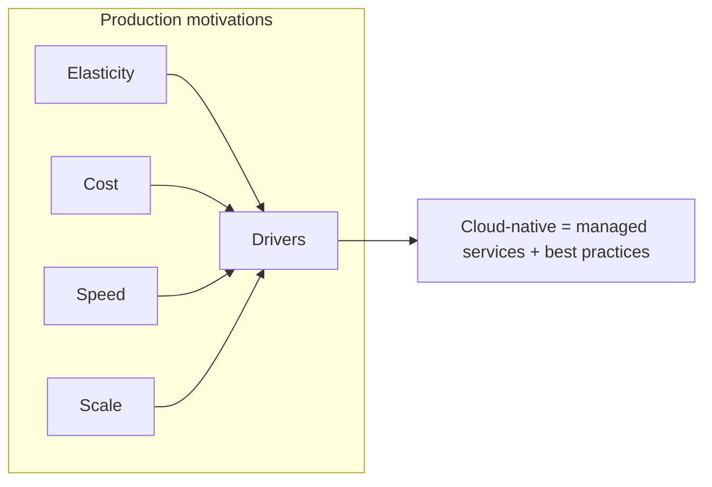

---

## 7. Internal Working

### 7.1 Global infrastructure <a class='askgpt-btn' href='https://chatgpt.com/?prompt=Read%20this%20section%20of%20my%20encyclopedia%20and%20explain%20it%20in%20depth%20with%20concrete%20examples%2C%20the%20main%20trade-offs%2C%20and%20common%20pitfalls%20a%20practitioner%20should%20know%3A%0A%0Ahttps%3A%2F%2Fgithub.com%2Fvishvasg14%2Fsoftware-engineering-encyclopedia%2Fblob%2Fmain%2F11-cloud%2Fcloud.md%2371-global-infrastructure%0A%0ASection%20title%3A%207.1%20Global%20infrastructure' target='_blank' rel='noopener' data-askgpt='7.1 Global infrastructure' data-askgpt-url='https://github.com/vishvasg14/software-engineering-encyclopedia/blob/main/11-cloud/cloud.md#71-global-infrastructure' data-askgpt-prompt-depth='Read%20this%20section%20of%20my%20encyclopedia%20and%20explain%20it%20in%20depth%20with%20concrete%20examples%2C%20the%20main%20trade-offs%2C%20and%20common%20pitfalls%20a%20practitioner%20should%20know%3A%0A%0Ahttps%3A%2F%2Fgithub.com%2Fvishvasg14%2Fsoftware-engineering-encyclopedia%2Fblob%2Fmain%2F11-cloud%2Fcloud.md%2371-global-infrastructure%0A%0ASection%20title%3A%207.1%20Global%20infrastructure' data-askgpt-prompt-examples='Read%20this%20section%20of%20my%20encyclopedia%20and%20give%20me%202-3%20real-world%20production%20examples%20for%20it.%20For%20each%3A%20what%20went%20right%2C%20what%20went%20wrong%2C%20and%20the%20lessons%20learned.%20Include%20company%20%2F%20project%20names%20if%20relevant.%0A%0Ahttps%3A%2F%2Fgithub.com%2Fvishvasg14%2Fsoftware-engineering-encyclopedia%2Fblob%2Fmain%2F11-cloud%2Fcloud.md%2371-global-infrastructure%0A%0ASection%20title%3A%207.1%20Global%20infrastructure' title='Ask ChatGPT about this section'>💬</a>

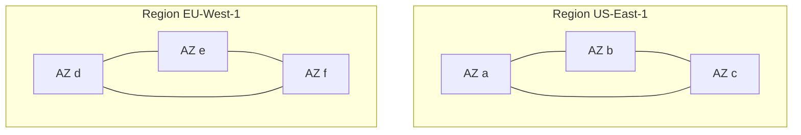

Each region has 2-6 availability zones. AZs are independent data centers within a region.

### 7.2 Request flow <a class='askgpt-btn' href='https://chatgpt.com/?prompt=Read%20this%20section%20of%20my%20encyclopedia%20and%20explain%20it%20in%20depth%20with%20concrete%20examples%2C%20the%20main%20trade-offs%2C%20and%20common%20pitfalls%20a%20practitioner%20should%20know%3A%0A%0Ahttps%3A%2F%2Fgithub.com%2Fvishvasg14%2Fsoftware-engineering-encyclopedia%2Fblob%2Fmain%2F11-cloud%2Fcloud.md%2372-request-flow%0A%0ASection%20title%3A%207.2%20Request%20flow' target='_blank' rel='noopener' data-askgpt='7.2 Request flow' data-askgpt-url='https://github.com/vishvasg14/software-engineering-encyclopedia/blob/main/11-cloud/cloud.md#72-request-flow' data-askgpt-prompt-depth='Read%20this%20section%20of%20my%20encyclopedia%20and%20explain%20it%20in%20depth%20with%20concrete%20examples%2C%20the%20main%20trade-offs%2C%20and%20common%20pitfalls%20a%20practitioner%20should%20know%3A%0A%0Ahttps%3A%2F%2Fgithub.com%2Fvishvasg14%2Fsoftware-engineering-encyclopedia%2Fblob%2Fmain%2F11-cloud%2Fcloud.md%2372-request-flow%0A%0ASection%20title%3A%207.2%20Request%20flow' data-askgpt-prompt-examples='Read%20this%20section%20of%20my%20encyclopedia%20and%20give%20me%202-3%20real-world%20production%20examples%20for%20it.%20For%20each%3A%20what%20went%20right%2C%20what%20went%20wrong%2C%20and%20the%20lessons%20learned.%20Include%20company%20%2F%20project%20names%20if%20relevant.%0A%0Ahttps%3A%2F%2Fgithub.com%2Fvishvasg14%2Fsoftware-engineering-encyclopedia%2Fblob%2Fmain%2F11-cloud%2Fcloud.md%2372-request-flow%0A%0ASection%20title%3A%207.2%20Request%20flow' title='Ask ChatGPT about this section'>💬</a>

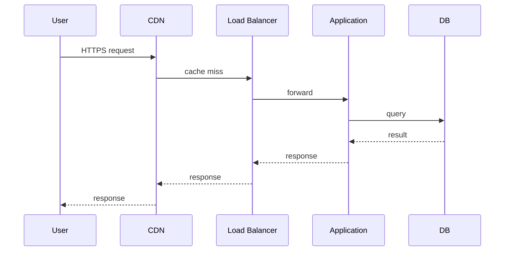

### 7.3 Subsystems <a class='askgpt-btn' href='https://chatgpt.com/?prompt=Read%20this%20section%20of%20my%20encyclopedia%20and%20explain%20it%20in%20depth%20with%20concrete%20examples%2C%20the%20main%20trade-offs%2C%20and%20common%20pitfalls%20a%20practitioner%20should%20know%3A%0A%0Ahttps%3A%2F%2Fgithub.com%2Fvishvasg14%2Fsoftware-engineering-encyclopedia%2Fblob%2Fmain%2F11-cloud%2Fcloud.md%2373-subsystems%0A%0ASection%20title%3A%207.3%20Subsystems' target='_blank' rel='noopener' data-askgpt='7.3 Subsystems' data-askgpt-url='https://github.com/vishvasg14/software-engineering-encyclopedia/blob/main/11-cloud/cloud.md#73-subsystems' data-askgpt-prompt-depth='Read%20this%20section%20of%20my%20encyclopedia%20and%20explain%20it%20in%20depth%20with%20concrete%20examples%2C%20the%20main%20trade-offs%2C%20and%20common%20pitfalls%20a%20practitioner%20should%20know%3A%0A%0Ahttps%3A%2F%2Fgithub.com%2Fvishvasg14%2Fsoftware-engineering-encyclopedia%2Fblob%2Fmain%2F11-cloud%2Fcloud.md%2373-subsystems%0A%0ASection%20title%3A%207.3%20Subsystems' data-askgpt-prompt-examples='Read%20this%20section%20of%20my%20encyclopedia%20and%20give%20me%202-3%20real-world%20production%20examples%20for%20it.%20For%20each%3A%20what%20went%20right%2C%20what%20went%20wrong%2C%20and%20the%20lessons%20learned.%20Include%20company%20%2F%20project%20names%20if%20relevant.%0A%0Ahttps%3A%2F%2Fgithub.com%2Fvishvasg14%2Fsoftware-engineering-encyclopedia%2Fblob%2Fmain%2F11-cloud%2Fcloud.md%2373-subsystems%0A%0ASection%20title%3A%207.3%20Subsystems' title='Ask ChatGPT about this section'>💬</a>

| Subsystem | Responsibility |
|-----------|---------------|
| **Edge** | CDN, WAF, DDoS protection |
| **Networking** | VPC, subnets, gateways |
| **Compute** | VM, containers, serverless |
| **Storage** | Object, block, file, archival |
| **Database** | RDBMS, NoSQL, key-value |
| **Messaging** | Queues, pub/sub, streaming |
| **IAM** | Authn, authz |
| **Observability** | Metrics, logs, traces |
| **Cost management** | Cost Explorer, budgets, alerts |

---

## 8. Deep Dive

This section is the heart of the document.

### 8.1 Compute <a class='askgpt-btn' href='https://chatgpt.com/?prompt=Read%20this%20section%20of%20my%20encyclopedia%20and%20explain%20it%20in%20depth%20with%20concrete%20examples%2C%20the%20main%20trade-offs%2C%20and%20common%20pitfalls%20a%20practitioner%20should%20know%3A%0A%0Ahttps%3A%2F%2Fgithub.com%2Fvishvasg14%2Fsoftware-engineering-encyclopedia%2Fblob%2Fmain%2F11-cloud%2Fcloud.md%2381-compute%0A%0ASection%20title%3A%208.1%20Compute' target='_blank' rel='noopener' data-askgpt='8.1 Compute' data-askgpt-url='https://github.com/vishvasg14/software-engineering-encyclopedia/blob/main/11-cloud/cloud.md#81-compute' data-askgpt-prompt-depth='Read%20this%20section%20of%20my%20encyclopedia%20and%20explain%20it%20in%20depth%20with%20concrete%20examples%2C%20the%20main%20trade-offs%2C%20and%20common%20pitfalls%20a%20practitioner%20should%20know%3A%0A%0Ahttps%3A%2F%2Fgithub.com%2Fvishvasg14%2Fsoftware-engineering-encyclopedia%2Fblob%2Fmain%2F11-cloud%2Fcloud.md%2381-compute%0A%0ASection%20title%3A%208.1%20Compute' data-askgpt-prompt-examples='Read%20this%20section%20of%20my%20encyclopedia%20and%20give%20me%202-3%20real-world%20production%20examples%20for%20it.%20For%20each%3A%20what%20went%20right%2C%20what%20went%20wrong%2C%20and%20the%20lessons%20learned.%20Include%20company%20%2F%20project%20names%20if%20relevant.%0A%0Ahttps%3A%2F%2Fgithub.com%2Fvishvasg14%2Fsoftware-engineering-encyclopedia%2Fblob%2Fmain%2F11-cloud%2Fcloud.md%2381-compute%0A%0ASection%20title%3A%208.1%20Compute' title='Ask ChatGPT about this section'>💬</a>

| Service | AWS | Azure | GCP |
|---------|-----|-------|-----|
| **VM (IaaS)** | EC2 | Virtual Machines | Compute Engine |
| **Containers (CaaS)** | ECS, EKS | Container Instances, AKS | Cloud Run, GKE |
| **Functions (FaaS)** | Lambda | Functions | Cloud Functions |
| **App platform (PaaS)** | Elastic Beanstalk | App Service | App Engine |

### 8.2 EC2 / VM deep <a class='askgpt-btn' href='https://chatgpt.com/?prompt=Read%20this%20section%20of%20my%20encyclopedia%20and%20explain%20it%20in%20depth%20with%20concrete%20examples%2C%20the%20main%20trade-offs%2C%20and%20common%20pitfalls%20a%20practitioner%20should%20know%3A%0A%0Ahttps%3A%2F%2Fgithub.com%2Fvishvasg14%2Fsoftware-engineering-encyclopedia%2Fblob%2Fmain%2F11-cloud%2Fcloud.md%2382-ec2-vm-deep%0A%0ASection%20title%3A%208.2%20EC2%20%2F%20VM%20deep' target='_blank' rel='noopener' data-askgpt='8.2 EC2 / VM deep' data-askgpt-url='https://github.com/vishvasg14/software-engineering-encyclopedia/blob/main/11-cloud/cloud.md#82-ec2-vm-deep' data-askgpt-prompt-depth='Read%20this%20section%20of%20my%20encyclopedia%20and%20explain%20it%20in%20depth%20with%20concrete%20examples%2C%20the%20main%20trade-offs%2C%20and%20common%20pitfalls%20a%20practitioner%20should%20know%3A%0A%0Ahttps%3A%2F%2Fgithub.com%2Fvishvasg14%2Fsoftware-engineering-encyclopedia%2Fblob%2Fmain%2F11-cloud%2Fcloud.md%2382-ec2-vm-deep%0A%0ASection%20title%3A%208.2%20EC2%20%2F%20VM%20deep' data-askgpt-prompt-examples='Read%20this%20section%20of%20my%20encyclopedia%20and%20give%20me%202-3%20real-world%20production%20examples%20for%20it.%20For%20each%3A%20what%20went%20right%2C%20what%20went%20wrong%2C%20and%20the%20lessons%20learned.%20Include%20company%20%2F%20project%20names%20if%20relevant.%0A%0Ahttps%3A%2F%2Fgithub.com%2Fvishvasg14%2Fsoftware-engineering-encyclopedia%2Fblob%2Fmain%2F11-cloud%2Fcloud.md%2382-ec2-vm-deep%0A%0ASection%20title%3A%208.2%20EC2%20%2F%20VM%20deep' title='Ask ChatGPT about this section'>💬</a>

**Instance types** (AWS; similar in Azure/GCP):

- **General purpose:** t4g, m6i (balanced).
- **Compute optimized:** c6i (CPU-bound).
- **Memory optimized:** r6i (memory-bound).
- **Storage optimized:** i4i (high disk IO).
- **GPU:** p4d, g5 (ML).
- **ARM:** t4g, c7g (Graviton, better price/performance).

**Pricing models:**

- **On-Demand:** pay per hour/second.
- **Reserved:** 1- or 3-year commit; up to 75% discount.
- **Savings Plans:** flexible commit (compute); up to 72% discount.
- **Spot:** up to 90% discount; can be reclaimed with 2-min notice.
- **Dedicated Hosts:** full host for compliance.

**Spot fleets:** mix of instance types and prices; great for fault-tolerant workloads.

### 8.3 Storage <a class='askgpt-btn' href='https://chatgpt.com/?prompt=Read%20this%20section%20of%20my%20encyclopedia%20and%20explain%20it%20in%20depth%20with%20concrete%20examples%2C%20the%20main%20trade-offs%2C%20and%20common%20pitfalls%20a%20practitioner%20should%20know%3A%0A%0Ahttps%3A%2F%2Fgithub.com%2Fvishvasg14%2Fsoftware-engineering-encyclopedia%2Fblob%2Fmain%2F11-cloud%2Fcloud.md%2383-storage%0A%0ASection%20title%3A%208.3%20Storage' target='_blank' rel='noopener' data-askgpt='8.3 Storage' data-askgpt-url='https://github.com/vishvasg14/software-engineering-encyclopedia/blob/main/11-cloud/cloud.md#83-storage' data-askgpt-prompt-depth='Read%20this%20section%20of%20my%20encyclopedia%20and%20explain%20it%20in%20depth%20with%20concrete%20examples%2C%20the%20main%20trade-offs%2C%20and%20common%20pitfalls%20a%20practitioner%20should%20know%3A%0A%0Ahttps%3A%2F%2Fgithub.com%2Fvishvasg14%2Fsoftware-engineering-encyclopedia%2Fblob%2Fmain%2F11-cloud%2Fcloud.md%2383-storage%0A%0ASection%20title%3A%208.3%20Storage' data-askgpt-prompt-examples='Read%20this%20section%20of%20my%20encyclopedia%20and%20give%20me%202-3%20real-world%20production%20examples%20for%20it.%20For%20each%3A%20what%20went%20right%2C%20what%20went%20wrong%2C%20and%20the%20lessons%20learned.%20Include%20company%20%2F%20project%20names%20if%20relevant.%0A%0Ahttps%3A%2F%2Fgithub.com%2Fvishvasg14%2Fsoftware-engineering-encyclopedia%2Fblob%2Fmain%2F11-cloud%2Fcloud.md%2383-storage%0A%0ASection%20title%3A%208.3%20Storage' title='Ask ChatGPT about this section'>💬</a>

| Type | AWS | Azure | GCP |
|------|-----|-------|-----|
| **Object** | S3 | Blob Storage | Cloud Storage |
| **Block** | EBS | Disk Storage | Persistent Disk |
| **File** | EFS | Files | Filestore |
| **Archive** | Glacier | Archive Storage | Archive Storage |

**S3 deep:**

- **Buckets** — global namespace.
- **Storage classes:** Standard, Intelligent-Tiering, Standard-IA, One Zone-IA, Glacier, Glacier Deep Archive.
- **Lifecycle policies** — transition objects between classes.
- **Versioning** — keep multiple versions.
- **Replication** — cross-region, same-region.
- **Pre-signed URLs** — time-limited access.
- **Event notifications** — S3 -> SNS / Lambda.

### 8.4 Networking <a class='askgpt-btn' href='https://chatgpt.com/?prompt=Read%20this%20section%20of%20my%20encyclopedia%20and%20explain%20it%20in%20depth%20with%20concrete%20examples%2C%20the%20main%20trade-offs%2C%20and%20common%20pitfalls%20a%20practitioner%20should%20know%3A%0A%0Ahttps%3A%2F%2Fgithub.com%2Fvishvasg14%2Fsoftware-engineering-encyclopedia%2Fblob%2Fmain%2F11-cloud%2Fcloud.md%2384-networking%0A%0ASection%20title%3A%208.4%20Networking' target='_blank' rel='noopener' data-askgpt='8.4 Networking' data-askgpt-url='https://github.com/vishvasg14/software-engineering-encyclopedia/blob/main/11-cloud/cloud.md#84-networking' data-askgpt-prompt-depth='Read%20this%20section%20of%20my%20encyclopedia%20and%20explain%20it%20in%20depth%20with%20concrete%20examples%2C%20the%20main%20trade-offs%2C%20and%20common%20pitfalls%20a%20practitioner%20should%20know%3A%0A%0Ahttps%3A%2F%2Fgithub.com%2Fvishvasg14%2Fsoftware-engineering-encyclopedia%2Fblob%2Fmain%2F11-cloud%2Fcloud.md%2384-networking%0A%0ASection%20title%3A%208.4%20Networking' data-askgpt-prompt-examples='Read%20this%20section%20of%20my%20encyclopedia%20and%20give%20me%202-3%20real-world%20production%20examples%20for%20it.%20For%20each%3A%20what%20went%20right%2C%20what%20went%20wrong%2C%20and%20the%20lessons%20learned.%20Include%20company%20%2F%20project%20names%20if%20relevant.%0A%0Ahttps%3A%2F%2Fgithub.com%2Fvishvasg14%2Fsoftware-engineering-encyclopedia%2Fblob%2Fmain%2F11-cloud%2Fcloud.md%2384-networking%0A%0ASection%20title%3A%208.4%20Networking' title='Ask ChatGPT about this section'>💬</a>

**VPC** — isolated network in the cloud.

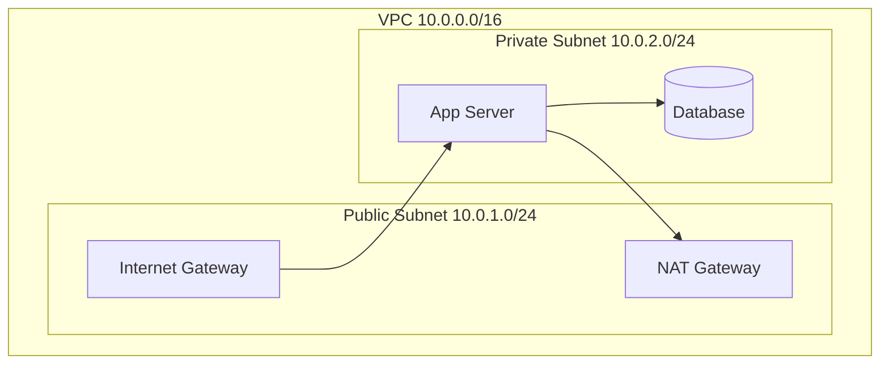

**Components:**

- **Subnet** — range of IPs within VPC.
- **Internet Gateway** — public subnet to internet.
- **NAT Gateway** — private subnet to internet (outbound only).
- **Route Table** — controls traffic flow.
- **Security Group** — instance-level firewall.
- **NACL** — subnet-level firewall.
- **VPC Peering** — direct connection between VPCs.
- **Transit Gateway** — hub for many VPCs.
- **PrivateLink** — private access to services.

### 8.5 IAM <a class='askgpt-btn' href='https://chatgpt.com/?prompt=Read%20this%20section%20of%20my%20encyclopedia%20and%20explain%20it%20in%20depth%20with%20concrete%20examples%2C%20the%20main%20trade-offs%2C%20and%20common%20pitfalls%20a%20practitioner%20should%20know%3A%0A%0Ahttps%3A%2F%2Fgithub.com%2Fvishvasg14%2Fsoftware-engineering-encyclopedia%2Fblob%2Fmain%2F11-cloud%2Fcloud.md%2385-iam%0A%0ASection%20title%3A%208.5%20IAM' target='_blank' rel='noopener' data-askgpt='8.5 IAM' data-askgpt-url='https://github.com/vishvasg14/software-engineering-encyclopedia/blob/main/11-cloud/cloud.md#85-iam' data-askgpt-prompt-depth='Read%20this%20section%20of%20my%20encyclopedia%20and%20explain%20it%20in%20depth%20with%20concrete%20examples%2C%20the%20main%20trade-offs%2C%20and%20common%20pitfalls%20a%20practitioner%20should%20know%3A%0A%0Ahttps%3A%2F%2Fgithub.com%2Fvishvasg14%2Fsoftware-engineering-encyclopedia%2Fblob%2Fmain%2F11-cloud%2Fcloud.md%2385-iam%0A%0ASection%20title%3A%208.5%20IAM' data-askgpt-prompt-examples='Read%20this%20section%20of%20my%20encyclopedia%20and%20give%20me%202-3%20real-world%20production%20examples%20for%20it.%20For%20each%3A%20what%20went%20right%2C%20what%20went%20wrong%2C%20and%20the%20lessons%20learned.%20Include%20company%20%2F%20project%20names%20if%20relevant.%0A%0Ahttps%3A%2F%2Fgithub.com%2Fvishvasg14%2Fsoftware-engineering-encyclopedia%2Fblob%2Fmain%2F11-cloud%2Fcloud.md%2385-iam%0A%0ASection%20title%3A%208.5%20IAM' title='Ask ChatGPT about this section'>💬</a>

**Components:**

- **User** — individual identity.
- **Group** — collection of users.
- **Role** — set of permissions; assumable by principals.
- **Policy** — JSON document with permissions.
- **Resource** — what the policy applies to.

**Policy example:**

```json
{
    "Version": "2012-10-17",
    "Statement": [
        {
            "Effect": "Allow",
            "Action": [
                "s3:GetObject",
                "s3:PutObject"
            ],
            "Resource": "arn:aws:s3:::my-bucket/*"
        }
    ]
}
```

**IAM best practices:**

- Least privilege.
- Use roles, not users.
- Enable MFA.
- Rotate access keys.
- Use ServiceAccounts for applications.

### 8.6 Serverless <a class='askgpt-btn' href='https://chatgpt.com/?prompt=Read%20this%20section%20of%20my%20encyclopedia%20and%20explain%20it%20in%20depth%20with%20concrete%20examples%2C%20the%20main%20trade-offs%2C%20and%20common%20pitfalls%20a%20practitioner%20should%20know%3A%0A%0Ahttps%3A%2F%2Fgithub.com%2Fvishvasg14%2Fsoftware-engineering-encyclopedia%2Fblob%2Fmain%2F11-cloud%2Fcloud.md%2386-serverless%0A%0ASection%20title%3A%208.6%20Serverless' target='_blank' rel='noopener' data-askgpt='8.6 Serverless' data-askgpt-url='https://github.com/vishvasg14/software-engineering-encyclopedia/blob/main/11-cloud/cloud.md#86-serverless' data-askgpt-prompt-depth='Read%20this%20section%20of%20my%20encyclopedia%20and%20explain%20it%20in%20depth%20with%20concrete%20examples%2C%20the%20main%20trade-offs%2C%20and%20common%20pitfalls%20a%20practitioner%20should%20know%3A%0A%0Ahttps%3A%2F%2Fgithub.com%2Fvishvasg14%2Fsoftware-engineering-encyclopedia%2Fblob%2Fmain%2F11-cloud%2Fcloud.md%2386-serverless%0A%0ASection%20title%3A%208.6%20Serverless' data-askgpt-prompt-examples='Read%20this%20section%20of%20my%20encyclopedia%20and%20give%20me%202-3%20real-world%20production%20examples%20for%20it.%20For%20each%3A%20what%20went%20right%2C%20what%20went%20wrong%2C%20and%20the%20lessons%20learned.%20Include%20company%20%2F%20project%20names%20if%20relevant.%0A%0Ahttps%3A%2F%2Fgithub.com%2Fvishvasg14%2Fsoftware-engineering-encyclopedia%2Fblob%2Fmain%2F11-cloud%2Fcloud.md%2386-serverless%0A%0ASection%20title%3A%208.6%20Serverless' title='Ask ChatGPT about this section'>💬</a>

**Lambda (AWS) deep:**

```typescript
// index.mjs
export const handler = async (event) => {
    const bucket = event.Records[0].s3.bucket.name;
    const key = event.Records[0].s3.object.key;
    // process
    return { statusCode: 200 };
};
```

**Cold starts:**

- First request after idle: 100ms-1s.
- Subsequent (warm): single-digit ms.
- Mitigation: Provisioned Concurrency (AWS), min-instances.

**Lambda limits:**

- Memory: 128 MB - 10 GB.
- Timeout: 15 min max.
- Package size: 250 MB unzipped.
- Concurrent executions: 1000 (default; can increase).

**Lambda patterns:**

- API backend (API Gateway + Lambda).
- Event processing (S3 events, DynamoDB streams).
- Scheduled tasks (EventBridge + Lambda).
- Glue for microservices (Lambda + Step Functions).

### 8.7 Managed databases <a class='askgpt-btn' href='https://chatgpt.com/?prompt=Read%20this%20section%20of%20my%20encyclopedia%20and%20explain%20it%20in%20depth%20with%20concrete%20examples%2C%20the%20main%20trade-offs%2C%20and%20common%20pitfalls%20a%20practitioner%20should%20know%3A%0A%0Ahttps%3A%2F%2Fgithub.com%2Fvishvasg14%2Fsoftware-engineering-encyclopedia%2Fblob%2Fmain%2F11-cloud%2Fcloud.md%2387-managed-databases%0A%0ASection%20title%3A%208.7%20Managed%20databases' target='_blank' rel='noopener' data-askgpt='8.7 Managed databases' data-askgpt-url='https://github.com/vishvasg14/software-engineering-encyclopedia/blob/main/11-cloud/cloud.md#87-managed-databases' data-askgpt-prompt-depth='Read%20this%20section%20of%20my%20encyclopedia%20and%20explain%20it%20in%20depth%20with%20concrete%20examples%2C%20the%20main%20trade-offs%2C%20and%20common%20pitfalls%20a%20practitioner%20should%20know%3A%0A%0Ahttps%3A%2F%2Fgithub.com%2Fvishvasg14%2Fsoftware-engineering-encyclopedia%2Fblob%2Fmain%2F11-cloud%2Fcloud.md%2387-managed-databases%0A%0ASection%20title%3A%208.7%20Managed%20databases' data-askgpt-prompt-examples='Read%20this%20section%20of%20my%20encyclopedia%20and%20give%20me%202-3%20real-world%20production%20examples%20for%20it.%20For%20each%3A%20what%20went%20right%2C%20what%20went%20wrong%2C%20and%20the%20lessons%20learned.%20Include%20company%20%2F%20project%20names%20if%20relevant.%0A%0Ahttps%3A%2F%2Fgithub.com%2Fvishvasg14%2Fsoftware-engineering-encyclopedia%2Fblob%2Fmain%2F11-cloud%2Fcloud.md%2387-managed-databases%0A%0ASection%20title%3A%208.7%20Managed%20databases' title='Ask ChatGPT about this section'>💬</a>

| Type | AWS | Azure | GCP |
|------|-----|-------|-----|
| **RDBMS** | RDS / Aurora | Azure SQL | Cloud SQL / AlloyDB |
| **Distributed SQL** | Aurora | Cosmos DB | Spanner |
| **NoSQL key-value** | DynamoDB | Cosmos DB | Firestore / Bigtable |
| **In-memory cache** | ElastiCache | Cache for Redis | Memorystore |
| **Graph** | Neptune | (Cosmos DB Gremlin) | (no managed) |
| **Ledger** | QLDB | (preview) | (no managed) |

**DynamoDB deep:**

- **Tables, items, attributes.**
- **Partition key** — determines partitioning.
- **GSI (Global Secondary Index)** — alternative key.
- **Capacity modes:** on-demand or provisioned.
- **DAX** — in-memory cache.
- **Streams** — change data capture.
- **TTL** — auto-delete.

### 8.8 Managed Kafka <a class='askgpt-btn' href='https://chatgpt.com/?prompt=Read%20this%20section%20of%20my%20encyclopedia%20and%20explain%20it%20in%20depth%20with%20concrete%20examples%2C%20the%20main%20trade-offs%2C%20and%20common%20pitfalls%20a%20practitioner%20should%20know%3A%0A%0Ahttps%3A%2F%2Fgithub.com%2Fvishvasg14%2Fsoftware-engineering-encyclopedia%2Fblob%2Fmain%2F11-cloud%2Fcloud.md%2388-managed-kafka%0A%0ASection%20title%3A%208.8%20Managed%20Kafka' target='_blank' rel='noopener' data-askgpt='8.8 Managed Kafka' data-askgpt-url='https://github.com/vishvasg14/software-engineering-encyclopedia/blob/main/11-cloud/cloud.md#88-managed-kafka' data-askgpt-prompt-depth='Read%20this%20section%20of%20my%20encyclopedia%20and%20explain%20it%20in%20depth%20with%20concrete%20examples%2C%20the%20main%20trade-offs%2C%20and%20common%20pitfalls%20a%20practitioner%20should%20know%3A%0A%0Ahttps%3A%2F%2Fgithub.com%2Fvishvasg14%2Fsoftware-engineering-encyclopedia%2Fblob%2Fmain%2F11-cloud%2Fcloud.md%2388-managed-kafka%0A%0ASection%20title%3A%208.8%20Managed%20Kafka' data-askgpt-prompt-examples='Read%20this%20section%20of%20my%20encyclopedia%20and%20give%20me%202-3%20real-world%20production%20examples%20for%20it.%20For%20each%3A%20what%20went%20right%2C%20what%20went%20wrong%2C%20and%20the%20lessons%20learned.%20Include%20company%20%2F%20project%20names%20if%20relevant.%0A%0Ahttps%3A%2F%2Fgithub.com%2Fvishvasg14%2Fsoftware-engineering-encyclopedia%2Fblob%2Fmain%2F11-cloud%2Fcloud.md%2388-managed-kafka%0A%0ASection%20title%3A%208.8%20Managed%20Kafka' title='Ask ChatGPT about this section'>💬</a>

| Service | AWS | Azure | GCP |
|---------|-----|-------|-----|
| **Managed Kafka** | MSK (Amazon Managed Streaming for Apache Kafka) | Event Hubs for Kafka | Confluent Cloud (partner) |
| **Hosted Kafka** | MSK Serverless | Event Hubs Premium | Confluent Cloud |

**AWS MSK deep:**

- **Cluster:** multiple brokers (Kafka brokers).
- **Brokers:** Kafka processes.
- **Topics, partitions, replication factor.**
- **Storage:** EBS volumes.
- **Monitoring:** CloudWatch metrics.

### 8.9 Observability <a class='askgpt-btn' href='https://chatgpt.com/?prompt=Read%20this%20section%20of%20my%20encyclopedia%20and%20explain%20it%20in%20depth%20with%20concrete%20examples%2C%20the%20main%20trade-offs%2C%20and%20common%20pitfalls%20a%20practitioner%20should%20know%3A%0A%0Ahttps%3A%2F%2Fgithub.com%2Fvishvasg14%2Fsoftware-engineering-encyclopedia%2Fblob%2Fmain%2F11-cloud%2Fcloud.md%2389-observability%0A%0ASection%20title%3A%208.9%20Observability' target='_blank' rel='noopener' data-askgpt='8.9 Observability' data-askgpt-url='https://github.com/vishvasg14/software-engineering-encyclopedia/blob/main/11-cloud/cloud.md#89-observability' data-askgpt-prompt-depth='Read%20this%20section%20of%20my%20encyclopedia%20and%20explain%20it%20in%20depth%20with%20concrete%20examples%2C%20the%20main%20trade-offs%2C%20and%20common%20pitfalls%20a%20practitioner%20should%20know%3A%0A%0Ahttps%3A%2F%2Fgithub.com%2Fvishvasg14%2Fsoftware-engineering-encyclopedia%2Fblob%2Fmain%2F11-cloud%2Fcloud.md%2389-observability%0A%0ASection%20title%3A%208.9%20Observability' data-askgpt-prompt-examples='Read%20this%20section%20of%20my%20encyclopedia%20and%20give%20me%202-3%20real-world%20production%20examples%20for%20it.%20For%20each%3A%20what%20went%20right%2C%20what%20went%20wrong%2C%20and%20the%20lessons%20learned.%20Include%20company%20%2F%20project%20names%20if%20relevant.%0A%0Ahttps%3A%2F%2Fgithub.com%2Fvishvasg14%2Fsoftware-engineering-encyclopedia%2Fblob%2Fmain%2F11-cloud%2Fcloud.md%2389-observability%0A%0ASection%20title%3A%208.9%20Observability' title='Ask ChatGPT about this section'>💬</a>

| Service | AWS | Azure | GCP |
|---------|-----|-------|-----|
| **Metrics** | CloudWatch | Azure Monitor | Cloud Monitoring |
| **Logs** | CloudWatch Logs | Log Analytics | Cloud Logging |
| **Traces** | X-Ray | Application Insights | Cloud Trace |
| **Audit** | CloudTrail | Activity Log | Cloud Audit Logs |
| **Alerts** | CloudWatch Alarms | Azure Alerts | Cloud Alerting |

**X-Ray deep:**

- Service map of distributed app.
- Trace each request end-to-end.
- Annotations and metadata.
- Sampling rules.

### 8.10 CDN <a class='askgpt-btn' href='https://chatgpt.com/?prompt=Read%20this%20section%20of%20my%20encyclopedia%20and%20explain%20it%20in%20depth%20with%20concrete%20examples%2C%20the%20main%20trade-offs%2C%20and%20common%20pitfalls%20a%20practitioner%20should%20know%3A%0A%0Ahttps%3A%2F%2Fgithub.com%2Fvishvasg14%2Fsoftware-engineering-encyclopedia%2Fblob%2Fmain%2F11-cloud%2Fcloud.md%23810-cdn%0A%0ASection%20title%3A%208.10%20CDN' target='_blank' rel='noopener' data-askgpt='8.10 CDN' data-askgpt-url='https://github.com/vishvasg14/software-engineering-encyclopedia/blob/main/11-cloud/cloud.md#810-cdn' data-askgpt-prompt-depth='Read%20this%20section%20of%20my%20encyclopedia%20and%20explain%20it%20in%20depth%20with%20concrete%20examples%2C%20the%20main%20trade-offs%2C%20and%20common%20pitfalls%20a%20practitioner%20should%20know%3A%0A%0Ahttps%3A%2F%2Fgithub.com%2Fvishvasg14%2Fsoftware-engineering-encyclopedia%2Fblob%2Fmain%2F11-cloud%2Fcloud.md%23810-cdn%0A%0ASection%20title%3A%208.10%20CDN' data-askgpt-prompt-examples='Read%20this%20section%20of%20my%20encyclopedia%20and%20give%20me%202-3%20real-world%20production%20examples%20for%20it.%20For%20each%3A%20what%20went%20right%2C%20what%20went%20wrong%2C%20and%20the%20lessons%20learned.%20Include%20company%20%2F%20project%20names%20if%20relevant.%0A%0Ahttps%3A%2F%2Fgithub.com%2Fvishvasg14%2Fsoftware-engineering-encyclopedia%2Fblob%2Fmain%2F11-cloud%2Fcloud.md%23810-cdn%0A%0ASection%20title%3A%208.10%20CDN' title='Ask ChatGPT about this section'>💬</a>

**CloudFront (AWS) deep:**

- **Distributions** — configuration for CDN.
- **Origins** — S3, ALB, EC2, custom.
- **Cache behaviors** — path patterns to cache.
- **TTL** — cache expiration.
- **Signed URLs** — restricted access.
- **Lambda@Edge** — run code at edge.

### 8.11 Cost optimization (FinOps) <a class='askgpt-btn' href='https://chatgpt.com/?prompt=Read%20this%20section%20of%20my%20encyclopedia%20and%20explain%20it%20in%20depth%20with%20concrete%20examples%2C%20the%20main%20trade-offs%2C%20and%20common%20pitfalls%20a%20practitioner%20should%20know%3A%0A%0Ahttps%3A%2F%2Fgithub.com%2Fvishvasg14%2Fsoftware-engineering-encyclopedia%2Fblob%2Fmain%2F11-cloud%2Fcloud.md%23811-cost-optimization-finops%0A%0ASection%20title%3A%208.11%20Cost%20optimization%20(FinOps)' target='_blank' rel='noopener' data-askgpt='8.11 Cost optimization (FinOps)' data-askgpt-url='https://github.com/vishvasg14/software-engineering-encyclopedia/blob/main/11-cloud/cloud.md#811-cost-optimization-finops' data-askgpt-prompt-depth='Read%20this%20section%20of%20my%20encyclopedia%20and%20explain%20it%20in%20depth%20with%20concrete%20examples%2C%20the%20main%20trade-offs%2C%20and%20common%20pitfalls%20a%20practitioner%20should%20know%3A%0A%0Ahttps%3A%2F%2Fgithub.com%2Fvishvasg14%2Fsoftware-engineering-encyclopedia%2Fblob%2Fmain%2F11-cloud%2Fcloud.md%23811-cost-optimization-finops%0A%0ASection%20title%3A%208.11%20Cost%20optimization%20(FinOps)' data-askgpt-prompt-examples='Read%20this%20section%20of%20my%20encyclopedia%20and%20give%20me%202-3%20real-world%20production%20examples%20for%20it.%20For%20each%3A%20what%20went%20right%2C%20what%20went%20wrong%2C%20and%20the%20lessons%20learned.%20Include%20company%20%2F%20project%20names%20if%20relevant.%0A%0Ahttps%3A%2F%2Fgithub.com%2Fvishvasg14%2Fsoftware-engineering-encyclopedia%2Fblob%2Fmain%2F11-cloud%2Fcloud.md%23811-cost-optimization-finops%0A%0ASection%20title%3A%208.11%20Cost%20optimization%20(FinOps)' title='Ask ChatGPT about this section'>💬</a>

**Principles:**

1. **Visibility** — know what you spend.
2. **Optimization** — reduce waste.
3. **Operation** — continuous improvement.

**Tactics:**

- **Right-sizing:** match instance types to workload.
- **Reserved Instances / Savings Plans:** commit for discounts.
- **Spot instances:** fault-tolerant workloads.
- **Auto-scaling:** scale down when not needed.
- **Lifecycle policies:** move old data to cheaper storage.
- **Tagging:** know who/what/why.
- **S3 Intelligent-Tiering:** automatic tier transitions.
- **Schedule non-prod:** stop dev outside business hours.
- **Cost allocation tags:** attribute spend to teams/products.

**AWS Cost Explorer** — visualize spend; identify trends.

### 8.12 Multi-cloud patterns <a class='askgpt-btn' href='https://chatgpt.com/?prompt=Read%20this%20section%20of%20my%20encyclopedia%20and%20explain%20it%20in%20depth%20with%20concrete%20examples%2C%20the%20main%20trade-offs%2C%20and%20common%20pitfalls%20a%20practitioner%20should%20know%3A%0A%0Ahttps%3A%2F%2Fgithub.com%2Fvishvasg14%2Fsoftware-engineering-encyclopedia%2Fblob%2Fmain%2F11-cloud%2Fcloud.md%23812-multi-cloud-patterns%0A%0ASection%20title%3A%208.12%20Multi-cloud%20patterns' target='_blank' rel='noopener' data-askgpt='8.12 Multi-cloud patterns' data-askgpt-url='https://github.com/vishvasg14/software-engineering-encyclopedia/blob/main/11-cloud/cloud.md#812-multi-cloud-patterns' data-askgpt-prompt-depth='Read%20this%20section%20of%20my%20encyclopedia%20and%20explain%20it%20in%20depth%20with%20concrete%20examples%2C%20the%20main%20trade-offs%2C%20and%20common%20pitfalls%20a%20practitioner%20should%20know%3A%0A%0Ahttps%3A%2F%2Fgithub.com%2Fvishvasg14%2Fsoftware-engineering-encyclopedia%2Fblob%2Fmain%2F11-cloud%2Fcloud.md%23812-multi-cloud-patterns%0A%0ASection%20title%3A%208.12%20Multi-cloud%20patterns' data-askgpt-prompt-examples='Read%20this%20section%20of%20my%20encyclopedia%20and%20give%20me%202-3%20real-world%20production%20examples%20for%20it.%20For%20each%3A%20what%20went%20right%2C%20what%20went%20wrong%2C%20and%20the%20lessons%20learned.%20Include%20company%20%2F%20project%20names%20if%20relevant.%0A%0Ahttps%3A%2F%2Fgithub.com%2Fvishvasg14%2Fsoftware-engineering-encyclopedia%2Fblob%2Fmain%2F11-cloud%2Fcloud.md%23812-multi-cloud-patterns%0A%0ASection%20title%3A%208.12%20Multi-cloud%20patterns' title='Ask ChatGPT about this section'>💬</a>

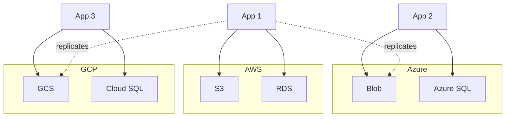

**Multi-cloud reasons:**

- Vendor lock-in avoidance.
- Best-of-breed services.
- Geographic requirements.
- Regulatory.

**Multi-cloud challenges:**

- Operational complexity.
- Data consistency.
- Cost (data egress).
- Networking.

**Patterns:**

- **Active-active:** traffic in multiple regions.
- **Active-passive:** primary region with backup.
- **Backup-and-restore:** data replicated for DR.
- **Data lake:** centralized data in one cloud, compute in multiple.

### 8.13 AWS vs Azure vs GCP for each service <a class='askgpt-btn' href='https://chatgpt.com/?prompt=Read%20this%20section%20of%20my%20encyclopedia%20and%20explain%20it%20in%20depth%20with%20concrete%20examples%2C%20the%20main%20trade-offs%2C%20and%20common%20pitfalls%20a%20practitioner%20should%20know%3A%0A%0Ahttps%3A%2F%2Fgithub.com%2Fvishvasg14%2Fsoftware-engineering-encyclopedia%2Fblob%2Fmain%2F11-cloud%2Fcloud.md%23813-aws-vs-azure-vs-gcp-for-each-service%0A%0ASection%20title%3A%208.13%20AWS%20vs%20Azure%20vs%20GCP%20for%20each%20service' target='_blank' rel='noopener' data-askgpt='8.13 AWS vs Azure vs GCP for each service' data-askgpt-url='https://github.com/vishvasg14/software-engineering-encyclopedia/blob/main/11-cloud/cloud.md#813-aws-vs-azure-vs-gcp-for-each-service' data-askgpt-prompt-depth='Read%20this%20section%20of%20my%20encyclopedia%20and%20explain%20it%20in%20depth%20with%20concrete%20examples%2C%20the%20main%20trade-offs%2C%20and%20common%20pitfalls%20a%20practitioner%20should%20know%3A%0A%0Ahttps%3A%2F%2Fgithub.com%2Fvishvasg14%2Fsoftware-engineering-encyclopedia%2Fblob%2Fmain%2F11-cloud%2Fcloud.md%23813-aws-vs-azure-vs-gcp-for-each-service%0A%0ASection%20title%3A%208.13%20AWS%20vs%20Azure%20vs%20GCP%20for%20each%20service' data-askgpt-prompt-examples='Read%20this%20section%20of%20my%20encyclopedia%20and%20give%20me%202-3%20real-world%20production%20examples%20for%20it.%20For%20each%3A%20what%20went%20right%2C%20what%20went%20wrong%2C%20and%20the%20lessons%20learned.%20Include%20company%20%2F%20project%20names%20if%20relevant.%0A%0Ahttps%3A%2F%2Fgithub.com%2Fvishvasg14%2Fsoftware-engineering-encyclopedia%2Fblob%2Fmain%2F11-cloud%2Fcloud.md%23813-aws-vs-azure-vs-gcp-for-each-service%0A%0ASection%20title%3A%208.13%20AWS%20vs%20Azure%20vs%20GCP%20for%20each%20service' title='Ask ChatGPT about this section'>💬</a>

| Service | AWS | Azure | GCP |
|---------|-----|-------|-----|
| **VM** | EC2 (most mature) | Virtual Machines (integrated with AD) | Compute Engine (best price/performance) |
| **K8s** | EKS | AKS (best integration) | GKE (most mature, leader) |
| **Object storage** | S3 (most features) | Blob (integrated) | GCS (consistent) |
| **RDBMS** | RDS / Aurora | Azure SQL (SQL Server) | Cloud SQL (Postgres/MySQL) |
| **NoSQL** | DynamoDB | Cosmos DB | Firestore / Bigtable |
| **Functions** | Lambda (most features) | Functions (integrated) | Cloud Functions / Cloud Run |
| **CDN** | CloudFront | Front Door / CDN | Cloud CDN |
| **DNS** | Route 53 (most features) | Azure DNS | Cloud DNS |
| **Managed Kafka** | MSK | Event Hubs for Kafka | Confluent Cloud |

### 8.14 Disaster recovery <a class='askgpt-btn' href='https://chatgpt.com/?prompt=Read%20this%20section%20of%20my%20encyclopedia%20and%20explain%20it%20in%20depth%20with%20concrete%20examples%2C%20the%20main%20trade-offs%2C%20and%20common%20pitfalls%20a%20practitioner%20should%20know%3A%0A%0Ahttps%3A%2F%2Fgithub.com%2Fvishvasg14%2Fsoftware-engineering-encyclopedia%2Fblob%2Fmain%2F11-cloud%2Fcloud.md%23814-disaster-recovery%0A%0ASection%20title%3A%208.14%20Disaster%20recovery' target='_blank' rel='noopener' data-askgpt='8.14 Disaster recovery' data-askgpt-url='https://github.com/vishvasg14/software-engineering-encyclopedia/blob/main/11-cloud/cloud.md#814-disaster-recovery' data-askgpt-prompt-depth='Read%20this%20section%20of%20my%20encyclopedia%20and%20explain%20it%20in%20depth%20with%20concrete%20examples%2C%20the%20main%20trade-offs%2C%20and%20common%20pitfalls%20a%20practitioner%20should%20know%3A%0A%0Ahttps%3A%2F%2Fgithub.com%2Fvishvasg14%2Fsoftware-engineering-encyclopedia%2Fblob%2Fmain%2F11-cloud%2Fcloud.md%23814-disaster-recovery%0A%0ASection%20title%3A%208.14%20Disaster%20recovery' data-askgpt-prompt-examples='Read%20this%20section%20of%20my%20encyclopedia%20and%20give%20me%202-3%20real-world%20production%20examples%20for%20it.%20For%20each%3A%20what%20went%20right%2C%20what%20went%20wrong%2C%20and%20the%20lessons%20learned.%20Include%20company%20%2F%20project%20names%20if%20relevant.%0A%0Ahttps%3A%2F%2Fgithub.com%2Fvishvasg14%2Fsoftware-engineering-encyclopedia%2Fblob%2Fmain%2F11-cloud%2Fcloud.md%23814-disaster-recovery%0A%0ASection%20title%3A%208.14%20Disaster%20recovery' title='Ask ChatGPT about this section'>💬</a>

**RTO (Recovery Time Objective)** — how long to recover.
**RPO (Recovery Point Objective)** — how much data loss.

**Strategies:**

| Strategy | RTO | RPO | Cost |
|----------|-----|-----|------|
| Backup/restore | Hours | Hours | Low |
- Pilot light | 10s of min | Minutes | Medium
- Warm standby | Minutes | Seconds | High
- Multi-site active/active | Seconds | None | Highest

**AWS DR services:**

- **S3 cross-region replication** — data.
- **RDS read replicas** — failover target.
- **Route 53** — DNS failover.
- **CloudEndure** — block-level replication.

---

## 9. Architecture

### 9.1 Three-tier web application <a class='askgpt-btn' href='https://chatgpt.com/?prompt=Read%20this%20section%20of%20my%20encyclopedia%20and%20explain%20it%20in%20depth%20with%20concrete%20examples%2C%20the%20main%20trade-offs%2C%20and%20common%20pitfalls%20a%20practitioner%20should%20know%3A%0A%0Ahttps%3A%2F%2Fgithub.com%2Fvishvasg14%2Fsoftware-engineering-encyclopedia%2Fblob%2Fmain%2F11-cloud%2Fcloud.md%2391-three-tier-web-application%0A%0ASection%20title%3A%209.1%20Three-tier%20web%20application' target='_blank' rel='noopener' data-askgpt='9.1 Three-tier web application' data-askgpt-url='https://github.com/vishvasg14/software-engineering-encyclopedia/blob/main/11-cloud/cloud.md#91-three-tier-web-application' data-askgpt-prompt-depth='Read%20this%20section%20of%20my%20encyclopedia%20and%20explain%20it%20in%20depth%20with%20concrete%20examples%2C%20the%20main%20trade-offs%2C%20and%20common%20pitfalls%20a%20practitioner%20should%20know%3A%0A%0Ahttps%3A%2F%2Fgithub.com%2Fvishvasg14%2Fsoftware-engineering-encyclopedia%2Fblob%2Fmain%2F11-cloud%2Fcloud.md%2391-three-tier-web-application%0A%0ASection%20title%3A%209.1%20Three-tier%20web%20application' data-askgpt-prompt-examples='Read%20this%20section%20of%20my%20encyclopedia%20and%20give%20me%202-3%20real-world%20production%20examples%20for%20it.%20For%20each%3A%20what%20went%20right%2C%20what%20went%20wrong%2C%20and%20the%20lessons%20learned.%20Include%20company%20%2F%20project%20names%20if%20relevant.%0A%0Ahttps%3A%2F%2Fgithub.com%2Fvishvasg14%2Fsoftware-engineering-encyclopedia%2Fblob%2Fmain%2F11-cloud%2Fcloud.md%2391-three-tier-web-application%0A%0ASection%20title%3A%209.1%20Three-tier%20web%20application' title='Ask ChatGPT about this section'>💬</a>

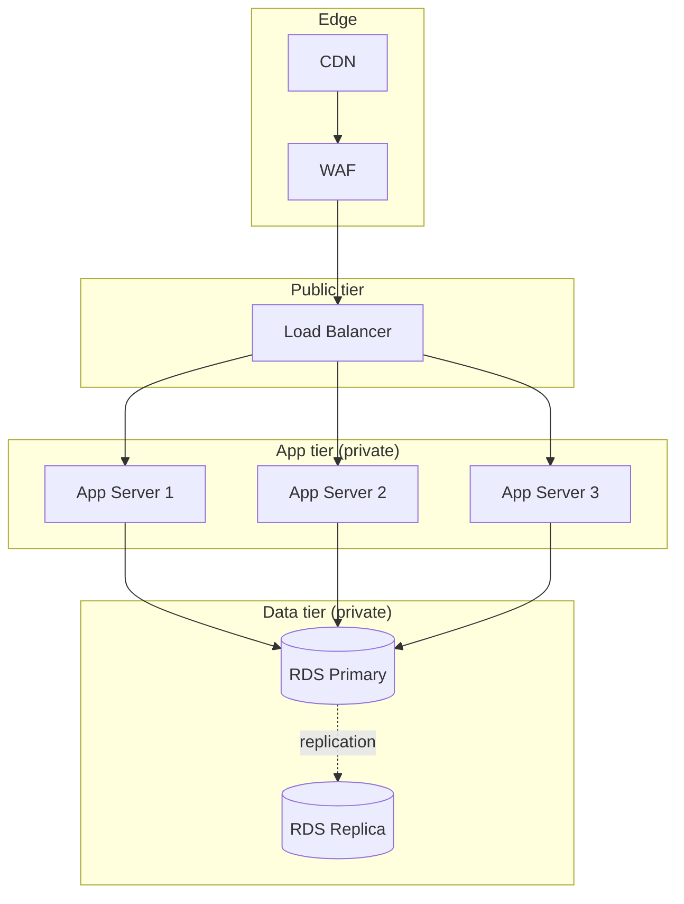

### 9.2 Serverless API backend <a class='askgpt-btn' href='https://chatgpt.com/?prompt=Read%20this%20section%20of%20my%20encyclopedia%20and%20explain%20it%20in%20depth%20with%20concrete%20examples%2C%20the%20main%20trade-offs%2C%20and%20common%20pitfalls%20a%20practitioner%20should%20know%3A%0A%0Ahttps%3A%2F%2Fgithub.com%2Fvishvasg14%2Fsoftware-engineering-encyclopedia%2Fblob%2Fmain%2F11-cloud%2Fcloud.md%2392-serverless-api-backend%0A%0ASection%20title%3A%209.2%20Serverless%20API%20backend' target='_blank' rel='noopener' data-askgpt='9.2 Serverless API backend' data-askgpt-url='https://github.com/vishvasg14/software-engineering-encyclopedia/blob/main/11-cloud/cloud.md#92-serverless-api-backend' data-askgpt-prompt-depth='Read%20this%20section%20of%20my%20encyclopedia%20and%20explain%20it%20in%20depth%20with%20concrete%20examples%2C%20the%20main%20trade-offs%2C%20and%20common%20pitfalls%20a%20practitioner%20should%20know%3A%0A%0Ahttps%3A%2F%2Fgithub.com%2Fvishvasg14%2Fsoftware-engineering-encyclopedia%2Fblob%2Fmain%2F11-cloud%2Fcloud.md%2392-serverless-api-backend%0A%0ASection%20title%3A%209.2%20Serverless%20API%20backend' data-askgpt-prompt-examples='Read%20this%20section%20of%20my%20encyclopedia%20and%20give%20me%202-3%20real-world%20production%20examples%20for%20it.%20For%20each%3A%20what%20went%20right%2C%20what%20went%20wrong%2C%20and%20the%20lessons%20learned.%20Include%20company%20%2F%20project%20names%20if%20relevant.%0A%0Ahttps%3A%2F%2Fgithub.com%2Fvishvasg14%2Fsoftware-engineering-encyclopedia%2Fblob%2Fmain%2F11-cloud%2Fcloud.md%2392-serverless-api-backend%0A%0ASection%20title%3A%209.2%20Serverless%20API%20backend' title='Ask ChatGPT about this section'>💬</a>

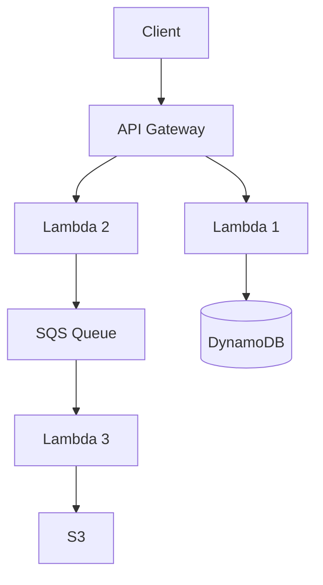

### 9.3 Multi-cloud DR <a class='askgpt-btn' href='https://chatgpt.com/?prompt=Read%20this%20section%20of%20my%20encyclopedia%20and%20explain%20it%20in%20depth%20with%20concrete%20examples%2C%20the%20main%20trade-offs%2C%20and%20common%20pitfalls%20a%20practitioner%20should%20know%3A%0A%0Ahttps%3A%2F%2Fgithub.com%2Fvishvasg14%2Fsoftware-engineering-encyclopedia%2Fblob%2Fmain%2F11-cloud%2Fcloud.md%2393-multi-cloud-dr%0A%0ASection%20title%3A%209.3%20Multi-cloud%20DR' target='_blank' rel='noopener' data-askgpt='9.3 Multi-cloud DR' data-askgpt-url='https://github.com/vishvasg14/software-engineering-encyclopedia/blob/main/11-cloud/cloud.md#93-multi-cloud-dr' data-askgpt-prompt-depth='Read%20this%20section%20of%20my%20encyclopedia%20and%20explain%20it%20in%20depth%20with%20concrete%20examples%2C%20the%20main%20trade-offs%2C%20and%20common%20pitfalls%20a%20practitioner%20should%20know%3A%0A%0Ahttps%3A%2F%2Fgithub.com%2Fvishvasg14%2Fsoftware-engineering-encyclopedia%2Fblob%2Fmain%2F11-cloud%2Fcloud.md%2393-multi-cloud-dr%0A%0ASection%20title%3A%209.3%20Multi-cloud%20DR' data-askgpt-prompt-examples='Read%20this%20section%20of%20my%20encyclopedia%20and%20give%20me%202-3%20real-world%20production%20examples%20for%20it.%20For%20each%3A%20what%20went%20right%2C%20what%20went%20wrong%2C%20and%20the%20lessons%20learned.%20Include%20company%20%2F%20project%20names%20if%20relevant.%0A%0Ahttps%3A%2F%2Fgithub.com%2Fvishvasg14%2Fsoftware-engineering-encyclopedia%2Fblob%2Fmain%2F11-cloud%2Fcloud.md%2393-multi-cloud-dr%0A%0ASection%20title%3A%209.3%20Multi-cloud%20DR' title='Ask ChatGPT about this section'>💬</a>

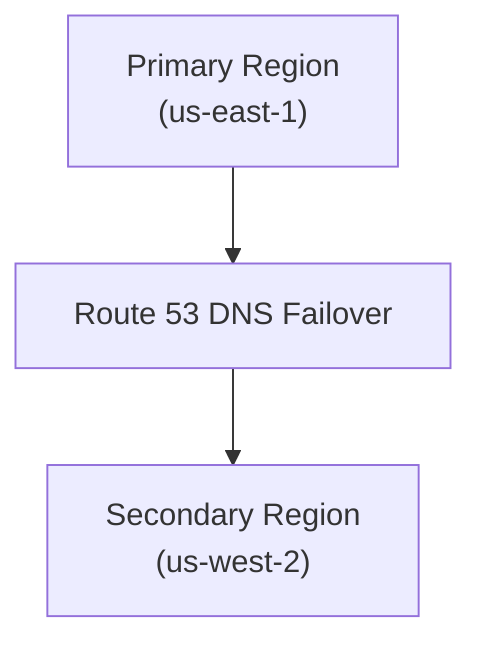

## 10. Performance

### 10.1 Latency budgets <a class='askgpt-btn' href='https://chatgpt.com/?prompt=Read%20this%20section%20of%20my%20encyclopedia%20and%20explain%20it%20in%20depth%20with%20concrete%20examples%2C%20the%20main%20trade-offs%2C%20and%20common%20pitfalls%20a%20practitioner%20should%20know%3A%0A%0Ahttps%3A%2F%2Fgithub.com%2Fvishvasg14%2Fsoftware-engineering-encyclopedia%2Fblob%2Fmain%2F11-cloud%2Fcloud.md%23101-latency-budgets%0A%0ASection%20title%3A%2010.1%20Latency%20budgets' target='_blank' rel='noopener' data-askgpt='10.1 Latency budgets' data-askgpt-url='https://github.com/vishvasg14/software-engineering-encyclopedia/blob/main/11-cloud/cloud.md#101-latency-budgets' data-askgpt-prompt-depth='Read%20this%20section%20of%20my%20encyclopedia%20and%20explain%20it%20in%20depth%20with%20concrete%20examples%2C%20the%20main%20trade-offs%2C%20and%20common%20pitfalls%20a%20practitioner%20should%20know%3A%0A%0Ahttps%3A%2F%2Fgithub.com%2Fvishvasg14%2Fsoftware-engineering-encyclopedia%2Fblob%2Fmain%2F11-cloud%2Fcloud.md%23101-latency-budgets%0A%0ASection%20title%3A%2010.1%20Latency%20budgets' data-askgpt-prompt-examples='Read%20this%20section%20of%20my%20encyclopedia%20and%20give%20me%202-3%20real-world%20production%20examples%20for%20it.%20For%20each%3A%20what%20went%20right%2C%20what%20went%20wrong%2C%20and%20the%20lessons%20learned.%20Include%20company%20%2F%20project%20names%20if%20relevant.%0A%0Ahttps%3A%2F%2Fgithub.com%2Fvishvasg14%2Fsoftware-engineering-encyclopedia%2Fblob%2Fmain%2F11-cloud%2Fcloud.md%23101-latency-budgets%0A%0ASection%20title%3A%2010.1%20Latency%20budgets' title='Ask ChatGPT about this section'>💬</a>

| Hop | Budget |
|-----|--------|
| Client → CDN edge | 30ms |
| CDN → Origin | 100ms |
| Load balancer | 5ms |
| Application logic | 20ms |
| Database | 20ms |
| Cache | 1ms |
| **Total p99** | **~200ms** |

### 10.2 Throughput optimization <a class='askgpt-btn' href='https://chatgpt.com/?prompt=Read%20this%20section%20of%20my%20encyclopedia%20and%20explain%20it%20in%20depth%20with%20concrete%20examples%2C%20the%20main%20trade-offs%2C%20and%20common%20pitfalls%20a%20practitioner%20should%20know%3A%0A%0Ahttps%3A%2F%2Fgithub.com%2Fvishvasg14%2Fsoftware-engineering-encyclopedia%2Fblob%2Fmain%2F11-cloud%2Fcloud.md%23102-throughput-optimization%0A%0ASection%20title%3A%2010.2%20Throughput%20optimization' target='_blank' rel='noopener' data-askgpt='10.2 Throughput optimization' data-askgpt-url='https://github.com/vishvasg14/software-engineering-encyclopedia/blob/main/11-cloud/cloud.md#102-throughput-optimization' data-askgpt-prompt-depth='Read%20this%20section%20of%20my%20encyclopedia%20and%20explain%20it%20in%20depth%20with%20concrete%20examples%2C%20the%20main%20trade-offs%2C%20and%20common%20pitfalls%20a%20practitioner%20should%20know%3A%0A%0Ahttps%3A%2F%2Fgithub.com%2Fvishvasg14%2Fsoftware-engineering-encyclopedia%2Fblob%2Fmain%2F11-cloud%2Fcloud.md%23102-throughput-optimization%0A%0ASection%20title%3A%2010.2%20Throughput%20optimization' data-askgpt-prompt-examples='Read%20this%20section%20of%20my%20encyclopedia%20and%20give%20me%202-3%20real-world%20production%20examples%20for%20it.%20For%20each%3A%20what%20went%20right%2C%20what%20went%20wrong%2C%20and%20the%20lessons%20learned.%20Include%20company%20%2F%20project%20names%20if%20relevant.%0A%0Ahttps%3A%2F%2Fgithub.com%2Fvishvasg14%2Fsoftware-engineering-encyclopedia%2Fblob%2Fmain%2F11-cloud%2Fcloud.md%23102-throughput-optimization%0A%0ASection%20title%3A%2010.2%20Throughput%20optimization' title='Ask ChatGPT about this section'>💬</a>

- **CDN:** offload static content.
- **Cache:** L1 in-JVM, L2 Redis, L3 CDN.
- **Async:** non-blocking I/O.
- **Connection pooling:** reuse connections.
- **Compression:** gzip, brotli.

### 10.3 Auto-scaling <a class='askgpt-btn' href='https://chatgpt.com/?prompt=Read%20this%20section%20of%20my%20encyclopedia%20and%20explain%20it%20in%20depth%20with%20concrete%20examples%2C%20the%20main%20trade-offs%2C%20and%20common%20pitfalls%20a%20practitioner%20should%20know%3A%0A%0Ahttps%3A%2F%2Fgithub.com%2Fvishvasg14%2Fsoftware-engineering-encyclopedia%2Fblob%2Fmain%2F11-cloud%2Fcloud.md%23103-auto-scaling%0A%0ASection%20title%3A%2010.3%20Auto-scaling' target='_blank' rel='noopener' data-askgpt='10.3 Auto-scaling' data-askgpt-url='https://github.com/vishvasg14/software-engineering-encyclopedia/blob/main/11-cloud/cloud.md#103-auto-scaling' data-askgpt-prompt-depth='Read%20this%20section%20of%20my%20encyclopedia%20and%20explain%20it%20in%20depth%20with%20concrete%20examples%2C%20the%20main%20trade-offs%2C%20and%20common%20pitfalls%20a%20practitioner%20should%20know%3A%0A%0Ahttps%3A%2F%2Fgithub.com%2Fvishvasg14%2Fsoftware-engineering-encyclopedia%2Fblob%2Fmain%2F11-cloud%2Fcloud.md%23103-auto-scaling%0A%0ASection%20title%3A%2010.3%20Auto-scaling' data-askgpt-prompt-examples='Read%20this%20section%20of%20my%20encyclopedia%20and%20give%20me%202-3%20real-world%20production%20examples%20for%20it.%20For%20each%3A%20what%20went%20right%2C%20what%20went%20wrong%2C%20and%20the%20lessons%20learned.%20Include%20company%20%2F%20project%20names%20if%20relevant.%0A%0Ahttps%3A%2F%2Fgithub.com%2Fvishvasg14%2Fsoftware-engineering-encyclopedia%2Fblob%2Fmain%2F11-cloud%2Fcloud.md%23103-auto-scaling%0A%0ASection%20title%3A%2010.3%20Auto-scaling' title='Ask ChatGPT about this section'>💬</a>

- **Reactive:** CPU, memory, request count.
- **Predictive:** schedule-based (e.g., business hours).
- **Custom metrics:** queue depth, latency.

**HPA (Horizontal Pod Autoscaler):**

```yaml
minReplicas: 2
maxReplicas: 100
metrics:
  - type: Resource
    resource:
      name: cpu
      target:
        type: Utilization
        averageUtilization: 70
```

**Cluster Autoscaler** — adds nodes when pods can't be scheduled.

**Scheduled scaling** — predictable load (e.g., business hours).

## 11. Security

### 11.1 Shared responsibility model <a class='askgpt-btn' href='https://chatgpt.com/?prompt=Read%20this%20section%20of%20my%20encyclopedia%20and%20explain%20it%20in%20depth%20with%20concrete%20examples%2C%20the%20main%20trade-offs%2C%20and%20common%20pitfalls%20a%20practitioner%20should%20know%3A%0A%0Ahttps%3A%2F%2Fgithub.com%2Fvishvasg14%2Fsoftware-engineering-encyclopedia%2Fblob%2Fmain%2F11-cloud%2Fcloud.md%23111-shared-responsibility-model%0A%0ASection%20title%3A%2011.1%20Shared%20responsibility%20model' target='_blank' rel='noopener' data-askgpt='11.1 Shared responsibility model' data-askgpt-url='https://github.com/vishvasg14/software-engineering-encyclopedia/blob/main/11-cloud/cloud.md#111-shared-responsibility-model' data-askgpt-prompt-depth='Read%20this%20section%20of%20my%20encyclopedia%20and%20explain%20it%20in%20depth%20with%20concrete%20examples%2C%20the%20main%20trade-offs%2C%20and%20common%20pitfalls%20a%20practitioner%20should%20know%3A%0A%0Ahttps%3A%2F%2Fgithub.com%2Fvishvasg14%2Fsoftware-engineering-encyclopedia%2Fblob%2Fmain%2F11-cloud%2Fcloud.md%23111-shared-responsibility-model%0A%0ASection%20title%3A%2011.1%20Shared%20responsibility%20model' data-askgpt-prompt-examples='Read%20this%20section%20of%20my%20encyclopedia%20and%20give%20me%202-3%20real-world%20production%20examples%20for%20it.%20For%20each%3A%20what%20went%20right%2C%20what%20went%20wrong%2C%20and%20the%20lessons%20learned.%20Include%20company%20%2F%20project%20names%20if%20relevant.%0A%0Ahttps%3A%2F%2Fgithub.com%2Fvishvasg14%2Fsoftware-engineering-encyclopedia%2Fblob%2Fmain%2F11-cloud%2Fcloud.md%23111-shared-responsibility-model%0A%0ASection%20title%3A%2011.1%20Shared%20responsibility%20model' title='Ask ChatGPT about this section'>💬</a>

| Layer | Cloud | You |
|------|-------|-----|
| Physical security | ✓ | |
| Network infrastructure | ✓ | |
- Hypervisor / host OS
- Service
- Operating system
- Patches
- Application
- Data
- Access

### 11.2 Defense in depth <a class='askgpt-btn' href='https://chatgpt.com/?prompt=Read%20this%20section%20of%20my%20encyclopedia%20and%20explain%20it%20in%20depth%20with%20concrete%20examples%2C%20the%20main%20trade-offs%2C%20and%20common%20pitfalls%20a%20practitioner%20should%20know%3A%0A%0Ahttps%3A%2F%2Fgithub.com%2Fvishvasg14%2Fsoftware-engineering-encyclopedia%2Fblob%2Fmain%2F11-cloud%2Fcloud.md%23112-defense-in-depth%0A%0ASection%20title%3A%2011.2%20Defense%20in%20depth' target='_blank' rel='noopener' data-askgpt='11.2 Defense in depth' data-askgpt-url='https://github.com/vishvasg14/software-engineering-encyclopedia/blob/main/11-cloud/cloud.md#112-defense-in-depth' data-askgpt-prompt-depth='Read%20this%20section%20of%20my%20encyclopedia%20and%20explain%20it%20in%20depth%20with%20concrete%20examples%2C%20the%20main%20trade-offs%2C%20and%20common%20pitfalls%20a%20practitioner%20should%20know%3A%0A%0Ahttps%3A%2F%2Fgithub.com%2Fvishvasg14%2Fsoftware-engineering-encyclopedia%2Fblob%2Fmain%2F11-cloud%2Fcloud.md%23112-defense-in-depth%0A%0ASection%20title%3A%2011.2%20Defense%20in%20depth' data-askgpt-prompt-examples='Read%20this%20section%20of%20my%20encyclopedia%20and%20give%20me%202-3%20real-world%20production%20examples%20for%20it.%20For%20each%3A%20what%20went%20right%2C%20what%20went%20wrong%2C%20and%20the%20lessons%20learned.%20Include%20company%20%2F%20project%20names%20if%20relevant.%0A%0Ahttps%3A%2F%2Fgithub.com%2Fvishvasg14%2Fsoftware-engineering-encyclopedia%2Fblob%2Fmain%2F11-cloud%2Fcloud.md%23112-defense-in-depth%0A%0ASection%20title%3A%2011.2%20Defense%20in%20depth' title='Ask ChatGPT about this section'>💬</a>

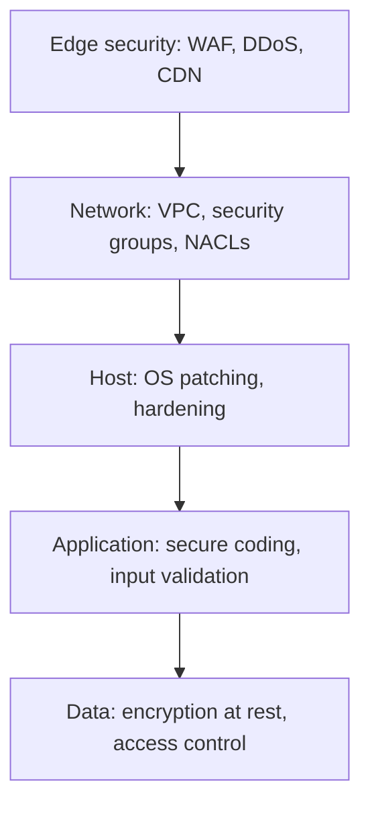

### 11.3 IAM best practices <a class='askgpt-btn' href='https://chatgpt.com/?prompt=Read%20this%20section%20of%20my%20encyclopedia%20and%20explain%20it%20in%20depth%20with%20concrete%20examples%2C%20the%20main%20trade-offs%2C%20and%20common%20pitfalls%20a%20practitioner%20should%20know%3A%0A%0Ahttps%3A%2F%2Fgithub.com%2Fvishvasg14%2Fsoftware-engineering-encyclopedia%2Fblob%2Fmain%2F11-cloud%2Fcloud.md%23113-iam-best-practices%0A%0ASection%20title%3A%2011.3%20IAM%20best%20practices' target='_blank' rel='noopener' data-askgpt='11.3 IAM best practices' data-askgpt-url='https://github.com/vishvasg14/software-engineering-encyclopedia/blob/main/11-cloud/cloud.md#113-iam-best-practices' data-askgpt-prompt-depth='Read%20this%20section%20of%20my%20encyclopedia%20and%20explain%20it%20in%20depth%20with%20concrete%20examples%2C%20the%20main%20trade-offs%2C%20and%20common%20pitfalls%20a%20practitioner%20should%20know%3A%0A%0Ahttps%3A%2F%2Fgithub.com%2Fvishvasg14%2Fsoftware-engineering-encyclopedia%2Fblob%2Fmain%2F11-cloud%2Fcloud.md%23113-iam-best-practices%0A%0ASection%20title%3A%2011.3%20IAM%20best%20practices' data-askgpt-prompt-examples='Read%20this%20section%20of%20my%20encyclopedia%20and%20give%20me%202-3%20real-world%20production%20examples%20for%20it.%20For%20each%3A%20what%20went%20right%2C%20what%20went%20wrong%2C%20and%20the%20lessons%20learned.%20Include%20company%20%2F%20project%20names%20if%20relevant.%0A%0Ahttps%3A%2F%2Fgithub.com%2Fvishvasg14%2Fsoftware-engineering-encyclopedia%2Fblob%2Fmain%2F11-cloud%2Fcloud.md%23113-iam-best-practices%0A%0ASection%20title%3A%2011.3%20IAM%20best%20practices' title='Ask ChatGPT about this section'>💬</a>

- **Least privilege.**
- **MFA on all human users.**
- **Roles, not users.**
- **Service accounts for applications.**
- **No long-lived access keys** (use IAM Roles Anywhere, Workload Identity).
- **Audit with CloudTrail / Azure Activity Log / Cloud Audit Logs.**

### 11.4 Encryption <a class='askgpt-btn' href='https://chatgpt.com/?prompt=Read%20this%20section%20of%20my%20encyclopedia%20and%20explain%20it%20in%20depth%20with%20concrete%20examples%2C%20the%20main%20trade-offs%2C%20and%20common%20pitfalls%20a%20practitioner%20should%20know%3A%0A%0Ahttps%3A%2F%2Fgithub.com%2Fvishvasg14%2Fsoftware-engineering-encyclopedia%2Fblob%2Fmain%2F11-cloud%2Fcloud.md%23114-encryption%0A%0ASection%20title%3A%2011.4%20Encryption' target='_blank' rel='noopener' data-askgpt='11.4 Encryption' data-askgpt-url='https://github.com/vishvasg14/software-engineering-encyclopedia/blob/main/11-cloud/cloud.md#114-encryption' data-askgpt-prompt-depth='Read%20this%20section%20of%20my%20encyclopedia%20and%20explain%20it%20in%20depth%20with%20concrete%20examples%2C%20the%20main%20trade-offs%2C%20and%20common%20pitfalls%20a%20practitioner%20should%20know%3A%0A%0Ahttps%3A%2F%2Fgithub.com%2Fvishvasg14%2Fsoftware-engineering-encyclopedia%2Fblob%2Fmain%2F11-cloud%2Fcloud.md%23114-encryption%0A%0ASection%20title%3A%2011.4%20Encryption' data-askgpt-prompt-examples='Read%20this%20section%20of%20my%20encyclopedia%20and%20give%20me%202-3%20real-world%20production%20examples%20for%20it.%20For%20each%3A%20what%20went%20right%2C%20what%20went%20wrong%2C%20and%20the%20lessons%20learned.%20Include%20company%20%2F%20project%20names%20if%20relevant.%0A%0Ahttps%3A%2F%2Fgithub.com%2Fvishvasg14%2Fsoftware-engineering-encyclopedia%2Fblob%2Fmain%2F11-cloud%2Fcloud.md%23114-encryption%0A%0ASection%20title%3A%2011.4%20Encryption' title='Ask ChatGPT about this section'>💬</a>

- **In transit:** TLS 1.3.
- **At rest:** KMS / Key Vault / Cloud KMS.
- **Application-level:** application-managed keys (envelope encryption).

### 11.5 Network security <a class='askgpt-btn' href='https://chatgpt.com/?prompt=Read%20this%20section%20of%20my%20encyclopedia%20and%20explain%20it%20in%20depth%20with%20concrete%20examples%2C%20the%20main%20trade-offs%2C%20and%20common%20pitfalls%20a%20practitioner%20should%20know%3A%0A%0Ahttps%3A%2F%2Fgithub.com%2Fvishvasg14%2Fsoftware-engineering-encyclopedia%2Fblob%2Fmain%2F11-cloud%2Fcloud.md%23115-network-security%0A%0ASection%20title%3A%2011.5%20Network%20security' target='_blank' rel='noopener' data-askgpt='11.5 Network security' data-askgpt-url='https://github.com/vishvasg14/software-engineering-encyclopedia/blob/main/11-cloud/cloud.md#115-network-security' data-askgpt-prompt-depth='Read%20this%20section%20of%20my%20encyclopedia%20and%20explain%20it%20in%20depth%20with%20concrete%20examples%2C%20the%20main%20trade-offs%2C%20and%20common%20pitfalls%20a%20practitioner%20should%20know%3A%0A%0Ahttps%3A%2F%2Fgithub.com%2Fvishvasg14%2Fsoftware-engineering-encyclopedia%2Fblob%2Fmain%2F11-cloud%2Fcloud.md%23115-network-security%0A%0ASection%20title%3A%2011.5%20Network%20security' data-askgpt-prompt-examples='Read%20this%20section%20of%20my%20encyclopedia%20and%20give%20me%202-3%20real-world%20production%20examples%20for%20it.%20For%20each%3A%20what%20went%20right%2C%20what%20went%20wrong%2C%20and%20the%20lessons%20learned.%20Include%20company%20%2F%20project%20names%20if%20relevant.%0A%0Ahttps%3A%2F%2Fgithub.com%2Fvishvasg14%2Fsoftware-engineering-encyclopedia%2Fblob%2Fmain%2F11-cloud%2Fcloud.md%23115-network-security%0A%0ASection%20title%3A%2011.5%20Network%20security' title='Ask ChatGPT about this section'>💬</a>

- **VPC isolation.**
- **Security groups / NSGs / firewall rules** (least privilege).
- **Network segmentation** (public, private, data tiers).
- **WAF** for HTTP attacks.
- **DDoS protection** (CloudFront, Shield, Cloud Armor).

### 11.6 Compliance frameworks <a class='askgpt-btn' href='https://chatgpt.com/?prompt=Read%20this%20section%20of%20my%20encyclopedia%20and%20explain%20it%20in%20depth%20with%20concrete%20examples%2C%20the%20main%20trade-offs%2C%20and%20common%20pitfalls%20a%20practitioner%20should%20know%3A%0A%0Ahttps%3A%2F%2Fgithub.com%2Fvishvasg14%2Fsoftware-engineering-encyclopedia%2Fblob%2Fmain%2F11-cloud%2Fcloud.md%23116-compliance-frameworks%0A%0ASection%20title%3A%2011.6%20Compliance%20frameworks' target='_blank' rel='noopener' data-askgpt='11.6 Compliance frameworks' data-askgpt-url='https://github.com/vishvasg14/software-engineering-encyclopedia/blob/main/11-cloud/cloud.md#116-compliance-frameworks' data-askgpt-prompt-depth='Read%20this%20section%20of%20my%20encyclopedia%20and%20explain%20it%20in%20depth%20with%20concrete%20examples%2C%20the%20main%20trade-offs%2C%20and%20common%20pitfalls%20a%20practitioner%20should%20know%3A%0A%0Ahttps%3A%2F%2Fgithub.com%2Fvishvasg14%2Fsoftware-engineering-encyclopedia%2Fblob%2Fmain%2F11-cloud%2Fcloud.md%23116-compliance-frameworks%0A%0ASection%20title%3A%2011.6%20Compliance%20frameworks' data-askgpt-prompt-examples='Read%20this%20section%20of%20my%20encyclopedia%20and%20give%20me%202-3%20real-world%20production%20examples%20for%20it.%20For%20each%3A%20what%20went%20right%2C%20what%20went%20wrong%2C%20and%20the%20lessons%20learned.%20Include%20company%20%2F%20project%20names%20if%20relevant.%0A%0Ahttps%3A%2F%2Fgithub.com%2Fvishvasg14%2Fsoftware-engineering-encyclopedia%2Fblob%2Fmain%2F11-cloud%2Fcloud.md%23116-compliance-frameworks%0A%0ASection%20title%3A%2011.6%20Compliance%20frameworks' title='Ask ChatGPT about this section'>💬</a>

- **SOC 2** (Service Organization Control).
- **PCI-DSS** (Payment Card Industry).
- **HIPAA** (Health Insurance Portability and Accountability Act).
- **GDPR** (General Data Protection Regulation).
- **ISO 27001.**

Each cloud has compliance programs with shared responsibility.

## 12. Production Engineering

### 12.1 Multi-region deployment <a class='askgpt-btn' href='https://chatgpt.com/?prompt=Read%20this%20section%20of%20my%20encyclopedia%20and%20explain%20it%20in%20depth%20with%20concrete%20examples%2C%20the%20main%20trade-offs%2C%20and%20common%20pitfalls%20a%20practitioner%20should%20know%3A%0A%0Ahttps%3A%2F%2Fgithub.com%2Fvishvasg14%2Fsoftware-engineering-encyclopedia%2Fblob%2Fmain%2F11-cloud%2Fcloud.md%23121-multi-region-deployment%0A%0ASection%20title%3A%2012.1%20Multi-region%20deployment' target='_blank' rel='noopener' data-askgpt='12.1 Multi-region deployment' data-askgpt-url='https://github.com/vishvasg14/software-engineering-encyclopedia/blob/main/11-cloud/cloud.md#121-multi-region-deployment' data-askgpt-prompt-depth='Read%20this%20section%20of%20my%20encyclopedia%20and%20explain%20it%20in%20depth%20with%20concrete%20examples%2C%20the%20main%20trade-offs%2C%20and%20common%20pitfalls%20a%20practitioner%20should%20know%3A%0A%0Ahttps%3A%2F%2Fgithub.com%2Fvishvasg14%2Fsoftware-engineering-encyclopedia%2Fblob%2Fmain%2F11-cloud%2Fcloud.md%23121-multi-region-deployment%0A%0ASection%20title%3A%2012.1%20Multi-region%20deployment' data-askgpt-prompt-examples='Read%20this%20section%20of%20my%20encyclopedia%20and%20give%20me%202-3%20real-world%20production%20examples%20for%20it.%20For%20each%3A%20what%20went%20right%2C%20what%20went%20wrong%2C%20and%20the%20lessons%20learned.%20Include%20company%20%2F%20project%20names%20if%20relevant.%0A%0Ahttps%3A%2F%2Fgithub.com%2Fvishvasg14%2Fsoftware-engineering-encyclopedia%2Fblob%2Fmain%2F11-cloud%2Fcloud.md%23121-multi-region-deployment%0A%0ASection%20title%3A%2012.1%20Multi-region%20deployment' title='Ask ChatGPT about this section'>💬</a>

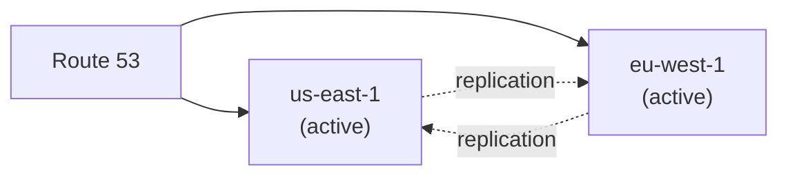

- **Active-active:** traffic in both regions; cross-region replication.
- **Active-passive:** primary region; failover.
- **Backup-restore:** periodic snapshots to other region.

### 12.2 Observability <a class='askgpt-btn' href='https://chatgpt.com/?prompt=Read%20this%20section%20of%20my%20encyclopedia%20and%20explain%20it%20in%20depth%20with%20concrete%20examples%2C%20the%20main%20trade-offs%2C%20and%20common%20pitfalls%20a%20practitioner%20should%20know%3A%0A%0Ahttps%3A%2F%2Fgithub.com%2Fvishvasg14%2Fsoftware-engineering-encyclopedia%2Fblob%2Fmain%2F11-cloud%2Fcloud.md%23122-observability%0A%0ASection%20title%3A%2012.2%20Observability' target='_blank' rel='noopener' data-askgpt='12.2 Observability' data-askgpt-url='https://github.com/vishvasg14/software-engineering-encyclopedia/blob/main/11-cloud/cloud.md#122-observability' data-askgpt-prompt-depth='Read%20this%20section%20of%20my%20encyclopedia%20and%20explain%20it%20in%20depth%20with%20concrete%20examples%2C%20the%20main%20trade-offs%2C%20and%20common%20pitfalls%20a%20practitioner%20should%20know%3A%0A%0Ahttps%3A%2F%2Fgithub.com%2Fvishvasg14%2Fsoftware-engineering-encyclopedia%2Fblob%2Fmain%2F11-cloud%2Fcloud.md%23122-observability%0A%0ASection%20title%3A%2012.2%20Observability' data-askgpt-prompt-examples='Read%20this%20section%20of%20my%20encyclopedia%20and%20give%20me%202-3%20real-world%20production%20examples%20for%20it.%20For%20each%3A%20what%20went%20right%2C%20what%20went%20wrong%2C%20and%20the%20lessons%20learned.%20Include%20company%20%2F%20project%20names%20if%20relevant.%0A%0Ahttps%3A%2F%2Fgithub.com%2Fvishvasg14%2Fsoftware-engineering-encyclopedia%2Fblob%2Fmain%2F11-cloud%2Fcloud.md%23122-observability%0A%0ASection%20title%3A%2012.2%20Observability' title='Ask ChatGPT about this section'>💬</a>

- **Metrics:** CloudWatch / Azure Monitor / Cloud Monitoring.
- **Logs:** CloudWatch Logs / Log Analytics / Cloud Logging.
- **Traces:** X-Ray / Application Insights / Cloud Trace.
- **Logs -> metrics:** embed metric in logs.
- **Dashboards:** Grafana / CloudWatch Dashboards.

### 12.3 Incident management <a class='askgpt-btn' href='https://chatgpt.com/?prompt=Read%20this%20section%20of%20my%20encyclopedia%20and%20explain%20it%20in%20depth%20with%20concrete%20examples%2C%20the%20main%20trade-offs%2C%20and%20common%20pitfalls%20a%20practitioner%20should%20know%3A%0A%0Ahttps%3A%2F%2Fgithub.com%2Fvishvasg14%2Fsoftware-engineering-encyclopedia%2Fblob%2Fmain%2F11-cloud%2Fcloud.md%23123-incident-management%0A%0ASection%20title%3A%2012.3%20Incident%20management' target='_blank' rel='noopener' data-askgpt='12.3 Incident management' data-askgpt-url='https://github.com/vishvasg14/software-engineering-encyclopedia/blob/main/11-cloud/cloud.md#123-incident-management' data-askgpt-prompt-depth='Read%20this%20section%20of%20my%20encyclopedia%20and%20explain%20it%20in%20depth%20with%20concrete%20examples%2C%20the%20main%20trade-offs%2C%20and%20common%20pitfalls%20a%20practitioner%20should%20know%3A%0A%0Ahttps%3A%2F%2Fgithub.com%2Fvishvasg14%2Fsoftware-engineering-encyclopedia%2Fblob%2Fmain%2F11-cloud%2Fcloud.md%23123-incident-management%0A%0ASection%20title%3A%2012.3%20Incident%20management' data-askgpt-prompt-examples='Read%20this%20section%20of%20my%20encyclopedia%20and%20give%20me%202-3%20real-world%20production%20examples%20for%20it.%20For%20each%3A%20what%20went%20right%2C%20what%20went%20wrong%2C%20and%20the%20lessons%20learned.%20Include%20company%20%2F%20project%20names%20if%20relevant.%0A%0Ahttps%3A%2F%2Fgithub.com%2Fvishvasg14%2Fsoftware-engineering-encyclopedia%2Fblob%2Fmain%2F11-cloud%2Fcloud.md%23123-incident-management%0A%0ASection%20title%3A%2012.3%20Incident%20management' title='Ask ChatGPT about this section'>💬</a>

- **On-call rotation.**
- **Runbook per service.**
- **Escalation policy.**
- **Postmortem culture** (blameless).
- **Status page** (statuspage.io, Atlassian Statuspage).

### 12.4 Cost monitoring <a class='askgpt-btn' href='https://chatgpt.com/?prompt=Read%20this%20section%20of%20my%20encyclopedia%20and%20explain%20it%20in%20depth%20with%20concrete%20examples%2C%20the%20main%20trade-offs%2C%20and%20common%20pitfalls%20a%20practitioner%20should%20know%3A%0A%0Ahttps%3A%2F%2Fgithub.com%2Fvishvasg14%2Fsoftware-engineering-encyclopedia%2Fblob%2Fmain%2F11-cloud%2Fcloud.md%23124-cost-monitoring%0A%0ASection%20title%3A%2012.4%20Cost%20monitoring' target='_blank' rel='noopener' data-askgpt='12.4 Cost monitoring' data-askgpt-url='https://github.com/vishvasg14/software-engineering-encyclopedia/blob/main/11-cloud/cloud.md#124-cost-monitoring' data-askgpt-prompt-depth='Read%20this%20section%20of%20my%20encyclopedia%20and%20explain%20it%20in%20depth%20with%20concrete%20examples%2C%20the%20main%20trade-offs%2C%20and%20common%20pitfalls%20a%20practitioner%20should%20know%3A%0A%0Ahttps%3A%2F%2Fgithub.com%2Fvishvasg14%2Fsoftware-engineering-encyclopedia%2Fblob%2Fmain%2F11-cloud%2Fcloud.md%23124-cost-monitoring%0A%0ASection%20title%3A%2012.4%20Cost%20monitoring' data-askgpt-prompt-examples='Read%20this%20section%20of%20my%20encyclopedia%20and%20give%20me%202-3%20real-world%20production%20examples%20for%20it.%20For%20each%3A%20what%20went%20right%2C%20what%20went%20wrong%2C%20and%20the%20lessons%20learned.%20Include%20company%20%2F%20project%20names%20if%20relevant.%0A%0Ahttps%3A%2F%2Fgithub.com%2Fvishvasg14%2Fsoftware-engineering-encyclopedia%2Fblob%2Fmain%2F11-cloud%2Fcloud.md%23124-cost-monitoring%0A%0ASection%20title%3A%2012.4%20Cost%20monitoring' title='Ask ChatGPT about this section'>💬</a>

- **Cost anomaly detection** (AWS Cost Anomaly Detection).
- **Budgets** with alerts.
- **Cost allocation tags** (team, env, project).
- **Reserved capacity** planning.
- **Anomaly review** monthly.

### 12.5 Compliance <a class='askgpt-btn' href='https://chatgpt.com/?prompt=Read%20this%20section%20of%20my%20encyclopedia%20and%20explain%20it%20in%20depth%20with%20concrete%20examples%2C%20the%20main%20trade-offs%2C%20and%20common%20pitfalls%20a%20practitioner%20should%20know%3A%0A%0Ahttps%3A%2F%2Fgithub.com%2Fvishvasg14%2Fsoftware-engineering-encyclopedia%2Fblob%2Fmain%2F11-cloud%2Fcloud.md%23125-compliance%0A%0ASection%20title%3A%2012.5%20Compliance' target='_blank' rel='noopener' data-askgpt='12.5 Compliance' data-askgpt-url='https://github.com/vishvasg14/software-engineering-encyclopedia/blob/main/11-cloud/cloud.md#125-compliance' data-askgpt-prompt-depth='Read%20this%20section%20of%20my%20encyclopedia%20and%20explain%20it%20in%20depth%20with%20concrete%20examples%2C%20the%20main%20trade-offs%2C%20and%20common%20pitfalls%20a%20practitioner%20should%20know%3A%0A%0Ahttps%3A%2F%2Fgithub.com%2Fvishvasg14%2Fsoftware-engineering-encyclopedia%2Fblob%2Fmain%2F11-cloud%2Fcloud.md%23125-compliance%0A%0ASection%20title%3A%2012.5%20Compliance' data-askgpt-prompt-examples='Read%20this%20section%20of%20my%20encyclopedia%20and%20give%20me%202-3%20real-world%20production%20examples%20for%20it.%20For%20each%3A%20what%20went%20right%2C%20what%20went%20wrong%2C%20and%20the%20lessons%20learned.%20Include%20company%20%2F%20project%20names%20if%20relevant.%0A%0Ahttps%3A%2F%2Fgithub.com%2Fvishvasg14%2Fsoftware-engineering-encyclopedia%2Fblob%2Fmain%2F11-cloud%2Fcloud.md%23125-compliance%0A%0ASection%20title%3A%2012.5%20Compliance' title='Ask ChatGPT about this section'>💬</a>

- **Audit logs** (CloudTrail).
- **Config rules** (AWS Config).
- **Policy as code** (IAM, SCP).
- **Regular audits** (SOC 2).
- **Penetration testing.**

## 13. Production Case Studies

### 13.1 Netflix <a class='askgpt-btn' href='https://chatgpt.com/?prompt=Read%20this%20section%20of%20my%20encyclopedia%20and%20explain%20it%20in%20depth%20with%20concrete%20examples%2C%20the%20main%20trade-offs%2C%20and%20common%20pitfalls%20a%20practitioner%20should%20know%3A%0A%0Ahttps%3A%2F%2Fgithub.com%2Fvishvasg14%2Fsoftware-engineering-encyclopedia%2Fblob%2Fmain%2F11-cloud%2Fcloud.md%23131-netflix%0A%0ASection%20title%3A%2013.1%20Netflix' target='_blank' rel='noopener' data-askgpt='13.1 Netflix' data-askgpt-url='https://github.com/vishvasg14/software-engineering-encyclopedia/blob/main/11-cloud/cloud.md#131-netflix' data-askgpt-prompt-depth='Read%20this%20section%20of%20my%20encyclopedia%20and%20explain%20it%20in%20depth%20with%20concrete%20examples%2C%20the%20main%20trade-offs%2C%20and%20common%20pitfalls%20a%20practitioner%20should%20know%3A%0A%0Ahttps%3A%2F%2Fgithub.com%2Fvishvasg14%2Fsoftware-engineering-encyclopedia%2Fblob%2Fmain%2F11-cloud%2Fcloud.md%23131-netflix%0A%0ASection%20title%3A%2013.1%20Netflix' data-askgpt-prompt-examples='Read%20this%20section%20of%20my%20encyclopedia%20and%20give%20me%202-3%20real-world%20production%20examples%20for%20it.%20For%20each%3A%20what%20went%20right%2C%20what%20went%20wrong%2C%20and%20the%20lessons%20learned.%20Include%20company%20%2F%20project%20names%20if%20relevant.%0A%0Ahttps%3A%2F%2Fgithub.com%2Fvishvasg14%2Fsoftware-engineering-encyclopedia%2Fblob%2Fmain%2F11-cloud%2Fcloud.md%23131-netflix%0A%0ASection%20title%3A%2013.1%20Netflix' title='Ask ChatGPT about this section'>💬</a>

Migrated to AWS in 2008-2017. Uses hundreds of thousands of EC2 instances. Heavy use of Spot instances. Pioneered chaos engineering with Chaos Monkey.

### 13.2 Spotify <a class='askgpt-btn' href='https://chatgpt.com/?prompt=Read%20this%20section%20of%20my%20encyclopedia%20and%20explain%20it%20in%20depth%20with%20concrete%20examples%2C%20the%20main%20trade-offs%2C%20and%20common%20pitfalls%20a%20practitioner%20should%20know%3A%0A%0Ahttps%3A%2F%2Fgithub.com%2Fvishvasg14%2Fsoftware-engineering-encyclopedia%2Fblob%2Fmain%2F11-cloud%2Fcloud.md%23132-spotify%0A%0ASection%20title%3A%2013.2%20Spotify' target='_blank' rel='noopener' data-askgpt='13.2 Spotify' data-askgpt-url='https://github.com/vishvasg14/software-engineering-encyclopedia/blob/main/11-cloud/cloud.md#132-spotify' data-askgpt-prompt-depth='Read%20this%20section%20of%20my%20encyclopedia%20and%20explain%20it%20in%20depth%20with%20concrete%20examples%2C%20the%20main%20trade-offs%2C%20and%20common%20pitfalls%20a%20practitioner%20should%20know%3A%0A%0Ahttps%3A%2F%2Fgithub.com%2Fvishvasg14%2Fsoftware-engineering-encyclopedia%2Fblob%2Fmain%2F11-cloud%2Fcloud.md%23132-spotify%0A%0ASection%20title%3A%2013.2%20Spotify' data-askgpt-prompt-examples='Read%20this%20section%20of%20my%20encyclopedia%20and%20give%20me%202-3%20real-world%20production%20examples%20for%20it.%20For%20each%3A%20what%20went%20right%2C%20what%20went%20wrong%2C%20and%20the%20lessons%20learned.%20Include%20company%20%2F%20project%20names%20if%20relevant.%0A%0Ahttps%3A%2F%2Fgithub.com%2Fvishvasg14%2Fsoftware-engineering-encyclopedia%2Fblob%2Fmain%2F11-cloud%2Fcloud.md%23132-spotify%0A%0ASection%20title%3A%2013.2%20Spotify' title='Ask ChatGPT about this section'>💬</a>

Migrated to GCP. Uses BigQuery for analytics. Migrated microservices to GKE.

### 13.3 Airbnb <a class='askgpt-btn' href='https://chatgpt.com/?prompt=Read%20this%20section%20of%20my%20encyclopedia%20and%20explain%20it%20in%20depth%20with%20concrete%20examples%2C%20the%20main%20trade-offs%2C%20and%20common%20pitfalls%20a%20practitioner%20should%20know%3A%0A%0Ahttps%3A%2F%2Fgithub.com%2Fvishvasg14%2Fsoftware-engineering-encyclopedia%2Fblob%2Fmain%2F11-cloud%2Fcloud.md%23133-airbnb%0A%0ASection%20title%3A%2013.3%20Airbnb' target='_blank' rel='noopener' data-askgpt='13.3 Airbnb' data-askgpt-url='https://github.com/vishvasg14/software-engineering-encyclopedia/blob/main/11-cloud/cloud.md#133-airbnb' data-askgpt-prompt-depth='Read%20this%20section%20of%20my%20encyclopedia%20and%20explain%20it%20in%20depth%20with%20concrete%20examples%2C%20the%20main%20trade-offs%2C%20and%20common%20pitfalls%20a%20practitioner%20should%20know%3A%0A%0Ahttps%3A%2F%2Fgithub.com%2Fvishvasg14%2Fsoftware-engineering-encyclopedia%2Fblob%2Fmain%2F11-cloud%2Fcloud.md%23133-airbnb%0A%0ASection%20title%3A%2013.3%20Airbnb' data-askgpt-prompt-examples='Read%20this%20section%20of%20my%20encyclopedia%20and%20give%20me%202-3%20real-world%20production%20examples%20for%20it.%20For%20each%3A%20what%20went%20right%2C%20what%20went%20wrong%2C%20and%20the%20lessons%20learned.%20Include%20company%20%2F%20project%20names%20if%20relevant.%0A%0Ahttps%3A%2F%2Fgithub.com%2Fvishvasg14%2Fsoftware-engineering-encyclopedia%2Fblob%2Fmain%2F11-cloud%2Fcloud.md%23133-airbnb%0A%0ASection%20title%3A%2013.3%20Airbnb' title='Ask ChatGPT about this section'>💬</a>

Migrated to AWS. Heavy use of RDS, S3, ECS. Built Airflow (workflow).

### 13.4 Capital One <a class='askgpt-btn' href='https://chatgpt.com/?prompt=Read%20this%20section%20of%20my%20encyclopedia%20and%20explain%20it%20in%20depth%20with%20concrete%20examples%2C%20the%20main%20trade-offs%2C%20and%20common%20pitfalls%20a%20practitioner%20should%20know%3A%0A%0Ahttps%3A%2F%2Fgithub.com%2Fvishvasg14%2Fsoftware-engineering-encyclopedia%2Fblob%2Fmain%2F11-cloud%2Fcloud.md%23134-capital-one%0A%0ASection%20title%3A%2013.4%20Capital%20One' target='_blank' rel='noopener' data-askgpt='13.4 Capital One' data-askgpt-url='https://github.com/vishvasg14/software-engineering-encyclopedia/blob/main/11-cloud/cloud.md#134-capital-one' data-askgpt-prompt-depth='Read%20this%20section%20of%20my%20encyclopedia%20and%20explain%20it%20in%20depth%20with%20concrete%20examples%2C%20the%20main%20trade-offs%2C%20and%20common%20pitfalls%20a%20practitioner%20should%20know%3A%0A%0Ahttps%3A%2F%2Fgithub.com%2Fvishvasg14%2Fsoftware-engineering-encyclopedia%2Fblob%2Fmain%2F11-cloud%2Fcloud.md%23134-capital-one%0A%0ASection%20title%3A%2013.4%20Capital%20One' data-askgpt-prompt-examples='Read%20this%20section%20of%20my%20encyclopedia%20and%20give%20me%202-3%20real-world%20production%20examples%20for%20it.%20For%20each%3A%20what%20went%20right%2C%20what%20went%20wrong%2C%20and%20the%20lessons%20learned.%20Include%20company%20%2F%20project%20names%20if%20relevant.%0A%0Ahttps%3A%2F%2Fgithub.com%2Fvishvasg14%2Fsoftware-engineering-encyclopedia%2Fblob%2Fmain%2F11-cloud%2Fcloud.md%23134-capital-one%0A%0ASection%20title%3A%2013.4%20Capital%20One' title='Ask ChatGPT about this section'>💬</a>

Banking on AWS. Heavy compliance. Strict IAM and encryption.

### 13.5 Slack <a class='askgpt-btn' href='https://chatgpt.com/?prompt=Read%20this%20section%20of%20my%20encyclopedia%20and%20explain%20it%20in%20depth%20with%20concrete%20examples%2C%20the%20main%20trade-offs%2C%20and%20common%20pitfalls%20a%20practitioner%20should%20know%3A%0A%0Ahttps%3A%2F%2Fgithub.com%2Fvishvasg14%2Fsoftware-engineering-encyclopedia%2Fblob%2Fmain%2F11-cloud%2Fcloud.md%23135-slack%0A%0ASection%20title%3A%2013.5%20Slack' target='_blank' rel='noopener' data-askgpt='13.5 Slack' data-askgpt-url='https://github.com/vishvasg14/software-engineering-encyclopedia/blob/main/11-cloud/cloud.md#135-slack' data-askgpt-prompt-depth='Read%20this%20section%20of%20my%20encyclopedia%20and%20explain%20it%20in%20depth%20with%20concrete%20examples%2C%20the%20main%20trade-offs%2C%20and%20common%20pitfalls%20a%20practitioner%20should%20know%3A%0A%0Ahttps%3A%2F%2Fgithub.com%2Fvishvasg14%2Fsoftware-engineering-encyclopedia%2Fblob%2Fmain%2F11-cloud%2Fcloud.md%23135-slack%0A%0ASection%20title%3A%2013.5%20Slack' data-askgpt-prompt-examples='Read%20this%20section%20of%20my%20encyclopedia%20and%20give%20me%202-3%20real-world%20production%20examples%20for%20it.%20For%20each%3A%20what%20went%20right%2C%20what%20went%20wrong%2C%20and%20the%20lessons%20learned.%20Include%20company%20%2F%20project%20names%20if%20relevant.%0A%0Ahttps%3A%2F%2Fgithub.com%2Fvishvasg14%2Fsoftware-engineering-encyclopedia%2Fblob%2Fmain%2F11-cloud%2Fcloud.md%23135-slack%0A%0ASection%20title%3A%2013.5%20Slack' title='Ask ChatGPT about this section'>💬</a>

Runs on AWS. Multi-region. Heavy use of S3, DynamoDB, Lambda.

### 13.6 GitHub <a class='askgpt-btn' href='https://chatgpt.com/?prompt=Read%20this%20section%20of%20my%20encyclopedia%20and%20explain%20it%20in%20depth%20with%20concrete%20examples%2C%20the%20main%20trade-offs%2C%20and%20common%20pitfalls%20a%20practitioner%20should%20know%3A%0A%0Ahttps%3A%2F%2Fgithub.com%2Fvishvasg14%2Fsoftware-engineering-encyclopedia%2Fblob%2Fmain%2F11-cloud%2Fcloud.md%23136-github%0A%0ASection%20title%3A%2013.6%20GitHub' target='_blank' rel='noopener' data-askgpt='13.6 GitHub' data-askgpt-url='https://github.com/vishvasg14/software-engineering-encyclopedia/blob/main/11-cloud/cloud.md#136-github' data-askgpt-prompt-depth='Read%20this%20section%20of%20my%20encyclopedia%20and%20explain%20it%20in%20depth%20with%20concrete%20examples%2C%20the%20main%20trade-offs%2C%20and%20common%20pitfalls%20a%20practitioner%20should%20know%3A%0A%0Ahttps%3A%2F%2Fgithub.com%2Fvishvasg14%2Fsoftware-engineering-encyclopedia%2Fblob%2Fmain%2F11-cloud%2Fcloud.md%23136-github%0A%0ASection%20title%3A%2013.6%20GitHub' data-askgpt-prompt-examples='Read%20this%20section%20of%20my%20encyclopedia%20and%20give%20me%202-3%20real-world%20production%20examples%20for%20it.%20For%20each%3A%20what%20went%20right%2C%20what%20went%20wrong%2C%20and%20the%20lessons%20learned.%20Include%20company%20%2F%20project%20names%20if%20relevant.%0A%0Ahttps%3A%2F%2Fgithub.com%2Fvishvasg14%2Fsoftware-engineering-encyclopedia%2Fblob%2Fmain%2F11-cloud%2Fcloud.md%23136-github%0A%0ASection%20title%3A%2013.6%20GitHub' title='Ask ChatGPT about this section'>💬</a>

GitHub Actions on Azure. Code in Azure DevOps. Some services in Azure, some on-prem.

## 14. Code Examples

### 14.1 Basic: S3 operation (Python boto3) <a class='askgpt-btn' href='https://chatgpt.com/?prompt=Read%20this%20section%20of%20my%20encyclopedia%20and%20explain%20it%20in%20depth%20with%20concrete%20examples%2C%20the%20main%20trade-offs%2C%20and%20common%20pitfalls%20a%20practitioner%20should%20know%3A%0A%0Ahttps%3A%2F%2Fgithub.com%2Fvishvasg14%2Fsoftware-engineering-encyclopedia%2Fblob%2Fmain%2F11-cloud%2Fcloud.md%23141-basic-s3-operation-python-boto3%0A%0ASection%20title%3A%2014.1%20Basic%3A%20S3%20operation%20(Python%20boto3)' target='_blank' rel='noopener' data-askgpt='14.1 Basic: S3 operation (Python boto3)' data-askgpt-url='https://github.com/vishvasg14/software-engineering-encyclopedia/blob/main/11-cloud/cloud.md#141-basic-s3-operation-python-boto3' data-askgpt-prompt-depth='Read%20this%20section%20of%20my%20encyclopedia%20and%20explain%20it%20in%20depth%20with%20concrete%20examples%2C%20the%20main%20trade-offs%2C%20and%20common%20pitfalls%20a%20practitioner%20should%20know%3A%0A%0Ahttps%3A%2F%2Fgithub.com%2Fvishvasg14%2Fsoftware-engineering-encyclopedia%2Fblob%2Fmain%2F11-cloud%2Fcloud.md%23141-basic-s3-operation-python-boto3%0A%0ASection%20title%3A%2014.1%20Basic%3A%20S3%20operation%20(Python%20boto3)' data-askgpt-prompt-examples='Read%20this%20section%20of%20my%20encyclopedia%20and%20give%20me%202-3%20real-world%20production%20examples%20for%20it.%20For%20each%3A%20what%20went%20right%2C%20what%20went%20wrong%2C%20and%20the%20lessons%20learned.%20Include%20company%20%2F%20project%20names%20if%20relevant.%0A%0Ahttps%3A%2F%2Fgithub.com%2Fvishvasg14%2Fsoftware-engineering-encyclopedia%2Fblob%2Fmain%2F11-cloud%2Fcloud.md%23141-basic-s3-operation-python-boto3%0A%0ASection%20title%3A%2014.1%20Basic%3A%20S3%20operation%20(Python%20boto3)' title='Ask ChatGPT about this section'>💬</a>

```python
import boto3

s3 = boto3.client('s3')
s3.put_object(Bucket='my-bucket', Key='file.txt', Body=b'hello')
obj = s3.get_object(Bucket='my-bucket', Key='file.txt')
print(obj['Body'].read())
```

### 14.2 Basic: Lambda function (Node.js) <a class='askgpt-btn' href='https://chatgpt.com/?prompt=Read%20this%20section%20of%20my%20encyclopedia%20and%20explain%20it%20in%20depth%20with%20concrete%20examples%2C%20the%20main%20trade-offs%2C%20and%20common%20pitfalls%20a%20practitioner%20should%20know%3A%0A%0Ahttps%3A%2F%2Fgithub.com%2Fvishvasg14%2Fsoftware-engineering-encyclopedia%2Fblob%2Fmain%2F11-cloud%2Fcloud.md%23142-basic-lambda-function-nodejs%0A%0ASection%20title%3A%2014.2%20Basic%3A%20Lambda%20function%20(Node.js)' target='_blank' rel='noopener' data-askgpt='14.2 Basic: Lambda function (Node.js)' data-askgpt-url='https://github.com/vishvasg14/software-engineering-encyclopedia/blob/main/11-cloud/cloud.md#142-basic-lambda-function-nodejs' data-askgpt-prompt-depth='Read%20this%20section%20of%20my%20encyclopedia%20and%20explain%20it%20in%20depth%20with%20concrete%20examples%2C%20the%20main%20trade-offs%2C%20and%20common%20pitfalls%20a%20practitioner%20should%20know%3A%0A%0Ahttps%3A%2F%2Fgithub.com%2Fvishvasg14%2Fsoftware-engineering-encyclopedia%2Fblob%2Fmain%2F11-cloud%2Fcloud.md%23142-basic-lambda-function-nodejs%0A%0ASection%20title%3A%2014.2%20Basic%3A%20Lambda%20function%20(Node.js)' data-askgpt-prompt-examples='Read%20this%20section%20of%20my%20encyclopedia%20and%20give%20me%202-3%20real-world%20production%20examples%20for%20it.%20For%20each%3A%20what%20went%20right%2C%20what%20went%20wrong%2C%20and%20the%20lessons%20learned.%20Include%20company%20%2F%20project%20names%20if%20relevant.%0A%0Ahttps%3A%2F%2Fgithub.com%2Fvishvasg14%2Fsoftware-engineering-encyclopedia%2Fblob%2Fmain%2F11-cloud%2Fcloud.md%23142-basic-lambda-function-nodejs%0A%0ASection%20title%3A%2014.2%20Basic%3A%20Lambda%20function%20(Node.js)' title='Ask ChatGPT about this section'>💬</a>

```javascript
// see 07-aws-lambda/
```

### 14.3 Basic: IAM policy (least privilege) <a class='askgpt-btn' href='https://chatgpt.com/?prompt=Read%20this%20section%20of%20my%20encyclopedia%20and%20explain%20it%20in%20depth%20with%20concrete%20examples%2C%20the%20main%20trade-offs%2C%20and%20common%20pitfalls%20a%20practitioner%20should%20know%3A%0A%0Ahttps%3A%2F%2Fgithub.com%2Fvishvasg14%2Fsoftware-engineering-encyclopedia%2Fblob%2Fmain%2F11-cloud%2Fcloud.md%23143-basic-iam-policy-least-privilege%0A%0ASection%20title%3A%2014.3%20Basic%3A%20IAM%20policy%20(least%20privilege)' target='_blank' rel='noopener' data-askgpt='14.3 Basic: IAM policy (least privilege)' data-askgpt-url='https://github.com/vishvasg14/software-engineering-encyclopedia/blob/main/11-cloud/cloud.md#143-basic-iam-policy-least-privilege' data-askgpt-prompt-depth='Read%20this%20section%20of%20my%20encyclopedia%20and%20explain%20it%20in%20depth%20with%20concrete%20examples%2C%20the%20main%20trade-offs%2C%20and%20common%20pitfalls%20a%20practitioner%20should%20know%3A%0A%0Ahttps%3A%2F%2Fgithub.com%2Fvishvasg14%2Fsoftware-engineering-encyclopedia%2Fblob%2Fmain%2F11-cloud%2Fcloud.md%23143-basic-iam-policy-least-privilege%0A%0ASection%20title%3A%2014.3%20Basic%3A%20IAM%20policy%20(least%20privilege)' data-askgpt-prompt-examples='Read%20this%20section%20of%20my%20encyclopedia%20and%20give%20me%202-3%20real-world%20production%20examples%20for%20it.%20For%20each%3A%20what%20went%20right%2C%20what%20went%20wrong%2C%20and%20the%20lessons%20learned.%20Include%20company%20%2F%20project%20names%20if%20relevant.%0A%0Ahttps%3A%2F%2Fgithub.com%2Fvishvasg14%2Fsoftware-engineering-encyclopedia%2Fblob%2Fmain%2F11-cloud%2Fcloud.md%23143-basic-iam-policy-least-privilege%0A%0ASection%20title%3A%2014.3%20Basic%3A%20IAM%20policy%20(least%20privilege)' title='Ask ChatGPT about this section'>💬</a>

```json
{
    "Version": "2012-10-17",
    "Statement": [
        {
            "Sid": "AllowS3Read",
            "Effect": "Allow",
            "Action": [
                "s3:GetObject",
                "s3:ListBucket"
            ],
            "Resource": [
                "arn:aws:s3:::my-bucket",
                "arn:aws:s3:::my-bucket/*"
            ]
        }
    ]
}
```

### 14.4 Basic: Terraform snippet <a class='askgpt-btn' href='https://chatgpt.com/?prompt=Read%20this%20section%20of%20my%20encyclopedia%20and%20explain%20it%20in%20depth%20with%20concrete%20examples%2C%20the%20main%20trade-offs%2C%20and%20common%20pitfalls%20a%20practitioner%20should%20know%3A%0A%0Ahttps%3A%2F%2Fgithub.com%2Fvishvasg14%2Fsoftware-engineering-encyclopedia%2Fblob%2Fmain%2F11-cloud%2Fcloud.md%23144-basic-terraform-snippet%0A%0ASection%20title%3A%2014.4%20Basic%3A%20Terraform%20snippet' target='_blank' rel='noopener' data-askgpt='14.4 Basic: Terraform snippet' data-askgpt-url='https://github.com/vishvasg14/software-engineering-encyclopedia/blob/main/11-cloud/cloud.md#144-basic-terraform-snippet' data-askgpt-prompt-depth='Read%20this%20section%20of%20my%20encyclopedia%20and%20explain%20it%20in%20depth%20with%20concrete%20examples%2C%20the%20main%20trade-offs%2C%20and%20common%20pitfalls%20a%20practitioner%20should%20know%3A%0A%0Ahttps%3A%2F%2Fgithub.com%2Fvishvasg14%2Fsoftware-engineering-encyclopedia%2Fblob%2Fmain%2F11-cloud%2Fcloud.md%23144-basic-terraform-snippet%0A%0ASection%20title%3A%2014.4%20Basic%3A%20Terraform%20snippet' data-askgpt-prompt-examples='Read%20this%20section%20of%20my%20encyclopedia%20and%20give%20me%202-3%20real-world%20production%20examples%20for%20it.%20For%20each%3A%20what%20went%20right%2C%20what%20went%20wrong%2C%20and%20the%20lessons%20learned.%20Include%20company%20%2F%20project%20names%20if%20relevant.%0A%0Ahttps%3A%2F%2Fgithub.com%2Fvishvasg14%2Fsoftware-engineering-encyclopedia%2Fblob%2Fmain%2F11-cloud%2Fcloud.md%23144-basic-terraform-snippet%0A%0ASection%20title%3A%2014.4%20Basic%3A%20Terraform%20snippet' title='Ask ChatGPT about this section'>💬</a>

```hcl
# see 16-multi-cloud/
```

### 14.5 Bad, anti-pattern, refactored, secure examples <a class='askgpt-btn' href='https://chatgpt.com/?prompt=Read%20this%20section%20of%20my%20encyclopedia%20and%20explain%20it%20in%20depth%20with%20concrete%20examples%2C%20the%20main%20trade-offs%2C%20and%20common%20pitfalls%20a%20practitioner%20should%20know%3A%0A%0Ahttps%3A%2F%2Fgithub.com%2Fvishvasg14%2Fsoftware-engineering-encyclopedia%2Fblob%2Fmain%2F11-cloud%2Fcloud.md%23145-bad-anti-pattern-refactored-secure-examples%0A%0ASection%20title%3A%2014.5%20Bad%2C%20anti-pattern%2C%20refactored%2C%20secure%20examples' target='_blank' rel='noopener' data-askgpt='14.5 Bad, anti-pattern, refactored, secure examples' data-askgpt-url='https://github.com/vishvasg14/software-engineering-encyclopedia/blob/main/11-cloud/cloud.md#145-bad-anti-pattern-refactored-secure-examples' data-askgpt-prompt-depth='Read%20this%20section%20of%20my%20encyclopedia%20and%20explain%20it%20in%20depth%20with%20concrete%20examples%2C%20the%20main%20trade-offs%2C%20and%20common%20pitfalls%20a%20practitioner%20should%20know%3A%0A%0Ahttps%3A%2F%2Fgithub.com%2Fvishvasg14%2Fsoftware-engineering-encyclopedia%2Fblob%2Fmain%2F11-cloud%2Fcloud.md%23145-bad-anti-pattern-refactored-secure-examples%0A%0ASection%20title%3A%2014.5%20Bad%2C%20anti-pattern%2C%20refactored%2C%20secure%20examples' data-askgpt-prompt-examples='Read%20this%20section%20of%20my%20encyclopedia%20and%20give%20me%202-3%20real-world%20production%20examples%20for%20it.%20For%20each%3A%20what%20went%20right%2C%20what%20went%20wrong%2C%20and%20the%20lessons%20learned.%20Include%20company%20%2F%20project%20names%20if%20relevant.%0A%0Ahttps%3A%2F%2Fgithub.com%2Fvishvasg14%2Fsoftware-engineering-encyclopedia%2Fblob%2Fmain%2F11-cloud%2Fcloud.md%23145-bad-anti-pattern-refactored-secure-examples%0A%0ASection%20title%3A%2014.5%20Bad%2C%20anti-pattern%2C%20refactored%2C%20secure%20examples' title='Ask ChatGPT about this section'>💬</a>

**Bad: public S3 bucket**

```json
{
    "Effect": "Allow",
    "Principal": "*",
    "Action": "s3:GetObject",
    "Resource": "arn:aws:s3:::my-secrets-bucket/*"
}
```

**Anti-pattern: hardcoded access keys**

```python
# NEVER do this
AWS_ACCESS_KEY_ID = "AKIA..."
AWS_SECRET_ACCESS_KEY = "..."
```

**Refactored: IAM role (preferred)**

Use IAM roles for EC2 / Lambda / EKS. No long-lived keys.

**Secure: encryption at rest**

```python
import boto3
s3 = boto3.client('s3')
s3.put_object(
    Bucket='my-bucket',
    Key='secret.txt',
    Body=b'hello',
    ServerSideEncryption='aws:kms',
    SSEKMSKeyId='alias/my-key'
)
```

## 15. Common Mistakes

### 15.1 Beginner mistakes <a class='askgpt-btn' href='https://chatgpt.com/?prompt=Read%20this%20section%20of%20my%20encyclopedia%20and%20explain%20it%20in%20depth%20with%20concrete%20examples%2C%20the%20main%20trade-offs%2C%20and%20common%20pitfalls%20a%20practitioner%20should%20know%3A%0A%0Ahttps%3A%2F%2Fgithub.com%2Fvishvasg14%2Fsoftware-engineering-encyclopedia%2Fblob%2Fmain%2F11-cloud%2Fcloud.md%23151-beginner-mistakes%0A%0ASection%20title%3A%2015.1%20Beginner%20mistakes' target='_blank' rel='noopener' data-askgpt='15.1 Beginner mistakes' data-askgpt-url='https://github.com/vishvasg14/software-engineering-encyclopedia/blob/main/11-cloud/cloud.md#151-beginner-mistakes' data-askgpt-prompt-depth='Read%20this%20section%20of%20my%20encyclopedia%20and%20explain%20it%20in%20depth%20with%20concrete%20examples%2C%20the%20main%20trade-offs%2C%20and%20common%20pitfalls%20a%20practitioner%20should%20know%3A%0A%0Ahttps%3A%2F%2Fgithub.com%2Fvishvasg14%2Fsoftware-engineering-encyclopedia%2Fblob%2Fmain%2F11-cloud%2Fcloud.md%23151-beginner-mistakes%0A%0ASection%20title%3A%2015.1%20Beginner%20mistakes' data-askgpt-prompt-examples='Read%20this%20section%20of%20my%20encyclopedia%20and%20give%20me%202-3%20real-world%20production%20examples%20for%20it.%20For%20each%3A%20what%20went%20right%2C%20what%20went%20wrong%2C%20and%20the%20lessons%20learned.%20Include%20company%20%2F%20project%20names%20if%20relevant.%0A%0Ahttps%3A%2F%2Fgithub.com%2Fvishvasg14%2Fsoftware-engineering-encyclopedia%2Fblob%2Fmain%2F11-cloud%2Fcloud.md%23151-beginner-mistakes%0A%0ASection%20title%3A%2015.1%20Beginner%20mistakes' title='Ask ChatGPT about this section'>💬</a>

- **No cost monitoring:** cloud bill shock.
- **Public S3 buckets:** data leaks.
- **No tagging:** can't attribute cost.
- **Over-provisioned:** wasting money.
- **No backups:** data loss.

### 15.2 Intermediate mistakes <a class='askgpt-btn' href='https://chatgpt.com/?prompt=Read%20this%20section%20of%20my%20encyclopedia%20and%20explain%20it%20in%20depth%20with%20concrete%20examples%2C%20the%20main%20trade-offs%2C%20and%20common%20pitfalls%20a%20practitioner%20should%20know%3A%0A%0Ahttps%3A%2F%2Fgithub.com%2Fvishvasg14%2Fsoftware-engineering-encyclopedia%2Fblob%2Fmain%2F11-cloud%2Fcloud.md%23152-intermediate-mistakes%0A%0ASection%20title%3A%2015.2%20Intermediate%20mistakes' target='_blank' rel='noopener' data-askgpt='15.2 Intermediate mistakes' data-askgpt-url='https://github.com/vishvasg14/software-engineering-encyclopedia/blob/main/11-cloud/cloud.md#152-intermediate-mistakes' data-askgpt-prompt-depth='Read%20this%20section%20of%20my%20encyclopedia%20and%20explain%20it%20in%20depth%20with%20concrete%20examples%2C%20the%20main%20trade-offs%2C%20and%20common%20pitfalls%20a%20practitioner%20should%20know%3A%0A%0Ahttps%3A%2F%2Fgithub.com%2Fvishvasg14%2Fsoftware-engineering-encyclopedia%2Fblob%2Fmain%2F11-cloud%2Fcloud.md%23152-intermediate-mistakes%0A%0ASection%20title%3A%2015.2%20Intermediate%20mistakes' data-askgpt-prompt-examples='Read%20this%20section%20of%20my%20encyclopedia%20and%20give%20me%202-3%20real-world%20production%20examples%20for%20it.%20For%20each%3A%20what%20went%20right%2C%20what%20went%20wrong%2C%20and%20the%20lessons%20learned.%20Include%20company%20%2F%20project%20names%20if%20relevant.%0A%0Ahttps%3A%2F%2Fgithub.com%2Fvishvasg14%2Fsoftware-engineering-encyclopedia%2Fblob%2Fmain%2F11-cloud%2Fcloud.md%23152-intermediate-mistakes%0A%0ASection%20title%3A%2015.2%20Intermediate%20mistakes' title='Ask ChatGPT about this section'>💬</a>

- **IAM too permissive:** security risk.
- **No auto-scaling:** wasted capacity.
- **No multi-AZ:** single point of failure.
- **No cost optimization:** paying retail.
- **Tight cloud coupling:** lock-in.

### 15.3 Senior mistakes <a class='askgpt-btn' href='https://chatgpt.com/?prompt=Read%20this%20section%20of%20my%20encyclopedia%20and%20explain%20it%20in%20depth%20with%20concrete%20examples%2C%20the%20main%20trade-offs%2C%20and%20common%20pitfalls%20a%20practitioner%20should%20know%3A%0A%0Ahttps%3A%2F%2Fgithub.com%2Fvishvasg14%2Fsoftware-engineering-encyclopedia%2Fblob%2Fmain%2F11-cloud%2Fcloud.md%23153-senior-mistakes%0A%0ASection%20title%3A%2015.3%20Senior%20mistakes' target='_blank' rel='noopener' data-askgpt='15.3 Senior mistakes' data-askgpt-url='https://github.com/vishvasg14/software-engineering-encyclopedia/blob/main/11-cloud/cloud.md#153-senior-mistakes' data-askgpt-prompt-depth='Read%20this%20section%20of%20my%20encyclopedia%20and%20explain%20it%20in%20depth%20with%20concrete%20examples%2C%20the%20main%20trade-offs%2C%20and%20common%20pitfalls%20a%20practitioner%20should%20know%3A%0A%0Ahttps%3A%2F%2Fgithub.com%2Fvishvasg14%2Fsoftware-engineering-encyclopedia%2Fblob%2Fmain%2F11-cloud%2Fcloud.md%23153-senior-mistakes%0A%0ASection%20title%3A%2015.3%20Senior%20mistakes' data-askgpt-prompt-examples='Read%20this%20section%20of%20my%20encyclopedia%20and%20give%20me%202-3%20real-world%20production%20examples%20for%20it.%20For%20each%3A%20what%20went%20right%2C%20what%20went%20wrong%2C%20and%20the%20lessons%20learned.%20Include%20company%20%2F%20project%20names%20if%20relevant.%0A%0Ahttps%3A%2F%2Fgithub.com%2Fvishvasg14%2Fsoftware-engineering-encyclopedia%2Fblob%2Fmain%2F11-cloud%2Fcloud.md%23153-senior-mistakes%0A%0ASection%20title%3A%2015.3%20Senior%20mistakes' title='Ask ChatGPT about this section'>💬</a>

- **No DR plan:** data loss.
- **No chaos testing:** discover problems at customer impact.
- **No FinOps culture:** cost overruns.
- **No compliance monitoring:** audit failures.
- **No architecture review:** technical debt.

### 15.4 Production mistakes <a class='askgpt-btn' href='https://chatgpt.com/?prompt=Read%20this%20section%20of%20my%20encyclopedia%20and%20explain%20it%20in%20depth%20with%20concrete%20examples%2C%20the%20main%20trade-offs%2C%20and%20common%20pitfalls%20a%20practitioner%20should%20know%3A%0A%0Ahttps%3A%2F%2Fgithub.com%2Fvishvasg14%2Fsoftware-engineering-encyclopedia%2Fblob%2Fmain%2F11-cloud%2Fcloud.md%23154-production-mistakes%0A%0ASection%20title%3A%2015.4%20Production%20mistakes' target='_blank' rel='noopener' data-askgpt='15.4 Production mistakes' data-askgpt-url='https://github.com/vishvasg14/software-engineering-encyclopedia/blob/main/11-cloud/cloud.md#154-production-mistakes' data-askgpt-prompt-depth='Read%20this%20section%20of%20my%20encyclopedia%20and%20explain%20it%20in%20depth%20with%20concrete%20examples%2C%20the%20main%20trade-offs%2C%20and%20common%20pitfalls%20a%20practitioner%20should%20know%3A%0A%0Ahttps%3A%2F%2Fgithub.com%2Fvishvasg14%2Fsoftware-engineering-encyclopedia%2Fblob%2Fmain%2F11-cloud%2Fcloud.md%23154-production-mistakes%0A%0ASection%20title%3A%2015.4%20Production%20mistakes' data-askgpt-prompt-examples='Read%20this%20section%20of%20my%20encyclopedia%20and%20give%20me%202-3%20real-world%20production%20examples%20for%20it.%20For%20each%3A%20what%20went%20right%2C%20what%20went%20wrong%2C%20and%20the%20lessons%20learned.%20Include%20company%20%2F%20project%20names%20if%20relevant.%0A%0Ahttps%3A%2F%2Fgithub.com%2Fvishvasg14%2Fsoftware-engineering-encyclopedia%2Fblob%2Fmain%2F11-cloud%2Fcloud.md%23154-production-mistakes%0A%0ASection%20title%3A%2015.4%20Production%20mistakes' title='Ask ChatGPT about this section'>💬</a>

- **Single region:** no HA.
- **No monitoring:** discover problems at customer impact.
- **No runbook:** on-call doesn't know what to do.
- **No cost anomaly detection:** bill shock.
- **No backup:** data loss.

### 15.5 Migration mistakes <a class='askgpt-btn' href='https://chatgpt.com/?prompt=Read%20this%20section%20of%20my%20encyclopedia%20and%20explain%20it%20in%20depth%20with%20concrete%20examples%2C%20the%20main%20trade-offs%2C%20and%20common%20pitfalls%20a%20practitioner%20should%20know%3A%0A%0Ahttps%3A%2F%2Fgithub.com%2Fvishvasg14%2Fsoftware-engineering-encyclopedia%2Fblob%2Fmain%2F11-cloud%2Fcloud.md%23155-migration-mistakes%0A%0ASection%20title%3A%2015.5%20Migration%20mistakes' target='_blank' rel='noopener' data-askgpt='15.5 Migration mistakes' data-askgpt-url='https://github.com/vishvasg14/software-engineering-encyclopedia/blob/main/11-cloud/cloud.md#155-migration-mistakes' data-askgpt-prompt-depth='Read%20this%20section%20of%20my%20encyclopedia%20and%20explain%20it%20in%20depth%20with%20concrete%20examples%2C%20the%20main%20trade-offs%2C%20and%20common%20pitfalls%20a%20practitioner%20should%20know%3A%0A%0Ahttps%3A%2F%2Fgithub.com%2Fvishvasg14%2Fsoftware-engineering-encyclopedia%2Fblob%2Fmain%2F11-cloud%2Fcloud.md%23155-migration-mistakes%0A%0ASection%20title%3A%2015.5%20Migration%20mistakes' data-askgpt-prompt-examples='Read%20this%20section%20of%20my%20encyclopedia%20and%20give%20me%202-3%20real-world%20production%20examples%20for%20it.%20For%20each%3A%20what%20went%20right%2C%20what%20went%20wrong%2C%20and%20the%20lessons%20learned.%20Include%20company%20%2F%20project%20names%20if%20relevant.%0A%0Ahttps%3A%2F%2Fgithub.com%2Fvishvasg14%2Fsoftware-engineering-encyclopedia%2Fblob%2Fmain%2F11-cloud%2Fcloud.md%23155-migration-mistakes%0A%0ASection%20title%3A%2015.5%20Migration%20mistakes' title='Ask ChatGPT about this section'>💬</a>

- **Big-bang migration:** all at once; high risk.
- **Lift-and-shift without optimization:** no benefit.
- **No cost projection:** unexpected bill.
- **No skill assessment:** team doesn't know cloud.

### 15.6 Configuration mistakes <a class='askgpt-btn' href='https://chatgpt.com/?prompt=Read%20this%20section%20of%20my%20encyclopedia%20and%20explain%20it%20in%20depth%20with%20concrete%20examples%2C%20the%20main%20trade-offs%2C%20and%20common%20pitfalls%20a%20practitioner%20should%20know%3A%0A%0Ahttps%3A%2F%2Fgithub.com%2Fvishvasg14%2Fsoftware-engineering-encyclopedia%2Fblob%2Fmain%2F11-cloud%2Fcloud.md%23156-configuration-mistakes%0A%0ASection%20title%3A%2015.6%20Configuration%20mistakes' target='_blank' rel='noopener' data-askgpt='15.6 Configuration mistakes' data-askgpt-url='https://github.com/vishvasg14/software-engineering-encyclopedia/blob/main/11-cloud/cloud.md#156-configuration-mistakes' data-askgpt-prompt-depth='Read%20this%20section%20of%20my%20encyclopedia%20and%20explain%20it%20in%20depth%20with%20concrete%20examples%2C%20the%20main%20trade-offs%2C%20and%20common%20pitfalls%20a%20practitioner%20should%20know%3A%0A%0Ahttps%3A%2F%2Fgithub.com%2Fvishvasg14%2Fsoftware-engineering-encyclopedia%2Fblob%2Fmain%2F11-cloud%2Fcloud.md%23156-configuration-mistakes%0A%0ASection%20title%3A%2015.6%20Configuration%20mistakes' data-askgpt-prompt-examples='Read%20this%20section%20of%20my%20encyclopedia%20and%20give%20me%202-3%20real-world%20production%20examples%20for%20it.%20For%20each%3A%20what%20went%20right%2C%20what%20went%20wrong%2C%20and%20the%20lessons%20learned.%20Include%20company%20%2F%20project%20names%20if%20relevant.%0A%0Ahttps%3A%2F%2Fgithub.com%2Fvishvasg14%2Fsoftware-engineering-encyclopedia%2Fblob%2Fmain%2F11-cloud%2Fcloud.md%23156-configuration-mistakes%0A%0ASection%20title%3A%2015.6%20Configuration%20mistakes' title='Ask ChatGPT about this section'>💬</a>

- **Overly permissive security groups:** SSH open to world.
- **Public S3:** data leaks.
- **IAM user with `*:*`:** security risk.
- **No encryption at rest:** compliance failure.

### 15.7 Security mistakes <a class='askgpt-btn' href='https://chatgpt.com/?prompt=Read%20this%20section%20of%20my%20encyclopedia%20and%20explain%20it%20in%20depth%20with%20concrete%20examples%2C%20the%20main%20trade-offs%2C%20and%20common%20pitfalls%20a%20practitioner%20should%20know%3A%0A%0Ahttps%3A%2F%2Fgithub.com%2Fvishvasg14%2Fsoftware-engineering-encyclopedia%2Fblob%2Fmain%2F11-cloud%2Fcloud.md%23157-security-mistakes%0A%0ASection%20title%3A%2015.7%20Security%20mistakes' target='_blank' rel='noopener' data-askgpt='15.7 Security mistakes' data-askgpt-url='https://github.com/vishvasg14/software-engineering-encyclopedia/blob/main/11-cloud/cloud.md#157-security-mistakes' data-askgpt-prompt-depth='Read%20this%20section%20of%20my%20encyclopedia%20and%20explain%20it%20in%20depth%20with%20concrete%20examples%2C%20the%20main%20trade-offs%2C%20and%20common%20pitfalls%20a%20practitioner%20should%20know%3A%0A%0Ahttps%3A%2F%2Fgithub.com%2Fvishvasg14%2Fsoftware-engineering-encyclopedia%2Fblob%2Fmain%2F11-cloud%2Fcloud.md%23157-security-mistakes%0A%0ASection%20title%3A%2015.7%20Security%20mistakes' data-askgpt-prompt-examples='Read%20this%20section%20of%20my%20encyclopedia%20and%20give%20me%202-3%20real-world%20production%20examples%20for%20it.%20For%20each%3A%20what%20went%20right%2C%20what%20went%20wrong%2C%20and%20the%20lessons%20learned.%20Include%20company%20%2F%20project%20names%20if%20relevant.%0A%0Ahttps%3A%2F%2Fgithub.com%2Fvishvasg14%2Fsoftware-engineering-encyclopedia%2Fblob%2Fmain%2F11-cloud%2Fcloud.md%23157-security-mistakes%0A%0ASection%20title%3A%2015.7%20Security%20mistakes' title='Ask ChatGPT about this section'>💬</a>

- **Long-lived access keys:** credential leakage.
- **No MFA:** compromised passwords = full access.
- **IAM user instead of role:** no rotation; hard to scope.
- **Secrets in code:** git history leaks.

### 15.8 Performance mistakes <a class='askgpt-btn' href='https://chatgpt.com/?prompt=Read%20this%20section%20of%20my%20encyclopedia%20and%20explain%20it%20in%20depth%20with%20concrete%20examples%2C%20the%20main%20trade-offs%2C%20and%20common%20pitfalls%20a%20practitioner%20should%20know%3A%0A%0Ahttps%3A%2F%2Fgithub.com%2Fvishvasg14%2Fsoftware-engineering-encyclopedia%2Fblob%2Fmain%2F11-cloud%2Fcloud.md%23158-performance-mistakes%0A%0ASection%20title%3A%2015.8%20Performance%20mistakes' target='_blank' rel='noopener' data-askgpt='15.8 Performance mistakes' data-askgpt-url='https://github.com/vishvasg14/software-engineering-encyclopedia/blob/main/11-cloud/cloud.md#158-performance-mistakes' data-askgpt-prompt-depth='Read%20this%20section%20of%20my%20encyclopedia%20and%20explain%20it%20in%20depth%20with%20concrete%20examples%2C%20the%20main%20trade-offs%2C%20and%20common%20pitfalls%20a%20practitioner%20should%20know%3A%0A%0Ahttps%3A%2F%2Fgithub.com%2Fvishvasg14%2Fsoftware-engineering-encyclopedia%2Fblob%2Fmain%2F11-cloud%2Fcloud.md%23158-performance-mistakes%0A%0ASection%20title%3A%2015.8%20Performance%20mistakes' data-askgpt-prompt-examples='Read%20this%20section%20of%20my%20encyclopedia%20and%20give%20me%202-3%20real-world%20production%20examples%20for%20it.%20For%20each%3A%20what%20went%20right%2C%20what%20went%20wrong%2C%20and%20the%20lessons%20learned.%20Include%20company%20%2F%20project%20names%20if%20relevant.%0A%0Ahttps%3A%2F%2Fgithub.com%2Fvishvasg14%2Fsoftware-engineering-encyclopedia%2Fblob%2Fmain%2F11-cloud%2Fcloud.md%23158-performance-mistakes%0A%0ASection%20title%3A%2015.8%20Performance%20mistakes' title='Ask ChatGPT about this section'>💬</a>

- **No CDN:** high origin load.
- **No caching:** DB overload.
- **Over-provisioned:** waste.
- **Single region:** high latency for global users.

### 15.9 Debugging mistakes <a class='askgpt-btn' href='https://chatgpt.com/?prompt=Read%20this%20section%20of%20my%20encyclopedia%20and%20explain%20it%20in%20depth%20with%20concrete%20examples%2C%20the%20main%20trade-offs%2C%20and%20common%20pitfalls%20a%20practitioner%20should%20know%3A%0A%0Ahttps%3A%2F%2Fgithub.com%2Fvishvasg14%2Fsoftware-engineering-encyclopedia%2Fblob%2Fmain%2F11-cloud%2Fcloud.md%23159-debugging-mistakes%0A%0ASection%20title%3A%2015.9%20Debugging%20mistakes' target='_blank' rel='noopener' data-askgpt='15.9 Debugging mistakes' data-askgpt-url='https://github.com/vishvasg14/software-engineering-encyclopedia/blob/main/11-cloud/cloud.md#159-debugging-mistakes' data-askgpt-prompt-depth='Read%20this%20section%20of%20my%20encyclopedia%20and%20explain%20it%20in%20depth%20with%20concrete%20examples%2C%20the%20main%20trade-offs%2C%20and%20common%20pitfalls%20a%20practitioner%20should%20know%3A%0A%0Ahttps%3A%2F%2Fgithub.com%2Fvishvasg14%2Fsoftware-engineering-encyclopedia%2Fblob%2Fmain%2F11-cloud%2Fcloud.md%23159-debugging-mistakes%0A%0ASection%20title%3A%2015.9%20Debugging%20mistakes' data-askgpt-prompt-examples='Read%20this%20section%20of%20my%20encyclopedia%20and%20give%20me%202-3%20real-world%20production%20examples%20for%20it.%20For%20each%3A%20what%20went%20right%2C%20what%20went%20wrong%2C%20and%20the%20lessons%20learned.%20Include%20company%20%2F%20project%20names%20if%20relevant.%0A%0Ahttps%3A%2F%2Fgithub.com%2Fvishvasg14%2Fsoftware-engineering-encyclopedia%2Fblob%2Fmain%2F11-cloud%2Fcloud.md%23159-debugging-mistakes%0A%0ASection%20title%3A%2015.9%20Debugging%20mistakes' title='Ask ChatGPT about this section'>💬</a>

- **No CloudWatch logs:** can't debug.
- **No X-Ray traces:** can't trace requests.
- **No correlation IDs:** can't correlate logs.

### 15.10 Deployment mistakes <a class='askgpt-btn' href='https://chatgpt.com/?prompt=Read%20this%20section%20of%20my%20encyclopedia%20and%20explain%20it%20in%20depth%20with%20concrete%20examples%2C%20the%20main%20trade-offs%2C%20and%20common%20pitfalls%20a%20practitioner%20should%20know%3A%0A%0Ahttps%3A%2F%2Fgithub.com%2Fvishvasg14%2Fsoftware-engineering-encyclopedia%2Fblob%2Fmain%2F11-cloud%2Fcloud.md%231510-deployment-mistakes%0A%0ASection%20title%3A%2015.10%20Deployment%20mistakes' target='_blank' rel='noopener' data-askgpt='15.10 Deployment mistakes' data-askgpt-url='https://github.com/vishvasg14/software-engineering-encyclopedia/blob/main/11-cloud/cloud.md#1510-deployment-mistakes' data-askgpt-prompt-depth='Read%20this%20section%20of%20my%20encyclopedia%20and%20explain%20it%20in%20depth%20with%20concrete%20examples%2C%20the%20main%20trade-offs%2C%20and%20common%20pitfalls%20a%20practitioner%20should%20know%3A%0A%0Ahttps%3A%2F%2Fgithub.com%2Fvishvasg14%2Fsoftware-engineering-encyclopedia%2Fblob%2Fmain%2F11-cloud%2Fcloud.md%231510-deployment-mistakes%0A%0ASection%20title%3A%2015.10%20Deployment%20mistakes' data-askgpt-prompt-examples='Read%20this%20section%20of%20my%20encyclopedia%20and%20give%20me%202-3%20real-world%20production%20examples%20for%20it.%20For%20each%3A%20what%20went%20right%2C%20what%20went%20wrong%2C%20and%20the%20lessons%20learned.%20Include%20company%20%2F%20project%20names%20if%20relevant.%0A%0Ahttps%3A%2F%2Fgithub.com%2Fvishvasg14%2Fsoftware-engineering-encyclopedia%2Fblob%2Fmain%2F11-cloud%2Fcloud.md%231510-deployment-mistakes%0A%0ASection%20title%3A%2015.10%20Deployment%20mistakes' title='Ask ChatGPT about this section'>💬</a>

- **Manual console deployments:** no audit trail.
- **No IaC:** drift.
- **No CI/CD:** manual errors.

## 16. Debugging

### 16.1 CloudWatch Logs Insights <a class='askgpt-btn' href='https://chatgpt.com/?prompt=Read%20this%20section%20of%20my%20encyclopedia%20and%20explain%20it%20in%20depth%20with%20concrete%20examples%2C%20the%20main%20trade-offs%2C%20and%20common%20pitfalls%20a%20practitioner%20should%20know%3A%0A%0Ahttps%3A%2F%2Fgithub.com%2Fvishvasg14%2Fsoftware-engineering-encyclopedia%2Fblob%2Fmain%2F11-cloud%2Fcloud.md%23161-cloudwatch-logs-insights%0A%0ASection%20title%3A%2016.1%20CloudWatch%20Logs%20Insights' target='_blank' rel='noopener' data-askgpt='16.1 CloudWatch Logs Insights' data-askgpt-url='https://github.com/vishvasg14/software-engineering-encyclopedia/blob/main/11-cloud/cloud.md#161-cloudwatch-logs-insights' data-askgpt-prompt-depth='Read%20this%20section%20of%20my%20encyclopedia%20and%20explain%20it%20in%20depth%20with%20concrete%20examples%2C%20the%20main%20trade-offs%2C%20and%20common%20pitfalls%20a%20practitioner%20should%20know%3A%0A%0Ahttps%3A%2F%2Fgithub.com%2Fvishvasg14%2Fsoftware-engineering-encyclopedia%2Fblob%2Fmain%2F11-cloud%2Fcloud.md%23161-cloudwatch-logs-insights%0A%0ASection%20title%3A%2016.1%20CloudWatch%20Logs%20Insights' data-askgpt-prompt-examples='Read%20this%20section%20of%20my%20encyclopedia%20and%20give%20me%202-3%20real-world%20production%20examples%20for%20it.%20For%20each%3A%20what%20went%20right%2C%20what%20went%20wrong%2C%20and%20the%20lessons%20learned.%20Include%20company%20%2F%20project%20names%20if%20relevant.%0A%0Ahttps%3A%2F%2Fgithub.com%2Fvishvasg14%2Fsoftware-engineering-encyclopedia%2Fblob%2Fmain%2F11-cloud%2Fcloud.md%23161-cloudwatch-logs-insights%0A%0ASection%20title%3A%2016.1%20CloudWatch%20Logs%20Insights' title='Ask ChatGPT about this section'>💬</a>

```sql
fields @timestamp, @message
| filter @message like /error/
| stats count() by bin(5m)
```

### 16.2 X-Ray traces <a class='askgpt-btn' href='https://chatgpt.com/?prompt=Read%20this%20section%20of%20my%20encyclopedia%20and%20explain%20it%20in%20depth%20with%20concrete%20examples%2C%20the%20main%20trade-offs%2C%20and%20common%20pitfalls%20a%20practitioner%20should%20know%3A%0A%0Ahttps%3A%2F%2Fgithub.com%2Fvishvasg14%2Fsoftware-engineering-encyclopedia%2Fblob%2Fmain%2F11-cloud%2Fcloud.md%23162-x-ray-traces%0A%0ASection%20title%3A%2016.2%20X-Ray%20traces' target='_blank' rel='noopener' data-askgpt='16.2 X-Ray traces' data-askgpt-url='https://github.com/vishvasg14/software-engineering-encyclopedia/blob/main/11-cloud/cloud.md#162-x-ray-traces' data-askgpt-prompt-depth='Read%20this%20section%20of%20my%20encyclopedia%20and%20explain%20it%20in%20depth%20with%20concrete%20examples%2C%20the%20main%20trade-offs%2C%20and%20common%20pitfalls%20a%20practitioner%20should%20know%3A%0A%0Ahttps%3A%2F%2Fgithub.com%2Fvishvasg14%2Fsoftware-engineering-encyclopedia%2Fblob%2Fmain%2F11-cloud%2Fcloud.md%23162-x-ray-traces%0A%0ASection%20title%3A%2016.2%20X-Ray%20traces' data-askgpt-prompt-examples='Read%20this%20section%20of%20my%20encyclopedia%20and%20give%20me%202-3%20real-world%20production%20examples%20for%20it.%20For%20each%3A%20what%20went%20right%2C%20what%20went%20wrong%2C%20and%20the%20lessons%20learned.%20Include%20company%20%2F%20project%20names%20if%20relevant.%0A%0Ahttps%3A%2F%2Fgithub.com%2Fvishvasg14%2Fsoftware-engineering-encyclopedia%2Fblob%2Fmain%2F11-cloud%2Fcloud.md%23162-x-ray-traces%0A%0ASection%20title%3A%2016.2%20X-Ray%20traces' title='Ask ChatGPT about this section'>💬</a>

```bash
# Get trace
aws xray get-trace-summaries --start-time 2024-01-01T00:00:00Z
```

### 16.3 SSH / SSM Session Manager <a class='askgpt-btn' href='https://chatgpt.com/?prompt=Read%20this%20section%20of%20my%20encyclopedia%20and%20explain%20it%20in%20depth%20with%20concrete%20examples%2C%20the%20main%20trade-offs%2C%20and%20common%20pitfalls%20a%20practitioner%20should%20know%3A%0A%0Ahttps%3A%2F%2Fgithub.com%2Fvishvasg14%2Fsoftware-engineering-encyclopedia%2Fblob%2Fmain%2F11-cloud%2Fcloud.md%23163-ssh-ssm-session-manager%0A%0ASection%20title%3A%2016.3%20SSH%20%2F%20SSM%20Session%20Manager' target='_blank' rel='noopener' data-askgpt='16.3 SSH / SSM Session Manager' data-askgpt-url='https://github.com/vishvasg14/software-engineering-encyclopedia/blob/main/11-cloud/cloud.md#163-ssh-ssm-session-manager' data-askgpt-prompt-depth='Read%20this%20section%20of%20my%20encyclopedia%20and%20explain%20it%20in%20depth%20with%20concrete%20examples%2C%20the%20main%20trade-offs%2C%20and%20common%20pitfalls%20a%20practitioner%20should%20know%3A%0A%0Ahttps%3A%2F%2Fgithub.com%2Fvishvasg14%2Fsoftware-engineering-encyclopedia%2Fblob%2Fmain%2F11-cloud%2Fcloud.md%23163-ssh-ssm-session-manager%0A%0ASection%20title%3A%2016.3%20SSH%20%2F%20SSM%20Session%20Manager' data-askgpt-prompt-examples='Read%20this%20section%20of%20my%20encyclopedia%20and%20give%20me%202-3%20real-world%20production%20examples%20for%20it.%20For%20each%3A%20what%20went%20right%2C%20what%20went%20wrong%2C%20and%20the%20lessons%20learned.%20Include%20company%20%2F%20project%20names%20if%20relevant.%0A%0Ahttps%3A%2F%2Fgithub.com%2Fvishvasg14%2Fsoftware-engineering-encyclopedia%2Fblob%2Fmain%2F11-cloud%2Fcloud.md%23163-ssh-ssm-session-manager%0A%0ASection%20title%3A%2016.3%20SSH%20%2F%20SSM%20Session%20Manager' title='Ask ChatGPT about this section'>💬</a>

```bash
# SSM Session Manager (no SSH keys)
aws ssm start-session --target i-0123456789
```

### 16.4 Lambda debugging <a class='askgpt-btn' href='https://chatgpt.com/?prompt=Read%20this%20section%20of%20my%20encyclopedia%20and%20explain%20it%20in%20depth%20with%20concrete%20examples%2C%20the%20main%20trade-offs%2C%20and%20common%20pitfalls%20a%20practitioner%20should%20know%3A%0A%0Ahttps%3A%2F%2Fgithub.com%2Fvishvasg14%2Fsoftware-engineering-encyclopedia%2Fblob%2Fmain%2F11-cloud%2Fcloud.md%23164-lambda-debugging%0A%0ASection%20title%3A%2016.4%20Lambda%20debugging' target='_blank' rel='noopener' data-askgpt='16.4 Lambda debugging' data-askgpt-url='https://github.com/vishvasg14/software-engineering-encyclopedia/blob/main/11-cloud/cloud.md#164-lambda-debugging' data-askgpt-prompt-depth='Read%20this%20section%20of%20my%20encyclopedia%20and%20explain%20it%20in%20depth%20with%20concrete%20examples%2C%20the%20main%20trade-offs%2C%20and%20common%20pitfalls%20a%20practitioner%20should%20know%3A%0A%0Ahttps%3A%2F%2Fgithub.com%2Fvishvasg14%2Fsoftware-engineering-encyclopedia%2Fblob%2Fmain%2F11-cloud%2Fcloud.md%23164-lambda-debugging%0A%0ASection%20title%3A%2016.4%20Lambda%20debugging' data-askgpt-prompt-examples='Read%20this%20section%20of%20my%20encyclopedia%20and%20give%20me%202-3%20real-world%20production%20examples%20for%20it.%20For%20each%3A%20what%20went%20right%2C%20what%20went%20wrong%2C%20and%20the%20lessons%20learned.%20Include%20company%20%2F%20project%20names%20if%20relevant.%0A%0Ahttps%3A%2F%2Fgithub.com%2Fvishvasg14%2Fsoftware-engineering-encyclopedia%2Fblob%2Fmain%2F11-cloud%2Fcloud.md%23164-lambda-debugging%0A%0ASection%20title%3A%2016.4%20Lambda%20debugging' title='Ask ChatGPT about this section'>💬</a>

```bash
# Tail logs
aws logs tail /aws/lambda/my-function --follow

# Get config
aws lambda get-function-configuration --function-name my-function

# Invoke locally
sam local invoke
```

### 16.5 Production troubleshooting checklist <a class='askgpt-btn' href='https://chatgpt.com/?prompt=Read%20this%20section%20of%20my%20encyclopedia%20and%20explain%20it%20in%20depth%20with%20concrete%20examples%2C%20the%20main%20trade-offs%2C%20and%20common%20pitfalls%20a%20practitioner%20should%20know%3A%0A%0Ahttps%3A%2F%2Fgithub.com%2Fvishvasg14%2Fsoftware-engineering-encyclopedia%2Fblob%2Fmain%2F11-cloud%2Fcloud.md%23165-production-troubleshooting-checklist%0A%0ASection%20title%3A%2016.5%20Production%20troubleshooting%20checklist' target='_blank' rel='noopener' data-askgpt='16.5 Production troubleshooting checklist' data-askgpt-url='https://github.com/vishvasg14/software-engineering-encyclopedia/blob/main/11-cloud/cloud.md#165-production-troubleshooting-checklist' data-askgpt-prompt-depth='Read%20this%20section%20of%20my%20encyclopedia%20and%20explain%20it%20in%20depth%20with%20concrete%20examples%2C%20the%20main%20trade-offs%2C%20and%20common%20pitfalls%20a%20practitioner%20should%20know%3A%0A%0Ahttps%3A%2F%2Fgithub.com%2Fvishvasg14%2Fsoftware-engineering-encyclopedia%2Fblob%2Fmain%2F11-cloud%2Fcloud.md%23165-production-troubleshooting-checklist%0A%0ASection%20title%3A%2016.5%20Production%20troubleshooting%20checklist' data-askgpt-prompt-examples='Read%20this%20section%20of%20my%20encyclopedia%20and%20give%20me%202-3%20real-world%20production%20examples%20for%20it.%20For%20each%3A%20what%20went%20right%2C%20what%20went%20wrong%2C%20and%20the%20lessons%20learned.%20Include%20company%20%2F%20project%20names%20if%20relevant.%0A%0Ahttps%3A%2F%2Fgithub.com%2Fvishvasg14%2Fsoftware-engineering-encyclopedia%2Fblob%2Fmain%2F11-cloud%2Fcloud.md%23165-production-troubleshooting-checklist%0A%0ASection%20title%3A%2016.5%20Production%20troubleshooting%20checklist' title='Ask ChatGPT about this section'>💬</a>

- [ ] Capture CloudWatch logs.
- [ ] Capture X-Ray trace.
- [ ] Check IAM permissions.
- [ ] Check VPC / security group / NACL.
- [ ] Check service quotas.
- [ ] Check cost anomalies.
- [ ] Engage on-call rotation.

## 17. Monitoring & Observability

### 17.1 Three pillars <a class='askgpt-btn' href='https://chatgpt.com/?prompt=Read%20this%20section%20of%20my%20encyclopedia%20and%20explain%20it%20in%20depth%20with%20concrete%20examples%2C%20the%20main%20trade-offs%2C%20and%20common%20pitfalls%20a%20practitioner%20should%20know%3A%0A%0Ahttps%3A%2F%2Fgithub.com%2Fvishvasg14%2Fsoftware-engineering-encyclopedia%2Fblob%2Fmain%2F11-cloud%2Fcloud.md%23171-three-pillars%0A%0ASection%20title%3A%2017.1%20Three%20pillars' target='_blank' rel='noopener' data-askgpt='17.1 Three pillars' data-askgpt-url='https://github.com/vishvasg14/software-engineering-encyclopedia/blob/main/11-cloud/cloud.md#171-three-pillars' data-askgpt-prompt-depth='Read%20this%20section%20of%20my%20encyclopedia%20and%20explain%20it%20in%20depth%20with%20concrete%20examples%2C%20the%20main%20trade-offs%2C%20and%20common%20pitfalls%20a%20practitioner%20should%20know%3A%0A%0Ahttps%3A%2F%2Fgithub.com%2Fvishvasg14%2Fsoftware-engineering-encyclopedia%2Fblob%2Fmain%2F11-cloud%2Fcloud.md%23171-three-pillars%0A%0ASection%20title%3A%2017.1%20Three%20pillars' data-askgpt-prompt-examples='Read%20this%20section%20of%20my%20encyclopedia%20and%20give%20me%202-3%20real-world%20production%20examples%20for%20it.%20For%20each%3A%20what%20went%20right%2C%20what%20went%20wrong%2C%20and%20the%20lessons%20learned.%20Include%20company%20%2F%20project%20names%20if%20relevant.%0A%0Ahttps%3A%2F%2Fgithub.com%2Fvishvasg14%2Fsoftware-engineering-encyclopedia%2Fblob%2Fmain%2F11-cloud%2Fcloud.md%23171-three-pillars%0A%0ASection%20title%3A%2017.1%20Three%20pillars' title='Ask ChatGPT about this section'>💬</a>

- **Metrics:** CloudWatch.
- **Logs:** CloudWatch Logs.
- **Traces:** X-Ray.

### 17.2 CloudWatch metrics <a class='askgpt-btn' href='https://chatgpt.com/?prompt=Read%20this%20section%20of%20my%20encyclopedia%20and%20explain%20it%20in%20depth%20with%20concrete%20examples%2C%20the%20main%20trade-offs%2C%20and%20common%20pitfalls%20a%20practitioner%20should%20know%3A%0A%0Ahttps%3A%2F%2Fgithub.com%2Fvishvasg14%2Fsoftware-engineering-encyclopedia%2Fblob%2Fmain%2F11-cloud%2Fcloud.md%23172-cloudwatch-metrics%0A%0ASection%20title%3A%2017.2%20CloudWatch%20metrics' target='_blank' rel='noopener' data-askgpt='17.2 CloudWatch metrics' data-askgpt-url='https://github.com/vishvasg14/software-engineering-encyclopedia/blob/main/11-cloud/cloud.md#172-cloudwatch-metrics' data-askgpt-prompt-depth='Read%20this%20section%20of%20my%20encyclopedia%20and%20explain%20it%20in%20depth%20with%20concrete%20examples%2C%20the%20main%20trade-offs%2C%20and%20common%20pitfalls%20a%20practitioner%20should%20know%3A%0A%0Ahttps%3A%2F%2Fgithub.com%2Fvishvasg14%2Fsoftware-engineering-encyclopedia%2Fblob%2Fmain%2F11-cloud%2Fcloud.md%23172-cloudwatch-metrics%0A%0ASection%20title%3A%2017.2%20CloudWatch%20metrics' data-askgpt-prompt-examples='Read%20this%20section%20of%20my%20encyclopedia%20and%20give%20me%202-3%20real-world%20production%20examples%20for%20it.%20For%20each%3A%20what%20went%20right%2C%20what%20went%20wrong%2C%20and%20the%20lessons%20learned.%20Include%20company%20%2F%20project%20names%20if%20relevant.%0A%0Ahttps%3A%2F%2Fgithub.com%2Fvishvasg14%2Fsoftware-engineering-encyclopedia%2Fblob%2Fmain%2F11-cloud%2Fcloud.md%23172-cloudwatch-metrics%0A%0ASection%20title%3A%2017.2%20CloudWatch%20metrics' title='Ask ChatGPT about this section'>💬</a>

- `CPUUtilization` (EC2).
- `DatabaseConnections` (RDS).
- `ConsumedReadCapacityUnits` (DynamoDB).
- `Invocations` (Lambda).
- `5xxErrors` (API Gateway).

### 17.3 CloudWatch alarms <a class='askgpt-btn' href='https://chatgpt.com/?prompt=Read%20this%20section%20of%20my%20encyclopedia%20and%20explain%20it%20in%20depth%20with%20concrete%20examples%2C%20the%20main%20trade-offs%2C%20and%20common%20pitfalls%20a%20practitioner%20should%20know%3A%0A%0Ahttps%3A%2F%2Fgithub.com%2Fvishvasg14%2Fsoftware-engineering-encyclopedia%2Fblob%2Fmain%2F11-cloud%2Fcloud.md%23173-cloudwatch-alarms%0A%0ASection%20title%3A%2017.3%20CloudWatch%20alarms' target='_blank' rel='noopener' data-askgpt='17.3 CloudWatch alarms' data-askgpt-url='https://github.com/vishvasg14/software-engineering-encyclopedia/blob/main/11-cloud/cloud.md#173-cloudwatch-alarms' data-askgpt-prompt-depth='Read%20this%20section%20of%20my%20encyclopedia%20and%20explain%20it%20in%20depth%20with%20concrete%20examples%2C%20the%20main%20trade-offs%2C%20and%20common%20pitfalls%20a%20practitioner%20should%20know%3A%0A%0Ahttps%3A%2F%2Fgithub.com%2Fvishvasg14%2Fsoftware-engineering-encyclopedia%2Fblob%2Fmain%2F11-cloud%2Fcloud.md%23173-cloudwatch-alarms%0A%0ASection%20title%3A%2017.3%20CloudWatch%20alarms' data-askgpt-prompt-examples='Read%20this%20section%20of%20my%20encyclopedia%20and%20give%20me%202-3%20real-world%20production%20examples%20for%20it.%20For%20each%3A%20what%20went%20right%2C%20what%20went%20wrong%2C%20and%20the%20lessons%20learned.%20Include%20company%20%2F%20project%20names%20if%20relevant.%0A%0Ahttps%3A%2F%2Fgithub.com%2Fvishvasg14%2Fsoftware-engineering-encyclopedia%2Fblob%2Fmain%2F11-cloud%2Fcloud.md%23173-cloudwatch-alarms%0A%0ASection%20title%3A%2017.3%20CloudWatch%20alarms' title='Ask ChatGPT about this section'>💬</a>

```yaml
# CloudWatch alarm via Terraform
Threshold: 80
ComparisonOperator: GreaterThanThreshold
EvaluationPeriods: 2
MetricName: CPUUtilization
Namespace: AWS/EC2
Statistic: Average
```

### 17.4 X-Ray <a class='askgpt-btn' href='https://chatgpt.com/?prompt=Read%20this%20section%20of%20my%20encyclopedia%20and%20explain%20it%20in%20depth%20with%20concrete%20examples%2C%20the%20main%20trade-offs%2C%20and%20common%20pitfalls%20a%20practitioner%20should%20know%3A%0A%0Ahttps%3A%2F%2Fgithub.com%2Fvishvasg14%2Fsoftware-engineering-encyclopedia%2Fblob%2Fmain%2F11-cloud%2Fcloud.md%23174-x-ray%0A%0ASection%20title%3A%2017.4%20X-Ray' target='_blank' rel='noopener' data-askgpt='17.4 X-Ray' data-askgpt-url='https://github.com/vishvasg14/software-engineering-encyclopedia/blob/main/11-cloud/cloud.md#174-x-ray' data-askgpt-prompt-depth='Read%20this%20section%20of%20my%20encyclopedia%20and%20explain%20it%20in%20depth%20with%20concrete%20examples%2C%20the%20main%20trade-offs%2C%20and%20common%20pitfalls%20a%20practitioner%20should%20know%3A%0A%0Ahttps%3A%2F%2Fgithub.com%2Fvishvasg14%2Fsoftware-engineering-encyclopedia%2Fblob%2Fmain%2F11-cloud%2Fcloud.md%23174-x-ray%0A%0ASection%20title%3A%2017.4%20X-Ray' data-askgpt-prompt-examples='Read%20this%20section%20of%20my%20encyclopedia%20and%20give%20me%202-3%20real-world%20production%20examples%20for%20it.%20For%20each%3A%20what%20went%20right%2C%20what%20went%20wrong%2C%20and%20the%20lessons%20learned.%20Include%20company%20%2F%20project%20names%20if%20relevant.%0A%0Ahttps%3A%2F%2Fgithub.com%2Fvishvasg14%2Fsoftware-engineering-encyclopedia%2Fblob%2Fmain%2F11-cloud%2Fcloud.md%23174-x-ray%0A%0ASection%20title%3A%2017.4%20X-Ray' title='Ask ChatGPT about this section'>💬</a>

- **Service map** — visual graph of services.
- **Trace timeline** — per-request detail.
- **Annotations** — searchable metadata.
- **Sampling rules** — control cost.

### 17.5 Cost monitoring <a class='askgpt-btn' href='https://chatgpt.com/?prompt=Read%20this%20section%20of%20my%20encyclopedia%20and%20explain%20it%20in%20depth%20with%20concrete%20examples%2C%20the%20main%20trade-offs%2C%20and%20common%20pitfalls%20a%20practitioner%20should%20know%3A%0A%0Ahttps%3A%2F%2Fgithub.com%2Fvishvasg14%2Fsoftware-engineering-encyclopedia%2Fblob%2Fmain%2F11-cloud%2Fcloud.md%23175-cost-monitoring%0A%0ASection%20title%3A%2017.5%20Cost%20monitoring' target='_blank' rel='noopener' data-askgpt='17.5 Cost monitoring' data-askgpt-url='https://github.com/vishvasg14/software-engineering-encyclopedia/blob/main/11-cloud/cloud.md#175-cost-monitoring' data-askgpt-prompt-depth='Read%20this%20section%20of%20my%20encyclopedia%20and%20explain%20it%20in%20depth%20with%20concrete%20examples%2C%20the%20main%20trade-offs%2C%20and%20common%20pitfalls%20a%20practitioner%20should%20know%3A%0A%0Ahttps%3A%2F%2Fgithub.com%2Fvishvasg14%2Fsoftware-engineering-encyclopedia%2Fblob%2Fmain%2F11-cloud%2Fcloud.md%23175-cost-monitoring%0A%0ASection%20title%3A%2017.5%20Cost%20monitoring' data-askgpt-prompt-examples='Read%20this%20section%20of%20my%20encyclopedia%20and%20give%20me%202-3%20real-world%20production%20examples%20for%20it.%20For%20each%3A%20what%20went%20right%2C%20what%20went%20wrong%2C%20and%20the%20lessons%20learned.%20Include%20company%20%2F%20project%20names%20if%20relevant.%0A%0Ahttps%3A%2F%2Fgithub.com%2Fvishvasg14%2Fsoftware-engineering-encyclopedia%2Fblob%2Fmain%2F11-cloud%2Fcloud.md%23175-cost-monitoring%0A%0ASection%20title%3A%2017.5%20Cost%20monitoring' title='Ask ChatGPT about this section'>💬</a>

- **AWS Cost Anomaly Detection** — alerts on unusual spend.
- **AWS Budgets** — alerts when threshold exceeded.
- **Cost Explorer** — visualize spend.
- **Cost allocation tags** — attribute to teams.

## 18. Best Practices

### 18.1 Industry best practices <a class='askgpt-btn' href='https://chatgpt.com/?prompt=Read%20this%20section%20of%20my%20encyclopedia%20and%20explain%20it%20in%20depth%20with%20concrete%20examples%2C%20the%20main%20trade-offs%2C%20and%20common%20pitfalls%20a%20practitioner%20should%20know%3A%0A%0Ahttps%3A%2F%2Fgithub.com%2Fvishvasg14%2Fsoftware-engineering-encyclopedia%2Fblob%2Fmain%2F11-cloud%2Fcloud.md%23181-industry-best-practices%0A%0ASection%20title%3A%2018.1%20Industry%20best%20practices' target='_blank' rel='noopener' data-askgpt='18.1 Industry best practices' data-askgpt-url='https://github.com/vishvasg14/software-engineering-encyclopedia/blob/main/11-cloud/cloud.md#181-industry-best-practices' data-askgpt-prompt-depth='Read%20this%20section%20of%20my%20encyclopedia%20and%20explain%20it%20in%20depth%20with%20concrete%20examples%2C%20the%20main%20trade-offs%2C%20and%20common%20pitfalls%20a%20practitioner%20should%20know%3A%0A%0Ahttps%3A%2F%2Fgithub.com%2Fvishvasg14%2Fsoftware-engineering-encyclopedia%2Fblob%2Fmain%2F11-cloud%2Fcloud.md%23181-industry-best-practices%0A%0ASection%20title%3A%2018.1%20Industry%20best%20practices' data-askgpt-prompt-examples='Read%20this%20section%20of%20my%20encyclopedia%20and%20give%20me%202-3%20real-world%20production%20examples%20for%20it.%20For%20each%3A%20what%20went%20right%2C%20what%20went%20wrong%2C%20and%20the%20lessons%20learned.%20Include%20company%20%2F%20project%20names%20if%20relevant.%0A%0Ahttps%3A%2F%2Fgithub.com%2Fvishvasg14%2Fsoftware-engineering-encyclopedia%2Fblob%2Fmain%2F11-cloud%2Fcloud.md%23181-industry-best-practices%0A%0ASection%20title%3A%2018.1%20Industry%20best%20practices' title='Ask ChatGPT about this section'>💬</a>

- **12-factor app:** stateless, config in env, log streams, etc.
- **Infrastructure as Code:** Terraform, CloudFormation, Bicep.
- **Immutable infrastructure:** replace, don't modify.
- **IAM least privilege.**
- **Encryption everywhere** (in transit, at rest).
- **Multi-AZ deployment.**
- **Backup everything.**
- **Tag everything.**
- **Monitor costs.**
- **Chaos engineering.**
- **Runbooks.**
- **DR drills.**

### 18.2 Enterprise practices <a class='askgpt-btn' href='https://chatgpt.com/?prompt=Read%20this%20section%20of%20my%20encyclopedia%20and%20explain%20it%20in%20depth%20with%20concrete%20examples%2C%20the%20main%20trade-offs%2C%20and%20common%20pitfalls%20a%20practitioner%20should%20know%3A%0A%0Ahttps%3A%2F%2Fgithub.com%2Fvishvasg14%2Fsoftware-engineering-encyclopedia%2Fblob%2Fmain%2F11-cloud%2Fcloud.md%23182-enterprise-practices%0A%0ASection%20title%3A%2018.2%20Enterprise%20practices' target='_blank' rel='noopener' data-askgpt='18.2 Enterprise practices' data-askgpt-url='https://github.com/vishvasg14/software-engineering-encyclopedia/blob/main/11-cloud/cloud.md#182-enterprise-practices' data-askgpt-prompt-depth='Read%20this%20section%20of%20my%20encyclopedia%20and%20explain%20it%20in%20depth%20with%20concrete%20examples%2C%20the%20main%20trade-offs%2C%20and%20common%20pitfalls%20a%20practitioner%20should%20know%3A%0A%0Ahttps%3A%2F%2Fgithub.com%2Fvishvasg14%2Fsoftware-engineering-encyclopedia%2Fblob%2Fmain%2F11-cloud%2Fcloud.md%23182-enterprise-practices%0A%0ASection%20title%3A%2018.2%20Enterprise%20practices' data-askgpt-prompt-examples='Read%20this%20section%20of%20my%20encyclopedia%20and%20give%20me%202-3%20real-world%20production%20examples%20for%20it.%20For%20each%3A%20what%20went%20right%2C%20what%20went%20wrong%2C%20and%20the%20lessons%20learned.%20Include%20company%20%2F%20project%20names%20if%20relevant.%0A%0Ahttps%3A%2F%2Fgithub.com%2Fvishvasg14%2Fsoftware-engineering-encyclopedia%2Fblob%2Fmain%2F11-cloud%2Fcloud.md%23182-enterprise-practices%0A%0ASection%20title%3A%2018.2%20Enterprise%20practices' title='Ask ChatGPT about this section'>💬</a>

- **Multi-account** (AWS Organizations / GCP folders / Azure management groups).
- **Identity federation** (SAML, OIDC).
- **Service control policies** (SCPs).
- **Centralized logging.**
- **Compliance monitoring.**

### 18.3 Clean code <a class='askgpt-btn' href='https://chatgpt.com/?prompt=Read%20this%20section%20of%20my%20encyclopedia%20and%20explain%20it%20in%20depth%20with%20concrete%20examples%2C%20the%20main%20trade-offs%2C%20and%20common%20pitfalls%20a%20practitioner%20should%20know%3A%0A%0Ahttps%3A%2F%2Fgithub.com%2Fvishvasg14%2Fsoftware-engineering-encyclopedia%2Fblob%2Fmain%2F11-cloud%2Fcloud.md%23183-clean-code%0A%0ASection%20title%3A%2018.3%20Clean%20code' target='_blank' rel='noopener' data-askgpt='18.3 Clean code' data-askgpt-url='https://github.com/vishvasg14/software-engineering-encyclopedia/blob/main/11-cloud/cloud.md#183-clean-code' data-askgpt-prompt-depth='Read%20this%20section%20of%20my%20encyclopedia%20and%20explain%20it%20in%20depth%20with%20concrete%20examples%2C%20the%20main%20trade-offs%2C%20and%20common%20pitfalls%20a%20practitioner%20should%20know%3A%0A%0Ahttps%3A%2F%2Fgithub.com%2Fvishvasg14%2Fsoftware-engineering-encyclopedia%2Fblob%2Fmain%2F11-cloud%2Fcloud.md%23183-clean-code%0A%0ASection%20title%3A%2018.3%20Clean%20code' data-askgpt-prompt-examples='Read%20this%20section%20of%20my%20encyclopedia%20and%20give%20me%202-3%20real-world%20production%20examples%20for%20it.%20For%20each%3A%20what%20went%20right%2C%20what%20went%20wrong%2C%20and%20the%20lessons%20learned.%20Include%20company%20%2F%20project%20names%20if%20relevant.%0A%0Ahttps%3A%2F%2Fgithub.com%2Fvishvasg14%2Fsoftware-engineering-encyclopedia%2Fblob%2Fmain%2F11-cloud%2Fcloud.md%23183-clean-code%0A%0ASection%20title%3A%2018.3%20Clean%20code' title='Ask ChatGPT about this section'>💬</a>

- **12-factor app.**
- **Stateless services.**
- **Idempotent operations.**
- **Observable (metrics, logs, traces).**

### 18.4 Reliability <a class='askgpt-btn' href='https://chatgpt.com/?prompt=Read%20this%20section%20of%20my%20encyclopedia%20and%20explain%20it%20in%20depth%20with%20concrete%20examples%2C%20the%20main%20trade-offs%2C%20and%20common%20pitfalls%20a%20practitioner%20should%20know%3A%0A%0Ahttps%3A%2F%2Fgithub.com%2Fvishvasg14%2Fsoftware-engineering-encyclopedia%2Fblob%2Fmain%2F11-cloud%2Fcloud.md%23184-reliability%0A%0ASection%20title%3A%2018.4%20Reliability' target='_blank' rel='noopener' data-askgpt='18.4 Reliability' data-askgpt-url='https://github.com/vishvasg14/software-engineering-encyclopedia/blob/main/11-cloud/cloud.md#184-reliability' data-askgpt-prompt-depth='Read%20this%20section%20of%20my%20encyclopedia%20and%20explain%20it%20in%20depth%20with%20concrete%20examples%2C%20the%20main%20trade-offs%2C%20and%20common%20pitfalls%20a%20practitioner%20should%20know%3A%0A%0Ahttps%3A%2F%2Fgithub.com%2Fvishvasg14%2Fsoftware-engineering-encyclopedia%2Fblob%2Fmain%2F11-cloud%2Fcloud.md%23184-reliability%0A%0ASection%20title%3A%2018.4%20Reliability' data-askgpt-prompt-examples='Read%20this%20section%20of%20my%20encyclopedia%20and%20give%20me%202-3%20real-world%20production%20examples%20for%20it.%20For%20each%3A%20what%20went%20right%2C%20what%20went%20wrong%2C%20and%20the%20lessons%20learned.%20Include%20company%20%2F%20project%20names%20if%20relevant.%0A%0Ahttps%3A%2F%2Fgithub.com%2Fvishvasg14%2Fsoftware-engineering-encyclopedia%2Fblob%2Fmain%2F11-cloud%2Fcloud.md%23184-reliability%0A%0ASection%20title%3A%2018.4%20Reliability' title='Ask ChatGPT about this section'>💬</a>

- **Multi-AZ deployment.**
- **Auto-scaling.**
- **Backups.**
- **Multi-region for HA.**
- **Chaos engineering.**

### 18.5 Security <a class='askgpt-btn' href='https://chatgpt.com/?prompt=Read%20this%20section%20of%20my%20encyclopedia%20and%20explain%20it%20in%20depth%20with%20concrete%20examples%2C%20the%20main%20trade-offs%2C%20and%20common%20pitfalls%20a%20practitioner%20should%20know%3A%0A%0Ahttps%3A%2F%2Fgithub.com%2Fvishvasg14%2Fsoftware-engineering-encyclopedia%2Fblob%2Fmain%2F11-cloud%2Fcloud.md%23185-security%0A%0ASection%20title%3A%2018.5%20Security' target='_blank' rel='noopener' data-askgpt='18.5 Security' data-askgpt-url='https://github.com/vishvasg14/software-engineering-encyclopedia/blob/main/11-cloud/cloud.md#185-security' data-askgpt-prompt-depth='Read%20this%20section%20of%20my%20encyclopedia%20and%20explain%20it%20in%20depth%20with%20concrete%20examples%2C%20the%20main%20trade-offs%2C%20and%20common%20pitfalls%20a%20practitioner%20should%20know%3A%0A%0Ahttps%3A%2F%2Fgithub.com%2Fvishvasg14%2Fsoftware-engineering-encyclopedia%2Fblob%2Fmain%2F11-cloud%2Fcloud.md%23185-security%0A%0ASection%20title%3A%2018.5%20Security' data-askgpt-prompt-examples='Read%20this%20section%20of%20my%20encyclopedia%20and%20give%20me%202-3%20real-world%20production%20examples%20for%20it.%20For%20each%3A%20what%20went%20right%2C%20what%20went%20wrong%2C%20and%20the%20lessons%20learned.%20Include%20company%20%2F%20project%20names%20if%20relevant.%0A%0Ahttps%3A%2F%2Fgithub.com%2Fvishvasg14%2Fsoftware-engineering-encyclopedia%2Fblob%2Fmain%2F11-cloud%2Fcloud.md%23185-security%0A%0ASection%20title%3A%2018.5%20Security' title='Ask ChatGPT about this section'>💬</a>

- **IAM least privilege.**
- **MFA.**
- **Encryption everywhere.**
- **VPC isolation.**
- **WAF / Shield.**
- **Audit logs.**

### 18.6 Performance <a class='askgpt-btn' href='https://chatgpt.com/?prompt=Read%20this%20section%20of%20my%20encyclopedia%20and%20explain%20it%20in%20depth%20with%20concrete%20examples%2C%20the%20main%20trade-offs%2C%20and%20common%20pitfalls%20a%20practitioner%20should%20know%3A%0A%0Ahttps%3A%2F%2Fgithub.com%2Fvishvasg14%2Fsoftware-engineering-encyclopedia%2Fblob%2Fmain%2F11-cloud%2Fcloud.md%23186-performance%0A%0ASection%20title%3A%2018.6%20Performance' target='_blank' rel='noopener' data-askgpt='18.6 Performance' data-askgpt-url='https://github.com/vishvasg14/software-engineering-encyclopedia/blob/main/11-cloud/cloud.md#186-performance' data-askgpt-prompt-depth='Read%20this%20section%20of%20my%20encyclopedia%20and%20explain%20it%20in%20depth%20with%20concrete%20examples%2C%20the%20main%20trade-offs%2C%20and%20common%20pitfalls%20a%20practitioner%20should%20know%3A%0A%0Ahttps%3A%2F%2Fgithub.com%2Fvishvasg14%2Fsoftware-engineering-encyclopedia%2Fblob%2Fmain%2F11-cloud%2Fcloud.md%23186-performance%0A%0ASection%20title%3A%2018.6%20Performance' data-askgpt-prompt-examples='Read%20this%20section%20of%20my%20encyclopedia%20and%20give%20me%202-3%20real-world%20production%20examples%20for%20it.%20For%20each%3A%20what%20went%20right%2C%20what%20went%20wrong%2C%20and%20the%20lessons%20learned.%20Include%20company%20%2F%20project%20names%20if%20relevant.%0A%0Ahttps%3A%2F%2Fgithub.com%2Fvishvasg14%2Fsoftware-engineering-encyclopedia%2Fblob%2Fmain%2F11-cloud%2Fcloud.md%23186-performance%0A%0ASection%20title%3A%2018.6%20Performance' title='Ask ChatGPT about this section'>💬</a>

- **CDN for static.**
- **Caching layers.**
- **Right-sizing.**
- **Auto-scaling.**

### 18.7 Cost <a class='askgpt-btn' href='https://chatgpt.com/?prompt=Read%20this%20section%20of%20my%20encyclopedia%20and%20explain%20it%20in%20depth%20with%20concrete%20examples%2C%20the%20main%20trade-offs%2C%20and%20common%20pitfalls%20a%20practitioner%20should%20know%3A%0A%0Ahttps%3A%2F%2Fgithub.com%2Fvishvasg14%2Fsoftware-engineering-encyclopedia%2Fblob%2Fmain%2F11-cloud%2Fcloud.md%23187-cost%0A%0ASection%20title%3A%2018.7%20Cost' target='_blank' rel='noopener' data-askgpt='18.7 Cost' data-askgpt-url='https://github.com/vishvasg14/software-engineering-encyclopedia/blob/main/11-cloud/cloud.md#187-cost' data-askgpt-prompt-depth='Read%20this%20section%20of%20my%20encyclopedia%20and%20explain%20it%20in%20depth%20with%20concrete%20examples%2C%20the%20main%20trade-offs%2C%20and%20common%20pitfalls%20a%20practitioner%20should%20know%3A%0A%0Ahttps%3A%2F%2Fgithub.com%2Fvishvasg14%2Fsoftware-engineering-encyclopedia%2Fblob%2Fmain%2F11-cloud%2Fcloud.md%23187-cost%0A%0ASection%20title%3A%2018.7%20Cost' data-askgpt-prompt-examples='Read%20this%20section%20of%20my%20encyclopedia%20and%20give%20me%202-3%20real-world%20production%20examples%20for%20it.%20For%20each%3A%20what%20went%20right%2C%20what%20went%20wrong%2C%20and%20the%20lessons%20learned.%20Include%20company%20%2F%20project%20names%20if%20relevant.%0A%0Ahttps%3A%2F%2Fgithub.com%2Fvishvasg14%2Fsoftware-engineering-encyclopedia%2Fblob%2Fmain%2F11-cloud%2Fcloud.md%23187-cost%0A%0ASection%20title%3A%2018.7%20Cost' title='Ask ChatGPT about this section'>💬</a>

- **Tag everything.**
- **Right-size.**
- **Use Spot / Preemptible.**
- **Reserved capacity for steady-state.**
- **Lifecycle policies.**
- **Cost anomaly alerts.**

### 18.8 Deployment <a class='askgpt-btn' href='https://chatgpt.com/?prompt=Read%20this%20section%20of%20my%20encyclopedia%20and%20explain%20it%20in%20depth%20with%20concrete%20examples%2C%20the%20main%20trade-offs%2C%20and%20common%20pitfalls%20a%20practitioner%20should%20know%3A%0A%0Ahttps%3A%2F%2Fgithub.com%2Fvishvasg14%2Fsoftware-engineering-encyclopedia%2Fblob%2Fmain%2F11-cloud%2Fcloud.md%23188-deployment%0A%0ASection%20title%3A%2018.8%20Deployment' target='_blank' rel='noopener' data-askgpt='18.8 Deployment' data-askgpt-url='https://github.com/vishvasg14/software-engineering-encyclopedia/blob/main/11-cloud/cloud.md#188-deployment' data-askgpt-prompt-depth='Read%20this%20section%20of%20my%20encyclopedia%20and%20explain%20it%20in%20depth%20with%20concrete%20examples%2C%20the%20main%20trade-offs%2C%20and%20common%20pitfalls%20a%20practitioner%20should%20know%3A%0A%0Ahttps%3A%2F%2Fgithub.com%2Fvishvasg14%2Fsoftware-engineering-encyclopedia%2Fblob%2Fmain%2F11-cloud%2Fcloud.md%23188-deployment%0A%0ASection%20title%3A%2018.8%20Deployment' data-askgpt-prompt-examples='Read%20this%20section%20of%20my%20encyclopedia%20and%20give%20me%202-3%20real-world%20production%20examples%20for%20it.%20For%20each%3A%20what%20went%20right%2C%20what%20went%20wrong%2C%20and%20the%20lessons%20learned.%20Include%20company%20%2F%20project%20names%20if%20relevant.%0A%0Ahttps%3A%2F%2Fgithub.com%2Fvishvasg14%2Fsoftware-engineering-encyclopedia%2Fblob%2Fmain%2F11-cloud%2Fcloud.md%23188-deployment%0A%0ASection%20title%3A%2018.8%20Deployment' title='Ask ChatGPT about this section'>💬</a>

- **CI/CD** with GitOps.
- **Canary** for safe rollouts.
- **Feature flags.**
- **Multi-region.**

## 19. Anti-Patterns

### 19.1 Public S3 buckets <a class='askgpt-btn' href='https://chatgpt.com/?prompt=Read%20this%20section%20of%20my%20encyclopedia%20and%20explain%20it%20in%20depth%20with%20concrete%20examples%2C%20the%20main%20trade-offs%2C%20and%20common%20pitfalls%20a%20practitioner%20should%20know%3A%0A%0Ahttps%3A%2F%2Fgithub.com%2Fvishvasg14%2Fsoftware-engineering-encyclopedia%2Fblob%2Fmain%2F11-cloud%2Fcloud.md%23191-public-s3-buckets%0A%0ASection%20title%3A%2019.1%20Public%20S3%20buckets' target='_blank' rel='noopener' data-askgpt='19.1 Public S3 buckets' data-askgpt-url='https://github.com/vishvasg14/software-engineering-encyclopedia/blob/main/11-cloud/cloud.md#191-public-s3-buckets' data-askgpt-prompt-depth='Read%20this%20section%20of%20my%20encyclopedia%20and%20explain%20it%20in%20depth%20with%20concrete%20examples%2C%20the%20main%20trade-offs%2C%20and%20common%20pitfalls%20a%20practitioner%20should%20know%3A%0A%0Ahttps%3A%2F%2Fgithub.com%2Fvishvasg14%2Fsoftware-engineering-encyclopedia%2Fblob%2Fmain%2F11-cloud%2Fcloud.md%23191-public-s3-buckets%0A%0ASection%20title%3A%2019.1%20Public%20S3%20buckets' data-askgpt-prompt-examples='Read%20this%20section%20of%20my%20encyclopedia%20and%20give%20me%202-3%20real-world%20production%20examples%20for%20it.%20For%20each%3A%20what%20went%20right%2C%20what%20went%20wrong%2C%20and%20the%20lessons%20learned.%20Include%20company%20%2F%20project%20names%20if%20relevant.%0A%0Ahttps%3A%2F%2Fgithub.com%2Fvishvasg14%2Fsoftware-engineering-encyclopedia%2Fblob%2Fmain%2F11-cloud%2Fcloud.md%23191-public-s3-buckets%0A%0ASection%20title%3A%2019.1%20Public%20S3%20buckets' title='Ask ChatGPT about this section'>💬</a>

Exposing data to the world. Common data leaks.

**Fix:** Block public access at account level; use pre-signed URLs.

### 19.2 Hardcoded credentials <a class='askgpt-btn' href='https://chatgpt.com/?prompt=Read%20this%20section%20of%20my%20encyclopedia%20and%20explain%20it%20in%20depth%20with%20concrete%20examples%2C%20the%20main%20trade-offs%2C%20and%20common%20pitfalls%20a%20practitioner%20should%20know%3A%0A%0Ahttps%3A%2F%2Fgithub.com%2Fvishvasg14%2Fsoftware-engineering-encyclopedia%2Fblob%2Fmain%2F11-cloud%2Fcloud.md%23192-hardcoded-credentials%0A%0ASection%20title%3A%2019.2%20Hardcoded%20credentials' target='_blank' rel='noopener' data-askgpt='19.2 Hardcoded credentials' data-askgpt-url='https://github.com/vishvasg14/software-engineering-encyclopedia/blob/main/11-cloud/cloud.md#192-hardcoded-credentials' data-askgpt-prompt-depth='Read%20this%20section%20of%20my%20encyclopedia%20and%20explain%20it%20in%20depth%20with%20concrete%20examples%2C%20the%20main%20trade-offs%2C%20and%20common%20pitfalls%20a%20practitioner%20should%20know%3A%0A%0Ahttps%3A%2F%2Fgithub.com%2Fvishvasg14%2Fsoftware-engineering-encyclopedia%2Fblob%2Fmain%2F11-cloud%2Fcloud.md%23192-hardcoded-credentials%0A%0ASection%20title%3A%2019.2%20Hardcoded%20credentials' data-askgpt-prompt-examples='Read%20this%20section%20of%20my%20encyclopedia%20and%20give%20me%202-3%20real-world%20production%20examples%20for%20it.%20For%20each%3A%20what%20went%20right%2C%20what%20went%20wrong%2C%20and%20the%20lessons%20learned.%20Include%20company%20%2F%20project%20names%20if%20relevant.%0A%0Ahttps%3A%2F%2Fgithub.com%2Fvishvasg14%2Fsoftware-engineering-encyclopedia%2Fblob%2Fmain%2F11-cloud%2Fcloud.md%23192-hardcoded-credentials%0A%0ASection%20title%3A%2019.2%20Hardcoded%20credentials' title='Ask ChatGPT about this section'>💬</a>

In code, in env files, in CI variables. Eventually leaked.

**Fix:** IAM roles; Secrets Manager; short-lived credentials.

### 19.3 No tags <a class='askgpt-btn' href='https://chatgpt.com/?prompt=Read%20this%20section%20of%20my%20encyclopedia%20and%20explain%20it%20in%20depth%20with%20concrete%20examples%2C%20the%20main%20trade-offs%2C%20and%20common%20pitfalls%20a%20practitioner%20should%20know%3A%0A%0Ahttps%3A%2F%2Fgithub.com%2Fvishvasg14%2Fsoftware-engineering-encyclopedia%2Fblob%2Fmain%2F11-cloud%2Fcloud.md%23193-no-tags%0A%0ASection%20title%3A%2019.3%20No%20tags' target='_blank' rel='noopener' data-askgpt='19.3 No tags' data-askgpt-url='https://github.com/vishvasg14/software-engineering-encyclopedia/blob/main/11-cloud/cloud.md#193-no-tags' data-askgpt-prompt-depth='Read%20this%20section%20of%20my%20encyclopedia%20and%20explain%20it%20in%20depth%20with%20concrete%20examples%2C%20the%20main%20trade-offs%2C%20and%20common%20pitfalls%20a%20practitioner%20should%20know%3A%0A%0Ahttps%3A%2F%2Fgithub.com%2Fvishvasg14%2Fsoftware-engineering-encyclopedia%2Fblob%2Fmain%2F11-cloud%2Fcloud.md%23193-no-tags%0A%0ASection%20title%3A%2019.3%20No%20tags' data-askgpt-prompt-examples='Read%20this%20section%20of%20my%20encyclopedia%20and%20give%20me%202-3%20real-world%20production%20examples%20for%20it.%20For%20each%3A%20what%20went%20right%2C%20what%20went%20wrong%2C%20and%20the%20lessons%20learned.%20Include%20company%20%2F%20project%20names%20if%20relevant.%0A%0Ahttps%3A%2F%2Fgithub.com%2Fvishvasg14%2Fsoftware-engineering-encyclopedia%2Fblob%2Fmain%2F11-cloud%2Fcloud.md%23193-no-tags%0A%0ASection%20title%3A%2019.3%20No%20tags' title='Ask ChatGPT about this section'>💬</a>

Can't attribute cost, find resources, audit.

**Fix:** Mandatory tag policy via SCP / Azure Policy / Org Policy.

### 19.4 Over-provisioning <a class='askgpt-btn' href='https://chatgpt.com/?prompt=Read%20this%20section%20of%20my%20encyclopedia%20and%20explain%20it%20in%20depth%20with%20concrete%20examples%2C%20the%20main%20trade-offs%2C%20and%20common%20pitfalls%20a%20practitioner%20should%20know%3A%0A%0Ahttps%3A%2F%2Fgithub.com%2Fvishvasg14%2Fsoftware-engineering-encyclopedia%2Fblob%2Fmain%2F11-cloud%2Fcloud.md%23194-over-provisioning%0A%0ASection%20title%3A%2019.4%20Over-provisioning' target='_blank' rel='noopener' data-askgpt='19.4 Over-provisioning' data-askgpt-url='https://github.com/vishvasg14/software-engineering-encyclopedia/blob/main/11-cloud/cloud.md#194-over-provisioning' data-askgpt-prompt-depth='Read%20this%20section%20of%20my%20encyclopedia%20and%20explain%20it%20in%20depth%20with%20concrete%20examples%2C%20the%20main%20trade-offs%2C%20and%20common%20pitfalls%20a%20practitioner%20should%20know%3A%0A%0Ahttps%3A%2F%2Fgithub.com%2Fvishvasg14%2Fsoftware-engineering-encyclopedia%2Fblob%2Fmain%2F11-cloud%2Fcloud.md%23194-over-provisioning%0A%0ASection%20title%3A%2019.4%20Over-provisioning' data-askgpt-prompt-examples='Read%20this%20section%20of%20my%20encyclopedia%20and%20give%20me%202-3%20real-world%20production%20examples%20for%20it.%20For%20each%3A%20what%20went%20right%2C%20what%20went%20wrong%2C%20and%20the%20lessons%20learned.%20Include%20company%20%2F%20project%20names%20if%20relevant.%0A%0Ahttps%3A%2F%2Fgithub.com%2Fvishvasg14%2Fsoftware-engineering-encyclopedia%2Fblob%2Fmain%2F11-cloud%2Fcloud.md%23194-over-provisioning%0A%0ASection%20title%3A%2019.4%20Over-provisioning' title='Ask ChatGPT about this section'>💬</a>

Larger instances than needed. Waste.

**Fix:** Right-sizing; auto-scaling; spot instances.

### 19.5 Single region <a class='askgpt-btn' href='https://chatgpt.com/?prompt=Read%20this%20section%20of%20my%20encyclopedia%20and%20explain%20it%20in%20depth%20with%20concrete%20examples%2C%20the%20main%20trade-offs%2C%20and%20common%20pitfalls%20a%20practitioner%20should%20know%3A%0A%0Ahttps%3A%2F%2Fgithub.com%2Fvishvasg14%2Fsoftware-engineering-encyclopedia%2Fblob%2Fmain%2F11-cloud%2Fcloud.md%23195-single-region%0A%0ASection%20title%3A%2019.5%20Single%20region' target='_blank' rel='noopener' data-askgpt='19.5 Single region' data-askgpt-url='https://github.com/vishvasg14/software-engineering-encyclopedia/blob/main/11-cloud/cloud.md#195-single-region' data-askgpt-prompt-depth='Read%20this%20section%20of%20my%20encyclopedia%20and%20explain%20it%20in%20depth%20with%20concrete%20examples%2C%20the%20main%20trade-offs%2C%20and%20common%20pitfalls%20a%20practitioner%20should%20know%3A%0A%0Ahttps%3A%2F%2Fgithub.com%2Fvishvasg14%2Fsoftware-engineering-encyclopedia%2Fblob%2Fmain%2F11-cloud%2Fcloud.md%23195-single-region%0A%0ASection%20title%3A%2019.5%20Single%20region' data-askgpt-prompt-examples='Read%20this%20section%20of%20my%20encyclopedia%20and%20give%20me%202-3%20real-world%20production%20examples%20for%20it.%20For%20each%3A%20what%20went%20right%2C%20what%20went%20wrong%2C%20and%20the%20lessons%20learned.%20Include%20company%20%2F%20project%20names%20if%20relevant.%0A%0Ahttps%3A%2F%2Fgithub.com%2Fvishvasg14%2Fsoftware-engineering-encyclopedia%2Fblob%2Fmain%2F11-cloud%2Fcloud.md%23195-single-region%0A%0ASection%20title%3A%2019.5%20Single%20region' title='Ask ChatGPT about this section'>💬</a>

No HA. Region failure = outage.

**Fix:** Multi-region; Route 53 failover.

### 19.6 No backup <a class='askgpt-btn' href='https://chatgpt.com/?prompt=Read%20this%20section%20of%20my%20encyclopedia%20and%20explain%20it%20in%20depth%20with%20concrete%20examples%2C%20the%20main%20trade-offs%2C%20and%20common%20pitfalls%20a%20practitioner%20should%20know%3A%0A%0Ahttps%3A%2F%2Fgithub.com%2Fvishvasg14%2Fsoftware-engineering-encyclopedia%2Fblob%2Fmain%2F11-cloud%2Fcloud.md%23196-no-backup%0A%0ASection%20title%3A%2019.6%20No%20backup' target='_blank' rel='noopener' data-askgpt='19.6 No backup' data-askgpt-url='https://github.com/vishvasg14/software-engineering-encyclopedia/blob/main/11-cloud/cloud.md#196-no-backup' data-askgpt-prompt-depth='Read%20this%20section%20of%20my%20encyclopedia%20and%20explain%20it%20in%20depth%20with%20concrete%20examples%2C%20the%20main%20trade-offs%2C%20and%20common%20pitfalls%20a%20practitioner%20should%20know%3A%0A%0Ahttps%3A%2F%2Fgithub.com%2Fvishvasg14%2Fsoftware-engineering-encyclopedia%2Fblob%2Fmain%2F11-cloud%2Fcloud.md%23196-no-backup%0A%0ASection%20title%3A%2019.6%20No%20backup' data-askgpt-prompt-examples='Read%20this%20section%20of%20my%20encyclopedia%20and%20give%20me%202-3%20real-world%20production%20examples%20for%20it.%20For%20each%3A%20what%20went%20right%2C%20what%20went%20wrong%2C%20and%20the%20lessons%20learned.%20Include%20company%20%2F%20project%20names%20if%20relevant.%0A%0Ahttps%3A%2F%2Fgithub.com%2Fvishvasg14%2Fsoftware-engineering-encyclopedia%2Fblob%2Fmain%2F11-cloud%2Fcloud.md%23196-no-backup%0A%0ASection%20title%3A%2019.6%20No%20backup' title='Ask ChatGPT about this section'>💬</a>

RDS snapshot off; S3 versioning off. Data loss.

**Fix:** Enable backups; cross-region replication; tested restore.

### 19.7 Direct SSH to production <a class='askgpt-btn' href='https://chatgpt.com/?prompt=Read%20this%20section%20of%20my%20encyclopedia%20and%20explain%20it%20in%20depth%20with%20concrete%20examples%2C%20the%20main%20trade-offs%2C%20and%20common%20pitfalls%20a%20practitioner%20should%20know%3A%0A%0Ahttps%3A%2F%2Fgithub.com%2Fvishvasg14%2Fsoftware-engineering-encyclopedia%2Fblob%2Fmain%2F11-cloud%2Fcloud.md%23197-direct-ssh-to-production%0A%0ASection%20title%3A%2019.7%20Direct%20SSH%20to%20production' target='_blank' rel='noopener' data-askgpt='19.7 Direct SSH to production' data-askgpt-url='https://github.com/vishvasg14/software-engineering-encyclopedia/blob/main/11-cloud/cloud.md#197-direct-ssh-to-production' data-askgpt-prompt-depth='Read%20this%20section%20of%20my%20encyclopedia%20and%20explain%20it%20in%20depth%20with%20concrete%20examples%2C%20the%20main%20trade-offs%2C%20and%20common%20pitfalls%20a%20practitioner%20should%20know%3A%0A%0Ahttps%3A%2F%2Fgithub.com%2Fvishvasg14%2Fsoftware-engineering-encyclopedia%2Fblob%2Fmain%2F11-cloud%2Fcloud.md%23197-direct-ssh-to-production%0A%0ASection%20title%3A%2019.7%20Direct%20SSH%20to%20production' data-askgpt-prompt-examples='Read%20this%20section%20of%20my%20encyclopedia%20and%20give%20me%202-3%20real-world%20production%20examples%20for%20it.%20For%20each%3A%20what%20went%20right%2C%20what%20went%20wrong%2C%20and%20the%20lessons%20learned.%20Include%20company%20%2F%20project%20names%20if%20relevant.%0A%0Ahttps%3A%2F%2Fgithub.com%2Fvishvasg14%2Fsoftware-engineering-encyclopedia%2Fblob%2Fmain%2F11-cloud%2Fcloud.md%23197-direct-ssh-to-production%0A%0ASection%20title%3A%2019.7%20Direct%20SSH%20to%20production' title='Ask ChatGPT about this section'>💬</a>

No audit; no MFA; no IP restriction.

**Fix:** SSM Session Manager; MFA; IP allowlist.

### 19.8 No cost monitoring <a class='askgpt-btn' href='https://chatgpt.com/?prompt=Read%20this%20section%20of%20my%20encyclopedia%20and%20explain%20it%20in%20depth%20with%20concrete%20examples%2C%20the%20main%20trade-offs%2C%20and%20common%20pitfalls%20a%20practitioner%20should%20know%3A%0A%0Ahttps%3A%2F%2Fgithub.com%2Fvishvasg14%2Fsoftware-engineering-encyclopedia%2Fblob%2Fmain%2F11-cloud%2Fcloud.md%23198-no-cost-monitoring%0A%0ASection%20title%3A%2019.8%20No%20cost%20monitoring' target='_blank' rel='noopener' data-askgpt='19.8 No cost monitoring' data-askgpt-url='https://github.com/vishvasg14/software-engineering-encyclopedia/blob/main/11-cloud/cloud.md#198-no-cost-monitoring' data-askgpt-prompt-depth='Read%20this%20section%20of%20my%20encyclopedia%20and%20explain%20it%20in%20depth%20with%20concrete%20examples%2C%20the%20main%20trade-offs%2C%20and%20common%20pitfalls%20a%20practitioner%20should%20know%3A%0A%0Ahttps%3A%2F%2Fgithub.com%2Fvishvasg14%2Fsoftware-engineering-encyclopedia%2Fblob%2Fmain%2F11-cloud%2Fcloud.md%23198-no-cost-monitoring%0A%0ASection%20title%3A%2019.8%20No%20cost%20monitoring' data-askgpt-prompt-examples='Read%20this%20section%20of%20my%20encyclopedia%20and%20give%20me%202-3%20real-world%20production%20examples%20for%20it.%20For%20each%3A%20what%20went%20right%2C%20what%20went%20wrong%2C%20and%20the%20lessons%20learned.%20Include%20company%20%2F%20project%20names%20if%20relevant.%0A%0Ahttps%3A%2F%2Fgithub.com%2Fvishvasg14%2Fsoftware-engineering-encyclopedia%2Fblob%2Fmain%2F11-cloud%2Fcloud.md%23198-no-cost-monitoring%0A%0ASection%20title%3A%2019.8%20No%20cost%20monitoring' title='Ask ChatGPT about this section'>💬</a>

Bill shock.

**Fix:** Cost anomaly detection; budgets; daily review.

## 20. Edge Cases

### 20.1 Region failure <a class='askgpt-btn' href='https://chatgpt.com/?prompt=Read%20this%20section%20of%20my%20encyclopedia%20and%20explain%20it%20in%20depth%20with%20concrete%20examples%2C%20the%20main%20trade-offs%2C%20and%20common%20pitfalls%20a%20practitioner%20should%20know%3A%0A%0Ahttps%3A%2F%2Fgithub.com%2Fvishvasg14%2Fsoftware-engineering-encyclopedia%2Fblob%2Fmain%2F11-cloud%2Fcloud.md%23201-region-failure%0A%0ASection%20title%3A%2020.1%20Region%20failure' target='_blank' rel='noopener' data-askgpt='20.1 Region failure' data-askgpt-url='https://github.com/vishvasg14/software-engineering-encyclopedia/blob/main/11-cloud/cloud.md#201-region-failure' data-askgpt-prompt-depth='Read%20this%20section%20of%20my%20encyclopedia%20and%20explain%20it%20in%20depth%20with%20concrete%20examples%2C%20the%20main%20trade-offs%2C%20and%20common%20pitfalls%20a%20practitioner%20should%20know%3A%0A%0Ahttps%3A%2F%2Fgithub.com%2Fvishvasg14%2Fsoftware-engineering-encyclopedia%2Fblob%2Fmain%2F11-cloud%2Fcloud.md%23201-region-failure%0A%0ASection%20title%3A%2020.1%20Region%20failure' data-askgpt-prompt-examples='Read%20this%20section%20of%20my%20encyclopedia%20and%20give%20me%202-3%20real-world%20production%20examples%20for%20it.%20For%20each%3A%20what%20went%20right%2C%20what%20went%20wrong%2C%20and%20the%20lessons%20learned.%20Include%20company%20%2F%20project%20names%20if%20relevant.%0A%0Ahttps%3A%2F%2Fgithub.com%2Fvishvasg14%2Fsoftware-engineering-encyclopedia%2Fblob%2Fmain%2F11-cloud%2Fcloud.md%23201-region-failure%0A%0ASection%20title%3A%2020.1%20Region%20failure' title='Ask ChatGPT about this section'>💬</a>

Entire region down.

**Mitigation:** Multi-region; cross-region replication; Route 53 failover.

### 20.2 AZ failure <a class='askgpt-btn' href='https://chatgpt.com/?prompt=Read%20this%20section%20of%20my%20encyclopedia%20and%20explain%20it%20in%20depth%20with%20concrete%20examples%2C%20the%20main%20trade-offs%2C%20and%20common%20pitfalls%20a%20practitioner%20should%20know%3A%0A%0Ahttps%3A%2F%2Fgithub.com%2Fvishvasg14%2Fsoftware-engineering-encyclopedia%2Fblob%2Fmain%2F11-cloud%2Fcloud.md%23202-az-failure%0A%0ASection%20title%3A%2020.2%20AZ%20failure' target='_blank' rel='noopener' data-askgpt='20.2 AZ failure' data-askgpt-url='https://github.com/vishvasg14/software-engineering-encyclopedia/blob/main/11-cloud/cloud.md#202-az-failure' data-askgpt-prompt-depth='Read%20this%20section%20of%20my%20encyclopedia%20and%20explain%20it%20in%20depth%20with%20concrete%20examples%2C%20the%20main%20trade-offs%2C%20and%20common%20pitfalls%20a%20practitioner%20should%20know%3A%0A%0Ahttps%3A%2F%2Fgithub.com%2Fvishvasg14%2Fsoftware-engineering-encyclopedia%2Fblob%2Fmain%2F11-cloud%2Fcloud.md%23202-az-failure%0A%0ASection%20title%3A%2020.2%20AZ%20failure' data-askgpt-prompt-examples='Read%20this%20section%20of%20my%20encyclopedia%20and%20give%20me%202-3%20real-world%20production%20examples%20for%20it.%20For%20each%3A%20what%20went%20right%2C%20what%20went%20wrong%2C%20and%20the%20lessons%20learned.%20Include%20company%20%2F%20project%20names%20if%20relevant.%0A%0Ahttps%3A%2F%2Fgithub.com%2Fvishvasg14%2Fsoftware-engineering-encyclopedia%2Fblob%2Fmain%2F11-cloud%2Fcloud.md%23202-az-failure%0A%0ASection%20title%3A%2020.2%20AZ%20failure' title='Ask ChatGPT about this section'>💬</a>

One AZ down.

**Mitigation:** Multi-AZ; load balancer; auto-scaling group spans AZs.

### 20.3 Throttling <a class='askgpt-btn' href='https://chatgpt.com/?prompt=Read%20this%20section%20of%20my%20encyclopedia%20and%20explain%20it%20in%20depth%20with%20concrete%20examples%2C%20the%20main%20trade-offs%2C%20and%20common%20pitfalls%20a%20practitioner%20should%20know%3A%0A%0Ahttps%3A%2F%2Fgithub.com%2Fvishvasg14%2Fsoftware-engineering-encyclopedia%2Fblob%2Fmain%2F11-cloud%2Fcloud.md%23203-throttling%0A%0ASection%20title%3A%2020.3%20Throttling' target='_blank' rel='noopener' data-askgpt='20.3 Throttling' data-askgpt-url='https://github.com/vishvasg14/software-engineering-encyclopedia/blob/main/11-cloud/cloud.md#203-throttling' data-askgpt-prompt-depth='Read%20this%20section%20of%20my%20encyclopedia%20and%20explain%20it%20in%20depth%20with%20concrete%20examples%2C%20the%20main%20trade-offs%2C%20and%20common%20pitfalls%20a%20practitioner%20should%20know%3A%0A%0Ahttps%3A%2F%2Fgithub.com%2Fvishvasg14%2Fsoftware-engineering-encyclopedia%2Fblob%2Fmain%2F11-cloud%2Fcloud.md%23203-throttling%0A%0ASection%20title%3A%2020.3%20Throttling' data-askgpt-prompt-examples='Read%20this%20section%20of%20my%20encyclopedia%20and%20give%20me%202-3%20real-world%20production%20examples%20for%20it.%20For%20each%3A%20what%20went%20right%2C%20what%20went%20wrong%2C%20and%20the%20lessons%20learned.%20Include%20company%20%2F%20project%20names%20if%20relevant.%0A%0Ahttps%3A%2F%2Fgithub.com%2Fvishvasg14%2Fsoftware-engineering-encyclopedia%2Fblob%2Fmain%2F11-cloud%2Fcloud.md%23203-throttling%0A%0ASection%20title%3A%2020.3%20Throttling' title='Ask ChatGPT about this section'>💬</a>

API rate limits hit.

**Mitigation:** Exponential backoff; circuit breakers; request quotas.

### 20.4 Account compromise <a class='askgpt-btn' href='https://chatgpt.com/?prompt=Read%20this%20section%20of%20my%20encyclopedia%20and%20explain%20it%20in%20depth%20with%20concrete%20examples%2C%20the%20main%20trade-offs%2C%20and%20common%20pitfalls%20a%20practitioner%20should%20know%3A%0A%0Ahttps%3A%2F%2Fgithub.com%2Fvishvasg14%2Fsoftware-engineering-encyclopedia%2Fblob%2Fmain%2F11-cloud%2Fcloud.md%23204-account-compromise%0A%0ASection%20title%3A%2020.4%20Account%20compromise' target='_blank' rel='noopener' data-askgpt='20.4 Account compromise' data-askgpt-url='https://github.com/vishvasg14/software-engineering-encyclopedia/blob/main/11-cloud/cloud.md#204-account-compromise' data-askgpt-prompt-depth='Read%20this%20section%20of%20my%20encyclopedia%20and%20explain%20it%20in%20depth%20with%20concrete%20examples%2C%20the%20main%20trade-offs%2C%20and%20common%20pitfalls%20a%20practitioner%20should%20know%3A%0A%0Ahttps%3A%2F%2Fgithub.com%2Fvishvasg14%2Fsoftware-engineering-encyclopedia%2Fblob%2Fmain%2F11-cloud%2Fcloud.md%23204-account-compromise%0A%0ASection%20title%3A%2020.4%20Account%20compromise' data-askgpt-prompt-examples='Read%20this%20section%20of%20my%20encyclopedia%20and%20give%20me%202-3%20real-world%20production%20examples%20for%20it.%20For%20each%3A%20what%20went%20right%2C%20what%20went%20wrong%2C%20and%20the%20lessons%20learned.%20Include%20company%20%2F%20project%20names%20if%20relevant.%0A%0Ahttps%3A%2F%2Fgithub.com%2Fvishvasg14%2Fsoftware-engineering-encyclopedia%2Fblob%2Fmain%2F11-cloud%2Fcloud.md%23204-account-compromise%0A%0ASection%20title%3A%2020.4%20Account%20compromise' title='Ask ChatGPT about this section'>💬</a>

Credentials leaked.

**Mitigation:** MFA; access analyzer; SCPs; CloudTrail alerts.

### 20.5 Service limits <a class='askgpt-btn' href='https://chatgpt.com/?prompt=Read%20this%20section%20of%20my%20encyclopedia%20and%20explain%20it%20in%20depth%20with%20concrete%20examples%2C%20the%20main%20trade-offs%2C%20and%20common%20pitfalls%20a%20practitioner%20should%20know%3A%0A%0Ahttps%3A%2F%2Fgithub.com%2Fvishvasg14%2Fsoftware-engineering-encyclopedia%2Fblob%2Fmain%2F11-cloud%2Fcloud.md%23205-service-limits%0A%0ASection%20title%3A%2020.5%20Service%20limits' target='_blank' rel='noopener' data-askgpt='20.5 Service limits' data-askgpt-url='https://github.com/vishvasg14/software-engineering-encyclopedia/blob/main/11-cloud/cloud.md#205-service-limits' data-askgpt-prompt-depth='Read%20this%20section%20of%20my%20encyclopedia%20and%20explain%20it%20in%20depth%20with%20concrete%20examples%2C%20the%20main%20trade-offs%2C%20and%20common%20pitfalls%20a%20practitioner%20should%20know%3A%0A%0Ahttps%3A%2F%2Fgithub.com%2Fvishvasg14%2Fsoftware-engineering-encyclopedia%2Fblob%2Fmain%2F11-cloud%2Fcloud.md%23205-service-limits%0A%0ASection%20title%3A%2020.5%20Service%20limits' data-askgpt-prompt-examples='Read%20this%20section%20of%20my%20encyclopedia%20and%20give%20me%202-3%20real-world%20production%20examples%20for%20it.%20For%20each%3A%20what%20went%20right%2C%20what%20went%20wrong%2C%20and%20the%20lessons%20learned.%20Include%20company%20%2F%20project%20names%20if%20relevant.%0A%0Ahttps%3A%2F%2Fgithub.com%2Fvishvasg14%2Fsoftware-engineering-encyclopedia%2Fblob%2Fmain%2F11-cloud%2Fcloud.md%23205-service-limits%0A%0ASection%20title%3A%2020.5%20Service%20limits' title='Ask ChatGPT about this section'>💬</a>

Service quota exceeded.

**Mitigation:** Request quota increase; usage plans; monitoring.

### 20.6 Cost spike <a class='askgpt-btn' href='https://chatgpt.com/?prompt=Read%20this%20section%20of%20my%20encyclopedia%20and%20explain%20it%20in%20depth%20with%20concrete%20examples%2C%20the%20main%20trade-offs%2C%20and%20common%20pitfalls%20a%20practitioner%20should%20know%3A%0A%0Ahttps%3A%2F%2Fgithub.com%2Fvishvasg14%2Fsoftware-engineering-encyclopedia%2Fblob%2Fmain%2F11-cloud%2Fcloud.md%23206-cost-spike%0A%0ASection%20title%3A%2020.6%20Cost%20spike' target='_blank' rel='noopener' data-askgpt='20.6 Cost spike' data-askgpt-url='https://github.com/vishvasg14/software-engineering-encyclopedia/blob/main/11-cloud/cloud.md#206-cost-spike' data-askgpt-prompt-depth='Read%20this%20section%20of%20my%20encyclopedia%20and%20explain%20it%20in%20depth%20with%20concrete%20examples%2C%20the%20main%20trade-offs%2C%20and%20common%20pitfalls%20a%20practitioner%20should%20know%3A%0A%0Ahttps%3A%2F%2Fgithub.com%2Fvishvasg14%2Fsoftware-engineering-encyclopedia%2Fblob%2Fmain%2F11-cloud%2Fcloud.md%23206-cost-spike%0A%0ASection%20title%3A%2020.6%20Cost%20spike' data-askgpt-prompt-examples='Read%20this%20section%20of%20my%20encyclopedia%20and%20give%20me%202-3%20real-world%20production%20examples%20for%20it.%20For%20each%3A%20what%20went%20right%2C%20what%20went%20wrong%2C%20and%20the%20lessons%20learned.%20Include%20company%20%2F%20project%20names%20if%20relevant.%0A%0Ahttps%3A%2F%2Fgithub.com%2Fvishvasg14%2Fsoftware-engineering-encyclopedia%2Fblob%2Fmain%2F11-cloud%2Fcloud.md%23206-cost-spike%0A%0ASection%20title%3A%2020.6%20Cost%20spike' title='Ask ChatGPT about this section'>💬</a>

Crypto miner or runaway process.

**Mitigation:** Cost anomaly detection; budget alerts; SCPs limiting regions.

### 20.7 DDoS attack <a class='askgpt-btn' href='https://chatgpt.com/?prompt=Read%20this%20section%20of%20my%20encyclopedia%20and%20explain%20it%20in%20depth%20with%20concrete%20examples%2C%20the%20main%20trade-offs%2C%20and%20common%20pitfalls%20a%20practitioner%20should%20know%3A%0A%0Ahttps%3A%2F%2Fgithub.com%2Fvishvasg14%2Fsoftware-engineering-encyclopedia%2Fblob%2Fmain%2F11-cloud%2Fcloud.md%23207-ddos-attack%0A%0ASection%20title%3A%2020.7%20DDoS%20attack' target='_blank' rel='noopener' data-askgpt='20.7 DDoS attack' data-askgpt-url='https://github.com/vishvasg14/software-engineering-encyclopedia/blob/main/11-cloud/cloud.md#207-ddos-attack' data-askgpt-prompt-depth='Read%20this%20section%20of%20my%20encyclopedia%20and%20explain%20it%20in%20depth%20with%20concrete%20examples%2C%20the%20main%20trade-offs%2C%20and%20common%20pitfalls%20a%20practitioner%20should%20know%3A%0A%0Ahttps%3A%2F%2Fgithub.com%2Fvishvasg14%2Fsoftware-engineering-encyclopedia%2Fblob%2Fmain%2F11-cloud%2Fcloud.md%23207-ddos-attack%0A%0ASection%20title%3A%2020.7%20DDoS%20attack' data-askgpt-prompt-examples='Read%20this%20section%20of%20my%20encyclopedia%20and%20give%20me%202-3%20real-world%20production%20examples%20for%20it.%20For%20each%3A%20what%20went%20right%2C%20what%20went%20wrong%2C%20and%20the%20lessons%20learned.%20Include%20company%20%2F%20project%20names%20if%20relevant.%0A%0Ahttps%3A%2F%2Fgithub.com%2Fvishvasg14%2Fsoftware-engineering-encyclopedia%2Fblob%2Fmain%2F11-cloud%2Fcloud.md%23207-ddos-attack%0A%0ASection%20title%3A%2020.7%20DDoS%20attack' title='Ask ChatGPT about this section'>💬</a>

Sustained attack.

**Mitigation:** Shield Standard / Advanced; CloudFront; WAF rate limiting.

---

## 21. Comparisons

### 21.1 AWS vs Azure vs GCP (service-by-service) <a class='askgpt-btn' href='https://chatgpt.com/?prompt=Read%20this%20section%20of%20my%20encyclopedia%20and%20explain%20it%20in%20depth%20with%20concrete%20examples%2C%20the%20main%20trade-offs%2C%20and%20common%20pitfalls%20a%20practitioner%20should%20know%3A%0A%0Ahttps%3A%2F%2Fgithub.com%2Fvishvasg14%2Fsoftware-engineering-encyclopedia%2Fblob%2Fmain%2F11-cloud%2Fcloud.md%23211-aws-vs-azure-vs-gcp-service-by-service%0A%0ASection%20title%3A%2021.1%20AWS%20vs%20Azure%20vs%20GCP%20(service-by-service)' target='_blank' rel='noopener' data-askgpt='21.1 AWS vs Azure vs GCP (service-by-service)' data-askgpt-url='https://github.com/vishvasg14/software-engineering-encyclopedia/blob/main/11-cloud/cloud.md#211-aws-vs-azure-vs-gcp-service-by-service' data-askgpt-prompt-depth='Read%20this%20section%20of%20my%20encyclopedia%20and%20explain%20it%20in%20depth%20with%20concrete%20examples%2C%20the%20main%20trade-offs%2C%20and%20common%20pitfalls%20a%20practitioner%20should%20know%3A%0A%0Ahttps%3A%2F%2Fgithub.com%2Fvishvasg14%2Fsoftware-engineering-encyclopedia%2Fblob%2Fmain%2F11-cloud%2Fcloud.md%23211-aws-vs-azure-vs-gcp-service-by-service%0A%0ASection%20title%3A%2021.1%20AWS%20vs%20Azure%20vs%20GCP%20(service-by-service)' data-askgpt-prompt-examples='Read%20this%20section%20of%20my%20encyclopedia%20and%20give%20me%202-3%20real-world%20production%20examples%20for%20it.%20For%20each%3A%20what%20went%20right%2C%20what%20went%20wrong%2C%20and%20the%20lessons%20learned.%20Include%20company%20%2F%20project%20names%20if%20relevant.%0A%0Ahttps%3A%2F%2Fgithub.com%2Fvishvasg14%2Fsoftware-engineering-encyclopedia%2Fblob%2Fmain%2F11-cloud%2Fcloud.md%23211-aws-vs-azure-vs-gcp-service-by-service%0A%0ASection%20title%3A%2021.1%20AWS%20vs%20Azure%20vs%20GCP%20(service-by-service)' title='Ask ChatGPT about this section'>💬</a>

| Service | AWS | Azure | GCP |
|---------|-----|-------|-----|
| **VM** | EC2 (broadest) | VMs (best AD integration) | Compute Engine (best price/perf) |
| **K8s** | EKS | AKS (best integrated) | GKE (most mature) |
| **Object storage** | S3 (most features) | Blob (integrated) | GCS (consistent) |
| **Block storage** | EBS (best) | Disks (good) | Persistent Disk (good) |
| **RDBMS** | Aurora (best MySQL/Postgres) | Azure SQL (SQL Server) | Cloud SQL / AlloyDB (Postgres) |
| **NoSQL** | DynamoDB (proven) | Cosmos DB (multi-model) | Firestore (serverless) |
| **Distributed SQL** | Aurora Limitless | Cosmos DB | Spanner (strongest) |
| **Functions** | Lambda (most features) | Functions (integrated) | Cloud Functions (limited) |
| **Serverless containers** | Fargate | Container Apps | Cloud Run (simplest) |
| **API gateway** | API Gateway | APIM | API Gateway / Apigee |
| **CDN** | CloudFront | Front Door / CDN | Cloud CDN |
| **DNS** | Route 53 (most features) | Azure DNS | Cloud DNS |
| **CDN for video** | CloudFront + MediaConvert | Media Services | Transcoder API |
| **Managed Kafka** | MSK | Event Hubs Premium | Confluent Cloud (partner) |
| **Search** | OpenSearch (managed) | Cognitive Search | Vertex AI Search |
| **Block storage perf** | io2 (best) | Ultra Disk | Extreme PD |
| **Cold archive** | Glacier Deep Archive | Archive Storage | Archive Storage |
| **Cost optimization** | Cost Explorer | Cost Management | Billing |
| **AI/ML** | Bedrock / SageMaker | Azure OpenAI / Azure ML | Vertex AI |

### 21.2 Pricing model comparison <a class='askgpt-btn' href='https://chatgpt.com/?prompt=Read%20this%20section%20of%20my%20encyclopedia%20and%20explain%20it%20in%20depth%20with%20concrete%20examples%2C%20the%20main%20trade-offs%2C%20and%20common%20pitfalls%20a%20practitioner%20should%20know%3A%0A%0Ahttps%3A%2F%2Fgithub.com%2Fvishvasg14%2Fsoftware-engineering-encyclopedia%2Fblob%2Fmain%2F11-cloud%2Fcloud.md%23212-pricing-model-comparison%0A%0ASection%20title%3A%2021.2%20Pricing%20model%20comparison' target='_blank' rel='noopener' data-askgpt='21.2 Pricing model comparison' data-askgpt-url='https://github.com/vishvasg14/software-engineering-encyclopedia/blob/main/11-cloud/cloud.md#212-pricing-model-comparison' data-askgpt-prompt-depth='Read%20this%20section%20of%20my%20encyclopedia%20and%20explain%20it%20in%20depth%20with%20concrete%20examples%2C%20the%20main%20trade-offs%2C%20and%20common%20pitfalls%20a%20practitioner%20should%20know%3A%0A%0Ahttps%3A%2F%2Fgithub.com%2Fvishvasg14%2Fsoftware-engineering-encyclopedia%2Fblob%2Fmain%2F11-cloud%2Fcloud.md%23212-pricing-model-comparison%0A%0ASection%20title%3A%2021.2%20Pricing%20model%20comparison' data-askgpt-prompt-examples='Read%20this%20section%20of%20my%20encyclopedia%20and%20give%20me%202-3%20real-world%20production%20examples%20for%20it.%20For%20each%3A%20what%20went%20right%2C%20what%20went%20wrong%2C%20and%20the%20lessons%20learned.%20Include%20company%20%2F%20project%20names%20if%20relevant.%0A%0Ahttps%3A%2F%2Fgithub.com%2Fvishvasg14%2Fsoftware-engineering-encyclopedia%2Fblob%2Fmain%2F11-cloud%2Fcloud.md%23212-pricing-model-comparison%0A%0ASection%20title%3A%2021.2%20Pricing%20model%20comparison' title='Ask ChatGPT about this section'>💬</a>

| Cloud | Pricing philosophy | Free tier |
|-------|-------------------|-----------|
| **AWS** | Pay-as-you-go; Spot up to 90% off; Reserved up to 75% off; Savings Plans up to 72% off | 12 months + always-free |
| **Azure** | Pay-as-you-go; Spot up to 90% off; Reserved up to 72% off; Savings Plan up to 65% off; Hybrid Benefit | 12 months + always-free |
| **GCP** | Pay-as-you-go; Spot (preemptible) up to 90% off; Committed Use Discounts up to 57% off; automatic Sustained Use Discounts up to 30% off | 12 months + always-free |

### 21.3 Decision matrix <a class='askgpt-btn' href='https://chatgpt.com/?prompt=Read%20this%20section%20of%20my%20encyclopedia%20and%20explain%20it%20in%20depth%20with%20concrete%20examples%2C%20the%20main%20trade-offs%2C%20and%20common%20pitfalls%20a%20practitioner%20should%20know%3A%0A%0Ahttps%3A%2F%2Fgithub.com%2Fvishvasg14%2Fsoftware-engineering-encyclopedia%2Fblob%2Fmain%2F11-cloud%2Fcloud.md%23213-decision-matrix%0A%0ASection%20title%3A%2021.3%20Decision%20matrix' target='_blank' rel='noopener' data-askgpt='21.3 Decision matrix' data-askgpt-url='https://github.com/vishvasg14/software-engineering-encyclopedia/blob/main/11-cloud/cloud.md#213-decision-matrix' data-askgpt-prompt-depth='Read%20this%20section%20of%20my%20encyclopedia%20and%20explain%20it%20in%20depth%20with%20concrete%20examples%2C%20the%20main%20trade-offs%2C%20and%20common%20pitfalls%20a%20practitioner%20should%20know%3A%0A%0Ahttps%3A%2F%2Fgithub.com%2Fvishvasg14%2Fsoftware-engineering-encyclopedia%2Fblob%2Fmain%2F11-cloud%2Fcloud.md%23213-decision-matrix%0A%0ASection%20title%3A%2021.3%20Decision%20matrix' data-askgpt-prompt-examples='Read%20this%20section%20of%20my%20encyclopedia%20and%20give%20me%202-3%20real-world%20production%20examples%20for%20it.%20For%20each%3A%20what%20went%20right%2C%20what%20went%20wrong%2C%20and%20the%20lessons%20learned.%20Include%20company%20%2F%20project%20names%20if%20relevant.%0A%0Ahttps%3A%2F%2Fgithub.com%2Fvishvasg14%2Fsoftware-engineering-encyclopedia%2Fblob%2Fmain%2F11-cloud%2Fcloud.md%23213-decision-matrix%0A%0ASection%20title%3A%2021.3%20Decision%20matrix' title='Ask ChatGPT about this section'>💬</a>

| Workload | Recommended cloud |
|----------|------------------|
| AWS-heavy investment | AWS |
| Microsoft ecosystem | Azure |
| Data analytics / ML | GCP |
| Multi-cloud (deliberate) | Mix |
| Simple web app | Any (cost / latency comparison) |
| Regulated (HIPAA, FedRAMP) | All have programs; pick the most mature |
| Specific service need (e.g., Lambda) | AWS |
| AD-integrated (Windows) | Azure |
| BigQuery | GCP |

### 21.4 Migration paths <a class='askgpt-btn' href='https://chatgpt.com/?prompt=Read%20this%20section%20of%20my%20encyclopedia%20and%20explain%20it%20in%20depth%20with%20concrete%20examples%2C%20the%20main%20trade-offs%2C%20and%20common%20pitfalls%20a%20practitioner%20should%20know%3A%0A%0Ahttps%3A%2F%2Fgithub.com%2Fvishvasg14%2Fsoftware-engineering-encyclopedia%2Fblob%2Fmain%2F11-cloud%2Fcloud.md%23214-migration-paths%0A%0ASection%20title%3A%2021.4%20Migration%20paths' target='_blank' rel='noopener' data-askgpt='21.4 Migration paths' data-askgpt-url='https://github.com/vishvasg14/software-engineering-encyclopedia/blob/main/11-cloud/cloud.md#214-migration-paths' data-askgpt-prompt-depth='Read%20this%20section%20of%20my%20encyclopedia%20and%20explain%20it%20in%20depth%20with%20concrete%20examples%2C%20the%20main%20trade-offs%2C%20and%20common%20pitfalls%20a%20practitioner%20should%20know%3A%0A%0Ahttps%3A%2F%2Fgithub.com%2Fvishvasg14%2Fsoftware-engineering-encyclopedia%2Fblob%2Fmain%2F11-cloud%2Fcloud.md%23214-migration-paths%0A%0ASection%20title%3A%2021.4%20Migration%20paths' data-askgpt-prompt-examples='Read%20this%20section%20of%20my%20encyclopedia%20and%20give%20me%202-3%20real-world%20production%20examples%20for%20it.%20For%20each%3A%20what%20went%20right%2C%20what%20went%20wrong%2C%20and%20the%20lessons%20learned.%20Include%20company%20%2F%20project%20names%20if%20relevant.%0A%0Ahttps%3A%2F%2Fgithub.com%2Fvishvasg14%2Fsoftware-engineering-encyclopedia%2Fblob%2Fmain%2F11-cloud%2Fcloud.md%23214-migration-paths%0A%0ASection%20title%3A%2021.4%20Migration%20paths' title='Ask ChatGPT about this section'>💬</a>

- **On-premises → AWS:** AWS Migration Hub + Application Migration Service.
- **On-premises → Azure:** Azure Migrate.
- **On-premises → GCP:** Migrate to Virtual Machines.
- **AWS → Azure / GCP:** application-level; data export/import.
- **Multi-cloud:** cloud-agnostic infra (Terraform, Kubernetes).

---

## 22. Interview Preparation

### 22.1 Beginner (0-1 years) <a class='askgpt-btn' href='https://chatgpt.com/?prompt=Read%20this%20section%20of%20my%20encyclopedia%20and%20explain%20it%20in%20depth%20with%20concrete%20examples%2C%20the%20main%20trade-offs%2C%20and%20common%20pitfalls%20a%20practitioner%20should%20know%3A%0A%0Ahttps%3A%2F%2Fgithub.com%2Fvishvasg14%2Fsoftware-engineering-encyclopedia%2Fblob%2Fmain%2F11-cloud%2Fcloud.md%23221-beginner-0-1-years%0A%0ASection%20title%3A%2022.1%20Beginner%20(0-1%20years)' target='_blank' rel='noopener' data-askgpt='22.1 Beginner (0-1 years)' data-askgpt-url='https://github.com/vishvasg14/software-engineering-encyclopedia/blob/main/11-cloud/cloud.md#221-beginner-0-1-years' data-askgpt-prompt-depth='Read%20this%20section%20of%20my%20encyclopedia%20and%20explain%20it%20in%20depth%20with%20concrete%20examples%2C%20the%20main%20trade-offs%2C%20and%20common%20pitfalls%20a%20practitioner%20should%20know%3A%0A%0Ahttps%3A%2F%2Fgithub.com%2Fvishvasg14%2Fsoftware-engineering-encyclopedia%2Fblob%2Fmain%2F11-cloud%2Fcloud.md%23221-beginner-0-1-years%0A%0ASection%20title%3A%2022.1%20Beginner%20(0-1%20years)' data-askgpt-prompt-examples='Read%20this%20section%20of%20my%20encyclopedia%20and%20give%20me%202-3%20real-world%20production%20examples%20for%20it.%20For%20each%3A%20what%20went%20right%2C%20what%20went%20wrong%2C%20and%20the%20lessons%20learned.%20Include%20company%20%2F%20project%20names%20if%20relevant.%0A%0Ahttps%3A%2F%2Fgithub.com%2Fvishvasg14%2Fsoftware-engineering-encyclopedia%2Fblob%2Fmain%2F11-cloud%2Fcloud.md%23221-beginner-0-1-years%0A%0ASection%20title%3A%2022.1%20Beginner%20(0-1%20years)' title='Ask ChatGPT about this section'>💬</a>

**Q1: What is cloud computing?**
**A:** On-demand delivery of IT resources (servers, storage, databases, networking, software) over the internet with pay-as-you-go pricing.

**Q2: What are the three main public cloud providers?**
**A:** AWS (Amazon), Azure (Microsoft), GCP (Google).

**Q3: What is a region?**
**A:** An isolated geographic area where the cloud provider has data centers. Examples: AWS us-east-1 (Virginia), Azure East US, GCP us-central1 (Iowa).

**Q4: What is an Availability Zone?**
**A:** An independent data center within a region. Multiple AZs per region for high availability.

**Q5: What is EC2?**
**A:** Elastic Compute Cloud — AWS's virtual machine service. Provides resizable compute capacity in the cloud.

### 22.2 Junior (1-2 years) <a class='askgpt-btn' href='https://chatgpt.com/?prompt=Read%20this%20section%20of%20my%20encyclopedia%20and%20explain%20it%20in%20depth%20with%20concrete%20examples%2C%20the%20main%20trade-offs%2C%20and%20common%20pitfalls%20a%20practitioner%20should%20know%3A%0A%0Ahttps%3A%2F%2Fgithub.com%2Fvishvasg14%2Fsoftware-engineering-encyclopedia%2Fblob%2Fmain%2F11-cloud%2Fcloud.md%23222-junior-1-2-years%0A%0ASection%20title%3A%2022.2%20Junior%20(1-2%20years)' target='_blank' rel='noopener' data-askgpt='22.2 Junior (1-2 years)' data-askgpt-url='https://github.com/vishvasg14/software-engineering-encyclopedia/blob/main/11-cloud/cloud.md#222-junior-1-2-years' data-askgpt-prompt-depth='Read%20this%20section%20of%20my%20encyclopedia%20and%20explain%20it%20in%20depth%20with%20concrete%20examples%2C%20the%20main%20trade-offs%2C%20and%20common%20pitfalls%20a%20practitioner%20should%20know%3A%0A%0Ahttps%3A%2F%2Fgithub.com%2Fvishvasg14%2Fsoftware-engineering-encyclopedia%2Fblob%2Fmain%2F11-cloud%2Fcloud.md%23222-junior-1-2-years%0A%0ASection%20title%3A%2022.2%20Junior%20(1-2%20years)' data-askgpt-prompt-examples='Read%20this%20section%20of%20my%20encyclopedia%20and%20give%20me%202-3%20real-world%20production%20examples%20for%20it.%20For%20each%3A%20what%20went%20right%2C%20what%20went%20wrong%2C%20and%20the%20lessons%20learned.%20Include%20company%20%2F%20project%20names%20if%20relevant.%0A%0Ahttps%3A%2F%2Fgithub.com%2Fvishvasg14%2Fsoftware-engineering-encyclopedia%2Fblob%2Fmain%2F11-cloud%2Fcloud.md%23222-junior-1-2-years%0A%0ASection%20title%3A%2022.2%20Junior%20(1-2%20years)' title='Ask ChatGPT about this section'>💬</a>

**Q6: What is S3?**
**A:** Simple Storage Service — AWS's object storage service. Stores files (objects) in buckets. 11 9s of durability.

**Q7: What is IAM?**
**A:** Identity and Access Management — controls who can do what in your cloud account. Users, groups, roles, policies.

**Q8: What is a VPC?**
**A:** Virtual Private Cloud — an isolated network in the cloud. You control IP ranges, subnets, route tables, gateways.

**Q9: What is Lambda?**
**A:** AWS's serverless compute service. Run code without provisioning servers. Pay per invocation and duration.

**Q10: What is the shared responsibility model?**
**A:** Cloud provider secures the cloud itself (data centers, network, hypervisor); you secure what's in the cloud (OS, app, data, access).

### 22.3 Mid (2-4 years) <a class='askgpt-btn' href='https://chatgpt.com/?prompt=Read%20this%20section%20of%20my%20encyclopedia%20and%20explain%20it%20in%20depth%20with%20concrete%20examples%2C%20the%20main%20trade-offs%2C%20and%20common%20pitfalls%20a%20practitioner%20should%20know%3A%0A%0Ahttps%3A%2F%2Fgithub.com%2Fvishvasg14%2Fsoftware-engineering-encyclopedia%2Fblob%2Fmain%2F11-cloud%2Fcloud.md%23223-mid-2-4-years%0A%0ASection%20title%3A%2022.3%20Mid%20(2-4%20years)' target='_blank' rel='noopener' data-askgpt='22.3 Mid (2-4 years)' data-askgpt-url='https://github.com/vishvasg14/software-engineering-encyclopedia/blob/main/11-cloud/cloud.md#223-mid-2-4-years' data-askgpt-prompt-depth='Read%20this%20section%20of%20my%20encyclopedia%20and%20explain%20it%20in%20depth%20with%20concrete%20examples%2C%20the%20main%20trade-offs%2C%20and%20common%20pitfalls%20a%20practitioner%20should%20know%3A%0A%0Ahttps%3A%2F%2Fgithub.com%2Fvishvasg14%2Fsoftware-engineering-encyclopedia%2Fblob%2Fmain%2F11-cloud%2Fcloud.md%23223-mid-2-4-years%0A%0ASection%20title%3A%2022.3%20Mid%20(2-4%20years)' data-askgpt-prompt-examples='Read%20this%20section%20of%20my%20encyclopedia%20and%20give%20me%202-3%20real-world%20production%20examples%20for%20it.%20For%20each%3A%20what%20went%20right%2C%20what%20went%20wrong%2C%20and%20the%20lessons%20learned.%20Include%20company%20%2F%20project%20names%20if%20relevant.%0A%0Ahttps%3A%2F%2Fgithub.com%2Fvishvasg14%2Fsoftware-engineering-encyclopedia%2Fblob%2Fmain%2F11-cloud%2Fcloud.md%23223-mid-2-4-years%0A%0ASection%20title%3A%2022.3%20Mid%20(2-4%20years)' title='Ask ChatGPT about this section'>💬</a>

**Q11: How do you design a highly available web app on AWS?**
**A:** (1) Multi-AZ: ALB across 2-3 AZs. (2) Auto Scaling Group spanning AZs. (3) RDS Multi-AZ or Aurora with replicas. (4) S3 with versioning. (5) CloudFront CDN. (6) Route 53 with health checks. (7) Multi-region for DR.

**Q12: How do you reduce cloud costs?**
**A:** (1) Right-sizing instances. (2) Reserved Instances or Savings Plans for steady-state. (3) Spot for fault-tolerant. (4) Auto-scaling. (5) S3 lifecycle policies. (6) Tag everything. (7) Cost anomaly alerts. (8) Schedule non-prod off.

**Q13: What is a cold start?**
**A:** When a Lambda function is invoked for the first time or after idle, the runtime initializes. Adds latency (100ms-1s). Mitigation: Provisioned Concurrency, min-instances.

**Q14: How do you implement serverless authentication?**
**A:** (1) API Gateway with Cognito authorizer. (2) Lambda authorizer for custom logic. (3) JWT tokens issued by Cognito. (4) Validate on every request. (5) Refresh tokens for long sessions.

**Q15: How do you handle secrets in cloud?**
**A:** (1) Secrets Manager (AWS) / Key Vault (Azure) / Secret Manager (GCP). (2) Never in code. (3) IAM roles for access. (4) Rotation. (5) Audit with CloudTrail.

**Q16: What is the difference between S3 and EBS?**
**A:** S3: object storage (files, blobs). EBS: block storage attached to a single EC2. S3 is shared, accessible from anywhere; EBS is local to one instance.

### 22.4 Senior (4-6 years) <a class='askgpt-btn' href='https://chatgpt.com/?prompt=Read%20this%20section%20of%20my%20encyclopedia%20and%20explain%20it%20in%20depth%20with%20concrete%20examples%2C%20the%20main%20trade-offs%2C%20and%20common%20pitfalls%20a%20practitioner%20should%20know%3A%0A%0Ahttps%3A%2F%2Fgithub.com%2Fvishvasg14%2Fsoftware-engineering-encyclopedia%2Fblob%2Fmain%2F11-cloud%2Fcloud.md%23224-senior-4-6-years%0A%0ASection%20title%3A%2022.4%20Senior%20(4-6%20years)' target='_blank' rel='noopener' data-askgpt='22.4 Senior (4-6 years)' data-askgpt-url='https://github.com/vishvasg14/software-engineering-encyclopedia/blob/main/11-cloud/cloud.md#224-senior-4-6-years' data-askgpt-prompt-depth='Read%20this%20section%20of%20my%20encyclopedia%20and%20explain%20it%20in%20depth%20with%20concrete%20examples%2C%20the%20main%20trade-offs%2C%20and%20common%20pitfalls%20a%20practitioner%20should%20know%3A%0A%0Ahttps%3A%2F%2Fgithub.com%2Fvishvasg14%2Fsoftware-engineering-encyclopedia%2Fblob%2Fmain%2F11-cloud%2Fcloud.md%23224-senior-4-6-years%0A%0ASection%20title%3A%2022.4%20Senior%20(4-6%20years)' data-askgpt-prompt-examples='Read%20this%20section%20of%20my%20encyclopedia%20and%20give%20me%202-3%20real-world%20production%20examples%20for%20it.%20For%20each%3A%20what%20went%20right%2C%20what%20went%20wrong%2C%20and%20the%20lessons%20learned.%20Include%20company%20%2F%20project%20names%20if%20relevant.%0A%0Ahttps%3A%2F%2Fgithub.com%2Fvishvasg14%2Fsoftware-engineering-encyclopedia%2Fblob%2Fmain%2F11-cloud%2Fcloud.md%23224-senior-4-6-years%0A%0ASection%20title%3A%2022.4%20Senior%20(4-6%20years)' title='Ask ChatGPT about this section'>💬</a>

**Q17: How do you design a multi-region active-active system?**
**A:** (1) Multi-region deployment. (2) Route 53 with latency-based or geolocation routing. (3) Cross-region data replication (S3, DynamoDB Global Tables, RDS read replicas). (4) Stateless services. (5) Conflict resolution for writes (last-writer-wins, CRDTs). (6) DR runbooks.

**Q18: How do you implement zero-downtime deployments on cloud?**
**A:** (1) Blue-green: two environments, switch traffic. (2) Canary: gradual traffic shift. (3) Rolling update: gradual replacement. (4) Health checks (ELB target group). (5) Pre-stop hook for graceful shutdown. (6) Database migrations backward-compatible first.

**Q19: How do you implement FinOps discipline?**
**A:** (1) Tag everything (team, env, project). (2) Cost anomaly detection. (3) Budgets with alerts. (4) Reserved capacity for steady-state. (5) Right-sizing. (6) Auto-scaling. (7) Cost reports per team. (8) Culture: cost is everyone's responsibility.

**Q20: How do you implement cross-account access?**
**A:** (1) IAM role trust policies. (2) Cross-account roles (e.g., `arn:aws:iam::ACCOUNT:role/ROLE`). (3) Resource-based policies. (4) AWS Organizations SCPs for boundaries. (5) Centralized logging via CloudTrail / CloudWatch cross-account.

**Q21: How do you implement hybrid cloud?**
**A:** (1) VPN or Direct Connect (AWS) / ExpressRoute (Azure) / Cloud Interconnect (GCP) for network. (2) Active Directory federation. (3) Consistent tooling (Terraform). (4) Data sync. (5) DR planning.

### 22.5 Lead (6-8 years) <a class='askgpt-btn' href='https://chatgpt.com/?prompt=Read%20this%20section%20of%20my%20encyclopedia%20and%20explain%20it%20in%20depth%20with%20concrete%20examples%2C%20the%20main%20trade-offs%2C%20and%20common%20pitfalls%20a%20practitioner%20should%20know%3A%0A%0Ahttps%3A%2F%2Fgithub.com%2Fvishvasg14%2Fsoftware-engineering-encyclopedia%2Fblob%2Fmain%2F11-cloud%2Fcloud.md%23225-lead-6-8-years%0A%0ASection%20title%3A%2022.5%20Lead%20(6-8%20years)' target='_blank' rel='noopener' data-askgpt='22.5 Lead (6-8 years)' data-askgpt-url='https://github.com/vishvasg14/software-engineering-encyclopedia/blob/main/11-cloud/cloud.md#225-lead-6-8-years' data-askgpt-prompt-depth='Read%20this%20section%20of%20my%20encyclopedia%20and%20explain%20it%20in%20depth%20with%20concrete%20examples%2C%20the%20main%20trade-offs%2C%20and%20common%20pitfalls%20a%20practitioner%20should%20know%3A%0A%0Ahttps%3A%2F%2Fgithub.com%2Fvishvasg14%2Fsoftware-engineering-encyclopedia%2Fblob%2Fmain%2F11-cloud%2Fcloud.md%23225-lead-6-8-years%0A%0ASection%20title%3A%2022.5%20Lead%20(6-8%20years)' data-askgpt-prompt-examples='Read%20this%20section%20of%20my%20encyclopedia%20and%20give%20me%202-3%20real-world%20production%20examples%20for%20it.%20For%20each%3A%20what%20went%20right%2C%20what%20went%20wrong%2C%20and%20the%20lessons%20learned.%20Include%20company%20%2F%20project%20names%20if%20relevant.%0A%0Ahttps%3A%2F%2Fgithub.com%2Fvishvasg14%2Fsoftware-engineering-encyclopedia%2Fblob%2Fmain%2F11-cloud%2Fcloud.md%23225-lead-6-8-years%0A%0ASection%20title%3A%2022.5%20Lead%20(6-8%20years)' title='Ask ChatGPT about this section'>💬</a>

**Q22: How do you evaluate cloud provider migration?**
**A:** (1) Workload inventory. (2) TCO analysis (compute, storage, network, support, training). (3) Service comparison (feature parity). (4) Compliance requirements. (5) Migration strategy (lift-and-shift, replatform, refactor). (6) Pilot before full migration.

**Q23: How do you implement multi-cloud DR?**
**A:** (1) Cross-region replication (S3 CRR, DynamoDB Global Tables). (2) Database replication (RDS cross-region, Aurora Global Database). (3) Infrastructure as Code (Terraform). (4) DNS failover (Route 53). (5) Tested failover runbooks. (6) RTO/RPO targets.

**Q24: How do you implement secure multi-tenant SaaS?**
**A:** (1) Account per tenant or strong tenant isolation. (2) Per-tenant IAM roles. (3) Per-tenant encryption keys (KMS). (4) Quotas per tenant. (5) Audit logs per tenant. (6) Tenant-aware monitoring.

### 22.6 Staff (8-12 years) <a class='askgpt-btn' href='https://chatgpt.com/?prompt=Read%20this%20section%20of%20my%20encyclopedia%20and%20explain%20it%20in%20depth%20with%20concrete%20examples%2C%20the%20main%20trade-offs%2C%20and%20common%20pitfalls%20a%20practitioner%20should%20know%3A%0A%0Ahttps%3A%2F%2Fgithub.com%2Fvishvasg14%2Fsoftware-engineering-encyclopedia%2Fblob%2Fmain%2F11-cloud%2Fcloud.md%23226-staff-8-12-years%0A%0ASection%20title%3A%2022.6%20Staff%20(8-12%20years)' target='_blank' rel='noopener' data-askgpt='22.6 Staff (8-12 years)' data-askgpt-url='https://github.com/vishvasg14/software-engineering-encyclopedia/blob/main/11-cloud/cloud.md#226-staff-8-12-years' data-askgpt-prompt-depth='Read%20this%20section%20of%20my%20encyclopedia%20and%20explain%20it%20in%20depth%20with%20concrete%20examples%2C%20the%20main%20trade-offs%2C%20and%20common%20pitfalls%20a%20practitioner%20should%20know%3A%0A%0Ahttps%3A%2F%2Fgithub.com%2Fvishvasg14%2Fsoftware-engineering-encyclopedia%2Fblob%2Fmain%2F11-cloud%2Fcloud.md%23226-staff-8-12-years%0A%0ASection%20title%3A%2022.6%20Staff%20(8-12%20years)' data-askgpt-prompt-examples='Read%20this%20section%20of%20my%20encyclopedia%20and%20give%20me%202-3%20real-world%20production%20examples%20for%20it.%20For%20each%3A%20what%20went%20right%2C%20what%20went%20wrong%2C%20and%20the%20lessons%20learned.%20Include%20company%20%2F%20project%20names%20if%20relevant.%0A%0Ahttps%3A%2F%2Fgithub.com%2Fvishvasg14%2Fsoftware-engineering-encyclopedia%2Fblob%2Fmain%2F11-cloud%2Fcloud.md%23226-staff-8-12-years%0A%0ASection%20title%3A%2022.6%20Staff%20(8-12%20years)' title='Ask ChatGPT about this section'>💬</a>

**Q25: How do you build a global cloud platform?**
**A:** (1) Multi-account strategy. (2) Centralized identity (IAM Identity Center / Entra ID / Cloud Identity). (3) Network topology (Transit Gateway / Virtual WAN / Cloud Router). (4) Service catalog (Service Catalog / Azure Managed Apps). (5) Self-service via CI/CD. (6) Cost allocation. (7) Compliance monitoring.

**Q26: How do you evolve cloud architecture over years?**
**A:** (1) Start with managed services. (2) Move to containers (EKS / AKS / GKE). (3) Serverless for variable workloads. (4) Service mesh for cross-cutting concerns. (5) Multi-region for HA. (6) Multi-cloud for risk diversification.

### 22.7 Principal / Architect <a class='askgpt-btn' href='https://chatgpt.com/?prompt=Read%20this%20section%20of%20my%20encyclopedia%20and%20explain%20it%20in%20depth%20with%20concrete%20examples%2C%20the%20main%20trade-offs%2C%20and%20common%20pitfalls%20a%20practitioner%20should%20know%3A%0A%0Ahttps%3A%2F%2Fgithub.com%2Fvishvasg14%2Fsoftware-engineering-encyclopedia%2Fblob%2Fmain%2F11-cloud%2Fcloud.md%23227-principal-architect%0A%0ASection%20title%3A%2022.7%20Principal%20%2F%20Architect' target='_blank' rel='noopener' data-askgpt='22.7 Principal / Architect' data-askgpt-url='https://github.com/vishvasg14/software-engineering-encyclopedia/blob/main/11-cloud/cloud.md#227-principal-architect' data-askgpt-prompt-depth='Read%20this%20section%20of%20my%20encyclopedia%20and%20explain%20it%20in%20depth%20with%20concrete%20examples%2C%20the%20main%20trade-offs%2C%20and%20common%20pitfalls%20a%20practitioner%20should%20know%3A%0A%0Ahttps%3A%2F%2Fgithub.com%2Fvishvasg14%2Fsoftware-engineering-encyclopedia%2Fblob%2Fmain%2F11-cloud%2Fcloud.md%23227-principal-architect%0A%0ASection%20title%3A%2022.7%20Principal%20%2F%20Architect' data-askgpt-prompt-examples='Read%20this%20section%20of%20my%20encyclopedia%20and%20give%20me%202-3%20real-world%20production%20examples%20for%20it.%20For%20each%3A%20what%20went%20right%2C%20what%20went%20wrong%2C%20and%20the%20lessons%20learned.%20Include%20company%20%2F%20project%20names%20if%20relevant.%0A%0Ahttps%3A%2F%2Fgithub.com%2Fvishvasg14%2Fsoftware-engineering-encyclopedia%2Fblob%2Fmain%2F11-cloud%2Fcloud.md%23227-principal-architect%0A%0ASection%20title%3A%2022.7%20Principal%20%2F%20Architect' title='Ask ChatGPT about this section'>💬</a>

**Q27: When would you choose NOT to move to cloud?**
**A:** (1) Strict data sovereignty (some countries). (2) Compliance forbids. (3) Existing mainframe investment. (4) Latency-critical (e.g., HFT). (5) Cost analysis shows on-prem cheaper.

**Q28: How do you evaluate FinOps maturity?**
**A:** Crawl: visibility (cost reports, tags). Walk: optimization (rightsizing, commitments). Run: continuous (FinOps culture, automation, policy as code). Use the FinOps framework stages.

### 22.8 Scenario-based questions <a class='askgpt-btn' href='https://chatgpt.com/?prompt=Read%20this%20section%20of%20my%20encyclopedia%20and%20explain%20it%20in%20depth%20with%20concrete%20examples%2C%20the%20main%20trade-offs%2C%20and%20common%20pitfalls%20a%20practitioner%20should%20know%3A%0A%0Ahttps%3A%2F%2Fgithub.com%2Fvishvasg14%2Fsoftware-engineering-encyclopedia%2Fblob%2Fmain%2F11-cloud%2Fcloud.md%23228-scenario-based-questions%0A%0ASection%20title%3A%2022.8%20Scenario-based%20questions' target='_blank' rel='noopener' data-askgpt='22.8 Scenario-based questions' data-askgpt-url='https://github.com/vishvasg14/software-engineering-encyclopedia/blob/main/11-cloud/cloud.md#228-scenario-based-questions' data-askgpt-prompt-depth='Read%20this%20section%20of%20my%20encyclopedia%20and%20explain%20it%20in%20depth%20with%20concrete%20examples%2C%20the%20main%20trade-offs%2C%20and%20common%20pitfalls%20a%20practitioner%20should%20know%3A%0A%0Ahttps%3A%2F%2Fgithub.com%2Fvishvasg14%2Fsoftware-engineering-encyclopedia%2Fblob%2Fmain%2F11-cloud%2Fcloud.md%23228-scenario-based-questions%0A%0ASection%20title%3A%2022.8%20Scenario-based%20questions' data-askgpt-prompt-examples='Read%20this%20section%20of%20my%20encyclopedia%20and%20give%20me%202-3%20real-world%20production%20examples%20for%20it.%20For%20each%3A%20what%20went%20right%2C%20what%20went%20wrong%2C%20and%20the%20lessons%20learned.%20Include%20company%20%2F%20project%20names%20if%20relevant.%0A%0Ahttps%3A%2F%2Fgithub.com%2Fvishvasg14%2Fsoftware-engineering-encyclopedia%2Fblob%2Fmain%2F11-cloud%2Fcloud.md%23228-scenario-based-questions%0A%0ASection%20title%3A%2022.8%20Scenario-based%20questions' title='Ask ChatGPT about this section'>💬</a>

**Scenario 1:** AWS bill jumped 5x overnight. What do you do?
**Answer:** (1) Check Cost Anomaly Detection. (2) Look at usage by service. (3) Check for crypto mining (compromised credentials). (4) Identify runaway processes (e.g., over-scaling, leaked dev environment). (5) Stop the bleeding. (6) Investigate root cause. (7) Implement prevention.

**Scenario 2:** A region is down. How do you failover?
**Answer:** (1) Route 53 health checks detect failure. (2) DNS failover to secondary region. (3) Services in secondary region scale up. (4) Database replicas in secondary (read or promoted to writer). (5) Communicate via status page. (6) Once primary recovers, decide: failback or stay.

**Scenario 3:** Lambda function fails intermittently. How do you debug?
**Answer:** (1) Check CloudWatch Logs. (2) Look for OOM, timeout, or unhandled exception. (3) Check X-Ray traces. (4) Reproduce locally (SAM CLI). (5) Add logging. (6) Check for race conditions or resource leaks.

**Scenario 4:** A service is slow in production but fast in staging. How do you debug?
**Answer:** (1) Compare configurations (instance types, scaling, dependencies). (2) Check throttling or quotas. (3) Check network latency (cross-AZ, cross-region). (4) Check database performance (RDS Performance Insights). (5) Check cold starts. (6) Check for noisy neighbors. (7) Compare X-Ray traces.

---

## 23. References

### 23.1 Official documentation <a class='askgpt-btn' href='https://chatgpt.com/?prompt=Read%20this%20section%20of%20my%20encyclopedia%20and%20explain%20it%20in%20depth%20with%20concrete%20examples%2C%20the%20main%20trade-offs%2C%20and%20common%20pitfalls%20a%20practitioner%20should%20know%3A%0A%0Ahttps%3A%2F%2Fgithub.com%2Fvishvasg14%2Fsoftware-engineering-encyclopedia%2Fblob%2Fmain%2F11-cloud%2Fcloud.md%23231-official-documentation%0A%0ASection%20title%3A%2023.1%20Official%20documentation' target='_blank' rel='noopener' data-askgpt='23.1 Official documentation' data-askgpt-url='https://github.com/vishvasg14/software-engineering-encyclopedia/blob/main/11-cloud/cloud.md#231-official-documentation' data-askgpt-prompt-depth='Read%20this%20section%20of%20my%20encyclopedia%20and%20explain%20it%20in%20depth%20with%20concrete%20examples%2C%20the%20main%20trade-offs%2C%20and%20common%20pitfalls%20a%20practitioner%20should%20know%3A%0A%0Ahttps%3A%2F%2Fgithub.com%2Fvishvasg14%2Fsoftware-engineering-encyclopedia%2Fblob%2Fmain%2F11-cloud%2Fcloud.md%23231-official-documentation%0A%0ASection%20title%3A%2023.1%20Official%20documentation' data-askgpt-prompt-examples='Read%20this%20section%20of%20my%20encyclopedia%20and%20give%20me%202-3%20real-world%20production%20examples%20for%20it.%20For%20each%3A%20what%20went%20right%2C%20what%20went%20wrong%2C%20and%20the%20lessons%20learned.%20Include%20company%20%2F%20project%20names%20if%20relevant.%0A%0Ahttps%3A%2F%2Fgithub.com%2Fvishvasg14%2Fsoftware-engineering-encyclopedia%2Fblob%2Fmain%2F11-cloud%2Fcloud.md%23231-official-documentation%0A%0ASection%20title%3A%2023.1%20Official%20documentation' title='Ask ChatGPT about this section'>💬</a>

- **AWS:** <https://docs.aws.amazon.com/>
- **Azure:** <https://learn.microsoft.com/azure/
- **GCP:** <https://cloud.google.com/docs/
- **AWS Well-Architected:** <https://aws.amazon.com/architecture/well-architected/
- **Azure Architecture Center:** <https://learn.microsoft.com/azure/architecture/
- **GCP Architecture Center:** <https://cloud.google.com/architecture/

### 23.2 Foundational papers <a class='askgpt-btn' href='https://chatgpt.com/?prompt=Read%20this%20section%20of%20my%20encyclopedia%20and%20explain%20it%20in%20depth%20with%20concrete%20examples%2C%20the%20main%20trade-offs%2C%20and%20common%20pitfalls%20a%20practitioner%20should%20know%3A%0A%0Ahttps%3A%2F%2Fgithub.com%2Fvishvasg14%2Fsoftware-engineering-encyclopedia%2Fblob%2Fmain%2F11-cloud%2Fcloud.md%23232-foundational-papers%0A%0ASection%20title%3A%2023.2%20Foundational%20papers' target='_blank' rel='noopener' data-askgpt='23.2 Foundational papers' data-askgpt-url='https://github.com/vishvasg14/software-engineering-encyclopedia/blob/main/11-cloud/cloud.md#232-foundational-papers' data-askgpt-prompt-depth='Read%20this%20section%20of%20my%20encyclopedia%20and%20explain%20it%20in%20depth%20with%20concrete%20examples%2C%20the%20main%20trade-offs%2C%20and%20common%20pitfalls%20a%20practitioner%20should%20know%3A%0A%0Ahttps%3A%2F%2Fgithub.com%2Fvishvasg14%2Fsoftware-engineering-encyclopedia%2Fblob%2Fmain%2F11-cloud%2Fcloud.md%23232-foundational-papers%0A%0ASection%20title%3A%2023.2%20Foundational%20papers' data-askgpt-prompt-examples='Read%20this%20section%20of%20my%20encyclopedia%20and%20give%20me%202-3%20real-world%20production%20examples%20for%20it.%20For%20each%3A%20what%20went%20right%2C%20what%20went%20wrong%2C%20and%20the%20lessons%20learned.%20Include%20company%20%2F%20project%20names%20if%20relevant.%0A%0Ahttps%3A%2F%2Fgithub.com%2Fvishvasg14%2Fsoftware-engineering-encyclopedia%2Fblob%2Fmain%2F11-cloud%2Fcloud.md%23232-foundational-papers%0A%0ASection%20title%3A%2023.2%20Foundational%20papers' title='Ask ChatGPT about this section'>💬</a>

- **"Above the Clouds: A Berkeley View of Cloud Computing"** — UC Berkeley RAD Lab (2009).
- **"The Datacenter as a Computer"** — Luiz André Barroso, Urs Hölzle (Google).
- **"MapReduce: Simplified Data Processing on Large Clusters"** — Dean, Ghemawat (Google, 2004).
- **"Dynamo: Amazon's Highly Available Key-value Store"** — DeCandia et al. (2007).
- **"The Google File System"** — Ghemawat et al. (2003).
- **"Spanner: Google's Globally-Distributed Database"** — Corbett et al. (2012).
- **"Borg, Omega, and Kubernetes"** — Burns, Grant, Oppenheimer, Brewer (2016).

### 23.3 Books <a class='askgpt-btn' href='https://chatgpt.com/?prompt=Read%20this%20section%20of%20my%20encyclopedia%20and%20explain%20it%20in%20depth%20with%20concrete%20examples%2C%20the%20main%20trade-offs%2C%20and%20common%20pitfalls%20a%20practitioner%20should%20know%3A%0A%0Ahttps%3A%2F%2Fgithub.com%2Fvishvasg14%2Fsoftware-engineering-encyclopedia%2Fblob%2Fmain%2F11-cloud%2Fcloud.md%23233-books%0A%0ASection%20title%3A%2023.3%20Books' target='_blank' rel='noopener' data-askgpt='23.3 Books' data-askgpt-url='https://github.com/vishvasg14/software-engineering-encyclopedia/blob/main/11-cloud/cloud.md#233-books' data-askgpt-prompt-depth='Read%20this%20section%20of%20my%20encyclopedia%20and%20explain%20it%20in%20depth%20with%20concrete%20examples%2C%20the%20main%20trade-offs%2C%20and%20common%20pitfalls%20a%20practitioner%20should%20know%3A%0A%0Ahttps%3A%2F%2Fgithub.com%2Fvishvasg14%2Fsoftware-engineering-encyclopedia%2Fblob%2Fmain%2F11-cloud%2Fcloud.md%23233-books%0A%0ASection%20title%3A%2023.3%20Books' data-askgpt-prompt-examples='Read%20this%20section%20of%20my%20encyclopedia%20and%20give%20me%202-3%20real-world%20production%20examples%20for%20it.%20For%20each%3A%20what%20went%20right%2C%20what%20went%20wrong%2C%20and%20the%20lessons%20learned.%20Include%20company%20%2F%20project%20names%20if%20relevant.%0A%0Ahttps%3A%2F%2Fgithub.com%2Fvishvasg14%2Fsoftware-engineering-encyclopedia%2Fblob%2Fmain%2F11-cloud%2Fcloud.md%23233-books%0A%0ASection%20title%3A%2023.3%20Books' title='Ask ChatGPT about this section'>💬</a>

- *Cloud FinOps* — J.R. Storment, Mike Fuller (O'Reilly).
- *AWS Well-Architected in Practice* — Michael O. Frizzado, Dylan Barrell (Packt).
- *Cloud Native Architectures* — Tom Laszewski, Kamal Arora, Erik Farr, Piyum Zonooz.
- *Designing Data-Intensive Applications* — Martin Kleppmann (O'Reilly). Free online.
- *AWS Certified Solutions Architect Official Study Guide* — Joe Baron et al.
- *Azure for Architects* — Jack Lee, Michelle Lerouge Bustamante (Packt).
- *Google Cloud Platform in Action* — JJ Geewax (Manning).

### 23.4 Engineering blogs <a class='askgpt-btn' href='https://chatgpt.com/?prompt=Read%20this%20section%20of%20my%20encyclopedia%20and%20explain%20it%20in%20depth%20with%20concrete%20examples%2C%20the%20main%20trade-offs%2C%20and%20common%20pitfalls%20a%20practitioner%20should%20know%3A%0A%0Ahttps%3A%2F%2Fgithub.com%2Fvishvasg14%2Fsoftware-engineering-encyclopedia%2Fblob%2Fmain%2F11-cloud%2Fcloud.md%23234-engineering-blogs%0A%0ASection%20title%3A%2023.4%20Engineering%20blogs' target='_blank' rel='noopener' data-askgpt='23.4 Engineering blogs' data-askgpt-url='https://github.com/vishvasg14/software-engineering-encyclopedia/blob/main/11-cloud/cloud.md#234-engineering-blogs' data-askgpt-prompt-depth='Read%20this%20section%20of%20my%20encyclopedia%20and%20explain%20it%20in%20depth%20with%20concrete%20examples%2C%20the%20main%20trade-offs%2C%20and%20common%20pitfalls%20a%20practitioner%20should%20know%3A%0A%0Ahttps%3A%2F%2Fgithub.com%2Fvishvasg14%2Fsoftware-engineering-encyclopedia%2Fblob%2Fmain%2F11-cloud%2Fcloud.md%23234-engineering-blogs%0A%0ASection%20title%3A%2023.4%20Engineering%20blogs' data-askgpt-prompt-examples='Read%20this%20section%20of%20my%20encyclopedia%20and%20give%20me%202-3%20real-world%20production%20examples%20for%20it.%20For%20each%3A%20what%20went%20right%2C%20what%20went%20wrong%2C%20and%20the%20lessons%20learned.%20Include%20company%20%2F%20project%20names%20if%20relevant.%0A%0Ahttps%3A%2F%2Fgithub.com%2Fvishvasg14%2Fsoftware-engineering-encyclopedia%2Fblob%2Fmain%2F11-cloud%2Fcloud.md%23234-engineering-blogs%0A%0ASection%20title%3A%2023.4%20Engineering%20blogs' title='Ask ChatGPT about this section'>💬</a>

- **AWS News Blog:** <https://aws.amazon.com/blogs/aws/
- **Azure Blog:** <https://azure.microsoft.com/en-us/blog/
- **Google Cloud Blog:** <https://cloud.google.com/blog/
- **Netflix Tech Blog:** <https://netflixtechblog.com/>
- **Spotify Engineering:** <https://engineering.atspotify.com/
- **Airbnb Engineering:** <https://medium.com/airbnb-engineering
- **Slack Engineering:** <https://slack.engineering/
- **GitHub Engineering:** <https://github.blog/engineering/

### 23.5 Tools <a class='askgpt-btn' href='https://chatgpt.com/?prompt=Read%20this%20section%20of%20my%20encyclopedia%20and%20explain%20it%20in%20depth%20with%20concrete%20examples%2C%20the%20main%20trade-offs%2C%20and%20common%20pitfalls%20a%20practitioner%20should%20know%3A%0A%0Ahttps%3A%2F%2Fgithub.com%2Fvishvasg14%2Fsoftware-engineering-encyclopedia%2Fblob%2Fmain%2F11-cloud%2Fcloud.md%23235-tools%0A%0ASection%20title%3A%2023.5%20Tools' target='_blank' rel='noopener' data-askgpt='23.5 Tools' data-askgpt-url='https://github.com/vishvasg14/software-engineering-encyclopedia/blob/main/11-cloud/cloud.md#235-tools' data-askgpt-prompt-depth='Read%20this%20section%20of%20my%20encyclopedia%20and%20explain%20it%20in%20depth%20with%20concrete%20examples%2C%20the%20main%20trade-offs%2C%20and%20common%20pitfalls%20a%20practitioner%20should%20know%3A%0A%0Ahttps%3A%2F%2Fgithub.com%2Fvishvasg14%2Fsoftware-engineering-encyclopedia%2Fblob%2Fmain%2F11-cloud%2Fcloud.md%23235-tools%0A%0ASection%20title%3A%2023.5%20Tools' data-askgpt-prompt-examples='Read%20this%20section%20of%20my%20encyclopedia%20and%20give%20me%202-3%20real-world%20production%20examples%20for%20it.%20For%20each%3A%20what%20went%20right%2C%20what%20went%20wrong%2C%20and%20the%20lessons%20learned.%20Include%20company%20%2F%20project%20names%20if%20relevant.%0A%0Ahttps%3A%2F%2Fgithub.com%2Fvishvasg14%2Fsoftware-engineering-encyclopedia%2Fblob%2Fmain%2F11-cloud%2Fcloud.md%23235-tools%0A%0ASection%20title%3A%2023.5%20Tools' title='Ask ChatGPT about this section'>💬</a>

- **AWS CLI:** <https://aws.amazon.com/cli/
- **Azure CLI:** <https://learn.microsoft.com/cli/azure/
- **gcloud CLI:** <https://cloud.google.com/sdk/gcloud/
- **AWS CDK:** <https://aws.amazon.com/cdk/
- **Terraform:** <https://www.terraform.io/
- **Pulumi:** <https://www.pulumi.com/
- **Bicep:** (Azure-specific) <https://learn.microsoft.com/azure/azure-resource-manager/bicep/
- **kubectl:** covered in DevOps doc.
- **Helm:** covered in DevOps doc.

### 23.6 Conferences <a class='askgpt-btn' href='https://chatgpt.com/?prompt=Read%20this%20section%20of%20my%20encyclopedia%20and%20explain%20it%20in%20depth%20with%20concrete%20examples%2C%20the%20main%20trade-offs%2C%20and%20common%20pitfalls%20a%20practitioner%20should%20know%3A%0A%0Ahttps%3A%2F%2Fgithub.com%2Fvishvasg14%2Fsoftware-engineering-encyclopedia%2Fblob%2Fmain%2F11-cloud%2Fcloud.md%23236-conferences%0A%0ASection%20title%3A%2023.6%20Conferences' target='_blank' rel='noopener' data-askgpt='23.6 Conferences' data-askgpt-url='https://github.com/vishvasg14/software-engineering-encyclopedia/blob/main/11-cloud/cloud.md#236-conferences' data-askgpt-prompt-depth='Read%20this%20section%20of%20my%20encyclopedia%20and%20explain%20it%20in%20depth%20with%20concrete%20examples%2C%20the%20main%20trade-offs%2C%20and%20common%20pitfalls%20a%20practitioner%20should%20know%3A%0A%0Ahttps%3A%2F%2Fgithub.com%2Fvishvasg14%2Fsoftware-engineering-encyclopedia%2Fblob%2Fmain%2F11-cloud%2Fcloud.md%23236-conferences%0A%0ASection%20title%3A%2023.6%20Conferences' data-askgpt-prompt-examples='Read%20this%20section%20of%20my%20encyclopedia%20and%20give%20me%202-3%20real-world%20production%20examples%20for%20it.%20For%20each%3A%20what%20went%20right%2C%20what%20went%20wrong%2C%20and%20the%20lessons%20learned.%20Include%20company%20%2F%20project%20names%20if%20relevant.%0A%0Ahttps%3A%2F%2Fgithub.com%2Fvishvasg14%2Fsoftware-engineering-encyclopedia%2Fblob%2Fmain%2F11-cloud%2Fcloud.md%23236-conferences%0A%0ASection%20title%3A%2023.6%20Conferences' title='Ask ChatGPT about this section'>💬</a>

- **AWS re:Invent:** <https://reinvent.awsevents.com/
- **Microsoft Ignite:** <https://ignite.microsoft.com/
- **Google Cloud Next:** <https://cloud.withgoogle.com/next/
- **KubeCon + CloudNativeCon:** (see DevOps doc).

### 23.7 Free online resources <a class='askgpt-btn' href='https://chatgpt.com/?prompt=Read%20this%20section%20of%20my%20encyclopedia%20and%20explain%20it%20in%20depth%20with%20concrete%20examples%2C%20the%20main%20trade-offs%2C%20and%20common%20pitfalls%20a%20practitioner%20should%20know%3A%0A%0Ahttps%3A%2F%2Fgithub.com%2Fvishvasg14%2Fsoftware-engineering-encyclopedia%2Fblob%2Fmain%2F11-cloud%2Fcloud.md%23237-free-online-resources%0A%0ASection%20title%3A%2023.7%20Free%20online%20resources' target='_blank' rel='noopener' data-askgpt='23.7 Free online resources' data-askgpt-url='https://github.com/vishvasg14/software-engineering-encyclopedia/blob/main/11-cloud/cloud.md#237-free-online-resources' data-askgpt-prompt-depth='Read%20this%20section%20of%20my%20encyclopedia%20and%20explain%20it%20in%20depth%20with%20concrete%20examples%2C%20the%20main%20trade-offs%2C%20and%20common%20pitfalls%20a%20practitioner%20should%20know%3A%0A%0Ahttps%3A%2F%2Fgithub.com%2Fvishvasg14%2Fsoftware-engineering-encyclopedia%2Fblob%2Fmain%2F11-cloud%2Fcloud.md%23237-free-online-resources%0A%0ASection%20title%3A%2023.7%20Free%20online%20resources' data-askgpt-prompt-examples='Read%20this%20section%20of%20my%20encyclopedia%20and%20give%20me%202-3%20real-world%20production%20examples%20for%20it.%20For%20each%3A%20what%20went%20right%2C%20what%20went%20wrong%2C%20and%20the%20lessons%20learned.%20Include%20company%20%2F%20project%20names%20if%20relevant.%0A%0Ahttps%3A%2F%2Fgithub.com%2Fvishvasg14%2Fsoftware-engineering-encyclopedia%2Fblob%2Fmain%2F11-cloud%2Fcloud.md%23237-free-online-resources%0A%0ASection%20title%3A%2023.7%20Free%20online%20resources' title='Ask ChatGPT about this section'>💬</a>

- **AWS Skill Builder:** <https://aws.amazon.com/training/
- **Microsoft Learn:** <https://learn.microsoft.com/
- **Google Cloud Skills Boost:** <https://www.cloudskillsboost.google/
- **AWS Well-Architected Labs:** <https://wellarchitectedlabs.com/
- **FinOps Framework:** <https://www.finops.org/

---

## Appendix A: AWS Service Quick Reference (as of 2026)

| Category | Service | Use |
|----------|---------|-----|
| Compute | EC2 | Virtual machines |
| Compute | Lambda | Serverless functions |
| Compute | ECS / EKS | Containers / Kubernetes |
| Compute | Fargate | Serverless containers |
| Storage | S3 | Object storage |
| Storage | EBS | Block storage |
| Storage | EFS / FSx | File storage |
| Storage | S3 Glacier | Cold archive |
| Database | RDS | Managed relational |
| Database | Aurora | High-perf relational |
| Database | DynamoDB | Managed NoSQL key-value |
| Database | ElastiCache | In-memory cache |
| Database | Neptune | Graph database |
| Database | Redshift | Data warehouse |
| Messaging | SQS | Queues |
| Messaging | SNS | Pub/sub |
| Messaging | EventBridge | Event bus |
| Messaging | MSK | Managed Kafka |
| Networking | VPC | Isolated network |
| Networking | Route 53 | DNS |
| Networking | CloudFront | CDN |
| Networking | ELB | Load balancer |
| Networking | Direct Connect | Dedicated connection |
| Security | IAM | Auth and authz |
| Security | KMS | Key management |
| Security | Secrets Manager | Secret storage |
| Security | WAF | Web application firewall |
| Security | Shield | DDoS protection |
| Observability | CloudWatch | Metrics and logs |
| Observability | X-Ray | Distributed tracing |
| Observability | CloudTrail | Audit logs |

## Appendix B: Common Cloud Architecture Patterns

| Pattern | Description |
|---------|-------------|
| Three-tier | Edge → App → DB tiers |
| Microservices | Many small services, own data |
| Event-driven | Services emit events; subscribers react |
| Serverless API | API Gateway + Lambda + DynamoDB |
| CQRS | Separate write and read models |
| Saga | Distributed transactions via orchestration |
| Outbox | Atomic event publication via DB |
| Strangler fig | Gradually replace monolith |
| Bulkhead | Isolate failures by resource |
| Circuit breaker | Fail fast on dependent failures |
| Cache-aside | App checks cache; on miss, hits DB |
| Write-through | Cache writes to DB synchronously |
| Saga | Distributed transactions |

## Appendix C: Glossary

| Term | Definition |
|------|-----------|
| **ACL** | Access Control List |
| **ALB** | Application Load Balancer |
| **ARM** | Azure Resource Manager |
| **AZ** | Availability Zone |
| **BGP** | Border Gateway Protocol |
| **CDN** | Content Delivery Network |
| **CNI** | Cloud Native Computing Foundation (or Container Network Interface) |
| **CWPP** | Cloud Workload Protection Platform |
| **EBS** | Elastic Block Store |
| **EFS** | Elastic File System |
| **FaaS** | Function as a Service |
| **FinOps** | Financial Operations |
| **HPC** | High-Performance Computing |
| **IaaS** | Infrastructure as a Service |
| **MFA** | Multi-Factor Authentication |
| **NLB** | Network Load Balancer |
| **NACL** | Network Access Control List (AWS) |
| **NSG** | Network Security Group (Azure) |
| **OT** | Operational Technology |
| **PaaS** | Platform as a Service |
| **RTO** | Recovery Time Objective |
| **RPO** | Recovery Point Objective |
| **SaaS** | Software as a Service |
| **SCP** | Service Control Policy (AWS) |
| **SLB** | Server Load Balancer |
| **SLR** | Snapshot Lifecycle Rule (AWS) |
| **SNI** | Server Name Indication |
| **VPC** | Virtual Private Cloud |
| **VPN** | Virtual Private Network |
| **WAF** | Web Application Firewall |
| **XR** | Extended Reality |

---

*End of document. Total: 23 sections + 3 appendices.*

*Companion resources:*
- *Source: [`cloud.md`](./cloud.md)*
- *AWS: [`references/aws-docs.md`](./references/aws-docs.md)*
- *Azure: [`references/azure-docs.md`](./references/azure-docs.md)*
- *GCP: [`references/gcp-docs.md`](./references/gcp-docs.md)*
- *Code examples: [`examples/`](./examples/) (16 cloud examples)*