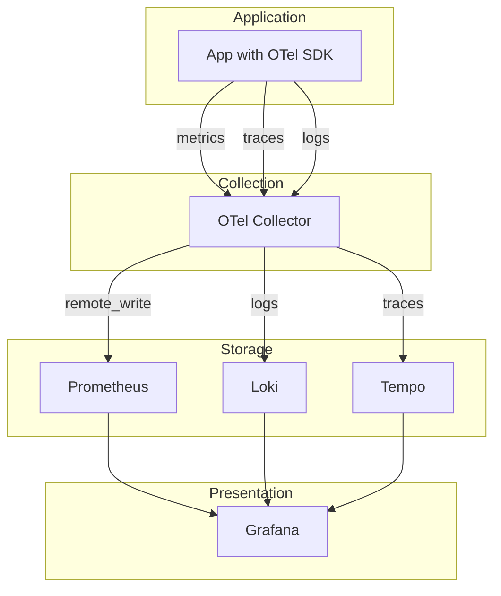
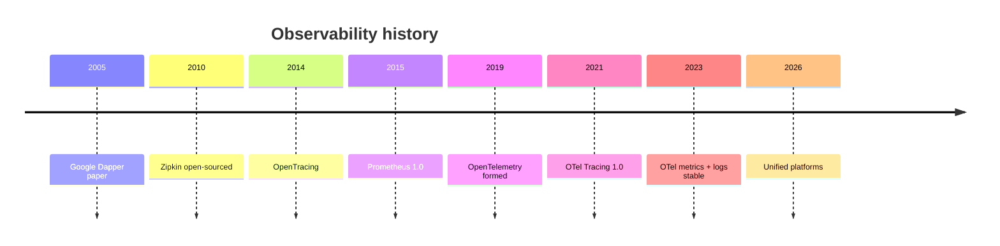
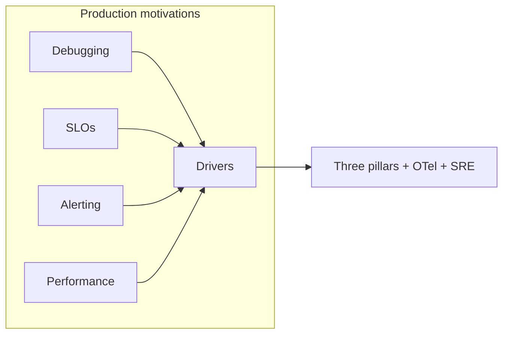
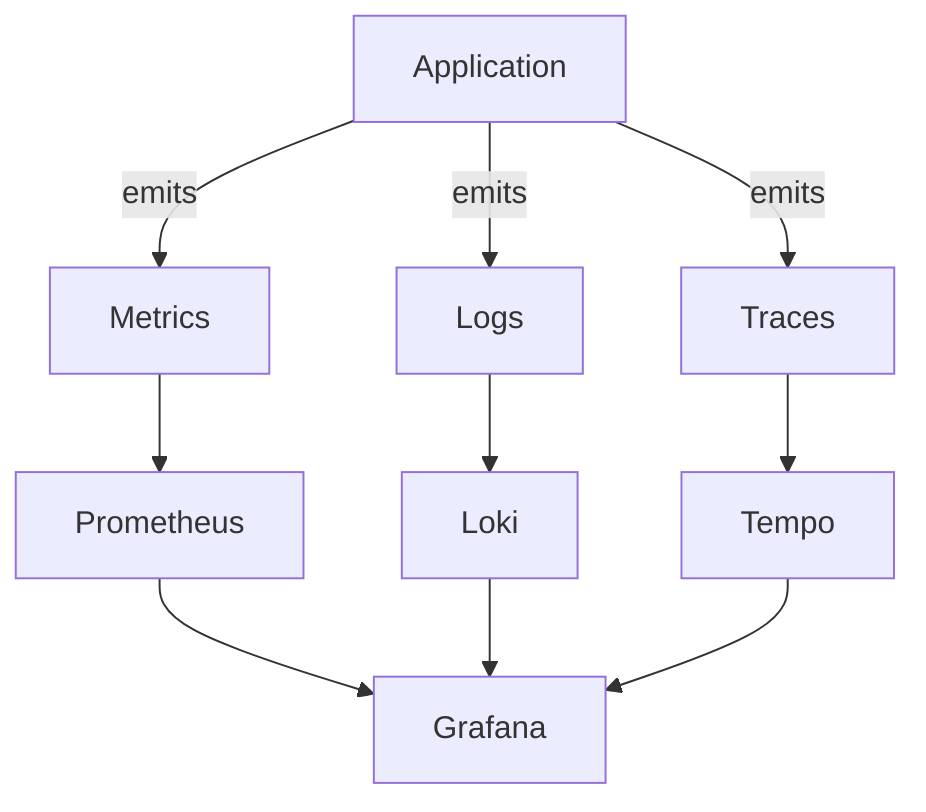
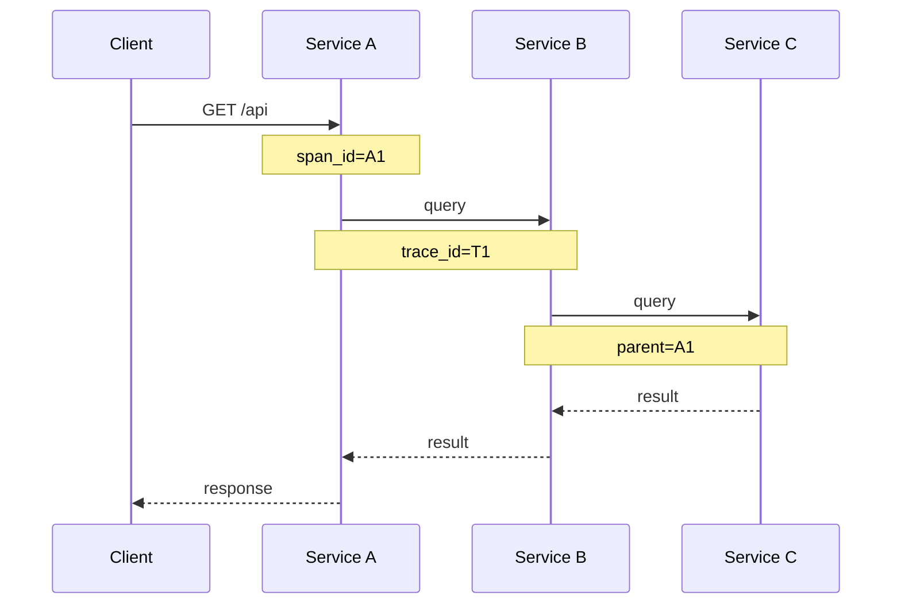
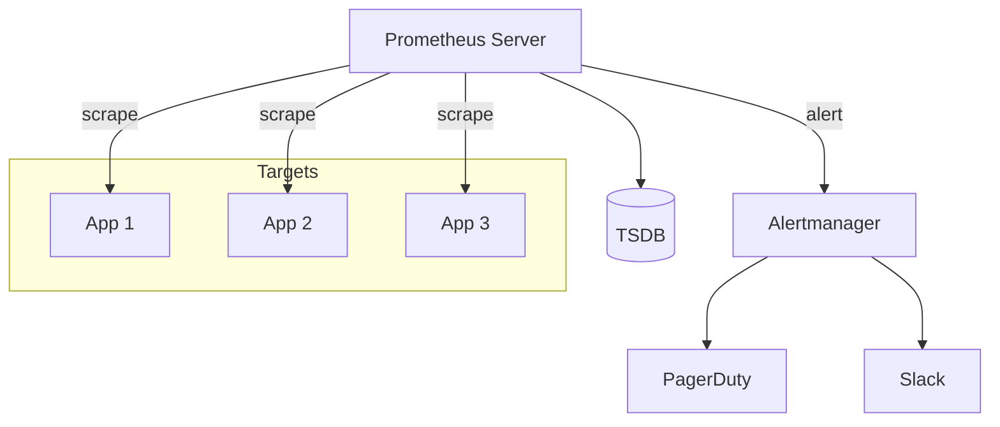
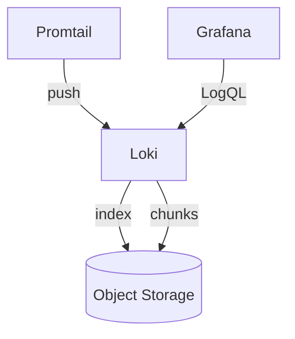
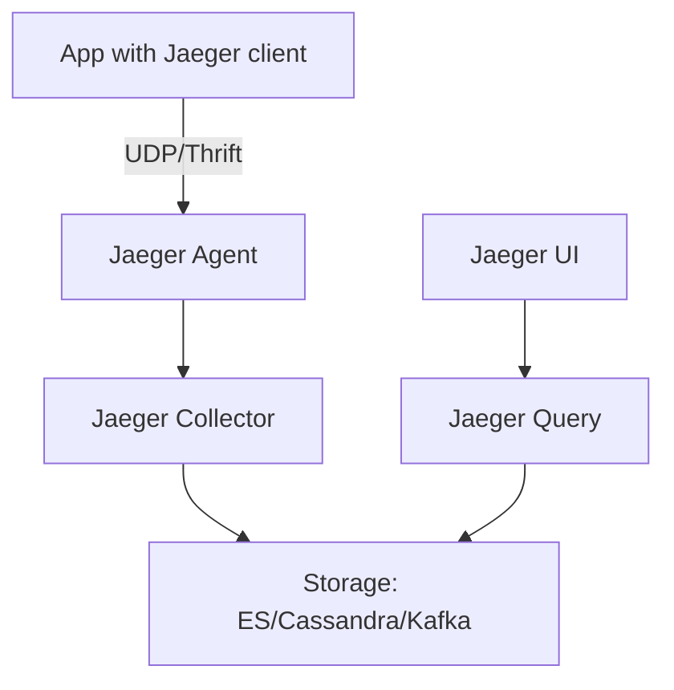
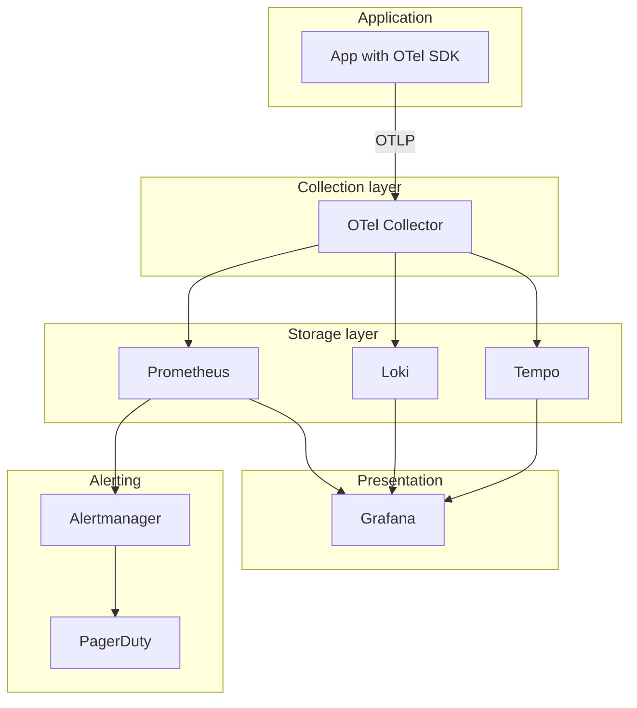
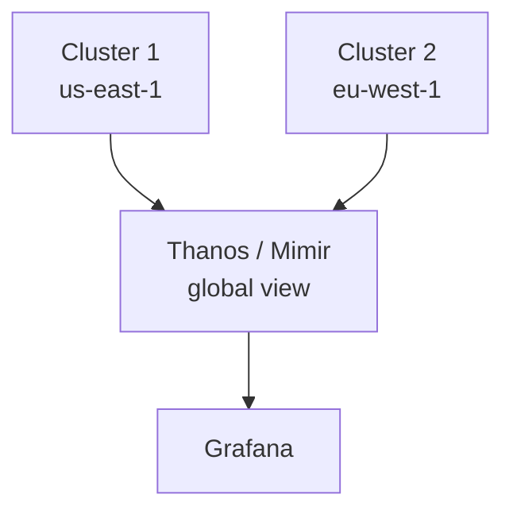

# Observability (Prometheus, Grafana, OpenTelemetry)

> A comprehensive, production-grade treatment of the three pillars of observability — metrics, logs, traces — with OpenTelemetry as the unifying SDK, plus alerting, SLOs, and SRE practices.

---

## Table of Contents

1. [Overview](#1-overview)
2. [Definition](#2-definition)
3. [Five Ws + One H](#3-five-ws--one-h)
4. [History](#4-history)
5. [Problem Statement](#5-problem-statement)
6. [Real-World Motivation](#6-real-world-motivation)
7. [Internal Working](#7-internal-working)
8. [Deep Dive](#8-deep-dive)
9. [Architecture](#9-architecture)
10. [Performance](#10-performance)
11. [Security](#11-security)
12. [Production Engineering](#12-production-engineering)
13. [Production Case Studies](#13-production-case-studies)
14. [Code Examples](#14-code-examples)
15. [Common Mistakes](#15-common-mistakes)
16. [Debugging](#16-debugging)
17. [Monitoring & Observability](#17-monitoring--observability)
18. [Best Practices](#18-best-practices)
19. [Anti-Patterns](#19-anti-patterns)
20. [Edge Cases](#20-edge-cases)
21. [Comparisons](#21-comparisons)
22. [Interview Preparation](#22-interview-preparation)
23. [References](#23-references)

---

## 1. Overview

**Observability** is the ability to understand a system's internal state from its external outputs. It is built on three pillars: **metrics** (numerical measurements), **logs** (discrete events), and **traces** (request paths through distributed systems). Modern observability is dominated by **Prometheus** (metrics), **Loki** (logs), **Tempo/Jaeger** (traces), and **OpenTelemetry** (the vendor-neutral instrumentation SDK).

This document treats all three pillars at production depth: the data models, query languages, storage backends, and operational practices. It also covers **SLOs** (Service Level Objectives) and **alerting** (Alertmanager, Grafana alerting) and **SRE practices** (blameless postmortems, error budgets).

**Scope.** This is not a tutorial. It assumes you can already read a Grafana dashboard. It focuses on **principles and patterns** that distinguish production observability from toy implementations.

**Version baselines.** Prometheus 2.50+, Grafana 10+, OpenTelemetry 1.x, Loki 3.x, Tempo 2.x.

## 2. Definition

The observability ecosystem uses overlapping terminology. Here's a precise taxonomy:

| Term | Type | Authoritative source |
|------|------|---------------------|
| **Observability** | A property of a system; ability to understand from outputs | C. Sridharan, "Distributed Systems Observability" |
| **Three pillars** | Metrics, logs, traces | Industry standard |
| **Metrics** | Numerical measurements aggregated over time | Prometheus |
| **Logs** | Discrete events with structured data | Loki / ELK |
| **Traces** | Request paths through distributed systems | Jaeger / Tempo |
| **Span** | Unit of work in a trace | OpenTelemetry |
| **Metric types** | Counter, Gauge, Histogram, Summary | Prometheus |
| **Service Level Indicator (SLI)** | Measurement of service quality | Google SRE |
| **Service Level Objective (SLO)** | Target value of an SLI | Google SRE |
| **Service Level Agreement (SLA)** | Contract with consequences (often financial) | Google SRE |
| **Error budget** | `1 - SLO`; capacity for failures | Google SRE |
| **RED method** | Rate, Errors, Duration | Tom Wilkie |
| **USE method** | Utilization, Saturation, Errors | Brendan Gregg |
| **Four Golden Signals** | Latency, Traffic, Errors, Saturation | Google SRE |
| **Cardinality** | Number of unique label combinations | Prometheus |
| **OpenTelemetry** | Vendor-neutral observability SDK | CNCF |
| **Span context** | Trace ID, Span ID propagated across services | OTel spec |
| **Baggage** | Key-value context propagation | W3C |

The standard observability stack:



## 3. Five Ws + One H

### What <a class="askgpt-btn" href="https://chatgpt.com/?prompt=Read%20this%20section%20of%20my%20encyclopedia%20and%20explain%20it%20in%20depth%20with%20concrete%20examples%2C%20the%20main%20trade-offs%2C%20and%20common%20pitfalls%20a%20practitioner%20should%20know%3A%0A%0Ahttps%3A%2F%2Fgithub.com%2Fvishvasg14%2Fsoftware-engineering-encyclopedia%2Fblob%2Fmain%2F12-observability%2Fobservability.md%23what%0A%0ASection%20title%3A%20What" target="_blank" rel="noopener" data-askgpt="What" data-askgpt-url="https://github.com/vishvasg14/software-engineering-encyclopedia/blob/main/12-observability/observability.md#what" data-askgpt-prompt-depth="Read%20this%20section%20of%20my%20encyclopedia%20and%20explain%20it%20in%20depth%20with%20concrete%20examples%2C%20the%20main%20trade-offs%2C%20and%20common%20pitfalls%20a%20practitioner%20should%20know%3A%0A%0Ahttps%3A%2F%2Fgithub.com%2Fvishvasg14%2Fsoftware-engineering-encyclopedia%2Fblob%2Fmain%2F12-observability%2Fobservability.md%23what%0A%0ASection%20title%3A%20What" data-askgpt-prompt-examples="Read%20this%20section%20of%20my%20encyclopedia%20and%20give%20me%202-3%20real-world%20production%20examples%20for%20it.%20For%20each%3A%20what%20went%20right%2C%20what%20went%20wrong%2C%20and%20the%20lessons%20learned.%20Include%20company%20%2F%20project%20names%20if%20relevant.%0A%0Ahttps%3A%2F%2Fgithub.com%2Fvishvasg14%2Fsoftware-engineering-encyclopedia%2Fblob%2Fmain%2F12-observability%2Fobservability.md%23what%0A%0ASection%20title%3A%20What" title="Ask ChatGPT about this section">💬</a>

**Observability** is the ability to ask arbitrary questions about a system's state without shipping new code. It is built on **metrics** (aggregated numerical data), **logs** (discrete events), and **traces** (causally-related events across services).

### Why <a class="askgpt-btn" href="https://chatgpt.com/?prompt=Read%20this%20section%20of%20my%20encyclopedia%20and%20explain%20it%20in%20depth%20with%20concrete%20examples%2C%20the%20main%20trade-offs%2C%20and%20common%20pitfalls%20a%20practitioner%20should%20know%3A%0A%0Ahttps%3A%2F%2Fgithub.com%2Fvishvasg14%2Fsoftware-engineering-encyclopedia%2Fblob%2Fmain%2F12-observability%2Fobservability.md%23why%0A%0ASection%20title%3A%20Why" target="_blank" rel="noopener" data-askgpt="Why" data-askgpt-url="https://github.com/vishvasg14/software-engineering-encyclopedia/blob/main/12-observability/observability.md#why" data-askgpt-prompt-depth="Read%20this%20section%20of%20my%20encyclopedia%20and%20explain%20it%20in%20depth%20with%20concrete%20examples%2C%20the%20main%20trade-offs%2C%20and%20common%20pitfalls%20a%20practitioner%20should%20know%3A%0A%0Ahttps%3A%2F%2Fgithub.com%2Fvishvasg14%2Fsoftware-engineering-encyclopedia%2Fblob%2Fmain%2F12-observability%2Fobservability.md%23why%0A%0ASection%20title%3A%20Why" data-askgpt-prompt-examples="Read%20this%20section%20of%20my%20encyclopedia%20and%20give%20me%202-3%20real-world%20production%20examples%20for%20it.%20For%20each%3A%20what%20went%20right%2C%20what%20went%20wrong%2C%20and%20the%20lessons%20learned.%20Include%20company%20%2F%20project%20names%20if%20relevant.%0A%0Ahttps%3A%2F%2Fgithub.com%2Fvishvasg14%2Fsoftware-engineering-encyclopedia%2Fblob%2Fmain%2F12-observability%2Fobservability.md%23why%0A%0ASection%20title%3A%20Why" title="Ask ChatGPT about this section">💬</a>

Distributed systems are complex; you can't reason about them from a single log line. Observability lets you understand the system from the outside, debug issues quickly, and verify SLOs.

### When <a class="askgpt-btn" href="https://chatgpt.com/?prompt=Read%20this%20section%20of%20my%20encyclopedia%20and%20explain%20it%20in%20depth%20with%20concrete%20examples%2C%20the%20main%20trade-offs%2C%20and%20common%20pitfalls%20a%20practitioner%20should%20know%3A%0A%0Ahttps%3A%2F%2Fgithub.com%2Fvishvasg14%2Fsoftware-engineering-encyclopedia%2Fblob%2Fmain%2F12-observability%2Fobservability.md%23when%0A%0ASection%20title%3A%20When" target="_blank" rel="noopener" data-askgpt="When" data-askgpt-url="https://github.com/vishvasg14/software-engineering-encyclopedia/blob/main/12-observability/observability.md#when" data-askgpt-prompt-depth="Read%20this%20section%20of%20my%20encyclopedia%20and%20explain%20it%20in%20depth%20with%20concrete%20examples%2C%20the%20main%20trade-offs%2C%20and%20common%20pitfalls%20a%20practitioner%20should%20know%3A%0A%0Ahttps%3A%2F%2Fgithub.com%2Fvishvasg14%2Fsoftware-engineering-encyclopedia%2Fblob%2Fmain%2F12-observability%2Fobservability.md%23when%0A%0ASection%20title%3A%20When" data-askgpt-prompt-examples="Read%20this%20section%20of%20my%20encyclopedia%20and%20give%20me%202-3%20real-world%20production%20examples%20for%20it.%20For%20each%3A%20what%20went%20right%2C%20what%20went%20wrong%2C%20and%20the%20lessons%20learned.%20Include%20company%20%2F%20project%20names%20if%20relevant.%0A%0Ahttps%3A%2F%2Fgithub.com%2Fvishvasg14%2Fsoftware-engineering-encyclopedia%2Fblob%2Fmain%2F12-observability%2Fobservability.md%23when%0A%0ASection%20title%3A%20When" title="Ask ChatGPT about this section">💬</a>

The term "observability" entered mainstream engineering vocabulary around 2017-2018, popularized by Cindy Sridharan's book and the OpenTracing / OpenTelemetry projects.

### Where <a class="askgpt-btn" href="https://chatgpt.com/?prompt=Read%20this%20section%20of%20my%20encyclopedia%20and%20explain%20it%20in%20depth%20with%20concrete%20examples%2C%20the%20main%20trade-offs%2C%20and%20common%20pitfalls%20a%20practitioner%20should%20know%3A%0A%0Ahttps%3A%2F%2Fgithub.com%2Fvishvasg14%2Fsoftware-engineering-encyclopedia%2Fblob%2Fmain%2F12-observability%2Fobservability.md%23where%0A%0ASection%20title%3A%20Where" target="_blank" rel="noopener" data-askgpt="Where" data-askgpt-url="https://github.com/vishvasg14/software-engineering-encyclopedia/blob/main/12-observability/observability.md#where" data-askgpt-prompt-depth="Read%20this%20section%20of%20my%20encyclopedia%20and%20explain%20it%20in%20depth%20with%20concrete%20examples%2C%20the%20main%20trade-offs%2C%20and%20common%20pitfalls%20a%20practitioner%20should%20know%3A%0A%0Ahttps%3A%2F%2Fgithub.com%2Fvishvasg14%2Fsoftware-engineering-encyclopedia%2Fblob%2Fmain%2F12-observability%2Fobservability.md%23where%0A%0ASection%20title%3A%20Where" data-askgpt-prompt-examples="Read%20this%20section%20of%20my%20encyclopedia%20and%20give%20me%202-3%20real-world%20production%20examples%20for%20it.%20For%20each%3A%20what%20went%20right%2C%20what%20went%20wrong%2C%20and%20the%20lessons%20learned.%20Include%20company%20%2F%20project%20names%20if%20relevant.%0A%0Ahttps%3A%2F%2Fgithub.com%2Fvishvasg14%2Fsoftware-engineering-encyclopedia%2Fblob%2Fmain%2F12-observability%2Fobservability.md%23where%0A%0ASection%20title%3A%20Where" title="Ask ChatGPT about this section">💬</a>

Every web-scale company. Netflix pioneered distributed tracing. Google developed Dapper (precursor to OpenTelemetry). Charity Majors and the Honeycomb team popularized the modern observability mindset.

### Who <a class="askgpt-btn" href="https://chatgpt.com/?prompt=Read%20this%20section%20of%20my%20encyclopedia%20and%20explain%20it%20in%20depth%20with%20concrete%20examples%2C%20the%20main%20trade-offs%2C%20and%20common%20pitfalls%20a%20practitioner%20should%20know%3A%0A%0Ahttps%3A%2F%2Fgithub.com%2Fvishvasg14%2Fsoftware-engineering-encyclopedia%2Fblob%2Fmain%2F12-observability%2Fobservability.md%23who%0A%0ASection%20title%3A%20Who" target="_blank" rel="noopener" data-askgpt="Who" data-askgpt-url="https://github.com/vishvasg14/software-engineering-encyclopedia/blob/main/12-observability/observability.md#who" data-askgpt-prompt-depth="Read%20this%20section%20of%20my%20encyclopedia%20and%20explain%20it%20in%20depth%20with%20concrete%20examples%2C%20the%20main%20trade-offs%2C%20and%20common%20pitfalls%20a%20practitioner%20should%20know%3A%0A%0Ahttps%3A%2F%2Fgithub.com%2Fvishvasg14%2Fsoftware-engineering-encyclopedia%2Fblob%2Fmain%2F12-observability%2Fobservability.md%23who%0A%0ASection%20title%3A%20Who" data-askgpt-prompt-examples="Read%20this%20section%20of%20my%20encyclopedia%20and%20give%20me%202-3%20real-world%20production%20examples%20for%20it.%20For%20each%3A%20what%20went%20right%2C%20what%20went%20wrong%2C%20and%20the%20lessons%20learned.%20Include%20company%20%2F%20project%20names%20if%20relevant.%0A%0Ahttps%3A%2F%2Fgithub.com%2Fvishvasg14%2Fsoftware-engineering-encyclopedia%2Fblob%2Fmain%2F12-observability%2Fobservability.md%23who%0A%0ASection%20title%3A%20Who" title="Ask ChatGPT about this section">💬</a>

- **Cindy Sridharan:** "Distributed Systems Observability" (book).
- **Charity Majors:** Honeycomb; observability champion.
- **Brendan Gregg:** USE method, performance.
- **Google SRE team:** SLIs, SLOs, error budgets.
- **CNCF:** OpenTelemetry.

### How (one-paragraph preview) <a class="askgpt-btn" href="https://chatgpt.com/?prompt=Read%20this%20section%20of%20my%20encyclopedia%20and%20explain%20it%20in%20depth%20with%20concrete%20examples%2C%20the%20main%20trade-offs%2C%20and%20common%20pitfalls%20a%20practitioner%20should%20know%3A%0A%0Ahttps%3A%2F%2Fgithub.com%2Fvishvasg14%2Fsoftware-engineering-encyclopedia%2Fblob%2Fmain%2F12-observability%2Fobservability.md%23how-one-paragraph-preview%0A%0ASection%20title%3A%20How%20(one-paragraph%20preview)" target="_blank" rel="noopener" data-askgpt="How (one-paragraph preview)" data-askgpt-url="https://github.com/vishvasg14/software-engineering-encyclopedia/blob/main/12-observability/observability.md#how-one-paragraph-preview" data-askgpt-prompt-depth="Read%20this%20section%20of%20my%20encyclopedia%20and%20explain%20it%20in%20depth%20with%20concrete%20examples%2C%20the%20main%20trade-offs%2C%20and%20common%20pitfalls%20a%20practitioner%20should%20know%3A%0A%0Ahttps%3A%2F%2Fgithub.com%2Fvishvasg14%2Fsoftware-engineering-encyclopedia%2Fblob%2Fmain%2F12-observability%2Fobservability.md%23how-one-paragraph-preview%0A%0ASection%20title%3A%20How%20(one-paragraph%20preview)" data-askgpt-prompt-examples="Read%20this%20section%20of%20my%20encyclopedia%20and%20give%20me%202-3%20real-world%20production%20examples%20for%20it.%20For%20each%3A%20what%20went%20right%2C%20what%20went%20wrong%2C%20and%20the%20lessons%20learned.%20Include%20company%20%2F%20project%20names%20if%20relevant.%0A%0Ahttps%3A%2F%2Fgithub.com%2Fvishvasg14%2Fsoftware-engineering-encyclopedia%2Fblob%2Fmain%2F12-observability%2Fobservability.md%23how-one-paragraph-preview%0A%0ASection%20title%3A%20How%20(one-paragraph%20preview)" title="Ask ChatGPT about this section">💬</a>

You instrument your application with a vendor-neutral SDK (OpenTelemetry). The SDK emits metrics, traces, and logs. A collector (OpenTelemetry Collector) receives them, batches them, and exports to backends (Prometheus, Loki, Tempo). Grafana queries these backends and provides dashboards. Alertmanager (for Prometheus) or Grafana alerting (for any datasource) generates alerts based on SLOs. On-call engineers respond via runbooks; SRE team conducts blameless postmortems.

## 4. History

### 4.1 Origins (2005-2015) <a class="askgpt-btn" href="https://chatgpt.com/?prompt=Read%20this%20section%20of%20my%20encyclopedia%20and%20explain%20it%20in%20depth%20with%20concrete%20examples%2C%20the%20main%20trade-offs%2C%20and%20common%20pitfalls%20a%20practitioner%20should%20know%3A%0A%0Ahttps%3A%2F%2Fgithub.com%2Fvishvasg14%2Fsoftware-engineering-encyclopedia%2Fblob%2Fmain%2F12-observability%2Fobservability.md%2341-origins-2005-2015%0A%0ASection%20title%3A%204.1%20Origins%20(2005-2015)" target="_blank" rel="noopener" data-askgpt="4.1 Origins (2005-2015)" data-askgpt-url="https://github.com/vishvasg14/software-engineering-encyclopedia/blob/main/12-observability/observability.md#41-origins-2005-2015" data-askgpt-prompt-depth="Read%20this%20section%20of%20my%20encyclopedia%20and%20explain%20it%20in%20depth%20with%20concrete%20examples%2C%20the%20main%20trade-offs%2C%20and%20common%20pitfalls%20a%20practitioner%20should%20know%3A%0A%0Ahttps%3A%2F%2Fgithub.com%2Fvishvasg14%2Fsoftware-engineering-encyclopedia%2Fblob%2Fmain%2F12-observability%2Fobservability.md%2341-origins-2005-2015%0A%0ASection%20title%3A%204.1%20Origins%20(2005-2015)" data-askgpt-prompt-examples="Read%20this%20section%20of%20my%20encyclopedia%20and%20give%20me%202-3%20real-world%20production%20examples%20for%20it.%20For%20each%3A%20what%20went%20right%2C%20what%20went%20wrong%2C%20and%20the%20lessons%20learned.%20Include%20company%20%2F%20project%20names%20if%20relevant.%0A%0Ahttps%3A%2F%2Fgithub.com%2Fvishvasg14%2Fsoftware-engineering-encyclopedia%2Fblob%2Fmain%2F12-observability%2Fobservability.md%2341-origins-2005-2015%0A%0ASection%20title%3A%204.1%20Origins%20(2005-2015)" title="Ask ChatGPT about this section">💬</a>

- **2005** — Google Dapper paper; the foundation of distributed tracing.
- **2010** — Twitter Zipkin open-sourced (inspired by Dapper).
- **2014** — OpenTracing API specification (CNCF).
- **2015** — Prometheus 1.0; CNCF graduated.

### 4.2 Standardization (2016-2021) <a class="askgpt-btn" href="https://chatgpt.com/?prompt=Read%20this%20section%20of%20my%20encyclopedia%20and%20explain%20it%20in%20depth%20with%20concrete%20examples%2C%20the%20main%20trade-offs%2C%20and%20common%20pitfalls%20a%20practitioner%20should%20know%3A%0A%0Ahttps%3A%2F%2Fgithub.com%2Fvishvasg14%2Fsoftware-engineering-encyclopedia%2Fblob%2Fmain%2F12-observability%2Fobservability.md%2342-standardization-2016-2021%0A%0ASection%20title%3A%204.2%20Standardization%20(2016-2021)" target="_blank" rel="noopener" data-askgpt="4.2 Standardization (2016-2021)" data-askgpt-url="https://github.com/vishvasg14/software-engineering-encyclopedia/blob/main/12-observability/observability.md#42-standardization-2016-2021" data-askgpt-prompt-depth="Read%20this%20section%20of%20my%20encyclopedia%20and%20explain%20it%20in%20depth%20with%20concrete%20examples%2C%20the%20main%20trade-offs%2C%20and%20common%20pitfalls%20a%20practitioner%20should%20know%3A%0A%0Ahttps%3A%2F%2Fgithub.com%2Fvishvasg14%2Fsoftware-engineering-encyclopedia%2Fblob%2Fmain%2F12-observability%2Fobservability.md%2342-standardization-2016-2021%0A%0ASection%20title%3A%204.2%20Standardization%20(2016-2021)" data-askgpt-prompt-examples="Read%20this%20section%20of%20my%20encyclopedia%20and%20give%20me%202-3%20real-world%20production%20examples%20for%20it.%20For%20each%3A%20what%20went%20right%2C%20what%20went%20wrong%2C%20and%20the%20lessons%20learned.%20Include%20company%20%2F%20project%20names%20if%20relevant.%0A%0Ahttps%3A%2F%2Fgithub.com%2Fvishvasg14%2Fsoftware-engineering-encyclopedia%2Fblob%2Fmain%2F12-observability%2Fobservability.md%2342-standardization-2016-2021%0A%0ASection%20title%3A%204.2%20Standardization%20(2016-2021)" title="Ask ChatGPT about this section">💬</a>

- **2016** — CNCF accepts OpenTracing.
- **2017** — Cindy Sridharan publishes "Distributed Systems Observability" (book).
- **2018** — W3C Trace Context becomes a Candidate Recommendation.
- **2019** — OpenTelemetry merges OpenTracing and OpenCensus; OTel 1.0 (Tracing) released.
- **2020** — Grafana acquires Loki (logs).
- **2021** — Grafana 8.0 with full observability stack (Loki, Tempo, Mimir).

### 4.3 Unified (2021-2026) <a class="askgpt-btn" href="https://chatgpt.com/?prompt=Read%20this%20section%20of%20my%20encyclopedia%20and%20explain%20it%20in%20depth%20with%20concrete%20examples%2C%20the%20main%20trade-offs%2C%20and%20common%20pitfalls%20a%20practitioner%20should%20know%3A%0A%0Ahttps%3A%2F%2Fgithub.com%2Fvishvasg14%2Fsoftware-engineering-encyclopedia%2Fblob%2Fmain%2F12-observability%2Fobservability.md%2343-unified-2021-2026%0A%0ASection%20title%3A%204.3%20Unified%20(2021-2026)" target="_blank" rel="noopener" data-askgpt="4.3 Unified (2021-2026)" data-askgpt-url="https://github.com/vishvasg14/software-engineering-encyclopedia/blob/main/12-observability/observability.md#43-unified-2021-2026" data-askgpt-prompt-depth="Read%20this%20section%20of%20my%20encyclopedia%20and%20explain%20it%20in%20depth%20with%20concrete%20examples%2C%20the%20main%20trade-offs%2C%20and%20common%20pitfalls%20a%20practitioner%20should%20know%3A%0A%0Ahttps%3A%2F%2Fgithub.com%2Fvishvasg14%2Fsoftware-engineering-encyclopedia%2Fblob%2Fmain%2F12-observability%2Fobservability.md%2343-unified-2021-2026%0A%0ASection%20title%3A%204.3%20Unified%20(2021-2026)" data-askgpt-prompt-examples="Read%20this%20section%20of%20my%20encyclopedia%20and%20give%20me%202-3%20real-world%20production%20examples%20for%20it.%20For%20each%3A%20what%20went%20right%2C%20what%20went%20wrong%2C%20and%20the%20lessons%20learned.%20Include%20company%20%2F%20project%20names%20if%20relevant.%0A%0Ahttps%3A%2F%2Fgithub.com%2Fvishvasg14%2Fsoftware-engineering-encyclopedia%2Fblob%2Fmain%2F12-observability%2Fobservability.md%2343-unified-2021-2026%0A%0ASection%20title%3A%204.3%20Unified%20(2021-2026)" title="Ask ChatGPT about this section">💬</a>

- **2021** — OTel 1.0 (Tracing) stable; CNCF graduated.
- **2022** — OTel metrics + logs spec stable.
- **2023** — OpenTelemetry as the de facto observability SDK.
- **2024** — eBPF-based observability (Cilium, Pixie, Beyla).
- **2025** — LLM observability; AI workloads.
- **2026** — Unified observability platforms.



## 5. Problem Statement

### 5.1 What observability solves <a class="askgpt-btn" href="https://chatgpt.com/?prompt=Read%20this%20section%20of%20my%20encyclopedia%20and%20explain%20it%20in%20depth%20with%20concrete%20examples%2C%20the%20main%20trade-offs%2C%20and%20common%20pitfalls%20a%20practitioner%20should%20know%3A%0A%0Ahttps%3A%2F%2Fgithub.com%2Fvishvasg14%2Fsoftware-engineering-encyclopedia%2Fblob%2Fmain%2F12-observability%2Fobservability.md%2351-what-observability-solves%0A%0ASection%20title%3A%205.1%20What%20observability%20solves" target="_blank" rel="noopener" data-askgpt="5.1 What observability solves" data-askgpt-url="https://github.com/vishvasg14/software-engineering-encyclopedia/blob/main/12-observability/observability.md#51-what-observability-solves" data-askgpt-prompt-depth="Read%20this%20section%20of%20my%20encyclopedia%20and%20explain%20it%20in%20depth%20with%20concrete%20examples%2C%20the%20main%20trade-offs%2C%20and%20common%20pitfalls%20a%20practitioner%20should%20know%3A%0A%0Ahttps%3A%2F%2Fgithub.com%2Fvishvasg14%2Fsoftware-engineering-encyclopedia%2Fblob%2Fmain%2F12-observability%2Fobservability.md%2351-what-observability-solves%0A%0ASection%20title%3A%205.1%20What%20observability%20solves" data-askgpt-prompt-examples="Read%20this%20section%20of%20my%20encyclopedia%20and%20give%20me%202-3%20real-world%20production%20examples%20for%20it.%20For%20each%3A%20what%20went%20right%2C%20what%20went%20wrong%2C%20and%20the%20lessons%20learned.%20Include%20company%20%2F%20project%20names%20if%20relevant.%0A%0Ahttps%3A%2F%2Fgithub.com%2Fvishvasg14%2Fsoftware-engineering-encyclopedia%2Fblob%2Fmain%2F12-observability%2Fobservability.md%2351-what-observability-solves%0A%0ASection%20title%3A%205.1%20What%20observability%20solves" title="Ask ChatGPT about this section">💬</a>

- **Debug complex distributed systems** — find the root cause across services.
- **Validate SLOs** — measure user-visible reliability.
- **Alert on real problems** — avoid alert fatigue.
- **Capacity planning** — see trends.
- **Performance debugging** — find hot paths.
- **Business analytics** — track KPIs.

### 5.2 What observability doesn't solve <a class="askgpt-btn" href="https://chatgpt.com/?prompt=Read%20this%20section%20of%20my%20encyclopedia%20and%20explain%20it%20in%20depth%20with%20concrete%20examples%2C%20the%20main%20trade-offs%2C%20and%20common%20pitfalls%20a%20practitioner%20should%20know%3A%0A%0Ahttps%3A%2F%2Fgithub.com%2Fvishvasg14%2Fsoftware-engineering-encyclopedia%2Fblob%2Fmain%2F12-observability%2Fobservability.md%2352-what-observability-doesnt-solve%0A%0ASection%20title%3A%205.2%20What%20observability%20doesn't%20solve" target="_blank" rel="noopener" data-askgpt="5.2 What observability doesn't solve" data-askgpt-url="https://github.com/vishvasg14/software-engineering-encyclopedia/blob/main/12-observability/observability.md#52-what-observability-doesnt-solve" data-askgpt-prompt-depth="Read%20this%20section%20of%20my%20encyclopedia%20and%20explain%20it%20in%20depth%20with%20concrete%20examples%2C%20the%20main%20trade-offs%2C%20and%20common%20pitfalls%20a%20practitioner%20should%20know%3A%0A%0Ahttps%3A%2F%2Fgithub.com%2Fvishvasg14%2Fsoftware-engineering-encyclopedia%2Fblob%2Fmain%2F12-observability%2Fobservability.md%2352-what-observability-doesnt-solve%0A%0ASection%20title%3A%205.2%20What%20observability%20doesn't%20solve" data-askgpt-prompt-examples="Read%20this%20section%20of%20my%20encyclopedia%20and%20give%20me%202-3%20real-world%20production%20examples%20for%20it.%20For%20each%3A%20what%20went%20right%2C%20what%20went%20wrong%2C%20and%20the%20lessons%20learned.%20Include%20company%20%2F%20project%20names%20if%20relevant.%0A%0Ahttps%3A%2F%2Fgithub.com%2Fvishvasg14%2Fsoftware-engineering-encyclopedia%2Fblob%2Fmain%2F12-observability%2Fobservability.md%2352-what-observability-doesnt-solve%0A%0ASection%20title%3A%205.2%20What%20observability%20doesn't%20solve" title="Ask ChatGPT about this section">💬</a>

- **Bugs in code** — debugging tools help.
- **Bugs in design** — observability surfaces symptoms.
- **Operational discipline** — SRE practices.
- **Cost** — observability is itself costly.

### 5.3 The cost of poor observability <a class="askgpt-btn" href="https://chatgpt.com/?prompt=Read%20this%20section%20of%20my%20encyclopedia%20and%20explain%20it%20in%20depth%20with%20concrete%20examples%2C%20the%20main%20trade-offs%2C%20and%20common%20pitfalls%20a%20practitioner%20should%20know%3A%0A%0Ahttps%3A%2F%2Fgithub.com%2Fvishvasg14%2Fsoftware-engineering-encyclopedia%2Fblob%2Fmain%2F12-observability%2Fobservability.md%2353-the-cost-of-poor-observability%0A%0ASection%20title%3A%205.3%20The%20cost%20of%20poor%20observability" target="_blank" rel="noopener" data-askgpt="5.3 The cost of poor observability" data-askgpt-url="https://github.com/vishvasg14/software-engineering-encyclopedia/blob/main/12-observability/observability.md#53-the-cost-of-poor-observability" data-askgpt-prompt-depth="Read%20this%20section%20of%20my%20encyclopedia%20and%20explain%20it%20in%20depth%20with%20concrete%20examples%2C%20the%20main%20trade-offs%2C%20and%20common%20pitfalls%20a%20practitioner%20should%20know%3A%0A%0Ahttps%3A%2F%2Fgithub.com%2Fvishvasg14%2Fsoftware-engineering-encyclopedia%2Fblob%2Fmain%2F12-observability%2Fobservability.md%2353-the-cost-of-poor-observability%0A%0ASection%20title%3A%205.3%20The%20cost%20of%20poor%20observability" data-askgpt-prompt-examples="Read%20this%20section%20of%20my%20encyclopedia%20and%20give%20me%202-3%20real-world%20production%20examples%20for%20it.%20For%20each%3A%20what%20went%20right%2C%20what%20went%20wrong%2C%20and%20the%20lessons%20learned.%20Include%20company%20%2F%20project%20names%20if%20relevant.%0A%0Ahttps%3A%2F%2Fgithub.com%2Fvishvasg14%2Fsoftware-engineering-encyclopedia%2Fblob%2Fmain%2F12-observability%2Fobservability.md%2353-the-cost-of-poor-observability%0A%0ASection%20title%3A%205.3%20The%20cost%20of%20poor%20observability" title="Ask ChatGPT about this section">💬</a>

- Mean time to detect (MTTD) is high.
- Mean time to resolve (MTTR) is high.
- Engineers page through dashboards for hours.
- Customer experience suffers.

## 6. Real-World Motivation

### 6.1 Netflix <a class="askgpt-btn" href="https://chatgpt.com/?prompt=Read%20this%20section%20of%20my%20encyclopedia%20and%20explain%20it%20in%20depth%20with%20concrete%20examples%2C%20the%20main%20trade-offs%2C%20and%20common%20pitfalls%20a%20practitioner%20should%20know%3A%0A%0Ahttps%3A%2F%2Fgithub.com%2Fvishvasg14%2Fsoftware-engineering-encyclopedia%2Fblob%2Fmain%2F12-observability%2Fobservability.md%2361-netflix%0A%0ASection%20title%3A%206.1%20Netflix" target="_blank" rel="noopener" data-askgpt="6.1 Netflix" data-askgpt-url="https://github.com/vishvasg14/software-engineering-encyclopedia/blob/main/12-observability/observability.md#61-netflix" data-askgpt-prompt-depth="Read%20this%20section%20of%20my%20encyclopedia%20and%20explain%20it%20in%20depth%20with%20concrete%20examples%2C%20the%20main%20trade-offs%2C%20and%20common%20pitfalls%20a%20practitioner%20should%20know%3A%0A%0Ahttps%3A%2F%2Fgithub.com%2Fvishvasg14%2Fsoftware-engineering-encyclopedia%2Fblob%2Fmain%2F12-observability%2Fobservability.md%2361-netflix%0A%0ASection%20title%3A%206.1%20Netflix" data-askgpt-prompt-examples="Read%20this%20section%20of%20my%20encyclopedia%20and%20give%20me%202-3%20real-world%20production%20examples%20for%20it.%20For%20each%3A%20what%20went%20right%2C%20what%20went%20wrong%2C%20and%20the%20lessons%20learned.%20Include%20company%20%2F%20project%20names%20if%20relevant.%0A%0Ahttps%3A%2F%2Fgithub.com%2Fvishvasg14%2Fsoftware-engineering-encyclopedia%2Fblob%2Fmain%2F12-observability%2Fobservability.md%2361-netflix%0A%0ASection%20title%3A%206.1%20Netflix" title="Ask ChatGPT about this section">💬</a>

Pioneered distributed tracing with Atlas; uses Spinnaker for deployment; runs Eureka, Hystrix, Ribbon for microservices observability.

### 6.2 Uber <a class="askgpt-btn" href="https://chatgpt.com/?prompt=Read%20this%20section%20of%20my%20encyclopedia%20and%20explain%20it%20in%20depth%20with%20concrete%20examples%2C%20the%20main%20trade-offs%2C%20and%20common%20pitfalls%20a%20practitioner%20should%20know%3A%0A%0Ahttps%3A%2F%2Fgithub.com%2Fvishvasg14%2Fsoftware-engineering-encyclopedia%2Fblob%2Fmain%2F12-observability%2Fobservability.md%2362-uber%0A%0ASection%20title%3A%206.2%20Uber" target="_blank" rel="noopener" data-askgpt="6.2 Uber" data-askgpt-url="https://github.com/vishvasg14/software-engineering-encyclopedia/blob/main/12-observability/observability.md#62-uber" data-askgpt-prompt-depth="Read%20this%20section%20of%20my%20encyclopedia%20and%20explain%20it%20in%20depth%20with%20concrete%20examples%2C%20the%20main%20trade-offs%2C%20and%20common%20pitfalls%20a%20practitioner%20should%20know%3A%0A%0Ahttps%3A%2F%2Fgithub.com%2Fvishvasg14%2Fsoftware-engineering-encyclopedia%2Fblob%2Fmain%2F12-observability%2Fobservability.md%2362-uber%0A%0ASection%20title%3A%206.2%20Uber" data-askgpt-prompt-examples="Read%20this%20section%20of%20my%20encyclopedia%20and%20give%20me%202-3%20real-world%20production%20examples%20for%20it.%20For%20each%3A%20what%20went%20right%2C%20what%20went%20wrong%2C%20and%20the%20lessons%20learned.%20Include%20company%20%2F%20project%20names%20if%20relevant.%0A%0Ahttps%3A%2F%2Fgithub.com%2Fvishvasg14%2Fsoftware-engineering-encyclopedia%2Fblob%2Fmain%2F12-observability%2Fobservability.md%2362-uber%0A%0ASection%20title%3A%206.2%20Uber" title="Ask ChatGPT about this section">💬</a>

Operates Jaeger at scale; built M3DB for metrics; uses OpenTracing.

### 6.3 Twitter <a class="askgpt-btn" href="https://chatgpt.com/?prompt=Read%20this%20section%20of%20my%20encyclopedia%20and%20explain%20it%20in%20depth%20with%20concrete%20examples%2C%20the%20main%20trade-offs%2C%20and%20common%20pitfalls%20a%20practitioner%20should%20know%3A%0A%0Ahttps%3A%2F%2Fgithub.com%2Fvishvasg14%2Fsoftware-engineering-encyclopedia%2Fblob%2Fmain%2F12-observability%2Fobservability.md%2363-twitter%0A%0ASection%20title%3A%206.3%20Twitter" target="_blank" rel="noopener" data-askgpt="6.3 Twitter" data-askgpt-url="https://github.com/vishvasg14/software-engineering-encyclopedia/blob/main/12-observability/observability.md#63-twitter" data-askgpt-prompt-depth="Read%20this%20section%20of%20my%20encyclopedia%20and%20explain%20it%20in%20depth%20with%20concrete%20examples%2C%20the%20main%20trade-offs%2C%20and%20common%20pitfalls%20a%20practitioner%20should%20know%3A%0A%0Ahttps%3A%2F%2Fgithub.com%2Fvishvasg14%2Fsoftware-engineering-encyclopedia%2Fblob%2Fmain%2F12-observability%2Fobservability.md%2363-twitter%0A%0ASection%20title%3A%206.3%20Twitter" data-askgpt-prompt-examples="Read%20this%20section%20of%20my%20encyclopedia%20and%20give%20me%202-3%20real-world%20production%20examples%20for%20it.%20For%20each%3A%20what%20went%20right%2C%20what%20went%20wrong%2C%20and%20the%20lessons%20learned.%20Include%20company%20%2F%20project%20names%20if%20relevant.%0A%0Ahttps%3A%2F%2Fgithub.com%2Fvishvasg14%2Fsoftware-engineering-encyclopedia%2Fblob%2Fmain%2F12-observability%2Fobservability.md%2363-twitter%0A%0ASection%20title%3A%206.3%20Twitter" title="Ask ChatGPT about this section">💬</a>

Open-sourced Zipkin; uses Prometheus at scale; built Vortex (metrics pipeline).

### 6.4 Google <a class="askgpt-btn" href="https://chatgpt.com/?prompt=Read%20this%20section%20of%20my%20encyclopedia%20and%20explain%20it%20in%20depth%20with%20concrete%20examples%2C%20the%20main%20trade-offs%2C%20and%20common%20pitfalls%20a%20practitioner%20should%20know%3A%0A%0Ahttps%3A%2F%2Fgithub.com%2Fvishvasg14%2Fsoftware-engineering-encyclopedia%2Fblob%2Fmain%2F12-observability%2Fobservability.md%2364-google%0A%0ASection%20title%3A%206.4%20Google" target="_blank" rel="noopener" data-askgpt="6.4 Google" data-askgpt-url="https://github.com/vishvasg14/software-engineering-encyclopedia/blob/main/12-observability/observability.md#64-google" data-askgpt-prompt-depth="Read%20this%20section%20of%20my%20encyclopedia%20and%20explain%20it%20in%20depth%20with%20concrete%20examples%2C%20the%20main%20trade-offs%2C%20and%20common%20pitfalls%20a%20practitioner%20should%20know%3A%0A%0Ahttps%3A%2F%2Fgithub.com%2Fvishvasg14%2Fsoftware-engineering-encyclopedia%2Fblob%2Fmain%2F12-observability%2Fobservability.md%2364-google%0A%0ASection%20title%3A%206.4%20Google" data-askgpt-prompt-examples="Read%20this%20section%20of%20my%20encyclopedia%20and%20give%20me%202-3%20real-world%20production%20examples%20for%20it.%20For%20each%3A%20what%20went%20right%2C%20what%20went%20wrong%2C%20and%20the%20lessons%20learned.%20Include%20company%20%2F%20project%20names%20if%20relevant.%0A%0Ahttps%3A%2F%2Fgithub.com%2Fvishvasg14%2Fsoftware-engineering-encyclopedia%2Fblob%2Fmain%2F12-observability%2Fobservability.md%2364-google%0A%0ASection%20title%3A%206.4%20Google" title="Ask ChatGPT about this section">💬</a>

Dapper (tracing), Monarch (metrics), Dremel (logs). Foundation for modern observability.



---

## 7. Internal Working

### 7.1 The three pillars <a class="askgpt-btn" href="https://chatgpt.com/?prompt=Read%20this%20section%20of%20my%20encyclopedia%20and%20explain%20it%20in%20depth%20with%20concrete%20examples%2C%20the%20main%20trade-offs%2C%20and%20common%20pitfalls%20a%20practitioner%20should%20know%3A%0A%0Ahttps%3A%2F%2Fgithub.com%2Fvishvasg14%2Fsoftware-engineering-encyclopedia%2Fblob%2Fmain%2F12-observability%2Fobservability.md%2371-the-three-pillars%0A%0ASection%20title%3A%207.1%20The%20three%20pillars" target="_blank" rel="noopener" data-askgpt="7.1 The three pillars" data-askgpt-url="https://github.com/vishvasg14/software-engineering-encyclopedia/blob/main/12-observability/observability.md#71-the-three-pillars" data-askgpt-prompt-depth="Read%20this%20section%20of%20my%20encyclopedia%20and%20explain%20it%20in%20depth%20with%20concrete%20examples%2C%20the%20main%20trade-offs%2C%20and%20common%20pitfalls%20a%20practitioner%20should%20know%3A%0A%0Ahttps%3A%2F%2Fgithub.com%2Fvishvasg14%2Fsoftware-engineering-encyclopedia%2Fblob%2Fmain%2F12-observability%2Fobservability.md%2371-the-three-pillars%0A%0ASection%20title%3A%207.1%20The%20three%20pillars" data-askgpt-prompt-examples="Read%20this%20section%20of%20my%20encyclopedia%20and%20give%20me%202-3%20real-world%20production%20examples%20for%20it.%20For%20each%3A%20what%20went%20right%2C%20what%20went%20wrong%2C%20and%20the%20lessons%20learned.%20Include%20company%20%2F%20project%20names%20if%20relevant.%0A%0Ahttps%3A%2F%2Fgithub.com%2Fvishvasg14%2Fsoftware-engineering-encyclopedia%2Fblob%2Fmain%2F12-observability%2Fobservability.md%2371-the-three-pillars%0A%0ASection%20title%3A%207.1%20The%20three%20pillars" title="Ask ChatGPT about this section">💬</a>



### 7.2 Trace flow <a class="askgpt-btn" href="https://chatgpt.com/?prompt=Read%20this%20section%20of%20my%20encyclopedia%20and%20explain%20it%20in%20depth%20with%20concrete%20examples%2C%20the%20main%20trade-offs%2C%20and%20common%20pitfalls%20a%20practitioner%20should%20know%3A%0A%0Ahttps%3A%2F%2Fgithub.com%2Fvishvasg14%2Fsoftware-engineering-encyclopedia%2Fblob%2Fmain%2F12-observability%2Fobservability.md%2372-trace-flow%0A%0ASection%20title%3A%207.2%20Trace%20flow" target="_blank" rel="noopener" data-askgpt="7.2 Trace flow" data-askgpt-url="https://github.com/vishvasg14/software-engineering-encyclopedia/blob/main/12-observability/observability.md#72-trace-flow" data-askgpt-prompt-depth="Read%20this%20section%20of%20my%20encyclopedia%20and%20explain%20it%20in%20depth%20with%20concrete%20examples%2C%20the%20main%20trade-offs%2C%20and%20common%20pitfalls%20a%20practitioner%20should%20know%3A%0A%0Ahttps%3A%2F%2Fgithub.com%2Fvishvasg14%2Fsoftware-engineering-encyclopedia%2Fblob%2Fmain%2F12-observability%2Fobservability.md%2372-trace-flow%0A%0ASection%20title%3A%207.2%20Trace%20flow" data-askgpt-prompt-examples="Read%20this%20section%20of%20my%20encyclopedia%20and%20give%20me%202-3%20real-world%20production%20examples%20for%20it.%20For%20each%3A%20what%20went%20right%2C%20what%20went%20wrong%2C%20and%20the%20lessons%20learned.%20Include%20company%20%2F%20project%20names%20if%20relevant.%0A%0Ahttps%3A%2F%2Fgithub.com%2Fvishvasg14%2Fsoftware-engineering-encyclopedia%2Fblob%2Fmain%2F12-observability%2Fobservability.md%2372-trace-flow%0A%0ASection%20title%3A%207.2%20Trace%20flow" title="Ask ChatGPT about this section">💬</a>



### 7.3 Subsystems <a class="askgpt-btn" href="https://chatgpt.com/?prompt=Read%20this%20section%20of%20my%20encyclopedia%20and%20explain%20it%20in%20depth%20with%20concrete%20examples%2C%20the%20main%20trade-offs%2C%20and%20common%20pitfalls%20a%20practitioner%20should%20know%3A%0A%0Ahttps%3A%2F%2Fgithub.com%2Fvishvasg14%2Fsoftware-engineering-encyclopedia%2Fblob%2Fmain%2F12-observability%2Fobservability.md%2373-subsystems%0A%0ASection%20title%3A%207.3%20Subsystems" target="_blank" rel="noopener" data-askgpt="7.3 Subsystems" data-askgpt-url="https://github.com/vishvasg14/software-engineering-encyclopedia/blob/main/12-observability/observability.md#73-subsystems" data-askgpt-prompt-depth="Read%20this%20section%20of%20my%20encyclopedia%20and%20explain%20it%20in%20depth%20with%20concrete%20examples%2C%20the%20main%20trade-offs%2C%20and%20common%20pitfalls%20a%20practitioner%20should%20know%3A%0A%0Ahttps%3A%2F%2Fgithub.com%2Fvishvasg14%2Fsoftware-engineering-encyclopedia%2Fblob%2Fmain%2F12-observability%2Fobservability.md%2373-subsystems%0A%0ASection%20title%3A%207.3%20Subsystems" data-askgpt-prompt-examples="Read%20this%20section%20of%20my%20encyclopedia%20and%20give%20me%202-3%20real-world%20production%20examples%20for%20it.%20For%20each%3A%20what%20went%20right%2C%20what%20went%20wrong%2C%20and%20the%20lessons%20learned.%20Include%20company%20%2F%20project%20names%20if%20relevant.%0A%0Ahttps%3A%2F%2Fgithub.com%2Fvishvasg14%2Fsoftware-engineering-encyclopedia%2Fblob%2Fmain%2F12-observability%2Fobservability.md%2373-subsystems%0A%0ASection%20title%3A%207.3%20Subsystems" title="Ask ChatGPT about this section">💬</a>

| Subsystem | Responsibility |
|-----------|---------------|
| **Application** | emits metrics, logs, traces |
| **SDK (OTel)** | instruments code, exports signals |
| **Collector** | receives, batches, exports to backends |
| **Storage backends** | Prometheus, Loki, Tempo, etc. |
| **Visualization** | Grafana, Kibana, etc. |
| **Alerting** | Alertmanager, Grafana alerting |
| **Storage** | long-term (Thanos, Mimir) |

---

## 8. Deep Dive

This section is the heart of the document.

### 8.1 The three pillars in detail <a class="askgpt-btn" href="https://chatgpt.com/?prompt=Read%20this%20section%20of%20my%20encyclopedia%20and%20explain%20it%20in%20depth%20with%20concrete%20examples%2C%20the%20main%20trade-offs%2C%20and%20common%20pitfalls%20a%20practitioner%20should%20know%3A%0A%0Ahttps%3A%2F%2Fgithub.com%2Fvishvasg14%2Fsoftware-engineering-encyclopedia%2Fblob%2Fmain%2F12-observability%2Fobservability.md%2381-the-three-pillars-in-detail%0A%0ASection%20title%3A%208.1%20The%20three%20pillars%20in%20detail" target="_blank" rel="noopener" data-askgpt="8.1 The three pillars in detail" data-askgpt-url="https://github.com/vishvasg14/software-engineering-encyclopedia/blob/main/12-observability/observability.md#81-the-three-pillars-in-detail" data-askgpt-prompt-depth="Read%20this%20section%20of%20my%20encyclopedia%20and%20explain%20it%20in%20depth%20with%20concrete%20examples%2C%20the%20main%20trade-offs%2C%20and%20common%20pitfalls%20a%20practitioner%20should%20know%3A%0A%0Ahttps%3A%2F%2Fgithub.com%2Fvishvasg14%2Fsoftware-engineering-encyclopedia%2Fblob%2Fmain%2F12-observability%2Fobservability.md%2381-the-three-pillars-in-detail%0A%0ASection%20title%3A%208.1%20The%20three%20pillars%20in%20detail" data-askgpt-prompt-examples="Read%20this%20section%20of%20my%20encyclopedia%20and%20give%20me%202-3%20real-world%20production%20examples%20for%20it.%20For%20each%3A%20what%20went%20right%2C%20what%20went%20wrong%2C%20and%20the%20lessons%20learned.%20Include%20company%20%2F%20project%20names%20if%20relevant.%0A%0Ahttps%3A%2F%2Fgithub.com%2Fvishvasg14%2Fsoftware-engineering-encyclopedia%2Fblob%2Fmain%2F12-observability%2Fobservability.md%2381-the-three-pillars-in-detail%0A%0ASection%20title%3A%208.1%20The%20three%20pillars%20in%20detail" title="Ask ChatGPT about this section">💬</a>

**Metrics:** aggregated numerical measurements. Counters, gauges, histograms, summaries. Efficient for storage; good for dashboards and alerting. **Logs:** discrete events with structured data. Good for debugging; expensive at scale. **Traces:** causally-related spans across services. Show request path; expensive but invaluable.

A mature observability platform has all three. Metrics for overview; logs for context; traces for path.

### 8.2 Prometheus data model <a class="askgpt-btn" href="https://chatgpt.com/?prompt=Read%20this%20section%20of%20my%20encyclopedia%20and%20explain%20it%20in%20depth%20with%20concrete%20examples%2C%20the%20main%20trade-offs%2C%20and%20common%20pitfalls%20a%20practitioner%20should%20know%3A%0A%0Ahttps%3A%2F%2Fgithub.com%2Fvishvasg14%2Fsoftware-engineering-encyclopedia%2Fblob%2Fmain%2F12-observability%2Fobservability.md%2382-prometheus-data-model%0A%0ASection%20title%3A%208.2%20Prometheus%20data%20model" target="_blank" rel="noopener" data-askgpt="8.2 Prometheus data model" data-askgpt-url="https://github.com/vishvasg14/software-engineering-encyclopedia/blob/main/12-observability/observability.md#82-prometheus-data-model" data-askgpt-prompt-depth="Read%20this%20section%20of%20my%20encyclopedia%20and%20explain%20it%20in%20depth%20with%20concrete%20examples%2C%20the%20main%20trade-offs%2C%20and%20common%20pitfalls%20a%20practitioner%20should%20know%3A%0A%0Ahttps%3A%2F%2Fgithub.com%2Fvishvasg14%2Fsoftware-engineering-encyclopedia%2Fblob%2Fmain%2F12-observability%2Fobservability.md%2382-prometheus-data-model%0A%0ASection%20title%3A%208.2%20Prometheus%20data%20model" data-askgpt-prompt-examples="Read%20this%20section%20of%20my%20encyclopedia%20and%20give%20me%202-3%20real-world%20production%20examples%20for%20it.%20For%20each%3A%20what%20went%20right%2C%20what%20went%20wrong%2C%20and%20the%20lessons%20learned.%20Include%20company%20%2F%20project%20names%20if%20relevant.%0A%0Ahttps%3A%2F%2Fgithub.com%2Fvishvasg14%2Fsoftware-engineering-encyclopedia%2Fblob%2Fmain%2F12-observability%2Fobservability.md%2382-prometheus-data-model%0A%0ASection%20title%3A%208.2%20Prometheus%20data%20model" title="Ask ChatGPT about this section">💬</a>

```promql
http_requests_total{method="GET", path="/api/users", status="200"} 1234
```

- **Metric name:** `http_requests_total`.
- **Labels:** `method`, `path`, `status` (key-value dimensions).
- **Value:** `1234`.
- **Timestamp:** (implicit; added at scrape time).

**Metric types:**

| Type | Description |
|------|-------------|
| **Counter** | monotonically increasing; reset on restart. `rate()` for per-sec. |
| **Gauge** | arbitrary value; can go up/down. |
| **Histogram** | observations in buckets; can compute quantiles. |
| **Summary** | like histogram; quantiles pre-computed. |

### 8.3 PromQL <a class="askgpt-btn" href="https://chatgpt.com/?prompt=Read%20this%20section%20of%20my%20encyclopedia%20and%20explain%20it%20in%20depth%20with%20concrete%20examples%2C%20the%20main%20trade-offs%2C%20and%20common%20pitfalls%20a%20practitioner%20should%20know%3A%0A%0Ahttps%3A%2F%2Fgithub.com%2Fvishvasg14%2Fsoftware-engineering-encyclopedia%2Fblob%2Fmain%2F12-observability%2Fobservability.md%2383-promql%0A%0ASection%20title%3A%208.3%20PromQL" target="_blank" rel="noopener" data-askgpt="8.3 PromQL" data-askgpt-url="https://github.com/vishvasg14/software-engineering-encyclopedia/blob/main/12-observability/observability.md#83-promql" data-askgpt-prompt-depth="Read%20this%20section%20of%20my%20encyclopedia%20and%20explain%20it%20in%20depth%20with%20concrete%20examples%2C%20the%20main%20trade-offs%2C%20and%20common%20pitfalls%20a%20practitioner%20should%20know%3A%0A%0Ahttps%3A%2F%2Fgithub.com%2Fvishvasg14%2Fsoftware-engineering-encyclopedia%2Fblob%2Fmain%2F12-observability%2Fobservability.md%2383-promql%0A%0ASection%20title%3A%208.3%20PromQL" data-askgpt-prompt-examples="Read%20this%20section%20of%20my%20encyclopedia%20and%20give%20me%202-3%20real-world%20production%20examples%20for%20it.%20For%20each%3A%20what%20went%20right%2C%20what%20went%20wrong%2C%20and%20the%20lessons%20learned.%20Include%20company%20%2F%20project%20names%20if%20relevant.%0A%0Ahttps%3A%2F%2Fgithub.com%2Fvishvasg14%2Fsoftware-engineering-encyclopedia%2Fblob%2Fmain%2F12-observability%2Fobservability.md%2383-promql%0A%0ASection%20title%3A%208.3%20PromQL" title="Ask ChatGPT about this section">💬</a>

PromQL is the Prometheus query language:

```promql
# Request rate per second, summed across instances
rate(http_requests_total[5m])

# Error rate as percentage
sum(rate(http_requests_total{status=~"5.."}[5m]))
  / sum(rate(http_requests_total[5m]))
  * 100

# p99 latency
histogram_quantile(0.99, rate(http_request_duration_seconds_bucket[5m]))

# Top 5 endpoints by error rate
topk(5,
  sum by (path) (rate(http_requests_total{status=~"5.."}[5m]))
)
```

### 8.4 Recording rules <a class="askgpt-btn" href="https://chatgpt.com/?prompt=Read%20this%20section%20of%20my%20encyclopedia%20and%20explain%20it%20in%20depth%20with%20concrete%20examples%2C%20the%20main%20trade-offs%2C%20and%20common%20pitfalls%20a%20practitioner%20should%20know%3A%0A%0Ahttps%3A%2F%2Fgithub.com%2Fvishvasg14%2Fsoftware-engineering-encyclopedia%2Fblob%2Fmain%2F12-observability%2Fobservability.md%2384-recording-rules%0A%0ASection%20title%3A%208.4%20Recording%20rules" target="_blank" rel="noopener" data-askgpt="8.4 Recording rules" data-askgpt-url="https://github.com/vishvasg14/software-engineering-encyclopedia/blob/main/12-observability/observability.md#84-recording-rules" data-askgpt-prompt-depth="Read%20this%20section%20of%20my%20encyclopedia%20and%20explain%20it%20in%20depth%20with%20concrete%20examples%2C%20the%20main%20trade-offs%2C%20and%20common%20pitfalls%20a%20practitioner%20should%20know%3A%0A%0Ahttps%3A%2F%2Fgithub.com%2Fvishvasg14%2Fsoftware-engineering-encyclopedia%2Fblob%2Fmain%2F12-observability%2Fobservability.md%2384-recording-rules%0A%0ASection%20title%3A%208.4%20Recording%20rules" data-askgpt-prompt-examples="Read%20this%20section%20of%20my%20encyclopedia%20and%20give%20me%202-3%20real-world%20production%20examples%20for%20it.%20For%20each%3A%20what%20went%20right%2C%20what%20went%20wrong%2C%20and%20the%20lessons%20learned.%20Include%20company%20%2F%20project%20names%20if%20relevant.%0A%0Ahttps%3A%2F%2Fgithub.com%2Fvishvasg14%2Fsoftware-engineering-encyclopedia%2Fblob%2Fmain%2F12-observability%2Fobservability.md%2384-recording-rules%0A%0ASection%20title%3A%208.4%20Recording%20rules" title="Ask ChatGPT about this section">💬</a>

Pre-compute common queries:

```yaml
groups:
  - name: api
    interval: 30s
    rules:
      - record: api:request_rate:5m
        expr: sum by (path) (rate(http_requests_total[5m]))
      - record: api:error_rate:5m
        expr: sum by (path) (rate(http_requests_total{status=~"5.."}[5m]))
```

### 8.5 Alerting rules <a class="askgpt-btn" href="https://chatgpt.com/?prompt=Read%20this%20section%20of%20my%20encyclopedia%20and%20explain%20it%20in%20depth%20with%20concrete%20examples%2C%20the%20main%20trade-offs%2C%20and%20common%20pitfalls%20a%20practitioner%20should%20know%3A%0A%0Ahttps%3A%2F%2Fgithub.com%2Fvishvasg14%2Fsoftware-engineering-encyclopedia%2Fblob%2Fmain%2F12-observability%2Fobservability.md%2385-alerting-rules%0A%0ASection%20title%3A%208.5%20Alerting%20rules" target="_blank" rel="noopener" data-askgpt="8.5 Alerting rules" data-askgpt-url="https://github.com/vishvasg14/software-engineering-encyclopedia/blob/main/12-observability/observability.md#85-alerting-rules" data-askgpt-prompt-depth="Read%20this%20section%20of%20my%20encyclopedia%20and%20explain%20it%20in%20depth%20with%20concrete%20examples%2C%20the%20main%20trade-offs%2C%20and%20common%20pitfalls%20a%20practitioner%20should%20know%3A%0A%0Ahttps%3A%2F%2Fgithub.com%2Fvishvasg14%2Fsoftware-engineering-encyclopedia%2Fblob%2Fmain%2F12-observability%2Fobservability.md%2385-alerting-rules%0A%0ASection%20title%3A%208.5%20Alerting%20rules" data-askgpt-prompt-examples="Read%20this%20section%20of%20my%20encyclopedia%20and%20give%20me%202-3%20real-world%20production%20examples%20for%20it.%20For%20each%3A%20what%20went%20right%2C%20what%20went%20wrong%2C%20and%20the%20lessons%20learned.%20Include%20company%20%2F%20project%20names%20if%20relevant.%0A%0Ahttps%3A%2F%2Fgithub.com%2Fvishvasg14%2Fsoftware-engineering-encyclopedia%2Fblob%2Fmain%2F12-observability%2Fobservability.md%2385-alerting-rules%0A%0ASection%20title%3A%208.5%20Alerting%20rules" title="Ask ChatGPT about this section">💬</a>

```yaml
groups:
  - name: api
    rules:
      - alert: HighErrorRate
        expr: |
          sum(rate(http_requests_total{status=~"5.."}[5m]))
            / sum(rate(http_requests_total[5m]))
            > 0.05
        for: 5m
        labels:
          severity: critical
        annotations:
          summary: "Error rate above 5%"
          description: "Service {{ $labels.service }} has {{ $value | humanizePercentage }} error rate."
```

### 8.6 Prometheus architecture <a class="askgpt-btn" href="https://chatgpt.com/?prompt=Read%20this%20section%20of%20my%20encyclopedia%20and%20explain%20it%20in%20depth%20with%20concrete%20examples%2C%20the%20main%20trade-offs%2C%20and%20common%20pitfalls%20a%20practitioner%20should%20know%3A%0A%0Ahttps%3A%2F%2Fgithub.com%2Fvishvasg14%2Fsoftware-engineering-encyclopedia%2Fblob%2Fmain%2F12-observability%2Fobservability.md%2386-prometheus-architecture%0A%0ASection%20title%3A%208.6%20Prometheus%20architecture" target="_blank" rel="noopener" data-askgpt="8.6 Prometheus architecture" data-askgpt-url="https://github.com/vishvasg14/software-engineering-encyclopedia/blob/main/12-observability/observability.md#86-prometheus-architecture" data-askgpt-prompt-depth="Read%20this%20section%20of%20my%20encyclopedia%20and%20explain%20it%20in%20depth%20with%20concrete%20examples%2C%20the%20main%20trade-offs%2C%20and%20common%20pitfalls%20a%20practitioner%20should%20know%3A%0A%0Ahttps%3A%2F%2Fgithub.com%2Fvishvasg14%2Fsoftware-engineering-encyclopedia%2Fblob%2Fmain%2F12-observability%2Fobservability.md%2386-prometheus-architecture%0A%0ASection%20title%3A%208.6%20Prometheus%20architecture" data-askgpt-prompt-examples="Read%20this%20section%20of%20my%20encyclopedia%20and%20give%20me%202-3%20real-world%20production%20examples%20for%20it.%20For%20each%3A%20what%20went%20right%2C%20what%20went%20wrong%2C%20and%20the%20lessons%20learned.%20Include%20company%20%2F%20project%20names%20if%20relevant.%0A%0Ahttps%3A%2F%2Fgithub.com%2Fvishvasg14%2Fsoftware-engineering-encyclopedia%2Fblob%2Fmain%2F12-observability%2Fobservability.md%2386-prometheus-architecture%0A%0ASection%20title%3A%208.6%20Prometheus%20architecture" title="Ask ChatGPT about this section">💬</a>



### 8.7 Grafana dashboards <a class="askgpt-btn" href="https://chatgpt.com/?prompt=Read%20this%20section%20of%20my%20encyclopedia%20and%20explain%20it%20in%20depth%20with%20concrete%20examples%2C%20the%20main%20trade-offs%2C%20and%20common%20pitfalls%20a%20practitioner%20should%20know%3A%0A%0Ahttps%3A%2F%2Fgithub.com%2Fvishvasg14%2Fsoftware-engineering-encyclopedia%2Fblob%2Fmain%2F12-observability%2Fobservability.md%2387-grafana-dashboards%0A%0ASection%20title%3A%208.7%20Grafana%20dashboards" target="_blank" rel="noopener" data-askgpt="8.7 Grafana dashboards" data-askgpt-url="https://github.com/vishvasg14/software-engineering-encyclopedia/blob/main/12-observability/observability.md#87-grafana-dashboards" data-askgpt-prompt-depth="Read%20this%20section%20of%20my%20encyclopedia%20and%20explain%20it%20in%20depth%20with%20concrete%20examples%2C%20the%20main%20trade-offs%2C%20and%20common%20pitfalls%20a%20practitioner%20should%20know%3A%0A%0Ahttps%3A%2F%2Fgithub.com%2Fvishvasg14%2Fsoftware-engineering-encyclopedia%2Fblob%2Fmain%2F12-observability%2Fobservability.md%2387-grafana-dashboards%0A%0ASection%20title%3A%208.7%20Grafana%20dashboards" data-askgpt-prompt-examples="Read%20this%20section%20of%20my%20encyclopedia%20and%20give%20me%202-3%20real-world%20production%20examples%20for%20it.%20For%20each%3A%20what%20went%20right%2C%20what%20went%20wrong%2C%20and%20the%20lessons%20learned.%20Include%20company%20%2F%20project%20names%20if%20relevant.%0A%0Ahttps%3A%2F%2Fgithub.com%2Fvishvasg14%2Fsoftware-engineering-encyclopedia%2Fblob%2Fmain%2F12-observability%2Fobservability.md%2387-grafana-dashboards%0A%0ASection%20title%3A%208.7%20Grafana%20dashboards" title="Ask ChatGPT about this section">💬</a>

Grafana queries multiple datasources and visualizes them.

**Example dashboard JSON:**

```json
{
    "title": "API Overview",
    "panels": [
        {
            "title": "Request rate",
            "type": "timeseries",
            "targets": [
                {
                    "expr": "sum(rate(http_requests_total[5m]))",
                    "datasource": "Prometheus"
                }
            ]
        },
        {
            "title": "Error rate",
            "type": "stat",
            "targets": [
                {
                    "expr": "sum(rate(http_requests_total{status=~'5..'}[5m])) / sum(rate(http_requests_total[5m])) * 100"
                }
            ]
        }
    ]
}
```

### 8.8 Loki <a class="askgpt-btn" href="https://chatgpt.com/?prompt=Read%20this%20section%20of%20my%20encyclopedia%20and%20explain%20it%20in%20depth%20with%20concrete%20examples%2C%20the%20main%20trade-offs%2C%20and%20common%20pitfalls%20a%20practitioner%20should%20know%3A%0A%0Ahttps%3A%2F%2Fgithub.com%2Fvishvasg14%2Fsoftware-engineering-encyclopedia%2Fblob%2Fmain%2F12-observability%2Fobservability.md%2388-loki%0A%0ASection%20title%3A%208.8%20Loki" target="_blank" rel="noopener" data-askgpt="8.8 Loki" data-askgpt-url="https://github.com/vishvasg14/software-engineering-encyclopedia/blob/main/12-observability/observability.md#88-loki" data-askgpt-prompt-depth="Read%20this%20section%20of%20my%20encyclopedia%20and%20explain%20it%20in%20depth%20with%20concrete%20examples%2C%20the%20main%20trade-offs%2C%20and%20common%20pitfalls%20a%20practitioner%20should%20know%3A%0A%0Ahttps%3A%2F%2Fgithub.com%2Fvishvasg14%2Fsoftware-engineering-encyclopedia%2Fblob%2Fmain%2F12-observability%2Fobservability.md%2388-loki%0A%0ASection%20title%3A%208.8%20Loki" data-askgpt-prompt-examples="Read%20this%20section%20of%20my%20encyclopedia%20and%20give%20me%202-3%20real-world%20production%20examples%20for%20it.%20For%20each%3A%20what%20went%20right%2C%20what%20went%20wrong%2C%20and%20the%20lessons%20learned.%20Include%20company%20%2F%20project%20names%20if%20relevant.%0A%0Ahttps%3A%2F%2Fgithub.com%2Fvishvasg14%2Fsoftware-engineering-encyclopedia%2Fblob%2Fmain%2F12-observability%2Fobservability.md%2388-loki%0A%0ASection%20title%3A%208.8%20Loki" title="Ask ChatGPT about this section">💬</a>

Loki is a log aggregation system by Grafana Labs, designed to be cost-effective.

**Architecture:**



**Key features:**

- **Labels:** every log line has labels (job, instance, etc.).
- **LogQL:** query language for logs.
- **No full-text indexing** — only label indices; cheap.

**LogQL example:**

```logql
{job="myapp"} |= "error" | json | level=~"error|fatal"
```

### 8.9 Jaeger <a class="askgpt-btn" href="https://chatgpt.com/?prompt=Read%20this%20section%20of%20my%20encyclopedia%20and%20explain%20it%20in%20depth%20with%20concrete%20examples%2C%20the%20main%20trade-offs%2C%20and%20common%20pitfalls%20a%20practitioner%20should%20know%3A%0A%0Ahttps%3A%2F%2Fgithub.com%2Fvishvasg14%2Fsoftware-engineering-encyclopedia%2Fblob%2Fmain%2F12-observability%2Fobservability.md%2389-jaeger%0A%0ASection%20title%3A%208.9%20Jaeger" target="_blank" rel="noopener" data-askgpt="8.9 Jaeger" data-askgpt-url="https://github.com/vishvasg14/software-engineering-encyclopedia/blob/main/12-observability/observability.md#89-jaeger" data-askgpt-prompt-depth="Read%20this%20section%20of%20my%20encyclopedia%20and%20explain%20it%20in%20depth%20with%20concrete%20examples%2C%20the%20main%20trade-offs%2C%20and%20common%20pitfalls%20a%20practitioner%20should%20know%3A%0A%0Ahttps%3A%2F%2Fgithub.com%2Fvishvasg14%2Fsoftware-engineering-encyclopedia%2Fblob%2Fmain%2F12-observability%2Fobservability.md%2389-jaeger%0A%0ASection%20title%3A%208.9%20Jaeger" data-askgpt-prompt-examples="Read%20this%20section%20of%20my%20encyclopedia%20and%20give%20me%202-3%20real-world%20production%20examples%20for%20it.%20For%20each%3A%20what%20went%20right%2C%20what%20went%20wrong%2C%20and%20the%20lessons%20learned.%20Include%20company%20%2F%20project%20names%20if%20relevant.%0A%0Ahttps%3A%2F%2Fgithub.com%2Fvishvasg14%2Fsoftware-engineering-encyclopedia%2Fblob%2Fmain%2F12-observability%2Fobservability.md%2389-jaeger%0A%0ASection%20title%3A%208.9%20Jaeger" title="Ask ChatGPT about this section">💬</a>

Jaeger is Uber's distributed tracing system (CNCF graduated).

**Architecture:**



**Features:**

- **Distributed context propagation.**
- **Sampling** (probabilistic, rate limiting, tail-based).
- **Storage backends:** Elasticsearch, Cassandra, Kafka.
- **Service map:** visualization of dependencies.

### 8.10 Tempo <a class="askgpt-btn" href="https://chatgpt.com/?prompt=Read%20this%20section%20of%20my%20encyclopedia%20and%20explain%20it%20in%20depth%20with%20concrete%20examples%2C%20the%20main%20trade-offs%2C%20and%20common%20pitfalls%20a%20practitioner%20should%20know%3A%0A%0Ahttps%3A%2F%2Fgithub.com%2Fvishvasg14%2Fsoftware-engineering-encyclopedia%2Fblob%2Fmain%2F12-observability%2Fobservability.md%23810-tempo%0A%0ASection%20title%3A%208.10%20Tempo" target="_blank" rel="noopener" data-askgpt="8.10 Tempo" data-askgpt-url="https://github.com/vishvasg14/software-engineering-encyclopedia/blob/main/12-observability/observability.md#810-tempo" data-askgpt-prompt-depth="Read%20this%20section%20of%20my%20encyclopedia%20and%20explain%20it%20in%20depth%20with%20concrete%20examples%2C%20the%20main%20trade-offs%2C%20and%20common%20pitfalls%20a%20practitioner%20should%20know%3A%0A%0Ahttps%3A%2F%2Fgithub.com%2Fvishvasg14%2Fsoftware-engineering-encyclopedia%2Fblob%2Fmain%2F12-observability%2Fobservability.md%23810-tempo%0A%0ASection%20title%3A%208.10%20Tempo" data-askgpt-prompt-examples="Read%20this%20section%20of%20my%20encyclopedia%20and%20give%20me%202-3%20real-world%20production%20examples%20for%20it.%20For%20each%3A%20what%20went%20right%2C%20what%20went%20wrong%2C%20and%20the%20lessons%20learned.%20Include%20company%20%2F%20project%20names%20if%20relevant.%0A%0Ahttps%3A%2F%2Fgithub.com%2Fvishvasg14%2Fsoftware-engineering-encyclopedia%2Fblob%2Fmain%2F12-observability%2Fobservability.md%23810-tempo%0A%0ASection%20title%3A%208.10%20Tempo" title="Ask ChatGPT about this section">💬</a>

Grafana Tempo is a cost-effective tracing backend.

- **Object storage only** (S3, GCS, Azure).
- **No indexing** — by trace ID.
- **Integrated with Grafana.**
- **Compatible with Jaeger, Zipkin, OTel.**

### 8.11 OpenTelemetry <a class="askgpt-btn" href="https://chatgpt.com/?prompt=Read%20this%20section%20of%20my%20encyclopedia%20and%20explain%20it%20in%20depth%20with%20concrete%20examples%2C%20the%20main%20trade-offs%2C%20and%20common%20pitfalls%20a%20practitioner%20should%20know%3A%0A%0Ahttps%3A%2F%2Fgithub.com%2Fvishvasg14%2Fsoftware-engineering-encyclopedia%2Fblob%2Fmain%2F12-observability%2Fobservability.md%23811-opentelemetry%0A%0ASection%20title%3A%208.11%20OpenTelemetry" target="_blank" rel="noopener" data-askgpt="8.11 OpenTelemetry" data-askgpt-url="https://github.com/vishvasg14/software-engineering-encyclopedia/blob/main/12-observability/observability.md#811-opentelemetry" data-askgpt-prompt-depth="Read%20this%20section%20of%20my%20encyclopedia%20and%20explain%20it%20in%20depth%20with%20concrete%20examples%2C%20the%20main%20trade-offs%2C%20and%20common%20pitfalls%20a%20practitioner%20should%20know%3A%0A%0Ahttps%3A%2F%2Fgithub.com%2Fvishvasg14%2Fsoftware-engineering-encyclopedia%2Fblob%2Fmain%2F12-observability%2Fobservability.md%23811-opentelemetry%0A%0ASection%20title%3A%208.11%20OpenTelemetry" data-askgpt-prompt-examples="Read%20this%20section%20of%20my%20encyclopedia%20and%20give%20me%202-3%20real-world%20production%20examples%20for%20it.%20For%20each%3A%20what%20went%20right%2C%20what%20went%20wrong%2C%20and%20the%20lessons%20learned.%20Include%20company%20%2F%20project%20names%20if%20relevant.%0A%0Ahttps%3A%2F%2Fgithub.com%2Fvishvasg14%2Fsoftware-engineering-encyclopedia%2Fblob%2Fmain%2F12-observability%2Fobservability.md%23811-opentelemetry%0A%0ASection%20title%3A%208.11%20OpenTelemetry" title="Ask ChatGPT about this section">💬</a>

OpenTelemetry is the vendor-neutral observability SDK.

**Languages:** Java, Python, Go, JavaScript, .NET, C++, Rust, PHP, Ruby, Swift, Erlang.

**Signals:** traces, metrics, logs, baggage.

**Components:**

- **API:** specification (interfaces).
- **SDK:** implementations.
- **Collector:** proxy for export.
- **OTLP:** wire protocol.

**Auto-instrumentation:**

```java
// Java agent
java -javaagent:opentelemetry-javaagent.jar \
    -Dotel.service.name=my-app \
    -jar my-app.jar
```

```python
# Python
from opentelemetry.instrumentation.auto_instrumentation import configure_tracer_provider
configure_tracer_provider()
```

### 8.12 OpenTelemetry Collector <a class="askgpt-btn" href="https://chatgpt.com/?prompt=Read%20this%20section%20of%20my%20encyclopedia%20and%20explain%20it%20in%20depth%20with%20concrete%20examples%2C%20the%20main%20trade-offs%2C%20and%20common%20pitfalls%20a%20practitioner%20should%20know%3A%0A%0Ahttps%3A%2F%2Fgithub.com%2Fvishvasg14%2Fsoftware-engineering-encyclopedia%2Fblob%2Fmain%2F12-observability%2Fobservability.md%23812-opentelemetry-collector%0A%0ASection%20title%3A%208.12%20OpenTelemetry%20Collector" target="_blank" rel="noopener" data-askgpt="8.12 OpenTelemetry Collector" data-askgpt-url="https://github.com/vishvasg14/software-engineering-encyclopedia/blob/main/12-observability/observability.md#812-opentelemetry-collector" data-askgpt-prompt-depth="Read%20this%20section%20of%20my%20encyclopedia%20and%20explain%20it%20in%20depth%20with%20concrete%20examples%2C%20the%20main%20trade-offs%2C%20and%20common%20pitfalls%20a%20practitioner%20should%20know%3A%0A%0Ahttps%3A%2F%2Fgithub.com%2Fvishvasg14%2Fsoftware-engineering-encyclopedia%2Fblob%2Fmain%2F12-observability%2Fobservability.md%23812-opentelemetry-collector%0A%0ASection%20title%3A%208.12%20OpenTelemetry%20Collector" data-askgpt-prompt-examples="Read%20this%20section%20of%20my%20encyclopedia%20and%20give%20me%202-3%20real-world%20production%20examples%20for%20it.%20For%20each%3A%20what%20went%20right%2C%20what%20went%20wrong%2C%20and%20the%20lessons%20learned.%20Include%20company%20%2F%20project%20names%20if%20relevant.%0A%0Ahttps%3A%2F%2Fgithub.com%2Fvishvasg14%2Fsoftware-engineering-encyclopedia%2Fblob%2Fmain%2F12-observability%2Fobservability.md%23812-opentelemetry-collector%0A%0ASection%20title%3A%208.12%20OpenTelemetry%20Collector" title="Ask ChatGPT about this section">💬</a>

```yaml
receivers:
  otlp:
    protocols:
      grpc:
        endpoint: 0.0.0.0:4317
      http:
        endpoint: 0.0.0.0:4318

processors:
  batch:
    timeout: 5s

exporters:
  prometheus:
    endpoint: 0.0.0.0:8889
  otlp/jaeger:
    endpoint: jaeger:4317

service:
  pipelines:
    metrics:
      receivers: [otlp]
      processors: [batch]
      exporters: [prometheus]
    traces:
      receivers: [otlp]
      processors: [batch]
      exporters: [otlp/jaeger]
```

### 8.13 Alertmanager <a class="askgpt-btn" href="https://chatgpt.com/?prompt=Read%20this%20section%20of%20my%20encyclopedia%20and%20explain%20it%20in%20depth%20with%20concrete%20examples%2C%20the%20main%20trade-offs%2C%20and%20common%20pitfalls%20a%20practitioner%20should%20know%3A%0A%0Ahttps%3A%2F%2Fgithub.com%2Fvishvasg14%2Fsoftware-engineering-encyclopedia%2Fblob%2Fmain%2F12-observability%2Fobservability.md%23813-alertmanager%0A%0ASection%20title%3A%208.13%20Alertmanager" target="_blank" rel="noopener" data-askgpt="8.13 Alertmanager" data-askgpt-url="https://github.com/vishvasg14/software-engineering-encyclopedia/blob/main/12-observability/observability.md#813-alertmanager" data-askgpt-prompt-depth="Read%20this%20section%20of%20my%20encyclopedia%20and%20explain%20it%20in%20depth%20with%20concrete%20examples%2C%20the%20main%20trade-offs%2C%20and%20common%20pitfalls%20a%20practitioner%20should%20know%3A%0A%0Ahttps%3A%2F%2Fgithub.com%2Fvishvasg14%2Fsoftware-engineering-encyclopedia%2Fblob%2Fmain%2F12-observability%2Fobservability.md%23813-alertmanager%0A%0ASection%20title%3A%208.13%20Alertmanager" data-askgpt-prompt-examples="Read%20this%20section%20of%20my%20encyclopedia%20and%20give%20me%202-3%20real-world%20production%20examples%20for%20it.%20For%20each%3A%20what%20went%20right%2C%20what%20went%20wrong%2C%20and%20the%20lessons%20learned.%20Include%20company%20%2F%20project%20names%20if%20relevant.%0A%0Ahttps%3A%2F%2Fgithub.com%2Fvishvasg14%2Fsoftware-engineering-encyclopedia%2Fblob%2Fmain%2F12-observability%2Fobservability.md%23813-alertmanager%0A%0ASection%20title%3A%208.13%20Alertmanager" title="Ask ChatGPT about this section">💬</a>

Alertmanager routes Prometheus alerts:

- **Grouping:** by alert name and label.
- **Inhibition:** suppress alerts when other alerts fire.
- **Silences:** temporary mute.
- **Routing:** to receivers.

```yaml
route:
  receiver: 'team-a'
  group_by: [alertname, cluster]
  routes:
    - matchers:
        - severity="critical"
      receiver: 'pagerduty'
      continue: true
    - matchers:
        - severity="warning"
      receiver: 'slack'
```

### 8.14 SLOs and error budgets <a class="askgpt-btn" href="https://chatgpt.com/?prompt=Read%20this%20section%20of%20my%20encyclopedia%20and%20explain%20it%20in%20depth%20with%20concrete%20examples%2C%20the%20main%20trade-offs%2C%20and%20common%20pitfalls%20a%20practitioner%20should%20know%3A%0A%0Ahttps%3A%2F%2Fgithub.com%2Fvishvasg14%2Fsoftware-engineering-encyclopedia%2Fblob%2Fmain%2F12-observability%2Fobservability.md%23814-slos-and-error-budgets%0A%0ASection%20title%3A%208.14%20SLOs%20and%20error%20budgets" target="_blank" rel="noopener" data-askgpt="8.14 SLOs and error budgets" data-askgpt-url="https://github.com/vishvasg14/software-engineering-encyclopedia/blob/main/12-observability/observability.md#814-slos-and-error-budgets" data-askgpt-prompt-depth="Read%20this%20section%20of%20my%20encyclopedia%20and%20explain%20it%20in%20depth%20with%20concrete%20examples%2C%20the%20main%20trade-offs%2C%20and%20common%20pitfalls%20a%20practitioner%20should%20know%3A%0A%0Ahttps%3A%2F%2Fgithub.com%2Fvishvasg14%2Fsoftware-engineering-encyclopedia%2Fblob%2Fmain%2F12-observability%2Fobservability.md%23814-slos-and-error-budgets%0A%0ASection%20title%3A%208.14%20SLOs%20and%20error%20budgets" data-askgpt-prompt-examples="Read%20this%20section%20of%20my%20encyclopedia%20and%20give%20me%202-3%20real-world%20production%20examples%20for%20it.%20For%20each%3A%20what%20went%20right%2C%20what%20went%20wrong%2C%20and%20the%20lessons%20learned.%20Include%20company%20%2F%20project%20names%20if%20relevant.%0A%0Ahttps%3A%2F%2Fgithub.com%2Fvishvasg14%2Fsoftware-engineering-encyclopedia%2Fblob%2Fmain%2F12-observability%2Fobservability.md%23814-slos-and-error-budgets%0A%0ASection%20title%3A%208.14%20SLOs%20and%20error%20budgets" title="Ask ChatGPT about this section">💬</a>

**SLI (Service Level Indicator):** measurement.

**SLO (Service Level Objective):** target value.

**Error budget:** `1 - SLO`.

**Multi-window burn rate:**

```promql
# 1-hour burn rate
sum(rate(http_requests_total{status=~"5.."}[1h]))
  / sum(rate(http_requests_total[1h]))

# Alert if 1h burn rate > 14.4 (would exhaust monthly budget in 2 days)
```

**Google SRE multi-window approach:**

- Fast burn (1h window) — page now.
- Slow burn (6h, 24h, 72h windows) — warn.

### 8.15 eBPF observability <a class="askgpt-btn" href="https://chatgpt.com/?prompt=Read%20this%20section%20of%20my%20encyclopedia%20and%20explain%20it%20in%20depth%20with%20concrete%20examples%2C%20the%20main%20trade-offs%2C%20and%20common%20pitfalls%20a%20practitioner%20should%20know%3A%0A%0Ahttps%3A%2F%2Fgithub.com%2Fvishvasg14%2Fsoftware-engineering-encyclopedia%2Fblob%2Fmain%2F12-observability%2Fobservability.md%23815-ebpf-observability%0A%0ASection%20title%3A%208.15%20eBPF%20observability" target="_blank" rel="noopener" data-askgpt="8.15 eBPF observability" data-askgpt-url="https://github.com/vishvasg14/software-engineering-encyclopedia/blob/main/12-observability/observability.md#815-ebpf-observability" data-askgpt-prompt-depth="Read%20this%20section%20of%20my%20encyclopedia%20and%20explain%20it%20in%20depth%20with%20concrete%20examples%2C%20the%20main%20trade-offs%2C%20and%20common%20pitfalls%20a%20practitioner%20should%20know%3A%0A%0Ahttps%3A%2F%2Fgithub.com%2Fvishvasg14%2Fsoftware-engineering-encyclopedia%2Fblob%2Fmain%2F12-observability%2Fobservability.md%23815-ebpf-observability%0A%0ASection%20title%3A%208.15%20eBPF%20observability" data-askgpt-prompt-examples="Read%20this%20section%20of%20my%20encyclopedia%20and%20give%20me%202-3%20real-world%20production%20examples%20for%20it.%20For%20each%3A%20what%20went%20right%2C%20what%20went%20wrong%2C%20and%20the%20lessons%20learned.%20Include%20company%20%2F%20project%20names%20if%20relevant.%0A%0Ahttps%3A%2F%2Fgithub.com%2Fvishvasg14%2Fsoftware-engineering-encyclopedia%2Fblob%2Fmain%2F12-observability%2Fobservability.md%23815-ebpf-observability%0A%0ASection%20title%3A%208.15%20eBPF%20observability" title="Ask ChatGPT about this section">💬</a>

eBPF (extended Berkeley Packet Filter) is a Linux kernel technology for safe in-kernel programs.

**Tools:**

- **Cilium:** K8s networking + observability.
- **Hubble:** network observability (Cilium).
- **Pixie:** New Relic's eBPF-based K8s observability.
- **Grafana Beyla:** eBPF-based APM.

**Use cases:**

- Network observability.
- Process metrics without instrumentation.
- Security observability.

### 8.16 SRE practices <a class="askgpt-btn" href="https://chatgpt.com/?prompt=Read%20this%20section%20of%20my%20encyclopedia%20and%20explain%20it%20in%20depth%20with%20concrete%20examples%2C%20the%20main%20trade-offs%2C%20and%20common%20pitfalls%20a%20practitioner%20should%20know%3A%0A%0Ahttps%3A%2F%2Fgithub.com%2Fvishvasg14%2Fsoftware-engineering-encyclopedia%2Fblob%2Fmain%2F12-observability%2Fobservability.md%23816-sre-practices%0A%0ASection%20title%3A%208.16%20SRE%20practices" target="_blank" rel="noopener" data-askgpt="8.16 SRE practices" data-askgpt-url="https://github.com/vishvasg14/software-engineering-encyclopedia/blob/main/12-observability/observability.md#816-sre-practices" data-askgpt-prompt-depth="Read%20this%20section%20of%20my%20encyclopedia%20and%20explain%20it%20in%20depth%20with%20concrete%20examples%2C%20the%20main%20trade-offs%2C%20and%20common%20pitfalls%20a%20practitioner%20should%20know%3A%0A%0Ahttps%3A%2F%2Fgithub.com%2Fvishvasg14%2Fsoftware-engineering-encyclopedia%2Fblob%2Fmain%2F12-observability%2Fobservability.md%23816-sre-practices%0A%0ASection%20title%3A%208.16%20SRE%20practices" data-askgpt-prompt-examples="Read%20this%20section%20of%20my%20encyclopedia%20and%20give%20me%202-3%20real-world%20production%20examples%20for%20it.%20For%20each%3A%20what%20went%20right%2C%20what%20went%20wrong%2C%20and%20the%20lessons%20learned.%20Include%20company%20%2F%20project%20names%20if%20relevant.%0A%0Ahttps%3A%2F%2Fgithub.com%2Fvishvasg14%2Fsoftware-engineering-encyclopedia%2Fblob%2Fmain%2F12-observability%2Fobservability.md%23816-sre-practices%0A%0ASection%20title%3A%208.16%20SRE%20practices" title="Ask ChatGPT about this section">💬</a>

**On-call:**

- Rotation.
- Runbook per alert.
- Escalation policy.

**Postmortems:**

- Blameless.
- Focus on systems.
- Action items with owners.
- Time-boxed.

**Error budgets:**

- Drive innovation velocity.
- Don't go below zero.
- Review quarterly.

**Toil reduction:**

- Automate repetitive work.
- Measure toil.
- Cap at 50% of ops time.

### 8.17 Comparison: Prometheus vs Datadog vs New Relic <a class="askgpt-btn" href="https://chatgpt.com/?prompt=Read%20this%20section%20of%20my%20encyclopedia%20and%20explain%20it%20in%20depth%20with%20concrete%20examples%2C%20the%20main%20trade-offs%2C%20and%20common%20pitfalls%20a%20practitioner%20should%20know%3A%0A%0Ahttps%3A%2F%2Fgithub.com%2Fvishvasg14%2Fsoftware-engineering-encyclopedia%2Fblob%2Fmain%2F12-observability%2Fobservability.md%23817-comparison-prometheus-vs-datadog-vs-new-relic%0A%0ASection%20title%3A%208.17%20Comparison%3A%20Prometheus%20vs%20Datadog%20vs%20New%20Relic" target="_blank" rel="noopener" data-askgpt="8.17 Comparison: Prometheus vs Datadog vs New Relic" data-askgpt-url="https://github.com/vishvasg14/software-engineering-encyclopedia/blob/main/12-observability/observability.md#817-comparison-prometheus-vs-datadog-vs-new-relic" data-askgpt-prompt-depth="Read%20this%20section%20of%20my%20encyclopedia%20and%20explain%20it%20in%20depth%20with%20concrete%20examples%2C%20the%20main%20trade-offs%2C%20and%20common%20pitfalls%20a%20practitioner%20should%20know%3A%0A%0Ahttps%3A%2F%2Fgithub.com%2Fvishvasg14%2Fsoftware-engineering-encyclopedia%2Fblob%2Fmain%2F12-observability%2Fobservability.md%23817-comparison-prometheus-vs-datadog-vs-new-relic%0A%0ASection%20title%3A%208.17%20Comparison%3A%20Prometheus%20vs%20Datadog%20vs%20New%20Relic" data-askgpt-prompt-examples="Read%20this%20section%20of%20my%20encyclopedia%20and%20give%20me%202-3%20real-world%20production%20examples%20for%20it.%20For%20each%3A%20what%20went%20right%2C%20what%20went%20wrong%2C%20and%20the%20lessons%20learned.%20Include%20company%20%2F%20project%20names%20if%20relevant.%0A%0Ahttps%3A%2F%2Fgithub.com%2Fvishvasg14%2Fsoftware-engineering-encyclopedia%2Fblob%2Fmain%2F12-observability%2Fobservability.md%23817-comparison-prometheus-vs-datadog-vs-new-relic%0A%0ASection%20title%3A%208.17%20Comparison%3A%20Prometheus%20vs%20Datadog%20vs%20New%20Relic" title="Ask ChatGPT about this section">💬</a>

| Dimension | Prometheus | Datadog | New Relic |
|-----------|-----------|---------|-----------|
| **Hosting** | Self-hosted | SaaS | SaaS |
| **Cost** | Free (ops cost) | $$$ | $$$ |
| **Metrics** | Native | Native | Native |
| **Logs** | Loki separate | Native | Native |
| **Traces** | Tempo/Jaeger separate | Native (APM) | Native (APM) |
| **Auto-instrumentation** | OTel agents | Excellent | Excellent |
| **Lock-in** | None | Vendor | Vendor |
| **Best for** | Self-hosted, cost | Full observability | Full observability, ease |

### 8.18 Comparison: Loki vs ELK <a class="askgpt-btn" href="https://chatgpt.com/?prompt=Read%20this%20section%20of%20my%20encyclopedia%20and%20explain%20it%20in%20depth%20with%20concrete%20examples%2C%20the%20main%20trade-offs%2C%20and%20common%20pitfalls%20a%20practitioner%20should%20know%3A%0A%0Ahttps%3A%2F%2Fgithub.com%2Fvishvasg14%2Fsoftware-engineering-encyclopedia%2Fblob%2Fmain%2F12-observability%2Fobservability.md%23818-comparison-loki-vs-elk%0A%0ASection%20title%3A%208.18%20Comparison%3A%20Loki%20vs%20ELK" target="_blank" rel="noopener" data-askgpt="8.18 Comparison: Loki vs ELK" data-askgpt-url="https://github.com/vishvasg14/software-engineering-encyclopedia/blob/main/12-observability/observability.md#818-comparison-loki-vs-elk" data-askgpt-prompt-depth="Read%20this%20section%20of%20my%20encyclopedia%20and%20explain%20it%20in%20depth%20with%20concrete%20examples%2C%20the%20main%20trade-offs%2C%20and%20common%20pitfalls%20a%20practitioner%20should%20know%3A%0A%0Ahttps%3A%2F%2Fgithub.com%2Fvishvasg14%2Fsoftware-engineering-encyclopedia%2Fblob%2Fmain%2F12-observability%2Fobservability.md%23818-comparison-loki-vs-elk%0A%0ASection%20title%3A%208.18%20Comparison%3A%20Loki%20vs%20ELK" data-askgpt-prompt-examples="Read%20this%20section%20of%20my%20encyclopedia%20and%20give%20me%202-3%20real-world%20production%20examples%20for%20it.%20For%20each%3A%20what%20went%20right%2C%20what%20went%20wrong%2C%20and%20the%20lessons%20learned.%20Include%20company%20%2F%20project%20names%20if%20relevant.%0A%0Ahttps%3A%2F%2Fgithub.com%2Fvishvasg14%2Fsoftware-engineering-encyclopedia%2Fblob%2Fmain%2F12-observability%2Fobservability.md%23818-comparison-loki-vs-elk%0A%0ASection%20title%3A%208.18%20Comparison%3A%20Loki%20vs%20ELK" title="Ask ChatGPT about this section">💬</a>

| Dimension | Loki | ELK |
|-----------|------|-----|
| **Indexing** | Labels only | Full-text |
| **Storage** | Object store | Elasticsearch |
| **Query** | LogQL | KQL or Lucene |
| **Cost** | Low | High |
| **Best for** | Cost-effective log aggregation | Full-text search |

### 8.19 Comparison: Jaeger vs Tempo <a class="askgpt-btn" href="https://chatgpt.com/?prompt=Read%20this%20section%20of%20my%20encyclopedia%20and%20explain%20it%20in%20depth%20with%20concrete%20examples%2C%20the%20main%20trade-offs%2C%20and%20common%20pitfalls%20a%20practitioner%20should%20know%3A%0A%0Ahttps%3A%2F%2Fgithub.com%2Fvishvasg14%2Fsoftware-engineering-encyclopedia%2Fblob%2Fmain%2F12-observability%2Fobservability.md%23819-comparison-jaeger-vs-tempo%0A%0ASection%20title%3A%208.19%20Comparison%3A%20Jaeger%20vs%20Tempo" target="_blank" rel="noopener" data-askgpt="8.19 Comparison: Jaeger vs Tempo" data-askgpt-url="https://github.com/vishvasg14/software-engineering-encyclopedia/blob/main/12-observability/observability.md#819-comparison-jaeger-vs-tempo" data-askgpt-prompt-depth="Read%20this%20section%20of%20my%20encyclopedia%20and%20explain%20it%20in%20depth%20with%20concrete%20examples%2C%20the%20main%20trade-offs%2C%20and%20common%20pitfalls%20a%20practitioner%20should%20know%3A%0A%0Ahttps%3A%2F%2Fgithub.com%2Fvishvasg14%2Fsoftware-engineering-encyclopedia%2Fblob%2Fmain%2F12-observability%2Fobservability.md%23819-comparison-jaeger-vs-tempo%0A%0ASection%20title%3A%208.19%20Comparison%3A%20Jaeger%20vs%20Tempo" data-askgpt-prompt-examples="Read%20this%20section%20of%20my%20encyclopedia%20and%20give%20me%202-3%20real-world%20production%20examples%20for%20it.%20For%20each%3A%20what%20went%20right%2C%20what%20went%20wrong%2C%20and%20the%20lessons%20learned.%20Include%20company%20%2F%20project%20names%20if%20relevant.%0A%0Ahttps%3A%2F%2Fgithub.com%2Fvishvasg14%2Fsoftware-engineering-encyclopedia%2Fblob%2Fmain%2F12-observability%2Fobservability.md%23819-comparison-jaeger-vs-tempo%0A%0ASection%20title%3A%208.19%20Comparison%3A%20Jaeger%20vs%20Tempo" title="Ask ChatGPT about this section">💬</a>

| Dimension | Jaeger | Tempo |
|-----------|--------|-------|
| **Storage** | ES / Cassandra | Object store (S3, GCS) |
| **Indexing** | Service + operation | None (by trace ID) |
| **Query** | Service map + trace | Trace ID |
| **Cost** | Higher | Lower |
| **Best for** | Service map, operational debugging | Cost-effective, Grafana integration |

### 8.20 Decision matrix <a class="askgpt-btn" href="https://chatgpt.com/?prompt=Read%20this%20section%20of%20my%20encyclopedia%20and%20explain%20it%20in%20depth%20with%20concrete%20examples%2C%20the%20main%20trade-offs%2C%20and%20common%20pitfalls%20a%20practitioner%20should%20know%3A%0A%0Ahttps%3A%2F%2Fgithub.com%2Fvishvasg14%2Fsoftware-engineering-encyclopedia%2Fblob%2Fmain%2F12-observability%2Fobservability.md%23820-decision-matrix%0A%0ASection%20title%3A%208.20%20Decision%20matrix" target="_blank" rel="noopener" data-askgpt="8.20 Decision matrix" data-askgpt-url="https://github.com/vishvasg14/software-engineering-encyclopedia/blob/main/12-observability/observability.md#820-decision-matrix" data-askgpt-prompt-depth="Read%20this%20section%20of%20my%20encyclopedia%20and%20explain%20it%20in%20depth%20with%20concrete%20examples%2C%20the%20main%20trade-offs%2C%20and%20common%20pitfalls%20a%20practitioner%20should%20know%3A%0A%0Ahttps%3A%2F%2Fgithub.com%2Fvishvasg14%2Fsoftware-engineering-encyclopedia%2Fblob%2Fmain%2F12-observability%2Fobservability.md%23820-decision-matrix%0A%0ASection%20title%3A%208.20%20Decision%20matrix" data-askgpt-prompt-examples="Read%20this%20section%20of%20my%20encyclopedia%20and%20give%20me%202-3%20real-world%20production%20examples%20for%20it.%20For%20each%3A%20what%20went%20right%2C%20what%20went%20wrong%2C%20and%20the%20lessons%20learned.%20Include%20company%20%2F%20project%20names%20if%20relevant.%0A%0Ahttps%3A%2F%2Fgithub.com%2Fvishvasg14%2Fsoftware-engineering-encyclopedia%2Fblob%2Fmain%2F12-observability%2Fobservability.md%23820-decision-matrix%0A%0ASection%20title%3A%208.20%20Decision%20matrix" title="Ask ChatGPT about this section">💬</a>

| Workload | Recommended |
|----------|------------|
| Self-hosted, open source | Prometheus + Grafana + Loki + Tempo + OTel |
| Full managed, ease | Datadog or New Relic |
| Logs-heavy, search | ELK |
| Cost-sensitive | Prometheus stack |
| APM-style deep tracing | Jaeger |
| Cost-effective tracing | Tempo |
| Real-time stream processing | Kafka + ksqlDB |

### 8.21 Migration paths <a class="askgpt-btn" href="https://chatgpt.com/?prompt=Read%20this%20section%20of%20my%20encyclopedia%20and%20explain%20it%20in%20depth%20with%20concrete%20examples%2C%20the%20main%20trade-offs%2C%20and%20common%20pitfalls%20a%20practitioner%20should%20know%3A%0A%0Ahttps%3A%2F%2Fgithub.com%2Fvishvasg14%2Fsoftware-engineering-encyclopedia%2Fblob%2Fmain%2F12-observability%2Fobservability.md%23821-migration-paths%0A%0ASection%20title%3A%208.21%20Migration%20paths" target="_blank" rel="noopener" data-askgpt="8.21 Migration paths" data-askgpt-url="https://github.com/vishvasg14/software-engineering-encyclopedia/blob/main/12-observability/observability.md#821-migration-paths" data-askgpt-prompt-depth="Read%20this%20section%20of%20my%20encyclopedia%20and%20explain%20it%20in%20depth%20with%20concrete%20examples%2C%20the%20main%20trade-offs%2C%20and%20common%20pitfalls%20a%20practitioner%20should%20know%3A%0A%0Ahttps%3A%2F%2Fgithub.com%2Fvishvasg14%2Fsoftware-engineering-encyclopedia%2Fblob%2Fmain%2F12-observability%2Fobservability.md%23821-migration-paths%0A%0ASection%20title%3A%208.21%20Migration%20paths" data-askgpt-prompt-examples="Read%20this%20section%20of%20my%20encyclopedia%20and%20give%20me%202-3%20real-world%20production%20examples%20for%20it.%20For%20each%3A%20what%20went%20right%2C%20what%20went%20wrong%2C%20and%20the%20lessons%20learned.%20Include%20company%20%2F%20project%20names%20if%20relevant.%0A%0Ahttps%3A%2F%2Fgithub.com%2Fvishvasg14%2Fsoftware-engineering-encyclopedia%2Fblob%2Fmain%2F12-observability%2Fobservability.md%23821-migration-paths%0A%0ASection%20title%3A%208.21%20Migration%20paths" title="Ask ChatGPT about this section">💬</a>

- **Vendor observability → open source:** Export metrics via OTLP, run Prometheus + Grafana.
- **Logs only → full stack:** Add metrics, traces.
- **Self-hosted → managed:** Hybrid; keep sensitive workloads self-hosted.

---

## 9. Architecture

### 9.1 Reference observability stack <a class="askgpt-btn" href="https://chatgpt.com/?prompt=Read%20this%20section%20of%20my%20encyclopedia%20and%20explain%20it%20in%20depth%20with%20concrete%20examples%2C%20the%20main%20trade-offs%2C%20and%20common%20pitfalls%20a%20practitioner%20should%20know%3A%0A%0Ahttps%3A%2F%2Fgithub.com%2Fvishvasg14%2Fsoftware-engineering-encyclopedia%2Fblob%2Fmain%2F12-observability%2Fobservability.md%2391-reference-observability-stack%0A%0ASection%20title%3A%209.1%20Reference%20observability%20stack" target="_blank" rel="noopener" data-askgpt="9.1 Reference observability stack" data-askgpt-url="https://github.com/vishvasg14/software-engineering-encyclopedia/blob/main/12-observability/observability.md#91-reference-observability-stack" data-askgpt-prompt-depth="Read%20this%20section%20of%20my%20encyclopedia%20and%20explain%20it%20in%20depth%20with%20concrete%20examples%2C%20the%20main%20trade-offs%2C%20and%20common%20pitfalls%20a%20practitioner%20should%20know%3A%0A%0Ahttps%3A%2F%2Fgithub.com%2Fvishvasg14%2Fsoftware-engineering-encyclopedia%2Fblob%2Fmain%2F12-observability%2Fobservability.md%2391-reference-observability-stack%0A%0ASection%20title%3A%209.1%20Reference%20observability%20stack" data-askgpt-prompt-examples="Read%20this%20section%20of%20my%20encyclopedia%20and%20give%20me%202-3%20real-world%20production%20examples%20for%20it.%20For%20each%3A%20what%20went%20right%2C%20what%20went%20wrong%2C%20and%20the%20lessons%20learned.%20Include%20company%20%2F%20project%20names%20if%20relevant.%0A%0Ahttps%3A%2F%2Fgithub.com%2Fvishvasg14%2Fsoftware-engineering-encyclopedia%2Fblob%2Fmain%2F12-observability%2Fobservability.md%2391-reference-observability-stack%0A%0ASection%20title%3A%209.1%20Reference%20observability%20stack" title="Ask ChatGPT about this section">💬</a>



### 9.2 Trace flow <a class="askgpt-btn" href="https://chatgpt.com/?prompt=Read%20this%20section%20of%20my%20encyclopedia%20and%20explain%20it%20in%20depth%20with%20concrete%20examples%2C%20the%20main%20trade-offs%2C%20and%20common%20pitfalls%20a%20practitioner%20should%20know%3A%0A%0Ahttps%3A%2F%2Fgithub.com%2Fvishvasg14%2Fsoftware-engineering-encyclopedia%2Fblob%2Fmain%2F12-observability%2Fobservability.md%2392-trace-flow%0A%0ASection%20title%3A%209.2%20Trace%20flow" target="_blank" rel="noopener" data-askgpt="9.2 Trace flow" data-askgpt-url="https://github.com/vishvasg14/software-engineering-encyclopedia/blob/main/12-observability/observability.md#92-trace-flow" data-askgpt-prompt-depth="Read%20this%20section%20of%20my%20encyclopedia%20and%20explain%20it%20in%20depth%20with%20concrete%20examples%2C%20the%20main%20trade-offs%2C%20and%20common%20pitfalls%20a%20practitioner%20should%20know%3A%0A%0Ahttps%3A%2F%2Fgithub.com%2Fvishvasg14%2Fsoftware-engineering-encyclopedia%2Fblob%2Fmain%2F12-observability%2Fobservability.md%2392-trace-flow%0A%0ASection%20title%3A%209.2%20Trace%20flow" data-askgpt-prompt-examples="Read%20this%20section%20of%20my%20encyclopedia%20and%20give%20me%202-3%20real-world%20production%20examples%20for%20it.%20For%20each%3A%20what%20went%20right%2C%20what%20went%20wrong%2C%20and%20the%20lessons%20learned.%20Include%20company%20%2F%20project%20names%20if%20relevant.%0A%0Ahttps%3A%2F%2Fgithub.com%2Fvishvasg14%2Fsoftware-engineering-encyclopedia%2Fblob%2Fmain%2F12-observability%2Fobservability.md%2392-trace-flow%0A%0ASection%20title%3A%209.2%20Trace%20flow" title="Ask ChatGPT about this section">💬</a>


## 10. Performance

### 10.1 Cardinality <a class="askgpt-btn" href="https://chatgpt.com/?prompt=Read%20this%20section%20of%20my%20encyclopedia%20and%20explain%20it%20in%20depth%20with%20concrete%20examples%2C%20the%20main%20trade-offs%2C%20and%20common%20pitfalls%20a%20practitioner%20should%20know%3A%0A%0Ahttps%3A%2F%2Fgithub.com%2Fvishvasg14%2Fsoftware-engineering-encyclopedia%2Fblob%2Fmain%2F12-observability%2Fobservability.md%23101-cardinality%0A%0ASection%20title%3A%2010.1%20Cardinality" target="_blank" rel="noopener" data-askgpt="10.1 Cardinality" data-askgpt-url="https://github.com/vishvasg14/software-engineering-encyclopedia/blob/main/12-observability/observability.md#101-cardinality" data-askgpt-prompt-depth="Read%20this%20section%20of%20my%20encyclopedia%20and%20explain%20it%20in%20depth%20with%20concrete%20examples%2C%20the%20main%20trade-offs%2C%20and%20common%20pitfalls%20a%20practitioner%20should%20know%3A%0A%0Ahttps%3A%2F%2Fgithub.com%2Fvishvasg14%2Fsoftware-engineering-encyclopedia%2Fblob%2Fmain%2F12-observability%2Fobservability.md%23101-cardinality%0A%0ASection%20title%3A%2010.1%20Cardinality" data-askgpt-prompt-examples="Read%20this%20section%20of%20my%20encyclopedia%20and%20give%20me%202-3%20real-world%20production%20examples%20for%20it.%20For%20each%3A%20what%20went%20right%2C%20what%20went%20wrong%2C%20and%20the%20lessons%20learned.%20Include%20company%20%2F%20project%20names%20if%20relevant.%0A%0Ahttps%3A%2F%2Fgithub.com%2Fvishvasg14%2Fsoftware-engineering-encyclopedia%2Fblob%2Fmain%2F12-observability%2Fobservability.md%23101-cardinality%0A%0ASection%20title%3A%2010.1%20Cardinality" title="Ask ChatGPT about this section">💬</a>

**Cardinality** is the number of unique label combinations.

- Low cardinality: `method=GET|POST|PUT` (~10).
- Medium cardinality: `path=/api/users` (~1000).
- **High cardinality: `user_id=12345` (millions!).**
- **Never use unbounded labels** (user_id, request_id, email).

**Best practice:** Keep cardinality < 100K per metric.

### 10.2 Log volume <a class="askgpt-btn" href="https://chatgpt.com/?prompt=Read%20this%20section%20of%20my%20encyclopedia%20and%20explain%20it%20in%20depth%20with%20concrete%20examples%2C%20the%20main%20trade-offs%2C%20and%20common%20pitfalls%20a%20practitioner%20should%20know%3A%0A%0Ahttps%3A%2F%2Fgithub.com%2Fvishvasg14%2Fsoftware-engineering-encyclopedia%2Fblob%2Fmain%2F12-observability%2Fobservability.md%23102-log-volume%0A%0ASection%20title%3A%2010.2%20Log%20volume" target="_blank" rel="noopener" data-askgpt="10.2 Log volume" data-askgpt-url="https://github.com/vishvasg14/software-engineering-encyclopedia/blob/main/12-observability/observability.md#102-log-volume" data-askgpt-prompt-depth="Read%20this%20section%20of%20my%20encyclopedia%20and%20explain%20it%20in%20depth%20with%20concrete%20examples%2C%20the%20main%20trade-offs%2C%20and%20common%20pitfalls%20a%20practitioner%20should%20know%3A%0A%0Ahttps%3A%2F%2Fgithub.com%2Fvishvasg14%2Fsoftware-engineering-encyclopedia%2Fblob%2Fmain%2F12-observability%2Fobservability.md%23102-log-volume%0A%0ASection%20title%3A%2010.2%20Log%20volume" data-askgpt-prompt-examples="Read%20this%20section%20of%20my%20encyclopedia%20and%20give%20me%202-3%20real-world%20production%20examples%20for%20it.%20For%20each%3A%20what%20went%20right%2C%20what%20went%20wrong%2C%20and%20the%20lessons%20learned.%20Include%20company%20%2F%20project%20names%20if%20relevant.%0A%0Ahttps%3A%2F%2Fgithub.com%2Fvishvasg14%2Fsoftware-engineering-encyclopedia%2Fblob%2Fmain%2F12-observability%2Fobservability.md%23102-log-volume%0A%0ASection%20title%3A%2010.2%20Log%20volume" title="Ask ChatGPT about this section">💬</a>

- 1 KB per line × 1M events/day = 1 GB/day.
- Costs add up fast.
- **Sample in production** (e.g., 1% of INFO logs, 100% of ERROR).
- **Aggregate to metrics** (e.g., error count).

### 10.3 Trace sampling <a class="askgpt-btn" href="https://chatgpt.com/?prompt=Read%20this%20section%20of%20my%20encyclopedia%20and%20explain%20it%20in%20depth%20with%20concrete%20examples%2C%20the%20main%20trade-offs%2C%20and%20common%20pitfalls%20a%20practitioner%20should%20know%3A%0A%0Ahttps%3A%2F%2Fgithub.com%2Fvishvasg14%2Fsoftware-engineering-encyclopedia%2Fblob%2Fmain%2F12-observability%2Fobservability.md%23103-trace-sampling%0A%0ASection%20title%3A%2010.3%20Trace%20sampling" target="_blank" rel="noopener" data-askgpt="10.3 Trace sampling" data-askgpt-url="https://github.com/vishvasg14/software-engineering-encyclopedia/blob/main/12-observability/observability.md#103-trace-sampling" data-askgpt-prompt-depth="Read%20this%20section%20of%20my%20encyclopedia%20and%20explain%20it%20in%20depth%20with%20concrete%20examples%2C%20the%20main%20trade-offs%2C%20and%20common%20pitfalls%20a%20practitioner%20should%20know%3A%0A%0Ahttps%3A%2F%2Fgithub.com%2Fvishvasg14%2Fsoftware-engineering-encyclopedia%2Fblob%2Fmain%2F12-observability%2Fobservability.md%23103-trace-sampling%0A%0ASection%20title%3A%2010.3%20Trace%20sampling" data-askgpt-prompt-examples="Read%20this%20section%20of%20my%20encyclopedia%20and%20give%20me%202-3%20real-world%20production%20examples%20for%20it.%20For%20each%3A%20what%20went%20right%2C%20what%20went%20wrong%2C%20and%20the%20lessons%20learned.%20Include%20company%20%2F%20project%20names%20if%20relevant.%0A%0Ahttps%3A%2F%2Fgithub.com%2Fvishvasg14%2Fsoftware-engineering-encyclopedia%2Fblob%2Fmain%2F12-observability%2Fobservability.md%23103-trace-sampling%0A%0ASection%20title%3A%2010.3%20Trace%20sampling" title="Ask ChatGPT about this section">💬</a>

- **Head-based:** decide at start of trace.
- **Tail-based:** decide at end of trace; keep all errors.
- **Rate limiting:** N traces per second per service.
- **Probabilistic:** 1% sampling.

```yaml
# OTel Collector
processors:
  probabilistic_sampler:
    sampling_percentage: 1
```

### 10.4 Storage costs <a class="askgpt-btn" href="https://chatgpt.com/?prompt=Read%20this%20section%20of%20my%20encyclopedia%20and%20explain%20it%20in%20depth%20with%20concrete%20examples%2C%20the%20main%20trade-offs%2C%20and%20common%20pitfalls%20a%20practitioner%20should%20know%3A%0A%0Ahttps%3A%2F%2Fgithub.com%2Fvishvasg14%2Fsoftware-engineering-encyclopedia%2Fblob%2Fmain%2F12-observability%2Fobservability.md%23104-storage-costs%0A%0ASection%20title%3A%2010.4%20Storage%20costs" target="_blank" rel="noopener" data-askgpt="10.4 Storage costs" data-askgpt-url="https://github.com/vishvasg14/software-engineering-encyclopedia/blob/main/12-observability/observability.md#104-storage-costs" data-askgpt-prompt-depth="Read%20this%20section%20of%20my%20encyclopedia%20and%20explain%20it%20in%20depth%20with%20concrete%20examples%2C%20the%20main%20trade-offs%2C%20and%20common%20pitfalls%20a%20practitioner%20should%20know%3A%0A%0Ahttps%3A%2F%2Fgithub.com%2Fvishvasg14%2Fsoftware-engineering-encyclopedia%2Fblob%2Fmain%2F12-observability%2Fobservability.md%23104-storage-costs%0A%0ASection%20title%3A%2010.4%20Storage%20costs" data-askgpt-prompt-examples="Read%20this%20section%20of%20my%20encyclopedia%20and%20give%20me%202-3%20real-world%20production%20examples%20for%20it.%20For%20each%3A%20what%20went%20right%2C%20what%20went%20wrong%2C%20and%20the%20lessons%20learned.%20Include%20company%20%2F%20project%20names%20if%20relevant.%0A%0Ahttps%3A%2F%2Fgithub.com%2Fvishvasg14%2Fsoftware-engineering-encyclopedia%2Fblob%2Fmain%2F12-observability%2Fobservability.md%23104-storage-costs%0A%0ASection%20title%3A%2010.4%20Storage%20costs" title="Ask ChatGPT about this section">💬</a>

- **Metrics:** ~1-3 bytes per sample.
- **Logs:** ~500 bytes per line.
- **Traces:** ~1-5 KB per span.

Plan: 1B spans/day × 3 KB = 3 TB/day. At S3 storage rates, ~$100/day.

## 11. Security

### 11.1 Authentication <a class="askgpt-btn" href="https://chatgpt.com/?prompt=Read%20this%20section%20of%20my%20encyclopedia%20and%20explain%20it%20in%20depth%20with%20concrete%20examples%2C%20the%20main%20trade-offs%2C%20and%20common%20pitfalls%20a%20practitioner%20should%20know%3A%0A%0Ahttps%3A%2F%2Fgithub.com%2Fvishvasg14%2Fsoftware-engineering-encyclopedia%2Fblob%2Fmain%2F12-observability%2Fobservability.md%23111-authentication%0A%0ASection%20title%3A%2011.1%20Authentication" target="_blank" rel="noopener" data-askgpt="11.1 Authentication" data-askgpt-url="https://github.com/vishvasg14/software-engineering-encyclopedia/blob/main/12-observability/observability.md#111-authentication" data-askgpt-prompt-depth="Read%20this%20section%20of%20my%20encyclopedia%20and%20explain%20it%20in%20depth%20with%20concrete%20examples%2C%20the%20main%20trade-offs%2C%20and%20common%20pitfalls%20a%20practitioner%20should%20know%3A%0A%0Ahttps%3A%2F%2Fgithub.com%2Fvishvasg14%2Fsoftware-engineering-encyclopedia%2Fblob%2Fmain%2F12-observability%2Fobservability.md%23111-authentication%0A%0ASection%20title%3A%2011.1%20Authentication" data-askgpt-prompt-examples="Read%20this%20section%20of%20my%20encyclopedia%20and%20give%20me%202-3%20real-world%20production%20examples%20for%20it.%20For%20each%3A%20what%20went%20right%2C%20what%20went%20wrong%2C%20and%20the%20lessons%20learned.%20Include%20company%20%2F%20project%20names%20if%20relevant.%0A%0Ahttps%3A%2F%2Fgithub.com%2Fvishvasg14%2Fsoftware-engineering-encyclopedia%2Fblob%2Fmain%2F12-observability%2Fobservability.md%23111-authentication%0A%0ASection%20title%3A%2011.1%20Authentication" title="Ask ChatGPT about this section">💬</a>

- **Prometheus:** basic auth, bearer token; OIDC via proxy.
- **Grafana:** LDAP, OAuth, OIDC, SAML.
- **Loki:** basic auth, OIDC, OAuth.
- **Tempo:** OIDC.

### 11.2 PII in logs <a class="askgpt-btn" href="https://chatgpt.com/?prompt=Read%20this%20section%20of%20my%20encyclopedia%20and%20explain%20it%20in%20depth%20with%20concrete%20examples%2C%20the%20main%20trade-offs%2C%20and%20common%20pitfalls%20a%20practitioner%20should%20know%3A%0A%0Ahttps%3A%2F%2Fgithub.com%2Fvishvasg14%2Fsoftware-engineering-encyclopedia%2Fblob%2Fmain%2F12-observability%2Fobservability.md%23112-pii-in-logs%0A%0ASection%20title%3A%2011.2%20PII%20in%20logs" target="_blank" rel="noopener" data-askgpt="11.2 PII in logs" data-askgpt-url="https://github.com/vishvasg14/software-engineering-encyclopedia/blob/main/12-observability/observability.md#112-pii-in-logs" data-askgpt-prompt-depth="Read%20this%20section%20of%20my%20encyclopedia%20and%20explain%20it%20in%20depth%20with%20concrete%20examples%2C%20the%20main%20trade-offs%2C%20and%20common%20pitfalls%20a%20practitioner%20should%20know%3A%0A%0Ahttps%3A%2F%2Fgithub.com%2Fvishvasg14%2Fsoftware-engineering-encyclopedia%2Fblob%2Fmain%2F12-observability%2Fobservability.md%23112-pii-in-logs%0A%0ASection%20title%3A%2011.2%20PII%20in%20logs" data-askgpt-prompt-examples="Read%20this%20section%20of%20my%20encyclopedia%20and%20give%20me%202-3%20real-world%20production%20examples%20for%20it.%20For%20each%3A%20what%20went%20right%2C%20what%20went%20wrong%2C%20and%20the%20lessons%20learned.%20Include%20company%20%2F%20project%20names%20if%20relevant.%0A%0Ahttps%3A%2F%2Fgithub.com%2Fvishvasg14%2Fsoftware-engineering-encyclopedia%2Fblob%2Fmain%2F12-observability%2Fobservability.md%23112-pii-in-logs%0A%0ASection%20title%3A%2011.2%20PII%20in%20logs" title="Ask ChatGPT about this section">💬</a>

- **Never log PII** (email, SSN, password, credit card).
- **Redact sensitive data** in the application.
- **Encrypt logs at rest.**
- **Limit access.**

### 11.3 Compliance <a class="askgpt-btn" href="https://chatgpt.com/?prompt=Read%20this%20section%20of%20my%20encyclopedia%20and%20explain%20it%20in%20depth%20with%20concrete%20examples%2C%20the%20main%20trade-offs%2C%20and%20common%20pitfalls%20a%20practitioner%20should%20know%3A%0A%0Ahttps%3A%2F%2Fgithub.com%2Fvishvasg14%2Fsoftware-engineering-encyclopedia%2Fblob%2Fmain%2F12-observability%2Fobservability.md%23113-compliance%0A%0ASection%20title%3A%2011.3%20Compliance" target="_blank" rel="noopener" data-askgpt="11.3 Compliance" data-askgpt-url="https://github.com/vishvasg14/software-engineering-encyclopedia/blob/main/12-observability/observability.md#113-compliance" data-askgpt-prompt-depth="Read%20this%20section%20of%20my%20encyclopedia%20and%20explain%20it%20in%20depth%20with%20concrete%20examples%2C%20the%20main%20trade-offs%2C%20and%20common%20pitfalls%20a%20practitioner%20should%20know%3A%0A%0Ahttps%3A%2F%2Fgithub.com%2Fvishvasg14%2Fsoftware-engineering-encyclopedia%2Fblob%2Fmain%2F12-observability%2Fobservability.md%23113-compliance%0A%0ASection%20title%3A%2011.3%20Compliance" data-askgpt-prompt-examples="Read%20this%20section%20of%20my%20encyclopedia%20and%20give%20me%202-3%20real-world%20production%20examples%20for%20it.%20For%20each%3A%20what%20went%20right%2C%20what%20went%20wrong%2C%20and%20the%20lessons%20learned.%20Include%20company%20%2F%20project%20names%20if%20relevant.%0A%0Ahttps%3A%2F%2Fgithub.com%2Fvishvasg14%2Fsoftware-engineering-encyclopedia%2Fblob%2Fmain%2F12-observability%2Fobservability.md%23113-compliance%0A%0ASection%20title%3A%2011.3%20Compliance" title="Ask ChatGPT about this section">💬</a>

- **GDPR:** right to erasure; logs must be deletable.
- **HIPAA:** encryption, access controls.
- **PCI-DSS:** no cardholder data in logs.
- **SOC 2:** access logs, audit logs.

### 11.4 Network security <a class="askgpt-btn" href="https://chatgpt.com/?prompt=Read%20this%20section%20of%20my%20encyclopedia%20and%20explain%20it%20in%20depth%20with%20concrete%20examples%2C%20the%20main%20trade-offs%2C%20and%20common%20pitfalls%20a%20practitioner%20should%20know%3A%0A%0Ahttps%3A%2F%2Fgithub.com%2Fvishvasg14%2Fsoftware-engineering-encyclopedia%2Fblob%2Fmain%2F12-observability%2Fobservability.md%23114-network-security%0A%0ASection%20title%3A%2011.4%20Network%20security" target="_blank" rel="noopener" data-askgpt="11.4 Network security" data-askgpt-url="https://github.com/vishvasg14/software-engineering-encyclopedia/blob/main/12-observability/observability.md#114-network-security" data-askgpt-prompt-depth="Read%20this%20section%20of%20my%20encyclopedia%20and%20explain%20it%20in%20depth%20with%20concrete%20examples%2C%20the%20main%20trade-offs%2C%20and%20common%20pitfalls%20a%20practitioner%20should%20know%3A%0A%0Ahttps%3A%2F%2Fgithub.com%2Fvishvasg14%2Fsoftware-engineering-encyclopedia%2Fblob%2Fmain%2F12-observability%2Fobservability.md%23114-network-security%0A%0ASection%20title%3A%2011.4%20Network%20security" data-askgpt-prompt-examples="Read%20this%20section%20of%20my%20encyclopedia%20and%20give%20me%202-3%20real-world%20production%20examples%20for%20it.%20For%20each%3A%20what%20went%20right%2C%20what%20went%20wrong%2C%20and%20the%20lessons%20learned.%20Include%20company%20%2F%20project%20names%20if%20relevant.%0A%0Ahttps%3A%2F%2Fgithub.com%2Fvishvasg14%2Fsoftware-engineering-encyclopedia%2Fblob%2Fmain%2F12-observability%2Fobservability.md%23114-network-security%0A%0ASection%20title%3A%2011.4%20Network%20security" title="Ask ChatGPT about this section">💬</a>

- **TLS everywhere.**
- **mTLS between services.**
- **Authentication for all observability backends.**
- **Network segmentation** (observability in private subnet).

### 11.5 Secure configuration checklist <a class="askgpt-btn" href="https://chatgpt.com/?prompt=Read%20this%20section%20of%20my%20encyclopedia%20and%20explain%20it%20in%20depth%20with%20concrete%20examples%2C%20the%20main%20trade-offs%2C%20and%20common%20pitfalls%20a%20practitioner%20should%20know%3A%0A%0Ahttps%3A%2F%2Fgithub.com%2Fvishvasg14%2Fsoftware-engineering-encyclopedia%2Fblob%2Fmain%2F12-observability%2Fobservability.md%23115-secure-configuration-checklist%0A%0ASection%20title%3A%2011.5%20Secure%20configuration%20checklist" target="_blank" rel="noopener" data-askgpt="11.5 Secure configuration checklist" data-askgpt-url="https://github.com/vishvasg14/software-engineering-encyclopedia/blob/main/12-observability/observability.md#115-secure-configuration-checklist" data-askgpt-prompt-depth="Read%20this%20section%20of%20my%20encyclopedia%20and%20explain%20it%20in%20depth%20with%20concrete%20examples%2C%20the%20main%20trade-offs%2C%20and%20common%20pitfalls%20a%20practitioner%20should%20know%3A%0A%0Ahttps%3A%2F%2Fgithub.com%2Fvishvasg14%2Fsoftware-engineering-encyclopedia%2Fblob%2Fmain%2F12-observability%2Fobservability.md%23115-secure-configuration-checklist%0A%0ASection%20title%3A%2011.5%20Secure%20configuration%20checklist" data-askgpt-prompt-examples="Read%20this%20section%20of%20my%20encyclopedia%20and%20give%20me%202-3%20real-world%20production%20examples%20for%20it.%20For%20each%3A%20what%20went%20right%2C%20what%20went%20wrong%2C%20and%20the%20lessons%20learned.%20Include%20company%20%2F%20project%20names%20if%20relevant.%0A%0Ahttps%3A%2F%2Fgithub.com%2Fvishvasg14%2Fsoftware-engineering-encyclopedia%2Fblob%2Fmain%2F12-observability%2Fobservability.md%23115-secure-configuration-checklist%0A%0ASection%20title%3A%2011.5%20Secure%20configuration%20checklist" title="Ask ChatGPT about this section">💬</a>

- [ ] TLS enabled.
- [ ] Authentication required (no anonymous).
- [ ] Authorization least privilege.
- [ ] No PII in logs.
- [ ] Logs encrypted at rest.
- [ ] Access logs audit.
- [ ] Retention policies defined.

## 12. Production Engineering

### 12.1 Multi-cluster observability <a class="askgpt-btn" href="https://chatgpt.com/?prompt=Read%20this%20section%20of%20my%20encyclopedia%20and%20explain%20it%20in%20depth%20with%20concrete%20examples%2C%20the%20main%20trade-offs%2C%20and%20common%20pitfalls%20a%20practitioner%20should%20know%3A%0A%0Ahttps%3A%2F%2Fgithub.com%2Fvishvasg14%2Fsoftware-engineering-encyclopedia%2Fblob%2Fmain%2F12-observability%2Fobservability.md%23121-multi-cluster-observability%0A%0ASection%20title%3A%2012.1%20Multi-cluster%20observability" target="_blank" rel="noopener" data-askgpt="12.1 Multi-cluster observability" data-askgpt-url="https://github.com/vishvasg14/software-engineering-encyclopedia/blob/main/12-observability/observability.md#121-multi-cluster-observability" data-askgpt-prompt-depth="Read%20this%20section%20of%20my%20encyclopedia%20and%20explain%20it%20in%20depth%20with%20concrete%20examples%2C%20the%20main%20trade-offs%2C%20and%20common%20pitfalls%20a%20practitioner%20should%20know%3A%0A%0Ahttps%3A%2F%2Fgithub.com%2Fvishvasg14%2Fsoftware-engineering-encyclopedia%2Fblob%2Fmain%2F12-observability%2Fobservability.md%23121-multi-cluster-observability%0A%0ASection%20title%3A%2012.1%20Multi-cluster%20observability" data-askgpt-prompt-examples="Read%20this%20section%20of%20my%20encyclopedia%20and%20give%20me%202-3%20real-world%20production%20examples%20for%20it.%20For%20each%3A%20what%20went%20right%2C%20what%20went%20wrong%2C%20and%20the%20lessons%20learned.%20Include%20company%20%2F%20project%20names%20if%20relevant.%0A%0Ahttps%3A%2F%2Fgithub.com%2Fvishvasg14%2Fsoftware-engineering-encyclopedia%2Fblob%2Fmain%2F12-observability%2Fobservability.md%23121-multi-cluster-observability%0A%0ASection%20title%3A%2012.1%20Multi-cluster%20observability" title="Ask ChatGPT about this section">💬</a>



- **Thanos:** long-term storage; cross-cluster query.
- **Mimir:** multi-tenant; Prometheus-compatible.
- **Cortex:** deprecated in favor of Mimir.

### 12.2 Multi-tenant observability <a class="askgpt-btn" href="https://chatgpt.com/?prompt=Read%20this%20section%20of%20my%20encyclopedia%20and%20explain%20it%20in%20depth%20with%20concrete%20examples%2C%20the%20main%20trade-offs%2C%20and%20common%20pitfalls%20a%20practitioner%20should%20know%3A%0A%0Ahttps%3A%2F%2Fgithub.com%2Fvishvasg14%2Fsoftware-engineering-encyclopedia%2Fblob%2Fmain%2F12-observability%2Fobservability.md%23122-multi-tenant-observability%0A%0ASection%20title%3A%2012.2%20Multi-tenant%20observability" target="_blank" rel="noopener" data-askgpt="12.2 Multi-tenant observability" data-askgpt-url="https://github.com/vishvasg14/software-engineering-encyclopedia/blob/main/12-observability/observability.md#122-multi-tenant-observability" data-askgpt-prompt-depth="Read%20this%20section%20of%20my%20encyclopedia%20and%20explain%20it%20in%20depth%20with%20concrete%20examples%2C%20the%20main%20trade-offs%2C%20and%20common%20pitfalls%20a%20practitioner%20should%20know%3A%0A%0Ahttps%3A%2F%2Fgithub.com%2Fvishvasg14%2Fsoftware-engineering-encyclopedia%2Fblob%2Fmain%2F12-observability%2Fobservability.md%23122-multi-tenant-observability%0A%0ASection%20title%3A%2012.2%20Multi-tenant%20observability" data-askgpt-prompt-examples="Read%20this%20section%20of%20my%20encyclopedia%20and%20give%20me%202-3%20real-world%20production%20examples%20for%20it.%20For%20each%3A%20what%20went%20right%2C%20what%20went%20wrong%2C%20and%20the%20lessons%20learned.%20Include%20company%20%2F%20project%20names%20if%20relevant.%0A%0Ahttps%3A%2F%2Fgithub.com%2Fvishvasg14%2Fsoftware-engineering-encyclopedia%2Fblob%2Fmain%2F12-observability%2Fobservability.md%23122-multi-tenant-observability%0A%0ASection%20title%3A%2012.2%20Multi-tenant%20observability" title="Ask ChatGPT about this section">💬</a>

- **Mimir / Cortex:** multi-tenant by design.
- **Per-team quotas.**
- **RBAC** on data access.

### 12.3 Cost optimization <a class="askgpt-btn" href="https://chatgpt.com/?prompt=Read%20this%20section%20of%20my%20encyclopedia%20and%20explain%20it%20in%20depth%20with%20concrete%20examples%2C%20the%20main%20trade-offs%2C%20and%20common%20pitfalls%20a%20practitioner%20should%20know%3A%0A%0Ahttps%3A%2F%2Fgithub.com%2Fvishvasg14%2Fsoftware-engineering-encyclopedia%2Fblob%2Fmain%2F12-observability%2Fobservability.md%23123-cost-optimization%0A%0ASection%20title%3A%2012.3%20Cost%20optimization" target="_blank" rel="noopener" data-askgpt="12.3 Cost optimization" data-askgpt-url="https://github.com/vishvasg14/software-engineering-encyclopedia/blob/main/12-observability/observability.md#123-cost-optimization" data-askgpt-prompt-depth="Read%20this%20section%20of%20my%20encyclopedia%20and%20explain%20it%20in%20depth%20with%20concrete%20examples%2C%20the%20main%20trade-offs%2C%20and%20common%20pitfalls%20a%20practitioner%20should%20know%3A%0A%0Ahttps%3A%2F%2Fgithub.com%2Fvishvasg14%2Fsoftware-engineering-encyclopedia%2Fblob%2Fmain%2F12-observability%2Fobservability.md%23123-cost-optimization%0A%0ASection%20title%3A%2012.3%20Cost%20optimization" data-askgpt-prompt-examples="Read%20this%20section%20of%20my%20encyclopedia%20and%20give%20me%202-3%20real-world%20production%20examples%20for%20it.%20For%20each%3A%20what%20went%20right%2C%20what%20went%20wrong%2C%20and%20the%20lessons%20learned.%20Include%20company%20%2F%20project%20names%20if%20relevant.%0A%0Ahttps%3A%2F%2Fgithub.com%2Fvishvasg14%2Fsoftware-engineering-encyclopedia%2Fblob%2Fmain%2F12-observability%2Fobservability.md%23123-cost-optimization%0A%0ASection%20title%3A%2012.3%20Cost%20optimization" title="Ask ChatGPT about this section">💬</a>

- **Drop unused labels** (high cardinality).
- **Sample logs** (1% of INFO, 100% of ERROR).
- **Sample traces** (1% head + tail-based for errors).
- **Retention policies** (logs: 30d; metrics: 1y; traces: 7d).
- **Storage tiering** (hot vs cold).

### 12.4 Backup and DR <a class="askgpt-btn" href="https://chatgpt.com/?prompt=Read%20this%20section%20of%20my%20encyclopedia%20and%20explain%20it%20in%20depth%20with%20concrete%20examples%2C%20the%20main%20trade-offs%2C%20and%20common%20pitfalls%20a%20practitioner%20should%20know%3A%0A%0Ahttps%3A%2F%2Fgithub.com%2Fvishvasg14%2Fsoftware-engineering-encyclopedia%2Fblob%2Fmain%2F12-observability%2Fobservability.md%23124-backup-and-dr%0A%0ASection%20title%3A%2012.4%20Backup%20and%20DR" target="_blank" rel="noopener" data-askgpt="12.4 Backup and DR" data-askgpt-url="https://github.com/vishvasg14/software-engineering-encyclopedia/blob/main/12-observability/observability.md#124-backup-and-dr" data-askgpt-prompt-depth="Read%20this%20section%20of%20my%20encyclopedia%20and%20explain%20it%20in%20depth%20with%20concrete%20examples%2C%20the%20main%20trade-offs%2C%20and%20common%20pitfalls%20a%20practitioner%20should%20know%3A%0A%0Ahttps%3A%2F%2Fgithub.com%2Fvishvasg14%2Fsoftware-engineering-encyclopedia%2Fblob%2Fmain%2F12-observability%2Fobservability.md%23124-backup-and-dr%0A%0ASection%20title%3A%2012.4%20Backup%20and%20DR" data-askgpt-prompt-examples="Read%20this%20section%20of%20my%20encyclopedia%20and%20give%20me%202-3%20real-world%20production%20examples%20for%20it.%20For%20each%3A%20what%20went%20right%2C%20what%20went%20wrong%2C%20and%20the%20lessons%20learned.%20Include%20company%20%2F%20project%20names%20if%20relevant.%0A%0Ahttps%3A%2F%2Fgithub.com%2Fvishvasg14%2Fsoftware-engineering-encyclopedia%2Fblob%2Fmain%2F12-observability%2Fobservability.md%23124-backup-and-dr%0A%0ASection%20title%3A%2012.4%20Backup%20and%20DR" title="Ask ChatGPT about this section">💬</a>

- **Grafana dashboards:** versioned in Git.
- **Recording rules:** versioned in Git.
- **Alertmanager config:** versioned in Git.
- **Prometheus TSDB:** snapshot to S3 (via Thanos).
- **Loki chunks:** in S3 (already).

### 12.5 Observability as code <a class="askgpt-btn" href="https://chatgpt.com/?prompt=Read%20this%20section%20of%20my%20encyclopedia%20and%20explain%20it%20in%20depth%20with%20concrete%20examples%2C%20the%20main%20trade-offs%2C%20and%20common%20pitfalls%20a%20practitioner%20should%20know%3A%0A%0Ahttps%3A%2F%2Fgithub.com%2Fvishvasg14%2Fsoftware-engineering-encyclopedia%2Fblob%2Fmain%2F12-observability%2Fobservability.md%23125-observability-as-code%0A%0ASection%20title%3A%2012.5%20Observability%20as%20code" target="_blank" rel="noopener" data-askgpt="12.5 Observability as code" data-askgpt-url="https://github.com/vishvasg14/software-engineering-encyclopedia/blob/main/12-observability/observability.md#125-observability-as-code" data-askgpt-prompt-depth="Read%20this%20section%20of%20my%20encyclopedia%20and%20explain%20it%20in%20depth%20with%20concrete%20examples%2C%20the%20main%20trade-offs%2C%20and%20common%20pitfalls%20a%20practitioner%20should%20know%3A%0A%0Ahttps%3A%2F%2Fgithub.com%2Fvishvasg14%2Fsoftware-engineering-encyclopedia%2Fblob%2Fmain%2F12-observability%2Fobservability.md%23125-observability-as-code%0A%0ASection%20title%3A%2012.5%20Observability%20as%20code" data-askgpt-prompt-examples="Read%20this%20section%20of%20my%20encyclopedia%20and%20give%20me%202-3%20real-world%20production%20examples%20for%20it.%20For%20each%3A%20what%20went%20right%2C%20what%20went%20wrong%2C%20and%20the%20lessons%20learned.%20Include%20company%20%2F%20project%20names%20if%20relevant.%0A%0Ahttps%3A%2F%2Fgithub.com%2Fvishvasg14%2Fsoftware-engineering-encyclopedia%2Fblob%2Fmain%2F12-observability%2Fobservability.md%23125-observability-as-code%0A%0ASection%20title%3A%2012.5%20Observability%20as%20code" title="Ask ChatGPT about this section">💬</a>

- **Prometheus:** rules in YAML, version-controlled.
- **Grafana:** dashboards via API / Terraform provider.
- **Loki:** rules in YAML.
- **OTel Collector:** config in YAML.

## 13. Production Case Studies

### 13.1 Netflix <a class="askgpt-btn" href="https://chatgpt.com/?prompt=Read%20this%20section%20of%20my%20encyclopedia%20and%20explain%20it%20in%20depth%20with%20concrete%20examples%2C%20the%20main%20trade-offs%2C%20and%20common%20pitfalls%20a%20practitioner%20should%20know%3A%0A%0Ahttps%3A%2F%2Fgithub.com%2Fvishvasg14%2Fsoftware-engineering-encyclopedia%2Fblob%2Fmain%2F12-observability%2Fobservability.md%23131-netflix%0A%0ASection%20title%3A%2013.1%20Netflix" target="_blank" rel="noopener" data-askgpt="13.1 Netflix" data-askgpt-url="https://github.com/vishvasg14/software-engineering-encyclopedia/blob/main/12-observability/observability.md#131-netflix" data-askgpt-prompt-depth="Read%20this%20section%20of%20my%20encyclopedia%20and%20explain%20it%20in%20depth%20with%20concrete%20examples%2C%20the%20main%20trade-offs%2C%20and%20common%20pitfalls%20a%20practitioner%20should%20know%3A%0A%0Ahttps%3A%2F%2Fgithub.com%2Fvishvasg14%2Fsoftware-engineering-encyclopedia%2Fblob%2Fmain%2F12-observability%2Fobservability.md%23131-netflix%0A%0ASection%20title%3A%2013.1%20Netflix" data-askgpt-prompt-examples="Read%20this%20section%20of%20my%20encyclopedia%20and%20give%20me%202-3%20real-world%20production%20examples%20for%20it.%20For%20each%3A%20what%20went%20right%2C%20what%20went%20wrong%2C%20and%20the%20lessons%20learned.%20Include%20company%20%2F%20project%20names%20if%20relevant.%0A%0Ahttps%3A%2F%2Fgithub.com%2Fvishvasg14%2Fsoftware-engineering-encyclopedia%2Fblob%2Fmain%2F12-observability%2Fobservability.md%23131-netflix%0A%0ASection%20title%3A%2013.1%20Netflix" title="Ask ChatGPT about this section">💬</a>

Pioneered distributed tracing with Atlas. Operates large observability stack for streaming platform.

### 13.2 Uber <a class="askgpt-btn" href="https://chatgpt.com/?prompt=Read%20this%20section%20of%20my%20encyclopedia%20and%20explain%20it%20in%20depth%20with%20concrete%20examples%2C%20the%20main%20trade-offs%2C%20and%20common%20pitfalls%20a%20practitioner%20should%20know%3A%0A%0Ahttps%3A%2F%2Fgithub.com%2Fvishvasg14%2Fsoftware-engineering-encyclopedia%2Fblob%2Fmain%2F12-observability%2Fobservability.md%23132-uber%0A%0ASection%20title%3A%2013.2%20Uber" target="_blank" rel="noopener" data-askgpt="13.2 Uber" data-askgpt-url="https://github.com/vishvasg14/software-engineering-encyclopedia/blob/main/12-observability/observability.md#132-uber" data-askgpt-prompt-depth="Read%20this%20section%20of%20my%20encyclopedia%20and%20explain%20it%20in%20depth%20with%20concrete%20examples%2C%20the%20main%20trade-offs%2C%20and%20common%20pitfalls%20a%20practitioner%20should%20know%3A%0A%0Ahttps%3A%2F%2Fgithub.com%2Fvishvasg14%2Fsoftware-engineering-encyclopedia%2Fblob%2Fmain%2F12-observability%2Fobservability.md%23132-uber%0A%0ASection%20title%3A%2013.2%20Uber" data-askgpt-prompt-examples="Read%20this%20section%20of%20my%20encyclopedia%20and%20give%20me%202-3%20real-world%20production%20examples%20for%20it.%20For%20each%3A%20what%20went%20right%2C%20what%20went%20wrong%2C%20and%20the%20lessons%20learned.%20Include%20company%20%2F%20project%20names%20if%20relevant.%0A%0Ahttps%3A%2F%2Fgithub.com%2Fvishvasg14%2Fsoftware-engineering-encyclopedia%2Fblob%2Fmain%2F12-observability%2Fobservability.md%23132-uber%0A%0ASection%20title%3A%2013.2%20Uber" title="Ask ChatGPT about this section">💬</a>

Operates Jaeger at scale. Built M3DB (metrics DB). Uses OpenTracing since 2015.

### 13.3 Twitter <a class="askgpt-btn" href="https://chatgpt.com/?prompt=Read%20this%20section%20of%20my%20encyclopedia%20and%20explain%20it%20in%20depth%20with%20concrete%20examples%2C%20the%20main%20trade-offs%2C%20and%20common%20pitfalls%20a%20practitioner%20should%20know%3A%0A%0Ahttps%3A%2F%2Fgithub.com%2Fvishvasg14%2Fsoftware-engineering-encyclopedia%2Fblob%2Fmain%2F12-observability%2Fobservability.md%23133-twitter%0A%0ASection%20title%3A%2013.3%20Twitter" target="_blank" rel="noopener" data-askgpt="13.3 Twitter" data-askgpt-url="https://github.com/vishvasg14/software-engineering-encyclopedia/blob/main/12-observability/observability.md#133-twitter" data-askgpt-prompt-depth="Read%20this%20section%20of%20my%20encyclopedia%20and%20explain%20it%20in%20depth%20with%20concrete%20examples%2C%20the%20main%20trade-offs%2C%20and%20common%20pitfalls%20a%20practitioner%20should%20know%3A%0A%0Ahttps%3A%2F%2Fgithub.com%2Fvishvasg14%2Fsoftware-engineering-encyclopedia%2Fblob%2Fmain%2F12-observability%2Fobservability.md%23133-twitter%0A%0ASection%20title%3A%2013.3%20Twitter" data-askgpt-prompt-examples="Read%20this%20section%20of%20my%20encyclopedia%20and%20give%20me%202-3%20real-world%20production%20examples%20for%20it.%20For%20each%3A%20what%20went%20right%2C%20what%20went%20wrong%2C%20and%20the%20lessons%20learned.%20Include%20company%20%2F%20project%20names%20if%20relevant.%0A%0Ahttps%3A%2F%2Fgithub.com%2Fvishvasg14%2Fsoftware-engineering-encyclopedia%2Fblob%2Fmain%2F12-observability%2Fobservability.md%23133-twitter%0A%0ASection%20title%3A%2013.3%20Twitter" title="Ask ChatGPT about this section">💬</a>

Built Zipkin (Jaeger ancestor). Uses Prometheus for metrics. Operates observability for high-traffic platform.

### 13.4 Spotify <a class="askgpt-btn" href="https://chatgpt.com/?prompt=Read%20this%20section%20of%20my%20encyclopedia%20and%20explain%20it%20in%20depth%20with%20concrete%20examples%2C%20the%20main%20trade-offs%2C%20and%20common%20pitfalls%20a%20practitioner%20should%20know%3A%0A%0Ahttps%3A%2F%2Fgithub.com%2Fvishvasg14%2Fsoftware-engineering-encyclopedia%2Fblob%2Fmain%2F12-observability%2Fobservability.md%23134-spotify%0A%0ASection%20title%3A%2013.4%20Spotify" target="_blank" rel="noopener" data-askgpt="13.4 Spotify" data-askgpt-url="https://github.com/vishvasg14/software-engineering-encyclopedia/blob/main/12-observability/observability.md#134-spotify" data-askgpt-prompt-depth="Read%20this%20section%20of%20my%20encyclopedia%20and%20explain%20it%20in%20depth%20with%20concrete%20examples%2C%20the%20main%20trade-offs%2C%20and%20common%20pitfalls%20a%20practitioner%20should%20know%3A%0A%0Ahttps%3A%2F%2Fgithub.com%2Fvishvasg14%2Fsoftware-engineering-encyclopedia%2Fblob%2Fmain%2F12-observability%2Fobservability.md%23134-spotify%0A%0ASection%20title%3A%2013.4%20Spotify" data-askgpt-prompt-examples="Read%20this%20section%20of%20my%20encyclopedia%20and%20give%20me%202-3%20real-world%20production%20examples%20for%20it.%20For%20each%3A%20what%20went%20right%2C%20what%20went%20wrong%2C%20and%20the%20lessons%20learned.%20Include%20company%20%2F%20project%20names%20if%20relevant.%0A%0Ahttps%3A%2F%2Fgithub.com%2Fvishvasg14%2Fsoftware-engineering-encyclopedia%2Fblob%2Fmain%2F12-observability%2Fobservability.md%23134-spotify%0A%0ASection%20title%3A%2013.4%20Spotify" title="Ask ChatGPT about this section">💬</a>

Uses Prometheus + Grafana. Heavy use of SLOs for service reliability.

### 13.5 Datadog <a class="askgpt-btn" href="https://chatgpt.com/?prompt=Read%20this%20section%20of%20my%20encyclopedia%20and%20explain%20it%20in%20depth%20with%20concrete%20examples%2C%20the%20main%20trade-offs%2C%20and%20common%20pitfalls%20a%20practitioner%20should%20know%3A%0A%0Ahttps%3A%2F%2Fgithub.com%2Fvishvasg14%2Fsoftware-engineering-encyclopedia%2Fblob%2Fmain%2F12-observability%2Fobservability.md%23135-datadog%0A%0ASection%20title%3A%2013.5%20Datadog" target="_blank" rel="noopener" data-askgpt="13.5 Datadog" data-askgpt-url="https://github.com/vishvasg14/software-engineering-encyclopedia/blob/main/12-observability/observability.md#135-datadog" data-askgpt-prompt-depth="Read%20this%20section%20of%20my%20encyclopedia%20and%20explain%20it%20in%20depth%20with%20concrete%20examples%2C%20the%20main%20trade-offs%2C%20and%20common%20pitfalls%20a%20practitioner%20should%20know%3A%0A%0Ahttps%3A%2F%2Fgithub.com%2Fvishvasg14%2Fsoftware-engineering-encyclopedia%2Fblob%2Fmain%2F12-observability%2Fobservability.md%23135-datadog%0A%0ASection%20title%3A%2013.5%20Datadog" data-askgpt-prompt-examples="Read%20this%20section%20of%20my%20encyclopedia%20and%20give%20me%202-3%20real-world%20production%20examples%20for%20it.%20For%20each%3A%20what%20went%20right%2C%20what%20went%20wrong%2C%20and%20the%20lessons%20learned.%20Include%20company%20%2F%20project%20names%20if%20relevant.%0A%0Ahttps%3A%2F%2Fgithub.com%2Fvishvasg14%2Fsoftware-engineering-encyclopedia%2Fblob%2Fmain%2F12-observability%2Fobservability.md%23135-datadog%0A%0ASection%20title%3A%2013.5%20Datadog" title="Ask ChatGPT about this section">💬</a>

Commercial SaaS observability platform. Pioneer in unified metrics, logs, traces. Major competitor in observability.

### 13.6 Grafana Labs <a class="askgpt-btn" href="https://chatgpt.com/?prompt=Read%20this%20section%20of%20my%20encyclopedia%20and%20explain%20it%20in%20depth%20with%20concrete%20examples%2C%20the%20main%20trade-offs%2C%20and%20common%20pitfalls%20a%20practitioner%20should%20know%3A%0A%0Ahttps%3A%2F%2Fgithub.com%2Fvishvasg14%2Fsoftware-engineering-encyclopedia%2Fblob%2Fmain%2F12-observability%2Fobservability.md%23136-grafana-labs%0A%0ASection%20title%3A%2013.6%20Grafana%20Labs" target="_blank" rel="noopener" data-askgpt="13.6 Grafana Labs" data-askgpt-url="https://github.com/vishvasg14/software-engineering-encyclopedia/blob/main/12-observability/observability.md#136-grafana-labs" data-askgpt-prompt-depth="Read%20this%20section%20of%20my%20encyclopedia%20and%20explain%20it%20in%20depth%20with%20concrete%20examples%2C%20the%20main%20trade-offs%2C%20and%20common%20pitfalls%20a%20practitioner%20should%20know%3A%0A%0Ahttps%3A%2F%2Fgithub.com%2Fvishvasg14%2Fsoftware-engineering-encyclopedia%2Fblob%2Fmain%2F12-observability%2Fobservability.md%23136-grafana-labs%0A%0ASection%20title%3A%2013.6%20Grafana%20Labs" data-askgpt-prompt-examples="Read%20this%20section%20of%20my%20encyclopedia%20and%20give%20me%202-3%20real-world%20production%20examples%20for%20it.%20For%20each%3A%20what%20went%20right%2C%20what%20went%20wrong%2C%20and%20the%20lessons%20learned.%20Include%20company%20%2F%20project%20names%20if%20relevant.%0A%0Ahttps%3A%2F%2Fgithub.com%2Fvishvasg14%2Fsoftware-engineering-encyclopedia%2Fblob%2Fmain%2F12-observability%2Fobservability.md%23136-grafana-labs%0A%0ASection%20title%3A%2013.6%20Grafana%20Labs" title="Ask ChatGPT about this section">💬</a>

Open source observability stack: Grafana (viz), Loki (logs), Tempo (traces), Mimir (metrics), Pyroscope (profiling), Beyla (eBPF).

## 14. Code Examples

### 14.1 Basic: Prometheus query (PromQL) <a class="askgpt-btn" href="https://chatgpt.com/?prompt=Read%20this%20section%20of%20my%20encyclopedia%20and%20explain%20it%20in%20depth%20with%20concrete%20examples%2C%20the%20main%20trade-offs%2C%20and%20common%20pitfalls%20a%20practitioner%20should%20know%3A%0A%0Ahttps%3A%2F%2Fgithub.com%2Fvishvasg14%2Fsoftware-engineering-encyclopedia%2Fblob%2Fmain%2F12-observability%2Fobservability.md%23141-basic-prometheus-query-promql%0A%0ASection%20title%3A%2014.1%20Basic%3A%20Prometheus%20query%20(PromQL)" target="_blank" rel="noopener" data-askgpt="14.1 Basic: Prometheus query (PromQL)" data-askgpt-url="https://github.com/vishvasg14/software-engineering-encyclopedia/blob/main/12-observability/observability.md#141-basic-prometheus-query-promql" data-askgpt-prompt-depth="Read%20this%20section%20of%20my%20encyclopedia%20and%20explain%20it%20in%20depth%20with%20concrete%20examples%2C%20the%20main%20trade-offs%2C%20and%20common%20pitfalls%20a%20practitioner%20should%20know%3A%0A%0Ahttps%3A%2F%2Fgithub.com%2Fvishvasg14%2Fsoftware-engineering-encyclopedia%2Fblob%2Fmain%2F12-observability%2Fobservability.md%23141-basic-prometheus-query-promql%0A%0ASection%20title%3A%2014.1%20Basic%3A%20Prometheus%20query%20(PromQL)" data-askgpt-prompt-examples="Read%20this%20section%20of%20my%20encyclopedia%20and%20give%20me%202-3%20real-world%20production%20examples%20for%20it.%20For%20each%3A%20what%20went%20right%2C%20what%20went%20wrong%2C%20and%20the%20lessons%20learned.%20Include%20company%20%2F%20project%20names%20if%20relevant.%0A%0Ahttps%3A%2F%2Fgithub.com%2Fvishvasg14%2Fsoftware-engineering-encyclopedia%2Fblob%2Fmain%2F12-observability%2Fobservability.md%23141-basic-prometheus-query-promql%0A%0ASection%20title%3A%2014.1%20Basic%3A%20Prometheus%20query%20(PromQL)" title="Ask ChatGPT about this section">💬</a>

```promql
# Request rate per service
sum by (service) (rate(http_requests_total[5m]))

# Error rate percentage
sum(rate(http_requests_total{status=~"5.."}[5m]))
  / sum(rate(http_requests_total[5m]))
  * 100

# p99 latency
histogram_quantile(0.99, sum by (le) (rate(http_request_duration_seconds_bucket[5m])))

# Memory usage by pod
sum by (pod) (
  container_memory_usage_bytes{namespace="production"}
)

# Kubernetes pod restart count
sum by (namespace, pod) (kube_pod_container_status_restarts_total)
```

### 14.2 Basic: Alertmanager rule <a class="askgpt-btn" href="https://chatgpt.com/?prompt=Read%20this%20section%20of%20my%20encyclopedia%20and%20explain%20it%20in%20depth%20with%20concrete%20examples%2C%20the%20main%20trade-offs%2C%20and%20common%20pitfalls%20a%20practitioner%20should%20know%3A%0A%0Ahttps%3A%2F%2Fgithub.com%2Fvishvasg14%2Fsoftware-engineering-encyclopedia%2Fblob%2Fmain%2F12-observability%2Fobservability.md%23142-basic-alertmanager-rule%0A%0ASection%20title%3A%2014.2%20Basic%3A%20Alertmanager%20rule" target="_blank" rel="noopener" data-askgpt="14.2 Basic: Alertmanager rule" data-askgpt-url="https://github.com/vishvasg14/software-engineering-encyclopedia/blob/main/12-observability/observability.md#142-basic-alertmanager-rule" data-askgpt-prompt-depth="Read%20this%20section%20of%20my%20encyclopedia%20and%20explain%20it%20in%20depth%20with%20concrete%20examples%2C%20the%20main%20trade-offs%2C%20and%20common%20pitfalls%20a%20practitioner%20should%20know%3A%0A%0Ahttps%3A%2F%2Fgithub.com%2Fvishvasg14%2Fsoftware-engineering-encyclopedia%2Fblob%2Fmain%2F12-observability%2Fobservability.md%23142-basic-alertmanager-rule%0A%0ASection%20title%3A%2014.2%20Basic%3A%20Alertmanager%20rule" data-askgpt-prompt-examples="Read%20this%20section%20of%20my%20encyclopedia%20and%20give%20me%202-3%20real-world%20production%20examples%20for%20it.%20For%20each%3A%20what%20went%20right%2C%20what%20went%20wrong%2C%20and%20the%20lessons%20learned.%20Include%20company%20%2F%20project%20names%20if%20relevant.%0A%0Ahttps%3A%2F%2Fgithub.com%2Fvishvasg14%2Fsoftware-engineering-encyclopedia%2Fblob%2Fmain%2F12-observability%2Fobservability.md%23142-basic-alertmanager-rule%0A%0ASection%20title%3A%2014.2%20Basic%3A%20Alertmanager%20rule" title="Ask ChatGPT about this section">💬</a>

```yaml
# see 03-prometheus-alerting/
```

### 14.3 Basic: Grafana dashboard (JSON) <a class="askgpt-btn" href="https://chatgpt.com/?prompt=Read%20this%20section%20of%20my%20encyclopedia%20and%20explain%20it%20in%20depth%20with%20concrete%20examples%2C%20the%20main%20trade-offs%2C%20and%20common%20pitfalls%20a%20practitioner%20should%20know%3A%0A%0Ahttps%3A%2F%2Fgithub.com%2Fvishvasg14%2Fsoftware-engineering-encyclopedia%2Fblob%2Fmain%2F12-observability%2Fobservability.md%23143-basic-grafana-dashboard-json%0A%0ASection%20title%3A%2014.3%20Basic%3A%20Grafana%20dashboard%20(JSON)" target="_blank" rel="noopener" data-askgpt="14.3 Basic: Grafana dashboard (JSON)" data-askgpt-url="https://github.com/vishvasg14/software-engineering-encyclopedia/blob/main/12-observability/observability.md#143-basic-grafana-dashboard-json" data-askgpt-prompt-depth="Read%20this%20section%20of%20my%20encyclopedia%20and%20explain%20it%20in%20depth%20with%20concrete%20examples%2C%20the%20main%20trade-offs%2C%20and%20common%20pitfalls%20a%20practitioner%20should%20know%3A%0A%0Ahttps%3A%2F%2Fgithub.com%2Fvishvasg14%2Fsoftware-engineering-encyclopedia%2Fblob%2Fmain%2F12-observability%2Fobservability.md%23143-basic-grafana-dashboard-json%0A%0ASection%20title%3A%2014.3%20Basic%3A%20Grafana%20dashboard%20(JSON)" data-askgpt-prompt-examples="Read%20this%20section%20of%20my%20encyclopedia%20and%20give%20me%202-3%20real-world%20production%20examples%20for%20it.%20For%20each%3A%20what%20went%20right%2C%20what%20went%20wrong%2C%20and%20the%20lessons%20learned.%20Include%20company%20%2F%20project%20names%20if%20relevant.%0A%0Ahttps%3A%2F%2Fgithub.com%2Fvishvasg14%2Fsoftware-engineering-encyclopedia%2Fblob%2Fmain%2F12-observability%2Fobservability.md%23143-basic-grafana-dashboard-json%0A%0ASection%20title%3A%2014.3%20Basic%3A%20Grafana%20dashboard%20(JSON)" title="Ask ChatGPT about this section">💬</a>

```json
{
    "title": "Production API",
    "schemaVersion": 39,
    "panels": [
        {
            "type": "timeseries",
            "title": "Request rate",
            "gridPos": {"x": 0, "y": 0, "w": 12, "h": 8},
            "targets": [
                {
                    "expr": "sum(rate(http_requests_total[5m]))",
                    "datasource": {"type": "prometheus", "uid": "prometheus"}
                }
            ]
        }
    ]
}
```

### 14.4 Basic: OpenTelemetry instrumentation (Go) <a class="askgpt-btn" href="https://chatgpt.com/?prompt=Read%20this%20section%20of%20my%20encyclopedia%20and%20explain%20it%20in%20depth%20with%20concrete%20examples%2C%20the%20main%20trade-offs%2C%20and%20common%20pitfalls%20a%20practitioner%20should%20know%3A%0A%0Ahttps%3A%2F%2Fgithub.com%2Fvishvasg14%2Fsoftware-engineering-encyclopedia%2Fblob%2Fmain%2F12-observability%2Fobservability.md%23144-basic-opentelemetry-instrumentation-go%0A%0ASection%20title%3A%2014.4%20Basic%3A%20OpenTelemetry%20instrumentation%20(Go)" target="_blank" rel="noopener" data-askgpt="14.4 Basic: OpenTelemetry instrumentation (Go)" data-askgpt-url="https://github.com/vishvasg14/software-engineering-encyclopedia/blob/main/12-observability/observability.md#144-basic-opentelemetry-instrumentation-go" data-askgpt-prompt-depth="Read%20this%20section%20of%20my%20encyclopedia%20and%20explain%20it%20in%20depth%20with%20concrete%20examples%2C%20the%20main%20trade-offs%2C%20and%20common%20pitfalls%20a%20practitioner%20should%20know%3A%0A%0Ahttps%3A%2F%2Fgithub.com%2Fvishvasg14%2Fsoftware-engineering-encyclopedia%2Fblob%2Fmain%2F12-observability%2Fobservability.md%23144-basic-opentelemetry-instrumentation-go%0A%0ASection%20title%3A%2014.4%20Basic%3A%20OpenTelemetry%20instrumentation%20(Go)" data-askgpt-prompt-examples="Read%20this%20section%20of%20my%20encyclopedia%20and%20give%20me%202-3%20real-world%20production%20examples%20for%20it.%20For%20each%3A%20what%20went%20right%2C%20what%20went%20wrong%2C%20and%20the%20lessons%20learned.%20Include%20company%20%2F%20project%20names%20if%20relevant.%0A%0Ahttps%3A%2F%2Fgithub.com%2Fvishvasg14%2Fsoftware-engineering-encyclopedia%2Fblob%2Fmain%2F12-observability%2Fobservability.md%23144-basic-opentelemetry-instrumentation-go%0A%0ASection%20title%3A%2014.4%20Basic%3A%20OpenTelemetry%20instrumentation%20(Go)" title="Ask ChatGPT about this section">💬</a>

```go
import (
    "go.opentelemetry.io/otel"
    "go.opentelemetry.io/otel/sdk/trace"
    "go.opentelemetry.io/otel/sdk/resource"
    semconv "go.opentelemetry.io/otel/semconv/v1.21.0"
)

func setupTracer() (*trace.TracerProvider, error) {
    exporter, _ := otlptracegrpc.New(ctx, otlptracegrpc.WithEndpoint("localhost:4317"))
    tp := trace.NewTracerProvider(
        trace.WithBatcher(exporter),
        trace.WithResource(resource.NewWithAttributes(
            semconv.ServiceName("my-service"),
        )),
    )
    otel.SetTracerProvider(tp)
    return tp, nil
}

func handleRequest(w http.ResponseWriter, r *http.Request) {
    ctx, span := otel.Tracer("my-service").Start(r.Context(), "handleRequest")
    defer span.End()
    // business logic
}
```

### 14.5 Basic: Loki LogQL <a class="askgpt-btn" href="https://chatgpt.com/?prompt=Read%20this%20section%20of%20my%20encyclopedia%20and%20explain%20it%20in%20depth%20with%20concrete%20examples%2C%20the%20main%20trade-offs%2C%20and%20common%20pitfalls%20a%20practitioner%20should%20know%3A%0A%0Ahttps%3A%2F%2Fgithub.com%2Fvishvasg14%2Fsoftware-engineering-encyclopedia%2Fblob%2Fmain%2F12-observability%2Fobservability.md%23145-basic-loki-logql%0A%0ASection%20title%3A%2014.5%20Basic%3A%20Loki%20LogQL" target="_blank" rel="noopener" data-askgpt="14.5 Basic: Loki LogQL" data-askgpt-url="https://github.com/vishvasg14/software-engineering-encyclopedia/blob/main/12-observability/observability.md#145-basic-loki-logql" data-askgpt-prompt-depth="Read%20this%20section%20of%20my%20encyclopedia%20and%20explain%20it%20in%20depth%20with%20concrete%20examples%2C%20the%20main%20trade-offs%2C%20and%20common%20pitfalls%20a%20practitioner%20should%20know%3A%0A%0Ahttps%3A%2F%2Fgithub.com%2Fvishvasg14%2Fsoftware-engineering-encyclopedia%2Fblob%2Fmain%2F12-observability%2Fobservability.md%23145-basic-loki-logql%0A%0ASection%20title%3A%2014.5%20Basic%3A%20Loki%20LogQL" data-askgpt-prompt-examples="Read%20this%20section%20of%20my%20encyclopedia%20and%20give%20me%202-3%20real-world%20production%20examples%20for%20it.%20For%20each%3A%20what%20went%20right%2C%20what%20went%20wrong%2C%20and%20the%20lessons%20learned.%20Include%20company%20%2F%20project%20names%20if%20relevant.%0A%0Ahttps%3A%2F%2Fgithub.com%2Fvishvasg14%2Fsoftware-engineering-encyclopedia%2Fblob%2Fmain%2F12-observability%2Fobservability.md%23145-basic-loki-logql%0A%0ASection%20title%3A%2014.5%20Basic%3A%20Loki%20LogQL" title="Ask ChatGPT about this section">💬</a>

```logql
# All logs from my-app
{job="my-app"}

# Errors only
{job="my-app"} |= "error"

# Parsed JSON, errors only
{job="my-app"} | json | level="error"

# Rate of errors
sum(rate({job="my-app"} |= "error" [5m]))

# Compare to previous hour
sum(count_over_time({job="my-app"}[1h])) -
  sum(count_over_time({job="my-app"}[2h]))
```

### 14.6 Bad, anti-pattern, refactored, secure, performance-optimized examples <a class="askgpt-btn" href="https://chatgpt.com/?prompt=Read%20this%20section%20of%20my%20encyclopedia%20and%20explain%20it%20in%20depth%20with%20concrete%20examples%2C%20the%20main%20trade-offs%2C%20and%20common%20pitfalls%20a%20practitioner%20should%20know%3A%0A%0Ahttps%3A%2F%2Fgithub.com%2Fvishvasg14%2Fsoftware-engineering-encyclopedia%2Fblob%2Fmain%2F12-observability%2Fobservability.md%23146-bad-anti-pattern-refactored-secure-performance-optimized-examples%0A%0ASection%20title%3A%2014.6%20Bad%2C%20anti-pattern%2C%20refactored%2C%20secure%2C%20performance-optimized%20examples" target="_blank" rel="noopener" data-askgpt="14.6 Bad, anti-pattern, refactored, secure, performance-optimized examples" data-askgpt-url="https://github.com/vishvasg14/software-engineering-encyclopedia/blob/main/12-observability/observability.md#146-bad-anti-pattern-refactored-secure-performance-optimized-examples" data-askgpt-prompt-depth="Read%20this%20section%20of%20my%20encyclopedia%20and%20explain%20it%20in%20depth%20with%20concrete%20examples%2C%20the%20main%20trade-offs%2C%20and%20common%20pitfalls%20a%20practitioner%20should%20know%3A%0A%0Ahttps%3A%2F%2Fgithub.com%2Fvishvasg14%2Fsoftware-engineering-encyclopedia%2Fblob%2Fmain%2F12-observability%2Fobservability.md%23146-bad-anti-pattern-refactored-secure-performance-optimized-examples%0A%0ASection%20title%3A%2014.6%20Bad%2C%20anti-pattern%2C%20refactored%2C%20secure%2C%20performance-optimized%20examples" data-askgpt-prompt-examples="Read%20this%20section%20of%20my%20encyclopedia%20and%20give%20me%202-3%20real-world%20production%20examples%20for%20it.%20For%20each%3A%20what%20went%20right%2C%20what%20went%20wrong%2C%20and%20the%20lessons%20learned.%20Include%20company%20%2F%20project%20names%20if%20relevant.%0A%0Ahttps%3A%2F%2Fgithub.com%2Fvishvasg14%2Fsoftware-engineering-encyclopedia%2Fblob%2Fmain%2F12-observability%2Fobservability.md%23146-bad-anti-pattern-refactored-secure-performance-optimized-examples%0A%0ASection%20title%3A%2014.6%20Bad%2C%20anti-pattern%2C%20refactored%2C%20secure%2C%20performance-optimized%20examples" title="Ask ChatGPT about this section">💬</a>

**Bad: high cardinality label**

```promql
http_requests_total{user_id="12345"} 1234
```

**Anti-pattern: no structure**

```text
# 2024-01-15 10:23:45 ERROR: User not found
```

**Refactored: structured logging**

```json
{"timestamp": "2024-01-15T10:23:45Z", "level": "error", "message": "User not found", "user_id": "u12345", "trace_id": "abc"}
```

**Secure: redact PII**

```python
logger.info("User action", extra={"user_id": user.id, "action": "login"})
# Never: logger.info(f"User {user.email} logged in with password {password}")
```

**Performance-optimized: bounded cardinality**

```promql
http_requests_total{method="GET", path="/api/users"} 1234
# Not: user_id, request_id, email
```

## 15. Common Mistakes

### 15.1 Beginner mistakes <a class="askgpt-btn" href="https://chatgpt.com/?prompt=Read%20this%20section%20of%20my%20encyclopedia%20and%20explain%20it%20in%20depth%20with%20concrete%20examples%2C%20the%20main%20trade-offs%2C%20and%20common%20pitfalls%20a%20practitioner%20should%20know%3A%0A%0Ahttps%3A%2F%2Fgithub.com%2Fvishvasg14%2Fsoftware-engineering-encyclopedia%2Fblob%2Fmain%2F12-observability%2Fobservability.md%23151-beginner-mistakes%0A%0ASection%20title%3A%2015.1%20Beginner%20mistakes" target="_blank" rel="noopener" data-askgpt="15.1 Beginner mistakes" data-askgpt-url="https://github.com/vishvasg14/software-engineering-encyclopedia/blob/main/12-observability/observability.md#151-beginner-mistakes" data-askgpt-prompt-depth="Read%20this%20section%20of%20my%20encyclopedia%20and%20explain%20it%20in%20depth%20with%20concrete%20examples%2C%20the%20main%20trade-offs%2C%20and%20common%20pitfalls%20a%20practitioner%20should%20know%3A%0A%0Ahttps%3A%2F%2Fgithub.com%2Fvishvasg14%2Fsoftware-engineering-encyclopedia%2Fblob%2Fmain%2F12-observability%2Fobservability.md%23151-beginner-mistakes%0A%0ASection%20title%3A%2015.1%20Beginner%20mistakes" data-askgpt-prompt-examples="Read%20this%20section%20of%20my%20encyclopedia%20and%20give%20me%202-3%20real-world%20production%20examples%20for%20it.%20For%20each%3A%20what%20went%20right%2C%20what%20went%20wrong%2C%20and%20the%20lessons%20learned.%20Include%20company%20%2F%20project%20names%20if%20relevant.%0A%0Ahttps%3A%2F%2Fgithub.com%2Fvishvasg14%2Fsoftware-engineering-encyclopedia%2Fblob%2Fmain%2F12-observability%2Fobservability.md%23151-beginner-mistakes%0A%0ASection%20title%3A%2015.1%20Beginner%20mistakes" title="Ask ChatGPT about this section">💬</a>

- **High cardinality labels:** metrics explosion.
- **No structured logs:** impossible to query.
- **No trace propagation:** can't see request path.
- **Logging in hot path:** CPU and I/O.

### 15.2 Intermediate mistakes <a class="askgpt-btn" href="https://chatgpt.com/?prompt=Read%20this%20section%20of%20my%20encyclopedia%20and%20explain%20it%20in%20depth%20with%20concrete%20examples%2C%20the%20main%20trade-offs%2C%20and%20common%20pitfalls%20a%20practitioner%20should%20know%3A%0A%0Ahttps%3A%2F%2Fgithub.com%2Fvishvasg14%2Fsoftware-engineering-encyclopedia%2Fblob%2Fmain%2F12-observability%2Fobservability.md%23152-intermediate-mistakes%0A%0ASection%20title%3A%2015.2%20Intermediate%20mistakes" target="_blank" rel="noopener" data-askgpt="15.2 Intermediate mistakes" data-askgpt-url="https://github.com/vishvasg14/software-engineering-encyclopedia/blob/main/12-observability/observability.md#152-intermediate-mistakes" data-askgpt-prompt-depth="Read%20this%20section%20of%20my%20encyclopedia%20and%20explain%20it%20in%20depth%20with%20concrete%20examples%2C%20the%20main%20trade-offs%2C%20and%20common%20pitfalls%20a%20practitioner%20should%20know%3A%0A%0Ahttps%3A%2F%2Fgithub.com%2Fvishvasg14%2Fsoftware-engineering-encyclopedia%2Fblob%2Fmain%2F12-observability%2Fobservability.md%23152-intermediate-mistakes%0A%0ASection%20title%3A%2015.2%20Intermediate%20mistakes" data-askgpt-prompt-examples="Read%20this%20section%20of%20my%20encyclopedia%20and%20give%20me%202-3%20real-world%20production%20examples%20for%20it.%20For%20each%3A%20what%20went%20right%2C%20what%20went%20wrong%2C%20and%20the%20lessons%20learned.%20Include%20company%20%2F%20project%20names%20if%20relevant.%0A%0Ahttps%3A%2F%2Fgithub.com%2Fvishvasg14%2Fsoftware-engineering-encyclopedia%2Fblob%2Fmain%2F12-observability%2Fobservability.md%23152-intermediate-mistakes%0A%0ASection%20title%3A%2015.2%20Intermediate%20mistakes" title="Ask ChatGPT about this section">💬</a>

- **No sampling:** all traces; storage cost.
- **Alert on everything:** alert fatigue.
- **No runbooks:** on-call doesn't know what to do.
- **No SLOs:** no target.
- **No log retention policy:** storage cost.

### 15.3 Senior mistakes <a class="askgpt-btn" href="https://chatgpt.com/?prompt=Read%20this%20section%20of%20my%20encyclopedia%20and%20explain%20it%20in%20depth%20with%20concrete%20examples%2C%20the%20main%20trade-offs%2C%20and%20common%20pitfalls%20a%20practitioner%20should%20know%3A%0A%0Ahttps%3A%2F%2Fgithub.com%2Fvishvasg14%2Fsoftware-engineering-encyclopedia%2Fblob%2Fmain%2F12-observability%2Fobservability.md%23153-senior-mistakes%0A%0ASection%20title%3A%2015.3%20Senior%20mistakes" target="_blank" rel="noopener" data-askgpt="15.3 Senior mistakes" data-askgpt-url="https://github.com/vishvasg14/software-engineering-encyclopedia/blob/main/12-observability/observability.md#153-senior-mistakes" data-askgpt-prompt-depth="Read%20this%20section%20of%20my%20encyclopedia%20and%20explain%20it%20in%20depth%20with%20concrete%20examples%2C%20the%20main%20trade-offs%2C%20and%20common%20pitfalls%20a%20practitioner%20should%20know%3A%0A%0Ahttps%3A%2F%2Fgithub.com%2Fvishvasg14%2Fsoftware-engineering-encyclopedia%2Fblob%2Fmain%2F12-observability%2Fobservability.md%23153-senior-mistakes%0A%0ASection%20title%3A%2015.3%20Senior%20mistakes" data-askgpt-prompt-examples="Read%20this%20section%20of%20my%20encyclopedia%20and%20give%20me%202-3%20real-world%20production%20examples%20for%20it.%20For%20each%3A%20what%20went%20right%2C%20what%20went%20wrong%2C%20and%20the%20lessons%20learned.%20Include%20company%20%2F%20project%20names%20if%20relevant.%0A%0Ahttps%3A%2F%2Fgithub.com%2Fvishvasg14%2Fsoftware-engineering-encyclopedia%2Fblob%2Fmain%2F12-observability%2Fobservability.md%23153-senior-mistakes%0A%0ASection%20title%3A%2015.3%20Senior%20mistakes" title="Ask ChatGPT about this section">💬</a>

- **Vendor lock-in:** hard to migrate.
- **No observability budget:** cost overruns.
- **No blameless postmortems:** same incidents recur.
- **Manual dashboards:** drift.
- **No error budget consumption tracking:** "more reliable than SLO" kills innovation.

### 15.4 Production mistakes <a class="askgpt-btn" href="https://chatgpt.com/?prompt=Read%20this%20section%20of%20my%20encyclopedia%20and%20explain%20it%20in%20depth%20with%20concrete%20examples%2C%20the%20main%20trade-offs%2C%20and%20common%20pitfalls%20a%20practitioner%20should%20know%3A%0A%0Ahttps%3A%2F%2Fgithub.com%2Fvishvasg14%2Fsoftware-engineering-encyclopedia%2Fblob%2Fmain%2F12-observability%2Fobservability.md%23154-production-mistakes%0A%0ASection%20title%3A%2015.4%20Production%20mistakes" target="_blank" rel="noopener" data-askgpt="15.4 Production mistakes" data-askgpt-url="https://github.com/vishvasg14/software-engineering-encyclopedia/blob/main/12-observability/observability.md#154-production-mistakes" data-askgpt-prompt-depth="Read%20this%20section%20of%20my%20encyclopedia%20and%20explain%20it%20in%20depth%20with%20concrete%20examples%2C%20the%20main%20trade-offs%2C%20and%20common%20pitfalls%20a%20practitioner%20should%20know%3A%0A%0Ahttps%3A%2F%2Fgithub.com%2Fvishvasg14%2Fsoftware-engineering-encyclopedia%2Fblob%2Fmain%2F12-observability%2Fobservability.md%23154-production-mistakes%0A%0ASection%20title%3A%2015.4%20Production%20mistakes" data-askgpt-prompt-examples="Read%20this%20section%20of%20my%20encyclopedia%20and%20give%20me%202-3%20real-world%20production%20examples%20for%20it.%20For%20each%3A%20what%20went%20right%2C%20what%20went%20wrong%2C%20and%20the%20lessons%20learned.%20Include%20company%20%2F%20project%20names%20if%20relevant.%0A%0Ahttps%3A%2F%2Fgithub.com%2Fvishvasg14%2Fsoftware-engineering-encyclopedia%2Fblob%2Fmain%2F12-observability%2Fobservability.md%23154-production-mistakes%0A%0ASection%20title%3A%2015.4%20Production%20mistakes" title="Ask ChatGPT about this section">💬</a>

- **Single point of failure:** observability down = can't debug.
- **Not testing observability:** alerts broken, no one notices.
- **No retention policy:** disk fills.
- **No SLI/SLO definition:** meaningless metrics.
- **No SLO review:** SLOs become unrealistic.

### 15.5 Migration mistakes <a class="askgpt-btn" href="https://chatgpt.com/?prompt=Read%20this%20section%20of%20my%20encyclopedia%20and%20explain%20it%20in%20depth%20with%20concrete%20examples%2C%20the%20main%20trade-offs%2C%20and%20common%20pitfalls%20a%20practitioner%20should%20know%3A%0A%0Ahttps%3A%2F%2Fgithub.com%2Fvishvasg14%2Fsoftware-engineering-encyclopedia%2Fblob%2Fmain%2F12-observability%2Fobservability.md%23155-migration-mistakes%0A%0ASection%20title%3A%2015.5%20Migration%20mistakes" target="_blank" rel="noopener" data-askgpt="15.5 Migration mistakes" data-askgpt-url="https://github.com/vishvasg14/software-engineering-encyclopedia/blob/main/12-observability/observability.md#155-migration-mistakes" data-askgpt-prompt-depth="Read%20this%20section%20of%20my%20encyclopedia%20and%20explain%20it%20in%20depth%20with%20concrete%20examples%2C%20the%20main%20trade-offs%2C%20and%20common%20pitfalls%20a%20practitioner%20should%20know%3A%0A%0Ahttps%3A%2F%2Fgithub.com%2Fvishvasg14%2Fsoftware-engineering-encyclopedia%2Fblob%2Fmain%2F12-observability%2Fobservability.md%23155-migration-mistakes%0A%0ASection%20title%3A%2015.5%20Migration%20mistakes" data-askgpt-prompt-examples="Read%20this%20section%20of%20my%20encyclopedia%20and%20give%20me%202-3%20real-world%20production%20examples%20for%20it.%20For%20each%3A%20what%20went%20right%2C%20what%20went%20wrong%2C%20and%20the%20lessons%20learned.%20Include%20company%20%2F%20project%20names%20if%20relevant.%0A%0Ahttps%3A%2F%2Fgithub.com%2Fvishvasg14%2Fsoftware-engineering-encyclopedia%2Fblob%2Fmain%2F12-observability%2Fobservability.md%23155-migration-mistakes%0A%0ASection%20title%3A%2015.5%20Migration%20mistakes" title="Ask ChatGPT about this section">💬</a>

- **Big-bang migration:** high risk.
- **No data model:** metrics without labels are useless.
- **No retention strategy:** cost overrun.

### 15.6 Configuration mistakes <a class="askgpt-btn" href="https://chatgpt.com/?prompt=Read%20this%20section%20of%20my%20encyclopedia%20and%20explain%20it%20in%20depth%20with%20concrete%20examples%2C%20the%20main%20trade-offs%2C%20and%20common%20pitfalls%20a%20practitioner%20should%20know%3A%0A%0Ahttps%3A%2F%2Fgithub.com%2Fvishvasg14%2Fsoftware-engineering-encyclopedia%2Fblob%2Fmain%2F12-observability%2Fobservability.md%23156-configuration-mistakes%0A%0ASection%20title%3A%2015.6%20Configuration%20mistakes" target="_blank" rel="noopener" data-askgpt="15.6 Configuration mistakes" data-askgpt-url="https://github.com/vishvasg14/software-engineering-encyclopedia/blob/main/12-observability/observability.md#156-configuration-mistakes" data-askgpt-prompt-depth="Read%20this%20section%20of%20my%20encyclopedia%20and%20explain%20it%20in%20depth%20with%20concrete%20examples%2C%20the%20main%20trade-offs%2C%20and%20common%20pitfalls%20a%20practitioner%20should%20know%3A%0A%0Ahttps%3A%2F%2Fgithub.com%2Fvishvasg14%2Fsoftware-engineering-encyclopedia%2Fblob%2Fmain%2F12-observability%2Fobservability.md%23156-configuration-mistakes%0A%0ASection%20title%3A%2015.6%20Configuration%20mistakes" data-askgpt-prompt-examples="Read%20this%20section%20of%20my%20encyclopedia%20and%20give%20me%202-3%20real-world%20production%20examples%20for%20it.%20For%20each%3A%20what%20went%20right%2C%20what%20went%20wrong%2C%20and%20the%20lessons%20learned.%20Include%20company%20%2F%20project%20names%20if%20relevant.%0A%0Ahttps%3A%2F%2Fgithub.com%2Fvishvasg14%2Fsoftware-engineering-encyclopedia%2Fblob%2Fmain%2F12-observability%2Fobservability.md%23156-configuration-mistakes%0A%0ASection%20title%3A%2015.6%20Configuration%20mistakes" title="Ask ChatGPT about this section">💬</a>

- **Prometheus without limits:** cardinality explosion.
- **Loki without limits:** disk full.
- **Grafana without auth:** data leak.

### 15.7 Security mistakes <a class="askgpt-btn" href="https://chatgpt.com/?prompt=Read%20this%20section%20of%20my%20encyclopedia%20and%20explain%20it%20in%20depth%20with%20concrete%20examples%2C%20the%20main%20trade-offs%2C%20and%20common%20pitfalls%20a%20practitioner%20should%20know%3A%0A%0Ahttps%3A%2F%2Fgithub.com%2Fvishvasg14%2Fsoftware-engineering-encyclopedia%2Fblob%2Fmain%2F12-observability%2Fobservability.md%23157-security-mistakes%0A%0ASection%20title%3A%2015.7%20Security%20mistakes" target="_blank" rel="noopener" data-askgpt="15.7 Security mistakes" data-askgpt-url="https://github.com/vishvasg14/software-engineering-encyclopedia/blob/main/12-observability/observability.md#157-security-mistakes" data-askgpt-prompt-depth="Read%20this%20section%20of%20my%20encyclopedia%20and%20explain%20it%20in%20depth%20with%20concrete%20examples%2C%20the%20main%20trade-offs%2C%20and%20common%20pitfalls%20a%20practitioner%20should%20know%3A%0A%0Ahttps%3A%2F%2Fgithub.com%2Fvishvasg14%2Fsoftware-engineering-encyclopedia%2Fblob%2Fmain%2F12-observability%2Fobservability.md%23157-security-mistakes%0A%0ASection%20title%3A%2015.7%20Security%20mistakes" data-askgpt-prompt-examples="Read%20this%20section%20of%20my%20encyclopedia%20and%20give%20me%202-3%20real-world%20production%20examples%20for%20it.%20For%20each%3A%20what%20went%20right%2C%20what%20went%20wrong%2C%20and%20the%20lessons%20learned.%20Include%20company%20%2F%20project%20names%20if%20relevant.%0A%0Ahttps%3A%2F%2Fgithub.com%2Fvishvasg14%2Fsoftware-engineering-encyclopedia%2Fblob%2Fmain%2F12-observability%2Fobservability.md%23157-security-mistakes%0A%0ASection%20title%3A%2015.7%20Security%20mistakes" title="Ask ChatGPT about this section">💬</a>

- **PII in logs:** compliance violation.
- **No auth on observability:** data leak.
- **No encryption:** man-in-the-middle.

### 15.8 Performance mistakes <a class="askgpt-btn" href="https://chatgpt.com/?prompt=Read%20this%20section%20of%20my%20encyclopedia%20and%20explain%20it%20in%20depth%20with%20concrete%20examples%2C%20the%20main%20trade-offs%2C%20and%20common%20pitfalls%20a%20practitioner%20should%20know%3A%0A%0Ahttps%3A%2F%2Fgithub.com%2Fvishvasg14%2Fsoftware-engineering-encyclopedia%2Fblob%2Fmain%2F12-observability%2Fobservability.md%23158-performance-mistakes%0A%0ASection%20title%3A%2015.8%20Performance%20mistakes" target="_blank" rel="noopener" data-askgpt="15.8 Performance mistakes" data-askgpt-url="https://github.com/vishvasg14/software-engineering-encyclopedia/blob/main/12-observability/observability.md#158-performance-mistakes" data-askgpt-prompt-depth="Read%20this%20section%20of%20my%20encyclopedia%20and%20explain%20it%20in%20depth%20with%20concrete%20examples%2C%20the%20main%20trade-offs%2C%20and%20common%20pitfalls%20a%20practitioner%20should%20know%3A%0A%0Ahttps%3A%2F%2Fgithub.com%2Fvishvasg14%2Fsoftware-engineering-encyclopedia%2Fblob%2Fmain%2F12-observability%2Fobservability.md%23158-performance-mistakes%0A%0ASection%20title%3A%2015.8%20Performance%20mistakes" data-askgpt-prompt-examples="Read%20this%20section%20of%20my%20encyclopedia%20and%20give%20me%202-3%20real-world%20production%20examples%20for%20it.%20For%20each%3A%20what%20went%20right%2C%20what%20went%20wrong%2C%20and%20the%20lessons%20learned.%20Include%20company%20%2F%20project%20names%20if%20relevant.%0A%0Ahttps%3A%2F%2Fgithub.com%2Fvishvasg14%2Fsoftware-engineering-encyclopedia%2Fblob%2Fmain%2F12-observability%2Fobservability.md%23158-performance-mistakes%0A%0ASection%20title%3A%2015.8%20Performance%20mistakes" title="Ask ChatGPT about this section">💬</a>

- **High cardinality:** query slowness; OOM.
- **No downsampling:** storage cost.
- **Synchronous instrumentation:** app slowdown.

### 15.9 Debugging mistakes <a class="askgpt-btn" href="https://chatgpt.com/?prompt=Read%20this%20section%20of%20my%20encyclopedia%20and%20explain%20it%20in%20depth%20with%20concrete%20examples%2C%20the%20main%20trade-offs%2C%20and%20common%20pitfalls%20a%20practitioner%20should%20know%3A%0A%0Ahttps%3A%2F%2Fgithub.com%2Fvishvasg14%2Fsoftware-engineering-encyclopedia%2Fblob%2Fmain%2F12-observability%2Fobservability.md%23159-debugging-mistakes%0A%0ASection%20title%3A%2015.9%20Debugging%20mistakes" target="_blank" rel="noopener" data-askgpt="15.9 Debugging mistakes" data-askgpt-url="https://github.com/vishvasg14/software-engineering-encyclopedia/blob/main/12-observability/observability.md#159-debugging-mistakes" data-askgpt-prompt-depth="Read%20this%20section%20of%20my%20encyclopedia%20and%20explain%20it%20in%20depth%20with%20concrete%20examples%2C%20the%20main%20trade-offs%2C%20and%20common%20pitfalls%20a%20practitioner%20should%20know%3A%0A%0Ahttps%3A%2F%2Fgithub.com%2Fvishvasg14%2Fsoftware-engineering-encyclopedia%2Fblob%2Fmain%2F12-observability%2Fobservability.md%23159-debugging-mistakes%0A%0ASection%20title%3A%2015.9%20Debugging%20mistakes" data-askgpt-prompt-examples="Read%20this%20section%20of%20my%20encyclopedia%20and%20give%20me%202-3%20real-world%20production%20examples%20for%20it.%20For%20each%3A%20what%20went%20right%2C%20what%20went%20wrong%2C%20and%20the%20lessons%20learned.%20Include%20company%20%2F%20project%20names%20if%20relevant.%0A%0Ahttps%3A%2F%2Fgithub.com%2Fvishvasg14%2Fsoftware-engineering-encyclopedia%2Fblob%2Fmain%2F12-observability%2Fobservability.md%23159-debugging-mistakes%0A%0ASection%20title%3A%2015.9%20Debugging%20mistakes" title="Ask ChatGPT about this section">💬</a>

- **Restarting without logs:** lose state.
- **Only metrics, no traces:** can't see the path.
- **No correlation ID:** can't correlate logs/metrics/traces.

### 15.10 Deployment mistakes <a class="askgpt-btn" href="https://chatgpt.com/?prompt=Read%20this%20section%20of%20my%20encyclopedia%20and%20explain%20it%20in%20depth%20with%20concrete%20examples%2C%20the%20main%20trade-offs%2C%20and%20common%20pitfalls%20a%20practitioner%20should%20know%3A%0A%0Ahttps%3A%2F%2Fgithub.com%2Fvishvasg14%2Fsoftware-engineering-encyclopedia%2Fblob%2Fmain%2F12-observability%2Fobservability.md%231510-deployment-mistakes%0A%0ASection%20title%3A%2015.10%20Deployment%20mistakes" target="_blank" rel="noopener" data-askgpt="15.10 Deployment mistakes" data-askgpt-url="https://github.com/vishvasg14/software-engineering-encyclopedia/blob/main/12-observability/observability.md#1510-deployment-mistakes" data-askgpt-prompt-depth="Read%20this%20section%20of%20my%20encyclopedia%20and%20explain%20it%20in%20depth%20with%20concrete%20examples%2C%20the%20main%20trade-offs%2C%20and%20common%20pitfalls%20a%20practitioner%20should%20know%3A%0A%0Ahttps%3A%2F%2Fgithub.com%2Fvishvasg14%2Fsoftware-engineering-encyclopedia%2Fblob%2Fmain%2F12-observability%2Fobservability.md%231510-deployment-mistakes%0A%0ASection%20title%3A%2015.10%20Deployment%20mistakes" data-askgpt-prompt-examples="Read%20this%20section%20of%20my%20encyclopedia%20and%20give%20me%202-3%20real-world%20production%20examples%20for%20it.%20For%20each%3A%20what%20went%20right%2C%20what%20went%20wrong%2C%20and%20the%20lessons%20learned.%20Include%20company%20%2F%20project%20names%20if%20relevant.%0A%0Ahttps%3A%2F%2Fgithub.com%2Fvishvasg14%2Fsoftware-engineering-encyclopedia%2Fblob%2Fmain%2F12-observability%2Fobservability.md%231510-deployment-mistakes%0A%0ASection%20title%3A%2015.10%20Deployment%20mistakes" title="Ask ChatGPT about this section">💬</a>

- **No IaC for observability config:** drift.
- **No version control:** errors on git.

## 16. Debugging

### 16.1 Using traces <a class="askgpt-btn" href="https://chatgpt.com/?prompt=Read%20this%20section%20of%20my%20encyclopedia%20and%20explain%20it%20in%20depth%20with%20concrete%20examples%2C%20the%20main%20trade-offs%2C%20and%20common%20pitfalls%20a%20practitioner%20should%20know%3A%0A%0Ahttps%3A%2F%2Fgithub.com%2Fvishvasg14%2Fsoftware-engineering-encyclopedia%2Fblob%2Fmain%2F12-observability%2Fobservability.md%23161-using-traces%0A%0ASection%20title%3A%2016.1%20Using%20traces" target="_blank" rel="noopener" data-askgpt="16.1 Using traces" data-askgpt-url="https://github.com/vishvasg14/software-engineering-encyclopedia/blob/main/12-observability/observability.md#161-using-traces" data-askgpt-prompt-depth="Read%20this%20section%20of%20my%20encyclopedia%20and%20explain%20it%20in%20depth%20with%20concrete%20examples%2C%20the%20main%20trade-offs%2C%20and%20common%20pitfalls%20a%20practitioner%20should%20know%3A%0A%0Ahttps%3A%2F%2Fgithub.com%2Fvishvasg14%2Fsoftware-engineering-encyclopedia%2Fblob%2Fmain%2F12-observability%2Fobservability.md%23161-using-traces%0A%0ASection%20title%3A%2016.1%20Using%20traces" data-askgpt-prompt-examples="Read%20this%20section%20of%20my%20encyclopedia%20and%20give%20me%202-3%20real-world%20production%20examples%20for%20it.%20For%20each%3A%20what%20went%20right%2C%20what%20went%20wrong%2C%20and%20the%20lessons%20learned.%20Include%20company%20%2F%20project%20names%20if%20relevant.%0A%0Ahttps%3A%2F%2Fgithub.com%2Fvishvasg14%2Fsoftware-engineering-encyclopedia%2Fblob%2Fmain%2F12-observability%2Fobservability.md%23161-using-traces%0A%0ASection%20title%3A%2016.1%20Using%20traces" title="Ask ChatGPT about this section">💬</a>

1. Get a trace ID from the user's request (response header, error message).
2. Search in Tempo / Jaeger: `trace=<id>`.
3. Look for the slowest span or error span.
4. Drill into the span's logs and metrics.

### 16.2 Using logs <a class="askgpt-btn" href="https://chatgpt.com/?prompt=Read%20this%20section%20of%20my%20encyclopedia%20and%20explain%20it%20in%20depth%20with%20concrete%20examples%2C%20the%20main%20trade-offs%2C%20and%20common%20pitfalls%20a%20practitioner%20should%20know%3A%0A%0Ahttps%3A%2F%2Fgithub.com%2Fvishvasg14%2Fsoftware-engineering-encyclopedia%2Fblob%2Fmain%2F12-observability%2Fobservability.md%23162-using-logs%0A%0ASection%20title%3A%2016.2%20Using%20logs" target="_blank" rel="noopener" data-askgpt="16.2 Using logs" data-askgpt-url="https://github.com/vishvasg14/software-engineering-encyclopedia/blob/main/12-observability/observability.md#162-using-logs" data-askgpt-prompt-depth="Read%20this%20section%20of%20my%20encyclopedia%20and%20explain%20it%20in%20depth%20with%20concrete%20examples%2C%20the%20main%20trade-offs%2C%20and%20common%20pitfalls%20a%20practitioner%20should%20know%3A%0A%0Ahttps%3A%2F%2Fgithub.com%2Fvishvasg14%2Fsoftware-engineering-encyclopedia%2Fblob%2Fmain%2F12-observability%2Fobservability.md%23162-using-logs%0A%0ASection%20title%3A%2016.2%20Using%20logs" data-askgpt-prompt-examples="Read%20this%20section%20of%20my%20encyclopedia%20and%20give%20me%202-3%20real-world%20production%20examples%20for%20it.%20For%20each%3A%20what%20went%20right%2C%20what%20went%20wrong%2C%20and%20the%20lessons%20learned.%20Include%20company%20%2F%20project%20names%20if%20relevant.%0A%0Ahttps%3A%2F%2Fgithub.com%2Fvishvasg14%2Fsoftware-engineering-encyclopedia%2Fblob%2Fmain%2F12-observability%2Fobservability.md%23162-using-logs%0A%0ASection%20title%3A%2016.2%20Using%20logs" title="Ask ChatGPT about this section">💬</a>

1. Identify the service from the user's request.
2. Query Loki: `{service="X"} |~ "error"`.
3. Look for trace_id; pivot to trace.

### 16.3 Using metrics <a class="askgpt-btn" href="https://chatgpt.com/?prompt=Read%20this%20section%20of%20my%20encyclopedia%20and%20explain%20it%20in%20depth%20with%20concrete%20examples%2C%20the%20main%20trade-offs%2C%20and%20common%20pitfalls%20a%20practitioner%20should%20know%3A%0A%0Ahttps%3A%2F%2Fgithub.com%2Fvishvasg14%2Fsoftware-engineering-encyclopedia%2Fblob%2Fmain%2F12-observability%2Fobservability.md%23163-using-metrics%0A%0ASection%20title%3A%2016.3%20Using%20metrics" target="_blank" rel="noopener" data-askgpt="16.3 Using metrics" data-askgpt-url="https://github.com/vishvasg14/software-engineering-encyclopedia/blob/main/12-observability/observability.md#163-using-metrics" data-askgpt-prompt-depth="Read%20this%20section%20of%20my%20encyclopedia%20and%20explain%20it%20in%20depth%20with%20concrete%20examples%2C%20the%20main%20trade-offs%2C%20and%20common%20pitfalls%20a%20practitioner%20should%20know%3A%0A%0Ahttps%3A%2F%2Fgithub.com%2Fvishvasg14%2Fsoftware-engineering-encyclopedia%2Fblob%2Fmain%2F12-observability%2Fobservability.md%23163-using-metrics%0A%0ASection%20title%3A%2016.3%20Using%20metrics" data-askgpt-prompt-examples="Read%20this%20section%20of%20my%20encyclopedia%20and%20give%20me%202-3%20real-world%20production%20examples%20for%20it.%20For%20each%3A%20what%20went%20right%2C%20what%20went%20wrong%2C%20and%20the%20lessons%20learned.%20Include%20company%20%2F%20project%20names%20if%20relevant.%0A%0Ahttps%3A%2F%2Fgithub.com%2Fvishvasg14%2Fsoftware-engineering-encyclopedia%2Fblob%2Fmain%2F12-observability%2Fobservability.md%23163-using-metrics%0A%0ASection%20title%3A%2016.3%20Using%20metrics" title="Ask ChatGPT about this section">💬</a>

1. Look at RED metrics for the service.
2. Check anomalies (latency, error rate, request rate).
3. Check dependencies (DB latency, downstream call rate).

### 16.4 Common debugging scenarios <a class="askgpt-btn" href="https://chatgpt.com/?prompt=Read%20this%20section%20of%20my%20encyclopedia%20and%20explain%20it%20in%20depth%20with%20concrete%20examples%2C%20the%20main%20trade-offs%2C%20and%20common%20pitfalls%20a%20practitioner%20should%20know%3A%0A%0Ahttps%3A%2F%2Fgithub.com%2Fvishvasg14%2Fsoftware-engineering-encyclopedia%2Fblob%2Fmain%2F12-observability%2Fobservability.md%23164-common-debugging-scenarios%0A%0ASection%20title%3A%2016.4%20Common%20debugging%20scenarios" target="_blank" rel="noopener" data-askgpt="16.4 Common debugging scenarios" data-askgpt-url="https://github.com/vishvasg14/software-engineering-encyclopedia/blob/main/12-observability/observability.md#164-common-debugging-scenarios" data-askgpt-prompt-depth="Read%20this%20section%20of%20my%20encyclopedia%20and%20explain%20it%20in%20depth%20with%20concrete%20examples%2C%20the%20main%20trade-offs%2C%20and%20common%20pitfalls%20a%20practitioner%20should%20know%3A%0A%0Ahttps%3A%2F%2Fgithub.com%2Fvishvasg14%2Fsoftware-engineering-encyclopedia%2Fblob%2Fmain%2F12-observability%2Fobservability.md%23164-common-debugging-scenarios%0A%0ASection%20title%3A%2016.4%20Common%20debugging%20scenarios" data-askgpt-prompt-examples="Read%20this%20section%20of%20my%20encyclopedia%20and%20give%20me%202-3%20real-world%20production%20examples%20for%20it.%20For%20each%3A%20what%20went%20right%2C%20what%20went%20wrong%2C%20and%20the%20lessons%20learned.%20Include%20company%20%2F%20project%20names%20if%20relevant.%0A%0Ahttps%3A%2F%2Fgithub.com%2Fvishvasg14%2Fsoftware-engineering-encyclopedia%2Fblob%2Fmain%2F12-observability%2Fobservability.md%23164-common-debugging-scenarios%0A%0ASection%20title%3A%2016.4%20Common%20debugging%20scenarios" title="Ask ChatGPT about this section">💬</a>

- **High latency:** Check p99 latency, look at slow DB queries, GC pauses.
- **High error rate:** Look at error logs by status code, check recent deployments.
- **Service down:** Check pod status, recent restarts, network connectivity.
- **Memory leak:** Heap dump analysis; check old generation.

### 16.5 Production troubleshooting checklist <a class="askgpt-btn" href="https://chatgpt.com/?prompt=Read%20this%20section%20of%20my%20encyclopedia%20and%20explain%20it%20in%20depth%20with%20concrete%20examples%2C%20the%20main%20trade-offs%2C%20and%20common%20pitfalls%20a%20practitioner%20should%20know%3A%0A%0Ahttps%3A%2F%2Fgithub.com%2Fvishvasg14%2Fsoftware-engineering-encyclopedia%2Fblob%2Fmain%2F12-observability%2Fobservability.md%23165-production-troubleshooting-checklist%0A%0ASection%20title%3A%2016.5%20Production%20troubleshooting%20checklist" target="_blank" rel="noopener" data-askgpt="16.5 Production troubleshooting checklist" data-askgpt-url="https://github.com/vishvasg14/software-engineering-encyclopedia/blob/main/12-observability/observability.md#165-production-troubleshooting-checklist" data-askgpt-prompt-depth="Read%20this%20section%20of%20my%20encyclopedia%20and%20explain%20it%20in%20depth%20with%20concrete%20examples%2C%20the%20main%20trade-offs%2C%20and%20common%20pitfalls%20a%20practitioner%20should%20know%3A%0A%0Ahttps%3A%2F%2Fgithub.com%2Fvishvasg14%2Fsoftware-engineering-encyclopedia%2Fblob%2Fmain%2F12-observability%2Fobservability.md%23165-production-troubleshooting-checklist%0A%0ASection%20title%3A%2016.5%20Production%20troubleshooting%20checklist" data-askgpt-prompt-examples="Read%20this%20section%20of%20my%20encyclopedia%20and%20give%20me%202-3%20real-world%20production%20examples%20for%20it.%20For%20each%3A%20what%20went%20right%2C%20what%20went%20wrong%2C%20and%20the%20lessons%20learned.%20Include%20company%20%2F%20project%20names%20if%20relevant.%0A%0Ahttps%3A%2F%2Fgithub.com%2Fvishvasg14%2Fsoftware-engineering-encyclopedia%2Fblob%2Fmain%2F12-observability%2Fobservability.md%23165-production-troubleshooting-checklist%0A%0ASection%20title%3A%2016.5%20Production%20troubleshooting%20checklist" title="Ask ChatGPT about this section">💬</a>

- [ ] Capture trace ID.
- [ ] Search logs by trace ID.
- [ ] Look at metrics around the time.
- [ ] Check recent deployments.
- [ ] Check upstream/downstream services.
- [ ] Engage on-call rotation.

## 17. Monitoring & Observability

### 17.1 Three pillars recap <a class="askgpt-btn" href="https://chatgpt.com/?prompt=Read%20this%20section%20of%20my%20encyclopedia%20and%20explain%20it%20in%20depth%20with%20concrete%20examples%2C%20the%20main%20trade-offs%2C%20and%20common%20pitfalls%20a%20practitioner%20should%20know%3A%0A%0Ahttps%3A%2F%2Fgithub.com%2Fvishvasg14%2Fsoftware-engineering-encyclopedia%2Fblob%2Fmain%2F12-observability%2Fobservability.md%23171-three-pillars-recap%0A%0ASection%20title%3A%2017.1%20Three%20pillars%20recap" target="_blank" rel="noopener" data-askgpt="17.1 Three pillars recap" data-askgpt-url="https://github.com/vishvasg14/software-engineering-encyclopedia/blob/main/12-observability/observability.md#171-three-pillars-recap" data-askgpt-prompt-depth="Read%20this%20section%20of%20my%20encyclopedia%20and%20explain%20it%20in%20depth%20with%20concrete%20examples%2C%20the%20main%20trade-offs%2C%20and%20common%20pitfalls%20a%20practitioner%20should%20know%3A%0A%0Ahttps%3A%2F%2Fgithub.com%2Fvishvasg14%2Fsoftware-engineering-encyclopedia%2Fblob%2Fmain%2F12-observability%2Fobservability.md%23171-three-pillars-recap%0A%0ASection%20title%3A%2017.1%20Three%20pillars%20recap" data-askgpt-prompt-examples="Read%20this%20section%20of%20my%20encyclopedia%20and%20give%20me%202-3%20real-world%20production%20examples%20for%20it.%20For%20each%3A%20what%20went%20right%2C%20what%20went%20wrong%2C%20and%20the%20lessons%20learned.%20Include%20company%20%2F%20project%20names%20if%20relevant.%0A%0Ahttps%3A%2F%2Fgithub.com%2Fvishvasg14%2Fsoftware-engineering-encyclopedia%2Fblob%2Fmain%2F12-observability%2Fobservability.md%23171-three-pillars-recap%0A%0ASection%20title%3A%2017.1%20Three%20pillars%20recap" title="Ask ChatGPT about this section">💬</a>

- **Metrics:** Prometheus / Grafana Mimir.
- **Logs:** Loki / Elasticsearch.
- **Traces:** Tempo / Jaeger.

### 17.2 RED method (for services) <a class="askgpt-btn" href="https://chatgpt.com/?prompt=Read%20this%20section%20of%20my%20encyclopedia%20and%20explain%20it%20in%20depth%20with%20concrete%20examples%2C%20the%20main%20trade-offs%2C%20and%20common%20pitfalls%20a%20practitioner%20should%20know%3A%0A%0Ahttps%3A%2F%2Fgithub.com%2Fvishvasg14%2Fsoftware-engineering-encyclopedia%2Fblob%2Fmain%2F12-observability%2Fobservability.md%23172-red-method-for-services%0A%0ASection%20title%3A%2017.2%20RED%20method%20(for%20services)" target="_blank" rel="noopener" data-askgpt="17.2 RED method (for services)" data-askgpt-url="https://github.com/vishvasg14/software-engineering-encyclopedia/blob/main/12-observability/observability.md#172-red-method-for-services" data-askgpt-prompt-depth="Read%20this%20section%20of%20my%20encyclopedia%20and%20explain%20it%20in%20depth%20with%20concrete%20examples%2C%20the%20main%20trade-offs%2C%20and%20common%20pitfalls%20a%20practitioner%20should%20know%3A%0A%0Ahttps%3A%2F%2Fgithub.com%2Fvishvasg14%2Fsoftware-engineering-encyclopedia%2Fblob%2Fmain%2F12-observability%2Fobservability.md%23172-red-method-for-services%0A%0ASection%20title%3A%2017.2%20RED%20method%20(for%20services)" data-askgpt-prompt-examples="Read%20this%20section%20of%20my%20encyclopedia%20and%20give%20me%202-3%20real-world%20production%20examples%20for%20it.%20For%20each%3A%20what%20went%20right%2C%20what%20went%20wrong%2C%20and%20the%20lessons%20learned.%20Include%20company%20%2F%20project%20names%20if%20relevant.%0A%0Ahttps%3A%2F%2Fgithub.com%2Fvishvasg14%2Fsoftware-engineering-encyclopedia%2Fblob%2Fmain%2F12-observability%2Fobservability.md%23172-red-method-for-services%0A%0ASection%20title%3A%2017.2%20RED%20method%20(for%20services)" title="Ask ChatGPT about this section">💬</a>

- **Rate** of requests.
- **Errors** (count or rate).
- **Duration** (latency).

### 17.3 USE method (for resources) <a class="askgpt-btn" href="https://chatgpt.com/?prompt=Read%20this%20section%20of%20my%20encyclopedia%20and%20explain%20it%20in%20depth%20with%20concrete%20examples%2C%20the%20main%20trade-offs%2C%20and%20common%20pitfalls%20a%20practitioner%20should%20know%3A%0A%0Ahttps%3A%2F%2Fgithub.com%2Fvishvasg14%2Fsoftware-engineering-encyclopedia%2Fblob%2Fmain%2F12-observability%2Fobservability.md%23173-use-method-for-resources%0A%0ASection%20title%3A%2017.3%20USE%20method%20(for%20resources)" target="_blank" rel="noopener" data-askgpt="17.3 USE method (for resources)" data-askgpt-url="https://github.com/vishvasg14/software-engineering-encyclopedia/blob/main/12-observability/observability.md#173-use-method-for-resources" data-askgpt-prompt-depth="Read%20this%20section%20of%20my%20encyclopedia%20and%20explain%20it%20in%20depth%20with%20concrete%20examples%2C%20the%20main%20trade-offs%2C%20and%20common%20pitfalls%20a%20practitioner%20should%20know%3A%0A%0Ahttps%3A%2F%2Fgithub.com%2Fvishvasg14%2Fsoftware-engineering-encyclopedia%2Fblob%2Fmain%2F12-observability%2Fobservability.md%23173-use-method-for-resources%0A%0ASection%20title%3A%2017.3%20USE%20method%20(for%20resources)" data-askgpt-prompt-examples="Read%20this%20section%20of%20my%20encyclopedia%20and%20give%20me%202-3%20real-world%20production%20examples%20for%20it.%20For%20each%3A%20what%20went%20right%2C%20what%20went%20wrong%2C%20and%20the%20lessons%20learned.%20Include%20company%20%2F%20project%20names%20if%20relevant.%0A%0Ahttps%3A%2F%2Fgithub.com%2Fvishvasg14%2Fsoftware-engineering-encyclopedia%2Fblob%2Fmain%2F12-observability%2Fobservability.md%23173-use-method-for-resources%0A%0ASection%20title%3A%2017.3%20USE%20method%20(for%20resources)" title="Ask ChatGPT about this section">💬</a>

- **Utilization** (% time busy).
- **Saturation** (queue depth).
- **Errors** (event count).

### 17.4 Four Golden Signals (Google SRE) <a class="askgpt-btn" href="https://chatgpt.com/?prompt=Read%20this%20section%20of%20my%20encyclopedia%20and%20explain%20it%20in%20depth%20with%20concrete%20examples%2C%20the%20main%20trade-offs%2C%20and%20common%20pitfalls%20a%20practitioner%20should%20know%3A%0A%0Ahttps%3A%2F%2Fgithub.com%2Fvishvasg14%2Fsoftware-engineering-encyclopedia%2Fblob%2Fmain%2F12-observability%2Fobservability.md%23174-four-golden-signals-google-sre%0A%0ASection%20title%3A%2017.4%20Four%20Golden%20Signals%20(Google%20SRE)" target="_blank" rel="noopener" data-askgpt="17.4 Four Golden Signals (Google SRE)" data-askgpt-url="https://github.com/vishvasg14/software-engineering-encyclopedia/blob/main/12-observability/observability.md#174-four-golden-signals-google-sre" data-askgpt-prompt-depth="Read%20this%20section%20of%20my%20encyclopedia%20and%20explain%20it%20in%20depth%20with%20concrete%20examples%2C%20the%20main%20trade-offs%2C%20and%20common%20pitfalls%20a%20practitioner%20should%20know%3A%0A%0Ahttps%3A%2F%2Fgithub.com%2Fvishvasg14%2Fsoftware-engineering-encyclopedia%2Fblob%2Fmain%2F12-observability%2Fobservability.md%23174-four-golden-signals-google-sre%0A%0ASection%20title%3A%2017.4%20Four%20Golden%20Signals%20(Google%20SRE)" data-askgpt-prompt-examples="Read%20this%20section%20of%20my%20encyclopedia%20and%20give%20me%202-3%20real-world%20production%20examples%20for%20it.%20For%20each%3A%20what%20went%20right%2C%20what%20went%20wrong%2C%20and%20the%20lessons%20learned.%20Include%20company%20%2F%20project%20names%20if%20relevant.%0A%0Ahttps%3A%2F%2Fgithub.com%2Fvishvasg14%2Fsoftware-engineering-encyclopedia%2Fblob%2Fmain%2F12-observability%2Fobservability.md%23174-four-golden-signals-google-sre%0A%0ASection%20title%3A%2017.4%20Four%20Golden%20Signals%20(Google%20SRE)" title="Ask ChatGPT about this section">💬</a>

- **Latency.**
- **Traffic.**
- **Errors.**
- **Saturation.**

### 17.5 Alerting <a class="askgpt-btn" href="https://chatgpt.com/?prompt=Read%20this%20section%20of%20my%20encyclopedia%20and%20explain%20it%20in%20depth%20with%20concrete%20examples%2C%20the%20main%20trade-offs%2C%20and%20common%20pitfalls%20a%20practitioner%20should%20know%3A%0A%0Ahttps%3A%2F%2Fgithub.com%2Fvishvasg14%2Fsoftware-engineering-encyclopedia%2Fblob%2Fmain%2F12-observability%2Fobservability.md%23175-alerting%0A%0ASection%20title%3A%2017.5%20Alerting" target="_blank" rel="noopener" data-askgpt="17.5 Alerting" data-askgpt-url="https://github.com/vishvasg14/software-engineering-encyclopedia/blob/main/12-observability/observability.md#175-alerting" data-askgpt-prompt-depth="Read%20this%20section%20of%20my%20encyclopedia%20and%20explain%20it%20in%20depth%20with%20concrete%20examples%2C%20the%20main%20trade-offs%2C%20and%20common%20pitfalls%20a%20practitioner%20should%20know%3A%0A%0Ahttps%3A%2F%2Fgithub.com%2Fvishvasg14%2Fsoftware-engineering-encyclopedia%2Fblob%2Fmain%2F12-observability%2Fobservability.md%23175-alerting%0A%0ASection%20title%3A%2017.5%20Alerting" data-askgpt-prompt-examples="Read%20this%20section%20of%20my%20encyclopedia%20and%20give%20me%202-3%20real-world%20production%20examples%20for%20it.%20For%20each%3A%20what%20went%20right%2C%20what%20went%20wrong%2C%20and%20the%20lessons%20learned.%20Include%20company%20%2F%20project%20names%20if%20relevant.%0A%0Ahttps%3A%2F%2Fgithub.com%2Fvishvasg14%2Fsoftware-engineering-encyclopedia%2Fblob%2Fmain%2F12-observability%2Fobservability.md%23175-alerting%0A%0ASection%20title%3A%2017.5%20Alerting" title="Ask ChatGPT about this section">💬</a>

- **Symptom-based** (user-visible).
- **SLO-based** (with burn rate).
- **Page for critical; warn for warning.**

## 18. Best Practices

### 18.1 Industry best practices <a class="askgpt-btn" href="https://chatgpt.com/?prompt=Read%20this%20section%20of%20my%20encyclopedia%20and%20explain%20it%20in%20depth%20with%20concrete%20examples%2C%20the%20main%20trade-offs%2C%20and%20common%20pitfalls%20a%20practitioner%20should%20know%3A%0A%0Ahttps%3A%2F%2Fgithub.com%2Fvishvasg14%2Fsoftware-engineering-encyclopedia%2Fblob%2Fmain%2F12-observability%2Fobservability.md%23181-industry-best-practices%0A%0ASection%20title%3A%2018.1%20Industry%20best%20practices" target="_blank" rel="noopener" data-askgpt="18.1 Industry best practices" data-askgpt-url="https://github.com/vishvasg14/software-engineering-encyclopedia/blob/main/12-observability/observability.md#181-industry-best-practices" data-askgpt-prompt-depth="Read%20this%20section%20of%20my%20encyclopedia%20and%20explain%20it%20in%20depth%20with%20concrete%20examples%2C%20the%20main%20trade-offs%2C%20and%20common%20pitfalls%20a%20practitioner%20should%20know%3A%0A%0Ahttps%3A%2F%2Fgithub.com%2Fvishvasg14%2Fsoftware-engineering-encyclopedia%2Fblob%2Fmain%2F12-observability%2Fobservability.md%23181-industry-best-practices%0A%0ASection%20title%3A%2018.1%20Industry%20best%20practices" data-askgpt-prompt-examples="Read%20this%20section%20of%20my%20encyclopedia%20and%20give%20me%202-3%20real-world%20production%20examples%20for%20it.%20For%20each%3A%20what%20went%20right%2C%20what%20went%20wrong%2C%20and%20the%20lessons%20learned.%20Include%20company%20%2F%20project%20names%20if%20relevant.%0A%0Ahttps%3A%2F%2Fgithub.com%2Fvishvasg14%2Fsoftware-engineering-encyclopedia%2Fblob%2Fmain%2F12-observability%2Fobservability.md%23181-industry-best-practices%0A%0ASection%20title%3A%2018.1%20Industry%20best%20practices" title="Ask ChatGPT about this section">💬</a>

- **Instrument with OpenTelemetry** (vendor-neutral).
- **Three pillars all in use.**
- **Structured logs** (JSON, with trace_id).
- **Bounded cardinality** (no user_id labels).
- **SLO-based alerting.**
- **Blameless postmortems.**
- **Runbooks for every alert.**
- **Observability as code** (versioned in Git).
- **Sampling** (head or tail-based).
- **Multi-tenant** (per team, per env).

### 18.2 Enterprise practices <a class="askgpt-btn" href="https://chatgpt.com/?prompt=Read%20this%20section%20of%20my%20encyclopedia%20and%20explain%20it%20in%20depth%20with%20concrete%20examples%2C%20the%20main%20trade-offs%2C%20and%20common%20pitfalls%20a%20practitioner%20should%20know%3A%0A%0Ahttps%3A%2F%2Fgithub.com%2Fvishvasg14%2Fsoftware-engineering-encyclopedia%2Fblob%2Fmain%2F12-observability%2Fobservability.md%23182-enterprise-practices%0A%0ASection%20title%3A%2018.2%20Enterprise%20practices" target="_blank" rel="noopener" data-askgpt="18.2 Enterprise practices" data-askgpt-url="https://github.com/vishvasg14/software-engineering-encyclopedia/blob/main/12-observability/observability.md#182-enterprise-practices" data-askgpt-prompt-depth="Read%20this%20section%20of%20my%20encyclopedia%20and%20explain%20it%20in%20depth%20with%20concrete%20examples%2C%20the%20main%20trade-offs%2C%20and%20common%20pitfalls%20a%20practitioner%20should%20know%3A%0A%0Ahttps%3A%2F%2Fgithub.com%2Fvishvasg14%2Fsoftware-engineering-encyclopedia%2Fblob%2Fmain%2F12-observability%2Fobservability.md%23182-enterprise-practices%0A%0ASection%20title%3A%2018.2%20Enterprise%20practices" data-askgpt-prompt-examples="Read%20this%20section%20of%20my%20encyclopedia%20and%20give%20me%202-3%20real-world%20production%20examples%20for%20it.%20For%20each%3A%20what%20went%20right%2C%20what%20went%20wrong%2C%20and%20the%20lessons%20learned.%20Include%20company%20%2F%20project%20names%20if%20relevant.%0A%0Ahttps%3A%2F%2Fgithub.com%2Fvishvasg14%2Fsoftware-engineering-encyclopedia%2Fblob%2Fmain%2F12-observability%2Fobservability.md%23182-enterprise-practices%0A%0ASection%20title%3A%2018.2%20Enterprise%20practices" title="Ask ChatGPT about this section">💬</a>

- **Observability platform team.**
- **Standardize instrumentation library.**
- **SLO governance.**
- **Cost monitoring.**
- **Chaos engineering.**

### 18.3 Clean code <a class="askgpt-btn" href="https://chatgpt.com/?prompt=Read%20this%20section%20of%20my%20encyclopedia%20and%20explain%20it%20in%20depth%20with%20concrete%20examples%2C%20the%20main%20trade-offs%2C%20and%20common%20pitfalls%20a%20practitioner%20should%20know%3A%0A%0Ahttps%3A%2F%2Fgithub.com%2Fvishvasg14%2Fsoftware-engineering-encyclopedia%2Fblob%2Fmain%2F12-observability%2Fobservability.md%23183-clean-code%0A%0ASection%20title%3A%2018.3%20Clean%20code" target="_blank" rel="noopener" data-askgpt="18.3 Clean code" data-askgpt-url="https://github.com/vishvasg14/software-engineering-encyclopedia/blob/main/12-observability/observability.md#183-clean-code" data-askgpt-prompt-depth="Read%20this%20section%20of%20my%20encyclopedia%20and%20explain%20it%20in%20depth%20with%20concrete%20examples%2C%20the%20main%20trade-offs%2C%20and%20common%20pitfalls%20a%20practitioner%20should%20know%3A%0A%0Ahttps%3A%2F%2Fgithub.com%2Fvishvasg14%2Fsoftware-engineering-encyclopedia%2Fblob%2Fmain%2F12-observability%2Fobservability.md%23183-clean-code%0A%0ASection%20title%3A%2018.3%20Clean%20code" data-askgpt-prompt-examples="Read%20this%20section%20of%20my%20encyclopedia%20and%20give%20me%202-3%20real-world%20production%20examples%20for%20it.%20For%20each%3A%20what%20went%20right%2C%20what%20went%20wrong%2C%20and%20the%20lessons%20learned.%20Include%20company%20%2F%20project%20names%20if%20relevant.%0A%0Ahttps%3A%2F%2Fgithub.com%2Fvishvasg14%2Fsoftware-engineering-encyclopedia%2Fblob%2Fmain%2F12-observability%2Fobservability.md%23183-clean-code%0A%0ASection%20title%3A%2018.3%20Clean%20code" title="Ask ChatGPT about this section">💬</a>

- **Structured logging only.**
- **No PII in logs.**
- **Propagate trace context** (OTel SDK does this).

### 18.4 Reliability <a class="askgpt-btn" href="https://chatgpt.com/?prompt=Read%20this%20section%20of%20my%20encyclopedia%20and%20explain%20it%20in%20depth%20with%20concrete%20examples%2C%20the%20main%20trade-offs%2C%20and%20common%20pitfalls%20a%20practitioner%20should%20know%3A%0A%0Ahttps%3A%2F%2Fgithub.com%2Fvishvasg14%2Fsoftware-engineering-encyclopedia%2Fblob%2Fmain%2F12-observability%2Fobservability.md%23184-reliability%0A%0ASection%20title%3A%2018.4%20Reliability" target="_blank" rel="noopener" data-askgpt="18.4 Reliability" data-askgpt-url="https://github.com/vishvasg14/software-engineering-encyclopedia/blob/main/12-observability/observability.md#184-reliability" data-askgpt-prompt-depth="Read%20this%20section%20of%20my%20encyclopedia%20and%20explain%20it%20in%20depth%20with%20concrete%20examples%2C%20the%20main%20trade-offs%2C%20and%20common%20pitfalls%20a%20practitioner%20should%20know%3A%0A%0Ahttps%3A%2F%2Fgithub.com%2Fvishvasg14%2Fsoftware-engineering-encyclopedia%2Fblob%2Fmain%2F12-observability%2Fobservability.md%23184-reliability%0A%0ASection%20title%3A%2018.4%20Reliability" data-askgpt-prompt-examples="Read%20this%20section%20of%20my%20encyclopedia%20and%20give%20me%202-3%20real-world%20production%20examples%20for%20it.%20For%20each%3A%20what%20went%20right%2C%20what%20went%20wrong%2C%20and%20the%20lessons%20learned.%20Include%20company%20%2F%20project%20names%20if%20relevant.%0A%0Ahttps%3A%2F%2Fgithub.com%2Fvishvasg14%2Fsoftware-engineering-encyclopedia%2Fblob%2Fmain%2F12-observability%2Fobservability.md%23184-reliability%0A%0ASection%20title%3A%2018.4%20Reliability" title="Ask ChatGPT about this section">💬</a>

- **Redundant collectors.**
- **Long-term storage** (Thanos, Mimir).
- **Backup dashboards.**

### 18.5 Security <a class="askgpt-btn" href="https://chatgpt.com/?prompt=Read%20this%20section%20of%20my%20encyclopedia%20and%20explain%20it%20in%20depth%20with%20concrete%20examples%2C%20the%20main%20trade-offs%2C%20and%20common%20pitfalls%20a%20practitioner%20should%20know%3A%0A%0Ahttps%3A%2F%2Fgithub.com%2Fvishvasg14%2Fsoftware-engineering-encyclopedia%2Fblob%2Fmain%2F12-observability%2Fobservability.md%23185-security%0A%0ASection%20title%3A%2018.5%20Security" target="_blank" rel="noopener" data-askgpt="18.5 Security" data-askgpt-url="https://github.com/vishvasg14/software-engineering-encyclopedia/blob/main/12-observability/observability.md#185-security" data-askgpt-prompt-depth="Read%20this%20section%20of%20my%20encyclopedia%20and%20explain%20it%20in%20depth%20with%20concrete%20examples%2C%20the%20main%20trade-offs%2C%20and%20common%20pitfalls%20a%20practitioner%20should%20know%3A%0A%0Ahttps%3A%2F%2Fgithub.com%2Fvishvasg14%2Fsoftware-engineering-encyclopedia%2Fblob%2Fmain%2F12-observability%2Fobservability.md%23185-security%0A%0ASection%20title%3A%2018.5%20Security" data-askgpt-prompt-examples="Read%20this%20section%20of%20my%20encyclopedia%20and%20give%20me%202-3%20real-world%20production%20examples%20for%20it.%20For%20each%3A%20what%20went%20right%2C%20what%20went%20wrong%2C%20and%20the%20lessons%20learned.%20Include%20company%20%2F%20project%20names%20if%20relevant.%0A%0Ahttps%3A%2F%2Fgithub.com%2Fvishvasg14%2Fsoftware-engineering-encyclopedia%2Fblob%2Fmain%2F12-observability%2Fobservability.md%23185-security%0A%0ASection%20title%3A%2018.5%20Security" title="Ask ChatGPT about this section">💬</a>

- **TLS everywhere.**
- **Auth on observability backends.**
- **No PII in logs.**
- **Encryption at rest.**

### 18.6 Performance <a class="askgpt-btn" href="https://chatgpt.com/?prompt=Read%20this%20section%20of%20my%20encyclopedia%20and%20explain%20it%20in%20depth%20with%20concrete%20examples%2C%20the%20main%20trade-offs%2C%20and%20common%20pitfalls%20a%20practitioner%20should%20know%3A%0A%0Ahttps%3A%2F%2Fgithub.com%2Fvishvasg14%2Fsoftware-engineering-encyclopedia%2Fblob%2Fmain%2F12-observability%2Fobservability.md%23186-performance%0A%0ASection%20title%3A%2018.6%20Performance" target="_blank" rel="noopener" data-askgpt="18.6 Performance" data-askgpt-url="https://github.com/vishvasg14/software-engineering-encyclopedia/blob/main/12-observability/observability.md#186-performance" data-askgpt-prompt-depth="Read%20this%20section%20of%20my%20encyclopedia%20and%20explain%20it%20in%20depth%20with%20concrete%20examples%2C%20the%20main%20trade-offs%2C%20and%20common%20pitfalls%20a%20practitioner%20should%20know%3A%0A%0Ahttps%3A%2F%2Fgithub.com%2Fvishvasg14%2Fsoftware-engineering-encyclopedia%2Fblob%2Fmain%2F12-observability%2Fobservability.md%23186-performance%0A%0ASection%20title%3A%2018.6%20Performance" data-askgpt-prompt-examples="Read%20this%20section%20of%20my%20encyclopedia%20and%20give%20me%202-3%20real-world%20production%20examples%20for%20it.%20For%20each%3A%20what%20went%20right%2C%20what%20went%20wrong%2C%20and%20the%20lessons%20learned.%20Include%20company%20%2F%20project%20names%20if%20relevant.%0A%0Ahttps%3A%2F%2Fgithub.com%2Fvishvasg14%2Fsoftware-engineering-encyclopedia%2Fblob%2Fmain%2F12-observability%2Fobservability.md%23186-performance%0A%0ASection%20title%3A%2018.6%20Performance" title="Ask ChatGPT about this section">💬</a>

- **Bounded cardinality.**
- **Sampling.**
- **Drop unused labels.**
- **Retention policies.**

### 18.7 Cost <a class="askgpt-btn" href="https://chatgpt.com/?prompt=Read%20this%20section%20of%20my%20encyclopedia%20and%20explain%20it%20in%20depth%20with%20concrete%20examples%2C%20the%20main%20trade-offs%2C%20and%20common%20pitfalls%20a%20practitioner%20should%20know%3A%0A%0Ahttps%3A%2F%2Fgithub.com%2Fvishvasg14%2Fsoftware-engineering-encyclopedia%2Fblob%2Fmain%2F12-observability%2Fobservability.md%23187-cost%0A%0ASection%20title%3A%2018.7%20Cost" target="_blank" rel="noopener" data-askgpt="18.7 Cost" data-askgpt-url="https://github.com/vishvasg14/software-engineering-encyclopedia/blob/main/12-observability/observability.md#187-cost" data-askgpt-prompt-depth="Read%20this%20section%20of%20my%20encyclopedia%20and%20explain%20it%20in%20depth%20with%20concrete%20examples%2C%20the%20main%20trade-offs%2C%20and%20common%20pitfalls%20a%20practitioner%20should%20know%3A%0A%0Ahttps%3A%2F%2Fgithub.com%2Fvishvasg14%2Fsoftware-engineering-encyclopedia%2Fblob%2Fmain%2F12-observability%2Fobservability.md%23187-cost%0A%0ASection%20title%3A%2018.7%20Cost" data-askgpt-prompt-examples="Read%20this%20section%20of%20my%20encyclopedia%20and%20give%20me%202-3%20real-world%20production%20examples%20for%20it.%20For%20each%3A%20what%20went%20right%2C%20what%20went%20wrong%2C%20and%20the%20lessons%20learned.%20Include%20company%20%2F%20project%20names%20if%20relevant.%0A%0Ahttps%3A%2F%2Fgithub.com%2Fvishvasg14%2Fsoftware-engineering-encyclopedia%2Fblob%2Fmain%2F12-observability%2Fobservability.md%23187-cost%0A%0ASection%20title%3A%2018.7%20Cost" title="Ask ChatGPT about this section">💬</a>

- **Sampled logs.**
- **Storage tiering.**
- **Right-size metrics.**

### 18.8 Deployment <a class="askgpt-btn" href="https://chatgpt.com/?prompt=Read%20this%20section%20of%20my%20encyclopedia%20and%20explain%20it%20in%20depth%20with%20concrete%20examples%2C%20the%20main%20trade-offs%2C%20and%20common%20pitfalls%20a%20practitioner%20should%20know%3A%0A%0Ahttps%3A%2F%2Fgithub.com%2Fvishvasg14%2Fsoftware-engineering-encyclopedia%2Fblob%2Fmain%2F12-observability%2Fobservability.md%23188-deployment%0A%0ASection%20title%3A%2018.8%20Deployment" target="_blank" rel="noopener" data-askgpt="18.8 Deployment" data-askgpt-url="https://github.com/vishvasg14/software-engineering-encyclopedia/blob/main/12-observability/observability.md#188-deployment" data-askgpt-prompt-depth="Read%20this%20section%20of%20my%20encyclopedia%20and%20explain%20it%20in%20depth%20with%20concrete%20examples%2C%20the%20main%20trade-offs%2C%20and%20common%20pitfalls%20a%20practitioner%20should%20know%3A%0A%0Ahttps%3A%2F%2Fgithub.com%2Fvishvasg14%2Fsoftware-engineering-encyclopedia%2Fblob%2Fmain%2F12-observability%2Fobservability.md%23188-deployment%0A%0ASection%20title%3A%2018.8%20Deployment" data-askgpt-prompt-examples="Read%20this%20section%20of%20my%20encyclopedia%20and%20give%20me%202-3%20real-world%20production%20examples%20for%20it.%20For%20each%3A%20what%20went%20right%2C%20what%20went%20wrong%2C%20and%20the%20lessons%20learned.%20Include%20company%20%2F%20project%20names%20if%20relevant.%0A%0Ahttps%3A%2F%2Fgithub.com%2Fvishvasg14%2Fsoftware-engineering-encyclopedia%2Fblob%2Fmain%2F12-observability%2Fobservability.md%23188-deployment%0A%0ASection%20title%3A%2018.8%20Deployment" title="Ask ChatGPT about this section">💬</a>

- **Observability as code.**
- **Version controlled.**
- **CI/CD for dashboards.**

## 19. Anti-Patterns

### 19.1 High cardinality <a class="askgpt-btn" href="https://chatgpt.com/?prompt=Read%20this%20section%20of%20my%20encyclopedia%20and%20explain%20it%20in%20depth%20with%20concrete%20examples%2C%20the%20main%20trade-offs%2C%20and%20common%20pitfalls%20a%20practitioner%20should%20know%3A%0A%0Ahttps%3A%2F%2Fgithub.com%2Fvishvasg14%2Fsoftware-engineering-encyclopedia%2Fblob%2Fmain%2F12-observability%2Fobservability.md%23191-high-cardinality%0A%0ASection%20title%3A%2019.1%20High%20cardinality" target="_blank" rel="noopener" data-askgpt="19.1 High cardinality" data-askgpt-url="https://github.com/vishvasg14/software-engineering-encyclopedia/blob/main/12-observability/observability.md#191-high-cardinality" data-askgpt-prompt-depth="Read%20this%20section%20of%20my%20encyclopedia%20and%20explain%20it%20in%20depth%20with%20concrete%20examples%2C%20the%20main%20trade-offs%2C%20and%20common%20pitfalls%20a%20practitioner%20should%20know%3A%0A%0Ahttps%3A%2F%2Fgithub.com%2Fvishvasg14%2Fsoftware-engineering-encyclopedia%2Fblob%2Fmain%2F12-observability%2Fobservability.md%23191-high-cardinality%0A%0ASection%20title%3A%2019.1%20High%20cardinality" data-askgpt-prompt-examples="Read%20this%20section%20of%20my%20encyclopedia%20and%20give%20me%202-3%20real-world%20production%20examples%20for%20it.%20For%20each%3A%20what%20went%20right%2C%20what%20went%20wrong%2C%20and%20the%20lessons%20learned.%20Include%20company%20%2F%20project%20names%20if%20relevant.%0A%0Ahttps%3A%2F%2Fgithub.com%2Fvishvasg14%2Fsoftware-engineering-encyclopedia%2Fblob%2Fmain%2F12-observability%2Fobservability.md%23191-high-cardinality%0A%0ASection%20title%3A%2019.1%20High%20cardinality" title="Ask ChatGPT about this section">💬</a>

```promql
http_requests_total{user_id="12345"} 1234  # millions of user_ids
```

**Fix:** Use a sample, or aggregate to session_id.

### 19.2 Unstructured logs <a class="askgpt-btn" href="https://chatgpt.com/?prompt=Read%20this%20section%20of%20my%20encyclopedia%20and%20explain%20it%20in%20depth%20with%20concrete%20examples%2C%20the%20main%20trade-offs%2C%20and%20common%20pitfalls%20a%20practitioner%20should%20know%3A%0A%0Ahttps%3A%2F%2Fgithub.com%2Fvishvasg14%2Fsoftware-engineering-encyclopedia%2Fblob%2Fmain%2F12-observability%2Fobservability.md%23192-unstructured-logs%0A%0ASection%20title%3A%2019.2%20Unstructured%20logs" target="_blank" rel="noopener" data-askgpt="19.2 Unstructured logs" data-askgpt-url="https://github.com/vishvasg14/software-engineering-encyclopedia/blob/main/12-observability/observability.md#192-unstructured-logs" data-askgpt-prompt-depth="Read%20this%20section%20of%20my%20encyclopedia%20and%20explain%20it%20in%20depth%20with%20concrete%20examples%2C%20the%20main%20trade-offs%2C%20and%20common%20pitfalls%20a%20practitioner%20should%20know%3A%0A%0Ahttps%3A%2F%2Fgithub.com%2Fvishvasg14%2Fsoftware-engineering-encyclopedia%2Fblob%2Fmain%2F12-observability%2Fobservability.md%23192-unstructured-logs%0A%0ASection%20title%3A%2019.2%20Unstructured%20logs" data-askgpt-prompt-examples="Read%20this%20section%20of%20my%20encyclopedia%20and%20give%20me%202-3%20real-world%20production%20examples%20for%20it.%20For%20each%3A%20what%20went%20right%2C%20what%20went%20wrong%2C%20and%20the%20lessons%20learned.%20Include%20company%20%2F%20project%20names%20if%20relevant.%0A%0Ahttps%3A%2F%2Fgithub.com%2Fvishvasg14%2Fsoftware-engineering-encyclopedia%2Fblob%2Fmain%2F12-observability%2Fobservability.md%23192-unstructured-logs%0A%0ASection%20title%3A%2019.2%20Unstructured%20logs" title="Ask ChatGPT about this section">💬</a>

```text
"2024-01-15 10:23:45 INFO user logged in u12345"
```

**Fix:** Use JSON: `{"ts": ..., "level": "info", "msg": "user logged in", "user_id": "u12345"}`.

### 19.3 No trace propagation <a class="askgpt-btn" href="https://chatgpt.com/?prompt=Read%20this%20section%20of%20my%20encyclopedia%20and%20explain%20it%20in%20depth%20with%20concrete%20examples%2C%20the%20main%20trade-offs%2C%20and%20common%20pitfalls%20a%20practitioner%20should%20know%3A%0A%0Ahttps%3A%2F%2Fgithub.com%2Fvishvasg14%2Fsoftware-engineering-encyclopedia%2Fblob%2Fmain%2F12-observability%2Fobservability.md%23193-no-trace-propagation%0A%0ASection%20title%3A%2019.3%20No%20trace%20propagation" target="_blank" rel="noopener" data-askgpt="19.3 No trace propagation" data-askgpt-url="https://github.com/vishvasg14/software-engineering-encyclopedia/blob/main/12-observability/observability.md#193-no-trace-propagation" data-askgpt-prompt-depth="Read%20this%20section%20of%20my%20encyclopedia%20and%20explain%20it%20in%20depth%20with%20concrete%20examples%2C%20the%20main%20trade-offs%2C%20and%20common%20pitfalls%20a%20practitioner%20should%20know%3A%0A%0Ahttps%3A%2F%2Fgithub.com%2Fvishvasg14%2Fsoftware-engineering-encyclopedia%2Fblob%2Fmain%2F12-observability%2Fobservability.md%23193-no-trace-propagation%0A%0ASection%20title%3A%2019.3%20No%20trace%20propagation" data-askgpt-prompt-examples="Read%20this%20section%20of%20my%20encyclopedia%20and%20give%20me%202-3%20real-world%20production%20examples%20for%20it.%20For%20each%3A%20what%20went%20right%2C%20what%20went%20wrong%2C%20and%20the%20lessons%20learned.%20Include%20company%20%2F%20project%20names%20if%20relevant.%0A%0Ahttps%3A%2F%2Fgithub.com%2Fvishvasg14%2Fsoftware-engineering-encyclopedia%2Fblob%2Fmain%2F12-observability%2Fobservability.md%23193-no-trace-propagation%0A%0ASection%20title%3A%2019.3%20No%20trace%20propagation" title="Ask ChatGPT about this section">💬</a>

Different services using different trace IDs.

**Fix:** Use OpenTelemetry SDK; propagates via W3C Trace Context.

### 19.4 Alert fatigue <a class="askgpt-btn" href="https://chatgpt.com/?prompt=Read%20this%20section%20of%20my%20encyclopedia%20and%20explain%20it%20in%20depth%20with%20concrete%20examples%2C%20the%20main%20trade-offs%2C%20and%20common%20pitfalls%20a%20practitioner%20should%20know%3A%0A%0Ahttps%3A%2F%2Fgithub.com%2Fvishvasg14%2Fsoftware-engineering-encyclopedia%2Fblob%2Fmain%2F12-observability%2Fobservability.md%23194-alert-fatigue%0A%0ASection%20title%3A%2019.4%20Alert%20fatigue" target="_blank" rel="noopener" data-askgpt="19.4 Alert fatigue" data-askgpt-url="https://github.com/vishvasg14/software-engineering-encyclopedia/blob/main/12-observability/observability.md#194-alert-fatigue" data-askgpt-prompt-depth="Read%20this%20section%20of%20my%20encyclopedia%20and%20explain%20it%20in%20depth%20with%20concrete%20examples%2C%20the%20main%20trade-offs%2C%20and%20common%20pitfalls%20a%20practitioner%20should%20know%3A%0A%0Ahttps%3A%2F%2Fgithub.com%2Fvishvasg14%2Fsoftware-engineering-encyclopedia%2Fblob%2Fmain%2F12-observability%2Fobservability.md%23194-alert-fatigue%0A%0ASection%20title%3A%2019.4%20Alert%20fatigue" data-askgpt-prompt-examples="Read%20this%20section%20of%20my%20encyclopedia%20and%20give%20me%202-3%20real-world%20production%20examples%20for%20it.%20For%20each%3A%20what%20went%20right%2C%20what%20went%20wrong%2C%20and%20the%20lessons%20learned.%20Include%20company%20%2F%20project%20names%20if%20relevant.%0A%0Ahttps%3A%2F%2Fgithub.com%2Fvishvasg14%2Fsoftware-engineering-encyclopedia%2Fblob%2Fmain%2F12-observability%2Fobservability.md%23194-alert-fatigue%0A%0ASection%20title%3A%2019.4%20Alert%20fatigue" title="Ask ChatGPT about this section">💬</a>

```yaml
- alert: high_cpu
  expr: cpu_usage > 50  # not actionable
```

**Fix:** Alert on user-visible symptoms with SLO burn rate.

### 19.5 No labels <a class="askgpt-btn" href="https://chatgpt.com/?prompt=Read%20this%20section%20of%20my%20encyclopedia%20and%20explain%20it%20in%20depth%20with%20concrete%20examples%2C%20the%20main%20trade-offs%2C%20and%20common%20pitfalls%20a%20practitioner%20should%20know%3A%0A%0Ahttps%3A%2F%2Fgithub.com%2Fvishvasg14%2Fsoftware-engineering-encyclopedia%2Fblob%2Fmain%2F12-observability%2Fobservability.md%23195-no-labels%0A%0ASection%20title%3A%2019.5%20No%20labels" target="_blank" rel="noopener" data-askgpt="19.5 No labels" data-askgpt-url="https://github.com/vishvasg14/software-engineering-encyclopedia/blob/main/12-observability/observability.md#195-no-labels" data-askgpt-prompt-depth="Read%20this%20section%20of%20my%20encyclopedia%20and%20explain%20it%20in%20depth%20with%20concrete%20examples%2C%20the%20main%20trade-offs%2C%20and%20common%20pitfalls%20a%20practitioner%20should%20know%3A%0A%0Ahttps%3A%2F%2Fgithub.com%2Fvishvasg14%2Fsoftware-engineering-encyclopedia%2Fblob%2Fmain%2F12-observability%2Fobservability.md%23195-no-labels%0A%0ASection%20title%3A%2019.5%20No%20labels" data-askgpt-prompt-examples="Read%20this%20section%20of%20my%20encyclopedia%20and%20give%20me%202-3%20real-world%20production%20examples%20for%20it.%20For%20each%3A%20what%20went%20right%2C%20what%20went%20wrong%2C%20and%20the%20lessons%20learned.%20Include%20company%20%2F%20project%20names%20if%20relevant.%0A%0Ahttps%3A%2F%2Fgithub.com%2Fvishvasg14%2Fsoftware-engineering-encyclopedia%2Fblob%2Fmain%2F12-observability%2Fobservability.md%23195-no-labels%0A%0ASection%20title%3A%2019.5%20No%20labels" title="Ask ChatGPT about this section">💬</a>

```promql
http_requests_total 1234  # no dimensions
```

**Fix:** Add labels for method, path, status.

### 19.6 Sampling incorrectly <a class="askgpt-btn" href="https://chatgpt.com/?prompt=Read%20this%20section%20of%20my%20encyclopedia%20and%20explain%20it%20in%20depth%20with%20concrete%20examples%2C%20the%20main%20trade-offs%2C%20and%20common%20pitfalls%20a%20practitioner%20should%20know%3A%0A%0Ahttps%3A%2F%2Fgithub.com%2Fvishvasg14%2Fsoftware-engineering-encyclopedia%2Fblob%2Fmain%2F12-observability%2Fobservability.md%23196-sampling-incorrectly%0A%0ASection%20title%3A%2019.6%20Sampling%20incorrectly" target="_blank" rel="noopener" data-askgpt="19.6 Sampling incorrectly" data-askgpt-url="https://github.com/vishvasg14/software-engineering-encyclopedia/blob/main/12-observability/observability.md#196-sampling-incorrectly" data-askgpt-prompt-depth="Read%20this%20section%20of%20my%20encyclopedia%20and%20explain%20it%20in%20depth%20with%20concrete%20examples%2C%20the%20main%20trade-offs%2C%20and%20common%20pitfalls%20a%20practitioner%20should%20know%3A%0A%0Ahttps%3A%2F%2Fgithub.com%2Fvishvasg14%2Fsoftware-engineering-encyclopedia%2Fblob%2Fmain%2F12-observability%2Fobservability.md%23196-sampling-incorrectly%0A%0ASection%20title%3A%2019.6%20Sampling%20incorrectly" data-askgpt-prompt-examples="Read%20this%20section%20of%20my%20encyclopedia%20and%20give%20me%202-3%20real-world%20production%20examples%20for%20it.%20For%20each%3A%20what%20went%20right%2C%20what%20went%20wrong%2C%20and%20the%20lessons%20learned.%20Include%20company%20%2F%20project%20names%20if%20relevant.%0A%0Ahttps%3A%2F%2Fgithub.com%2Fvishvasg14%2Fsoftware-engineering-encyclopedia%2Fblob%2Fmain%2F12-observability%2Fobservability.md%23196-sampling-incorrectly%0A%0ASection%20title%3A%2019.6%20Sampling%20incorrectly" title="Ask ChatGPT about this section">💬</a>

- 100% sampling in production: storage cost.
- 0% sampling in production: no traces.

**Fix:** 1% head + 100% tail for errors.

### 19.7 Logs without trace ID <a class="askgpt-btn" href="https://chatgpt.com/?prompt=Read%20this%20section%20of%20my%20encyclopedia%20and%20explain%20it%20in%20depth%20with%20concrete%20examples%2C%20the%20main%20trade-offs%2C%20and%20common%20pitfalls%20a%20practitioner%20should%20know%3A%0A%0Ahttps%3A%2F%2Fgithub.com%2Fvishvasg14%2Fsoftware-engineering-encyclopedia%2Fblob%2Fmain%2F12-observability%2Fobservability.md%23197-logs-without-trace-id%0A%0ASection%20title%3A%2019.7%20Logs%20without%20trace%20ID" target="_blank" rel="noopener" data-askgpt="19.7 Logs without trace ID" data-askgpt-url="https://github.com/vishvasg14/software-engineering-encyclopedia/blob/main/12-observability/observability.md#197-logs-without-trace-id" data-askgpt-prompt-depth="Read%20this%20section%20of%20my%20encyclopedia%20and%20explain%20it%20in%20depth%20with%20concrete%20examples%2C%20the%20main%20trade-offs%2C%20and%20common%20pitfalls%20a%20practitioner%20should%20know%3A%0A%0Ahttps%3A%2F%2Fgithub.com%2Fvishvasg14%2Fsoftware-engineering-encyclopedia%2Fblob%2Fmain%2F12-observability%2Fobservability.md%23197-logs-without-trace-id%0A%0ASection%20title%3A%2019.7%20Logs%20without%20trace%20ID" data-askgpt-prompt-examples="Read%20this%20section%20of%20my%20encyclopedia%20and%20give%20me%202-3%20real-world%20production%20examples%20for%20it.%20For%20each%3A%20what%20went%20right%2C%20what%20went%20wrong%2C%20and%20the%20lessons%20learned.%20Include%20company%20%2F%20project%20names%20if%20relevant.%0A%0Ahttps%3A%2F%2Fgithub.com%2Fvishvasg14%2Fsoftware-engineering-encyclopedia%2Fblob%2Fmain%2F12-observability%2Fobservability.md%23197-logs-without-trace-id%0A%0ASection%20title%3A%2019.7%20Logs%20without%20trace%20ID" title="Ask ChatGPT about this section">💬</a>

```json
{"timestamp": "...", "level": "error", "message": "..."}
```

**Fix:** Include trace_id and span_id in every log.

### 19.8 Dashboards without SLOs <a class="askgpt-btn" href="https://chatgpt.com/?prompt=Read%20this%20section%20of%20my%20encyclopedia%20and%20explain%20it%20in%20depth%20with%20concrete%20examples%2C%20the%20main%20trade-offs%2C%20and%20common%20pitfalls%20a%20practitioner%20should%20know%3A%0A%0Ahttps%3A%2F%2Fgithub.com%2Fvishvasg14%2Fsoftware-engineering-encyclopedia%2Fblob%2Fmain%2F12-observability%2Fobservability.md%23198-dashboards-without-slos%0A%0ASection%20title%3A%2019.8%20Dashboards%20without%20SLOs" target="_blank" rel="noopener" data-askgpt="19.8 Dashboards without SLOs" data-askgpt-url="https://github.com/vishvasg14/software-engineering-encyclopedia/blob/main/12-observability/observability.md#198-dashboards-without-slos" data-askgpt-prompt-depth="Read%20this%20section%20of%20my%20encyclopedia%20and%20explain%20it%20in%20depth%20with%20concrete%20examples%2C%20the%20main%20trade-offs%2C%20and%20common%20pitfalls%20a%20practitioner%20should%20know%3A%0A%0Ahttps%3A%2F%2Fgithub.com%2Fvishvasg14%2Fsoftware-engineering-encyclopedia%2Fblob%2Fmain%2F12-observability%2Fobservability.md%23198-dashboards-without-slos%0A%0ASection%20title%3A%2019.8%20Dashboards%20without%20SLOs" data-askgpt-prompt-examples="Read%20this%20section%20of%20my%20encyclopedia%20and%20give%20me%202-3%20real-world%20production%20examples%20for%20it.%20For%20each%3A%20what%20went%20right%2C%20what%20went%20wrong%2C%20and%20the%20lessons%20learned.%20Include%20company%20%2F%20project%20names%20if%20relevant.%0A%0Ahttps%3A%2F%2Fgithub.com%2Fvishvasg14%2Fsoftware-engineering-encyclopedia%2Fblob%2Fmain%2F12-observability%2Fobservability.md%23198-dashboards-without-slos%0A%0ASection%20title%3A%2019.8%20Dashboards%20without%20SLOs" title="Ask ChatGPT about this section">💬</a>

Dashboard shows metrics, but no connection to business goals.

**Fix:** Every dashboard panel has an SLO context.

## 20. Edge Cases

### 20.1 Clock skew <a class="askgpt-btn" href="https://chatgpt.com/?prompt=Read%20this%20section%20of%20my%20encyclopedia%20and%20explain%20it%20in%20depth%20with%20concrete%20examples%2C%20the%20main%20trade-offs%2C%20and%20common%20pitfalls%20a%20practitioner%20should%20know%3A%0A%0Ahttps%3A%2F%2Fgithub.com%2Fvishvasg14%2Fsoftware-engineering-encyclopedia%2Fblob%2Fmain%2F12-observability%2Fobservability.md%23201-clock-skew%0A%0ASection%20title%3A%2020.1%20Clock%20skew" target="_blank" rel="noopener" data-askgpt="20.1 Clock skew" data-askgpt-url="https://github.com/vishvasg14/software-engineering-encyclopedia/blob/main/12-observability/observability.md#201-clock-skew" data-askgpt-prompt-depth="Read%20this%20section%20of%20my%20encyclopedia%20and%20explain%20it%20in%20depth%20with%20concrete%20examples%2C%20the%20main%20trade-offs%2C%20and%20common%20pitfalls%20a%20practitioner%20should%20know%3A%0A%0Ahttps%3A%2F%2Fgithub.com%2Fvishvasg14%2Fsoftware-engineering-encyclopedia%2Fblob%2Fmain%2F12-observability%2Fobservability.md%23201-clock-skew%0A%0ASection%20title%3A%2020.1%20Clock%20skew" data-askgpt-prompt-examples="Read%20this%20section%20of%20my%20encyclopedia%20and%20give%20me%202-3%20real-world%20production%20examples%20for%20it.%20For%20each%3A%20what%20went%20right%2C%20what%20went%20wrong%2C%20and%20the%20lessons%20learned.%20Include%20company%20%2F%20project%20names%20if%20relevant.%0A%0Ahttps%3A%2F%2Fgithub.com%2Fvishvasg14%2Fsoftware-engineering-encyclopedia%2Fblob%2Fmain%2F12-observability%2Fobservability.md%23201-clock-skew%0A%0ASection%20title%3A%2020.1%20Clock%20skew" title="Ask ChatGPT about this section">💬</a>

Different servers have different times. Affects logs, traces.

**Mitigation:** NTP; monotonic clocks; logical clocks in OTel.

### 20.2 Missing data <a class="askgpt-btn" href="https://chatgpt.com/?prompt=Read%20this%20section%20of%20my%20encyclopedia%20and%20explain%20it%20in%20depth%20with%20concrete%20examples%2C%20the%20main%20trade-offs%2C%20and%20common%20pitfalls%20a%20practitioner%20should%20know%3A%0A%0Ahttps%3A%2F%2Fgithub.com%2Fvishvasg14%2Fsoftware-engineering-encyclopedia%2Fblob%2Fmain%2F12-observability%2Fobservability.md%23202-missing-data%0A%0ASection%20title%3A%2020.2%20Missing%20data" target="_blank" rel="noopener" data-askgpt="20.2 Missing data" data-askgpt-url="https://github.com/vishvasg14/software-engineering-encyclopedia/blob/main/12-observability/observability.md#202-missing-data" data-askgpt-prompt-depth="Read%20this%20section%20of%20my%20encyclopedia%20and%20explain%20it%20in%20depth%20with%20concrete%20examples%2C%20the%20main%20trade-offs%2C%20and%20common%20pitfalls%20a%20practitioner%20should%20know%3A%0A%0Ahttps%3A%2F%2Fgithub.com%2Fvishvasg14%2Fsoftware-engineering-encyclopedia%2Fblob%2Fmain%2F12-observability%2Fobservability.md%23202-missing-data%0A%0ASection%20title%3A%2020.2%20Missing%20data" data-askgpt-prompt-examples="Read%20this%20section%20of%20my%20encyclopedia%20and%20give%20me%202-3%20real-world%20production%20examples%20for%20it.%20For%20each%3A%20what%20went%20right%2C%20what%20went%20wrong%2C%20and%20the%20lessons%20learned.%20Include%20company%20%2F%20project%20names%20if%20relevant.%0A%0Ahttps%3A%2F%2Fgithub.com%2Fvishvasg14%2Fsoftware-engineering-encyclopedia%2Fblob%2Fmain%2F12-observability%2Fobservability.md%23202-missing-data%0A%0ASection%20title%3A%2020.2%20Missing%20data" title="Ask ChatGPT about this section">💬</a>

Some services don't report metrics. Or gaps in time series.

**Mitigation:** `absent()` alerts; long-term storage handles gaps.

### 20.3 High cardinality explosion <a class="askgpt-btn" href="https://chatgpt.com/?prompt=Read%20this%20section%20of%20my%20encyclopedia%20and%20explain%20it%20in%20depth%20with%20concrete%20examples%2C%20the%20main%20trade-offs%2C%20and%20common%20pitfalls%20a%20practitioner%20should%20know%3A%0A%0Ahttps%3A%2F%2Fgithub.com%2Fvishvasg14%2Fsoftware-engineering-encyclopedia%2Fblob%2Fmain%2F12-observability%2Fobservability.md%23203-high-cardinality-explosion%0A%0ASection%20title%3A%2020.3%20High%20cardinality%20explosion" target="_blank" rel="noopener" data-askgpt="20.3 High cardinality explosion" data-askgpt-url="https://github.com/vishvasg14/software-engineering-encyclopedia/blob/main/12-observability/observability.md#203-high-cardinality-explosion" data-askgpt-prompt-depth="Read%20this%20section%20of%20my%20encyclopedia%20and%20explain%20it%20in%20depth%20with%20concrete%20examples%2C%20the%20main%20trade-offs%2C%20and%20common%20pitfalls%20a%20practitioner%20should%20know%3A%0A%0Ahttps%3A%2F%2Fgithub.com%2Fvishvasg14%2Fsoftware-engineering-encyclopedia%2Fblob%2Fmain%2F12-observability%2Fobservability.md%23203-high-cardinality-explosion%0A%0ASection%20title%3A%2020.3%20High%20cardinality%20explosion" data-askgpt-prompt-examples="Read%20this%20section%20of%20my%20encyclopedia%20and%20give%20me%202-3%20real-world%20production%20examples%20for%20it.%20For%20each%3A%20what%20went%20right%2C%20what%20went%20wrong%2C%20and%20the%20lessons%20learned.%20Include%20company%20%2F%20project%20names%20if%20relevant.%0A%0Ahttps%3A%2F%2Fgithub.com%2Fvishvasg14%2Fsoftware-engineering-encyclopedia%2Fblob%2Fmain%2F12-observability%2Fobservability.md%23203-high-cardinality-explosion%0A%0ASection%20title%3A%2020.3%20High%20cardinality%20explosion" title="Ask ChatGPT about this section">💬</a>

A test deploy adds `test_id` label. Suddenly billions of unique combinations.

**Mitigation:** Cardinality limits; schema validation.

### 20.4 Cardinality drift <a class="askgpt-btn" href="https://chatgpt.com/?prompt=Read%20this%20section%20of%20my%20encyclopedia%20and%20explain%20it%20in%20depth%20with%20concrete%20examples%2C%20the%20main%20trade-offs%2C%20and%20common%20pitfalls%20a%20practitioner%20should%20know%3A%0A%0Ahttps%3A%2F%2Fgithub.com%2Fvishvasg14%2Fsoftware-engineering-encyclopedia%2Fblob%2Fmain%2F12-observability%2Fobservability.md%23204-cardinality-drift%0A%0ASection%20title%3A%2020.4%20Cardinality%20drift" target="_blank" rel="noopener" data-askgpt="20.4 Cardinality drift" data-askgpt-url="https://github.com/vishvasg14/software-engineering-encyclopedia/blob/main/12-observability/observability.md#204-cardinality-drift" data-askgpt-prompt-depth="Read%20this%20section%20of%20my%20encyclopedia%20and%20explain%20it%20in%20depth%20with%20concrete%20examples%2C%20the%20main%20trade-offs%2C%20and%20common%20pitfalls%20a%20practitioner%20should%20know%3A%0A%0Ahttps%3A%2F%2Fgithub.com%2Fvishvasg14%2Fsoftware-engineering-encyclopedia%2Fblob%2Fmain%2F12-observability%2Fobservability.md%23204-cardinality-drift%0A%0ASection%20title%3A%2020.4%20Cardinality%20drift" data-askgpt-prompt-examples="Read%20this%20section%20of%20my%20encyclopedia%20and%20give%20me%202-3%20real-world%20production%20examples%20for%20it.%20For%20each%3A%20what%20went%20right%2C%20what%20went%20wrong%2C%20and%20the%20lessons%20learned.%20Include%20company%20%2F%20project%20names%20if%20relevant.%0A%0Ahttps%3A%2F%2Fgithub.com%2Fvishvasg14%2Fsoftware-engineering-encyclopedia%2Fblob%2Fmain%2F12-observability%2Fobservability.md%23204-cardinality-drift%0A%0ASection%20title%3A%2020.4%20Cardinality%20drift" title="Ask ChatGPT about this section">💬</a>

Slowly growing over time; eventually hits limits.

**Mitigation:** Periodic cardinality audits.

### 20.5 Storage costs <a class="askgpt-btn" href="https://chatgpt.com/?prompt=Read%20this%20section%20of%20my%20encyclopedia%20and%20explain%20it%20in%20depth%20with%20concrete%20examples%2C%20the%20main%20trade-offs%2C%20and%20common%20pitfalls%20a%20practitioner%20should%20know%3A%0A%0Ahttps%3A%2F%2Fgithub.com%2Fvishvasg14%2Fsoftware-engineering-encyclopedia%2Fblob%2Fmain%2F12-observability%2Fobservability.md%23205-storage-costs%0A%0ASection%20title%3A%2020.5%20Storage%20costs" target="_blank" rel="noopener" data-askgpt="20.5 Storage costs" data-askgpt-url="https://github.com/vishvasg14/software-engineering-encyclopedia/blob/main/12-observability/observability.md#205-storage-costs" data-askgpt-prompt-depth="Read%20this%20section%20of%20my%20encyclopedia%20and%20explain%20it%20in%20depth%20with%20concrete%20examples%2C%20the%20main%20trade-offs%2C%20and%20common%20pitfalls%20a%20practitioner%20should%20know%3A%0A%0Ahttps%3A%2F%2Fgithub.com%2Fvishvasg14%2Fsoftware-engineering-encyclopedia%2Fblob%2Fmain%2F12-observability%2Fobservability.md%23205-storage-costs%0A%0ASection%20title%3A%2020.5%20Storage%20costs" data-askgpt-prompt-examples="Read%20this%20section%20of%20my%20encyclopedia%20and%20give%20me%202-3%20real-world%20production%20examples%20for%20it.%20For%20each%3A%20what%20went%20right%2C%20what%20went%20wrong%2C%20and%20the%20lessons%20learned.%20Include%20company%20%2F%20project%20names%20if%20relevant.%0A%0Ahttps%3A%2F%2Fgithub.com%2Fvishvasg14%2Fsoftware-engineering-encyclopedia%2Fblob%2Fmain%2F12-observability%2Fobservability.md%23205-storage-costs%0A%0ASection%20title%3A%2020.5%20Storage%20costs" title="Ask ChatGPT about this section">💬</a>

Logs grow unbounded; storage bill explodes.

**Mitigation:** Retention policies; sampling.

### 20.6 Log loss <a class="askgpt-btn" href="https://chatgpt.com/?prompt=Read%20this%20section%20of%20my%20encyclopedia%20and%20explain%20it%20in%20depth%20with%20concrete%20examples%2C%20the%20main%20trade-offs%2C%20and%20common%20pitfalls%20a%20practitioner%20should%20know%3A%0A%0Ahttps%3A%2F%2Fgithub.com%2Fvishvasg14%2Fsoftware-engineering-encyclopedia%2Fblob%2Fmain%2F12-observability%2Fobservability.md%23206-log-loss%0A%0ASection%20title%3A%2020.6%20Log%20loss" target="_blank" rel="noopener" data-askgpt="20.6 Log loss" data-askgpt-url="https://github.com/vishvasg14/software-engineering-encyclopedia/blob/main/12-observability/observability.md#206-log-loss" data-askgpt-prompt-depth="Read%20this%20section%20of%20my%20encyclopedia%20and%20explain%20it%20in%20depth%20with%20concrete%20examples%2C%20the%20main%20trade-offs%2C%20and%20common%20pitfalls%20a%20practitioner%20should%20know%3A%0A%0Ahttps%3A%2F%2Fgithub.com%2Fvishvasg14%2Fsoftware-engineering-encyclopedia%2Fblob%2Fmain%2F12-observability%2Fobservability.md%23206-log-loss%0A%0ASection%20title%3A%2020.6%20Log%20loss" data-askgpt-prompt-examples="Read%20this%20section%20of%20my%20encyclopedia%20and%20give%20me%202-3%20real-world%20production%20examples%20for%20it.%20For%20each%3A%20what%20went%20right%2C%20what%20went%20wrong%2C%20and%20the%20lessons%20learned.%20Include%20company%20%2F%20project%20names%20if%20relevant.%0A%0Ahttps%3A%2F%2Fgithub.com%2Fvishvasg14%2Fsoftware-engineering-encyclopedia%2Fblob%2Fmain%2F12-observability%2Fobservability.md%23206-log-loss%0A%0ASection%20title%3A%2020.6%20Log%20loss" title="Ask ChatGPT about this section">💬</a>

Lost spans due to buffer overflow.

**Mitigation:** Persistent queue; backpressure; circuit breakers.

### 20.7 Provider outage <a class="askgpt-btn" href="https://chatgpt.com/?prompt=Read%20this%20section%20of%20my%20encyclopedia%20and%20explain%20it%20in%20depth%20with%20concrete%20examples%2C%20the%20main%20trade-offs%2C%20and%20common%20pitfalls%20a%20practitioner%20should%20know%3A%0A%0Ahttps%3A%2F%2Fgithub.com%2Fvishvasg14%2Fsoftware-engineering-encyclopedia%2Fblob%2Fmain%2F12-observability%2Fobservability.md%23207-provider-outage%0A%0ASection%20title%3A%2020.7%20Provider%20outage" target="_blank" rel="noopener" data-askgpt="20.7 Provider outage" data-askgpt-url="https://github.com/vishvasg14/software-engineering-encyclopedia/blob/main/12-observability/observability.md#207-provider-outage" data-askgpt-prompt-depth="Read%20this%20section%20of%20my%20encyclopedia%20and%20explain%20it%20in%20depth%20with%20concrete%20examples%2C%20the%20main%20trade-offs%2C%20and%20common%20pitfalls%20a%20practitioner%20should%20know%3A%0A%0Ahttps%3A%2F%2Fgithub.com%2Fvishvasg14%2Fsoftware-engineering-encyclopedia%2Fblob%2Fmain%2F12-observability%2Fobservability.md%23207-provider-outage%0A%0ASection%20title%3A%2020.7%20Provider%20outage" data-askgpt-prompt-examples="Read%20this%20section%20of%20my%20encyclopedia%20and%20give%20me%202-3%20real-world%20production%20examples%20for%20it.%20For%20each%3A%20what%20went%20right%2C%20what%20went%20wrong%2C%20and%20the%20lessons%20learned.%20Include%20company%20%2F%20project%20names%20if%20relevant.%0A%0Ahttps%3A%2F%2Fgithub.com%2Fvishvasg14%2Fsoftware-engineering-encyclopedia%2Fblob%2Fmain%2F12-observability%2Fobservability.md%23207-provider-outage%0A%0ASection%20title%3A%2020.7%20Provider%20outage" title="Ask ChatGPT about this section">💬</a>

CloudWatch / Datadog / etc. is down.

**Mitigation:** Local observability backup; multi-provider strategy.

---

## 21. Comparisons

### 21.1 Prometheus vs Datadog vs New Relic <a class="askgpt-btn" href="https://chatgpt.com/?prompt=Read%20this%20section%20of%20my%20encyclopedia%20and%20explain%20it%20in%20depth%20with%20concrete%20examples%2C%20the%20main%20trade-offs%2C%20and%20common%20pitfalls%20a%20practitioner%20should%20know%3A%0A%0Ahttps%3A%2F%2Fgithub.com%2Fvishvasg14%2Fsoftware-engineering-encyclopedia%2Fblob%2Fmain%2F12-observability%2Fobservability.md%23211-prometheus-vs-datadog-vs-new-relic%0A%0ASection%20title%3A%2021.1%20Prometheus%20vs%20Datadog%20vs%20New%20Relic" target="_blank" rel="noopener" data-askgpt="21.1 Prometheus vs Datadog vs New Relic" data-askgpt-url="https://github.com/vishvasg14/software-engineering-encyclopedia/blob/main/12-observability/observability.md#211-prometheus-vs-datadog-vs-new-relic" data-askgpt-prompt-depth="Read%20this%20section%20of%20my%20encyclopedia%20and%20explain%20it%20in%20depth%20with%20concrete%20examples%2C%20the%20main%20trade-offs%2C%20and%20common%20pitfalls%20a%20practitioner%20should%20know%3A%0A%0Ahttps%3A%2F%2Fgithub.com%2Fvishvasg14%2Fsoftware-engineering-encyclopedia%2Fblob%2Fmain%2F12-observability%2Fobservability.md%23211-prometheus-vs-datadog-vs-new-relic%0A%0ASection%20title%3A%2021.1%20Prometheus%20vs%20Datadog%20vs%20New%20Relic" data-askgpt-prompt-examples="Read%20this%20section%20of%20my%20encyclopedia%20and%20give%20me%202-3%20real-world%20production%20examples%20for%20it.%20For%20each%3A%20what%20went%20right%2C%20what%20went%20wrong%2C%20and%20the%20lessons%20learned.%20Include%20company%20%2F%20project%20names%20if%20relevant.%0A%0Ahttps%3A%2F%2Fgithub.com%2Fvishvasg14%2Fsoftware-engineering-encyclopedia%2Fblob%2Fmain%2F12-observability%2Fobservability.md%23211-prometheus-vs-datadog-vs-new-relic%0A%0ASection%20title%3A%2021.1%20Prometheus%20vs%20Datadog%20vs%20New%20Relic" title="Ask ChatGPT about this section">💬</a>

| Dimension | Prometheus | Datadog | New Relic |
|-----------|-----------|---------|-----------|
| **Hosting** | Self-hosted | SaaS | SaaS |
| **Cost** | Free (ops cost) | $$ | $$ |
| **Metrics** | Native | Native | Native |
| **Logs** | Loki separate | Native | Native |
| **Traces** | Tempo/Jaeger separate | Native (APM) | Native (APM) |
| **Profiling** | Pyroscope (add-on) | Continuous | Continuous |
| **Auto-instrumentation** | OTel agents | Excellent | Excellent |
| **Lock-in** | None | Vendor | Vendor |
| **Best for** | Self-hosted, cost | Full stack, ease | Full stack, ease |

### 21.2 Loki vs Elasticsearch <a class="askgpt-btn" href="https://chatgpt.com/?prompt=Read%20this%20section%20of%20my%20encyclopedia%20and%20explain%20it%20in%20depth%20with%20concrete%20examples%2C%20the%20main%20trade-offs%2C%20and%20common%20pitfalls%20a%20practitioner%20should%20know%3A%0A%0Ahttps%3A%2F%2Fgithub.com%2Fvishvasg14%2Fsoftware-engineering-encyclopedia%2Fblob%2Fmain%2F12-observability%2Fobservability.md%23212-loki-vs-elasticsearch%0A%0ASection%20title%3A%2021.2%20Loki%20vs%20Elasticsearch" target="_blank" rel="noopener" data-askgpt="21.2 Loki vs Elasticsearch" data-askgpt-url="https://github.com/vishvasg14/software-engineering-encyclopedia/blob/main/12-observability/observability.md#212-loki-vs-elasticsearch" data-askgpt-prompt-depth="Read%20this%20section%20of%20my%20encyclopedia%20and%20explain%20it%20in%20depth%20with%20concrete%20examples%2C%20the%20main%20trade-offs%2C%20and%20common%20pitfalls%20a%20practitioner%20should%20know%3A%0A%0Ahttps%3A%2F%2Fgithub.com%2Fvishvasg14%2Fsoftware-engineering-encyclopedia%2Fblob%2Fmain%2F12-observability%2Fobservability.md%23212-loki-vs-elasticsearch%0A%0ASection%20title%3A%2021.2%20Loki%20vs%20Elasticsearch" data-askgpt-prompt-examples="Read%20this%20section%20of%20my%20encyclopedia%20and%20give%20me%202-3%20real-world%20production%20examples%20for%20it.%20For%20each%3A%20what%20went%20right%2C%20what%20went%20wrong%2C%20and%20the%20lessons%20learned.%20Include%20company%20%2F%20project%20names%20if%20relevant.%0A%0Ahttps%3A%2F%2Fgithub.com%2Fvishvasg14%2Fsoftware-engineering-encyclopedia%2Fblob%2Fmain%2F12-observability%2Fobservability.md%23212-loki-vs-elasticsearch%0A%0ASection%20title%3A%2021.2%20Loki%20vs%20Elasticsearch" title="Ask ChatGPT about this section">💬</a>

| Dimension | Loki | Elasticsearch |
|-----------|------|---------------|
| **Indexing** | Labels only | Full-text |
| **Storage** | Object store | Lucene segments |
| **Query** | LogQL | KQL or Lucene |
| **Cost** | Low | High |
| **Full-text search** | Limited | Excellent |
| **Best for** | Cost-effective, label-based | Full-text search, complex queries |

### 21.3 Jaeger vs Tempo <a class="askgpt-btn" href="https://chatgpt.com/?prompt=Read%20this%20section%20of%20my%20encyclopedia%20and%20explain%20it%20in%20depth%20with%20concrete%20examples%2C%20the%20main%20trade-offs%2C%20and%20common%20pitfalls%20a%20practitioner%20should%20know%3A%0A%0Ahttps%3A%2F%2Fgithub.com%2Fvishvasg14%2Fsoftware-engineering-encyclopedia%2Fblob%2Fmain%2F12-observability%2Fobservability.md%23213-jaeger-vs-tempo%0A%0ASection%20title%3A%2021.3%20Jaeger%20vs%20Tempo" target="_blank" rel="noopener" data-askgpt="21.3 Jaeger vs Tempo" data-askgpt-url="https://github.com/vishvasg14/software-engineering-encyclopedia/blob/main/12-observability/observability.md#213-jaeger-vs-tempo" data-askgpt-prompt-depth="Read%20this%20section%20of%20my%20encyclopedia%20and%20explain%20it%20in%20depth%20with%20concrete%20examples%2C%20the%20main%20trade-offs%2C%20and%20common%20pitfalls%20a%20practitioner%20should%20know%3A%0A%0Ahttps%3A%2F%2Fgithub.com%2Fvishvasg14%2Fsoftware-engineering-encyclopedia%2Fblob%2Fmain%2F12-observability%2Fobservability.md%23213-jaeger-vs-tempo%0A%0ASection%20title%3A%2021.3%20Jaeger%20vs%20Tempo" data-askgpt-prompt-examples="Read%20this%20section%20of%20my%20encyclopedia%20and%20give%20me%202-3%20real-world%20production%20examples%20for%20it.%20For%20each%3A%20what%20went%20right%2C%20what%20went%20wrong%2C%20and%20the%20lessons%20learned.%20Include%20company%20%2F%20project%20names%20if%20relevant.%0A%0Ahttps%3A%2F%2Fgithub.com%2Fvishvasg14%2Fsoftware-engineering-encyclopedia%2Fblob%2Fmain%2F12-observability%2Fobservability.md%23213-jaeger-vs-tempo%0A%0ASection%20title%3A%2021.3%20Jaeger%20vs%20Tempo" title="Ask ChatGPT about this section">💬</a>

| Dimension | Jaeger | Tempo |
|-----------|--------|-------|
| **Storage** | ES / Cassandra | Object store (S3, GCS) |
| **Indexing** | Service + operation | None (by trace ID) |
| **Query** | Service map + trace ID | Trace ID only |
| **Service map** | Yes | No (use metrics) |
| **Cost** | Higher | Lower |
| **Best for** | Service map, ops debugging | Cost-effective, Grafana integration |

### 21.4 ELK vs Grafana stack <a class="askgpt-btn" href="https://chatgpt.com/?prompt=Read%20this%20section%20of%20my%20encyclopedia%20and%20explain%20it%20in%20depth%20with%20concrete%20examples%2C%20the%20main%20trade-offs%2C%20and%20common%20pitfalls%20a%20practitioner%20should%20know%3A%0A%0Ahttps%3A%2F%2Fgithub.com%2Fvishvasg14%2Fsoftware-engineering-encyclopedia%2Fblob%2Fmain%2F12-observability%2Fobservability.md%23214-elk-vs-grafana-stack%0A%0ASection%20title%3A%2021.4%20ELK%20vs%20Grafana%20stack" target="_blank" rel="noopener" data-askgpt="21.4 ELK vs Grafana stack" data-askgpt-url="https://github.com/vishvasg14/software-engineering-encyclopedia/blob/main/12-observability/observability.md#214-elk-vs-grafana-stack" data-askgpt-prompt-depth="Read%20this%20section%20of%20my%20encyclopedia%20and%20explain%20it%20in%20depth%20with%20concrete%20examples%2C%20the%20main%20trade-offs%2C%20and%20common%20pitfalls%20a%20practitioner%20should%20know%3A%0A%0Ahttps%3A%2F%2Fgithub.com%2Fvishvasg14%2Fsoftware-engineering-encyclopedia%2Fblob%2Fmain%2F12-observability%2Fobservability.md%23214-elk-vs-grafana-stack%0A%0ASection%20title%3A%2021.4%20ELK%20vs%20Grafana%20stack" data-askgpt-prompt-examples="Read%20this%20section%20of%20my%20encyclopedia%20and%20give%20me%202-3%20real-world%20production%20examples%20for%20it.%20For%20each%3A%20what%20went%20right%2C%20what%20went%20wrong%2C%20and%20the%20lessons%20learned.%20Include%20company%20%2F%20project%20names%20if%20relevant.%0A%0Ahttps%3A%2F%2Fgithub.com%2Fvishvasg14%2Fsoftware-engineering-encyclopedia%2Fblob%2Fmain%2F12-observability%2Fobservability.md%23214-elk-vs-grafana-stack%0A%0ASection%20title%3A%2021.4%20ELK%20vs%20Grafana%20stack" title="Ask ChatGPT about this section">💬</a>

| Dimension | ELK | Grafana Stack |
|-----------|-----|---------------|
| **Logs** | Elasticsearch | Loki |
| **Metrics** | Limited | Prometheus / Mimir |
| **Traces** | APM in Elastic | Tempo / Jaeger |
| **Search** | Excellent | Limited (label-based) |
| **Cost** | High | Low |
| **Lock-in** | ELK stack | None (open) |
| **Best for** | Full-text search, existing Elastic | Open source, cost |

### 21.5 OpenTelemetry vs vendor SDKs <a class="askgpt-btn" href="https://chatgpt.com/?prompt=Read%20this%20section%20of%20my%20encyclopedia%20and%20explain%20it%20in%20depth%20with%20concrete%20examples%2C%20the%20main%20trade-offs%2C%20and%20common%20pitfalls%20a%20practitioner%20should%20know%3A%0A%0Ahttps%3A%2F%2Fgithub.com%2Fvishvasg14%2Fsoftware-engineering-encyclopedia%2Fblob%2Fmain%2F12-observability%2Fobservability.md%23215-opentelemetry-vs-vendor-sdks%0A%0ASection%20title%3A%2021.5%20OpenTelemetry%20vs%20vendor%20SDKs" target="_blank" rel="noopener" data-askgpt="21.5 OpenTelemetry vs vendor SDKs" data-askgpt-url="https://github.com/vishvasg14/software-engineering-encyclopedia/blob/main/12-observability/observability.md#215-opentelemetry-vs-vendor-sdks" data-askgpt-prompt-depth="Read%20this%20section%20of%20my%20encyclopedia%20and%20explain%20it%20in%20depth%20with%20concrete%20examples%2C%20the%20main%20trade-offs%2C%20and%20common%20pitfalls%20a%20practitioner%20should%20know%3A%0A%0Ahttps%3A%2F%2Fgithub.com%2Fvishvasg14%2Fsoftware-engineering-encyclopedia%2Fblob%2Fmain%2F12-observability%2Fobservability.md%23215-opentelemetry-vs-vendor-sdks%0A%0ASection%20title%3A%2021.5%20OpenTelemetry%20vs%20vendor%20SDKs" data-askgpt-prompt-examples="Read%20this%20section%20of%20my%20encyclopedia%20and%20give%20me%202-3%20real-world%20production%20examples%20for%20it.%20For%20each%3A%20what%20went%20right%2C%20what%20went%20wrong%2C%20and%20the%20lessons%20learned.%20Include%20company%20%2F%20project%20names%20if%20relevant.%0A%0Ahttps%3A%2F%2Fgithub.com%2Fvishvasg14%2Fsoftware-engineering-encyclopedia%2Fblob%2Fmain%2F12-observability%2Fobservability.md%23215-opentelemetry-vs-vendor-sdks%0A%0ASection%20title%3A%2021.5%20OpenTelemetry%20vs%20vendor%20SDKs" title="Ask ChatGPT about this section">💬</a>

| Dimension | OTel | Vendor SDKs (Datadog, New Relic) |
|-----------|------|-------------------------------------|
| **Vendor neutral** | Yes | No |
| **Auto-instrumentation** | Good | Often better |
| **Backend** | Any | Vendor's |
| **Lock-in** | None | Vendor |
| **Best for** | Portability, future | Best vendor experience |

### 21.6 Decision matrix <a class="askgpt-btn" href="https://chatgpt.com/?prompt=Read%20this%20section%20of%20my%20encyclopedia%20and%20explain%20it%20in%20depth%20with%20concrete%20examples%2C%20the%20main%20trade-offs%2C%20and%20common%20pitfalls%20a%20practitioner%20should%20know%3A%0A%0Ahttps%3A%2F%2Fgithub.com%2Fvishvasg14%2Fsoftware-engineering-encyclopedia%2Fblob%2Fmain%2F12-observability%2Fobservability.md%23216-decision-matrix%0A%0ASection%20title%3A%2021.6%20Decision%20matrix" target="_blank" rel="noopener" data-askgpt="21.6 Decision matrix" data-askgpt-url="https://github.com/vishvasg14/software-engineering-encyclopedia/blob/main/12-observability/observability.md#216-decision-matrix" data-askgpt-prompt-depth="Read%20this%20section%20of%20my%20encyclopedia%20and%20explain%20it%20in%20depth%20with%20concrete%20examples%2C%20the%20main%20trade-offs%2C%20and%20common%20pitfalls%20a%20practitioner%20should%20know%3A%0A%0Ahttps%3A%2F%2Fgithub.com%2Fvishvasg14%2Fsoftware-engineering-encyclopedia%2Fblob%2Fmain%2F12-observability%2Fobservability.md%23216-decision-matrix%0A%0ASection%20title%3A%2021.6%20Decision%20matrix" data-askgpt-prompt-examples="Read%20this%20section%20of%20my%20encyclopedia%20and%20give%20me%202-3%20real-world%20production%20examples%20for%20it.%20For%20each%3A%20what%20went%20right%2C%20what%20went%20wrong%2C%20and%20the%20lessons%20learned.%20Include%20company%20%2F%20project%20names%20if%20relevant.%0A%0Ahttps%3A%2F%2Fgithub.com%2Fvishvasg14%2Fsoftware-engineering-encyclopedia%2Fblob%2Fmain%2F12-observability%2Fobservability.md%23216-decision-matrix%0A%0ASection%20title%3A%2021.6%20Decision%20matrix" title="Ask ChatGPT about this section">💬</a>

| Workload | Recommended |
|----------|------------|
| Self-hosted, cost | Prometheus + Grafana + Loki + Tempo + OTel |
| Full managed, ease | Datadog or New Relic |
| Logs-heavy, search | ELK |
| Cost-sensitive logs | Loki |
| APM-style deep tracing | Jaeger or Datadog APM |
| Cost-effective tracing | Tempo |
| Multi-tenant SaaS | Mimir + Loki + Tempo + Grafana |
| Existing Elastic | ELK |

### 21.7 Migration paths <a class="askgpt-btn" href="https://chatgpt.com/?prompt=Read%20this%20section%20of%20my%20encyclopedia%20and%20explain%20it%20in%20depth%20with%20concrete%20examples%2C%20the%20main%20trade-offs%2C%20and%20common%20pitfalls%20a%20practitioner%20should%20know%3A%0A%0Ahttps%3A%2F%2Fgithub.com%2Fvishvasg14%2Fsoftware-engineering-encyclopedia%2Fblob%2Fmain%2F12-observability%2Fobservability.md%23217-migration-paths%0A%0ASection%20title%3A%2021.7%20Migration%20paths" target="_blank" rel="noopener" data-askgpt="21.7 Migration paths" data-askgpt-url="https://github.com/vishvasg14/software-engineering-encyclopedia/blob/main/12-observability/observability.md#217-migration-paths" data-askgpt-prompt-depth="Read%20this%20section%20of%20my%20encyclopedia%20and%20explain%20it%20in%20depth%20with%20concrete%20examples%2C%20the%20main%20trade-offs%2C%20and%20common%20pitfalls%20a%20practitioner%20should%20know%3A%0A%0Ahttps%3A%2F%2Fgithub.com%2Fvishvasg14%2Fsoftware-engineering-encyclopedia%2Fblob%2Fmain%2F12-observability%2Fobservability.md%23217-migration-paths%0A%0ASection%20title%3A%2021.7%20Migration%20paths" data-askgpt-prompt-examples="Read%20this%20section%20of%20my%20encyclopedia%20and%20give%20me%202-3%20real-world%20production%20examples%20for%20it.%20For%20each%3A%20what%20went%20right%2C%20what%20went%20wrong%2C%20and%20the%20lessons%20learned.%20Include%20company%20%2F%20project%20names%20if%20relevant.%0A%0Ahttps%3A%2F%2Fgithub.com%2Fvishvasg14%2Fsoftware-engineering-encyclopedia%2Fblob%2Fmain%2F12-observability%2Fobservability.md%23217-migration-paths%0A%0ASection%20title%3A%2021.7%20Migration%20paths" title="Ask ChatGPT about this section">💬</a>

- **Vendor → open source:** Export OTLP, run Prometheus + Grafana.
- **Logs only → full stack:** Add metrics (Micrometer), traces (OTel).
- **Self-hosted → managed:** Hybrid; keep sensitive workloads.
- **OpenTracing → OpenTelemetry:** change imports; same concepts.

---

## 22. Interview Preparation

### 22.1 Beginner (0-1 years) <a class="askgpt-btn" href="https://chatgpt.com/?prompt=Read%20this%20section%20of%20my%20encyclopedia%20and%20explain%20it%20in%20depth%20with%20concrete%20examples%2C%20the%20main%20trade-offs%2C%20and%20common%20pitfalls%20a%20practitioner%20should%20know%3A%0A%0Ahttps%3A%2F%2Fgithub.com%2Fvishvasg14%2Fsoftware-engineering-encyclopedia%2Fblob%2Fmain%2F12-observability%2Fobservability.md%23221-beginner-0-1-years%0A%0ASection%20title%3A%2022.1%20Beginner%20(0-1%20years)" target="_blank" rel="noopener" data-askgpt="22.1 Beginner (0-1 years)" data-askgpt-url="https://github.com/vishvasg14/software-engineering-encyclopedia/blob/main/12-observability/observability.md#221-beginner-0-1-years" data-askgpt-prompt-depth="Read%20this%20section%20of%20my%20encyclopedia%20and%20explain%20it%20in%20depth%20with%20concrete%20examples%2C%20the%20main%20trade-offs%2C%20and%20common%20pitfalls%20a%20practitioner%20should%20know%3A%0A%0Ahttps%3A%2F%2Fgithub.com%2Fvishvasg14%2Fsoftware-engineering-encyclopedia%2Fblob%2Fmain%2F12-observability%2Fobservability.md%23221-beginner-0-1-years%0A%0ASection%20title%3A%2022.1%20Beginner%20(0-1%20years)" data-askgpt-prompt-examples="Read%20this%20section%20of%20my%20encyclopedia%20and%20give%20me%202-3%20real-world%20production%20examples%20for%20it.%20For%20each%3A%20what%20went%20right%2C%20what%20went%20wrong%2C%20and%20the%20lessons%20learned.%20Include%20company%20%2F%20project%20names%20if%20relevant.%0A%0Ahttps%3A%2F%2Fgithub.com%2Fvishvasg14%2Fsoftware-engineering-encyclopedia%2Fblob%2Fmain%2F12-observability%2Fobservability.md%23221-beginner-0-1-years%0A%0ASection%20title%3A%2022.1%20Beginner%20(0-1%20years)" title="Ask ChatGPT about this section">💬</a>

**Q1: What are the three pillars of observability?**
**A:** Metrics (aggregated numerical measurements), logs (discrete events), and traces (causally-related spans across distributed systems).

**Q2: What is Prometheus?**
**A:** An open-source monitoring system with a dimensional data model, a query language (PromQL), and an alerting mechanism. Pulls metrics from targets via HTTP.

**Q3: What is Grafana?**
**A:** An open-source visualization and dashboarding tool that queries multiple datasources (Prometheus, Loki, Tempo, Elasticsearch) and displays them.

**Q4: What is a span?**
**A:** A unit of work in a distributed trace. Has a name, trace ID, span ID, parent span ID, attributes, events, and start/end times.

**Q5: What is structured logging?**
**A:** Logs in a structured format (JSON, Protobuf) rather than free-form text. Easier to query, filter, and analyze.

### 22.2 Junior (1-2 years) <a class="askgpt-btn" href="https://chatgpt.com/?prompt=Read%20this%20section%20of%20my%20encyclopedia%20and%20explain%20it%20in%20depth%20with%20concrete%20examples%2C%20the%20main%20trade-offs%2C%20and%20common%20pitfalls%20a%20practitioner%20should%20know%3A%0A%0Ahttps%3A%2F%2Fgithub.com%2Fvishvasg14%2Fsoftware-engineering-encyclopedia%2Fblob%2Fmain%2F12-observability%2Fobservability.md%23222-junior-1-2-years%0A%0ASection%20title%3A%2022.2%20Junior%20(1-2%20years)" target="_blank" rel="noopener" data-askgpt="22.2 Junior (1-2 years)" data-askgpt-url="https://github.com/vishvasg14/software-engineering-encyclopedia/blob/main/12-observability/observability.md#222-junior-1-2-years" data-askgpt-prompt-depth="Read%20this%20section%20of%20my%20encyclopedia%20and%20explain%20it%20in%20depth%20with%20concrete%20examples%2C%20the%20main%20trade-offs%2C%20and%20common%20pitfalls%20a%20practitioner%20should%20know%3A%0A%0Ahttps%3A%2F%2Fgithub.com%2Fvishvasg14%2Fsoftware-engineering-encyclopedia%2Fblob%2Fmain%2F12-observability%2Fobservability.md%23222-junior-1-2-years%0A%0ASection%20title%3A%2022.2%20Junior%20(1-2%20years)" data-askgpt-prompt-examples="Read%20this%20section%20of%20my%20encyclopedia%20and%20give%20me%202-3%20real-world%20production%20examples%20for%20it.%20For%20each%3A%20what%20went%20right%2C%20what%20went%20wrong%2C%20and%20the%20lessons%20learned.%20Include%20company%20%2F%20project%20names%20if%20relevant.%0A%0Ahttps%3A%2F%2Fgithub.com%2Fvishvasg14%2Fsoftware-engineering-encyclopedia%2Fblob%2Fmain%2F12-observability%2Fobservability.md%23222-junior-1-2-years%0A%0ASection%20title%3A%2022.2%20Junior%20(1-2%20years)" title="Ask ChatGPT about this section">💬</a>

**Q6: What is the RED method?**
**A:** Rate (requests per second), Errors (count or rate), Duration (latency). For monitoring services.

**Q7: What is the difference between metrics and logs?**
**A:** Metrics are aggregated numerical data; good for dashboards and alerting. Logs are discrete events with structured data; good for debugging specific instances.

**Q8: What is OpenTelemetry?**
**A:** A vendor-neutral observability SDK and specification. Provides APIs and SDKs for traces, metrics, and logs across many languages.

**Q9: What is a service level indicator (SLI)?**
**A:** A measurement of service quality. E.g., request latency p99, error rate, throughput.

**Q10: What is a service level objective (SLO)?**
**A:** A target value of an SLI. E.g., 99.9% of requests succeed over 30 days.

### 22.3 Mid (2-4 years) <a class="askgpt-btn" href="https://chatgpt.com/?prompt=Read%20this%20section%20of%20my%20encyclopedia%20and%20explain%20it%20in%20depth%20with%20concrete%20examples%2C%20the%20main%20trade-offs%2C%20and%20common%20pitfalls%20a%20practitioner%20should%20know%3A%0A%0Ahttps%3A%2F%2Fgithub.com%2Fvishvasg14%2Fsoftware-engineering-encyclopedia%2Fblob%2Fmain%2F12-observability%2Fobservability.md%23223-mid-2-4-years%0A%0ASection%20title%3A%2022.3%20Mid%20(2-4%20years)" target="_blank" rel="noopener" data-askgpt="22.3 Mid (2-4 years)" data-askgpt-url="https://github.com/vishvasg14/software-engineering-encyclopedia/blob/main/12-observability/observability.md#223-mid-2-4-years" data-askgpt-prompt-depth="Read%20this%20section%20of%20my%20encyclopedia%20and%20explain%20it%20in%20depth%20with%20concrete%20examples%2C%20the%20main%20trade-offs%2C%20and%20common%20pitfalls%20a%20practitioner%20should%20know%3A%0A%0Ahttps%3A%2F%2Fgithub.com%2Fvishvasg14%2Fsoftware-engineering-encyclopedia%2Fblob%2Fmain%2F12-observability%2Fobservability.md%23223-mid-2-4-years%0A%0ASection%20title%3A%2022.3%20Mid%20(2-4%20years)" data-askgpt-prompt-examples="Read%20this%20section%20of%20my%20encyclopedia%20and%20give%20me%202-3%20real-world%20production%20examples%20for%20it.%20For%20each%3A%20what%20went%20right%2C%20what%20went%20wrong%2C%20and%20the%20lessons%20learned.%20Include%20company%20%2F%20project%20names%20if%20relevant.%0A%0Ahttps%3A%2F%2Fgithub.com%2Fvishvasg14%2Fsoftware-engineering-encyclopedia%2Fblob%2Fmain%2F12-observability%2Fobservability.md%23223-mid-2-4-years%0A%0ASection%20title%3A%2022.3%20Mid%20(2-4%20years)" title="Ask ChatGPT about this section">💬</a>

**Q11: How do you implement distributed tracing?**
**A:** (1) Instrument with OTel SDK. (2) Each request gets trace ID. (3) Each service adds span. (4) Propagate trace context (W3C Trace Context). (5) Send spans to Jaeger/Tempo. (6) Query by trace ID in Grafana.

**Q12: How do you design a Grafana dashboard?**
**A:** (1) Top-level: user-visible (latency, error rate, request rate). (2) Drill-down: dependencies, resources. (3) Use variables for time range, environment, region. (4) Avoid high-cardinality queries. (5) Connect to SLOs.

**Q13: What is cardinality in Prometheus?**
**A:** The number of unique time series for a metric. `http_requests_total{method="GET", status="200"}` has 2 × 2 = 4 combinations; with `user_id` it could be millions. Keep cardinality bounded.

**Q14: How do you reduce alert fatigue?**
**A:** (1) Alert on user-visible symptoms, not causes. (2) SLO-based with multi-window burn rate. (3) Use inhibition to suppress dependent alerts. (4) Use silences for known events. (5) Tune thresholds; remove noisy alerts.

**Q15: What is the difference between push and pull metrics?**
**A:** Push: services send metrics to a collector (StatsD). Pull: collector scrapes /metrics endpoint (Prometheus). Pull is simpler; push is better for batch jobs and high-frequency metrics.

**Q16: How do you handle log volumes at scale?**
**A:** (1) Sample in production (1% of INFO, 100% of ERROR). (2) Aggregate to metrics. (3) Use Loki (label-based, not full-text). (4) Lifecycle / retention policies. (5) Tiered storage (hot vs cold).

### 22.4 Senior (4-6 years) <a class="askgpt-btn" href="https://chatgpt.com/?prompt=Read%20this%20section%20of%20my%20encyclopedia%20and%20explain%20it%20in%20depth%20with%20concrete%20examples%2C%20the%20main%20trade-offs%2C%20and%20common%20pitfalls%20a%20practitioner%20should%20know%3A%0A%0Ahttps%3A%2F%2Fgithub.com%2Fvishvasg14%2Fsoftware-engineering-encyclopedia%2Fblob%2Fmain%2F12-observability%2Fobservability.md%23224-senior-4-6-years%0A%0ASection%20title%3A%2022.4%20Senior%20(4-6%20years)" target="_blank" rel="noopener" data-askgpt="22.4 Senior (4-6 years)" data-askgpt-url="https://github.com/vishvasg14/software-engineering-encyclopedia/blob/main/12-observability/observability.md#224-senior-4-6-years" data-askgpt-prompt-depth="Read%20this%20section%20of%20my%20encyclopedia%20and%20explain%20it%20in%20depth%20with%20concrete%20examples%2C%20the%20main%20trade-offs%2C%20and%20common%20pitfalls%20a%20practitioner%20should%20know%3A%0A%0Ahttps%3A%2F%2Fgithub.com%2Fvishvasg14%2Fsoftware-engineering-encyclopedia%2Fblob%2Fmain%2F12-observability%2Fobservability.md%23224-senior-4-6-years%0A%0ASection%20title%3A%2022.4%20Senior%20(4-6%20years)" data-askgpt-prompt-examples="Read%20this%20section%20of%20my%20encyclopedia%20and%20give%20me%202-3%20real-world%20production%20examples%20for%20it.%20For%20each%3A%20what%20went%20right%2C%20what%20went%20wrong%2C%20and%20the%20lessons%20learned.%20Include%20company%20%2F%20project%20names%20if%20relevant.%0A%0Ahttps%3A%2F%2Fgithub.com%2Fvishvasg14%2Fsoftware-engineering-encyclopedia%2Fblob%2Fmain%2F12-observability%2Fobservability.md%23224-senior-4-6-years%0A%0ASection%20title%3A%2022.4%20Senior%20(4-6%20years)" title="Ask ChatGPT about this section">💬</a>

**Q17: How do you implement SLO-based alerting?**
**A:** (1) Define SLIs and SLOs. (2) Compute error budget. (3) Use multi-window burn rate (e.g., 1h burn rate > 14.4x). (4) Page on fast burn, warn on slow burn. (5) Track burn rate over time.

**Q18: How do you design a tracing system for microservices?**
**A:** (1) Standardize on OTel SDK. (2) Auto-instrumentation where possible. (3) Sampling: head + tail-based. (4) Propagate context via W3C Trace Context. (5) Backend: Tempo (cost-effective) or Jaeger (service map). (6) Connect to logs by trace ID.

**Q19: How do you design a multi-tenant observability platform?**
**A:** (1) Use Mimir (metrics), Loki (logs), Tempo (traces) — all multi-tenant by design. (2) Per-team quotas. (3) RBAC on data access. (4) Per-tenant retention policies. (5) Self-service via provisioning.

**Q20: How do you handle observability cost at scale?**
**A:** (1) Cardinality limits. (2) Log sampling. (3) Trace sampling. (4) Retention policies. (5) Storage tiering (S3 for cold). (6) Compression. (7) Aggregated metrics vs raw logs.

**Q21: How do you debug a distributed incident?**
**A:** (1) Get trace ID from user report. (2) Find the slow / error span. (3) Look at logs by trace ID. (4) Look at metrics for the service. (5) Check recent deployments. (6) Check upstream / downstream. (7) Engage on-call. (8) Postmortem.

### 22.5 Lead (6-8 years) <a class="askgpt-btn" href="https://chatgpt.com/?prompt=Read%20this%20section%20of%20my%20encyclopedia%20and%20explain%20it%20in%20depth%20with%20concrete%20examples%2C%20the%20main%20trade-offs%2C%20and%20common%20pitfalls%20a%20practitioner%20should%20know%3A%0A%0Ahttps%3A%2F%2Fgithub.com%2Fvishvasg14%2Fsoftware-engineering-encyclopedia%2Fblob%2Fmain%2F12-observability%2Fobservability.md%23225-lead-6-8-years%0A%0ASection%20title%3A%2022.5%20Lead%20(6-8%20years)" target="_blank" rel="noopener" data-askgpt="22.5 Lead (6-8 years)" data-askgpt-url="https://github.com/vishvasg14/software-engineering-encyclopedia/blob/main/12-observability/observability.md#225-lead-6-8-years" data-askgpt-prompt-depth="Read%20this%20section%20of%20my%20encyclopedia%20and%20explain%20it%20in%20depth%20with%20concrete%20examples%2C%20the%20main%20trade-offs%2C%20and%20common%20pitfalls%20a%20practitioner%20should%20know%3A%0A%0Ahttps%3A%2F%2Fgithub.com%2Fvishvasg14%2Fsoftware-engineering-encyclopedia%2Fblob%2Fmain%2F12-observability%2Fobservability.md%23225-lead-6-8-years%0A%0ASection%20title%3A%2022.5%20Lead%20(6-8%20years)" data-askgpt-prompt-examples="Read%20this%20section%20of%20my%20encyclopedia%20and%20give%20me%202-3%20real-world%20production%20examples%20for%20it.%20For%20each%3A%20what%20went%20right%2C%20what%20went%20wrong%2C%20and%20the%20lessons%20learned.%20Include%20company%20%2F%20project%20names%20if%20relevant.%0A%0Ahttps%3A%2F%2Fgithub.com%2Fvishvasg14%2Fsoftware-engineering-encyclopedia%2Fblob%2Fmain%2F12-observability%2Fobservability.md%23225-lead-6-8-years%0A%0ASection%20title%3A%2022.5%20Lead%20(6-8%20years)" title="Ask ChatGPT about this section">💬</a>

**Q22: How do you evaluate observability vendors?**
**A:** (1) Cost at your scale. (2) Coverage (metrics, logs, traces, profiling). (3) Lock-in (avoid where possible). (4) Onboarding time. (5) Reliability (SLA, multi-region). (6) Integration (PagerDuty, Slack, etc.).

**Q23: How do you implement observability as code?**
**A:** (1) Prometheus rules in YAML, version-controlled. (2) Grafana dashboards via provisioning API or Terraform. (3) Loki rules in YAML. (4) OTel Collector config in YAML. (5) CI/CD for dashboards and rules.

**Q24: How do you design a global observability platform?**
**A:** (1) Multi-region collectors. (2) Long-term storage (Thanos / Mimir / Cortex). (3) Federation (Prometheus federation; OTel Collector). (4) Single pane of glass (Grafana). (5) SLO-based alerting. (6) Per-region cost tracking.

### 22.6 Staff (8-12 years) <a class="askgpt-btn" href="https://chatgpt.com/?prompt=Read%20this%20section%20of%20my%20encyclopedia%20and%20explain%20it%20in%20depth%20with%20concrete%20examples%2C%20the%20main%20trade-offs%2C%20and%20common%20pitfalls%20a%20practitioner%20should%20know%3A%0A%0Ahttps%3A%2F%2Fgithub.com%2Fvishvasg14%2Fsoftware-engineering-encyclopedia%2Fblob%2Fmain%2F12-observability%2Fobservability.md%23226-staff-8-12-years%0A%0ASection%20title%3A%2022.6%20Staff%20(8-12%20years)" target="_blank" rel="noopener" data-askgpt="22.6 Staff (8-12 years)" data-askgpt-url="https://github.com/vishvasg14/software-engineering-encyclopedia/blob/main/12-observability/observability.md#226-staff-8-12-years" data-askgpt-prompt-depth="Read%20this%20section%20of%20my%20encyclopedia%20and%20explain%20it%20in%20depth%20with%20concrete%20examples%2C%20the%20main%20trade-offs%2C%20and%20common%20pitfalls%20a%20practitioner%20should%20know%3A%0A%0Ahttps%3A%2F%2Fgithub.com%2Fvishvasg14%2Fsoftware-engineering-encyclopedia%2Fblob%2Fmain%2F12-observability%2Fobservability.md%23226-staff-8-12-years%0A%0ASection%20title%3A%2022.6%20Staff%20(8-12%20years)" data-askgpt-prompt-examples="Read%20this%20section%20of%20my%20encyclopedia%20and%20give%20me%202-3%20real-world%20production%20examples%20for%20it.%20For%20each%3A%20what%20went%20right%2C%20what%20went%20wrong%2C%20and%20the%20lessons%20learned.%20Include%20company%20%2F%20project%20names%20if%20relevant.%0A%0Ahttps%3A%2F%2Fgithub.com%2Fvishvasg14%2Fsoftware-engineering-encyclopedia%2Fblob%2Fmain%2F12-observability%2Fobservability.md%23226-staff-8-12-years%0A%0ASection%20title%3A%2022.6%20Staff%20(8-12%20years)" title="Ask ChatGPT about this section">💬</a>

**Q25: How do you evolve observability over years?**
**A:** (1) Start with managed (Datadog, New Relic). (2) Migrate to open source for cost (Prometheus, Grafana). (3) Add eBPF for deeper observability. (4) Add profiling (Pyroscope). (5) Add user experience monitoring (RUM). (6) Continuous improvement.

**Q26: How do you build an SRE practice?**
**A:** (1) Define SLOs first. (2) Use error budgets. (3) Blameless postmortems. (4) Toil reduction. (5) On-call rotation. (6) Runbooks. (7) Chaos engineering. (8) Continuous improvement culture.

### 22.7 Principal / Architect <a class="askgpt-btn" href="https://chatgpt.com/?prompt=Read%20this%20section%20of%20my%20encyclopedia%20and%20explain%20it%20in%20depth%20with%20concrete%20examples%2C%20the%20main%20trade-offs%2C%20and%20common%20pitfalls%20a%20practitioner%20should%20know%3A%0A%0Ahttps%3A%2F%2Fgithub.com%2Fvishvasg14%2Fsoftware-engineering-encyclopedia%2Fblob%2Fmain%2F12-observability%2Fobservability.md%23227-principal-architect%0A%0ASection%20title%3A%2022.7%20Principal%20%2F%20Architect" target="_blank" rel="noopener" data-askgpt="22.7 Principal / Architect" data-askgpt-url="https://github.com/vishvasg14/software-engineering-encyclopedia/blob/main/12-observability/observability.md#227-principal-architect" data-askgpt-prompt-depth="Read%20this%20section%20of%20my%20encyclopedia%20and%20explain%20it%20in%20depth%20with%20concrete%20examples%2C%20the%20main%20trade-offs%2C%20and%20common%20pitfalls%20a%20practitioner%20should%20know%3A%0A%0Ahttps%3A%2F%2Fgithub.com%2Fvishvasg14%2Fsoftware-engineering-encyclopedia%2Fblob%2Fmain%2F12-observability%2Fobservability.md%23227-principal-architect%0A%0ASection%20title%3A%2022.7%20Principal%20%2F%20Architect" data-askgpt-prompt-examples="Read%20this%20section%20of%20my%20encyclopedia%20and%20give%20me%202-3%20real-world%20production%20examples%20for%20it.%20For%20each%3A%20what%20went%20right%2C%20what%20went%20wrong%2C%20and%20the%20lessons%20learned.%20Include%20company%20%2F%20project%20names%20if%20relevant.%0A%0Ahttps%3A%2F%2Fgithub.com%2Fvishvasg14%2Fsoftware-engineering-encyclopedia%2Fblob%2Fmain%2F12-observability%2Fobservability.md%23227-principal-architect%0A%0ASection%20title%3A%2022.7%20Principal%20%2F%20Architect" title="Ask ChatGPT about this section">💬</a>

**Q27: When would you choose not to instrument something?**
**A:** (1) Performance-critical hot path. (2) Already over-instrumented (overhead > value). (3) Doesn't matter to user. (4) Can be inferred from other signals.

**Q28: How do you measure observability maturity?**
**A:** Crawl: metrics only. Walk: logs and dashboards. Run: traces and SLOs. Fly: proactive, automated, custom instrumentation. Use the observability maturity model.

### 22.8 Scenario-based questions <a class="askgpt-btn" href="https://chatgpt.com/?prompt=Read%20this%20section%20of%20my%20encyclopedia%20and%20explain%20it%20in%20depth%20with%20concrete%20examples%2C%20the%20main%20trade-offs%2C%20and%20common%20pitfalls%20a%20practitioner%20should%20know%3A%0A%0Ahttps%3A%2F%2Fgithub.com%2Fvishvasg14%2Fsoftware-engineering-encyclopedia%2Fblob%2Fmain%2F12-observability%2Fobservability.md%23228-scenario-based-questions%0A%0ASection%20title%3A%2022.8%20Scenario-based%20questions" target="_blank" rel="noopener" data-askgpt="22.8 Scenario-based questions" data-askgpt-url="https://github.com/vishvasg14/software-engineering-encyclopedia/blob/main/12-observability/observability.md#228-scenario-based-questions" data-askgpt-prompt-depth="Read%20this%20section%20of%20my%20encyclopedia%20and%20explain%20it%20in%20depth%20with%20concrete%20examples%2C%20the%20main%20trade-offs%2C%20and%20common%20pitfalls%20a%20practitioner%20should%20know%3A%0A%0Ahttps%3A%2F%2Fgithub.com%2Fvishvasg14%2Fsoftware-engineering-encyclopedia%2Fblob%2Fmain%2F12-observability%2Fobservability.md%23228-scenario-based-questions%0A%0ASection%20title%3A%2022.8%20Scenario-based%20questions" data-askgpt-prompt-examples="Read%20this%20section%20of%20my%20encyclopedia%20and%20give%20me%202-3%20real-world%20production%20examples%20for%20it.%20For%20each%3A%20what%20went%20right%2C%20what%20went%20wrong%2C%20and%20the%20lessons%20learned.%20Include%20company%20%2F%20project%20names%20if%20relevant.%0A%0Ahttps%3A%2F%2Fgithub.com%2Fvishvasg14%2Fsoftware-engineering-encyclopedia%2Fblob%2Fmain%2F12-observability%2Fobservability.md%23228-scenario-based-questions%0A%0ASection%20title%3A%2022.8%20Scenario-based%20questions" title="Ask ChatGPT about this section">💬</a>

**Scenario 1:** Service latency is 10x higher than normal. How do you debug?
**Answer:** (1) Check RED metrics (rate, errors, duration). (2) Look at recent deploys. (3) Check resource usage (CPU, memory, GC). (4) Check dependencies (DB latency, downstream services). (5) Look at traces for the slow path. (6) Check log errors. (7) Use continuous profiling (Pyroscope) if available.

**Scenario 2:** Prometheus storage is growing fast. How do you reduce it?
**Answer:** (1) Identify high-cardinality labels (`topk` by cardinality). (2) Drop unused metrics. (3) Add recording rules to pre-aggregate. (4) Use long-term storage (Thanos / Mimir) for older data. (5) Reduce retention.

**Scenario 3:** A service is dropping requests. Logs show nothing. How do you debug?
**Answer:** (1) Check metrics — is the service even receiving requests? (2) Check network — DNS, firewall, service mesh. (3) Check resource limits — is it being OOMKilled? (4) Check recent deploys. (5) Check upstream / downstream.

**Scenario 4:** SLO breach at 3 AM. On-call responds. How do they respond?
**Answer:** (1) Open runbook. (2) Check alerts for context. (3) Check recent changes. (4) Look at dashboards. (5) If user-visible, communicate via status page. (6) Mitigate (rollback, scale, fix). (7) After resolution, postmortem (blameless).

---

## 23. References

### 23.1 Official documentation <a class="askgpt-btn" href="https://chatgpt.com/?prompt=Read%20this%20section%20of%20my%20encyclopedia%20and%20explain%20it%20in%20depth%20with%20concrete%20examples%2C%20the%20main%20trade-offs%2C%20and%20common%20pitfalls%20a%20practitioner%20should%20know%3A%0A%0Ahttps%3A%2F%2Fgithub.com%2Fvishvasg14%2Fsoftware-engineering-encyclopedia%2Fblob%2Fmain%2F12-observability%2Fobservability.md%23231-official-documentation%0A%0ASection%20title%3A%2023.1%20Official%20documentation" target="_blank" rel="noopener" data-askgpt="23.1 Official documentation" data-askgpt-url="https://github.com/vishvasg14/software-engineering-encyclopedia/blob/main/12-observability/observability.md#231-official-documentation" data-askgpt-prompt-depth="Read%20this%20section%20of%20my%20encyclopedia%20and%20explain%20it%20in%20depth%20with%20concrete%20examples%2C%20the%20main%20trade-offs%2C%20and%20common%20pitfalls%20a%20practitioner%20should%20know%3A%0A%0Ahttps%3A%2F%2Fgithub.com%2Fvishvasg14%2Fsoftware-engineering-encyclopedia%2Fblob%2Fmain%2F12-observability%2Fobservability.md%23231-official-documentation%0A%0ASection%20title%3A%2023.1%20Official%20documentation" data-askgpt-prompt-examples="Read%20this%20section%20of%20my%20encyclopedia%20and%20give%20me%202-3%20real-world%20production%20examples%20for%20it.%20For%20each%3A%20what%20went%20right%2C%20what%20went%20wrong%2C%20and%20the%20lessons%20learned.%20Include%20company%20%2F%20project%20names%20if%20relevant.%0A%0Ahttps%3A%2F%2Fgithub.com%2Fvishvasg14%2Fsoftware-engineering-encyclopedia%2Fblob%2Fmain%2F12-observability%2Fobservability.md%23231-official-documentation%0A%0ASection%20title%3A%2023.1%20Official%20documentation" title="Ask ChatGPT about this section">💬</a>

- **Prometheus:** <https://prometheus.io/docs/>
- **Grafana:** <https://grafana.com/docs/>
- **OpenTelemetry:** <https://opentelemetry.io/docs/>
- **Loki:** <https://grafana.com/oss/loki/>
- **Tempo:** <https://grafana.com/oss/tempo/>
- **Jaeger:** <https://www.jaegertracing.io/docs/>
- **Elastic Stack:** <https://www.elastic.co/guide/index.html>
- **Alertmanager:** <https://prometheus.io/docs/alerting/latest/alertmanager/>

### 23.2 Foundational papers <a class="askgpt-btn" href="https://chatgpt.com/?prompt=Read%20this%20section%20of%20my%20encyclopedia%20and%20explain%20it%20in%20depth%20with%20concrete%20examples%2C%20the%20main%20trade-offs%2C%20and%20common%20pitfalls%20a%20practitioner%20should%20know%3A%0A%0Ahttps%3A%2F%2Fgithub.com%2Fvishvasg14%2Fsoftware-engineering-encyclopedia%2Fblob%2Fmain%2F12-observability%2Fobservability.md%23232-foundational-papers%0A%0ASection%20title%3A%2023.2%20Foundational%20papers" target="_blank" rel="noopener" data-askgpt="23.2 Foundational papers" data-askgpt-url="https://github.com/vishvasg14/software-engineering-encyclopedia/blob/main/12-observability/observability.md#232-foundational-papers" data-askgpt-prompt-depth="Read%20this%20section%20of%20my%20encyclopedia%20and%20explain%20it%20in%20depth%20with%20concrete%20examples%2C%20the%20main%20trade-offs%2C%20and%20common%20pitfalls%20a%20practitioner%20should%20know%3A%0A%0Ahttps%3A%2F%2Fgithub.com%2Fvishvasg14%2Fsoftware-engineering-encyclopedia%2Fblob%2Fmain%2F12-observability%2Fobservability.md%23232-foundational-papers%0A%0ASection%20title%3A%2023.2%20Foundational%20papers" data-askgpt-prompt-examples="Read%20this%20section%20of%20my%20encyclopedia%20and%20give%20me%202-3%20real-world%20production%20examples%20for%20it.%20For%20each%3A%20what%20went%20right%2C%20what%20went%20wrong%2C%20and%20the%20lessons%20learned.%20Include%20company%20%2F%20project%20names%20if%20relevant.%0A%0Ahttps%3A%2F%2Fgithub.com%2Fvishvasg14%2Fsoftware-engineering-encyclopedia%2Fblob%2Fmain%2F12-observability%2Fobservability.md%23232-foundational-papers%0A%0ASection%20title%3A%2023.2%20Foundational%20papers" title="Ask ChatGPT about this section">💬</a>

- **"Dapper, a Large-Scale Distributed Systems Tracing Infrastructure"** — Google (2010). The precursor to OpenTelemetry.
- **"SRE Book"** — Google (free online). <https://sre.google/sre-book/table-of-contents/>
- **"Observability Engineering"** — Majors, Hochstein, Miranda (O'Reilly).
- **"Distributed Systems Observability"** — Cindy Sridharan (O'Reilly). Free online.
- **"W3C Trace Context"** — W3C Recommendation. <https://www.w3.org/TR/trace-context/>

### 23.3 Books <a class="askgpt-btn" href="https://chatgpt.com/?prompt=Read%20this%20section%20of%20my%20encyclopedia%20and%20explain%20it%20in%20depth%20with%20concrete%20examples%2C%20the%20main%20trade-offs%2C%20and%20common%20pitfalls%20a%20practitioner%20should%20know%3A%0A%0Ahttps%3A%2F%2Fgithub.com%2Fvishvasg14%2Fsoftware-engineering-encyclopedia%2Fblob%2Fmain%2F12-observability%2Fobservability.md%23233-books%0A%0ASection%20title%3A%2023.3%20Books" target="_blank" rel="noopener" data-askgpt="23.3 Books" data-askgpt-url="https://github.com/vishvasg14/software-engineering-encyclopedia/blob/main/12-observability/observability.md#233-books" data-askgpt-prompt-depth="Read%20this%20section%20of%20my%20encyclopedia%20and%20explain%20it%20in%20depth%20with%20concrete%20examples%2C%20the%20main%20trade-offs%2C%20and%20common%20pitfalls%20a%20practitioner%20should%20know%3A%0A%0Ahttps%3A%2F%2Fgithub.com%2Fvishvasg14%2Fsoftware-engineering-encyclopedia%2Fblob%2Fmain%2F12-observability%2Fobservability.md%23233-books%0A%0ASection%20title%3A%2023.3%20Books" data-askgpt-prompt-examples="Read%20this%20section%20of%20my%20encyclopedia%20and%20give%20me%202-3%20real-world%20production%20examples%20for%20it.%20For%20each%3A%20what%20went%20right%2C%20what%20went%20wrong%2C%20and%20the%20lessons%20learned.%20Include%20company%20%2F%20project%20names%20if%20relevant.%0A%0Ahttps%3A%2F%2Fgithub.com%2Fvishvasg14%2Fsoftware-engineering-encyclopedia%2Fblob%2Fmain%2F12-observability%2Fobservability.md%23233-books%0A%0ASection%20title%3A%2023.3%20Books" title="Ask ChatGPT about this section">💬</a>

- *Prometheus: Up & Running* — Brian Brazil (O'Reilly).
- *Observability Engineering* — Charity Majors, Lorin Hochstein, George Miranda (O'Reilly).
- *Site Reliability Engineering* — Betsy Beyer et al. (O'Reilly). Free online.
- *The Site Reliability Workbook* — Betsy Beyer et al. (O'Reilly). Free online.
- *Distributed Systems Observability* — Cindy Sridharan (O'Reilly). Free online.
- *Mastering OpenTelemetry* — (planned).
- *Database Reliability Engineering* — Laine Campbell, Charity Majors (O'Reilly).
- *Cloud FinOps* — J.R. Storment, Mike Fuller (O'Reilly).

### 23.4 Engineering blogs <a class="askgpt-btn" href="https://chatgpt.com/?prompt=Read%20this%20section%20of%20my%20encyclopedia%20and%20explain%20it%20in%20depth%20with%20concrete%20examples%2C%20the%20main%20trade-offs%2C%20and%20common%20pitfalls%20a%20practitioner%20should%20know%3A%0A%0Ahttps%3A%2F%2Fgithub.com%2Fvishvasg14%2Fsoftware-engineering-encyclopedia%2Fblob%2Fmain%2F12-observability%2Fobservability.md%23234-engineering-blogs%0A%0ASection%20title%3A%2023.4%20Engineering%20blogs" target="_blank" rel="noopener" data-askgpt="23.4 Engineering blogs" data-askgpt-url="https://github.com/vishvasg14/software-engineering-encyclopedia/blob/main/12-observability/observability.md#234-engineering-blogs" data-askgpt-prompt-depth="Read%20this%20section%20of%20my%20encyclopedia%20and%20explain%20it%20in%20depth%20with%20concrete%20examples%2C%20the%20main%20trade-offs%2C%20and%20common%20pitfalls%20a%20practitioner%20should%20know%3A%0A%0Ahttps%3A%2F%2Fgithub.com%2Fvishvasg14%2Fsoftware-engineering-encyclopedia%2Fblob%2Fmain%2F12-observability%2Fobservability.md%23234-engineering-blogs%0A%0ASection%20title%3A%2023.4%20Engineering%20blogs" data-askgpt-prompt-examples="Read%20this%20section%20of%20my%20encyclopedia%20and%20give%20me%202-3%20real-world%20production%20examples%20for%20it.%20For%20each%3A%20what%20went%20right%2C%20what%20went%20wrong%2C%20and%20the%20lessons%20learned.%20Include%20company%20%2F%20project%20names%20if%20relevant.%0A%0Ahttps%3A%2F%2Fgithub.com%2Fvishvasg14%2Fsoftware-engineering-encyclopedia%2Fblob%2Fmain%2F12-observability%2Fobservability.md%23234-engineering-blogs%0A%0ASection%20title%3A%2023.4%20Engineering%20blogs" title="Ask ChatGPT about this section">💬</a>

- **Grafana Blog:** <https://grafana.com/blog/
- **OpenTelemetry Blog:** <https://opentelemetry.io/blog/
- **CNCF Blog:** <https://www.cncf.io/blog/
- **Increment Magazine:** <https://increment.com/
- **Brendan Gregg's blog:** <https://www.brendangregg.com/
- **Charity Majors' blog:** <https://charity.wtf/
- **Honeycomb blog:** <https://www.honeycomb.io/blog/

### 23.5 Tools <a class="askgpt-btn" href="https://chatgpt.com/?prompt=Read%20this%20section%20of%20my%20encyclopedia%20and%20explain%20it%20in%20depth%20with%20concrete%20examples%2C%20the%20main%20trade-offs%2C%20and%20common%20pitfalls%20a%20practitioner%20should%20know%3A%0A%0Ahttps%3A%2F%2Fgithub.com%2Fvishvasg14%2Fsoftware-engineering-encyclopedia%2Fblob%2Fmain%2F12-observability%2Fobservability.md%23235-tools%0A%0ASection%20title%3A%2023.5%20Tools" target="_blank" rel="noopener" data-askgpt="23.5 Tools" data-askgpt-url="https://github.com/vishvasg14/software-engineering-encyclopedia/blob/main/12-observability/observability.md#235-tools" data-askgpt-prompt-depth="Read%20this%20section%20of%20my%20encyclopedia%20and%20explain%20it%20in%20depth%20with%20concrete%20examples%2C%20the%20main%20trade-offs%2C%20and%20common%20pitfalls%20a%20practitioner%20should%20know%3A%0A%0Ahttps%3A%2F%2Fgithub.com%2Fvishvasg14%2Fsoftware-engineering-encyclopedia%2Fblob%2Fmain%2F12-observability%2Fobservability.md%23235-tools%0A%0ASection%20title%3A%2023.5%20Tools" data-askgpt-prompt-examples="Read%20this%20section%20of%20my%20encyclopedia%20and%20give%20me%202-3%20real-world%20production%20examples%20for%20it.%20For%20each%3A%20what%20went%20right%2C%20what%20went%20wrong%2C%20and%20the%20lessons%20learned.%20Include%20company%20%2F%20project%20names%20if%20relevant.%0A%0Ahttps%3A%2F%2Fgithub.com%2Fvishvasg14%2Fsoftware-engineering-encyclopedia%2Fblob%2Fmain%2F12-observability%2Fobservability.md%23235-tools%0A%0ASection%20title%3A%2023.5%20Tools" title="Ask ChatGPT about this section">💬</a>

- **Prometheus:** <https://prometheus.io/>
- **Grafana:** <https://grafana.com/>
- **Loki / Tempo / Mimir / Pyroscope / Beyla / Faro / k6:** Grafana Labs.
- **OpenTelemetry:** <https://opentelemetry.io/>
- **Jaeger:** <https://www.jaegertracing.io/>
- **Elastic Stack:** <https://www.elastic.co/elastic-stack/
- **Thanos:** <https://thanos.io/>
- **Cortex:** <https://cortexmetrics.io/> (deprecated in favor of Mimir)
- **VictoriaMetrics:** <https://victoriametrics.com/>
- **InfluxDB:** <https://www.influxdata.com/>

### 23.6 Conferences <a class="askgpt-btn" href="https://chatgpt.com/?prompt=Read%20this%20section%20of%20my%20encyclopedia%20and%20explain%20it%20in%20depth%20with%20concrete%20examples%2C%20the%20main%20trade-offs%2C%20and%20common%20pitfalls%20a%20practitioner%20should%20know%3A%0A%0Ahttps%3A%2F%2Fgithub.com%2Fvishvasg14%2Fsoftware-engineering-encyclopedia%2Fblob%2Fmain%2F12-observability%2Fobservability.md%23236-conferences%0A%0ASection%20title%3A%2023.6%20Conferences" target="_blank" rel="noopener" data-askgpt="23.6 Conferences" data-askgpt-url="https://github.com/vishvasg14/software-engineering-encyclopedia/blob/main/12-observability/observability.md#236-conferences" data-askgpt-prompt-depth="Read%20this%20section%20of%20my%20encyclopedia%20and%20explain%20it%20in%20depth%20with%20concrete%20examples%2C%20the%20main%20trade-offs%2C%20and%20common%20pitfalls%20a%20practitioner%20should%20know%3A%0A%0Ahttps%3A%2F%2Fgithub.com%2Fvishvasg14%2Fsoftware-engineering-encyclopedia%2Fblob%2Fmain%2F12-observability%2Fobservability.md%23236-conferences%0A%0ASection%20title%3A%2023.6%20Conferences" data-askgpt-prompt-examples="Read%20this%20section%20of%20my%20encyclopedia%20and%20give%20me%202-3%20real-world%20production%20examples%20for%20it.%20For%20each%3A%20what%20went%20right%2C%20what%20went%20wrong%2C%20and%20the%20lessons%20learned.%20Include%20company%20%2F%20project%20names%20if%20relevant.%0A%0Ahttps%3A%2F%2Fgithub.com%2Fvishvasg14%2Fsoftware-engineering-encyclopedia%2Fblob%2Fmain%2F12-observability%2Fobservability.md%23236-conferences%0A%0ASection%20title%3A%2023.6%20Conferences" title="Ask ChatGPT about this section">💬</a>

- **KubeCon + CloudNativeCon:** Observability track.
- **SREcon:** annual.
- **GrafanaCon:** annual.
- **PromCon:** annual.

### 23.7 Free online resources <a class="askgpt-btn" href="https://chatgpt.com/?prompt=Read%20this%20section%20of%20my%20encyclopedia%20and%20explain%20it%20in%20depth%20with%20concrete%20examples%2C%20the%20main%20trade-offs%2C%20and%20common%20pitfalls%20a%20practitioner%20should%20know%3A%0A%0Ahttps%3A%2F%2Fgithub.com%2Fvishvasg14%2Fsoftware-engineering-encyclopedia%2Fblob%2Fmain%2F12-observability%2Fobservability.md%23237-free-online-resources%0A%0ASection%20title%3A%2023.7%20Free%20online%20resources" target="_blank" rel="noopener" data-askgpt="23.7 Free online resources" data-askgpt-url="https://github.com/vishvasg14/software-engineering-encyclopedia/blob/main/12-observability/observability.md#237-free-online-resources" data-askgpt-prompt-depth="Read%20this%20section%20of%20my%20encyclopedia%20and%20explain%20it%20in%20depth%20with%20concrete%20examples%2C%20the%20main%20trade-offs%2C%20and%20common%20pitfalls%20a%20practitioner%20should%20know%3A%0A%0Ahttps%3A%2F%2Fgithub.com%2Fvishvasg14%2Fsoftware-engineering-encyclopedia%2Fblob%2Fmain%2F12-observability%2Fobservability.md%23237-free-online-resources%0A%0ASection%20title%3A%2023.7%20Free%20online%20resources" data-askgpt-prompt-examples="Read%20this%20section%20of%20my%20encyclopedia%20and%20give%20me%202-3%20real-world%20production%20examples%20for%20it.%20For%20each%3A%20what%20went%20right%2C%20what%20went%20wrong%2C%20and%20the%20lessons%20learned.%20Include%20company%20%2F%20project%20names%20if%20relevant.%0A%0Ahttps%3A%2F%2Fgithub.com%2Fvishvasg14%2Fsoftware-engineering-encyclopedia%2Fblob%2Fmain%2F12-observability%2Fobservability.md%23237-free-online-resources%0A%0ASection%20title%3A%2023.7%20Free%20online%20resources" title="Ask ChatGPT about this section">💬</a>

- **Prometheus course:** <https://training.prometheus.io/>
- **Grafana tutorials:** <https://grafana.com/tutorials/>
- **OpenTelemetry bootcamp:** <https://opentelemetry.io/docs/bootcamp/
- **Google SRE Coursera:** <https://www.coursera.org/specializations/site-reliability-engineering>
- **Honeycomb Observability 101:** <https://www.honeycomb.io/blog/2017/12/observability-101-terminology-and-concepts/>

---

## Appendix A: PromQL Cheat Sheet

```promql
# Rate (per second over time window)
rate(metric[5m])

# Sum by label
sum by (label) (metric)

# Average
avg by (label) (metric)

# Top K
topk(5, metric)

# Quantile from histogram
histogram_quantile(0.99, rate(metric_bucket[5m]))

# Predicted value
predict_linear(metric[1h], 4*3600)

# Increase over time window
increase(metric[1h])

# Filter
metric{label="value"}

# Regex
metric{label=~"value.*"}

# Negative regex
metric{label!~"debug.*"}

# And / or
metric{a="1"} and metric{b="2"}
metric{a="1"} or metric{b="2"}

# Arithmetic
metric_a / metric_b
rate(metric[5m]) * 60  # per minute
```

## Appendix B: OpenTelemetry SDK Quick Start (Go)

```go
// see 11-opentelemetry-instrumentation/
```

## Appendix C: Glossary

| Term | Definition |
|------|-----------|
| **APM** | Application Performance Monitoring |
| **CDN** | Content Delivery Network |
| **DLQ** | Dead Letter Queue |
| **eBPF** | Extended Berkeley Packet Filter |
| **Grafana Mimir** | Multi-tenant Prometheus-compatible metrics |
| **Grafana Pyroscope** | Continuous profiling |
| **Grafana Faro** | Frontend observability |
| **InfluxDB** | Time-series database |
| **Jaeger** | Distributed tracing (Uber) |
| **Loki** | Log aggregation (Grafana) |
| **M3DB** | Metrics database (Uber) |
| **OTLP** | OpenTelemetry Line Protocol |
| **OpenTelemetry (OTel)** | Vendor-neutral observability SDK |
| **OpenTracing** | Predecessor to OpenTelemetry |
| **PII** | Personally Identifiable Information |
| **RED method** | Rate, Errors, Duration |
| **SLO** | Service Level Objective |
| **SLI** | Service Level Indicator |
| **SRE** | Site Reliability Engineering |
| **TSDB** | Time Series Database |
| **USE method** | Utilization, Saturation, Errors |
| **W3C** | World Wide Web Consortium |

---

*End of document. Total: 23 sections + 3 appendices.*

*Companion resources:*
- *Source: [`observability.md`](./observability.md)*
- *Prometheus: [`references/prometheus-docs.md`](./references/prometheus-docs.md)*
- *Grafana: [`references/grafana-docs.md`](./references/grafana-docs.md)*
- *OpenTelemetry: [`references/opentelemetry-docs.md`](./references/opentelemetry-docs.md)*
- *SRE books: [`references/sre-books.md`](./references/sre-books.md)*
- *Code examples: [`examples/`](./examples/) (14 observability examples)*