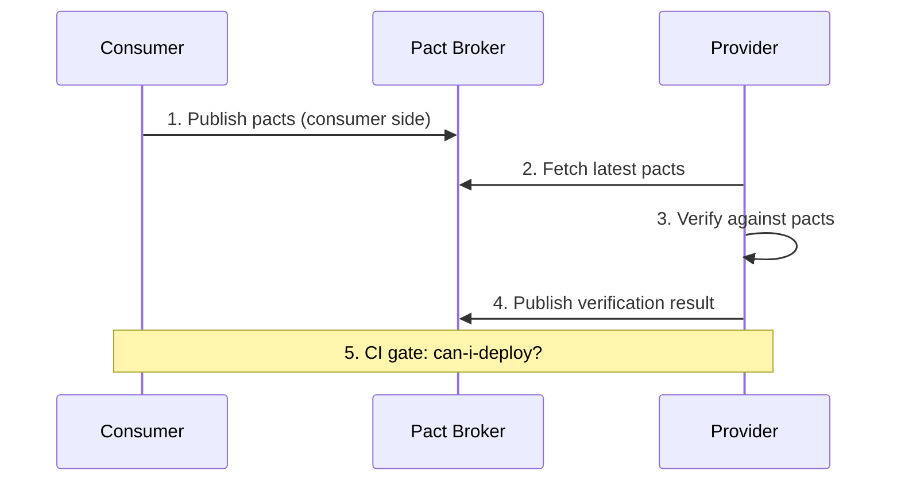

# Pact Documentation Reference

The authoritative source for Pact is the official documentation. This file catalogs the Pact documentation pages referenced in the Testing document.

## Primary documentation

- **Pact:** <https://pact.io/
- **Pact Docs:** <https://docs.pact.io/
- **Pact GitHub:** <https://github.com/pact-foundation>
- **Pact Broker:** <https://github.com/pact-foundation/pact_broker>

## Key features

| Feature | Description |
|---------|-------------|
| **Consumer-driven** | Consumer defines the contract; provider verifies |
| **Multiple languages** | JVM, .NET, Go, JS, Python, Ruby |
| **Pact Broker** | Share contracts between teams |
| **Provider verification** | Verify against consumer contracts |
| **Can-I-Deploy** | Check if safe to deploy |
| **Bi-directional** | Supports both consumer and provider expectations |

## Concepts

- **Consumer:** API client; defines what it needs.
- **Provider:** API server; provides what consumers need.
- **Contract:** Set of interactions (request/response pairs) expected.
- **Pact file:** JSON file with the contract.
- **Pact Broker:** Server that stores and shares pacts.
- **Verification:** Provider runs against consumer's pacts to ensure compatibility.

## Flow



## Consumer side (Java / JUnit 5)

```java
import au.com.dius.pact.consumer.dsl.PactDslWithBody;
import au.com.dius.pact.consumer.junit5.PactConsumerTestExt;
import au.com.dius.pact.consumer.junit5.PactTestFor;
import au.com.dius.pact.core.model.RequestResponsePact;
import au.com.dius.pact.core.model.annotations.Pact;

@ExtendWith(PactConsumerTestExt.class)
class UserConsumerTest {
    @Pact(consumer = "user-service")
    RequestResponsePact getUserPact(PactDslWithBody builder) {
        return builder
            .given("user exists")
            .uponReceiving("get user by id")
            .path("/users/1")
            .method("GET")
            .willRespondWith()
            .status(200)
            .body(newJsonBody(u -> {
                u.id(1);
                u.stringType("name", "Alice");
            }).build())
            .toPact();
    }

    @Test
    @PactTestFor(pactMethod = "getUserPact")
    void testGetUser(MockServer mockServer) {
        // Use mockServer to test consumer
        Response response = get("/users/1")
            .target(String.format("http://localhost:%d", mockServer.getPort()))
            .request();
        assertThat(response.getStatusCode()).isEqualTo(200);
    }
}
```

## Provider side (Java / JUnit 5)

```java
@ExtendWith(SpringExtension.class)
@SpringBootTest(webEnvironment = SpringBootTest.WebEnvironment.RANDOM_PORT)
@Provider("user-service")
class UserProviderTest {

    @LocalServerPort
    int port;

    @Autowired
    UserRepository userRepository;

    @TestTemplate
    @ExtendWith(PactVerificationSpringProvider.class)
    void verifyPact(PactVerificationContext context) {
        context.verifyInteraction();
    }

    // State setup per interaction (if needed)
    @State("user exists")
    void userExists() {
        userRepository.save(new User(1, "Alice"));
    }
}
```

## Pact Broker

The Pact Broker is a web application that stores pacts and verification results.

```bash
# Publish pact (consumer)
pact-publish -d dist/pacts -b http://pact-broker.example.com

# Verify pact (provider)
pact-verify -b http://pact-broker.example.com -p user-service -v 1.0.0

# Can I deploy?
pact-broker can-i-deploy -p user-service -e prod -a 1.0.0
```

## Pact Broker features

- **Pact publication** (consumer side).
- **Verification results** (provider side).
- **Versioning** (consumer/provider version matrix).
- **Webhooks** (trigger provider verification on new consumer pact).
- **Tags** (dev, staging, prod).
- **can-i-deploy** (gate deployment).
- **Badges** for README.

## Bi-directional contracts

With `pactflow` (commercial), you can do bi-directional contracts:

- Consumer: what the consumer expects.
- Provider: what the provider actually does.
- Merged into one contract.

## Pact support matrix

| Language | Library | Version |
|----------|---------|---------|
| Java | pact-jvm | 4.x |
| JVM (Spring) | pact-jvm + spring-cloud-contract | 4.x |
| Kotlin | pact-jvm | 4.x |
| .NET | PactNet | 4.x |
| Go | pact-go | 2.x |
| JavaScript/Node | pact-js / pact-js-consumer / pact-js-provider | 14.x |
| Python | pact-python | 3.x |
| Ruby | pact | 1.x |

## Best practices

1. **Start with consumer-driven.**
2. **One pact per interaction.**
3. **Use a Pact Broker** for sharing.
4. **Tag environments** (dev, staging, prod).
5. **Use can-i-deploy** as deployment gate.
6. **Keep pacts small** (no business logic).
7. **Provider states** for setup.
8. **Verify on every PR.**
9. **Bi-directional** for legacy.
10. **Webhooks** for automation.

## Tools

- **Pact Broker:** <https://github.com/pact-foundation/pact_broker>
- **PactFlow:** commercial; bi-directional, can-i-deploy.
- **Pact CLI:** <https://github.com/pact-foundation/pact-ruby-cli>
- **Pactman:** <https://github.com/pact-foundation/pactman>

## Pact vs OpenAPI

| Dimension | Pact | OpenAPI |
|-----------|------|---------|
| Direction | Consumer-driven | Provider-driven |
| Validation | Generated; live | Schema; static |
| Provider state | Yes | No |
| Best for | Microservices, multiple consumers | API design first |
| Versioning | Via broker | Via spec versions |