# Testing (Unit, Integration, Contract, Chaos)

> A comprehensive, production-grade treatment of software testing: the test pyramid, test doubles, integration testing with Testcontainers, contract testing with Pact, end-to-end testing, performance testing, mutation testing, and chaos engineering.

---

## Table of Contents

1. [Overview](#1-overview)
2. [Definition](#2-definition)
3. [Five Ws + One H](#3-five-ws--one-h)
4. [History](#4-history)
5. [Problem Statement](#5-problem-statement)
6. [Real-World Motivation](#6-real-world-motivation)
7. [Internal Working](#7-internal-working)
8. [Deep Dive](#8-deep-dive)
9. [Architecture](#9-architecture)
10. [Performance](#10-performance)
11. [Security](#11-security)
12. [Production Engineering](#12-production-engineering)
13. [Production Case Studies](#13-production-case-studies)
14. [Code Examples](#14-code-examples)
15. [Common Mistakes](#15-common-mistakes)
16. [Debugging](#16-debugging)
17. [Monitoring & Observability](#17-monitoring--observability)
18. [Best Practices](#18-best-practices)
19. [Anti-Patterns](#19-anti-patterns)
20. [Edge Cases](#20-edge-cases)
21. [Comparisons](#21-comparisons)
22. [Interview Preparation](#22-interview-preparation)
23. [References](#23-references)

---

## 1. Overview

**Software testing** is the practice of evaluating software by observing its execution to find defects. Modern testing is built on the **test pyramid** (Mike Cohn): unit tests at the base, integration tests in the middle, and end-to-end tests at the top. Modern testing is also built on **test doubles** (mocks, stubs, fakes, spies), **contract testing** (Pact), **integration testing with real dependencies** (Testcontainers), and **chaos engineering** (intentional failure injection).

This document treats testing at production depth: the test pyramid and its variants, FIRST principles, test doubles patterns, integration testing with Testcontainers, contract testing with Pact, end-to-end testing with Playwright/Cypress, performance testing with k6, mutation testing, and chaos engineering principles and tools.

**Scope.** This is not a testing tutorial. It assumes you write tests. It focuses on **principles and patterns** that distinguish production-grade test suites from brittle, slow ones.

**Version baselines.** JUnit 5, Mockito 5, Testcontainers 2.x, Pact 4.x, Cypress 13+, Playwright 1.x.

## 2. Definition

The testing ecosystem uses overlapping terminology. Here's a precise taxonomy:

| Term | Type | Authoritative source |
|------|------|---------------------|
| **Unit test** | Tests a single unit in isolation | xUnit patterns |
| **Integration test** | Tests interaction between units | xUnit patterns |
| **End-to-end (E2E) test** | Tests complete user flow | xUnit patterns |
| **System test** | Tests the deployed system | ISTQB |
| **Acceptance test** | Tests business requirements | ISTQB |
| **Smoke test** | Initial basic verification | — |
| **Regression test** | Tests that nothing broke | — |
| **Acceptance test** | Tests that feature works for user | — |
| **Performance test** | Tests load / stress / spike | k6 docs |
| **Contract test** | Tests API contract between services | Pact docs |
| **Mock** | Test double that verifies behavior | Martin Fowler |
| **Stub** | Test double that provides canned answers | Martin Fowler |
| **Fake** | Test double that has a working implementation | Martin Fowler |
| **Spy** | Test double that captures information | Martin Fowler |
| **Dummy** | Test double that is passed but never used | Martin Fowler |
| **Test pyramid** | Unit > Integration > E2E | Mike Cohn |
| **Testing trophy** | Static, Unit, Integration, Contract, E2E | Kent C. Dodds |
| **FIRST** | Fast, Isolated, Repeatable, Self-validating, Timely | Robert C. Martin |
| **AAA** | Arrange, Act, Assert | — |
| **Given-When-Then** | BDD style | — |
| **TDD** | Test-Driven Development | Kent Beck |
| **BDD** | Behavior-Driven Development | Dan North |
| **Mutation testing** | Tests your tests | PIT, Stryker |
| **Chaos engineering** | Intentionally break things in production | Netflix |
| **Flaky test** | Test that sometimes passes/fails | — |
| **Test doubles** | Generic term for mocks/stubs/fakes | — |
| **Contract test** | Tests that two services agree | Pact docs |
| **Pact** | Consumer-Driven Contract testing | Pact docs |
| **Testcontainers** | Docker-based integration test library | testcontainers.com |
| **Code coverage** | Percentage of code executed by tests | — |
| **Branch coverage** | Percentage of branches taken | — |
| **Mutation score** | Percentage of mutants killed | PIT docs |
| **CI** | Continuous Integration | Martin Fowler |
| **CD** | Continuous Delivery / Deployment | Martin Fowler |

The standard test pyramid:

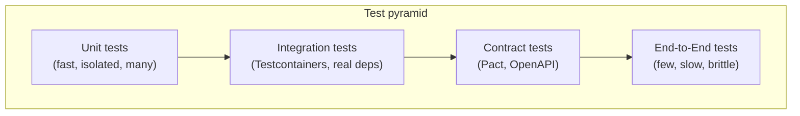

## 3. Five Ws + One H

### What <a class='askgpt-btn' href='https://chatgpt.com/?prompt=Read%20this%20section%20of%20my%20encyclopedia%20and%20explain%20it%20in%20depth%20with%20concrete%20examples%2C%20the%20main%20trade-offs%2C%20and%20common%20pitfalls%20a%20practitioner%20should%20know%3A%0A%0Ahttps%3A%2F%2Fgithub.com%2Fvishvasg14%2Fsoftware-engineering-encyclopedia%2Fblob%2Fmain%2F14-testing%2Ftesting.md%23what%0A%0ASection%20title%3A%20What' target='_blank' rel='noopener' data-askgpt='What' data-askgpt-url='https://github.com/vishvasg14/software-engineering-encyclopedia/blob/main/14-testing/testing.md#what' data-askgpt-prompt-depth='Read%20this%20section%20of%20my%20encyclopedia%20and%20explain%20it%20in%20depth%20with%20concrete%20examples%2C%20the%20main%20trade-offs%2C%20and%20common%20pitfalls%20a%20practitioner%20should%20know%3A%0A%0Ahttps%3A%2F%2Fgithub.com%2Fvishvasg14%2Fsoftware-engineering-encyclopedia%2Fblob%2Fmain%2F14-testing%2Ftesting.md%23what%0A%0ASection%20title%3A%20What' data-askgpt-prompt-examples='Read%20this%20section%20of%20my%20encyclopedia%20and%20give%20me%202-3%20real-world%20production%20examples%20for%20it.%20For%20each%3A%20what%20went%20right%2C%20what%20went%20wrong%2C%20and%20the%20lessons%20learned.%20Include%20company%20%2F%20project%20names%20if%20relevant.%0A%0Ahttps%3A%2F%2Fgithub.com%2Fvishvasg14%2Fsoftware-engineering-encyclopedia%2Fblob%2Fmain%2F14-testing%2Ftesting.md%23what%0A%0ASection%20title%3A%20What' title='Ask ChatGPT about this section'>💬</a>

**Software testing** is the practice of evaluating software to find defects, verify behavior, and provide confidence in correctness. Modern testing is layered (test pyramid) and uses both unit-level isolation and integration-level verification.

### Why <a class='askgpt-btn' href='https://chatgpt.com/?prompt=Read%20this%20section%20of%20my%20encyclopedia%20and%20explain%20it%20in%20depth%20with%20concrete%20examples%2C%20the%20main%20trade-offs%2C%20and%20common%20pitfalls%20a%20practitioner%20should%20know%3A%0A%0Ahttps%3A%2F%2Fgithub.com%2Fvishvasg14%2Fsoftware-engineering-encyclopedia%2Fblob%2Fmain%2F14-testing%2Ftesting.md%23why%0A%0ASection%20title%3A%20Why' target='_blank' rel='noopener' data-askgpt='Why' data-askgpt-url='https://github.com/vishvasg14/software-engineering-encyclopedia/blob/main/14-testing/testing.md#why' data-askgpt-prompt-depth='Read%20this%20section%20of%20my%20encyclopedia%20and%20explain%20it%20in%20depth%20with%20concrete%20examples%2C%20the%20main%20trade-offs%2C%20and%20common%20pitfalls%20a%20practitioner%20should%20know%3A%0A%0Ahttps%3A%2F%2Fgithub.com%2Fvishvasg14%2Fsoftware-engineering-encyclopedia%2Fblob%2Fmain%2F14-testing%2Ftesting.md%23why%0A%0ASection%20title%3A%20Why' data-askgpt-prompt-examples='Read%20this%20section%20of%20my%20encyclopedia%20and%20give%20me%202-3%20real-world%20production%20examples%20for%20it.%20For%20each%3A%20what%20went%20right%2C%20what%20went%20wrong%2C%20and%20the%20lessons%20learned.%20Include%20company%20%2F%20project%20names%20if%20relevant.%0A%0Ahttps%3A%2F%2Fgithub.com%2Fvishvasg14%2Fsoftware-engineering-encyclopedia%2Fblob%2Fmain%2F14-testing%2Ftesting.md%23why%0A%0ASection%20title%3A%20Why' title='Ask ChatGPT about this section'>💬</a>

Bugs are expensive. Testing catches them early. Testing also serves as documentation, design feedback, and regression protection.

### When <a class='askgpt-btn' href='https://chatgpt.com/?prompt=Read%20this%20section%20of%20my%20encyclopedia%20and%20explain%20it%20in%20depth%20with%20concrete%20examples%2C%20the%20main%20trade-offs%2C%20and%20common%20pitfalls%20a%20practitioner%20should%20know%3A%0A%0Ahttps%3A%2F%2Fgithub.com%2Fvishvasg14%2Fsoftware-engineering-encyclopedia%2Fblob%2Fmain%2F14-testing%2Ftesting.md%23when%0A%0ASection%20title%3A%20When' target='_blank' rel='noopener' data-askgpt='When' data-askgpt-url='https://github.com/vishvasg14/software-engineering-encyclopedia/blob/main/14-testing/testing.md#when' data-askgpt-prompt-depth='Read%20this%20section%20of%20my%20encyclopedia%20and%20explain%20it%20in%20depth%20with%20concrete%20examples%2C%20the%20main%20trade-offs%2C%20and%20common%20pitfalls%20a%20practitioner%20should%20know%3A%0A%0Ahttps%3A%2F%2Fgithub.com%2Fvishvasg14%2Fsoftware-engineering-encyclopedia%2Fblob%2Fmain%2F14-testing%2Ftesting.md%23when%0A%0ASection%20title%3A%20When' data-askgpt-prompt-examples='Read%20this%20section%20of%20my%20encyclopedia%20and%20give%20me%202-3%20real-world%20production%20examples%20for%20it.%20For%20each%3A%20what%20went%20right%2C%20what%20went%20wrong%2C%20and%20the%20lessons%20learned.%20Include%20company%20%2F%20project%20names%20if%20relevant.%0A%0Ahttps%3A%2F%2Fgithub.com%2Fvishvasg14%2Fsoftware-engineering-encyclopedia%2Fblob%2Fmain%2F14-testing%2Ftesting.md%23when%0A%0ASection%20title%3A%20When' title='Ask ChatGPT about this section'>💬</a>

Software testing has been around since the 1950s. Unit testing frameworks appeared in the 1990s (JUnit in 1997). TDD gained traction in the early 2000s. Microservices renewed interest in integration and contract testing in the 2010s. Chaos engineering emerged at Netflix in 2011.

### Where <a class='askgpt-btn' href='https://chatgpt.com/?prompt=Read%20this%20section%20of%20my%20encyclopedia%20and%20explain%20it%20in%20depth%20with%20concrete%20examples%2C%20the%20main%20trade-offs%2C%20and%20common%20pitfalls%20a%20practitioner%20should%20know%3A%0A%0Ahttps%3A%2F%2Fgithub.com%2Fvishvasg14%2Fsoftware-engineering-encyclopedia%2Fblob%2Fmain%2F14-testing%2Ftesting.md%23where%0A%0ASection%20title%3A%20Where' target='_blank' rel='noopener' data-askgpt='Where' data-askgpt-url='https://github.com/vishvasg14/software-engineering-encyclopedia/blob/main/14-testing/testing.md#where' data-askgpt-prompt-depth='Read%20this%20section%20of%20my%20encyclopedia%20and%20explain%20it%20in%20depth%20with%20concrete%20examples%2C%20the%20main%20trade-offs%2C%20and%20common%20pitfalls%20a%20practitioner%20should%20know%3A%0A%0Ahttps%3A%2F%2Fgithub.com%2Fvishvasg14%2Fsoftware-engineering-encyclopedia%2Fblob%2Fmain%2F14-testing%2Ftesting.md%23where%0A%0ASection%20title%3A%20Where' data-askgpt-prompt-examples='Read%20this%20section%20of%20my%20encyclopedia%20and%20give%20me%202-3%20real-world%20production%20examples%20for%20it.%20For%20each%3A%20what%20went%20right%2C%20what%20went%20wrong%2C%20and%20the%20lessons%20learned.%20Include%20company%20%2F%20project%20names%20if%20relevant.%0A%0Ahttps%3A%2F%2Fgithub.com%2Fvishvasg14%2Fsoftware-engineering-encyclopedia%2Fblob%2Fmain%2F14-testing%2Ftesting.md%23where%0A%0ASection%20title%3A%20Where' title='Ask ChatGPT about this section'>💬</a>

Every software team. Testing is integral to CI/CD, code review, and quality assurance.

### Who <a class='askgpt-btn' href='https://chatgpt.com/?prompt=Read%20this%20section%20of%20my%20encyclopedia%20and%20explain%20it%20in%20depth%20with%20concrete%20examples%2C%20the%20main%20trade-offs%2C%20and%20common%20pitfalls%20a%20practitioner%20should%20know%3A%0A%0Ahttps%3A%2F%2Fgithub.com%2Fvishvasg14%2Fsoftware-engineering-encyclopedia%2Fblob%2Fmain%2F14-testing%2Ftesting.md%23who%0A%0ASection%20title%3A%20Who' target='_blank' rel='noopener' data-askgpt='Who' data-askgpt-url='https://github.com/vishvasg14/software-engineering-encyclopedia/blob/main/14-testing/testing.md#who' data-askgpt-prompt-depth='Read%20this%20section%20of%20my%20encyclopedia%20and%20explain%20it%20in%20depth%20with%20concrete%20examples%2C%20the%20main%20trade-offs%2C%20and%20common%20pitfalls%20a%20practitioner%20should%20know%3A%0A%0Ahttps%3A%2F%2Fgithub.com%2Fvishvasg14%2Fsoftware-engineering-encyclopedia%2Fblob%2Fmain%2F14-testing%2Ftesting.md%23who%0A%0ASection%20title%3A%20Who' data-askgpt-prompt-examples='Read%20this%20section%20of%20my%20encyclopedia%20and%20give%20me%202-3%20real-world%20production%20examples%20for%20it.%20For%20each%3A%20what%20went%20right%2C%20what%20went%20wrong%2C%20and%20the%20lessons%20learned.%20Include%20company%20%2F%20project%20names%20if%20relevant.%0A%0Ahttps%3A%2F%2Fgithub.com%2Fvishvasg14%2Fsoftware-engineering-encyclopedia%2Fblob%2Fmain%2F14-testing%2Ftesting.md%23who%0A%0ASection%20title%3A%20Who' title='Ask ChatGPT about this section'>💬</a>

- **Kent Beck:** JUnit, TDD.
- **Martin Fowler:** Refactoring, testing patterns.
- **Robert C. Martin (Uncle Bob):** SOLID, clean code, TDD.
- **Mike Cohn:** Test pyramid.
- **Kent C. Dodds:** Testing trophy, JavaScript testing.
- **Netflix Chaos Engineering team:** Chaos Monkey.
- **Pact Foundation:** contract testing.

### How (one-paragraph preview) <a class='askgpt-btn' href='https://chatgpt.com/?prompt=Read%20this%20section%20of%20my%20encyclopedia%20and%20explain%20it%20in%20depth%20with%20concrete%20examples%2C%20the%20main%20trade-offs%2C%20and%20common%20pitfalls%20a%20practitioner%20should%20know%3A%0A%0Ahttps%3A%2F%2Fgithub.com%2Fvishvasg14%2Fsoftware-engineering-encyclopedia%2Fblob%2Fmain%2F14-testing%2Ftesting.md%23how-one-paragraph-preview%0A%0ASection%20title%3A%20How%20(one-paragraph%20preview)' target='_blank' rel='noopener' data-askgpt='How (one-paragraph preview)' data-askgpt-url='https://github.com/vishvasg14/software-engineering-encyclopedia/blob/main/14-testing/testing.md#how-one-paragraph-preview' data-askgpt-prompt-depth='Read%20this%20section%20of%20my%20encyclopedia%20and%20explain%20it%20in%20depth%20with%20concrete%20examples%2C%20the%20main%20trade-offs%2C%20and%20common%20pitfalls%20a%20practitioner%20should%20know%3A%0A%0Ahttps%3A%2F%2Fgithub.com%2Fvishvasg14%2Fsoftware-engineering-encyclopedia%2Fblob%2Fmain%2F14-testing%2Ftesting.md%23how-one-paragraph-preview%0A%0ASection%20title%3A%20How%20(one-paragraph%20preview)' data-askgpt-prompt-examples='Read%20this%20section%20of%20my%20encyclopedia%20and%20give%20me%202-3%20real-world%20production%20examples%20for%20it.%20For%20each%3A%20what%20went%20right%2C%20what%20went%20wrong%2C%20and%20the%20lessons%20learned.%20Include%20company%20%2F%20project%20names%20if%20relevant.%0A%0Ahttps%3A%2F%2Fgithub.com%2Fvishvasg14%2Fsoftware-engineering-encyclopedia%2Fblob%2Fmain%2F14-testing%2Ftesting.md%23how-one-paragraph-preview%0A%0ASection%20title%3A%20How%20(one-paragraph%20preview)' title='Ask ChatGPT about this section'>💬</a>

You build a test pyramid: many fast unit tests, fewer integration tests (Testcontainers, real DBs), and few E2E tests (Playwright, Cypress). You use test doubles (mocks, stubs, fakes, spies) judiciously. You write contract tests (Pact) between services. You run tests in CI on every PR. You measure coverage but not as a goal. You run mutation testing to verify your tests catch bugs. You do chaos engineering in production to find weaknesses before users do.

## 4. History

### 4.1 Origins (1950s-1990s) <a class='askgpt-btn' href='https://chatgpt.com/?prompt=Read%20this%20section%20of%20my%20encyclopedia%20and%20explain%20it%20in%20depth%20with%20concrete%20examples%2C%20the%20main%20trade-offs%2C%20and%20common%20pitfalls%20a%20practitioner%20should%20know%3A%0A%0Ahttps%3A%2F%2Fgithub.com%2Fvishvasg14%2Fsoftware-engineering-encyclopedia%2Fblob%2Fmain%2F14-testing%2Ftesting.md%2341-origins-1950s-1990s%0A%0ASection%20title%3A%204.1%20Origins%20(1950s-1990s)' target='_blank' rel='noopener' data-askgpt='4.1 Origins (1950s-1990s)' data-askgpt-url='https://github.com/vishvasg14/software-engineering-encyclopedia/blob/main/14-testing/testing.md#41-origins-1950s-1990s' data-askgpt-prompt-depth='Read%20this%20section%20of%20my%20encyclopedia%20and%20explain%20it%20in%20depth%20with%20concrete%20examples%2C%20the%20main%20trade-offs%2C%20and%20common%20pitfalls%20a%20practitioner%20should%20know%3A%0A%0Ahttps%3A%2F%2Fgithub.com%2Fvishvasg14%2Fsoftware-engineering-encyclopedia%2Fblob%2Fmain%2F14-testing%2Ftesting.md%2341-origins-1950s-1990s%0A%0ASection%20title%3A%204.1%20Origins%20(1950s-1990s)' data-askgpt-prompt-examples='Read%20this%20section%20of%20my%20encyclopedia%20and%20give%20me%202-3%20real-world%20production%20examples%20for%20it.%20For%20each%3A%20what%20went%20right%2C%20what%20went%20wrong%2C%20and%20the%20lessons%20learned.%20Include%20company%20%2F%20project%20names%20if%20relevant.%0A%0Ahttps%3A%2F%2Fgithub.com%2Fvishvasg14%2Fsoftware-engineering-encyclopedia%2Fblob%2Fmain%2F14-testing%2Ftesting.md%2341-origins-1950s-1990s%0A%0ASection%20title%3A%204.1%20Origins%20(1950s-1990s)' title='Ask ChatGPT about this section'>💬</a>

- **1950s-60s** — Debugging; ad hoc testing.
- **1976** — Glenford Myers publishes "Software Reliability."
- **1980s** — Structured testing methodologies.
- **1997** — Kent Beck and Erich Gamma create JUnit.

### 4.2 Unit testing era (2000s) <a class='askgpt-btn' href='https://chatgpt.com/?prompt=Read%20this%20section%20of%20my%20encyclopedia%20and%20explain%20it%20in%20depth%20with%20concrete%20examples%2C%20the%20main%20trade-offs%2C%20and%20common%20pitfalls%20a%20practitioner%20should%20know%3A%0A%0Ahttps%3A%2F%2Fgithub.com%2Fvishvasg14%2Fsoftware-engineering-encyclopedia%2Fblob%2Fmain%2F14-testing%2Ftesting.md%2342-unit-testing-era-2000s%0A%0ASection%20title%3A%204.2%20Unit%20testing%20era%20(2000s)' target='_blank' rel='noopener' data-askgpt='4.2 Unit testing era (2000s)' data-askgpt-url='https://github.com/vishvasg14/software-engineering-encyclopedia/blob/main/14-testing/testing.md#42-unit-testing-era-2000s' data-askgpt-prompt-depth='Read%20this%20section%20of%20my%20encyclopedia%20and%20explain%20it%20in%20depth%20with%20concrete%20examples%2C%20the%20main%20trade-offs%2C%20and%20common%20pitfalls%20a%20practitioner%20should%20know%3A%0A%0Ahttps%3A%2F%2Fgithub.com%2Fvishvasg14%2Fsoftware-engineering-encyclopedia%2Fblob%2Fmain%2F14-testing%2Ftesting.md%2342-unit-testing-era-2000s%0A%0ASection%20title%3A%204.2%20Unit%20testing%20era%20(2000s)' data-askgpt-prompt-examples='Read%20this%20section%20of%20my%20encyclopedia%20and%20give%20me%202-3%20real-world%20production%20examples%20for%20it.%20For%20each%3A%20what%20went%20right%2C%20what%20went%20wrong%2C%20and%20the%20lessons%20learned.%20Include%20company%20%2F%20project%20names%20if%20relevant.%0A%0Ahttps%3A%2F%2Fgithub.com%2Fvishvasg14%2Fsoftware-engineering-encyclopedia%2Fblob%2Fmain%2F14-testing%2Ftesting.md%2342-unit-testing-era-2000s%0A%0ASection%20title%3A%204.2%20Unit%20testing%20era%20(2000s)' title='Ask ChatGPT about this section'>💬</a>

- **1999** — Kent Beck publishes "Extreme Programming Explained."
- **2003** — Kent Beck publishes "Test-Driven Development: By Example."
- **2009** — Mockito created.
- **2010s** — JUnit 4, TestNG, Spock (Groovy).

### 4.3 Microservices and modern testing (2010s-2020s) <a class='askgpt-btn' href='https://chatgpt.com/?prompt=Read%20this%20section%20of%20my%20encyclopedia%20and%20explain%20it%20in%20depth%20with%20concrete%20examples%2C%20the%20main%20trade-offs%2C%20and%20common%20pitfalls%20a%20practitioner%20should%20know%3A%0A%0Ahttps%3A%2F%2Fgithub.com%2Fvishvasg14%2Fsoftware-engineering-encyclopedia%2Fblob%2Fmain%2F14-testing%2Ftesting.md%2343-microservices-and-modern-testing-2010s-2020s%0A%0ASection%20title%3A%204.3%20Microservices%20and%20modern%20testing%20(2010s-2020s)' target='_blank' rel='noopener' data-askgpt='4.3 Microservices and modern testing (2010s-2020s)' data-askgpt-url='https://github.com/vishvasg14/software-engineering-encyclopedia/blob/main/14-testing/testing.md#43-microservices-and-modern-testing-2010s-2020s' data-askgpt-prompt-depth='Read%20this%20section%20of%20my%20encyclopedia%20and%20explain%20it%20in%20depth%20with%20concrete%20examples%2C%20the%20main%20trade-offs%2C%20and%20common%20pitfalls%20a%20practitioner%20should%20know%3A%0A%0Ahttps%3A%2F%2Fgithub.com%2Fvishvasg14%2Fsoftware-engineering-encyclopedia%2Fblob%2Fmain%2F14-testing%2Ftesting.md%2343-microservices-and-modern-testing-2010s-2020s%0A%0ASection%20title%3A%204.3%20Microservices%20and%20modern%20testing%20(2010s-2020s)' data-askgpt-prompt-examples='Read%20this%20section%20of%20my%20encyclopedia%20and%20give%20me%202-3%20real-world%20production%20examples%20for%20it.%20For%20each%3A%20what%20went%20right%2C%20what%20went%20wrong%2C%20and%20the%20lessons%20learned.%20Include%20company%20%2F%20project%20names%20if%20relevant.%0A%0Ahttps%3A%2F%2Fgithub.com%2Fvishvasg14%2Fsoftware-engineering-encyclopedia%2Fblob%2Fmain%2F14-testing%2Ftesting.md%2343-microservices-and-modern-testing-2010s-2020s%0A%0ASection%20title%3A%204.3%20Microservices%20and%20modern%20testing%20(2010s-2020s)' title='Ask ChatGPT about this section'>💬</a>

- **2011** — Netflix creates Chaos Monkey.
- **2014** — Pact (consumer-driven contracts) gains adoption.
- **2015** — Pact Foundation formed.
- **2017** — Pact Broker v2.
- **2018** — Testcontainers 1.0; widespread adoption.
- **2019** — JUnit 5 GA.

### 4.4 Modern (2020-2026) <a class='askgpt-btn' href='https://chatgpt.com/?prompt=Read%20this%20section%20of%20my%20encyclopedia%20and%20explain%20it%20in%20depth%20with%20concrete%20examples%2C%20the%20main%20trade-offs%2C%20and%20common%20pitfalls%20a%20practitioner%20should%20know%3A%0A%0Ahttps%3A%2F%2Fgithub.com%2Fvishvasg14%2Fsoftware-engineering-encyclopedia%2Fblob%2Fmain%2F14-testing%2Ftesting.md%2344-modern-2020-2026%0A%0ASection%20title%3A%204.4%20Modern%20(2020-2026)' target='_blank' rel='noopener' data-askgpt='4.4 Modern (2020-2026)' data-askgpt-url='https://github.com/vishvasg14/software-engineering-encyclopedia/blob/main/14-testing/testing.md#44-modern-2020-2026' data-askgpt-prompt-depth='Read%20this%20section%20of%20my%20encyclopedia%20and%20explain%20it%20in%20depth%20with%20concrete%20examples%2C%20the%20main%20trade-offs%2C%20and%20common%20pitfalls%20a%20practitioner%20should%20know%3A%0A%0Ahttps%3A%2F%2Fgithub.com%2Fvishvasg14%2Fsoftware-engineering-encyclopedia%2Fblob%2Fmain%2F14-testing%2Ftesting.md%2344-modern-2020-2026%0A%0ASection%20title%3A%204.4%20Modern%20(2020-2026)' data-askgpt-prompt-examples='Read%20this%20section%20of%20my%20encyclopedia%20and%20give%20me%202-3%20real-world%20production%20examples%20for%20it.%20For%20each%3A%20what%20went%20right%2C%20what%20went%20wrong%2C%20and%20the%20lessons%20learned.%20Include%20company%20%2F%20project%20names%20if%20relevant.%0A%0Ahttps%3A%2F%2Fgithub.com%2Fvishvasg14%2Fsoftware-engineering-encyclopedia%2Fblob%2Fmain%2F14-testing%2Ftesting.md%2344-modern-2020-2026%0A%0ASection%20title%3A%204.4%20Modern%20(2020-2026)' title='Ask ChatGPT about this section'>💬</a>

- **2020** — Playwright 1.0.
- **2021** — Cypress popularity rises.
- **2023** — Testcontainers 2.0.
- **2025** — Mutation testing mature (PIT, Stryker).
- **2026** — AI-assisted test generation emerging.

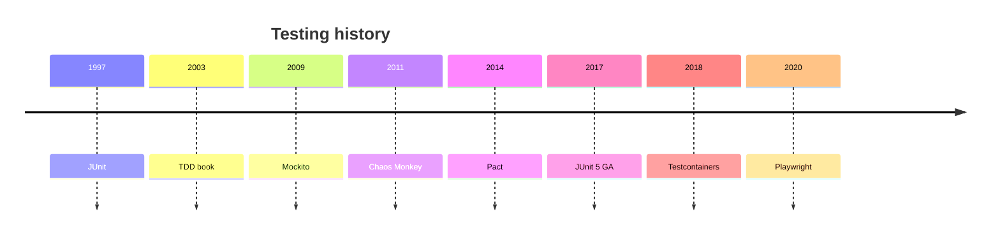

## 5. Problem Statement

### 5.1 What testing solves <a class='askgpt-btn' href='https://chatgpt.com/?prompt=Read%20this%20section%20of%20my%20encyclopedia%20and%20explain%20it%20in%20depth%20with%20concrete%20examples%2C%20the%20main%20trade-offs%2C%20and%20common%20pitfalls%20a%20practitioner%20should%20know%3A%0A%0Ahttps%3A%2F%2Fgithub.com%2Fvishvasg14%2Fsoftware-engineering-encyclopedia%2Fblob%2Fmain%2F14-testing%2Ftesting.md%2351-what-testing-solves%0A%0ASection%20title%3A%205.1%20What%20testing%20solves' target='_blank' rel='noopener' data-askgpt='5.1 What testing solves' data-askgpt-url='https://github.com/vishvasg14/software-engineering-encyclopedia/blob/main/14-testing/testing.md#51-what-testing-solves' data-askgpt-prompt-depth='Read%20this%20section%20of%20my%20encyclopedia%20and%20explain%20it%20in%20depth%20with%20concrete%20examples%2C%20the%20main%20trade-offs%2C%20and%20common%20pitfalls%20a%20practitioner%20should%20know%3A%0A%0Ahttps%3A%2F%2Fgithub.com%2Fvishvasg14%2Fsoftware-engineering-encyclopedia%2Fblob%2Fmain%2F14-testing%2Ftesting.md%2351-what-testing-solves%0A%0ASection%20title%3A%205.1%20What%20testing%20solves' data-askgpt-prompt-examples='Read%20this%20section%20of%20my%20encyclopedia%20and%20give%20me%202-3%20real-world%20production%20examples%20for%20it.%20For%20each%3A%20what%20went%20right%2C%20what%20went%20wrong%2C%20and%20the%20lessons%20learned.%20Include%20company%20%2F%20project%20names%20if%20relevant.%0A%0Ahttps%3A%2F%2Fgithub.com%2Fvishvasg14%2Fsoftware-engineering-encyclopedia%2Fblob%2Fmain%2F14-testing%2Ftesting.md%2351-what-testing-solves%0A%0ASection%20title%3A%205.1%20What%20testing%20solves' title='Ask ChatGPT about this section'>💬</a>

- **Bugs caught early** before production.
- **Design feedback** — TDD shapes API.
- **Documentation** — tests as living spec.
- **Regression protection** — old bugs don't return.
- **Refactoring safety** — change code without fear.
- **Confidence** — ship with confidence.

### 5.2 What testing doesn't solve <a class='askgpt-btn' href='https://chatgpt.com/?prompt=Read%20this%20section%20of%20my%20encyclopedia%20and%20explain%20it%20in%20depth%20with%20concrete%20examples%2C%20the%20main%20trade-offs%2C%20and%20common%20pitfalls%20a%20practitioner%20should%20know%3A%0A%0Ahttps%3A%2F%2Fgithub.com%2Fvishvasg14%2Fsoftware-engineering-encyclopedia%2Fblob%2Fmain%2F14-testing%2Ftesting.md%2352-what-testing-doesnt-solve%0A%0ASection%20title%3A%205.2%20What%20testing%20doesn't%20solve' target='_blank' rel='noopener' data-askgpt='5.2 What testing doesn&#39;t solve' data-askgpt-url='https://github.com/vishvasg14/software-engineering-encyclopedia/blob/main/14-testing/testing.md#52-what-testing-doesnt-solve' data-askgpt-prompt-depth='Read%20this%20section%20of%20my%20encyclopedia%20and%20explain%20it%20in%20depth%20with%20concrete%20examples%2C%20the%20main%20trade-offs%2C%20and%20common%20pitfalls%20a%20practitioner%20should%20know%3A%0A%0Ahttps%3A%2F%2Fgithub.com%2Fvishvasg14%2Fsoftware-engineering-encyclopedia%2Fblob%2Fmain%2F14-testing%2Ftesting.md%2352-what-testing-doesnt-solve%0A%0ASection%20title%3A%205.2%20What%20testing%20doesn't%20solve' data-askgpt-prompt-examples='Read%20this%20section%20of%20my%20encyclopedia%20and%20give%20me%202-3%20real-world%20production%20examples%20for%20it.%20For%20each%3A%20what%20went%20right%2C%20what%20went%20wrong%2C%20and%20the%20lessons%20learned.%20Include%20company%20%2F%20project%20names%20if%20relevant.%0A%0Ahttps%3A%2F%2Fgithub.com%2Fvishvasg14%2Fsoftware-engineering-encyclopedia%2Fblob%2Fmain%2F14-testing%2Ftesting.md%2352-what-testing-doesnt-solve%0A%0ASection%20title%3A%205.2%20What%20testing%20doesn't%20solve' title='Ask ChatGPT about this section'>💬</a>

- **Correctness of business logic** — design issue.
- **Performance issues** — load testing helps; performance testing.
- **Security** — covered in Security doc.
- **Production bugs** — can't catch everything in tests.
- **UX issues** — need user testing.

### 5.3 The cost of poor testing <a class='askgpt-btn' href='https://chatgpt.com/?prompt=Read%20this%20section%20of%20my%20encyclopedia%20and%20explain%20it%20in%20depth%20with%20concrete%20examples%2C%20the%20main%20trade-offs%2C%20and%20common%20pitfalls%20a%20practitioner%20should%20know%3A%0A%0Ahttps%3A%2F%2Fgithub.com%2Fvishvasg14%2Fsoftware-engineering-encyclopedia%2Fblob%2Fmain%2F14-testing%2Ftesting.md%2353-the-cost-of-poor-testing%0A%0ASection%20title%3A%205.3%20The%20cost%20of%20poor%20testing' target='_blank' rel='noopener' data-askgpt='5.3 The cost of poor testing' data-askgpt-url='https://github.com/vishvasg14/software-engineering-encyclopedia/blob/main/14-testing/testing.md#53-the-cost-of-poor-testing' data-askgpt-prompt-depth='Read%20this%20section%20of%20my%20encyclopedia%20and%20explain%20it%20in%20depth%20with%20concrete%20examples%2C%20the%20main%20trade-offs%2C%20and%20common%20pitfalls%20a%20practitioner%20should%20know%3A%0A%0Ahttps%3A%2F%2Fgithub.com%2Fvishvasg14%2Fsoftware-engineering-encyclopedia%2Fblob%2Fmain%2F14-testing%2Ftesting.md%2353-the-cost-of-poor-testing%0A%0ASection%20title%3A%205.3%20The%20cost%20of%20poor%20testing' data-askgpt-prompt-examples='Read%20this%20section%20of%20my%20encyclopedia%20and%20give%20me%202-3%20real-world%20production%20examples%20for%20it.%20For%20each%3A%20what%20went%20right%2C%20what%20went%20wrong%2C%20and%20the%20lessons%20learned.%20Include%20company%20%2F%20project%20names%20if%20relevant.%0A%0Ahttps%3A%2F%2Fgithub.com%2Fvishvasg14%2Fsoftware-engineering-encyclopedia%2Fblob%2Fmain%2F14-testing%2Ftesting.md%2353-the-cost-of-poor-testing%0A%0ASection%20title%3A%205.3%20The%20cost%20of%20poor%20testing' title='Ask ChatGPT about this section'>💬</a>

- **Production incidents** — downtime, lost revenue.
- **Debugging time** — hours finding simple bugs.
- **Refactoring fear** — code becomes unmaintainable.
- **Onboarding** — new devs can't understand the code.

## 6. Real-World Motivation

### 6.1 Google <a class='askgpt-btn' href='https://chatgpt.com/?prompt=Read%20this%20section%20of%20my%20encyclopedia%20and%20explain%20it%20in%20depth%20with%20concrete%20examples%2C%20the%20main%20trade-offs%2C%20and%20common%20pitfalls%20a%20practitioner%20should%20know%3A%0A%0Ahttps%3A%2F%2Fgithub.com%2Fvishvasg14%2Fsoftware-engineering-encyclopedia%2Fblob%2Fmain%2F14-testing%2Ftesting.md%2361-google%0A%0ASection%20title%3A%206.1%20Google' target='_blank' rel='noopener' data-askgpt='6.1 Google' data-askgpt-url='https://github.com/vishvasg14/software-engineering-encyclopedia/blob/main/14-testing/testing.md#61-google' data-askgpt-prompt-depth='Read%20this%20section%20of%20my%20encyclopedia%20and%20explain%20it%20in%20depth%20with%20concrete%20examples%2C%20the%20main%20trade-offs%2C%20and%20common%20pitfalls%20a%20practitioner%20should%20know%3A%0A%0Ahttps%3A%2F%2Fgithub.com%2Fvishvasg14%2Fsoftware-engineering-encyclopedia%2Fblob%2Fmain%2F14-testing%2Ftesting.md%2361-google%0A%0ASection%20title%3A%206.1%20Google' data-askgpt-prompt-examples='Read%20this%20section%20of%20my%20encyclopedia%20and%20give%20me%202-3%20real-world%20production%20examples%20for%20it.%20For%20each%3A%20what%20went%20right%2C%20what%20went%20wrong%2C%20and%20the%20lessons%20learned.%20Include%20company%20%2F%20project%20names%20if%20relevant.%0A%0Ahttps%3A%2F%2Fgithub.com%2Fvishvasg14%2Fsoftware-engineering-encyclopedia%2Fblob%2Fmain%2F14-testing%2Ftesting.md%2361-google%0A%0ASection%20title%3A%206.1%20Google' title='Ask ChatGPT about this section'>💬</a>

Billions of tests. Test-driven culture. Strong CI infrastructure.

### 6.2 Netflix <a class='askgpt-btn' href='https://chatgpt.com/?prompt=Read%20this%20section%20of%20my%20encyclopedia%20and%20explain%20it%20in%20depth%20with%20concrete%20examples%2C%20the%20main%20trade-offs%2C%20and%20common%20pitfalls%20a%20practitioner%20should%20know%3A%0A%0Ahttps%3A%2F%2Fgithub.com%2Fvishvasg14%2Fsoftware-engineering-encyclopedia%2Fblob%2Fmain%2F14-testing%2Ftesting.md%2362-netflix%0A%0ASection%20title%3A%206.2%20Netflix' target='_blank' rel='noopener' data-askgpt='6.2 Netflix' data-askgpt-url='https://github.com/vishvasg14/software-engineering-encyclopedia/blob/main/14-testing/testing.md#62-netflix' data-askgpt-prompt-depth='Read%20this%20section%20of%20my%20encyclopedia%20and%20explain%20it%20in%20depth%20with%20concrete%20examples%2C%20the%20main%20trade-offs%2C%20and%20common%20pitfalls%20a%20practitioner%20should%20know%3A%0A%0Ahttps%3A%2F%2Fgithub.com%2Fvishvasg14%2Fsoftware-engineering-encyclopedia%2Fblob%2Fmain%2F14-testing%2Ftesting.md%2362-netflix%0A%0ASection%20title%3A%206.2%20Netflix' data-askgpt-prompt-examples='Read%20this%20section%20of%20my%20encyclopedia%20and%20give%20me%202-3%20real-world%20production%20examples%20for%20it.%20For%20each%3A%20what%20went%20right%2C%20what%20went%20wrong%2C%20and%20the%20lessons%20learned.%20Include%20company%20%2F%20project%20names%20if%20relevant.%0A%0Ahttps%3A%2F%2Fgithub.com%2Fvishvasg14%2Fsoftware-engineering-encyclopedia%2Fblob%2Fmain%2F14-testing%2Ftesting.md%2362-netflix%0A%0ASection%20title%3A%206.2%20Netflix' title='Ask ChatGPT about this section'>💬</a>

Created Chaos Monkey. Pioneered chaos engineering. Use Spinnaker for deployment.

### 6.3 Amazon <a class='askgpt-btn' href='https://chatgpt.com/?prompt=Read%20this%20section%20of%20my%20encyclopedia%20and%20explain%20it%20in%20depth%20with%20concrete%20examples%2C%20the%20main%20trade-offs%2C%20and%20common%20pitfalls%20a%20practitioner%20should%20know%3A%0A%0Ahttps%3A%2F%2Fgithub.com%2Fvishvasg14%2Fsoftware-engineering-encyclopedia%2Fblob%2Fmain%2F14-testing%2Ftesting.md%2363-amazon%0A%0ASection%20title%3A%206.3%20Amazon' target='_blank' rel='noopener' data-askgpt='6.3 Amazon' data-askgpt-url='https://github.com/vishvasg14/software-engineering-encyclopedia/blob/main/14-testing/testing.md#63-amazon' data-askgpt-prompt-depth='Read%20this%20section%20of%20my%20encyclopedia%20and%20explain%20it%20in%20depth%20with%20concrete%20examples%2C%20the%20main%20trade-offs%2C%20and%20common%20pitfalls%20a%20practitioner%20should%20know%3A%0A%0Ahttps%3A%2F%2Fgithub.com%2Fvishvasg14%2Fsoftware-engineering-encyclopedia%2Fblob%2Fmain%2F14-testing%2Ftesting.md%2363-amazon%0A%0ASection%20title%3A%206.3%20Amazon' data-askgpt-prompt-examples='Read%20this%20section%20of%20my%20encyclopedia%20and%20give%20me%202-3%20real-world%20production%20examples%20for%20it.%20For%20each%3A%20what%20went%20right%2C%20what%20went%20wrong%2C%20and%20the%20lessons%20learned.%20Include%20company%20%2F%20project%20names%20if%20relevant.%0A%0Ahttps%3A%2F%2Fgithub.com%2Fvishvasg14%2Fsoftware-engineering-encyclopedia%2Fblob%2Fmain%2F14-testing%2Ftesting.md%2363-amazon%0A%0ASection%20title%3A%206.3%20Amazon' title='Ask ChatGPT about this section'>💬</a>

Service-oriented testing. Use internal tools for performance testing. Strong contract testing.

### 6.4 Microsoft <a class='askgpt-btn' href='https://chatgpt.com/?prompt=Read%20this%20section%20of%20my%20encyclopedia%20and%20explain%20it%20in%20depth%20with%20concrete%20examples%2C%20the%20main%20trade-offs%2C%20and%20common%20pitfalls%20a%20practitioner%20should%20know%3A%0A%0Ahttps%3A%2F%2Fgithub.com%2Fvishvasg14%2Fsoftware-engineering-encyclopedia%2Fblob%2Fmain%2F14-testing%2Ftesting.md%2364-microsoft%0A%0ASection%20title%3A%206.4%20Microsoft' target='_blank' rel='noopener' data-askgpt='6.4 Microsoft' data-askgpt-url='https://github.com/vishvasg14/software-engineering-encyclopedia/blob/main/14-testing/testing.md#64-microsoft' data-askgpt-prompt-depth='Read%20this%20section%20of%20my%20encyclopedia%20and%20explain%20it%20in%20depth%20with%20concrete%20examples%2C%20the%20main%20trade-offs%2C%20and%20common%20pitfalls%20a%20practitioner%20should%20know%3A%0A%0Ahttps%3A%2F%2Fgithub.com%2Fvishvasg14%2Fsoftware-engineering-encyclopedia%2Fblob%2Fmain%2F14-testing%2Ftesting.md%2364-microsoft%0A%0ASection%20title%3A%206.4%20Microsoft' data-askgpt-prompt-examples='Read%20this%20section%20of%20my%20encyclopedia%20and%20give%20me%202-3%20real-world%20production%20examples%20for%20it.%20For%20each%3A%20what%20went%20right%2C%20what%20went%20wrong%2C%20and%20the%20lessons%20learned.%20Include%20company%20%2F%20project%20names%20if%20relevant.%0A%0Ahttps%3A%2F%2Fgithub.com%2Fvishvasg14%2Fsoftware-engineering-encyclopedia%2Fblob%2Fmain%2F14-testing%2Ftesting.md%2364-microsoft%0A%0ASection%20title%3A%206.4%20Microsoft' title='Ask ChatGPT about this section'>💬</a>

Open-source contributions to JUnit, .NET testing frameworks.

### 6.5 Meta (Facebook) <a class='askgpt-btn' href='https://chatgpt.com/?prompt=Read%20this%20section%20of%20my%20encyclopedia%20and%20explain%20it%20in%20depth%20with%20concrete%20examples%2C%20the%20main%20trade-offs%2C%20and%20common%20pitfalls%20a%20practitioner%20should%20know%3A%0A%0Ahttps%3A%2F%2Fgithub.com%2Fvishvasg14%2Fsoftware-engineering-encyclopedia%2Fblob%2Fmain%2F14-testing%2Ftesting.md%2365-meta-facebook%0A%0ASection%20title%3A%206.5%20Meta%20(Facebook)' target='_blank' rel='noopener' data-askgpt='6.5 Meta (Facebook)' data-askgpt-url='https://github.com/vishvasg14/software-engineering-encyclopedia/blob/main/14-testing/testing.md#65-meta-facebook' data-askgpt-prompt-depth='Read%20this%20section%20of%20my%20encyclopedia%20and%20explain%20it%20in%20depth%20with%20concrete%20examples%2C%20the%20main%20trade-offs%2C%20and%20common%20pitfalls%20a%20practitioner%20should%20know%3A%0A%0Ahttps%3A%2F%2Fgithub.com%2Fvishvasg14%2Fsoftware-engineering-encyclopedia%2Fblob%2Fmain%2F14-testing%2Ftesting.md%2365-meta-facebook%0A%0ASection%20title%3A%206.5%20Meta%20(Facebook)' data-askgpt-prompt-examples='Read%20this%20section%20of%20my%20encyclopedia%20and%20give%20me%202-3%20real-world%20production%20examples%20for%20it.%20For%20each%3A%20what%20went%20right%2C%20what%20went%20wrong%2C%20and%20the%20lessons%20learned.%20Include%20company%20%2F%20project%20names%20if%20relevant.%0A%0Ahttps%3A%2F%2Fgithub.com%2Fvishvasg14%2Fsoftware-engineering-encyclopedia%2Fblob%2Fmain%2F14-testing%2Ftesting.md%2365-meta-facebook%0A%0ASection%20title%3A%206.5%20Meta%20(Facebook)' title='Ask ChatGPT about this section'>💬</a>

Use Jest for JavaScript. Strong contract testing between services. PyTorch has its own test infrastructure.

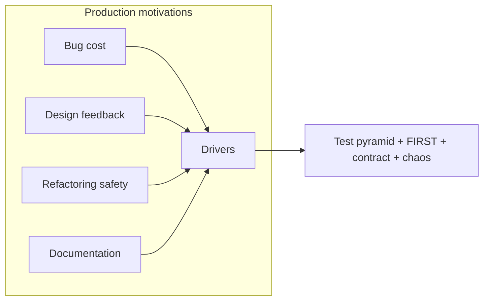

---

## 7. Internal Working

### 7.1 The test runner <a class='askgpt-btn' href='https://chatgpt.com/?prompt=Read%20this%20section%20of%20my%20encyclopedia%20and%20explain%20it%20in%20depth%20with%20concrete%20examples%2C%20the%20main%20trade-offs%2C%20and%20common%20pitfalls%20a%20practitioner%20should%20know%3A%0A%0Ahttps%3A%2F%2Fgithub.com%2Fvishvasg14%2Fsoftware-engineering-encyclopedia%2Fblob%2Fmain%2F14-testing%2Ftesting.md%2371-the-test-runner%0A%0ASection%20title%3A%207.1%20The%20test%20runner' target='_blank' rel='noopener' data-askgpt='7.1 The test runner' data-askgpt-url='https://github.com/vishvasg14/software-engineering-encyclopedia/blob/main/14-testing/testing.md#71-the-test-runner' data-askgpt-prompt-depth='Read%20this%20section%20of%20my%20encyclopedia%20and%20explain%20it%20in%20depth%20with%20concrete%20examples%2C%20the%20main%20trade-offs%2C%20and%20common%20pitfalls%20a%20practitioner%20should%20know%3A%0A%0Ahttps%3A%2F%2Fgithub.com%2Fvishvasg14%2Fsoftware-engineering-encyclopedia%2Fblob%2Fmain%2F14-testing%2Ftesting.md%2371-the-test-runner%0A%0ASection%20title%3A%207.1%20The%20test%20runner' data-askgpt-prompt-examples='Read%20this%20section%20of%20my%20encyclopedia%20and%20give%20me%202-3%20real-world%20production%20examples%20for%20it.%20For%20each%3A%20what%20went%20right%2C%20what%20went%20wrong%2C%20and%20the%20lessons%20learned.%20Include%20company%20%2F%20project%20names%20if%20relevant.%0A%0Ahttps%3A%2F%2Fgithub.com%2Fvishvasg14%2Fsoftware-engineering-encyclopedia%2Fblob%2Fmain%2F14-testing%2Ftesting.md%2371-the-test-runner%0A%0ASection%20title%3A%207.1%20The%20test%20runner' title='Ask ChatGPT about this section'>💬</a>

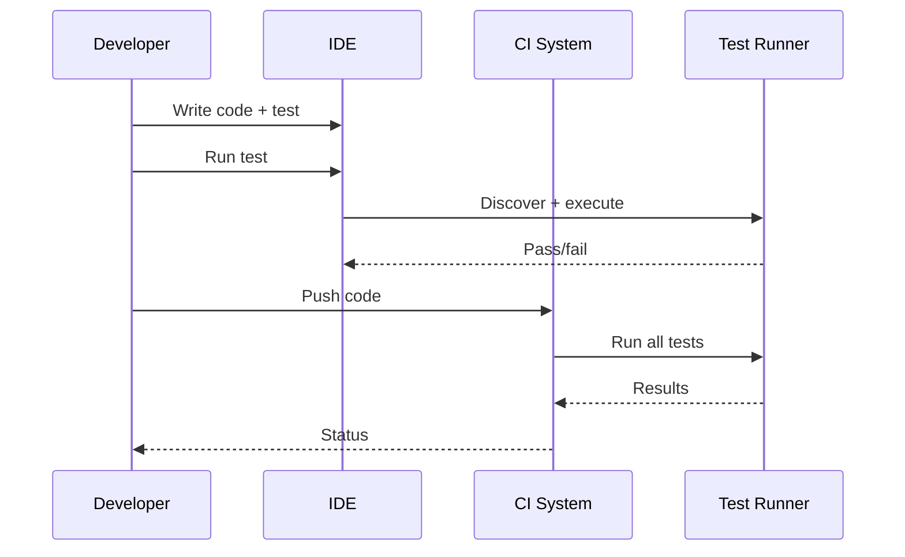

### 7.2 Subsystems <a class='askgpt-btn' href='https://chatgpt.com/?prompt=Read%20this%20section%20of%20my%20encyclopedia%20and%20explain%20it%20in%20depth%20with%20concrete%20examples%2C%20the%20main%20trade-offs%2C%20and%20common%20pitfalls%20a%20practitioner%20should%20know%3A%0A%0Ahttps%3A%2F%2Fgithub.com%2Fvishvasg14%2Fsoftware-engineering-encyclopedia%2Fblob%2Fmain%2F14-testing%2Ftesting.md%2372-subsystems%0A%0ASection%20title%3A%207.2%20Subsystems' target='_blank' rel='noopener' data-askgpt='7.2 Subsystems' data-askgpt-url='https://github.com/vishvasg14/software-engineering-encyclopedia/blob/main/14-testing/testing.md#72-subsystems' data-askgpt-prompt-depth='Read%20this%20section%20of%20my%20encyclopedia%20and%20explain%20it%20in%20depth%20with%20concrete%20examples%2C%20the%20main%20trade-offs%2C%20and%20common%20pitfalls%20a%20practitioner%20should%20know%3A%0A%0Ahttps%3A%2F%2Fgithub.com%2Fvishvasg14%2Fsoftware-engineering-encyclopedia%2Fblob%2Fmain%2F14-testing%2Ftesting.md%2372-subsystems%0A%0ASection%20title%3A%207.2%20Subsystems' data-askgpt-prompt-examples='Read%20this%20section%20of%20my%20encyclopedia%20and%20give%20me%202-3%20real-world%20production%20examples%20for%20it.%20For%20each%3A%20what%20went%20right%2C%20what%20went%20wrong%2C%20and%20the%20lessons%20learned.%20Include%20company%20%2F%20project%20names%20if%20relevant.%0A%0Ahttps%3A%2F%2Fgithub.com%2Fvishvasg14%2Fsoftware-engineering-encyclopedia%2Fblob%2Fmain%2F14-testing%2Ftesting.md%2372-subsystems%0A%0ASection%20title%3A%207.2%20Subsystems' title='Ask ChatGPT about this section'>💬</a>

| Subsystem | Responsibility |
|-----------|---------------|
| **Test framework** | Test definition, assertions, lifecycle (JUnit) |
| **Test runner** | Discovery, execution, reporting |
| **Mocking framework** | Test doubles (Mockito) |
| **Container framework** | Real dependencies (Testcontainers) |
| **Contract framework** | Consumer-driven (Pact) |
| **E2E framework** | Browser automation (Playwright) |
| **Coverage tool** | Measure code coverage (JaCoCo, coverage.py) |
| **Mutation tool** | Verify test quality (PIT, Stryker) |
| **CI system** | Run tests on every commit (GitHub Actions) |

---

## 8. Deep Dive

This section is the heart of the document.

### 8.1 The test pyramid <a class='askgpt-btn' href='https://chatgpt.com/?prompt=Read%20this%20section%20of%20my%20encyclopedia%20and%20explain%20it%20in%20depth%20with%20concrete%20examples%2C%20the%20main%20trade-offs%2C%20and%20common%20pitfalls%20a%20practitioner%20should%20know%3A%0A%0Ahttps%3A%2F%2Fgithub.com%2Fvishvasg14%2Fsoftware-engineering-encyclopedia%2Fblob%2Fmain%2F14-testing%2Ftesting.md%2381-the-test-pyramid%0A%0ASection%20title%3A%208.1%20The%20test%20pyramid' target='_blank' rel='noopener' data-askgpt='8.1 The test pyramid' data-askgpt-url='https://github.com/vishvasg14/software-engineering-encyclopedia/blob/main/14-testing/testing.md#81-the-test-pyramid' data-askgpt-prompt-depth='Read%20this%20section%20of%20my%20encyclopedia%20and%20explain%20it%20in%20depth%20with%20concrete%20examples%2C%20the%20main%20trade-offs%2C%20and%20common%20pitfalls%20a%20practitioner%20should%20know%3A%0A%0Ahttps%3A%2F%2Fgithub.com%2Fvishvasg14%2Fsoftware-engineering-encyclopedia%2Fblob%2Fmain%2F14-testing%2Ftesting.md%2381-the-test-pyramid%0A%0ASection%20title%3A%208.1%20The%20test%20pyramid' data-askgpt-prompt-examples='Read%20this%20section%20of%20my%20encyclopedia%20and%20give%20me%202-3%20real-world%20production%20examples%20for%20it.%20For%20each%3A%20what%20went%20right%2C%20what%20went%20wrong%2C%20and%20the%20lessons%20learned.%20Include%20company%20%2F%20project%20names%20if%20relevant.%0A%0Ahttps%3A%2F%2Fgithub.com%2Fvishvasg14%2Fsoftware-engineering-encyclopedia%2Fblob%2Fmain%2F14-testing%2Ftesting.md%2381-the-test-pyramid%0A%0ASection%20title%3A%208.1%20The%20test%20pyramid' title='Ask ChatGPT about this section'>💬</a>

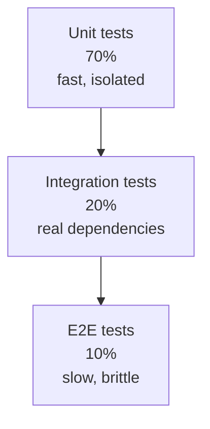

**The 70/20/10 rule:**

- **70% unit tests:** fast, isolated, run on every commit.
- **20% integration tests:** real dependencies (DBs, queues); slower; run on PR.
- **10% E2E tests:** full system; slow and brittle; run on release.

### 8.2 The testing trophy (Kent C. Dodds) <a class='askgpt-btn' href='https://chatgpt.com/?prompt=Read%20this%20section%20of%20my%20encyclopedia%20and%20explain%20it%20in%20depth%20with%20concrete%20examples%2C%20the%20main%20trade-offs%2C%20and%20common%20pitfalls%20a%20practitioner%20should%20know%3A%0A%0Ahttps%3A%2F%2Fgithub.com%2Fvishvasg14%2Fsoftware-engineering-encyclopedia%2Fblob%2Fmain%2F14-testing%2Ftesting.md%2382-the-testing-trophy-kent-c-dodds%0A%0ASection%20title%3A%208.2%20The%20testing%20trophy%20(Kent%20C.%20Dodds)' target='_blank' rel='noopener' data-askgpt='8.2 The testing trophy (Kent C. Dodds)' data-askgpt-url='https://github.com/vishvasg14/software-engineering-encyclopedia/blob/main/14-testing/testing.md#82-the-testing-trophy-kent-c-dodds' data-askgpt-prompt-depth='Read%20this%20section%20of%20my%20encyclopedia%20and%20explain%20it%20in%20depth%20with%20concrete%20examples%2C%20the%20main%20trade-offs%2C%20and%20common%20pitfalls%20a%20practitioner%20should%20know%3A%0A%0Ahttps%3A%2F%2Fgithub.com%2Fvishvasg14%2Fsoftware-engineering-encyclopedia%2Fblob%2Fmain%2F14-testing%2Ftesting.md%2382-the-testing-trophy-kent-c-dodds%0A%0ASection%20title%3A%208.2%20The%20testing%20trophy%20(Kent%20C.%20Dodds)' data-askgpt-prompt-examples='Read%20this%20section%20of%20my%20encyclopedia%20and%20give%20me%202-3%20real-world%20production%20examples%20for%20it.%20For%20each%3A%20what%20went%20right%2C%20what%20went%20wrong%2C%20and%20the%20lessons%20learned.%20Include%20company%20%2F%20project%20names%20if%20relevant.%0A%0Ahttps%3A%2F%2Fgithub.com%2Fvishvasg14%2Fsoftware-engineering-encyclopedia%2Fblob%2Fmain%2F14-testing%2Ftesting.md%2382-the-testing-trophy-kent-c-dodds%0A%0ASection%20title%3A%208.2%20The%20testing%20trophy%20(Kent%20C.%20Dodds)' title='Ask ChatGPT about this section'>💬</a>

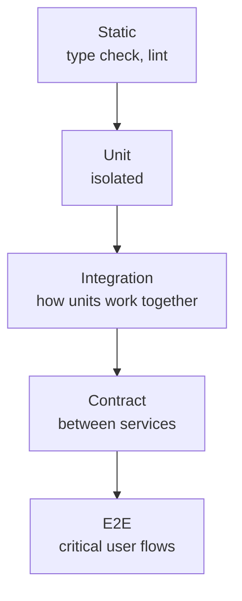

**Order matters:** static analysis catches typos; unit tests verify functions; integration tests verify modules; contract tests verify services; E2E tests verify flows.

### 8.3 FIRST principles <a class='askgpt-btn' href='https://chatgpt.com/?prompt=Read%20this%20section%20of%20my%20encyclopedia%20and%20explain%20it%20in%20depth%20with%20concrete%20examples%2C%20the%20main%20trade-offs%2C%20and%20common%20pitfalls%20a%20practitioner%20should%20know%3A%0A%0Ahttps%3A%2F%2Fgithub.com%2Fvishvasg14%2Fsoftware-engineering-encyclopedia%2Fblob%2Fmain%2F14-testing%2Ftesting.md%2383-first-principles%0A%0ASection%20title%3A%208.3%20FIRST%20principles' target='_blank' rel='noopener' data-askgpt='8.3 FIRST principles' data-askgpt-url='https://github.com/vishvasg14/software-engineering-encyclopedia/blob/main/14-testing/testing.md#83-first-principles' data-askgpt-prompt-depth='Read%20this%20section%20of%20my%20encyclopedia%20and%20explain%20it%20in%20depth%20with%20concrete%20examples%2C%20the%20main%20trade-offs%2C%20and%20common%20pitfalls%20a%20practitioner%20should%20know%3A%0A%0Ahttps%3A%2F%2Fgithub.com%2Fvishvasg14%2Fsoftware-engineering-encyclopedia%2Fblob%2Fmain%2F14-testing%2Ftesting.md%2383-first-principles%0A%0ASection%20title%3A%208.3%20FIRST%20principles' data-askgpt-prompt-examples='Read%20this%20section%20of%20my%20encyclopedia%20and%20give%20me%202-3%20real-world%20production%20examples%20for%20it.%20For%20each%3A%20what%20went%20right%2C%20what%20went%20wrong%2C%20and%20the%20lessons%20learned.%20Include%20company%20%2F%20project%20names%20if%20relevant.%0A%0Ahttps%3A%2F%2Fgithub.com%2Fvishvasg14%2Fsoftware-engineering-encyclopedia%2Fblob%2Fmain%2F14-testing%2Ftesting.md%2383-first-principles%0A%0ASection%20title%3A%208.3%20FIRST%20principles' title='Ask ChatGPT about this section'>💬</a>

| Letter | Principle | Meaning |
|--------|-----------|---------|
| **F** | Fast | Tests run in milliseconds, not seconds |
| **I** | Isolated | Tests don't depend on each other or shared state |
| **R** | Repeatable | Same result every run |
| **S** | Self-validating | Tests report pass/fail clearly |
| **T** | Timely | Tests written alongside production code |

### 8.4 AAA pattern <a class='askgpt-btn' href='https://chatgpt.com/?prompt=Read%20this%20section%20of%20my%20encyclopedia%20and%20explain%20it%20in%20depth%20with%20concrete%20examples%2C%20the%20main%20trade-offs%2C%20and%20common%20pitfalls%20a%20practitioner%20should%20know%3A%0A%0Ahttps%3A%2F%2Fgithub.com%2Fvishvasg14%2Fsoftware-engineering-encyclopedia%2Fblob%2Fmain%2F14-testing%2Ftesting.md%2384-aaa-pattern%0A%0ASection%20title%3A%208.4%20AAA%20pattern' target='_blank' rel='noopener' data-askgpt='8.4 AAA pattern' data-askgpt-url='https://github.com/vishvasg14/software-engineering-encyclopedia/blob/main/14-testing/testing.md#84-aaa-pattern' data-askgpt-prompt-depth='Read%20this%20section%20of%20my%20encyclopedia%20and%20explain%20it%20in%20depth%20with%20concrete%20examples%2C%20the%20main%20trade-offs%2C%20and%20common%20pitfalls%20a%20practitioner%20should%20know%3A%0A%0Ahttps%3A%2F%2Fgithub.com%2Fvishvasg14%2Fsoftware-engineering-encyclopedia%2Fblob%2Fmain%2F14-testing%2Ftesting.md%2384-aaa-pattern%0A%0ASection%20title%3A%208.4%20AAA%20pattern' data-askgpt-prompt-examples='Read%20this%20section%20of%20my%20encyclopedia%20and%20give%20me%202-3%20real-world%20production%20examples%20for%20it.%20For%20each%3A%20what%20went%20right%2C%20what%20went%20wrong%2C%20and%20the%20lessons%20learned.%20Include%20company%20%2F%20project%20names%20if%20relevant.%0A%0Ahttps%3A%2F%2Fgithub.com%2Fvishvasg14%2Fsoftware-engineering-encyclopedia%2Fblob%2Fmain%2F14-testing%2Ftesting.md%2384-aaa-pattern%0A%0ASection%20title%3A%208.4%20AAA%20pattern' title='Ask ChatGPT about this section'>💬</a>

```javascript
test("withdraw money from account", () => {
  // Arrange
  const account = new Account(100);

  // Act
  account.withdraw(30);

  // Assert
  expect(account.balance).toBe(70);
});
```

### 8.5 Unit testing <a class='askgpt-btn' href='https://chatgpt.com/?prompt=Read%20this%20section%20of%20my%20encyclopedia%20and%20explain%20it%20in%20depth%20with%20concrete%20examples%2C%20the%20main%20trade-offs%2C%20and%20common%20pitfalls%20a%20practitioner%20should%20know%3A%0A%0Ahttps%3A%2F%2Fgithub.com%2Fvishvasg14%2Fsoftware-engineering-encyclopedia%2Fblob%2Fmain%2F14-testing%2Ftesting.md%2385-unit-testing%0A%0ASection%20title%3A%208.5%20Unit%20testing' target='_blank' rel='noopener' data-askgpt='8.5 Unit testing' data-askgpt-url='https://github.com/vishvasg14/software-engineering-encyclopedia/blob/main/14-testing/testing.md#85-unit-testing' data-askgpt-prompt-depth='Read%20this%20section%20of%20my%20encyclopedia%20and%20explain%20it%20in%20depth%20with%20concrete%20examples%2C%20the%20main%20trade-offs%2C%20and%20common%20pitfalls%20a%20practitioner%20should%20know%3A%0A%0Ahttps%3A%2F%2Fgithub.com%2Fvishvasg14%2Fsoftware-engineering-encyclopedia%2Fblob%2Fmain%2F14-testing%2Ftesting.md%2385-unit-testing%0A%0ASection%20title%3A%208.5%20Unit%20testing' data-askgpt-prompt-examples='Read%20this%20section%20of%20my%20encyclopedia%20and%20give%20me%202-3%20real-world%20production%20examples%20for%20it.%20For%20each%3A%20what%20went%20right%2C%20what%20went%20wrong%2C%20and%20the%20lessons%20learned.%20Include%20company%20%2F%20project%20names%20if%20relevant.%0A%0Ahttps%3A%2F%2Fgithub.com%2Fvishvasg14%2Fsoftware-engineering-encyclopedia%2Fblob%2Fmain%2F14-testing%2Ftesting.md%2385-unit-testing%0A%0ASection%20title%3A%208.5%20Unit%20testing' title='Ask ChatGPT about this section'>💬</a>

Unit tests verify the smallest unit of behavior (function, method, class) in isolation.

```java
// JUnit 5
@Test
@DisplayName("withdraw should reduce balance")
void withdrawReducesBalance() {
  Account account = new Account(100);  // Arrange
  account.withdraw(30);                  // Act
  assertEquals(70, account.balance());   // Assert
}
```

### 8.6 Test doubles <a class='askgpt-btn' href='https://chatgpt.com/?prompt=Read%20this%20section%20of%20my%20encyclopedia%20and%20explain%20it%20in%20depth%20with%20concrete%20examples%2C%20the%20main%20trade-offs%2C%20and%20common%20pitfalls%20a%20practitioner%20should%20know%3A%0A%0Ahttps%3A%2F%2Fgithub.com%2Fvishvasg14%2Fsoftware-engineering-encyclopedia%2Fblob%2Fmain%2F14-testing%2Ftesting.md%2386-test-doubles%0A%0ASection%20title%3A%208.6%20Test%20doubles' target='_blank' rel='noopener' data-askgpt='8.6 Test doubles' data-askgpt-url='https://github.com/vishvasg14/software-engineering-encyclopedia/blob/main/14-testing/testing.md#86-test-doubles' data-askgpt-prompt-depth='Read%20this%20section%20of%20my%20encyclopedia%20and%20explain%20it%20in%20depth%20with%20concrete%20examples%2C%20the%20main%20trade-offs%2C%20and%20common%20pitfalls%20a%20practitioner%20should%20know%3A%0A%0Ahttps%3A%2F%2Fgithub.com%2Fvishvasg14%2Fsoftware-engineering-encyclopedia%2Fblob%2Fmain%2F14-testing%2Ftesting.md%2386-test-doubles%0A%0ASection%20title%3A%208.6%20Test%20doubles' data-askgpt-prompt-examples='Read%20this%20section%20of%20my%20encyclopedia%20and%20give%20me%202-3%20real-world%20production%20examples%20for%20it.%20For%20each%3A%20what%20went%20right%2C%20what%20went%20wrong%2C%20and%20the%20lessons%20learned.%20Include%20company%20%2F%20project%20names%20if%20relevant.%0A%0Ahttps%3A%2F%2Fgithub.com%2Fvishvasg14%2Fsoftware-engineering-encyclopedia%2Fblob%2Fmain%2F14-testing%2Ftesting.md%2386-test-doubles%0A%0ASection%20title%3A%208.6%20Test%20doubles' title='Ask ChatGPT about this section'>💬</a>

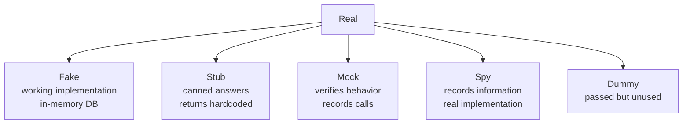

**When to use which:**

- **Dummy:** for unused parameters.
- **Stub:** for state, not behavior verification.
- **Spy:** for real implementations with recording.
- **Mock:** for behavior verification.
- **Fake:** for working but not production implementation (e.g., in-memory DB).

### 8.7 Mocking with Mockito <a class='askgpt-btn' href='https://chatgpt.com/?prompt=Read%20this%20section%20of%20my%20encyclopedia%20and%20explain%20it%20in%20depth%20with%20concrete%20examples%2C%20the%20main%20trade-offs%2C%20and%20common%20pitfalls%20a%20practitioner%20should%20know%3A%0A%0Ahttps%3A%2F%2Fgithub.com%2Fvishvasg14%2Fsoftware-engineering-encyclopedia%2Fblob%2Fmain%2F14-testing%2Ftesting.md%2387-mocking-with-mockito%0A%0ASection%20title%3A%208.7%20Mocking%20with%20Mockito' target='_blank' rel='noopener' data-askgpt='8.7 Mocking with Mockito' data-askgpt-url='https://github.com/vishvasg14/software-engineering-encyclopedia/blob/main/14-testing/testing.md#87-mocking-with-mockito' data-askgpt-prompt-depth='Read%20this%20section%20of%20my%20encyclopedia%20and%20explain%20it%20in%20depth%20with%20concrete%20examples%2C%20the%20main%20trade-offs%2C%20and%20common%20pitfalls%20a%20practitioner%20should%20know%3A%0A%0Ahttps%3A%2F%2Fgithub.com%2Fvishvasg14%2Fsoftware-engineering-encyclopedia%2Fblob%2Fmain%2F14-testing%2Ftesting.md%2387-mocking-with-mockito%0A%0ASection%20title%3A%208.7%20Mocking%20with%20Mockito' data-askgpt-prompt-examples='Read%20this%20section%20of%20my%20encyclopedia%20and%20give%20me%202-3%20real-world%20production%20examples%20for%20it.%20For%20each%3A%20what%20went%20right%2C%20what%20went%20wrong%2C%20and%20the%20lessons%20learned.%20Include%20company%20%2F%20project%20names%20if%20relevant.%0A%0Ahttps%3A%2F%2Fgithub.com%2Fvishvasg14%2Fsoftware-engineering-encyclopedia%2Fblob%2Fmain%2F14-testing%2Ftesting.md%2387-mocking-with-mockito%0A%0ASection%20title%3A%208.7%20Mocking%20with%20Mockito' title='Ask ChatGPT about this section'>💬</a>

```java
@ExtendWith(MockitoExtension.class)
class UserServiceTest {
    @Mock private UserRepository repo;
    @InjectMocks private UserService service;

    @Test
    void findUserReturnsUser() {
        when(repo.findById(1L)).thenReturn(Optional.of(new User(1L, "Alice")));

        User user = service.findById(1L);

        assertEquals("Alice", user.getName());
        verify(repo).findById(1L);  // verify behavior
    }
}
```

**When NOT to mock:**

- Value objects (use real).
- The system under test.
- Data structures.
- Pure functions.
- Simple DTOs.

### 8.8 Integration testing with Testcontainers <a class='askgpt-btn' href='https://chatgpt.com/?prompt=Read%20this%20section%20of%20my%20encyclopedia%20and%20explain%20it%20in%20depth%20with%20concrete%20examples%2C%20the%20main%20trade-offs%2C%20and%20common%20pitfalls%20a%20practitioner%20should%20know%3A%0A%0Ahttps%3A%2F%2Fgithub.com%2Fvishvasg14%2Fsoftware-engineering-encyclopedia%2Fblob%2Fmain%2F14-testing%2Ftesting.md%2388-integration-testing-with-testcontainers%0A%0ASection%20title%3A%208.8%20Integration%20testing%20with%20Testcontainers' target='_blank' rel='noopener' data-askgpt='8.8 Integration testing with Testcontainers' data-askgpt-url='https://github.com/vishvasg14/software-engineering-encyclopedia/blob/main/14-testing/testing.md#88-integration-testing-with-testcontainers' data-askgpt-prompt-depth='Read%20this%20section%20of%20my%20encyclopedia%20and%20explain%20it%20in%20depth%20with%20concrete%20examples%2C%20the%20main%20trade-offs%2C%20and%20common%20pitfalls%20a%20practitioner%20should%20know%3A%0A%0Ahttps%3A%2F%2Fgithub.com%2Fvishvasg14%2Fsoftware-engineering-encyclopedia%2Fblob%2Fmain%2F14-testing%2Ftesting.md%2388-integration-testing-with-testcontainers%0A%0ASection%20title%3A%208.8%20Integration%20testing%20with%20Testcontainers' data-askgpt-prompt-examples='Read%20this%20section%20of%20my%20encyclopedia%20and%20give%20me%202-3%20real-world%20production%20examples%20for%20it.%20For%20each%3A%20what%20went%20right%2C%20what%20went%20wrong%2C%20and%20the%20lessons%20learned.%20Include%20company%20%2F%20project%20names%20if%20relevant.%0A%0Ahttps%3A%2F%2Fgithub.com%2Fvishvasg14%2Fsoftware-engineering-encyclopedia%2Fblob%2Fmain%2F14-testing%2Ftesting.md%2388-integration-testing-with-testcontainers%0A%0ASection%20title%3A%208.8%20Integration%20testing%20with%20Testcontainers' title='Ask ChatGPT about this section'>💬</a>

```java
@Testcontainers
class UserRepositoryIT {
    @Container
    static PostgreSQLContainer<?> postgres = new PostgreSQLContainer<>("postgres:16-alpine")
        .withDatabaseName("test")
        .withUsername("test")
        .withPassword("test");

    @Autowired
    private UserRepository repo;

    @Test
    void findByIdReturnsUser() {
        repo.save(new User(1L, "Alice"));
        Optional<User> found = repo.findById(1L);
        assertEquals("Alice", found.get().getName());
    }
}
```

### 8.9 Contract testing with Pact <a class='askgpt-btn' href='https://chatgpt.com/?prompt=Read%20this%20section%20of%20my%20encyclopedia%20and%20explain%20it%20in%20depth%20with%20concrete%20examples%2C%20the%20main%20trade-offs%2C%20and%20common%20pitfalls%20a%20practitioner%20should%20know%3A%0A%0Ahttps%3A%2F%2Fgithub.com%2Fvishvasg14%2Fsoftware-engineering-encyclopedia%2Fblob%2Fmain%2F14-testing%2Ftesting.md%2389-contract-testing-with-pact%0A%0ASection%20title%3A%208.9%20Contract%20testing%20with%20Pact' target='_blank' rel='noopener' data-askgpt='8.9 Contract testing with Pact' data-askgpt-url='https://github.com/vishvasg14/software-engineering-encyclopedia/blob/main/14-testing/testing.md#89-contract-testing-with-pact' data-askgpt-prompt-depth='Read%20this%20section%20of%20my%20encyclopedia%20and%20explain%20it%20in%20depth%20with%20concrete%20examples%2C%20the%20main%20trade-offs%2C%20and%20common%20pitfalls%20a%20practitioner%20should%20know%3A%0A%0Ahttps%3A%2F%2Fgithub.com%2Fvishvasg14%2Fsoftware-engineering-encyclopedia%2Fblob%2Fmain%2F14-testing%2Ftesting.md%2389-contract-testing-with-pact%0A%0ASection%20title%3A%208.9%20Contract%20testing%20with%20Pact' data-askgpt-prompt-examples='Read%20this%20section%20of%20my%20encyclopedia%20and%20give%20me%202-3%20real-world%20production%20examples%20for%20it.%20For%20each%3A%20what%20went%20right%2C%20what%20went%20wrong%2C%20and%20the%20lessons%20learned.%20Include%20company%20%2F%20project%20names%20if%20relevant.%0A%0Ahttps%3A%2F%2Fgithub.com%2Fvishvasg14%2Fsoftware-engineering-encyclopedia%2Fblob%2Fmain%2F14-testing%2Ftesting.md%2389-contract-testing-with-pact%0A%0ASection%20title%3A%208.9%20Contract%20testing%20with%20Pact' title='Ask ChatGPT about this section'>💬</a>

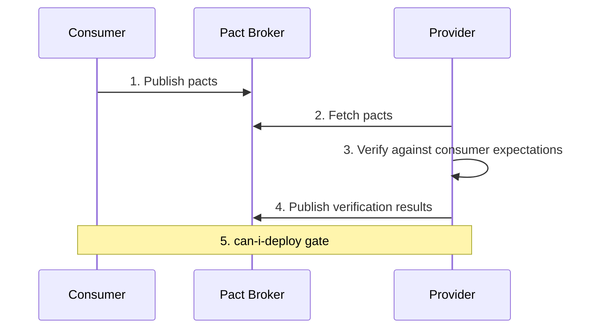

Consumer defines the contract; provider verifies it; broker coordinates; deployments gated.

### 8.10 End-to-end testing <a class='askgpt-btn' href='https://chatgpt.com/?prompt=Read%20this%20section%20of%20my%20encyclopedia%20and%20explain%20it%20in%20depth%20with%20concrete%20examples%2C%20the%20main%20trade-offs%2C%20and%20common%20pitfalls%20a%20practitioner%20should%20know%3A%0A%0Ahttps%3A%2F%2Fgithub.com%2Fvishvasg14%2Fsoftware-engineering-encyclopedia%2Fblob%2Fmain%2F14-testing%2Ftesting.md%23810-end-to-end-testing%0A%0ASection%20title%3A%208.10%20End-to-end%20testing' target='_blank' rel='noopener' data-askgpt='8.10 End-to-end testing' data-askgpt-url='https://github.com/vishvasg14/software-engineering-encyclopedia/blob/main/14-testing/testing.md#810-end-to-end-testing' data-askgpt-prompt-depth='Read%20this%20section%20of%20my%20encyclopedia%20and%20explain%20it%20in%20depth%20with%20concrete%20examples%2C%20the%20main%20trade-offs%2C%20and%20common%20pitfalls%20a%20practitioner%20should%20know%3A%0A%0Ahttps%3A%2F%2Fgithub.com%2Fvishvasg14%2Fsoftware-engineering-encyclopedia%2Fblob%2Fmain%2F14-testing%2Ftesting.md%23810-end-to-end-testing%0A%0ASection%20title%3A%208.10%20End-to-end%20testing' data-askgpt-prompt-examples='Read%20this%20section%20of%20my%20encyclopedia%20and%20give%20me%202-3%20real-world%20production%20examples%20for%20it.%20For%20each%3A%20what%20went%20right%2C%20what%20went%20wrong%2C%20and%20the%20lessons%20learned.%20Include%20company%20%2F%20project%20names%20if%20relevant.%0A%0Ahttps%3A%2F%2Fgithub.com%2Fvishvasg14%2Fsoftware-engineering-encyclopedia%2Fblob%2Fmain%2F14-testing%2Ftesting.md%23810-end-to-end-testing%0A%0ASection%20title%3A%208.10%20End-to-end%20testing' title='Ask ChatGPT about this section'>💬</a>

```typescript
// Playwright
import { test, expect } from '@playwright/test';

test('user can login', async ({ page }) => {
  await page.goto('https://app.example.com/login');
  await page.fill('input[name=email]', 'alice@example.com');
  await page.fill('input[name=password]', 'password');
  await page.click('button[type=submit]');
  await expect(page).toHaveURL('https://app.example.com/dashboard');
});
```

### 8.11 Performance testing with k6 <a class='askgpt-btn' href='https://chatgpt.com/?prompt=Read%20this%20section%20of%20my%20encyclopedia%20and%20explain%20it%20in%20depth%20with%20concrete%20examples%2C%20the%20main%20trade-offs%2C%20and%20common%20pitfalls%20a%20practitioner%20should%20know%3A%0A%0Ahttps%3A%2F%2Fgithub.com%2Fvishvasg14%2Fsoftware-engineering-encyclopedia%2Fblob%2Fmain%2F14-testing%2Ftesting.md%23811-performance-testing-with-k6%0A%0ASection%20title%3A%208.11%20Performance%20testing%20with%20k6' target='_blank' rel='noopener' data-askgpt='8.11 Performance testing with k6' data-askgpt-url='https://github.com/vishvasg14/software-engineering-encyclopedia/blob/main/14-testing/testing.md#811-performance-testing-with-k6' data-askgpt-prompt-depth='Read%20this%20section%20of%20my%20encyclopedia%20and%20explain%20it%20in%20depth%20with%20concrete%20examples%2C%20the%20main%20trade-offs%2C%20and%20common%20pitfalls%20a%20practitioner%20should%20know%3A%0A%0Ahttps%3A%2F%2Fgithub.com%2Fvishvasg14%2Fsoftware-engineering-encyclopedia%2Fblob%2Fmain%2F14-testing%2Ftesting.md%23811-performance-testing-with-k6%0A%0ASection%20title%3A%208.11%20Performance%20testing%20with%20k6' data-askgpt-prompt-examples='Read%20this%20section%20of%20my%20encyclopedia%20and%20give%20me%202-3%20real-world%20production%20examples%20for%20it.%20For%20each%3A%20what%20went%20right%2C%20what%20went%20wrong%2C%20and%20the%20lessons%20learned.%20Include%20company%20%2F%20project%20names%20if%20relevant.%0A%0Ahttps%3A%2F%2Fgithub.com%2Fvishvasg14%2Fsoftware-engineering-encyclopedia%2Fblob%2Fmain%2F14-testing%2Ftesting.md%23811-performance-testing-with-k6%0A%0ASection%20title%3A%208.11%20Performance%20testing%20with%20k6' title='Ask ChatGPT about this section'>💬</a>

```javascript
// k6
import http from 'k6/http';
import { check, sleep } from 'k6';

export const options = {
  stages: [
    { duration: '30s', target: 100 },
    { duration: '1m', target: 1000 },
    { duration: '30s', target: 0 },
  ],
};

export default function () {
  const res = http.get('https://api.example.com/users');
  check(res, { 'status 200': (r) => r.status === 200 });
  sleep(1);
}
```

### 8.12 Mutation testing <a class='askgpt-btn' href='https://chatgpt.com/?prompt=Read%20this%20section%20of%20my%20encyclopedia%20and%20explain%20it%20in%20depth%20with%20concrete%20examples%2C%20the%20main%20trade-offs%2C%20and%20common%20pitfalls%20a%20practitioner%20should%20know%3A%0A%0Ahttps%3A%2F%2Fgithub.com%2Fvishvasg14%2Fsoftware-engineering-encyclopedia%2Fblob%2Fmain%2F14-testing%2Ftesting.md%23812-mutation-testing%0A%0ASection%20title%3A%208.12%20Mutation%20testing' target='_blank' rel='noopener' data-askgpt='8.12 Mutation testing' data-askgpt-url='https://github.com/vishvasg14/software-engineering-encyclopedia/blob/main/14-testing/testing.md#812-mutation-testing' data-askgpt-prompt-depth='Read%20this%20section%20of%20my%20encyclopedia%20and%20explain%20it%20in%20depth%20with%20concrete%20examples%2C%20the%20main%20trade-offs%2C%20and%20common%20pitfalls%20a%20practitioner%20should%20know%3A%0A%0Ahttps%3A%2F%2Fgithub.com%2Fvishvasg14%2Fsoftware-engineering-encyclopedia%2Fblob%2Fmain%2F14-testing%2Ftesting.md%23812-mutation-testing%0A%0ASection%20title%3A%208.12%20Mutation%20testing' data-askgpt-prompt-examples='Read%20this%20section%20of%20my%20encyclopedia%20and%20give%20me%202-3%20real-world%20production%20examples%20for%20it.%20For%20each%3A%20what%20went%20right%2C%20what%20went%20wrong%2C%20and%20the%20lessons%20learned.%20Include%20company%20%2F%20project%20names%20if%20relevant.%0A%0Ahttps%3A%2F%2Fgithub.com%2Fvishvasg14%2Fsoftware-engineering-encyclopedia%2Fblob%2Fmain%2F14-testing%2Ftesting.md%23812-mutation-testing%0A%0ASection%20title%3A%208.12%20Mutation%20testing' title='Ask ChatGPT about this section'>💬</a>

Mutation testing verifies your tests catch bugs.

```bash
# PIT (Java)
mvn org.pitest:pitest-maven:mutationCoverage

# Stryker (JavaScript)
npx stryker run
```

Mutations: change one operator (e.g., `>` to `>=`) and see if tests fail. If tests still pass, the test didn't catch the bug.

### 8.13 Chaos engineering <a class='askgpt-btn' href='https://chatgpt.com/?prompt=Read%20this%20section%20of%20my%20encyclopedia%20and%20explain%20it%20in%20depth%20with%20concrete%20examples%2C%20the%20main%20trade-offs%2C%20and%20common%20pitfalls%20a%20practitioner%20should%20know%3A%0A%0Ahttps%3A%2F%2Fgithub.com%2Fvishvasg14%2Fsoftware-engineering-encyclopedia%2Fblob%2Fmain%2F14-testing%2Ftesting.md%23813-chaos-engineering%0A%0ASection%20title%3A%208.13%20Chaos%20engineering' target='_blank' rel='noopener' data-askgpt='8.13 Chaos engineering' data-askgpt-url='https://github.com/vishvasg14/software-engineering-encyclopedia/blob/main/14-testing/testing.md#813-chaos-engineering' data-askgpt-prompt-depth='Read%20this%20section%20of%20my%20encyclopedia%20and%20explain%20it%20in%20depth%20with%20concrete%20examples%2C%20the%20main%20trade-offs%2C%20and%20common%20pitfalls%20a%20practitioner%20should%20know%3A%0A%0Ahttps%3A%2F%2Fgithub.com%2Fvishvasg14%2Fsoftware-engineering-encyclopedia%2Fblob%2Fmain%2F14-testing%2Ftesting.md%23813-chaos-engineering%0A%0ASection%20title%3A%208.13%20Chaos%20engineering' data-askgpt-prompt-examples='Read%20this%20section%20of%20my%20encyclopedia%20and%20give%20me%202-3%20real-world%20production%20examples%20for%20it.%20For%20each%3A%20what%20went%20right%2C%20what%20went%20wrong%2C%20and%20the%20lessons%20learned.%20Include%20company%20%2F%20project%20names%20if%20relevant.%0A%0Ahttps%3A%2F%2Fgithub.com%2Fvishvasg14%2Fsoftware-engineering-encyclopedia%2Fblob%2Fmain%2F14-testing%2Ftesting.md%23813-chaos-engineering%0A%0ASection%20title%3A%208.13%20Chaos%20engineering' title='Ask ChatGPT about this section'>💬</a>

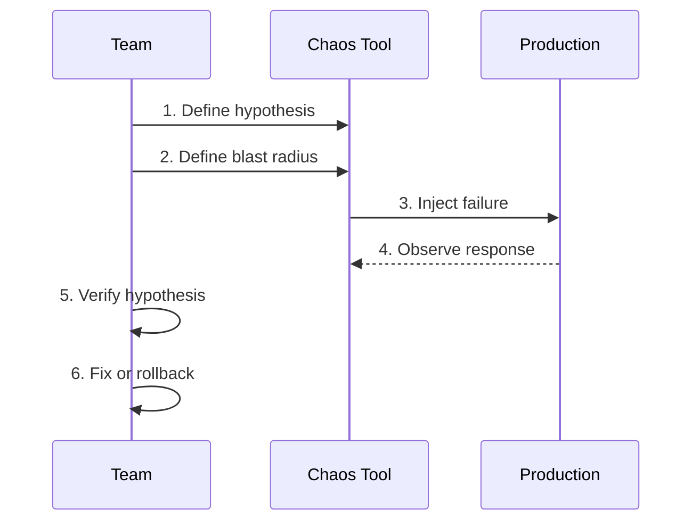

**Principles:**

- **Hypothesis-based:** state what should happen.
- **Blast radius:** limit impact.
- **Production:** real environment.
- **Learn:** the goal is knowledge.
- **Continuous:** not a one-off.

**Tools:** Chaos Monkey, Litmus, Gremlin, ChaosBlade.

### 8.14 Test data management <a class='askgpt-btn' href='https://chatgpt.com/?prompt=Read%20this%20section%20of%20my%20encyclopedia%20and%20explain%20it%20in%20depth%20with%20concrete%20examples%2C%20the%20main%20trade-offs%2C%20and%20common%20pitfalls%20a%20practitioner%20should%20know%3A%0A%0Ahttps%3A%2F%2Fgithub.com%2Fvishvasg14%2Fsoftware-engineering-encyclopedia%2Fblob%2Fmain%2F14-testing%2Ftesting.md%23814-test-data-management%0A%0ASection%20title%3A%208.14%20Test%20data%20management' target='_blank' rel='noopener' data-askgpt='8.14 Test data management' data-askgpt-url='https://github.com/vishvasg14/software-engineering-encyclopedia/blob/main/14-testing/testing.md#814-test-data-management' data-askgpt-prompt-depth='Read%20this%20section%20of%20my%20encyclopedia%20and%20explain%20it%20in%20depth%20with%20concrete%20examples%2C%20the%20main%20trade-offs%2C%20and%20common%20pitfalls%20a%20practitioner%20should%20know%3A%0A%0Ahttps%3A%2F%2Fgithub.com%2Fvishvasg14%2Fsoftware-engineering-encyclopedia%2Fblob%2Fmain%2F14-testing%2Ftesting.md%23814-test-data-management%0A%0ASection%20title%3A%208.14%20Test%20data%20management' data-askgpt-prompt-examples='Read%20this%20section%20of%20my%20encyclopedia%20and%20give%20me%202-3%20real-world%20production%20examples%20for%20it.%20For%20each%3A%20what%20went%20right%2C%20what%20went%20wrong%2C%20and%20the%20lessons%20learned.%20Include%20company%20%2F%20project%20names%20if%20relevant.%0A%0Ahttps%3A%2F%2Fgithub.com%2Fvishvasg14%2Fsoftware-engineering-encyclopedia%2Fblob%2Fmain%2F14-testing%2Ftesting.md%23814-test-data-management%0A%0ASection%20title%3A%208.14%20Test%20data%20management' title='Ask ChatGPT about this section'>💬</a>

```java
// Test data factory
class UserFactory {
    public static User aUser() {
        return new User()
            .setId(1L)
            .setEmail("alice@example.com")
            .setName("Alice");
    }
    
    public static User adminUser() {
        return aUser().setRole(Role.ADMIN);
    }
}
```

Fixtures (reusable test data), factories (object builders), builders (fluent construction).

### 8.15 CI integration <a class='askgpt-btn' href='https://chatgpt.com/?prompt=Read%20this%20section%20of%20my%20encyclopedia%20and%20explain%20it%20in%20depth%20with%20concrete%20examples%2C%20the%20main%20trade-offs%2C%20and%20common%20pitfalls%20a%20practitioner%20should%20know%3A%0A%0Ahttps%3A%2F%2Fgithub.com%2Fvishvasg14%2Fsoftware-engineering-encyclopedia%2Fblob%2Fmain%2F14-testing%2Ftesting.md%23815-ci-integration%0A%0ASection%20title%3A%208.15%20CI%20integration' target='_blank' rel='noopener' data-askgpt='8.15 CI integration' data-askgpt-url='https://github.com/vishvasg14/software-engineering-encyclopedia/blob/main/14-testing/testing.md#815-ci-integration' data-askgpt-prompt-depth='Read%20this%20section%20of%20my%20encyclopedia%20and%20explain%20it%20in%20depth%20with%20concrete%20examples%2C%20the%20main%20trade-offs%2C%20and%20common%20pitfalls%20a%20practitioner%20should%20know%3A%0A%0Ahttps%3A%2F%2Fgithub.com%2Fvishvasg14%2Fsoftware-engineering-encyclopedia%2Fblob%2Fmain%2F14-testing%2Ftesting.md%23815-ci-integration%0A%0ASection%20title%3A%208.15%20CI%20integration' data-askgpt-prompt-examples='Read%20this%20section%20of%20my%20encyclopedia%20and%20give%20me%202-3%20real-world%20production%20examples%20for%20it.%20For%20each%3A%20what%20went%20right%2C%20what%20went%20wrong%2C%20and%20the%20lessons%20learned.%20Include%20company%20%2F%20project%20names%20if%20relevant.%0A%0Ahttps%3A%2F%2Fgithub.com%2Fvishvasg14%2Fsoftware-engineering-encyclopedia%2Fblob%2Fmain%2F14-testing%2Ftesting.md%23815-ci-integration%0A%0ASection%20title%3A%208.15%20CI%20integration' title='Ask ChatGPT about this section'>💬</a>

```yaml
# GitHub Actions
name: Test
on: [push, pull_request]
jobs:
  test:
    runs-on: ubuntu-latest
    services:
      docker:
        image: docker:dind
    steps:
      - uses: actions/checkout@v4
      - uses: actions/setup-java@v4
        with:
          java-version: 21
      - run: ./mvnw verify
```

**Test stages:**

1. Lint + static analysis.
2. Unit tests.
3. Integration tests (with Testcontainers).
4. Contract tests (if Pact).
5. E2E tests.
6. Performance tests (nightly).
7. Security tests (nightly).

### 8.16 Coverage <a class='askgpt-btn' href='https://chatgpt.com/?prompt=Read%20this%20section%20of%20my%20encyclopedia%20and%20explain%20it%20in%20depth%20with%20concrete%20examples%2C%20the%20main%20trade-offs%2C%20and%20common%20pitfalls%20a%20practitioner%20should%20know%3A%0A%0Ahttps%3A%2F%2Fgithub.com%2Fvishvasg14%2Fsoftware-engineering-encyclopedia%2Fblob%2Fmain%2F14-testing%2Ftesting.md%23816-coverage%0A%0ASection%20title%3A%208.16%20Coverage' target='_blank' rel='noopener' data-askgpt='8.16 Coverage' data-askgpt-url='https://github.com/vishvasg14/software-engineering-encyclopedia/blob/main/14-testing/testing.md#816-coverage' data-askgpt-prompt-depth='Read%20this%20section%20of%20my%20encyclopedia%20and%20explain%20it%20in%20depth%20with%20concrete%20examples%2C%20the%20main%20trade-offs%2C%20and%20common%20pitfalls%20a%20practitioner%20should%20know%3A%0A%0Ahttps%3A%2F%2Fgithub.com%2Fvishvasg14%2Fsoftware-engineering-encyclopedia%2Fblob%2Fmain%2F14-testing%2Ftesting.md%23816-coverage%0A%0ASection%20title%3A%208.16%20Coverage' data-askgpt-prompt-examples='Read%20this%20section%20of%20my%20encyclopedia%20and%20give%20me%202-3%20real-world%20production%20examples%20for%20it.%20For%20each%3A%20what%20went%20right%2C%20what%20went%20wrong%2C%20and%20the%20lessons%20learned.%20Include%20company%20%2F%20project%20names%20if%20relevant.%0A%0Ahttps%3A%2F%2Fgithub.com%2Fvishvasg14%2Fsoftware-engineering-encyclopedia%2Fblob%2Fmain%2F14-testing%2Ftesting.md%23816-coverage%0A%0ASection%20title%3A%208.16%20Coverage' title='Ask ChatGPT about this section'>💬</a>

Coverage measures how much code is executed by tests.

**Types:**

- **Line coverage:** % of lines executed.
- **Branch coverage:** % of branches (if/else) taken.
- **Function coverage:** % of functions called.
- **Path coverage:** % of code paths.

**Tooling:**

- **Java:** JaCoCo, Cobertura.
- **Python:** coverage.py.
- **JavaScript:** Istanbul (nyc), c8.

**Pitfalls:** Chasing 100% coverage leads to meaningless tests. Coverage != quality.

### 8.17 Test parallelization <a class='askgpt-btn' href='https://chatgpt.com/?prompt=Read%20this%20section%20of%20my%20encyclopedia%20and%20explain%20it%20in%20depth%20with%20concrete%20examples%2C%20the%20main%20trade-offs%2C%20and%20common%20pitfalls%20a%20practitioner%20should%20know%3A%0A%0Ahttps%3A%2F%2Fgithub.com%2Fvishvasg14%2Fsoftware-engineering-encyclopedia%2Fblob%2Fmain%2F14-testing%2Ftesting.md%23817-test-parallelization%0A%0ASection%20title%3A%208.17%20Test%20parallelization' target='_blank' rel='noopener' data-askgpt='8.17 Test parallelization' data-askgpt-url='https://github.com/vishvasg14/software-engineering-encyclopedia/blob/main/14-testing/testing.md#817-test-parallelization' data-askgpt-prompt-depth='Read%20this%20section%20of%20my%20encyclopedia%20and%20explain%20it%20in%20depth%20with%20concrete%20examples%2C%20the%20main%20trade-offs%2C%20and%20common%20pitfalls%20a%20practitioner%20should%20know%3A%0A%0Ahttps%3A%2F%2Fgithub.com%2Fvishvasg14%2Fsoftware-engineering-encyclopedia%2Fblob%2Fmain%2F14-testing%2Ftesting.md%23817-test-parallelization%0A%0ASection%20title%3A%208.17%20Test%20parallelization' data-askgpt-prompt-examples='Read%20this%20section%20of%20my%20encyclopedia%20and%20give%20me%202-3%20real-world%20production%20examples%20for%20it.%20For%20each%3A%20what%20went%20right%2C%20what%20went%20wrong%2C%20and%20the%20lessons%20learned.%20Include%20company%20%2F%20project%20names%20if%20relevant.%0A%0Ahttps%3A%2F%2Fgithub.com%2Fvishvasg14%2Fsoftware-engineering-encyclopedia%2Fblob%2Fmain%2F14-testing%2Ftesting.md%23817-test-parallelization%0A%0ASection%20title%3A%208.17%20Test%20parallelization' title='Ask ChatGPT about this section'>💬</a>

```java
@Execution(ExecutionMode.CONCURRENT)  // JUnit 5
class MyTest { ... }
```

```bash
# pytest-xdist
pytest -n 4
```

**Benefits:** faster test execution.

**Risks:** shared state; flaky tests; port conflicts.

### 8.18 Test environments <a class='askgpt-btn' href='https://chatgpt.com/?prompt=Read%20this%20section%20of%20my%20encyclopedia%20and%20explain%20it%20in%20depth%20with%20concrete%20examples%2C%20the%20main%20trade-offs%2C%20and%20common%20pitfalls%20a%20practitioner%20should%20know%3A%0A%0Ahttps%3A%2F%2Fgithub.com%2Fvishvasg14%2Fsoftware-engineering-encyclopedia%2Fblob%2Fmain%2F14-testing%2Ftesting.md%23818-test-environments%0A%0ASection%20title%3A%208.18%20Test%20environments' target='_blank' rel='noopener' data-askgpt='8.18 Test environments' data-askgpt-url='https://github.com/vishvasg14/software-engineering-encyclopedia/blob/main/14-testing/testing.md#818-test-environments' data-askgpt-prompt-depth='Read%20this%20section%20of%20my%20encyclopedia%20and%20explain%20it%20in%20depth%20with%20concrete%20examples%2C%20the%20main%20trade-offs%2C%20and%20common%20pitfalls%20a%20practitioner%20should%20know%3A%0A%0Ahttps%3A%2F%2Fgithub.com%2Fvishvasg14%2Fsoftware-engineering-encyclopedia%2Fblob%2Fmain%2F14-testing%2Ftesting.md%23818-test-environments%0A%0ASection%20title%3A%208.18%20Test%20environments' data-askgpt-prompt-examples='Read%20this%20section%20of%20my%20encyclopedia%20and%20give%20me%202-3%20real-world%20production%20examples%20for%20it.%20For%20each%3A%20what%20went%20right%2C%20what%20went%20wrong%2C%20and%20the%20lessons%20learned.%20Include%20company%20%2F%20project%20names%20if%20relevant.%0A%0Ahttps%3A%2F%2Fgithub.com%2Fvishvasg14%2Fsoftware-engineering-encyclopedia%2Fblob%2Fmain%2F14-testing%2Ftesting.md%23818-test-environments%0A%0ASection%20title%3A%208.18%20Test%20environments' title='Ask ChatGPT about this section'>💬</a>

**Levels:**

- **Unit:** isolated; no shared state.
- **Integration:** real dependencies (Testcontainers).
- **Staging:** mirror production; deploy candidate.
- **Pre-prod:** last gate before prod.
- **Prod:** monitored; canary.

### 8.19 Flaky tests <a class='askgpt-btn' href='https://chatgpt.com/?prompt=Read%20this%20section%20of%20my%20encyclopedia%20and%20explain%20it%20in%20depth%20with%20concrete%20examples%2C%20the%20main%20trade-offs%2C%20and%20common%20pitfalls%20a%20practitioner%20should%20know%3A%0A%0Ahttps%3A%2F%2Fgithub.com%2Fvishvasg14%2Fsoftware-engineering-encyclopedia%2Fblob%2Fmain%2F14-testing%2Ftesting.md%23819-flaky-tests%0A%0ASection%20title%3A%208.19%20Flaky%20tests' target='_blank' rel='noopener' data-askgpt='8.19 Flaky tests' data-askgpt-url='https://github.com/vishvasg14/software-engineering-encyclopedia/blob/main/14-testing/testing.md#819-flaky-tests' data-askgpt-prompt-depth='Read%20this%20section%20of%20my%20encyclopedia%20and%20explain%20it%20in%20depth%20with%20concrete%20examples%2C%20the%20main%20trade-offs%2C%20and%20common%20pitfalls%20a%20practitioner%20should%20know%3A%0A%0Ahttps%3A%2F%2Fgithub.com%2Fvishvasg14%2Fsoftware-engineering-encyclopedia%2Fblob%2Fmain%2F14-testing%2Ftesting.md%23819-flaky-tests%0A%0ASection%20title%3A%208.19%20Flaky%20tests' data-askgpt-prompt-examples='Read%20this%20section%20of%20my%20encyclopedia%20and%20give%20me%202-3%20real-world%20production%20examples%20for%20it.%20For%20each%3A%20what%20went%20right%2C%20what%20went%20wrong%2C%20and%20the%20lessons%20learned.%20Include%20company%20%2F%20project%20names%20if%20relevant.%0A%0Ahttps%3A%2F%2Fgithub.com%2Fvishvasg14%2Fsoftware-engineering-encyclopedia%2Fblob%2Fmain%2F14-testing%2Ftesting.md%23819-flaky-tests%0A%0ASection%20title%3A%208.19%20Flaky%20tests' title='Ask ChatGPT about this section'>💬</a>

Flaky tests are unreliable. Common causes:

- Shared state between tests.
- Timing dependencies (sleep).
- Network dependencies.
- Order dependencies.
- Random data without seed.

**Fix:**

- Use fresh fixtures.
- Use deterministic data.
- Isolate tests.
- Mock time (`TimeMock` in Java).

### 8.20 Tool comparison <a class='askgpt-btn' href='https://chatgpt.com/?prompt=Read%20this%20section%20of%20my%20encyclopedia%20and%20explain%20it%20in%20depth%20with%20concrete%20examples%2C%20the%20main%20trade-offs%2C%20and%20common%20pitfalls%20a%20practitioner%20should%20know%3A%0A%0Ahttps%3A%2F%2Fgithub.com%2Fvishvasg14%2Fsoftware-engineering-encyclopedia%2Fblob%2Fmain%2F14-testing%2Ftesting.md%23820-tool-comparison%0A%0ASection%20title%3A%208.20%20Tool%20comparison' target='_blank' rel='noopener' data-askgpt='8.20 Tool comparison' data-askgpt-url='https://github.com/vishvasg14/software-engineering-encyclopedia/blob/main/14-testing/testing.md#820-tool-comparison' data-askgpt-prompt-depth='Read%20this%20section%20of%20my%20encyclopedia%20and%20explain%20it%20in%20depth%20with%20concrete%20examples%2C%20the%20main%20trade-offs%2C%20and%20common%20pitfalls%20a%20practitioner%20should%20know%3A%0A%0Ahttps%3A%2F%2Fgithub.com%2Fvishvasg14%2Fsoftware-engineering-encyclopedia%2Fblob%2Fmain%2F14-testing%2Ftesting.md%23820-tool-comparison%0A%0ASection%20title%3A%208.20%20Tool%20comparison' data-askgpt-prompt-examples='Read%20this%20section%20of%20my%20encyclopedia%20and%20give%20me%202-3%20real-world%20production%20examples%20for%20it.%20For%20each%3A%20what%20went%20right%2C%20what%20went%20wrong%2C%20and%20the%20lessons%20learned.%20Include%20company%20%2F%20project%20names%20if%20relevant.%0A%0Ahttps%3A%2F%2Fgithub.com%2Fvishvasg14%2Fsoftware-engineering-encyclopedia%2Fblob%2Fmain%2F14-testing%2Ftesting.md%23820-tool-comparison%0A%0ASection%20title%3A%208.20%20Tool%20comparison' title='Ask ChatGPT about this section'>💬</a>

| Tool | Language | Purpose |
|------|---------|---------|
| **JUnit 5** | Java | Unit testing |
| **pytest** | Python | Unit testing |
| **Jest** | JavaScript | Unit testing |
| **Go testing** | Go | Standard library |
| **Mockito** | Java | Mocking |
| **Moq** | .NET | Mocking |
| **Testcontainers** | Multi | Real dependencies |
| **Pact** | Multi | Contract testing |
| **Cypress** | JS | E2E |
| **Playwright** | Multi | E2E |
| **k6** | JS/Go | Load testing |
| **PIT** | Java | Mutation testing |
| **Stryker** | JS/TS | Mutation testing |

---

## 9. Architecture

### 9.1 Test pyramid architecture <a class='askgpt-btn' href='https://chatgpt.com/?prompt=Read%20this%20section%20of%20my%20encyclopedia%20and%20explain%20it%20in%20depth%20with%20concrete%20examples%2C%20the%20main%20trade-offs%2C%20and%20common%20pitfalls%20a%20practitioner%20should%20know%3A%0A%0Ahttps%3A%2F%2Fgithub.com%2Fvishvasg14%2Fsoftware-engineering-encyclopedia%2Fblob%2Fmain%2F14-testing%2Ftesting.md%2391-test-pyramid-architecture%0A%0ASection%20title%3A%209.1%20Test%20pyramid%20architecture' target='_blank' rel='noopener' data-askgpt='9.1 Test pyramid architecture' data-askgpt-url='https://github.com/vishvasg14/software-engineering-encyclopedia/blob/main/14-testing/testing.md#91-test-pyramid-architecture' data-askgpt-prompt-depth='Read%20this%20section%20of%20my%20encyclopedia%20and%20explain%20it%20in%20depth%20with%20concrete%20examples%2C%20the%20main%20trade-offs%2C%20and%20common%20pitfalls%20a%20practitioner%20should%20know%3A%0A%0Ahttps%3A%2F%2Fgithub.com%2Fvishvasg14%2Fsoftware-engineering-encyclopedia%2Fblob%2Fmain%2F14-testing%2Ftesting.md%2391-test-pyramid-architecture%0A%0ASection%20title%3A%209.1%20Test%20pyramid%20architecture' data-askgpt-prompt-examples='Read%20this%20section%20of%20my%20encyclopedia%20and%20give%20me%202-3%20real-world%20production%20examples%20for%20it.%20For%20each%3A%20what%20went%20right%2C%20what%20went%20wrong%2C%20and%20the%20lessons%20learned.%20Include%20company%20%2F%20project%20names%20if%20relevant.%0A%0Ahttps%3A%2F%2Fgithub.com%2Fvishvasg14%2Fsoftware-engineering-encyclopedia%2Fblob%2Fmain%2F14-testing%2Ftesting.md%2391-test-pyramid-architecture%0A%0ASection%20title%3A%209.1%20Test%20pyramid%20architecture' title='Ask ChatGPT about this section'>💬</a>

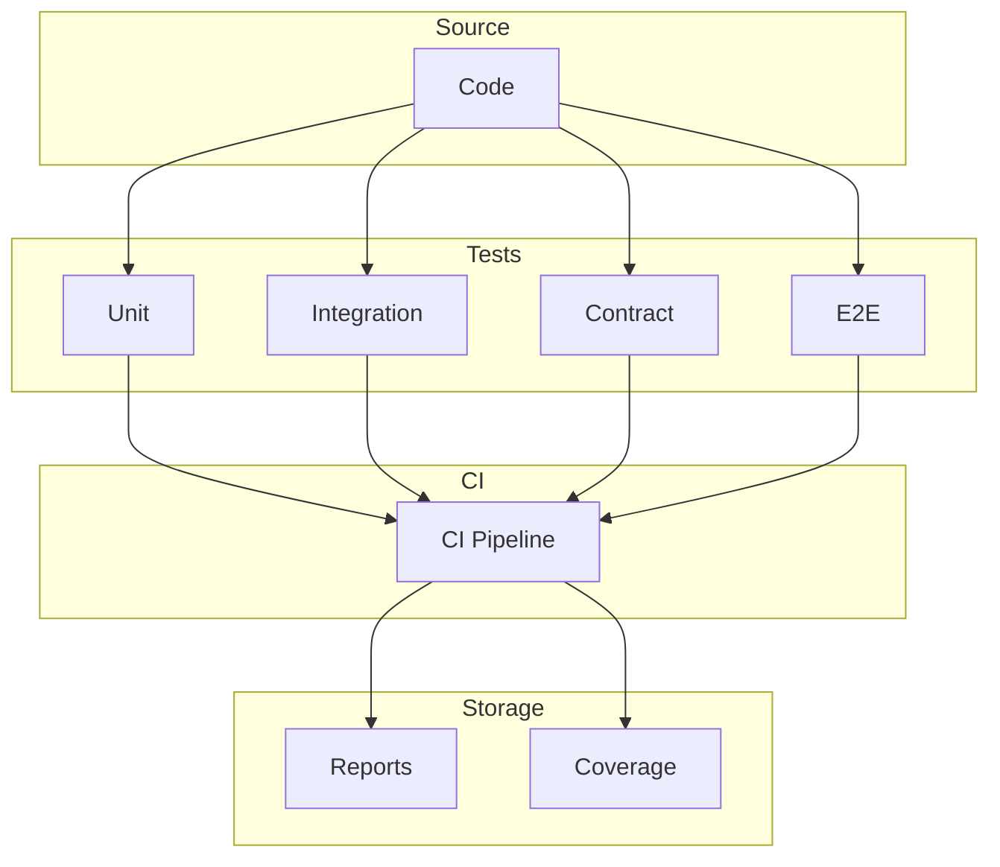

### 9.2 CI test stages <a class='askgpt-btn' href='https://chatgpt.com/?prompt=Read%20this%20section%20of%20my%20encyclopedia%20and%20explain%20it%20in%20depth%20with%20concrete%20examples%2C%20the%20main%20trade-offs%2C%20and%20common%20pitfalls%20a%20practitioner%20should%20know%3A%0A%0Ahttps%3A%2F%2Fgithub.com%2Fvishvasg14%2Fsoftware-engineering-encyclopedia%2Fblob%2Fmain%2F14-testing%2Ftesting.md%2392-ci-test-stages%0A%0ASection%20title%3A%209.2%20CI%20test%20stages' target='_blank' rel='noopener' data-askgpt='9.2 CI test stages' data-askgpt-url='https://github.com/vishvasg14/software-engineering-encyclopedia/blob/main/14-testing/testing.md#92-ci-test-stages' data-askgpt-prompt-depth='Read%20this%20section%20of%20my%20encyclopedia%20and%20explain%20it%20in%20depth%20with%20concrete%20examples%2C%20the%20main%20trade-offs%2C%20and%20common%20pitfalls%20a%20practitioner%20should%20know%3A%0A%0Ahttps%3A%2F%2Fgithub.com%2Fvishvasg14%2Fsoftware-engineering-encyclopedia%2Fblob%2Fmain%2F14-testing%2Ftesting.md%2392-ci-test-stages%0A%0ASection%20title%3A%209.2%20CI%20test%20stages' data-askgpt-prompt-examples='Read%20this%20section%20of%20my%20encyclopedia%20and%20give%20me%202-3%20real-world%20production%20examples%20for%20it.%20For%20each%3A%20what%20went%20right%2C%20what%20went%20wrong%2C%20and%20the%20lessons%20learned.%20Include%20company%20%2F%20project%20names%20if%20relevant.%0A%0Ahttps%3A%2F%2Fgithub.com%2Fvishvasg14%2Fsoftware-engineering-encyclopedia%2Fblob%2Fmain%2F14-testing%2Ftesting.md%2392-ci-test-stages%0A%0ASection%20title%3A%209.2%20CI%20test%20stages' title='Ask ChatGPT about this section'>💬</a>

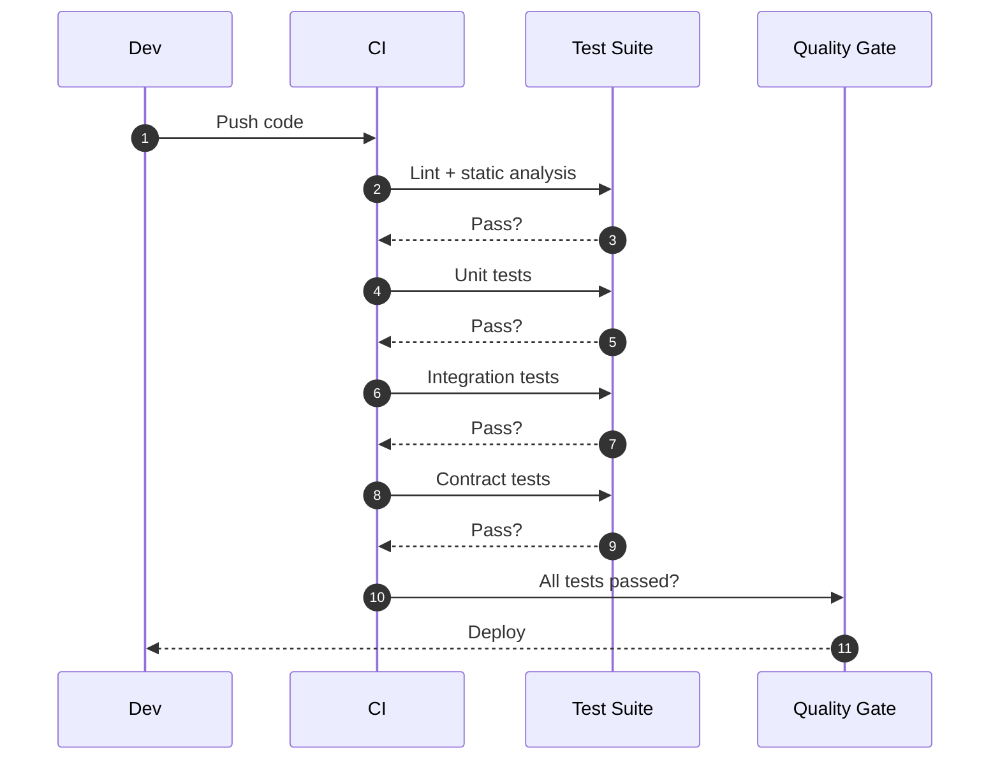

## 10. Performance

### 10.1 Test execution time <a class='askgpt-btn' href='https://chatgpt.com/?prompt=Read%20this%20section%20of%20my%20encyclopedia%20and%20explain%20it%20in%20depth%20with%20concrete%20examples%2C%20the%20main%20trade-offs%2C%20and%20common%20pitfalls%20a%20practitioner%20should%20know%3A%0A%0Ahttps%3A%2F%2Fgithub.com%2Fvishvasg14%2Fsoftware-engineering-encyclopedia%2Fblob%2Fmain%2F14-testing%2Ftesting.md%23101-test-execution-time%0A%0ASection%20title%3A%2010.1%20Test%20execution%20time' target='_blank' rel='noopener' data-askgpt='10.1 Test execution time' data-askgpt-url='https://github.com/vishvasg14/software-engineering-encyclopedia/blob/main/14-testing/testing.md#101-test-execution-time' data-askgpt-prompt-depth='Read%20this%20section%20of%20my%20encyclopedia%20and%20explain%20it%20in%20depth%20with%20concrete%20examples%2C%20the%20main%20trade-offs%2C%20and%20common%20pitfalls%20a%20practitioner%20should%20know%3A%0A%0Ahttps%3A%2F%2Fgithub.com%2Fvishvasg14%2Fsoftware-engineering-encyclopedia%2Fblob%2Fmain%2F14-testing%2Ftesting.md%23101-test-execution-time%0A%0ASection%20title%3A%2010.1%20Test%20execution%20time' data-askgpt-prompt-examples='Read%20this%20section%20of%20my%20encyclopedia%20and%20give%20me%202-3%20real-world%20production%20examples%20for%20it.%20For%20each%3A%20what%20went%20right%2C%20what%20went%20wrong%2C%20and%20the%20lessons%20learned.%20Include%20company%20%2F%20project%20names%20if%20relevant.%0A%0Ahttps%3A%2F%2Fgithub.com%2Fvishvasg14%2Fsoftware-engineering-encyclopedia%2Fblob%2Fmain%2F14-testing%2Ftesting.md%23101-test-execution-time%0A%0ASection%20title%3A%2010.1%20Test%20execution%20time' title='Ask ChatGPT about this section'>💬</a>

- **Unit tests:** milliseconds each.
- **Integration tests:** seconds (Testcontainers startup).
- **E2E tests:** tens of seconds.
- **Full suite (10K unit + 100 integration + 10 E2E):** minutes.

**Optimization:**

- Parallelize (`pytest -n 4`).
- Reuse Testcontainers (`withReuse(true)`).
- Cache dependencies.
- Mock slow services.

### 10.2 Test database performance <a class='askgpt-btn' href='https://chatgpt.com/?prompt=Read%20this%20section%20of%20my%20encyclopedia%20and%20explain%20it%20in%20depth%20with%20concrete%20examples%2C%20the%20main%20trade-offs%2C%20and%20common%20pitfalls%20a%20practitioner%20should%20know%3A%0A%0Ahttps%3A%2F%2Fgithub.com%2Fvishvasg14%2Fsoftware-engineering-encyclopedia%2Fblob%2Fmain%2F14-testing%2Ftesting.md%23102-test-database-performance%0A%0ASection%20title%3A%2010.2%20Test%20database%20performance' target='_blank' rel='noopener' data-askgpt='10.2 Test database performance' data-askgpt-url='https://github.com/vishvasg14/software-engineering-encyclopedia/blob/main/14-testing/testing.md#102-test-database-performance' data-askgpt-prompt-depth='Read%20this%20section%20of%20my%20encyclopedia%20and%20explain%20it%20in%20depth%20with%20concrete%20examples%2C%20the%20main%20trade-offs%2C%20and%20common%20pitfalls%20a%20practitioner%20should%20know%3A%0A%0Ahttps%3A%2F%2Fgithub.com%2Fvishvasg14%2Fsoftware-engineering-encyclopedia%2Fblob%2Fmain%2F14-testing%2Ftesting.md%23102-test-database-performance%0A%0ASection%20title%3A%2010.2%20Test%20database%20performance' data-askgpt-prompt-examples='Read%20this%20section%20of%20my%20encyclopedia%20and%20give%20me%202-3%20real-world%20production%20examples%20for%20it.%20For%20each%3A%20what%20went%20right%2C%20what%20went%20wrong%2C%20and%20the%20lessons%20learned.%20Include%20company%20%2F%20project%20names%20if%20relevant.%0A%0Ahttps%3A%2F%2Fgithub.com%2Fvishvasg14%2Fsoftware-engineering-encyclopedia%2Fblob%2Fmain%2F14-testing%2Ftesting.md%23102-test-database-performance%0A%0ASection%20title%3A%2010.2%20Test%20database%20performance' title='Ask ChatGPT about this section'>💬</a>

- Testcontainers startup: 5-30 seconds.
- Container reuse: saves time.
- Network latency in CI: significant.

### 10.3 Coverage vs. cost <a class='askgpt-btn' href='https://chatgpt.com/?prompt=Read%20this%20section%20of%20my%20encyclopedia%20and%20explain%20it%20in%20depth%20with%20concrete%20examples%2C%20the%20main%20trade-offs%2C%20and%20common%20pitfalls%20a%20practitioner%20should%20know%3A%0A%0Ahttps%3A%2F%2Fgithub.com%2Fvishvasg14%2Fsoftware-engineering-encyclopedia%2Fblob%2Fmain%2F14-testing%2Ftesting.md%23103-coverage-vs-cost%0A%0ASection%20title%3A%2010.3%20Coverage%20vs.%20cost' target='_blank' rel='noopener' data-askgpt='10.3 Coverage vs. cost' data-askgpt-url='https://github.com/vishvasg14/software-engineering-encyclopedia/blob/main/14-testing/testing.md#103-coverage-vs-cost' data-askgpt-prompt-depth='Read%20this%20section%20of%20my%20encyclopedia%20and%20explain%20it%20in%20depth%20with%20concrete%20examples%2C%20the%20main%20trade-offs%2C%20and%20common%20pitfalls%20a%20practitioner%20should%20know%3A%0A%0Ahttps%3A%2F%2Fgithub.com%2Fvishvasg14%2Fsoftware-engineering-encyclopedia%2Fblob%2Fmain%2F14-testing%2Ftesting.md%23103-coverage-vs-cost%0A%0ASection%20title%3A%2010.3%20Coverage%20vs.%20cost' data-askgpt-prompt-examples='Read%20this%20section%20of%20my%20encyclopedia%20and%20give%20me%202-3%20real-world%20production%20examples%20for%20it.%20For%20each%3A%20what%20went%20right%2C%20what%20went%20wrong%2C%20and%20the%20lessons%20learned.%20Include%20company%20%2F%20project%20names%20if%20relevant.%0A%0Ahttps%3A%2F%2Fgithub.com%2Fvishvasg14%2Fsoftware-engineering-encyclopedia%2Fblob%2Fmain%2F14-testing%2Ftesting.md%23103-coverage-vs-cost%0A%0ASection%20title%3A%2010.3%20Coverage%20vs.%20cost' title='Ask ChatGPT about this section'>💬</a>

100% coverage is expensive. Diminishing returns past 80%.

## 11. Security

- Test secrets separately from production.
- Don't commit real credentials.
- Use Testcontainers for isolated test databases.
- **TruffleHog** / **git-secrets** to scan for leaked secrets in test code.
- **Ephemeral test environments** in CI.

## 12. Production Engineering

### 12.1 Test gates in CI <a class='askgpt-btn' href='https://chatgpt.com/?prompt=Read%20this%20section%20of%20my%20encyclopedia%20and%20explain%20it%20in%20depth%20with%20concrete%20examples%2C%20the%20main%20trade-offs%2C%20and%20common%20pitfalls%20a%20practitioner%20should%20know%3A%0A%0Ahttps%3A%2F%2Fgithub.com%2Fvishvasg14%2Fsoftware-engineering-encyclopedia%2Fblob%2Fmain%2F14-testing%2Ftesting.md%23121-test-gates-in-ci%0A%0ASection%20title%3A%2012.1%20Test%20gates%20in%20CI' target='_blank' rel='noopener' data-askgpt='12.1 Test gates in CI' data-askgpt-url='https://github.com/vishvasg14/software-engineering-encyclopedia/blob/main/14-testing/testing.md#121-test-gates-in-ci' data-askgpt-prompt-depth='Read%20this%20section%20of%20my%20encyclopedia%20and%20explain%20it%20in%20depth%20with%20concrete%20examples%2C%20the%20main%20trade-offs%2C%20and%20common%20pitfalls%20a%20practitioner%20should%20know%3A%0A%0Ahttps%3A%2F%2Fgithub.com%2Fvishvasg14%2Fsoftware-engineering-encyclopedia%2Fblob%2Fmain%2F14-testing%2Ftesting.md%23121-test-gates-in-ci%0A%0ASection%20title%3A%2012.1%20Test%20gates%20in%20CI' data-askgpt-prompt-examples='Read%20this%20section%20of%20my%20encyclopedia%20and%20give%20me%202-3%20real-world%20production%20examples%20for%20it.%20For%20each%3A%20what%20went%20right%2C%20what%20went%20wrong%2C%20and%20the%20lessons%20learned.%20Include%20company%20%2F%20project%20names%20if%20relevant.%0A%0Ahttps%3A%2F%2Fgithub.com%2Fvishvasg14%2Fsoftware-engineering-encyclopedia%2Fblob%2Fmain%2F14-testing%2Ftesting.md%23121-test-gates-in-ci%0A%0ASection%20title%3A%2012.1%20Test%20gates%20in%20CI' title='Ask ChatGPT about this section'>💬</a>

```yaml
# Pull request checks
- Lint passes
- Unit tests pass (100% coverage delta)
- Integration tests pass
- Contract tests pass
- Code review approved
- Security scan clean (SAST, SCA)
```

### 12.2 Test data management in production <a class='askgpt-btn' href='https://chatgpt.com/?prompt=Read%20this%20section%20of%20my%20encyclopedia%20and%20explain%20it%20in%20depth%20with%20concrete%20examples%2C%20the%20main%20trade-offs%2C%20and%20common%20pitfalls%20a%20practitioner%20should%20know%3A%0A%0Ahttps%3A%2F%2Fgithub.com%2Fvishvasg14%2Fsoftware-engineering-encyclopedia%2Fblob%2Fmain%2F14-testing%2Ftesting.md%23122-test-data-management-in-production%0A%0ASection%20title%3A%2012.2%20Test%20data%20management%20in%20production' target='_blank' rel='noopener' data-askgpt='12.2 Test data management in production' data-askgpt-url='https://github.com/vishvasg14/software-engineering-encyclopedia/blob/main/14-testing/testing.md#122-test-data-management-in-production' data-askgpt-prompt-depth='Read%20this%20section%20of%20my%20encyclopedia%20and%20explain%20it%20in%20depth%20with%20concrete%20examples%2C%20the%20main%20trade-offs%2C%20and%20common%20pitfalls%20a%20practitioner%20should%20know%3A%0A%0Ahttps%3A%2F%2Fgithub.com%2Fvishvasg14%2Fsoftware-engineering-encyclopedia%2Fblob%2Fmain%2F14-testing%2Ftesting.md%23122-test-data-management-in-production%0A%0ASection%20title%3A%2012.2%20Test%20data%20management%20in%20production' data-askgpt-prompt-examples='Read%20this%20section%20of%20my%20encyclopedia%20and%20give%20me%202-3%20real-world%20production%20examples%20for%20it.%20For%20each%3A%20what%20went%20right%2C%20what%20went%20wrong%2C%20and%20the%20lessons%20learned.%20Include%20company%20%2F%20project%20names%20if%20relevant.%0A%0Ahttps%3A%2F%2Fgithub.com%2Fvishvasg14%2Fsoftware-engineering-encyclopedia%2Fblob%2Fmain%2F14-testing%2Ftesting.md%23122-test-data-management-in-production%0A%0ASection%20title%3A%2012.2%20Test%20data%20management%20in%20production' title='Ask ChatGPT about this section'>💬</a>

- **Production data anonymization** for test.
- **Synthetic data generation** for test.
- **Test data lifecycle** in CI.

### 12.3 Test observability <a class='askgpt-btn' href='https://chatgpt.com/?prompt=Read%20this%20section%20of%20my%20encyclopedia%20and%20explain%20it%20in%20depth%20with%20concrete%20examples%2C%20the%20main%20trade-offs%2C%20and%20common%20pitfalls%20a%20practitioner%20should%20know%3A%0A%0Ahttps%3A%2F%2Fgithub.com%2Fvishvasg14%2Fsoftware-engineering-encyclopedia%2Fblob%2Fmain%2F14-testing%2Ftesting.md%23123-test-observability%0A%0ASection%20title%3A%2012.3%20Test%20observability' target='_blank' rel='noopener' data-askgpt='12.3 Test observability' data-askgpt-url='https://github.com/vishvasg14/software-engineering-encyclopedia/blob/main/14-testing/testing.md#123-test-observability' data-askgpt-prompt-depth='Read%20this%20section%20of%20my%20encyclopedia%20and%20explain%20it%20in%20depth%20with%20concrete%20examples%2C%20the%20main%20trade-offs%2C%20and%20common%20pitfalls%20a%20practitioner%20should%20know%3A%0A%0Ahttps%3A%2F%2Fgithub.com%2Fvishvasg14%2Fsoftware-engineering-encyclopedia%2Fblob%2Fmain%2F14-testing%2Ftesting.md%23123-test-observability%0A%0ASection%20title%3A%2012.3%20Test%20observability' data-askgpt-prompt-examples='Read%20this%20section%20of%20my%20encyclopedia%20and%20give%20me%202-3%20real-world%20production%20examples%20for%20it.%20For%20each%3A%20what%20went%20right%2C%20what%20went%20wrong%2C%20and%20the%20lessons%20learned.%20Include%20company%20%2F%20project%20names%20if%20relevant.%0A%0Ahttps%3A%2F%2Fgithub.com%2Fvishvasg14%2Fsoftware-engineering-encyclopedia%2Fblob%2Fmain%2F14-testing%2Ftesting.md%23123-test-observability%0A%0ASection%20title%3A%2012.3%20Test%20observability' title='Ask ChatGPT about this section'>💬</a>

- **Test results:** pass/fail rate, flakiness.
- **Test duration trends.**
- **Coverage trends.**
- **Failed test reason categorization.**

### 12.4 Test failure rate metric <a class='askgpt-btn' href='https://chatgpt.com/?prompt=Read%20this%20section%20of%20my%20encyclopedia%20and%20explain%20it%20in%20depth%20with%20concrete%20examples%2C%20the%20main%20trade-offs%2C%20and%20common%20pitfalls%20a%20practitioner%20should%20know%3A%0A%0Ahttps%3A%2F%2Fgithub.com%2Fvishvasg14%2Fsoftware-engineering-encyclopedia%2Fblob%2Fmain%2F14-testing%2Ftesting.md%23124-test-failure-rate-metric%0A%0ASection%20title%3A%2012.4%20Test%20failure%20rate%20metric' target='_blank' rel='noopener' data-askgpt='12.4 Test failure rate metric' data-askgpt-url='https://github.com/vishvasg14/software-engineering-encyclopedia/blob/main/14-testing/testing.md#124-test-failure-rate-metric' data-askgpt-prompt-depth='Read%20this%20section%20of%20my%20encyclopedia%20and%20explain%20it%20in%20depth%20with%20concrete%20examples%2C%20the%20main%20trade-offs%2C%20and%20common%20pitfalls%20a%20practitioner%20should%20know%3A%0A%0Ahttps%3A%2F%2Fgithub.com%2Fvishvasg14%2Fsoftware-engineering-encyclopedia%2Fblob%2Fmain%2F14-testing%2Ftesting.md%23124-test-failure-rate-metric%0A%0ASection%20title%3A%2012.4%20Test%20failure%20rate%20metric' data-askgpt-prompt-examples='Read%20this%20section%20of%20my%20encyclopedia%20and%20give%20me%202-3%20real-world%20production%20examples%20for%20it.%20For%20each%3A%20what%20went%20right%2C%20what%20went%20wrong%2C%20and%20the%20lessons%20learned.%20Include%20company%20%2F%20project%20names%20if%20relevant.%0A%0Ahttps%3A%2F%2Fgithub.com%2Fvishvasg14%2Fsoftware-engineering-encyclopedia%2Fblob%2Fmain%2F14-testing%2Ftesting.md%23124-test-failure-rate-metric%0A%0ASection%20title%3A%2012.4%20Test%20failure%20rate%20metric' title='Ask ChatGPT about this section'>💬</a>

If failure rate is high, tests are noise. If too low, you may not be testing what matters.

### 12.5 Test in production <a class='askgpt-btn' href='https://chatgpt.com/?prompt=Read%20this%20section%20of%20my%20encyclopedia%20and%20explain%20it%20in%20depth%20with%20concrete%20examples%2C%20the%20main%20trade-offs%2C%20and%20common%20pitfalls%20a%20practitioner%20should%20know%3A%0A%0Ahttps%3A%2F%2Fgithub.com%2Fvishvasg14%2Fsoftware-engineering-encyclopedia%2Fblob%2Fmain%2F14-testing%2Ftesting.md%23125-test-in-production%0A%0ASection%20title%3A%2012.5%20Test%20in%20production' target='_blank' rel='noopener' data-askgpt='12.5 Test in production' data-askgpt-url='https://github.com/vishvasg14/software-engineering-encyclopedia/blob/main/14-testing/testing.md#125-test-in-production' data-askgpt-prompt-depth='Read%20this%20section%20of%20my%20encyclopedia%20and%20explain%20it%20in%20depth%20with%20concrete%20examples%2C%20the%20main%20trade-offs%2C%20and%20common%20pitfalls%20a%20practitioner%20should%20know%3A%0A%0Ahttps%3A%2F%2Fgithub.com%2Fvishvasg14%2Fsoftware-engineering-encyclopedia%2Fblob%2Fmain%2F14-testing%2Ftesting.md%23125-test-in-production%0A%0ASection%20title%3A%2012.5%20Test%20in%20production' data-askgpt-prompt-examples='Read%20this%20section%20of%20my%20encyclopedia%20and%20give%20me%202-3%20real-world%20production%20examples%20for%20it.%20For%20each%3A%20what%20went%20right%2C%20what%20went%20wrong%2C%20and%20the%20lessons%20learned.%20Include%20company%20%2F%20project%20names%20if%20relevant.%0A%0Ahttps%3A%2F%2Fgithub.com%2Fvishvasg14%2Fsoftware-engineering-encyclopedia%2Fblob%2Fmain%2F14-testing%2Ftesting.md%23125-test-in-production%0A%0ASection%20title%3A%2012.5%20Test%20in%20production' title='Ask ChatGPT about this section'>💬</a>

- **Smoke tests** (post-deploy).
- **Synthetic monitoring** (e.g., Datadog, New Relic synthetics).
- **Contract tests** in prod (canary deployment).
- **Smoke tests** in CI run against prod (read-only).

## 13. Production Case Studies

### 13.1 Google <a class='askgpt-btn' href='https://chatgpt.com/?prompt=Read%20this%20section%20of%20my%20encyclopedia%20and%20explain%20it%20in%20depth%20with%20concrete%20examples%2C%20the%20main%20trade-offs%2C%20and%20common%20pitfalls%20a%20practitioner%20should%20know%3A%0A%0Ahttps%3A%2F%2Fgithub.com%2Fvishvasg14%2Fsoftware-engineering-encyclopedia%2Fblob%2Fmain%2F14-testing%2Ftesting.md%23131-google%0A%0ASection%20title%3A%2013.1%20Google' target='_blank' rel='noopener' data-askgpt='13.1 Google' data-askgpt-url='https://github.com/vishvasg14/software-engineering-encyclopedia/blob/main/14-testing/testing.md#131-google' data-askgpt-prompt-depth='Read%20this%20section%20of%20my%20encyclopedia%20and%20explain%20it%20in%20depth%20with%20concrete%20examples%2C%20the%20main%20trade-offs%2C%20and%20common%20pitfalls%20a%20practitioner%20should%20know%3A%0A%0Ahttps%3A%2F%2Fgithub.com%2Fvishvasg14%2Fsoftware-engineering-encyclopedia%2Fblob%2Fmain%2F14-testing%2Ftesting.md%23131-google%0A%0ASection%20title%3A%2013.1%20Google' data-askgpt-prompt-examples='Read%20this%20section%20of%20my%20encyclopedia%20and%20give%20me%202-3%20real-world%20production%20examples%20for%20it.%20For%20each%3A%20what%20went%20right%2C%20what%20went%20wrong%2C%20and%20the%20lessons%20learned.%20Include%20company%20%2F%20project%20names%20if%20relevant.%0A%0Ahttps%3A%2F%2Fgithub.com%2Fvishvasg14%2Fsoftware-engineering-encyclopedia%2Fblob%2Fmain%2F14-testing%2Ftesting.md%23131-google%0A%0ASection%20title%3A%2013.1%20Google' title='Ask ChatGPT about this section'>💬</a>

Billions of tests daily. Strong CI infrastructure. Monorepo with shared testing infrastructure.

### 13.2 Netflix <a class='askgpt-btn' href='https://chatgpt.com/?prompt=Read%20this%20section%20of%20my%20encyclopedia%20and%20explain%20it%20in%20depth%20with%20concrete%20examples%2C%20the%20main%20trade-offs%2C%20and%20common%20pitfalls%20a%20practitioner%20should%20know%3A%0A%0Ahttps%3A%2F%2Fgithub.com%2Fvishvasg14%2Fsoftware-engineering-encyclopedia%2Fblob%2Fmain%2F14-testing%2Ftesting.md%23132-netflix%0A%0ASection%20title%3A%2013.2%20Netflix' target='_blank' rel='noopener' data-askgpt='13.2 Netflix' data-askgpt-url='https://github.com/vishvasg14/software-engineering-encyclopedia/blob/main/14-testing/testing.md#132-netflix' data-askgpt-prompt-depth='Read%20this%20section%20of%20my%20encyclopedia%20and%20explain%20it%20in%20depth%20with%20concrete%20examples%2C%20the%20main%20trade-offs%2C%20and%20common%20pitfalls%20a%20practitioner%20should%20know%3A%0A%0Ahttps%3A%2F%2Fgithub.com%2Fvishvasg14%2Fsoftware-engineering-encyclopedia%2Fblob%2Fmain%2F14-testing%2Ftesting.md%23132-netflix%0A%0ASection%20title%3A%2013.2%20Netflix' data-askgpt-prompt-examples='Read%20this%20section%20of%20my%20encyclopedia%20and%20give%20me%202-3%20real-world%20production%20examples%20for%20it.%20For%20each%3A%20what%20went%20right%2C%20what%20went%20wrong%2C%20and%20the%20lessons%20learned.%20Include%20company%20%2F%20project%20names%20if%20relevant.%0A%0Ahttps%3A%2F%2Fgithub.com%2Fvishvasg14%2Fsoftware-engineering-encyclopedia%2Fblob%2Fmain%2F14-testing%2Ftesting.md%23132-netflix%0A%0ASection%20title%3A%2013.2%20Netflix' title='Ask ChatGPT about this section'>💬</a>

Created Chaos Monkey. Pioneered chaos engineering. Use Spinnaker for deployment. Strong contract testing between services.

### 13.3 Amazon <a class='askgpt-btn' href='https://chatgpt.com/?prompt=Read%20this%20section%20of%20my%20encyclopedia%20and%20explain%20it%20in%20depth%20with%20concrete%20examples%2C%20the%20main%20trade-offs%2C%20and%20common%20pitfalls%20a%20practitioner%20should%20know%3A%0A%0Ahttps%3A%2F%2Fgithub.com%2Fvishvasg14%2Fsoftware-engineering-encyclopedia%2Fblob%2Fmain%2F14-testing%2Ftesting.md%23133-amazon%0A%0ASection%20title%3A%2013.3%20Amazon' target='_blank' rel='noopener' data-askgpt='13.3 Amazon' data-askgpt-url='https://github.com/vishvasg14/software-engineering-encyclopedia/blob/main/14-testing/testing.md#133-amazon' data-askgpt-prompt-depth='Read%20this%20section%20of%20my%20encyclopedia%20and%20explain%20it%20in%20depth%20with%20concrete%20examples%2C%20the%20main%20trade-offs%2C%20and%20common%20pitfalls%20a%20practitioner%20should%20know%3A%0A%0Ahttps%3A%2F%2Fgithub.com%2Fvishvasg14%2Fsoftware-engineering-encyclopedia%2Fblob%2Fmain%2F14-testing%2Ftesting.md%23133-amazon%0A%0ASection%20title%3A%2013.3%20Amazon' data-askgpt-prompt-examples='Read%20this%20section%20of%20my%20encyclopedia%20and%20give%20me%202-3%20real-world%20production%20examples%20for%20it.%20For%20each%3A%20what%20went%20right%2C%20what%20went%20wrong%2C%20and%20the%20lessons%20learned.%20Include%20company%20%2F%20project%20names%20if%20relevant.%0A%0Ahttps%3A%2F%2Fgithub.com%2Fvishvasg14%2Fsoftware-engineering-encyclopedia%2Fblob%2Fmain%2F14-testing%2Ftesting.md%23133-amazon%0A%0ASection%20title%3A%2013.3%20Amazon' title='Ask ChatGPT about this section'>💬</a>

Service-oriented testing. Use internal tools for load testing. Heavy use of contract testing in SOA architecture.

### 13.4 Spotify <a class='askgpt-btn' href='https://chatgpt.com/?prompt=Read%20this%20section%20of%20my%20encyclopedia%20and%20explain%20it%20in%20depth%20with%20concrete%20examples%2C%20the%20main%20trade-offs%2C%20and%20common%20pitfalls%20a%20practitioner%20should%20know%3A%0A%0Ahttps%3A%2F%2Fgithub.com%2Fvishvasg14%2Fsoftware-engineering-encyclopedia%2Fblob%2Fmain%2F14-testing%2Ftesting.md%23134-spotify%0A%0ASection%20title%3A%2013.4%20Spotify' target='_blank' rel='noopener' data-askgpt='13.4 Spotify' data-askgpt-url='https://github.com/vishvasg14/software-engineering-encyclopedia/blob/main/14-testing/testing.md#134-spotify' data-askgpt-prompt-depth='Read%20this%20section%20of%20my%20encyclopedia%20and%20explain%20it%20in%20depth%20with%20concrete%20examples%2C%20the%20main%20trade-offs%2C%20and%20common%20pitfalls%20a%20practitioner%20should%20know%3A%0A%0Ahttps%3A%2F%2Fgithub.com%2Fvishvasg14%2Fsoftware-engineering-encyclopedia%2Fblob%2Fmain%2F14-testing%2Ftesting.md%23134-spotify%0A%0ASection%20title%3A%2013.4%20Spotify' data-askgpt-prompt-examples='Read%20this%20section%20of%20my%20encyclopedia%20and%20give%20me%202-3%20real-world%20production%20examples%20for%20it.%20For%20each%3A%20what%20went%20right%2C%20what%20went%20wrong%2C%20and%20the%20lessons%20learned.%20Include%20company%20%2F%20project%20names%20if%20relevant.%0A%0Ahttps%3A%2F%2Fgithub.com%2Fvishvasg14%2Fsoftware-engineering-encyclopedia%2Fblob%2Fmain%2F14-testing%2Ftesting.md%23134-spotify%0A%0ASection%20title%3A%2013.4%20Spotify' title='Ask ChatGPT about this section'>💬</a>

Use Pact for contract testing. Heavy use of Testcontainers. Strong engineering culture.

### 13.5 Meta (Facebook) <a class='askgpt-btn' href='https://chatgpt.com/?prompt=Read%20this%20section%20of%20my%20encyclopedia%20and%20explain%20it%20in%20depth%20with%20concrete%20examples%2C%20the%20main%20trade-offs%2C%20and%20common%20pitfalls%20a%20practitioner%20should%20know%3A%0A%0Ahttps%3A%2F%2Fgithub.com%2Fvishvasg14%2Fsoftware-engineering-encyclopedia%2Fblob%2Fmain%2F14-testing%2Ftesting.md%23135-meta-facebook%0A%0ASection%20title%3A%2013.5%20Meta%20(Facebook)' target='_blank' rel='noopener' data-askgpt='13.5 Meta (Facebook)' data-askgpt-url='https://github.com/vishvasg14/software-engineering-encyclopedia/blob/main/14-testing/testing.md#135-meta-facebook' data-askgpt-prompt-depth='Read%20this%20section%20of%20my%20encyclopedia%20and%20explain%20it%20in%20depth%20with%20concrete%20examples%2C%20the%20main%20trade-offs%2C%20and%20common%20pitfalls%20a%20practitioner%20should%20know%3A%0A%0Ahttps%3A%2F%2Fgithub.com%2Fvishvasg14%2Fsoftware-engineering-encyclopedia%2Fblob%2Fmain%2F14-testing%2Ftesting.md%23135-meta-facebook%0A%0ASection%20title%3A%2013.5%20Meta%20(Facebook)' data-askgpt-prompt-examples='Read%20this%20section%20of%20my%20encyclopedia%20and%20give%20me%202-3%20real-world%20production%20examples%20for%20it.%20For%20each%3A%20what%20went%20right%2C%20what%20went%20wrong%2C%20and%20the%20lessons%20learned.%20Include%20company%20%2F%20project%20names%20if%20relevant.%0A%0Ahttps%3A%2F%2Fgithub.com%2Fvishvasg14%2Fsoftware-engineering-encyclopedia%2Fblob%2Fmain%2F14-testing%2Ftesting.md%23135-meta-facebook%0A%0ASection%20title%3A%2013.5%20Meta%20(Facebook)' title='Ask ChatGPT about this section'>💬</a>

Use Jest for JavaScript. Custom test infrastructure. Strong contract testing.

### 13.6 Microsoft <a class='askgpt-btn' href='https://chatgpt.com/?prompt=Read%20this%20section%20of%20my%20encyclopedia%20and%20explain%20it%20in%20depth%20with%20concrete%20examples%2C%20the%20main%20trade-offs%2C%20and%20common%20pitfalls%20a%20practitioner%20should%20know%3A%0A%0Ahttps%3A%2F%2Fgithub.com%2Fvishvasg14%2Fsoftware-engineering-encyclopedia%2Fblob%2Fmain%2F14-testing%2Ftesting.md%23136-microsoft%0A%0ASection%20title%3A%2013.6%20Microsoft' target='_blank' rel='noopener' data-askgpt='13.6 Microsoft' data-askgpt-url='https://github.com/vishvasg14/software-engineering-encyclopedia/blob/main/14-testing/testing.md#136-microsoft' data-askgpt-prompt-depth='Read%20this%20section%20of%20my%20encyclopedia%20and%20explain%20it%20in%20depth%20with%20concrete%20examples%2C%20the%20main%20trade-offs%2C%20and%20common%20pitfalls%20a%20practitioner%20should%20know%3A%0A%0Ahttps%3A%2F%2Fgithub.com%2Fvishvasg14%2Fsoftware-engineering-encyclopedia%2Fblob%2Fmain%2F14-testing%2Ftesting.md%23136-microsoft%0A%0ASection%20title%3A%2013.6%20Microsoft' data-askgpt-prompt-examples='Read%20this%20section%20of%20my%20encyclopedia%20and%20give%20me%202-3%20real-world%20production%20examples%20for%20it.%20For%20each%3A%20what%20went%20right%2C%20what%20went%20wrong%2C%20and%20the%20lessons%20learned.%20Include%20company%20%2F%20project%20names%20if%20relevant.%0A%0Ahttps%3A%2F%2Fgithub.com%2Fvishvasg14%2Fsoftware-engineering-encyclopedia%2Fblob%2Fmain%2F14-testing%2Ftesting.md%23136-microsoft%0A%0ASection%20title%3A%2013.6%20Microsoft' title='Ask ChatGPT about this section'>💬</a>

Open-source JUnit, .NET testing. Use Playwright for E2E.

## 14. Code Examples

### 14.1 Basic: JUnit 5 test <a class='askgpt-btn' href='https://chatgpt.com/?prompt=Read%20this%20section%20of%20my%20encyclopedia%20and%20explain%20it%20in%20depth%20with%20concrete%20examples%2C%20the%20main%20trade-offs%2C%20and%20common%20pitfalls%20a%20practitioner%20should%20know%3A%0A%0Ahttps%3A%2F%2Fgithub.com%2Fvishvasg14%2Fsoftware-engineering-encyclopedia%2Fblob%2Fmain%2F14-testing%2Ftesting.md%23141-basic-junit-5-test%0A%0ASection%20title%3A%2014.1%20Basic%3A%20JUnit%205%20test' target='_blank' rel='noopener' data-askgpt='14.1 Basic: JUnit 5 test' data-askgpt-url='https://github.com/vishvasg14/software-engineering-encyclopedia/blob/main/14-testing/testing.md#141-basic-junit-5-test' data-askgpt-prompt-depth='Read%20this%20section%20of%20my%20encyclopedia%20and%20explain%20it%20in%20depth%20with%20concrete%20examples%2C%20the%20main%20trade-offs%2C%20and%20common%20pitfalls%20a%20practitioner%20should%20know%3A%0A%0Ahttps%3A%2F%2Fgithub.com%2Fvishvasg14%2Fsoftware-engineering-encyclopedia%2Fblob%2Fmain%2F14-testing%2Ftesting.md%23141-basic-junit-5-test%0A%0ASection%20title%3A%2014.1%20Basic%3A%20JUnit%205%20test' data-askgpt-prompt-examples='Read%20this%20section%20of%20my%20encyclopedia%20and%20give%20me%202-3%20real-world%20production%20examples%20for%20it.%20For%20each%3A%20what%20went%20right%2C%20what%20went%20wrong%2C%20and%20the%20lessons%20learned.%20Include%20company%20%2F%20project%20names%20if%20relevant.%0A%0Ahttps%3A%2F%2Fgithub.com%2Fvishvasg14%2Fsoftware-engineering-encyclopedia%2Fblob%2Fmain%2F14-testing%2Ftesting.md%23141-basic-junit-5-test%0A%0ASection%20title%3A%2014.1%20Basic%3A%20JUnit%205%20test' title='Ask ChatGPT about this section'>💬</a>

```java
// see 02-junit-basics/
```

### 14.2 Basic: Test pyramid (TypeScript) <a class='askgpt-btn' href='https://chatgpt.com/?prompt=Read%20this%20section%20of%20my%20encyclopedia%20and%20explain%20it%20in%20depth%20with%20concrete%20examples%2C%20the%20main%20trade-offs%2C%20and%20common%20pitfalls%20a%20practitioner%20should%20know%3A%0A%0Ahttps%3A%2F%2Fgithub.com%2Fvishvasg14%2Fsoftware-engineering-encyclopedia%2Fblob%2Fmain%2F14-testing%2Ftesting.md%23142-basic-test-pyramid-typescript%0A%0ASection%20title%3A%2014.2%20Basic%3A%20Test%20pyramid%20(TypeScript)' target='_blank' rel='noopener' data-askgpt='14.2 Basic: Test pyramid (TypeScript)' data-askgpt-url='https://github.com/vishvasg14/software-engineering-encyclopedia/blob/main/14-testing/testing.md#142-basic-test-pyramid-typescript' data-askgpt-prompt-depth='Read%20this%20section%20of%20my%20encyclopedia%20and%20explain%20it%20in%20depth%20with%20concrete%20examples%2C%20the%20main%20trade-offs%2C%20and%20common%20pitfalls%20a%20practitioner%20should%20know%3A%0A%0Ahttps%3A%2F%2Fgithub.com%2Fvishvasg14%2Fsoftware-engineering-encyclopedia%2Fblob%2Fmain%2F14-testing%2Ftesting.md%23142-basic-test-pyramid-typescript%0A%0ASection%20title%3A%2014.2%20Basic%3A%20Test%20pyramid%20(TypeScript)' data-askgpt-prompt-examples='Read%20this%20section%20of%20my%20encyclopedia%20and%20give%20me%202-3%20real-world%20production%20examples%20for%20it.%20For%20each%3A%20what%20went%20right%2C%20what%20went%20wrong%2C%20and%20the%20lessons%20learned.%20Include%20company%20%2F%20project%20names%20if%20relevant.%0A%0Ahttps%3A%2F%2Fgithub.com%2Fvishvasg14%2Fsoftware-engineering-encyclopedia%2Fblob%2Fmain%2F14-testing%2Ftesting.md%23142-basic-test-pyramid-typescript%0A%0ASection%20title%3A%2014.2%20Basic%3A%20Test%20pyramid%20(TypeScript)' title='Ask ChatGPT about this section'>💬</a>

```typescript
// see 01-test-pyramid/
```

### 14.3 Basic: Mock with Mockito <a class='askgpt-btn' href='https://chatgpt.com/?prompt=Read%20this%20section%20of%20my%20encyclopedia%20and%20explain%20it%20in%20depth%20with%20concrete%20examples%2C%20the%20main%20trade-offs%2C%20and%20common%20pitfalls%20a%20practitioner%20should%20know%3A%0A%0Ahttps%3A%2F%2Fgithub.com%2Fvishvasg14%2Fsoftware-engineering-encyclopedia%2Fblob%2Fmain%2F14-testing%2Ftesting.md%23143-basic-mock-with-mockito%0A%0ASection%20title%3A%2014.3%20Basic%3A%20Mock%20with%20Mockito' target='_blank' rel='noopener' data-askgpt='14.3 Basic: Mock with Mockito' data-askgpt-url='https://github.com/vishvasg14/software-engineering-encyclopedia/blob/main/14-testing/testing.md#143-basic-mock-with-mockito' data-askgpt-prompt-depth='Read%20this%20section%20of%20my%20encyclopedia%20and%20explain%20it%20in%20depth%20with%20concrete%20examples%2C%20the%20main%20trade-offs%2C%20and%20common%20pitfalls%20a%20practitioner%20should%20know%3A%0A%0Ahttps%3A%2F%2Fgithub.com%2Fvishvasg14%2Fsoftware-engineering-encyclopedia%2Fblob%2Fmain%2F14-testing%2Ftesting.md%23143-basic-mock-with-mockito%0A%0ASection%20title%3A%2014.3%20Basic%3A%20Mock%20with%20Mockito' data-askgpt-prompt-examples='Read%20this%20section%20of%20my%20encyclopedia%20and%20give%20me%202-3%20real-world%20production%20examples%20for%20it.%20For%20each%3A%20what%20went%20right%2C%20what%20went%20wrong%2C%20and%20the%20lessons%20learned.%20Include%20company%20%2F%20project%20names%20if%20relevant.%0A%0Ahttps%3A%2F%2Fgithub.com%2Fvishvasg14%2Fsoftware-engineering-encyclopedia%2Fblob%2Fmain%2F14-testing%2Ftesting.md%23143-basic-mock-with-mockito%0A%0ASection%20title%3A%2014.3%20Basic%3A%20Mock%20with%20Mockito' title='Ask ChatGPT about this section'>💬</a>

```java
// see 03-mockito/
```

### 14.4 Basic: Testcontainers <a class='askgpt-btn' href='https://chatgpt.com/?prompt=Read%20this%20section%20of%20my%20encyclopedia%20and%20explain%20it%20in%20depth%20with%20concrete%20examples%2C%20the%20main%20trade-offs%2C%20and%20common%20pitfalls%20a%20practitioner%20should%20know%3A%0A%0Ahttps%3A%2F%2Fgithub.com%2Fvishvasg14%2Fsoftware-engineering-encyclopedia%2Fblob%2Fmain%2F14-testing%2Ftesting.md%23144-basic-testcontainers%0A%0ASection%20title%3A%2014.4%20Basic%3A%20Testcontainers' target='_blank' rel='noopener' data-askgpt='14.4 Basic: Testcontainers' data-askgpt-url='https://github.com/vishvasg14/software-engineering-encyclopedia/blob/main/14-testing/testing.md#144-basic-testcontainers' data-askgpt-prompt-depth='Read%20this%20section%20of%20my%20encyclopedia%20and%20explain%20it%20in%20depth%20with%20concrete%20examples%2C%20the%20main%20trade-offs%2C%20and%20common%20pitfalls%20a%20practitioner%20should%20know%3A%0A%0Ahttps%3A%2F%2Fgithub.com%2Fvishvasg14%2Fsoftware-engineering-encyclopedia%2Fblob%2Fmain%2F14-testing%2Ftesting.md%23144-basic-testcontainers%0A%0ASection%20title%3A%2014.4%20Basic%3A%20Testcontainers' data-askgpt-prompt-examples='Read%20this%20section%20of%20my%20encyclopedia%20and%20give%20me%202-3%20real-world%20production%20examples%20for%20it.%20For%20each%3A%20what%20went%20right%2C%20what%20went%20wrong%2C%20and%20the%20lessons%20learned.%20Include%20company%20%2F%20project%20names%20if%20relevant.%0A%0Ahttps%3A%2F%2Fgithub.com%2Fvishvasg14%2Fsoftware-engineering-encyclopedia%2Fblob%2Fmain%2F14-testing%2Ftesting.md%23144-basic-testcontainers%0A%0ASection%20title%3A%2014.4%20Basic%3A%20Testcontainers' title='Ask ChatGPT about this section'>💬</a>

```java
// see 04-testcontainers/
```

### 14.5 Basic: Pact contract test <a class='askgpt-btn' href='https://chatgpt.com/?prompt=Read%20this%20section%20of%20my%20encyclopedia%20and%20explain%20it%20in%20depth%20with%20concrete%20examples%2C%20the%20main%20trade-offs%2C%20and%20common%20pitfalls%20a%20practitioner%20should%20know%3A%0A%0Ahttps%3A%2F%2Fgithub.com%2Fvishvasg14%2Fsoftware-engineering-encyclopedia%2Fblob%2Fmain%2F14-testing%2Ftesting.md%23145-basic-pact-contract-test%0A%0ASection%20title%3A%2014.5%20Basic%3A%20Pact%20contract%20test' target='_blank' rel='noopener' data-askgpt='14.5 Basic: Pact contract test' data-askgpt-url='https://github.com/vishvasg14/software-engineering-encyclopedia/blob/main/14-testing/testing.md#145-basic-pact-contract-test' data-askgpt-prompt-depth='Read%20this%20section%20of%20my%20encyclopedia%20and%20explain%20it%20in%20depth%20with%20concrete%20examples%2C%20the%20main%20trade-offs%2C%20and%20common%20pitfalls%20a%20practitioner%20should%20know%3A%0A%0Ahttps%3A%2F%2Fgithub.com%2Fvishvasg14%2Fsoftware-engineering-encyclopedia%2Fblob%2Fmain%2F14-testing%2Ftesting.md%23145-basic-pact-contract-test%0A%0ASection%20title%3A%2014.5%20Basic%3A%20Pact%20contract%20test' data-askgpt-prompt-examples='Read%20this%20section%20of%20my%20encyclopedia%20and%20give%20me%202-3%20real-world%20production%20examples%20for%20it.%20For%20each%3A%20what%20went%20right%2C%20what%20went%20wrong%2C%20and%20the%20lessons%20learned.%20Include%20company%20%2F%20project%20names%20if%20relevant.%0A%0Ahttps%3A%2F%2Fgithub.com%2Fvishvasg14%2Fsoftware-engineering-encyclopedia%2Fblob%2Fmain%2F14-testing%2Ftesting.md%23145-basic-pact-contract-test%0A%0ASection%20title%3A%2014.5%20Basic%3A%20Pact%20contract%20test' title='Ask ChatGPT about this section'>💬</a>

```typescript
// see 08-pact-contract/
```

### 14.6 Bad, anti-pattern, refactored, secure, performance-optimized examples <a class='askgpt-btn' href='https://chatgpt.com/?prompt=Read%20this%20section%20of%20my%20encyclopedia%20and%20explain%20it%20in%20depth%20with%20concrete%20examples%2C%20the%20main%20trade-offs%2C%20and%20common%20pitfalls%20a%20practitioner%20should%20know%3A%0A%0Ahttps%3A%2F%2Fgithub.com%2Fvishvasg14%2Fsoftware-engineering-encyclopedia%2Fblob%2Fmain%2F14-testing%2Ftesting.md%23146-bad-anti-pattern-refactored-secure-performance-optimized-examples%0A%0ASection%20title%3A%2014.6%20Bad%2C%20anti-pattern%2C%20refactored%2C%20secure%2C%20performance-optimized%20examples' target='_blank' rel='noopener' data-askgpt='14.6 Bad, anti-pattern, refactored, secure, performance-optimized examples' data-askgpt-url='https://github.com/vishvasg14/software-engineering-encyclopedia/blob/main/14-testing/testing.md#146-bad-anti-pattern-refactored-secure-performance-optimized-examples' data-askgpt-prompt-depth='Read%20this%20section%20of%20my%20encyclopedia%20and%20explain%20it%20in%20depth%20with%20concrete%20examples%2C%20the%20main%20trade-offs%2C%20and%20common%20pitfalls%20a%20practitioner%20should%20know%3A%0A%0Ahttps%3A%2F%2Fgithub.com%2Fvishvasg14%2Fsoftware-engineering-encyclopedia%2Fblob%2Fmain%2F14-testing%2Ftesting.md%23146-bad-anti-pattern-refactored-secure-performance-optimized-examples%0A%0ASection%20title%3A%2014.6%20Bad%2C%20anti-pattern%2C%20refactored%2C%20secure%2C%20performance-optimized%20examples' data-askgpt-prompt-examples='Read%20this%20section%20of%20my%20encyclopedia%20and%20give%20me%202-3%20real-world%20production%20examples%20for%20it.%20For%20each%3A%20what%20went%20right%2C%20what%20went%20wrong%2C%20and%20the%20lessons%20learned.%20Include%20company%20%2F%20project%20names%20if%20relevant.%0A%0Ahttps%3A%2F%2Fgithub.com%2Fvishvasg14%2Fsoftware-engineering-encyclopedia%2Fblob%2Fmain%2F14-testing%2Ftesting.md%23146-bad-anti-pattern-refactored-secure-performance-optimized-examples%0A%0ASection%20title%3A%2014.6%20Bad%2C%20anti-pattern%2C%20refactored%2C%20secure%2C%20performance-optimized%20examples' title='Ask ChatGPT about this section'>💬</a>

**Bad: testing implementation details**

```java
// BAD: testing internal method
@Test
void testInternalCalculation() {
    assertEquals(42, calculator.getInternalResult());
}
```

**Anti-pattern: testing the framework**

```java
// BAD: testing that Mockito works
@Mock private List<String> list;
@Test
void testMockito() {
    when(list.size()).thenReturn(5);
    assertEquals(5, list.size());
}
```

**Refactored: test behavior, not implementation**

```java
// GOOD: test what the method does
@Test
void withdrawFromAccount() {
    Account account = new Account(100);
    account.withdraw(30);
    assertEquals(70, account.getBalance());
}
```

**Secure: no real secrets in tests**

```java
// BAD: hardcoded credentials
const url = "postgresql://user:password123@db:5432/app";

// GOOD: test fixtures with env vars
const url = process.env.TEST_DATABASE_URL!;
```

**Performance-optimized: parallel tests**

```bash
# pytest-xdist: parallel across cores
pytest -n auto
```

## 15. Common Mistakes

### 15.1 Beginner mistakes <a class='askgpt-btn' href='https://chatgpt.com/?prompt=Read%20this%20section%20of%20my%20encyclopedia%20and%20explain%20it%20in%20depth%20with%20concrete%20examples%2C%20the%20main%20trade-offs%2C%20and%20common%20pitfalls%20a%20practitioner%20should%20know%3A%0A%0Ahttps%3A%2F%2Fgithub.com%2Fvishvasg14%2Fsoftware-engineering-encyclopedia%2Fblob%2Fmain%2F14-testing%2Ftesting.md%23151-beginner-mistakes%0A%0ASection%20title%3A%2015.1%20Beginner%20mistakes' target='_blank' rel='noopener' data-askgpt='15.1 Beginner mistakes' data-askgpt-url='https://github.com/vishvasg14/software-engineering-encyclopedia/blob/main/14-testing/testing.md#151-beginner-mistakes' data-askgpt-prompt-depth='Read%20this%20section%20of%20my%20encyclopedia%20and%20explain%20it%20in%20depth%20with%20concrete%20examples%2C%20the%20main%20trade-offs%2C%20and%20common%20pitfalls%20a%20practitioner%20should%20know%3A%0A%0Ahttps%3A%2F%2Fgithub.com%2Fvishvasg14%2Fsoftware-engineering-encyclopedia%2Fblob%2Fmain%2F14-testing%2Ftesting.md%23151-beginner-mistakes%0A%0ASection%20title%3A%2015.1%20Beginner%20mistakes' data-askgpt-prompt-examples='Read%20this%20section%20of%20my%20encyclopedia%20and%20give%20me%202-3%20real-world%20production%20examples%20for%20it.%20For%20each%3A%20what%20went%20right%2C%20what%20went%20wrong%2C%20and%20the%20lessons%20learned.%20Include%20company%20%2F%20project%20names%20if%20relevant.%0A%0Ahttps%3A%2F%2Fgithub.com%2Fvishvasg14%2Fsoftware-engineering-encyclopedia%2Fblob%2Fmain%2F14-testing%2Ftesting.md%23151-beginner-mistakes%0A%0ASection%20title%3A%2015.1%20Beginner%20mistakes' title='Ask ChatGPT about this section'>💬</a>

- **No tests at all.**
- **Test implementation, not behavior.**
- **Mock everything.** (results in brittle tests)
- **No fixtures, copy-paste setup.**
- **Sleeps in tests.** (flaky)

### 15.2 Intermediate mistakes <a class='askgpt-btn' href='https://chatgpt.com/?prompt=Read%20this%20section%20of%20my%20encyclopedia%20and%20explain%20it%20in%20depth%20with%20concrete%20examples%2C%20the%20main%20trade-offs%2C%20and%20common%20pitfalls%20a%20practitioner%20should%20know%3A%0A%0Ahttps%3A%2F%2Fgithub.com%2Fvishvasg14%2Fsoftware-engineering-encyclopedia%2Fblob%2Fmain%2F14-testing%2Ftesting.md%23152-intermediate-mistakes%0A%0ASection%20title%3A%2015.2%20Intermediate%20mistakes' target='_blank' rel='noopener' data-askgpt='15.2 Intermediate mistakes' data-askgpt-url='https://github.com/vishvasg14/software-engineering-encyclopedia/blob/main/14-testing/testing.md#152-intermediate-mistakes' data-askgpt-prompt-depth='Read%20this%20section%20of%20my%20encyclopedia%20and%20explain%20it%20in%20depth%20with%20concrete%20examples%2C%20the%20main%20trade-offs%2C%20and%20common%20pitfalls%20a%20practitioner%20should%20know%3A%0A%0Ahttps%3A%2F%2Fgithub.com%2Fvishvasg14%2Fsoftware-engineering-encyclopedia%2Fblob%2Fmain%2F14-testing%2Ftesting.md%23152-intermediate-mistakes%0A%0ASection%20title%3A%2015.2%20Intermediate%20mistakes' data-askgpt-prompt-examples='Read%20this%20section%20of%20my%20encyclopedia%20and%20give%20me%202-3%20real-world%20production%20examples%20for%20it.%20For%20each%3A%20what%20went%20right%2C%20what%20went%20wrong%2C%20and%20the%20lessons%20learned.%20Include%20company%20%2F%20project%20names%20if%20relevant.%0A%0Ahttps%3A%2F%2Fgithub.com%2Fvishvasg14%2Fsoftware-engineering-encyclopedia%2Fblob%2Fmain%2F14-testing%2Ftesting.md%23152-intermediate-mistakes%0A%0ASection%20title%3A%2015.2%20Intermediate%20mistakes' title='Ask ChatGPT about this section'>💬</a>

- **Ice-cream cone pyramid** (too many E2E, too few unit).
- **Brittle assertions** (exact strings, exact times).
- **Shared state between tests.**
- **Tests that depend on order.**
- **No test data management.**

### 15.3 Senior mistakes <a class='askgpt-btn' href='https://chatgpt.com/?prompt=Read%20this%20section%20of%20my%20encyclopedia%20and%20explain%20it%20in%20depth%20with%20concrete%20examples%2C%20the%20main%20trade-offs%2C%20and%20common%20pitfalls%20a%20practitioner%20should%20know%3A%0A%0Ahttps%3A%2F%2Fgithub.com%2Fvishvasg14%2Fsoftware-engineering-encyclopedia%2Fblob%2Fmain%2F14-testing%2Ftesting.md%23153-senior-mistakes%0A%0ASection%20title%3A%2015.3%20Senior%20mistakes' target='_blank' rel='noopener' data-askgpt='15.3 Senior mistakes' data-askgpt-url='https://github.com/vishvasg14/software-engineering-encyclopedia/blob/main/14-testing/testing.md#153-senior-mistakes' data-askgpt-prompt-depth='Read%20this%20section%20of%20my%20encyclopedia%20and%20explain%20it%20in%20depth%20with%20concrete%20examples%2C%20the%20main%20trade-offs%2C%20and%20common%20pitfalls%20a%20practitioner%20should%20know%3A%0A%0Ahttps%3A%2F%2Fgithub.com%2Fvishvasg14%2Fsoftware-engineering-encyclopedia%2Fblob%2Fmain%2F14-testing%2Ftesting.md%23153-senior-mistakes%0A%0ASection%20title%3A%2015.3%20Senior%20mistakes' data-askgpt-prompt-examples='Read%20this%20section%20of%20my%20encyclopedia%20and%20give%20me%202-3%20real-world%20production%20examples%20for%20it.%20For%20each%3A%20what%20went%20right%2C%20what%20went%20wrong%2C%20and%20the%20lessons%20learned.%20Include%20company%20%2F%20project%20names%20if%20relevant.%0A%0Ahttps%3A%2F%2Fgithub.com%2Fvishvasg14%2Fsoftware-engineering-encyclopedia%2Fblob%2Fmain%2F14-testing%2Ftesting.md%23153-senior-mistakes%0A%0ASection%20title%3A%2015.3%20Senior%20mistakes' title='Ask ChatGPT about this section'>💬</a>

- **Testing implementation details** (lock-step with refactor).
- **Mock-heavy integration tests** (test fakes, not real).
- **No contract tests** for microservices.
- **Coverage as a goal, not a measure.**
- **Flaky tests tolerated.**

### 15.4 Production mistakes <a class='askgpt-btn' href='https://chatgpt.com/?prompt=Read%20this%20section%20of%20my%20encyclopedia%20and%20explain%20it%20in%20depth%20with%20concrete%20examples%2C%20the%20main%20trade-offs%2C%20and%20common%20pitfalls%20a%20practitioner%20should%20know%3A%0A%0Ahttps%3A%2F%2Fgithub.com%2Fvishvasg14%2Fsoftware-engineering-encyclopedia%2Fblob%2Fmain%2F14-testing%2Ftesting.md%23154-production-mistakes%0A%0ASection%20title%3A%2015.4%20Production%20mistakes' target='_blank' rel='noopener' data-askgpt='15.4 Production mistakes' data-askgpt-url='https://github.com/vishvasg14/software-engineering-encyclopedia/blob/main/14-testing/testing.md#154-production-mistakes' data-askgpt-prompt-depth='Read%20this%20section%20of%20my%20encyclopedia%20and%20explain%20it%20in%20depth%20with%20concrete%20examples%2C%20the%20main%20trade-offs%2C%20and%20common%20pitfalls%20a%20practitioner%20should%20know%3A%0A%0Ahttps%3A%2F%2Fgithub.com%2Fvishvasg14%2Fsoftware-engineering-encyclopedia%2Fblob%2Fmain%2F14-testing%2Ftesting.md%23154-production-mistakes%0A%0ASection%20title%3A%2015.4%20Production%20mistakes' data-askgpt-prompt-examples='Read%20this%20section%20of%20my%20encyclopedia%20and%20give%20me%202-3%20real-world%20production%20examples%20for%20it.%20For%20each%3A%20what%20went%20right%2C%20what%20went%20wrong%2C%20and%20the%20lessons%20learned.%20Include%20company%20%2F%20project%20names%20if%20relevant.%0A%0Ahttps%3A%2F%2Fgithub.com%2Fvishvasg14%2Fsoftware-engineering-encyclopedia%2Fblob%2Fmain%2F14-testing%2Ftesting.md%23154-production-mistakes%0A%0ASection%20title%3A%2015.4%20Production%20mistakes' title='Ask ChatGPT about this section'>💬</a>

- **No tests for production fixes.**
- **Skipping tests for "small" changes.**
- **Deleting failing tests instead of fixing them.**
- **No test data management.**
- **Testing only happy path.**

### 15.5 Migration mistakes <a class='askgpt-btn' href='https://chatgpt.com/?prompt=Read%20this%20section%20of%20my%20encyclopedia%20and%20explain%20it%20in%20depth%20with%20concrete%20examples%2C%20the%20main%20trade-offs%2C%20and%20common%20pitfalls%20a%20practitioner%20should%20know%3A%0A%0Ahttps%3A%2F%2Fgithub.com%2Fvishvasg14%2Fsoftware-engineering-encyclopedia%2Fblob%2Fmain%2F14-testing%2Ftesting.md%23155-migration-mistakes%0A%0ASection%20title%3A%2015.5%20Migration%20mistakes' target='_blank' rel='noopener' data-askgpt='15.5 Migration mistakes' data-askgpt-url='https://github.com/vishvasg14/software-engineering-encyclopedia/blob/main/14-testing/testing.md#155-migration-mistakes' data-askgpt-prompt-depth='Read%20this%20section%20of%20my%20encyclopedia%20and%20explain%20it%20in%20depth%20with%20concrete%20examples%2C%20the%20main%20trade-offs%2C%20and%20common%20pitfalls%20a%20practitioner%20should%20know%3A%0A%0Ahttps%3A%2F%2Fgithub.com%2Fvishvasg14%2Fsoftware-engineering-encyclopedia%2Fblob%2Fmain%2F14-testing%2Ftesting.md%23155-migration-mistakes%0A%0ASection%20title%3A%2015.5%20Migration%20mistakes' data-askgpt-prompt-examples='Read%20this%20section%20of%20my%20encyclopedia%20and%20give%20me%202-3%20real-world%20production%20examples%20for%20it.%20For%20each%3A%20what%20went%20right%2C%20what%20went%20wrong%2C%20and%20the%20lessons%20learned.%20Include%20company%20%2F%20project%20names%20if%20relevant.%0A%0Ahttps%3A%2F%2Fgithub.com%2Fvishvasg14%2Fsoftware-engineering-encyclopedia%2Fblob%2Fmain%2F14-testing%2Ftesting.md%23155-migration-mistakes%0A%0ASection%20title%3A%2015.5%20Migration%20mistakes' title='Ask ChatGPT about this section'>💬</a>

- **Big-bang test rewrite** (rewrite everything at once).
- **Adding tests to legacy code without refactoring.**
- **No test standards.**

### 15.6 Configuration mistakes <a class='askgpt-btn' href='https://chatgpt.com/?prompt=Read%20this%20section%20of%20my%20encyclopedia%20and%20explain%20it%20in%20depth%20with%20concrete%20examples%2C%20the%20main%20trade-offs%2C%20and%20common%20pitfalls%20a%20practitioner%20should%20know%3A%0A%0Ahttps%3A%2F%2Fgithub.com%2Fvishvasg14%2Fsoftware-engineering-encyclopedia%2Fblob%2Fmain%2F14-testing%2Ftesting.md%23156-configuration-mistakes%0A%0ASection%20title%3A%2015.6%20Configuration%20mistakes' target='_blank' rel='noopener' data-askgpt='15.6 Configuration mistakes' data-askgpt-url='https://github.com/vishvasg14/software-engineering-encyclopedia/blob/main/14-testing/testing.md#156-configuration-mistakes' data-askgpt-prompt-depth='Read%20this%20section%20of%20my%20encyclopedia%20and%20explain%20it%20in%20depth%20with%20concrete%20examples%2C%20the%20main%20trade-offs%2C%20and%20common%20pitfalls%20a%20practitioner%20should%20know%3A%0A%0Ahttps%3A%2F%2Fgithub.com%2Fvishvasg14%2Fsoftware-engineering-encyclopedia%2Fblob%2Fmain%2F14-testing%2Ftesting.md%23156-configuration-mistakes%0A%0ASection%20title%3A%2015.6%20Configuration%20mistakes' data-askgpt-prompt-examples='Read%20this%20section%20of%20my%20encyclopedia%20and%20give%20me%202-3%20real-world%20production%20examples%20for%20it.%20For%20each%3A%20what%20went%20right%2C%20what%20went%20wrong%2C%20and%20the%20lessons%20learned.%20Include%20company%20%2F%20project%20names%20if%20relevant.%0A%0Ahttps%3A%2F%2Fgithub.com%2Fvishvasg14%2Fsoftware-engineering-encyclopedia%2Fblob%2Fmain%2F14-testing%2Ftesting.md%23156-configuration-mistakes%0A%0ASection%20title%3A%2015.6%20Configuration%20mistakes' title='Ask ChatGPT about this section'>💬</a>

- **Skipping test setup in CI.**
- **Wrong test runner configuration.**
- **No test timeout.**
- **No test result archiving.**

### 15.7 Security mistakes <a class='askgpt-btn' href='https://chatgpt.com/?prompt=Read%20this%20section%20of%20my%20encyclopedia%20and%20explain%20it%20in%20depth%20with%20concrete%20examples%2C%20the%20main%20trade-offs%2C%20and%20common%20pitfalls%20a%20practitioner%20should%20know%3A%0A%0Ahttps%3A%2F%2Fgithub.com%2Fvishvasg14%2Fsoftware-engineering-encyclopedia%2Fblob%2Fmain%2F14-testing%2Ftesting.md%23157-security-mistakes%0A%0ASection%20title%3A%2015.7%20Security%20mistakes' target='_blank' rel='noopener' data-askgpt='15.7 Security mistakes' data-askgpt-url='https://github.com/vishvasg14/software-engineering-encyclopedia/blob/main/14-testing/testing.md#157-security-mistakes' data-askgpt-prompt-depth='Read%20this%20section%20of%20my%20encyclopedia%20and%20explain%20it%20in%20depth%20with%20concrete%20examples%2C%20the%20main%20trade-offs%2C%20and%20common%20pitfalls%20a%20practitioner%20should%20know%3A%0A%0Ahttps%3A%2F%2Fgithub.com%2Fvishvasg14%2Fsoftware-engineering-encyclopedia%2Fblob%2Fmain%2F14-testing%2Ftesting.md%23157-security-mistakes%0A%0ASection%20title%3A%2015.7%20Security%20mistakes' data-askgpt-prompt-examples='Read%20this%20section%20of%20my%20encyclopedia%20and%20give%20me%202-3%20real-world%20production%20examples%20for%20it.%20For%20each%3A%20what%20went%20right%2C%20what%20went%20wrong%2C%20and%20the%20lessons%20learned.%20Include%20company%20%2F%20project%20names%20if%20relevant.%0A%0Ahttps%3A%2F%2Fgithub.com%2Fvishvasg14%2Fsoftware-engineering-encyclopedia%2Fblob%2Fmain%2F14-testing%2Ftesting.md%23157-security-mistakes%0A%0ASection%20title%3A%2015.7%20Security%20mistakes' title='Ask ChatGPT about this section'>💬</a>

- **Real secrets in tests.**
- **Test DBs with real PII.**
- **Public exposure of test endpoints.**
- **Hardcoded credentials.**

### 15.8 Performance mistakes <a class='askgpt-btn' href='https://chatgpt.com/?prompt=Read%20this%20section%20of%20my%20encyclopedia%20and%20explain%20it%20in%20depth%20with%20concrete%20examples%2C%20the%20main%20trade-offs%2C%20and%20common%20pitfalls%20a%20practitioner%20should%20know%3A%0A%0Ahttps%3A%2F%2Fgithub.com%2Fvishvasg14%2Fsoftware-engineering-encyclopedia%2Fblob%2Fmain%2F14-testing%2Ftesting.md%23158-performance-mistakes%0A%0ASection%20title%3A%2015.8%20Performance%20mistakes' target='_blank' rel='noopener' data-askgpt='15.8 Performance mistakes' data-askgpt-url='https://github.com/vishvasg14/software-engineering-encyclopedia/blob/main/14-testing/testing.md#158-performance-mistakes' data-askgpt-prompt-depth='Read%20this%20section%20of%20my%20encyclopedia%20and%20explain%20it%20in%20depth%20with%20concrete%20examples%2C%20the%20main%20trade-offs%2C%20and%20common%20pitfalls%20a%20practitioner%20should%20know%3A%0A%0Ahttps%3A%2F%2Fgithub.com%2Fvishvasg14%2Fsoftware-engineering-encyclopedia%2Fblob%2Fmain%2F14-testing%2Ftesting.md%23158-performance-mistakes%0A%0ASection%20title%3A%2015.8%20Performance%20mistakes' data-askgpt-prompt-examples='Read%20this%20section%20of%20my%20encyclopedia%20and%20give%20me%202-3%20real-world%20production%20examples%20for%20it.%20For%20each%3A%20what%20went%20right%2C%20what%20went%20wrong%2C%20and%20the%20lessons%20learned.%20Include%20company%20%2F%20project%20names%20if%20relevant.%0A%0Ahttps%3A%2F%2Fgithub.com%2Fvishvasg14%2Fsoftware-engineering-encyclopedia%2Fblob%2Fmain%2F14-testing%2Ftesting.md%23158-performance-mistakes%0A%0ASection%20title%3A%2015.8%20Performance%20mistakes' title='Ask ChatGPT about this section'>💬</a>

- **Synchronous external calls in tests.**
- **No parallelization.**
- **Expensive setUp per test.**
- **Database reseeding when not needed.**

### 15.9 Debugging mistakes <a class='askgpt-btn' href='https://chatgpt.com/?prompt=Read%20this%20section%20of%20my%20encyclopedia%20and%20explain%20it%20in%20depth%20with%20concrete%20examples%2C%20the%20main%20trade-offs%2C%20and%20common%20pitfalls%20a%20practitioner%20should%20know%3A%0A%0Ahttps%3A%2F%2Fgithub.com%2Fvishvasg14%2Fsoftware-engineering-encyclopedia%2Fblob%2Fmain%2F14-testing%2Ftesting.md%23159-debugging-mistakes%0A%0ASection%20title%3A%2015.9%20Debugging%20mistakes' target='_blank' rel='noopener' data-askgpt='15.9 Debugging mistakes' data-askgpt-url='https://github.com/vishvasg14/software-engineering-encyclopedia/blob/main/14-testing/testing.md#159-debugging-mistakes' data-askgpt-prompt-depth='Read%20this%20section%20of%20my%20encyclopedia%20and%20explain%20it%20in%20depth%20with%20concrete%20examples%2C%20the%20main%20trade-offs%2C%20and%20common%20pitfalls%20a%20practitioner%20should%20know%3A%0A%0Ahttps%3A%2F%2Fgithub.com%2Fvishvasg14%2Fsoftware-engineering-encyclopedia%2Fblob%2Fmain%2F14-testing%2Ftesting.md%23159-debugging-mistakes%0A%0ASection%20title%3A%2015.9%20Debugging%20mistakes' data-askgpt-prompt-examples='Read%20this%20section%20of%20my%20encyclopedia%20and%20give%20me%202-3%20real-world%20production%20examples%20for%20it.%20For%20each%3A%20what%20went%20right%2C%20what%20went%20wrong%2C%20and%20the%20lessons%20learned.%20Include%20company%20%2F%20project%20names%20if%20relevant.%0A%0Ahttps%3A%2F%2Fgithub.com%2Fvishvasg14%2Fsoftware-engineering-encyclopedia%2Fblob%2Fmain%2F14-testing%2Ftesting.md%23159-debugging-mistakes%0A%0ASection%20title%3A%2015.9%20Debugging%20mistakes' title='Ask ChatGPT about this section'>💬</a>

- **Commenting out failing tests.**
- **`@Ignore` or `.skip()` for long.**
- **No logging in test failures.**

### 15.10 Deployment mistakes <a class='askgpt-btn' href='https://chatgpt.com/?prompt=Read%20this%20section%20of%20my%20encyclopedia%20and%20explain%20it%20in%20depth%20with%20concrete%20examples%2C%20the%20main%20trade-offs%2C%20and%20common%20pitfalls%20a%20practitioner%20should%20know%3A%0A%0Ahttps%3A%2F%2Fgithub.com%2Fvishvasg14%2Fsoftware-engineering-encyclopedia%2Fblob%2Fmain%2F14-testing%2Ftesting.md%231510-deployment-mistakes%0A%0ASection%20title%3A%2015.10%20Deployment%20mistakes' target='_blank' rel='noopener' data-askgpt='15.10 Deployment mistakes' data-askgpt-url='https://github.com/vishvasg14/software-engineering-encyclopedia/blob/main/14-testing/testing.md#1510-deployment-mistakes' data-askgpt-prompt-depth='Read%20this%20section%20of%20my%20encyclopedia%20and%20explain%20it%20in%20depth%20with%20concrete%20examples%2C%20the%20main%20trade-offs%2C%20and%20common%20pitfalls%20a%20practitioner%20should%20know%3A%0A%0Ahttps%3A%2F%2Fgithub.com%2Fvishvasg14%2Fsoftware-engineering-encyclopedia%2Fblob%2Fmain%2F14-testing%2Ftesting.md%231510-deployment-mistakes%0A%0ASection%20title%3A%2015.10%20Deployment%20mistakes' data-askgpt-prompt-examples='Read%20this%20section%20of%20my%20encyclopedia%20and%20give%20me%202-3%20real-world%20production%20examples%20for%20it.%20For%20each%3A%20what%20went%20right%2C%20what%20went%20wrong%2C%20and%20the%20lessons%20learned.%20Include%20company%20%2F%20project%20names%20if%20relevant.%0A%0Ahttps%3A%2F%2Fgithub.com%2Fvishvasg14%2Fsoftware-engineering-encyclopedia%2Fblob%2Fmain%2F14-testing%2Ftesting.md%231510-deployment-mistakes%0A%0ASection%20title%3A%2015.10%20Deployment%20mistakes' title='Ask ChatGPT about this section'>💬</a>

- **No tests in deployment pipeline.**
- **Skipping tests for "small" changes.**
- **No rollback plan.**

## 16. Debugging

### 16.1 Flaky test investigation <a class='askgpt-btn' href='https://chatgpt.com/?prompt=Read%20this%20section%20of%20my%20encyclopedia%20and%20explain%20it%20in%20depth%20with%20concrete%20examples%2C%20the%20main%20trade-offs%2C%20and%20common%20pitfalls%20a%20practitioner%20should%20know%3A%0A%0Ahttps%3A%2F%2Fgithub.com%2Fvishvasg14%2Fsoftware-engineering-encyclopedia%2Fblob%2Fmain%2F14-testing%2Ftesting.md%23161-flaky-test-investigation%0A%0ASection%20title%3A%2016.1%20Flaky%20test%20investigation' target='_blank' rel='noopener' data-askgpt='16.1 Flaky test investigation' data-askgpt-url='https://github.com/vishvasg14/software-engineering-encyclopedia/blob/main/14-testing/testing.md#161-flaky-test-investigation' data-askgpt-prompt-depth='Read%20this%20section%20of%20my%20encyclopedia%20and%20explain%20it%20in%20depth%20with%20concrete%20examples%2C%20the%20main%20trade-offs%2C%20and%20common%20pitfalls%20a%20practitioner%20should%20know%3A%0A%0Ahttps%3A%2F%2Fgithub.com%2Fvishvasg14%2Fsoftware-engineering-encyclopedia%2Fblob%2Fmain%2F14-testing%2Ftesting.md%23161-flaky-test-investigation%0A%0ASection%20title%3A%2016.1%20Flaky%20test%20investigation' data-askgpt-prompt-examples='Read%20this%20section%20of%20my%20encyclopedia%20and%20give%20me%202-3%20real-world%20production%20examples%20for%20it.%20For%20each%3A%20what%20went%20right%2C%20what%20went%20wrong%2C%20and%20the%20lessons%20learned.%20Include%20company%20%2F%20project%20names%20if%20relevant.%0A%0Ahttps%3A%2F%2Fgithub.com%2Fvishvasg14%2Fsoftware-engineering-encyclopedia%2Fblob%2Fmain%2F14-testing%2Ftesting.md%23161-flaky-test-investigation%0A%0ASection%20title%3A%2016.1%20Flaky%20test%20investigation' title='Ask ChatGPT about this section'>💬</a>

1. Check for shared state.
2. Check for time/random dependencies.
3. Check for order dependencies.
4. Reproduce locally.
5. Add logging.
6. Use Testcontainers for known-good environment.

### 16.2 Test isolation debugging <a class='askgpt-btn' href='https://chatgpt.com/?prompt=Read%20this%20section%20of%20my%20encyclopedia%20and%20explain%20it%20in%20depth%20with%20concrete%20examples%2C%20the%20main%20trade-offs%2C%20and%20common%20pitfalls%20a%20practitioner%20should%20know%3A%0A%0Ahttps%3A%2F%2Fgithub.com%2Fvishvasg14%2Fsoftware-engineering-encyclopedia%2Fblob%2Fmain%2F14-testing%2Ftesting.md%23162-test-isolation-debugging%0A%0ASection%20title%3A%2016.2%20Test%20isolation%20debugging' target='_blank' rel='noopener' data-askgpt='16.2 Test isolation debugging' data-askgpt-url='https://github.com/vishvasg14/software-engineering-encyclopedia/blob/main/14-testing/testing.md#162-test-isolation-debugging' data-askgpt-prompt-depth='Read%20this%20section%20of%20my%20encyclopedia%20and%20explain%20it%20in%20depth%20with%20concrete%20examples%2C%20the%20main%20trade-offs%2C%20and%20common%20pitfalls%20a%20practitioner%20should%20know%3A%0A%0Ahttps%3A%2F%2Fgithub.com%2Fvishvasg14%2Fsoftware-engineering-encyclopedia%2Fblob%2Fmain%2F14-testing%2Ftesting.md%23162-test-isolation-debugging%0A%0ASection%20title%3A%2016.2%20Test%20isolation%20debugging' data-askgpt-prompt-examples='Read%20this%20section%20of%20my%20encyclopedia%20and%20give%20me%202-3%20real-world%20production%20examples%20for%20it.%20For%20each%3A%20what%20went%20right%2C%20what%20went%20wrong%2C%20and%20the%20lessons%20learned.%20Include%20company%20%2F%20project%20names%20if%20relevant.%0A%0Ahttps%3A%2F%2Fgithub.com%2Fvishvasg14%2Fsoftware-engineering-encyclopedia%2Fblob%2Fmain%2F14-testing%2Ftesting.md%23162-test-isolation-debugging%0A%0ASection%20title%3A%2016.2%20Test%20isolation%20debugging' title='Ask ChatGPT about this section'>💬</a>

```java
// Use @DirtiesContext
@DirtiesContext
@Test
void modifiesGlobalState() { ... }

// Use @Transactional for rollback
@Transactional
@Test
void modifiesDb() {
    repo.save(...);  // rolled back after test
}
```

### 16.3 Testcontainers debugging <a class='askgpt-btn' href='https://chatgpt.com/?prompt=Read%20this%20section%20of%20my%20encyclopedia%20and%20explain%20it%20in%20depth%20with%20concrete%20examples%2C%20the%20main%20trade-offs%2C%20and%20common%20pitfalls%20a%20practitioner%20should%20know%3A%0A%0Ahttps%3A%2F%2Fgithub.com%2Fvishvasg14%2Fsoftware-engineering-encyclopedia%2Fblob%2Fmain%2F14-testing%2Ftesting.md%23163-testcontainers-debugging%0A%0ASection%20title%3A%2016.3%20Testcontainers%20debugging' target='_blank' rel='noopener' data-askgpt='16.3 Testcontainers debugging' data-askgpt-url='https://github.com/vishvasg14/software-engineering-encyclopedia/blob/main/14-testing/testing.md#163-testcontainers-debugging' data-askgpt-prompt-depth='Read%20this%20section%20of%20my%20encyclopedia%20and%20explain%20it%20in%20depth%20with%20concrete%20examples%2C%20the%20main%20trade-offs%2C%20and%20common%20pitfalls%20a%20practitioner%20should%20know%3A%0A%0Ahttps%3A%2F%2Fgithub.com%2Fvishvasg14%2Fsoftware-engineering-encyclopedia%2Fblob%2Fmain%2F14-testing%2Ftesting.md%23163-testcontainers-debugging%0A%0ASection%20title%3A%2016.3%20Testcontainers%20debugging' data-askgpt-prompt-examples='Read%20this%20section%20of%20my%20encyclopedia%20and%20give%20me%202-3%20real-world%20production%20examples%20for%20it.%20For%20each%3A%20what%20went%20right%2C%20what%20went%20wrong%2C%20and%20the%20lessons%20learned.%20Include%20company%20%2F%20project%20names%20if%20relevant.%0A%0Ahttps%3A%2F%2Fgithub.com%2Fvishvasg14%2Fsoftware-engineering-encyclopedia%2Fblob%2Fmain%2F14-testing%2Ftesting.md%23163-testcontainers-debugging%0A%0ASection%20title%3A%2016.3%20Testcontainers%20debugging' title='Ask ChatGPT about this section'>💬</a>

```java
.withLogConsumer(outputFrame -> log.info(outputFrame.getUtf8String()))
```

Captures container logs to test output.

### 16.4 Production debugging checklist <a class='askgpt-btn' href='https://chatgpt.com/?prompt=Read%20this%20section%20of%20my%20encyclopedia%20and%20explain%20it%20in%20depth%20with%20concrete%20examples%2C%20the%20main%20trade-offs%2C%20and%20common%20pitfalls%20a%20practitioner%20should%20know%3A%0A%0Ahttps%3A%2F%2Fgithub.com%2Fvishvasg14%2Fsoftware-engineering-encyclopedia%2Fblob%2Fmain%2F14-testing%2Ftesting.md%23164-production-debugging-checklist%0A%0ASection%20title%3A%2016.4%20Production%20debugging%20checklist' target='_blank' rel='noopener' data-askgpt='16.4 Production debugging checklist' data-askgpt-url='https://github.com/vishvasg14/software-engineering-encyclopedia/blob/main/14-testing/testing.md#164-production-debugging-checklist' data-askgpt-prompt-depth='Read%20this%20section%20of%20my%20encyclopedia%20and%20explain%20it%20in%20depth%20with%20concrete%20examples%2C%20the%20main%20trade-offs%2C%20and%20common%20pitfalls%20a%20practitioner%20should%20know%3A%0A%0Ahttps%3A%2F%2Fgithub.com%2Fvishvasg14%2Fsoftware-engineering-encyclopedia%2Fblob%2Fmain%2F14-testing%2Ftesting.md%23164-production-debugging-checklist%0A%0ASection%20title%3A%2016.4%20Production%20debugging%20checklist' data-askgpt-prompt-examples='Read%20this%20section%20of%20my%20encyclopedia%20and%20give%20me%202-3%20real-world%20production%20examples%20for%20it.%20For%20each%3A%20what%20went%20right%2C%20what%20went%20wrong%2C%20and%20the%20lessons%20learned.%20Include%20company%20%2F%20project%20names%20if%20relevant.%0A%0Ahttps%3A%2F%2Fgithub.com%2Fvishvasg14%2Fsoftware-engineering-encyclopedia%2Fblob%2Fmain%2F14-testing%2Ftesting.md%23164-production-debugging-checklist%0A%0ASection%20title%3A%2016.4%20Production%20debugging%20checklist' title='Ask ChatGPT about this section'>💬</a>

- [ ] Reproduce in test first.
- [ ] Write failing test.
- [ ] Fix code.
- [ ] Verify test passes.
- [ ] Run full suite.
- [ ] Add regression test.
- [ ] Deploy.

## 17. Monitoring & Observability

### 17.1 Test metrics <a class='askgpt-btn' href='https://chatgpt.com/?prompt=Read%20this%20section%20of%20my%20encyclopedia%20and%20explain%20it%20in%20depth%20with%20concrete%20examples%2C%20the%20main%20trade-offs%2C%20and%20common%20pitfalls%20a%20practitioner%20should%20know%3A%0A%0Ahttps%3A%2F%2Fgithub.com%2Fvishvasg14%2Fsoftware-engineering-encyclopedia%2Fblob%2Fmain%2F14-testing%2Ftesting.md%23171-test-metrics%0A%0ASection%20title%3A%2017.1%20Test%20metrics' target='_blank' rel='noopener' data-askgpt='17.1 Test metrics' data-askgpt-url='https://github.com/vishvasg14/software-engineering-encyclopedia/blob/main/14-testing/testing.md#171-test-metrics' data-askgpt-prompt-depth='Read%20this%20section%20of%20my%20encyclopedia%20and%20explain%20it%20in%20depth%20with%20concrete%20examples%2C%20the%20main%20trade-offs%2C%20and%20common%20pitfalls%20a%20practitioner%20should%20know%3A%0A%0Ahttps%3A%2F%2Fgithub.com%2Fvishvasg14%2Fsoftware-engineering-encyclopedia%2Fblob%2Fmain%2F14-testing%2Ftesting.md%23171-test-metrics%0A%0ASection%20title%3A%2017.1%20Test%20metrics' data-askgpt-prompt-examples='Read%20this%20section%20of%20my%20encyclopedia%20and%20give%20me%202-3%20real-world%20production%20examples%20for%20it.%20For%20each%3A%20what%20went%20right%2C%20what%20went%20wrong%2C%20and%20the%20lessons%20learned.%20Include%20company%20%2F%20project%20names%20if%20relevant.%0A%0Ahttps%3A%2F%2Fgithub.com%2Fvishvasg14%2Fsoftware-engineering-encyclopedia%2Fblob%2Fmain%2F14-testing%2Ftesting.md%23171-test-metrics%0A%0ASection%20title%3A%2017.1%20Test%20metrics' title='Ask ChatGPT about this section'>💬</a>

- **Test pass rate:** % of tests passing.
- **Test duration trends:** identify slow tests.
- **Flaky test rate:** tests that intermittently fail.
- **Coverage trend:** increasing or decreasing.

### 17.2 CI metrics <a class='askgpt-btn' href='https://chatgpt.com/?prompt=Read%20this%20section%20of%20my%20encyclopedia%20and%20explain%20it%20in%20depth%20with%20concrete%20examples%2C%20the%20main%20trade-offs%2C%20and%20common%20pitfalls%20a%20practitioner%20should%20know%3A%0A%0Ahttps%3A%2F%2Fgithub.com%2Fvishvasg14%2Fsoftware-engineering-encyclopedia%2Fblob%2Fmain%2F14-testing%2Ftesting.md%23172-ci-metrics%0A%0ASection%20title%3A%2017.2%20CI%20metrics' target='_blank' rel='noopener' data-askgpt='17.2 CI metrics' data-askgpt-url='https://github.com/vishvasg14/software-engineering-encyclopedia/blob/main/14-testing/testing.md#172-ci-metrics' data-askgpt-prompt-depth='Read%20this%20section%20of%20my%20encyclopedia%20and%20explain%20it%20in%20depth%20with%20concrete%20examples%2C%20the%20main%20trade-offs%2C%20and%20common%20pitfalls%20a%20practitioner%20should%20know%3A%0A%0Ahttps%3A%2F%2Fgithub.com%2Fvishvasg14%2Fsoftware-engineering-encyclopedia%2Fblob%2Fmain%2F14-testing%2Ftesting.md%23172-ci-metrics%0A%0ASection%20title%3A%2017.2%20CI%20metrics' data-askgpt-prompt-examples='Read%20this%20section%20of%20my%20encyclopedia%20and%20give%20me%202-3%20real-world%20production%20examples%20for%20it.%20For%20each%3A%20what%20went%20right%2C%20what%20went%20wrong%2C%20and%20the%20lessons%20learned.%20Include%20company%20%2F%20project%20names%20if%20relevant.%0A%0Ahttps%3A%2F%2Fgithub.com%2Fvishvasg14%2Fsoftware-engineering-encyclopedia%2Fblob%2Fmain%2F14-testing%2Ftesting.md%23172-ci-metrics%0A%0ASection%20title%3A%2017.2%20CI%20metrics' title='Ask ChatGPT about this section'>💬</a>

- **Build duration:** how long CI takes.
- **Build success rate.**
- **Test flakiness rate.**
- **Mean time to detect (MTTD).**

### 17.3 Tools <a class='askgpt-btn' href='https://chatgpt.com/?prompt=Read%20this%20section%20of%20my%20encyclopedia%20and%20explain%20it%20in%20depth%20with%20concrete%20examples%2C%20the%20main%20trade-offs%2C%20and%20common%20pitfalls%20a%20practitioner%20should%20know%3A%0A%0Ahttps%3A%2F%2Fgithub.com%2Fvishvasg14%2Fsoftware-engineering-encyclopedia%2Fblob%2Fmain%2F14-testing%2Ftesting.md%23173-tools%0A%0ASection%20title%3A%2017.3%20Tools' target='_blank' rel='noopener' data-askgpt='17.3 Tools' data-askgpt-url='https://github.com/vishvasg14/software-engineering-encyclopedia/blob/main/14-testing/testing.md#173-tools' data-askgpt-prompt-depth='Read%20this%20section%20of%20my%20encyclopedia%20and%20explain%20it%20in%20depth%20with%20concrete%20examples%2C%20the%20main%20trade-offs%2C%20and%20common%20pitfalls%20a%20practitioner%20should%20know%3A%0A%0Ahttps%3A%2F%2Fgithub.com%2Fvishvasg14%2Fsoftware-engineering-encyclopedia%2Fblob%2Fmain%2F14-testing%2Ftesting.md%23173-tools%0A%0ASection%20title%3A%2017.3%20Tools' data-askgpt-prompt-examples='Read%20this%20section%20of%20my%20encyclopedia%20and%20give%20me%202-3%20real-world%20production%20examples%20for%20it.%20For%20each%3A%20what%20went%20right%2C%20what%20went%20wrong%2C%20and%20the%20lessons%20learned.%20Include%20company%20%2F%20project%20names%20if%20relevant.%0A%0Ahttps%3A%2F%2Fgithub.com%2Fvishvasg14%2Fsoftware-engineering-encyclopedia%2Fblob%2Fmain%2F14-testing%2Ftesting.md%23173-tools%0A%0ASection%20title%3A%2017.3%20Tools' title='Ask ChatGPT about this section'>💬</a>

- **SonarQube:** <https://www.sonarsource.com/products/sonarqube>
- **Codecov:** <https://codecov.io/>
- **Coveralls:** <https://coveralls.io/>
- **CodeCov:** <https://about.codecov.io/>

## 18. Best Practices

### 18.1 Industry best practices <a class='askgpt-btn' href='https://chatgpt.com/?prompt=Read%20this%20section%20of%20my%20encyclopedia%20and%20explain%20it%20in%20depth%20with%20concrete%20examples%2C%20the%20main%20trade-offs%2C%20and%20common%20pitfalls%20a%20practitioner%20should%20know%3A%0A%0Ahttps%3A%2F%2Fgithub.com%2Fvishvasg14%2Fsoftware-engineering-encyclopedia%2Fblob%2Fmain%2F14-testing%2Ftesting.md%23181-industry-best-practices%0A%0ASection%20title%3A%2018.1%20Industry%20best%20practices' target='_blank' rel='noopener' data-askgpt='18.1 Industry best practices' data-askgpt-url='https://github.com/vishvasg14/software-engineering-encyclopedia/blob/main/14-testing/testing.md#181-industry-best-practices' data-askgpt-prompt-depth='Read%20this%20section%20of%20my%20encyclopedia%20and%20explain%20it%20in%20depth%20with%20concrete%20examples%2C%20the%20main%20trade-offs%2C%20and%20common%20pitfalls%20a%20practitioner%20should%20know%3A%0A%0Ahttps%3A%2F%2Fgithub.com%2Fvishvasg14%2Fsoftware-engineering-encyclopedia%2Fblob%2Fmain%2F14-testing%2Ftesting.md%23181-industry-best-practices%0A%0ASection%20title%3A%2018.1%20Industry%20best%20practices' data-askgpt-prompt-examples='Read%20this%20section%20of%20my%20encyclopedia%20and%20give%20me%202-3%20real-world%20production%20examples%20for%20it.%20For%20each%3A%20what%20went%20right%2C%20what%20went%20wrong%2C%20and%20the%20lessons%20learned.%20Include%20company%20%2F%20project%20names%20if%20relevant.%0A%0Ahttps%3A%2F%2Fgithub.com%2Fvishvasg14%2Fsoftware-engineering-encyclopedia%2Fblob%2Fmain%2F14-testing%2Ftesting.md%23181-industry-best-practices%0A%0ASection%20title%3A%2018.1%20Industry%20best%20practices' title='Ask ChatGPT about this section'>💬</a>

- **Test pyramid** (70/20/10).
- **FIRST** principles.
- **One assertion per test** (loosely).
- **Test behavior, not implementation.**
- **Use real dependencies** in integration tests (Testcontainers).
- **Fast tests** (< 100ms each).
- **Independent tests** (no shared state).
- **Run tests in CI** on every commit.
- **Block deployment on test failure.**
- **Use contract tests** for microservices.
- **Use mutation testing** to verify test quality.
- **Practice chaos engineering** in production.

### 18.2 Enterprise practices <a class='askgpt-btn' href='https://chatgpt.com/?prompt=Read%20this%20section%20of%20my%20encyclopedia%20and%20explain%20it%20in%20depth%20with%20concrete%20examples%2C%20the%20main%20trade-offs%2C%20and%20common%20pitfalls%20a%20practitioner%20should%20know%3A%0A%0Ahttps%3A%2F%2Fgithub.com%2Fvishvasg14%2Fsoftware-engineering-encyclopedia%2Fblob%2Fmain%2F14-testing%2Ftesting.md%23182-enterprise-practices%0A%0ASection%20title%3A%2018.2%20Enterprise%20practices' target='_blank' rel='noopener' data-askgpt='18.2 Enterprise practices' data-askgpt-url='https://github.com/vishvasg14/software-engineering-encyclopedia/blob/main/14-testing/testing.md#182-enterprise-practices' data-askgpt-prompt-depth='Read%20this%20section%20of%20my%20encyclopedia%20and%20explain%20it%20in%20depth%20with%20concrete%20examples%2C%20the%20main%20trade-offs%2C%20and%20common%20pitfalls%20a%20practitioner%20should%20know%3A%0A%0Ahttps%3A%2F%2Fgithub.com%2Fvishvasg14%2Fsoftware-engineering-encyclopedia%2Fblob%2Fmain%2F14-testing%2Ftesting.md%23182-enterprise-practices%0A%0ASection%20title%3A%2018.2%20Enterprise%20practices' data-askgpt-prompt-examples='Read%20this%20section%20of%20my%20encyclopedia%20and%20give%20me%202-3%20real-world%20production%20examples%20for%20it.%20For%20each%3A%20what%20went%20right%2C%20what%20went%20wrong%2C%20and%20the%20lessons%20learned.%20Include%20company%20%2F%20project%20names%20if%20relevant.%0A%0Ahttps%3A%2F%2Fgithub.com%2Fvishvasg14%2Fsoftware-engineering-encyclopedia%2Fblob%2Fmain%2F14-testing%2Ftesting.md%23182-enterprise-practices%0A%0ASection%20title%3A%2018.2%20Enterprise%20practices' title='Ask ChatGPT about this section'>💬</a>

- **Test data management** (factories, fixtures).
- **Shared test infrastructure** (Testcontainers, mocks).
- **Test environments** (dev, staging, prod).
- **Test SLAs** (test suite runs in < X minutes).
- **Test observability** (dashboards).

### 18.3 Clean code <a class='askgpt-btn' href='https://chatgpt.com/?prompt=Read%20this%20section%20of%20my%20encyclopedia%20and%20explain%20it%20in%20depth%20with%20concrete%20examples%2C%20the%20main%20trade-offs%2C%20and%20common%20pitfalls%20a%20practitioner%20should%20know%3A%0A%0Ahttps%3A%2F%2Fgithub.com%2Fvishvasg14%2Fsoftware-engineering-encyclopedia%2Fblob%2Fmain%2F14-testing%2Ftesting.md%23183-clean-code%0A%0ASection%20title%3A%2018.3%20Clean%20code' target='_blank' rel='noopener' data-askgpt='18.3 Clean code' data-askgpt-url='https://github.com/vishvasg14/software-engineering-encyclopedia/blob/main/14-testing/testing.md#183-clean-code' data-askgpt-prompt-depth='Read%20this%20section%20of%20my%20encyclopedia%20and%20explain%20it%20in%20depth%20with%20concrete%20examples%2C%20the%20main%20trade-offs%2C%20and%20common%20pitfalls%20a%20practitioner%20should%20know%3A%0A%0Ahttps%3A%2F%2Fgithub.com%2Fvishvasg14%2Fsoftware-engineering-encyclopedia%2Fblob%2Fmain%2F14-testing%2Ftesting.md%23183-clean-code%0A%0ASection%20title%3A%2018.3%20Clean%20code' data-askgpt-prompt-examples='Read%20this%20section%20of%20my%20encyclopedia%20and%20give%20me%202-3%20real-world%20production%20examples%20for%20it.%20For%20each%3A%20what%20went%20right%2C%20what%20went%20wrong%2C%20and%20the%20lessons%20learned.%20Include%20company%20%2F%20project%20names%20if%20relevant.%0A%0Ahttps%3A%2F%2Fgithub.com%2Fvishvasg14%2Fsoftware-engineering-encyclopedia%2Fblob%2Fmain%2F14-testing%2Ftesting.md%23183-clean-code%0A%0ASection%20title%3A%2018.3%20Clean%20code' title='Ask ChatGPT about this section'>💬</a>

- **Test names describe behavior.**
- **AAA structure.**
- **One concept per test.**
- **Helper methods for setup.**
- **Reusable fixtures.**

### 18.4 Reliability <a class='askgpt-btn' href='https://chatgpt.com/?prompt=Read%20this%20section%20of%20my%20encyclopedia%20and%20explain%20it%20in%20depth%20with%20concrete%20examples%2C%20the%20main%20trade-offs%2C%20and%20common%20pitfalls%20a%20practitioner%20should%20know%3A%0A%0Ahttps%3A%2F%2Fgithub.com%2Fvishvasg14%2Fsoftware-engineering-encyclopedia%2Fblob%2Fmain%2F14-testing%2Ftesting.md%23184-reliability%0A%0ASection%20title%3A%2018.4%20Reliability' target='_blank' rel='noopener' data-askgpt='18.4 Reliability' data-askgpt-url='https://github.com/vishvasg14/software-engineering-encyclopedia/blob/main/14-testing/testing.md#184-reliability' data-askgpt-prompt-depth='Read%20this%20section%20of%20my%20encyclopedia%20and%20explain%20it%20in%20depth%20with%20concrete%20examples%2C%20the%20main%20trade-offs%2C%20and%20common%20pitfalls%20a%20practitioner%20should%20know%3A%0A%0Ahttps%3A%2F%2Fgithub.com%2Fvishvasg14%2Fsoftware-engineering-encyclopedia%2Fblob%2Fmain%2F14-testing%2Ftesting.md%23184-reliability%0A%0ASection%20title%3A%2018.4%20Reliability' data-askgpt-prompt-examples='Read%20this%20section%20of%20my%20encyclopedia%20and%20give%20me%202-3%20real-world%20production%20examples%20for%20it.%20For%20each%3A%20what%20went%20right%2C%20what%20went%20wrong%2C%20and%20the%20lessons%20learned.%20Include%20company%20%2F%20project%20names%20if%20relevant.%0A%0Ahttps%3A%2F%2Fgithub.com%2Fvishvasg14%2Fsoftware-engineering-encyclopedia%2Fblob%2Fmain%2F14-testing%2Ftesting.md%23184-reliability%0A%0ASection%20title%3A%2018.4%20Reliability' title='Ask ChatGPT about this section'>💬</a>

- **Tests are deterministic** (no flakiness).
- **Tests are isolated** (no shared state).
- **Tests are fast** (encourages running them).
- **Tests are independent** (any order).

### 18.5 Security <a class='askgpt-btn' href='https://chatgpt.com/?prompt=Read%20this%20section%20of%20my%20encyclopedia%20and%20explain%20it%20in%20depth%20with%20concrete%20examples%2C%20the%20main%20trade-offs%2C%20and%20common%20pitfalls%20a%20practitioner%20should%20know%3A%0A%0Ahttps%3A%2F%2Fgithub.com%2Fvishvasg14%2Fsoftware-engineering-encyclopedia%2Fblob%2Fmain%2F14-testing%2Ftesting.md%23185-security%0A%0ASection%20title%3A%2018.5%20Security' target='_blank' rel='noopener' data-askgpt='18.5 Security' data-askgpt-url='https://github.com/vishvasg14/software-engineering-encyclopedia/blob/main/14-testing/testing.md#185-security' data-askgpt-prompt-depth='Read%20this%20section%20of%20my%20encyclopedia%20and%20explain%20it%20in%20depth%20with%20concrete%20examples%2C%20the%20main%20trade-offs%2C%20and%20common%20pitfalls%20a%20practitioner%20should%20know%3A%0A%0Ahttps%3A%2F%2Fgithub.com%2Fvishvasg14%2Fsoftware-engineering-encyclopedia%2Fblob%2Fmain%2F14-testing%2Ftesting.md%23185-security%0A%0ASection%20title%3A%2018.5%20Security' data-askgpt-prompt-examples='Read%20this%20section%20of%20my%20encyclopedia%20and%20give%20me%202-3%20real-world%20production%20examples%20for%20it.%20For%20each%3A%20what%20went%20right%2C%20what%20went%20wrong%2C%20and%20the%20lessons%20learned.%20Include%20company%20%2F%20project%20names%20if%20relevant.%0A%0Ahttps%3A%2F%2Fgithub.com%2Fvishvasg14%2Fsoftware-engineering-encyclopedia%2Fblob%2Fmain%2F14-testing%2Ftesting.md%23185-security%0A%0ASection%20title%3A%2018.5%20Security' title='Ask ChatGPT about this section'>💬</a>

- **No real secrets in tests.**
- **Test DBs separate from prod.**
- **Network isolation** in test envs.
- **TruffleHog / git-secrets** for scanning.

### 18.6 Performance <a class='askgpt-btn' href='https://chatgpt.com/?prompt=Read%20this%20section%20of%20my%20encyclopedia%20and%20explain%20it%20in%20depth%20with%20concrete%20examples%2C%20the%20main%20trade-offs%2C%20and%20common%20pitfalls%20a%20practitioner%20should%20know%3A%0A%0Ahttps%3A%2F%2Fgithub.com%2Fvishvasg14%2Fsoftware-engineering-encyclopedia%2Fblob%2Fmain%2F14-testing%2Ftesting.md%23186-performance%0A%0ASection%20title%3A%2018.6%20Performance' target='_blank' rel='noopener' data-askgpt='18.6 Performance' data-askgpt-url='https://github.com/vishvasg14/software-engineering-encyclopedia/blob/main/14-testing/testing.md#186-performance' data-askgpt-prompt-depth='Read%20this%20section%20of%20my%20encyclopedia%20and%20explain%20it%20in%20depth%20with%20concrete%20examples%2C%20the%20main%20trade-offs%2C%20and%20common%20pitfalls%20a%20practitioner%20should%20know%3A%0A%0Ahttps%3A%2F%2Fgithub.com%2Fvishvasg14%2Fsoftware-engineering-encyclopedia%2Fblob%2Fmain%2F14-testing%2Ftesting.md%23186-performance%0A%0ASection%20title%3A%2018.6%20Performance' data-askgpt-prompt-examples='Read%20this%20section%20of%20my%20encyclopedia%20and%20give%20me%202-3%20real-world%20production%20examples%20for%20it.%20For%20each%3A%20what%20went%20right%2C%20what%20went%20wrong%2C%20and%20the%20lessons%20learned.%20Include%20company%20%2F%20project%20names%20if%20relevant.%0A%0Ahttps%3A%2F%2Fgithub.com%2Fvishvasg14%2Fsoftware-engineering-encyclopedia%2Fblob%2Fmain%2F14-testing%2Ftesting.md%23186-performance%0A%0ASection%20title%3A%2018.6%20Performance' title='Ask ChatGPT about this section'>💬</a>

- **Parallel tests** (CI cost reduction).
- **Reuse containers** (Testcontainers withReuse).
- **Cache dependencies** (npm cache, Maven cache).
- **Run unit tests first** (fail fast).

### 18.7 Testing <a class='askgpt-btn' href='https://chatgpt.com/?prompt=Read%20this%20section%20of%20my%20encyclopedia%20and%20explain%20it%20in%20depth%20with%20concrete%20examples%2C%20the%20main%20trade-offs%2C%20and%20common%20pitfalls%20a%20practitioner%20should%20know%3A%0A%0Ahttps%3A%2F%2Fgithub.com%2Fvishvasg14%2Fsoftware-engineering-encyclopedia%2Fblob%2Fmain%2F14-testing%2Ftesting.md%23187-testing%0A%0ASection%20title%3A%2018.7%20Testing' target='_blank' rel='noopener' data-askgpt='18.7 Testing' data-askgpt-url='https://github.com/vishvasg14/software-engineering-encyclopedia/blob/main/14-testing/testing.md#187-testing' data-askgpt-prompt-depth='Read%20this%20section%20of%20my%20encyclopedia%20and%20explain%20it%20in%20depth%20with%20concrete%20examples%2C%20the%20main%20trade-offs%2C%20and%20common%20pitfalls%20a%20practitioner%20should%20know%3A%0A%0Ahttps%3A%2F%2Fgithub.com%2Fvishvasg14%2Fsoftware-engineering-encyclopedia%2Fblob%2Fmain%2F14-testing%2Ftesting.md%23187-testing%0A%0ASection%20title%3A%2018.7%20Testing' data-askgpt-prompt-examples='Read%20this%20section%20of%20my%20encyclopedia%20and%20give%20me%202-3%20real-world%20production%20examples%20for%20it.%20For%20each%3A%20what%20went%20right%2C%20what%20went%20wrong%2C%20and%20the%20lessons%20learned.%20Include%20company%20%2F%20project%20names%20if%20relevant.%0A%0Ahttps%3A%2F%2Fgithub.com%2Fvishvasg14%2Fsoftware-engineering-encyclopedia%2Fblob%2Fmain%2F14-testing%2Ftesting.md%23187-testing%0A%0ASection%20title%3A%2018.7%20Testing' title='Ask ChatGPT about this section'>💬</a>

- **Cover the critical paths first.**
- **Test edge cases.**
- **Test error paths.**
- **Test security boundaries.**

### 18.8 Deployment <a class='askgpt-btn' href='https://chatgpt.com/?prompt=Read%20this%20section%20of%20my%20encyclopedia%20and%20explain%20it%20in%20depth%20with%20concrete%20examples%2C%20the%20main%20trade-offs%2C%20and%20common%20pitfalls%20a%20practitioner%20should%20know%3A%0A%0Ahttps%3A%2F%2Fgithub.com%2Fvishvasg14%2Fsoftware-engineering-encyclopedia%2Fblob%2Fmain%2F14-testing%2Ftesting.md%23188-deployment%0A%0ASection%20title%3A%2018.8%20Deployment' target='_blank' rel='noopener' data-askgpt='18.8 Deployment' data-askgpt-url='https://github.com/vishvasg14/software-engineering-encyclopedia/blob/main/14-testing/testing.md#188-deployment' data-askgpt-prompt-depth='Read%20this%20section%20of%20my%20encyclopedia%20and%20explain%20it%20in%20depth%20with%20concrete%20examples%2C%20the%20main%20trade-offs%2C%20and%20common%20pitfalls%20a%20practitioner%20should%20know%3A%0A%0Ahttps%3A%2F%2Fgithub.com%2Fvishvasg14%2Fsoftware-engineering-encyclopedia%2Fblob%2Fmain%2F14-testing%2Ftesting.md%23188-deployment%0A%0ASection%20title%3A%2018.8%20Deployment' data-askgpt-prompt-examples='Read%20this%20section%20of%20my%20encyclopedia%20and%20give%20me%202-3%20real-world%20production%20examples%20for%20it.%20For%20each%3A%20what%20went%20right%2C%20what%20went%20wrong%2C%20and%20the%20lessons%20learned.%20Include%20company%20%2F%20project%20names%20if%20relevant.%0A%0Ahttps%3A%2F%2Fgithub.com%2Fvishvasg14%2Fsoftware-engineering-encyclopedia%2Fblob%2Fmain%2F14-testing%2Ftesting.md%23188-deployment%0A%0ASection%20title%3A%2018.8%20Deployment' title='Ask ChatGPT about this section'>💬</a>

- **Tests are deployment gates.**
- **Canary releases** validated by tests.
- **Rollback plan** in case of test gap.

## 19. Anti-Patterns

### 19.1 Testing implementation details <a class='askgpt-btn' href='https://chatgpt.com/?prompt=Read%20this%20section%20of%20my%20encyclopedia%20and%20explain%20it%20in%20depth%20with%20concrete%20examples%2C%20the%20main%20trade-offs%2C%20and%20common%20pitfalls%20a%20practitioner%20should%20know%3A%0A%0Ahttps%3A%2F%2Fgithub.com%2Fvishvasg14%2Fsoftware-engineering-encyclopedia%2Fblob%2Fmain%2F14-testing%2Ftesting.md%23191-testing-implementation-details%0A%0ASection%20title%3A%2019.1%20Testing%20implementation%20details' target='_blank' rel='noopener' data-askgpt='19.1 Testing implementation details' data-askgpt-url='https://github.com/vishvasg14/software-engineering-encyclopedia/blob/main/14-testing/testing.md#191-testing-implementation-details' data-askgpt-prompt-depth='Read%20this%20section%20of%20my%20encyclopedia%20and%20explain%20it%20in%20depth%20with%20concrete%20examples%2C%20the%20main%20trade-offs%2C%20and%20common%20pitfalls%20a%20practitioner%20should%20know%3A%0A%0Ahttps%3A%2F%2Fgithub.com%2Fvishvasg14%2Fsoftware-engineering-encyclopedia%2Fblob%2Fmain%2F14-testing%2Ftesting.md%23191-testing-implementation-details%0A%0ASection%20title%3A%2019.1%20Testing%20implementation%20details' data-askgpt-prompt-examples='Read%20this%20section%20of%20my%20encyclopedia%20and%20give%20me%202-3%20real-world%20production%20examples%20for%20it.%20For%20each%3A%20what%20went%20right%2C%20what%20went%20wrong%2C%20and%20the%20lessons%20learned.%20Include%20company%20%2F%20project%20names%20if%20relevant.%0A%0Ahttps%3A%2F%2Fgithub.com%2Fvishvasg14%2Fsoftware-engineering-encyclopedia%2Fblob%2Fmain%2F14-testing%2Ftesting.md%23191-testing-implementation-details%0A%0ASection%20title%3A%2019.1%20Testing%20implementation%20details' title='Ask ChatGPT about this section'>💬</a>

```java
// BAD: testing internals
assertEquals("user-service", service.getBeanName());
```

**Fix:** test public behavior.

### 19.2 Ice-cream cone pyramid <a class='askgpt-btn' href='https://chatgpt.com/?prompt=Read%20this%20section%20of%20my%20encyclopedia%20and%20explain%20it%20in%20depth%20with%20concrete%20examples%2C%20the%20main%20trade-offs%2C%20and%20common%20pitfalls%20a%20practitioner%20should%20know%3A%0A%0Ahttps%3A%2F%2Fgithub.com%2Fvishvasg14%2Fsoftware-engineering-encyclopedia%2Fblob%2Fmain%2F14-testing%2Ftesting.md%23192-ice-cream-cone-pyramid%0A%0ASection%20title%3A%2019.2%20Ice-cream%20cone%20pyramid' target='_blank' rel='noopener' data-askgpt='19.2 Ice-cream cone pyramid' data-askgpt-url='https://github.com/vishvasg14/software-engineering-encyclopedia/blob/main/14-testing/testing.md#192-ice-cream-cone-pyramid' data-askgpt-prompt-depth='Read%20this%20section%20of%20my%20encyclopedia%20and%20explain%20it%20in%20depth%20with%20concrete%20examples%2C%20the%20main%20trade-offs%2C%20and%20common%20pitfalls%20a%20practitioner%20should%20know%3A%0A%0Ahttps%3A%2F%2Fgithub.com%2Fvishvasg14%2Fsoftware-engineering-encyclopedia%2Fblob%2Fmain%2F14-testing%2Ftesting.md%23192-ice-cream-cone-pyramid%0A%0ASection%20title%3A%2019.2%20Ice-cream%20cone%20pyramid' data-askgpt-prompt-examples='Read%20this%20section%20of%20my%20encyclopedia%20and%20give%20me%202-3%20real-world%20production%20examples%20for%20it.%20For%20each%3A%20what%20went%20right%2C%20what%20went%20wrong%2C%20and%20the%20lessons%20learned.%20Include%20company%20%2F%20project%20names%20if%20relevant.%0A%0Ahttps%3A%2F%2Fgithub.com%2Fvishvasg14%2Fsoftware-engineering-encyclopedia%2Fblob%2Fmain%2F14-testing%2Ftesting.md%23192-ice-cream-cone-pyramid%0A%0ASection%20title%3A%2019.2%20Ice-cream%20cone%20pyramid' title='Ask ChatGPT about this section'>💬</a>

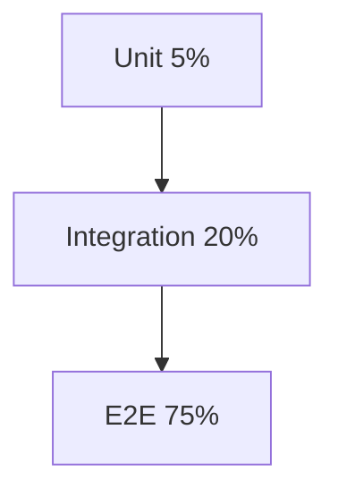

**Fix:** invert to 70/20/10.

### 19.3 Mock-heavy integration tests <a class='askgpt-btn' href='https://chatgpt.com/?prompt=Read%20this%20section%20of%20my%20encyclopedia%20and%20explain%20it%20in%20depth%20with%20concrete%20examples%2C%20the%20main%20trade-offs%2C%20and%20common%20pitfalls%20a%20practitioner%20should%20know%3A%0A%0Ahttps%3A%2F%2Fgithub.com%2Fvishvasg14%2Fsoftware-engineering-encyclopedia%2Fblob%2Fmain%2F14-testing%2Ftesting.md%23193-mock-heavy-integration-tests%0A%0ASection%20title%3A%2019.3%20Mock-heavy%20integration%20tests' target='_blank' rel='noopener' data-askgpt='19.3 Mock-heavy integration tests' data-askgpt-url='https://github.com/vishvasg14/software-engineering-encyclopedia/blob/main/14-testing/testing.md#193-mock-heavy-integration-tests' data-askgpt-prompt-depth='Read%20this%20section%20of%20my%20encyclopedia%20and%20explain%20it%20in%20depth%20with%20concrete%20examples%2C%20the%20main%20trade-offs%2C%20and%20common%20pitfalls%20a%20practitioner%20should%20know%3A%0A%0Ahttps%3A%2F%2Fgithub.com%2Fvishvasg14%2Fsoftware-engineering-encyclopedia%2Fblob%2Fmain%2F14-testing%2Ftesting.md%23193-mock-heavy-integration-tests%0A%0ASection%20title%3A%2019.3%20Mock-heavy%20integration%20tests' data-askgpt-prompt-examples='Read%20this%20section%20of%20my%20encyclopedia%20and%20give%20me%202-3%20real-world%20production%20examples%20for%20it.%20For%20each%3A%20what%20went%20right%2C%20what%20went%20wrong%2C%20and%20the%20lessons%20learned.%20Include%20company%20%2F%20project%20names%20if%20relevant.%0A%0Ahttps%3A%2F%2Fgithub.com%2Fvishvasg14%2Fsoftware-engineering-encyclopedia%2Fblob%2Fmain%2F14-testing%2Ftesting.md%23193-mock-heavy-integration-tests%0A%0ASection%20title%3A%2019.3%20Mock-heavy%20integration%20tests' title='Ask ChatGPT about this section'>💬</a>

```java
// BAD: mocking the database in integration test
@Mock private UserRepository repo;

@Test
void integrationTest() {
    when(repo.findById(1L)).thenReturn(...);
    // not really integration!
}
```

**Fix:** use real DB (Testcontainers).

### 19.4 Flaky tests tolerated <a class='askgpt-btn' href='https://chatgpt.com/?prompt=Read%20this%20section%20of%20my%20encyclopedia%20and%20explain%20it%20in%20depth%20with%20concrete%20examples%2C%20the%20main%20trade-offs%2C%20and%20common%20pitfalls%20a%20practitioner%20should%20know%3A%0A%0Ahttps%3A%2F%2Fgithub.com%2Fvishvasg14%2Fsoftware-engineering-encyclopedia%2Fblob%2Fmain%2F14-testing%2Ftesting.md%23194-flaky-tests-tolerated%0A%0ASection%20title%3A%2019.4%20Flaky%20tests%20tolerated' target='_blank' rel='noopener' data-askgpt='19.4 Flaky tests tolerated' data-askgpt-url='https://github.com/vishvasg14/software-engineering-encyclopedia/blob/main/14-testing/testing.md#194-flaky-tests-tolerated' data-askgpt-prompt-depth='Read%20this%20section%20of%20my%20encyclopedia%20and%20explain%20it%20in%20depth%20with%20concrete%20examples%2C%20the%20main%20trade-offs%2C%20and%20common%20pitfalls%20a%20practitioner%20should%20know%3A%0A%0Ahttps%3A%2F%2Fgithub.com%2Fvishvasg14%2Fsoftware-engineering-encyclopedia%2Fblob%2Fmain%2F14-testing%2Ftesting.md%23194-flaky-tests-tolerated%0A%0ASection%20title%3A%2019.4%20Flaky%20tests%20tolerated' data-askgpt-prompt-examples='Read%20this%20section%20of%20my%20encyclopedia%20and%20give%20me%202-3%20real-world%20production%20examples%20for%20it.%20For%20each%3A%20what%20went%20right%2C%20what%20went%20wrong%2C%20and%20the%20lessons%20learned.%20Include%20company%20%2F%20project%20names%20if%20relevant.%0A%0Ahttps%3A%2F%2Fgithub.com%2Fvishvasg14%2Fsoftware-engineering-encyclopedia%2Fblob%2Fmain%2F14-testing%2Ftesting.md%23194-flaky-tests-tolerated%0A%0ASection%20title%3A%2019.4%20Flaky%20tests%20tolerated' title='Ask ChatGPT about this section'>💬</a>

**Fix:** quarantine flaky tests; fix root cause; don't `skip()` them.

### 19.5 Tests depending on order <a class='askgpt-btn' href='https://chatgpt.com/?prompt=Read%20this%20section%20of%20my%20encyclopedia%20and%20explain%20it%20in%20depth%20with%20concrete%20examples%2C%20the%20main%20trade-offs%2C%20and%20common%20pitfalls%20a%20practitioner%20should%20know%3A%0A%0Ahttps%3A%2F%2Fgithub.com%2Fvishvasg14%2Fsoftware-engineering-encyclopedia%2Fblob%2Fmain%2F14-testing%2Ftesting.md%23195-tests-depending-on-order%0A%0ASection%20title%3A%2019.5%20Tests%20depending%20on%20order' target='_blank' rel='noopener' data-askgpt='19.5 Tests depending on order' data-askgpt-url='https://github.com/vishvasg14/software-engineering-encyclopedia/blob/main/14-testing/testing.md#195-tests-depending-on-order' data-askgpt-prompt-depth='Read%20this%20section%20of%20my%20encyclopedia%20and%20explain%20it%20in%20depth%20with%20concrete%20examples%2C%20the%20main%20trade-offs%2C%20and%20common%20pitfalls%20a%20practitioner%20should%20know%3A%0A%0Ahttps%3A%2F%2Fgithub.com%2Fvishvasg14%2Fsoftware-engineering-encyclopedia%2Fblob%2Fmain%2F14-testing%2Ftesting.md%23195-tests-depending-on-order%0A%0ASection%20title%3A%2019.5%20Tests%20depending%20on%20order' data-askgpt-prompt-examples='Read%20this%20section%20of%20my%20encyclopedia%20and%20give%20me%202-3%20real-world%20production%20examples%20for%20it.%20For%20each%3A%20what%20went%20right%2C%20what%20went%20wrong%2C%20and%20the%20lessons%20learned.%20Include%20company%20%2F%20project%20names%20if%20relevant.%0A%0Ahttps%3A%2F%2Fgithub.com%2Fvishvasg14%2Fsoftware-engineering-encyclopedia%2Fblob%2Fmain%2F14-testing%2Ftesting.md%23195-tests-depending-on-order%0A%0ASection%20title%3A%2019.5%20Tests%20depending%20on%20order' title='Ask ChatGPT about this section'>💬</a>

```java
// BAD
@Test
void testCreateUser() { /* creates user */ }

@Test
void testDeleteUser() { /* expects user from previous test! */ }
```

**Fix:** `@BeforeEach` reset; or use shared fixture.

### 19.6 Slow tests for unit-level code <a class='askgpt-btn' href='https://chatgpt.com/?prompt=Read%20this%20section%20of%20my%20encyclopedia%20and%20explain%20it%20in%20depth%20with%20concrete%20examples%2C%20the%20main%20trade-offs%2C%20and%20common%20pitfalls%20a%20practitioner%20should%20know%3A%0A%0Ahttps%3A%2F%2Fgithub.com%2Fvishvasg14%2Fsoftware-engineering-encyclopedia%2Fblob%2Fmain%2F14-testing%2Ftesting.md%23196-slow-tests-for-unit-level-code%0A%0ASection%20title%3A%2019.6%20Slow%20tests%20for%20unit-level%20code' target='_blank' rel='noopener' data-askgpt='19.6 Slow tests for unit-level code' data-askgpt-url='https://github.com/vishvasg14/software-engineering-encyclopedia/blob/main/14-testing/testing.md#196-slow-tests-for-unit-level-code' data-askgpt-prompt-depth='Read%20this%20section%20of%20my%20encyclopedia%20and%20explain%20it%20in%20depth%20with%20concrete%20examples%2C%20the%20main%20trade-offs%2C%20and%20common%20pitfalls%20a%20practitioner%20should%20know%3A%0A%0Ahttps%3A%2F%2Fgithub.com%2Fvishvasg14%2Fsoftware-engineering-encyclopedia%2Fblob%2Fmain%2F14-testing%2Ftesting.md%23196-slow-tests-for-unit-level-code%0A%0ASection%20title%3A%2019.6%20Slow%20tests%20for%20unit-level%20code' data-askgpt-prompt-examples='Read%20this%20section%20of%20my%20encyclopedia%20and%20give%20me%202-3%20real-world%20production%20examples%20for%20it.%20For%20each%3A%20what%20went%20right%2C%20what%20went%20wrong%2C%20and%20the%20lessons%20learned.%20Include%20company%20%2F%20project%20names%20if%20relevant.%0A%0Ahttps%3A%2F%2Fgithub.com%2Fvishvasg14%2Fsoftware-engineering-encyclopedia%2Fblob%2Fmain%2F14-testing%2Ftesting.md%23196-slow-tests-for-unit-level-code%0A%0ASection%20title%3A%2019.6%20Slow%20tests%20for%20unit-level%20code' title='Ask ChatGPT about this section'>💬</a>

```java
// BAD: sleeping for 1 second in a unit test
@Test
void testFoo() {
    doSomething();
    Thread.sleep(1000);  // wait for async
    assertTrue(...);
}
```

**Fix:** use mocks for async; use Awaitility for legit async.

### 19.7 Ignoring test failures <a class='askgpt-btn' href='https://chatgpt.com/?prompt=Read%20this%20section%20of%20my%20encyclopedia%20and%20explain%20it%20in%20depth%20with%20concrete%20examples%2C%20the%20main%20trade-offs%2C%20and%20common%20pitfalls%20a%20practitioner%20should%20know%3A%0A%0Ahttps%3A%2F%2Fgithub.com%2Fvishvasg14%2Fsoftware-engineering-encyclopedia%2Fblob%2Fmain%2F14-testing%2Ftesting.md%23197-ignoring-test-failures%0A%0ASection%20title%3A%2019.7%20Ignoring%20test%20failures' target='_blank' rel='noopener' data-askgpt='19.7 Ignoring test failures' data-askgpt-url='https://github.com/vishvasg14/software-engineering-encyclopedia/blob/main/14-testing/testing.md#197-ignoring-test-failures' data-askgpt-prompt-depth='Read%20this%20section%20of%20my%20encyclopedia%20and%20explain%20it%20in%20depth%20with%20concrete%20examples%2C%20the%20main%20trade-offs%2C%20and%20common%20pitfalls%20a%20practitioner%20should%20know%3A%0A%0Ahttps%3A%2F%2Fgithub.com%2Fvishvasg14%2Fsoftware-engineering-encyclopedia%2Fblob%2Fmain%2F14-testing%2Ftesting.md%23197-ignoring-test-failures%0A%0ASection%20title%3A%2019.7%20Ignoring%20test%20failures' data-askgpt-prompt-examples='Read%20this%20section%20of%20my%20encyclopedia%20and%20give%20me%202-3%20real-world%20production%20examples%20for%20it.%20For%20each%3A%20what%20went%20right%2C%20what%20went%20wrong%2C%20and%20the%20lessons%20learned.%20Include%20company%20%2F%20project%20names%20if%20relevant.%0A%0Ahttps%3A%2F%2Fgithub.com%2Fvishvasg14%2Fsoftware-engineering-encyclopedia%2Fblob%2Fmain%2F14-testing%2Ftesting.md%23197-ignoring-test-failures%0A%0ASection%20title%3A%2019.7%20Ignoring%20test%20failures' title='Ask ChatGPT about this section'>💬</a>

- "Just this once" → technical debt.
- Skipping in CI → production bug.
- Deleting tests → false confidence.

## 20. Edge Cases

### 20.1 Time <a class='askgpt-btn' href='https://chatgpt.com/?prompt=Read%20this%20section%20of%20my%20encyclopedia%20and%20explain%20it%20in%20depth%20with%20concrete%20examples%2C%20the%20main%20trade-offs%2C%20and%20common%20pitfalls%20a%20practitioner%20should%20know%3A%0A%0Ahttps%3A%2F%2Fgithub.com%2Fvishvasg14%2Fsoftware-engineering-encyclopedia%2Fblob%2Fmain%2F14-testing%2Ftesting.md%23201-time%0A%0ASection%20title%3A%2020.1%20Time' target='_blank' rel='noopener' data-askgpt='20.1 Time' data-askgpt-url='https://github.com/vishvasg14/software-engineering-encyclopedia/blob/main/14-testing/testing.md#201-time' data-askgpt-prompt-depth='Read%20this%20section%20of%20my%20encyclopedia%20and%20explain%20it%20in%20depth%20with%20concrete%20examples%2C%20the%20main%20trade-offs%2C%20and%20common%20pitfalls%20a%20practitioner%20should%20know%3A%0A%0Ahttps%3A%2F%2Fgithub.com%2Fvishvasg14%2Fsoftware-engineering-encyclopedia%2Fblob%2Fmain%2F14-testing%2Ftesting.md%23201-time%0A%0ASection%20title%3A%2020.1%20Time' data-askgpt-prompt-examples='Read%20this%20section%20of%20my%20encyclopedia%20and%20give%20me%202-3%20real-world%20production%20examples%20for%20it.%20For%20each%3A%20what%20went%20right%2C%20what%20went%20wrong%2C%20and%20the%20lessons%20learned.%20Include%20company%20%2F%20project%20names%20if%20relevant.%0A%0Ahttps%3A%2F%2Fgithub.com%2Fvishvasg14%2Fsoftware-engineering-encyclopedia%2Fblob%2Fmain%2F14-testing%2Ftesting.md%23201-time%0A%0ASection%20title%3A%2020.1%20Time' title='Ask ChatGPT about this section'>💬</a>

```java
// BAD: depends on current time
@Test
void testCreationTime() {
    User user = service.createUser("alice");
    assertEquals(new Date(), user.getCreatedAt());  // flaky!
}

// GOOD: use TimeMock or relative time
```

### 20.2 Randomness <a class='askgpt-btn' href='https://chatgpt.com/?prompt=Read%20this%20section%20of%20my%20encyclopedia%20and%20explain%20it%20in%20depth%20with%20concrete%20examples%2C%20the%20main%20trade-offs%2C%20and%20common%20pitfalls%20a%20practitioner%20should%20know%3A%0A%0Ahttps%3A%2F%2Fgithub.com%2Fvishvasg14%2Fsoftware-engineering-encyclopedia%2Fblob%2Fmain%2F14-testing%2Ftesting.md%23202-randomness%0A%0ASection%20title%3A%2020.2%20Randomness' target='_blank' rel='noopener' data-askgpt='20.2 Randomness' data-askgpt-url='https://github.com/vishvasg14/software-engineering-encyclopedia/blob/main/14-testing/testing.md#202-randomness' data-askgpt-prompt-depth='Read%20this%20section%20of%20my%20encyclopedia%20and%20explain%20it%20in%20depth%20with%20concrete%20examples%2C%20the%20main%20trade-offs%2C%20and%20common%20pitfalls%20a%20practitioner%20should%20know%3A%0A%0Ahttps%3A%2F%2Fgithub.com%2Fvishvasg14%2Fsoftware-engineering-encyclopedia%2Fblob%2Fmain%2F14-testing%2Ftesting.md%23202-randomness%0A%0ASection%20title%3A%2020.2%20Randomness' data-askgpt-prompt-examples='Read%20this%20section%20of%20my%20encyclopedia%20and%20give%20me%202-3%20real-world%20production%20examples%20for%20it.%20For%20each%3A%20what%20went%20right%2C%20what%20went%20wrong%2C%20and%20the%20lessons%20learned.%20Include%20company%20%2F%20project%20names%20if%20relevant.%0A%0Ahttps%3A%2F%2Fgithub.com%2Fvishvasg14%2Fsoftware-engineering-encyclopedia%2Fblob%2Fmain%2F14-testing%2Ftesting.md%23202-randomness%0A%0ASection%20title%3A%2020.2%20Randomness' title='Ask ChatGPT about this section'>💬</a>

```java
// BAD
String id = UUID.randomUUID().toString();  // random!

// GOOD: use fixed random in tests
```

### 20.3 Concurrency <a class='askgpt-btn' href='https://chatgpt.com/?prompt=Read%20this%20section%20of%20my%20encyclopedia%20and%20explain%20it%20in%20depth%20with%20concrete%20examples%2C%20the%20main%20trade-offs%2C%20and%20common%20pitfalls%20a%20practitioner%20should%20know%3A%0A%0Ahttps%3A%2F%2Fgithub.com%2Fvishvasg14%2Fsoftware-engineering-encyclopedia%2Fblob%2Fmain%2F14-testing%2Ftesting.md%23203-concurrency%0A%0ASection%20title%3A%2020.3%20Concurrency' target='_blank' rel='noopener' data-askgpt='20.3 Concurrency' data-askgpt-url='https://github.com/vishvasg14/software-engineering-encyclopedia/blob/main/14-testing/testing.md#203-concurrency' data-askgpt-prompt-depth='Read%20this%20section%20of%20my%20encyclopedia%20and%20explain%20it%20in%20depth%20with%20concrete%20examples%2C%20the%20main%20trade-offs%2C%20and%20common%20pitfalls%20a%20practitioner%20should%20know%3A%0A%0Ahttps%3A%2F%2Fgithub.com%2Fvishvasg14%2Fsoftware-engineering-encyclopedia%2Fblob%2Fmain%2F14-testing%2Ftesting.md%23203-concurrency%0A%0ASection%20title%3A%2020.3%20Concurrency' data-askgpt-prompt-examples='Read%20this%20section%20of%20my%20encyclopedia%20and%20give%20me%202-3%20real-world%20production%20examples%20for%20it.%20For%20each%3A%20what%20went%20right%2C%20what%20went%20wrong%2C%20and%20the%20lessons%20learned.%20Include%20company%20%2F%20project%20names%20if%20relevant.%0A%0Ahttps%3A%2F%2Fgithub.com%2Fvishvasg14%2Fsoftware-engineering-encyclopedia%2Fblob%2Fmain%2F14-testing%2Ftesting.md%23203-concurrency%0A%0ASection%20title%3A%2020.3%20Concurrency' title='Ask ChatGPT about this section'>💬</a>

```java
// Test with real threads; verify invariants; use jcstress
```

### 20.4 Time zones <a class='askgpt-btn' href='https://chatgpt.com/?prompt=Read%20this%20section%20of%20my%20encyclopedia%20and%20explain%20it%20in%20depth%20with%20concrete%20examples%2C%20the%20main%20trade-offs%2C%20and%20common%20pitfalls%20a%20practitioner%20should%20know%3A%0A%0Ahttps%3A%2F%2Fgithub.com%2Fvishvasg14%2Fsoftware-engineering-encyclopedia%2Fblob%2Fmain%2F14-testing%2Ftesting.md%23204-time-zones%0A%0ASection%20title%3A%2020.4%20Time%20zones' target='_blank' rel='noopener' data-askgpt='20.4 Time zones' data-askgpt-url='https://github.com/vishvasg14/software-engineering-encyclopedia/blob/main/14-testing/testing.md#204-time-zones' data-askgpt-prompt-depth='Read%20this%20section%20of%20my%20encyclopedia%20and%20explain%20it%20in%20depth%20with%20concrete%20examples%2C%20the%20main%20trade-offs%2C%20and%20common%20pitfalls%20a%20practitioner%20should%20know%3A%0A%0Ahttps%3A%2F%2Fgithub.com%2Fvishvasg14%2Fsoftware-engineering-encyclopedia%2Fblob%2Fmain%2F14-testing%2Ftesting.md%23204-time-zones%0A%0ASection%20title%3A%2020.4%20Time%20zones' data-askgpt-prompt-examples='Read%20this%20section%20of%20my%20encyclopedia%20and%20give%20me%202-3%20real-world%20production%20examples%20for%20it.%20For%20each%3A%20what%20went%20right%2C%20what%20went%20wrong%2C%20and%20the%20lessons%20learned.%20Include%20company%20%2F%20project%20names%20if%20relevant.%0A%0Ahttps%3A%2F%2Fgithub.com%2Fvishvasg14%2Fsoftware-engineering-encyclopedia%2Fblob%2Fmain%2F14-testing%2Ftesting.md%23204-time-zones%0A%0ASection%20title%3A%2020.4%20Time%20zones' title='Ask ChatGPT about this section'>💬</a>

```java
// Always use UTC or fixed offset; test with multiple zones
```

### 20.5 Locale <a class='askgpt-btn' href='https://chatgpt.com/?prompt=Read%20this%20section%20of%20my%20encyclopedia%20and%20explain%20it%20in%20depth%20with%20concrete%20examples%2C%20the%20main%20trade-offs%2C%20and%20common%20pitfalls%20a%20practitioner%20should%20know%3A%0A%0Ahttps%3A%2F%2Fgithub.com%2Fvishvasg14%2Fsoftware-engineering-encyclopedia%2Fblob%2Fmain%2F14-testing%2Ftesting.md%23205-locale%0A%0ASection%20title%3A%2020.5%20Locale' target='_blank' rel='noopener' data-askgpt='20.5 Locale' data-askgpt-url='https://github.com/vishvasg14/software-engineering-encyclopedia/blob/main/14-testing/testing.md#205-locale' data-askgpt-prompt-depth='Read%20this%20section%20of%20my%20encyclopedia%20and%20explain%20it%20in%20depth%20with%20concrete%20examples%2C%20the%20main%20trade-offs%2C%20and%20common%20pitfalls%20a%20practitioner%20should%20know%3A%0A%0Ahttps%3A%2F%2Fgithub.com%2Fvishvasg14%2Fsoftware-engineering-encyclopedia%2Fblob%2Fmain%2F14-testing%2Ftesting.md%23205-locale%0A%0ASection%20title%3A%2020.5%20Locale' data-askgpt-prompt-examples='Read%20this%20section%20of%20my%20encyclopedia%20and%20give%20me%202-3%20real-world%20production%20examples%20for%20it.%20For%20each%3A%20what%20went%20right%2C%20what%20went%20wrong%2C%20and%20the%20lessons%20learned.%20Include%20company%20%2F%20project%20names%20if%20relevant.%0A%0Ahttps%3A%2F%2Fgithub.com%2Fvishvasg14%2Fsoftware-engineering-encyclopedia%2Fblob%2Fmain%2F14-testing%2Ftesting.md%23205-locale%0A%0ASection%20title%3A%2020.5%20Locale' title='Ask ChatGPT about this section'>💬</a>

```java
// Use `Locale.US` etc. in tests; verify internationalization
```

### 20.6 File system <a class='askgpt-btn' href='https://chatgpt.com/?prompt=Read%20this%20section%20of%20my%20encyclopedia%20and%20explain%20it%20in%20depth%20with%20concrete%20examples%2C%20the%20main%20trade-offs%2C%20and%20common%20pitfalls%20a%20practitioner%20should%20know%3A%0A%0Ahttps%3A%2F%2Fgithub.com%2Fvishvasg14%2Fsoftware-engineering-encyclopedia%2Fblob%2Fmain%2F14-testing%2Ftesting.md%23206-file-system%0A%0ASection%20title%3A%2020.6%20File%20system' target='_blank' rel='noopener' data-askgpt='20.6 File system' data-askgpt-url='https://github.com/vishvasg14/software-engineering-encyclopedia/blob/main/14-testing/testing.md#206-file-system' data-askgpt-prompt-depth='Read%20this%20section%20of%20my%20encyclopedia%20and%20explain%20it%20in%20depth%20with%20concrete%20examples%2C%20the%20main%20trade-offs%2C%20and%20common%20pitfalls%20a%20practitioner%20should%20know%3A%0A%0Ahttps%3A%2F%2Fgithub.com%2Fvishvasg14%2Fsoftware-engineering-encyclopedia%2Fblob%2Fmain%2F14-testing%2Ftesting.md%23206-file-system%0A%0ASection%20title%3A%2020.6%20File%20system' data-askgpt-prompt-examples='Read%20this%20section%20of%20my%20encyclopedia%20and%20give%20me%202-3%20real-world%20production%20examples%20for%20it.%20For%20each%3A%20what%20went%20right%2C%20what%20went%20wrong%2C%20and%20the%20lessons%20learned.%20Include%20company%20%2F%20project%20names%20if%20relevant.%0A%0Ahttps%3A%2F%2Fgithub.com%2Fvishvasg14%2Fsoftware-engineering-encyclopedia%2Fblob%2Fmain%2F14-testing%2Ftesting.md%23206-file-system%0A%0ASection%20title%3A%2020.6%20File%20system' title='Ask ChatGPT about this section'>💬</a>

```java
// Use @TempDir; don't depend on cwd
```

### 20.7 Network <a class='askgpt-btn' href='https://chatgpt.com/?prompt=Read%20this%20section%20of%20my%20encyclopedia%20and%20explain%20it%20in%20depth%20with%20concrete%20examples%2C%20the%20main%20trade-offs%2C%20and%20common%20pitfalls%20a%20practitioner%20should%20know%3A%0A%0Ahttps%3A%2F%2Fgithub.com%2Fvishvasg14%2Fsoftware-engineering-encyclopedia%2Fblob%2Fmain%2F14-testing%2Ftesting.md%23207-network%0A%0ASection%20title%3A%2020.7%20Network' target='_blank' rel='noopener' data-askgpt='20.7 Network' data-askgpt-url='https://github.com/vishvasg14/software-engineering-encyclopedia/blob/main/14-testing/testing.md#207-network' data-askgpt-prompt-depth='Read%20this%20section%20of%20my%20encyclopedia%20and%20explain%20it%20in%20depth%20with%20concrete%20examples%2C%20the%20main%20trade-offs%2C%20and%20common%20pitfalls%20a%20practitioner%20should%20know%3A%0A%0Ahttps%3A%2F%2Fgithub.com%2Fvishvasg14%2Fsoftware-engineering-encyclopedia%2Fblob%2Fmain%2F14-testing%2Ftesting.md%23207-network%0A%0ASection%20title%3A%2020.7%20Network' data-askgpt-prompt-examples='Read%20this%20section%20of%20my%20encyclopedia%20and%20give%20me%202-3%20real-world%20production%20examples%20for%20it.%20For%20each%3A%20what%20went%20right%2C%20what%20went%20wrong%2C%20and%20the%20lessons%20learned.%20Include%20company%20%2F%20project%20names%20if%20relevant.%0A%0Ahttps%3A%2F%2Fgithub.com%2Fvishvasg14%2Fsoftware-engineering-encyclopedia%2Fblob%2Fmain%2F14-testing%2Ftesting.md%23207-network%0A%0ASection%20title%3A%2020.7%20Network' title='Ask ChatGPT about this section'>💬</a>

```java
// Use Testcontainers; mock with WireMock; avoid real HTTP
```

---

## 21. Comparisons

### 21.1 JUnit 5 vs pytest vs Jest vs Go <a class='askgpt-btn' href='https://chatgpt.com/?prompt=Read%20this%20section%20of%20my%20encyclopedia%20and%20explain%20it%20in%20depth%20with%20concrete%20examples%2C%20the%20main%20trade-offs%2C%20and%20common%20pitfalls%20a%20practitioner%20should%20know%3A%0A%0Ahttps%3A%2F%2Fgithub.com%2Fvishvasg14%2Fsoftware-engineering-encyclopedia%2Fblob%2Fmain%2F14-testing%2Ftesting.md%23211-junit-5-vs-pytest-vs-jest-vs-go%0A%0ASection%20title%3A%2021.1%20JUnit%205%20vs%20pytest%20vs%20Jest%20vs%20Go' target='_blank' rel='noopener' data-askgpt='21.1 JUnit 5 vs pytest vs Jest vs Go' data-askgpt-url='https://github.com/vishvasg14/software-engineering-encyclopedia/blob/main/14-testing/testing.md#211-junit-5-vs-pytest-vs-jest-vs-go' data-askgpt-prompt-depth='Read%20this%20section%20of%20my%20encyclopedia%20and%20explain%20it%20in%20depth%20with%20concrete%20examples%2C%20the%20main%20trade-offs%2C%20and%20common%20pitfalls%20a%20practitioner%20should%20know%3A%0A%0Ahttps%3A%2F%2Fgithub.com%2Fvishvasg14%2Fsoftware-engineering-encyclopedia%2Fblob%2Fmain%2F14-testing%2Ftesting.md%23211-junit-5-vs-pytest-vs-jest-vs-go%0A%0ASection%20title%3A%2021.1%20JUnit%205%20vs%20pytest%20vs%20Jest%20vs%20Go' data-askgpt-prompt-examples='Read%20this%20section%20of%20my%20encyclopedia%20and%20give%20me%202-3%20real-world%20production%20examples%20for%20it.%20For%20each%3A%20what%20went%20right%2C%20what%20went%20wrong%2C%20and%20the%20lessons%20learned.%20Include%20company%20%2F%20project%20names%20if%20relevant.%0A%0Ahttps%3A%2F%2Fgithub.com%2Fvishvasg14%2Fsoftware-engineering-encyclopedia%2Fblob%2Fmain%2F14-testing%2Ftesting.md%23211-junit-5-vs-pytest-vs-jest-vs-go%0A%0ASection%20title%3A%2021.1%20JUnit%205%20vs%20pytest%20vs%20Jest%20vs%20Go' title='Ask ChatGPT about this section'>💬</a>

| Framework | Language | Speed | Assertions | Ecosystem |
|-----------|---------|-------|-----------|-----------|
| **JUnit 5** | Java | Fast | AssertJ, Hamcrest | Mature |
| **pytest** | Python | Fast | Plain assert | Mature |
| **Jest** | JavaScript | Fast | Built-in | Mature |
| **Go testing** | Go | Fast | Built-in | Standard |
| **Spock** | Groovy/Java | Fast | Built-in | Smaller |
| **RSpec** | Ruby | Medium | Built-in | Mature |

### 21.2 JUnit 5 vs TestNG <a class='askgpt-btn' href='https://chatgpt.com/?prompt=Read%20this%20section%20of%20my%20encyclopedia%20and%20explain%20it%20in%20depth%20with%20concrete%20examples%2C%20the%20main%20trade-offs%2C%20and%20common%20pitfalls%20a%20practitioner%20should%20know%3A%0A%0Ahttps%3A%2F%2Fgithub.com%2Fvishvasg14%2Fsoftware-engineering-encyclopedia%2Fblob%2Fmain%2F14-testing%2Ftesting.md%23212-junit-5-vs-testng%0A%0ASection%20title%3A%2021.2%20JUnit%205%20vs%20TestNG' target='_blank' rel='noopener' data-askgpt='21.2 JUnit 5 vs TestNG' data-askgpt-url='https://github.com/vishvasg14/software-engineering-encyclopedia/blob/main/14-testing/testing.md#212-junit-5-vs-testng' data-askgpt-prompt-depth='Read%20this%20section%20of%20my%20encyclopedia%20and%20explain%20it%20in%20depth%20with%20concrete%20examples%2C%20the%20main%20trade-offs%2C%20and%20common%20pitfalls%20a%20practitioner%20should%20know%3A%0A%0Ahttps%3A%2F%2Fgithub.com%2Fvishvasg14%2Fsoftware-engineering-encyclopedia%2Fblob%2Fmain%2F14-testing%2Ftesting.md%23212-junit-5-vs-testng%0A%0ASection%20title%3A%2021.2%20JUnit%205%20vs%20TestNG' data-askgpt-prompt-examples='Read%20this%20section%20of%20my%20encyclopedia%20and%20give%20me%202-3%20real-world%20production%20examples%20for%20it.%20For%20each%3A%20what%20went%20right%2C%20what%20went%20wrong%2C%20and%20the%20lessons%20learned.%20Include%20company%20%2F%20project%20names%20if%20relevant.%0A%0Ahttps%3A%2F%2Fgithub.com%2Fvishvasg14%2Fsoftware-engineering-encyclopedia%2Fblob%2Fmain%2F14-testing%2Ftesting.md%23212-junit-5-vs-testng%0A%0ASection%20title%3A%2021.2%20JUnit%205%20vs%20TestNG' title='Ask ChatGPT about this section'>💬</a>

| Dimension | JUnit 5 | TestNG |
|-----------|---------|--------|
| Java version | 8+ | 8+ |
| Parallel tests | Native | Native |
| DataProvider | `@ParameterizedTest` | `@DataProvider` |
| Grouping | `@Tag` | `@Test(groups=)` |
| Configuration | Extensions | Annotations |
| Adoption | Standard | Less common |

### 21.3 Mockito vs EasyMock vs JMockIt <a class='askgpt-btn' href='https://chatgpt.com/?prompt=Read%20this%20section%20of%20my%20encyclopedia%20and%20explain%20it%20in%20depth%20with%20concrete%20examples%2C%20the%20main%20trade-offs%2C%20and%20common%20pitfalls%20a%20practitioner%20should%20know%3A%0A%0Ahttps%3A%2F%2Fgithub.com%2Fvishvasg14%2Fsoftware-engineering-encyclopedia%2Fblob%2Fmain%2F14-testing%2Ftesting.md%23213-mockito-vs-easymock-vs-jmockit%0A%0ASection%20title%3A%2021.3%20Mockito%20vs%20EasyMock%20vs%20JMockIt' target='_blank' rel='noopener' data-askgpt='21.3 Mockito vs EasyMock vs JMockIt' data-askgpt-url='https://github.com/vishvasg14/software-engineering-encyclopedia/blob/main/14-testing/testing.md#213-mockito-vs-easymock-vs-jmockit' data-askgpt-prompt-depth='Read%20this%20section%20of%20my%20encyclopedia%20and%20explain%20it%20in%20depth%20with%20concrete%20examples%2C%20the%20main%20trade-offs%2C%20and%20common%20pitfalls%20a%20practitioner%20should%20know%3A%0A%0Ahttps%3A%2F%2Fgithub.com%2Fvishvasg14%2Fsoftware-engineering-encyclopedia%2Fblob%2Fmain%2F14-testing%2Ftesting.md%23213-mockito-vs-easymock-vs-jmockit%0A%0ASection%20title%3A%2021.3%20Mockito%20vs%20EasyMock%20vs%20JMockIt' data-askgpt-prompt-examples='Read%20this%20section%20of%20my%20encyclopedia%20and%20give%20me%202-3%20real-world%20production%20examples%20for%20it.%20For%20each%3A%20what%20went%20right%2C%20what%20went%20wrong%2C%20and%20the%20lessons%20learned.%20Include%20company%20%2F%20project%20names%20if%20relevant.%0A%0Ahttps%3A%2F%2Fgithub.com%2Fvishvasg14%2Fsoftware-engineering-encyclopedia%2Fblob%2Fmain%2F14-testing%2Ftesting.md%23213-mockito-vs-easymock-vs-jmockit%0A%0ASection%20title%3A%2021.3%20Mockito%20vs%20EasyMock%20vs%20JMockIt' title='Ask ChatGPT about this section'>💬</a>

| Library | Strengths | Maturity |
|---------|----------|----------|
| **Mockito** | Modern API, BDD syntax | Standard |
| **EasyMock** | Strict/partial mocks | Mature |
| **JMockIt** | Powerful features | Declining |
| **Mockito-Kotlin** | Kotlin DSL | Specialized |
| **Mockito-Scala** | Scala DSL | Specialized |

### 21.4 JUnit 4 vs JUnit 5 <a class='askgpt-btn' href='https://chatgpt.com/?prompt=Read%20this%20section%20of%20my%20encyclopedia%20and%20explain%20it%20in%20depth%20with%20concrete%20examples%2C%20the%20main%20trade-offs%2C%20and%20common%20pitfalls%20a%20practitioner%20should%20know%3A%0A%0Ahttps%3A%2F%2Fgithub.com%2Fvishvasg14%2Fsoftware-engineering-encyclopedia%2Fblob%2Fmain%2F14-testing%2Ftesting.md%23214-junit-4-vs-junit-5%0A%0ASection%20title%3A%2021.4%20JUnit%204%20vs%20JUnit%205' target='_blank' rel='noopener' data-askgpt='21.4 JUnit 4 vs JUnit 5' data-askgpt-url='https://github.com/vishvasg14/software-engineering-encyclopedia/blob/main/14-testing/testing.md#214-junit-4-vs-junit-5' data-askgpt-prompt-depth='Read%20this%20section%20of%20my%20encyclopedia%20and%20explain%20it%20in%20depth%20with%20concrete%20examples%2C%20the%20main%20trade-offs%2C%20and%20common%20pitfalls%20a%20practitioner%20should%20know%3A%0A%0Ahttps%3A%2F%2Fgithub.com%2Fvishvasg14%2Fsoftware-engineering-encyclopedia%2Fblob%2Fmain%2F14-testing%2Ftesting.md%23214-junit-4-vs-junit-5%0A%0ASection%20title%3A%2021.4%20JUnit%204%20vs%20JUnit%205' data-askgpt-prompt-examples='Read%20this%20section%20of%20my%20encyclopedia%20and%20give%20me%202-3%20real-world%20production%20examples%20for%20it.%20For%20each%3A%20what%20went%20right%2C%20what%20went%20wrong%2C%20and%20the%20lessons%20learned.%20Include%20company%20%2F%20project%20names%20if%20relevant.%0A%0Ahttps%3A%2F%2Fgithub.com%2Fvishvasg14%2Fsoftware-engineering-encyclopedia%2Fblob%2Fmain%2F14-testing%2Ftesting.md%23214-junit-4-vs-junit-5%0A%0ASection%20title%3A%2021.4%20JUnit%204%20vs%20JUnit%205' title='Ask ChatGPT about this section'>💬</a>

| Dimension | JUnit 4 | JUnit 5 |
|-----------|---------|---------|
| Java baseline | 5+ | 8+ |
| Extension model | @Rule, @ClassRule | @ExtendWith |
| Nested tests | No | Yes (@Nested) |
| Parameterized | @Parameters | @ParameterizedTest |
| Display names | No | @DisplayName |
| Architecture | Single jar | Platform + Jupiter + Vintage |
| Migration | — | Vintage module for JUnit 4 compat |

### 21.5 Cypress vs Playwright vs Selenium <a class='askgpt-btn' href='https://chatgpt.com/?prompt=Read%20this%20section%20of%20my%20encyclopedia%20and%20explain%20it%20in%20depth%20with%20concrete%20examples%2C%20the%20main%20trade-offs%2C%20and%20common%20pitfalls%20a%20practitioner%20should%20know%3A%0A%0Ahttps%3A%2F%2Fgithub.com%2Fvishvasg14%2Fsoftware-engineering-encyclopedia%2Fblob%2Fmain%2F14-testing%2Ftesting.md%23215-cypress-vs-playwright-vs-selenium%0A%0ASection%20title%3A%2021.5%20Cypress%20vs%20Playwright%20vs%20Selenium' target='_blank' rel='noopener' data-askgpt='21.5 Cypress vs Playwright vs Selenium' data-askgpt-url='https://github.com/vishvasg14/software-engineering-encyclopedia/blob/main/14-testing/testing.md#215-cypress-vs-playwright-vs-selenium' data-askgpt-prompt-depth='Read%20this%20section%20of%20my%20encyclopedia%20and%20explain%20it%20in%20depth%20with%20concrete%20examples%2C%20the%20main%20trade-offs%2C%20and%20common%20pitfalls%20a%20practitioner%20should%20know%3A%0A%0Ahttps%3A%2F%2Fgithub.com%2Fvishvasg14%2Fsoftware-engineering-encyclopedia%2Fblob%2Fmain%2F14-testing%2Ftesting.md%23215-cypress-vs-playwright-vs-selenium%0A%0ASection%20title%3A%2021.5%20Cypress%20vs%20Playwright%20vs%20Selenium' data-askgpt-prompt-examples='Read%20this%20section%20of%20my%20encyclopedia%20and%20give%20me%202-3%20real-world%20production%20examples%20for%20it.%20For%20each%3A%20what%20went%20right%2C%20what%20went%20wrong%2C%20and%20the%20lessons%20learned.%20Include%20company%20%2F%20project%20names%20if%20relevant.%0A%0Ahttps%3A%2F%2Fgithub.com%2Fvishvasg14%2Fsoftware-engineering-encyclopedia%2Fblob%2Fmain%2F14-testing%2Ftesting.md%23215-cypress-vs-playwright-vs-selenium%0A%0ASection%20title%3A%2021.5%20Cypress%20vs%20Playwright%20vs%20Selenium' title='Ask ChatGPT about this section'>💬</a>

| Framework | Strengths | Best for |
|----------|----------|----------|
| **Cypress** | Easy setup, in-browser, fast | Modern web apps |
| **Playwright** | Multi-browser, mobile, fast | Cross-browser E2E |
| **Selenium** | Mature, multi-language | Legacy apps |
| **Puppeteer** | Headless Chrome automation | Chrome-specific |

### 21.6 Pact vs OpenAPI vs Schema Registry <a class='askgpt-btn' href='https://chatgpt.com/?prompt=Read%20this%20section%20of%20my%20encyclopedia%20and%20explain%20it%20in%20depth%20with%20concrete%20examples%2C%20the%20main%20trade-offs%2C%20and%20common%20pitfalls%20a%20practitioner%20should%20know%3A%0A%0Ahttps%3A%2F%2Fgithub.com%2Fvishvasg14%2Fsoftware-engineering-encyclopedia%2Fblob%2Fmain%2F14-testing%2Ftesting.md%23216-pact-vs-openapi-vs-schema-registry%0A%0ASection%20title%3A%2021.6%20Pact%20vs%20OpenAPI%20vs%20Schema%20Registry' target='_blank' rel='noopener' data-askgpt='21.6 Pact vs OpenAPI vs Schema Registry' data-askgpt-url='https://github.com/vishvasg14/software-engineering-encyclopedia/blob/main/14-testing/testing.md#216-pact-vs-openapi-vs-schema-registry' data-askgpt-prompt-depth='Read%20this%20section%20of%20my%20encyclopedia%20and%20explain%20it%20in%20depth%20with%20concrete%20examples%2C%20the%20main%20trade-offs%2C%20and%20common%20pitfalls%20a%20practitioner%20should%20know%3A%0A%0Ahttps%3A%2F%2Fgithub.com%2Fvishvasg14%2Fsoftware-engineering-encyclopedia%2Fblob%2Fmain%2F14-testing%2Ftesting.md%23216-pact-vs-openapi-vs-schema-registry%0A%0ASection%20title%3A%2021.6%20Pact%20vs%20OpenAPI%20vs%20Schema%20Registry' data-askgpt-prompt-examples='Read%20this%20section%20of%20my%20encyclopedia%20and%20give%20me%202-3%20real-world%20production%20examples%20for%20it.%20For%20each%3A%20what%20went%20right%2C%20what%20went%20wrong%2C%20and%20the%20lessons%20learned.%20Include%20company%20%2F%20project%20names%20if%20relevant.%0A%0Ahttps%3A%2F%2Fgithub.com%2Fvishvasg14%2Fsoftware-engineering-encyclopedia%2Fblob%2Fmain%2F14-testing%2Ftesting.md%23216-pact-vs-openapi-vs-schema-registry%0A%0ASection%20title%3A%2021.6%20Pact%20vs%20OpenAPI%20vs%20Schema%20Registry' title='Ask ChatGPT about this section'>💬</a>

| Dimension | Pact | OpenAPI | Schema Registry |
|-----------|------|---------|-----------------|
| Direction | Consumer-driven | Provider-driven | Provider-driven |
| Format | JSON | YAML/JSON | Avro/JSON/Protobuf |
| Validation | Generated | Schema | Schema |
| Tools | Pact Broker | Spectral, swagger-codegen | Confluent, Apicurio |
| Best for | Microservices | API design first | Event-driven systems |

### 21.7 JUnit vs TestNG vs Spock <a class='askgpt-btn' href='https://chatgpt.com/?prompt=Read%20this%20section%20of%20my%20encyclopedia%20and%20explain%20it%20in%20depth%20with%20concrete%20examples%2C%20the%20main%20trade-offs%2C%20and%20common%20pitfalls%20a%20practitioner%20should%20know%3A%0A%0Ahttps%3A%2F%2Fgithub.com%2Fvishvasg14%2Fsoftware-engineering-encyclopedia%2Fblob%2Fmain%2F14-testing%2Ftesting.md%23217-junit-vs-testng-vs-spock%0A%0ASection%20title%3A%2021.7%20JUnit%20vs%20TestNG%20vs%20Spock' target='_blank' rel='noopener' data-askgpt='21.7 JUnit vs TestNG vs Spock' data-askgpt-url='https://github.com/vishvasg14/software-engineering-encyclopedia/blob/main/14-testing/testing.md#217-junit-vs-testng-vs-spock' data-askgpt-prompt-depth='Read%20this%20section%20of%20my%20encyclopedia%20and%20explain%20it%20in%20depth%20with%20concrete%20examples%2C%20the%20main%20trade-offs%2C%20and%20common%20pitfalls%20a%20practitioner%20should%20know%3A%0A%0Ahttps%3A%2F%2Fgithub.com%2Fvishvasg14%2Fsoftware-engineering-encyclopedia%2Fblob%2Fmain%2F14-testing%2Ftesting.md%23217-junit-vs-testng-vs-spock%0A%0ASection%20title%3A%2021.7%20JUnit%20vs%20TestNG%20vs%20Spock' data-askgpt-prompt-examples='Read%20this%20section%20of%20my%20encyclopedia%20and%20give%20me%202-3%20real-world%20production%20examples%20for%20it.%20For%20each%3A%20what%20went%20right%2C%20what%20went%20wrong%2C%20and%20the%20lessons%20learned.%20Include%20company%20%2F%20project%20names%20if%20relevant.%0A%0Ahttps%3A%2F%2Fgithub.com%2Fvishvasg14%2Fsoftware-engineering-encyclopedia%2Fblob%2Fmain%2F14-testing%2Ftesting.md%23217-junit-vs-testng-vs-spock%0A%0ASection%20title%3A%2021.7%20JUnit%20vs%20TestNG%20vs%20Spock' title='Ask ChatGPT about this section'>💬</a>

| Dimension | JUnit 5 | TestNG | Spock |
|-----------|---------|---------|-------|
| Language | Java | Java | Groovy/Java |
| Parameterized | Yes | Yes | Data tables |
| BDD | Via plugins | No | Native (given/when/then) |
| Mocking | Mockito | TestNG + Mockito | Built-in (Mock()) |
| Adoption | Standard | Less common | Smaller |

### 21.8 k6 vs Locust vs Gatling <a class='askgpt-btn' href='https://chatgpt.com/?prompt=Read%20this%20section%20of%20my%20encyclopedia%20and%20explain%20it%20in%20depth%20with%20concrete%20examples%2C%20the%20main%20trade-offs%2C%20and%20common%20pitfalls%20a%20practitioner%20should%20know%3A%0A%0Ahttps%3A%2F%2Fgithub.com%2Fvishvasg14%2Fsoftware-engineering-encyclopedia%2Fblob%2Fmain%2F14-testing%2Ftesting.md%23218-k6-vs-locust-vs-gatling%0A%0ASection%20title%3A%2021.8%20k6%20vs%20Locust%20vs%20Gatling' target='_blank' rel='noopener' data-askgpt='21.8 k6 vs Locust vs Gatling' data-askgpt-url='https://github.com/vishvasg14/software-engineering-encyclopedia/blob/main/14-testing/testing.md#218-k6-vs-locust-vs-gatling' data-askgpt-prompt-depth='Read%20this%20section%20of%20my%20encyclopedia%20and%20explain%20it%20in%20depth%20with%20concrete%20examples%2C%20the%20main%20trade-offs%2C%20and%20common%20pitfalls%20a%20practitioner%20should%20know%3A%0A%0Ahttps%3A%2F%2Fgithub.com%2Fvishvasg14%2Fsoftware-engineering-encyclopedia%2Fblob%2Fmain%2F14-testing%2Ftesting.md%23218-k6-vs-locust-vs-gatling%0A%0ASection%20title%3A%2021.8%20k6%20vs%20Locust%20vs%20Gatling' data-askgpt-prompt-examples='Read%20this%20section%20of%20my%20encyclopedia%20and%20give%20me%202-3%20real-world%20production%20examples%20for%20it.%20For%20each%3A%20what%20went%20right%2C%20what%20went%20wrong%2C%20and%20the%20lessons%20learned.%20Include%20company%20%2F%20project%20names%20if%20relevant.%0A%0Ahttps%3A%2F%2Fgithub.com%2Fvishvasg14%2Fsoftware-engineering-encyclopedia%2Fblob%2Fmain%2F14-testing%2Ftesting.md%23218-k6-vs-locust-vs-gatling%0A%0ASection%20title%3A%2021.8%20k6%20vs%20Locust%20vs%20Gatling' title='Ask ChatGPT about this section'>💬</a>

| Tool | Language | Strengths | Best for |
|------|---------|----------|----------|
| **k6** | Go/JS | Modern, cloud-native | Cloud load testing |
| **Locust** | Python | Easy to write | Python shops |
| **Gatling** | Scala/Java | Enterprise features | JMeter replacement |
| **JMeter** | Java | Mature, GUI | Legacy apps |
| **Vegeta** | Go | Simple HTTP | CLI load testing |

### 21.9 Mutation testing tools <a class='askgpt-btn' href='https://chatgpt.com/?prompt=Read%20this%20section%20of%20my%20encyclopedia%20and%20explain%20it%20in%20depth%20with%20concrete%20examples%2C%20the%20main%20trade-offs%2C%20and%20common%20pitfalls%20a%20practitioner%20should%20know%3A%0A%0Ahttps%3A%2F%2Fgithub.com%2Fvishvasg14%2Fsoftware-engineering-encyclopedia%2Fblob%2Fmain%2F14-testing%2Ftesting.md%23219-mutation-testing-tools%0A%0ASection%20title%3A%2021.9%20Mutation%20testing%20tools' target='_blank' rel='noopener' data-askgpt='21.9 Mutation testing tools' data-askgpt-url='https://github.com/vishvasg14/software-engineering-encyclopedia/blob/main/14-testing/testing.md#219-mutation-testing-tools' data-askgpt-prompt-depth='Read%20this%20section%20of%20my%20encyclopedia%20and%20explain%20it%20in%20depth%20with%20concrete%20examples%2C%20the%20main%20trade-offs%2C%20and%20common%20pitfalls%20a%20practitioner%20should%20know%3A%0A%0Ahttps%3A%2F%2Fgithub.com%2Fvishvasg14%2Fsoftware-engineering-encyclopedia%2Fblob%2Fmain%2F14-testing%2Ftesting.md%23219-mutation-testing-tools%0A%0ASection%20title%3A%2021.9%20Mutation%20testing%20tools' data-askgpt-prompt-examples='Read%20this%20section%20of%20my%20encyclopedia%20and%20give%20me%202-3%20real-world%20production%20examples%20for%20it.%20For%20each%3A%20what%20went%20right%2C%20what%20went%20wrong%2C%20and%20the%20lessons%20learned.%20Include%20company%20%2F%20project%20names%20if%20relevant.%0A%0Ahttps%3A%2F%2Fgithub.com%2Fvishvasg14%2Fsoftware-engineering-encyclopedia%2Fblob%2Fmain%2F14-testing%2Ftesting.md%23219-mutation-testing-tools%0A%0ASection%20title%3A%2021.9%20Mutation%20testing%20tools' title='Ask ChatGPT about this section'>💬</a>

| Tool | Language | Maturity |
|------|---------|----------|
| **PIT** | Java | Mature, standard |
| **Stryker** | JavaScript/TypeScript | Modern |
| **Stryker.NET** | .NET | Growing |
| **mutmut** | Python | Simple |
| **go-mutesting** | Go | Basic |

### 21.10 Chaos engineering tools <a class='askgpt-btn' href='https://chatgpt.com/?prompt=Read%20this%20section%20of%20my%20encyclopedia%20and%20explain%20it%20in%20depth%20with%20concrete%20examples%2C%20the%20main%20trade-offs%2C%20and%20common%20pitfalls%20a%20practitioner%20should%20know%3A%0A%0Ahttps%3A%2F%2Fgithub.com%2Fvishvasg14%2Fsoftware-engineering-encyclopedia%2Fblob%2Fmain%2F14-testing%2Ftesting.md%232110-chaos-engineering-tools%0A%0ASection%20title%3A%2021.10%20Chaos%20engineering%20tools' target='_blank' rel='noopener' data-askgpt='21.10 Chaos engineering tools' data-askgpt-url='https://github.com/vishvasg14/software-engineering-encyclopedia/blob/main/14-testing/testing.md#2110-chaos-engineering-tools' data-askgpt-prompt-depth='Read%20this%20section%20of%20my%20encyclopedia%20and%20explain%20it%20in%20depth%20with%20concrete%20examples%2C%20the%20main%20trade-offs%2C%20and%20common%20pitfalls%20a%20practitioner%20should%20know%3A%0A%0Ahttps%3A%2F%2Fgithub.com%2Fvishvasg14%2Fsoftware-engineering-encyclopedia%2Fblob%2Fmain%2F14-testing%2Ftesting.md%232110-chaos-engineering-tools%0A%0ASection%20title%3A%2021.10%20Chaos%20engineering%20tools' data-askgpt-prompt-examples='Read%20this%20section%20of%20my%20encyclopedia%20and%20give%20me%202-3%20real-world%20production%20examples%20for%20it.%20For%20each%3A%20what%20went%20right%2C%20what%20went%20wrong%2C%20and%20the%20lessons%20learned.%20Include%20company%20%2F%20project%20names%20if%20relevant.%0A%0Ahttps%3A%2F%2Fgithub.com%2Fvishvasg14%2Fsoftware-engineering-encyclopedia%2Fblob%2Fmain%2F14-testing%2Ftesting.md%232110-chaos-engineering-tools%0A%0ASection%20title%3A%2021.10%20Chaos%20engineering%20tools' title='Ask ChatGPT about this section'>💬</a>

| Tool | Platform | Strengths |
|------|----------|----------|
| **Chaos Monkey** | JVM/Spring Boot | Simple, integrated |
| **Litmus** | Kubernetes | Comprehensive, CNCF |
| **Gremlin** | Multi-cloud | Commercial, mature |
| **ChaosBlade** | Multi | Alibaba, open-source |
| **AWS Fault Injection Service** | AWS | Integrated |
| **Azure Chaos Studio** | Azure | Integrated |
| **Gremlin (Free)** | — | Limited chaos engineering |

### 21.11 Decision matrix <a class='askgpt-btn' href='https://chatgpt.com/?prompt=Read%20this%20section%20of%20my%20encyclopedia%20and%20explain%20it%20in%20depth%20with%20concrete%20examples%2C%20the%20main%20trade-offs%2C%20and%20common%20pitfalls%20a%20practitioner%20should%20know%3A%0A%0Ahttps%3A%2F%2Fgithub.com%2Fvishvasg14%2Fsoftware-engineering-encyclopedia%2Fblob%2Fmain%2F14-testing%2Ftesting.md%232111-decision-matrix%0A%0ASection%20title%3A%2021.11%20Decision%20matrix' target='_blank' rel='noopener' data-askgpt='21.11 Decision matrix' data-askgpt-url='https://github.com/vishvasg14/software-engineering-encyclopedia/blob/main/14-testing/testing.md#2111-decision-matrix' data-askgpt-prompt-depth='Read%20this%20section%20of%20my%20encyclopedia%20and%20explain%20it%20in%20depth%20with%20concrete%20examples%2C%20the%20main%20trade-offs%2C%20and%20common%20pitfalls%20a%20practitioner%20should%20know%3A%0A%0Ahttps%3A%2F%2Fgithub.com%2Fvishvasg14%2Fsoftware-engineering-encyclopedia%2Fblob%2Fmain%2F14-testing%2Ftesting.md%232111-decision-matrix%0A%0ASection%20title%3A%2021.11%20Decision%20matrix' data-askgpt-prompt-examples='Read%20this%20section%20of%20my%20encyclopedia%20and%20give%20me%202-3%20real-world%20production%20examples%20for%20it.%20For%20each%3A%20what%20went%20right%2C%20what%20went%20wrong%2C%20and%20the%20lessons%20learned.%20Include%20company%20%2F%20project%20names%20if%20relevant.%0A%0Ahttps%3A%2F%2Fgithub.com%2Fvishvasg14%2Fsoftware-engineering-encyclopedia%2Fblob%2Fmain%2F14-testing%2Ftesting.md%232111-decision-matrix%0A%0ASection%20title%3A%2021.11%20Decision%20matrix' title='Ask ChatGPT about this section'>💬</a>

| Workload | Recommended |
|----------|------------|
| Java unit tests | JUnit 5 + Mockito + AssertJ |
| Python unit tests | pytest |
| JavaScript unit tests | Jest or Vitest |
| Go unit tests | Standard testing + testify |
| DB integration | Testcontainers |
| Microservices contract | Pact |
| Web E2E | Playwright or Cypress |
| Load testing | k6 or Locust |
| Mutation testing | PIT (Java) or Stryker (JS) |
| Chaos engineering | Litmus (K8s) or Chaos Monkey |
| CI/CD tests | GitHub Actions or GitLab CI |

### 21.12 Migration paths <a class='askgpt-btn' href='https://chatgpt.com/?prompt=Read%20this%20section%20of%20my%20encyclopedia%20and%20explain%20it%20in%20depth%20with%20concrete%20examples%2C%20the%20main%20trade-offs%2C%20and%20common%20pitfalls%20a%20practitioner%20should%20know%3A%0A%0Ahttps%3A%2F%2Fgithub.com%2Fvishvasg14%2Fsoftware-engineering-encyclopedia%2Fblob%2Fmain%2F14-testing%2Ftesting.md%232112-migration-paths%0A%0ASection%20title%3A%2021.12%20Migration%20paths' target='_blank' rel='noopener' data-askgpt='21.12 Migration paths' data-askgpt-url='https://github.com/vishvasg14/software-engineering-encyclopedia/blob/main/14-testing/testing.md#2112-migration-paths' data-askgpt-prompt-depth='Read%20this%20section%20of%20my%20encyclopedia%20and%20explain%20it%20in%20depth%20with%20concrete%20examples%2C%20the%20main%20trade-offs%2C%20and%20common%20pitfalls%20a%20practitioner%20should%20know%3A%0A%0Ahttps%3A%2F%2Fgithub.com%2Fvishvasg14%2Fsoftware-engineering-encyclopedia%2Fblob%2Fmain%2F14-testing%2Ftesting.md%232112-migration-paths%0A%0ASection%20title%3A%2021.12%20Migration%20paths' data-askgpt-prompt-examples='Read%20this%20section%20of%20my%20encyclopedia%20and%20give%20me%202-3%20real-world%20production%20examples%20for%20it.%20For%20each%3A%20what%20went%20right%2C%20what%20went%20wrong%2C%20and%20the%20lessons%20learned.%20Include%20company%20%2F%20project%20names%20if%20relevant.%0A%0Ahttps%3A%2F%2Fgithub.com%2Fvishvasg14%2Fsoftware-engineering-encyclopedia%2Fblob%2Fmain%2F14-testing%2Ftesting.md%232112-migration-paths%0A%0ASection%20title%3A%2021.12%20Migration%20paths' title='Ask ChatGPT about this section'>💬</a>

- **JUnit 4 to JUnit 5:** use Vintage module; migrate gradually.
- **REST Assured to Playwright:** different paradigms.
- **Cypress to Playwright:** modern cross-browser.
- **No tests to tests:** start with the critical path; add coverage incrementally.

---

## 22. Interview Preparation

### 22.1 Beginner (0-1 years) <a class='askgpt-btn' href='https://chatgpt.com/?prompt=Read%20this%20section%20of%20my%20encyclopedia%20and%20explain%20it%20in%20depth%20with%20concrete%20examples%2C%20the%20main%20trade-offs%2C%20and%20common%20pitfalls%20a%20practitioner%20should%20know%3A%0A%0Ahttps%3A%2F%2Fgithub.com%2Fvishvasg14%2Fsoftware-engineering-encyclopedia%2Fblob%2Fmain%2F14-testing%2Ftesting.md%23221-beginner-0-1-years%0A%0ASection%20title%3A%2022.1%20Beginner%20(0-1%20years)' target='_blank' rel='noopener' data-askgpt='22.1 Beginner (0-1 years)' data-askgpt-url='https://github.com/vishvasg14/software-engineering-encyclopedia/blob/main/14-testing/testing.md#221-beginner-0-1-years' data-askgpt-prompt-depth='Read%20this%20section%20of%20my%20encyclopedia%20and%20explain%20it%20in%20depth%20with%20concrete%20examples%2C%20the%20main%20trade-offs%2C%20and%20common%20pitfalls%20a%20practitioner%20should%20know%3A%0A%0Ahttps%3A%2F%2Fgithub.com%2Fvishvasg14%2Fsoftware-engineering-encyclopedia%2Fblob%2Fmain%2F14-testing%2Ftesting.md%23221-beginner-0-1-years%0A%0ASection%20title%3A%2022.1%20Beginner%20(0-1%20years)' data-askgpt-prompt-examples='Read%20this%20section%20of%20my%20encyclopedia%20and%20give%20me%202-3%20real-world%20production%20examples%20for%20it.%20For%20each%3A%20what%20went%20right%2C%20what%20went%20wrong%2C%20and%20the%20lessons%20learned.%20Include%20company%20%2F%20project%20names%20if%20relevant.%0A%0Ahttps%3A%2F%2Fgithub.com%2Fvishvasg14%2Fsoftware-engineering-encyclopedia%2Fblob%2Fmain%2F14-testing%2Ftesting.md%23221-beginner-0-1-years%0A%0ASection%20title%3A%2022.1%20Beginner%20(0-1%20years)' title='Ask ChatGPT about this section'>💬</a>

**Q1: What is the test pyramid?**
**A:** A model for test suite composition: 70% unit tests (fast, isolated), 20% integration tests (real dependencies), 10% E2E tests (full system). Created by Mike Cohn.

**Q2: What is FIRST?**
**A:** Test principles: Fast, Isolated, Repeatable, Self-validating, Timely.

**Q3: What is a unit test?**
**A:** A test that verifies a single unit of behavior (function, method, class) in isolation, without external dependencies.

**Q4: What is a mock?**
**A:** A test double that verifies behavior (records calls, returns canned answers).

**Q5: What is integration testing?**
**A:** Testing the interaction between multiple components, often with real dependencies (DBs, queues).

### 22.2 Junior (1-2 years) <a class='askgpt-btn' href='https://chatgpt.com/?prompt=Read%20this%20section%20of%20my%20encyclopedia%20and%20explain%20it%20in%20depth%20with%20concrete%20examples%2C%20the%20main%20trade-offs%2C%20and%20common%20pitfalls%20a%20practitioner%20should%20know%3A%0A%0Ahttps%3A%2F%2Fgithub.com%2Fvishvasg14%2Fsoftware-engineering-encyclopedia%2Fblob%2Fmain%2F14-testing%2Ftesting.md%23222-junior-1-2-years%0A%0ASection%20title%3A%2022.2%20Junior%20(1-2%20years)' target='_blank' rel='noopener' data-askgpt='22.2 Junior (1-2 years)' data-askgpt-url='https://github.com/vishvasg14/software-engineering-encyclopedia/blob/main/14-testing/testing.md#222-junior-1-2-years' data-askgpt-prompt-depth='Read%20this%20section%20of%20my%20encyclopedia%20and%20explain%20it%20in%20depth%20with%20concrete%20examples%2C%20the%20main%20trade-offs%2C%20and%20common%20pitfalls%20a%20practitioner%20should%20know%3A%0A%0Ahttps%3A%2F%2Fgithub.com%2Fvishvasg14%2Fsoftware-engineering-encyclopedia%2Fblob%2Fmain%2F14-testing%2Ftesting.md%23222-junior-1-2-years%0A%0ASection%20title%3A%2022.2%20Junior%20(1-2%20years)' data-askgpt-prompt-examples='Read%20this%20section%20of%20my%20encyclopedia%20and%20give%20me%202-3%20real-world%20production%20examples%20for%20it.%20For%20each%3A%20what%20went%20right%2C%20what%20went%20wrong%2C%20and%20the%20lessons%20learned.%20Include%20company%20%2F%20project%20names%20if%20relevant.%0A%0Ahttps%3A%2F%2Fgithub.com%2Fvishvasg14%2Fsoftware-engineering-encyclopedia%2Fblob%2Fmain%2F14-testing%2Ftesting.md%23222-junior-1-2-years%0A%0ASection%20title%3A%2022.2%20Junior%20(1-2%20years)' title='Ask ChatGPT about this section'>💬</a>

**Q6: When should you mock vs use real dependencies?**
**A:** Mock external services and slow operations. Use real for in-process logic and when testing integration. Avoid mocking the system under test or value objects.

**Q7: What is Testcontainers?**
**A:** A library that provides throwaway instances of databases, message brokers, etc. as Docker containers for integration tests.

**Q8: What is the difference between stub and mock?**
**A:** Stub provides canned answers; doesn't verify behavior. Mock verifies behavior (records calls).

**Q9: What is contract testing?**
**A:** Testing that services agree on their API contract. Consumer-driven (Pact) means consumer defines expected interactions; provider verifies.

**Q10: What is mutation testing?**
**A:** Verifies that your tests catch bugs by introducing small changes (mutations) to your code. If tests still pass, the test didn't catch the bug.

### 22.3 Mid (2-4 years) <a class='askgpt-btn' href='https://chatgpt.com/?prompt=Read%20this%20section%20of%20my%20encyclopedia%20and%20explain%20it%20in%20depth%20with%20concrete%20examples%2C%20the%20main%20trade-offs%2C%20and%20common%20pitfalls%20a%20practitioner%20should%20know%3A%0A%0Ahttps%3A%2F%2Fgithub.com%2Fvishvasg14%2Fsoftware-engineering-encyclopedia%2Fblob%2Fmain%2F14-testing%2Ftesting.md%23223-mid-2-4-years%0A%0ASection%20title%3A%2022.3%20Mid%20(2-4%20years)' target='_blank' rel='noopener' data-askgpt='22.3 Mid (2-4 years)' data-askgpt-url='https://github.com/vishvasg14/software-engineering-encyclopedia/blob/main/14-testing/testing.md#223-mid-2-4-years' data-askgpt-prompt-depth='Read%20this%20section%20of%20my%20encyclopedia%20and%20explain%20it%20in%20depth%20with%20concrete%20examples%2C%20the%20main%20trade-offs%2C%20and%20common%20pitfalls%20a%20practitioner%20should%20know%3A%0A%0Ahttps%3A%2F%2Fgithub.com%2Fvishvasg14%2Fsoftware-engineering-encyclopedia%2Fblob%2Fmain%2F14-testing%2Ftesting.md%23223-mid-2-4-years%0A%0ASection%20title%3A%2022.3%20Mid%20(2-4%20years)' data-askgpt-prompt-examples='Read%20this%20section%20of%20my%20encyclopedia%20and%20give%20me%202-3%20real-world%20production%20examples%20for%20it.%20For%20each%3A%20what%20went%20right%2C%20what%20went%20wrong%2C%20and%20the%20lessons%20learned.%20Include%20company%20%2F%20project%20names%20if%20relevant.%0A%0Ahttps%3A%2F%2Fgithub.com%2Fvishvasg14%2Fsoftware-engineering-encyclopedia%2Fblob%2Fmain%2F14-testing%2Ftesting.md%23223-mid-2-4-years%0A%0ASection%20title%3A%2022.3%20Mid%20(2-4%20years)' title='Ask ChatGPT about this section'>💬</a>

**Q11: How do you design a test pyramid?**
**A:** (1) Start with unit tests for business logic. (2) Add integration tests for service-to-DB, service-to-queue. (3) Add contract tests for service-to-service. (4) Few E2E tests for critical user flows. (5) Measure and adjust.

**Q12: How do you test async code?**
**A:** (1) Use Awaitility (Java) for async assertions. (2) Mock async dependencies in unit tests. (3) Use real services in integration tests.

**Q13: How do you handle flaky tests?**
**A:** (1) Identify root cause (shared state, timing, network). (2) Quarantine. (3) Fix root cause. (4) Don't `skip()` flaky tests. (5) Track flakiness rate.

**Q14: How do you test microservices?**
**A:** (1) Unit tests for each service. (2) Integration tests for each service (Testcontainers). (3) Contract tests for service-to-service (Pact). (4) End-to-end tests for critical flows. (5) Consumer-driven contract testing.

**Q15: How do you test distributed transactions?**
**A:** (1) Test the saga orchestration logic. (2) Test each step in isolation. (3) Test compensation flows. (4) Use a test environment that simulates failures. (5) Chaos testing.

**Q16: How do you test event-driven systems?**
**A:** (1) Unit test event handlers. (2) Integration test with real broker (Testcontainers). (3) Contract test event schema. (4) Test idempotency. (5) Test ordering if relevant.

### 22.4 Senior (4-6 years) <a class='askgpt-btn' href='https://chatgpt.com/?prompt=Read%20this%20section%20of%20my%20encyclopedia%20and%20explain%20it%20in%20depth%20with%20concrete%20examples%2C%20the%20main%20trade-offs%2C%20and%20common%20pitfalls%20a%20practitioner%20should%20know%3A%0A%0Ahttps%3A%2F%2Fgithub.com%2Fvishvasg14%2Fsoftware-engineering-encyclopedia%2Fblob%2Fmain%2F14-testing%2Ftesting.md%23224-senior-4-6-years%0A%0ASection%20title%3A%2022.4%20Senior%20(4-6%20years)' target='_blank' rel='noopener' data-askgpt='22.4 Senior (4-6 years)' data-askgpt-url='https://github.com/vishvasg14/software-engineering-encyclopedia/blob/main/14-testing/testing.md#224-senior-4-6-years' data-askgpt-prompt-depth='Read%20this%20section%20of%20my%20encyclopedia%20and%20explain%20it%20in%20depth%20with%20concrete%20examples%2C%20the%20main%20trade-offs%2C%20and%20common%20pitfalls%20a%20practitioner%20should%20know%3A%0A%0Ahttps%3A%2F%2Fgithub.com%2Fvishvasg14%2Fsoftware-engineering-encyclopedia%2Fblob%2Fmain%2F14-testing%2Ftesting.md%23224-senior-4-6-years%0A%0ASection%20title%3A%2022.4%20Senior%20(4-6%20years)' data-askgpt-prompt-examples='Read%20this%20section%20of%20my%20encyclopedia%20and%20give%20me%202-3%20real-world%20production%20examples%20for%20it.%20For%20each%3A%20what%20went%20right%2C%20what%20went%20wrong%2C%20and%20the%20lessons%20learned.%20Include%20company%20%2F%20project%20names%20if%20relevant.%0A%0Ahttps%3A%2F%2Fgithub.com%2Fvishvasg14%2Fsoftware-engineering-encyclopedia%2Fblob%2Fmain%2F14-testing%2Ftesting.md%23224-senior-4-6-years%0A%0ASection%20title%3A%2022.4%20Senior%20(4-6%20years)' title='Ask ChatGPT about this section'>💬</a>

**Q17: How do you implement contract testing at scale?**
**A:** (1) Adopt Pact for all service-to-service contracts. (2) Run Pact Broker. (3) Generate pacts in CI. (4) Provider verifies on every PR. (5) Use can-i-deploy as deployment gate. (6) Tag environments (dev, staging, prod).

**Q18: How do you design a test strategy for microservices?**
**A:** (1) Service-level: unit + integration. (2) Cross-service: contract (Pact). (3) End-to-end: smoke tests for critical flows. (4) Performance: k6 in CI nightly. (5) Chaos: Litmus in staging. (6) Test data: factories per service.

**Q19: How do you evolve a test suite?**
**A:** (1) Start with critical paths. (2) Add coverage incrementally. (3) Refactor when tests become brittle. (4) Use mutation testing to find gaps. (5) Track flakiness rate. (6) Remove obsolete tests.

**Q20: How do you implement contract testing for existing APIs?**
**A:** (1) Use OpenAPI spec as source of truth. (2) Generate pacts from OpenAPI for consumers. (3) Use contract tests for new endpoints. (4) Use OpenAPI validation in API gateway.

**Q21: How do you scale test infrastructure?**
**A:** (1) Testcontainers with reuse. (2) Parallel tests (pytest-xdist, JUnit 5 concurrent). (3) CI cache for dependencies. (4) Ephemeral environments. (5) Selective testing on PRs (full suite nightly).

### 22.5 Lead (6-8 years) <a class='askgpt-btn' href='https://chatgpt.com/?prompt=Read%20this%20section%20of%20my%20encyclopedia%20and%20explain%20it%20in%20depth%20with%20concrete%20examples%2C%20the%20main%20trade-offs%2C%20and%20common%20pitfalls%20a%20practitioner%20should%20know%3A%0A%0Ahttps%3A%2F%2Fgithub.com%2Fvishvasg14%2Fsoftware-engineering-encyclopedia%2Fblob%2Fmain%2F14-testing%2Ftesting.md%23225-lead-6-8-years%0A%0ASection%20title%3A%2022.5%20Lead%20(6-8%20years)' target='_blank' rel='noopener' data-askgpt='22.5 Lead (6-8 years)' data-askgpt-url='https://github.com/vishvasg14/software-engineering-encyclopedia/blob/main/14-testing/testing.md#225-lead-6-8-years' data-askgpt-prompt-depth='Read%20this%20section%20of%20my%20encyclopedia%20and%20explain%20it%20in%20depth%20with%20concrete%20examples%2C%20the%20main%20trade-offs%2C%20and%20common%20pitfalls%20a%20practitioner%20should%20know%3A%0A%0Ahttps%3A%2F%2Fgithub.com%2Fvishvasg14%2Fsoftware-engineering-encyclopedia%2Fblob%2Fmain%2F14-testing%2Ftesting.md%23225-lead-6-8-years%0A%0ASection%20title%3A%2022.5%20Lead%20(6-8%20years)' data-askgpt-prompt-examples='Read%20this%20section%20of%20my%20encyclopedia%20and%20give%20me%202-3%20real-world%20production%20examples%20for%20it.%20For%20each%3A%20what%20went%20right%2C%20what%20went%20wrong%2C%20and%20the%20lessons%20learned.%20Include%20company%20%2F%20project%20names%20if%20relevant.%0A%0Ahttps%3A%2F%2Fgithub.com%2Fvishvasg14%2Fsoftware-engineering-encyclopedia%2Fblob%2Fmain%2F14-testing%2Ftesting.md%23225-lead-6-8-years%0A%0ASection%20title%3A%2022.5%20Lead%20(6-8%20years)' title='Ask ChatGPT about this section'>💬</a>

**Q22: How do you measure test effectiveness?**
**A:** (1) Code coverage (line, branch). (2) Mutation score. (3) Production bugs escaped to prod. (4) Time spent debugging. (5) Test maintenance cost. Track over time.

**Q23: How do you implement chaos engineering?**
**A:** (1) Start with staging. (2) Define hypothesis. (3) Limit blast radius. (4) Use tools (Chaos Monkey, Litmus). (5) Game days. (6) Continuous chaos in production (safe experiments).

**Q24: How do you manage test data at scale?**
**A:** (1) Test data factories per service. (2) Test data management platform (e.g., Tonic, Foreman). (3) Anonymized production data for integration. (4) Synthetic data for unit tests. (5) Cleanup after each test.

### 22.6 Staff (8-12 years) <a class='askgpt-btn' href='https://chatgpt.com/?prompt=Read%20this%20section%20of%20my%20encyclopedia%20and%20explain%20it%20in%20depth%20with%20concrete%20examples%2C%20the%20main%20trade-offs%2C%20and%20common%20pitfalls%20a%20practitioner%20should%20know%3A%0A%0Ahttps%3A%2F%2Fgithub.com%2Fvishvasg14%2Fsoftware-engineering-encyclopedia%2Fblob%2Fmain%2F14-testing%2Ftesting.md%23226-staff-8-12-years%0A%0ASection%20title%3A%2022.6%20Staff%20(8-12%20years)' target='_blank' rel='noopener' data-askgpt='22.6 Staff (8-12 years)' data-askgpt-url='https://github.com/vishvasg14/software-engineering-encyclopedia/blob/main/14-testing/testing.md#226-staff-8-12-years' data-askgpt-prompt-depth='Read%20this%20section%20of%20my%20encyclopedia%20and%20explain%20it%20in%20depth%20with%20concrete%20examples%2C%20the%20main%20trade-offs%2C%20and%20common%20pitfalls%20a%20practitioner%20should%20know%3A%0A%0Ahttps%3A%2F%2Fgithub.com%2Fvishvasg14%2Fsoftware-engineering-encyclopedia%2Fblob%2Fmain%2F14-testing%2Ftesting.md%23226-staff-8-12-years%0A%0ASection%20title%3A%2022.6%20Staff%20(8-12%20years)' data-askgpt-prompt-examples='Read%20this%20section%20of%20my%20encyclopedia%20and%20give%20me%202-3%20real-world%20production%20examples%20for%20it.%20For%20each%3A%20what%20went%20right%2C%20what%20went%20wrong%2C%20and%20the%20lessons%20learned.%20Include%20company%20%2F%20project%20names%20if%20relevant.%0A%0Ahttps%3A%2F%2Fgithub.com%2Fvishvasg14%2Fsoftware-engineering-encyclopedia%2Fblob%2Fmain%2F14-testing%2Ftesting.md%23226-staff-8-12-years%0A%0ASection%20title%3A%2022.6%20Staff%20(8-12%20years)' title='Ask ChatGPT about this section'>💬</a>

**Q25: How do you evolve testing culture?**
**A:** (1) Start with critical path. (2) Make tests easy to write. (3) Invest in test infrastructure. (4) Track metrics. (5) Celebrate bugs caught. (6) Continuous improvement.

**Q26: How do you build an effective chaos engineering program?**
**A:** (1) Start with safe experiments. (2) Define steady-state hypothesis. (3) Choose experiments. (4) Use tools (Litmus, Gremlin). (5) Run game days. (6) Minimize blast radius. (7) Learn from each experiment.

### 22.7 Principal / Architect <a class='askgpt-btn' href='https://chatgpt.com/?prompt=Read%20this%20section%20of%20my%20encyclopedia%20and%20explain%20it%20in%20depth%20with%20concrete%20examples%2C%20the%20main%20trade-offs%2C%20and%20common%20pitfalls%20a%20practitioner%20should%20know%3A%0A%0Ahttps%3A%2F%2Fgithub.com%2Fvishvasg14%2Fsoftware-engineering-encyclopedia%2Fblob%2Fmain%2F14-testing%2Ftesting.md%23227-principal-architect%0A%0ASection%20title%3A%2022.7%20Principal%20%2F%20Architect' target='_blank' rel='noopener' data-askgpt='22.7 Principal / Architect' data-askgpt-url='https://github.com/vishvasg14/software-engineering-encyclopedia/blob/main/14-testing/testing.md#227-principal-architect' data-askgpt-prompt-depth='Read%20this%20section%20of%20my%20encyclopedia%20and%20explain%20it%20in%20depth%20with%20concrete%20examples%2C%20the%20main%20trade-offs%2C%20and%20common%20pitfalls%20a%20practitioner%20should%20know%3A%0A%0Ahttps%3A%2F%2Fgithub.com%2Fvishvasg14%2Fsoftware-engineering-encyclopedia%2Fblob%2Fmain%2F14-testing%2Ftesting.md%23227-principal-architect%0A%0ASection%20title%3A%2022.7%20Principal%20%2F%20Architect' data-askgpt-prompt-examples='Read%20this%20section%20of%20my%20encyclopedia%20and%20give%20me%202-3%20real-world%20production%20examples%20for%20it.%20For%20each%3A%20what%20went%20right%2C%20what%20went%20wrong%2C%20and%20the%20lessons%20learned.%20Include%20company%20%2F%20project%20names%20if%20relevant.%0A%0Ahttps%3A%2F%2Fgithub.com%2Fvishvasg14%2Fsoftware-engineering-encyclopedia%2Fblob%2Fmain%2F14-testing%2Ftesting.md%23227-principal-architect%0A%0ASection%20title%3A%2022.7%20Principal%20%2F%20Architect' title='Ask ChatGPT about this section'>💬</a>

**Q27: When would you skip tests?**
**A:** (1) Trivial getters/setters. (2) Generated code. (3) Generated UI components. (4) Glue code. (5) POC / spike code (throwaway). (6) When mutation testing confirms no risk.

**Q28: How do you design testing for AI systems?**
**A:** (1) Test data quality (ground truth). (2) Test model accuracy. (3) Test prompts (regression). (4) Test determinism. (5) Test interpretability. (6) Test for bias.

### 22.8 Scenario-based questions <a class='askgpt-btn' href='https://chatgpt.com/?prompt=Read%20this%20section%20of%20my%20encyclopedia%20and%20explain%20it%20in%20depth%20with%20concrete%20examples%2C%20the%20main%20trade-offs%2C%20and%20common%20pitfalls%20a%20practitioner%20should%20know%3A%0A%0Ahttps%3A%2F%2Fgithub.com%2Fvishvasg14%2Fsoftware-engineering-encyclopedia%2Fblob%2Fmain%2F14-testing%2Ftesting.md%23228-scenario-based-questions%0A%0ASection%20title%3A%2022.8%20Scenario-based%20questions' target='_blank' rel='noopener' data-askgpt='22.8 Scenario-based questions' data-askgpt-url='https://github.com/vishvasg14/software-engineering-encyclopedia/blob/main/14-testing/testing.md#228-scenario-based-questions' data-askgpt-prompt-depth='Read%20this%20section%20of%20my%20encyclopedia%20and%20explain%20it%20in%20depth%20with%20concrete%20examples%2C%20the%20main%20trade-offs%2C%20and%20common%20pitfalls%20a%20practitioner%20should%20know%3A%0A%0Ahttps%3A%2F%2Fgithub.com%2Fvishvasg14%2Fsoftware-engineering-encyclopedia%2Fblob%2Fmain%2F14-testing%2Ftesting.md%23228-scenario-based-questions%0A%0ASection%20title%3A%2022.8%20Scenario-based%20questions' data-askgpt-prompt-examples='Read%20this%20section%20of%20my%20encyclopedia%20and%20give%20me%202-3%20real-world%20production%20examples%20for%20it.%20For%20each%3A%20what%20went%20right%2C%20what%20went%20wrong%2C%20and%20the%20lessons%20learned.%20Include%20company%20%2F%20project%20names%20if%20relevant.%0A%0Ahttps%3A%2F%2Fgithub.com%2Fvishvasg14%2Fsoftware-engineering-encyclopedia%2Fblob%2Fmain%2F14-testing%2Ftesting.md%23228-scenario-based-questions%0A%0ASection%20title%3A%2022.8%20Scenario-based%20questions' title='Ask ChatGPT about this section'>💬</a>

**Scenario 1:** You have a flaky test that fails 5% of the time. How do you fix it?
**Answer:** (1) Quarantine the test. (2) Reproduce locally. (3) Identify root cause (timing, shared state, network). (4) Fix: use deterministic time, fresh fixtures, mock async. (5) Add to flakiness dashboard. (6) Don't `skip()` — fix.

**Scenario 2:** Your test suite takes 30 minutes. How do you speed it up?
**Answer:** (1) Identify slow tests (`pytest --durations=10`). (2) Parallelize (`pytest -n auto`, JUnit 5 concurrent). (3) Reuse Testcontainers (`withReuse(true)`). (4) Mock slow services. (5) Cache dependencies. (6) Move E2E to nightly.

**Scenario 3:** A bug reached production despite your test suite. What do you do?
**Answer:** (1) Write a failing test that reproduces it. (2) Fix the bug. (3) Verify test passes. (4) Add regression test. (5) Blameless postmortem. (6) Add to test plan. (7) Check for similar bugs (mutation testing).

**Scenario 4:** A new service needs testing. How do you set up the test strategy?
**Answer:** (1) Identify boundaries. (2) Unit tests for business logic. (3) Integration tests for DB and queues (Testcontainers). (4) Contract tests for upstream services (Pact). (5) Load tests for SLAs. (6) Chaos tests in staging. (7) Add to CI gates.

---

## 23. References

### 23.1 Official documentation <a class='askgpt-btn' href='https://chatgpt.com/?prompt=Read%20this%20section%20of%20my%20encyclopedia%20and%20explain%20it%20in%20depth%20with%20concrete%20examples%2C%20the%20main%20trade-offs%2C%20and%20common%20pitfalls%20a%20practitioner%20should%20know%3A%0A%0Ahttps%3A%2F%2Fgithub.com%2Fvishvasg14%2Fsoftware-engineering-encyclopedia%2Fblob%2Fmain%2F14-testing%2Ftesting.md%23231-official-documentation%0A%0ASection%20title%3A%2023.1%20Official%20documentation' target='_blank' rel='noopener' data-askgpt='23.1 Official documentation' data-askgpt-url='https://github.com/vishvasg14/software-engineering-encyclopedia/blob/main/14-testing/testing.md#231-official-documentation' data-askgpt-prompt-depth='Read%20this%20section%20of%20my%20encyclopedia%20and%20explain%20it%20in%20depth%20with%20concrete%20examples%2C%20the%20main%20trade-offs%2C%20and%20common%20pitfalls%20a%20practitioner%20should%20know%3A%0A%0Ahttps%3A%2F%2Fgithub.com%2Fvishvasg14%2Fsoftware-engineering-encyclopedia%2Fblob%2Fmain%2F14-testing%2Ftesting.md%23231-official-documentation%0A%0ASection%20title%3A%2023.1%20Official%20documentation' data-askgpt-prompt-examples='Read%20this%20section%20of%20my%20encyclopedia%20and%20give%20me%202-3%20real-world%20production%20examples%20for%20it.%20For%20each%3A%20what%20went%20right%2C%20what%20went%20wrong%2C%20and%20the%20lessons%20learned.%20Include%20company%20%2F%20project%20names%20if%20relevant.%0A%0Ahttps%3A%2F%2Fgithub.com%2Fvishvasg14%2Fsoftware-engineering-encyclopedia%2Fblob%2Fmain%2F14-testing%2Ftesting.md%23231-official-documentation%0A%0ASection%20title%3A%2023.1%20Official%20documentation' title='Ask ChatGPT about this section'>💬</a>

- **JUnit 5:** <https://junit.org/junit5/>
- **pytest:** <https://docs.pytest.org/>
- **Jest:** <https://jestjs.io/>
- **Go testing:** <https://pkg.go.dev/testing>
- **Mockito:** <https://site.mockito.org/>
- **Testcontainers:** <https://testcontainers.com/>
- **Pact:** <https://pact.io/>
- **Cypress:** <https://www.cypress.io/>
- **Playwright:** <https://playwright.dev/>
- **k6:** <https://k6.io/>
- **PIT (Mutation):** <https://pitest.org/>
- **Stryker:** <https://stryker-mutator.io/>
- **Chaos Monkey:** <https://github.com/Netflix/chaosmonkey>
- **Litmus:** <https://litmuschaos.io/>

### 23.2 Foundational resources <a class='askgpt-btn' href='https://chatgpt.com/?prompt=Read%20this%20section%20of%20my%20encyclopedia%20and%20explain%20it%20in%20depth%20with%20concrete%20examples%2C%20the%20main%20trade-offs%2C%20and%20common%20pitfalls%20a%20practitioner%20should%20know%3A%0A%0Ahttps%3A%2F%2Fgithub.com%2Fvishvasg14%2Fsoftware-engineering-encyclopedia%2Fblob%2Fmain%2F14-testing%2Ftesting.md%23232-foundational-resources%0A%0ASection%20title%3A%2023.2%20Foundational%20resources' target='_blank' rel='noopener' data-askgpt='23.2 Foundational resources' data-askgpt-url='https://github.com/vishvasg14/software-engineering-encyclopedia/blob/main/14-testing/testing.md#232-foundational-resources' data-askgpt-prompt-depth='Read%20this%20section%20of%20my%20encyclopedia%20and%20explain%20it%20in%20depth%20with%20concrete%20examples%2C%20the%20main%20trade-offs%2C%20and%20common%20pitfalls%20a%20practitioner%20should%20know%3A%0A%0Ahttps%3A%2F%2Fgithub.com%2Fvishvasg14%2Fsoftware-engineering-encyclopedia%2Fblob%2Fmain%2F14-testing%2Ftesting.md%23232-foundational-resources%0A%0ASection%20title%3A%2023.2%20Foundational%20resources' data-askgpt-prompt-examples='Read%20this%20section%20of%20my%20encyclopedia%20and%20give%20me%202-3%20real-world%20production%20examples%20for%20it.%20For%20each%3A%20what%20went%20right%2C%20what%20went%20wrong%2C%20and%20the%20lessons%20learned.%20Include%20company%20%2F%20project%20names%20if%20relevant.%0A%0Ahttps%3A%2F%2Fgithub.com%2Fvishvasg14%2Fsoftware-engineering-encyclopedia%2Fblob%2Fmain%2F14-testing%2Ftesting.md%23232-foundational-resources%0A%0ASection%20title%3A%2023.2%20Foundational%20resources' title='Ask ChatGPT about this section'>💬</a>

- **xUnit Test Patterns:** <https://xunitpatterns.com/>
- **Testing Trophy (Kent C. Dodds):** <https://kentcdodds.com/blog/the-testing-trophy-and-testing-classifications>
- **Martin Fowler on Testing:** <https://martinfowler.com/articles/practicalTestPyramid.html>
- **Google Testing Blog:** <https://testing.googleblog.com/>
- **Netflix Tech Blog (chaos):** <https://netflixtechblog.com/>

### 23.3 Books <a class='askgpt-btn' href='https://chatgpt.com/?prompt=Read%20this%20section%20of%20my%20encyclopedia%20and%20explain%20it%20in%20depth%20with%20concrete%20examples%2C%20the%20main%20trade-offs%2C%20and%20common%20pitfalls%20a%20practitioner%20should%20know%3A%0A%0Ahttps%3A%2F%2Fgithub.com%2Fvishvasg14%2Fsoftware-engineering-encyclopedia%2Fblob%2Fmain%2F14-testing%2Ftesting.md%23233-books%0A%0ASection%20title%3A%2023.3%20Books' target='_blank' rel='noopener' data-askgpt='23.3 Books' data-askgpt-url='https://github.com/vishvasg14/software-engineering-encyclopedia/blob/main/14-testing/testing.md#233-books' data-askgpt-prompt-depth='Read%20this%20section%20of%20my%20encyclopedia%20and%20explain%20it%20in%20depth%20with%20concrete%20examples%2C%20the%20main%20trade-offs%2C%20and%20common%20pitfalls%20a%20practitioner%20should%20know%3A%0A%0Ahttps%3A%2F%2Fgithub.com%2Fvishvasg14%2Fsoftware-engineering-encyclopedia%2Fblob%2Fmain%2F14-testing%2Ftesting.md%23233-books%0A%0ASection%20title%3A%2023.3%20Books' data-askgpt-prompt-examples='Read%20this%20section%20of%20my%20encyclopedia%20and%20give%20me%202-3%20real-world%20production%20examples%20for%20it.%20For%20each%3A%20what%20went%20right%2C%20what%20went%20wrong%2C%20and%20the%20lessons%20learned.%20Include%20company%20%2F%20project%20names%20if%20relevant.%0A%0Ahttps%3A%2F%2Fgithub.com%2Fvishvasg14%2Fsoftware-engineering-encyclopedia%2Fblob%2Fmain%2F14-testing%2Ftesting.md%23233-books%0A%0ASection%20title%3A%2023.3%20Books' title='Ask ChatGPT about this section'>💬</a>

- *Test Driven Development: By Example* — Kent Beck (Addison-Wesley).
- *Working Effectively with Unit Tests* — Lasse Koskela.
- *xUnit Test Patterns:* — Gerard Meszaros (Addison-Wesley).
- *Growing Object-Oriented Software, Guided by Tests* — Steve Freeman, Nat Pryce (Addison-Wesley).
- *The Art of Unit Testing* — Roy Osherove (Manning).
- *Java Testing with JUnit 5* — TDD, JUnit 5, Mockito.
- *Python Testing with pytest* — Brian Okken (Pragmatic Bookshelf).
- *Testing JavaScript Applications* — Lucas da Costa.

### 23.4 Communities <a class='askgpt-btn' href='https://chatgpt.com/?prompt=Read%20this%20section%20of%20my%20encyclopedia%20and%20explain%20it%20in%20depth%20with%20concrete%20examples%2C%20the%20main%20trade-offs%2C%20and%20common%20pitfalls%20a%20practitioner%20should%20know%3A%0A%0Ahttps%3A%2F%2Fgithub.com%2Fvishvasg14%2Fsoftware-engineering-encyclopedia%2Fblob%2Fmain%2F14-testing%2Ftesting.md%23234-communities%0A%0ASection%20title%3A%2023.4%20Communities' target='_blank' rel='noopener' data-askgpt='23.4 Communities' data-askgpt-url='https://github.com/vishvasg14/software-engineering-encyclopedia/blob/main/14-testing/testing.md#234-communities' data-askgpt-prompt-depth='Read%20this%20section%20of%20my%20encyclopedia%20and%20explain%20it%20in%20depth%20with%20concrete%20examples%2C%20the%20main%20trade-offs%2C%20and%20common%20pitfalls%20a%20practitioner%20should%20know%3A%0A%0Ahttps%3A%2F%2Fgithub.com%2Fvishvasg14%2Fsoftware-engineering-encyclopedia%2Fblob%2Fmain%2F14-testing%2Ftesting.md%23234-communities%0A%0ASection%20title%3A%2023.4%20Communities' data-askgpt-prompt-examples='Read%20this%20section%20of%20my%20encyclopedia%20and%20give%20me%202-3%20real-world%20production%20examples%20for%20it.%20For%20each%3A%20what%20went%20right%2C%20what%20went%20wrong%2C%20and%20the%20lessons%20learned.%20Include%20company%20%2F%20project%20names%20if%20relevant.%0A%0Ahttps%3A%2F%2Fgithub.com%2Fvishvasg14%2Fsoftware-engineering-encyclopedia%2Fblob%2Fmain%2F14-testing%2Ftesting.md%23234-communities%0A%0ASection%20title%3A%2023.4%20Communities' title='Ask ChatGPT about this section'>💬</a>

- **r/programming:** <https://www.reddit.com/r/programming/>
- **r/ExperiencedDevs:** <https://www.reddit.com/r/ExperiencedDevs/>
- **Ministry of Testing:** <https://www.ministryoftesting.com/>
- **Software Testing conferences.**
- **QE Unit (LinkedIn).**

### 23.5 Tools <a class='askgpt-btn' href='https://chatgpt.com/?prompt=Read%20this%20section%20of%20my%20encyclopedia%20and%20explain%20it%20in%20depth%20with%20concrete%20examples%2C%20the%20main%20trade-offs%2C%20and%20common%20pitfalls%20a%20practitioner%20should%20know%3A%0A%0Ahttps%3A%2F%2Fgithub.com%2Fvishvasg14%2Fsoftware-engineering-encyclopedia%2Fblob%2Fmain%2F14-testing%2Ftesting.md%23235-tools%0A%0ASection%20title%3A%2023.5%20Tools' target='_blank' rel='noopener' data-askgpt='23.5 Tools' data-askgpt-url='https://github.com/vishvasg14/software-engineering-encyclopedia/blob/main/14-testing/testing.md#235-tools' data-askgpt-prompt-depth='Read%20this%20section%20of%20my%20encyclopedia%20and%20explain%20it%20in%20depth%20with%20concrete%20examples%2C%20the%20main%20trade-offs%2C%20and%20common%20pitfalls%20a%20practitioner%20should%20know%3A%0A%0Ahttps%3A%2F%2Fgithub.com%2Fvishvasg14%2Fsoftware-engineering-encyclopedia%2Fblob%2Fmain%2F14-testing%2Ftesting.md%23235-tools%0A%0ASection%20title%3A%2023.5%20Tools' data-askgpt-prompt-examples='Read%20this%20section%20of%20my%20encyclopedia%20and%20give%20me%202-3%20real-world%20production%20examples%20for%20it.%20For%20each%3A%20what%20went%20right%2C%20what%20went%20wrong%2C%20and%20the%20lessons%20learned.%20Include%20company%20%2F%20project%20names%20if%20relevant.%0A%0Ahttps%3A%2F%2Fgithub.com%2Fvishvasg14%2Fsoftware-engineering-encyclopedia%2Fblob%2Fmain%2F14-testing%2Ftesting.md%23235-tools%0A%0ASection%20title%3A%2023.5%20Tools' title='Ask ChatGPT about this section'>💬</a>

- **JUnit 5:** <https://junit.org/junit5/>
- **pytest:** <https://docs.pytest.org/>
- **Cypress:** <https://www.cypress.io/>
- **Playwright:** <https://playwright.dev/>
- **k6:** <https://k6.io/>
- **Testcontainers:** <https://testcontainers.com/>
- **Pact:** <https://pact.io/>
- **PIT (mutation):** <https://pitest.org/>
- **Stryker (mutation):** <https://stryker-mutator.io/>
- **Litmus (chaos):** <https://litmuschaos.io/>
- **Gremlin (chaos):** <https://www.gremlin.com/>

### 23.6 Conferences <a class='askgpt-btn' href='https://chatgpt.com/?prompt=Read%20this%20section%20of%20my%20encyclopedia%20and%20explain%20it%20in%20depth%20with%20concrete%20examples%2C%20the%20main%20trade-offs%2C%20and%20common%20pitfalls%20a%20practitioner%20should%20know%3A%0A%0Ahttps%3A%2F%2Fgithub.com%2Fvishvasg14%2Fsoftware-engineering-encyclopedia%2Fblob%2Fmain%2F14-testing%2Ftesting.md%23236-conferences%0A%0ASection%20title%3A%2023.6%20Conferences' target='_blank' rel='noopener' data-askgpt='23.6 Conferences' data-askgpt-url='https://github.com/vishvasg14/software-engineering-encyclopedia/blob/main/14-testing/testing.md#236-conferences' data-askgpt-prompt-depth='Read%20this%20section%20of%20my%20encyclopedia%20and%20explain%20it%20in%20depth%20with%20concrete%20examples%2C%20the%20main%20trade-offs%2C%20and%20common%20pitfalls%20a%20practitioner%20should%20know%3A%0A%0Ahttps%3A%2F%2Fgithub.com%2Fvishvasg14%2Fsoftware-engineering-encyclopedia%2Fblob%2Fmain%2F14-testing%2Ftesting.md%23236-conferences%0A%0ASection%20title%3A%2023.6%20Conferences' data-askgpt-prompt-examples='Read%20this%20section%20of%20my%20encyclopedia%20and%20give%20me%202-3%20real-world%20production%20examples%20for%20it.%20For%20each%3A%20what%20went%20right%2C%20what%20went%20wrong%2C%20and%20the%20lessons%20learned.%20Include%20company%20%2F%20project%20names%20if%20relevant.%0A%0Ahttps%3A%2F%2Fgithub.com%2Fvishvasg14%2Fsoftware-engineering-encyclopedia%2Fblob%2Fmain%2F14-testing%2Ftesting.md%23236-conferences%0A%0ASection%20title%3A%2023.6%20Conferences' title='Ask ChatGPT about this section'>💬</a>

- **TestBash.**
- **Automation Guild.**
- **Selenium Conf.**
- **PerfGuild.**

### 23.7 Free online resources <a class='askgpt-btn' href='https://chatgpt.com/?prompt=Read%20this%20section%20of%20my%20encyclopedia%20and%20explain%20it%20in%20depth%20with%20concrete%20examples%2C%20the%20main%20trade-offs%2C%20and%20common%20pitfalls%20a%20practitioner%20should%20know%3A%0A%0Ahttps%3A%2F%2Fgithub.com%2Fvishvasg14%2Fsoftware-engineering-encyclopedia%2Fblob%2Fmain%2F14-testing%2Ftesting.md%23237-free-online-resources%0A%0ASection%20title%3A%2023.7%20Free%20online%20resources' target='_blank' rel='noopener' data-askgpt='23.7 Free online resources' data-askgpt-url='https://github.com/vishvasg14/software-engineering-encyclopedia/blob/main/14-testing/testing.md#237-free-online-resources' data-askgpt-prompt-depth='Read%20this%20section%20of%20my%20encyclopedia%20and%20explain%20it%20in%20depth%20with%20concrete%20examples%2C%20the%20main%20trade-offs%2C%20and%20common%20pitfalls%20a%20practitioner%20should%20know%3A%0A%0Ahttps%3A%2F%2Fgithub.com%2Fvishvasg14%2Fsoftware-engineering-encyclopedia%2Fblob%2Fmain%2F14-testing%2Ftesting.md%23237-free-online-resources%0A%0ASection%20title%3A%2023.7%20Free%20online%20resources' data-askgpt-prompt-examples='Read%20this%20section%20of%20my%20encyclopedia%20and%20give%20me%202-3%20real-world%20production%20examples%20for%20it.%20For%20each%3A%20what%20went%20right%2C%20what%20went%20wrong%2C%20and%20the%20lessons%20learned.%20Include%20company%20%2F%20project%20names%20if%20relevant.%0A%0Ahttps%3A%2F%2Fgithub.com%2Fvishvasg14%2Fsoftware-engineering-encyclopedia%2Fblob%2Fmain%2F14-testing%2Ftesting.md%23237-free-online-resources%0A%0ASection%20title%3A%2023.7%20Free%20online%20resources' title='Ask ChatGPT about this section'>💬</a>

- **Kent C. Dodds Epic React:** <https://testingjavascript.com/>
- **Google Testing Blog:** <https://testing.googleblog.com/>
- **Martin Fowler:** <https://martinfowler.com/>

---

## Appendix A: Test Doubles Cheat Sheet

| Double | Returns | Verifies |
|--------|---------|---------|
| **Dummy** | Nothing (not used) | No |
| **Stub** | Canned answer | No |
| **Spy** | Real implementation + records | Calls |
| **Mock** | Verifies | Calls |
| **Fake** | Working but not prod (e.g., in-memory DB) | No |

## Appendix B: JUnit 5 Lifecycle Cheat Sheet

| Annotation | When |
|-----------|------|
| `@BeforeAll` | Once per class |
| `@BeforeEach` | Before each test |
| `@Test` | Marks method as test |
| `@AfterEach` | After each test |
| `@AfterAll` | Once per class |
| `@Disabled` | Skip test |
| `@DisplayName` | Human-readable name |
| `@Tag` | Group tests |
| `@Nested` | Inner class |
| `@ParameterizedTest` | Run with multiple inputs |
| `@TestFactory` | Dynamic tests |
| `@Timeout` | Max execution time |
| `@Order` | Execution order |

## Appendix C: Glossary

| Term | Definition |
|------|-----------|
| **AAA** | Arrange, Act, Assert |
| **BDD** | Behavior-Driven Development |
| **CD** | Continuous Delivery / Deployment |
| **CI** | Continuous Integration |
| **E2E** | End-to-End |
| **FIRST** | Fast, Isolated, Repeatable, Self-validating, Timely |
| **IC** | Integration Contract |
| **K8s** | Kubernetes |
| **QA** | Quality Assurance |
| **SLA** | Service Level Agreement |
| **SLO** | Service Level Objective |
| **TDD** | Test-Driven Development |
| **TPM** | Transaction Processing Monitor |
| **UAT** | User Acceptance Testing |
| **VCS** | Version Control System |
| **WIP** | Work In Progress |

---

*End of document. Total: 23 sections + 3 appendices.*

*Companion resources:*
- *Source: [`testing.md`](./testing.md)*
- *JUnit: [`references/junit-docs.md`](./references/junit-docs.md)*
- *pytest: [`references/pytest-docs.md`](./references/pytest-docs.md)*
- *Testcontainers: [`references/testcontainers-docs.md`](./references/testcontainers-docs.md)*
- *Pact: [`references/pact-docs.md`](./references/pact-docs.md)*
- *Code examples: [`examples/`](./examples/) (14 testing examples)*