# Git & Versioning

> A comprehensive, production-grade treatment of Git: Git's data model (objects, refs, pack files, reflog), common commands, branching strategies (Git Flow, GitHub Flow, trunk-based, GitLab Flow), SemVer for releases, hooks and automation, and GitOps.

---

## Table of Contents

1. [Overview](#1-overview)
2. [Definition](#2-definition)
3. [Five Ws + One H](#3-five-ws--one-h)
4. [History](#4-history)
5. [Problem Statement](#5-problem-statement)
6. [Real-World Motivation](#6-real-world-motivation)
7. [Internal Working](#7-internal-working)
8. [Deep Dive](#8-deep-dive)
9. [Architecture](#9-architecture)
10. [Performance](#10-performance)
11. [Security](#11-security)
12. [Production Engineering](#12-production-engineering)
13. [Production Case Studies](#13-production-case-studies)
14. [Code Examples](#14-code-examples)
15. [Common Mistakes](#15-common-mistakes)
16. [Debugging](#16-debugging)
17. [Monitoring & Observability](#17-monitoring--observability)
18. [Best Practices](#18-best-practices)
19. [Anti-Patterns](#19-anti-patterns)
20. [Edge Cases](#20-edge-cases)
21. [Comparisons](#21-comparisons)
22. [Interview Preparation](#22-interview-preparation)
23. [References](#23-references)

---

## 1. Overview

**Git** is a free, open-source distributed version control system designed to handle everything from small to very large projects with speed and efficiency. Created by Linus Torvalds in 2005 for Linux kernel development, Git has become the de facto standard for source code management. Modern software development relies on Git for version control, branching strategy, code review, CI/CD, and release engineering.

This document treats Git at production depth: Git's data model (objects, refs, pack files, reflog), common commands, branching strategies compared (Git Flow, GitHub Flow, trunk-based, GitLab Flow), SemVer for releases, hooks and automation (Husky, pre-commit, lefthook), and GitOps with ArgoCD/Flux.

**Scope.** This is not a Git tutorial. It assumes you commit and push daily. It focuses on **principles and patterns** that distinguish production-grade VCS workflows from chaos.

**Version baselines.** Git 2.40+; GitHub / GitLab latest features; SemVer 2.0.0; Conventional Commits 1.0.

## 2. Definition

The Git and version control ecosystem uses overlapping terminology. Here's a precise taxonomy:

| Term | Type | Authoritative source |
|------|------|---------------------|
| **VCS** | Version Control System | Generic |
| **DVCS** | Distributed Version Control System | Generic |
| **Repository** | Storage of files with history | Git docs |
| **Commit** | Snapshot of changes with metadata | Git docs |
| **Branch** | Movable pointer to a commit | Git docs |
| **Tag** | Fixed pointer to a commit | Git docs |
| **HEAD** | Pointer to current commit | Git docs |
| **Reflog** | Local log of ref changes | Git docs |
| **Index (Staging area)** | Staging for next commit | Git docs |
| **Working tree** | Files you see | Git docs |
| **Blob** | Git's "file" object type | Git internals |
| **Tree** | Git's "directory" object type | Git internals |
| **Fast-forward** | Merge where HEAD is ancestor | Git docs |
| **Octopus** | Merge strategy for multiple branches | Git docs |
| **Rebase** | Replay commits on new base | Git docs |
| **Cherry-pick** | Apply specific commit | Git docs |
| **Squash** | Combine commits | Git docs |
| **Bisect** | Binary search for bug | Git docs |
| **Reflog** | Log of ref movements | Git docs |
| **Object** | Generic storage unit (blob, tree, commit, tag) | Git internals |
| **Pack file** | Compressed object storage | Git internals |
| **LFS** | Large File Storage | git-lfs.github.com |
| **Submodule** | Pointer to another repo | Git docs |
| **Subtree** | Embedded subdirectory | Git docs |
| **Hook** | Client-side or server-side script | Git docs |
| **SemVer** | Semantic Versioning | semver.org |
| **CalVer** | Calendar Versioning | calver.org |
| **Conventional Commits** | Commit message convention | conventionalcommits.org |
| **GitOps** | Git as source of truth for operations | GitOps Working Group |
| **Trunk-based development** | Single branch with short feature branches | trunkbaseddevelopment.com |

The Git data model at a glance:

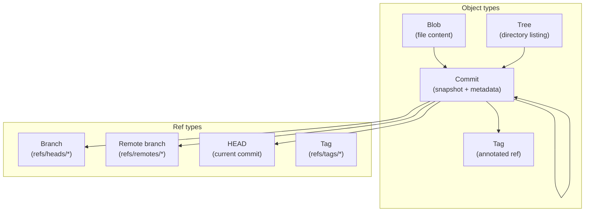

## 3. Five Ws + One H

### What <a class="askgpt-btn" href="https://chatgpt.com/?prompt=Explain%20'What'%20in%20detail%20with%20concrete%20examples%2C%20the%20main%20trade-offs%2C%20and%20common%20pitfalls%20a%20practitioner%20should%20know." target="_blank" rel="noopener" data-askgpt="What" title="Ask ChatGPT about this section">💬</a>

**Git** is a free, open-source distributed version control system. It uses a content-addressable filesystem; every change is a snapshot of files with metadata. Git tracks changes locally, supports branching and merging efficiently, and can synchronize with remote repositories.

### Why <a class="askgpt-btn" href="https://chatgpt.com/?prompt=Explain%20'Why'%20in%20detail%20with%20concrete%20examples%2C%20the%20main%20trade-offs%2C%20and%20common%20pitfalls%20a%20practitioner%20should%20know." target="_blank" rel="noopener" data-askgpt="Why" title="Ask ChatGPT about this section">💬</a>

Git enables collaboration, version history, branching, and review workflows. It's fast, distributed, and supports millions of workflows.

### When <a class="askgpt-btn" href="https://chatgpt.com/?prompt=Explain%20'When'%20in%20detail%20with%20concrete%20examples%2C%20the%20main%20trade-offs%2C%20and%20common%20pitfalls%20a%20practitioner%20should%20know." target="_blank" rel="noopener" data-askgpt="When" title="Ask ChatGPT about this section">💬</a>

Git was created by Linus Torvalds in 2005 to manage the Linux kernel after BitKeeper licensing changed. Since then, it has become the de facto standard VCS.

### Where <a class="askgpt-btn" href="https://chatgpt.com/?prompt=Explain%20'Where'%20in%20detail%20with%20concrete%20examples%2C%20the%20main%20trade-offs%2C%20and%20common%20pitfalls%20a%20practitioner%20should%20know." target="_blank" rel="noopener" data-askgpt="Where" title="Ask ChatGPT about this section">💬</a>

Every software project, open source or commercial. GitHub, GitLab, and Bitbucket are the dominant hosting services. Self-hosted Git is common in enterprises.

### Who <a class="askgpt-btn" href="https://chatgpt.com/?prompt=Explain%20'Who'%20in%20detail%20with%20concrete%20examples%2C%20the%20main%20trade-offs%2C%20and%20common%20pitfalls%20a%20practitioner%20should%20know." target="_blank" rel="noopener" data-askgpt="Who" title="Ask ChatGPT about this section">💬</a>

- **Linus Torvalds:** created Git in 2005.
- **Junio Hamano:** maintainer since 2005.
- **GitHub:** founded by Tom Preston-Werner, Chris Wanstrath, PJ Hyett, Scott Chacon in 2008.
- **GitLab:** founded by Dmytro Zaporozhets and Valery Sizov in 2011.
- **Atlassian (Bitbucket):** acquired Bitbucket in 2010.

### How (one-paragraph preview) <a class="askgpt-btn" href="https://chatgpt.com/?prompt=Explain%20'How%20(one-paragraph%20preview)'%20in%20detail%20with%20concrete%20examples%2C%20the%20main%20trade-offs%2C%20and%20common%20pitfalls%20a%20practitioner%20should%20know." target="_blank" rel="noopener" data-askgpt="How (one-paragraph preview)" title="Ask ChatGPT about this section">💬</a>

You create a local repository with `git init`, make commits with `git commit`, push to a remote with `git push`, and collaborate via branches, pull requests, and code reviews. Git's data model is a DAG of commits pointing to trees pointing to blobs. Branches and tags are pointers to commits. You choose a branching strategy (Git Flow, GitHub Flow, or trunk-based) that fits your team size and release cadence. You tag releases with SemVer (e.g., v1.2.3). You automate releases with semantic-release or release-please. For operations, you use GitOps (ArgoCD, Flux) to make Git the source of truth for infrastructure.

## 4. History

### 4.1 Origins (2005) <a class="askgpt-btn" href="https://chatgpt.com/?prompt=Explain%20'4.1%20Origins%20(2005)'%20in%20detail%20with%20concrete%20examples%2C%20the%20main%20trade-offs%2C%20and%20common%20pitfalls%20a%20practitioner%20should%20know." target="_blank" rel="noopener" data-askgpt="4.1 Origins (2005)" title="Ask ChatGPT about this section">💬</a>

- **April 2005** — Linus Torvalds starts Git after BitKeeper licensing changes.
- **June 2005** — Git manages the Linux kernel.
- **July 2005** — Junio Hamano takes over maintainership.
- **December 2005** — Git 1.0 released.

### 4.2 Growth (2006-2015) <a class="askgpt-btn" href="https://chatgpt.com/?prompt=Explain%20'4.2%20Growth%20(2006-2015)'%20in%20detail%20with%20concrete%20examples%2C%20the%20main%20trade-offs%2C%20and%20common%20pitfalls%20a%20practitioner%20should%20know." target="_blank" rel="noopener" data-askgpt="4.2 Growth (2006-2015)" title="Ask ChatGPT about this section">💬</a>

- **2007** — Git gains traction outside Linux kernel development.
- **2008** — GitHub launches; Git becomes the de facto standard.
- **2010** — Git is the most-used VCS for new projects.
- **2011** — GitLab launches.
- **2014** — Git 2.0 released.
- **2018** — Microsoft acquires GitHub for $7.5B.

### 4.3 Modern (2018-2026) <a class="askgpt-btn" href="https://chatgpt.com/?prompt=Explain%20'4.3%20Modern%20(2018-2026)'%20in%20detail%20with%20concrete%20examples%2C%20the%20main%20trade-offs%2C%20and%20common%20pitfalls%20a%20practitioner%20should%20know." target="_blank" rel="noopener" data-askgpt="4.3 Modern (2018-2026)" title="Ask ChatGPT about this section">💬</a>

- **2018** — LFS 2.0; signed commits (GPG, SSH); partial clone.
- **2020** — Git 2.30; switch and restore; sparse-checkout.
- **2022** — Git 2.38; safe-directory.
- **2024** — Git 2.45; reftable backend; scalar.
- **2026** — Mature GitOps with ArgoCD / Flux; AI-assisted commit messages.

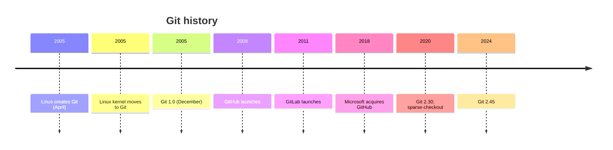

## 5. Problem Statement

### 5.1 What Git solves <a class="askgpt-btn" href="https://chatgpt.com/?prompt=Explain%20'5.1%20What%20Git%20solves'%20in%20detail%20with%20concrete%20examples%2C%20the%20main%20trade-offs%2C%20and%20common%20pitfalls%20a%20practitioner%20should%20know." target="_blank" rel="noopener" data-askgpt="5.1 What Git solves" title="Ask ChatGPT about this section">💬</a>

- **Version history** — every change preserved.
- **Branching and merging** — parallel development.
- **Collaboration** — distributed teams.
- **Code review** — pull requests.
- **Traceability** — who changed what, when, why.
- **Reproducibility** — checkout any version.

### 5.2 What Git doesn't solve <a class="askgpt-btn" href="https://chatgpt.com/?prompt=Explain%20'5.2%20What%20Git%20doesn't%20solve'%20in%20detail%20with%20concrete%20examples%2C%20the%20main%20trade-offs%2C%20and%20common%20pitfalls%20a%20practitioner%20should%20know." target="_blank" rel="noopener" data-askgpt="5.2 What Git doesn't solve" title="Ask ChatGPT about this section">💬</a>

- **Merge conflicts** — only humans can resolve.
- **Large files** — use Git LFS.
- **Monorepo performance** — use sparse-checkout, partial clone.
- **Code review quality** — use linters, not Git.
- **Deployment** — use GitOps on top.

### 5.3 The cost of poor VCS practices <a class="askgpt-btn" href="https://chatgpt.com/?prompt=Explain%20'5.3%20The%20cost%20of%20poor%20VCS%20practices'%20in%20detail%20with%20concrete%20examples%2C%20the%20main%20trade-offs%2C%20and%20common%20pitfalls%20a%20practitioner%20should%20know." target="_blank" rel="noopener" data-askgpt="5.3 The cost of poor VCS practices" title="Ask ChatGPT about this section">💬</a>

- **Lost history** — `git push --force` on shared branches.
- **Conflicting workflows** — no branching strategy.
- **Slow releases** — long-lived branches.
- **Insecure code** — secrets in git history.

## 6. Real-World Motivation

### 6.1 Linux Kernel <a class="askgpt-btn" href="https://chatgpt.com/?prompt=Explain%20'6.1%20Linux%20Kernel'%20in%20detail%20with%20concrete%20examples%2C%20the%20main%20trade-offs%2C%20and%20common%20pitfalls%20a%20practitioner%20should%20know." target="_blank" rel="noopener" data-askgpt="6.1 Linux Kernel" title="Ask ChatGPT about this section">💬</a>

Created Git; uses it for the entire kernel. Manages millions of lines of code; releases every 2-3 months.

### 6.2 GitHub <a class="askgpt-btn" href="https://chatgpt.com/?prompt=Explain%20'6.2%20GitHub'%20in%20detail%20with%20concrete%20examples%2C%20the%20main%20trade-offs%2C%20and%20common%20pitfalls%20a%20practitioner%20should%20know." target="_blank" rel="noopener" data-askgpt="6.2 GitHub" title="Ask ChatGPT about this section">💬</a>

Hosts > 100M repositories. Built on Git; adds PRs, issues, Actions.

### 6.3 GitLab <a class="askgpt-btn" href="https://chatgpt.com/?prompt=Explain%20'6.3%20GitLab'%20in%20detail%20with%20concrete%20examples%2C%20the%20main%20trade-offs%2C%20and%20common%20pitfalls%20a%20practitioner%20should%20know." target="_blank" rel="noopener" data-askgpt="6.3 GitLab" title="Ask ChatGPT about this section">💬</a>

Integrated DevOps platform; built on Git; adds CI/CD, security scanning.

### 6.4 Microsoft <a class="askgpt-btn" href="https://chatgpt.com/?prompt=Explain%20'6.4%20Microsoft'%20in%20detail%20with%20concrete%20examples%2C%20the%20main%20trade-offs%2C%20and%20common%20pitfalls%20a%20practitioner%20should%20know." target="_blank" rel="noopener" data-askgpt="6.4 Microsoft" title="Ask ChatGPT about this section">💬</a>

Owns GitHub. Uses Git for Windows development.

### 6.5 Google <a class="askgpt-btn" href="https://chatgpt.com/?prompt=Explain%20'6.5%20Google'%20in%20detail%20with%20concrete%20examples%2C%20the%20main%20trade-offs%2C%20and%20common%20pitfalls%20a%20practitioner%20should%20know." target="_blank" rel="noopener" data-askgpt="6.5 Google" title="Ask ChatGPT about this section">💬</a>

Monorepo (Piper) with custom VCS (not Git, but influenced by it); also uses Git for many projects.

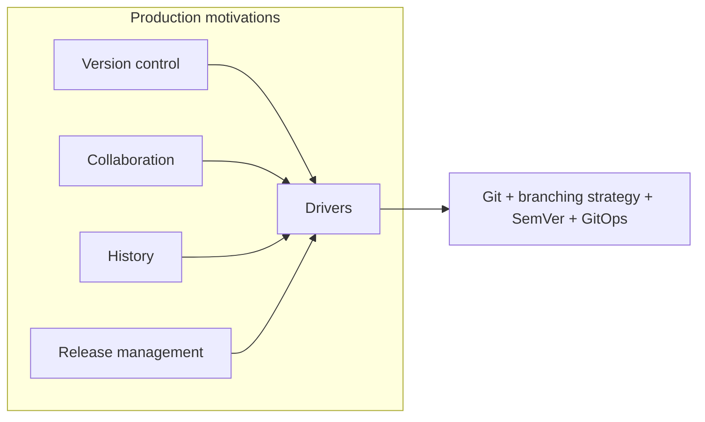

---

## 7. Internal Working

### 7.1 The three states <a class="askgpt-btn" href="https://chatgpt.com/?prompt=Explain%20'7.1%20The%20three%20states'%20in%20detail%20with%20concrete%20examples%2C%20the%20main%20trade-offs%2C%20and%20common%20pitfalls%20a%20practitioner%20should%20know." target="_blank" rel="noopener" data-askgpt="7.1 The three states" title="Ask ChatGPT about this section">💬</a>

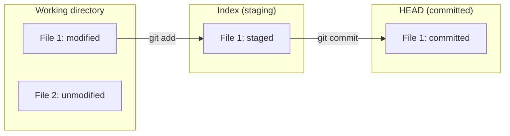

The three areas:

- **Working directory:** actual files.
- **Index / Staging area:** files staged for next commit.
- **HEAD:** current commit (or branch pointer).

### 7.2 Git objects <a class="askgpt-btn" href="https://chatgpt.com/?prompt=Explain%20'7.2%20Git%20objects'%20in%20detail%20with%20concrete%20examples%2C%20the%20main%20trade-offs%2C%20and%20common%20pitfalls%20a%20practitioner%20should%20know." target="_blank" rel="noopener" data-askgpt="7.2 Git objects" title="Ask ChatGPT about this section">💬</a>

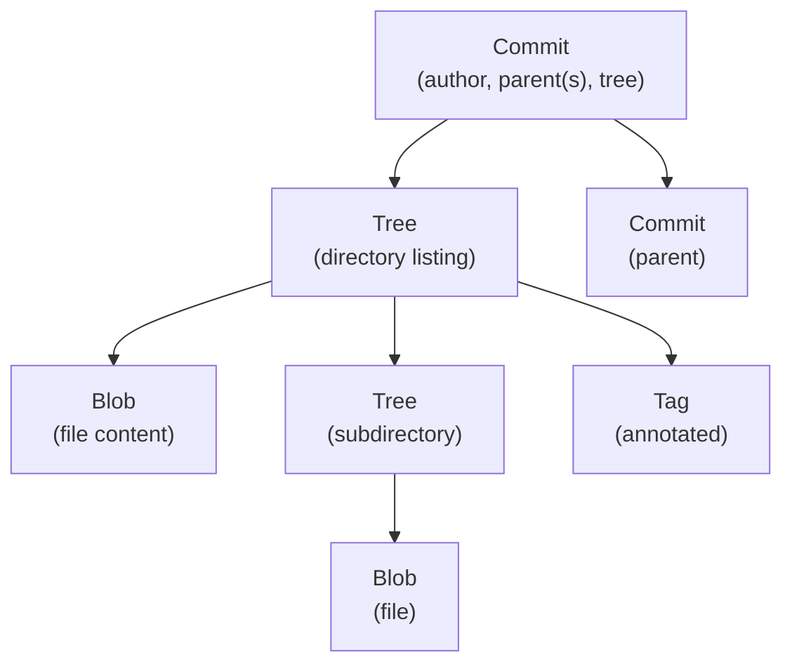

Four object types:

- **Blob:** file content.
- **Tree:** directory (blobs + subtrees).
- **Commit:** snapshot + parent(s) + author + message.
- **Tag:** annotated ref to a commit.

### 7.3 Git references <a class="askgpt-btn" href="https://chatgpt.com/?prompt=Explain%20'7.3%20Git%20references'%20in%20detail%20with%20concrete%20examples%2C%20the%20main%20trade-offs%2C%20and%20common%20pitfalls%20a%20practitioner%20should%20know." target="_blank" rel="noopener" data-askgpt="7.3 Git references" title="Ask ChatGPT about this section">💬</a>

- **HEAD:** current commit pointer.
- **Branch:** movable ref (e.g., `refs/heads/main`).
- **Tag:** fixed ref (e.g., `refs/tags/v1.0.0`).
- **Remote branch:** ref to remote's branch (e.g., `refs/remotes/origin/main`).

### 7.4 Git workflow <a class="askgpt-btn" href="https://chatgpt.com/?prompt=Explain%20'7.4%20Git%20workflow'%20in%20detail%20with%20concrete%20examples%2C%20the%20main%20trade-offs%2C%20and%20common%20pitfalls%20a%20practitioner%20should%20know." target="_blank" rel="noopener" data-askgpt="7.4 Git workflow" title="Ask ChatGPT about this section">💬</a>

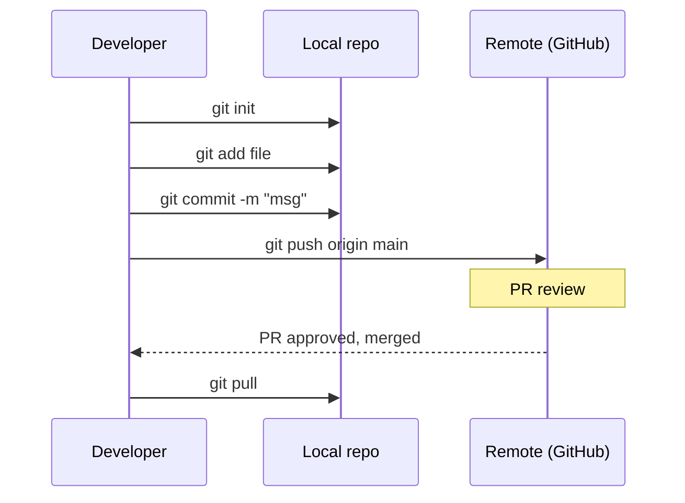

---

## 8. Deep Dive

This section is the heart of the document.

### 8.1 Git objects deep <a class="askgpt-btn" href="https://chatgpt.com/?prompt=Explain%20'8.1%20Git%20objects%20deep'%20in%20detail%20with%20concrete%20examples%2C%20the%20main%20trade-offs%2C%20and%20common%20pitfalls%20a%20practitioner%20should%20know." target="_blank" rel="noopener" data-askgpt="8.1 Git objects deep" title="Ask ChatGPT about this section">💬</a>

**Blob:** stores file content. Identified by SHA-1 (now SHA-256 in 2.42+) of content. Same content = same hash = same object.

**Tree:** stores directory listing. Each entry is mode, name, type, hash of subtree/blob. Represents filesystem state.

**Commit:** stores snapshot (root tree hash), author, committer, parent(s), message. Forms a DAG.

**Tag:** annotated object pointing to a commit. Contains tag name, tagger, message, signature.

### 8.2 The object graph <a class="askgpt-btn" href="https://chatgpt.com/?prompt=Explain%20'8.2%20The%20object%20graph'%20in%20detail%20with%20concrete%20examples%2C%20the%20main%20trade-offs%2C%20and%20common%20pitfalls%20a%20practitioner%20should%20know." target="_blank" rel="noopener" data-askgpt="8.2 The object graph" title="Ask ChatGPT about this section">💬</a>

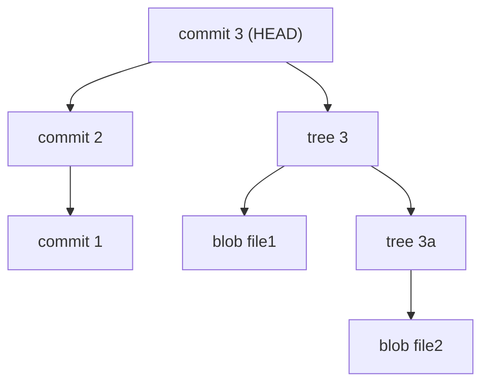

Each commit points to a tree; trees contain blobs (and other trees). The DAG is built by hash chains.

### 8.3 Pack files <a class="askgpt-btn" href="https://chatgpt.com/?prompt=Explain%20'8.3%20Pack%20files'%20in%20detail%20with%20concrete%20examples%2C%20the%20main%20trade-offs%2C%20and%20common%20pitfalls%20a%20practitioner%20should%20know." target="_blank" rel="noopener" data-askgpt="8.3 Pack files" title="Ask ChatGPT about this section">💬</a>

To save space, Git packs many objects into a single file using delta compression:

- **Loose objects:** stored as individual files.
- **Pack files:** compressed with deltas; one file, many objects.
- **Pack index:** sorted index for fast lookup.
- **GC:** `git gc` packs loose objects.

### 8.4 Reflog <a class="askgpt-btn" href="https://chatgpt.com/?prompt=Explain%20'8.4%20Reflog'%20in%20detail%20with%20concrete%20examples%2C%20the%20main%20trade-offs%2C%20and%20common%20pitfalls%20a%20practitioner%20should%20know." target="_blank" rel="noopener" data-askgpt="8.4 Reflog" title="Ask ChatGPT about this section">💬</a>

Every ref movement is logged:

```bash
$ git reflog
abc1234 HEAD@{0}: commit: Add feature
def5678 HEAD@{1}: reset: moving to main
9abc123 HEAD@{2}: checkout: moving from main to feature
```

**Recover lost commits:**

```bash
$ git reflog
$ git checkout -b recovered-commit abc1234
```

### 8.5 Git commands cheat sheet <a class="askgpt-btn" href="https://chatgpt.com/?prompt=Explain%20'8.5%20Git%20commands%20cheat%20sheet'%20in%20detail%20with%20concrete%20examples%2C%20the%20main%20trade-offs%2C%20and%20common%20pitfalls%20a%20practitioner%20should%20know." target="_blank" rel="noopener" data-askgpt="8.5 Git commands cheat sheet" title="Ask ChatGPT about this section">💬</a>

```bash
# Setup
git init
git clone <url>
git config user.name "Your Name"
git config user.email "you@example.com"

# Local changes
git status
git add <file>
git add .
git commit -m "message"
git commit --amend
git restore --staged <file>
git diff
git diff --staged

# Branches
git branch
git branch <name>
git checkout <name>
git switch <name>
git switch -c <name>
git branch -d <name>

# Merge and rebase
git merge <name>
git rebase <name>
git rebase -i <base>  # interactive
git rebase --onto <newbase> <upstream> <branch>

# Remote
git remote -v
git remote add <name> <url>
git fetch <remote>
git pull --rebase
git push
git push --force-with-lease

# Stash
git stash
git stash list
git stash pop
git stash apply
git stash drop

# Tags
git tag
git tag v1.0.0
git tag -a v1.0.0 -m "Release 1.0.0"
git push --tags

# Inspect
git log
git log --oneline
git log --graph
git show <sha>
git blame <file>
git log -S "search-term"
git bisect
```

### 8.6 Branching strategies <a class="askgpt-btn" href="https://chatgpt.com/?prompt=Explain%20'8.6%20Branching%20strategies'%20in%20detail%20with%20concrete%20examples%2C%20the%20main%20trade-offs%2C%20and%20common%20pitfalls%20a%20practitioner%20should%20know." target="_blank" rel="noopener" data-askgpt="8.6 Branching strategies" title="Ask ChatGPT about this section">💬</a>

#### 8.6.1 Git Flow (Vincent Driessen, 2010)

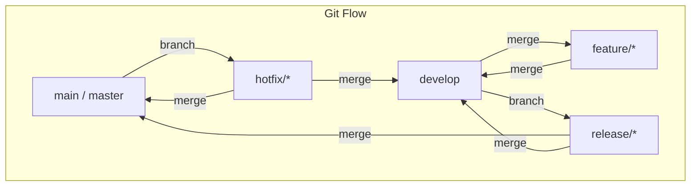

**Use for:** Scheduled releases, multiple versions in production, large teams.

**Pros:** Clear release process; supports multiple versions.

**Cons:** Complex; long-lived branches; merge hell.

#### 8.6.2 GitHub Flow

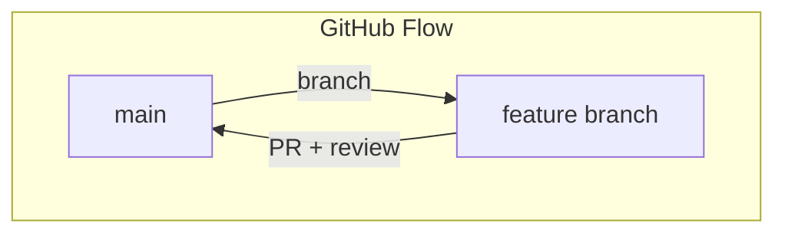

**Use for:** Continuous deployment, SaaS, web apps.

**Pros:** Simple; fast; PR-based review.

**Cons:** Requires robust CI/CD; needs feature flags.

#### 8.6.3 Trunk-based development

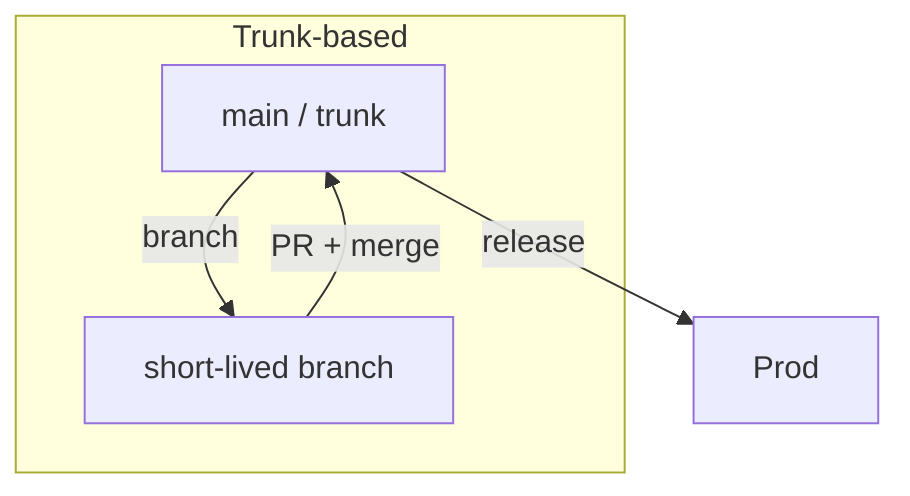

**Use for:** Mature CI/CD, high-trust teams, continuous delivery.

**Pros:** No long-lived branches; continuous integration; fast.

**Cons:** Requires strong CI/CD; requires feature flags; high trust.

#### 8.6.4 GitLab Flow

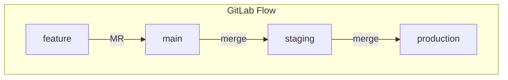

**Use for:** Multiple environments, production-first.

**Pros:** Explicit environments; clear promotion path.

**Cons:** Slow; multiple long-lived branches.

#### 8.6.5 Comparison

| Strategy | Complexity | Use case | Team size | Release cycle |
|----------|-----------|----------|-----------|---------------|
| **Git Flow** | High | Scheduled releases | Large | Monthly+ |
| **GitHub Flow** | Low | SaaS, web | Any | Daily+ |
| **Trunk-based** | Low | High-trust CD | Any | Continuous |
| **GitLab Flow** | High | Multiple env | Medium | Weekly+ |

### 8.7 Merging and rebasing <a class="askgpt-btn" href="https://chatgpt.com/?prompt=Explain%20'8.7%20Merging%20and%20rebasing'%20in%20detail%20with%20concrete%20examples%2C%20the%20main%20trade-offs%2C%20and%20common%20pitfalls%20a%20practitioner%20should%20know." target="_blank" rel="noopener" data-askgpt="8.7 Merging and rebasing" title="Ask ChatGPT about this section">💬</a>

#### 8.7.1 Three-way merge

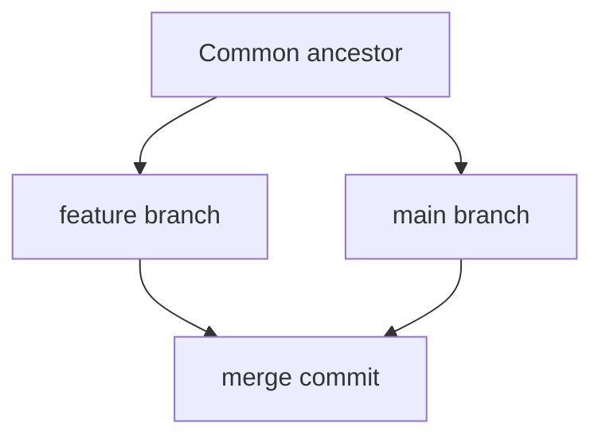

Default merge strategy. Produces a merge commit (or fast-forwards if linear).

#### 8.7.2 Fast-forward

When `main` hasn't moved, `git merge feature` just moves `main` forward to point to feature. Linear history; no merge commit.

#### 8.7.3 Squash

Combine all commits on feature branch into one commit on main. Used for clean history.

```bash
git merge --squash feature
git commit -m "Add feature"
```

#### 8.7.4 Octopus

Merge multiple branches at once.

```bash
git merge branch1 branch2 branch3
```

### 8.8 Rebasing <a class="askgpt-btn" href="https://chatgpt.com/?prompt=Explain%20'8.8%20Rebasing'%20in%20detail%20with%20concrete%20examples%2C%20the%20main%20trade-offs%2C%20and%20common%20pitfalls%20a%20practitioner%20should%20know." target="_blank" rel="noopener" data-askgpt="8.8 Rebasing" title="Ask ChatGPT about this section">💬</a>

Replay your commits on top of another branch. **Never rebase public branches** (rewrites history).

```bash
git rebase main
```

**Interactive rebase:**

```bash
git rebase -i HEAD~5
```

Editors:

- **pick:** keep commit.
- **reword:** change message.
- **edit:** change content.
- **squash:** combine with previous.
- **fixup:** like squash, discard message.
- **drop:** discard.

### 8.9 Stashing <a class="askgpt-btn" href="https://chatgpt.com/?prompt=Explain%20'8.9%20Stashing'%20in%20detail%20with%20concrete%20examples%2C%20the%20main%20trade-offs%2C%20and%20common%20pitfalls%20a%20practitioner%20should%20know." target="_blank" rel="noopener" data-askgpt="8.9 Stashing" title="Ask ChatGPT about this section">💬</a>

Temporarily save uncommitted changes.

```bash
git stash                    # save
git stash pop                # restore
git stash list               # list
git stash apply stash@{0}    # apply without dropping
git stash branch newbranch   # create branch from stash
```

Use cases: switching branches mid-work, cleaning working tree.

### 8.10 Cherry-picking <a class="askgpt-btn" href="https://chatgpt.com/?prompt=Explain%20'8.10%20Cherry-picking'%20in%20detail%20with%20concrete%20examples%2C%20the%20main%20trade-offs%2C%20and%20common%20pitfalls%20a%20practitioner%20should%20know." target="_blank" rel="noopener" data-askgpt="8.10 Cherry-picking" title="Ask ChatGPT about this section">💬</a>

Apply a specific commit from another branch.

```bash
git cherry-pick <commit-hash>
```

Use cases: backport a fix, pick a feature.

### 8.11 Submodules <a class="askgpt-btn" href="https://chatgpt.com/?prompt=Explain%20'8.11%20Submodules'%20in%20detail%20with%20concrete%20examples%2C%20the%20main%20trade-offs%2C%20and%20common%20pitfalls%20a%20practitioner%20should%20know." target="_blank" rel="noopener" data-askgpt="8.11 Submodules" title="Ask ChatGPT about this section">💬</a>

Include another repo as a subdirectory.

```bash
git submodule add <url> path
git submodule update --init --recursive
```

**Pros:** clear separation, independent versioning.

**Cons:** complex workflow, git log is confusing.

### 8.12 Subtrees <a class="askgpt-btn" href="https://chatgpt.com/?prompt=Explain%20'8.12%20Subtrees'%20in%20detail%20with%20concrete%20examples%2C%20the%20main%20trade-offs%2C%20and%20common%20pitfalls%20a%20practitioner%20should%20know." target="_blank" rel="noopener" data-askgpt="8.12 Subtrees" title="Ask ChatGPT about this section">💬</a>

Similar to submodules but managed as a regular directory.

```bash
git subtree add --prefix=lib <url> main --squash
```

**Pros:** easier workflow, regular git log.

**Cons:** larger history, manual squashing.

### 8.13 Git hooks <a class="askgpt-btn" href="https://chatgpt.com/?prompt=Explain%20'8.13%20Git%20hooks'%20in%20detail%20with%20concrete%20examples%2C%20the%20main%20trade-offs%2C%20and%20common%20pitfalls%20a%20practitioner%20should%20know." target="_blank" rel="noopener" data-askgpt="8.13 Git hooks" title="Ask ChatGPT about this section">💬</a>

**Client-side:**

- `pre-commit`: before commit.
- `prepare-commit-msg`: before message.
- `commit-msg`: validate message.
- `post-commit`: after commit.
- `pre-push`: before push.

**Server-side:**

- `pre-receive`: before accepting push.
- `update`: branch updated.
- `post-receive`: after push.

**Tools:**

- **Husky:** <https://github.com/typicode/husky> (manage hooks in repo).
- **pre-commit:** <https://pre-commit.com/> (Python-based, multi-language).
- **lefthook:** <https://github.com/evilmartians/lefthook> (Go-based, fast).

### 8.14 Hooks example (Husky) <a class="askgpt-btn" href="https://chatgpt.com/?prompt=Explain%20'8.14%20Hooks%20example%20(Husky)'%20in%20detail%20with%20concrete%20examples%2C%20the%20main%20trade-offs%2C%20and%20common%20pitfalls%20a%20practitioner%20should%20know." target="_blank" rel="noopener" data-askgpt="8.14 Hooks example (Husky)" title="Ask ChatGPT about this section">💬</a>

```json
// package.json
{
  "husky": {
    "hooks": {
      "pre-commit": "lint-staged",
      "commit-msg": "commitlint -E $HUSKY_GIT_PARAMS",
      "pre-push": "npm test"
    }
  },
  "lint-staged": {
    "*.{js,ts}": ["eslint --fix", "prettier --write"]
  }
}
```

### 8.15 SemVer 2.0.0 <a class="askgpt-btn" href="https://chatgpt.com/?prompt=Explain%20'8.15%20SemVer%202.0.0'%20in%20detail%20with%20concrete%20examples%2C%20the%20main%20trade-offs%2C%20and%20common%20pitfalls%20a%20practitioner%20should%20know." target="_blank" rel="noopener" data-askgpt="8.15 SemVer 2.0.0" title="Ask ChatGPT about this section">💬</a>

```
MAJOR.MINOR.PATCH[-PRERELEASE][+BUILD]
```

**Rules:**

- MAJOR: incompatible API changes.
- MINOR: backwards-compatible features.
- PATCH: backwards-compatible fixes.
- 0.y.z: initial development.
- 1.0.0: public API declared.

**Precedence** (low to high): 1.0.0-alpha < 1.0.0-alpha.1 < 1.0.0-beta < 1.0.0.

### 8.16 Conventional Commits <a class="askgpt-btn" href="https://chatgpt.com/?prompt=Explain%20'8.16%20Conventional%20Commits'%20in%20detail%20with%20concrete%20examples%2C%20the%20main%20trade-offs%2C%20and%20common%20pitfalls%20a%20practitioner%20should%20know." target="_blank" rel="noopener" data-askgpt="8.16 Conventional Commits" title="Ask ChatGPT about this section">💬</a>

```
<type>[scope]: <description>

[body]

[footer(s)]
```

**Types:**

- `feat:` new feature (MINOR).
- `fix:` bug fix (PATCH).
- `feat!:` breaking change (MAJOR). Or `BREAKING CHANGE:` footer.
- `chore:` tooling, deps.
- `docs:` documentation.
- `refactor:` code change that doesn't fix or feature.
- `test:` add tests.
- `perf:` performance.

**Tools:**

- **commitlint:** validate message format.
- **semantic-release:** automate versioning.
- **release-please:** GitHub Action for releases.

### 8.17 Release workflow <a class="askgpt-btn" href="https://chatgpt.com/?prompt=Explain%20'8.17%20Release%20workflow'%20in%20detail%20with%20concrete%20examples%2C%20the%20main%20trade-offs%2C%20and%20common%20pitfalls%20a%20practitioner%20should%20know." target="_blank" rel="noopener" data-askgpt="8.17 Release workflow" title="Ask ChatGPT about this section">💬</a>

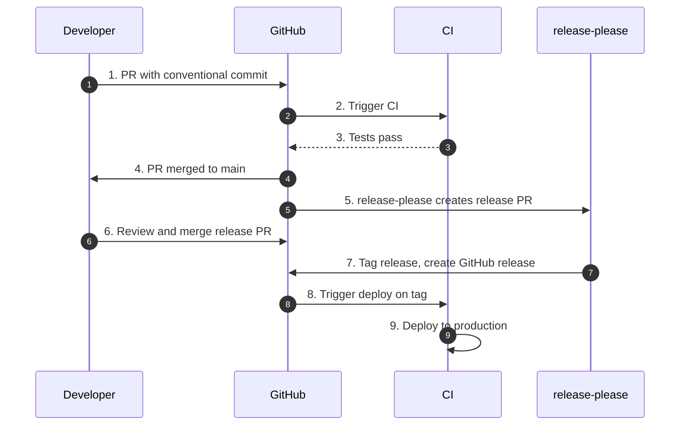

### 8.18 GitOps <a class="askgpt-btn" href="https://chatgpt.com/?prompt=Explain%20'8.18%20GitOps'%20in%20detail%20with%20concrete%20examples%2C%20the%20main%20trade-offs%2C%20and%20common%20pitfalls%20a%20practitioner%20should%20know." target="_blank" rel="noopener" data-askgpt="8.18 GitOps" title="Ask ChatGPT about this section">💬</a>

Use Git as source of truth for operations.

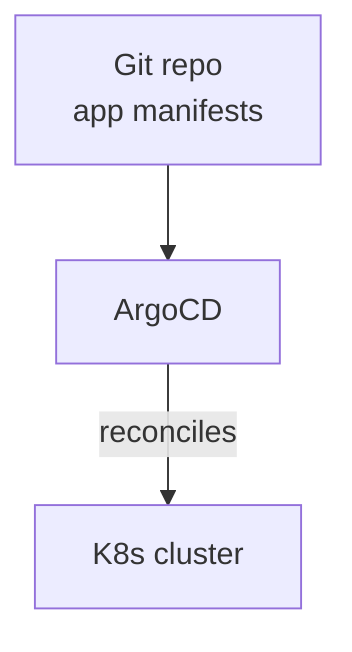

**Tools:**

- **ArgoCD:** <https://argo-cd.readthedocs.io/>
- **Flux:** <https://fluxcd.io/>
- **Argo Rollouts:** progressive delivery.

**Patterns:**

- **App of apps:** multiple repos.
- **Helm + GitOps:** templated deployment.
- **Kustomize + GitOps:** layered configuration.

### 8.19 Submodules vs subtrees <a class="askgpt-btn" href="https://chatgpt.com/?prompt=Explain%20'8.19%20Submodules%20vs%20subtrees'%20in%20detail%20with%20concrete%20examples%2C%20the%20main%20trade-offs%2C%20and%20common%20pitfalls%20a%20practitioner%20should%20know." target="_blank" rel="noopener" data-askgpt="8.19 Submodules vs subtrees" title="Ask ChatGPT about this section">💬</a>

| Feature | Submodules | Subtrees |
|---------|-----------|----------|
| **Storage** | Pointer to commit | Full copy of files |
| **History** | Separate | Single repo |
| **Workflow** | Update + commit | Merge |
| **Simplicity** | Lower | Higher |
| **Size on clone** | Smaller | Larger |

### 8.20 Git LFS (Large File Storage) <a class="askgpt-btn" href="https://chatgpt.com/?prompt=Explain%20'8.20%20Git%20LFS%20(Large%20File%20Storage)'%20in%20detail%20with%20concrete%20examples%2C%20the%20main%20trade-offs%2C%20and%20common%20pitfalls%20a%20practitioner%20should%20know." target="_blank" rel="noopener" data-askgpt="8.20 Git LFS (Large File Storage)" title="Ask ChatGPT about this section">💬</a>

```bash
git lfs install
git lfs track "*.psd"
git lfs track "*.zip"
git add .gitattributes
git add file.psd
git commit -m "Add design file"
git push
```

**Alternatives:** Submodules, separate repos, DVC (Data Version Control).

### 8.21 Signing commits <a class="askgpt-btn" href="https://chatgpt.com/?prompt=Explain%20'8.21%20Signing%20commits'%20in%20detail%20with%20concrete%20examples%2C%20the%20main%20trade-offs%2C%20and%20common%20pitfalls%20a%20practitioner%20should%20know." target="_blank" rel="noopener" data-askgpt="8.21 Signing commits" title="Ask ChatGPT about this section">💬</a>

```bash
# GPG
gpg --gen-key
git config --global user.signingkey <key>
git config --global commit.gpgsign true
git commit -S -m "Signed commit"

# SSH (Git 2.34+)
git config --global gpg.format ssh
git config --global user.signingkey ~/.ssh/id_ed25519.pub
git commit -S -m "Signed commit"
```

Verify: `git log --show-signature`.

### 8.22 Monorepo vs polyrepo <a class="askgpt-btn" href="https://chatgpt.com/?prompt=Explain%20'8.22%20Monorepo%20vs%20polyrepo'%20in%20detail%20with%20concrete%20examples%2C%20the%20main%20trade-offs%2C%20and%20common%20pitfalls%20a%20practitioner%20should%20know." target="_blank" rel="noopener" data-askgpt="8.22 Monorepo vs polyrepo" title="Ask ChatGPT about this section">💬</a>

| Approach | Pros | Cons |
|----------|------|------|
| **Monorepo** | One source of truth, atomic changes, shared code | Large, slow git, complex CI |
| **Polyrepo** | Independent versions, focused CI | Cross-repo changes, versioning drift |

**Tools for monorepo:** Bazel, Nx, Turborepo, Buck, Pants.

### 8.23 Recovery and debugging <a class="askgpt-btn" href="https://chatgpt.com/?prompt=Explain%20'8.23%20Recovery%20and%20debugging'%20in%20detail%20with%20concrete%20examples%2C%20the%20main%20trade-offs%2C%20and%20common%20pitfalls%20a%20practitioner%20should%20know." target="_blank" rel="noopener" data-askgpt="8.23 Recovery and debugging" title="Ask ChatGPT about this section">💬</a>

```bash
# Recover deleted commit
git reflog
git checkout -b recovered <sha>

# Bisect for bug
git bisect start
git bisect bad
git bisect good v1.0.0
# git checks out commits; you test; mark good or bad

# Worktrees (multiple working dirs)
git worktree add ../hotfix hotfix-1
git worktree add ../experiment new-feature
```

### 8.24 Common Git operations compared <a class="askgpt-btn" href="https://chatgpt.com/?prompt=Explain%20'8.24%20Common%20Git%20operations%20compared'%20in%20detail%20with%20concrete%20examples%2C%20the%20main%20trade-offs%2C%20and%20common%20pitfalls%20a%20practitioner%20should%20know." target="_blank" rel="noopener" data-askgpt="8.24 Common Git operations compared" title="Ask ChatGPT about this section">💬</a>

| Operation | Command | Notes |
|-----------|---------|-------|
| See changes | `git diff` | Unstaged |
| See staged | `git diff --staged` | After `git add` |
| Undo changes | `git restore <file>` | Working dir |
| Unstage | `git restore --staged <file>` | |
| Amend last | `git commit --amend` | Only local |
| Revert commit | `git revert <sha>` | New commit |
| Reset | `git reset <mode> <sha>` | Changes history (DANGER) |
| Clean untracked | `git clean -fd` | DESTRUCTIVE |
| Find when bug | `git bisect` | Binary search |

### 8.25 Tools and integrations <a class="askgpt-btn" href="https://chatgpt.com/?prompt=Explain%20'8.25%20Tools%20and%20integrations'%20in%20detail%20with%20concrete%20examples%2C%20the%20main%20trade-offs%2C%20and%20common%20pitfalls%20a%20practitioner%20should%20know." target="_blank" rel="noopener" data-askgpt="8.25 Tools and integrations" title="Ask ChatGPT about this section">💬</a>

| Tool | Purpose |
|------|---------|
| **Git LFS** | Large file storage |
| **git-flow** | Git Flow CLI |
| **gh** | GitHub CLI |
| **glab** | GitLab CLI |
| **act** | Run GitHub Actions locally |
| **pre-commit** | Multi-language pre-commit hooks |
| **lefthook** | Go-based hooks |
| **Husky** | JS/TS hooks |
| **commitlint** | Commit message validation |
| **semantic-release** | Automated versioning |
| **release-please** | Google release automation |
| **standard-version** | Conventional commits versioning |
| **git-filter-repo** | Rewrite history safely |
| **BFG** | Remove secrets from history |

### 8.26 Common mistakes <a class="askgpt-btn" href="https://chatgpt.com/?prompt=Explain%20'8.26%20Common%20mistakes'%20in%20detail%20with%20concrete%20examples%2C%20the%20main%20trade-offs%2C%20and%20common%20pitfalls%20a%20practitioner%20should%20know." target="_blank" rel="noopener" data-askgpt="8.26 Common mistakes" title="Ask ChatGPT about this section">💬</a>

- **Force-push to shared branches** — destroys history.
- **No .gitignore** — committing generated files.
- **Secrets in commits** — leaks.
- **Large binary files** without LFS — bloats repo.
- **Long-lived feature branches** — merge hell.
- **Committing to main directly** — bypasses review.
- **Skipping pre-commit hooks** — loses automation.

### 8.27 When to use what <a class="askgpt-btn" href="https://chatgpt.com/?prompt=Explain%20'8.27%20When%20to%20use%20what'%20in%20detail%20with%20concrete%20examples%2C%20the%20main%20trade-offs%2C%20and%20common%20pitfalls%20a%20practitioner%20should%20know." target="_blank" rel="noopener" data-askgpt="8.27 When to use what" title="Ask ChatGPT about this section">💬</a>

| Use case | Recommendation |
|----------|---------------|
| Open source library | Trunk-based + SemVer + GH Flow |
| SaaS product | GitHub Flow + feature flags + CD |
| Enterprise app | GitLab Flow + multiple envs |
| Monorepo | Trunk-based + sparse checkout |
| Multiple versions in production | Git Flow |

---

## 9. Architecture

### 9.1 Distributed Git workflow <a class="askgpt-btn" href="https://chatgpt.com/?prompt=Explain%20'9.1%20Distributed%20Git%20workflow'%20in%20detail%20with%20concrete%20examples%2C%20the%20main%20trade-offs%2C%20and%20common%20pitfalls%20a%20practitioner%20should%20know." target="_blank" rel="noopener" data-askgpt="9.1 Distributed Git workflow" title="Ask ChatGPT about this section">💬</a>

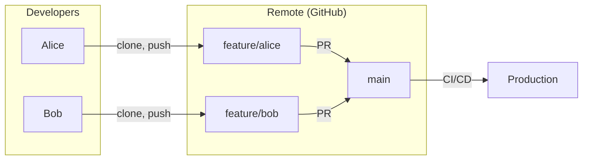

### 9.2 GitOps reference architecture <a class="askgpt-btn" href="https://chatgpt.com/?prompt=Explain%20'9.2%20GitOps%20reference%20architecture'%20in%20detail%20with%20concrete%20examples%2C%20the%20main%20trade-offs%2C%20and%20common%20pitfalls%20a%20practitioner%20should%20know." target="_blank" rel="noopener" data-askgpt="9.2 GitOps reference architecture" title="Ask ChatGPT about this section">💬</a>

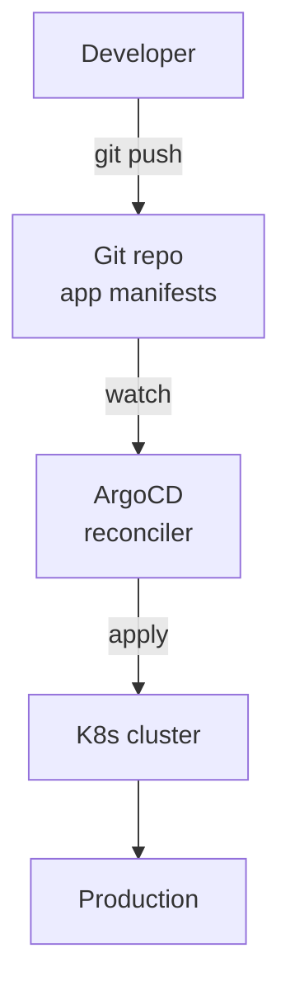

## 10. Performance

### 10.1 Git performance <a class="askgpt-btn" href="https://chatgpt.com/?prompt=Explain%20'10.1%20Git%20performance'%20in%20detail%20with%20concrete%20examples%2C%20the%20main%20trade-offs%2C%20and%20common%20pitfalls%20a%20practitioner%20should%20know." target="_blank" rel="noopener" data-askgpt="10.1 Git performance" title="Ask ChatGPT about this section">💬</a>

- **git status:** O(number of files).
- **git log:** O(n) for n commits (fast with packed).
- **git diff:** O(changes).
- **git clone:** O(repo size) — first time only.
- **git fetch:** O(changes since last fetch).

### 10.2 Large repos <a class="askgpt-btn" href="https://chatgpt.com/?prompt=Explain%20'10.2%20Large%20repos'%20in%20detail%20with%20concrete%20examples%2C%20the%20main%20trade-offs%2C%20and%20common%20pitfalls%20a%20practitioner%20should%20know." target="_blank" rel="noopener" data-askgpt="10.2 Large repos" title="Ask ChatGPT about this section">💬</a>

- **Git LFS:** large file storage.
- **Partial clone:** `git clone --filter=blob:none`.
- **Sparse checkout:** `git sparse-checkout init`.
- **Shallow clone:** `git clone --depth 1`.
- **Mono-repo tools:** Bazel, Nx (avoid full clone).

### 10.3 .gitattributes <a class="askgpt-btn" href="https://chatgpt.com/?prompt=Explain%20'10.3%20.gitattributes'%20in%20detail%20with%20concrete%20examples%2C%20the%20main%20trade-offs%2C%20and%20common%20pitfalls%20a%20practitioner%20should%20know." target="_blank" rel="noopener" data-askgpt="10.3 .gitattributes" title="Ask ChatGPT about this section">💬</a>

```
*.psd binary
*.zip binary
*.png binary
*.jpg binary
```

Mark large files as binary for better diffs.

### 10.4 fsmonitor <a class="askgpt-btn" href="https://chatgpt.com/?prompt=Explain%20'10.4%20fsmonitor'%20in%20detail%20with%20concrete%20examples%2C%20the%20main%20trade-offs%2C%20and%20common%20pitfalls%20a%20practitioner%20should%20know." target="_blank" rel="noopener" data-askgpt="10.4 fsmonitor" title="Ask ChatGPT about this section">💬</a>

- `core.fsmonitor`: OS-specific file watching for `git status`.
- macOS: fsevents.
- Linux: inotify.
- Windows: ReadDirectoryChangesW.

## 11. Security

### 11.1 Secrets in git <a class="askgpt-btn" href="https://chatgpt.com/?prompt=Explain%20'11.1%20Secrets%20in%20git'%20in%20detail%20with%20concrete%20examples%2C%20the%20main%20trade-offs%2C%20and%20common%20pitfalls%20a%20practitioner%20should%20know." target="_blank" rel="noopener" data-askgpt="11.1 Secrets in git" title="Ask ChatGPT about this section">💬</a>

- **Pre-commit hooks** to detect secrets (TruffleHog, git-secrets, detect-secrets).
- **Never commit AWS keys, passwords, tokens.**
- **Rotate immediately** if leaked (git log is forever).
- **Use a secrets manager** (Vault, AWS SM).
- **.gitignore** sensitive files.

### 11.2 Branch protection <a class="askgpt-btn" href="https://chatgpt.com/?prompt=Explain%20'11.2%20Branch%20protection'%20in%20detail%20with%20concrete%20examples%2C%20the%20main%20trade-offs%2C%20and%20common%20pitfalls%20a%20practitioner%20should%20know." target="_blank" rel="noopener" data-askgpt="11.2 Branch protection" title="Ask ChatGPT about this section">💬</a>

```yaml
# GitHub branch protection
required_status_checks:
  contexts: [ci, test, lint]
required_pull_request_reviews:
  required_approving_review_count: 2
enforce_admins: true
require_linear_history: true
no_force_pushes: true
no_deletions: true
```

### 11.3 Signed commits <a class="askgpt-btn" href="https://chatgpt.com/?prompt=Explain%20'11.3%20Signed%20commits'%20in%20detail%20with%20concrete%20examples%2C%20the%20main%20trade-offs%2C%20and%20common%20pitfalls%20a%20practitioner%20should%20know." target="_blank" rel="noopener" data-askgpt="11.3 Signed commits" title="Ask ChatGPT about this section">💬</a>

- **GPG:** traditional method.
- **SSH (since 2.34):** simpler.
- **Sigstore / cosign:** for images and artifacts.

### 11.4 Audit and log <a class="askgpt-btn" href="https://chatgpt.com/?prompt=Explain%20'11.4%20Audit%20and%20log'%20in%20detail%20with%20concrete%20examples%2C%20the%20main%20trade-offs%2C%20and%20common%20pitfalls%20a%20practitioner%20should%20know." target="_blank" rel="noopener" data-askgpt="11.4 Audit and log" title="Ask ChatGPT about this section">💬</a>

- **git log:** who, when, what.
- **git log -p:** with diff.
- **GitHub audit logs:** enterprise feature.
- **GitLab audit events:** enterprise feature.

### 11.5 Supply chain security (SLSA) <a class="askgpt-btn" href="https://chatgpt.com/?prompt=Explain%20'11.5%20Supply%20chain%20security%20(SLSA)'%20in%20detail%20with%20concrete%20examples%2C%20the%20main%20trade-offs%2C%20and%20common%20pitfalls%20a%20practitioner%20should%20know." target="_blank" rel="noopener" data-askgpt="11.5 Supply chain security (SLSA)" title="Ask ChatGPT about this section">💬</a>

- **SLSA framework:** supply chain integrity.
- **Sigstore / cosign:** artifact signing.
- **provenance:** build provenance.
- **SBOM:** software bill of materials.

## 12. Production Engineering

### 12.1 Trunk-based development <a class="askgpt-btn" href="https://chatgpt.com/?prompt=Explain%20'12.1%20Trunk-based%20development'%20in%20detail%20with%20concrete%20examples%2C%20the%20main%20trade-offs%2C%20and%20common%20pitfalls%20a%20practitioner%20should%20know." target="_blank" rel="noopener" data-askgpt="12.1 Trunk-based development" title="Ask ChatGPT about this section">💬</a>

- Single main branch.
- Short-lived feature branches (< 1 day).
- Feature flags for incomplete features.
- Continuous integration / deployment.
- Strong test suite.

### 12.2 Release engineering <a class="askgpt-btn" href="https://chatgpt.com/?prompt=Explain%20'12.2%20Release%20engineering'%20in%20detail%20with%20concrete%20examples%2C%20the%20main%20trade-offs%2C%20and%20common%20pitfalls%20a%20practitioner%20should%20know." target="_blank" rel="noopener" data-askgpt="12.2 Release engineering" title="Ask ChatGPT about this section">💬</a>

- **Conventional Commits** for messages.
- **semantic-release** or **release-please** for automation.
- **Changelog generation** (e.g., git-cliff).
- **GitHub Releases** for artifacts.
- **Calendar versioning** (CalVer) for products.

### 12.3 DORA metrics (DevOps Research and Assessment) <a class="askgpt-btn" href="https://chatgpt.com/?prompt=Explain%20'12.3%20DORA%20metrics%20(DevOps%20Research%20and%20Assessment)'%20in%20detail%20with%20concrete%20examples%2C%20the%20main%20trade-offs%2C%20and%20common%20pitfalls%20a%20practitioner%20should%20know." target="_blank" rel="noopener" data-askgpt="12.3 DORA metrics (DevOps Research and Assessment)" title="Ask ChatGPT about this section">💬</a>

- **Deployment frequency:** how often you deploy.
- **Lead time for changes:** commit to production.
- **Mean time to recover (MTTR):** recovery time.
- **Change failure rate:** % of changes causing failures.

High performers: deploy multiple times per day; lead time < 1 hour; MTTR < 1 hour; change failure rate < 15%.

### 12.4 Code review <a class="askgpt-btn" href="https://chatgpt.com/?prompt=Explain%20'12.4%20Code%20review'%20in%20detail%20with%20concrete%20examples%2C%20the%20main%20trade-offs%2C%20and%20common%20pitfalls%20a%20practitioner%20should%20know." target="_blank" rel="noopener" data-askgpt="12.4 Code review" title="Ask ChatGPT about this section">💬</a>

- Pull requests as default.
- Required reviewers.
- CODEOWNERS file.
- Status checks (CI, lint, tests).
- Branch protection.

### 12.5 Merge strategies <a class="askgpt-btn" href="https://chatgpt.com/?prompt=Explain%20'12.5%20Merge%20strategies'%20in%20detail%20with%20concrete%20examples%2C%20the%20main%20trade-offs%2C%20and%20common%20pitfalls%20a%20practitioner%20should%20know." target="_blank" rel="noopener" data-askgpt="12.5 Merge strategies" title="Ask ChatGPT about this section">💬</a>

- **Merge commit:** default; preserves history.
- **Squash:** clean history; single commit per PR.
- **Rebase:** linear; rewrites history (only local).

## 13. Production Case Studies

### 13.1 Linux Kernel <a class="askgpt-btn" href="https://chatgpt.com/?prompt=Explain%20'13.1%20Linux%20Kernel'%20in%20detail%20with%20concrete%20examples%2C%20the%20main%20trade-offs%2C%20and%20common%20pitfalls%20a%20practitioner%20should%20know." target="_blank" rel="noopener" data-askgpt="13.1 Linux Kernel" title="Ask ChatGPT about this section">💬</a>

Uses Git; ~30k commits per release. Maintained by Linus Torvalds and lieutenants.

### 13.2 GitHub <a class="askgpt-btn" href="https://chatgpt.com/?prompt=Explain%20'13.2%20GitHub'%20in%20detail%20with%20concrete%20examples%2C%20the%20main%20trade-offs%2C%20and%20common%20pitfalls%20a%20practitioner%20should%20know." target="_blank" rel="noopener" data-askgpt="13.2 GitHub" title="Ask ChatGPT about this section">💬</a>

Built on Git; the canonical Git hosting service. PRs, issues, Actions.

### 13.3 GitLab <a class="askgpt-btn" href="https://chatgpt.com/?prompt=Explain%20'13.3%20GitLab'%20in%20detail%20with%20concrete%20examples%2C%20the%20main%20trade-offs%2C%20and%20common%20pitfalls%20a%20practitioner%20should%20know." target="_blank" rel="noopener" data-askgpt="13.3 GitLab" title="Ask ChatGPT about this section">💬</a>

Integrated DevOps; built on Git; adds CI/CD, security scanning.

### 13.4 Microsoft <a class="askgpt-btn" href="https://chatgpt.com/?prompt=Explain%20'13.4%20Microsoft'%20in%20detail%20with%20concrete%20examples%2C%20the%20main%20trade-offs%2C%20and%20common%20pitfalls%20a%20practitioner%20should%20know." target="_blank" rel="noopener" data-askgpt="13.4 Microsoft" title="Ask ChatGPT about this section">💬</a>

Owns GitHub; uses Git for Windows. Monorepo for components.

### 13.5 Google <a class="askgpt-btn" href="https://chatgpt.com/?prompt=Explain%20'13.5%20Google'%20in%20detail%20with%20concrete%20examples%2C%20the%20main%20trade-offs%2C%20and%20common%20pitfalls%20a%20practitioner%20should%20know." target="_blank" rel="noopener" data-askgpt="13.5 Google" title="Ask ChatGPT about this section">💬</a>

Mostly uses Piper (custom VCS), but also uses Git for many projects.

## 14. Code Examples

### 14.1 Basic: Git workflow (shell) <a class="askgpt-btn" href="https://chatgpt.com/?prompt=Explain%20'14.1%20Basic%3A%20Git%20workflow%20(shell)'%20in%20detail%20with%20concrete%20examples%2C%20the%20main%20trade-offs%2C%20and%20common%20pitfalls%20a%20practitioner%20should%20know." target="_blank" rel="noopener" data-askgpt="14.1 Basic: Git workflow (shell)" title="Ask ChatGPT about this section">💬</a>

```bash
# see 01-git-basics/
```

### 14.2 Basic: Branching (shell) <a class="askgpt-btn" href="https://chatgpt.com/?prompt=Explain%20'14.2%20Basic%3A%20Branching%20(shell)'%20in%20detail%20with%20concrete%20examples%2C%20the%20main%20trade-offs%2C%20and%20common%20pitfalls%20a%20practitioner%20should%20know." target="_blank" rel="noopener" data-askgpt="14.2 Basic: Branching (shell)" title="Ask ChatGPT about this section">💬</a>

```bash
# see 02-branching/
```

### 14.3 Basic: Rebasing (shell) <a class="askgpt-btn" href="https://chatgpt.com/?prompt=Explain%20'14.3%20Basic%3A%20Rebasing%20(shell)'%20in%20detail%20with%20concrete%20examples%2C%20the%20main%20trade-offs%2C%20and%20common%20pitfalls%20a%20practitioner%20should%20know." target="_blank" rel="noopener" data-askgpt="14.3 Basic: Rebasing (shell)" title="Ask ChatGPT about this section">💬</a>

```bash
# see 04-rebasing/
```

### 14.4 Conventional Commits and semantic-release <a class="askgpt-btn" href="https://chatgpt.com/?prompt=Explain%20'14.4%20Conventional%20Commits%20and%20semantic-release'%20in%20detail%20with%20concrete%20examples%2C%20the%20main%20trade-offs%2C%20and%20common%20pitfalls%20a%20practitioner%20should%20know." target="_blank" rel="noopener" data-askgpt="14.4 Conventional Commits and semantic-release" title="Ask ChatGPT about this section">💬</a>

```yaml
# .releaserc.yml
branches:
  - name: main
    channel: latest
plugins:
  - "@semantic-release/commit-analyzer"
  - "@semantic-release/release-notes-generator"
  - "@semantic-release/npm"
  - "@semantic-release/github"
  - "@semantic-release/git"
```

### 14.5 GitOps with ArgoCD <a class="askgpt-btn" href="https://chatgpt.com/?prompt=Explain%20'14.5%20GitOps%20with%20ArgoCD'%20in%20detail%20with%20concrete%20examples%2C%20the%20main%20trade-offs%2C%20and%20common%20pitfalls%20a%20practitioner%20should%20know." target="_blank" rel="noopener" data-askgpt="14.5 GitOps with ArgoCD" title="Ask ChatGPT about this section">💬</a>

```yaml
# see 14-gitops/
```

### 14.6 Bad, anti-pattern, refactured, secure, performance-optimized <a class="askgpt-btn" href="https://chatgpt.com/?prompt=Explain%20'14.6%20Bad%2C%20anti-pattern%2C%20refactured%2C%20secure%2C%20performance-optimized'%20in%20detail%20with%20concrete%20examples%2C%20the%20main%20trade-offs%2C%20and%20common%20pitfalls%20a%20practitioner%20should%20know." target="_blank" rel="noopener" data-askgpt="14.6 Bad, anti-pattern, refactured, secure, performance-optimized" title="Ask ChatGPT about this section">💬</a>

**Bad: large commits**

```bash
git add . && git commit -m "stuff"
```

**Anti-pattern: secrets in commit**

```bash
git add config.yaml  # contains AWS_SECRET_ACCESS_KEY
git commit -m "Add config"
```

**Refactored: atomic commits**

```bash
git add src/auth.ts
git commit -m "feat(auth): add JWT validation"
```

**Secure: pre-commit secrets scanning**

```yaml
# .pre-commit-config.yaml
repos:
  - repo: https://github.com/gitleaks/gitleaks
    rev: v8.18.0
    hooks:
      - id: gitleaks
```

**Performance-optimized: shallow clone for CI**

```bash
git clone --depth 1 --no-tags --single-branch <url>
```

## 15. Common Mistakes

### 15.1 Beginner mistakes <a class="askgpt-btn" href="https://chatgpt.com/?prompt=Explain%20'15.1%20Beginner%20mistakes'%20in%20detail%20with%20concrete%20examples%2C%20the%20main%20trade-offs%2C%20and%20common%20pitfalls%20a%20practitioner%20should%20know." target="_blank" rel="noopener" data-askgpt="15.1 Beginner mistakes" title="Ask ChatGPT about this section">💬</a>

- **No .gitignore** — committing generated files.
- **Force-push to main** — destroys shared history.
- **Secrets in commits** — leaks.
- **No commit messages** — untraceable changes.
- **Skipping hooks** — loses automation.

### 15.2 Intermediate mistakes <a class="askgpt-btn" href="https://chatgpt.com/?prompt=Explain%20'15.2%20Intermediate%20mistakes'%20in%20detail%20with%20concrete%20examples%2C%20the%20main%20trade-offs%2C%20and%20common%20pitfalls%20a%20practitioner%20should%20know." target="_blank" rel="noopener" data-askgpt="15.2 Intermediate mistakes" title="Ask ChatGPT about this section">💬</a>

- **Long-lived branches** — merge hell.
- **Force-push with --force instead of --force-with-lease** — can overwrite others' work.
- **No CI checks before merge.**
- **No branch protection.**
- **Monorepo without proper tooling.**

### 15.3 Senior mistakes <a class="askgpt-btn" href="https://chatgpt.com/?prompt=Explain%20'15.3%20Senior%20mistakes'%20in%20detail%20with%20concrete%20examples%2C%20the%20main%20trade-offs%2C%20and%20common%20pitfalls%20a%20practitioner%20should%20know." target="_blank" rel="noopener" data-askgpt="15.3 Senior mistakes" title="Ask ChatGPT about this section">💬</a>

- **No branching strategy** — ad-hoc.
- **No release automation** — manual errors.
- **No secrets scanning** — credentials in history.
- **No artifact signing** — supply chain.
- **No signed commits** — provenance.

### 15.4 Production mistakes <a class="askgpt-btn" href="https://chatgpt.com/?prompt=Explain%20'15.4%20Production%20mistakes'%20in%20detail%20with%20concrete%20examples%2C%20the%20main%20trade-offs%2C%20and%20common%20pitfalls%20a%20practitioner%20should%20know." target="_blank" rel="noopener" data-askgpt="15.4 Production mistakes" title="Ask ChatGPT about this section">💬</a>

- **Hot fix on main without PR** — bypasses review.
- **Bad merge during incident** — adds to chaos.
- **Untagged release** — can't roll back.
- **No runbook for git operations.**
- **Repo too large** — performance issues.

### 15.5 Migration mistakes <a class="askgpt-btn" href="https://chatgpt.com/?prompt=Explain%20'15.5%20Migration%20mistakes'%20in%20detail%20with%20concrete%20examples%2C%20the%20main%20trade-offs%2C%20and%20common%20pitfalls%20a%20practitioner%20should%20know." target="_blank" rel="noopener" data-askgpt="15.5 Migration mistakes" title="Ask ChatGPT about this section">💬</a>

- **Force-push rewrite of shared history** — disrupts others.
- **Migrating repo with no communication** — broken CI for others.
- **No backup before migration.**
- **Mixing up git operations with deploy.**

### 15.6 Configuration mistakes <a class="askgpt-btn" href="https://chatgpt.com/?prompt=Explain%20'15.6%20Configuration%20mistakes'%20in%20detail%20with%20concrete%20examples%2C%20the%20main%20trade-offs%2C%20and%20common%20pitfalls%20a%20practitioner%20should%20know." target="_blank" rel="noopener" data-askgpt="15.6 Configuration mistakes" title="Ask ChatGPT about this section">💬</a>

- **Not setting user.email / user.name.**
- **No core.autocrlf on Windows.**
- **No SSH keys set up correctly.**

### 15.7 Security mistakes <a class="askgpt-btn" href="https://chatgpt.com/?prompt=Explain%20'15.7%20Security%20mistakes'%20in%20detail%20with%20concrete%20examples%2C%20the%20main%20trade-offs%2C%20and%20common%20pitfalls%20a%20practitioner%20should%20know." target="_blank" rel="noopener" data-askgpt="15.7 Security mistakes" title="Ask ChatGPT about this section">💬</a>

- **Committing .env files.**
- **Committing credentials.**
- **No pre-commit secrets scanning.**
- **HTTP remotes instead of SSH.**

### 15.8 Performance mistakes <a class="askgpt-btn" href="https://chatgpt.com/?prompt=Explain%20'15.8%20Performance%20mistakes'%20in%20detail%20with%20concrete%20examples%2C%20the%20main%20trade-offs%2C%20and%20common%20pitfalls%20a%20practitioner%20should%20know." target="_blank" rel="noopener" data-askgpt="15.8 Performance mistakes" title="Ask ChatGPT about this section">💬</a>

- **Large binary files in repo** without LFS.
- **Long histories** in shallow clones not working.
- **No fsmonitor** for large repos.
- **No sparse checkout** in monorepos.

### 15.9 Debugging mistakes <a class="askgpt-btn" href="https://chatgpt.com/?prompt=Explain%20'15.9%20Debugging%20mistakes'%20in%20detail%20with%20concrete%20examples%2C%20the%20main%20trade-offs%2C%20and%20common%20pitfalls%20a%20practitioner%20should%20know." target="_blank" rel="noopener" data-askgpt="15.9 Debugging mistakes" title="Ask ChatGPT about this section">💬</a>

- **Resetting remote main without recovery plan.**
- **Force-push after losing work.**
- **No reflog awareness** when losing commits.
- **Cherry-picking wrong commits.**

### 15.10 Deployment mistakes <a class="askgpt-btn" href="https://chatgpt.com/?prompt=Explain%20'15.10%20Deployment%20mistakes'%20in%20detail%20with%20concrete%20examples%2C%20the%20main%20trade-offs%2C%20and%20common%20pitfalls%20a%20practitioner%20should%20know." target="_blank" rel="noopener" data-askgpt="15.10 Deployment mistakes" title="Ask ChatGPT about this section">💬</a>

- **Deploying from local main** instead of CI artifact.
- **No artifact signing** for production.
- **Untagged releases** for rollback.
- **No immutable build artifacts** (rebuild from source = drift).

## 16. Debugging

### 16.1 Recovering a lost commit <a class="askgpt-btn" href="https://chatgpt.com/?prompt=Explain%20'16.1%20Recovering%20a%20lost%20commit'%20in%20detail%20with%20concrete%20examples%2C%20the%20main%20trade-offs%2C%20and%20common%20pitfalls%20a%20practitioner%20should%20know." target="_blank" rel="noopener" data-askgpt="16.1 Recovering a lost commit" title="Ask ChatGPT about this section">💬</a>

```bash
# 1. Find the commit in reflog
git reflog | grep "some text"

# 2. Check out the commit
git checkout <sha>

# 3. Or create a branch at it
git checkout -b recovered-branch <sha>
```

### 16.2 Using git bisect <a class="askgpt-btn" href="https://chatgpt.com/?prompt=Explain%20'16.2%20Using%20git%20bisect'%20in%20detail%20with%20concrete%20examples%2C%20the%20main%20trade-offs%2C%20and%20common%20pitfalls%20a%20practitioner%20should%20know." target="_blank" rel="noopener" data-askgpt="16.2 Using git bisect" title="Ask ChatGPT about this section">💬</a>

```bash
git bisect start
git bisect bad   # current is bad
git bisect good v1.0.0  # this was good
# git checks out commits; you test
git bisect good  # or bad
# repeat until found
git bisect reset
```

Automate with `git bisect run` for tests.

### 16.3 Using worktrees <a class="askgpt-btn" href="https://chatgpt.com/?prompt=Explain%20'16.3%20Using%20worktrees'%20in%20detail%20with%20concrete%20examples%2C%20the%20main%20trade-offs%2C%20and%20common%20pitfalls%20a%20practitioner%20should%20know." target="_blank" rel="noopener" data-askgpt="16.3 Using worktrees" title="Ask ChatGPT about this section">💬</a>

Multiple working directories from one repo.

```bash
git worktree add ../hotfix hotfix-1
git worktree add ../experiment new-feature
```

Useful for parallel work without stashing.

### 16.4 Recovering from a force-push <a class="askgpt-btn" href="https://chatgpt.com/?prompt=Explain%20'16.4%20Recovering%20from%20a%20force-push'%20in%20detail%20with%20concrete%20examples%2C%20the%20main%20trade-offs%2C%20and%20common%20pitfalls%20a%20practitioner%20should%20know." target="_blank" rel="noopener" data-askgpt="16.4 Recovering from a force-push" title="Ask ChatGPT about this section">💬</a>

```bash
# Find the lost commit in reflog
git reflog | head

# Or in the remote's reflog (if available)
git fetch origin
git fetch origin refs/origin/old-main:old-main
```

### 16.5 Debugging merge conflicts <a class="askgpt-btn" href="https://chatgpt.com/?prompt=Explain%20'16.5%20Debugging%20merge%20conflicts'%20in%20detail%20with%20concrete%20examples%2C%20the%20main%20trade-offs%2C%20and%20common%20pitfalls%20a%20practitioner%20should%20know." target="_blank" rel="noopener" data-askgpt="16.5 Debugging merge conflicts" title="Ask ChatGPT about this section">💬</a>

```bash
git status          # see conflicts
git diff             # see changes
git checkout --ours <file>   # keep our version
git checkout --theirs <file>  # keep their version
git add <file>
git commit
```

Or use `git mergetool` with configured visual merge tool (VSCode, vimdiff, meld).

### 16.6 Production troubleshooting checklist <a class="askgpt-btn" href="https://chatgpt.com/?prompt=Explain%20'16.6%20Production%20troubleshooting%20checklist'%20in%20detail%20with%20concrete%20examples%2C%20the%20main%20trade-offs%2C%20and%20common%20pitfalls%20a%20practitioner%20should%20know." target="_blank" rel="noopener" data-askgpt="16.6 Production troubleshooting checklist" title="Ask ChatGPT about this section">💬</a>

- [ ] Check `git status` and `git log`.
- [ ] Check reflog for recent actions.
- [ ] Check stash list for lost work.
- [ ] Use `git bisect` to find bad commit.
- [ ] Use `git worktree` for parallel work.
- [ ] Recover from reflog if needed.

## 17. Monitoring & Observability

### 17.1 DORA metrics <a class="askgpt-btn" href="https://chatgpt.com/?prompt=Explain%20'17.1%20DORA%20metrics'%20in%20detail%20with%20concrete%20examples%2C%20the%20main%20trade-offs%2C%20and%20common%20pitfalls%20a%20practitioner%20should%20know." target="_blank" rel="noopener" data-askgpt="17.1 DORA metrics" title="Ask ChatGPT about this section">💬</a>

- **Deployment frequency:** how often you deploy.
- **Lead time:** commit to production.
- **Change failure rate:** % of changes causing failures.
- **MTTR:** mean time to recover.

### 17.2 Source control metrics <a class="askgpt-btn" href="https://chatgpt.com/?prompt=Explain%20'17.2%20Source%20control%20metrics'%20in%20detail%20with%20concrete%20examples%2C%20the%20main%20trade-offs%2C%20and%20common%20pitfalls%20a%20practitioner%20should%20know." target="_blank" rel="noopener" data-askgpt="17.2 Source control metrics" title="Ask ChatGPT about this section">💬</a>

- **Commit frequency:** per developer.
- **PR cycle time:** open to merge.
- **Branch age:** how long feature branches live.
- **Tag frequency:** release cadence.

### 17.3 Tools <a class="askgpt-btn" href="https://chatgpt.com/?prompt=Explain%20'17.3%20Tools'%20in%20detail%20with%20concrete%20examples%2C%20the%20main%20trade-offs%2C%20and%20common%20pitfalls%20a%20practitioner%20should%20know." target="_blank" rel="noopener" data-askgpt="17.3 Tools" title="Ask ChatGPT about this section">💬</a>

- **GitHub Insights:** <https://github.com/organizations/.../people>
- **GitLab Insights:** <https://gitlab.com/.../analytics>
- **CodeScene:** <https://codescene.io/>
- **Velocity:** <https://github.com/velocity-ci/velocity>

## 18. Best Practices

### 18.1 Industry best practices <a class="askgpt-btn" href="https://chatgpt.com/?prompt=Explain%20'18.1%20Industry%20best%20practices'%20in%20detail%20with%20concrete%20examples%2C%20the%20main%20trade-offs%2C%20and%20common%20pitfalls%20a%20practitioner%20should%20know." target="_blank" rel="noopener" data-askgpt="18.1 Industry best practices" title="Ask ChatGPT about this section">💬</a>

- **Commit often, push regularly.**
- **Write good commit messages** (conventional commits).
- **Use branches for features.**
- **Tag releases** (SemVer).
- **Sign commits** (GPG or SSH).
- **Use a branching strategy** (GitHub Flow or trunk-based).
- **Run CI on every push.**
- **Protect main branch.**
- **Don't commit secrets.**
- **Use Git LFS** for large files.

### 18.2 Enterprise practices <a class="askgpt-btn" href="https://chatgpt.com/?prompt=Explain%20'18.2%20Enterprise%20practices'%20in%20detail%20with%20concrete%20examples%2C%20the%20main%20trade-offs%2C%20and%20common%20pitfalls%20a%20practitioner%20should%20know." target="_blank" rel="noopener" data-askgpt="18.2 Enterprise practices" title="Ask ChatGPT about this section">💬</a>

- **Trunk-based development** with feature flags.
- **Code review** with CODEOWNERS.
- **Semantic release** for versioning.
- **Conventional commits** for messages.
- **Pre-commit hooks** for security.
- **GitOps** for operations.
- **Submodules/subtrees** for shared code.
- **Artifact signing** for supply chain.

### 18.3 Clean commits <a class="askgpt-btn" href="https://chatgpt.com/?prompt=Explain%20'18.3%20Clean%20commits'%20in%20detail%20with%20concrete%20examples%2C%20the%20main%20trade-offs%2C%20and%20common%20pitfalls%20a%20practitioner%20should%20know." target="_blank" rel="noopener" data-askgpt="18.3 Clean commits" title="Ask ChatGPT about this section">💬</a>

- Atomic commits (one logical change).
- Conventional messages.
- Reference issues (e.g., `fixes #123`).
- No commented-out code.
- No debug logs.

### 18.4 Reliability <a class="askgpt-btn" href="https://chatgpt.com/?prompt=Explain%20'18.4%20Reliability'%20in%20detail%20with%20concrete%20examples%2C%20the%20main%20trade-offs%2C%20and%20common%20pitfalls%20a%20practitioner%20should%20know." target="_blank" rel="noopener" data-askgpt="18.4 Reliability" title="Ask ChatGPT about this section">💬</a>

- Reflog awareness.
- Use `--force-with-lease` not `--force`.
- Backup before force-push rewrite.
- CI checks before merge.
- Branch protection.

### 18.5 Security <a class="askgpt-btn" href="https://chatgpt.com/?prompt=Explain%20'18.5%20Security'%20in%20detail%20with%20concrete%20examples%2C%20the%20main%20trade-offs%2C%20and%20common%20pitfalls%20a%20practitioner%20should%20know." target="_blank" rel="noopener" data-askgpt="18.5 Security" title="Ask ChatGPT about this section">💬</a>

- No secrets in commits.
- Pre-commit secrets scanning.
- SSH keys instead of HTTPS passwords.
- Signed commits.
- Branch protection.

### 18.6 Performance <a class="askgpt-btn" href="https://chatgpt.com/?prompt=Explain%20'18.6%20Performance'%20in%20detail%20with%20concrete%20examples%2C%20the%20main%20trade-offs%2C%20and%20common%20pitfalls%20a%20practitioner%20should%20know." target="_blank" rel="noopener" data-askgpt="18.6 Performance" title="Ask ChatGPT about this section">💬</a>

- Shallow clone for CI.
- Sparse checkout for monorepo work.
- .gitattributes for binaries.
- LFS for large files.
- fsmonitor for large repos.

### 18.7 Testing <a class="askgpt-btn" href="https://chatgpt.com/?prompt=Explain%20'18.7%20Testing'%20in%20detail%20with%20concrete%20examples%2C%20the%20main%20trade-offs%2C%20and%20common%20pitfalls%20a%20practitioner%20should%20know." target="_blank" rel="noopener" data-askgpt="18.7 Testing" title="Ask ChatGPT about this section">💬</a>

- CI on every push.
- Status checks before merge.
- Branch protection.
- Pre-commit hooks.

### 18.8 Deployment <a class="askgpt-btn" href="https://chatgpt.com/?prompt=Explain%20'18.8%20Deployment'%20in%20detail%20with%20concrete%20examples%2C%20the%20main%20trade-offs%2C%20and%20common%20pitfalls%20a%20practitioner%20should%20know." target="_blank" rel="noopener" data-askgpt="18.8 Deployment" title="Ask ChatGPT about this section">💬</a>

- Releases from CI, not local.
- Tag every release.
- Use SemVer.
- Generate changelog.
- Use GitOps for operations.

## 19. Anti-Patterns

### 19.1 Long-lived feature branches <a class="askgpt-btn" href="https://chatgpt.com/?prompt=Explain%20'19.1%20Long-lived%20feature%20branches'%20in%20detail%20with%20concrete%20examples%2C%20the%20main%20trade-offs%2C%20and%20common%20pitfalls%20a%20practitioner%20should%20know." target="_blank" rel="noopener" data-askgpt="19.1 Long-lived feature branches" title="Ask ChatGPT about this section">💬</a>

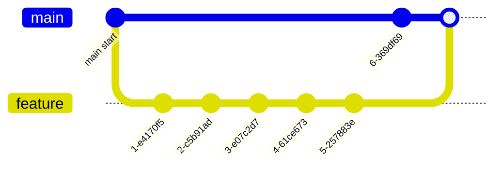

Merging after weeks = "merge hell". Short-lived branches (< 1 day) for trunk-based.

### 19.2 Force push to shared branches <a class="askgpt-btn" href="https://chatgpt.com/?prompt=Explain%20'19.2%20Force%20push%20to%20shared%20branches'%20in%20detail%20with%20concrete%20examples%2C%20the%20main%20trade-offs%2C%20and%20common%20pitfalls%20a%20practitioner%20should%20know." target="_blank" rel="noopener" data-askgpt="19.2 Force push to shared branches" title="Ask ChatGPT about this section">💬</a>

```bash
git push --force  # BAD
git push --force-with-lease  # GOOD
```

### 19.3 Secrets in commits <a class="askgpt-btn" href="https://chatgpt.com/?prompt=Explain%20'19.3%20Secrets%20in%20commits'%20in%20detail%20with%20concrete%20examples%2C%20the%20main%20trade-offs%2C%20and%20common%20pitfalls%20a%20practitioner%20should%20know." target="_blank" rel="noopener" data-askgpt="19.3 Secrets in commits" title="Ask ChatGPT about this section">💬</a>

```bash
echo "AWS_SECRET_ACCESS_KEY=..." > config.yaml
git add config.yaml
git commit -m "Add config"
```

Use a secrets manager; pre-commit secrets scan.

### 19.4 No .gitignore <a class="askgpt-btn" href="https://chatgpt.com/?prompt=Explain%20'19.4%20No%20.gitignore'%20in%20detail%20with%20concrete%20examples%2C%20the%20main%20trade-offs%2C%20and%20common%20pitfalls%20a%20practitioner%20should%20know." target="_blank" rel="noopener" data-askgpt="19.4 No .gitignore" title="Ask ChatGPT about this section">💬</a>

Without .gitignore, you commit:
- node_modules/
- .env
- build/
- *.log

Create a .gitignore from templates (github/gitignore).

### 19.5 Giant commits <a class="askgpt-btn" href="https://chatgpt.com/?prompt=Explain%20'19.5%20Giant%20commits'%20in%20detail%20with%20concrete%20examples%2C%20the%20main%20trade-offs%2C%20and%20common%20pitfalls%20a%20practitioner%20should%20know." target="_blank" rel="noopener" data-askgpt="19.5 Giant commits" title="Ask ChatGPT about this section">💬</a>

```bash
git add .
git commit -m "Refactor everything"
```

Atomic commits, focused changes.

### 19.6 No CI checks before merge <a class="askgpt-btn" href="https://chatgpt.com/?prompt=Explain%20'19.6%20No%20CI%20checks%20before%20merge'%20in%20detail%20with%20concrete%20examples%2C%20the%20main%20trade-offs%2C%20and%20common%20pitfalls%20a%20practitioner%20should%20know." target="_blank" rel="noopener" data-askgpt="19.6 No CI checks before merge" title="Ask ChatGPT about this section">💬</a>

- Tests fail.
- Linter fails.
- Build broken.
- Deploy broken code.

## 20. Edge Cases

### 20.1 Large repos <a class="askgpt-btn" href="https://chatgpt.com/?prompt=Explain%20'20.1%20Large%20repos'%20in%20detail%20with%20concrete%20examples%2C%20the%20main%20trade-offs%2C%20and%20common%20pitfalls%20a%20practitioner%20should%20know." target="_blank" rel="noopener" data-askgpt="20.1 Large repos" title="Ask ChatGPT about this section">💬</a>

- **Shallow clone:** `git clone --depth 1`.
- **Partial clone:** `git clone --filter=blob:none`.
- **Sparse checkout:** `git sparse-checkout init`.
- **LFS:** large files.

### 20.2 Monorepo performance <a class="askgpt-btn" href="https://chatgpt.com/?prompt=Explain%20'20.2%20Monorepo%20performance'%20in%20detail%20with%20concrete%20examples%2C%20the%20main%20trade-offs%2C%20and%20common%20pitfalls%20a%20practitioner%20should%20know." target="_blank" rel="noopener" data-askgpt="20.2 Monorepo performance" title="Ask ChatGPT about this section">💬</a>

- **Bazel** with `--remote_cache`.
- **Sparse checkout** for partial work.
- **Multiple worktrees.**
- **Filtered remote tracking.**

### 20.3 Submodules <a class="askgpt-btn" href="https://chatgpt.com/?prompt=Explain%20'20.3%20Submodules'%20in%20detail%20with%20concrete%20examples%2C%20the%20main%20trade-offs%2C%20and%20common%20pitfalls%20a%20practitioner%20should%20know." target="_blank" rel="noopener" data-askgpt="20.3 Submodules" title="Ask ChatGPT about this section">💬</a>

- **Update often** (each change in the parent).
- **Pin to commit** in production.
- **Git submodule foreach** for bulk operations.

### 20.4 Long-running branches <a class="askgpt-btn" href="https://chatgpt.com/?prompt=Explain%20'20.4%20Long-running%20branches'%20in%20detail%20with%20concrete%20examples%2C%20the%20main%20trade-offs%2C%20and%20common%20pitfalls%20a%20practitioner%20should%20know." target="_blank" rel="noopener" data-askgpt="20.4 Long-running branches" title="Ask ChatGPT about this section">💬</a>

- **Feature flags** to merge incomplete features.
- **Trunk-based** instead.
- **Code review** for short-lived PRs.

### 20.5 Conflicting workflows <a class="askgpt-btn" href="https://chatgpt.com/?prompt=Explain%20'20.5%20Conflicting%20workflows'%20in%20detail%20with%20concrete%20examples%2C%20the%20main%20trade-offs%2C%20and%20common%20pitfalls%20a%20practitioner%20should%20know." target="_blank" rel="noopener" data-askgpt="20.5 Conflicting workflows" title="Ask ChatGPT about this section">💬</a>

- **Establish a standard** in CONTRIBUTING.md.
- **Enforce** via branch protection.
- **Train team** on the workflow.

### 20.6 Big binaries in repo <a class="askgpt-btn" href="https://chatgpt.com/?prompt=Explain%20'20.6%20Big%20binaries%20in%20repo'%20in%20detail%20with%20concrete%20examples%2C%20the%20main%20trade-offs%2C%20and%20common%20pitfalls%20a%20practitioner%20should%20know." target="_blank" rel="noopener" data-askgpt="20.6 Big binaries in repo" title="Ask ChatGPT about this section">💬</a>

- **Migrate to Git LFS:** `git lfs migrate import --include="*.psd"`.
- **Or use a separate repo** for data.

### 20.7 Recovering from corruption <a class="askgpt-btn" href="https://chatgpt.com/?prompt=Explain%20'20.7%20Recovering%20from%20corruption'%20in%20detail%20with%20concrete%20examples%2C%20the%20main%20trade-offs%2C%20and%20common%20pitfalls%20a%20practitioner%20should%20know." target="_blank" rel="noopener" data-askgpt="20.7 Recovering from corruption" title="Ask ChatGPT about this section">💬</a>

- **Re-clone** if `.git` is corrupted.
- **Repair via `git fsck`** if recoverable.
- **Backup** the repo regularly.

### 20.8 Concurrent edits <a class="askgpt-btn" href="https://chatgpt.com/?prompt=Explain%20'20.8%20Concurrent%20edits'%20in%20detail%20with%20concrete%20examples%2C%20the%20main%20trade-offs%2C%20and%20common%20pitfalls%20a%20practitioner%20should%20know." target="_blank" rel="noopener" data-askgpt="20.8 Concurrent edits" title="Ask ChatGPT about this section">💬</a>

- **Rebase before pushing** to reduce conflicts.
- **Use `git rerere`** to remember conflict resolutions.
- **Communicate with team** to coordinate.

### 20.9 Branch protection bypass <a class="askgpt-btn" href="https://chatgpt.com/?prompt=Explain%20'20.9%20Branch%20protection%20bypass'%20in%20detail%20with%20concrete%20examples%2C%20the%20main%20trade-offs%2C%20and%20common%20pitfalls%20a%20practitioner%20should%20know." target="_blank" rel="noopener" data-askgpt="20.9 Branch protection bypass" title="Ask ChatGPT about this section">💬</a>

- Force-push by admin.
- Disabling checks.
- Repo setting change.

Use GitHub/GitLab admin settings; require 2-person review for changes.

### 20.10 Bisect on large code <a class="askgpt-btn" href="https://chatgpt.com/?prompt=Explain%20'20.10%20Bisect%20on%20large%20code'%20in%20detail%20with%20concrete%20examples%2C%20the%20main%20trade-offs%2C%20and%20common%20pitfalls%20a%20practitioner%20should%20know." target="_blank" rel="noopener" data-askgpt="20.10 Bisect on large code" title="Ask ChatGPT about this section">💬</a>

- **Narrow with `git bisect --first-parent`.**
- **Use `git bisect run` with automated tests.**
- **Limit to specific directories.**

## 21. Comparisons

### 21.1 Git Flow vs GitHub Flow vs trunk-based <a class="askgpt-btn" href="https://chatgpt.com/?prompt=Explain%20'21.1%20Git%20Flow%20vs%20GitHub%20Flow%20vs%20trunk-based'%20in%20detail%20with%20concrete%20examples%2C%20the%20main%20trade-offs%2C%20and%20common%20pitfalls%20a%20practitioner%20should%20know." target="_blank" rel="noopener" data-askgpt="21.1 Git Flow vs GitHub Flow vs trunk-based" title="Ask ChatGPT about this section">💬</a>

| Dimension | Git Flow | GitHub Flow | Trunk-based |
|-----------|---------|-------------|-------------|
| Branches | main, develop, feature/*, release/*, hotfix/* | main, feature/* | main, short-lived feature/* |
| Lifespan | Long | Short | Very short |
| Releases | Periodic | Continuous | Continuous |
| Best for | Scheduled releases | SaaS, web | High-trust CD |
| Complexity | High | Low | Low |

### 21.2 Git vs Mercurial vs SVN <a class="askgpt-btn" href="https://chatgpt.com/?prompt=Explain%20'21.2%20Git%20vs%20Mercurial%20vs%20SVN'%20in%20detail%20with%20concrete%20examples%2C%20the%20main%20trade-offs%2C%20and%20common%20pitfalls%20a%20practitioner%20should%20know." target="_blank" rel="noopener" data-askgpt="21.2 Git vs Mercurial vs SVN" title="Ask ChatGPT about this section">💬</a>

| VCS | Era | Status |
|-----|-----|--------|
| **Git** | 2005+ | Standard |
| **Mercurial** | 2005+ | Declining (Facebook still uses internally) |
| **SVN** | 2000+ | Legacy |
| **CVS** | 1990+ | Legacy |

### 21.3 SemVer vs CalVer <a class="askgpt-btn" href="https://chatgpt.com/?prompt=Explain%20'21.3%20SemVer%20vs%20CalVer'%20in%20detail%20with%20concrete%20examples%2C%20the%20main%20trade-offs%2C%20and%20common%20pitfalls%20a%20practitioner%20should%20know." target="_blank" rel="noopener" data-askgpt="21.3 SemVer vs CalVer" title="Ask ChatGPT about this section">💬</a>

| Dimension | SemVer | CalVer |
|-----------|--------|---------|
| Format | `MAJOR.MINOR.PATCH` | `YYYY.MM.PATCH` |
| Best for | Libraries, APIs | Products, releases |
| Marketing | Less relevant | Important |
| Pre-release | `-alpha.1`, `-rc.1` | `-rc.1` |
| Tools | semantic-release | release-please, bumpversion |

### 21.4 GitHub vs GitLab vs Bitbucket <a class="askgpt-btn" href="https://chatgpt.com/?prompt=Explain%20'21.4%20GitHub%20vs%20GitLab%20vs%20Bitbucket'%20in%20detail%20with%20concrete%20examples%2C%20the%20main%20trade-offs%2C%20and%20common%20pitfalls%20a%20practitioner%20should%20know." target="_blank" rel="noopener" data-askgpt="21.4 GitHub vs GitLab vs Bitbucket" title="Ask ChatGPT about this section">💬</a>

| Dimension | GitHub | GitLab | Bitbucket |
|-----------|--------|--------|-----------|
| CI/CD | Actions (GH Actions) | Built-in (GitLab CI) | Bitbucket Pipelines |
| Hosting | Cloud + Enterprise | Self-hosted + Cloud | Cloud + Data Center |
| Best for | Open source, integration | DevOps platform | Atlassian ecosystem |
| Permissions | Branch protection, rules | More granular | Project-level |

### 21.5 Monorepo vs polyrepo tools <a class="askgpt-btn" href="https://chatgpt.com/?prompt=Explain%20'21.5%20Monorepo%20vs%20polyrepo%20tools'%20in%20detail%20with%20concrete%20examples%2C%20the%20main%20trade-offs%2C%20and%20common%20pitfalls%20a%20practitioner%20should%20know." target="_blank" rel="noopener" data-askgpt="21.5 Monorepo vs polyrepo tools" title="Ask ChatGPT about this section">💬</a>

| Tool | Strengths |
|------|-----------|
| **Bazel** | Google; fast; reproducible |
| **Nx** | Angular, React; smart caching |
| **Turborepo** | Vercel; simple; JS-focused |
| **Pants** | Twitter; Python; JVM |
| **Lerna** | JS; mature; declining |

### 21.6 GitOps tools <a class="askgpt-btn" href="https://chatgpt.com/?prompt=Explain%20'21.6%20GitOps%20tools'%20in%20detail%20with%20concrete%20examples%2C%20the%20main%20trade-offs%2C%20and%20common%20pitfalls%20a%20practitioner%20should%20know." target="_blank" rel="noopener" data-askgpt="21.6 GitOps tools" title="Ask ChatGPT about this section">💬</a>

| Tool | Description |
|------|-------------|
| **ArgoCD** | K8s-native GitOps; pull model; web UI |
| **Flux** | K8s-native GitOps; GitOps Toolkit |
| **Argo Rollouts** | Progressive delivery |
| **Flagger** | Canary / A/B testing |
| **Jenkins X** | Jenkins-based GitOps |

### 21.7 SemVer tools <a class="askgpt-btn" href="https://chatgpt.com/?prompt=Explain%20'21.7%20SemVer%20tools'%20in%20detail%20with%20concrete%20examples%2C%20the%20main%20trade-offs%2C%20and%20common%20pitfalls%20a%20practitioner%20should%20know." target="_blank" rel="noopener" data-askgpt="21.7 SemVer tools" title="Ask ChatGPT about this section">💬</a>

| Tool | Language | Maturity |
|------|---------|----------|
| **semantic-release** | JS | Mature |
| **release-please** | Go (GitHub Action) | Growing |
| **standard-version** | JS | Mature |
| **python-semantic-release** | Python | Mature |
| **cargo-release** | Rust | Mature |

### 21.8 Conventional Commits tools <a class="askgpt-btn" href="https://chatgpt.com/?prompt=Explain%20'21.8%20Conventional%20Commits%20tools'%20in%20detail%20with%20concrete%20examples%2C%20the%20main%20trade-offs%2C%20and%20common%20pitfalls%20a%20practitioner%20should%20know." target="_blank" rel="noopener" data-askgpt="21.8 Conventional Commits tools" title="Ask ChatGPT about this section">💬</a>

| Tool | Purpose |
|------|---------|
| **commitlint** | Validate message format |
| **standard-version** | Auto versioning from commits |
| **semantic-release** | Releases + CHANGELOG |
| **release-please** | GitHub Action for releases |
| **git-cliff** | Changelog generator |

### 21.9 Git hooks managers <a class="askgpt-btn" href="https://chatgpt.com/?prompt=Explain%20'21.9%20Git%20hooks%20managers'%20in%20detail%20with%20concrete%20examples%2C%20the%20main%20trade-offs%2C%20and%20common%20pitfalls%20a%20practitioner%20should%20know." target="_blank" rel="noopener" data-askgpt="21.9 Git hooks managers" title="Ask ChatGPT about this section">💬</a>

| Tool | Language | Strengths |
|------|---------|----------|
| **Husky** | JS/TS | Easy setup |
| **pre-commit** | Python | Multi-language |
| **lefthook** | Go | Fast, parallel |
| **overcommit** | Ruby | Git hooks |
| **git-hooks** | Node | Configurable |

### 21.10 Decision matrix <a class="askgpt-btn" href="https://chatgpt.com/?prompt=Explain%20'21.10%20Decision%20matrix'%20in%20detail%20with%20concrete%20examples%2C%20the%20main%20trade-offs%2C%20and%20common%20pitfalls%20a%20practitioner%20should%20know." target="_blank" rel="noopener" data-askgpt="21.10 Decision matrix" title="Ask ChatGPT about this section">💬</a>

| Workload | Recommended |
|----------|------------|
| Open source library | Trunk-based + SemVer + GH Flow |
| SaaS product | GitHub Flow + feature flags + CD |
| Enterprise app | GitLab Flow + multiple envs |
| Monorepo | Trunk-based + sparse checkout + Nx |
| Multiple versions in production | Git Flow |

## 22. Interview Preparation

### 22.1 Beginner (0-1 years) <a class="askgpt-btn" href="https://chatgpt.com/?prompt=Explain%20'22.1%20Beginner%20(0-1%20years)'%20in%20detail%20with%20concrete%20examples%2C%20the%20main%20trade-offs%2C%20and%20common%20pitfalls%20a%20practitioner%20should%20know." target="_blank" rel="noopener" data-askgpt="22.1 Beginner (0-1 years)" title="Ask ChatGPT about this section">💬</a>

**Q1: What is Git?**
**A:** A free, open-source distributed version control system that tracks changes in any set of files. Created by Linus Torvalds in 2005.

**Q2: What is a commit?**
**A:** A snapshot of your staged changes at a point in time. Identified by SHA-1 (or SHA-256 in 2.42+) hash.

**Q3: What is HEAD?**
**A:** A pointer to the current commit (or current branch). Usually points to a branch ref.

**Q4: What is a branch?**
**A:** A movable pointer to a commit. Lightweight (just a 41-byte file).

**Q5: What is the difference between `git pull` and `git fetch`?**
**A:** `git fetch` downloads changes but doesn't merge. `git pull` does fetch + merge (or rebase with `--rebase`).

### 22.2 Junior (1-2 years) <a class="askgpt-btn" href="https://chatgpt.com/?prompt=Explain%20'22.2%20Junior%20(1-2%20years)'%20in%20detail%20with%20concrete%20examples%2C%20the%20main%20trade-offs%2C%20and%20common%20pitfalls%20a%20practitioner%20should%20know." target="_blank" rel="noopener" data-askgpt="22.2 Junior (1-2 years)" title="Ask ChatGPT about this section">💬</a>

**Q6: What is the difference between merge and rebase?**
**A:** Merge creates a merge commit combining branches. Rebase replays your commits on top of another branch, rewriting history. Never rebase public branches.

**Q7: What is a merge conflict?**
**A:** When two branches modify the same lines, Git can't automatically merge. You must manually resolve.

**Q8: What is `git stash`?**
**A:** Saves uncommitted changes to a stack. Use when you need to switch branches without committing.

**Q9: What is the difference between `git reset` and `git revert`?**
**A:** `reset` rewrites history (local). `revert` creates a new commit undoing the change (safe for shared branches).

**Q10: What is a tag?**
**A:** A pointer to a commit, like a branch, but doesn't move. Used for releases (e.g., v1.0.0).

### 22.3 Mid (2-4 years) <a class="askgpt-btn" href="https://chatgpt.com/?prompt=Explain%20'22.3%20Mid%20(2-4%20years)'%20in%20detail%20with%20concrete%20examples%2C%20the%20main%20trade-offs%2C%20and%20common%20pitfalls%20a%20practitioner%20should%20know." target="_blank" rel="noopener" data-askgpt="22.3 Mid (2-4 years)" title="Ask ChatGPT about this section">💬</a>

**Q11: How do you choose a branching strategy?**
**A:** Team size and release cadence. Trunk-based for high-trust CD teams. GitHub Flow for typical SaaS. Git Flow for scheduled releases and multiple versions in production.

**Q12: What is SemVer?**
**A:** Semantic Versioning. MAJOR.MINOR.PATCH. Bump MAJOR for breaking changes, MINOR for features, PATCH for fixes.

**Q13: What is a Git hook?**
**A:** A script that runs on git events (pre-commit, post-commit, pre-push, etc.). Used for automated checks (lint, format, tests).

**Q14: How do you undo a commit that has been pushed?**
**A:** Use `git revert <commit-hash>`. This creates a new commit that undoes the changes. Safe for shared branches.

**Q15: How do you rewrite history safely?**
**A:** Use `git rebase -i` for local branches. Use `git revert` (not `git reset --hard`) for shared branches. Communicate with the team.

**Q16: What is Git LFS?**
**A:** Git Large File Storage. Replaces large files in your repo with pointer files; the actual content is stored separately. Good for images, videos, datasets.

### 22.4 Senior (4-6 years) <a class="askgpt-btn" href="https://chatgpt.com/?prompt=Explain%20'22.4%20Senior%20(4-6%20years)'%20in%20detail%20with%20concrete%20examples%2C%20the%20main%20trade-offs%2C%20and%20common%20pitfalls%20a%20practitioner%20should%20know." target="_blank" rel="noopener" data-askgpt="22.4 Senior (4-6 years)" title="Ask ChatGPT about this section">💬</a>

**Q17: How do you implement Conventional Commits?**
**A:** (1) Adopt the commit message format. (2) Use commitlint to validate in pre-commit hook. (3) Use semantic-release or release-please to automate versioning. (4) Generate CHANGELOG.md from commits.

**Q18: How do you implement GitOps?**
**A:** (1) Put infrastructure manifests in Git. (2) Install ArgoCD or Flux in the cluster. (3) Point ArgoCD at the Git repo. (4) Auto-sync; manual sync for production. (5) Monitor drift.

**Q19: How do you handle merge conflicts in a long-lived branch?**
**A:** (1) Rebase frequently to keep the branch up-to-date. (2) Use `git rerere` to remember conflict resolutions. (3) Communicate with the team about shared files. (4) Use small, focused PRs.

**Q20: How do you secure secrets in a Git repo?**
**A:** (1) Pre-commit hooks detect secrets (TruffleHog, git-secrets). (2) Use a secrets manager (Vault, AWS SM). (3) Never commit .env files. (4) If a secret leaks, rotate immediately and rewrite history with `git filter-repo`.

**Q21: How do you handle a monorepo at scale?**
**A:** (1) Sparse checkout for partial work. (2) Use a build tool (Bazel, Nx). (3) LFS for large files. (4) Shallow clone for CI. (5) Filter remotes. (6) Path-based CI.

### 22.5 Lead (6-8 years) <a class="askgpt-btn" href="https://chatgpt.com/?prompt=Explain%20'22.5%20Lead%20(6-8%20years)'%20in%20detail%20with%20concrete%20examples%2C%20the%20main%20trade-offs%2C%20and%20common%20pitfalls%20a%20practitioner%20should%20know." target="_blank" rel="noopener" data-askgpt="22.5 Lead (6-8 years)" title="Ask ChatGPT about this section">💬</a>

**Q22: How do you implement a trunk-based development strategy?**
**A:** (1) Single main branch as the source of truth. (2) Short-lived feature branches (< 1 day). (3) Feature flags for incomplete features. (4) Strong CI/CD. (5) High-trust team culture. (6) Pair programming for knowledge sharing.

**Q23: How do you migrate from one branching strategy to another?**
**A:** (1) Document the new strategy. (2) Communicate widely. (3) Use the new strategy for new work. (4) Convert existing branches as they merge. (5) Automate via CI. (6) Retrospect after a quarter.

**Q24: How do you scale Git for a large monorepo?**
**A:** (1) Shallow clones for CI. (2) Partial clone with filter. (3) Sparse checkout for monorepo. (4) fsmonitor for status speed. (5) LFS for binaries. (6) Build system like Bazel for partial builds.

### 22.6 Staff (8-12 years) <a class="askgpt-btn" href="https://chatgpt.com/?prompt=Explain%20'22.6%20Staff%20(8-12%20years)'%20in%20detail%20with%20concrete%20examples%2C%20the%20main%20trade-offs%2C%20and%20common%20pitfalls%20a%20practitioner%20should%20know." target="_blank" rel="noopener" data-askgpt="22.6 Staff (8-12 years)" title="Ask ChatGPT about this section">💬</a>

**Q25: How do you design a release engineering strategy?**
**A:** (1) Conventional Commits for messages. (2) SemVer for libraries; CalVer for products. (3) semantic-release or release-please for automation. (4) Generate CHANGELOG.md. (5) Sign releases (Sigstore). (6) Track in artifact repository. (7) Coordinate with downstream consumers.

**Q26: How do you handle the dual-write problem in GitOps?**
**A:** (1) Git is the source of truth; cluster is reconciled to match. (2) Use pull-based reconciliation (ArgoCD). (3) Use sync waves for ordering. (4) Manual approval for production. (5) Drift detection alerts. (6) Rollback via Git revert.

### 22.7 Principal / Architect <a class="askgpt-btn" href="https://chatgpt.com/?prompt=Explain%20'22.7%20Principal%20%2F%20Architect'%20in%20detail%20with%20concrete%20examples%2C%20the%20main%20trade-offs%2C%20and%20common%20pitfalls%20a%20practitioner%20should%20know." target="_blank" rel="noopener" data-askgpt="22.7 Principal / Architect" title="Ask ChatGPT about this section">💬</a>

**Q27: When would you choose polyrepo over monorepo?**
**A:** (1) Independent teams with low coupling. (2) Independent versioning. (3) Slow monorepo performance. (4) Cross-repo changes rare. (5) Clear API contracts.

**Q28: How do you evolve a VCS strategy over years?**
**A:** (1) Start simple (trunk-based). (2) Add features (PRs, branch protection). (3) Automate releases. (4) Add chaos testing. (5) Continuously improve based on incidents and feedback.

### 22.8 Scenario-based questions <a class="askgpt-btn" href="https://chatgpt.com/?prompt=Explain%20'22.8%20Scenario-based%20questions'%20in%20detail%20with%20concrete%20examples%2C%20the%20main%20trade-offs%2C%20and%20common%20pitfalls%20a%20practitioner%20should%20know." target="_blank" rel="noopener" data-askgpt="22.8 Scenario-based questions" title="Ask ChatGPT about this section">💬</a>

**Scenario 1:** A developer accidentally committed a secret to main. How do you fix it?
**Answer:** (1) Rotate the secret immediately. (2) Use `git filter-repo` to remove from history. (3) Force-push to rewrite history. (4) Notify team. (5) Review all recent commits for other secrets. (6) Add pre-commit hook to prevent recurrence.

**Scenario 2:** Production has a critical bug. You need to release in 30 minutes. What's the process?
**Answer:** (1) Create hotfix branch from main. (2) Cherry-pick or apply fix. (3) Run tests (must be fast). (4) Create PR, fast-track review. (5) Merge to main. (6) Tag and deploy. (7) Postmortem.

**Scenario 3:** A new team is joining your monorepo. How do you onboard them?
**Answer:** (1) Set up their dev environment (shallow clone + sparse checkout). (2) Walk through architecture in CONTRIBUTING.md. (3) Pair on first PR. (4) Document their work. (5) Review their first few PRs closely. (6) Codeowners for their area.

**Scenario 4:** A long-running feature branch needs to merge. How do you handle the conflict risk?
**Answer:** (1) Rebase frequently during development. (2) Merge main into feature weekly. (3) Use `git rerere` for shared conflict resolutions. (4) Coordinate with team about shared files. (5) Consider breaking into smaller PRs. (6) Use feature flags.

---

## 23. References

### 23.1 Official documentation <a class="askgpt-btn" href="https://chatgpt.com/?prompt=Explain%20'23.1%20Official%20documentation'%20in%20detail%20with%20concrete%20examples%2C%20the%20main%20trade-offs%2C%20and%20common%20pitfalls%20a%20practitioner%20should%20know." target="_blank" rel="noopener" data-askgpt="23.1 Official documentation" title="Ask ChatGPT about this section">💬</a>

- **Git Documentation:** <https://git-scm.com/doc>
- **Pro Git book (free):** <https://git-scm.com/book/en/v2
- **GitHub Docs:** <https://docs.github.com/
- **GitLab Docs:** <https://docs.gitlab.com/
- **SemVer 2.0.0:** <https://semver.org/spec/v2.0.0.html
- **Conventional Commits:** <https://www.conventionalcommits.org/
- **CalVer:** <https://calver.org/
- **Trunk-based development:** <https://trunkbaseddevelopment.com/

### 23.2 Foundational resources <a class="askgpt-btn" href="https://chatgpt.com/?prompt=Explain%20'23.2%20Foundational%20resources'%20in%20detail%20with%20concrete%20examples%2C%20the%20main%20trade-offs%2C%20and%20common%20pitfalls%20a%20practitioner%20should%20know." target="_blank" rel="noopener" data-askgpt="23.2 Foundational resources" title="Ask ChatGPT about this section">💬</a>

- **Pro Git (2nd edition)** — Scott Chacon, Ben Straub. Free online.
- **Version Control with Git** — Jon Loeliger, Matthew McCullough (O'Reilly).
- **Git for Teams** — Emma Jane Hogbin Westby (O'Reilly).
- **Git Pocket Guide** — Richard E. Silverman (O'Reilly).

### 23.3 Communities <a class="askgpt-btn" href="https://chatgpt.com/?prompt=Explain%20'23.3%20Communities'%20in%20detail%20with%20concrete%20examples%2C%20the%20main%20trade-offs%2C%20and%20common%20pitfalls%20a%20practitioner%20should%20know." target="_blank" rel="noopener" data-askgpt="23.3 Communities" title="Ask ChatGPT about this section">💬</a>

- **r/git:** <https://www.reddit.com/r/git/>
- **GitHub Community Forum:** <https://github.community/>
- **Stack Overflow git:** <https://stackoverflow.com/questions/tagged/git>
- **Atlassian Community:** <https://community.atlassian.com/>

### 23.4 Tools <a class="askgpt-btn" href="https://chatgpt.com/?prompt=Explain%20'23.4%20Tools'%20in%20detail%20with%20concrete%20examples%2C%20the%20main%20trade-offs%2C%20and%20common%20pitfalls%20a%20practitioner%20should%20know." target="_blank" rel="noopener" data-askgpt="23.4 Tools" title="Ask ChatGPT about this section">💬</a>

- **Git LFS:** <https://git-lfs.github.com/>
- **git-filter-repo:** <https://github.com/newren/git-filter-repo>
- **BFG Repo-Cleaner:** <https://rtyley.github.io/bfg-repo-cleaner/>
- **Husky:** <https://github.com/typicode/husky>
- **pre-commit:** <https://pre-commit.com/>
- **lefthook:** <https://github.com/evilmartians/lefthook>
- **commitlint:** <https://github.com/conventional-changelog/commitlint>
- **semantic-release:** <https://github.com/semantic-release/semantic-release>
- **release-please:** <https://github.com/googleapis/release-please>
- **ArgoCD:** <https://argo-cd.readthedocs.io/>
- **Flux:** <https://fluxcd.io/>

### 23.5 Conferences <a class="askgpt-btn" href="https://chatgpt.com/?prompt=Explain%20'23.5%20Conferences'%20in%20detail%20with%20concrete%20examples%2C%20the%20main%20trade-offs%2C%20and%20common%20pitfalls%20a%20practitioner%20should%20know." target="_blank" rel="noopener" data-askgpt="23.5 Conferences" title="Ask ChatGPT about this section">💬</a>

- **Git Merge.**
- **GitOps Days.**
- **KubeCon + CloudNativeCon** (GitOps track).

### 23.6 Free online resources <a class="askgpt-btn" href="https://chatgpt.com/?prompt=Explain%20'23.6%20Free%20online%20resources'%20in%20detail%20with%20concrete%20examples%2C%20the%20main%20trade-offs%2C%20and%20common%20pitfalls%20a%20practitioner%20should%20know." target="_blank" rel="noopener" data-askgpt="23.6 Free online resources" title="Ask ChatGPT about this section">💬</a>

- **Pro Git book:** <https://git-scm.com/book/en/v2>
- **Learn Git Branching:** <https://learngitbranching.js.org/>
- **Atlassian Git tutorials:** <https://www.atlassian.com/git/tutorials>
- **GitHub Skills:** <https://skills.github.com/>
- **Oh Shit, Git!?!:** <https://ohshitgit.com/>
- **Git Katas:** <https://github.com/praqma-training/git-katas>

---

## Appendix A: Git command cheat sheet

| Command | Description |
|---------|-------------|
| `git init` | Initialize repository |
| `git clone <url>` | Clone remote |
| `git status` | Show working tree status |
| `git add <file>` | Stage file |
| `git commit -m "msg"` | Commit |
| `git log` | Show commits |
| `git diff` | Show changes |
| `git branch` | List branches |
| `git checkout <name>` | Switch |
| `git switch <name>` | Switch (newer) |
| `git merge <name>` | Merge |
| `git rebase <name>` | Rebase |
| `git stash` | Stash changes |
| `git tag` | Tags |
| `git push` | Push to remote |
| `git pull` | Pull from remote |
| `git fetch` | Fetch from remote |
| `git remote -v` | List remotes |
| `git reflog` | Reflog |
| `git bisect` | Find bug |
| `git blame <file>` | Line history |
| `git worktree` | Multiple working dirs |
| `git submodule` | Submodules |
| `git tag -a` | Annotated tag |
| `git clean -fd` | Clean untracked |

## Appendix B: SemVer cheat sheet

```
MAJOR.MINOR.PATCH[-PRERELEASE][+BUILD]
```

- Bump MAJOR on breaking changes.
- Bump MINOR on new features.
- Bump PATCH on bug fixes.
- 0.y.z = initial development.
- 1.0.0 = first stable release.

Precedence: alpha < beta < rc < (no suffix).

## Appendix C: Conventional Commits cheat sheet

```
<type>[optional scope]: <description>

[optional body]

[optional footer(s)]
```

Types: feat, fix, chore, docs, refactor, perf, test, build, ci.

Breaking change: ! after type or `BREAKING CHANGE:` in footer.

Examples:
- `feat(api): add user login endpoint`
- `fix(auth): handle expired tokens`
- `feat(api)!: remove deprecated endpoints`

## Appendix D: Glossary

| Term | Definition |
|------|-----------|
| **BFG** | Big Friendly Giant (git history rewriter) |
| **CVE** | Common Vulnerabilities and Exposures |
| **DORA** | DevOps Research and Assessment |
| **EOL** | End of Life |
| **FF** | Fast Forward (merge) |
| **GHA** | GitHub Actions |
| **GPG** | GNU Privacy Guard (signing) |
| **LFS** | Large File Storage |
| **LTS** | Long Term Support |
| **MR** | Merge Request (GitLab) |
| **PII** | Personally Identifiable Information |
| **PR** | Pull Request |
| **SCM** | Source Control Management |
| **SHA** | Secure Hash Algorithm |
| **SLSA** | Supply chain Levels for Software Artifacts |
| **VCS** | Version Control System |

---

*End of document. Total: 23 sections + 4 appendices.*

*Companion resources:*
- *Source: [`git.md`](./git.md)*
- *Git docs: [`references/git-docs.md`](./references/git-docs.md)*
- *Pro Git: [`references/pro-git-book.md`](./references/pro-git-book.md)*
- *SemVer: [`references/semver.md`](./references/semver.md)*
- *Code examples: [`examples/`](./examples/) (14 Git examples)*