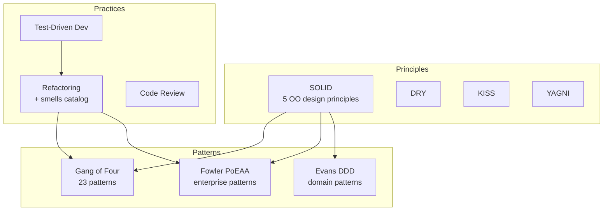
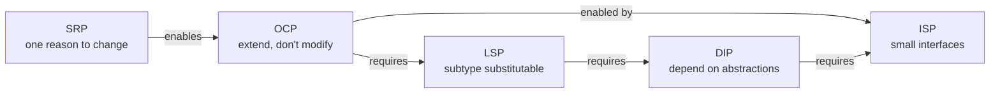
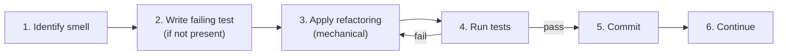
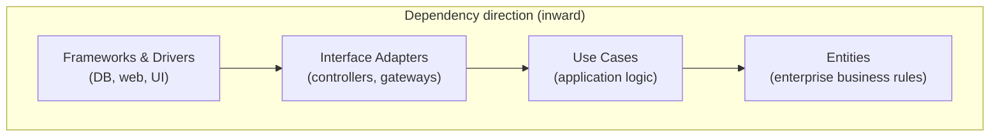

# Software Engineering (SOLID, Patterns, Refactoring)

> A comprehensive, production-grade treatment of software engineering: SOLID principles, the Gang-of-Four design patterns, enterprise patterns (Repository, Unit of Work, Service Layer), refactoring, code smells, and Clean/Hexagonal architecture.

---

## Table of Contents

1. [Overview](#1-overview)
2. [Definition](#2-definition)
3. [Five Ws + One H](#3-five-ws--one-h)
4. [History](#4-history)
5. [Problem Statement](#5-problem-statement)
6. [Real-World Motivation](#6-real-world-motivation)
7. [Internal Working](#7-internal-working)
8. [Deep Dive](#8-deep-dive)
9. [Architecture](#9-architecture)
10. [Performance](#10-performance)
11. [Security](#11-security)
12. [Production Engineering](#12-production-engineering)
13. [Production Case Studies](#13-production-case-studies)
14. [Code Examples](#14-code-examples)
15. [Common Mistakes](#15-common-mistakes)
16. [Debugging](#16-debugging)
17. [Monitoring & Observability](#17-monitoring--observability)
18. [Best Practices](#18-best-practices)
19. [Anti-Patterns](#19-anti-patterns)
20. [Edge Cases](#20-edge-cases)
21. [Comparisons](#21-comparisons)
22. [Interview Preparation](#22-interview-preparation)
23. [References](#23-references)

---

## 1. Overview

**Software engineering** is the disciplined application of engineering principles to the design, development, testing, and maintenance of software. This document treats software engineering at production depth across four pillars:

1. **SOLID principles** — five foundational object-oriented design principles introduced by Robert C. Martin.
2. **Gang-of-Four (GoF) design patterns** — the canonical 23 patterns from *Design Patterns: Elements of Reusable Object-Oriented Software* (Gamma, Helm, Johnson, Vlissides, 1994).
3. **Enterprise patterns** — Repository, Unit of Work, Service Layer, Active Record, Data Mapper, and the broader patterns catalogued by Martin Fowler in *Patterns of Enterprise Application Architecture* (2002).
4. **Refactoring** — the disciplined technique of restructuring code without changing its external behavior (Martin Fowler, *Refactoring*, 1999/2018), coupled with the code-smell catalog that drives refactoring decisions.

The document closes with **Clean Architecture**, **Hexagonal Architecture**, and **Onion Architecture** — three convergent architectural styles that operationalize SOLID and the Dependency Rule at the system level.

**Scope.** This is not a tutorial. It assumes you write object-oriented code. It focuses on the principles, trade-offs, and production consequences of applying (or failing to apply) these patterns.

**Version baselines.** GoF (1994), SOLID (Robert C. Martin, 2000s), Clean Architecture (Robert C. Martin, 2017), Fowler *Refactoring* 2nd ed. (2018), Fowler *Patterns of Enterprise Application Architecture* (2002).

---

## 2. Definition

The software-engineering vocabulary used in this document:

| Term | Type | Authoritative source |
|------|------|---------------------|
| **SOLID** | 5 principles (SRP, OCP, LSP, ISP, DIP) | Robert C. Martin, *Agile Software Development* (2003) |
| **Single Responsibility Principle (SRP)** | A class has one reason to change | Robert C. Martin |
| **Open/Closed Principle (OCP)** | Open for extension, closed for modification | Bertrand Meyer (1988); Martin popularised |
| **Liskov Substitution Principle (LSP)** | Subtypes substitutable for base types | Barbara Liskov (1987) |
| **Interface Segregation Principle (ISP)** | Many specific interfaces > one general | Robert C. Martin |
| **Dependency Inversion Principle (DIP)** | Depend on abstractions, not concretions | Robert C. Martin |
| **Design Pattern** | Reusable solution to a recurring problem | GoF (1994) |
| **Creational Pattern** | Pattern that deals with object creation | GoF |
| **Structural Pattern** | Pattern that deals with object composition | GoF |
| **Behavioral Pattern** | Pattern that deals with object responsibility | GoF |
| **Repository** | Mediates between domain and data mapping | Fowler, *PoEAA* (2002) |
| **Unit of Work** | Maintains a list of objects affected by a transaction | Fowler, *PoEAA* |
| **Service Layer** | Defines application's boundary and set of operations | Fowler, *PoEAA* |
| **Active Record** | Object wraps a row in a database table | Fowler, *PoEAA* |
| **Data Mapper** | Layer that moves data between objects and DB | Fowler, *PoEAA* |
| **Identity Map** | Ensures each object loaded once per transaction | Fowler, *PoEAA* |
| **Specification** | Boolean expression that can be combined | Fowler, *PoEAA* |
| **Query Object** | Object that represents a database query | Fowler, *PoEAA* |
| **Refactoring** | Restructuring without changing external behavior | Fowler, *Refactoring* |
| **Code smell** | Surface indication of deeper problem | Fowler |
| **Technical debt** | Cost of choosing easy solution today | Ward Cunningham (1992) |
| **Bounded Context** | Boundary within which a model applies | Eric Evans, *DDD* (2003) |
| **Aggregate** | Cluster of domain objects treated as one unit | Eric Evans, *DDD* |
| **Clean Architecture** | Layered architecture with dependency rule | Robert C. Martin (2012/2017) |
| **Hexagonal Architecture** | Ports and adapters | Alistair Cockburn (2005) |
| **Onion Architecture** | Dependency-inverted layers | Jeffrey Palermo (2008) |
| **YAGNI** | You Aren't Gonna Need It | Ron Jeffries (XP) |
| **DRY** | Don't Repeat Yourself | Andy Hunt, Dave Thomas (1999) |
| **KISS** | Keep It Simple, Stupid | U.S. Navy (1960s) |
| **Tell, Don't Ask** | Objects should command, not query | Alec Sharp |
| **Law of Demeter** | Only talk to immediate friends | Ian Holland (1987) |

The SOLID-and-patterns landscape:



---

## 3. Five Ws + One H

### What

Software engineering is the disciplined study and practice of designing, building, testing, and maintaining software systems. The discipline combines **principles** (what good design looks like), **patterns** (reusable solutions to recurring problems), **practices** (how teams actually work), and **architecture** (the structural decisions that constrain the whole system).

### Why

Software systems rot. Without discipline, codebases accumulate complexity, dependencies, and shortcuts until change becomes impossible. Patterns and principles are the load-bearing walls that prevent collapse. They are also the shared vocabulary that lets teams talk about design.

### When

- **1968 — NATO Software Engineering Conference** coins the term "software engineering" in response to the "software crisis."
- **1987 — Liskov Substitution Principle** published by Barbara Liskov.
- **1988 — Open/Closed Principle** coined by Bertrand Meyer.
- **1992 — Design Patterns** book proposal by Gamma; first patterns documented.
- **1994 — *Design Patterns: Elements of Reusable Object-Oriented Software*** published (Gamma, Helm, Johnson, Vlissides — the "Gang of Four").
- **1999 — *Refactoring*** by Martin Fowler; first code-smell catalog.
- **2002 — *Patterns of Enterprise Application Architecture*** by Fowler.
- **2003 — *Domain-Driven Design*** by Eric Evans; Aggregate, Bounded Context.
- **2003 — SOLID** acronym popularized by Robert C. Martin (originally coined by Michael Feathers).
- **2005 — Hexagonal Architecture** by Alistair Cockburn.
- **2008 — Onion Architecture** by Jeffrey Palermo.
- **2012/2017 — Clean Architecture** by Robert C. Martin.

### Where

Every software system, from embedded firmware to planet-scale distributed services. The vocabulary is universal; the application varies by language, scale, and domain.

### Who

Engineers, architects, technical leads. Read by everyone who writes code or designs systems. Patterns are not the exclusive domain of senior engineers — they are tools every engineer should recognize.

### How

**Apply principles to evaluate design.** When designing a class, ask the SOLID questions: one responsibility? extensible without modification? substitutable? interface minimal? abstractions concrete? When designing a system, ask the architectural questions: where do dependencies point? what is the innermost layer? how do outer layers communicate with inner? **Apply patterns to solve recurring problems** — but only when the problem matches the pattern's intent, never for its own sake. **Refactor continuously** to keep code aligned with principles as understanding evolves.

---

## 4. History

### 4.1 The software crisis (1968)

The 1968 NATO Software Engineering Conference in Garmisch, Germany, coined the term **software engineering** to address the "software crisis" — projects running over budget, behind schedule, and producing unreliable code. The conference called for disciplined practices analogous to civil engineering.

### 4.2 Structured programming and design (1970s–1980s)

Edsger Dijkstra's *Notes on Structured Programming* (1970) established that programs should be constructed from a small set of control structures. The 1970s and 1980s saw the rise of structured analysis (DeMarco, Yourdon) and structured design (Constantine, Yourdon), which introduced concepts like coupling and cohesion that prefigured SOLID.

### 4.3 Object-orientation and the birth of patterns (1980s–1990s)

Smalltalk (1980) and C++ (1985) brought object-orientation to the mainstream. The "Gang of Four" — Erich Gamma, Richard Helm, Ralph Johnson, John Vlissides — began cataloging reusable OO patterns in the late 1980s. Their 1994 book codified 23 patterns organized into creational, structural, and behavioral categories.

### 4.4 SOLID and the agile turn (2000s)

Robert C. Martin consolidated decades of OO design wisdom into five principles, abbreviated by Michael Feathers as **SOLID**. *Agile Software Development: Principles, Patterns, and Practices* (2003) and later *Clean Code* (2008) and *Clean Architecture* (2017) extended these ideas into team practices and system architecture.

### 4.5 Enterprise patterns and DDD (2000s)

Martin Fowler's *Patterns of Enterprise Application Architecture* (2002) addressed the recurring problems of building business applications on relational databases. Eric Evans's *Domain-Driven Design* (2003) introduced the strategic patterns — Bounded Context, Context Map, Aggregate — that govern how large systems are decomposed.

### 4.6 The architectural turn (2010s)

The 2010s saw the convergence of Clean, Hexagonal, and Onion architectures. All three share a single principle — **the Dependency Rule** — and differ mainly in vocabulary and diagram conventions. Microservices, DevOps, and cloud-native architecture revived interest in patterns at the system level (circuit breaker, saga, outbox, CQRS, event sourcing).

---

## 5. Problem Statement

Software systems fail in characteristic ways. Without disciplined application of principles and patterns, every codebase accumulates the same pathologies:

### 5.1 Rigidity

A change to one module cascades into changes throughout the system. Adding a feature requires touching dozens of files for reasons unrelated to the feature itself. The cost of change grows super-linearly over time.

### 5.2 Fragility

Changes break unrelated parts of the system. A bug fix in module A causes failures in module Z, which has no apparent relationship to A. The system becomes a minefield where any change might detonate an unrelated component.

### 5.3 Immobility

Code that should be reusable cannot be extracted. A component that would be useful in another system is entangled with so many domain-specific dependencies that extracting it is harder than rewriting it.

### 5.4 Viscosity

Doing things right is harder than doing things wrong. The "design-preserving" path through the code is so convoluted that developers take hacks to make progress. Each hack makes the next hack more likely.

### 5.5 Needless complexity

The system contains infrastructure for capabilities that aren't currently required. YAGNI violations accumulate. The code anticipates change that never comes, and the anticipated change never matches the actual change.

### 5.6 Needless repetition

The same expression of a concept appears in multiple places. Changing the concept requires finding and changing every occurrence. Bugs that should be impossible (because they live in one place) appear in many places.

### 5.7 Opacity

Code is hard to read and understand. The intent is obscured by convoluted control flow, cryptic names, and entangled responsibilities. New engineers take months to become productive.

These seven pathologies map directly to the principles that prevent them. Rigidity and fragility are the predictable consequence of violating OCP and DIP. Immobility follows from violating SRP. Viscosity is enabled by ISP violations and the absence of patterns that make the right thing easy. Needless complexity is YAGNI violation. Repetition is DRY violation. Opacity is the absence of the Tell-Don't-Ask principle and good naming.

---

## 6. Real-World Motivation

### 6.1 Amazon

Amazon's shift from a monolithic application to service-oriented architecture (2001–2002) was driven by exactly the pathologies above. Jeff Bezos's famous API mandate ("all teams will henceforth expose their data and functionality through service interfaces") was an architectural-level application of DIP and ISP. The mandate enabled independent deployability and parallel team velocity.

### 6.2 Google

Google's monorepo and strict code review culture operationalize the principle that code is read more than written. Their testing infrastructure enforces test coverage at scale; their style guides (especially the C++ style guide) are an attempt to enforce the patterns that prevent the pathologies.

### 6.3 Microsoft

.NET, C#, and the .NET runtime are designed around patterns: dependency injection is built into the framework, ASP.NET Core's middleware pipeline is a chain-of-responsibility implementation, and Entity Framework is built on Unit of Work and Repository.

### 6.4 Netflix

Netflix's Hystrix (now replaced by Resilience4j) was the production reference for the Circuit Breaker pattern at scale. Their migration from a monolithic DVD-rental system to a cloud-native microservices architecture is one of the most-studied applications of clean architecture and dependency inversion at scale.

### 6.5 Meta (Facebook)

Meta's "Move fast with stable infrastructure" culture combines YAGNI (move fast) with disciplined architectural patterns (stable infrastructure). Their HHVM, Hack language, and React are all attempts to provide patterns and primitives that prevent the pathologies at the language level.

### 6.6 Stripe

Stripe's API design is a master class in Interface Segregation. Their API surface is decomposed into many small, focused resources (Charges, Customers, PaymentIntents, SetupIntents) rather than one large "Payment" interface. This permits evolution without breaking the world.

---

## 7. Internal Working

### 7.1 How principles interact

Principles are not independent. They reinforce each other:



- **SRP enables OCP.** A class with multiple responsibilities must be modified when any one responsibility changes. Splitting responsibilities (SRP) produces classes that can be extended independently (OCP).
- **OCP requires LSP.** Open-for-extension typically means "subclass and override." LSP ensures that the subclass behaves as the base class promises, so existing callers continue to work.
- **OCP is enabled by ISP.** If a class depends on a fat interface, extending behavior requires modifying the interface (violating OCP). Small interfaces can be composed without modification.
- **DIP requires ISP.** Dependency inversion means depending on abstractions. Useful abstractions are small and focused (ISP), so high-level modules depend only on what they need.
- **LSP requires DIP.** Substitutability is testable only when the abstraction is stable (DIP). Without DIP, the "base type" is concrete and LSP violations are hard to detect.

### 7.2 How patterns relate to principles

Patterns are not principles; they are solutions. Each pattern embodies several principles:

| Pattern | Primary principle | Secondary principles |
|---------|------------------|---------------------|
| **Strategy** | OCP | DIP, ISP |
| **Decorator** | OCP | DIP |
| **Factory Method** | DIP | OCP |
| **Abstract Factory** | DIP | OCP, ISP |
| **Observer** | DIP | ISP |
| **Template Method** | OCP | LSP |
| **Composite** | OCP | DIP |
| **Adapter** | DIP | ISP |
| **Facade** | ISP | SRP |
| **Proxy** | OCP | DIP |
| **Repository** | DIP, ISP | SRP |
| **Unit of Work** | SRP | DIP |
| **Service Layer** | SRP, DIP | ISP |

### 7.3 How refactoring operates

Refactoring is a process, not an event. The discipline:



The key discipline: **separate refactoring from feature work**. A "refactor + add feature" change is two changes in one commit, and when tests fail, you cannot tell which change broke things.

### 7.4 Architecture layering

Architectural patterns (Clean, Hexagonal, Onion) share the same internal structure:



The Dependency Rule: source code dependencies point only inward. Inner circles know nothing about outer circles. Control flow can go either direction; dependency only goes inward.

---

## 8. Deep Dive

### 8.1 SOLID principles

#### 8.1.1 Single Responsibility Principle (SRP)

> *A class should have only one reason to change.*

A "reason to change" is a stakeholder, an actor, or a concern. A `User` class that handles persistence, email, and reporting has three reasons to change (the DB schema, the email service, and the report format). When the report format changes, the persistence layer shouldn't be at risk.

```java
// VIOLATION
class User {
    private String name;
    private String email;

    void save() { /* JDBC */ }                        // persistence concern
    void sendWelcomeEmail() { /* SMTP */ }            // messaging concern
    String generateReport() { /* template */ }        // reporting concern
}

// COMPLIANT
class User {
    private final String name;
    private final String email;
    // ...
}

class UserRepository { void save(User u) { /* ... */ } }
class WelcomeEmailSender { void send(User u) { /* ... */ } }
class UserReportGenerator { String generate(User u) { /* ... */ } }
```

**Operational test.** Can you describe what the class does in one sentence without "and"? If not, split it.

#### 8.1.2 Open/Closed Principle (OCP)

> *Software entities should be open for extension, closed for modification.*

Adding new behavior should not require modifying existing tested code. The classic mechanisms: inheritance, polymorphism, strategy, decorator.

```java
// Strategy enables extension without modification
interface PricingStrategy { BigDecimal price(Order o); }

class StandardPricing implements PricingStrategy {
    public BigDecimal price(Order o) { /* ... */ }
}

class DiscountPricing implements PricingStrategy {
    public BigDecimal price(Order o) { /* ... */ }
}

// Adding a new pricing scheme requires adding a new class,
// not modifying the OrderProcessor
class OrderProcessor {
    private final PricingStrategy strategy;
    OrderProcessor(PricingStrategy s) { this.strategy = s; }
    BigDecimal total(Order o) { return strategy.price(o); }
}
```

**Operational test.** When you add a feature, how many existing files must you modify? If the answer is "more than one unrelated file," OCP is being violated somewhere.

#### 8.1.3 Liskov Substitution Principle (LSP)

> *Subtypes must be substitutable for their base types.*

A subclass must honor the contracts of its base class — preconditions, postconditions, and invariants. The classic violation: `Square extends Rectangle` where `Square.setWidth` and `Square.setHeight` mutate both dimensions, violating the base's invariant that width and height are independent.

```java
// VIOLATION
class Rectangle {
    protected int width, height;
    public void setWidth(int w) { width = w; }
    public void setHeight(int h) { height = h; }
    public int area() { return width * height; }
}
class Square extends Rectangle {
    @Override public void setWidth(int w) { width = w; height = w; }
    @Override public void setHeight(int h) { width = h; height = h; }
}

// Client code that depends on Rectangle's invariant breaks:
Rectangle r = new Square();
r.setWidth(5);
r.setHeight(3);
assert r.area() == 15;  // FAILS — area is 9

// COMPLIANT: shape an abstract Shape, with Rectangle and Square as siblings
abstract class Shape { abstract int area(); }
class Rectangle extends Shape { /* ... */ }
class Square extends Shape { /* ... */ }
```

**Behavioral subtyping.** The rules: (1) contravariant parameters — a subclass may accept broader parameter types; (2) covariant return types — a subclass may return narrower types; (3) invariants of the base must be preserved; (4) postconditions of the base must be honored; (5) preconditions of the base must not be strengthened.

#### 8.1.4 Interface Segregation Principle (ISP)

> *Clients should not be forced to depend on methods they do not use.*

Many small, role-specific interfaces are better than one general-purpose interface. The "fat interface" anti-pattern: an interface with many methods that clients selectively ignore. Implementing it forces them to write no-op or throw-stub implementations.

```java
// VIOLATION
interface Worker { void work(); void eat(); void sleep(); }
class Robot implements Worker {
    public void work() { /* ... */ }
    public void eat() { throw new UnsupportedOperationException(); }
    public void sleep() { throw new UnsupportedOperationException(); }
}

// COMPLIANT
interface Workable { void work(); }
interface Feedable { void eat(); }
interface Sleepable { void sleep(); }
class Robot implements Workable { /* ... */ }
class Human implements Workable, Feedable, Sleepable { /* ... */ }
```

**Operational test.** When a class implements an interface, are all methods meaningful? If any method is a stub, the interface is too large.

#### 8.1.5 Dependency Inversion Principle (DIP)

> *High-level modules should not depend on low-level modules. Both should depend on abstractions.*

This is the principle that makes the others testable. Without DIP, classes are bound to concrete implementations; with DIP, they depend on abstractions that can be substituted at test time or configuration time.

```java
// VIOLATION
class OrderService {
    private final PostgresOrderRepository repo = new PostgresOrderRepository();
    void place(Order o) { repo.save(o); }
}

// COMPLIANT
interface OrderRepository { void save(Order o); }
class OrderService {
    private final OrderRepository repo;
    OrderService(OrderRepository repo) { this.repo = repo; }
    void place(Order o) { repo.save(o); }
}
// Composition root wires the concrete implementation
class AppConfig {
    OrderRepository orderRepository() { return new PostgresOrderRepository(); }
    OrderService orderService() { return new OrderService(orderRepository()); }
}
```

**The "new" keyword is a glue smell.** Every `new` of a concrete class creates a hard dependency. In production code, `new` should appear only at composition roots (main methods, DI containers, factories).

### 8.2 Gang of Four patterns (23 patterns)

The GoF book organizes 23 patterns into three categories. Each pattern has a structure, a problem it solves, a solution, and consequences. Here is a production-grade summary.

#### 8.2.1 Creational patterns

| Pattern | Intent | When to use |
|---------|--------|-------------|
| **Abstract Factory** | Provide an interface for creating families of related objects without specifying concrete classes | When a system must be independent of how its products are created |
| **Builder** | Separate the construction of a complex object from its representation | When construction involves many steps or optional components |
| **Factory Method** | Define an interface for creating an object, but let subclasses decide which class to instantiate | When a class cannot anticipate the class of objects it must create |
| **Prototype** | Specify the kinds of objects to create using a prototypical instance, and create new objects by copying this prototype | When creation is more expensive than cloning |
| **Singleton** | Ensure a class has only one instance and provide a global point of access | When exactly one instance is needed (config, caches — though Singleton is itself controversial) |

#### 8.2.2 Structural patterns

| Pattern | Intent |
|---------|--------|
| **Adapter** | Convert the interface of a class into another interface clients expect |
| **Bridge** | Decouple an abstraction from its implementation so the two can vary independently |
| **Composite** | Compose objects into tree structures to represent part-whole hierarchies |
| **Decorator** | Attach additional responsibilities to an object dynamically |
| **Facade** | Provide a unified interface to a set of interfaces in a subsystem |
| **Flyweight** | Use sharing to support large numbers of fine-grained objects efficiently |
| **Proxy** | Provide a surrogate or placeholder for another object to control access |

#### 8.2.3 Behavioral patterns

| Pattern | Intent |
|---------|--------|
| **Chain of Responsibility** | Avoid coupling the sender of a request to its receiver by giving more than one object a chance to handle it |
| **Command** | Encapsulate a request as an object, thereby parameterizing clients with different requests |
| **Interpreter** | Given a language, define a representation for its grammar along with an interpreter |
| **Iterator** | Provide a way to access the elements of an aggregate object sequentially without exposing its underlying representation |
| **Mediator** | Define an object that encapsulates how a set of objects interact |
| **Memento** | Without violating encapsulation, capture and externalize an object's internal state |
| **Observer** | Define a one-to-many dependency between objects so that when one object changes state, all dependents are notified |
| **State** | Allow an object to alter its behavior when its internal state changes |
| **Strategy** | Define a family of algorithms, encapsulate each one, and make them interchangeable |
| **Template Method** | Define the skeleton of an algorithm in an operation, deferring some steps to subclasses |
| **Visitor** | Represent an operation to be performed on the elements of an object structure |

### 8.3 Enterprise patterns (Fowler)

#### 8.3.1 Repository

> *Mediates between the domain and data mapping layers using a collection-like interface for accessing domain objects.*

A Repository encapsulates the persistence concern behind a domain-shaped interface. Domain code talks to `OrderRepository`, not to JDBC. The Repository implementation can be swapped (JDBC, JPA, in-memory) without changing domain code.

```java
interface OrderRepository {
    Optional<Order> findById(OrderId id);
    List<Order> findByCustomer(CustomerId customerId);
    void save(Order order);
    void delete(OrderId id);
}

class JpaOrderRepository implements OrderRepository {
    private final EntityManager em;
    // implementation
}
```

#### 8.3.2 Unit of Work

> *Maintains a list of objects affected by a business transaction and coordinates the writing out of changes and resolution of concurrency problems.*

A Unit of Work tracks every object loaded or created during a transaction and commits all changes at the end. Hibernate's `Session` and JPA's `EntityManager` are Unit-of-Work implementations.

```java
interface UnitOfWork {
    void registerNew(Object entity);
    void registerDirty(Object entity);
    void registerRemoved(Object entity);
    void commit();
    void rollback();
}
```

#### 8.3.3 Service Layer

> *Defines an application's boundary and its set of operations from the perspective of interfacing client layers.*

A Service Layer encapsulates business use cases. The application exposes services to the UI; the services orchestrate entities and repositories.

```java
interface OrderService {
    OrderId placeOrder(PlaceOrderCommand cmd);
    void cancelOrder(CancelOrderCommand cmd);
}
```

#### 8.3.4 Active Record vs Data Mapper

- **Active Record:** the object wraps a row in a database table; it knows how to save and load itself. Examples: Ruby on Rails' ActiveRecord, Laravel's Eloquent.
- **Data Mapper:** a separate layer moves data between objects and the database; the objects don't know they are persisted. Examples: Hibernate (default), MyBatis.

Active Record is simpler and faster to build. Data Mapper is more decoupled and easier to test in isolation. For complex domains, Data Mapper wins. For CRUD apps, Active Record wins.

#### 8.3.5 Identity Map

> *Ensures that each object is loaded only once per transaction.*

A `Map<Key, Entity>` keyed by primary key. Every find returns the same instance. Prevents the "same row, two objects" bug where stale data in one instance contradicts fresh data in another.

#### 8.3.6 Specification

> *Boolean expression that can be combined.*

Encapsulates business rules as composable predicates. Useful for dynamic queries ("find orders matching any of: customer=Alice, total>1000, status=pending"):

```java
interface Specification<T> {
    boolean isSatisfiedBy(T candidate);
    Specification<T> and(Specification<T> other);
}
```

### 8.4 Refactoring catalog

#### 8.4.1 Composing methods

The heart of refactoring: long methods are the most common smell. The cure is to extract fragments into named methods.

| Refactoring | Action |
|-------------|--------|
| **Extract Method** | Turn a fragment into a method with a name that conveys its purpose |
| **Inline Method** | Put the method body into its caller when the method is no longer needed |
| **Extract Variable** | Turn an expression into a named variable |
| **Replace Temp with Query** | Turn a temp into a method call |
| **Inline Temp** | Replace a temp with its value |
| **Split Temporary Variable** | Make each temp do one thing |
| **Remove Assignments to Parameters** | Use a local variable instead |
| **Replace Method with Method Object** | Turn a long method into its own object |
| **Substitute Algorithm** | Replace a complex algorithm with a simpler one |

#### 8.4.2 Moving features

| Refactoring | Action |
|-------------|--------|
| **Move Method** | Move a method to the class that uses it most |
| **Move Field** | Move a field to the class that uses it most |
| **Extract Class** | Split a class that does two things into two classes |
| **Inline Class** | Move all features into another class |
| **Hide Delegate** | Encapsulate a delegation |

#### 8.4.3 Organizing data

| Refactoring | Action |
|-------------|--------|
| **Replace Magic Number with Symbolic Constant** | Name the constant |
| **Encapsulate Field** | Make fields private with accessors |
| **Encapsulate Collection** | Hide the collection behind add/remove |
| **Replace Type Code with Class** | Create a class for the type |
| **Replace Type Code with Subclasses** | When behavior varies |
| **Replace Type Code with State/Strategy** | When state affects behavior |
| **Replace Array with Object** | When an array represents a record |

#### 8.4.4 Simplifying conditional logic

| Refactoring | Action |
|-------------|--------|
| **Decompose Conditional** | Extract methods from `if`/`else` |
| **Consolidate Conditional Expression** | Combine `if`s with same result |
| **Replace Nested Conditional with Guard Clauses** | Flatten deep nesting |
| **Replace Conditional with Polymorphism** | When branches vary by type |
| **Introduce Null Object** | Replace null checks with a NullObject |
| **Introduce Assertion** | Make assumptions explicit |

### 8.5 Code smells catalog

Code smells are surface indications of deeper problems. The Fowler taxonomy has 22 smells in 5 categories.

#### 8.5.1 Bloaters (code that has grown too large)

| Smell | Symptom | Typical cure |
|-------|---------|--------------|
| **Long Method** | Method body > 10 lines | Extract Method |
| **Large Class** | Class with many fields and methods | Extract Class |
| **Primitive Obsession** | Using primitives instead of small objects (Money, PhoneNumber, Email) | Replace Primitive with Object |
| **Long Parameter List** | Method with > 3 parameters | Introduce Parameter Object |
| **Data Clumps** | Same group of fields appears together | Extract Class, Preserve Whole Object |
| **Switch Statement** | Type code with switch (smell if polymorphism is better) | Replace Conditional with Polymorphism |

#### 8.5.2 Object-Orientation Abusers

| Smell | Symptom | Cure |
|-------|---------|------|
| **Switch Statement** | (See above) | Replace Conditional with Polymorphism |
| **Temporary Field** | Field set only in certain circumstances | Extract Class or null the field |
| **Refused Bequest** | Subclass uses only some inherited methods | Replace Inheritance with Delegation |
| **Alternative Classes with Different Interfaces** | Two classes that do the same thing with different method names | Rename Method, Move Method |

#### 8.5.3 Change Preventers

| Smell | Symptom | Cure |
|-------|---------|------|
| **Divergent Change** | One class changes for many reasons | Extract Class |
| **Shotgun Surgery** | One change requires modifying many classes | Move Method, Move Field |
| **Parallel Inheritance Hierarchies** | Creating a subclass of one forces creating a subclass of another | Move Method, Move Field |

#### 8.5.4 Dispensables

| Smell | Cure |
|-------|------|
| **Comments** (excessive) | Extract Method with a name that conveys intent |
| **Duplicate Code** | Extract Method, Pull Up Method, Form Template Method |
| **Lazy Class** | Collapse Hierarchy, Inline Class |
| **Data Class** | Encapsulate Field, Encapsulate Collection |
| **Dead Code** | Delete it |
| **Speculative Generality** | Collapse Hierarchy, Inline Class, Remove Parameter |

#### 8.5.5 Couplers

| Smell | Symptom | Cure |
|-------|---------|------|
| **Feature Envy** | Method uses more features of another class than its own | Move Method |
| **Inappropriate Intimacy** | Classes know too much about each other | Move Method, Extract Class, Hide Delegate |
| **Message Chains** | a.b().c().d() | Hide Delegate |
| **Middle Man** | Class exists only to delegate | Remove Middle Man, Inline Method |

### 8.6 Clean Architecture

The Clean Architecture is Robert C. Martin's unification of the inward-pointing-dependency idea across Hexagonal, Onion, and his own earlier work.

#### 8.6.1 The four layers

| Layer | Contains | Knows about |
|-------|----------|-------------|
| **Entities** | Enterprise business rules, the most stable code | Nothing else |
| **Use Cases** | Application-specific business rules | Entities |
| **Interface Adapters** | Controllers, gateways, presenters | Use Cases, Entities |
| **Frameworks & Drivers** | DB, web framework, UI | Interface Adapters |

The Dependency Rule: source code dependencies point only inward. Nothing in an inner circle knows anything about an outer circle.

#### 8.6.2 Uncle Bob's rules

1. **Independent of frameworks.** The architecture doesn't depend on any framework.
2. **Testable.** The business rules can be tested without UI, DB, or web server.
3. **Independent of UI.** The UI can change without changing the business rules.
4. **Independent of database.** You can swap Oracle for Mongo without changing business rules.
5. **Independent of any external agency.** Business rules know nothing about the outside world.

#### 8.6.3 Crossing boundaries

How does control flow cross the boundary inward? Through interfaces. The presenter calls a use case through an interface defined in the use-case layer; the implementation lives in the interface-adapter layer.

```java
// Use case defines the input port
interface PlaceOrderInputPort {
    OrderId execute(PlaceOrderCommand cmd);
}

// Use case implementation lives in the use-case layer
class PlaceOrderUseCase implements PlaceOrderInputPort {
    private final OrderRepository repo;       // interface defined in entity/use-case layer
    private final PaymentGateway payment;     // output port
    public OrderId execute(PlaceOrderCommand cmd) { /* ... */ }
}

// Output port interface (also in use-case layer)
interface PaymentGateway {
    PaymentResult charge(OrderId id, Money amount);
}

// Adapter implements the output port in the outer layer
class StripePaymentGateway implements PaymentGateway { /* ... */ }
```

This is **Dependency Inversion applied at the architectural level**. The high-level policy (use case) defines the interface; the low-level mechanism (Stripe adapter) implements it.

### 8.7 Hexagonal Architecture (Ports & Adapters)

Alistair Cockburn, 2005. The application has a single conceptual "inside" — the business logic. The "outside" is everything that interacts with it: databases, UIs, message queues, external services. The boundary is crossed through **ports** (interfaces defined inside) and **adapters** (implementations outside).

| Concept | Equivalent in Clean |
|---------|---------------------|
| Application | Use Cases + Entities |
| Port | Repository / Gateway interface |
| Adapter | Repository / Gateway implementation |
| Driving side | UI / API consumers (left side) |
| Driven side | DB, queues, external services (right side) |

### 8.8 Onion Architecture

Jeffrey Palermo, 2008. The same idea with more explicit layering:

- **Domain Model** (innermost): entities, value objects, domain services.
- **Domain Services**: encapsulate business logic that doesn't fit in one entity.
- **Application Services**: orchestrate use cases; depend on domain layer.
- **Infrastructure**: persistence, messaging, external integrations.

---

## 9. Architecture

### 9.1 Layered architecture vs Clean/Hexagonal/Onion

Traditional **layered architecture** (Presentation → Business → Persistence → Database) is the most common but also the most abused. The failure mode: dependencies flow downward in theory but creep upward in practice, because the persistence layer calls into the business layer for "convenience," and the business layer reaches into the presentation layer for "just one thing."

Clean/Hexagonal/Onion fix this with the Dependency Rule. The compromise: package structure must enforce the rule (using tools like ArchUnit in Java, dependency-cruiser in JavaScript).

### 9.2 Bounded Contexts and microservices

Eric Evans's Bounded Context is the boundary within which a domain model is consistent. Above that boundary, the same word may mean different things ("Account" in billing ≠ "Account" in support). Microservices are one realization of Bounded Contexts at the deployment level. The Clean Architecture applies *within* each Bounded Context.

### 9.3 Event-driven architecture

When the use case produces a domain event, that event can be consumed by other contexts. Event-driven architectures enable loose coupling at the system level: the producer doesn't know who consumes. Common patterns: Outbox (transactional event publishing), Saga (long-running business process), CQRS (separating read and write models), Event Sourcing (storing events as the source of truth).

---

## 10. Performance

Patterns affect performance in subtle ways:

- **Flyweight** reduces memory by sharing state. Critical for large object counts (rendering thousands of UI elements, character glyphs in a document editor).
- **Decorator** adds behavior without subclassing; in tight loops, the layer of indirection matters. JIT can usually inline, but in interpreted languages (Python, Ruby) it can cost 20-50%.
- **Observer** scales poorly with thousands of subscribers. Mutating the subscriber list during notification is O(n²) without care.
- **Proxy** with remote invocation (gRPC stub, HTTP client) is orders of magnitude slower than direct method call. Cache aggressively.
- **Repository** adds an abstraction over the data layer; in hot paths the indirection may matter. Profile before optimizing.

The **performance anti-pattern**: applying patterns speculatively because "they might be needed." YAGNI applies to performance too. Measure first.

---

## 11. Security

### 11.1 Security implications of patterns

- **Singleton** holding credentials: a single global point of compromise. Prefer dependency injection with named instances.
- **Observer** with insecure subjects: a compromised publisher can push malicious state. Validate at the subject.
- **Proxy** that fails open: a proxy returning a default-allow response on backend failure is a security bug. Always fail closed.
- **Decorator** that wraps a security check: if the wrapper can be bypassed (e.g., by calling the wrapped object directly), the security boundary is illusory.
- **Repository** preventing SQL injection: the Repository is the natural place to centralize parameter binding. Never construct SQL via string concatenation.

### 11.2 Security implications of SOLID

- **DIP** enables testing security-critical code with deterministic mocks — invaluable.
- **SRP** means a security review can focus on one concern at a time.
- **OCP** allows extending security policies without modifying existing code (the Open/Closed principle is why security patches can be backported).
- **LSP** violations in security-critical subclasses can be exploited (subclass overrides a permission check).
- **ISP** prevents "fat interfaces" that force classes to implement security methods they don't need.

---

## 12. Production Engineering

### 12.1 Refactoring legacy code

Michael Feathers' *Working Effectively with Legacy Code* defines legacy code as "code without tests." The refactoring workflow for legacy systems:

1. **Identify seams** — places where you can intercept behavior without editing the code (parameter passing, virtual methods, callback hooks, polymorphism).
2. **Break dependencies** — at each seam, introduce an interface and inject a fake.
3. **Write characterization tests** — tests that pin down current behavior (right or wrong) before changing it.
4. **Refactor in small steps** — extract methods, move fields, rename — running tests after each step.
5. **Add new tests** — once the code is testable, add behavior tests.

### 12.2 Code review for SOLID violations

A code review checklist:

- **SRP:** Does each class do one thing? If you say "and," it doesn't.
- **OCP:** To add this feature, how many existing files did you have to modify? More than one is a smell.
- **LSP:** Does the subclass honor the base's contracts? Especially: preconditions, postconditions, invariants.
- **ISP:** Does the implementation stub out any interface methods?
- **DIP:** Does this class `new` up a concrete dependency? Is the dependency injected?

### 12.3 Dependency injection in practice

Three styles:

| Style | Container | Pros | Cons |
|-------|-----------|------|------|
| **Constructor injection** | Manual or DI container (Spring, Guice, Dagger) | Explicit, testable, immutable | Verbose for many dependencies |
| **Field/Setter injection** | DI container | Convenient | Hides dependencies, harder to test |
| **Service Locator** | Static registry | Easy to add new dependencies | Hides dependencies, runtime errors |

Production default: **constructor injection**. Reserve service locator for legacy integration where you can't change constructors.

### 12.4 Applying patterns in a microservices world

| Pattern | Where it applies |
|---------|----------------|
| **Service Layer** | Becomes the API layer of a microservice |
| **Repository** | Becomes the data access layer; one Repository per aggregate |
| **Unit of Work** | Replaced by database transaction or saga |
| **Saga** | Distributed transaction replacement |
| **Circuit Breaker** | Wraps external service calls |
| **Bulkhead** | Isolates thread pools per external service |
| **Outbox** | Transactional event publishing |
| **CQRS** | Separate read and write stores |
| **Event Sourcing** | Source of truth is events, not state |
| **Strangler Fig** | Incremental migration from monolith |

---

## 13. Production Case Studies

### 13.1 Amazon: API mandate

In 2002, Bezos circulated the API mandate: "All teams will henceforth expose their data and functionality through service interfaces." Teams that didn't comply would be fired. The mandate enforced DIP at the company level: any team's functionality was accessible only through an interface, never through direct calls. The result: independent deployability, parallel team velocity, and the architecture that supported the AWS era.

### 13.2 Netflix: Chaos and resilience patterns

Netflix's migration to AWS (2008–2010) drove the development of the **circuit breaker** pattern (Hystrix, 2012), **bulkhead** isolation, and chaos engineering (Chaos Monkey, 2011). The patterns operate at the integration level: when one downstream service is unhealthy, the calling service fails fast, isolates its impact via a separate thread pool, and degrades gracefully.

### 13.3 Shopify: Modular monolith

Shopify runs a modular monolith with explicit module boundaries enforced by a "polaris" gem that uses Ruby's module system to declare each module's allowed dependencies. Violations are CI failures. The approach is Clean Architecture applied to a Rails app: the application has internal modules with enforced dependency direction.

### 13.4 Basecamp: DHH's "vanilla Rails" anti-case

DHH (Rails creator) famously argued against microservices and complex architecture, favoring "vanilla Rails" with Active Record. This is a legitimate choice for small teams and CRUD-heavy applications. The anti-pattern is applying this style to a complex domain with many aggregate boundaries — the monolith becomes a ball of mud.

---

## 14. Code Examples

The complete code for this chapter lives in `examples/`. Each example directory contains a single Java (or other-language) file demonstrating one pattern or principle in production form.

| # | Example | Pattern / Principle |
|---|---------|---------------------|
| 01 | `solid-principles` | All five SOLID principles in one domain |
| 02 | `design-patterns-gof` | Strategy, Observer, Decorator, Factory |
| 03 | `enterprise-patterns` | Repository, Unit of Work, Service Layer |
| 04 | `repository-pattern` | Repository with in-memory and JDBC variants |
| 05 | `microservices-patterns` | API Gateway, Service Registry, Circuit Breaker, Bulkhead |
| 06 | `event-driven-architecture` | Domain events, event publisher, async handlers |
| 07 | `cqrs-event-sourcing` | Command/Query separation, event store |
| 08 | `saga-pattern` | Orchestration-based saga for distributed transaction |
| 09 | `outbox-pattern` | Transactional outbox for reliable event publishing |
| 10 | `circuit-breaker` | Resilience4j-style circuit breaker |
| 11 | `bulkhead` | Thread-pool isolation |
| 12 | `strangler-fig` | Incremental migration from monolith to new service |
| 13 | `clean-architecture` | Layered architecture with dependency rule |
| 14 | `hexagonal` | Ports and adapters |

---

## 15. Common Mistakes

### 15.1 SOLID misapplications

| Mistake | Why it's wrong |
|---------|---------------|
| **SRP as "do one thing"** without "one reason to change" | SRP is about *actors*, not operations. A class doing three operations can still have SRP if one actor drives all changes. |
| **OCP via deep inheritance** | Inheritance is the heaviest OCP mechanism. Prefer composition (Strategy, Decorator) for most cases. |
| **LSP violations "harmonized"** with covariant returns | Compensating for a violated contract by adding casts or checks is still a violation. |
| **ISP by splitting every interface** | Sometimes a fat interface is the right abstraction. ISP says "don't force clients to depend on what they don't use" — not "minimize interface size." |
| **DIP as DI alone** | Dependency injection is the *mechanism*; abstraction is the *principle*. You can use DI and still violate DIP by depending on concrete classes that happen to be injected. |

### 15.2 Pattern misapplications

| Mistake | Why it's wrong |
|---------|---------------|
| **Singleton for everything** | "There should be only one" is rarely true at the application level. Most singletons should be dependencies injected with a defined lifecycle. |
| **Factory Method without polymorphism** | A factory that produces a single concrete type is overhead with no benefit. |
| **Observer for synchronous communication** | Observer is for one-to-many notification. For direct service calls, just call. |
| **Strategy for two strategies** | A strategy with one implementation is YAGNI. Add the abstraction when the second strategy appears. |
| **Decorator at three levels** | Three layers of decoration is hard to follow. Prefer composition over decoration chains. |
| **Adapter when both sides are yours** | Adapter is for adapting a third-party interface you don't control. If you control both, change one. |

### 15.3 Refactoring mistakes

| Mistake | Why it's wrong |
|---------|---------------|
| **Refactoring without tests** | Without tests, you cannot verify "no behavior change." You're flying blind. |
| **Refactoring + feature in one commit** | When tests fail, you can't tell which change broke things. Two commits: refactor, then feature. |
| **Big-bang refactor** | "Rewrite it from scratch" rarely works. Refactor incrementally, keeping the system working at every step. |
| **Premature abstraction** | Extract Method after the third duplication. The Rule of Three. |
| **Refactoring performance hot path without measuring** | Some patterns add indirection that matters. Measure before optimizing. |

---

## 16. Debugging

### 16.1 Symptom → root cause

Patterns interact in subtle ways. Common failure modes:

| Symptom | Likely cause |
|---------|-------------|
| **NullPointerException** when using Dependency Injection | Missing binding; or the binding is provided but a dependent isn't |
| **StackOverflowError** in Observer notification | Observer chain with cycles; missing termination condition |
| **Race condition** in Singleton initialization | Double-checked locking with non-volatile field; use class-level lazy holder |
| **Memory leak** with Decorator chains | Decorators retain references; clean up explicitly |
| **Wrong strategy used at runtime** | DI container ambiguity; multiple bindings for the same interface |
| **Tests pass in isolation but fail together** | Shared mutable state (Singleton) leaking between tests |

### 16.2 Tools

- **IDE refactoring features** (IntelliJ, VSCode): mechanical refactorings like Rename, Extract Method, Move Class are safer than hand edits.
- **jscodeshift** (JavaScript), **clang-tidy** (C++), **ErrorProne** (Java): automated refactoring at scale.
- **ArchUnit** (Java): enforce architectural rules (e.g., "controllers cannot depend on repositories directly").
- **PIT** (Java), **Stryker** (JavaScript): mutation testing to verify your tests catch refactoring-introduced regressions.

---

## 17. Monitoring & Observability

Patterns and observability intersect in three ways:

1. **DI containers** emit metrics: bean creation time, dependency graph depth, scope activations.
2. **Circuit breakers** emit state transitions (CLOSED → OPEN → HALF_OPEN): the primary observability signal for resilience.
3. **Outbox** monitors lag between committed events and published events: lag is the operational health metric.

Recommended metrics:

- `dependency_injection.bindings_total{interface, implementation}` — count of resolved dependencies.
- `circuit_breaker.state{breaker, service}` — gauge with states CLOSED/OPEN/HALF_OPEN.
- `outbox.lag_seconds{topic}` — gauge of event publish delay.
- `repository.query_duration_seconds{repository, operation}` — histogram of repository calls.

---

## 18. Best Practices

### 18.1 Naming conventions for patterns

The pattern names should appear in the code:

- A `Repository<Order>` is named `OrderRepository`.
- A `Strategy` for pricing is named `PricingStrategy`.
- A `Decorator` for compression is named `CompressingInputStream`.

This makes the code self-documenting. New engineers can see "this is a Strategy" without reading documentation.

### 18.2 Composition roots

A composition root is the place where the application wires its dependencies. In a typical Java app: `main()`. In Spring: `@Configuration` classes. In a function-as-a-service: the handler factory.

**Best practice: one composition root per application.** Scattered `new` calls in business code are a smell.

### 18.3 Package by feature, not by layer

The traditional "package by layer" structure (`controllers/`, `services/`, `repositories/`) couples unrelated features together. Package by feature (`order/`, `customer/`, `payment/`) groups all classes for one feature, enabling clean module boundaries.

### 18.4 When NOT to apply a pattern

- **Don't apply a pattern until you have the second instance.** Rule of Three for abstractions.
- **Don't apply Singleton for stateless services** — use a single bean in the DI container.
- **Don't apply Observer for synchronous flows** — direct method calls are clearer.
- **Don't apply Decorator for orthogonal concerns** — AOP (aspect-oriented programming) is sometimes better.
- **Don't apply Repository over Active Record** if Active Record already exists and fits.

### 18.5 Pattern languages

A "pattern language" (Christopher Alexander, 1977; applied to software by GoF) is a collection of patterns that work together. Don't apply patterns in isolation — they form systems.

Examples of pattern languages:

- **Web presentation:** MVC, MVP, MVVM.
- **Persistence:** Repository, Unit of Work, Identity Map, Lazy Loading.
- **Distribution:** Service Layer, Saga, Outbox, CQRS, Event Sourcing.
- **Resilience:** Circuit Breaker, Bulkhead, Retry, Timeout.

---

## 19. Anti-Patterns

### 19.1 Architecture anti-patterns

| Anti-pattern | Description | Cure |
|--------------|-------------|------|
| **Big Ball of Mud** | No discernible architecture | Establish module boundaries; enforce dependency rules |
| **Lasagna Code** | Too many layers, each thin | Consolidate layers; remove indirection |
| **Spaghetti Code** | Tangled control flow, no structure | Apply SOLID and patterns; refactor incrementally |
| **Stovepipe** | Each subsystem built in isolation, no shared abstractions | Identify shared kernels; introduce common patterns |
| **Vendor Lock-in by Architecture** | Architecture assumes a specific framework | Apply Dependency Inversion; framework as detail |
| **Distributed Monolith** | Microservices with shared database and tight coupling | Apply Bounded Contexts; one service owns its data |

### 19.2 Design anti-patterns

| Anti-pattern | Description |
|--------------|-------------|
| **God Object** | One class knows everything and does everything |
| **Object Orgy** | Many objects with no clear responsibilities |
| **Poltergeist** | Classes that exist only to invoke one method on another class |
| **Sequential Coupling** | Method A must be called before Method B (state machine in disguise) |
| **Yo-Yo Problem** | Class hierarchy so deep you scroll up and down to understand |

### 19.3 Anti-patterns named by Fowler

| Anti-pattern | Description |
|--------------|-------------|
| **Anemic Domain Model** | Domain objects are pure data; behavior lives in services |
| **Transaction Script** | Each use case is a single procedure that hits the DB directly |
| **Table Module** | A single class that handles the business logic for all rows of a table |
| **Service Locator** (used wrongly) | Hidden dependencies through a static registry |

---

## 20. Edge Cases

### 20.1 SRP and tightly-coupled subdomains

In a tightly-coupled subdomain (e.g., financial calculations in trading), separating responsibilities into multiple classes can fragment understanding. Some classes are better off cohesive, even if they "do two things" by the strict SRP reading. The fix: use Actor-based reasoning. If both responsibilities change for the same actor, they can be in the same class.

### 20.2 LSP and design-by-contract

Barbara Liskov's original formulation assumes formal contracts (preconditions, postconditions, invariants). Most languages don't enforce them. The practical LSP test: write tests for the base class, run them against subclasses; if they fail, LSP is violated.

### 20.3 DIP and frameworks

Frameworks (Spring, Django, Rails) often pull concrete dependencies into the high-level code via inheritance (controllers extend framework classes). The cure: framework as a library, not a parent class. Or: isolate framework-specific code in the outermost layer (Frameworks & Drivers in Clean).

### 20.4 Repository and aggregate boundaries

A Repository should be per Aggregate (DDD), not per Entity. The aggregate is the unit of consistency; its Repository should provide find/save for the whole aggregate. Trying to update child entities independently violates aggregate boundaries and creates consistency bugs.

### 20.5 Saga compensation and eventual consistency

A saga's compensating actions may themselves fail. Production sagas must be idempotent, retry-safe, and observable. The Saga log (event-sourced) is the operational source of truth.

### 20.6 Circuit breaker timing

A circuit breaker that opens too aggressively causes cascading failures. A circuit breaker that opens too slowly allows every caller to time out. The parameters (failure threshold, sleep window, half-open trial count) require empirical tuning.

---

## 21. Comparisons

### 21.1 SOLID principles vs GRASP

**GRASP** (General Responsibility Assignment Software Patterns, Craig Larman, 1997) is a related set of patterns:

| GRASP pattern | Equivalent |
|---------------|------------|
| **Information Expert** | Tell, Don't Ask; SRP |
| **Creator** | Factory Method |
| **Controller** | Façade |
| **Low Coupling** | DIP, ISP |
| **High Cohesion** | SRP |
| **Polymorphism** | OCP, Strategy, State |
| **Pure Fabrication** | SRP (extract service) |
| **Indirection** | Adapter, Facade, Proxy |
| **Protected Variations** | OCP, DIP |

### 21.2 Architectural styles

| Architecture | Focus | Layers | Dependency rule |
|--------------|-------|--------|-----------------|
| **Clean Architecture** | Dependency rule | Entities, Use Cases, Interface Adapters, Frameworks | Inward |
| **Hexagonal (Ports & Adapters)** | Application core isolation | Application, Ports, Adapters | Inward |
| **Onion** | Domain-centric | Domain Model, Domain Services, Application Services, Infrastructure | Inward |
| **Layered (traditional)** | Technical layers | UI, Business, Persistence, DB | Often violated |
| **Microservices** | Independent deployability | Service per Bounded Context | Each service applies inward rule |

### 21.3 Persistence patterns

| Pattern | When to use |
|---------|-------------|
| **Active Record** | Simple CRUD apps, Rails-style |
| **Data Mapper** | Complex domains with rich behavior |
| **Repository** | When domain logic shouldn't know about persistence |
| **DAO (Data Access Object)** | Lower-level; tightly coupled to DB |
| **Query Object** | Dynamic queries built programmatically |

### 21.4 Distribution patterns

| Pattern | Solves |
|---------|--------|
| **API Gateway** | Single entry point for many services |
| **Service Registry / Discovery** | Service location |
| **Circuit Breaker** | Cascading failure prevention |
| **Bulkhead** | Resource isolation |
| **Saga** | Distributed transaction |
| **Outbox** | Reliable event publishing |
| **CQRS** | Read/write optimization |
| **Event Sourcing** | Audit + temporal queries |
| **Service Mesh** | Cross-cutting concerns offloaded |
| **Strangler Fig** | Incremental migration |

---

## 22. Interview Preparation

### 22.1 Core questions

**Q1. What are the SOLID principles?**

Five object-oriented design principles by Robert C. Martin: Single Responsibility (one reason to change), Open/Closed (open for extension, closed for modification), Liskov Substitution (subtypes substitutable), Interface Segregation (many small interfaces), Dependency Inversion (depend on abstractions).

**Q2. When would you violate SOLID?**

When the cost of the abstraction exceeds the benefit. Concrete examples:

- **SRP:** a tiny class that's only ever used in one place; splitting it adds navigation overhead.
- **OCP:** an internal implementation that's never extended; the abstraction is overhead.
- **LSP:** design-by-contract is rarely enforced, and informal LSP "violations" are often pragmatic.
- **ISP:** a generic utility class used in many contexts.
- **DIP:** a one-shot script or a proof-of-concept.

**Q3. Singleton vs static class?**

Singleton is an instance of an object; can implement interfaces, can be passed as a parameter, can be subclassed, can have a lifecycle. Static class is just a namespace. Singleton is the right choice when you need object-like behavior; static class is fine for pure utility functions.

**Q4. Strategy vs State?**

Both encapsulate behavior in separate classes. State has transitions; the context changes state explicitly. Strategy is selected by the client (or by configuration); it doesn't change. The two are often interchangeable in code; the difference is intent.

**Q5. How do you refactor legacy code?**

Michael Feathers' workflow: (1) identify seams (places to inject test fakes), (2) break dependencies by introducing interfaces at seams, (3) write characterization tests that pin down current behavior, (4) refactor in small steps running tests after each, (5) add behavior tests once testable.

**Q6. Active Record vs Data Mapper?**

Active Record: object wraps a row, knows how to persist itself. Data Mapper: separate layer maps objects to DB, objects don't know they're persisted. Active Record is simpler; Data Mapper is more decoupled. For complex domains with rich behavior, Data Mapper. For CRUD apps, Active Record.

**Q7. What's the difference between Repository and DAO?**

A DAO is a low-level data access abstraction, often 1:1 with a table. A Repository is a higher-level abstraction, often 1:1 with an aggregate. Repositories speak in domain terms; DAOs speak in DB terms.

**Q8. Why is the Dependency Rule important in Clean Architecture?**

It enables the business logic to be independent of frameworks, databases, and UIs. The inner circles know nothing about the outer; the outer depends on the inner via interfaces (DIP). The result: the business logic is testable without infrastructure, swappable across frameworks, and durable across technology changes.

### 22.2 System design questions

**Q9. How would you decompose a monolith into microservices?**

- Identify Bounded Contexts (DDD); each becomes a candidate service.
- Extract seams: identify shared data and shared code.
- Use the Strangler Fig pattern: route 1% of traffic to the new service, validate, increase.
- For shared data: split the database (each service owns its data); use events for cross-service consistency.
- For shared code: extract to a shared library or, better, duplicate and let services diverge.

**Q10. How do you handle distributed transactions?**

There are no distributed transactions. The options:

- **Two-phase commit (XA):** expensive, brittle, scales poorly. Avoid.
- **Saga:** a sequence of local transactions with compensating actions. Eventual consistency.
- **Outbox + event-driven:** each service publishes events transactionally; consumers process idempotently.
- **Single-writer / single-database:** avoid the problem by keeping the data in one place.

**Q11. How do you ensure reliability of event publishing?**

The Outbox pattern. The business transaction writes both the state change and an outbox row in the same database transaction. A separate process polls the outbox and publishes to the message broker. Idempotency on the consumer side handles duplicates.

### 22.3 Behavioral questions

**Q12. Tell me about a time you had to refactor a system.**

Structure: situation, the smell you noticed, the pattern you applied (or didn't), the risk you managed, the outcome, what you'd do differently.

**Q13. How do you balance YAGNI against future flexibility?**

YAGNI is a heuristic, not a law. When the cost of adding an abstraction later is much higher than the cost of adding it now, do it now. When the cost is roughly equal, defer. The Rule of Three: extract abstraction at the third occurrence.

---

## 23. References

### 23.1 Foundational books

- *Design Patterns: Elements of Reusable Object-Oriented Software* — Erich Gamma, Richard Helm, Ralph Johnson, John Vlissides (Gang of Four). Addison-Wesley, 1994. ISBN 0-201-63361-2.
- *Refactoring: Improving the Design of Existing Code* — Martin Fowler (1st ed. 1999, 2nd ed. 2018 with Kent Beck). Addison-Wesley.
- *Patterns of Enterprise Application Architecture* — Martin Fowler. Addison-Wesley, 2002. ISBN 0-321-12742-4.
- *Domain-Driven Design: Tackling Complexity in the Heart of Software* — Eric Evans. Addison-Wesley, 2003. ISBN 0-321-12521-9.
- *Clean Code: A Handbook of Agile Software Craftsmanship* — Robert C. Martin. Prentice Hall, 2008. ISBN 0-13-235088-2.
- *Clean Architecture: A Craftsman's Guide to Software Structure and Design* — Robert C. Martin. Prentice Hall, 2017. ISBN 0-13-449416-4.
- *Agile Software Development: Principles, Patterns, and Practices* — Robert C. Martin. Prentice Hall, 2003. ISBN 0-13-597444-5.
- *Working Effectively with Legacy Code* — Michael Feathers. Prentice Hall, 2004. ISBN 0-13-117705-2.

### 23.2 Online references

- **Refactoring.Guru:** <https://refactoring.guru/design-patterns>
- **SourceMaking:** <https://sourcemaking.com/design_patterns>
- **Martin Fowler's site:** <https://martinfowler.com/>
- **Robert C. Martin's blog:** <https://blog.cleancoder.com/>
- **The Clean Architecture (blog post):** <https://blog.cleancoder.com/uncle-bob/2012/08/13/the-clean-architecture.html>
- **Hexagonal Architecture (Alistair Cockburn):** <https://alistair.cockburn.us/hexagonal-architecture/>
- **Onion Architecture (Jeffrey Palermo):** <https://jeffreypalermo.com/2008/07/the-onion-architecture-part-1/>

### 23.3 Specifications and standards

- **Unified Modeling Language (UML):** OMG, current standard for pattern diagrams.
- **POSA (Pattern-Oriented Software Architecture):** Buschmann, Meunier, Rohnert, Sommerlad, Stal. Wiley.

### 23.4 Related chapters

- [01 — Java Internals](../01-java-internals/README.md) — Implementation patterns in Java.
- [04 — Spring Ecosystem](../04-spring-ecosystem/README.md) — Spring's patterns (DI, MVC, AOP).
- [09 — System Design & Distributed Systems](../09-system-design/README.md) — Distributed patterns.
- [14 — Testing (Unit, Integration, Contract, Chaos)](../14-testing/README.md) — Test patterns; refactoring for testability.
- [15 — Git & Versioning](../15-git/README.md) — Workflow supporting good code.

### 23.5 Folder references

- [Design Patterns Reference](./references/design-patterns.md) — Quick reference of GoF + modern patterns.
- [Clean Architecture Reference](./references/clean-architecture.md) — SOLID + Clean Architecture details.
- [Refactoring Reference](./references/refactoring.md) — Fowler's catalog summarized.